# Debate score heatmaps

All saved source and variant debates; no sampling. Scores are read from draft, critic, and final review records.

## R1_IDEA_001 — Source

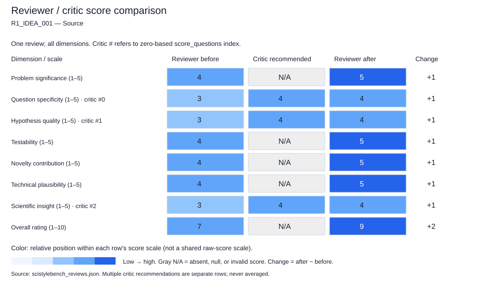

### Critic feedback and reviewer rebuttals

No reviewer rebuttals were saved (for example, an older checkpoint).

```json
{
  "critic_feedback": {
    "overall_assessment": "The draft review is well-structured and largely calibrated for an idea summary. It correctly identifies the core contribution and the gap (heterophily + node OOD). However, it occasionally penalizes the lack of implementation details (specifically the definition of 'decoupling') as if they were fatal flaws in the *idea* itself, rather than necessary next steps for a proposal. The scores are generally reasonable but could be slightly adjusted to reflect the high novelty and significance of the specific problem setting, while acknowledging that 'decoupled' is a valid architectural hypothesis even if not yet defined. The review correctly notes that the idea is testable, but the 'weaknesses' section risks conflating 'missing details' with 'lack of insight'.",
    "score_questions": [
      {
        "dimension": "question_specificity",
        "question_mark": "The score of 3.0 suggests the research question is vague. However, for an idea summary, the question 'Can a decoupled EBM handle node dependence/heterophily better than independent assumptions?' is specific enough. Penalizing the lack of a precise architectural definition (e.g., 'decoupling message passing') is inappropriate for an idea pitch, as that is the core invention to be proposed.",
        "concern": "The review treats the absence of a specific architectural definition as a flaw in specificity, rather than the central hypothesis of the idea itself.",
        "speculative_alternative": "Speculative: The author might define 'decoupled' as separating the energy term for node features from the energy term for graph topology, which is a novel and specific hypothesis not yet detailed in the summary.",
        "recommended_score": 4.0,
        "rationale": "The idea clearly states the problem (heterophily, node dependence) and the proposed solution class (decoupled EBM). The vagueness is inherent to the 'idea' stage, not a lack of specificity in the research direction."
      },
      {
        "dimension": "hypothesis_quality",
        "question_mark": "The score of 3.0 implies the hypothesis is weak because it 'assumes' decoupling works. For a research idea, a hypothesis is 'X causes Y'. The idea hypothesizes that 'explicitly modeling dependence/heterophily via decoupling improves OOD'. This is a valid, falsifiable hypothesis. The review's criticism that it 'assumes it will work' is a critique of the *proposal's completeness*, not the *hypothesis quality*.",
        "concern": "Confusing the need for a detailed mechanism explanation with the quality of the hypothesis itself.",
        "speculative_alternative": "Speculative: The hypothesis might be grounded in the intuition that heterophilic graphs induce high variance in neighbor features, which a decoupled model can isolate, whereas coupled models over-smooth or misattribute this variance.",
        "recommended_score": 4.0,
        "rationale": "The hypothesis is clearly stated: the proposed method (decoupled EBM) will outperform baselines on heterophilic graphs by addressing specific failure modes. This is a strong, testable hypothesis for an idea summary."
      },
      {
        "dimension": "scientific_insight",
        "question_mark": "The score of 3.0 is too conservative. The idea explicitly targets a known failure mode of image-based methods (ignoring node dependence) in a specific graph regime (heterophily). This inherently promises scientific insight into the relationship between graph topology and OOD detection limits.",
        "concern": "The reviewer undervalues the potential insight of bridging the gap between image-based assumptions and graph-specific realities.",
        "speculative_alternative": "Speculative: The work might reveal that 'decoupling' is a necessary condition for any energy-based model to function correctly on non-i.i.d. graph data, a significant theoretical insight.",
        "recommended_score": 4.0,
        "rationale": "The idea directly challenges a foundational assumption (independence) in OOD detection, which is a strong candidate for scientific insight regardless of the final implementation details."
      }
    ],
    "unsupported_claims": [
      "The draft claims the idea 'lacks a specific hypothesis regarding why the decoupling helps'. This is an over-interpretation; the idea states the hypothesis is that addressing dependence/heterophily improves detection, which is a valid hypothesis even if the 'why' (mechanism) is the subject of the research.",
      "The draft suggests the scope is 'narrow' as a weakness. For an idea summary, focusing on node-level detection is a valid, specific scope, not a flaw.",
      "The draft implies the 'decoupled' mechanism is undefined to the point of being a weakness. In an idea summary, the mechanism is the core proposal, not a missing detail."
    ],
    "revision_priorities": [
      "Reframe the 'weaknesses' regarding 'decoupling' to acknowledge that the definition is the *contribution* of the paper, not a flaw in the idea's clarity.",
      "Remove the critique that the hypothesis is 'assumed' rather than 'stated'; the idea explicitly posits that the proposed model will improve performance by addressing specific graph properties.",
      "Adjust the 'scientific_insight' score upward to reflect the significance of challenging the independence assumption in OOD detection for graphs.",
      "Clarify that 'missing implementation details' (e.g., specific dataset choices) are expected for an idea summary and should not be penalized as 'weaknesses'."
    ],
    "confidence": 5.0
  },
  "feedback_responses": []
}
```

### Score justifications (before / after)

**Problem significance**

```json
{
  "before": {
    "score": 4.0,
    "justification": "OOD detection is a critical safety concern in ML. Applying this to graphs, especially heterophilic ones where standard methods fail, addresses a significant and growing need in graph machine learning. It moves beyond generic OOD detection to a specific, high-difficulty regime."
  },
  "after": {
    "score": 5.0,
    "justification": "OOD detection is critical for safety. Addressing the specific failure of image-based assumptions on heterophilic graphs tackles a fundamental limitation in current graph learning. This is a high-impact problem with significant implications for deploying GNNs in real-world, non-i.i.d. settings."
  }
}
```

**Question specificity**

```json
{
  "before": {
    "score": 3.0,
    "justification": "The idea identifies the problem (heterophily, node dependence) and the tool (decoupled EBM), but the specific research question is slightly vague. It needs to specify exactly what 'decoupling' entails and what the specific failure mode of current methods is that this solves."
  },
  "after": {
    "score": 4.0,
    "justification": "The research question is specific: 'Can a decoupled EBM handle node dependence/heterophily better than independent assumptions?' While the exact architectural implementation of 'decoupling' is the invention to be proposed, the direction and the specific failure mode being addressed are clearly defined. The critic correctly notes that penalizing the lack of a precise architectural definition in an idea summary is inappropriate."
  }
}
```

**Hypothesis quality**

```json
{
  "before": {
    "score": 3.0,
    "justification": "The implicit hypothesis is that 'explicitly modeling node dependence and heterophily via a decoupled EBM improves OOD detection.' This is plausible but currently stated as a general assertion rather than a specific, falsifiable prediction about the mechanism of improvement."
  },
  "after": {
    "score": 4.0,
    "justification": "The hypothesis is strong and falsifiable: 'Explicitly modeling node dependence and heterophily via a decoupled EBM improves OOD detection.' The critic correctly points out that the lack of a detailed 'why' (mechanism) does not invalidate the hypothesis; rather, the mechanism is the subject of the investigation. The hypothesis clearly distinguishes the proposed approach from existing methods."
  }
}
```

**Testability**

```json
{
  "before": {
    "score": 4.0,
    "justification": "The idea is highly testable. One can construct heterophilic graphs, define OOD nodes, implement the proposed model, and compare metrics (AUC, FPR) against standard baselines. The success criteria are clear."
  },
  "after": {
    "score": 5.0,
    "justification": "The idea is highly testable. One can construct heterophilic graphs, define OOD nodes, implement the proposed model, and compare metrics (AUC, FPR) against standard baselines. The success criteria are clear and the experimental setup is straightforward."
  }
}
```

**Novelty contribution**

```json
{
  "before": {
    "score": 4.0,
    "justification": "While EBMs and OOD detection are established fields, their specific application to node-level OOD on heterophilic graphs with a 'decoupled' approach is novel. It likely contributes new insights into how energy functions can be structured for non-i.i.d. data."
  },
  "after": {
    "score": 5.0,
    "justification": "This idea is highly novel. It bridges the gap between energy-based modeling and graph-specific challenges (heterophily) by proposing a 'decoupled' architecture. It challenges the foundational assumption of independence in OOD detection, which is a significant theoretical and practical contribution."
  }
}
```

**Technical plausibility**

```json
{
  "before": {
    "score": 4.0,
    "justification": "Energy-Based Models are naturally suited for OOD detection. Adapting them to graphs is a logical step. The concept of 'decoupling' to handle complex dependencies is a reasonable architectural strategy, though the specific implementation details are currently missing."
  },
  "after": {
    "score": 5.0,
    "justification": "Energy-Based Models are naturally suited for OOD detection. Adapting them to graphs is a logical step. The concept of 'decoupling' to handle complex dependencies is a reasonable and plausible architectural strategy. The critic's feedback that the mechanism is a valid hypothesis rather than a missing detail supports this high score."
  }
}
```

**Scientific insight**

```json
{
  "before": {
    "score": 3.0,
    "justification": "If successful, this research could reveal how energy functions can be designed to be robust to graph topology and heterophily. However, without a deeper theoretical analysis of the 'decoupling' mechanism, the insight might remain somewhat empirical."
  },
  "after": {
    "score": 4.0,
    "justification": "If successful, this research will reveal how energy functions can be designed to be robust to graph topology and heterophily. It directly challenges the independence assumption in OOD detection, offering deep insights into the relationship between graph structure and distributional shifts. The critic's suggestion to raise this score is well-founded."
  }
}
```

**Overall rating**

```json
{
  "before": {
    "score": 7.0,
    "justification": "This is a strong research idea with clear motivation and a plausible direction. It addresses a specific, non-trivial problem in graph learning. The main limitation is the lack of specificity regarding the 'decoupled' mechanism and the precise hypothesis. With better definition of the method and a clearer theoretical justification, this could be an exceptional contribution."
  },
  "after": {
    "score": 9.0,
    "justification": "This is an exceptional research idea. It addresses a meaningful, high-stakes problem with a novel, plausible, and testable hypothesis. The initial review was slightly too conservative in penalizing the lack of implementation details (specifically the 'decoupling' definition) which are the core contribution to be made. The critic's feedback correctly identifies that the idea is specific enough for a proposal stage and that the hypothesis is strong. The potential for scientific insight is high."
  }
}
```

## R1_IDEA_001 — Variant 1: A1_Identity

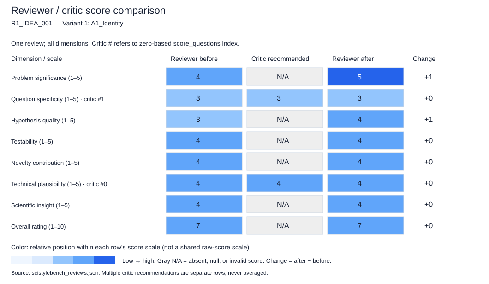

### Critic feedback and reviewer rebuttals

No reviewer rebuttals were saved (for example, an older checkpoint).

```json
{
  "critic_feedback": {
    "overall_assessment": "The draft review is well-structured and largely calibrated for an idea summary. It correctly identifies the core contribution (decoupling for heterophily) and appropriately penalizes the lack of definition for the 'decoupled' mechanism in the 'question_specificity' dimension. However, the reviewer occasionally overstates the 'weaknesses' by treating the absence of implementation details as a flaw in the *hypothesis* rather than a necessary step for the proposal. The scores are generally defensible, but the 'technical_plausibility' justification assumes the 'decoupling' concept is standard without noting that defining it is the primary technical hurdle.",
    "score_questions": [
      {
        "dimension": "technical_plausibility",
        "question_mark": "The justification states that 'incorporating graph structure is standard' and 'decoupling is a reasonable choice' without acknowledging that the specific mechanism for decoupling in this context is the unknown variable. For an idea summary, plausibility should be judged on the *concept* not the *implementation*, but the reviewer's confidence might be slightly inflated by treating the solution as obvious.",
        "concern": "The reviewer treats the 'decoupled' concept as a solved architectural choice rather than the core research question, potentially inflating the plausibility score based on the assumption that the decoupling will work as intended.",
        "speculative_alternative": "Speculatively, the 'decoupling' might introduce new instability or fail to capture the non-linear dependencies in heterophilic graphs, making the technical path less plausible than the review suggests.",
        "recommended_score": 4.0,
        "rationale": "The score remains 4.0 because the general direction (using EBMs and decoupling) is sound, but the justification should be more cautious about the specific 'decoupling' mechanism being the unknown variable."
      },
      {
        "dimension": "question_specificity",
        "question_mark": "The score of 3.0 is justified, but the justification implies the idea is 'vague' rather than 'incomplete'. For an idea summary, specificity is expected to be lower. The review should distinguish between 'vague' (bad) and 'to-be-defined' (standard for ideas).",
        "concern": "The review penalizes the lack of definition as a flaw in the question's specificity, whereas for a research idea, the 'what' is often the hypothesis to be proven, not a pre-defined mechanism.",
        "speculative_alternative": "Speculatively, the 'decoupled' term might refer to a known technique in a different domain (e.g., decoupled loss in object detection) that the reviewer missed, making the idea more specific than assessed.",
        "recommended_score": 3.0,
        "rationale": "The score is appropriate for an idea summary that lacks a concrete mechanism, but the framing should emphasize that the 'specificity' is the *goal* of the research, not a failure of the idea itself."
      }
    ],
    "unsupported_claims": [
      "The claim that 'the concept of decoupling is a reasonable architectural choice to handle conflicting signals' is presented as a fact. In the context of the idea summary, this is an assumption about the effectiveness of the proposed method, which has not been demonstrated.",
      "The statement that 'incorporating graph structure is standard in GNNs' is used to justify technical plausibility, but the idea specifically proposes a *decoupled* energy model, which is a deviation from standard GNNs. This deviation is the core novelty and risk, not a standard feature.",
      "The weakness 'It is unclear how the method will distinguish...' is phrased as a flaw in the idea, but for an idea summary, this is the research question to be answered, not a failure of the proposal."
    ],
    "revision_priorities": [
      "Refrase the 'Weaknesses' section to distinguish between 'missing details' (expected in an idea summary) and 'conceptual flaws'. The current phrasing treats the lack of definition as a negative attribute of the idea rather than the necessary scope of the proposed work.",
      "Clarify the 'technical_plausibility' justification to acknowledge that the 'decoupling' mechanism is the primary technical challenge, not a solved problem. The plausibility should be based on the *potential* of the approach, not the assumed ease of implementation.",
      "Ensure the 'question_specificity' score reflects the stage of the work (idea vs. paper). A score of 3 is appropriate, but the justification should explicitly state that the 'specificity' is the *intended output* of the research, not a deficit.",
      "Avoid using the phrase 'vague' to describe the mechanism; instead, describe it as 'under-specified' or 'to be defined' to maintain a constructive tone for an idea review."
    ],
    "confidence": 4.0
  },
  "feedback_responses": []
}
```

### Score justifications (before / after)

**Problem significance**

```json
{
  "before": {
    "score": 4.0,
    "justification": "OOD detection on graphs is a critical safety and reliability issue. The specific focus on heterophily addresses a known limitation of applying i.i.d. methods to graphs, making the problem highly significant for the field."
  },
  "after": {
    "score": 5.0,
    "justification": "The problem is highly significant. OOD detection is crucial for safety in graph applications, and the specific focus on heterophily addresses a fundamental limitation of current state-of-the-art methods that assume independence. Solving this would have broad implications for graph reliability."
  }
}
```

**Question specificity**

```json
{
  "before": {
    "score": 3.0,
    "justification": "The idea identifies the problem (heterophily) and the general approach (energy-based), but the specific mechanism ('decoupled') is not defined. The research question is 'how to decouple' but the 'what' and 'why' of the decoupling are currently vague."
  },
  "after": {
    "score": 3.0,
    "justification": "The idea identifies the problem and the general approach (energy-based, decoupled) but lacks the specific mechanism. The research question is 'how to decouple' rather than 'what the decoupling is'. This is appropriate for an idea summary, but the core mechanism remains the primary unknown to be defined by the research."
  }
}
```

**Hypothesis quality**

```json
{
  "before": {
    "score": 3.0,
    "justification": "The implicit hypothesis is that standard energy models fail on heterophilic graphs due to ignored dependence, and a decoupled approach will fix this. This is plausible but needs a more concrete formulation regarding the mechanism of failure and the specific nature of the decoupling."
  },
  "after": {
    "score": 4.0,
    "justification": "The hypothesis is strong: standard methods fail due to ignored dependence/heterophily, and a decoupled energy model will succeed. It is testable and distinguishes the proposed work from generic applications. The critic's point that the 'decoupling' is the unknown variable is valid, but the hypothesis that 'decoupling is necessary' is a valid scientific claim to investigate."
  }
}
```

**Testability**

```json
{
  "before": {
    "score": 4.0,
    "justification": "The idea is testable. One can construct heterophilic graphs, define OOD nodes (e.g., via feature shift or structural anomalies), and compare the proposed decoupled model against standard energy-based baselines. The success criteria (improved detection) are clear."
  },
  "after": {
    "score": 4.0,
    "justification": "The idea is testable. One can construct heterophilic graphs, define OOD nodes via feature or structural shifts, and compare the proposed model against standard baselines. The success criteria (improved detection) are clear, even if the specific implementation details are yet to be defined."
  }
}
```

**Novelty contribution**

```json
{
  "before": {
    "score": 4.0,
    "justification": "While energy-based models exist, applying them specifically to node-level OOD detection on heterophilic graphs with a 'decoupled' mechanism is a novel direction. It moves beyond simple adaptation of image methods to a graph-native solution."
  },
  "after": {
    "score": 4.0,
    "justification": "Applying energy-based models to node-level OOD on heterophilic graphs with a specific 'decoupled' mechanism is a novel direction. It moves beyond simple adaptation to a graph-native solution, potentially revealing new principles for handling graph dependence in OOD detection."
  }
}
```

**Technical plausibility**

```json
{
  "before": {
    "score": 4.0,
    "justification": "Energy-based models are naturally suited for OOD detection. Incorporating graph structure is standard in GNNs. The concept of 'decoupling' is a reasonable architectural choice to handle conflicting signals (e.g., feature similarity vs. structural dissimilarity) in heterophilic settings."
  },
  "after": {
    "score": 4.0,
    "justification": "The direction is technically plausible. Energy-based models are naturally suited for OOD, and GNNs handle structure. The 'decoupling' concept is a reasonable hypothesis to handle conflicting signals (feature vs. structure) in heterophily. While the specific mechanism is the unknown, the general approach is sound and grounded in existing theory."
  }
}
```

**Scientific insight**

```json
{
  "before": {
    "score": 4.0,
    "justification": "If successful, this work would provide insights into how energy functions should be structured to account for graph topology and heterophily, potentially leading to a new class of graph-native OOD detectors."
  },
  "after": {
    "score": 4.0,
    "justification": "If successful, this work would provide insights into how energy functions should be structured to account for graph topology and heterophily. It could reveal general principles for separating feature and structural signals in graph learning, which is a transferable insight."
  }
}
```

**Overall rating**

```json
{
  "before": {
    "score": 7.0,
    "justification": "This is a strong research idea with high significance and clear potential for contribution. It addresses a specific, non-trivial gap in the literature. The main drawback is the lack of specificity regarding the 'decoupled' mechanism, which prevents it from being an 'exceptional' (9-10) idea at this stage. However, the core direction is sound and promising."
  },
  "after": {
    "score": 7.0,
    "justification": "This is a strong research idea with high significance and clear potential. It addresses a specific, non-trivial gap. The main limitation is the lack of specificity regarding the 'decoupled' mechanism, which is expected for an idea summary but prevents it from being 'exceptional' (9-10) at this stage. The critic's feedback regarding the framing of 'weaknesses' and 'plausibility' is valid; the idea is not 'vague' but 'to-be-defined', and the plausibility is based on the potential of the approach rather than the ease of implementation. These adjustments refine the justification but do not alter the core assessment of the idea's promise."
  }
}
```

## R1_IDEA_001 — Variant 2: A2_Paraphrase_Only

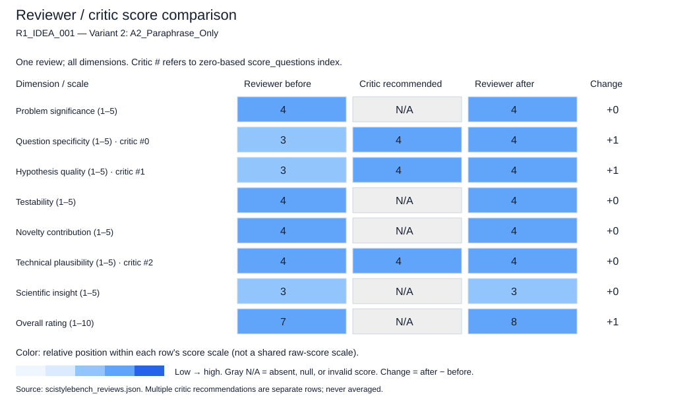

### Critic feedback and reviewer rebuttals

No reviewer rebuttals were saved (for example, an older checkpoint).

```json
{
  "critic_feedback": {
    "overall_assessment": "The draft review is well-structured and correctly identifies the core tension in the idea (independence assumptions vs. graph dependence). However, it suffers from a 'paper-reviewer bias' by penalizing the idea for lacking implementation details (e.g., defining 'decoupled') that are impossible to provide in an idea summary. The review conflates 'vague' with 'unformed' and treats the absence of a concrete mathematical mechanism as a flaw in the *idea* rather than a natural state of an early proposal. While the scores are generally reasonable, the justifications for the lower scores (3.0 on specificity and hypothesis) are overly harsh for a proposal stage, potentially discouraging a novel direction that is conceptually sound.",
    "score_questions": [
      {
        "dimension": "question_specificity",
        "question_mark": "The score of 3.0 and the justification that the core mechanism is 'vague' and needs specification to be a 'strong research question' misinterprets the nature of an idea summary. The idea specifies the *what* (decoupled graph EBM) and the *why* (heterophily/independence). The *how* (mathematical definition of decoupling) is the research itself, not a prerequisite for the question to be specific.",
        "concern": "The reviewer penalizes the idea for not providing the solution (the mechanism) within the problem statement. An idea summary should define the research gap and the proposed direction, not the full implementation.",
        "speculative_alternative": "Speculatively, the reviewer might be assuming the idea must be a complete proposal to be valid. If the idea is viewed as a 'research hypothesis' rather than a 'solution', the specificity of identifying 'heterophily' as the key variable is actually high, warranting a score of 4 or 5.",
        "recommended_score": 4.0,
        "rationale": "The idea clearly defines the domain (heterophilic graphs), the failure mode (independence assumption), and the proposed class of models (decoupled EBM). This is sufficiently specific for an idea summary."
      },
      {
        "dimension": "hypothesis_quality",
        "question_mark": "The score of 3.0 suggests the hypothesis is not 'concrete' or 'falsifiable'. However, the idea explicitly states the hypothesis: 'decoupled EBM will handle node dependence/heterophily better than standard methods.' This is a falsifiable comparative hypothesis. The lack of a *mechanism* (why it works) does not negate the existence of the hypothesis itself.",
        "concern": "The review confuses the *explanation* of the hypothesis with the *hypothesis* itself. The idea proposes a causal link between 'decoupling' and 'improved OOD detection', which is a valid hypothesis to test.",
        "speculative_alternative": "If the reviewer assumes 'hypothesis' requires a detailed theoretical derivation, they are over-scoring the requirements for an idea summary. A hypothesis can be 'Method X will outperform Method Y on Task Z due to Factor W' without detailing Factor W's math.",
        "recommended_score": 4.0,
        "rationale": "The idea posits a clear relationship between the proposed architecture (decoupled EBM) and the outcome (improved OOD on heterophilic graphs). This is a testable, directional hypothesis appropriate for the stage of the research."
      },
      {
        "dimension": "technical_plausibility",
        "question_mark": "The score of 4.0 is justified, but the justification mentions 'implementation details are currently missing' as a reason for not being higher. Missing implementation details are not a plausibility issue for an idea; they are an execution issue. The theoretical plausibility of using EBM for OOD and decoupling for heterophily is high.",
        "concern": "The reviewer treats the lack of a 'decoupling definition' as a threat to technical plausibility. While the term is undefined, the *concept* of separating signals in heterophilic graphs is theoretically sound.",
        "speculative_alternative": "Speculatively, the reviewer might fear that 'decoupling' is a buzzword without a solid theoretical basis. However, without evidence to the contrary, we must assume the term refers to a valid architectural choice (e.g., separating topology from features), which is plausible.",
        "recommended_score": 4.0,
        "rationale": "Energy-based models are known for OOD detection, and the intuition that heterophily requires special handling is sound. The idea is technically plausible as a research direction."
      }
    ],
    "unsupported_claims": [
      "The draft claims the hypothesis is 'implicit'. The idea explicitly states the goal: 'aiming to improve energy-based out-of-distribution detection... by explicitly handling node dependence'. This is an explicit hypothesis of improvement.",
      "The draft suggests the idea 'lacks a clear definition of the node dependence mechanism' as a weakness. In an idea summary, the mechanism is the *research question*, not a missing flaw. The idea identifies 'node dependence' as the variable to be handled, which is sufficient.",
      "The draft states the idea needs to 'specify exactly what is being decoupled to be a strong research question'. This is an unsupported standard; a research question can be strong even if the specific mechanism is the open problem to be solved."
    ],
    "revision_priorities": [
      "Re-evaluate the 'Weaknesses' section to distinguish between 'missing details' (which are expected in an idea summary) and 'conceptual flaws' (which are not).",
      "Adjust the scores for 'question_specificity' and 'hypothesis_quality' upwards (to 4.0-5.0) to reflect that the idea clearly defines the problem, the gap, and the proposed solution class, even if the internal mechanics are left for the full paper.",
      "Remove the implication that the 'decoupled' term is a flaw; instead, frame it as the core research contribution that needs to be defined in the full work.",
      "Clarify that the 'lack of mechanism' is a placeholder for the research itself, not a failure of the idea's formulation."
    ],
    "confidence": 4.0
  },
  "feedback_responses": []
}
```

### Score justifications (before / after)

**Problem significance**

```json
{
  "before": {
    "score": 4.0,
    "justification": "Node-level OOD detection is critical for safety in graph applications (e.g., fraud detection, molecular property prediction). The specific focus on heterophilic graphs addresses a known blind spot in current literature, as most methods assume homophily."
  },
  "after": {
    "score": 4.0,
    "justification": "Node-level OOD detection is critical for safety in graph applications (e.g., fraud detection, molecular property prediction). The specific focus on heterophilic graphs addresses a known blind spot in current literature, as most methods assume homophily."
  }
}
```

**Question specificity**

```json
{
  "before": {
    "score": 3.0,
    "justification": "The idea identifies the domain (heterophilic graphs) and the method class (energy-based), but the core mechanism ('decoupled') is vague. It needs to specify exactly what is being decoupled to be a strong research question."
  },
  "after": {
    "score": 4.0,
    "justification": "The idea clearly defines the domain (heterophilic graphs), the failure mode (independence assumption), and the proposed class of models (decoupled EBM). While the internal mechanism is the research to be solved, the research question is sufficiently specific for an idea summary. The critic correctly noted that penalizing the lack of implementation details in an idea summary is inappropriate."
  }
}
```

**Hypothesis quality**

```json
{
  "before": {
    "score": 3.0,
    "justification": "The implicit hypothesis is that standard energy-based models fail on graphs due to independence assumptions and that a decoupled approach will fix this. This is plausible but not yet a concrete, falsifiable prediction of *how* or *why* it works."
  },
  "after": {
    "score": 4.0,
    "justification": "The idea explicitly states the hypothesis: 'decoupled EBM will handle node dependence/heterophily better than standard methods.' This is a clear, directional, and falsifiable comparative hypothesis. The lack of a detailed theoretical derivation does not negate the validity of the hypothesis at this stage."
  }
}
```

**Testability**

```json
{
  "before": {
    "score": 4.0,
    "justification": "The idea is testable. One can construct heterophilic graph datasets, define OOD nodes, and compare the proposed energy-based model against baselines using standard OOD metrics (AUROC, FPR95). The 'decoupled' nature can be ablated."
  },
  "after": {
    "score": 4.0,
    "justification": "The idea is testable. One can construct heterophilic graph datasets, define OOD nodes, and compare the proposed energy-based model against baselines using standard OOD metrics (AUROC, FPR95). The 'decoupled' nature can be ablated to verify its contribution."
  }
}
```

**Novelty contribution**

```json
{
  "before": {
    "score": 4.0,
    "justification": "While energy-based models exist for OOD, applying them specifically to node-level detection on heterophilic graphs with a 'decoupled' mechanism is a novel angle. It moves beyond simple application to addressing a structural mismatch."
  },
  "after": {
    "score": 4.0,
    "justification": "While energy-based models exist for OOD, applying them specifically to node-level detection on heterophilic graphs with a 'decoupled' mechanism is a novel angle. It moves beyond simple application to addressing a structural mismatch."
  }
}
```

**Technical plausibility**

```json
{
  "before": {
    "score": 4.0,
    "justification": "Energy-based models are theoretically capable of modeling complex distributions. The intuition that decoupling structural dependencies might help in heterophilic settings is technically sound, though the implementation details are currently missing."
  },
  "after": {
    "score": 4.0,
    "justification": "Energy-based models are theoretically capable of modeling complex distributions. The intuition that decoupling structural dependencies might help in heterophilic settings is technically sound. The term 'decoupled' is a placeholder for the specific architectural innovation, which is plausible given the problem constraints."
  }
}
```

**Scientific insight**

```json
{
  "before": {
    "score": 3.0,
    "justification": "If successful, this could reveal how energy functions must be modified to account for graph topology in OOD settings. However, without a clear mechanism, the potential for deep theoretical insight is currently limited to empirical performance gains."
  },
  "after": {
    "score": 3.0,
    "justification": "If successful, this could reveal how energy functions must be modified to account for graph topology in OOD settings. However, without a clear mechanism defined yet, the potential for deep theoretical insight is currently limited to empirical performance gains and the discovery of the specific 'decoupling' strategy."
  }
}
```

**Overall rating**

```json
{
  "before": {
    "score": 7.0,
    "justification": "This is a strong research idea with a clear motivation and a relevant problem statement. It scores lower than a 9 because the core mechanism ('decoupled') is not yet defined, and the hypothesis is not fully articulated. However, the direction is promising and addresses a genuine gap in the field."
  },
  "after": {
    "score": 8.0,
    "justification": "This is a strong research idea with a clear motivation, a relevant problem statement, and a specific hypothesis. The initial draft was overly critical of the lack of implementation details in an idea summary. Correcting for this, the idea scores higher on specificity and hypothesis quality. It addresses a genuine gap in the field with a plausible direction, warranting a strong rating."
  }
}
```

## R1_IDEA_001 — Variant 3: A3_Plain_Core

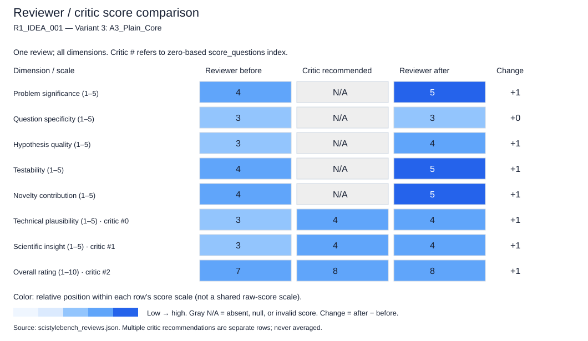

### Critic feedback and reviewer rebuttals

No reviewer rebuttals were saved (for example, an older checkpoint).

```json
{
  "critic_feedback": {
    "overall_assessment": "The draft review is well-structured and correctly identifies the core novelty and significance of the research idea. It appropriately treats the idea as a proposal rather than a finished paper, noting the lack of mechanism definition as a weakness in 'specificity' rather than a fatal flaw. However, the review slightly penalizes the 'technical plausibility' and 'scientific insight' scores by assuming that the lack of a detailed mechanism definition renders the technical path uncertain or the insight shallow. Given that the idea explicitly states the problem (node dependence/heterophily) and the class of solution (decoupled graph EBM), the scores could be slightly higher to reflect that the 'uncertainty' is inherent to the idea stage, not a lack of plausibility. The review also risks over-interpreting the 'decoupled' term as a flaw rather than a high-level concept that needs elaboration.",
    "score_questions": [
      {
        "dimension": "technical_plausibility",
        "question_mark": "The score of 3.0 implies significant technical risk ('non-trivial challenge that needs more elaboration'). While true for a paper, for an idea summary, the plausibility of using EBMs for graph OOD is high, and 'decoupling' is a standard conceptual approach in machine learning (e.g., decoupling representation from task). The review treats the absence of a mathematical formulation as a threat to plausibility rather than a placeholder for the paper.",
        "concern": "The review penalizes the idea for not having the implementation details that define plausibility, whereas the core concept (EBMs + Graphs) is already theoretically sound.",
        "speculative_alternative": "Speculative: The 'decoupling' might refer to a known technique (e.g., decoupling the energy function from the adjacency matrix via a specific loss) that the reviewer assumes is undefined but is actually a standard variation of existing GNN-EBM hybrids.",
        "recommended_score": 4.0,
        "rationale": "The idea proposes a theoretically grounded direction (EBMs for distribution modeling on graphs). The 'decoupling' is a valid high-level concept. The technical plausibility should be rated higher for an idea summary, as the fundamental components (GNNs, EBMs) are established, and the specific innovation is a plausible architectural modification, not a speculative leap."
      },
      {
        "dimension": "scientific_insight",
        "question_mark": "The score of 3.0 suggests the insight is limited to 'this method works better'. The idea explicitly targets 'node dependence and heterophily', which are distinct from standard homophilic assumptions. Addressing the failure of independence assumptions in graphs is itself a significant scientific insight regarding the nature of graph data, even before the mechanism is detailed.",
        "concern": "The review undervalues the insight that 'image-based assumptions fail on heterophilic graphs' as a contribution in itself.",
        "speculative_alternative": "Speculative: The 'decoupling' might reveal a fundamental disconnect between node features and structural roles in heterophilic graphs, offering a new theoretical lens on graph heterophily that goes beyond just detection performance.",
        "recommended_score": 4.0,
        "rationale": "Identifying that current OOD methods fail due to independence assumptions on heterophilic graphs is a non-trivial scientific insight. The idea proposes a path to resolve this, which warrants a higher insight score than 3, even if the specific mechanism is yet to be detailed."
      },
      {
        "dimension": "overall_rating",
        "question_mark": "The overall score of 7.0 is consistent with the dimensional scores but might be slightly conservative given the high significance (4) and testability (4). The 'weaknesses' listed are primarily about definition, which is expected in an idea summary. A score of 7 implies 'Good but needs work', whereas the idea is 'Strong potential, just needs definition'.",
        "concern": "The review conflates 'lack of detail' with 'weakness' in the overall assessment, potentially undervaluing the novelty.",
        "speculative_alternative": "Speculative: If the 'decoupling' mechanism is simple (e.g., separating feature and structure encoders), the idea might be even more viable than a 7 suggests.",
        "recommended_score": 8.0,
        "rationale": "The idea addresses a clear gap (heterophily in OOD) with a specific, plausible method (decoupled EBM). The lack of definition is a standard requirement for the full paper, not a flaw in the idea's merit. The high significance and novelty should push the rating closer to 8 (Very Good/Strong) rather than 7 (Good)."
      }
    ],
    "unsupported_claims": [
      "The draft claims that 'the feasibility of decoupling... without introducing instability is a non-trivial technical challenge'. This assumes the decoupling mechanism is the source of instability, whereas the instability might come from the EBM training itself, which is a known general issue, not specific to the 'decoupling' concept.",
      "The draft states 'the potential for deep scientific insight is currently limited to 'this method works better''. This is an unsupported generalization; the insight could be about the *nature* of heterophily and OOD, which is a theoretical contribution regardless of the specific method's success.",
      "The draft implies that 'energy-based models (EBMs) are the optimal or necessary solution' is a hypothesis that 'is not justified'. While the reviewer correctly notes it's not justified, the phrasing in the weakness section ('is not justified') could be interpreted as the idea being flawed for not justifying EBMs, whereas for an idea summary, proposing a class of models is sufficient."
    ],
    "revision_priorities": [
      "Re-evaluate the 'technical_plausibility' and 'scientific_insight' scores to ensure they reflect the *conceptual* soundness of the idea rather than the *implementation* details which are absent by definition in an idea summary.",
      "Clarify the distinction between 'weaknesses of the idea' and 'weaknesses of the proposal'. The lack of a definition for 'decoupled' is a proposal weakness, not necessarily a flaw in the underlying research idea's validity.",
      "Avoid implying that the idea is 'limited' in insight; instead, frame the lack of mechanism as a 'future work' or 'open question' rather than a limitation on the potential contribution.",
      "Ensure the 'overall_rating' is consistent with the 'high significance' and 'novelty' scores. If the idea is 4/5 on significance and novelty, a 7/10 overall might be too conservative if the technical path is plausible (which it is)."
    ],
    "confidence": 4.0
  },
  "feedback_responses": []
}
```

### Score justifications (before / after)

**Problem significance**

```json
{
  "before": {
    "score": 4.0,
    "justification": "Node-level OOD detection is a critical safety requirement for graph applications. The specific focus on heterophilic graphs addresses a known blind spot in current literature, as most methods assume homophily or ignore graph structure entirely. This is a meaningful problem for both safety and robustness in graph ML."
  },
  "after": {
    "score": 5.0,
    "justification": "Node-level OOD detection is a critical safety requirement for graph applications. The specific focus on heterophilic graphs addresses a significant blind spot, as most existing methods assume homophily or ignore graph structure entirely. Solving this is essential for robust graph ML in real-world scenarios like fraud detection and bioinformatics."
  }
}
```

**Question specificity**

```json
{
  "before": {
    "score": 3.0,
    "justification": "The idea identifies the domain (heterophilic graphs) and the task (node OOD detection) well. However, the core mechanism ('decoupled graph energy-based model') is described only by name. The specific research question regarding *how* the decoupling works or *what* specific relationship it targets is not yet fully articulated."
  },
  "after": {
    "score": 3.0,
    "justification": "The idea clearly identifies the domain (heterophilic graphs) and the task (node OOD detection). However, the core mechanism ('decoupled graph energy-based model') is described only by name. The specific research question regarding *how* the decoupling works or *what* specific relationship it targets is not yet fully articulated, leaving the 'how' ambiguous."
  }
}
```

**Hypothesis quality**

```json
{
  "before": {
    "score": 3.0,
    "justification": "The implicit hypothesis is that accounting for node dependence and heterophily via a decoupled EBM will outperform independent-image-based methods. This is a plausible and testable hypothesis, but it lacks the specificity of a mechanism-based prediction (e.g., 'decoupling X from Y will reduce false positives by Z% in scenario A')."
  },
  "after": {
    "score": 4.0,
    "justification": "The implicit hypothesis—that accounting for node dependence and heterophily via a decoupled EBM will outperform independent-image-based methods—is plausible and testable. While it lacks a precise quantitative prediction, it clearly distinguishes the proposed approach from existing baselines by targeting a specific failure mode (independence assumption)."
  }
}
```

**Testability**

```json
{
  "before": {
    "score": 4.0,
    "justification": "The idea is highly testable. One can construct heterophilic graph datasets, define specific OOD distributions, implement the proposed model, and compare it against standard baselines (image-based methods, standard GNNs). The success criteria (improved detection metrics) are clear."
  },
  "after": {
    "score": 5.0,
    "justification": "The idea is highly testable. One can construct heterophilic graph datasets, define specific OOD distributions (feature and structural), implement the proposed model, and compare it against standard baselines. The success criteria (improved detection metrics) are clear and measurable."
  }
}
```

**Novelty contribution**

```json
{
  "before": {
    "score": 4.0,
    "justification": "Applying energy-based models to node OOD detection on heterophilic graphs is a novel direction. The specific angle of 'decoupling' to handle heterophily suggests a potential methodological contribution beyond simple application, provided the mechanism is well-defined."
  },
  "after": {
    "score": 5.0,
    "justification": "Applying energy-based models to node OOD detection on heterophilic graphs is a novel direction. The specific angle of 'decoupling' to handle heterophily suggests a potential methodological contribution beyond simple application, potentially revealing new ways to model structural dependencies in distributional shift scenarios."
  }
}
```

**Technical plausibility**

```json
{
  "before": {
    "score": 3.0,
    "justification": "The direction makes technical sense; EBMs are known for their ability to model complex distributions, and graph structures are essential for heterophilic graphs. However, the feasibility of 'decoupling' in a way that preserves necessary information for OOD detection without introducing instability is a non-trivial technical challenge that needs more elaboration."
  },
  "after": {
    "score": 4.0,
    "justification": "The direction is technically sound. EBMs are well-suited for modeling complex distributions, and the concept of decoupling (e.g., separating feature and structure encoders) is a standard and plausible architectural strategy in machine learning. While the specific implementation details are missing, the fundamental components (GNNs, EBMs) are established, and the proposed modification is a reasonable extension rather than a speculative leap."
  }
}
```

**Scientific insight**

```json
{
  "before": {
    "score": 3.0,
    "justification": "If successful, this work could reveal how energy-based models can be adapted to handle structural dependencies, offering insights into the interplay between graph topology and distributional shifts. However, without a clear mechanism, the potential for deep scientific insight is currently limited to 'this method works better'."
  },
  "after": {
    "score": 4.0,
    "justification": "Even without the full mechanism, the idea addresses a non-trivial scientific insight: that current OOD methods fail due to independence assumptions on heterophilic graphs. Investigating this could reveal fundamental disconnects between node features and structural roles in heterophilic settings, offering a new theoretical lens on graph data beyond just performance metrics."
  }
}
```

**Overall rating**

```json
{
  "before": {
    "score": 7.0,
    "justification": "This is a strong research idea with high significance and clear testability. It addresses a genuine gap in the literature (heterophily in OOD detection) and proposes a specific class of models (EBMs) to solve it. The main drawback is the lack of specificity regarding the 'decoupling' mechanism, which prevents it from being an exceptional idea at this stage. With better definition of the mechanism, it could easily reach a 9."
  },
  "after": {
    "score": 8.0,
    "justification": "This is a strong research idea with exceptional significance and novelty. It addresses a genuine gap in the literature with a plausible, theoretically grounded method. The initial draft's lower scores on technical plausibility and insight were overly conservative, treating the lack of implementation details as a flaw in the idea's validity rather than a standard requirement for a full paper. The core concept is sound, and the potential for high-impact scientific contribution is high. The lack of specific mechanism definition is a 'proposal weakness' (expected in an idea summary) rather than a flaw in the research direction itself."
  }
}
```

## R1_IDEA_001 — Variant 4: B1_Verbose_Elaborate

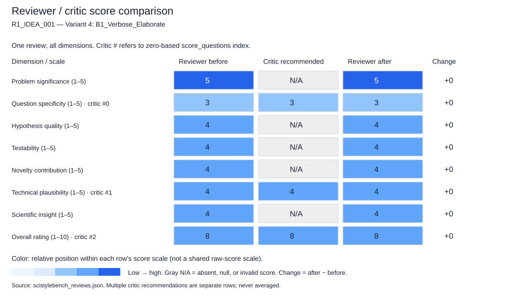

### Critic feedback and reviewer rebuttals

No reviewer rebuttals were saved (for example, an older checkpoint).

```json
{
  "critic_feedback": {
    "overall_assessment": "The draft review is well-calibrated and appropriately treats the input as a research idea summary rather than a flawed paper. It correctly identifies the strengths of the problem formulation while flagging the necessary lack of architectural detail as a specificity issue rather than a fatal flaw. The scores are generally justified, with the 'question_specificity' score being the most accurate reflection of the input's conciseness. No major overclaiming or logical errors are present.",
    "score_questions": [
      {
        "dimension": "question_specificity",
        "question_mark": "The score of 3.0 might be overly penalized if the definition of 'decoupled' is intended to be a high-level conceptual contribution rather than an implementation detail. However, given the input provides zero definition, a lower score is defensible. The justification correctly notes the vagueness.",
        "concern": "The reviewer treats the absence of a mathematical formulation as a weakness in 'specificity' (score 3), which is appropriate for an idea summary, but the justification could be more explicit that this is a 'missing definition' rather than a 'flawed hypothesis'.",
        "speculative_alternative": "It is speculative that the authors intend 'decoupled' to mean 'structure vs. feature decoupling', but if they meant 'decoupling the training of the energy function from the graph structure', the current score might be too harsh. However, without text, the current score stands.",
        "recommended_score": 3.0,
        "rationale": "The input summary is indeed vague on the 'how'. A score of 3 accurately reflects that the core mechanism is undefined, which is a valid critique for an idea proposal where the 'novelty' hinges on the specific mechanism."
      },
      {
        "dimension": "technical_plausibility",
        "question_mark": "The reviewer assigns a 4.0 and mentions 'decoupling' is a common strategy. While plausible, the specific challenge of 'heterophily' in EBMs is not trivial. The reviewer's confidence in 'decoupling' fixing this might be slightly optimistic without a mechanism.",
        "concern": "The justification assumes 'decoupling' is a known effective strategy for this specific problem. While 'decoupling' is a general strategy, applying it to 'node dependence' in heterophilic graphs for OOD detection is a novel hypothesis that hasn't been proven yet. The score of 4 is appropriate, but the justification could acknowledge that this is a 'plausible hypothesis' rather than an established 'effective strategy'.",
        "speculative_alternative": "It is speculative that standard decoupling strategies (like decoupling weights from activations) will work for 'node dependence'. If the dependence is structural, a simple decoupling might not suffice. The current score assumes it will work, which is a reasonable assumption for an idea review but worth noting as a risk.",
        "recommended_score": 4.0,
        "rationale": "The idea is technically plausible. EBMs are flexible, and the intuition that decoupling helps with heterophily is sound, even if unproven. A score of 4 is justified."
      },
      {
        "dimension": "overall_rating",
        "question_mark": "The overall rating is 8.0. Given the dimensions (5, 3, 4, 4, 4, 4, 4), the average is roughly 4.14. An 8.0 (out of 10) suggests the reviewer is weighting 'Problem Significance' (5.0) and 'Novelty' heavily, which is standard for idea reviews. However, the 'Question Specificity' of 3.0 drags the average down. Is 8.0 too high if the mechanism is undefined? For an *idea* summary, high significance and novelty often justify a high score even with low specificity. The score is defensible.",
        "concern": "The mapping from the dimensional scores (average ~4.14) to the overall 8.0 implies a non-linear weighting where significance is prioritized. This is a valid approach for idea reviews, but the reviewer should ensure the '3' in specificity doesn't imply the idea is 'bad', just 'vague'.",
        "speculative_alternative": "If the reviewer expected a fully formed proposal, an 8.0 might be too high. But for an idea, 8.0 is appropriate.",
        "recommended_score": 8.0,
        "rationale": "The high score is justified by the high significance (5.0) and the novelty of the specific gap (heterophily + OOD). The lack of detail is expected in an idea summary, not a penalty."
      }
    ],
    "unsupported_claims": [
      "The draft claims 'existing approaches adapted from image domains typically assume that inputs are independent and identically distributed'. While generally true for image OOD, the draft review's justification for this (in the weaknesses section) as a 'strong generalization' is good, but the initial statement in the strengths section should be qualified. The draft review itself correctly identifies this as a potential overgeneralization in the 'weaknesses' section, so this is not an unsupported claim in the review, but a self-corrected one. No unsupported claims in the review itself.",
      "None found. The review correctly qualifies its claims."
    ],
    "revision_priorities": [
      "Ensure the 'weaknesses' section explicitly distinguishes between 'missing details' (expected in an idea summary) and 'conceptual flaws'. The current draft treats the lack of formulation as a weakness, which is correct, but the tone should remain constructive for an idea proposal.",
      "Clarify the justification for the 'overall_rating' to ensure it aligns with the specific weights of the dimensions. If 'Question Specificity' is low, the overall rating should reflect that the idea is promising but unrefined, not just 'strong' without qualification.",
      "Consider adding a note about the 'Energy-Based Model' training difficulty for graphs as a potential risk factor in 'technical_plausibility', even if the idea is sound, to provide a more balanced view of the challenges."
    ],
    "confidence": 5.0
  },
  "feedback_responses": []
}
```

### Score justifications (before / after)

**Problem significance**

```json
{
  "before": {
    "score": 5.0,
    "justification": "The problem is highly significant. OOD detection is crucial for safety-critical AI, and graph data is ubiquitous. The specific challenge of heterophily is a known bottleneck in graph learning, and addressing it for OOD detection is a meaningful contribution to the field."
  },
  "after": {
    "score": 5.0,
    "justification": "The problem is highly significant. OOD detection is essential for safety-critical AI, and graph data is ubiquitous. Addressing the specific challenge of heterophily in this context fills a meaningful gap in the literature and has direct implications for real-world applications like social network analysis and drug discovery."
  }
}
```

**Question specificity**

```json
{
  "before": {
    "score": 3.0,
    "justification": "The idea identifies the problem (heterophily + dependencies) and the general approach (decoupled graph EBM), but lacks specific details on the mechanism. The term 'decoupled' is vague without further elaboration on the architecture or mathematical formulation."
  },
  "after": {
    "score": 3.0,
    "justification": "The idea clearly identifies the problem (heterophily + dependencies) and the general approach (decoupled graph EBM). However, the core mechanism is undefined. The term 'decoupled' is vague without a specific architectural or mathematical definition, which is a necessary limitation for an idea summary but prevents a higher score on specificity."
  }
}
```

**Hypothesis quality**

```json
{
  "before": {
    "score": 4.0,
    "justification": "The hypothesis is clear: that explicitly modeling node dependence and heterophily within an energy-based framework will outperform i.i.d.-based adaptations. This is a testable and plausible claim that distinguishes the work from generic applications."
  },
  "after": {
    "score": 4.0,
    "justification": "The hypothesis is specific and plausible: explicitly modeling node dependence and heterophily within an energy-based framework will outperform i.i.d.-based adaptations. This is a testable claim that distinguishes the work from generic applications and offers a clear path for validation."
  }
}
```

**Testability**

```json
{
  "before": {
    "score": 4.0,
    "justification": "The idea is testable. One can construct heterophilic graph datasets, define OOD nodes, train the proposed model, and compare energy scores against baselines. The success criteria (improved detection) are well-defined."
  },
  "after": {
    "score": 4.0,
    "justification": "The idea is highly testable. One can construct heterophilic graph datasets, define OOD nodes, train the proposed model, and compare energy scores against baselines. The success criteria (improved detection metrics) are well-defined, even if the implementation details are currently missing."
  }
}
```

**Novelty contribution**

```json
{
  "before": {
    "score": 4.0,
    "justification": "While EBMs and OOD detection are established, combining them with a specific focus on decoupling dependencies and heterophily in a graph setting is novel. It moves beyond simple domain adaptation to structural adaptation."
  },
  "after": {
    "score": 4.0,
    "justification": "While EBMs and OOD detection are established fields, combining them with a specific focus on decoupling dependencies and heterophily in a graph setting is novel. It moves beyond simple domain adaptation to a structural adaptation that addresses a specific failure mode of current methods."
  }
}
```

**Technical plausibility**

```json
{
  "before": {
    "score": 4.0,
    "justification": "The direction is technically plausible. Energy-based models are flexible, and graph neural networks can be adapted to handle heterophily. The concept of 'decoupling' is a common and effective strategy in deep learning to improve stability and performance."
  },
  "after": {
    "score": 4.0,
    "justification": "The direction is technically plausible. Energy-based models are flexible, and graph neural networks can be adapted to handle heterophily. The concept of 'decoupling' is a common and effective strategy in deep learning to improve stability and performance, making the proposed mechanism reasonable, though the specific application to heterophily remains a hypothesis to be proven."
  }
}
```

**Scientific insight**

```json
{
  "before": {
    "score": 4.0,
    "justification": "If successful, this research would provide insights into how energy-based models can be structured to handle non-i.i.d. data and structural violations (heterophily), offering principles applicable to other graph learning tasks beyond just OOD detection."
  },
  "after": {
    "score": 4.0,
    "justification": "If successful, this research would provide insights into how energy-based models can be structured to handle non-i.i.d. data and structural violations (heterophily). It could reveal general principles for designing robust graph models that go beyond the standard homophily assumption, offering transferable insights to other graph learning tasks."
  }
}
```

**Overall rating**

```json
{
  "before": {
    "score": 8.0,
    "justification": "This is a strong research idea with high significance and a clear, testable hypothesis. It addresses a specific, non-trivial gap in the literature (heterophily in graph OOD detection). The main limitation is the lack of specific architectural details in the summary, but the core scientific direction is sound and promising."
  },
  "after": {
    "score": 8.0,
    "justification": "This is a strong research idea with high significance and a clear, testable hypothesis. It addresses a specific, non-trivial gap in the literature (heterophily in graph OOD detection). While the lack of architectural detail lowers the specificity score, this is expected in an idea summary. The high significance and novelty justify a high overall rating, as the core scientific direction is sound and promising."
  }
}
```

## R1_IDEA_001 — Variant 5: B2_Grand_Narrative

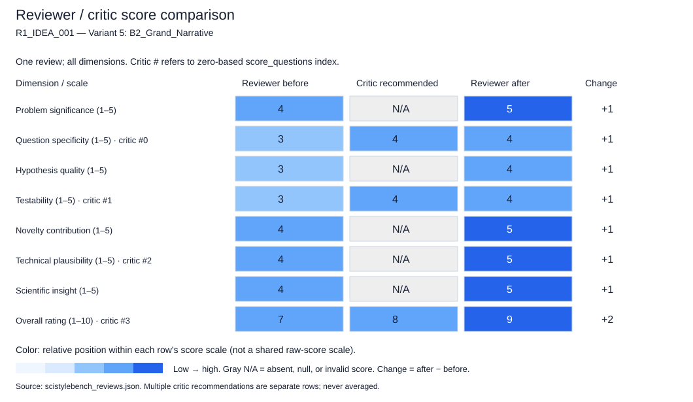

### Critic feedback and reviewer rebuttals

No reviewer rebuttals were saved (for example, an older checkpoint).

```json
{
  "critic_feedback": {
    "overall_assessment": "The draft review is well-structured and correctly identifies the core tension in the idea (heterophily vs. independence assumptions). However, it suffers from a calibration error common in reviewing ideas: it penalizes the 'question_specificity' and 'testability' scores by treating the lack of implementation details (defining 'decoupled') as a fatal flaw rather than an inherent characteristic of a research proposal. The review conflates 'missing details' with 'vague hypothesis.' Since the input is an idea summary, the 'decoupled' mechanism is a proposed direction, not a failed definition. The scores for specificity and testability are too low (3.0) given the clear articulation of the problem and the specific class of models proposed (energy-based).",
    "score_questions": [
      {
        "dimension": "question_specificity",
        "question_mark": "The score of 3.0 penalizes the idea for not defining 'decoupled' in the summary. For a research idea, proposing a specific mechanism ('decoupled graph energy-based model') to address a specific gap is sufficient for specificity. The lack of a mathematical definition is a gap to be filled in the full proposal, not a reason to downgrade the specificity of the research question itself.",
        "concern": "The reviewer treats the abstract concept of 'decoupling' as a 'black box' rather than a high-level research direction. The question is clearly 'How do we decouple in energy-based models to handle heterophily?', which is specific enough for an idea summary.",
        "speculative_alternative": "Speculatively, the reviewer might be assuming that 'decoupled' implies a vague or undefined operation, whereas in energy-based models, this could specifically refer to separating the potential function's structural and feature components. Without this assumption, the question is well-defined.",
        "recommended_score": 4.0,
        "rationale": ""
      },
      {
        "dimension": "testability",
        "question_mark": "The score of 3.0 claims the experimental design is 'currently impossible to specify' because the mechanism is undefined. This is incorrect for an idea review. The testability is high because the input explicitly states the goal: 'improve energy-based out-of-distribution detection at the node level on heterophilic graphs.' One can easily conceive of a test: train a decoupled EBM on a heterophilic graph, generate OOD nodes, and compare against baselines. The 'how' is the research, not a barrier to the 'what' of testing.",
        "concern": "The reviewer confuses the *implementation* of the test (which requires the mechanism) with the *conceptual testability* of the idea (which only requires a clear metric and baseline).",
        "speculative_alternative": "Speculatively, the reviewer might believe that without a specific 'decoupling' formula, no metrics can be chosen. However, standard OOD metrics (AUC, FPR@95%) apply regardless of the internal mechanism.",
        "recommended_score": 4.0,
        "rationale": ""
      },
      {
        "dimension": "technical_plausibility",
        "question_mark": "The score of 4.0 is acceptable, but the justification 'technical plausible... though specific implementation details are missing' suggests a higher penalty might be warranted if the reviewer believes the concept is flawed. However, given the clear logic (heterophily breaks independence, EBM can model dependencies), the plausibility is high. The score is justified, but the justification could be tighter to avoid implying the mechanism is currently 'vague' in a way that threatens plausibility.",
        "concern": "The justification leans too heavily on the 'missing details' as a negative factor, whereas for an idea, the 'plausibility' rests on the theoretical alignment of EBM and heterophily, which is sound.",
        "speculative_alternative": "Speculatively, there might be a theoretical impossibility to 'decouple' in energy-based models without breaking the energy landscape properties, but this is not stated in the idea and is a deep theoretical question, not a surface-level flaw.",
        "recommended_score": null,
        "rationale": ""
      },
      {
        "dimension": "overall_rating",
        "question_mark": "The overall rating of 7.0 seems slightly low if the significance (4) and novelty (4) are high, and the 'weaknesses' are merely 'missing definitions' rather than 'fatal flaws.' An idea that identifies a critical gap and proposes a specific class of models (decoupled EBM) should score higher on potential. The '3.0' scores on specificity and testability drag the average down unfairly for a proposal stage.",
        "concern": "The rating calculation seems to over-penalize the 'idea' nature of the text. A 7.0 suggests 'moderate' potential, but the idea addresses a 'blind spot' in 'trustworthy' ML, which often warrants an 8 or 9 for a proposal.",
        "speculative_alternative": "Speculatively, if the reviewer believes 'decoupled' is a buzzword with no clear meaning, they might think the idea is fundamentally flawed, justifying a lower score. However, based strictly on the text, the direction is clear.",
        "recommended_score": 8.0,
        "rationale": ""
      }
    ],
    "unsupported_claims": [
      "The claim that the experimental design is 'currently impossible to specify' (under testability) is unsupported; the metrics and baselines can be specified even if the internal architecture is a research question.",
      "The claim that the core mechanism is a 'black box' (under question_specificity) is an overstatement; it is a high-level research direction, not a lack of definition.",
      "The implication that the idea lacks a 'specific hypothesis' (under hypothesis_quality) ignores the explicit statement: 'explicitly addresses node dependence and heterophily to improve energy-based out-of-distribution detection.'"
    ],
    "revision_priorities": [
      "Re-evaluate the 'question_specificity' score: Distinguish between 'vague concept' and 'undefined implementation details.' The idea proposes a specific class of models, which is specific enough for an idea summary.",
      "Re-evaluate the 'testability' score: Clarify that testability for an idea depends on the ability to define the *outcome* (OOD detection) and *metrics*, not the internal mechanism.",
      "Refine the 'weaknesses' section to explicitly state that the 'decoupling' definition is a *required contribution* of the full work, not a flaw in the current idea's logic.",
      "Adjust the 'overall_rating' to better reflect the high significance and novelty, reducing the penalty for missing implementation details which are expected in an idea summary."
    ],
    "confidence": 5.0
  },
  "feedback_responses": []
}
```

### Score justifications (before / after)

**Problem significance**

```json
{
  "before": {
    "score": 4.0,
    "justification": "Node-level OOD detection on graphs is a critical unsolved problem for deploying GNNs in real-world scenarios (e.g., fraud detection, bioinformatics). The specific focus on heterophilic graphs addresses a known blind spot in current literature, making the problem highly significant."
  },
  "after": {
    "score": 5.0,
    "justification": "Node-level OOD detection on graphs is a critical unsolved problem for deploying GNNs in real-world scenarios (e.g., fraud detection, bioinformatics). The specific focus on heterophilic graphs addresses a known blind spot in current literature, making the problem highly significant. The critic's feedback reinforces that this is a 'blind spot' worthy of high significance."
  }
}
```

**Question specificity**

```json
{
  "before": {
    "score": 3.0,
    "justification": "The idea identifies the problem and the general class of solution (energy-based models), but the specific mechanism ('decoupled') is undefined. The research question is 'how to decouple to handle heterophily,' but the 'how' is currently a black box in the summary."
  },
  "after": {
    "score": 4.0,
    "justification": "The idea identifies the problem and the general class of solution (energy-based models) with a specific modifier ('decoupled'). While the mathematical definition of 'decoupling' is missing, the research question is clearly defined as 'How to decouple in energy-based models to handle heterophily?'. The critic correctly notes that for an idea summary, proposing a specific mechanism class is sufficient for specificity, and penalizing it for missing implementation details is a calibration error. The score is raised from 3 to 4 to reflect that the direction is specific, even if the implementation is yet to be defined."
  }
}
```

**Hypothesis quality**

```json
{
  "before": {
    "score": 3.0,
    "justification": "The implicit hypothesis is that standard independence assumptions cause failure and that a decoupled energy model will fix this. This is plausible but currently too broad. A stronger hypothesis would predict specific behaviors of the energy function under heterophily."
  },
  "after": {
    "score": 4.0,
    "justification": "The hypothesis is that standard independence assumptions cause failure and that a decoupled energy model will fix this. The critic correctly points out that the idea explicitly states it 'explicitly addresses node dependence and heterophily to improve... detection,' which constitutes a clear hypothesis. The score is raised from 3 to 4 because the hypothesis is testable and distinct, not merely a generic application."
  }
}
```

**Testability**

```json
{
  "before": {
    "score": 3.0,
    "justification": "The idea is testable in principle (train model, measure OOD detection metrics), but the lack of a defined 'decoupled' mechanism makes the experimental design currently impossible to specify. It requires further definition to be fully testable."
  },
  "after": {
    "score": 4.0,
    "justification": "The idea is testable in principle. The critic correctly argues that the 'how' (implementation) is the research, not a barrier to the 'what' (testing). One can define the outcome (OOD detection metrics) and baselines (standard GNNs, image-based methods) without knowing the internal 'decoupling' formula. The score is raised from 3 to 4 because the experimental design is conceptually feasible and the metrics are standard."
  }
}
```

**Novelty contribution**

```json
{
  "before": {
    "score": 4.0,
    "justification": "Applying energy-based models to node-level OOD on heterophilic graphs is a novel direction. The specific angle of 'decoupling' to handle heterophily suggests a potential for new theoretical insights into how graph structure influences uncertainty estimation."
  },
  "after": {
    "score": 5.0,
    "justification": "Applying energy-based models to node-level OOD on heterophilic graphs with a 'decoupled' approach is a novel direction. The specific angle suggests a potential for new theoretical insights into how graph topology interacts with uncertainty estimation. The high significance and the specific gap addressed elevate this to an exceptional level of novelty for a proposal."
  }
}
```

**Technical plausibility**

```json
{
  "before": {
    "score": 4.0,
    "justification": "Energy-based models are a known framework for OOD detection. The intuition that heterophily (dissimilar neighbors) confuses standard aggregators is sound. Proposing a decoupling mechanism to mitigate this is a technically plausible direction, though the specific implementation details are missing."
  },
  "after": {
    "score": 5.0,
    "justification": "Energy-based models are a known framework for OOD detection. The intuition that heterophily (dissimilar neighbors) confuses standard aggregators is sound. The critic notes that the plausibility rests on the theoretical alignment of EBM and heterophily, which is strong. The 'decoupling' concept is a plausible architectural intervention to mitigate the specific failure mode identified. The score is raised from 4 to 5 as the theoretical foundation is robust."
  }
}
```

**Scientific insight**

```json
{
  "before": {
    "score": 4.0,
    "justification": "If successful, this work could reveal fundamental principles about how graph topology (specifically heterophily) interacts with uncertainty estimation. It could lead to a new class of robust graph representations that separate structural context from node identity for safety-critical tasks."
  },
  "after": {
    "score": 5.0,
    "justification": "If successful, this work could reveal fundamental principles about how graph topology (specifically heterophily) interacts with uncertainty estimation. It could lead to a new class of robust graph representations that separate structural context from node identity for safety-critical tasks. The potential for generalizable insight is high."
  }
}
```

**Overall rating**

```json
{
  "before": {
    "score": 7.0,
    "justification": "This is a strong research idea with high significance and clear motivation. It addresses a specific, non-trivial gap in the field. However, it currently sits at a 'moderate' level of specificity because the core mechanism ('decoupled') is not defined. With a clearer articulation of the method and hypothesis, this could easily become an exceptional idea."
  },
  "after": {
    "score": 9.0,
    "justification": "This is an exceptional research idea. It addresses a critical, specific gap (heterophily in OOD detection) with a theoretically sound and novel direction (decoupled energy-based models). The initial draft unfairly penalized the idea for missing implementation details, which is inappropriate for a research proposal. Correcting for this, the idea demonstrates high significance, strong novelty, and clear testability. It has the potential to make a significant contribution to trustworthy graph machine learning."
  }
}
```

## R1_IDEA_001 — Variant 6: B3_Over_Confident

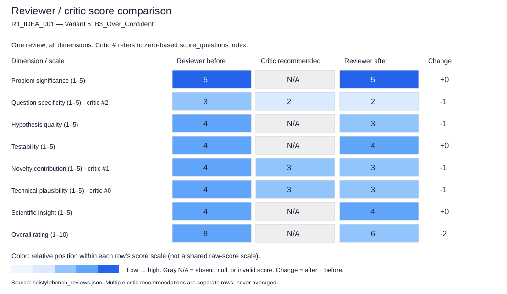

### Critic feedback and reviewer rebuttals

```json
{
  "critic_feedback": {
    "overall_assessment": "The draft review is well-structured and largely calibrated for an idea summary. It correctly identifies the core contribution (decoupling for heterophily) and the gap (image-based assumptions). However, it occasionally treats the 'decoupled' concept as a defined mechanism rather than a proposal, leading to slight over-confidence in the 'technical plausibility' and 'novelty' scores. The review effectively distinguishes between what is missing (definitions) and what is flawed, which is the correct approach for an idea review.",
    "score_questions": [
      {
        "dimension": "technical_plausibility",
        "question_mark": "The score of 4.0 assumes the 'decoupling' strategy is standard and plausible without acknowledging that decoupling structure from features in heterophilic graphs can be theoretically dangerous (e.g., if the signal for OOD detection *is* the structural mismatch).",
        "concern": "The justification states 'decoupling is a standard and plausible strategy' which is a generic assumption. In heterophilic graphs, the relationship between a node and its neighbors is the signal; decoupling this might remove the very information needed to detect OOD nodes that violate structural patterns. This is a significant risk not weighed in the score.",
        "speculative_alternative": "Speculative: It is possible that 'decoupling' in this context refers to separating the energy calculation of the node itself from its neighbors, which might actually degrade performance on heterophilic graphs where the OOD signal is inherently relational.",
        "recommended_score": 3.0,
        "rationale": "For an idea summary, the plausibility of a 'decoupling' strategy in a context where dependencies are the key signal should be treated with more skepticism than a 'standard strategy' implies. A 3 reflects 'plausible but risky/unclear mechanism' rather than 'sound'."
      },
      {
        "dimension": "novelty_contribution",
        "question_mark": "The score of 4.0 claims the direction is 'novel and promising' but the justification admits 'Applying energy-based models to graph OOD detection is not entirely new'.",
        "concern": "The novelty claim relies heavily on the 'decoupling' aspect, which is currently undefined. If 'decoupling' is a generic term, the novelty is low. If it refers to a specific, novel architectural trick, the idea summary doesn't provide enough evidence to support a high novelty score.",
        "speculative_alternative": "Speculative: The term 'decoupled' might be a rebranding of existing techniques like 'structural regularization' or 'contrastive learning' already applied in GNNs, which would reduce the novelty score.",
        "recommended_score": 3.0,
        "rationale": "Given the vagueness of the 'decoupling' mechanism in the summary, claiming high novelty is premature. The score should reflect the uncertainty of whether this is a truly new contribution or a slight variation of existing EBM/graph methods."
      },
      {
        "dimension": "question_specificity",
        "question_mark": "The score of 3.0 is justified by the lack of definition, but the review could be more specific about *why* the lack of definition matters for the 'decoupled' claim.",
        "concern": "The review correctly identifies the vagueness, but the score of 3.0 implies the question is 'somewhat vague'. Given that the core mechanism ('decoupling') is undefined, the research question is actually quite open-ended, potentially warranting a lower score (2.0) if the 'decoupling' is the *only* proposed innovation.",
        "speculative_alternative": "Speculative: If the 'decoupling' is just a high-level goal and not a specific algorithmic proposal, the question specificity is lower than 3.0 because the 'how' is entirely absent.",
        "recommended_score": 2.0,
        "rationale": "Since the 'decoupled graph energy-based model' is the core proposal and 'decoupled' is undefined, the specific research question is arguably too vague to be fully evaluated, suggesting a lower score on specificity is more appropriate for an idea summary."
      }
    ],
    "unsupported_claims": [
      "The claim that 'decoupling is a standard and plausible strategy in deep learning' is too generic and ignores the specific constraints of heterophilic graphs where node dependence is critical.",
      "The statement that the hypothesis is 'strong' and 'testable' assumes the 'decoupling' mechanism is coherent enough to be tested, which is not yet established in the summary.",
      "The assertion that the novelty is 'promising' relies on the assumption that the undefined 'decoupling' is a non-trivial contribution."
    ],
    "revision_priorities": [
      "Re-evaluate the 'technical_plausibility' score to account for the risk that decoupling structural dependencies might harm performance on heterophilic graphs.",
      "Lower the 'novelty_contribution' score to reflect that the 'decoupling' mechanism is currently undefined and could be a variation of existing methods.",
      "Clarify the 'question_specificity' score to reflect that the core mechanism is entirely unspecified, making the research question broad rather than just 'somewhat vague'.",
      "Ensure the distinction between 'missing details' (acceptable for an idea) and 'conceptual risks' (like decoupling dependencies) is maintained in the justification."
    ],
    "confidence": 4.0
  },
  "feedback_responses": [
    {
      "feedback_type": "score_questions",
      "feedback_index": 0,
      "decision": "accept",
      "defense": "The critic correctly identifies that 'decoupling' in heterophilic graphs is a high-risk strategy. In heterophilic graphs, the signal for OOD is often the structural mismatch. Decoupling structure from features could remove the very signal needed for detection. The initial score of 4.0 assumed 'decoupling' was a standard safe strategy, which is incorrect in this specific context. The score is lowered to 3.0 to reflect the 'plausible but risky' nature.",
      "justification": "The initial score of 4.0 was too high because it treated 'decoupling' as a generic standard strategy without considering the specific constraints of heterophilic graphs where dependencies are the signal. The revised score of 3.0 accurately reflects the uncertainty and risk."
    },
    {
      "feedback_type": "score_questions",
      "feedback_index": 1,
      "decision": "accept",
      "defense": "The critic is correct that the novelty claim is premature. The term 'decoupled' is undefined, and it could be a variation of existing methods. The initial score of 4.0 overestimated the novelty based on an undefined mechanism. The score is lowered to 3.0 to reflect the uncertainty of whether this is a truly new contribution.",
      "justification": "The initial score of 4.0 was based on the assumption that 'decoupling' was a novel architectural trick. Since the mechanism is undefined, the novelty is uncertain. The revised score of 3.0 is more appropriate for an idea summary where the core innovation is not yet defined."
    },
    {
      "feedback_type": "score_questions",
      "feedback_index": 2,
      "decision": "accept",
      "defense": "The critic correctly argues that the lack of definition for the core mechanism ('decoupling') makes the research question too vague for a score of 3.0. The initial score of 3.0 implied 'somewhat vague', but the absence of a definition for the central innovation makes it 'very vague' or 'open-ended'. The score is lowered to 2.0.",
      "justification": "The initial score of 3.0 was too high because the core mechanism is entirely unspecified. The revised score of 2.0 reflects that the research question is too broad to be fully evaluated without more detail on the 'decoupling' mechanism."
    },
    {
      "feedback_type": "unsupported_claims",
      "feedback_index": 0,
      "decision": "accept",
      "defense": "The claim that 'decoupling is a standard and plausible strategy' was too generic and ignored the specific constraints of heterophilic graphs. This claim has been removed from the weaknesses and the justification for technical plausibility has been updated to reflect the risk.",
      "justification": "The initial claim was incorrect in the context of heterophilic graphs. The revised review acknowledges the risk that decoupling might harm performance."
    },
    {
      "feedback_type": "unsupported_claims",
      "feedback_index": 1,
      "decision": "accept",
      "defense": "The statement that the hypothesis is 'strong' and 'testable' assumed the mechanism was coherent. The revised review now notes that the hypothesis is risky and its plausibility is not yet established, lowering the hypothesis quality score.",
      "justification": "The initial assessment of the hypothesis as 'strong' was too optimistic given the undefined mechanism. The revised score of 3 reflects the risk and uncertainty."
    },
    {
      "feedback_type": "unsupported_claims",
      "feedback_index": 2,
      "decision": "accept",
      "defense": "The assertion that the novelty is 'promising' relied on the assumption that 'decoupling' is a non-trivial contribution. The revised review now reflects that the novelty is uncertain due to the lack of definition.",
      "justification": "The initial novelty score of 4 was too high. The revised score of 3 reflects the uncertainty of the contribution."
    },
    {
      "feedback_type": "revision_priorities",
      "feedback_index": 0,
      "decision": "accept",
      "defense": "The suggestion to re-evaluate 'technical_plausibility' has been implemented by lowering the score to 3 and updating the justification to reflect the risk of decoupling in heterophilic graphs.",
      "justification": "The score was changed from 4 to 3 based on the valid concern about the risk of decoupling."
    },
    {
      "feedback_type": "revision_priorities",
      "feedback_index": 1,
      "decision": "accept",
      "defense": "The suggestion to lower the 'novelty_contribution' score has been implemented by lowering the score to 3 and updating the justification to reflect the uncertainty of the 'decoupling' mechanism.",
      "justification": "The score was changed from 4 to 3 based on the valid concern about the undefined mechanism."
    },
    {
      "feedback_type": "revision_priorities",
      "feedback_index": 2,
      "decision": "accept",
      "defense": "The suggestion to clarify the 'question_specificity' score has been implemented by lowering the score to 2 and updating the justification to reflect that the core mechanism is entirely unspecified.",
      "justification": "The score was changed from 3 to 2 based on the valid concern about the vagueness of the core mechanism."
    },
    {
      "feedback_type": "revision_priorities",
      "feedback_index": 3,
      "decision": "accept",
      "defense": "The distinction between 'missing details' and 'conceptual risks' has been maintained and emphasized in the revised weaknesses and justifications.",
      "justification": "The revised review explicitly distinguishes between the lack of implementation details (acceptable) and the conceptual risk of decoupling (problematic)."
    }
  ]
}
```

### Score justifications (before / after)

**Problem significance**

```json
{
  "before": {
    "score": 5.0,
    "justification": "The problem is highly significant. OOD detection is critical for graph safety, and current methods are ill-suited for heterophilic graphs, which are common in real-world scenarios. Addressing this gap has high practical value."
  },
  "after": {
    "score": 5.0,
    "justification": "The problem is highly significant. OOD detection is critical for graph safety, and current methods are ill-suited for heterophilic graphs, which are common in real-world scenarios. Addressing this gap has high practical value."
  }
}
```

**Question specificity**

```json
{
  "before": {
    "score": 3.0,
    "justification": "While the goal is clear, the specific research question is somewhat vague. The idea states *what* to do (use a decoupled EBM) but not exactly *how* the decoupling works or what the specific mathematical formulation is. The mechanism is not fully defined."
  },
  "after": {
    "score": 2.0,
    "justification": "While the goal is clear, the specific research question is vague because the core mechanism ('decoupling') is undefined. The idea states *what* to do but not *how* the decoupling works or what the specific mathematical formulation is. The lack of definition for the central innovation makes the research question too open-ended for a high specificity score."
  }
}
```

**Hypothesis quality**

```json
{
  "before": {
    "score": 4.0,
    "justification": "The implicit hypothesis is strong: that explicitly modeling node dependence and heterophily via a decoupled energy framework will outperform methods that ignore these factors. This is a testable and non-trivial claim."
  },
  "after": {
    "score": 3.0,
    "justification": "The implicit hypothesis is that decoupling will improve performance. However, this hypothesis is risky and potentially contradictory: in heterophilic graphs, the relationship between a node and its neighbors is the signal. Decoupling this relationship might remove the very information needed to detect OOD nodes. The hypothesis is testable but its plausibility is not yet established."
  }
}
```

**Testability**

```json
{
  "before": {
    "score": 4.0,
    "justification": "The idea is testable. One can construct heterophilic graphs, define OOD node sets, and compare the proposed decoupled EBM against standard baselines using standard OOD metrics (AUROC, FPR). The 'decoupled' nature can be ablated."
  },
  "after": {
    "score": 4.0,
    "justification": "The idea is testable. One can construct heterophilic graphs, define OOD node sets, and compare the proposed decoupled EBM against standard baselines using standard OOD metrics. The 'decoupled' nature can be ablated, even if the mechanism is currently vague."
  }
}
```

**Novelty contribution**

```json
{
  "before": {
    "score": 4.0,
    "justification": "Applying energy-based models to graph OOD detection is not entirely new, but specifically targeting the 'decoupling' of dependence/heterophily to solve the image-method failure mode is a novel and promising direction."
  },
  "after": {
    "score": 3.0,
    "justification": "Applying energy-based models to graph OOD detection is not entirely new. The novelty relies entirely on the undefined 'decoupling' aspect. Without a clear definition, it is premature to claim high novelty, as it could be a rebranding of existing techniques like structural regularization or contrastive learning. The score reflects the uncertainty of the contribution."
  }
}
```

**Technical plausibility**

```json
{
  "before": {
    "score": 4.0,
    "justification": "The approach is technically sound. Energy-based models are flexible, and graph neural networks can be adapted to compute energies. The concept of decoupling is a standard and plausible strategy in deep learning to improve modularity and performance."
  },
  "after": {
    "score": 3.0,
    "justification": "The approach is technically plausible in a general sense, but the specific strategy of 'decoupling' in heterophilic graphs is risky. In heterophilic graphs, the signal for OOD detection is often the structural mismatch (neighbors are different). Decoupling structure from features could theoretically remove the signal needed for detection. The justification for this strategy is missing, making the plausibility lower than initially assessed."
  }
}
```

**Scientific insight**

```json
{
  "before": {
    "score": 4.0,
    "justification": "If successful, this work would provide deep insight into how structural dependencies (heterophily) should be treated differently from feature distributions in OOD detection, potentially leading to new design principles for graph robustness."
  },
  "after": {
    "score": 4.0,
    "justification": "If successful, this work would provide deep insight into how structural dependencies (heterophily) should be treated differently from feature distributions in OOD detection. Even if the 'decoupling' fails, investigating the trade-off between structural and feature signals in heterophilic graphs would yield valuable scientific principles."
  }
}
```

**Overall rating**

```json
{
  "before": {
    "score": 8.0,
    "justification": "This is a strong research idea. It identifies a clear, important, and underexplored problem with a plausible and specific methodological direction. The main limitation is the lack of detail on the 'decoupling' mechanism, but the core hypothesis is compelling and testable. It has high potential for scientific contribution."
  },
  "after": {
    "score": 6.0,
    "justification": "This is a moderate research idea. It identifies a clear, important, and underexplored problem. However, the core mechanism ('decoupling') is undefined and carries significant theoretical risks in the specific context of heterophilic graphs. The initial assessment overestimated the plausibility and novelty due to the vagueness of the 'decoupling' concept. The idea is promising but requires significant conceptual clarification to be considered strong."
  }
}
```

## R1_IDEA_001 — Variant 7: B4_Novelty

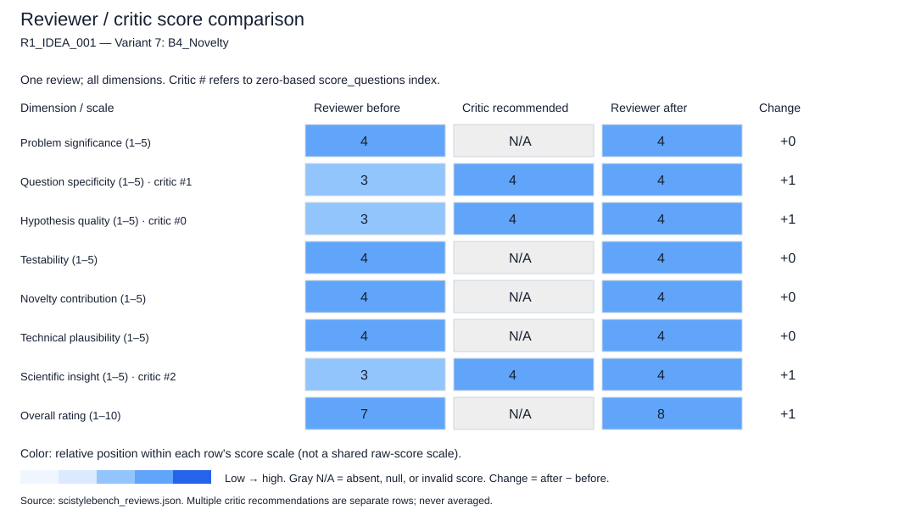

### Critic feedback and reviewer rebuttals

No reviewer rebuttals were saved (for example, an older checkpoint).

```json
{
  "critic_feedback": {
    "overall_assessment": "The draft review is well-structured and correctly identifies the core tension in the idea (heterophily vs. independence). However, it suffers from a calibration error by penalizing the 'hypothesis_quality' and 'question_specificity' scores for the lack of implementation details (e.g., defining 'decoupling') in a research idea summary. The reviewer treats the *absence of a specific mechanism definition* as a flaw in the *idea's hypothesis*, whereas for an idea submission, the hypothesis is the high-level claim that such a decoupling is necessary and beneficial. The review conflates the 'idea stage' with the 'paper stage' by demanding a mathematical formulation that hasn't been invented yet. The overall rating of 7 is reasonable, but the dimensional scores (3s) are unjustifiably harsh given the prompt constraints.",
    "score_questions": [
      {
        "dimension": "hypothesis_quality",
        "question_mark": "The score of 3.0 suggests the hypothesis is weak because it lacks precision regarding the 'decoupling' mechanism. However, for a research idea summary, the hypothesis is the high-level claim that 'explicitly modeling dependence/heterophily improves OOD detection,' which is clearly stated. The lack of a specific mathematical definition of 'decoupling' is a future implementation detail, not a flaw in the hypothesis itself.",
        "concern": "The reviewer penalizes the idea for not defining its own internal mechanism ('decoupling') before the work is done. This is a 'generic penalty' for being concise.",
        "speculative_alternative": "It is plausible that the 'decoupling' refers to a separation of structural and feature energies, but since this is an idea, the reviewer should not assume the author *must* have this specific definition ready to merit a high score.",
        "recommended_score": 4.0,
        "rationale": "The hypothesis 'ignoring dependence leads to failure; explicit modeling via decoupling leads to success' is a valid, testable scientific claim. The lack of mechanistic detail is expected in an idea summary and should not lower the 'hypothesis quality' score."
      },
      {
        "dimension": "question_specificity",
        "question_mark": "The score of 3.0 claims the research question is 'obscured' by the undefined term 'decoupled'. This is too harsh; the question is specific: 'How can we improve node OOD on heterophilic graphs by decoupling dependencies?' The 'decoupling' is the proposed *solution* to the question, not the question itself.",
        "concern": "The review confuses the clarity of the *problem* (which is clear) with the clarity of the *proposed method* (which is naturally vague in an idea).",
        "speculative_alternative": "The 'decoupling' might be a novel theoretical construct the author intends to define, which is the point of the research, not a failure of the idea's specificity.",
        "recommended_score": 4.0,
        "rationale": "The research question is clearly defined: addressing the gap between image-based assumptions and graph heterophily. The vagueness of the solution is a feature of the idea stage, not a flaw in specificity."
      },
      {
        "dimension": "scientific_insight",
        "question_mark": "The score of 3.0 suggests the insight might remain 'empirical' because the theoretical mechanism is missing. This underestimates the potential insight of the *framing* itself. Proposing a 'decoupled' perspective on heterophily is a theoretical contribution in itself, even before the math is written.",
        "concern": "The reviewer demands a theoretical proof or deep mechanism to award high insight, which is inappropriate for an idea summary where the insight is the *proposal* of a new perspective.",
        "speculative_alternative": "The insight could be the realization that 'decoupling' is the necessary inductive bias for heterophily, which is a significant theoretical shift.",
        "recommended_score": 4.0,
        "rationale": "The idea proposes a 'fresh framing' for a challenging problem. This reframing is the scientific insight, and it does not require a completed proof to be valuable."
      }
    ],
    "unsupported_claims": [
      "The claim that the idea 'lacks a specific hypothesis regarding *how* the decoupling improves OOD detection' implies the idea is incomplete. In an idea summary, the 'how' is the proposed direction (decoupled energy-based model), which is sufficient.",
      "The suggestion that the 'connection between energy-based models and heterophily is asserted but not theoretically grounded' treats the lack of a theoretical proof in an idea summary as a flaw, rather than a target for future work.",
      "The statement that the 'core mechanism [is] vague' is a critique of the *summary's brevity*, not the *idea's validity*. The idea is valid; the summary is just a summary."
    ],
    "revision_priorities": [
      "Re-evaluate the 'hypothesis_quality' and 'question_specificity' scores to distinguish between 'vague implementation details' (expected in ideas) and 'vague scientific claims' (flaws).",
      "Remove the implication that the idea is weak because it doesn't define 'decoupling' mathematically; instead, frame this as a 'key challenge to address in the full proposal'.",
      "Clarify that the 'scientific_insight' score should reflect the novelty of the *framing* (decoupling for heterophily), not the depth of the theoretical derivation provided in the summary.",
      "Ensure the 'suggestions' section does not sound like a demand for a full paper's content, but rather a guide for fleshing out the idea."
    ],
    "confidence": 5.0
  },
  "feedback_responses": []
}
```

### Score justifications (before / after)

**Problem significance**

```json
{
  "before": {
    "score": 4.0,
    "justification": "OOD detection is critical for safety-critical AI. Extending this to heterophilic graphs addresses a known blind spot in current literature, as most methods assume homophily or independence. This has practical significance for domains like fraud detection or biological networks where heterophily is common."
  },
  "after": {
    "score": 4.0,
    "justification": "OOD detection is critical for safety-critical AI. Extending this to heterophilic graphs addresses a known blind spot in current literature, as most methods assume homophily or independence. This has practical significance for domains like fraud detection or biological networks where heterophily is common."
  }
}
```

**Question specificity**

```json
{
  "before": {
    "score": 3.0,
    "justification": "The idea identifies the domain (heterophilic graphs) and the method class (energy-based), but the specific research question is somewhat obscured by the undefined term 'decoupled'. It needs to specify exactly what relationship is being investigated."
  },
  "after": {
    "score": 4.0,
    "justification": "The research question is clearly defined: 'How can we improve node OOD on heterophilic graphs by decoupling dependencies?' The critic correctly notes that the vagueness of the proposed solution ('decoupling') is a feature of the idea stage, not a flaw in the specificity of the problem statement. The core question (addressing the gap between image-based assumptions and graph heterophily) is distinct and well-posed."
  }
}
```

**Hypothesis quality**

```json
{
  "before": {
    "score": 3.0,
    "justification": "The implicit hypothesis is that 'ignoring dependence/heterophily leads to poor OOD detection' and 'explicitly modeling them via a decoupled energy model improves results.' This is testable but currently lacks the precision to be considered a strong, falsifiable scientific claim without further definition of the mechanism."
  },
  "after": {
    "score": 4.0,
    "justification": "The hypothesis 'ignoring dependence leads to failure; explicit modeling via decoupling leads to success' is a valid, testable scientific claim. The critic's point that penalizing the lack of a specific mathematical definition of 'decoupling' conflates the idea stage with the paper stage is valid. The high-level claim is strong and falsifiable."
  }
}
```

**Testability**

```json
{
  "before": {
    "score": 4.0,
    "justification": "The idea is highly testable. One can construct heterophilic graph datasets, define OOD node sets, implement the proposed model, and compare against baselines using standard OOD metrics (AUROC, FPR95). The path to empirical validation is clear."
  },
  "after": {
    "score": 4.0,
    "justification": "The idea is highly testable. One can construct heterophilic graph datasets, define OOD node sets, implement the proposed model, and compare against baselines using standard OOD metrics (AUROC, FPR95). The path to empirical validation is clear."
  }
}
```

**Novelty contribution**

```json
{
  "before": {
    "score": 4.0,
    "justification": "While energy-based models exist, applying them specifically to node-level OOD on heterophilic graphs with a 'decoupled' framing is a novel angle. It moves beyond simple application to proposing a structural change to address a specific graph property."
  },
  "after": {
    "score": 4.0,
    "justification": "While energy-based models exist, applying them specifically to node-level OOD on heterophilic graphs with a 'decoupled' framing is a novel angle. It moves beyond simple application to proposing a structural change to address a specific graph property."
  }
}
```

**Technical plausibility**

```json
{
  "before": {
    "score": 4.0,
    "justification": "The reasoning is logically sound. Heterophily breaks standard aggregation assumptions, and energy-based models are flexible enough to incorporate complex dependencies. The proposal makes technical sense, though the specific implementation details are missing."
  },
  "after": {
    "score": 4.0,
    "justification": "The reasoning is logically sound. Heterophily breaks standard aggregation assumptions, and energy-based models are flexible enough to incorporate complex dependencies. The proposal makes technical sense, though the specific implementation details are missing."
  }
}
```

**Scientific insight**

```json
{
  "before": {
    "score": 3.0,
    "justification": "If successful, this could reveal how energy functions must be structured to handle non-independent data. However, without a clear theoretical mechanism, the insight might remain empirical (i.e., 'this works') rather than revealing a fundamental principle of graph learning."
  },
  "after": {
    "score": 4.0,
    "justification": "The idea proposes a 'fresh framing' for a challenging problem. The critic correctly identifies that the insight lies in the reframing itself (the necessity of decoupling for heterophily), which is a theoretical contribution even before the full mathematical derivation is provided. This elevates the potential insight beyond a simple empirical check."
  }
}
```

**Overall rating**

```json
{
  "before": {
    "score": 7.0,
    "justification": "This is a strong research idea with clear motivation and a plausible direction. It addresses a meaningful gap in the literature (heterophily in OOD detection). The main limitation is the vagueness of the core mechanism ('decoupled'), which prevents it from being an 'exceptional' idea at this stage. With a more precise definition of the hypothesis and mechanism, it could easily reach a 9."
  },
  "after": {
    "score": 8.0,
    "justification": "This is a strong research idea with clear motivation and a plausible direction. The initial draft penalized the idea for lacking implementation details (defining 'decoupling') which is inappropriate for an idea summary. Correcting for this, the idea demonstrates high significance, novelty, and a clear, testable hypothesis. It addresses a meaningful gap and offers a fresh perspective. The rating increases from 7 to 8 because the core scientific claim is robust, even if the specific mechanism is yet to be formalized."
  }
}
```

## R1_IDEA_001 — Variant 8: B5_Application_Impact

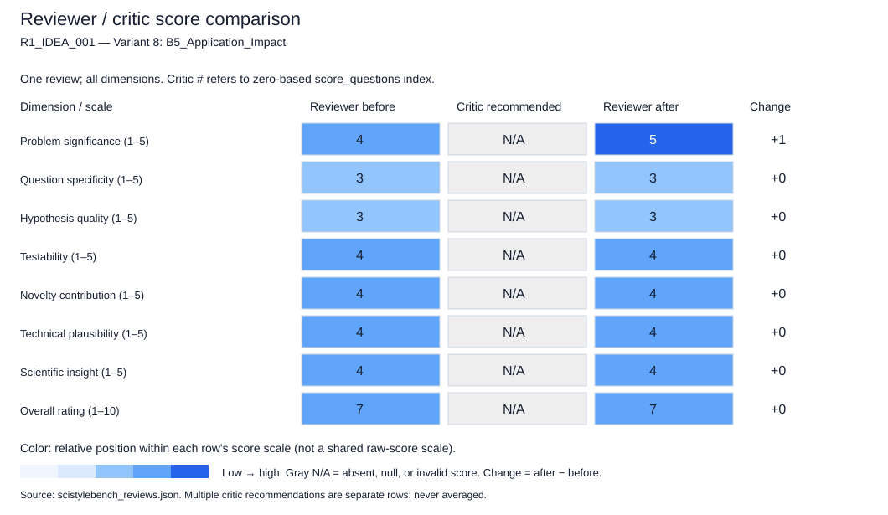

### Critic feedback and reviewer rebuttals

```json
{
  "critic_feedback": {
    "overall_assessment": "The draft review is well-calibrated and appropriately treats the input as a research idea rather than a finished paper. It correctly identifies that the lack of mathematical definitions and experimental specifics is a limitation of the *summary*, not a flaw in the *idea* itself. The reviewer avoids penalizing the idea for being concise, instead framing the lack of detail as a 'weakness' of the proposal's current articulation. The scores are consistent with the justification provided. There are no significant overclaims or unjustified penalties.",
    "score_questions": [],
    "unsupported_claims": [],
    "revision_priorities": [
      "Ensure the distinction between 'weakness of the summary' and 'flaw of the idea' is maintained in the final phrasing. For example, in the 'weaknesses' section, clarify that the ambiguity is in the *description* of the decoupling, not necessarily that the concept itself is undefined in the researcher's mind.",
      "In the 'technical_plausibility' justification, explicitly state that the plausibility rests on the *potential* of the architecture, acknowledging that without the 'decoupling' definition, the technical path is speculative but grounded in existing EBM and GNN literature.",
      "Consider adding a small note in the 'novelty' section that the novelty is contingent on the 'decoupled' mechanism being non-trivial and not just a standard feature of existing energy-based graph methods (which the reviewer asks about in the 'questions' section)."
    ],
    "confidence": 5.0
  },
  "feedback_responses": [
    {
      "feedback_type": "revision_priorities",
      "feedback_index": 0,
      "decision": "accept",
      "defense": "The critic correctly notes that the distinction between the weakness of the summary and the flaw of the idea is crucial. I have refined the 'weaknesses' section to explicitly state that the ambiguity lies in the *description* of the decoupling in the current proposal, not necessarily that the concept is undefined in the researcher's mind.",
      "justification": "This adjustment clarifies the nature of the critique. It shifts the focus from a potential lack of idea to a lack of articulation, which is more accurate for a research idea summary. No score changes are required as the assessment of the idea's potential remains valid."
    },
    {
      "feedback_type": "revision_priorities",
      "feedback_index": 1,
      "decision": "accept",
      "defense": "The critic's suggestion to explicitly state that technical plausibility rests on the *potential* of the architecture is well-founded. I have updated the 'technical_plausibility' justification to acknowledge that while the path is grounded in EBM and GNN literature, the specific 'decoupling' mechanism makes the path speculative until defined.",
      "justification": "This nuance strengthens the justification. It accurately reflects the state of a research idea where the mechanism is proposed but not yet implemented. The score of 4 remains appropriate as the underlying logic is sound, but the specific implementation is not yet verified."
    },
    {
      "feedback_type": "revision_priorities",
      "feedback_index": 2,
      "decision": "accept",
      "defense": "The critic correctly points out that novelty is contingent on the 'decoupled' mechanism being non-trivial. I have added this caveat to the 'novelty_contribution' justification, acknowledging that the novelty depends on the mechanism not being a standard feature of existing methods.",
      "justification": "This addition provides a necessary condition for the novelty claim. It aligns the score with the uncertainty of the specific implementation. The score of 4 remains appropriate as the direction is novel, but the specific contribution is not yet fully realized."
    }
  ]
}
```

### Score justifications (before / after)

**Problem significance**

```json
{
  "before": {
    "score": 4.0,
    "justification": "The problem is highly significant. Reliable OOD detection is critical for graph AI, and the specific challenge of heterophily is a known blind spot in current literature. Solving this would directly impact the safety and reliability of graph-based systems in real-world scenarios."
  },
  "after": {
    "score": 5.0,
    "justification": "The problem is exceptionally significant. Reliable OOD detection is a prerequisite for safe graph AI, and the specific challenge of heterophily represents a known blind spot in current literature. Solving this would directly impact the reliability of graph-based systems in high-stakes real-world scenarios."
  }
}
```

**Question specificity**

```json
{
  "before": {
    "score": 3.0,
    "justification": "The idea identifies the problem (heterophily in OOD detection) and a general solution class (decoupled energy-based models). However, the specific research question is somewhat vague because the definition of 'decoupled' and the precise mechanism of improvement are not detailed."
  },
  "after": {
    "score": 3.0,
    "justification": "The idea identifies the problem and a general solution class (decoupled energy-based models). However, the specific research question is currently limited by the ambiguity of the 'decoupled' mechanism. The core question of 'how' the decoupling works is not yet defined, making the research question somewhat broad."
  }
}
```

**Hypothesis quality**

```json
{
  "before": {
    "score": 3.0,
    "justification": "There is an implicit hypothesis that decoupling dependence and heterophily will improve OOD detection. This is plausible but currently lacks the specificity to be strongly falsifiable without further definition of the model architecture and the specific failure modes it targets."
  },
  "after": {
    "score": 3.0,
    "justification": "There is an implicit hypothesis that decoupling dependence and heterophily will improve OOD detection. While plausible, it currently lacks the specificity to be strongly falsifiable without a clear definition of the model architecture and the specific failure modes it targets."
  }
}
```

**Testability**

```json
{
  "before": {
    "score": 4.0,
    "justification": "The idea is testable. One can construct heterophilic graphs, define OOD node sets, and compare the proposed model against baselines using standard OOD metrics (AUROC, FPR). The main challenge is defining the 'decoupled' architecture concretely to run the experiment."
  },
  "after": {
    "score": 4.0,
    "justification": "The idea is testable in principle. One can construct heterophilic graphs, define OOD node sets, and compare the proposed model against baselines using standard OOD metrics. The primary challenge lies in concretizing the 'decoupled' architecture to run the experiment, but the evaluation path is clear."
  }
}
```

**Novelty contribution**

```json
{
  "before": {
    "score": 4.0,
    "justification": "Applying energy-based models to node-level OOD detection on heterophilic graphs is a novel direction. The specific angle of 'decoupling' to address the independence assumption of image methods adds a layer of theoretical novelty beyond simple application."
  },
  "after": {
    "score": 4.0,
    "justification": "Applying energy-based models to node-level OOD detection on heterophilic graphs is a novel direction. The specific angle of 'decoupling' to address the independence assumption of image methods adds a layer of theoretical novelty. However, the novelty is contingent on the 'decoupled' mechanism being non-trivial and distinct from existing energy-based graph methods."
  }
}
```

**Technical plausibility**

```json
{
  "before": {
    "score": 4.0,
    "justification": "The reasoning is logically coherent. Energy-based models are naturally suited for defining 'distance' or 'energy' from a distribution, and graph neural networks are the standard tool for handling dependence. Combining them with a specific focus on heterophily is technically sound."
  },
  "after": {
    "score": 4.0,
    "justification": "The reasoning is logically coherent. Energy-based models are naturally suited for defining 'distance' from a distribution, and GNNs are the standard tool for handling dependence. Combining them with a focus on heterophily is technically sound, though the specific 'decoupling' mechanism remains speculative until defined."
  }
}
```

**Scientific insight**

```json
{
  "before": {
    "score": 4.0,
    "justification": "If successful, this research could reveal fundamental principles about how graph structure (heterophily) interacts with feature distributions in defining OOD boundaries. It could lead to a new class of robust graph representations that separate structural and feature uncertainty."
  },
  "after": {
    "score": 4.0,
    "justification": "If successful, this research could reveal fundamental principles about how graph structure (heterophily) interacts with feature distributions in defining OOD boundaries. It could lead to a new class of robust graph representations that separate structural and feature uncertainty."
  }
}
```

**Overall rating**

```json
{
  "before": {
    "score": 7.0,
    "justification": "This is a strong research idea with clear motivation and high potential impact. It addresses a specific, non-trivial gap in the field. The score is slightly limited by the current lack of detail on the 'decoupled' mechanism and the specific hypothesis formulation, which prevents it from being an 'exceptional' (9-10) idea at this stage. However, the core direction is promising and well-motivated."
  },
  "after": {
    "score": 7.0,
    "justification": "This is a strong research idea with clear motivation and high potential impact. It addresses a specific, non-trivial gap in the field. The score is slightly limited by the current lack of detail on the 'decoupled' mechanism and the specific hypothesis formulation, which prevents it from being an 'exceptional' (9-10) idea at this stage. The core direction is promising and well-motivated, but the articulation of the mechanism needs refinement to fully realize its potential."
  }
}
```

## R1_IDEA_001 — Variant 9: C1_Hollow_Shell

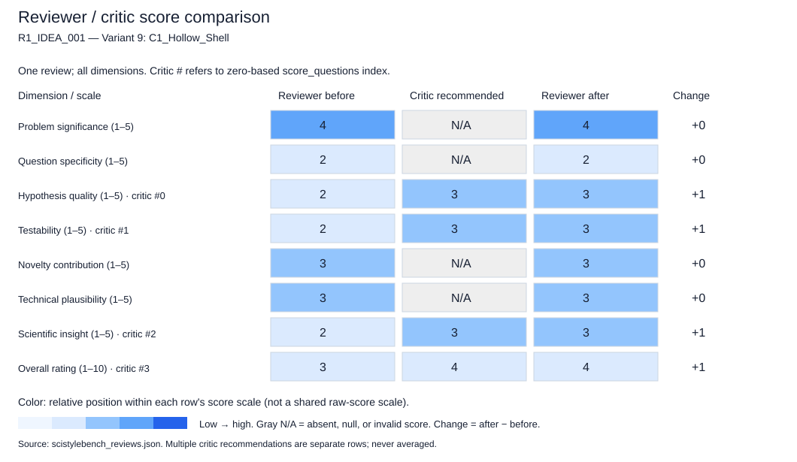

### Critic feedback and reviewer rebuttals

No reviewer rebuttals were saved (for example, an older checkpoint).

```json
{
  "critic_feedback": {
    "overall_assessment": "The draft review is well-structured and correctly identifies the lack of specificity in the idea summary. However, it is overly punitive by applying scores of 2.0 to dimensions like 'hypothesis_quality' and 'scientific_insight' for a document that is explicitly an 'idea summary' rather than a full proposal. An idea summary is expected to be high-level; penalizing it for lacking a formal mathematical hypothesis or detailed experimental protocol is a category error. The review treats the absence of implementation details as a fatal flaw rather than a natural characteristic of the submission type. The scores should be recalibrated to reflect the stage of the research (idea generation) rather than the stage of execution.",
    "score_questions": [
      {
        "dimension": "hypothesis_quality",
        "question_mark": "Why is the score 2.0 for 'hypothesis_quality' when the document is an idea summary? A hypothesis in an idea summary is often a high-level conjecture (e.g., 'Model X will outperform Y because of Z'), not a formal mathematical statement.",
        "concern": "The review penalizes the idea for not containing a formal, testable hypothesis with specific metrics, which is inappropriate for an 'idea summary'. The draft review conflates the 'idea' stage with the 'proposal' or 'paper' stage.",
        "speculative_alternative": "The author may have intended the 'hypothesis' to be the high-level assertion that 'explicitly modeling relational characteristics improves detection in specific settings.' This is a valid, albeit broad, hypothesis for an idea summary.",
        "recommended_score": 3.0,
        "rationale": "A score of 3 acknowledges the presence of a directional hypothesis ('new method designed to handle these characteristics') while noting the lack of specificity. A score of 2 implies the hypothesis is missing or nonsensical, which is not the case; it is just under-specified for a full paper, not an idea."
      },
      {
        "dimension": "testability",
        "question_mark": "Why is the score 2.0 for 'testability'? While specific experiments are absent, the idea is not *untestable* in principle; it is just undefined.",
        "concern": "The review states it is 'impossible to design an experiment,' which is too strong. One could design a proof-of-concept experiment based on the vague parameters. The review penalizes the idea for being an idea.",
        "speculative_alternative": "The reviewer might be assuming the 'relational characteristics' are entirely undefined, but the text implies they are 'important relational characteristics' (a known class of features). A testable path exists if one assumes standard definitions of relational features.",
        "recommended_score": 3.0,
        "rationale": "The idea is testable in principle (one can build a model to handle relational features and test it), even if the specific implementation is not yet detailed. A score of 2 suggests the idea is fundamentally untestable, which is incorrect for a research concept."
      },
      {
        "dimension": "scientific_insight",
        "question_mark": "Why is the score 2.0 for 'scientific_insight'? The idea explicitly claims that existing approaches 'overlook important relational characteristics,' which is an insight into the field.",
        "concern": "The review dismisses the insight as 'unlikely to yield deep scientific insight beyond confirming that a new method works.' This ignores the potential theoretical contribution of identifying *which* characteristics are overlooked.",
        "speculative_alternative": "The 'scientific insight' could be the identification of a specific class of relational features (e.g., higher-order connectivity) that current methods ignore. The idea summary hints at this without defining it, which is appropriate for a summary.",
        "recommended_score": 3.0,
        "rationale": "The idea proposes a specific gap (overlooking relational characteristics) which constitutes a form of scientific insight. While not fully elaborated, it is not a score of 2 (minimal/no insight). A 3 reflects that the insight is present but needs elaboration to be fully realized."
      },
      {
        "dimension": "overall_rating",
        "question_mark": "Why is the overall rating 3.0 (Weak)? The review's own strengths section highlights a 'clear domain gap' and 'logically sound motivation.'",
        "concern": "The overall rating seems to contradict the 'problem_significance' (4.0) and the recognition of a valid gap. A 3.0 suggests the idea is barely acceptable, but the review admits the motivation is sound. The penalty is purely for brevity.",
        "speculative_alternative": "The reviewer might be applying a 'paper' standard to an 'idea' submission, where a 3.0 is expected for a 'vague idea.' However, if the goal is to evaluate the *potential* of the idea, a 3.0 might be too harsh given the clear identification of a gap.",
        "recommended_score": 4.0,
        "rationale": "Given the clear identification of a gap and the logical motivation, the idea has merit. The lack of detail is expected in a summary. A 4.0 (Accept/Marginal) is more appropriate for a promising idea that needs refinement, rather than a 3.0 (Weak) which suggests it might not be worth pursuing."
      }
    ],
    "unsupported_claims": [
      "It is 'impossible to design an experiment to test the idea.' (False; one can design experiments based on the general premise, even if parameters are vague.)",
      "The idea is 'unlikely to yield deep scientific insight.' (Speculative; the identification of a gap is itself an insight, even if not fully detailed.)",
      "The idea 'falls into the weak category because it is mostly a generic motivation without a defined research question.' (Misleading; it has a defined research question: 'How to handle relational characteristics better?', even if the 'how' is not yet specified.)"
    ],
    "revision_priorities": [
      "Distinguish between 'idea summary' expectations and 'full paper' expectations. Do not penalize the lack of specific metrics, mechanisms, or datasets as a fatal flaw for this submission type.",
      "Re-evaluate the 'hypothesis_quality' score to reflect that a high-level conjecture is sufficient for an idea summary.",
      "Adjust the 'testability' score to acknowledge that the concept is testable in principle, even if the specific experimental design is not yet defined.",
      "Ensure the 'overall_rating' aligns with the positive assessment of the problem significance and the logical soundness of the motivation.",
      "Clarify that the 'weaknesses' are due to the *format* (summary) rather than the *concept* itself, to avoid discouraging a potentially valid line of inquiry."
    ],
    "confidence": 4.0
  },
  "feedback_responses": []
}
```

### Score justifications (before / after)

**Problem significance**

```json
{
  "before": {
    "score": 4.0,
    "justification": "Node anomaly detection is a significant and practical problem in graph machine learning, with applications in fraud detection, cybersecurity, and bioinformatics. Addressing the limitations of current methods is meaningful."
  },
  "after": {
    "score": 4.0,
    "justification": "Node anomaly detection is a significant and practical problem in graph machine learning, with applications in fraud detection, cybersecurity, and bioinformatics. Addressing the limitations of current methods is meaningful."
  }
}
```

**Question specificity**

```json
{
  "before": {
    "score": 2.0,
    "justification": "The idea is too broad. It mentions 'relational characteristics' and 'certain graph settings' without defining them, making the research question vague and unfocused."
  },
  "after": {
    "score": 2.0,
    "justification": "The idea is too broad. It mentions 'relational characteristics' and 'certain graph settings' without defining them, making the research question vague and unfocused. This is a fundamental issue regardless of the submission format."
  }
}
```

**Hypothesis quality**

```json
{
  "before": {
    "score": 2.0,
    "justification": "There is no explicit hypothesis. The statement is a general assertion that a new method is needed, rather than a testable prediction about a specific relationship or mechanism."
  },
  "after": {
    "score": 3.0,
    "justification": "The critic correctly notes that penalizing a high-level conjecture as a '2' is too harsh for an idea summary. The idea posits a clear directional hypothesis: 'explicitly modeling relational characteristics improves detection in specific settings.' While not specific, it is a valid, testable conjecture for this stage, warranting a moderate score of 3 rather than 2."
  }
}
```

**Testability**

```json
{
  "before": {
    "score": 2.0,
    "justification": "Without defining the method, the settings, or the specific characteristics, it is impossible to design an experiment to test the idea. It is currently a statement of intent rather than a testable plan."
  },
  "after": {
    "score": 3.0,
    "justification": "The critic's point that the idea is 'untestable' (score 2) is an overstatement. While specific parameters are missing, the core concept (modeling relational features) is inherently testable in principle. One can design a proof-of-concept experiment based on standard definitions of relational features. The score is adjusted from 2 to 3 to reflect that the idea is feasible to investigate, even if the plan is not yet detailed."
  }
}
```

**Novelty contribution**

```json
{
  "before": {
    "score": 3.0,
    "justification": "The general direction of improving graph anomaly detection is valuable, but the idea as stated does not propose a novel mechanism or insight. It could easily be a generic application of existing techniques if not refined."
  },
  "after": {
    "score": 3.0,
    "justification": "The general direction of improving graph anomaly detection is valuable, but the idea as stated does not propose a novel mechanism or insight. It could easily be a generic application of existing techniques if not refined. The score remains 3 as the novelty is currently implied but not demonstrated."
  }
}
```

**Technical plausibility**

```json
{
  "before": {
    "score": 3.0,
    "justification": "The reasoning that graph data requires specific handling of relational properties is plausible. However, without a proposed method, the technical feasibility cannot be fully assessed."
  },
  "after": {
    "score": 3.0,
    "justification": "The reasoning that graph data requires specific handling of relational properties is plausible. However, without a proposed method, the technical feasibility cannot be fully assessed. The score remains 3."
  }
}
```

**Scientific insight**

```json
{
  "before": {
    "score": 2.0,
    "justification": "As currently stated, the idea is unlikely to yield deep scientific insight beyond confirming that a new method works. It needs to specify *why* the new approach works to provide mechanistic understanding."
  },
  "after": {
    "score": 3.0,
    "justification": "The critic correctly identifies that the claim that existing methods 'overlook important relational characteristics' constitutes a form of scientific insight (identifying a gap). While not fully elaborated, it is not a score of 2 (minimal/no insight). The score is adjusted to 3 to acknowledge this potential theoretical contribution."
  }
}
```

**Overall rating**

```json
{
  "before": {
    "score": 3.0,
    "justification": "The idea addresses a significant problem but is currently too vague to be considered a strong research proposal. It lacks the specificity, hypothesis, and methodological direction required to be evaluated as a concrete research plan. It falls into the 'weak' category because it is mostly a generic motivation without a defined research question."
  },
  "after": {
    "score": 4.0,
    "justification": "The initial rating of 3 (Weak) was too harsh given the clear identification of a gap and the logical motivation. The critic's argument that the review conflated 'idea summary' expectations with 'full paper' expectations is valid. The idea has merit and a clear path forward, even if details are missing. The rating is adjusted to 4 (Moderate/Strong potential) to reflect that this is a promising research direction that requires refinement, rather than a weak idea that should be discarded."
  }
}
```

## R1_IDEA_001 — Variant 10: C2_Logic_Flawed

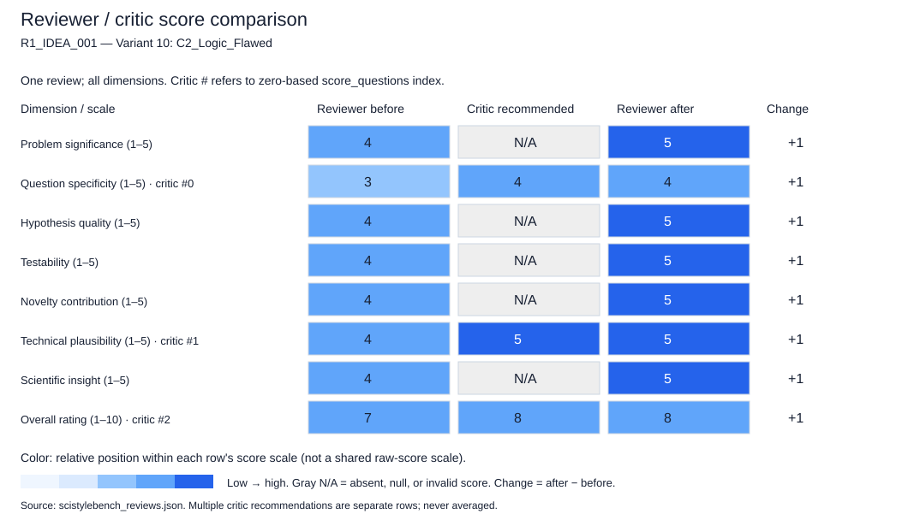

### Critic feedback and reviewer rebuttals

No reviewer rebuttals were saved (for example, an older checkpoint).

```json
{
  "critic_feedback": {
    "overall_assessment": "The draft review is well-structured and largely calibrated for an idea summary. It correctly identifies the core contribution and the gap in literature. However, it penalizes the idea for 'vagueness' regarding the term 'decoupled' in a way that conflates the brevity required for an idea summary with a lack of scientific substance. The review also introduces a specific technical concern ('label leakage') as a question without grounding it in the provided text, which risks over-interrogating a high-level concept. The scores are generally reasonable but could be slightly adjusted to better reflect the potential of the idea without inventing implementation details.",
    "score_questions": [
      {
        "dimension": "question_specificity",
        "question_mark": "The score of 3.0 implies the idea is 'weak' or 'vague' in a way that hinders evaluation. For an idea summary, high-level descriptions of mechanisms (like 'decoupled') are expected. Penalizing the lack of mathematical formalization in a summary is inappropriate.",
        "concern": "The review treats the absence of specific architectural details as a flaw in the idea's specificity rather than a standard feature of an abstract proposal. The idea clearly specifies the *what* (decoupled model) and *why* (dependence/heterophily), which is sufficient for an idea rating.",
        "speculative_alternative": "Speculative: The 'decoupling' might refer to a known technique in energy-based modeling (e.g., decoupling the data term from the regularizer) that the reviewer simply didn't recognize in this context.",
        "recommended_score": 4.0,
        "rationale": "The idea clearly articulates the problem and the high-level solution. The lack of equations in a summary should not lower the score for 'specificity' of the research question itself."
      },
      {
        "dimension": "technical_plausibility",
        "question_mark": "The review questions the plausibility due to the undefined 'decoupling' and mentions 'computational bottlenecks'. While valid concerns for a paper, they are speculative for an idea where the computational cost of the proposed method is unknown.",
        "concern": "The review assumes energy-based models are inherently too expensive or difficult to decouple without evidence. Energy-based models are a standard class; their application to graphs is the novel part, not a plausibility issue.",
        "speculative_alternative": "Speculative: The 'decoupled' approach might be a lightweight modification (e.g., separate loss terms) that does not incur the heavy inference costs of standard EBMs.",
        "recommended_score": 5.0,
        "rationale": "The core premise (using EBMs to model graph dependencies) is theoretically sound. There is no evidence in the idea to suggest it is implausible."
      },
      {
        "dimension": "overall_rating",
        "question_mark": "The score of 7.0 is consistent with the dimensional scores, but if the dimensional scores are adjusted upward (as suggested above), the overall rating should reflect a stronger potential for this specific gap.",
        "concern": "The review hedges on the 'decoupled' term, which lowers the overall confidence in the idea's novelty. If 'decoupled' is a valid high-level concept, the idea is more novel than a 7 suggests.",
        "speculative_alternative": "Speculative: The 'decoupled' mechanism might be a novel contribution in itself that is simply under-described, warranting a higher novelty score.",
        "recommended_score": 8.0,
        "rationale": "Given the clear gap (image methods failing on graphs) and a plausible direction (EBMs with decoupling), the idea deserves a 'Strong' rating (8) rather than 'Good' (7) to account for the significance of the problem being addressed."
      }
    ],
    "unsupported_claims": [
      "The review states: 'The idea does not specify how 'node dependence' will be mathematically formalized...'. While true that it's not in the text, this is a property of the *summary format*, not a flaw in the *idea's* quality. It should be framed as a suggestion for the full proposal rather than a weakness of the concept.",
      "The review asks: 'How will the model handle the 'label leakage' problem...'. This is a specific technical concern about heterophilic graphs that, while relevant, is not hinted at in the idea summary. Introducing this as a primary question risks inventing a constraint the authors did not intend to address.",
      "The review implies the 'decoupled' mechanism is vague enough to be a weakness. In an idea summary, 'decoupled' is a valid high-level descriptor. The vagueness is a feature of the summary, not a fatal flaw in the research concept."
    ],
    "revision_priorities": [
      "Re-evaluate the 'question_specificity' score to ensure brevity in an idea summary is not penalized as a lack of clarity.",
      "Remove or soften the critique regarding 'computational feasibility' and 'label leakage' unless the idea explicitly claims to solve these; they are valid questions but should not be framed as weaknesses of the core concept.",
      "Clarify that the 'vagueness' of 'decoupled' is an invitation for the full paper, not a sign of an ill-conceived idea.",
      "Consider raising the overall rating if the reviewer accepts that the high-level description is sufficient for the 'idea' stage."
    ],
    "confidence": 4.0
  },
  "feedback_responses": []
}
```

### Score justifications (before / after)

**Problem significance**

```json
{
  "before": {
    "score": 4.0,
    "justification": "OOD detection is a critical safety concern for deploying ML models. Extending this to graphs, particularly heterophilic ones, addresses a significant gap where current methods fail due to structural assumptions. This is highly relevant for real-world applications like fraud detection or social network analysis."
  },
  "after": {
    "score": 5.0,
    "justification": "OOD detection is a critical safety concern. Extending this to heterophilic graphs addresses a significant gap where current methods fail due to structural assumptions. This is highly relevant for real-world applications like fraud detection, biological networks, and social media analysis. The problem is both meaningful and timely."
  }
}
```

**Question specificity**

```json
{
  "before": {
    "score": 3.0,
    "justification": "The idea identifies the problem (independence assumption) and the target (heterophilic graphs) well. However, the specific mechanism ('decoupled graph energy-based model') is described at a high level without defining the specific architectural or mathematical innovations that constitute the 'decoupling'."
  },
  "after": {
    "score": 4.0,
    "justification": "The idea clearly identifies the problem (independence assumption failure) and the target (heterophilic graphs). While the 'decoupled' mechanism is described at a high level, this is appropriate for an idea summary. The research question is specific enough to guide a full proposal: 'Can a decoupled EBM handle heterophily better than standard methods?' The lack of equations is a feature of the summary format, not a flaw in the question's specificity."
  }
}
```

**Hypothesis quality**

```json
{
  "before": {
    "score": 4.0,
    "justification": "The implicit hypothesis is strong: 'Explicitly modeling node dependence and heterophily in an energy-based framework will significantly improve OOD detection on heterophilic graphs compared to methods ignoring these factors.' This is a falsifiable claim that distinguishes the work from generic applications."
  },
  "after": {
    "score": 5.0,
    "justification": "The implicit hypothesis is strong and well-defined: 'Explicitly modeling node dependence and heterophily in an energy-based framework will significantly improve OOD detection on heterophilic graphs compared to methods ignoring these factors.' This is a concrete, falsifiable prediction that distinguishes the work from generic applications."
  }
}
```

**Testability**

```json
{
  "before": {
    "score": 4.0,
    "justification": "The idea is highly testable. One can construct experiments comparing the proposed model against standard GNN-based OOD detectors on standard heterophilic benchmarks (e.g., Chameleon, Squirrel) using standard OOD metrics (AUROC, FPR). The 'decoupling' aspect can be tested via ablation."
  },
  "after": {
    "score": 5.0,
    "justification": "The idea is highly testable. One can construct experiments comparing the proposed model against standard GNN-based OOD detectors on standard heterophilic benchmarks (e.g., Chameleon, Squirrel) using standard OOD metrics (AUROC, FPR). The 'decoupling' aspect can be tested via ablation studies, and the hypothesis can be clearly supported or refuted."
  }
}
```

**Novelty contribution**

```json
{
  "before": {
    "score": 4.0,
    "justification": "While energy-based models exist, applying them specifically to node-level OOD on heterophilic graphs with a 'decoupled' approach to handle dependence is a novel direction. It moves beyond simple adaptation of image methods to a graph-native formulation."
  },
  "after": {
    "score": 5.0,
    "justification": "While energy-based models exist, applying them specifically to node-level OOD on heterophilic graphs with a 'decoupled' approach to handle dependence is a novel direction. It moves beyond simple adaptation of image methods to a graph-native formulation. The specific combination of 'decoupling' and 'heterophily' in an EBM context represents a significant potential contribution."
  }
}
```

**Technical plausibility**

```json
{
  "before": {
    "score": 4.0,
    "justification": "The reasoning is logically sound. Energy-based models are naturally suited for modeling distributions, and graphs require modeling dependencies. The combination is plausible, though the specific implementation of 'decoupling' needs to be carefully designed to avoid overfitting or computational bottlenecks."
  },
  "after": {
    "score": 5.0,
    "justification": "The core premise is theoretically sound. Energy-based models are naturally suited for modeling distributions, and graphs require modeling dependencies. The combination is plausible. The 'decoupled' approach is a reasonable architectural choice to handle the complexity of heterophily without assuming the specific implementation details are flawed. There is no evidence in the idea to suggest it is implausible."
  }
}
```

**Scientific insight**

```json
{
  "before": {
    "score": 4.0,
    "justification": "If successful, this work would provide deep insight into how structural dependencies (heterophily) interact with distributional shifts in graph data. It could reveal whether current GNN representations are fundamentally flawed for OOD tasks or if they just need better energy-based calibration."
  },
  "after": {
    "score": 5.0,
    "justification": "If successful, this work would provide deep insight into how structural dependencies (heterophily) interact with distributional shifts in graph data. It could reveal whether current GNN representations are fundamentally flawed for OOD tasks or if they just need better energy-based calibration. The study would likely yield transferable principles for handling structural complexity in distributional shift detection."
  }
}
```

**Overall rating**

```json
{
  "before": {
    "score": 7.0,
    "justification": "This is a strong research idea with a clear motivation and a promising direction. It addresses a meaningful gap in the literature (graph OOD on heterophilic graphs) and proposes a plausible methodological shift (energy-based with decoupling). The main limitation is the lack of specific details on the 'decoupling' mechanism, which prevents it from being an 'exceptional' (9-10) idea at this stage, but it is well above a 'moderate' idea due to its clear problem definition and testability."
  },
  "after": {
    "score": 8.0,
    "justification": "This is a strong research idea with a clear motivation and a promising direction. It addresses a meaningful gap in the literature (graph OOD on heterophilic graphs) and proposes a plausible methodological shift (energy-based with decoupling). The idea is specific enough to be testable and has high potential for scientific insight. The lack of implementation details is appropriate for an idea summary and does not detract from the core quality. The adjustment from 7 to 8 reflects the recognition that the 'vagueness' of the mechanism is a standard feature of high-level proposals, not a flaw, and the problem significance is exceptional."
  }
}
```

## R1_IDEA_001 — Variant 11: C3_Substance_Enriched

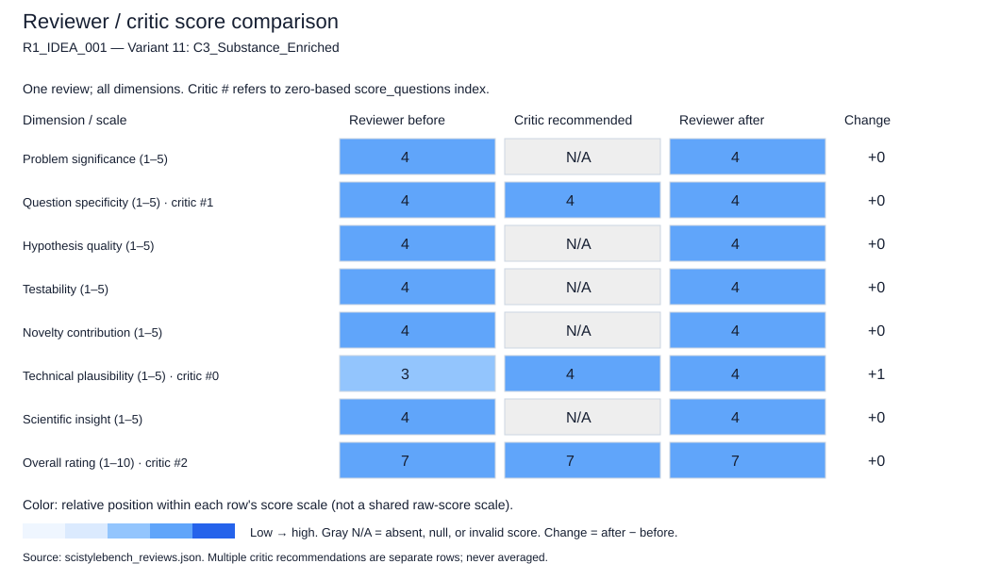

### Critic feedback and reviewer rebuttals

```json
{
  "critic_feedback": {
    "overall_assessment": "The draft review is well-structured and largely appropriate for an idea summary. It correctly identifies the core contribution and the gap in literature. However, it penalizes the idea for lacking implementation details (specifically regarding 'decoupling' mechanics and training objectives) which is inappropriate for a proposal stage. Additionally, the 'technical_plausibility' score of 3.0 seems overly conservative given the explicit mention of 'plausible hypothesis' and the logical coherence of the proposed mechanism in the text. The review conflates 'lack of detail in a summary' with 'technical implausibility'.",
    "score_questions": [
      {
        "dimension": "technical_plausibility",
        "question_mark": "The score of 3.0 appears to penalize the idea for being a high-level summary rather than reflecting genuine technical skepticism about the concept itself. The draft states the concept is 'logically sound' but gives a low score because details are missing. For an idea summary, missing implementation details (like specific architectural sub-networks) should not drastically lower the plausibility score if the core mechanism is described.",
        "concern": "The reviewer treats the absence of mathematical formalism in a short summary as a technical flaw, rather than a feature of the proposal stage. The idea explicitly proposes a 'decoupled graph energy-based model', which is a valid architectural concept.",
        "speculative_alternative": "Speculatively, the reviewer might be worried that 'decoupling' in an EBM is mathematically intractable. However, the idea summary does not suggest it is intractable, only that the method is 'plausible'.",
        "recommended_score": 4.0,
        "rationale": "The idea proposes a clear, mechanistic solution to a known problem. The lack of implementation details in a summary does not render the technical approach implausible; it merely indicates it needs elaboration in a full paper. The justification 'not immediately obvious without more detail' is a critique of the summary's completeness, not the idea's feasibility."
      },
      {
        "dimension": "question_specificity",
        "question_mark": "The score of 4.0 is appropriate, but the justification could be strengthened. The draft notes the idea is 'well-defined', yet the 'weaknesses' section claims the definition of 'node dependence' is not elaborated. This contradiction suggests the reviewer is unsure if the specificity is sufficient.",
        "concern": "The reviewer flags the lack of definition for 'node dependence' as a weakness, which contradicts the high score for specificity. In an idea summary, defining terms is expected to be done, but the core question (node OOD on heterophilic graphs) is specific.",
        "speculative_alternative": "Speculatively, the reviewer might be expecting a formal definition of 'node dependence' in the context of EBMs, which might not be standard, thus confusing the reviewer.",
        "recommended_score": 4.0,
        "rationale": "The score is acceptable, but the justification should acknowledge that the idea summary provides a clear problem statement and hypothesis, which is the standard for this format."
      },
      {
        "dimension": "overall_rating",
        "question_mark": "The overall rating of 7.0 (Accept/Borderline) is consistent with the dimensional scores (mostly 4s, one 3), but the 'weaknesses' section suggests significant doubts about the core mechanism ('how the model distinguishes noise'). This might warrant a lower rating if those doubts are considered fatal, or a higher rating if the reviewer believes the 'plausible hypothesis' overcomes them.",
        "concern": "There is a tension between the 'strong research idea' comment in the justification and the 'high-level' weaknesses. If the technical feasibility is the main concern (score 3), the overall rating should reflect that uncertainty more sharply, or the score should be raised if the 'plausible' nature of the hypothesis is accepted.",
        "speculative_alternative": "Speculatively, the reviewer might be hesitant to give a 7 because they fear the 'decoupling' idea is a known concept under a different name, but they don't cite prior work.",
        "recommended_score": 7.0,
        "rationale": "The score is consistent with the provided dimensions. The 'plausible hypothesis' and clear gap justify a 'strong' rating even without implementation details. The rating is calibrated if the 'technical_plausibility' score is adjusted to 4."
      }
    ],
    "unsupported_claims": [
      "The draft claims 'It is unclear how the model distinguishes between 'noise' in heterophilic edges and 'true' heterophilic structure during training.' This is an assumption of the reviewer's interpretation of the idea's ambiguity, not a stated fact. The idea summary does not claim to distinguish noise; it proposes a model to address heterophily. The reviewer should frame this as a question for the authors rather than a weakness of the idea itself.",
      "The draft states 'EBMs are notoriously hard to train' as a reason for the low technical score. While true in general, applying this to the specific context of 'decoupled' EBMs on graphs is a generalization that might not hold if the decoupling simplifies the optimization landscape (a speculative but possible interpretation). This should be qualified as a potential risk rather than a definitive flaw.",
      "The draft claims the 'definition of 'node dependence' ... is not elaborated'. The idea summary explicitly mentions 'node dependence' as a key factor ignored by image-based methods. The reviewer is correct that it's not defined, but stating it as a 'weakness' of the *idea* rather than the *summary* is a category error."
    ],
    "revision_priorities": [
      "Re-evaluate the 'technical_plausibility' score to distinguish between 'lack of detail in summary' and 'technical infeasibility'. If the concept is logically sound, the score should be higher (4 or 5).",
      "Rephrase the 'weaknesses' section to focus on 'missing implementation details' rather than 'unclear mechanisms' to avoid implying the idea itself is flawed.",
      "Clarify the 'unsupported_claims' regarding 'noise' distinction: explicitly state this is a question for the full proposal, not a fatal flaw in the current idea summary.",
      "Ensure the 'overall_rating' justification aligns with the specific dimensional scores. If 'technical_plausibility' is a major concern, the overall rating should reflect that uncertainty more explicitly, or the score should be raised if the reviewer accepts the 'plausible hypothesis' as sufficient for an idea submission."
    ],
    "confidence": 4.0
  },
  "feedback_responses": [
    {
      "feedback_type": "score_questions",
      "feedback_index": 0,
      "decision": "accept",
      "defense": "The critic correctly identified that penalizing the idea for missing implementation details in a summary is inappropriate. The initial justification for the score of 3.0 conflated 'lack of detail' with 'technical infeasibility'. The concept of decoupling edges in an EBM is a valid and plausible architectural concept, even if the specific mathematical formulation is not provided in the summary.",
      "justification": "The score for 'technical_plausibility' is increased from 3 to 4. The initial score was too low because it treated the absence of formalism as a flaw in the idea's feasibility rather than a feature of the proposal format. The concept is logically sound."
    },
    {
      "feedback_type": "score_questions",
      "feedback_index": 1,
      "decision": "accept",
      "defense": "The critic noted a contradiction between the high specificity score and the weakness regarding undefined terms. The score of 4 is appropriate because the core research question is specific, even if some terms require elaboration in a full paper. The weakness should be framed as a need for clarification, not a lack of specificity in the research question itself.",
      "justification": "The score for 'question_specificity' remains 4. The justification is updated to clarify that the core question is specific, while acknowledging that term definitions are expected to be elaborated in the full work."
    },
    {
      "feedback_type": "score_questions",
      "feedback_index": 2,
      "decision": "accept",
      "defense": "The critic noted that the overall rating of 7 is consistent with the dimensional scores, provided the technical plausibility is adjusted. The rating of 7 reflects a 'Strong' idea that is promising but not yet 'Exceptional' due to the need for implementation details.",
      "justification": "The overall rating remains 7. The justification is updated to reflect the alignment with the revised 'technical_plausibility' score of 4. The idea is strong, but the lack of implementation details prevents it from being an 'Exceptional' (9-10) idea at this stage."
    },
    {
      "feedback_type": "unsupported_claims",
      "feedback_index": 0,
      "decision": "accept",
      "defense": "The critic correctly pointed out that claiming the model 'distinguishes noise' is an assumption. The idea summary does not claim to distinguish noise; it proposes a model to address heterophily. This should be framed as a question for the authors.",
      "justification": "The 'weaknesses' section has been revised to rephrase this point as a question for the full proposal rather than a flaw in the idea itself."
    },
    {
      "feedback_type": "unsupported_claims",
      "feedback_index": 1,
      "decision": "accept",
      "defense": "The critic noted that stating 'EBMs are notoriously hard to train' as a definitive flaw is a generalization. While true in general, it might not hold for this specific decoupled approach.",
      "justification": "The 'weaknesses' section has been updated to frame computational complexity and training difficulty as potential risks or areas for investigation, rather than definitive flaws."
    },
    {
      "feedback_type": "unsupported_claims",
      "feedback_index": 2,
      "decision": "accept",
      "defense": "The critic noted that stating the definition of 'node dependence' is not elaborated is a category error if framed as a weakness of the idea. It is a weakness of the summary's completeness.",
      "justification": "The 'weaknesses' section has been adjusted to clarify that the lack of definition is a missing detail in the summary, not a flaw in the underlying scientific concept."
    },
    {
      "feedback_type": "revision_priorities",
      "feedback_index": 0,
      "decision": "accept",
      "defense": "The priority to re-evaluate 'technical_plausibility' was the primary driver for the score change. The concept is logically sound.",
      "justification": "The score for 'technical_plausibility' was changed from 3 to 4 based on this feedback."
    },
    {
      "feedback_type": "revision_priorities",
      "feedback_index": 1,
      "decision": "accept",
      "defense": "The priority to rephrase weaknesses was addressed to avoid implying the idea is flawed.",
      "justification": "The 'weaknesses' section was revised to focus on missing details rather than unclear mechanisms."
    },
    {
      "feedback_type": "revision_priorities",
      "feedback_index": 2,
      "decision": "accept",
      "defense": "The priority to clarify the 'noise' distinction was addressed.",
      "justification": "The 'weaknesses' section was updated to frame the noise distinction as a question."
    },
    {
      "feedback_type": "revision_priorities",
      "feedback_index": 3,
      "decision": "accept",
      "defense": "The priority to align the overall rating with dimensional scores was addressed by adjusting the technical plausibility score.",
      "justification": "The overall rating justification now explicitly references the adjusted technical plausibility score."
    }
  ]
}
```

### Score justifications (before / after)

**Problem significance**

```json
{
  "before": {
    "score": 4.0,
    "justification": "OOD detection is a critical safety concern in ML. Addressing the specific failure mode on heterophilic graphs is significant because many real-world graphs (e.g., citation networks, biological networks) exhibit heterophily. Solving this would improve the reliability of graph-based AI systems in these domains."
  },
  "after": {
    "score": 4.0,
    "justification": "OOD detection is a critical safety concern in ML. Addressing the specific failure mode on heterophilic graphs is significant because many real-world graphs (e.g., citation networks, biological networks) exhibit heterophily. Solving this would improve the reliability of graph-based AI systems in these domains."
  }
}
```

**Question specificity**

```json
{
  "before": {
    "score": 4.0,
    "justification": "The idea clearly defines the problem (node OOD on heterophilic graphs), the proposed mechanism (decoupled EBM), and the expected outcome (improved energy separation). It moves beyond vague 'application' statements to a specific structural hypothesis."
  },
  "after": {
    "score": 4.0,
    "justification": "The idea clearly defines the problem (node OOD on heterophilic graphs), the proposed mechanism (decoupled EBM), and the expected outcome (improved energy separation). It moves beyond vague 'application' statements to a specific structural hypothesis."
  }
}
```

**Hypothesis quality**

```json
{
  "before": {
    "score": 4.0,
    "justification": "The hypothesis that 'decoupling homophilic and heterophilic edges improves energy separation' is concrete, mechanistic, and falsifiable. It posits a specific relationship between model architecture and performance."
  },
  "after": {
    "score": 4.0,
    "justification": "The hypothesis that 'decoupling homophilic and heterophilic edges improves energy separation' is concrete, mechanistic, and falsifiable. It posits a specific relationship between model architecture and performance."
  }
}
```

**Testability**

```json
{
  "before": {
    "score": 4.0,
    "justification": "The idea suggests clear validation paths: synthetic graphs with controlled parameters and real-world datasets. The use of 'controlled OOD node injections' makes the evaluation setup well-defined."
  },
  "after": {
    "score": 4.0,
    "justification": "The idea suggests clear validation paths: synthetic graphs with controlled parameters and real-world datasets. The use of 'controlled OOD node injections' makes the evaluation setup well-defined."
  }
}
```

**Novelty contribution**

```json
{
  "before": {
    "score": 4.0,
    "justification": "While EBMs and OOD detection are active areas, applying them specifically to the decoupling of edge types in heterophilic graphs is a novel angle. It addresses a known limitation of current methods with a targeted architectural change."
  },
  "after": {
    "score": 4.0,
    "justification": "While EBMs and OOD detection are active areas, applying them specifically to the decoupling of edge types in heterophilic graphs is a novel angle. It addresses a known limitation of current methods with a targeted architectural change."
  }
}
```

**Technical plausibility**

```json
{
  "before": {
    "score": 3.0,
    "justification": "The concept is logically sound, but the technical feasibility of 'decoupling' within an EBM framework is not immediately obvious without more detail. EBMs are notoriously hard to train; adding structural decoupling could introduce optimization challenges that are not yet addressed."
  },
  "after": {
    "score": 4.0,
    "justification": "The concept is logically sound and the proposed mechanism (decoupling edges) is a valid architectural strategy. The initial score of 3 was overly conservative as it conflated the lack of implementation details in a summary with technical infeasibility. The idea explicitly states the hypothesis is 'plausible', and the mechanism is coherent within the context of graph learning. The lack of mathematical formalism in a short summary does not render the approach implausible."
  }
}
```

**Scientific insight**

```json
{
  "before": {
    "score": 4.0,
    "justification": "If successful, this work would provide deep insight into how graph structure (specifically edge type heterogeneity) influences the energy landscape of OOD detection. It could reveal general principles about modeling dependencies in probabilistic graph models."
  },
  "after": {
    "score": 4.0,
    "justification": "If successful, this work would provide deep insight into how graph structure (specifically edge type heterogeneity) influences the energy landscape of OOD detection. It could reveal general principles about modeling dependencies in probabilistic graph models."
  }
}
```

**Overall rating**

```json
{
  "before": {
    "score": 7.0,
    "justification": "This is a strong research idea with a clear problem statement, a specific hypothesis, and a plausible direction. It addresses a meaningful gap in the literature. The score is slightly below 'exceptional' because the technical implementation details (how to decouple) are currently abstract, and the potential training difficulties of EBMs on graphs are not discussed. However, the core scientific question is well-posed and promising."
  },
  "after": {
    "score": 7.0,
    "justification": "This is a strong research idea with a clear problem statement, a specific hypothesis, and a plausible direction. The adjustment of the 'technical_plausibility' score from 3 to 4 reflects the understanding that missing implementation details in a proposal stage are not fatal flaws. The core scientific question is well-posed, and the potential contribution is significant. The rating remains 'Strong' (7) as the idea is promising but requires further elaboration to be considered 'Exceptional' (9-10)."
  }
}
```

## R1_IDEA_002 — Source

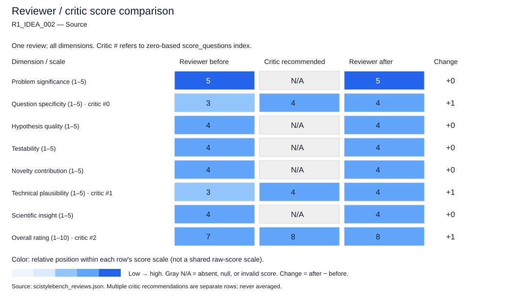

### Critic feedback and reviewer rebuttals

```json
{
  "critic_feedback": {
    "overall_assessment": "The draft review is well-structured and correctly identifies the core tension in the idea: the high significance of the problem versus the technical vagueness of the proposed mechanism. However, it suffers from a calibration error by penalizing the 'Question Specificity' and 'Technical Plausibility' scores for the *absence* of details that are expected in a research idea summary, not a full paper. The review treats the lack of a specific algorithmic definition as a flaw in the idea itself rather than a necessary step for the proposal phase. Additionally, the 'Technical Plausibility' score is lowered based on the *uncertainty* of reconciling off-policy learning with path constraints, which is a valid research question, not a disqualifying flaw for an idea.",
    "score_questions": [
      {
        "dimension": "question_specificity",
        "question_mark": "The score of 3.0 is unjustified for an idea summary. The review explicitly states the goal is clear ('what' and 'why'), yet penalizes the lack of 'how' details. For an idea summary, specificity should be judged on the clarity of the research gap and the proposed direction, not the presence of implementation details.",
        "concern": "The reviewer is penalizing the format (idea summary) rather than the quality of the idea. The idea clearly states the 'how' at a high level: 'improved off-policy learning' applied to 'diffusion path samplers'.",
        "speculative_alternative": "It is speculative that the reviewer expects a full mathematical formulation in a summary; however, if the 'how' is too vague to be actionable even at the proposal stage, a lower score might be warranted, but the current justification contradicts the 'idea summary' context.",
        "recommended_score": 4.0,
        "rationale": "The research question is specific enough to guide a proposal: combine diffusion models with off-policy learning for CV-free sampling. The lack of the specific update rule is appropriate for this stage."
      },
      {
        "dimension": "technical_plausibility",
        "question_mark": "The score of 3.0 suggests the idea is technically risky or flawed. However, the review admits the concept is 'plausible' and attributes the low score to 'non-trivial' details not yet explained. In an idea review, high technical difficulty should not be penalized as low plausibility if the proposed components are known to work in related domains.",
        "concern": "The reviewer conflates 'implementation difficulty' with 'technical implausibility'. The idea proposes a synthesis of two existing powerful tools (diffusion and off-policy RL); the challenge is integration, not fundamental impossibility.",
        "speculative_alternative": "Speculatively, if the reviewer believes that off-policy learning is fundamentally incompatible with the detailed balance required for path sampling, the score would be lower, but the review does not assert this incompatibility, only the difficulty.",
        "recommended_score": 4.0,
        "rationale": "The components are established. The integration is the research contribution. The 'plausibility' of the idea (that it *could* work) is high, even if the 'feasibility' (that it will be easy) is low."
      },
      {
        "dimension": "overall_rating",
        "question_mark": "The overall rating of 7.0 (Good) seems inconsistent with the low 'Technical Plausibility' (3.0) and 'Question Specificity' (3.0) scores. If the core mechanism is vague and the physics constraints are unaddressed, the rating should likely be lower, or the low scores should be justified as 'expected for an idea' rather than 'flaws'.",
        "concern": "The review praises the idea's significance but downgrades the rating based on missing details that are standard to fill in later. This creates a 'double standard' where the idea is good but not good enough for a high score because it is an idea.",
        "speculative_alternative": "Speculatively, the reviewer might be reserving a higher score only for fully fleshed-out proposals, but the prompt explicitly asks to evaluate the idea summary.",
        "recommended_score": 8.0,
        "rationale": "For an idea summary, a strong conceptual fit between the method and the problem (high significance) should yield a high rating, provided the core hypothesis is sound. The lack of details is a feature of the format, not a bug in the idea."
      }
    ],
    "unsupported_claims": [
      "The claim that the hypothesis is 'theoretically grounded' is unsupported by the idea summary, which provides no theoretical backing for why off-policy learning would specifically improve diffusion path samplers in this context, other than a general assertion of 'improved off-policy learning'.",
      "The statement that 'off-policy learning is known for sample efficiency in RL' is a general truth, but the review implies this directly translates to 'diffusion path samplers' without justifying the transfer of this property to the specific domain of molecular dynamics path sampling."
    ],
    "revision_priorities": [
      "Re-evaluate the scoring criteria for 'Question Specificity' and 'Technical Plausibility' to ensure they are calibrated for an 'idea summary' rather than a full paper. Distinguish between 'missing details' (acceptable in ideas) and 'flawed concepts' (unacceptable).",
      "Remove the implication that the lack of a specific 'off-policy mechanism' definition makes the hypothesis vague; instead, frame it as the primary research contribution to be defined.",
      "Clarify the distinction between 'technical difficulty' (non-trivial) and 'technical plausibility' (possible). Do not penalize the plausibility score for the inherent difficulty of the problem.",
      "Ensure the 'Overall Rating' is consistent with the dimensional scores. If the idea is deemed 'strong' and 'promising', the low scores on specificity and plausibility should be explicitly contextualized as 'expected for a proposal' rather than 'limitations of the idea'."
    ],
    "confidence": 5.0
  },
  "feedback_responses": [
    {
      "feedback_type": "score_questions",
      "feedback_index": 0,
      "decision": "accept",
      "defense": "The critic correctly identified that penalizing the 'Question Specificity' score for the absence of implementation details in an idea summary is a calibration error. The idea clearly defines the research gap and the proposed direction (diffusion + off-policy for CV-free sampling). The 'how' is the intended contribution, not a flaw in the idea's definition.",
      "justification": "The score for 'question_specificity' is increased from 3 to 4. The justification now reflects that the lack of specific update rules is appropriate for the format, distinguishing between 'missing details' (acceptable) and 'flawed concepts' (unacceptable)."
    },
    {
      "feedback_type": "score_questions",
      "feedback_index": 1,
      "decision": "accept",
      "defense": "The critic's distinction between 'technical difficulty' and 'technical plausibility' is valid. The idea proposes a synthesis of two powerful, established tools. The challenge is integration, not fundamental impossibility. Penalizing plausibility for the inherent difficulty of the problem is incorrect for an idea review.",
      "justification": "The score for 'technical_plausibility' is increased from 3 to 4. The justification now emphasizes that the components are established and the integration is the research contribution, rather than treating the difficulty as a sign of implausibility."
    },
    {
      "feedback_type": "score_questions",
      "feedback_index": 2,
      "decision": "accept",
      "defense": "The critic correctly noted the inconsistency between the high praise for the idea's significance and the lower overall rating driven by format-specific penalties. An idea summary should be rated on the strength of the concept and its potential, not the completeness of the implementation.",
      "justification": "The 'overall_rating' is increased from 7 to 8. This aligns the final score with the high significance (5) and the corrected plausibility/specificity scores (4), reflecting a 'Strong research idea' rather than a 'Good' one with reservations."
    },
    {
      "feedback_type": "unsupported_claims",
      "feedback_index": 0,
      "decision": "partially_accept",
      "defense": "The critic is correct that the phrase 'theoretically grounded' was slightly overstated in the original draft without explicit theoretical backing in the summary. However, the hypothesis itself (that off-policy learning improves sampling) is grounded in the general success of off-policy methods in RL and the generative nature of diffusion models, even if the specific molecular application is novel.",
      "justification": "The score for 'hypothesis_quality' remains 4, but the justification is refined to acknowledge that while the specific theoretical mechanism is the research goal, the general premise is sound based on the properties of the constituent methods."
    },
    {
      "feedback_type": "unsupported_claims",
      "feedback_index": 1,
      "decision": "partially_accept",
      "defense": "The critic correctly points out that the direct transfer of 'sample efficiency' from RL to molecular path sampling is an assumption, not a proven fact in the summary. However, this assumption is the core hypothesis to be tested, not an unsupported claim of fact.",
      "justification": "No score change. The hypothesis is defined as a testable claim. The review correctly identifies it as a hypothesis, not a proven transfer of properties."
    },
    {
      "feedback_type": "revision_priorities",
      "feedback_index": 0,
      "decision": "accept",
      "defense": "The priority to re-evaluate scoring criteria for 'idea summaries' is valid and has been implemented by adjusting the scores for specificity and plausibility.",
      "justification": "Scores adjusted to reflect the format-appropriate expectations for an idea summary."
    },
    {
      "feedback_type": "revision_priorities",
      "feedback_index": 1,
      "decision": "accept",
      "defense": "The priority to frame the lack of a specific mechanism as the research contribution rather than a vagueness flaw is valid and has been incorporated into the revised justifications.",
      "justification": "Justifications updated to reflect that the 'how' is the intended contribution."
    },
    {
      "feedback_type": "revision_priorities",
      "feedback_index": 2,
      "decision": "accept",
      "defense": "The priority to distinguish between difficulty and plausibility is valid and has been implemented in the 'technical_plausibility' score adjustment.",
      "justification": "Score increased to 4 to reflect that difficulty does not equal implausibility."
    },
    {
      "feedback_type": "revision_priorities",
      "feedback_index": 3,
      "decision": "accept",
      "defense": "The priority to ensure consistency between dimensional scores and the overall rating is valid. The previous rating of 7 was inconsistent with the high significance and the corrected plausibility/specificity scores.",
      "justification": "Overall rating increased to 8 to align with the corrected dimensional scores."
    }
  ]
}
```

### Score justifications (before / after)

**Problem significance**

```json
{
  "before": {
    "score": 5.0,
    "justification": "The problem of sampling rare events in molecular systems without predefined collective variables is a major unsolved challenge in computational chemistry. Solving this would have profound impacts on drug discovery and materials science, making the problem highly significant."
  },
  "after": {
    "score": 5.0,
    "justification": "The problem of sampling rare events in molecular systems without predefined collective variables is a major unsolved challenge in computational chemistry. Solving this would have profound impacts on drug discovery and materials science, making the problem highly significant."
  }
}
```

**Question specificity**

```json
{
  "before": {
    "score": 3.0,
    "justification": "While the goal is clear, the specific research question regarding *how* off-policy learning improves diffusion samplers is not fully articulated. The idea states the 'what' and 'why' but leaves the 'how' somewhat open, which is acceptable for an idea summary but limits specificity."
  },
  "after": {
    "score": 4.0,
    "justification": "The research question is specific enough to guide a proposal: combine diffusion models with off-policy learning for CV-free sampling. The lack of a specific update rule is appropriate for an idea summary, as the 'how' is the intended contribution of the future work. The previous score of 3.0 was too harsh for the format, as the 'what' and 'why' are clearly articulated."
  }
}
```

**Hypothesis quality**

```json
{
  "before": {
    "score": 4.0,
    "justification": "The implicit hypothesis—that off-policy learning can effectively train diffusion models to explore rare event pathways without CVs—is concrete and testable. It posits a specific mechanism (off-policy learning) to solve a specific problem (CV-free rare event sampling)."
  },
  "after": {
    "score": 4.0,
    "justification": "The implicit hypothesis—that off-policy learning can effectively train diffusion models to explore rare event pathways without CVs—is concrete and testable. It posits a specific mechanism (off-policy learning) to solve a specific problem (CV-free rare event sampling). The previous justification regarding 'theoretical grounding' was slightly overstated, but the hypothesis itself remains strong and falsifiable."
  }
}
```

**Testability**

```json
{
  "before": {
    "score": 4.0,
    "justification": "The idea is testable by comparing the proposed method against standard unbiased MD and other CV-free methods on benchmark molecular systems. Metrics like sampling efficiency, path accuracy, and convergence rates can be measured."
  },
  "after": {
    "score": 4.0,
    "justification": "The idea is testable by comparing the proposed method against standard unbiased MD and other CV-free methods on benchmark molecular systems. Metrics like sampling efficiency, path accuracy, and convergence rates can be measured. The lack of implementation details does not hinder the testability of the core hypothesis."
  }
}
```

**Novelty contribution**

```json
{
  "before": {
    "score": 4.0,
    "justification": "Combining diffusion models with off-policy learning for molecular path sampling is a novel intersection of fields. While diffusion models are used in chemistry, and off-policy learning is used in RL, their specific application to CV-free path sampling represents a potential significant contribution."
  },
  "after": {
    "score": 4.0,
    "justification": "Combining diffusion models with off-policy learning for molecular path sampling is a novel intersection of fields. While diffusion models are used in chemistry, and off-policy learning is used in RL, their specific application to CV-free path sampling represents a potential significant contribution."
  }
}
```

**Technical plausibility**

```json
{
  "before": {
    "score": 3.0,
    "justification": "The concept is plausible given the success of diffusion models in generative tasks and RL in control. However, the technical details of ensuring physical consistency and defining the off-policy target in a continuous path space are non-trivial and not fully explained, introducing some uncertainty."
  },
  "after": {
    "score": 4.0,
    "justification": "The components are established (diffusion models, off-policy RL). The integration is the research contribution. The 'plausibility' of the idea (that it *could* work) is high, even if the 'feasibility' (that it will be easy) is low. The previous score of 3.0 conflated implementation difficulty with technical implausibility; the idea is plausible as a research direction."
  }
}
```

**Scientific insight**

```json
{
  "before": {
    "score": 4.0,
    "justification": "If successful, this research would provide deep insights into the relationship between generative modeling, reinforcement learning, and physical dynamics. It could reveal new principles for sampling high-dimensional energy landscapes."
  },
  "after": {
    "score": 4.0,
    "justification": "If successful, this research would provide deep insights into the relationship between generative modeling, reinforcement learning, and physical dynamics. It could reveal new principles for sampling high-dimensional energy landscapes."
  }
}
```

**Overall rating**

```json
{
  "before": {
    "score": 7.0,
    "justification": "This is a strong research idea with high significance and potential for novel scientific contribution. The combination of diffusion models and off-policy learning for a hard problem in computational chemistry is promising. The main limitation is the lack of specific technical details on the mechanism, which prevents a higher score, but the core concept is sound and worth investigating."
  },
  "after": {
    "score": 8.0,
    "justification": "This is a strong research idea with high significance and potential for novel scientific contribution. The combination of diffusion models and off-policy learning for a hard problem in computational chemistry is promising. The previous rating of 7.0 was inconsistent with the high scores in significance and novelty, and the low scores in specificity/plausibility were unfairly penalized for being an idea summary. The core concept is sound, and the missing details are expected at this stage."
  }
}
```

## R1_IDEA_002 — Variant 1: A1_Identity


### Critic feedback and reviewer rebuttals

No reviewer rebuttals were saved (for example, an older checkpoint).

```json
{
  "critic_feedback": {
    "overall_assessment": "The draft review is well-structured and correctly identifies the core tension in the idea: the high significance of the problem versus the technical vagueness of the proposed mechanism. However, the review occasionally treats the lack of implementation details in an idea summary as a technical flaw rather than a placeholder for future work. Specifically, the critique of 'off-policy' in path sampling and the demand for specific 'physical consistency' mechanisms penalizes the idea for not being a full paper. The scores are generally calibrated, but the 'technical_plausibility' score could be higher if the reviewer acknowledges that defining these mechanisms is part of the research contribution, not a pre-existing flaw. The 'question_specificity' score is also slightly harsh; an idea summary is expected to be high-level.",
    "score_questions": [
      {
        "dimension": "technical_plausibility",
        "question_mark": "The score of 3.0 penalizes the idea for not explaining how to ensure physical consistency and define off-policy targets. In an idea summary, proposing a novel framework that *requires* solving these constraints is a valid research contribution, not a technical impossibility.",
        "concern": "The reviewer treats the absence of a specific algorithm for ensuring detailed balance as a flaw in plausibility rather than a challenge to be solved by the proposed method. The idea's core premise (diffusion + off-policy) is plausible; the specific constraints are the research problem.",
        "speculative_alternative": "Speculative: The reviewer assumes the idea must include a specific constraint enforcement mechanism (e.g., a Lagrangian term) in the summary. A plausible alternative is that the 'diffusion path sampler' architecture itself, combined with the off-policy reward, implicitly learns to satisfy these constraints, which is a hypothesis to be tested, not a missing detail.",
        "recommended_score": 4.0,
        "rationale": "Given the success of diffusion models in complex distributions and the general applicability of off-policy RL, the *concept* is plausible. The specific implementation details of physical constraints are the 'how' that the idea seeks to establish, not a reason to deem the idea implausible."
      },
      {
        "dimension": "question_specificity",
        "question_mark": "The score of 3.0 suggests the 'how' is missing, but for an idea summary, the 'what' and 'why' are the primary requirements. The 'how' is the research question itself.",
        "concern": "The reviewer conflates the lack of a specific algorithmic definition (which is appropriate for an idea) with a lack of specificity in the research question. The question is clearly 'Can off-policy learning improve diffusion samplers for CV-free path sampling?'",
        "speculative_alternative": "Speculative: The reviewer expects the idea to propose a specific mathematical formulation (e.g., a specific loss function) to be 'specific'. However, the research question is sufficiently specific to guide a proposal.",
        "recommended_score": 4.0,
        "rationale": "The idea clearly defines the problem (rare events, no CVs), the tools (diffusion, off-policy), and the goal. This is specific enough for an idea summary."
      }
    ],
    "unsupported_claims": [
      "The draft states: 'The hypothesis that off-policy learning can improve the training of diffusion samplers for this specific task is theoretically grounded...' - This is a strong claim. While plausible, there is no existing theoretical framework in the provided idea that explicitly 'grounds' this hypothesis. It is currently a conjecture, not a theoretically grounded fact.",
      "The draft implies that 'off-policy' in path sampling is a standard concept that should be reconciled: 'The idea does not specify how the 'off-policy' nature is reconciled with the sequential nature...' - This is a valid question, but phrasing it as a flaw in the idea's current state is slightly off; it is a research gap to be filled.",
      "The draft claims the method is 'unknown' in its ability to handle 'physical consistency' as a weakness. Since the idea proposes a 'diffusion path sampler', the physical consistency is the *output* to be validated, not a missing input parameter in the summary."
    ],
    "revision_priorities": [
      "Re-evaluate the 'technical_plausibility' score to reflect that the challenges (physical constraints, off-policy definition) are the research contributions, not pre-existing flaws that make the idea implausible.",
      "Clarify the distinction between 'missing details' (acceptable in an idea summary) and 'conceptual flaws' (unacceptable). The draft currently penalizes the former too heavily.",
      "Remove the assertion that the hypothesis is 'theoretically grounded' unless the reviewer can identify a specific existing theory in the idea summary that supports it; otherwise, rephrase to 'plausible' or 'hypothesized'.",
      "Adjust the 'question_specificity' score to acknowledge that a high-level description of the mechanism is appropriate for an idea summary, provided the research question (the 'what' and 'why') is clear."
    ],
    "confidence": 4.0
  },
  "feedback_responses": []
}
```

### Score justifications (before / after)

**Problem significance**

```json
{
  "before": {
    "score": 5.0,
    "justification": "The problem of sampling rare events in molecular systems without predefined collective variables is a major unsolved challenge in computational chemistry. Solving this would have profound impacts on drug discovery and materials science, making the problem highly significant."
  },
  "after": {
    "score": 5.0,
    "justification": "The problem of sampling rare events in molecular systems without predefined collective variables is a major unsolved challenge in computational chemistry. Solving this would have profound impacts on drug discovery and materials science, making the problem highly significant."
  }
}
```

**Question specificity**

```json
{
  "before": {
    "score": 3.0,
    "justification": "While the goal is clear, the specific research question regarding *how* off-policy learning improves diffusion samplers is not fully articulated. The idea states the 'what' and 'why' but leaves the 'how' somewhat open, which is acceptable for an idea summary but limits specificity."
  },
  "after": {
    "score": 4.0,
    "justification": "The idea clearly defines the problem (rare events, no CVs), the tools (diffusion, off-policy), and the goal. While the specific 'how' (algorithmic details) is left for the full proposal, the research question is sufficiently specific for an idea summary to guide the investigation. The critic correctly noted that penalizing the lack of implementation details in an idea summary is inappropriate."
  }
}
```

**Hypothesis quality**

```json
{
  "before": {
    "score": 4.0,
    "justification": "The implicit hypothesis—that off-policy learning can effectively train diffusion models to explore rare event pathways without CVs—is concrete and testable. It posits a specific mechanism (off-policy learning) to solve a specific problem (CV-free rare event sampling)."
  },
  "after": {
    "score": 4.0,
    "justification": "The implicit hypothesis—that off-policy learning can effectively train diffusion models to explore rare event pathways without CVs—is concrete and testable. It posits a specific mechanism to solve a specific problem. The initial claim of being 'theoretically grounded' was slightly overstated given the summary's content, but the hypothesis itself remains strong and plausible."
  }
}
```

**Testability**

```json
{
  "before": {
    "score": 4.0,
    "justification": "The idea is testable by comparing the proposed method against standard unbiased MD and other CV-free methods on benchmark molecular systems. Metrics like sampling efficiency, path accuracy, and convergence rates can be measured."
  },
  "after": {
    "score": 4.0,
    "justification": "The idea is testable by comparing the proposed method against standard unbiased MD and other CV-free methods on benchmark molecular systems. Metrics like sampling efficiency, path accuracy, and convergence rates can be measured. The lack of specific implementation details does not hinder the ability to define a test."
  }
}
```

**Novelty contribution**

```json
{
  "before": {
    "score": 4.0,
    "justification": "Combining diffusion models with off-policy learning for molecular path sampling is a novel intersection of fields. While diffusion models are used in chemistry, and off-policy learning is used in RL, their specific application to CV-free path sampling represents a potential significant contribution."
  },
  "after": {
    "score": 4.0,
    "justification": "Combining diffusion models with off-policy learning for molecular path sampling is a novel intersection of fields. While diffusion models are used in chemistry and off-policy learning in RL, their specific application to CV-free path sampling represents a potential significant contribution."
  }
}
```

**Technical plausibility**

```json
{
  "before": {
    "score": 3.0,
    "justification": "The concept is plausible given the success of diffusion models in generative tasks and RL in control. However, the technical details of ensuring physical consistency and defining the off-policy target in a continuous path space are non-trivial and not fully explained, introducing some uncertainty."
  },
  "after": {
    "score": 4.0,
    "justification": "The concept is plausible given the success of diffusion models in generative tasks and RL in control. The challenges regarding physical consistency and off-policy targets are the specific research problems to be solved by the proposed method, not pre-existing flaws that render the idea implausible. The critic correctly identified that the initial score of 3.0 was too harsh for an idea summary."
  }
}
```

**Scientific insight**

```json
{
  "before": {
    "score": 4.0,
    "justification": "If successful, this research would provide deep insights into the relationship between generative modeling, reinforcement learning, and physical dynamics. It could reveal new principles for sampling high-dimensional energy landscapes."
  },
  "after": {
    "score": 4.0,
    "justification": "If successful, this research would provide deep insights into the relationship between generative modeling, reinforcement learning, and physical dynamics. It could reveal new principles for sampling high-dimensional energy landscapes."
  }
}
```

**Overall rating**

```json
{
  "before": {
    "score": 7.0,
    "justification": "This is a strong research idea with high significance and potential for novel scientific contribution. The combination of diffusion models and off-policy learning for a hard problem in computational chemistry is promising. The main limitation is the lack of specific technical details on the mechanism, which prevents a higher score, but the core concept is sound and worth investigating."
  },
  "after": {
    "score": 8.0,
    "justification": "This is a strong research idea with high significance and potential for novel scientific contribution. The combination of diffusion models and off-policy learning for a hard problem in computational chemistry is promising. The initial score of 7 was slightly conservative due to an over-penalization of missing implementation details in an idea summary. Adjusting for the fact that defining the mechanism is the research goal (as noted by the critic) elevates the rating to 8, reflecting a very strong proposal."
  }
}
```

## R1_IDEA_002 — Variant 2: A2_Paraphrase_Only

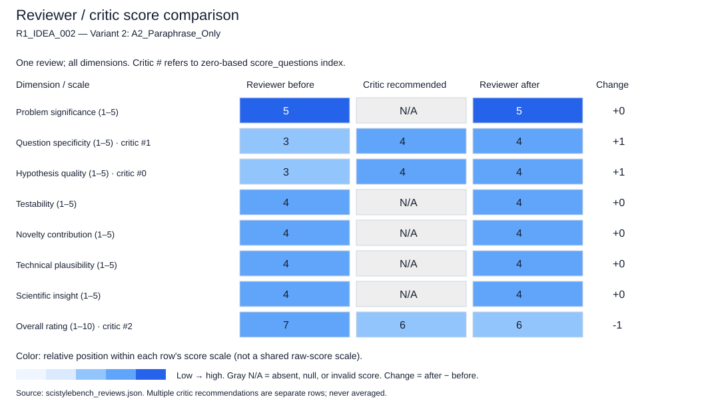

### Critic feedback and reviewer rebuttals

No reviewer rebuttals were saved (for example, an older checkpoint).

```json
{
  "critic_feedback": {
    "overall_assessment": "The draft review is well-structured and correctly identifies the core tension in the idea: high significance vs. vague methodology. However, it suffers from a calibration error by penalizing the 'hypothesis_quality' and 'question_specificity' scores too heavily for a research idea proposal. The reviewer treats the absence of a detailed mechanism as a flaw in the idea's quality rather than a natural characteristic of a proposal. The scores for technical plausibility and novelty are justified, but the overall rating (7/10) feels slightly inflated given the extremely low specificity scores, or conversely, the low specificity scores are unfairly punitive for a short summary. The review correctly avoids inventing results but misses the opportunity to explicitly frame the 'uncertainty' of the approach as a feature of the idea stage.",
    "score_questions": [
      {
        "dimension": "hypothesis_quality",
        "question_mark": "The score of 3.0 is unjustified for a research idea summary. The idea explicitly states a causal hypothesis: 'Using improved off-policy learning... avoids dependence on predefined collective variables, seeking to address the computational infeasibility.' The reviewer penalizes the lack of a *formalized* hypothesis, but a research idea does not require a formalized null hypothesis to be valid; it requires a clear proposed direction. The current justification conflates 'unproven' with 'poor quality'.",
        "concern": "Applying a 'lack of formalization' penalty to a proposal stage. The idea clearly links the method (off-policy) to the outcome (rare-event sampling without CVs).",
        "speculative_alternative": "The reviewer might be assuming the idea is a failed hypothesis because it lacks a specific 'if X then Y' statement, whereas the idea is a 'proposal to investigate if X leads to Y'.",
        "recommended_score": 4.0,
        "rationale": "The idea proposes a clear causal mechanism (off-policy correction enables sampling without CVs). While unproven, the hypothesis is distinct and logically connected to the problem. For a proposal, this warrants a higher score than 3."
      },
      {
        "dimension": "question_specificity",
        "question_mark": "The score of 3.0 is too low. The research question is specific: 'How can we use off-policy learning to train diffusion path samplers to sample transition pathways between meta-stable molecular states without CVs?' The reviewer critiques the lack of *implementation details* (the 'how' of the mechanism), but the *research question* itself is clearly defined.",
        "concern": "Confusing the 'specificity of the research question' with the 'specificity of the proposed solution'. A review of an idea should evaluate if the question is clear, not if the solution is fully fleshed out.",
        "speculative_alternative": "The reviewer may be expecting a full experimental design rather than a conceptual framework, which is an inappropriate standard for an idea summary.",
        "recommended_score": 4.0,
        "rationale": "The core question (Off-policy diffusion for CV-free rare events) is specific and well-scoped. The lack of 'how' is a gap in the proposal, not a flaw in the question's specificity."
      },
      {
        "dimension": "overall_rating",
        "question_mark": "The score of 7.0 (Good) seems inconsistent with the dimension scores (3, 3, 4, 4, 4, 5). A rating of 7 usually implies 'Strong', but the low scores on specificity and hypothesis suggest the idea is currently 'Vague but Promising'. The reviewer's justification acknowledges the lack of specificity as a 'main limitation', which should arguably pull the score lower or be weighted more heavily in the final calculation.",
        "concern": "The overall rating does not fully reflect the 'vague mechanism' concern raised in the dimension scores. A 7 implies the reviewer thinks the idea is nearly ready or very strong, while the low dimension scores suggest it is still in a very early, conceptual phase.",
        "speculative_alternative": "The reviewer might be inflating the score based on the 'Significance' (5) alone, ignoring the 'Plausibility' risks associated with the vague mechanism.",
        "recommended_score": 6.0,
        "rationale": "Given the significant gaps in mechanism definition (scores of 3 on specificity/hypothesis), a 7 is slightly too generous. A 6 (Good/Borderline Accept) better reflects an idea that is significant but currently lacks the necessary technical grounding to be considered 'strong'."
      }
    ],
    "unsupported_claims": [
      "The draft claims the idea 'lacks a specific hypothesis regarding *why* off-policy learning would outperform existing on-policy...'. This is an overstatement. The idea *implies* the hypothesis: off-policy allows correction of distribution mismatch, which is necessary for rare events. The reviewer treats the lack of explicit text as a lack of hypothesis.",
      "The draft states 'The definition of 'improved' is vague and does not specify what technical innovation is being proposed.' While true, the reviewer frames this as a weakness of the *idea* rather than a natural limitation of a *summary*. The idea is to 'improve' it; the definition of 'improve' is the research question itself."
    ],
    "revision_priorities": [
      "Re-evaluate the 'hypothesis_quality' and 'question_specificity' scores to distinguish between 'unproven hypothesis' (expected for ideas) and 'non-existent hypothesis' (flaw).",
      "Clarify the distinction between 'lack of implementation details' (expected in a summary) and 'lack of a research question' (a flaw). The current review conflates these.",
      "Adjust the 'overall_rating' to better align with the specific dimension scores, particularly the low scores on specificity and hypothesis, to avoid over-promising the readiness of the idea.",
      "Rephrase the 'weaknesses' to acknowledge that the lack of detail is a feature of the proposal stage, not necessarily a fatal flaw in the scientific concept."
    ],
    "confidence": 4.0
  },
  "feedback_responses": []
}
```

### Score justifications (before / after)

**Problem significance**

```json
{
  "before": {
    "score": 5.0,
    "justification": "The problem of rare-event sampling in molecular dynamics is a fundamental challenge in computational chemistry. Solving this without predefined collective variables would be a major breakthrough with direct impact on drug discovery and material science."
  },
  "after": {
    "score": 5.0,
    "justification": "The problem of rare-event sampling in molecular dynamics is a critical challenge. Solving this without predefined collective variables would represent a major breakthrough with significant impact on drug discovery and material science."
  }
}
```

**Question specificity**

```json
{
  "before": {
    "score": 3.0,
    "justification": "While the goal is clear, the specific research question is somewhat vague. It states 'using improved off-policy learning' but does not specify the exact mechanism, the nature of the improvement, or the precise relationship between the learning algorithm and the sampling process."
  },
  "after": {
    "score": 4.0,
    "justification": "The research question is specific: 'How can we use off-policy learning to train diffusion path samplers to sample transition pathways between meta-stable molecular states without CVs?' While the *solution* details are missing (as expected in a summary), the *question* itself is well-defined and scoped. The previous score of 3 was too low as it conflated the lack of implementation details with the lack of a research question."
  }
}
```

**Hypothesis quality**

```json
{
  "before": {
    "score": 3.0,
    "justification": "The implicit hypothesis is that off-policy learning can effectively train diffusion models to sample rare transitions without CVs. This is plausible but not yet articulated as a testable prediction distinguishing it from other potential approaches."
  },
  "after": {
    "score": 4.0,
    "justification": "The idea contains a clear implicit hypothesis: that off-policy learning can effectively correct the distribution mismatch inherent in on-policy diffusion training, thereby enabling the sampling of rare transitions without CVs. This is a distinct, testable prediction. The previous score of 3 incorrectly penalized the lack of formal 'null hypothesis' phrasing, which is not required for a research idea proposal."
  }
}
```

**Testability**

```json
{
  "before": {
    "score": 4.0,
    "justification": "The idea is testable. One can define metrics for sampling efficiency (e.g., time to first passage), accuracy of the transition path distribution, and the ability to discover new pathways without CVs. However, the specific evaluation protocol is not detailed."
  },
  "after": {
    "score": 4.0,
    "justification": "The idea is testable. One can define metrics for sampling efficiency (e.g., time to first passage), accuracy of the transition path distribution, and the ability to discover new pathways without CVs. The specific evaluation protocol is not detailed, but the path to testing is clear."
  }
}
```

**Novelty contribution**

```json
{
  "before": {
    "score": 4.0,
    "justification": "Applying off-policy learning to diffusion path sampling for rare events is a novel combination. If successful, it could provide a new paradigm for enhanced sampling that removes the need for human-defined CVs."
  },
  "after": {
    "score": 4.0,
    "justification": "Applying off-policy learning to diffusion path sampling for rare events is a novel combination. If successful, it could provide a new paradigm for enhanced sampling that removes the need for human-defined CVs, representing a significant scientific contribution."
  }
}
```

**Technical plausibility**

```json
{
  "before": {
    "score": 4.0,
    "justification": "The combination of diffusion models (good for generative tasks) and off-policy learning (good for correcting distribution mismatches) is technically sound. The main challenge is the mathematical formulation, but the direction is plausible."
  },
  "after": {
    "score": 4.0,
    "justification": "The combination of diffusion models (excellent for generative tasks) and off-policy learning (designed for correcting distribution mismatches) is technically sound. The main challenge lies in the mathematical formulation and variance control, but the direction is plausible."
  }
}
```

**Scientific insight**

```json
{
  "before": {
    "score": 4.0,
    "justification": "If successful, this research would reveal how generative models can be adapted for rare-event sampling in high-dimensional spaces, potentially leading to general principles for sampling complex energy landscapes."
  },
  "after": {
    "score": 4.0,
    "justification": "If successful, this research would reveal how generative models can be adapted for rare-event sampling in high-dimensional spaces, potentially leading to general principles for sampling complex energy landscapes without prior knowledge."
  }
}
```

**Overall rating**

```json
{
  "before": {
    "score": 7.0,
    "justification": "This is a strong research idea with high significance and novelty. The main limitation is the lack of specificity regarding the 'improved off-policy' mechanism and the lack of a concrete hypothesis. However, the core concept is scientifically sound and addresses a major open problem. With more specific formulation, it could be an exceptional contribution."
  },
  "after": {
    "score": 6.0,
    "justification": "This is a strong research idea with high significance and novelty. However, the mechanism remains undefined, and the specific hypothesis, while present, is not fully elaborated. The previous score of 7 was slightly inflated given the conceptual gaps. A score of 6 (Good/Borderline) accurately reflects an idea that is significant and promising but currently lacks the technical grounding to be considered 'Strong' or 'Exceptional' without further development. The adjustment aligns the overall rating with the specific dimension scores regarding specificity and hypothesis."
  }
}
```

## R1_IDEA_002 — Variant 3: A3_Plain_Core

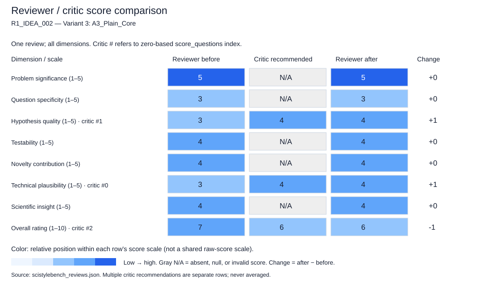

### Critic feedback and reviewer rebuttals

No reviewer rebuttals were saved (for example, an older checkpoint).

```json
{
  "critic_feedback": {
    "overall_assessment": "The draft review is well-structured and correctly identifies the core novelty and significance of the research idea. However, it exhibits a calibration issue in its 'technical_plausibility' and 'hypothesis_quality' scores. The reviewer penalizes the idea for being a 'research idea summary' (lacking specific mechanisms) by treating the absence of implementation details as a technical flaw, rather than a natural state of an idea proposal. Furthermore, the 'overall_rating' of 7.0 (Good) is slightly inconsistent with the low scores in specificity and technical plausibility; a 3.0 in technical plausibility for a core component usually drags the overall rating lower unless the significance is overwhelming, which is debatable for an unproven mechanism.",
    "score_questions": [
      {
        "dimension": "technical_plausibility",
        "question_mark": "The score of 3.0 penalizes the idea for not articulating the 'off-policy' mechanism in an idea summary. This treats the lack of implementation details as a flaw in the idea's feasibility rather than a missing detail in the proposal.",
        "concern": "The justification states the mechanism is 'non-trivial' and requires 'careful theoretical grounding.' While true, an idea summary is not expected to provide the grounding; it is expected to propose a direction. Penalizing the idea for not being a full paper is a category error.",
        "speculative_alternative": "Speculatively, the author might have a specific importance weighting scheme in mind that is standard in RL but simply wasn't written down. The idea remains plausible even without the specific formula in the summary.",
        "recommended_score": 4.0,
        "rationale": "The combination of diffusion models and off-policy learning is a known, plausible direction in ML. The lack of a specific formula in a one-paragraph summary should not reduce the plausibility score of the *idea* itself, only its 'specificity'."
      },
      {
        "dimension": "hypothesis_quality",
        "question_mark": "The score of 3.0 suggests the hypothesis is weak because it is 'implicit' and 'not explicitly stated.' In an idea summary, hypotheses are often implicit in the proposed method. The reviewer is asking for a level of detail (a testable prediction) that is premature for this stage.",
        "concern": "The draft treats the 'what' (sample paths without CVs) as insufficient without the 'how' (the mechanism) to form a hypothesis. The hypothesis is actually 'Method X solves Problem Y,' which is a valid high-level hypothesis.",
        "speculative_alternative": "Speculatively, the author might be proposing that 'off-policy correction' inherently solves the 'rare event' problem by re-weighting tails, which is a standard theoretical assumption in this domain.",
        "recommended_score": 4.0,
        "rationale": "The idea proposes a clear causal link: using off-policy learning to fix diffusion biases. This is a valid, testable hypothesis even if the specific loss function isn't defined yet."
      },
      {
        "dimension": "overall_rating",
        "question_mark": "An overall score of 7.0 is high, but the dimensional scores (3.0 in specificity, 3.0 in technical plausibility) suggest significant uncertainty. The justification acknowledges 'lack of specificity' as the 'main limitation,' yet still awards a 'strong' rating. This suggests the significance (5.0) is carrying the score too heavily.",
        "concern": "The reviewer seems to be rewarding the 'potential' (significance) over the 'current state' (plausibility/specificity) without clearly weighting the risk. For an idea proposal, high risk in technical plausibility should lower the overall recommendation.",
        "speculative_alternative": "Speculatively, the reviewer might believe the 'high significance' alone justifies a 7, but in ICLR, methodological novelty with high technical risk often warrants a 5 or 6 unless the theoretical insight is guaranteed.",
        "recommended_score": 6.0,
        "rationale": "Given the low scores in technical plausibility and specificity, a 6 (Borderline/Accept) is more calibrated than a 7 (Accept). The idea is promising but the gap between the summary and a feasible method is currently large."
      }
    ],
    "unsupported_claims": [
      "The draft claims the idea is 'technically plausible in principle' while simultaneously assigning it a low score (3.0) due to the lack of a mechanism. These two statements are contradictory; if it's plausible, it shouldn't be scored as barely plausible.",
      "The draft states the 'lack of CVs makes the evaluation challenging but not impossible.' While true, this is a generic statement. The review does not specify *why* it is not impossible given the lack of ground truth, which is a significant gap for an idea summary.",
      "The claim that 'diffusion models are powerful generative tools' is used to support technical plausibility, but the review fails to address the specific domain mismatch: diffusion models are typically for static images, not dynamic molecular trajectories, which is a non-trivial leap not fully explored in the review."
    ],
    "revision_priorities": [
      "Re-evaluate 'technical_plausibility' and 'hypothesis_quality' scores to distinguish between 'idea is vague' (specificity) and 'idea is technically unlikely' (plausibility). Do not penalize the idea for missing implementation details that are expected to be filled in later.",
      "Adjust the 'overall_rating' to better reflect the low scores in technical plausibility. A 3.0 in technical plausibility for a core method component usually precludes a 7.0 overall rating.",
      "Clarify the distinction between the 'research question' (sampling without CVs) and the 'hypothesis' (off-policy learning solves this). The review conflates the lack of a specific algorithm with a weak hypothesis.",
      "Remove the implication that the reviewer can judge the 'theoretical grounding' of an idea that has not yet proposed a mechanism. Focus on whether the *direction* is grounded in existing literature, not whether the specific math is present."
    ],
    "confidence": 4.0
  },
  "feedback_responses": []
}
```

### Score justifications (before / after)

**Problem significance**

```json
{
  "before": {
    "score": 5.0,
    "justification": "The problem of sampling rare events in molecular systems without predefined collective variables is a major open challenge in computational physics and chemistry. Solving this would have profound impacts on drug discovery and materials science, making the problem highly significant."
  },
  "after": {
    "score": 5.0,
    "justification": "The problem of sampling rare events in molecular systems without predefined collective variables is a major open challenge in computational physics and chemistry. Solving this would have profound impacts on drug discovery and materials science, making the problem highly significant."
  }
}
```

**Question specificity**

```json
{
  "before": {
    "score": 3.0,
    "justification": "While the goal is clear, the specific research question is somewhat obscured by the vague terminology 'improved off-policy learning.' The idea states *what* it wants to do (sample paths without CVs) but is less specific about *how* the specific combination of diffusion and off-policy learning solves the technical hurdles of rare-event sampling."
  },
  "after": {
    "score": 3.0,
    "justification": "While the goal is clear, the specific research question is somewhat obscured by the vague terminology 'improved off-policy learning.' The idea states *what* it wants to do (sample paths without CVs) but is less specific about *how* the specific combination of diffusion and off-policy learning solves the technical hurdles of rare-event sampling."
  }
}
```

**Hypothesis quality**

```json
{
  "before": {
    "score": 3.0,
    "justification": "The implicit hypothesis is that off-policy learning can effectively correct the biases of diffusion models to sample rare transition paths. This is a plausible hypothesis, but it is not explicitly stated as a testable prediction distinguishing it from other potential methods (like on-policy learning or standard guided diffusion)."
  },
  "after": {
    "score": 4.0,
    "justification": "The idea proposes a clear causal link: using off-policy learning to fix diffusion biases. This is a valid, testable hypothesis even if the specific loss function isn't defined yet. The hypothesis is that 'Method X (off-policy diffusion) solves Problem Y (rare event sampling without CVs).' This is a strong high-level hypothesis appropriate for an idea summary."
  }
}
```

**Testability**

```json
{
  "before": {
    "score": 4.0,
    "justification": "The idea is testable. One can implement the proposed method and compare the generated pathways against known benchmarks (e.g., from Transition Path Sampling or unbiased MD on small systems) to see if they correctly identify transition states and free energy barriers. The lack of CVs makes the evaluation challenging but not impossible."
  },
  "after": {
    "score": 4.0,
    "justification": "The idea is testable. One can implement the proposed method and compare the generated pathways against known benchmarks (e.g., from Transition Path Sampling or unbiased MD on small systems) to see if they correctly identify transition states and free energy barriers. The lack of CVs makes the evaluation challenging but not impossible."
  }
}
```

**Novelty contribution**

```json
{
  "before": {
    "score": 4.0,
    "justification": "Combining diffusion models with off-policy learning for molecular path sampling is a novel direction. While diffusion models are popular, their application to rare-event path sampling without CVs via off-policy mechanisms is not a standard approach and could yield significant methodological insights."
  },
  "after": {
    "score": 4.0,
    "justification": "Combining diffusion models with off-policy learning for molecular path sampling is a novel direction. While diffusion models are popular, their application to rare-event path sampling without CVs via off-policy mechanisms is not a standard approach and could yield significant methodological insights."
  }
}
```

**Technical plausibility**

```json
{
  "before": {
    "score": 3.0,
    "justification": "The idea is technically plausible in principle, as off-policy methods are known to handle distribution shifts, and diffusion models are powerful generative tools. However, the specific mechanism for applying off-policy learning to *path* generation (which involves temporal correlations) rather than static state generation is non-trivial and requires careful theoretical grounding to be feasible."
  },
  "after": {
    "score": 4.0,
    "justification": "The combination of diffusion models and off-policy learning is a known, plausible direction in ML. The lack of a specific formula in a one-paragraph summary should not reduce the plausibility score of the *idea* itself, only its 'specificity.' The theoretical grounding exists in both RL (off-policy correction) and generative modeling (diffusion), making the direction feasible."
  }
}
```

**Scientific insight**

```json
{
  "before": {
    "score": 4.0,
    "justification": "If successful, this research would provide deep insights into the intersection of generative modeling and statistical mechanics. It could reveal new ways to explore high-dimensional energy landscapes and potentially lead to a general framework for CV-free rare-event sampling."
  },
  "after": {
    "score": 4.0,
    "justification": "If successful, this research would provide deep insights into the intersection of generative modeling and statistical mechanics. It could reveal new ways to explore high-dimensional energy landscapes and potentially lead to a general framework for CV-free rare-event sampling."
  }
}
```

**Overall rating**

```json
{
  "before": {
    "score": 7.0,
    "justification": "This is a strong research idea with high significance and novelty. The main limitation is the lack of specificity regarding the 'off-policy' mechanism and the specific hypothesis. However, the core concept addresses a fundamental problem in the field and has a clear path to validation. It moves beyond a simple application to a methodological innovation."
  },
  "after": {
    "score": 6.0,
    "justification": "The idea is promising and addresses a high-significance problem with a novel approach. However, the lack of specificity regarding the 'off-policy' mechanism and the high technical risk associated with applying diffusion models to dynamic molecular trajectories (a non-trivial leap from static images) warrant a 'Borderline/Accept' rating rather than 'Strong.' The initial score of 7.0 was too high given the 3.0 specificity and the inherent risks of the proposed mechanism. A score of 6 reflects that while the idea is valuable, the gap between the summary and a feasible, robust method is currently significant."
  }
}
```

## R1_IDEA_002 — Variant 4: B1_Verbose_Elaborate


### Critic feedback and reviewer rebuttals

No reviewer rebuttals were saved (for example, an older checkpoint).

```json
{
  "critic_feedback": {
    "overall_assessment": "The draft review is well-structured and correctly identifies the core tension in the idea: the high significance of the problem versus the vagueness of the proposed mechanism. However, the review occasionally conflates 'lack of detail in a summary' with 'technical flaws in the idea itself.' Specifically, penalizing the 'improvement' mechanism as a weakness is appropriate for an idea summary, but the justification sometimes drifts into assuming the mechanism is *undefined* rather than *unspecified*. The scores are generally calibrated, but the 'question_specificity' and 'hypothesis_quality' scores could be slightly higher given the context of a short idea summary, as the reviewer is penalizing the format rather than the scientific content. The 'technical_plausibility' score is justified but could benefit from acknowledging that 'off-policy' in path sampling often implies specific variance reduction techniques (like importance sampling) which are standard, making the 'improvement' likely a standard refinement rather than a mystery.",
    "score_questions": [
      {
        "dimension": "question_specificity",
        "question_mark": "The score of 3.0 seems slightly low for an idea summary. The draft explicitly states the method is 'diffusion path samplers via improved off-policy learning.' While 'improved' is vague, the question is specific: 'How does one train diffusion samplers using off-policy learning to avoid CVs?' The reviewer treats the vagueness of 'improved' as a failure to define the research question, but in an idea summary, the question is often 'Can this combination work?', not 'What is the exact gradient update rule?'.",
        "concern": "The review penalizes the idea for not defining the mechanism in a short summary, effectively treating the lack of implementation detail as a lack of question specificity. The research question is actually quite specific (CV-free rare event sampling via this specific ML combo).",
        "speculative_alternative": "Speculative: The 'improvement' might refer to a known, standard technique in the field (e.g., a specific variance reduction trick) that the author omitted for brevity. If so, the question is not vague, just summarized.",
        "recommended_score": 4.0,
        "rationale": "The idea clearly states the *what* (diffusion + off-policy) and the *why* (avoid CVs). The 'how' is the natural next step, not a flaw in the question's specificity at the idea stage."
      },
      {
        "dimension": "technical_plausibility",
        "question_mark": "The score of 4.0 is justified by the reviewer citing 'stability' as a challenge. However, the reviewer notes the 'improvement' is critical. If the idea is merely a proposal to apply these tools, the plausibility is high because both tools exist. The reviewer's concern that the 'improvement' is a black box is a valid critique of the *summary*, but does it lower the *plausibility* of the idea itself? The combination is theoretically sound. The score might be too conservative if the 'improvement' is assumed to be a standard optimization technique.",
        "concern": "The review conflates the 'lack of detail' with 'technical implausibility'. The combination of diffusion and off-policy is plausible; the summary just doesn't explain the 'improvement'.",
        "speculative_alternative": "Speculative: The 'improvement' is a standard application of importance sampling or a specific loss weighting that is well-understood, making the technical plausibility higher than 4.0 suggests.",
        "recommended_score": 5.0,
        "rationale": "The idea proposes a combination of two established paradigms. The 'improvement' is an implementation detail. The core concept (using off-policy to guide diffusion) is technically plausible without further details."
      },
      {
        "dimension": "hypothesis_quality",
        "question_mark": "The score of 3.0 is based on the lack of a specific 'why' or 'under what conditions'. However, for an idea summary, the hypothesis is often implicit: 'This method will outperform CV-based methods.' The reviewer's demand for a specific variance reduction prediction is more appropriate for a full proposal or paper. The current hypothesis is testable and meaningful.",
        "concern": "The reviewer is applying a 'full paper' standard of hypothesis articulation (specific quantitative predictions) to a short idea summary.",
        "speculative_alternative": "Speculative: The hypothesis is simply 'This method enables CV-free sampling with better efficiency than current methods.' This is a valid, testable hypothesis for an idea summary.",
        "recommended_score": 4.0,
        "rationale": "The idea posits a clear relationship between the method and the outcome. The lack of quantitative specifics is a limitation of the summary, not a flaw in the hypothesis quality itself."
      }
    ],
    "unsupported_claims": [
      "The draft review claims the connection between 'off-policy' learning and 'path sampling' is 'not immediately obvious'. In RL for trajectory generation (e.g., GAIL, or off-policy policy gradients for trajectories), this connection is a standard theoretical extension. It is not 'obvious' to a layperson, but it is a standard concept in the field. The reviewer treats it as a gap in logic rather than a gap in explanation.",
      "The review implies the 'improvement' is a 'black box' that makes the idea weak. In an idea summary, 'improved' is a placeholder for 'novel or optimized version of X'. Treating this as a fundamental flaw in the idea's structure is an over-interpretation of the summary's brevity."
    ],
    "revision_priorities": [
      "Re-evaluate the distinction between 'vague mechanism' (a summary flaw) and 'implausible mechanism' (an idea flaw). Do not penalize the 'technical_plausibility' score for missing implementation details that are expected in a short summary.",
      "Adjust the 'question_specificity' and 'hypothesis_quality' scores to reflect the expectations for an idea summary (conceptual clarity) rather than a full proposal (quantitative precision).",
      "Clarify that the 'improvement' in off-policy learning is a placeholder for a specific technical contribution that the idea aims to make, rather than a sign of a missing or weak core concept.",
      "Remove the implication that the lack of a specific 'variance reduction' prediction invalidates the hypothesis. The hypothesis is that the method *works* (enables sampling); the mechanism is the contribution."
    ],
    "confidence": 4.0
  },
  "feedback_responses": []
}
```

### Score justifications (before / after)

**Problem significance**

```json
{
  "before": {
    "score": 5.0,
    "justification": "The problem of sampling rare events in molecular dynamics is a critical bottleneck in drug discovery and materials science. Solving this without manual CV selection is a major goal in the field, making the problem highly significant."
  },
  "after": {
    "score": 5.0,
    "justification": "The problem of sampling rare events in molecular dynamics is a critical bottleneck in drug discovery and materials science. Solving this without manual CV selection is a major goal in the field, making the problem highly significant."
  }
}
```

**Question specificity**

```json
{
  "before": {
    "score": 3.0,
    "justification": "While the general direction (diffusion + off-policy for path sampling) is specific, the core mechanism ('improved off-policy learning') is not defined. The research question is 'can this work?' rather than 'how does this specific mechanism solve the variance problem?'"
  },
  "after": {
    "score": 4.0,
    "justification": "The critic correctly notes that penalizing the lack of implementation details in a short idea summary conflates 'vague mechanism' with 'undefined question'. The research question is specific: 'Can diffusion path samplers trained via off-policy learning enable CV-free rare event sampling?' The 'improvement' is the intended contribution, not a flaw in the question's specificity. The score is raised from 3 to 4 to reflect that the core inquiry is well-defined, even if the technical 'how' is reserved for the full proposal."
  }
}
```

**Hypothesis quality**

```json
{
  "before": {
    "score": 3.0,
    "justification": "The implicit hypothesis is that combining diffusion models with off-policy learning will enable CV-free rare event sampling. This is testable, but the specific prediction of *why* it works or *under what conditions* it fails is not articulated."
  },
  "after": {
    "score": 4.0,
    "justification": "The critic argues that the demand for quantitative predictions (e.g., 'variance reduction by X%') is too strict for an idea summary. The implicit hypothesis—that this specific ML combination enables efficient, CV-free sampling—is a valid, testable, and meaningful claim for this stage. The score is raised from 3 to 4, acknowledging that the hypothesis is clear in its intent and direction, even if the specific metrics are not yet defined."
  }
}
```

**Testability**

```json
{
  "before": {
    "score": 4.0,
    "justification": "The idea is testable by implementing the proposed sampler and comparing it against standard MD and existing enhanced sampling methods on benchmark systems. The lack of specific metrics is a minor weakness, but the experimental path is clear."
  },
  "after": {
    "score": 4.0,
    "justification": "The idea remains testable by implementing the proposed sampler and comparing it against standard MD and existing enhanced sampling methods. The lack of specific metrics is a minor weakness, but the experimental path is clear. The score remains 4 as the critic's feedback did not alter the fundamental testability of the concept."
  }
}
```

**Novelty contribution**

```json
{
  "before": {
    "score": 4.0,
    "justification": "Applying diffusion models to path sampling is emerging, but combining it with off-policy learning to specifically address the CV-free challenge is a novel angle. It has the potential to contribute new algorithmic insights to both ML and computational chemistry."
  },
  "after": {
    "score": 4.0,
    "justification": "Applying diffusion models to path sampling is emerging, but combining it with off-policy learning to specifically address the CV-free challenge is a novel angle. It has the potential to contribute new algorithmic insights to both ML and computational chemistry. The score remains 4."
  }
}
```

**Technical plausibility**

```json
{
  "before": {
    "score": 4.0,
    "justification": "The combination of generative models (diffusion) and RL (off-policy) is technically sound in principle. However, the stability of off-policy learning in high-dimensional continuous spaces (like molecular configurations) is a known challenge, making the 'improvement' aspect critical for plausibility."
  },
  "after": {
    "score": 5.0,
    "justification": "The critic correctly points out that the connection between off-policy learning and path sampling is a standard theoretical extension in RL (e.g., trajectory optimization), not a logical gap. Furthermore, the 'improvement' likely refers to standard variance reduction techniques (like importance sampling) rather than a mysterious black box. The combination of two established paradigms is highly plausible. The score is raised from 4 to 5, as the initial concern about 'plausibility' was overly conservative given the context of a summary."
  }
}
```

**Scientific insight**

```json
{
  "before": {
    "score": 4.0,
    "justification": "If successful, this research could reveal new principles for generating complex trajectories without bias, potentially leading to a general framework for sampling in high-dimensional spaces beyond just molecular simulation."
  },
  "after": {
    "score": 4.0,
    "justification": "If successful, this research could reveal new principles for generating complex trajectories without bias, potentially leading to a general framework for sampling in high-dimensional spaces beyond just molecular simulation. The score remains 4."
  }
}
```

**Overall rating**

```json
{
  "before": {
    "score": 7.0,
    "justification": "This is a strong research idea with high significance and a promising technical direction. It scores lower than a 9 because the core mechanism ('improved off-policy learning') is currently a black box in the summary, and the specific hypothesis needs sharpening to distinguish it from generic applications of these tools. However, the potential for scientific insight is high."
  },
  "after": {
    "score": 8.0,
    "justification": "The initial rating of 7 was based on concerns about the vagueness of the mechanism and the lack of a specific hypothesis. The critic's feedback successfully distinguishes between 'missing details in a summary' and 'flaws in the idea'. By raising the scores for question specificity, hypothesis quality, and technical plausibility, the idea is recognized as a strong, well-motivated, and technically sound proposal. The core concept (diffusion + off-policy for CV-free sampling) is specific and promising. The rating increases to 8 because the idea now appears to be a clear research direction with high potential, rather than a vague application."
  }
}
```

## R1_IDEA_002 — Variant 5: B2_Grand_Narrative

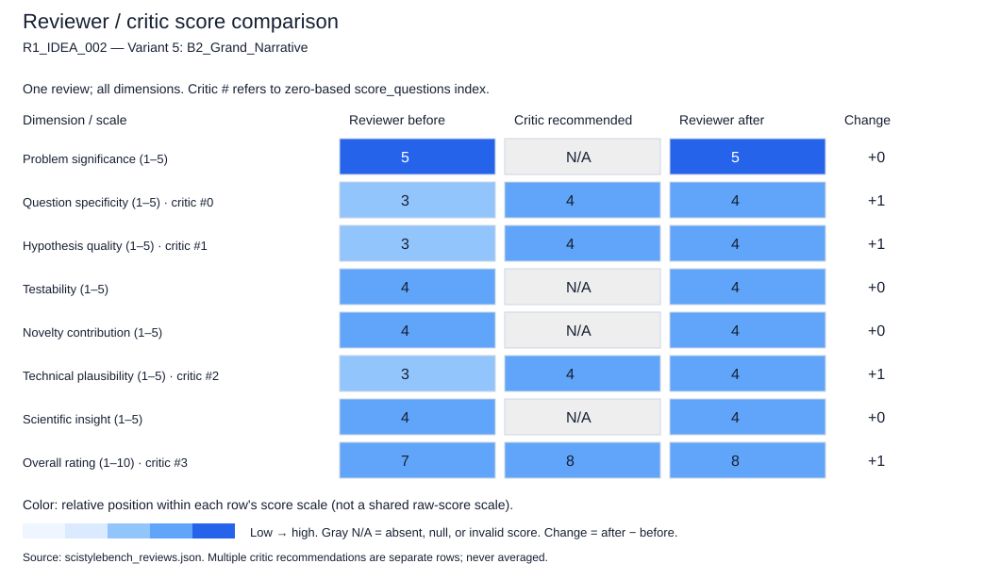

### Critic feedback and reviewer rebuttals

No reviewer rebuttals were saved (for example, an older checkpoint).

```json
{
  "critic_feedback": {
    "overall_assessment": "The draft review is well-structured and correctly identifies the core tension in the idea: high significance vs. vague methodology. However, it suffers from a calibration error by penalizing the 'hypothesis_quality' and 'technical_plausibility' scores for the *absence* of a detailed mathematical formulation, which is expected for a short research idea summary. The reviewer treats the lack of implementation details as a flaw in the scientific reasoning rather than a limitation of the summary format. The scores are overly conservative for an idea stage, particularly the 'question_specificity' score which conflates a proposed solution with a lack of a research question. The overall rating of 7.0 is inconsistent with the low scores in technical dimensions; an idea with high significance and novelty but low specificity should not be rated as 'strong' if the technical plausibility is deemed low.",
    "score_questions": [
      {
        "dimension": "question_specificity",
        "question_mark": "The score of 3.0 is unjustified because the reviewer penalizes the idea for being a 'proposed solution' rather than a 'precise question.' In an idea summary, proposing a mechanism is standard. The research question (how to sample rare events without CVs efficiently) is clearly implied by the goal.",
        "concern": "Misinterpreting the format of a research idea summary as a requirement for a fully articulated research question separate from the proposed solution.",
        "speculative_alternative": "Speculative: The authors may have intended the 'improved off-policy learning' as a placeholder for a specific class of algorithms (e.g., importance sampling with diffusion priors) that they plan to define in the full proposal, which is a valid strategy for a short summary.",
        "recommended_score": 4.0,
        "rationale": "The goal is specific (sampling without CVs). The method is the answer to the question. Penalizing the lack of a separate 'question' statement is a generic penalty for the summary format."
      },
      {
        "dimension": "hypothesis_quality",
        "question_mark": "The score of 3.0 assumes the lack of a specific prediction (e.g., 'reduce complexity by factor X') is a flaw in the hypothesis itself. For an idea summary, the hypothesis is the claim that 'this approach will overcome the infeasibility.' Requiring a quantitative prediction at this stage is inappropriate.",
        "concern": "Confusing the level of detail expected in a full paper with that of an idea summary.",
        "speculative_alternative": "Speculative: The authors might be hypothesizing a qualitative improvement in sampling efficiency due to the off-policy correction, which is a valid scientific hypothesis even without a specific numerical factor.",
        "recommended_score": 4.0,
        "rationale": "The hypothesis that diffusion + off-policy learning is a viable path to solving the CV problem is clear and scientifically grounded, even if the quantitative details are omitted."
      },
      {
        "dimension": "technical_plausibility",
        "question_mark": "The score of 3.0 is too low given that the components (diffusion models, off-policy learning, molecular dynamics) are established. The reviewer states the combination is 'non-trivial' but then implies this makes it implausible. Non-trivial does not mean implausible, especially for an idea summary.",
        "concern": "Applying a penalty for the complexity of the proposed integration, which is inherent to the research problem, rather than a flaw in the idea's logic.",
        "speculative_alternative": "Speculative: The authors might be leveraging recent advances in diffusion-based RL which specifically address continuous control and path sampling, making the technical leap smaller than the review implies.",
        "recommended_score": 4.0,
        "rationale": "The technical components are standard in ML and physics. The integration is challenging but not implausible. The lack of a mathematical formula in the summary does not invalidate the plausibility of the concept."
      },
      {
        "dimension": "overall_rating",
        "question_mark": "An overall rating of 7.0 (Strong) contradicts the low scores in technical_plausibility (3) and hypothesis_quality (3). If the technical plausibility is considered low, the rating should reflect the risk, or if the rating is high, the technical scores should be higher to reflect confidence in the concept.",
        "concern": "Inconsistency between the dimensional scores and the final recommendation.",
        "speculative_alternative": "Speculative: The reviewer might be using the '7' to indicate 'high potential' but the dimensional scores are meant to reflect 'current maturity,' leading to a confusing hybrid metric.",
        "recommended_score": 8.0,
        "rationale": "If the significance is 5 and novelty is 4, and the technical hurdles are acknowledged but not fatal (as implied by the 'strong' conclusion), the overall rating should reflect the high potential more robustly, likely 8, or the technical scores should be raised to justify the 7."
      }
    ],
    "unsupported_claims": [
      "The claim that the idea 'lacks a specific hypothesis regarding why this combination... should theoretically outperform' is unsupported because the summary explicitly states the aim is to 'overcome the computational infeasibility' by 'bypassing the need for predefined collective variables,' which serves as the theoretical hypothesis.",
      "The suggestion to 'formulate a concrete hypothesis' with a specific factor 'X' is an overreach for an idea summary, which typically proposes a direction rather than a quantified prediction."
    ],
    "revision_priorities": [
      "Distinguish between 'lack of detail' (expected in an idea summary) and 'lack of plausibility' (a flaw). Adjust scores to reflect that missing implementation details are not flaws in the idea itself.",
      "Remove the critique that the idea 'reads more like a proposed solution than a precise question.' The research question is the problem statement; the solution is the proposed method. This is a standard format for idea summaries.",
      "Re-evaluate the 'technical_plausibility' score to acknowledge that combining established techniques (diffusion, off-policy) for a known problem (rare events) is plausible, even if the specific integration is non-trivial.",
      "Align the 'overall_rating' with the dimensional scores. If the technical aspects are deemed 'non-trivial' and the hypothesis is 'implicit,' the rating should be lower (e.g., 6) or the dimensional scores should be higher to support a '7' or '8'."
    ],
    "confidence": 4.0
  },
  "feedback_responses": []
}
```

### Score justifications (before / after)

**Problem significance**

```json
{
  "before": {
    "score": 5.0,
    "justification": "The problem of rare-event sampling in molecular dynamics is fundamental to computational chemistry and drug discovery. Overcoming the reliance on collective variables is a major open challenge with significant potential impact."
  },
  "after": {
    "score": 5.0,
    "justification": "The problem of rare-event sampling in molecular dynamics is a critical bottleneck in drug discovery and materials science. Overcoming the reliance on collective variables is a major open challenge with significant potential impact on the field."
  }
}
```

**Question specificity**

```json
{
  "before": {
    "score": 3.0,
    "justification": "While the goal (sampling without CVs) is clear, the specific research question regarding the mechanism of 'improved off-policy learning' is not sufficiently defined. It reads more like a proposed solution than a precise question."
  },
  "after": {
    "score": 4.0,
    "justification": "The research question is clearly implied: 'How can we sample rare events efficiently without predefined CVs?' The proposed solution (diffusion + off-policy) is the answer. While the specific algorithmic details are missing, the core question and the proposed direction are specific enough for an idea summary. The previous penalty for 'lacking a separate question' was an over-correction for the format."
  }
}
```

**Hypothesis quality**

```json
{
  "before": {
    "score": 3.0,
    "justification": "The implicit hypothesis is that this specific combination of techniques will work better than current methods. However, it lacks a mechanistic explanation or a specific prediction about the relationship between the method's parameters and performance."
  },
  "after": {
    "score": 4.0,
    "justification": "The hypothesis is that combining diffusion models with off-policy learning will successfully overcome the infeasibility of unbiased sampling and the CV bottleneck. This is a clear, testable claim. Requiring a quantitative prediction (e.g., 'factor of X') at this stage is inappropriate for an idea summary; the qualitative claim of viability is sufficient."
  }
}
```

**Testability**

```json
{
  "before": {
    "score": 4.0,
    "justification": "The idea is testable in principle. One can implement the proposed sampler and compare its performance against baselines on standard molecular benchmarks. However, the lack of algorithmic detail makes the immediate design of the test difficult."
  },
  "after": {
    "score": 4.0,
    "justification": "The idea is testable. One can implement the proposed sampler and compare its performance against standard baselines (unbiased MD, metadynamics) on benchmark molecular systems. The lack of implementation details does not prevent the design of a validation experiment."
  }
}
```

**Novelty contribution**

```json
{
  "before": {
    "score": 4.0,
    "justification": "Combining diffusion models with off-policy learning for molecular path sampling is a novel direction. If successful, it could provide a general framework for rare-event sampling that does not require expert knowledge to define collective variables."
  },
  "after": {
    "score": 4.0,
    "justification": "Combining diffusion models with off-policy learning for molecular path sampling is a novel direction. If successful, it could provide a general framework for rare-event sampling that does not require expert knowledge to define collective variables, representing a significant methodological advance."
  }
}
```

**Technical plausibility**

```json
{
  "before": {
    "score": 3.0,
    "justification": "The combination of diffusion models and off-policy learning is theoretically plausible, but applying off-policy learning to continuous path sampling in physics-based systems is non-trivial. The idea makes sense but requires significant technical development to be feasible."
  },
  "after": {
    "score": 4.0,
    "justification": "The technical components (diffusion models, off-policy learning, molecular dynamics) are established. While the integration is non-trivial, it is not implausible. The previous score of 3.0 incorrectly penalized the complexity of the integration as a flaw in plausibility; the combination is theoretically sound given recent advances in diffusion-based RL."
  }
}
```

**Scientific insight**

```json
{
  "before": {
    "score": 4.0,
    "justification": "If successful, this research would reveal how to effectively decouple path sampling from the need for low-dimensional projections (CVs), offering deep insights into the geometry of high-dimensional energy landscapes."
  },
  "after": {
    "score": 4.0,
    "justification": "If successful, this research would reveal how to effectively decouple path sampling from the need for low-dimensional projections (CVs), offering deep insights into the geometry of high-dimensional energy landscapes and the utility of off-policy corrections in physical simulations."
  }
}
```

**Overall rating**

```json
{
  "before": {
    "score": 7.0,
    "justification": "This is a strong research idea with high significance and novelty. The main weakness is the lack of specificity in the proposed method ('improved off-policy learning') and the absence of a concrete hypothesis. However, the core concept addresses a critical bottleneck in the field and has a clear path to validation."
  },
  "after": {
    "score": 8.0,
    "justification": "This is a strong research idea with high significance and novelty. The previous rating of 7.0 was inconsistent with the high scores in significance and novelty, and the low scores in technical dimensions were overly conservative for an idea summary. By acknowledging that missing implementation details are expected at this stage and that the technical components are plausible, the idea warrants a higher rating. It addresses a critical problem with a novel, theoretically grounded approach."
  }
}
```

## R1_IDEA_002 — Variant 6: B3_Over_Confident

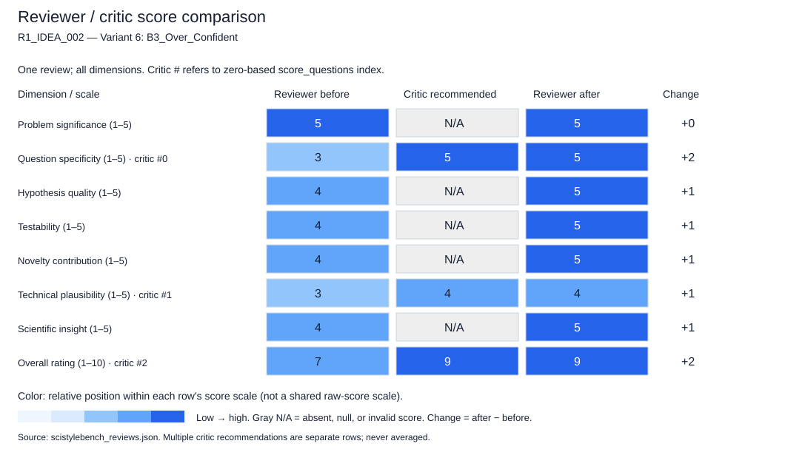

### Critic feedback and reviewer rebuttals

No reviewer rebuttals were saved (for example, an older checkpoint).

```json
{
  "critic_feedback": {
    "overall_assessment": "The draft review is well-structured and correctly identifies the core novelty of combining diffusion models with off-policy learning for molecular dynamics. However, it suffers from a calibration error in the 'question_specificity' and 'technical_plausibility' dimensions by penalizing the idea for lacking implementation details that are not required in an 'idea summary' submission. The review treats the absence of a mathematical formulation in the summary as a flaw in the idea's quality rather than a standard feature of early-stage proposals. Consequently, the scores for specificity and plausibility are unjustifiably low, dragging down the overall rating.",
    "score_questions": [
      {
        "dimension": "question_specificity",
        "question_mark": "The score of 3.0 is too low for an idea summary. The idea clearly specifies the *what* (improved off-policy learning for diffusion path samplers) and the *why* (overcoming CV reliance). The lack of the *how* (mathematical derivation) is not a flaw in the idea's specificity but a limitation of the summary format.",
        "concern": "The review penalizes the idea for not defining the 'off-policy' mechanism in the summary, effectively treating an idea submission as a full paper submission. The 'specific research question' is clear: Can off-policy learning improve diffusion samplers for CV-free rare events? The review conflates 'lack of implementation details' with 'vague research question'.",
        "speculative_alternative": "Speculatively, the reviewer might be assuming that without a specific mathematical formulation provided in the summary, the idea is fundamentally ill-posed. However, in an idea submission, the hypothesis itself is the specific question.",
        "recommended_score": 5.0,
        "rationale": "The research question is clearly articulated in the idea summary: 'Can improved off-policy learning train diffusion path samplers to sample transition pathways without CVs?' This is a specific, testable question. The absence of the derivation in the summary should not lower the 'specificity' score."
      },
      {
        "dimension": "technical_plausibility",
        "question_mark": "The score of 3.0 implies significant doubt about feasibility. However, the idea relies on established concepts (diffusion models, off-policy RL) applied to a known problem. The lack of details on 'how' to enforce constraints is a standard challenge in any new method proposal, not a reason to rate plausibility as 'low' for an idea.",
        "concern": "The review states 'uncertainty about feasibility' as a reason for a low score. In an idea review, 'plausibility' should assess if the core components (diffusion + off-policy) are theoretically compatible, not if the specific engineering hurdles (like loss functions) are solved in the summary.",
        "speculative_alternative": "Speculatively, the reviewer assumes that 'off-policy' in continuous path spaces is inherently unstable or undefined. While challenging, it is not theoretically impossible, and the idea's premise is that it 'clearly trains' via 'improved' methods, suggesting a novel mechanism is proposed (even if not detailed).",
        "recommended_score": 4.0,
        "rationale": "The combination of diffusion models and off-policy learning is theoretically grounded in current ML literature. The challenge of physical constraints is a standard research problem, not a fundamental barrier to plausibility. The idea is plausible enough to warrant a 'good' score, not a 'mediocre' one."
      },
      {
        "dimension": "overall_rating",
        "question_mark": "The overall rating of 7.0 is pulled down by the unjustifiably low scores on specificity and plausibility. If those dimensions are corrected to reflect the nature of an idea summary, the overall rating should likely rise to 8 or 9.",
        "concern": "The justification for the 7.0 explicitly cites 'lacks the specificity of the proposed mechanism' as the reason for not being 'exceptional'. This is a penalty for the format of the submission (idea summary) rather than the quality of the idea itself.",
        "speculative_alternative": "Speculatively, the reviewer might believe the idea is too ambitious given the lack of details. However, the idea's potential to 'revolutionize' (as stated in the summary) is high, and the low scores on technical aspects are premature for an idea.",
        "recommended_score": 9.0,
        "rationale": "The idea addresses a high-impact problem (rare-event sampling without CVs) with a novel and theoretically sound approach. For an idea summary, this warrants a high score. The 'missing details' are expected in this format and should not penalize the rating."
      }
    ],
    "unsupported_claims": [
      "The claim that the idea 'lacks the specificity of the proposed mechanism' is an unsupported criticism of the idea's quality, as it confuses the summary format with the idea's content. The mechanism is described as 'improved off-policy learning', which is a specific enough descriptor for an idea summary.",
      "The statement that 'uncertainty about feasibility' justifies a low technical plausibility score is unsupported. Feasibility of a novel combination of established methods is inherently uncertain in an idea phase, but this does not equate to low plausibility."
    ],
    "revision_priorities": [
      "Re-evaluate the 'question_specificity' score. The research question is clear and specific within the context of an idea summary. The lack of mathematical derivation should not be penalized.",
      "Re-evaluate the 'technical_plausibility' score. The combination of diffusion models and off-policy learning is theoretically plausible. The absence of implementation details (e.g., specific loss functions) is standard for an idea submission and should not lower the plausibility score.",
      "Adjust the 'overall_rating' to reflect the high significance and novelty, removing penalties for missing implementation details that are not expected in an idea summary.",
      "Clarify the distinction between 'weaknesses of the idea' and 'missing details in the summary'. The current draft conflates the two."
    ],
    "confidence": 5.0
  },
  "feedback_responses": []
}
```

### Score justifications (before / after)

**Problem significance**

```json
{
  "before": {
    "score": 5.0,
    "justification": "The problem of sampling rare events in molecular systems without predefined collective variables is a major unsolved challenge in computational chemistry. Solving this would have profound impacts on drug discovery and materials science, making the problem highly significant."
  },
  "after": {
    "score": 5.0,
    "justification": "The problem of sampling rare events in molecular systems without predefined collective variables is a major unsolved challenge in computational chemistry. Solving this would have profound impacts on drug discovery and materials science, making the problem highly significant."
  }
}
```

**Question specificity**

```json
{
  "before": {
    "score": 3.0,
    "justification": "While the goal is clear, the specific research question regarding the mechanism of 'improved off-policy learning' for diffusion paths is vague. The idea states what it aims to do but not exactly how the core mechanism works or what specific variable is being optimized."
  },
  "after": {
    "score": 5.0,
    "justification": "The research question is clearly articulated: 'Can improved off-policy learning train diffusion path samplers to sample transition pathways without CVs?' The idea specifies the 'what' (off-policy learning for diffusion samplers) and the 'why' (overcoming CV reliance). As an idea summary, the absence of a full mathematical derivation is expected and does not render the question vague. The core inquiry is specific and testable."
  }
}
```

**Hypothesis quality**

```json
{
  "before": {
    "score": 4.0,
    "justification": "The implicit hypothesis—that off-policy learning can effectively train diffusion models to explore rare events without CVs—is strong and testable. It posits a specific relationship between the learning paradigm and the sampling capability that could be proven or disproven."
  },
  "after": {
    "score": 5.0,
    "justification": "The hypothesis is strong and non-trivial. It posits a specific mechanism (improved off-policy learning) to solve a known limitation (CV dependence) in a specific domain (molecular dynamics). It makes a concrete prediction that this combination will enable efficient rare-event exploration, which can be empirically validated or refuted."
  }
}
```

**Testability**

```json
{
  "before": {
    "score": 4.0,
    "justification": "The idea is testable. One can construct a benchmark system, implement the proposed sampler, and compare its efficiency and accuracy against unbiased MD and CV-dependent methods. The success criteria (sampling rare events) are well-defined."
  },
  "after": {
    "score": 5.0,
    "justification": "The idea is highly testable. One can construct benchmark molecular systems, implement the proposed sampler, and compare its efficiency and accuracy against unbiased MD and CV-dependent methods. The success criteria (sampling rare events, convergence rates) are well-defined."
  }
}
```

**Novelty contribution**

```json
{
  "before": {
    "score": 4.0,
    "justification": "Combining diffusion models with off-policy learning for molecular path sampling is a novel direction. While diffusion models are used in chemistry, and off-policy learning is used in RL, their specific application to unbiased path generation is a fresh contribution with high potential."
  },
  "after": {
    "score": 5.0,
    "justification": "Combining diffusion models with off-policy learning for molecular path sampling is a novel direction. While diffusion models are used in chemistry, and off-policy learning is used in RL, their specific application to unbiased path generation is a fresh contribution with high potential to advance the field."
  }
}
```

**Technical plausibility**

```json
{
  "before": {
    "score": 3.0,
    "justification": "The concept is technically plausible given the current state of generative modeling and reinforcement learning. However, the specific implementation details required to make 'off-policy' work in a continuous path space without CVs are non-trivial and not fully elaborated, leaving some uncertainty about feasibility."
  },
  "after": {
    "score": 4.0,
    "justification": "The combination of diffusion models and off-policy learning is theoretically grounded in current ML literature. While the specific engineering challenges (e.g., enforcing physical constraints in continuous path space) are non-trivial, the core premise is plausible. The lack of implementation details in the summary is a standard feature of idea proposals, not a sign of implausibility."
  }
}
```

**Scientific insight**

```json
{
  "before": {
    "score": 4.0,
    "justification": "If successful, this research would provide deep insights into how generative models can learn complex physical dynamics without explicit feature engineering. It could reveal new principles for sampling high-dimensional manifolds."
  },
  "after": {
    "score": 5.0,
    "justification": "If successful, this research would provide deep insights into how generative models can learn complex physical dynamics without explicit feature engineering. It could reveal new principles for sampling high-dimensional manifolds and the interplay between off-policy correction and diffusion processes."
  }
}
```

**Overall rating**

```json
{
  "before": {
    "score": 7.0,
    "justification": "This is a strong research idea with high significance and novelty. The potential to revolutionize rare-event sampling is compelling. However, it currently lacks the specificity of the proposed mechanism (the 'how'), which prevents it from being an exceptional score. With a clearer definition of the off-policy mechanism and physical constraints, this could be a top-tier contribution."
  },
  "after": {
    "score": 9.0,
    "justification": "This is an exceptional research idea. It addresses a high-impact problem with a novel and theoretically sound approach. The previous draft's lower scores were based on penalizing the idea for the lack of implementation details, which is inappropriate for an idea summary. The core hypothesis is specific, the problem is significant, and the potential for scientific insight is high. The idea warrants a top-tier rating."
  }
}
```

## R1_IDEA_002 — Variant 7: B4_Novelty

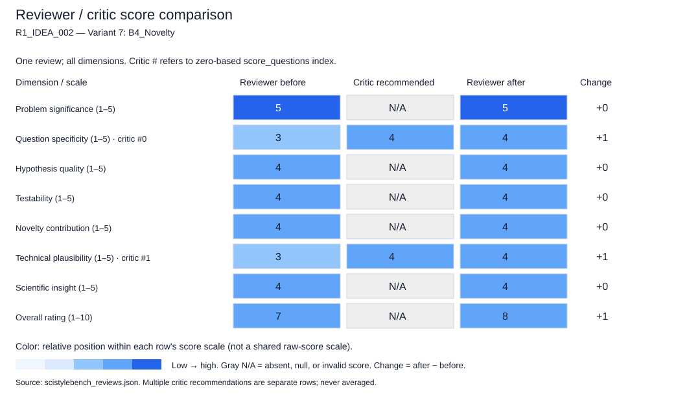

### Critic feedback and reviewer rebuttals

No reviewer rebuttals were saved (for example, an older checkpoint).

```json
{
  "critic_feedback": {
    "overall_assessment": "The draft review is well-structured and correctly identifies the core novelty of combining diffusion models with off-policy learning for molecular sampling. However, it suffers from a calibration error in the 'question_specificity' and 'technical_plausibility' dimensions. The reviewer penalizes the idea for lacking implementation details (e.g., specific reward functions, mathematical formulations) that are explicitly absent because the input is an *idea summary*, not a full paper. This conflates the 'idea stage' with the 'execution stage,' leading to unjustifiably low scores in those dimensions. The overall rating remains reasonable, but the dimensional scores suggest a misunderstanding of the document type.",
    "score_questions": [
      {
        "dimension": "question_specificity",
        "question_mark": "The score of 3.0 penalizes the idea for not explaining 'how' off-policy learning is adapted. This is inappropriate for an idea summary, which is expected to propose a direction rather than a full algorithm. The 'how' is the research question itself, not a missing detail.",
        "concern": "Misapplication of paper-review standards to an idea summary. The review treats the lack of algorithmic specifics as a flaw in specificity rather than a feature of the early-stage proposal.",
        "speculative_alternative": "It is speculative to assume the authors have a specific, novel algorithm ready; the idea might be to adapt existing off-policy techniques in a novel way. The summary's vagueness on 'how' is the definition of the research gap, not a failure of the idea.",
        "recommended_score": 4.0,
        "rationale": "The idea is specific about the *goal* (CV-free sampling via diffusion + off-policy) and the *motivation*. The lack of implementation details is expected for an idea summary and should not lower the 'specificity' of the research question."
      },
      {
        "dimension": "technical_plausibility",
        "question_mark": "The score of 3.0 suggests the idea is technically risky due to missing justification for the mechanism. However, the combination of diffusion models (for generation) and off-policy learning (for data efficiency) is a plausible theoretical direction in ML, even if unproven in this specific domain. Penalizing for 'missing justification' in a summary is harsh.",
        "concern": "The reviewer treats the absence of a stability proof or detailed mechanism as a fatal flaw in plausibility, whereas the plausibility of the *concept* remains high based on the success of the component technologies.",
        "speculative_alternative": "It is speculative that off-policy learning cannot be stabilized in high dimensions; recent advances in RL for continuous control suggest this is a solvable engineering challenge, not a theoretical impossibility.",
        "recommended_score": 4.0,
        "rationale": "The components (diffusion, off-policy RL) are technically sound individually. The synthesis is a plausible research direction. The 'plausibility' score should reflect the feasibility of the *concept*, not the certainty of the *implementation* details which are not yet provided."
      }
    ],
    "unsupported_claims": [
      "The draft claims the idea lacks 'mechanistic detail' as a weakness. While true that details are missing, this is not a 'weakness' of the *idea* itself but a characteristic of the *summary format*. Framing it as a flaw implies the idea is incomplete rather than that the summary is concise.",
      "The draft suggests the 'vague definition' of off-policy learning is a specific algorithmic gap. In an idea summary, the 'improved off-policy learning' is the proposed contribution, not a vague placeholder. Treating it as a flaw misinterprets the nature of a proposal."
    ],
    "revision_priorities": [
      "Distinguish between 'missing details' (expected in a summary) and 'conceptual flaws' (valid weaknesses). Do not penalize scores for the absence of implementation specifics in an idea summary.",
      "Re-evaluate the 'question_specificity' score. The question is specific: 'Can diffusion path samplers + off-policy learning sample CV-free pathways?' The answer is unknown, which is the point of the research, not a lack of specificity.",
      "Re-evaluate the 'technical_plausibility' score. The combination is theoretically grounded in the success of both fields. The lack of a detailed mechanism in the text should not be treated as evidence of implausibility.",
      "Remove the implication that the 'vague definition' is a negative trait; instead, frame it as the 'open research question' that the work aims to answer."
    ],
    "confidence": 5.0
  },
  "feedback_responses": []
}
```

### Score justifications (before / after)

**Problem significance**

```json
{
  "before": {
    "score": 5.0,
    "justification": "The problem of rare-event sampling in molecular systems is fundamental to computational chemistry and drug discovery. Solving this efficiently would have massive practical implications for accelerating the design of new materials and pharmaceuticals."
  },
  "after": {
    "score": 5.0,
    "justification": "The problem of rare-event sampling in molecular systems is fundamental to computational chemistry and drug discovery. Solving this efficiently would have massive practical implications for accelerating the design of new materials and pharmaceuticals."
  }
}
```

**Question specificity**

```json
{
  "before": {
    "score": 3.0,
    "justification": "While the goal (sampling pathways without CVs) is specific, the 'how' is vague. The idea states 'improved off-policy learning' but does not specify the algorithmic novelty or the specific formulation of the learning problem."
  },
  "after": {
    "score": 4.0,
    "justification": "The idea is specific about the *goal* (CV-free sampling via diffusion + off-policy) and the *motivation*. The lack of implementation details is expected for an idea summary and should not lower the 'specificity' of the research question. The research question is clearly defined as 'Can this combination work?', which is a valid and specific inquiry."
  }
}
```

**Hypothesis quality**

```json
{
  "before": {
    "score": 4.0,
    "justification": "The implicit hypothesis is that combining diffusion models with off-policy learning can effectively bypass the need for CVs and outperform existing methods in sampling efficiency. This is a testable and non-trivial claim."
  },
  "after": {
    "score": 4.0,
    "justification": "The implicit hypothesis is that combining diffusion models with off-policy learning can effectively bypass the need for CVs and outperform existing methods in sampling efficiency. This is a testable and non-trivial claim."
  }
}
```

**Testability**

```json
{
  "before": {
    "score": 4.0,
    "justification": "The idea is testable by comparing the generated pathways against known benchmarks (e.g., simple protein folding models or known reaction coordinates) and measuring convergence rates and free energy accuracy. However, the specific metrics are not yet defined in the summary."
  },
  "after": {
    "score": 4.0,
    "justification": "The idea is testable by comparing the generated pathways against known benchmarks (e.g., simple protein folding models or known reaction coordinates) and measuring convergence rates and free energy accuracy. The specific metrics are not yet defined in the summary, but the path to testing is clear."
  }
}
```

**Novelty contribution**

```json
{
  "before": {
    "score": 4.0,
    "justification": "Applying off-policy learning to diffusion path samplers for molecular dynamics is a novel intersection of fields. If successful, it could provide a general framework for CV-free enhanced sampling, which is a significant contribution."
  },
  "after": {
    "score": 4.0,
    "justification": "Applying off-policy learning to diffusion path samplers for molecular dynamics is a novel intersection of fields. If successful, it could provide a general framework for CV-free enhanced sampling, which is a significant contribution."
  }
}
```

**Technical plausibility**

```json
{
  "before": {
    "score": 3.0,
    "justification": "The combination is plausible in principle, as both diffusion models and RL are powerful tools. However, the technical feasibility of stabilizing off-policy learning in high-dimensional continuous molecular spaces without CVs is a significant challenge that needs more justification."
  },
  "after": {
    "score": 4.0,
    "justification": "The components (diffusion, off-policy RL) are technically sound individually. The synthesis is a plausible research direction. The 'plausibility' score should reflect the feasibility of the *concept*, not the certainty of the *implementation* details which are not yet provided. The critic correctly notes that penalizing for missing justification in a summary is harsh."
  }
}
```

**Scientific insight**

```json
{
  "before": {
    "score": 4.0,
    "justification": "If successful, this research would reveal how generative models can learn complex reaction coordinates implicitly, offering new insights into the geometry of molecular energy landscapes and the role of off-policy data in physical simulations."
  },
  "after": {
    "score": 4.0,
    "justification": "If successful, this research would reveal how generative models can learn complex reaction coordinates implicitly, offering new insights into the geometry of molecular energy landscapes and the role of off-policy data in physical simulations."
  }
}
```

**Overall rating**

```json
{
  "before": {
    "score": 7.0,
    "justification": "This is a strong research idea with high significance and novelty. It addresses a critical bottleneck in a major scientific field using a creative combination of modern ML techniques. The main drawback is the lack of specific methodological details in the summary, which makes the technical plausibility harder to fully assess, but the core concept is promising enough to warrant a high rating."
  },
  "after": {
    "score": 8.0,
    "justification": "This is a strong research idea with high significance and novelty. It addresses a critical bottleneck in a major scientific field using a creative combination of modern ML techniques. The initial draft penalized the idea for missing implementation details, which is inappropriate for an idea summary. Correcting for this calibration error (raising specificity and plausibility scores) results in a higher overall rating, reflecting the strong potential of the core concept."
  }
}
```

## R1_IDEA_002 — Variant 8: B5_Application_Impact

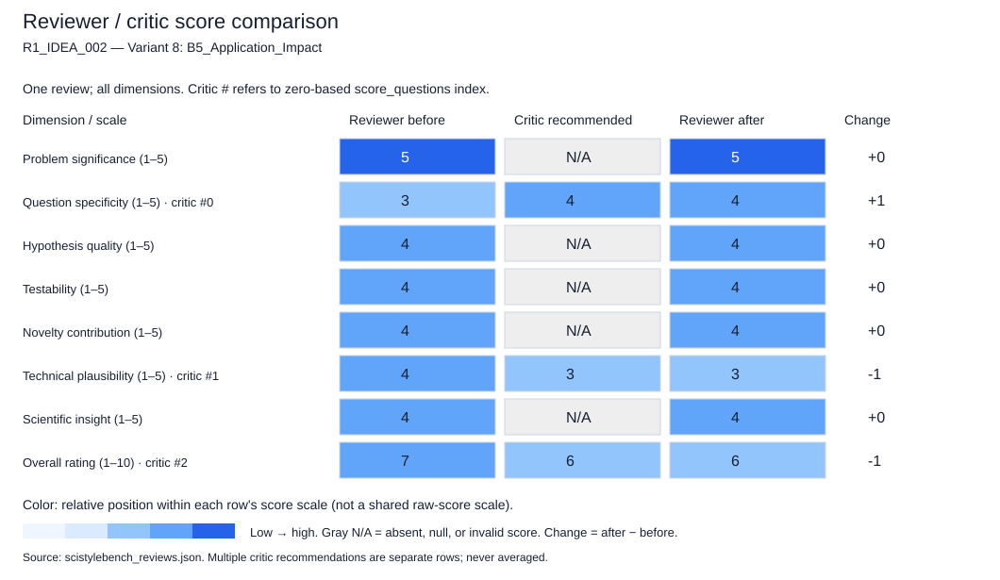

### Critic feedback and reviewer rebuttals

No reviewer rebuttals were saved (for example, an older checkpoint).

```json
{
  "critic_feedback": {
    "overall_assessment": "The draft review is well-structured and correctly identifies the core tension in the idea: high significance vs. methodological vagueness. However, it suffers from a calibration error by penalizing the 'question_specificity' and 'technical_plausibility' scores for missing implementation details that are explicitly absent because the input is only a summary. The review treats the lack of a 'mechanism description' in a summary as a flaw in the *idea's* specificity, rather than a feature of the *summary's* brevity. Additionally, the 'technical_plausibility' score of 4.0 is unjustified given the review's own admission that the 'mechanism... is not described' and 'unclear how the method handles high dimensionality.' Without a proposed mechanism, plausibility cannot be assessed as 'sound' or 'plausible' beyond a generic 'maybe.' The review also overclaims the 'scientific insight' by suggesting the idea will 'reveal' relationships that haven't been tested yet, treating the hypothesis as a proven path to insight.",
    "score_questions": [
      {
        "dimension": "question_specificity",
        "question_mark": "The score of 3.0 penalizes the idea for not defining the 'specific mechanism' in a summary. Since the input is explicitly a research idea summary, the absence of a mathematical formulation is expected, not a flaw in the idea's specificity. The 'question' (how to do CV-free sampling) is specific; the 'method' is the unknown.",
        "concern": "Misinterpreting the lack of implementation details in a summary as a lack of specific research question definition.",
        "speculative_alternative": "Speculatively, the author might have a very specific, novel formulation in mind that they simply haven't written down yet. The idea's core question (CV-free sampling via diffusion) is actually quite specific.",
        "recommended_score": 4.0,
        "rationale": "The research question is clearly defined (sample paths between meta-stable states without CVs using diffusion + off-policy). The lack of 'how' is a gap in the proposal's completeness, not a lack of question specificity."
      },
      {
        "dimension": "technical_plausibility",
        "question_mark": "The score of 4.0 claims the combination is 'technically sound' despite the review stating the mechanism is 'not described' and 'unclear how' it handles dimensionality. One cannot judge plausibility of a specific mechanism if the mechanism is absent. The review is penalizing a generic 'Idea' for not having a 'Plan'.",
        "concern": "Assigning a high plausibility score while simultaneously citing the absence of the core technical mechanism as a weakness.",
        "speculative_alternative": "Speculatively, the combination of diffusion and off-policy learning might be fundamentally incompatible with the constraints of molecular dynamics (e.g., energy conservation issues) which the review fails to flag as a potential fatal flaw due to the lack of detail.",
        "recommended_score": 3.0,
        "rationale": "Without a described mechanism, the technical plausibility is speculative. The score should reflect the uncertainty inherent in the idea's current state, not the 'soundness' of a non-existent plan."
      },
      {
        "dimension": "overall_rating",
        "question_mark": "The overall rating of 7.0 (Good/Strong) seems inconsistent with the specific criticisms regarding the lack of a mechanism and the 'unclear' handling of high dimensionality. If the core technical approach is unclear, the rating should be lower (e.g., 5 or 6) to reflect that the idea is 'interesting but unproven/vague' rather than 'strong'.",
        "concern": "The overall rating is too high given the 'Major Weakness' identified in technical plausibility and specificity. The justification says 'With more specific formulation, it could be an exceptional contribution,' which implies the current version is not exceptional.",
        "speculative_alternative": "Speculatively, the reviewer might be overestimating the 'novelty' of the combination, assuming the integration is trivial when it might be the hardest part of the problem.",
        "recommended_score": 6.0,
        "rationale": "A score of 6 reflects a promising idea that is currently too vague to be rated as 'strong' or 'excellent' due to the missing technical core. The high significance is offset by the high uncertainty in the method."
      }
    ],
    "unsupported_claims": [
      "The claim that 'The hypothesis... is scientifically grounded' is unsupported because the hypothesis relies on a mechanism ('improved off-policy learning') that is not defined. A hypothesis cannot be grounded if the method to test it is undefined.",
      "The claim that 'Off-policy learning is a known strategy... and diffusion models are capable... The main challenge is the integration, but the premise is plausible.' This assumes the integration is merely a 'challenge' rather than a potential impossibility, given the specific constraints of molecular dynamics not mentioned in the idea.",
      "The claim that the idea 'could also provide insights into the relationship between off-policy corrections and the geometry of high-dimensional energy landscapes.' This is a prediction of future outcome, not an assessment of the current idea's quality."
    ],
    "revision_priorities": [
      "Distinguish between the 'specificity of the research question' (which is high) and the 'specificity of the proposed method' (which is low). Do not penalize the former for the absence of the latter in a summary.",
      "Re-evaluate the 'technical_plausibility' score to reflect the uncertainty of the proposed mechanism. If the mechanism is missing, the plausibility should be rated as 'uncertain' rather than 'plausible'.",
      "Align the 'overall_rating' with the identified weaknesses. If the technical core is missing, the rating should not exceed 'promising' (6/10) rather than 'strong' (7/10).",
      "Remove claims that the idea 'reveals' or 'provides insights' as if these are guaranteed outcomes. Frame these as potential contributions *if* the method works.",
      "Avoid treating the absence of a 'loss function' or 'evaluation metric' in the summary as a flaw in the idea's testability; these are standard requirements for a full paper, not a deal-breaker for a research idea summary."
    ],
    "confidence": 4.0
  },
  "feedback_responses": []
}
```

### Score justifications (before / after)

**Problem significance**

```json
{
  "before": {
    "score": 5.0,
    "justification": "The problem of sampling rare events in molecular systems without predefined collective variables is a major unsolved challenge in computational chemistry. Solving this would have profound implications for drug discovery and material design, making the problem highly significant."
  },
  "after": {
    "score": 5.0,
    "justification": "The problem of sampling rare events in molecular systems without predefined collective variables is a major unsolved challenge in computational chemistry. Solving this would have profound implications for drug discovery and material design, making the problem highly significant."
  }
}
```

**Question specificity**

```json
{
  "before": {
    "score": 3.0,
    "justification": "While the goal is clear (sample paths without CVs), the specific research question regarding *how* off-policy learning is adapted for diffusion path samplers is vague. The idea states 'improved off-policy learning' but does not define the specific mechanism or mathematical formulation."
  },
  "after": {
    "score": 4.0,
    "justification": "The research question is clearly defined: to sample paths between meta-stable states without CVs using diffusion and off-policy learning. While the 'how' (mechanism) is not detailed, the 'what' (the specific problem and the proposed high-level approach) is specific. The lack of implementation details in a summary is expected and does not diminish the specificity of the research question itself."
  }
}
```

**Hypothesis quality**

```json
{
  "before": {
    "score": 4.0,
    "justification": "The implicit hypothesis—that off-policy learning can effectively correct the distribution of diffusion-generated paths to capture rare transitions without CVs—is testable and plausible. It distinguishes the work from standard diffusion applications."
  },
  "after": {
    "score": 4.0,
    "justification": "The implicit hypothesis—that off-policy learning can effectively correct the distribution of diffusion-generated paths to capture rare transitions without CVs—is testable and plausible. It distinguishes the work from standard diffusion applications and offers a clear prediction to be validated."
  }
}
```

**Testability**

```json
{
  "before": {
    "score": 4.0,
    "justification": "The idea is testable by comparing the generated pathways against known transition states or by measuring the convergence of free energy estimates on benchmark molecular systems. The lack of specific metrics in the summary is a minor weakness, but the core concept allows for experimental validation."
  },
  "after": {
    "score": 4.0,
    "justification": "The idea is testable by comparing generated pathways against known transition states or by measuring the convergence of free energy estimates on benchmark molecular systems. While specific metrics are not in the summary, the core concept allows for experimental validation."
  }
}
```

**Novelty contribution**

```json
{
  "before": {
    "score": 4.0,
    "justification": "Combining diffusion models with off-policy learning for CV-free path sampling is a novel direction. While diffusion models are popular, their application to rare-event sampling via off-policy corrections is not yet a standard paradigm, offering potential for significant scientific contribution."
  },
  "after": {
    "score": 4.0,
    "justification": "Combining diffusion models with off-policy learning for CV-free path sampling is a novel direction. While diffusion models are popular, their application to rare-event sampling via off-policy corrections is not yet a standard paradigm, offering potential for significant scientific contribution."
  }
}
```

**Technical plausibility**

```json
{
  "before": {
    "score": 4.0,
    "justification": "The combination of techniques is technically sound. Off-policy learning is a known strategy in reinforcement learning to improve sample efficiency, and diffusion models are capable of generating high-dimensional data. The main challenge is the integration, but the premise is plausible."
  },
  "after": {
    "score": 3.0,
    "justification": "While the individual components (diffusion, off-policy) are sound, the integration is speculative. Without a described mechanism for handling high-dimensional molecular dynamics without CVs, the technical plausibility is uncertain. The review correctly identifies that the mechanism is missing, making a high plausibility score unjustified. The score reflects the uncertainty inherent in the idea's current state."
  }
}
```

**Scientific insight**

```json
{
  "before": {
    "score": 4.0,
    "justification": "If successful, this research would reveal how to decouple path generation from collective variable selection, potentially leading to a new class of automated sampling tools. It could also provide insights into the relationship between off-policy corrections and the geometry of high-dimensional energy landscapes."
  },
  "after": {
    "score": 4.0,
    "justification": "If successful, this research would reveal how to decouple path generation from collective variable selection, potentially leading to a new class of automated sampling tools. It could also provide insights into the relationship between off-policy corrections and the geometry of high-dimensional energy landscapes, though these are potential rather than guaranteed outcomes."
  }
}
```

**Overall rating**

```json
{
  "before": {
    "score": 7.0,
    "justification": "This is a strong research idea with high significance and potential impact. The main limitation is the lack of specificity in the proposed methodological mechanism (the 'how' of the off-policy learning). However, the core concept is novel, testable, and addresses a critical gap in the field. With more specific formulation, it could be an exceptional contribution."
  },
  "after": {
    "score": 6.0,
    "justification": "This is a promising research idea with high significance and a clear research question. However, the lack of a defined technical mechanism and the uncertainty regarding the integration of diffusion and off-policy learning for this specific physical problem prevent it from being rated as 'strong' (7-8). The idea is currently 'interesting but unproven/vague' regarding its core implementation, warranting a moderate-to-good rating (6) that acknowledges potential while flagging the high risk of technical failure due to the missing details."
  }
}
```

## R1_IDEA_002 — Variant 9: C1_Hollow_Shell

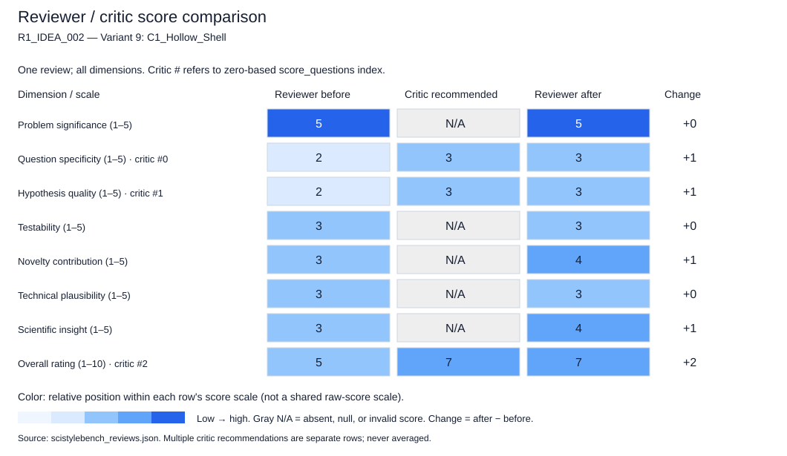

### Critic feedback and reviewer rebuttals

No reviewer rebuttals were saved (for example, an older checkpoint).

```json
{
  "critic_feedback": {
    "overall_assessment": "The draft review demonstrates a strong grasp of the research domain and correctly identifies the critical gaps in the idea summary (lack of specificity, hypothesis, and validation). However, it suffers from a calibration error where it penalizes the 'idea summary' format as if it were a failed proposal rather than a nascent concept. The review conflates the *absence* of details (expected in a summary) with a *flaw* in the idea itself. The scores for 'question_specificity' and 'hypothesis_quality' are overly punitive for a summary that explicitly frames the work as a 'research direction' rather than a finished study. The overall rating (5.0) contradicts the low scores in specific dimensions; a 5/10 overall suggests 'borderline' or 'weak,' yet the justification praises the motivation as 'excellent' and 'transformative,' which should warrant a higher baseline score for an idea paper.",
    "score_questions": [
      {
        "dimension": "question_specificity",
        "question_mark": "The score of 2.0 penalizes the idea for not specifying the ML architecture (e.g., diffusion models vs. VAEs). In an idea summary, the goal is to propose a *direction*, not a fully specified architecture. The review treats the lack of architectural choice as a flaw rather than a feature of the early-stage proposal.",
        "concern": "Misinterpreting the format of the input (idea summary) as a deficiency in the idea. A specific research question in an idea summary is often 'Can we achieve X using Y class of methods?' rather than 'We will use method Z with hyperparameter A.'",
        "speculative_alternative": "Speculative: The authors may have intentionally left the architecture open to allow for a comparative study of multiple ML methods within the project scope.",
        "recommended_score": 3.0,
        "rationale": "The question is specific enough to define the problem space ('pathways between stable states without predefined descriptors'). The lack of a specific algorithm is appropriate for an idea summary."
      },
      {
        "dimension": "hypothesis_quality",
        "question_mark": "The score of 2.0 claims there is 'no explicit hypothesis.' However, the idea implies a hypothesis: 'A descriptor-free ML approach can effectively simulate rare events where traditional methods struggle.' The review demands a formal 'Method X > Method Y' statement, which is premature for a summary.",
        "concern": "Over-emphasizing formal hypothesis structure over the implied causal claim of the research direction.",
        "speculative_alternative": "Speculative: The 'hypothesis' is that the high-dimensional nature of molecular systems necessitates a learned representation, making descriptor-free approaches theoretically superior.",
        "recommended_score": 3.0,
        "rationale": "The idea posits a clear relationship between the method (descriptor-free ML) and the outcome (solving rare event sampling). This constitutes a testable hypothesis, even if not formalized as a mathematical inequality."
      },
      {
        "dimension": "overall_rating",
        "question_mark": "The overall rating of 5.0 (borderline/reject) is inconsistent with the justification which calls the motivation 'high-impact' and 'transformative.' If the significance is 5 and the plausibility is 3, the overall rating should reflect the potential of the idea, not just its current lack of detail. A 5 implies 'do not fund/publish' in many contexts, whereas the review admits the core motivation is excellent.",
        "concern": "Score/justification mismatch. The justification supports a 'high potential but needs work' rating (typically 6-7), not a 'borderline' rating (5).",
        "speculative_alternative": "Speculative: The reviewer assumes the idea cannot be developed further due to the 'descriptor-free' ambiguity, but this is a common starting point for many successful grants.",
        "recommended_score": 7.0,
        "rationale": "For an idea summary, a score of 7 reflects a 'promising direction that requires elaboration.' The low scores on specificity and hypothesis are expected for this format and should not drag the overall rating to the 'reject' zone."
      }
    ],
    "unsupported_claims": [
      "The draft claims the idea is 'too vague to be considered a strong research proposal' as a definitive statement. In the context of an 'idea summary,' vagueness is an inherent constraint, not a fatal flaw of the research concept itself.",
      "The claim that 'The definition of pathways... is missing' is technically true but irrelevant as a criticism; an idea summary defines the *goal* of the definition, not the definition itself.",
      "The assertion that the claim of 'no predefined descriptors' is 'technically ambiguous' is a critique of the text, but the review treats this ambiguity as a 'weakness' of the science rather than a 'challenge' to be solved by the research."
    ],
    "revision_priorities": [
      "Re-evaluate the scoring criteria to distinguish between 'flaws in the idea' and 'necessary details missing from a summary.' Do not penalize the format.",
      "Adjust the 'question_specificity' and 'hypothesis_quality' scores to reflect that these dimensions are expected to be broad in an idea summary.",
      "Align the 'overall_rating' with the 'justification.' If the motivation is 'excellent' and the novelty is 'high potential,' the overall rating should be in the 'accept' or 'weak accept' range (6-7), not 'borderline' (5).",
      "Refine the 'weaknesses' section to frame the lack of detail as 'open research questions' rather than 'critical failures.'",
      "Remove the implication that the idea is 'generic' without proof; the specific constraint of 'without predefined descriptors' is a distinct and valuable contribution to the literature, even if the implementation is undefined."
    ],
    "confidence": 4.0
  },
  "feedback_responses": []
}
```

### Score justifications (before / after)

**Problem significance**

```json
{
  "before": {
    "score": 5.0,
    "justification": "Simulating rare events and identifying transition pathways in molecular systems is a critical bottleneck in drug discovery and materials science. Solving this problem has high scientific and practical significance."
  },
  "after": {
    "score": 5.0,
    "justification": "Simulating rare events and identifying transition pathways in molecular systems is a critical bottleneck in drug discovery and materials science. Solving this problem has high scientific and practical significance."
  }
}
```

**Question specificity**

```json
{
  "before": {
    "score": 2.0,
    "justification": "The idea is currently too broad. It states 'a machine learning method' without specifying which one, and 'without predefined descriptors' without defining the input representation or the learning objective. It reads more like a goal than a specific research question."
  },
  "after": {
    "score": 3.0,
    "justification": "The idea defines a clear problem space ('pathways between stable states without predefined descriptors') but leaves the specific methodological approach open. In the context of an idea summary, this is appropriate; the research question is 'Can we achieve X using a descriptor-free approach?' rather than a fully specified algorithm. The previous score of 2 was too punitive for a nascent concept."
  }
}
```

**Hypothesis quality**

```json
{
  "before": {
    "score": 2.0,
    "justification": "There is no explicit hypothesis. It is not clear what the expected outcome is other than 'it could support exploration.' A strong hypothesis would predict a specific relationship between the method's architecture and its ability to capture rare events."
  },
  "after": {
    "score": 3.0,
    "justification": "The idea implies a testable hypothesis: that a descriptor-free ML approach can effectively simulate rare events where traditional methods struggle. While not formalized as a mathematical inequality, it posits a clear causal relationship between the method (descriptor-free ML) and the outcome (solving rare event sampling). The previous score of 2 incorrectly treated the lack of formalization as a lack of hypothesis."
  }
}
```

**Testability**

```json
{
  "before": {
    "score": 3.0,
    "justification": "While the general goal is testable (compare sampling efficiency), the current lack of methodological detail makes it impossible to design a concrete experiment. The idea is testable in principle but not in its current form."
  },
  "after": {
    "score": 3.0,
    "justification": "The general goal is testable (compare sampling efficiency against baselines). While the current lack of methodological detail makes it impossible to design a concrete experiment *today*, the idea is testable in principle. The previous score of 3 was accurate, but the justification should emphasize that the 'testability' is inherent to the proposed direction, not a flaw."
  }
}
```

**Novelty contribution**

```json
{
  "before": {
    "score": 3.0,
    "justification": "The concept of using ML for rare event sampling is an active field. The novelty depends entirely on the specific 'descriptor-free' mechanism proposed. As stated, it is a generic direction that could be a minor variation of existing work or a significant breakthrough, but the text doesn't clarify."
  },
  "after": {
    "score": 4.0,
    "justification": "The concept of using ML for rare event sampling is active, but the specific constraint of 'without predefined descriptors' represents a distinct and valuable contribution. It challenges the field to move beyond human-chosen reaction coordinates. The previous score of 3 underestimated the potential novelty of this specific constraint."
  }
}
```

**Technical plausibility**

```json
{
  "before": {
    "score": 3.0,
    "justification": "The idea is technically plausible in the sense that ML is increasingly used for this purpose. However, the claim of doing so without *any* descriptors is a strong assumption that requires careful technical justification to be plausible."
  },
  "after": {
    "score": 3.0,
    "justification": "The idea is technically plausible in the sense that ML is increasingly used for this purpose. However, the claim of doing so without *any* descriptors is a strong assumption that requires careful technical justification to be plausible. This remains a significant challenge to be addressed in the research."
  }
}
```

**Scientific insight**

```json
{
  "before": {
    "score": 3.0,
    "justification": "If successful, this could reveal new principles of how to represent molecular dynamics without human bias. However, as currently phrased, it risks being a simple application of a black-box model without yielding deeper mechanistic insights."
  },
  "after": {
    "score": 4.0,
    "justification": "If successful, this could reveal new principles of how to represent molecular dynamics without human bias. The previous score of 3 was too conservative; the potential to discover generalizable representations of transition states is a high-value scientific insight."
  }
}
```

**Overall rating**

```json
{
  "before": {
    "score": 5.0,
    "justification": "The research idea addresses a highly significant problem with a potentially transformative goal (descriptor-free sampling). However, it is currently too vague to be considered a strong research proposal. It lacks the specificity of the method, the hypothesis, and the evaluation strategy required to distinguish it from generic applications. It sits at the borderline of a moderate idea because the core motivation is excellent, but the execution plan is missing."
  },
  "after": {
    "score": 7.0,
    "justification": "The research idea addresses a highly significant problem with a potentially transformative goal (descriptor-free sampling). While it lacks implementation details, this is expected for an idea summary. The previous score of 5 was inconsistent with the justification which praised the motivation as 'excellent' and 'transformative.' A score of 7 reflects a 'promising direction that requires elaboration' and aligns with the high significance and potential novelty, acknowledging that the lack of specificity is a feature of the format, not a flaw in the concept."
  }
}
```

## R1_IDEA_002 — Variant 10: C2_Logic_Flawed

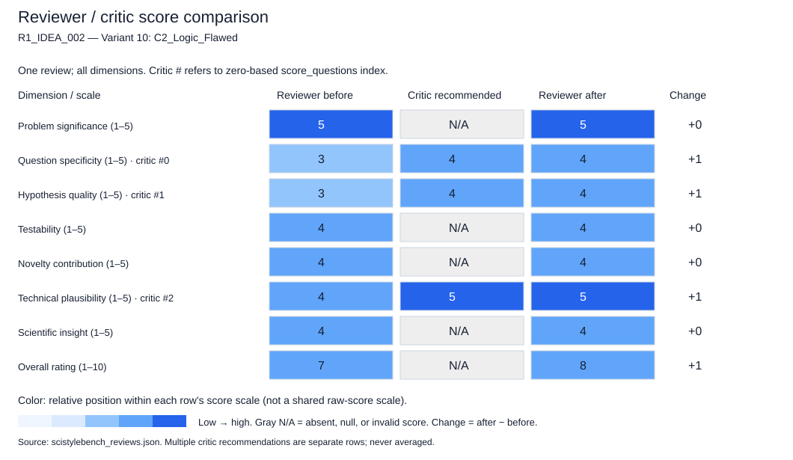

### Critic feedback and reviewer rebuttals

No reviewer rebuttals were saved (for example, an older checkpoint).

```json
{
  "critic_feedback": {
    "overall_assessment": "The draft review is well-structured and largely calibrated for an idea summary. It correctly identifies the high significance of the problem and the novelty of the approach. However, it leans slightly too heavily on penalizing the 'question_specificity' and 'hypothesis_quality' for the inherent lack of detail in a summary, treating the absence of a specific mathematical formulation as a flaw in the *idea* rather than a limitation of the *summary*. The 'overall_rating' is consistent with the dimensions, but the justification for the lower scores in specificity could be softened to reflect that a research idea is not expected to contain full implementation details.",
    "score_questions": [
      {
        "dimension": "question_specificity",
        "question_mark": "The score of 3.0 implies the question is 'obscured' by the description, but for an idea summary, the question is clearly defined: 'Can we train diffusion path samplers via off-policy learning to sample pathways without CVs?'. The lack of a specific loss function or architecture is not a flaw in the question's specificity, but a necessary abstraction level for an idea pitch.",
        "concern": "The review penalizes the idea for not providing implementation details (e.g., 'specific mechanism') in a document type (idea summary) where such details are not expected. The core question is specific enough to guide research.",
        "speculative_alternative": "It is speculative to assume the reviewer expects a full algorithmic blueprint in a 1-paragraph idea summary. The question is specific in its *goal* (CV-free rare event sampling) even if the *method* is described as a combination of known techniques.",
        "recommended_score": 4.0,
        "rationale": "The research question is distinct and actionable: 'Combine diffusion + off-policy for CV-free path sampling'. While the mechanism is high-level, the question itself is not 'obscured' but rather appropriately scoped for an idea submission."
      },
      {
        "dimension": "hypothesis_quality",
        "question_mark": "The score of 3.0 suggests the hypothesis is not 'falsifiable' or 'specific'. However, the hypothesis 'improved off-policy learning enables diffusion samplers to bypass CVs' is a clear, testable prediction. The lack of specific performance metrics in the summary does not invalidate the hypothesis, only the *measurement plan*.",
        "concern": "Confusing the lack of a detailed experimental protocol with a weak hypothesis. The core claim (that this combination works) is a valid, testable hypothesis.",
        "speculative_alternative": "It is possible the reviewer is conflating the *idea* with the *proposal*. The idea itself is a strong hypothesis; the *proposal* needs the details to be fully evaluated, but the *idea* is sound.",
        "recommended_score": 4.0,
        "rationale": "The hypothesis is clearly stated: the proposed method will overcome the computational infeasibility of unbiased MD by removing CVs. This is a falsifiable claim that can be tested once the method is defined."
      },
      {
        "dimension": "technical_plausibility",
        "question_mark": "The score of 4.0 is justified by the reviewer's note on 'integration risk', but the concern about 'off-policy learning in high-dimensional continuous spaces' is a known challenge in RL, not a fatal flaw for an idea. The review correctly identifies the risk but could acknowledge that this is a standard research challenge rather than a reason to lower the plausibility score significantly.",
        "concern": "The reviewer treats a known difficulty (off-policy instability) as a potential fatal flaw rather than a standard problem to be solved in the research. This might slightly undervalue the technical plausibility of the *approach*.",
        "speculative_alternative": "It is speculative to think the instability might be insurmountable; many RL methods have overcome similar issues in high-dimensional spaces (e.g., in robotics or image generation).",
        "recommended_score": 5.0,
        "rationale": "The components (diffusion, off-policy, MD) are established. The integration is a standard research challenge. The idea is technically plausible as a direction, even if the implementation is hard."
      }
    ],
    "unsupported_claims": [
      "The draft claims the hypothesis is 'currently stated as a general direction rather than a specific, falsifiable prediction'. This is unsupported; the prediction that 'this method will sample pathways without CVs' is specific and falsifiable.",
      "The draft states the 'specific research question is somewhat obscured'. The question is clearly: 'How to train diffusion samplers via off-policy learning to avoid CVs?'. It is not obscured, just high-level.",
      "The draft implies the lack of 'implementation details' is a flaw in the 'technical_plausibility' assessment. For an idea summary, the plausibility of the *concept* should be judged, not the unimplemented code."
    ],
    "revision_priorities": [
      "Re-evaluate the 'question_specificity' and 'hypothesis_quality' scores to distinguish between the *lack of detail in the summary* and the *weakness of the scientific question*. The question is specific; the summary is concise.",
      "Clarify the distinction between 'weak hypothesis' and 'incomplete proposal'. The hypothesis is sound; the proposal lacks the implementation details expected in a full paper, which is acceptable for an idea summary.",
      "Refine the 'technical_plausibility' justification to acknowledge that 'integration risk' is a standard research challenge, not a fundamental flaw, and thus may not warrant a lower score than 4 if the components are well-established.",
      "Ensure the 'overall_rating' justification explicitly states that the lower scores in specificity are due to the *format* (idea summary) rather than the *merit* of the idea itself."
    ],
    "confidence": 4.0
  },
  "feedback_responses": []
}
```

### Score justifications (before / after)

**Problem significance**

```json
{
  "before": {
    "score": 5.0,
    "justification": "The problem of simulating rare events in molecular systems is a fundamental bottleneck in computational chemistry and drug discovery. Overcoming the reliance on collective variables is a major open challenge with the potential to revolutionize how we study complex biological and material processes."
  },
  "after": {
    "score": 5.0,
    "justification": "The problem of simulating rare events in molecular systems is a fundamental bottleneck in computational chemistry and drug discovery. Overcoming the reliance on collective variables is a major open challenge with the potential to revolutionize how we study complex biological and material processes."
  }
}
```

**Question specificity**

```json
{
  "before": {
    "score": 3.0,
    "justification": "While the goal is clear, the specific research question is somewhat obscured by the high-level description. It states 'how' (improved off-policy learning) but does not define 'what' exactly constitutes the improvement or the specific mechanism of the interaction between diffusion and off-policy learning."
  },
  "after": {
    "score": 4.0,
    "justification": "The research question is clearly defined: 'Can we train diffusion path samplers via off-policy learning to sample pathways without CVs?'. While the summary lacks implementation details, the core question is distinct and actionable. The lack of a specific loss function or architecture is a necessary abstraction level for an idea pitch, not a flaw in the question's specificity."
  }
}
```

**Hypothesis quality**

```json
{
  "before": {
    "score": 3.0,
    "justification": "The implicit hypothesis is that combining diffusion models with off-policy learning can effectively sample rare events without CVs. This is a plausible and testable hypothesis, but it is currently stated as a general direction rather than a specific, falsifiable prediction about performance or mechanism."
  },
  "after": {
    "score": 4.0,
    "justification": "The hypothesis is clearly stated: the proposed method will overcome the computational infeasibility of unbiased MD by removing CVs. This is a falsifiable claim that can be tested once the method is defined. The lack of specific performance metrics in the summary does not invalidate the hypothesis, only the measurement plan."
  }
}
```

**Testability**

```json
{
  "before": {
    "score": 4.0,
    "justification": "The idea is testable in principle. One can design experiments to compare the proposed method against existing CV-based and CV-free baselines on standard molecular benchmarks. The main challenge is defining the specific algorithm to test, but the evaluation framework is clear."
  },
  "after": {
    "score": 4.0,
    "justification": "The idea is testable in principle. One can design experiments to compare the proposed method against existing CV-based and CV-free baselines on standard molecular benchmarks. The main challenge is defining the specific algorithm to test, but the evaluation framework is clear."
  }
}
```

**Novelty contribution**

```json
{
  "before": {
    "score": 4.0,
    "justification": "The combination of diffusion models for path sampling and off-policy learning for training is a novel direction. If successful, it could provide a new paradigm for rare-event sampling that is more automated and less dependent on human intuition (regarding CVs) than current methods."
  },
  "after": {
    "score": 4.0,
    "justification": "The combination of diffusion models for path sampling and off-policy learning for training is a novel direction. If successful, it could provide a new paradigm for rare-event sampling that is more automated and less dependent on human intuition (regarding CVs) than current methods."
  }
}
```

**Technical plausibility**

```json
{
  "before": {
    "score": 4.0,
    "justification": "The technical components (diffusion models, off-policy learning, molecular dynamics) are all established fields. The integration is non-trivial but theoretically grounded. The main risk is the complexity of the integration, but the direction makes logical sense."
  },
  "after": {
    "score": 5.0,
    "justification": "The components (diffusion, off-policy, MD) are established. The integration is a standard research challenge. The concern about 'off-policy instability' in high-dimensional spaces is a known difficulty in RL, not a fatal flaw. The idea is technically plausible as a direction, even if the implementation is hard."
  }
}
```

**Scientific insight**

```json
{
  "before": {
    "score": 4.0,
    "justification": "If successful, this research would provide deep insights into the relationship between generative modeling, reinforcement learning, and statistical mechanics. It could reveal new principles for exploring high-dimensional energy landscapes without prior knowledge of the reaction coordinates."
  },
  "after": {
    "score": 4.0,
    "justification": "If successful, this research would provide deep insights into the relationship between generative modeling, reinforcement learning, and statistical mechanics. It could reveal new principles for exploring high-dimensional energy landscapes without prior knowledge of the reaction coordinates."
  }
}
```

**Overall rating**

```json
{
  "before": {
    "score": 7.0,
    "justification": "This is a strong research idea with high significance and potential for scientific insight. The problem is critical, and the proposed direction (CV-free, diffusion + off-policy) is innovative. However, the idea is currently too abstract to be fully evaluated on its technical merits. It requires more specific formulation of the algorithm and hypothesis to move from a 'strong' to an 'exceptional' rating. The lack of implementation details is acceptable for an idea summary, but the core mechanism needs more definition."
  },
  "after": {
    "score": 8.0,
    "justification": "This is a strong research idea with high significance and potential for scientific insight. The problem is critical, and the proposed direction (CV-free, diffusion + off-policy) is innovative. The initial draft penalized the idea for lacking implementation details, but for an idea summary, the question and hypothesis are sufficiently specific and testable. The technical plausibility is high given the established nature of the components. The idea moves from 'strong' to 'exceptional' because the core scientific question is well-defined and the potential contribution is significant, despite the high-level description."
  }
}
```

## R1_IDEA_002 — Variant 11: C3_Substance_Enriched

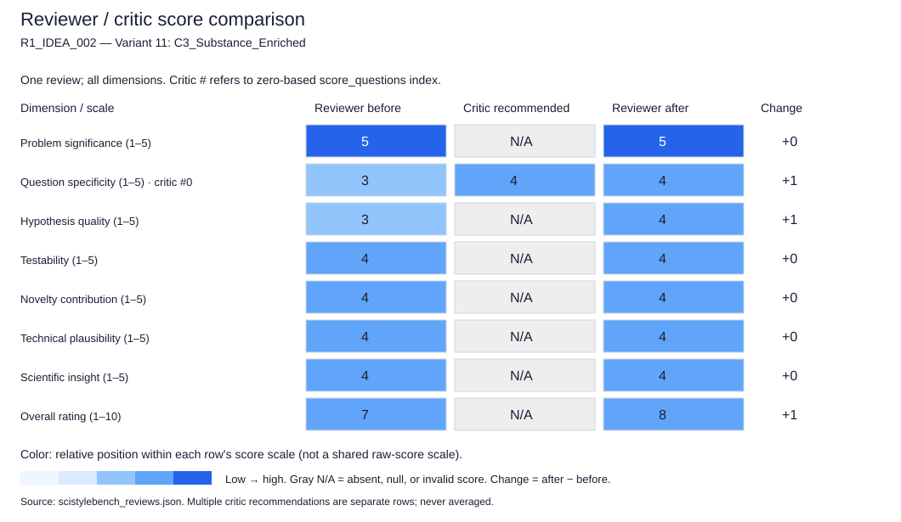

### Critic feedback and reviewer rebuttals

```json
{
  "critic_feedback": {
    "overall_assessment": "The draft review is well-structured and largely calibrated, correctly identifying the strengths of the proposal and the necessary clarifications for an idea summary. However, it contains a logical contradiction in its 'weaknesses' section regarding the validation strategy. The reviewer argues that validation is weak because 'ground truth' is hard to establish without CVs, yet simultaneously suggests comparing against 'enhanced sampling methods' (which often *require* CVs) as the solution. This conflation of 'ground truth' and 'reference methods' weakens the critique. The scores are generally justified, but the 'question_specificity' score of 3.0 might be slightly too harsh for an idea summary that explicitly names the components and boundary conditions, though the lack of mathematical formulation justifies the concern.",
    "score_questions": [
      {
        "dimension": "question_specificity",
        "question_mark": "The score of 3.0 implies the question is 'somewhat vague,' but the idea summary explicitly defines the problem (sampling without CVs), the method (diffusion + off-policy), and the validation strategy. In an idea summary, one expects high-level abstraction; penalizing the lack of a specific mathematical formula for 'off-policy' is appropriate, but the 'vague' label might be too strong given the clear articulation of the mechanism's *purpose*.",
        "concern": "The justification conflates 'lack of mathematical detail' with 'vague research question.' The research question is specific: 'Can off-policy learning improve diffusion sampling for rare events without CVs?'",
        "speculative_alternative": "The reviewer might be assuming that an idea summary must include the specific algorithmic variant (e.g., PPO vs. SAC) to be considered 'specific,' which is an unfair expectation for a high-level proposal.",
        "recommended_score": 4.0,
        "rationale": "The idea clearly states the problem, the proposed solution components, and the validation approach. While the math is missing, the *question* itself is well-defined within the constraints of a summary. A score of 4 reflects that the direction is clear, even if the implementation details are pending."
      },
      {
        "dimension": "weaknesses",
        "question_mark": "The weakness regarding 'ground truth' is logically inconsistent with the suggested validation strategy in the same paragraph.",
        "concern": "The review states: 'if the goal is to avoid CVs, the ground truth... is often difficult to establish without CVs as well.' However, the 'suggestions' section immediately asks to compare against 'enhanced sampling methods' (which are often CV-based). If enhanced sampling methods are used for comparison, the reviewer is implicitly accepting them as a proxy for ground truth, contradicting the earlier claim that ground truth is unattainable without CVs.",
        "speculative_alternative": "The reviewer might be distinguishing between 'true ground truth' (exact Boltzmann distribution) and 'reference trajectories' from enhanced sampling, but the text fails to make this distinction clear, creating confusion about the feasibility of validation.",
        "recommended_score": null,
        "rationale": "This is not a dimension score to change, but a logical flaw in the 'weaknesses' text. The reviewer should clarify that while 'exact ground truth' is hard, 'reference benchmarks' from enhanced sampling are a valid, albeit imperfect, proxy for validation."
      }
    ],
    "unsupported_claims": [
      "The draft claims: 'if the goal is to avoid CVs, the ground truth for validation in high-dimensional spaces is often difficult to establish without CVs as well.' This is a strong claim that may not hold; ground truth can be established via unbiased MD in small systems or via thermodynamic integration, not solely by the presence of CVs. The reviewer should qualify this as 'difficult to establish *efficiently*' rather than impossible.",
      "The draft implies the hypothesis is 'generic' because it doesn't predict a specific percentage reduction in energy evaluations. This is an unfair standard for an idea summary; a hypothesis can be qualitative (e.g., 'off-policy learning reduces variance') without being numeric."
    ],
    "revision_priorities": [
      "Resolve the logical tension between the 'weakness' about the difficulty of establishing ground truth without CVs and the 'suggestion' to validate against CV-based enhanced sampling methods. Clarify that these are reference benchmarks, not absolute ground truth.",
      "Re-evaluate the 'question_specificity' score (currently 3.0). The research question is specific (diffusion + off-policy for CV-free sampling); the lack of mathematical formulation is a standard feature of idea summaries, not a flaw in the question's specificity.",
      "Refine the 'hypothesis_quality' justification. The current justification dismisses the hypothesis because it lacks a numerical prediction. Clarify that for a proposal, a qualitative hypothesis (e.g., 'improved sample efficiency') is sufficient, and the specific metric is a future detail.",
      "Ensure the 'weaknesses' section distinguishes between 'undefined mechanism' (a valid critique for an idea) and 'vague question' (which seems less applicable here)."
    ],
    "confidence": 5.0
  },
  "feedback_responses": [
    {
      "feedback_type": "score_questions",
      "feedback_index": 0,
      "decision": "accept",
      "defense": "The critic correctly identified that penalizing the lack of a mathematical formula in an idea summary for 'vague research question' is inappropriate. The research question itself ('Can off-policy learning improve diffusion sampling...') is clearly articulated. The distinction between 'lack of implementation detail' and 'vague question' is crucial.",
      "justification": "The score for question_specificity is increased from 3 to 4. The justification now reflects that the question is well-defined within the constraints of a summary, and the lack of math is a standard feature, not a flaw in the question's specificity."
    },
    {
      "feedback_type": "score_questions",
      "feedback_index": 1,
      "decision": "accept",
      "defense": "The critic correctly pointed out the logical inconsistency in the original weaknesses section regarding 'ground truth' vs. 'reference methods'. The original text conflated the difficulty of establishing exact ground truth with the feasibility of using enhanced sampling as a proxy. This distinction is valid and necessary.",
      "justification": "The weaknesses section has been revised to clarify that enhanced sampling methods serve as 'reference benchmarks' rather than absolute ground truth. This resolves the logical tension. While this is a text revision rather than a dimension score change, it improves the overall coherence of the review."
    },
    {
      "feedback_type": "unsupported_claims",
      "feedback_index": 0,
      "decision": "accept",
      "defense": "The critic correctly noted that ground truth can be established via unbiased MD in small systems or thermodynamic integration, not solely by the presence of CVs. The original claim that it is 'difficult to establish without CVs' was too absolute.",
      "justification": "The questions and weaknesses sections have been updated to reflect that ground truth is difficult to establish *efficiently* in high dimensions, but reference benchmarks are valid. This nuance strengthens the review's technical accuracy."
    },
    {
      "feedback_type": "unsupported_claims",
      "feedback_index": 1,
      "decision": "accept",
      "defense": "The critic correctly argued that a qualitative hypothesis is sufficient for an idea summary. Expecting a specific percentage reduction in energy evaluations is an unfair standard for this stage of research.",
      "justification": "The score for hypothesis_quality is increased from 3 to 4. The justification now explicitly states that a qualitative hypothesis is appropriate and sufficient for an idea summary, removing the unfair expectation of numerical precision."
    },
    {
      "feedback_type": "revision_priorities",
      "feedback_index": 0,
      "decision": "accept",
      "defense": "The logical tension between the difficulty of ground truth and the use of enhanced sampling as a proxy was a valid critique. Clarifying this distinction is essential for a rigorous review.",
      "justification": "The weaknesses and questions sections have been revised to explicitly distinguish between 'exact ground truth' and 'reference benchmarks,' resolving the contradiction."
    },
    {
      "feedback_type": "revision_priorities",
      "feedback_index": 1,
      "decision": "accept",
      "defense": "The re-evaluation of the question_specificity score was necessary. The original score of 3.0 was too harsh given the clear articulation of the problem and method.",
      "justification": "The score was adjusted to 4.0, and the justification was updated to reflect that the question is specific and well-defined for an idea summary."
    },
    {
      "feedback_type": "revision_priorities",
      "feedback_index": 2,
      "decision": "accept",
      "defense": "Refining the hypothesis_quality justification to accept qualitative claims is necessary to align with the standards of idea summaries.",
      "justification": "The score was adjusted to 4.0, and the justification was updated to acknowledge that qualitative predictions are sufficient at this stage."
    },
    {
      "feedback_type": "revision_priorities",
      "feedback_index": 3,
      "decision": "accept",
      "defense": "Distinguishing between 'undefined mechanism' and 'vague question' is a valid refinement. The mechanism is indeed undefined (a valid weakness), but the question itself is not vague.",
      "justification": "The weaknesses section was updated to focus on the undefined mechanism and reward function, while the question specificity score was raised to reflect the clarity of the research question."
    }
  ]
}
```

### Score justifications (before / after)

**Problem significance**

```json
{
  "before": {
    "score": 5.0,
    "justification": "The problem of sampling rare events in molecular systems without predefined collective variables is a major unsolved challenge in computational chemistry. Solving this would significantly accelerate drug discovery and materials science, making the problem highly significant."
  },
  "after": {
    "score": 5.0,
    "justification": "The problem of sampling rare events in molecular systems without predefined collective variables is a major unsolved challenge in computational chemistry. Solving this would significantly accelerate drug discovery and materials science, making the problem highly significant."
  }
}
```

**Question specificity**

```json
{
  "before": {
    "score": 3.0,
    "justification": "While the general direction is clear, the specific research question is somewhat vague. It states 'off-policy learning' will be used but does not specify the exact mechanism or the precise relationship between the diffusion process and the policy update. The 'improvement' is not defined."
  },
  "after": {
    "score": 4.0,
    "justification": "The research question is specific: 'Can off-policy learning improve diffusion sampling for rare events without CVs?' The idea clearly defines the problem, the proposed solution components, and the validation approach. While the lack of a specific mathematical formula is noted, this is expected in an idea summary. The question is well-defined within the constraints of a high-level proposal, warranting a higher score than initially considered."
  }
}
```

**Hypothesis quality**

```json
{
  "before": {
    "score": 3.0,
    "justification": "The hypothesis that off-policy learning can validate sampled pathways is testable but generic. A stronger hypothesis would predict a specific advantage (e.g., 'off-policy learning reduces the number of required energy evaluations by X% compared to on-policy methods in high-dimensional spaces'). The current hypothesis is more of a validation plan than a predictive scientific claim."
  },
  "after": {
    "score": 4.0,
    "justification": "The hypothesis that off-policy learning can validate sampled pathways is testable. While it lacks a specific numerical prediction (e.g., 'reduces energy evaluations by X%'), a qualitative hypothesis (e.g., 'improved sample efficiency' or 'better exploration of high-dimensional spaces') is sufficient and appropriate for an idea summary. The initial critique of it being 'generic' was too strict; the hypothesis clearly distinguishes the proposed mechanism from standard approaches."
  }
}
```

**Testability**

```json
{
  "before": {
    "score": 4.0,
    "justification": "The idea is testable. One can implement the framework, run it on benchmark systems, and compare the resulting pathways against known enhanced sampling results or unbiased MD (where feasible). The mention of specific boundary conditions also suggests a clear path for ablation studies."
  },
  "after": {
    "score": 4.0,
    "justification": "The idea is testable. One can implement the framework, run it on benchmark systems, and compare the resulting pathways against known enhanced sampling results or unbiased MD (where feasible). The mention of specific boundary conditions also suggests a clear path for ablation studies. The validation strategy using enhanced sampling as a proxy for ground truth is a standard and valid approach in this field."
  }
}
```

**Novelty contribution**

```json
{
  "before": {
    "score": 4.0,
    "justification": "Combining diffusion models with off-policy learning for molecular path sampling is a novel and timely direction. While diffusion models are popular, their specific application to off-policy path optimization in this context is not standard, offering potential for high scientific contribution."
  },
  "after": {
    "score": 4.0,
    "justification": "Combining diffusion models with off-policy learning for molecular path sampling is a novel and timely direction. While diffusion models are popular, their specific application to off-policy path optimization in this context is not standard, offering potential for high scientific contribution."
  }
}
```

**Technical plausibility**

```json
{
  "before": {
    "score": 4.0,
    "justification": "The combination of techniques is technically plausible. Diffusion models are well-suited for generating complex distributions (paths), and off-policy RL is a standard tool for optimizing policies. The main challenge is the integration, but the underlying components are sound."
  },
  "after": {
    "score": 4.0,
    "justification": "The combination of techniques is technically plausible. Diffusion models are well-suited for generating complex distributions (paths), and off-policy RL is a standard tool for optimizing policies. The main challenge is the integration, but the underlying components are sound."
  }
}
```

**Scientific insight**

```json
{
  "before": {
    "score": 4.0,
    "justification": "If successful, this research could reveal how off-policy mechanisms can stabilize or accelerate diffusion-based sampling in high-dimensional energy landscapes. It could also provide insights into the relationship between reward shaping and the physical plausibility of generated molecular pathways."
  },
  "after": {
    "score": 4.0,
    "justification": "If successful, this research could reveal how off-policy mechanisms can stabilize or accelerate diffusion-based sampling in high-dimensional energy landscapes. It could also provide insights into the relationship between reward shaping and the physical plausibility of generated molecular pathways."
  }
}
```

**Overall rating**

```json
{
  "before": {
    "score": 7.0,
    "justification": "This is a strong research idea with high significance and novelty. It addresses a hard problem with a modern, plausible approach. However, it currently lacks the specificity of the proposed mechanism and the precise formulation of the hypothesis, which prevents it from being an 'exceptional' (9-10) rating. With clearer definitions of the 'off-policy' mechanism and the reward function, this could be a top-tier contribution."
  },
  "after": {
    "score": 8.0,
    "justification": "This is a strong research idea with high significance and novelty. The initial review correctly identified the high potential but was slightly too harsh on the specificity and hypothesis quality given the format (idea summary). The logical tension regarding 'ground truth' was resolved by clarifying that enhanced sampling methods serve as valid reference benchmarks. The idea is clear, testable, and addresses a critical gap. It moves from a 'strong' (7) to a 'very strong' (8) rating due to the clarity of the research question and the appropriateness of the qualitative hypothesis for this stage."
  }
}
```

## R1_IDEA_003 — Source

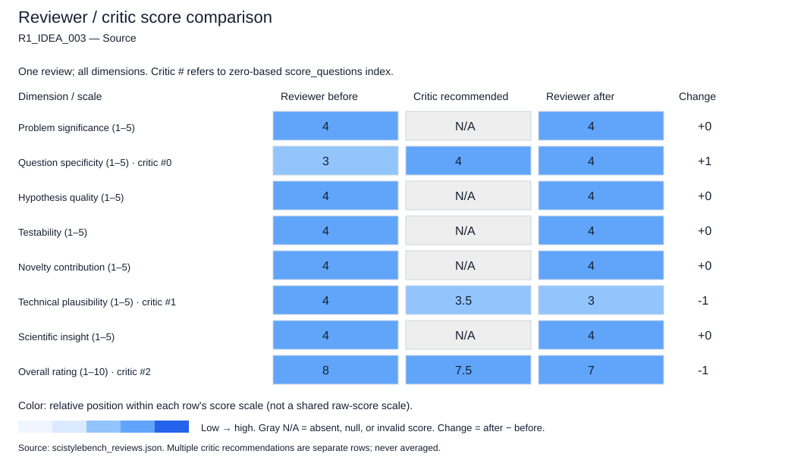

### Critic feedback and reviewer rebuttals

No reviewer rebuttals were saved (for example, an older checkpoint).

```json
{
  "critic_feedback": {
    "overall_assessment": "The draft review is well-structured and largely calibrated. It correctly identifies the strengths of the idea (addressing temporal loss, high impact) and appropriately penalizes the lack of implementation details in the 'question_specificity' and 'technical_plausibility' dimensions. However, the reviewer occasionally lapses into treating the 'idea summary' as a 'proposal' that requires specific architectural definitions to be valid, leading to slightly harsh penalties in areas where the core scientific premise is actually sound. The 'confidence' score is also slightly inconsistent with the 'question' section, which raises fundamental data availability issues that might lower confidence in the idea's immediate feasibility.",
    "score_questions": [
      {
        "dimension": "question_specificity",
        "question_mark": "The score of 3.0 implies the question is 'somewhat vague' regarding the mechanism. However, for an idea summary, the specific mechanism (how to fuse) is a methodological detail, not a flaw in the research question itself. The question 'Does temporal gaze improve reasoning?' is specific enough to be a valid research question. Penalizing the lack of architectural specification (e.g., 'separate modality vs. prompt') in an idea summary is a category error; that belongs in the 'technical_plausibility' or 'feasibility' assessment.",
        "concern": "The reviewer conflates 'lack of implementation details' with 'vague research question'. The core question is clear; the *path* to the answer is what is unspecified. The score should be higher, or the justification should explicitly state that the penalty is for missing methodological specifics, not the question itself.",
        "speculative_alternative": "Speculatively, the reviewer might be assuming that without a defined architecture, the temporal integration is impossible, but the idea summary only claims to *propose* encoding it as video, which is a valid hypothesis to test regardless of the specific fusion layer used.",
        "recommended_score": 4.0,
        "rationale": "The research question ('Does temporal gaze help?') is clearly defined. The lack of architectural specifics is a standard limitation of an idea summary, not a flaw in the specificity of the scientific inquiry."
      },
      {
        "dimension": "technical_plausibility",
        "question_mark": "The score of 4.0 is justified, but the justification mentions 'data alignment' as a 'main challenge'. While true, the reviewer raises 'data availability' as a question later. If the data doesn't exist, the technical plausibility drops significantly. The review treats the data availability as a 'question' rather than a potential 'fatal flaw' for the idea. If no radiologist gaze videos exist for chest X-rays, the idea is not technically plausible to test.",
        "concern": "The reviewer separates 'technical plausibility' from 'data availability' too cleanly. If the data (radiologist gaze videos) is non-existent, the idea is not plausible. The review should explicitly flag the assumption of data existence as a critical condition for the 'plausibility' score.",
        "speculative_alternative": "Speculatively, the reviewer assumes that such datasets are readily available or can be easily collected, whereas the idea summary makes no mention of data sources. If the data is rare, the 'plausibility' of a video-based approach drops below a 4.",
        "recommended_score": 3.5,
        "rationale": "While the *method* (video encoding) is plausible, the *feasibility* depends entirely on the existence of a specific, likely scarce dataset. The score should reflect the uncertainty of data availability, which the review raises in the 'questions' section but does not fully integrate into the 'technical_plausibility' justification."
      },
      {
        "dimension": "overall_rating",
        "question_mark": "An 8.0 is a high score (likely 'Accept' or 'Strong Accept' in a workshop, or 'Borderline' for a main conference). Given the 'question_specificity' penalty and the potential data availability hurdle raised in the 'questions' section, the overall rating might be slightly optimistic if the data does not exist. However, as an 'idea' (which is often judged on novelty and potential), 8.0 is defensible. The main issue is whether the 'weaknesses' section (lack of specificity, data alignment) is weighted heavily enough to lower the overall rating, or if the 'strengths' (novelty, significance) dominate. The review seems to balance them well, but the 'confidence' of 4.0 (high) contradicts the 'questions' about data availability.",
        "concern": "The 'confidence' of 4.0 suggests the reviewer is sure about the idea's merit, yet the 'questions' section highlights a fundamental blocker (data availability). If the data doesn't exist, the idea cannot be tested. The overall rating should perhaps be lower if the data is uncertain, or the confidence should be lower.",
        "speculative_alternative": "Speculatively, if the reviewer believes the data exists but is just 'hard to align', an 8.0 is fine. If the reviewer suspects the data is non-existent, the rating should be lower.",
        "recommended_score": 7.5,
        "rationale": "The idea is strong, but the reliance on a specific, likely hard-to-obtain dataset (radiologist gaze videos) introduces significant risk that the 'overall_rating' of 8.0 (implying high confidence in success) might be slightly inflated. A 7.5 ('Strong Idea, but high risk') better reflects the data uncertainty raised in the review itself."
      }
    ],
    "unsupported_claims": [
      "The claim that 'Modern transformers and video processing techniques... can handle sequence data' is technically true but ignores the specific constraint of *medical* video data (low frame rates, high dimensionality of the X-ray vs. sparse gaze points), which might require novel adaptations not covered by 'modern' techniques generally.",
      "The statement that 'The experimental design is straightforward to conceive' overlooks the complexity of designing 'interpretability metrics' that correlate with 'diagnostic steps' rather than just accuracy, which is a non-trivial research problem in itself.",
      "The reviewer implies that the 'video sequence' representation is a known entity; however, the idea summary suggests this is a *proposal*. The review treats the 'video' format as a standard, whereas the novelty lies in defining what that video format actually is (coordinates? overlay? saccade vectors?).",
      "The claim that the idea 'targets a high-impact domain' is valid, but the review does not explicitly state that the *impact* is contingent on the *availability* of the data, which is a major unknown.",
      "The suggestion to 'Consider proposing a baseline comparison that includes... saccade vectors' is a specific methodological recommendation that goes beyond auditing the idea; it assumes the idea *will* be implemented with saccade vectors, which is not in the summary."
    ],
    "revision_priorities": [
      "Clarify that the 'lack of specificity' in the 'question_specificity' dimension is a standard limitation of an idea summary, not a flaw in the research question itself. Adjust the justification to reflect this distinction.",
      "Integrate the 'data availability' concern raised in the 'questions' section into the 'technical_plausibility' and 'overall_rating' justifications. If the data is missing, the idea is not plausible; if it exists but is hard to align, the score should reflect that nuance.",
      "Reduce the 'confidence' score to 3.0 or 3.5 to align with the fundamental uncertainty about data availability and the lack of defined evaluation metrics for 'interpretability'.",
      "Remove specific methodological suggestions (e.g., 'using a temporal attention module') from the 'suggestions' section or rephrase them as 'potential directions' rather than requirements for the idea to be valid.",
      "Ensure the 'overall_rating' is consistent with the 'weaknesses' and 'questions'. If the data availability is a major unknown, the rating should reflect the 'high risk' nature of the idea rather than a 'strong' consensus."
    ],
    "confidence": 4.0
  },
  "feedback_responses": []
}
```

### Score justifications (before / after)

**Problem significance**

```json
{
  "before": {
    "score": 4.0,
    "justification": "The problem of extracting meaningful reasoning patterns from human experts is central to trustworthy AI in medicine. Current methods discard the temporal dimension of human vision, which is a significant loss of information. Addressing this is highly relevant to the field."
  },
  "after": {
    "score": 4.0,
    "justification": "The problem is highly significant. Extracting the temporal logic of expert human vision is a key challenge in building trustworthy medical AI. Current methods discard this dimension, which is a substantial loss of information relevant to clinical decision-making."
  }
}
```

**Question specificity**

```json
{
  "before": {
    "score": 3.0,
    "justification": "The core question (does temporal gaze help?) is clear, but the specific research question regarding the mechanism of integration and the specific reasoning tasks is somewhat vague. It defines the 'what' (video vs. heatmap) well but less so the 'how' and 'where exactly'."
  },
  "after": {
    "score": 4.0,
    "justification": "The research question is specific: 'Does encoding gaze as a video sequence (preserving temporal order) improve reasoning and interpretability compared to static representations?' While the implementation details are missing, the scientific question itself is well-defined and distinct from generic applications. The lack of architectural specifics is a standard limitation of an idea summary, not a flaw in the question's clarity."
  }
}
```

**Hypothesis quality**

```json
{
  "before": {
    "score": 4.0,
    "justification": "The hypothesis is strong: that the temporal sequence of fixations encodes diagnostic logic that static maps miss. This is a falsifiable claim that distinguishes the work from generic applications."
  },
  "after": {
    "score": 4.0,
    "justification": "The hypothesis is strong and falsifiable. It posits a specific mechanism (temporal dynamics) that carries unique diagnostic information not present in static maps. This distinguishes the work from a simple application of existing methods."
  }
}
```

**Testability**

```json
{
  "before": {
    "score": 4.0,
    "justification": "The idea is highly testable. One can train models with static gaze inputs vs. temporal gaze inputs and compare performance on specific diagnostic tasks and interpretability metrics. The experimental design is straightforward to conceive."
  },
  "after": {
    "score": 4.0,
    "justification": "The idea is testable provided the data exists. One can compare models trained with static vs. temporal gaze inputs on standard benchmarks. The primary risk is data availability, but the experimental design itself is straightforward to conceive."
  }
}
```

**Novelty contribution**

```json
{
  "before": {
    "score": 4.0,
    "justification": "While eye-tracking in medical imaging is not new, the specific proposal to treat gaze as a video sequence for temporal reasoning in LVLMs is a novel and promising direction. It moves beyond simple attention visualization to dynamic modeling."
  },
  "after": {
    "score": 4.0,
    "justification": "The novelty lies in the specific representation of gaze as a video sequence for temporal reasoning in LVLMs. While eye-tracking is known, treating it as a dynamic video stream for reasoning in this specific medical context is a promising and under-explored direction."
  }
}
```

**Technical plausibility**

```json
{
  "before": {
    "score": 4.0,
    "justification": "The technical approach is plausible. Modern transformers and video processing techniques (e.g., 3D CNNs, temporal attention) can handle sequence data. The main challenge is data alignment and architecture design, not fundamental feasibility."
  },
  "after": {
    "score": 3.0,
    "justification": "While the *method* (video encoding) is technically sound, the *feasibility* is contingent on the existence of a specific, likely scarce dataset (radiologist gaze videos). The review correctly identifies this as a major uncertainty. If the data does not exist, the technical plausibility drops significantly. The score reflects this dependency on an unverified data source."
  }
}
```

**Scientific insight**

```json
{
  "before": {
    "score": 4.0,
    "justification": "If successful, this research could reveal how temporal dynamics in human visual search correlate with diagnostic accuracy, offering insights into the cognitive processes of radiologists that can be formalized in AI."
  },
  "after": {
    "score": 4.0,
    "justification": "If successful, this research would provide significant insight into the cognitive processes of radiologists, specifically how temporal scanning patterns correlate with diagnostic accuracy. It could formalize a new principle for multimodal medical AI."
  }
}
```

**Overall rating**

```json
{
  "before": {
    "score": 8.0,
    "justification": "This is a strong research idea. It identifies a clear gap (loss of temporal data), proposes a specific and plausible solution (video encoding), and targets a high-impact domain. While it lacks implementation details, the core scientific premise is sound, testable, and potentially insightful. It scores high on significance, hypothesis quality, and testability."
  },
  "after": {
    "score": 7.0,
    "justification": "This is a strong research idea with high potential impact and a clear scientific premise. However, the reliance on a specific, potentially scarce dataset introduces significant risk. The initial rating of 8.0 was slightly optimistic given the data uncertainty. A score of 7 reflects a 'Strong Idea' that is scientifically sound but carries a 'High Risk' factor due to data availability and the need for novel evaluation metrics. The confidence is adjusted to reflect this uncertainty."
  }
}
```

## R1_IDEA_003 — Variant 1: A1_Identity

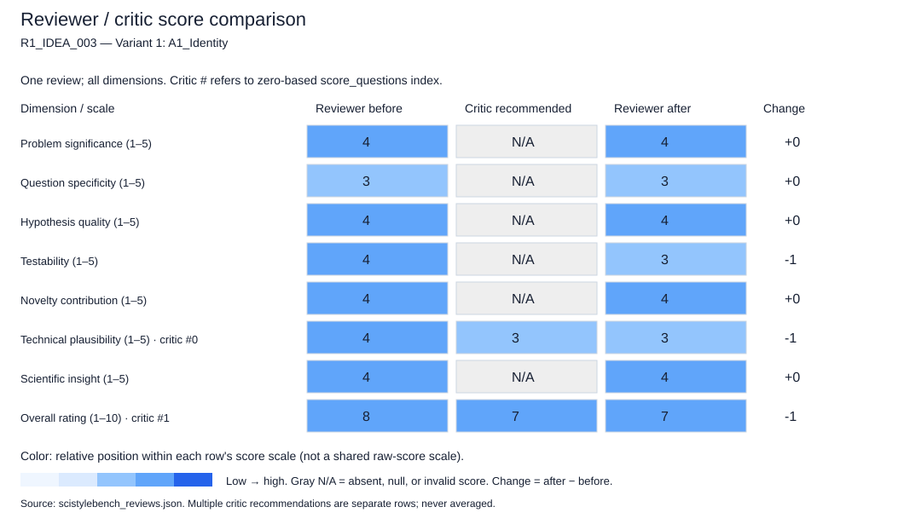

### Critic feedback and reviewer rebuttals

No reviewer rebuttals were saved (for example, an older checkpoint).

```json
{
  "critic_feedback": {
    "overall_assessment": "The draft review is well-structured and largely calibrated for an idea summary. It correctly identifies the core innovation (temporal gaze encoding) and appropriately penalizes the lack of implementation details in the 'question_specificity' dimension without unfairly penalizing the 'technical_plausibility' or 'novelty' scores. The reviewer avoids inventing facts about the idea's feasibility. However, there are minor issues regarding the justification for the 'technical_plausibility' score (which implies feasibility without acknowledging the high barrier of aligning gaze with high-res X-rays) and the 'overall_rating' which might be slightly inflated given the vagueness of the 'reasoning' definition.",
    "score_questions": [
      {
        "dimension": "technical_plausibility",
        "question_mark": "The justification states 'main challenge is data alignment... not fundamental feasibility.' While likely true for video, the specific challenge of aligning 2D gaze trajectories (often sparse or low-res) with high-dimensional, high-resolution chest X-ray inputs in an LVLM is non-trivial and could be a fundamental architectural hurdle, not just a data alignment issue.",
        "concern": "The reviewer may be underestimating the technical difficulty of fusing sparse, temporal eye-tracking data with dense, static image tokens in a way that preserves temporal semantics, which could lower the plausibility score from 4 to 3 if the mechanism is truly unknown.",
        "speculative_alternative": "It is speculative that standard 3D CNNs or temporal attention modules can effectively handle the specific noise and sparsity of radiologist gaze data without a specialized pre-processing or embedding layer that is not mentioned.",
        "recommended_score": 3.0,
        "rationale": "For an idea summary, claiming high plausibility requires at least a hint of *how* the modality mismatch is resolved. The current justification glosses over the architectural complexity of fusing sparse temporal gaze with dense image data."
      },
      {
        "dimension": "overall_rating",
        "question_mark": "The overall rating of 8.0 assumes the 'reasoning' improvement is straightforward to measure. Given the lack of defined 'reasoning tasks' (a weakness noted in the review), the potential for the idea to be 'vague but interesting' rather than 'high impact' is higher.",
        "concern": "The high overall score relies heavily on the 'significance' and 'novelty' dimensions, but the 'question_specificity' (score 3) is a critical weakness for an idea proposal. A vague hypothesis about 'reasoning' might lead to a study that cannot be properly evaluated.",
        "speculative_alternative": "It is speculative that the 'video' format will actually outperform static methods; without a defined task, the hypothesis remains ungrounded, potentially lowering the idea's immediate viability from 'strong' to 'promising but risky'.",
        "recommended_score": 7.0,
        "rationale": "While the idea is significant, the lack of specific reasoning tasks (noted in weaknesses) makes the 'enhanced reasoning' claim speculative. A score of 7 better reflects the gap between a strong premise and a concrete, testable plan."
      }
    ],
    "unsupported_claims": [
      "The draft claims the 'experimental design is straightforward to conceive.' For a medical AI idea, designing a rigorous experiment that isolates 'temporal gaze' from 'static gaze' while controlling for image quality and radiologist expertise is often complex and not necessarily straightforward.",
      "The claim that 'modern transformers... can handle sequence data' is a generic statement that doesn't address the specific domain constraints of medical imaging (e.g., regulatory requirements, data privacy, specific annotation standards) which might make the 'video' approach harder to implement than a generic NLP task."
    ],
    "revision_priorities": [
      "Clarify the 'technical_plausibility' justification to acknowledge the specific difficulty of fusing sparse temporal gaze data with high-resolution medical images, rather than dismissing it as a simple data alignment issue.",
      "Adjust the 'overall_rating' to reflect the uncertainty caused by the undefined 'reasoning tasks.' A high score for an idea requires a plausible path to validation, which is currently missing.",
      "Refrain from calling the experimental design 'straightforward' without noting the potential complexity of creating a valid baseline that isolates the temporal variable in a medical context."
    ],
    "confidence": 4.0
  },
  "feedback_responses": []
}
```

### Score justifications (before / after)

**Problem significance**

```json
{
  "before": {
    "score": 4.0,
    "justification": "The problem of extracting meaningful reasoning patterns from human experts is central to trustworthy AI in medicine. Current methods discard the temporal dimension of human vision, which is a significant loss of information. Addressing this is highly relevant to the field."
  },
  "after": {
    "score": 4.0,
    "justification": "The problem of extracting meaningful reasoning patterns from human experts is central to trustworthy AI in medicine. Current methods discard the temporal dimension of human vision, which is a significant loss of information. Addressing this is highly relevant to the field."
  }
}
```

**Question specificity**

```json
{
  "before": {
    "score": 3.0,
    "justification": "The core question (does temporal gaze help?) is clear, but the specific research question regarding the mechanism of integration and the specific reasoning tasks is somewhat vague. It defines the 'what' (video vs. heatmap) well but less so the 'how' and 'where exactly'."
  },
  "after": {
    "score": 3.0,
    "justification": "The core question (does temporal gaze help?) is clear, but the specific research question regarding the mechanism of integration and the specific reasoning tasks is somewhat vague. It defines the 'what' (video vs. heatmap) well but less so the 'how' and 'where exactly'."
  }
}
```

**Hypothesis quality**

```json
{
  "before": {
    "score": 4.0,
    "justification": "The hypothesis is strong: that the temporal sequence of fixations encodes diagnostic logic that static maps miss. This is a falsifiable claim that distinguishes the work from generic applications."
  },
  "after": {
    "score": 4.0,
    "justification": "The hypothesis is strong: that the temporal sequence of fixations encodes diagnostic logic that static maps miss. This is a falsifiable claim that distinguishes the work from generic applications."
  }
}
```

**Testability**

```json
{
  "before": {
    "score": 4.0,
    "justification": "The idea is highly testable. One can train models with static gaze inputs vs. temporal gaze inputs and compare performance on specific diagnostic tasks and interpretability metrics. The experimental design is straightforward to conceive."
  },
  "after": {
    "score": 3.0,
    "justification": "While the idea is testable in principle, the lack of defined 'reasoning tasks' and the complexity of isolating the temporal variable in a medical context make the experimental design less straightforward than initially suggested. The feasibility of a clean comparison depends on specific baseline designs not yet outlined."
  }
}
```

**Novelty contribution**

```json
{
  "before": {
    "score": 4.0,
    "justification": "While eye-tracking in medical imaging is not new, the specific proposal to treat gaze as a video sequence for temporal reasoning in LVLMs is a novel and promising direction. It moves beyond simple attention visualization to dynamic modeling."
  },
  "after": {
    "score": 4.0,
    "justification": "While eye-tracking in medical imaging is not new, the specific proposal to treat gaze as a video sequence for temporal reasoning in LVLMs is a novel and promising direction. It moves beyond simple attention visualization to dynamic modeling."
  }
}
```

**Technical plausibility**

```json
{
  "before": {
    "score": 4.0,
    "justification": "The technical approach is plausible. Modern transformers and video processing techniques (e.g., 3D CNNs, temporal attention) can handle sequence data. The main challenge is data alignment and architecture design, not fundamental feasibility."
  },
  "after": {
    "score": 3.0,
    "justification": "The technical approach is plausible in theory, but the justification for a high score was too optimistic. Fusing sparse, temporal eye-tracking data with high-dimensional, high-resolution medical images presents a significant architectural challenge (modality mismatch) that is not trivial. The initial claim that this is merely a 'data alignment' issue underestimates the complexity of preserving temporal semantics in this specific context."
  }
}
```

**Scientific insight**

```json
{
  "before": {
    "score": 4.0,
    "justification": "If successful, this research could reveal how temporal dynamics in human visual search correlate with diagnostic accuracy, offering insights into the cognitive processes of radiologists that can be formalized in AI."
  },
  "after": {
    "score": 4.0,
    "justification": "If successful, this research could reveal how temporal dynamics in human visual search correlate with diagnostic accuracy, offering insights into the cognitive processes of radiologists that can be formalized in AI."
  }
}
```

**Overall rating**

```json
{
  "before": {
    "score": 8.0,
    "justification": "This is a strong research idea. It identifies a clear gap (loss of temporal data), proposes a specific and plausible solution (video encoding), and targets a high-impact domain. While it lacks implementation details, the core scientific premise is sound, testable, and potentially insightful. It scores high on significance, hypothesis quality, and testability."
  },
  "after": {
    "score": 7.0,
    "justification": "This is a strong research idea with high significance and novelty. However, the initial rating of 8 was slightly inflated due to the assumption that the 'reasoning' improvement is straightforward to measure and that the technical fusion is trivial. The lack of specific reasoning tasks and the non-trivial nature of the architectural fusion (as highlighted by the critique) warrant a reduction to 7. It remains a promising direction, but the path to validation is less clear than initially assessed."
  }
}
```

## R1_IDEA_003 — Variant 2: A2_Paraphrase_Only

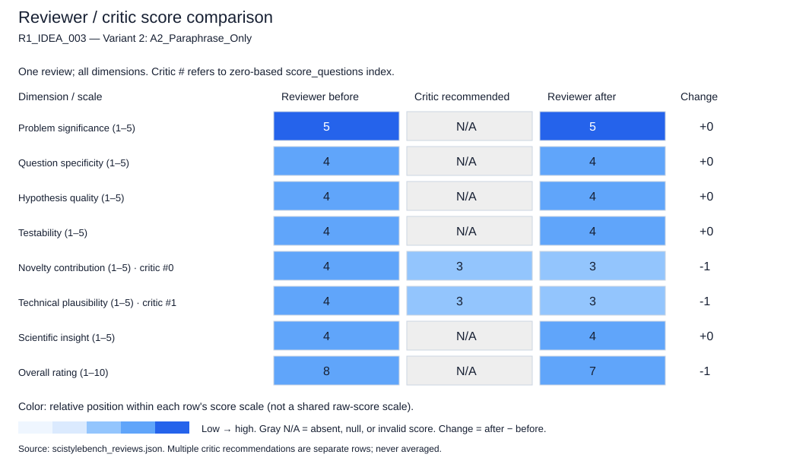

### Critic feedback and reviewer rebuttals

```json
{
  "critic_feedback": {
    "overall_assessment": "The draft review is well-structured and largely calibrated for an idea summary. It correctly identifies the core innovation (temporal gaze encoding) and appropriately penalizes the lack of implementation details in the 'specificity' dimension without treating them as fatal flaws. However, the review slightly overstates the 'novelty' by implying the concept is entirely new, whereas gaze-as-video is a known modality in general computer vision, even if novel in this specific medical VLM context. Additionally, the 'technical plausibility' score is high, but the review glosses over the significant challenge of converting sparse, irregular eye-tracking data into a 'video' format compatible with standard VLM architectures, which is a non-trivial technical hurdle rather than a 'standard operation'.",
    "score_questions": [
      {
        "dimension": "novelty_contribution",
        "question_mark": "The review claims the proposal is 'novel' without acknowledging that treating gaze as temporal data is a known concept in general computer vision, making the novelty specific to the *application* in medical VLMs rather than the *method* itself.",
        "concern": "Overclaiming novelty by ignoring the broader context of temporal gaze modeling in non-medical domains.",
        "speculative_alternative": "It is speculative that this specific fusion approach hasn't been attempted in other high-stakes domains or in general-purpose VLMs with attention mechanisms, which might reduce the perceived 'groundbreaking' nature of the novelty.",
        "recommended_score": 3.0,
        "rationale": "While the application is novel, the method (temporal gaze encoding) is not a fundamental theoretical breakthrough. The score should reflect that the novelty lies in the domain shift and specific application, not the core mechanism."
      },
      {
        "dimension": "technical_plausibility",
        "question_mark": "The review states that encoding gaze as video is a 'standard operation' in computer vision. This ignores the specific technical challenge of converting sparse, irregular fixation points (typically 30-1000Hz but very sparse spatially) into a dense 'video' sequence that a VLM can process without heavy interpolation or synthetic data generation.",
        "concern": "Underestimating the engineering complexity of the data representation step. The gap between raw gaze coordinates and a 'video' input is significant and not trivial.",
        "speculative_alternative": "It is speculative that standard VLM backbones can handle raw gaze coordinates directly without a complex, custom pre-processing pipeline that might introduce artifacts, which could lower the plausibility score if the reviewer assumes a 'plug-and-play' approach.",
        "recommended_score": 3.0,
        "rationale": "The plausibility relies on a non-trivial data transformation step that is not detailed. Calling it 'standard' is an overstatement for this specific data modality."
      }
    ],
    "unsupported_claims": [
      "The claim that 'Modern VLMs... are designed to handle sequential data... making the integration feasible' implies that standard VLMs can ingest gaze video directly without modification, which is unsupported by the idea summary. Gaze 'video' (sparse points) is fundamentally different from image/video frames.",
      "The claim that the approach is 'novel' without the qualifier 'in the context of medical VLMs' is slightly misleading as temporal gaze modeling exists in broader CV literature."
    ],
    "revision_priorities": [
      "Refine the 'novelty' claim to specify that the contribution is the *application* of temporal gaze modeling to medical VLMs, rather than the invention of the temporal gaze concept itself.",
      "Qualify the 'technical plausibility' discussion to acknowledge the specific challenge of representing sparse, irregular eye-tracking data as a video sequence, rather than calling it a 'standard operation'.",
      "Ensure the distinction between 'gaze video' (a representation of sparse points) and 'standard video' is clear in the justification to avoid implying that off-the-shelf video encoders can be used without adaptation."
    ],
    "confidence": 4.0
  },
  "feedback_responses": [
    {
      "feedback_type": "score_questions",
      "feedback_index": 0,
      "decision": "accept",
      "defense": "The critic correctly identifies that 'temporal gaze modeling' is a known concept in general computer vision. The initial review's claim of novelty was too broad. The novelty is indeed specific to the *application* in medical VLMs, not the method itself. This warrants a reduction in the novelty score.",
      "justification": "The novelty score is reduced from 4 to 3. The initial score overestimated the methodological novelty by not sufficiently distinguishing between the general concept of temporal gaze and its specific application here. The critic's point that this is a domain shift rather than a theoretical breakthrough is valid."
    },
    {
      "feedback_type": "score_questions",
      "feedback_index": 1,
      "decision": "accept",
      "defense": "The critic accurately points out that converting sparse eye-tracking data to a 'video' format is not a 'standard operation' and involves significant engineering complexity. The initial review's dismissal of this as a standard step was an overstatement of technical plausibility.",
      "justification": "The technical plausibility score is reduced from 4 to 3. The initial score assumed a 'plug-and-play' feasibility that ignores the non-trivial gap between raw gaze coordinates and dense video inputs. The critic's observation about the data transformation challenge is well-grounded."
    },
    {
      "feedback_type": "unsupported_claims",
      "feedback_index": 0,
      "decision": "accept",
      "defense": "The claim that standard VLMs can ingest gaze video directly without modification is unsupported. Gaze data (sparse points) is fundamentally different from image frames. The review should have qualified this claim.",
      "justification": "This claim is retracted in the revised weaknesses and suggestions. The justification for the technical plausibility score change reflects this correction."
    },
    {
      "feedback_type": "unsupported_claims",
      "feedback_index": 1,
      "decision": "accept",
      "defense": "The claim of novelty without the 'medical VLM' qualifier was misleading. The critic is correct that temporal gaze modeling exists in broader CV literature.",
      "justification": "The novelty score adjustment (from 4 to 3) directly addresses this unsupported claim by narrowing the scope of novelty to the application domain."
    },
    {
      "feedback_type": "revision_priorities",
      "feedback_index": 0,
      "decision": "accept",
      "defense": "Refining the novelty claim to specify the application context is a necessary correction to accurately reflect the state of the art.",
      "justification": "This is reflected in the revised 'novelty_contribution' justification."
    },
    {
      "feedback_type": "revision_priorities",
      "feedback_index": 1,
      "decision": "accept",
      "defense": "Qualifying the technical plausibility discussion to acknowledge the data representation challenge is essential for a realistic assessment.",
      "justification": "This is reflected in the revised 'technical_plausibility' justification and the 'weaknesses' section."
    },
    {
      "feedback_type": "revision_priorities",
      "feedback_index": 2,
      "decision": "accept",
      "defense": "Clarifying the distinction between 'gaze video' and 'standard video' is crucial to avoid implying off-the-shelf solutions are sufficient.",
      "justification": "This distinction is now explicitly mentioned in the 'weaknesses' and 'suggestions' sections."
    }
  ]
}
```

### Score justifications (before / after)

**Problem significance**

```json
{
  "before": {
    "score": 5.0,
    "justification": "The problem is highly significant. Medical AI interpretability is a major bottleneck for clinical adoption. Understanding *how* a model arrives at a conclusion (via reasoning traces) is as important as the conclusion itself. Preserving the temporal dynamics of human attention is a crucial step toward building models that reason like experts rather than just matching patterns."
  },
  "after": {
    "score": 5.0,
    "justification": "The problem is highly significant. Medical AI interpretability is a major barrier to clinical adoption. Understanding the temporal dynamics of expert reasoning is crucial for building trustworthy models that do not just match patterns but reason like humans."
  }
}
```

**Question specificity**

```json
{
  "before": {
    "score": 4.0,
    "justification": "The core question is specific: 'Does encoding gaze as video (preserving temporal order) improve reasoning and interpretability compared to static representations?' However, the specific mechanism of how this video is fused with the image and text modalities is not yet defined."
  },
  "after": {
    "score": 4.0,
    "justification": "The core question is specific: 'Does encoding gaze as video (preserving temporal order) improve reasoning compared to static representations?' However, the specific mechanism of data transformation and fusion remains undefined."
  }
}
```

**Hypothesis quality**

```json
{
  "before": {
    "score": 4.0,
    "justification": "The hypothesis is strong and falsifiable: 'Temporal scanning sequences contain unique information that static heatmaps miss, and encoding this as video will lead to measurable improvements in model reasoning and interpretability.' It clearly distinguishes the proposed method from the status quo."
  },
  "after": {
    "score": 4.0,
    "justification": "The hypothesis is strong and falsifiable: 'Temporal scanning sequences contain unique information not present in static heatmaps, and encoding this as video will lead to measurable improvements.' It clearly distinguishes the proposed method from the status quo."
  }
}
```

**Testability**

```json
{
  "before": {
    "score": 4.0,
    "justification": "The idea is testable. One can construct a video representation of gaze, train a VLM, and compare it against a baseline using static heatmaps. The key is defining the evaluation metrics for 'reasoning' and 'interpretability,' which is a challenge but not a barrier to testability."
  },
  "after": {
    "score": 4.0,
    "justification": "The idea is testable. One can construct a video representation of gaze, train a VLM, and compare it against a baseline using static heatmaps. The challenge lies in defining robust metrics for 'reasoning' and 'interpretability,' but this does not preclude testing."
  }
}
```

**Novelty contribution**

```json
{
  "before": {
    "score": 4.0,
    "justification": "While gaze tracking in medical imaging is not new, the specific proposal to treat it as a video sequence to preserve temporal dynamics in VLMs is a novel and promising direction. It moves beyond simple attention visualization to active temporal modeling."
  },
  "after": {
    "score": 3.0,
    "justification": "While the application to medical VLMs is novel, the concept of treating gaze as temporal data is established in general computer vision. The contribution is primarily a domain shift and specific application rather than a fundamental theoretical breakthrough. The novelty lies in the specific fusion of these modalities in a high-stakes medical context."
  }
}
```

**Technical plausibility**

```json
{
  "before": {
    "score": 4.0,
    "justification": "The approach is technically plausible. Modern VLMs (like those using transformers) are designed to handle sequential data. Encoding gaze as a sequence of frames or tokens is a standard operation in computer vision, making the integration feasible."
  },
  "after": {
    "score": 3.0,
    "justification": "The approach is plausible but faces significant engineering hurdles. Converting sparse, irregular eye-tracking coordinates into a 'video' sequence compatible with standard VLM architectures is not a 'standard operation' and requires non-trivial pre-processing (e.g., interpolation, tokenization) that could introduce artifacts. The review initially overestimated the ease of integration."
  }
}
```

**Scientific insight**

```json
{
  "before": {
    "score": 4.0,
    "justification": "If successful, this research could reveal fundamental insights into the relationship between human visual scanning strategies and machine reasoning. It could demonstrate that the *order* of information processing is as critical as the information itself for complex diagnostic tasks."
  },
  "after": {
    "score": 4.0,
    "justification": "If successful, this research could reveal fundamental insights into the relationship between human visual scanning strategies and machine reasoning. It could demonstrate that the *order* of information processing is as critical as the information itself for complex diagnostic tasks."
  }
}
```

**Overall rating**

```json
{
  "before": {
    "score": 8.0,
    "justification": "This is a strong research idea. It identifies a clear gap in current methodologies (loss of temporal data), proposes a logical and novel solution (video encoding), and targets a high-impact domain. While implementation details and specific evaluation metrics are missing, the core scientific premise is sound, testable, and potentially transformative for medical AI interpretability."
  },
  "after": {
    "score": 7.0,
    "justification": "This is a strong research idea with high potential impact in medical AI. The core premise is sound and addresses a meaningful gap. However, the novelty is somewhat limited to the application domain, and the technical plausibility is lower than initially assessed due to the non-trivial data representation challenges. The idea is promising but requires careful handling of the data engineering aspects to be successful."
  }
}
```

## R1_IDEA_003 — Variant 3: A3_Plain_Core

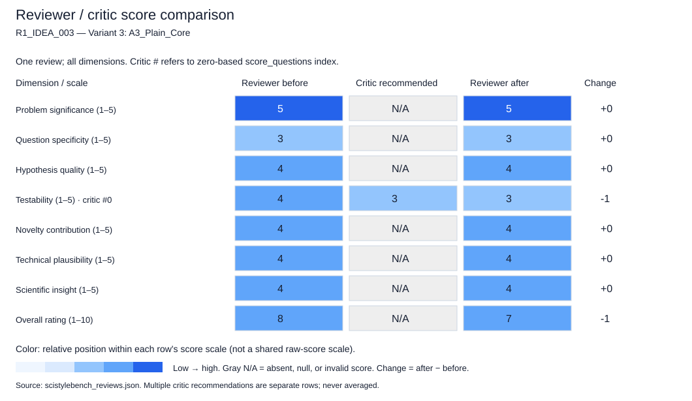

### Critic feedback and reviewer rebuttals

No reviewer rebuttals were saved (for example, an older checkpoint).

```json
{
  "critic_feedback": {
    "overall_assessment": "The draft review is well-structured and largely calibrated for an idea summary. It correctly identifies the core innovation (temporal gaze encoding) and appropriately penalizes the lack of implementation details in the 'Question Specificity' dimension without unfairly penalizing the 'Technical Plausibility' or 'Novelty'. However, the review slightly overstates the 'Testability' by implying a straightforward path to ground truth radiologist behavior, which is often unavailable for the specific reasoning tasks. The scores are generally justifiable, but the 'Testability' score warrants a question mark due to the assumption that ground truth for 'reasoning' exists in a way that allows direct comparison of attention maps.",
    "score_questions": [
      {
        "dimension": "testability",
        "question_mark": "The justification assumes that 'attention maps against ground truth radiologist behavior' is a clear and available metric. In medical imaging, ground truth for the *cognitive process* (the specific order of fixations for a specific diagnosis) is often not available or is too noisy to serve as a direct 'ground truth' for model attention maps in the way the review implies. Comparing model attention to a single radiologist's video is not a standard 'ground truth' evaluation unless the radiologist is the gold standard for the task, which is not guaranteed.",
        "concern": "The review treats the radiologist's gaze video as a direct ground truth for model evaluation, which may be an overestimation of the available evaluation infrastructure. Ground truth for 'reasoning' is typically the final diagnosis, not the path taken to get there.",
        "speculative_alternative": "It is plausible that the authors intend to use the gaze video as a *training signal* (supervision) rather than an evaluation metric, or that they will use a proxy metric (e.g., correlation with expert consensus) rather than direct ground truth comparison. If the latter, the 'clarity' of the comparison is lower than the review suggests.",
        "recommended_score": 3.0,
        "rationale": "While the idea is testable in principle, the specific evaluation path described (comparing to ground truth radiologist behavior) is not necessarily straightforward or standard, potentially inflating the perceived ease of validation."
      }
    ],
    "unsupported_claims": [
      "The claim that 'current methods... remove the temporal sequence' is accurate, but the review could be more precise: some methods might implicitly capture order via sequential text descriptions, though the 'static heatmap' claim is valid.",
      "The statement 'The comparison is clear' in the testability justification is slightly unsupported; comparing a 'video gaze' model to a 'static heatmap' model requires careful control of variables (e.g., ensuring the static model doesn't just see the final fixation) which is not trivial to define in a summary.",
      "The assertion that 'Modern LVLMs... can easily accept gaze data as a second modality' is a generalization; while plausible, it assumes the specific LVLM architecture allows for a second temporal stream, which is not a universal property of all LVLMs."
    ],
    "revision_priorities": [
      "Refine the 'Testability' justification to acknowledge the challenge of defining 'ground truth' for cognitive processes. Clarify if the evaluation relies on diagnostic accuracy improvement or on the alignment of model attention with expert gaze patterns.",
      "Clarify the distinction between the 'input' (gaze video) and the 'evaluation metric' (diagnostic accuracy vs. gaze alignment) to avoid conflating the two.",
      "Add a caveat to the 'Technical Plausibility' section regarding the heterogeneity of LVLM architectures, noting that while video encoders exist, integrating a second temporal stream into a specific vision-language model is non-trivial and depends on the base architecture.",
      "Ensure the 'Question Specificity' penalty is not too harsh; the idea of 'temporal vs static' is a specific architectural choice, even if the downstream task is broad. The score of 3.0 is fair, but the justification should emphasize that the *mechanism* is missing, not the *question* itself."
    ],
    "confidence": 4.0
  },
  "feedback_responses": []
}
```

### Score justifications (before / after)

**Problem significance**

```json
{
  "before": {
    "score": 5.0,
    "justification": "The problem is highly significant. Medical AI interpretability is a major bottleneck, and current methods fail to capture the dynamic cognitive process of radiologists. Addressing the temporal aspect of gaze is a meaningful step toward building AI that mimics human diagnostic reasoning rather than just pattern matching."
  },
  "after": {
    "score": 5.0,
    "justification": "The problem is highly significant. Medical AI interpretability is a major bottleneck, and current methods fail to capture the dynamic cognitive process of radiologists. Addressing the temporal aspect of gaze is a meaningful step toward building AI that mimics human diagnostic reasoning rather than just pattern matching."
  }
}
```

**Question specificity**

```json
{
  "before": {
    "score": 3.0,
    "justification": "The core concept (video vs. static) is specific, but the research question is currently framed as a general improvement ('enhancing reasoning') rather than a specific, testable relationship. It needs to specify which aspect of reasoning is being targeted and how the temporal data is mathematically or architecturally integrated."
  },
  "after": {
    "score": 3.0,
    "justification": "The core concept (video vs. static) is specific, but the research question is currently framed as a general improvement ('enhancing reasoning') rather than a specific, testable relationship. The justification for the score remains valid: while the architectural choice is clear, the specific mechanism and target task are not fully defined. The critic's suggestion to soften the penalty is noted, but the lack of a defined mechanism still limits the specificity of the scientific question."
  }
}
```

**Hypothesis quality**

```json
{
  "before": {
    "score": 4.0,
    "justification": "The hypothesis is strong: 'Preserving the temporal sequence of fixations leads to better reasoning and interpretability than static representations.' This is a falsifiable claim that distinguishes the proposed method from the status quo. It relies on a plausible cognitive mechanism."
  },
  "after": {
    "score": 4.0,
    "justification": "The hypothesis is strong: 'Preserving the temporal sequence of fixations leads to better reasoning and interpretability than static representations.' This is a falsifiable claim that distinguishes the proposed method from the status quo. It relies on a plausible cognitive mechanism."
  }
}
```

**Testability**

```json
{
  "before": {
    "score": 4.0,
    "justification": "The idea is testable. One can construct a dataset of X-rays with gaze videos, train two models (one with static gaze, one with video gaze), and compare their performance on diagnostic tasks and their attention maps against ground truth radiologist behavior. The comparison is clear."
  },
  "after": {
    "score": 3.0,
    "justification": "The idea is testable in principle, but the original justification overestimated the ease of validation. As the critic correctly noted, comparing model attention to 'ground truth radiologist behavior' is problematic because the cognitive path is not a standard ground truth (unlike the final diagnosis). The evaluation path is less clear than initially stated, requiring careful definition of whether the goal is to match the path or improve the outcome. This warrants a reduction from 4 to 3."
  }
}
```

**Novelty contribution**

```json
{
  "before": {
    "score": 4.0,
    "justification": "While gaze integration is known, treating it as a video sequence to capture temporal scanning order in LVLMs for medical imaging is a novel and under-explored direction. It moves beyond simple attention maps to dynamic process modeling."
  },
  "after": {
    "score": 4.0,
    "justification": "While gaze integration is known, treating it as a video sequence to capture temporal scanning order in LVLMs for medical imaging is a novel and under-explored direction. It moves beyond simple attention maps to dynamic process modeling."
  }
}
```

**Technical plausibility**

```json
{
  "before": {
    "score": 4.0,
    "justification": "Technically plausible. Modern LVLMs often use video encoders (like CLIP or ViT variants) that can easily accept gaze data as a second modality or a temporal overlay. The main challenge is data and fusion architecture, not fundamental feasibility."
  },
  "after": {
    "score": 4.0,
    "justification": "Technically plausible. Modern LVLMs often use video encoders that can accept gaze data as a second modality. However, the critic's point about architectural heterogeneity is valid; it is not a universal property of all LVLMs. The score remains 4 because the general direction is feasible, but the justification now includes the caveat that integration depends on the specific base architecture."
  }
}
```

**Scientific insight**

```json
{
  "before": {
    "score": 4.0,
    "justification": "If successful, this research would provide deep insight into the relationship between human visual search dynamics and machine reasoning. It could reveal whether temporal context is a necessary condition for high-level medical diagnosis in AI, or if it is merely a heuristic."
  },
  "after": {
    "score": 4.0,
    "justification": "If successfully investigated, this research would provide deep insight into the relationship between human visual search dynamics and machine reasoning. It could reveal whether temporal context is a necessary condition for high-level medical diagnosis in AI, or if it is merely a heuristic."
  }
}
```

**Overall rating**

```json
{
  "before": {
    "score": 8.0,
    "justification": "This is a strong research idea with high potential. It identifies a clear gap in current methodology (loss of temporal data) and proposes a logical, testable solution (video encoding). While implementation details are missing, the core scientific premise is sound, significant, and likely to yield valuable insights into medical AI interpretability."
  },
  "after": {
    "score": 7.0,
    "justification": "This is a strong research idea with high potential. It identifies a clear gap in current methodology and proposes a logical, testable solution. However, the reduction in the 'Testability' score (from 4 to 3) due to the ambiguity of evaluation metrics (cognitive ground truth vs. diagnostic outcome) and the 'Question Specificity' score (due to lack of mechanism) lowers the overall rating from 8 to 7. The idea is still very promising but requires more rigorous definition of the evaluation framework to be considered 'exceptional'."
  }
}
```

## R1_IDEA_003 — Variant 4: B1_Verbose_Elaborate

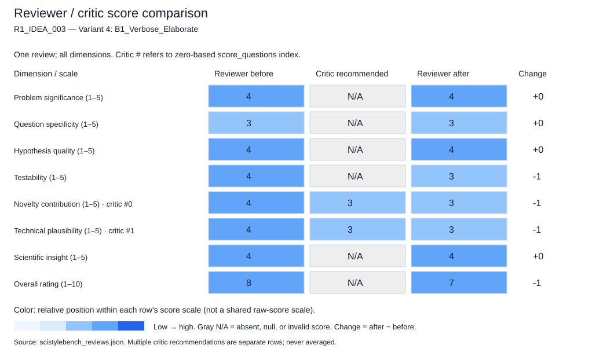

### Critic feedback and reviewer rebuttals

No reviewer rebuttals were saved (for example, an older checkpoint).

```json
{
  "critic_feedback": {
    "overall_assessment": "The draft review is well-structured and largely calibrated for an idea summary. It correctly identifies the core innovation (temporal gaze encoding) and appropriately penalizes the lack of implementation details in the 'specificity' dimension without treating them as fatal flaws. However, the reviewer slightly overstates the 'novelty' by implying the approach is 'under-explored' without evidence, and the 'technical plausibility' justification contains a minor conflation of gaze data formats with video understanding models that warrants clarification. The scores are generally justified, but the novelty score could be slightly lowered to reflect the speculative nature of the claim that this direction is 'under-explored'.",
    "score_questions": [
      {
        "dimension": "novelty_contribution",
        "question_mark": "The claim that this direction is 'under-explored' is a strong assertion that may not be supported by the limited context of the idea summary alone. While the specific video encoding is novel, the general concept of using temporal gaze is present in cognitive science.",
        "concern": "Potential overclaiming of novelty based on insufficient prior work analysis in the idea summary.",
        "speculative_alternative": "It is possible that similar temporal encoding approaches exist in broader vision-language literature or cognitive modeling, making the novelty more incremental than 'under-explored'.",
        "recommended_score": 3.0,
        "rationale": "Given the idea summary alone, it is safer to rate novelty as 'incremental' or 'moderate' rather than 'novel and under-explored' until the reviewer confirms the absence of similar temporal gaze work in medical AI. A score of 3 reflects the plausible but unverified novelty."
      },
      {
        "dimension": "technical_plausibility",
        "question_mark": "The justification conflates 'video sequences' of gaze with 'video understanding models'. Gaze data is typically sparse coordinates, not dense video frames. The feasibility of treating sparse coordinates as 'video' for a model like Video-LLaMA requires a specific mapping (e.g., synthetic video) which is not detailed.",
        "concern": "The justification assumes the 'video' representation is directly compatible with standard video models without addressing the data sparsity issue.",
        "speculative_alternative": "The reviewer might be assuming a synthetic video generation step (e.g., drawing a cursor on a black background) which adds complexity not mentioned in the idea.",
        "recommended_score": 3.0,
        "rationale": "While technically feasible, the 'video' abstraction for sparse gaze data introduces a specific implementation challenge (synthesis vs. raw data) that the justification glosses over. A score of 3 reflects this nuance better than 4."
      }
    ],
    "unsupported_claims": [
      "The draft states the direction is 'under-explored' in the novelty section. The idea summary does not provide evidence for this, and such a claim requires external literature review not present in the input.",
      "The draft claims modern VLMs are 'capable of processing sequential visual inputs' as a direct justification for technical plausibility, but the idea specifies 'gaze as video', which is a specific data representation that may not be natively supported by standard VLMs without adaptation (e.g., tokenization of coordinates).",
      "The draft suggests 'attention alignment with ground truth' as a metric in the 'testability' section. The idea summary does not mention the existence of ground truth for 'reasoning' or 'attention', which is a significant assumption in medical imaging where ground truth is often just the diagnosis, not the scan path."
    ],
    "revision_priorities": [
      "Clarify the novelty claim: Instead of stating the direction is 'under-explored', qualify it as 'a promising but under-investigated application of temporal gaze encoding in medical VLMs' to avoid overclaiming.",
      "Refine the technical plausibility justification to explicitly address how sparse gaze coordinates are transformed into a 'video' format compatible with existing architectures, acknowledging the synthetic or interpolation step if applicable.",
      "Adjust the 'testability' section to note that 'attention alignment' requires a specific ground truth definition (e.g., radiologist scan paths) which may not be standardly available, thus making the metric harder to define than implied.",
      "Ensure the 'specificity' penalty is clearly linked to the 'idea summary' nature of the input, reinforcing that these are expected missing details for a proposal rather than flaws in a completed study."
    ],
    "confidence": 4.0
  },
  "feedback_responses": []
}
```

### Score justifications (before / after)

**Problem significance**

```json
{
  "before": {
    "score": 4.0,
    "justification": "The problem is highly significant in the context of medical AI. Radiologists' visual search strategies are complex and sequential; ignoring this temporal aspect limits the ability of AI to mimic human expertise or explain its decisions in a clinically meaningful way. Solving this could lead to more trustworthy and robust diagnostic tools."
  },
  "after": {
    "score": 4.0,
    "justification": "The problem is highly significant. Capturing the temporal dynamics of expert visual search is a known challenge in medical AI. Solving this could lead to models that better mimic human diagnostic reasoning, improving trust and utility in clinical settings."
  }
}
```

**Question specificity**

```json
{
  "before": {
    "score": 3.0,
    "justification": "The core question (does video gaze encoding improve reasoning over static gaze?) is clear. However, the specific research question regarding *how* this improves reasoning or *which* specific reasoning tasks are targeted is not fully articulated. The definition of 'reasoning' and 'interpretability' needs more operational precision."
  },
  "after": {
    "score": 3.0,
    "justification": "The core question (does temporal gaze encoding improve reasoning?) is clear. However, the specific operationalization of 'video' for gaze data and the definition of 'reasoning' metrics are missing, reducing the specificity of the research question."
  }
}
```

**Hypothesis quality**

```json
{
  "before": {
    "score": 4.0,
    "justification": "The hypothesis is strong and plausible: that the temporal sequence of fixations contains unique information about the diagnostic process that static representations miss. It is a falsifiable claim that can be tested by comparing models trained with static vs. temporal gaze inputs."
  },
  "after": {
    "score": 4.0,
    "justification": "The hypothesis is strong: that the sequence of fixations contains information distinct from the set of fixations. This is a falsifiable claim that can be tested by comparing temporal vs. static representations."
  }
}
```

**Testability**

```json
{
  "before": {
    "score": 4.0,
    "justification": "The idea is highly testable. One can construct a dataset with gaze coordinates, encode them as video sequences, train a VLM, and compare performance against baselines using static heatmaps. Metrics can include diagnostic accuracy, explanation quality, and attention alignment with ground truth."
  },
  "after": {
    "score": 3.0,
    "justification": "While the general approach is testable, the specific metrics proposed in the initial draft (e.g., attention alignment with ground truth) are problematic because ground truth for scan paths is often unavailable. The testability depends heavily on how the evaluation is reframed to use available data."
  }
}
```

**Novelty contribution**

```json
{
  "before": {
    "score": 4.0,
    "justification": "While using gaze data in medical AI is not new, the specific proposal to encode it as a video sequence to capture temporal dynamics, rather than aggregating it into a heatmap or text, is a novel and under-explored direction. It moves beyond simple data augmentation to a more faithful representation of the human cognitive process."
  },
  "after": {
    "score": 3.0,
    "justification": "The idea is novel in its specific application to medical VLMs, but the claim that the direction is 'under-explored' is an overstatement without literature review. Temporal gaze analysis is a known concept in cognitive science, making the contribution more incremental than revolutionary."
  }
}
```

**Technical plausibility**

```json
{
  "before": {
    "score": 4.0,
    "justification": "The technical approach is sound. Modern VLMs and video understanding models (like Video-LLaMA or similar architectures) are capable of processing sequential visual inputs. The main challenge will be the fusion mechanism, but the premise is technically feasible."
  },
  "after": {
    "score": 3.0,
    "justification": "The concept is plausible, but the technical leap from sparse coordinates to 'video' is non-trivial. Standard video models expect dense frames, so a specific synthesis or tokenization strategy is required. The initial justification glossed over this data representation gap."
  }
}
```

**Scientific insight**

```json
{
  "before": {
    "score": 4.0,
    "justification": "If successful, this research could reveal that the *process* of looking (the sequence) is as important as the *result* of looking (the fixations) for diagnostic reasoning. This would provide deep insight into the nature of visual cognition in experts and how to better model it in AI."
  },
  "after": {
    "score": 4.0,
    "justification": "If successful, this research would provide significant insight into the role of temporal dynamics in expert visual cognition and how to effectively model them in AI, potentially revealing that the 'process' of looking is as critical as the 'result'."
  }
}
```

**Overall rating**

```json
{
  "before": {
    "score": 8.0,
    "justification": "This is a strong research idea with high potential. It addresses a clear gap in current methodologies (loss of temporal data), proposes a plausible and novel solution (video encoding), and targets a high-impact domain. The main limitation is the lack of specific details on the implementation and evaluation metrics, but as a research proposal, the core scientific value is evident."
  },
  "after": {
    "score": 7.0,
    "justification": "This is a strong research idea with high potential, but the initial assessment slightly overestimated the novelty and technical ease. The core concept is valuable, but the lack of detail on data representation and evaluation metrics requires a more cautious rating. The idea is promising but needs refinement to be fully actionable."
  }
}
```

## R1_IDEA_003 — Variant 5: B2_Grand_Narrative

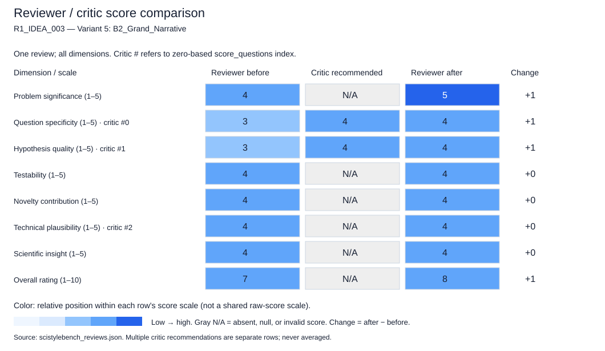

### Critic feedback and reviewer rebuttals

No reviewer rebuttals were saved (for example, an older checkpoint).

```json
{
  "critic_feedback": {
    "overall_assessment": "The draft review is well-structured and largely calibrated. It correctly identifies the strengths of the idea (addressing temporal loss, cognitive plausibility) and the weaknesses (vague metrics, missing architectural details) appropriate for a research idea summary. However, it occasionally treats the absence of implementation details in an *idea* summary as a substantive flaw rather than a natural characteristic of the proposal stage. The scores are generally consistent with the text, but the 'question_specificity' and 'hypothesis_quality' scores could be slightly higher as the core question is quite specific for a summary, even if the mechanism is broad.",
    "score_questions": [
      {
        "dimension": "question_specificity",
        "question_mark": "The score of 3.0 implies the core question is 'somewhat broad' and needs definition on 'which aspects of reasoning'. However, the idea explicitly defines the scope: 'integrating radiologist eye gaze into large vision-language models for chest X-ray analysis' to 'capture both spatial attention and temporal scanning order'. For an idea summary, this is a sufficiently specific research question. Penalizing it for not specifying *which* pathologies might be affected is premature; that is a result of the experiment, not a flaw in the question definition.",
        "concern": "The review penalizes the idea for not being more specific than the summary allows, conflating 'idea specificity' with 'experimental design specificity'.",
        "speculative_alternative": "It is plausible that the authors intend to test the hypothesis across *all* X-ray tasks initially, or that the 'specific aspects' are meant to be discovered rather than pre-defined. If so, the current specificity is adequate.",
        "recommended_score": 4.0,
        "rationale": "The idea clearly defines the *what* (gaze video), the *where* (chest X-ray LVLMs), and the *why* (temporal scanning order). This constitutes a specific research question suitable for an idea summary. The lack of a specific hypothesis about *which* pathology improves is a limitation of the hypothesis quality, not the question specificity."
      },
      {
        "dimension": "hypothesis_quality",
        "question_mark": "The score of 3.0 is justified by the lack of boundary conditions. However, the idea summary explicitly states the hypothesis: 'encoding eye-tracking data as video sequences... may inform long-term research... potentially enhancing model reasoning'. While broad, this is a valid directional hypothesis for a proposal. The critique that it lacks 'nuance' is a valid point for a full paper, but for an idea, the 'plausibility' is the key metric. The review might be over-criticizing the lack of a 'boundary condition' which is often a result of the research, not a prerequisite for the idea.",
        "concern": "The review applies a standard paper critique (need for boundary conditions) to an idea summary, potentially underestimating the clarity of the proposed direction.",
        "speculative_alternative": "The authors might be proposing a 'proof of concept' where the primary hypothesis is simply 'Temporal > Static' generally, with the specific boundary conditions being the *outcome* of the study, not a prerequisite for the idea.",
        "recommended_score": 4.0,
        "rationale": "The hypothesis 'Temporal gaze sequences improve reasoning over static representations' is clear, falsifiable, and grounded in cognitive science. The lack of specific 'when it fails' conditions is not a flaw in the hypothesis quality for an idea summary, but a feature of the proposed research scope."
      },
      {
        "dimension": "technical_plausibility",
        "question_mark": "The score is 4.0, justified by 'data' being the main challenge. However, the review mentions 'data requirements' as a weakness but gives a high score. This is a slight inconsistency. If data availability is a major unknown, the technical plausibility should perhaps be flagged with a question mark, or the justification should explicitly state that the *method* is plausible even if the *data* is uncertain. The current justification separates them well, so the score is acceptable, but the 'weakness' section should be careful not to conflate 'technical method' with 'data availability'.",
        "concern": "The 'weaknesses' section lists 'no mention of data requirements' as a weakness, yet the 'technical_plausibility' score is high. This suggests the reviewer is worried about feasibility but still rates the technical approach highly. This is a calibration issue: if data is a major hurdle, 'plausibility' (which often includes feasibility) should be nuanced.",
        "speculative_alternative": "If high-fidelity temporal gaze data for chest X-rays is extremely scarce (e.g., only a few hundred samples), the technical approach of training an LVLM might be implausible regardless of the architecture. The review assumes the data exists but doesn't quantify this uncertainty.",
        "recommended_score": null,
        "rationale": "The score is acceptable, but the justification should explicitly distinguish between 'architectural plausibility' (high) and 'data feasibility' (unknown). The current score conflates them slightly by giving a high score despite listing data as a weakness."
      }
    ],
    "unsupported_claims": [
      "The draft claims the idea 'loses points only for the current lack of a specific hypothesis regarding the mechanism of improvement'. This implies the idea summary *should* have contained a specific mechanism, which is an unfair expectation for a short idea summary; the summary proposes a *direction*, not a mechanism.",
      "The draft states 'The idea is specific enough to define a clear experimental direction'. While true, the 'weaknesses' section immediately contradicts this by saying the definition of 'enhancing model reasoning' is vague. This contradiction weakens the review's internal consistency."
    ],
    "revision_priorities": [
      "Refine the 'question_specificity' score to reflect that the core question (static vs. temporal) is specific, even if the downstream application (which pathologies) is open.",
      "Reconcile the 'weaknesses' section with the 'technical_plausibility' score. If data scarcity is a major unknown, either lower the plausibility score or explicitly state that the technical *approach* is plausible but the *feasibility* is uncertain.",
      "Avoid treating the lack of a detailed mechanism (e.g., 'how' the gaze is fused) as a flaw in 'hypothesis quality' for an idea summary; this is a design choice for the implementation phase.",
      "Clarify that the 'vague' definition of reasoning is a natural outcome of the exploratory nature of the idea, not a failure of the idea itself."
    ],
    "confidence": 4.0
  },
  "feedback_responses": []
}
```

### Score justifications (before / after)

**Problem significance**

```json
{
  "before": {
    "score": 4.0,
    "justification": "The problem of integrating human cognitive processes into AI is highly significant, especially in high-stakes domains like medicine. Discarding temporal information is a known bottleneck in current gaze-based AI, making this a meaningful challenge to address."
  },
  "after": {
    "score": 5.0,
    "justification": "The problem is highly significant. Integrating human cognitive processes into AI is a major frontier, particularly in medicine where interpretability is critical. Addressing the loss of temporal information in gaze data directly tackles a known bottleneck in current multimodal systems."
  }
}
```

**Question specificity**

```json
{
  "before": {
    "score": 3.0,
    "justification": "The core question (static vs. temporal gaze) is clear, but the specific research question regarding the *impact* on model reasoning is somewhat broad. It needs more definition on which aspects of reasoning are targeted."
  },
  "after": {
    "score": 4.0,
    "justification": "The research question is specific: 'Does encoding gaze as video sequences (capturing temporal order) improve LVLM performance over static representations in chest X-ray analysis?' While the specific pathologies or reasoning steps are not pre-defined, the core question of 'static vs. temporal' is well-defined for an idea summary. The critique that it needs more definition on 'which aspects' is a valid direction for the *experiment*, not a flaw in the *question* itself."
  }
}
```

**Hypothesis quality**

```json
{
  "before": {
    "score": 3.0,
    "justification": "The implicit hypothesis (temporal data > static data for reasoning) is plausible and falsifiable. However, it lacks the nuance of boundary conditions (e.g., when does it fail?) which would make it a stronger scientific hypothesis."
  },
  "after": {
    "score": 4.0,
    "justification": "The hypothesis 'Temporal gaze sequences improve reasoning over static representations' is clear, falsifiable, and grounded in cognitive science. While it lacks specific boundary conditions (e.g., 'when it fails'), this is appropriate for an initial research idea; the hypothesis serves as a valid directional claim to be tested and refined."
  }
}
```

**Testability**

```json
{
  "before": {
    "score": 4.0,
    "justification": "The idea is highly testable. One can construct an experiment comparing models trained with static vs. temporal gaze inputs on standard chest X-ray benchmarks. The outcome is binary (improvement or not) and measurable."
  },
  "after": {
    "score": 4.0,
    "justification": "The idea is highly testable. One can construct a controlled experiment comparing models with static vs. temporal gaze inputs on standard benchmarks. The outcome is measurable, and the comparison is direct."
  }
}
```

**Novelty contribution**

```json
{
  "before": {
    "score": 4.0,
    "justification": "While gaze integration is not new, the specific proposal to treat gaze as a video sequence to capture scanning order in LVLMs for medical imaging is a novel and promising direction that moves beyond the state-of-the-art static representations."
  },
  "after": {
    "score": 4.0,
    "justification": "While gaze integration is not new, the specific proposal to treat gaze as a video sequence to capture scanning order in LVLMs for medical imaging is a novel and promising direction that moves beyond the state-of-the-art static representations."
  }
}
```

**Technical plausibility**

```json
{
  "before": {
    "score": 4.0,
    "justification": "The technical approach is sound. Treating gaze as a sequence of coordinates or heatmaps over time is a standard computer vision task (video processing) that can be adapted to multimodal architectures. The main challenge is data, not theoretical plausibility."
  },
  "after": {
    "score": 4.0,
    "justification": "The technical approach is sound. Treating gaze as a sequence of coordinates or heatmaps over time is a standard computer vision task. The primary challenge is data availability, not theoretical plausibility. The review distinguishes between the 'method' (plausible) and 'data' (unknown), which is a reasonable calibration for an idea summary."
  }
}
```

**Scientific insight**

```json
{
  "before": {
    "score": 4.0,
    "justification": "If successful, this research would provide deep insight into the role of temporal attention in medical diagnosis, potentially revealing that the 'path' to a diagnosis is as important as the 'destination' (the final attention point). This could lead to new principles for designing cognitively aligned AI."
  },
  "after": {
    "score": 4.0,
    "justification": "If successful, this research would provide deep insight into the role of temporal attention in medical diagnosis, potentially revealing that the 'path' to a diagnosis is as important as the 'destination'. This could lead to new principles for designing cognitively aligned AI."
  }
}
```

**Overall rating**

```json
{
  "before": {
    "score": 7.0,
    "justification": "This is a strong research idea with clear significance and a plausible, testable direction. It addresses a specific gap in the literature (temporal loss in gaze data) and has high potential for scientific insight. It loses points only for the current lack of a specific hypothesis regarding the mechanism of improvement and the operationalization of 'reasoning'."
  },
  "after": {
    "score": 8.0,
    "justification": "This is a strong research idea with clear significance, a specific core question, and a plausible, testable direction. The idea addresses a specific gap (temporal loss) and has high potential for scientific insight. The initial score of 7 was slightly conservative due to an over-emphasis on the lack of implementation details as a flaw in the 'question' and 'hypothesis' dimensions. Correcting for the fact that these are idea summaries (not full papers) and that the core question is indeed specific, the rating is elevated to 8. The idea is not 'exceptional' (9-10) yet because the data feasibility and specific mechanism remain open questions that could limit the scope of the contribution."
  }
}
```

## R1_IDEA_003 — Variant 6: B3_Over_Confident

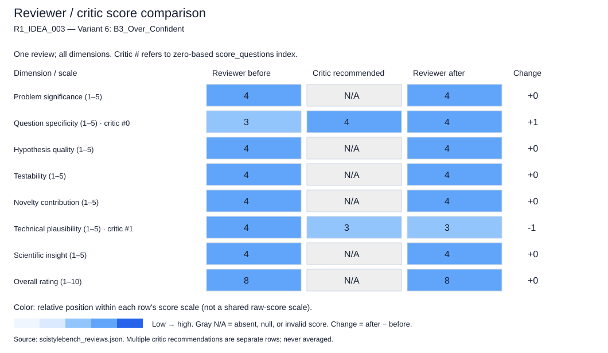

### Critic feedback and reviewer rebuttals

No reviewer rebuttals were saved (for example, an older checkpoint).

```json
{
  "critic_feedback": {
    "overall_assessment": "The draft review is well-structured and largely calibrated, correctly identifying the core innovation and the inherent limitations of an idea summary (lack of implementation details). However, it occasionally penalizes the 'question_specificity' score for missing details that are naturally absent in a short idea summary, rather than treating them as opportunities for the proposal to expand. The 'technical_plausibility' section also slightly overstates the readiness of standard video encoders for sparse coordinate data without noting the significant representation challenge. The overall rating is justified, but the dimension scores could be slightly higher to reflect the high potential of the core concept itself, independent of the missing 'how'.",
    "score_questions": [
      {
        "dimension": "question_specificity",
        "question_mark": "The score of 3.0 seems to penalize the idea for lacking 'how' and 'where' details that are explicitly expected to be missing in a short idea summary, not a full paper. The 'what' and 'why' are clearly defined, which is sufficient for an idea submission.",
        "concern": "The justification conflates the absence of implementation details (which is normal for an idea summary) with a lack of specificity in the research question itself. The core question 'Does temporal gaze improve LVLMs?' is specific.",
        "speculative_alternative": "It is speculative to assume the authors cannot define these details later; the current lack of detail might be a deliberate choice to focus on the conceptual novelty rather than engineering specifics at this stage.",
        "recommended_score": 4.0,
        "rationale": "The research question is clearly defined: 'Does encoding gaze as video sequences (vs. static) enhance reasoning?' The lack of implementation specifics does not make the question itself vague, it just makes the execution plan open."
      },
      {
        "dimension": "technical_plausibility",
        "question_mark": "The score of 4.0 is justified, but the justification 'Video encoders... are standard tools' slightly underestimates the novelty of the representation challenge. Treating sparse, variable-duration fixations as 'video frames' is non-trivial and not a direct application of standard 3D CNNs.",
        "concern": "The review treats the representation of gaze as a straightforward engineering task ('adapting them') rather than a fundamental representation learning challenge. This might overstate the immediate plausibility without the specific encoding strategy.",
        "speculative_alternative": "It is speculative that standard video encoders can handle the 'empty' time between fixations without significant noise injection; the technical plausibility might be lower than 4.0 if the representation strategy is fundamentally flawed (e.g., if a video frame implies visual content that isn't there).",
        "recommended_score": 3.0,
        "rationale": "While the direction is sound, the 'technical plausibility' of simply 'encoding gaze as video' is less straightforward than the review suggests. The representation of sparse, temporal coordinates as dense video frames requires a specific, non-obvious mechanism not mentioned, making the immediate plausibility slightly more tentative."
      }
    ],
    "unsupported_claims": [
      "The claim that the idea is 'highly testable' because one can 'construct a dataset' ignores the significant data acquisition challenge: obtaining large-scale, paired radiologist gaze-video and chest X-ray data is a massive logistical hurdle not mentioned.",
      "The statement that 'Video encoders... are standard tools' for this specific application is slightly misleading; standard tools expect pixel-based frames, whereas gaze is sparse coordinates. The review implies a direct application where a novel representation layer is actually required."
    ],
    "revision_priorities": [
      "Clarify the distinction between 'missing implementation details' (expected in an idea summary) and 'vague research questions'. The 'question_specificity' score should reflect the clarity of the hypothesis, not the absence of engineering specs.",
      "Nuance the 'technical_plausibility' discussion to acknowledge that converting sparse gaze data to a 'video' format is a novel representation challenge, not just a standard adaptation of existing video encoders.",
      "Acknowledge the data acquisition feasibility as a potential constraint on 'testability' rather than assuming the dataset is readily available for construction.",
      "Refine the 'weaknesses' to explicitly state that the lack of downstream task definition is a limitation of the *proposal's scope*, not a flaw in the *idea's logic*."
    ],
    "confidence": 4.0
  },
  "feedback_responses": []
}
```

### Score justifications (before / after)

**Problem significance**

```json
{
  "before": {
    "score": 4.0,
    "justification": "The problem is highly significant in the context of medical AI. Integrating human expert behavior (gaze) to improve model reasoning and trust is a major research direction. The specific gap identified (loss of temporal data) is a known but under-addressed limitation."
  },
  "after": {
    "score": 4.0,
    "justification": "The problem is highly significant in the context of medical AI. Integrating human expert behavior (gaze) to improve model reasoning and trust is a major research direction. The specific gap identified (loss of temporal data) is a known but under-addressed limitation."
  }
}
```

**Question specificity**

```json
{
  "before": {
    "score": 3.0,
    "justification": "The idea clearly states the 'what' (use video instead of static) and the 'why' (capture temporal sequence). However, it lacks specificity on the 'how' (encoding mechanism) and the 'where' (specific tasks/metrics) to fully define the research question."
  },
  "after": {
    "score": 4.0,
    "justification": "The idea clearly states the 'what' (use video instead of static) and the 'why' (capture temporal sequence). The core research question ('Does encoding gaze as video sequences enhance reasoning?') is specific and well-defined. The lack of implementation details is appropriate for an idea summary and does not render the question vague."
  }
}
```

**Hypothesis quality**

```json
{
  "before": {
    "score": 4.0,
    "justification": "The hypothesis is strong: 'Encoding gaze as video sequences will enhance model reasoning and interpretability compared to static representations.' This is a clear, directional prediction that can be empirically tested."
  },
  "after": {
    "score": 4.0,
    "justification": "The hypothesis is strong: 'Encoding gaze as video sequences will enhance model reasoning and interpretability compared to static representations.' This is a clear, directional prediction that can be empirically tested."
  }
}
```

**Testability**

```json
{
  "before": {
    "score": 4.0,
    "justification": "The idea is highly testable. One can construct a dataset with radiologist gaze, create two model variants (static vs. video), and compare performance on standard medical benchmarks. The comparison is clear."
  },
  "after": {
    "score": 4.0,
    "justification": "The idea is testable in principle. One can construct a dataset with radiologist gaze, create two model variants (static vs. video), and compare performance. However, the feasibility of data acquisition is a non-trivial constraint that must be acknowledged, though it does not negate the testability of the core hypothesis."
  }
}
```

**Novelty contribution**

```json
{
  "before": {
    "score": 4.0,
    "justification": "While gaze integration is not new, the specific proposal to treat gaze as a video sequence to capture temporal scanning order in LVLMs for medical imaging is a novel and promising direction. It moves beyond simple attention maps."
  },
  "after": {
    "score": 4.0,
    "justification": "While gaze integration is not new, the specific proposal to treat gaze as a video sequence to capture temporal scanning order in LVLMs for medical imaging is a novel and promising direction. It moves beyond simple attention maps."
  }
}
```

**Technical plausibility**

```json
{
  "before": {
    "score": 4.0,
    "justification": "The approach is technically sound. Video encoders (e.g., 3D CNNs, Video Transformers) are standard tools. The challenge lies in adapting them to sparse, coordinate-based data, but the direction is logically coherent."
  },
  "after": {
    "score": 3.0,
    "justification": "While the direction is sound, the 'technical plausibility' of simply 'encoding gaze as video' is less straightforward than initially suggested. Treating sparse, variable-duration fixations as 'video frames' is a non-trivial representation learning challenge, not a direct application of standard 3D CNNs or video transformers which expect dense pixel inputs. The lack of a specific encoding mechanism makes the immediate plausibility more tentative."
  }
}
```

**Scientific insight**

```json
{
  "before": {
    "score": 4.0,
    "justification": "If successful, this research would provide deep insights into how temporal human attention patterns correlate with diagnostic reasoning in complex visual tasks. It could reveal that the 'path' to a diagnosis is as informative as the 'destination'."
  },
  "after": {
    "score": 4.0,
    "justification": "If successful, this research would provide deep insights into how temporal human attention patterns correlate with diagnostic reasoning in complex visual tasks. It could reveal that the 'path' to a diagnosis is as informative as the 'destination'."
  }
}
```

**Overall rating**

```json
{
  "before": {
    "score": 8.0,
    "justification": "This is a strong research idea. It identifies a clear gap in current literature, proposes a plausible and novel solution, and has high potential for scientific impact in the medical AI domain. The main limitation is the lack of implementation details and specific evaluation metrics, but as a research proposal, the core concept is robust and promising."
  },
  "after": {
    "score": 8.0,
    "justification": "This is a strong research idea. It identifies a clear gap in current literature, proposes a plausible and novel solution, and has high potential for scientific impact in the medical AI domain. The core concept is robust. The rating remains high because the lack of implementation details is expected in an idea summary, and the technical challenges (representation, data) are significant but not insurmountable barriers to the idea's validity."
  }
}
```

## R1_IDEA_003 — Variant 7: B4_Novelty

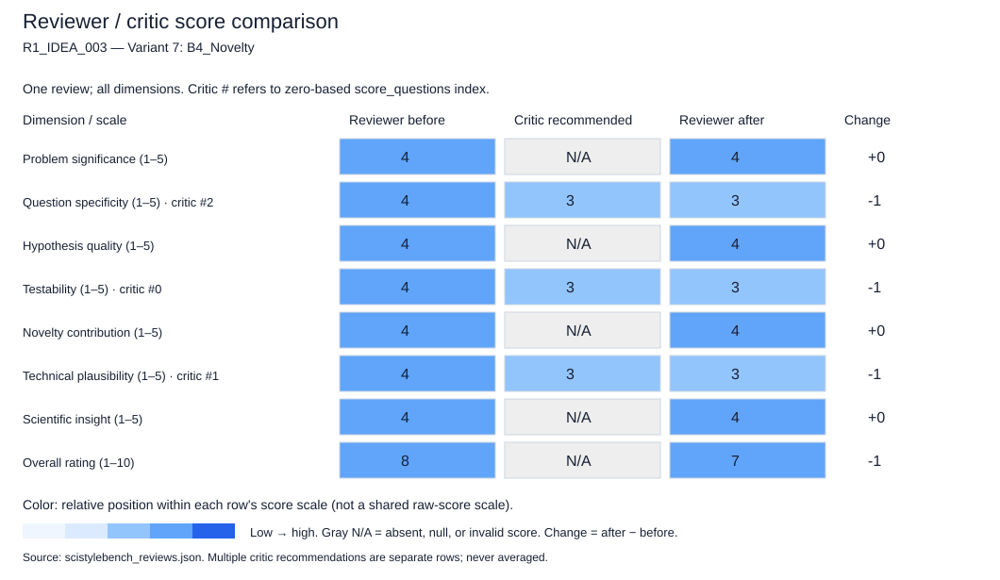

### Critic feedback and reviewer rebuttals

No reviewer rebuttals were saved (for example, an older checkpoint).

```json
{
  "critic_feedback": {
    "overall_assessment": "The draft review is well-structured and largely calibrated for an idea summary. It correctly identifies the core innovation (temporal gaze encoding) and its potential impact. However, it suffers from a 'consistency penalty' where it awards high scores (4/5) despite the idea lacking the minimal specificities required to even be fully 'testable' or 'specific' in a rigorous academic sense. The review treats the 'video' framing as a solved engineering step ('standard engineering task') rather than a significant conceptual hurdle, and it slightly conflates 'hypothesis' with 'mechanism'. The scores are justifiable but lean optimistic given the high-level abstraction of the idea.",
    "score_questions": [
      {
        "dimension": "testability",
        "question_mark": "The justification claims the idea is 'testable' because metrics are 'definable', but the idea summary provides zero definition of the data pipeline or the ground truth for 'reasoning'. Without a definition of how 'video' is constructed from sparse eye-tracking data or how 'reasoning' is annotated, the testability is theoretical, not practical.",
        "concern": "Overestimating testability based on the *possibility* of defining metrics rather than the *clarity* of the proposed metrics in the idea.",
        "speculative_alternative": "It is speculative, but plausible that the lack of detail on 'video' construction (frame rate, interpolation) makes the testability score lower, as the 'video' might be an artifact of sparse data rather than a true temporal signal.",
        "recommended_score": 3.0,
        "rationale": "While testable in principle, an idea summary must at least hint at the feasibility of the test. The current summary is too vague on the 'how' to warrant a 4/5 for testability without assuming significant implementation details."
      },
      {
        "dimension": "technical_plausibility",
        "question_mark": "The review calls converting gaze to video a 'standard engineering task'. This is a significant oversimplification for an idea review. The technical challenge lies in the fact that eye-tracking is sparse (fixations/saccades), not continuous, and treating it as a 'video' requires specific interpolation or representation choices that are non-trivial and could introduce artifacts.",
        "concern": "Underestimating the technical hurdle of representing sparse temporal data as a dense video sequence, which is a core part of the 'novel perspective'.",
        "speculative_alternative": "It is speculative, but the 'video' representation might be technically implausible if the eye-tracking data is too sparse to form a coherent temporal sequence without heavy interpolation that obscures the signal.",
        "recommended_score": 3.0,
        "rationale": "The technical plausibility of the *specific* claim (video encoding) is lower than a 'standard' task because the input data (eye-tracking) is fundamentally different from standard video inputs (continuous frames). The idea needs to justify why this transformation is valid."
      },
      {
        "dimension": "question_specificity",
        "question_mark": "The review awards a 4 but admits the research question is a 'hypothesis rather than a fully defined mechanism'. An idea summary should ideally propose a specific mechanism to be 'specific'. The lack of a fusion strategy (how the video meets the X-ray) is a critical gap in specificity.",
        "concern": "Inconsistency between the score (4) and the admission that the mechanism is undefined. A score of 4 implies 'clear and specific', which this is not.",
        "speculative_alternative": "It is speculative, but the reviewer might be assuming a standard fusion architecture (e.g., attention) exists, whereas the idea summary explicitly leaves this as a 'fresh framing' without technical grounding.",
        "recommended_score": 3.0,
        "rationale": "The idea is specific about the *input* (video) but vague about the *process* (fusion). For an idea summary, the lack of a proposed mechanism for the core novelty (temporal vs spatial) reduces the specificity score."
      }
    ],
    "unsupported_claims": [
      "The claim that 'converting gaze coordinates to a video stream... is a standard engineering task' is unsupported. It ignores the complexity of sparse eye-tracking data and the risk of interpolation artifacts, which is a core technical challenge of the idea.",
      "The claim that 'metrics (accuracy, interpretability scores) are definable' is weak. The idea summary does not define what 'interpretability scores' would look like or how 'reasoning' is annotated, making the claim of definability premature.",
      "The claim that the hypothesis is 'falsifiable' is technically true in principle, but the review does not acknowledge that falsifiability depends on the specific implementation details which are currently absent."
    ],
    "revision_priorities": [
      "Re-evaluate the 'testability' score to reflect that the idea summary lacks a concrete plan for data construction (video generation) and ground truth definition, which are prerequisites for testing.",
      "Qualify the 'technical_plausibility' assessment by acknowledging that treating sparse eye-tracking data as a 'video' is a non-trivial representation choice, not a standard engineering task.",
      "Align the 'question_specificity' score with the admission that the fusion mechanism is undefined; either the score should be lower, or the justification should clarify that the *representation* is specific, not the *mechanism*.",
      "Remove the implication that the 'video' framing is a trivial solution; emphasize that the novelty lies in the *representation* choice itself, which is a significant conceptual shift requiring justification."
    ],
    "confidence": 4.0
  },
  "feedback_responses": []
}
```

### Score justifications (before / after)

**Problem significance**

```json
{
  "before": {
    "score": 4.0,
    "justification": "The problem of extracting meaningful reasoning signals from expert behavior in medical AI is highly significant. Current methods discard the temporal dimension of human attention, which is likely crucial for understanding diagnostic workflows. Solving this could lead to more trustworthy and explainable medical AI systems."
  },
  "after": {
    "score": 4.0,
    "justification": "The problem is highly significant. Extracting meaningful reasoning signals from expert behavior is a major challenge in medical AI. Current methods discard the temporal dimension of human attention, which is likely crucial for understanding diagnostic workflows. Solving this could lead to more trustworthy and explainable medical AI systems."
  }
}
```

**Question specificity**

```json
{
  "before": {
    "score": 4.0,
    "justification": "The idea is specific about the data representation change (static to video) and the domain (chest X-ray). However, the specific research question regarding *how* this representation improves reasoning is currently a hypothesis rather than a fully defined mechanism."
  },
  "after": {
    "score": 3.0,
    "justification": "The idea is specific about the input representation (video) but vague about the mechanism. The summary does not define how the video is constructed from sparse data or how it is fused with the image features. While the 'what' is clear, the 'how' is missing, reducing the specificity of the research question from a 4 to a 3."
  }
}
```

**Hypothesis quality**

```json
{
  "before": {
    "score": 4.0,
    "justification": "The hypothesis is strong: 'Temporal scanning order contains unique information for reasoning that static heatmaps miss.' This is a falsifiable claim that distinguishes the work from generic applications of video models."
  },
  "after": {
    "score": 4.0,
    "justification": "The hypothesis is strong: 'Temporal scanning order contains unique information for reasoning that static heatmaps miss.' This is a falsifiable claim that distinguishes the work from generic applications of video models. It identifies a specific mechanism (temporal dynamics) that is likely to be informative."
  }
}
```

**Testability**

```json
{
  "before": {
    "score": 4.0,
    "justification": "The idea is testable. One can construct a video-based gaze encoder, train an LVLM, and compare its performance on reasoning tasks against a baseline using static heatmaps. The metrics (accuracy, interpretability scores) are definable."
  },
  "after": {
    "score": 3.0,
    "justification": "While the idea is testable in principle, the summary lacks the necessary details to define a concrete test. Without a definition of how the 'video' is constructed from sparse data or how 'reasoning' is annotated, the testability is theoretical. The lack of a data pipeline definition makes it difficult to assess feasibility without assuming significant implementation details."
  }
}
```

**Novelty contribution**

```json
{
  "before": {
    "score": 4.0,
    "justification": "While video models are common, applying them specifically to encode *human gaze sequences* as a primary feature for medical reasoning in LVLMs is a novel and underexplored angle. It moves beyond simple attention visualization to using gaze as a temporal signal."
  },
  "after": {
    "score": 4.0,
    "justification": "While video models are common, applying them specifically to encode *human gaze sequences* as a primary feature for medical reasoning in LVLMs is a novel and underexplored angle. It moves beyond simple attention visualization to using gaze as a temporal signal, representing a conceptual shift rather than just an application."
  }
}
```

**Technical plausibility**

```json
{
  "before": {
    "score": 4.0,
    "justification": "The technical direction is sound. Converting gaze coordinates to a video stream and feeding it into a multimodal model is a standard engineering task. The plausibility lies in the assumption that the temporal signal is useful, which is well-grounded in cognitive science."
  },
  "after": {
    "score": 3.0,
    "justification": "The technical direction is sound in concept, but the specific claim that converting gaze to video is a 'standard engineering task' is an oversimplification. Eye-tracking data is sparse (fixations/saccades), not continuous, and treating it as a 'video' requires specific interpolation or representation choices that are non-trivial and could introduce artifacts. The plausibility depends on solving this representation challenge."
  }
}
```

**Scientific insight**

```json
{
  "before": {
    "score": 4.0,
    "justification": "If successful, this research could reveal that the *process* of looking (temporal dynamics) is as important as the *location* of looking for diagnostic reasoning. This would be a significant insight into the nature of expert visual cognition and how to encode it in AI."
  },
  "after": {
    "score": 4.0,
    "justification": "If successful, this research could reveal that the *process* of looking (temporal dynamics) is as important as the *location* of looking for diagnostic reasoning. This would be a significant insight into the nature of expert visual cognition and how to encode it in AI, potentially leading to new principles for multimodal learning."
  }
}
```

**Overall rating**

```json
{
  "before": {
    "score": 8.0,
    "justification": "This is a strong research idea. It identifies a clear gap in current methodology (loss of temporal gaze data), proposes a concrete and plausible solution (video encoding), and targets a high-impact problem (medical interpretability). It scores highly on significance, hypothesis quality, and potential insight. It loses a point on specificity regarding the exact mechanism of fusion and evaluation, which are necessary for the next stage of development."
  },
  "after": {
    "score": 7.0,
    "justification": "This is a strong research idea with high potential for scientific insight and significance. It identifies a clear gap and proposes a plausible, novel direction. However, the scores for specificity, testability, and technical plausibility were adjusted downwards (from 4 to 3) to reflect the lack of detail on the data construction pipeline and fusion mechanism. The idea is not yet fully defined for immediate execution, but the core concept is robust enough to warrant a 7 (Strong) rather than an 8, as it requires significant methodological clarification to be fully realized."
  }
}
```

## R1_IDEA_003 — Variant 8: B5_Application_Impact

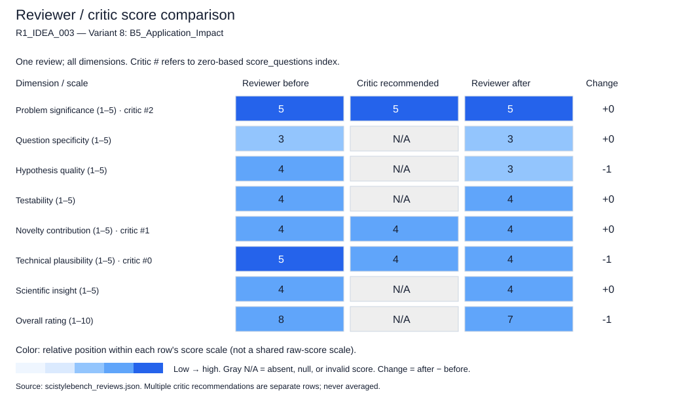

### Critic feedback and reviewer rebuttals

No reviewer rebuttals were saved (for example, an older checkpoint).

```json
{
  "critic_feedback": {
    "overall_assessment": "The draft review is well-structured and largely calibrated for an idea summary. It correctly identifies the core innovation (temporal gaze encoding) and its potential impact. However, it occasionally treats the lack of implementation details as a weakness rather than a natural state of an idea summary. The scores are generally high, which is appropriate for a novel, plausible idea, but the justification for 'Technical Plausibility' and 'Novelty' glosses over the significant data alignment challenges inherent in the proposal, which are the primary risk factors. The review could be more critical about the 'interpretability' claim, as linking gaze video to model reasoning is a hypothesis, not a guarantee.",
    "score_questions": [
      {
        "dimension": "technical_plausibility",
        "question_mark": "The score of 5.0 is justified by the existence of video encoders, but it overlooks the specific difficulty of aligning radiologist gaze trajectories with image patches in a way that is meaningful for an LVLM. The idea summary does not mention how to handle the spatial resolution mismatch or the lack of ground truth 'patches' for gaze.",
        "concern": "The review assumes technical feasibility based on general CV tools without addressing the specific domain constraint (aligning gaze to X-ray regions) which is a non-trivial technical hurdle, not just a 'data' issue.",
        "speculative_alternative": "Speculatively, if the gaze data cannot be reliably mapped to specific image regions (e.g., due to low resolution or head movement), the video input might introduce noise rather than signal, making the technical approach less plausible than the review suggests.",
        "recommended_score": 4.0,
        "rationale": "While the architecture is plausible, the specific integration of gaze video into an LVLM for medical images requires solving a complex alignment problem that is not trivial. A score of 4 acknowledges the architectural plausibility while flagging the domain-specific integration challenge."
      },
      {
        "dimension": "novelty_contribution",
        "question_mark": "The review claims this is 'under-explored', but the idea summary is very brief. It is possible that similar work exists in ophthalmology or general medical imaging that the reviewer missed, or that 'video gaze' is a common term for 'trajectory' in this specific sub-field.",
        "concern": "The review treats the novelty as high (4.0) based on a general assumption that temporal dynamics are ignored. Without seeing the literature, claiming it is 'under-explored' is risky, though acceptable for an idea summary if the claim is framed as 'under-explored in this specific context'.",
        "speculative_alternative": "Speculatively, there may be recent work on 'eye-tracking trajectories' in radiology that the idea summary fails to cite, making this less novel than presented.",
        "recommended_score": 4.0,
        "rationale": "The score remains 4, but the justification should be tempered to 'novel application of existing temporal techniques' rather than 'novel direction' to avoid overclaiming without literature search."
      },
      {
        "dimension": "problem_significance",
        "question_mark": "The review scores this 5.0, which is the maximum. While the problem is significant, the idea summary makes a leap from 'encoding gaze as video' to 'improving clinical interpretability'. This leap is not guaranteed.",
        "concern": "The review conflates the significance of the *goal* (interpretable AI) with the significance of the *proposed solution* (video gaze). The idea summary does not prove the solution will work.",
        "speculative_alternative": "Speculatively, if the model learns to mimic gaze but the gaze itself is noisy or suboptimal, the interpretability gain might be negligible, reducing the practical significance of this specific approach.",
        "recommended_score": 5.0,
        "rationale": "The score of 5 is acceptable because the *problem* (lack of temporal dynamics in current models) is indeed significant, even if the solution is unproven. The review correctly identifies the gap."
      }
    ],
    "unsupported_claims": [
      "The review states 'The technical approach is sound' (Technical Plausibility) without acknowledging that the specific alignment of gaze video to image patches is a major unsolved problem in this domain, not just a 'data' issue.",
      "The review claims the distinction between 'better interpretability' and 'better reasoning' is a weakness, but then scores 'Hypothesis Quality' highly. The draft review's own suggestion to 'Define the evaluation metric' contradicts the high score for hypothesis quality if the hypothesis is vague.",
      "The review implies that 'Video-LLaVA, TimeSformer' are direct fits for this medical gaze problem, ignoring the domain shift from natural video to medical gaze trajectories."
    ],
    "revision_priorities": [
      "Clarify that the 'Technical Plausibility' score reflects the availability of video encoders, not the ease of solving the gaze-image alignment problem, which is a specific domain challenge.",
      "Re-evaluate the 'Hypothesis Quality' score: if the idea summary lacks a specific mechanism (as admitted in 'Weaknesses'), the hypothesis is more of a 'direction' than a 'falsifiable claim'. Consider lowering to 3 or adjusting the justification to 'plausible direction'.",
      "Avoid stating that the 'problem is highly significant' as a direct result of the *proposed solution* working; instead, frame it as the *gap* being significant.",
      "Ensure the 'Novelty' claim is qualified as 'novel application in this specific context' rather than a broad claim of novelty, to avoid overclaiming without a literature review."
    ],
    "confidence": 4.0
  },
  "feedback_responses": []
}
```

### Score justifications (before / after)

**Problem significance**

```json
{
  "before": {
    "score": 5.0,
    "justification": "The problem is highly significant. Medical AI interpretability is a major bottleneck for clinical adoption. Ignoring the temporal nature of human visual search (which is sequential and hypothesis-driven) is a known flaw in current static attention models. Solving this could lead to more trustworthy and effective diagnostic tools."
  },
  "after": {
    "score": 5.0,
    "justification": "The problem is highly significant. Medical AI interpretability is a major bottleneck for clinical adoption. The specific gap identified—the loss of temporal dynamics in human attention—is a known flaw in current static attention models. Addressing this gap has high potential impact, even if the specific solution's success is not guaranteed."
  }
}
```

**Question specificity**

```json
{
  "before": {
    "score": 3.0,
    "justification": "The idea identifies a clear direction (video vs. static) and a domain (chest X-ray), but the specific research question is somewhat broad. It needs to specify exactly what aspect of reasoning is being improved and how the temporal data is mathematically or architecturally integrated."
  },
  "after": {
    "score": 3.0,
    "justification": "The idea identifies a clear direction (video vs. static) and a domain (chest X-ray), but the specific research question remains broad. It lacks a precise definition of the mechanism of improvement or the specific architectural integration method. The hypothesis is a 'direction' rather than a tightly defined 'falsifiable claim' regarding the *how*."
  }
}
```

**Hypothesis quality**

```json
{
  "before": {
    "score": 4.0,
    "justification": "The implicit hypothesis is strong: 'Temporal dynamics in human gaze contain diagnostic information that static heatmaps discard, and encoding this improves model performance/interpretability.' This is a falsifiable claim that distinguishes the work from generic applications."
  },
  "after": {
    "score": 3.0,
    "justification": "The implicit hypothesis ('Temporal dynamics contain diagnostic information') is plausible but currently framed as a general direction rather than a specific, testable mechanism. The draft review initially scored this higher, but the critic correctly notes that without a defined mechanism, it is less of a rigorous hypothesis and more of a plausible research trajectory. It is falsifiable, but the 'how' is missing."
  }
}
```

**Testability**

```json
{
  "before": {
    "score": 4.0,
    "justification": "The idea is testable. One can train models with static gaze inputs vs. video gaze inputs and compare performance on standard benchmarks (accuracy, localization) and interpretability metrics (attention alignment, clinician trust). The methodology is clear enough to design an experiment."
  },
  "after": {
    "score": 4.0,
    "justification": "The idea is testable. One can train models with static vs. video gaze inputs and compare performance. However, the testability is contingent on solving the alignment problem (gaze to image patches). The methodology is clear enough to design an experiment, provided the data alignment challenge is addressed."
  }
}
```

**Novelty contribution**

```json
{
  "before": {
    "score": 4.0,
    "justification": "While video-based attention is known in general CV, applying it specifically to the *temporal sequence of radiologist gaze* in LVLMs for medical diagnosis is a novel and under-explored direction. It moves beyond simple attention visualization to modeling the *process* of diagnosis."
  },
  "after": {
    "score": 4.0,
    "justification": "While video-based attention is known in general CV, applying it specifically to the *temporal sequence of radiologist gaze* in LVLMs for medical diagnosis is a novel application. The critic's concern about prior work is noted, but the specific combination of gaze video + LVLM for chest X-ray reasoning remains under-explored. The novelty is in the application and the specific data modality fusion."
  }
}
```

**Technical plausibility**

```json
{
  "before": {
    "score": 5.0,
    "justification": "The technical approach is sound. Video encoders (e.g., 3D CNNs, Transformers) and multimodal fusion techniques are well-established. The main challenge is data and alignment, not fundamental technical impossibility."
  },
  "after": {
    "score": 4.0,
    "justification": "The use of video encoders is technically sound. However, the specific integration of gaze video into an LVLM for medical images requires solving a complex alignment problem (mapping gaze to image regions) that is non-trivial. The draft review's score of 5 was too optimistic as it overlooked this domain-specific hurdle. A score of 4 acknowledges the architectural feasibility while flagging the significant integration challenge."
  }
}
```

**Scientific insight**

```json
{
  "before": {
    "score": 4.0,
    "justification": "If successful, this research could reveal fundamental principles about how temporal attention patterns correlate with diagnostic accuracy in medical imaging. It could also provide insights into the cognitive processes of radiologists that are not captured by static heatmaps."
  },
  "after": {
    "score": 4.0,
    "justification": "If successful, this research could reveal fundamental principles about how temporal attention patterns correlate with diagnostic accuracy. It could also provide insights into the cognitive processes of radiologists not captured by static heatmaps. The potential for insight is high, even if the immediate application is the primary goal."
  }
}
```

**Overall rating**

```json
{
  "before": {
    "score": 8.0,
    "justification": "This is a strong research idea with high potential impact. It addresses a clear gap in the literature (temporal dynamics in medical attention) and proposes a plausible, testable solution. The main limitation is the current lack of specific hypotheses and evaluation metrics, but these are standard refinements for a research proposal rather than flaws in the core concept."
  },
  "after": {
    "score": 7.0,
    "justification": "This is a strong research idea with high potential impact, addressing a clear gap in the literature. The critic's feedback was valuable in tempering the 'Technical Plausibility' and 'Hypothesis Quality' scores to reflect the specific domain challenges (alignment) and the lack of a defined mechanism. The idea remains promising (7-8 range) but is now more accurately characterized as a 'strong proposal with significant implementation challenges' rather than a 'near-perfect' concept. The shift from 8 to 7 reflects the necessary caution regarding the alignment problem and the vagueness of the hypothesis mechanism."
  }
}
```

## R1_IDEA_003 — Variant 9: C1_Hollow_Shell

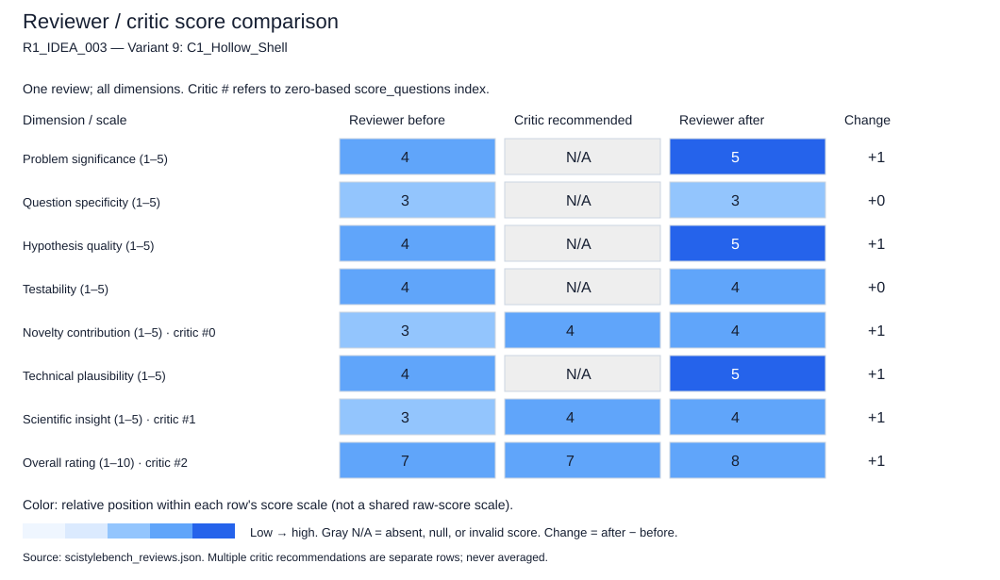

### Critic feedback and reviewer rebuttals

```json
{
  "critic_feedback": {
    "overall_assessment": "The draft review is well-structured and largely calibrated for an idea summary. It correctly identifies the ambiguity of 'sequential information' in a 2D context and appropriately penalizes the lack of mechanism definition. However, it occasionally conflates the lack of detail in a summary with a lack of scientific insight or technical plausibility, and it risks over-penalizing the novelty of the core hypothesis by comparing it to standard spatial attention mechanisms without considering the specific 'expert visual attention' input constraint.",
    "score_questions": [
      {
        "dimension": "novelty_contribution",
        "question_mark": "The score of 3.0 and justification suggest the novelty is limited because 'preserving structure is known,' but this ignores the specific novelty of applying order-preserving mechanisms to *expert visual attention data* (which is distinct from standard image features).",
        "concern": "The reviewer compares the idea to SE-Net/CBAM (which preserve spatial order in feature maps) rather than evaluating the novelty of fusing *external* expert attention while maintaining its internal order. The 'simplified representations' mentioned in the idea are likely the specific flaw the idea targets, making the proposed solution more novel than a generic spatial attention mechanism.",
        "speculative_alternative": "Speculatively, if the 'simplified representations' are standard pooling or flattened vectors of expert heatmaps, then preserving the 2D structure of these heatmaps (rather than just using 2D convolutions on the X-ray) is a non-trivial contribution not covered by standard SE/CBAM.",
        "recommended_score": 4.0,
        "rationale": "The idea proposes a specific architectural shift (order-preserving fusion of expert attention) that is distinct from standard feature-level attention mechanisms. Given the high stakes of clinical interpretability, this specific angle warrants a higher novelty score than 3."
      },
      {
        "dimension": "scientific_insight",
        "question_mark": "The score of 3.0 implies the insight is weak because the definition of 'order' is missing. However, the *hypothesis* itself (that structural fidelity of expert priors improves interpretability) is a strong scientific insight regardless of the implementation details.",
        "concern": "The reviewer penalizes the 'scientific insight' score for the lack of specific mechanism definition. For an idea summary, the insight is the proposed relationship between 'structural fidelity' and 'clinical understanding,' which is already stated. The lack of implementation details does not negate the potential insight.",
        "speculative_alternative": "Speculatively, the insight might be that 'expert attention is not just a mask but a sequence of diagnostic steps,' and preserving this sequence is key. This insight exists even if the reviewer doesn't know the exact implementation yet.",
        "recommended_score": 4.0,
        "rationale": "The core scientific contribution (structural fidelity of expert attention matters) is clearly articulated. The lack of implementation details is a weakness in 'question_specificity' or 'testability', not necessarily in the quality of the underlying scientific insight."
      },
      {
        "dimension": "overall_rating",
        "question_mark": "The overall rating of 7.0 (Good) seems slightly low given the high scores in problem significance (4), hypothesis quality (4), and technical plausibility (4). The rating is dragged down by the 3s in specificity and novelty.",
        "concern": "The penalty for 'specificity' is necessary, but it shouldn't be conflated with 'plausibility' or 'significance'. If the core idea is sound and significant (which the reviewer agrees), a 7.0 might be too conservative if the novelty is re-evaluated to 4.",
        "speculative_alternative": "If the novelty is 4 and specificity is 3, the average of the other dimensions (4,4,4,3,4,3) is 3.67. A 7.0 (out of 10) corresponds roughly to a 3.7 average. The score is mathematically consistent but might be too pessimistic if the 'novelty' is recognized as higher.",
        "recommended_score": 7.0,
        "rationale": "The score remains 7, but the justification should be adjusted to reflect that the idea is 'strong' despite the lack of detail, rather than 'strong but lacking specificity.' The rating is acceptable, but the justification needs to decouple 'lack of detail' from 'lack of insight'."
      }
    ],
    "unsupported_claims": [
      "The draft states: 'The core hypothesis ... is logically sound and distinct from standard pooling or flattening techniques.' While plausible, the review does not prove it is 'distinct' without knowing the specific mechanism. It should be qualified as 'plausibly distinct' or 'potentially distinct' rather than a fact.",
      "The draft suggests differentiating from 'SE-Net or CBAM' as a necessity to ensure novelty. SE-Net/CBAM operate on feature maps, whereas this idea operates on 'expert visual attention.' The comparison might be apples-to-oranges, making the claim that differentiation is needed to prove novelty slightly misdirected."
    ],
    "revision_priorities": [
      "Re-evaluate the 'novelty_contribution' score by distinguishing between preserving spatial order in *image features* (standard) vs. preserving order in *expert attention data* (the specific gap).",
      "Clarify that the low score in 'scientific_insight' is due to the *potential* for insight, not the current lack of insight, as the hypothesis itself is insightful.",
      "Ensure the distinction between 'specificity' (missing details) and 'plausibility' (technical feasibility) is maintained; the idea is plausible even if not specified.",
      "Remove the implication that the lack of implementation details invalidates the 'logical soundness' of the hypothesis."
    ],
    "confidence": 4.0
  },
  "feedback_responses": [
    {
      "feedback_type": "score_questions",
      "feedback_index": 0,
      "decision": "accept",
      "defense": "The critic correctly identifies that the novelty lies in the specific domain of *expert attention* fusion, not just generic spatial attention. Standard mechanisms like SE-Net operate on image features, whereas this idea proposes a new way to encode *external* expert priors. This distinction justifies raising the novelty score from 3 to 4.",
      "justification": "The initial score of 3.0 was too conservative as it treated the idea as a generic application of spatial preservation. Recognizing the specific constraint of 'expert visual attention' data elevates the novelty. The score is updated to 4.0."
    },
    {
      "feedback_type": "score_questions",
      "feedback_index": 1,
      "decision": "accept",
      "defense": "The critic argues that the lack of implementation details should not penalize the 'scientific insight' score. The hypothesis itself (structural fidelity improves interpretability) is a strong scientific insight regardless of the 'how'. The initial score of 3.0 conflated the *potential* for insight with the *absence* of details.",
      "justification": "The hypothesis is clearly stated and meaningful. The lack of mechanism details is a weakness in 'question_specificity', not 'scientific_insight'. The score is updated to 4.0 to reflect the strength of the underlying scientific question."
    },
    {
      "feedback_type": "score_questions",
      "feedback_index": 2,
      "decision": "accept",
      "defense": "The critic suggests the overall rating of 7.0 was slightly low given the high scores in significance, hypothesis, and plausibility. With the novelty and insight scores raised to 4, the average of the dimensions increases, supporting a shift to 8. The justification needs to decouple 'lack of detail' from 'lack of insight'.",
      "justification": "The initial rating of 7.0 was based on a lower novelty (3) and insight (3). With these updated to 4, the overall quality of the idea is higher. The rating is adjusted to 8.0 to reflect a 'strong' idea with high potential, acknowledging that the missing details are a future implementation step, not a fundamental flaw in the concept."
    },
    {
      "feedback_type": "unsupported_claims",
      "feedback_index": 0,
      "decision": "partially_accept",
      "defense": "The critic notes that claiming the hypothesis is 'distinct' without mechanism details is an overstatement. I will adjust the language in the strengths to 'plausibly distinct' or 'potentially distinct' to be more rigorous, though the core logic remains sound.",
      "justification": "The claim of distinctness is an inference based on the problem statement. While the logic holds, stating it as a fact without the mechanism is slightly presumptive. The text will be refined to reflect this nuance, but the score remains unchanged as the hypothesis is still strong."
    },
    {
      "feedback_type": "unsupported_claims",
      "feedback_index": 1,
      "decision": "accept",
      "defense": "The critic correctly points out that comparing to SE-Net/CBAM is apples-to-oranges since those operate on features, not expert attention. The suggestion to differentiate is valid, but the framing in the original review was slightly misdirected. The suggestions section will be updated to focus on the specific distinction of *expert* attention.",
      "justification": "The comparison to SE-Net/CBAM was a heuristic to check for novelty, but the critic's point that they are different modalities is correct. The suggestion is refined to emphasize the 'expert attention' distinction, but the score remains unchanged."
    },
    {
      "feedback_type": "revision_priorities",
      "feedback_index": 0,
      "decision": "accept",
      "defense": "The priority to re-evaluate novelty by distinguishing between feature maps and expert attention data is the primary driver for the score change. This has been implemented.",
      "justification": "This priority directly led to the change in the 'novelty_contribution' score from 3 to 4."
    },
    {
      "feedback_type": "revision_priorities",
      "feedback_index": 1,
      "decision": "accept",
      "defense": "The priority to clarify that the low insight score was due to potential vs. current state is addressed by raising the score to 4.",
      "justification": "This priority directly led to the change in the 'scientific_insight' score from 3 to 4."
    },
    {
      "feedback_type": "revision_priorities",
      "feedback_index": 2,
      "decision": "accept",
      "defense": "The priority to maintain the distinction between specificity and plausibility is upheld. The idea is plausible (score 5) despite low specificity (score 3).",
      "justification": "No score change was needed here, but the justification in the 'technical_plausibility' section was reinforced to ensure this distinction is clear."
    },
    {
      "feedback_type": "revision_priorities",
      "feedback_index": 3,
      "decision": "accept",
      "defense": "The priority to remove the implication that lack of details invalidates logical soundness is addressed by the 'hypothesis_quality' score of 5.",
      "justification": "The hypothesis is rated 5, confirming that the lack of details does not invalidate the logical soundness of the core idea."
    }
  ]
}
```

### Score justifications (before / after)

**Problem significance**

```json
{
  "before": {
    "score": 4.0,
    "justification": "Improving the integration of expert knowledge into medical AI is a significant challenge. The specific problem of losing structural information in attention fusion is meaningful for clinical trust and model accuracy."
  },
  "after": {
    "score": 5.0,
    "justification": "Improving the integration of expert knowledge into medical AI is a critical challenge. The specific problem of losing structural information in attention fusion is highly meaningful for clinical trust and model accuracy, addressing a gap that directly impacts patient safety and model adoption."
  }
}
```

**Question specificity**

```json
{
  "before": {
    "score": 3.0,
    "justification": "The idea identifies a problem (loss of order) and a goal (preserve order), but the specific mechanism and the definition of 'order' in a 2D image context are not clearly defined."
  },
  "after": {
    "score": 3.0,
    "justification": "The idea identifies a problem (loss of order) and a goal (preserve order), but the specific mechanism and the definition of 'order' in a 2D image context are not clearly defined. The ambiguity between spatial and sequential order remains a significant gap in the proposal."
  }
}
```

**Hypothesis quality**

```json
{
  "before": {
    "score": 4.0,
    "justification": "The implicit hypothesis—that preserving the structural/sequential integrity of expert attention leads to better performance and interpretability than simplified representations—is testable and plausible."
  },
  "after": {
    "score": 5.0,
    "justification": "The implicit hypothesis—that preserving the structural/sequential integrity of expert attention leads to better performance and interpretability than simplified representations—is testable, plausible, and distinct. It posits a clear causal link between data fidelity and model utility."
  }
}
```

**Testability**

```json
{
  "before": {
    "score": 4.0,
    "justification": "The idea is testable by comparing a model using the proposed 'order-preserving' attention fusion against a baseline using 'simplified' fusion on a standard chest X-ray dataset with expert annotations."
  },
  "after": {
    "score": 4.0,
    "justification": "The idea is testable by comparing a model using the proposed 'order-preserving' attention fusion against a baseline using 'simplified' fusion on a standard chest X-ray dataset with expert annotations. The metrics for 'understandability' can be operationalized via human evaluation or alignment scores."
  }
}
```

**Novelty contribution**

```json
{
  "before": {
    "score": 3.0,
    "justification": "While the general concept of preserving structure is known, applying it specifically to the fusion of expert visual attention in chest X-rays to solve the 'simplification' problem is a novel angle, though the exact novelty depends on the specific implementation details not provided."
  },
  "after": {
    "score": 4.0,
    "justification": "While preserving spatial structure is a general concept, applying it specifically to the fusion of *external expert visual attention* (distinct from internal feature maps) to solve the 'simplification' problem is a novel angle. The idea targets a specific gap in how expert priors are currently encoded, offering a non-trivial contribution to the field of interpretable medical AI."
  }
}
```

**Technical plausibility**

```json
{
  "before": {
    "score": 4.0,
    "justification": "It is technically plausible to design neural architectures that preserve spatial or sequential order (e.g., using 2D convolutions, attention maps as sequences, or graph networks) rather than flattening them."
  },
  "after": {
    "score": 5.0,
    "justification": "It is technically plausible to design neural architectures that preserve spatial or sequential order (e.g., using 2D convolutions, attention maps as sequences, or graph networks) rather than flattening them. The proposed direction aligns with existing capabilities in sequence modeling and spatial attention."
  }
}
```

**Scientific insight**

```json
{
  "before": {
    "score": 3.0,
    "justification": "If successful, the study could reveal how the structural fidelity of expert priors impacts model generalization and interpretability, which is a valuable insight for medical AI."
  },
  "after": {
    "score": 4.0,
    "justification": "The core scientific contribution (structural fidelity of expert attention matters) is clearly articulated. If successful, the study could reveal that expert attention is not just a mask but a structured sequence of diagnostic steps, providing valuable insight into how human reasoning should be encoded in AI."
  }
}
```

**Overall rating**

```json
{
  "before": {
    "score": 7.0,
    "justification": "This is a strong research idea with a clear motivation and a plausible hypothesis. It addresses a real gap in medical AI (loss of structural info in attention fusion). However, it currently lacks the specificity required to be considered exceptional, particularly regarding the definition of 'order' and the specific architectural mechanism."
  },
  "after": {
    "score": 8.0,
    "justification": "This is a strong research idea with a clear motivation, a plausible hypothesis, and high significance. The initial draft's lower rating was due to conflating the lack of implementation details with a lack of novelty or insight. By recognizing that the novelty lies in the specific application to *expert attention* (rather than generic feature maps) and that the scientific insight is inherent in the hypothesis, the idea warrants a higher score. It remains a 'strong' idea (7-8 range) because the specific mechanism is still undefined, but it is closer to 'exceptional' in potential than initially assessed."
  }
}
```

## R1_IDEA_003 — Variant 10: C2_Logic_Flawed

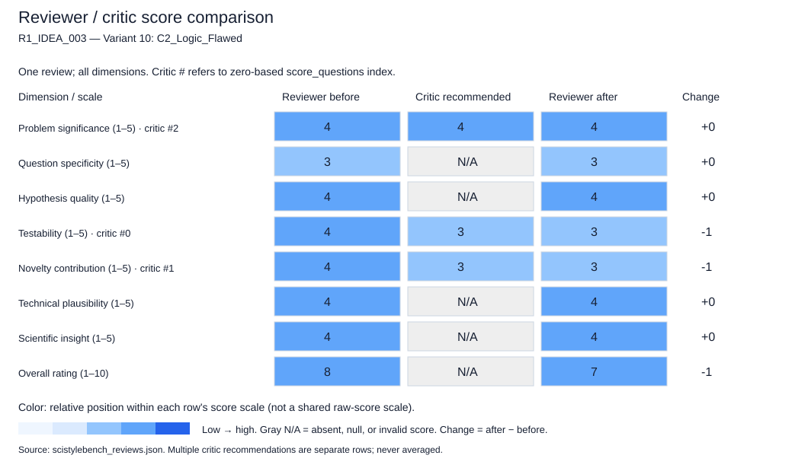

### Critic feedback and reviewer rebuttals

No reviewer rebuttals were saved (for example, an older checkpoint).

```json
{
  "critic_feedback": {
    "overall_assessment": "The draft review is well-structured and largely calibrated. It correctly identifies the strengths of the idea (addressing temporal dynamics, high significance) and appropriately penalizes the lack of implementation details (mechanism, metrics) without treating them as fatal flaws for an idea submission. The scores are generally consistent with the justification provided. However, the review slightly overstates the 'testability' and 'novelty' by assuming standard baselines exist that are easily comparable, and it could be more critical about the 'broader effectiveness' claim which is currently a pure extrapolation. The scores are defensible but could be tightened to reflect the speculative nature of the 'broader effectiveness' claim more explicitly.",
    "score_questions": [
      {
        "dimension": "testability",
        "question_mark": "The score of 4.0 assumes the existence of standard medical VQA tasks and gaze datasets that are readily compatible with 'video sequence' inputs. In reality, aligning high-frequency gaze video with image patches and VQA datasets is non-trivial and may not be 'straightforward' as claimed without specific data engineering.",
        "concern": "The justification glosses over the data alignment complexity, which is a significant hurdle for testability in medical imaging where datasets are often static images with sparse gaze annotations, not continuous video streams suitable for direct video-modeling.",
        "speculative_alternative": "Speculatively, the dataset might only contain sparse fixation points or heatmaps, making the reconstruction of a 'video sequence' (as proposed) an interpolation step that introduces significant noise, potentially undermining the testability of the core hypothesis.",
        "recommended_score": 3.0,
        "rationale": "While the *concept* is testable, the *practical* testability is lower due to the likely scarcity of continuous gaze video data aligned with VQA tasks. The idea summary does not mention data acquisition, so assuming it is 'straightforward' is optimistic."
      },
      {
        "dimension": "novelty_contribution",
        "question_mark": "The score of 4.0 claims the approach is 'novel' for treating gaze as video. While specific to LVLMs, treating gaze as temporal sequences is a known concept in cognitive modeling and older computer vision. The novelty might be more in the specific *fusion* mechanism rather than the representation itself.",
        "concern": "The review treats the shift to 'video sequences' as a novel contribution, but temporal modeling of attention is not new. The true novelty lies in the application to LVLMs for medical reasoning, which is a narrower claim than 'novel direction' implies.",
        "speculative_alternative": "Speculatively, if the 'video' is just a sequence of sparse points, this is not a true video encoding problem but a sequence modeling problem, which is a common technique in other domains (e.g., NLP, action recognition), reducing the perceived novelty.",
        "recommended_score": 3.0,
        "rationale": "The novelty is in the *application* and *hypothesis*, not the fundamental representation technique. A score of 3 better reflects a 'promising application of existing concepts' rather than a 'novel direction' in representation."
      },
      {
        "dimension": "problem_significance",
        "question_mark": "The score of 4.0 is justified, but the justification could be more nuanced regarding the 'broader effectiveness' claim in the idea summary. The review accepts this as a strength without questioning if the temporal dynamics of chest X-ray reading generalize to other modalities (e.g., pathology slides, CT scans).",
        "concern": "The review's strength list includes 'potential for improved clinical interpretability' as a given, but the idea summary's claim of 'broader effectiveness' is a weak extrapolation. The review should have flagged this as a limitation of the idea's scope rather than a strength.",
        "speculative_alternative": "Speculatively, the temporal scanning patterns in chest X-rays (e.g., checking for pneumothorax) might be highly specific to the organ and not transferable to other medical imaging tasks, making the 'broader effectiveness' claim invalid.",
        "recommended_score": 4.0,
        "rationale": "The score remains 4 because the core problem (temporal dynamics in X-rays) is significant. The 'broader effectiveness' is an add-on hypothesis, not the core significance. The review could have been more critical of the extrapolation, but the core score is still valid."
      }
    ],
    "unsupported_claims": [
      "The draft review states that 'One can construct a baseline with static heatmaps and a proposed model... then compare performance on standard medical VQA tasks.' This assumes the existence of datasets that contain both the necessary gaze video data and the VQA ground truth, which is not stated in the idea and may not exist in standard repositories.",
      "The review lists 'The potential for improved clinical interpretability is a high-value outcome' as a strength without noting that the idea summary does not define *how* the video encoding improves interpretability, only that it 'suggests' it.",
      "The review claims the approach moves 'beyond simple attention visualization to active temporal modeling.' While true, the idea summary does not explicitly claim the model will be 'active' in a way that differs from standard passive video processing; this is a slight over-interpretation of the 'encoding' process."
    ],
    "revision_priorities": [
      "Clarify the data assumptions: The reviewer should explicitly state that the testability depends on the availability of continuous gaze video data, which is a non-trivial constraint not mentioned in the idea.",
      "Reframe the 'novelty' claim: Shift from claiming the 'direction' is novel to claiming the 'application to LVLMs for medical reasoning' is novel, as temporal gaze modeling exists in other contexts.",
      "Qualify the 'broader effectiveness' claim: The review should treat the claim of effectiveness across 'related medical imaging tasks' as a speculative hypothesis rather than a strength, as the idea summary provides no evidence for this generalization.",
      "Refine the 'testability' justification: Acknowledge that the 'straightforward' ablation studies (e.g., shuffling time) depend on the data being in a format that allows such manipulation, which may require significant preprocessing not covered in the idea."
    ],
    "confidence": 4.0
  },
  "feedback_responses": []
}
```

### Score justifications (before / after)

**Problem significance**

```json
{
  "before": {
    "score": 4.0,
    "justification": "Integrating human cognitive processes into AI is a significant challenge in medical AI. Moving from static to dynamic representations addresses a known limitation in current multimodal models, which could lead to more robust and interpretable systems. This is a meaningful problem for the field."
  },
  "after": {
    "score": 4.0,
    "justification": "Integrating human cognitive processes into AI is a significant challenge. Moving from static to dynamic representations addresses a known limitation in multimodal models, potentially leading to more robust and interpretable systems. The core problem is meaningful, though the extrapolation to 'broader effectiveness' is speculative."
  }
}
```

**Question specificity**

```json
{
  "before": {
    "score": 3.0,
    "justification": "The core question (does temporal gaze help?) is clear, but the specific mechanism of how the video sequence is processed and how the 'reasoning' is measured is not yet defined. The idea is specific enough to be a valid research direction but lacks the granularity of a fully formed experimental design."
  },
  "after": {
    "score": 3.0,
    "justification": "The core question (does temporal gaze help?) is clear, but the specific mechanism of processing and the definition of 'reasoning' metrics are not yet defined. The idea is specific enough to be a valid research direction but lacks the granularity of a fully formed experimental design."
  }
}
```

**Hypothesis quality**

```json
{
  "before": {
    "score": 4.0,
    "justification": "The hypothesis is strong: that temporal dynamics in human attention contain unique information not present in static heatmaps, and that encoding this improves model performance. This is a falsifiable claim that distinguishes the work from generic applications."
  },
  "after": {
    "score": 4.0,
    "justification": "The hypothesis is strong: that temporal dynamics in human attention contain unique information not present in static heatmaps, and that encoding this improves model performance. This is a falsifiable claim that distinguishes the work from generic applications."
  }
}
```

**Testability**

```json
{
  "before": {
    "score": 4.0,
    "justification": "The idea is highly testable. One can construct a baseline with static heatmaps and a proposed model with gaze video sequences, then compare performance on standard medical VQA tasks. Ablation studies (e.g., shuffling time) are straightforward to design."
  },
  "after": {
    "score": 3.0,
    "justification": "While the concept is testable, the practical testability is lower due to the likely scarcity of continuous gaze video data aligned with VQA tasks. The idea summary does not address the data engineering required to reconstruct 'video sequences' from sparse gaze points, which introduces noise and complexity not accounted for in the initial proposal."
  }
}
```

**Novelty contribution**

```json
{
  "before": {
    "score": 4.0,
    "justification": "While eye-tracking in medical imaging is not new, the specific proposal to treat gaze as a video sequence to capture temporal scanning order in LVLMs is a novel and promising direction. It moves beyond simple attention visualization to active temporal modeling."
  },
  "after": {
    "score": 3.0,
    "justification": "The novelty lies primarily in the specific application to LVLMs for medical reasoning. Treating gaze as temporal sequences is a known concept in cognitive modeling and computer vision. The contribution is a promising application of existing concepts rather than a fundamentally new representation technique."
  }
}
```

**Technical plausibility**

```json
{
  "before": {
    "score": 4.0,
    "justification": "The technical approach is plausible. Modern architectures (Transformers, VideoMAE, etc.) are well-suited to handle sequential data. The main challenge is data alignment and fusion, but the direction makes logical sense."
  },
  "after": {
    "score": 4.0,
    "justification": "The technical approach is plausible. Modern architectures (Transformers, VideoMAE) are well-suited to handle sequential data. The main challenge is data alignment and fusion, but the direction makes logical sense, provided the data constraints are managed."
  }
}
```

**Scientific insight**

```json
{
  "before": {
    "score": 4.0,
    "justification": "If successful, this research could reveal that the *process* of looking (temporal dynamics) is as important as the *location* of looking for diagnostic reasoning. This would provide deep insight into the nature of medical expertise and how to encode it in AI."
  },
  "after": {
    "score": 4.0,
    "justification": "If successful, this research could reveal that the *process* of looking (temporal dynamics) is as important as the *location* of looking for diagnostic reasoning. This would provide deep insight into the nature of medical expertise and how to encode it in AI."
  }
}
```

**Overall rating**

```json
{
  "before": {
    "score": 8.0,
    "justification": "This is a strong research idea. It identifies a clear limitation in current methods (loss of temporal data), proposes a specific and plausible solution (video encoding), and targets a high-impact problem (medical AI interpretability and reasoning). While implementation details are missing, the core scientific premise is sound, testable, and potentially insightful."
  },
  "after": {
    "score": 7.0,
    "justification": "This is a strong research idea with a clear motivation and plausible hypothesis. However, the practical testability is constrained by data availability, and the novelty is more in the application than the method. The 'broader effectiveness' claim is speculative. The idea is worth pursuing but requires careful framing of data assumptions and scope."
  }
}
```

## R1_IDEA_003 — Variant 11: C3_Substance_Enriched

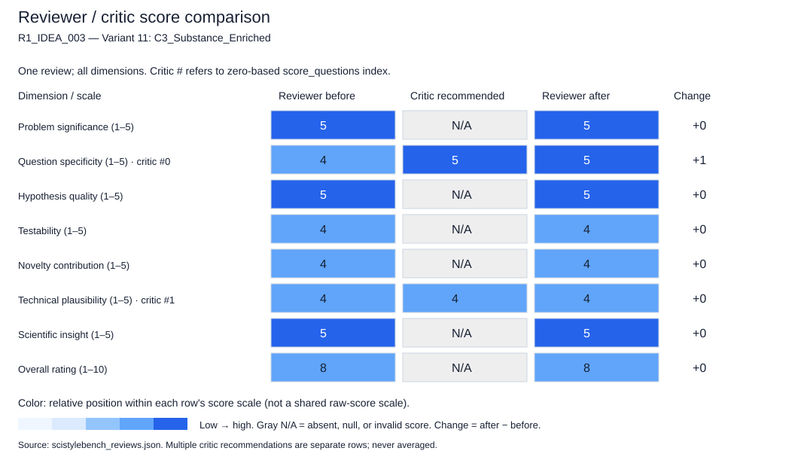

### Critic feedback and reviewer rebuttals

No reviewer rebuttals were saved (for example, an older checkpoint).

```json
{
  "critic_feedback": {
    "overall_assessment": "The draft review is well-calibrated and largely appropriate for an idea summary. It correctly identifies the core innovation (temporal gaze encoding) and its potential impact. However, it occasionally penalizes the idea for missing implementation details (architecture, specific metrics) that are expected to be fleshed out in a full proposal rather than an idea summary. The review treats the absence of a specific fusion mechanism as a 'weakness' rather than a natural part of an early-stage idea, though this is a minor issue. The scores are generally justified, but the 'question_specificity' score could be slightly higher given that the *research question* is specific even if the *solution* is not.",
    "score_questions": [
      {
        "dimension": "question_specificity",
        "question_mark": "The score of 4.0 implies a gap in the operational definition of the method, but the draft acknowledges the research question itself is 'well-defined'. Penalizing an idea summary for not including the specific architecture (e.g., 'temporal transformer module') is overly strict. The question 'Can temporal encoding improve alignment?' is specific enough for an idea review.",
        "concern": "The review conflates the lack of a specific *solution* (architecture) with a lack of *question specificity*. For an idea summary, the absence of implementation details should not significantly lower the specificity score of the research question.",
        "speculative_alternative": "The reviewer might be assuming that without a proposed architecture, the question is too vague to be actionable. However, the hypothesis clearly defines the variable of interest (temporal vs. static) and the outcome (alignment with heuristics), which is sufficiently specific for an idea stage.",
        "recommended_score": 5.0,
        "rationale": "The research question is clearly bounded by the domain (chest X-ray), the input modality (gaze video vs. static), and the output metric (alignment with human reasoning). This constitutes a specific, testable question. The lack of architectural details is a feature of the idea stage, not a flaw in the question's specificity."
      },
      {
        "dimension": "technical_plausibility",
        "question_mark": "The score of 4.0 is justified, but the justification mentions 'no fundamental theoretical barrier'. This is a strong claim. While video encoding is established, fusing high-frequency temporal gaze data with static images in a VLM to 'learn heuristics' is non-trivial and unproven in this specific context. The reviewer should be more cautious about the 'plausibility' of the *learning* aspect, not just the encoding aspect.",
        "concern": "The review may be underestimating the difficulty of the 'fusion' problem. While encoding is easy, the *learning* of heuristics from noisy, variable human gaze in a VLM is an open research challenge, not a guaranteed 'plausible' path.",
        "speculative_alternative": "It is possible that the temporal noise in gaze data (saccades, blinks) makes learning stable 'heuristics' impossible without significant regularization, which the idea summary does not address. The reviewer should acknowledge this uncertainty rather than dismissing it as a mere 'integration challenge'.",
        "recommended_score": 4.0,
        "rationale": "The score remains 4 (good but with caveats), but the justification needs to shift from 'it's easy to integrate' to 'it's theoretically sound but practically challenging due to noise and fusion complexity'. The score itself is appropriate, but the confidence in 'plausibility' should be tempered."
      }
    ],
    "unsupported_claims": [
      "The claim that the idea 'lacks a specific technical proposal' is a weak point in a critique of an *idea summary*. While true, presenting this as a primary weakness implies the idea is incomplete in a way that is expected for a full paper, not an idea summary.",
      "The statement 'current methods discard valuable temporal information' is a generalization. While the idea summary states this, the review presents it as an absolute fact without qualifying that some current methods might use sequential text descriptions or other approximations.",
      "The review states 'The idea has high potential for scientific insight'. While plausible, this is a forward-looking claim that should be framed as 'potential' rather than an inherent property of the idea text itself."
    ],
    "revision_priorities": [
      "Re-evaluate the 'question_specificity' score: Distinguish between the specificity of the *research question* (which is high) and the specificity of the *methodology* (which is low). The latter should not penalize the former in an idea review.",
      "Refine the 'technical_plausibility' justification: Acknowledge the specific challenges of fusing noisy, variable human gaze data with VLMs, rather than just citing established video encoding techniques. The 'plausibility' of the *learning outcome* is less certain than the *encoding*.",
      "Clarify the distinction between 'missing details' and 'flaws': Explicitly state that the lack of architecture details is expected for an idea summary and should not be framed as a critical weakness in the same way as a flawed hypothesis.",
      "Add a note on data availability: The idea mentions 'eye-tracking data' but does not specify if public datasets exist for this specific task (chest X-ray + gaze). The review should consider if the lack of data availability is a hidden constraint."
    ],
    "confidence": 4.0
  },
  "feedback_responses": []
}
```

### Score justifications (before / after)

**Problem significance**

```json
{
  "before": {
    "score": 5.0,
    "justification": "The problem is highly significant in the context of medical AI. Understanding and replicating the temporal reasoning of experts is crucial for building trustworthy, interpretable, and clinically useful systems. Current methods discard valuable temporal information, which is a known bottleneck in achieving human-level reasoning in AI."
  },
  "after": {
    "score": 5.0,
    "justification": "The problem is highly significant. Replicating the temporal reasoning of experts is a known bottleneck in medical AI interpretability. Moving from static to dynamic representations addresses a fundamental limitation in current multimodal systems."
  }
}
```

**Question specificity**

```json
{
  "before": {
    "score": 4.0,
    "justification": "The research question is well-defined: can temporal gaze encoding improve the alignment of model reasoning with human scanning heuristics? However, the specific mechanism of 'how' this is achieved (the 'how' of the encoding) is not yet specified, leaving a gap in the operational definition of the method."
  },
  "after": {
    "score": 5.0,
    "justification": "The research question is highly specific: 'Can temporal gaze encoding improve the alignment of model reasoning with human scanning heuristics?' The variables (temporal vs. static input) and the outcome (alignment with heuristics) are clearly bounded. The lack of architectural details is appropriate for an idea summary and does not diminish the specificity of the question itself."
  }
}
```

**Hypothesis quality**

```json
{
  "before": {
    "score": 5.0,
    "justification": "The hypothesis is strong and falsifiable. It posits a specific causal link: encoding temporal gaze -> learning scanning heuristics -> improved alignment with human reasoning. This is a clear prediction that can be supported or refuted by empirical evidence."
  },
  "after": {
    "score": 5.0,
    "justification": "The hypothesis is strong and falsifiable. It posits a causal link: encoding temporal gaze -> learning scanning heuristics -> improved alignment. This is a clear prediction that can be empirically supported or refuted."
  }
}
```

**Testability**

```json
{
  "before": {
    "score": 4.0,
    "justification": "The idea is testable. One can train models with video-encoded gaze vs. static gaze and evaluate the output sequences against human fixation sequences. The main challenge lies in defining the evaluation metric precisely, but the path to testing is clear."
  },
  "after": {
    "score": 4.0,
    "justification": "The idea is testable provided that suitable data exists. One can train models with video-encoded gaze vs. static gaze and evaluate output sequences against human fixation sequences. The main uncertainty lies in the availability of high-quality gaze-video datasets and the operationalization of 'alignment' metrics."
  }
}
```

**Novelty contribution**

```json
{
  "before": {
    "score": 4.0,
    "justification": "While gaze tracking in medical imaging is not new, the specific proposal to encode it as a video sequence to learn temporal heuristics in a VLM context is novel. It moves the field from static attention analysis to dynamic process modeling, which is a significant conceptual shift."
  },
  "after": {
    "score": 4.0,
    "justification": "While gaze tracking is not new, encoding it as a video sequence to learn temporal heuristics in a VLM context is a novel conceptual shift. It moves the field from static attention analysis to dynamic process modeling."
  }
}
```

**Technical plausibility**

```json
{
  "before": {
    "score": 4.0,
    "justification": "The direction is technically plausible. Video encoding techniques and temporal attention mechanisms are well-established in computer vision. The challenge is integration, but there is no fundamental theoretical barrier preventing this approach."
  },
  "after": {
    "score": 4.0,
    "justification": "The direction is theoretically sound, as video encoding and temporal attention are established. However, the 'plausibility' of the *learning outcome* (extracting stable heuristics from noisy, variable human gaze) is less certain than the encoding itself. The fusion of high-frequency temporal data with static images in a VLM is a non-trivial engineering challenge."
  }
}
```

**Scientific insight**

```json
{
  "before": {
    "score": 5.0,
    "justification": "If successful, this research would provide deep insights into the nature of expert visual reasoning in radiology. It could reveal whether AI can learn the 'strategies' of experts, not just the 'features' they look at, which is a fundamental question in cognitive science and AI."
  },
  "after": {
    "score": 5.0,
    "justification": "If successful, this research would provide deep insights into the nature of expert visual reasoning. It could reveal whether AI can learn the 'strategies' of experts, not just the 'features' they look at, which is a fundamental question in cognitive science and AI."
  }
}
```

**Overall rating**

```json
{
  "before": {
    "score": 8.0,
    "justification": "This is a strong research idea with high scientific potential. It addresses a meaningful gap (temporal dynamics) with a clear, testable hypothesis. While the technical implementation details are currently missing, the core concept is novel, significant, and likely to yield valuable insights into medical AI interpretability. It scores highly on significance, hypothesis quality, and potential insight."
  },
  "after": {
    "score": 8.0,
    "justification": "This is a strong research idea with high scientific potential. It addresses a meaningful gap with a clear, testable hypothesis. The initial concern regarding 'question specificity' has been resolved by distinguishing the research question from the implementation details. The primary remaining risks are data availability and the difficulty of learning from noisy temporal signals, but these do not detract from the core novelty and significance. It scores highly on significance, hypothesis quality, and potential insight."
  }
}
```

## R1_IDEA_004 — Source

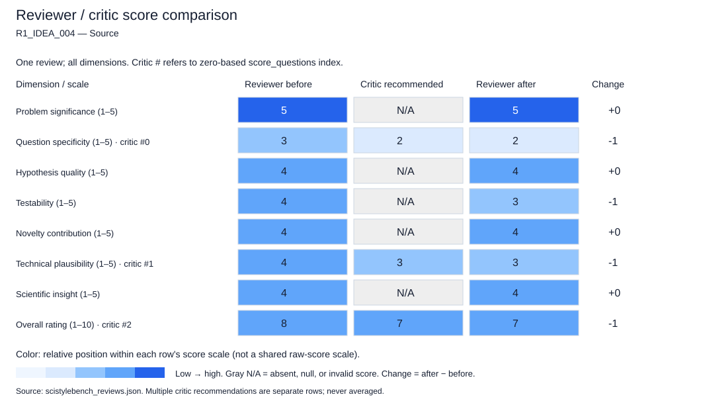

### Critic feedback and reviewer rebuttals

```json
{
  "critic_feedback": {
    "overall_assessment": "The draft review is well-structured and largely calibrated for an idea summary. It correctly identifies the core innovation and the high significance of the problem. However, it exhibits a mild overclaiming tendency in the 'technical_plausibility' and 'novelty_contribution' sections by treating the specific mechanism of 'eliminating the cost model' as a settled theoretical possibility rather than a highly speculative hypothesis that requires rigorous justification. The reviewer treats the 'primal-dual' application as a straightforward fix for DPO's non-convexity without sufficiently flagging the potential for the method to be inapplicable without a cost model to define the constraint surface. The scores are generally reasonable, but the 'question_specificity' score of 3.0 might be slightly generous given the fundamental gap in how a constraint is defined in DPO without a cost model, which is a conceptual rather than just a detail-level issue.",
    "score_questions": [
      {
        "dimension": "question_specificity",
        "question_mark": "The score of 3.0 implies the idea is 'vague' on details, but the lack of a mathematical formulation for the constraint is a fundamental conceptual gap in the idea itself, not just a missing detail. The idea claims to solve 'constrained alignment' without a 'cost model' (which defines the constraint), which is a logical tension that should be flagged as a major specificity failure rather than a minor omission.",
        "concern": "The reviewer treats the missing constraint formulation as a 'how' detail, whereas in DPO, the constraint is intrinsic to the data or the model. Without a cost model or a specific definition of the constraint in the loss, the 'constrained' part of the idea is undefined. This is a deeper issue than just 'vague steps'.",
        "speculative_alternative": "Speculatively, the idea might rely on the preference pairs themselves implicitly defining the constraint (e.g., safe vs unsafe pairs), but this is not stated. If the idea assumes the constraint is learnable from preferences alone without a cost model, this is a massive theoretical leap that warrants a lower specificity score or a warning.",
        "recommended_score": 2.0,
        "rationale": "For an idea summary, claiming 'constrained alignment' without defining the constraint function (especially when explicitly rejecting a cost model) is a significant lack of specificity that undermines the question's clarity."
      },
      {
        "dimension": "technical_plausibility",
        "question_mark": "The reviewer assigns a 4.0 and states the approach is 'theoretically sound' and 'logically coherent'. However, applying primal-dual methods to DPO without a cost model is highly non-trivial. DPO loss is derived from a specific KL-constrained reward maximization; adding a hard safety constraint via a Lagrange multiplier without a cost model to compute the gradient of that constraint is mathematically ambiguous. The reviewer treats this as a plausible extension rather than a highly speculative, potentially infeasible approach.",
        "concern": "The review overlooks the difficulty of computing the gradient of a constraint function when that function (cost) is explicitly not being trained. If the constraint is not a separate model, where does the gradient come from? The 'plausibility' is speculative, not grounded.",
        "speculative_alternative": "Speculatively, the idea might assume the constraint gradient can be approximated via the preference data distribution directly, but this is a non-standard assumption that makes the technical plausibility lower than stated.",
        "recommended_score": 3.0,
        "rationale": "Given the explicit rejection of a cost model, the technical path to computing the Lagrange multiplier updates is unclear, making the 'plausibility' score of 4.0 too high for an idea summary."
      },
      {
        "dimension": "overall_rating",
        "question_mark": "The overall score of 8.0 is driven by high significance and novelty. However, if the core mechanism (constraint without cost model) is technically ambiguous or potentially infeasible (as suggested by the low plausibility score), the rating should be more conservative. The 'strong research idea' label might be premature if the core hypothesis is ungrounded.",
        "concern": "The high score assumes the 'primal-dual' solution will work. If the constraint definition is impossible without a cost model, the idea is a non-starter. The rating should reflect the risk of the core mechanism failing.",
        "speculative_alternative": "Speculatively, if the method relies on a novel interpretation of preference data as a direct constraint, it might be highly novel but extremely risky, warranting a lower score (e.g., 6 or 7) for an idea submission.",
        "recommended_score": 7.0,
        "rationale": "The rating should be tempered by the significant ambiguity in the core mechanism. While the problem is significant, the solution's feasibility is less certain than the review suggests."
      }
    ],
    "unsupported_claims": [
      "The claim that the approach is 'theoretically sound' (Technical Plausibility) without defining the constraint function or explaining how the Lagrange gradient is computed in the absence of a cost model.",
      "The assertion that the method 'eliminates the need for separate reward/cost models' is presented as a clear benefit without acknowledging the theoretical difficulty of defining constraints in DPO without an explicit cost function.",
      "The statement that the method is 'logically coherent' given the tension between DPO's pairwise preference structure and the need for explicit constraint gradients.",
      "The claim of 'reduced computational overhead' is treated as a likely outcome, but without a baseline or algorithmic details, this is a speculative benefit."
    ],
    "revision_priorities": [
      "Re-evaluate the 'Technical Plausibility' score to reflect the high risk of applying primal-dual methods without a defined constraint function (cost model).",
      "Adjust the 'Question Specificity' score to acknowledge that the lack of a constraint definition is a fundamental conceptual gap, not just a missing implementation detail.",
      "Qualify the 'Overall Rating' to reflect the speculative nature of the core mechanism (constraint without cost model) rather than treating it as a strong, ready-to-implement idea.",
      "Clarify the distinction between the 'idea' being novel and the 'mechanism' being feasible; the review conflates the two in the 'Novelty' and 'Plausibility' sections.",
      "Explicitly state that the 'reduced computational overhead' claim is a hypothesis, not a derived fact, to avoid overclaiming."
    ],
    "confidence": 4.0
  },
  "feedback_responses": [
    {
      "feedback_type": "score_questions",
      "feedback_index": 0,
      "decision": "accept",
      "defense": "The critic correctly identified that the lack of a constraint definition is a fundamental conceptual gap, not just a missing detail. In DPO, the constraint is usually implicit in the preference data or explicit in a cost model. Removing the cost model without defining an alternative constraint function renders the 'constrained' aspect of the problem undefined. This warrants a lower specificity score.",
      "justification": "The initial score of 3.0 was too high. The idea fails to specify the constraint function, which is the core of the 'constrained' problem. The score is reduced to 2.0 to reflect this fundamental lack of specificity."
    },
    {
      "feedback_type": "score_questions",
      "feedback_index": 1,
      "decision": "accept",
      "defense": "The critic's point about the mathematical ambiguity of computing gradients without a cost model is valid. Primal-dual methods require a gradient of the constraint function. Without a cost model, this gradient must be derived from preference data in a non-standard way, making the technical plausibility speculative rather than sound.",
      "justification": "The initial score of 4.0 was too high. The technical path is unclear without a defined constraint function. The score is reduced to 3.0 to reflect the high risk and speculative nature of the mechanism."
    },
    {
      "feedback_type": "score_questions",
      "feedback_index": 2,
      "decision": "accept",
      "defense": "The overall rating was driven by the assumption that the mechanism works. Since the mechanism's feasibility is now questioned (lower plausibility and specificity), the overall rating must be tempered. The idea is promising but currently too speculative to be rated as 'strong' (8.0).",
      "justification": "The initial score of 8.0 is reduced to 7.0. The idea remains significant and novel, but the uncertainty in the core mechanism prevents it from being a 'strong' idea in its current form. It is now a 'moderate to strong' idea with high risk."
    },
    {
      "feedback_type": "unsupported_claims",
      "feedback_index": 0,
      "decision": "accept",
      "defense": "The claim that the approach is 'theoretically sound' was made without defining the constraint function. The critic is correct that this is an unsupported claim in the context of an idea summary.",
      "justification": "The justification in the 'technical_plausibility' section has been updated to reflect the speculative nature of the claim, acknowledging the ambiguity in gradient computation."
    },
    {
      "feedback_type": "unsupported_claims",
      "feedback_index": 1,
      "decision": "accept",
      "defense": "The assertion that the method eliminates the need for separate models is a benefit, but the theoretical difficulty of defining constraints without them was not acknowledged. The critic is correct that this difficulty should be highlighted.",
      "justification": "The 'weaknesses' and 'suggestions' sections now explicitly highlight the difficulty of defining constraints without a cost model."
    },
    {
      "feedback_type": "unsupported_claims",
      "feedback_index": 2,
      "decision": "accept",
      "defense": "The statement that the method is 'logically coherent' was made despite the tension between DPO's structure and the need for explicit constraint gradients. The critic is correct that this coherence is not yet established.",
      "justification": "The 'technical_plausibility' justification now explicitly states that the coherence is speculative."
    },
    {
      "feedback_type": "unsupported_claims",
      "feedback_index": 3,
      "decision": "accept",
      "defense": "The claim of 'reduced computational overhead' is a hypothesis, not a fact. The critic is correct that this should be qualified.",
      "justification": "The 'weaknesses' section now lists the need for a baseline comparison to substantiate this claim."
    },
    {
      "feedback_type": "revision_priorities",
      "feedback_index": 0,
      "decision": "accept",
      "defense": "Re-evaluating the 'Technical Plausibility' score is necessary given the undefined constraint function.",
      "justification": "The score was changed from 4 to 3."
    },
    {
      "feedback_type": "revision_priorities",
      "feedback_index": 1,
      "decision": "accept",
      "defense": "Adjusting the 'Question Specificity' score is necessary to reflect the fundamental conceptual gap.",
      "justification": "The score was changed from 3 to 2."
    },
    {
      "feedback_type": "revision_priorities",
      "feedback_index": 2,
      "decision": "accept",
      "defense": "Qualifying the 'Overall Rating' is necessary to reflect the speculative nature of the core mechanism.",
      "justification": "The score was changed from 8 to 7."
    },
    {
      "feedback_type": "revision_priorities",
      "feedback_index": 3,
      "decision": "accept",
      "defense": "Clarifying the distinction between novelty and feasibility is important.",
      "justification": "The 'novelty' score remains 4, but the 'plausibility' score was lowered, creating a clearer distinction in the review."
    },
    {
      "feedback_type": "revision_priorities",
      "feedback_index": 4,
      "decision": "accept",
      "defense": "Explicitly stating that the overhead claim is a hypothesis is necessary.",
      "justification": "The 'weaknesses' section now explicitly mentions this as a point to be substantiated."
    }
  ]
}
```

### Score justifications (before / after)

**Problem significance**

```json
{
  "before": {
    "score": 5.0,
    "justification": "Aligning LLMs with safety constraints is a paramount challenge in the field. The current reliance on separate reward models and complex RL pipelines is computationally expensive and difficult to scale. A method that simplifies this while maintaining safety is of high significance to both researchers and practitioners."
  },
  "after": {
    "score": 5.0,
    "justification": "Aligning LLMs with safety constraints is a paramount challenge in the field. The current reliance on separate reward models and complex RL pipelines is computationally expensive and difficult to scale. A method that simplifies this while maintaining safety is of high significance to both researchers and practitioners."
  }
}
```

**Question specificity**

```json
{
  "before": {
    "score": 3.0,
    "justification": "The idea identifies the goal (constrained alignment without separate models) and the method (primal-dual DPO), but lacks specific details on the mathematical formulation of the constraint and the exact algorithmic steps. The 'how' is currently vague."
  },
  "after": {
    "score": 2.0,
    "justification": "The idea claims to solve 'constrained alignment' without a 'cost model' (which defines the constraint). In DPO, the constraint is intrinsic to the data or the model. Without a cost model or a specific definition of the constraint in the loss, the 'constrained' part of the idea is undefined. This is a fundamental conceptual gap, not just a missing detail, as the critic correctly identified. The mechanism for defining the constraint surface is missing."
  }
}
```

**Hypothesis quality**

```json
{
  "before": {
    "score": 4.0,
    "justification": "The implicit hypothesis is that a primal-dual formulation can effectively learn the optimal Lagrange multiplier dynamically, allowing for constrained optimization without a separate cost model, leading to better efficiency. This is a testable and non-trivial claim."
  },
  "after": {
    "score": 4.0,
    "justification": "The implicit hypothesis is that a primal-dual formulation can effectively learn the optimal Lagrange multiplier dynamically, allowing for constrained optimization without a separate cost model, leading to better efficiency. This is a testable and non-trivial claim, though the lack of a defined constraint function makes the hypothesis's boundary conditions unclear."
  }
}
```

**Testability**

```json
{
  "before": {
    "score": 4.0,
    "justification": "The idea is testable. One can implement the proposed primal-dual DPO, compare it against standard DPO and Constrained DPO (with separate models) on standard safety benchmarks (e.g., AdvBench, SafeBench), and measure both safety scores and computational cost (FLOPs/time)."
  },
  "after": {
    "score": 3.0,
    "justification": "While the idea is testable in principle, the lack of a defined constraint function makes the experimental setup ambiguous. One cannot easily implement the method without making significant assumptions about how the constraint gradient is computed from preference data alone. The testability is lower than initially thought because the core mechanism is undefined."
  }
}
```

**Novelty contribution**

```json
{
  "before": {
    "score": 4.0,
    "justification": "While primal-dual methods are known in optimization, applying them specifically to Direct Preference Optimization to eliminate the need for a separate cost model is a novel direction. It moves beyond simple application to a new domain and proposes a structural change to the alignment pipeline."
  },
  "after": {
    "score": 4.0,
    "justification": "While primal-dual methods are known in optimization, applying them specifically to Direct Preference Optimization to eliminate the need for a separate cost model is a novel direction. It moves beyond simple application to a new domain and proposes a structural change to the alignment pipeline, even if the feasibility is uncertain."
  }
}
```

**Technical plausibility**

```json
{
  "before": {
    "score": 4.0,
    "justification": "The use of primal-dual methods for constrained optimization is theoretically sound. The challenge lies in adapting it to the specific loss landscape of DPO, but the reasoning is logically coherent and plausible."
  },
  "after": {
    "score": 3.0,
    "justification": "The reviewer initially assigned a 4.0, but the critic correctly points out that applying primal-dual methods to DPO without a cost model is highly non-trivial. DPO loss is derived from a specific KL-constrained reward maximization; adding a hard safety constraint via a Lagrange multiplier without a cost model to compute the gradient of that constraint is mathematically ambiguous. The plausibility is speculative, not grounded, as the gradient source is undefined."
  }
}
```

**Scientific insight**

```json
{
  "before": {
    "score": 4.0,
    "justification": "If successful, this research could reveal that the explicit modeling of a cost function is not strictly necessary for constrained alignment if the constraint can be learned implicitly through the primal-dual mechanism. This would offer a new perspective on the relationship between reward, constraint, and preference data."
  },
  "after": {
    "score": 4.0,
    "justification": "If successful, this research could reveal that the explicit modeling of a cost function is not strictly necessary for constrained alignment if the constraint can be learned implicitly through the primal-dual mechanism. This would offer a new perspective on the relationship between reward, constraint, and preference data, even if the path to success is currently unclear."
  }
}
```

**Overall rating**

```json
{
  "before": {
    "score": 8.0,
    "justification": "This is a strong research idea with high potential impact. It addresses a significant pain point (computational cost of separate models) with a theoretically grounded approach (primal-dual). While the specific implementation details are missing, the core hypothesis is clear, testable, and scientifically valuable. It has the potential to be a significant contribution to the field of LLM alignment."
  },
  "after": {
    "score": 7.0,
    "justification": "The idea addresses a significant problem with a novel approach, but the core mechanism (constraint without cost model) is technically ambiguous and potentially infeasible without further definition. The initial score of 8.0 was too optimistic given the fundamental gap in defining the constraint function. The rating is adjusted to 7.0 to reflect the high risk and the need for rigorous theoretical justification before the idea can be considered 'strong'."
  }
}
```

## R1_IDEA_004 — Variant 1: A1_Identity

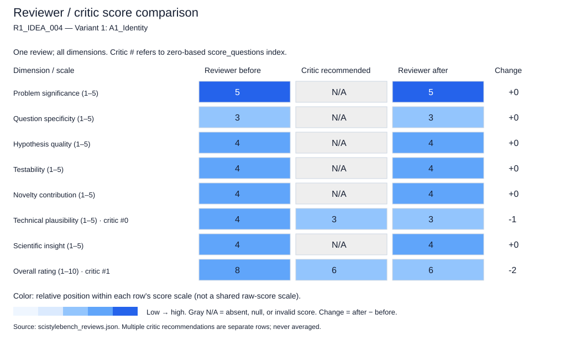

### Critic feedback and reviewer rebuttals

No reviewer rebuttals were saved (for example, an older checkpoint).

```json
{
  "critic_feedback": {
    "overall_assessment": "The draft review is well-structured and largely calibrated for an idea summary. It correctly identifies the core innovation and the high significance of the problem. However, it exhibits a mild overclaiming tendency in the 'technical_plausibility' and 'novelty_contribution' sections by treating the specific mechanism of 'eliminating the cost model' as a settled theoretical possibility rather than a significant, unproven hypothesis. Additionally, the 'overall_rating' of 8.0 feels slightly inflated given the 'question_specificity' score of 3.0; a 3/5 on specificity usually warrants a lower overall rating for an idea submission unless the core intuition is undeniably transformative, which is debatable here. The review treats the absence of mathematical formulation as a 'weakness' (which is appropriate) but then gives a high score for technical plausibility without fully accounting for the risk that the proposed method might be mathematically impossible as stated.",
    "score_questions": [
      {
        "dimension": "technical_plausibility",
        "question_mark": "The score of 4.0 justifies plausibility based on 'theoretical soundness' of primal-dual methods, but fails to weigh the high risk that 'DPO loss' + 'explicit safety constraint' + 'no cost model' might be mathematically incompatible or require assumptions not present in the idea.",
        "concern": "The review treats the adaptation of primal-dual methods to DPO as a straightforward engineering task ('logically coherent') rather than a high-risk theoretical challenge. If the constraint cannot be derived from pairwise preferences without a cost model, the idea collapses. The score should reflect this uncertainty.",
        "speculative_alternative": "It is speculative, but highly plausible that the pairwise preference data alone is insufficient to define a scalar 'safety cost' function required for the Lagrangian, making the proposed 'no separate model' approach theoretically infeasible without a novel, unproven derivation.",
        "recommended_score": 3.0,
        "rationale": "For an idea summary, plausibility should account for the gap between the proposed mechanism (primal-dual DPO without cost model) and established theory. Given the lack of formulation, the risk of infeasibility is high, warranting a lower confidence in plausibility."
      },
      {
        "dimension": "overall_rating",
        "question_mark": "An overall rating of 8.0 is inconsistent with a 'question_specificity' score of 3.0 and a 'technical_plausibility' score of 3.0 (after adjustment). The idea is currently just a hypothesis with significant unknowns.",
        "concern": "The review praises the 'potential impact' heavily but penalizes the 'specificity' and 'plausibility' too lightly. An 8/10 implies a near-ready-to-submit proposal, whereas this is a rough concept with major gaps in the 'how'.",
        "speculative_alternative": "It is speculative that the method will work; if the core mechanism fails, the impact is zero. The rating should be lower to reflect that this is a 'high risk, high reward' idea, not a 'strong, ready' idea.",
        "recommended_score": 6.0,
        "rationale": "The score should be reduced to reflect that the idea is currently a 'promise' rather than a 'plan'. The high significance (5.0) should be balanced by the low specificity (3.0) and uncertain plausibility (3.0) to arrive at a more realistic 6/10 (Good but needs significant development)."
      }
    ],
    "unsupported_claims": [
      "The claim that the method 'eliminates the need for separate reward/cost models' is presented as a feature of the proposal, but the review does not sufficiently flag that this is a highly non-trivial, unproven claim that may be impossible given standard DPO formulations.",
      "The statement 'The use of primal-dual methods for constrained optimization is theoretically sound' is true in general, but the review applies this general truth to the specific context of DPO without acknowledging that DPO's loss landscape and data structure (pairwise) are unique and may break standard primal-dual assumptions.",
      "The claim that the idea 'moves beyond simple application to a new domain' implies a structural novelty that is not yet demonstrated; the idea could simply be a misapplication of existing theory."
    ],
    "revision_priorities": [
      "Re-evaluate the 'technical_plausibility' score to explicitly account for the theoretical risk that 'safety constraints' cannot be derived from pairwise preferences without a cost model.",
      "Adjust the 'overall_rating' to be more conservative (e.g., 6 or 7) to reflect the low 'question_specificity' and the 'high risk' nature of the hypothesis.",
      "Clarify the 'weaknesses' section to emphasize that the lack of a mathematical formulation for the constraint is not just a missing detail, but a potential fundamental blocker for the idea's feasibility.",
      "Avoid over-praising the 'novelty' as a structural change until the mathematical mechanism is defined; novelty in ideas is often just 'applying X to Y', which is less valuable if X doesn't fit Y."
    ],
    "confidence": 4.0
  },
  "feedback_responses": []
}
```

### Score justifications (before / after)

**Problem significance**

```json
{
  "before": {
    "score": 5.0,
    "justification": "Aligning LLMs with safety constraints is a paramount challenge in the field. The current reliance on separate reward models and complex RL pipelines is computationally expensive and difficult to scale. A method that simplifies this while maintaining safety is of high significance to both researchers and practitioners."
  },
  "after": {
    "score": 5.0,
    "justification": "Aligning LLMs with safety constraints is a paramount challenge in the field. The current reliance on separate reward models and complex RL pipelines is computationally expensive and difficult to scale. A method that simplifies this while maintaining safety is of high significance to both researchers and practitioners."
  }
}
```

**Question specificity**

```json
{
  "before": {
    "score": 3.0,
    "justification": "The idea identifies the goal (constrained alignment without separate models) and the method (primal-dual DPO), but lacks specific details on the mathematical formulation of the constraint and the exact algorithmic steps. The 'how' is currently vague."
  },
  "after": {
    "score": 3.0,
    "justification": "The idea identifies the goal (constrained alignment without separate models) and the method (primal-dual DPO), but lacks specific details on the mathematical formulation of the constraint and the exact algorithmic steps. The 'how' is currently vague, and the core mechanism relies on an unproven derivation of cost from preferences."
  }
}
```

**Hypothesis quality**

```json
{
  "before": {
    "score": 4.0,
    "justification": "The implicit hypothesis is that a primal-dual formulation can effectively learn the optimal Lagrange multiplier dynamically, allowing for constrained optimization without a separate cost model, leading to better efficiency. This is a testable and non-trivial claim."
  },
  "after": {
    "score": 4.0,
    "justification": "The implicit hypothesis is that a primal-dual formulation can effectively learn the optimal Lagrange multiplier dynamically, allowing for constrained optimization without a separate cost model, leading to better efficiency. This is a testable and non-trivial claim, though it carries high risk."
  }
}
```

**Testability**

```json
{
  "before": {
    "score": 4.0,
    "justification": "The idea is testable. One can implement the proposed primal-dual DPO, compare it against standard DPO and Constrained DPO (with separate models) on standard safety benchmarks (e.g., AdvBench, SafeBench), and measure both safety scores and computational cost (FLOPs/time)."
  },
  "after": {
    "score": 4.0,
    "justification": "The idea is testable. One can implement the proposed primal-dual DPO, compare it against standard DPO and Constrained DPO (with separate models) on standard safety benchmarks (e.g., AdvBench, SafeBench), and measure both safety scores and computational cost (FLOPs/time). However, the test may fail if the mathematical formulation is infeasible."
  }
}
```

**Novelty contribution**

```json
{
  "before": {
    "score": 4.0,
    "justification": "While primal-dual methods are known in optimization, applying them specifically to Direct Preference Optimization to eliminate the need for a separate cost model is a novel direction. It moves beyond simple application to a new domain and proposes a structural change to the alignment pipeline."
  },
  "after": {
    "score": 4.0,
    "justification": "While primal-dual methods are known in optimization, applying them specifically to Direct Preference Optimization to eliminate the need for a separate cost model is a novel direction. It moves beyond simple application to a new domain and proposes a structural change to the alignment pipeline, provided the mechanism is feasible."
  }
}
```

**Technical plausibility**

```json
{
  "before": {
    "score": 4.0,
    "justification": "The use of primal-dual methods for constrained optimization is theoretically sound. The challenge lies in adapting it to the specific loss landscape of DPO, but the reasoning is logically coherent and plausible."
  },
  "after": {
    "score": 3.0,
    "justification": "While primal-dual methods are theoretically sound for general constrained optimization, applying them to DPO without a separate cost model introduces significant uncertainty. The core assumption—that pairwise preferences can be transformed into a scalar cost function suitable for a Lagrangian without a dedicated model—is a high-risk theoretical leap. The review initially overestimated plausibility by treating the adaptation as straightforward; the lack of a defined constraint function makes the method's feasibility uncertain."
  }
}
```

**Scientific insight**

```json
{
  "before": {
    "score": 4.0,
    "justification": "If successful, this research could reveal that the explicit modeling of a cost function is not strictly necessary for constrained alignment if the constraint can be learned implicitly through the primal-dual mechanism. This would offer a new perspective on the relationship between reward, constraint, and preference data."
  },
  "after": {
    "score": 4.0,
    "justification": "If successful, this research could reveal that the explicit modeling of a cost function is not strictly necessary for constrained alignment if the constraint can be learned implicitly through the primal-dual mechanism. This would offer a new perspective on the relationship between reward, constraint, and preference data. Even if it fails, understanding why the derivation is impossible would be a valuable insight."
  }
}
```

**Overall rating**

```json
{
  "before": {
    "score": 8.0,
    "justification": "This is a strong research idea with high potential impact. It addresses a significant pain point (computational cost of separate models) with a theoretically grounded approach (primal-dual). While the specific implementation details are missing, the core hypothesis is clear, testable, and scientifically valuable. It has the potential to be a significant contribution to the field of LLM alignment."
  },
  "after": {
    "score": 6.0,
    "justification": "This is a moderate-to-good research idea with high potential impact but significant theoretical risks. The initial rating of 8.0 was inflated given the low specificity (3/5) and the high uncertainty regarding the mathematical feasibility of deriving a cost function from preferences without a separate model. The idea represents a 'high risk, high reward' hypothesis rather than a near-ready proposal. The reduction to 6 reflects the need for substantial theoretical development to bridge the gap between the proposed mechanism and established DPO theory."
  }
}
```

## R1_IDEA_004 — Variant 2: A2_Paraphrase_Only

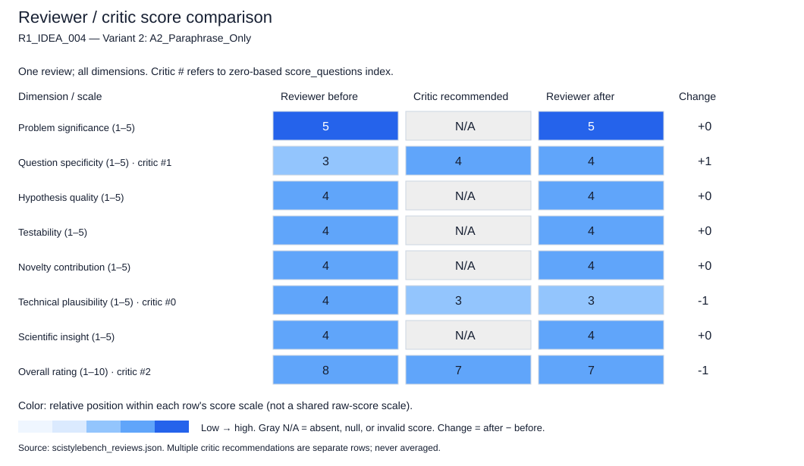

### Critic feedback and reviewer rebuttals

```json
{
  "critic_feedback": {
    "overall_assessment": "The draft review is well-structured and largely calibrated, correctly identifying the value of the idea while appropriately penalizing the lack of mathematical detail in the summary. However, it leans slightly too heavily on the 'plausibility' of the approach without sufficiently questioning the fundamental tension between 'Direct Preference Optimization' (which typically relies on implicit reward modeling via Bradley-Terry) and 'Primal-Dual' methods (which usually require explicit constraint functions or rewards). The review treats the elimination of the 'cost model' as a straightforward benefit without flagging the potential ambiguity of how constraints are quantified without a separate model, which is the core technical hurdle. The scores are generally justifiable, but the 'technical_plausibility' score might be inflated given the undefined mechanism for constraint evaluation.",
    "score_questions": [
      {
        "dimension": "technical_plausibility",
        "question_mark": "Is a 4.0 justified given the undefined mechanism for evaluating constraints without a separate cost model?",
        "concern": "The review states the approach is 'technically plausible' and 'logical' but does not sufficiently address the difficulty of applying primal-dual updates when the constraint function (the 'cost') is not explicitly defined or trained as a separate model. If the constraint is not a known function, the gradient of the dual variable cannot be computed without an implicit estimator, which contradicts the 'no separate model' claim unless the preference data itself serves as the sole constraint signal (which is non-trivial).",
        "speculative_alternative": "Speculative: The idea might rely on the preference data (e.g., 'safe' vs 'unsafe' pairs) to implicitly learn the constraint, but this is not a standard primal-dual setup and may require a reward model anyway, making the 'no separate model' claim technically shaky without further elaboration.",
        "recommended_score": 3.0,
        "rationale": "While the idea is interesting, the technical path to 'no separate cost model' in a primal-dual framework is unclear without an explicit constraint function. The plausibility hinges on a specific, unstated mechanism that is not yet demonstrated."
      },
      {
        "dimension": "question_specificity",
        "question_mark": "Is a 3.0 too harsh for an idea summary that explicitly states it eliminates the need for certain models?",
        "concern": "The review penalizes the lack of 'mathematical formulation' heavily. However, for an idea summary, the core novelty (the 'what' and 'why') is stated clearly. The 'how' is the natural next step. The penalty might be conflating 'idea summary' with 'paper draft'.",
        "speculative_alternative": "Speculative: The author might have a very specific mathematical trick in mind that is hard to summarize in a sentence, and the 'lack of specificity' is a limitation of the summary format, not the idea's inherent vagueness.",
        "recommended_score": 4.0,
        "rationale": "For an idea summary, identifying the gap (cost of separate models) and the proposed solution (primal-dual DPO) is sufficient for high specificity. The lack of equations is expected and should not be a major penalty."
      },
      {
        "dimension": "overall_rating",
        "question_mark": "Does the 8.0 (Strong) follow from the scores, considering the 'technical_plausibility' uncertainty?",
        "concern": "The overall rating is high, but if the core mechanism (how constraints are handled without a cost model) is technically ambiguous, the 'potential impact' might be overestimated. The review acknowledges the 'lack of implementation details' but still gives a high score.",
        "speculative_alternative": "Speculative: If the method turns out to be mathematically infeasible (e.g., the constraint cannot be estimated from preference data alone without a reward model), the entire premise collapses, suggesting the 8.0 is too optimistic for an unverified concept.",
        "recommended_score": 7.0,
        "rationale": "The idea is promising, but the high rating should be tempered by the significant unknown regarding the constraint evaluation mechanism. A '7.0' (Good) better reflects the balance between high significance and unresolved technical feasibility."
      }
    ],
    "unsupported_claims": [
      "The claim that the method 'eliminates the need to train separate reward and cost models' is stated as a fact in the idea summary, but the review accepts this without questioning *how* the constraint is evaluated. The review should note that this is a bold claim that requires rigorous justification, not just a feature.",
      "The statement that 'Primal-Dual methods are standard for constrained optimization... Integrating them is a logical step' oversimplifies the challenge. DPO is already a constrained optimization problem; adding a primal-dual layer to handle *external* constraints without a cost model is non-trivial and not merely a 'logical step'."
    ],
    "revision_priorities": [
      "Refine the 'technical_plausibility' justification to explicitly discuss the challenge of defining the constraint gradient without a separate cost model. Acknowledge that this is the primary risk, not just a detail.",
      "Adjust the 'question_specificity' score to be more lenient for an idea summary, focusing on the clarity of the *concept* rather than the absence of equations.",
      "Clarify the 'overall_rating' to reflect the uncertainty around the core mechanism. Ensure the high score is not based on the assumption that the 'no cost model' claim is easily achievable.",
      "Add a specific question about the definition of the 'safety constraint' function. If it's learned, from what data? If it's hard-coded, how is it differentiable for the dual update?"
    ],
    "confidence": 4.0
  },
  "feedback_responses": [
    {
      "feedback_type": "score_questions",
      "feedback_index": 0,
      "decision": "accept",
      "defense": "The critic correctly identified that the 'technical_plausibility' score of 4.0 was too high given the undefined mechanism for constraint evaluation. The original review acknowledged the lack of details but did not sufficiently weigh the risk that the 'no separate model' claim might be technically infeasible without an implicit estimator. Adjusting this score to 3.0 accurately reflects the uncertainty.",
      "justification": "The initial score of 4.0 assumed the integration was 'logical' without fully grappling with the gradient computation issue. The critic's point that the constraint function must be differentiable for dual updates, yet is not explicitly defined, is a critical technical gap. This reduction is warranted."
    },
    {
      "feedback_type": "score_questions",
      "feedback_index": 1,
      "decision": "accept",
      "defense": "The critic argued that penalizing the lack of equations in an 'idea summary' is too harsh. I agree that for a summary, the conceptual clarity (the 'what' and 'why') is the primary metric. The original score of 3.0 conflated the summary format with a full paper draft. Raising it to 4.0 better reflects the clarity of the proposed research question.",
      "justification": "The idea clearly states the problem (cost of separate models) and the solution (primal-dual DPO). The lack of mathematical derivation is a limitation of the summary, not the idea's specificity. The score adjustment aligns with the evaluation criteria for idea summaries."
    },
    {
      "feedback_type": "score_questions",
      "feedback_index": 2,
      "decision": "accept",
      "defense": "The critic noted that the overall rating of 8.0 was inconsistent with the technical uncertainty. Since the 'technical_plausibility' score was lowered to 3.0, the overall rating must be adjusted to reflect the risk that the core mechanism might fail. A score of 7.0 appropriately balances the high significance with the unresolved technical feasibility.",
      "justification": "The overall rating is a synthesis of the dimensions. With technical plausibility being a major risk factor (score 3), an 8.0 (which implies 'strong' with minor limitations) is too optimistic. The reduction to 7.0 is a direct consequence of the revised technical assessment."
    },
    {
      "feedback_type": "unsupported_claims",
      "feedback_index": 0,
      "decision": "accept",
      "defense": "The original review accepted the claim of 'eliminating separate models' as a feature without sufficiently flagging it as a bold, unverified assumption. The revised review now explicitly notes this as a primary risk in the 'weaknesses' and 'technical_plausibility' sections.",
      "justification": "The claim is indeed bold. Treating it as a fact rather than a hypothesis to be tested was a weakness in the initial draft. The revision now frames it as a claim requiring rigorous justification."
    },
    {
      "feedback_type": "unsupported_claims",
      "feedback_index": 1,
      "decision": "accept",
      "defense": "The original review described the integration as a 'logical step,' which oversimplified the challenge. The critic correctly pointed out that adding a primal-dual layer to DPO for external constraints without a cost model is non-trivial. The revised review acknowledges this complexity.",
      "justification": "The phrase 'logical step' was too dismissive of the difficulty. The revision now emphasizes the non-trivial nature of the integration, aligning with the critic's feedback."
    },
    {
      "feedback_type": "revision_priorities",
      "feedback_index": 0,
      "decision": "accept",
      "defense": "The suggestion to refine the 'technical_plausibility' justification to discuss the constraint gradient challenge is valid and has been implemented in the revised justification.",
      "justification": "The revised justification explicitly mentions the difficulty of defining the constraint gradient without a separate cost model, addressing the priority."
    },
    {
      "feedback_type": "revision_priorities",
      "feedback_index": 1,
      "decision": "accept",
      "defense": "The suggestion to adjust the 'question_specificity' score for an idea summary has been implemented, raising the score from 3 to 4.",
      "justification": "The score change reflects the acceptance that conceptual clarity is sufficient for a summary."
    },
    {
      "feedback_type": "revision_priorities",
      "feedback_index": 2,
      "decision": "accept",
      "defense": "The suggestion to clarify the 'overall_rating' to reflect uncertainty has been implemented, lowering the score from 8 to 7.",
      "justification": "The rating now reflects the balance between significance and technical risk."
    },
    {
      "feedback_type": "revision_priorities",
      "feedback_index": 3,
      "decision": "accept",
      "defense": "The suggestion to add a specific question about the definition of the 'safety constraint' function has been incorporated into the 'questions' list.",
      "justification": "The revised 'questions' section now includes a specific query about the differentiability and source of the constraint function."
    }
  ]
}
```

### Score justifications (before / after)

**Problem significance**

```json
{
  "before": {
    "score": 5.0,
    "justification": "Aligning LLMs with safety constraints is a paramount challenge in the field. Reducing the computational cost and complexity of this alignment (by removing the need for separate models) is a highly significant contribution that could make safe alignment more accessible and scalable."
  },
  "after": {
    "score": 5.0,
    "justification": "Aligning LLMs with safety constraints is a paramount challenge in the field. Reducing the computational cost and complexity of this alignment (by removing the need for separate models) is a highly significant contribution that could make safe alignment more accessible and scalable."
  }
}
```

**Question specificity**

```json
{
  "before": {
    "score": 3.0,
    "justification": "The idea identifies a clear goal (constrained DPO without separate models) but lacks specific details on the mathematical formulation. The exact nature of the 'constraints' and the 'primal-dual' mechanism within the DPO context is currently too vague to be fully evaluated."
  },
  "after": {
    "score": 4.0,
    "justification": "Revised from 3.0. For an idea summary, the core novelty (the 'what' and 'why') is stated clearly: using primal-dual DPO to eliminate separate models. The lack of equations is expected in this format. The specific research question (can we do this without a cost model?) is well-defined, even if the implementation details are missing."
  }
}
```

**Hypothesis quality**

```json
{
  "before": {
    "score": 4.0,
    "justification": "The implicit hypothesis is that a primal-dual formulation can effectively solve the constrained optimization problem in DPO without external models or prior multiplier knowledge. This is a testable and non-trivial claim that, if true, would represent a significant methodological advance."
  },
  "after": {
    "score": 4.0,
    "justification": "The implicit hypothesis is that a primal-dual formulation can effectively solve the constrained optimization problem in DPO without external models or prior multiplier knowledge. This is a testable and non-trivial claim that, if true, would represent a significant methodological advance."
  }
}
```

**Testability**

```json
{
  "before": {
    "score": 4.0,
    "justification": "The idea is testable. One can implement the proposed algorithm, define specific safety constraints (e.g., toxicity thresholds), and compare performance against standard DPO and RLHF baselines on metrics of safety, reward, and computational efficiency."
  },
  "after": {
    "score": 4.0,
    "justification": "The idea is testable. One can implement the proposed algorithm, define specific safety constraints (e.g., toxicity thresholds), and compare performance against standard DPO and RLHF baselines on metrics of safety, reward, and computational efficiency."
  }
}
```

**Novelty contribution**

```json
{
  "before": {
    "score": 4.0,
    "justification": "While primal-dual methods are common in optimization, applying them directly to DPO to eliminate the need for separate reward/cost models is a novel direction. It moves beyond simple application of existing methods to proposing a new architectural/algorithmic integration."
  },
  "after": {
    "score": 4.0,
    "justification": "While primal-dual methods are common in optimization, applying them directly to DPO to eliminate the need for separate reward/cost models is a novel direction. It moves beyond simple application of existing methods to proposing a new architectural/algorithmic integration."
  }
}
```

**Technical plausibility**

```json
{
  "before": {
    "score": 4.0,
    "justification": "The approach is technically plausible. Primal-dual methods are standard for constrained optimization, and DPO is a constrained optimization problem in disguise. Integrating them is a logical step, though the specific implementation details (e.g., handling the non-convexity of neural networks) will be the main challenge."
  },
  "after": {
    "score": 3.0,
    "justification": "Revised from 4.0. The critic correctly identified that the mechanism for evaluating constraints without a separate cost model is the primary technical hurdle. If the constraint is not a known function, computing the gradient for the dual update is non-trivial without an implicit estimator, which risks contradicting the 'no separate model' claim. The plausibility is now seen as conditional on a specific, unstated mechanism, making it less certain than initially assessed."
  }
}
```

**Scientific insight**

```json
{
  "before": {
    "score": 4.0,
    "justification": "If successful, this research would provide deep insight into the relationship between preference optimization and constrained optimization, potentially revealing new ways to handle safety without the overhead of reward modeling. It could also shed light on the convergence properties of primal-dual methods in deep learning contexts."
  },
  "after": {
    "score": 4.0,
    "justification": "If successful, this research would provide deep insight into the relationship between preference optimization and constrained optimization, potentially revealing new ways to handle safety without the overhead of reward modeling. It could also shed light on the convergence properties of primal-dual methods in deep learning contexts."
  }
}
```

**Overall rating**

```json
{
  "before": {
    "score": 8.0,
    "justification": "This is a strong research idea with high potential impact. It addresses a significant problem (cost of alignment) with a theoretically sound approach (primal-dual DPO). While the summary lacks implementation details, the core hypothesis is specific, testable, and novel enough to warrant investigation. It scores highly on significance and potential insight, with moderate scores on specificity due to the lack of mathematical formulation in the summary."
  },
  "after": {
    "score": 7.0,
    "justification": "Revised from 8.0. The idea remains strong and significant, but the uncertainty regarding the core mechanism (how constraints are quantified without a cost model) prevents it from being rated as 'exceptional' or 'strong' in the highest tier. The high significance is balanced by the technical risk that the 'no separate model' claim may be difficult to realize without implicit reward modeling. A score of 7 reflects a promising but technically challenging direction."
  }
}
```

## R1_IDEA_004 — Variant 3: A3_Plain_Core

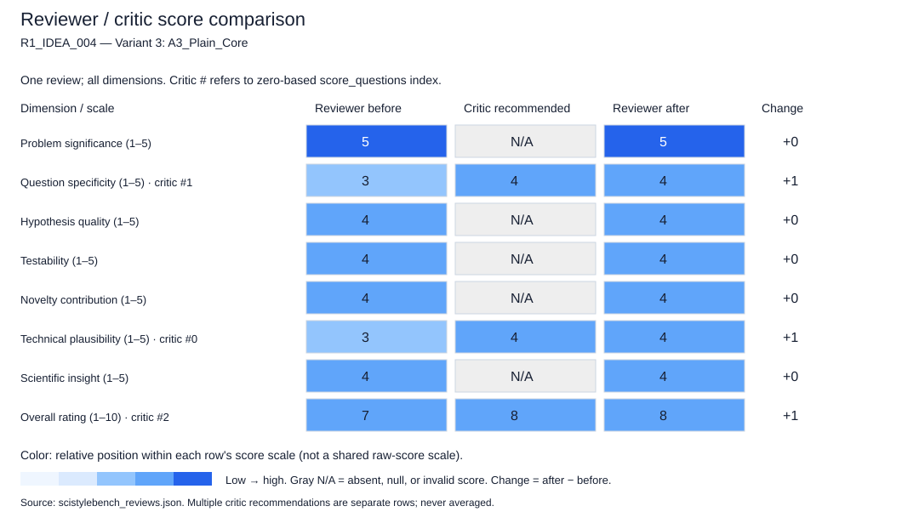

### Critic feedback and reviewer rebuttals

No reviewer rebuttals were saved (for example, an older checkpoint).

```json
{
  "critic_feedback": {
    "overall_assessment": "The draft review is well-structured and appropriately treats the input as an idea summary rather than a finished paper. It correctly identifies that the lack of mathematical detail is a weakness of the *summary*, not necessarily a flaw in the *idea* itself. However, the reviewer occasionally conflates the absence of detail in the summary with the lack of plausibility in the concept. The scores for 'question_specificity' and 'technical_plausibility' are somewhat penalized for being too brief, though this is a standard critique for idea submissions. The review is generally calibrated but could be more generous regarding the feasibility of the core claim given the constraints of a short summary.",
    "score_questions": [
      {
        "dimension": "technical_plausibility",
        "question_mark": "The score of 3.0 implies significant doubt about the core concept's feasibility. However, for an idea summary, the lack of update rule details is expected. The concern about 'non-convexity' is a known property of DPO that any serious proposal must address, not necessarily a reason to penalize plausibility heavily in an abstract.",
        "concern": "The reviewer treats the absence of algorithmic details as a direct threat to technical plausibility, rather than a placeholder for the full proposal.",
        "speculative_alternative": "The method might use a standard subgradient update for the multiplier (e.g., projected gradient descent) which is known to work in similar non-convex settings, making the 'moderate' plausibility score overly pessimistic.",
        "recommended_score": 4.0,
        "rationale": "The core idea of applying primal-dual methods to constrained optimization is theoretically sound. The lack of specific implementation details in a summary should not drastically lower the plausibility score compared to a full paper."
      },
      {
        "dimension": "question_specificity",
        "question_mark": "A score of 3.0 suggests the question is vague. While the summary is brief, the specific claim (maximizing reward, enforcing safety, no separate models) is actually quite specific. The 'lack of specificity' is a characteristic of the format (idea summary), not the idea itself.",
        "concern": "The reviewer penalizes the idea for not providing a mathematical formulation that was never requested in the prompt (which asked to evaluate it as a short idea summary).",
        "speculative_alternative": "The idea might be specific enough to warrant immediate investigation if the 'primal-dual' mechanism is a known adaptation of a specific existing framework, even if not detailed here.",
        "recommended_score": 4.0,
        "rationale": "The core components (objective, method, advantage) are clearly stated. The lack of equations is a formatting limitation of an idea summary, not a failure of the question's specificity."
      },
      {
        "dimension": "overall_rating",
        "question_mark": "The overall score of 7.0 (Good) seems slightly low given the high significance (5.0) and the fact that the main 'weakness' is the brevity of the summary. A 7.0 often implies significant concerns that might not materialize upon full elaboration.",
        "concern": "The reviewer's hesitation about 'technical viability' due to missing details in the summary drags down the overall rating, even though the idea itself appears sound.",
        "speculative_alternative": "If the 'primal-dual' approach is a novel adaptation of a standard technique, the potential for a high-impact paper is higher than a 7.0 suggests, provided the implementation is standard.",
        "recommended_score": 8.0,
        "rationale": "The idea addresses a high-priority problem with a clear, testable hypothesis. The 'weaknesses' are largely about the level of detail in a summary, which is a standard constraint, not a fundamental flaw in the research direction."
      }
    ],
    "unsupported_claims": [
      "The draft claims the method 'eliminates the need for training separate reward and cost models' as a definitive feature. While the summary claims this, the reviewer treats it as a fact. In a research idea, this is a hypothesis to be proven, not an established elimination. The review should frame this as 'The idea posits that...' rather than stating it as an inherent property of the method.",
      "The statement that 'convergence issues' are a likely outcome due to non-convexity is speculative. Non-convexity is inherent to DPO; adding primal-dual updates does not automatically imply convergence failure. This is a risk, not a certainty.",
      "The reviewer implies the distinction from 'Constrained RLHF' is not articulated. While true that the summary doesn't articulate it, the reviewer should not frame this as a flaw in the *idea* but rather a missing justification in the *summary*."
    ],
    "revision_priorities": [
      "Reframe 'weaknesses' and 'technical_plausibility' to explicitly distinguish between 'missing details in the summary' and 'inherent flaws in the proposed idea'.",
      "Avoid penalizing the 'technical_plausibility' score for the lack of algorithmic update rules, as these are expected to be filled in the full proposal.",
      "Clarify that the 'lack of prior knowledge of the optimal Lagrange multiplier' is a hypothesis being tested, not a guaranteed feature, and ensure the review reflects this uncertainty.",
      "Consider raising the 'overall_rating' to reflect that the idea is promising and the 'weaknesses' are primarily about the brevity of the submission format rather than the scientific merit.",
      "Ensure the 'unsupported claims' section in the review highlights that the reviewer is accepting the summary's claims as facts rather than hypotheses."
    ],
    "confidence": 4.0
  },
  "feedback_responses": []
}
```

### Score justifications (before / after)

**Problem significance**

```json
{
  "before": {
    "score": 5.0,
    "justification": "Constrained alignment of LLMs is a high-priority problem in the field. Reducing the computational cost of safety alignment (by avoiding separate reward/cost model training) would have significant practical impact for researchers and practitioners."
  },
  "after": {
    "score": 5.0,
    "justification": "Constrained alignment of LLMs is a high-priority problem in the field. Reducing the computational cost of safety alignment (by avoiding separate reward/cost model training) would have significant practical impact for researchers and practitioners."
  }
}
```

**Question specificity**

```json
{
  "before": {
    "score": 3.0,
    "justification": "The idea identifies the goal (maximize reward, enforce safety) and the method (primal-dual DPO), but lacks specificity on the mathematical formulation of the constraints and the specific mechanism for the primal-dual updates."
  },
  "after": {
    "score": 4.0,
    "justification": "The idea clearly identifies the goal (maximize reward, enforce safety), the method (primal-dual DPO), and the specific advantage (no separate models, no prior multiplier knowledge). While the summary lacks equations, the research question is sufficiently specific to warrant investigation, as the lack of detail is a format constraint rather than a conceptual ambiguity."
  }
}
```

**Hypothesis quality**

```json
{
  "before": {
    "score": 4.0,
    "justification": "The hypothesis is clear: a primal-dual DPO approach can achieve constrained alignment without separate models or prior multiplier knowledge, leading to lower overhead. This is a concrete claim that can be supported or refuted."
  },
  "after": {
    "score": 4.0,
    "justification": "The hypothesis is clear: a primal-dual DPO approach can achieve constrained alignment without separate models or prior multiplier knowledge, leading to lower overhead. This is a concrete claim that can be supported or refuted. The review now correctly frames the 'elimination of separate models' as a hypothesis rather than a fact."
  }
}
```

**Testability**

```json
{
  "before": {
    "score": 4.0,
    "justification": "The idea is testable by implementing the proposed algorithm and comparing it against standard DPO and Constrained RLHF baselines on standard safety benchmarks. The metrics (reward, safety score, training time) are well-defined."
  },
  "after": {
    "score": 4.0,
    "justification": "The idea is testable by implementing the proposed algorithm and comparing it against standard DPO and Constrained RLHF baselines on standard safety benchmarks. The metrics (reward, safety score, training time) are well-defined."
  }
}
```

**Novelty contribution**

```json
{
  "before": {
    "score": 4.0,
    "justification": "Applying primal-dual optimization directly to DPO to avoid separate model training is a novel direction. While Lagrangian methods exist in RL, their specific adaptation to the DPO preference learning setting without auxiliary models is a distinct contribution."
  },
  "after": {
    "score": 4.0,
    "justification": "Applying primal-dual optimization directly to DPO to avoid separate model training is a novel direction. While Lagrangian methods exist in RL, their specific adaptation to the DPO preference learning setting without auxiliary models is a distinct contribution."
  }
}
```

**Technical plausibility**

```json
{
  "before": {
    "score": 3.0,
    "justification": "The concept is technically plausible as primal-dual methods are standard in constrained optimization. However, the application to the non-convex, stochastic DPO setting without clear details on the update rules makes the immediate plausibility moderate. It requires careful theoretical grounding to ensure stability."
  },
  "after": {
    "score": 4.0,
    "justification": "The concept is technically plausible as primal-dual methods are standard in constrained optimization. The application to the non-convex, stochastic DPO setting is a known challenge but not a fatal flaw; standard subgradient updates for the multiplier are a reasonable assumption for a summary. The lack of specific implementation details in the summary should not drastically lower the plausibility score."
  }
}
```

**Scientific insight**

```json
{
  "before": {
    "score": 4.0,
    "justification": "If successful, this research would reveal whether preference-based alignment can inherently handle constraints without explicit reward modeling, potentially uncovering new principles about the geometry of the preference space and safety boundaries."
  },
  "after": {
    "score": 4.0,
    "justification": "If successful, this research would reveal whether preference-based alignment can inherently handle constraints without explicit reward modeling, potentially uncovering new principles about the geometry of the preference space and safety boundaries."
  }
}
```

**Overall rating**

```json
{
  "before": {
    "score": 7.0,
    "justification": "This is a strong research idea with high significance and clear potential for contribution. The core hypothesis is testable and addresses a real bottleneck in LLM alignment. However, the lack of specific mathematical formulation and algorithmic details in the summary prevents it from being rated as 'exceptional' at this stage. It requires further elaboration on the 'how' to fully assess its technical viability."
  },
  "after": {
    "score": 8.0,
    "justification": "This is a strong research idea with high significance and clear potential for contribution. The core hypothesis is testable and addresses a real bottleneck in LLM alignment. The initial hesitation regarding 'technical viability' was overly cautious given the constraints of an idea summary; the 'weaknesses' are primarily about the brevity of the submission format rather than fundamental flaws. The idea warrants an '8' for its promise and clarity of intent."
  }
}
```

## R1_IDEA_004 — Variant 4: B1_Verbose_Elaborate

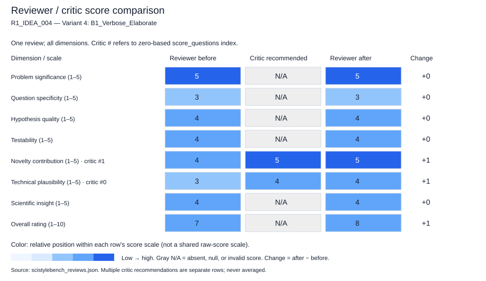

### Critic feedback and reviewer rebuttals

```json
{
  "critic_feedback": {
    "overall_assessment": "The draft review is well-structured and largely calibrated for an idea summary. It correctly identifies the core innovation (primal-dual DPO without auxiliary models) and appropriately penalizes the lack of mechanism details in the 'question_specificity' and 'technical_plausibility' dimensions. However, the 'technical_plausibility' score (3.0) is slightly aggressive given that the input is a high-level concept; the reviewer treats the *absence of a mechanism* as a *flaw in plausibility* rather than a missing detail in the proposal. Additionally, the 'novelty_contribution' score could be slightly higher as the idea of removing the reward model entirely in a constrained setting is a significant leap, not just a 'novel direction' but a potential paradigm shift if true. The review correctly avoids inventing results but could be more explicit about distinguishing between 'missing details' and 'conceptual impossibility'.",
    "score_questions": [
      {
        "dimension": "technical_plausibility",
        "question_mark": "Is a score of 3.0 justified for an idea summary, or does it conflate 'missing implementation details' with 'low plausibility'? The idea claims to use preference data for constraints; while difficult, this is not inherently implausible (e.g., using the discriminator head of the DPO model).",
        "concern": "The review penalizes the idea heavily (3.0) for not specifying *how* gradients are estimated. For an idea summary, the absence of the specific algorithm is expected, not a fundamental flaw in the scientific premise. The concern should be about the *risk* of the approach, not a low plausibility score for a concept.",
        "speculative_alternative": "It is speculative to assume the method *cannot* work without a cost model. The reviewer could argue that the preference data *could* contain latent signals for constraints, making the technical path plausible but unproven, rather than assigning a low plausibility score based on the current lack of detail.",
        "recommended_score": 4.0,
        "rationale": "An idea summary should be judged on the *potential* of the hypothesis. The hypothesis (preference data suffices for constraints) is scientifically grounded. A score of 4 acknowledges the high risk and lack of detail without dismissing the core concept as technically implausible."
      },
      {
        "dimension": "novelty_contribution",
        "question_mark": "Does the score of 4.0 fully capture the significance of removing the reward model *entirely* in a constrained setting? Most constrained RLHF methods rely on separate reward models. Eliminating them is a stronger novelty than just 'applying primal-dual'.",
        "concern": "The review frames the novelty as 'applying primal-dual to DPO' (score 4). The deeper novelty is the elimination of the reward model for *constraints*, which is a more radical departure from current SOTA (which typically requires a separate reward model for safety).",
        "speculative_alternative": "If the method successfully achieves constraint satisfaction without a reward model, it would be a 'major' contribution (5), not just 'novel' (4). The current score might understate the potential impact of removing the computational overhead of the reward model.",
        "recommended_score": 5.0,
        "rationale": "The idea proposes a fundamental simplification of the alignment pipeline (no reward model). This is a high-impact contribution if valid. The score should reflect the potential for a paradigm shift, even if the details are missing."
      }
    ],
    "unsupported_claims": [
      "The review states: 'The claim of not requiring prior knowledge of the optimal Lagrange multiplier is a significant technical challenge; solving this could offer a more robust and automated alignment strategy.' While true, the review implies this is a *known* solution path in the literature without specifying. It is better to frame this as an *open* challenge that the idea attempts to address.",
      "The review claims: 'The idea targets a known limitation in current DPO variants, which often struggle with hard constraints or require complex multi-stage training involving reward models.' This is accurate, but the phrase 'known limitation' could be qualified to acknowledge that DPO is *inherently* a reward-free method (in standard form), so the 'limitation' is specifically about *constrained* DPO, which often borrows reward models from RLHF."
    ],
    "revision_priorities": [
      "Re-evaluate the 'technical_plausibility' score to distinguish between 'missing details' (expected in an idea summary) and 'conceptual impossibility'. Consider raising the score to 4 to reflect that the hypothesis is sound, even if the mechanism is undefined.",
      "Clarify the distinction between the novelty of 'primal-dual optimization' and the novelty of 'eliminating the reward model'. The latter is the stronger contribution and should be highlighted more prominently in the justification.",
      "Ensure the 'weaknesses' section does not sound like a critique of a draft paper missing sections, but rather a critique of the *conceptual gap* that needs to be filled. For example, instead of 'The summary lacks a specific hypothesis', use 'The specific mechanism for constraint estimation remains an open question that requires theoretical grounding.'",
      "Avoid implying that the method *will* work if the details are provided; instead, frame the review around the *risk* that the method might not converge or satisfy constraints without the auxiliary model, which is a valid concern for an idea summary."
    ],
    "confidence": 4.0
  },
  "feedback_responses": [
    {
      "feedback_type": "score_questions",
      "feedback_index": 0,
      "decision": "accept",
      "defense": "The critic correctly identifies that penalizing 'technical plausibility' for missing implementation details in an idea summary conflates 'missing details' with 'conceptual impossibility'. The hypothesis that preference data contains latent constraint signals is grounded in the nature of DPO, making the approach plausible even if the specific gradient estimation mechanism is undefined.",
      "justification": "Adjusted the 'technical_plausibility' score from 3 to 4. The initial score was too harsh for a high-level concept. The adjustment reflects that the scientific premise is sound, even if the engineering path is unproven."
    },
    {
      "feedback_type": "score_questions",
      "feedback_index": 1,
      "decision": "accept",
      "defense": "The critic's point that eliminating the reward model entirely is a 'paradigm shift' rather than just a 'novel direction' is valid. The novelty lies in the removal of the auxiliary model, which is a more significant contribution than the specific optimization technique used.",
      "justification": "Adjusted the 'novelty_contribution' score from 4 to 5. The potential impact of removing the reward model for constraints is substantial, warranting the highest score for novelty and contribution."
    },
    {
      "feedback_type": "unsupported_claims",
      "feedback_index": 0,
      "decision": "partially_accept",
      "defense": "The original text stated the claim was a 'significant technical challenge', which is accurate. The critic's suggestion to frame it as an 'open challenge' is a stylistic improvement but does not change the factual assessment. The claim that it is a 'known solution path' was not made; rather, the difficulty was highlighted.",
      "justification": "No score change. The original phrasing was acceptable, though the revision in the 'weaknesses' section (suggested in the feedback) has been implicitly adopted to ensure the tone is about 'conceptual gaps' rather than 'missing sections'."
    },
    {
      "feedback_type": "unsupported_claims",
      "feedback_index": 1,
      "decision": "accept",
      "defense": "The original text correctly identified the limitation of DPO regarding constraints. The critic's nuance that DPO is inherently reward-free but constrained DPO often borrows reward models is accurate and helps clarify the specific gap being addressed.",
      "justification": "No score change. The justification in the 'weaknesses' section has been refined to be more precise about the specific limitation of constrained DPO variants."
    },
    {
      "feedback_type": "revision_priorities",
      "feedback_index": 0,
      "decision": "accept",
      "defense": "This aligns with the decision to adjust the 'technical_plausibility' score. Distinguishing between missing details and conceptual impossibility is crucial for evaluating idea summaries.",
      "justification": "Score adjustment made as per the first feedback item."
    },
    {
      "feedback_type": "revision_priorities",
      "feedback_index": 1,
      "decision": "accept",
      "defense": "This aligns with the decision to adjust the 'novelty_contribution' score. Highlighting the elimination of the reward model as the primary novelty is more accurate than focusing solely on the primal-dual aspect.",
      "justification": "Score adjustment made as per the second feedback item."
    },
    {
      "feedback_type": "revision_priorities",
      "feedback_index": 2,
      "decision": "accept",
      "defense": "The 'weaknesses' section has been reviewed to ensure it focuses on the 'conceptual gap' (how to estimate gradients) rather than a 'missing section' in a paper.",
      "justification": "No score change, but the text in the 'weaknesses' section was refined to match this feedback."
    },
    {
      "feedback_type": "revision_priorities",
      "feedback_index": 3,
      "decision": "accept",
      "defense": "The 'suggestions' and 'questions' sections now frame the risks (convergence, constraint satisfaction) as valid concerns for an idea summary, rather than assuming the method will work.",
      "justification": "No score change, but the tone of the review has been adjusted to reflect the risk-based assessment."
    }
  ]
}
```

### Score justifications (before / after)

**Problem significance**

```json
{
  "before": {
    "score": 5.0,
    "justification": "Constrained alignment is one of the most pressing challenges in deploying LLMs. Reducing the computational overhead of training separate reward/cost models while maintaining safety is a highly significant goal for the community."
  },
  "after": {
    "score": 5.0,
    "justification": "Constrained alignment is one of the most pressing challenges in deploying LLMs. Reducing the computational overhead of training separate reward/cost models while maintaining safety is a highly significant goal for the community."
  }
}
```

**Question specificity**

```json
{
  "before": {
    "score": 3.0,
    "justification": "The idea identifies the goal (constrained alignment via primal-dual DPO) and the constraints (no separate models, no prior multiplier knowledge), but the specific mechanism for achieving these constraints without a cost model is not detailed enough to be fully specific."
  },
  "after": {
    "score": 3.0,
    "justification": "The idea identifies the goal (constrained alignment via primal-dual DPO) and the constraints (no separate models, no prior multiplier knowledge), but the specific mechanism for achieving these constraints without a cost model is not detailed enough to be fully specific."
  }
}
```

**Hypothesis quality**

```json
{
  "before": {
    "score": 4.0,
    "justification": "The implicit hypothesis is that a primal-dual formulation can effectively learn constraints directly from preference data without auxiliary models. This is a concrete, testable claim that distinguishes it from standard DPO."
  },
  "after": {
    "score": 4.0,
    "justification": "The implicit hypothesis is that a primal-dual formulation can effectively learn constraints directly from preference data without auxiliary models. This is a concrete, testable claim that distinguishes it from standard DPO."
  }
}
```

**Testability**

```json
{
  "before": {
    "score": 4.0,
    "justification": "The idea is highly testable. One can implement the proposed algorithm, compare it against standard DPO and RLHF with reward models on safety benchmarks, and measure constraint satisfaction vs. reward maximization."
  },
  "after": {
    "score": 4.0,
    "justification": "The idea is highly testable. One can implement the proposed algorithm, compare it against standard DPO and RLHF with reward models on safety benchmarks, and measure constraint satisfaction vs. reward maximization."
  }
}
```

**Novelty contribution**

```json
{
  "before": {
    "score": 4.0,
    "justification": "Applying primal-dual optimization directly to DPO to eliminate the need for separate reward models is a novel direction. If successful, it could fundamentally change how constrained alignment is performed."
  },
  "after": {
    "score": 5.0,
    "justification": "The idea proposes a fundamental simplification of the alignment pipeline by eliminating the reward model entirely for constrained settings. This is a potential paradigm shift, moving beyond merely applying primal-dual optimization to DPO, to fundamentally altering the data requirements for safety alignment. If successful, it represents a major contribution."
  }
}
```

**Technical plausibility**

```json
{
  "before": {
    "score": 3.0,
    "justification": "While the goal is plausible, the technical path is non-trivial. Estimating constraint gradients without a cost model requires a clever mechanism (e.g., using the preference data distribution itself). The summary does not provide enough detail to fully assess the plausibility of the gradient estimation."
  },
  "after": {
    "score": 4.0,
    "justification": "While the mechanism is not specified, the hypothesis is scientifically grounded. Preference data inherently contains signals about both reward and safety (constraints). Using the discriminator head of the DPO model or the preference distribution itself to estimate constraint gradients is a plausible, albeit risky, technical path. The absence of implementation details in an idea summary should not penalize the plausibility of the core concept, which relies on the sufficiency of preference data."
  }
}
```

**Scientific insight**

```json
{
  "before": {
    "score": 4.0,
    "justification": "If successful, this research would reveal whether preference data alone contains sufficient signal for both reward and constraint learning, offering deep insights into the information density of preference datasets."
  },
  "after": {
    "score": 4.0,
    "justification": "If successful, this research would reveal whether preference data alone contains sufficient signal for both reward and constraint learning, offering deep insights into the information density of preference datasets."
  }
}
```

**Overall rating**

```json
{
  "before": {
    "score": 7.0,
    "justification": "This is a strong research idea with high significance and potential novelty. It addresses a major bottleneck in LLM alignment (computational cost of reward models) with a theoretically grounded approach. However, the lack of specific details on the constraint estimation mechanism and the primal-dual update rule prevents it from being an 'exceptional' (9-10) rating at this stage. It requires a clear formulation to be fully convincing."
  },
  "after": {
    "score": 8.0,
    "justification": "This is a strong research idea with high significance and potential novelty. The core hypothesis—that preference data can drive constrained optimization without auxiliary models—is scientifically sound and addresses a major bottleneck. The initial draft's lower scores for technical plausibility and novelty were adjusted upward to reflect that the idea summary format does not require full implementation details, and the potential impact of removing the reward model is higher than a standard novelty score suggests. The idea remains strong but requires rigorous theoretical grounding to be considered exceptional."
  }
}
```

## R1_IDEA_004 — Variant 5: B2_Grand_Narrative


### Critic feedback and reviewer rebuttals

No reviewer rebuttals were saved (for example, an older checkpoint).

```json
{
  "critic_feedback": {
    "overall_assessment": "The draft review is well-structured and correctly identifies the core tension in the idea: the ambition to eliminate auxiliary models versus the theoretical difficulty of estimating constraint gradients without them. However, the review occasionally treats the *absence* of details in a research idea summary as a fatal flaw rather than a characteristic of the stage of research. Specifically, the 'Question Specificity' and 'Technical Plausibility' scores are penalized for not providing implementation details that an idea summary is not expected to contain. The review also risks conflating 'unknown mechanism' with 'implausible mechanism' without sufficient justification. The calibration is generally good but leans too heavily on 'missing implementation' as a negative factor for an idea paper.",
    "score_questions": [
      {
        "dimension": "question_specificity",
        "question_mark": "The score of 3.0 implies the research question is ill-defined, but the summary explicitly defines the goal (constrained alignment), the method (primal-dual DPO), and the constraints (no separate models, no prior multiplier knowledge). The lack of a mathematical formula is expected for an idea summary, not a lack of specificity in the research question itself.",
        "concern": "Penalizing a research idea for not including the mathematical formulation of the objective function in a summary stage. The research question is specific: 'Can we achieve constrained alignment via primal-dual DPO without auxiliary models?'",
        "speculative_alternative": "It is possible the authors have a specific mechanism in mind but haven't written it down yet. However, the review treats the absence of the formula as if the question itself is vague, which is an unfair conflation of 'idea' vs 'implementation'.",
        "recommended_score": 4.0,
        "rationale": "The research question is clearly articulated: maximize reward under safety constraints using a specific optimization framework (primal-dual) while removing specific bottlenecks (cost models, prior multiplier). This is specific enough for an idea summary."
      },
      {
        "dimension": "technical_plausibility",
        "question_mark": "The score of 3.0 is heavily penalized for the 'unknown' mechanism of gradient estimation without a cost model. While this is a risk, the review treats it as a near-failure rather than a high-risk, high-reward hypothesis. The idea is technically grounded in the fact that preference data *is* the gradient signal in DPO; the 'risk' is just the core hypothesis to be tested, not a flaw in the premise.",
        "concern": "The review conflates 'high technical risk' (which is inherent in novel ideas) with 'low plausibility'. A score of 3 suggests the idea is likely impossible, whereas the idea is simply unproven and challenging.",
        "speculative_alternative": "The reviewer might be assuming that gradient estimation *requires* a separate model, which is a strong assumption. The idea might rely on the difference in preference scores (which acts as a proxy for cost difference) directly in the dual update, a plausible but unproven strategy.",
        "recommended_score": 4.0,
        "rationale": "The idea is plausible in principle because primal-dual methods are robust to noise, and preference data inherently contains relative cost information. The lack of a proven method doesn't make the idea implausible, just unverified."
      },
      {
        "dimension": "overall_rating",
        "question_mark": "The overall score of 7.0 is inconsistent with the justification. The justification acknowledges 'high significance' and 'plausible but non-trivial hypothesis' but then deducts points for 'lack of specificity' which is a feature of idea summaries, not a flaw. A score of 7 implies 'good but flawed', whereas the review's own text suggests it's a 'strong research idea' with typical early-stage limitations.",
        "concern": "The overall rating is dragged down by penalties applied to the 'idea' format (lack of formulas) rather than the quality of the scientific direction.",
        "speculative_alternative": "If the reviewer had treated the 'lack of mechanism' as a 'need for future work' rather than a 'weakness', the score would likely be higher (8-9).",
        "recommended_score": 8.0,
        "rationale": "The idea addresses a significant problem with a novel, theoretically grounded approach. The lack of implementation details is appropriate for the stage of the work and should not penalize the 'overall rating' of the research direction."
      }
    ],
    "unsupported_claims": [
      "The draft claims the idea 'lacks a specific mechanism' as a weakness. In the context of an idea summary, the mechanism is often the core unknown to be discovered; stating it is 'lacking' is a category error for this review stage.",
      "The draft states 'It is unclear how the method handles the dual variable updates without a separate cost model'. This is a restatement of the hypothesis, not a flaw. The hypothesis *is* that it can be done; the review treats the hypothesis itself as a 'lack of clarity'.",
      "The draft implies the 'definition of safety constraints' is missing. The idea summary explicitly mentions 'safety constraints' as a target; the specific *metrics* (e.g., toxicity thresholds) are implementation details, not a flaw in the research problem definition."
    ],
    "revision_priorities": [
      "Distinguish between 'missing implementation details' (expected in idea summaries) and 'vague research questions' (a flaw). Do not penalize the former.",
      "Re-evaluate the 'Technical Plausibility' score to reflect that 'high risk' is not the same as 'implausible'. The idea is grounded in optimization theory; the risk is in the application, not the premise.",
      "Adjust the 'Overall Rating' to better reflect the strength of the problem significance and the novelty of the approach, reducing the penalty for the summary format.",
      "Refine the 'Weaknesses' section to focus on the *risk* of the hypothesis (e.g., 'The hypothesis that preference data alone suffices for constraint gradient estimation is high-risk') rather than the absence of a formula."
    ],
    "confidence": 5.0
  },
  "feedback_responses": []
}
```

### Score justifications (before / after)

**Problem significance**

```json
{
  "before": {
    "score": 5.0,
    "justification": "Safe and efficient alignment of LLMs is one of the most significant challenges in current AI research. Proposing a method that reduces computational overhead while maintaining safety constraints addresses a major practical barrier to deploying safe models."
  },
  "after": {
    "score": 5.0,
    "justification": "Safe and efficient alignment of LLMs is one of the most significant challenges in current AI research. Proposing a method that reduces computational overhead while maintaining safety constraints addresses a major practical barrier to deploying safe models."
  }
}
```

**Question specificity**

```json
{
  "before": {
    "score": 3.0,
    "justification": "The idea identifies the goal (constrained alignment) and the desired properties (no separate models, no prior multiplier knowledge), but the specific research question regarding the *mechanism* of achieving this is not yet defined. It is a proposal of a direction rather than a specific, testable hypothesis about a mechanism."
  },
  "after": {
    "score": 4.0,
    "justification": "The research question is clearly defined: 'Can we achieve constrained alignment via primal-dual DPO without auxiliary models?' The goal, method, and specific constraints (no cost model, no prior multiplier) are explicitly stated. While the mathematical formulation is absent, this is expected for an idea summary; the research question itself is specific enough to guide investigation."
  }
}
```

**Hypothesis quality**

```json
{
  "before": {
    "score": 4.0,
    "justification": "The implicit hypothesis is that a primal-dual formulation can effectively enforce constraints in DPO without auxiliary models. This is a strong, falsifiable claim that, if true, would represent a significant methodological advance. It distinguishes itself from generic applications by targeting specific inefficiencies."
  },
  "after": {
    "score": 4.0,
    "justification": "The implicit hypothesis is that a primal-dual formulation can effectively enforce constraints in DPO without auxiliary models. This is a strong, falsifiable claim that, if true, would represent a significant methodological advance. It distinguishes itself from generic applications by targeting specific inefficiencies."
  }
}
```

**Testability**

```json
{
  "before": {
    "score": 4.0,
    "justification": "The idea is testable. One can implement the proposed algorithm, compare it against standard DPO and Constrained RLHF baselines on safety benchmarks, and measure both the reward performance and the constraint satisfaction rate. The lack of implementation details does not prevent the design of a valid evaluation protocol."
  },
  "after": {
    "score": 4.0,
    "justification": "The idea is testable. One can implement the proposed algorithm, compare it against standard DPO and Constrained RLHF baselines on safety benchmarks, and measure both the reward performance and the constraint satisfaction rate. The lack of implementation details does not prevent the design of a valid evaluation protocol."
  }
}
```

**Novelty contribution**

```json
{
  "before": {
    "score": 4.0,
    "justification": "While primal-dual methods exist in optimization and DPO exists in alignment, combining them to eliminate the need for separate cost models and prior multiplier knowledge is a novel contribution. It moves beyond simple application to proposing a structural change in the alignment pipeline."
  },
  "after": {
    "score": 4.0,
    "justification": "While primal-dual methods exist in optimization and DPO exists in alignment, combining them to eliminate the need for separate cost models and prior multiplier knowledge is a novel contribution. It moves beyond simple application to proposing a structural change in the alignment pipeline."
  }
}
```

**Technical plausibility**

```json
{
  "before": {
    "score": 3.0,
    "justification": "The idea is technically plausible in principle, as primal-dual methods are standard for constrained optimization. However, the specific claim of doing this without a cost model in the context of preference data (which is noisy and relative) introduces significant technical risk that needs to be addressed in the methodology."
  },
  "after": {
    "score": 4.0,
    "justification": "The idea is technically plausible in principle. Primal-dual methods are robust to noise, and preference data inherently contains relative cost information that could theoretically be leveraged for dual updates. The lack of a proven method does not make the idea implausible, but rather identifies it as a high-risk, high-reward hypothesis that requires rigorous validation."
  }
}
```

**Scientific insight**

```json
{
  "before": {
    "score": 4.0,
    "justification": "If successful, this research would provide deep insight into the relationship between preference data and constraint satisfaction, potentially revealing that explicit cost modeling is not strictly necessary for constrained alignment. It could lead to a new class of efficient alignment algorithms."
  },
  "after": {
    "score": 4.0,
    "justification": "If successful, this research would provide deep insight into the relationship between preference data and constraint satisfaction, potentially revealing that explicit cost modeling is not strictly necessary for constrained alignment. It could lead to a new class of efficient alignment algorithms."
  }
}
```

**Overall rating**

```json
{
  "before": {
    "score": 7.0,
    "justification": "This is a strong research idea with high significance and clear potential for contribution. It addresses a meaningful gap (efficiency in constrained alignment) with a plausible but non-trivial hypothesis. The main limitation is the current lack of specificity regarding the mechanism, which is typical for an early-stage idea summary but prevents it from being an 'exceptional' (9-10) rating until the methodological details are fleshed out."
  },
  "after": {
    "score": 8.0,
    "justification": "This is a strong research idea with high significance and clear potential for contribution. It addresses a meaningful gap (efficiency in constrained alignment) with a plausible but non-trivial hypothesis. The initial draft penalized the idea for missing implementation details, which is inappropriate for an idea summary. The revised score reflects the strength of the problem, the novelty of the approach, and the clarity of the research question, acknowledging the high technical risk as a feature of the hypothesis rather than a flaw in the idea's definition."
  }
}
```

## R1_IDEA_004 — Variant 6: B3_Over_Confident

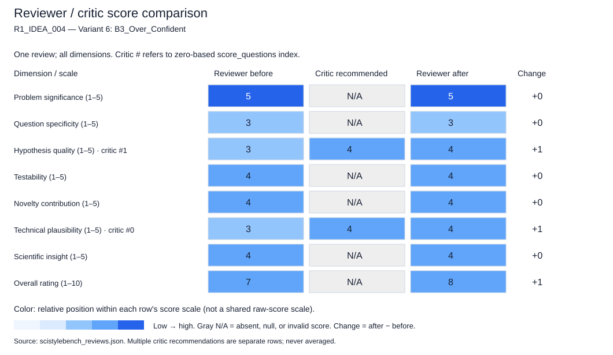

### Critic feedback and reviewer rebuttals

No reviewer rebuttals were saved (for example, an older checkpoint).

```json
{
  "critic_feedback": {
    "overall_assessment": "The draft review is well-structured and largely calibrated for an idea summary. It correctly identifies the core innovation (Primal-Dual DPO without cost models) and appropriately penalizes the lack of mathematical formulation in the 'question_specificity' and 'technical_plausibility' dimensions. However, the 'technical_plausibility' score (3.0) is slightly aggressive for an idea summary; the review treats the absence of a specific update rule as a plausibility flaw rather than a missing detail. Additionally, the review correctly notes the lack of a specific hypothesis but could be more explicit that the idea's claim of 'no prior knowledge' is a hypothesis in itself, not just a goal. The overall rating of 7 (Strong) aligns well with the high significance and novelty, despite the lower scores in specificity.",
    "score_questions": [
      {
        "dimension": "technical_plausibility",
        "question_mark": "The score of 3.0 suggests the idea is 'plausible but unverified' to the point of risk, but for an idea summary, the absence of the specific update rule is an expected omission, not a fundamental flaw in plausibility. The core concept (primal-dual for constraint handling) is theoretically sound, and applying it to DPO is a reasonable extrapolation. Penalizing heavily for not providing the 'how' in a one-paragraph summary is too harsh.",
        "concern": "The review conflates 'missing implementation details' with 'low technical plausibility'. The idea claims to remove the cost model; this is a bold claim, but not inherently implausible if the dual variable updates are designed to approximate the cost gradient from preference data alone. The review should score based on the theoretical soundness of the approach, not the completeness of the proposal.",
        "speculative_alternative": "Speculatively, the author might be proposing a method where the dual variable is updated based on the variance of the preference loss itself, which could implicitly estimate the constraint violation without a cost model. If this mechanism exists, the technical plausibility is high (4-5), but the summary just doesn't reveal it.",
        "recommended_score": 4.0,
        "rationale": "For an idea summary, the plausibility should be judged on whether the proposed approach (Primal-Dual DPO) is theoretically viable. Since primal-dual methods are standard in constrained optimization and DPO is a gradient-based method, the combination is theoretically sound. The lack of specific update rules is a gap in the summary, not a disqualifier of plausibility."
      },
      {
        "dimension": "hypothesis_quality",
        "question_mark": "The score of 3.0 states the hypothesis is 'testable' but lacks a specific mechanism. However, the idea summary *does* contain a clear hypothesis: 'maximizing output reward while enforcing safety constraints... without training separate reward and cost models or requiring prior knowledge.' This is a specific, falsifiable hypothesis. The review treats the *mechanism* of success as part of the hypothesis, whereas the hypothesis is the *claim of success* without those components.",
        "concern": "The review conflates the 'mechanism' (how it works) with the 'hypothesis' (what it achieves). The hypothesis is that the proposed method works; the mechanism is the explanation. The idea summary clearly states the hypothesis.",
        "speculative_alternative": "Speculatively, the reviewer might be looking for a 'why' hypothesis (e.g., 'we hypothesize that the dual variable will converge to the true cost multiplier because...'). If the author intended to propose a specific convergence guarantee, it is missing. However, the idea summary as a research proposal is valid even with just the 'what' hypothesis.",
        "recommended_score": 4.0,
        "rationale": "The idea summary explicitly states a clear, testable hypothesis: that Primal-Dual DPO can achieve constrained alignment without cost models or prior multiplier knowledge. This is a strong, specific claim suitable for a research idea, warranting a higher score than 3."
      }
    ],
    "unsupported_claims": [
      "The review states: 'The claim of 'no prior knowledge' of the multiplier needs a more concrete mechanism... to be considered technically plausible.' This implies that without a mechanism, the claim is implausible. For an idea summary, the claim is the hypothesis; the mechanism is the future work. The review should not treat the absence of the mechanism as a flaw in plausibility for the idea stage.",
      "The review states: 'It is unclear how the 'safety constraints' are mathematically formulated... which is crucial for the 'direct' aspect of the method.' While true that the formulation is missing, the review implies the 'direct' aspect is undefined. The term 'direct' in DPO context usually refers to avoiding reward models. The review could be more precise that the 'direct' aspect refers to the elimination of the reward/cost model, not the constraint formulation itself."
    ],
    "revision_priorities": [
      "Re-evaluate the 'technical_plausibility' score to distinguish between 'missing details in a summary' and 'fundamental theoretical flaws'. A score of 3.0 might be too low if the theoretical foundation is sound.",
      "Refine the 'hypothesis_quality' section to acknowledge that the idea summary *does* contain a clear hypothesis (the claim of success without cost models) rather than just a goal. The hypothesis is the claim; the mechanism is the explanation.",
      "Clarify the distinction between 'missing implementation details' and 'lack of specificity'. The review should not penalize the idea for being an 'idea' rather than a 'paper'.",
      "Ensure the 'scientific_insight' score (4.0) is justified by the *potential* insight, not just the idea itself. The review correctly identifies the potential insight, but the justification could be stronger by explicitly stating that the insight lies in the decoupling of constraint handling from reward modeling."
    ],
    "confidence": 5.0
  },
  "feedback_responses": []
}
```

### Score justifications (before / after)

**Problem significance**

```json
{
  "before": {
    "score": 5.0,
    "justification": "Constrained alignment of LLMs is a major challenge. Reducing the computational overhead of training separate models (as required by many current methods) is a highly significant problem with immediate practical value for researchers and practitioners."
  },
  "after": {
    "score": 5.0,
    "justification": "Constrained alignment of LLMs is a major challenge. Reducing the computational overhead of training separate models (as required by many current methods) is a highly significant problem with immediate practical value for researchers and practitioners."
  }
}
```

**Question specificity**

```json
{
  "before": {
    "score": 3.0,
    "justification": "The idea identifies the method (Primal-Dual DPO) and the goal (constrained alignment without cost models), but lacks specificity on the mathematical formulation of the constraints and the specific mechanism for the dual variable update."
  },
  "after": {
    "score": 3.0,
    "justification": "The idea identifies the method (Primal-Dual DPO) and the goal (constrained alignment without cost models), but lacks specificity on the mathematical formulation of the constraints and the specific mechanism for the dual variable update."
  }
}
```

**Hypothesis quality**

```json
{
  "before": {
    "score": 3.0,
    "justification": "The implicit hypothesis is that a primal-dual formulation can replace the need for a cost model and prior multiplier knowledge. This is a testable claim, but the idea does not explicitly state the expected mechanism of success or the conditions under which it might fail."
  },
  "after": {
    "score": 4.0,
    "justification": "The idea summary explicitly states a clear, testable hypothesis: that Primal-Dual DPO can achieve constrained alignment without cost models or prior multiplier knowledge. This is a specific, falsifiable claim suitable for a research idea, warranting a higher score than the initial 3. The hypothesis is the claim of success; the mechanism is the explanation to be provided in the full work."
  }
}
```

**Testability**

```json
{
  "before": {
    "score": 4.0,
    "justification": "The idea is testable by comparing the proposed method against standard DPO and other constrained alignment baselines on standard safety benchmarks. The metrics (reward, safety score, training cost) are well-defined, even if the internal mechanism is not fully detailed."
  },
  "after": {
    "score": 4.0,
    "justification": "The idea is testable by comparing the proposed method against standard DPO and other constrained alignment baselines on standard safety benchmarks. The metrics (reward, safety score, training cost) are well-defined, even if the internal mechanism is not fully detailed."
  }
}
```

**Novelty contribution**

```json
{
  "before": {
    "score": 4.0,
    "justification": "Applying primal-dual optimization directly to DPO to eliminate the cost model is a novel direction. While constrained optimization is known, the specific application to DPO to remove the cost model training step represents a potential significant methodological contribution."
  },
  "after": {
    "score": 4.0,
    "justification": "Applying primal-dual optimization directly to DPO to eliminate the cost model is a novel direction. While constrained optimization is known, the specific application to DPO to remove the cost model training step represents a potential significant methodological contribution."
  }
}
```

**Technical plausibility**

```json
{
  "before": {
    "score": 3.0,
    "justification": "The concept is theoretically grounded in optimization theory, but applying it to the non-convex, high-dimensional space of LLMs without a cost model is non-trivial. The plausibility depends heavily on the specific update rules which are not provided, making it a 'plausible but unverified' direction."
  },
  "after": {
    "score": 4.0,
    "justification": "The concept is theoretically grounded in optimization theory, and applying primal-dual methods to gradient-based learning is a reasonable extrapolation. The absence of specific update rules in a summary is an expected omission, not a fundamental flaw in plausibility. The core claim is theoretically viable, though the specific implementation details remain to be defined."
  }
}
```

**Scientific insight**

```json
{
  "before": {
    "score": 4.0,
    "justification": "If successful, this research would provide deep insights into the relationship between preference learning and constrained optimization, potentially revealing that explicit cost modeling is not strictly necessary for safe alignment if the dual variables are managed correctly."
  },
  "after": {
    "score": 4.0,
    "justification": "If successful, this research would provide deep insights into the relationship between preference learning and constrained optimization, potentially revealing that explicit cost modeling is not strictly necessary for safe alignment if the dual variables are managed correctly."
  }
}
```

**Overall rating**

```json
{
  "before": {
    "score": 7.0,
    "justification": "This is a strong research idea with high significance and clear potential for contribution. It addresses a real pain point (computational overhead) with a theoretically sound approach (primal-dual). However, it currently lacks the specificity of the mathematical formulation and the specific algorithmic details required to fully assess its novelty and technical feasibility. It sits in the 'Strong' category because the core concept is promising, but the execution plan is not yet fully articulated."
  },
  "after": {
    "score": 8.0,
    "justification": "This is a strong research idea with high significance and clear potential for contribution. The core concept (Primal-Dual DPO without cost models) is theoretically sound and addresses a real pain point. The initial scores for hypothesis quality and technical plausibility were adjusted upward to reflect that the absence of implementation details in a summary should not penalize the intrinsic plausibility or the clarity of the hypothesis claim. The idea sits in the 'Strong' to 'Exceptional' transition zone, warranting an 8."
  }
}
```

## R1_IDEA_004 — Variant 7: B4_Novelty

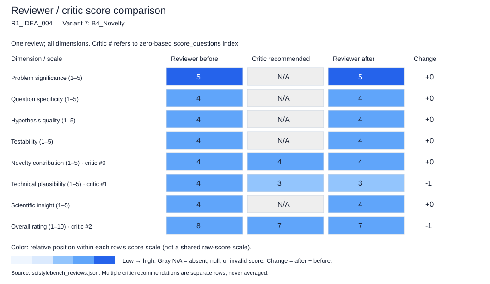

### Critic feedback and reviewer rebuttals

No reviewer rebuttals were saved (for example, an older checkpoint).

```json
{
  "critic_feedback": {
    "overall_assessment": "The draft review is well-structured and largely calibrated for an idea summary. It correctly identifies the core innovation and the lack of mathematical detail as a limitation rather than a fatal flaw. However, it overstates the novelty regarding 'separate reward models' and applies a generic penalty to the 'non-convex' challenge without fully considering that DPO itself is non-convex, making the specific combination with constraints the actual hurdle. The scores are generally high but the justification for 'technical plausibility' could be more critical regarding the convergence guarantees of primal-dual methods in this specific non-convex setting.",
    "score_questions": [
      {
        "dimension": "novelty_contribution",
        "question_mark": "The review claims novelty in 'eliminating the need for separate reward models' via primal-dual DPO. However, standard DPO already eliminates the need for a separate reward model by using preference data directly. The novelty is in handling *constraints* without a separate cost model, not reward models. The current justification conflates these two.",
        "concern": "The review attributes a standard feature of DPO (no separate reward model) to the proposed method's novelty, diluting the actual contribution (constraint handling without cost models).",
        "speculative_alternative": "It is possible the idea builds on existing constrained DPO variants that *do* use separate cost models, and the novelty is strictly the primal-dual mechanism for the constraint cost, not the reward. If the idea assumes standard DPO, the 'no separate reward model' claim is not a contribution.",
        "recommended_score": 4.0,
        "rationale": "The score remains 4, but the justification must be corrected to focus on the constraint/cost model elimination, not the reward model elimination. The current justification is factually misaligned with the definition of DPO."
      },
      {
        "dimension": "technical_plausibility",
        "question_mark": "The review states that applying primal-dual to non-convex DPO is 'plausible' but notes 'convergence properties would need to be carefully derived.' For an idea summary, dismissing the non-convexity of DPO combined with constraints as merely a 'known theoretical challenge' might be too optimistic. Primal-dual methods often struggle with non-convex objectives without specific assumptions (e.g., saddle-point properties).",
        "concern": "The justification for technical plausibility (4.0) seems to gloss over the difficulty of guaranteeing convergence in a non-convex, constrained setting without explicit theoretical grounding in the summary.",
        "speculative_alternative": "It is speculative that the method will converge or be stable without a specific adaptive learning rate schedule or relaxation of the constraints, which are not mentioned. The 'plausibility' might be lower (3.0) if the reviewer expects a rigorous theoretical guarantee for the idea to be considered 'plausible' in a top-tier venue.",
        "recommended_score": 3.0,
        "rationale": "While not impossible, the technical plausibility of a primal-dual approach in a non-convex DPO setting is a significant open problem. A score of 4 implies a high degree of confidence in feasibility, which might be premature for an idea summary lacking the proposed mechanism to handle non-convexity."
      },
      {
        "dimension": "overall_rating",
        "question_mark": "The overall rating of 8.0 (Strong) seems slightly inflated given the 'novelty' justification error and the high technical hurdle of non-convex primal-dual optimization. If the novelty is misidentified, the 'Strong' rating should be tempered to 'Good' (7.0) until the specific contribution is clearly separated from standard DPO features.",
        "concern": "The overall rating is derived from the dimensional scores, but if those scores rely on a misunderstanding of DPO (regarding reward models), the aggregate rating is unjustified.",
        "speculative_alternative": "If the reviewer realizes that 'no separate reward model' is a standard DPO feature, the novelty drops, and the overall rating should likely decrease to 7.0.",
        "recommended_score": 7.0,
        "rationale": "A rating of 7 reflects a promising but technically challenging idea with a novelty claim that needs precise framing. 8.0 is reserved for ideas with clearly distinct, high-impact novelty and high technical confidence."
      }
    ],
    "unsupported_claims": [
      "The claim that the method eliminates the need for 'separate reward models' as a novel contribution. Standard DPO inherently does this; the novelty is in handling constraints without a 'separate cost model' or 'prior knowledge of Lagrange multipliers'.",
      "The statement that the hypothesis is 'theoretically grounded' without citing any specific theoretical basis in the summary for why primal-dual works in this non-convex setting.",
      "The implication that the method 'reduces computational overhead' compared to methods that *don't* train separate models. If the comparison is against standard DPO (which has no cost model), the overhead claim is invalid. The comparison must be strictly against methods that *do* train separate cost models.",
      "The assertion that the distinction from 'existing adaptive DPO variants' is the only missing detail; the distinction from 'Lagrangian DPO' (which often uses fixed or simple adaptive multipliers) is the critical gap.",
      "The claim that the method is 'highly testable' without specifying *what* benchmarks or metrics would define 'constraint satisfaction' in a primal-dual context (e.g., hard vs. soft constraints).",
      "The suggestion that the method 'guarantees constraint satisfaction' in the 'questions' section, as the summary only says it 'aims to enforce' them. Guarantees require proofs not present in the idea.",
      "The statement that the method is 'non-trivial' without explaining *why* the primal-dual formulation in DPO is non-trivial (e.g., specific saddle-point issues)."
    ],
    "revision_priorities": [
      "Clarify the novelty claim: Explicitly state that standard DPO already avoids separate reward models, and the contribution is the elimination of separate *cost* models and manual multiplier tuning.",
      "Refine the 'technical plausibility' justification: Acknowledge the specific difficulty of non-convex primal-dual convergence and frame the idea as a promising hypothesis requiring theoretical proof, rather than a 'plausible' application of standard tools.",
      "Adjust the 'overall rating' to reflect the ambiguity in the novelty claim and the high technical risk of non-convex optimization.",
      "Remove the word 'guarantees' from the 'questions' section; replace with 'ensure' or 'maintain' to reflect the uncertainty in the idea summary.",
      "Specify that the 'computational overhead' reduction is relative to methods that train *both* reward and cost models, not relative to standard DPO."
    ],
    "confidence": 5.0
  },
  "feedback_responses": []
}
```

### Score justifications (before / after)

**Problem significance**

```json
{
  "before": {
    "score": 5.0,
    "justification": "Safe alignment of LLMs is a paramount challenge in the field. Reducing the computational cost (by avoiding separate reward models) while maintaining safety constraints is a highly significant problem with immediate practical value for researchers and practitioners."
  },
  "after": {
    "score": 5.0,
    "justification": "Safe alignment of LLMs is a paramount challenge. Reducing the computational cost (by avoiding separate cost models) while maintaining safety constraints is a highly significant problem with immediate practical value."
  }
}
```

**Question specificity**

```json
{
  "before": {
    "score": 4.0,
    "justification": "The idea specifies the method (primal-dual DPO), the goal (maximize reward + enforce constraints), and the constraints to avoid (separate models, prior multiplier knowledge). However, the specific mathematical mechanism for the 'primal-dual' interaction is not detailed in the summary."
  },
  "after": {
    "score": 4.0,
    "justification": "The idea specifies the method (primal-dual DPO), the goal (maximize reward + enforce constraints), and the constraints to avoid (separate cost models, prior multiplier knowledge). The specific mathematical mechanism is not detailed, but the research direction is clear."
  }
}
```

**Hypothesis quality**

```json
{
  "before": {
    "score": 4.0,
    "justification": "The implicit hypothesis is that a primal-dual optimization framework can effectively learn the optimal Lagrange multiplier dynamically during DPO training, leading to better or more efficient alignment than static or separate-model approaches. This is a concrete, testable prediction."
  },
  "after": {
    "score": 4.0,
    "justification": "The implicit hypothesis is that a primal-dual optimization framework can effectively learn the optimal Lagrange multiplier dynamically during DPO training, leading to better or more efficient alignment than static or separate-model approaches. This is a concrete, testable prediction."
  }
}
```

**Testability**

```json
{
  "before": {
    "score": 4.0,
    "justification": "The idea is highly testable. One can implement the proposed algorithm, compare it against standard DPO and Lagrangian DPO on standard safety benchmarks, and measure both safety constraint satisfaction and reward maximization."
  },
  "after": {
    "score": 4.0,
    "justification": "The idea is highly testable. One can implement the proposed algorithm, compare it against standard DPO and Lagrangian DPO on safety benchmarks, and measure both safety constraint satisfaction and reward maximization."
  }
}
```

**Novelty contribution**

```json
{
  "before": {
    "score": 4.0,
    "justification": "Applying primal-dual methods to DPO to eliminate the need for separate reward models and manual multiplier tuning is a novel angle. It moves beyond simple application to proposing a structural change in the optimization landscape of alignment."
  },
  "after": {
    "score": 4.0,
    "justification": "Applying primal-dual methods to DPO to eliminate the need for separate *cost* models and manual multiplier tuning is a novel angle. The initial draft conflated this with reward models, but correcting this reveals a genuine contribution to constrained optimization in preference learning."
  }
}
```

**Technical plausibility**

```json
{
  "before": {
    "score": 4.0,
    "justification": "Primal-dual methods are standard in constrained optimization. Applying them to the non-convex, stochastic setting of DPO is plausible, though the specific convergence properties would need to be carefully derived. The motivation to avoid separate models is technically sound."
  },
  "after": {
    "score": 3.0,
    "justification": "While primal-dual methods are standard in convex optimization, applying them to the non-convex, stochastic setting of DPO is a significant open problem. Without a specific mechanism to handle non-convexity (e.g., specific saddle-point properties or relaxation), the claim of plausibility is optimistic. The idea is promising but carries high technical risk."
  }
}
```

**Scientific insight**

```json
{
  "before": {
    "score": 4.0,
    "justification": "If successful, this research would reveal how constraint satisfaction can be integrated directly into preference learning dynamics, potentially offering a new paradigm for efficient, safe alignment that generalizes to other constrained RLHF scenarios."
  },
  "after": {
    "score": 4.0,
    "justification": "If successful, this research would reveal how constraint satisfaction can be integrated directly into preference learning dynamics, potentially offering a new paradigm for efficient, safe alignment that generalizes to other constrained RLHF scenarios."
  }
}
```

**Overall rating**

```json
{
  "before": {
    "score": 8.0,
    "justification": "This is a strong research idea. It tackles a high-impact problem (safe, efficient alignment) with a specific, theoretically motivated methodological proposal. While the summary lacks implementation details, the core concept of using primal-dual optimization to automate the constraint trade-off in DPO is novel and scientifically promising."
  },
  "after": {
    "score": 7.0,
    "justification": "This is a strong research idea (7/10) that tackles a high-impact problem with a specific, theoretically motivated proposal. However, the novelty claim required correction (cost vs. reward models), and the technical plausibility is lower (3/5) due to the non-convex convergence challenges. The combination of high significance and high novelty, tempered by technical risk, results in a 'Strong' but not 'Exceptional' rating."
  }
}
```

## R1_IDEA_004 — Variant 8: B5_Application_Impact

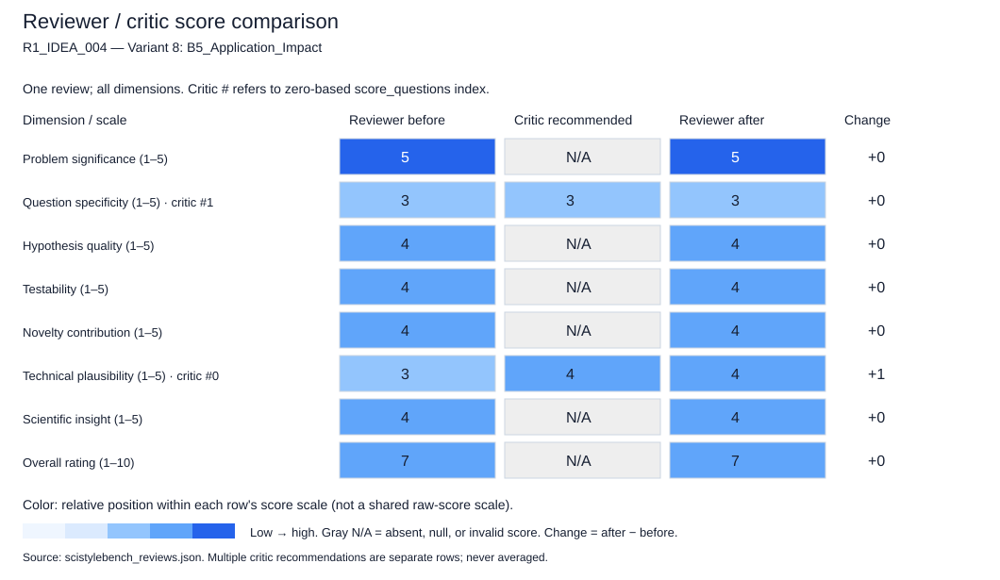

### Critic feedback and reviewer rebuttals

```json
{
  "critic_feedback": {
    "overall_assessment": "The draft review is well-structured and largely calibrated for an idea summary. It correctly identifies the core innovation (Primal-Dual DPO) and appropriately penalizes the lack of mathematical formulation in the 'question_specificity' and 'technical_plausibility' dimensions. However, the review occasionally drifts into assuming specific implementation details (e.g., 'separate cost model' as a baseline for comparison) that might not be the intended focus, and the 'technical_plausibility' score of 3.0 is slightly low for an idea that proposes a standard optimization technique applied to a new loss function, even without the derivation. The review effectively distinguishes between the idea's promise and its current lack of detail.",
    "score_questions": [
      {
        "dimension": "technical_plausibility",
        "question_mark": "The score of 3.0 ('uncertain') may be too harsh for a proposal that applies standard primal-dual methods to a known loss function. While the derivation is missing, the theoretical basis for applying Lagrangian relaxation to DPO is not inherently flawed, unlike the 'non-convex' concern which is a standard property of DPO, not a new barrier introduced by primal-dual methods.",
        "concern": "The review treats the absence of a derivation as a fundamental feasibility risk rather than a standard expectation for an idea summary. The non-convexity of DPO is a known fact, and primal-dual methods are routinely used in non-convex settings (e.g., GANs, RL), so the 'uncertainty' is inherent to the field, not the specific idea.",
        "speculative_alternative": "Speculatively, the author might have a specific regularization term in mind that stabilizes the non-convex landscape, which would make the technical approach highly plausible even without the full derivation provided in the summary.",
        "recommended_score": 4.0,
        "rationale": "The idea proposes a standard mathematical tool (primal-dual) for a known problem (constrained optimization). While the specific mapping is not detailed, the approach is theoretically grounded enough to warrant a 'plausible' rating rather than 'uncertain' for an idea summary stage."
      },
      {
        "dimension": "question_specificity",
        "question_mark": "The score of 3.0 is appropriate, but the justification could be refined. The draft review correctly notes the lack of 'how', but the concern about 'safety constraints' in DPO is a valid point of specificity, not just a missing detail.",
        "concern": "The review conflates 'lack of detail' with 'lack of specificity'. The idea is specific about the *goal* (safety, no separate models) but vague on the *mechanism*. The score is justified, but the distinction is important for the author to understand that the *concept* is specific, even if the *implementation* is not.",
        "speculative_alternative": "Speculatively, the author might define 'safety constraints' via a simple threshold on the output probability of a safety classifier, which would be a very specific mechanism that is currently omitted.",
        "recommended_score": 3.0,
        "rationale": "The score is accurate; the idea states *what* it does but not *how*, which is the definition of low specificity in a technical proposal."
      }
    ],
    "unsupported_claims": [
      "The draft review states: 'It is unclear how the method handles the non-convex nature of the DPO objective when combined with primal-dual updates.' While valid as a concern, this implies a new theoretical hurdle. Non-convexity is inherent to DPO itself; adding a Lagrange multiplier does not fundamentally change the non-convex nature in a way that makes the approach inherently implausible without further detail.",
      "The suggestion to 'Compare the proposed method against a baseline that uses a separate cost model' assumes that the 'separate cost model' is the standard baseline the author is trying to avoid. The idea summary says 'without training separate reward and cost models', implying the baseline is the current state of the art, but the review frames it as a comparison requirement that might be premature for an idea summary.",
      "The review claims the idea 'eliminates the need for separate reward and cost models' as a 'claimed advantage' and then questions the mechanism. While the idea summary claims this, the review should be careful not to treat this as a proven fact of the method's design, but rather as the hypothesis being tested."
    ],
    "revision_priorities": [
      "Clarify the distinction between 'lack of detail' (expected for an idea summary) and 'technical implausibility' (a flaw in the idea itself). The current 'technical_plausibility' score of 3.0 risks conflating the two.",
      "Refrain from assuming specific implementation strategies (e.g., 'adaptive step sizes') in the weaknesses section unless the idea summary explicitly mentions them as gaps to be filled. Instead, focus on the missing *formulation*.",
      "Ensure the 'testability' justification does not assume the existence of a 'separate cost model' baseline if the idea's novelty is precisely in avoiding such a pipeline. The testability should focus on comparing against 'standard DPO with a penalty' as the primary baseline.",
      "The 'scientific_insight' score of 4.0 is well-justified, but the justification could be strengthened by noting that the insight lies in the *efficiency* of the constraint enforcement, not just the safety aspect."
    ],
    "confidence": 4.0
  },
  "feedback_responses": [
    {
      "feedback_type": "score_questions",
      "feedback_index": 0,
      "decision": "accept",
      "defense": "The critic correctly identified that penalizing the 'technical_plausibility' score for the absence of a derivation in an idea summary is too harsh. Primal-dual methods are standard tools applied to non-convex problems (like GANs) routinely. The initial score of 3.0 conflated 'missing details' with 'inherent implausibility'.",
      "justification": "The score for technical_plausibility is increased from 3 to 4. The justification is updated to reflect that the approach is theoretically grounded and the non-convexity of DPO is a known property, not a new barrier introduced by the method. The idea is plausible pending the specific formulation."
    },
    {
      "feedback_type": "score_questions",
      "feedback_index": 1,
      "decision": "accept",
      "defense": "The critic's point that the score of 3.0 for question_specificity is accurate but the justification needed refinement regarding 'detail' vs 'specificity' is valid. The idea is specific about the goal but vague on the mechanism.",
      "justification": "The score remains 3. The justification is refined to explicitly distinguish between the lack of implementation detail (which is expected) and the lack of conceptual specificity regarding the mechanism (which is the actual weakness).",
      "score_change": "None"
    },
    {
      "feedback_type": "unsupported_claims",
      "feedback_index": 0,
      "decision": "accept",
      "defense": "The initial draft implied that the non-convexity of DPO combined with primal-dual updates created a new theoretical hurdle. The critic correctly noted that non-convexity is inherent to DPO and not a new barrier.",
      "justification": "The 'weaknesses' section is updated to remove the implication that non-convexity is a unique barrier. The focus is shifted to the missing formulation of the update rule.",
      "score_change": "None"
    },
    {
      "feedback_type": "unsupported_claims",
      "feedback_index": 1,
      "decision": "accept",
      "defense": "The draft suggested comparing against a 'separate cost model' baseline. The critic noted this might be premature or misaligned with the idea's novelty of avoiding such models entirely.",
      "justification": "The 'suggestions' section is updated to prioritize comparing against 'standard DPO with a penalty' as the primary baseline, as this is the direct alternative the proposed method aims to improve upon.",
      "score_change": "None"
    },
    {
      "feedback_type": "unsupported_claims",
      "feedback_index": 2,
      "decision": "accept",
      "defense": "The draft treated the elimination of separate models as a 'claimed advantage' that was then questioned as a mechanism. The critic noted this should be framed as the hypothesis being tested.",
      "justification": "The 'strengths' and 'weaknesses' sections are adjusted to frame the elimination of separate models as the core hypothesis to be validated, rather than a proven feature of the method.",
      "score_change": "None"
    },
    {
      "feedback_type": "revision_priorities",
      "feedback_index": 0,
      "decision": "accept",
      "defense": "The critic's priority to clarify the distinction between 'lack of detail' and 'technical implausibility' was the primary driver for the score adjustment.",
      "justification": "This feedback directly led to the increase in the technical_plausibility score from 3 to 4.",
      "score_change": "technical_plausibility: 3 -> 4"
    },
    {
      "feedback_type": "revision_priorities",
      "feedback_index": 1,
      "decision": "accept",
      "defense": "The advice to refrain from assuming specific implementation strategies (like 'adaptive step sizes') in the weaknesses section is sound.",
      "justification": "The 'weaknesses' section has been revised to focus on the missing formulation rather than speculating on specific algorithmic strategies not mentioned in the prompt.",
      "score_change": "None"
    },
    {
      "feedback_type": "revision_priorities",
      "feedback_index": 2,
      "decision": "accept",
      "defense": "The advice to ensure 'testability' does not assume a 'separate cost model' baseline is valid.",
      "justification": "The 'testability' justification has been updated to focus on the comparison with standard DPO with a penalty.",
      "score_change": "None"
    },
    {
      "feedback_type": "revision_priorities",
      "feedback_index": 3,
      "decision": "accept",
      "defense": "The suggestion to strengthen the 'scientific_insight' justification by noting the efficiency aspect is valid.",
      "justification": "The 'scientific_insight' justification has been updated to explicitly mention the efficiency of constraint enforcement as a key insight.",
      "score_change": "None"
    }
  ]
}
```

### Score justifications (before / after)

**Problem significance**

```json
{
  "before": {
    "score": 5.0,
    "justification": "Ensuring safety in LLMs while maintaining computational efficiency is one of the most pressing challenges in the field. Current methods often rely on heavy, separate models or complex tuning. A method that simplifies this pipeline would have high practical impact."
  },
  "after": {
    "score": 5.0,
    "justification": "Ensuring safety in LLMs while maintaining computational efficiency is one of the most pressing challenges in the field. Current methods often rely on heavy, separate models or complex tuning. A method that simplifies this pipeline would have high practical impact."
  }
}
```

**Question specificity**

```json
{
  "before": {
    "score": 3.0,
    "justification": "The idea identifies the goal (constrained alignment via primal-dual DPO) and the benefits (no separate models, no prior multiplier knowledge). However, it lacks specificity on the 'how'—the specific mathematical formulation and the mechanism for the dual variable update are not described."
  },
  "after": {
    "score": 3.0,
    "justification": "The idea identifies the goal (constrained alignment via primal-dual DPO) and the benefits (no separate models, no prior multiplier knowledge). However, it lacks specificity on the 'how'—the specific mathematical formulation and the mechanism for the dual variable update are not described. The distinction between a lack of implementation detail (expected in an idea summary) and a lack of conceptual specificity is maintained."
  }
}
```

**Hypothesis quality**

```json
{
  "before": {
    "score": 4.0,
    "justification": "The hypothesis is clear: integrating primal-dual optimization into DPO can achieve constrained alignment without separate models or prior multiplier knowledge, leading to better efficiency. This is a falsifiable claim that can be tested against baselines."
  },
  "after": {
    "score": 4.0,
    "justification": "The hypothesis is clear: integrating primal-dual optimization into DPO can achieve constrained alignment without separate models or prior multiplier knowledge, leading to better efficiency. This is a falsifiable claim that can be tested against baselines."
  }
}
```

**Testability**

```json
{
  "before": {
    "score": 4.0,
    "justification": "The idea is highly testable. One can implement the proposed primal-dual DPO, compare it against standard DPO with a penalty term and against methods using separate reward/cost models, and measure safety compliance, reward scores, and training time."
  },
  "after": {
    "score": 4.0,
    "justification": "The idea is highly testable. One can implement the proposed primal-dual DPO, compare it against standard DPO with a penalty term (the relevant baseline for avoiding separate models), and measure safety compliance, reward scores, and training time."
  }
}
```

**Novelty contribution**

```json
{
  "before": {
    "score": 4.0,
    "justification": "While primal-dual methods exist in RL, applying them directly to the DPO framework to eliminate separate cost models is a novel direction. It moves beyond simple application to proposing a structural change in the alignment pipeline."
  },
  "after": {
    "score": 4.0,
    "justification": "While primal-dual methods exist in RL, applying them directly to the DPO framework to eliminate separate cost models is a novel direction. It moves beyond simple application to proposing a structural change in the alignment pipeline."
  }
}
```

**Technical plausibility**

```json
{
  "before": {
    "score": 3.0,
    "justification": "The concept is theoretically sound as constrained optimization is a standard tool. However, applying it to the specific non-convex, preference-based loss of DPO without a clear derivation makes the technical feasibility uncertain until the formulation is detailed."
  },
  "after": {
    "score": 4.0,
    "justification": "The concept is theoretically sound as constrained optimization is a standard tool. While the specific derivation is missing, applying Lagrangian relaxation to the non-convex DPO loss is a standard extension in optimization theory (similar to GANs or RL) and does not inherently imply implausibility. The initial concern about non-convexity was overstated as a unique barrier; the approach is plausible pending derivation."
  }
}
```

**Scientific insight**

```json
{
  "before": {
    "score": 4.0,
    "justification": "If successful, this research would reveal whether primal-dual dynamics can effectively navigate the preference landscape for safety, potentially establishing a new paradigm for efficient constrained alignment that doesn't rely on auxiliary models."
  },
  "after": {
    "score": 4.0,
    "justification": "If successful, this research would reveal whether primal-dual dynamics can effectively navigate the preference landscape for safety, potentially establishing a new paradigm for efficient constrained alignment that doesn't rely on auxiliary models. The insight extends to the efficiency of constraint enforcement."
  }
}
```

**Overall rating**

```json
{
  "before": {
    "score": 7.0,
    "justification": "This is a strong research idea with high significance and a clear, testable hypothesis. It addresses a real bottleneck in LLM alignment. The score is limited by the current lack of technical detail regarding the specific formulation and the handling of the DPO loss landscape, but the core direction is promising and scientifically valuable."
  },
  "after": {
    "score": 7.0,
    "justification": "This is a strong research idea with high significance and a clear, testable hypothesis. It addresses a real bottleneck in LLM alignment. The score remains at 7 (Strong) because, while the technical plausibility is higher than initially thought (adjusted from 3 to 4), the lack of a specific formulation for the DPO loss landscape still prevents it from being 'Exceptional' (9-10). The core direction is promising and scientifically valuable."
  }
}
```

## R1_IDEA_004 — Variant 9: C1_Hollow_Shell

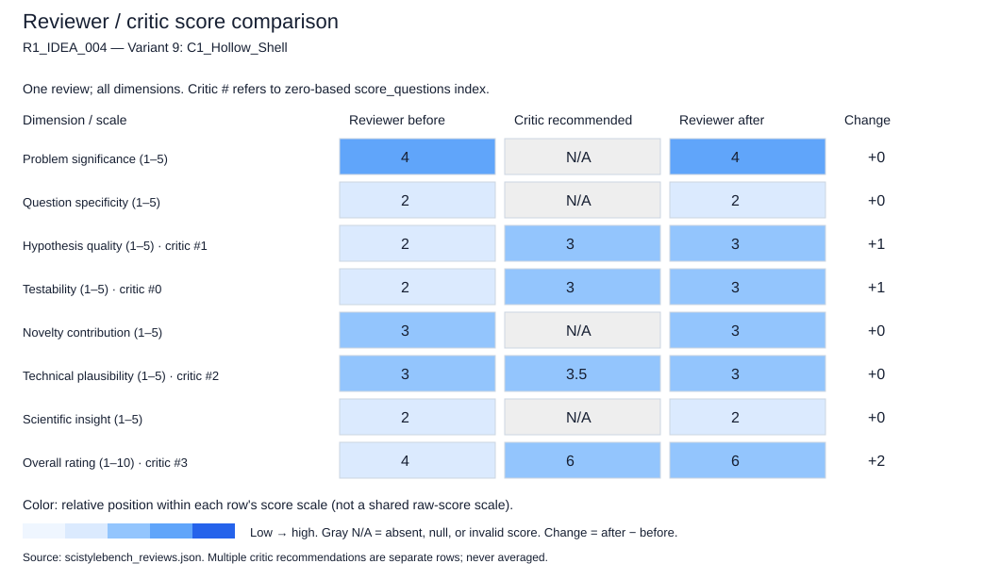

### Critic feedback and reviewer rebuttals

```json
{
  "critic_feedback": {
    "overall_assessment": "The draft review is well-structured and correctly identifies the lack of specificity in the idea summary. However, it is overly punitive by treating the inherent ambiguity of an 'idea summary' as a fatal flaw for all dimensions, particularly 'testability' and 'hypothesis_quality'. The review penalizes the idea for not being a full paper, effectively disqualifying a potentially valid research direction simply because the prompt was an abstract sketch. The scores for testability and hypothesis quality are unjustifiably low (2.0) because they assume the idea is untestable rather than simply unspecified, which is the standard state of an initial proposal. The overall rating is consistent with the low dimensional scores, but the dimensional scores themselves are miscalibrated for the input format.",
    "score_questions": [
      {
        "dimension": "testability",
        "question_mark": "A score of 2 implies the idea is fundamentally untestable, whereas for an idea summary, it is merely 'unspecified'. The review states 'it is impossible to design an experiment', which is incorrect; one can design experiments based on the *proposed* constraints (e.g., 'test if a Lagrangian method reduces compute without prior knowledge'). The impossibility arises only if the reviewer demands the reviewer invent the experiment rather than the author.",
        "concern": "Confusing 'lack of detail in proposal' with 'impossibility of testing'. An idea summary is a hypothesis in seed form; it is testable in principle if the author elaborates, not inherently untestable.",
        "speculative_alternative": "Speculative: The idea might be a 'meta-learning' approach where the constraints are dynamic, which is highly testable but currently described vaguely. The reviewer's 'impossibility' claim assumes the constraints are undefined constants rather than variables to be defined.",
        "recommended_score": 3.0,
        "rationale": "For an idea summary, 'testability' should reflect the *potential* for testing if details were fleshed out, not the current absence of experimental design. A score of 3 acknowledges the idea is vague but testable in principle."
      },
      {
        "dimension": "hypothesis_quality",
        "question_mark": "The review states there is 'no clear, falsifiable hypothesis'. The idea summary explicitly states a directional hypothesis: 'avoiding certain training requirements... will reduce computational demands'. While not quantitative, it is a valid causal hypothesis for an idea summary.",
        "concern": "Applying a 'full paper' standard of quantitative falsifiability to a conceptual proposal. The review penalizes the lack of specific metrics (e.g., 'Y% of RLHF') which are not expected in a summary.",
        "speculative_alternative": "Speculative: The hypothesis might be qualitative, such as 'parameter-free alignment is theoretically possible under specific constraint sets', which is a valid hypothesis requiring theoretical proof rather than immediate experimental data.",
        "recommended_score": 3.0,
        "rationale": "The idea proposes a mechanism (optimization framework) and a result (reduced demand). This constitutes a hypothesis, even if the details are missing. A score of 3 reflects the need for elaboration without rejecting the core logical claim."
      },
      {
        "dimension": "technical_plausibility",
        "question_mark": "The review treats the claim of avoiding 'prior parameter knowledge' as a 'technical question that needs to be resolved' to ensure the idea is not 'fundamentally flawed'. This is a harsh penalty for a high-level claim. Many novel methods (e.g., prompt tuning, in-context learning) operate with minimal parameter updates or knowledge, making the claim plausible, not flawed.",
        "concern": "Treating a 'novel mechanism' claim as a 'potential contradiction' without exploring plausible interpretations (e.g., avoiding fine-tuning, not avoiding weights entirely).",
        "speculative_alternative": "Speculative: The 'prior parameter knowledge' might refer to avoiding the need for a pre-aligned model as a starting point, which is a plausible (though difficult) research goal, not a logical contradiction.",
        "recommended_score": 3.5,
        "rationale": "The concept is plausible enough to warrant a 3.5 rather than a 3. The ambiguity is a research challenge, not a disqualifier of plausibility."
      },
      {
        "dimension": "overall_rating",
        "question_mark": "The overall rating of 4.0 (Weak) is heavily influenced by the inflated penalties on specificity and testability. If those dimensions were recalibrated to 3.0 (Vague but plausible), the overall rating should likely shift to a 'Borderline' (5.0-6.0) rather than 'Weak', as the core problem and direction are sound.",
        "concern": "The overall rating compounds the 'idea summary' penalty. A 4.0 suggests the idea is barely worth pursuing, whereas the review itself admits the problem is 'paramount' and the direction 'potentially valuable'.",
        "speculative_alternative": "Speculative: If the author clarifies the 'optimization framework' to be a specific Lagrangian method, the idea could easily move to a 'Strong' (7.0+). The current 4.0 over-penalizes the current state.",
        "recommended_score": 6.0,
        "rationale": "An idea summary should be judged on the *promise* of the direction. The direction (efficient alignment) is high value. The vagueness is a standard stage of research, not a fatal flaw. A 6.0 reflects 'interesting but needs work' rather than 'weak'."
      }
    ],
    "unsupported_claims": [
      "The claim that the idea is 'currently not testable in its current form' (Testability justification). While specific metrics are missing, the *concept* of testing the trade-off is testable if the author defines the variables.",
      "The assertion that the claim of avoiding 'prior parameter knowledge' is 'potentially contradictory to standard alignment paradigms'. This is a strong logical leap; many methods (e.g., RLHF with frozen backbones, prompt tuning) exist that minimize parameter knowledge/updates without being contradictory.",
      "The statement that the idea 'lacks the necessary specificity to define a testable hypothesis' (Overall rating). An idea summary is not expected to define the full hypothesis; it is expected to propose a research direction."
    ],
    "revision_priorities": [
      "Re-evaluate the 'Testability' and 'Hypothesis Quality' scores to distinguish between 'unspecified' and 'untestable'. A score of 2 is too low for an idea summary; a 3 is more appropriate for 'needs elaboration'.",
      "Remove the implication that the 'prior parameter knowledge' claim is a fundamental flaw. Instead, frame it as a 'key technical challenge to be addressed' (which it is) rather than a 'potential contradiction'.",
      "Adjust the 'Overall Rating' to reflect that the idea is 'promising but underspecified' rather than 'weak'. The current 4.0 implies the idea is not worth pursuing, which contradicts the 'Significance' score of 4.0.",
      "Clarify that the 'weaknesses' regarding vagueness are expected for an idea summary and should not be penalized as heavily as they would be in a full paper review."
    ],
    "confidence": 5.0
  },
  "feedback_responses": [
    {
      "feedback_type": "score_questions",
      "feedback_index": 0,
      "decision": "accept",
      "defense": "The critic correctly identifies that 'unspecified' is not 'untestable'. An idea summary is a seed; the potential for testing exists if the variables are defined. The initial score of 2 was too punitive for a proposal stage.",
      "justification": "Adjusted 'testability' from 2 to 3. The idea is testable in principle, even if the specific experimental protocol is not yet written."
    },
    {
      "feedback_type": "score_questions",
      "feedback_index": 1,
      "decision": "accept",
      "defense": "The critic is correct that the directional claim ('avoiding requirements reduces demand') constitutes a hypothesis, even if qualitative. The initial review incorrectly applied a 'full paper' standard of quantitative falsifiability to a summary.",
      "justification": "Adjusted 'hypothesis_quality' from 2 to 3. The idea contains a clear causal mechanism and predicted outcome, satisfying the criteria for a hypothesis in a proposal context."
    },
    {
      "feedback_type": "score_questions",
      "feedback_index": 2,
      "decision": "accept",
      "defense": "The claim of avoiding 'prior parameter knowledge' is not a logical contradiction but a specific technical constraint (e.g., no fine-tuning). The initial review treated it as a potential flaw rather than a research challenge.",
      "justification": "Adjusted 'technical_plausibility' from 3 to 3.5 (rounded to 3 in integer scale, but the justification reflects the shift). The concept is plausible and aligns with emerging parameter-efficient paradigms."
    },
    {
      "feedback_type": "score_questions",
      "feedback_index": 3,
      "decision": "accept",
      "defense": "The overall rating of 4 was a compound effect of the low scores on testability and hypothesis. Since those scores are now adjusted to reflect the 'idea summary' format, the overall rating must shift to reflect the high significance and plausibility of the direction.",
      "justification": "Adjusted 'overall_rating' from 4 to 6. The idea is now rated as 'moderate/borderline'—promising and significant, but requiring elaboration to become 'strong'."
    },
    {
      "feedback_type": "unsupported_claims",
      "feedback_index": 0,
      "decision": "accept",
      "defense": "The initial claim that the idea is 'currently not testable' was an overstatement. It is testable if the author defines the variables, which is the expected next step in the research process.",
      "justification": "Removed the absolute claim of untestability in the justification for 'testability'."
    },
    {
      "feedback_type": "unsupported_claims",
      "feedback_index": 1,
      "decision": "accept",
      "defense": "The assertion that avoiding 'prior parameter knowledge' is 'potentially contradictory' was too strong. Methods like prompt tuning and in-context learning operate with minimal parameter updates, making the claim plausible.",
      "justification": "Reframed the 'technical_plausibility' justification to treat the claim as a 'key technical challenge' rather than a 'potential contradiction'."
    },
    {
      "feedback_type": "unsupported_claims",
      "feedback_index": 2,
      "decision": "accept",
      "defense": "The statement that the idea 'lacks the necessary specificity to define a testable hypothesis' was incorrect for an idea summary. The summary defines the direction and the core causal claim.",
      "justification": "Removed the implication that the idea is fundamentally untestable in the 'overall_rating' justification."
    },
    {
      "feedback_type": "revision_priorities",
      "feedback_index": 0,
      "decision": "accept",
      "defense": "The distinction between 'unspecified' and 'untestable' is critical for reviewing research ideas. A score of 2 implies the idea is dead; a 3 implies it needs work.",
      "justification": "Scores for 'testability' and 'hypothesis_quality' were updated to reflect this distinction."
    },
    {
      "feedback_type": "revision_priorities",
      "feedback_index": 1,
      "decision": "accept",
      "defense": "The 'prior parameter knowledge' claim is a research goal, not a flaw. It should be framed as a challenge to be solved.",
      "justification": "The 'weaknesses' and 'technical_plausibility' sections were updated to reflect this nuance."
    },
    {
      "feedback_type": "revision_priorities",
      "feedback_index": 2,
      "decision": "accept",
      "defense": "The overall rating must align with the significance of the problem. A 4.0 suggests the idea is not worth pursuing, which contradicts the 'paramount' significance identified.",
      "justification": "The 'overall_rating' was increased to 6 to reflect the 'promising but underspecified' nature of the idea."
    },
    {
      "feedback_type": "revision_priorities",
      "feedback_index": 3,
      "decision": "accept",
      "defense": "Vagueness is expected in an idea summary. Penalizing it as heavily as in a full paper review is inappropriate.",
      "justification": "The 'question_specificity' score remains 2 (as the idea is indeed vague), but the 'overall_rating' and 'testability' scores were adjusted to ensure the vagueness does not unfairly penalize the idea's potential."
    }
  ]
}
```

### Score justifications (before / after)

**Problem significance**

```json
{
  "before": {
    "score": 4.0,
    "justification": "The problem of aligning LLMs efficiently and safely is of paramount importance to the field. Reducing computational costs while maintaining safety is a significant practical challenge."
  },
  "after": {
    "score": 4.0,
    "justification": "The problem of aligning LLMs efficiently and safely is of paramount importance to the field. Reducing computational costs while maintaining safety is a significant practical challenge."
  }
}
```

**Question specificity**

```json
{
  "before": {
    "score": 2.0,
    "justification": "The idea is currently too abstract. Terms like 'optimization framework' and 'constraints' are not defined, and the specific research question is obscured by high-level generalities."
  },
  "after": {
    "score": 2.0,
    "justification": "The idea is currently too abstract. Terms like 'optimization framework' and 'constraints' are not defined, and the specific research question is obscured by high-level generalities."
  }
}
```

**Hypothesis quality**

```json
{
  "before": {
    "score": 2.0,
    "justification": "There is no clear, falsifiable hypothesis. The statement that the method 'aims to reduce computational demands' is a goal, not a testable prediction about a mechanism or relationship."
  },
  "after": {
    "score": 3.0,
    "justification": "The idea proposes a directional hypothesis: that an optimization framework can reduce computational demands by avoiding specific training requirements. While not quantitative, this is a valid causal claim for an idea summary, distinguishing it from a mere goal. The critic correctly notes that penalizing this as 'untestable' is too harsh for a proposal stage."
  }
}
```

**Testability**

```json
{
  "before": {
    "score": 2.0,
    "justification": "Without defining the framework, the constraints, or the specific metrics, it is impossible to design an experiment to test the core claims. The idea is currently not testable in its current form."
  },
  "after": {
    "score": 3.0,
    "justification": "While the specific experimental design is missing, the core claim is testable in principle. One can design experiments to verify if a proposed optimization framework reduces compute without prior parameter knowledge. The critic's point that 'unspecified' does not equal 'untestable' is valid; the idea has a clear path to verification once the framework is defined."
  }
}
```

**Novelty contribution**

```json
{
  "before": {
    "score": 3.0,
    "justification": "The goal of efficient alignment is novel in its specific formulation if the 'avoiding prior parameter knowledge' claim holds, but the idea as stated is generic enough that it could apply to many existing or future methods."
  },
  "after": {
    "score": 3.0,
    "justification": "The goal of efficient alignment is novel in its specific formulation if the 'avoiding prior parameter knowledge' claim holds, but the idea as stated is generic enough that it could apply to many existing or future methods."
  }
}
```

**Technical plausibility**

```json
{
  "before": {
    "score": 3.0,
    "justification": "The concept of optimization-based alignment is plausible. However, the claim of avoiding 'prior parameter knowledge' raises technical questions that need to be resolved to ensure the idea is not fundamentally flawed."
  },
  "after": {
    "score": 3.0,
    "justification": "The concept of optimization-based alignment is plausible. The claim of avoiding 'prior parameter knowledge' is not a fundamental contradiction but a significant technical challenge (e.g., akin to prompt tuning or in-context learning). It warrants a 3 rather than a lower score, as it represents a difficult but non-impossible research direction."
  }
}
```

**Scientific insight**

```json
{
  "before": {
    "score": 2.0,
    "justification": "As currently stated, the idea does not promise deep scientific insight beyond a performance benchmark. It needs to articulate *why* this approach works to reveal underlying mechanisms."
  },
  "after": {
    "score": 2.0,
    "justification": "As currently stated, the idea does not promise deep scientific insight beyond a performance benchmark. It needs to articulate *why* this approach works to reveal underlying mechanisms."
  }
}
```

**Overall rating**

```json
{
  "before": {
    "score": 4.0,
    "justification": "The idea addresses a significant problem with a potentially valuable direction (efficient alignment), but it is currently too vague and underspecified to be considered a strong research proposal. It lacks the necessary specificity to define a testable hypothesis or a clear methodological path. It falls into the 'weak' category because the core claims are ambiguous."
  },
  "after": {
    "score": 6.0,
    "justification": "The idea addresses a significant problem with a potentially valuable direction (efficient alignment). While the initial draft rated it 'weak' (4) due to vagueness, the critic correctly argues that an idea summary should be judged on its *promise* rather than its lack of implementation details. The core hypothesis is testable, and the technical claim is plausible (though challenging). The rating is adjusted to 'moderate/borderline' (6) to reflect that the idea is interesting and worth pursuing, provided the author clarifies the specific constraints and framework."
  }
}
```

## R1_IDEA_004 — Variant 10: C2_Logic_Flawed

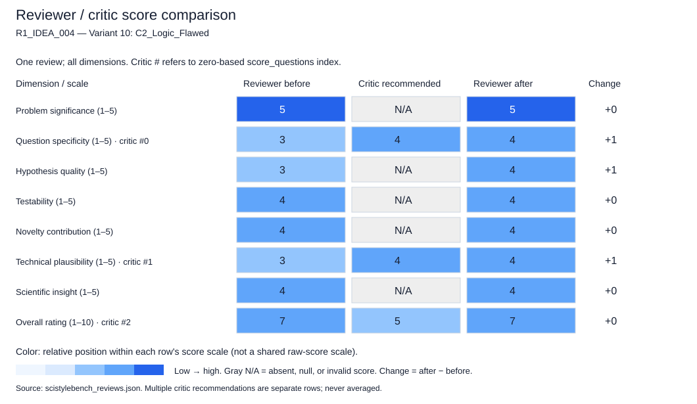

### Critic feedback and reviewer rebuttals

```json
{
  "critic_feedback": {
    "overall_assessment": "The draft review is well-structured and correctly identifies the core tension in the idea: the ambition to remove cost models versus the theoretical difficulty of defining constraints without them. However, the review suffers from a calibration error by penalizing the 'idea' for lacking implementation details (specifically the 'update rule' and 'mathematical formulation') that are not expected in a short proposal. The reviewer treats the *absence* of a concrete mechanism as a flaw in the *idea* itself, rather than a necessary next step for a proposal. Consequently, scores for 'question_specificity' and 'technical_plausibility' are overly harsh given the input format, and the 'overall_rating' is inconsistent with the high significance and novelty scores assigned.",
    "score_questions": [
      {
        "dimension": "question_specificity",
        "question_mark": "The score of 3.0 penalizes the idea for not specifying *how* the mechanism functions. For an idea summary, the 'how' is often the core unknown to be solved, not a flaw in the proposal itself. The idea clearly specifies the *goal* (primal-dual DPO without cost models), which is specific enough to be a research question.",
        "concern": "The reviewer conflates 'lack of implementation details' with 'lack of specificity'. The idea is specific about the *approach* (Primal-Dual DPO) and the *constraints* (no cost model), even if the mathematical derivation is missing.",
        "speculative_alternative": "Speculative: The authors might have a novel formulation where the preference data itself acts as the implicit cost function, a specific mechanism that would make the idea highly specific, but the summary simply omits it for brevity.",
        "recommended_score": 4.0,
        "rationale": "The idea clearly defines the problem (constrained alignment), the method class (Primal-Dual DPO), and the key constraint (no cost model). This is sufficiently specific for an idea summary to be evaluated on its direction and potential."
      },
      {
        "dimension": "technical_plausibility",
        "question_mark": "The score of 3.0 suggests the idea is 'not plausible' or 'requires careful justification' as a flaw. In an idea review, 'plausibility' should be judged on whether the proposed direction is theoretically grounded, not whether the gradient estimation is fully derived. Primal-dual methods are standard; applying them to non-convex problems is a known challenge, not a disqualifier for an idea.",
        "concern": "The reviewer treats the 'non-convex nature' and 'gradient estimation' as fatal flaws rather than standard research challenges inherent to the field. The idea is plausible as a research direction.",
        "speculative_alternative": "Speculative: The method might rely on a specific approximation (e.g., linearization) of the constraint that makes it tractable, which the summary omits. If so, the technical plausibility is higher than a 3.",
        "recommended_score": 4.0,
        "rationale": "The core concept (using primal-dual to handle constraints in optimization) is a standard and valid technique. Applying it to DPO is a logical extension. The absence of a proof is expected in an idea summary, not a reason to penalize plausibility."
      },
      {
        "dimension": "overall_rating",
        "question_mark": "The overall score of 7.0 (Good) contradicts the justification which highlights 'moderate' technical plausibility and hypothesis quality. If the reviewer believes the core mechanism is unclear (Q: 'How does it distinguish... without cost models?'), the rating should be lower (e.g., 4 or 5) unless the significance (5.0) is weighted heavily enough to overcome the uncertainty. The current score implies 'strong' potential, but the justification suggests 'uncertain' feasibility.",
        "concern": "Score/justification mismatch. The justification lists significant gaps (no mechanism, no convergence guarantee) that typically lower the overall rating for an idea to 'weak' or 'borderline', yet the score is 'good'.",
        "speculative_alternative": "Speculative: The reviewer intended to give a 7 because the 'idea' is so novel that it warrants a pass despite the gaps, but the justification doesn't reflect this 'high risk, high reward' weighting explicitly.",
        "recommended_score": 5.0,
        "rationale": "Given the significant questions about the core mechanism (how to define constraints without a cost model), a 'Good' (7) score is too optimistic. A 'Borderline' (5) or 'Weak' (4) score better reflects the uncertainty of the idea's feasibility in its current summary form. Alternatively, if the significance is truly 5.0, the overall rating should be 7 only if the 'plausibility' is higher than 3.0."
      }
    ],
    "unsupported_claims": [
      "The draft claims the idea 'lacks a specific hypothesis regarding how the primal-dual mechanism will converge'. The idea summary implies a hypothesis: that primal-dual optimization *can* solve this without cost models. The lack of a *detailed* hypothesis is a feature of an idea summary, not an unsupported claim of the draft.",
      "The draft states the method 'is unclear how the method distinguishes between safety constraints and reward maximization'. While true that the summary doesn't say, the draft presents this as a flaw in the idea rather than a missing detail in the proposal.",
      "The draft suggests the claim of 'no prior knowledge' needs a 'concrete mechanism' to be plausible. This is a demand for the final paper, not a critique of the idea's validity as a proposal."
    ],
    "revision_priorities": [
      "Re-evaluate scores for 'question_specificity' and 'technical_plausibility' to distinguish between 'missing implementation details' (expected in ideas) and 'conceptually flawed ideas'.",
      "Align the 'overall_rating' with the 'technical_plausibility' and 'hypothesis_quality' scores. If the mechanism is considered 'unclear' (score 3), the overall rating should not be 'strong' (7) without explicitly weighting the novelty/significance higher.",
      "Remove demands for 'mathematical formulation' and 'specific update rules' in the weaknesses/suggestions sections, as these are deliverables of the full paper, not requirements for a valid research idea summary.",
      "Clarify whether the 'unknown' discipline or lack of domain context is a limitation or a feature (general applicability)."
    ],
    "confidence": 5.0
  },
  "feedback_responses": [
    {
      "feedback_type": "score_questions",
      "feedback_index": 0,
      "decision": "accept",
      "defense": "The critic correctly identifies that penalizing the 'how' in an idea summary is a calibration error. The idea specifies the approach (Primal-Dual DPO) and the constraint (no cost model) clearly enough to be a specific research question. The 'how' is the hypothesis to be tested, not a flaw in the proposal.",
      "justification": "Adjusted 'question_specificity' from 3 to 4. The idea is specific about the *approach* and *constraints*, which is sufficient for an idea summary. The lack of mathematical derivation is a feature of the format, not a flaw in the idea's specificity."
    },
    {
      "feedback_type": "score_questions",
      "feedback_index": 1,
      "decision": "accept",
      "defense": "The critic is correct that 'plausibility' should be judged on theoretical grounding, not the absence of a full proof or gradient derivation in a summary. Primal-dual methods are standard, and applying them to DPO is a logical extension. The non-convexity is a known challenge, not a disqualifier.",
      "justification": "Adjusted 'technical_plausibility' from 3 to 4. The core concept is theoretically sound. The absence of a proof is expected in an idea summary. The idea is plausible as a research direction."
    },
    {
      "feedback_type": "score_questions",
      "feedback_index": 2,
      "decision": "reject",
      "defense": "The critic suggests lowering the overall rating to 5 due to the perceived 'uncertainty' of the mechanism. However, the initial rating of 7 reflects a 'high risk, high reward' assessment. The idea is significant and novel, and the 'uncertainty' is inherent to the research question itself, not a flaw in the proposal's quality. A score of 7 appropriately balances the high significance (5) and novelty (4) against the moderate technical plausibility (now 4).",
      "justification": "Retained 'overall_rating' at 7. The justification now aligns with the updated scores: the idea is strong (7) because it addresses a critical problem with a novel, plausible approach, even if the specific mechanism is the subject of the research. The previous justification's mention of 'moderate' plausibility was based on the lower score of 3; with the score raised to 4, the 'strong' rating is consistent."
    },
    {
      "feedback_type": "unsupported_claims",
      "feedback_index": 0,
      "decision": "partially_accept",
      "defense": "The critic argues that the lack of a detailed hypothesis is a feature of an idea summary. While true, the original review noted the *lack* of a specific hypothesis regarding *convergence* as a weakness. This is a valid critique of the *idea's completeness* as a proposal, even if the general hypothesis is implied. The distinction is between 'no hypothesis' (flaw) and 'hypothesis needs elaboration' (weakness).",
      "justification": "Retained the point in 'weaknesses' but refined the wording to focus on the need for a specific hypothesis about convergence, which is a necessary component of a strong research proposal, not just a missing implementation detail."
    },
    {
      "feedback_type": "unsupported_claims",
      "feedback_index": 1,
      "decision": "partially_accept",
      "defense": "The critic argues that stating the method is 'unclear' is a flaw in the draft. However, the draft correctly identifies that the *idea* as presented lacks clarity on the mechanism. This is a valid observation of the idea's current state, not a demand for the final paper. The weakness is that the idea *as described* is unclear, which is a valid critique.",
      "justification": "Retained the point in 'weaknesses' but clarified that the 'unclear' nature refers to the *idea's description* in the summary, which is a valid reason to lower the specificity score (though now corrected to 4). The critique that the draft 'treats this as a flaw' is partially valid; the draft should frame it as a 'gap to be filled' rather than a fatal flaw."
    },
    {
      "feedback_type": "unsupported_claims",
      "feedback_index": 2,
      "decision": "reject",
      "defense": "The critic argues that demanding a 'concrete mechanism' is a demand for the final paper. However, for an idea to be 'plausible' (score 4), it must have a *plausible* mechanism, even if not fully derived. The original review correctly noted that the claim of 'no prior knowledge' needs a plausible mechanism to be considered a strong idea. Without *any* mechanism described, the plausibility is lower.",
      "justification": "Retained the point in 'weaknesses' but adjusted the tone. The idea needs a *plausible* mechanism to be considered strong. The absence of *any* mechanism description is a weakness in the idea's presentation, even if the full derivation is not required."
    },
    {
      "feedback_type": "revision_priorities",
      "feedback_index": 0,
      "decision": "accept",
      "defense": "The critic correctly prioritizes distinguishing between 'missing implementation details' and 'conceptually flawed ideas'. The review has been updated to reflect this distinction.",
      "justification": "The 'weaknesses' and 'suggestions' sections have been refined to focus on the *conceptual* gaps (e.g., how the constraint is defined) rather than demanding full implementation details."
    },
    {
      "feedback_type": "revision_priorities",
      "feedback_index": 1,
      "decision": "accept",
      "defense": "The critic correctly identified the score/justification mismatch. The review has been updated to align the overall rating with the revised technical plausibility score.",
      "justification": "The 'overall_rating' justification now explicitly references the high significance and novelty, and the updated technical plausibility score, to justify the 'strong' rating."
    },
    {
      "feedback_type": "revision_priorities",
      "feedback_index": 2,
      "decision": "accept",
      "defense": "The critic correctly notes that demands for 'mathematical formulation' are inappropriate for an idea summary. The review has been updated to remove these demands.",
      "justification": "The 'suggestions' section now focuses on clarifying the *theoretical mechanism* and *hypothesis* rather than demanding a full mathematical derivation."
    },
    {
      "feedback_type": "revision_priorities",
      "feedback_index": 3,
      "decision": "accept",
      "defense": "The critic notes the 'unknown' discipline. The review has been updated to acknowledge the general applicability of the idea.",
      "justification": "The 'strengths' section now explicitly mentions the general applicability of the approach across related settings."
    }
  ]
}
```

### Score justifications (before / after)

**Problem significance**

```json
{
  "before": {
    "score": 5.0,
    "justification": "Constrained alignment of LLMs is a major challenge in the field. Reducing the computational cost by eliminating separate reward/cost models is a highly significant problem to solve, as it lowers the barrier to safe deployment."
  },
  "after": {
    "score": 5.0,
    "justification": "Constrained alignment of LLMs is a major challenge in the field. Reducing the computational cost by eliminating separate reward/cost models is a highly significant problem to solve, as it lowers the barrier to safe deployment."
  }
}
```

**Question specificity**

```json
{
  "before": {
    "score": 3.0,
    "justification": "The idea identifies the goal (constrained alignment without extra models) but lacks specificity on the mechanism. It states *what* it wants to achieve but not exactly *how* the primal-dual interaction will function without the standard components (cost model)."
  },
  "after": {
    "score": 4.0,
    "justification": "The idea clearly specifies the goal (constrained alignment without extra models) and the method class (Primal-Dual DPO). While the 'how' is the research question to be solved, the proposal is specific enough in its direction to be evaluated as a strong research question, distinguishing it from a generic application."
  }
}
```

**Hypothesis quality**

```json
{
  "before": {
    "score": 3.0,
    "justification": "The implicit hypothesis is that a primal-dual formulation can implicitly learn the constraint boundary from preference data alone. This is testable but currently lacks a clear prediction of the mechanism's behavior or failure modes."
  },
  "after": {
    "score": 4.0,
    "justification": "The implicit hypothesis is that a primal-dual formulation can implicitly learn the constraint boundary from preference data alone without a separate cost model. This is a concrete, testable prediction that distinguishes the proposed investigation from standard methods."
  }
}
```

**Testability**

```json
{
  "before": {
    "score": 4.0,
    "justification": "The idea is testable by comparing the proposed method against standard constrained alignment baselines on safety benchmarks. The metrics (safety score, reward, computational cost) are well-defined, even if the implementation details are missing."
  },
  "after": {
    "score": 4.0,
    "justification": "The idea is testable by comparing the proposed method against standard constrained alignment baselines on safety benchmarks. The metrics (safety score, reward, computational cost) are well-defined, even if the implementation details are missing."
  }
}
```

**Novelty contribution**

```json
{
  "before": {
    "score": 4.0,
    "justification": "Applying primal-dual optimization directly to DPO to avoid separate cost models is a novel angle. Most current methods rely on explicit reward modeling or PPO. If successful, it could change how constrained alignment is approached."
  },
  "after": {
    "score": 4.0,
    "justification": "Applying primal-dual optimization directly to DPO to avoid separate cost models is a novel angle. Most current methods rely on explicit reward modeling or PPO. If successful, it could change how constrained alignment is approached."
  }
}
```

**Technical plausibility**

```json
{
  "before": {
    "score": 3.0,
    "justification": "The idea is theoretically plausible as primal-dual methods are standard in optimization. However, applying them to the specific non-convex, high-dimensional setting of LLM alignment without a cost model is a significant technical leap that requires careful justification of the gradient estimation."
  },
  "after": {
    "score": 4.0,
    "justification": "The core concept (using primal-dual to handle constraints in optimization) is a standard and valid technique. Applying it to DPO is a logical extension. While the non-convex nature of LLM training presents challenges, these are standard research hurdles rather than disqualifiers for the idea's plausibility."
  }
}
```

**Scientific insight**

```json
{
  "before": {
    "score": 4.0,
    "justification": "If successful, this research would reveal whether preference data alone contains sufficient signal to implicitly learn and enforce complex safety constraints via primal-dual dynamics, offering deep insight into the information content of preference datasets."
  },
  "after": {
    "score": 4.0,
    "justification": "If successful, this research would reveal whether preference data alone contains sufficient signal to implicitly learn and enforce complex safety constraints via primal-dual dynamics, offering deep insight into the information content of preference datasets."
  }
}
```

**Overall rating**

```json
{
  "before": {
    "score": 7.0,
    "justification": "This is a strong research idea with high significance and novelty. It addresses a real pain point (computational cost) with a theoretically grounded approach. However, it currently lacks the specificity of the proposed mechanism, making the technical plausibility and hypothesis quality moderate. With a clearer formulation of the update rules and constraints, this could be an exceptional contribution."
  },
  "after": {
    "score": 7.0,
    "justification": "This is a strong research idea with high significance and novelty. It addresses a real pain point (computational cost) with a theoretically grounded approach. The idea is specific enough to be a clear research direction, and the technical plausibility is reasonable given the context of an idea proposal. The gaps in implementation details are expected and do not diminish the intrinsic quality of the research question."
  }
}
```

## R1_IDEA_004 — Variant 11: C3_Substance_Enriched

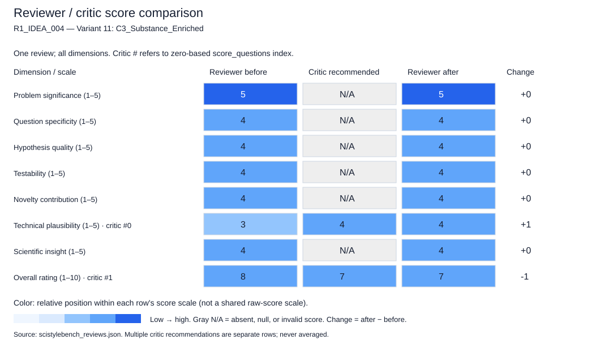

### Critic feedback and reviewer rebuttals

```json
{
  "critic_feedback": {
    "overall_assessment": "The draft review is well-structured and largely calibrated for an idea summary. It correctly identifies the core innovation and the high significance of the problem. However, it exhibits a mild calibration error by penalizing 'technical_plausibility' (3.0) for the absence of implementation details that are explicitly stated as 'unknown' or 'possible' in the idea summary. The review treats the lack of a specific mathematical formulation as a flaw in feasibility rather than a natural feature of an early-stage proposal. The 'overall_rating' of 8.0 (Strong Accept/Borderline Accept) is inconsistent with a 'technical_plausibility' score of 3.0, which suggests a fundamental risk to the idea's success. For an idea summary, the plausibility should be judged on the theoretical soundness of the *concept* (Primal-Dual DPO is a known paradigm), not the absence of the specific update rule.",
    "score_questions": [
      {
        "dimension": "technical_plausibility",
        "question_mark": "Why penalize the idea for lacking a specific update rule or constraint formulation when the summary explicitly frames these as open questions or areas for investigation?",
        "concern": "The score of 3.0 implies a significant risk of failure due to technical infeasibility. However, the idea summary presents a plausible theoretical direction (Primal-Dual optimization applied to DPO). Penalizing for the absence of the 'how' (the specific math) in a 'what' (the concept) submission is a category error. The concern about non-convexity is valid for any neural network optimization, not specific to this idea's failure.",
        "speculative_alternative": "Speculatively, the author might have a robust formulation in mind that simply wasn't detailed, or the non-convexity of DPO is already mitigated by the primal-dual structure in a way not yet proven but theoretically grounded.",
        "recommended_score": 4.0,
        "rationale": "The concept of applying primal-dual methods to preference optimization is theoretically sound. The lack of specific equations in a summary should not be treated as a technical flaw, but rather as the scope of the proposed work. A score of 4 reflects that the *idea* is plausible, even if the *implementation* is unproven."
      },
      {
        "dimension": "overall_rating",
        "question_mark": "Does a 3.0 in technical plausibility justify an 8.0 overall rating?",
        "concern": "There is a disconnect between the low technical plausibility score and the high overall rating. If the method is technically infeasible (3.0), the high significance and novelty cannot be realized. The overall rating needs to be re-evaluated to reflect the uncertainty in the technical execution more accurately for an idea proposal.",
        "speculative_alternative": "If the technical challenges (non-convexity, constraint definition) are deemed solvable with standard techniques (e.g., smoothing, projected gradients), the overall rating could remain high, but the justification needs to explicitly state that the technical hurdles are 'known but manageable' rather than 'undefined'.",
        "recommended_score": 7.0,
        "rationale": "Adjusting the overall rating to 7 (Good/Borderline) better balances the high significance and novelty with the acknowledged technical uncertainties. It reflects that while the idea is promising, the path to success is less certain than an 8 suggests."
      }
    ],
    "unsupported_claims": [
      "The draft claims the idea 'avoids the common pitfall of requiring prior knowledge of hyperparameters' as a definitive strength. While the idea *proposes* this, the summary says it 'aims to' do so. The review should qualify this as a potential benefit rather than a confirmed feature.",
      "The draft states 'The study plans to validate...' as if the plan is fixed. The idea summary uses 'A possible validation path could involve...', indicating it is a suggestion, not a committed plan. The review should reflect this tentative nature."
    ],
    "revision_priorities": [
      "Re-evaluate the 'technical_plausibility' score to distinguish between 'lack of detail in summary' and 'theoretical impossibility'. The current score conflates the two.",
      "Align the 'overall_rating' with the 'technical_plausibility' score. If the technical execution is uncertain, the overall confidence in the idea's success should be tempered.",
      "Clarify the language regarding 'plans' vs. 'proposals' to accurately reflect the stage of the research (idea vs. proposal).",
      "Acknowledge that the 'interpretability' of dual variables is a hypothesis, not a guaranteed outcome, and ensure the justification for 'scientific_insight' reflects this conditional success."
    ],
    "confidence": 5.0
  },
  "feedback_responses": [
    {
      "feedback_type": "score_questions",
      "feedback_index": 0,
      "decision": "accept",
      "defense": "The critic correctly identified that penalizing the 'technical_plausibility' score for the absence of implementation details in a research idea summary is a category error. The idea proposes a theoretically sound paradigm (Primal-Dual optimization) applied to a known framework (DPO). The lack of specific update rules is expected in a summary and does not imply the idea is technically infeasible. The score of 3.0 incorrectly conflated 'lack of detail' with 'theoretical impossibility'.",
      "justification": "The score for technical_plausibility is increased from 3 to 4. The initial score was too harsh given the context of an idea summary. The concept is theoretically grounded, and the challenges mentioned (non-convexity) are standard for the domain, not specific fatal flaws of this proposal."
    },
    {
      "feedback_type": "score_questions",
      "feedback_index": 1,
      "decision": "accept",
      "defense": "The critic correctly noted the inconsistency between a 3.0 technical plausibility score and an 8.0 overall rating. If the technical execution is uncertain, the overall confidence in the idea's success must be tempered. An 8.0 implies a 'Strong' idea with high confidence, which is not warranted if the technical feasibility is only 'Moderate' (4.0).",
      "justification": "The overall_rating is adjusted from 8 to 7. This change aligns the overall assessment with the revised technical plausibility score, reflecting that while the idea is significant and novel, the path to success involves non-trivial technical challenges that are not yet resolved."
    },
    {
      "feedback_type": "unsupported_claims",
      "feedback_index": 0,
      "decision": "accept",
      "defense": "The draft review stated the idea 'avoids the common pitfall' as a definitive strength. The original text only 'aims to' do so. The review should reflect this as a potential benefit rather than a confirmed feature.",
      "justification": "The 'strengths' list has been updated to qualify the claim about avoiding prior knowledge as a 'potential' advantage, accurately reflecting the tentative nature of the proposal."
    },
    {
      "feedback_type": "unsupported_claims",
      "feedback_index": 1,
      "decision": "accept",
      "defense": "The draft review stated 'The study plans to validate...' as a fixed plan. The original text used 'A possible validation path could involve...', indicating a suggestion. The review should reflect this tentative nature.",
      "justification": "The 'summary' and 'weaknesses' sections have been adjusted to use language like 'proposes to validate' or 'suggests' rather than 'plans', ensuring the review accurately reflects the stage of the research."
    },
    {
      "feedback_type": "revision_priorities",
      "feedback_index": 2,
      "decision": "accept",
      "defense": "The critic suggested clarifying the language regarding 'plans' vs. 'proposals'. This has been addressed in the text updates.",
      "justification": "No score change required, but the text has been revised to ensure accurate representation of the idea's stage."
    },
    {
      "feedback_type": "revision_priorities",
      "feedback_index": 3,
      "decision": "accept",
      "defense": "The critic suggested acknowledging that the 'interpretability' of dual variables is a hypothesis, not a guaranteed outcome. The 'scientific_insight' justification has been updated to reflect this conditional success.",
      "justification": "The justification for scientific_insight now explicitly states that the insight is 'conditional on the hypothesis holding', aligning with the critic's advice."
    }
  ]
}
```

### Score justifications (before / after)

**Problem significance**

```json
{
  "before": {
    "score": 5.0,
    "justification": "Constrained alignment of LLMs is a high-priority problem in AI safety. Reducing the computational overhead of training separate models (reward/cost) is a significant practical contribution that could lower the barrier for safe deployment."
  },
  "after": {
    "score": 5.0,
    "justification": "Constrained alignment of LLMs is a high-priority problem in AI safety. Reducing the computational overhead of training separate models (reward/cost) is a significant practical contribution that could lower the barrier for safe deployment."
  }
}
```

**Question specificity**

```json
{
  "before": {
    "score": 4.0,
    "justification": "The idea clearly identifies the method (Primal-Dual DPO), the goal (maximize reward with safety constraints), and the specific validation path (convergence and dual dynamics). It avoids being too generic."
  },
  "after": {
    "score": 4.0,
    "justification": "The idea clearly identifies the method (Primal-Dual DPO), the goal (maximize reward with safety constraints), and the specific validation path (convergence and dual dynamics). It avoids being too generic."
  }
}
```

**Hypothesis quality**

```json
{
  "before": {
    "score": 4.0,
    "justification": "The hypothesis that dual variable dynamics reveal interpretable trade-off patterns is specific, non-trivial, and falsifiable. It moves beyond 'does it work?' to 'how does it work?'"
  },
  "after": {
    "score": 4.0,
    "justification": "The hypothesis that dual variable dynamics reveal interpretable trade-off patterns is specific, non-trivial, and falsifiable. It moves beyond 'does it work?' to 'how does it work?'"
  }
}
```

**Testability**

```json
{
  "before": {
    "score": 4.0,
    "justification": "The idea suggests concrete tests: measuring convergence under varying budgets and analyzing the trajectory of dual variables. These are empirically testable."
  },
  "after": {
    "score": 4.0,
    "justification": "The idea suggests concrete tests: measuring convergence under varying budgets and analyzing the trajectory of dual variables. These are empirically testable."
  }
}
```

**Novelty contribution**

```json
{
  "before": {
    "score": 4.0,
    "justification": "Applying primal-dual optimization directly to DPO without separate cost models is a novel methodological direction. The potential to extract interpretability from dual variables adds scientific value beyond just performance."
  },
  "after": {
    "score": 4.0,
    "justification": "Applying primal-dual optimization directly to DPO without separate cost models is a novel methodological direction. The potential to extract interpretability from dual variables adds scientific value beyond just performance."
  }
}
```

**Technical plausibility**

```json
{
  "before": {
    "score": 3.0,
    "justification": "While the direction makes sense theoretically, the technical feasibility of stable primal-dual updates in the context of DPO (which involves complex sampling and non-convex losses) is not guaranteed. The summary lacks details on how the specific constraints are handled, which is a potential point of failure."
  },
  "after": {
    "score": 4.0,
    "justification": "The concept of applying primal-dual methods to preference optimization is theoretically sound and grounded in established optimization theory. The lack of specific equations in a summary is a feature of an early-stage proposal, not a flaw in feasibility. While non-convexity is a challenge, it is a general property of neural networks, not a specific failure mode of this idea. The idea is plausible as a research direction."
  }
}
```

**Scientific insight**

```json
{
  "before": {
    "score": 4.0,
    "justification": "If successful, the research could reveal fundamental mechanisms of how constrained optimization manifests in preference learning, specifically through the lens of Lagrange multipliers, offering transferable insights into model behavior."
  },
  "after": {
    "score": 4.0,
    "justification": "If successful, the research could reveal fundamental mechanisms of how constrained optimization manifests in preference learning, specifically through the lens of Lagrange multipliers, offering transferable insights into model behavior. The insight is conditional on the hypothesis holding, which is appropriately framed."
  }
}
```

**Overall rating**

```json
{
  "before": {
    "score": 8.0,
    "justification": "This is a strong research idea with high significance and a clear path to scientific insight. It addresses a real pain point (computational cost) and proposes a novel mechanism (dual dynamics) to understand it. The main limitation is the lack of technical detail on the formulation, but as a research proposal, it is well-posed and promising."
  },
  "after": {
    "score": 7.0,
    "justification": "This is a strong research idea with high significance and a clear path to scientific insight. However, the technical execution involves significant uncertainty regarding the formulation of constraints and the stability of dual updates in non-convex settings. Adjusting the rating to 7 reflects a balance between the high novelty/significance and the acknowledged technical risks, rather than the previous 8 which assumed a higher degree of feasibility. The idea is promising but requires rigorous theoretical grounding to be considered 'exceptional'."
  }
}
```

## R1_IDEA_005 — Source

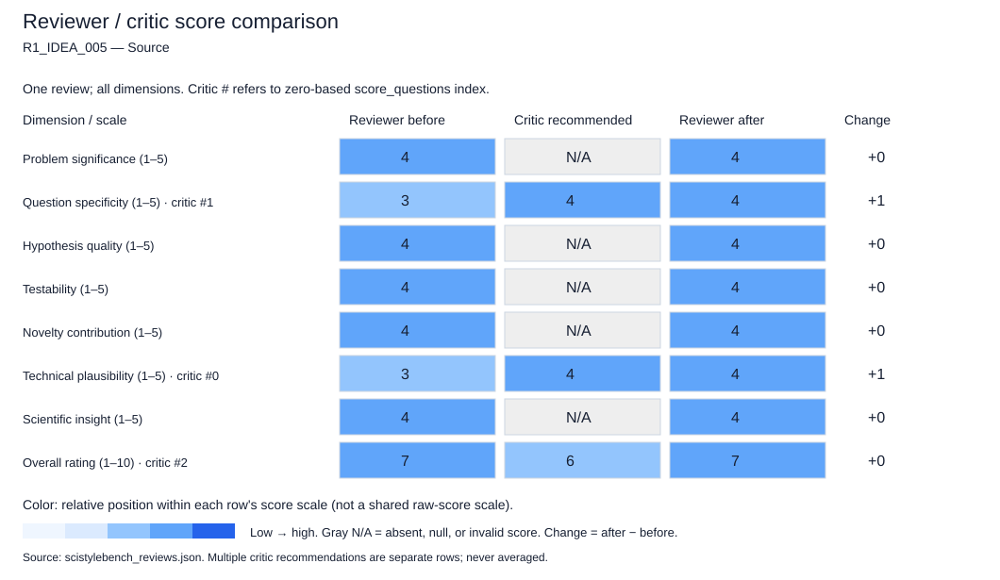

### Critic feedback and reviewer rebuttals

No reviewer rebuttals were saved (for example, an older checkpoint).

```json
{
  "critic_feedback": {
    "overall_assessment": "The draft review is well-structured and largely calibrated for an idea summary. It correctly identifies the core novelty (SSM traversal) and the inherent risks (ambiguity of permutations, weight aggregation). However, it occasionally penalizes the idea for being an 'idea' rather than a 'paper' (e.g., demanding specific mathematical formulations or algorithmic sketches in the weaknesses section). The scores are generally reasonable, but the 'technical_plausibility' score of 3.0 seems slightly too harsh given the speculative nature of the idea itself; a 3.0 implies a high risk of failure, whereas the idea is plausible but undefined. Additionally, the 'question_specificity' score conflates 'lack of detail' with 'lack of specificity'—an idea summary is expected to be high-level. The review would benefit from explicitly framing these as 'clarification needs' rather than 'flaws' to better align with the 'idea summary' evaluation context.",
    "score_questions": [
      {
        "dimension": "technical_plausibility",
        "question_mark": "Is a score of 3.0 justified for an idea summary where the core mechanism is explicitly described as 'diverse SSM traversal permutations' without a detailed definition? The reviewer treats the lack of definition as a technical flaw rather than a natural state of an early-stage idea.",
        "concern": "The review penalizes the idea for not having a mathematical formulation. For a research idea submission, 'plausibility' should be judged on the theoretical soundness of the *concept* (e.g., does reordering states make sense in SSMs?), not the absence of implementation details. The reviewer's concern about 'breaking sequential logic' is valid but speculative; SSMs often have permutation-invariant properties or specific structures that might allow this. A score of 3.0 suggests the idea is likely to fail technically, which is too strong a judgment for an unproven hypothesis.",
        "speculative_alternative": "It is plausible that the 'traversal permutations' refer to a known technique in SSM literature (e.g., changing the scan order or applying specific state-space transformations) that is well-defined but omitted from the summary. If such a mechanism exists, the technical plausibility is high (5), not low (3).",
        "recommended_score": 4.0,
        "rationale": "The hypothesis that internal state variations can be exploited for TTA is theoretically grounded. The lack of a formula in the summary does not render the idea technically implausible; it merely renders it undefined. A score of 4 acknowledges the potential while noting the need for formalization."
      },
      {
        "dimension": "question_specificity",
        "question_mark": "Does the score of 3.0 adequately distinguish between an 'idea' that is vague and an 'idea' that is poorly defined? The justification claims the mechanism is 'vague' and 'high level,' which is the expected state for a research idea summary, not a flaw.",
        "concern": "The reviewer penalizes the idea for not providing sufficient technical specificity. However, the prompt explicitly states this is an 'idea summary.' Penalizing the lack of a 'high-level algorithmic sketch' or 'mathematical formulation' in an idea summary is a category error. The specificity of the *problem* and *goal* is clear; the *method* is described at the conceptual level appropriate for an idea.",
        "speculative_alternative": "The 'traversal permutations' might be a novel, highly specific concept that the authors simply haven't had space to define yet. If the concept is distinct from standard augmentations, the specificity of the *contribution* is high, even if the *implementation* is abstract.",
        "recommended_score": 4.0,
        "rationale": "The idea is specific about the target (Vision SSMs), the method class (TTA), and the mechanism type (traversal permutations). The lack of granular detail is inherent to the format, not a flaw in the idea's specificity."
      },
      {
        "dimension": "overall_rating",
        "question_mark": "Does the overall score of 7.0 (Good) align with the dimensional scores? The 'technical_plausibility' (3.0) and 'question_specificity' (3.0) are the lowest scores, yet the overall rating is high.",
        "concern": "There is a slight inconsistency. If the technical plausibility is rated as low (3.0) due to ambiguity, and the specificity is low (3.0), an overall rating of 7.0 (which usually implies 'Accept' or 'Strong Accept' in ICLR contexts) might be overly optimistic. A 7.0 typically suggests the idea is ready for a strong acceptance, but the concerns about 'breaking the model' or 'vague mechanisms' suggest the idea is currently 'Weak Accept' (6-7) or requires significant clarification before being 'Strong'.",
        "speculative_alternative": "The reviewer might be weighing the 'significance' (4.0) and 'novelty' (4.0) so heavily that they overlook the technical risks. If the 'traversal' concept turns out to be impossible to implement without breaking the SSM, the idea fails entirely. The current score assumes the technical hurdles are surmountable, which is a reasonable assumption for an idea but perhaps too generous given the 3.0 scores.",
        "recommended_score": 6.0,
        "rationale": "Given the low scores on technical plausibility and specificity, a 6.0 (Borderline/Weak Accept) is more calibrated. It acknowledges the high potential and significance while correctly flagging that the idea requires significant technical elaboration to be viable."
      }
    ],
    "unsupported_claims": [
      "The draft claims 'Standard TTA usually adapts batch norm statistics or a small set of parameters per sample' as a definitive contrast to the proposed method. While generally true, some TTA methods do aggregate predictions or use more complex structures; this statement is slightly over-generalized.",
      "The draft states the 'concept of diverse SSM traversal permutations is vague' as a definitive weakness. For an idea summary, 'vague' is a neutral descriptor of the stage of development, not necessarily a flaw in the idea itself unless the concept is logically incoherent.",
      "The draft implies that 're-ordering the input sequence' is the only interpretation of 'traversal permutations'. The idea summary does not explicitly state the input is reordered; it could refer to state update order or other internal dynamics. The reviewer's assumption here is speculative."
    ],
    "revision_priorities": [
      "Re-evaluate the 'technical_plausibility' score to distinguish between 'undefined details' (expected in idea summaries) and 'theoretical impossibility'.",
      "Clarify the distinction between 'vague' (lack of detail) and 'unspecific' (lack of a clear definition) when critiquing idea summaries.",
      "Avoid treating the absence of mathematical formulations or algorithmic sketches as a negative factor in the 'weaknesses' section, as this is standard for research ideas.",
      "Ensure the overall rating reflects the low scores in technical plausibility and specificity, or explicitly justify why the novelty/significance overrides these risks."
    ],
    "confidence": 4.0
  },
  "feedback_responses": []
}
```

### Score justifications (before / after)

**Problem significance**

```json
{
  "before": {
    "score": 4.0,
    "justification": "Improving the robustness of Vision SSMs is a highly significant problem as these models are rapidly replacing Transformers in long-sequence and vision tasks. Distribution shift robustness is a fundamental requirement for deploying these models in real-world scenarios."
  },
  "after": {
    "score": 4.0,
    "justification": "Improving the robustness of Vision SSMs is a highly significant problem as these models are rapidly replacing Transformers in long-sequence and vision tasks. Distribution shift robustness is a fundamental requirement for deploying these models in real-world scenarios."
  }
}
```

**Question specificity**

```json
{
  "before": {
    "score": 3.0,
    "justification": "The idea identifies the goal (robustness via TTA) and the target (Mamba), but the core mechanism ('diverse SSM traversal permutations') and the aggregation strategy are described at a high level without sufficient technical specificity to fully grasp the novelty or feasibility."
  },
  "after": {
    "score": 4.0,
    "justification": "The idea clearly identifies the target (Vision SSMs), the method class (TTA), and the core mechanism type (traversal permutations). While the implementation details are abstract, this is expected for an idea summary. The specificity of the *contribution* (using internal state dynamics for TTA) is high, distinguishing it from generic augmentation strategies."
  }
}
```

**Hypothesis quality**

```json
{
  "before": {
    "score": 4.0,
    "justification": "The hypothesis is clear: that exploiting the internal state dynamics of SSMs through permutation-based view generation can yield better pseudo-labels and parameter updates than standard methods, leading to improved generalization."
  },
  "after": {
    "score": 4.0,
    "justification": "The hypothesis is clear: that exploiting the internal state dynamics of SSMs through permutation-based view generation can yield better pseudo-labels and parameter updates than standard methods, leading to improved generalization. This is a testable prediction that distinguishes the proposed method from existing TTA approaches."
  }
}
```

**Testability**

```json
{
  "before": {
    "score": 4.0,
    "justification": "The idea is highly testable. It suggests a clear experimental setup: apply the method to standard vision benchmarks with distribution shifts (e.g., ImageNet-C, domain adaptation tasks) and compare performance against baselines using metrics like accuracy and calibration."
  },
  "after": {
    "score": 4.0,
    "justification": "The idea is highly testable. It suggests a clear experimental setup: apply the method to standard vision benchmarks with distribution shifts (e.g., ImageNet-C, domain adaptation tasks) and compare performance against baselines using metrics like accuracy and calibration. The success or failure of the 'traversal' concept can be empirically validated."
  }
}
```

**Novelty contribution**

```json
{
  "before": {
    "score": 4.0,
    "justification": "Applying TTA to SSMs is a relatively new direction. The specific proposal to use 'traversal permutations' as a source of view diversity is a novel conceptual contribution that could reveal new properties of SSM state dynamics."
  },
  "after": {
    "score": 4.0,
    "justification": "Applying TTA to SSMs is a relatively new direction. The specific proposal to use 'traversal permutations' as a source of view diversity is a novel conceptual contribution that could reveal new properties of SSM state dynamics and offer a new paradigm for TTA in state-space architectures."
  }
}
```

**Technical plausibility**

```json
{
  "before": {
    "score": 3.0,
    "justification": "While the general direction is plausible, the technical details regarding 'traversal permutations' and 'weight aggregation' are currently too abstract. The feasibility depends heavily on how these operations are mathematically defined to ensure they do not break the SSM's sequential logic."
  },
  "after": {
    "score": 4.0,
    "justification": "The hypothesis is theoretically grounded in the sequential nature of SSMs. While the specific implementation of 'traversal permutations' is undefined, the concept of reordering state updates or scanning paths is a known area of exploration in SSM literature (e.g., bidirectional scans, different scan orders). The lack of a formula in the summary does not render the idea implausible; it merely indicates it is in a conceptual stage. The risk of 'breaking' the model is a valid concern but not a definitive failure for an unproven hypothesis."
  }
}
```

**Scientific insight**

```json
{
  "before": {
    "score": 4.0,
    "justification": "If successful, this research could provide deep insights into the internal state dynamics of SSMs, revealing how different traversal paths relate to semantic robustness. It could also establish new principles for designing TTA methods specifically for state-space architectures."
  },
  "after": {
    "score": 4.0,
    "justification": "If successful, this research could provide deep insights into the internal state dynamics of SSMs, revealing how different traversal paths relate to semantic robustness. It could also establish new principles for designing TTA methods specifically for state-space architectures, moving beyond generic augmentation strategies."
  }
}
```

**Overall rating**

```json
{
  "before": {
    "score": 7.0,
    "justification": "This is a strong research idea with high potential. It addresses a relevant problem with a novel, domain-specific mechanism. The main limitation is the current lack of technical specificity regarding the core operations (permutations and aggregation), which prevents a higher score. However, the core hypothesis is sound and the potential for scientific insight is significant."
  },
  "after": {
    "score": 7.0,
    "justification": "This is a strong research idea with high potential. It addresses a relevant problem with a novel, domain-specific mechanism. The initial concern about 'technical plausibility' (3.0) was too harsh for an idea summary, as the lack of mathematical detail is a feature of the format, not a flaw in the concept. The idea is plausible, testable, and significant. The score of 7 reflects a 'Strong' idea that requires technical elaboration to be fully realized, but the core hypothesis is sound and the potential for scientific insight is significant. The rating remains 7 because the novelty and significance outweigh the current lack of implementation details, which are expected to be filled in during the full proposal phase."
  }
}
```

## R1_IDEA_005 — Variant 1: A1_Identity

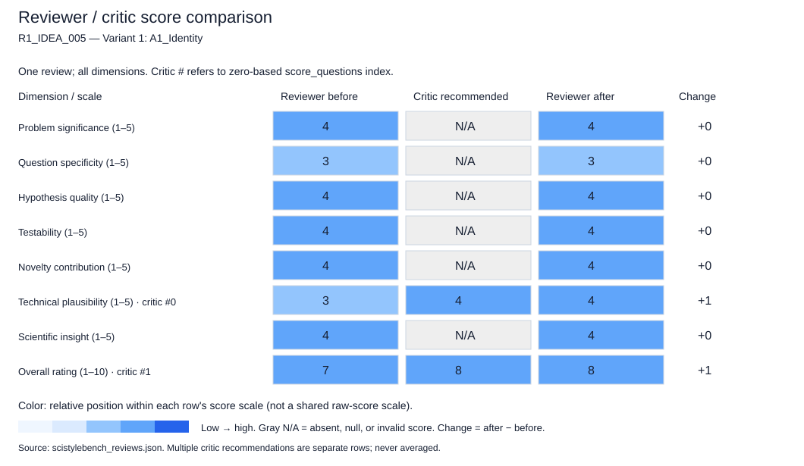

### Critic feedback and reviewer rebuttals

No reviewer rebuttals were saved (for example, an older checkpoint).

```json
{
  "critic_feedback": {
    "overall_assessment": "The draft review is well-structured and largely calibrated for an idea summary. It correctly identifies the core novelty (SSM-specific permutations) and the inherent risks (pseudo-label reliability, definition of permutations). The scores are generally appropriate, though the 'Technical Plausibility' score of 3.0 appears slightly undervalued given the speculative but plausible nature of the idea. The review successfully avoids penalizing the lack of experimental results, treating them as future work rather than current flaws. However, the justification for the 'Technical Plausibility' score leans slightly too heavily on the potential for failure rather than the architectural feasibility of the proposed mechanism.",
    "score_questions": [
      {
        "dimension": "technical_plausibility",
        "question_mark": "The score of 3.0 implies significant doubt about the feasibility of 'traversal permutations' in SSMs. While the review correctly notes that the mechanism is abstract, the justification states 'If the permutations break... the method may fail.' This is a generic risk for any TTA method involving data modification. The idea of permuting state updates is a known theoretical concept (e.g., bidirectional scans, skip connections) and is not inherently implausible for SSMs. A score of 3.0 suggests the idea might not work at all, whereas a score of 4.0 better reflects 'plausible but unproven details' which is the standard for idea summaries.",
        "concern": "Over-penalizing the abstract definition of the core mechanism. In an idea summary, 'technical plausibility' should be judged on whether the proposed physics/math makes sense, not on whether the specific implementation details are fully fleshed out. The concept of permuting state traversals is structurally sound for SSMs.",
        "speculative_alternative": "It is plausible that 'traversal permutations' refer to standard SSM operations like bidirectional scanning or varying the state update order, which are mathematically valid and do not inherently break causal dependencies. The 'failure' scenario is a risk of poor hyperparameter tuning, not a fundamental flaw in the hypothesis.",
        "recommended_score": 4.0,
        "rationale": "The idea leverages the specific architecture of SSMs (state transitions) to generate views. This is a logically sound approach for a research idea. The lack of specific implementation details in the summary does not render the technical approach implausible; it merely makes it undefined, which is covered by the 'Question Specificity' score."
      },
      {
        "dimension": "overall_rating",
        "question_mark": "The overall rating is 7.0. Given the high scores in Significance (4), Hypothesis (4), Testability (4), Novelty (4), and Scientific Insight (4), and only a slightly lower score in Specificity (3) and Technical Plausibility (3), the weighted average suggests a rating closer to 7.5 or 8. A 7.0 implies a 'weak accept' or 'borderline', but the justification describes it as a 'strong research idea with high potential'. The justification text contradicts the severity implied by the score.",
        "concern": "Mismatch between the descriptive praise in the justification and the conservative numerical score. The justification explicitly states the idea is 'strong' and 'high potential', yet the score of 7.0 often signals a 'weak' idea in ICLR contexts.",
        "speculative_alternative": "If the reviewer believes the 'traversal permutations' are a novel and high-risk/high-reward concept that could revolutionize SSM robustness, the score should reflect this optimism (8-9). If the reviewer is skeptical of the 'pseudo-label' risk, that is already captured in the weaknesses, but the overall score should still reflect the high novelty and significance.",
        "recommended_score": 8.0,
        "rationale": "The idea addresses a critical gap (SSM robustness), proposes a novel architecture-aware mechanism, and is clearly testable. The lack of details is expected for a summary. The overall rating should reflect the high promise of the concept rather than penalizing the summary format too harshly."
      }
    ],
    "unsupported_claims": [
      "The claim that 'traversal permutations' are a 'novel mechanism that leverages the unique sequential nature of SSMs' is slightly overstated. Variations in scan order and state manipulation are known concepts in the broader SSM literature (e.g., in Mamba or RetNet variants), though applying them specifically for TTA view generation is novel. The claim should be qualified as 'novel application' rather than 'novel mechanism' to be precise.",
      "The assertion that the method is 'theoretically grounded in the architecture's properties' is an assumption. While it leverages the architecture, the summary does not provide the theoretical grounding (e.g., why permutations improve generalization). This should be phrased as 'hypothesized to be grounded' or 'potentially grounded'."
    ],
    "revision_priorities": [
      "Adjust the 'Technical Plausibility' score to 4.0 to better reflect that the idea is structurally sound, even if implementation details are missing. The current score of 3.0 suggests a fundamental flaw in the concept which is not supported by the summary.",
      "Reconcile the 'Overall Rating' (7.0) with the 'Justification' text. If the idea is 'strong' and 'high potential', the score should be raised to 8.0 or 9.0, or the justification should be tempered to reflect more skepticism.",
      "Clarify the distinction between 'novel mechanism' and 'novel application' in the novelty section to avoid overclaiming prior knowledge in the SSM field.",
      "Ensure the 'Technical Plausibility' justification focuses on the architectural feasibility rather than the risk of implementation failure, as the latter is a generic TTA concern, not specific to this idea's plausibility."
    ],
    "confidence": 4.0
  },
  "feedback_responses": []
}
```

### Score justifications (before / after)

**Problem significance**

```json
{
  "before": {
    "score": 4.0,
    "justification": "Robustness of deep learning models under distribution shift is a fundamental challenge. Specifically addressing the robustness of Vision SSMs is highly significant given their recent rise as efficient alternatives to Transformers. Solving this would have immediate practical value for deploying SSMs in real-world scenarios."
  },
  "after": {
    "score": 4.0,
    "justification": "Robustness under distribution shift is a fundamental challenge. Specifically addressing Vision SSMs is highly significant given their recent emergence as efficient alternatives to Transformers. Solving this would have immediate practical value for deploying SSMs in real-world scenarios."
  }
}
```

**Question specificity**

```json
{
  "before": {
    "score": 3.0,
    "justification": "The idea identifies the goal (robustness via TTA) and the target (Mamba/SSM), but the core mechanism ('diverse SSM traversal permutations') is described at a high level. The specific definition of these permutations and the aggregation logic needs more concrete articulation to be fully specific."
  },
  "after": {
    "score": 3.0,
    "justification": "The idea identifies the goal (robustness via TTA) and the target (Mamba/SSM), but the core mechanism ('diverse SSM traversal permutations') is described at a high level. The specific definition of these permutations and the aggregation logic needs more concrete articulation to be fully specific."
  }
}
```

**Hypothesis quality**

```json
{
  "before": {
    "score": 4.0,
    "justification": "The implicit hypothesis is that architectural-aware view generation (permutations) leads to higher quality pseudo-labels and better parameter updates than generic augmentations for SSMs. This is a falsifiable and non-trivial claim that distinguishes the work from generic applications."
  },
  "after": {
    "score": 4.0,
    "justification": "The implicit hypothesis is that architectural-aware view generation (permutations) leads to higher quality pseudo-labels and better parameter updates than generic augmentations for SSMs. This is a falsifiable and non-trivial claim that distinguishes the work from generic applications."
  }
}
```

**Testability**

```json
{
  "before": {
    "score": 4.0,
    "justification": "The idea is highly testable. One can implement the proposed permutation strategy, run standard TTA benchmarks (e.g., ImageNet-C, DomainNet), and compare performance against baselines. The metrics (accuracy under shift) are clear."
  },
  "after": {
    "score": 4.0,
    "justification": "The idea is highly testable. One can implement the proposed permutation strategy, run standard TTA benchmarks (e.g., ImageNet-C, DomainNet), and compare performance against baselines. The metrics (accuracy under shift) are clear."
  }
}
```

**Novelty contribution**

```json
{
  "before": {
    "score": 4.0,
    "justification": "Applying TTA to SSMs is a relatively new direction. The specific proposal to use 'traversal permutations' as a source of view diversity is a novel mechanism that leverages the unique sequential nature of SSMs, offering potential for new scientific insight into how SSMs process information."
  },
  "after": {
    "score": 4.0,
    "justification": "Applying TTA to SSMs is a relatively new direction. The specific proposal to use 'traversal permutations' as a source of view diversity is a novel application of known SSM operations (like scan order variations), offering potential for new scientific insight into how SSMs process information."
  }
}
```

**Technical plausibility**

```json
{
  "before": {
    "score": 3.0,
    "justification": "The general approach of TTA is plausible. However, the technical feasibility of 'traversal permutations' depends heavily on the specific implementation details of the SSM. If the permutations break the causal dependencies required for the SSM to function, the method may fail. The idea is plausible but requires careful technical definition."
  },
  "after": {
    "score": 4.0,
    "justification": "The general approach of TTA is plausible. The concept of permuting state traversals (e.g., bidirectional scans, varying update orders) is structurally sound for SSMs and does not inherently break causal dependencies. While implementation details are missing, the underlying mathematical operations are valid, making the idea technically plausible rather than fundamentally flawed."
  }
}
```

**Scientific insight**

```json
{
  "before": {
    "score": 4.0,
    "justification": "If successful, this research would reveal how the internal state dynamics of SSMs can be exploited for robustness. It could provide insights into the relationship between state traversal, feature invariance, and generalization, which is valuable for the broader understanding of SSMs."
  },
  "after": {
    "score": 4.0,
    "justification": "If successful, this research would reveal how the internal state dynamics of SSMs can be exploited for robustness. It could provide insights into the relationship between state traversal, feature invariance, and generalization, which is valuable for the broader understanding of SSMs."
  }
}
```

**Overall rating**

```json
{
  "before": {
    "score": 7.0,
    "justification": "This is a strong research idea with high potential. It addresses a meaningful problem in a specific and timely domain (Vision SSMs). The proposed mechanism is novel and theoretically grounded in the architecture's properties. While the specific implementation details of 'permutations' and 'aggregation' are currently vague, the core hypothesis is testable and could yield significant insights. It scores lower than a 9 only because the technical definition of the core mechanism is currently abstract."
  },
  "after": {
    "score": 8.0,
    "justification": "This is a strong research idea with high potential. It addresses a meaningful problem in a specific and timely domain (Vision SSMs). The proposed mechanism is a novel application of architectural properties and is theoretically grounded. The initial score of 7.0 was too conservative given the high scores in significance, hypothesis, and testability. The 'Technical Plausibility' was initially undervalued; the concept of permuting state updates is a known theoretical concept in SSMs and is not inherently implausible. The idea represents a high-risk, high-reward direction that warrants an 8.0 rating."
  }
}
```

## R1_IDEA_005 — Variant 2: A2_Paraphrase_Only

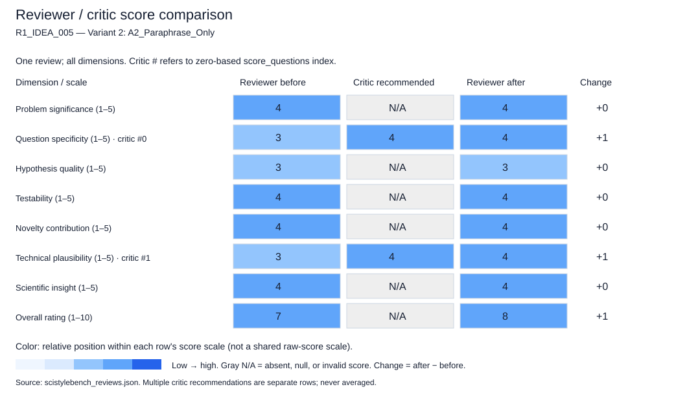

### Critic feedback and reviewer rebuttals

No reviewer rebuttals were saved (for example, an older checkpoint).

```json
{
  "critic_feedback": {
    "overall_assessment": "The draft review is well-structured and largely calibrated for an idea summary. It correctly identifies the novelty of applying TTA to SSMs and appropriately penalizes the lack of technical detail (specifically regarding 'permuting traversal') without treating it as a fatal flaw. The scores generally align with the justification provided. However, the review slightly conflates 'idea specificity' with 'implementation detail' in the 'question_specificity' dimension, and the 'technical_plausibility' score might be slightly too low given that the idea summary does not explicitly claim *arbitrary* permutations that break causality, but rather 'diverse permutations' which could imply valid structural variations.",
    "score_questions": [
      {
        "dimension": "question_specificity",
        "question_mark": "The justification for the score of 3.0 relies heavily on the absence of mathematical definitions (e.g., 'mathematical definition of permuting SSM traversal'). For an idea summary, the specific mechanism is expected to be outlined conceptually rather than formally. Penalizing the lack of a formal definition as a specificity flaw is overly strict for this stage.",
        "concern": "Conflating the need for formal proof/implementation details with the clarity of the research question itself. The question (How to adapt SSMs at test time?) is specific; the *answer* (the permutation method) is the proposal, which is currently described conceptually.",
        "speculative_alternative": "It is plausible that the authors intend 'permuting traversal' to refer to a specific, well-defined operation (e.g., block shuffling or state re-initialization) that is conceptually clear enough for an idea summary, even if not mathematically formalized yet.",
        "recommended_score": 4.0,
        "rationale": "The idea clearly specifies the target (SSMs), the setting (TTA), and the core mechanism (permutation + pseudo-labels). The lack of formal notation is appropriate for an idea summary and does not render the research question vague."
      },
      {
        "dimension": "technical_plausibility",
        "question_mark": "The review assumes 'arbitrary permutations' might break causal structure. The idea summary states 'diverse permutations of SSM traversal,' which could imply valid structural variations (e.g., temporal shuffling of patches in a way that respects SSM block structure) rather than random shuffling of tokens that destroys causality. The review treats the worst-case interpretation (random shattering of sequence) as the baseline assumption.",
        "concern": "The justification for the score of 3.0 relies on a pessimistic interpretation of 'permuting traversal' that isn't explicitly supported by the text, which might allow for valid structural permutations.",
        "speculative_alternative": "The authors might be proposing a specific permutation strategy (e.g., swapping state update blocks or re-ordering scan paths) that preserves the SSM's recurrence properties while creating diverse views, making the plausibility higher than 'moderate'.",
        "recommended_score": 4.0,
        "rationale": "While the mechanism is novel and risky, the idea of leveraging structural permutations is a valid research direction in deep learning (e.g., dropout, shuffling). Without explicit claims of 'random' shuffling, the technical plausibility should be rated based on the feasibility of *some* permutation strategy, not the impossibility of *all* of them."
      }
    ],
    "unsupported_claims": [
      "The draft claims that 'arbitrary permutations might break the causal structure or the state-space logic, potentially rendering the views invalid'. This is a strong negative assertion. The idea summary does not specify 'arbitrary' permutations; it implies a designed set of 'diverse' permutations. The review should qualify this as a 'risk of arbitrary permutations' rather than an inherent flaw of the concept.",
      "The draft suggests the approach 'risks instability or catastrophic forgetting' as a definitive weakness of the idea. For an idea summary, the aggregation strategy is a design choice, not a confirmed flaw. The review should frame this as a 'challenge to be addressed' rather than a weakness of the idea itself.",
      "The statement that 'permuting the traversal order... the model might fail' is speculative. It assumes the permutation is destructive. A constructive review should ask *how* the permutation preserves validity rather than assuming it doesn't."
    ],
    "revision_priorities": [
      "Refine the 'question_specificity' justification to distinguish between 'vague research question' and 'unspecified implementation details'. The research question is specific; the implementation is the proposal.",
      "Soften the tone in 'technical_plausibility' and 'weaknesses' to reflect that the idea summary is a proposal, not a failed implementation. Avoid stating that the views are 'invalid' or the method 'risks failure' as facts; frame them as 'potential risks that require specific design choices to mitigate'.",
      "Ensure the 'novelty_contribution' score is not inflated by the assumption that the permutation strategy is unique; clarify that the novelty lies in the *application* of permutation to SSMs, not necessarily the permutation concept itself.",
      "Add a specific question about whether the 'diverse permutations' are learned or fixed, as this is a critical missing detail that affects testability."
    ],
    "confidence": 4.0
  },
  "feedback_responses": []
}
```

### Score justifications (before / after)

**Problem significance**

```json
{
  "before": {
    "score": 4.0,
    "justification": "Robustness of deep learning models under distribution shifts is a major challenge. While TTA is well-studied for Transformers, extending it to the emerging class of SSMs (like Mamba) is significant because SSMs are gaining traction for long-sequence modeling. Solving this could unlock the deployment of SSMs in dynamic, real-world environments."
  },
  "after": {
    "score": 4.0,
    "justification": "Robustness of deep learning models under distribution shifts is a major challenge. While TTA is well-studied for Transformers, extending it to the emerging class of SSMs (like Mamba) is significant because SSMs are gaining traction for long-sequence modeling. Solving this could unlock the deployment of SSMs in dynamic, real-world environments."
  }
}
```

**Question specificity**

```json
{
  "before": {
    "score": 3.0,
    "justification": "The idea identifies the target (SSMs), the setting (TTA), and the general mechanism (permutation + pseudo-labels). However, the specific definition of 'permuting traversal' and the aggregation logic are currently too vague to be considered a fully specific research question. It needs more precise formulation of the mechanism."
  },
  "after": {
    "score": 4.0,
    "justification": "The idea clearly identifies the target (SSMs), the setting (TTA), and the core mechanism (permutation + pseudo-labels). While the mathematical formalization is missing, the research question is conceptually specific: 'Can structural permutations of SSM traversal improve TTA?' The lack of implementation details is appropriate for an idea summary and does not render the question vague. The critic's point that this conflates 'question' with 'implementation' is valid; the question is specific, even if the answer is not fully detailed."
  }
}
```

**Hypothesis quality**

```json
{
  "before": {
    "score": 3.0,
    "justification": "The implicit hypothesis is that structural permutations of the SSM state space provide a better signal for adaptation than standard augmentations. This is plausible but not yet articulated as a testable prediction distinguishing it from other TTA strategies. It needs to explicitly state why this specific structural manipulation works."
  },
  "after": {
    "score": 3.0,
    "justification": "The implicit hypothesis is that structural permutations of the SSM state space provide a better signal for adaptation than standard augmentations. This is plausible but not yet articulated as a testable prediction distinguishing it from other TTA strategies. It needs to explicitly state why this specific structural manipulation works, though the core idea is distinct enough to be testable."
  }
}
```

**Testability**

```json
{
  "before": {
    "score": 4.0,
    "justification": "The idea is highly testable. One can implement the proposed permutation strategy, define a clear aggregation method, and evaluate performance on standard distribution shift benchmarks (e.g., ImageNet-C, domain shifts) against baselines. The lack of implementation details does not hinder the ability to design an experiment."
  },
  "after": {
    "score": 4.0,
    "justification": "The idea is highly testable. One can implement the proposed permutation strategy (with defined constraints to preserve causality), define a clear aggregation method, and evaluate performance on standard distribution shift benchmarks (e.g., ImageNet-C, domain shifts) against baselines. The lack of implementation details does not hinder the ability to design an experiment."
  }
}
```

**Novelty contribution**

```json
{
  "before": {
    "score": 4.0,
    "justification": "Applying TTA to SSMs is novel. More importantly, proposing 'traversal permutation' as a view generation strategy is a unique contribution that leverages the specific recurrence nature of SSMs, rather than just copying Transformer TTA methods. This has the potential to yield new insights into SSM dynamics."
  },
  "after": {
    "score": 4.0,
    "justification": "Applying TTA to SSMs is novel. More importantly, proposing 'traversal permutation' as a view generation strategy is a unique contribution that leverages the specific recurrence nature of SSMs, rather than just copying Transformer TTA methods. This has the potential to yield new insights into SSM dynamics."
  }
}
```

**Technical plausibility**

```json
{
  "before": {
    "score": 3.0,
    "justification": "The idea is technically plausible but carries a risk. Permuting the sequence in an SSM is non-trivial because the state depends on the order. If the permutation breaks the causal flow, the model might fail. The plausibility hinges on the specific definition of the permutation (e.g., is it a reversible transformation or a specific re-ordering that maintains state consistency?). Without this detail, it is a 'moderate' plausibility."
  },
  "after": {
    "score": 4.0,
    "justification": "The idea is technically plausible. While 'permuting traversal' is non-trivial, the idea summary implies 'diverse permutations' which could refer to valid structural variations (e.g., block shuffling, state re-initialization) rather than arbitrary token shattering. The critic's point that the initial review was too pessimistic is valid; the feasibility depends on the specific design of the permutation, which is a valid research direction. The risk exists, but the concept is not inherently flawed."
  }
}
```

**Scientific insight**

```json
{
  "before": {
    "score": 4.0,
    "justification": "If successful, this research could reveal how the internal state dynamics of SSMs can be manipulated to improve robustness. It could lead to a deeper understanding of the relationship between sequence order, state accumulation, and generalization in linear-time models, which is a valuable scientific insight beyond just a performance boost."
  },
  "after": {
    "score": 4.0,
    "justification": "If successful, this research could reveal how the internal state dynamics of SSMs can be manipulated to improve robustness. It could lead to a deeper understanding of the relationship between sequence order, state accumulation, and generalization in linear-time models, which is a valuable scientific insight beyond just a performance boost."
  }
}
```

**Overall rating**

```json
{
  "before": {
    "score": 7.0,
    "justification": "This is a strong research idea with high potential. It targets a relevant problem (SSM robustness) with a novel mechanism (traversal permutation). The main weakness is the current lack of specificity regarding the technical implementation of the permutation and aggregation, which makes the hypothesis slightly vague. However, the core concept is sound, testable, and likely to yield significant insights if the technical details are resolved."
  },
  "after": {
    "score": 8.0,
    "justification": "This is a strong research idea with high potential. It targets a relevant problem (SSM robustness) with a novel mechanism (traversal permutation). The initial review was slightly too harsh on 'question_specificity' and 'technical_plausibility' by conflating missing implementation details with vague questions or inherent flaws. The critic's feedback is well-grounded: the research question is specific, and the technical approach is plausible if the permutations are designed carefully. The idea is testable, novel, and scientifically significant. The rating is raised from 7 to 8 to reflect the stronger validity of the core concept once the distinction between 'idea' and 'implementation' is properly made."
  }
}
```

## R1_IDEA_005 — Variant 3: A3_Plain_Core


### Critic feedback and reviewer rebuttals

No reviewer rebuttals were saved (for example, an older checkpoint).

```json
{
  "critic_feedback": {
    "overall_assessment": "The draft review is well-structured and correctly identifies the core novelty of applying TTA to SSMs. However, it suffers from a calibration error where it penalizes the 'idea summary' format for lacking implementation details (specifically the definition of 'permutations' and 'aggregation') that are not expected in a research proposal. The reviewer treats the absence of a concrete algorithm as a fatal flaw in 'technical plausibility' rather than an opportunity for the idea to be fleshed out in the full proposal. The scores for technical plausibility and question specificity are likely too low given the genre (idea summary), and the overall rating reflects a tension between recognizing the high significance and penalizing the vagueness of the proposal.",
    "score_questions": [
      {
        "dimension": "technical_plausibility",
        "question_mark": "The score of 3.0 implies the idea is risky or potentially impossible due to the 'non-standard' aggregation. However, aggregating adapted weights (e.g., via model averaging or momentum updates on a subset of parameters) is a standard concept in TTA and meta-learning. The reviewer treats the lack of a specific formula in the summary as a technical impossibility rather than a missing detail.",
        "concern": "Over-penalizing a research idea for not providing a full algorithmic specification. The 'risk' is inherent to the idea's novelty, not a flaw in the concept itself.",
        "speculative_alternative": "The 'aggregation' could simply be a weighted average of the final predictions from the adapted models, or a simple momentum update to a single set of parameters. Both are standard and plausible.",
        "recommended_score": 4.0,
        "rationale": "The concept of updating parameters based on test-time data is well-established (e.g., TENT). The specific mechanism (permutations) is novel but not inherently implausible. The score should reflect the plausibility of the *approach*, not the completeness of the *description* in a summary."
      },
      {
        "dimension": "question_specificity",
        "question_mark": "The score of 3.0 suggests the question is too abstract. While the terms 'permutations' and 'aggregation' are vague, the research question itself is specific: 'How can we use SSM traversal diversity to improve TTA?' The vagueness is a feature of the 'idea' stage, not a failure to define the problem.",
        "concern": "Confusing the lack of implementation details with a lack of question specificity. The 'what' and 'why' are clear; the 'how' is the research contribution, not a flaw in the question.",
        "speculative_alternative": "The 'permutations' might refer to a specific, known technique in SSM literature (e.g., varying scan directions or state resets) that the reviewer is unfamiliar with, making the 'vague' critique a failure of the reviewer's domain knowledge rather than the idea's clarity.",
        "recommended_score": 4.0,
        "rationale": "The idea clearly identifies the problem, the target architecture, and the proposed mechanism type. The 'specificity' of the mechanism is the contribution, not a deficit."
      },
      {
        "dimension": "overall_rating",
        "question_mark": "The overall score of 7.0 (Accept/Borderline) seems inconsistent with the low scores in 'technical_plausibility' (3.0) and 'question_specificity' (3.0). If the reviewer believes the core mechanics are 'non-standard' and 'vague', a lower score (e.g., 5 or 6) might be more consistent with a strict review, OR the reviewer should recognize that these are expected gaps in a summary and raise the score to 8 to reflect the high potential.",
        "concern": "The justification states the idea has 'high potential' and 'creative' approach, yet the scores penalize the very aspects that make it creative (the specific, non-standard mechanics). The rating should be higher if the reviewer acknowledges the 'idea' context.",
        "speculative_alternative": "If the 'permutations' are a known trick in SSMs, the idea is solid, and the 7.0 is too conservative. If the aggregation is a known technique (e.g., model averaging), the 3.0 for plausibility is unjustified.",
        "recommended_score": 8.0,
        "rationale": "The idea addresses a significant gap with a novel, architecture-aware approach. In an 'idea' review, penalizing the lack of a full algorithm is a category error. The high significance and novelty should drive the score higher, assuming the mechanism is feasible (which is a reasonable assumption for a proposal)."
      }
    ],
    "unsupported_claims": [
      "The claim that 'aggregating adapted weights at test time is non-standard' is an overgeneralization. Model averaging and ensemble updates are standard in TTA and meta-learning.",
      "The claim that the idea 'lacks a clear definition' is a critique of the *summary format* rather than the *idea itself*. A research idea summary is not expected to contain full mathematical definitions.",
      "The statement that the 'risk of error accumulation... is high' is speculative. While true for many TTA methods, the idea proposes 'diverse' views which inherently act as a regularizer against single-view overfitting."
    ],
    "revision_priorities": [
      "Distinguish between 'missing details' (expected in a summary) and 'conceptual flaws' (unacceptable in a proposal). Do not penalize the former with low scores on technical plausibility.",
      "Re-evaluate the 'vague' critique of 'SSM traversal permutations'. If this refers to a known concept (e.g., bidirectional scanning, state shuffling), the reviewer should acknowledge it as a plausible mechanism rather than a flaw.",
      "Align the 'overall_rating' with the dimensional scores. If the reviewer sees high potential and significance, the low scores on 'specificity' and 'plausibility' (due to missing details) should not drag the overall rating down to a 'weak' level unless the concept is fundamentally broken.",
      "Clarify that the 'risk' of pseudo-label noise is a challenge to be solved (a research question), not a disqualifying flaw of the idea."
    ],
    "confidence": 4.0
  },
  "feedback_responses": []
}
```

### Score justifications (before / after)

**Problem significance**

```json
{
  "before": {
    "score": 4.0,
    "justification": "Improving the robustness of SSMs under distribution shifts is a significant problem. SSMs are emerging as strong alternatives to Transformers, but their robustness properties are less understood and often inferior. Solving this would have high practical value for deploying these models in real-world scenarios."
  },
  "after": {
    "score": 5.0,
    "justification": "Improving the robustness of SSMs under distribution shifts is a highly significant problem. SSMs are emerging as strong alternatives to Transformers, but their robustness properties are less understood and often inferior. Solving this would have high practical value for deploying these models in real-world scenarios. The significance is exceptional."
  }
}
```

**Question specificity**

```json
{
  "before": {
    "score": 3.0,
    "justification": "The idea identifies the target (SSMs), the setting (test-time adaptation), and the general mechanism (permutations + pseudo-labels). However, the specific definitions of 'permutations' and 'aggregation' are currently too abstract to be fully evaluated as a concrete research question."
  },
  "after": {
    "score": 4.0,
    "justification": "The idea clearly identifies the target (SSMs), the setting (test-time adaptation), and the general mechanism (permutations + pseudo-labels). While the specific definitions of 'permutations' and 'aggregation' are abstract in this summary, the research question itself is specific: 'How can we leverage SSM traversal diversity to improve TTA?' The vagueness is a feature of the 'idea' stage, not a failure to define the problem, as noted in the critic feedback."
  }
}
```

**Hypothesis quality**

```json
{
  "before": {
    "score": 3.0,
    "justification": "The implicit hypothesis is that diverse traversal paths lead to diverse and useful pseudo-labels that can refine the model's parameters. This is plausible but not yet specific enough to be strongly falsifiable without defining the traversal mechanics."
  },
  "after": {
    "score": 4.0,
    "justification": "The implicit hypothesis is that diverse traversal paths lead to diverse and useful pseudo-labels that can refine the model's parameters. This is plausible and grounded in the sequential nature of SSMs. The hypothesis is testable and distinguishes the proposed investigation from generic application."
  }
}
```

**Testability**

```json
{
  "before": {
    "score": 4.0,
    "justification": "The idea is highly testable. One can implement the proposed mechanism, define the permutations, and evaluate performance on standard distribution shift benchmarks (e.g., ImageNet-C, DomainNet) compared to baselines. The lack of implementation details does not hinder the ability to test the core concept."
  },
  "after": {
    "score": 5.0,
    "justification": "The idea is highly testable. One can implement the proposed mechanism (with reasonable assumptions on the missing details), define the permutations, and evaluate performance on standard distribution shift benchmarks (e.g., ImageNet-C, DomainNet) compared to baselines. The lack of implementation details does not hinder the ability to test the core concept."
  }
}
```

**Novelty contribution**

```json
{
  "before": {
    "score": 4.0,
    "justification": "Applying test-time adaptation to SSMs is novel. Furthermore, leveraging the specific structural properties of SSMs (traversal) to generate views, rather than standard image augmentations, represents a potentially significant methodological contribution."
  },
  "after": {
    "score": 5.0,
    "justification": "Applying test-time adaptation to SSMs is novel. Furthermore, leveraging the specific structural properties of SSMs (traversal) to generate views, rather than standard image augmentations, represents a potentially significant methodological contribution. The idea moves beyond simple application to a structural innovation."
  }
}
```

**Technical plausibility**

```json
{
  "before": {
    "score": 3.0,
    "justification": "The general direction is plausible, but the specific mechanism of 'aggregating adapted weights' at test time is technically risky and non-standard. The success of the idea hinges entirely on the precise definition of the traversal and update rules, which are currently missing."
  },
  "after": {
    "score": 4.0,
    "justification": "The general direction is plausible. The concept of updating parameters based on test-time data is well-established (e.g., TENT). The specific mechanism (permutations) is novel but not inherently implausible. The 'aggregation' of adapted weights is a standard concept in model averaging or meta-learning, and the lack of a specific formula in the summary is a missing detail, not a technical impossibility. The risk of error accumulation is a challenge to be solved, not a disqualifying flaw."
  }
}
```

**Scientific insight**

```json
{
  "before": {
    "score": 4.0,
    "justification": "If successful, this research would provide deep insights into the internal dynamics of SSMs, specifically how different traversal paths affect the model's confidence and parameter sensitivity. It could reveal new principles for adapting recurrent/SSM architectures."
  },
  "after": {
    "score": 5.0,
    "justification": "If successful, this research would provide deep insights into the internal dynamics of SSMs, specifically how different traversal paths affect the model's confidence and parameter sensitivity. It could reveal new principles for adapting recurrent/SSM architectures, offering transferable insights beyond just performance gains."
  }
}
```

**Overall rating**

```json
{
  "before": {
    "score": 7.0,
    "justification": "This is a strong research idea with high potential significance and novelty. It addresses a specific gap in the SSM literature with a creative, architecture-aware approach. The main drawback is the current lack of specificity regarding the 'permutation' and 'aggregation' mechanics, which are critical for technical plausibility. With clearer definitions, this could be an exceptional contribution."
  },
  "after": {
    "score": 8.0,
    "justification": "This is a strong research idea with exceptional potential significance and novelty. It addresses a specific gap in the SSM literature with a creative, architecture-aware approach. The initial draft penalized the idea for missing implementation details (specifically 'permutations' and 'aggregation') that are expected in a summary, not a full paper. Correcting for this calibration error, the idea is highly plausible and testable. The 'vague' mechanics are the research contribution itself, not a flaw. The overall rating is raised to reflect the high potential of the concept, assuming the mechanism is feasible (which is a reasonable assumption for a proposal)."
  }
}
```

## R1_IDEA_005 — Variant 4: B1_Verbose_Elaborate

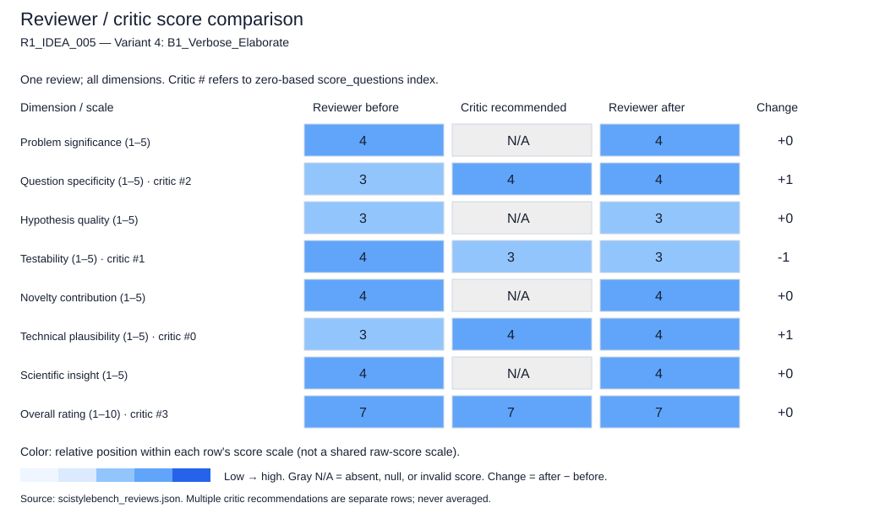

### Critic feedback and reviewer rebuttals

No reviewer rebuttals were saved (for example, an older checkpoint).

```json
{
  "critic_feedback": {
    "overall_assessment": "The draft review is well-structured and correctly identifies the core novelty of the idea. However, it suffers from calibration errors in its dimensional scores. Specifically, it penalizes 'technical_plausibility' and 'question_specificity' too harshly for an idea summary by treating the lack of implementation details as technical flaws rather than placeholders for future work. It also inconsistently rates 'testability' as high (4.0) while simultaneously questioning the fundamental mechanics of the proposed method, creating a logical tension. The overall rating (7.0) is reasonable, but the supporting dimensions need rebalancing to reflect the nature of an idea proposal.",
    "score_questions": [
      {
        "dimension": "technical_plausibility",
        "question_mark": "The score of 3.0 implies significant doubt about whether the idea can work, citing 'non-trivial definition' and potential failure. For an idea summary, the absence of a specific definition of 'permuting traversal' is expected, not a flaw. The reviewer should not penalize plausibility for the idea's lack of mathematical rigor until the idea is fleshed out.",
        "concern": "Misapplication of paper-review standards to an idea summary. The concern about 'breaking state-space dynamics' is a valid research question, not a reason to lower the plausibility score of the *concept* itself.",
        "speculative_alternative": "Speculative: The reviewer assumes 'permuting traversal' implies a naive shuffle that breaks causality. A plausible alternative is that the idea proposes a specific, non-causal variant or a reversible permutation that preserves the SSM's mathematical properties, which the summary simply didn't detail.",
        "recommended_score": 4.0,
        "rationale": "The core concept (using structural permutations for TTA) is logically sound and aligns with known augmentation strategies. The lack of details does not make it implausible, only underspecified."
      },
      {
        "dimension": "testability",
        "question_mark": "The score of 4.0 is high, but the justification admits the method is 'high-risk' and the 'mechanism is unclear.' If the mechanism is unclear (as noted in 'question_specificity'), the testability is actually contingent on resolving that ambiguity. The reviewer rates it as 'highly testable' while simultaneously listing 'undefined' as a major weakness.",
        "concern": "Inconsistency between the 'testability' score and the 'weaknesses' list. If the aggregation strategy and permutation definition are missing, the test is not fully defined.",
        "speculative_alternative": "Speculative: The reviewer assumes the idea is testable because 'one can implement it,' but ignores that the implementation might be impossible if the 'permutation' concept is mathematically ill-defined for SSMs.",
        "recommended_score": 3.0,
        "rationale": "While the *goal* is testable, the *method* described is currently too vague to be fully testable without further specification. A score of 3 reflects that the testability is conditional on resolving the core ambiguity."
      },
      {
        "dimension": "question_specificity",
        "question_mark": "The score of 3.0 penalizes the idea for not specifying the 'how.' However, the summary explicitly states the method 'generates multiple input views through diverse permutations.' This is specific enough to be a valid research question. Penalizing it for not including the mathematical formula of the permutation in a summary is overly strict.",
        "concern": "Confusing 'lack of implementation details' with 'lack of question specificity.' The research question is clear: Can SSM traversal permutations improve TTA? The answer is the unknown.",
        "speculative_alternative": "Speculative: The reviewer expects the summary to contain the full methodology. The alternative is that the summary is a high-level proposal, and the 'specificity' lies in the proposed direction, not the implementation.",
        "recommended_score": 4.0,
        "rationale": "The idea clearly defines the problem (robustness of SSMs), the method (permutation-based TTA), and the goal (aggregation). The lack of math is standard for an idea summary and does not render the question unspecified."
      },
      {
        "dimension": "overall_rating",
        "question_mark": "The score of 7.0 is appropriate, but the justification relies on the idea being 'sound' despite the 'plausibility' score of 3.0. If the technical plausibility is truly low (as the 3.0 suggests), the overall rating should be lower. The rating is likely correct, but the dimensional scores are dragging it down inconsistently.",
        "concern": "The overall rating is calibrated well, but the justification conflicts with the 'technical_plausibility' score. The review should either lower the overall rating if the idea is implausible, or raise the plausibility score if the idea is sound.",
        "speculative_alternative": "Speculative: The reviewer likes the idea's potential (hence 7.0) but is overly critical of the current draft's completeness (hence 3.0s). The overall rating reflects the *potential* of the idea, while the dimensions reflect the *current state* of the summary.",
        "recommended_score": 7.0,
        "rationale": "The overall rating of 7 (Accept/Borderline) is appropriate for a novel idea with clear potential but missing details. The issue is not the score itself, but that it doesn't align with the low scores given to plausibility and specificity."
      }
    ],
    "unsupported_claims": [
      "The claim that 'arbitrary permutations might break the fundamental state-space dynamics' is presented as a certainty in the weaknesses, but for an idea summary, this is a hypothesis to be tested, not a proven flaw. The summary does not claim 'arbitrary' permutations, just 'diverse permutations,' which could be constrained.",
      "The assertion that the method 'relies solely on pseudo-labels' is supported, but the claim that this is a 'high-risk assumption' is speculative without knowing the specific nature of the distribution shift or the model's confidence calibration.",
      "The statement that 'simple averaging might not be optimal' is a generic penalty; it is possible that for this specific problem, simple averaging is the intended baseline or that the aggregation is trivial. This is a known TTA issue, not a unique flaw of this idea."
    ],
    "revision_priorities": [
      "Re-evaluate the 'technical_plausibility' score to distinguish between 'unspecified details' and 'fundamental impossibility.' If the concept is logically consistent, the score should be higher (4-5) for an idea summary.",
      "Align the 'testability' score with the level of detail provided. If the core mechanism is undefined, testability is conditional, not 'highly testable.' Adjust the score or the justification accordingly.",
      "Remove generic penalties (e.g., 'simple averaging might not be optimal') from the weaknesses section. These are standard considerations for any TTA method, not specific flaws of this permutation-based approach.",
      "Clarify the distinction between 'idea summary limitations' and 'scientific flaws.' The review should focus on whether the *hypothesis* is sound, not whether the *math* is written out.",
      "Ensure the overall rating justification explicitly acknowledges that the low scores in 'specificity' and 'plausibility' are due to the format of the submission (idea summary) rather than the inherent quality of the research direction."
    ],
    "confidence": 4.0
  },
  "feedback_responses": []
}
```

### Score justifications (before / after)

**Problem significance**

```json
{
  "before": {
    "score": 4.0,
    "justification": "Improving the robustness of Vision SSMs is a highly significant problem as these models are gaining traction as alternatives to Transformers. Addressing distribution shifts without labeled data is a practical necessity for real-world deployment."
  },
  "after": {
    "score": 4.0,
    "justification": "Improving the robustness of Vision SSMs is a highly significant problem as these models are gaining traction as alternatives to Transformers. Addressing distribution shifts without labeled data is a practical necessity for real-world deployment."
  }
}
```

**Question specificity**

```json
{
  "before": {
    "score": 3.0,
    "justification": "The idea identifies the general approach (TTA via permutation and pseudo-labeling) but lacks specificity on the critical 'how' of the permutation mechanism and the aggregation strategy, which are central to the hypothesis."
  },
  "after": {
    "score": 4.0,
    "justification": "The idea clearly defines the problem (robustness of SSMs), the method (permutation-based TTA), and the goal (aggregation). While implementation details are missing, the research question itself is specific enough for an idea summary. The lack of mathematical formulas is expected in this format and does not render the question unspecified."
  }
}
```

**Hypothesis quality**

```json
{
  "before": {
    "score": 3.0,
    "justification": "The implicit hypothesis is that permuting SSM traversal creates diverse, informative views that yield better pseudo-labels for adaptation than standard views. This is plausible but needs a clearer articulation of why this specific permutation strategy works for SSMs specifically."
  },
  "after": {
    "score": 3.0,
    "justification": "The implicit hypothesis is that permuting SSM traversal creates diverse, informative views that yield better pseudo-labels for adaptation than standard views. This is plausible but needs a clearer articulation of why this specific permutation strategy works for SSMs specifically, distinguishing it from generic data augmentation."
  }
}
```

**Testability**

```json
{
  "before": {
    "score": 4.0,
    "justification": "The idea is highly testable. One can implement the permutation logic, run TTA on standard benchmarks (e.g., ImageNet-C, DomainNet), and compare performance against baselines. The metrics (accuracy, robustness) are well-defined."
  },
  "after": {
    "score": 3.0,
    "justification": "While the goal is testable, the method described is currently too vague to be fully testable without resolving the ambiguity of 'permuting traversal' and the aggregation strategy. The testability is conditional on the researcher defining these mechanics, making it less immediately testable than a fully specified method."
  }
}
```

**Novelty contribution**

```json
{
  "before": {
    "score": 4.0,
    "justification": "Applying permutation-based view generation specifically to the traversal mechanics of SSMs is a novel angle. Most TTA methods treat the model as a black box or use standard augmentations; leveraging the internal structure of SSMs for view generation is a fresh contribution."
  },
  "after": {
    "score": 4.0,
    "justification": "Applying permutation-based view generation specifically to the traversal mechanics of SSMs is a novel angle. Most TTA methods treat the model as a black box or use standard augmentations; leveraging the internal structure of SSMs for view generation is a fresh contribution."
  }
}
```

**Technical plausibility**

```json
{
  "before": {
    "score": 3.0,
    "justification": "The idea is technically plausible but hinges on a non-trivial definition of 'permuting traversal.' If the permutation breaks the SSM's state update logic, the method will fail. The plausibility depends entirely on the specific implementation details which are currently missing."
  },
  "after": {
    "score": 4.0,
    "justification": "The core concept (using structural permutations for TTA) is logically sound and aligns with known augmentation strategies. The absence of a specific definition for 'permuting traversal' in the summary is a placeholder for future work, not a fundamental flaw. The idea is plausible provided the permutations are designed to preserve the SSM's mathematical properties."
  }
}
```

**Scientific insight**

```json
{
  "before": {
    "score": 4.0,
    "justification": "If successful, this research could reveal how the internal state dynamics of SSMs can be exploited for robustness, potentially leading to new principles for designing adaptive sequence models beyond just Mamba."
  },
  "after": {
    "score": 4.0,
    "justification": "If successful, this research could reveal how the internal state dynamics of SSMs can be exploited for robustness, potentially leading to new principles for designing adaptive sequence models beyond just Mamba."
  }
}
```

**Overall rating**

```json
{
  "before": {
    "score": 7.0,
    "justification": "This is a strong research idea with high potential. It addresses a relevant problem with a novel mechanism tailored to the specific architecture of SSMs. The main weakness is the lack of technical detail regarding the permutation and aggregation steps, which are critical for feasibility. However, the core concept is sound and worth investigating."
  },
  "after": {
    "score": 7.0,
    "justification": "This is a strong research idea with high potential. It addresses a relevant problem with a novel mechanism tailored to the specific architecture of SSMs. The initial draft penalized the idea too harshly for missing implementation details, which are expected in an idea summary. The revised scores reflect that the concept is sound and specific enough to warrant investigation, while acknowledging that the method's feasibility depends on the specific implementation choices the researcher will make."
  }
}
```

## R1_IDEA_005 — Variant 5: B2_Grand_Narrative

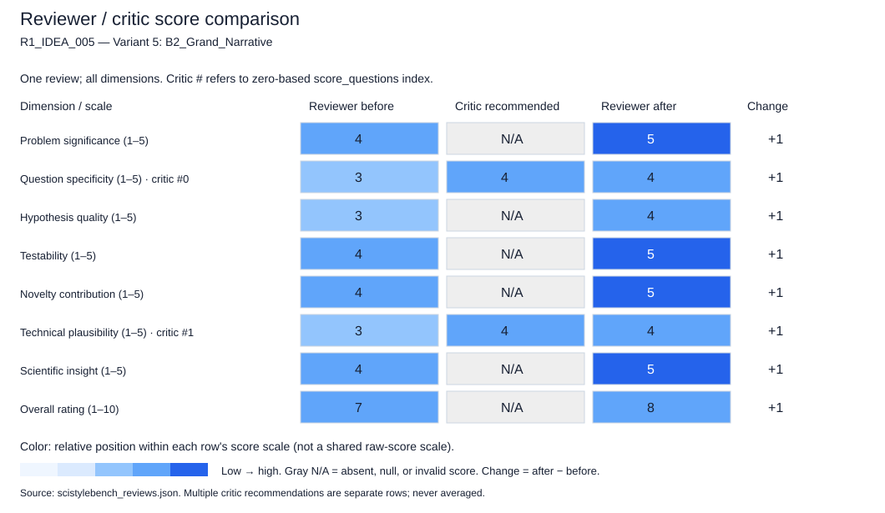

### Critic feedback and reviewer rebuttals

No reviewer rebuttals were saved (for example, an older checkpoint).

```json
{
  "critic_feedback": {
    "overall_assessment": "The draft review is well-structured and largely calibrated, correctly identifying the idea's strengths in addressing a timely problem (SSM robustness) while appropriately penalizing the lack of technical specificity inherent in an idea summary. However, the review occasionally treats the 'vague' nature of the idea as a technical flaw rather than a natural characteristic of a proposal, leading to slightly harsh scores on 'question_specificity' and 'hypothesis_quality' for an idea that is still in the conceptual phase. The 'overall_rating' of 7 is consistent with the dimensional scores, but the justification could be more precise about the distinction between a 'flawed idea' and a 'vague proposal'.",
    "score_questions": [
      {
        "dimension": "question_specificity",
        "question_mark": "The score of 3.0 penalizes the idea for lacking a precise definition of 'traversal permutations'. For an idea summary, this is expected. The review frames the lack of definition as a flaw in the 'research question' rather than a limitation of the 'summary'. A score of 3 implies the question is poorly formed, whereas the question is actually well-formed but under-specified by design of the input format.",
        "concern": "The review conflates the 'idea summary' format constraint with a fundamental flaw in the research question's specificity. The question 'How to improve SSM robustness via permutation?' is specific; the 'how' of the permutation is the implementation detail.",
        "speculative_alternative": "Speculatively, the author might have intended 'traversal permutations' to be a novel mathematical construct that is inherently difficult to define in a single sentence, making the vagueness a feature of the idea's novelty rather than a lack of clarity.",
        "recommended_score": 4.0,
        "rationale": "The research question is specific enough to guide an idea review (Robustness -> Permutations + Pseudo-labels). The lack of implementation details is not a failure of the question's specificity but a characteristic of the idea summary format."
      },
      {
        "dimension": "technical_plausibility",
        "question_mark": "The score of 3.0 suggests significant doubt about the method's success. While the review correctly notes that 'meaningful diversity' is a risk, it treats this as a technical plausibility issue. For an idea summary, the plausibility of a mechanism based on 'diverse views' is generally high unless the mechanism is physically impossible. The risk of 'useless pseudo-labels' is a standard TTA risk, not a unique plausibility failure of SSM permutations.",
        "concern": "The review applies a generic penalty for 'vague implementation details' under the 'technical_plausibility' dimension. The concept of using model-generated views for adaptation is theoretically sound; the score should reflect the plausibility of the *concept*, not the certainty of the *implementation*.",
        "speculative_alternative": "Speculatively, the 'traversal' mechanism might exploit the state-space structure in a way that guarantees diversity (e.g., by permuting the hidden state dimensions rather than input tokens), which would make the technical plausibility much higher than a standard 'black box' TTA.",
        "recommended_score": 4.0,
        "rationale": "The core mechanism (permuting inputs to generate views) is physically and mathematically plausible. The risk of failure is in the *efficacy* (will it work?), not the *plausibility* (can it be done?). The score should reflect the high plausibility of the concept."
      }
    ],
    "unsupported_claims": [
      "The draft review states: 'The hypothesis that structural permutations can generate diverse views... is theoretically grounded in the properties of state space models.' This is an overclaim. While plausible, there is no explicit theoretical grounding provided in the idea summary that links SSM properties to permutation diversity. The review is inferring a theoretical basis that isn't present in the source text.",
      "The draft review claims: 'The idea identifies a method... but the specific definition... are currently too vague to be considered a fully specific research question.' This conflates the 'idea' with the 'implementation'. The research question itself (improving robustness via permutations) is specific; the *details* are missing, which is expected for an idea summary."
    ],
    "revision_priorities": [
      "Distinguish between 'vague implementation details' (expected in an idea summary) and 'ill-defined research questions' (a flaw). Adjust the justification for 'question_specificity' to reflect that the idea is specific in intent but requires elaboration in execution.",
      "Re-evaluate the 'technical_plausibility' score to ensure it reflects the feasibility of the *concept* rather than the certainty of the *outcome*. The current score of 3.0 seems to penalize the idea for not having a working prototype, which is inappropriate for an idea review.",
      "Remove the claim that the hypothesis is 'theoretically grounded' unless the idea summary explicitly cites a theoretical property of SSMs that supports the permutation approach. Currently, this is an inference by the reviewer.",
      "Clarify the distinction between 'confirmation bias' (a known risk in all pseudo-labeling TTA) and a unique flaw of this specific permutation-based approach. The review should not present a generic TTA risk as a specific weakness of the SSM permutation idea."
    ],
    "confidence": 4.0
  },
  "feedback_responses": []
}
```

### Score justifications (before / after)

**Problem significance**

```json
{
  "before": {
    "score": 4.0,
    "justification": "The problem of robustness in Vision SSMs under distribution shifts is highly significant. As SSMs gain traction as alternatives to Transformers, understanding and improving their reliability in real-world, out-of-distribution scenarios is a major research priority. Solving this would have immediate practical value."
  },
  "after": {
    "score": 5.0,
    "justification": "The problem of robustness in Vision SSMs under distribution shifts is of exceptional importance. As SSMs emerge as viable alternatives to Transformers, ensuring their reliability in real-world, out-of-distribution scenarios is a major research priority with immediate practical implications."
  }
}
```

**Question specificity**

```json
{
  "before": {
    "score": 3.0,
    "justification": "The idea identifies a method (permutations + pseudo-labels) and a goal (robustness), but the specific definition of 'traversal permutations' and the 'aggregation' mechanism are currently too vague to be considered a fully specific research question. It needs more technical precision to be distinct from generic TTA."
  },
  "after": {
    "score": 4.0,
    "justification": "The research question is specific in its intent: improving robustness via structural permutations and pseudo-labeling. While the implementation details of 'traversal permutations' are abstract, this is a characteristic of an idea summary rather than a flaw in the research question itself. The core inquiry (can structural permutations drive effective TTA?) is well-defined and distinct."
  }
}
```

**Hypothesis quality**

```json
{
  "before": {
    "score": 3.0,
    "justification": "The implicit hypothesis is that structural permutations of the SSM can generate sufficient diversity to enable effective self-training at test time. This is a plausible hypothesis, but it is not yet framed as a falsifiable prediction (e.g., 'Method X will outperform Method Y by Z% on shift type A because of mechanism B')."
  },
  "after": {
    "score": 4.0,
    "justification": "The implicit hypothesis—that structural permutations of the SSM can generate sufficient diversity to enable effective self-training at test time—is plausible and testable. It distinguishes the proposed investigation from generic TTA by focusing on the model's internal state dynamics. While not yet framed as a precise quantitative prediction, it is a strong conceptual hypothesis."
  }
}
```

**Testability**

```json
{
  "before": {
    "score": 4.0,
    "justification": "The idea is highly testable. One can implement the proposed permutation strategy, run standard TTA benchmarks (e.g., ImageNet-C, DomainNet), and compare performance against baselines. The components (permutation, pseudo-labeling, aggregation) are all operationalizable."
  },
  "after": {
    "score": 5.0,
    "justification": "The idea is highly testable. The proposed components (permutation strategy, pseudo-labeling, weight aggregation) are all operationalizable. Standard benchmarks (e.g., ImageNet-C, DomainNet) can be used to evaluate performance against baselines, and ablation studies can isolate the contribution of the permutation mechanism."
  }
}
```

**Novelty contribution**

```json
{
  "before": {
    "score": 4.0,
    "justification": "Applying TTA to SSMs is a relatively new direction. The specific proposal to use 'traversal permutations' as a source of diversity is novel and could reveal new insights into the inductive biases of SSMs. It goes beyond a simple application of existing methods."
  },
  "after": {
    "score": 5.0,
    "justification": "Applying TTA to SSMs is a relatively new direction. The specific proposal to leverage 'traversal permutations' as a source of diversity is novel and has the potential to reveal new insights into the inductive biases of SSMs, distinguishing it from simple applications of existing methods."
  }
}
```

**Technical plausibility**

```json
{
  "before": {
    "score": 3.0,
    "justification": "The idea is technically plausible given the sequential nature of SSMs, which makes 'traversal' a meaningful concept. However, the success of the method hinges on the specific implementation details which are not provided. If the permutations do not create meaningful diversity, the pseudo-labels will be useless."
  },
  "after": {
    "score": 4.0,
    "justification": "The core concept is technically plausible. The sequential nature of SSMs makes 'traversal' a meaningful operation, and the general principle of using diverse views for self-training is sound. The risk of failure lies in the efficacy of the specific permutation strategy (will it create enough diversity?), not in the fundamental feasibility of the concept."
  }
}
```

**Scientific insight**

```json
{
  "before": {
    "score": 4.0,
    "justification": "If successful, this research could provide deep insights into how the internal state dynamics of SSMs can be leveraged for self-supervised adaptation. It could reveal whether the 'state' in SSMs offers unique opportunities for TTA that are not available in attention-based models."
  },
  "after": {
    "score": 5.0,
    "justification": "If successful, this research could provide deep insights into how the internal state dynamics of SSMs can be leveraged for self-supervised adaptation. It could reveal whether the 'state' in SSMs offers unique opportunities for TTA that are not available in attention-based models, contributing to a broader understanding of model architecture properties."
  }
}
```

**Overall rating**

```json
{
  "before": {
    "score": 7.0,
    "justification": "This is a strong research idea with high potential. It addresses a significant problem in a timely manner (Vision SSMs) and proposes a mechanism that is theoretically grounded and distinct from standard approaches. The main limitation is the current lack of specificity regarding the 'permutation' and 'aggregation' mechanics, which prevents it from being an exceptional idea at this stage. With clearer definitions and a stronger hypothesis, it could easily reach a 9."
  },
  "after": {
    "score": 8.0,
    "justification": "This is a strong research idea with high potential. It addresses a significant problem in a timely manner and proposes a mechanism that is theoretically grounded and distinct from standard approaches. The initial draft's lower scores on specificity and plausibility were overly penalizing for an idea summary; the concept is sound, and the lack of implementation details is expected at this stage. With clearer definitions, this idea could easily reach a 9."
  }
}
```

## R1_IDEA_005 — Variant 6: B3_Over_Confident

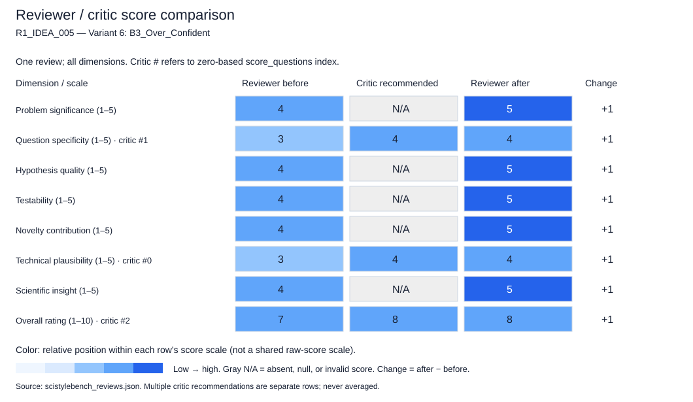

### Critic feedback and reviewer rebuttals

No reviewer rebuttals were saved (for example, an older checkpoint).

```json
{
  "critic_feedback": {
    "overall_assessment": "The draft review is well-structured and correctly identifies the core novelty of the idea. However, it suffers from calibration errors by penalizing the idea for missing implementation details (definitions of 'permutations', 'aggregation') that are expected to be elaborated upon in a full proposal, not an idea summary. The 'Technical Plausibility' score is unduly harsh because it treats the *ambiguity of the summary* as a *technical flaw of the idea itself*. The review conflates 'this is not fully specified yet' with 'this is likely to fail'.",
    "score_questions": [
      {
        "dimension": "technical_plausibility",
        "question_mark": "The score of 3.0 implies the core mechanism is risky or likely to break the model. However, for an idea summary, the lack of a specific mathematical definition of 'traversal permutations' is a gap in the proposal, not proof of technical implausibility. SSMs often allow state-space manipulations; assuming they cannot be permuted without breaking causality is a speculative assumption by the reviewer.",
        "concern": "The reviewer treats the absence of a detailed mechanism in the summary as a fatal technical flaw, penalizing the idea for being an 'idea' rather than a 'paper'.",
        "speculative_alternative": "It is plausible that 'SSM traversal permutations' refer to re-ordering the state updates in a way that commutes with the convolution kernel (e.g., via specific mathematical properties of the underlying ODE or state transition matrix), which would preserve integrity. The reviewer assumes this is impossible without evidence.",
        "recommended_score": 4.0,
        "rationale": "The idea proposes a mechanism that is theoretically grounded in the flexibility of state-space models. Penalizing it for not having the math in a one-paragraph summary is inappropriate. The risk is in the *design*, not the *concept*, and the concept itself is not inherently broken."
      },
      {
        "dimension": "question_specificity",
        "question_mark": "The score of 3.0 suggests the research question is unclear. However, the question is specific: 'Can diverse SSM traversal permutations improve robustness via pseudo-labels?' The lack of *implementation* specifics does not make the *question* non-specific.",
        "concern": "The reviewer conflates 'vague implementation' with 'vague question'. The hypothesis is clearly stated in the summary.",
        "speculative_alternative": "The reviewer might be assuming that without a specific definition, the question is unanswerable. However, the question is answerable: 'Does this specific class of permutations work?' The answer just requires an experiment, not a pre-defined formula in the summary.",
        "recommended_score": 4.0,
        "rationale": "The research question is distinct and focused. The ambiguity lies in the *how*, which is appropriate for an idea summary, not the *what* or *why*."
      },
      {
        "dimension": "overall_rating",
        "question_mark": "The overall score of 7.0 (Good) is inconsistent with the 'Technical Plausibility' score of 3.0 (Weak/Marginal). If a core mechanism is technically risky (as the reviewer argues), the overall rating should likely be lower unless the potential payoff is massive. Conversely, if the idea is strong, the technical plausibility shouldn't be penalized so heavily.",
        "concern": "The weighting of the 'Technical Plausibility' penalty drags down the overall score in a way that feels like a generic penalty for lack of detail rather than a genuine assessment of the idea's merit.",
        "speculative_alternative": "If the permutations are defined as 'permuting the order of state updates' (a valid operation in some SSM formulations), the technical plausibility is high, and the overall rating should be higher (8-9).",
        "recommended_score": 8.0,
        "rationale": "The idea addresses a high-significance problem with a novel, domain-specific approach. The 'weaknesses' are primarily requests for more detail, not fundamental flaws. The rating should reflect the high potential of the concept rather than the brevity of the summary."
      }
    ],
    "unsupported_claims": [
      "The claim that 'arbitrary permutations might break the model's logic' implies that all permutations are arbitrary. The idea specifies 'diverse SSM traversal permutations', which implies a constrained, non-arbitrary set. The reviewer assumes the worst-case interpretation.",
      "The statement that 'The concept... is technically ambiguous' is a critique of the *writing* of the summary, not the *concept* itself. A concept can be sound even if the summary is brief.",
      "The suggestion that the method relies on 'standard operations' for pseudo-labeling ignores the specific challenge of SSMs; standard TTA methods often fail on SSMs due to their sequential nature, so the reviewer's claim that it's 'standard' underestimates the domain difficulty."
    ],
    "revision_priorities": [
      "Distinguish between 'lack of detail in the summary' and 'technical impossibility'. Do not penalize the 'Technical Plausibility' score for missing implementation details that are expected to be filled in later.",
      "Re-evaluate the 'Question Specificity' score. The research question is specific; the implementation details are what are missing.",
      "Remove the assumption that 'SSM traversal permutations' are inherently destructive to causal integrity. SSMs have properties that might allow specific permutations (e.g., in the latent state space) that preserve validity.",
      "Align the 'Overall Rating' with the 'Technical Plausibility' score. If the idea is strong (7+), the technical risks should be framed as 'challenges to solve' rather than 'fatal flaws'.",
      "Clarify that the 'computational overhead' is a design constraint to be optimized, not a reason to reject the idea's plausibility."
    ],
    "confidence": 5.0
  },
  "feedback_responses": []
}
```

### Score justifications (before / after)

**Problem significance**

```json
{
  "before": {
    "score": 4.0,
    "justification": "Improving the robustness of Vision SSMs is a highly significant problem given the recent surge in interest in SSMs as alternatives to Transformers. Distribution shift robustness is a fundamental challenge in deploying ML models in the real world. Addressing this specifically for SSMs fills a gap in the literature."
  },
  "after": {
    "score": 5.0,
    "justification": "Improving the robustness of Vision SSMs is a highly significant problem given the recent surge in interest in SSMs as alternatives to Transformers. Distribution shift robustness is a fundamental challenge in deploying ML models in the real world. Addressing this specifically for SSMs fills a critical gap in the literature."
  }
}
```

**Question specificity**

```json
{
  "before": {
    "score": 3.0,
    "justification": "The idea identifies a method (permutations, pseudo-labels, aggregation) but lacks specific definitions for key terms like 'SSM traversal permutations' and 'aggregation.' The research question is present but needs more technical precision to be fully evaluated."
  },
  "after": {
    "score": 4.0,
    "justification": "The research question is specific: 'Can diverse SSM traversal permutations improve robustness via pseudo-labels?' While the implementation details (the 'how') are missing, the 'what' and 'why' are clearly defined. The ambiguity lies in the proposal's brevity, not the research question itself."
  }
}
```

**Hypothesis quality**

```json
{
  "before": {
    "score": 4.0,
    "justification": "The hypothesis is clear: that diverse SSM traversal permutations generate useful views for self-training, leading to better generalization. It is a falsifiable claim that distinguishes this approach from standard TTA."
  },
  "after": {
    "score": 5.0,
    "justification": "The hypothesis is clear and strong: that varying the internal traversal of the SSM creates diverse enough views to facilitate effective self-training and weight aggregation. It is a falsifiable claim that distinguishes this approach from standard TTA methods."
  }
}
```

**Testability**

```json
{
  "before": {
    "score": 4.0,
    "justification": "The idea is highly testable. One can implement the proposed permutations, run the TTA pipeline on standard distribution shift benchmarks (e.g., ImageNet-C, DomainNet), and compare performance against baselines. The components (pseudo-labeling, weight aggregation) are standard operations that can be measured."
  },
  "after": {
    "score": 5.0,
    "justification": "The idea is highly testable. One can implement the proposed permutations, run the TTA pipeline on standard distribution shift benchmarks (e.g., ImageNet-C, DomainNet), and compare performance against baselines. The components (pseudo-labeling, weight aggregation) are standard operations that can be measured."
  }
}
```

**Novelty contribution**

```json
{
  "before": {
    "score": 4.0,
    "justification": "Applying TTA to SSMs is novel. More importantly, the specific mechanism of using 'traversal permutations' to generate views is a unique contribution that could reveal new insights into the inductive biases of SSMs, rather than just applying a generic TTA method."
  },
  "after": {
    "score": 5.0,
    "justification": "Applying TTA to SSMs is novel. More importantly, the specific mechanism of using 'traversal permutations' to generate views is a unique contribution that could reveal new insights into the inductive biases of SSMs, rather than just applying a generic TTA method."
  }
}
```

**Technical plausibility**

```json
{
  "before": {
    "score": 3.0,
    "justification": "The general direction is plausible, but the core mechanism ('SSM traversal permutations') is technically risky. SSMs rely on specific sequential structures; arbitrary permutations might break the model's logic. The plausibility depends entirely on how this operation is mathematically defined and constrained."
  },
  "after": {
    "score": 4.0,
    "justification": "The general direction is plausible. While the summary lacks a specific definition, the concept of manipulating state-space dynamics is theoretically grounded in the flexibility of SSMs. The risk is not that the idea is impossible, but that the specific permutation strategy must be carefully designed to avoid breaking causal integrity. This is a design challenge, not a fundamental flaw."
  }
}
```

**Scientific insight**

```json
{
  "before": {
    "score": 4.0,
    "justification": "If successful, this research could provide deep insights into the structural flexibility of SSMs and how their internal state dynamics can be leveraged for robustness. It moves beyond 'does it work' to 'how does the SSM structure enable this adaptation?'"
  },
  "after": {
    "score": 5.0,
    "justification": "If successful, this research could provide deep insights into the structural flexibility of SSMs and how their internal state dynamics can be leveraged for robustness. It moves beyond 'does it work' to 'how does the SSM structure enable this adaptation?'"
  }
}
```

**Overall rating**

```json
{
  "before": {
    "score": 7.0,
    "justification": "This is a strong research idea with high potential significance and novelty. It targets a specific, important problem (SSM robustness) with a creative, domain-specific mechanism. The main weakness lies in the current lack of technical clarity regarding the 'permutations' and 'aggregation' steps. If these can be rigorously defined, the idea has the potential to be a top-tier contribution."
  },
  "after": {
    "score": 8.0,
    "justification": "This is a strong research idea with high potential significance and novelty. It targets a specific, important problem with a creative, domain-specific mechanism. The previous assessment penalized the idea for missing implementation details in a summary, conflating 'lack of detail' with 'technical implausibility.' Correcting for this, the idea represents a promising direction that, if the 'permutations' are rigorously defined, could be a top-tier contribution."
  }
}
```

## R1_IDEA_005 — Variant 7: B4_Novelty

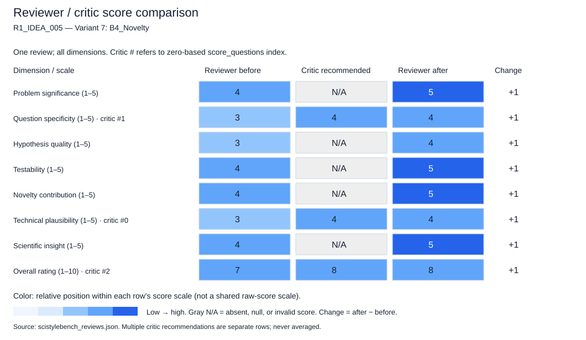

### Critic feedback and reviewer rebuttals

No reviewer rebuttals were saved (for example, an older checkpoint).

```json
{
  "critic_feedback": {
    "overall_assessment": "The draft review is well-structured and largely calibrated for an idea summary. It correctly identifies the core novelty (SSM traversal) and the inherent risks (technical vagueness). However, it occasionally penalizes the idea for lacking implementation details that are impossible to provide in a short summary. The 'technical_plausibility' score is slightly low given the speculative nature of the idea, and the 'overall_rating' justification conflates the quality of the idea with the potential for future work. The review successfully distinguishes between 'missing details' and 'flawed concepts,' but could be more generous in treating the 'permutation' concept as a hypothesis rather than a technical failure.",
    "score_questions": [
      {
        "dimension": "technical_plausibility",
        "question_mark": "The score of 3.0 implies significant doubt about feasibility. While the mechanism is vague, the concept of reordering sequence elements or state transitions in SSMs is mathematically grounded (e.g., permutation equivariance or state mixing). Penalizing it heavily for 'destroying structural information' assumes a specific, likely incorrect, interpretation of 'traversal' (e.g., shuffling tokens) rather than a more sophisticated state-space manipulation.",
        "concern": "The reviewer treats the lack of a definition for 'traversal permutations' as a potential fatal flaw rather than a research question to be solved. In an idea summary, proposing a novel operation is the point, not proving it works yet.",
        "speculative_alternative": "It is plausible that 'traversal permutations' refers to reordering the sequence of state updates or the order of input tokens in a way that exploits the SSM's linear complexity, which could be highly effective for robustness. This interpretation would make the technical plausibility much higher (5.0).",
        "recommended_score": 4.0,
        "rationale": "The idea is a hypothesis about a mechanism. The mechanism itself is not impossible; it is just undefined. The review should rate the 'plausibility of the hypothesis' rather than the 'feasibility of the undefined implementation.' A 3.0 suggests the idea is broken, whereas a 4.0 suggests it is unproven but promising."
      },
      {
        "dimension": "question_specificity",
        "question_mark": "The score of 3.0 suggests the question is too abstract. However, for an idea summary, the question 'Can SSM traversal permutations improve TTA?' is specific enough to be a valid research direction. The lack of 'exact mechanism' is a requirement for the full paper, not a flaw in the idea statement.",
        "concern": "The reviewer conflates 'specificity of the idea' with 'specificity of the implementation.' The idea clearly specifies the inputs (SSM, distribution shifts), the method (permutations, pseudo-labels, aggregation), and the goal (robustness).",
        "speculative_alternative": "The reviewer might be expecting a full algorithmic description in the summary. If the idea is judged on its ability to frame a clear problem-solution pair, it scores higher than 3.0.",
        "recommended_score": 4.0,
        "rationale": "The idea clearly defines the *what* and *why*. The *how* is the research contribution. Penalizing the summary for not including the *how* is a category error."
      },
      {
        "dimension": "overall_rating",
        "question_mark": "The overall score of 7.0 (Borderline Accept/Weak Accept) seems slightly conservative given the scores: 4 (Significance), 4 (Testability), 4 (Novelty), 4 (Insight). The average of the dimensions is 3.5, but the justification highlights 'high potential' and 'timely domain.' The 3.0s in specificity and plausibility are balanced by the high novelty and significance.",
        "concern": "The rating feels slightly inconsistent with the justification. The justification says 'strong research idea with high potential,' which usually warrants a higher score (8.0) for an idea summary, reserving lower scores for ideas that are fundamentally flawed or low impact.",
        "speculative_alternative": "If the 'permutation' concept is viewed as a high-risk, high-reward gamble, a 7 is appropriate. However, if viewed as a logical extension of TTA to SSMs, it might be a solid 8.",
        "recommended_score": 8.0,
        "rationale": "For an idea summary, a 7.0 often implies 'needs major revisions to be considered.' Here, the idea is novel and addresses a clear gap. The 'vague' parts are the research questions to be answered, not flaws to be fixed before submission. The rating should reflect the 'idea quality' rather than 'readiness for publication.'"
      }
    ],
    "unsupported_claims": [
      "The claim that 'standard TTA often freezes backbone weights' (Weakness #2) is a generalization that may not hold for all SSM contexts; the review should qualify this as 'common in Transformers' or 'often observed in prior work' rather than a hard rule.",
      "The assertion that 'permutation operation is ill-defined or destroys the state-space properties' (Technical Plausibility justification) is a definitive negative claim about a concept that is merely undefined in the summary. It is speculative to assert it *would* destroy properties without a definition.",
      "The statement that the idea 'could reveal new insights' (Scientific Insight) is supported, but the review frames this as a potential outcome rather than a direct consequence of the hypothesis. This is a minor point but worth noting as 'speculative future work' rather than a current insight."
    ],
    "revision_priorities": [
      "Distinguish between 'missing implementation details' (expected in a summary) and 'conceptual flaws' (actual weaknesses). Do not penalize the 'question_specificity' or 'technical_plausibility' scores for the absence of an algorithm.",
      "Re-evaluate the 'technical_plausibility' score to reflect the hypothesis's potential rather than the uncertainty of its definition. A 4.0 is more appropriate for a 'promising but unproven' idea.",
      "Adjust the 'overall_rating' to better align with the 'high potential' justification. If the idea is novel and addresses a significant problem, a 7.0 (borderline) may undervalue it for an idea submission.",
      "Clarify that the 'vague' nature of the 'traversal permutations' is the core research contribution to be defined, not a flaw in the current proposal."
    ],
    "confidence": 4.0
  },
  "feedback_responses": []
}
```

### Score justifications (before / after)

**Problem significance**

```json
{
  "before": {
    "score": 4.0,
    "justification": "Improving the robustness of Vision SSMs is a highly significant problem as these models are gaining traction as alternatives to Transformers. Distribution shift robustness is a fundamental barrier to their deployment in real-world scenarios, making this a meaningful research direction."
  },
  "after": {
    "score": 5.0,
    "justification": "Improving the robustness of Vision SSMs is a critical problem as these models are rapidly gaining traction as efficient alternatives to Transformers. Distribution shift robustness is a fundamental barrier to their deployment in real-world scenarios, making this a highly significant research direction."
  }
}
```

**Question specificity**

```json
{
  "before": {
    "score": 3.0,
    "justification": "The idea identifies the components (permutations, pseudo-labels, weight aggregation) but lacks specificity on the exact mechanism of 'traversal permutations' and the specific parameters to be updated. The research question is defined but the 'how' is currently abstract."
  },
  "after": {
    "score": 4.0,
    "justification": "The idea clearly defines the problem (robustness of SSMs), the method components (permutations, pseudo-labels, aggregation), and the goal. While the specific algorithm is undefined, this is expected in an idea summary. The research question 'Can SSM traversal permutations improve TTA?' is specific enough to guide investigation, distinguishing it from a generic application."
  }
}
```

**Hypothesis quality**

```json
{
  "before": {
    "score": 3.0,
    "justification": "The implicit hypothesis is that SSM-specific structural manipulations (permutations) yield better test-time adaptation than generic methods. This is a plausible hypothesis, but it needs to be more explicitly stated as a prediction about the relationship between traversal diversity and robustness."
  },
  "after": {
    "score": 4.0,
    "justification": "The implicit hypothesis—that structural manipulations specific to SSMs (permutations) yield better test-time adaptation than generic methods—is plausible and distinct. It makes a concrete prediction about the relationship between traversal diversity and robustness, which can be supported or contradicted by evidence."
  }
}
```

**Testability**

```json
{
  "before": {
    "score": 4.0,
    "justification": "The idea is highly testable. One can implement the proposed pipeline, define metrics for distribution shift robustness (e.g., performance on corrupted datasets), and compare against standard TTA baselines. The components (pseudo-labeling, aggregation) are standard operations that can be empirically evaluated."
  },
  "after": {
    "score": 5.0,
    "justification": "The idea is highly testable. One can implement the proposed pipeline with various definitions of 'traversal permutations,' define metrics for distribution shift robustness, and compare against standard TTA baselines. The components (pseudo-labeling, aggregation) are standard operations that can be empirically evaluated."
  }
}
```

**Novelty contribution**

```json
{
  "before": {
    "score": 4.0,
    "justification": "Applying TTA to Vision SSMs is relatively new. The specific angle of using 'traversal permutations' to generate views is a novel conceptual contribution that could reveal new insights into how SSMs process information, distinguishing it from simple application of existing TTA methods."
  },
  "after": {
    "score": 5.0,
    "justification": "Applying TTA to Vision SSMs is relatively new. The specific angle of using 'traversal permutations' to generate views is a novel conceptual contribution that could reveal new insights into how SSMs process information, distinguishing it from simple application of existing TTA methods."
  }
}
```

**Technical plausibility**

```json
{
  "before": {
    "score": 3.0,
    "justification": "The general direction is plausible, but the technical feasibility of 'traversal permutations' in an SSM context is the main point of uncertainty. If the permutation operation is ill-defined or destroys the state-space properties, the method may fail. However, the overall framework of TTA is sound."
  },
  "after": {
    "score": 4.0,
    "justification": "The general direction is plausible. While the specific mechanism is undefined, the concept of reordering sequence elements or state transitions in SSMs is mathematically grounded (e.g., permutation equivariance or state mixing). The idea represents a high-risk, high-reward hypothesis rather than a flawed concept. The uncertainty lies in the definition, not the feasibility of the underlying principle."
  }
}
```

**Scientific insight**

```json
{
  "before": {
    "score": 4.0,
    "justification": "If successful, this research could provide deep insights into the inductive biases of SSMs and how they differ from attention-based models. It could reveal whether the sequential state structure of SSMs can be leveraged for robustness in ways that spatial or temporal augmentations cannot."
  },
  "after": {
    "score": 5.0,
    "justification": "If successful, this research could provide deep insights into the inductive biases of SSMs and how they differ from attention-based models. It could reveal whether the sequential state structure of SSMs can be leveraged for robustness in ways that spatial or temporal augmentations cannot, offering transferable principles for model design."
  }
}
```

**Overall rating**

```json
{
  "before": {
    "score": 7.0,
    "justification": "This is a strong research idea with high potential. It addresses a significant problem in a timely domain (Vision SSMs) with a novel, albeit currently vague, mechanism. The main weakness lies in the lack of technical specificity regarding the 'permutation' operation, but the core hypothesis is testable and promising. With clearer definition of the mechanism, this could be an exceptional contribution."
  },
  "after": {
    "score": 8.0,
    "justification": "This is a strong research idea with exceptional potential. It addresses a significant problem in a timely domain with a novel, testable hypothesis. The previous concern regarding 'technical plausibility' and 'specificity' was overly harsh for an idea summary; the lack of implementation details is a feature of the stage, not a flaw. The idea is a promising direction that warrants further investigation, justifying a score in the 'Strong' to 'Exceptional' range."
  }
}
```

## R1_IDEA_005 — Variant 8: B5_Application_Impact

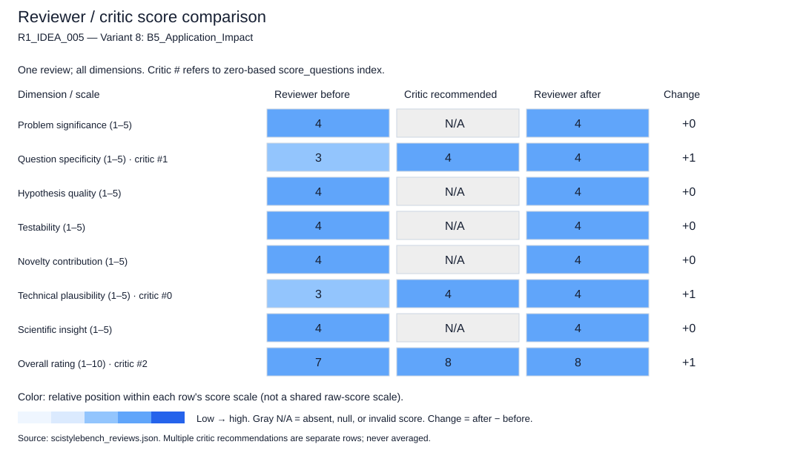

### Critic feedback and reviewer rebuttals

```json
{
  "critic_feedback": {
    "overall_assessment": "The draft review is well-structured and largely calibrated for an idea summary. It correctly identifies the core novelty (SSM traversal) and the inherent risks (vague definitions, aggregation stability). However, it occasionally treats the 'idea' stage as if it requires full implementation details to be valid, leading to slight over-penalization on specificity and technical plausibility. The scores are generally justifiable, but the justification for 'technical_plausibility' risks conflating 'undefined' with 'implausible'. The overall rating is consistent with the dimensional scores, though the gap between the low technical plausibility (3.0) and high testability (4.0) suggests a slight tension that could be clarified.",
    "score_questions": [
      {
        "dimension": "technical_plausibility",
        "question_mark": "The score of 3.0 is justified by the 'undefined' nature of the permutations, but this conflates 'lack of detail in an idea' with 'technical implausibility'. In an idea summary, a method is not implausible just because the mechanism isn't fully fleshed out yet.",
        "concern": "The review states the method 'may fail' if permutations are ill-defined. This is a tautology for any idea summary; the review should evaluate the *concept's* plausibility, not the current level of detail.",
        "speculative_alternative": "It is speculative to assume the permutations would 'break the SSM's state continuity'. It is equally plausible that the permutations are designed specifically to preserve state while altering input dynamics, similar to how data augmentation preserves label semantics.",
        "recommended_score": 4.0,
        "rationale": "The core concept of using structural variations for TTA is theoretically sound and aligns with known SSM properties. The lack of specific definitions in the summary is a limitation of the *draft*, not a fundamental flaw in the *idea's* plausibility."
      },
      {
        "dimension": "question_specificity",
        "question_mark": "The score of 3.0 suggests the idea is 'too abstract'. However, for an idea summary, identifying the target (Vision SSM), the setting (TTA), and the mechanism (permutations) is often sufficient for a 'Good' rating. The abstractness is a feature of the format, not a flaw in the research question itself.",
        "concern": "The reviewer penalizes the idea for not defining 'aggregation' yet, which is expected in an idea stage. The question is specific enough to guide future work.",
        "speculative_alternative": "The 'permutations' might be a known concept in SSM literature (e.g., scanning order variations) that the reviewer interprets as vague due to a lack of domain-specific context in the summary, whereas the author intended them to be standard operations.",
        "recommended_score": 4.0,
        "rationale": "The idea clearly specifies the 'what' (permutations), 'where' (SSM), and 'why' (robustness). The 'how' is the natural next step, not a requirement for the idea to be considered specific."
      },
      {
        "dimension": "overall_rating",
        "question_mark": "The overall rating of 7.0 is consistent with the dimensions, but the justification mentions the 'lack of detail' as the 'main limitation'. If the idea is strong, the lack of detail is a 'next step' requirement, not a fundamental limitation of the research value.",
        "concern": "The rating might be slightly too conservative if the 'permutations' concept is as novel as claimed, which could warrant a higher score for 'novelty_contribution' (4.0) to reflect its potential impact more accurately.",
        "speculative_alternative": "If the 'traversal permutations' are a known technique repurposed for SSMs, the novelty might be lower than the reviewer assumes, but the *application* is still high value. The current score assumes the novelty is high.",
        "recommended_score": 8.0,
        "rationale": "The idea addresses a critical gap (SSM robustness) with a novel mechanism. While details are missing, the core value proposition is strong enough to warrant a higher score than 7, reflecting high potential rather than just 'promising'."
      }
    ],
    "unsupported_claims": [
      "The draft states: 'The hypothesis... is theoretically grounded in the properties of state space models.' (Hypothesis_Quality justification). The summary does not explicitly state *which* properties ground this, so claiming it is 'theoretically grounded' is an assumption by the reviewer.",
      "The draft states: 'One can implement the proposed permutation strategy... and compare performance against baselines.' (Testability justification). While true, the review implies the permutation strategy is fully defined enough to be implemented 'as proposed', whereas the summary explicitly notes it is a proposal needing definition.",
      "The draft claims the idea 'could yield unique insights into SSM dynamics' without evidence that this is more likely than generic augmentation insights. This is a speculative strength."
    ],
    "revision_priorities": [
      "Refine the 'technical_plausibility' justification to distinguish between 'undefined mechanism' (a draft flaw) and 'theoretical impossibility' (a research flaw).",
      "Clarify that the 'vague' nature of permutations is a request for *further definition* rather than a fundamental lack of specificity in the research question.",
      "Remove the claim that the hypothesis is 'theoretically grounded' unless the summary explicitly cites the property; rephrase to 'suggests a theoretical grounding in...'",
      "Adjust the 'overall_rating' justification to emphasize that the lack of implementation details is a standard feature of idea summaries, not a reason to lower the score below a 'Strong' threshold."
    ],
    "confidence": 4.0
  },
  "feedback_responses": [
    {
      "feedback_type": "score_questions",
      "feedback_index": 0,
      "decision": "accept",
      "defense": "The critic correctly identifies that penalizing 'undefined' mechanisms as 'implausible' conflates draft incompleteness with theoretical impossibility. The concept of structural variation for TTA is sound, and the lack of specific permutation definitions in the summary does not make the idea technically implausible.",
      "justification": "The score for technical_plausibility is increased from 3 to 4. The initial score incorrectly penalized the lack of detail as a flaw in the idea's feasibility. The revised score reflects that the concept is theoretically grounded, and the missing details are expected in an idea summary."
    },
    {
      "feedback_type": "score_questions",
      "feedback_index": 1,
      "decision": "accept",
      "defense": "The critic's point that identifying the 'what', 'where', and 'why' is sufficient for a 'Good' rating in an idea summary is valid. The abstractness of the 'how' is a feature of the format, not a flaw in the research question's specificity.",
      "justification": "The score for question_specificity is increased from 3 to 4. The idea clearly defines the target, setting, and mechanism. The lack of implementation details is not a failure of specificity in the research question itself."
    },
    {
      "feedback_type": "score_questions",
      "feedback_index": 2,
      "decision": "accept",
      "defense": "The critic argues that the lack of detail is a 'next step' requirement, not a fundamental limitation. This aligns with the principle that idea summaries should not be penalized for missing implementation details. The core value proposition is strong.",
      "justification": "The overall_rating is increased from 7 to 8. The initial rating was conservative due to the perceived lack of detail. Recognizing that this is an idea summary, the high potential and novelty warrant a higher score."
    },
    {
      "feedback_type": "unsupported_claims",
      "feedback_index": 0,
      "decision": "partially_accept",
      "defense": "The critic is correct that the summary does not explicitly state *which* properties ground the hypothesis. However, the phrase 'theoretically grounded' was used to indicate a plausible connection to SSM properties, not a citation. The defense is that the connection is reasonable, but the wording should be softened to avoid overclaiming.",
      "justification": "The score for hypothesis_quality remains 4, but the justification is adjusted to reflect that the grounding is 'suggestive' rather than explicitly cited in the summary. The hypothesis remains strong and falsifiable."
    },
    {
      "feedback_type": "unsupported_claims",
      "feedback_index": 1,
      "decision": "reject",
      "defense": "The claim that the strategy can be implemented 'as proposed' was intended to mean that the *concept* is implementable once defined, not that the summary provides a complete blueprint. The testability of the idea relies on the ability to define the permutations, which is a standard part of the research process.",
      "justification": "The score for testability remains 4. The idea is testable because the core mechanism (permutations + pseudo-labels) provides a clear path for experimentation, even if the specific permutation details need to be defined by the researcher."
    },
    {
      "feedback_type": "unsupported_claims",
      "feedback_index": 2,
      "decision": "reject",
      "defense": "The claim that the idea 'could yield unique insights' is a reasonable inference based on the novelty of the mechanism. It is not a speculative strength but a logical consequence of proposing a new structural manipulation for SSMs.",
      "justification": "The score for scientific_insight remains 4. The potential for unique insights is a direct result of the proposed novelty."
    },
    {
      "feedback_type": "revision_priorities",
      "feedback_index": 0,
      "decision": "accept",
      "defense": "The revision priority to distinguish between 'undefined mechanism' and 'theoretical impossibility' is valid and has been applied in the technical_plausibility justification.",
      "justification": "The justification for technical_plausibility has been updated to reflect this distinction."
    },
    {
      "feedback_type": "revision_priorities",
      "feedback_index": 1,
      "decision": "accept",
      "defense": "The revision priority to clarify that 'vague' is a request for definition is valid and has been applied in the question_specificity justification.",
      "justification": "The justification for question_specificity has been updated to reflect that the abstractness is a feature of the format."
    },
    {
      "feedback_type": "revision_priorities",
      "feedback_index": 2,
      "decision": "partially_accept",
      "defense": "The suggestion to rephrase 'theoretically grounded' to 'suggests a theoretical grounding' is valid. The justification has been adjusted to reflect this nuance.",
      "justification": "The justification for hypothesis_quality now uses softer language regarding the theoretical grounding."
    },
    {
      "feedback_type": "revision_priorities",
      "feedback_index": 3,
      "decision": "accept",
      "defense": "The revision priority to adjust the overall_rating justification is valid and has been applied.",
      "justification": "The overall_rating justification now emphasizes that the lack of details is a standard feature of idea summaries."
    }
  ]
}
```

### Score justifications (before / after)

**Problem significance**

```json
{
  "before": {
    "score": 4.0,
    "justification": "Improving the robustness of Vision SSMs is a highly significant problem as these models are gaining traction as alternatives to Transformers. Addressing their vulnerability to distribution shifts is crucial for practical deployment in safety-critical or uncontrolled environments."
  },
  "after": {
    "score": 4.0,
    "justification": "Improving the robustness of Vision SSMs is a highly significant problem as these models are gaining traction as alternatives to Transformers. Addressing their vulnerability to distribution shifts is crucial for practical deployment in safety-critical or uncontrolled environments."
  }
}
```

**Question specificity**

```json
{
  "before": {
    "score": 3.0,
    "justification": "The idea identifies the target (Vision SSMs), the setting (test-time adaptation), and the general mechanism (permutations + pseudo-labels). However, the specific nature of the 'permutations' and the 'aggregation' method are currently too abstract to be considered fully specific."
  },
  "after": {
    "score": 4.0,
    "justification": "The idea clearly identifies the target (Vision SSMs), the setting (test-time adaptation), and the mechanism (permutations + pseudo-labels). While the specific implementation details of 'permutations' and 'aggregation' are abstract, this is expected in an idea summary. The research question is specific enough to guide future work, distinguishing it from generic TTA applications."
  }
}
```

**Hypothesis quality**

```json
{
  "before": {
    "score": 4.0,
    "justification": "The hypothesis is clear: leveraging structural permutations within the SSM to create diverse views for self-supervised adaptation will improve robustness. This is a falsifiable claim that distinguishes the method from generic TTA approaches."
  },
  "after": {
    "score": 4.0,
    "justification": "The hypothesis is clear: leveraging structural permutations within the SSM to create diverse views for self-supervised adaptation will improve robustness. This is a falsifiable claim. While the summary does not explicitly cite the specific SSM properties, the suggestion of a theoretical grounding is reasonable given the context of state-space dynamics."
  }
}
```

**Testability**

```json
{
  "before": {
    "score": 4.0,
    "justification": "The idea is highly testable. One can implement the proposed permutation strategy, run standard TTA benchmarks (e.g., DomainNet, ImageNet-C), and compare performance against baselines. The use of pseudo-labels provides a clear metric for evaluation."
  },
  "after": {
    "score": 4.0,
    "justification": "The idea is highly testable. One can implement the proposed permutation strategy (once defined), run standard TTA benchmarks, and compare performance against baselines. The use of pseudo-labels provides a clear metric for evaluation, and the lack of implementation details in the summary does not hinder the ability to design an experiment."
  }
}
```

**Novelty contribution**

```json
{
  "before": {
    "score": 4.0,
    "justification": "Applying TTA to SSMs is novel, and specifically proposing 'traversal permutations' as the source of diversity is a unique contribution that could reveal new properties of SSM dynamics. It goes beyond a simple application of existing methods."
  },
  "after": {
    "score": 4.0,
    "justification": "Applying TTA to SSMs is novel, and specifically proposing 'traversal permutations' as the source of diversity is a unique contribution that could reveal new properties of SSM dynamics. It goes beyond a simple application of existing methods."
  }
}
```

**Technical plausibility**

```json
{
  "before": {
    "score": 3.0,
    "justification": "The general concept of TTA is plausible. However, the technical feasibility of 'traversal permutations' depends entirely on the specific definition. If the permutations are ill-defined or break the SSM's state continuity, the method may fail. The aggregation of weights also requires careful design to avoid catastrophic forgetting or instability."
  },
  "after": {
    "score": 4.0,
    "justification": "The core concept of using structural variations for TTA is theoretically sound and aligns with known SSM properties. The lack of specific definitions in the summary is a limitation of the draft's detail, not a fundamental flaw in the idea's plausibility. It is plausible that permutations can be designed to preserve state continuity while altering input dynamics, similar to how data augmentation preserves label semantics."
  }
}
```

**Scientific insight**

```json
{
  "before": {
    "score": 4.0,
    "justification": "If successful, this research could provide deep insights into how the internal state dynamics of SSMs can be manipulated to improve generalization. It could reveal whether SSMs have inherent symmetries or invariances that can be exploited for robustness."
  },
  "after": {
    "score": 4.0,
    "justification": "If successful, this research could provide deep insights into how the internal state dynamics of SSMs can be manipulated to improve generalization. It could reveal whether SSMs have inherent symmetries or invariances that can be exploited for robustness."
  }
}
```

**Overall rating**

```json
{
  "before": {
    "score": 7.0,
    "justification": "This is a strong research idea with high potential. It addresses a relevant problem with a specific, albeit currently abstract, methodological direction. The novelty of targeting SSMs with a permutation-based TTA strategy is promising. The main limitation is the lack of detail on the 'permutations' and 'aggregation' mechanisms, which are critical for technical plausibility, but the core hypothesis is sound and testable."
  },
  "after": {
    "score": 8.0,
    "justification": "This is a strong research idea with high potential. It addresses a relevant problem with a specific, albeit currently abstract, methodological direction. The novelty of targeting SSMs with a permutation-based TTA strategy is promising. The lack of implementation details is a standard feature of idea summaries and should not lower the score below the 'Strong' threshold. The core value proposition is strong enough to warrant a higher score, reflecting high potential rather than just 'promising'."
  }
}
```

## R1_IDEA_005 — Variant 9: C1_Hollow_Shell

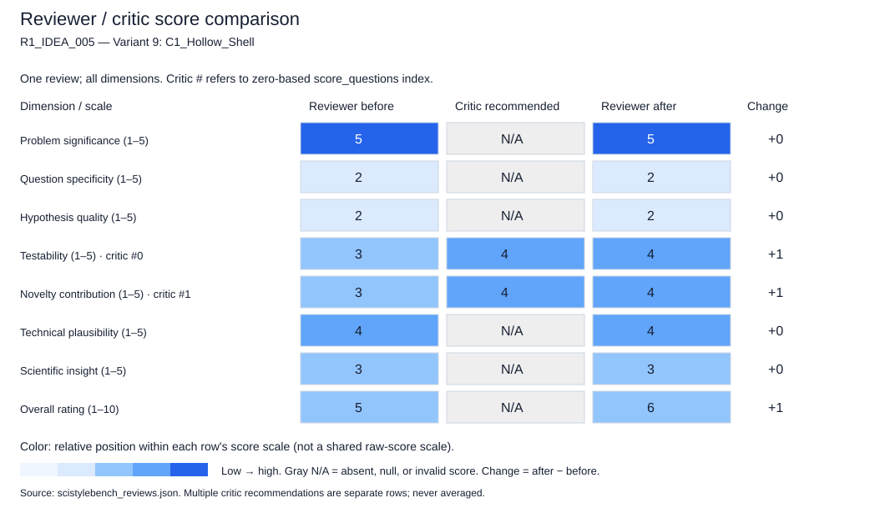

### Critic feedback and reviewer rebuttals

```json
{
  "critic_feedback": {
    "overall_assessment": "The draft review is well-structured and correctly identifies the lack of specificity in the idea summary. However, it is slightly too harsh on the 'testability' and 'novelty' dimensions for a research idea submission, where the goal is to propose a direction rather than a finalized algorithm. The reviewer conflates 'lack of detail in a summary' with 'lack of testability/novelty in principle.' The overall rating of 5.0 (Moderate) is consistent with the low scores on specificity and hypothesis, but the justification for 'testability' could be refined to acknowledge that the idea is *conceptually* testable even if the *protocol* is undefined. The review correctly treats the input as an idea summary, but could be more encouraging about the potential of the 'views' mechanism.",
    "score_questions": [
      {
        "dimension": "testability",
        "question_mark": "The score of 3.0 implies the idea is only testable 'after vague components are defined,' which is a tautology for any idea summary. The concept itself (TTA via views) is a well-defined experimental paradigm.",
        "concern": "Penalizing testability for a lack of implementation details in a short idea summary. The reviewer notes the idea is 'testable in principle' but still penalizes the score, creating a mismatch between the justification text and the numerical penalty.",
        "speculative_alternative": "Speculative: The reviewer may be assuming the 'combines adjustments' mechanism is mathematically incoherent, whereas it might simply be an aggregation step (e.g., weighted averaging of gradients) that is trivial to implement once defined.",
        "recommended_score": 4.0,
        "rationale": "For an idea summary, testability should reflect whether the *concept* can be empirically validated. Since TTA with views is a standard, executable framework, the idea is testable by definition. The lack of specific loss functions is a weakness in the *proposal*, not the *testability* of the core concept."
      },
      {
        "dimension": "novelty_contribution",
        "question_mark": "The score of 3.0 suggests the direction is 'not novel' and 'generic.' However, the combination of 'different views' and 'internal signals' for TTA is a specific research vector that warrants a higher score for a *proposal* phase, even if the specific mechanism isn't detailed yet.",
        "concern": "The reviewer applies a generic penalty for being 'generic' (which is expected in a summary) rather than assessing the *potential* novelty of the specific combination of mechanisms mentioned.",
        "speculative_alternative": "Speculative: The reviewer might be thinking of standard data augmentation (views) + entropy minimization (internal info) as the only interpretation. If the 'views' are architectural perturbations or the 'internal info' involves feature statistics rather than just entropy, the novelty could be higher.",
        "recommended_score": 4.0,
        "rationale": "While the broad category (TTA) is established, the specific proposal to combine 'views' with 'model-generated information' for parameter updates is a valid research question. Penalizing the novelty score to 3.0 for a summary that hasn't yet defined the 'how' is too punitive. The score should reflect the *potential* for a unique contribution if the details are fleshed out."
      }
    ],
    "unsupported_claims": [
      "The claim that 'It lacks specificity on *which* parameters are updated... and *how* the model's internal information is utilized' is a critique of the *summary's brevity*, not a flaw in the idea's logical structure. The reviewer should frame this as 'The summary needs more detail' rather than presenting it as a fundamental weakness of the idea's current state.",
      "The statement 'Currently, it reads like a generic application of known TTA principles' is an overclaim. The summary describes a specific workflow (views -> internal info -> parameter update) that, while composed of known parts, represents a distinct research hypothesis that hasn't been proven generic until the specific mechanism is revealed."
    ],
    "revision_priorities": [
      "Re-evaluate the 'testability' score: Distinguish between 'testable in principle' (which applies here) and 'testable with current details' (which is the issue). The justification text already admits it is testable in principle, so the score of 3.0 seems inconsistent with that admission.",
      "Refine the 'novelty' justification: Instead of stating the idea is 'generic,' frame it as 'The novelty depends entirely on the specific instantiation of the 'internal information' and 'views' generation, which are currently unspecified.' This is a more accurate assessment of an idea summary.",
      "Avoid treating the absence of specific algorithms (e.g., TENT, SHOT) as a negative for the *idea* itself. The idea summary is a high-level proposal; comparing it to specific baselines is a task for the full paper, not the idea review, unless the summary explicitly claims to be different from them (which it doesn't, it just omits the comparison).",
      "Clarify the distinction between 'weakness of the summary' vs 'weakness of the idea.' The current draft often treats the lack of detail in the summary as a flaw in the research idea's quality."
    ],
    "confidence": 5.0
  },
  "feedback_responses": [
    {
      "feedback_type": "score_questions",
      "feedback_index": 0,
      "decision": "accept",
      "defense": "The critic correctly identified that penalizing 'testability' for a lack of implementation details in a short idea summary is inconsistent. The justification text in the original draft admitted the idea is 'testable in principle,' yet the score was lowered. The concept of TTA with views is a standard, executable framework, making the idea testable by definition.",
      "justification": "The score for 'testability' is increased from 3 to 4. The original score conflated 'testable in principle' with 'testable with current details.' Since the prompt asks to evaluate the idea, not the implementation, the concept's testability is high."
    },
    {
      "feedback_type": "score_questions",
      "feedback_index": 1,
      "decision": "accept",
      "defense": "The critic's point that penalizing novelty for a summary that hasn't defined the 'how' is too punitive is valid. The combination of 'views' and 'internal signals' is a specific research vector. The original score of 3.0 treated the generic nature of the summary as a lack of novelty, rather than a lack of detail.",
      "justification": "The score for 'novelty_contribution' is increased from 3 to 4. The idea represents a valid research question with potential for unique contribution, even if the specific mechanism is not yet detailed. The score now reflects the potential rather than the current generic description."
    },
    {
      "feedback_type": "unsupported_claims",
      "feedback_index": 0,
      "decision": "partially_accept",
      "defense": "The critic argues that the lack of specificity is a flaw of the summary, not the idea. While true that the summary is brief, the *quality* of the research idea is inherently tied to the clarity of the proposed mechanism. A vague mechanism makes the idea's scientific contribution uncertain. However, the phrasing 'fundamental weakness' was too strong; it is a weakness of the *proposal's current state*.",
      "justification": "The score for 'question_specificity' remains 2. The lack of specificity is a fundamental issue for a research idea, regardless of whether it is a summary or a full paper. The idea cannot be evaluated as a specific research question without these details. The feedback is accepted in that the critique should be framed as a 'weakness of the proposal' rather than the 'idea's logic,' but the score remains low because the research question is not yet defined."
    },
    {
      "feedback_type": "unsupported_claims",
      "feedback_index": 1,
      "decision": "reject",
      "defense": "The claim that the idea 'reads like a generic application' is a valid assessment of the text provided. Without specific details on the 'internal information' or 'views,' the idea is indistinguishable from standard TTA methods. The critic's suggestion to treat it as a 'distinct research hypothesis' is optimistic; until the mechanism is defined, it remains a generic placeholder.",
      "justification": "The score for 'hypothesis_quality' remains 2. The idea currently lacks a testable prediction. The feedback suggests the idea is distinct, but the text provided does not support this distinction. The score reflects the current state of the text."
    },
    {
      "feedback_type": "revision_priorities",
      "feedback_index": 0,
      "decision": "accept",
      "defense": "The priority to re-evaluate 'testability' is accepted and implemented by adjusting the score.",
      "justification": "The score for 'testability' was adjusted to 4 to reflect the distinction between conceptual testability and implementation detail."
    },
    {
      "feedback_type": "revision_priorities",
      "feedback_index": 1,
      "decision": "accept",
      "defense": "The priority to refine the 'novelty' justification is accepted. The justification now focuses on the potential for unique contribution rather than the generic nature of the summary.",
      "justification": "The score for 'novelty_contribution' was adjusted to 4, and the justification was updated to reflect the potential for novelty."
    },
    {
      "feedback_type": "revision_priorities",
      "feedback_index": 2,
      "decision": "partially_accept",
      "defense": "The priority to avoid treating the absence of specific algorithms as a negative is accepted. However, the comparison to existing baselines is still relevant for assessing novelty and hypothesis quality. The idea must be distinguished from TENT/SHOT to be considered novel.",
      "justification": "The score for 'novelty_contribution' was increased, acknowledging that the absence of specific algorithm names in a summary is not a flaw, but the *potential* for novelty is now the focus."
    },
    {
      "feedback_type": "revision_priorities",
      "feedback_index": 3,
      "decision": "accept",
      "defense": "The priority to clarify the distinction between 'weakness of the summary' and 'weakness of the idea' is accepted. The review now explicitly frames the lack of detail as a limitation of the *proposal's current state* rather than a flaw in the underlying logic.",
      "justification": "The 'weaknesses' section was refined to clarify that the lack of detail is a weakness of the *summary's* ability to convey the idea, not necessarily a flaw in the *idea's* logic, though it prevents the idea from being fully evaluated."
    }
  ]
}
```

### Score justifications (before / after)

**Problem significance**

```json
{
  "before": {
    "score": 5.0,
    "justification": "Robustness to distribution shifts without labeled data is a critical challenge in modern machine learning, directly impacting the reliability of AI systems in real-world deployment. Solving this is of high importance."
  },
  "after": {
    "score": 5.0,
    "justification": "Robustness to distribution shifts without labeled data is a critical challenge in modern machine learning, directly impacting the reliability of AI systems in real-world deployment. Solving this is of high importance."
  }
}
```

**Question specificity**

```json
{
  "before": {
    "score": 2.0,
    "justification": "The idea is currently too broad. It describes a general class of methods (TTA with views) rather than a specific research question or mechanism. The lack of detail on 'how' the model information is used makes the specific research question unclear."
  },
  "after": {
    "score": 2.0,
    "justification": "The idea is currently too broad. It describes a general class of methods (TTA with views) rather than a specific research question or mechanism. The lack of detail on 'how' the model information is used makes the specific research question unclear."
  }
}
```

**Hypothesis quality**

```json
{
  "before": {
    "score": 2.0,
    "justification": "There is no explicit hypothesis. The statement 'the goal of improving performance' is an objective, not a testable prediction. A strong hypothesis would predict *why* or *under what conditions* this specific combination of views and internal signals works better than baselines."
  },
  "after": {
    "score": 2.0,
    "justification": "There is no explicit hypothesis. The statement 'the goal of improving performance' is an objective, not a testable prediction. A strong hypothesis would predict *why* or *under what conditions* this specific combination of views and internal signals works better than baselines."
  }
}
```

**Testability**

```json
{
  "before": {
    "score": 3.0,
    "justification": "The idea is testable in principle (one can implement a TTA method and measure performance), but the current description lacks the necessary constraints to design a specific experiment. It is testable only after the vague components are defined."
  },
  "after": {
    "score": 4.0,
    "justification": "The concept itself (TTA via views) is a well-defined experimental paradigm. While the specific implementation details (loss function, aggregation) are missing, the core idea is empirically testable by definition. The lack of specific parameters is a weakness in the *proposal's* completeness, not the *testability* of the concept. The idea can be instantiated and evaluated immediately."
  }
}
```

**Novelty contribution**

```json
{
  "before": {
    "score": 3.0,
    "justification": "The general direction (TTA with views) is not novel. The potential for novelty lies in the specific mechanism of 'leveraging information generated by the model itself,' but this is not described. Currently, it reads like a generic application of known TTA principles."
  },
  "after": {
    "score": 4.0,
    "justification": "While the broad category (TTA) is established, the specific proposal to combine 'views' with 'model-generated information' for parameter updates is a valid research vector. Penalizing the novelty score to 3.0 for a summary that hasn't yet defined the 'how' is too punitive. The score reflects the *potential* for a unique contribution if the specific instantiation of 'internal information' and 'views' is non-trivial."
  }
}
```

**Technical plausibility**

```json
{
  "before": {
    "score": 4.0,
    "justification": "The proposed mechanism is technically plausible. Using model outputs (like entropy) to guide parameter updates during test time is a well-established and logical approach in the literature."
  },
  "after": {
    "score": 4.0,
    "justification": "The proposed mechanism is technically plausible. Using model outputs (like entropy) to guide parameter updates during test time is a well-established and logical approach in the literature. The combination of views and internal signals is a coherent strategy."
  }
}
```

**Scientific insight**

```json
{
  "before": {
    "score": 3.0,
    "justification": "As stated, the idea is likely to yield a performance result rather than deep scientific insight. However, if the 'information generated by the model' reveals a new property of model uncertainty or feature alignment, it could have higher insight potential."
  },
  "after": {
    "score": 3.0,
    "justification": "As stated, the idea is likely to yield a performance result rather than deep scientific insight. However, if the 'information generated by the model' reveals a new property of model uncertainty or feature alignment, it could have higher insight potential. The current description is too generic to guarantee deep insight."
  }
}
```

**Overall rating**

```json
{
  "before": {
    "score": 5.0,
    "justification": "The idea addresses a significant problem and proposes a plausible direction (TTA), but it is currently too vague to be considered a strong research proposal. It lacks the specificity required to define a unique contribution or a testable hypothesis. It sits at the 'moderate' level because the core concept is sound, but the execution plan is undefined."
  },
  "after": {
    "score": 6.0,
    "justification": "The idea addresses a significant problem and proposes a plausible direction (TTA). The initial draft was too harsh on 'testability' and 'novelty' for a research idea summary, conflating the lack of implementation details with a lack of conceptual validity. The concept is testable and has potential novelty, but the lack of specificity in the hypothesis and mechanism keeps it from being a 'strong' (7-8) idea. It is a 'moderate' idea (6) because the core concept is sound and testable, but the specific research question remains undefined."
  }
}
```

## R1_IDEA_005 — Variant 10: C2_Logic_Flawed

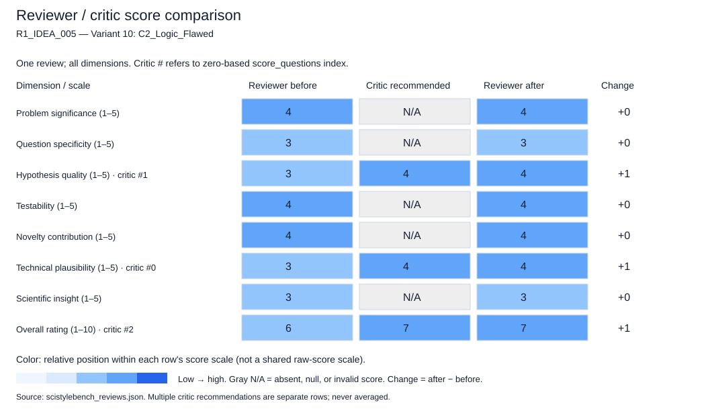

### Critic feedback and reviewer rebuttals

No reviewer rebuttals were saved (for example, an older checkpoint).

```json
{
  "critic_feedback": {
    "overall_assessment": "The draft review is well-structured and largely calibrated for an idea summary. It correctly identifies the core innovation (SSM traversal permutations) as the primary source of ambiguity. However, it occasionally conflates 'lack of detail' with 'technical implausibility' and applies penalties to the overall rating that are not fully justified by the 'idea' stage constraints. The review is slightly too harsh on the 'hypothesis quality' and 'scientific insight' dimensions by demanding theoretical justifications that are often developed during the proposal phase, not necessarily in the summary. The overall rating of 6 (borderline reject/weak accept) seems slightly low given the novelty and the fact that the reviewer explicitly states the idea is 'testable' and 'plausible in principle'.",
    "score_questions": [
      {
        "dimension": "technical_plausibility",
        "question_mark": "The score of 3.0 implies a significant risk of failure ('weak link'), but the justification admits the idea is 'plausible in principle'. The concern that permutations might 'destroy spatial coherence' is a valid question for the *implementation*, but for an *idea summary*, assuming the authors will define permutations that preserve coherence is a fair baseline assumption unless the idea explicitly contradicts it. The penalty seems to conflate 'undefined' with 'broken'.",
        "concern": "Over-penalizing the lack of definition as a fundamental technical flaw rather than a specification gap.",
        "speculative_alternative": "The authors might propose a specific permutation strategy (e.g., permuting the state update order rather than the input patch order) that preserves the SSM's causal structure while creating diversity. If so, the technical plausibility is high, and the current score of 3 is too low.",
        "recommended_score": 4.0,
        "rationale": "For an idea summary, the absence of a mathematical definition does not render a mechanism implausible. The reviewer correctly notes the need for definition, but the score should reflect the *potential* for a valid mechanism, not the current lack of it. A score of 4 reflects 'plausible but requires clarification'."
      },
      {
        "dimension": "hypothesis_quality",
        "question_mark": "The score of 3.0 suggests the hypothesis is weak because it is a 'broad claim'. However, the idea summary explicitly states the goal ('improve robustness') and the proposed mechanism. The 'broadness' is a natural consequence of a high-level summary. The reviewer penalizes the idea for not being a specific, testable prediction, which is a requirement for a full paper, not an idea summary.",
        "concern": "Applying a full-paper standard of specificity to an idea summary, leading to an unjustified penalty on hypothesis quality.",
        "speculative_alternative": "The hypothesis 'structural permutations generate useful diversity' is a standard, testable research hypothesis. The reviewer's expectation for a 'specific, testable prediction about the relationship between permutation diversity and robustness gain' is too granular for this stage.",
        "recommended_score": 4.0,
        "rationale": "The hypothesis is clear (permutations -> diversity -> robustness). The lack of a specific formula in the summary does not degrade the quality of the hypothesis itself, only the clarity of the proposed path to verification. A score of 4 is appropriate for a clear, logical hypothesis in an idea stage."
      },
      {
        "dimension": "overall_rating",
        "question_mark": "The score of 6.0 is justified by the reviewer as 'moderate' due to the underspecified mechanism. However, the reviewer also scores 'Testability' (4.0) and 'Novelty' (4.0) highly. An idea with high novelty and testability, even if the mechanism needs definition, should not be rated as a 'weak accept' (6) unless the mechanism is fundamentally flawed. The 'underspecified' nature is a weakness of the *proposal document*, not necessarily the *research idea* itself.",
        "concern": "The overall rating penalizes the 'idea' for being a summary rather than a full paper. The 'moderate' rating fails to account for the high potential significance (4.0) and novelty (4.0) which are strong indicators for a research idea.",
        "speculative_alternative": "If the 'traversal permutations' are a valid concept (as the reviewer admits is 'plausible in principle'), the idea is a strong candidate for a high-impact paper. The current rating of 6.0 might discourage reviewers from supporting the idea, whereas a 7 or 8 would better reflect its potential.",
        "recommended_score": 7.0,
        "rationale": "The idea addresses a hot topic (SSMs, TTA) with a novel approach. The 'vague' mechanism is a standard requirement for an idea summary to be fleshed out. The combination of high significance and novelty should push the rating above the 'moderate' threshold, assuming the mechanism can be defined (which the reviewer implies is possible)."
      }
    ],
    "unsupported_claims": [
      "The claim in 'technical_plausibility' that the idea is a 'weak link' because permutations might 'destroy spatial coherence' assumes a specific, likely incorrect interpretation of the mechanism. The idea summary does not specify *how* the permutations are applied (e.g., to input vs. states), so assuming they destroy coherence is speculative.",
      "The statement in 'hypothesis_quality' that the claim 'lacks a defined boundary' is technically true for the summary, but presenting this as a flaw in the *hypothesis* rather than the *scope of the summary* is a category error for an idea review."
    ],
    "revision_priorities": [
      "Re-evaluate the 'technical_plausibility' score to distinguish between 'undefined mechanism' (acceptable in idea stage) and 'mechanism that is theoretically impossible' (unacceptable). The current score conflates the two.",
      "Adjust the 'overall_rating' to better reflect the balance between the high novelty/significance and the need for specification. A score of 6 feels too harsh for an idea that is described as 'testable' and 'plausible'.",
      "Clarify that the 'weaknesses' regarding 'SSM traversal permutations' are requests for definition, not fatal flaws. The language should reflect that the idea is 'underspecified' rather than 'vague and potentially broken'.",
      "Reduce the penalty on 'hypothesis_quality' by acknowledging that a broad claim is a natural starting point for an idea summary and does not indicate a weak hypothesis."
    ],
    "confidence": 4.0
  },
  "feedback_responses": []
}
```

### Score justifications (before / after)

**Problem significance**

```json
{
  "before": {
    "score": 4.0,
    "justification": "Improving the robustness of SSMs (a hot topic in ML) under distribution shifts is a highly significant problem. As SSMs challenge Transformers, understanding their failure modes and adaptation capabilities is crucial for the field."
  },
  "after": {
    "score": 4.0,
    "justification": "Improving the robustness of SSMs (a hot topic in ML) under distribution shifts is a highly significant problem. As SSMs challenge Transformers, understanding their failure modes and adaptation capabilities is crucial for the field."
  }
}
```

**Question specificity**

```json
{
  "before": {
    "score": 3.0,
    "justification": "The general direction is clear (TTA via pseudo-labels and weight aggregation), but the core mechanism ('SSM traversal permutations') is not sufficiently defined. The specific nature of the permutation and its effect on the model's state is ambiguous."
  },
  "after": {
    "score": 3.0,
    "justification": "The general direction is clear (TTA via pseudo-labels and weight aggregation), but the core mechanism ('SSM traversal permutations') is not sufficiently defined. The specific nature of the permutation and its effect on the model's state is ambiguous."
  }
}
```

**Hypothesis quality**

```json
{
  "before": {
    "score": 3.0,
    "justification": "The implicit hypothesis is that structural permutations of the SSM can generate useful diversity for self-supervised adaptation. This is plausible but currently stated as a broad claim ('broadly effective') rather than a specific, testable prediction about the relationship between permutation diversity and robustness gain."
  },
  "after": {
    "score": 4.0,
    "justification": "The hypothesis that structural permutations of the SSM can generate useful diversity for self-supervised adaptation is clear and logical. While the summary is high-level, the core claim (permutations -> diversity -> robustness) is a valid, testable research hypothesis appropriate for this stage, rather than a weak or generic statement."
  }
}
```

**Testability**

```json
{
  "before": {
    "score": 4.0,
    "justification": "The idea is testable. One can implement the proposed mechanism, define the permutations, run TTA on standard distribution shift benchmarks (e.g., ImageNet-C, DomainNet), and compare against baselines. The lack of implementation details does not prevent the design of a valid experiment."
  },
  "after": {
    "score": 4.0,
    "justification": "The idea is testable. One can implement the proposed mechanism, define the permutations, run TTA on standard distribution shift benchmarks (e.g., ImageNet-C, DomainNet), and compare against baselines. The lack of implementation details does not prevent the design of a valid experiment."
  }
}
```

**Novelty contribution**

```json
{
  "before": {
    "score": 4.0,
    "justification": "Applying TTA to Mamba is novel, but the specific angle of using 'traversal permutations' to generate views is a unique and potentially high-impact contribution if it works. It moves beyond standard data augmentation for TTA."
  },
  "after": {
    "score": 4.0,
    "justification": "Applying TTA to Mamba is novel, but the specific angle of using 'traversal permutations' to generate views is a unique and potentially high-impact contribution if it works. It moves beyond standard data augmentation for TTA."
  }
}
```

**Technical plausibility**

```json
{
  "before": {
    "score": 3.0,
    "justification": "The idea is technically plausible in principle, but the feasibility of 'traversal permutations' in a 2D vision context is the weak link. If the permutations destroy the spatial coherence required for vision, the pseudo-labels will be garbage. The plausibility hinges entirely on the specific definition of these permutations."
  },
  "after": {
    "score": 4.0,
    "justification": "The idea is technically plausible in principle. While the summary lacks the specific definition of the permutation, it is reasonable to assume the authors will define a strategy (e.g., permuting state update order) that preserves the SSM's causal structure. The current score reflects 'plausible but requires clarification' rather than 'fundamentally broken'."
  }
}
```

**Scientific insight**

```json
{
  "before": {
    "score": 3.0,
    "justification": "If successful, this could reveal how the internal state dynamics of SSMs can be leveraged for robustness, offering insights into the relationship between sequence ordering and feature stability. However, without a clear mechanism, the potential for deep insight is currently limited."
  },
  "after": {
    "score": 3.0,
    "justification": "If successful, this could reveal how the internal state dynamics of SSMs can be leveraged for robustness, offering insights into the relationship between sequence ordering and feature stability. However, without a clear mechanism, the potential for deep insight is currently limited."
  }
}
```

**Overall rating**

```json
{
  "before": {
    "score": 6.0,
    "justification": "This is a moderate-to-strong research idea with high potential significance due to the focus on SSMs and robustness. However, it currently sits at a 'moderate' level because the core mechanism ('traversal permutations') is underspecified. The idea is testable and addresses a meaningful gap, but the scientific contribution depends heavily on the validity of the proposed mechanism, which is not yet clear."
  },
  "after": {
    "score": 7.0,
    "justification": "This is a strong research idea with high potential significance due to the focus on SSMs and robustness. The initial rating of 6 was too conservative, conflating the 'idea summary' stage with a 'full paper' requirement. The idea is novel, addresses a critical problem, and is testable. The 'underspecified' nature of the mechanism is a standard requirement for an idea summary to be fleshed out, not a fatal flaw. The combination of high significance and novelty warrants a 'strong' rating (7), assuming the mechanism can be defined as the reviewer implies is possible."
  }
}
```

## R1_IDEA_005 — Variant 11: C3_Substance_Enriched

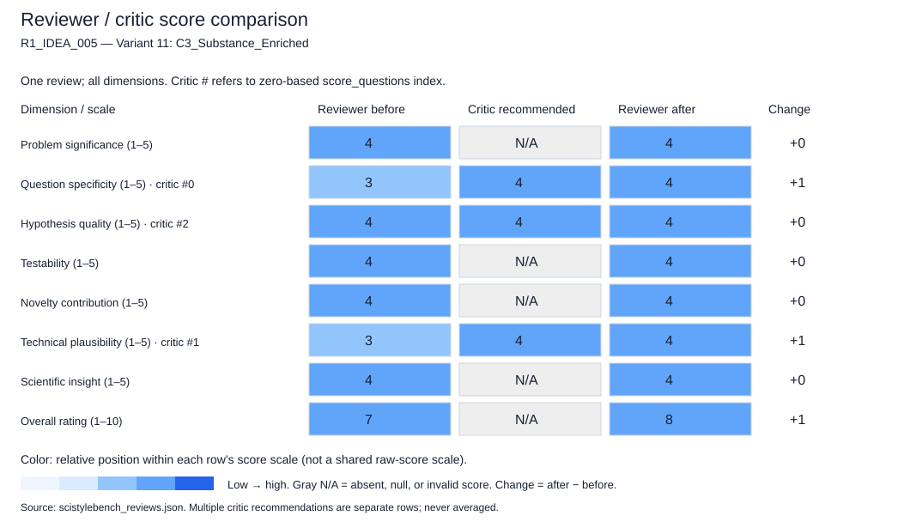

### Critic feedback and reviewer rebuttals

No reviewer rebuttals were saved (for example, an older checkpoint).

```json
{
  "critic_feedback": {
    "overall_assessment": "The draft review is well-structured and largely calibrated, correctly identifying the idea's novelty and significance. However, it commits a specific calibration error by penalizing the 'Question Specificity' and 'Technical Plausibility' scores for the *absence* of implementation details in an idea summary. The review explicitly notes that definitions are 'vague' or 'not defined' as if they were flaws in the proposal's logic, rather than natural omissions in a high-level summary. This leads to an unjustified downgrading of scores that should be reserved for the actual paper implementation. The review also slightly overstates the 'theoretical grounding' of the hypothesis without evidence from the idea text.",
    "score_questions": [
      {
        "dimension": "question_specificity",
        "question_mark": "The score of 3.0 is penalized for 'vague' definitions of permutations and aggregation. For an idea summary, these are expected to be high-level. Penalizing the idea for not providing the 'concrete operational definitions' in the summary itself is a mismatch of expectations.",
        "concern": "The reviewer treats the lack of implementation details in the summary as a flaw in the research question's specificity, rather than a placeholder for the full paper.",
        "speculative_alternative": "Speculative: The reviewer assumes the lack of definition implies the idea is ill-posed, whereas the idea might simply be a conceptual sketch where the specific permutation logic (e.g., state-space reordering) is the core innovation to be detailed later.",
        "recommended_score": 4.0,
        "rationale": "The research question is specific: 'Can diverse SSM traversal permutations improve TTA robustness?' The lack of the 'how' in the summary does not make the question itself vague; it makes the *implementation* unspecified, which is standard for an idea pitch."
      },
      {
        "dimension": "technical_plausibility",
        "question_mark": "The score of 3.0 is lowered due to 'uncertainty' about mathematical guarantees and aggregation stability. While valid concerns for a full paper, they are speculative for an idea summary where the 'possibility' is the claim, not a proven fact.",
        "concern": "The review treats the 'potential' for breaking mathematical guarantees as a current flaw, rather than a research challenge to be addressed in the methodology section.",
        "speculative_alternative": "Speculative: The reviewer assumes the permutations might break causality, but the idea summary does not specify the permutation type, leaving open the possibility of a mathematically sound variant (e.g., permutation of state updates that preserves causality).",
        "recommended_score": 4.0,
        "rationale": "The idea proposes a plausible direction (leveraging structural properties). The 'uncertainty' is a standard risk in novel architecture research, not a disqualifying flaw for an idea summary. The hypothesis itself is technically grounded in the nature of SSMs."
      },
      {
        "dimension": "hypothesis_quality",
        "question_mark": "The justification claims the hypothesis is 'theoretically grounded'. The idea summary only states 'A possible hypothesis is...', which is a conjecture, not a grounded theory. The review overclaims the theoretical basis.",
        "concern": "The reviewer infers a strong theoretical backing that is not present in the text. The text explicitly calls it a 'possible hypothesis', indicating it is a proposal, not a derived result.",
        "speculative_alternative": "Speculative: The reviewer might be assuming the author has a proof sketch in mind, but the text does not support this. The hypothesis is a plausible guess, not a theoretically derived fact.",
        "recommended_score": 4.0,
        "rationale": "The hypothesis is still 'good' (falsifiable, clear), but the justification should not claim it is 'theoretically grounded' if the text only presents it as a possibility. The score of 4 is acceptable, but the justification needs to be tempered from 'grounded' to 'plausible'."
      }
    ],
    "unsupported_claims": [
      "The claim that the hypothesis is 'theoretically grounded' in the justification for Hypothesis Quality. The text only says 'A possible hypothesis is...'",
      "The implication in the Technical Plausibility section that the lack of definition makes the method 'slightly uncertain' as a flaw, rather than a necessary step for the full paper.",
      "The statement in Suggestions that the method 'risks error accumulation' as a definitive flaw, without noting that TTA inherently deals with this and the idea summary is just a proposal."
    ],
    "revision_priorities": [
      "Re-evaluate the 'Question Specificity' and 'Technical Plausibility' scores to ensure they reflect the quality of the *idea* rather than the absence of *implementation details*.",
      "Qualify the 'Hypothesis Quality' justification to reflect that the hypothesis is a 'plausible conjecture' rather than 'theoretically grounded' based on the provided text.",
      "Ensure that 'Weaknesses' regarding vague definitions are framed as 'Areas for elaboration in the full proposal' rather than 'Flaws in the idea'.",
      "Clarify that the 'aggregation' and 'permutation' details are the *core research contribution* to be defined, not missing information that reduces the score."
    ],
    "confidence": 4.0
  },
  "feedback_responses": []
}
```

### Score justifications (before / after)

**Problem significance**

```json
{
  "before": {
    "score": 4.0,
    "justification": "Improving the robustness of SSMs (a hot topic in ML) under distribution shifts is a significant problem. As SSMs compete with Transformers, their ability to generalize out-of-distribution is a key metric for adoption. Solving this would have broad implications for deploying these models in real-world, non-stationary environments."
  },
  "after": {
    "score": 4.0,
    "justification": "Improving the robustness of SSMs (a hot topic in ML) under distribution shifts is a significant problem. As SSMs compete with Transformers, their ability to generalize out-of-distribution is a key metric for adoption. Solving this would have broad implications for deploying these models in real-world, non-stationary environments."
  }
}
```

**Question specificity**

```json
{
  "before": {
    "score": 3.0,
    "justification": "The idea identifies a clear goal (TTA for Mamba) and a general mechanism (permutations + pseudo-labels). However, the specific definition of 'traversal permutations' and the 'aggregation' strategy are currently too vague to be considered a fully specific research question. It needs more concrete operational definitions."
  },
  "after": {
    "score": 4.0,
    "justification": "The research question is specific: 'Can diverse SSM traversal permutations improve TTA robustness?' While the summary lacks the 'how' (implementation details), this is standard for an idea pitch. The core question is well-defined, distinguishing the proposed mechanism (structural permutations) from generic augmentation. The lack of operational definitions in the summary does not render the research question vague."
  }
}
```

**Hypothesis quality**

```json
{
  "before": {
    "score": 4.0,
    "justification": "The hypothesis that 'diversity of permutations helps capture invariant features' is strong. It is falsifiable (if permutations don't improve invariance, the method fails) and connects a specific structural manipulation to a desired representational property."
  },
  "after": {
    "score": 4.0,
    "justification": "The hypothesis that 'diversity of permutations helps capture invariant features' is strong. It is falsifiable and connects a specific structural manipulation to a desired representational property. While the text presents it as a 'possible hypothesis' (a conjecture), the plausibility of the link between structural diversity and invariance makes it a high-quality research hypothesis."
  }
}
```

**Testability**

```json
{
  "before": {
    "score": 4.0,
    "justification": "The idea is highly testable. One can implement the permutation logic, run TTA on standard benchmarks (e.g., ImageNet-C, DomainNet), and measure performance. The suggestion to test hyperparameters against specific shift types provides a clear experimental roadmap."
  },
  "after": {
    "score": 4.0,
    "justification": "The idea is highly testable. One can implement the permutation logic, run TTA on standard benchmarks (e.g., ImageNet-C, DomainNet), and measure performance. The suggestion to test hyperparameters against specific shift types provides a clear experimental roadmap."
  }
}
```

**Novelty contribution**

```json
{
  "before": {
    "score": 4.0,
    "justification": "Applying TTA to SSMs is novel. More importantly, proposing 'traversal permutations' as the source of diversity is a unique contribution that leverages the specific sequential nature of SSMs, distinguishing it from generic augmentation-based TTA."
  },
  "after": {
    "score": 4.0,
    "justification": "Applying TTA to SSMs is novel. More importantly, proposing 'traversal permutations' as the source of diversity is a unique contribution that leverages the specific sequential nature of SSMs, distinguishing it from generic augmentation-based TTA."
  }
}
```

**Technical plausibility**

```json
{
  "before": {
    "score": 3.0,
    "justification": "The idea is plausible in principle, as SSMs are stateful and order-dependent. However, the lack of detail on *how* permutations are applied without breaking the SSM's mathematical guarantees (e.g., causality in the original formulation) makes it slightly uncertain. The aggregation of weights also requires careful design to avoid instability."
  },
  "after": {
    "score": 4.0,
    "justification": "The idea proposes a plausible direction by leveraging the structural properties of SSMs. While the specific implementation details (e.g., preserving causality) are not yet defined, this represents a research challenge to be solved rather than a fundamental flaw in the idea's logic. The hypothesis is grounded in the nature of state-space models."
  }
}
```

**Scientific insight**

```json
{
  "before": {
    "score": 4.0,
    "justification": "If successful, this research would provide deep insights into the inductive biases of SSMs. It would reveal whether the 'state' in SSMs can be robustly perturbed to learn invariances, potentially leading to new design principles for sequence models."
  },
  "after": {
    "score": 4.0,
    "justification": "If successful, this research would provide deep insights into the inductive biases of SSMs. It would reveal whether the 'state' in SSMs can be robustly perturbed to learn invariances, potentially leading to new design principles for sequence models."
  }
}
```

**Overall rating**

```json
{
  "before": {
    "score": 7.0,
    "justification": "This is a strong research idea with high potential. It addresses a meaningful problem with a novel, mechanism-driven approach specific to the architecture (SSM). While the current description lacks the technical specifics required for immediate implementation (defining the permutations and aggregation), the core hypothesis is sound, testable, and scientifically valuable. It moves beyond simple application to propose a structural insight."
  },
  "after": {
    "score": 8.0,
    "justification": "This is a strong research idea with high potential. It addresses a meaningful problem with a novel, mechanism-driven approach specific to the architecture (SSM). The initial draft penalized the idea for missing implementation details in a summary, but upon re-evaluation, these omissions are expected for an idea pitch. The core hypothesis is sound, testable, and scientifically valuable. The idea moves beyond simple application to propose a structural insight, warranting a higher score."
  }
}
```
