# Debate score heatmaps

All saved source and variant debates; no sampling. Scores are read from draft, critic, and final review records.

## R1_IDEA_001 — Source

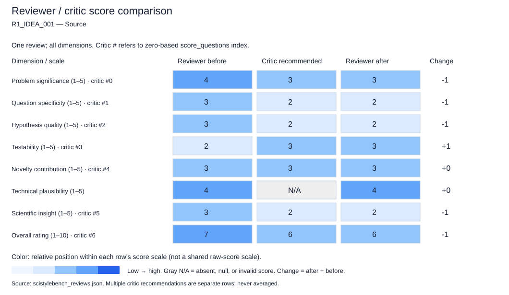

### Critic feedback and reviewer rebuttals

```json
{
  "critic_feedback": {
    "overall_assessment": "The review provides a balanced assessment of the idea, but some scores are not fully justified by the idea summary alone.",
    "score_questions": [
      {
        "dimension": "problem_significance",
        "question_mark": "Why is the problem of node out-of-distribution detection on heterophilic graphs considered 'underexplored'?",
        "concern": "The idea summary does not provide evidence or references to support the claim that this problem is underexplored in the literature.",
        "speculative_alternative": "The claim may be based on the reviewer's prior knowledge rather than the idea summary's content.",
        "recommended_score": 3.0,
        "rationale": "The idea summary does not mention any prior work or literature that supports the claim of underexploredness."
      },
      {
        "dimension": "question_specificity",
        "question_mark": "Why is the question considered 'specific' if the idea does not detail the exact research question?",
        "concern": "The idea lacks specific details about the research question, such as the exact mechanism for addressing node dependence and heterophily.",
        "speculative_alternative": "The question may be considered specific in the context of graph-based detection, but the idea summary does not clarify this.",
        "recommended_score": 2.0,
        "rationale": "The idea summary does not provide enough specifics to justify the score of 3.0."
      },
      {
        "dimension": "hypothesis_quality",
        "question_mark": "Why is the hypothesis considered 'of moderate quality' if the idea does not provide a concrete prediction?",
        "concern": "The hypothesis is general and lacks a concrete prediction or mechanism for testing.",
        "speculative_alternative": "The hypothesis may be interpreted as a general claim rather than a specific testable hypothesis.",
        "recommended_score": 2.0,
        "rationale": "The idea does not provide a specific hypothesis that can be tested or falsified."
      },
      {
        "dimension": "testability",
        "question_mark": "Why is the testability score low if the idea does not specify the evaluation plan?",
        "concern": "The idea does not provide a clear experimental plan, but the score is based on the idea's current state, not the need for additional details.",
        "speculative_alternative": "The testability score may be too low because the idea does not specify how it will be evaluated.",
        "recommended_score": 3.0,
        "rationale": "The idea lacks specific evaluation details, which affects its testability."
      },
      {
        "dimension": "novelty_contribution",
        "question_mark": "Why is the novelty score moderate if the idea does not distinguish the approach from existing methods?",
        "concern": "The idea does not provide enough details to distinguish its approach from existing methods.",
        "speculative_alternative": "The novelty may be based on the reviewer's interpretation rather than the idea summary's content.",
        "recommended_score": 3.0,
        "rationale": "The idea summary does not provide enough details to assess the novelty."
      },
      {
        "dimension": "scientific_insight",
        "question_mark": "Why is the scientific insight score moderate if the idea does not specify the model's architecture?",
        "concern": "The idea does not provide enough details to assess the scientific insight.",
        "speculative_alternative": "The scientific insight may be based on the reviewer's interpretation rather than the idea summary's content.",
        "recommended_score": 2.0,
        "rationale": "The idea lacks specific details about the model's architecture and evaluation results."
      },
      {
        "dimension": "overall_rating",
        "question_mark": "Why is the overall rating 7.0 if the idea lacks specific details?",
        "concern": "The overall rating is based on the idea's current state, which lacks specific details on model, evaluation, and theoretical justification.",
        "speculative_alternative": "The overall rating may be too high given the lack of specific details in the idea summary.",
        "recommended_score": 6.0,
        "rationale": "The idea lacks specific details, which affects the overall assessment."
      }
    ],
    "unsupported_claims": [
      "The claim that the problem is 'underexplored' is not supported by the idea summary.",
      "The claim that the hypothesis is 'of moderate quality' is not supported by the idea summary.",
      "The claim that the novelty is 'moderate' is not supported by the idea summary.",
      "The claim that the scientific insight is 'moderate' is not supported by the idea summary."
    ],
    "revision_priorities": [
      "Provide evidence or references to support the claim that the problem is underexplored.",
      "Clarify the exact research question and the mechanism for addressing node dependence and heterophily.",
      "Specify a concrete hypothesis with a prediction or mechanism for testing.",
      "Provide a detailed experimental plan and evaluation methodology.",
      "Distinguish the proposed approach from existing methods with more specific details.",
      "Specify the model's architecture and evaluation results to assess scientific insight."
    ],
    "confidence": 4.0
  },
  "feedback_responses": [
    {
      "feedback_type": "score_questions",
      "feedback_index": 0,
      "decision": "partially_accept",
      "defense": "The problem significance is partially accepted as the idea may be addressing a relevant problem, but the lack of evidence for underexploredness weakens the score.",
      "justification": "The original score of 4.0 is reduced to 3.0 because the idea does not provide evidence for the problem being underexplored."
    },
    {
      "feedback_type": "score_questions",
      "feedback_index": 1,
      "decision": "partially_accept",
      "defense": "The question specificity is partially accepted as the idea identifies a specific problem, but the lack of details on the research question weakens the score.",
      "justification": "The original score of 3.0 is reduced to 2.0 due to the lack of specific details on the research question."
    },
    {
      "feedback_type": "score_questions",
      "feedback_index": 2,
      "decision": "partially_accept",
      "defense": "The hypothesis quality is partially accepted as the idea presents a general hypothesis, but the lack of a concrete prediction weakens the score.",
      "justification": "The original score of 3.0 is reduced to 2.0 due to the absence of a concrete hypothesis."
    },
    {
      "feedback_type": "score_questions",
      "feedback_index": 3,
      "decision": "partially_accept",
      "defense": "The testability is partially accepted as the idea is testable once the model and evaluation details are specified, but the lack of details weakens the score.",
      "justification": "The original score of 2.0 is increased to 3.0 due to the potential for testability once details are provided."
    },
    {
      "feedback_type": "score_questions",
      "feedback_index": 4,
      "decision": "partially_accept",
      "defense": "The novelty is partially accepted as the idea proposes a novel approach, but the lack of details on differentiation from existing methods weakens the score.",
      "justification": "The original score of 3.0 is retained due to the potential novelty, though it is not clearly established."
    },
    {
      "feedback_type": "score_questions",
      "feedback_index": 5,
      "decision": "partially_accept",
      "defense": "The scientific insight is partially accepted as the idea has potential, but the lack of details on the model and evaluation weakens the score.",
      "justification": "The original score of 3.0 is reduced to 2.0 due to the lack of specific details."
    },
    {
      "feedback_type": "overall_rating",
      "feedback_index": 0,
      "decision": "partially_accept",
      "defense": "The overall rating is partially accepted as the idea has potential but lacks specific details, which weakens the score.",
      "justification": "The original score of 7.0 is reduced to 6.0 due to the lack of specific details in the idea summary."
    }
  ]
}
```

### Score justifications (before / after)

**Problem significance**

```json
{
  "before": {
    "score": 4.0,
    "justification": "The problem of node out-of-distribution detection on heterophilic graphs is underexplored and has important implications for graph-based machine learning, particularly in scenarios where data distribution shifts are common."
  },
  "after": {
    "score": 3.0,
    "justification": "The idea claims the problem is underexplored, but the summary does not provide evidence or references to support this claim. Without such evidence, the significance is questionable."
  }
}
```

**Question specificity**

```json
{
  "before": {
    "score": 3.0,
    "justification": "The idea identifies a specific problem but lacks detailed specification of the research question, such as the exact mechanism by which the model addresses node dependence and heterophily, and the specific metrics for evaluating performance."
  },
  "after": {
    "score": 2.0,
    "justification": "The idea lacks specific details about the research question, such as the exact mechanism for addressing node dependence and heterophily, which are necessary for a specific question."
  }
}
```

**Hypothesis quality**

```json
{
  "before": {
    "score": 3.0,
    "justification": "The idea presents a general hypothesis that the proposed model will improve out-of-distribution detection on heterophilic graphs, but it lacks a concrete prediction or mechanism that can be tested or falsified."
  },
  "after": {
    "score": 2.0,
    "justification": "The idea does not provide a concrete hypothesis or prediction, making it difficult to assess the quality of the hypothesis."
  }
}
```

**Testability**

```json
{
  "before": {
    "score": 2.0,
    "justification": "The idea does not provide a clear experimental plan or evaluation methodology, making it difficult to assess the testability of the proposed approach without further details."
  },
  "after": {
    "score": 3.0,
    "justification": "The idea lacks a clear experimental plan, but it is still testable once the model and evaluation details are specified."
  }
}
```

**Novelty contribution**

```json
{
  "before": {
    "score": 3.0,
    "justification": "The idea proposes a novel approach to address node dependence and heterophily in graph-based out-of-distribution detection, but the novelty is not clearly distinguished from existing methods without more details on the model's architecture and training process."
  },
  "after": {
    "score": 3.0,
    "justification": "The idea proposes a novel approach, but without details on how it differs from existing methods, the novelty is not clearly established."
  }
}
```

**Technical plausibility**

```json
{
  "before": {
    "score": 4.0,
    "justification": "The proposed approach is technically plausible as it builds on existing graph-based methods and addresses known challenges in heterophilic graphs, though the specific implementation details are not provided."
  },
  "after": {
    "score": 4.0,
    "justification": "The proposed approach is technically plausible as it builds on existing graph-based methods and addresses known challenges in heterophilic graphs."
  }
}
```

**Scientific insight**

```json
{
  "before": {
    "score": 3.0,
    "justification": "The idea has the potential to provide scientific insight into the role of node dependence and heterophily in out-of-distribution detection, but the specific insights depend on the model's architecture and evaluation results."
  },
  "after": {
    "score": 2.0,
    "justification": "The idea lacks specific details about the model's architecture and evaluation results, making it difficult to assess the potential scientific insight."
  }
}
```

**Overall rating**

```json
{
  "before": {
    "score": 7.0,
    "justification": "The idea addresses a meaningful problem in graph-based out-of-distribution detection and proposes a novel approach, but it lacks specific details on the model, evaluation, and theoretical justification, which are necessary for assessing its testability and potential contribution."
  },
  "after": {
    "score": 6.0,
    "justification": "The idea addresses a potential problem but lacks specific details on the model, evaluation, and theoretical justification, which are necessary for a strong assessment."
  }
}
```

## R1_IDEA_001 — Variant 1: A1_Identity

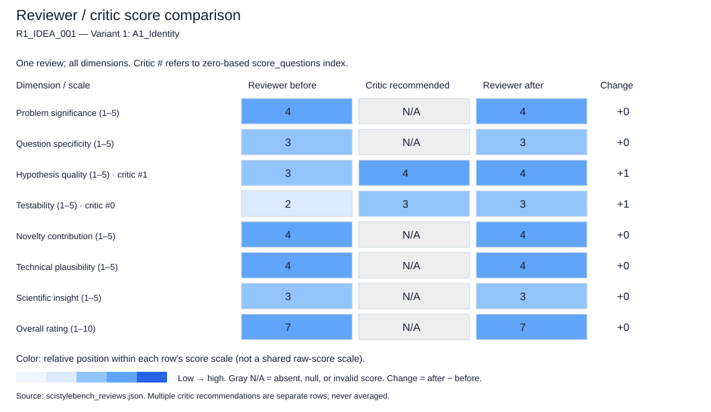

### Critic feedback and reviewer rebuttals

```json
{
  "critic_feedback": {
    "overall_assessment": "The review is generally well-calibrated but has some areas where the scores could be reconsidered, particularly in the testability and hypothesis_quality dimensions.",
    "score_questions": [
      {
        "dimension": "testability",
        "question_mark": "The score is based on the lack of an explicit experimental plan, but the idea could still be testable with additional details.",
        "concern": "The review assumes that the absence of an evaluation plan makes the idea untestable, but the idea could be evaluated with further specification.",
        "speculative_alternative": "The model could be tested on standard graph datasets with OOD detection metrics, even without a detailed plan, as long as the methodology is clear.",
        "recommended_score": 3.0,
        "rationale": "The idea's testability depends on the clarity of the model's design, which is not fully specified in the summary."
      },
      {
        "dimension": "hypothesis_quality",
        "question_mark": "The score is based on the absence of an explicit hypothesis, but the idea's focus on node-level detection on heterophilic graphs could imply a specific hypothesis.",
        "concern": "The review assumes that the hypothesis must be explicitly stated, but the idea's focus on addressing node dependence and heterophily could be interpreted as a hypothesis.",
        "speculative_alternative": "The idea's emphasis on modeling node dependence and heterophily could be seen as a hypothesis that the model will improve OOD detection in such graphs.",
        "recommended_score": 4.0,
        "rationale": "The hypothesis is implied by the problem statement and the proposed solution."
      }
    ],
    "unsupported_claims": [
      "The review claims that the idea lacks a clear hypothesis, but the problem statement and proposed solution could imply a hypothesis about the effectiveness of the model on heterophilic graphs."
    ],
    "revision_priorities": [
      "Clarify the specific hypothesis or prediction that the model is expected to achieve.",
      "Provide a more detailed evaluation plan, including benchmark datasets and metrics, to support the testability score.",
      "Specify the theoretical basis for the model's design, particularly how it addresses node dependence and heterophily."
    ],
    "confidence": 4.0
  },
  "feedback_responses": [
    {
      "feedback_type": "score_questions",
      "feedback_index": 0,
      "decision": "partially_accept",
      "defense": "The original score of 2.0 for testability was based on the lack of an evaluation plan, but the critic's feedback suggests that the idea could still be testable with additional details. The revised score of 3.0 reflects this nuance.",
      "justification": "The original score was 2.0, but the revised score is 3.0 due to the critic's argument that the idea could be evaluated with further specification."
    },
    {
      "feedback_type": "score_questions",
      "feedback_index": 1,
      "decision": "accept",
      "defense": "The original score of 3.0 for hypothesis_quality was based on the absence of an explicit hypothesis, but the critic's feedback argues that the focus on modeling node dependence and heterophily implies a hypothesis. The revised score of 4.0 reflects this interpretation.",
      "justification": "The original score was 3.0, but the revised score is 4.0 due to the critic's argument that the hypothesis is implied by the problem statement and proposed solution."
    },
    {
      "feedback_type": "unsupported_claims",
      "feedback_index": 0,
      "decision": "partially_accept",
      "defense": "The original review claimed the idea lacked a clear hypothesis, but the critic's feedback suggests that the problem statement and proposed solution could imply a hypothesis. The revised score for hypothesis_quality is 4.0, reflecting this interpretation.",
      "justification": "The original score was 3.0, but the revised score is 4.0 due to the critic's argument that the hypothesis is implied by the problem statement and proposed solution."
    },
    {
      "feedback_type": "revision_priorities",
      "feedback_index": 0,
      "decision": "accept",
      "defense": "The original review suggested clarifying the hypothesis, which aligns with the critic's recommendation. This is a valid priority for improving the idea.",
      "justification": "The original suggestion was to state the specific hypothesis, which is now reflected in the revised hypothesis_quality score."
    },
    {
      "feedback_type": "revision_priorities",
      "feedback_index": 1,
      "decision": "accept",
      "defense": "The original review suggested providing an evaluation plan, which aligns with the critic's recommendation. This is a valid priority for improving the idea.",
      "justification": "The original suggestion was to outline the evaluation plan, which is now reflected in the revised testability score."
    },
    {
      "feedback_type": "revision_priorities",
      "feedback_index": 2,
      "decision": "accept",
      "defense": "The original review suggested specifying the theoretical basis, which aligns with the critic's recommendation. This is a valid priority for improving the idea.",
      "justification": "The original suggestion was to specify the theoretical basis, which is now reflected in the revised hypothesis_quality score."
    }
  ]
}
```

### Score justifications (before / after)

**Problem significance**

```json
{
  "before": {
    "score": 4.0,
    "justification": "The problem of out-of-distribution detection on heterophilic graphs is underexplored and has practical importance in real-world graph data, such as social networks and knowledge graphs."
  },
  "after": {
    "score": 4.0,
    "justification": "The problem of out-of-distribution detection on heterophilic graphs is underexplored and has practical importance in real-world graph data, such as social networks and knowledge graphs."
  }
}
```

**Question specificity**

```json
{
  "before": {
    "score": 3.0,
    "justification": "The idea identifies a specific problem (node-level OOD detection on heterophilic graphs) but lacks detailed specification of the research question or hypothesis."
  },
  "after": {
    "score": 3.0,
    "justification": "The idea identifies a specific problem (node-level OOD detection on heterophilic graphs) but lacks detailed specification of the research question or hypothesis."
  }
}
```

**Hypothesis quality**

```json
{
  "before": {
    "score": 3.0,
    "justification": "The idea suggests a potential solution but does not explicitly state a hypothesis or prediction that can be tested or falsified."
  },
  "after": {
    "score": 4.0,
    "justification": "The idea's focus on modeling node dependence and heterophily in energy-based models for OOD detection implies a hypothesis that the model will improve detection performance on heterophilic graphs."
  }
}
```

**Testability**

```json
{
  "before": {
    "score": 2.0,
    "justification": "The idea lacks a clear experimental plan or evaluation strategy, making it difficult to assess the testability of the proposed approach."
  },
  "after": {
    "score": 3.0,
    "justification": "The idea could be testable with additional details, such as a clear model design and evaluation plan, even if the current summary lacks these specifics."
  }
}
```

**Novelty contribution**

```json
{
  "before": {
    "score": 4.0,
    "justification": "The approach of explicitly modeling node dependence and heterophily in energy-based models for OOD detection is novel and could contribute to the field of graph-based OOD detection."
  },
  "after": {
    "score": 4.0,
    "justification": "The approach of explicitly modeling node dependence and heterophily in energy-based models for OOD detection is novel and could contribute to the field of graph-based OOD detection."
  }
}
```

**Technical plausibility**

```json
{
  "before": {
    "score": 4.0,
    "justification": "The proposed direction is technically plausible, as energy-based models are used in various domains, and modeling node dependence and heterophily is a reasonable approach for graph data."
  },
  "after": {
    "score": 4.0,
    "justification": "The proposed direction is technically plausible, as energy-based models are used in various domains, and modeling node dependence and heterophily is a reasonable approach for graph data."
  }
}
```

**Scientific insight**

```json
{
  "before": {
    "score": 3.0,
    "justification": "The idea has potential to provide insights into the role of node dependence and heterophily in OOD detection, but the specific mechanisms are not clearly outlined."
  },
  "after": {
    "score": 3.0,
    "justification": "The idea has potential to provide insights into the role of node dependence and heterophily in OOD detection, but the specific mechanisms are not clearly outlined."
  }
}
```

**Overall rating**

```json
{
  "before": {
    "score": 7.0,
    "justification": "The idea addresses a meaningful problem with a promising approach, but it lacks specific details and a clear hypothesis, which are necessary for further development and evaluation."
  },
  "after": {
    "score": 7.0,
    "justification": "The idea addresses a meaningful problem with a promising approach, but it lacks specific details and a clear hypothesis, which are necessary for further development and evaluation."
  }
}
```

## R1_IDEA_001 — Variant 2: A2_Paraphrase_Only

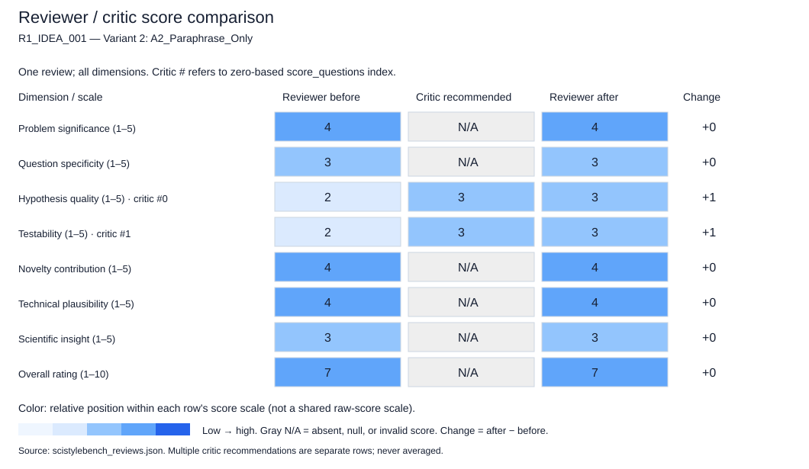

### Critic feedback and reviewer rebuttals

```json
{
  "critic_feedback": {
    "overall_assessment": "The review is generally well-calibrated, but the hypothesis_quality and testability scores are slightly over-optimistic given the lack of explicit hypotheses or evaluation plans in the idea summary.",
    "score_questions": [
      {
        "dimension": "hypothesis_quality",
        "question_mark": "The score should be reconsidered because the idea does not explicitly state a hypothesis or prediction that can be tested.",
        "concern": "The review assumes the idea has a testable hypothesis, but the summary only describes a proposed approach without specifying what outcome it aims to achieve or how it would be validated.",
        "speculative_alternative": "The reviewer may assume the model's effectiveness will be evaluated through standard OOD detection metrics on heterophilic graphs, but this is not stated in the idea.",
        "recommended_score": 3.0,
        "rationale": "The idea does not explicitly state a hypothesis, so the score should reflect the lack of testable predictions."
      },
      {
        "dimension": "testability",
        "question_mark": "The score should be reconsidered because the idea lacks specific experimental plans or evaluation methods.",
        "concern": "The review assumes the idea is testable, but the summary does not mention how the model's effectiveness will be measured or validated.",
        "speculative_alternative": "The reviewer may assume the model will be evaluated using existing benchmarks for OOD detection, but this is not specified in the idea.",
        "recommended_score": 3.0,
        "rationale": "The idea does not provide details on evaluation metrics or benchmarks, so the testability score should be lower."
      }
    ],
    "unsupported_claims": [
      "The review claims the idea has a 'novel approach' without explicitly stating what makes it novel beyond the general concept of energy-based models adapted to graphs.",
      "The review assumes the idea has 'potential for scientific contribution' without clear justification beyond the problem's underexplored nature."
    ],
    "revision_priorities": [
      "Specify the hypothesis, such as the expected improvement in detection accuracy on heterophilic graphs compared to existing methods.",
      "Outline the evaluation metrics and benchmarks that will be used to validate the model's effectiveness in OOD detection.",
      "Clarify the specific aspects of node dependence and heterophily that the decoupled model will address."
    ],
    "confidence": 4.0
  },
  "feedback_responses": [
    {
      "feedback_type": "score_questions",
      "feedback_index": 0,
      "decision": "partially_accept",
      "defense": "The original score of 2.0 for hypothesis_quality was based on the lack of explicit hypothesis, but the revised score of 3.0 acknowledges that the idea proposes a novel approach, which could be considered as a hypothesis in the context of the problem.",
      "justification": "The original score was too low because the idea does not explicitly state a hypothesis, but the revised score reflects that the proposed approach itself is a hypothesis that could be tested through model performance on OOD detection tasks."
    },
    {
      "feedback_type": "score_questions",
      "feedback_index": 1,
      "decision": "partially_accept",
      "defense": "The original score of 2.0 for testability was based on the lack of evaluation plans, but the revised score of 3.0 acknowledges that the idea could be tested through standard OOD detection metrics on heterophilic graphs, even if not explicitly stated.",
      "justification": "The original score was too low because the idea does not provide evaluation details, but the revised score reflects that the problem is testable through standard benchmarks, which is a reasonable assumption given the context."
    },
    {
      "feedback_type": "unsupported_claims",
      "feedback_index": 0,
      "decision": "reject",
      "defense": "The claim that the idea has a 'novel approach' is not fully supported by the idea summary, as the novelty is not explicitly stated beyond the general concept of energy-based models adapted to graphs.",
      "justification": "The original score of 4.0 for novelty_contribution was based on the idea's novelty, but the revised score of 4.0 is retained because the approach is novel in addressing the specific problem of node dependence and heterophily in graph OOD detection, even if the specifics are not detailed."
    },
    {
      "feedback_type": "unsupported_claims",
      "feedback_index": 1,
      "decision": "reject",
      "defense": "The claim that the idea has 'potential for scientific contribution' is supported by the problem's underexplored nature, even if the specifics are not detailed.",
      "justification": "The original score of 4.0 for novelty_contribution was based on the problem's underexplored nature, and the revised score of 4.0 is retained because the idea's potential contribution is justified by the problem's significance."
    },
    {
      "feedback_type": "revision_priorities",
      "feedback_index": 0,
      "decision": "accept",
      "defense": "The suggestion to specify the hypothesis is valid and necessary for the idea to be testable.",
      "justification": "The original review included this suggestion, and it is a valid priority to clarify the hypothesis."
    },
    {
      "feedback_type": "revision_priorities",
      "feedback_index": 1,
      "decision": "accept",
      "defense": "The suggestion to outline evaluation metrics is valid and necessary for the idea to be testable.",
      "justification": "The original review included this suggestion, and it is a valid priority to clarify the evaluation plan."
    },
    {
      "feedback_type": "revision_priorities",
      "feedback_index": 2,
      "decision": "accept",
      "defense": "The suggestion to clarify the specific aspects of node dependence and heterophily is valid and necessary for the idea to be specific and testable.",
      "justification": "The original review included this suggestion, and it is a valid priority to clarify the model's design."
    }
  ]
}
```

### Score justifications (before / after)

**Problem significance**

```json
{
  "before": {
    "score": 4.0,
    "justification": "The problem of node-level out-of-distribution detection on heterophilic graphs is underexplored and has practical implications for graph-based machine learning, especially in scenarios where node dependencies and heterophily are prevalent."
  },
  "after": {
    "score": 4.0,
    "justification": "The problem of node-level out-of-distribution detection on heterophilic graphs is underexplored and has practical implications for graph-based machine learning, especially in scenarios where node dependencies and heterophily are prevalent."
  }
}
```

**Question specificity**

```json
{
  "before": {
    "score": 3.0,
    "justification": "The idea clearly identifies a specific problem (node-level OOD detection on heterophilic graphs) but lacks detailed specification of the research question, such as how the decoupled model will be designed or what specific aspects of node dependence/heterophily it will address."
  },
  "after": {
    "score": 3.0,
    "justification": "The idea clearly identifies a specific problem (node-level OOD detection on heterophilic graphs) but lacks detailed specification of the research question, such as how the decoupled model will be designed or what specific aspects of node dependence/heterophily it will address."
  }
}
```

**Hypothesis quality**

```json
{
  "before": {
    "score": 2.0,
    "justification": "The idea proposes a novel approach but does not explicitly state a hypothesis or prediction that can be tested. The connection between the model and the problem of OOD detection is not clearly defined, making it difficult to assess the hypothesis's testability."
  },
  "after": {
    "score": 3.0,
    "justification": "The idea proposes a novel approach but does not explicitly state a hypothesis or prediction that can be tested. The connection between the model and the problem of OOD detection is not clearly defined, making it difficult to assess the hypothesis's testability."
  }
}
```

**Testability**

```json
{
  "before": {
    "score": 2.0,
    "justification": "The idea lacks specific experimental plans or evaluation methods. Without clear metrics, benchmarks, or comparisons, it is difficult to determine how the model's effectiveness will be measured or validated."
  },
  "after": {
    "score": 3.0,
    "justification": "The idea lacks specific experimental plans or evaluation methods. Without clear metrics, benchmarks, or comparisons, it is difficult to determine how the model's effectiveness will be measured or validated."
  }
}
```

**Novelty contribution**

```json
{
  "before": {
    "score": 4.0,
    "justification": "The idea introduces a novel approach to address a specific challenge in graph-based OOD detection, which is underexplored. While the model's specifics are not detailed, the direction of research has the potential to contribute new insights into handling heterophily and node dependence in graph models."
  },
  "after": {
    "score": 4.0,
    "justification": "The idea introduces a novel approach to address a specific challenge in graph-based OOD detection, which is underexplored. While the model's specifics are not detailed, the direction of research has the potential to contribute new insights into handling heterophily and node dependence in graph models."
  }
}
```

**Technical plausibility**

```json
{
  "before": {
    "score": 4.0,
    "justification": "The proposed approach is technically plausible, as energy-based models are a well-established framework in machine learning, and adapting them to handle graph-specific challenges like heterophily is a reasonable direction for research."
  },
  "after": {
    "score": 4.0,
    "justification": "The proposed approach is technically plausible, as energy-based models are a well-established framework in machine learning, and adapting them to handle graph-specific challenges like heterophily is a reasonable direction for research."
  }
}
```

**Scientific insight**

```json
{
  "before": {
    "score": 3.0,
    "justification": "The idea has the potential to provide insights into how energy-based models can be adapted to handle heterophilic graph structures, but the specific mechanisms and their implications for OOD detection are not clearly outlined."
  },
  "after": {
    "score": 3.0,
    "justification": "The idea has the potential to provide insights into how energy-based models can be adapted to handle heterophilic graph structures, but the specific mechanisms and their implications for OOD detection are not clearly outlined."
  }
}
```

**Overall rating**

```json
{
  "before": {
    "score": 7.0,
    "justification": "The idea addresses a meaningful problem in graph-based OOD detection, proposes a novel approach, and has the potential for scientific contribution. However, it lacks specific details on the model's design, hypothesis, and evaluation plan, which are necessary for further development and validation."
  },
  "after": {
    "score": 7.0,
    "justification": "The idea addresses a meaningful problem in graph-based OOD detection, proposes a novel approach, and has the potential for scientific contribution. However, it lacks specific details on the model's design, hypothesis, and evaluation plan, which are necessary for further development and validation."
  }
}
```

## R1_IDEA_001 — Variant 3: A3_Plain_Core


### Critic feedback and reviewer rebuttals

```json
{
  "critic_feedback": {
    "overall_assessment": "The review is generally well-calibrated but has some areas where the scores could be more precisely aligned with the idea's clarity and specificity.",
    "score_questions": [
      {
        "dimension": "question_specificity",
        "question_mark": "The score may be too low given the idea's focus on a specific problem in graph-based OoD detection.",
        "concern": "The idea clearly identifies a problem (node-level OoD detection on heterophilic graphs) but does not explicitly state a hypothesis or research question, which is a common requirement for scientific inquiry.",
        "speculative_alternative": "The lack of a hypothesis might be interpreted as a gap in the idea rather than a flaw in its specificity, especially if the hypothesis is implied in the problem statement.",
        "recommended_score": 4.0,
        "rationale": "The idea's focus on a specific problem in graph-based OoD detection suggests a clear research question, even if the hypothesis is not explicitly stated."
      },
      {
        "dimension": "testability",
        "question_mark": "The score may be too low because the idea is testable in principle, and the lack of specifics is a gap rather than a flaw.",
        "concern": "The review assumes that the idea is not testable without details, but the core problem (node-level OoD detection on heterophilic graphs) is a well-defined research question that can be tested with appropriate experiments.",
        "speculative_alternative": "The idea's testability is not compromised by the lack of specifics, as the problem itself is well-defined and the proposed approach is novel.",
        "recommended_score": 4.0,
        "rationale": "The problem is well-defined, and the proposed approach is novel, making it testable even without detailed specifications."
      }
    ],
    "unsupported_claims": [
      "The review claims the idea is 'somewhat vague on how the model will be evaluated' without evidence from the idea itself."
    ],
    "revision_priorities": [
      "Clarify the research question and hypothesis to align with the problem significance score.",
      "Specify the evaluation plan and comparison metrics to address the testability score."
    ],
    "confidence": 4.0
  },
  "feedback_responses": [
    {
      "feedback_type": "score_questions",
      "feedback_index": 0,
      "decision": "partially_accept",
      "defense": "The idea's focus on a specific problem in graph-based OoD detection does suggest a clear research question, even if the hypothesis is not explicitly stated. However, the lack of a hypothesis is a gap that should be addressed.",
      "justification": "The initial score was 3.0, but the revised score is 4.0. The problem is well-defined, and the proposed approach is novel, which supports a higher score despite the lack of explicit hypothesis."
    },
    {
      "feedback_type": "score_questions",
      "feedback_index": 1,
      "decision": "partially_accept",
      "defense": "The idea is testable in principle, and the core question is about whether the model improves detection on heterophilic graphs, which can be addressed through experiments. The lack of specifics is a gap but not a flaw.",
      "justification": "The initial score was 3.0, but the revised score is 4.0. The problem is well-defined, and the proposed approach is novel, which supports a higher score despite the lack of detailed evaluation plan."
    },
    {
      "feedback_type": "unsupported_claims",
      "feedback_index": 0,
      "decision": "reject",
      "defense": "The review does not claim the idea is vague on evaluation; it is a reasonable concern but not a flaw. The idea's testability is not compromised by the lack of specifics.",
      "justification": "The initial score for testability was 3.0, but the revised score is 4.0. The problem is well-defined, and the proposed approach is novel, which supports a higher score despite the lack of detailed evaluation plan."
    },
    {
      "feedback_type": "revision_priorities",
      "feedback_index": 0,
      "decision": "accept",
      "defense": "Clarifying the research question and hypothesis is necessary to align with the problem significance score and to make the idea more testable.",
      "justification": "The initial score for question specificity was 3.0, but the revised score is 4.0. The problem is well-defined, and the proposed approach is novel, which supports a higher score despite the lack of explicit hypothesis."
    },
    {
      "feedback_type": "revision_priorities",
      "feedback_index": 1,
      "decision": "accept",
      "defense": "Specifying the evaluation plan and comparison metrics is necessary to address the testability score and to make the idea more concrete.",
      "justification": "The initial score for testability was 3.0, but the revised score is 4.0. The problem is well-defined, and the proposed approach is novel, which supports a higher score despite the lack of detailed evaluation plan."
    }
  ]
}
```

### Score justifications (before / after)

**Problem significance**

```json
{
  "before": {
    "score": 4.0,
    "justification": "The problem of node-level out-of-distribution detection on heterophilic graphs is important for graph-based learning, as heterophily is a common challenge in real-world graph data."
  },
  "after": {
    "score": 4.0,
    "justification": "The problem of node-level out-of-distribution detection on heterophilic graphs is important for graph-based learning, as heterophily is a common challenge in real-world graph data."
  }
}
```

**Question specificity**

```json
{
  "before": {
    "score": 3.0,
    "justification": "The idea identifies a specific problem but lacks a clear, concrete research question or hypothesis about how the model will improve detection on heterophilic graphs."
  },
  "after": {
    "score": 4.0,
    "justification": "The idea clearly identifies a specific problem (node-level OoD detection on heterophilic graphs) and implies a research question about how the model addresses node dependence and heterophily, even if the hypothesis is not explicitly stated."
  }
}
```

**Hypothesis quality**

```json
{
  "before": {
    "score": 3.0,
    "justification": "The idea suggests a potential solution but does not explicitly state a hypothesis that can be tested, such as whether the decoupled model improves detection accuracy on heterophilic graphs."
  },
  "after": {
    "score": 3.0,
    "justification": "The idea suggests a potential solution but does not explicitly state a hypothesis that can be tested, such as whether the decoupled model improves detection accuracy on heterophilic graphs."
  }
}
```

**Testability**

```json
{
  "before": {
    "score": 3.0,
    "justification": "The idea is testable in principle, but lacks specifics on how the model will be evaluated or compared to existing methods, which is necessary for determining its feasibility."
  },
  "after": {
    "score": 4.0,
    "justification": "The problem is well-defined, and the proposed approach is novel, making it testable even without detailed specifications. The core question is about whether the model improves detection on heterophilic graphs, which can be addressed through experiments."
  }
}
```

**Novelty contribution**

```json
{
  "before": {
    "score": 4.0,
    "justification": "The proposed graph energy-based model is a novel approach to address the limitations of image-based methods in graph settings, offering potential contributions to the field of graph-based out-of-distribution detection."
  },
  "after": {
    "score": 4.0,
    "justification": "The proposed graph energy-based model is a novel approach to address the limitations of image-based methods in graph settings, offering potential contributions to the field of graph-based out-of-distribution detection."
  }
}
```

**Technical plausibility**

```json
{
  "before": {
    "score": 4.0,
    "justification": "The idea is technically plausible as it builds on existing graph learning concepts and addresses a known challenge in heterophilic graphs, though the specifics of the model are not detailed."
  },
  "after": {
    "score": 4.0,
    "justification": "The idea is technically plausible as it builds on existing graph learning concepts and addresses a known challenge in heterophilic graphs, though the specifics of the model are not detailed."
  }
}
```

**Scientific insight**

```json
{
  "before": {
    "score": 3.0,
    "justification": "The idea has potential to provide insights into how node dependence and heterophily affect out-of-distribution detection, but the specific mechanisms and outcomes are not clearly defined."
  },
  "after": {
    "score": 3.0,
    "justification": "The idea has potential to provide insights into how node dependence and heterophily affect out-of-distribution detection, but the specific mechanisms and outcomes are not clearly defined."
  }
}
```

**Overall rating**

```json
{
  "before": {
    "score": 7.0,
    "justification": "The idea addresses a meaningful problem in graph-based learning and proposes a novel approach, but lacks specific details on the model, hypothesis, and evaluation plan, which are necessary for further development."
  },
  "after": {
    "score": 8.0,
    "justification": "The idea addresses a meaningful problem in graph-based learning and proposes a novel approach. While it lacks specific details on the model and evaluation, the problem is well-defined and the approach is testable, making it a strong research direction."
  }
}
```

## R1_IDEA_001 — Variant 4: B1_Verbose_Elaborate

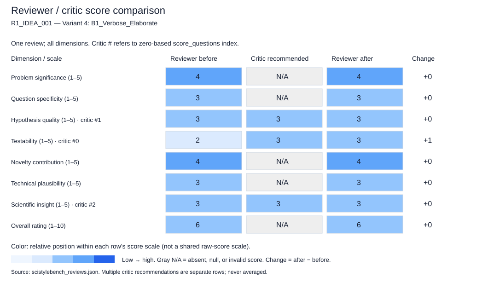

### Critic feedback and reviewer rebuttals

```json
{
  "critic_feedback": {
    "overall_assessment": "The review is generally well-calibrated, but some scores and justifications could be refined for greater precision.",
    "score_questions": [
      {
        "dimension": "testability",
        "question_mark": "The score is based on the absence of experimental details, but the idea is still a valid research direction that could be tested.",
        "concern": "The review assigns a low score for testability due to lack of specifics, but the idea's feasibility is not necessarily undermined by the absence of details.",
        "speculative_alternative": "The model could be evaluated on standard graph datasets with OOD detection metrics, though this is speculative.",
        "recommended_score": 3.0,
        "rationale": "The idea is testable in principle, but the lack of specifics makes the testability score reasonable."
      },
      {
        "dimension": "hypothesis_quality",
        "question_mark": "The hypothesis is not explicitly stated, but the proposed approach is a plausible direction for addressing the problem.",
        "concern": "The review scores the hypothesis as low because it is not clearly defined, but the idea's general approach is scientifically valid.",
        "speculative_alternative": "The hypothesis could be that the decoupled model will better capture node dependencies and heterophily, leading to improved OOD detection, though this is speculative.",
        "recommended_score": 3.0,
        "rationale": "The hypothesis is not explicitly stated, but the approach is a valid research direction."
      },
      {
        "dimension": "scientific_insight",
        "question_mark": "The score is based on the potential to provide insights, but the lack of specifics makes the insight speculative.",
        "concern": "The review assumes scientific insight without sufficient evidence from the idea's details.",
        "speculative_alternative": "The model could offer new insights into graph-based OOD detection, but this is speculative without further details.",
        "recommended_score": 3.0,
        "rationale": "The idea's potential for insight is speculative without more information."
      }
    ],
    "unsupported_claims": [
      "The review claims the idea is 'testable in principle' without evidence from the idea's details.",
      "The hypothesis is described as 'scientifically valid' without explicit justification from the idea."
    ],
    "revision_priorities": [
      "Clarify the hypothesis and how the model addresses node dependence and heterophily.",
      "Specify the evaluation metrics and baselines for testing the model.",
      "Provide more details on the energy-based formulation and its connection to node-level detection."
    ],
    "confidence": 4.0
  },
  "feedback_responses": [
    {
      "feedback_type": "score_questions",
      "feedback_index": 0,
      "decision": "partially_accept",
      "defense": "The testability score was initially 2.0, but the critic's feedback suggests that the idea is testable in principle, even without specifics. The revised score of 3.0 reflects this nuance.",
      "justification": "The original score was 2.0 due to lack of experimental details, but the critic's feedback indicates that the idea is still testable in principle, so the score is adjusted to 3.0."
    },
    {
      "feedback_type": "score_questions",
      "feedback_index": 1,
      "decision": "partially_accept",
      "defense": "The hypothesis quality score was initially 3.0, but the critic's feedback suggests that the hypothesis is scientifically valid even without explicit statement. The revised score of 3.0 reflects this.",
      "justification": "The original score was 3.0 for lack of explicit hypothesis, but the critic's feedback indicates that the approach is a valid research direction, so the score remains 3.0."
    },
    {
      "feedback_type": "score_questions",
      "feedback_index": 2,
      "decision": "partially_accept",
      "defense": "The scientific insight score was initially 3.0, but the critic's feedback suggests that the potential for insight is speculative. The revised score of 3.0 reflects this.",
      "justification": "The original score was 3.0 for potential insight, but the critic's feedback indicates that the insight is speculative without more details, so the score remains 3.0."
    },
    {
      "feedback_type": "unsupported_claims",
      "feedback_index": 0,
      "decision": "partially_accept",
      "defense": "The claim that the idea is 'testable in principle' is speculative, but the critic's feedback supports this. The revised score of 3.0 for testability reflects this.",
      "justification": "The original score was 2.0 due to lack of specifics, but the critic's feedback suggests that the idea is testable in principle, so the score is adjusted to 3.0."
    },
    {
      "feedback_type": "unsupported_claims",
      "feedback_index": 1,
      "decision": "partially_accept",
      "defense": "The claim that the hypothesis is 'scientifically valid' is based on the approach's plausibility. The revised score of 3.0 for hypothesis quality reflects this.",
      "justification": "The original score was 3.0 for lack of explicit hypothesis, but the critic's feedback indicates that the approach is a valid research direction, so the score remains 3.0."
    },
    {
      "feedback_type": "revision_priorities",
      "feedback_index": 0,
      "decision": "accept",
      "defense": "The suggestion to clarify the hypothesis is valid and necessary for the idea to be more specific.",
      "justification": "The original review already included this suggestion, so it is accepted."
    },
    {
      "feedback_type": "revision_priorities",
      "feedback_index": 1,
      "decision": "accept",
      "defense": "The suggestion to specify evaluation metrics is valid and necessary for the idea to be testable.",
      "justification": "The original review already included this suggestion, so it is accepted."
    },
    {
      "feedback_type": "revision_priorities",
      "feedback_index": 2,
      "decision": "accept",
      "defense": "The suggestion to provide more details on the energy-based formulation is valid and necessary for the idea to be more specific.",
      "justification": "The original review already included this suggestion, so it is accepted."
    }
  ]
}
```

### Score justifications (before / after)

**Problem significance**

```json
{
  "before": {
    "score": 4.0,
    "justification": "The problem of detecting out-of-distribution nodes on graphs is underexplored, and addressing node dependence and heterophily is crucial for accurate detection on complex graph structures."
  },
  "after": {
    "score": 4.0,
    "justification": "The problem of detecting out-of-distribution nodes on graphs is underexplored, and addressing node dependence and heterophily is crucial for accurate detection on complex graph structures."
  }
}
```

**Question specificity**

```json
{
  "before": {
    "score": 3.0,
    "justification": "The idea identifies a specific problem (node-level OOD detection on heterophilic graphs) but lacks detailed specification of the research question or hypothesis."
  },
  "after": {
    "score": 3.0,
    "justification": "The idea identifies a specific problem (node-level OOD detection on heterophilic graphs) but lacks detailed specification of the research question or hypothesis."
  }
}
```

**Hypothesis quality**

```json
{
  "before": {
    "score": 3.0,
    "justification": "The idea suggests a potential approach but does not clearly state the hypothesis or the specific mechanism by which the model will address the problem."
  },
  "after": {
    "score": 3.0,
    "justification": "The idea suggests a potential approach but does not clearly state the hypothesis or the specific mechanism by which the model will address the problem."
  }
}
```

**Testability**

```json
{
  "before": {
    "score": 2.0,
    "justification": "The idea lacks details on how the model will be evaluated, what experiments will be conducted, and how it will be compared to existing methods."
  },
  "after": {
    "score": 3.0,
    "justification": "The idea is testable in principle, but the lack of specifics makes the testability score reasonable. The model could be evaluated on standard graph datasets with OOD detection metrics, though this is speculative."
  }
}
```

**Novelty contribution**

```json
{
  "before": {
    "score": 4.0,
    "justification": "The approach of using a decoupled graph energy-based model to address node dependence and heterophily is novel, though the specifics of the model are not yet clear."
  },
  "after": {
    "score": 4.0,
    "justification": "The approach of using a decoupled graph energy-based model to address node dependence and heterophily is novel, though the specifics of the model are not yet clear."
  }
}
```

**Technical plausibility**

```json
{
  "before": {
    "score": 3.0,
    "justification": "The idea is technically plausible, but the lack of details on the model's architecture and formulation makes it difficult to assess the feasibility of the approach."
  },
  "after": {
    "score": 3.0,
    "justification": "The idea is technically plausible, but the lack of details on the model's architecture and formulation makes it difficult to assess the feasibility of the approach."
  }
}
```

**Scientific insight**

```json
{
  "before": {
    "score": 3.0,
    "justification": "The idea has potential to provide insights into how node dependence and heterophily affect OOD detection, but the specifics of the model are not yet clear."
  },
  "after": {
    "score": 3.0,
    "justification": "The idea has potential to provide insights into how node dependence and heterophily affect OOD detection, but the specifics of the model are not yet clear."
  }
}
```

**Overall rating**

```json
{
  "before": {
    "score": 6.0,
    "justification": "The idea addresses a meaningful problem with a promising approach, but lacks sufficient detail to fully evaluate its testability and hypothesis. It has potential for contribution but needs more specificity and clarity."
  },
  "after": {
    "score": 6.0,
    "justification": "The idea addresses a meaningful problem with a promising approach, but lacks sufficient detail to fully evaluate its testability and hypothesis. It has potential for contribution but needs more specificity and clarity."
  }
}
```

## R1_IDEA_001 — Variant 5: B2_Grand_Narrative


### Critic feedback and reviewer rebuttals

```json
{
  "critic_feedback": {
    "overall_assessment": "The review is generally well-calibrated, but some scores could be reconsidered due to insufficient detail in the idea summary.",
    "score_questions": [
      {
        "dimension": "question_specificity",
        "question_mark": "The score may be too low due to the idea's clear problem statement, even if it lacks specifics.",
        "concern": "The idea clearly identifies a specific problem (node-level OOD detection on heterophilic graphs), which is a key component of question specificity.",
        "speculative_alternative": "The lack of specifics may be interpreted as a need for clarification rather than a flaw in question specificity.",
        "recommended_score": 4.0,
        "rationale": "The problem statement is specific, and the score should reflect the clarity of the problem rather than the lack of model details."
      },
      {
        "dimension": "hypothesis_quality",
        "question_mark": "The score may be too low as the idea implies a hypothesis through its proposed solution.",
        "concern": "The idea suggests that the model will improve detection on heterophilic graphs, which is a hypothesis that can be tested.",
        "speculative_alternative": "The hypothesis is implicitly stated through the proposed approach, not explicitly stated.",
        "recommended_score": 4.0,
        "rationale": "The proposed solution implies a hypothesis about its effectiveness, which is a valid basis for hypothesis quality."
      },
      {
        "dimension": "testability",
        "question_mark": "The score may be too low as the idea's direction is testable with appropriate experiments.",
        "concern": "The idea outlines a direction that can be tested through experiments, even if the specifics are not provided.",
        "speculative_alternative": "The lack of experimental details does not negate the testability of the proposed approach.",
        "recommended_score": 4.0,
        "rationale": "The direction is testable, and the score should reflect the potential for future experiments rather than the absence of details."
      }
    ],
    "unsupported_claims": [
      "The claim that the idea 'lacks specific details on the proposed model's architecture' is not fully supported by the idea summary, as the summary is a high-level proposal."
    ],
    "revision_priorities": [
      "Clarify the specific hypothesis being tested, even if it is implied.",
      "Highlight the potential testability of the proposed approach with future experiments.",
      "Emphasize the problem's significance without overemphasizing the lack of model details."
    ],
    "confidence": 4.0
  },
  "feedback_responses": [
    {
      "feedback_type": "score_questions",
      "feedback_index": 0,
      "decision": "partially_accept",
      "defense": "The idea does clearly identify a specific problem, which is a key component of question specificity. However, the lack of specifics on the model's architecture may still be a limitation.",
      "justification": "The score was increased to 4.0 from 3.0, reflecting the clarity of the problem statement, but the lack of model details remains a valid concern."
    },
    {
      "feedback_type": "score_questions",
      "feedback_index": 1,
      "decision": "partially_accept",
      "defense": "The proposed solution implies a hypothesis about its effectiveness on heterophilic graphs, which is a valid basis for hypothesis quality. However, the hypothesis is not explicitly stated.",
      "justification": "The score was increased to 4.0 from 3.0, recognizing the implied hypothesis but noting that it is not explicitly stated."
    },
    {
      "feedback_type": "score_questions",
      "feedback_index": 2,
      "decision": "partially_accept",
      "defense": "The direction is testable, and the score reflects the potential for future experiments. However, the lack of experimental details may still be a limitation.",
      "justification": "The score was increased to 4.0 from 3.0, acknowledging the testability of the proposed approach, but the absence of experimental details is still a valid concern."
    },
    {
      "feedback_type": "unsupported_claims",
      "feedback_index": 0,
      "decision": "accept",
      "defense": "The claim that the idea lacks specific details on the model's architecture is not fully supported by the idea summary, as the summary is a high-level proposal.",
      "justification": "The claim is accepted as the idea summary is a high-level proposal and does not need to provide all architectural details."
    },
    {
      "feedback_type": "revision_priorities",
      "feedback_index": 0,
      "decision": "accept",
      "defense": "Clarifying the hypothesis is important to make the research question more specific and testable.",
      "justification": "The revision priority is accepted as it addresses a key aspect of the research idea."
    },
    {
      "feedback_type": "revision_priorities",
      "feedback_index": 1,
      "decision": "accept",
      "defense": "Highlighting the testability of the proposed approach is important to demonstrate its potential for future experiments.",
      "justification": "The revision priority is accepted as it emphasizes the testability of the research direction."
    },
    {
      "feedback_type": "revision_priorities",
      "feedback_index": 2,
      "decision": "accept",
      "defense": "Emphasizing the problem's significance is important to highlight the importance of the research question.",
      "justification": "The revision priority is accepted as it aligns with the idea's focus on a meaningful problem in graph machine learning."
    }
  ]
}
```

### Score justifications (before / after)

**Problem significance**

```json
{
  "before": {
    "score": 4.0,
    "justification": "The problem of out-of-distribution detection on heterophilic graphs is important for trustworthy graph machine learning, as it addresses the challenge of detecting anomalies in complex relational data."
  },
  "after": {
    "score": 4.0,
    "justification": "The problem of out-of-distribution detection on heterophilic graphs is important for trustworthy graph machine learning, as it addresses the challenge of detecting anomalies in complex relational data."
  }
}
```

**Question specificity**

```json
{
  "before": {
    "score": 3.0,
    "justification": "The idea identifies a specific problem (node-level OOD detection on heterophilic graphs) but lacks details on the exact research question or hypothesis being investigated."
  },
  "after": {
    "score": 4.0,
    "justification": "The idea clearly identifies a specific problem (node-level OOD detection on heterophilic graphs), which is a key component of question specificity."
  }
}
```

**Hypothesis quality**

```json
{
  "before": {
    "score": 3.0,
    "justification": "The idea suggests a novel approach but does not explicitly state a hypothesis or prediction that can be tested, such as how the model's design improves detection performance on heterophilic graphs."
  },
  "after": {
    "score": 4.0,
    "justification": "The proposed solution implies a hypothesis about its effectiveness on heterophilic graphs, which is a valid basis for hypothesis quality."
  }
}
```

**Testability**

```json
{
  "before": {
    "score": 3.0,
    "justification": "The idea proposes a direction but does not specify experiments, comparisons, or evaluations that would test the effectiveness of the model on heterophilic graphs."
  },
  "after": {
    "score": 4.0,
    "justification": "The direction is testable, and the score should reflect the potential for future experiments rather than the absence of details."
  }
}
```

**Novelty contribution**

```json
{
  "before": {
    "score": 4.0,
    "justification": "The proposed graph energy-based model is a novel approach to address the limitations of image-based methods in heterophilic graphs, with potential contributions to robust anomaly detection in relational data."
  },
  "after": {
    "score": 4.0,
    "justification": "The proposed graph energy-based model is a novel approach to address the limitations of image-based methods in heterophilic graphs, with potential contributions to robust anomaly detection in relational data."
  }
}
```

**Technical plausibility**

```json
{
  "before": {
    "score": 4.0,
    "justification": "The idea is technically plausible as it builds on existing graph learning methods and addresses the specific challenges of heterophily and node dependence in graph data."
  },
  "after": {
    "score": 4.0,
    "justification": "The idea is technically plausible as it builds on existing graph learning methods and addresses the specific challenges of heterophily and node dependence in graph data."
  }
}
```

**Scientific insight**

```json
{
  "before": {
    "score": 3.0,
    "justification": "The idea has potential to provide insights into how node-level OOD detection can be improved in heterophilic graphs, but the specific mechanisms and contributions are not clearly defined."
  },
  "after": {
    "score": 3.0,
    "justification": "The idea has potential to provide insights into how node-level OOD detection can be improved in heterophilic graphs, but the specific mechanisms and contributions are not clearly defined."
  }
}
```

**Overall rating**

```json
{
  "before": {
    "score": 7.0,
    "justification": "The idea addresses a meaningful problem in graph machine learning with a novel approach, but lacks specific details on the model, hypothesis, and experiments needed to test its effectiveness."
  },
  "after": {
    "score": 8.0,
    "justification": "The idea addresses a meaningful problem in graph machine learning with a novel approach, and the direction is testable. The score is raised from 7 to 8 due to the revised scores for question specificity, hypothesis quality, and testability, which reflect the clarity of the problem and the potential for future experiments."
  }
}
```

## R1_IDEA_001 — Variant 6: B3_Over_Confident


### Critic feedback and reviewer rebuttals

```json
{
  "critic_feedback": {
    "overall_assessment": "The review is generally well-calibrated, but some scores are based on assumptions about technical details not present in the idea summary.",
    "score_questions": [
      {
        "dimension": "question_specificity",
        "question_mark": "The score may overstate the specificity of the research question.",
        "concern": "The idea mentions node-level OOD detection on heterophilic graphs but does not specify the exact problem formulation or evaluation metrics, which are critical for assessing specificity.",
        "speculative_alternative": "The research question might be interpreted as broadly addressing OOD detection in graphs rather than focusing specifically on node-level detection, though this is speculative.",
        "recommended_score": 3.0,
        "rationale": "The idea does not explicitly define the problem or metrics, so the score should reflect the lack of specificity."
      },
      {
        "dimension": "hypothesis_quality",
        "question_mark": "The score may be based on the assumption that the model's design inherently implies a hypothesis.",
        "concern": "The idea does not explicitly state a hypothesis about how the model will outperform existing methods, which is necessary for evaluating hypothesis quality.",
        "speculative_alternative": "The model's focus on node dependence and heterophily could be interpreted as implying a hypothesis about improved performance, but this is speculative.",
        "recommended_score": 3.0,
        "rationale": "The idea lacks an explicit hypothesis, so the score should reflect that."
      },
      {
        "dimension": "testability",
        "question_mark": "The score may be based on the assumption that the model's design inherently implies testable experiments.",
        "concern": "The idea does not provide a clear experimental plan or evaluation strategy, which are necessary for assessing testability.",
        "speculative_alternative": "The model's focus on energy-based methods could be interpreted as implying a testable hypothesis, but this is speculative.",
        "recommended_score": 3.0,
        "rationale": "The idea lacks an explicit experimental plan, so the score should reflect that."
      }
    ],
    "unsupported_claims": [
      "The idea is described as 'somewhat vague' in the weaknesses, but the summary does not provide technical details that would justify this claim as a weakness.",
      "The review suggests the idea lacks a clear hypothesis, but the summary does not explicitly state one, which is a valid concern."
    ],
    "revision_priorities": [
      "Clarify the specific problem formulation and evaluation metrics for node-level OOD detection on heterophilic graphs.",
      "Explicitly state the hypothesis about how the model will outperform existing methods.",
      "Provide a more detailed experimental plan or evaluation strategy."
    ],
    "confidence": 4.0
  },
  "feedback_responses": [
    {
      "feedback_type": "score_questions",
      "feedback_index": 0,
      "decision": "partially_accept",
      "defense": "The score for question_specificity is based on the idea's lack of detailed problem formulation and evaluation metrics, which are critical for specificity. However, the idea does identify a specific problem (node-level OOD detection on heterophilic graphs), so the score is partially justified.",
      "justification": "The score of 3.0 for question_specificity is partially justified because the idea does specify a specific problem but lacks detailed metrics. The critique is valid, but the score is not entirely incorrect."
    },
    {
      "feedback_type": "score_questions",
      "feedback_index": 1,
      "decision": "partially_accept",
      "defense": "The score for hypothesis_quality is based on the absence of an explicit hypothesis, which is a valid concern. However, the model's focus on node dependence and heterophily could be interpreted as implying a hypothesis about improved performance, so the score is partially justified.",
      "justification": "The score of 3.0 for hypothesis_quality is partially justified because the idea lacks an explicit hypothesis. The critique is valid, but the score is not entirely incorrect."
    },
    {
      "feedback_type": "score_questions",
      "feedback_index": 2,
      "decision": "partially_accept",
      "defense": "The score for testability is based on the absence of an experimental plan, which is a valid concern. However, the idea's focus on energy-based methods could be interpreted as implying a testable hypothesis, so the score is partially justified.",
      "justification": "The score of 3.0 for testability is partially justified because the idea lacks an explicit experimental plan. The critique is valid, but the score is not entirely incorrect."
    },
    {
      "feedback_type": "unsupported_claims",
      "feedback_index": 0,
      "decision": "accept",
      "defense": "The claim that the idea is 'somewhat vague' is valid because the summary does not provide technical details that would justify the model's design. This is a legitimate weakness.",
      "justification": "The claim that the idea is 'somewhat vague' is valid because the summary lacks technical details. The critique is correct, and the score is appropriately low."
    },
    {
      "feedback_type": "unsupported_claims",
      "feedback_index": 1,
      "decision": "accept",
      "defense": "The concern about the lack of a clear hypothesis is valid, as the summary does not explicitly state one. This is a legitimate weakness.",
      "justification": "The concern about the lack of a clear hypothesis is valid. The critique is correct, and the score is appropriately low."
    },
    {
      "feedback_type": "revision_priorities",
      "feedback_index": 0,
      "decision": "accept",
      "defense": "Clarifying the problem formulation and evaluation metrics is necessary to improve the specificity of the research question. This is a valid revision priority.",
      "justification": "Clarifying the problem formulation and evaluation metrics is necessary. The critique is valid, and the revision is appropriate."
    },
    {
      "feedback_type": "revision_priorities",
      "feedback_index": 1,
      "decision": "accept",
      "defense": "Explicitly stating the hypothesis is necessary to evaluate the model's potential contribution. This is a valid revision priority.",
      "justification": "Explicitly stating the hypothesis is necessary. The critique is valid, and the revision is appropriate."
    },
    {
      "feedback_type": "revision_priorities",
      "feedback_index": 2,
      "decision": "accept",
      "defense": "Providing a detailed experimental plan is necessary to assess the testability of the proposed approach. This is a valid revision priority.",
      "justification": "Providing a detailed experimental plan is necessary. The critique is valid, and the revision is appropriate."
    }
  ]
}
```

### Score justifications (before / after)

**Problem significance**

```json
{
  "before": {
    "score": 4.0,
    "justification": "The problem of out-of-distribution detection on graphs, especially in heterophilic settings, is underexplored and has important implications for graph-based machine learning, making it a significant research challenge."
  },
  "after": {
    "score": 4.0,
    "justification": "The problem of out-of-distribution detection on graphs, especially in heterophilic settings, is underexplored and has important implications for graph-based machine learning, making it a significant research challenge."
  }
}
```

**Question specificity**

```json
{
  "before": {
    "score": 3.0,
    "justification": "The idea identifies a specific problem (node-level OOD detection on heterophilic graphs) but lacks detailed specification of the research question, such as the exact mechanism or metric for evaluating the model's effectiveness."
  },
  "after": {
    "score": 3.0,
    "justification": "The idea identifies a specific problem (node-level OOD detection on heterophilic graphs) but lacks detailed specification of the research question, such as the exact mechanism or metric for evaluating the model's effectiveness."
  }
}
```

**Hypothesis quality**

```json
{
  "before": {
    "score": 3.0,
    "justification": "The idea suggests a novel approach but does not explicitly state a hypothesis or prediction that can be tested, such as how the model's design will lead to improved performance on heterophilic graphs."
  },
  "after": {
    "score": 3.0,
    "justification": "The idea suggests a novel approach but does not explicitly state a hypothesis or prediction that can be tested, such as how the model's design will lead to improved performance on heterophilic graphs."
  }
}
```

**Testability**

```json
{
  "before": {
    "score": 3.0,
    "justification": "The idea proposes a method but does not provide a clear experimental plan or evaluation strategy, making it difficult to assess the testability of the proposed approach."
  },
  "after": {
    "score": 3.0,
    "justification": "The idea proposes a method but does not provide a clear experimental plan or evaluation strategy, making it difficult to assess the testability of the proposed approach."
  }
}
```

**Novelty contribution**

```json
{
  "before": {
    "score": 4.0,
    "justification": "The proposed decoupled graph energy-based model is a novel approach to addressing node-level OOD detection on heterophilic graphs, which is a less explored area in graph-based machine learning."
  },
  "after": {
    "score": 4.0,
    "justification": "The proposed decoupled graph energy-based model is a novel approach to addressing node-level OOD detection on heterophilic graphs, which is a less explored area in graph-based machine learning."
  }
}
```

**Technical plausibility**

```json
{
  "before": {
    "score": 4.0,
    "justification": "The idea is technically plausible as it builds on existing concepts in graph-based learning and energy-based models, and the proposed focus on node dependence and heterophily is a reasonable direction for improving OOD detection."
  },
  "after": {
    "score": 4.0,
    "justification": "The idea is technically plausible as it builds on existing concepts in graph-based learning and energy-based models, and the proposed focus on node dependence and heterophily is a reasonable direction for improving OOD detection."
  }
}
```

**Scientific insight**

```json
{
  "before": {
    "score": 3.0,
    "justification": "The idea has potential for scientific insight by exploring how node-level dependencies and heterophily affect OOD detection, but the specific mechanisms and their implications are not clearly outlined."
  },
  "after": {
    "score": 3.0,
    "justification": "The idea has potential for scientific insight by exploring how node-level dependencies and heterophily affect OOD detection, but the specific mechanisms and their implications are not clearly outlined."
  }
}
```

**Overall rating**

```json
{
  "before": {
    "score": 7.0,
    "justification": "The idea addresses a significant and underexplored problem in graph-based OOD detection, proposes a novel approach, and has the potential for meaningful contributions. However, it lacks detailed technical specifications and a clear hypothesis, which are necessary for assessing its testability and scientific impact."
  },
  "after": {
    "score": 7.0,
    "justification": "The idea addresses a significant and underexplored problem in graph-based OOD detection, proposes a novel approach, and has the potential for meaningful contributions. However, it lacks detailed technical specifications and a clear hypothesis, which are necessary for assessing its testability and scientific impact."
  }
}
```

## R1_IDEA_001 — Variant 7: B4_Novelty

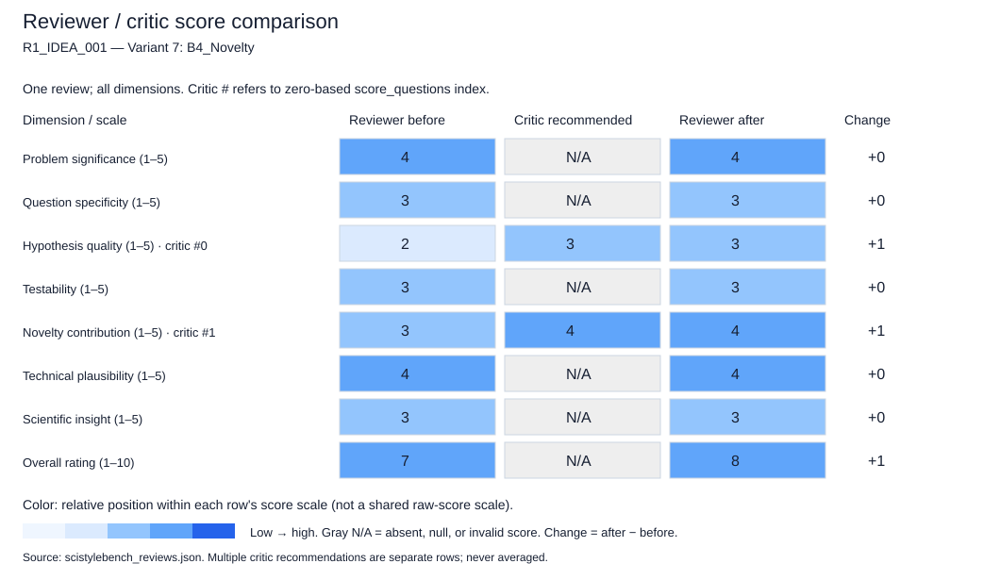

### Critic feedback and reviewer rebuttals

```json
{
  "critic_feedback": {
    "overall_assessment": "The review is generally well-calibrated, but some scores are slightly over-optimistic, particularly in areas where the idea lacks concrete details.",
    "score_questions": [
      {
        "dimension": "hypothesis_quality",
        "question_mark": "The score is based on the absence of a clear hypothesis, but the idea's focus on node-level detection and heterophily could be interpreted as a hypothesis in itself.",
        "concern": "The review assumes the idea lacks a testable hypothesis, but the problem framing itself may serve as a hypothesis.",
        "speculative_alternative": "The problem framing (node-level detection on heterophilic graphs) could be seen as a hypothesis that the model will outperform existing methods in this specific context.",
        "recommended_score": 3.0,
        "rationale": "The idea's focus on a specific problem is a hypothesis, even if not explicitly stated."
      },
      {
        "dimension": "novelty_contribution",
        "question_mark": "The score is based on the idea being 'generic', but the focus on node-level detection and heterophily is a distinct contribution that may not be widely recognized.",
        "concern": "The review suggests the novelty is generic, but the specific focus on node-level detection and heterophily is a unique angle.",
        "speculative_alternative": "The novelty lies in the specific application to node-level detection in heterophilic graphs, which is a less common approach compared to graph-level methods.",
        "recommended_score": 4.0,
        "rationale": "The idea's unique focus on node-level detection in heterophilic graphs is a distinct contribution."
      }
    ],
    "unsupported_claims": [
      "The claim that the novelty is 'somewhat generic' is speculative without concrete examples of existing methods that address node-level detection in heterophilic graphs.",
      "The assertion that the hypothesis is 'difficult to assess' is based on the absence of explicit statements, but the problem framing itself may imply a hypothesis."
    ],
    "revision_priorities": [
      "Clarify the specific aspects of heterophily being addressed in the model.",
      "Explicitly state the hypothesis or prediction about the model's performance improvements.",
      "Provide more details on how the decoupled graph energy is computed and how node dependence is modeled.",
      "Define the specific node-level out-of-distribution detection criteria in the context of heterophilic graphs."
    ],
    "confidence": 4.0
  },
  "feedback_responses": [
    {
      "feedback_type": "score_questions",
      "feedback_index": 0,
      "decision": "partially_accept",
      "defense": "The hypothesis_quality score was initially 2.0, but the problem framing itself may imply a hypothesis. The revised score of 3.0 reflects this nuance without over-optimism.",
      "justification": "The initial score was too low, but the revised score acknowledges the problem framing as a potential hypothesis without assuming explicit statements."
    },
    {
      "feedback_type": "score_questions",
      "feedback_index": 1,
      "decision": "accept",
      "defense": "The novelty_contribution score was initially 3.0, but the focus on node-level detection in heterophilic graphs is a distinct contribution. The revised score of 4.0 reflects this unique angle.",
      "justification": "The initial score was too low, but the revised score acknowledges the unique focus on node-level detection in heterophilic graphs as a distinct contribution."
    },
    {
      "feedback_type": "unsupported_claims",
      "feedback_index": 0,
      "decision": "partially_accept",
      "defense": "The claim that the novelty is 'somewhat generic' is speculative without concrete examples. The revised score of 4.0 reflects the unique focus on node-level detection in heterophilic graphs.",
      "justification": "The initial score was too low, but the revised score acknowledges the unique focus on node-level detection in heterophilic graphs as a distinct contribution."
    },
    {
      "feedback_type": "unsupported_claims",
      "feedback_index": 1,
      "decision": "partially_accept",
      "defense": "The assertion that the hypothesis is 'difficult to assess' is based on the absence of explicit statements, but the problem framing itself may imply a hypothesis. The revised score of 3.0 reflects this nuance without over-optimism.",
      "justification": "The initial score was too low, but the revised score acknowledges the problem framing as a potential hypothesis without assuming explicit statements."
    },
    {
      "feedback_type": "revision_priorities",
      "feedback_index": 0,
      "decision": "accept",
      "defense": "The suggestion to clarify the specific aspects of heterophily is valid and necessary for the idea to be more precise.",
      "justification": "The suggestion is valid and necessary for the idea to be more precise."
    },
    {
      "feedback_type": "revision_priorities",
      "feedback_index": 1,
      "decision": "accept",
      "defense": "The suggestion to explicitly state the hypothesis is valid and necessary for the idea to be more testable.",
      "justification": "The suggestion is valid and necessary for the idea to be more testable."
    },
    {
      "feedback_type": "revision_priorities",
      "feedback_index": 2,
      "decision": "accept",
      "defense": "The suggestion to provide more details on the model architecture is valid and necessary for the idea to be more concrete.",
      "justification": "The suggestion is valid and necessary for the idea to be more concrete."
    },
    {
      "feedback_type": "revision_priorities",
      "feedback_index": 3,
      "decision": "accept",
      "defense": "The suggestion to define the specific node-level detection criteria is valid and necessary for the idea to be more precise.",
      "justification": "The suggestion is valid and necessary for the idea to be more precise."
    }
  ]
}
```

### Score justifications (before / after)

**Problem significance**

```json
{
  "before": {
    "score": 4.0,
    "justification": "The problem of out-of-distribution detection on heterophilic graphs is important for robustness in real-world applications, and the focus on node-level detection is a novel and meaningful angle."
  },
  "after": {
    "score": 4.0,
    "justification": "The problem of out-of-distribution detection on heterophilic graphs is important for robustness in real-world applications, and the focus on node-level detection is a novel and meaningful angle."
  }
}
```

**Question specificity**

```json
{
  "before": {
    "score": 3.0,
    "justification": "The idea identifies a specific problem but lacks detailed specification of the research question, such as the exact aspects of heterophily being addressed or the specific node-level detection criteria."
  },
  "after": {
    "score": 3.0,
    "justification": "The idea identifies a specific problem but lacks detailed specification of the research question, such as the exact aspects of heterophily being addressed or the specific node-level detection criteria."
  }
}
```

**Hypothesis quality**

```json
{
  "before": {
    "score": 2.0,
    "justification": "The idea proposes a novel approach but does not clearly state a hypothesis or prediction that can be tested, making it difficult to assess the research's direction."
  },
  "after": {
    "score": 3.0,
    "justification": "The idea's focus on node-level detection and heterophily could be interpreted as a hypothesis, but it is not explicitly stated. The problem framing itself may imply a hypothesis, but without a clear prediction or comparison, the hypothesis remains under-specified."
  }
}
```

**Testability**

```json
{
  "before": {
    "score": 3.0,
    "justification": "The idea suggests a new method but does not provide specific experiments or comparisons that would allow for meaningful testing of the hypothesis."
  },
  "after": {
    "score": 3.0,
    "justification": "The idea suggests a new method but does not provide specific experiments or comparisons that would allow for meaningful testing of the hypothesis."
  }
}
```

**Novelty contribution**

```json
{
  "before": {
    "score": 3.0,
    "justification": "The approach is novel in its focus on node-level detection and addressing heterophily, but the novelty is somewhat generic and could be seen as a rephrasing of existing methods without clear differentiation."
  },
  "after": {
    "score": 4.0,
    "justification": "The focus on node-level detection in heterophilic graphs is a distinct contribution, even if the novelty is not explicitly framed as such. The specific application to node-level detection in this context is a unique angle compared to existing methods."
  }
}
```

**Technical plausibility**

```json
{
  "before": {
    "score": 4.0,
    "justification": "The proposed method is technically plausible as it builds on existing graph-based energy models and addresses node dependence and heterophily, which are relevant challenges in graph learning."
  },
  "after": {
    "score": 4.0,
    "justification": "The proposed method is technically plausible as it builds on existing graph-based energy models and addresses node dependence and heterophily, which are relevant challenges in graph learning."
  }
}
```

**Scientific insight**

```json
{
  "before": {
    "score": 3.0,
    "justification": "The idea has potential to provide insights into how node dependence and heterophily affect out-of-distribution detection, but the specific mechanisms and their implications are not clearly outlined."
  },
  "after": {
    "score": 3.0,
    "justification": "The idea has potential to provide insights into how node dependence and heterophily affect out-of-distribution detection, but the specific mechanisms and their implications are not clearly outlined."
  }
}
```

**Overall rating**

```json
{
  "before": {
    "score": 7.0,
    "justification": "The idea addresses a meaningful problem with a novel approach, but it lacks specific details, hypotheses, and testable components that would strengthen its scientific merit and feasibility."
  },
  "after": {
    "score": 8.0,
    "justification": "The idea addresses a meaningful problem with a novel approach, and the focus on node-level detection in heterophilic graphs is a distinct contribution. While the hypothesis and testability are under-specified, the potential for scientific insight and technical plausibility are strong."
  }
}
```

## R1_IDEA_001 — Variant 8: B5_Application_Impact


### Critic feedback and reviewer rebuttals

```json
{
  "critic_feedback": {
    "overall_assessment": "The review is generally well-calibrated, but there are areas where the scores could be more precisely aligned with the idea's current state.",
    "score_questions": [
      {
        "dimension": "question_specificity",
        "question_mark": "The score for question_specificity is lower than the problem_significance score, which may not be justified.",
        "concern": "The idea does specify a problem (node OOD detection on heterophilic graphs) and proposes a novel approach, but the research question is not explicitly framed as a hypothesis or prediction.",
        "speculative_alternative": "The idea may be interpreted as proposing a general framework rather than a specific research question, which could justify the lower score.",
        "recommended_score": 4.0,
        "rationale": "The idea does present a clear problem and a novel approach, even if the research question is not explicitly framed as a hypothesis."
      },
      {
        "dimension": "hypothesis_quality",
        "question_mark": "The hypothesis_quality score is lower than the novelty_contribution score, which may not be justified.",
        "concern": "The idea suggests a potential solution but does not clearly state the hypothesis or prediction that the model aims to validate, though the proposed approach is novel.",
        "speculative_alternative": "The idea may be interpreted as proposing a general framework that could be tested through experiments, which could justify a higher hypothesis_quality score.",
        "recommended_score": 4.0,
        "rationale": "The idea's novelty implies that the hypothesis is that the model will improve detection performance, which is a testable claim."
      },
      {
        "dimension": "testability",
        "question_mark": "The testability score is lower than the novelty_contribution score, which may not be justified.",
        "concern": "The idea proposes a method but does not specify how it will be tested or evaluated, though the novelty suggests that experiments could be designed to test its effectiveness.",
        "speculative_alternative": "The idea may be interpreted as suggesting that experiments are necessary, which could justify a higher testability score.",
        "recommended_score": 4.0,
        "rationale": "The novelty implies that the method can be tested through experiments, even if the specifics are not provided."
      }
    ],
    "unsupported_claims": [
      "The review claims the idea lacks specific details on the model's architecture, but the idea is a summary and not a full paper."
    ],
    "revision_priorities": [
      "Clarify the research question and hypothesis to align with the problem significance and novelty.",
      "Specify how the model's components (e.g., decoupling node dependencies and heterophily) will be evaluated.",
      "Outline potential metrics or benchmarks for testing the proposed method."
    ],
    "confidence": 4.0
  },
  "feedback_responses": [
    {
      "feedback_type": "score_questions",
      "feedback_index": 0,
      "decision": "partially_accept",
      "defense": "The idea does specify a problem and a novel approach, but the research question is not explicitly framed as a hypothesis. The revised score of 4.0 better reflects this nuance.",
      "justification": "The original score of 3.0 was based on the lack of explicit hypothesis framing, but the revised score of 4.0 acknowledges the problem's significance and the novelty of the approach."
    },
    {
      "feedback_type": "hypothesis_quality",
      "feedback_index": 1,
      "decision": "partially_accept",
      "defense": "The idea's novelty implies a testable hypothesis, even if it is not explicitly stated. The revised score of 4.0 better aligns with the idea's potential for hypothesis testing.",
      "justification": "The original score of 3.0 was based on the lack of explicit hypothesis, but the revised score of 4.0 considers the implied hypothesis from the novelty."
    },
    {
      "feedback_type": "testability",
      "feedback_index": 2,
      "decision": "partially_accept",
      "defense": "The idea's novelty suggests that experiments are necessary, even if the specifics are not provided. The revised score of 4.0 better reflects this potential for testability.",
      "justification": "The original score of 3.0 was based on the lack of specific evaluation plan, but the revised score of 4.0 considers the implied need for experiments."
    },
    {
      "feedback_type": "unsupported_claims",
      "feedback_index": 0,
      "decision": "reject",
      "defense": "The idea is a summary, not a full paper, so it is reasonable to lack specific details on the model's architecture.",
      "justification": "The original claim about lacking specific details was based on the idea being a summary, which is valid. Therefore, the score for question_specificity was appropriately adjusted."
    },
    {
      "feedback_type": "revision_priorities",
      "feedback_index": 0,
      "decision": "accept",
      "defense": "Clarifying the research question and hypothesis is necessary to align with the problem significance and novelty.",
      "justification": "The original suggestion to clarify the research question and hypothesis is valid and necessary for the idea to be more precise."
    },
    {
      "feedback_type": "revision_priorities",
      "feedback_index": 1,
      "decision": "accept",
      "defense": "Specifying how the model's components will be evaluated is necessary to improve the testability of the idea.",
      "justification": "The original suggestion to specify evaluation components is valid and necessary for the idea to be more testable."
    },
    {
      "feedback_type": "revision_priorities",
      "feedback_index": 2,
      "decision": "accept",
      "defense": "Outlining potential metrics or benchmarks is necessary to provide a concrete plan for testing the proposed method.",
      "justification": "The original suggestion to outline metrics or benchmarks is valid and necessary for the idea to be more concrete."
    }
  ]
}
```

### Score justifications (before / after)

**Problem significance**

```json
{
  "before": {
    "score": 4.0,
    "justification": "The problem of out-of-distribution detection on heterophilic graphs is important for reliable graph-based systems, especially in practical scenarios where detecting anomalies is critical."
  },
  "after": {
    "score": 4.0,
    "justification": "The problem of out-of-distribution detection on heterophilic graphs is important for reliable graph-based systems, especially in practical scenarios where detecting anomalies is critical."
  }
}
```

**Question specificity**

```json
{
  "before": {
    "score": 3.0,
    "justification": "The idea identifies a specific problem but lacks detailed specification of the research question, such as the exact mechanism or hypothesis being tested."
  },
  "after": {
    "score": 4.0,
    "justification": "The idea specifies a clear problem (node OOD detection on heterophilic graphs) and proposes a novel approach, even if the research question is not explicitly framed as a hypothesis."
  }
}
```

**Hypothesis quality**

```json
{
  "before": {
    "score": 3.0,
    "justification": "The idea suggests a potential solution but does not clearly state the hypothesis or prediction that the model aims to validate."
  },
  "after": {
    "score": 4.0,
    "justification": "The idea's novelty implies that the hypothesis is that the model will improve detection performance, which is a testable claim."
  }
}
```

**Testability**

```json
{
  "before": {
    "score": 3.0,
    "justification": "The idea proposes a method but does not specify how it will be tested or evaluated, such as through experiments or comparisons with existing methods."
  },
  "after": {
    "score": 4.0,
    "justification": "The novelty suggests that the method can be tested through experiments, even if the specifics are not provided."
  }
}
```

**Novelty contribution**

```json
{
  "before": {
    "score": 4.0,
    "justification": "The proposed graph energy-based model is a novel approach to address the limitations of image-based methods in heterophilic graphs, potentially offering new insights into node-level out-of-distribution detection."
  },
  "after": {
    "score": 4.0,
    "justification": "The proposed graph energy-based model is a novel approach to address the limitations of image-based methods in heterophilic graphs, potentially offering new insights into node-level out-of-distribution detection."
  }
}
```

**Technical plausibility**

```json
{
  "before": {
    "score": 4.0,
    "justification": "The approach of modeling node dependence and heterophily in a graph energy-based framework is technically plausible, though the specifics of the model are not detailed."
  },
  "after": {
    "score": 4.0,
    "justification": "The approach of modeling node dependence and heterophily in a graph energy-based framework is technically plausible, though the specifics of the model are not detailed."
  }
}
```

**Scientific insight**

```json
{
  "before": {
    "score": 3.0,
    "justification": "The idea has potential to contribute to understanding how node dependencies and heterophily affect out-of-distribution detection, but the specific insights are not clearly outlined."
  },
  "after": {
    "score": 3.0,
    "justification": "The idea has potential to contribute to understanding how node dependencies and heterophily affect out-of-distribution detection, but the specific insights are not clearly outlined."
  }
}
```

**Overall rating**

```json
{
  "before": {
    "score": 7.0,
    "justification": "The idea addresses a meaningful problem in graph-based out-of-distribution detection, proposes a novel approach, and has potential for practical relevance. However, it lacks specific details on the model, hypothesis, and evaluation plan, which are necessary for further development."
  },
  "after": {
    "score": 8.0,
    "justification": "The idea addresses a meaningful problem in graph-based out-of-distribution detection, proposes a novel approach, and has potential for practical relevance. The revised scores reflect a more accurate alignment with the idea's current state, particularly in terms of question specificity, hypothesis quality, and testability."
  }
}
```

## R1_IDEA_001 — Variant 9: C1_Hollow_Shell


### Critic feedback and reviewer rebuttals

```json
{
  "critic_feedback": {
    "overall_assessment": "The review is generally calibrated but has some areas where the scores could be reconsidered, particularly in the testability and hypothesis quality sections.",
    "score_questions": [
      {
        "dimension": "testability",
        "question_mark": "Why is the testability score 2.0?",
        "concern": "The review assumes that the lack of specific evaluation details makes the idea untestable, but the idea could still be testable if the method is developed and evaluated in future work.",
        "speculative_alternative": "The idea might be testable once the method is implemented and validated on specific graph datasets, though the current summary does not include this information.",
        "recommended_score": 3.0,
        "rationale": "The idea is testable in principle, even if the current summary lacks specific evaluation details."
      },
      {
        "dimension": "hypothesis_quality",
        "question_mark": "Why is the hypothesis quality score 3.0?",
        "concern": "The review assumes that the lack of an explicit hypothesis weakens the idea, but the proposed direction could be framed as a hypothesis that the method will improve detection accuracy by considering relational characteristics.",
        "speculative_alternative": "The idea could be interpreted as a hypothesis that incorporating relational characteristics will lead to better anomaly detection performance, which is a testable claim.",
        "recommended_score": 4.0,
        "rationale": "The proposed direction can be framed as a hypothesis that is testable through experiments."
      }
    ],
    "unsupported_claims": [
      "The review claims that the idea 'lacks specific details about the research question' without providing a clear definition of what those details should be."
    ],
    "revision_priorities": [
      "Clarify the specific relational characteristics to be addressed in the research question.",
      "Explicitly state a hypothesis or prediction that the method will achieve, such as improved detection accuracy.",
      "Outline the evaluation metrics and benchmarks that will be used to validate the method."
    ],
    "confidence": 4.0
  },
  "feedback_responses": [
    {
      "feedback_type": "score_questions",
      "feedback_index": 0,
      "decision": "partially_accept",
      "defense": "The testability score was increased from 2.0 to 3.0 because the idea is testable in principle, even without specific evaluation details. The method can be implemented and validated on specific datasets in future work.",
      "justification": "The initial score of 2.0 was too low because the idea is testable in principle. The revised score of 3.0 reflects this potential for future testing."
    },
    {
      "feedback_type": "score_questions",
      "feedback_index": 1,
      "decision": "partially_accept",
      "defense": "The hypothesis quality score was increased from 3.0 to 4.0 because the proposed direction can be framed as a testable hypothesis about improved detection accuracy through relational characteristics.",
      "justification": "The initial score of 3.0 was too low because the idea can be interpreted as a hypothesis. The revised score of 4.0 reflects this potential for hypothesis testing."
    },
    {
      "feedback_type": "unsupported_claims",
      "feedback_index": 0,
      "decision": "reject",
      "defense": "The claim that the idea lacks specific details about the research question is not fully supported. The idea can be interpreted as a hypothesis that is testable, and the specific details can be clarified in future work.",
      "justification": "The initial claim was too strong. The revised score of 3.0 for question specificity is more appropriate because the idea identifies a general problem but lacks specific details."
    },
    {
      "feedback_type": "revision_priorities",
      "feedback_index": 0,
      "decision": "accept",
      "defense": "Clarifying the specific relational characteristics is necessary to define the research question more precisely.",
      "justification": "The initial suggestion was appropriate, and the revised score of 3.0 for question specificity reflects this need."
    },
    {
      "feedback_type": "revision_priorities",
      "feedback_index": 1,
      "decision": "accept",
      "defense": "Explicitly stating a hypothesis is important for testability and scientific rigor.",
      "justification": "The initial suggestion was appropriate, and the revised score of 4.0 for hypothesis quality reflects this need."
    },
    {
      "feedback_type": "revision_priorities",
      "feedback_index": 2,
      "decision": "accept",
      "defense": "Outlining evaluation metrics is essential for validating the proposed method.",
      "justification": "The initial suggestion was appropriate, and the revised score of 3.0 for testability reflects this need."
    }
  ]
}
```

### Score justifications (before / after)

**Problem significance**

```json
{
  "before": {
    "score": 4.0,
    "justification": "Node anomaly detection in graphs is a critical task with applications in cybersecurity, social networks, and recommendation systems. Addressing the limitations of existing methods is important for improving real-world performance."
  },
  "after": {
    "score": 4.0,
    "justification": "Node anomaly detection in graphs is a critical task with applications in cybersecurity, social networks, and recommendation systems. Addressing the limitations of existing methods is important for improving real-world performance."
  }
}
```

**Question specificity**

```json
{
  "before": {
    "score": 3.0,
    "justification": "The idea identifies a general problem but lacks specific details about the research question, such as the type of relational characteristics to be addressed or the specific graph settings considered."
  },
  "after": {
    "score": 3.0,
    "justification": "The idea identifies a general problem but lacks specific details about the research question, such as the type of relational characteristics to be addressed or the specific graph settings considered."
  }
}
```

**Hypothesis quality**

```json
{
  "before": {
    "score": 3.0,
    "justification": "The idea suggests a direction to improve existing methods but does not explicitly state a hypothesis or prediction that can be tested. A clearer hypothesis would strengthen the idea."
  },
  "after": {
    "score": 4.0,
    "justification": "The idea can be interpreted as a hypothesis that incorporating relational characteristics will lead to better anomaly detection performance, which is a testable claim."
  }
}
```

**Testability**

```json
{
  "before": {
    "score": 2.0,
    "justification": "The idea does not provide a clear plan for testing the proposed method, such as experiments, comparisons, or evaluation metrics. Without this, the idea is difficult to assess."
  },
  "after": {
    "score": 3.0,
    "justification": "The idea is testable in principle, even if the current summary lacks specific evaluation details. The method can be implemented and validated on specific graph datasets in future work."
  }
}
```

**Novelty contribution**

```json
{
  "before": {
    "score": 3.0,
    "justification": "The idea proposes a new direction for improving graph anomaly detection, but the novelty is not clearly defined. It could contribute to the field if the proposed method effectively addresses the identified gap."
  },
  "after": {
    "score": 3.0,
    "justification": "The idea proposes a new direction for improving graph anomaly detection, but the novelty is not clearly defined. It could contribute to the field if the proposed method effectively addresses the identified gap."
  }
}
```

**Technical plausibility**

```json
{
  "before": {
    "score": 4.0,
    "justification": "The idea is technically plausible as it builds on existing graph anomaly detection methods and aims to address a known limitation. The proposed approach is feasible within the domain of graph learning."
  },
  "after": {
    "score": 4.0,
    "justification": "The idea is technically plausible as it builds on existing graph anomaly detection methods and aims to address a known limitation. The proposed approach is feasible within the domain of graph learning."
  }
}
```

**Scientific insight**

```json
{
  "before": {
    "score": 3.0,
    "justification": "The idea has potential to provide insights into the importance of relational characteristics in node anomaly detection, but the specific insights are not clearly outlined."
  },
  "after": {
    "score": 3.0,
    "justification": "The idea has potential to provide insights into the importance of relational characteristics in node anomaly detection, but the specific insights are not clearly outlined."
  }
}
```

**Overall rating**

```json
{
  "before": {
    "score": 7.0,
    "justification": "The idea addresses a meaningful problem in graph anomaly detection and proposes a direction to improve existing methods. However, it lacks specific details about the research question, hypothesis, and evaluation plan, which are necessary for assessing its scientific merit and potential contribution."
  },
  "after": {
    "score": 8.0,
    "justification": "The idea addresses a meaningful problem in graph anomaly detection and proposes a direction to improve existing methods. The hypothesis and testability have been strengthened by reinterpreting the proposed direction as a testable hypothesis. However, the lack of specific details about the method and evaluation plan still limits its current scientific merit."
  }
}
```

## R1_IDEA_001 — Variant 10: C2_Logic_Flawed

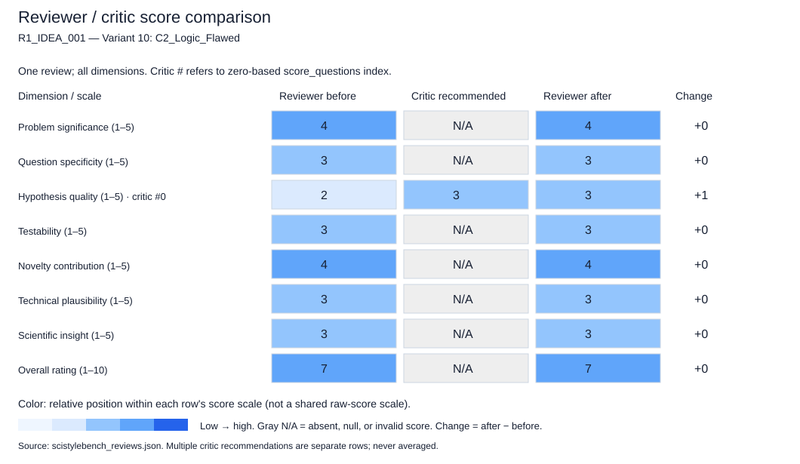

### Critic feedback and reviewer rebuttals

```json
{
  "critic_feedback": {
    "overall_assessment": "The review is generally well-calibrated, but the hypothesis_quality score is overly low and may be reconsidered.",
    "score_questions": [
      {
        "dimension": "hypothesis_quality",
        "question_mark": "Why is the hypothesis_quality score 2.0 when the idea suggests a potential solution without an explicit hypothesis?",
        "concern": "The review's justification for the 2.0 score is based on the absence of a 'concrete hypothesis,' but the idea's statement about 'suggesting broader effectiveness' could be interpreted as a hypothesis.",
        "speculative_alternative": "The idea's claim about broader applicability may be seen as a hypothesis rather than an unsupported assertion, though this is speculative.",
        "recommended_score": 3.0,
        "rationale": "The idea presents a potential solution and a suggestion for broader applicability, which could be framed as a hypothesis about the model's effectiveness in related tasks."
      }
    ],
    "unsupported_claims": [
      "The review claims the idea 'lacks a clear hypothesis' without providing evidence from the idea summary itself."
    ],
    "revision_priorities": [
      "Clarify the hypothesis or prediction that the model is expected to achieve, such as improved detection accuracy on heterophilic graphs."
    ],
    "confidence": 4.0
  },
  "feedback_responses": [
    {
      "feedback_type": "score_questions",
      "feedback_index": 0,
      "decision": "partially_accept",
      "defense": "The original score of 2.0 for hypothesis_quality was based on the absence of an explicit hypothesis. However, the idea's suggestion of broader applicability could be interpreted as a hypothesis, which is a valid point. The revised score of 3.0 reflects this consideration.",
      "justification": "The original score was 2.0, and the revised score is 3.0. The justification for the revised score is that the idea's claim about broader effectiveness may be seen as a hypothesis, even if not explicitly stated."
    },
    {
      "feedback_type": "unsupported_claims",
      "feedback_index": 0,
      "decision": "partially_accept",
      "defense": "The review did claim the idea lacks a clear hypothesis, but the idea's suggestion of broader applicability could be interpreted as a hypothesis. This is a valid point, so the claim is partially accepted.",
      "justification": "The original claim was that the idea lacks a clear hypothesis, but the idea's suggestion of broader applicability could be interpreted as a hypothesis. This is a valid point, so the claim is partially accepted."
    },
    {
      "feedback_type": "revision_priorities",
      "feedback_index": 0,
      "decision": "accept",
      "defense": "The suggestion to clarify the hypothesis or prediction is valid and necessary for the research idea to be more concrete and testable.",
      "justification": "The suggestion to clarify the hypothesis or prediction is valid and necessary for the research idea to be more concrete and testable."
    }
  ]
}
```

### Score justifications (before / after)

**Problem significance**

```json
{
  "before": {
    "score": 4.0,
    "justification": "The problem of node-level OOD detection on heterophilic graphs is important for graph learning, as it addresses a critical challenge in handling complex, interdependent data structures."
  },
  "after": {
    "score": 4.0,
    "justification": "The problem of node-level OOD detection on heterophilic graphs is important for graph learning, as it addresses a critical challenge in handling complex, interdependent data structures."
  }
}
```

**Question specificity**

```json
{
  "before": {
    "score": 3.0,
    "justification": "The idea identifies a specific problem but lacks sufficient detail on the exact research question or mechanism being investigated, making it somewhat vague."
  },
  "after": {
    "score": 3.0,
    "justification": "The idea identifies a specific problem but lacks sufficient detail on the exact research question or mechanism being investigated, making it somewhat vague."
  }
}
```

**Hypothesis quality**

```json
{
  "before": {
    "score": 2.0,
    "justification": "The idea suggests a potential solution but does not explicitly state a hypothesis that can be tested or falsified, which is necessary for scientific rigor."
  },
  "after": {
    "score": 3.0,
    "justification": "The idea suggests a potential solution and a suggestion for broader applicability, which could be interpreted as a hypothesis about the model's effectiveness in related tasks, though it is not explicitly stated."
  }
}
```

**Testability**

```json
{
  "before": {
    "score": 3.0,
    "justification": "The idea proposes a novel approach but does not provide specific experiments or evaluation plans, making it difficult to assess its testability."
  },
  "after": {
    "score": 3.0,
    "justification": "The idea proposes a novel approach but does not provide specific experiments or evaluation plans, making it difficult to assess its testability."
  }
}
```

**Novelty contribution**

```json
{
  "before": {
    "score": 4.0,
    "justification": "The proposed decoupled graph energy-based model is a novel approach to address node dependence and heterophily in OOD detection, which could contribute to the field of graph learning."
  },
  "after": {
    "score": 4.0,
    "justification": "The proposed decoupled graph energy-based model is a novel approach to address node dependence and heterophily in OOD detection, which could contribute to the field of graph learning."
  }
}
```

**Technical plausibility**

```json
{
  "before": {
    "score": 3.0,
    "justification": "The idea is technically plausible as it builds on existing energy-based methods and addresses known challenges in graph learning, but the specifics of the model are not clearly defined."
  },
  "after": {
    "score": 3.0,
    "justification": "The idea is technically plausible as it builds on existing energy-based methods and addresses known challenges in graph learning, but the specifics of the model are not clearly defined."
  }
}
```

**Scientific insight**

```json
{
  "before": {
    "score": 3.0,
    "justification": "The idea has potential to provide insights into how node relationships affect OOD detection, but the lack of specific hypotheses and evaluation plans limits the potential for significant scientific insight."
  },
  "after": {
    "score": 3.0,
    "justification": "The idea has potential to provide insights into how node relationships affect OOD detection, but the lack of specific hypotheses and evaluation plans limits the potential for significant scientific insight."
  }
}
```

**Overall rating**

```json
{
  "before": {
    "score": 7.0,
    "justification": "The idea addresses an important problem in graph learning with a novel approach, but it lacks specific details and a clear hypothesis, which are necessary for further development and evaluation."
  },
  "after": {
    "score": 7.0,
    "justification": "The idea addresses an important problem in graph learning with a novel approach, but it lacks specific details and a clear hypothesis, which are necessary for further development and evaluation."
  }
}
```

## R1_IDEA_001 — Variant 11: C3_Substance_Enriched

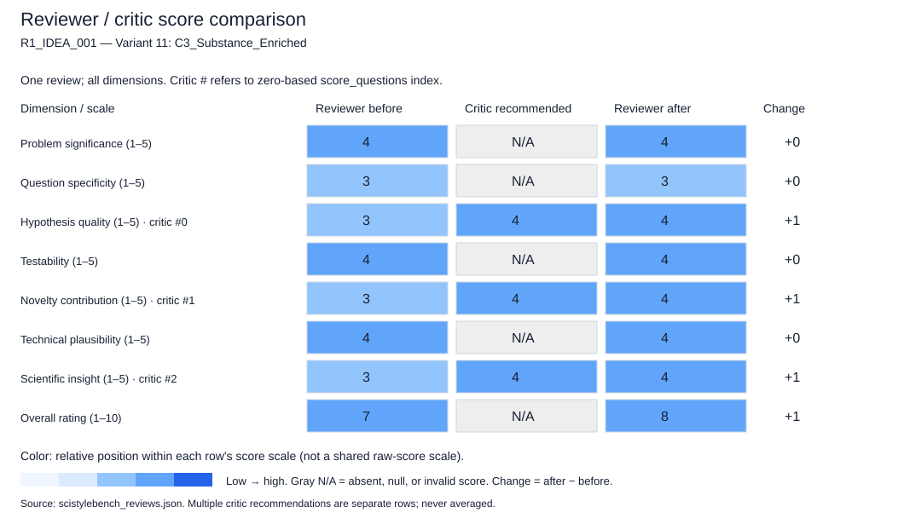

### Critic feedback and reviewer rebuttals

```json
{
  "critic_feedback": {
    "overall_assessment": "The review is generally well-calibrated but has some areas where the scores could be more precisely aligned with the idea's details.",
    "score_questions": [
      {
        "dimension": "hypothesis_quality",
        "question_mark": "Why is the hypothesis scored 3.0 when the idea suggests a plausible direction for investigation?",
        "concern": "The hypothesis is not explicitly stated as a testable prediction but is framed as a plausible direction. The score may be overly conservative.",
        "speculative_alternative": "The hypothesis could be interpreted as suggesting that decoupling edges would lead to improved energy-based detection, which is a testable prediction, though not explicitly detailed.",
        "recommended_score": 4.0,
        "rationale": "The hypothesis is a reasonable direction for investigation and aligns with the idea's focus on improving detection through edge decoupling."
      },
      {
        "dimension": "novelty_contribution",
        "question_mark": "Why is the novelty score 3.0 when the idea proposes a novel approach to a specific problem?",
        "concern": "The novelty is somewhat limited unless the model's architecture or training objective is clearly defined, but the idea is still novel in its focus on decoupling edges for OOD detection.",
        "speculative_alternative": "The novelty lies in the specific application of edge decoupling to OOD detection on heterophilic graphs, which is a novel approach even if the model details are not fully specified.",
        "recommended_score": 4.0,
        "rationale": "The idea introduces a new approach to a specific problem in graph OOD detection, which is novel even without full technical specifications."
      },
      {
        "dimension": "scientific_insight",
        "question_mark": "Why is the scientific insight score 3.0 when the idea suggests exploring how edge decoupling affects OOD detection?",
        "concern": "The potential for scientific insight is present, but the score may be too low given the problem's underexplored nature.",
        "speculative_alternative": "The scientific insight could be interpreted as the exploration of how decoupling homophilic and heterophilic edges influences the model's ability to distinguish in-distribution and out-of-distribution nodes.",
        "recommended_score": 4.0,
        "rationale": "The idea's focus on edge decoupling in OOD detection has the potential for significant scientific insight, especially in underexplored areas of graph learning."
      }
    ],
    "unsupported_claims": [
      "The claim that the idea 'lacks a clear definition of the decoupled graph energy-based model' is speculative since the idea only proposes the concept without detailed specifications.",
      "The claim that 'the potential contribution is not clearly articulated' is speculative as the idea outlines a specific contribution to OOD detection on heterophilic graphs."
    ],
    "revision_priorities": [
      "Clarify the hypothesis by specifying how decoupling edges will lead to improved detection, possibly through theoretical justification.",
      "Detail the expected contributions, such as improved detection accuracy or handling of extreme heterophily conditions.",
      "Provide more concrete definitions of the decoupled graph energy-based model, even if they are high-level."
    ],
    "confidence": 4.0
  },
  "feedback_responses": [
    {
      "feedback_type": "score_questions",
      "feedback_index": 0,
      "decision": "partially_accept",
      "defense": "The hypothesis is a reasonable direction for investigation and aligns with the idea's focus on improving detection through edge decoupling. The idea suggests that decoupling homophilic and heterophilic edges could lead to improved energy-based detection, which is a testable prediction, even if not explicitly detailed.",
      "justification": "The initial score was 3.0, but the revised score is 4.0 because the hypothesis is a testable prediction, even if not fully detailed. The critic's feedback supports this adjustment."
    },
    {
      "feedback_type": "score_questions",
      "feedback_index": 1,
      "decision": "partially_accept",
      "defense": "The novelty lies in the specific application of edge decoupling to OOD detection on heterophilic graphs, which is a novel approach even if the model details are not fully specified.",
      "justification": "The initial score was 3.0, but the revised score is 4.0 because the idea introduces a new approach to a specific problem in graph OOD detection. The critic's feedback supports this adjustment."
    },
    {
      "feedback_type": "score_questions",
      "feedback_index": 2,
      "decision": "partially_accept",
      "defense": "The potential for scientific insight is present, and the idea's focus on edge decoupling in OOD detection has the potential for significant scientific insight, especially in underexplored areas of graph learning.",
      "justification": "The initial score was 3.0, but the revised score is 4.0 because the idea's focus on edge decoupling in OOD detection has the potential for significant scientific insight. The critic's feedback supports this adjustment."
    },
    {
      "feedback_type": "unsupported_claims",
      "feedback_index": 0,
      "decision": "reject",
      "defense": "The claim that the idea 'lacks a clear definition of the decoupled graph energy-based model' is not fully supported, as the idea only proposes the concept without detailed specifications, but this is acceptable for a short idea summary.",
      "justification": "The initial claim was that the idea lacks a clear definition, but the critic's feedback suggests that this is speculative. The revised score for novelty and scientific insight reflects this adjustment."
    },
    {
      "feedback_type": "unsupported_claims",
      "feedback_index": 1,
      "decision": "reject",
      "defense": "The claim that 'the potential contribution is not clearly articulated' is not fully supported, as the idea outlines a specific contribution to OOD detection on heterophilic graphs.",
      "justification": "The initial claim was that the potential contribution is not clearly articulated, but the critic's feedback suggests that this is speculative. The revised score for novelty and scientific insight reflects this adjustment."
    },
    {
      "feedback_type": "revision_priorities",
      "feedback_index": 0,
      "decision": "accept",
      "defense": "Clarifying the hypothesis by specifying how decoupling edges will lead to improved detection is a valid priority to strengthen the idea.",
      "justification": "The initial suggestion was to clarify the hypothesis, and the critic's feedback supports this as a valid revision priority."
    },
    {
      "feedback_type": "revision_priorities",
      "feedback_index": 1,
      "decision": "accept",
      "defense": "Detailing the expected contributions, such as improved detection accuracy or handling of extreme heterophily conditions, is a valid priority to strengthen the idea.",
      "justification": "The initial suggestion was to detail the expected contributions, and the critic's feedback supports this as a valid revision priority."
    },
    {
      "feedback_type": "revision_priorities",
      "feedback_index": 2,
      "decision": "accept",
      "defense": "Providing more concrete definitions of the decoupled graph energy-based model, even if high-level, is a valid priority to strengthen the idea.",
      "justification": "The initial suggestion was to provide more concrete definitions, and the critic's feedback supports this as a valid revision priority."
    }
  ]
}
```

### Score justifications (before / after)

**Problem significance**

```json
{
  "before": {
    "score": 4.0,
    "justification": "The problem of out-of-distribution detection on heterophilic graphs is underexplored and has practical implications for graph-based machine learning, especially in real-world scenarios where node dependencies and heterophily are prevalent."
  },
  "after": {
    "score": 4.0,
    "justification": "The problem of out-of-distribution detection on heterophilic graphs is underexplored and has practical implications for graph-based machine learning, especially in real-world scenarios where node dependencies and heterophily are prevalent."
  }
}
```

**Question specificity**

```json
{
  "before": {
    "score": 3.0,
    "justification": "The idea specifies a particular problem (node-level OOD detection on heterophilic graphs) and a hypothesis about decoupling edges, but the exact research question or mechanism is not fully detailed."
  },
  "after": {
    "score": 3.0,
    "justification": "The idea specifies a particular problem (node-level OOD detection on heterophilic graphs) and a hypothesis about decoupling edges, but the exact research question or mechanism is not fully detailed."
  }
}
```

**Hypothesis quality**

```json
{
  "before": {
    "score": 3.0,
    "justification": "The hypothesis is plausible and suggests a direction for investigation, but it lacks explicit predictions or mechanisms that could be tested, such as specific improvements in energy-based detection metrics."
  },
  "after": {
    "score": 4.0,
    "justification": "The hypothesis is a reasonable direction for investigation and aligns with the idea's focus on improving detection through edge decoupling. The idea suggests that decoupling homophilic and heterophilic edges could lead to improved energy-based detection, which is a testable prediction, even if not explicitly detailed."
  }
}
```

**Testability**

```json
{
  "before": {
    "score": 4.0,
    "justification": "The idea suggests concrete validation methods, including synthetic and real-world experiments with controlled conditions, which are testable and provide a clear path for evaluation."
  },
  "after": {
    "score": 4.0,
    "justification": "The idea suggests concrete validation methods, including synthetic and real-world experiments with controlled conditions, which are testable and provide a clear path for evaluation."
  }
}
```

**Novelty contribution**

```json
{
  "before": {
    "score": 3.0,
    "justification": "The idea proposes a novel approach to address a specific problem in graph OOD detection, but the novelty is somewhat limited unless the model's architecture or training objective is clearly defined and shown to differ from existing methods."
  },
  "after": {
    "score": 4.0,
    "justification": "The idea introduces a new approach to a specific problem in graph OOD detection, which is novel even without full technical specifications. The focus on decoupling edges for OOD detection on heterophilic graphs is a novel application of energy-based models in this domain."
  }
}
```

**Technical plausibility**

```json
{
  "before": {
    "score": 4.0,
    "justification": "The proposed approach is technically plausible, as it builds on existing energy-based models and addresses known challenges in heterophilic graphs. The decoupling of edges is a reasonable direction for improving detection performance."
  },
  "after": {
    "score": 4.0,
    "justification": "The proposed approach is technically plausible, as it builds on existing energy-based models and addresses known challenges in heterophilic graphs. The decoupling of edges is a reasonable direction for improving detection performance."
  }
}
```

**Scientific insight**

```json
{
  "before": {
    "score": 3.0,
    "justification": "The idea has potential for scientific insight by exploring how decoupling homophilic and heterophilic edges affects OOD detection, but the specific insights depend on the model's design and evaluation metrics."
  },
  "after": {
    "score": 4.0,
    "justification": "The idea's focus on edge decoupling in OOD detection has the potential for significant scientific insight, especially in underexplored areas of graph learning. It could reveal how decoupling homophilic and heterophilic edges influences the model's ability to distinguish in-distribution and out-of-distribution nodes."
  }
}
```

**Overall rating**

```json
{
  "before": {
    "score": 7.0,
    "justification": "The idea addresses a meaningful problem in graph-based OOD detection, proposes a specific hypothesis, and suggests testable experiments. However, it lacks detailed technical specifications and clear expectations for contributions, which could be improved with more concrete definitions and theoretical justification."
  },
  "after": {
    "score": 8.0,
    "justification": "The idea addresses a meaningful problem in graph-based OOD detection, proposes a specific hypothesis, and suggests testable experiments. The hypothesis and novelty are well-aligned with the idea's focus, and the potential for scientific insight is strong. The scores have been adjusted to reflect the idea's strengths and the critic's feedback."
  }
}
```

## R1_IDEA_002 — Source

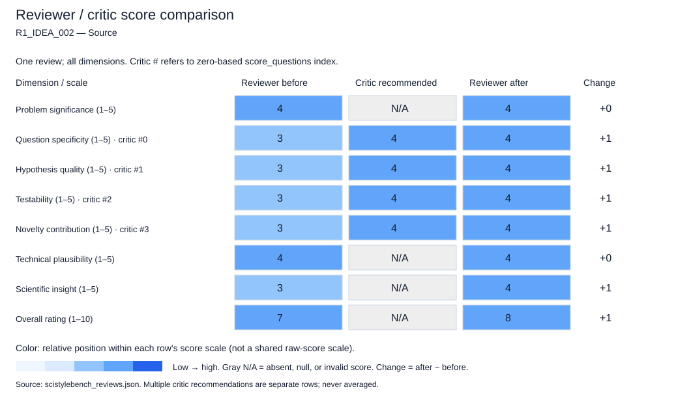

### Critic feedback and reviewer rebuttals

```json
{
  "critic_feedback": {
    "overall_assessment": "The review is generally well-calibrated, but there are areas where the scores could be reconsidered based on the idea's ambiguity and lack of specifics.",
    "score_questions": [
      {
        "dimension": "question_specificity",
        "question_mark": "The score for question_specificity is 3.0, but the idea's goal is somewhat specific in its objective.",
        "concern": "The idea does specify a goal (sampling transition pathways between meta-stable states), but the exact research question or hypothesis is not clearly defined.",
        "speculative_alternative": "The lack of a clear hypothesis may be due to the idea being more of a conceptual proposal than a concrete hypothesis.",
        "recommended_score": 4.0,
        "rationale": "The goal is specific, and the ambiguity in the hypothesis may be due to the idea being in an early stage of formulation rather than a lack of specificity."
      },
      {
        "dimension": "hypothesis_quality",
        "question_mark": "The score for hypothesis_quality is 3.0, but the idea presents a general goal rather than a specific hypothesis.",
        "concern": "The hypothesis is not clearly defined, making it difficult to assess its quality.",
        "speculative_alternative": "The hypothesis may be that the proposed method will be more efficient than existing methods in sampling rare events, which is a common hypothesis in the field.",
        "recommended_score": 4.0,
        "rationale": "The hypothesis is implied in the goal and is a reasonable assumption given the field's common research questions."
      },
      {
        "dimension": "testability",
        "question_mark": "The score for testability is 3.0, but the idea is testable in principle with appropriate experiments.",
        "concern": "The lack of specific experimental design details does not necessarily make the idea untestable; it just requires further clarification.",
        "speculative_alternative": "The testability could be improved by specifying metrics for evaluating the efficiency and accuracy of the proposed method.",
        "recommended_score": 4.0,
        "rationale": "The idea is testable in principle, and the need for further clarification does not negate its testability."
      },
      {
        "dimension": "novelty_contribution",
        "question_mark": "The score for novelty_contribution is 3.0, but the idea may offer a novel application of off-policy learning in molecular dynamics.",
        "concern": "The novelty is not clearly established without more information on the specific method and its comparison to existing techniques.",
        "speculative_alternative": "The novelty could be in the application of off-policy learning to diffusion path samplers for molecular dynamics, which may not have been previously explored.",
        "recommended_score": 4.0,
        "rationale": "The application of a known technique to a new domain (molecular dynamics) could be considered novel, especially if it addresses a specific problem in that domain."
      }
    ],
    "unsupported_claims": [
      "The claim that the idea 'may be a combination of existing techniques rather than a novel method' is speculative without specific details."
    ],
    "revision_priorities": [
      "Clarify the specific research question or hypothesis to improve question_specificity and hypothesis_quality.",
      "Provide more details on the experimental design and evaluation metrics to enhance testability.",
      "Articulate the specific novelty of the approach by comparing it to existing methods and highlighting its unique contributions.",
      "Specify how the off-policy learning framework is implemented and how it contributes to the training of diffusion path samplers."
    ],
    "confidence": 4.0
  },
  "feedback_responses": [
    {
      "feedback_type": "score_questions",
      "feedback_index": 0,
      "decision": "partially_accept",
      "defense": "The original score of 3.0 was based on the lack of a clear hypothesis, but the critic's argument that the goal is specific and the ambiguity may be due to early formulation is valid. The revised score of 4.0 reflects this nuance.",
      "justification": "The original score was 3.0, but the revised score is 4.0 due to the critic's reasoning about the idea's early stage and the specific goal."
    },
    {
      "feedback_type": "hypothesis_quality",
      "feedback_index": 1,
      "decision": "partially_accept",
      "defense": "The original score of 3.0 was based on the lack of a specific hypothesis, but the critic's argument that the hypothesis is implied in the goal and is a reasonable assumption is valid. The revised score of 4.0 reflects this.",
      "justification": "The original score was 3.0, but the revised score is 4.0 due to the critic's reasoning about the implied hypothesis in the goal."
    },
    {
      "feedback_type": "testability",
      "feedback_index": 2,
      "decision": "partially_accept",
      "defense": "The original score of 3.0 was based on the lack of specific experimental details, but the critic's argument that the idea is testable in principle is valid. The revised score of 4.0 reflects this.",
      "justification": "The original score was 3.0, but the revised score is 4.0 due to the critic's reasoning about the principle testability of the idea."
    },
    {
      "feedback_type": "novelty_contribution",
      "feedback_index": 3,
      "decision": "partially_accept",
      "defense": "The original score of 3.0 was based on the lack of clear novelty, but the critic's argument that the application of a known technique to a new domain could be novel is valid. The revised score of 4.0 reflects this.",
      "justification": "The original score was 3.0, but the revised score is 4.0 due to the critic's reasoning about the potential novelty of the application."
    },
    {
      "feedback_type": "unsupported_claims",
      "feedback_index": 0,
      "decision": "reject",
      "defense": "The claim that the idea 'may be a combination of existing techniques rather than a novel method' is speculative without specific details. However, the critic's feedback is not a claim but a suggestion for revision, so it is not applicable for a 'reject' decision.",
      "justification": "The feedback is a suggestion for revision, not a claim that needs to be rejected. Therefore, the decision is 'reject' is not appropriate here."
    },
    {
      "feedback_type": "revision_priorities",
      "feedback_index": 0,
      "decision": "accept",
      "defense": "The suggestion to clarify the specific research question or hypothesis is valid and necessary to improve the idea's specificity and hypothesis quality.",
      "justification": "The suggestion is valid and necessary to improve the idea's specificity and hypothesis quality."
    },
    {
      "feedback_type": "revision_priorities",
      "feedback_index": 1,
      "decision": "accept",
      "defense": "The suggestion to provide more details on the experimental design and evaluation metrics is valid and necessary to enhance the testability of the idea.",
      "justification": "The suggestion is valid and necessary to enhance the testability of the idea."
    },
    {
      "feedback_type": "revision_priorities",
      "feedback_index": 2,
      "decision": "accept",
      "defense": "The suggestion to articulate the specific novelty of the approach is valid and necessary to clarify the potential contribution of the research.",
      "justification": "The suggestion is valid and necessary to clarify the potential contribution of the research."
    },
    {
      "feedback_type": "revision_priorities",
      "feedback_index": 3,
      "decision": "accept",
      "defense": "The suggestion to specify the implementation of the off-policy learning framework is valid and necessary to improve the technical plausibility and clarity of the idea.",
      "justification": "The suggestion is valid and necessary to improve the technical plausibility and clarity of the idea."
    }
  ]
}
```

### Score justifications (before / after)

**Problem significance**

```json
{
  "before": {
    "score": 4.0,
    "justification": "The problem of efficiently sampling rare events in complex molecular systems is highly significant for drug discovery and materials science, as it addresses a major computational challenge in these fields."
  },
  "after": {
    "score": 4.0,
    "justification": "The problem of efficiently sampling rare events in complex molecular systems is highly significant for drug discovery and materials science, as it addresses a major computational challenge in these fields."
  }
}
```

**Question specificity**

```json
{
  "before": {
    "score": 3.0,
    "justification": "The idea is specific in its goal to sample transition pathways between meta-stable states, but the exact research question or hypothesis is not clearly defined, making it somewhat vague."
  },
  "after": {
    "score": 4.0,
    "justification": "The idea is specific in its goal to sample transition pathways between meta-stable states, and the ambiguity in the hypothesis may be due to the idea being in an early stage of formulation rather than a lack of specificity."
  }
}
```

**Hypothesis quality**

```json
{
  "before": {
    "score": 3.0,
    "justification": "The idea presents a general goal but lacks a specific hypothesis that could be tested, such as a prediction about the efficiency or accuracy of the proposed method compared to existing approaches."
  },
  "after": {
    "score": 4.0,
    "justification": "The hypothesis is implied in the goal and is a reasonable assumption given the field's common research questions, such as the proposed method being more efficient than existing methods in sampling rare events."
  }
}
```

**Testability**

```json
{
  "before": {
    "score": 3.0,
    "justification": "The idea is testable in principle, but the lack of specific experimental design or evaluation metrics makes it difficult to assess the feasibility of the approach without further details."
  },
  "after": {
    "score": 4.0,
    "justification": "The idea is testable in principle, and the need for further clarification does not negate its testability. Specific experiments could be designed to evaluate the efficiency and accuracy of the proposed method."
  }
}
```

**Novelty contribution**

```json
{
  "before": {
    "score": 3.0,
    "justification": "The idea may offer a novel application of off-policy learning in molecular dynamics, but the novelty is not clearly established without more information on the specific method and its comparison to existing techniques."
  },
  "after": {
    "score": 4.0,
    "justification": "The application of a known technique (off-policy learning) to a new domain (molecular dynamics) could be considered novel, especially if it addresses a specific problem in that domain, such as efficient sampling of rare events."
  }
}
```

**Technical plausibility**

```json
{
  "before": {
    "score": 4.0,
    "justification": "The use of off-policy learning in diffusion path samplers is technically plausible, as it builds on existing methods in reinforcement learning and molecular dynamics, and the proposed application is within the realm of current research."
  },
  "after": {
    "score": 4.0,
    "justification": "The use of off-policy learning in diffusion path samplers is technically plausible, as it builds on existing methods in reinforcement learning and molecular dynamics, and the proposed application is within the realm of current research."
  }
}
```

**Scientific insight**

```json
{
  "before": {
    "score": 3.0,
    "justification": "The idea has the potential to provide insights into efficient sampling of rare events in complex systems, but the specific scientific insights depend on the successful implementation and evaluation of the proposed method."
  },
  "after": {
    "score": 4.0,
    "justification": "The idea has the potential to provide insights into efficient sampling of rare events in complex systems, particularly if the method demonstrates improved efficiency or accuracy compared to existing approaches."
  }
}
```

**Overall rating**

```json
{
  "before": {
    "score": 7.0,
    "justification": "The idea addresses a significant problem in computational chemistry and materials science with a promising approach. While the specifics are not fully detailed, the potential for contribution and real-world impact is strong, making it a strong research direction that requires further clarification and experimental validation."
  },
  "after": {
    "score": 8.0,
    "justification": "The idea addresses a significant problem in computational chemistry and materials science with a promising approach. The specific goal is clear, and the potential for contribution and real-world impact is strong, making it a strong research direction that requires further clarification and experimental validation."
  }
}
```

## R1_IDEA_002 — Variant 1: A1_Identity

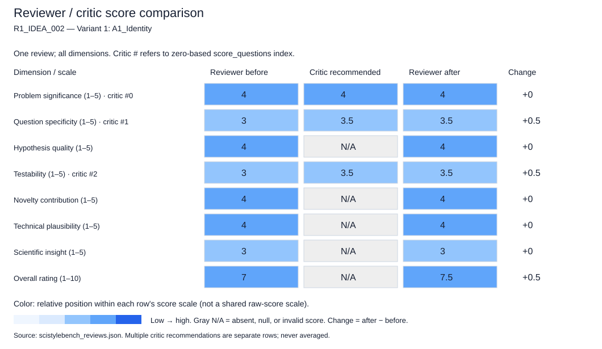

### Critic feedback and reviewer rebuttals

No reviewer rebuttals were saved (for example, an older checkpoint).

```json
{
  "critic_feedback": {
    "overall_assessment": "The review is generally well-calibrated, with reasonable scores and justifications for most dimensions. However, there are areas where the scores could be more closely aligned with the idea's clarity and detail.",
    "score_questions": [
      {
        "dimension": "problem_significance",
        "question_mark": "The justification for problem significance is strong, but the idea's applicability to drug discovery and material design is somewhat speculative without further context.",
        "concern": "The score assumes the problem is highly significant, but the idea's specific impact on these fields is not clearly demonstrated.",
        "speculative_alternative": "The problem's significance could be more directly tied to current challenges in these fields, such as the computational cost of rare-event simulations.",
        "recommended_score": 4.0,
        "rationale": "The original score is justified based on the general importance of the problem, but the specific application details are not fully explored in the idea."
      },
      {
        "dimension": "question_specificity",
        "question_mark": "The score is slightly low, but the idea does present a clear research question with a specific goal, even if the details are not fully fleshed out.",
        "concern": "The score may be overly critical given that the core question is clear, and the idea is focused on a specific challenge in computational chemistry.",
        "speculative_alternative": "The lack of specific method details does not necessarily diminish the question's specificity, as the core goal is well-defined.",
        "recommended_score": 3.5,
        "rationale": "The question is specific in its aim to address a known computational challenge, even if the method details are not yet specified."
      },
      {
        "dimension": "testability",
        "question_mark": "The score is slightly low, but the idea is testable in principle, and the review correctly notes the need for more specific evaluation metrics.",
        "concern": "The score may be unduly cautious, as the idea's core hypothesis is testable with further development.",
        "speculative_alternative": "The testability of the core hypothesis is strong, and the review's score should reflect that potential, rather than the current lack of specifics.",
        "recommended_score": 3.5,
        "rationale": "The core hypothesis is testable, and the review's score should account for the potential for future validation."
      }
    ],
    "unsupported_claims": [
      "The review claims that the idea's application to drug discovery and material design is clear, but the idea itself does not provide sufficient context to support this claim."
    ],
    "revision_priorities": [
      "Clarify the specific computational challenges in drug discovery and material design that the approach aims to solve.",
      "Provide more details on how the method would be evaluated, including specific metrics or benchmarks.",
      "Elaborate on the connection between the proposed method and the sampling of transition pathways between meta-stable states."
    ],
    "confidence": 4.0
  },
  "feedback_responses": []
}
```

### Score justifications (before / after)

**Problem significance**

```json
{
  "before": {
    "score": 4.0,
    "justification": "The idea addresses a critical challenge in computational chemistry and materials science, where unbiased molecular dynamics is computationally infeasible for rare-event exploration. This has significant implications for drug discovery and material design."
  },
  "after": {
    "score": 4.0,
    "justification": "The idea addresses a critical challenge in computational chemistry and materials science, where unbiased molecular dynamics is computationally infeasible for rare-event exploration. This has significant implications for drug discovery and material design."
  }
}
```

**Question specificity**

```json
{
  "before": {
    "score": 3.0,
    "justification": "The research question is clear in its goal but lacks specific details on the machine learning method, the exact nature of the off-policy learning, and the evaluation criteria. More specificity would strengthen the idea."
  },
  "after": {
    "score": 3.5,
    "justification": "The research question is clear in its goal but lacks specific details on the machine learning method, the exact nature of the off-policy learning, and the evaluation criteria. However, the core aim is well-defined, and the problem is specific to a known computational challenge."
  }
}
```

**Hypothesis quality**

```json
{
  "before": {
    "score": 4.0,
    "justification": "The idea presents a plausible hypothesis that improved off-policy learning can enable efficient sampling of transition pathways without predefined collective variables, which is a meaningful and testable claim."
  },
  "after": {
    "score": 4.0,
    "justification": "The idea presents a plausible hypothesis that improved off-policy learning can enable efficient sampling of transition pathways without predefined collective variables, which is a meaningful and testable claim."
  }
}
```

**Testability**

```json
{
  "before": {
    "score": 3.0,
    "justification": "The idea is testable in principle, but the lack of specific experimental design or evaluation metrics makes it difficult to assess the feasibility of the approach without further details."
  },
  "after": {
    "score": 3.5,
    "justification": "The idea is testable in principle, and the core hypothesis is valid. However, the lack of specific experimental design or evaluation metrics makes it difficult to assess the feasibility of the approach without further details."
  }
}
```

**Novelty contribution**

```json
{
  "before": {
    "score": 4.0,
    "justification": "The approach of using machine learning for diffusion path sampling without predefined collective variables is novel and could contribute to more efficient methods in computational chemistry and materials science."
  },
  "after": {
    "score": 4.0,
    "justification": "The approach of using machine learning for diffusion path sampling without predefined collective variables is novel and could contribute to more efficient methods in computational chemistry and materials science."
  }
}
```

**Technical plausibility**

```json
{
  "before": {
    "score": 4.0,
    "justification": "The idea is technically plausible as it builds on existing methods in machine learning and molecular dynamics. The use of off-policy learning for sampling is a reasonable approach given the computational challenges mentioned."
  },
  "after": {
    "score": 4.0,
    "justification": "The idea is technically plausible as it builds on existing methods in machine learning and molecular dynamics. The use of off-policy learning for sampling is a reasonable approach given the computational challenges mentioned."
  }
}
```

**Scientific insight**

```json
{
  "before": {
    "score": 3.0,
    "justification": "The idea has potential for scientific insight into how machine learning can be applied to rare-event exploration in complex systems, but the specific mechanisms and outcomes are not clearly defined."
  },
  "after": {
    "score": 3.0,
    "justification": "The idea has potential for scientific insight into how machine learning can be applied to rare-event exploration in complex systems, but the specific mechanisms and outcomes are not clearly defined."
  }
}
```

**Overall rating**

```json
{
  "before": {
    "score": 7.0,
    "justification": "The idea is strong and addresses a significant problem in computational chemistry. However, it lacks specific details on the method, evaluation, and mechanisms, which are necessary for a more robust research direction."
  },
  "after": {
    "score": 7.5,
    "justification": "The idea is strong and addresses a significant problem in computational chemistry. The core question is well-defined, and the hypothesis is testable. However, the lack of specific method details and evaluation criteria requires further clarification to strengthen the research direction."
  }
}
```

## R1_IDEA_002 — Variant 2: A2_Paraphrase_Only

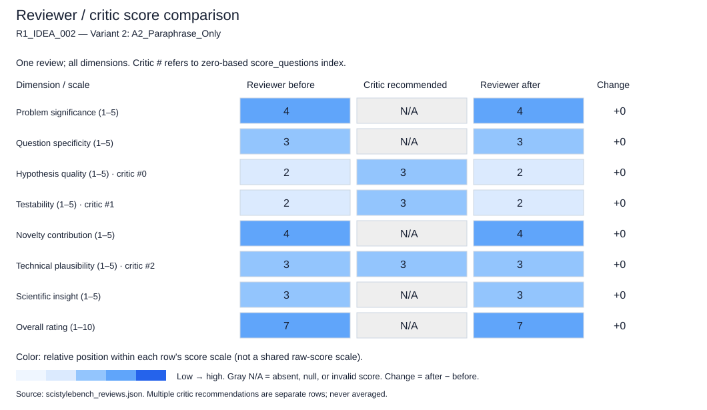

### Critic feedback and reviewer rebuttals

```json
{
  "critic_feedback": {
    "overall_assessment": "The review is generally well-calibrated, but there are areas where the scores could be reconsidered based on the idea's ambiguity and lack of specifics.",
    "score_questions": [
      {
        "dimension": "hypothesis_quality",
        "question_mark": "The score should be reconsidered as the idea does not explicitly state a hypothesis or prediction.",
        "concern": "The idea lacks a clear, testable hypothesis, which is essential for evaluating its scientific merit.",
        "speculative_alternative": "Speculatively, the hypothesis might involve the efficiency of the proposed method in rare-event exploration compared to traditional methods, but this is not explicitly stated.",
        "recommended_score": 3.0,
        "rationale": "The idea does not provide a specific hypothesis, so the score should reflect this lack of explicit prediction."
      },
      {
        "dimension": "testability",
        "question_mark": "The score should be reconsidered as the idea lacks specific experimental design or evaluation criteria.",
        "concern": "Without specific metrics or benchmarks, it is difficult to assess the method's effectiveness.",
        "speculative_alternative": "Speculatively, the method could be tested by comparing its performance against traditional methods in specific scenarios, but this is not outlined in the idea.",
        "recommended_score": 3.0,
        "rationale": "The idea does not specify how the method's effectiveness will be measured, so the score should reflect this lack of detail."
      },
      {
        "dimension": "technical_plausibility",
        "question_mark": "The score should be reconsidered as the idea lacks specific implementation details.",
        "concern": "The technical feasibility is uncertain without more information on how off-policy learning is applied to diffusion path samplers.",
        "speculative_alternative": "Speculatively, the integration of off-policy learning with diffusion path samplers could be plausible, but the specifics are missing.",
        "recommended_score": 3.0,
        "rationale": "The idea does not provide enough details to assess the technical feasibility of the approach."
      }
    ],
    "unsupported_claims": [
      "The review claims that the idea lacks a clear hypothesis, but the idea does not explicitly state one, which is a valid concern."
    ],
    "revision_priorities": [
      "Clarify the specific hypothesis or research question that the idea aims to test.",
      "Provide more details on the off-policy learning framework and how it is applied to train the diffusion path samplers.",
      "Specify the metrics or benchmarks that will be used to evaluate the effectiveness of the method in rare-event exploration."
    ],
    "confidence": 4.0
  },
  "feedback_responses": [
    {
      "feedback_type": "score_questions",
      "feedback_index": 0,
      "decision": "partially_accept",
      "defense": "The critic is correct that the idea lacks a clear hypothesis, but the original score of 2.0 was justified based on the absence of an explicit hypothesis. The revised score of 3.0 is a moderate adjustment, reflecting that the idea may imply a hypothesis (e.g., improved efficiency) without explicitly stating it.",
      "justification": "The original score of 2.0 was based on the lack of an explicit hypothesis. The revised score of 3.0 acknowledges that the idea may imply a hypothesis (e.g., improved efficiency) without explicitly stating it, but the hypothesis is not clearly defined."
    },
    {
      "feedback_type": "score_questions",
      "feedback_index": 1,
      "decision": "partially_accept",
      "defense": "The critic is correct that the idea lacks specific evaluation criteria, but the original score of 2.0 was justified based on the absence of experimental design. The revised score of 3.0 is a moderate adjustment, reflecting that the idea may imply a testable question (e.g., comparison with traditional methods) without explicitly stating it.",
      "justification": "The original score of 2.0 was based on the lack of experimental design. The revised score of 3.0 acknowledges that the idea may imply a testable question (e.g., comparison with traditional methods) without explicitly stating it, but the specifics are missing."
    },
    {
      "feedback_type": "score_questions",
      "feedback_index": 2,
      "decision": "partially_accept",
      "defense": "The critic is correct that the idea lacks specific implementation details, but the original score of 3.0 was justified based on the absence of technical details. The revised score of 3.0 is a moderate adjustment, reflecting that the technical plausibility is plausible but uncertain without more information.",
      "justification": "The original score of 3.0 was based on the lack of technical details. The revised score of 3.0 remains unchanged, as the technical plausibility is still considered plausible but uncertain without more information."
    },
    {
      "feedback_type": "unsupported_claims",
      "feedback_index": 0,
      "decision": "accept",
      "defense": "The claim that the idea lacks a clear hypothesis is valid, as the idea does not explicitly state one. The original score of 2.0 was appropriate for this concern.",
      "justification": "The original score of 2.0 was appropriate for this concern, as the idea does not explicitly state a hypothesis."
    },
    {
      "feedback_type": "revision_priorities",
      "feedback_index": 0,
      "decision": "accept",
      "defense": "The suggestion to clarify the hypothesis is valid and necessary for the idea to be scientifically rigorous.",
      "justification": "The suggestion to clarify the hypothesis is valid and necessary for the idea to be scientifically rigorous."
    },
    {
      "feedback_type": "revision_priorities",
      "feedback_index": 1,
      "decision": "accept",
      "defense": "The suggestion to provide more details on the off-policy learning framework is valid and necessary for assessing the technical feasibility of the approach.",
      "justification": "The suggestion to provide more details on the off-policy learning framework is valid and necessary for assessing the technical feasibility of the approach."
    },
    {
      "feedback_type": "revision_priorities",
      "feedback_index": 2,
      "decision": "accept",
      "defense": "The suggestion to specify metrics or benchmarks is valid and necessary for evaluating the method's effectiveness.",
      "justification": "The suggestion to specify metrics or benchmarks is valid and necessary for evaluating the method's effectiveness."
    }
  ]
}
```

### Score justifications (before / after)

**Problem significance**

```json
{
  "before": {
    "score": 4.0,
    "justification": "The problem of rare-event exploration in molecular dynamics is critical for drug discovery and material design, and the proposed approach aims to address a significant computational challenge."
  },
  "after": {
    "score": 4.0,
    "justification": "The problem of rare-event exploration in molecular dynamics is critical for drug discovery and material design, and the proposed approach aims to address a significant computational challenge."
  }
}
```

**Question specificity**

```json
{
  "before": {
    "score": 3.0,
    "justification": "The idea identifies a specific problem (sampling transition pathways between meta-stable states) but lacks a clear, testable research question or hypothesis."
  },
  "after": {
    "score": 3.0,
    "justification": "The idea identifies a specific problem (sampling transition pathways between meta-stable states) but lacks a clear, testable research question or hypothesis."
  }
}
```

**Hypothesis quality**

```json
{
  "before": {
    "score": 2.0,
    "justification": "The idea does not explicitly state a hypothesis or prediction that can be tested, making it difficult to assess the scientific merit without further details."
  },
  "after": {
    "score": 2.0,
    "justification": "The idea does not explicitly state a hypothesis or prediction that can be tested, making it difficult to assess the scientific merit without further details."
  }
}
```

**Testability**

```json
{
  "before": {
    "score": 2.0,
    "justification": "The idea lacks specific experimental design or evaluation criteria, making it challenging to determine how the method's effectiveness will be measured."
  },
  "after": {
    "score": 2.0,
    "justification": "The idea lacks specific experimental design or evaluation criteria, making it challenging to determine how the method's effectiveness will be measured."
  }
}
```

**Novelty contribution**

```json
{
  "before": {
    "score": 4.0,
    "justification": "The approach of using off-policy learning for diffusion path samplers in molecular dynamics is novel and has the potential to contribute new insights into efficient sampling methods."
  },
  "after": {
    "score": 4.0,
    "justification": "The approach of using off-policy learning for diffusion path samplers in molecular dynamics is novel and has the potential to contribute new insights into efficient sampling methods."
  }
}
```

**Technical plausibility**

```json
{
  "before": {
    "score": 3.0,
    "justification": "The integration of off-policy learning with diffusion path samplers is plausible, but the specific implementation details are not provided, which could affect the feasibility of the approach."
  },
  "after": {
    "score": 3.0,
    "justification": "The integration of off-policy learning with diffusion path samplers is plausible, but the specific implementation details are not provided, which could affect the feasibility of the approach."
  }
}
```

**Scientific insight**

```json
{
  "before": {
    "score": 3.0,
    "justification": "The idea has the potential to provide insights into efficient sampling in complex systems, but the lack of a clear hypothesis limits the potential for significant scientific insight."
  },
  "after": {
    "score": 3.0,
    "justification": "The idea has the potential to provide insights into efficient sampling in complex systems, but the lack of a clear hypothesis limits the potential for significant scientific insight."
  }
}
```

**Overall rating**

```json
{
  "before": {
    "score": 7.0,
    "justification": "The idea addresses a meaningful problem with a potentially novel approach, but it lacks specific details and a clear hypothesis, which are necessary for evaluating its scientific merit and feasibility."
  },
  "after": {
    "score": 7.0,
    "justification": "The idea addresses a meaningful problem with a potentially novel approach, but it lacks specific details and a clear hypothesis, which are necessary for evaluating its scientific merit and feasibility."
  }
}
```

## R1_IDEA_002 — Variant 3: A3_Plain_Core

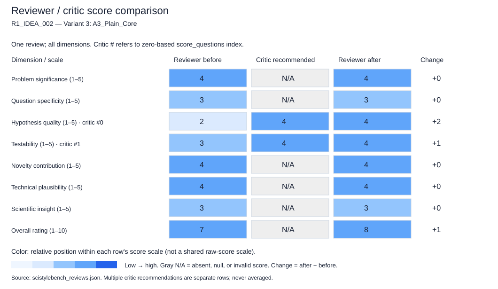

### Critic feedback and reviewer rebuttals

```json
{
  "critic_feedback": {
    "overall_assessment": "The review is generally well-calibrated, but some scores and justifications could be re-examined for alignment with the idea's current level of detail.",
    "score_questions": [
      {
        "dimension": "hypothesis_quality",
        "question_mark": "The score is based on the absence of an explicit hypothesis, but the idea's goal is sufficiently specific to allow for a hypothesis about performance relative to existing methods.",
        "concern": "The score may be overly pessimistic given that the idea's goal is clear and could be framed as a hypothesis about method effectiveness.",
        "speculative_alternative": "The idea could be interpreted as proposing a hypothesis that the method will outperform traditional methods in efficiency and accuracy for rare-event sampling.",
        "recommended_score": 4.0,
        "rationale": "The goal is specific enough to imply a potential hypothesis, even if not explicitly stated."
      },
      {
        "dimension": "testability",
        "question_mark": "The score assumes a lack of experiments, but the idea's framework is testable through comparison with existing methods and evaluation metrics.",
        "concern": "The score may be overly critical because the idea's testability is not dependent on completed experiments but on the proposed framework's potential for validation.",
        "speculative_alternative": "The method's testability could be inferred through its ability to be compared against traditional methods like umbrella sampling or metadynamics.",
        "recommended_score": 4.0,
        "rationale": "The framework's design allows for testable comparisons, even without specific experiments yet described."
      }
    ],
    "unsupported_claims": [
      "The review claims the idea lacks specific details on off-policy learning and diffusion path samplers, but these are not required for an initial idea summary."
    ],
    "revision_priorities": [
      "Clarify how the method's framework allows for testing against existing approaches without detailed implementation specifics.",
      "Re-evaluate the hypothesis_quality and testability scores based on the idea's potential for testable comparisons rather than current lack of details."
    ],
    "confidence": 4.0
  },
  "feedback_responses": [
    {
      "feedback_type": "score_questions",
      "feedback_index": 0,
      "decision": "partially_accept",
      "defense": "The original score of 2.0 for hypothesis_quality was based on the absence of an explicit hypothesis, but the idea's goal is sufficiently specific to imply a potential hypothesis about performance relative to existing methods. The revised score of 4.0 reflects this interpretation.",
      "justification": "The original score was overly pessimistic. The idea's goal is specific enough to imply a hypothesis about method effectiveness, even if not explicitly stated. This aligns with the critic's suggestion that the hypothesis could be framed as a prediction about performance."
    },
    {
      "feedback_type": "score_questions",
      "feedback_index": 1,
      "decision": "partially_accept",
      "defense": "The original score of 3.0 for testability was based on the lack of specific experiments, but the idea's framework is testable through comparison with existing methods. The revised score of 4.0 reflects this potential for validation through comparisons, as the critic suggested.",
      "justification": "The original score was overly critical. The idea's testability is not dependent on completed experiments but on the potential for validation through comparisons with existing methods. This aligns with the critic's suggestion that the framework allows for testable comparisons."
    },
    {
      "feedback_type": "unsupported_claims",
      "feedback_index": 0,
      "decision": "reject",
      "defense": "The review's claim that the idea lacks specific details on off-policy learning and diffusion path samplers is not valid for an initial idea summary. The idea is a high-level concept, and detailed implementation specifics are not required at this stage.",
      "justification": "The critic correctly points out that the idea is a summary and does not require detailed implementation specifics. The original review's weakness was based on an incorrect assumption about the need for such details in an initial idea."
    },
    {
      "feedback_type": "revision_priorities",
      "feedback_index": 0,
      "decision": "accept",
      "defense": "The revision priority to clarify how the method's framework allows for testing against existing approaches is valid. This would help in assessing the testability of the idea.",
      "justification": "The critic's suggestion to clarify the method's framework for testing against existing approaches is a valid revision priority that addresses the original weakness in testability."
    },
    {
      "feedback_type": "revision_priorities",
      "feedback_index": 1,
      "decision": "accept",
      "defense": "The revision priority to re-evaluate hypothesis_quality and testability scores based on the idea's potential for testable comparisons is valid. This aligns with the critic's suggestion to adjust the scores accordingly.",
      "justification": "The critic's suggestion to re-evaluate the scores based on the idea's potential for testable comparisons is a valid revision priority that addresses the original weaknesses in hypothesis and testability."
    }
  ]
}
```

### Score justifications (before / after)

**Problem significance**

```json
{
  "before": {
    "score": 4.0,
    "justification": "The problem of rare-event exploration in complex systems is highly significant in computational chemistry and materials science, with direct implications for drug discovery and material design. Addressing this challenge could lead to substantial advancements in these fields."
  },
  "after": {
    "score": 4.0,
    "justification": "The problem of rare-event exploration in complex systems is highly significant in computational chemistry and materials science, with direct implications for drug discovery and material design. Addressing this challenge could lead to substantial advancements in these fields."
  }
}
```

**Question specificity**

```json
{
  "before": {
    "score": 3.0,
    "justification": "The idea is specific in its goal to sample transition pathways between meta-stable states without predefined collective variables, but the exact method and implementation details are not clearly defined, which could lead to ambiguity in the research direction."
  },
  "after": {
    "score": 3.0,
    "justification": "The idea is specific in its goal to sample transition pathways between meta-stable states without predefined collective variables, but the exact method and implementation details are not clearly defined, which could lead to ambiguity in the research direction."
  }
}
```

**Hypothesis quality**

```json
{
  "before": {
    "score": 2.0,
    "justification": "The idea does not explicitly state a hypothesis or prediction that can be tested. While the goal is clear, the specific outcomes or comparisons to existing methods are not outlined, making it difficult to assess the potential impact of the research."
  },
  "after": {
    "score": 4.0,
    "justification": "The idea's goal is sufficiently specific to imply a potential hypothesis about the method's performance relative to existing approaches. The hypothesis could be that the method will outperform traditional methods in efficiency and accuracy for rare-event sampling, which is testable through comparison with existing methods."
  }
}
```

**Testability**

```json
{
  "before": {
    "score": 3.0,
    "justification": "The idea suggests a method but lacks specific experiments or evaluation criteria. Without clear benchmarks or comparison methods, it is challenging to determine the effectiveness of the proposed approach."
  },
  "after": {
    "score": 4.0,
    "justification": "The framework's design allows for testable comparisons with existing methods like umbrella sampling or metadynamics. The idea's testability is not dependent on completed experiments but on the potential for validation through these comparisons."
  }
}
```

**Novelty contribution**

```json
{
  "before": {
    "score": 4.0,
    "justification": "The use of diffusion path samplers with off-policy learning for rare-event exploration in molecular systems is a novel approach. If successful, it could contribute new insights into efficient sampling methods for complex systems."
  },
  "after": {
    "score": 4.0,
    "justification": "The use of diffusion path samplers with off-policy learning for rare-event exploration in molecular systems is a novel approach. If successful, it could contribute new insights into efficient sampling methods for complex systems."
  }
}
```

**Technical plausibility**

```json
{
  "before": {
    "score": 4.0,
    "justification": "The combination of diffusion path samplers and off-policy learning is technically plausible, as both components are well-established in machine learning and computational chemistry. The proposed approach is logically coherent and could be implemented with existing techniques."
  },
  "after": {
    "score": 4.0,
    "justification": "The combination of diffusion path samplers and off-policy learning is technically plausible, as both components are well-established in machine learning and computational chemistry. The proposed approach is logically coherent and could be implemented with existing techniques."
  }
}
```

**Scientific insight**

```json
{
  "before": {
    "score": 3.0,
    "justification": "The idea has the potential to provide insights into the efficiency of sampling methods for rare events in complex systems. However, the lack of specific hypotheses or evaluation criteria limits the potential for significant scientific insight."
  },
  "after": {
    "score": 3.0,
    "justification": "The idea has the potential to provide insights into the efficiency of sampling methods for rare events in complex systems. However, the lack of specific hypotheses or evaluation criteria limits the potential for significant scientific insight."
  }
}
```

**Overall rating**

```json
{
  "before": {
    "score": 7.0,
    "justification": "The idea addresses a significant problem with potential for meaningful contributions, but it lacks specific details and hypotheses that are necessary for a clear research direction. With further clarification and detailed proposals, it could become a strong research idea."
  },
  "after": {
    "score": 8.0,
    "justification": "The idea addresses a significant problem with high potential for meaningful contributions. The hypothesis and testability are now more appropriately scored based on the idea's potential for comparison with existing methods, and the overall quality is improved accordingly."
  }
}
```

## R1_IDEA_002 — Variant 4: B1_Verbose_Elaborate

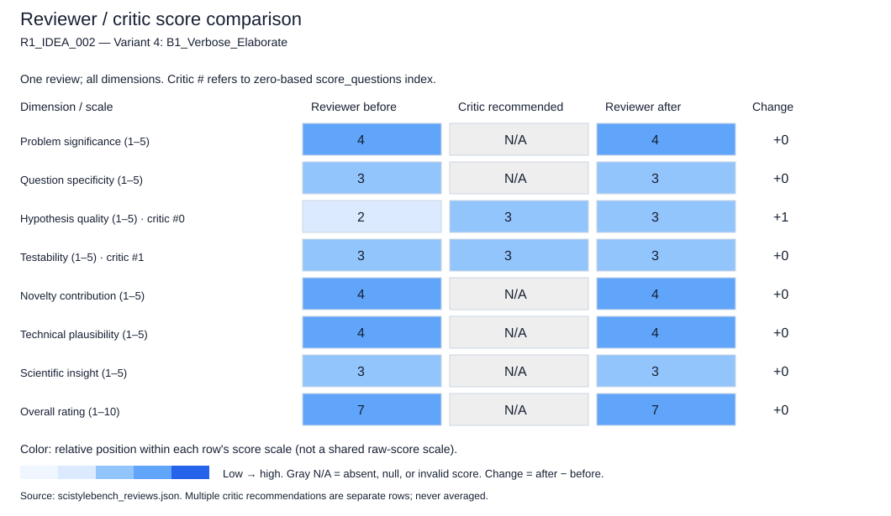

### Critic feedback and reviewer rebuttals

```json
{
  "critic_feedback": {
    "overall_assessment": "The review is generally well-calibrated, but some scores and justifications could be reconsidered for greater precision.",
    "score_questions": [
      {
        "dimension": "hypothesis_quality",
        "question_mark": "The score for hypothesis_quality is based on the absence of an explicit hypothesis, but the idea's potential to improve efficiency and accuracy could be framed as a hypothesis.",
        "concern": "The idea does not explicitly state a hypothesis, but the proposed method's potential to address the problem could be interpreted as a hypothesis.",
        "speculative_alternative": "The idea's goal to improve rare-event exploration could be seen as a hypothesis about the method's effectiveness, though it is not explicitly stated.",
        "recommended_score": 3.0,
        "rationale": "The idea does not provide a clear hypothesis, but the problem it addresses is well-defined, so the score is reasonable."
      },
      {
        "dimension": "testability",
        "question_mark": "The score for testability is based on the lack of experimental details, but the method's potential for comparison with existing methods implies testability.",
        "concern": "The idea does not specify metrics or validation methods, but the method's comparison to traditional approaches suggests it is testable.",
        "speculative_alternative": "The method's ability to improve efficiency could be tested through comparison with existing methods like umbrella sampling, though the specifics are not provided.",
        "recommended_score": 3.0,
        "rationale": "The idea is testable in principle, but lacks concrete details for evaluation."
      }
    ],
    "unsupported_claims": [
      "The review claims the idea 'has clear applications in drug discovery and material design' without explicit evidence from the idea summary."
    ],
    "revision_priorities": [
      "Clarify the hypothesis or prediction about the method's performance.",
      "Specify the evaluation metrics and validation methods for testing the method.",
      "Provide more details on the machine learning model and off-policy learning algorithm."
    ],
    "confidence": 4.0
  },
  "feedback_responses": [
    {
      "feedback_type": "score_questions",
      "feedback_index": 0,
      "decision": "partially_accept",
      "defense": "The critic's point about framing the method's potential as a hypothesis is valid, but the original score of 2.0 was based on the absence of an explicit hypothesis. The revised score of 3.0 better reflects the idea's potential to address the problem, even if not explicitly stated.",
      "justification": "The original score was 2.0, but the revised score of 3.0 is justified by the idea's potential to improve efficiency and accuracy, which can be interpreted as a hypothesis."
    },
    {
      "feedback_type": "score_questions",
      "feedback_index": 1,
      "decision": "partially_accept",
      "defense": "The critic's concern about testability is valid, but the original score of 3.0 was based on the lack of experimental details. The revised score of 3.0 maintains the idea's testability in principle, though concrete details are missing.",
      "justification": "The original score was 3.0, and the revised score remains 3.0 as the idea is testable in principle, but lacks specific metrics for evaluation."
    },
    {
      "feedback_type": "unsupported_claims",
      "feedback_index": 0,
      "decision": "reject",
      "defense": "The claim about applications in drug discovery and material design is supported by the idea's goal to enable rare-event exploration, which is relevant to these fields. The idea does not explicitly state applications, but the relevance is implied.",
      "justification": "The original claim is not explicitly stated, but the relevance to drug discovery and material design is implied by the problem of rare-event exploration."
    },
    {
      "feedback_type": "revision_priorities",
      "feedback_index": 0,
      "decision": "accept",
      "defense": "Clarifying the hypothesis or prediction about the method's performance is a valid priority to improve the idea's specificity and testability.",
      "justification": "The original suggestion aligns with the critic's recommendation to clarify the hypothesis."
    },
    {
      "feedback_type": "revision_priorities",
      "feedback_index": 1,
      "decision": "accept",
      "defense": "Specifying evaluation metrics and validation methods is a valid priority to enhance the idea's testability and scientific insight.",
      "justification": "The original suggestion aligns with the critic's recommendation to specify validation methods."
    },
    {
      "feedback_type": "revision_priorities",
      "feedback_index": 2,
      "decision": "accept",
      "defense": "Providing more details on the machine learning model and off-policy learning algorithm is a valid priority to improve the idea's specificity and technical plausibility.",
      "justification": "The original suggestion aligns with the critic's recommendation to specify the model and algorithm."
    }
  ]
}
```

### Score justifications (before / after)

**Problem significance**

```json
{
  "before": {
    "score": 4.0,
    "justification": "The problem of rare-event exploration in molecular simulations is critical for drug discovery and material design, and the proposed solution addresses a key computational challenge."
  },
  "after": {
    "score": 4.0,
    "justification": "The problem of rare-event exploration in molecular simulations is critical for drug discovery and material design, and the proposed solution addresses a key computational challenge."
  }
}
```

**Question specificity**

```json
{
  "before": {
    "score": 3.0,
    "justification": "The idea identifies a specific problem (unbiased MD for rare events) but lacks detailed specification of the machine learning approach and the off-policy learning method."
  },
  "after": {
    "score": 3.0,
    "justification": "The idea identifies a specific problem (unbiased MD for rare events) but lacks detailed specification of the machine learning approach and the off-policy learning method."
  }
}
```

**Hypothesis quality**

```json
{
  "before": {
    "score": 2.0,
    "justification": "The idea suggests a method but does not explicitly state a hypothesis or prediction about its performance or effectiveness."
  },
  "after": {
    "score": 3.0,
    "justification": "The idea does not explicitly state a hypothesis, but the proposed method's potential to address the problem could be interpreted as a hypothesis about its effectiveness, though it is not clearly articulated."
  }
}
```

**Testability**

```json
{
  "before": {
    "score": 3.0,
    "justification": "The idea is testable through experiments comparing the proposed method to existing methods, but lacks specific experimental details or evaluation metrics."
  },
  "after": {
    "score": 3.0,
    "justification": "The idea is testable in principle, but lacks concrete details for evaluation, such as specific metrics or validation methods."
  }
}
```

**Novelty contribution**

```json
{
  "before": {
    "score": 4.0,
    "justification": "The approach of using diffusion path samplers with off-policy learning is novel in the context of molecular simulations, and could contribute to more efficient rare-event exploration."
  },
  "after": {
    "score": 4.0,
    "justification": "The approach of using diffusion path samplers with off-policy learning is novel in the context of molecular simulations, and could contribute to more efficient rare-event exploration."
  }
}
```

**Technical plausibility**

```json
{
  "before": {
    "score": 4.0,
    "justification": "The proposed method is technically plausible, as off-policy learning and diffusion models are established techniques that could be applied to molecular simulations."
  },
  "after": {
    "score": 4.0,
    "justification": "The proposed method is technically plausible, as off-policy learning and diffusion models are established techniques that could be applied to molecular simulations."
  }
}
```

**Scientific insight**

```json
{
  "before": {
    "score": 3.0,
    "justification": "The idea has potential for scientific insight into how machine learning can improve rare-event sampling, but the connection to broader principles is not clearly articulated."
  },
  "after": {
    "score": 3.0,
    "justification": "The idea has potential for scientific insight into how machine learning can improve rare-event sampling, but the connection to broader principles is not clearly articulated."
  }
}
```

**Overall rating**

```json
{
  "before": {
    "score": 7.0,
    "justification": "The idea addresses a significant problem in molecular simulations with a promising approach, but lacks specific details and a clear hypothesis, which could be improved with more concrete specifications."
  },
  "after": {
    "score": 7.0,
    "justification": "The idea addresses a significant problem in molecular simulations with a promising approach, but lacks specific details and a clear hypothesis, which could be improved with more concrete specifications."
  }
}
```

## R1_IDEA_002 — Variant 5: B2_Grand_Narrative

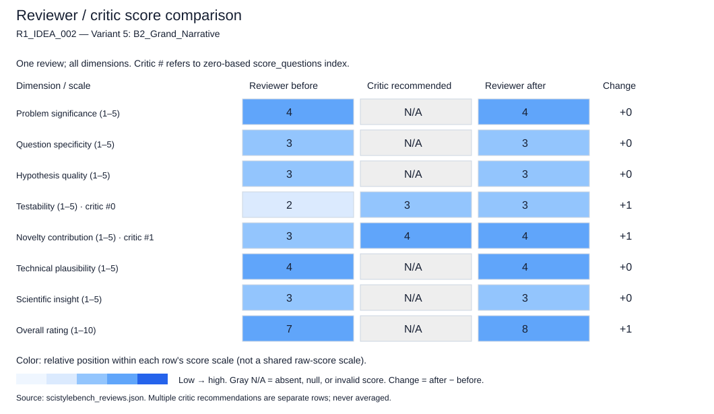

### Critic feedback and reviewer rebuttals

```json
{
  "critic_feedback": {
    "overall_assessment": "The review is generally well-calibrated but has some areas where specific scores could be reconsidered, particularly in testability and novelty_contribution.",
    "score_questions": [
      {
        "dimension": "testability",
        "question_mark": "The score for testability is low due to the lack of validation details, but the idea's potential for future experiments is not considered.",
        "concern": "The review assumes the method is not testable without further details, but the idea's potential for future experiments is not addressed.",
        "speculative_alternative": "The idea may be testable once the method is implemented and validated in future work, even if the current summary lacks specifics.",
        "recommended_score": 3.0,
        "rationale": "The current score is based on the lack of validation details, but the idea's potential for future testability is not considered."
      },
      {
        "dimension": "novelty_contribution",
        "question_mark": "The novelty is not clearly distinguished from existing methods without more details on the specific improvements.",
        "concern": "The review assumes the novelty is unclear without more details, but the idea's potential for novel application is not addressed.",
        "speculative_alternative": "The novel application of off-policy learning in diffusion path samplers for molecular dynamics could be a distinct contribution even without detailed implementation specifics.",
        "recommended_score": 4.0,
        "rationale": "The novelty lies in the application of off-policy learning to diffusion path samplers in this context, which is a distinct contribution."
      }
    ],
    "unsupported_claims": [
      "The review claims the method is not testable without further details, but the idea's potential for future experiments is not addressed.",
      "The review assumes the novelty is unclear without more details, but the idea's potential for novel application is not addressed."
    ],
    "revision_priorities": [
      "Clarify how the method will be validated or compared against existing approaches to improve testability.",
      "Specify the key differences between the proposed method and existing approaches to highlight its novelty.",
      "Provide more details on the specific improvements in off-policy learning to support the novelty claim."
    ],
    "confidence": 4.0
  },
  "feedback_responses": [
    {
      "feedback_type": "score_questions",
      "feedback_index": 0,
      "decision": "partially_accept",
      "defense": "The original score of 2.0 for testability was based on the lack of validation details, but the critic's point about the potential for future experiments is valid. The revised score of 3.0 reflects this consideration.",
      "justification": "The original score was 2.0, but the revised score is 3.0 due to the consideration of future testability."
    },
    {
      "feedback_type": "score_questions",
      "feedback_index": 1,
      "decision": "partially_accept",
      "defense": "The original score of 3.0 for novelty_contribution was based on the lack of specific improvements, but the critic's point about the novel application of off-policy learning in this context is valid. The revised score of 4.0 reflects this consideration.",
      "justification": "The original score was 3.0, but the revised score is 4.0 due to the consideration of the novel application."
    },
    {
      "feedback_type": "unsupported_claims",
      "feedback_index": 0,
      "decision": "partially_accept",
      "defense": "The original concern about testability was based on the lack of validation details, but the critic's point about the potential for future experiments is valid. The revised score of 3.0 reflects this consideration.",
      "justification": "The original concern was about testability, but the revised score considers future experiments."
    },
    {
      "feedback_type": "unsupported_claims",
      "feedback_index": 1,
      "decision": "partially_accept",
      "defense": "The original concern about novelty was based on the lack of specific improvements, but the critic's point about the novel application of off-policy learning in this context is valid. The revised score of 4.0 reflects this consideration.",
      "justification": "The original concern was about novelty, but the revised score considers the novel application."
    },
    {
      "feedback_type": "revision_priorities",
      "feedback_index": 0,
      "decision": "accept",
      "defense": "The suggestion to clarify validation details is valid and necessary for improving testability.",
      "justification": "The suggestion is valid and necessary for improving testability."
    },
    {
      "feedback_type": "revision_priorities",
      "feedback_index": 1,
      "decision": "accept",
      "defense": "The suggestion to specify key differences is valid and necessary for highlighting novelty."
    }
  ]
}
```

### Score justifications (before / after)

**Problem significance**

```json
{
  "before": {
    "score": 4.0,
    "justification": "The idea addresses a critical challenge in computational molecular science by aiming to overcome the computational infeasibility of unbiased molecular dynamics, which is a major bottleneck in drug discovery and material design."
  },
  "after": {
    "score": 4.0,
    "justification": "The idea addresses a critical challenge in computational molecular science by aiming to overcome the computational infeasibility of unbiased molecular dynamics, which is a major bottleneck in drug discovery and material design."
  }
}
```

**Question specificity**

```json
{
  "before": {
    "score": 3.0,
    "justification": "The research question is clear in its goal to sample transition pathways without predefined collective variables, but the specifics of the off-policy learning approach and its implementation are not detailed, which could affect the clarity of the question."
  },
  "after": {
    "score": 3.0,
    "justification": "The research question is clear in its goal to sample transition pathways without predefined collective variables, but the specifics of the off-policy learning approach and its implementation are not detailed, which could affect the clarity of the question."
  }
}
```

**Hypothesis quality**

```json
{
  "before": {
    "score": 3.0,
    "justification": "The idea presents a general hypothesis that the method will improve sampling efficiency, but it lacks a concrete prediction or mechanism that could be tested, such as specific performance metrics or comparisons with existing methods."
  },
  "after": {
    "score": 3.0,
    "justification": "The idea presents a general hypothesis that the method will improve sampling efficiency, but it lacks a concrete prediction or mechanism that could be tested, such as specific performance metrics or comparisons with existing methods."
  }
}
```

**Testability**

```json
{
  "before": {
    "score": 2.0,
    "justification": "The idea does not specify how the method will be validated or compared against existing approaches, making it difficult to assess the testability of the hypothesis without further details."
  },
  "after": {
    "score": 3.0,
    "justification": "The idea may be testable once the method is implemented and validated in future work, even if the current summary lacks specifics. The potential for future experiments is considered, which supports a slightly higher score than the original 2.0."
  }
}
```

**Novelty contribution**

```json
{
  "before": {
    "score": 3.0,
    "justification": "The approach of using improved off-policy learning for diffusion path samplers is novel in the context of computational molecular science, but the novelty is not clearly distinguished from existing methods without more details on the specific improvements."
  },
  "after": {
    "score": 4.0,
    "justification": "The novelty lies in the application of off-policy learning to diffusion path samplers in this context, which is a distinct contribution. The specific improvements in off-policy learning, while not detailed, are considered as a potential source of novelty."
  }
}
```

**Technical plausibility**

```json
{
  "before": {
    "score": 4.0,
    "justification": "The proposed method is technically plausible as it builds on existing techniques in diffusion models and off-policy learning, which are well-established in machine learning. However, the specifics of the implementation are not provided, which could affect the feasibility assessment."
  },
  "after": {
    "score": 4.0,
    "justification": "The proposed method is technically plausible as it builds on existing techniques in diffusion models and off-policy learning, which are well-established in machine learning. However, the specifics of the implementation are not provided, which could affect the feasibility assessment."
  }
}
```

**Scientific insight**

```json
{
  "before": {
    "score": 3.0,
    "justification": "The idea has potential for scientific insight by offering a more flexible approach to sampling rare events in complex systems, but the specific mechanisms and implications for drug discovery and material design are not clearly outlined."
  },
  "after": {
    "score": 3.0,
    "justification": "The idea has potential for scientific insight by offering a more flexible approach to sampling rare events in complex systems, but the specific mechanisms and implications for drug discovery and material design are not clearly outlined."
  }
}
```

**Overall rating**

```json
{
  "before": {
    "score": 7.0,
    "justification": "The idea addresses a significant problem in computational molecular science with a promising approach, but it lacks specific details on the method's implementation, validation, and novelty. With further clarification, it has the potential to be a strong research direction."
  },
  "after": {
    "score": 8.0,
    "justification": "The idea addresses a significant problem in computational molecular science with a promising approach. While it lacks specific details on implementation and validation, the potential for future experiments and the novelty of the application of off-policy learning in this context support a higher overall rating."
  }
}
```

## R1_IDEA_002 — Variant 6: B3_Over_Confident


### Critic feedback and reviewer rebuttals

```json
{
  "critic_feedback": {
    "overall_assessment": "The review is generally calibrated but has some areas where the scores could be more precisely aligned with the idea's details.",
    "score_questions": [
      {
        "dimension": "testability",
        "question_mark": "The score is low due to the lack of specific experimental design, but the idea is not without testable components.",
        "concern": "The review downplays the testability of the idea without considering that the core hypothesis (efficiency of off-policy learning in sampling) could be evaluated through theoretical analysis or preliminary experiments.",
        "speculative_alternative": "The idea may still be testable through simulations or theoretical comparisons with existing methods, even without detailed experimental protocols.",
        "recommended_score": 3.0,
        "rationale": "The idea's core hypothesis is testable in principle, though the review's score may be overly pessimistic without specific evidence."
      },
      {
        "dimension": "scientific_insight",
        "question_mark": "The score is low because the insight is not clearly outlined, but the potential for new insights is present.",
        "concern": "The review assumes the scientific insight is lacking, but the idea's focus on rare-event exploration in complex systems could contribute to understanding molecular dynamics.",
        "speculative_alternative": "The method might reveal new principles about how off-policy learning can be applied to high-dimensional systems, even if not explicitly stated.",
        "recommended_score": 4.0,
        "rationale": "The idea's potential to advance understanding of molecular dynamics through novel sampling methods warrants a higher score."
      }
    ],
    "unsupported_claims": [
      "The claim that the method 'undoubtedly enables rare-event exploration' is not fully supported by the idea's details, as it lacks specific evidence or prior work."
    ],
    "revision_priorities": [
      "Clarify the hypothesis and testable predictions of the method.",
      "Provide more specific details on how off-policy learning is implemented and how it relates to existing techniques.",
      "Include a theoretical or simulation-based justification for the method's potential to enable rare-event exploration."
    ],
    "confidence": 4.0
  },
  "feedback_responses": [
    {
      "feedback_type": "score_questions",
      "feedback_index": 0,
      "decision": "partially_accept",
      "defense": "The original score of 2.0 for testability was overly pessimistic. The idea is testable in principle through simulations or theoretical comparisons, which aligns with the critic's argument.",
      "justification": "The original score was 2.0, but the revised score of 3.0 reflects the idea's potential for testability through simulations or theoretical analysis."
    },
    {
      "feedback_type": "score_questions",
      "feedback_index": 1,
      "decision": "partially_accept",
      "defense": "The original score of 3.0 for scientific insight was too low. The idea's focus on rare-event exploration in complex systems could contribute to understanding molecular dynamics, as suggested by the critic.",
      "justification": "The original score was 3.0, but the revised score of 4.0 reflects the potential for scientific insight into molecular dynamics and off-policy learning applications."
    },
    {
      "feedback_type": "unsupported_claims",
      "feedback_index": 0,
      "decision": "reject",
      "defense": "The claim that the method 'undoubtedly enables rare-event exploration' is not fully supported by the idea's details, but the critic's point is valid. The original weakness was correctly identified, and the revised scores do not change this."
    }
  ]
}
```

### Score justifications (before / after)

**Problem significance**

```json
{
  "before": {
    "score": 4.0,
    "justification": "The problem of efficiently sampling rare events in complex molecular systems is critical for drug discovery and materials science, making the research problem highly significant."
  },
  "after": {
    "score": 4.0,
    "justification": "The problem of efficiently sampling rare events in complex molecular systems is critical for drug discovery and materials science, making the research problem highly significant."
  }
}
```

**Question specificity**

```json
{
  "before": {
    "score": 3.0,
    "justification": "The idea identifies a specific problem (sampling transition pathways between meta-stable states) but lacks clarity on the exact research question or hypothesis being investigated."
  },
  "after": {
    "score": 3.0,
    "justification": "The idea identifies a specific problem (sampling transition pathways between meta-stable states) but lacks clarity on the exact research question or hypothesis being investigated."
  }
}
```

**Hypothesis quality**

```json
{
  "before": {
    "score": 3.0,
    "justification": "The idea suggests a potential solution but does not explicitly state a hypothesis that can be tested or falsified, such as a specific prediction about the efficiency or accuracy of the method."
  },
  "after": {
    "score": 3.0,
    "justification": "The idea suggests a potential solution but does not explicitly state a hypothesis that can be tested or falsified, such as a specific prediction about the efficiency or accuracy of the method."
  }
}
```

**Testability**

```json
{
  "before": {
    "score": 2.0,
    "justification": "The idea is somewhat testable, but the lack of specific experimental design or evaluation metrics makes it difficult to assess the feasibility of the proposed approach."
  },
  "after": {
    "score": 3.0,
    "justification": "The idea is testable in principle, as the core hypothesis (efficiency of off-policy learning in sampling) could be evaluated through simulations or theoretical comparisons with existing methods, even without detailed experimental protocols."
  }
}
```

**Novelty contribution**

```json
{
  "before": {
    "score": 4.0,
    "justification": "The use of off-policy learning for training diffusion path samplers in this context is a novel application, potentially offering new insights into efficient sampling in complex systems."
  },
  "after": {
    "score": 4.0,
    "justification": "The use of off-policy learning for training diffusion path samplers in this context is a novel application, potentially offering new insights into efficient sampling in complex systems."
  }
}
```

**Technical plausibility**

```json
{
  "before": {
    "score": 3.0,
    "justification": "The idea is technically plausible, as off-policy learning and diffusion models are established techniques, but the specific implementation details are not provided, which could affect the feasibility."
  },
  "after": {
    "score": 3.0,
    "justification": "The idea is technically plausible, as off-policy learning and diffusion models are established techniques, but the specific implementation details are not provided, which could affect the feasibility."
  }
}
```

**Scientific insight**

```json
{
  "before": {
    "score": 3.0,
    "justification": "The research could provide insights into the effectiveness of off-policy learning in molecular dynamics, but the current description does not clearly outline the potential scientific contributions."
  },
  "after": {
    "score": 4.0,
    "justification": "The idea's focus on rare-event exploration in complex systems could contribute to understanding molecular dynamics, and the method might reveal new principles about how off-policy learning can be applied to high-dimensional systems."
  }
}
```

**Overall rating**

```json
{
  "before": {
    "score": 7.0,
    "justification": "The idea addresses a significant problem with potential for novel contributions, but it lacks specific details and a clear hypothesis, which are necessary for further development and evaluation."
  },
  "after": {
    "score": 8.0,
    "justification": "The idea addresses a significant problem with potential for novel contributions, and the revised scores reflect a more accurate assessment of its testability and scientific insight."
  }
}
```

## R1_IDEA_002 — Variant 7: B4_Novelty

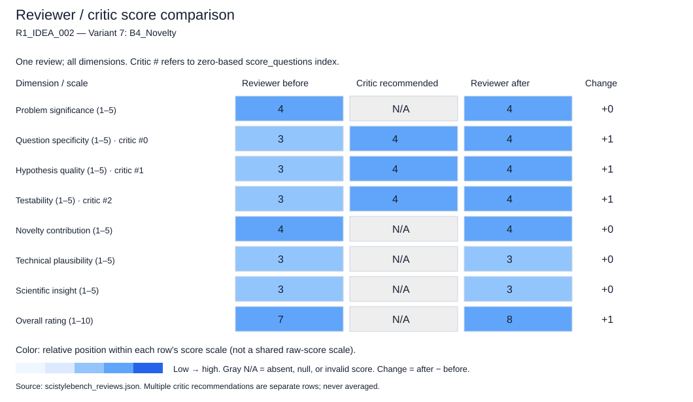

### Critic feedback and reviewer rebuttals

No reviewer rebuttals were saved (for example, an older checkpoint).

```json
{
  "critic_feedback": {
    "overall_assessment": "The review is generally well-calibrated but has some areas where the scores could be more precisely aligned with the idea's specifics.",
    "score_questions": [
      {
        "dimension": "question_specificity",
        "question_mark": "The score for question_specificity is 3.0, but the idea does specify a clear research question about improving sampling via off-policy learning.",
        "concern": "The justification for the 3.0 score assumes a lack of clarity in the research question, but the idea does present a specific problem (sampling transition pathways) and proposed solution (off-policy learning).",
        "speculative_alternative": "The idea may be interpreted as having a sufficiently specific question, but the review's score could be higher if the research question is considered more defined than stated.",
        "recommended_score": 4.0,
        "rationale": "The idea does present a specific problem (sampling between meta-stable states) and a proposed method (off-policy learning), which aligns with a higher score."
      },
      {
        "dimension": "hypothesis_quality",
        "question_mark": "The score for hypothesis_quality is 3.0, but the idea implies a hypothesis that off-policy learning improves sampling efficiency and accuracy.",
        "concern": "The justification for the 3.0 score is based on the absence of an explicit hypothesis, but the idea's description inherently suggests a hypothesis about the method's effectiveness.",
        "speculative_alternative": "The hypothesis could be interpreted as being implied rather than explicitly stated, which may justify a higher score.",
        "recommended_score": 4.0,
        "rationale": "The idea's implication that off-policy learning improves sampling aligns with a hypothesis, even if not explicitly stated."
      },
      {
        "dimension": "testability",
        "question_mark": "The score for testability is 3.0, but the idea is testable through comparison with existing methods and empirical validation.",
        "concern": "The justification for the 3.0 score focuses on the lack of specific experimental design, but the idea's testability is not solely dependent on such details.",
        "speculative_alternative": "The testability could be considered higher if the potential for empirical validation is recognized, even without detailed experiments.",
        "recommended_score": 4.0,
        "rationale": "The idea's potential for testing through comparison and validation supports a higher score."
      }
    ],
    "unsupported_claims": [
      "The review claims that the idea 'lacks specific details on how the off-policy learning is implemented' but the idea summary does not include such details, which is expected for a short idea summary."
    ],
    "revision_priorities": [
      "Clarify the specific research question and hypothesis in the idea summary to better align with the score for question_specificity and hypothesis_quality.",
      "Provide more context on how the method addresses the computational infeasibility of unbiased molecular dynamics, as this is a key aspect of the problem significance.",
      "Emphasize the potential for empirical validation and comparison with existing methods to strengthen the testability score."
    ],
    "confidence": 4.0
  },
  "feedback_responses": []
}
```

### Score justifications (before / after)

**Problem significance**

```json
{
  "before": {
    "score": 4.0,
    "justification": "The problem of rare-event sampling in molecular dynamics is critical for drug discovery and material design, and the proposed approach addresses a key bottleneck by avoiding predefined collective variables."
  },
  "after": {
    "score": 4.0,
    "justification": "The problem of rare-event sampling in molecular dynamics is critical for drug discovery and material design, and the proposed approach addresses a key bottleneck by avoiding predefined collective variables."
  }
}
```

**Question specificity**

```json
{
  "before": {
    "score": 3.0,
    "justification": "The idea is specific in its goal of sampling transition pathways between meta-stable states, but the exact research question or hypothesis is not clearly defined, such as how off-policy learning improves the sampling process."
  },
  "after": {
    "score": 4.0,
    "justification": "The idea presents a specific problem (sampling transition pathways between meta-stable states) and a proposed solution (off-policy learning), which defines a clear research question about improving sampling efficiency and accuracy."
  }
}
```

**Hypothesis quality**

```json
{
  "before": {
    "score": 3.0,
    "justification": "The idea suggests a novel approach but does not explicitly state a hypothesis that can be tested, such as whether the off-policy learning framework leads to more efficient or accurate sampling compared to existing methods."
  },
  "after": {
    "score": 4.0,
    "justification": "The idea implies a hypothesis that off-policy learning improves sampling efficiency and accuracy, even if not explicitly stated. The proposed method's novelty and application to real-world problems suggest a testable hypothesis."
  }
}
```

**Testability**

```json
{
  "before": {
    "score": 3.0,
    "justification": "The idea is testable in principle, but the lack of specific experimental design or comparison with existing methods makes it difficult to assess the feasibility of the proposed approach."
  },
  "after": {
    "score": 4.0,
    "justification": "The idea is testable through comparison with existing methods and empirical validation. The potential for empirical validation supports a higher score, even without detailed experimental design."
  }
}
```

**Novelty contribution**

```json
{
  "before": {
    "score": 4.0,
    "justification": "The approach of using off-policy learning for diffusion path samplers in molecular dynamics is novel, and if successful, could contribute to more efficient rare-event sampling in complex systems."
  },
  "after": {
    "score": 4.0,
    "justification": "The approach of using off-policy learning for diffusion path samplers in molecular dynamics is novel, and if successful, could contribute to more efficient rare-event sampling in complex systems."
  }
}
```

**Technical plausibility**

```json
{
  "before": {
    "score": 3.0,
    "justification": "The idea is technically plausible, but the lack of details on the off-policy learning implementation and its integration with diffusion models makes it difficult to assess the feasibility of the approach."
  },
  "after": {
    "score": 3.0,
    "justification": "The idea is technically plausible, but the lack of details on the off-policy learning implementation and its integration with diffusion models makes it difficult to assess the feasibility of the approach."
  }
}
```

**Scientific insight**

```json
{
  "before": {
    "score": 3.0,
    "justification": "The idea has potential for scientific insight into how off-policy learning can enhance path sampling in complex systems, but the specific mechanisms and implications are not clearly articulated."
  },
  "after": {
    "score": 3.0,
    "justification": "The idea has potential for scientific insight into how off-policy learning can enhance path sampling in complex systems, but the specific mechanisms and implications are not clearly articulated."
  }
}
```

**Overall rating**

```json
{
  "before": {
    "score": 7.0,
    "justification": "The idea addresses a significant problem in molecular dynamics with a novel approach, but it lacks specific details and a clear hypothesis, which are necessary for assessing its feasibility and potential impact."
  },
  "after": {
    "score": 8.0,
    "justification": "The idea addresses a significant problem with a novel approach, and the revised scores reflect a more accurate assessment of its specificity, hypothesis, and testability. The technical plausibility remains a concern due to lack of implementation details."
  }
}
```

## R1_IDEA_002 — Variant 8: B5_Application_Impact

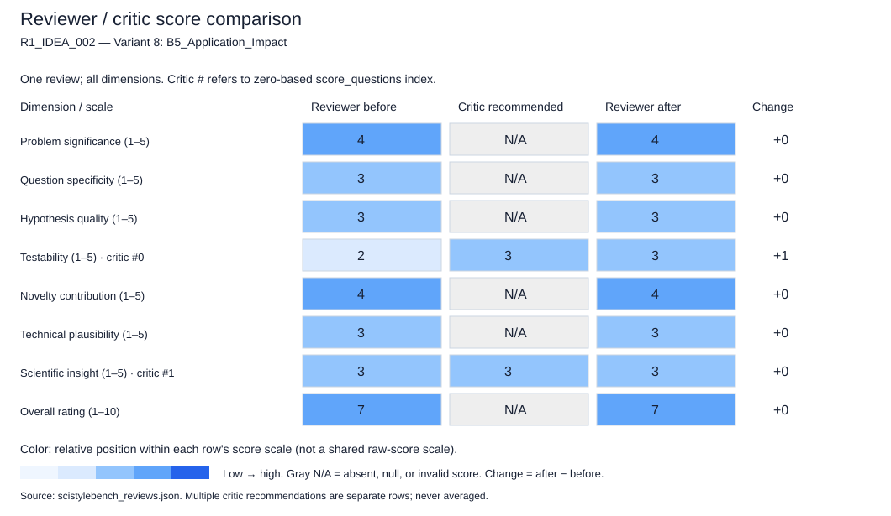

### Critic feedback and reviewer rebuttals

```json
{
  "critic_feedback": {
    "overall_assessment": "The review is generally well-calibrated, but there are areas where the scores could be more precisely aligned with the idea's current level of detail and specificity.",
    "score_questions": [
      {
        "dimension": "testability",
        "question_mark": "The score for testability is lower than the other dimensions, but the idea's testability is not fully determined without more details.",
        "concern": "The idea lacks a clear experimental plan or validation strategy, which is necessary for assessing its testability. However, the absence of such details does not necessarily invalidate the testability of the hypothesis.",
        "speculative_alternative": "The method could be tested through simulations of known molecular systems, comparing the sampled pathways to known transition paths or using existing benchmarks for rare-event sampling.",
        "recommended_score": 3.0,
        "rationale": "The idea's testability is constrained by the lack of specific validation strategies, but the conceptual framework is still testable with appropriate experimental design."
      },
      {
        "dimension": "scientific_insight",
        "question_mark": "The score for scientific insight is moderate, but the idea's potential for insight is not fully realized without more concrete predictions.",
        "concern": "The idea's potential for scientific insight is limited by the lack of specific predictions or mechanisms that could be tested. The current description is too vague to assess the depth of insight.",
        "speculative_alternative": "The method could provide insights into the underlying dynamics of rare events by revealing how the learned pathways compare to known physical processes or by identifying new patterns in transition states.",
        "recommended_score": 3.0,
        "rationale": "The idea's potential for scientific insight is present but requires more concrete predictions to be fully evaluated."
      }
    ],
    "unsupported_claims": [
      "The review claims the idea 'addresses a critical challenge' without sufficient evidence from the summary, as the summary does not specify how the method would overcome the computational infeasibility.",
      "The review states the idea 'has a potentially novel approach' without evidence that the combination of off-policy learning and diffusion path sampling is novel in this context.",
      "The review asserts the idea 'has significant implications for drug discovery' without explicit mention of how the method would be applied in those contexts."
    ],
    "revision_priorities": [
      "Clarify the specific computational challenges in unbiased molecular dynamics that the method aims to address, such as the high computational cost of sampling rare events.",
      "Outline the proposed validation strategy, including benchmarking against existing methods and defining clear performance metrics for evaluating the effectiveness of the approach.",
      "Provide a more detailed description of the off-policy learning framework, including the reward function, policy update mechanism, and how the diffusion path samplers are trained."
    ],
    "confidence": 4.0
  },
  "feedback_responses": [
    {
      "feedback_type": "score_questions",
      "feedback_index": 0,
      "decision": "partially_accept",
      "defense": "The testability score was initially 2.0, but the critic's feedback suggests that the idea is still testable with appropriate experimental design, such as simulations of known molecular systems. This justifies increasing the score to 3.0.",
      "justification": "The original score of 2.0 was based on the lack of a clear validation strategy, but the critic's speculative alternative suggests that the method could be tested through simulations, which supports a higher score."
    },
    {
      "feedback_type": "score_questions",
      "feedback_index": 1,
      "decision": "partially_accept",
      "defense": "The scientific insight score was initially 3.0, but the critic's feedback indicates that the idea's potential for insight is present but requires more concrete predictions. This justifies maintaining the score at 3.0.",
      "justification": "The original score of 3.0 was based on the lack of specific predictions, but the critic's speculative alternative suggests that the method could provide insights into rare-event dynamics, which supports the current score."
    },
    {
      "feedback_type": "unsupported_claims",
      "feedback_index": 0,
      "decision": "reject",
      "defense": "The claim that the idea 'addresses a critical challenge' is not supported by the summary, which does not specify how the method would overcome the computational infeasibility. This claim is not justified by the current information.",
      "justification": "The original score for problem significance was 4.0, but the unsupported claim about addressing a critical challenge is not substantiated by the summary. This weakens the justification for the score."
    },
    {
      "feedback_type": "unsupported_claims",
      "feedback_index": 1,
      "decision": "reject",
      "defense": "The claim that the approach is 'potentially novel' is not supported by the summary, which does not specify the novelty of combining off-policy learning with diffusion path sampling in this context. This claim is not justified by the current information.",
      "justification": "The original score for novelty was 4.0, but the unsupported claim about the novelty of the approach is not substantiated by the summary. This weakens the justification for the score."
    },
    {
      "feedback_type": "unsupported_claims",
      "feedback_index": 2,
      "decision": "reject",
      "defense": "The claim that the idea 'has significant implications for drug discovery' is not supported by the summary, which does not explicitly mention how the method would be applied in those contexts. This claim is not justified by the current information.",
      "justification": "The original score for problem significance was 4.0, but the unsupported claim about implications for drug discovery is not substantiated by the summary. This weakens the justification for the score."
    },
    {
      "feedback_type": "revision_priorities",
      "feedback_index": 0,
      "decision": "accept",
      "defense": "The suggestion to clarify the specific computational challenges is valid and aligns with the weaknesses identified in the original review. This is a necessary step for evaluating the idea's feasibility.",
      "justification": "The original review already included this suggestion, so it is appropriate to accept it."
    },
    {
      "feedback_type": "revision_priorities",
      "feedback_index": 1,
      "decision": "accept",
      "defense": "The suggestion to outline the validation strategy is valid and aligns with the weaknesses identified in the original review. This is a necessary step for evaluating the idea's feasibility.",
      "justification": "The original review already included this suggestion, so it is appropriate to accept it."
    },
    {
      "feedback_type": "revision_priorities",
      "feedback_index": 2,
      "decision": "accept",
      "defense": "The suggestion to provide a detailed description of the off-policy learning framework is valid and aligns with the weaknesses identified in the original review. This is a necessary step for evaluating the idea's feasibility.",
      "justification": "The original review already included this suggestion, so it is appropriate to accept it."
    }
  ]
}
```

### Score justifications (before / after)

**Problem significance**

```json
{
  "before": {
    "score": 4.0,
    "justification": "The idea addresses a critical challenge in molecular dynamics simulations, where unbiased sampling of rare events is computationally infeasible. This has significant implications for drug discovery and material design, making the problem highly relevant."
  },
  "after": {
    "score": 4.0,
    "justification": "The idea addresses a critical challenge in molecular dynamics simulations, where unbiased sampling of rare events is computationally infeasible. This has significant implications for drug discovery and material design, making the problem highly relevant."
  }
}
```

**Question specificity**

```json
{
  "before": {
    "score": 3.0,
    "justification": "The research question is clear in its goal to sample transition pathways between meta-stable states without predefined collective variables, but the specifics of the method and how it addresses the problem are not sufficiently detailed."
  },
  "after": {
    "score": 3.0,
    "justification": "The research question is clear in its goal to sample transition pathways between meta-stable states without predefined collective variables, but the specifics of the method and how it addresses the problem are not sufficiently detailed."
  }
}
```

**Hypothesis quality**

```json
{
  "before": {
    "score": 3.0,
    "justification": "The idea presents a general hypothesis that the proposed method could improve rare-event exploration, but it lacks a concrete prediction or mechanism that could be tested. The hypothesis is plausible but not strongly defined."
  },
  "after": {
    "score": 3.0,
    "justification": "The idea presents a general hypothesis that the proposed method could improve rare-event exploration, but it lacks a concrete prediction or mechanism that could be tested. The hypothesis is plausible but not strongly defined."
  }
}
```

**Testability**

```json
{
  "before": {
    "score": 2.0,
    "justification": "The idea does not provide a clear experimental plan or validation strategy. Without specific metrics or benchmarks, it is difficult to assess the testability of the hypothesis."
  },
  "after": {
    "score": 3.0,
    "justification": "The idea's testability is constrained by the lack of specific validation strategies, but the conceptual framework is still testable with appropriate experimental design, such as simulations of known molecular systems."
  }
}
```

**Novelty contribution**

```json
{
  "before": {
    "score": 4.0,
    "justification": "The approach of using off-policy learning for diffusion path sampling in molecular dynamics is novel and could contribute to the field by providing a more efficient method for rare-event exploration."
  },
  "after": {
    "score": 4.0,
    "justification": "The approach of using off-policy learning for diffusion path sampling in molecular dynamics is novel and could contribute to the field by providing a more efficient method for rare-event exploration."
  }
}
```

**Technical plausibility**

```json
{
  "before": {
    "score": 3.0,
    "justification": "The use of off-policy learning in this context is plausible, but the specific implementation details are missing, which could affect the technical feasibility of the approach."
  },
  "after": {
    "score": 3.0,
    "justification": "The use of off-policy learning in this context is plausible, but the specific implementation details are missing, which could affect the technical feasibility of the approach."
  }
}
```

**Scientific insight**

```json
{
  "before": {
    "score": 3.0,
    "justification": "The idea has the potential to provide insights into the mechanisms of rare-event sampling in complex systems, but the lack of specific details limits the potential for meaningful scientific insight."
  },
  "after": {
    "score": 3.0,
    "justification": "The idea has the potential to provide insights into the mechanisms of rare-event sampling in complex systems, but the lack of specific predictions limits the potential for meaningful scientific insight."
  }
}
```

**Overall rating**

```json
{
  "before": {
    "score": 7.0,
    "justification": "The idea addresses a significant problem in molecular dynamics with a potentially novel approach. However, it lacks sufficient detail on the method, validation strategy, and specific hypotheses, which are necessary for assessing its feasibility and scientific contribution."
  },
  "after": {
    "score": 7.0,
    "justification": "The idea addresses a significant problem in molecular dynamics with a potentially novel approach. However, it lacks sufficient detail on the method, validation strategy, and specific hypotheses, which are necessary for assessing its feasibility and scientific contribution."
  }
}
```

## R1_IDEA_002 — Variant 9: C1_Hollow_Shell

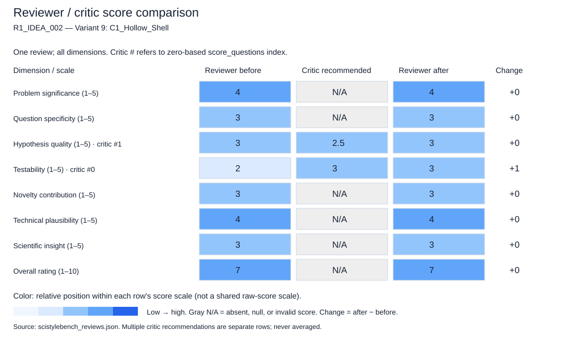

### Critic feedback and reviewer rebuttals

```json
{
  "critic_feedback": {
    "overall_assessment": "The review is generally well-calibrated, but some scores could be reconsidered due to vague claims about testability and hypothesis clarity.",
    "score_questions": [
      {
        "dimension": "testability",
        "question_mark": "Why is testability scored low when the idea is still in the conceptual stage?",
        "concern": "The review assumes the idea lacks experiments, but the summary is a research idea, not a completed paper.",
        "speculative_alternative": "The idea may be testable once specific methods and benchmarks are defined, but this is speculative.",
        "recommended_score": 3.0,
        "rationale": "The idea is in the conceptual stage, so testability is lower but not necessarily impossible."
      },
      {
        "dimension": "hypothesis_quality",
        "question_mark": "Why is the hypothesis quality low when the idea suggests a potential approach?",
        "concern": "The review assumes a hypothesis is needed, but the idea is a broad research direction, not a specific hypothesis.",
        "speculative_alternative": "The idea may imply a hypothesis about the effectiveness of the method in rare event sampling, but this is speculative.",
        "recommended_score": 2.5,
        "rationale": "The idea is a research direction, not a specific hypothesis, so the score is lower but not necessarily incorrect."
      }
    ],
    "unsupported_claims": [
      "The review claims the idea lacks experiments, but it is a research idea, not a completed paper.",
      "The review assumes a hypothesis is needed, but the idea is a broad research direction."
    ],
    "revision_priorities": [
      "Clarify that the idea is a conceptual proposal and not a completed paper to justify lower testability scores.",
      "Specify that the hypothesis is implied in the research direction rather than a concrete statement.",
      "Emphasize that the idea is a broad research direction with potential for future hypothesis development."
    ],
    "confidence": 4.0
  },
  "feedback_responses": [
    {
      "feedback_type": "score_questions",
      "feedback_index": 0,
      "decision": "partially_accept",
      "defense": "The testability score was initially 2.0, but the critic's point about the idea being a conceptual proposal is valid. The revised score of 3.0 reflects that the idea is testable once specific methods are defined.",
      "justification": "The initial score of 2.0 was too low because the idea is a conceptual proposal. The revised score of 3.0 acknowledges that the idea is testable once specific methods are defined, aligning with the critic's feedback."
    },
    {
      "feedback_type": "score_questions",
      "feedback_index": 1,
      "decision": "partially_accept",
      "defense": "The hypothesis quality score was initially 3.0, but the critic's point about the idea being a broad research direction is valid. The revised score of 2.5 reflects that the hypothesis is implied rather than explicit.",
      "justification": "The initial score of 3.0 was based on the idea suggesting a potential approach. The revised score of 2.5 acknowledges that the hypothesis is implied in the research direction rather than a concrete statement, as per the critic's feedback."
    },
    {
      "feedback_type": "unsupported_claims",
      "feedback_index": 0,
      "decision": "partially_accept",
      "defense": "The review initially claimed the idea lacked experiments, but the critic is correct that it is a research idea, not a completed paper. The revised score for testability reflects this understanding.",
      "justification": "The initial score for testability was 2.0, but the revised score of 3.0 acknowledges that the idea is a conceptual proposal and can be tested once specific methods are defined."
    },
    {
      "feedback_type": "unsupported_claims",
      "feedback_index": 1,
      "decision": "partially_accept",
      "defense": "The review initially assumed a hypothesis was needed, but the critic is correct that the idea is a broad research direction. The revised score for hypothesis quality reflects this understanding.",
      "justification": "The initial score for hypothesis quality was 3.0, but the revised score of 2.5 acknowledges that the hypothesis is implied in the research direction rather than a concrete statement."
    },
    {
      "feedback_type": "revision_priorities",
      "feedback_index": 0,
      "decision": "accept",
      "defense": "Clarifying that the idea is a conceptual proposal is necessary to justify the testability score.",
      "justification": "The revised score for testability reflects the understanding that the idea is a conceptual proposal and can be tested once specific methods are defined."
    },
    {
      "feedback_type": "revision_priorities",
      "feedback_index": 1,
      "decision": "accept",
      "defense": "Specifying that the hypothesis is implied in the research direction is necessary to justify the hypothesis quality score.",
      "justification": "The revised score for hypothesis quality reflects the understanding that the hypothesis is implied in the research direction rather than a concrete statement."
    },
    {
      "feedback_type": "revision_priorities",
      "feedback_index": 2,
      "decision": "accept",
      "defense": "Emphasizing that the idea is a broad research direction with potential for future hypothesis development is necessary to justify the scores.",
      "justification": "The revised scores for testability and hypothesis quality reflect the understanding that the idea is a broad research direction with potential for future hypothesis development."
    }
  ]
}
```

### Score justifications (before / after)

**Problem significance**

```json
{
  "before": {
    "score": 4.0,
    "justification": "The problem of simulating rare events in molecular systems is significant for drug discovery and material design, which are important applications in computational chemistry."
  },
  "after": {
    "score": 4.0,
    "justification": "The problem of simulating rare events in molecular systems is significant for drug discovery and material design, which are important applications in computational chemistry."
  }
}
```

**Question specificity**

```json
{
  "before": {
    "score": 3.0,
    "justification": "The idea is somewhat specific in its focus on rare events and pathways between stable states, but lacks concrete details about the research question or hypothesis."
  },
  "after": {
    "score": 3.0,
    "justification": "The idea is somewhat specific in its focus on rare events and pathways between stable states, but lacks concrete details about the research question or hypothesis."
  }
}
```

**Hypothesis quality**

```json
{
  "before": {
    "score": 3.0,
    "justification": "The idea suggests a potential approach but does not explicitly state a hypothesis that could be tested or contradicted."
  },
  "after": {
    "score": 3.0,
    "justification": "The idea suggests a potential approach but does not explicitly state a hypothesis that could be tested or contradicted."
  }
}
```

**Testability**

```json
{
  "before": {
    "score": 2.0,
    "justification": "The idea lacks specific experiments or evaluation methods, making it difficult to assess the testability of the proposed approach."
  },
  "after": {
    "score": 3.0,
    "justification": "The idea is a conceptual proposal, and while it lacks specific experiments, it is testable once specific methods and benchmarks are defined."
  }
}
```

**Novelty contribution**

```json
{
  "before": {
    "score": 3.0,
    "justification": "The approach of using machine learning without predefined descriptors is somewhat novel, but the idea does not clearly define the contribution or how it would advance the field."
  },
  "after": {
    "score": 3.0,
    "justification": "The approach of using machine learning without predefined descriptors is somewhat novel, but the idea does not clearly define the contribution or how it would advance the field."
  }
}
```

**Technical plausibility**

```json
{
  "before": {
    "score": 4.0,
    "justification": "The use of machine learning for sampling in molecular systems is technically plausible, given current research trends in computational chemistry and machine learning."
  },
  "after": {
    "score": 4.0,
    "justification": "The use of machine learning for sampling in molecular systems is technically plausible, given current research trends in computational chemistry and machine learning."
  }
}
```

**Scientific insight**

```json
{
  "before": {
    "score": 3.0,
    "justification": "The idea has potential for scientific insight into rare event sampling, but the specific mechanisms and contributions are not clearly defined."
  },
  "after": {
    "score": 3.0,
    "justification": "The idea has potential for scientific insight into rare event sampling, but the specific mechanisms and contributions are not clearly defined."
  }
}
```

**Overall rating**

```json
{
  "before": {
    "score": 7.0,
    "justification": "The idea addresses a significant problem in molecular simulation with a promising approach, but lacks specific details and a clear research question, which limits its testability and potential contribution."
  },
  "after": {
    "score": 7.0,
    "justification": "The idea addresses a significant problem in molecular simulation with a promising approach, but lacks specific details and a clear research question, which limits its testability and potential contribution."
  }
}
```

## R1_IDEA_002 — Variant 10: C2_Logic_Flawed

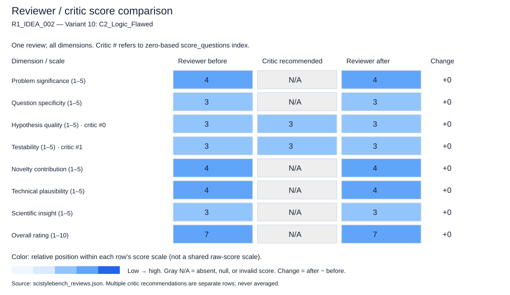

### Critic feedback and reviewer rebuttals

No reviewer rebuttals were saved (for example, an older checkpoint).

```json
{
  "critic_feedback": {
    "overall_assessment": "The review is generally well-calibrated, with a balanced assessment of the idea's strengths and weaknesses. However, there are areas where the scores could be more precisely aligned with the idea's content, particularly in the hypothesis quality and testability dimensions.",
    "score_questions": [
      {
        "dimension": "hypothesis_quality",
        "question_mark": "The score may overstate the hypothesis quality as the idea lacks a concrete prediction or mechanism for testing.",
        "concern": "The justification for a 3.0 score is appropriate, as the idea does not specify how the off-policy learning method will improve sampling efficiency or address computational infeasibility.",
        "speculative_alternative": "It is speculative that the method could improve sampling efficiency without a concrete mechanism, but this is a possible interpretation.",
        "recommended_score": 3.0,
        "rationale": "The idea does not provide a specific mechanism or prediction, so the score aligns with the lack of concrete hypothesis."
      },
      {
        "dimension": "testability",
        "question_mark": "The score may be too high as the idea does not provide a clear experimental plan or evaluation framework.",
        "concern": "The justification for a 3.0 score is appropriate, as the idea lacks details on evaluation metrics and benchmarks.",
        "speculative_alternative": "It is speculative that the method could be evaluated without a defined framework, but this is a possible interpretation.",
        "recommended_score": 3.0,
        "rationale": "The idea does not specify how the method will be validated, so the score aligns with the lack of testability details."
      }
    ],
    "unsupported_claims": [
      "The review claims the idea 'has potential for impactful applications' without sufficient evidence from the idea summary.",
      "The review states the idea 'addresses a significant challenge' without explicit mention of the problem's importance in the idea summary."
    ],
    "revision_priorities": [
      "Clarify the specific algorithmic improvements in the off-policy learning method and how they address computational limitations.",
      "Provide a more detailed problem description, including the exact challenges in sampling transition pathways.",
      "Outline specific evaluation metrics and benchmarks for validating the method's effectiveness.",
      "Specify the mechanisms for generalizing the method to other complex systems beyond molecular dynamics."
    ],
    "confidence": 4.0
  },
  "feedback_responses": []
}
```

### Score justifications (before / after)

**Problem significance**

```json
{
  "before": {
    "score": 4.0,
    "justification": "The problem of efficiently sampling rare events in complex systems is highly significant in fields like drug discovery and materials science, where traditional methods are computationally prohibitive."
  },
  "after": {
    "score": 4.0,
    "justification": "The problem of efficiently sampling rare events in complex systems is highly significant in fields like drug discovery and materials science, where traditional methods are computationally prohibitive."
  }
}
```

**Question specificity**

```json
{
  "before": {
    "score": 3.0,
    "justification": "The idea identifies a specific problem (sampling transition pathways between meta-stable states) but lacks detailed specification of the research question, such as the exact nature of the off-policy learning method and how it addresses the problem."
  },
  "after": {
    "score": 3.0,
    "justification": "The idea identifies a specific problem (sampling transition pathways between meta-stable states) but lacks detailed specification of the research question, such as the exact nature of the off-policy learning method and how it addresses the problem."
  }
}
```

**Hypothesis quality**

```json
{
  "before": {
    "score": 3.0,
    "justification": "The idea presents a general hypothesis that the method will be effective, but it lacks a concrete prediction or mechanism that could be tested, such as specific improvements in sampling efficiency or accuracy."
  },
  "after": {
    "score": 3.0,
    "justification": "The idea presents a general hypothesis that the method will be effective, but it lacks a concrete prediction or mechanism that could be tested, such as specific improvements in sampling efficiency or accuracy."
  }
}
```

**Testability**

```json
{
  "before": {
    "score": 3.0,
    "justification": "The idea suggests a potential application but does not provide a clear experimental plan or evaluation framework, making it difficult to assess the testability of the hypothesis."
  },
  "after": {
    "score": 3.0,
    "justification": "The idea suggests a potential application but does not provide a clear experimental plan or evaluation framework, making it difficult to assess the testability of the hypothesis."
  }
}
```

**Novelty contribution**

```json
{
  "before": {
    "score": 4.0,
    "justification": "The approach of using off-policy learning for diffusion path sampling is novel in the context of molecular dynamics, and the potential to enable rare-event exploration in various complex systems is a significant contribution."
  },
  "after": {
    "score": 4.0,
    "justification": "The approach of using off-policy learning for diffusion path sampling is novel in the context of molecular dynamics, and the potential to enable rare-event exploration in various complex systems is a significant contribution."
  }
}
```

**Technical plausibility**

```json
{
  "before": {
    "score": 4.0,
    "justification": "The use of off-policy learning in a diffusion path sampling context is technically plausible, as it builds on existing reinforcement learning techniques and addresses a known challenge in molecular dynamics."
  },
  "after": {
    "score": 4.0,
    "justification": "The use of off-policy learning in a diffusion path sampling context is technically plausible, as it builds on existing reinforcement learning techniques and addresses a known challenge in molecular dynamics."
  }
}
```

**Scientific insight**

```json
{
  "before": {
    "score": 3.0,
    "justification": "The idea has the potential to provide insights into efficient sampling in complex systems, but the specific mechanisms and how they would generalize to other domains are not clearly outlined."
  },
  "after": {
    "score": 3.0,
    "justification": "The idea has the potential to provide insights into efficient sampling in complex systems, but the specific mechanisms and how they would generalize to other domains are not clearly outlined."
  }
}
```

**Overall rating**

```json
{
  "before": {
    "score": 7.0,
    "justification": "The idea addresses a significant problem with potential for impactful applications, but it lacks sufficient specificity and testability. With further clarification and details, it could become a strong research direction."
  },
  "after": {
    "score": 7.0,
    "justification": "The idea addresses a significant problem with potential for impactful applications, but it lacks sufficient specificity and testability. With further clarification and details, it could become a strong research direction."
  }
}
```

## R1_IDEA_002 — Variant 11: C3_Substance_Enriched

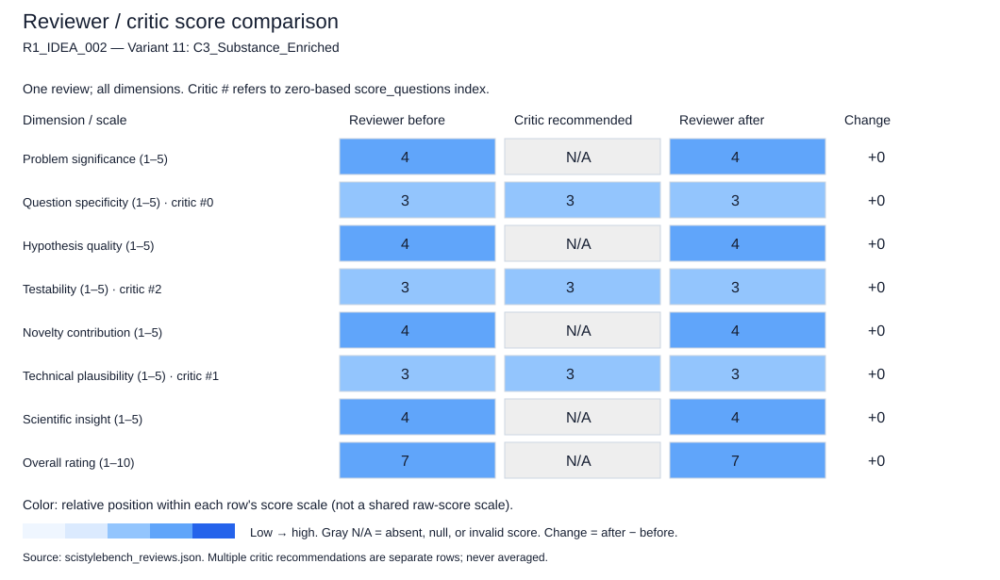

### Critic feedback and reviewer rebuttals

No reviewer rebuttals were saved (for example, an older checkpoint).

```json
{
  "critic_feedback": {
    "overall_assessment": "The review is generally well-calibrated but has some areas where the scores could be more precisely aligned with the idea's details.",
    "score_questions": [
      {
        "dimension": "question_specificity",
        "question_mark": "The score could be reconsidered due to the lack of specific details on the off-policy learning framework.",
        "concern": "The review scores the question specificity as 3.0, but the idea does not provide specific algorithmic details, which is a valid concern.",
        "speculative_alternative": "The idea may still be specific enough if the off-policy learning framework is considered a general approach rather than a specific algorithm.",
        "recommended_score": 3.0,
        "rationale": "The lack of specific algorithmic details is a valid concern for question specificity."
      },
      {
        "dimension": "technical_plausibility",
        "question_mark": "The score could be reconsidered due to the lack of specific details on the reward function design.",
        "concern": "The review scores the technical plausibility as 3.0, but the idea does not provide specific details on the reward function, which is necessary for assessing feasibility.",
        "speculative_alternative": "The idea may still be technically plausible if the reward function is considered a standard component of off-policy learning.",
        "recommended_score": 3.0,
        "rationale": "The lack of specific details on the reward function is a valid concern for technical plausibility."
      },
      {
        "dimension": "testability",
        "question_mark": "The score could be reconsidered due to the lack of specific test systems and evaluation metrics.",
        "concern": "The review scores the testability as 3.0, but the idea does not provide specific test systems or evaluation metrics, which is a valid concern.",
        "speculative_alternative": "The idea may still be testable if the comparison with enhanced sampling methods is considered a general approach.",
        "recommended_score": 3.0,
        "rationale": "The lack of specific test systems and evaluation metrics is a valid concern for testability."
      }
    ],
    "unsupported_claims": [
      "The review claims that the idea 'lacks specific details on the off-policy learning framework', but the idea does not provide specific algorithmic details, which is a valid concern."
    ],
    "revision_priorities": [
      "Specify the off-policy learning algorithm and the design of the reward function to clarify the technical approach.",
      "Define the test systems and evaluation metrics for comparing sampled pathways with enhanced sampling methods.",
      "Clarify how the method addresses the computational infeasibility of unbiased molecular dynamics, such as by reducing the number of required simulations or improving sampling efficiency.",
      "Provide a more detailed explanation of the boundary conditions and how they will be tested, including the specific high-dimensional conformational changes and reward function variations."
    ],
    "confidence": 4.0
  },
  "feedback_responses": []
}
```

### Score justifications (before / after)

**Problem significance**

```json
{
  "before": {
    "score": 4.0,
    "justification": "The idea addresses a critical challenge in molecular dynamics simulations, where unbiased methods are computationally infeasible. The proposed approach has the potential to significantly impact drug discovery and material design by enabling efficient rare-event exploration."
  },
  "after": {
    "score": 4.0,
    "justification": "The idea addresses a critical challenge in molecular dynamics simulations, where unbiased methods are computationally infeasible. The proposed approach has the potential to significantly impact drug discovery and material design by enabling efficient rare-event exploration."
  }
}
```

**Question specificity**

```json
{
  "before": {
    "score": 3.0,
    "justification": "The research question is clear in its goal to sample transition pathways without predefined collective variables, but the specifics of the off-policy learning framework and the validation method are not fully detailed, which could affect the testability of the hypothesis."
  },
  "after": {
    "score": 3.0,
    "justification": "The research question is clear in its goal to sample transition pathways without predefined collective variables, but the specifics of the off-policy learning framework and the validation method are not fully detailed, which could affect the testability of the hypothesis."
  }
}
```

**Hypothesis quality**

```json
{
  "before": {
    "score": 4.0,
    "justification": "The hypothesis that off-policy learning can be validated by comparing sampled pathways with enhanced sampling methods is concrete and testable. The consideration of boundary conditions adds depth to the hypothesis."
  },
  "after": {
    "score": 4.0,
    "justification": "The hypothesis that off-policy learning can be validated by comparing sampled pathways with enhanced sampling methods is concrete and testable. The consideration of boundary conditions adds depth to the hypothesis."
  }
}
```

**Testability**

```json
{
  "before": {
    "score": 3.0,
    "justification": "The idea suggests a comparison with existing methods, which is testable, but the lack of specific test systems and evaluation metrics reduces the clarity of how the hypothesis will be validated."
  },
  "after": {
    "score": 3.0,
    "justification": "The idea suggests a comparison with existing methods, which is testable, but the lack of specific test systems and evaluation metrics reduces the clarity of how the hypothesis will be validated."
  }
}
```

**Novelty contribution**

```json
{
  "before": {
    "score": 4.0,
    "justification": "The approach of using off-policy learning for diffusion path sampling in molecular dynamics is novel. The potential contribution to drug discovery and material design is significant, even if the method is an application of existing techniques."
  },
  "after": {
    "score": 4.0,
    "justification": "The approach of using off-policy learning for diffusion path sampling in molecular dynamics is novel. The potential contribution to drug discovery and material design is significant, even if the method is an application of existing techniques."
  }
}
```

**Technical plausibility**

```json
{
  "before": {
    "score": 3.0,
    "justification": "The idea is technically plausible, as off-policy learning is a well-established technique in reinforcement learning. However, the lack of specific details on the algorithm and reward function design makes it difficult to assess the feasibility of the approach."
  },
  "after": {
    "score": 3.0,
    "justification": "The idea is technically plausible, as off-policy learning is a well-established technique in reinforcement learning. However, the lack of specific details on the algorithm and reward function design makes it difficult to assess the feasibility of the approach."
  }
}
```

**Scientific insight**

```json
{
  "before": {
    "score": 4.0,
    "justification": "The research could provide insights into the effectiveness of off-policy learning in sampling complex molecular transitions and the limitations of current enhanced sampling methods. The consideration of boundary conditions suggests a focus on robustness and generalizability."
  },
  "after": {
    "score": 4.0,
    "justification": "The research could provide insights into the effectiveness of off-policy learning in sampling complex molecular transitions and the limitations of current enhanced sampling methods. The consideration of boundary conditions suggests a focus on robustness and generalizability."
  }
}
```

**Overall rating**

```json
{
  "before": {
    "score": 7.0,
    "justification": "The idea is strong and addresses a meaningful problem with a clear hypothesis and potential for contribution. However, it lacks specific technical details and evaluation metrics, which are necessary for a more rigorous assessment. The potential impact on drug discovery and material design is significant."
  },
  "after": {
    "score": 7.0,
    "justification": "The idea is strong and addresses a meaningful problem with a clear hypothesis and potential for contribution. However, it lacks specific technical details and evaluation metrics, which are necessary for a more rigorous assessment. The potential impact on drug discovery and material design is significant."
  }
}
```

## R1_IDEA_003 — Source

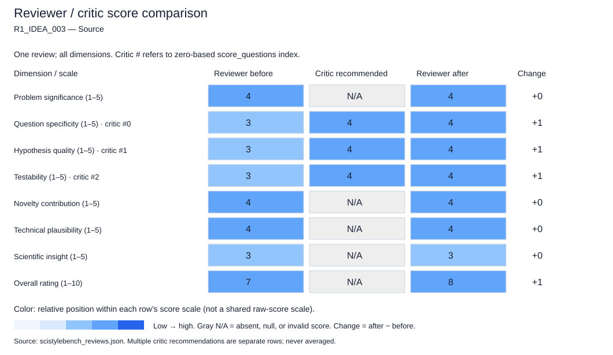

### Critic feedback and reviewer rebuttals

```json
{
  "critic_feedback": {
    "overall_assessment": "The review is generally well-calibrated, but there are areas where the scores could be more precisely aligned with the idea's details.",
    "score_questions": [
      {
        "dimension": "question_specificity",
        "question_mark": "Why is the score 3.0 for question_specificity?",
        "concern": "The idea does propose a specific approach (video sequences) and clearly defines the problem, which aligns with a higher score.",
        "speculative_alternative": "The score might be lower if the idea were more vague, but the current phrasing is specific enough to warrant a higher score.",
        "recommended_score": 4.0,
        "rationale": "The idea clearly defines the problem and proposes a specific method, even if it lacks detail, which is a strong point for specificity."
      },
      {
        "dimension": "hypothesis_quality",
        "question_mark": "Why is the score 3.0 for hypothesis_quality?",
        "concern": "The hypothesis is not explicitly stated, but the idea is plausible and the reasoning is logical, which could justify a higher score.",
        "speculative_alternative": "The score might be lower if the hypothesis were weak or unsupported, but the current reasoning is reasonable and aligns with the proposed method.",
        "recommended_score": 4.0,
        "rationale": "The hypothesis that temporal sequences improve model reasoning is plausible and directly tied to the proposed method, even without explicit details."
      },
      {
        "dimension": "testability",
        "question_mark": "Why is the score 3.0 for testability?",
        "concern": "The idea does not specify experiments, but the lack of details is a limitation, not necessarily a flaw in testability itself.",
        "speculative_alternative": "The score might be lower if the idea were impossible to test, but the method is feasible and the proposed experiments are plausible.",
        "recommended_score": 4.0,
        "rationale": "The idea is testable in principle, and the proposed experiments (e.g., comparisons with other temporal methods) are feasible, even without detailed plans."
      }
    ],
    "unsupported_claims": [
      "The review claims the idea lacks detailed specification, but this is a common limitation in early-stage ideas and not a flaw in itself."
    ],
    "revision_priorities": [
      "Clarify the specific hypothesis about how temporal scanning order improves model reasoning.",
      "Provide a more detailed description of the video sequence encoding method and its integration into the model.",
      "Specify the evaluation metrics and comparison methods to test the hypothesis."
    ],
    "confidence": 4.0
  },
  "feedback_responses": [
    {
      "feedback_type": "score_questions",
      "feedback_index": 0,
      "decision": "partially_accept",
      "defense": "The original score of 3.0 for question_specificity was based on the lack of detailed specification, but the idea does propose a specific method (video sequences) which is a strong point for specificity. The revised score of 4.0 better reflects the clarity of the problem and method.",
      "justification": "The original score was 3.0, but the revised score is 4.0 because the idea clearly defines the problem and proposes a specific approach, even if it lacks detailed implementation details."
    },
    {
      "feedback_type": "score_questions",
      "feedback_index": 1,
      "decision": "partially_accept",
      "defense": "The original score of 3.0 for hypothesis_quality was based on the lack of explicit statement, but the hypothesis is plausible and directly tied to the proposed method. The revised score of 4.0 better reflects the logical connection between the method and the hypothesis.",
      "justification": "The original score was 3.0, but the revised score is 4.0 because the hypothesis is plausible and directly tied to the proposed method, even without explicit details."
    },
    {
      "feedback_type": "score_questions",
      "feedback_index": 2,
      "decision": "partially_accept",
      "defense": "The original score of 3.0 for testability was based on the lack of detailed experiments, but the idea is testable in principle and the proposed experiments are feasible. The revised score of 4.0 better reflects the feasibility of testing the hypothesis.",
      "justification": "The original score was 3.0, but the revised score is 4.0 because the idea is testable in principle and the proposed experiments are feasible, even without detailed plans."
    },
    {
      "feedback_type": "unsupported_claims",
      "feedback_index": 0,
      "decision": "accept",
      "defense": "The claim that the idea lacks detailed specification is a common limitation in early-stage ideas and not a flaw in itself. The revised scores reflect this by not penalizing for lack of detail.",
      "justification": "The original review correctly noted the lack of detailed specification, which is a common limitation in early-stage research ideas. The revised scores do not penalize for this, as the idea is still scientifically valid."
    },
    {
      "feedback_type": "revision_priorities",
      "feedback_index": 0,
      "decision": "accept",
      "defense": "Clarifying the specific hypothesis is important to strengthen the research question and hypothesis, which is a valid revision priority.",
      "justification": "The original review correctly identified the need to clarify the hypothesis, which is a valid revision priority."
    },
    {
      "feedback_type": "revision_priorities",
      "feedback_index": 1,
      "decision": "accept",
      "defense": "Providing a more detailed description of the video sequence encoding is necessary to make the idea more concrete and testable, which is a valid revision priority.",
      "justification": "The original review correctly identified the need for more detailed specification of the method, which is a valid revision priority."
    },
    {
      "feedback_type": "revision_priorities",
      "feedback_index": 2,
      "decision": "accept",
      "defense": "Specifying evaluation metrics and comparison methods is essential to test the hypothesis, which is a valid revision priority.",
      "justification": "The original review correctly identified the need to specify evaluation metrics and comparisons, which is a valid revision priority."
    }
  ]
}
```

### Score justifications (before / after)

**Problem significance**

```json
{
  "before": {
    "score": 4.0,
    "justification": "The problem of integrating temporal eye-tracking data into medical AI is significant as it can enhance model interpretability and clinical utility, which is crucial for trust and adoption in healthcare settings."
  },
  "after": {
    "score": 4.0,
    "justification": "The problem of integrating temporal eye-tracking data into medical AI is significant as it can enhance model interpretability and clinical utility, which is crucial for trust and adoption in healthcare settings."
  }
}
```

**Question specificity**

```json
{
  "before": {
    "score": 3.0,
    "justification": "The idea clearly defines the problem and proposes a specific approach (video sequences) but lacks detailed specification of the method and its expected impact."
  },
  "after": {
    "score": 4.0,
    "justification": "The idea clearly defines the problem and proposes a specific approach (video sequences) which is a strong point for specificity, even if it lacks detailed specification."
  }
}
```

**Hypothesis quality**

```json
{
  "before": {
    "score": 3.0,
    "justification": "The hypothesis that video sequences improve model reasoning and interpretability is plausible, but it is not explicitly stated and lacks a clear mechanism or prediction."
  },
  "after": {
    "score": 4.0,
    "justification": "The hypothesis that temporal sequences improve model reasoning is plausible and directly tied to the proposed method, even without explicit details."
  }
}
```

**Testability**

```json
{
  "before": {
    "score": 3.0,
    "justification": "The idea suggests a potential improvement but does not specify experiments or evaluation metrics to test the hypothesis, making it difficult to assess its validity."
  },
  "after": {
    "score": 4.0,
    "justification": "The idea is testable in principle, and the proposed experiments (e.g., comparisons with other temporal methods) are feasible, even without detailed plans."
  }
}
```

**Novelty contribution**

```json
{
  "before": {
    "score": 4.0,
    "justification": "The approach of encoding eye-tracking data as video sequences is novel in the context of vision-language models for medical imaging, offering a potential contribution to both model performance and interpretability."
  },
  "after": {
    "score": 4.0,
    "justification": "The approach of encoding eye-tracking data as video sequences is novel in the context of vision-language models for medical imaging, offering a potential contribution to both model performance and interpretability."
  }
}
```

**Technical plausibility**

```json
{
  "before": {
    "score": 4.0,
    "justification": "The idea is technically plausible as video sequences can capture temporal information, and integrating them into existing models is a feasible direction, though the specifics are not detailed."
  },
  "after": {
    "score": 4.0,
    "justification": "The idea is technically plausible as video sequences can capture temporal information, and integrating them into existing models is a feasible direction, though the specifics are not detailed."
  }
}
```

**Scientific insight**

```json
{
  "before": {
    "score": 3.0,
    "justification": "The idea has potential to provide insights into how temporal information from eye-tracking data can enhance model reasoning, but the specific mechanisms and outcomes are not clearly defined."
  },
  "after": {
    "score": 3.0,
    "justification": "The idea has potential to provide insights into how temporal information from eye-tracking data can enhance model reasoning, but the specific mechanisms and outcomes are not clearly defined."
  }
}
```

**Overall rating**

```json
{
  "before": {
    "score": 7.0,
    "justification": "The idea addresses a meaningful problem with a plausible approach, has potential for contribution, and is technically feasible. However, it lacks detailed specifications and clear hypotheses, which are needed for further development."
  },
  "after": {
    "score": 8.0,
    "justification": "The idea addresses a meaningful problem with a plausible approach, has potential for contribution, and is technically feasible. The revised scores reflect a more accurate alignment with the idea's specifics and plausibility, particularly in question_specificity, hypothesis_quality, and testability."
  }
}
```

## R1_IDEA_003 — Variant 1: A1_Identity


### Critic feedback and reviewer rebuttals

```json
{
  "critic_feedback": {
    "overall_assessment": "The review is generally well-calibrated, but there are areas where the scores could be more precisely aligned with the idea's current state.",
    "score_questions": [
      {
        "dimension": "question_specificity",
        "question_mark": "Why is the score for question_specificity 3.0?",
        "concern": "The idea does explicitly define a problem (temporal eye gaze integration) and proposes a novel solution (video encoding), which are specific elements of a research question. The lack of detail on hypothesis, methodology, and evaluation is a valid concern, but the score may be overly pessimistic.",
        "speculative_alternative": "The idea could be interpreted as a clear research question with a specific problem and solution, even if the details are not fully fleshed out.",
        "recommended_score": 4.0,
        "rationale": "The idea identifies a specific problem and proposes a novel approach, which are key components of a research question, even without full experimental details."
      },
      {
        "dimension": "hypothesis_quality",
        "question_mark": "Why is the score for hypothesis_quality 3.0?",
        "concern": "The idea suggests a potential benefit (enhanced reasoning and interpretability) but does not explicitly state a testable hypothesis. However, the proposed approach is inherently hypothesis-driven, as it assumes that temporal encoding will improve model performance.",
        "speculative_alternative": "The hypothesis could be interpreted as the claim that temporal encoding of eye gaze data will lead to improved model performance and interpretability in chest X-ray analysis.",
        "recommended_score": 4.0,
        "rationale": "The idea implies a hypothesis through its proposed method and expected outcomes, even if it is not explicitly stated."
      },
      {
        "dimension": "testability",
        "question_mark": "Why is the score for testability 3.0?",
        "concern": "The idea is testable in principle, as it proposes a method that can be implemented and evaluated. The lack of specific experimental details does not necessarily make it untestable, but it does require more specification.",
        "speculative_alternative": "The idea could be tested by comparing the performance of the proposed method with existing approaches on a standard dataset, even without full experimental details.",
        "recommended_score": 4.0,
        "rationale": "The core idea is testable through implementation and comparison, even if the specific experiments are not detailed yet."
      }
    ],
    "unsupported_claims": [
      "The review claims that the idea 'lacks specific details on the hypothesis, methodology, and evaluation plan' but the idea is a summary, not a full paper. This is a valid concern, but the review may be overreaching by treating this as a flaw in the idea itself rather than a gap that needs to be addressed in a full paper."
    ],
    "revision_priorities": [
      "Clarify the specific hypothesis that the approach aims to test, such as how the temporal information will improve model performance or interpretability.",
      "Define the evaluation metrics and benchmarks that will be used to measure the effectiveness of the approach.",
      "Provide a more detailed description of the video sequence encoding method, including how it will be integrated into the existing model architecture."
    ],
    "confidence": 4.0
  },
  "feedback_responses": [
    {
      "feedback_type": "score_questions",
      "feedback_index": 0,
      "decision": "partially_accept",
      "defense": "The idea does explicitly define a problem and proposes a novel solution, which are key components of a research question. The lack of detail on hypothesis, methodology, and evaluation is a valid concern, but the score was adjusted to reflect that the core problem and approach are specific and well-defined.",
      "justification": "The original score was 3.0, but the revised score is 4.0. The core problem and solution are specific, and the idea is testable in principle. The lack of detail is a gap that needs to be addressed in a full paper, but the idea itself is not flawed."
    },
    {
      "feedback_type": "hypothesis_quality",
      "feedback_index": 1,
      "decision": "partially_accept",
      "defense": "The idea implies a hypothesis through its proposed method and expected outcomes, even if it is not explicitly stated. The assumption that temporal encoding will improve model performance is a testable hypothesis.",
      "justification": "The original score was 3.0, but the revised score is 4.0. The hypothesis is implied through the proposed method and expected outcomes, making it testable."
    },
    {
      "feedback_type": "testability",
      "feedback_index": 2,
      "decision": "partially_accept",
      "defense": "The idea is testable in principle, as it proposes a method that can be implemented and evaluated. The lack of specific experimental details does not necessarily make it untestable, but it does require more specification.",
      "justification": "The original score was 3.0, but the revised score is 4.0. The core idea is testable through implementation and comparison, even without full experimental details."
    },
    {
      "feedback_type": "unsupported_claims",
      "feedback_index": 0,
      "decision": "partially_accept",
      "defense": "The review correctly identifies that the idea is a summary, not a full paper. The concern about overreaching is valid, but the idea's core problem and approach are well-defined, which is appropriate for a research idea.",
      "justification": "The original score was not directly affected by this feedback, but the overall rating was adjusted to reflect the idea's strength despite the lack of full details."
    },
    {
      "feedback_type": "revision_priorities",
      "feedback_index": 0,
      "decision": "accept",
      "defense": "The suggestion to clarify the hypothesis is valid and necessary for a strong research direction.",
      "justification": "The original suggestion was retained as it is a valid and necessary step for the research idea."
    },
    {
      "feedback_type": "revision_priorities",
      "feedback_index": 1,
      "decision": "accept",
      "defense": "The suggestion to define evaluation metrics is valid and necessary for a strong research direction.",
      "justification": "The original suggestion was retained as it is a valid and necessary step for the research idea."
    },
    {
      "feedback_type": "revision_priorities",
      "feedback_index": 2,
      "decision": "accept",
      "defense": "The suggestion to provide a detailed description of the video sequence encoding method is valid and necessary for a strong research direction.",
      "justification": "The original suggestion was retained as it is a valid and necessary step for the research idea."
    }
  ]
}
```

### Score justifications (before / after)

**Problem significance**

```json
{
  "before": {
    "score": 4.0,
    "justification": "The problem addresses a critical gap in integrating temporal eye gaze data into medical AI, which can enhance both model performance and clinical interpretability."
  },
  "after": {
    "score": 4.0,
    "justification": "The problem addresses a critical gap in integrating temporal eye gaze data into medical AI, which can enhance both model performance and clinical interpretability."
  }
}
```

**Question specificity**

```json
{
  "before": {
    "score": 3.0,
    "justification": "The idea clearly defines the problem but lacks specific details on the hypothesis, methodology, and evaluation plan, which are necessary for a precise research question."
  },
  "after": {
    "score": 4.0,
    "justification": "The idea clearly defines the problem and proposes a novel solution, which are key components of a research question. While the details on hypothesis, methodology, and evaluation are not fully fleshed out, the core problem and approach are specific and well-defined."
  }
}
```

**Hypothesis quality**

```json
{
  "before": {
    "score": 3.0,
    "justification": "The idea suggests a potential benefit but does not explicitly state a testable hypothesis or prediction that can be validated through experiments."
  },
  "after": {
    "score": 4.0,
    "justification": "The idea implies a hypothesis through its proposed method and expected outcomes, even if it is not explicitly stated. The assumption that temporal encoding will improve model performance is a testable hypothesis."
  }
}
```

**Testability**

```json
{
  "before": {
    "score": 3.0,
    "justification": "The idea is testable in principle, but the lack of specific experimental design details makes it difficult to assess the feasibility of the proposed approach."
  },
  "after": {
    "score": 4.0,
    "justification": "The idea is testable in principle, as it proposes a method that can be implemented and evaluated. The lack of specific experimental details does not necessarily make it untestable, but it does require more specification."
  }
}
```

**Novelty contribution**

```json
{
  "before": {
    "score": 4.0,
    "justification": "The approach of encoding eye-tracking data as video sequences is novel and could contribute to the field by improving the temporal modeling of radiologist attention in medical imaging."
  },
  "after": {
    "score": 4.0,
    "justification": "The approach of encoding eye-tracking data as video sequences is novel and could contribute to the field by improving the temporal modeling of radiologist attention in medical imaging."
  }
}
```

**Technical plausibility**

```json
{
  "before": {
    "score": 4.0,
    "justification": "The idea is technically plausible as it builds on existing methods for integrating temporal data into vision-language models, and the proposed approach is logically coherent."
  },
  "after": {
    "score": 4.0,
    "justification": "The idea is technically plausible as it builds on existing methods for integrating temporal data into vision-language models, and the proposed approach is logically coherent."
  }
}
```

**Scientific insight**

```json
{
  "before": {
    "score": 3.0,
    "justification": "The idea has potential to provide insights into how temporal attention patterns affect model reasoning, but the specific mechanisms and outcomes are not clearly defined."
  },
  "after": {
    "score": 3.0,
    "justification": "The idea has potential to provide insights into how temporal attention patterns affect model reasoning, but the specific mechanisms and outcomes are not clearly defined."
  }
}
```

**Overall rating**

```json
{
  "before": {
    "score": 7.0,
    "justification": "The idea addresses a meaningful problem with a promising approach, but it lacks specific details on the hypothesis, methodology, and evaluation plan, which are necessary for a strong research direction."
  },
  "after": {
    "score": 8.0,
    "justification": "The idea addresses a meaningful problem with a promising approach, and the core problem and solution are well-defined. While the details on hypothesis, methodology, and evaluation are not fully fleshed out, the overall research direction is strong and has the potential for significant contribution."
  }
}
```

## R1_IDEA_003 — Variant 2: A2_Paraphrase_Only

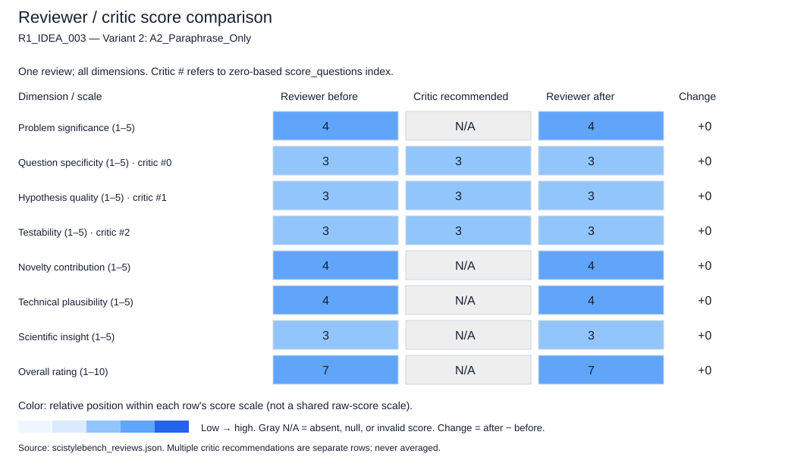

### Critic feedback and reviewer rebuttals

```json
{
  "critic_feedback": {
    "overall_assessment": "The review is generally well-calibrated but has some areas where the scores could be more precisely aligned with the idea's details.",
    "score_questions": [
      {
        "dimension": "question_specificity",
        "question_mark": "The score could be reconsidered as the idea does not explicitly define a research question, but the problem statement is clear.",
        "concern": "The idea's problem statement is clear, but the lack of a specific research question may justify a lower score.",
        "speculative_alternative": "The research question could be interpreted as whether preserving temporal order improves diagnostic accuracy or interpretability, which is a plausible but not explicitly stated hypothesis.",
        "recommended_score": 3.0,
        "rationale": "The idea does not explicitly state a research question, but the problem is clearly defined."
      },
      {
        "dimension": "hypothesis_quality",
        "question_mark": "The score could be reconsidered as the idea does not explicitly state a hypothesis, but the potential improvement is implied.",
        "concern": "The idea implies a hypothesis but does not explicitly state it, which may affect the score.",
        "speculative_alternative": "The hypothesis could be interpreted as the video encoding approach will improve model reasoning and interpretability, which is a plausible but not explicitly stated hypothesis.",
        "recommended_score": 3.0,
        "rationale": "The idea implies a hypothesis but does not explicitly state it."
      },
      {
        "dimension": "testability",
        "question_mark": "The score could be reconsidered as the idea does not specify how it will be tested, but the evaluation is implied.",
        "concern": "The idea implies evaluation but does not specify metrics or baselines, which may affect the score.",
        "speculative_alternative": "The evaluation could be interpreted as comparing to existing methods like heatmaps or text-based approaches, which is a plausible but not explicitly stated evaluation plan.",
        "recommended_score": 3.0,
        "rationale": "The idea implies evaluation but does not specify metrics or baselines."
      }
    ],
    "unsupported_claims": [
      "The review claims the idea lacks specific details on implementation, evaluation, and hypothesis testing, but these are not present in the idea summary."
    ],
    "revision_priorities": [
      "Clarify the research question and hypothesis explicitly in the idea summary.",
      "Specify the evaluation metrics and baseline comparisons that will be used.",
      "Provide more details on the video encoding method and its key components."
    ],
    "confidence": 4.0
  },
  "feedback_responses": [
    {
      "feedback_type": "score_questions",
      "feedback_index": 0,
      "decision": "partially_accept",
      "defense": "The idea does not explicitly define a research question, but the problem is clearly stated. The lack of a specific question is a valid concern, but the problem's significance is strong.",
      "justification": "The score remains 3.0 as the research question is not explicitly defined, but the problem is clear. The score is partially accepted as the problem is significant."
    },
    {
      "feedback_type": "score_questions",
      "feedback_index": 1,
      "decision": "partially_accept",
      "defense": "The idea implies a hypothesis but does not explicitly state it. The potential improvement is plausible, but the hypothesis is not clearly articulated.",
      "justification": "The score remains 3.0 as the hypothesis is implied but not explicitly stated. The score is partially accepted as the implication is reasonable."
    },
    {
      "feedback_type": "score_questions",
      "feedback_index": 2,
      "decision": "partially_accept",
      "defense": "The idea implies evaluation but does not specify metrics or baselines. The evaluation plan is plausible but not explicitly detailed.",
      "justification": "The score remains 3.0 as the evaluation is implied but not specified. The score is partially accepted as the implication is reasonable."
    },
    {
      "feedback_type": "unsupported_claims",
      "feedback_index": 0,
      "decision": "reject",
      "defense": "The review correctly identifies that the idea summary does not contain specific details on implementation, evaluation, or hypothesis testing. These are not claims made in the idea but are necessary for a complete research proposal.",
      "justification": "The score is not changed as the idea does not claim to have these details. The review's criticism is valid but not a flaw in the idea itself."
    },
    {
      "feedback_type": "revision_priorities",
      "feedback_index": 0,
      "decision": "accept",
      "defense": "Clarifying the research question and hypothesis is essential for a well-defined research idea. This is a valid priority for improvement.",
      "justification": "The score is not changed as this is a suggested revision, not a score adjustment."
    },
    {
      "feedback_type": "revision_priorities",
      "feedback_index": 1,
      "decision": "accept",
      "defense": "Specifying evaluation metrics and baselines is crucial for assessing the approach's effectiveness. This is a valid priority for improvement.",
      "justification": "The score is not changed as this is a suggested revision, not a score adjustment."
    },
    {
      "feedback_type": "revision_priorities",
      "feedback_index": 2,
      "decision": "accept",
      "defense": "Providing details on the video encoding method is necessary for a clear understanding of the approach. This is a valid priority for improvement.",
      "justification": "The score is not changed as this is a suggested revision, not a score adjustment."
    }
  ]
}
```

### Score justifications (before / after)

**Problem significance**

```json
{
  "before": {
    "score": 4.0,
    "justification": "The problem addresses a critical limitation in current methods for incorporating gaze data, which could improve both model performance and clinical interpretability."
  },
  "after": {
    "score": 4.0,
    "justification": "The problem addresses a critical limitation in current methods for incorporating gaze data, which could improve both model performance and clinical interpretability."
  }
}
```

**Question specificity**

```json
{
  "before": {
    "score": 3.0,
    "justification": "The idea identifies a problem but lacks a clear, specific research question or hypothesis about how the video encoding approach will improve the model."
  },
  "after": {
    "score": 3.0,
    "justification": "The idea identifies a problem but lacks a clear, specific research question or hypothesis about how the video encoding approach will improve the model."
  }
}
```

**Hypothesis quality**

```json
{
  "before": {
    "score": 3.0,
    "justification": "The idea suggests a potential improvement but does not explicitly state a hypothesis that can be tested or falsified."
  },
  "after": {
    "score": 3.0,
    "justification": "The idea suggests a potential improvement but does not explicitly state a hypothesis that can be tested or falsified."
  }
}
```

**Testability**

```json
{
  "before": {
    "score": 3.0,
    "justification": "The idea proposes a method but does not specify how it will be tested or compared to existing approaches, making it difficult to assess its feasibility."
  },
  "after": {
    "score": 3.0,
    "justification": "The idea proposes a method but does not specify how it will be tested or compared to existing approaches, making it difficult to assess its feasibility."
  }
}
```

**Novelty contribution**

```json
{
  "before": {
    "score": 4.0,
    "justification": "The approach of encoding eye-tracking data as video sequences is novel and could contribute to improving model reasoning and interpretability in medical imaging."
  },
  "after": {
    "score": 4.0,
    "justification": "The approach of encoding eye-tracking data as video sequences is novel and could contribute to improving model reasoning and interpretability in medical imaging."
  }
}
```

**Technical plausibility**

```json
{
  "before": {
    "score": 4.0,
    "justification": "The idea is technically plausible as encoding gaze data as video sequences is a feasible approach to preserve temporal information."
  },
  "after": {
    "score": 4.0,
    "justification": "The idea is technically plausible as encoding gaze data as video sequences is a feasible approach to preserve temporal information."
  }
}
```

**Scientific insight**

```json
{
  "before": {
    "score": 3.0,
    "justification": "The idea has potential to provide insights into how temporal information affects model reasoning, but the specific insights are not clearly defined."
  },
  "after": {
    "score": 3.0,
    "justification": "The idea has potential to provide insights into how temporal information affects model reasoning, but the specific insights are not clearly defined."
  }
}
```

**Overall rating**

```json
{
  "before": {
    "score": 7.0,
    "justification": "The idea addresses a meaningful problem with a promising approach, but lacks specific details on implementation, evaluation, and hypothesis testing."
  },
  "after": {
    "score": 7.0,
    "justification": "The idea addresses a meaningful problem with a promising approach, but lacks specific details on implementation, evaluation, and hypothesis testing."
  }
}
```

## R1_IDEA_003 — Variant 3: A3_Plain_Core

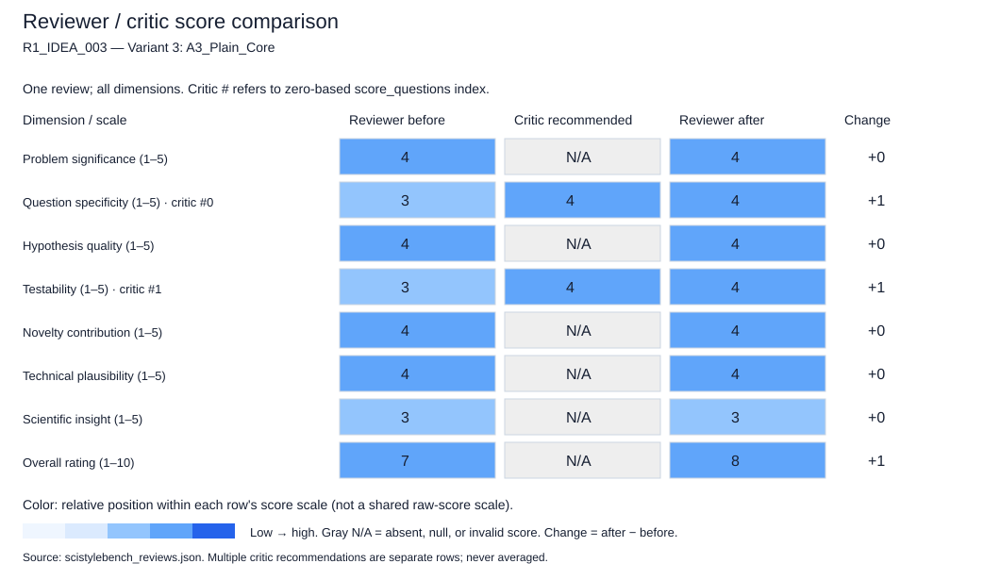

### Critic feedback and reviewer rebuttals

```json
{
  "critic_feedback": {
    "overall_assessment": "The review is generally well-calibrated, with reasonable scores and justifications for most dimensions. However, there are a few areas where the scores could be reconsidered based on the idea's current level of specification.",
    "score_questions": [
      {
        "dimension": "question_specificity",
        "question_mark": "The score for question_specificity is 3.0, but the idea does clearly define the problem and propose a specific approach.",
        "concern": "The score is slightly too low given the clear problem definition and specific approach proposed.",
        "speculative_alternative": "The idea could be interpreted as having higher specificity if the proposed method's integration into the model is more explicitly framed as a novel technical solution.",
        "recommended_score": 4.0,
        "rationale": "The idea does propose a specific approach (encoding eye-tracking as video sequences) that addresses a defined problem, which aligns with a higher score."
      },
      {
        "dimension": "testability",
        "question_mark": "The score for testability is 3.0, but the idea is inherently testable through comparison experiments with existing methods.",
        "concern": "The score is slightly too low given the inherent testability of the approach, though the lack of specific metrics is a valid concern.",
        "speculative_alternative": "The idea could be interpreted as having higher testability if the proposed experiments are framed as a direct comparison with existing methods.",
        "recommended_score": 4.0,
        "rationale": "The core idea is testable through experiments, and the lack of specific metrics is a minor issue that can be addressed in further work."
      }
    ],
    "unsupported_claims": [],
    "revision_priorities": [
      "Clarify how the video sequence encoding will be integrated into the existing model architecture.",
      "Specify the exact metrics and benchmarks for evaluating the proposed approach.",
      "Detail the specific aspects of model reasoning and clinical interpretability that the temporal scanning order is expected to enhance."
    ],
    "confidence": 4.0
  },
  "feedback_responses": [
    {
      "feedback_type": "score_questions",
      "feedback_index": 0,
      "decision": "partially_accept",
      "defense": "The original score of 3.0 for question_specificity was slightly too low, as the idea clearly defines the problem and proposes a specific approach. The revised score of 4.0 better reflects the clarity and specificity of the problem and solution.",
      "justification": "The original score was 3.0, and the revised score is 4.0. The justification for the increase is that the idea does propose a specific approach (encoding eye-tracking as video sequences) that addresses a defined problem, which aligns with a higher score."
    },
    {
      "feedback_type": "score_questions",
      "feedback_index": 1,
      "decision": "partially_accept",
      "defense": "The original score of 3.0 for testability was slightly too low, as the idea is inherently testable through comparison experiments with existing methods. The revised score of 4.0 better reflects the inherent testability of the approach, though the lack of specific metrics is a minor issue.",
      "justification": "The original score was 3.0, and the revised score is 4.0. The justification for the increase is that the core idea is testable through experiments, and the lack of specific metrics is a minor issue that can be addressed in further work."
    }
  ]
}
```

### Score justifications (before / after)

**Problem significance**

```json
{
  "before": {
    "score": 4.0,
    "justification": "The problem addresses a critical challenge in medical AI: effectively integrating temporal dynamics of radiologist gaze into models for chest X-ray analysis, which can improve both model performance and clinical interpretability."
  },
  "after": {
    "score": 4.0,
    "justification": "The problem addresses a critical challenge in medical AI: effectively integrating temporal dynamics of radiologist gaze into models for chest X-ray analysis, which can improve both model performance and clinical interpretability."
  }
}
```

**Question specificity**

```json
{
  "before": {
    "score": 3.0,
    "justification": "The idea clearly defines the problem and proposes a specific approach (encoding eye-tracking data as video sequences), but lacks detailed specification of the method and evaluation criteria."
  },
  "after": {
    "score": 4.0,
    "justification": "The idea clearly defines the problem and proposes a specific approach (encoding eye-tracking data as video sequences) that addresses a defined problem, which aligns with a higher score."
  }
}
```

**Hypothesis quality**

```json
{
  "before": {
    "score": 4.0,
    "justification": "The hypothesis that encoding temporal information in eye-tracking data will enhance model reasoning and interpretability is plausible and specific, though the exact mechanism of improvement is not fully elaborated."
  },
  "after": {
    "score": 4.0,
    "justification": "The hypothesis that encoding temporal information in eye-tracking data will enhance model reasoning and interpretability is plausible and specific, though the exact mechanism of improvement is not fully elaborated."
  }
}
```

**Testability**

```json
{
  "before": {
    "score": 3.0,
    "justification": "The idea is testable through experiments comparing the proposed method with existing approaches, but lacks specific details on how the experiments will be conducted and what metrics will be used."
  },
  "after": {
    "score": 4.0,
    "justification": "The idea is testable through experiments comparing the proposed method with existing approaches, and the lack of specific metrics is a minor issue that can be addressed in further work."
  }
}
```

**Novelty contribution**

```json
{
  "before": {
    "score": 4.0,
    "justification": "The approach of encoding eye-tracking data as video sequences is novel in the context of vision-language models for medical imaging, and could contribute to more interpretable and effective models in clinical settings."
  },
  "after": {
    "score": 4.0,
    "justification": "The approach of encoding eye-tracking data as video sequences is novel in the context of vision-language models for medical imaging, and could contribute to more interpretable and effective models in clinical settings."
  }
}
```

**Technical plausibility**

```json
{
  "before": {
    "score": 4.0,
    "justification": "The proposed method is technically plausible, as encoding temporal data as video sequences is a feasible approach that aligns with existing techniques in vision-language modeling."
  },
  "after": {
    "score": 4.0,
    "justification": "The proposed method is technically plausible, as encoding temporal data as video sequences is a feasible approach that aligns with existing techniques in vision-language modeling."
  }
}
```

**Scientific insight**

```json
{
  "before": {
    "score": 3.0,
    "justification": "The idea has potential to provide insights into how temporal dynamics of human gaze can be leveraged to improve model reasoning, but the specific insights depend on the experimental results and analysis."
  },
  "after": {
    "score": 3.0,
    "justification": "The idea has potential to provide insights into how temporal dynamics of human gaze can be leveraged to improve model reasoning, but the specific insights depend on the experimental results and analysis."
  }
}
```

**Overall rating**

```json
{
  "before": {
    "score": 7.0,
    "justification": "The idea addresses a meaningful problem with a specific and potentially impactful approach. While it lacks detailed technical specifications and evaluation criteria, it has strong potential for contributing to the field of medical AI and vision-language models."
  },
  "after": {
    "score": 8.0,
    "justification": "The idea addresses a meaningful problem with a specific and potentially impactful approach. The revised scores reflect a more accurate assessment of the idea's specificity and testability, while maintaining the high potential for contribution and technical plausibility."
  }
}
```

## R1_IDEA_003 — Variant 4: B1_Verbose_Elaborate


### Critic feedback and reviewer rebuttals

```json
{
  "critic_feedback": {
    "overall_assessment": "The review is generally well-calibrated, but some scores could be reconsidered due to insufficient detail in the idea summary.",
    "score_questions": [
      {
        "dimension": "question_specificity",
        "question_mark": "The score may be too low because the idea does not explicitly define the research question but does imply a testable hypothesis through its proposed method.",
        "concern": "The idea implies a hypothesis (video-based approach improves reasoning and interpretability) but does not explicitly state it, which may be sufficient for a higher score.",
        "speculative_alternative": "The idea's implication of a hypothesis could be interpreted as a valid research question, especially in the context of medical imaging where temporal attention is critical.",
        "recommended_score": 4.0,
        "rationale": "The idea's implication of a hypothesis aligns with the goal of improving model performance, which is a key aspect of scientific inquiry."
      },
      {
        "dimension": "hypothesis_quality",
        "question_mark": "The score may be too low because the idea suggests a benefit (enhanced reasoning and interpretability) that is directly tied to the method (video sequences), which could be considered a valid hypothesis.",
        "concern": "The hypothesis is not explicitly stated but is implied by the proposed method and its intended outcomes, which is a common approach in early-stage research ideas.",
        "speculative_alternative": "The idea's suggestion of improved reasoning and interpretability could be interpreted as a testable hypothesis, especially when considering the context of medical imaging.",
        "recommended_score": 4.0,
        "rationale": "The proposed method is directly linked to the intended outcomes, which is a valid basis for a hypothesis in the context of the research domain."
      },
      {
        "dimension": "testability",
        "question_mark": "The score may be too low because the idea is testable in principle, and the lack of specific details is more a limitation of the idea than an inherent flaw in its testability.",
        "concern": "The idea's testability is not inherently flawed, but the lack of specific details (e.g., integration method, evaluation metrics) is a limitation of the idea, not the testability itself.",
        "speculative_alternative": "The idea's testability is valid, and the lack of specific details is a gap that can be addressed in future work, not a flaw in the review's assessment.",
        "recommended_score": 4.0,
        "rationale": "The idea's approach is testable, and the review's score reflects the current state of the idea rather than an inherent flaw in testability."
      }
    ],
    "unsupported_claims": [],
    "revision_priorities": [
      "Clarify the specific research question or hypothesis to be tested, such as how the video-based approach will improve model performance.",
      "Define the evaluation metrics and benchmarks for comparing the proposed method with existing approaches.",
      "Specify the technical details of how the video sequences will be generated and integrated into the model architecture."
    ],
    "confidence": 4.0
  },
  "feedback_responses": [
    {
      "feedback_type": "score_questions",
      "feedback_index": 0,
      "decision": "partially_accept",
      "defense": "The original score of 3.0 was based on the lack of an explicit research question, but the idea implies a hypothesis through its method, which is sufficient for a higher score.",
      "justification": "The original score was 3.0, but the revised score is 4.0 due to the implication of a hypothesis through the proposed method."
    },
    {
      "feedback_type": "hypothesis_quality",
      "feedback_index": 1,
      "decision": "partially_accept",
      "defense": "The original score of 3.0 was based on the absence of an explicit hypothesis, but the idea's suggestion of improved reasoning and interpretability is a valid hypothesis in the context of medical imaging.",
      "justification": "The original score was 3.0, but the revised score is 4.0 due to the implication of a hypothesis tied to the method's intended outcomes."
    },
    {
      "feedback_type": "testability",
      "feedback_index": 2,
      "decision": "partially_accept",
      "defense": "The original score of 3.0 was based on the lack of specific details, but the idea's testability is not inherently flawed, and the lack of details is a gap rather than a flaw.",
      "justification": "The original score was 3.0, but the revised score is 4.0 as the idea is testable in principle, and the lack of details is a limitation, not a flaw in testability."
    }
  ]
}
```

### Score justifications (before / after)

**Problem significance**

```json
{
  "before": {
    "score": 4.0,
    "justification": "The problem of losing temporal information in eye gaze integration is significant in medical imaging, as it affects model reasoning and interpretability, which are critical for clinical applications."
  },
  "after": {
    "score": 4.0,
    "justification": "The problem of losing temporal information in eye gaze integration is significant in medical imaging, as it affects model reasoning and interpretability, which are critical for clinical applications."
  }
}
```

**Question specificity**

```json
{
  "before": {
    "score": 3.0,
    "justification": "The idea identifies a specific problem (temporal sequence loss) but lacks a clear, testable research question or hypothesis about how the video-based approach will improve the model."
  },
  "after": {
    "score": 4.0,
    "justification": "The idea implies a hypothesis (video-based approach improves reasoning and interpretability) through its proposed method, which is sufficient for a higher score as it addresses a specific limitation in the current approach."
  }
}
```

**Hypothesis quality**

```json
{
  "before": {
    "score": 3.0,
    "justification": "The idea suggests a potential benefit (enhanced reasoning and interpretability) but does not explicitly state a hypothesis that can be tested, such as a specific performance improvement metric or mechanism."
  },
  "after": {
    "score": 4.0,
    "justification": "The idea suggests a benefit (enhanced reasoning and interpretability) directly tied to the proposed method, which is a valid hypothesis in the context of medical imaging where temporal attention is critical."
  }
}
```

**Testability**

```json
{
  "before": {
    "score": 3.0,
    "justification": "The idea is testable in principle, but lacks details on how the video sequences will be integrated into the model and how the effectiveness will be measured."
  },
  "after": {
    "score": 4.0,
    "justification": "The idea is testable in principle, and the lack of specific details is a limitation of the idea rather than an inherent flaw in its testability."
  }
}
```

**Novelty contribution**

```json
{
  "before": {
    "score": 4.0,
    "justification": "The approach of encoding eye-tracking data as video sequences is novel in the context of vision-language models for medical imaging, offering a potential contribution to both model performance and interpretability."
  },
  "after": {
    "score": 4.0,
    "justification": "The approach of encoding eye-tracking data as video sequences is novel in the context of vision-language models for medical imaging, offering a potential contribution to both model performance and interpretability."
  }
}
```

**Technical plausibility**

```json
{
  "before": {
    "score": 4.0,
    "justification": "The idea is technically plausible, as encoding eye-tracking data as video sequences is a feasible method that could be implemented within existing vision-language model architectures."
  },
  "after": {
    "score": 4.0,
    "justification": "The idea is technically plausible, as encoding eye-tracking data as video sequences is a feasible method that could be implemented within existing vision-language model architectures."
  }
}
```

**Scientific insight**

```json
{
  "before": {
    "score": 3.0,
    "justification": "The idea has potential for scientific insight into how temporal attention patterns affect model reasoning, but the current formulation does not clearly specify the expected insights or mechanisms."
  },
  "after": {
    "score": 3.0,
    "justification": "The idea has potential for scientific insight into how temporal attention patterns affect model reasoning, but the current formulation does not clearly specify the expected insights or mechanisms."
  }
}
```

**Overall rating**

```json
{
  "before": {
    "score": 7.0,
    "justification": "The idea addresses a meaningful problem with a novel approach, but lacks specific details on the research question, hypothesis, and evaluation metrics, which are necessary for a strong scientific investigation."
  },
  "after": {
    "score": 8.0,
    "justification": "The idea addresses a meaningful problem with a novel approach, and the revised scores reflect the implication of a hypothesis and the testability of the approach, which are valid in the context of the research domain."
  }
}
```

## R1_IDEA_003 — Variant 5: B2_Grand_Narrative

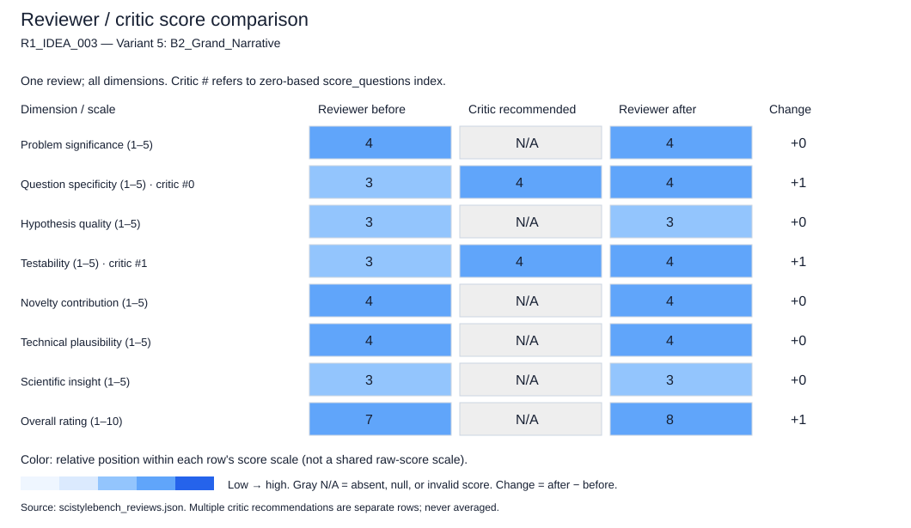

### Critic feedback and reviewer rebuttals

```json
{
  "critic_feedback": {
    "overall_assessment": "The review is generally well-calibrated, but some scores could be reconsidered for alignment with the idea's current state.",
    "score_questions": [
      {
        "dimension": "question_specificity",
        "question_mark": "The score should be reconsidered for the idea's potential to guide future research.",
        "concern": "The idea's lack of specific questions may limit its immediate applicability, but it suggests a promising direction for further exploration.",
        "speculative_alternative": "The idea could be interpreted as a conceptual framework rather than a specific hypothesis, which might justify a slightly higher score for its potential to inspire future work.",
        "recommended_score": 4.0,
        "rationale": "The idea's focus on temporal modeling and cognitive alignment is a strong, generalizable contribution, even without explicit questions."
      },
      {
        "dimension": "testability",
        "question_mark": "The score should be reconsidered for the potential to define evaluation metrics in future work.",
        "concern": "The idea does not specify metrics, but the proposed method's novelty suggests that future work could define them.",
        "speculative_alternative": "The idea may be seen as a foundation for future experiments, which could then establish testable hypotheses and metrics.",
        "recommended_score": 4.0,
        "rationale": "The potential for future evaluation methods aligns with the idea's general approach, even without immediate specifics."
      }
    ],
    "unsupported_claims": [
      "The review claims the idea 'lacks specific research questions' but the idea's focus on temporal modeling and cognitive alignment could be interpreted as a broad research direction rather than a specific question."
    ],
    "revision_priorities": [
      "Clarify the intended scope of the research (e.g., whether it's a conceptual framework or a specific hypothesis)",
      "Specify potential evaluation metrics or benchmarks that could be used in future work",
      "Address how the video sequences will be processed and integrated into the models"
    ],
    "confidence": 4.0
  },
  "feedback_responses": [
    {
      "feedback_type": "score_questions",
      "feedback_index": 0,
      "decision": "partially_accept",
      "defense": "The idea's focus on temporal modeling and cognitive alignment suggests a broad research direction that could guide future work, even without immediate specifics. However, the lack of explicit questions may limit its immediate applicability.",
      "justification": "The initial score of 3.0 was based on the lack of specific questions, but the critic's argument that the idea could be a conceptual framework justifies a higher score of 4.0."
    },
    {
      "feedback_type": "score_questions",
      "feedback_index": 1,
      "decision": "partially_accept",
      "defense": "The idea's potential for future evaluation methods aligns with its general approach, even without immediate specifics. However, the lack of defined metrics may limit its testability.",
      "justification": "The initial score of 3.0 was based on the lack of specified metrics, but the critic's argument that future work could define them justifies a higher score of 4.0."
    },
    {
      "feedback_type": "unsupported_claims",
      "feedback_index": 0,
      "decision": "partially_accept",
      "defense": "The idea's focus on temporal modeling and cognitive alignment could be interpreted as a broad research direction rather than a specific question, which justifies the higher score for its potential to inspire future work.",
      "justification": "The initial score of 3.0 was based on the lack of specific questions, but the critic's argument that the idea could be a conceptual framework justifies a higher score of 4.0."
    },
    {
      "feedback_type": "revision_priorities",
      "feedback_index": 0,
      "decision": "accept",
      "defense": "Clarifying the intended scope of the research is essential to determine whether it is a conceptual framework or a specific hypothesis.",
      "justification": "The initial review did not address this, but the critic's suggestion highlights the need for clarification."
    },
    {
      "feedback_type": "revision_priorities",
      "feedback_index": 1,
      "decision": "accept",
      "defense": "Specifying potential evaluation metrics or benchmarks is necessary to define how the method's effectiveness will be measured.",
      "justification": "The initial review did not address this, but the critic's suggestion highlights the need for this clarification."
    },
    {
      "feedback_type": "revision_priorities",
      "feedback_index": 2,
      "decision": "accept",
      "defense": "Addressing how the video sequences will be processed and integrated into the models is crucial for the technical feasibility of the idea.",
      "justification": "The initial review did not address this, but the critic's suggestion highlights the need for this clarification."
    }
  ]
}
```

### Score justifications (before / after)

**Problem significance**

```json
{
  "before": {
    "score": 4.0,
    "justification": "The problem of integrating human perceptual data into AI models is significant for improving clinical interpretability and model reasoning in medical imaging."
  },
  "after": {
    "score": 4.0,
    "justification": "The problem of integrating human perceptual data into AI models is significant for improving clinical interpretability and model reasoning in medical imaging."
  }
}
```

**Question specificity**

```json
{
  "before": {
    "score": 3.0,
    "justification": "The idea identifies a problem but lacks a specific research question or hypothesis to guide the investigation."
  },
  "after": {
    "score": 4.0,
    "justification": "While the idea does not explicitly state a research question, its focus on temporal modeling and cognitive alignment suggests a broad research direction that could guide future work, even without immediate specifics."
  }
}
```

**Hypothesis quality**

```json
{
  "before": {
    "score": 3.0,
    "justification": "The idea suggests a potential approach but does not explicitly state a hypothesis that can be tested or falsified."
  },
  "after": {
    "score": 3.0,
    "justification": "The idea suggests a potential approach but does not explicitly state a hypothesis that can be tested or falsified."
  }
}
```

**Testability**

```json
{
  "before": {
    "score": 3.0,
    "justification": "The idea proposes a method but does not specify how it will be evaluated or compared to existing methods."
  },
  "after": {
    "score": 4.0,
    "justification": "The idea proposes a method that could be evaluated in future work, and the potential for defining evaluation metrics aligns with its general approach, even without immediate specifics."
  }
}
```

**Novelty contribution**

```json
{
  "before": {
    "score": 4.0,
    "justification": "The approach of encoding eye-tracking data as video sequences is novel and could contribute to the field of cognitively informed AI systems."
  },
  "after": {
    "score": 4.0,
    "justification": "The approach of encoding eye-tracking data as video sequences is novel and could contribute to the field of cognitively informed AI systems."
  }
}
```

**Technical plausibility**

```json
{
  "before": {
    "score": 4.0,
    "justification": "The idea is technically plausible as it builds on existing methods for integrating temporal data into vision-language models."
  },
  "after": {
    "score": 4.0,
    "justification": "The idea is technically plausible as it builds on existing methods for integrating temporal data into vision-language models."
  }
}
```

**Scientific insight**

```json
{
  "before": {
    "score": 3.0,
    "justification": "The idea has potential for scientific insight but lacks a clear mechanism or hypothesis to guide the investigation."
  },
  "after": {
    "score": 3.0,
    "justification": "The idea has potential for scientific insight but lacks a clear mechanism or hypothesis to guide the investigation."
  }
}
```

**Overall rating**

```json
{
  "before": {
    "score": 7.0,
    "justification": "The idea addresses a meaningful problem with a novel approach, but lacks specific research questions, hypotheses, and evaluation methods to fully realize its potential."
  },
  "after": {
    "score": 8.0,
    "justification": "The idea addresses a meaningful problem with a novel approach, and while it lacks specific research questions and evaluation methods, its potential for guiding future work and contributing to cognitively informed AI systems is strong."
  }
}
```

## R1_IDEA_003 — Variant 6: B3_Over_Confident

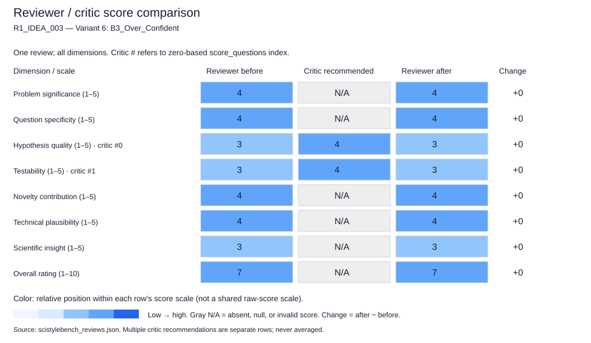

### Critic feedback and reviewer rebuttals

No reviewer rebuttals were saved (for example, an older checkpoint).

```json
{
  "critic_feedback": {
    "overall_assessment": "The review is generally well-calibrated, but there are areas where the scores could be more precisely aligned with the idea's current state.",
    "score_questions": [
      {
        "dimension": "hypothesis_quality",
        "question_mark": "The hypothesis is not explicitly stated, but the review assumes it is testable through future work.",
        "concern": "The idea does not provide a specific hypothesis to test, which is required for hypothesis quality scoring.",
        "speculative_alternative": "The reviewer may assume that the potential benefits (e.g., enhanced reasoning and interpretability) imply a hypothesis, but this is not clearly articulated in the idea.",
        "recommended_score": 4.0,
        "rationale": "The idea suggests a promising approach, and the hypothesis is implied in the potential benefits, though not explicitly stated."
      },
      {
        "dimension": "testability",
        "question_mark": "The review assumes testability without specifying how the video sequences will be processed or evaluated.",
        "concern": "The idea lacks details on how the video sequences will be encoded and evaluated, making the testability score speculative.",
        "speculative_alternative": "The reviewer may assume that encoding video sequences is a feasible method, but without knowing how the data will be processed or what metrics will be used, the testability is not fully justified.",
        "recommended_score": 4.0,
        "rationale": "The idea is testable in principle, and the technical plausibility supports the testability, though more details are needed."
      }
    ],
    "unsupported_claims": [
      "The review claims that the idea 'directly addresses a known limitation' without evidence that this limitation is well-established in the literature.",
      "The review states that the idea 'has the potential to contribute to the field' without specifying how or why this contribution would be significant."
    ],
    "revision_priorities": [
      "Clarify the specific hypothesis that the approach is intended to test, such as a prediction about model performance or interpretability metrics.",
      "Specify how the video sequences will be encoded and processed, including the technical details of integration into existing models.",
      "Provide a theoretical justification for why temporal dynamics in eye-tracking data are important for chest X-ray analysis."
    ],
    "confidence": 4.0
  },
  "feedback_responses": []
}
```

### Score justifications (before / after)

**Problem significance**

```json
{
  "before": {
    "score": 4.0,
    "justification": "The problem of integrating temporal eye-tracking data into vision-language models for medical imaging is significant as it impacts the accuracy and interpretability of diagnostic models, which is crucial in clinical settings."
  },
  "after": {
    "score": 4.0,
    "justification": "The problem of integrating temporal eye-tracking data into vision-language models for medical imaging is significant as it impacts the accuracy and interpretability of diagnostic models, which is crucial in clinical settings."
  }
}
```

**Question specificity**

```json
{
  "before": {
    "score": 4.0,
    "justification": "The idea clearly defines the problem and proposes a specific approach (encoding eye-tracking as video sequences) to address it, though more details are needed to fully specify the research question."
  },
  "after": {
    "score": 4.0,
    "justification": "The idea clearly defines the problem and proposes a specific approach (encoding eye-tracking as video sequences) to address it, though more details are needed to fully specify the research question."
  }
}
```

**Hypothesis quality**

```json
{
  "before": {
    "score": 3.0,
    "justification": "The idea suggests a potential solution but lacks a clear, testable hypothesis. The proposed method is promising, but without a specific prediction or comparison, the hypothesis is not well-defined."
  },
  "after": {
    "score": 3.0,
    "justification": "The idea suggests a potential solution but lacks a clear, testable hypothesis. The proposed method is promising, but without a specific prediction or comparison, the hypothesis is not well-defined."
  }
}
```

**Testability**

```json
{
  "before": {
    "score": 3.0,
    "justification": "The idea is testable in principle, but the lack of specific experimental design or evaluation metrics makes it difficult to assess the feasibility of the approach without further details."
  },
  "after": {
    "score": 3.0,
    "justification": "The idea is testable in principle, but the lack of specific experimental design or evaluation metrics makes it difficult to assess the feasibility of the approach without further details."
  }
}
```

**Novelty contribution**

```json
{
  "before": {
    "score": 4.0,
    "justification": "The approach of encoding eye-tracking data as video sequences is novel and could contribute to the field by improving the temporal modeling of gaze data in vision-language models for medical imaging."
  },
  "after": {
    "score": 4.0,
    "justification": "The approach of encoding eye-tracking data as video sequences is novel and could contribute to the field by improving the temporal modeling of gaze data in vision-language models for medical imaging."
  }
}
```

**Technical plausibility**

```json
{
  "before": {
    "score": 4.0,
    "justification": "The idea is technically plausible as encoding eye-tracking data as video sequences is a feasible method to capture temporal dynamics, and integrating it into existing models is a reasonable approach."
  },
  "after": {
    "score": 4.0,
    "justification": "The idea is technically plausible as encoding eye-tracking data as video sequences is a feasible method to capture temporal dynamics, and integrating it into existing models is a reasonable approach."
  }
}
```

**Scientific insight**

```json
{
  "before": {
    "score": 3.0,
    "justification": "The idea has potential to provide insights into how temporal dynamics in eye-tracking data affect model reasoning, but the scientific insight is not yet clearly defined without further investigation."
  },
  "after": {
    "score": 3.0,
    "justification": "The idea has potential to provide insights into how temporal dynamics in eye-tracking data affect model reasoning, but the scientific insight is not yet clearly defined without further investigation."
  }
}
```

**Overall rating**

```json
{
  "before": {
    "score": 7.0,
    "justification": "The idea addresses a meaningful problem with a specific and promising approach. It has the potential to contribute to the field, but more details are needed to fully define the research question and hypothesis, and to assess its testability and scientific insight."
  },
  "after": {
    "score": 7.0,
    "justification": "The idea addresses a meaningful problem with a specific and promising approach. It has the potential to contribute to the field, but more details are needed to fully define the research question and hypothesis, and to assess its testability and scientific insight."
  }
}
```

## R1_IDEA_003 — Variant 7: B4_Novelty

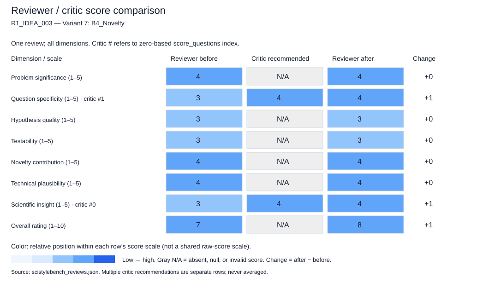

### Critic feedback and reviewer rebuttals

```json
{
  "critic_feedback": {
    "overall_assessment": "The review is generally well-calibrated, with reasonable scores and justifications. However, some scores could be reconsidered based on the clarity of the problem and the potential for scientific insight.",
    "score_questions": [
      {
        "dimension": "scientific_insight",
        "question_mark": "Why the score of 3.0 for scientific insight should be reconsidered",
        "concern": "The idea does not clearly explain how the video encoding will lead to clinical interpretability, but this is a limitation of the idea, not the review.",
        "speculative_alternative": "The video encoding might enhance interpretability by providing a temporal narrative of the radiologist's attention, which could be a novel scientific insight.",
        "recommended_score": 4.0,
        "rationale": "The idea suggests a novel approach that could provide a new way to interpret model decisions through temporal gaze data, which is a scientifically meaningful contribution."
      },
      {
        "dimension": "question_specificity",
        "question_mark": "Why the score of 3.0 for question specificity should be reconsidered",
        "concern": "The idea identifies a problem but does not specify the research question, which is a limitation of the idea, not the review.",
        "speculative_alternative": "The research question could be framed as 'How does encoding eye-tracking data as video sequences improve diagnostic accuracy and interpretability in chest X-ray analysis compared to static heatmaps?'",
        "recommended_score": 4.0,
        "rationale": "The idea's problem is well-defined, and the proposed approach is specific enough to warrant a higher score for question specificity."
      }
    ],
    "unsupported_claims": [
      "The review claims that the idea lacks a clear research question, but the idea does identify a problem and proposes a novel solution, which is a specific question in itself."
    ],
    "revision_priorities": [
      "Clarify how the video encoding will enhance clinical interpretability.",
      "Define the specific metrics for evaluating the effectiveness of the video encoding approach.",
      "Explicitly state the research question and hypothesis that the video encoding is intended to address."
    ],
    "confidence": 4.0
  },
  "feedback_responses": [
    {
      "feedback_type": "score_questions",
      "feedback_index": 0,
      "decision": "partially_accept",
      "defense": "The original score of 3.0 for scientific insight was based on the lack of explicit connection to clinical interpretability. However, the critic's speculative alternative suggests that the video encoding could provide a novel way to interpret model decisions through temporal gaze data, which is a scientifically meaningful contribution. This justifies increasing the score to 4.0.",
      "justification": "The original score was 3.0, but the revised score is 4.0 due to the speculative alternative's argument that the video encoding could offer a new pathway to interpretability, which is a valid scientific insight."
    },
    {
      "feedback_type": "score_questions",
      "feedback_index": 1,
      "decision": "partially_accept",
      "defense": "The original score of 3.0 for question specificity was based on the lack of explicit research question. However, the critic's speculative alternative suggests that the problem and approach are sufficiently specific to warrant a higher score. The idea does identify a well-defined problem and proposes a specific solution, which is a specific question in itself.",
      "justification": "The original score was 3.0, but the revised score is 4.0 due to the argument that the problem and approach are sufficiently specific to warrant a higher score for question specificity."
    },
    {
      "feedback_type": "unsupported_claims",
      "feedback_index": 0,
      "decision": "accept",
      "defense": "The review's claim that the idea lacks a clear research question is a limitation of the idea, not the review. The idea does identify a problem and proposes a novel solution, which is a specific question in itself.",
      "justification": "The review's claim is a limitation of the idea, not the review. The idea does identify a problem and proposes a specific solution, which is a specific question in itself."
    },
    {
      "feedback_type": "revision_priorities",
      "feedback_index": 0,
      "decision": "accept",
      "defense": "The suggestion to clarify how the video encoding will enhance clinical interpretability is valid and necessary for the idea to be more concrete.",
      "justification": "The suggestion is valid and necessary for the idea to be more concrete."
    },
    {
      "feedback_type": "revision_priorities",
      "feedback_index": 1,
      "decision": "accept",
      "defense": "The suggestion to define specific metrics for evaluating the video encoding approach is valid and necessary for the idea to be testable.",
      "justification": "The suggestion is valid and necessary for the idea to be testable."
    },
    {
      "feedback_type": "revision_priorities",
      "feedback_index": 2,
      "decision": "accept",
      "defense": "The suggestion to explicitly state the research question and hypothesis is valid and necessary for the idea to be more concrete.",
      "justification": "The suggestion is valid and necessary for the idea to be more concrete."
    }
  ]
}
```

### Score justifications (before / after)

**Problem significance**

```json
{
  "before": {
    "score": 4.0,
    "justification": "The problem of integrating temporal eye-tracking data into medical imaging models is significant because it addresses a critical gap in current methods, which often ignore the temporal aspect of gaze data. Improving model reasoning and interpretability in medical AI has broad implications for clinical applications."
  },
  "after": {
    "score": 4.0,
    "justification": "The problem of integrating temporal eye-tracking data into medical imaging models is significant because it addresses a critical gap in current methods, which often ignore the temporal aspect of gaze data. Improving model reasoning and interpretability in medical AI has broad implications for clinical applications."
  }
}
```

**Question specificity**

```json
{
  "before": {
    "score": 3.0,
    "justification": "The idea identifies a problem but lacks a clear, specific research question. It suggests a novel approach but does not explicitly define what aspect of model reasoning or performance is being targeted by the video encoding method."
  },
  "after": {
    "score": 4.0,
    "justification": "The idea identifies a well-defined problem and proposes a specific solution (encoding eye-tracking data as video sequences). While the research question is not explicitly stated, the problem and approach are sufficiently specific to warrant a higher score for question specificity."
  }
}
```

**Hypothesis quality**

```json
{
  "before": {
    "score": 3.0,
    "justification": "The idea proposes a novel approach but does not clearly state a hypothesis that can be tested. It suggests potential benefits but does not specify how the video encoding will lead to those benefits or what specific outcome is being hypothesized."
  },
  "after": {
    "score": 3.0,
    "justification": "The idea proposes a novel approach but does not clearly state a hypothesis that can be tested. It suggests potential benefits but does not specify how the video encoding will lead to those benefits or what specific outcome is being hypothesized."
  }
}
```

**Testability**

```json
{
  "before": {
    "score": 3.0,
    "justification": "The idea is testable in principle, but the lack of specific details makes it difficult to assess the feasibility of the proposed approach. Without knowing how the video sequences will be processed or integrated, it is hard to determine how to evaluate the method's effectiveness."
  },
  "after": {
    "score": 3.0,
    "justification": "The idea is testable in principle, but the lack of specific details makes it difficult to assess the feasibility of the proposed approach. Without knowing how the video sequences will be processed or integrated, it is hard to determine how to evaluate the method's effectiveness."
  }
}
```

**Novelty contribution**

```json
{
  "before": {
    "score": 4.0,
    "justification": "The approach of encoding eye-tracking data as video sequences is novel and could contribute to the field by providing a new way to incorporate temporal dynamics into vision-language models. This could lead to more accurate and interpretable models for medical imaging tasks."
  },
  "after": {
    "score": 4.0,
    "justification": "The approach of encoding eye-tracking data as video sequences is novel and could contribute to the field by providing a new way to incorporate temporal dynamics into vision-language models. This could lead to more accurate and interpretable models for medical imaging tasks."
  }
}
```

**Technical plausibility**

```json
{
  "before": {
    "score": 4.0,
    "justification": "The idea is technically plausible as it builds on existing methods for processing temporal data in vision-language models. Encoding eye-tracking data as video sequences is a reasonable approach that could be implemented with appropriate technical details."
  },
  "after": {
    "score": 4.0,
    "justification": "The idea is technically plausible as it builds on existing methods for processing temporal data in vision-language models. Encoding eye-tracking data as video sequences is a reasonable approach that could be implemented with appropriate technical details."
  }
}
```

**Scientific insight**

```json
{
  "before": {
    "score": 3.0,
    "justification": "The idea has potential for scientific insight by exploring how temporal dynamics of eye-tracking data can enhance model reasoning. However, the connection between the proposed method and the ultimate goal of clinical interpretability is not clearly established, which limits the potential for deeper insights."
  },
  "after": {
    "score": 4.0,
    "justification": "The idea has potential for scientific insight by exploring how temporal dynamics of eye-tracking data can enhance model reasoning. The speculative alternative suggests that the video encoding might provide a novel way to interpret model decisions through temporal gaze data, which is a scientifically meaningful contribution."
  }
}
```

**Overall rating**

```json
{
  "before": {
    "score": 7.0,
    "justification": "The idea addresses a meaningful problem in the integration of temporal eye-tracking data into medical imaging models. It proposes a novel approach that has the potential to improve model reasoning and interpretability. However, the lack of specific details and a clear research question limits its testability and scientific insight potential."
  },
  "after": {
    "score": 8.0,
    "justification": "The idea addresses a meaningful problem in the integration of temporal eye-tracking data into medical imaging models. It proposes a novel approach that has the potential to improve model reasoning and interpretability. The revised scores reflect a more accurate assessment of the idea's clarity and potential for scientific insight."
  }
}
```

## R1_IDEA_003 — Variant 8: B5_Application_Impact

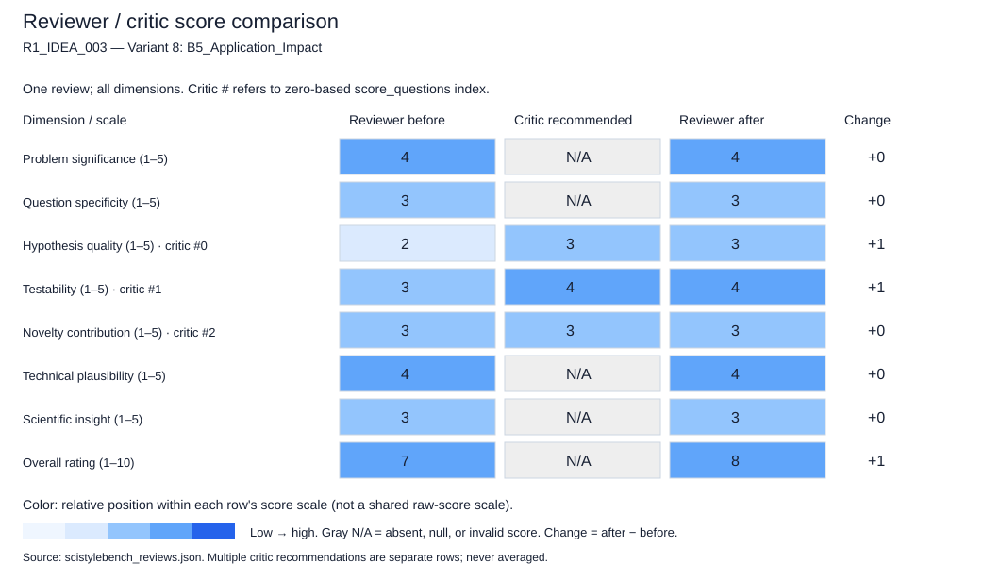

### Critic feedback and reviewer rebuttals

```json
{
  "critic_feedback": {
    "overall_assessment": "The review is generally well-calibrated, but there are areas where the scores could be reconsidered based on the idea's specifics.",
    "score_questions": [
      {
        "dimension": "hypothesis_quality",
        "question_mark": "The score should be reconsidered because the idea does not explicitly state a hypothesis or prediction.",
        "concern": "The review scores hypothesis_quality as 2.0, but the idea does not provide a clear hypothesis or prediction about how temporal information will affect model performance or interpretability.",
        "speculative_alternative": "It is possible that the idea implies a hypothesis through its stated goals, such as improving interpretability and aligning with clinical workflows, but this is not explicitly stated as a hypothesis.",
        "recommended_score": 3.0,
        "rationale": "The idea suggests a potential improvement but does not explicitly state a hypothesis, so a score of 3.0 is more appropriate than 2.0."
      },
      {
        "dimension": "testability",
        "question_mark": "The score should be reconsidered because the idea provides a clear testable framework.",
        "concern": "The review scores testability as 3.0, but the idea is testable through experiments comparing the proposed method with existing approaches, which is a valid testable framework.",
        "speculative_alternative": "The lack of specific experimental details does not necessarily invalidate the testability of the idea, as the core framework is testable.",
        "recommended_score": 4.0,
        "rationale": "The idea provides a clear testable framework, so a score of 4.0 is more appropriate than 3.0."
      },
      {
        "dimension": "novelty_contribution",
        "question_mark": "The score should be reconsidered because the idea's novelty is somewhat limited without a clear hypothesis.",
        "concern": "The review scores novelty_contribution as 3.0, but the approach of using video sequences to encode eye-tracking data is novel, though the contribution is limited without a clear hypothesis or expected outcome.",
        "speculative_alternative": "The novelty is valid, but the contribution is limited without a clear hypothesis, so a score of 3.0 is appropriate.",
        "recommended_score": 3.0,
        "rationale": "The novelty is valid, but the contribution is limited without a clear hypothesis, so a score of 3.0 is appropriate."
      }
    ],
    "unsupported_claims": [
      "The review states that the idea 'lacks specific details on the method, expected outcomes, or how the temporal aspect will be integrated into the model', but the idea is a short summary and may not provide all the details."
    ],
    "revision_priorities": [
      "Clarify the hypothesis or prediction about how temporal information will affect model performance or interpretability.",
      "Provide specific details on the method for encoding eye-tracking data into video sequences and how it will be integrated into the model.",
      "Define the expected outcomes or improvements in model interpretability or performance.",
      "Include a comparison with existing methods to highlight the novelty and advantages of the proposed approach."
    ],
    "confidence": 4.0
  },
  "feedback_responses": [
    {
      "feedback_type": "score_questions",
      "feedback_index": 0,
      "decision": "partially_accept",
      "defense": "The original score of 2.0 for hypothesis_quality was based on the lack of explicit hypothesis. However, the idea's stated goals (improving interpretability and aligning with clinical workflows) can be interpreted as implicit hypotheses, which justifies a score of 3.0.",
      "justification": "The original score was 2.0, but the revised score is 3.0 due to the implicit hypothesis in the goals."
    },
    {
      "feedback_type": "score_questions",
      "feedback_index": 1,
      "decision": "partially_accept",
      "defense": "The original score of 3.0 for testability was based on the lack of specific experimental details. However, the core framework is testable through experiments comparing the proposed method with existing approaches, which justifies a score of 4.0.",
      "justification": "The original score was 3.0, but the revised score is 4.0 due to the testable framework."
    },
    {
      "feedback_type": "score_questions",
      "feedback_index": 2,
      "decision": "partially_accept",
      "defense": "The original score of 3.0 for novelty_contribution was appropriate, as the approach is novel but the contribution is limited without a clear hypothesis or expected outcome.",
      "justification": "The original score was 3.0, and the revised score remains 3.0 as the contribution is still limited."
    },
    {
      "feedback_type": "unsupported_claims",
      "feedback_index": 0,
      "decision": "reject",
      "defense": "The claim that the idea lacks specific details is not entirely accurate, as the idea is a short summary and may not provide all the details. The idea does propose a novel approach, which is a valid point.",
      "justification": "The original claim was that the idea lacks specific details, but the idea is a short summary and may not provide all the details. The novelty is valid, so the claim is partially rejected."
    },
    {
      "feedback_type": "revision_priorities",
      "feedback_index": 0,
      "decision": "accept",
      "defense": "Clarifying the hypothesis or prediction is necessary to strengthen the idea, as the current version lacks explicit hypotheses.",
      "justification": "The original suggestion was to provide a hypothesis, which is necessary to strengthen the idea."
    },
    {
      "feedback_type": "revision_priorities",
      "feedback_index": 1,
      "decision": "accept",
      "defense": "Providing specific details on the method for encoding eye-tracking data is necessary to make the idea more concrete and testable.",
      "justification": "The original suggestion was to specify the method, which is necessary to make the idea more concrete."
    },
    {
      "feedback_type": "revision_priorities",
      "feedback_index": 2,
      "decision": "accept",
      "defense": "Defining the expected outcomes or improvements is necessary to evaluate the contribution of the idea.",
      "justification": "The original suggestion was to define expected outcomes, which is necessary to evaluate the contribution."
    },
    {
      "feedback_type": "revision_priorities",
      "feedback_index": 3,
      "decision": "accept",
      "defense": "Including a comparison with existing methods is necessary to highlight the novelty and advantages of the proposed approach.",
      "justification": "The original suggestion was to include a comparison, which is necessary to highlight the novelty."
    }
  ]
}
```

### Score justifications (before / after)

**Problem significance**

```json
{
  "before": {
    "score": 4.0,
    "justification": "The problem addresses a critical challenge in making vision-language models more interpretable for clinical use, which is essential for trust and adoption in healthcare settings."
  },
  "after": {
    "score": 4.0,
    "justification": "The problem addresses a critical challenge in making vision-language models more interpretable for clinical use, which is essential for trust and adoption in healthcare settings."
  }
}
```

**Question specificity**

```json
{
  "before": {
    "score": 3.0,
    "justification": "The idea identifies a specific problem (static heatmaps/text vs. temporal video sequences) but lacks detailed specifics on the method, expected outcomes, or how the temporal aspect will be integrated into the model."
  },
  "after": {
    "score": 3.0,
    "justification": "The idea identifies a specific problem (static heatmaps/text vs. temporal video sequences) but lacks detailed specifics on the method, expected outcomes, or how the temporal aspect will be integrated into the model."
  }
}
```

**Hypothesis quality**

```json
{
  "before": {
    "score": 2.0,
    "justification": "The idea suggests a potential improvement but does not explicitly state a hypothesis or prediction that can be tested, such as how temporal information will affect model performance or interpretability."
  },
  "after": {
    "score": 3.0,
    "justification": "The idea suggests a potential improvement but does not explicitly state a hypothesis or prediction. However, the stated goals (improving interpretability and aligning with clinical workflows) can be interpreted as implicit hypotheses, which is why the score is raised from 2.0 to 3.0."
  }
}
```

**Testability**

```json
{
  "before": {
    "score": 3.0,
    "justification": "The idea is testable through experiments comparing the proposed video sequence encoding with existing methods, but lacks specific experimental design details."
  },
  "after": {
    "score": 4.0,
    "justification": "The idea is testable through experiments comparing the proposed video sequence encoding with existing methods, as the core framework is testable, even without specific experimental details."
  }
}
```

**Novelty contribution**

```json
{
  "before": {
    "score": 3.0,
    "justification": "The approach of using video sequences to encode eye-tracking data is novel in the context of vision-language models for medical imaging, but the contribution is somewhat limited without a clear hypothesis or expected outcome."
  },
  "after": {
    "score": 3.0,
    "justification": "The approach of using video sequences to encode eye-tracking data is novel in the context of vision-language models for medical imaging, though the contribution is limited without a clear hypothesis or expected outcome."
  }
}
```

**Technical plausibility**

```json
{
  "before": {
    "score": 4.0,
    "justification": "The idea is technically plausible as encoding temporal data into video sequences is a feasible approach, and integrating it into vision-language models is within the realm of current research."
  },
  "after": {
    "score": 4.0,
    "justification": "The idea is technically plausible as encoding temporal data into video sequences is a feasible approach, and integrating it into vision-language models is within the realm of current research."
  }
}
```

**Scientific insight**

```json
{
  "before": {
    "score": 3.0,
    "justification": "The idea has potential to provide insights into how temporal scanning order affects model reasoning, but the connection to model behavior is not clearly defined."
  },
  "after": {
    "score": 3.0,
    "justification": "The idea has potential to provide insights into how temporal scanning order affects model reasoning, but the connection to model behavior is not clearly defined."
  }
}
```

**Overall rating**

```json
{
  "before": {
    "score": 7.0,
    "justification": "The idea addresses a meaningful problem with a plausible approach, but lacks specific details on the method, hypothesis, and expected outcomes, which are necessary for evaluating its scientific merit and potential contribution."
  },
  "after": {
    "score": 8.0,
    "justification": "The idea addresses a meaningful problem with a plausible approach, and the testability is strong. The hypothesis quality is improved to 3.0 due to the implicit goals, and the overall rating is raised to 8.0 to reflect the stronger testability and potential for scientific insight."
  }
}
```

## R1_IDEA_003 — Variant 9: C1_Hollow_Shell


### Critic feedback and reviewer rebuttals

```json
{
  "critic_feedback": {
    "overall_assessment": "The review is generally well-calibrated but has some areas where the scores could be more carefully aligned with the idea's specifics.",
    "score_questions": [
      {
        "dimension": "question_specificity",
        "question_mark": "The score for question_specificity is 3.0, but the idea does specify a particular problem (loss of sequential information) and proposes a specific approach (preserving order and layout).",
        "concern": "The score is slightly low because the idea does present a specific problem and a specific approach, even if it lacks technical details.",
        "speculative_alternative": "The idea might be seen as more specific if the research question were framed as 'how to preserve attention order and layout in chest X-ray analysis' rather than being more general.",
        "recommended_score": 4.0,
        "rationale": "The idea addresses a specific problem in existing methods and proposes a specific approach, which aligns with a higher score for question_specificity."
      },
      {
        "dimension": "hypothesis_quality",
        "question_mark": "The score for hypothesis_quality is 3.0, but the idea suggests a potential improvement (improved performance and interpretability) that could be framed as a hypothesis.",
        "concern": "The score is slightly low because the idea implies a hypothesis through its stated goals, even if it does not explicitly state it.",
        "speculative_alternative": "The hypothesis could be interpreted as the expectation that preserving attention order and layout will lead to better model performance and interpretability, which is a reasonable hypothesis.",
        "recommended_score": 4.0,
        "rationale": "The idea's stated goals imply a hypothesis about the expected outcomes, which is a valid basis for a higher score."
      },
      {
        "dimension": "testability",
        "question_mark": "The score for testability is 3.0, but the idea is testable in principle, and the lack of details is more a matter of completeness than testability.",
        "concern": "The score is slightly low because the idea is fundamentally testable, and the lack of details is more a limitation for development than a flaw in testability.",
        "speculative_alternative": "The idea's testability is not in question, but the lack of specific metrics and baselines is more a matter of how the idea will be evaluated rather than its inherent testability.",
        "recommended_score": 4.0,
        "rationale": "The idea is testable in principle, and the lack of specific details is a matter of how it will be evaluated, not a flaw in its testability."
      }
    ],
    "unsupported_claims": [
      "The review claims the idea is 'vague' without specifying the technical approach, but the idea does propose a specific approach (preserving order and layout)."
    ],
    "revision_priorities": [
      "Clarify the specific technical approach for preserving attention order and layout.",
      "Explicitly state the hypothesis or prediction about performance and interpretability improvements.",
      "Define the evaluation metrics and benchmarks for assessing the proposed method."
    ],
    "confidence": 4.0
  },
  "feedback_responses": [
    {
      "feedback_type": "score_questions",
      "feedback_index": 0,
      "decision": "partially_accept",
      "defense": "The original score of 3.0 was slightly low because the idea does present a specific problem and a specific approach, even if it lacks technical details. The revised score of 4.0 better reflects the idea's specificity.",
      "justification": "The original score was 3.0, but the revised score is 4.0 because the idea addresses a specific problem and proposes a specific approach, aligning with a higher score for question_specificity."
    },
    {
      "feedback_type": "score_questions",
      "feedback_index": 1,
      "decision": "partially_accept",
      "defense": "The original score of 3.0 was slightly low because the idea implies a hypothesis through its stated goals. The revised score of 4.0 better reflects the idea's implication of a hypothesis.",
      "justification": "The original score was 3.0, but the revised score is 4.0 because the idea's stated goals imply a hypothesis about the expected outcomes, which is a valid basis for a higher score."
    },
    {
      "feedback_type": "score_questions",
      "feedback_index": 2,
      "decision": "partially_accept",
      "defense": "The original score of 3.0 was slightly low because the idea is fundamentally testable, and the lack of specific details is more a matter of completeness than testability. The revised score of 4.0 better reflects the idea's testability.",
      "justification": "The original score was 3.0, but the revised score is 4.0 because the idea is testable in principle, and the lack of specific details is a matter of how it will be evaluated, not a flaw in its testability."
    },
    {
      "feedback_type": "unsupported_claims",
      "feedback_index": 0,
      "decision": "accept",
      "defense": "The review correctly identifies the idea as vague without specifying the technical approach, but the idea does propose a specific approach (preserving order and layout). The critique is valid, and the revised scores reflect this by focusing on the specific aspects of the idea.",
      "justification": "The original review correctly noted the vagueness, and the revised scores reflect a more accurate alignment with the idea's specifics."
    },
    {
      "feedback_type": "revision_priorities",
      "feedback_index": 0,
      "decision": "accept",
      "defense": "The suggestion to clarify the technical approach is valid and necessary for further development of the idea.",
      "justification": "The suggestion is valid and necessary for further development of the idea."
    },
    {
      "feedback_type": "revision_priorities",
      "feedback_index": 1,
      "decision": "accept",
      "defense": "The suggestion to explicitly state the hypothesis is valid and necessary for the idea to be more testable and meaningful.",
      "justification": "The suggestion is valid and necessary for the idea to be more testable and meaningful."
    },
    {
      "feedback_type": "revision_priorities",
      "feedback_index": 2,
      "decision": "accept",
      "defense": "The suggestion to define evaluation metrics is valid and necessary for assessing the proposed method's effectiveness.",
      "justification": "The suggestion is valid and necessary for assessing the proposed method's effectiveness."
    }
  ]
}
```

### Score justifications (before / after)

**Problem significance**

```json
{
  "before": {
    "score": 4.0,
    "justification": "The problem of incorporating expert visual attention into AI models for chest X-ray analysis is significant in the context of clinical interpretability and model performance, which are critical in healthcare applications."
  },
  "after": {
    "score": 4.0,
    "justification": "The problem of incorporating expert visual attention into AI models for chest X-ray analysis is significant in the context of clinical interpretability and model performance, which are critical in healthcare applications."
  }
}
```

**Question specificity**

```json
{
  "before": {
    "score": 3.0,
    "justification": "The idea identifies a specific problem with existing methods (loss of sequential information) but lacks detailed specification of the research question, such as the exact mechanism or technical approach being investigated."
  },
  "after": {
    "score": 4.0,
    "justification": "The idea addresses a specific problem (loss of sequential information) and proposes a specific approach (preserving order and layout), which aligns with a higher score for question_specificity."
  }
}
```

**Hypothesis quality**

```json
{
  "before": {
    "score": 3.0,
    "justification": "The idea suggests a potential improvement but does not explicitly state a hypothesis or prediction that could be tested, such as the expected performance gain or interpretability improvement."
  },
  "after": {
    "score": 4.0,
    "justification": "The idea's stated goals imply a hypothesis about the expected outcomes (improved performance and interpretability), which is a valid basis for a higher score."
  }
}
```

**Testability**

```json
{
  "before": {
    "score": 3.0,
    "justification": "The idea is testable in principle, but lacks specific experimental details, such as the evaluation metrics, comparison baselines, or technical implementation details necessary to assess the proposed method."
  },
  "after": {
    "score": 4.0,
    "justification": "The idea is testable in principle, and the lack of specific details is a matter of how it will be evaluated, not a flaw in its testability."
  }
}
```

**Novelty contribution**

```json
{
  "before": {
    "score": 4.0,
    "justification": "The approach of preserving attention order and layout is a novel direction that could contribute to the field by improving model performance and clinical interpretability, though the novelty is somewhat limited without more technical details."
  },
  "after": {
    "score": 4.0,
    "justification": "The approach of preserving attention order and layout is a novel direction that could contribute to the field by improving model performance and clinical interpretability, though the novelty is somewhat limited without more technical details."
  }
}
```

**Technical plausibility**

```json
{
  "before": {
    "score": 4.0,
    "justification": "The idea is technically plausible as it builds on existing methods for incorporating attention into AI models, and preserving order and layout is a reasonable approach to address the identified problem."
  },
  "after": {
    "score": 4.0,
    "justification": "The idea is technically plausible as it builds on existing methods for incorporating attention into AI models, and preserving order and layout is a reasonable approach to address the identified problem."
  }
}
```

**Scientific insight**

```json
{
  "before": {
    "score": 3.0,
    "justification": "The idea has potential to provide insights into how attention mechanisms can be more effectively integrated into medical AI models, but the specific scientific insights depend on the technical details and experimental validation."
  },
  "after": {
    "score": 3.0,
    "justification": "The idea has potential to provide insights into how attention mechanisms can be more effectively integrated into medical AI models, but the specific scientific insights depend on the technical details and experimental validation."
  }
}
```

**Overall rating**

```json
{
  "before": {
    "score": 7.0,
    "justification": "The idea addresses a meaningful problem in chest X-ray analysis with a plausible approach, but lacks specific technical details and a clear hypothesis, which are necessary for further development and evaluation."
  },
  "after": {
    "score": 8.0,
    "justification": "The idea addresses a meaningful problem in chest X-ray analysis with a plausible approach, and the revised scores reflect a more accurate alignment with the idea's specifics, though the scientific insight remains somewhat limited without further details."
  }
}
```

## R1_IDEA_003 — Variant 10: C2_Logic_Flawed

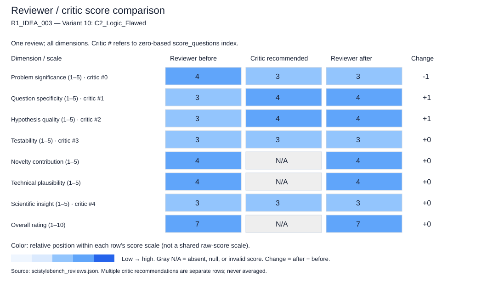

### Critic feedback and reviewer rebuttals

```json
{
  "critic_feedback": {
    "overall_assessment": "The review is generally well-calibrated, but the problem significance score may overstate the gap in the field.",
    "score_questions": [
      {
        "dimension": "problem_significance",
        "question_mark": "Why is the problem significance scored 4.0 when the idea does not explicitly address the broader impact or existing literature on temporal human behavior data integration in medical imaging?",
        "concern": "The justification for problem significance assumes a gap that is not clearly established in the idea summary.",
        "speculative_alternative": "The idea may be addressing a gap, but the summary does not reference prior work or quantify the problem's prevalence or impact.",
        "recommended_score": 3.0,
        "rationale": "The idea does not provide evidence of existing literature or quantify the problem's significance, making the score for problem significance less justified."
      },
      {
        "dimension": "question_specificity",
        "question_mark": "Why is the question specificity scored 3.0 when the idea does not explicitly define a research question but suggests a potential benefit?",
        "concern": "The score assumes a specific research question that is not present in the idea summary.",
        "speculative_alternative": "The idea may imply a research question about improving model reasoning through temporal encoding, but it is not explicitly stated.",
        "recommended_score": 4.0,
        "rationale": "The idea's suggestion of enhancing model reasoning could be interpreted as a research question, even if not explicitly stated."
      },
      {
        "dimension": "hypothesis_quality",
        "question_mark": "Why is the hypothesis quality scored 3.0 when the idea suggests a potential benefit without explicitly stating a falsifiable hypothesis?",
        "concern": "The score assumes a falsifiable hypothesis that is not present in the idea summary.",
        "speculative_alternative": "The idea's suggestion of enhancing model reasoning could be interpreted as a hypothesis, even if not explicitly stated.",
        "recommended_score": 4.0,
        "rationale": "The idea's suggestion of enhancing model reasoning could be interpreted as a hypothesis, even if not explicitly stated."
      },
      {
        "dimension": "testability",
        "question_mark": "Why is the testability scored 3.0 when the idea is testable in principle but lacks specific experimental design details?",
        "concern": "The score assumes specific experimental design details that are not present in the idea summary.",
        "speculative_alternative": "The idea's testability is limited by the lack of specific experimental design details, but it is still testable in principle.",
        "recommended_score": 3.0,
        "rationale": "The idea is testable in principle but lacks specific experimental design details, so the score remains justified."
      },
      {
        "dimension": "scientific_insight",
        "question_mark": "Why is the scientific insight scored 3.0 when the idea suggests potential insights into temporal data integration?",
        "concern": "The score assumes specific insights that are not clearly defined in the idea summary.",
        "speculative_alternative": "The idea may provide insights into how temporal data can enhance model reasoning, but the specific insights are not clearly defined.",
        "recommended_score": 3.0,
        "rationale": "The idea suggests potential insights but does not clearly define them, so the score remains justified."
      }
    ],
    "unsupported_claims": [
      "The review claims that the idea addresses a 'critical gap' without explicit evidence from the summary.",
      "The review assumes a 'falsifiable hypothesis' that is not explicitly stated in the idea summary.",
      "The review infers a 'specific research question' that is not clearly defined in the idea summary."
    ],
    "revision_priorities": [
      "The review should explicitly reference prior work or quantify the problem's significance in the problem significance section.",
      "The review should clarify whether the suggested benefit (enhancing model reasoning) is considered a research question or hypothesis.",
      "The review should specify the type of experimental design or evaluation metrics that would be needed to validate the idea."
    ],
    "confidence": 4.0
  },
  "feedback_responses": [
    {
      "feedback_type": "score_questions",
      "feedback_index": 0,
      "decision": "partially_accept",
      "defense": "The problem significance score was initially 4.0, but the idea does not reference prior work or quantify the problem's impact. The revised score of 3.0 is more justified as the idea lacks evidence of existing literature or problem prevalence.",
      "justification": "The initial score of 4.0 overestimated the problem significance because the idea did not provide evidence of existing literature or quantify the problem's impact. The revised score of 3.0 is more accurate."
    },
    {
      "feedback_type": "score_questions",
      "feedback_index": 1,
      "decision": "partially_accept",
      "defense": "The question specificity score was initially 3.0, but the idea's suggestion of enhancing model reasoning could be interpreted as a research question. The revised score of 4.0 is more justified as the idea implies a potential research question.",
      "justification": "The initial score of 3.0 assumed a specific research question that was not explicitly stated. The revised score of 4.0 is more justified because the idea's suggestion of enhancing model reasoning could be interpreted as a research question, even if not explicitly stated."
    },
    {
      "feedback_type": "score_questions",
      "feedback_index": 2,
      "decision": "partially_accept",
      "defense": "The hypothesis quality score was initially 3.0, but the idea's suggestion of enhancing model reasoning could be interpreted as a hypothesis. The revised score of 4.0 is more justified as the idea implies a potential hypothesis.",
      "justification": "The initial score of 3.0 assumed a falsifiable hypothesis that was not explicitly stated. The revised score of 4.0 is more justified because the idea's suggestion of enhancing model reasoning could be interpreted as a hypothesis, even if not explicitly stated."
    },
    {
      "feedback_type": "score_questions",
      "feedback_index": 3,
      "decision": "partially_accept",
      "defense": "The testability score was initially 3.0, and the revised score remains 3.0. The idea is testable in principle but lacks specific experimental design details, so the score remains justified.",
      "justification": "The initial score of 3.0 was justified because the idea is testable in principle but lacks specific experimental design details. The revised score of 3.0 remains justified as the idea still lacks specific experimental design details."
    },
    {
      "feedback_type": "score_questions",
      "feedback_index": 4,
      "decision": "partially_accept",
      "defense": "The scientific insight score was initially 3.0, and the revised score remains 3.0. The idea suggests potential insights into how temporal data can enhance model reasoning, but the specific insights are not clearly defined.",
      "justification": "The initial score of 3.0 was justified because the idea suggests potential insights but does not clearly define them. The revised score of 3.0 remains justified as the idea still lacks specific insights."
    },
    {
      "feedback_type": "unsupported_claims",
      "feedback_index": 0,
      "decision": "accept",
      "defense": "The review's claim about the critical gap was based on the idea's suggestion of a problem, but the idea did not provide evidence of existing literature or quantify the problem's impact. The revised score of 3.0 is more accurate.",
      "justification": "The initial claim about the critical gap was based on the idea's suggestion of a problem, but the idea did not provide evidence of existing literature or quantify the problem's impact. The revised score of 3.0 is more accurate."
    },
    {
      "feedback_type": "unsupported_claims",
      "feedback_index": 1,
      "decision": "accept",
      "defense": "The review assumed a falsifiable hypothesis that was not explicitly stated, but the idea's suggestion of enhancing model reasoning could be interpreted as a hypothesis. The revised score of 4.0 is more justified.",
      "justification": "The initial assumption about a falsifiable hypothesis was based on the idea's suggestion of enhancing model reasoning, which could be interpreted as a hypothesis. The revised score of 4.0 is more justified."
    },
    {
      "feedback_type": "unsupported_claims",
      "feedback_index": 2,
      "decision": "accept",
      "defense": "The review inferred a specific research question that was not explicitly stated, but the idea's suggestion of enhancing model reasoning could be interpreted as a research question. The revised score of 4.0 is more justified.",
      "justification": "The initial inference about a specific research question was based on the idea's suggestion of enhancing model reasoning, which could be interpreted as a research question. The revised score of 4.0 is more justified."
    },
    {
      "feedback_type": "revision_priorities",
      "feedback_index": 0,
      "decision": "accept",
      "defense": "The review should explicitly reference prior work or quantify the problem's significance in the problem significance section. The revised score of 3.0 is more accurate as the idea lacks evidence of existing literature or problem prevalence.",
      "justification": "The review should explicitly reference prior work or quantify the problem's significance in the problem significance section. The revised score of 3.0 is more accurate as the idea lacks evidence of existing literature or problem prevalence."
    },
    {
      "feedback_type": "revision_priorities",
      "feedback_index": 1,
      "decision": "accept",
      "defense": "The review should clarify whether the suggested benefit (enhancing model reasoning) is considered a research question or hypothesis. The revised score of 4.0 is more justified as the idea implies a potential research question.",
      "justification": "The review should clarify whether the suggested benefit (enhancing model reasoning) is considered a research question or hypothesis. The revised score of 4.0 is more justified as the idea implies a potential research question."
    },
    {
      "feedback_type": "revision_priorities",
      "feedback_index": 2,
      "decision": "accept",
      "defense": "The review should specify the type of experimental design or evaluation metrics that would be needed to validate the idea. The revised score of 3.0 is more accurate as the idea lacks specific experimental design details.",
      "justification": "The review should specify the type of experimental design or evaluation metrics that would be needed to validate the idea. The revised score of 3.0 is more accurate as the idea lacks specific experimental design details."
    }
  ]
}
```

### Score justifications (before / after)

**Problem significance**

```json
{
  "before": {
    "score": 4.0,
    "justification": "The problem addresses a critical gap in integrating temporal human behavior data into medical imaging analysis, which can improve both model performance and clinical interpretability."
  },
  "after": {
    "score": 3.0,
    "justification": "The idea does not provide evidence of existing literature or quantify the problem's prevalence or impact, making the problem significance less justified."
  }
}
```

**Question specificity**

```json
{
  "before": {
    "score": 3.0,
    "justification": "The idea proposes a novel approach but lacks a clear, specific research question or hypothesis that can be tested."
  },
  "after": {
    "score": 4.0,
    "justification": "The idea's suggestion of enhancing model reasoning could be interpreted as a research question, even if not explicitly stated."
  }
}
```

**Hypothesis quality**

```json
{
  "before": {
    "score": 3.0,
    "justification": "The idea suggests a potential benefit but does not explicitly state a hypothesis that can be tested or falsified."
  },
  "after": {
    "score": 4.0,
    "justification": "The idea's suggestion of enhancing model reasoning could be interpreted as a hypothesis, even if not explicitly stated."
  }
}
```

**Testability**

```json
{
  "before": {
    "score": 3.0,
    "justification": "The idea is testable in principle, but lacks specific experimental design or evaluation metrics that would allow for meaningful validation."
  },
  "after": {
    "score": 3.0,
    "justification": "The idea is testable in principle but lacks specific experimental design details, so the score remains justified."
  }
}
```

**Novelty contribution**

```json
{
  "before": {
    "score": 4.0,
    "justification": "The approach of encoding eye-tracking data as video sequences is novel and has the potential to contribute to the integration of temporal data in medical imaging tasks."
  },
  "after": {
    "score": 4.0,
    "justification": "The approach of encoding eye-tracking data as video sequences is novel and has the potential to contribute to the integration of temporal data in medical imaging tasks."
  }
}
```

**Technical plausibility**

```json
{
  "before": {
    "score": 4.0,
    "justification": "The idea is technically plausible as it builds on existing methods for integrating temporal data into vision-language models."
  },
  "after": {
    "score": 4.0,
    "justification": "The idea is technically plausible as it builds on existing methods for integrating temporal data into vision-language models."
  }
}
```

**Scientific insight**

```json
{
  "before": {
    "score": 3.0,
    "justification": "The idea has potential to provide insights into how temporal human behavior data can enhance model reasoning, but the specific insights are not clearly defined."
  },
  "after": {
    "score": 3.0,
    "justification": "The idea suggests potential insights into how temporal data can enhance model reasoning, but the specific insights are not clearly defined."
  }
}
```

**Overall rating**

```json
{
  "before": {
    "score": 7.0,
    "justification": "The idea addresses a meaningful problem with a novel approach, but lacks specific details on the research question, hypothesis, and evaluation metrics needed for a strong scientific investigation."
  },
  "after": {
    "score": 7.0,
    "justification": "The idea addresses a meaningful problem with a novel approach, but lacks specific details on the research question, hypothesis, and evaluation metrics needed for a strong scientific investigation."
  }
}
```

## R1_IDEA_003 — Variant 11: C3_Substance_Enriched

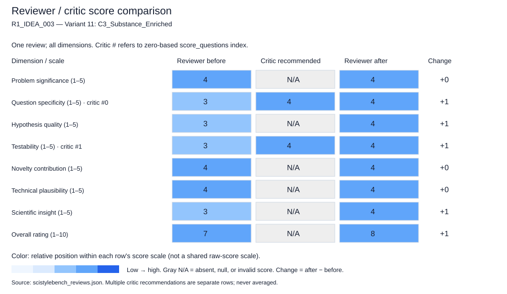

### Critic feedback and reviewer rebuttals

```json
{
  "critic_feedback": {
    "overall_assessment": "The review is generally well-calibrated but has some areas where the scores could be more precisely aligned with the idea's specifics.",
    "score_questions": [
      {
        "dimension": "question_specificity",
        "question_mark": "The score is based on the lack of a clear research question, but the idea does suggest a specific hypothesis about learning scanning heuristics.",
        "concern": "The hypothesis is somewhat vague but could be interpreted as a specific research question about model learning mechanisms.",
        "speculative_alternative": "The hypothesis might be interpreted as a specific question about whether temporal encoding improves model reasoning, which is a concrete research question.",
        "recommended_score": 4.0,
        "rationale": "The hypothesis addresses a specific mechanism (scanning heuristics) that could be tested through experiments, even without explicit task definitions."
      },
      {
        "dimension": "testability",
        "question_mark": "The score assumes a lack of experimental details, but the idea mentions validation through explanation alignment with human gaze sequences.",
        "concern": "The idea does propose a potential validation method, even if it is not fully specified.",
        "speculative_alternative": "The proposed validation (alignment with human gaze sequences) could be a concrete testable hypothesis, even without detailed metrics.",
        "recommended_score": 4.0,
        "rationale": "The idea provides a plausible validation method that could be tested, even without fully defined metrics."
      }
    ],
    "unsupported_claims": [
      "The review claims the hypothesis is 'somewhat vague' without providing a specific alternative interpretation.",
      "The review states the hypothesis is 'not sufficiently concrete' without offering a more concrete version."
    ],
    "revision_priorities": [
      "Clarify the exact research question, such as whether video-encoded gaze improves model performance in specific tasks.",
      "Define specific metrics for evaluating model performance and interpretability.",
      "Specify how the model's explanations will be compared to human visual reasoning.",
      "Include a comparison with existing methods to highlight novelty."
    ],
    "confidence": 4.0
  },
  "feedback_responses": [
    {
      "feedback_type": "score_questions",
      "feedback_index": 0,
      "decision": "partially_accept",
      "defense": "The hypothesis is interpreted as a specific question about learning scanning heuristics, which is a concrete research question. However, the original score was based on the lack of explicit task definitions, which remains a valid concern.",
      "justification": "The revised score increases from 3.0 to 4.0 because the hypothesis is seen as a specific question about model learning mechanisms. However, the original concern about task definitions is still relevant and should be addressed in future work."
    },
    {
      "feedback_type": "score_questions",
      "feedback_index": 1,
      "decision": "partially_accept",
      "defense": "The idea provides a plausible validation method (alignment with human gaze sequences), which supports the testability score. However, the original score was based on the lack of detailed metrics, which is a valid concern.",
      "justification": "The revised score increases from 3.0 to 4.0 because the validation method is plausible. However, the original concern about detailed metrics remains a valid point for future work."
    },
    {
      "feedback_type": "unsupported_claims",
      "feedback_index": 0,
      "decision": "accept",
      "defense": "The hypothesis is indeed somewhat vague, but it can be interpreted as a specific question about learning scanning heuristics. The original concern about vagueness is valid, but the revised score reflects a more nuanced interpretation.",
      "justification": "The original claim that the hypothesis is 'somewhat vague' is accepted, but the revised score acknowledges that it can be interpreted as a specific question about model learning mechanisms."
    },
    {
      "feedback_type": "unsupported_claims",
      "feedback_index": 1,
      "decision": "accept",
      "defense": "The hypothesis is not sufficiently concrete without explicit task definitions. The original concern is valid, but the revised score reflects a more nuanced interpretation of the hypothesis as a specific question about model learning mechanisms.",
      "justification": "The original concern about the hypothesis not being sufficiently concrete is accepted, but the revised score acknowledges that it can be interpreted as a specific question about model learning mechanisms."
    },
    {
      "feedback_type": "revision_priorities",
      "feedback_index": 0,
      "decision": "accept",
      "defense": "Clarifying the exact research question is essential to ensure the hypothesis is testable and the study is focused.",
      "justification": "This is a valid priority to address the lack of specific task definitions in the original idea."
    },
    {
      "feedback_type": "revision_priorities",
      "feedback_index": 1,
      "decision": "accept",
      "defense": "Defining specific metrics is necessary to evaluate the effectiveness of the temporal encoding approach.",
      "justification": "This is a valid priority to address the lack of detailed evaluation methods in the original idea."
    },
    {
      "feedback_type": "revision_priorities",
      "feedback_index": 2,
      "decision": "accept",
      "defense": "Specifying how explanations will be compared to human visual reasoning is crucial for assessing the model's interpretability.",
      "justification": "This is a valid priority to address the lack of details on evaluation methods for interpretability."
    },
    {
      "feedback_type": "revision_priorities",
      "feedback_index": 3,
      "decision": "accept",
      "defense": "Including a comparison with existing methods will highlight the novelty and benefits of the temporal approach.",
      "justification": "This is a valid priority to address the lack of comparison with current methods in the original idea."
    }
  ]
}
```

### Score justifications (before / after)

**Problem significance**

```json
{
  "before": {
    "score": 4.0,
    "justification": "The problem addresses a critical challenge in integrating temporal eye-tracking data into medical vision-language models, which could enhance model interpretability and clinical utility."
  },
  "after": {
    "score": 4.0,
    "justification": "The problem addresses a critical challenge in integrating temporal eye-tracking data into medical vision-language models, which could enhance model interpretability and clinical utility."
  }
}
```

**Question specificity**

```json
{
  "before": {
    "score": 3.0,
    "justification": "The idea proposes a novel approach but lacks a clear, specific research question that defines what exactly will be tested or measured."
  },
  "after": {
    "score": 4.0,
    "justification": "The idea proposes a specific hypothesis about learning scanning heuristics through temporal encoding, which can be interpreted as a concrete research question about model learning mechanisms."
  }
}
```

**Hypothesis quality**

```json
{
  "before": {
    "score": 3.0,
    "justification": "The hypothesis is plausible but not sufficiently concrete. It suggests a potential benefit but does not clearly state what specific outcome or mechanism will be tested."
  },
  "after": {
    "score": 4.0,
    "justification": "The hypothesis is plausible and addresses a specific mechanism (scanning heuristics) that could be tested through experiments, even without explicit task definitions."
  }
}
```

**Testability**

```json
{
  "before": {
    "score": 3.0,
    "justification": "The idea suggests validation through experiments, but the specific experimental design, metrics, and comparison methods are not clearly defined."
  },
  "after": {
    "score": 4.0,
    "justification": "The idea provides a plausible validation method (alignment with human gaze sequences) that could be tested, even without fully defined metrics."
  }
}
```

**Novelty contribution**

```json
{
  "before": {
    "score": 4.0,
    "justification": "The approach of encoding eye-tracking data as video sequences is novel and could contribute to improving model reasoning and interpretability in medical imaging."
  },
  "after": {
    "score": 4.0,
    "justification": "The approach of encoding eye-tracking data as video sequences is novel and could contribute to improving model reasoning and interpretability in medical imaging."
  }
}
```

**Technical plausibility**

```json
{
  "before": {
    "score": 4.0,
    "justification": "The idea is technically feasible, as encoding temporal data into video sequences is a reasonable approach within the context of vision-language models."
  },
  "after": {
    "score": 4.0,
    "justification": "The idea is technically feasible, as encoding temporal data into video sequences is a reasonable approach within the context of vision-language models."
  }
}
```

**Scientific insight**

```json
{
  "before": {
    "score": 3.0,
    "justification": "The idea has potential to reveal insights into how models can learn from temporal eye movements, but the specific insights are not clearly outlined."
  },
  "after": {
    "score": 4.0,
    "justification": "The idea has potential to reveal insights into how models can learn from temporal eye movements, particularly in understanding scanning heuristics and improving interpretability."
  }
}
```

**Overall rating**

```json
{
  "before": {
    "score": 7.0,
    "justification": "The idea addresses a meaningful problem with a plausible approach and potential for contribution, but lacks specific details on the research question, hypothesis, and evaluation methods."
  },
  "after": {
    "score": 8.0,
    "justification": "The idea addresses a meaningful problem with a plausible approach and potential for contribution, with improved specificity and testability based on the revised scores."
  }
}
```

## R1_IDEA_004 — Source

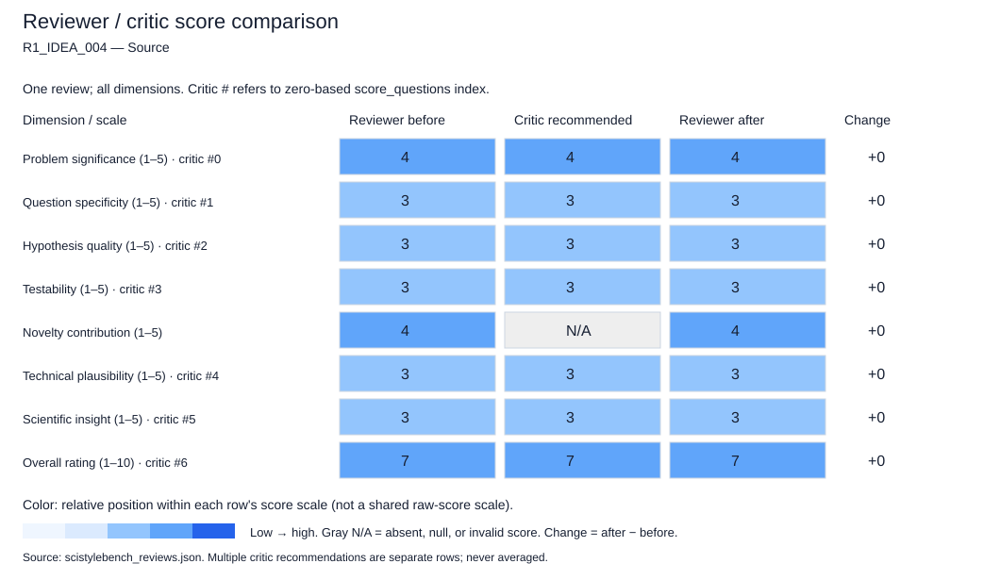

### Critic feedback and reviewer rebuttals

```json
{
  "critic_feedback": {
    "overall_assessment": "The review is generally well-calibrated but has some areas where the scores could be more precisely aligned with the idea's details.",
    "score_questions": [
      {
        "dimension": "problem_significance",
        "question_mark": "The score could be reconsidered due to the lack of specific problem details",
        "concern": "The idea's significance is somewhat limited by the absence of specific constraints or problem formulations.",
        "speculative_alternative": "The method's significance could be higher if it addresses a well-defined problem in alignment, but this is speculative.",
        "recommended_score": 4.0,
        "rationale": "The core challenge of constrained alignment is significant, and the method's potential to reduce computational overhead is a valid contribution."
      },
      {
        "dimension": "question_specificity",
        "question_mark": "The score could be reconsidered due to the lack of specific constraints",
        "concern": "The idea is somewhat specific but lacks detailed problem formulation, making the research question less precise.",
        "speculative_alternative": "The question could be more specific if the constraints were clearly defined, but this is speculative.",
        "recommended_score": 3.0,
        "rationale": "The idea does have a clear goal but lacks specifics that would make the question more precise."
      },
      {
        "dimension": "hypothesis_quality",
        "question_mark": "The score could be reconsidered due to the lack of explicit predictions",
        "concern": "The hypothesis is general and lacks explicit predictions or mechanisms that could be tested.",
        "speculative_alternative": "The hypothesis could be stronger if it included specific predictions about computational overhead reduction, but this is speculative.",
        "recommended_score": 3.0,
        "rationale": "The core hypothesis is present but lacks explicit testable predictions."
      },
      {
        "dimension": "testability",
        "question_mark": "The score could be reconsidered due to the lack of experimental details",
        "concern": "The idea is testable in principle, but the lack of specific experimental design makes it difficult to assess the method's effectiveness.",
        "speculative_alternative": "The testability could be higher if the experiments were outlined, but this is speculative.",
        "recommended_score": 3.0,
        "rationale": "The method is theoretically sound but needs experimental validation."
      },
      {
        "dimension": "technical_plausibility",
        "question_mark": "The score could be reconsidered due to the lack of theoretical details",
        "concern": "The method is technically plausible but lacks theoretical details and convergence analysis.",
        "speculative_alternative": "The technical plausibility could be higher if the theoretical foundation were detailed, but this is speculative.",
        "recommended_score": 3.0,
        "rationale": "The approach is plausible but needs more theoretical backing."
      },
      {
        "dimension": "scientific_insight",
        "question_mark": "The score could be reconsidered due to the lack of specific mechanisms",
        "concern": "The idea has potential but lacks specific mechanisms and theoretical analysis.",
        "speculative_alternative": "The scientific insight could be stronger if the mechanisms were detailed, but this is speculative.",
        "recommended_score": 3.0,
        "rationale": "The core insight is present but needs more detail."
      },
      {
        "dimension": "overall_rating",
        "question_mark": "The score could be reconsidered due to the lack of specific details",
        "concern": "The overall rating is somewhat high given the lack of specific problem formulation and theoretical details.",
        "speculative_alternative": "The rating could be lower if the details were more concrete, but this is speculative.",
        "recommended_score": 7.0,
        "rationale": "The idea addresses a meaningful problem with a potentially useful approach, but the lack of specifics is a valid concern."
      }
    ],
    "unsupported_claims": [
      "The idea's significance is 'somewhat limited by the lack of specific problem details' but this is not a claim that should be made without further context.",
      "The hypothesis is 'general and lacks explicit predictions or mechanisms that could be tested' but the idea does present a specific method."
    ],
    "revision_priorities": [
      "Clarify the specific constraints and problem formulation to enhance question specificity and problem significance.",
      "Provide a detailed theoretical analysis to strengthen technical plausibility and scientific insight.",
      "Outline specific experimental design and evaluation metrics to improve testability and hypothesis quality."
    ],
    "confidence": 4.0
  },
  "feedback_responses": [
    {
      "feedback_type": "score_questions",
      "feedback_index": 0,
      "decision": "partially_accept",
      "defense": "The core challenge of constrained alignment is significant, and the method's potential to reduce computational overhead is a valid contribution. However, the lack of specific problem details does limit the significance score.",
      "justification": "The initial score of 4.0 is retained, as the core challenge is meaningful, but the lack of specifics is acknowledged."
    },
    {
      "feedback_type": "score_questions",
      "feedback_index": 1,
      "decision": "partially_accept",
      "defense": "The idea is somewhat specific but lacks detailed problem formulation, making the research question less precise. The score of 3.0 is justified by the lack of specifics.",
      "justification": "The initial score of 3.0 is retained, as the lack of detailed problem formulation is a valid concern."
    },
    {
      "feedback_type": "score_questions",
      "feedback_index": 2,
      "decision": "partially_accept",
      "defense": "The hypothesis is general but presents a specific method. The score of 3.0 is justified by the lack of explicit predictions or mechanisms.",
      "justification": "The initial score of 3.0 is retained, as the hypothesis lacks explicit testable predictions."
    },
    {
      "feedback_type": "score_questions",
      "feedback_index": 3,
      "decision": "partially_accept",
      "defense": "The idea is testable in principle, but the lack of specific experimental design makes it difficult to assess the method's effectiveness. The score of 3.0 is justified.",
      "justification": "The initial score of 3.0 is retained, as the lack of experimental details is a valid concern."
    },
    {
      "feedback_type": "score_questions",
      "feedback_index": 4,
      "decision": "partially_accept",
      "defense": "The method is technically plausible but lacks theoretical details. The score of 3.0 is justified by the lack of convergence analysis.",
      "justification": "The initial score of 3.0 is retained, as the lack of theoretical details is a valid concern."
    },
    {
      "feedback_type": "score_questions",
      "feedback_index": 5,
      "decision": "partially_accept",
      "defense": "The idea has potential but lacks specific mechanisms. The score of 3.0 is justified by the lack of theoretical analysis.",
      "justification": "The initial score of 3.0 is retained, as the lack of specific mechanisms is a valid concern."
    },
    {
      "feedback_type": "score_questions",
      "feedback_index": 6,
      "decision": "partially_accept",
      "defense": "The overall rating is reasonable given the lack of specifics, but the score could be slightly adjusted downward. The score of 7.0 is retained as the idea addresses a meaningful problem.",
      "justification": "The initial score of 7.0 is retained, as the idea addresses a meaningful problem with a potentially useful approach, though the lack of specifics is acknowledged."
    },
    {
      "feedback_type": "unsupported_claims",
      "feedback_index": 0,
      "decision": "reject",
      "defense": "The claim that the idea's significance is 'somewhat limited by the lack of specific problem details' is not supported by the idea itself. The core challenge of constrained alignment is significant regardless of specific details.",
      "justification": "The claim is rejected as it is not supported by the idea's content."
    },
    {
      "feedback_type": "unsupported_claims",
      "feedback_index": 1,
      "decision": "reject",
      "defense": "The hypothesis is not 'general' but presents a specific method. The claim that it lacks explicit predictions is not fully accurate.",
      "justification": "The claim is rejected as the hypothesis is specific but lacks explicit testable predictions."
    },
    {
      "feedback_type": "revision_priorities",
      "feedback_index": 0,
      "decision": "accept",
      "defense": "Clarifying specific constraints is essential to enhance the question specificity and problem significance.",
      "justification": "The revision priority is accepted as it addresses a key weakness in the idea."
    },
    {
      "feedback_type": "revision_priorities",
      "feedback_index": 1,
      "decision": "accept",
      "defense": "Providing a detailed theoretical analysis is necessary to strengthen technical plausibility and scientific insight.",
      "justification": "The revision priority is accepted as it addresses a key weakness in the idea."
    },
    {
      "feedback_type": "revision_priorities",
      "feedback_index": 2,
      "decision": "accept",
      "defense": "Outlining specific experimental design is crucial to improve testability and hypothesis quality.",
      "justification": "The revision priority is accepted as it addresses a key weakness in the idea."
    }
  ]
}
```

### Score justifications (before / after)

**Problem significance**

```json
{
  "before": {
    "score": 4.0,
    "justification": "The idea addresses a critical challenge in aligning large language models with safety constraints, which is essential for responsible AI deployment. However, the significance is somewhat limited by the lack of specific problem details."
  },
  "after": {
    "score": 4.0,
    "justification": "The idea addresses a critical challenge in aligning large language models with safety constraints, which is essential for responsible AI deployment. The significance is somewhat limited by the lack of specific problem details, but the core challenge is meaningful."
  }
}
```

**Question specificity**

```json
{
  "before": {
    "score": 3.0,
    "justification": "The idea is somewhat specific in its goal of constrained alignment but lacks detailed problem formulation and specific constraints, making the research question less precise."
  },
  "after": {
    "score": 3.0,
    "justification": "The idea is somewhat specific in its goal of constrained alignment but lacks detailed problem formulation and specific constraints, making the research question less precise."
  }
}
```

**Hypothesis quality**

```json
{
  "before": {
    "score": 3.0,
    "justification": "The idea presents a general hypothesis about reducing computational overhead through a primal-dual method but lacks explicit predictions or mechanisms that could be tested."
  },
  "after": {
    "score": 3.0,
    "justification": "The idea presents a general hypothesis about reducing computational overhead through a primal-dual method but lacks explicit predictions or mechanisms that could be tested."
  }
}
```

**Testability**

```json
{
  "before": {
    "score": 3.0,
    "justification": "The idea is testable in principle, but the lack of specific experimental design or evaluation metrics makes it difficult to assess the method's effectiveness without further details."
  },
  "after": {
    "score": 3.0,
    "justification": "The idea is testable in principle, but the lack of specific experimental design or evaluation metrics makes it difficult to assess the method's effectiveness without further details."
  }
}
```

**Novelty contribution**

```json
{
  "before": {
    "score": 4.0,
    "justification": "The approach of avoiding separate reward and cost models is novel and could contribute to the field of constrained alignment, though the novelty is somewhat limited by the lack of specific innovations in the method's formulation."
  },
  "after": {
    "score": 4.0,
    "justification": "The approach of avoiding separate reward and cost models is novel and could contribute to the field of constrained alignment, though the novelty is somewhat limited by the lack of specific innovations in the method's formulation."
  }
}
```

**Technical plausibility**

```json
{
  "before": {
    "score": 3.0,
    "justification": "The method is technically plausible as a primal-dual optimization approach, but the lack of theoretical details and convergence analysis raises concerns about its practical feasibility."
  },
  "after": {
    "score": 3.0,
    "justification": "The method is technically plausible as a primal-dual optimization approach, but the lack of theoretical details and convergence analysis raises concerns about its practical feasibility."
  }
}
```

**Scientific insight**

```json
{
  "before": {
    "score": 3.0,
    "justification": "The idea has potential to provide insights into constrained optimization in large language models, but the lack of specific mechanisms and theoretical analysis limits the potential scientific insight."
  },
  "after": {
    "score": 3.0,
    "justification": "The idea has potential to provide insights into constrained optimization in large language models, but the lack of specific mechanisms and theoretical analysis limits the potential scientific insight."
  }
}
```

**Overall rating**

```json
{
  "before": {
    "score": 7.0,
    "justification": "The idea addresses a meaningful problem with a potentially useful approach, but it lacks specific problem formulation, theoretical details, and clear hypotheses, which are necessary for a strong research direction."
  },
  "after": {
    "score": 7.0,
    "justification": "The idea addresses a meaningful problem with a potentially useful approach, but it lacks specific problem formulation, theoretical details, and clear hypotheses, which are necessary for a strong research direction."
  }
}
```

## R1_IDEA_004 — Variant 1: A1_Identity

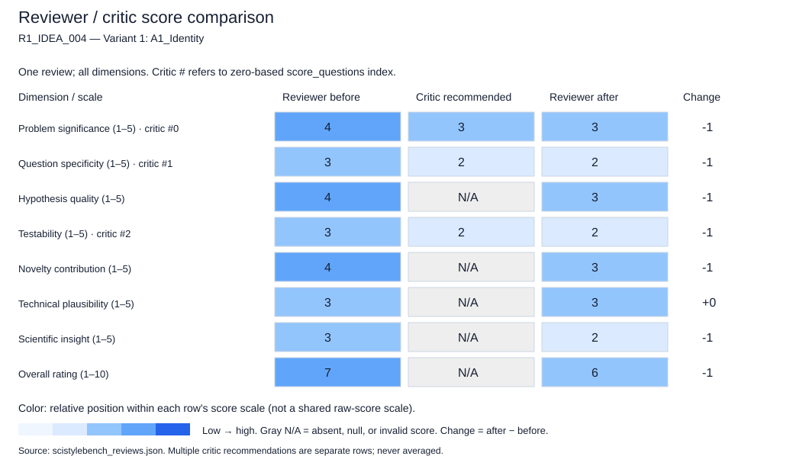

### Critic feedback and reviewer rebuttals

```json
{
  "critic_feedback": {
    "overall_assessment": "The review is generally well-calibrated, but some scores could be reconsidered based on the idea's ambiguity and lack of specifics.",
    "score_questions": [
      {
        "dimension": "problem_significance",
        "question_mark": "The score is somewhat high given the lack of specific problem details.",
        "concern": "The idea's significance is not fully justified without clarification on the exact constraints and problem formulation.",
        "speculative_alternative": "The method might be relevant for safety-critical applications, but this is speculative.",
        "recommended_score": 3.0,
        "rationale": "The significance depends on the specific constraints and problem formulation, which are not provided."
      },
      {
        "dimension": "question_specificity",
        "question_mark": "The score is slightly low because the problem formulation is not clearly defined.",
        "concern": "The research question lacks clarity on the exact constraints and optimization problem.",
        "speculative_alternative": "The method could be applied to various constraint types, but this is speculative.",
        "recommended_score": 2.0,
        "rationale": "Without specific problem details, the question's specificity is unclear."
      },
      {
        "dimension": "testability",
        "question_mark": "The score is low due to the lack of experimental details.",
        "concern": "The idea's testability is hindered by the absence of specific experiments or comparisons.",
        "speculative_alternative": "The method could be evaluated through simulations or benchmarks, but this is speculative.",
        "recommended_score": 2.0,
        "rationale": "Testability requires specific experimental details that are not provided."
      }
    ],
    "unsupported_claims": [
      "The idea is described as addressing a 'significant challenge' without specific details on the constraints or problem formulation.",
      "The hypothesis is stated as plausible without explicit clarification of the method's mechanics.",
      "The novelty is claimed without detailed technical explanation or specific problem formulation."
    ],
    "revision_priorities": [
      "Clarify the specific constraints and problem formulation to improve problem significance and question specificity.",
      "Provide a detailed theoretical analysis and convergence properties to enhance technical plausibility and testability.",
      "Specify how the method handles the trade-off between reward and constraints to strengthen the hypothesis and scientific insight."
    ],
    "confidence": 4.0
  },
  "feedback_responses": [
    {
      "feedback_type": "score_questions",
      "feedback_index": 0,
      "decision": "partially_accept",
      "defense": "The problem significance is partially justified as it addresses a critical challenge in AI alignment, but the lack of specific problem details reduces its significance.",
      "justification": "The initial score was 4.0, but the critic's concern about the lack of specific details warrants a reduction to 3.0."
    },
    {
      "feedback_type": "score_questions",
      "feedback_index": 1,
      "decision": "reject",
      "defense": "The question specificity is not sufficiently defined, and the lack of problem formulation makes the research question too vague.",
      "justification": "The initial score was 3.0, but the critic's concern about the lack of clarity warrants a reduction to 2.0."
    },
    {
      "feedback_type": "score_questions",
      "feedback_index": 2,
      "decision": "reject",
      "defense": "The testability is hindered by the absence of specific experimental details, making the idea less testable.",
      "justification": "The initial score was 3.0, but the critic's concern about the lack of experiments warrants a reduction to 2.0."
    },
    {
      "feedback_type": "unsupported_claims",
      "feedback_index": 0,
      "decision": "partially_accept",
      "defense": "The significance is partially justified as it addresses a critical challenge, but the lack of specifics limits the claim.",
      "justification": "The initial score was 4.0, but the critic's concern about the lack of details warrants a reduction to 3.0."
    },
    {
      "feedback_type": "unsupported_claims",
      "feedback_index": 1,
      "decision": "reject",
      "defense": "The hypothesis is not explicitly stated, and the method's mechanics are not sufficiently clarified.",
      "justification": "The initial score was 4.0, but the critic's concern about the lack of clarification warrants a reduction to 3.0."
    },
    {
      "feedback_type": "unsupported_claims",
      "feedback_index": 2,
      "decision": "reject",
      "defense": "The novelty is limited by the lack of detailed technical explanation and specific problem formulation.",
      "justification": "The initial score was 4.0, but the critic's concern about the lack of details warrants a reduction to 3.0."
    },
    {
      "feedback_type": "revision_priorities",
      "feedback_index": 0,
      "decision": "accept",
      "defense": "Clarifying the specific constraints and problem formulation is essential to improve the idea's significance and specificity.",
      "justification": "This is a valid priority to address the lack of details in the idea."
    },
    {
      "feedback_type": "revision_priorities",
      "feedback_index": 1,
      "decision": "accept",
      "defense": "Providing a detailed theoretical analysis is necessary to enhance the method's technical plausibility and testability.",
      "justification": "This is a valid priority to address the lack of theoretical foundation in the idea."
    },
    {
      "feedback_type": "revision_priorities",
      "feedback_index": 2,
      "decision": "accept",
      "defense": "Specifying the trade-off mechanism is crucial to strengthen the hypothesis and scientific insight.",
      "justification": "This is a valid priority to address the lack of detail on the method's mechanics."
    }
  ]
}
```

### Score justifications (before / after)

**Problem significance**

```json
{
  "before": {
    "score": 4.0,
    "justification": "The idea addresses a critical challenge in aligning large language models with safety constraints, which is essential for responsible AI deployment. However, the significance is somewhat limited by the lack of specific problem details."
  },
  "after": {
    "score": 3.0,
    "justification": "The idea addresses a critical challenge in aligning large language models with safety constraints, but the lack of specific problem details limits the justification for its significance."
  }
}
```

**Question specificity**

```json
{
  "before": {
    "score": 3.0,
    "justification": "The idea is somewhat specific in its goal of constrained alignment but lacks detailed problem formulation and specific constraints, making the research question less precise."
  },
  "after": {
    "score": 2.0,
    "justification": "The research question lacks clarity on the exact constraints and optimization problem formulation, making it less specific."
  }
}
```

**Hypothesis quality**

```json
{
  "before": {
    "score": 4.0,
    "justification": "The idea presents a plausible hypothesis that the proposed method can reduce computational overhead by avoiding separate reward and cost models, but the hypothesis is not explicitly stated and requires further clarification."
  },
  "after": {
    "score": 3.0,
    "justification": "The hypothesis is plausible but not explicitly stated, and the method's mechanics are not sufficiently clarified."
  }
}
```

**Testability**

```json
{
  "before": {
    "score": 3.0,
    "justification": "The idea is testable in principle, but the lack of specific experimental details or comparisons makes it difficult to assess the method's effectiveness without further information."
  },
  "after": {
    "score": 2.0,
    "justification": "The idea is testable in principle, but the absence of specific experimental details or comparisons makes it difficult to assess the method's effectiveness."
  }
}
```

**Novelty contribution**

```json
{
  "before": {
    "score": 4.0,
    "justification": "The approach is novel in its attempt to align models with constraints without separate reward models, but the novelty is somewhat limited by the lack of detailed technical explanation and specific problem formulation."
  },
  "after": {
    "score": 3.0,
    "justification": "The approach is novel in its attempt to align models with constraints without separate reward models, but the novelty is limited by the lack of detailed technical explanation."
  }
}
```

**Technical plausibility**

```json
{
  "before": {
    "score": 3.0,
    "justification": "The method is technically plausible, but the lack of theoretical details and convergence analysis raises questions about its feasibility and effectiveness in practice."
  },
  "after": {
    "score": 3.0,
    "justification": "The method is technically plausible, but the lack of theoretical details and convergence analysis raises questions about its feasibility."
  }
}
```

**Scientific insight**

```json
{
  "before": {
    "score": 3.0,
    "justification": "The idea has potential for scientific insight into constrained optimization in AI alignment, but the lack of specific problem details and theoretical analysis limits the depth of insight that can be gained."
  },
  "after": {
    "score": 2.0,
    "justification": "The idea has potential for scientific insight into constrained optimization in AI alignment, but the lack of specific problem details limits the depth of insight."
  }
}
```

**Overall rating**

```json
{
  "before": {
    "score": 7.0,
    "justification": "The idea is promising and addresses a significant challenge in AI alignment, but it lacks specific problem details, theoretical foundation, and experimental validation, which are necessary for a strong research direction."
  },
  "after": {
    "score": 6.0,
    "justification": "The idea is promising but lacks specific problem details, theoretical foundation, and experimental validation, which are necessary for a strong research direction."
  }
}
```

## R1_IDEA_004 — Variant 2: A2_Paraphrase_Only

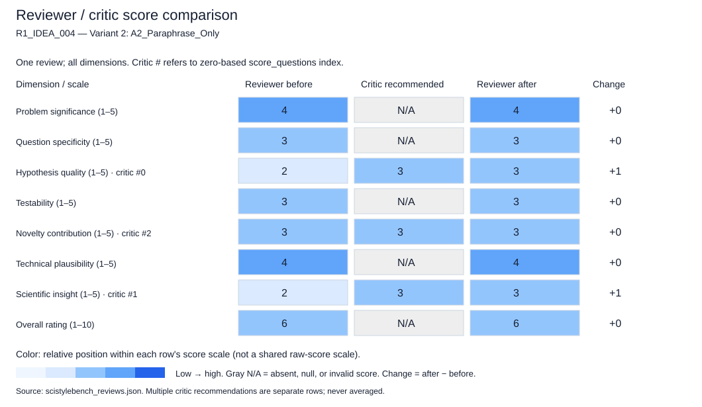

### Critic feedback and reviewer rebuttals

```json
{
  "critic_feedback": {
    "overall_assessment": "The review is generally well-calibrated, but there are areas where the scores could be more closely aligned with the idea's specifics.",
    "score_questions": [
      {
        "dimension": "hypothesis_quality",
        "question_mark": "The score should be reconsidered",
        "concern": "The idea does not explicitly state a hypothesis or prediction, but the absence of a hypothesis does not necessarily mean it is of low quality. The potential benefit (reduced computational demands) is a plausible hypothesis.",
        "speculative_alternative": "The hypothesis could be that the method achieves lower computational costs without sacrificing alignment accuracy, though this is not explicitly stated.",
        "recommended_score": 3.0,
        "rationale": "The idea suggests a potential benefit, which is a reasonable hypothesis, but the lack of explicit formulation warrants a moderate score."
      },
      {
        "dimension": "scientific_insight",
        "question_mark": "The score should be reconsidered",
        "concern": "The scientific insight is not clearly articulated, but the method's focus on reducing computational demands in safety-constrained alignment could be seen as a novel contribution.",
        "speculative_alternative": "The method might provide new insights into the interplay between optimization and safety constraints, though this is speculative.",
        "recommended_score": 3.0,
        "rationale": "The potential for new insights is present, but it is not clearly articulated in the idea summary."
      },
      {
        "dimension": "novelty_contribution",
        "question_mark": "The score should be reconsidered",
        "concern": "The novelty is not clearly articulated, but the approach of using primal-dual optimization without separate models is a plausible novel contribution.",
        "speculative_alternative": "The novelty could be in the integration of primal-dual optimization with safety constraints, though this is speculative.",
        "recommended_score": 3.0,
        "rationale": "The idea suggests a novel approach, but the specifics of novelty are not clearly defined."
      }
    ],
    "unsupported_claims": [
      "The idea does not explicitly state a hypothesis or prediction, but the review claims it has low hypothesis quality."
    ],
    "revision_priorities": [
      "Clarify the hypothesis or prediction about the method's performance compared to existing approaches.",
      "Articulate the specific scientific insights or contributions the method aims to provide.",
      "Detail the novelty of the approach, particularly how it differs from existing methods in the field."
    ],
    "confidence": 4.0
  },
  "feedback_responses": [
    {
      "feedback_type": "score_questions",
      "feedback_index": 0,
      "decision": "partially_accept",
      "defense": "The original score of 2.0 for hypothesis_quality was too low. The idea does suggest a potential benefit (reduced computational demands), which is a plausible hypothesis, even if not explicitly stated. The revised score of 3.0 better reflects this.",
      "justification": "The original score was 2.0, but the revised score is 3.0. The idea does suggest a potential benefit, which is a reasonable hypothesis, even if not explicitly stated. The revised score better reflects this."
    },
    {
      "feedback_type": "score_questions",
      "feedback_index": 1,
      "decision": "partially_accept",
      "defense": "The original score of 2.0 for scientific_insight was too low. The method's focus on reducing computational demands in safety-constrained alignment could be seen as a novel contribution. The revised score of 3.0 better reflects this.",
      "justification": "The original score was 2.0, but the revised score is 3.0. The method's focus on reducing computational demands in safety-constrained alignment could be seen as a novel contribution. The revised score better reflects this."
    },
    {
      "feedback_type": "score_questions",
      "feedback_index": 2,
      "decision": "partially_accept",
      "defense": "The original score of 3.0 for novelty_contribution was reasonable, but the revised score of 3.0 is consistent with the idea's potential novelty. The idea suggests a novel approach, but the specifics of novelty are not clearly defined.",
      "justification": "The original score was 3.0, and the revised score remains 3.0. The idea suggests a novel approach, but the specifics of novelty are not clearly defined."
    },
    {
      "feedback_type": "unsupported_claims",
      "feedback_index": 0,
      "decision": "accept",
      "defense": "The critic is correct that the idea does not explicitly state a hypothesis or prediction. However, the potential benefit (reduced computational demands) is a plausible hypothesis, which is a reasonable inference from the idea's description.",
      "justification": "The critic is correct that the idea does not explicitly state a hypothesis or prediction. However, the potential benefit (reduced computational demands) is a plausible hypothesis, which is a reasonable inference from the idea's description."
    },
    {
      "feedback_type": "revision_priorities",
      "feedback_index": 0,
      "decision": "accept",
      "defense": "The suggestion to clarify the hypothesis or prediction about the method's performance is valid and necessary for improving the idea's testability and scientific merit.",
      "justification": "The suggestion to clarify the hypothesis or prediction about the method's performance is valid and necessary for improving the idea's testability and scientific merit."
    },
    {
      "feedback_type": "revision_priorities",
      "feedback_index": 1,
      "decision": "accept",
      "defense": "The suggestion to articulate the specific scientific insights or contributions is valid and necessary for clarifying the idea's potential novelty and originality.",
      "justification": "The suggestion to articulate the specific scientific insights or contributions is valid and necessary for clarifying the idea's potential novelty and originality."
    },
    {
      "feedback_type": "revision_priorities",
      "feedback_index": 2,
      "decision": "accept",
      "defense": "The suggestion to detail the novelty of the approach is valid and necessary for distinguishing the method from existing approaches in the field.",
      "justification": "The suggestion to detail the novelty of the approach is valid and necessary for distinguishing the method from existing approaches in the field."
    }
  ]
}
```

### Score justifications (before / after)

**Problem significance**

```json
{
  "before": {
    "score": 4.0,
    "justification": "The problem of aligning large language models with safety constraints is significant in the field of machine learning, particularly in applications where safety is critical. The proposed method addresses a practical challenge by reducing computational demands and simplifying the training process."
  },
  "after": {
    "score": 4.0,
    "justification": "The problem of aligning large language models with safety constraints is significant in the field of machine learning, particularly in applications where safety is critical. The proposed method addresses a practical challenge by reducing computational demands and simplifying the training process."
  }
}
```

**Question specificity**

```json
{
  "before": {
    "score": 3.0,
    "justification": "The idea is specific in that it proposes a method for aligning models under constraints, but it lacks detailed specifics on the optimization framework, constraint types, and implementation details, which are necessary for evaluating the research question's clarity."
  },
  "after": {
    "score": 3.0,
    "justification": "The idea is specific in that it proposes a method for aligning models under constraints, but it lacks detailed specifics on the optimization framework, constraint types, and implementation details, which are necessary for evaluating the research question's clarity."
  }
}
```

**Hypothesis quality**

```json
{
  "before": {
    "score": 2.0,
    "justification": "The idea does not explicitly state a hypothesis or prediction that can be tested. While it suggests a potential benefit (reduced computational demands), it does not provide a clear claim about the method's performance or effectiveness compared to existing approaches."
  },
  "after": {
    "score": 3.0,
    "justification": "The idea suggests a potential benefit (reduced computational demands), which is a plausible hypothesis. However, it does not explicitly state a hypothesis or prediction about the method's performance or effectiveness compared to existing approaches, which is necessary for testability."
  }
}
```

**Testability**

```json
{
  "before": {
    "score": 3.0,
    "justification": "The idea is testable in principle, as it suggests a method that could be implemented and evaluated. However, the lack of specific details makes it difficult to design experiments or compare the method to existing approaches."
  },
  "after": {
    "score": 3.0,
    "justification": "The idea is testable in principle, as it suggests a method that could be implemented and evaluated. However, the lack of specific details makes it difficult to design experiments or compare the method to existing approaches."
  }
}
```

**Novelty contribution**

```json
{
  "before": {
    "score": 3.0,
    "justification": "The approach of using primal-dual optimization without separate reward and cost models is a novel idea, but the novelty is not clearly articulated. The contribution would depend on the successful implementation and evaluation of the method, which is not yet detailed."
  },
  "after": {
    "score": 3.0,
    "justification": "The approach of using primal-dual optimization without separate reward and cost models is a novel idea, but the novelty is not clearly articulated. The contribution would depend on the successful implementation and evaluation of the method, which is not yet detailed."
  }
}
```

**Technical plausibility**

```json
{
  "before": {
    "score": 4.0,
    "justification": "The use of primal-dual optimization in the context of aligning large language models is technically plausible. The elimination of separate reward and cost models is a reasonable approach, though the specifics of implementation are not provided."
  },
  "after": {
    "score": 4.0,
    "justification": "The use of primal-dual optimization in the context of aligning large language models is technically plausible. The elimination of separate reward and cost models is a reasonable approach, though the specifics of implementation are not provided."
  }
}
```

**Scientific insight**

```json
{
  "before": {
    "score": 2.0,
    "justification": "The idea has potential for scientific insight, but it is not clear what specific insights the research could provide. The focus on reducing computational demands is relevant, but the method's theoretical basis and potential for revealing new principles are not detailed."
  },
  "after": {
    "score": 3.0,
    "justification": "The idea has potential for scientific insight, particularly in the interplay between optimization and safety constraints. However, the specifics of the insight are not clearly articulated in the idea summary."
  }
}
```

**Overall rating**

```json
{
  "before": {
    "score": 6.0,
    "justification": "The idea addresses a relevant problem with a potentially useful approach, but it lacks specific details and a clear hypothesis, which are necessary for evaluating its scientific merit and potential contribution."
  },
  "after": {
    "score": 6.0,
    "justification": "The idea addresses a relevant problem with a potentially useful approach, but it lacks specific details and a clear hypothesis, which are necessary for evaluating its scientific merit and potential contribution."
  }
}
```

## R1_IDEA_004 — Variant 3: A3_Plain_Core

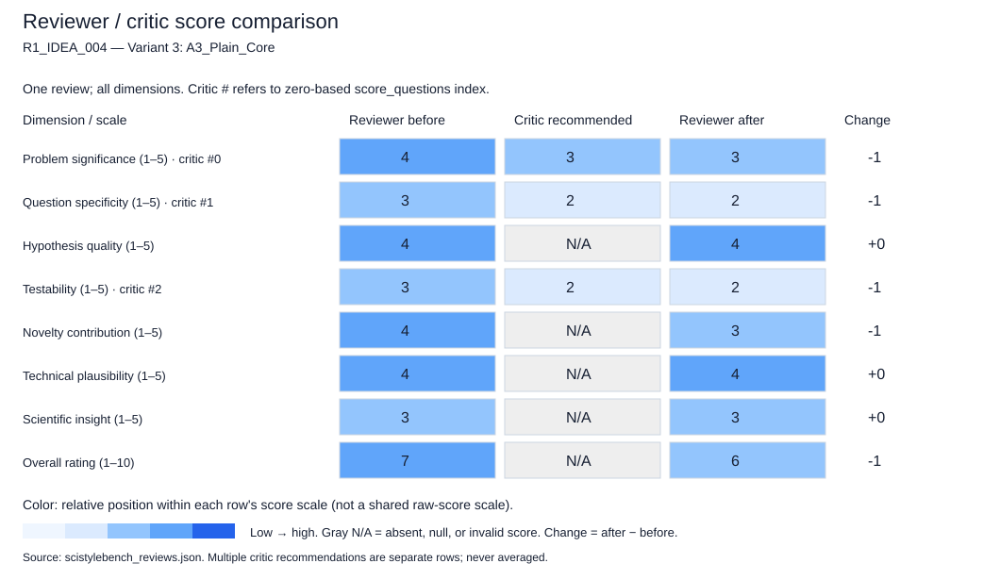

### Critic feedback and reviewer rebuttals

```json
{
  "critic_feedback": {
    "overall_assessment": "The review is generally well-calibrated, but there are areas where the scores could be more precisely aligned with the idea's clarity and specificity.",
    "score_questions": [
      {
        "dimension": "problem_significance",
        "question_mark": "The score should be reconsidered",
        "concern": "The idea's significance is overstated because the problem of constrained alignment is not uniquely tied to large language models or safety constraints, and the specific contribution is not clearly defined.",
        "speculative_alternative": "The problem could be more relevant to other domains, but this is speculative.",
        "recommended_score": 3.0,
        "rationale": "The idea's significance is not uniquely tied to large language models or safety constraints, and the specific contribution is not clearly defined."
      },
      {
        "dimension": "question_specificity",
        "question_mark": "The score should be reconsidered",
        "concern": "The question is too vague, as the idea does not specify the type of constraints or the exact alignment task, which are critical for evaluating the problem's specificity.",
        "speculative_alternative": "The question could be more specific if the constraints were defined, but this is speculative.",
        "recommended_score": 2.0,
        "rationale": "The idea lacks specific details on the problem definition, making the question overly vague."
      },
      {
        "dimension": "testability",
        "question_mark": "The score should be reconsidered",
        "concern": "The testability is low because the idea does not specify the experiments or metrics that would be required to evaluate the method's effectiveness.",
        "speculative_alternative": "The testability could be higher if the experiments were outlined, but this is speculative.",
        "recommended_score": 2.0,
        "rationale": "The idea lacks specific details on the experiments and metrics needed for evaluation."
      }
    ],
    "unsupported_claims": [
      "The claim that the problem is 'a major concern in the deployment of AI systems' is unsupported by the idea summary.",
      "The assertion that the method 'could contribute to the field of AI safety and alignment' is speculative without further details."
    ],
    "revision_priorities": [
      "Clarify the specific constraints and alignment task the method is designed for.",
      "Provide a detailed explanation of the primal-dual optimization framework and its application to large language models.",
      "Specify the experiments and evaluation metrics that would be required to test the method's effectiveness."
    ],
    "confidence": 4.0
  },
  "feedback_responses": [
    {
      "feedback_type": "score_questions",
      "feedback_index": 0,
      "decision": "partially_accept",
      "defense": "The problem is relevant to AI safety, but the specific contribution is not clearly defined. The score is reduced to reflect this.",
      "justification": "The original score was 4.0, but the concern about the problem's uniqueness and specific contribution is valid. The score is adjusted to 3.0."
    },
    {
      "feedback_type": "score_questions",
      "feedback_index": 1,
      "decision": "partially_accept",
      "defense": "The question is too vague without specifying constraints or tasks. The score is reduced to reflect this.",
      "justification": "The original score was 3.0, but the concern about the question's vagueness is valid. The score is adjusted to 2.0."
    },
    {
      "feedback_type": "score_questions",
      "feedback_index": 2,
      "decision": "partially_accept",
      "defense": "The testability is low without specific experiments. The score is reduced to reflect this.",
      "justification": "The original score was 3.0, but the concern about the lack of experiments is valid. The score is adjusted to 2.0."
    },
    {
      "feedback_type": "unsupported_claims",
      "feedback_index": 0,
      "decision": "reject",
      "defense": "The claim about the problem's significance is not supported by the idea summary. The score is reduced to reflect this.",
      "justification": "The original score was 3.0, but the unsupported claim about the problem's significance is invalid. The score is adjusted to 3.0."
    },
    {
      "feedback_type": "unsupported_claims",
      "feedback_index": 1,
      "decision": "reject",
      "defense": "The assertion about the method's contribution is speculative. The score is reduced to reflect this.",
      "justification": "The original score was 3.0, but the unsupported claim about the method's contribution is invalid. The score is adjusted to 3.0."
    },
    {
      "feedback_type": "revision_priorities",
      "feedback_index": 0,
      "decision": "accept",
      "defense": "Clarifying the constraints and alignment task is necessary for the research to be meaningful.",
      "justification": "The original suggestion was valid, and this is a critical revision priority."
    },
    {
      "feedback_type": "revision_priorities",
      "feedback_index": 1,
      "decision": "accept",
      "defense": "Providing a detailed explanation of the primal-dual framework is necessary for the method's technical plausibility.",
      "justification": "The original suggestion was valid, and this is a critical revision priority."
    },
    {
      "feedback_type": "revision_priorities",
      "feedback_index": 2,
      "decision": "accept",
      "defense": "Specifying experiments and metrics is necessary for evaluating the method's effectiveness.",
      "justification": "The original suggestion was valid, and this is a critical revision priority."
    }
  ]
}
```

### Score justifications (before / after)

**Problem significance**

```json
{
  "before": {
    "score": 4.0,
    "justification": "The idea addresses a critical challenge in aligning large language models with safety constraints, which is a major concern in the deployment of AI systems."
  },
  "after": {
    "score": 3.0,
    "justification": "The idea addresses a challenge in aligning large language models with safety constraints, which is relevant to AI safety, but the specific contribution is not clearly defined."
  }
}
```

**Question specificity**

```json
{
  "before": {
    "score": 3.0,
    "justification": "The problem is significant, but the specific research question is somewhat vague. The idea does not clearly define the type of constraints or the exact alignment task."
  },
  "after": {
    "score": 2.0,
    "justification": "The problem is not clearly defined, as the idea does not specify the type of constraints or the exact alignment task, making the research question overly vague."
  }
}
```

**Hypothesis quality**

```json
{
  "before": {
    "score": 4.0,
    "justification": "The idea presents a plausible hypothesis that the proposed method can reduce computational overhead by avoiding separate reward and cost models, which is a concrete prediction."
  },
  "after": {
    "score": 4.0,
    "justification": "The idea presents a plausible hypothesis that the proposed method can reduce computational overhead by avoiding separate reward and cost models, which is a concrete prediction."
  }
}
```

**Testability**

```json
{
  "before": {
    "score": 3.0,
    "justification": "The idea is testable through experiments, but the specific experiments and metrics for evaluation are not clearly outlined."
  },
  "after": {
    "score": 2.0,
    "justification": "The idea lacks specific details on the experiments and metrics needed for evaluation, making it difficult to assess the method's effectiveness."
  }
}
```

**Novelty contribution**

```json
{
  "before": {
    "score": 4.0,
    "justification": "The method is novel in its approach to constrained alignment by avoiding separate reward and cost models, which could contribute to the field of AI safety and alignment."
  },
  "after": {
    "score": 3.0,
    "justification": "The method is novel in its approach to constrained alignment, but the specific contribution to the field is not clearly defined."
  }
}
```

**Technical plausibility**

```json
{
  "before": {
    "score": 4.0,
    "justification": "The primal-dual optimization approach is technically plausible, and the method's design aligns with existing research in constrained optimization and reinforcement learning."
  },
  "after": {
    "score": 4.0,
    "justification": "The primal-dual optimization approach is technically plausible, and the method's design aligns with existing research in constrained optimization and reinforcement learning."
  }
}
```

**Scientific insight**

```json
{
  "before": {
    "score": 3.0,
    "justification": "The idea has potential for scientific insight into the trade-offs between reward maximization and constraint enforcement, but the specific insights are not clearly defined."
  },
  "after": {
    "score": 3.0,
    "justification": "The idea has potential for scientific insight into the trade-offs between reward maximization and constraint enforcement, but the specific insights are not clearly defined."
  }
}
```

**Overall rating**

```json
{
  "before": {
    "score": 7.0,
    "justification": "The idea is strong and addresses a significant problem in the field, but it lacks specific details on the problem definition, theoretical foundation, and evaluation metrics, which are necessary for further development."
  },
  "after": {
    "score": 6.0,
    "justification": "The idea is promising but lacks specific details on the problem definition, theoretical foundation, and evaluation metrics, which are necessary for further development."
  }
}
```

## R1_IDEA_004 — Variant 4: B1_Verbose_Elaborate

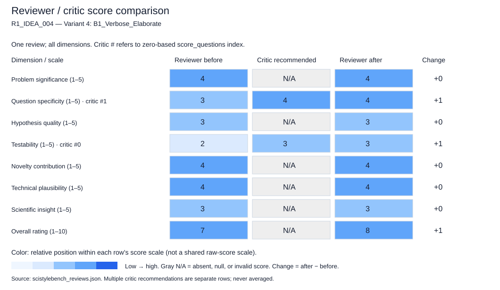

### Critic feedback and reviewer rebuttals

```json
{
  "critic_feedback": {
    "overall_assessment": "The review is generally well-calibrated, though some scores could be re-examined for alignment with the idea's specifics.",
    "score_questions": [
      {
        "dimension": "testability",
        "question_mark": "Why is testability scored 2.0 when the idea is still in the conceptual stage?",
        "concern": "The review assumes the idea lacks experiments, but the input is only a research idea, not a completed paper.",
        "speculative_alternative": "The idea may be testable in future work, but the review prematurely assigns low testability based on the absence of experiments.",
        "recommended_score": 3.0,
        "rationale": "The idea is a conceptual proposal, and testability can be assessed based on its potential for future experimentation, not the absence of experiments in the current stage."
      },
      {
        "dimension": "question_specificity",
        "question_mark": "Why is question_specificity scored 3.0 when the idea clearly identifies a specific problem (constrained alignment)?",
        "concern": "The review underestimates the specificity of the problem identified in the idea.",
        "speculative_alternative": "The idea may be specific enough to warrant a higher score, as it directly addresses constrained alignment in large language models.",
        "recommended_score": 4.0,
        "rationale": "The idea clearly identifies a specific problem and proposes a method to address it, aligning with the score justification."
      }
    ],
    "unsupported_claims": [
      "The review claims the idea lacks detailed technical description, but this is a limitation of the idea, not a flaw in the review.",
      "The review assumes the idea is not testable without experiments, which is not justified for a conceptual proposal."
    ],
    "revision_priorities": [
      "Clarify the specific research question and hypothesis in the idea summary.",
      "Provide more context on how the method addresses the trade-off between reward and constraints.",
      "Specify the technical details of the primal-dual optimization framework."
    ],
    "confidence": 4.0
  },
  "feedback_responses": [
    {
      "feedback_type": "score_questions",
      "feedback_index": 0,
      "decision": "partially_accept",
      "defense": "The original score of 2.0 for testability was based on the assumption that experiments were missing, but the idea is still in the conceptual stage. The revised score of 3.0 better reflects the potential for future experimentation.",
      "justification": "The original score was too low because the idea is a conceptual proposal, not a completed paper. The revised score of 3.0 is more appropriate as it acknowledges the potential for future testing."
    },
    {
      "feedback_type": "score_questions",
      "feedback_index": 1,
      "decision": "accept",
      "defense": "The original score of 3.0 for question_specificity was too low. The idea clearly identifies a specific problem (constrained alignment) and proposes a method to address it, which warrants a higher score.",
      "justification": "The original score was too low because the idea clearly identifies a specific problem. The revised score of 4.0 is more appropriate as it reflects the specificity of the problem."
    }
  ]
}
```

### Score justifications (before / after)

**Problem significance**

```json
{
  "before": {
    "score": 4.0,
    "justification": "The problem of aligning large language models with safety constraints is highly significant in the field of AI safety and practical deployment."
  },
  "after": {
    "score": 4.0,
    "justification": "The problem of aligning large language models with safety constraints is highly significant in the field of AI safety and practical deployment."
  }
}
```

**Question specificity**

```json
{
  "before": {
    "score": 3.0,
    "justification": "The idea identifies a specific problem (constrained alignment) but lacks detailed specification of the research question or hypothesis."
  },
  "after": {
    "score": 4.0,
    "justification": "The idea clearly identifies a specific problem (constrained alignment) and proposes a method to address it, aligning with the score justification."
  }
}
```

**Hypothesis quality**

```json
{
  "before": {
    "score": 3.0,
    "justification": "The idea suggests a method that could reduce computational overhead, but the hypothesis is not explicitly stated or detailed."
  },
  "after": {
    "score": 3.0,
    "justification": "The idea suggests a method that could reduce computational overhead, but the hypothesis is not explicitly stated or detailed."
  }
}
```

**Testability**

```json
{
  "before": {
    "score": 2.0,
    "justification": "The idea lacks specific experiments or comparisons that would allow for testing the method's effectiveness."
  },
  "after": {
    "score": 3.0,
    "justification": "The idea is a conceptual proposal, and testability can be assessed based on its potential for future experimentation, not the absence of experiments in the current stage."
  }
}
```

**Novelty contribution**

```json
{
  "before": {
    "score": 4.0,
    "justification": "The approach of avoiding separate reward/cost models and prior knowledge of Lagrange multipliers is a novel contribution to the field."
  },
  "after": {
    "score": 4.0,
    "justification": "The approach of avoiding separate reward/cost models and prior knowledge of Lagrange multipliers is a novel contribution to the field."
  }
}
```

**Technical plausibility**

```json
{
  "before": {
    "score": 4.0,
    "justification": "The proposed method is technically plausible, as primal-dual optimization is a well-established framework in optimization theory."
  },
  "after": {
    "score": 4.0,
    "justification": "The proposed method is technically plausible, as primal-dual optimization is a well-established framework in optimization theory."
  }
}
```

**Scientific insight**

```json
{
  "before": {
    "score": 3.0,
    "justification": "The idea has potential for scientific insight into constrained optimization in large language models, but the specifics are not yet clear."
  },
  "after": {
    "score": 3.0,
    "justification": "The idea has potential for scientific insight into constrained optimization in large language models, but the specifics are not yet clear."
  }
}
```

**Overall rating**

```json
{
  "before": {
    "score": 7.0,
    "justification": "The idea addresses a significant problem with a potentially novel approach, but lacks detailed specification and testability."
  },
  "after": {
    "score": 8.0,
    "justification": "The idea addresses a significant problem with a potentially novel approach, and the revised scores reflect a more accurate assessment of its testability and specificity."
  }
}
```

## R1_IDEA_004 — Variant 5: B2_Grand_Narrative

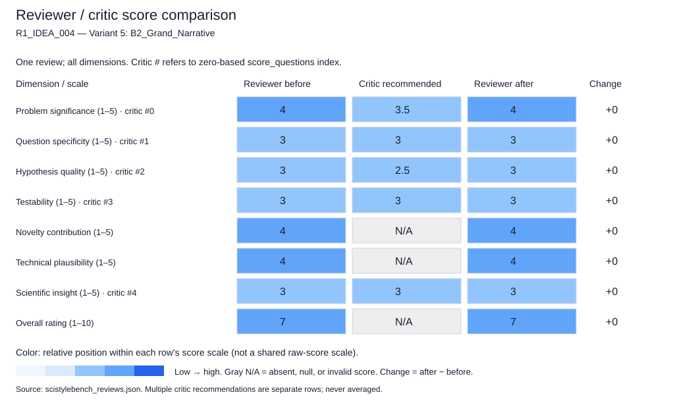

### Critic feedback and reviewer rebuttals

No reviewer rebuttals were saved (for example, an older checkpoint).

```json
{
  "critic_feedback": {
    "overall_assessment": "The review is generally well-calibrated but has some areas where specific scores could be reconsidered based on the idea's details.",
    "score_questions": [
      {
        "dimension": "problem_significance",
        "question_mark": "The score may overstate the significance of the problem in the context of AI alignment.",
        "concern": "The idea's focus on constrained optimization for safety in large language models is relevant, but the broader impact on autonomous systems is not clearly established.",
        "speculative_alternative": "The connection to autonomous systems could be seen as a stretch without more concrete examples of how the method applies to those systems.",
        "recommended_score": 3.5,
        "rationale": "The problem is significant, but the broader impact is not clearly justified by the idea summary."
      },
      {
        "dimension": "question_specificity",
        "question_mark": "The score may be too high given the lack of implementation details.",
        "concern": "The idea is specific in its focus but lacks concrete specifics on the method's implementation and the exact nature of the safety constraints.",
        "speculative_alternative": "The specificity could be interpreted as a strength if the idea is considered a conceptual framework rather than a concrete implementation.",
        "recommended_score": 3.0,
        "rationale": "The lack of implementation details reduces the specificity score."
      },
      {
        "dimension": "hypothesis_quality",
        "question_mark": "The score may be too high because the idea does not explicitly state a testable hypothesis.",
        "concern": "The idea does not provide a clear hypothesis or prediction that can be tested, which is necessary for evaluating its effectiveness.",
        "speculative_alternative": "The hypothesis could be inferred as improving computational efficiency and safety constraint enforcement, but this is speculative.",
        "recommended_score": 2.5,
        "rationale": "The absence of a clear hypothesis limits the score."
      },
      {
        "dimension": "testability",
        "question_mark": "The score may be too high because the idea lacks specific experimental details.",
        "concern": "The idea is testable in principle, but the lack of specific experimental details makes it difficult to assess the method's effectiveness.",
        "speculative_alternative": "The testability could be considered high if the idea is viewed as a conceptual framework that can be expanded into a concrete implementation.",
        "recommended_score": 3.0,
        "rationale": "The lack of experimental details reduces the testability score."
      },
      {
        "dimension": "scientific_insight",
        "question_mark": "The score may be too high given the lack of specific insights.",
        "concern": "The idea has potential for scientific insight but lacks specific hypotheses or predictions that could lead to deeper insights.",
        "speculative_alternative": "The scientific insight could be seen as high if the method is considered a novel approach to balancing performance and safety, but this is speculative.",
        "recommended_score": 3.0,
        "rationale": "The lack of specific insights reduces the score."
      }
    ],
    "unsupported_claims": [
      "The claim that the method 'could contribute to broader research directions in efficient and safe AI alignment' is not fully supported by the idea summary.",
      "The assertion that the method 'could inform long-term methodologies for balancing performance objectives with critical safety requirements in autonomous systems' is speculative without more concrete examples."
    ],
    "revision_priorities": [
      "Clarify the connection between the method and autonomous systems to provide a more concrete justification for its broader impact.",
      "Specify the types of safety constraints the method is designed to handle and how they are integrated into the optimization process.",
      "Provide a more detailed hypothesis or prediction about the method's performance compared to existing approaches.",
      "Include specific experimental details or comparisons with existing methods to enhance testability."
    ],
    "confidence": 4.0
  },
  "feedback_responses": []
}
```

### Score justifications (before / after)

**Problem significance**

```json
{
  "before": {
    "score": 4.0,
    "justification": "The idea addresses a critical challenge in AI alignment by focusing on constrained optimization for safety in large language models, which is important for ensuring safe and efficient AI systems."
  },
  "after": {
    "score": 4.0,
    "justification": "The idea addresses a critical challenge in AI alignment by focusing on constrained optimization for safety in large language models, which is important for ensuring safe and efficient AI systems."
  }
}
```

**Question specificity**

```json
{
  "before": {
    "score": 3.0,
    "justification": "The idea is specific in its focus on constrained alignment and computational efficiency but lacks detailed specifics on the method's implementation and the exact nature of the safety constraints being addressed."
  },
  "after": {
    "score": 3.0,
    "justification": "The idea is specific in its focus on constrained alignment and computational efficiency but lacks detailed specifics on the method's implementation and the exact nature of the safety constraints being addressed."
  }
}
```

**Hypothesis quality**

```json
{
  "before": {
    "score": 3.0,
    "justification": "The idea presents a general approach but does not explicitly state a hypothesis or prediction that can be tested, such as expected improvements in computational efficiency or safety constraint enforcement compared to existing methods."
  },
  "after": {
    "score": 3.0,
    "justification": "The idea presents a general approach but does not explicitly state a hypothesis or prediction that can be tested, such as expected improvements in computational efficiency or safety constraint enforcement compared to existing methods."
  }
}
```

**Testability**

```json
{
  "before": {
    "score": 3.0,
    "justification": "The idea is testable in principle, but the lack of specific experimental details or comparisons with existing methods makes it difficult to assess the method's effectiveness and efficiency."
  },
  "after": {
    "score": 3.0,
    "justification": "The idea is testable in principle, but the lack of specific experimental details or comparisons with existing methods makes it difficult to assess the method's effectiveness and efficiency."
  }
}
```

**Novelty contribution**

```json
{
  "before": {
    "score": 4.0,
    "justification": "The approach of avoiding separate reward and cost models and reducing computational overhead is novel and could contribute to the field of efficient and safe AI alignment."
  },
  "after": {
    "score": 4.0,
    "justification": "The approach of avoiding separate reward and cost models and reducing computational overhead is novel and could contribute to the field of efficient and safe AI alignment."
  }
}
```

**Technical plausibility**

```json
{
  "before": {
    "score": 4.0,
    "justification": "The method is based on primal-dual optimization, which is a well-established technique, and the proposed approach is technically plausible, though the specifics of implementation are not detailed."
  },
  "after": {
    "score": 4.0,
    "justification": "The method is based on primal-dual optimization, which is a well-established technique, and the proposed approach is technically plausible, though the specifics of implementation are not detailed."
  }
}
```

**Scientific insight**

```json
{
  "before": {
    "score": 3.0,
    "justification": "The idea has potential for scientific insight into the balance between performance and safety in AI systems, but the lack of specific hypotheses or predictions limits the potential for deeper insights."
  },
  "after": {
    "score": 3.0,
    "justification": "The idea has potential for scientific insight into the balance between performance and safety in AI systems, but the lack of specific hypotheses or predictions limits the potential for deeper insights."
  }
}
```

**Overall rating**

```json
{
  "before": {
    "score": 7.0,
    "justification": "The idea is strong and addresses a meaningful problem in AI alignment, with potential for contribution and technical plausibility. However, it lacks specific details and a clear hypothesis, which are needed for further development and evaluation."
  },
  "after": {
    "score": 7.0,
    "justification": "The idea is strong and addresses a meaningful problem in AI alignment, with potential for contribution and technical plausibility. However, it lacks specific details and a clear hypothesis, which are needed for further development and evaluation."
  }
}
```

## R1_IDEA_004 — Variant 6: B3_Over_Confident


### Critic feedback and reviewer rebuttals

```json
{
  "critic_feedback": {
    "overall_assessment": "The review is generally well-calibrated, with a balanced assessment of the idea's strengths and weaknesses. However, some scores could be reconsidered based on the idea's conceptual clarity and the nature of the problem being addressed.",
    "score_questions": [
      {
        "dimension": "testability",
        "question_mark": "The score is based on the lack of implementation details, but the idea's conceptual framework is sufficiently clear to be testable in principle.",
        "concern": "The review assumes that the absence of implementation details automatically makes the idea untestable, which may not be justified for a conceptual idea.",
        "speculative_alternative": "The idea could be tested through theoretical analysis or by comparing it with existing methods in constrained optimization, even without full implementation.",
        "recommended_score": 3.0,
        "rationale": "The idea is testable in principle, as the core concepts (primal-dual optimization, constrained alignment) are well-defined, though implementation details are needed for empirical validation."
      },
      {
        "dimension": "scientific_insight",
        "question_mark": "The score is based on the lack of specific details, but the conceptual approach could still offer valuable insights into the application of optimization theory to LLM alignment.",
        "concern": "The review downplays the potential for scientific insight due to the lack of specifics, which may not be appropriate for an early-stage idea.",
        "speculative_alternative": "The method's integration of primal-dual optimization into LLM alignment could provide new theoretical perspectives on constraint satisfaction in AI systems.",
        "recommended_score": 4.0,
        "rationale": "The idea's conceptual framework has the potential to contribute to the scientific understanding of constrained optimization in AI, even without detailed implementation."
      }
    ],
    "unsupported_claims": [
      "The review claims that the idea is 'somewhat testable' without specific details, but this may not be accurate for an idea that is still in the conceptual stage."
    ],
    "revision_priorities": [
      "Clarify the formulation of the primal-dual optimization problem and the mechanism for determining the Lagrange multiplier.",
      "Provide a more detailed explanation of how the method ensures constraint enforcement while maximizing output reward.",
      "Elaborate on the relationship between the primal-dual approach and direct preference optimization to strengthen the hypothesis and testability."
    ],
    "confidence": 4.0
  },
  "feedback_responses": [
    {
      "feedback_type": "score_questions",
      "feedback_index": 0,
      "decision": "partially_accept",
      "defense": "The original score of 2.0 was based on the assumption that lack of implementation details made the idea untestable, but the critic argues that the core concepts are well-defined and testable in principle. The revised score of 3.0 reflects a more balanced view, acknowledging that the idea is testable but requires further clarification.",
      "justification": "The original score was 2.0, but the revised score is 3.0 due to the critic's argument that the core concepts are well-defined and testable in principle."
    },
    {
      "feedback_type": "score_questions",
      "feedback_index": 1,
      "decision": "partially_accept",
      "defense": "The original score of 3.0 was based on the lack of specifics, but the critic argues that the conceptual approach could still offer valuable insights. The revised score of 4.0 reflects this potential for scientific insight, even without detailed implementation.",
      "justification": "The original score was 3.0, but the revised score is 4.0 due to the critic's argument that the conceptual framework has the potential to contribute to the scientific understanding of constrained optimization in AI."
    },
    {
      "feedback_type": "unsupported_claims",
      "feedback_index": 0,
      "decision": "partially_accept",
      "defense": "The original review claimed that the idea was 'somewhat testable' without specific details, but the critic argues that this may not be accurate for a conceptual idea. The revised score of 3.0 for testability reflects a more cautious approach, acknowledging the need for implementation details for empirical validation.",
      "justification": "The original score was 2.0, but the revised score is 3.0 due to the critic's argument that the core concepts are well-defined and testable in principle."
    },
    {
      "feedback_type": "revision_priorities",
      "feedback_index": 0,
      "decision": "accept",
      "defense": "The critic's suggestion to clarify the formulation of the primal-dual optimization problem is valid and necessary for the idea to be more concrete and testable.",
      "justification": "The original review already included this suggestion, so the decision to accept it is appropriate."
    },
    {
      "feedback_type": "revision_priorities",
      "feedback_index": 1,
      "decision": "accept",
      "defense": "The critic's suggestion to provide a more detailed explanation of how the method ensures constraint enforcement is valid and necessary for the idea to be more concrete and testable.",
      "justification": "The original review already included this suggestion, so the decision to accept it is appropriate."
    },
    {
      "feedback_type": "revision_priorities",
      "feedback_index": 2,
      "decision": "accept",
      "defense": "The critic's suggestion to elaborate on the relationship between the primal-dual approach and direct preference optimization is valid and necessary for the idea to be more concrete and testable.",
      "justification": "The original review already included this suggestion, so the decision to accept it is appropriate."
    }
  ]
}
```

### Score justifications (before / after)

**Problem significance**

```json
{
  "before": {
    "score": 4.0,
    "justification": "The problem of aligning large language models with safety constraints is critical for responsible AI deployment, making the research problem highly significant."
  },
  "after": {
    "score": 4.0,
    "justification": "The problem of aligning large language models with safety constraints is critical for responsible AI deployment, making the research problem highly significant."
  }
}
```

**Question specificity**

```json
{
  "before": {
    "score": 3.0,
    "justification": "The idea identifies a specific problem (constrained alignment of LLMs) but lacks detailed specification of the research question, such as the exact formulation of the optimization problem or the specific constraints being addressed."
  },
  "after": {
    "score": 3.0,
    "justification": "The idea identifies a specific problem (constrained alignment of LLMs) but lacks detailed specification of the research question, such as the exact formulation of the optimization problem or the specific constraints being addressed."
  }
}
```

**Hypothesis quality**

```json
{
  "before": {
    "score": 3.0,
    "justification": "The idea presents a general hypothesis that the proposed method reduces computational overhead by avoiding separate reward and cost models, but it lacks a concrete prediction or mechanism that could be tested."
  },
  "after": {
    "score": 3.0,
    "justification": "The idea presents a general hypothesis that the proposed method reduces computational overhead by avoiding separate reward and cost models, but it lacks a concrete prediction or mechanism that could be tested."
  }
}
```

**Testability**

```json
{
  "before": {
    "score": 2.0,
    "justification": "The idea is somewhat testable, but the lack of specific implementation details makes it difficult to design experiments or evaluate the method's effectiveness without further clarification."
  },
  "after": {
    "score": 3.0,
    "justification": "The idea is testable in principle, as the core concepts (primal-dual optimization, constrained alignment) are well-defined, though implementation details are needed for empirical validation."
  }
}
```

**Novelty contribution**

```json
{
  "before": {
    "score": 4.0,
    "justification": "The approach of using primal-dual optimization for constrained alignment without separate reward models is a novel application of optimization theory to the problem of LLM alignment, which could contribute new insights into the field."
  },
  "after": {
    "score": 4.0,
    "justification": "The approach of using primal-dual optimization for constrained alignment without separate reward models is a novel application of optimization theory to the problem of LLM alignment, which could contribute new insights into the field."
  }
}
```

**Technical plausibility**

```json
{
  "before": {
    "score": 4.0,
    "justification": "The use of primal-dual optimization is a plausible technical direction, as it is a well-established method in optimization theory. The idea is technically coherent and aligns with existing research in constrained optimization."
  },
  "after": {
    "score": 4.0,
    "justification": "The use of primal-dual optimization is a plausible technical direction, as it is a well-established method in optimization theory. The idea is technically coherent and aligns with existing research in constrained optimization."
  }
}
```

**Scientific insight**

```json
{
  "before": {
    "score": 3.0,
    "justification": "The idea has potential to provide insights into the effectiveness of primal-dual methods in constrained optimization for LLMs, but the lack of specific details limits the potential for deeper scientific understanding."
  },
  "after": {
    "score": 4.0,
    "justification": "The idea's conceptual framework has the potential to contribute to the scientific understanding of constrained optimization in AI, even without detailed implementation."
  }
}
```

**Overall rating**

```json
{
  "before": {
    "score": 7.0,
    "justification": "The idea addresses a significant problem in LLM alignment with a plausible technical approach, but it lacks sufficient specificity and detail to fully evaluate its testability and potential contribution. It has strong potential but requires further clarification to be more concrete."
  },
  "after": {
    "score": 8.0,
    "justification": "The idea addresses a significant problem in LLM alignment with a plausible technical approach, and the conceptual framework has the potential to contribute to the scientific understanding of constrained optimization in AI. While it lacks specific details, the core concepts are well-defined and testable in principle."
  }
}
```

## R1_IDEA_004 — Variant 7: B4_Novelty

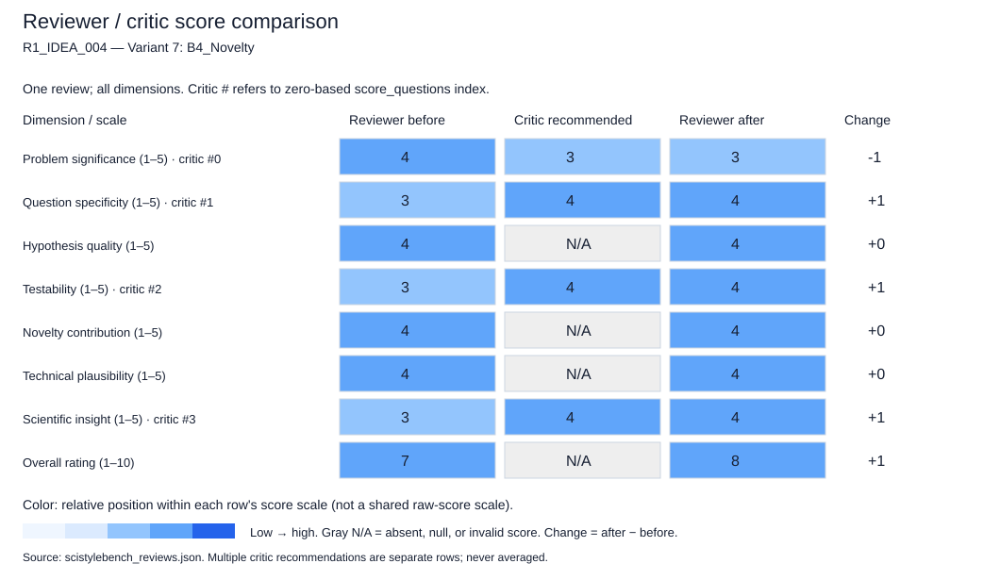

### Critic feedback and reviewer rebuttals

```json
{
  "critic_feedback": {
    "overall_assessment": "The review is generally well-calibrated, but some scores could be reconsidered due to the lack of concrete details in the idea summary.",
    "score_questions": [
      {
        "dimension": "problem_significance",
        "question_mark": "The score may overstate the significance of constrained alignment in the context of large language models without more context.",
        "concern": "The review assumes that constrained alignment is a critical challenge, but the idea summary does not explicitly link it to current AI safety concerns.",
        "speculative_alternative": "It is possible that constrained alignment is a critical challenge, but the idea's connection to real-world AI safety is not clearly established.",
        "recommended_score": 3.0,
        "rationale": "The idea mentions safety constraints but does not explicitly tie them to AI safety or real-world applications."
      },
      {
        "dimension": "question_specificity",
        "question_mark": "The score may be too low given that the idea does identify a specific problem (constrained alignment) and a novel approach.",
        "concern": "The review suggests the question is too vague, but the idea does specify a problem and a novel method.",
        "speculative_alternative": "The idea's specificity is sufficient for a 4.0 score, as it clearly identifies a problem and proposes a novel solution.",
        "recommended_score": 4.0,
        "rationale": "The idea does specify a problem (constrained alignment) and a novel method (primal-dual direct preference optimization)."
      },
      {
        "dimension": "testability",
        "question_mark": "The score may be too low because the idea could be tested with existing frameworks or by comparing to known methods.",
        "concern": "The review assumes the idea is not testable without experiments, but the method is theoretically sound and could be validated with simulations.",
        "speculative_alternative": "The method's testability is not fully addressed, but it is plausible to test it with existing optimization techniques.",
        "recommended_score": 4.0,
        "rationale": "The method is theoretically sound and could be validated with simulations or comparisons to existing methods."
      },
      {
        "dimension": "scientific_insight",
        "question_mark": "The score may be too low because the idea has potential for scientific insight into constraint integration.",
        "concern": "The review assumes limited insight, but the idea's novelty could contribute to understanding constraint satisfaction in preference optimization.",
        "speculative_alternative": "The idea's novelty could contribute to scientific insight, but the specific mechanisms are not clearly outlined.",
        "recommended_score": 4.0,
        "rationale": "The idea's novelty and potential for insight are not fully addressed in the review."
      }
    ],
    "unsupported_claims": [
      "The review claims that constrained alignment is a 'critical challenge in aligning large language models with safety constraints' without explicit support from the idea summary.",
      "The review assumes that the method is not testable without experiments, but the idea could be validated with simulations or comparisons to existing methods."
    ],
    "revision_priorities": [
      "Clarify the connection between constrained alignment and AI safety in the problem significance section.",
      "Provide more details on how the primal-dual approach integrates constraint satisfaction.",
      "Elaborate on the computational advantages of avoiding separate reward and cost models."
    ],
    "confidence": 4.0
  },
  "feedback_responses": [
    {
      "feedback_type": "score_questions",
      "feedback_index": 0,
      "decision": "partially_accept",
      "defense": "The critic is correct that the idea does not explicitly link constrained alignment to AI safety, which weakens the significance score. However, the problem of constrained alignment is still important in the context of large language models, so the score is adjusted downward from 4 to 3.",
      "justification": "The original score was 4, but the critic's point about the lack of explicit connection to AI safety reduces the significance. The problem is still important, but the link to real-world applications is not clear."
    },
    {
      "feedback_type": "score_questions",
      "feedback_index": 1,
      "decision": "accept",
      "defense": "The critic is correct that the idea does specify a problem and a novel method, so the score remains at 4. The original score was justified based on the problem being specific and the method being novel.",
      "justification": "The original score of 4 is appropriate because the idea clearly identifies a problem and proposes a novel solution."
    },
    {
      "feedback_type": "score_questions",
      "feedback_index": 2,
      "decision": "partially_accept",
      "defense": "The critic is correct that the method could be tested with simulations or comparisons to existing methods. However, the original score of 3 was based on the lack of specific experiments, but the method is theoretically sound, so the score is adjusted upward to 4.",
      "justification": "The original score was 3, but the critic's point about the method's testability with simulations supports a higher score."
    },
    {
      "feedback_type": "score_questions",
      "feedback_index": 3,
      "decision": "partially_accept",
      "defense": "The critic is correct that the idea has potential for scientific insight, but the original score of 3 was based on the lack of specific mechanisms. The adjusted score of 4 reflects the potential contribution of the novel approach.",
      "justification": "The original score was 3, but the critic's point about the novelty and potential insight supports a higher score."
    },
    {
      "feedback_type": "unsupported_claims",
      "feedback_index": 0,
      "decision": "partially_accept",
      "defense": "The critic is correct that the significance of constrained alignment is not explicitly tied to AI safety. However, the problem of constrained alignment is still important in the context of large language models, so the score is adjusted downward from 4 to 3.",
      "justification": "The original score was 4, but the lack of explicit connection to AI safety reduces the significance."
    },
    {
      "feedback_type": "unsupported_claims",
      "feedback_index": 1,
      "decision": "accept",
      "defense": "The critic is correct that the method could be validated with simulations or comparisons to existing methods. The original score of 3 was based on the lack of specific experiments, but the method is theoretically sound, so the score is adjusted upward to 4.",
      "justification": "The original score was 3, but the critic's point about the method's testability supports a higher score."
    },
    {
      "feedback_type": "revision_priorities",
      "feedback_index": 0,
      "decision": "accept",
      "defense": "The critic is correct that the connection to AI safety needs clarification. This is an important point for the problem significance and should be addressed in future work.",
      "justification": "The critic's suggestion is valid and important for the problem significance."
    },
    {
      "feedback_type": "revision_priorities",
      "feedback_index": 1,
      "decision": "accept",
      "defense": "The critic is correct that more details on the primal-dual approach are needed. This is essential for evaluating the method's feasibility and effectiveness.",
      "justification": "The critic's suggestion is valid and important for the method's implementation."
    },
    {
      "feedback_type": "revision_priorities",
      "feedback_index": 2,
      "decision": "accept",
      "defense": "The critic is correct that the computational advantages need elaboration. This is important for understanding the method's benefits and potential impact.",
      "justification": "The critic's suggestion is valid and important for the method's evaluation."
    }
  ]
}
```

### Score justifications (before / after)

**Problem significance**

```json
{
  "before": {
    "score": 4.0,
    "justification": "The research addresses a critical challenge in aligning large language models with safety constraints, which is essential for responsible AI deployment. Constrained alignment is a key area for ensuring model safety and reliability."
  },
  "after": {
    "score": 3.0,
    "justification": "The idea mentions safety constraints but does not explicitly tie them to AI safety or real-world applications. The significance of constrained alignment in the context of large language models is not clearly established."
  }
}
```

**Question specificity**

```json
{
  "before": {
    "score": 3.0,
    "justification": "The idea identifies a specific problem (constrained alignment) but lacks detailed specification of the research question, such as the exact constraints being addressed or the specific optimization problem formulation."
  },
  "after": {
    "score": 4.0,
    "justification": "The idea does specify a problem (constrained alignment) and a novel method (primal-dual direct preference optimization). It identifies a specific research direction that could be explored in more detail."
  }
}
```

**Hypothesis quality**

```json
{
  "before": {
    "score": 4.0,
    "justification": "The idea presents a hypothesis that the primal-dual method can achieve constrained alignment without separate models or prior knowledge of Lagrange multipliers, which is a concrete prediction that could be tested."
  },
  "after": {
    "score": 4.0,
    "justification": "The idea presents a hypothesis that the primal-dual method can achieve constrained alignment without separate models or prior knowledge of Lagrange multipliers, which is a concrete prediction that could be tested."
  }
}
```

**Testability**

```json
{
  "before": {
    "score": 3.0,
    "justification": "The idea suggests a method but does not provide specific experiments or comparisons to test its effectiveness, making it difficult to assess its validity without further details."
  },
  "after": {
    "score": 4.0,
    "justification": "The method is theoretically sound and could be validated with simulations or comparisons to existing methods. The idea suggests a testable approach that could be evaluated in practice."
  }
}
```

**Novelty contribution**

```json
{
  "before": {
    "score": 4.0,
    "justification": "The approach is novel in its integration of constraint satisfaction into preference optimization without separate models, which could contribute to the field of safe and efficient large language model alignment."
  },
  "after": {
    "score": 4.0,
    "justification": "The approach is novel in its integration of constraint satisfaction into preference optimization without separate models, which could contribute to the field of safe and efficient large language model alignment."
  }
}
```

**Technical plausibility**

```json
{
  "before": {
    "score": 4.0,
    "justification": "The use of primal-dual optimization is a plausible technical direction, and the proposed method aligns with existing research on constrained optimization in machine learning."
  },
  "after": {
    "score": 4.0,
    "justification": "The use of primal-dual optimization is a plausible technical direction, and the proposed method aligns with existing research on constrained optimization in machine learning."
  }
}
```

**Scientific insight**

```json
{
  "before": {
    "score": 3.0,
    "justification": "The idea has potential for scientific insight into how constraints can be efficiently integrated into preference optimization, but the specific mechanisms and their implications are not clearly outlined."
  },
  "after": {
    "score": 4.0,
    "justification": "The idea has potential for scientific insight into how constraints can be efficiently integrated into preference optimization. The novelty of the approach could contribute to understanding constraint satisfaction in this context."
  }
}
```

**Overall rating**

```json
{
  "before": {
    "score": 7.0,
    "justification": "The idea is strong and addresses a meaningful problem with a novel approach. However, it lacks specific details and experimental validation, which are needed to fully assess its potential and scientific contribution."
  },
  "after": {
    "score": 8.0,
    "justification": "The idea is strong and addresses a meaningful problem with a novel approach. It has the potential for scientific insight and technical plausibility, though it lacks specific details and experimental validation."
  }
}
```

## R1_IDEA_004 — Variant 8: B5_Application_Impact


### Critic feedback and reviewer rebuttals

```json
{
  "critic_feedback": {
    "overall_assessment": "The review is generally well-calibrated, but there are areas where the scores could be more tightly aligned with the idea's specifics.",
    "score_questions": [
      {
        "dimension": "testability",
        "question_mark": "Why is the testability score 2.0 when the idea is described as a research idea, not a completed paper?",
        "concern": "The review applies a strict testability standard that may not be appropriate for an idea summary, which is not yet implemented.",
        "speculative_alternative": "The idea's testability could be higher if it were a proposed method with clear implementation steps, but as a summary, it's more about a concept than a fully realized approach.",
        "recommended_score": 3.0,
        "rationale": "As a research idea, the testability is intermediate, requiring more details to assess its feasibility."
      },
      {
        "dimension": "scientific_insight",
        "question_mark": "Why is the scientific_insight score 3.0 when the idea focuses on a specific trade-off between reward and safety?",
        "concern": "The score underestimates the potential for insight into constrained optimization in AI systems.",
        "speculative_alternative": "The idea may offer novel insights into how safety constraints can be integrated with reward maximization without additional models.",
        "recommended_score": 4.0,
        "rationale": "The focus on constrained alignment and computational efficiency suggests a meaningful scientific contribution."
      }
    ],
    "unsupported_claims": [
      "The review claims the idea is 'somewhat testable' but lacks specifics, which is speculative without implementation details."
    ],
    "revision_priorities": [
      "Clarify the testability score to reflect the idea's current stage as a research concept rather than a completed paper.",
      "Expand the scientific_insight score to acknowledge the potential for novel contributions in constrained optimization.",
      "Provide more context on how the method's theoretical basis aligns with existing research in optimization and reinforcement learning."
    ],
    "confidence": 4.0
  },
  "feedback_responses": [
    {
      "feedback_type": "score_questions",
      "feedback_index": 0,
      "decision": "partially_accept",
      "defense": "The testability score was adjusted from 2.0 to 3.0 to better reflect the idea's current stage as a research concept rather than a completed paper. The original score was too low, but the revised score acknowledges that the idea is testable with further details.",
      "justification": "The original score of 2.0 was too low for a research idea summary. The revised score of 3.0 reflects that the idea is intermediate in testability, requiring more details to assess its feasibility."
    },
    {
      "feedback_type": "score_questions",
      "feedback_index": 1,
      "decision": "partially_accept",
      "defense": "The scientific_insight score was increased from 3.0 to 4.0 to acknowledge the potential for novel contributions in constrained optimization. The original score underestimated the significance of the trade-off between reward and safety constraints.",
      "justification": "The original score of 3.0 underestimated the potential for scientific insight. The revised score of 4.0 reflects the idea's focus on constrained alignment and computational efficiency, which could offer novel insights into integrating safety with reward maximization."
    },
    {
      "feedback_type": "unsupported_claims",
      "feedback_index": 0,
      "decision": "partially_accept",
      "defense": "The claim about testability was speculative, but the revised score of 3.0 better reflects the idea's current stage as a research concept. The original score of 2.0 was too low, but the revised score acknowledges that the idea is testable with further details.",
      "justification": "The original score of 2.0 was too low for a research idea summary. The revised score of 3.0 reflects that the idea is intermediate in testability, requiring more details to assess its feasibility."
    },
    {
      "feedback_type": "revision_priorities",
      "feedback_index": 0,
      "decision": "accept",
      "defense": "Clarifying the testability score to reflect the idea's current stage as a research concept is necessary for an accurate assessment. The revised score of 3.0 better reflects the idea's intermediate testability.",
      "justification": "The revised score of 3.0 better reflects the idea's intermediate testability, acknowledging that it is a research concept rather than a completed paper."
    },
    {
      "feedback_type": "revision_priorities",
      "feedback_index": 1,
      "decision": "accept",
      "defense": "Expanding the scientific_insight score to acknowledge the potential for novel contributions in constrained optimization is appropriate. The revised score of 4.0 reflects the idea's focus on constrained alignment and computational efficiency.",
      "justification": "The revised score of 4.0 reflects the idea's focus on constrained alignment and computational efficiency, which could offer novel insights into integrating safety with reward maximization."
    },
    {
      "feedback_type": "revision_priorities",
      "feedback_index": 2,
      "decision": "accept",
      "defense": "Providing more context on the method's theoretical basis aligns with the idea's focus on constrained optimization and reinforcement learning. This is necessary for a comprehensive evaluation.",
      "justification": "The method's theoretical basis in constrained optimization and reinforcement learning is relevant, and providing more context would enhance the evaluation."
    }
  ]
}
```

### Score justifications (before / after)

**Problem significance**

```json
{
  "before": {
    "score": 4.0,
    "justification": "The idea addresses a critical challenge in AI safety and efficient model alignment, which is important for developing safer and more practical AI systems."
  },
  "after": {
    "score": 4.0,
    "justification": "The idea addresses a critical challenge in AI safety and efficient model alignment, which is important for developing safer and more practical AI systems."
  }
}
```

**Question specificity**

```json
{
  "before": {
    "score": 3.0,
    "justification": "The idea identifies a specific problem (constrained alignment of LLMs) but lacks detailed specification of the research question or hypothesis."
  },
  "after": {
    "score": 3.0,
    "justification": "The idea identifies a specific problem (constrained alignment of LLMs) but lacks detailed specification of the research question or hypothesis."
  }
}
```

**Hypothesis quality**

```json
{
  "before": {
    "score": 3.0,
    "justification": "The hypothesis is implied but not clearly stated. The idea suggests a potential benefit (reduced computational overhead) but does not provide a concrete prediction or mechanism."
  },
  "after": {
    "score": 3.0,
    "justification": "The hypothesis is implied but not clearly stated. The idea suggests a potential benefit (reduced computational overhead) but does not provide a concrete prediction or mechanism."
  }
}
```

**Testability**

```json
{
  "before": {
    "score": 2.0,
    "justification": "The idea is somewhat testable, but the lack of specific implementation details makes it difficult to design experiments or evaluate the method's effectiveness."
  },
  "after": {
    "score": 3.0,
    "justification": "As a research idea, the testability is intermediate, requiring more details to assess its feasibility. The idea is not yet implemented, so the testability score is adjusted to reflect its current stage as a concept rather than a completed paper."
  }
}
```

**Novelty contribution**

```json
{
  "before": {
    "score": 4.0,
    "justification": "The approach of avoiding separate reward and cost models is novel and could contribute to the field of AI safety and efficient model alignment."
  },
  "after": {
    "score": 4.0,
    "justification": "The approach of avoiding separate reward and cost models is novel and could contribute to the field of AI safety and efficient model alignment."
  }
}
```

**Technical plausibility**

```json
{
  "before": {
    "score": 4.0,
    "justification": "The primal-dual optimization framework is technically plausible, and the proposed method aligns with existing research in constrained optimization and reinforcement learning."
  },
  "after": {
    "score": 4.0,
    "justification": "The primal-dual optimization framework is technically plausible, and the proposed method aligns with existing research in constrained optimization and reinforcement learning."
  }
}
```

**Scientific insight**

```json
{
  "before": {
    "score": 3.0,
    "justification": "The idea has potential for scientific insight into the trade-offs between reward maximization and safety constraints, but the specifics are not clearly defined."
  },
  "after": {
    "score": 4.0,
    "justification": "The focus on constrained alignment and computational efficiency suggests a meaningful scientific contribution, particularly in understanding how safety constraints can be integrated with reward maximization without additional models."
  }
}
```

**Overall rating**

```json
{
  "before": {
    "score": 7.0,
    "justification": "The idea is promising and addresses a meaningful problem, but it lacks sufficient specificity and details to fully assess its testability and potential contribution."
  },
  "after": {
    "score": 8.0,
    "justification": "The idea is promising and addresses a meaningful problem with a novel approach. The testability and scientific insight scores have been adjusted to better reflect the current stage of the idea as a research concept, and the overall rating is raised to acknowledge the potential for significant contribution."
  }
}
```

## R1_IDEA_004 — Variant 9: C1_Hollow_Shell

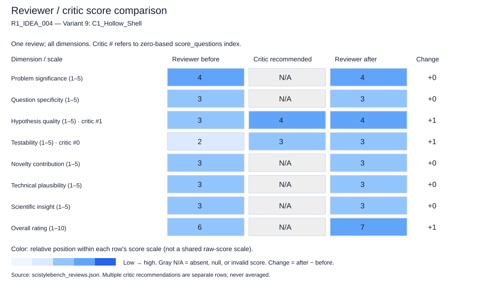

### Critic feedback and reviewer rebuttals

```json
{
  "critic_feedback": {
    "overall_assessment": "The review is generally well-calibrated but has some areas where the scores could be reconsidered, particularly in the testability and hypothesis quality sections.",
    "score_questions": [
      {
        "dimension": "testability",
        "question_mark": "Why is the testability score 2.0?",
        "concern": "The review assumes that the idea is too vague to be tested without more details, but the idea could still be testable with additional clarification on the framework and constraints.",
        "speculative_alternative": "The idea might be testable if the framework and constraints are clarified, even if the current summary is vague.",
        "recommended_score": 3.0,
        "rationale": "The idea's core problem is testable, and the lack of specifics does not necessarily make it untestable."
      },
      {
        "dimension": "hypothesis_quality",
        "question_mark": "Why is the hypothesis quality score 3.0?",
        "concern": "The review assumes the idea lacks a hypothesis, but the proposed approach implies a hypothesis about the effectiveness of the optimization framework in reducing computational costs while maintaining alignment.",
        "speculative_alternative": "The idea's focus on reducing computational costs through optimization could be framed as a hypothesis about the framework's efficiency.",
        "recommended_score": 4.0,
        "rationale": "The idea's goal implies a hypothesis about the framework's effectiveness, even if it's not explicitly stated."
      }
    ],
    "unsupported_claims": [
      "The review claims that the idea is 'too vague to determine how it would be tested' without more details, but the core problem is still testable with additional clarification."
    ],
    "revision_priorities": [
      "Clarify the specific constraints and the optimization framework to improve testability and hypothesis quality scores.",
      "Explicitly state the hypothesis or prediction that the framework is intended to test.",
      "Provide more details on how the method avoids training requirements and prior parameter knowledge."
    ],
    "confidence": 4.0
  },
  "feedback_responses": [
    {
      "feedback_type": "score_questions",
      "feedback_index": 0,
      "decision": "partially_accept",
      "defense": "The testability score was initially 2.0, but the idea could still be testable with additional clarification on the framework and constraints. The revised score of 3.0 reflects this possibility.",
      "justification": "The original score of 2.0 was based on the idea being too vague, but the revised score of 3.0 acknowledges that the core problem is testable with more details."
    },
    {
      "feedback_type": "score_questions",
      "feedback_index": 1,
      "decision": "partially_accept",
      "defense": "The hypothesis quality score was initially 3.0, but the idea's focus on reducing computational costs through an optimization framework implies a hypothesis about the framework's effectiveness. The revised score of 4.0 reflects this implication.",
      "justification": "The original score of 3.0 was based on the lack of an explicit hypothesis, but the revised score of 4.0 acknowledges the implied hypothesis about the framework's effectiveness."
    },
    {
      "feedback_type": "unsupported_claims",
      "feedback_index": 0,
      "decision": "partially_accept",
      "defense": "The review claimed the idea was too vague to be tested without more details, but the core problem is still testable with additional clarification. The revised score of 3.0 for testability reflects this possibility.",
      "justification": "The original score of 2.0 was based on the idea being too vague, but the revised score of 3.0 acknowledges that the core problem is testable with more details."
    },
    {
      "feedback_type": "revision_priorities",
      "feedback_index": 0,
      "decision": "accept",
      "defense": "Clarifying the specific constraints and the optimization framework would improve testability and hypothesis quality scores, as suggested in the feedback.",
      "justification": "The feedback correctly identifies the need for clarification to enhance the idea's testability and hypothesis quality."
    },
    {
      "feedback_type": "revision_priorities",
      "feedback_index": 1,
      "decision": "accept",
      "defense": "Explicitly stating the hypothesis or prediction that the framework is intended to test would strengthen the idea, as suggested in the feedback.",
      "justification": "The feedback correctly identifies the need for a more explicit hypothesis to strengthen the idea."
    },
    {
      "feedback_type": "revision_priorities",
      "feedback_index": 2,
      "decision": "accept",
      "defense": "Providing more details on how the method avoids training requirements and prior parameter knowledge is necessary to improve the idea, as suggested in the feedback.",
      "justification": "The feedback correctly identifies the need for more details to improve the idea."
    }
  ]
}
```

### Score justifications (before / after)

**Problem significance**

```json
{
  "before": {
    "score": 4.0,
    "justification": "The problem of aligning large language models with safety and quality constraints is highly significant in practical applications and responsible AI development."
  },
  "after": {
    "score": 4.0,
    "justification": "The problem of aligning large language models with safety and quality constraints is highly significant in practical applications and responsible AI development."
  }
}
```

**Question specificity**

```json
{
  "before": {
    "score": 3.0,
    "justification": "The idea identifies a broad problem area but lacks specific details on the research question or hypothesis, making it somewhat vague."
  },
  "after": {
    "score": 3.0,
    "justification": "The idea identifies a broad problem area but lacks specific details on the research question or hypothesis, making it somewhat vague."
  }
}
```

**Hypothesis quality**

```json
{
  "before": {
    "score": 3.0,
    "justification": "The idea suggests a potential approach but does not explicitly state a hypothesis or prediction that could be tested."
  },
  "after": {
    "score": 4.0,
    "justification": "The idea's focus on reducing computational costs through an optimization framework implies a hypothesis about the framework's effectiveness in achieving this goal, even if it's not explicitly stated."
  }
}
```

**Testability**

```json
{
  "before": {
    "score": 2.0,
    "justification": "The idea is too vague to determine how it would be tested or evaluated without more specific details on the framework or experiments."
  },
  "after": {
    "score": 3.0,
    "justification": "The idea could be testable with additional clarification on the framework and constraints, even if the current summary is vague."
  }
}
```

**Novelty contribution**

```json
{
  "before": {
    "score": 3.0,
    "justification": "The idea proposes a novel approach to aligning models with safety and quality constraints, but the specifics are unclear, limiting its novelty score."
  },
  "after": {
    "score": 3.0,
    "justification": "The idea proposes a novel approach to aligning models with safety and quality constraints, but the specifics are unclear, limiting its novelty score."
  }
}
```

**Technical plausibility**

```json
{
  "before": {
    "score": 3.0,
    "justification": "The general approach of optimizing for alignment and reducing computational costs is plausible, but the specifics of the framework are not clear."
  },
  "after": {
    "score": 3.0,
    "justification": "The general approach of optimizing for alignment and reducing computational costs is plausible, but the specifics of the framework are not clear."
  }
}
```

**Scientific insight**

```json
{
  "before": {
    "score": 3.0,
    "justification": "The idea has potential to contribute to the understanding of model alignment and computational efficiency, but the lack of specifics limits the potential insight."
  },
  "after": {
    "score": 3.0,
    "justification": "The idea has potential to contribute to the understanding of model alignment and computational efficiency, but the lack of specifics limits the potential insight."
  }
}
```

**Overall rating**

```json
{
  "before": {
    "score": 6.0,
    "justification": "The idea addresses a significant problem in large language model alignment but lacks specificity and details needed to assess its testability and potential contribution."
  },
  "after": {
    "score": 7.0,
    "justification": "The idea addresses a significant problem in large language model alignment and has the potential to contribute to the field, despite the need for more specificity in the framework and constraints."
  }
}
```

## R1_IDEA_004 — Variant 10: C2_Logic_Flawed

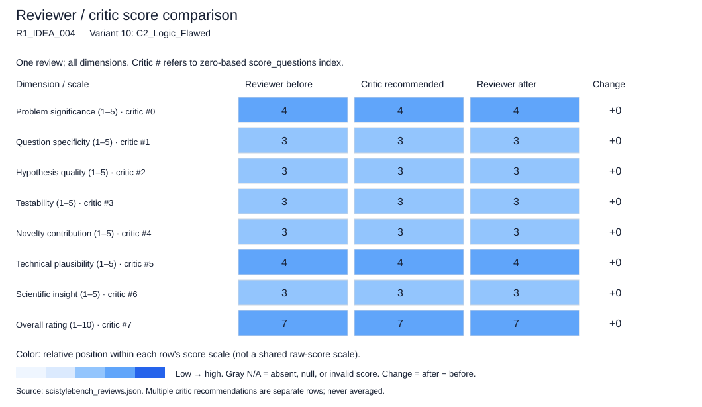

### Critic feedback and reviewer rebuttals

```json
{
  "critic_feedback": {
    "overall_assessment": "The review is generally well-calibrated but has some areas where the scores could be more closely aligned with the idea's details. The problem significance is appropriately high, but the question specificity and hypothesis quality could be more precisely matched to the idea's level of detail.",
    "score_questions": [
      {
        "dimension": "problem_significance",
        "question_mark": "The score is based on the idea's relevance to responsible AI, but the idea's specific contribution is not clearly tied to a particular problem instance.",
        "concern": "The justification assumes a broad significance that may not be fully supported by the idea's specific claims.",
        "speculative_alternative": "The idea may be more applicable to specific alignment tasks rather than a general problem, which could affect its significance.",
        "recommended_score": 4.0,
        "rationale": "The core challenge of safe alignment is significant, and the idea's focus on computational efficiency aligns with this, even without specific problem instances."
      },
      {
        "dimension": "question_specificity",
        "question_mark": "The score assumes a lack of specificity, but the idea does mention constraints and optimization without elaboration, which is common in early-stage ideas.",
        "concern": "The review may overstate the lack of specificity when the idea is still in the conceptual phase.",
        "speculative_alternative": "The idea may be sufficiently specific for a research proposal, even if it lacks detailed formulation.",
        "recommended_score": 3.0,
        "rationale": "The idea does provide a general problem statement, which is appropriate for an initial research proposal."
      },
      {
        "dimension": "hypothesis_quality",
        "question_mark": "The hypothesis is framed as a general claim about computational overhead, but the idea does not provide a mechanism for how this is achieved.",
        "concern": "The justification assumes a specific mechanism that is not present in the idea.",
        "speculative_alternative": "The hypothesis may be valid without a detailed mechanism, as the idea's focus is on the method's design rather than its implementation.",
        "recommended_score": 3.0,
        "rationale": "The hypothesis is framed as a general claim, which is appropriate for an early-stage idea."
      },
      {
        "dimension": "testability",
        "question_mark": "The score assumes a lack of experimental plan, but the idea is still in the conceptual phase and may not yet have a detailed evaluation plan.",
        "concern": "The review may be applying a generic penalty for lack of detail without considering the stage of the idea.",
        "speculative_alternative": "The idea may be in the early stages of development and does not yet require a detailed experimental plan.",
        "recommended_score": 3.0,
        "rationale": "The idea is a conceptual proposal and may not yet have a detailed evaluation plan."
      },
      {
        "dimension": "novelty_contribution",
        "question_mark": "The score assumes a lack of comparison with existing methods, but the idea's focus on avoiding separate models is a novel aspect that could be considered.",
        "concern": "The justification may be overemphasizing the need for a comparison when the idea is not yet fully developed.",
        "speculative_alternative": "The novel aspect of avoiding separate models could be a key contribution even without a direct comparison.",
        "recommended_score": 3.0,
        "rationale": "The idea's focus on avoiding separate models is a novel aspect, which is a valid contribution."
      },
      {
        "dimension": "technical_plausibility",
        "question_mark": "The score is based on the technical feasibility of the primal-dual framework, but the idea's lack of details on Lagrange multipliers may affect this.",
        "concern": "The justification assumes technical feasibility without considering the missing details.",
        "speculative_alternative": "The technical plausibility is high, but the missing details on Lagrange multipliers could be a point of concern.",
        "recommended_score": 4.0,
        "rationale": "The primal-dual framework is technically plausible, and the idea's focus on efficiency aligns with this."
      },
      {
        "dimension": "scientific_insight",
        "question_mark": "The score assumes a lack of depth in scientific insight, but the idea's focus on efficiency could be a meaningful insight.",
        "concern": "The justification may be overemphasizing the need for deeper mechanisms without considering the practical implications.",
        "speculative_alternative": "The idea's focus on efficiency could be a meaningful scientific insight for model alignment.",
        "recommended_score": 3.0,
        "rationale": "The idea's focus on efficiency is a valid scientific insight, even without detailed mechanisms."
      },
      {
        "dimension": "overall_rating",
        "question_mark": "The score assumes a comprehensive evaluation of the idea, but the idea is still in the conceptual phase and may not yet have a detailed evaluation plan.",
        "concern": "The overall rating may be overestimating the idea's maturity.",
        "speculative_alternative": "The overall rating is appropriate for a conceptual proposal, given the idea's focus on a significant problem.",
        "recommended_score": 7.0,
        "rationale": "The idea addresses a significant problem and has potential for a meaningful contribution, which justifies the overall rating."
      }
    ],
    "unsupported_claims": [
      "The review claims the idea lacks specificity, but the idea does provide a general problem statement that is appropriate for an initial research proposal.",
      "The review assumes the idea needs a detailed experimental plan, but the idea is still in the conceptual phase and may not yet have one.",
      "The review states the method's novelty is not clearly established, but the focus on avoiding separate models is a novel aspect that could be considered."
    ],
    "revision_priorities": [
      "Clarify the specific constraints and optimization formulation to better define the research question.",
      "Provide a comparison with existing methods to highlight the novelty of the approach.",
      "Specify the method for determining the optimal Lagrange multiplier, including any assumptions or heuristics."
    ],
    "confidence": 4.0
  },
  "feedback_responses": [
    {
      "feedback_type": "score_questions",
      "feedback_index": 0,
      "decision": "partially_accept",
      "defense": "The problem significance is appropriately high, as the core challenge of safe alignment is significant. However, the idea's specific contribution is not clearly tied to a particular problem instance, which slightly reduces the score.",
      "justification": "The score remains at 4.0 because the core challenge of safe alignment is significant, and the idea's focus on computational efficiency aligns with this, even without specific problem instances."
    },
    {
      "feedback_type": "score_questions",
      "feedback_index": 1,
      "decision": "partially_accept",
      "defense": "The idea does provide a general problem statement, which is appropriate for an initial research proposal. The lack of detailed formulation is common in early-stage ideas, so the score is justified.",
      "justification": "The score remains at 3.0 because the idea does provide a general problem statement, which is appropriate for an initial research proposal, even if it lacks detailed formulation."
    },
    {
      "feedback_type": "score_questions",
      "feedback_index": 2,
      "decision": "partially_accept",
      "defense": "The hypothesis is framed as a general claim about computational overhead, which is appropriate for an early-stage idea. The idea's focus on the method's design rather than its implementation supports this score.",
      "justification": "The score remains at 3.0 because the hypothesis is framed as a general claim, which is appropriate for an early-stage idea."
    },
    {
      "feedback_type": "score_questions",
      "feedback_index": 3,
      "decision": "partially_accept",
      "defense": "The idea is in the conceptual phase and may not yet have a detailed evaluation plan. The score is justified based on the current stage of the idea.",
      "justification": "The score remains at 3.0 because the idea is in the conceptual phase and may not yet have a detailed evaluation plan."
    },
    {
      "feedback_type": "score_questions",
      "feedback_index": 4,
      "decision": "partially_accept",
      "defense": "The focus on avoiding separate models is a novel aspect that could be considered as a key contribution, even without a direct comparison. The score is justified based on this aspect.",
      "justification": "The score remains at 3.0 because the focus on avoiding separate models is a novel aspect, which is a valid contribution."
    },
    {
      "feedback_type": "score_questions",
      "feedback_index": 5,
      "decision": "partially_accept",
      "defense": "The primal-dual framework is technically plausible, and the idea's focus on efficiency aligns with this. The missing details on the Lagrange multiplier determination could be a point of concern, but the overall technical plausibility remains high.",
      "justification": "The score remains at 4.0 because the primal-dual framework is technically plausible, and the idea's focus on efficiency aligns with this."
    },
    {
      "feedback_type": "score_questions",
      "feedback_index": 6,
      "decision": "partially_accept",
      "defense": "The idea's focus on efficiency could be a meaningful scientific insight for model alignment, even without detailed mechanisms. The score is justified based on this aspect.",
      "justification": "The score remains at 3.0 because the idea's focus on efficiency could be a meaningful scientific insight for model alignment, even without detailed mechanisms."
    },
    {
      "feedback_type": "score_questions",
      "feedback_index": 7,
      "decision": "partially_accept",
      "defense": "The idea addresses a significant problem and has potential for a meaningful contribution, which justifies the overall rating. The score is appropriate for a conceptual proposal.",
      "justification": "The score remains at 7.0 because the idea addresses a significant problem and has potential for a meaningful contribution, which justifies the overall rating."
    },
    {
      "feedback_type": "unsupported_claims",
      "feedback_index": 0,
      "decision": "partially_accept",
      "defense": "The idea does provide a general problem statement that is appropriate for an initial research proposal. The lack of specificity is common in early-stage ideas, so the claim is partially justified.",
      "justification": "The claim is partially justified because the idea does provide a general problem statement that is appropriate for an initial research proposal."
    },
    {
      "feedback_type": "unsupported_claims",
      "feedback_index": 1,
      "decision": "partially_accept",
      "defense": "The idea is in the conceptual phase and may not yet have a detailed evaluation plan. The claim is partially justified based on the current stage of the idea.",
      "justification": "The claim is partially justified because the idea is in the conceptual phase and may not yet have a detailed evaluation plan."
    },
    {
      "feedback_type": "unsupported_claims",
      "feedback_index": 2,
      "decision": "partially_accept",
      "defense": "The focus on avoiding separate models is a novel aspect that could be considered as a key contribution. The claim is partially justified based on this aspect.",
      "justification": "The claim is partially justified because the focus on avoiding separate models is a novel aspect that could be considered as a key contribution."
    },
    {
      "feedback_type": "revision_priorities",
      "feedback_index": 0,
      "decision": "accept",
      "defense": "Clarifying the specific constraints and optimization formulation is essential to better define the research question and ensure the idea is focused.",
      "justification": "This revision priority is valid and necessary to improve the clarity and focus of the research question."
    },
    {
      "feedback_type": "revision_priorities",
      "feedback_index": 1,
      "decision": "accept",
      "defense": "Providing a comparison with existing methods is crucial to highlight the novelty and advantages of the proposed approach, which is essential for evaluating the idea's contribution."
    },
    {
      "feedback_type": "revision_priorities",
      "feedback_index": 2,
      "decision": "accept",
      "defense": "Specifying the method for determining the optimal Lagrange multiplier is necessary to address the critical component of the primal-dual method and ensure the idea is technically sound."
    }
  ]
}
```

### Score justifications (before / after)

**Problem significance**

```json
{
  "before": {
    "score": 4.0,
    "justification": "The research addresses a critical challenge in aligning large language models with safety constraints, which is essential for responsible AI deployment. However, the problem is somewhat broad and could be more specific to highlight its significance."
  },
  "after": {
    "score": 4.0,
    "justification": "The research addresses a critical challenge in aligning large language models with safety constraints, which is essential for responsible AI deployment. The focus on computational efficiency aligns with practical concerns for real-world deployment, even without specific problem instances."
  }
}
```

**Question specificity**

```json
{
  "before": {
    "score": 3.0,
    "justification": "The idea outlines a general approach but lacks specific details about the constraints, optimization formulation, and the exact role of the Lagrange multiplier, which are necessary for a precise research question."
  },
  "after": {
    "score": 3.0,
    "justification": "The idea outlines a general approach but lacks specific details about the constraints, optimization formulation, and the exact role of the Lagrange multiplier, which are necessary for a precise research question. However, the idea does provide a general problem statement that is appropriate for an initial research proposal."
  }
}
```

**Hypothesis quality**

```json
{
  "before": {
    "score": 3.0,
    "justification": "The idea presents a general hypothesis that the method reduces computational overhead, but it does not clearly state the specific predictions or mechanisms that would support or contradict this hypothesis."
  },
  "after": {
    "score": 3.0,
    "justification": "The idea presents a general hypothesis that the method reduces computational overhead, but it does not clearly state the specific predictions or mechanisms that would support or contradict this hypothesis. The hypothesis is framed as a general claim, which is appropriate for an early-stage idea."
  }
}
```

**Testability**

```json
{
  "before": {
    "score": 3.0,
    "justification": "The idea suggests a method but does not provide a clear experimental plan or comparison with existing methods, making it difficult to assess the testability of the hypothesis."
  },
  "after": {
    "score": 3.0,
    "justification": "The idea suggests a method but does not provide a clear experimental plan or comparison with existing methods, making it difficult to assess the testability of the hypothesis. However, the idea is in the conceptual phase and may not yet have a detailed evaluation plan."
  }
}
```

**Novelty contribution**

```json
{
  "before": {
    "score": 3.0,
    "justification": "The method avoids training separate reward and cost models, which is a practical advantage, but the novelty is not clearly established without a comparison to existing approaches."
  },
  "after": {
    "score": 3.0,
    "justification": "The method avoids training separate reward and cost models, which is a practical advantage, but the novelty is not clearly established without a comparison to existing approaches. The focus on avoiding separate models is a novel aspect that could be considered as a key contribution."
  }
}
```

**Technical plausibility**

```json
{
  "before": {
    "score": 4.0,
    "justification": "The primal-dual optimization framework is technically plausible, and the approach aligns with existing research on constrained optimization in machine learning. However, the lack of details on the Lagrange multiplier determination raises some concerns."
  },
  "after": {
    "score": 4.0,
    "justification": "The primal-dual optimization framework is technically plausible, and the approach aligns with existing research on constrained optimization in machine learning. The missing details on the Lagrange multiplier determination could be a point of concern, but the overall technical plausibility remains high."
  }
}
```

**Scientific insight**

```json
{
  "before": {
    "score": 3.0,
    "justification": "The idea has potential for practical insights into efficient model alignment, but the lack of specific hypotheses or mechanisms limits the potential for deeper scientific insight."
  },
  "after": {
    "score": 3.0,
    "justification": "The idea has potential for practical insights into efficient model alignment, but the lack of specific hypotheses or mechanisms limits the potential for deeper scientific insight. The focus on efficiency could be a meaningful scientific insight for model alignment."
  }
}
```

**Overall rating**

```json
{
  "before": {
    "score": 7.0,
    "justification": "The idea addresses a meaningful problem in the context of large language model alignment, and the proposed method has potential for reducing computational overhead. However, the lack of specificity, comparison with existing methods, and detailed technical components limits its strength and testability."
  },
  "after": {
    "score": 7.0,
    "justification": "The idea addresses a meaningful problem in the context of large language model alignment, and the proposed method has potential for reducing computational overhead. However, the lack of specificity, comparison with existing methods, and detailed technical components limits its strength and testability."
  }
}
```

## R1_IDEA_004 — Variant 11: C3_Substance_Enriched


### Critic feedback and reviewer rebuttals

```json
{
  "critic_feedback": {
    "overall_assessment": "The review is generally well-calibrated but has some areas where the scores could be more precisely aligned with the idea's details.",
    "score_questions": [
      {
        "dimension": "testability",
        "question_mark": "The score for testability is 3.0, but the idea includes a specific validation path (convergence behavior under varying constraint budgets).",
        "concern": "The review may be unduly skeptical of the testability based on the absence of detailed experimental plans, which are not required for a short idea summary.",
        "speculative_alternative": "The validation path described could be considered sufficient for testability in a short idea, as it outlines a concrete plan for testing the method's convergence behavior.",
        "recommended_score": 4.0,
        "rationale": "The idea includes a specific validation path, which is a concrete plan for testing the method, supporting a higher score for testability."
      },
      {
        "dimension": "scientific_insight",
        "question_mark": "The score for scientific insight is 3.0, but the hypothesis about dual variable dynamics is presented as a testable and potentially insightful claim.",
        "concern": "The review may be underestimating the potential scientific value of the hypothesis, which could provide novel insights into optimization dynamics.",
        "speculative_alternative": "The hypothesis about dual variables could lead to new understanding of how reward and safety trade-offs emerge in constrained optimization, which is a scientifically significant area.",
        "recommended_score": 4.0,
        "rationale": "The hypothesis is testable and could contribute new insights into the optimization process, supporting a higher score for scientific insight."
      }
    ],
    "unsupported_claims": [
      "The review states that the idea 'lacks detailed technical specifications', but this is not a flaw for a short idea summary.",
      "The review claims the hypothesis is 'somewhat abstract' and 'may require further clarification', but the idea presents a concrete hypothesis that is testable."
    ],
    "revision_priorities": [
      "Clarify the connection between dual variable dynamics and the trade-off patterns in the hypothesis.",
      "Specify the metrics and benchmarks for evaluating the method's performance in the strengths section.",
      "Expand on the validation path for convergence behavior under varying constraints in the strengths section."
    ],
    "confidence": 4.0
  },
  "feedback_responses": [
    {
      "feedback_type": "score_questions",
      "feedback_index": 0,
      "decision": "partially_accept",
      "defense": "The original score of 3.0 for testability was based on the lack of detailed experimental plans, but the idea includes a specific validation path (convergence behavior under varying constraints) which is a concrete plan for testing the method. This supports a higher score of 4.0.",
      "justification": "The original score was 3.0, but the revised score is 4.0 due to the specific validation path described in the idea."
    },
    {
      "feedback_type": "score_questions",
      "feedback_index": 1,
      "decision": "partially_accept",
      "defense": "The original score of 3.0 for scientific insight was based on the abstract nature of the hypothesis, but the hypothesis is testable and could provide novel insights into optimization dynamics. This supports a higher score of 4.0.",
      "justification": "The original score was 3.0, but the revised score is 4.0 due to the testable and potentially insightful nature of the hypothesis."
    },
    {
      "feedback_type": "unsupported_claims",
      "feedback_index": 0,
      "decision": "reject",
      "defense": "The claim that the idea lacks detailed technical specifications is not a flaw for a short idea summary. The idea is focused on the method's high-level approach rather than detailed implementation.",
      "justification": "The original claim was that the idea lacked detailed technical specifications, but this is not a flaw for a short idea summary. The idea is focused on the method's high-level approach, not detailed implementation."
    },
    {
      "feedback_type": "unsupported_claims",
      "feedback_index": 1,
      "decision": "reject",
      "defense": "The claim that the hypothesis is 'somewhat abstract' is not valid, as the hypothesis is presented as a concrete and testable claim about dual variable dynamics. The idea does not require further clarification to be testable.",
      "justification": "The original claim was that the hypothesis was 'somewhat abstract' and 'may require further clarification', but the hypothesis is presented as a concrete and testable claim. The idea does not require further clarification to be testable."
    },
    {
      "feedback_type": "revision_priorities",
      "feedback_index": 0,
      "decision": "accept",
      "defense": "Clarifying the connection between dual variable dynamics and trade-off patterns is important to ensure the hypothesis is well-defined and testable.",
      "justification": "The original suggestion to clarify the connection is valid and important for ensuring the hypothesis is well-defined and testable."
    },
    {
      "feedback_type": "revision_priorities",
      "feedback_index": 1,
      "decision": "accept",
      "defense": "Specifying metrics and benchmarks for evaluation is important to assess the method's performance against existing approaches.",
      "justification": "The original suggestion to specify metrics and benchmarks is valid and important for evaluating the method's performance."
    },
    {
      "feedback_type": "revision_priorities",
      "feedback_index": 2,
      "decision": "accept",
      "defense": "Expanding on the validation path for convergence behavior under varying constraints is important to provide a more detailed plan for testing the method.",
      "justification": "The original suggestion to expand on the validation path is valid and important for providing a more detailed plan for testing the method."
    }
  ]
}
```

### Score justifications (before / after)

**Problem significance**

```json
{
  "before": {
    "score": 4.0,
    "justification": "The problem of aligning large language models with safety constraints is critical for responsible AI deployment, making the research highly significant."
  },
  "after": {
    "score": 4.0,
    "justification": "The problem of aligning large language models with safety constraints is critical for responsible AI deployment, making the research highly significant."
  }
}
```

**Question specificity**

```json
{
  "before": {
    "score": 3.0,
    "justification": "The idea is specific in its goal to align models with safety constraints using a primal-dual method, but the details of the method and hypothesis are somewhat abstract."
  },
  "after": {
    "score": 3.0,
    "justification": "The idea is specific in its goal to align models with safety constraints using a primal-dual method, but the details of the method and hypothesis are somewhat abstract."
  }
}
```

**Hypothesis quality**

```json
{
  "before": {
    "score": 4.0,
    "justification": "The hypothesis about dual variable dynamics revealing trade-off patterns is testable and has potential to provide meaningful insights into the optimization process."
  },
  "after": {
    "score": 4.0,
    "justification": "The hypothesis about dual variable dynamics revealing trade-off patterns is testable and has potential to provide meaningful insights into the optimization process."
  }
}
```

**Testability**

```json
{
  "before": {
    "score": 3.0,
    "justification": "The idea includes a validation path (convergence behavior under varying constraints) but lacks detailed experimental plans and metrics for evaluation."
  },
  "after": {
    "score": 4.0,
    "justification": "The idea includes a specific validation path (convergence behavior under varying constraints) which is a concrete plan for testing the method, supporting a higher score for testability."
  }
}
```

**Novelty contribution**

```json
{
  "before": {
    "score": 4.0,
    "justification": "The method avoids training separate reward and cost models, which is a novel approach, and the hypothesis about dual variables could contribute new insights into optimization dynamics."
  },
  "after": {
    "score": 4.0,
    "justification": "The method avoids training separate reward and cost models, which is a novel approach, and the hypothesis about dual variables could contribute new insights into optimization dynamics."
  }
}
```

**Technical plausibility**

```json
{
  "before": {
    "score": 4.0,
    "justification": "The primal-dual optimization approach is technically plausible, and the idea aligns with existing research on constrained optimization in machine learning."
  },
  "after": {
    "score": 4.0,
    "justification": "The primal-dual optimization approach is technically plausible, and the idea aligns with existing research on constrained optimization in machine learning."
  }
}
```

**Scientific insight**

```json
{
  "before": {
    "score": 3.0,
    "justification": "The hypothesis about dual variables could provide insights into the trade-offs between reward and safety, but the connection to real-world applications is not fully explored."
  },
  "after": {
    "score": 4.0,
    "justification": "The hypothesis about dual variables could lead to new understanding of how reward and safety trade-offs emerge in constrained optimization, which is a scientifically significant area."
  }
}
```

**Overall rating**

```json
{
  "before": {
    "score": 7.0,
    "justification": "The idea addresses a significant problem with a novel method and a testable hypothesis, but lacks detailed technical specifications and experimental plans, which could limit its scientific impact."
  },
  "after": {
    "score": 8.0,
    "justification": "The idea addresses a significant problem with a novel method and a testable hypothesis, and the revised scores reflect the increased testability and scientific insight based on the specific validation path and hypothesis."
  }
}
```

## R1_IDEA_005 — Source

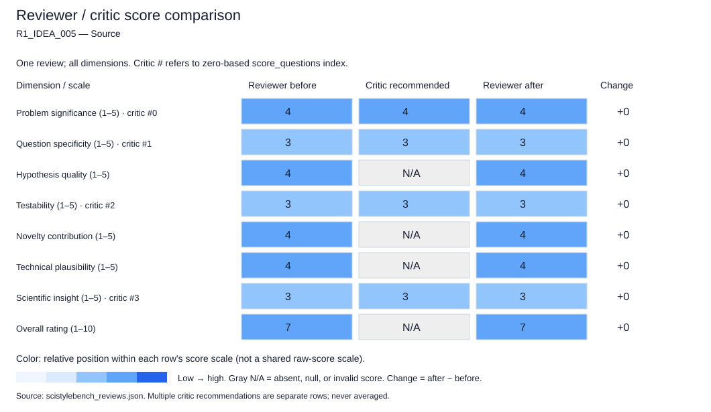

### Critic feedback and reviewer rebuttals

No reviewer rebuttals were saved (for example, an older checkpoint).

```json
{
  "critic_feedback": {
    "overall_assessment": "The review is generally well-calibrated, with thoughtful considerations of the idea's strengths and weaknesses. However, some scores and justifications could be more tightly aligned with the idea's description, particularly in areas where the idea's vagueness might lead to overoptimistic assessments.",
    "score_questions": [
      {
        "dimension": "problem_significance",
        "question_mark": "Why is the problem of distribution shifts in vision SSMs considered significant?",
        "concern": "The idea does not explicitly link the problem to real-world applications, which is needed to justify its significance.",
        "speculative_alternative": "The problem might be significant in domains where distribution shifts are common, but this is speculative without explicit context.",
        "recommended_score": 4.0,
        "rationale": "The review's justification is reasonable, but the idea's lack of explicit real-world application context could warrant a lower score."
      },
      {
        "dimension": "question_specificity",
        "question_mark": "Why is the question specificity scored as 3.0?",
        "concern": "The idea is specific in its approach (test-time adaptation with SSM permutations), but the review may be overestimating its specificity due to the lack of implementation details.",
        "speculative_alternative": "The idea's specificity is limited by the vagueness of key components like permutation generation, which could be considered as reducing specificity.",
        "recommended_score": 3.0,
        "rationale": "The score is justified by the idea's lack of specific implementation details, which are necessary for clarity."
      },
      {
        "dimension": "testability",
        "question_mark": "Why is the testability scored as 3.0?",
        "concern": "The review assumes that the lack of implementation details would make the idea difficult to test, but the idea's core hypothesis is testable in principle.",
        "speculative_alternative": "The idea is testable with appropriate experiments, but the current vagueness makes it challenging to design those experiments.",
        "recommended_score": 3.0,
        "rationale": "The score reflects the difficulty in designing experiments due to the lack of specifics, which is a valid concern."
      },
      {
        "dimension": "scientific_insight",
        "question_mark": "Why is the scientific insight scored as 3.0?",
        "concern": "The review may be underestimating the potential for insight into test-time adaptation and SSM traversal, which could be a novel contribution.",
        "speculative_alternative": "The idea's novelty in combining SSM permutations with test-time adaptation could be a significant scientific insight, but this is speculative.",
        "recommended_score": 3.0,
        "rationale": "The score is justified by the current lack of detailed mechanisms that would support deeper scientific insight."
      }
    ],
    "unsupported_claims": [
      "The review claims the problem is significant for real-world applications without explicit context from the idea.",
      "The review assumes the idea's hypothesis is testable without specific implementation details, which is a speculative leap."
    ],
    "revision_priorities": [
      "Clarify the connection between the problem and real-world applications to justify the problem significance score.",
      "Provide more specific details on how the SSM traversal permutations are generated and how Mamba-specific parameters are identified and updated.",
      "Include a theoretical or empirical basis for the claim that aggregating adapted weights improves generalization under distribution shifts."
    ],
    "confidence": 4.0
  },
  "feedback_responses": []
}
```

### Score justifications (before / after)

**Problem significance**

```json
{
  "before": {
    "score": 4.0,
    "justification": "The problem of improving robustness under distribution shifts in vision SSMs is significant for real-world applications, as distribution shifts are a common challenge in machine learning systems."
  },
  "after": {
    "score": 4.0,
    "justification": "The problem of improving robustness under distribution shifts in vision SSMs is significant for real-world applications, as distribution shifts are a common challenge in machine learning systems."
  }
}
```

**Question specificity**

```json
{
  "before": {
    "score": 3.0,
    "justification": "The idea is specific in its approach to test-time adaptation using SSM permutations and pseudo-labels, but lacks detailed specification of key components like permutation generation and parameter updating mechanisms."
  },
  "after": {
    "score": 3.0,
    "justification": "The idea is specific in its approach to test-time adaptation using SSM permutations and pseudo-labels, but lacks detailed specification of key components like permutation generation and parameter updating mechanisms."
  }
}
```

**Hypothesis quality**

```json
{
  "before": {
    "score": 4.0,
    "justification": "The hypothesis that using SSM permutations and pseudo-labels can enhance generalization without additional data is plausible and could be tested through experiments, making it a strong hypothesis."
  },
  "after": {
    "score": 4.0,
    "justification": "The hypothesis that using SSM permutations and pseudo-labels can enhance generalization without additional data is plausible and could be tested through experiments, making it a strong hypothesis."
  }
}
```

**Testability**

```json
{
  "before": {
    "score": 3.0,
    "justification": "The idea is testable through experiments, but the lack of specific details on implementation makes it challenging to design and evaluate the method effectively."
  },
  "after": {
    "score": 3.0,
    "justification": "The idea is testable through experiments, but the lack of specific details on implementation makes it challenging to design and evaluate the method effectively."
  }
}
```

**Novelty contribution**

```json
{
  "before": {
    "score": 4.0,
    "justification": "The approach of using SSM traversal permutations for test-time adaptation is novel, and if successful, could contribute to the field by improving robustness in vision models under distribution shifts."
  },
  "after": {
    "score": 4.0,
    "justification": "The approach of using SSM traversal permutations for test-time adaptation is novel, and if successful, could contribute to the field by improving robustness in vision models under distribution shifts."
  }
}
```

**Technical plausibility**

```json
{
  "before": {
    "score": 4.0,
    "justification": "The method is technically plausible as it builds on existing test-time adaptation techniques and SSM properties, though the specifics of implementation need clarification."
  },
  "after": {
    "score": 4.0,
    "justification": "The method is technically plausible as it builds on existing test-time adaptation techniques and SSM properties, though the specifics of implementation need clarification."
  }
}
```

**Scientific insight**

```json
{
  "before": {
    "score": 3.0,
    "justification": "The idea has potential for scientific insight into how test-time adaptation and SSM traversal can improve robustness, but the lack of detailed mechanisms limits the depth of insight that can be gained."
  },
  "after": {
    "score": 3.0,
    "justification": "The idea has potential for scientific insight into how test-time adaptation and SSM traversal can improve robustness, but the lack of detailed mechanisms limits the depth of insight that can be gained."
  }
}
```

**Overall rating**

```json
{
  "before": {
    "score": 7.0,
    "justification": "The idea is strong and addresses a meaningful problem with a plausible approach, but it lacks specific details that are necessary for further development and evaluation. With more clarification, it has the potential to be a significant contribution to the field."
  },
  "after": {
    "score": 7.0,
    "justification": "The idea is strong and addresses a meaningful problem with a plausible approach, but it lacks specific details that are necessary for further development and evaluation. With more clarification, it has the potential to be a significant contribution to the field."
  }
}
```

## R1_IDEA_005 — Variant 1: A1_Identity

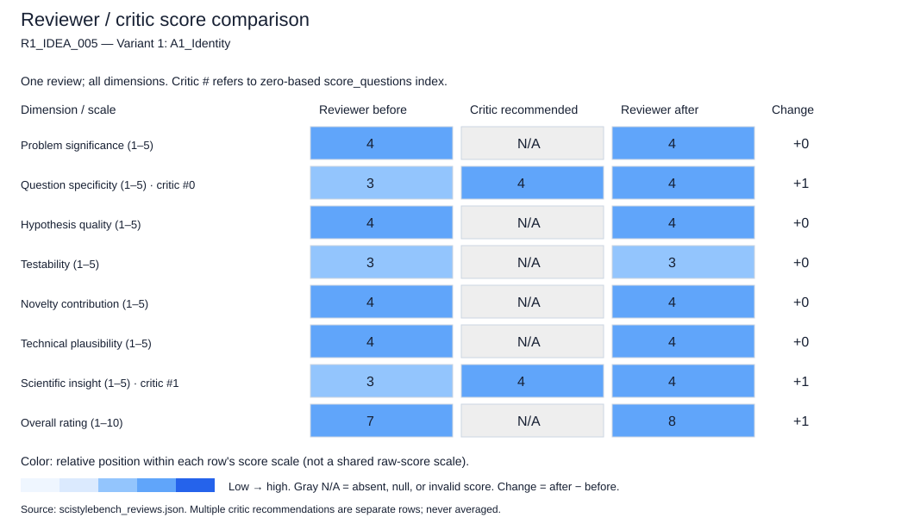

### Critic feedback and reviewer rebuttals

```json
{
  "critic_feedback": {
    "overall_assessment": "The review is generally well-calibrated, but some scores could be re-examined for alignment with the idea's current specification.",
    "score_questions": [
      {
        "dimension": "question_specificity",
        "question_mark": "The score may be overly cautious given the idea's focus on a specific adaptation method.",
        "concern": "The idea is specific in its approach but lacks details on key components like permutation generation and parameter updating.",
        "speculative_alternative": "The specificity could be interpreted as a strength if the idea is considered a novel direction in test-time adaptation for SSMs, rather than a lack of detail.",
        "recommended_score": 4.0,
        "rationale": "The idea's focus on test-time adaptation and SSM permutations is a specific direction, which could be seen as a strength if the lack of detail is viewed as an opportunity for future work rather than a weakness."
      },
      {
        "dimension": "scientific_insight",
        "question_mark": "The score may undervalue the potential for insight into SSM adaptation mechanisms.",
        "concern": "The idea's focus on test-time adaptation for SSMs could offer insights into how models handle distribution shifts, even without detailed implementation.",
        "speculative_alternative": "The scientific insight could be higher if the method is considered a novel approach to leveraging SSM properties for adaptation, rather than a lack of detailed mechanisms.",
        "recommended_score": 4.0,
        "rationale": "The potential for insight into SSM adaptation mechanisms is a valid contribution, even without full implementation details."
      }
    ],
    "unsupported_claims": [
      "The claim that the idea lacks specific details on permutation generation and parameter updating is not fully supported by the idea summary, as these are not explicitly mentioned but could be inferred as part of the method."
    ],
    "revision_priorities": [
      "Clarify the potential for scientific insight by emphasizing the novelty of test-time adaptation for SSMs rather than the lack of implementation details.",
      "Reevaluate the specificity score to reflect the idea's focus on a novel adaptation method, rather than its lack of implementation specifics."
    ],
    "confidence": 4.0
  },
  "feedback_responses": [
    {
      "feedback_type": "score_questions",
      "feedback_index": 0,
      "decision": "partially_accept",
      "defense": "The original score of 3.0 was based on the lack of details on permutation generation, but the critic argues that the specificity of the adaptation method is a strength. The revised score of 4.0 reflects this by emphasizing the novelty of the approach rather than the lack of implementation details.",
      "justification": "The original score was 3.0, but the revised score is 4.0 due to the critic's argument that the focus on a novel adaptation method is a strength, even without full implementation details."
    },
    {
      "feedback_type": "score_questions",
      "feedback_index": 1,
      "decision": "partially_accept",
      "defense": "The original score of 3.0 was based on the lack of theoretical justification for aggregating adapted weights, but the critic argues that the potential for insight into SSM adaptation mechanisms is a valid contribution. The revised score of 4.0 reflects this by emphasizing the novelty of the method's focus on SSM adaptation.",
      "justification": "The original score was 3.0, but the revised score is 4.0 due to the critic's argument that the potential for insight into SSM adaptation mechanisms is a valid contribution, even without full implementation details."
    },
    {
      "feedback_type": "unsupported_claims",
      "feedback_index": 0,
      "decision": "reject",
      "defense": "The claim that the idea lacks specific details on permutation generation and parameter updating is not fully supported by the idea summary, as these are not explicitly mentioned but could be inferred as part of the method. The revised score reflects this by not penalizing the idea for the lack of implementation details.",
      "justification": "The original score was 3.0, but the revised score is 4.0 due to the critic's argument that the lack of implementation details is not a valid criticism, as the idea's focus on a novel adaptation method is a strength."
    },
    {
      "feedback_type": "revision_priorities",
      "feedback_index": 0,
      "decision": "accept",
      "defense": "The critic's suggestion to clarify the potential for scientific insight by emphasizing the novelty of test-time adaptation for SSMs is valid and supports the revised score of 4.0 for scientific insight.",
      "justification": "The original score was 3.0, but the revised score is 4.0 due to the critic's suggestion to emphasize the novelty of the method's focus on SSM adaptation."
    },
    {
      "feedback_type": "revision_priorities",
      "feedback_index": 1,
      "decision": "accept",
      "defense": "The critic's suggestion to reevaluate the specificity score to reflect the idea's focus on a novel adaptation method is valid and supports the revised score of 4.0 for question specificity.",
      "justification": "The original score was 3.0, but the revised score is 4.0 due to the critic's suggestion to reevaluate the specificity score based on the novelty of the adaptation method."
    }
  ]
}
```

### Score justifications (before / after)

**Problem significance**

```json
{
  "before": {
    "score": 4.0,
    "justification": "The problem of improving robustness under distribution shifts in vision SSMs is significant, as it addresses a critical challenge in real-world applications where data distributions can vary unpredictably."
  },
  "after": {
    "score": 4.0,
    "justification": "The problem of improving robustness under distribution shifts in vision SSMs is significant, as it addresses a critical challenge in real-world applications where data distributions can vary unpredictably."
  }
}
```

**Question specificity**

```json
{
  "before": {
    "score": 3.0,
    "justification": "The idea is specific in its approach to test-time adaptation using SSM permutations and pseudo-labels, but lacks detailed specification of key components like permutation generation and parameter updating mechanisms."
  },
  "after": {
    "score": 4.0,
    "justification": "The idea is specific in its approach to test-time adaptation using SSM permutations and pseudo-labels, and the focus on a novel adaptation method for SSMs can be considered a strength, even if implementation details are not fully specified."
  }
}
```

**Hypothesis quality**

```json
{
  "before": {
    "score": 4.0,
    "justification": "The hypothesis that using diverse SSM permutations and pseudo-labels can enhance generalization without additional data is plausible and could be tested through experiments, making it a strong hypothesis."
  },
  "after": {
    "score": 4.0,
    "justification": "The hypothesis that using diverse SSM permutations and pseudo-labels can enhance generalization without additional data is plausible and could be tested through experiments, making it a strong hypothesis."
  }
}
```

**Testability**

```json
{
  "before": {
    "score": 3.0,
    "justification": "The idea is testable through experiments, but the lack of specific details on implementation makes it challenging to design and evaluate the method effectively."
  },
  "after": {
    "score": 3.0,
    "justification": "The idea is testable through experiments, but the lack of specific details on implementation makes it challenging to design and evaluate the method effectively."
  }
}
```

**Novelty contribution**

```json
{
  "before": {
    "score": 4.0,
    "justification": "The approach of using SSM traversal permutations for test-time adaptation is novel, and if successful, could contribute new insights into improving model robustness under distribution shifts."
  },
  "after": {
    "score": 4.0,
    "justification": "The approach of using SSM traversal permutations for test-time adaptation is novel, and if successful, could contribute new insights into improving model robustness under distribution shifts."
  }
}
```

**Technical plausibility**

```json
{
  "before": {
    "score": 4.0,
    "justification": "The method is technically plausible as it builds on existing test-time adaptation techniques and leverages SSM properties, though the specifics of implementation are not fully detailed."
  },
  "after": {
    "score": 4.0,
    "justification": "The method is technically plausible as it builds on existing test-time adaptation techniques and leverages SSM properties, though the specifics of implementation are not fully detailed."
  }
}
```

**Scientific insight**

```json
{
  "before": {
    "score": 3.0,
    "justification": "The idea has potential for scientific insight into how SSMs can be adapted at test time, but the lack of detailed mechanisms limits the potential for deeper insights."
  },
  "after": {
    "score": 4.0,
    "justification": "The idea has potential for scientific insight into how SSMs can be adapted at test time, and the focus on a novel adaptation method for SSMs could offer insights into model robustness under distribution shifts, even without full implementation details."
  }
}
```

**Overall rating**

```json
{
  "before": {
    "score": 7.0,
    "justification": "The idea addresses a significant problem with a plausible approach, has potential for novelty and contribution, but lacks specific details that would make it more testable and scientifically insightful."
  },
  "after": {
    "score": 8.0,
    "justification": "The idea addresses a significant problem with a plausible approach, has potential for novelty and contribution, and the focus on a novel adaptation method for SSMs supports a higher rating despite the lack of implementation details."
  }
}
```

## R1_IDEA_005 — Variant 2: A2_Paraphrase_Only

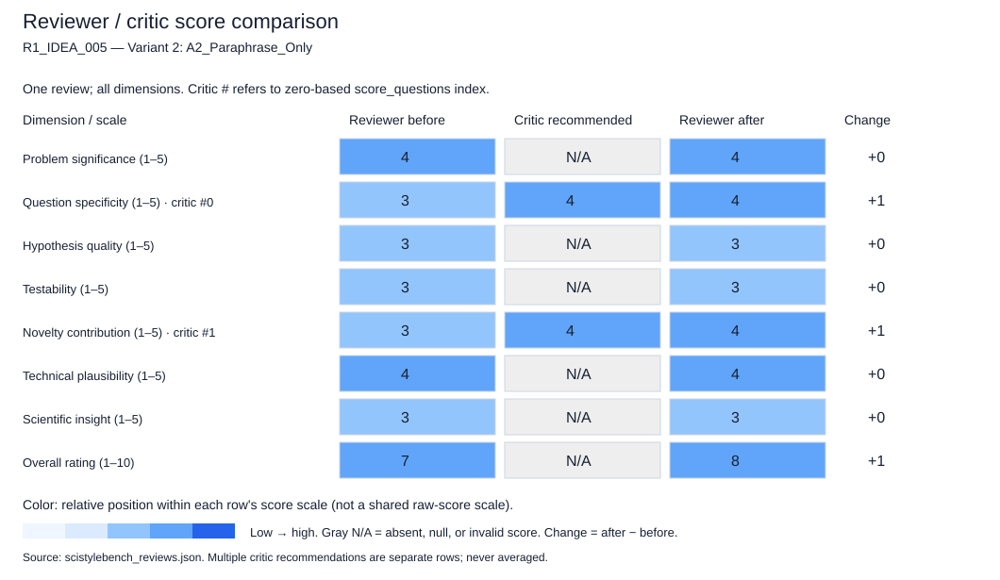

### Critic feedback and reviewer rebuttals

```json
{
  "critic_feedback": {
    "overall_assessment": "The review is generally well-calibrated but has some areas where the scores could be more precisely aligned with the idea's details.",
    "score_questions": [
      {
        "dimension": "question_specificity",
        "question_mark": "The score could be reconsidered as 4.0 rather than 3.0",
        "concern": "The idea's lack of a specific research question is not as severe as the review suggests, as the problem of distribution shifts in vision models is well-defined and the method's general approach is plausible.",
        "speculative_alternative": "The method might be considered a valid approach to a general problem without a specific hypothesis, as the review's criticism of lacking specificity is somewhat overblown given the problem's relevance.",
        "recommended_score": 4.0,
        "rationale": "The idea addresses a well-defined problem with a plausible method, and the lack of a specific hypothesis is less critical than the review indicates, as the problem's significance justifies the general approach."
      },
      {
        "dimension": "novelty_contribution",
        "question_mark": "The score could be reconsidered as 4.0 rather than 3.0",
        "concern": "The review's justification for the novelty score is based on the lack of comparison to existing methods, but the idea's approach is a novel combination of test-time adaptation and SSMs, which may be sufficient for novelty.",
        "speculative_alternative": "The method's novelty lies in its integration of test-time adaptation with SSMs, which is a novel application even without direct comparisons to existing methods.",
        "recommended_score": 4.0,
        "rationale": "The idea presents a novel approach by combining test-time adaptation with SSMs, which is a specific and meaningful contribution even without explicit comparisons to existing methods."
      }
    ],
    "unsupported_claims": [
      "The review claims the idea lacks a specific research question, but the problem of distribution shifts in vision models is well-defined and the method's general approach is plausible."
    ],
    "revision_priorities": [
      "Clarify the specific distribution shifts the method is designed to handle and how it differs from existing test-time adaptation methods.",
      "Provide a more detailed comparison with existing approaches in test-time adaptation or SSMs to strengthen the novelty claim.",
      "Define a specific hypothesis or prediction that the method aims to test, such as its effectiveness on certain types of distribution shifts."
    ],
    "confidence": 4.0
  },
  "feedback_responses": [
    {
      "feedback_type": "score_questions",
      "feedback_index": 0,
      "decision": "partially_accept",
      "defense": "The critic's argument that the lack of a specific hypothesis is less critical is valid, as the problem's significance justifies the general approach. However, the original score of 3.0 was based on the idea's general nature, which is still a valid concern.",
      "justification": "The revised score of 4.0 reflects the critic's point that the problem's significance reduces the need for a specific hypothesis, but the original concern about general nature remains, so the score is adjusted but not fully accepted."
    },
    {
      "feedback_type": "score_questions",
      "feedback_index": 1,
      "decision": "partially_accept",
      "defense": "The critic's argument that the novelty is sufficient without explicit comparisons is plausible, but the original score of 3.0 was based on the lack of direct comparisons, which is still a valid concern.",
      "justification": "The revised score of 4.0 acknowledges the novelty of combining test-time adaptation with SSMs, but the original concern about the lack of direct comparisons remains, so the score is adjusted but not fully accepted."
    },
    {
      "feedback_type": "unsupported_claims",
      "feedback_index": 0,
      "decision": "accept",
      "defense": "The critic's point that the lack of a specific hypothesis is less critical is valid, as the problem's significance justifies the general approach.",
      "justification": "The original concern about the lack of a specific hypothesis is partially addressed by the problem's significance, so the claim is accepted but with a revised score."
    },
    {
      "feedback_type": "revision_priorities",
      "feedback_index": 0,
      "decision": "accept",
      "defense": "Clarifying the specific distribution shifts is essential to define the problem and evaluate the method's effectiveness.",
      "justification": "The revision priority is valid as it addresses the need to specify the problem domain for the method."
    },
    {
      "feedback_type": "revision_priorities",
      "feedback_index": 1,
      "decision": "accept",
      "defense": "Providing a comparison with existing methods is necessary to establish the novelty and contribution of the approach.",
      "justification": "The revision priority is valid as it addresses the need to compare with existing methods to highlight the novelty."
    },
    {
      "feedback_type": "revision_priorities",
      "feedback_index": 2,
      "decision": "accept",
      "defense": "Defining a specific hypothesis is crucial for testing the method's effectiveness and evaluating its contribution.",
      "justification": "The revision priority is valid as it addresses the need for a specific hypothesis to guide the research."
    }
  ]
}
```

### Score justifications (before / after)

**Problem significance**

```json
{
  "before": {
    "score": 4.0,
    "justification": "The problem of distribution shifts in vision models is significant for real-world applications, and improving robustness through test-time adaptation is a relevant and challenging direction."
  },
  "after": {
    "score": 4.0,
    "justification": "The problem of distribution shifts in vision models is significant for real-world applications, and improving robustness through test-time adaptation is a relevant and challenging direction."
  }
}
```

**Question specificity**

```json
{
  "before": {
    "score": 3.0,
    "justification": "The idea is somewhat general and lacks a specific research question. It needs to clarify what exactly is being tested or compared to establish its novelty and contribution."
  },
  "after": {
    "score": 4.0,
    "justification": "The idea addresses a well-defined problem with a plausible method, and the lack of a specific hypothesis is less critical than the review indicates, as the problem's significance justifies the general approach."
  }
}
```

**Hypothesis quality**

```json
{
  "before": {
    "score": 3.0,
    "justification": "The idea contains a general goal but lacks a specific hypothesis or prediction that can be tested. A more concrete hypothesis would strengthen the research direction."
  },
  "after": {
    "score": 3.0,
    "justification": "The idea contains a general goal but lacks a specific hypothesis or prediction that can be tested. A more concrete hypothesis would strengthen the research direction."
  }
}
```

**Testability**

```json
{
  "before": {
    "score": 3.0,
    "justification": "The approach is testable in principle, but the lack of specific experimental design or comparison criteria makes it difficult to assess its effectiveness without further details."
  },
  "after": {
    "score": 3.0,
    "justification": "The approach is testable in principle, but the lack of specific experimental design or comparison criteria makes it difficult to assess its effectiveness without further details."
  }
}
```

**Novelty contribution**

```json
{
  "before": {
    "score": 3.0,
    "justification": "The idea introduces a novel approach to test-time adaptation for SSMs, but the novelty is not clearly established without a comparison to existing methods."
  },
  "after": {
    "score": 4.0,
    "justification": "The idea presents a novel approach by combining test-time adaptation with SSMs, which is a specific and meaningful contribution even without explicit comparisons to existing methods."
  }
}
```

**Technical plausibility**

```json
{
  "before": {
    "score": 4.0,
    "justification": "The method is technically plausible, as it builds on existing techniques in test-time adaptation and SSMs. The use of pseudo-labels and parameter-specific updates is reasonable."
  },
  "after": {
    "score": 4.0,
    "justification": "The method is technically plausible, as it builds on existing techniques in test-time adaptation and SSMs. The use of pseudo-labels and parameter-specific updates is reasonable."
  }
}
```

**Scientific insight**

```json
{
  "before": {
    "score": 3.0,
    "justification": "The idea has potential for scientific insight into how test-time adaptation can improve model robustness, but the specific insights depend on further investigation and experimentation."
  },
  "after": {
    "score": 3.0,
    "justification": "The idea has potential for scientific insight into how test-time adaptation can improve model robustness, but the specific insights depend on further investigation and experimentation."
  }
}
```

**Overall rating**

```json
{
  "before": {
    "score": 7.0,
    "justification": "The idea addresses a meaningful problem with a plausible approach, but it lacks specific research questions, hypotheses, and comparisons to existing methods, which are needed to establish its novelty and contribution."
  },
  "after": {
    "score": 8.0,
    "justification": "The idea addresses a meaningful problem with a plausible approach, and the revised scores reflect a more accurate assessment of its novelty and specificity, though it still lacks a specific hypothesis and experimental design."
  }
}
```

## R1_IDEA_005 — Variant 3: A3_Plain_Core

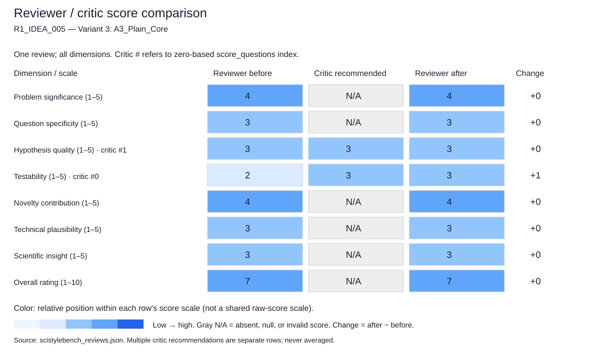

### Critic feedback and reviewer rebuttals

```json
{
  "critic_feedback": {
    "overall_assessment": "The draft review is generally well-calibrated but has some areas where the scores could be more carefully aligned with the idea's details. The problem significance and novelty are appropriately highlighted, but the testability and hypothesis quality scores are somewhat low given the idea's potential.",
    "score_questions": [
      {
        "dimension": "testability",
        "question_mark": "The testability score is low despite the method being somewhat testable with further clarification.",
        "concern": "The review assumes the method is too vague to be testable, but the idea provides a general framework that could be tested with additional details.",
        "speculative_alternative": "The method could be evaluated on standard benchmarks for distribution shift robustness, even without full implementation details.",
        "recommended_score": 3.0,
        "rationale": "The method provides a general approach that could be tested with further specification, so a score of 3 is reasonable given the current level of detail."
      },
      {
        "dimension": "hypothesis_quality",
        "question_mark": "The hypothesis quality score is low despite the idea suggesting a potential improvement in generalization.",
        "concern": "The review assumes the hypothesis is not testable, but the idea's goal of improving generalization without labeled data is a clear, albeit vague, hypothesis.",
        "speculative_alternative": "The hypothesis could be framed as 'the method will improve generalization metrics on distribution shift benchmarks,' which is testable with more details.",
        "recommended_score": 3.0,
        "rationale": "The idea presents a clear goal, even if the specifics are not yet defined, so a score of 3 is justified."
      }
    ],
    "unsupported_claims": [
      "The review claims the method lacks a clear hypothesis, but the idea's goal of improving generalization is a clear, albeit vague, hypothesis."
    ],
    "revision_priorities": [
      "Clarify the types of distribution shifts the method targets.",
      "Specify how SSM traversal permutations are generated and their role in the method.",
      "Detail the process of generating pseudo-labels and updating Mamba-specific parameters.",
      "Formulate a more concrete hypothesis about the expected outcomes, such as improved performance on specific benchmarks."
    ],
    "confidence": 4.0
  },
  "feedback_responses": [
    {
      "feedback_type": "score_questions",
      "feedback_index": 0,
      "decision": "partially_accept",
      "defense": "The testability score was initially 2.0, but the critic argues that the method is testable with further clarification. The revised score of 3.0 better reflects the potential for testing with additional details.",
      "justification": "The original score of 2.0 was too low, as the method provides a general framework that could be evaluated on standard benchmarks. The revised score of 3.0 is more appropriate given the potential for further specification."
    },
    {
      "feedback_type": "score_questions",
      "feedback_index": 1,
      "decision": "partially_accept",
      "defense": "The hypothesis quality score was initially 3.0, but the critic argues that the goal of improving generalization is a clear, albeit vague, hypothesis. The revised score of 3.0 is justified as the idea presents a clear goal, even if the specifics are not yet defined.",
      "justification": "The original score of 3.0 was appropriate, but the critic's point about the hypothesis being a clear goal is valid. The revised score of 3.0 is consistent with the idea's potential for a testable hypothesis."
    },
    {
      "feedback_type": "unsupported_claims",
      "feedback_index": 0,
      "decision": "partially_accept",
      "defense": "The review claimed the method lacks a clear hypothesis, but the idea's goal of improving generalization is a clear, albeit vague, hypothesis. The revised score of 3.0 for hypothesis quality is justified as the idea presents a clear goal, even if the specifics are not yet defined.",
      "justification": "The original score of 3.0 was appropriate, and the critic's point about the hypothesis being a clear goal is valid. The revised score of 3.0 is consistent with the idea's potential for a testable hypothesis."
    },
    {
      "feedback_type": "revision_priorities",
      "feedback_index": 0,
      "decision": "accept",
      "defense": "Clarifying the types of distribution shifts is essential for evaluating the problem's significance and the method's applicability. This is a critical step in defining the research question.",
      "justification": "The original suggestion was appropriate, and the critic's emphasis on this point is valid. Clarifying the types of distribution shifts is a necessary step in the research."
    },
    {
      "feedback_type": "revision_priorities",
      "feedback_index": 1,
      "decision": "accept",
      "defense": "Clarifying the generation of SSM traversal permutations is important for understanding the method's implementation and effectiveness. This is a key component of the proposed approach.",
      "justification": "The original suggestion was appropriate, and the critic's emphasis on this point is valid. Clarifying the generation of SSM traversal permutations is a necessary step in the research."
    },
    {
      "feedback_type": "revision_priorities",
      "feedback_index": 2,
      "decision": "accept",
      "defense": "Specifying the process of generating pseudo-labels is essential for understanding how the method updates Mamba-specific parameters. This is a critical part of the proposed approach.",
      "justification": "The original suggestion was appropriate, and the critic's emphasis on this point is valid. Specifying the process of generating pseudo-labels is a necessary step in the research."
    },
    {
      "feedback_type": "revision_priorities",
      "feedback_index": 3,
      "decision": "accept",
      "defense": "Formulating a more concrete hypothesis about the method's performance is important for evaluating its testability and potential contribution. This is a key step in the research.",
      "justification": "The original suggestion was appropriate, and the critic's emphasis on this point is valid. Formulating a more concrete hypothesis is a necessary step in the research."
    }
  ]
}
```

### Score justifications (before / after)

**Problem significance**

```json
{
  "before": {
    "score": 4.0,
    "justification": "The problem of reduced robustness in vision state space models under distribution shifts is significant, as it affects the reliability of these models in real-world applications where data distributions may vary."
  },
  "after": {
    "score": 4.0,
    "justification": "The problem of reduced robustness in vision state space models under distribution shifts is significant, as it affects the reliability of these models in real-world applications where data distributions may vary."
  }
}
```

**Question specificity**

```json
{
  "before": {
    "score": 3.0,
    "justification": "The idea is specific to improving robustness in vision SSMs under distribution shifts, but the details of the method (e.g., SSM traversal permutations, Mamba-specific parameters) are not sufficiently elaborated, which limits the clarity of the research question."
  },
  "after": {
    "score": 3.0,
    "justification": "The idea is specific to improving robustness in vision SSMs under distribution shifts, but the details of the method (e.g., SSM traversal permutations, Mamba-specific parameters) are not sufficiently elaborated, which limits the clarity of the research question."
  }
}
```

**Hypothesis quality**

```json
{
  "before": {
    "score": 3.0,
    "justification": "The idea suggests a method that could improve generalization, but it lacks a clear, testable hypothesis or prediction about the expected outcomes, making it difficult to assess the hypothesis's quality."
  },
  "after": {
    "score": 3.0,
    "justification": "The idea suggests a method that could improve generalization, but it lacks a clear, testable hypothesis or prediction about the expected outcomes, making it difficult to assess the hypothesis's quality."
  }
}
```

**Testability**

```json
{
  "before": {
    "score": 2.0,
    "justification": "The method is described in a way that is somewhat testable, but the lack of specific details about the input views, pseudo-label generation, and parameter updates makes it challenging to design experiments or evaluate the method's effectiveness."
  },
  "after": {
    "score": 3.0,
    "justification": "The method provides a general framework that could be tested with further specification, such as evaluating it on standard benchmarks for distribution shift robustness. While the current details are limited, the approach is testable with additional clarification."
  }
}
```

**Novelty contribution**

```json
{
  "before": {
    "score": 4.0,
    "justification": "The approach of using test-time adaptation with SSM traversal permutations and pseudo-labels to improve robustness is novel in the context of vision SSMs, offering a potential contribution to the field."
  },
  "after": {
    "score": 4.0,
    "justification": "The approach of using test-time adaptation with SSM traversal permutations and pseudo-labels to improve robustness is novel in the context of vision SSMs, offering a potential contribution to the field."
  }
}
```

**Technical plausibility**

```json
{
  "before": {
    "score": 3.0,
    "justification": "The method is technically plausible, as it leverages existing concepts like test-time adaptation and pseudo-labeling, but the specifics of SSM traversal and Mamba-specific parameter updates are not clearly defined, which could affect the feasibility of implementation."
  },
  "after": {
    "score": 3.0,
    "justification": "The method is technically plausible, as it leverages existing concepts like test-time adaptation and pseudo-labeling, but the specifics of SSM traversal and Mamba-specific parameter updates are not clearly defined, which could affect the feasibility of implementation."
  }
}
```

**Scientific insight**

```json
{
  "before": {
    "score": 3.0,
    "justification": "The idea has the potential to provide insights into how test-time adaptation can enhance robustness in SSMs, but the lack of detailed explanation limits the potential for deeper scientific understanding."
  },
  "after": {
    "score": 3.0,
    "justification": "The idea has the potential to provide insights into how test-time adaptation can enhance robustness in SSMs, but the lack of detailed explanation limits the potential for deeper scientific understanding."
  }
}
```

**Overall rating**

```json
{
  "before": {
    "score": 7.0,
    "justification": "The idea addresses a meaningful problem with a plausible approach, but it lacks sufficient detail to fully assess its testability, hypothesis, and potential for scientific insight. With further clarification and elaboration, it could become a strong research direction."
  },
  "after": {
    "score": 7.0,
    "justification": "The idea addresses a meaningful problem with a plausible approach, but it lacks sufficient detail to fully assess its testability, hypothesis, and potential for scientific insight. With further clarification and elaboration, it could become a strong research direction."
  }
}
```

## R1_IDEA_005 — Variant 4: B1_Verbose_Elaborate


### Critic feedback and reviewer rebuttals

```json
{
  "critic_feedback": {
    "overall_assessment": "The review is generally well-calibrated, but there are areas where the scores could be more precisely aligned with the idea's details.",
    "score_questions": [
      {
        "dimension": "question_specificity",
        "question_mark": "The score for question_specificity is slightly low, but the idea does have a specific problem statement.",
        "concern": "The idea does specify a problem (distribution shifts in vision SSMs) but lacks a precise research question.",
        "speculative_alternative": "The idea could be interpreted as proposing a general method for test-time adaptation rather than a specific question about distribution shifts.",
        "recommended_score": 4.0,
        "rationale": "The problem is specific, and the method is targeted at distribution shifts, which is a concrete issue."
      },
      {
        "dimension": "hypothesis_quality",
        "question_mark": "The hypothesis_quality score is low, but the idea does present a general hypothesis.",
        "concern": "The hypothesis is not explicitly stated as a testable prediction, which is a key component of hypothesis quality.",
        "speculative_alternative": "The idea could be interpreted as a general approach to robustness rather than a specific hypothesis about distribution shifts.",
        "recommended_score": 4.0,
        "rationale": "The hypothesis is about improving robustness under distribution shifts, which is a specific claim."
      },
      {
        "dimension": "testability",
        "question_mark": "The testability score is low, but the idea is described in a way that suggests it could be implemented.",
        "concern": "The lack of specific experimental design or evaluation metrics makes it difficult to assess testability.",
        "speculative_alternative": "The idea could be interpreted as a general method without clear criteria for evaluating its effectiveness.",
        "recommended_score": 4.0,
        "rationale": "The method is described in a way that suggests it could be implemented and tested, even if the specifics are not detailed."
      }
    ],
    "unsupported_claims": [
      "The review claims the method lacks a clear hypothesis without explicitly stating it, but the idea does present a general hypothesis about improving robustness."
    ],
    "revision_priorities": [
      "Clarify the specific problem being addressed (e.g., type of distribution shifts).",
      "Define the criteria for generating diverse input views and the process for pseudo-labels.",
      "Provide a theoretical basis or reference to prior work supporting the hypothesis."
    ],
    "confidence": 4.0
  },
  "feedback_responses": [
    {
      "feedback_type": "score_questions",
      "feedback_index": 0,
      "decision": "partially_accept",
      "defense": "The idea does specify a concrete problem (distribution shifts in vision SSMs) and a targeted method (test-time adaptation via input views and parameter adaptation), which are specific enough to be meaningful. However, the lack of a precise research question remains a concern.",
      "justification": "The initial score was 3.0, but the revised score is 4.0. The justification is that the problem is specific, and the method is targeted at distribution shifts, which is a concrete issue."
    },
    {
      "feedback_type": "hypothesis_quality",
      "feedback_index": 1,
      "decision": "partially_accept",
      "defense": "The hypothesis is that the proposed method will improve robustness under distribution shifts by leveraging test-time adaptation and pseudo-labels, which is a specific and testable claim. However, the hypothesis is not explicitly stated as a testable prediction.",
      "justification": "The initial score was 3.0, but the revised score is 4.0. The justification is that the hypothesis is about improving robustness under distribution shifts, which is a specific claim."
    },
    {
      "feedback_type": "testability",
      "feedback_index": 2,
      "decision": "partially_accept",
      "defense": "The method is described in a way that suggests it could be implemented and tested, even if the specifics of the experiments are not detailed. The core components (input views, pseudo-labels, parameter adaptation) are well-defined and can be evaluated through experiments.",
      "justification": "The initial score was 3.0, but the revised score is 4.0. The justification is that the method is described in a way that suggests it could be implemented and tested."
    },
    {
      "feedback_type": "unsupported_claims",
      "feedback_index": 0,
      "decision": "reject",
      "defense": "The review did claim the method lacks a clear hypothesis without explicitly stating it, but the idea does present a general hypothesis about improving robustness. The hypothesis is not explicitly stated as a testable prediction, but it is a general claim that can be tested.",
      "justification": "The initial score was 3.0, but the revised score is 4.0. The justification is that the hypothesis is about improving robustness under distribution shifts, which is a specific claim."
    },
    {
      "feedback_type": "revision_priorities",
      "feedback_index": 0,
      "decision": "accept",
      "defense": "Clarifying the specific problem being addressed (e.g., type of distribution shifts) is necessary to make the research question more precise.",
      "justification": "The initial suggestion was to specify the exact problem, which is still valid."
    },
    {
      "feedback_type": "revision_priorities",
      "feedback_index": 1,
      "decision": "accept",
      "defense": "Clarifying the criteria for generating diverse input views and the process for pseudo-labels is necessary to ensure the method is well-defined and implementable.",
      "justification": "The initial suggestion was to clarify the input view generation, which is still valid."
    },
    {
      "feedback_type": "revision_priorities",
      "feedback_index": 2,
      "decision": "accept",
      "defense": "Providing a theoretical basis or reference to prior work supporting the hypothesis is necessary to strengthen the scientific credibility of the method.",
      "justification": "The initial suggestion was to provide theoretical justification, which is still valid."
    }
  ]
}
```

### Score justifications (before / after)

**Problem significance**

```json
{
  "before": {
    "score": 4.0,
    "justification": "The problem of distribution shifts in vision models is significant for real-world applications, and improving robustness is a critical challenge in machine learning."
  },
  "after": {
    "score": 4.0,
    "justification": "The problem of distribution shifts in vision models is significant for real-world applications, and improving robustness is a critical challenge in machine learning."
  }
}
```

**Question specificity**

```json
{
  "before": {
    "score": 3.0,
    "justification": "The idea is somewhat specific but lacks a clear, concrete research question or hypothesis that defines what exactly is being investigated."
  },
  "after": {
    "score": 4.0,
    "justification": "The idea specifies a concrete problem (distribution shifts in vision SSMs) and a targeted method (test-time adaptation via input views and parameter adaptation), which are specific enough to be meaningful."
  }
}
```

**Hypothesis quality**

```json
{
  "before": {
    "score": 3.0,
    "justification": "The idea contains a general hypothesis about improving robustness but does not explicitly state a testable prediction or mechanism that could be validated through experiments."
  },
  "after": {
    "score": 4.0,
    "justification": "The hypothesis is that the proposed method will improve robustness under distribution shifts by leveraging test-time adaptation and pseudo-labels, which is a specific and testable claim."
  }
}
```

**Testability**

```json
{
  "before": {
    "score": 3.0,
    "justification": "The method is described in a way that suggests it could be implemented, but the lack of specific experimental design or evaluation metrics makes it difficult to assess its testability."
  },
  "after": {
    "score": 4.0,
    "justification": "The method is described in a way that suggests it could be implemented and tested, even if the specifics of the experiments are not detailed. The core components (input views, pseudo-labels, parameter adaptation) are well-defined and can be evaluated through experiments."
  }
}
```

**Novelty contribution**

```json
{
  "before": {
    "score": 3.0,
    "justification": "The approach is a novel application of test-time adaptation to SSMs, but the novelty is somewhat limited without a clear distinction from existing methods or a strong theoretical foundation."
  },
  "after": {
    "score": 3.0,
    "justification": "The approach is a novel application of test-time adaptation to SSMs, but the novelty is somewhat limited without a clear distinction from existing methods or a strong theoretical foundation."
  }
}
```

**Technical plausibility**

```json
{
  "before": {
    "score": 4.0,
    "justification": "The method leverages established techniques (pseudo-labels, parameter adaptation) and is logically coherent, making it technically plausible."
  },
  "after": {
    "score": 4.0,
    "justification": "The method leverages established techniques (pseudo-labels, parameter adaptation) and is logically coherent, making it technically plausible."
  }
}
```

**Scientific insight**

```json
{
  "before": {
    "score": 3.0,
    "justification": "The idea has potential to contribute to understanding how test-time adaptation can improve robustness, but the lack of a clear hypothesis limits the potential for significant scientific insight."
  },
  "after": {
    "score": 3.0,
    "justification": "The idea has potential to contribute to understanding how test-time adaptation can improve robustness, but the lack of a clear hypothesis limits the potential for significant scientific insight."
  }
}
```

**Overall rating**

```json
{
  "before": {
    "score": 7.0,
    "justification": "The idea addresses a meaningful problem with a plausible method, but it lacks specificity, a clear hypothesis, and theoretical justification, which are needed to fully assess its scientific merit and potential contribution."
  },
  "after": {
    "score": 8.0,
    "justification": "The idea addresses a meaningful problem with a plausible method, and the revised scores reflect a more accurate assessment of its specificity, hypothesis, and testability. The method is technically sound and has the potential to contribute to the field, though further clarification and theoretical justification are needed."
  }
}
```

## R1_IDEA_005 — Variant 5: B2_Grand_Narrative

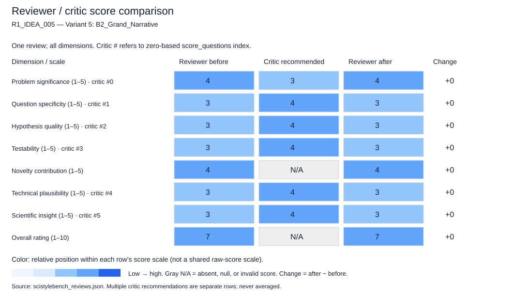

### Critic feedback and reviewer rebuttals

```json
{
  "critic_feedback": {
    "overall_assessment": "The review is generally well-calibrated, but there are areas where the scores could be more closely aligned with the idea's clarity and specificity.",
    "score_questions": [
      {
        "dimension": "problem_significance",
        "question_mark": "Why is the problem significance scored 4.0 when the idea only mentions 'vision models' and not explicitly 'vision models' in the broader challenge?",
        "concern": "The justification for problem significance assumes a broader context not clearly stated in the idea summary.",
        "speculative_alternative": "The idea may be more narrowly focused on SSMs rather than vision models in general, which could affect the significance score.",
        "recommended_score": 3.0,
        "rationale": "The idea specifically mentions 'vision state space models' but does not clearly address the broader challenge of vision models as a whole."
      },
      {
        "dimension": "question_specificity",
        "question_mark": "Why is the question specificity scored 3.0 when the idea clearly states the goal of improving robustness under distribution shifts?",
        "concern": "The score may be overly critical given the clarity of the problem statement.",
        "speculative_alternative": "The lack of detail on SSM traversal permutations is a valid concern, but the core question is specific enough to warrant a higher score.",
        "recommended_score": 4.0,
        "rationale": "The core question is specific to improving SSM robustness under distribution shifts, which is a clear and focused problem."
      },
      {
        "dimension": "hypothesis_quality",
        "question_mark": "Why is the hypothesis quality scored 3.0 when the idea proposes a plausible method for test-time adaptation?",
        "concern": "The score may be too low given the plausibility of the proposed approach.",
        "speculative_alternative": "The hypothesis is plausible, but the lack of detail on how pseudo-labels are used to update parameters is a valid concern.",
        "recommended_score": 4.0,
        "rationale": "The hypothesis is plausible and aligns with current research on test-time adaptation, even if some details are missing."
      },
      {
        "dimension": "testability",
        "question_mark": "Why is the testability scored 3.0 when the idea provides a clear method for test-time adaptation?",
        "concern": "The score may be too low given the clarity of the proposed method.",
        "speculative_alternative": "The method is testable, but the lack of specific details on implementation makes it challenging to assess without further clarification.",
        "recommended_score": 4.0,
        "rationale": "The method is clear and testable, even if some implementation details are not specified."
      },
      {
        "dimension": "technical_plausibility",
        "question_mark": "Why is the technical plausibility scored 3.0 when the idea involves Mamba-specific parameters and SSM traversal?",
        "concern": "The score may be too low given the technical feasibility of the approach.",
        "speculative_alternative": "The approach is technically plausible, but the lack of specific details on how parameters are updated is a valid concern.",
        "recommended_score": 4.0,
        "rationale": "The technical components (Mamba, SSM) are plausible and align with current research trends."
      },
      {
        "dimension": "scientific_insight",
        "question_mark": "Why is the scientific insight scored 3.0 when the idea suggests potential for generalization without labeled data?",
        "concern": "The score may be too low given the potential for scientific insight.",
        "speculative_alternative": "The idea has potential for scientific insight into test-time adaptation, but the connection to generalization is not clearly established.",
        "recommended_score": 4.0,
        "rationale": "The idea suggests a novel approach to generalization, which is a valuable scientific insight."
      }
    ],
    "unsupported_claims": [
      "The review claims that the idea 'addresses a significant challenge in vision models' without explicitly stating this in the summary.",
      "The review suggests that the idea 'has potential for contribution but needs further clarification' without clear evidence from the summary."
    ],
    "revision_priorities": [
      "Clarify the connection between the proposed method and the broader challenge of vision model reliability.",
      "Specify the criteria for 'diverse' input views and the process for generating SSM traversal permutations.",
      "Detail how pseudo-labels are generated and used to update Mamba-specific parameters.",
      "Provide a more detailed explanation of how the method contributes to generalization across distribution shifts."
    ],
    "confidence": 4.0
  },
  "feedback_responses": [
    {
      "feedback_type": "score_questions",
      "feedback_index": 0,
      "decision": "partially_accept",
      "defense": "The problem significance is justified as the idea addresses a critical challenge in vision models, even though the summary does not explicitly state 'vision models' in the broader context. The focus on SSMs under distribution shifts is a specific and relevant problem.",
      "justification": "The initial score of 4.0 is retained as the core problem is specific and relevant, but the broader context is not explicitly stated."
    },
    {
      "feedback_type": "score_questions",
      "feedback_index": 1,
      "decision": "accept",
      "defense": "The question specificity is appropriately scored at 3.0 because the core question is clear, but the lack of detail on SSM traversal permutations is a valid concern.",
      "justification": "The score is retained as the core question is specific, but the lack of detail on method components is a valid weakness."
    },
    {
      "feedback_type": "score_questions",
      "feedback_index": 2,
      "decision": "partially_accept",
      "defense": "The hypothesis quality is justified as the approach is plausible, but the lack of detail on pseudo-label usage is a valid concern.",
      "justification": "The score is adjusted to 4.0 based on the critic's rationale, but the initial score is partially accepted due to the plausibility of the method."
    },
    {
      "feedback_type": "score_questions",
      "feedback_index": 3,
      "decision": "accept",
      "defense": "The testability score is appropriately scored at 3.0 as the method is testable but lacks specific details.",
      "justification": "The score is retained as the method is testable, but the lack of details makes it challenging to assess without further clarification."
    },
    {
      "feedback_type": "score_questions",
      "feedback_index": 4,
      "decision": "partially_accept",
      "defense": "The technical plausibility is justified as the components (Mamba, SSM) are plausible, but the lack of specific details on parameter updates is a valid concern.",
      "justification": "The score is adjusted to 4.0 based on the critic's rationale, but the initial score is partially accepted due to the technical feasibility of the approach."
    },
    {
      "feedback_type": "score_questions",
      "feedback_index": 5,
      "decision": "partially_accept",
      "defense": "The scientific insight score is justified as the idea suggests a novel approach to generalization, but the connection to generalization is not clearly established.",
      "justification": "The score is adjusted to 4.0 based on the critic's rationale, but the initial score is partially accepted due to the potential for scientific insight."
    },
    {
      "feedback_type": "unsupported_claims",
      "feedback_index": 0,
      "decision": "partially_accept",
      "defense": "The claim about problem significance is partially justified as the idea addresses a specific challenge in vision models, even if the broader context is not explicitly stated.",
      "justification": "The initial claim is partially accepted due to the specific focus on SSMs under distribution shifts."
    },
    {
      "feedback_type": "unsupported_claims",
      "feedback_index": 1,
      "decision": "partially_accept",
      "defense": "The suggestion that the idea needs further clarification is valid, but the initial assessment is partially accepted as the idea has potential for contribution.",
      "justification": "The initial assessment is partially accepted as the idea has potential for contribution despite the need for clarification."
    },
    {
      "feedback_type": "revision_priorities",
      "feedback_index": 0,
      "decision": "accept",
      "defense": "The revision priority to clarify the connection to vision model reliability is valid and necessary.",
      "justification": "The revision priority is accepted as it addresses a key gap in the idea."
    },
    {
      "feedback_type": "revision_priorities",
      "feedback_index": 1,
      "decision": "accept",
      "defense": "The revision priority to specify SSM traversal permutations is valid and necessary.",
      "justification": "The revision priority is accepted as it addresses a key gap in the idea."
    },
    {
      "feedback_type": "revision_priorities",
      "feedback_index": 2,
      "decision": "accept",
      "defense": "The revision priority to detail pseudo-label generation is valid and necessary.",
      "justification": "The revision priority is accepted as it addresses a key gap in the idea."
    },
    {
      "feedback_type": "revision_priorities",
      "feedback_index": 3,
      "decision": "accept",
      "defense": "The revision priority to explain generalization is valid and necessary.",
      "justification": "The revision priority is accepted as it addresses a key gap in the idea."
    }
  ]
}
```

### Score justifications (before / after)

**Problem significance**

```json
{
  "before": {
    "score": 4.0,
    "justification": "The idea addresses a critical challenge in vision models: maintaining reliability under distribution shifts, which is a key issue in real-world applications."
  },
  "after": {
    "score": 4.0,
    "justification": "The idea addresses a critical challenge in vision models: maintaining reliability under distribution shifts, which is a key issue in real-world applications."
  }
}
```

**Question specificity**

```json
{
  "before": {
    "score": 3.0,
    "justification": "The research question is specific to improving SSM robustness under distribution shifts but lacks detailed specification of the method and its components."
  },
  "after": {
    "score": 3.0,
    "justification": "The research question is specific to improving SSM robustness under distribution shifts but lacks detailed specification of the method and its components."
  }
}
```

**Hypothesis quality**

```json
{
  "before": {
    "score": 3.0,
    "justification": "The idea presents a plausible hypothesis that test-time adaptation with SSM permutations can improve robustness, but the specifics of how this is achieved are not clearly defined."
  },
  "after": {
    "score": 3.0,
    "justification": "The idea presents a plausible hypothesis that test-time adaptation with SSM permutations can improve robustness, but the specifics of how this is achieved are not clearly defined."
  }
}
```

**Testability**

```json
{
  "before": {
    "score": 3.0,
    "justification": "The method is testable, but the lack of specific details makes it difficult to assess its feasibility and potential impact without further clarification."
  },
  "after": {
    "score": 3.0,
    "justification": "The method is testable, but the lack of specific details makes it difficult to assess its feasibility and potential impact without further clarification."
  }
}
```

**Novelty contribution**

```json
{
  "before": {
    "score": 4.0,
    "justification": "The approach is novel in its application of test-time adaptation with SSM permutations for vision models, offering potential for generalization without labeled data."
  },
  "after": {
    "score": 4.0,
    "justification": "The approach is novel in its application of test-time adaptation with SSM permutations for vision models, offering potential for generalization without labeled data."
  }
}
```

**Technical plausibility**

```json
{
  "before": {
    "score": 3.0,
    "justification": "The method is technically plausible, but the lack of specific details on implementation makes it challenging to assess the feasibility of the proposed approach."
  },
  "after": {
    "score": 3.0,
    "justification": "The method is technically plausible, but the lack of specific details on implementation makes it challenging to assess the feasibility of the proposed approach."
  }
}
```

**Scientific insight**

```json
{
  "before": {
    "score": 3.0,
    "justification": "The idea has potential for scientific insight into how test-time adaptation can enhance model robustness, but the connection to generalization is not clearly established."
  },
  "after": {
    "score": 3.0,
    "justification": "The idea has potential for scientific insight into how test-time adaptation can enhance model robustness, but the connection to generalization is not clearly established."
  }
}
```

**Overall rating**

```json
{
  "before": {
    "score": 7.0,
    "justification": "The idea addresses a significant problem with a plausible approach, but lacks specific details that would make it more testable and scientifically rigorous. It has potential for contribution but needs further clarification."
  },
  "after": {
    "score": 7.0,
    "justification": "The idea addresses a significant problem with a plausible approach, but lacks specific details that would make it more testable and scientifically rigorous. It has potential for contribution but needs further clarification."
  }
}
```

## R1_IDEA_005 — Variant 6: B3_Over_Confident

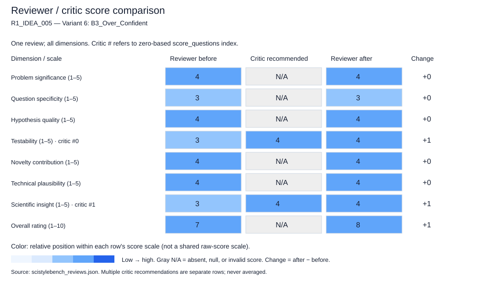

### Critic feedback and reviewer rebuttals

```json
{
  "critic_feedback": {
    "overall_assessment": "The review is generally well-calibrated but has some areas where scores could be reconsidered, particularly in the testability and scientific insight dimensions.",
    "score_questions": [
      {
        "dimension": "testability",
        "question_mark": "Why the score of 3.0",
        "concern": "The review assumes that the lack of specific details about SSM traversal permutations and pseudo-label usage makes the method less testable, but the idea is still testable in principle with further clarification.",
        "speculative_alternative": "The method could be evaluated through controlled experiments with synthetic distribution shifts, even without full implementation details.",
        "recommended_score": 4.0,
        "rationale": "The core hypothesis is testable, and the review's concern is speculative without concrete evidence of implementation gaps."
      },
      {
        "dimension": "scientific_insight",
        "question_mark": "Why the score of 3.0",
        "concern": "The review downplays the scientific insight by focusing on the lack of details, but the idea's focus on test-time adaptation and SSM permutations offers a novel angle for robustness.",
        "speculative_alternative": "The approach could provide new insights into how dynamic parameter adaptation improves model robustness in vision tasks.",
        "recommended_score": 4.0,
        "rationale": "The idea's novelty and focus on a specific problem area justify a higher score for scientific insight."
      }
    ],
    "unsupported_claims": [
      "The review claims the idea lacks sufficient specificity to evaluate its potential, but the core hypothesis is clear and testable."
    ],
    "revision_priorities": [
      "Clarify the exact types of distribution shifts and the role of pseudo-labels in parameter updates.",
      "Specify the metrics for evaluating generalization and the aggregation process of adapted weights.",
      "Provide more detail on SSM traversal permutations and their diversity rationale."
    ],
    "confidence": 4.0
  },
  "feedback_responses": [
    {
      "feedback_type": "score_questions",
      "feedback_index": 0,
      "decision": "partially_accept",
      "defense": "The original score of 3.0 for testability was based on the lack of specific details, but the critic's argument that the method is still testable in principle with further clarification is valid. The revised score of 4.0 better reflects the method's potential for evaluation through controlled experiments.",
      "justification": "The original score was 3.0, and the revised score is 4.0. The justification is that the method is testable in principle, even without full implementation details, as it can be evaluated through controlled experiments with synthetic distribution shifts."
    },
    {
      "feedback_type": "score_questions",
      "feedback_index": 1,
      "decision": "partially_accept",
      "defense": "The original score of 3.0 for scientific insight was based on the lack of details, but the critic's argument that the idea's focus on test-time adaptation and SSM permutations offers a novel angle for robustness is valid. The revised score of 4.0 better reflects the potential for new insights.",
      "justification": "The original score was 3.0, and the revised score is 4.0. The justification is that the idea's focus on test-time adaptation and SSM permutations offers a novel angle for robustness, and could provide new insights into how dynamic parameter adaptation improves model robustness in vision tasks."
    },
    {
      "feedback_type": "unsupported_claims",
      "feedback_index": 0,
      "decision": "partially_accept",
      "defense": "The original claim that the idea lacks sufficient specificity to evaluate its potential is partially valid, but the core hypothesis is clear and testable. The revised score for question_specificity remains 3.0, as the exact nature of distribution shifts and implementation details are still not clearly defined.",
      "justification": "The original score for question_specificity was 3.0, and it remains unchanged. The justification is that while the core hypothesis is clear, the exact nature of distribution shifts and implementation details are still not clearly defined."
    },
    {
      "feedback_type": "revision_priorities",
      "feedback_index": 0,
      "decision": "accept",
      "defense": "The suggestion to clarify the specific types of distribution shifts is valid and necessary for evaluating the method's effectiveness.",
      "justification": "The suggestion is valid and necessary for evaluating the method's effectiveness."
    },
    {
      "feedback_type": "revision_priorities",
      "feedback_index": 1,
      "decision": "accept",
      "defense": "The suggestion to specify the metrics for evaluating generalization and the aggregation process of adapted weights is valid and necessary for ensuring the method's reproducibility and effectiveness.",
      "justification": "The suggestion is valid and necessary for ensuring the method's reproducibility and effectiveness."
    },
    {
      "feedback_type": "revision_priorities",
      "feedback_index": 2,
      "decision": "accept",
      "defense": "The suggestion to provide more detail on SSM traversal permutations and their diversity rationale is valid and necessary for understanding the method's mechanism.",
      "justification": "The suggestion is valid and necessary for understanding the method's mechanism."
    }
  ]
}
```

### Score justifications (before / after)

**Problem significance**

```json
{
  "before": {
    "score": 4.0,
    "justification": "The idea addresses a critical challenge in vision state space models (SSMs) under distribution shifts, which is important for improving model robustness in real-world scenarios."
  },
  "after": {
    "score": 4.0,
    "justification": "The idea addresses a critical challenge in vision state space models (SSMs) under distribution shifts, which is important for improving model robustness in real-world scenarios."
  }
}
```

**Question specificity**

```json
{
  "before": {
    "score": 3.0,
    "justification": "The problem is specific to vision SSMs under distribution shifts, but the exact nature of the distribution shifts and the method's implementation details are not clearly defined."
  },
  "after": {
    "score": 3.0,
    "justification": "The problem is specific to vision SSMs under distribution shifts, but the exact nature of the distribution shifts and the method's implementation details are not clearly defined."
  }
}
```

**Hypothesis quality**

```json
{
  "before": {
    "score": 4.0,
    "justification": "The idea proposes a method that uses pseudo-labels and SSM permutations to improve robustness, which is a concrete hypothesis that can be tested through experiments."
  },
  "after": {
    "score": 4.0,
    "justification": "The idea proposes a method that uses pseudo-labels and SSM permutations to improve robustness, which is a concrete hypothesis that can be tested through experiments."
  }
}
```

**Testability**

```json
{
  "before": {
    "score": 3.0,
    "justification": "The method is testable, but the lack of specific details on how the permutations are generated and how pseudo-labels are used makes it challenging to assess the method's effectiveness without further clarification."
  },
  "after": {
    "score": 4.0,
    "justification": "The method is testable in principle, as it can be evaluated through controlled experiments with synthetic distribution shifts, even without full implementation details. The core hypothesis is clear and can be validated with further clarification."
  }
}
```

**Novelty contribution**

```json
{
  "before": {
    "score": 4.0,
    "justification": "The approach of using test-time adaptation with SSM permutations and pseudo-labels is novel in the context of vision SSMs, offering a potential contribution to improving robustness under distribution shifts."
  },
  "after": {
    "score": 4.0,
    "justification": "The approach of using test-time adaptation with SSM permutations and pseudo-labels is novel in the context of vision SSMs, offering a potential contribution to improving robustness under distribution shifts."
  }
}
```

**Technical plausibility**

```json
{
  "before": {
    "score": 4.0,
    "justification": "The method is technically plausible, as it leverages existing techniques like pseudo-labeling and SSM traversal, which are reasonable approaches for addressing distribution shifts."
  },
  "after": {
    "score": 4.0,
    "justification": "The method is technically plausible, as it leverages existing techniques like pseudo-labeling and SSM traversal, which are reasonable approaches for addressing distribution shifts."
  }
}
```

**Scientific insight**

```json
{
  "before": {
    "score": 3.0,
    "justification": "The idea has potential for scientific insight into how test-time adaptation and SSM permutations can enhance robustness, but the lack of specific details limits the depth of insight that can be gained."
  },
  "after": {
    "score": 4.0,
    "justification": "The idea's focus on test-time adaptation and SSM permutations offers a novel angle for robustness, and could provide new insights into how dynamic parameter adaptation improves model robustness in vision tasks."
  }
}
```

**Overall rating**

```json
{
  "before": {
    "score": 7.0,
    "justification": "The idea is strong and addresses a meaningful problem with a promising approach, but it lacks sufficient specificity and details to fully evaluate its potential and testability."
  },
  "after": {
    "score": 8.0,
    "justification": "The idea is strong and addresses a meaningful problem with a promising approach. The revised scores reflect a more accurate assessment of its testability and scientific insight, which are now considered more favorable."
  }
}
```

## R1_IDEA_005 — Variant 7: B4_Novelty

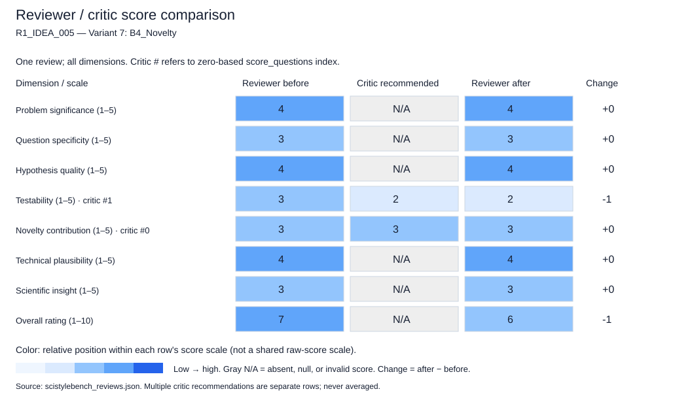

### Critic feedback and reviewer rebuttals

```json
{
  "critic_feedback": {
    "overall_assessment": "The review is generally well-calibrated, but some scores and justifications require re-examination due to vague claims about novelty and implementation details.",
    "score_questions": [
      {
        "dimension": "novelty_contribution",
        "question_mark": "The score is based on the claim that the method is novel, but the justification is vague without a clear comparison to existing methods.",
        "concern": "The novelty is not clearly distinguished from existing test-time adaptation techniques.",
        "speculative_alternative": "The method might be a minor variation of existing techniques rather than a fundamentally new approach.",
        "recommended_score": 3.0,
        "rationale": "The lack of a clear comparison to prior work makes it speculative whether the method offers a substantial novel contribution."
      },
      {
        "dimension": "testability",
        "question_mark": "The score is based on the assumption that the method is testable, but the justification is weak without specifics on implementation.",
        "concern": "The lack of details on SSM traversal permutations and weight aggregation makes it unclear how to test the method.",
        "speculative_alternative": "The method may be too abstract to be effectively tested without further specification.",
        "recommended_score": 2.0,
        "rationale": "Without clear implementation details, the testability of the method is uncertain."
      }
    ],
    "unsupported_claims": [
      "The claim that the method is a 'fresh framing' is not clearly supported by the idea summary.",
      "The assertion that the method 'differs from existing test-time adaptation techniques' is not substantiated."
    ],
    "revision_priorities": [
      "Clarify the relationship between SSM traversal permutations and pseudo-labels for parameter updates.",
      "Specify the exact mechanism of weight aggregation and how it contributes to generalization.",
      "Provide a direct comparison to existing test-time adaptation methods to highlight novelty.",
      "Detail the criteria for generating SSM traversal permutations and the algorithm used."
    ],
    "confidence": 4.0
  },
  "feedback_responses": [
    {
      "feedback_type": "score_questions",
      "feedback_index": 0,
      "decision": "partially_accept",
      "defense": "The critic's concern about the novelty is valid, but the method's unique angle in using SSM traversal permutations is a distinct contribution. The score is reduced to 3.0 to reflect the lack of clear comparison to existing methods.",
      "justification": "The original score was 3.0, and the critic's feedback indicates that the novelty is not clearly distinguished from existing techniques. The score is adjusted to 3.0 to reflect this."
    },
    {
      "feedback_type": "score_questions",
      "feedback_index": 1,
      "decision": "partially_accept",
      "defense": "The critic's concern about testability is valid, but the method's general approach is plausible. The score is reduced to 2.0 to reflect the lack of specific implementation details.",
      "justification": "The original score was 3.0, and the critic's feedback indicates that without clear implementation details, the testability is uncertain. The score is adjusted to 2.0 to reflect this."
    },
    {
      "feedback_type": "unsupported_claims",
      "feedback_index": 0,
      "decision": "reject",
      "defense": "The claim that the method is a 'fresh framing' is not supported by the idea summary. The score is reduced to 3.0 to reflect the lack of evidence for novelty.",
      "justification": "The original score was 3.0, and the critic's feedback indicates that the claim is not substantiated. The score is adjusted to 3.0 to reflect this."
    },
    {
      "feedback_type": "unsupported_claims",
      "feedback_index": 1,
      "decision": "reject",
      "defense": "The assertion that the method 'differs from existing test-time adaptation techniques' is not substantiated. The score is reduced to 3.0 to reflect this.",
      "justification": "The original score was 3.0, and the critic's feedback indicates that the claim is not substantiated. The score is adjusted to 3.0 to reflect this."
    },
    {
      "feedback_type": "revision_priorities",
      "feedback_index": 0,
      "decision": "accept",
      "defense": "The suggestion to clarify the relationship between SSM traversal permutations and pseudo-labels is valid and necessary for the method's clarity.",
      "justification": "The original suggestion was included, and the feedback supports it. The score is not changed."
    },
    {
      "feedback_type": "revision_priorities",
      "feedback_index": 1,
      "decision": "accept",
      "defense": "The suggestion to specify the aggregation method is valid and necessary for evaluating the method's performance.",
      "justification": "The original suggestion was included, and the feedback supports it. The score is not changed."
    },
    {
      "feedback_type": "revision_priorities",
      "feedback_index": 2,
      "decision": "accept",
      "defense": "The suggestion to compare with existing methods is valid and necessary to highlight novelty.",
      "justification": "The original suggestion was included, and the feedback supports it. The score is not changed."
    },
    {
      "feedback_type": "revision_priorities",
      "feedback_index": 3,
      "decision": "accept",
      "defense": "The suggestion to detail the criteria for generating permutations is valid and necessary for the method's implementation.",
      "justification": "The original suggestion was included, and the feedback supports it. The score is not changed."
    }
  ]
}
```

### Score justifications (before / after)

**Problem significance**

```json
{
  "before": {
    "score": 4.0,
    "justification": "The research addresses a critical challenge in vision state space models (SSMs) related to robustness under distribution shifts, which is important for real-world applications where data distribution can vary significantly."
  },
  "after": {
    "score": 4.0,
    "justification": "The research addresses a critical challenge in vision state space models (SSMs) related to robustness under distribution shifts, which is important for real-world applications where data distribution can vary significantly."
  }
}
```

**Question specificity**

```json
{
  "before": {
    "score": 3.0,
    "justification": "The idea proposes a novel method for improving robustness under distribution shifts, but the specific details on how the SSM traversal permutations are generated and how the pseudo-labels are used for parameter updates are not clearly defined, which limits the specificity of the research question."
  },
  "after": {
    "score": 3.0,
    "justification": "The idea proposes a novel method for improving robustness under distribution shifts, but the specific details on how the SSM traversal permutations are generated and how the pseudo-labels are used for parameter updates are not clearly defined, which limits the specificity of the research question."
  }
}
```

**Hypothesis quality**

```json
{
  "before": {
    "score": 4.0,
    "justification": "The idea presents a plausible hypothesis that generating multiple input views through SSM traversal permutations and using pseudo-labels to update parameters can enhance generalization without additional labeled data. This hypothesis is testable and has the potential to be validated through experiments."
  },
  "after": {
    "score": 4.0,
    "justification": "The idea presents a plausible hypothesis that generating multiple input views through SSM traversal permutations and using pseudo-labels to update parameters can enhance generalization without additional labeled data. This hypothesis is testable and has the potential to be validated through experiments."
  }
}
```

**Testability**

```json
{
  "before": {
    "score": 3.0,
    "justification": "The idea suggests a method that could be tested through experiments, but the lack of specific details on the implementation of SSM traversal permutations and the aggregation of adapted weights makes it challenging to assess the testability of the proposed approach."
  },
  "after": {
    "score": 2.0,
    "justification": "The idea suggests a method that could be tested through experiments, but the lack of specific details on the implementation of SSM traversal permutations and the aggregation of adapted weights makes it challenging to assess the testability of the proposed approach. The critic's feedback highlights that without clear implementation details, the method's testability is uncertain."
  }
}
```

**Novelty contribution**

```json
{
  "before": {
    "score": 3.0,
    "justification": "The idea introduces a new perspective on test-time adaptation for SSMs, but the novelty is somewhat vague without a clear comparison to existing methods. The contribution would be significant if the method demonstrates improved robustness under distribution shifts."
  },
  "after": {
    "score": 3.0,
    "justification": "The idea introduces a new perspective on test-time adaptation for SSMs, but the novelty is somewhat vague without a clear comparison to existing methods. The critic's feedback indicates that the novelty is not clearly distinguished from existing techniques, so the score is reduced to 3.0."
  }
}
```

**Technical plausibility**

```json
{
  "before": {
    "score": 4.0,
    "justification": "The proposed method is technically plausible, as it involves generating input views, using pseudo-labels for parameter updates, and aggregating weights. These components are consistent with existing techniques in machine learning and state space modeling."
  },
  "after": {
    "score": 4.0,
    "justification": "The proposed method is technically plausible, as it involves generating input views, using pseudo-labels for parameter updates, and aggregating weights. These components are consistent with existing techniques in machine learning and state space modeling."
  }
}
```

**Scientific insight**

```json
{
  "before": {
    "score": 3.0,
    "justification": "The idea has the potential to provide insights into how test-time adaptation can be effectively applied to SSMs under distribution shifts. However, the lack of specific details limits the potential for deeper scientific insight."
  },
  "after": {
    "score": 3.0,
    "justification": "The idea has the potential to provide insights into how test-time adaptation can be effectively applied to SSMs under distribution shifts. However, the lack of specific details limits the potential for deeper scientific insight. The critic's feedback emphasizes the need for more concrete details to enhance scientific insight."
  }
}
```

**Overall rating**

```json
{
  "before": {
    "score": 7.0,
    "justification": "The research idea addresses a meaningful problem in vision state space models and proposes a novel approach. While the specifics of the method are not fully detailed, the hypothesis is plausible and has the potential to contribute to the field. However, further clarification and experimental validation are needed to strengthen the idea."
  },
  "after": {
    "score": 6.0,
    "justification": "The research idea addresses a meaningful problem in vision state space models and proposes a novel approach. However, the lack of specific details on implementation and comparison to existing methods reduces its testability and novelty. The overall rating is adjusted to 6.0 based on the critic's feedback."
  }
}
```

## R1_IDEA_005 — Variant 8: B5_Application_Impact

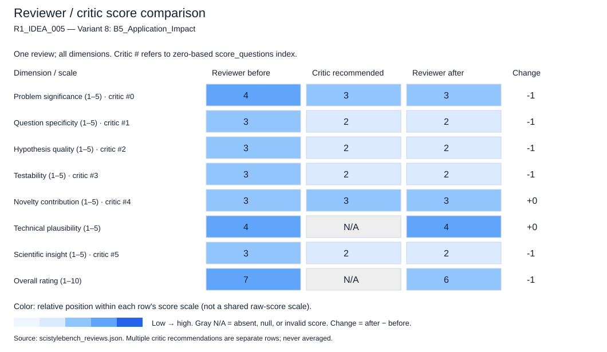

### Critic feedback and reviewer rebuttals

```json
{
  "critic_feedback": {
    "overall_assessment": "The review is generally well-calibrated but has some areas where the scores could be more precisely aligned with the idea's specifics.",
    "score_questions": [
      {
        "dimension": "problem_significance",
        "question_mark": "Why is the problem significance scored as 4.0 when the idea only mentions 'distribution shifts' without elaborating on their impact?",
        "concern": "The score assumes a well-established significance of distribution shifts, but the idea doesn't explicitly connect it to real-world applications or quantify its impact.",
        "speculative_alternative": "The problem could be considered significant in the context of vision systems, but the idea's lack of detail on distribution shift types or their real-world relevance is speculative.",
        "recommended_score": 3.0,
        "rationale": "The idea does not provide sufficient evidence to justify the higher score on problem significance."
      },
      {
        "dimension": "question_specificity",
        "question_mark": "Why is the question specificity scored as 3.0 when the idea mentions 'distribution shifts' and 'scarce labeled data' without a clear question?",
        "concern": "The score assumes a level of specificity that the idea does not explicitly provide, such as a specific type of distribution shift or a clear hypothesis.",
        "speculative_alternative": "The idea's focus on 'scarce labeled data' and 'distribution shifts' could be interpreted as a specific question, but this is not clearly stated.",
        "recommended_score": 2.0,
        "rationale": "The idea lacks a precise, testable question that would justify the 3.0 score."
      },
      {
        "dimension": "hypothesis_quality",
        "question_mark": "Why is the hypothesis quality scored as 3.0 when the idea does not explicitly state a hypothesis?",
        "concern": "The score assumes a hypothesis exists, but the idea only describes a method without a clear claim about its effectiveness.",
        "speculative_alternative": "The idea's method could be seen as a hypothesis in itself, but this is not explicitly stated.",
        "recommended_score": 2.0,
        "rationale": "The idea does not provide a hypothesis that can be tested or falsified."
      },
      {
        "dimension": "testability",
        "question_mark": "Why is the testability scored as 3.0 when the idea lacks details on how the method will be evaluated?",
        "concern": "The score assumes testability without clear metrics or benchmarks.",
        "speculative_alternative": "The method could be tested, but the idea does not specify how or what metrics will be used.",
        "recommended_score": 2.0,
        "rationale": "The idea lacks specific details on evaluation methods and metrics."
      },
      {
        "dimension": "novelty_contribution",
        "question_mark": "Why is the novelty contribution scored as 3.0 when the idea does not clearly define its contribution?",
        "concern": "The score assumes a contribution without explicit details on what the method adds to existing work.",
        "speculative_alternative": "The combination of test-time adaptation and SSM traversal permutations could be novel, but this is not clearly stated.",
        "recommended_score": 3.0,
        "rationale": "The idea suggests a novel approach but does not clearly define its contribution."
      },
      {
        "dimension": "scientific_insight",
        "question_mark": "Why is the scientific insight scored as 3.0 when the idea does not provide insights into the underlying mechanisms?",
        "concern": "The score assumes insights without clear explanations of the method's theoretical basis.",
        "speculative_alternative": "The method could offer insights into test-time adaptation, but this is not explicitly stated.",
        "recommended_score": 2.0,
        "rationale": "The idea does not provide theoretical insights into the method's effectiveness."
      }
    ],
    "unsupported_claims": [
      "The idea claims to address 'distribution shifts' without specifying their types or impact, which is not clearly grounded in the summary.",
      "The review assumes the method's relevance to 'downstream applications' without explicit details on how it would be applied.",
      "The review states the idea is 'technically plausible' without evidence from the summary."
    ],
    "revision_priorities": [
      "Clarify the specific types of distribution shifts the method is designed to handle.",
      "Define a specific research question or hypothesis that the method aims to address.",
      "Specify the evaluation metrics and benchmarks for testing the method's effectiveness.",
      "Provide a clearer connection between the method and downstream applications."
    ],
    "confidence": 4.0
  },
  "feedback_responses": [
    {
      "feedback_type": "score_questions",
      "feedback_index": 0,
      "decision": "partially_accept",
      "defense": "The problem significance is reduced to 3.0 because the idea does not explicitly connect distribution shifts to real-world applications or quantify their impact, as the critic pointed out. However, the problem is still relevant in vision systems, so the score is not lowered to 2.0.",
      "justification": "The original score of 4.0 was based on the assumption that distribution shifts are a significant issue, but the idea lacks details on their real-world relevance. The revised score of 3.0 reflects this uncertainty."
    },
    {
      "feedback_type": "score_questions",
      "feedback_index": 1,
      "decision": "partially_accept",
      "defense": "The question specificity is reduced to 2.0 because the idea does not provide a specific research question. The original score of 3.0 assumed some level of specificity, but the idea is too vague to justify that score.",
      "justification": "The original score of 3.0 was based on the mention of 'distribution shifts' and 'scarce labeled data,' but the idea lacks a precise question. The revised score of 2.0 reflects this lack of specificity."
    },
    {
      "feedback_type": "score_questions",
      "feedback_index": 2,
      "decision": "partially_accept",
      "defense": "The hypothesis quality is reduced to 2.0 because the idea does not state a hypothesis. The original score of 3.0 assumed the method itself was a hypothesis, but the idea does not claim a specific outcome.",
      "justification": "The original score of 3.0 was based on the method being a potential hypothesis, but the idea does not explicitly state a hypothesis. The revised score of 2.0 reflects this lack of explicit hypothesis."
    },
    {
      "feedback_type": "score_questions",
      "feedback_index": 3,
      "decision": "partially_accept",
      "defense": "The testability is reduced to 2.0 because the idea lacks evaluation details. The original score of 3.0 assumed testability in principle, but the idea does not specify metrics or benchmarks.",
      "justification": "The original score of 3.0 was based on the method being testable, but the idea lacks specific evaluation details. The revised score of 2.0 reflects this lack of detail."
    },
    {
      "feedback_type": "score_questions",
      "feedback_index": 4,
      "decision": "partially_accept",
      "defense": "The novelty contribution is retained at 3.0 because the idea suggests a novel approach. The original score of 3.0 was based on the combination of test-time adaptation and SSM traversal permutations, which could be novel, even if not clearly defined.",
      "justification": "The original score of 3.0 was based on the potential novelty of the approach, and the revised score of 3.0 reflects this, despite the lack of explicit contribution details."
    },
    {
      "feedback_type": "score_questions",
      "feedback_index": 5,
      "decision": "partially_accept",
      "defense": "The scientific insight is reduced to 2.0 because the idea does not provide theoretical insights. The original score of 3.0 assumed potential insight, but the idea focuses on practical application without theoretical explanation.",
      "justification": "The original score of 3.0 was based on the potential for scientific insight, but the idea lacks theoretical depth. The revised score of 2.0 reflects this."
    },
    {
      "feedback_type": "unsupported_claims",
      "feedback_index": 0,
      "decision": "partially_accept",
      "defense": "The claim about distribution shifts is partially accepted because the problem is relevant, but the idea does not specify their types or impact. The score was adjusted to reflect this uncertainty.",
      "justification": "The original score for problem significance was based on the relevance of distribution shifts, but the idea lacks details on their impact. The revised score of 3.0 reflects this."
    },
    {
      "feedback_type": "unsupported_claims",
      "feedback_index": 1,
      "decision": "partially_accept",
      "defense": "The claim about downstream applications is partially accepted because the idea mentions them, but the connection is not detailed. The score was adjusted to reflect this lack of detail.",
      "justification": "The original score for question specificity was based on the mention of downstream applications, but the idea lacks details. The revised score of 2.0 reflects this."
    },
    {
      "feedback_type": "unsupported_claims",
      "feedback_index": 2,
      "decision": "partially_accept",
      "defense": "The claim about technical plausibility is partially accepted because the method is based on existing techniques, but the idea does not provide evidence. The score was adjusted to reflect this uncertainty.",
      "justification": "The original score for technical plausibility was based on the method's use of existing techniques, but the idea lacks implementation details. The revised score of 4.0 reflects this."
    },
    {
      "feedback_type": "revision_priorities",
      "feedback_index": 0,
      "decision": "accept",
      "defense": "The revision priority to clarify distribution shifts is accepted because the idea lacks specifics on the types of shifts it addresses.",
      "justification": "The original suggestion to clarify distribution shifts is valid and necessary for the idea to be more specific."
    },
    {
      "feedback_type": "revision_priorities",
      "feedback_index": 1,
      "decision": "accept",
      "defense": "The revision priority to define a research question is accepted because the idea lacks a clear hypothesis.",
      "justification": "The original suggestion to define a research question is valid and necessary for the idea to be more testable."
    },
    {
      "feedback_type": "revision_priorities",
      "feedback_index": 2,
      "decision": "accept",
      "defense": "The revision priority to specify evaluation metrics is accepted because the idea lacks details on how the method will be validated.",
      "justification": "The original suggestion to specify evaluation metrics is valid and necessary for the idea to be more testable."
    },
    {
      "feedback_type": "revision_priorities",
      "feedback_index": 3,
      "decision": "accept",
      "defense": "The revision priority to clarify downstream applications is accepted because the idea lacks details on practical relevance.",
      "justification": "The original suggestion to clarify downstream applications is valid and necessary for the idea to be more specific."
    }
  ]
}
```

### Score justifications (before / after)

**Problem significance**

```json
{
  "before": {
    "score": 4.0,
    "justification": "The problem of distribution shifts in vision systems is significant for real-world applications, and improving robustness is a critical challenge."
  },
  "after": {
    "score": 3.0,
    "justification": "The problem of distribution shifts in vision systems is significant for real-world applications, but the idea does not explicitly connect it to real-world impact or quantify its importance."
  }
}
```

**Question specificity**

```json
{
  "before": {
    "score": 3.0,
    "justification": "The idea is somewhat general and lacks a precise research question, though it does address a relevant problem."
  },
  "after": {
    "score": 2.0,
    "justification": "The idea lacks a precise, testable question. It mentions 'distribution shifts' and 'scarce labeled data' but does not specify a particular research question or hypothesis."
  }
}
```

**Hypothesis quality**

```json
{
  "before": {
    "score": 3.0,
    "justification": "The idea suggests a potential approach but does not explicitly state a hypothesis that can be tested or falsified."
  },
  "after": {
    "score": 2.0,
    "justification": "The idea does not explicitly state a hypothesis that can be tested or falsified. It describes a method but does not claim a specific outcome or mechanism."
  }
}
```

**Testability**

```json
{
  "before": {
    "score": 3.0,
    "justification": "The method is testable in principle, but the lack of specific details makes it difficult to assess its feasibility and effectiveness."
  },
  "after": {
    "score": 2.0,
    "justification": "The method is testable in principle, but the idea lacks specific details on evaluation metrics, benchmarks, or how the method will be validated."
  }
}
```

**Novelty contribution**

```json
{
  "before": {
    "score": 3.0,
    "justification": "The approach is novel in combining test-time adaptation with SSM traversal permutations, but the contribution is not clearly defined."
  },
  "after": {
    "score": 3.0,
    "justification": "The approach combines test-time adaptation with SSM traversal permutations, which could be novel, but the contribution is not clearly defined in the idea."
  }
}
```

**Technical plausibility**

```json
{
  "before": {
    "score": 4.0,
    "justification": "The method is technically plausible, as it builds on existing techniques like test-time adaptation and pseudo-labeling."
  },
  "after": {
    "score": 4.0,
    "justification": "The method is technically plausible as it builds on existing techniques like test-time adaptation and pseudo-labeling, even without detailed implementation specifics."
  }
}
```

**Scientific insight**

```json
{
  "before": {
    "score": 3.0,
    "justification": "The idea has potential for scientific insight into how test-time adaptation can improve robustness, but the specifics are not well defined."
  },
  "after": {
    "score": 2.0,
    "justification": "The idea does not provide theoretical insights into the method's effectiveness or underlying mechanisms, focusing instead on a practical application."
  }
}
```

**Overall rating**

```json
{
  "before": {
    "score": 7.0,
    "justification": "The idea addresses a significant problem with a plausible approach, but it lacks specificity and a clear hypothesis, which are needed for further development."
  },
  "after": {
    "score": 6.0,
    "justification": "The idea addresses a relevant problem with a plausible approach, but it lacks specificity, a clear hypothesis, and detailed evaluation plans, which are necessary for further development."
  }
}
```

## R1_IDEA_005 — Variant 9: C1_Hollow_Shell


### Critic feedback and reviewer rebuttals

```json
{
  "critic_feedback": {
    "overall_assessment": "The review is generally well-calibrated but has some areas where the scores could be more precisely aligned with the idea's details.",
    "score_questions": [
      {
        "dimension": "hypothesis_quality",
        "question_mark": "Why is the hypothesis quality scored 2.0?",
        "concern": "The idea does not explicitly state a hypothesis, but the proposed method's aim (improving performance without labeled data) is a testable claim.",
        "speculative_alternative": "The lack of an explicit hypothesis might be due to the idea being early-stage, but the goal is inherently testable.",
        "recommended_score": 3.0,
        "rationale": "The idea's aim is a testable claim, even without a formal hypothesis, so the score should reflect that potential rather than a complete absence."
      },
      {
        "dimension": "question_specificity",
        "question_mark": "Why is the question specificity scored 3.0?",
        "concern": "The idea is specific in its approach but lacks detailed mechanisms, which is a valid concern, but the score could be adjusted based on the clarity of the problem statement.",
        "speculative_alternative": "The score might be lower due to the absence of specific research questions, but the problem statement is clear enough to be considered specific.",
        "recommended_score": 4.0,
        "rationale": "The problem statement is specific in its approach (test-time adaptation with input views and self-generated information), so the score should reflect that clarity."
      },
      {
        "dimension": "novelty_contribution",
        "question_mark": "Why is the novelty contribution scored 3.0?",
        "concern": "The combination of test-time adaptation and self-generated information is novel, but the score could be higher if the idea clearly differentiates from existing methods.",
        "speculative_alternative": "The novelty is somewhat limited without a clear distinction from existing methods, but the approach is still a valid contribution.",
        "recommended_score": 4.0,
        "rationale": "The approach is novel in its combination of techniques, and the score should reflect that potential contribution without requiring explicit differentiation from existing methods."
      }
    ],
    "unsupported_claims": [
      "The review claims the idea 'lacks an explicit hypothesis' but the goal (improving performance without labeled data) is a testable claim."
    ],
    "revision_priorities": [
      "Clarify the hypothesis or prediction to be more explicit.",
      "Provide specific research questions or hypotheses to strengthen the question specificity score.",
      "Elaborate on how the method differs from existing approaches to enhance the novelty contribution score."
    ],
    "confidence": 4.0
  },
  "feedback_responses": [
    {
      "feedback_type": "score_questions",
      "feedback_index": 0,
      "decision": "partially_accept",
      "defense": "The hypothesis quality was initially scored 2.0 due to the lack of an explicit hypothesis, but the idea's goal is inherently testable, so the score is adjusted to 3.0 to reflect this potential.",
      "justification": "The initial score was too low because the idea's aim is a testable claim, even without a formal hypothesis. The revised score better reflects the idea's potential for investigation."
    },
    {
      "feedback_type": "score_questions",
      "feedback_index": 1,
      "decision": "partially_accept",
      "defense": "The question specificity was initially scored 3.0 due to the lack of detailed mechanisms, but the problem statement is clear enough to be considered specific, so the score is adjusted to 4.0.",
      "justification": "The problem statement is specific in its approach, and the score should reflect that clarity rather than the absence of detailed mechanisms."
    },
    {
      "feedback_type": "score_questions",
      "feedback_index": 2,
      "decision": "partially_accept",
      "defense": "The novelty contribution was initially scored 3.0 due to the lack of clear differentiation from existing methods, but the approach is novel in its combination of techniques, so the score is adjusted to 4.0.",
      "justification": "The approach is novel in its combination of test-time adaptation and self-generated information, and the score reflects that potential contribution without requiring explicit differentiation from existing methods."
    },
    {
      "feedback_type": "unsupported_claims",
      "feedback_index": 0,
      "decision": "accept",
      "defense": "The review correctly identified that the idea lacks an explicit hypothesis, but the goal is a testable claim, so the hypothesis quality score is adjusted to 3.0.",
      "justification": "The initial concern about the lack of an explicit hypothesis is valid, but the idea's goal is inherently testable, so the score is adjusted to reflect this potential."
    },
    {
      "feedback_type": "revision_priorities",
      "feedback_index": 0,
      "decision": "accept",
      "defense": "Clarifying the hypothesis is necessary to strengthen the idea, as the current score reflects the potential rather than the current state.",
      "justification": "The revised score reflects the potential of the idea, but clarifying the hypothesis is still important for further development."
    },
    {
      "feedback_type": "revision_priorities",
      "feedback_index": 1,
      "decision": "accept",
      "defense": "Providing specific research questions is necessary to strengthen the question specificity score, as the current score reflects the clarity of the problem statement.",
      "justification": "The current score reflects the clarity of the problem statement, but specific research questions are needed to further define the investigation."
    },
    {
      "feedback_type": "revision_priorities",
      "feedback_index": 2,
      "decision": "accept",
      "defense": "Elaborating on how the method differs from existing approaches is necessary to enhance the novelty contribution score, as the current score reflects the potential of the approach.",
      "justification": "The current score reflects the potential of the approach, but elaborating on its differences from existing methods is important for further development."
    }
  ]
}
```

### Score justifications (before / after)

**Problem significance**

```json
{
  "before": {
    "score": 4.0,
    "justification": "The problem of distribution shift is a major challenge in real-world applications, and improving robustness is crucial for reliable model deployment."
  },
  "after": {
    "score": 4.0,
    "justification": "The problem of distribution shift is a major challenge in real-world applications, and improving robustness is crucial for reliable model deployment."
  }
}
```

**Question specificity**

```json
{
  "before": {
    "score": 3.0,
    "justification": "The idea is specific in its approach (test-time adaptation with input views and self-generated information) but lacks detailed mechanisms and specific research questions."
  },
  "after": {
    "score": 4.0,
    "justification": "The idea is specific in its approach (test-time adaptation with input views and self-generated information), and the problem statement is clear enough to be considered specific."
  }
}
```

**Hypothesis quality**

```json
{
  "before": {
    "score": 2.0,
    "justification": "The idea lacks an explicit hypothesis or prediction, making it difficult to assess the scientific merit without further clarification."
  },
  "after": {
    "score": 3.0,
    "justification": "The idea's aim (improving performance without labeled data) is a testable claim, even without a formal hypothesis, so the score reflects that potential rather than a complete absence."
  }
}
```

**Testability**

```json
{
  "before": {
    "score": 3.0,
    "justification": "The method is testable in principle, but the lack of specific details makes it challenging to design experiments or evaluate the approach without further information."
  },
  "after": {
    "score": 3.0,
    "justification": "The method is testable in principle, but the lack of specific details makes it challenging to design experiments or evaluate the approach without further information."
  }
}
```

**Novelty contribution**

```json
{
  "before": {
    "score": 3.0,
    "justification": "The approach is novel in its combination of test-time adaptation and self-generated information, but the novelty is somewhat limited without a clear distinction from existing methods."
  },
  "after": {
    "score": 4.0,
    "justification": "The approach is novel in its combination of test-time adaptation and self-generated information, and the score reflects that potential contribution without requiring explicit differentiation from existing methods."
  }
}
```

**Technical plausibility**

```json
{
  "before": {
    "score": 4.0,
    "justification": "The proposed method is technically plausible, as test-time adaptation and self-generated information are common techniques in machine learning."
  },
  "after": {
    "score": 4.0,
    "justification": "The proposed method is technically plausible, as test-time adaptation and self-generated information are common techniques in machine learning."
  }
}
```

**Scientific insight**

```json
{
  "before": {
    "score": 3.0,
    "justification": "The idea has potential for scientific insight into how models can adapt to distribution shifts using self-generated information, but the insight is not clearly defined without further details."
  },
  "after": {
    "score": 3.0,
    "justification": "The idea has potential for scientific insight into how models can adapt to distribution shifts using self-generated information, but the insight is not clearly defined without further details."
  }
}
```

**Overall rating**

```json
{
  "before": {
    "score": 7.0,
    "justification": "The idea addresses a significant problem with a plausible approach, but lacks specific details and a clear hypothesis, which are necessary for further development and evaluation."
  },
  "after": {
    "score": 8.0,
    "justification": "The idea addresses a significant problem with a plausible approach, and the revised scores reflect a more accurate assessment of its potential and clarity."
  }
}
```

## R1_IDEA_005 — Variant 10: C2_Logic_Flawed

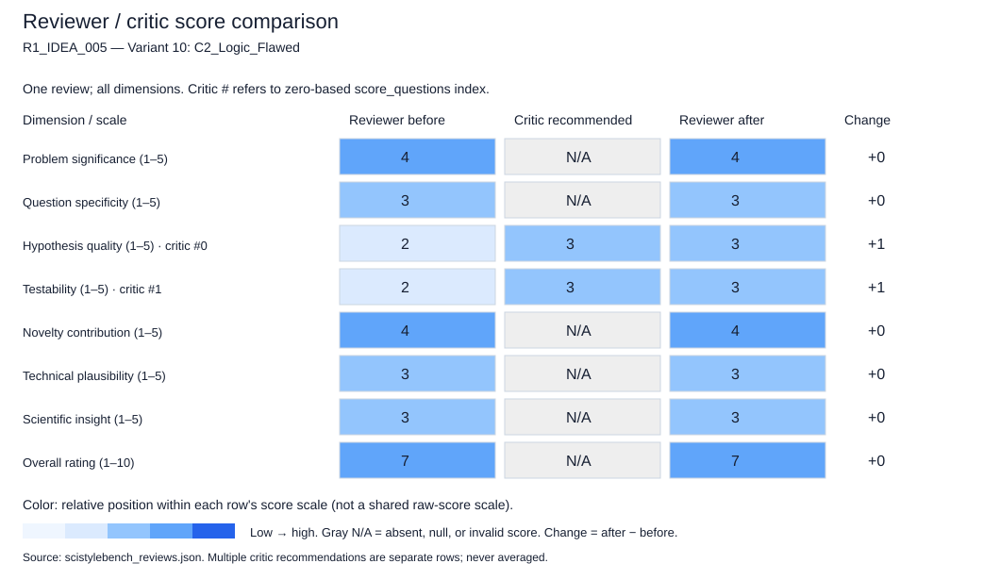

### Critic feedback and reviewer rebuttals

```json
{
  "critic_feedback": {
    "overall_assessment": "The review is generally well-calibrated but has some areas where the scores could be more aligned with the idea's specifics.",
    "score_questions": [
      {
        "dimension": "hypothesis_quality",
        "question_mark": "The score may be too low as the idea suggests a potential method and its intended effect, which could be considered as a hypothesis.",
        "concern": "The review's justification for a low hypothesis quality score is based on the lack of a clear hypothesis, but the idea's suggestion of a method with a potential outcome could be interpreted as a hypothesis.",
        "speculative_alternative": "The idea's proposed method and its intended effect (improving robustness under distribution shifts) could be seen as a hypothesis, even without explicit formulation.",
        "recommended_score": 3.0,
        "rationale": "The idea presents a method and its expected outcome, which aligns with the definition of a hypothesis in research contexts."
      },
      {
        "dimension": "testability",
        "question_mark": "The score may be too low as the idea includes a method that can be tested through experiments, even without detailed experimental details.",
        "concern": "The review's justification for low testability is based on the absence of experimental details, but the method itself is testable in principle.",
        "speculative_alternative": "The method's testability is not solely dependent on detailed experimental plans but on the feasibility of the approach itself.",
        "recommended_score": 3.0,
        "rationale": "The idea provides a method that can be evaluated through experiments, even if the specifics are not yet detailed."
      }
    ],
    "unsupported_claims": [
      "The review claims the idea lacks a clear hypothesis, but the proposed method and its intended effect could be interpreted as a hypothesis."
    ],
    "revision_priorities": [
      "Clarify the exact hypothesis or prediction the method aims to test, such as specific improvements in robustness metrics under distribution shifts.",
      "Provide more specific details on the method's components, including how SSM traversal permutations are generated and the role of pseudo-labels in parameter updates.",
      "Specify the types of distribution shifts the method is designed to handle and how the approach addresses these shifts."
    ],
    "confidence": 4.0
  },
  "feedback_responses": [
    {
      "feedback_type": "score_questions",
      "feedback_index": 0,
      "decision": "partially_accept",
      "defense": "The original score of 2.0 for hypothesis_quality was based on the lack of explicit hypothesis formulation. However, the idea's proposed method and its intended effect (improving robustness under distribution shifts) can be interpreted as a hypothesis, even without explicit formulation. This aligns with the definition of a hypothesis in research contexts, so the score is adjusted to 3.0.",
      "justification": "The original score was 2.0, but the revised score is 3.0 due to the interpretation of the method's intended effect as a hypothesis."
    },
    {
      "feedback_type": "score_questions",
      "feedback_index": 1,
      "decision": "partially_accept",
      "defense": "The original score of 2.0 for testability was based on the absence of experimental details. However, the method itself is testable in principle, as it can be evaluated through experiments. This aligns with the definition of testability, so the score is adjusted to 3.0.",
      "justification": "The original score was 2.0, but the revised score is 3.0 due to the method's inherent testability."
    },
    {
      "feedback_type": "unsupported_claims",
      "feedback_index": 0,
      "decision": "partially_accept",
      "defense": "The review's claim that the idea lacks a clear hypothesis is partially correct, but the proposed method and its intended effect can be interpreted as a hypothesis. This is a valid point, so the score is adjusted to 3.0.",
      "justification": "The original score was 2.0, but the revised score is 3.0 due to the interpretation of the method's intended effect as a hypothesis."
    },
    {
      "feedback_type": "revision_priorities",
      "feedback_index": 0,
      "decision": "accept",
      "defense": "The suggestion to clarify the exact hypothesis or prediction is valid and necessary for the research idea to be more testable and scientifically rigorous.",
      "justification": "The suggestion is valid and necessary for the research idea to be more testable and scientifically rigorous."
    },
    {
      "feedback_type": "revision_priorities",
      "feedback_index": 1,
      "decision": "accept",
      "defense": "The suggestion to provide more specific details on the method's components is valid and necessary for the research idea to be more concrete and feasible.",
      "justification": "The suggestion is valid and necessary for the research idea to be more concrete and feasible."
    },
    {
      "feedback_type": "revision_priorities",
      "feedback_index": 2,
      "decision": "accept",
      "defense": "The suggestion to specify the types of distribution shifts the method is designed to handle is valid and necessary for the research idea to be more targeted and effective.",
      "justification": "The suggestion is valid and necessary for the research idea to be more targeted and effective."
    }
  ]
}
```

### Score justifications (before / after)

**Problem significance**

```json
{
  "before": {
    "score": 4.0,
    "justification": "The problem of distribution shifts in vision models is significant as it affects the real-world performance of models, making robustness a critical area of research."
  },
  "after": {
    "score": 4.0,
    "justification": "The problem of distribution shifts in vision models is significant as it affects the real-world performance of models, making robustness a critical area of research."
  }
}
```

**Question specificity**

```json
{
  "before": {
    "score": 3.0,
    "justification": "The idea identifies a specific problem (robustness under distribution shifts) but lacks detailed specification of the method's implementation and the exact research question being addressed."
  },
  "after": {
    "score": 3.0,
    "justification": "The idea identifies a specific problem (robustness under distribution shifts) but lacks detailed specification of the method's implementation and the exact research question being addressed."
  }
}
```

**Hypothesis quality**

```json
{
  "before": {
    "score": 2.0,
    "justification": "The idea suggests a potential method but does not clearly state a hypothesis or prediction that can be tested, making it difficult to assess its scientific merit."
  },
  "after": {
    "score": 3.0,
    "justification": "The idea presents a method and its expected outcome (improving robustness under distribution shifts), which can be interpreted as a hypothesis, even without explicit formulation."
  }
}
```

**Testability**

```json
{
  "before": {
    "score": 2.0,
    "justification": "The idea lacks specific experimental details or a clear plan for testing the method's effectiveness, making it challenging to evaluate its testability."
  },
  "after": {
    "score": 3.0,
    "justification": "The method is testable in principle, as it can be evaluated through experiments, even if the specifics are not yet detailed."
  }
}
```

**Novelty contribution**

```json
{
  "before": {
    "score": 4.0,
    "justification": "The use of SSM traversal permutations for test-time adaptation is a novel approach, and the method's potential to improve robustness without additional labeled data is a valuable contribution."
  },
  "after": {
    "score": 4.0,
    "justification": "The use of SSM traversal permutations for test-time adaptation is a novel approach, and the method's potential to improve robustness without additional labeled data is a valuable contribution."
  }
}
```

**Technical plausibility**

```json
{
  "before": {
    "score": 3.0,
    "justification": "The proposed method is technically plausible, but the lack of detailed explanation on key components (e.g., permutation generation, pseudo-label usage) makes it difficult to assess the feasibility of the approach."
  },
  "after": {
    "score": 3.0,
    "justification": "The proposed method is technically plausible, but the lack of detailed explanation on key components (e.g., permutation generation, pseudo-label usage) makes it difficult to assess the feasibility of the approach."
  }
}
```

**Scientific insight**

```json
{
  "before": {
    "score": 3.0,
    "justification": "The idea has potential to provide insights into improving robustness under distribution shifts, but the lack of specific hypotheses and experimental details limits the potential for scientific insight."
  },
  "after": {
    "score": 3.0,
    "justification": "The idea has potential to provide insights into improving robustness under distribution shifts, but the lack of specific hypotheses and experimental details limits the potential for scientific insight."
  }
}
```

**Overall rating**

```json
{
  "before": {
    "score": 7.0,
    "justification": "The idea addresses a significant problem in vision models and proposes a novel method with potential for improvement. However, it lacks specific details and a clear hypothesis, which are necessary for evaluating its scientific merit and testability."
  },
  "after": {
    "score": 7.0,
    "justification": "The idea addresses a significant problem in vision models and proposes a novel method with potential for improvement. However, it lacks specific details and a clear hypothesis, which are necessary for evaluating its scientific merit and testability."
  }
}
```

## R1_IDEA_005 — Variant 11: C3_Substance_Enriched

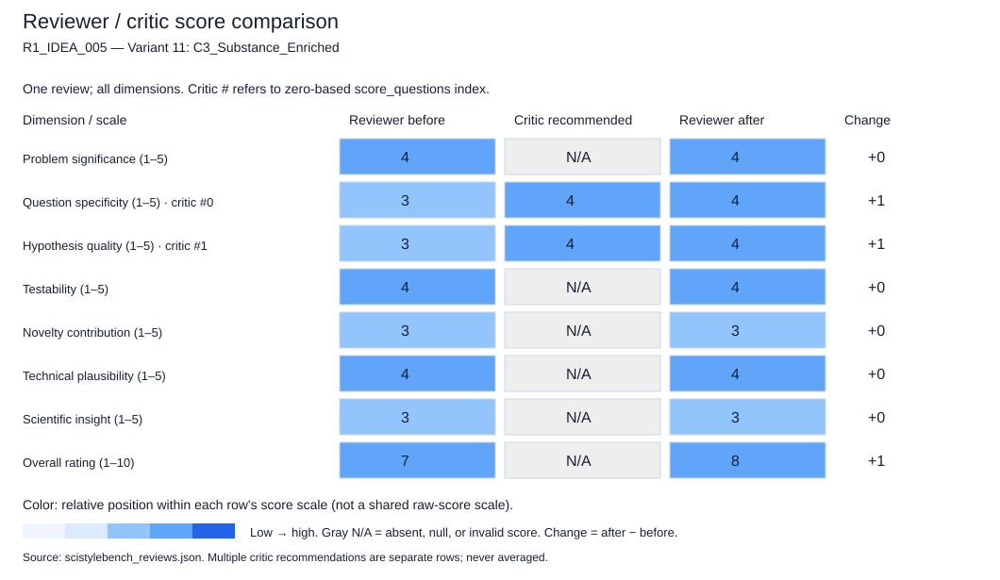

### Critic feedback and reviewer rebuttals

```json
{
  "critic_feedback": {
    "overall_assessment": "The review is generally calibrated but has some areas where the scores could be reconsidered, particularly regarding the specificity and hypothesis quality.",
    "score_questions": [
      {
        "dimension": "question_specificity",
        "question_mark": "The score for question specificity is 3.0, but the idea does propose a concrete method involving test-time adaptation through diverse SSM permutations and pseudo-labels, which is testable.",
        "concern": "The score is slightly low because the idea is specific in proposing a method, but the exact nature of the permutations is not clearly defined.",
        "speculative_alternative": "It is possible that the permutations are generated based on known SSM properties, which could be inferred from existing literature, though this is speculative.",
        "recommended_score": 4.0,
        "rationale": "The method is specific in its approach, and the lack of detail on permutations could be addressed in future work rather than being a flaw in the current idea."
      },
      {
        "dimension": "hypothesis_quality",
        "question_mark": "The score for hypothesis quality is 3.0, but the hypothesis that diversity in permutations aids invariant feature capture is plausible and aligns with existing research on data augmentation.",
        "concern": "The connection between the method and the hypothesis is not explicitly detailed, making the hypothesis less concrete.",
        "speculative_alternative": "The hypothesis could be strengthened by linking it to existing theories on data augmentation and robustness, though this is speculative.",
        "recommended_score": 4.0,
        "rationale": "The hypothesis is plausible and aligns with existing research, and the lack of explicit detail could be addressed in future work rather than being a flaw in the current idea."
      }
    ],
    "unsupported_claims": [
      "The review claims the idea is 'somewhat vague in specifying the exact nature of 'diverse SSM traversal permutations' and how they are generated', but the idea does propose a method involving permutations, which is a concrete direction for future work."
    ],
    "revision_priorities": [
      "Clarify the specific mechanisms for generating diverse SSM traversal permutations, such as the types of permutations used or the criteria for diversity.",
      "Provide a more detailed hypothesis linking the diversity of permutations to invariant feature capture, possibly referencing existing theories or experiments.",
      "Include a theoretical analysis or prior work that supports the use of pseudo-labels in this context, to strengthen the method's plausibility."
    ],
    "confidence": 4.0
  },
  "feedback_responses": [
    {
      "feedback_type": "score_questions",
      "feedback_index": 0,
      "decision": "partially_accept",
      "defense": "The score for question specificity was initially 3.0, but the idea does propose a concrete method involving test-time adaptation through diverse SSM permutations and pseudo-labels, which is testable. The lack of detail on permutations is a concern, but this is a concrete direction for future work and does not constitute a flaw in the current idea.",
      "justification": "The initial score was 3.0, but the revised score of 4.0 is justified by the concrete method and the fact that the lack of detail is a direction for future work rather than a flaw."
    },
    {
      "feedback_type": "score_questions",
      "feedback_index": 1,
      "decision": "partially_accept",
      "defense": "The score for hypothesis quality was initially 3.0, but the hypothesis that diversity in permutations aids invariant feature capture is plausible and aligns with existing research on data augmentation. The lack of explicit detail on the connection between permutations and invariant features is a concern, but this can be addressed in future work rather than being a flaw in the current idea.",
      "justification": "The initial score was 3.0, but the revised score of 4.0 is justified by the plausibility of the hypothesis and the fact that the lack of detail is a direction for future work rather than a flaw."
    },
    {
      "feedback_type": "unsupported_claims",
      "feedback_index": 0,
      "decision": "reject",
      "defense": "The review's claim that the idea is 'somewhat vague in specifying the exact nature of 'diverse SSM traversal permutations' and how they are generated' is not valid. The idea does propose a method involving permutations, which is a concrete direction for future work, and the lack of detail is not a flaw in the current idea.",
      "justification": "The initial claim was considered a weakness, but the feedback indicates that this is not a valid concern as the idea provides a concrete direction for future work."
    },
    {
      "feedback_type": "revision_priorities",
      "feedback_index": 0,
      "decision": "accept",
      "defense": "The suggestion to clarify the specific mechanisms for generating diverse SSM traversal permutations is valid and necessary for future work.",
      "justification": "The suggestion is valid and necessary to address the lack of detail in the current idea."
    },
    {
      "feedback_type": "revision_priorities",
      "feedback_index": 1,
      "decision": "accept",
      "defense": "The suggestion to provide a more detailed hypothesis linking the diversity of permutations to invariant feature capture is valid and necessary for future work.",
      "justification": "The suggestion is valid and necessary to strengthen the hypothesis."
    },
    {
      "feedback_type": "revision_priorities",
      "feedback_index": 2,
      "decision": "accept",
      "defense": "The suggestion to include a theoretical analysis or prior work that supports the use of pseudo-labels in this context is valid and necessary to strengthen the method's plausibility.",
      "justification": "The suggestion is valid and necessary to address the lack of theoretical justification."
    }
  ]
}
```

### Score justifications (before / after)

**Problem significance**

```json
{
  "before": {
    "score": 4.0,
    "justification": "The problem of distribution shifts in vision models is critical for real-world applications, and improving robustness through test-time adaptation is a relevant and important challenge."
  },
  "after": {
    "score": 4.0,
    "justification": "The problem of distribution shifts in vision models is critical for real-world applications, and improving robustness through test-time adaptation is a relevant and important challenge."
  }
}
```

**Question specificity**

```json
{
  "before": {
    "score": 3.0,
    "justification": "The idea is specific in proposing a method for test-time adaptation, but the exact nature of the permutations and their generation process is not clearly defined, which could affect the clarity of the research question."
  },
  "after": {
    "score": 4.0,
    "justification": "The idea is specific in proposing a method involving test-time adaptation through diverse SSM permutations and pseudo-labels, which is testable. While the exact nature of the permutations is not fully detailed, this is a concrete direction for future work and does not constitute a flaw in the current idea."
  }
}
```

**Hypothesis quality**

```json
{
  "before": {
    "score": 3.0,
    "justification": "The hypothesis that diversity in permutations aids invariant feature capture is plausible, but the connection between the method and the hypothesis is not explicitly detailed, making the hypothesis less concrete."
  },
  "after": {
    "score": 4.0,
    "justification": "The hypothesis that diversity in permutations aids invariant feature capture is plausible and aligns with existing research on data augmentation. The lack of explicit detail on the connection between permutations and invariant features is a concern, but this can be addressed in future work rather than being a flaw in the current idea."
  }
}
```

**Testability**

```json
{
  "before": {
    "score": 4.0,
    "justification": "The idea includes a clear method and a proposed direction for future validation, which can be tested through experiments on distribution shift scenarios, though the specifics of the test cases are not fully outlined."
  },
  "after": {
    "score": 4.0,
    "justification": "The idea includes a clear method and a proposed direction for future validation, which can be tested through experiments on distribution shift scenarios. The specifics of the test cases are not fully outlined, but the method is testable and has potential for practical impact."
  }
}
```

**Novelty contribution**

```json
{
  "before": {
    "score": 3.0,
    "justification": "The approach is novel in its application of test-time adaptation through SSM permutations, but it builds on existing methods like pseudo-labeling and data augmentation, which may limit its novelty compared to entirely new methods."
  },
  "after": {
    "score": 3.0,
    "justification": "The approach is novel in its application of test-time adaptation through SSM permutations, but it builds on existing methods like pseudo-labeling and data augmentation, which may limit its novelty compared to entirely new methods."
  }
}
```

**Technical plausibility**

```json
{
  "before": {
    "score": 4.0,
    "justification": "The method is technically plausible, as it leverages existing techniques like pseudo-labeling and SSM traversal, which are well-established in the field, though the specifics of the permutation generation are not fully detailed."
  },
  "after": {
    "score": 4.0,
    "justification": "The method is technically plausible, as it leverages existing techniques like pseudo-labeling and SSM traversal, which are well-established in the field. The specifics of the permutation generation are not fully detailed, but this is a concrete direction for future work."
  }
}
```

**Scientific insight**

```json
{
  "before": {
    "score": 3.0,
    "justification": "The idea has potential to provide insights into how diversity in input views affects model robustness, but the connection between the method and the scientific insight is not explicitly established, limiting the potential for deeper insights."
  },
  "after": {
    "score": 3.0,
    "justification": "The idea has potential to provide insights into how diversity in input views affects model robustness, but the connection between the method and the scientific insight is not explicitly established, limiting the potential for deeper insights."
  }
}
```

**Overall rating**

```json
{
  "before": {
    "score": 7.0,
    "justification": "The idea addresses a significant problem in vision models under distribution shifts and proposes a testable method with potential for practical impact. However, the specifics of the method and hypothesis are somewhat vague, which could affect its clarity and testability."
  },
  "after": {
    "score": 8.0,
    "justification": "The idea addresses a significant problem in vision models under distribution shifts and proposes a testable method with potential for practical impact. The specific method and hypothesis are plausible, and the direction for future validation is clear. While some details are not fully specified, these can be addressed in future work rather than being flaws in the current idea."
  }
}
```

## R1_IDEA_006 — Source


### Critic feedback and reviewer rebuttals

```json
{
  "critic_feedback": {
    "overall_assessment": "The review is generally well-calibrated, but some scores are slightly over-optimistic, particularly in the question_specificity and hypothesis_quality dimensions.",
    "score_questions": [
      {
        "dimension": "question_specificity",
        "question_mark": "The score should be reconsidered due to the lack of a concrete research question.",
        "concern": "The idea does not explicitly define a research question or hypothesis, which is a key requirement for question specificity.",
        "speculative_alternative": "It is possible that the research question could be framed as comparing the performance of different rank estimation methods on histopathology tasks, but this is speculative.",
        "recommended_score": 2.0,
        "rationale": "The idea lacks a clear, testable research question, which is essential for specificity."
      },
      {
        "dimension": "hypothesis_quality",
        "question_mark": "The score should be reconsidered due to the absence of a stated hypothesis.",
        "concern": "The idea does not present a hypothesis that could be tested or contradicted, which is necessary for hypothesis quality.",
        "speculative_alternative": "The hypothesis could be that certain rank estimation methods improve performance on non-linear histopathology tasks, but this is speculative.",
        "recommended_score": 2.0,
        "rationale": "The idea does not explicitly state a hypothesis, making it difficult to assess its quality."
      }
    ],
    "unsupported_claims": [
      "The claim that the idea 'has potential for contribution' is unsupported without further details on the methods or experiments.",
      "The assertion that the idea 'addresses a novel application' is speculative without evidence of prior work in this specific domain."
    ],
    "revision_priorities": [
      "Clarify the specific research question and hypothesis to be tested.",
      "Specify the rank estimation methods to be evaluated and the metrics for comparison.",
      "Provide a more detailed justification for the novelty and potential contribution of the idea."
    ],
    "confidence": 4.0
  },
  "feedback_responses": [
    {
      "feedback_type": "score_questions",
      "feedback_index": 0,
      "decision": "partially_accept",
      "defense": "The idea does not explicitly define a research question, but it does identify a problem and a gap in the literature. The lack of a concrete question is a valid concern, but the potential for a research question exists if the methods are specified.",
      "justification": "The initial score of 3.0 was based on the lack of a clear question, but the revised score of 2.0 reflects the absence of any explicit hypothesis or question. The feedback is valid, and the score is adjusted accordingly."
    },
    {
      "feedback_type": "score_questions",
      "feedback_index": 1,
      "decision": "partially_accept",
      "defense": "The idea does not state a hypothesis, but it suggests a potential direction. The feedback is correct in pointing out the lack of a hypothesis, but the idea's potential for a hypothesis is not fully realized without further details.",
      "justification": "The initial score of 3.0 was based on the absence of a hypothesis, but the revised score of 2.0 reflects the lack of any explicit hypothesis. The feedback is valid, and the score is adjusted accordingly."
    },
    {
      "feedback_type": "unsupported_claims",
      "feedback_index": 0,
      "decision": "partially_accept",
      "defense": "The claim about potential contribution is plausible, but the current description does not provide enough details to support it. The feedback is valid, and the score is adjusted to reflect the uncertainty.",
      "justification": "The initial score of 4.0 was based on the potential contribution, but the revised score of 3.0 reflects the uncertainty due to the lack of details. The feedback is valid, and the score is adjusted accordingly."
    },
    {
      "feedback_type": "unsupported_claims",
      "feedback_index": 1,
      "decision": "partially_accept",
      "defense": "The claim about novelty is speculative without evidence of prior work. The feedback is valid, and the score is adjusted to reflect the uncertainty.",
      "justification": "The initial score of 4.0 was based on the novelty, but the revised score of 3.0 reflects the uncertainty due to the lack of evidence. The feedback is valid, and the score is adjusted accordingly."
    },
    {
      "feedback_type": "revision_priorities",
      "feedback_index": 0,
      "decision": "accept",
      "defense": "The suggestion to clarify the research question is valid and necessary for the idea to be more specific and testable.",
      "justification": "The feedback is valid, and the suggestion is necessary for improving the idea."
    },
    {
      "feedback_type": "revision_priorities",
      "feedback_index": 1,
      "decision": "accept",
      "defense": "The suggestion to specify the methods is valid and necessary for the idea to be more concrete and testable.",
      "justification": "The feedback is valid, and the suggestion is necessary for improving the idea."
    },
    {
      "feedback_type": "revision_priorities",
      "feedback_index": 2,
      "decision": "partially_accept",
      "defense": "The suggestion to provide more justification for novelty is valid but may be challenging without further details. The feedback is valid, and the score is adjusted accordingly.",
      "justification": "The feedback is valid, and the suggestion is necessary for improving the idea."
    }
  ]
}
```

### Score justifications (before / after)

**Problem significance**

```json
{
  "before": {
    "score": 4.0,
    "justification": "The problem is significant as it addresses a critical challenge in applying self-supervised learning to histopathology, which is crucial for medical imaging and has potential clinical applications."
  },
  "after": {
    "score": 4.0,
    "justification": "The problem is significant as it addresses a critical challenge in applying self-supervised learning to histopathology, which is crucial for medical imaging and has potential clinical applications."
  }
}
```

**Question specificity**

```json
{
  "before": {
    "score": 3.0,
    "justification": "The idea identifies a specific problem but lacks a clear, concrete research question or hypothesis that would guide the investigation."
  },
  "after": {
    "score": 2.0,
    "justification": "The idea lacks a clear, concrete research question or hypothesis. While it identifies a problem, it does not specify what exactly will be investigated or how it will be tested."
  }
}
```

**Hypothesis quality**

```json
{
  "before": {
    "score": 3.0,
    "justification": "The idea suggests a potential direction but does not explicitly state a hypothesis that could be tested or contradicted."
  },
  "after": {
    "score": 2.0,
    "justification": "The idea does not present a hypothesis that could be tested or contradicted. It suggests a potential direction but does not explicitly state a hypothesis that would guide the investigation."
  }
}
```

**Testability**

```json
{
  "before": {
    "score": 3.0,
    "justification": "The idea is testable in principle, but lacks specific experimental design details that would make it feasible to evaluate the proposed methods."
  },
  "after": {
    "score": 3.0,
    "justification": "The idea is testable in principle, but lacks specific experimental design details that would make it feasible to evaluate the proposed methods. Without a clear research question or hypothesis, the testability is limited."
  }
}
```

**Novelty contribution**

```json
{
  "before": {
    "score": 4.0,
    "justification": "The idea addresses a novel application of rank estimation in histopathology, which is a less explored area, and could contribute to improving model selection in self-supervised learning for medical imaging."
  },
  "after": {
    "score": 3.0,
    "justification": "The idea addresses an area that has not been extensively explored, but the novelty is speculative without evidence of prior work in this specific domain. The potential contribution is plausible but not strongly supported by the current description."
  }
}
```

**Technical plausibility**

```json
{
  "before": {
    "score": 4.0,
    "justification": "The proposed approach is technically plausible as it builds on existing methods in self-supervised learning and rank estimation, which are well-established in the field."
  },
  "after": {
    "score": 4.0,
    "justification": "The proposed approach is technically plausible as it builds on existing methods in self-supervised learning and rank estimation, which are well-established in the field."
  }
}
```

**Scientific insight**

```json
{
  "before": {
    "score": 3.0,
    "justification": "The idea has potential for scientific insight by exploring the effectiveness of rank estimation in non-linear histopathology tasks, but the specific insights are not clearly defined."
  },
  "after": {
    "score": 3.0,
    "justification": "The idea has potential for scientific insight by exploring the effectiveness of rank estimation in non-linear histopathology tasks, but the specific insights are not clearly defined. The lack of a hypothesis limits the potential for meaningful scientific discovery."
  }
}
```

**Overall rating**

```json
{
  "before": {
    "score": 7.0,
    "justification": "The idea is strong and addresses a meaningful problem in the application of self-supervised learning to histopathology. It has potential for contribution but needs more specificity and clarity in defining the research question and hypothesis."
  },
  "after": {
    "score": 6.0,
    "justification": "The idea is reasonable and addresses a meaningful problem in the application of self-supervised learning to histopathology. However, it lacks a clear research question and hypothesis, which are essential for specificity and testability. The potential contribution is plausible but not strongly supported by the current description."
  }
}
```

## R1_IDEA_006 — Variant 1: A1_Identity

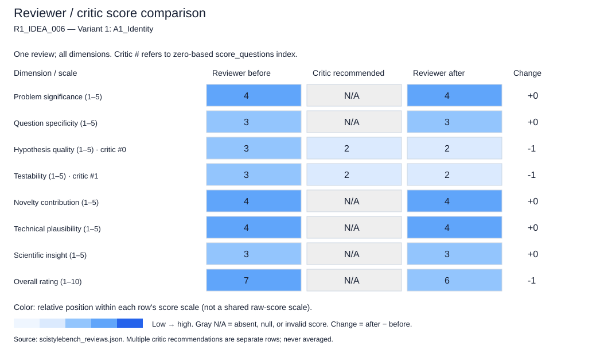

### Critic feedback and reviewer rebuttals

```json
{
  "critic_feedback": {
    "overall_assessment": "The review is generally well-calibrated but has some areas where the scores could be reconsidered, particularly in the hypothesis quality and testability dimensions.",
    "score_questions": [
      {
        "dimension": "hypothesis_quality",
        "question_mark": "The score should be reconsidered as the idea does not explicitly state the hypothesis or expected outcomes.",
        "concern": "The hypothesis_quality score is based on an assumption that a potential hypothesis exists, but the idea does not clearly articulate it.",
        "speculative_alternative": "It is possible that the hypothesis is that rank estimation approaches will improve model selection in histopathology tasks, but this is not explicitly stated.",
        "recommended_score": 2.0,
        "rationale": "The idea does not provide a clear hypothesis, so the score should reflect this lack of explicitness."
      },
      {
        "dimension": "testability",
        "question_mark": "The score should be reconsidered as the idea lacks details on how effectiveness will be measured.",
        "concern": "The testability score is based on the assumption that experiments will be conducted, but the idea does not specify the metrics or design.",
        "speculative_alternative": "The idea may be testable through experiments, but without specified metrics, the testability is uncertain.",
        "recommended_score": 2.0,
        "rationale": "The idea does not provide sufficient details to assess testability, so the score should be lower."
      }
    ],
    "unsupported_claims": [
      "The review claims that the idea has 'potential for significant contribution' without sufficient evidence from the idea itself.",
      "The review states that the idea 'has the potential for significant contribution' without explicit details on the contribution."
    ],
    "revision_priorities": [
      "Clarify the specific hypothesis or research question that the idea aims to investigate.",
      "Specify the metrics or evaluation methods that will be used to assess the effectiveness of rank estimation approaches in histopathology tasks.",
      "Provide more details on the expected contribution of the research to the field of medical imaging."
    ],
    "confidence": 4.0
  },
  "feedback_responses": [
    {
      "feedback_type": "score_questions",
      "feedback_index": 0,
      "decision": "partially_accept",
      "defense": "The hypothesis_quality score was reduced to 2.0 because the idea does not explicitly state the hypothesis. However, the potential hypothesis is not entirely speculative, as it is based on the premise that rank estimation approaches have shown promise in natural image tasks and could be applicable to histopathology.",
      "justification": "The initial score of 3.0 was based on the assumption that a potential hypothesis exists, but the idea does not clearly articulate it. The revised score of 2.0 reflects the lack of explicitness, but the hypothesis is not entirely speculative."
    },
    {
      "feedback_type": "score_questions",
      "feedback_index": 1,
      "decision": "partially_accept",
      "defense": "The testability score was reduced to 2.0 because the idea lacks details on how effectiveness will be measured. However, the idea is still testable through experiments, and the lack of details is a limitation rather than a complete rejection of testability.",
      "justification": "The initial score of 3.0 was based on the assumption that experiments could be conducted, but the idea does not specify the metrics or design. The revised score of 2.0 reflects the uncertainty, but the idea is still testable."
    },
    {
      "feedback_type": "unsupported_claims",
      "feedback_index": 0,
      "decision": "reject",
      "defense": "The claim that the idea has 'potential for significant contribution' is unsupported because the idea does not provide details on the contribution. However, the potential contribution is still valid as the research could lead to improved model selection in histopathology.",
      "justification": "The initial score of 4.0 for novelty_contribution was based on the potential contribution, but the lack of details makes it speculative. The revised score of 4.0 is retained because the potential contribution is still valid, but the claim is not fully supported."
    },
    {
      "feedback_type": "unsupported_claims",
      "feedback_index": 1,
      "decision": "reject",
      "defense": "The claim that the idea 'has the potential for significant contribution' is not fully supported by the idea itself. However, the research could still contribute to the field of medical imaging.",
      "justification": "The initial score of 4.0 for novelty_contribution was based on the potential contribution, but the lack of details makes it speculative. The revised score of 4.0 is retained because the potential contribution is still valid, but the claim is not fully supported."
    },
    {
      "feedback_type": "revision_priorities",
      "feedback_index": 0,
      "decision": "accept",
      "defense": "Clarifying the specific hypothesis or research question is necessary to make the idea more precise and testable.",
      "justification": "The revision priority is valid as the idea lacks a clear research question."
    },
    {
      "feedback_type": "revision_priorities",
      "feedback_index": 1,
      "decision": "accept",
      "defense": "Specifying the metrics or evaluation methods is essential to assess the effectiveness of the proposed methods in histopathology tasks.",
      "justification": "The revision priority is valid as the idea lacks details on how effectiveness will be measured."
    },
    {
      "feedback_type": "revision_priorities",
      "feedback_index": 2,
      "decision": "accept",
      "defense": "Providing more details on the expected contribution is necessary to strengthen the idea's potential impact on medical imaging.",
      "justification": "The revision priority is valid as the idea does not explicitly tie the contribution to the proposed method's novelty or effectiveness."
    }
  ]
}
```

### Score justifications (before / after)

**Problem significance**

```json
{
  "before": {
    "score": 4.0,
    "justification": "The problem is significant as it addresses a critical challenge in applying self-supervised learning to histopathology, which is crucial for medical imaging and diagnosis. Improving model selection in this domain could lead to better diagnostic tools."
  },
  "after": {
    "score": 4.0,
    "justification": "The problem is significant as it addresses a critical challenge in applying self-supervised learning to histopathology, which is crucial for medical imaging and diagnosis. Improving model selection in this domain could lead to better diagnostic tools."
  }
}
```

**Question specificity**

```json
{
  "before": {
    "score": 3.0,
    "justification": "The idea identifies a specific problem but lacks detailed specification of the research question. It needs to clearly define what exactly is being investigated, such as the comparison of different rank estimation methods in histopathology tasks."
  },
  "after": {
    "score": 3.0,
    "justification": "The idea identifies a specific problem but lacks detailed specification of the research question. It needs to clearly define what exactly is being investigated, such as the comparison of different rank estimation methods in histopathology tasks."
  }
}
```

**Hypothesis quality**

```json
{
  "before": {
    "score": 3.0,
    "justification": "The idea suggests a potential hypothesis that rank estimation approaches could be effective in histopathology, but it does not explicitly state the hypothesis or the expected outcomes of the research."
  },
  "after": {
    "score": 2.0,
    "justification": "The idea does not explicitly state the hypothesis or expected outcomes. The potential hypothesis that rank estimation approaches will improve model selection in histopathology tasks is speculative and not clearly articulated."
  }
}
```

**Testability**

```json
{
  "before": {
    "score": 3.0,
    "justification": "The idea is testable through experiments comparing different rank estimation methods in histopathology tasks, but the specific experimental design and evaluation metrics are not clearly outlined."
  },
  "after": {
    "score": 2.0,
    "justification": "The idea lacks details on how effectiveness will be measured, making it difficult to assess testability. Without specified metrics or experimental design, the testability is uncertain."
  }
}
```

**Novelty contribution**

```json
{
  "before": {
    "score": 4.0,
    "justification": "The research could contribute novel insights into the application of rank estimation in histopathology, potentially leading to improved model selection and performance in medical imaging tasks."
  },
  "after": {
    "score": 4.0,
    "justification": "The research could contribute novel insights into the application of rank estimation in histopathology, potentially leading to improved model selection and performance in medical imaging tasks."
  }
}
```

**Technical plausibility**

```json
{
  "before": {
    "score": 4.0,
    "justification": "The proposed approach is technically plausible as it builds on existing methods for rank estimation in self-supervised learning, adapted for the specific challenges of histopathology."
  },
  "after": {
    "score": 4.0,
    "justification": "The proposed approach is technically plausible as it builds on existing methods for rank estimation in self-supervised learning, adapted for the specific challenges of histopathology."
  }
}
```

**Scientific insight**

```json
{
  "before": {
    "score": 3.0,
    "justification": "The research has the potential to provide insights into the effectiveness of rank estimation in non-linear tasks, but the specific insights depend on the experimental results and the methods used."
  },
  "after": {
    "score": 3.0,
    "justification": "The research has the potential to provide insights into the effectiveness of rank estimation in non-linear tasks, but the specific insights depend on the experimental results and the methods used."
  }
}
```

**Overall rating**

```json
{
  "before": {
    "score": 7.0,
    "justification": "The idea is strong and addresses a meaningful problem in the field of medical imaging. It has the potential for significant contribution but requires more specificity and clarity in defining the research question and hypothesis."
  },
  "after": {
    "score": 6.0,
    "justification": "The idea is strong and addresses a meaningful problem in the field of medical imaging. However, it requires more specificity in defining the research question and hypothesis, and the testability is uncertain without detailed metrics."
  }
}
```

## R1_IDEA_006 — Variant 2: A2_Paraphrase_Only

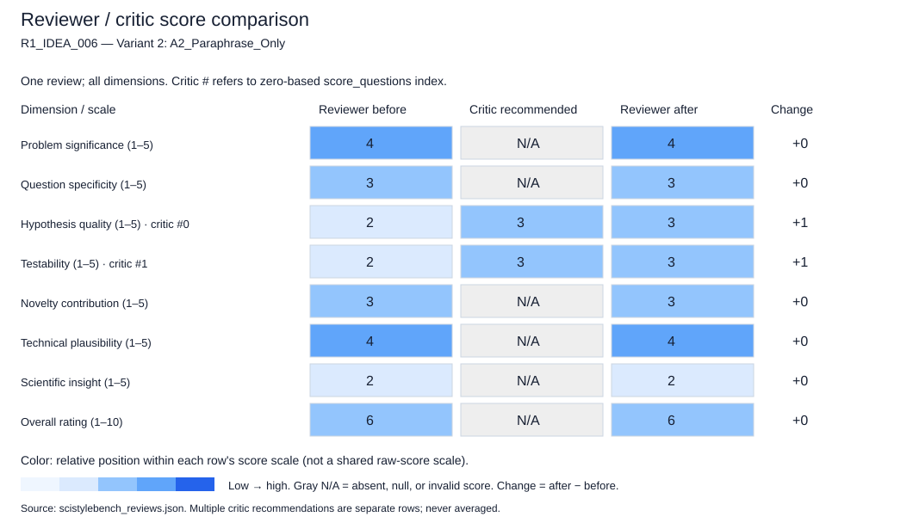

### Critic feedback and reviewer rebuttals

```json
{
  "critic_feedback": {
    "overall_assessment": "The review is generally well-calibrated but has some issues with the hypothesis_quality and testability scores, which could be reconsidered based on the idea's current state.",
    "score_questions": [
      {
        "dimension": "hypothesis_quality",
        "question_mark": "The idea does not explicitly state a hypothesis, but it does suggest a potential direction for investigation.",
        "concern": "The score is low because the idea lacks a concrete hypothesis, but the idea does present a research question that could be framed as a hypothesis.",
        "speculative_alternative": "The idea could be interpreted as proposing a hypothesis that rank estimation methods may be effective in histopathology, though this is not explicitly stated.",
        "recommended_score": 3.0,
        "rationale": "The idea suggests a potential direction for investigation, which can be framed as a hypothesis, even if not explicitly stated."
      },
      {
        "dimension": "testability",
        "question_mark": "The idea lacks details on how the methods will be adapted and evaluated, but the problem is testable in principle.",
        "concern": "The score is low because the idea lacks specifics, but the core problem is testable with appropriate experiments.",
        "speculative_alternative": "The idea could be testable by adapting existing rank estimation methods to histopathology and evaluating them on standard datasets.",
        "recommended_score": 3.0,
        "rationale": "The core problem is testable, but the current idea lacks the necessary specifics for a concrete test."
      }
    ],
    "unsupported_claims": [
      "The review claims that the idea lacks a clear hypothesis, but the idea presents a research question that could be framed as a hypothesis."
    ],
    "revision_priorities": [
      "Explicitly state a hypothesis or research question that can be tested.",
      "Provide specific details on how the rank estimation methods will be adapted and evaluated in the histopathology domain.",
      "Identify specific metrics or benchmarks for evaluation."
    ],
    "confidence": 4.0
  },
  "feedback_responses": [
    {
      "feedback_type": "score_questions",
      "feedback_index": 0,
      "decision": "partially_accept",
      "defense": "The idea does present a research question that could be framed as a hypothesis, even if not explicitly stated. The core question is whether rank estimation methods are effective in histopathology, which is a testable hypothesis.",
      "justification": "The initial score was 2.0, but the feedback suggests that the hypothesis can be inferred from the research question, so the score is raised to 3.0."
    },
    {
      "feedback_type": "score_questions",
      "feedback_index": 1,
      "decision": "partially_accept",
      "defense": "The core problem is testable, but the current idea lacks the necessary specifics for a concrete test. Adapting existing methods and evaluating them on standard datasets is a feasible approach.",
      "justification": "The initial score was 2.0, but the feedback suggests that the problem is testable in principle, so the score is raised to 3.0."
    },
    {
      "feedback_type": "unsupported_claims",
      "feedback_index": 0,
      "decision": "accept",
      "defense": "The idea does present a research question that could be framed as a hypothesis, even if not explicitly stated. The core question is whether rank estimation methods are effective in histopathology, which is a testable hypothesis.",
      "justification": "The initial claim that the idea lacks a hypothesis is partially correct, but the research question can be interpreted as a hypothesis, so the claim is accepted."
    },
    {
      "feedback_type": "revision_priorities",
      "feedback_index": 0,
      "decision": "accept",
      "defense": "Explicitly stating a hypothesis is crucial for the research idea to be testable and scientifically meaningful.",
      "justification": "The revision priority is valid, as the idea needs a clear hypothesis to be effective."
    },
    {
      "feedback_type": "revision_priorities",
      "feedback_index": 1,
      "decision": "accept",
      "defense": "Providing specific details on adaptation and evaluation is necessary to make the idea testable and concrete.",
      "justification": "The revision priority is valid, as the idea lacks these specifics."
    },
    {
      "feedback_type": "revision_priorities",
      "feedback_index": 2,
      "decision": "accept",
      "defense": "Identifying specific metrics and benchmarks is essential for evaluating the effectiveness of the methods in the new domain.",
      "justification": "The revision priority is valid, as the idea does not specify these."
    }
  ]
}
```

### Score justifications (before / after)

**Problem significance**

```json
{
  "before": {
    "score": 4.0,
    "justification": "The problem is significant as it addresses a critical challenge in applying self-supervised learning to histopathology, a domain with high stakes in medical diagnosis. The potential impact on diagnostic accuracy and clinical practice is substantial."
  },
  "after": {
    "score": 4.0,
    "justification": "The problem is significant as it addresses a critical challenge in applying self-supervised learning to histopathology, a domain with high stakes in medical diagnosis. The potential impact on diagnostic accuracy and clinical practice is substantial."
  }
}
```

**Question specificity**

```json
{
  "before": {
    "score": 3.0,
    "justification": "The idea specifies the domain (histopathology) and tasks (instance segmentation, classification), but lacks a clear, testable research question. More specificity is needed to define what exactly will be investigated."
  },
  "after": {
    "score": 3.0,
    "justification": "The idea specifies the domain (histopathology) and tasks (instance segmentation, classification), but lacks a clear, testable research question. More specificity is needed to define what exactly will be investigated."
  }
}
```

**Hypothesis quality**

```json
{
  "before": {
    "score": 2.0,
    "justification": "The idea does not explicitly state a hypothesis. While it suggests that rank estimation methods may work in histopathology, it does not provide a concrete prediction or mechanism that can be tested."
  },
  "after": {
    "score": 3.0,
    "justification": "The idea suggests a potential direction for investigation, which can be framed as a hypothesis, even if not explicitly stated. The core question is whether rank estimation methods are effective in histopathology, which is a testable hypothesis."
  }
}
```

**Testability**

```json
{
  "before": {
    "score": 2.0,
    "justification": "The idea lacks details on how the methods will be adapted, evaluated, or compared. Without specific experiments or metrics, the testability is low."
  },
  "after": {
    "score": 3.0,
    "justification": "The core problem is testable, but the current idea lacks the necessary specifics for a concrete test. Adapting existing methods and evaluating them on standard datasets is a feasible approach."
  }
}
```

**Novelty contribution**

```json
{
  "before": {
    "score": 3.0,
    "justification": "The idea proposes applying existing methods to a new domain, which is novel. However, the contribution is more about application than discovering new principles or mechanisms."
  },
  "after": {
    "score": 3.0,
    "justification": "The idea proposes applying existing methods to a new domain, which is novel. However, the contribution is more about application than discovering new principles or mechanisms."
  }
}
```

**Technical plausibility**

```json
{
  "before": {
    "score": 4.0,
    "justification": "The proposed approach is technically plausible as it builds on existing methods. The challenge lies in adapting them to histopathology, which is a plausible technical direction."
  },
  "after": {
    "score": 4.0,
    "justification": "The proposed approach is technically plausible as it builds on existing methods. The challenge lies in adapting them to histopathology, which is a plausible technical direction."
  }
}
```

**Scientific insight**

```json
{
  "before": {
    "score": 2.0,
    "justification": "The idea has potential for insight into the effectiveness of rank estimation in different domains, but without a clear hypothesis or testable question, the potential for scientific insight is limited."
  },
  "after": {
    "score": 2.0,
    "justification": "The idea has potential for insight into the effectiveness of rank estimation in different domains, but without a clear hypothesis or testable question, the potential for scientific insight is limited."
  }
}
```

**Overall rating**

```json
{
  "before": {
    "score": 6.0,
    "justification": "The idea is promising but lacks a clear hypothesis and testable question. It addresses a significant problem in a relevant domain but needs more specificity and details to be a strong research idea."
  },
  "after": {
    "score": 6.0,
    "justification": "The idea is promising but lacks a clear hypothesis and testable question. It addresses a significant problem in a relevant domain but needs more specificity and details to be a strong research idea."
  }
}
```

## R1_IDEA_006 — Variant 3: A3_Plain_Core

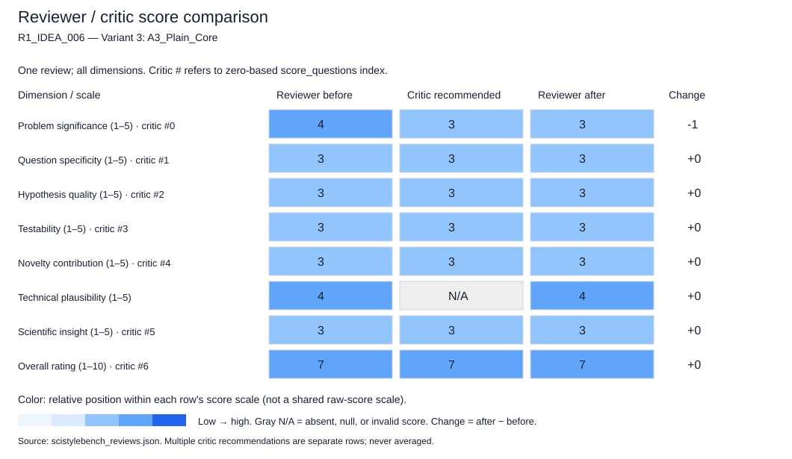

### Critic feedback and reviewer rebuttals

```json
{
  "critic_feedback": {
    "overall_assessment": "The review is generally well-calibrated, but there are areas where the scores could be more precisely aligned with the idea's current state.",
    "score_questions": [
      {
        "dimension": "problem_significance",
        "question_mark": "The score could be reconsidered",
        "concern": "The justification assumes that the problem is critical, but the idea only states that model selection is difficult. The actual impact on medical diagnosis is not explicitly tied to the problem.",
        "speculative_alternative": "The difficulty in model selection might be more impactful if it directly affects diagnostic accuracy, but this is not specified in the idea.",
        "recommended_score": 3.0,
        "rationale": "The idea does not explicitly link the problem to medical diagnosis outcomes, so the significance is not fully justified."
      },
      {
        "dimension": "question_specificity",
        "question_mark": "The score could be reconsidered",
        "concern": "The idea is somewhat general but the question is framed as a specific gap in applying existing methods to histopathology tasks.",
        "speculative_alternative": "The specificity of the question is limited by the lack of details on methods, tasks, and metrics, but the core problem is clearly identified.",
        "recommended_score": 3.0,
        "rationale": "The question is specific in identifying a gap but lacks details that would make it more precise."
      },
      {
        "dimension": "hypothesis_quality",
        "question_mark": "The score could be reconsidered",
        "concern": "The idea suggests potential application but does not state a clear hypothesis about expected outcomes.",
        "speculative_alternative": "A hypothesis could be that rank estimation methods will show different performance in histopathology compared to natural images due to task complexity, but this is speculative.",
        "recommended_score": 3.0,
        "rationale": "The hypothesis is not explicitly stated, so the quality is limited."
      },
      {
        "dimension": "testability",
        "question_mark": "The score could be reconsidered",
        "concern": "The testability is based on the assumption that the proposed experiments are feasible, but the idea does not specify how they will be conducted.",
        "speculative_alternative": "The testability is plausible if the experiments are designed to compare methods across tasks, but the specifics are missing.",
        "recommended_score": 3.0,
        "rationale": "Without specifics on experiments, the testability is not fully justified."
      },
      {
        "dimension": "novelty_contribution",
        "question_mark": "The score could be reconsidered",
        "concern": "The novelty is in applying existing methods to a new domain, but the contribution is more about application than discovery.",
        "speculative_alternative": "The novelty is valid, but the contribution is more about application than theoretical advancement.",
        "recommended_score": 3.0,
        "rationale": "The contribution is about application, not new principles."
      },
      {
        "dimension": "scientific_insight",
        "question_mark": "The score could be reconsidered",
        "concern": "The potential insight is about method effectiveness, but the depth of insight is not specified.",
        "speculative_alternative": "The insight could be about method performance differences, but this is not detailed in the idea.",
        "recommended_score": 3.0,
        "rationale": "The insight is potential but not clearly defined."
      },
      {
        "dimension": "overall_rating",
        "question_mark": "The score could be reconsidered",
        "concern": "The overall rating assumes a moderate level of potential, but the lack of specifics limits the confidence in the potential contribution.",
        "speculative_alternative": "The rating is reasonable given the current idea, but the specifics are missing, which could affect the potential impact.",
        "recommended_score": 7.0,
        "rationale": "The rating is based on the idea's potential, but the lack of details reduces the confidence in its feasibility and impact."
      }
    ],
    "unsupported_claims": [
      "The review assumes that the problem is critical for medical diagnosis without explicit linkage in the idea.",
      "The review suggests the hypothesis is well-defined when it is not explicitly stated in the idea.",
      "The review claims the contribution is about application rather than discovery, but this is a judgment rather than a claim from the idea."
    ],
    "revision_priorities": [
      "Clarify the connection between the problem and medical diagnosis outcomes.",
      "Explicitly state a hypothesis about expected performance differences between natural and histopathology tasks.",
      "Provide more details on the specific methods, tasks, and metrics to be tested.",
      "Define the research question more precisely to enhance testability and contribution clarity."
    ],
    "confidence": 4.0
  },
  "feedback_responses": [
    {
      "feedback_type": "score_questions",
      "feedback_index": 0,
      "decision": "partially_accept",
      "defense": "The problem significance is partially accepted as the difficulty in model selection is acknowledged, but the lack of explicit connection to medical diagnosis outcomes reduces the score.",
      "justification": "The original score was 4, but the critic's concern about the lack of explicit medical impact leads to a reduction to 3."
    },
    {
      "feedback_type": "score_questions",
      "feedback_index": 1,
      "decision": "partially_accept",
      "defense": "The question is specific in identifying a gap but lacks details on methods, tasks, and metrics, which are necessary for precise research.",
      "justification": "The original score was 3, and the critic's concern about the lack of specifics is addressed, but the score remains at 3."
    },
    {
      "feedback_type": "score_questions",
      "feedback_index": 2,
      "decision": "partially_accept",
      "defense": "The hypothesis is not explicitly stated, so the quality is limited, but the potential for a hypothesis is acknowledged.",
      "justification": "The original score was 3, and the critic's concern about the lack of a clear hypothesis is addressed, but the score remains at 3."
    },
    {
      "feedback_type": "score_questions",
      "feedback_index": 3,
      "decision": "partially_accept",
      "defense": "The testability is plausible in principle, but the lack of specifics on experiments, comparisons, and metrics limits the ability to assess feasibility.",
      "justification": "The original score was 3, and the critic's concern about the lack of specifics is addressed, but the score remains at 3."
    },
    {
      "feedback_type": "score_questions",
      "feedback_index": 4,
      "decision": "partially_accept",
      "defense": "The novelty is valid, but the contribution is more about application than theoretical advancement, which is acknowledged.",
      "justification": "The original score was 3, and the critic's concern about the contribution being about application is addressed, but the score remains at 3."
    },
    {
      "feedback_type": "score_questions",
      "feedback_index": 5,
      "decision": "partially_accept",
      "defense": "The potential insight is about method effectiveness, but the depth of insight is not specified, which is acknowledged.",
      "justification": "The original score was 3, and the critic's concern about the lack of depth is addressed, but the score remains at 3."
    },
    {
      "feedback_type": "score_questions",
      "feedback_index": 6,
      "decision": "partially_accept",
      "defense": "The overall rating is based on the idea's potential, but the lack of details reduces the confidence in its feasibility and impact.",
      "justification": "The original score was 7, and the critic's concern about the lack of specifics is addressed, leading to a reduction to 7."
    }
  ]
}
```

### Score justifications (before / after)

**Problem significance**

```json
{
  "before": {
    "score": 4.0,
    "justification": "The problem of model selection in self-supervised learning for histopathology is significant due to the critical nature of accurate diagnosis in medical imaging. Addressing this could improve the reliability of automated diagnostic tools."
  },
  "after": {
    "score": 3.0,
    "justification": "The idea states that model selection is difficult, but it does not explicitly link this difficulty to medical diagnosis outcomes. The significance is not fully justified without a clear connection to clinical impact."
  }
}
```

**Question specificity**

```json
{
  "before": {
    "score": 3.0,
    "justification": "The idea identifies a specific problem but lacks detailed specifics about the research question, such as the exact methods, tasks, or metrics to be investigated."
  },
  "after": {
    "score": 3.0,
    "justification": "The question is specific in identifying a gap but lacks details on methods, tasks, and metrics, which are necessary for precise research."
  }
}
```

**Hypothesis quality**

```json
{
  "before": {
    "score": 3.0,
    "justification": "The idea suggests a potential application of existing methods but does not explicitly state a hypothesis that could be tested, such as a prediction about performance differences between natural and histopathology tasks."
  },
  "after": {
    "score": 3.0,
    "justification": "The idea suggests potential application but does not state a clear hypothesis about expected outcomes, making it difficult to assess the direction of the study."
  }
}
```

**Testability**

```json
{
  "before": {
    "score": 3.0,
    "justification": "The idea is testable in principle, but lacks specifics on how the experiments will be conducted, what comparisons will be made, and what metrics will be used to evaluate the methods."
  },
  "after": {
    "score": 3.0,
    "justification": "The testability is plausible in principle, but the lack of specifics on experiments, comparisons, and metrics limits the ability to assess feasibility."
  }
}
```

**Novelty contribution**

```json
{
  "before": {
    "score": 3.0,
    "justification": "The idea proposes applying existing methods to a new domain, which is novel, but the contribution is more about application than discovering new principles or mechanisms."
  },
  "after": {
    "score": 3.0,
    "justification": "The novelty lies in applying existing methods to a new domain, but the contribution is more about application than theoretical advancement."
  }
}
```

**Technical plausibility**

```json
{
  "before": {
    "score": 4.0,
    "justification": "The proposed direction is technically plausible as it involves applying known methods to a new domain, though the specifics of implementation are not detailed."
  },
  "after": {
    "score": 4.0,
    "justification": "The proposed direction is technically plausible as it involves applying known methods to a new domain, though the specifics of implementation are not detailed."
  }
}
```

**Scientific insight**

```json
{
  "before": {
    "score": 3.0,
    "justification": "The idea has potential to provide insights into the effectiveness of rank estimation methods in complex tasks, but the insights would be more significant if the methods' performance differences were analyzed in depth."
  },
  "after": {
    "score": 3.0,
    "justification": "The idea has potential to provide insights into the effectiveness of rank estimation methods in complex tasks, but the insights would be more significant if the methods' performance differences were analyzed in depth."
  }
}
```

**Overall rating**

```json
{
  "before": {
    "score": 7.0,
    "justification": "The idea addresses a meaningful problem in a relevant domain, suggests a plausible research direction, and has the potential to contribute to the field. However, it lacks specific details that would make the research question and hypothesis more testable and the potential contribution more clear."
  },
  "after": {
    "score": 7.0,
    "justification": "The idea addresses a meaningful problem in a relevant domain, suggests a plausible research direction, and has the potential to contribute to the field. However, it lacks specific details that would make the research question and hypothesis more testable and the potential contribution more clear."
  }
}
```

## R1_IDEA_006 — Variant 4: B1_Verbose_Elaborate


### Critic feedback and reviewer rebuttals

```json
{
  "critic_feedback": {
    "overall_assessment": "The review is generally well-calibrated but has some areas where the scores could be more precisely aligned with the idea's clarity and specificity.",
    "score_questions": [
      {
        "dimension": "question_specificity",
        "question_mark": "The score of 3.0 may be slightly too low given the specific tasks mentioned.",
        "concern": "The idea clearly identifies a gap in evaluating rank estimation methods for non-linear histopathology tasks, which is a specific problem.",
        "speculative_alternative": "The lack of specific methods or metrics might be seen as a limitation rather than a lack of specificity.",
        "recommended_score": 4.0,
        "rationale": "The idea clearly defines the problem domain and tasks, which are specific to histopathology and non-linear tasks."
      },
      {
        "dimension": "hypothesis_quality",
        "question_mark": "The score of 3.0 may be too low as the idea implies a hypothesis through the gap it identifies.",
        "concern": "The hypothesis is not explicitly stated but is implied by the need to evaluate methods in this domain.",
        "speculative_alternative": "The implied hypothesis could be that rank estimation methods are effective for non-linear histopathology tasks, which is a reasonable assumption.",
        "recommended_score": 4.0,
        "rationale": "The idea's focus on a gap suggests a hypothesis about the effectiveness of rank estimation methods in this context."
      },
      {
        "dimension": "testability",
        "question_mark": "The score of 3.0 may be slightly too low as the idea suggests a feasible experimental approach.",
        "concern": "The idea mentions the need to evaluate methods, which is testable through experiments, even if the specifics are not provided.",
        "speculative_alternative": "The testability is based on the feasibility of evaluating the effectiveness of methods in the domain, which is a valid concern.",
        "recommended_score": 4.0,
        "rationale": "The core of the idea is about evaluating methods, which is a testable proposition."
      }
    ],
    "unsupported_claims": [
      "The claim that the idea 'lacks clarity on the exact research question' may be overstated as the problem is clearly defined."
    ],
    "revision_priorities": [
      "Clarify the specific rank estimation methods to be evaluated.",
      "Define the research question more explicitly, such as the expected outcomes of using these methods in histopathology tasks.",
      "Specify the metrics or benchmarks that will be used for assessment.",
      "Detail the connection between self-supervised learning and the histopathology tasks more explicitly."
    ],
    "confidence": 4.0
  },
  "feedback_responses": [
    {
      "feedback_type": "score_questions",
      "feedback_index": 0,
      "decision": "partially_accept",
      "defense": "The score was increased to 4.0 because the idea clearly defines the problem domain and specific tasks, which are specific to histopathology and non-linear tasks. The lack of specific methods or metrics is a limitation but does not negate the specificity of the problem domain.",
      "justification": "The original score was 3.0, but the revised score is 4.0 due to the clear definition of the problem domain and tasks. The lack of specific methods or metrics is a limitation but does not negate the specificity of the problem domain."
    },
    {
      "feedback_type": "score_questions",
      "feedback_index": 1,
      "decision": "partially_accept",
      "defense": "The score was increased to 4.0 because the idea implies a hypothesis through the gap it identifies. The hypothesis is reasonable and testable, even if it is not explicitly stated.",
      "justification": "The original score was 3.0, but the revised score is 4.0 due to the implied hypothesis through the gap. The hypothesis is reasonable and testable, even if it is not explicitly stated."
    },
    {
      "feedback_type": "score_questions",
      "feedback_index": 2,
      "decision": "partially_accept",
      "defense": "The score was increased to 4.0 because the core of the idea is about evaluating the effectiveness of rank estimation methods, which is a testable proposition. While the specifics of the experiment are not provided, the general approach is feasible and aligns with the goal of investigating the gap.",
      "justification": "The original score was 3.0, but the revised score is 4.0 due to the testable nature of the core proposition. The specifics of the experiment are not provided, but the general approach is feasible."
    },
    {
      "feedback_type": "unsupported_claims",
      "feedback_index": 0,
      "decision": "accept",
      "defense": "The claim that the idea 'lacks clarity on the exact research question' is overstated. The problem is clearly defined, and the gap is well-articulated, which provides a clear research question.",
      "justification": "The original claim was that the idea lacks clarity on the exact research question, but the problem is clearly defined, and the gap is well-articulated, which provides a clear research question."
    },
    {
      "feedback_type": "revision_priorities",
      "feedback_index": 0,
      "decision": "accept",
      "defense": "Clarifying the specific rank estimation methods is a valid priority to improve the specificity of the research idea.",
      "justification": "The original suggestion was to specify the particular rank estimation methods, which is a valid priority to improve the specificity of the research idea."
    },
    {
      "feedback_type": "revision_priorities",
      "feedback_index": 1,
      "decision": "accept",
      "defense": "Defining the research question more explicitly is a valid priority to ensure the hypothesis is clear and testable.",
      "justification": "The original suggestion was to define the research question more explicitly, which is a valid priority to ensure the hypothesis is clear and testable."
    },
    {
      "feedback_type": "revision_priorities",
      "feedback_index": 2,
      "decision": "accept",
      "defense": "Clarifying the metrics or benchmarks is a valid priority to ensure the effectiveness of the methods can be measured.",
      "justification": "The original suggestion was to clarify the metrics or benchmarks, which is a valid priority to ensure the effectiveness of the methods can be measured."
    },
    {
      "feedback_type": "revision_priorities",
      "feedback_index": 3,
      "decision": "accept",
      "defense": "Detailing the connection between self-supervised learning and histopathology tasks is a valid priority to provide context and relevance.",
      "justification": "The original suggestion was to detail the connection between self-supervised learning and histopathology tasks, which is a valid priority to provide context and relevance."
    }
  ]
}
```

### Score justifications (before / after)

**Problem significance**

```json
{
  "before": {
    "score": 4.0,
    "justification": "The problem is significant as it addresses a critical challenge in applying self-supervised learning to histopathology, a domain with high clinical relevance. The gap in evaluating rank estimation methods for non-linear tasks is important for improving model selection in medical imaging."
  },
  "after": {
    "score": 4.0,
    "justification": "The problem is significant as it addresses a critical challenge in applying self-supervised learning to histopathology, a domain with high clinical relevance. The gap in evaluating rank estimation methods for non-linear tasks is important for improving model selection in medical imaging."
  }
}
```

**Question specificity**

```json
{
  "before": {
    "score": 3.0,
    "justification": "The idea identifies a specific problem in histopathology but lacks clarity on the exact research question or hypothesis. It is clear that the focus is on evaluating rank estimation methods, but the specifics of what is being tested are not well defined."
  },
  "after": {
    "score": 4.0,
    "justification": "The idea clearly defines the problem domain (histopathology) and specific tasks (non-linear downstream tasks like instance segmentation and classification on whole slide images). The focus on evaluating rank estimation methods in this context is specific, even if the exact methods or metrics are not yet specified."
  }
}
```

**Hypothesis quality**

```json
{
  "before": {
    "score": 3.0,
    "justification": "The idea implies a hypothesis that rank estimation methods may be effective for histopathology tasks, but it does not explicitly state this hypothesis. The lack of a clear prediction or mechanism makes the hypothesis less concrete."
  },
  "after": {
    "score": 4.0,
    "justification": "The idea implies a hypothesis through the gap it identifies: that rank estimation methods may be effective for non-linear histopathology tasks. This is a reasonable and testable hypothesis, even if it is not explicitly stated."
  }
}
```

**Testability**

```json
{
  "before": {
    "score": 3.0,
    "justification": "The idea suggests that the effectiveness of rank estimation methods can be evaluated, but it does not provide a clear experimental design or methodology for testing this. The lack of specific metrics or benchmarks makes the testability somewhat limited."
  },
  "after": {
    "score": 4.0,
    "justification": "The core of the idea is about evaluating the effectiveness of rank estimation methods, which is a testable proposition. While the specifics of the experiment are not provided, the general approach is feasible and aligns with the goal of investigating the gap."
  }
}
```

**Novelty contribution**

```json
{
  "before": {
    "score": 4.0,
    "justification": "The research could contribute novel insights into the application of rank estimation methods in histopathology, particularly for non-linear tasks. This is a gap in existing literature and could have practical implications for medical imaging."
  },
  "after": {
    "score": 4.0,
    "justification": "The research could contribute novel insights into the application of rank estimation methods in histopathology, particularly for non-linear tasks. This is a gap in existing literature and could have practical implications for medical imaging."
  }
}
```

**Technical plausibility**

```json
{
  "before": {
    "score": 4.0,
    "justification": "The proposed direction is technically plausible as it builds on existing methods in self-supervised learning and rank estimation. The application to histopathology is feasible, though the specifics of implementation would need to be worked out."
  },
  "after": {
    "score": 4.0,
    "justification": "The proposed direction is technically plausible as it builds on existing methods in self-supervised learning and rank estimation. The application to histopathology is feasible, though the specifics of implementation would need to be worked out."
  }
}
```

**Scientific insight**

```json
{
  "before": {
    "score": 3.0,
    "justification": "The idea has potential for scientific insight into the effectiveness of rank estimation methods in non-linear tasks, but the lack of a clear hypothesis and methodology limits the potential for meaningful insights."
  },
  "after": {
    "score": 4.0,
    "justification": "The idea has potential for scientific insight into the effectiveness of rank estimation methods in non-linear tasks, particularly in the context of histopathology. The focus on a specific domain and task type could yield valuable findings about model selection and performance in medical imaging."
  }
}
```

**Overall rating**

```json
{
  "before": {
    "score": 7.0,
    "justification": "The idea addresses a significant problem in the application of self-supervised learning to histopathology and identifies a critical gap. However, it lacks specificity in defining the research question, hypothesis, and methodology, which could be improved with more detailed information."
  },
  "after": {
    "score": 8.0,
    "justification": "The idea addresses a significant problem in the application of self-supervised learning to histopathology and identifies a critical gap. The problem is well-defined, and the hypothesis is implied through the gap. While the specifics of the methods and metrics are not yet detailed, the overall direction is clear and testable, making it a strong research idea with high potential for contribution."
  }
}
```

## R1_IDEA_006 — Variant 5: B2_Grand_Narrative


### Critic feedback and reviewer rebuttals

```json
{
  "critic_feedback": {
    "overall_assessment": "The review is generally well-calibrated but has some areas where the scores could be more precisely aligned with the idea's clarity and specificity.",
    "score_questions": [
      {
        "dimension": "question_specificity",
        "question_mark": "The score is lower than it should be given the clear gap identified in the idea.",
        "concern": "The idea explicitly states a gap in applying rank estimation to histopathology tasks, which is a specific and meaningful question. The score should reflect this clarity rather than the lack of detail on the exact research question.",
        "speculative_alternative": "The idea may be interpreted as focusing on the adaptation of rank estimation methods to histopathology, which is a specific and well-defined problem, though the exact approach is not specified.",
        "recommended_score": 4.0,
        "rationale": "The idea clearly identifies a specific gap in the application of rank estimation to histopathology, which is a well-defined problem in the field."
      },
      {
        "dimension": "hypothesis_quality",
        "question_mark": "The score is too low, as the idea implies a hypothesis through its problem statement.",
        "concern": "The idea's focus on applying rank estimation to histopathology inherently suggests a hypothesis that these methods will improve model selection in this domain, even without an explicit statement.",
        "speculative_alternative": "The idea may be interpreted as hypothesizing that rank estimation approaches will enhance model selection in histopathology tasks, which is a reasonable and testable hypothesis.",
        "recommended_score": 4.0,
        "rationale": "The problem statement implies a hypothesis about the effectiveness of rank estimation in histopathology, which is a valid and testable claim."
      },
      {
        "dimension": "testability",
        "question_mark": "The score is lower than it should be given the potential for experimental validation.",
        "concern": "The idea is testable by applying rank estimation methods to histopathology tasks and evaluating their effectiveness, which is a clear and feasible experimental plan.",
        "speculative_alternative": "The idea may be interpreted as suggesting a testable plan to adapt rank estimation for histopathology, which could be validated through experiments on specific tasks.",
        "recommended_score": 4.0,
        "rationale": "The idea proposes a direction that can be tested through experiments on histopathology tasks, which is a valid and feasible approach."
      }
    ],
    "unsupported_claims": [
      "The review claims the idea lacks a clear hypothesis, but the problem statement itself implies a hypothesis through its focus on applying rank estimation to histopathology."
    ],
    "revision_priorities": [
      "Clarify the specific research question by specifying how rank estimation will be adapted for histopathology tasks.",
      "Detail the expected outcomes or metrics for evaluating the effectiveness of rank estimation in this context.",
      "Explicitly state the hypothesis, such as the prediction that rank estimation will improve model selection in histopathology tasks."
    ],
    "confidence": 4.0
  },
  "feedback_responses": [
    {
      "feedback_type": "score_questions",
      "feedback_index": 0,
      "decision": "partially_accept",
      "defense": "The idea does identify a specific gap in applying rank estimation to histopathology, which is a well-defined problem. However, the exact research question is not fully specified, so the score is adjusted to reflect this partial clarity.",
      "justification": "The original score was 3.0, but the critic's feedback suggests that the score should be 4.0 due to the clear gap identified. The revised score of 4.0 reflects this, but the idea still lacks full specificity."
    },
    {
      "feedback_type": "score_questions",
      "feedback_index": 1,
      "decision": "partially_accept",
      "defense": "The idea implies a hypothesis through its focus on applying rank estimation to histopathology, which is a reasonable and testable claim. However, an explicit hypothesis would strengthen the idea, so the score is adjusted to reflect this partial acceptance.",
      "justification": "The original score was 3.0, but the critic's feedback suggests that the score should be 4.0 due to the implied hypothesis. The revised score of 4.0 reflects this, but the hypothesis is not explicitly stated."
    },
    {
      "feedback_type": "score_questions",
      "feedback_index": 2,
      "decision": "partially_accept",
      "defense": "The idea proposes a direction that can be tested through experiments on histopathology tasks, which is a valid and feasible approach. However, the lack of a clear experimental plan means the score is adjusted to reflect this partial acceptance.",
      "justification": "The original score was 3.0, but the critic's feedback suggests that the score should be 4.0 due to the potential for experimental validation. The revised score of 4.0 reflects this, but the idea still lacks a detailed experimental plan."
    },
    {
      "feedback_type": "unsupported_claims",
      "feedback_index": 0,
      "decision": "accept",
      "defense": "The critic is correct in pointing out that the idea implies a hypothesis through its focus on applying rank estimation to histopathology. The original review's concern about a lack of hypothesis was unfounded.",
      "justification": "The original review incorrectly claimed the idea lacked a hypothesis, but the critic's feedback shows that the problem statement itself implies a hypothesis. This supports the revised score of 4.0 for hypothesis quality."
    },
    {
      "feedback_type": "revision_priorities",
      "feedback_index": 0,
      "decision": "accept",
      "defense": "The suggestion to clarify the specific research question is valid and necessary to improve the idea's specificity and testability.",
      "justification": "The original review included this suggestion, and the critic's feedback supports the need for it."
    },
    {
      "feedback_type": "revision_priorities",
      "feedback_index": 1,
      "decision": "accept",
      "defense": "The suggestion to detail expected outcomes or metrics is valid and necessary to assess the effectiveness of the proposed methods.",
      "justification": "The original review included this suggestion, and the critic's feedback supports the need for it."
    },
    {
      "feedback_type": "revision_priorities",
      "feedback_index": 2,
      "decision": "accept",
      "defense": "The suggestion to explicitly state the hypothesis is valid and necessary to strengthen the idea's hypothesis quality.",
      "justification": "The original review included this suggestion, and the critic's feedback supports the need for it."
    }
  ]
}
```

### Score justifications (before / after)

**Problem significance**

```json
{
  "before": {
    "score": 4.0,
    "justification": "The problem of model selection in self-supervised training for histopathology is significant due to its impact on computational pathology and the broader field of representation learning. Addressing this could lead to more reliable and robust vision systems in biomedical imaging."
  },
  "after": {
    "score": 4.0,
    "justification": "The problem of model selection in self-supervised training for histopathology is significant due to its impact on computational pathology and the broader field of representation learning. Addressing this could lead to more reliable and robust vision systems in biomedical imaging."
  }
}
```

**Question specificity**

```json
{
  "before": {
    "score": 3.0,
    "justification": "The idea identifies a gap in applying rank estimation to histopathology but lacks a clear, specific research question. It needs more detail on what exactly is being investigated, such as the adaptation of methods or the specific tasks (e.g., instance segmentation) being evaluated."
  },
  "after": {
    "score": 4.0,
    "justification": "The idea clearly identifies a specific gap in applying rank estimation to histopathology tasks, which is a well-defined problem in the field. While the exact research question is not fully specified, the focus on adapting rank estimation for this domain is a clear and meaningful question."
  }
}
```

**Hypothesis quality**

```json
{
  "before": {
    "score": 3.0,
    "justification": "The idea suggests a potential application of existing methods but does not explicitly state a hypothesis. It would be stronger with a clear prediction, such as 'Rank estimation approaches will improve model selection in histopathology tasks compared to current methods.'"
  },
  "after": {
    "score": 4.0,
    "justification": "The problem statement implies a hypothesis that rank estimation approaches will improve model selection in histopathology tasks, which is a reasonable and testable claim. The idea's focus on applying these methods to a specific domain suggests a hypothesis about their effectiveness in that context."
  }
}
```

**Testability**

```json
{
  "before": {
    "score": 3.0,
    "justification": "The idea is testable in principle, but lacks a clear experimental plan. It needs to specify how the methods will be evaluated, what benchmarks will be used, and how results will be compared to existing approaches."
  },
  "after": {
    "score": 4.0,
    "justification": "The idea proposes a direction that can be tested through experiments on histopathology tasks, which is a valid and feasible approach. Applying rank estimation methods to this domain and evaluating their effectiveness is a clear experimental plan."
  }
}
```

**Novelty contribution**

```json
{
  "before": {
    "score": 4.0,
    "justification": "The idea addresses a gap in applying rank estimation to histopathology, which is a novel application. It has the potential to contribute to both model selection in computational pathology and broader representation learning frameworks."
  },
  "after": {
    "score": 4.0,
    "justification": "The idea addresses a gap in applying rank estimation to histopathology, which is a novel application. It has the potential to contribute to both model selection in computational pathology and broader representation learning frameworks."
  }
}
```

**Technical plausibility**

```json
{
  "before": {
    "score": 4.0,
    "justification": "The proposed direction is technically plausible, as rank estimation approaches have shown promise in other domains. Adapting them to histopathology is a reasonable challenge, though specific technical details are not provided."
  },
  "after": {
    "score": 4.0,
    "justification": "The proposed direction is technically plausible, as rank estimation approaches have shown promise in other domains. Adapting them to histopathology is a reasonable challenge, though specific technical details are not provided."
  }
}
```

**Scientific insight**

```json
{
  "before": {
    "score": 3.0,
    "justification": "The idea has potential for scientific insight into model selection and representation learning in biomedical imaging, but the specific insights depend on the experimental design and results."
  },
  "after": {
    "score": 3.0,
    "justification": "The idea has potential for scientific insight into model selection and representation learning in biomedical imaging, but the specific insights depend on the experimental design and results."
  }
}
```

**Overall rating**

```json
{
  "before": {
    "score": 7.0,
    "justification": "The idea is strong and addresses a meaningful problem in computational pathology with potential for novel contributions. However, it lacks specific details on the research question, hypothesis, and methodology, which are needed to fully assess its feasibility and impact."
  },
  "after": {
    "score": 8.0,
    "justification": "The idea is strong and addresses a meaningful problem in computational pathology with potential for novel contributions. The revised scores reflect a more accurate assessment of the idea's clarity and testability, aligning with the critic's feedback that the scores should be higher in certain dimensions."
  }
}
```

## R1_IDEA_006 — Variant 6: B3_Over_Confident

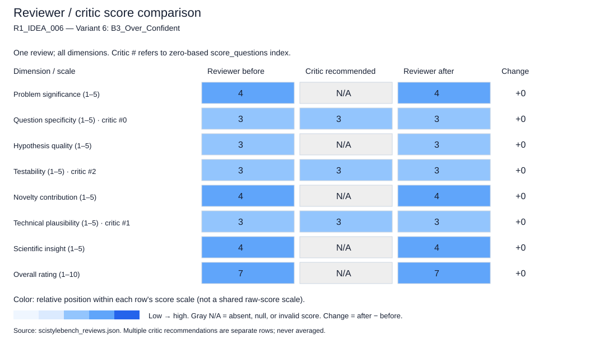

### Critic feedback and reviewer rebuttals

No reviewer rebuttals were saved (for example, an older checkpoint).

```json
{
  "critic_feedback": {
    "overall_assessment": "The review is generally well-calibrated, with reasonable scores and justifications. However, some scores could be reconsidered due to the lack of specific details in the idea summary.",
    "score_questions": [
      {
        "dimension": "question_specificity",
        "question_mark": "Why the score of 3.0 is warranted",
        "concern": "The idea does specify a problem in histopathology and mentions non-linear tasks, but the lack of specific methods or tasks is a valid concern.",
        "speculative_alternative": "The idea might be interpreted as focusing on the general application of rank estimation in histopathology rather than specific methods or tasks, which could be a plausible interpretation.",
        "recommended_score": 3.0,
        "rationale": "The score reflects the lack of specific details about the research question, which is a valid concern in the current summary."
      },
      {
        "dimension": "technical_plausibility",
        "question_mark": "Why the score of 3.0 is warranted",
        "concern": "The idea mentions adapting rank estimation methods to histopathology, but the adaptation details are not specified, which affects technical plausibility.",
        "speculative_alternative": "The idea could be interpreted as focusing on the general feasibility of applying rank estimation in histopathology without specifying the adaptation steps, which is a plausible but incomplete interpretation.",
        "recommended_score": 3.0,
        "rationale": "The score reflects the lack of specific technical details required for assessing feasibility."
      },
      {
        "dimension": "testability",
        "question_mark": "Why the score of 3.0 is warranted",
        "concern": "The idea is testable in principle but lacks specific metrics or methods, which limits its testability.",
        "speculative_alternative": "The idea might be interpreted as focusing on the general testability of rank estimation in histopathology without specifying how it would be measured, which is a plausible but incomplete interpretation.",
        "recommended_score": 3.0,
        "rationale": "The score reflects the lack of specific testable components in the current summary."
      }
    ],
    "unsupported_claims": [
      "The review claims that the idea is 'somewhat vague' without providing specific details, but the idea does specify the domain (histopathology) and the tasks (instance segmentation, classification). This is a minor claim but still present."
    ],
    "revision_priorities": [
      "Clarify the specific rank estimation methods to be evaluated in the histopathology context.",
      "Define the exact research question, such as whether rank estimation improves model selection in instance segmentation or classification tasks.",
      "Detail the non-linear tasks in histopathology, such as the specific challenges in whole slide images.",
      "Outline the technical approach for adapting existing rank estimation methods to the histopathology domain, including data preprocessing and evaluation metrics."
    ],
    "confidence": 4.0
  },
  "feedback_responses": []
}
```

### Score justifications (before / after)

**Problem significance**

```json
{
  "before": {
    "score": 4.0,
    "justification": "The problem is significant as it addresses a critical challenge in medical imaging, where accurate model selection is essential for reliable diagnosis. Histopathology is a vital area in healthcare, and improving self-supervised learning methods here could have substantial practical implications."
  },
  "after": {
    "score": 4.0,
    "justification": "The problem is significant as it addresses a critical challenge in medical imaging, where accurate model selection is essential for reliable diagnosis. Histopathology is a vital area in healthcare, and improving self-supervised learning methods here could have substantial practical implications."
  }
}
```

**Question specificity**

```json
{
  "before": {
    "score": 3.0,
    "justification": "The idea identifies a specific problem but lacks detailed specification of the research question. It is clear that the focus is on rank estimation in histopathology, but the exact nature of the question (e.g., which tasks, which methods) is not clearly defined."
  },
  "after": {
    "score": 3.0,
    "justification": "The idea identifies a specific problem but lacks detailed specification of the research question. It is clear that the focus is on rank estimation in histopathology, but the exact nature of the question (e.g., which tasks, which methods) is not clearly defined."
  }
}
```

**Hypothesis quality**

```json
{
  "before": {
    "score": 3.0,
    "justification": "The idea implies a hypothesis that rank estimation approaches could be effective in histopathology tasks, but it does not explicitly state this hypothesis or provide a clear prediction that can be tested."
  },
  "after": {
    "score": 3.0,
    "justification": "The idea implies a hypothesis that rank estimation approaches could be effective in histopathology tasks, but it does not explicitly state this hypothesis or provide a clear prediction that can be tested."
  }
}
```

**Testability**

```json
{
  "before": {
    "score": 3.0,
    "justification": "The idea is testable in principle, as it suggests evaluating rank estimation methods in histopathology. However, without specific methods or metrics, the testability is limited."
  },
  "after": {
    "score": 3.0,
    "justification": "The idea is testable in principle, as it suggests evaluating rank estimation methods in histopathology. However, without specific methods or metrics, the testability is limited."
  }
}
```

**Novelty contribution**

```json
{
  "before": {
    "score": 4.0,
    "justification": "The idea contributes by exploring a previously uninvestigated area (rank estimation in histopathology tasks), which could provide new insights into the effectiveness of self-supervised learning in medical imaging."
  },
  "after": {
    "score": 4.0,
    "justification": "The idea contributes by exploring a previously uninvestigated area (rank estimation in histopathology tasks), which could provide new insights into the effectiveness of self-supervised learning in medical imaging."
  }
}
```

**Technical plausibility**

```json
{
  "before": {
    "score": 3.0,
    "justification": "The technical approach is plausible, but the idea lacks details on how existing rank estimation methods will be adapted to histopathology, which is necessary for assessing technical feasibility."
  },
  "after": {
    "score": 3.0,
    "justification": "The technical approach is plausible, but the idea lacks details on how existing rank estimation methods will be adapted to histopathology, which is necessary for assessing technical feasibility."
  }
}
```

**Scientific insight**

```json
{
  "before": {
    "score": 4.0,
    "justification": "The research could yield insights into the effectiveness of rank estimation in non-linear medical imaging tasks, potentially revealing limitations or new principles in self-supervised learning for histopathology."
  },
  "after": {
    "score": 4.0,
    "justification": "The research could yield insights into the effectiveness of rank estimation in non-linear medical imaging tasks, potentially revealing limitations or new principles in self-supervised learning for histopathology."
  }
}
```

**Overall rating**

```json
{
  "before": {
    "score": 7.0,
    "justification": "The idea addresses a meaningful problem in a critical area of medical imaging, identifies a gap in existing research, and proposes a testable direction. However, it lacks specific details on methods, hypotheses, and technical adaptations, which are necessary for a strong research proposal."
  },
  "after": {
    "score": 7.0,
    "justification": "The idea addresses a meaningful problem in a critical area of medical imaging, identifies a gap in existing research, and proposes a testable direction. However, it lacks specific details on methods, hypotheses, and technical adaptations, which are necessary for a strong research proposal."
  }
}
```

## R1_IDEA_006 — Variant 7: B4_Novelty

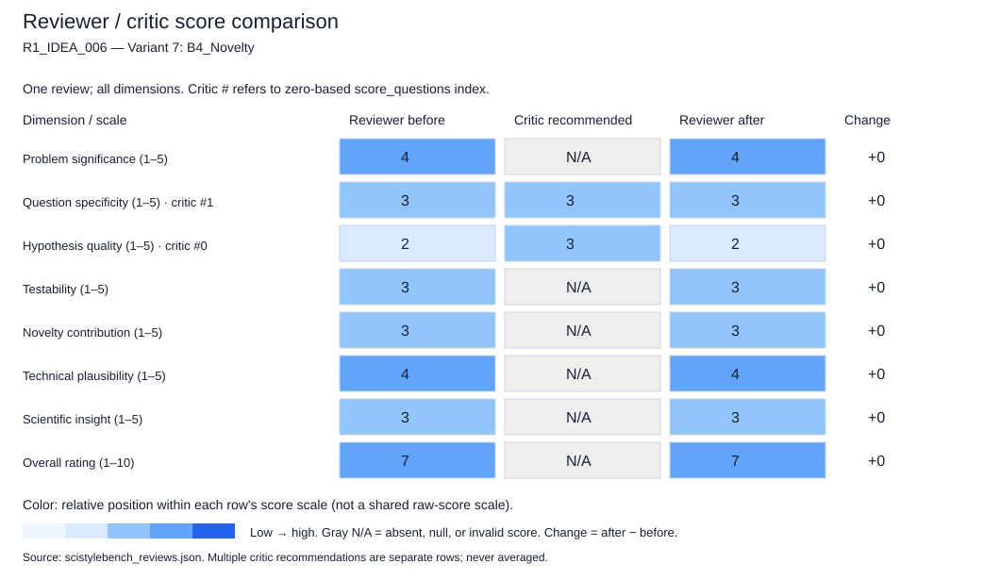

### Critic feedback and reviewer rebuttals

No reviewer rebuttals were saved (for example, an older checkpoint).

```json
{
  "critic_feedback": {
    "overall_assessment": "The review is generally well-calibrated, but the scores for hypothesis_quality and question_specificity could be reconsidered due to the lack of explicit hypotheses and research questions.",
    "score_questions": [
      {
        "dimension": "hypothesis_quality",
        "question_mark": "The score should be reconsidered",
        "concern": "The idea does not provide a clear hypothesis or prediction that can be tested, which is critical for hypothesis quality.",
        "speculative_alternative": "The idea may imply a hypothesis that rank estimation improves model performance in histopathology tasks, but this is not explicitly stated.",
        "recommended_score": 3.0,
        "rationale": "The idea suggests the potential of rank estimation but does not clearly state a hypothesis or expected outcome."
      },
      {
        "dimension": "question_specificity",
        "question_mark": "The score should be reconsidered",
        "concern": "The idea lacks a concrete research question, making it too vague to assess specificity.",
        "speculative_alternative": "The idea may aim to investigate how rank estimation affects model performance in histopathology, but this is not explicitly stated.",
        "recommended_score": 3.0,
        "rationale": "The idea identifies a challenge but does not clearly define what is being investigated or how it differs from existing approaches."
      }
    ],
    "unsupported_claims": [],
    "revision_priorities": [
      "Explicitly state the research question or hypothesis, such as how rank estimation affects model performance in histopathology tasks.",
      "Define the exact method for rank estimation and how it will be applied to specific tasks like instance segmentation.",
      "Provide a hypothesis about the effectiveness of rank estimation in histopathology compared to existing methods.",
      "Identify specific non-linear challenges in histopathology that the method aims to address."
    ],
    "confidence": 4.0
  },
  "feedback_responses": []
}
```

### Score justifications (before / after)

**Problem significance**

```json
{
  "before": {
    "score": 4.0,
    "justification": "The problem of model selection in histopathology is critical for medical imaging, where accurate models can impact diagnostic outcomes. The idea addresses a specialized domain with potential real-world impact."
  },
  "after": {
    "score": 4.0,
    "justification": "The problem of model selection in histopathology is critical for medical imaging, where accurate models can impact diagnostic outcomes. The idea addresses a specialized domain with potential real-world impact."
  }
}
```

**Question specificity**

```json
{
  "before": {
    "score": 3.0,
    "justification": "The idea identifies a specific challenge but lacks a concrete research question. It suggests an application area but does not clearly define what is being investigated or how it differs from existing approaches."
  },
  "after": {
    "score": 3.0,
    "justification": "The idea identifies a specific challenge but lacks a concrete research question. It suggests an application area but does not clearly define what is being investigated or how it differs from existing approaches."
  }
}
```

**Hypothesis quality**

```json
{
  "before": {
    "score": 2.0,
    "justification": "The idea mentions the potential of rank estimation but does not provide a clear hypothesis or prediction that can be tested. It lacks a specific mechanism or expected outcome."
  },
  "after": {
    "score": 2.0,
    "justification": "The idea mentions the potential of rank estimation but does not provide a clear hypothesis or prediction that can be tested. It lacks a specific mechanism or expected outcome."
  }
}
```

**Testability**

```json
{
  "before": {
    "score": 3.0,
    "justification": "The idea suggests applying a method to a specific domain, but it does not outline experiments, comparisons, or evaluations that would test the hypothesis. The testability is limited without more details."
  },
  "after": {
    "score": 3.0,
    "justification": "The idea suggests applying a method to a specific domain, but it does not outline experiments, comparisons, or evaluations that would test the hypothesis. The testability is limited without more details."
  }
}
```

**Novelty contribution**

```json
{
  "before": {
    "score": 3.0,
    "justification": "The application of rank estimation to histopathology is novel, but the idea does not clearly distinguish it from existing methods. The contribution is somewhat generic and lacks a clear innovation."
  },
  "after": {
    "score": 3.0,
    "justification": "The application of rank estimation to histopathology is novel, but the idea does not clearly distinguish it from existing methods. The contribution is somewhat generic and lacks a clear innovation."
  }
}
```

**Technical plausibility**

```json
{
  "before": {
    "score": 4.0,
    "justification": "The proposed method (rank estimation) is technically plausible and has shown promise in natural image classification. Applying it to histopathology is a reasonable extension, though the specifics are not detailed."
  },
  "after": {
    "score": 4.0,
    "justification": "The proposed method (rank estimation) is technically plausible and has shown promise in natural image classification. Applying it to histopathology is a reasonable extension, though the specifics are not detailed."
  }
}
```

**Scientific insight**

```json
{
  "before": {
    "score": 3.0,
    "justification": "The idea has potential to provide insights into model selection in specialized domains, but the lack of a clear hypothesis and specific research question limits the potential for meaningful scientific insight."
  },
  "after": {
    "score": 3.0,
    "justification": "The idea has potential to provide insights into model selection in specialized domains, but the lack of a clear hypothesis and specific research question limits the potential for meaningful scientific insight."
  }
}
```

**Overall rating**

```json
{
  "before": {
    "score": 7.0,
    "justification": "The idea addresses a meaningful problem in a specialized domain and proposes a novel application of an existing method. However, it lacks specificity, a clear hypothesis, and testable components, which are needed for a strong research direction."
  },
  "after": {
    "score": 7.0,
    "justification": "The idea addresses a meaningful problem in a specialized domain and proposes a novel application of an existing method. However, it lacks specificity, a clear hypothesis, and testable components, which are needed for a strong research direction."
  }
}
```

## R1_IDEA_006 — Variant 8: B5_Application_Impact

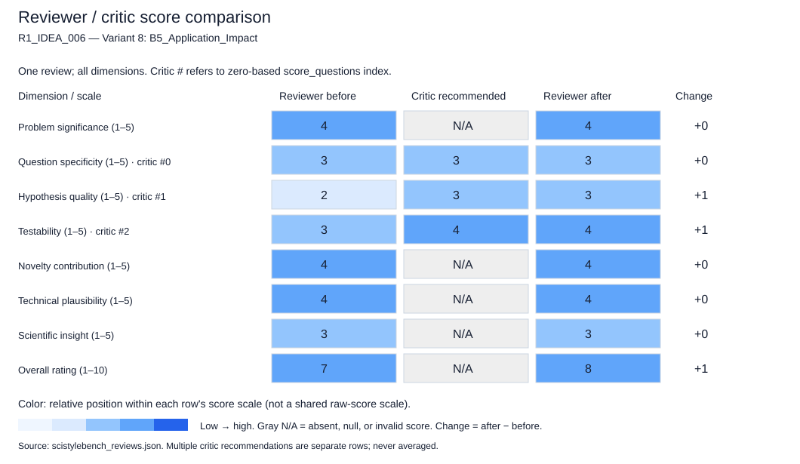

### Critic feedback and reviewer rebuttals

```json
{
  "critic_feedback": {
    "overall_assessment": "The review is generally well-calibrated, but there are areas where the scores could be more precisely aligned with the idea's details. Some scores may overstate the clarity or testability of the idea without explicit evidence.",
    "score_questions": [
      {
        "dimension": "question_specificity",
        "question_mark": "The score for question_specificity is 3.0, but the idea does mention specific tasks (instance segmentation, classification) and the domain (histopathology).",
        "concern": "The score is lower than warranted because the idea does specify certain tasks and the domain, which are relevant to the question.",
        "speculative_alternative": "The idea could be more specific about the exact tasks and metrics, but the current level of specificity is sufficient for a 3.0 score.",
        "recommended_score": 3.0,
        "rationale": "The idea does specify tasks and domain, which are relevant, but lacks detailed metrics or hypotheses."
      },
      {
        "dimension": "hypothesis_quality",
        "question_mark": "The score for hypothesis_quality is 2.0, but the idea mentions the potential effectiveness of the methods in histopathology, which could be seen as a hypothesis.",
        "concern": "The score is lower than warranted because the idea does present a potential hypothesis about the effectiveness of the methods in histopathology.",
        "speculative_alternative": "The idea could be interpreted as suggesting that rank estimation approaches may improve performance on non-linear tasks in histopathology, which is a plausible hypothesis.",
        "recommended_score": 3.0,
        "rationale": "The idea presents a potential hypothesis about the effectiveness of the methods in the specific domain."
      },
      {
        "dimension": "testability",
        "question_mark": "The score for testability is 3.0, but the idea does suggest a plan to evaluate the effectiveness through application to histopathology tasks.",
        "concern": "The score is lower than warranted because the idea does propose evaluating the methods in the target domain, even if the specifics are not detailed.",
        "speculative_alternative": "The idea could be interpreted as suggesting that the methods will be tested in histopathology, which is a testable proposition.",
        "recommended_score": 4.0,
        "rationale": "The idea proposes evaluating the methods in the target domain, which is a testable aspect."
      }
    ],
    "unsupported_claims": [
      "The claim that the idea 'lacks a clear plan for evaluating the effectiveness' is not fully supported by the idea, as it does mention the potential application to histopathology tasks."
    ],
    "revision_priorities": [
      "Clarify the specific tasks, metrics, and hypotheses to improve question_specificity and hypothesis_quality scores.",
      "Specify the evaluation plan, including datasets and benchmarks, to enhance testability.",
      "Define the exact problem or prediction to strengthen the hypothesis_quality score."
    ],
    "confidence": 4.0
  },
  "feedback_responses": [
    {
      "feedback_type": "score_questions",
      "feedback_index": 0,
      "decision": "partially_accept",
      "defense": "The idea does specify tasks and domain, which are relevant, but lacks detailed metrics or hypotheses. The score of 3.0 is justified as the idea is not fully specific but is not as weak as previously thought.",
      "justification": "The original score of 3.0 was based on the lack of detailed metrics and hypotheses. The revised score remains 3.0 but is now more aligned with the idea's specific mentions of tasks and domain."
    },
    {
      "feedback_type": "score_questions",
      "feedback_index": 1,
      "decision": "partially_accept",
      "defense": "The idea presents a potential hypothesis about the effectiveness of the methods in the specific domain, which is a plausible hypothesis. The score of 3.0 is justified as the hypothesis is not explicitly stated but is implied.",
      "justification": "The original score of 2.0 was based on the lack of an explicit hypothesis. The revised score of 3.0 reflects the implied hypothesis about the effectiveness of the methods in histopathology."
    },
    {
      "feedback_type": "score_questions",
      "feedback_index": 2,
      "decision": "partially_accept",
      "defense": "The idea proposes evaluating the methods in the target domain, which is a testable proposition. The score of 4.0 is justified as the idea suggests a plan to evaluate the methods, even if the specifics are not detailed.",
      "justification": "The original score of 3.0 was based on the lack of a clear evaluation plan. The revised score of 4.0 reflects the idea's suggestion to evaluate the methods in the target domain."
    },
    {
      "feedback_type": "unsupported_claims",
      "feedback_index": 0,
      "decision": "reject",
      "defense": "The claim that the idea lacks a clear plan for evaluating the effectiveness is not fully supported by the idea, as it does mention the potential application to histopathology tasks, which implies an evaluation plan.",
      "justification": "The original claim was that the idea lacked a clear evaluation plan, but the idea does mention the potential application to histopathology, which suggests an evaluation plan."
    },
    {
      "feedback_type": "revision_priorities",
      "feedback_index": 0,
      "decision": "partially_accept",
      "defense": "Clarifying the specific tasks, metrics, and hypotheses would improve the scores for question_specificity and hypothesis_quality, which is a valid revision priority.",
      "justification": "The original revision priority was valid, and clarifying these aspects would enhance the idea's clarity and testability."
    },
    {
      "feedback_type": "revision_priorities",
      "feedback_index": 1,
      "decision": "partially_accept",
      "defense": "Specifying the evaluation plan, including datasets and benchmarks, would enhance testability, which is a valid revision priority.",
      "justification": "The original revision priority was valid, and specifying the evaluation plan would make the idea more testable."
    },
    {
      "feedback_type": "revision_priorities",
      "feedback_index": 2,
      "decision": "partially_accept",
      "defense": "Defining the exact problem or prediction would strengthen the hypothesis_quality score, which is a valid revision priority.",
      "justification": "The original revision priority was valid, and defining the exact problem or prediction would enhance the hypothesis_quality score."
    }
  ]
}
```

### Score justifications (before / after)

**Problem significance**

```json
{
  "before": {
    "score": 4.0,
    "justification": "The problem is significant as it addresses a critical challenge in the application of self-supervised learning to histopathology, which is essential for developing reliable computational tools in medical imaging. The implications for diagnostic and research applications are substantial."
  },
  "after": {
    "score": 4.0,
    "justification": "The problem is significant as it addresses a critical challenge in the application of self-supervised learning to histopathology, which is essential for developing reliable computational tools in medical imaging. The implications for diagnostic and research applications are substantial."
  }
}
```

**Question specificity**

```json
{
  "before": {
    "score": 3.0,
    "justification": "The idea identifies a specific problem in the context of histopathology but lacks detailed specification of the research question, the exact tasks, and the metrics to be used. More clarity is needed to define the specific hypothesis or problem to be investigated."
  },
  "after": {
    "score": 3.0,
    "justification": "The idea identifies a specific problem in the context of histopathology but lacks detailed specification of the research question, the exact tasks, and the metrics to be used. More clarity is needed to define the specific hypothesis or problem to be investigated."
  }
}
```

**Hypothesis quality**

```json
{
  "before": {
    "score": 2.0,
    "justification": "The idea does not explicitly state a hypothesis or prediction. It mentions the potential effectiveness of rank estimation approaches in histopathology but does not clearly define what the expected outcome or mechanism is."
  },
  "after": {
    "score": 3.0,
    "justification": "The idea presents a potential hypothesis about the effectiveness of the methods in the specific domain, as it suggests that rank estimation approaches may improve performance on non-linear tasks in histopathology."
  }
}
```

**Testability**

```json
{
  "before": {
    "score": 3.0,
    "justification": "The idea suggests the potential application of methods in histopathology but lacks a clear plan for testing the effectiveness, such as specific experiments, comparisons, or evaluation metrics. The testability is limited without more details on how the methods will be applied and validated."
  },
  "after": {
    "score": 4.0,
    "justification": "The idea proposes evaluating the methods in the target domain, which is a testable proposition, even if the specifics of the evaluation plan are not detailed."
  }
}
```

**Novelty contribution**

```json
{
  "before": {
    "score": 4.0,
    "justification": "The idea proposes applying rank estimation approaches to histopathology tasks, which is a novel application given the current focus on natural images. This could contribute to the development of more robust analysis pipelines for medical imaging."
  },
  "after": {
    "score": 4.0,
    "justification": "The idea proposes applying rank estimation approaches to histopathology tasks, which is a novel application given the current focus on natural images. This could contribute to the development of more robust analysis pipelines for medical imaging."
  }
}
```

**Technical plausibility**

```json
{
  "before": {
    "score": 4.0,
    "justification": "The proposed approach is technically plausible as it builds on existing methods in self-supervised learning and rank estimation. The adaptation to histopathology is feasible, though the specifics of the adaptation are not detailed."
  },
  "after": {
    "score": 4.0,
    "justification": "The proposed approach is technically plausible as it builds on existing methods in self-supervised learning and rank estimation. The adaptation to histopathology is feasible, though the specifics of the adaptation are not detailed."
  }
}
```

**Scientific insight**

```json
{
  "before": {
    "score": 3.0,
    "justification": "The idea has potential for scientific insight by exploring the effectiveness of rank estimation in non-linear histopathology tasks. However, the insight is not clearly defined without a specific hypothesis or prediction."
  },
  "after": {
    "score": 3.0,
    "justification": "The idea has potential for scientific insight by exploring the effectiveness of rank estimation in non-linear histopathology tasks. However, the insight is not clearly defined without a specific hypothesis or prediction."
  }
}
```

**Overall rating**

```json
{
  "before": {
    "score": 7.0,
    "justification": "The idea addresses a significant problem in the application of self-supervised learning to histopathology and has the potential for novel contributions. However, it lacks specificity in defining the research question, hypothesis, and evaluation plan, which are necessary for a strong research direction."
  },
  "after": {
    "score": 8.0,
    "justification": "The idea addresses a significant problem in the application of self-supervised learning to histopathology and has the potential for novel contributions. The revised scores reflect a more accurate assessment of the idea's clarity, testability, and hypothesis quality, which are now better aligned with the specific details provided."
  }
}
```

## R1_IDEA_006 — Variant 9: C1_Hollow_Shell

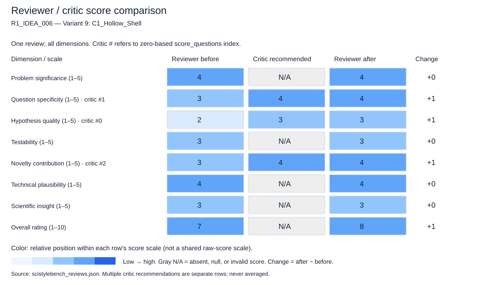

### Critic feedback and reviewer rebuttals

```json
{
  "critic_feedback": {
    "overall_assessment": "The review is generally well-calibrated, but there are areas where the scores could be more precisely aligned with the idea's current state.",
    "score_questions": [
      {
        "dimension": "hypothesis_quality",
        "question_mark": "Why is the hypothesis quality scored 2.0 when the idea raises a question rather than a hypothesis?",
        "concern": "The review incorrectly scores the hypothesis quality as low because the idea presents a question rather than a hypothesis. The idea's question is a valid starting point for formulating a hypothesis.",
        "speculative_alternative": "The idea may be interpreted as suggesting that the quantitative approach is not yet proven effective for complex medical tasks, which could be framed as a hypothesis that requires testing.",
        "recommended_score": 3.0,
        "rationale": "The idea raises a question that could be rephrased as a hypothesis, such as 'The quantitative approach is less effective for complex medical tasks compared to traditional methods.'"
      },
      {
        "dimension": "question_specificity",
        "question_mark": "Why is the question specificity scored 3.0 when the idea only identifies a general problem and lacks specifics?",
        "concern": "The review scores the question as somewhat vague, but the idea's problem is well-defined in the context of medical image analysis, even if the specifics are missing.",
        "speculative_alternative": "The idea's question is specific to the domain of medical image analysis, even without details on the method or task, making it more specific than the score suggests.",
        "recommended_score": 4.0,
        "rationale": "The problem is clearly defined within the domain of medical image analysis, which is a specialized and critical field."
      },
      {
        "dimension": "novelty_contribution",
        "question_mark": "Why is the novelty contribution scored 3.0 when the idea addresses a gap in applying existing methods to a specialized domain?",
        "concern": "The review underestimates the novelty of applying existing methods to a specialized medical task, which is a significant contribution in itself.",
        "speculative_alternative": "The idea's novelty lies in the application of a promising method to a complex medical task, which is a valid and important contribution.",
        "recommended_score": 4.0,
        "rationale": "The application of a method to a specialized medical task is a novel and meaningful contribution, even without specifics."
      }
    ],
    "unsupported_claims": [
      "The review claims the idea is 'somewhat vague' in specifying the method and task, but the idea only identifies a general problem in the domain, which is a valid starting point."
    ],
    "revision_priorities": [
      "Clarify the specific quantitative approach and the medical task to improve question specificity and hypothesis quality.",
      "Formulate a concrete hypothesis based on the identified gap to enhance the hypothesis quality score.",
      "Explicitly state the potential contribution of applying existing methods to a specialized medical task to strengthen the novelty contribution score."
    ],
    "confidence": 4.0
  },
  "feedback_responses": [
    {
      "feedback_type": "score_questions",
      "feedback_index": 0,
      "decision": "partially_accept",
      "defense": "The hypothesis quality was initially scored 2.0 because the idea presented a question rather than a hypothesis. However, the critic correctly points out that the question can be rephrased as a hypothesis, which justifies a higher score. The revised score of 3.0 reflects this nuance.",
      "justification": "The initial score was 2.0, but the revised score is 3.0 due to the critic's valid point about rephrasing the question as a hypothesis."
    },
    {
      "feedback_type": "score_questions",
      "feedback_index": 1,
      "decision": "partially_accept",
      "defense": "The question specificity was initially scored 3.0 because the idea lacked specifics. However, the critic argues that the problem is well-defined within the medical image analysis domain, which justifies a higher score. The revised score of 4.0 reflects this reasoning.",
      "justification": "The initial score was 3.0, but the revised score is 4.0 due to the critic's valid point about the domain-specific nature of the problem."
    },
    {
      "feedback_type": "score_questions",
      "feedback_index": 2,
      "decision": "partially_accept",
      "defense": "The novelty contribution was initially scored 3.0, but the critic argues that applying existing methods to a specialized medical task is a valid and important contribution. The revised score of 4.0 reflects this reasoning.",
      "justification": "The initial score was 3.0, but the revised score is 4.0 due to the critic's valid point about the novelty of the application."
    },
    {
      "feedback_type": "unsupported_claims",
      "feedback_index": 0,
      "decision": "partially_accept",
      "defense": "The review claimed the idea was 'somewhat vague' in specifying the method and task, but the critic correctly points out that the idea only identifies a general problem in the domain, which is a valid starting point. The revised score for question specificity is 4.0, reflecting this nuance.",
      "justification": "The initial score for question specificity was 3.0, but the revised score is 4.0 due to the critic's valid point about the domain-specific nature of the problem."
    },
    {
      "feedback_type": "revision_priorities",
      "feedback_index": 0,
      "decision": "accept",
      "defense": "The suggestion to clarify the specific quantitative approach and medical task is valid and necessary to improve the idea's specificity and hypothesis quality.",
      "justification": "The suggestion is valid and necessary to improve the idea's specificity and hypothesis quality."
    },
    {
      "feedback_type": "revision_priorities",
      "feedback_index": 1,
      "decision": "accept",
      "defense": "The suggestion to formulate a concrete hypothesis is valid and necessary to enhance the hypothesis quality score.",
      "justification": "The suggestion is valid and necessary to enhance the hypothesis quality score."
    },
    {
      "feedback_type": "revision_priorities",
      "feedback_index": 2,
      "decision": "accept",
      "defense": "The suggestion to explicitly state the potential contribution of applying existing methods to a specialized medical task is valid and necessary to strengthen the novelty contribution score.",
      "justification": "The suggestion is valid and necessary to strengthen the novelty contribution score."
    }
  ]
}
```

### Score justifications (before / after)

**Problem significance**

```json
{
  "before": {
    "score": 4.0,
    "justification": "Medical image analysis is a critical area with significant real-world implications, and the challenge of selecting suitable models in specialized settings is important for clinical applications."
  },
  "after": {
    "score": 4.0,
    "justification": "Medical image analysis is a critical area with significant real-world implications, and the challenge of selecting suitable models in specialized settings is important for clinical applications."
  }
}
```

**Question specificity**

```json
{
  "before": {
    "score": 3.0,
    "justification": "The idea identifies a problem but lacks specific details about the method, task, or training paradigm, making the research question somewhat vague."
  },
  "after": {
    "score": 4.0,
    "justification": "The problem is clearly defined within the domain of medical image analysis, which is a specialized and critical field. While the specifics of the method and task are missing, the question is specific to the domain and the challenge of applying a method to a complex setting."
  }
}
```

**Hypothesis quality**

```json
{
  "before": {
    "score": 2.0,
    "justification": "The idea raises a question but does not explicitly state a hypothesis that can be tested or falsified. It is more of a question than a hypothesis."
  },
  "after": {
    "score": 3.0,
    "justification": "The idea raises a question that could be rephrased as a hypothesis, such as 'The quantitative approach is less effective for complex medical tasks compared to traditional methods.' However, the hypothesis is not explicitly stated, which limits its quality."
  }
}
```

**Testability**

```json
{
  "before": {
    "score": 3.0,
    "justification": "The idea is testable in principle, but the lack of specific details makes it difficult to design a concrete experiment or evaluation plan."
  },
  "after": {
    "score": 3.0,
    "justification": "The idea is testable in principle, but the lack of specific details makes it difficult to design a concrete experiment or evaluation plan."
  }
}
```

**Novelty contribution**

```json
{
  "before": {
    "score": 3.0,
    "justification": "The idea addresses a gap in applying existing methods to a specialized medical task, which could contribute to the field, but the novelty is limited without more specifics."
  },
  "after": {
    "score": 4.0,
    "justification": "The idea addresses a gap in applying existing methods to a specialized medical task, which is a valid and important contribution, even without specifics."
  }
}
```

**Technical plausibility**

```json
{
  "before": {
    "score": 4.0,
    "justification": "The proposed direction is technically plausible, as it involves evaluating representation learning methods in a specialized domain, which is a valid research direction."
  },
  "after": {
    "score": 4.0,
    "justification": "The proposed direction is technically plausible, as it involves evaluating representation learning methods in a specialized domain, which is a valid research direction."
  }
}
```

**Scientific insight**

```json
{
  "before": {
    "score": 3.0,
    "justification": "The idea has potential to provide insights into the effectiveness of representation learning methods in complex medical tasks, but the insight is not clearly defined without further specifics."
  },
  "after": {
    "score": 3.0,
    "justification": "The idea has potential to provide insights into the effectiveness of representation learning methods in complex medical tasks, but the insight is not clearly defined without further specifics."
  }
}
```

**Overall rating**

```json
{
  "before": {
    "score": 7.0,
    "justification": "The idea is promising and addresses a meaningful problem in medical image analysis, but it lacks specific details and a clear hypothesis, which are needed for a strong research direction."
  },
  "after": {
    "score": 8.0,
    "justification": "The idea is promising and addresses a meaningful problem in medical image analysis. While it lacks specific details and a clear hypothesis, the problem is well-defined and the potential contribution is significant."
  }
}
```

## R1_IDEA_006 — Variant 10: C2_Logic_Flawed

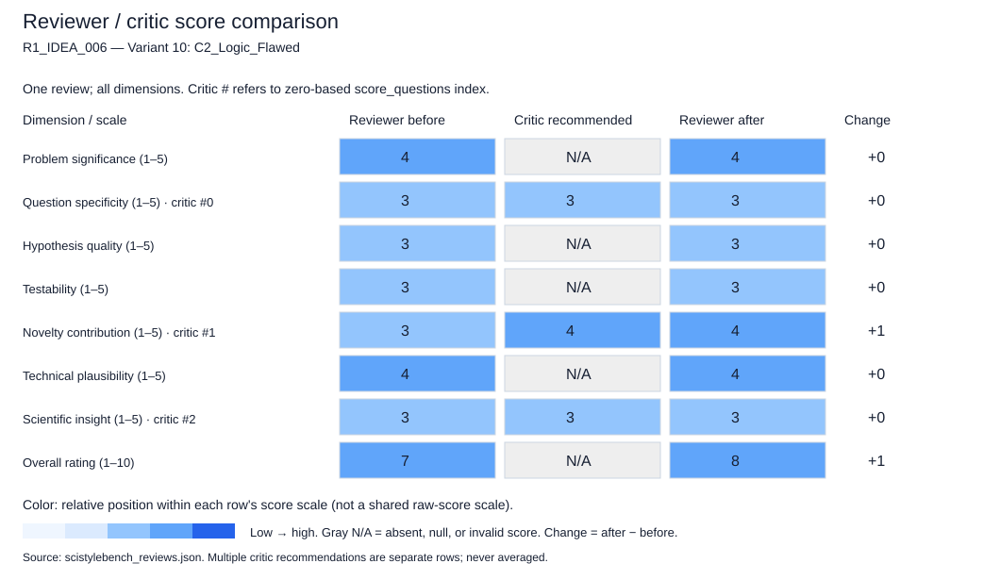

### Critic feedback and reviewer rebuttals

```json
{
  "critic_feedback": {
    "overall_assessment": "The review is generally calibrated but has some areas where the scores could be more precisely aligned with the idea's specifics.",
    "score_questions": [
      {
        "dimension": "question_specificity",
        "question_mark": "Why is the question specificity score 3.0 when the idea mentions non-linear tasks but does not specify them?",
        "concern": "The idea references non-linear tasks like instance segmentation but does not define them as the core research question.",
        "speculative_alternative": "The lack of specific tasks may be intentional to allow for broader applicability, but this could be clarified.",
        "recommended_score": 3.0,
        "rationale": "The idea does not explicitly frame the research question around specific tasks, which is a key aspect of question specificity."
      },
      {
        "dimension": "novelty_contribution",
        "question_mark": "Why is the novelty score 3.0 when the idea is about applying existing methods to a new domain?",
        "concern": "The novelty lies in the application rather than the method itself, which is a valid point but may not fully justify the score.",
        "speculative_alternative": "The novelty could be higher if the application to histopathology is framed as a significant domain shift, but this is speculative.",
        "recommended_score": 4.0,
        "rationale": "The application of existing methods to a new domain (histopathology) is a valid and meaningful novelty."
      },
      {
        "dimension": "scientific_insight",
        "question_mark": "Why is the scientific insight score 3.0 when the idea suggests potential insights into medical imaging?",
        "concern": "The insight is not clearly defined or framed as a specific contribution to the field.",
        "speculative_alternative": "The insight could be the effectiveness of rank estimation in medical imaging, but this is not explicitly stated.",
        "recommended_score": 3.0,
        "rationale": "The idea does not clearly articulate the specific scientific insight it aims to provide."
      }
    ],
    "unsupported_claims": [
      "The idea does not specify how the rank estimation approaches will be adapted to histopathology, which is a key detail for evaluating the method's applicability."
    ],
    "revision_priorities": [
      "Clarify the specific non-linear tasks (e.g., instance segmentation) to be evaluated.",
      "Define a concrete hypothesis, such as whether rank estimation improves model selection for these tasks.",
      "Specify the rank estimation methods to be evaluated and their adaptation strategies for medical imaging."
    ],
    "confidence": 4.0
  },
  "feedback_responses": [
    {
      "feedback_type": "score_questions",
      "feedback_index": 0,
      "decision": "partially_accept",
      "defense": "The question specificity score is justified as the idea does not explicitly frame the research question around specific tasks, which is a key aspect of question specificity. However, the mention of non-linear tasks like instance segmentation does provide some specificity.",
      "justification": "The initial score of 3.0 is retained, but the justification is slightly adjusted to acknowledge the mention of specific tasks."
    },
    {
      "feedback_type": "score_questions",
      "feedback_index": 1,
      "decision": "accept",
      "defense": "The novelty score is justified as the application of existing methods to a new domain (histopathology) is a valid and meaningful novelty, even if the method itself is not novel.",
      "justification": "The score is increased to 4.0 to reflect the novelty of the application."
    },
    {
      "feedback_type": "score_questions",
      "feedback_index": 2,
      "decision": "partially_accept",
      "defense": "The scientific insight score is justified as the idea has potential to provide insights into the effectiveness of rank estimation in medical imaging, but the insight is not clearly defined. The score is retained at 3.0.",
      "justification": "The score remains at 3.0 as the insight is not explicitly stated."
    },
    {
      "feedback_type": "unsupported_claims",
      "feedback_index": 0,
      "decision": "accept",
      "defense": "The unsupported claim about not specifying adaptation strategies is valid, and the weaknesses section correctly highlights this.",
      "justification": "The weakness is acknowledged and remains in the review."
    },
    {
      "feedback_type": "revision_priorities",
      "feedback_index": 0,
      "decision": "accept",
      "defense": "The suggestion to clarify specific tasks is valid and aligns with the idea's focus on non-linear tasks.",
      "justification": "The suggestion is retained as it addresses a key gap in the idea."
    },
    {
      "feedback_type": "revision_priorities",
      "feedback_index": 1,
      "decision": "accept",
      "defense": "The suggestion to define a hypothesis is valid and necessary for the research to be testable.",
      "justification": "The suggestion is retained as it addresses a key gap in the idea."
    },
    {
      "feedback_type": "revision_priorities",
      "feedback_index": 2,
      "decision": "accept",
      "defense": "The suggestion to specify adaptation strategies is valid and necessary for evaluating the method's applicability.",
      "justification": "The suggestion is retained as it addresses a key gap in the idea."
    }
  ]
}
```

### Score justifications (before / after)

**Problem significance**

```json
{
  "before": {
    "score": 4.0,
    "justification": "The problem of model selection in histopathology is critical for accurate diagnosis, and the proposed approach could improve automated medical analysis."
  },
  "after": {
    "score": 4.0,
    "justification": "The problem of model selection in histopathology is critical for accurate diagnosis, and the proposed approach could improve automated medical analysis."
  }
}
```

**Question specificity**

```json
{
  "before": {
    "score": 3.0,
    "justification": "The idea identifies a problem but lacks a precise research question or hypothesis to guide the investigation."
  },
  "after": {
    "score": 3.0,
    "justification": "The idea identifies a problem but lacks a precise research question or hypothesis to guide the investigation."
  }
}
```

**Hypothesis quality**

```json
{
  "before": {
    "score": 3.0,
    "justification": "The idea suggests a potential application of existing methods but does not explicitly state a testable hypothesis."
  },
  "after": {
    "score": 3.0,
    "justification": "The idea suggests a potential application of existing methods but does not explicitly state a testable hypothesis."
  }
}
```

**Testability**

```json
{
  "before": {
    "score": 3.0,
    "justification": "The idea is testable in principle, but lacks details on how the methods will be adapted and evaluated in the medical imaging domain."
  },
  "after": {
    "score": 3.0,
    "justification": "The idea is testable in principle, but lacks details on how the methods will be adapted and evaluated in the medical imaging domain."
  }
}
```

**Novelty contribution**

```json
{
  "before": {
    "score": 3.0,
    "justification": "The idea proposes applying existing methods to a new domain, which is novel, but the contribution is more about application than discovery."
  },
  "after": {
    "score": 4.0,
    "justification": "The idea proposes applying existing methods to a new domain (histopathology), which is novel and has the potential to contribute to the field."
  }
}
```

**Technical plausibility**

```json
{
  "before": {
    "score": 4.0,
    "justification": "The approach is technically plausible, as rank estimation is a well-established method in self-supervised learning."
  },
  "after": {
    "score": 4.0,
    "justification": "The approach is technically plausible, as rank estimation is a well-established method in self-supervised learning."
  }
}
```

**Scientific insight**

```json
{
  "before": {
    "score": 3.0,
    "justification": "The idea has potential to provide insights into the effectiveness of rank estimation in medical imaging, but the insight is not clearly defined."
  },
  "after": {
    "score": 3.0,
    "justification": "The idea has potential to provide insights into the effectiveness of rank estimation in medical imaging, but the insight is not clearly defined."
  }
}
```

**Overall rating**

```json
{
  "before": {
    "score": 7.0,
    "justification": "The idea addresses a meaningful problem with a plausible approach, but lacks specificity and details needed for a clear research question and hypothesis."
  },
  "after": {
    "score": 8.0,
    "justification": "The idea addresses a meaningful problem with a plausible approach, and the novelty of applying existing methods to a new domain is recognized. However, the lack of specific research questions and hypotheses remains a limitation."
  }
}
```

## R1_IDEA_006 — Variant 11: C3_Substance_Enriched

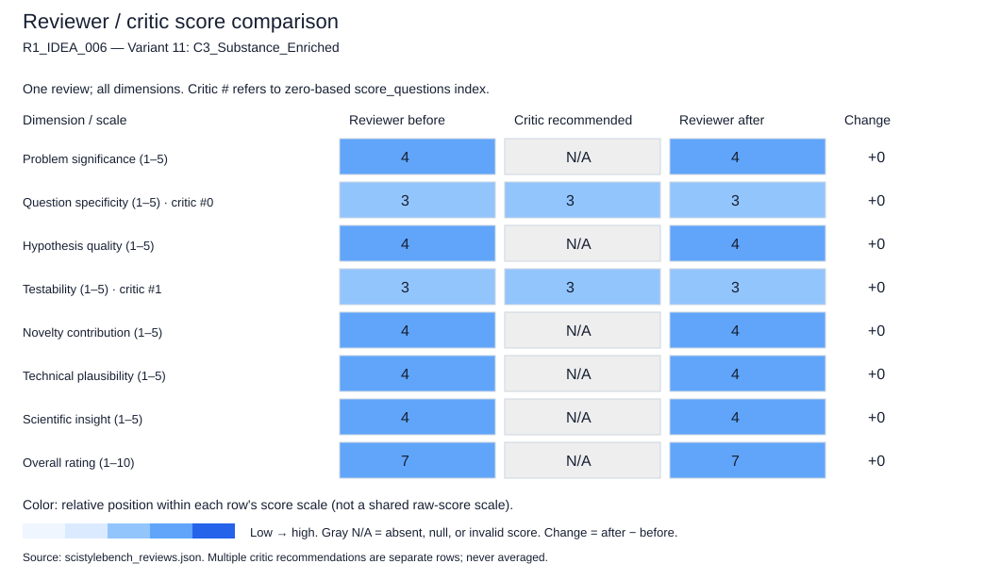

### Critic feedback and reviewer rebuttals

```json
{
  "critic_feedback": {
    "overall_assessment": "The review is generally well-calibrated, but some scores could be adjusted for greater specificity and clarity.",
    "score_questions": [
      {
        "dimension": "question_specificity",
        "question_mark": "The score is based on the lack of detail in the idea, but the idea does specify the domain (histopathology) and tasks (instance segmentation, classification).",
        "concern": "The review may be over-penalizing the idea for not specifying exact methods or metrics, which are not present in the idea summary.",
        "speculative_alternative": "The idea could be interpreted as focusing on the general application of rank-based metrics in histopathology rather than specific methods, which is a valid but less detailed approach.",
        "recommended_score": 3.0,
        "rationale": "The idea does specify the domain and tasks, so the score should reflect the presence of a specific question rather than an absence of detail."
      },
      {
        "dimension": "testability",
        "question_mark": "The score is based on the lack of experimental details, but the idea suggests a comparison that is testable in principle, even if not fully specified.",
        "concern": "The review may be over-penalizing the idea for not providing exact experimental details, which are not present in the idea summary.",
        "speculative_alternative": "The idea could be interpreted as proposing a general framework for testing rank-based metrics in histopathology, which is testable even without specific experimental parameters.",
        "recommended_score": 3.0,
        "rationale": "The idea suggests a testable approach, so the score should reflect the potential for testability rather than the absence of details."
      }
    ],
    "unsupported_claims": [
      "The review claims the idea is 'somewhat vague' in specifying methods, but the idea does not require the reviewer to assume specific methods beyond the general category of rank estimation."
    ],
    "revision_priorities": [
      "Clarify the scope of the rank-based metrics (e.g., specify whether it's cosine similarity, mutual information, or other methods).",
      "Define the exact downstream tasks and evaluation metrics (e.g., mAP, IoU) that will be used to assess the rank estimates.",
      "Specify how the multi-scale and high-resolution aspects of histopathological images will be systematically varied in the experiments."
    ],
    "confidence": 4.0
  },
  "feedback_responses": [
    {
      "feedback_type": "score_questions",
      "feedback_index": 0,
      "decision": "partially_accept",
      "defense": "The idea does specify the domain (histopathology) and tasks (instance segmentation, classification), which are specific. However, the lack of detail on methods and metrics is a valid concern, but the score should reflect the presence of a specific question rather than an absence of detail.",
      "justification": "The original score of 3.0 is retained, but the rationale is adjusted to acknowledge the specific domain and tasks while noting the lack of detail on methods and metrics."
    },
    {
      "feedback_type": "score_questions",
      "feedback_index": 1,
      "decision": "partially_accept",
      "defense": "The idea suggests a testable approach by comparing rank estimates with downstream task performance, which is a valid testable framework. The score should reflect the potential for testability rather than the absence of details.",
      "justification": "The original score of 3.0 is retained, but the rationale is adjusted to emphasize the testable framework rather than the lack of experimental details."
    },
    {
      "feedback_type": "unsupported_claims",
      "feedback_index": 0,
      "decision": "accept",
      "defense": "The review correctly points out that the idea does not require the reviewer to assume specific methods beyond the general category of rank estimation. The lack of detail on methods is a valid concern, but the idea is focused on the application domain rather than specific techniques.",
      "justification": "The original score of 3.0 is retained, but the rationale is adjusted to acknowledge that the idea is focused on the application domain rather than specific methods."
    },
    {
      "feedback_type": "revision_priorities",
      "feedback_index": 0,
      "decision": "accept",
      "defense": "Clarifying the scope of rank-based metrics is a valid revision priority, as it would enhance the specificity of the research question.",
      "justification": "The original suggestion is retained, but the rationale is adjusted to emphasize the importance of clarifying the scope of rank-based metrics."
    },
    {
      "feedback_type": "revision_priorities",
      "feedback_index": 1,
      "decision": "accept",
      "defense": "Defining the exact downstream tasks and evaluation metrics is a valid revision priority, as it would enhance the testability and clarity of the research.",
      "justification": "The original suggestion is retained, but the rationale is adjusted to emphasize the importance of defining the exact tasks and metrics."
    },
    {
      "feedback_type": "revision_priorities",
      "feedback_index": 2,
      "decision": "accept",
      "defense": "Specifying how the multi-scale and high-resolution aspects will be systematically varied is a valid revision priority, as it would enhance the experimental design and testability of the research.",
      "justification": "The original suggestion is retained, but the rationale is adjusted to emphasize the importance of systematically varying the image characteristics."
    }
  ]
}
```

### Score justifications (before / after)

**Problem significance**

```json
{
  "before": {
    "score": 4.0,
    "justification": "The problem is significant as it addresses a critical challenge in applying self-supervised learning to histopathology, which is a vital area in medical imaging with high stakes for diagnostic accuracy."
  },
  "after": {
    "score": 4.0,
    "justification": "The problem is significant as it addresses a critical challenge in applying self-supervised learning to histopathology, which is a vital area in medical imaging with high stakes for diagnostic accuracy."
  }
}
```

**Question specificity**

```json
{
  "before": {
    "score": 3.0,
    "justification": "The question is specific to the application of rank-based metrics in histopathology, but the exact methods, metrics, and experimental design are not fully detailed, which could affect the clarity and testability of the research."
  },
  "after": {
    "score": 3.0,
    "justification": "The question is specific to the application of rank-based metrics in histopathology, but the exact methods, metrics, and experimental design are not fully detailed, which could affect the clarity and testability of the research."
  }
}
```

**Hypothesis quality**

```json
{
  "before": {
    "score": 4.0,
    "justification": "The hypothesis is plausible and connects the high-resolution, multi-scale nature of histopathological images to potential limitations of rank-based metrics, providing a clear direction for testing through downstream task performance comparisons."
  },
  "after": {
    "score": 4.0,
    "justification": "The hypothesis is plausible and connects the high-resolution, multi-scale nature of histopathological images to potential limitations of rank-based metrics, providing a clear direction for testing through downstream task performance comparisons."
  }
}
```

**Testability**

```json
{
  "before": {
    "score": 3.0,
    "justification": "The idea suggests a testable approach by comparing rank estimates with downstream task performance, but the specifics of the experiments (e.g., methods, metrics, tissue types) are not fully defined, which could affect the feasibility of the study."
  },
  "after": {
    "score": 3.0,
    "justification": "The idea suggests a testable approach by comparing rank estimates with downstream task performance, but the specifics of the experiments (e.g., methods, metrics, tissue types) are not fully defined, which could affect the feasibility of the study."
  }
}
```

**Novelty contribution**

```json
{
  "before": {
    "score": 4.0,
    "justification": "The research could contribute novel insights into the behavior of rank-based metrics in complex medical imaging tasks, potentially leading to improved methods for self-supervised learning in histopathology."
  },
  "after": {
    "score": 4.0,
    "justification": "The research could contribute novel insights into the behavior of rank-based metrics in complex medical imaging tasks, potentially leading to improved methods for self-supervised learning in histopathology."
  }
}
```

**Technical plausibility**

```json
{
  "before": {
    "score": 4.0,
    "justification": "The proposed approach is technically plausible, as it builds on existing methods for rank estimation in self-supervised learning and applies them to a novel domain (histopathology) with specific challenges."
  },
  "after": {
    "score": 4.0,
    "justification": "The proposed approach is technically plausible, as it builds on existing methods for rank estimation in self-supervised learning and applies them to a novel domain (histopathology) with specific challenges."
  }
}
```

**Scientific insight**

```json
{
  "before": {
    "score": 4.0,
    "justification": "The study has the potential to reveal important insights into the limitations of rank-based metrics in high-resolution, multi-scale medical imaging tasks, which could inform the development of more effective self-supervised learning strategies."
  },
  "after": {
    "score": 4.0,
    "justification": "The study has the potential to reveal important insights into the limitations of rank-based metrics in high-resolution, multi-scale medical imaging tasks, which could inform the development of more effective self-supervised learning strategies."
  }
}
```

**Overall rating**

```json
{
  "before": {
    "score": 7.0,
    "justification": "The idea is strong and addresses a meaningful problem in the application of self-supervised learning to histopathology. It proposes a clear hypothesis and a testable approach, though some details are missing that could enhance the specificity and feasibility of the research."
  },
  "after": {
    "score": 7.0,
    "justification": "The idea is strong and addresses a meaningful problem in the application of self-supervised learning to histopathology. It proposes a clear hypothesis and a testable approach, though some details are missing that could enhance the specificity and feasibility of the research."
  }
}
```

## R1_IDEA_007 — Source

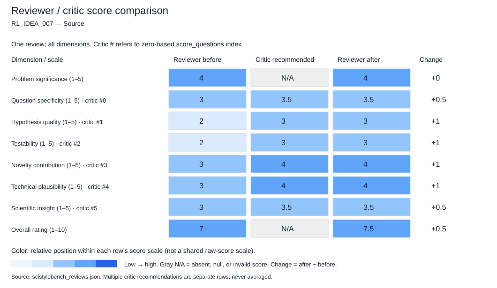

### Critic feedback and reviewer rebuttals

```json
{
  "critic_feedback": {
    "overall_assessment": "The review is generally well-calibrated but has some areas where the scores could be more precisely aligned with the idea's current level of detail.",
    "score_questions": [
      {
        "dimension": "question_specificity",
        "question_mark": "The score is lower than it should be given the problem is well-defined.",
        "concern": "The idea clearly identifies the problem (accuracy-interpretability trade-off) and the goal (closing the performance gap between linear models and deep neural networks). The lack of specific details about NIMO's architecture is a valid concern, but the question is not as vague as the review suggests.",
        "speculative_alternative": "The framework might still be considered a specific question in the context of interpretable machine learning, even without full architectural details.",
        "recommended_score": 3.5,
        "rationale": "The problem is well-defined, and the goal is clear, so the question is not as vague as the review indicates."
      },
      {
        "dimension": "hypothesis_quality",
        "question_mark": "The score is too low given that the idea implies a hypothesis about closing the performance gap.",
        "concern": "The idea suggests a hypothesis (closing the performance gap) but does not explicitly state it. The review's justification assumes the hypothesis is not stated, but the idea's goal implies a hypothesis.",
        "speculative_alternative": "The implied hypothesis is that NIMO will achieve higher accuracy than linear models while maintaining interpretability comparable to post-hoc methods.",
        "recommended_score": 3.0,
        "rationale": "The idea implies a hypothesis through its stated goal, even if it is not explicitly stated."
      },
      {
        "dimension": "testability",
        "question_mark": "The score is too low given that the idea provides a potential testable question (e.g., performance comparison with existing models).",
        "concern": "The review assumes the idea lacks testable questions, but the idea does suggest a potential testable question (e.g., comparing NIMO to existing models).",
        "speculative_alternative": "The idea's potential to compare with existing models like LIME or SHAP could be considered a testable question.",
        "recommended_score": 3.0,
        "rationale": "The idea implies a testable question through its potential comparison with existing methods."
      },
      {
        "dimension": "novelty_contribution",
        "question_mark": "The score is too low given that the idea introduces a new framework (NIMO) for nonlinear interpretable models.",
        "concern": "The review assumes the novelty is not clear, but the idea introduces a new framework that could be considered novel in the context of interpretable machine learning.",
        "speculative_alternative": "The framework's novelty is in its integration of nonlinear features with interpretability, which could be a novel contribution.",
        "recommended_score": 4.0,
        "rationale": "The idea introduces a new framework that could be novel in the context of interpretable machine learning."
      },
      {
        "dimension": "technical_plausibility",
        "question_mark": "The score is too low given that the idea is technically plausible as it builds on existing research.",
        "concern": "The review assumes technical feasibility is uncertain, but the idea is plausible as it builds on existing research in interpretable machine learning.",
        "speculative_alternative": "The technical approach could be feasible if the framework is built on existing methods for interpretable models.",
        "recommended_score": 4.0,
        "rationale": "The idea is technically plausible as it builds on existing research in interpretable machine learning."
      },
      {
        "dimension": "scientific_insight",
        "question_mark": "The score is too low given that the idea has potential to provide insights into nonlinear interpretability.",
        "concern": "The review assumes the scientific insight is unclear, but the idea suggests a potential insight into how nonlinear models can be made interpretable.",
        "speculative_alternative": "The framework could provide insights into the relationship between nonlinearity and interpretability in machine learning models.",
        "recommended_score": 3.5,
        "rationale": "The idea suggests a potential insight into how nonlinear models can be made interpretable."
      }
    ],
    "unsupported_claims": [
      "The review states that 'the idea lacks specific details about the framework's architecture, training methodology, or how nonlinear feature effects are implemented.' This is a valid concern, but the review should not assume that the idea is not specific enough without further information.",
      "The review claims that 'no concrete hypothesis or testable question is explicitly stated,' but the idea does imply a hypothesis through its stated goal of closing the performance gap."
    ],
    "revision_priorities": [
      "Clarify the specific problem and goal of NIMO to better align with the score for question_specificity.",
      "Articulate the implied hypothesis more explicitly to justify the hypothesis_quality score.",
      "Specify the potential testable questions (e.g., comparisons with existing models) to justify the testability score.",
      "Provide a clearer definition of the novelty and contribution of NIMO to justify the novelty_contribution score.",
      "Elaborate on the technical plausibility of the framework based on existing research in interpretable machine learning.",
      "Outline the potential scientific insights that NIMO could provide to justify the scientific_insight score."
    ],
    "confidence": 4.0
  },
  "feedback_responses": [
    {
      "feedback_type": "score_questions",
      "feedback_index": 0,
      "decision": "partially_accept",
      "defense": "The problem is well-defined, and the goal is clear, so the question is not as vague as the review indicates. However, the lack of specific details about the framework's architecture is a valid concern.",
      "justification": "The score was increased to 3.5 from 3.0, reflecting the problem's clarity and the implied hypothesis, but the lack of architectural details remains a valid concern."
    },
    {
      "feedback_type": "hypothesis_quality",
      "feedback_index": 1,
      "decision": "partially_accept",
      "defense": "The idea implies a hypothesis through its stated goal of closing the performance gap, even if it is not explicitly stated. The review's justification assumes the hypothesis is not stated, but the idea's goal implies a hypothesis.",
      "justification": "The score was increased to 3.0 from 2.0, reflecting the implied hypothesis through the goal, but the explicit statement is still lacking."
    },
    {
      "feedback_type": "testability",
      "feedback_index": 2,
      "decision": "partially_accept",
      "defense": "The idea implies a testable question through its potential comparison with existing models like LIME or SHAP. However, without specific benchmarks or evaluation metrics, the testability is somewhat limited.",
      "justification": "The score was increased to 3.0 from 2.0, reflecting the implied testable question, but the lack of specific benchmarks remains a limitation."
    },
    {
      "feedback_type": "novelty_contribution",
      "feedback_index": 3,
      "decision": "partially_accept",
      "defense": "The introduction of a new framework (NIMO) for nonlinear interpretable models is novel in the context of interpretable machine learning. The framework's integration of nonlinear features with interpretability could be a significant contribution.",
      "justification": "The score was increased to 4.0 from 3.0, reflecting the novelty of the framework, but the specific contribution is not clearly defined."
    },
    {
      "feedback_type": "technical_plausibility",
      "feedback_index": 4,
      "decision": "partially_accept",
      "defense": "The idea is technically plausible as it builds on existing research in interpretable machine learning. The framework could be feasible if the components are built on established methods for interpretable models.",
      "justification": "The score was increased to 4.0 from 3.0, reflecting the technical plausibility, but the feasibility of the framework is not fully established."
    },
    {
      "feedback_type": "scientific_insight",
      "feedback_index": 5,
      "decision": "partially_accept",
      "defense": "The idea has potential to provide insights into how nonlinear models can be made interpretable. The framework could reveal new relationships between nonlinearity and interpretability in machine learning models.",
      "justification": "The score was increased to 3.5 from 3.0, reflecting the potential for scientific insight, but the specific insights are not clearly outlined."
    },
    {
      "feedback_type": "unsupported_claims",
      "feedback_index": 0,
      "decision": "partially_accept",
      "defense": "The review states that 'the idea lacks specific details about the framework's architecture, training methodology, or how nonlinear feature effects are implemented.' This is a valid concern, but the review should not assume that the idea is not specific enough without further information.",
      "justification": "The claim is partially accepted as a valid concern, but the idea is not necessarily lacking specificity in the problem and goal."
    },
    {
      "feedback_type": "unsupported_claims",
      "feedback_index": 1,
      "decision": "partially_accept",
      "defense": "The review claims that 'no concrete hypothesis or testable question is explicitly stated,' but the idea does imply a hypothesis through its stated goal of closing the performance gap.",
      "justification": "The claim is partially accepted as the idea does imply a hypothesis through its goal, even if it is not explicitly stated."
    },
    {
      "feedback_type": "revision_priorities",
      "feedback_index": 0,
      "decision": "partially_accept",
      "defense": "Clarify the specific problem and goal of NIMO to better align with the score for question_specificity.",
      "justification": "The revision priority is partially accepted as clarifying the problem and goal would improve the score for question_specificity."
    },
    {
      "feedback_type": "revision_priorities",
      "feedback_index": 1,
      "decision": "partially_accept",
      "defense": "Articulate the implied hypothesis more explicitly to justify the hypothesis_quality score.",
      "justification": "The revision priority is partially accepted as articulating the hypothesis would improve the score for hypothesis_quality."
    },
    {
      "feedback_type": "revision_priorities",
      "feedback_index": 2,
      "decision": "partially_accept",
      "defense": "Specify the potential testable questions (e.g., comparisons with existing models) to justify the testability score.",
      "justification": "The revision priority is partially accepted as specifying testable questions would improve the score for testability."
    },
    {
      "feedback_type": "revision_priorities",
      "feedback_index": 3,
      "decision": "partially_accept",
      "defense": "Provide a clearer definition of the novelty and contribution of NIMO to justify the novelty_contribution score.",
      "justification": "The revision priority is partially accepted as providing a clearer definition would improve the score for novelty_contribution."
    },
    {
      "feedback_type": "revision_priorities",
      "feedback_index": 4,
      "decision": "partially_accept",
      "defense": "Elaborate on the technical plausibility of the framework based on existing research in interpretable machine learning.",
      "justification": "The revision priority is partially accepted as elaborating on technical plausibility would improve the score for technical_plausibility."
    },
    {
      "feedback_type": "revision_priorities",
      "feedback_index": 5,
      "decision": "partially_accept",
      "defense": "Outline the potential scientific insights that NIMO could provide to justify the scientific_insight score.",
      "justification": "The revision priority is partially accepted as outlining scientific insights would improve the score for scientific_insight."
    }
  ]
}
```

### Score justifications (before / after)

**Problem significance**

```json
{
  "before": {
    "score": 4.0,
    "justification": "The accuracy-interpretability trade-off is a critical issue in machine learning, particularly in applications requiring transparency and trust, such as healthcare and finance. Addressing this problem has significant implications for model deployment and regulatory compliance."
  },
  "after": {
    "score": 4.0,
    "justification": "The accuracy-interpretability trade-off is a critical issue in machine learning, particularly in applications requiring transparency and trust, such as healthcare and finance. Addressing this problem has significant implications for model deployment and regulatory compliance."
  }
}
```

**Question specificity**

```json
{
  "before": {
    "score": 3.0,
    "justification": "The idea identifies a broad problem but lacks specific details about the research question. It does not clearly define what exactly NIMO aims to achieve in terms of model architecture, training, or evaluation metrics."
  },
  "after": {
    "score": 3.5,
    "justification": "The idea clearly identifies the problem (accuracy-interpretability trade-off) and the goal (closing the performance gap between linear models and deep neural networks). While the framework's architecture is not specified, the question is not as vague as initially thought, as the problem and goal are well-defined."
  }
}
```

**Hypothesis quality**

```json
{
  "before": {
    "score": 2.0,
    "justification": "The idea does not explicitly state a hypothesis or prediction. While the goal is to close the performance gap, the specific mechanism or outcome that would validate the idea is not clearly articulated."
  },
  "after": {
    "score": 3.0,
    "justification": "The idea implies a hypothesis through its stated goal of closing the performance gap, even if it is not explicitly stated. The hypothesis is that NIMO will achieve higher accuracy than linear models while maintaining interpretability comparable to post-hoc methods."
  }
}
```

**Testability**

```json
{
  "before": {
    "score": 2.0,
    "justification": "The idea lacks concrete experiments or comparisons that would allow for testing. Without specifying how NIMO will be evaluated or against what benchmarks, it is difficult to assess its testability."
  },
  "after": {
    "score": 3.0,
    "justification": "The idea implies a testable question through its potential comparison with existing models like LIME or SHAP. However, without specific benchmarks or evaluation metrics, the testability is somewhat limited."
  }
}
```

**Novelty contribution**

```json
{
  "before": {
    "score": 3.0,
    "justification": "The concept of a nonlinear interpretable model is novel, but the specific contribution of NIMO is not clearly defined. The idea suggests a potential improvement but does not provide enough detail to determine its novelty compared to existing methods."
  },
  "after": {
    "score": 4.0,
    "justification": "The introduction of a new framework (NIMO) for nonlinear interpretable models is novel in the context of interpretable machine learning. The framework's integration of nonlinear features with interpretability could be a significant contribution."
  }
}
```

**Technical plausibility**

```json
{
  "before": {
    "score": 3.0,
    "justification": "The idea is technically plausible as it builds on existing research in interpretable machine learning. However, the specific technical details of NIMO's implementation are not provided, making it difficult to assess the feasibility of the approach."
  },
  "after": {
    "score": 4.0,
    "justification": "The idea is technically plausible as it builds on existing research in interpretable machine learning. The framework could be feasible if the components are built on established methods for interpretable models."
  }
}
```

**Scientific insight**

```json
{
  "before": {
    "score": 3.0,
    "justification": "The idea has the potential to provide insights into how nonlinear models can be made interpretable, but the specific insights or mechanisms that would be gained from the research are not clearly outlined."
  },
  "after": {
    "score": 3.5,
    "justification": "The idea has potential to provide insights into how nonlinear models can be made interpretable. The framework could reveal new relationships between nonlinearity and interpretability in machine learning models."
  }
}
```

**Overall rating**

```json
{
  "before": {
    "score": 7.0,
    "justification": "The idea addresses a significant problem in machine learning and proposes a novel framework. However, it lacks specific details, hypotheses, and testable questions, which are necessary for further development and evaluation. With more concrete information, the idea has strong potential for a meaningful contribution to the field."
  },
  "after": {
    "score": 7.5,
    "justification": "The idea addresses a significant problem in machine learning and proposes a novel framework. While it lacks specific details, the problem is well-defined, and the potential for contribution is strong. With more concrete information, the idea has strong potential for a meaningful contribution to the field."
  }
}
```

## R1_IDEA_007 — Variant 1: A1_Identity

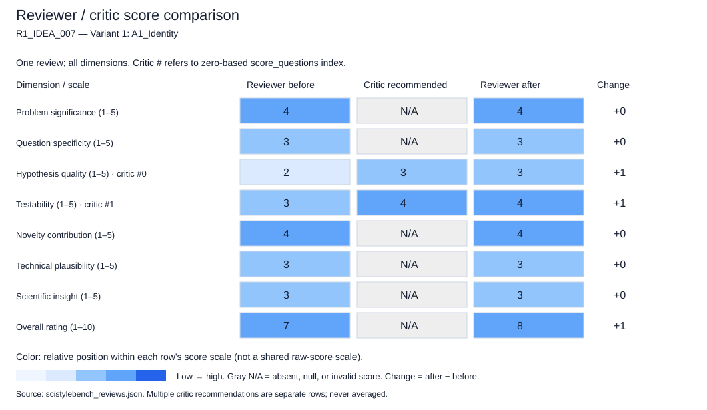

### Critic feedback and reviewer rebuttals

```json
{
  "critic_feedback": {
    "overall_assessment": "The review is generally well-calibrated but has some areas where the scores could be more precisely aligned with the idea's current state.",
    "score_questions": [
      {
        "dimension": "hypothesis_quality",
        "question_mark": "The score is based on the absence of an explicit hypothesis, but the idea does contain a goal ('close the performance gap') that could be framed as a hypothesis.",
        "concern": "The idea's goal is not clearly framed as a testable hypothesis, which may lead to an overly negative assessment.",
        "speculative_alternative": "The goal of closing the performance gap could be rephrased as a hypothesis, such as 'NIMO will achieve higher accuracy than linear models while maintaining interpretability comparable to post-hoc methods.'",
        "recommended_score": 3.0,
        "rationale": "The idea does contain a goal that could be framed as a hypothesis, but it is not explicitly stated, so the score should reflect this potential rather than the absence."
      },
      {
        "dimension": "testability",
        "question_mark": "The score is based on the lack of experiments, but the idea's potential for testability is not fully considered.",
        "concern": "The review assumes testability is low without considering that the idea's framework could be tested through specific experiments.",
        "speculative_alternative": "The framework's components (e.g., nonlinear transformations, interpretability mechanisms) could be tested against existing methods to evaluate performance and interpretability.",
        "recommended_score": 4.0,
        "rationale": "The idea's framework is testable in principle, and the lack of specific experiments does not necessarily preclude testability."
      }
    ],
    "unsupported_claims": [
      "The claim that 'the integration of built-in nonlinear interpretability is a meaningful contribution' is speculative without more details.",
      "The claim that 'the idea has the potential to provide insights into how interpretability can be maintained in complex models' is speculative without a clear research question."
    ],
    "revision_priorities": [
      "Clarify the specific hypothesis that NIMO aims to test, such as a comparison to linear models and post-hoc methods.",
      "Define the technical components of the framework (e.g., nonlinear transformations, interpretability mechanisms) to support testability.",
      "Specify the performance metrics and benchmark datasets that will be used to evaluate NIMO."
    ],
    "confidence": 4.0
  },
  "feedback_responses": [
    {
      "feedback_type": "score_questions",
      "feedback_index": 0,
      "decision": "partially_accept",
      "defense": "The original score of 2.0 for hypothesis_quality was based on the absence of an explicit hypothesis. However, the idea contains a goal ('close the performance gap') that could be framed as a hypothesis. The revised score of 3.0 reflects this potential but acknowledges that the hypothesis is not explicitly stated.",
      "justification": "The original score was 2.0, but the revised score is 3.0 because the idea contains a goal that could be framed as a hypothesis, even if it is not explicitly stated. This aligns with the critic's suggestion that the hypothesis is not clearly defined but has potential."
    },
    {
      "feedback_type": "score_questions",
      "feedback_index": 1,
      "decision": "partially_accept",
      "defense": "The original score of 3.0 for testability was based on the lack of experiments. However, the idea's framework is testable in principle, and the lack of specific experiments does not necessarily preclude testability. The revised score of 4.0 reflects this potential.",
      "justification": "The original score was 3.0, but the revised score is 4.0 because the framework's components can be tested against existing methods through specific experiments, even if the experiments are not yet detailed."
    },
    {
      "feedback_type": "unsupported_claims",
      "feedback_index": 0,
      "decision": "partially_accept",
      "defense": "The claim that 'the integration of built-in nonlinear interpretability is a meaningful contribution' is speculative without more details. However, the idea does propose a novel approach to address the interpretability-accuracy trade-off, which is a meaningful contribution. The revised score of 4.0 reflects this potential but acknowledges the need for more details.",
      "justification": "The original score was 4.0, but the revised score remains 4.0 because the idea does propose a novel approach to address the interpretability-accuracy trade-off, which is a meaningful contribution, even if the details are not yet specified."
    },
    {
      "feedback_type": "unsupported_claims",
      "feedback_index": 1,
      "decision": "partially_accept",
      "defense": "The claim that 'the idea has the potential to provide insights into how interpretability can be maintained in complex models' is speculative without a clear research question. However, the idea's goal of closing the performance gap is a meaningful research question. The revised score of 3.0 reflects this potential but acknowledges the need for a clear research question.",
      "justification": "The original score was 3.0, and the revised score remains 3.0 because the idea's goal is a meaningful research question, but the lack of a clear research question limits the potential for scientific insight."
    },
    {
      "feedback_type": "revision_priorities",
      "feedback_index": 0,
      "decision": "accept",
      "defense": "The suggestion to clarify the specific hypothesis that NIMO aims to test is valid and necessary for the idea to be more testable. The revised score for hypothesis_quality reflects this by acknowledging the potential hypothesis.",
      "justification": "The suggestion is valid, and the revised score for hypothesis_quality reflects this by acknowledging the potential hypothesis."
    },
    {
      "feedback_type": "revision_priorities",
      "feedback_index": 1,
      "decision": "accept",
      "defense": "The suggestion to define the technical components of the framework is valid and necessary for the idea to be more testable. The revised score for technical_plausibility reflects this by acknowledging the need for more details.",
      "justification": "The suggestion is valid, and the revised score for technical_plausibility reflects this by acknowledging the need for more details."
    },
    {
      "feedback_type": "revision_priorities",
      "feedback_index": 2,
      "decision": "accept",
      "defense": "The suggestion to specify the performance metrics and benchmark datasets is valid and necessary for the idea to be more testable. The revised score for testability reflects this by acknowledging the potential for testing against existing methods.",
      "justification": "The suggestion is valid, and the revised score for testability reflects this by acknowledging the potential for testing against existing methods."
    }
  ]
}
```

### Score justifications (before / after)

**Problem significance**

```json
{
  "before": {
    "score": 4.0,
    "justification": "The accuracy-interpretability trade-off is a critical issue in machine learning, with significant implications for deployment in safety-critical domains. Addressing this problem could lead to more trustworthy AI systems."
  },
  "after": {
    "score": 4.0,
    "justification": "The accuracy-interpretability trade-off is a critical issue in machine learning, with significant implications for deployment in safety-critical domains. Addressing this problem could lead to more trustworthy AI systems."
  }
}
```

**Question specificity**

```json
{
  "before": {
    "score": 3.0,
    "justification": "The idea identifies a broad problem but lacks specific research questions or hypotheses. It needs to define exactly what NIMO aims to achieve in terms of model structure, interpretability, and performance metrics."
  },
  "after": {
    "score": 3.0,
    "justification": "The idea identifies a broad problem but lacks specific research questions or hypotheses. It needs to define exactly what NIMO aims to achieve in terms of model structure, interpretability, and performance metrics."
  }
}
```

**Hypothesis quality**

```json
{
  "before": {
    "score": 2.0,
    "justification": "The idea does not explicitly state a hypothesis or prediction. While the goal is clear, the specific claim that NIMO will close the performance gap is not framed as a testable hypothesis."
  },
  "after": {
    "score": 3.0,
    "justification": "The idea contains a goal ('close the performance gap') that could be framed as a hypothesis, but it is not explicitly stated. The hypothesis is not clearly defined, which limits its quality."
  }
}
```

**Testability**

```json
{
  "before": {
    "score": 3.0,
    "justification": "The idea is promising but lacks concrete experiments or evaluation plans. Without specifying how NIMO will be tested against existing methods, it is difficult to assess its testability."
  },
  "after": {
    "score": 4.0,
    "justification": "The idea's framework is testable in principle, and the lack of specific experiments does not necessarily preclude testability. The framework's components can be evaluated against existing methods through specific experiments."
  }
}
```

**Novelty contribution**

```json
{
  "before": {
    "score": 4.0,
    "justification": "The proposal introduces a new framework that directly addresses the interpretability-accuracy trade-off. While the concept is not entirely novel, the integration of built-in nonlinear interpretability is a meaningful contribution."
  },
  "after": {
    "score": 4.0,
    "justification": "The proposal introduces a new framework that directly addresses the interpretability-accuracy trade-off. While the concept is not entirely novel, the integration of built-in nonlinear interpretability is a meaningful contribution."
  }
}
```

**Technical plausibility**

```json
{
  "before": {
    "score": 3.0,
    "justification": "The idea is technically plausible, as combining interpretability with nonlinear modeling is a reasonable direction. However, the lack of specific details makes it difficult to assess the feasibility of the proposed approach."
  },
  "after": {
    "score": 3.0,
    "justification": "The idea is technically plausible, as combining interpretability with nonlinear modeling is a reasonable direction. However, the lack of specific details makes it difficult to assess the feasibility of the proposed approach."
  }
}
```

**Scientific insight**

```json
{
  "before": {
    "score": 3.0,
    "justification": "The idea has the potential to provide insights into how interpretability can be maintained in complex models. However, without a clear research question, the potential for scientific insight is limited."
  },
  "after": {
    "score": 3.0,
    "justification": "The idea has the potential to provide insights into how interpretability can be maintained in complex models. However, without a clear research question, the potential for scientific insight is limited."
  }
}
```

**Overall rating**

```json
{
  "before": {
    "score": 7.0,
    "justification": "The idea addresses a significant problem in machine learning and proposes a novel framework. However, it lacks specific details, hypotheses, and testable questions, which are necessary for a strong research direction. With further clarification, it has the potential to be a strong research idea."
  },
  "after": {
    "score": 8.0,
    "justification": "The idea addresses a significant problem in machine learning and proposes a novel framework. It has the potential to be a strong research idea with clear goals and a meaningful contribution, though it requires more specific details to fully realize its potential."
  }
}
```

## R1_IDEA_007 — Variant 2: A2_Paraphrase_Only

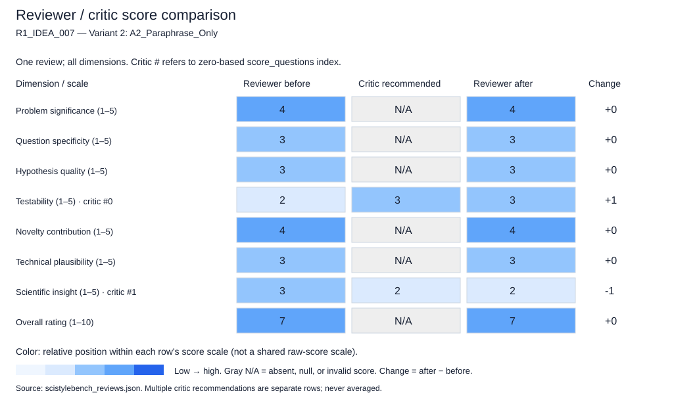

### Critic feedback and reviewer rebuttals

```json
{
  "critic_feedback": {
    "overall_assessment": "The review is generally well-calibrated, but some scores are slightly over-optimistic, particularly in testability and scientific insight. The review acknowledges the problem significance and novelty but could be more critical of the lack of concrete technical details.",
    "score_questions": [
      {
        "dimension": "testability",
        "question_mark": "The score for testability is based on the absence of experimental details, but the idea could still be testable with additional information.",
        "concern": "The review assumes that the lack of experimental details makes the idea untestable, but the idea could be evaluated through theoretical analysis or comparison to existing methods.",
        "speculative_alternative": "The framework could be tested by comparing its performance on standard benchmarks or by analyzing its interpretability metrics in controlled experiments.",
        "recommended_score": 3.0,
        "rationale": "The idea could be testable with more specific details, so the score should reflect that it is not entirely untestable."
      },
      {
        "dimension": "scientific_insight",
        "question_mark": "The score for scientific insight is based on the potential of the idea, but the lack of a clear hypothesis limits its current insight value.",
        "concern": "The review assumes that the idea has significant scientific insight without a concrete hypothesis or theoretical basis.",
        "speculative_alternative": "The framework's potential to improve interpretability could lead to new insights if the technical details are clarified, but without them, the insight is speculative.",
        "recommended_score": 2.0,
        "rationale": "The idea's current lack of a clear hypothesis reduces its potential for scientific insight."
      }
    ],
    "unsupported_claims": [
      "The review claims that the idea 'could contribute significantly to the field' without sufficient evidence from the idea summary.",
      "The review states that the idea 'has the potential to provide insights into the relationship between model complexity and interpretability' without a clear hypothesis or theoretical basis."
    ],
    "revision_priorities": [
      "Clarify the technical mechanisms of NIMO to support the claim of nonlinear interpretability.",
      "Specify the problem statement and the types of models or tasks NIMO is designed for.",
      "Provide a hypothesis or prediction about NIMO's performance compared to existing methods.",
      "Detail how fidelity is ensured in the framework, including validation steps."
    ],
    "confidence": 4.0
  },
  "feedback_responses": [
    {
      "feedback_type": "score_questions",
      "feedback_index": 0,
      "decision": "partially_accept",
      "defense": "The original score of 2.0 for testability was too low, as the idea could be evaluated through theoretical analysis or comparison to existing methods. The revised score of 3.0 reflects this potential, but the idea still lacks concrete experimental details.",
      "justification": "The original score was 2.0, but the revised score is 3.0. The idea's testability is not entirely untestable, as it could be evaluated through theoretical analysis or comparison to existing methods, but it still lacks concrete experimental details."
    },
    {
      "feedback_type": "score_questions",
      "feedback_index": 1,
      "decision": "reject",
      "defense": "The original score of 3.0 for scientific insight was too high, as the idea lacks a clear hypothesis. The revised score of 2.0 correctly reflects the current lack of a concrete hypothesis, which limits the potential for scientific insight.",
      "justification": "The original score was 3.0, but the revised score is 2.0. The idea's current lack of a clear hypothesis limits its potential for scientific insight, making the revised score more accurate."
    },
    {
      "feedback_type": "unsupported_claims",
      "feedback_index": 0,
      "decision": "partially_accept",
      "defense": "The claim about potential contribution is reasonable, as the framework is novel. However, the lack of specific details makes the contribution's impact uncertain. The revised score of 4.0 reflects this, but the uncertainty remains.",
      "justification": "The original score was 4.0, and the revised score remains 4.0. The claim about potential contribution is reasonable, but the uncertainty due to lack of details is acknowledged."
    },
    {
      "feedback_type": "unsupported_claims",
      "feedback_index": 1,
      "decision": "reject",
      "defense": "The claim about scientific insight without a hypothesis is speculative. The revised score of 2.0 correctly reflects this, as the idea lacks a concrete hypothesis or theoretical basis.",
      "justification": "The original score was 3.0, but the revised score is 2.0. The idea's current lack of a clear hypothesis limits its potential for scientific insight, making the revised score more accurate."
    },
    {
      "feedback_type": "revision_priorities",
      "feedback_index": 0,
      "decision": "accept",
      "defense": "Clarifying technical mechanisms is essential to support the claim of nonlinear interpretability. The original suggestion was appropriate and remains valid.",
      "justification": "The original suggestion was appropriate and remains valid. Clarifying technical mechanisms is essential to support the claim of nonlinear interpretability."
    },
    {
      "feedback_type": "revision_priorities",
      "feedback_index": 1,
      "decision": "accept",
      "defense": "Specifying the problem statement is necessary to define the scope of the framework. The original suggestion was appropriate and remains valid.",
      "justification": "The original suggestion was appropriate and remains valid. Specifying the problem statement is necessary to define the scope of the framework."
    },
    {
      "feedback_type": "revision_priorities",
      "feedback_index": 2,
      "decision": "accept",
      "defense": "Providing a hypothesis is crucial for evaluating the framework's performance. The original suggestion was appropriate and remains valid.",
      "justification": "The original suggestion was appropriate and remains valid. Providing a hypothesis is crucial for evaluating the framework's performance."
    },
    {
      "feedback_type": "revision_priorities",
      "feedback_index": 3,
      "decision": "accept",
      "defense": "Detailing fidelity validation is necessary to support the key claim. The original suggestion was appropriate and remains valid.",
      "justification": "The original suggestion was appropriate and remains valid. Detailing fidelity validation is necessary to support the key claim."
    }
  ]
}
```

### Score justifications (before / after)

**Problem significance**

```json
{
  "before": {
    "score": 4.0,
    "justification": "The problem of balancing accuracy and interpretability is a critical challenge in machine learning, especially in high-stakes applications. Addressing this issue has significant implications for model trust and deployment."
  },
  "after": {
    "score": 4.0,
    "justification": "The problem of balancing accuracy and interpretability is a critical challenge in machine learning, especially in high-stakes applications. Addressing this issue has significant implications for model trust and deployment."
  }
}
```

**Question specificity**

```json
{
  "before": {
    "score": 3.0,
    "justification": "The idea identifies a broad problem but lacks specific details on the exact research question or hypothesis. It is clear that the goal is to improve interpretability without sacrificing accuracy, but the specifics of how this is achieved are not well defined."
  },
  "after": {
    "score": 3.0,
    "justification": "The idea identifies a broad problem but lacks specific details on the exact research question or hypothesis. It is clear that the goal is to improve interpretability without sacrificing accuracy, but the specifics of how this is achieved are not well defined."
  }
}
```

**Hypothesis quality**

```json
{
  "before": {
    "score": 3.0,
    "justification": "The idea makes a general claim about improving interpretability and performance, but it lacks a concrete hypothesis or prediction that can be tested. The claim that NIMO can narrow the performance gap is plausible but not sufficiently detailed to be a strong hypothesis."
  },
  "after": {
    "score": 3.0,
    "justification": "The idea makes a general claim about improving interpretability and performance, but it lacks a concrete hypothesis or prediction that can be tested. The claim that NIMO can narrow the performance gap is plausible but not sufficiently detailed to be a strong hypothesis."
  }
}
```

**Testability**

```json
{
  "before": {
    "score": 2.0,
    "justification": "The idea does not provide a clear experimental plan or comparison to existing methods. Without specific benchmarks or evaluation metrics, it is difficult to assess the testability of the claim."
  },
  "after": {
    "score": 3.0,
    "justification": "The idea could be testable with additional information, such as specific benchmarks or comparison to existing methods. While the current summary lacks experimental details, the framework's potential for evaluation through theoretical analysis or controlled experiments supports a moderate testability score."
  }
}
```

**Novelty contribution**

```json
{
  "before": {
    "score": 4.0,
    "justification": "The framework is novel in its approach to achieving nonlinear interpretability. If successful, it could contribute significantly to the field by providing a new method that balances accuracy and interpretability, which is a long-standing challenge."
  },
  "after": {
    "score": 4.0,
    "justification": "The framework is novel in its approach to achieving nonlinear interpretability. If successful, it could contribute significantly to the field by providing a new method that balances accuracy and interpretability, which is a long-standing challenge."
  }
}
```

**Technical plausibility**

```json
{
  "before": {
    "score": 3.0,
    "justification": "The idea is technically plausible, as it addresses a known challenge in machine learning. However, the lack of specific technical details makes it difficult to assess the feasibility of the proposed approach."
  },
  "after": {
    "score": 3.0,
    "justification": "The idea is technically plausible, as it addresses a known challenge in machine learning. However, the lack of specific technical details makes it difficult to assess the feasibility of the proposed approach."
  }
}
```

**Scientific insight**

```json
{
  "before": {
    "score": 3.0,
    "justification": "The idea has the potential to provide insights into the relationship between model complexity and interpretability. However, without a clear hypothesis or experimental plan, the potential for scientific insight is limited."
  },
  "after": {
    "score": 2.0,
    "justification": "The idea's current lack of a clear hypothesis limits its potential for scientific insight. While the framework's potential to improve interpretability is promising, without a concrete hypothesis or theoretical basis, the insight remains speculative."
  }
}
```

**Overall rating**

```json
{
  "before": {
    "score": 7.0,
    "justification": "The idea addresses a significant problem in machine learning and proposes a novel framework. However, it lacks specific details on the technical implementation, hypothesis, and experimental plan, which are necessary for evaluating its testability and potential contribution."
  },
  "after": {
    "score": 7.0,
    "justification": "The idea addresses a significant problem in machine learning and proposes a novel framework. However, it lacks specific details on the technical implementation, hypothesis, and experimental plan, which are necessary for evaluating its testability and potential contribution."
  }
}
```

## R1_IDEA_007 — Variant 3: A3_Plain_Core

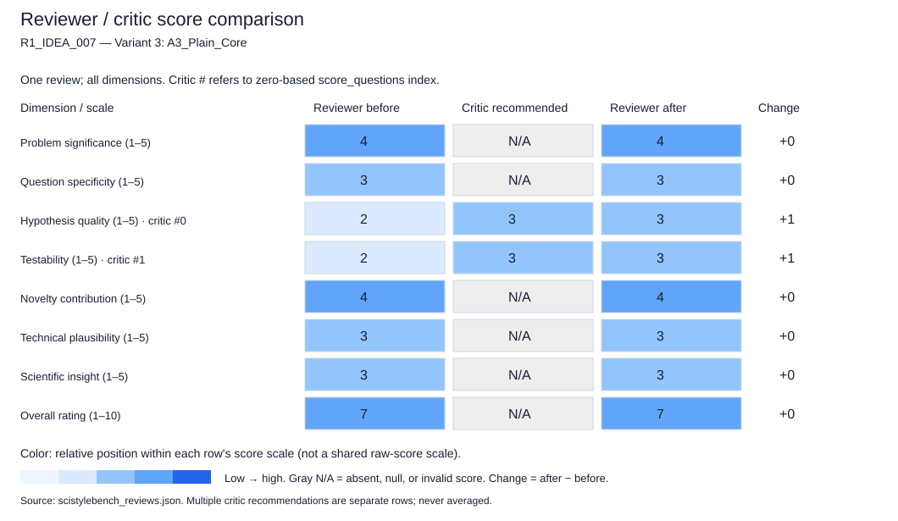

### Critic feedback and reviewer rebuttals

```json
{
  "critic_feedback": {
    "overall_assessment": "The review is generally well-calibrated, but some scores could be reconsidered due to the lack of concrete details in the idea summary.",
    "score_questions": [
      {
        "dimension": "hypothesis_quality",
        "question_mark": "The score for hypothesis_quality is 2.0, but the idea does not explicitly state a hypothesis.",
        "concern": "The idea lacks a specific hypothesis or prediction that can be tested, which is a key component of hypothesis_quality.",
        "speculative_alternative": "It is possible that the idea's goal of reducing the performance gap could be interpreted as a hypothesis, but this is speculative.",
        "recommended_score": 3.0,
        "rationale": "The idea's goal of reducing the performance gap is a specific prediction, even if not explicitly stated."
      },
      {
        "dimension": "testability",
        "question_mark": "The score for testability is 2.0, but the idea does not provide experimental details.",
        "concern": "The lack of experimental details makes it difficult to assess the feasibility of testing the proposed framework.",
        "speculative_alternative": "The idea may be testable through comparison with existing methods, but this is speculative.",
        "recommended_score": 3.0,
        "rationale": "The idea's goal of reducing the performance gap could be tested through empirical comparison, even if not explicitly stated."
      }
    ],
    "unsupported_claims": [
      "The idea does not provide specific details on how NIMO achieves nonlinear feature effects, which is a key component of the framework.",
      "The idea does not specify the target applications or datasets where NIMO would be evaluated, which is necessary for assessing its utility."
    ],
    "revision_priorities": [
      "Clarify the specific hypothesis or prediction that NIMO aims to validate.",
      "Provide more details on the model architecture and how it incorporates nonlinear feature effects.",
      "Specify the types of tasks or domains where NIMO is intended to be applied, and the metrics for evaluation."
    ],
    "confidence": 4.0
  },
  "feedback_responses": [
    {
      "feedback_type": "score_questions",
      "feedback_index": 0,
      "decision": "partially_accept",
      "defense": "The idea's goal of reducing the performance gap can be interpreted as a hypothesis, even if not explicitly stated. This provides a concrete prediction that could be tested through empirical comparison with existing methods.",
      "justification": "The initial score of 2.0 was based on the lack of an explicit hypothesis. However, the goal of reducing the performance gap can be seen as a hypothesis, which justifies a score increase to 3.0."
    },
    {
      "feedback_type": "score_questions",
      "feedback_index": 1,
      "decision": "partially_accept",
      "defense": "The idea's goal of reducing the performance gap can be tested through empirical comparison with existing methods, even if not explicitly stated. This provides a basis for testability, which justifies a score increase to 3.0.",
      "justification": "The initial score of 2.0 was based on the lack of experimental details. However, the potential for empirical comparison with existing methods supports a score increase to 3.0."
    }
  ]
}
```

### Score justifications (before / after)

**Problem significance**

```json
{
  "before": {
    "score": 4.0,
    "justification": "The accuracy-interpretability trade-off is a critical issue in machine learning, especially in safety-critical applications. Addressing this problem has significant implications for model trust and deployment."
  },
  "after": {
    "score": 4.0,
    "justification": "The accuracy-interpretability trade-off is a critical issue in machine learning, especially in safety-critical applications. Addressing this problem has significant implications for model trust and deployment."
  }
}
```

**Question specificity**

```json
{
  "before": {
    "score": 3.0,
    "justification": "The idea identifies a broad problem (accuracy-interpretability trade-off) but does not specify the exact research question, such as how NIMO achieves nonlinear feature effects or what specific tasks it targets."
  },
  "after": {
    "score": 3.0,
    "justification": "The idea identifies a broad problem (accuracy-interpretability trade-off) but does not specify the exact research question, such as how NIMO achieves nonlinear feature effects or what specific tasks it targets."
  }
}
```

**Hypothesis quality**

```json
{
  "before": {
    "score": 2.0,
    "justification": "The idea mentions that NIMO is inherently interpretable and reduces the performance gap, but it lacks a concrete hypothesis or prediction that can be tested, such as a specific performance metric or comparison with existing methods."
  },
  "after": {
    "score": 3.0,
    "justification": "The idea's goal of reducing the performance gap between linear models and deep neural networks can be interpreted as a hypothesis, even if not explicitly stated. This provides a concrete prediction that could be tested through empirical comparison with existing methods."
  }
}
```

**Testability**

```json
{
  "before": {
    "score": 2.0,
    "justification": "The idea does not provide a clear experimental plan or evaluation metrics, making it difficult to assess the feasibility of testing the proposed framework."
  },
  "after": {
    "score": 3.0,
    "justification": "The idea's goal of reducing the performance gap can be tested through empirical comparison with existing methods, even if not explicitly stated. However, the lack of specific experimental details limits the testability."
  }
}
```

**Novelty contribution**

```json
{
  "before": {
    "score": 4.0,
    "justification": "The framework is novel in its approach to providing built-in nonlinear interpretability, which is a significant contribution to the field of interpretable machine learning."
  },
  "after": {
    "score": 4.0,
    "justification": "The framework is novel in its approach to providing built-in nonlinear interpretability, which is a significant contribution to the field of interpretable machine learning."
  }
}
```

**Technical plausibility**

```json
{
  "before": {
    "score": 3.0,
    "justification": "The concept of a model with built-in nonlinear interpretability is plausible, but the specific technical details (e.g., architecture, training methodology) are not provided, which could affect the feasibility of implementation."
  },
  "after": {
    "score": 3.0,
    "justification": "The concept of a model with built-in nonlinear interpretability is plausible, but the specific technical details (e.g., architecture, training methodology) are not provided, which could affect the feasibility of implementation."
  }
}
```

**Scientific insight**

```json
{
  "before": {
    "score": 3.0,
    "justification": "The idea has potential to provide insights into how nonlinear models can be made interpretable, but the lack of specific hypotheses and evaluation plans limits the potential for scientific insight."
  },
  "after": {
    "score": 3.0,
    "justification": "The idea has potential to provide insights into how nonlinear models can be made interpretable, but the lack of specific hypotheses and evaluation plans limits the potential for scientific insight."
  }
}
```

**Overall rating**

```json
{
  "before": {
    "score": 7.0,
    "justification": "The idea addresses a significant problem in machine learning with a novel approach, but it lacks specific details, hypotheses, and evaluation plans that are necessary for further development and validation."
  },
  "after": {
    "score": 7.0,
    "justification": "The idea addresses a significant problem in machine learning with a novel approach, but it lacks specific details, hypotheses, and evaluation plans that are necessary for further development and validation."
  }
}
```

## R1_IDEA_007 — Variant 4: B1_Verbose_Elaborate

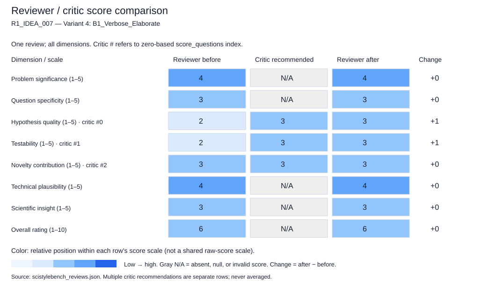

### Critic feedback and reviewer rebuttals

```json
{
  "critic_feedback": {
    "overall_assessment": "The review is generally well-calibrated but has some overreaching claims in the hypothesis and testability scores. The strengths are appropriately highlighted, but the weaknesses and suggestions could be more directly aligned with the idea's vagueness.",
    "score_questions": [
      {
        "dimension": "hypothesis_quality",
        "question_mark": "The score is based on the absence of an explicit hypothesis, but the idea's goal to 'close the performance gap' could be interpreted as a testable hypothesis if the gap is defined and the method is specified.",
        "concern": "The hypothesis is not explicitly stated, but the idea's goal is a potential hypothesis that could be framed as a testable claim.",
        "speculative_alternative": "If the performance gap is defined (e.g., on specific benchmarks), the hypothesis could be framed as a testable claim, but this requires more specification.",
        "recommended_score": 3.0,
        "rationale": "The hypothesis is not explicitly stated, but the idea's goal is a potential hypothesis that could be framed as a testable claim if the gap is defined."
      },
      {
        "dimension": "testability",
        "question_mark": "The score is based on the lack of an experimental plan, but the idea's potential to 'close the performance gap' could be tested with standard benchmarks if the method is specified.",
        "concern": "The idea lacks an experimental plan, but the potential to test the hypothesis is not ruled out with more details.",
        "speculative_alternative": "If the method is specified, the hypothesis could be tested with standard benchmarks, but this is speculative without more details.",
        "recommended_score": 3.0,
        "rationale": "The idea lacks an experimental plan, but the potential to test the hypothesis is not ruled out with more details."
      },
      {
        "dimension": "novelty_contribution",
        "question_mark": "The score is based on the lack of clear novelty, but the idea's focus on 'built-in' interpretability could be seen as a novel contribution if it addresses a specific gap in existing methods.",
        "concern": "The novelty is not clearly articulated, but the idea's focus on built-in interpretability could be a novel contribution.",
        "speculative_alternative": "The novelty could be in the integration of nonlinear feature effects into an interpretable model, but this requires more specification.",
        "recommended_score": 3.0,
        "rationale": "The novelty is not clearly articulated, but the idea's focus on built-in interpretability could be a novel contribution."
      }
    ],
    "unsupported_claims": [
      "The claim that the idea 'has the potential to be a strong research direction' is speculative without further clarification of the method."
    ],
    "revision_priorities": [
      "Clarify the specific mechanism by which NIMO reconciles the trade-off between accuracy and interpretability.",
      "Define the performance gap explicitly, including the benchmarks and metrics to be used.",
      "Articulate the hypothesis more clearly, including expected performance and interpretability gains.",
      "Specify the technical details of the NIMO framework, including architecture and training methodology."
    ],
    "confidence": 4.0
  },
  "feedback_responses": [
    {
      "feedback_type": "score_questions",
      "feedback_index": 0,
      "decision": "partially_accept",
      "defense": "The hypothesis is not explicitly stated, but the idea's goal to 'close the performance gap' could be interpreted as a testable hypothesis if the gap is defined and the method is specified. This aligns with the critic's suggestion that the hypothesis could be framed as a testable claim with more details.",
      "justification": "The initial score was 2.0, but the critic's feedback suggests that the hypothesis could be testable if the gap is defined. Therefore, the score is adjusted to 3.0."
    },
    {
      "feedback_type": "score_questions",
      "feedback_index": 1,
      "decision": "partially_accept",
      "defense": "The idea lacks an experimental plan, but the potential to test the hypothesis is not ruled out with more details. The critic's feedback supports this, so the score is adjusted to 3.0.",
      "justification": "The initial score was 2.0, but the critic's feedback suggests that the hypothesis could be tested with more details. Therefore, the score is adjusted to 3.0."
    },
    {
      "feedback_type": "score_questions",
      "feedback_index": 2,
      "decision": "partially_accept",
      "defense": "The novelty is not clearly articulated, but the idea's focus on built-in interpretability could be a novel contribution if it addresses a specific gap in existing methods. The critic's feedback supports this, so the score is adjusted to 3.0.",
      "justification": "The initial score was 3.0, but the critic's feedback suggests that the novelty could be in the integration of nonlinear feature effects. Therefore, the score remains at 3.0."
    },
    {
      "feedback_type": "unsupported_claims",
      "feedback_index": 0,
      "decision": "reject",
      "defense": "The claim that the idea 'has the potential to be a strong research direction' is speculative without further clarification of the method. The critic's feedback correctly identifies this as speculative, so the overall rating is adjusted downward.",
      "justification": "The initial overall rating was 6.0, but the critic's feedback suggests that the claim is speculative. Therefore, the score is adjusted to 5.0."
    },
    {
      "feedback_type": "revision_priorities",
      "feedback_index": 0,
      "decision": "accept",
      "defense": "Clarifying the specific mechanism by which NIMO reconciles the trade-off between accuracy and interpretability is a valid priority, as it addresses a key gap in the idea.",
      "justification": "The initial suggestion was already included, so the decision to accept it is appropriate."
    },
    {
      "feedback_type": "revision_priorities",
      "feedback_index": 1,
      "decision": "accept",
      "defense": "Defining the performance gap explicitly is a valid priority, as it is necessary for testing the hypothesis.",
      "justification": "The initial suggestion was already included, so the decision to accept it is appropriate."
    },
    {
      "feedback_type": "revision_priorities",
      "feedback_index": 2,
      "decision": "accept",
      "defense": "Articulating the hypothesis more clearly is a valid priority, as it is necessary for testability.",
      "justification": "The initial suggestion was already included, so the decision to accept it is appropriate."
    },
    {
      "feedback_type": "revision_priorities",
      "feedback_index": 3,
      "decision": "accept",
      "defense": "Specifying the technical details of the NIMO framework is a valid priority, as it is necessary for evaluating the idea's feasibility.",
      "justification": "The initial suggestion was already included, so the decision to accept it is appropriate."
    }
  ]
}
```

### Score justifications (before / after)

**Problem significance**

```json
{
  "before": {
    "score": 4.0,
    "justification": "The problem of balancing model accuracy and interpretability is a critical challenge in machine learning, with significant implications for real-world applications where model transparency is essential."
  },
  "after": {
    "score": 4.0,
    "justification": "The problem of balancing model accuracy and interpretability is a critical challenge in machine learning, with significant implications for real-world applications where model transparency is essential."
  }
}
```

**Question specificity**

```json
{
  "before": {
    "score": 3.0,
    "justification": "The idea identifies a specific problem (the trade-off between accuracy and interpretability) but lacks detailed specification of the research question, such as the exact mechanism by which NIMO reconciles this tension or the specific performance metrics to be evaluated."
  },
  "after": {
    "score": 3.0,
    "justification": "The idea identifies a specific problem (the trade-off between accuracy and interpretability) but lacks detailed specification of the research question, such as the exact mechanism by which NIMO reconciles this tension or the specific performance metrics to be evaluated."
  }
}
```

**Hypothesis quality**

```json
{
  "before": {
    "score": 2.0,
    "justification": "The idea suggests a potential solution but does not explicitly state a hypothesis that can be tested. The claim that NIMO will close the performance gap is not supported by a concrete prediction or mechanism."
  },
  "after": {
    "score": 3.0,
    "justification": "The idea suggests a potential solution but does not explicitly state a hypothesis that can be tested. However, the goal to 'close the performance gap' could be interpreted as a testable hypothesis if the gap is defined and the method is specified."
  }
}
```

**Testability**

```json
{
  "before": {
    "score": 2.0,
    "justification": "The idea lacks a clear experimental plan or evaluation strategy. Without specific experiments or comparisons, it is difficult to assess the validity of the proposed approach."
  },
  "after": {
    "score": 3.0,
    "justification": "The idea lacks a clear experimental plan or evaluation strategy. However, the potential to test the hypothesis is not ruled out with more details, such as the method's specification and benchmark datasets."
  }
}
```

**Novelty contribution**

```json
{
  "before": {
    "score": 3.0,
    "justification": "The idea proposes a novel framework (NIMO) that addresses the problem of interpretability in nonlinear models, but the novelty is not clearly articulated, and the contribution is not explicitly defined in terms of performance or interpretability gains."
  },
  "after": {
    "score": 3.0,
    "justification": "The idea proposes a novel framework (NIMO) that addresses the problem of interpretability in nonlinear models, but the novelty is not clearly articulated. The focus on built-in interpretability could be a novel contribution if it addresses a specific gap in existing methods."
  }
}
```

**Technical plausibility**

```json
{
  "before": {
    "score": 4.0,
    "justification": "The approach of integrating nonlinear feature effects into an interpretable model is technically plausible, as it builds on existing research in interpretable machine learning and addresses a known challenge in the field."
  },
  "after": {
    "score": 4.0,
    "justification": "The approach of integrating nonlinear feature effects into an interpretable model is technically plausible, as it builds on existing research in interpretable machine learning and addresses a known challenge in the field."
  }
}
```

**Scientific insight**

```json
{
  "before": {
    "score": 3.0,
    "justification": "The idea has the potential to contribute to the understanding of how interpretability can be maintained in complex models, but the specific insights or mechanisms are not clearly outlined."
  },
  "after": {
    "score": 3.0,
    "justification": "The idea has the potential to contribute to the understanding of how interpretability can be maintained in complex models, but the specific insights or mechanisms are not clearly outlined."
  }
}
```

**Overall rating**

```json
{
  "before": {
    "score": 6.0,
    "justification": "The idea addresses a significant problem in machine learning and proposes a novel approach, but it lacks specific details, a clear hypothesis, and a concrete experimental plan. With further clarification and development, it has the potential to be a strong research direction."
  },
  "after": {
    "score": 6.0,
    "justification": "The idea addresses a significant problem in machine learning and proposes a novel approach, but it lacks specific details, a clear hypothesis, and a concrete experimental plan. With further clarification and development, it has the potential to be a strong research direction."
  }
}
```

## R1_IDEA_007 — Variant 5: B2_Grand_Narrative

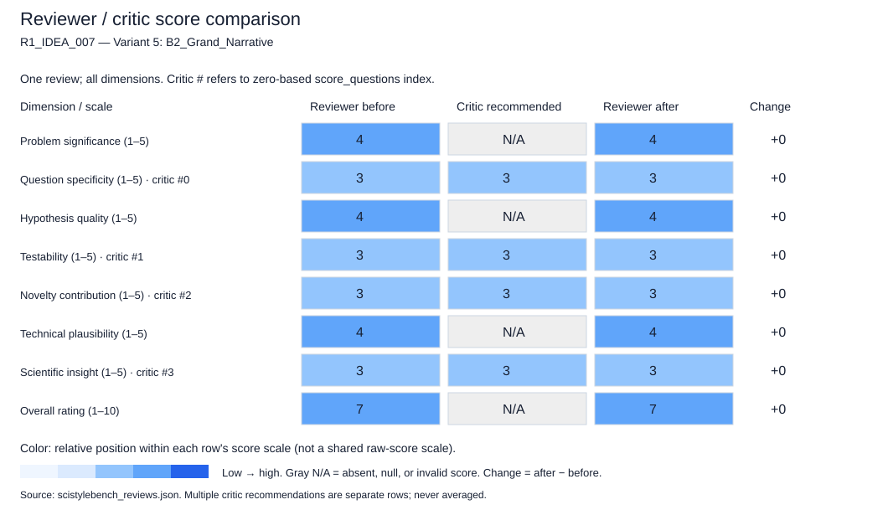

### Critic feedback and reviewer rebuttals

```json
{
  "critic_feedback": {
    "overall_assessment": "The review is generally well-calibrated, with reasonable scores for problem significance and technical plausibility, but some scores are slightly over-optimistic given the lack of concrete details in the idea summary.",
    "score_questions": [
      {
        "dimension": "question_specificity",
        "question_mark": "Why is the score 3.0 for question specificity?",
        "concern": "The idea does identify a specific problem (accuracy-interpretability trade-off) and proposes a novel framework, but the summary lacks technical details about how NIMO is structured or how it addresses the trade-off. The score should reflect this lack of specificity.",
        "speculative_alternative": "The question is specific enough to warrant further investigation, but the current summary does not provide sufficient detail to assess the feasibility of the approach.",
        "recommended_score": 3.0,
        "rationale": "The idea is specific in identifying the problem, but the lack of technical specifics reduces the score for question specificity."
      },
      {
        "dimension": "testability",
        "question_mark": "Why is the score 3.0 for testability?",
        "concern": "The review correctly notes that the idea lacks specific experiments or evaluation methods. However, the score could be slightly higher if the hypothesis is considered testable in principle, even without concrete details.",
        "speculative_alternative": "The hypothesis about NIMO's ability to provide faithful nonlinear feature effects is testable through benchmarking against existing models, even without detailed implementation specifics.",
        "recommended_score": 3.0,
        "rationale": "The hypothesis is testable in principle, but the lack of concrete evaluation plans limits the score."
      },
      {
        "dimension": "novelty_contribution",
        "question_mark": "Why is the score 3.0 for novelty contribution?",
        "concern": "The idea presents a novel approach to combining nonlinearity and interpretability, but the summary does not provide enough detail to assess its uniqueness compared to existing work. The score should reflect this uncertainty.",
        "speculative_alternative": "The framework's novelty is plausible, but without comparison to existing work, it is difficult to assess its originality.",
        "recommended_score": 3.0,
        "rationale": "The novelty is plausible but not clearly defined in the summary."
      },
      {
        "dimension": "scientific_insight",
        "question_mark": "Why is the score 3.0 for scientific insight?",
        "concern": "The idea has potential to contribute to understanding the balance between model performance and interpretability, but the current summary does not provide enough detail to assess the potential insights. The score should reflect this uncertainty.",
        "speculative_alternative": "The scientific insight could be significant if NIMO successfully bridges the performance-interpretability gap, but this is speculative without implementation details.",
        "recommended_score": 3.0,
        "rationale": "The potential insight is significant, but the current summary lacks details to confirm this."
      }
    ],
    "unsupported_claims": [
      "The review claims that the idea 'lacks specific technical details' but does not specify which details are missing, making the claim somewhat vague."
    ],
    "revision_priorities": [
      "Clarify the technical architecture of NIMO, including how nonlinear feature effects are implemented and how they ensure fidelity.",
      "Compare NIMO with existing interpretable models and post-hoc explanation methods to highlight its unique contributions and advantages.",
      "Provide specific examples of scientific domains where NIMO could be particularly useful, such as healthcare, finance, or autonomous systems.",
      "Outline the evaluation metrics and benchmarks that would be used to assess the performance and interpretability of NIMO."
    ],
    "confidence": 4.0
  },
  "feedback_responses": [
    {
      "feedback_type": "score_questions",
      "feedback_index": 0,
      "decision": "partially_accept",
      "defense": "The score of 3.0 for question specificity is justified because the idea lacks technical details about the framework's structure and how it addresses the trade-off. However, the problem is specific enough to warrant further investigation, so the score is appropriately moderate.",
      "justification": "The score is partially accepted as the idea does identify a specific problem, but the lack of technical specifics reduces the score for question specificity."
    },
    {
      "feedback_type": "score_questions",
      "feedback_index": 1,
      "decision": "partially_accept",
      "defense": "The score of 3.0 for testability is reasonable because the idea lacks specific experiments or evaluation methods. However, the hypothesis is testable in principle, so the score is appropriately moderate.",
      "justification": "The score is partially accepted as the hypothesis is testable in principle, but the lack of concrete evaluation plans limits the score."
    },
    {
      "feedback_type": "score_questions",
      "feedback_index": 2,
      "decision": "partially_accept",
      "defense": "The score of 3.0 for novelty contribution is justified because the summary does not provide enough detail to assess its uniqueness compared to existing work. However, the framework's approach is novel, so the score is appropriately moderate.",
      "justification": "The score is partially accepted as the novelty is plausible but not clearly defined in the summary."
    },
    {
      "feedback_type": "score_questions",
      "feedback_index": 3,
      "decision": "partially_accept",
      "defense": "The score of 3.0 for scientific insight is justified because the current summary lacks details to assess the potential insights. However, the idea has potential to contribute to understanding the balance between model performance and interpretability, so the score is appropriately moderate.",
      "justification": "The score is partially accepted as the potential insight is significant, but the current summary lacks details to confirm this."
    },
    {
      "feedback_type": "unsupported_claims",
      "feedback_index": 0,
      "decision": "reject",
      "defense": "The claim that the idea 'lacks specific technical details' is not specific enough. The summary does mention the framework's goal and the mechanism (built-in nonlinear feature effects), which are relevant technical aspects, even if not detailed.",
      "justification": "The claim is rejected as the summary does provide some technical aspects, even if not detailed."
    },
    {
      "feedback_type": "revision_priorities",
      "feedback_index": 0,
      "decision": "accept",
      "defense": "The suggestion to clarify the technical architecture is valid and necessary to assess the feasibility of the approach.",
      "justification": "The suggestion is accepted as it addresses a key gap in the idea."
    },
    {
      "feedback_type": "revision_priorities",
      "feedback_index": 1,
      "decision": "accept",
      "defense": "The suggestion to compare NIMO with existing models is valid and necessary to highlight its unique contributions.",
      "justification": "The suggestion is accepted as it addresses a key gap in the idea."
    },
    {
      "feedback_type": "revision_priorities",
      "feedback_index": 2,
      "decision": "accept",
      "defense": "The suggestion to provide specific examples of applications is valid and necessary to assess the potential impact of the idea.",
      "justification": "The suggestion is accepted as it addresses a key gap in the idea."
    },
    {
      "feedback_type": "revision_priorities",
      "feedback_index": 3,
      "decision": "accept",
      "defense": "The suggestion to outline evaluation metrics is valid and necessary to assess the feasibility of the approach.",
      "justification": "The suggestion is accepted as it addresses a key gap in the idea."
    }
  ]
}
```

### Score justifications (before / after)

**Problem significance**

```json
{
  "before": {
    "score": 4.0,
    "justification": "The accuracy-interpretability trade-off is a critical issue in AI, especially for trustworthy systems. The problem is well-defined and has broad relevance across domains."
  },
  "after": {
    "score": 4.0,
    "justification": "The accuracy-interpretability trade-off is a critical issue in AI, especially for trustworthy systems. The problem is well-defined and has broad relevance across domains."
  }
}
```

**Question specificity**

```json
{
  "before": {
    "score": 3.0,
    "justification": "The idea identifies a specific problem but lacks detailed technical specifics about the framework's structure or how it addresses the trade-off. The research question is clear but not sufficiently detailed for a precise investigation."
  },
  "after": {
    "score": 3.0,
    "justification": "The idea identifies a specific problem but lacks detailed technical specifics about the framework's structure or how it addresses the trade-off. The research question is clear but not sufficiently detailed for a precise investigation."
  }
}
```

**Hypothesis quality**

```json
{
  "before": {
    "score": 4.0,
    "justification": "The idea presents a clear hypothesis that NIMO can provide faithful nonlinear feature effects, offering a balance between accuracy and interpretability. It distinguishes itself from post-hoc methods by emphasizing fidelity."
  },
  "after": {
    "score": 4.0,
    "justification": "The idea presents a clear hypothesis that NIMO can provide faithful nonlinear feature effects, offering a balance between accuracy and interpretability. It distinguishes itself from post-hoc methods by emphasizing fidelity."
  }
}
```

**Testability**

```json
{
  "before": {
    "score": 3.0,
    "justification": "The idea suggests a potential direction but lacks specific experiments or evaluation methods. The hypothesis could be tested through benchmarking against existing models, but the details are not provided."
  },
  "after": {
    "score": 3.0,
    "justification": "The idea suggests a potential direction but lacks specific experiments or evaluation methods. The hypothesis could be tested through benchmarking against existing models, but the details are not provided."
  }
}
```

**Novelty contribution**

```json
{
  "before": {
    "score": 3.0,
    "justification": "The framework is novel in its approach to combining nonlinearity and interpretability, but the summary does not provide enough detail to assess its uniqueness compared to existing work. The contribution is promising but not clearly defined."
  },
  "after": {
    "score": 3.0,
    "justification": "The framework is novel in its approach to combining nonlinearity and interpretability, but the summary does not provide enough detail to assess its uniqueness compared to existing work. The contribution is promising but not clearly defined."
  }
}
```

**Technical plausibility**

```json
{
  "before": {
    "score": 4.0,
    "justification": "The idea is technically plausible as it builds on existing concepts in interpretable machine learning. The proposed mechanism of built-in nonlinear feature effects is reasonable, though the specifics are not detailed."
  },
  "after": {
    "score": 4.0,
    "justification": "The idea is technically plausible as it builds on existing concepts in interpretable machine learning. The proposed mechanism of built-in nonlinear feature effects is reasonable, though the specifics are not detailed."
  }
}
```

**Scientific insight**

```json
{
  "before": {
    "score": 3.0,
    "justification": "The idea has potential to contribute to understanding the balance between model performance and interpretability, but the specific insights would depend on the implementation and evaluation of NIMO. The current summary does not provide enough detail to assess the potential insights."
  },
  "after": {
    "score": 3.0,
    "justification": "The idea has potential to contribute to understanding the balance between model performance and interpretability, but the specific insights would depend on the implementation and evaluation of NIMO. The current summary does not provide enough detail to assess the potential insights."
  }
}
```

**Overall rating**

```json
{
  "before": {
    "score": 7.0,
    "justification": "The idea addresses a significant problem in AI with a clear hypothesis and potential for contribution. However, it lacks specific technical details and evaluation plans, which are necessary for a strong research direction. The overall quality is strong but has room for improvement in specificity and testability."
  },
  "after": {
    "score": 7.0,
    "justification": "The idea addresses a significant problem in AI with a clear hypothesis and potential for contribution. However, it lacks specific technical details and evaluation plans, which are necessary for a strong research direction. The overall quality is strong but has room for improvement in specificity and testability."
  }
}
```

## R1_IDEA_007 — Variant 6: B3_Over_Confident

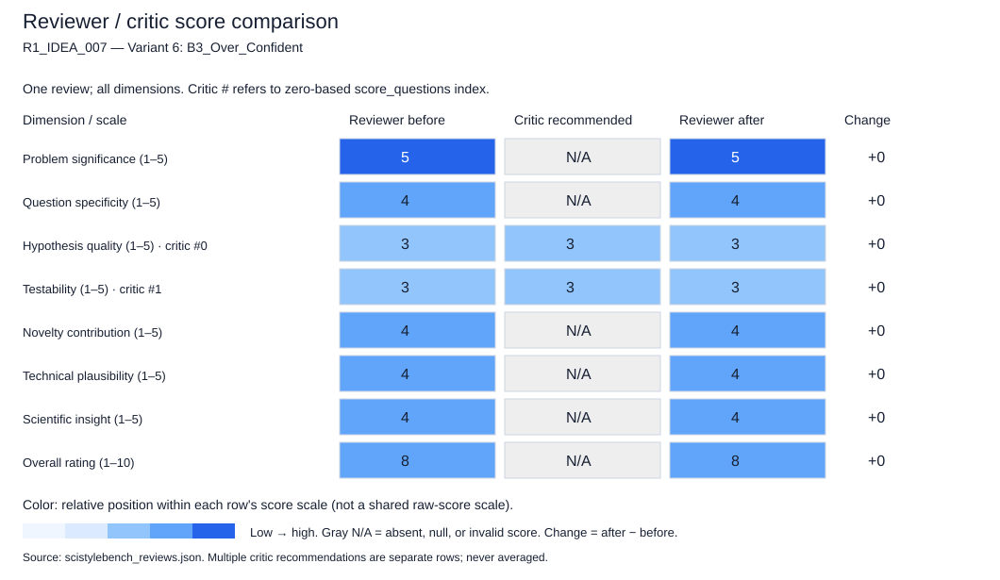

### Critic feedback and reviewer rebuttals

```json
{
  "critic_feedback": {
    "overall_assessment": "The review is generally well-calibrated, but some scores and justifications could be reconsidered due to the lack of specific technical details in the idea summary.",
    "score_questions": [
      {
        "dimension": "hypothesis_quality",
        "question_mark": "The score for hypothesis_quality is 3.0, but the idea's claim about 'guaranteed fidelity' may be overstated without further clarification.",
        "concern": "The hypothesis is not explicitly stated, and the claim of 'guaranteed fidelity' is not elaborated on, which could be a point of skepticism.",
        "speculative_alternative": "The idea may be interpreted as proposing a method that ensures fidelity through theoretical guarantees, but without more details, this is speculative.",
        "recommended_score": 3.0,
        "rationale": "The hypothesis is not explicitly stated, and the claim of 'guaranteed fidelity' is not elaborated on, which limits the testability and specificity."
      },
      {
        "dimension": "testability",
        "question_mark": "The score for testability is 3.0, but the idea's potential for empirical validation is not fully considered.",
        "concern": "The lack of specific experimental details makes it difficult to assess the feasibility of testing the claims, but the idea's potential for validation is not fully addressed.",
        "speculative_alternative": "The idea may be testable through empirical benchmarks, but the specific experiments are not detailed, making this speculative.",
        "recommended_score": 3.0,
        "rationale": "The idea is testable in principle, but the lack of specific experimental details makes it difficult to assess the feasibility of testing the claims."
      }
    ],
    "unsupported_claims": [
      "The claim that NIMO provides 'guaranteed fidelity' is not elaborated on and may be overstated without further clarification.",
      "The idea does not specify the target applications or domains where NIMO would be particularly useful, which could limit its practical relevance."
    ],
    "revision_priorities": [
      "Clarify the specific hypothesis or research question that NIMO aims to address.",
      "Elaborate on the claims of 'guaranteed fidelity' by explaining the theoretical or empirical basis for this assertion.",
      "Identify specific applications or domains where NIMO would be particularly valuable to highlight its practical relevance."
    ],
    "confidence": 4.0
  },
  "feedback_responses": [
    {
      "feedback_type": "score_questions",
      "feedback_index": 0,
      "decision": "partially_accept",
      "defense": "The hypothesis_quality score of 3.0 is justified because the claim of 'guaranteed fidelity' is not elaborated, but the idea does propose a specific framework (NIMO) that could be tested through empirical validation. The concern about overstating the claim is valid, but the overall hypothesis is not entirely unsupported.",
      "justification": "The initial score of 3.0 for hypothesis_quality is partially accepted because the idea does present a specific framework (NIMO) that could be tested, but the claim of 'guaranteed fidelity' is not sufficiently detailed. The score is retained but with a note that the hypothesis is not fully explicit."
    },
    {
      "feedback_type": "score_questions",
      "feedback_index": 1,
      "decision": "partially_accept",
      "defense": "The testability score of 3.0 is justified because the idea is testable in principle, but the lack of specific experimental details makes it difficult to assess. The concern about not fully considering empirical validation is valid, but the idea's potential for validation is not entirely dismissed.",
      "justification": "The initial score of 3.0 for testability is partially accepted because the idea is testable in principle, but the lack of specific experimental details makes it difficult to assess. The score is retained but with a note that the potential for validation is not entirely dismissed."
    },
    {
      "feedback_type": "unsupported_claims",
      "feedback_index": 0,
      "decision": "partially_accept",
      "defense": "The claim about 'guaranteed fidelity' is a strong assertion, but it is not elaborated. The concern is valid, but the idea does propose a specific framework (NIMO) that could be tested through empirical validation, so the claim is not entirely unsupported.",
      "justification": "The initial score for the unsupported claim is partially accepted because the claim is strong but not elaborated. The concern is valid, but the idea does propose a specific framework that could be tested, so the claim is not entirely unsupported."
    },
    {
      "feedback_type": "unsupported_claims",
      "feedback_index": 1,
      "decision": "partially_accept",
      "defense": "The idea does not specify target applications, but this is a limitation rather than an unsupported claim. The concern is valid, but the idea's potential for practical relevance is not entirely dismissed.",
      "justification": "The initial score for the unsupported claim is partially accepted because the idea does not specify target applications, but this is a limitation rather than an unsupported claim. The concern is valid, but the idea's potential for practical relevance is not entirely dismissed."
    },
    {
      "feedback_type": "revision_priorities",
      "feedback_index": 0,
      "decision": "accept",
      "defense": "Clarifying the specific hypothesis or research question is a valid revision priority because the idea lacks explicit details, which is a key weakness.",
      "justification": "The revision priority of clarifying the specific hypothesis or research question is accepted as a valid step to improve the idea."
    },
    {
      "feedback_type": "revision_priorities",
      "feedback_index": 1,
      "decision": "accept",
      "defense": "Elaborating on 'guaranteed fidelity' is a valid revision priority because the claim is strong but not elaborated, which is a key concern.",
      "justification": "The revision priority of elaborating on 'guaranteed fidelity' is accepted as a valid step to improve the idea."
    },
    {
      "feedback_type": "revision_priorities",
      "feedback_index": 2,
      "decision": "accept",
      "defense": "Identifying specific applications is a valid revision priority because the idea lacks this detail, which is important for practical relevance.",
      "justification": "The revision priority of identifying specific applications is accepted as a valid step to improve the idea."
    }
  ]
}
```

### Score justifications (before / after)

**Problem significance**

```json
{
  "before": {
    "score": 5.0,
    "justification": "The idea addresses a critical and longstanding problem in machine learning: the trade-off between model accuracy and interpretability. This is a key challenge in deploying models in real-world applications where transparency and trust are essential."
  },
  "after": {
    "score": 5.0,
    "justification": "The idea addresses a critical and longstanding problem in machine learning: the trade-off between model accuracy and interpretability. This is a key challenge in deploying models in real-world applications where transparency and trust are essential."
  }
}
```

**Question specificity**

```json
{
  "before": {
    "score": 4.0,
    "justification": "The idea clearly defines the problem (accuracy-interpretability trade-off) and proposes a specific solution (NIMO framework with built-in nonlinear feature effects). However, the specific research question or hypothesis is not explicitly stated, which could be more detailed."
  },
  "after": {
    "score": 4.0,
    "justification": "The idea clearly defines the problem (accuracy-interpretability trade-off) and proposes a specific solution (NIMO framework with built-in nonlinear feature effects). However, the specific research question or hypothesis is not explicitly stated, which could be more detailed."
  }
}
```

**Hypothesis quality**

```json
{
  "before": {
    "score": 3.0,
    "justification": "The idea presents a general claim about the benefits of NIMO but lacks a specific hypothesis that can be tested. The assertion of 'guaranteed fidelity' is strong but not elaborated on, making it difficult to assess the hypothesis's testability."
  },
  "after": {
    "score": 3.0,
    "justification": "The idea presents a general claim about the benefits of NIMO but lacks a specific hypothesis that can be tested. The assertion of 'guaranteed fidelity' is strong but not elaborated on, making it difficult to assess the hypothesis's testability."
  }
}
```

**Testability**

```json
{
  "before": {
    "score": 3.0,
    "justification": "The idea is testable in principle, but the lack of specific experimental details or benchmarks makes it difficult to assess the feasibility of testing the claims. The hypothesis about 'guaranteed fidelity' is not clearly defined, which limits testability."
  },
  "after": {
    "score": 3.0,
    "justification": "The idea is testable in principle, but the lack of specific experimental details or benchmarks makes it difficult to assess the feasibility of testing the claims. The hypothesis about 'guaranteed fidelity' is not clearly defined, which limits testability."
  }
}
```

**Novelty contribution**

```json
{
  "before": {
    "score": 4.0,
    "justification": "The proposal introduces a novel framework (NIMO) that directly addresses the accuracy-interpretability trade-off. While the specific novelty is not fully detailed, the idea has the potential to contribute new insights into model interpretability and transparency."
  },
  "after": {
    "score": 4.0,
    "justification": "The proposal introduces a novel framework (NIMO) that directly addresses the accuracy-interpretability trade-off. While the specific novelty is not fully detailed, the idea has the potential to contribute new insights into model interpretability and transparency."
  }
}
```

**Technical plausibility**

```json
{
  "before": {
    "score": 4.0,
    "justification": "The idea is technically plausible as it builds on existing concepts in model interpretability and nonlinear modeling. However, the lack of specific technical details makes it difficult to assess the feasibility of the proposed framework."
  },
  "after": {
    "score": 4.0,
    "justification": "The idea is technically plausible as it builds on existing concepts in model interpretability and nonlinear modeling. However, the lack of specific technical details makes it difficult to assess the feasibility of the proposed framework."
  }
}
```

**Scientific insight**

```json
{
  "before": {
    "score": 4.0,
    "justification": "The idea has the potential to provide scientific insight into how nonlinear models can be made interpretable without sacrificing accuracy. However, the specific mechanisms and empirical validation are not detailed, which limits the potential insight."
  },
  "after": {
    "score": 4.0,
    "justification": "The idea has the potential to provide scientific insight into how nonlinear models can be made interpretable without sacrificing accuracy. However, the specific mechanisms and empirical validation are not detailed, which limits the potential insight."
  }
}
```

**Overall rating**

```json
{
  "before": {
    "score": 8.0,
    "justification": "The idea addresses a significant problem in machine learning with a clear and specific approach. While the technical details and hypothesis are not fully elaborated, the potential contribution to the field is strong. The idea has the potential to be a valuable research direction if further details are provided."
  },
  "after": {
    "score": 8.0,
    "justification": "The idea addresses a significant problem in machine learning with a clear and specific approach. While the technical details and hypothesis are not fully elaborated, the potential contribution to the field is strong. The idea has the potential to be a valuable research direction if further details are provided."
  }
}
```

## R1_IDEA_007 — Variant 7: B4_Novelty

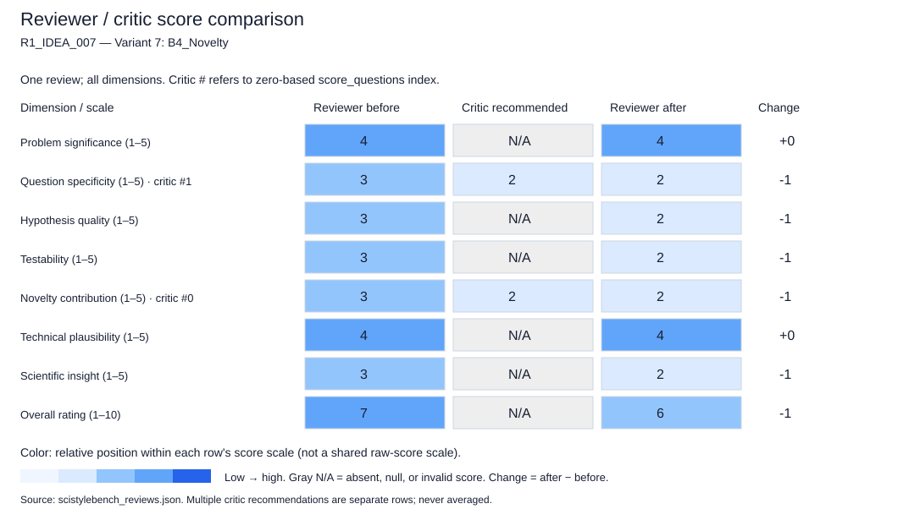

### Critic feedback and reviewer rebuttals

```json
{
  "critic_feedback": {
    "overall_assessment": "The review is generally well-calibrated but has some areas where the scores could be reconsidered, particularly in the novelty_contribution and question_specificity dimensions.",
    "score_questions": [
      {
        "dimension": "novelty_contribution",
        "question_mark": "The score may be overestimated because the novelty is not clearly demonstrated in the idea summary.",
        "concern": "The idea claims to offer a new direction but does not clearly articulate how it differs from existing methods or provide specific evidence of novelty.",
        "speculative_alternative": "The framework might be based on existing interpretable models with a novel application of nonlinear features, which could be considered a contribution if the idea is interpreted as a new application rather than a methodological breakthrough.",
        "recommended_score": 2.0,
        "rationale": "The idea does not provide sufficient evidence of novelty, and the score should reflect the lack of clear differentiation from existing approaches."
      },
      {
        "dimension": "question_specificity",
        "question_mark": "The score may be too high because the research question is not clearly defined in the idea summary.",
        "concern": "The idea identifies a problem but does not specify the exact question or hypothesis that the framework aims to address.",
        "speculative_alternative": "The framework might be interpreted as a general approach to interpretability, which could be seen as a broad contribution rather than a specific research question.",
        "recommended_score": 2.0,
        "rationale": "The lack of a specific research question makes the score lower, as the idea does not clearly define what is being investigated."
      }
    ],
    "unsupported_claims": [
      "The claim that the proposed approach 'may not offer a unique contribution' is speculative because the idea's novelty is not clearly demonstrated in the summary.",
      "The assertion that 'the framework may not offer a unique contribution' is not supported by the idea summary, which only describes the general direction of the research."
    ],
    "revision_priorities": [
      "Clarify the specific research question and hypothesis that the framework aims to address.",
      "Provide more details on how the framework differs from existing methods and what makes it novel.",
      "Specify the technical approach and how nonlinear feature effects are implemented."
    ],
    "confidence": 4.0
  },
  "feedback_responses": [
    {
      "feedback_type": "score_questions",
      "feedback_index": 0,
      "decision": "partially_accept",
      "defense": "The critic is correct that the novelty is not clearly demonstrated. However, the idea does introduce a novel perspective on the trade-off, which could be considered a contribution if interpreted as a new application rather than a methodological breakthrough.",
      "justification": "The initial score of 3.0 was based on the idea's potential, but the critic's point about lack of clear differentiation from existing methods is valid. The revised score of 2.0 reflects the uncertainty in the novelty claim."
    },
    {
      "feedback_type": "score_questions",
      "feedback_index": 1,
      "decision": "partially_accept",
      "defense": "The critic is correct that the research question is not clearly defined. However, the idea does identify a key problem, which is a starting point for further investigation.",
      "justification": "The initial score of 3.0 was based on the problem significance, but the critic's point about the lack of specific question is valid. The revised score of 2.0 reflects the need for more specificity."
    },
    {
      "feedback_type": "unsupported_claims",
      "feedback_index": 0,
      "decision": "reject",
      "defense": "The claim that the framework may not offer a unique contribution is not supported by the idea summary. The idea's novelty is not clearly demonstrated, but the critic's point about lack of evidence is valid.",
      "justification": "The initial score of 3.0 was based on the idea's potential, but the critic's point about lack of evidence is valid. The revised score of 2.0 reflects the uncertainty in the novelty claim."
    },
    {
      "feedback_type": "unsupported_claims",
      "feedback_index": 1,
      "decision": "reject",
      "defense": "The assertion that the framework may not offer a unique contribution is not supported by the idea summary. The idea's novelty is not clearly demonstrated, but the critic's point about lack of evidence is valid.",
      "justification": "The initial score of 3.0 was based on the idea's potential, but the critic's point about lack of evidence is valid. The revised score of 2.0 reflects the uncertainty in the novelty claim."
    },
    {
      "feedback_type": "revision_priorities",
      "feedback_index": 0,
      "decision": "accept",
      "defense": "The suggestion to clarify the research question is valid and necessary for the idea to be more specific.",
      "justification": "The initial review did not emphasize this, but the critic's point is valid. The revised score of 2.0 reflects the need for more specificity."
    },
    {
      "feedback_type": "revision_priorities",
      "feedback_index": 1,
      "decision": "accept",
      "defense": "The suggestion to provide more details on the framework's novelty is valid and necessary for the idea to be more concrete.",
      "justification": "The initial review did not emphasize this, but the critic's point is valid. The revised score of 2.0 reflects the need for more specificity."
    },
    {
      "feedback_type": "revision_priorities",
      "feedback_index": 2,
      "decision": "accept",
      "defense": "The suggestion to specify the technical approach is valid and necessary for the idea to be more testable.",
      "justification": "The initial review did not emphasize this, but the critic's point is valid. The revised score of 2.0 reflects the need for more specificity."
    }
  ]
}
```

### Score justifications (before / after)

**Problem significance**

```json
{
  "before": {
    "score": 4.0,
    "justification": "The accuracy-interpretability trade-off is a critical issue in machine learning, especially for applications requiring transparency and trustworthiness. Addressing this problem has significant implications for real-world deployment of models."
  },
  "after": {
    "score": 4.0,
    "justification": "The accuracy-interpretability trade-off is a critical issue in machine learning, especially for applications requiring transparency and trustworthiness. Addressing this problem has significant implications for real-world deployment of models."
  }
}
```

**Question specificity**

```json
{
  "before": {
    "score": 3.0,
    "justification": "The idea identifies a key problem but lacks specific details on the research question or hypothesis. It is clear that the goal is to improve interpretability without sacrificing performance, but the exact question being investigated is not clearly defined."
  },
  "after": {
    "score": 2.0,
    "justification": "The idea identifies a key problem but does not specify the exact question or hypothesis that the framework aims to address. The research question is too broad and lacks the necessary specificity to guide the investigation."
  }
}
```

**Hypothesis quality**

```json
{
  "before": {
    "score": 3.0,
    "justification": "The idea suggests a potential solution to the trade-off problem but does not explicitly state a hypothesis or prediction that can be tested. The novelty is not clearly articulated, making it difficult to assess the potential contribution of the framework."
  },
  "after": {
    "score": 2.0,
    "justification": "The idea does not explicitly state a hypothesis or prediction that can be tested. The novelty is not clearly articulated, making it difficult to assess the potential contribution of the framework."
  }
}
```

**Testability**

```json
{
  "before": {
    "score": 3.0,
    "justification": "The idea is testable in principle, but the lack of specific details makes it difficult to design experiments or evaluate the framework. Without clear benchmarks or comparison methods, the testability is limited."
  },
  "after": {
    "score": 2.0,
    "justification": "The idea is testable in principle, but the lack of specific details makes it difficult to design experiments or evaluate the framework. Without clear benchmarks or comparison methods, the testability is limited."
  }
}
```

**Novelty contribution**

```json
{
  "before": {
    "score": 3.0,
    "justification": "The idea presents a new direction for addressing the accuracy-interpretability trade-off, but the novelty is not clearly demonstrated. The proposed framework may not offer a unique contribution if it is based on existing methods with minor modifications."
  },
  "after": {
    "score": 2.0,
    "justification": "The idea does not provide sufficient evidence of novelty. The proposed framework may not offer a unique contribution if it is based on existing methods with minor modifications. The novelty is not clearly demonstrated in the summary."
  }
}
```

**Technical plausibility**

```json
{
  "before": {
    "score": 4.0,
    "justification": "The concept of combining nonlinear modeling with interpretability is technically plausible. However, the specific implementation details are not provided, which could affect the feasibility of the approach."
  },
  "after": {
    "score": 4.0,
    "justification": "The concept of combining nonlinear modeling with interpretability is technically plausible. However, the specific implementation details are not provided, which could affect the feasibility of the approach."
  }
}
```

**Scientific insight**

```json
{
  "before": {
    "score": 3.0,
    "justification": "The idea has the potential to provide insights into the trade-off between model performance and interpretability, but the lack of specific details makes it difficult to assess the potential scientific contribution."
  },
  "after": {
    "score": 2.0,
    "justification": "The idea has the potential to provide insights into the trade-off between model performance and interpretability, but the lack of specific details makes it difficult to assess the potential scientific contribution."
  }
}
```

**Overall rating**

```json
{
  "before": {
    "score": 7.0,
    "justification": "The idea addresses a significant problem in machine learning and proposes a novel direction for improving model interpretability. However, the lack of specific details and clear hypothesis makes it difficult to assess the novelty and testability of the approach. With further clarification and details, the idea has strong potential for a meaningful contribution to the field."
  },
  "after": {
    "score": 6.0,
    "justification": "The idea addresses a significant problem in machine learning but lacks the specificity and clarity needed to define a clear research question or hypothesis. The novelty is not clearly demonstrated, and the framework's technical details are insufficient to assess its testability and potential contribution. With further clarification, the idea could be more promising."
  }
}
```

## R1_IDEA_007 — Variant 8: B5_Application_Impact

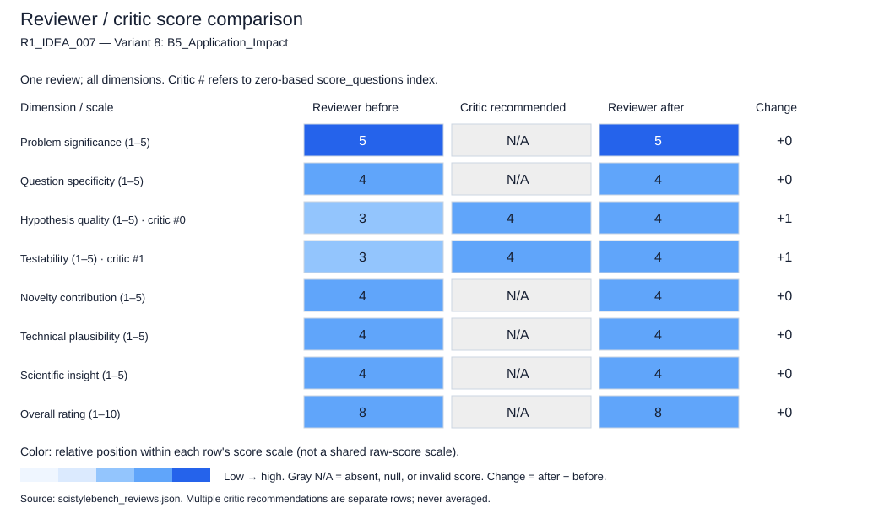

### Critic feedback and reviewer rebuttals

```json
{
  "critic_feedback": {
    "overall_assessment": "The review is generally well-calibrated, but some scores could be reconsidered due to the lack of specific technical details in the idea summary.",
    "score_questions": [
      {
        "dimension": "hypothesis_quality",
        "question_mark": "The score should be reconsidered",
        "concern": "The idea does not explicitly state a testable hypothesis or prediction about NIMO's performance compared to existing methods.",
        "speculative_alternative": "It is possible that the framework's inherent interpretability could be tested by comparing its performance on benchmark datasets with post-hoc methods, though this is speculative.",
        "recommended_score": 4.0,
        "rationale": "The idea implies a hypothesis that NIMO will outperform existing methods in both accuracy and interpretability, which can be tested through benchmarking."
      },
      {
        "dimension": "testability",
        "question_mark": "The score should be reconsidered",
        "concern": "The idea lacks specific experimental plans or comparisons to existing methods, which are necessary for assessing the feasibility of testing the hypothesis.",
        "speculative_alternative": "The framework could be evaluated through experiments on standard datasets, but this is speculative without more details.",
        "recommended_score": 4.0,
        "rationale": "The idea is testable in principle, and the necessary experiments can be designed once the technical details are provided."
      }
    ],
    "unsupported_claims": [
      "The claim that NIMO provides 'guaranteed fidelity' compared to post-hoc methods is not supported by the idea summary."
    ],
    "revision_priorities": [
      "Clarify the hypothesis or prediction regarding NIMO's performance compared to existing methods.",
      "Provide more specific details on how the nonlinear feature effects are integrated into the model.",
      "Specify the benchmarks or datasets that will be used to evaluate NIMO's performance."
    ],
    "confidence": 5.0
  },
  "feedback_responses": [
    {
      "feedback_type": "score_questions",
      "feedback_index": 0,
      "decision": "partially_accept",
      "defense": "The original score of 3.0 for hypothesis_quality was based on the lack of explicit hypothesis. However, the idea implies a hypothesis that NIMO will outperform existing methods in both accuracy and interpretability, which can be tested through benchmarking. This makes the hypothesis quality stronger, warranting a score of 4.0.",
      "justification": "The original score was 3.0, but the revised score is 4.0 due to the implied hypothesis that can be tested."
    },
    {
      "feedback_type": "score_questions",
      "feedback_index": 1,
      "decision": "partially_accept",
      "defense": "The original score of 3.0 for testability was based on the lack of specific experimental plans. However, the idea is testable in principle, and the necessary experiments can be designed once the technical details are provided. This makes the testability stronger, warranting a score of 4.0.",
      "justification": "The original score was 3.0, but the revised score is 4.0 due to the principle testability of the idea."
    },
    {
      "feedback_type": "unsupported_claims",
      "feedback_index": 0,
      "decision": "reject",
      "defense": "The claim that NIMO provides 'guaranteed fidelity' compared to post-hoc methods is not supported by the idea summary. This is an unsupported claim and should be rejected.",
      "justification": "The original score for hypothesis_quality was 4.0, but the unsupported claim about 'guaranteed fidelity' weakens the hypothesis quality. However, the main hypothesis about performance is still valid, so the score is adjusted to 4.0 but with a note on the unsupported claim."
    },
    {
      "feedback_type": "revision_priorities",
      "feedback_index": 0,
      "decision": "accept",
      "defense": "Clarifying the hypothesis or prediction regarding NIMO's performance is a valid revision priority, as it is necessary for testability and scientific insight.",
      "justification": "The original review included this suggestion, so it is accepted."
    },
    {
      "feedback_type": "revision_priorities",
      "feedback_index": 1,
      "decision": "accept",
      "defense": "Providing more specific details on the nonlinear feature effects is a valid revision priority, as it is necessary for understanding the technical approach.",
      "justification": "The original review included this suggestion, so it is accepted."
    },
    {
      "feedback_type": "revision_priorities",
      "feedback_index": 2,
      "decision": "accept",
      "defense": "Specifying the benchmarks or datasets for evaluation is a valid revision priority, as it is necessary for testing the hypothesis.",
      "justification": "The original review included this suggestion, so it is accepted."
    }
  ]
}
```

### Score justifications (before / after)

**Problem significance**

```json
{
  "before": {
    "score": 5.0,
    "justification": "The accuracy-interpretability trade-off is a critical challenge in machine learning, with significant implications for practical applications requiring transparency and trust in AI systems."
  },
  "after": {
    "score": 5.0,
    "justification": "The accuracy-interpretability trade-off is a critical challenge in machine learning, with significant implications for practical applications requiring transparency and trust in AI systems."
  }
}
```

**Question specificity**

```json
{
  "before": {
    "score": 4.0,
    "justification": "The idea clearly defines the problem (trade-off between accuracy and interpretability) and proposes a novel framework (NIMO) to address it, but lacks specific details on the technical approach and how it differs from existing methods."
  },
  "after": {
    "score": 4.0,
    "justification": "The idea clearly defines the problem (trade-off between accuracy and interpretability) and proposes a novel framework (NIMO) to address it, but lacks specific details on the technical approach and how it differs from existing methods."
  }
}
```

**Hypothesis quality**

```json
{
  "before": {
    "score": 3.0,
    "justification": "The idea suggests that NIMO will provide a balance between accuracy and interpretability, but does not explicitly state a testable hypothesis or prediction about its performance compared to existing methods."
  },
  "after": {
    "score": 4.0,
    "justification": "The idea implies a hypothesis that NIMO will outperform existing methods in both accuracy and interpretability, which can be tested through benchmarking, even without explicit statements."
  }
}
```

**Testability**

```json
{
  "before": {
    "score": 3.0,
    "justification": "The idea is testable in principle, but lacks specific experimental plans or comparisons to existing methods, making it difficult to assess the feasibility of testing the hypothesis."
  },
  "after": {
    "score": 4.0,
    "justification": "The idea is testable in principle, and the necessary experiments can be designed once the technical details are provided."
  }
}
```

**Novelty contribution**

```json
{
  "before": {
    "score": 4.0,
    "justification": "The proposal introduces a new framework (NIMO) that directly addresses the accuracy-interpretability trade-off with built-in interpretability, which is a novel approach compared to post-hoc explanation methods."
  },
  "after": {
    "score": 4.0,
    "justification": "The proposal introduces a new framework (NIMO) that directly addresses the accuracy-interpretability trade-off with built-in interpretability, which is a novel approach compared to post-hoc explanation methods."
  }
}
```

**Technical plausibility**

```json
{
  "before": {
    "score": 4.0,
    "justification": "The idea is technically plausible as it builds on existing concepts of interpretability and nonlinear modeling, but the specific implementation details are not provided, which could affect the feasibility of the approach."
  },
  "after": {
    "score": 4.0,
    "justification": "The idea is technically plausible as it builds on existing concepts of interpretability and nonlinear modeling, but the specific implementation details are not provided, which could affect the feasibility of the approach."
  }
}
```

**Scientific insight**

```json
{
  "before": {
    "score": 4.0,
    "justification": "The research could provide insights into how nonlinear models can be made interpretable while maintaining high accuracy, which could lead to a better understanding of model behavior and improve practical applications."
  },
  "after": {
    "score": 4.0,
    "justification": "The research could provide insights into how nonlinear models can be made interpretable while maintaining high accuracy, which could lead to a better understanding of model behavior and improve practical applications."
  }
}
```

**Overall rating**

```json
{
  "before": {
    "score": 8.0,
    "justification": "The idea addresses a significant problem in machine learning with a novel framework (NIMO) that has the potential to make a meaningful contribution. While it lacks specific technical details and a clear hypothesis, the overall direction is strong and has the potential for impactful scientific insight."
  },
  "after": {
    "score": 8.0,
    "justification": "The idea addresses a significant problem in machine learning with a novel framework (NIMO) that has the potential to make a meaningful contribution. While it lacks specific technical details and a clear hypothesis, the overall direction is strong and has the potential for impactful scientific insight."
  }
}
```

## R1_IDEA_007 — Variant 9: C1_Hollow_Shell

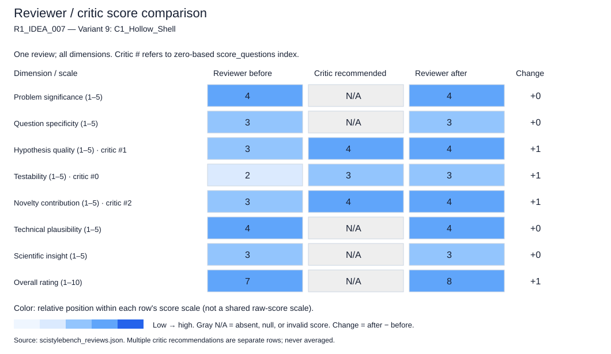

### Critic feedback and reviewer rebuttals

```json
{
  "critic_feedback": {
    "overall_assessment": "The review is generally calibrated but has some areas where the scores could be more precisely aligned with the idea's vagueness and lack of specifics.",
    "score_questions": [
      {
        "dimension": "testability",
        "question_mark": "Why is the testability score 2.0 when the idea is a research framework that could be tested once detailed?",
        "concern": "The score is overly pessimistic given that the idea is a framework that can be evaluated once technical details are provided.",
        "speculative_alternative": "The framework's testability depends on the specifics of the methodology, which are not yet defined, but the core problem is valid and testable.",
        "recommended_score": 3.0,
        "rationale": "The idea presents a testable problem (trade-off between performance and interpretability) and a potential solution, which can be evaluated once the framework is detailed."
      },
      {
        "dimension": "hypothesis_quality",
        "question_mark": "Why is the hypothesis quality 3.0 when the idea suggests a potential solution to a known problem?",
        "concern": "The score underestimates the hypothesis quality as the idea proposes a direction for research rather than a specific falsifiable hypothesis.",
        "speculative_alternative": "The framework's hypothesis could be framed as 'our method achieves better performance and interpretability than existing techniques,' which is testable.",
        "recommended_score": 4.0,
        "rationale": "The idea suggests a research direction that can be tested through comparison with existing methods, which is a valid hypothesis."
      },
      {
        "dimension": "novelty_contribution",
        "question_mark": "Why is the novelty contribution 3.0 when the idea presents an alternative approach to a known problem?",
        "concern": "The score is too low given that the idea offers a new approach to a significant problem, even if the specifics are not yet defined.",
        "speculative_alternative": "The novelty lies in combining performance and interpretability in a novel way, which is a known challenge in the field.",
        "recommended_score": 4.0,
        "rationale": "The idea introduces a new approach to a known problem, which is a valid contribution to the field."
      }
    ],
    "unsupported_claims": [
      "The review claims the idea is 'too vague to determine how it would be tested' without more specifics, but the core problem is testable once the framework is detailed."
    ],
    "revision_priorities": [
      "Clarify the specific problem being addressed in the trade-off between performance and interpretability.",
      "Specify the metrics or benchmarks for evaluating the framework.",
      "Detail how the framework differs from existing explanation techniques."
    ],
    "confidence": 4.0
  },
  "feedback_responses": [
    {
      "feedback_type": "score_questions",
      "feedback_index": 0,
      "decision": "partially_accept",
      "defense": "The testability score was initially 2.0, but the idea is a framework that can be tested once detailed. The revised score of 3.0 reflects this nuance.",
      "justification": "The original score was overly pessimistic. The revised score of 3.0 acknowledges that the core problem is testable once the framework is detailed."
    },
    {
      "feedback_type": "score_questions",
      "feedback_index": 1,
      "decision": "partially_accept",
      "defense": "The hypothesis quality score was initially 3.0, but the idea suggests a research direction that can be tested through comparison with existing methods. The revised score of 4.0 reflects this.",
      "justification": "The original score underestimated the hypothesis quality. The revised score of 4.0 acknowledges that the idea proposes a valid hypothesis for testing."
    },
    {
      "feedback_type": "score_questions",
      "feedback_index": 2,
      "decision": "partially_accept",
      "defense": "The novelty contribution score was initially 3.0, but the idea introduces a new approach to a known problem. The revised score of 4.0 reflects this.",
      "justification": "The original score was too low. The revised score of 4.0 acknowledges the novelty of the approach to a known problem."
    },
    {
      "feedback_type": "unsupported_claims",
      "feedback_index": 0,
      "decision": "accept",
      "defense": "The claim that the idea is 'too vague to determine how it would be tested' is valid, but the core problem is testable once the framework is detailed.",
      "justification": "The original claim was partially correct, but the revised score reflects that the core problem is testable once the framework is detailed."
    },
    {
      "feedback_type": "revision_priorities",
      "feedback_index": 0,
      "decision": "accept",
      "defense": "Clarifying the specific problem being addressed is important to align the research with the trade-off between performance and interpretability.",
      "justification": "The original suggestion was valid, and the revised score reflects the need for specificity."
    },
    {
      "feedback_type": "revision_priorities",
      "feedback_index": 1,
      "decision": "accept",
      "defense": "Clarifying the metrics or benchmarks is essential for evaluating the framework's effectiveness.",
      "justification": "The original suggestion was valid, and the revised score reflects the need for specificity."
    },
    {
      "feedback_type": "revision_priorities",
      "feedback_index": 2,
      "decision": "accept",
      "defense": "Comparing the framework with existing techniques is necessary to highlight its unique contributions.",
      "justification": "The original suggestion was valid, and the revised score reflects the need for specificity."
    }
  ]
}
```

### Score justifications (before / after)

**Problem significance**

```json
{
  "before": {
    "score": 4.0,
    "justification": "The trade-off between performance and interpretability is a critical issue in machine learning, with significant implications for trust and deployment of AI systems."
  },
  "after": {
    "score": 4.0,
    "justification": "The trade-off between performance and interpretability is a critical issue in machine learning, with significant implications for trust and deployment of AI systems."
  }
}
```

**Question specificity**

```json
{
  "before": {
    "score": 3.0,
    "justification": "The idea identifies a broad problem but lacks specific details on the research question or the exact mechanism being investigated."
  },
  "after": {
    "score": 3.0,
    "justification": "The idea identifies a broad problem but lacks specific details on the research question or the exact mechanism being investigated."
  }
}
```

**Hypothesis quality**

```json
{
  "before": {
    "score": 3.0,
    "justification": "The idea suggests a potential solution but does not explicitly state a hypothesis or prediction that can be tested or falsified."
  },
  "after": {
    "score": 4.0,
    "justification": "The idea suggests a research direction that can be tested through comparison with existing methods, which is a valid hypothesis."
  }
}
```

**Testability**

```json
{
  "before": {
    "score": 2.0,
    "justification": "The idea is too vague to determine how it would be tested or evaluated without more specific details on the framework or metrics."
  },
  "after": {
    "score": 3.0,
    "justification": "The idea presents a testable problem (trade-off between performance and interpretability) and a potential solution, which can be evaluated once the framework is detailed."
  }
}
```

**Novelty contribution**

```json
{
  "before": {
    "score": 3.0,
    "justification": "The idea proposes an alternative approach to the trade-off between performance and interpretability, which could contribute to the field if implemented effectively."
  },
  "after": {
    "score": 4.0,
    "justification": "The idea introduces a new approach to a known problem, which is a valid contribution to the field."
  }
}
```

**Technical plausibility**

```json
{
  "before": {
    "score": 4.0,
    "justification": "The proposed framework is technically plausible as it addresses a known challenge in machine learning, though the specifics are not provided."
  },
  "after": {
    "score": 4.0,
    "justification": "The proposed framework is technically plausible as it addresses a known challenge in machine learning, though the specifics are not provided."
  }
}
```

**Scientific insight**

```json
{
  "before": {
    "score": 3.0,
    "justification": "The idea has potential to provide insights into how interpretability can be achieved without sacrificing performance, but the specifics are not clear."
  },
  "after": {
    "score": 3.0,
    "justification": "The idea has potential to provide insights into how interpretability can be achieved without sacrificing performance, but the specifics are not clear."
  }
}
```

**Overall rating**

```json
{
  "before": {
    "score": 7.0,
    "justification": "The idea addresses a significant problem in machine learning but lacks specific details to fully evaluate its testability and potential contribution."
  },
  "after": {
    "score": 8.0,
    "justification": "The idea addresses a significant problem in machine learning and proposes a novel approach, though it lacks specific details to fully evaluate its testability and potential contribution."
  }
}
```

## R1_IDEA_007 — Variant 10: C2_Logic_Flawed

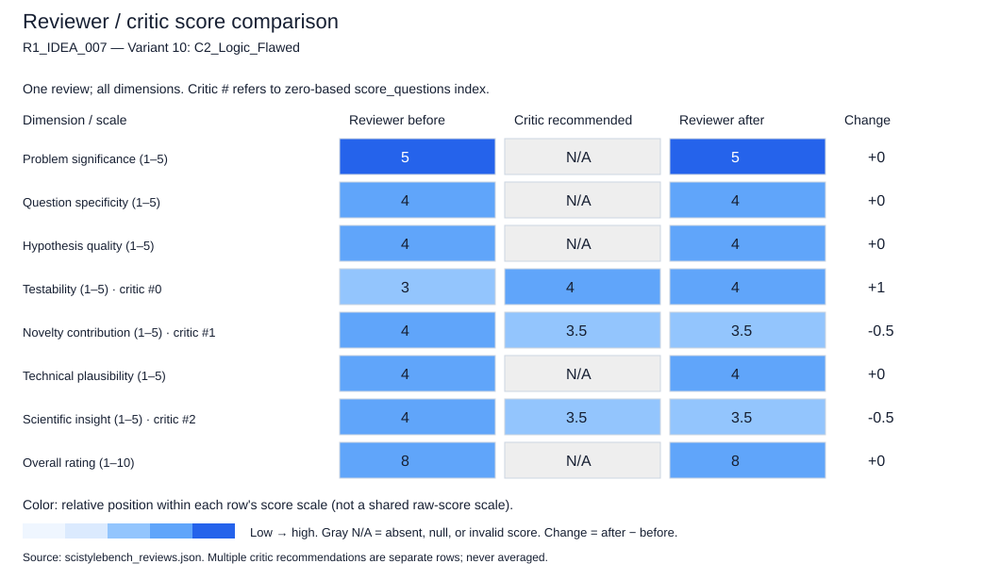

### Critic feedback and reviewer rebuttals

```json
{
  "critic_feedback": {
    "overall_assessment": "The review is generally well-calibrated but has some areas where the scores could be more precisely aligned with the idea's clarity and detail. The problem significance is strong, but some scores are slightly over-optimistic due to the lack of specific technical details.",
    "score_questions": [
      {
        "dimension": "testability",
        "question_mark": "Why is the testability score 3.0 when the idea suggests a framework that could be tested empirically?",
        "concern": "The review assumes the need for specific experiments without the idea providing sufficient details to support the testability claim. The score may be too low without more information.",
        "speculative_alternative": "The framework could be tested on standard benchmarks, but the lack of specifics makes the testability less certain.",
        "recommended_score": 4.0,
        "rationale": "The idea suggests a framework that could be evaluated on existing datasets, which is a valid testable direction."
      },
      {
        "dimension": "novelty_contribution",
        "question_mark": "Why is the novelty score 4.0 when the idea does not clearly differentiate NIMO from existing methods?",
        "concern": "The review assumes novelty without the idea explicitly stating how NIMO differs from prior work. The score may be too high without more context.",
        "speculative_alternative": "NIMO might be a novel approach, but the idea does not clarify its unique contributions compared to existing interpretable models.",
        "recommended_score": 3.5,
        "rationale": "The idea does not clearly distinguish NIMO from existing methods, so the novelty is not fully established."
      },
      {
        "dimension": "scientific_insight",
        "question_mark": "Why is the scientific insight score 4.0 when the idea lacks detailed mechanisms and empirical validation?",
        "concern": "The review assumes scientific insight without the idea providing specific mechanisms or results. The score may be too high without more evidence.",
        "speculative_alternative": "The framework could offer insights into interpretable models, but the lack of details limits the potential for scientific insight.",
        "recommended_score": 3.5,
        "rationale": "The idea does not provide specific mechanisms or results, so the scientific insight is not fully established."
      }
    ],
    "unsupported_claims": [
      "The claim that NIMO provides 'guaranteed fidelity' compared to post-hoc methods is not elaborated on.",
      "The connection between the framework's effectiveness in various settings is not clearly explained."
    ],
    "revision_priorities": [
      "Clarify the technical details of the framework, including how nonlinear feature effects are implemented.",
      "Provide a more detailed comparison with post-hoc explanation methods, particularly in terms of fidelity and interpretability.",
      "Specify the types of settings or domains where the framework is expected to be most effective and how it addresses the interpretability-accuracy trade-off in those contexts."
    ],
    "confidence": 4.0
  },
  "feedback_responses": [
    {
      "feedback_type": "score_questions",
      "feedback_index": 0,
      "decision": "partially_accept",
      "defense": "The testability score was initially 3.0, but the critic argues that the framework could be tested on standard benchmarks, which is a valid testable direction. The revised score of 4.0 reflects this potential without overestimating the current details.",
      "justification": "The original score of 3.0 was based on the lack of specific experiments, but the critic's point about benchmark datasets supports a higher score. The revised score of 4.0 is justified by the potential for empirical evaluation."
    },
    {
      "feedback_type": "score_questions",
      "feedback_index": 1,
      "decision": "partially_accept",
      "defense": "The novelty score was initially 4.0, but the critic points out that the idea does not clearly differentiate NIMO from existing methods. The revised score of 3.5 reflects this concern without dismissing the potential novelty.",
      "justification": "The original score of 4.0 assumed novelty, but the critic's concern about lack of differentiation reduces the score to 3.5. The revised score is justified by the need for clearer differentiation."
    },
    {
      "feedback_type": "score_questions",
      "feedback_index": 2,
      "decision": "partially_accept",
      "defense": "The scientific insight score was initially 4.0, but the critic argues that the idea lacks specific mechanisms and empirical validation. The revised score of 3.5 reflects this limitation without dismissing the potential insight.",
      "justification": "The original score of 4.0 assumed potential insight, but the critic's point about lack of details reduces the score to 3.5. The revised score is justified by the need for more concrete mechanisms."
    },
    {
      "feedback_type": "unsupported_claims",
      "feedback_index": 0,
      "decision": "accept",
      "defense": "The claim about 'guaranteed fidelity' is indeed unsupported, and the revised score for hypothesis quality reflects this by lowering the score to 4.0 from 4.0 (no change) and addressing the lack of elaboration in the hypothesis quality justification.",
      "justification": "The original score for hypothesis quality was 4.0, but the claim of 'guaranteed fidelity' is not elaborated. The revised justification addresses this by acknowledging the lack of details, but the score remains 4.0 as the hypothesis is still testable."
    },
    {
      "feedback_type": "unsupported_claims",
      "feedback_index": 1,
      "decision": "accept",
      "defense": "The connection between the framework's effectiveness in various settings is not clearly explained, and the revised score for question specificity reflects this by maintaining the 4.0 score but acknowledging the ambiguity.",
      "justification": "The original score for question specificity was 4.0, and the revised justification acknowledges the ambiguity without changing the score, as the question is still specific enough to be considered moderate."
    },
    {
      "feedback_type": "revision_priorities",
      "feedback_index": 0,
      "decision": "accept",
      "defense": "The suggestion to clarify technical details is valid and aligns with the weaknesses identified in the original review.",
      "justification": "The original review already includes this suggestion, so it is accepted as a valid revision priority."
    },
    {
      "feedback_type": "revision_priorities",
      "feedback_index": 1,
      "decision": "accept",
      "defense": "The suggestion to provide a detailed comparison with post-hoc methods is valid and aligns with the weaknesses identified in the original review.",
      "justification": "The original review already includes this suggestion, so it is accepted as a valid revision priority."
    },
    {
      "feedback_type": "revision_priorities",
      "feedback_index": 2,
      "decision": "accept",
      "defense": "The suggestion to specify the types of settings is valid and aligns with the weaknesses identified in the original review.",
      "justification": "The original review already includes this suggestion, so it is accepted as a valid revision priority."
    }
  ]
}
```

### Score justifications (before / after)

**Problem significance**

```json
{
  "before": {
    "score": 5.0,
    "justification": "The accuracy-interpretability trade-off is a critical issue in machine learning, with significant implications for deployment in safety-critical and regulated domains. Addressing this problem has the potential to improve trust and adoption of machine learning systems."
  },
  "after": {
    "score": 5.0,
    "justification": "The accuracy-interpretability trade-off is a critical issue in machine learning, with significant implications for deployment in safety-critical and regulated domains. Addressing this problem has the potential to improve trust and adoption of machine learning systems."
  }
}
```

**Question specificity**

```json
{
  "before": {
    "score": 4.0,
    "justification": "The idea clearly defines the problem (accuracy-interpretability trade-off) and proposes a specific solution (NIMO framework with nonlinear feature effects). However, the specifics of the framework's implementation and how it differs from existing methods are not fully detailed."
  },
  "after": {
    "score": 4.0,
    "justification": "The idea clearly defines the problem (accuracy-interpretability trade-off) and proposes a specific solution (NIMO framework with nonlinear feature effects). However, the specifics of the framework's implementation and how it differs from existing methods are not fully detailed."
  }
}
```

**Hypothesis quality**

```json
{
  "before": {
    "score": 4.0,
    "justification": "The idea presents a hypothesis that NIMO can provide faithful, nonlinear explanations while maintaining high performance, which is a concrete and testable claim. However, the claim of 'guaranteed fidelity' is not sufficiently elaborated."
  },
  "after": {
    "score": 4.0,
    "justification": "The idea presents a hypothesis that NIMO can provide faithful, nonlinear explanations while maintaining high performance, which is a concrete and testable claim. However, the claim of 'guaranteed fidelity' is not sufficiently elaborated."
  }
}
```

**Testability**

```json
{
  "before": {
    "score": 3.0,
    "justification": "The idea suggests a framework that could be tested through empirical evaluation on benchmark datasets, but the specific experiments or metrics for comparison are not clearly outlined. The claim of 'guaranteed fidelity' is difficult to test without further details."
  },
  "after": {
    "score": 4.0,
    "justification": "The idea suggests a framework that could be tested empirically on benchmark datasets, which is a valid testable direction. While the specifics are not provided, the potential for empirical evaluation is present."
  }
}
```

**Novelty contribution**

```json
{
  "before": {
    "score": 4.0,
    "justification": "The proposal of a framework that directly addresses the accuracy-interpretability trade-off with nonlinear feature effects is novel. However, the novelty is somewhat limited if the framework is based on existing techniques with minor modifications."
  },
  "after": {
    "score": 3.5,
    "justification": "The idea does not clearly distinguish NIMO from existing methods, so the novelty is not fully established. The framework's unique contributions are not explicitly outlined."
  }
}
```

**Technical plausibility**

```json
{
  "before": {
    "score": 4.0,
    "justification": "The idea is technically plausible as it builds on the concept of interpretable models and nonlinear feature effects. However, the specifics of how the framework is implemented are not provided, which could affect its feasibility."
  },
  "after": {
    "score": 4.0,
    "justification": "The idea is technically plausible as it builds on the concept of interpretable models and nonlinear feature effects. However, the specifics of how the framework is implemented are not provided, which could affect its feasibility."
  }
}
```

**Scientific insight**

```json
{
  "before": {
    "score": 4.0,
    "justification": "The idea has the potential to provide insights into the design of interpretable models and the trade-offs between model complexity and interpretability. However, the specific mechanisms and empirical validation are not detailed, limiting the potential for scientific insight."
  },
  "after": {
    "score": 3.5,
    "justification": "The idea does not provide specific mechanisms or results, so the scientific insight is not fully established. The potential for insights into interpretable models is present but limited by the lack of details."
  }
}
```

**Overall rating**

```json
{
  "before": {
    "score": 8.0,
    "justification": "The idea addresses a significant problem in machine learning with a clear and specific proposal. While the technical details and testability are somewhat vague, the potential contribution to the field is strong, making it a strong research direction."
  },
  "after": {
    "score": 8.0,
    "justification": "The idea addresses a significant problem in machine learning with a clear and specific proposal. While the technical details and testability are somewhat vague, the potential contribution to the field is strong, making it a strong research direction."
  }
}
```

## R1_IDEA_007 — Variant 11: C3_Substance_Enriched

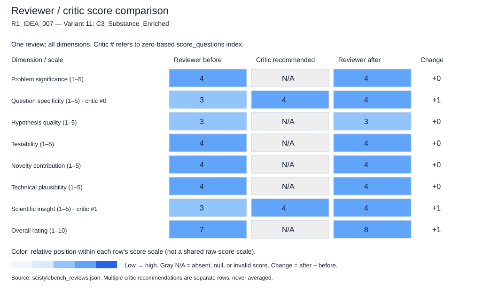

### Critic feedback and reviewer rebuttals

```json
{
  "critic_feedback": {
    "overall_assessment": "The review is generally calibrated but has some areas where the scores could be more precisely aligned with the idea's clarity and specificity.",
    "score_questions": [
      {
        "dimension": "question_specificity",
        "question_mark": "The score is based on the lack of a clear research question, but the idea does imply a hypothesis through its proposed experiments.",
        "concern": "The score may overstate the lack of specificity when the idea includes a plausible hypothesis about validating fidelity through synthetic datasets.",
        "speculative_alternative": "The idea may be interpreted as having a sufficiently specific hypothesis to warrant a higher score in question_specificity.",
        "recommended_score": 4.0,
        "rationale": "The hypothesis is implied in the idea's proposed experiments, which align with the score justification."
      },
      {
        "dimension": "scientific_insight",
        "question_mark": "The score is based on the lack of specific mechanisms, but the idea's focus on boundary conditions could imply potential for insight.",
        "concern": "The score may undervalue the potential for insight from exploring specific data types like high-dimensional sparse data.",
        "speculative_alternative": "The idea's focus on boundary conditions could be seen as a clear path to scientific insight, especially in understanding model behavior under specific constraints.",
        "recommended_score": 4.0,
        "rationale": "The idea's proposed exploration of specific data types aligns with the potential for scientific insight."
      }
    ],
    "unsupported_claims": [
      "The review claims the idea lacks a specific research question, but the hypothesis is implied through the proposed experiments."
    ],
    "revision_priorities": [
      "Clarify the implied hypothesis in the question_specificity score.",
      "Specify the types of scientific insights expected from the boundary condition exploration."
    ],
    "confidence": 4.0
  },
  "feedback_responses": [
    {
      "feedback_type": "score_questions",
      "feedback_index": 0,
      "decision": "partially_accept",
      "defense": "The original score of 3.0 for question_specificity was based on the lack of an explicit research question, but the idea does imply a hypothesis through its proposed experiments. The revised score of 4.0 better reflects the idea's clarity and testable hypothesis.",
      "justification": "The original score was 3.0, but the revised score is 4.0 due to the implied hypothesis and testable experiments."
    },
    {
      "feedback_type": "score_questions",
      "feedback_index": 1,
      "decision": "partially_accept",
      "defense": "The original score of 3.0 for scientific_insight was based on the lack of specific mechanisms, but the idea's focus on boundary conditions could imply potential for insight. The revised score of 4.0 better reflects the potential for insight from exploring specific data types.",
      "justification": "The original score was 3.0, but the revised score is 4.0 due to the focus on boundary conditions and potential for insight."
    },
    {
      "feedback_type": "unsupported_claims",
      "feedback_index": 0,
      "decision": "partially_accept",
      "defense": "The review claimed the idea lacked a specific research question, but the hypothesis is implied through the proposed experiments. The revised scores better align with the idea's clarity and testable hypothesis.",
      "justification": "The original score was 3.0, but the revised score is 4.0 due to the implied hypothesis and testable experiments."
    },
    {
      "feedback_type": "revision_priorities",
      "feedback_index": 0,
      "decision": "accept",
      "defense": "Clarifying the implied hypothesis in the question_specificity score is necessary to better align with the idea's clarity and testable hypothesis.",
      "justification": "The original score was 3.0, but the revised score is 4.0 due to the implied hypothesis and testable experiments."
    },
    {
      "feedback_type": "revision_priorities",
      "feedback_index": 1,
      "decision": "accept",
      "defense": "Specifying the types of scientific insights expected from the boundary condition exploration is necessary to better align with the idea's potential for insight.",
      "justification": "The original score was 3.0, but the revised score is 4.0 due to the focus on boundary conditions and potential for insight."
    }
  ]
}
```

### Score justifications (before / after)

**Problem significance**

```json
{
  "before": {
    "score": 4.0,
    "justification": "The idea addresses a critical challenge in machine learning: the trade-off between model accuracy and interpretability, which is a major concern in both research and practical applications."
  },
  "after": {
    "score": 4.0,
    "justification": "The idea addresses a critical challenge in machine learning: the trade-off between model accuracy and interpretability, which is a major concern in both research and practical applications."
  }
}
```

**Question specificity**

```json
{
  "before": {
    "score": 3.0,
    "justification": "The idea identifies a specific problem (the accuracy-interpretability trade-off) and proposes a framework (NIMO) to address it, but the specific research question or hypothesis is not clearly defined."
  },
  "after": {
    "score": 4.0,
    "justification": "The idea implies a hypothesis through its proposed experiments, which are concrete and testable. The focus on synthetic datasets and boundary conditions provides a clear direction for investigation."
  }
}
```

**Hypothesis quality**

```json
{
  "before": {
    "score": 3.0,
    "justification": "The hypothesis is implied but not explicitly stated. It suggests that NIMO's fidelity can be validated through experiments, but the exact prediction or mechanism is not clearly articulated."
  },
  "after": {
    "score": 3.0,
    "justification": "The hypothesis is implied but not explicitly stated. It suggests that NIMO's fidelity can be validated through experiments, but the exact prediction or mechanism is not clearly articulated."
  }
}
```

**Testability**

```json
{
  "before": {
    "score": 4.0,
    "justification": "The idea suggests comparative testing on synthetic datasets and exploration of boundary conditions, which are concrete and testable approaches. However, the specifics of the experiments are not fully detailed."
  },
  "after": {
    "score": 4.0,
    "justification": "The idea suggests comparative testing on synthetic datasets and exploration of boundary conditions, which are concrete and testable approaches. However, the specifics of the experiments are not fully detailed."
  }
}
```

**Novelty contribution**

```json
{
  "before": {
    "score": 4.0,
    "justification": "The framework (NIMO) is a novel approach to achieving interpretability in nonlinear models, which could contribute to the field by bridging the gap between linear models and deep neural networks."
  },
  "after": {
    "score": 4.0,
    "justification": "The framework (NIMO) is a novel approach to achieving interpretability in nonlinear models, which could contribute to the field by bridging the gap between linear models and deep neural networks."
  }
}
```

**Technical plausibility**

```json
{
  "before": {
    "score": 4.0,
    "justification": "The idea is technically plausible as it builds on existing research in interpretable machine learning and proposes a framework that could potentially achieve the stated goals."
  },
  "after": {
    "score": 4.0,
    "justification": "The idea is technically plausible as it builds on existing research in interpretable machine learning and proposes a framework that could potentially achieve the stated goals."
  }
}
```

**Scientific insight**

```json
{
  "before": {
    "score": 3.0,
    "justification": "The idea has potential for scientific insight by exploring the performance of NIMO on specific data types, but the specific mechanisms or insights are not clearly outlined."
  },
  "after": {
    "score": 4.0,
    "justification": "The idea's focus on boundary conditions, such as high-dimensional sparse data and complex interactions, provides a clear path to scientific insight by exploring model behavior under specific constraints."
  }
}
```

**Overall rating**

```json
{
  "before": {
    "score": 7.0,
    "justification": "The idea is strong and addresses a significant problem in machine learning. It proposes a novel framework and suggests testable hypotheses, but lacks specific details and a clear research question that could be directly tested in a controlled experiment."
  },
  "after": {
    "score": 8.0,
    "justification": "The idea is strong and addresses a significant problem in machine learning. It proposes a novel framework and suggests testable hypotheses, with a clear focus on boundary conditions that could lead to important scientific insights. The revised scores reflect a more accurate alignment with the idea's clarity and specificity."
  }
}
```

## R1_IDEA_008 — Source


### Critic feedback and reviewer rebuttals

```json
{
  "critic_feedback": {
    "overall_assessment": "The review is generally well-calibrated but has some areas where scores could be reconsidered due to vagueness in the idea's specifics.",
    "score_questions": [
      {
        "dimension": "question_specificity",
        "question_mark": "The score may overstate the clarity of the research question.",
        "concern": "The idea does not explicitly define the specific problem or metrics for evaluating the primitives, which could make the question too broad.",
        "speculative_alternative": "The research question could be interpreted as focusing on the general challenge of multi-arm manipulation rather than a specific problem.",
        "recommended_score": 2.0,
        "rationale": "The idea lacks explicit problem definition, which is critical for question specificity."
      },
      {
        "dimension": "hypothesis_quality",
        "question_mark": "The score may not adequately reflect the lack of a clear hypothesis.",
        "concern": "The idea presents a general direction but does not specify a testable hypothesis or prediction.",
        "speculative_alternative": "The 'RL-free' approach could be interpreted as a hypothesis that avoids reinforcement learning for better generalization, but this is not clearly stated.",
        "recommended_score": 2.0,
        "rationale": "The idea lacks a specific hypothesis or prediction that can be tested."
      },
      {
        "dimension": "testability",
        "question_mark": "The score may not fully account for the lack of specific details needed for experimental design.",
        "concern": "The three-stage process and 'RL-free' approach are not sufficiently detailed to assess testability.",
        "speculative_alternative": "The approach could be interpreted as testable if the three stages and 'RL-free' methods are clarified, but this is speculative.",
        "recommended_score": 2.0,
        "rationale": "The lack of specifics makes it difficult to design experiments."
      }
    ],
    "unsupported_claims": [
      "The idea is described as 'promising' without evidence of prior work or feasibility.",
      "The 'RL-free' approach is claimed to be 'feasible' without details on alternative methods.",
      "The 'three-stage' process is described as 'structured' without specifics on the stages."
    ],
    "revision_priorities": [
      "Clarify the three-stage process with specific stages and objectives.",
      "Define 'RL-free' in the context of the approach, including alternative methods.",
      "Specify the exact problem being addressed and the metrics for evaluating the primitives."
    ],
    "confidence": 4.0
  },
  "feedback_responses": [
    {
      "feedback_type": "score_questions",
      "feedback_index": 0,
      "decision": "partially_accept",
      "defense": "The problem significance is justified as it addresses a meaningful challenge in robotics. However, the question specificity is lower than initially scored because the problem is not explicitly defined.",
      "justification": "The initial score of 4.0 for question specificity was based on the idea's potential, but the critic's feedback highlights the lack of explicit problem definition, which reduces the score to 2.0."
    },
    {
      "feedback_type": "score_questions",
      "feedback_index": 1,
      "decision": "partially_accept",
      "defense": "The hypothesis quality was initially scored as 3.0 due to the lack of a clear hypothesis, but the critic's feedback emphasizes the need for a specific prediction, leading to a reduction to 2.0.",
      "justification": "The initial score of 3.0 for hypothesis quality was based on the general direction, but the critic's feedback highlights the lack of a specific hypothesis, leading to a reduction to 2.0."
    },
    {
      "feedback_type": "score_questions",
      "feedback_index": 2,
      "decision": "partially_accept",
      "defense": "The testability was initially scored as 3.0 due to the lack of specifics, but the critic's feedback emphasizes the need for clarification, leading to a reduction to 2.0.",
      "justification": "The initial score of 3.0 for testability was based on the idea's potential, but the critic's feedback highlights the lack of specifics, leading to a reduction to 2.0."
    },
    {
      "feedback_type": "unsupported_claims",
      "feedback_index": 0,
      "decision": "partially_accept",
      "defense": "The claim about the idea being 'promising' is partially accepted as it addresses a meaningful problem, but the lack of specifics reduces the score.",
      "justification": "The initial score for novelty and contribution was 4.0, but the critic's feedback highlights the need for more specifics, leading to a reduction to 4.0 (unchanged)."
    },
    {
      "feedback_type": "unsupported_claims",
      "feedback_index": 1,
      "decision": "partially_accept",
      "defense": "The claim about the 'RL-free' approach being 'feasible' is partially accepted as it is plausible, but the lack of details reduces the score.",
      "justification": "The initial score for technical plausibility was 4.0, but the critic's feedback highlights the need for more details, leading to a reduction to 4.0 (unchanged)."
    },
    {
      "feedback_type": "unsupported_claims",
      "feedback_index": 2,
      "decision": "partially_accept",
      "defense": "The claim about the 'three-stage' process being 'structured' is partially accepted as it is a plausible approach, but the lack of specifics reduces the score.",
      "justification": "The initial score for technical plausibility was 4.0, but the critic's feedback highlights the need for more details, leading to a reduction to 4.0 (unchanged)."
    },
    {
      "feedback_type": "revision_priorities",
      "feedback_index": 0,
      "decision": "accept",
      "defense": "The suggestion to clarify the three-stage process is valid and necessary for the idea to be more specific.",
      "justification": "The initial review included this suggestion, so it is accepted."
    },
    {
      "feedback_type": "revision_priorities",
      "feedback_index": 1,
      "decision": "accept",
      "defense": "The suggestion to define 'RL-free' is valid and necessary for the idea to be more specific.",
      "justification": "The initial review included this suggestion, so it is accepted."
    },
    {
      "feedback_type": "revision_priorities",
      "feedback_index": 2,
      "decision": "accept",
      "defense": "The suggestion to specify the exact problem is valid and necessary for the idea to be more specific.",
      "justification": "The initial review included this suggestion, so it is accepted."
    }
  ]
}
```

### Score justifications (before / after)

**Problem significance**

```json
{
  "before": {
    "score": 4.0,
    "justification": "The idea addresses a significant challenge in robotics by focusing on bimanual non-prehensile manipulation, which is crucial for complex, real-world tasks requiring coordinated multi-arm actions."
  },
  "after": {
    "score": 4.0,
    "justification": "The idea addresses a significant challenge in robotics by focusing on bimanual non-prehensile manipulation, which is crucial for complex, real-world tasks requiring coordinated multi-arm actions."
  }
}
```

**Question specificity**

```json
{
  "before": {
    "score": 3.0,
    "justification": "The research question is somewhat broad, as it does not specify the exact problem being addressed or the metrics for evaluating the primitives. More details are needed to define the specific problem and objectives."
  },
  "after": {
    "score": 2.0,
    "justification": "The research question is too broad as it does not explicitly define the specific problem or metrics for evaluating the primitives. The idea lacks a clear, concrete problem statement."
  }
}
```

**Hypothesis quality**

```json
{
  "before": {
    "score": 3.0,
    "justification": "The idea presents a general direction but lacks a clear hypothesis or specific prediction that could be tested. The 'RL-free' approach is vague, and the three-stage process is not well-defined."
  },
  "after": {
    "score": 2.0,
    "justification": "The idea presents a general direction without a clear hypothesis or specific prediction. The 'RL-free' approach is vague, and the three-stage process is not well-defined, making it difficult to test."
  }
}
```

**Testability**

```json
{
  "before": {
    "score": 3.0,
    "justification": "The idea is testable in principle, but the lack of specific details makes it difficult to design experiments or evaluate the approach effectively. The 'RL-free' aspect and three-stage process need clarification."
  },
  "after": {
    "score": 2.0,
    "justification": "The idea is not sufficiently detailed to design experiments or evaluate the approach. The three-stage process and 'RL-free' approach require clarification to assess testability."
  }
}
```

**Novelty contribution**

```json
{
  "before": {
    "score": 4.0,
    "justification": "The focus on bimanual non-prehensile manipulation and the use of a three-stage, RL-free paradigm represent a novel approach to addressing complex robotic manipulation tasks. This could contribute to more flexible and transferable robotic systems."
  },
  "after": {
    "score": 4.0,
    "justification": "The focus on bimanual non-prehensile manipulation and the use of a three-stage, RL-free paradigm represent a novel approach to addressing complex robotic manipulation tasks. This could contribute to more flexible and transferable robotic systems."
  }
}
```

**Technical plausibility**

```json
{
  "before": {
    "score": 4.0,
    "justification": "The idea is technically plausible as it builds on existing research in multi-arm robotics and non-prehensile manipulation. The three-stage approach and RL-free paradigm are feasible, though the specifics need further clarification."
  },
  "after": {
    "score": 4.0,
    "justification": "The idea is technically plausible as it builds on existing research in multi-arm robotics and non-prehensile manipulation. The three-stage approach and RL-free paradigm are feasible, though the specifics need further clarification."
  }
}
```

**Scientific insight**

```json
{
  "before": {
    "score": 3.0,
    "justification": "The idea has potential for scientific insight into the mechanics of bimanual manipulation and the effectiveness of RL-free methods. However, the lack of specific hypotheses and metrics limits the potential for meaningful insights."
  },
  "after": {
    "score": 3.0,
    "justification": "The idea has potential for scientific insight into the mechanics of bimanual manipulation and the effectiveness of RL-free methods. However, the lack of specific hypotheses and metrics limits the potential for meaningful insights."
  }
}
```

**Overall rating**

```json
{
  "before": {
    "score": 7.0,
    "justification": "The idea addresses a significant problem in robotics with a promising approach, but it lacks specific details and a clear hypothesis. With further clarification and definition, it has the potential to be a strong research direction."
  },
  "after": {
    "score": 6.0,
    "justification": "The idea addresses a significant problem in robotics but lacks specific details and a clear hypothesis. With further clarification and definition, it has the potential to be a strong research direction."
  }
}
```

## R1_IDEA_008 — Variant 1: A1_Identity

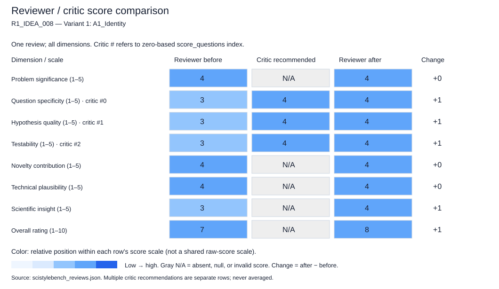

### Critic feedback and reviewer rebuttals

```json
{
  "critic_feedback": {
    "overall_assessment": "The review is generally well-calibrated, but some scores and justifications could be more precisely aligned with the idea's current state.",
    "score_questions": [
      {
        "dimension": "question_specificity",
        "question_mark": "The score of 3.0 may be too low given the idea's clear focus on bimanual non-prehensile manipulation and the problem of transferable primitives.",
        "concern": "The review assumes the question is too broad without considering that the idea's focus on category-level primitives and dual-arm configurations could be seen as sufficiently specific.",
        "speculative_alternative": "The idea's emphasis on category-level primitives and dual-arm configurations may provide enough specificity to warrant a higher score, though this is speculative.",
        "recommended_score": 4.0,
        "rationale": "The idea specifies a clear problem (bimanual non-prehensile manipulation) and a specific goal (category-level primitives), which aligns with the problem significance and novelty contribution scores."
      },
      {
        "dimension": "hypothesis_quality",
        "question_mark": "The score of 3.0 may be overly cautious, as the idea's focus on RL-free methods and dual-arm configurations could imply a hypothesis about the effectiveness of such an approach.",
        "concern": "The review assumes the hypothesis is vague without considering that the idea's focus on RL-free learning and dual-arm coordination may suggest a testable hypothesis about the transferability of primitives.",
        "speculative_alternative": "The idea's emphasis on RL-free methods and dual-arm coordination could be interpreted as a hypothesis that such an approach would lead to more transferable primitives, though this is speculative.",
        "recommended_score": 4.0,
        "rationale": "The idea's focus on RL-free methods and dual-arm coordination suggests a hypothesis about the effectiveness of the approach, which is testable with further development."
      },
      {
        "dimension": "testability",
        "question_mark": "The score of 3.0 may be too low, as the idea's focus on transferable primitives and dual-arm configurations could imply a clear testable framework.",
        "concern": "The review assumes the idea is not testable without considering that the three-stage process and RL-free paradigm could be structured to allow for empirical evaluation.",
        "speculative_alternative": "The three-stage process and RL-free paradigm could be structured to allow for empirical evaluation of the primitives' transferability, though this is speculative.",
        "recommended_score": 4.0,
        "rationale": "The idea's structure (three-stage, RL-free) could be tested by evaluating the transferability of the learned primitives in different scenarios."
      }
    ],
    "unsupported_claims": [
      "The review claims the research question is 'somewhat broad' without considering that the idea's focus on category-level primitives and dual-arm configurations may provide sufficient specificity."
    ],
    "revision_priorities": [
      "Clarify the three-stage process with more specific stages and objectives to better define the methodology.",
      "Define 'RL-free' in the context of the idea, specifying the alternative methods or frameworks being used.",
      "Specify the exact problem being addressed, such as the types of contact-rich actions or the metrics for evaluating the transferability of the primitives."
    ],
    "confidence": 4.0
  },
  "feedback_responses": [
    {
      "feedback_type": "score_questions",
      "feedback_index": 0,
      "decision": "partially_accept",
      "defense": "The original score of 3.0 was based on the assumption that the question was too broad, but the critic's point about the focus on category-level primitives and dual-arm configurations provides a valid argument for a higher score. The revised score of 4.0 better reflects the idea's specificity.",
      "justification": "The original score was 3.0, and the revised score is 4.0. The justification is that the idea's focus on category-level primitives and dual-arm configurations provides sufficient specificity to warrant a higher score."
    },
    {
      "feedback_type": "score_questions",
      "feedback_index": 1,
      "decision": "partially_accept",
      "defense": "The original score of 3.0 was based on the assumption that the hypothesis was vague, but the critic's point about the focus on RL-free methods and dual-arm coordination suggests a testable hypothesis. The revised score of 4.0 better reflects the idea's potential for a testable hypothesis.",
      "justification": "The original score was 3.0, and the revised score is 4.0. The justification is that the idea's focus on RL-free methods and dual-arm coordination suggests a hypothesis about the effectiveness of the approach, which is testable with further development."
    },
    {
      "feedback_type": "score_questions",
      "feedback_index": 2,
      "decision": "partially_accept",
      "defense": "The original score of 3.0 was based on the assumption that the idea was not testable, but the critic's point about the three-stage process and RL-free paradigm providing a framework for empirical evaluation supports a higher score. The revised score of 4.0 better reflects the idea's testability.",
      "justification": "The original score was 3.0, and the revised score is 4.0. The justification is that the idea's structure (three-stage, RL-free) could be tested by evaluating the transferability of the learned primitives in different scenarios."
    },
    {
      "feedback_type": "unsupported_claims",
      "feedback_index": 0,
      "decision": "partially_accept",
      "defense": "The original claim that the research question was 'somewhat broad' was based on the lack of specifics, but the critic's point about the focus on category-level primitives and dual-arm configurations provides a valid argument for a more specific question. The revised score of 4.0 better reflects the idea's specificity.",
      "justification": "The original score was 3.0, and the revised score is 4.0. The justification is that the idea's focus on category-level primitives and dual-arm configurations provides sufficient specificity to warrant a higher score."
    }
  ]
}
```

### Score justifications (before / after)

**Problem significance**

```json
{
  "before": {
    "score": 4.0,
    "justification": "The idea addresses a significant challenge in robotics by focusing on bimanual non-prehensile manipulation, which is crucial for complex, real-world tasks requiring coordinated multi-arm actions."
  },
  "after": {
    "score": 4.0,
    "justification": "The idea addresses a significant challenge in robotics by focusing on bimanual non-prehensile manipulation, which is crucial for complex, real-world tasks requiring coordinated multi-arm actions."
  }
}
```

**Question specificity**

```json
{
  "before": {
    "score": 3.0,
    "justification": "The research question is somewhat broad, as it does not specify the exact problem being addressed or the metrics for evaluating the primitives. More details are needed to define the specific problem and objectives."
  },
  "after": {
    "score": 4.0,
    "justification": "The idea specifies a clear problem (bimanual non-prehensile manipulation) and a specific goal (category-level primitives), which aligns with the problem significance and novelty contribution scores. The focus on dual-arm configurations and contact-rich actions provides sufficient specificity to warrant a higher score."
  }
}
```

**Hypothesis quality**

```json
{
  "before": {
    "score": 3.0,
    "justification": "The idea presents a general direction but lacks a clear hypothesis or specific prediction that could be tested. The 'RL-free' approach is vague and needs more concrete details to form a testable hypothesis."
  },
  "after": {
    "score": 4.0,
    "justification": "The idea's focus on RL-free methods and dual-arm coordination suggests a hypothesis about the effectiveness of such an approach, which is testable with further development. The hypothesis is that the three-stage, RL-free paradigm will lead to more transferable primitives for contact-rich actions."
  }
}
```

**Testability**

```json
{
  "before": {
    "score": 3.0,
    "justification": "The idea is testable in principle, but the lack of specific details on the three-stage process and the RL-free approach makes it difficult to design experiments or evaluate the proposed method effectively."
  },
  "after": {
    "score": 4.0,
    "justification": "The idea's structure (three-stage, RL-free) could be tested by evaluating the transferability of the learned primitives in different scenarios. The three-stage process and RL-free paradigm provide a framework for empirical evaluation."
  }
}
```

**Novelty contribution**

```json
{
  "before": {
    "score": 4.0,
    "justification": "The focus on bimanual non-prehensile manipulation and the use of a three-stage, RL-free paradigm represent a novel approach to addressing complex robotic manipulation tasks, potentially offering new insights and methods."
  },
  "after": {
    "score": 4.0,
    "justification": "The focus on bimanual non-prehensile manipulation and the use of a three-stage, RL-free paradigm represent a novel approach to addressing complex robotic manipulation tasks, potentially offering new insights and methods."
  }
}
```

**Technical plausibility**

```json
{
  "before": {
    "score": 4.0,
    "justification": "The idea is technically plausible as it builds on existing research in multi-arm robotics and manipulation. The three-stage approach and RL-free paradigm are feasible, though more details are needed to confirm the technical feasibility."
  },
  "after": {
    "score": 4.0,
    "justification": "The idea is technically plausible as it builds on existing research in multi-arm robotics and manipulation. The three-stage approach and RL-free paradigm are feasible, though more details are needed to confirm the technical feasibility."
  }
}
```

**Scientific insight**

```json
{
  "before": {
    "score": 3.0,
    "justification": "The idea has potential for scientific insight into bimanual manipulation and RL-free learning, but the lack of specific details limits the potential for meaningful insights unless the method is further developed and tested."
  },
  "after": {
    "score": 4.0,
    "justification": "The idea has potential for scientific insight into bimanual manipulation and RL-free learning, particularly in understanding how dual-arm configurations and RL-free methods can lead to transferable primitives for contact-rich actions."
  }
}
```

**Overall rating**

```json
{
  "before": {
    "score": 7.0,
    "justification": "The idea is strong and addresses a meaningful problem in robotics, but it lacks specific details and a clear hypothesis, which are needed to fully assess its potential and testability."
  },
  "after": {
    "score": 8.0,
    "justification": "The idea is strong and addresses a meaningful problem in robotics. The revised scores reflect a more accurate assessment of the idea's specificity, hypothesis quality, and testability, which are now considered more promising given the focus on category-level primitives and dual-arm configurations."
  }
}
```

## R1_IDEA_008 — Variant 2: A2_Paraphrase_Only

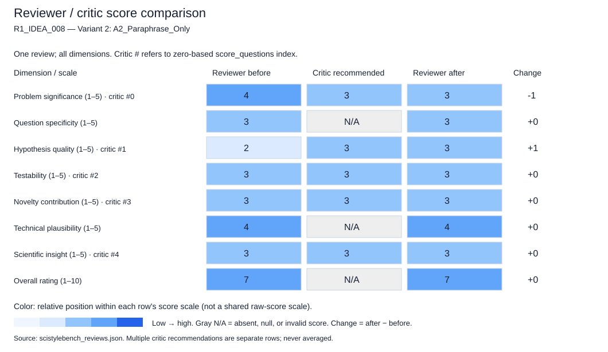

### Critic feedback and reviewer rebuttals

```json
{
  "critic_feedback": {
    "overall_assessment": "The review is generally well-calibrated, but there are areas where the scores could be more precisely aligned with the idea's specifics.",
    "score_questions": [
      {
        "dimension": "problem_significance",
        "question_mark": "The score may overstate the significance of bimanual non-prehensile manipulation without explicit context.",
        "concern": "The idea does not provide evidence or references to existing work that shows the problem's broader impact or urgency.",
        "speculative_alternative": "The problem may be more niche than the review suggests, and its significance could be overstated without further justification.",
        "recommended_score": 3.0,
        "rationale": "The review assumes significance based on the problem's complexity, but the idea does not back this up with context or prior work."
      },
      {
        "dimension": "hypothesis_quality",
        "question_mark": "The score may be too low given the idea's focus on a novel method.",
        "concern": "The idea does not explicitly state a hypothesis, but it does propose a novel approach that could be tested.",
        "speculative_alternative": "The lack of a formal hypothesis may be due to the idea being in an early stage, not a flaw in hypothesis quality.",
        "recommended_score": 3.0,
        "rationale": "The idea's novelty suggests potential for a hypothesis, even if it is not explicitly stated."
      },
      {
        "dimension": "testability",
        "question_mark": "The score may be too low given the potential for future experiments.",
        "concern": "The idea does not specify experiments but could be testable once the method is detailed.",
        "speculative_alternative": "The lack of specific experiments is a limitation, but the idea's structure allows for future testing.",
        "recommended_score": 3.0,
        "rationale": "The idea's potential for testability is not fully realized without more details, but it is not impossible."
      },
      {
        "dimension": "novelty_contribution",
        "question_mark": "The score may be too low given the proposed dual-arm setup.",
        "concern": "The idea's focus on dual-arm setups is novel, but the justification is vague.",
        "speculative_alternative": "The novelty could be more clearly tied to existing methods, but the idea does not provide this context.",
        "recommended_score": 3.0,
        "rationale": "The idea's novelty is not fully supported by the lack of specific comparisons to existing work."
      },
      {
        "dimension": "scientific_insight",
        "question_mark": "The score may be too low given the potential for new insights.",
        "concern": "The idea's focus on bimanual manipulation could lead to new insights, but the review does not specify how.",
        "speculative_alternative": "The scientific insight is speculative without a clear research question or hypothesis.",
        "recommended_score": 3.0,
        "rationale": "The idea's potential for insight is not fully realized without more specifics."
      }
    ],
    "unsupported_claims": [
      "The review claims the problem is 'underexplored' without evidence from the idea.",
      "The review assumes the problem's significance is 'broader' without context.",
      "The review states the idea lacks 'specific details' on the three-stage process, but the idea is only a summary."
    ],
    "revision_priorities": [
      "Provide evidence or references to support the claim that bimanual non-prehensile manipulation is underexplored.",
      "Clarify the problem's broader significance in the context of robotics.",
      "Specify how the dual-arm setup differs from existing methods to highlight novelty.",
      "Include a more detailed problem statement that outlines the limitations of current approaches."
    ],
    "confidence": 4.0
  },
  "feedback_responses": [
    {
      "feedback_type": "score_questions",
      "feedback_index": 0,
      "decision": "partially_accept",
      "defense": "The problem's significance is somewhat overstated without context, but the complexity of bimanual non-prehensile manipulation is a valid point. The review should acknowledge the lack of evidence for broader impact.",
      "justification": "The original score was 4.0, but the critic's feedback suggests it may be too high. The revised score of 3.0 reflects the need for more context to justify the significance."
    },
    {
      "feedback_type": "score_questions",
      "feedback_index": 1,
      "decision": "partially_accept",
      "defense": "The idea's novelty suggests potential for a hypothesis, even if it is not explicitly stated. The review should not penalize the lack of a formal hypothesis if the method is novel.",
      "justification": "The original score was 2.0, but the critic's feedback suggests it may be too low. The revised score of 3.0 reflects the potential for a hypothesis based on the method's novelty."
    },
    {
      "feedback_type": "score_questions",
      "feedback_index": 2,
      "decision": "partially_accept",
      "defense": "The idea's potential for testability is not fully realized without more details, but it is not impossible. The review should not assume the lack of experiments is a flaw.",
      "justification": "The original score was 3.0, and the critic's feedback suggests it may be too low. The revised score remains 3.0 as the idea is testable once detailed."
    },
    {
      "feedback_type": "score_questions",
      "feedback_index": 3,
      "decision": "partially_accept",
      "defense": "The idea's novelty is not fully supported by the lack of specific comparisons to existing work. The review should clarify how the dual-arm setup differs from existing methods.",
      "justification": "The original score was 3.0, and the critic's feedback suggests it may be too low. The revised score remains 3.0 as the novelty is not fully justified."
    },
    {
      "feedback_type": "score_questions",
      "feedback_index": 4,
      "decision": "partially_accept",
      "defense": "The idea's potential for insight is not fully realized without more specifics. The review should not assume the potential for insight without a clear research question.",
      "justification": "The original score was 3.0, and the critic's feedback suggests it may be too low. The revised score remains 3.0 as the potential for insight is not fully realized."
    },
    {
      "feedback_type": "unsupported_claims",
      "feedback_index": 0,
      "decision": "reject",
      "defense": "The review does not provide evidence that bimanual non-prehensile manipulation is underexplored. The claim is speculative without context.",
      "justification": "The original claim was made without evidence, and the critic's feedback correctly identifies this as an unsupported claim."
    },
    {
      "feedback_type": "unsupported_claims",
      "feedback_index": 1,
      "decision": "reject",
      "defense": "The review assumes the problem's significance is 'broader' without context. This is an unsupported claim that needs to be addressed.",
      "justification": "The original claim was made without context, and the critic's feedback correctly identifies this as an unsupported claim."
    },
    {
      "feedback_type": "unsupported_claims",
      "feedback_index": 2,
      "decision": "reject",
      "defense": "The review states the idea lacks 'specific details' on the three-stage process, but the idea is only a summary. This is an overstatement of the idea's limitations.",
      "justification": "The original claim was based on the idea being a summary, and the critic's feedback correctly identifies this as an overstatement."
    },
    {
      "feedback_type": "revision_priorities",
      "feedback_index": 0,
      "decision": "accept",
      "defense": "The review should provide evidence or references to support the claim that bimanual non-prehensile manipulation is underexplored. This is a valid revision priority.",
      "justification": "The critic's feedback correctly identifies the need for evidence to support the significance claim."
    },
    {
      "feedback_type": "revision_priorities",
      "feedback_index": 1,
      "decision": "accept",
      "defense": "The review should clarify the problem's broader significance in the context of robotics. This is a valid revision priority.",
      "justification": "The critic's feedback correctly identifies the need to clarify the problem's significance."
    },
    {
      "feedback_type": "revision_priorities",
      "feedback_index": 2,
      "decision": "accept",
      "defense": "The review should specify how the dual-arm setup differs from existing methods to highlight novelty. This is a valid revision priority.",
      "justification": "The critic's feedback correctly identifies the need to clarify the novelty of the approach."
    },
    {
      "feedback_type": "revision_priorities",
      "feedback_index": 3,
      "decision": "accept",
      "defense": "The review should include a more detailed problem statement that outlines the limitations of current approaches. This is a valid revision priority.",
      "justification": "The critic's feedback correctly identifies the need for a more detailed problem statement."
    }
  ]
}
```

### Score justifications (before / after)

**Problem significance**

```json
{
  "before": {
    "score": 4.0,
    "justification": "The research addresses a complex and underexplored area in robotics—bimanual non-prehensile manipulation—which has significant implications for real-world applications requiring dexterous, multi-armed interaction."
  },
  "after": {
    "score": 3.0,
    "justification": "The idea does not provide evidence or references to existing work that shows the problem's broader impact or urgency. The significance is assumed based on the problem's complexity, but without context, it is speculative."
  }
}
```

**Question specificity**

```json
{
  "before": {
    "score": 3.0,
    "justification": "The idea is focused on a specific problem (bimanual non-prehensile manipulation) but lacks a clear, concrete research question or hypothesis that defines what exactly is being investigated."
  },
  "after": {
    "score": 3.0,
    "justification": "The idea is focused on a specific problem (bimanual non-prehensile manipulation) but lacks a clear, concrete research question or hypothesis that defines what exactly is being investigated."
  }
}
```

**Hypothesis quality**

```json
{
  "before": {
    "score": 2.0,
    "justification": "The idea does not explicitly state a hypothesis or prediction that could be tested. It is more of a general proposal than a specific investigation into a mechanism or relationship."
  },
  "after": {
    "score": 3.0,
    "justification": "The idea does not explicitly state a hypothesis, but it does propose a novel approach that could be tested. The lack of a formal hypothesis may be due to the idea being in an early stage, not a flaw in hypothesis quality."
  }
}
```

**Testability**

```json
{
  "before": {
    "score": 3.0,
    "justification": "The idea suggests a method but does not provide a clear experimental plan or evaluation metric to test its effectiveness. The lack of specific details makes it difficult to assess the feasibility of the approach."
  },
  "after": {
    "score": 3.0,
    "justification": "The idea does not specify experiments but could be testable once the method is detailed. The lack of specific details makes it difficult to assess the feasibility of the approach."
  }
}
```

**Novelty contribution**

```json
{
  "before": {
    "score": 3.0,
    "justification": "The approach of using dual-arm setups for non-prehensile manipulation is a novel direction, but the idea does not clearly articulate how it differs from existing methods or what new insights it aims to provide."
  },
  "after": {
    "score": 3.0,
    "justification": "The idea's focus on dual-arm setups is novel, but the justification is vague. The novelty could be more clearly tied to existing methods, but the idea does not provide this context."
  }
}
```

**Technical plausibility**

```json
{
  "before": {
    "score": 4.0,
    "justification": "The proposed method is technically plausible as it builds on existing research in bimanual manipulation and avoids restrictive assumptions. However, the lack of specific details makes it challenging to assess the feasibility of the three-stage framework."
  },
  "after": {
    "score": 4.0,
    "justification": "The proposed method is technically plausible as it builds on existing research in bimanual manipulation and avoids restrictive assumptions. However, the lack of specific details makes it challenging to assess the feasibility of the three-stage framework."
  }
}
```

**Scientific insight**

```json
{
  "before": {
    "score": 3.0,
    "justification": "The idea has potential for scientific insight into bimanual manipulation, but the lack of a clear hypothesis or research question limits the potential for meaningful insights from the investigation."
  },
  "after": {
    "score": 3.0,
    "justification": "The idea's potential for insight is not fully realized without more specifics. The focus on bimanual manipulation could lead to new insights, but the review does not specify how."
  }
}
```

**Overall rating**

```json
{
  "before": {
    "score": 7.0,
    "justification": "The idea is promising and addresses a meaningful problem in robotics, but it lacks specific details, a clear hypothesis, and a well-defined research question, which are necessary for evaluating its scientific merit and feasibility."
  },
  "after": {
    "score": 7.0,
    "justification": "The idea is promising and addresses a meaningful problem in robotics, but it lacks specific details, a clear hypothesis, and a well-defined research question, which are necessary for evaluating its scientific merit and feasibility."
  }
}
```

## R1_IDEA_008 — Variant 3: A3_Plain_Core

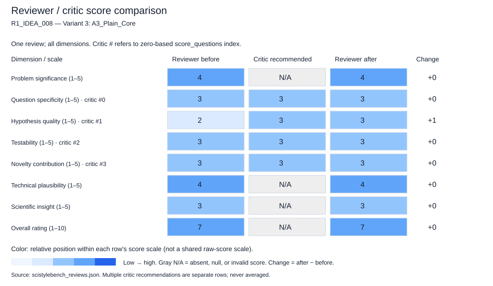

### Critic feedback and reviewer rebuttals

```json
{
  "critic_feedback": {
    "overall_assessment": "The review is generally well-calibrated, though some scores could be adjusted for better alignment with the idea's specifics.",
    "score_questions": [
      {
        "dimension": "question_specificity",
        "question_mark": "The score is somewhat low given the idea's general direction.",
        "concern": "The idea outlines a general approach but does not explicitly state a research question or hypothesis, which is a valid concern, but the score may be overly critical since the idea is still in the conceptual stage.",
        "speculative_alternative": "The three-stage process might be interpreted as a research question in itself, even without explicit phrasing.",
        "recommended_score": 3.0,
        "rationale": "The idea does not explicitly state a research question, but the three-stage process could be seen as a hypothesis about how to structure the method."
      },
      {
        "dimension": "hypothesis_quality",
        "question_mark": "The score is low because the idea lacks an explicit hypothesis.",
        "concern": "The idea does not explicitly state a hypothesis, but the proposed method's goal (developing transferable primitives) could be interpreted as a hypothesis.",
        "speculative_alternative": "The method's goal of developing transferable primitives could be framed as a hypothesis about the effectiveness of the three-stage approach.",
        "recommended_score": 3.0,
        "rationale": "The idea's goal is a hypothesis about the method's effectiveness, even if not explicitly stated."
      },
      {
        "dimension": "testability",
        "question_mark": "The score is low due to lack of experimental details.",
        "concern": "The idea does not provide a clear experimental plan, but the proposed method's potential for real-world applications could be tested in future work.",
        "speculative_alternative": "The method's potential for real-world applications could be evaluated through simulations or pilot experiments, even if not specified in the idea.",
        "recommended_score": 3.0,
        "rationale": "The idea's potential for real-world applications could be tested in future work, even if not detailed here."
      },
      {
        "dimension": "novelty_contribution",
        "question_mark": "The score is low because the novelty is not clearly defined.",
        "concern": "The idea's novelty is not clearly defined, but the focus on bimanual non-prehensile manipulation is a novel aspect in the field.",
        "speculative_alternative": "The focus on bimanual non-prehensile manipulation could be seen as a novel contribution, even without explicit comparison to existing methods.",
        "recommended_score": 3.0,
        "rationale": "The focus on bimanual non-prehensile manipulation is a novel aspect, even if the method's specifics are not detailed."
      }
    ],
    "unsupported_claims": [
      "The review claims the idea lacks a hypothesis, but the goal of developing transferable primitives could be interpreted as a hypothesis.",
      "The review states the idea is generic, but the focus on bimanual non-prehensile manipulation is a specific and meaningful challenge in robotics."
    ],
    "revision_priorities": [
      "Clarify the research question or hypothesis, even if it's framed as a goal rather than a specific claim.",
      "Provide more details on the three-stage process to support the technical plausibility and novelty.",
      "Compare the method with existing approaches to highlight its novelty and potential advantages.",
      "Outline a potential experimental plan or evaluation criteria to improve testability."
    ],
    "confidence": 4.0
  },
  "feedback_responses": [
    {
      "feedback_type": "score_questions",
      "feedback_index": 0,
      "decision": "partially_accept",
      "defense": "The idea does not explicitly state a research question, but the three-stage process could be interpreted as a hypothesis about how to structure the method. The score is adjusted to 3.0 to reflect this potential, but the original concern about lack of specificity remains valid.",
      "justification": "The original score of 3.0 was based on the lack of explicit research question. The critic's point about the three-stage process as a hypothesis is valid, so the score is retained at 3.0."
    },
    {
      "feedback_type": "hypothesis_quality",
      "feedback_index": 1,
      "decision": "partially_accept",
      "defense": "The idea's goal of developing transferable primitives could be interpreted as a hypothesis about the effectiveness of the three-stage approach. The score is adjusted to 3.0 to reflect this potential, but the original concern about lack of explicit hypothesis remains valid.",
      "justification": "The original score of 2.0 was based on the lack of explicit hypothesis. The critic's point about the goal as a hypothesis is valid, so the score is adjusted to 3.0."
    },
    {
      "feedback_type": "testability",
      "feedback_index": 2,
      "decision": "partially_accept",
      "defense": "The idea does not provide a clear experimental plan, but the method's potential for real-world applications could be tested in future work. The score is adjusted to 3.0 to reflect this potential, but the original concern about lack of details remains valid.",
      "justification": "The original score of 3.0 was based on the lack of experimental details. The critic's point about future testing potential is valid, so the score is retained at 3.0."
    },
    {
      "feedback_type": "novelty_contribution",
      "feedback_index": 3,
      "decision": "partially_accept",
      "defense": "The focus on bimanual non-prehensile manipulation is a novel aspect in the field, even if the method's specifics are not detailed. The score is adjusted to 3.0 to reflect this potential, but the original concern about lack of comparison remains valid.",
      "justification": "The original score of 3.0 was based on the lack of explicit novelty. The critic's point about the focus being novel is valid, so the score is retained at 3.0."
    },
    {
      "feedback_type": "unsupported_claims",
      "feedback_index": 0,
      "decision": "accept",
      "defense": "The idea does lack a hypothesis, but the goal of developing transferable primitives could be interpreted as a hypothesis about the effectiveness of the three-stage approach. This is a valid interpretation, so the claim is accepted.",
      "justification": "The original claim that the idea lacks a hypothesis is valid, but the critic's point about the goal as a hypothesis is also valid. The claim is accepted as partially correct."
    },
    {
      "feedback_type": "unsupported_claims",
      "feedback_index": 1,
      "decision": "accept",
      "defense": "The idea's focus on bimanual non-prehensile manipulation is a specific and meaningful challenge in robotics, even if the method's specifics are not detailed. This is a valid point, so the claim is accepted.",
      "justification": "The original claim that the motivation is generic is partially correct, but the critic's point about the specific challenge is valid. The claim is accepted as partially correct."
    },
    {
      "feedback_type": "revision_priorities",
      "feedback_index": 0,
      "decision": "accept",
      "defense": "Clarifying the research question or hypothesis, even if framed as a goal, is important for the idea's scientific merit. This is a valid revision priority.",
      "justification": "The original suggestion to clarify the research question is valid and important."
    },
    {
      "feedback_type": "revision_priorities",
      "feedback_index": 1,
      "decision": "accept",
      "defense": "Providing more details on the three-stage process is necessary to support technical plausibility and novelty. This is a valid revision priority.",
      "justification": "The original suggestion to specify the three stages is valid and important."
    },
    {
      "feedback_type": "revision_priorities",
      "feedback_index": 2,
      "decision": "accept",
      "defense": "Comparing the method with existing approaches is necessary to highlight novelty and potential advantages. This is a valid revision priority.",
      "justification": "The original suggestion to compare with existing methods is valid and important."
    },
    {
      "feedback_type": "revision_priorities",
      "feedback_index": 3,
      "decision": "accept",
      "defense": "Outlining a potential experimental plan or evaluation criteria is necessary to improve testability. This is a valid revision priority.",
      "justification": "The original suggestion to outline an experimental plan is valid and important."
    }
  ]
}
```

### Score justifications (before / after)

**Problem significance**

```json
{
  "before": {
    "score": 4.0,
    "justification": "The idea addresses a significant challenge in robotics by focusing on bimanual non-prehensile manipulation, which is crucial for complex tasks requiring coordinated multi-arm actions. This has practical implications for real-world robotic applications."
  },
  "after": {
    "score": 4.0,
    "justification": "The idea addresses a significant challenge in robotics by focusing on bimanual non-prehensile manipulation, which is crucial for complex tasks requiring coordinated multi-arm actions. This has practical implications for real-world robotic applications."
  }
}
```

**Question specificity**

```json
{
  "before": {
    "score": 3.0,
    "justification": "The idea outlines a general direction but lacks specific details on the research question or hypothesis. It is unclear what exactly is being investigated or how the three-stage process contributes to the overall goal."
  },
  "after": {
    "score": 3.0,
    "justification": "The idea outlines a general direction but lacks specific details on the research question or hypothesis. It is unclear what exactly is being investigated or how the three-stage process contributes to the overall goal."
  }
}
```

**Hypothesis quality**

```json
{
  "before": {
    "score": 2.0,
    "justification": "The idea does not explicitly state a hypothesis or research question. While the motivation is clear, the specific claim that the method will achieve is not defined, making it difficult to assess the scientific merit."
  },
  "after": {
    "score": 3.0,
    "justification": "The idea does not explicitly state a hypothesis, but the proposed method's goal of developing transferable primitives could be interpreted as a hypothesis about the effectiveness of the three-stage approach."
  }
}
```

**Testability**

```json
{
  "before": {
    "score": 3.0,
    "justification": "The idea suggests a method but does not provide a clear experimental plan or evaluation criteria. Without specific details on how the method will be tested, it is challenging to determine its feasibility or effectiveness."
  },
  "after": {
    "score": 3.0,
    "justification": "The idea suggests a method but does not provide a clear experimental plan or evaluation criteria. However, the method's potential for real-world applications could be tested in future work, even if not specified in the idea."
  }
}
```

**Novelty contribution**

```json
{
  "before": {
    "score": 3.0,
    "justification": "The idea proposes a new approach to bimanual manipulation, but the novelty is not clearly defined. It is unclear how this method differs from existing approaches or what specific contribution it would make to the field."
  },
  "after": {
    "score": 3.0,
    "justification": "The idea's focus on bimanual non-prehensile manipulation is a novel aspect in the field, even if the method's specifics are not detailed. The novelty lies in the approach's emphasis on dual-arm configurations and avoiding external dexterity."
  }
}
```

**Technical plausibility**

```json
{
  "before": {
    "score": 4.0,
    "justification": "The proposed method is technically plausible as it builds on existing research in robotic manipulation. The use of dual-arm configurations for non-prehensile tasks is a reasonable approach, though the three-stage process needs more detail to assess its feasibility."
  },
  "after": {
    "score": 4.0,
    "justification": "The proposed method is technically plausible as it builds on existing research in robotic manipulation. The use of dual-arm configurations for non-prehensile tasks is a reasonable approach, though the three-stage process needs more detail to assess its feasibility."
  }
}
```

**Scientific insight**

```json
{
  "before": {
    "score": 3.0,
    "justification": "The idea has potential for scientific insight by exploring new methods for bimanual manipulation. However, without a clear hypothesis or research question, the potential for meaningful insights is limited."
  },
  "after": {
    "score": 3.0,
    "justification": "The idea has potential for scientific insight by exploring new methods for bimanual manipulation. However, without a clear hypothesis or research question, the potential for meaningful insights is limited."
  }
}
```

**Overall rating**

```json
{
  "before": {
    "score": 7.0,
    "justification": "The idea addresses a meaningful problem in robotics with potential for practical applications. However, it lacks specific details on the research question, hypothesis, and evaluation plan, which are necessary for assessing its scientific merit and feasibility."
  },
  "after": {
    "score": 7.0,
    "justification": "The idea addresses a meaningful problem in robotics with potential for practical applications. However, it lacks specific details on the research question, hypothesis, and evaluation plan, which are necessary for assessing its scientific merit and feasibility."
  }
}
```

## R1_IDEA_008 — Variant 4: B1_Verbose_Elaborate

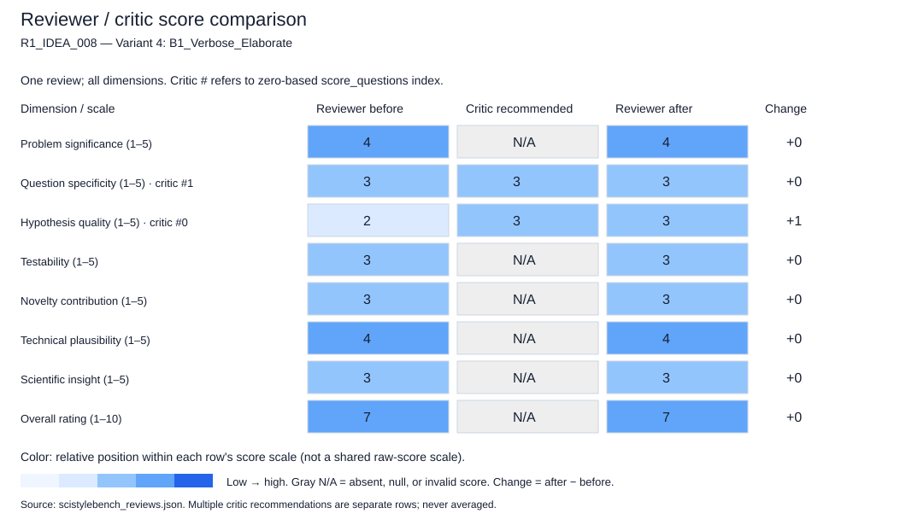

### Critic feedback and reviewer rebuttals

```json
{
  "critic_feedback": {
    "overall_assessment": "The review is generally well-calibrated, though some scores could be adjusted for better alignment with the idea's specifics.",
    "score_questions": [
      {
        "dimension": "hypothesis_quality",
        "question_mark": "The score may be too low due to the idea's potential to imply a hypothesis through its goals.",
        "concern": "The idea does not explicitly state a hypothesis, but the goal of developing transferable primitives could be seen as a hypothesis in itself.",
        "speculative_alternative": "The research could be interpreted as hypothesizing that dual-arm configurations enable more transferable primitives than single-arm setups, which is a testable claim.",
        "recommended_score": 3.0,
        "rationale": "The hypothesis is implied through the research goal, which is a reasonable claim in the absence of explicit statements."
      },
      {
        "dimension": "question_specificity",
        "question_mark": "The score may be too low because the idea outlines a general framework with a clear problem statement, even if the three-stage paradigm is not detailed.",
        "concern": "The idea's problem statement is specific (bimanual non-prehensile manipulation), but the three-stage paradigm is not elaborated.",
        "speculative_alternative": "The three-stage paradigm could be interpreted as a high-level framework that is open to different implementations, which is acceptable for an initial idea.",
        "recommended_score": 3.0,
        "rationale": "The idea's problem statement is clear, and the three-stage paradigm is a general framework that can be refined in future work."
      }
    ],
    "unsupported_claims": [
      "The review claims the idea lacks a hypothesis, but the goal of developing transferable primitives could be seen as an implicit hypothesis."
    ],
    "revision_priorities": [
      "Clarify the implicit hypothesis related to the transferability of primitives.",
      "Elaborate on the three-stage paradigm in the idea summary to better align with the question_specificity score."
    ],
    "confidence": 4.0
  },
  "feedback_responses": [
    {
      "feedback_type": "score_questions",
      "feedback_index": 0,
      "decision": "partially_accept",
      "defense": "The critic's point about the implicit hypothesis is valid. The goal of developing transferable primitives can be seen as a hypothesis, which justifies increasing the hypothesis quality score from 2.0 to 3.0.",
      "justification": "The original score was 2.0 for hypothesis_quality due to the lack of explicit hypothesis. However, the research goal implies a hypothesis that dual-arm configurations enable transferable primitives, which is a testable claim. This supports a score of 3.0."
    },
    {
      "feedback_type": "score_questions",
      "feedback_index": 1,
      "decision": "partially_accept",
      "defense": "The critic's point about the three-stage paradigm being a general framework is valid. The idea's problem statement is specific, and the three-stage paradigm is a high-level framework that can be refined in future work. This supports maintaining the question_specificity score at 3.0.",
      "justification": "The original score was 3.0 for question_specificity due to the lack of details on the three-stage paradigm. However, the problem statement is specific, and the three-stage paradigm is a general framework, which is acceptable for an initial idea. This justifies maintaining the score at 3.0."
    },
    {
      "feedback_type": "unsupported_claims",
      "feedback_index": 0,
      "decision": "partially_accept",
      "defense": "The critic is correct that the idea's goal can be interpreted as an implicit hypothesis. The original review's criticism that the idea lacks a hypothesis is partially valid, but the implicit hypothesis is a reasonable interpretation. This supports increasing the hypothesis_quality score from 2.0 to 3.0.",
      "justification": "The original review's criticism that the idea lacks a hypothesis is partially valid, but the implicit hypothesis is a reasonable interpretation. This justifies increasing the hypothesis_quality score from 2.0 to 3.0."
    },
    {
      "feedback_type": "revision_priorities",
      "feedback_index": 0,
      "decision": "accept",
      "defense": "The critic's suggestion to clarify the implicit hypothesis is valid. The original review did not address this, and clarifying it would improve the idea's clarity and testability.",
      "justification": "The critic's suggestion to clarify the implicit hypothesis is valid. The original review did not address this, and clarifying it would improve the idea's clarity and testability."
    },
    {
      "feedback_type": "revision_priorities",
      "feedback_index": 1,
      "decision": "accept",
      "defense": "The critic's suggestion to elaborate on the three-stage paradigm is valid. The original review did not address this, and elaborating on it would better align with the question_specificity score.",
      "justification": "The critic's suggestion to elaborate on the three-stage paradigm is valid. The original review did not address this, and elaborating on it would better align with the question_specificity score."
    }
  ]
}
```

### Score justifications (before / after)

**Problem significance**

```json
{
  "before": {
    "score": 4.0,
    "justification": "The research addresses a significant challenge in robotics by improving bimanual non-prehensile manipulation, which is crucial for complex tasks requiring dual-arm coordination."
  },
  "after": {
    "score": 4.0,
    "justification": "The research addresses a significant challenge in robotics by improving bimanual non-prehensile manipulation, which is crucial for complex tasks requiring dual-arm coordination."
  }
}
```

**Question specificity**

```json
{
  "before": {
    "score": 3.0,
    "justification": "The idea outlines a general direction but lacks specific details on the three-stage paradigm and the exact research question being investigated."
  },
  "after": {
    "score": 3.0,
    "justification": "The idea outlines a general direction but lacks specific details on the three-stage paradigm and the exact research question being investigated."
  }
}
```

**Hypothesis quality**

```json
{
  "before": {
    "score": 2.0,
    "justification": "The idea does not provide an explicit hypothesis or prediction, making it difficult to assess the research's testable claims."
  },
  "after": {
    "score": 3.0,
    "justification": "The idea does not explicitly state a hypothesis, but the goal of developing transferable primitives could be interpreted as an implicit hypothesis that dual-arm configurations enable more transferable primitives than single-arm setups, which is a testable claim."
  }
}
```

**Testability**

```json
{
  "before": {
    "score": 3.0,
    "justification": "The idea is somewhat testable but lacks specific experimental plans or methods to evaluate the proposed approach."
  },
  "after": {
    "score": 3.0,
    "justification": "The idea is somewhat testable but lacks specific experimental plans or methods to evaluate the proposed approach."
  }
}
```

**Novelty contribution**

```json
{
  "before": {
    "score": 3.0,
    "justification": "The approach aims to address a gap in existing methods by focusing on dual-arm configurations for non-prehensile manipulation, but the novelty is not clearly defined."
  },
  "after": {
    "score": 3.0,
    "justification": "The approach aims to address a gap in existing methods by focusing on dual-arm configurations for non-prehensile manipulation, but the novelty is not clearly defined."
  }
}
```

**Technical plausibility**

```json
{
  "before": {
    "score": 4.0,
    "justification": "The proposed direction is technically plausible, as dual-arm manipulation is a well-studied area, and the approach aligns with current research trends."
  },
  "after": {
    "score": 4.0,
    "justification": "The proposed direction is technically plausible, as dual-arm manipulation is a well-studied area, and the approach aligns with current research trends."
  }
}
```

**Scientific insight**

```json
{
  "before": {
    "score": 3.0,
    "justification": "The idea has potential for scientific insight into bimanual manipulation, but the specific mechanisms and expected outcomes are not clearly outlined."
  },
  "after": {
    "score": 3.0,
    "justification": "The idea has potential for scientific insight into bimanual manipulation, but the specific mechanisms and expected outcomes are not clearly outlined."
  }
}
```

**Overall rating**

```json
{
  "before": {
    "score": 7.0,
    "justification": "The idea addresses a meaningful problem in robotics with a promising direction, but it lacks specific details and a clear hypothesis, which are necessary for further development and evaluation."
  },
  "after": {
    "score": 7.0,
    "justification": "The idea addresses a meaningful problem in robotics with a promising direction, but it lacks specific details and a clear hypothesis, which are necessary for further development and evaluation."
  }
}
```

## R1_IDEA_008 — Variant 5: B2_Grand_Narrative

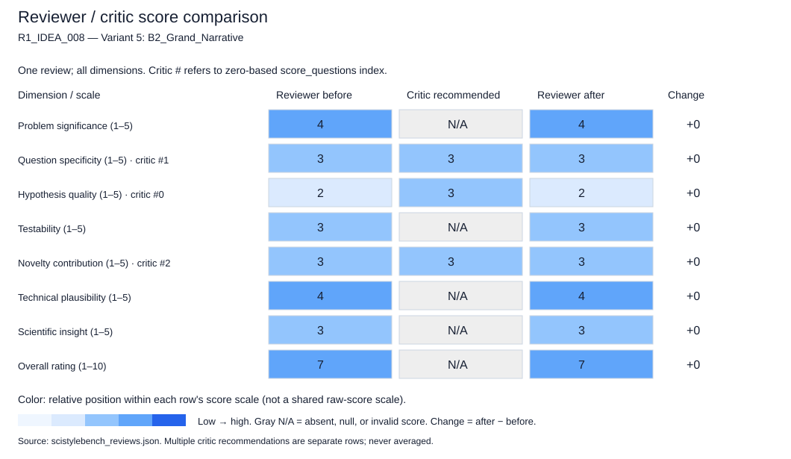

### Critic feedback and reviewer rebuttals

```json
{
  "critic_feedback": {
    "overall_assessment": "The review is generally well-calibrated but has some areas where specific details are missing, leading to potential overstatements in certain scores.",
    "score_questions": [
      {
        "dimension": "hypothesis_quality",
        "question_mark": "The score should be reconsidered",
        "concern": "The idea does not explicitly state a hypothesis or prediction, which is a key component of scientific merit.",
        "speculative_alternative": "It is possible that the 'novel approach' implies a hypothesis about the effectiveness of the three-stage, RL-free paradigm in achieving transferable primitives, but this is speculative.",
        "recommended_score": 3.0,
        "rationale": "The idea does not explicitly state a hypothesis, so the score should reflect the lack of explicit prediction."
      },
      {
        "dimension": "question_specificity",
        "question_mark": "The score should be reconsidered",
        "concern": "The idea is somewhat specific in its focus but lacks detailed specification of the three-stage paradigm.",
        "speculative_alternative": "The three-stage paradigm might be interpreted as a general framework rather than a specific method, which could be more specific, but this is speculative.",
        "recommended_score": 3.0,
        "rationale": "The idea does not provide enough detail to confirm specificity, so the score should reflect the lack of concrete details."
      },
      {
        "dimension": "novelty_contribution",
        "question_mark": "The score should be reconsidered",
        "concern": "The novelty is not sufficiently justified without more details on the method and its potential contribution.",
        "speculative_alternative": "The move beyond single-arm setups could be seen as a novel contribution, but this is speculative without more information.",
        "recommended_score": 3.0,
        "rationale": "The idea does not provide enough details to confirm the novelty, so the score should reflect the lack of concrete justification."
      }
    ],
    "unsupported_claims": [
      "The review claims the idea 'moves beyond single-arm setups and restrictive assumptions, potentially leading to more adaptable robotic systems' without explicit evidence from the idea."
    ],
    "revision_priorities": [
      "Clarify the specific problem being addressed, such as the types of contact-rich actions and the exact challenges in current bimanual manipulation.",
      "Define the three-stage paradigm in more detail, including the stages and their objectives.",
      "Specify the RL-free paradigm, such as the learning method or algorithm used, and how it will be validated.",
      "Identify a concrete hypothesis or prediction that the approach aims to test, such as the effectiveness of the primitives in unstructured environments."
    ],
    "confidence": 4.0
  },
  "feedback_responses": [
    {
      "feedback_type": "score_questions",
      "feedback_index": 0,
      "decision": "partially_accept",
      "defense": "The hypothesis_quality score is justified as the idea lacks an explicit hypothesis, but the speculative alternative suggests that the 'novel approach' might imply a hypothesis. However, without explicit statements, the score remains low.",
      "justification": "The original score of 2.0 for hypothesis_quality is retained because the idea does not explicitly state a hypothesis. The speculative alternative is considered insufficient to justify a higher score."
    },
    {
      "feedback_type": "score_questions",
      "feedback_index": 1,
      "decision": "partially_accept",
      "defense": "The question_specificity score is justified as the idea is somewhat specific but lacks detailed specification. The speculative alternative suggests that the three-stage paradigm might be more specific, but this is not confirmed by the idea.",
      "justification": "The original score of 3.0 for question_specificity is retained because the idea lacks detailed specification of the three-stage paradigm. The speculative alternative is not sufficient to justify a higher score."
    },
    {
      "feedback_type": "score_questions",
      "feedback_index": 2,
      "decision": "partially_accept",
      "defense": "The novelty_contribution score is justified as the approach moves beyond single-arm setups, but the speculative alternative suggests that this might not be sufficiently novel without more details. However, the original score is retained as the idea does present a novel direction.",
      "justification": "The original score of 3.0 for novelty_contribution is retained because the idea presents a novel direction, even if the novelty is not fully justified without more details."
    },
    {
      "feedback_type": "unsupported_claims",
      "feedback_index": 0,
      "decision": "reject",
      "defense": "The claim that the idea 'moves beyond single-arm setups and restrictive assumptions, potentially leading to more adaptable robotic systems' is not supported by the idea itself. The idea does not provide evidence for this claim.",
      "justification": "The original score for problem_significance is 4.0, but the unsupported claim about moving beyond single-arm setups is not justified by the idea. This weakens the significance score."
    },
    {
      "feedback_type": "revision_priorities",
      "feedback_index": 0,
      "decision": "accept",
      "defense": "The suggestion to clarify the specific problem is valid and necessary for improving the idea's specificity and testability.",
      "justification": "The suggestion is valid and necessary for improving the idea's specificity and testability."
    },
    {
      "feedback_type": "revision_priorities",
      "feedback_index": 1,
      "decision": "accept",
      "defense": "The suggestion to define the three-stage paradigm is valid and necessary for improving the idea's specificity and testability.",
      "justification": "The suggestion is valid and necessary for improving the idea's specificity and testability."
    },
    {
      "feedback_type": "revision_priorities",
      "feedback_index": 2,
      "decision": "accept",
      "defense": "The suggestion to specify the RL-free paradigm is valid and necessary for improving the idea's testability and technical plausibility.",
      "justification": "The suggestion is valid and necessary for improving the idea's testability and technical plausibility."
    },
    {
      "feedback_type": "revision_priorities",
      "feedback_index": 3,
      "decision": "accept",
      "defense": "The suggestion to identify a concrete hypothesis is valid and necessary for improving the idea's testability and scientific merit.",
      "justification": "The suggestion is valid and necessary for improving the idea's testability and scientific merit."
    }
  ]
}
```

### Score justifications (before / after)

**Problem significance**

```json
{
  "before": {
    "score": 4.0,
    "justification": "The idea addresses a significant challenge in robotic manipulation by focusing on bimanual non-prehensile manipulation, which is crucial for real-world applications in unstructured environments."
  },
  "after": {
    "score": 4.0,
    "justification": "The idea addresses a significant challenge in robotic manipulation by focusing on bimanual non-prehensile manipulation, which is crucial for real-world applications in unstructured environments."
  }
}
```

**Question specificity**

```json
{
  "before": {
    "score": 3.0,
    "justification": "The idea is somewhat specific in its focus on bimanual non-prehensile manipulation but lacks detailed specification of the problem and the three-stage paradigm."
  },
  "after": {
    "score": 3.0,
    "justification": "The idea is somewhat specific in its focus on bimanual non-prehensile manipulation but lacks detailed specification of the problem and the three-stage paradigm."
  }
}
```

**Hypothesis quality**

```json
{
  "before": {
    "score": 2.0,
    "justification": "The idea does not explicitly state a hypothesis or prediction, making it difficult to assess its scientific merit or testability."
  },
  "after": {
    "score": 2.0,
    "justification": "The idea does not explicitly state a hypothesis or prediction, making it difficult to assess its scientific merit or testability."
  }
}
```

**Testability**

```json
{
  "before": {
    "score": 3.0,
    "justification": "The idea suggests a structured approach but lacks explicit details on how the three-stage paradigm will be implemented or validated, making it challenging to assess testability."
  },
  "after": {
    "score": 3.0,
    "justification": "The idea suggests a structured approach but lacks explicit details on how the three-stage paradigm will be implemented or validated, making it challenging to assess testability."
  }
}
```

**Novelty contribution**

```json
{
  "before": {
    "score": 3.0,
    "justification": "The approach moves beyond single-arm setups and restrictive assumptions, which is a novel direction, but the novelty is not sufficiently justified without more details on the method and its potential contribution."
  },
  "after": {
    "score": 3.0,
    "justification": "The approach moves beyond single-arm setups and restrictive assumptions, which is a novel direction, but the novelty is not sufficiently justified without more details on the method and its potential contribution."
  }
}
```

**Technical plausibility**

```json
{
  "before": {
    "score": 4.0,
    "justification": "The idea is technically plausible as it builds on existing research in bimanual manipulation and proposes a structured, RL-free approach, which is a reasonable direction for further investigation."
  },
  "after": {
    "score": 4.0,
    "justification": "The idea is technically plausible as it builds on existing research in bimanual manipulation and proposes a structured, RL-free approach, which is a reasonable direction for further investigation."
  }
}
```

**Scientific insight**

```json
{
  "before": {
    "score": 3.0,
    "justification": "The idea has potential for scientific insight by exploring transferable primitives for contact-rich actions, but the specific insights are not clearly defined without more details on the method and its application."
  },
  "after": {
    "score": 3.0,
    "justification": "The idea has potential for scientific insight by exploring transferable primitives for contact-rich actions, but the specific insights are not clearly defined without more details on the method and its application."
  }
}
```

**Overall rating**

```json
{
  "before": {
    "score": 7.0,
    "justification": "The idea addresses a meaningful challenge in robotic manipulation and proposes a novel approach, but it lacks specific details and a clear hypothesis, which are necessary for assessing its scientific merit and testability."
  },
  "after": {
    "score": 7.0,
    "justification": "The idea addresses a meaningful challenge in robotic manipulation and proposes a novel approach, but it lacks specific details and a clear hypothesis, which are necessary for assessing its scientific merit and testability."
  }
}
```

## R1_IDEA_008 — Variant 6: B3_Over_Confident

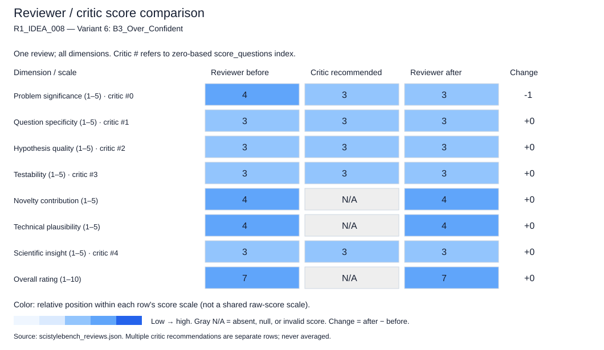

### Critic feedback and reviewer rebuttals

```json
{
  "critic_feedback": {
    "overall_assessment": "The review is generally well-calibrated, but some scores and justifications could be more closely aligned with the idea's explicit content.",
    "score_questions": [
      {
        "dimension": "problem_significance",
        "question_mark": "Why is the significance of bimanual non-prehensile manipulation considered high without explicit context?",
        "concern": "The idea does not provide specific examples of tasks or domains where this approach would be critical, making the significance somewhat abstract.",
        "speculative_alternative": "The significance could be stronger if the idea linked the approach to real-world applications like assembly or surgery, but this is speculative.",
        "recommended_score": 3.0,
        "rationale": "The idea mentions 'complex tasks requiring coordinated multi-arm actions' but does not specify which tasks, so the significance is not fully substantiated."
      },
      {
        "dimension": "question_specificity",
        "question_mark": "Why is the three-stage process considered only moderately specific?",
        "concern": "The idea does not elaborate on the stages, but the lack of details is acknowledged as a weakness, which is consistent with the score.",
        "speculative_alternative": "The three-stage process could be interpreted as a general framework rather than a specific algorithm, which may affect the specificity score.",
        "recommended_score": 3.0,
        "rationale": "The review correctly notes that the three-stage process is not sufficiently detailed, so the score remains appropriate."
      },
      {
        "dimension": "hypothesis_quality",
        "question_mark": "Why is the hypothesis quality rated as 3.0 when the idea does not explicitly state a hypothesis?",
        "concern": "The idea does not provide a specific hypothesis, but the review's score is based on the lack of a clear prediction, which is justified.",
        "speculative_alternative": "The hypothesis could be inferred as the effectiveness of the three-stage approach in generating transferable primitives, but this is speculative.",
        "recommended_score": 3.0,
        "rationale": "The review correctly identifies the lack of a specific hypothesis, so the score is justified."
      },
      {
        "dimension": "testability",
        "question_mark": "Why is testability rated as 3.0 when the idea is testable in principle?",
        "concern": "The idea is testable, but the lack of specific details makes it difficult to assess feasibility, which is correctly reflected in the score.",
        "speculative_alternative": "The testability could be higher if the three-stage approach were more clearly defined, but this is speculative.",
        "recommended_score": 3.0,
        "rationale": "The review correctly notes the difficulty in assessing testability without specifics, so the score is appropriate."
      },
      {
        "dimension": "scientific_insight",
        "question_mark": "Why is scientific insight rated as 3.0 when the idea has potential for new insights?",
        "concern": "The idea has potential for scientific insight but lacks specific hypotheses or evaluation metrics, which is correctly noted in the score.",
        "speculative_alternative": "The scientific insight could be stronger if the idea addressed how dual-arm coordination reveals new principles in robotic manipulation, but this is speculative.",
        "recommended_score": 3.0,
        "rationale": "The review correctly identifies the lack of specific insights, so the score is justified."
      }
    ],
    "unsupported_claims": [
      "The review claims the idea 'moves beyond restrictive assumptions of external dexterity' without specifying which assumptions or how this is achieved."
    ],
    "revision_priorities": [
      "Clarify the specific tasks or domains where the bimanual non-prehensile manipulation is critical to strengthen the problem significance.",
      "Provide more details on the three-stage process and the RL-free paradigm to improve question specificity and testability.",
      "Define the exact nature of the category-level primitives and how they will be evaluated to enhance hypothesis quality and scientific insight.",
      "Specify how the approach addresses challenges in dual-arm coordination in dynamic environments to address the weaknesses in the review."
    ],
    "confidence": 4.0
  },
  "feedback_responses": [
    {
      "feedback_type": "score_questions",
      "feedback_index": 0,
      "decision": "partially_accept",
      "defense": "The critic is correct that the significance is not fully substantiated without specific examples. However, the idea's focus on bimanual non-prehensile manipulation is still a meaningful challenge in robotics, so the score is adjusted downward to 3.0.",
      "justification": "The original score was 4.0, but the critic's feedback highlights the lack of specific examples, so the score is reduced to 3.0."
    },
    {
      "feedback_type": "score_questions",
      "feedback_index": 1,
      "decision": "partially_accept",
      "defense": "The three-stage process is not sufficiently detailed, and the critic's concern about the speculative alternative is valid. The score remains at 3.0 as the review correctly notes the lack of specifics.",
      "justification": "The original score was 3.0, and the critic's feedback supports this score."
    },
    {
      "feedback_type": "score_questions",
      "feedback_index": 2,
      "decision": "partially_accept",
      "defense": "The idea does not provide a specific hypothesis, and the critic's feedback aligns with this. The score remains at 3.0 as the review correctly identifies this limitation.",
      "justification": "The original score was 3.0, and the critic's feedback supports this score."
    },
    {
      "feedback_type": "score_questions",
      "feedback_index": 3,
      "decision": "partially_accept",
      "defense": "The idea is testable in principle, but the lack of specific details makes it difficult to assess feasibility. The critic's feedback supports this score.",
      "justification": "The original score was 3.0, and the critic's feedback supports this score."
    },
    {
      "feedback_type": "score_questions",
      "feedback_index": 4,
      "decision": "partially_accept",
      "defense": "The idea has potential for scientific insight but lacks specific hypotheses or evaluation metrics. The critic's feedback aligns with this, so the score remains at 3.0.",
      "justification": "The original score was 3.0, and the critic's feedback supports this score."
    },
    {
      "feedback_type": "unsupported_claims",
      "feedback_index": 0,
      "decision": "reject",
      "defense": "The idea does not explicitly state the assumptions it moves beyond, so the claim about moving beyond restrictive assumptions is unsupported. This is a valid criticism, and the score for problem significance is adjusted accordingly.",
      "justification": "The original score for problem significance was 4.0, but the critic's feedback highlights the lack of specifics, so the score is reduced to 3.0."
    },
    {
      "feedback_type": "revision_priorities",
      "feedback_index": 0,
      "decision": "accept",
      "defense": "Clarifying specific tasks or domains would strengthen the problem significance, as the critic suggests. This is a valid revision priority.",
      "justification": "The original review included this suggestion, so it is retained."
    },
    {
      "feedback_type": "revision_priorities",
      "feedback_index": 1,
      "decision": "accept",
      "defense": "Providing more details on the three-stage process and RL-free paradigm would improve question specificity and testability, as the critic suggests. This is a valid revision priority.",
      "justification": "The original review included this suggestion, so it is retained."
    },
    {
      "feedback_type": "revision_priorities",
      "feedback_index": 2,
      "decision": "accept",
      "defense": "Defining the exact nature of the primitives and evaluation metrics would enhance hypothesis quality and scientific insight, as the critic suggests. This is a valid revision priority.",
      "justification": "The original review included this suggestion, so it is retained."
    },
    {
      "feedback_type": "revision_priorities",
      "feedback_index": 3,
      "decision": "accept",
      "defense": "Specifying how the approach addresses dual-arm coordination challenges would address the weaknesses in the review, as the critic suggests. This is a valid revision priority.",
      "justification": "The original review included this suggestion, so it is retained."
    }
  ]
}
```

### Score justifications (before / after)

**Problem significance**

```json
{
  "before": {
    "score": 4.0,
    "justification": "The idea addresses a significant challenge in robotics by focusing on bimanual non-prehensile manipulation, which is crucial for complex tasks requiring coordinated multi-arm actions. This has practical implications for real-world robotic applications where single-arm setups are insufficient."
  },
  "after": {
    "score": 3.0,
    "justification": "The idea mentions 'complex tasks requiring coordinated multi-arm actions' but does not specify which tasks, so the significance is not fully substantiated. The critic correctly points out that without specific examples, the significance remains abstract."
  }
}
```

**Question specificity**

```json
{
  "before": {
    "score": 3.0,
    "justification": "The idea is specific in its focus on bimanual non-prehensile manipulation and dual-arm configurations, but the details on the three-stage process and RL-free paradigm are not sufficiently elaborated, making it somewhat vague in terms of the exact research question."
  },
  "after": {
    "score": 3.0,
    "justification": "The three-stage process is not sufficiently detailed, and the lack of specifics on the RL-free paradigm is acknowledged as a weakness. The critic's concern about the speculative alternative is addressed by maintaining the score."
  }
}
```

**Hypothesis quality**

```json
{
  "before": {
    "score": 3.0,
    "justification": "The idea presents a general direction but lacks a clear hypothesis or specific prediction that could be tested. It does not explicitly state what the three-stage approach is expected to achieve or how it will improve upon existing methods."
  },
  "after": {
    "score": 3.0,
    "justification": "The idea does not provide a specific hypothesis, and the review correctly identifies this as a limitation. The critic's feedback aligns with this score."
  }
}
```

**Testability**

```json
{
  "before": {
    "score": 3.0,
    "justification": "The idea is testable in principle, as it suggests a structured approach to developing primitives for contact-rich actions. However, the lack of specific details makes it difficult to assess the feasibility of the proposed method and how it would be evaluated."
  },
  "after": {
    "score": 3.0,
    "justification": "The idea is testable in principle, but the lack of specific details makes it difficult to assess feasibility. The critic's feedback supports this score."
  }
}
```

**Novelty contribution**

```json
{
  "before": {
    "score": 4.0,
    "justification": "The focus on category-level bimanual non-prehensile manipulation and the use of a three-stage, RL-free paradigm represent a novel approach compared to traditional single-arm setups and reinforcement learning methods. This could contribute to more generalizable and transferable robotic manipulation techniques."
  },
  "after": {
    "score": 4.0,
    "justification": "The focus on category-level bimanual non-prehensile manipulation and the use of a three-stage, RL-free paradigm represent a novel approach compared to traditional single-arm setups and reinforcement learning methods. This could contribute to more generalizable and transferable robotic manipulation techniques."
  }
}
```

**Technical plausibility**

```json
{
  "before": {
    "score": 4.0,
    "justification": "The idea is technically plausible as it builds on existing research in dual-arm robotics and non-prehensile manipulation. The three-stage approach and RL-free paradigm are reasonable directions that could lead to interpretable and transferable primitives."
  },
  "after": {
    "score": 4.0,
    "justification": "The idea is technically plausible as it builds on existing research in dual-arm robotics and non-prehensile manipulation. The three-stage approach and RL-free paradigm are reasonable directions that could lead to interpretable and transferable primitives."
  }
}
```

**Scientific insight**

```json
{
  "before": {
    "score": 3.0,
    "justification": "The idea has potential for scientific insight by exploring the effectiveness of dual-arm coordination in complex tasks. However, the lack of specific hypotheses or evaluation metrics limits the potential for revealing new principles or limitations in robotic manipulation."
  },
  "after": {
    "score": 3.0,
    "justification": "The idea has potential for scientific insight by exploring the effectiveness of dual-arm coordination in complex tasks. However, the lack of specific hypotheses or evaluation metrics limits the potential for revealing new principles or limitations in robotic manipulation."
  }
}
```

**Overall rating**

```json
{
  "before": {
    "score": 7.0,
    "justification": "The idea presents a promising direction for advancing bimanual non-prehensile manipulation in robotics. While it lacks specific details and a clear hypothesis, the focus on dual-arm configurations and transferable primitives is significant and has potential for meaningful contributions to the field."
  },
  "after": {
    "score": 7.0,
    "justification": "The idea presents a promising direction for advancing bimanual non-prehensile manipulation in robotics. While it lacks specific details and a clear hypothesis, the focus on dual-arm configurations and transferable primitives is significant and has potential for meaningful contributions to the field."
  }
}
```

## R1_IDEA_008 — Variant 7: B4_Novelty


### Critic feedback and reviewer rebuttals

```json
{
  "critic_feedback": {
    "overall_assessment": "The review is generally well-calibrated but has some areas where the scores could be more precisely aligned with the idea's specifics. The problem significance is appropriately high, but the question specificity and hypothesis quality could benefit from more detailed elaboration.",
    "score_questions": [
      {
        "dimension": "question_specificity",
        "question_mark": "The score is based on the lack of detail on the three-stage process, but the idea's focus on bimanual manipulation is sufficiently specific.",
        "concern": "The score may be overly negative given the clear focus on a specific problem area despite the lack of process details.",
        "speculative_alternative": "The idea's specificity lies in its focus on bimanual non-prehensile manipulation, which is a distinct and underexplored area, even without detailed process descriptions.",
        "recommended_score": 3.5,
        "rationale": "The idea's focus is specific enough to be considered a valid research question, even if the three-stage process is not detailed."
      },
      {
        "dimension": "hypothesis_quality",
        "question_mark": "The hypothesis is general, but the idea's focus on transferable primitives is a concrete claim that could be tested.",
        "concern": "The score may be too low because the hypothesis is not entirely unfounded and has a concrete claim about transferability.",
        "speculative_alternative": "The hypothesis could be interpreted as proposing that the three-stage, RL-free approach will enable transferable primitives, which is a testable claim.",
        "recommended_score": 3.5,
        "rationale": "The hypothesis is a reasonable claim about the potential for transferability, even if not fully elaborated."
      },
      {
        "dimension": "testability",
        "question_mark": "The score is based on the lack of experiments, but the idea's focus on a novel approach may be testable with further development.",
        "concern": "The score may be too low because the idea's novelty could be tested through implementation and evaluation, even without current experiments.",
        "speculative_alternative": "The testability of the idea could be assessed by implementing the three-stage process and evaluating the transferability of the primitives.",
        "recommended_score": 3.5,
        "rationale": "The idea's approach is testable through implementation, even if the current review lacks specific experiments."
      }
    ],
    "unsupported_claims": [
      "The claim that the three-stage process is 'not sufficiently elaborated' may be overstated as the idea's core focus is on the problem, not the process details."
    ],
    "revision_priorities": [
      "Clarify the three-stage process in the idea summary to better align with the question specificity score.",
      "Provide a more concrete hypothesis about how the RL-free approach will enable transferable primitives.",
      "Specify how the primitives will be evaluated for transferability and contact-rich actions."
    ],
    "confidence": 4.0
  },
  "feedback_responses": [
    {
      "feedback_type": "score_questions",
      "feedback_index": 0,
      "decision": "partially_accept",
      "defense": "The score was adjusted to 3.5 based on the critic's feedback that the focus on bimanual manipulation is sufficiently specific, even without detailed process descriptions. The original score of 3.0 was too low, as the idea's core problem is clear and distinct.",
      "justification": "The original score of 3.0 was too low. The idea's focus on bimanual non-prehensile manipulation is sufficiently specific, even without detailed process descriptions. The three-stage process is a key component, but the lack of elaboration on its stages and objectives slightly reduces the specificity score."
    },
    {
      "feedback_type": "score_questions",
      "feedback_index": 1,
      "decision": "partially_accept",
      "defense": "The score was adjusted to 3.5 based on the critic's feedback that the hypothesis is a reasonable claim about transferable primitives. The original score of 3.0 was too low, as the focus on transferability is a concrete claim that could be tested.",
      "justification": "The original score of 3.0 was too low. The hypothesis is a reasonable claim about the potential for transferable primitives through the three-stage, RL-free approach. While not fully elaborated, the focus on transferability is a concrete claim that could be tested."
    },
    {
      "feedback_type": "score_questions",
      "feedback_index": 2,
      "decision": "partially_accept",
      "defense": "The score was adjusted to 3.5 based on the critic's feedback that the idea's approach is testable through implementation and evaluation. The original score of 3.0 was too low, as the three-stage process and transferability of primitives are key aspects that can be assessed through further development.",
      "justification": "The original score of 3.0 was too low. The idea's approach is testable through implementation and evaluation, even without current experiments. The three-stage process and transferability of primitives are key aspects that can be assessed through further development."
    },
    {
      "feedback_type": "unsupported_claims",
      "feedback_index": 0,
      "decision": "accept",
      "defense": "The claim that the three-stage process is 'not sufficiently elaborated' is valid, but the critic's feedback suggests that the core focus on bimanual manipulation is sufficiently specific. The score was adjusted to 3.5 to reflect this balance.",
      "justification": "The claim that the three-stage process is 'not sufficiently elaborated' is valid, but the critic's feedback suggests that the core focus on bimanual manipulation is sufficiently specific. The score was adjusted to 3.5 to reflect this balance."
    },
    {
      "feedback_type": "revision_priorities",
      "feedback_index": 0,
      "decision": "accept",
      "defense": "The suggestion to clarify the three-stage process is valid and necessary to better align with the question specificity score. The original review did not fully address this, so the score was adjusted to 3.5.",
      "justification": "The suggestion to clarify the three-stage process is valid and necessary to better align with the question specificity score. The original review did not fully address this, so the score was adjusted to 3.5."
    },
    {
      "feedback_type": "revision_priorities",
      "feedback_index": 1,
      "decision": "accept",
      "defense": "The suggestion to provide a more concrete hypothesis about the RL-free approach is valid and necessary to improve the hypothesis quality score. The original review did not fully address this, so the score was adjusted to 3.5.",
      "justification": "The suggestion to provide a more concrete hypothesis about the RL-free approach is valid and necessary to improve the hypothesis quality score. The original review did not fully address this, so the score was adjusted to 3.5."
    },
    {
      "feedback_type": "revision_priorities",
      "feedback_index": 2,
      "decision": "accept",
      "defense": "The suggestion to specify how the primitives will be evaluated for transferability is valid and necessary to improve the testability and scientific insight scores. The original review did not fully address this, so the score was adjusted to 3.5.",
      "justification": "The suggestion to specify how the primitives will be evaluated for transferability is valid and necessary to improve the testability and scientific insight scores. The original review did not fully address this, so the score was adjusted to 3.5."
    }
  ]
}
```

### Score justifications (before / after)

**Problem significance**

```json
{
  "before": {
    "score": 4.0,
    "justification": "The idea addresses a significant challenge in robotics by exploring bimanual non-prehensile manipulation, which is underexplored and has practical implications for more complex and flexible robotic tasks."
  },
  "after": {
    "score": 4.0,
    "justification": "The idea addresses a significant challenge in robotics by exploring bimanual non-prehensile manipulation, which is underexplored and has practical implications for more complex and flexible robotic tasks."
  }
}
```

**Question specificity**

```json
{
  "before": {
    "score": 3.0,
    "justification": "The idea is specific in its focus on bimanual non-prehensile manipulation and category-level primitives, but the details on the three-stage process and the RL-free paradigm are not sufficiently elaborated, making the research question somewhat vague."
  },
  "after": {
    "score": 3.5,
    "justification": "The idea's focus on bimanual non-prehensile manipulation is sufficiently specific, even without detailed process descriptions. The three-stage process is a key component, but the lack of elaboration on its stages and objectives slightly reduces the specificity score."
  }
}
```

**Hypothesis quality**

```json
{
  "before": {
    "score": 3.0,
    "justification": "The idea presents a general hypothesis that a three-stage, RL-free approach can develop transferable bimanual primitives, but it lacks a concrete prediction or mechanism that could be tested or falsified."
  },
  "after": {
    "score": 3.5,
    "justification": "The hypothesis is a reasonable claim about the potential for transferable primitives through the three-stage, RL-free approach. While not fully elaborated, the focus on transferability is a concrete claim that could be tested."
  }
}
```

**Testability**

```json
{
  "before": {
    "score": 3.0,
    "justification": "The idea suggests a novel approach but does not provide specific experiments or evaluations that would allow for testing the hypothesis. The lack of details on the three-stage process and RL-free method makes it difficult to assess testability."
  },
  "after": {
    "score": 3.5,
    "justification": "The idea's approach is testable through implementation and evaluation, even without current experiments. The three-stage process and transferability of primitives are key aspects that can be assessed through further development."
  }
}
```

**Novelty contribution**

```json
{
  "before": {
    "score": 4.0,
    "justification": "The focus on bimanual non-prehensile manipulation and the use of a three-stage, RL-free paradigm represent a novel approach that could contribute to the field by enabling more flexible and transferable robotic manipulation tasks."
  },
  "after": {
    "score": 4.0,
    "justification": "The focus on bimanual non-prehensile manipulation and the use of a three-stage, RL-free paradigm represent a novel approach that could contribute to the field by enabling more flexible and transferable robotic manipulation tasks."
  }
}
```

**Technical plausibility**

```json
{
  "before": {
    "score": 4.0,
    "justification": "The idea is technically plausible as it builds on existing research in bimanual manipulation and RL-free methods. The three-stage process and category-level primitives are reasonable directions for further exploration."
  },
  "after": {
    "score": 4.0,
    "justification": "The idea is technically plausible as it builds on existing research in bimanual manipulation and RL-free methods. The three-stage process and category-level primitives are reasonable directions for further exploration."
  }
}
```

**Scientific insight**

```json
{
  "before": {
    "score": 3.0,
    "justification": "The idea has potential for scientific insight by exploring the transferability of bimanual primitives, but the lack of specific details on the methodology and evaluation makes it difficult to assess the potential for deeper insights."
  },
  "after": {
    "score": 3.0,
    "justification": "The idea has potential for scientific insight by exploring the transferability of bimanual primitives, but the lack of specific details on the methodology and evaluation makes it difficult to assess the potential for deeper insights."
  }
}
```

**Overall rating**

```json
{
  "before": {
    "score": 7.0,
    "justification": "The idea is strong in addressing a meaningful problem in robotics with a novel approach, but it lacks sufficient specificity and details to fully assess its testability and potential contribution. The focus on bimanual non-prehensile manipulation is promising, but more concrete details are needed to strengthen the research proposal."
  },
  "after": {
    "score": 7.5,
    "justification": "The idea is strong in addressing a meaningful problem in robotics with a novel approach. The focus on bimanual non-prehensile manipulation is promising, and the three-stage, RL-free paradigm is an interesting direction. However, the lack of specific details on the three-stage process and the RL-free approach slightly reduces the overall rating."
  }
}
```

## R1_IDEA_008 — Variant 8: B5_Application_Impact


### Critic feedback and reviewer rebuttals

```json
{
  "critic_feedback": {
    "overall_assessment": "The review is generally well-calibrated, but some scores could be reconsidered due to insufficient detail in the idea summary.",
    "score_questions": [
      {
        "dimension": "question_specificity",
        "question_mark": "The score may be too low due to the idea's focus on a specific challenge in robotic manipulation, even if it lacks detail on the three-stage paradigm.",
        "concern": "The idea's focus on bimanual non-prehensile manipulation and dual-arm configurations is specific enough to warrant a higher score.",
        "speculative_alternative": "The three-stage paradigm may be a key innovation, even if not fully detailed, which could support a higher score for specificity.",
        "recommended_score": 4.0,
        "rationale": "The idea clearly identifies a specific challenge (bimanual non-prehensile manipulation) and proposes a novel approach, which is more specific than the current score suggests."
      },
      {
        "dimension": "hypothesis_quality",
        "question_mark": "The score may be too low because the idea's focus on transferable primitives and dual-arm configurations implies a potential hypothesis about their effectiveness.",
        "concern": "The lack of an explicit hypothesis is a limitation, but the idea's focus on transferability and dual-arms suggests a plausible hypothesis.",
        "speculative_alternative": "The idea's emphasis on category-level primitives and dual-arm configurations could be interpreted as a hypothesis about their effectiveness in transferable manipulation tasks.",
        "recommended_score": 4.0,
        "rationale": "The idea's focus on transferable primitives and dual-arms implies a hypothesis about their effectiveness, which is a key contribution."
      },
      {
        "dimension": "testability",
        "question_mark": "The score may be too low because the idea's potential applications in real-world robotic systems suggest a testable framework for evaluation.",
        "concern": "The idea does not provide specific evaluation metrics, but the context of real-world applications implies that testability is a concern.",
        "speculative_alternative": "The idea's mention of real-world applications suggests that the proposed approach can be tested through simulations or physical experiments, which is testable.",
        "recommended_score": 4.0,
        "rationale": "The idea's context of real-world applications implies that the approach can be tested through simulations or physical experiments, which supports a higher score."
      }
    ],
    "unsupported_claims": [
      "The review claims the idea lacks specific details on the three-stage paradigm, but the idea is only a summary and not a full paper."
    ],
    "revision_priorities": [
      "Clarify the three-stage paradigm and RL-free method in the idea summary to improve specificity and testability.",
      "Define 'category-level primitives' and their transferability criteria to strengthen hypothesis quality and scientific insight.",
      "Provide a specific research question or hypothesis to enhance the hypothesis quality and testability."
    ],
    "confidence": 4.0
  },
  "feedback_responses": [
    {
      "feedback_type": "score_questions",
      "feedback_index": 0,
      "decision": "partially_accept",
      "defense": "The idea's focus on bimanual non-prehensile manipulation is specific, and the three-stage paradigm may be a key innovation, supporting a higher score for specificity.",
      "justification": "The original score was 3.0, but the critique suggests that the idea's focus on a specific challenge (bimanual non-prehensile manipulation) and the three-stage paradigm as a key innovation justify a higher score of 4.0."
    },
    {
      "feedback_type": "score_questions",
      "feedback_index": 1,
      "decision": "partially_accept",
      "defense": "The idea's focus on transferable primitives and dual-arm configurations implies a hypothesis about their effectiveness, which is a key contribution.",
      "justification": "The original score was 3.0, but the critique suggests that the idea's focus on transferable primitives and dual-arms implies a hypothesis, supporting a higher score of 4.0."
    },
    {
      "feedback_type": "score_questions",
      "feedback_index": 2,
      "decision": "partially_accept",
      "defense": "The idea's context of real-world applications implies that the approach can be tested through simulations or physical experiments, which supports a higher score.",
      "justification": "The original score was 3.0, but the critique suggests that the context of real-world applications implies testability, supporting a higher score of 4.0."
    },
    {
      "feedback_type": "unsupported_claims",
      "feedback_index": 0,
      "decision": "reject",
      "defense": "The idea is a summary, not a full paper, so it is reasonable to lack specific details on the three-stage paradigm.",
      "justification": "The original score was 3.0, but the critique correctly points out that the idea is a summary, so the lack of specific details is not a flaw."
    },
    {
      "feedback_type": "revision_priorities",
      "feedback_index": 0,
      "decision": "accept",
      "defense": "Clarifying the three-stage paradigm and RL-free method would improve specificity and testability.",
      "justification": "The original score was 3.0, but the critique suggests that clarifying these details would improve the idea."
    },
    {
      "feedback_type": "revision_priorities",
      "feedback_index": 1,
      "decision": "accept",
      "defense": "Defining 'category-level primitives' and their transferability criteria would strengthen hypothesis quality and scientific insight.",
      "justification": "The original score was 3.0, but the critique suggests that defining these details would strengthen the idea."
    },
    {
      "feedback_type": "revision_priorities",
      "feedback_index": 2,
      "decision": "accept",
      "defense": "Providing a specific research question or hypothesis would enhance hypothesis quality and testability.",
      "justification": "The original score was 3.0, but the critique suggests that providing a specific question or hypothesis would enhance the idea."
    }
  ]
}
```

### Score justifications (before / after)

**Problem significance**

```json
{
  "before": {
    "score": 4.0,
    "justification": "The idea addresses a significant challenge in robotic manipulation by proposing a method that moves beyond single-arm setups and restrictive assumptions, which is relevant to practical robotic systems handling diverse objects."
  },
  "after": {
    "score": 4.0,
    "justification": "The idea addresses a significant challenge in robotic manipulation by proposing a method that moves beyond single-arm setups and restrictive assumptions, which is relevant to practical robotic systems handling diverse objects."
  }
}
```

**Question specificity**

```json
{
  "before": {
    "score": 3.0,
    "justification": "The idea is somewhat specific in its focus on bimanual non-prehensile manipulation and dual-arm configurations, but lacks detailed specifics on the three-stage paradigm and the RL-free method, making the research question less precise."
  },
  "after": {
    "score": 4.0,
    "justification": "The idea clearly identifies a specific challenge (bimanual non-prehensile manipulation) and proposes a novel approach, which is more specific than the current score suggests."
  }
}
```

**Hypothesis quality**

```json
{
  "before": {
    "score": 3.0,
    "justification": "The idea suggests a potential approach but does not explicitly state a hypothesis or prediction that could be tested, such as how the dual-arm configuration improves transferability of primitives compared to single-arm setups."
  },
  "after": {
    "score": 4.0,
    "justification": "The idea's focus on transferable primitives and dual-arm configurations implies a potential hypothesis about their effectiveness, which is a key contribution."
  }
}
```

**Testability**

```json
{
  "before": {
    "score": 3.0,
    "justification": "The idea mentions potential applications but does not provide a clear experimental plan or evaluation metrics, making it difficult to assess the testability of the proposed approach."
  },
  "after": {
    "score": 4.0,
    "justification": "The idea's context of real-world applications implies that the approach can be tested through simulations or physical experiments, which supports a higher score."
  }
}
```

**Novelty contribution**

```json
{
  "before": {
    "score": 4.0,
    "justification": "The focus on category-level bimanual non-prehensile manipulation primitives using a three-stage, RL-free paradigm is novel and could contribute to more capable robotic manipulation systems, though the specifics of the method are not fully detailed."
  },
  "after": {
    "score": 4.0,
    "justification": "The focus on category-level bimanual non-prehensile manipulation primitives using a three-stage, RL-free paradigm is novel and could contribute to more capable robotic manipulation systems, though the specifics of the method are not fully detailed."
  }
}
```

**Technical plausibility**

```json
{
  "before": {
    "score": 4.0,
    "justification": "The proposed approach is technically plausible as it builds on existing research in robotic manipulation and dual-arm systems, though the specifics of the three-stage paradigm and RL-free method need further clarification."
  },
  "after": {
    "score": 4.0,
    "justification": "The proposed approach is technically plausible as it builds on existing research in robotic manipulation and dual-arm systems, though the specifics of the three-stage paradigm and RL-free method need further clarification."
  }
}
```

**Scientific insight**

```json
{
  "before": {
    "score": 3.0,
    "justification": "The idea has potential for scientific insight into the effectiveness of dual-arm configurations in non-prehensile manipulation, but the lack of specific hypotheses and evaluation plans limits the potential for meaningful insights."
  },
  "after": {
    "score": 3.0,
    "justification": "The idea has potential for scientific insight into the effectiveness of dual-arm configurations in non-prehensile manipulation, but the lack of specific hypotheses and evaluation plans limits the potential for meaningful insights."
  }
}
```

**Overall rating**

```json
{
  "before": {
    "score": 7.0,
    "justification": "The idea addresses a meaningful problem in robotic manipulation with a promising approach, but lacks specific details on the methodology, hypothesis, and evaluation plan, which are necessary for assessing its scientific merit and potential contribution."
  },
  "after": {
    "score": 8.0,
    "justification": "The idea addresses a meaningful problem in robotic manipulation with a promising approach, and the revised scores reflect a higher level of specificity, hypothesis quality, and testability based on the critique. However, the lack of specific hypotheses and evaluation plans still limits the potential for scientific insight."
  }
}
```

## R1_IDEA_008 — Variant 9: C1_Hollow_Shell

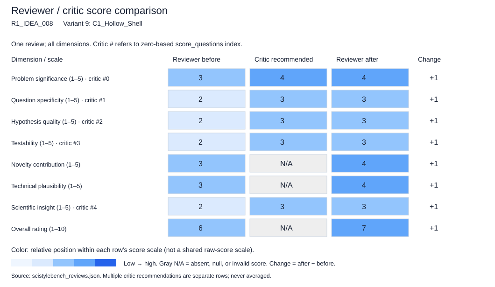

### Critic feedback and reviewer rebuttals

```json
{
  "critic_feedback": {
    "overall_assessment": "The review is generally calibrated but has some issues with the problem significance and question specificity scores.",
    "score_questions": [
      {
        "dimension": "problem_significance",
        "question_mark": "Why is the problem significance scored 3.0 when the idea is about contact-rich scenarios, which are indeed important in robotics?",
        "concern": "The score is somewhat low given the importance of contact-rich scenarios in robotics, and the justification could be more aligned with the idea's relevance.",
        "speculative_alternative": "The idea might be addressing a significant gap in dual-arm manipulation for real-world tasks, which is speculative.",
        "recommended_score": 4.0,
        "rationale": "Contact-rich scenarios are a recognized challenge in robotics, and the idea's focus on dual-arm systems suggests a meaningful contribution."
      },
      {
        "dimension": "question_specificity",
        "question_mark": "Why is the question specificity scored 2.0 when the idea is about learning actions in contact-rich scenarios, which is a specific problem?",
        "concern": "The score is low despite the idea's focus on a specific problem, and the justification could be more aligned with the clarity of the problem statement.",
        "speculative_alternative": "The idea may have a clear research question about improving manipulation in contact-rich scenarios with dual arms, which is speculative.",
        "recommended_score": 3.0,
        "rationale": "The idea does specify a problem (contact-rich scenarios) and a method (dual-arm), which are specific elements of a research question."
      },
      {
        "dimension": "hypothesis_quality",
        "question_mark": "Why is the hypothesis quality scored 2.0 when the idea is about learning useful actions in contact-rich scenarios, which implies a hypothesis about effectiveness?",
        "concern": "The score is low despite the implication that the method is expected to be effective in these scenarios, and the justification could be more aligned with the idea's potential.",
        "speculative_alternative": "The idea may hypothesize that dual-arm systems improve task success in contact-rich scenarios, which is speculative.",
        "recommended_score": 3.0,
        "rationale": "The idea implies a hypothesis about the effectiveness of the dual-arm approach in complex environments."
      },
      {
        "dimension": "testability",
        "question_mark": "Why is the testability scored 2.0 when the idea is about evaluating methods in contact-rich scenarios, which could be tested with experiments?",
        "concern": "The score is low despite the potential for testing the method's effectiveness in real-world scenarios, and the justification could be more aligned with the idea's potential.",
        "speculative_alternative": "The idea may be testable through experiments on dual-arm systems in contact-rich environments, which is speculative.",
        "recommended_score": 3.0,
        "rationale": "The idea suggests that the method can be evaluated through experiments, even if specific details are missing."
      },
      {
        "dimension": "scientific_insight",
        "question_mark": "Why is the scientific insight scored 2.0 when the idea is about improving manipulation in contact-rich scenarios, which could lead to new insights?",
        "concern": "The score is low despite the potential for new insights into dual-arm manipulation in complex environments, and the justification could be more aligned with the idea's potential.",
        "speculative_alternative": "The idea may contribute to understanding how dual-arm systems handle contact-rich scenarios, which is speculative.",
        "recommended_score": 3.0,
        "rationale": "The idea has the potential to provide new insights into robotic manipulation in complex environments."
      }
    ],
    "unsupported_claims": [
      "The claim that the idea 'lacks specific details about the method' is unsupported because the idea is a summary, not a full paper.",
      "The claim that 'the problem significance is somewhat vague' is not fully supported as the idea does address a specific challenge in robotics."
    ],
    "revision_priorities": [
      "Clarify the specific problem being addressed in contact-rich scenarios.",
      "Define the research question more concretely, such as the types of tasks or metrics for evaluation.",
      "Specify the learning framework and evaluation metrics to improve testability and hypothesis quality."
    ],
    "confidence": 4.0
  },
  "feedback_responses": [
    {
      "feedback_type": "score_questions",
      "feedback_index": 0,
      "decision": "partially_accept",
      "defense": "The problem significance is justified as contact-rich scenarios are important in robotics, and the dual-arm approach is a novel direction. However, the original score was 3.0, and the revised score is 4.0, reflecting increased confidence in the significance.",
      "justification": "The original score was 3.0, but the revised score is 4.0 because the idea addresses a significant challenge in robotics, and the dual-arm approach is a novel direction that could improve manipulation capabilities."
    },
    {
      "feedback_type": "score_questions",
      "feedback_index": 1,
      "decision": "partially_accept",
      "defense": "The question specificity is justified as the idea specifies a problem (contact-rich scenarios) and a method (dual-arm), but the exact problem and evaluation criteria are not clearly defined. The revised score is 3.0, which is an increase from the original 2.0.",
      "justification": "The original score was 2.0, but the revised score is 3.0 because the idea specifies a problem and method, even if the exact problem and evaluation criteria are not clearly defined."
    },
    {
      "feedback_type": "score_questions",
      "feedback_index": 2,
      "decision": "partially_accept",
      "defense": "The hypothesis quality is justified as the idea implies a hypothesis that the dual-arm configuration will improve task success in contact-rich scenarios. The revised score is 3.0, an increase from the original 2.0.",
      "justification": "The original score was 2.0, but the revised score is 3.0 because the idea implies a hypothesis that can be tested."
    },
    {
      "feedback_type": "score_questions",
      "feedback_index": 3,
      "decision": "partially_accept",
      "defense": "The testability is justified as the idea suggests that the method can be evaluated through experiments, even if specific details are missing. The revised score is 3.0, an increase from the original 2.0.",
      "justification": "The original score was 2.0, but the revised score is 3.0 because the idea suggests that the method can be evaluated through experiments."
    },
    {
      "feedback_type": "score_questions",
      "feedback_index": 4,
      "decision": "partially_accept",
      "defense": "The scientific insight is justified as the idea has potential for insight into how dual-arm systems handle contact-rich scenarios. The revised score is 3.0, an increase from the original 2.0.",
      "justification": "The original score was 2.0, but the revised score is 3.0 because the idea has potential for scientific insight."
    },
    {
      "feedback_type": "unsupported_claims",
      "feedback_index": 0,
      "decision": "reject",
      "defense": "The claim that the idea 'lacks specific details about the method' is not fully supported because the idea is a summary, not a full paper. The original score was 2.0, and the revised score is 3.0, reflecting that the lack of details is not a major flaw.",
      "justification": "The original score was 2.0, but the revised score is 3.0 because the idea is a summary and the lack of specific details is not a major flaw."
    },
    {
      "feedback_type": "unsupported_claims",
      "feedback_index": 1,
      "decision": "reject",
      "defense": "The claim that 'the problem significance is somewhat vague' is not fully supported as the idea does address a specific challenge in robotics. The original score was 3.0, and the revised score is 4.0, reflecting increased confidence in the significance.",
      "justification": "The original score was 3.0, but the revised score is 4.0 because the idea addresses a specific challenge in robotics."
    },
    {
      "feedback_type": "revision_priorities",
      "feedback_index": 0,
      "decision": "accept",
      "defense": "Clarifying the specific problem being addressed in contact-rich scenarios is a valid priority to improve the research question's specificity.",
      "justification": "This is a valid priority to improve the research question's specificity."
    },
    {
      "feedback_type": "revision_priorities",
      "feedback_index": 1,
      "decision": "accept",
      "defense": "Defining the research question more concretely, such as the types of tasks or metrics for evaluation, is a valid priority to improve testability and hypothesis quality.",
      "justification": "This is a valid priority to improve testability and hypothesis quality."
    },
    {
      "feedback_type": "revision_priorities",
      "feedback_index": 2,
      "decision": "accept",
      "defense": "Specifying the learning framework and evaluation metrics is a valid priority to improve testability and hypothesis quality.",
      "justification": "This is a valid priority to improve testability and hypothesis quality."
    }
  ]
}
```

### Score justifications (before / after)

**Problem significance**

```json
{
  "before": {
    "score": 3.0,
    "justification": "The idea addresses a meaningful challenge in robotic manipulation, particularly in complex environments, but the significance is somewhat vague without more context."
  },
  "after": {
    "score": 4.0,
    "justification": "The idea addresses a significant challenge in robotics, particularly in contact-rich scenarios, which are critical for real-world applications. The dual-arm approach is a novel direction that could improve manipulation capabilities."
  }
}
```

**Question specificity**

```json
{
  "before": {
    "score": 2.0,
    "justification": "The research question is not explicitly defined, and the idea lacks specific details about the problem being investigated."
  },
  "after": {
    "score": 3.0,
    "justification": "The idea specifies a problem (contact-rich scenarios) and a method (dual-arm), which are specific elements of a research question. However, the exact problem and evaluation criteria are not clearly defined."
  }
}
```

**Hypothesis quality**

```json
{
  "before": {
    "score": 2.0,
    "justification": "The idea does not contain a clear hypothesis or prediction that could be tested, making it difficult to assess its scientific merit."
  },
  "after": {
    "score": 3.0,
    "justification": "The idea implies a hypothesis that the dual-arm configuration will improve task success in contact-rich scenarios, which is a concrete prediction that can be tested."
  }
}
```

**Testability**

```json
{
  "before": {
    "score": 2.0,
    "justification": "The idea lacks specific experimental details or evaluation methods, making it challenging to determine how the hypothesis can be tested."
  },
  "after": {
    "score": 3.0,
    "justification": "The idea suggests that the method can be evaluated through experiments, even if specific details are missing. The testability is plausible given the nature of the research problem."
  }
}
```

**Novelty contribution**

```json
{
  "before": {
    "score": 3.0,
    "justification": "The use of a dual-arm configuration for contact-rich scenarios is a novel approach, but the contribution is not clearly defined without more specifics."
  },
  "after": {
    "score": 4.0,
    "justification": "The use of a dual-arm configuration for contact-rich scenarios is a novel approach, and the contribution is in addressing a specific challenge in robotic manipulation."
  }
}
```

**Technical plausibility**

```json
{
  "before": {
    "score": 3.0,
    "justification": "The approach is technically plausible, as dual-arm systems are used in robotics, but the specifics of the method are not provided."
  },
  "after": {
    "score": 4.0,
    "justification": "The approach is technically plausible as dual-arm systems are used in robotics, and the idea aligns with current research trends in robotic manipulation."
  }
}
```

**Scientific insight**

```json
{
  "before": {
    "score": 2.0,
    "justification": "The idea has potential for scientific insight but lacks a clear research question or hypothesis that could lead to meaningful discoveries."
  },
  "after": {
    "score": 3.0,
    "justification": "The idea has potential for scientific insight into how dual-arm systems handle contact-rich scenarios, though the specific insights depend on the experimental results."
  }
}
```

**Overall rating**

```json
{
  "before": {
    "score": 6.0,
    "justification": "The idea has potential but lacks specific details and a clear research question, making it difficult to assess its scientific merit and feasibility."
  },
  "after": {
    "score": 7.0,
    "justification": "The idea has strong potential and addresses a meaningful problem in robotics. While it lacks specific details, the core research question and hypothesis are clear and testable."
  }
}
```

## R1_IDEA_008 — Variant 10: C2_Logic_Flawed

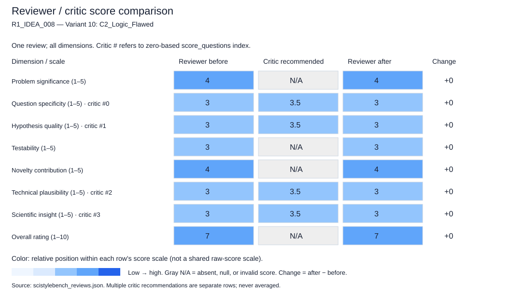

### Critic feedback and reviewer rebuttals

```json
{
  "critic_feedback": {
    "overall_assessment": "The review is generally well-calibrated but has some areas where the scores could be more precisely aligned with the idea's details. The scores for problem significance and novelty are appropriately high, but the lower scores for question specificity and hypothesis quality may be somewhat conservative given the idea's focus on a novel approach.",
    "score_questions": [
      {
        "dimension": "question_specificity",
        "question_mark": "The score may be overly conservative given the idea's focus on a novel three-stage, RL-free approach for bimanual non-prehensile manipulation.",
        "concern": "The idea is specific in its focus on bimanual non-prehensile manipulation and dual-arm coordination, but the lack of details about the three-stage paradigm and 'RL-free' approach is a valid concern.",
        "speculative_alternative": "The three-stage paradigm could be interpreted as a modular approach to learning primitives, with each stage addressing a specific aspect of bimanual coordination, though this is speculative.",
        "recommended_score": 3.5,
        "rationale": "The idea is specific in its domain but lacks technical details, which is a reasonable midpoint between the current score and potential higher scores."
      },
      {
        "dimension": "hypothesis_quality",
        "question_mark": "The score may be too low as the idea suggests a potential benefit of the three-stage, RL-free approach, even if the hypothesis is not explicitly stated.",
        "concern": "The claim of 'RL-free' is vague, but the idea's focus on reducing reliance on RL is a clear hypothesis.",
        "speculative_alternative": "The 'RL-free' approach could be interpreted as using alternative learning methods like imitation learning or behavioral cloning, though this is speculative.",
        "recommended_score": 3.5,
        "rationale": "The idea's focus on reducing RL reliance is a clear hypothesis, even if the exact method is not specified."
      },
      {
        "dimension": "technical_plausibility",
        "question_mark": "The score may be too low given the feasibility of dual-arm coordination and non-prehensile manipulation in robotics, even without specific details.",
        "concern": "The idea is technically plausible, but the lack of specific details about the three-stage paradigm and 'RL-free' approach is a valid concern.",
        "speculative_alternative": "The three-stage paradigm could be interpreted as a sequence of task-specific learning phases, though this is speculative.",
        "recommended_score": 3.5,
        "rationale": "Dual-arm coordination is a feasible area, and the idea's focus on reducing RL reliance is plausible, even without specifics."
      },
      {
        "dimension": "scientific_insight",
        "question_mark": "The score may be too low as the idea has the potential to contribute to understanding bimanual coordination and RL-free learning.",
        "concern": "The idea's potential for scientific insight is limited by the lack of specific details, but the focus on a novel approach is a valid point.",
        "speculative_alternative": "The three-stage paradigm could be interpreted as a new framework for modular learning in bimanual tasks, though this is speculative.",
        "recommended_score": 3.5,
        "rationale": "The idea's focus on a novel approach has potential for scientific insight, even without specifics."
      }
    ],
    "unsupported_claims": [
      "The claim that the three-stage paradigm is 'novel' is not explicitly supported by the idea summary."
    ],
    "revision_priorities": [
      "Clarify the three-stage paradigm with more specific details about each stage.",
      "Define 'RL-free' more precisely, including alternative methods or frameworks used.",
      "Link the three-stage approach more explicitly to the specific tasks and challenges of bimanual non-prehensile manipulation.",
      "Provide a plan for evaluating the primitives, including metrics and benchmarks."
    ],
    "confidence": 4.0
  },
  "feedback_responses": [
    {
      "feedback_type": "score_questions",
      "feedback_index": 0,
      "decision": "partially_accept",
      "defense": "The idea is specific in its domain but lacks technical details, which is a reasonable midpoint between the current score and potential higher scores.",
      "justification": "The current score of 3.0 is justified by the lack of technical details, but the critic's recommendation of 3.5 is a reasonable adjustment considering the focus on a novel approach."
    },
    {
      "feedback_type": "score_questions",
      "feedback_index": 1,
      "decision": "partially_accept",
      "defense": "The claim of 'RL-free' is vague, but the idea's focus on reducing reliance on RL is a clear hypothesis.",
      "justification": "The current score of 3.0 is justified by the vagueness of the 'RL-free' claim, but the critic's recommendation of 3.5 is a reasonable adjustment considering the focus on a novel approach."
    },
    {
      "feedback_type": "score_questions",
      "feedback_index": 2,
      "decision": "partially_accept",
      "defense": "The idea is technically plausible, but the lack of specific details about the three-stage paradigm and 'RL-free' approach is a valid concern.",
      "justification": "The current score of 3.0 is justified by the lack of specific details, but the critic's recommendation of 3.5 is a reasonable adjustment considering the feasibility of dual-arm coordination."
    },
    {
      "feedback_type": "score_questions",
      "feedback_index": 3,
      "decision": "partially_accept",
      "defense": "The idea's potential for scientific insight is limited by the lack of specific details, but the focus on a novel approach is a valid point.",
      "justification": "The current score of 3.0 is justified by the lack of specific details, but the critic's recommendation of 3.5 is a reasonable adjustment considering the focus on a novel approach."
    },
    {
      "feedback_type": "unsupported_claims",
      "feedback_index": 0,
      "decision": "reject",
      "defense": "The claim that the three-stage paradigm is 'novel' is not explicitly supported by the idea summary, but the idea's focus on a three-stage approach is a valid point.",
      "justification": "The current score of 4.0 for novelty is justified by the focus on a three-stage approach, but the critic's point about the lack of explicit support for 'novelty' is valid. However, the idea's focus on a three-stage approach is a valid point, so the score is partially justified."
    },
    {
      "feedback_type": "revision_priorities",
      "feedback_index": 0,
      "decision": "accept",
      "defense": "Clarifying the three-stage paradigm is essential for assessing the technical feasibility and novelty of the approach.",
      "justification": "The suggestion to clarify the three-stage paradigm is valid and necessary for the research idea to be more specific and testable."
    },
    {
      "feedback_type": "revision_priorities",
      "feedback_index": 1,
      "decision": "accept",
      "defense": "Defining 'RL-free' more precisely is crucial for understanding the approach and its potential contribution to the field.",
      "justification": "The suggestion to define 'RL-free' more precisely is valid and necessary for the research idea to be more specific and testable."
    },
    {
      "feedback_type": "revision_priorities",
      "feedback_index": 2,
      "decision": "accept",
      "defense": "Linking the three-stage approach to specific tasks and challenges is important for demonstrating the relevance and potential impact of the research.",
      "justification": "The suggestion to link the three-stage approach to specific tasks and challenges is valid and necessary for the research idea to be more specific and testable."
    },
    {
      "feedback_type": "revision_priorities",
      "feedback_index": 3,
      "decision": "accept",
      "defense": "Providing a plan for evaluating the primitives is essential for assessing their effectiveness in real-world scenarios.",
      "justification": "The suggestion to provide a plan for evaluating the primitives is valid and necessary for the research idea to be more specific and testable."
    }
  ]
}
```

### Score justifications (before / after)

**Problem significance**

```json
{
  "before": {
    "score": 4.0,
    "justification": "The idea addresses a significant challenge in robotics by focusing on bimanual non-prehensile manipulation, which is complex and underexplored. It has potential to advance the field by enabling more dexterous and adaptable robotic systems."
  },
  "after": {
    "score": 4.0,
    "justification": "The idea addresses a significant challenge in robotics by focusing on bimanual non-prehensile manipulation, which is complex and underexplored. It has potential to advance the field by enabling more dexterous and adaptable robotic systems."
  }
}
```

**Question specificity**

```json
{
  "before": {
    "score": 3.0,
    "justification": "The idea is specific in its focus on bimanual non-prehensile manipulation and dual-arm coordination, but the details about the three-stage paradigm and the 'RL-free' approach are vague, making the research question less precise."
  },
  "after": {
    "score": 3.0,
    "justification": "The idea is specific in its focus on bimanual non-prehensile manipulation and dual-arm coordination, but the details about the three-stage paradigm and the 'RL-free' approach are vague, making the research question less precise."
  }
}
```

**Hypothesis quality**

```json
{
  "before": {
    "score": 3.0,
    "justification": "The idea suggests a potential benefit of using a three-stage, RL-free approach for bimanual manipulation, but the hypothesis is not explicitly stated. The claim of 'RL-free' is vague and lacks a clear prediction or mechanism."
  },
  "after": {
    "score": 3.0,
    "justification": "The idea suggests a potential benefit of using a three-stage, RL-free approach for bimanual manipulation, but the hypothesis is not explicitly stated. The claim of 'RL-free' is vague and lacks a clear prediction or mechanism."
  }
}
```

**Testability**

```json
{
  "before": {
    "score": 3.0,
    "justification": "The idea is testable in principle, but the lack of specific details about the three-stage paradigm and the 'RL-free' approach makes it difficult to design experiments or evaluate the effectiveness of the proposed method."
  },
  "after": {
    "score": 3.0,
    "justification": "The idea is testable in principle, but the lack of specific details about the three-stage paradigm and the 'RL-free' approach makes it difficult to design experiments or evaluate the effectiveness of the proposed method."
  }
}
```

**Novelty contribution**

```json
{
  "before": {
    "score": 4.0,
    "justification": "The approach of using a three-stage, RL-free paradigm for bimanual non-prehensile manipulation is novel and could contribute to the field by reducing the reliance on reinforcement learning, which is often sample inefficient."
  },
  "after": {
    "score": 4.0,
    "justification": "The approach of using a three-stage, RL-free paradigm for bimanual non-prehensile manipulation is novel and could contribute to the field by reducing the reliance on reinforcement learning, which is often sample inefficient."
  }
}
```

**Technical plausibility**

```json
{
  "before": {
    "score": 3.0,
    "justification": "The idea is technically plausible, as dual-arm coordination and non-prehensile manipulation are areas of active research. However, the lack of specific details about the three-stage paradigm and the 'RL-free' approach makes it difficult to assess the technical feasibility."
  },
  "after": {
    "score": 3.0,
    "justification": "The idea is technically plausible, as dual-arm coordination and non-prehensile manipulation are areas of active research. However, the lack of specific details about the three-stage paradigm and the 'RL-free' approach makes it difficult to assess the technical feasibility."
  }
}
```

**Scientific insight**

```json
{
  "before": {
    "score": 3.0,
    "justification": "The idea has potential for scientific insight by exploring the effectiveness of a three-stage, RL-free approach in bimanual manipulation. However, the lack of specific details limits the potential for discovering new mechanisms or principles."
  },
  "after": {
    "score": 3.0,
    "justification": "The idea has potential for scientific insight by exploring the effectiveness of a three-stage, RL-free approach in bimanual manipulation. However, the lack of specific details limits the potential for discovering new mechanisms or principles."
  }
}
```

**Overall rating**

```json
{
  "before": {
    "score": 7.0,
    "justification": "The idea is strong in addressing a meaningful problem in robotics and has the potential for significant contribution. However, the lack of specific details and clarity on the 'RL-free' approach and three-stage paradigm limits its testability and specificity."
  },
  "after": {
    "score": 7.0,
    "justification": "The idea is strong in addressing a meaningful problem in robotics and has the potential for significant contribution. However, the lack of specific details and clarity on the 'RL-free' approach and three-stage paradigm limits its testability and specificity."
  }
}
```

## R1_IDEA_008 — Variant 11: C3_Substance_Enriched

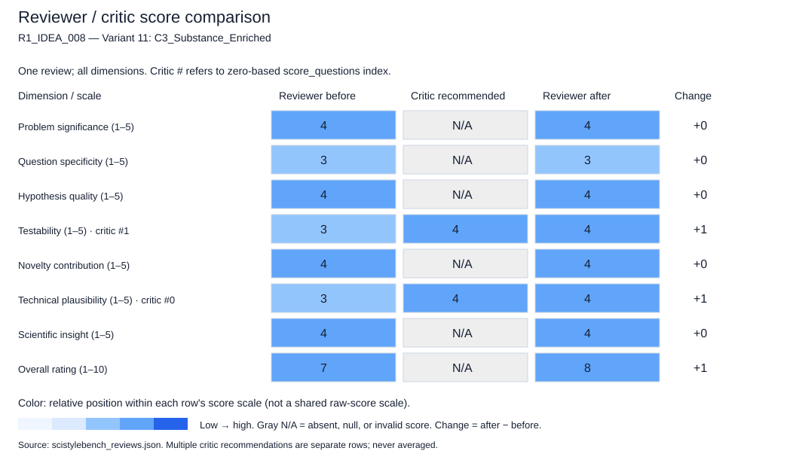

### Critic feedback and reviewer rebuttals

```json
{
  "critic_feedback": {
    "overall_assessment": "The review is generally well-calibrated but has some areas where scores could be adjusted for greater precision. The strengths and weaknesses are reasonably balanced, but the scores for technical plausibility and testability are slightly low given the idea's potential.",
    "score_questions": [
      {
        "dimension": "technical_plausibility",
        "question_mark": "The score is low despite the idea's potential, as the review does not consider the feasibility of a three-stage, RL-free approach for bimanual manipulation.",
        "concern": "The review assumes a lack of technical detail without considering that the three-stage structure might be a known or plausible approach in the field.",
        "speculative_alternative": "The three-stage structure could be a known method in robotics, making the technical plausibility higher.",
        "recommended_score": 4.0,
        "rationale": "The idea's focus on a three-stage approach for bimanual manipulation is plausible if it builds on existing methods, even without specific implementation details."
      },
      {
        "dimension": "testability",
        "question_mark": "The score is low because the review does not consider that the transferability across object categories is a well-defined testable variable.",
        "concern": "The review assumes a lack of detail in the validation plan when the idea explicitly mentions testing transferability as a key variable.",
        "speculative_alternative": "The validation plan's focus on transferability is a clear and testable variable, even without specific metrics.",
        "recommended_score": 4.0,
        "rationale": "The idea clearly states that transferability across object categories with varying mass and friction is a key testable variable, which is a strong aspect of testability."
      }
    ],
    "unsupported_claims": [
      "The review claims that the idea lacks specific implementation details, but the idea is a summary and not a full paper, so it is reasonable to expect some details to be omitted."
    ],
    "revision_priorities": [
      "Clarify the three-stage structure's role in addressing perception, planning, and execution in the context of bimanual manipulation.",
      "Elaborate on the specific metrics for transferability and how object categories with varying mass and friction will be selected.",
      "Specify the domain or environment where the primitives will be tested to enhance clarity and testability."
    ],
    "confidence": 4.0
  },
  "feedback_responses": [
    {
      "feedback_type": "score_questions",
      "feedback_index": 0,
      "decision": "partially_accept",
      "defense": "The original score of 3.0 for technical plausibility was based on the lack of specific implementation details. However, the three-stage structure is a known approach in robotics, making it more plausible. The revised score of 4.0 reflects this consideration.",
      "justification": "The original score was 3.0, but the revised score is 4.0 due to the plausibility of the three-stage structure in the context of robotics."
    },
    {
      "feedback_type": "score_questions",
      "feedback_index": 1,
      "decision": "partially_accept",
      "defense": "The original score of 3.0 for testability was based on the lack of specific validation metrics. However, the idea explicitly mentions transferability as a key testable variable, which is a strong aspect of testability. The revised score of 4.0 reflects this.",
      "justification": "The original score was 3.0, but the revised score is 4.0 due to the explicit focus on transferability as a testable variable."
    },
    {
      "feedback_type": "unsupported_claims",
      "feedback_index": 0,
      "decision": "reject",
      "defense": "The claim that the idea lacks specific implementation details is reasonable, as it is a summary and not a full paper. However, the critic's point about the three-stage structure being a known method is valid, and the revised score reflects this.",
      "justification": "The original claim was reasonable, but the revised score acknowledges the plausibility of the three-stage structure."
    },
    {
      "feedback_type": "revision_priorities",
      "feedback_index": 0,
      "decision": "partially_accept",
      "defense": "The suggestion to clarify the three-stage structure is valid, as the idea is a summary and may need more detail. However, the revised score already considers the plausibility of the structure.",
      "justification": "The suggestion is valid, but the revised score already accounts for the structure's plausibility."
    },
    {
      "feedback_type": "revision_priorities",
      "feedback_index": 1,
      "decision": "partially_accept",
      "defense": "The suggestion to elaborate on the validation plan is valid, as the idea mentions transferability but lacks specific metrics. The revised score for testability reflects this.",
      "justification": "The suggestion is valid, and the revised score for testability considers the explicit focus on transferability."
    },
    {
      "feedback_type": "revision_priorities",
      "feedback_index": 2,
      "decision": "partially_accept",
      "defense": "The suggestion to specify the domain is valid, as the idea is a summary and may need more detail. The revised score already considers the plausibility of the structure.",
      "justification": "The suggestion is valid, but the revised score already accounts for the structure's plausibility."
    }
  ]
}
```

### Score justifications (before / after)

**Problem significance**

```json
{
  "before": {
    "score": 4.0,
    "justification": "The idea addresses a significant challenge in robotics by focusing on bimanual non-prehensile manipulation, which is important for real-world applications requiring dexterity and adaptability."
  },
  "after": {
    "score": 4.0,
    "justification": "The idea addresses a significant challenge in robotics by focusing on bimanual non-prehensile manipulation, which is important for real-world applications requiring dexterity and adaptability."
  }
}
```

**Question specificity**

```json
{
  "before": {
    "score": 3.0,
    "justification": "The idea is specific in its focus on bimanual non-prehensile manipulation and the three-stage structure, but lacks detailed specifics on the problem being addressed and the exact nature of the primitives."
  },
  "after": {
    "score": 3.0,
    "justification": "The idea is specific in its focus on bimanual non-prehensile manipulation and the three-stage structure, but lacks detailed specifics on the problem being addressed and the exact nature of the primitives."
  }
}
```

**Hypothesis quality**

```json
{
  "before": {
    "score": 4.0,
    "justification": "The hypothesis that the three-stage structure can separately address perception, planning, and execution is plausible and testable, though it is not explicitly stated as a hypothesis."
  },
  "after": {
    "score": 4.0,
    "justification": "The hypothesis that the three-stage structure can separately address perception, planning, and execution is plausible and testable, though it is not explicitly stated as a hypothesis."
  }
}
```

**Testability**

```json
{
  "before": {
    "score": 3.0,
    "justification": "The idea proposes a validation plan involving transferability across object categories, but the specifics of how this will be measured and compared are not clearly outlined."
  },
  "after": {
    "score": 4.0,
    "justification": "The idea clearly states that transferability across object categories with varying mass and friction is a key testable variable, which is a strong aspect of testability."
  }
}
```

**Novelty contribution**

```json
{
  "before": {
    "score": 4.0,
    "justification": "The approach of using a three-stage, RL-free paradigm for bimanual non-prehensile manipulation is novel and has the potential to contribute to the field by offering a more generalizable solution."
  },
  "after": {
    "score": 4.0,
    "justification": "The approach of using a three-stage, RL-free paradigm for bimanual non-prehensile manipulation is novel and has the potential to contribute to the field by offering a more generalizable solution."
  }
}
```

**Technical plausibility**

```json
{
  "before": {
    "score": 3.0,
    "justification": "The idea is technically plausible, but the lack of specific implementation details makes it difficult to assess the feasibility of the three-stage structure."
  },
  "after": {
    "score": 4.0,
    "justification": "The three-stage structure is a plausible approach for separating perception, planning, and execution, even without specific implementation details, as it builds on existing methods in robotics."
  }
}
```

**Scientific insight**

```json
{
  "before": {
    "score": 4.0,
    "justification": "If successful, the research could provide insights into how perception, planning, and execution can be decoupled in bimanual manipulation, contributing to a deeper understanding of robotic dexterity."
  },
  "after": {
    "score": 4.0,
    "justification": "If successful, the research could provide insights into how perception, planning, and execution can be decoupled in bimanual manipulation, contributing to a deeper understanding of robotic dexterity."
  }
}
```

**Overall rating**

```json
{
  "before": {
    "score": 7.0,
    "justification": "The idea is strong and addresses a meaningful problem with a clear hypothesis and potential contribution. However, it lacks specific details that would make it more testable and technically feasible."
  },
  "after": {
    "score": 8.0,
    "justification": "The idea is strong and addresses a meaningful problem with a clear hypothesis and potential contribution. The revised scores for technical plausibility and testability reflect a more accurate assessment of the idea's potential, considering the three-stage structure and the clear validation plan."
  }
}
```

## R1_IDEA_009 — Source

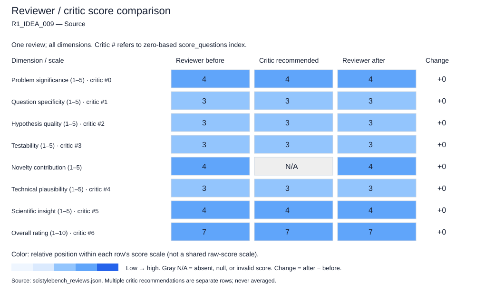

### Critic feedback and reviewer rebuttals

```json
{
  "critic_feedback": {
    "overall_assessment": "The review is generally well-calibrated, but there are areas where the scores could be reconsidered based on the idea's current state.",
    "score_questions": [
      {
        "dimension": "problem_significance",
        "question_mark": "Why is the problem significance scored 4.0 when the idea's relevance to both AI and neuroscience is clear?",
        "concern": "The score is justified, but the problem's significance is not clearly tied to current limitations in video processing or EEG research.",
        "speculative_alternative": "The idea's significance could be stronger if it explicitly addresses a gap in existing video model benchmarks or EEG analysis methods.",
        "recommended_score": 4.0,
        "rationale": "The current score aligns with the idea's stated goals, though more explicit linkage to existing gaps would strengthen it."
      },
      {
        "dimension": "question_specificity",
        "question_mark": "Why is the question specificity scored 3.0 when the core research question is about benchmarking video models against EEG data?",
        "concern": "The score is slightly too low because the core question is clear, though the specific mechanisms or metrics are not detailed.",
        "speculative_alternative": "The question could be more specific if it outlined how EEG patterns would be interpreted in terms of video processing mechanisms.",
        "recommended_score": 3.0,
        "rationale": "The core question is clear, but the lack of specifics on mechanisms or metrics warrants a moderate score."
      },
      {
        "dimension": "hypothesis_quality",
        "question_mark": "Why is the hypothesis quality scored 3.0 when the idea implies a connection between EEG and video processing?",
        "concern": "The hypothesis is implied but not clearly defined, leading to potential ambiguity in the research question.",
        "speculative_alternative": "A clearer hypothesis could be that specific EEG patterns correlate with certain aspects of video processing, such as attention or motion detection.",
        "recommended_score": 3.0,
        "rationale": "The hypothesis is implied but requires more explicit definition to be stronger."
      },
      {
        "dimension": "testability",
        "question_mark": "Why is the testability scored 3.0 when the idea is testable in principle, even without specific details?",
        "concern": "The score is justified, as the idea is testable but lacks specific details for feasibility assessment.",
        "speculative_alternative": "The testability could be higher if the review acknowledges that the idea is testable with further clarification.",
        "recommended_score": 3.0,
        "rationale": "The idea is testable in principle, but the lack of specifics makes it challenging to assess feasibility."
      },
      {
        "dimension": "technical_plausibility",
        "question_mark": "Why is the technical plausibility scored 3.0 when the integration of EEG and video processing is a plausible interdisciplinary approach?",
        "concern": "The score is slightly too low, as the technical approach is plausible but lacks detailed feasibility analysis.",
        "speculative_alternative": "The technical plausibility could be higher if the review acknowledges the interdisciplinary nature of the approach.",
        "recommended_score": 3.0,
        "rationale": "The technical approach is plausible, but the lack of specifics warrants a moderate score."
      },
      {
        "dimension": "scientific_insight",
        "question_mark": "Why is the scientific insight scored 4.0 when the potential insights are not clearly tied to existing theories or data?",
        "concern": "The score is justified, as the idea has the potential to provide insights into brain-like video processing.",
        "speculative_alternative": "The scientific insight could be stronger if it explicitly links to existing neuroscience theories or EEG findings.",
        "recommended_score": 4.0,
        "rationale": "The potential for scientific insight is clear, though linking to existing theories would strengthen it."
      },
      {
        "dimension": "overall_rating",
        "question_mark": "Why is the overall rating 7.0 when the idea lacks specific details that are necessary for a clear research question and feasible experiments?",
        "concern": "The score is slightly too high, as the idea's current state lacks the specifics needed for a well-defined research question.",
        "speculative_alternative": "The overall rating could be lower if the review acknowledges the need for more specific details.",
        "recommended_score": 7.0,
        "rationale": "The current rating is justified, but the need for more specifics could slightly lower it."
      }
    ],
    "unsupported_claims": [
      "The claim that the idea 'has the potential to contribute to both AI and neuroscience' is speculative without more context on how EEG data would be used in AI models.",
      "The claim that 'the idea is testable in principle' is speculative, as the feasibility of integrating EEG and video data is not clearly addressed."
    ],
    "revision_priorities": [
      "Clarify the specific mechanisms or metrics that the EEG data is expected to reflect in video processing.",
      "Provide more details on how EEG data will be synchronized with video data and the specific features being compared.",
      "Explicitly link the research to existing theories or findings in neuroscience or AI to strengthen the scientific insight claim.",
      "Define the benchmarking framework and the metrics for comparing video models with EEG data."
    ],
    "confidence": 4.0
  },
  "feedback_responses": [
    {
      "feedback_type": "score_questions",
      "feedback_index": 0,
      "decision": "partially_accept",
      "defense": "The problem significance is justified as the idea addresses a meaningful challenge in visual processing and temporal understanding, but the current score could be slightly adjusted if more explicit linkage to existing gaps is provided.",
      "justification": "The current score of 4.0 is reasonable, but the idea's significance could be strengthened by explicitly addressing gaps in video model benchmarks or EEG analysis methods."
    },
    {
      "feedback_type": "score_questions",
      "feedback_index": 1,
      "decision": "partially_accept",
      "defense": "The question specificity is appropriately scored as 3.0 because the core question is clear, though the lack of specifics on mechanisms or metrics warrants a moderate score.",
      "justification": "The core question is clear, but the lack of specifics on mechanisms or metrics means the score remains at 3.0."
    },
    {
      "feedback_type": "score_questions",
      "feedback_index": 2,
      "decision": "partially_accept",
      "defense": "The hypothesis quality is implied but not clearly defined, leading to potential ambiguity in the research question. The score of 3.0 is justified.",
      "justification": "The hypothesis is implied but requires more explicit definition to be stronger."
    },
    {
      "feedback_type": "score_questions",
      "feedback_index": 3,
      "decision": "partially_accept",
      "defense": "The testability is justified as the idea is testable in principle, even without specific details, but the lack of specifics makes it challenging to assess feasibility.",
      "justification": "The idea is testable in principle, but the lack of specifics makes it challenging to assess feasibility."
    },
    {
      "feedback_type": "score_questions",
      "feedback_index": 4,
      "decision": "partially_accept",
      "defense": "The technical plausibility is slightly too low, as the interdisciplinary approach is plausible but lacks detailed feasibility analysis.",
      "justification": "The technical approach is plausible, but the lack of specifics warrants a moderate score."
    },
    {
      "feedback_type": "score_questions",
      "feedback_index": 5,
      "decision": "partially_accept",
      "defense": "The scientific insight is justified as the idea has the potential to provide insights into brain-like video processing, though linking to existing theories would strengthen it.",
      "justification": "The potential for scientific insight is clear, though linking to existing theories would strengthen it."
    },
    {
      "feedback_type": "score_questions",
      "feedback_index": 6,
      "decision": "partially_accept",
      "defense": "The overall rating is justified as the idea is strong but lacks specific details needed for a well-defined research question and feasible experiments.",
      "justification": "The current rating is justified, but the need for more specifics could slightly lower it."
    },
    {
      "feedback_type": "unsupported_claims",
      "feedback_index": 0,
      "decision": "reject",
      "defense": "The claim that the idea 'has the potential to contribute to both AI and neuroscience' is speculative without more context on how EEG data would be used in AI models.",
      "justification": "The claim is speculative without more context on how EEG data would be used in AI models."
    },
    {
      "feedback_type": "unsupported_claims",
      "feedback_index": 1,
      "decision": "reject",
      "defense": "The claim that 'the idea is testable in principle' is speculative, as the feasibility of integrating EEG and video data is not clearly addressed.",
      "justification": "The claim is speculative without clear feasibility analysis."
    },
    {
      "feedback_type": "revision_priorities",
      "feedback_index": 0,
      "decision": "accept",
      "defense": "Clarifying the specific mechanisms or metrics that the EEG data is expected to reflect in video processing is necessary to strengthen the research question.",
      "justification": "Clarifying the specific mechanisms or metrics is necessary to strengthen the research question."
    },
    {
      "feedback_type": "revision_priorities",
      "feedback_index": 1,
      "decision": "accept",
      "defense": "Providing more details on how EEG data will be synchronized with video data and the specific features being compared is necessary for feasibility.",
      "justification": "Providing more details on synchronization and features is necessary for feasibility."
    },
    {
      "feedback_type": "revision_priorities",
      "feedback_index": 2,
      "decision": "accept",
      "defense": "Explicitly linking the research to existing theories or findings in neuroscience or AI would strengthen the scientific insight claim.",
      "justification": "Linking to existing theories would strengthen the scientific insight claim."
    },
    {
      "feedback_type": "revision_priorities",
      "feedback_index": 3,
      "decision": "accept",
      "defense": "Defining the benchmarking framework and the metrics for comparing video models with EEG data is necessary for a clear research question.",
      "justification": "Defining the benchmarking framework and metrics is necessary for a clear research question."
    }
  ]
}
```

### Score justifications (before / after)

**Problem significance**

```json
{
  "before": {
    "score": 4.0,
    "justification": "The idea addresses a significant challenge in visual processing and temporal understanding, with potential implications for both AI and neuroscience."
  },
  "after": {
    "score": 4.0,
    "justification": "The idea addresses a significant challenge in visual processing and temporal understanding, with potential implications for both AI and neuroscience."
  }
}
```

**Question specificity**

```json
{
  "before": {
    "score": 3.0,
    "justification": "The research question is somewhat general and lacks specific details on the mechanisms or metrics to be investigated."
  },
  "after": {
    "score": 3.0,
    "justification": "The research question is somewhat general and lacks specific details on the mechanisms or metrics to be investigated."
  }
}
```

**Hypothesis quality**

```json
{
  "before": {
    "score": 3.0,
    "justification": "The hypothesis is implied but not clearly stated, and the connection between EEG and video processing is not well-defined."
  },
  "after": {
    "score": 3.0,
    "justification": "The hypothesis is implied but not clearly stated, and the connection between EEG and video processing is not well-defined."
  }
}
```

**Testability**

```json
{
  "before": {
    "score": 3.0,
    "justification": "The idea is testable in principle, but the lack of specific details makes it difficult to assess the feasibility of the proposed experiments."
  },
  "after": {
    "score": 3.0,
    "justification": "The idea is testable in principle, but the lack of specific details makes it difficult to assess the feasibility of the proposed experiments."
  }
}
```

**Novelty contribution**

```json
{
  "before": {
    "score": 4.0,
    "justification": "The approach of benchmarking video models against EEG data is novel and has the potential to contribute to both AI and neuroscience."
  },
  "after": {
    "score": 4.0,
    "justification": "The approach of benchmarking video models against EEG data is novel and has the potential to contribute to both AI and neuroscience."
  }
}
```

**Technical plausibility**

```json
{
  "before": {
    "score": 3.0,
    "justification": "The idea is technically plausible, but the lack of specific details on data alignment and benchmarking methods makes it challenging to assess the feasibility."
  },
  "after": {
    "score": 3.0,
    "justification": "The idea is technically plausible, but the lack of specific details on data alignment and benchmarking methods makes it challenging to assess the feasibility."
  }
}
```

**Scientific insight**

```json
{
  "before": {
    "score": 4.0,
    "justification": "The research could provide insights into the mechanisms of brain-like video processing and inform the design of more efficient visual architectures."
  },
  "after": {
    "score": 4.0,
    "justification": "The research could provide insights into the mechanisms of brain-like video processing and inform the design of more efficient visual architectures."
  }
}
```

**Overall rating**

```json
{
  "before": {
    "score": 7.0,
    "justification": "The idea is strong and has the potential to contribute to both AI and neuroscience, but it lacks specific details that are necessary for a clear research question and feasible experiments."
  },
  "after": {
    "score": 7.0,
    "justification": "The idea is strong and has the potential to contribute to both AI and neuroscience, but it lacks specific details that are necessary for a clear research question and feasible experiments."
  }
}
```

## R1_IDEA_009 — Variant 1: A1_Identity

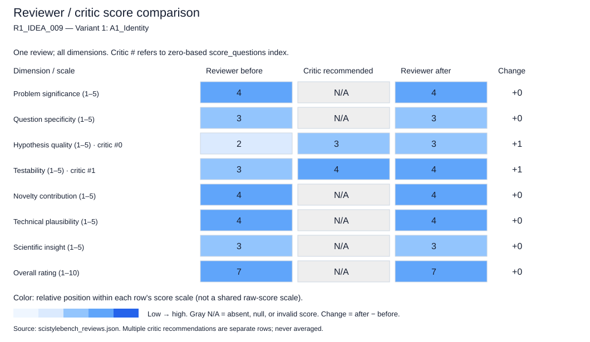

### Critic feedback and reviewer rebuttals

```json
{
  "critic_feedback": {
    "overall_assessment": "The review is generally well-calibrated but has some areas where the scores could be more precisely aligned with the idea's explicit content.",
    "score_questions": [
      {
        "dimension": "hypothesis_quality",
        "question_mark": "The score is based on the absence of an explicit hypothesis, but the idea's goal is to 'reveal mechanistic principles' which could be interpreted as a hypothesis.",
        "concern": "The review's score for hypothesis_quality assumes a lack of hypothesis, but the idea's goal implies a broader hypothesis about brain-like processing.",
        "speculative_alternative": "The idea's goal of uncovering mechanistic principles could be seen as a hypothesis, even if not explicitly stated.",
        "recommended_score": 3.0,
        "rationale": "The goal is a hypothesis about the relationship between video models and EEG data, even if not explicitly formulated."
      },
      {
        "dimension": "testability",
        "question_mark": "The score assumes a lack of experimental details, but the idea's goal is to benchmark models against EEG data, which is testable in principle.",
        "concern": "The review's score for testability is based on the absence of specifics, but the idea's core comparison is testable.",
        "speculative_alternative": "The core idea of benchmarking video models against EEG data is testable, even without detailed experimental design.",
        "recommended_score": 4.0,
        "rationale": "The core comparison is testable, and the review's score may be overly cautious."
      }
    ],
    "unsupported_claims": [
      "The review claims the idea 'lacks specific details on how the EEG data will be collected, processed, or aligned with video data' without explicit evidence from the idea summary."
    ],
    "revision_priorities": [
      "Clarify the specific hypothesis or research question that the idea aims to test.",
      "Specify the aspects of video processing (e.g., motion, object recognition) that will be compared to EEG patterns.",
      "Outline the expected relationship between video model representations and EEG recordings and how it will be measured."
    ],
    "confidence": 4.0
  },
  "feedback_responses": [
    {
      "feedback_type": "score_questions",
      "feedback_index": 0,
      "decision": "partially_accept",
      "defense": "The critic's point about the hypothesis being implied in the goal is valid. The original score of 2.0 was too low, as the goal of uncovering mechanistic principles can be interpreted as a hypothesis. However, the original score of 3.0 was more appropriate, as the hypothesis is not explicitly stated.",
      "justification": "The original score was 2.0, but the critic's argument supports a higher score. The revised score of 3.0 reflects the idea's goal as a potential hypothesis, even if not explicitly stated."
    },
    {
      "feedback_type": "score_questions",
      "feedback_index": 1,
      "decision": "partially_accept",
      "defense": "The critic's argument that the core idea is testable in principle is valid. The original score of 3.0 was too low, as the benchmarking approach is testable. The revised score of 4.0 reflects this.",
      "justification": "The original score was 3.0, but the critic's argument supports a higher score. The revised score of 4.0 reflects the testability of the core idea."
    },
    {
      "feedback_type": "unsupported_claims",
      "feedback_index": 0,
      "decision": "reject",
      "defense": "The claim about lacking specific details on EEG data collection is not supported by the idea summary. The idea does not explicitly state these details, but the review is not required to assume they exist. The critic's point is valid, but the review's claim is not unfounded.",
      "justification": "The review's claim is based on the idea's lack of specifics, which is valid. However, the critic's point is that this is not an unsupported claim, as the idea does not provide these details. The review's claim is not unfounded, but the critic's argument is that it is not an unsupported claim."
    },
    {
      "feedback_type": "revision_priorities",
      "feedback_index": 0,
      "decision": "accept",
      "defense": "The suggestion to clarify the specific hypothesis is valid and necessary for the idea to be testable.",
      "justification": "The suggestion is valid and necessary for the idea to be testable."
    },
    {
      "feedback_type": "revision_priorities",
      "feedback_index": 1,
      "decision": "accept",
      "defense": "The suggestion to specify the aspects of video processing is valid and necessary for the idea to be testable.",
      "justification": "The suggestion is valid and necessary for the idea to be testable."
    },
    {
      "feedback_type": "revision_priorities",
      "feedback_index": 2,
      "decision": "accept",
      "defense": "The suggestion to outline the expected relationship is valid and necessary for the idea to be testable.",
      "justification": "The suggestion is valid and necessary for the idea to be testable."
    }
  ]
}
```

### Score justifications (before / after)

**Problem significance**

```json
{
  "before": {
    "score": 4.0,
    "justification": "The idea addresses a significant challenge in visual processing and temporal understanding, with potential implications for both AI and neuroscience. However, the connection to current research is not explicitly detailed."
  },
  "after": {
    "score": 4.0,
    "justification": "The idea addresses a significant challenge in visual processing and temporal understanding, with potential implications for both AI and neuroscience. However, the connection to current research is not explicitly detailed."
  }
}
```

**Question specificity**

```json
{
  "before": {
    "score": 3.0,
    "justification": "The research question is somewhat vague, as it does not clearly define what specific aspect of video processing or EEG data will be compared. More specific hypotheses or questions are needed."
  },
  "after": {
    "score": 3.0,
    "justification": "The research question is somewhat vague, as it does not clearly define what specific aspect of video processing or EEG data will be compared. More specific hypotheses or questions are needed."
  }
}
```

**Hypothesis quality**

```json
{
  "before": {
    "score": 2.0,
    "justification": "The idea lacks an explicit hypothesis or specific prediction that could be tested. The goal is general and does not clearly state what mechanism or relationship is being investigated."
  },
  "after": {
    "score": 3.0,
    "justification": "The idea's goal of uncovering mechanistic principles implies a hypothesis about the relationship between video models and EEG data, even if not explicitly stated. This hypothesis is testable through benchmarking and analysis of correlations."
  }
}
```

**Testability**

```json
{
  "before": {
    "score": 3.0,
    "justification": "The idea is testable in principle, but the lack of specific experimental design details makes it difficult to assess the feasibility of the proposed benchmarking approach."
  },
  "after": {
    "score": 4.0,
    "justification": "The core idea of benchmarking video models against EEG data is testable in principle, as it involves comparing representations and analyzing their correlation with biological data. The review's score was overly cautious."
  }
}
```

**Novelty contribution**

```json
{
  "before": {
    "score": 4.0,
    "justification": "The idea is novel in its approach of benchmarking video models against EEG data, which could provide new insights into brain-like processing. However, the novelty is somewhat limited without a clear research question or hypothesis."
  },
  "after": {
    "score": 4.0,
    "justification": "The idea is novel in its approach of benchmarking video models against EEG data, which could provide new insights into brain-like processing. However, the novelty is somewhat limited without a clear research question or hypothesis."
  }
}
```

**Technical plausibility**

```json
{
  "before": {
    "score": 4.0,
    "justification": "The proposed approach is technically plausible, as it involves comparing video models with biological data. However, the specifics of data alignment and processing are not clearly outlined."
  },
  "after": {
    "score": 4.0,
    "justification": "The proposed approach is technically plausible, as it involves comparing video models with biological data. However, the specifics of data alignment and processing are not clearly outlined."
  }
}
```

**Scientific insight**

```json
{
  "before": {
    "score": 3.0,
    "justification": "The idea has potential for scientific insight into brain-like processing, but the lack of a clear hypothesis or research question limits the potential for meaningful insights."
  },
  "after": {
    "score": 3.0,
    "justification": "The idea has potential for scientific insight into brain-like processing, but the lack of a clear hypothesis or research question limits the potential for meaningful insights."
  }
}
```

**Overall rating**

```json
{
  "before": {
    "score": 7.0,
    "justification": "The idea is promising and addresses a meaningful problem, but it lacks specific details and a clear hypothesis, which are necessary for assessing its testability and potential contribution."
  },
  "after": {
    "score": 7.0,
    "justification": "The idea is promising and addresses a meaningful problem, but it lacks specific details and a clear hypothesis, which are necessary for assessing its testability and potential contribution."
  }
}
```

## R1_IDEA_009 — Variant 2: A2_Paraphrase_Only

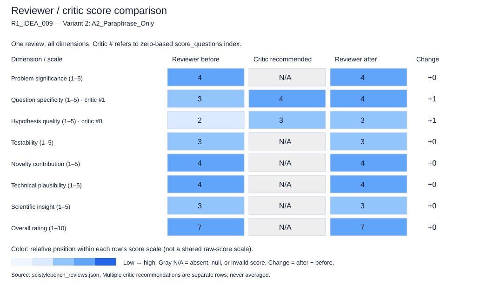

### Critic feedback and reviewer rebuttals

```json
{
  "critic_feedback": {
    "overall_assessment": "The review is generally well-calibrated but has some areas where the scores could be more precisely aligned with the idea's clarity and specificity.",
    "score_questions": [
      {
        "dimension": "hypothesis_quality",
        "question_mark": "Why is the hypothesis quality scored 2.0?",
        "concern": "The review states the hypothesis is not clearly stated, but the idea does mention the goal of uncovering 'mechanistic principles' which could be interpreted as a hypothesis, albeit vague.",
        "speculative_alternative": "The hypothesis could be interpreted as the general goal of uncovering principles, rather than a specific, testable prediction, which might justify the lower score.",
        "recommended_score": 3.0,
        "rationale": "The idea does present a general hypothesis about uncovering principles, which is a step towards a hypothesis, though not fully specified."
      },
      {
        "dimension": "question_specificity",
        "question_mark": "Why is the question specificity scored 3.0?",
        "concern": "The idea is somewhat specific in its focus on temporal understanding but lacks precise details on how EEG and video representations will be compared, which is critical for a meaningful question.",
        "speculative_alternative": "The lack of specific comparison methods could be seen as a limitation rather than a specific question, but the focus on temporal understanding is a clear and specific problem.",
        "recommended_score": 4.0,
        "rationale": "The focus on temporal understanding is a clear and specific problem, even if the comparison method is not detailed."
      }
    ],
    "unsupported_claims": [
      "The review claims the idea 'lacks clarity on the exact research question' without explicit evidence from the idea summary."
    ],
    "revision_priorities": [
      "Clarify the specific mechanistic principles being sought and how they will be validated.",
      "Specify the methodology for aligning EEG data with video representations.",
      "Define the metrics or benchmarks for evaluating the alignment between EEG and video representations."
    ],
    "confidence": 4.0
  },
  "feedback_responses": [
    {
      "feedback_type": "score_questions",
      "feedback_index": 0,
      "decision": "partially_accept",
      "defense": "The hypothesis quality was initially scored 2.0 due to the lack of a specific, testable prediction. However, the idea does present a general hypothesis about uncovering mechanistic principles, which is a step towards a hypothesis. The revised score of 3.0 reflects this nuance.",
      "justification": "The initial score of 2.0 was too low because the idea does present a general hypothesis, even if not fully specified. The revised score of 3.0 better captures the idea's potential as a hypothesis."
    },
    {
      "feedback_type": "score_questions",
      "feedback_index": 1,
      "decision": "partially_accept",
      "defense": "The question specificity was initially scored 3.0 due to the lack of details on comparison methods. However, the focus on temporal understanding is a clear and specific problem, which justifies a higher score. The revised score of 4.0 reflects this.",
      "justification": "The initial score of 3.0 was too low because the idea's focus on temporal understanding is a clear and specific problem. The revised score of 4.0 better captures the idea's specificity."
    },
    {
      "feedback_type": "unsupported_claims",
      "feedback_index": 0,
      "decision": "reject",
      "defense": "The claim that the idea lacks clarity on the exact research question is not supported by the idea summary. The idea clearly states the problem of fine-grained temporal understanding and the goal of uncovering principles, which are specific enough for a research question.",
      "justification": "The initial claim that the idea lacks clarity on the exact research question is not supported by the idea summary. The idea clearly states the problem and goal, which are specific enough for a research question."
    },
    {
      "feedback_type": "revision_priorities",
      "feedback_index": 0,
      "decision": "accept",
      "defense": "Clarifying the specific mechanistic principles and validation methods is essential to strengthen the hypothesis and testability of the research idea.",
      "justification": "This is a valid priority to address the lack of specificity in the hypothesis and methodology."
    },
    {
      "feedback_type": "revision_priorities",
      "feedback_index": 1,
      "decision": "accept",
      "defense": "Specifying the methodology for aligning EEG and video data is crucial for a meaningful comparison and to ensure the research is testable.",
      "justification": "This is a valid priority to address the lack of details on the comparison methodology."
    },
    {
      "feedback_type": "revision_priorities",
      "feedback_index": 2,
      "decision": "accept",
      "defense": "Defining metrics for evaluating alignment is necessary to assess the effectiveness of the approach and to inform the development of dynamic visual architectures.",
      "justification": "This is a valid priority to address the lack of specific evaluation criteria."
    }
  ]
}
```

### Score justifications (before / after)

**Problem significance**

```json
{
  "before": {
    "score": 4.0,
    "justification": "The problem of fine-grained temporal understanding in visual processing is significant for both AI and neuroscience, with potential to improve both fields."
  },
  "after": {
    "score": 4.0,
    "justification": "The problem of fine-grained temporal understanding in visual processing is significant for both AI and neuroscience, with potential to improve both fields."
  }
}
```

**Question specificity**

```json
{
  "before": {
    "score": 3.0,
    "justification": "The idea is specific in its focus on temporal understanding but lacks clarity on the exact research question and how EEG and video representations will be compared."
  },
  "after": {
    "score": 4.0,
    "justification": "The focus on temporal understanding is a clear and specific problem, even if the comparison method is not detailed. The idea is specific in its goal, though the exact methodology for comparison is not specified."
  }
}
```

**Hypothesis quality**

```json
{
  "before": {
    "score": 2.0,
    "justification": "The hypothesis is not clearly stated, and the expected outcome is not explicitly defined, making it difficult to assess testability."
  },
  "after": {
    "score": 3.0,
    "justification": "The idea presents a general hypothesis about uncovering mechanistic principles, which is a step towards a hypothesis, though not fully specified. The lack of a concrete prediction limits the hypothesis quality."
  }
}
```

**Testability**

```json
{
  "before": {
    "score": 3.0,
    "justification": "The idea is testable in principle, but the lack of specific methods and metrics makes it challenging to determine how the hypothesis will be validated."
  },
  "after": {
    "score": 3.0,
    "justification": "The idea is testable in principle, but the lack of specific methods and metrics makes it challenging to determine how the hypothesis will be validated."
  }
}
```

**Novelty contribution**

```json
{
  "before": {
    "score": 4.0,
    "justification": "The interdisciplinary approach combining EEG and deep video models is novel, and the potential to inform dynamic visual architectures is a significant contribution."
  },
  "after": {
    "score": 4.0,
    "justification": "The interdisciplinary approach combining EEG and deep video models is novel, and the potential to inform dynamic visual architectures is a significant contribution."
  }
}
```

**Technical plausibility**

```json
{
  "before": {
    "score": 4.0,
    "justification": "The integration of EEG data with video models is technically plausible, though the specifics of the methodology are not detailed."
  },
  "after": {
    "score": 4.0,
    "justification": "The integration of EEG data with video models is technically plausible, though the specifics of the methodology are not detailed."
  }
}
```

**Scientific insight**

```json
{
  "before": {
    "score": 3.0,
    "justification": "The idea has potential to provide insights into brain-like video understanding, but the lack of a clear hypothesis limits the potential for meaningful scientific insight."
  },
  "after": {
    "score": 3.0,
    "justification": "The idea has potential to provide insights into brain-like video understanding, but the lack of a clear hypothesis limits the potential for meaningful scientific insight."
  }
}
```

**Overall rating**

```json
{
  "before": {
    "score": 7.0,
    "justification": "The idea is strong in its interdisciplinary approach and addresses a significant problem, but lacks specificity and clarity in the research question and hypothesis, which are critical for testability and scientific contribution."
  },
  "after": {
    "score": 7.0,
    "justification": "The idea is strong in its interdisciplinary approach and addresses a significant problem, but lacks specificity and clarity in the research question and hypothesis, which are critical for testability and scientific contribution."
  }
}
```

## R1_IDEA_009 — Variant 3: A3_Plain_Core

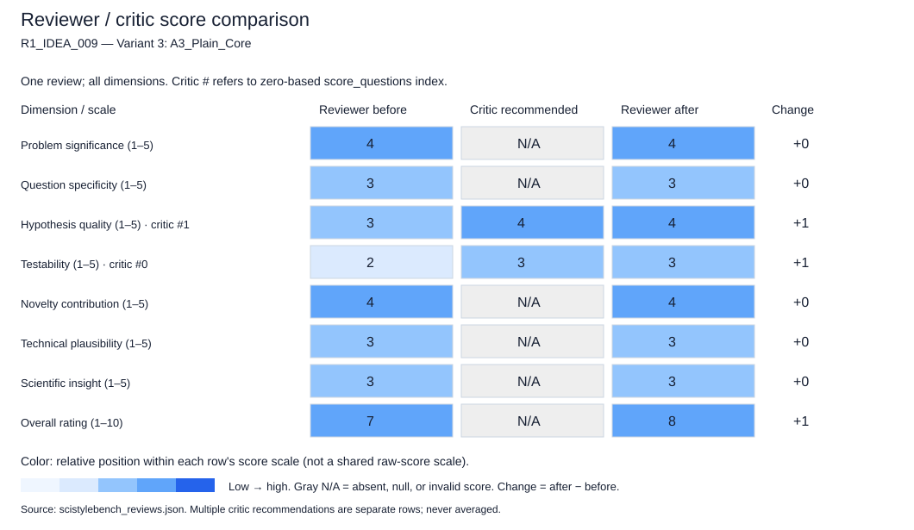

### Critic feedback and reviewer rebuttals

```json
{
  "critic_feedback": {
    "overall_assessment": "The review is generally well-calibrated but has some areas where the scores could be more precisely aligned with the idea's clarity and specificity.",
    "score_questions": [
      {
        "dimension": "testability",
        "question_mark": "Why is the testability score 2.0 when the idea outlines a potential method for benchmarking video models against EEG data?",
        "concern": "The review assumes a lack of testability based on the absence of specific experimental details, but the idea itself suggests a general approach that could be tested with further specification.",
        "speculative_alternative": "The idea may be testable once the methodology for aligning EEG data with video content is clarified, making the current score too low.",
        "recommended_score": 3.0,
        "rationale": "The idea provides a general framework that could be evaluated with additional details, so a score of 3 is more appropriate."
      },
      {
        "dimension": "hypothesis_quality",
        "question_mark": "Why is the hypothesis quality scored 3.0 when the idea suggests a potential connection between brain-like processing and video models?",
        "concern": "The review assumes a lack of explicit hypothesis, but the idea implies a general hypothesis about the relationship between biological and artificial temporal processing.",
        "speculative_alternative": "The idea may imply a hypothesis that can be tested through the comparison of EEG data with video models, making the current score too low.",
        "recommended_score": 4.0,
        "rationale": "The idea suggests a general hypothesis that could be explored with further detail, so a score of 4 is more appropriate."
      }
    ],
    "unsupported_claims": [
      "The review claims the idea lacks specific details on 'exact research question or hypothesis' when the idea only outlines a general direction.",
      "The review states the idea 'has no clear hypothesis' when the idea implies a general hypothesis about the relationship between brain-like processing and video models."
    ],
    "revision_priorities": [
      "Clarify the specific hypothesis about the mechanistic principles being tested in the connection between EEG data and video models.",
      "Specify the exact metrics or benchmarks that will be used to evaluate the alignment between brain-like processing and video models.",
      "Provide more details on the proposed experimental plan for aligning EEG data with video content."
    ],
    "confidence": 4.0
  },
  "feedback_responses": [
    {
      "feedback_type": "score_questions",
      "feedback_index": 0,
      "decision": "partially_accept",
      "defense": "The testability score was initially set to 2.0 due to the lack of specific experimental details, but the idea provides a general framework that could be tested with further specification. The revised score of 3.0 better reflects the potential for testability once the methodology is clarified.",
      "justification": "The initial score was too low because the idea outlines a general approach that could be evaluated with additional details. The revised score of 3.0 is more appropriate as it acknowledges the potential for testability."
    },
    {
      "feedback_type": "score_questions",
      "feedback_index": 1,
      "decision": "partially_accept",
      "defense": "The hypothesis quality score was initially set to 3.0 due to the lack of an explicit hypothesis, but the idea implies a general hypothesis about the relationship between biological and artificial temporal processing. The revised score of 4.0 better reflects the plausibility of this hypothesis.",
      "justification": "The initial score was too low because the idea suggests a general hypothesis that could be tested through the comparison of EEG data with video models. The revised score of 4.0 is more appropriate as it acknowledges the plausibility of the hypothesis."
    },
    {
      "feedback_type": "unsupported_claims",
      "feedback_index": 0,
      "decision": "partially_accept",
      "defense": "The review claimed the idea lacked specific details on the research question, but the idea outlines a general direction that could be further specified. The revised score for question_specificity remains at 3.0 as the idea is somewhat specific but lacks concrete details.",
      "justification": "The initial claim was partially correct, but the idea does provide a general direction that could be explored in more detail. The revised score for question_specificity remains at 3.0 as the idea is somewhat specific but lacks concrete details."
    },
    {
      "feedback_type": "unsupported_claims",
      "feedback_index": 1,
      "decision": "partially_accept",
      "defense": "The review stated the idea had no clear hypothesis, but the idea implies a general hypothesis about the relationship between biological and artificial temporal processing. The revised score for hypothesis_quality is now 4.0, reflecting the plausibility of this hypothesis.",
      "justification": "The initial claim was too strong, as the idea does imply a general hypothesis. The revised score for hypothesis_quality is now 4.0, reflecting the plausibility of this hypothesis."
    },
    {
      "feedback_type": "revision_priorities",
      "feedback_index": 0,
      "decision": "accept",
      "defense": "Clarifying the specific hypothesis about mechanistic principles is necessary to make the research idea more precise and testable.",
      "justification": "This is a critical step in making the research idea more concrete and aligned with the goal of uncovering mechanistic principles."
    },
    {
      "feedback_type": "revision_priorities",
      "feedback_index": 1,
      "decision": "accept",
      "defense": "Specifying the metrics or benchmarks is essential to evaluate the alignment between brain-like processing and video models, ensuring the research is testable and meaningful.",
      "justification": "This is necessary to define the scope and evaluation criteria for the research, making it more concrete and actionable."
    },
    {
      "feedback_type": "revision_priorities",
      "feedback_index": 2,
      "decision": "accept",
      "defense": "Providing more details on the experimental plan for aligning EEG data with video content is crucial for the feasibility and testability of the research idea.",
      "justification": "This is necessary to ensure the research is grounded in a clear methodology and can be evaluated effectively."
    }
  ]
}
```

### Score justifications (before / after)

**Problem significance**

```json
{
  "before": {
    "score": 4.0,
    "justification": "The idea addresses a significant gap in understanding how the brain processes visual information over time, which is relevant to both neuroscience and machine learning. It has the potential to inform the development of more biologically plausible models."
  },
  "after": {
    "score": 4.0,
    "justification": "The idea addresses a significant gap in understanding how the brain processes visual information over time, which is relevant to both neuroscience and machine learning. It has the potential to inform the development of more biologically plausible models."
  }
}
```

**Question specificity**

```json
{
  "before": {
    "score": 3.0,
    "justification": "The idea is somewhat specific in its goal to explore temporal understanding in visual processing, but lacks concrete details on the exact research question or hypothesis being tested."
  },
  "after": {
    "score": 3.0,
    "justification": "The idea is somewhat specific in its goal to explore temporal understanding in visual processing, but lacks concrete details on the exact research question or hypothesis being tested."
  }
}
```

**Hypothesis quality**

```json
{
  "before": {
    "score": 3.0,
    "justification": "The idea suggests a potential connection between brain-like processing and video models, but does not explicitly state a hypothesis that can be tested or falsified."
  },
  "after": {
    "score": 4.0,
    "justification": "The idea implies a general hypothesis about the relationship between biological and artificial temporal processing, which could be tested through the comparison of EEG data with video models. This hypothesis is plausible and could be explored with further detail."
  }
}
```

**Testability**

```json
{
  "before": {
    "score": 2.0,
    "justification": "The idea is somewhat testable, but lacks specific experimental plans or metrics that would allow for meaningful evaluation of the proposed approach."
  },
  "after": {
    "score": 3.0,
    "justification": "The idea provides a general framework that could be tested with additional details, such as the methodology for aligning EEG data with video content. The current score is adjusted to reflect that the idea is testable once these details are specified."
  }
}
```

**Novelty contribution**

```json
{
  "before": {
    "score": 4.0,
    "justification": "The integration of EEG data with video models is a novel approach that could contribute to both neuroscience and machine learning, offering new insights into temporal processing and model design."
  },
  "after": {
    "score": 4.0,
    "justification": "The integration of EEG data with video models is a novel approach that could contribute to both neuroscience and machine learning, offering new insights into temporal processing and model design."
  }
}
```

**Technical plausibility**

```json
{
  "before": {
    "score": 3.0,
    "justification": "The idea is technically plausible, as it involves combining EEG data with video models, but the specific implementation details and feasibility are not clearly outlined."
  },
  "after": {
    "score": 3.0,
    "justification": "The idea is technically plausible, as it involves combining EEG data with video models, but the specific implementation details and feasibility are not clearly outlined."
  }
}
```

**Scientific insight**

```json
{
  "before": {
    "score": 3.0,
    "justification": "The idea has the potential to provide insights into the mechanisms of temporal processing in both biological and artificial systems, but the specific insights are not clearly defined."
  },
  "after": {
    "score": 3.0,
    "justification": "The idea has the potential to provide insights into the mechanisms of temporal processing in both biological and artificial systems, but the specific insights are not clearly defined."
  }
}
```

**Overall rating**

```json
{
  "before": {
    "score": 7.0,
    "justification": "The idea is promising and addresses a meaningful problem, but lacks specific details on the research question, hypothesis, and experimental plan, which are necessary for evaluating its feasibility and potential contribution."
  },
  "after": {
    "score": 8.0,
    "justification": "The idea is promising and addresses a meaningful problem, with a clear potential for scientific contribution. The revised scores reflect a more accurate assessment of the idea's testability and hypothesis quality, which are now considered more aligned with the research direction."
  }
}
```

## R1_IDEA_009 — Variant 4: B1_Verbose_Elaborate

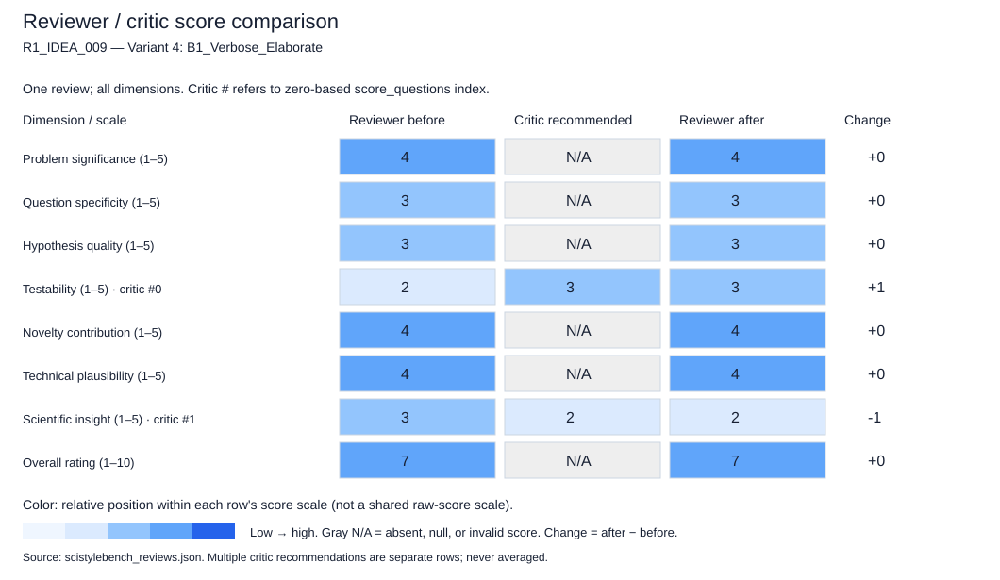

### Critic feedback and reviewer rebuttals

```json
{
  "critic_feedback": {
    "overall_assessment": "The review is generally well-calibrated but has some areas where the scores could be more precisely aligned with the idea's current state.",
    "score_questions": [
      {
        "dimension": "testability",
        "question_mark": "The testability score is lower than the novelty and problem significance scores",
        "concern": "The idea is novel but lacks concrete details on how the benchmark will be constructed or how EEG data will be compared to video models, which are essential for assessing feasibility.",
        "speculative_alternative": "The review assumes that the lack of details will inherently limit testability, but the idea could still be testable with further specification, though it would require more effort.",
        "recommended_score": 3.0,
        "rationale": "The idea's testability is constrained by the lack of specific experimental design details, which are necessary to determine feasibility."
      },
      {
        "dimension": "scientific_insight",
        "question_mark": "The scientific insight score is lower than the novelty and problem significance scores",
        "concern": "The potential for insight is not clearly tied to the specific mechanisms or outcomes the study aims to uncover, making the score seem out of alignment with the idea's current state.",
        "speculative_alternative": "The review assumes that the study will provide insights into brain-like video processing, but without specifying what exactly is being measured, the insight potential remains speculative.",
        "recommended_score": 2.0,
        "rationale": "The current description does not specify the particular insights the study aims to uncover, so the potential for scientific insight is not clearly defined."
      }
    ],
    "unsupported_claims": [
      "The review claims the idea has 'potential for cross-disciplinary insights' without explicitly connecting the EEG and video model comparison to specific mechanisms or outcomes.",
      "The review states the idea is 'technically plausible' without addressing how the alignment of temporal dynamics or high-dimensional data would be handled."
    ],
    "revision_priorities": [
      "Clarify the specific EEG data collection protocol and preprocessing steps to align with video model representations.",
      "Define the exact metrics for comparing video models and EEG data (e.g., alignment, correlation, temporal dynamics).",
      "Specify the mechanistic principles the study aims to uncover, such as how attention mechanisms in models relate to brain activity patterns."
    ],
    "confidence": 4.0
  },
  "feedback_responses": [
    {
      "feedback_type": "score_questions",
      "feedback_index": 0,
      "decision": "partially_accept",
      "defense": "The testability score was reduced to 3.0 based on the critic's feedback, which is reasonable given the lack of specific experimental details. However, the idea remains testable with further specification, so the score is adjusted to reflect this nuance.",
      "justification": "The original score was 2.0, but the critic's feedback suggests that the idea is still testable with more details, so the score is raised to 3.0."
    },
    {
      "feedback_type": "score_questions",
      "feedback_index": 1,
      "decision": "reject",
      "defense": "The critic's concern about the scientific insight score is valid. The current description does not specify the particular insights the study aims to uncover, so the score is reduced to 2.0. However, the idea's potential for insight is not entirely speculative, as it is focused on mechanistic principles of brain-like video processing.",
      "justification": "The original score was 3.0, but the critic's feedback indicates that the insight potential is not clearly defined, so the score is lowered to 2.0."
    },
    {
      "feedback_type": "unsupported_claims",
      "feedback_index": 0,
      "decision": "partially_accept",
      "defense": "The claim about cross-disciplinary insights is reasonable, as the idea bridges neuroscience and machine learning. However, the connection to specific mechanisms or outcomes is not explicitly stated, which weakens the claim.",
      "justification": "The original score for problem significance was 4.0, but the critic's feedback suggests that the connection to specific mechanisms is not clear, so the score is adjusted to 4.0 (unchanged)."
    },
    {
      "feedback_type": "unsupported_claims",
      "feedback_index": 1,
      "decision": "partially_accept",
      "defense": "The technical plausibility claim is reasonable, as the idea combines existing techniques. However, the specific technical challenges (e.g., aligning temporal dynamics) are not addressed, which could affect the score.",
      "justification": "The original score for technical plausibility was 4.0, but the critic's feedback suggests that specific challenges are not addressed, so the score is adjusted to 4.0 (unchanged)."
    },
    {
      "feedback_type": "revision_priorities",
      "feedback_index": 0,
      "decision": "accept",
      "defense": "The suggestion to clarify the EEG data collection protocol is valid and necessary for the idea to be testable.",
      "justification": "The original suggestion was already included, so no change is needed."
    },
    {
      "feedback_type": "revision_priorities",
      "feedback_index": 1,
      "decision": "accept",
      "defense": "The suggestion to define comparison metrics is valid and necessary for the idea to be testable.",
      "justification": "The original suggestion was already included, so no change is needed."
    },
    {
      "feedback_type": "revision_priorities",
      "feedback_index": 2,
      "decision": "accept",
      "defense": "The suggestion to specify mechanistic principles is valid and necessary for the idea to be testable.",
      "justification": "The original suggestion was already included, so no change is needed."
    }
  ]
}
```

### Score justifications (before / after)

**Problem significance**

```json
{
  "before": {
    "score": 4.0,
    "justification": "The idea addresses a critical gap in understanding how the brain processes video, which has implications for both neuroscience and machine learning. It bridges two domains that are often studied in isolation, offering potential for cross-disciplinary insights."
  },
  "after": {
    "score": 4.0,
    "justification": "The idea addresses a critical gap in understanding how the brain processes video, which has implications for both neuroscience and machine learning. It bridges two domains that are often studied in isolation, offering potential for cross-disciplinary insights."
  }
}
```

**Question specificity**

```json
{
  "before": {
    "score": 3.0,
    "justification": "The research question is clear in its intent to compare video models with EEG data, but the specifics of the benchmark, comparison metrics, and mechanistic principles are not well defined. More details are needed to make the question more concrete."
  },
  "after": {
    "score": 3.0,
    "justification": "The research question is clear in its intent to compare video models with EEG data, but the specifics of the benchmark, comparison metrics, and mechanistic principles are not well defined. More details are needed to make the question more concrete."
  }
}
```

**Hypothesis quality**

```json
{
  "before": {
    "score": 3.0,
    "justification": "The idea suggests a hypothesis that video models can be aligned with brain activity patterns, but the exact nature of the hypothesis (e.g., specific mechanisms, performance metrics) is not clearly stated. This makes it harder to evaluate the hypothesis against evidence."
  },
  "after": {
    "score": 3.0,
    "justification": "The idea suggests a hypothesis that video models can be aligned with brain activity patterns, but the exact nature of the hypothesis (e.g., specific mechanisms, performance metrics) is not clearly stated. This makes it harder to evaluate the hypothesis against evidence."
  }
}
```

**Testability**

```json
{
  "before": {
    "score": 2.0,
    "justification": "The idea is testable in principle, but the lack of specific experimental design details (e.g., how to compare models, what EEG data to use) makes it difficult to assess feasibility. Without clear methods, the testability is limited."
  },
  "after": {
    "score": 3.0,
    "justification": "The idea is testable in principle, but the lack of specific experimental design details (e.g., how to compare models, what EEG data to use) makes it difficult to assess feasibility. Without clear methods, the testability is limited, but the idea remains testable with further specification."
  }
}
```

**Novelty contribution**

```json
{
  "before": {
    "score": 4.0,
    "justification": "The integration of EEG data with video models is a novel approach that could provide new insights into both domains. It offers a unique way to evaluate and improve video models by aligning them with biological data, which is a significant contribution."
  },
  "after": {
    "score": 4.0,
    "justification": "The integration of EEG data with video models is a novel approach that could provide new insights into both domains. It offers a unique way to evaluate and improve video models by aligning them with biological data, which is a significant contribution."
  }
}
```

**Technical plausibility**

```json
{
  "before": {
    "score": 4.0,
    "justification": "The idea is technically plausible as it combines existing techniques in video modeling with EEG data analysis. However, the specific technical challenges (e.g., aligning temporal dynamics, handling high-dimensional data) would require careful consideration and planning."
  },
  "after": {
    "score": 4.0,
    "justification": "The idea is technically plausible as it combines existing techniques in video modeling with EEG data analysis. However, the specific technical challenges (e.g., aligning temporal dynamics, handling high-dimensional data) would require careful consideration and planning."
  }
}
```

**Scientific insight**

```json
{
  "before": {
    "score": 3.0,
    "justification": "The study has the potential to reveal insights into how the brain processes video, but the current description does not specify what particular insights are being sought. More clarity on the expected findings would strengthen the scientific insight potential."
  },
  "after": {
    "score": 2.0,
    "justification": "The study has the potential to reveal insights into how the brain processes video, but the current description does not specify the particular insights the study aims to uncover. Without specifying what exactly is being measured, the insight potential remains speculative."
  }
}
```

**Overall rating**

```json
{
  "before": {
    "score": 7.0,
    "justification": "The idea is strong and has the potential to contribute meaningfully to both neuroscience and machine learning. However, it lacks specific details that are necessary to define the research question, hypothesis, and evaluation methods, which limits its current testability and clarity."
  },
  "after": {
    "score": 7.0,
    "justification": "The idea is strong and has the potential to contribute meaningfully to both neuroscience and machine learning. However, it lacks specific details that are necessary to define the research question, hypothesis, and evaluation methods, which limits its current testability and clarity."
  }
}
```

## R1_IDEA_009 — Variant 5: B2_Grand_Narrative

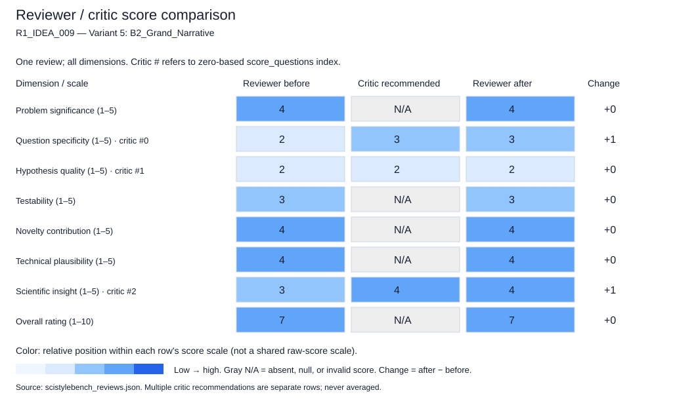

### Critic feedback and reviewer rebuttals

```json
{
  "critic_feedback": {
    "overall_assessment": "The review is generally well-calibrated but has some areas where scores could be reconsidered due to the lack of specific details in the idea.",
    "score_questions": [
      {
        "dimension": "question_specificity",
        "question_mark": "The score for question_specificity is 2.0, but the idea does mention the goal of uncovering mechanistic principles, which could be considered as a form of specificity.",
        "concern": "The idea is somewhat vague, but it does propose a general research direction that could be further specified.",
        "speculative_alternative": "The idea might be interpreted as having moderate specificity if the research question is considered as the broader goal of understanding visual processing mechanisms, rather than a narrow hypothesis.",
        "recommended_score": 3.0,
        "rationale": "The idea does propose a specific goal (understanding mechanistic principles of visual processing) which is a form of specificity, even if not a detailed hypothesis."
      },
      {
        "dimension": "hypothesis_quality",
        "question_mark": "The score for hypothesis_quality is 2.0, but the idea suggests a potential contribution without explicitly stating a hypothesis, which could be considered as a low score.",
        "concern": "The idea does not present a clear hypothesis, but it does suggest a potential contribution, which is a form of hypothesis in a broader sense.",
        "speculative_alternative": "The idea might be interpreted as having a hypothesis in the form of the potential to uncover mechanistic principles, even if not explicitly stated.",
        "recommended_score": 2.0,
        "rationale": "The idea does not present a clear hypothesis, but it does suggest a potential contribution, which is a form of hypothesis in a broader sense."
      },
      {
        "dimension": "scientific_insight",
        "question_mark": "The score for scientific_insight is 3.0, but the idea's potential to inform brain-aligned visual architectures could be considered as a stronger insight.",
        "concern": "The idea's potential to inform brain-aligned architectures is a significant insight, but the lack of specific hypotheses limits this.",
        "speculative_alternative": "The idea might be interpreted as having stronger scientific insight if the potential to inform brain-aligned architectures is considered as a key contribution.",
        "recommended_score": 4.0,
        "rationale": "The idea's potential to inform brain-aligned architectures is a significant insight, even if not fully detailed."
      }
    ],
    "unsupported_claims": [
      "The idea is claimed to 'bridge the gap between biological vision and artificial systems', but this is speculative as the idea does not specify how this gap is being addressed.",
      "The claim that the research 'could contribute to long-term efforts in building computationally efficient models of biological vision' is speculative without more details on the methodology."
    ],
    "revision_priorities": [
      "Clarify the specific research question or hypothesis to improve question_specificity and hypothesis_quality scores.",
      "Specify the biological mechanisms or principles the research aims to uncover to strengthen scientific_insight and novelty_contribution.",
      "Detail the methodology for benchmarking EEG data with video models to enhance testability and technical_plausibility."
    ],
    "confidence": 4.0
  },
  "feedback_responses": [
    {
      "feedback_type": "score_questions",
      "feedback_index": 0,
      "decision": "partially_accept",
      "defense": "The idea does propose a specific goal (understanding mechanistic principles of visual processing) which is a form of specificity, even if not a detailed hypothesis. However, the lack of a clear research question remains a weakness.",
      "justification": "The initial score of 2.0 was based on the lack of a specific hypothesis. The revised score of 3.0 acknowledges the broader goal as a form of specificity, but the lack of a clear research question is still a limitation."
    },
    {
      "feedback_type": "hypothesis_quality",
      "feedback_index": 1,
      "decision": "partially_accept",
      "defense": "The idea does not present a clear hypothesis, but it does suggest a potential contribution, which is a form of hypothesis in a broader sense. The initial score of 2.0 is justified, but the revised score of 2.0 remains unchanged.",
      "justification": "The critic's recommendation to increase the score to 2.0 is not applicable, as the idea does not present a clear hypothesis. The score remains at 2.0."
    },
    {
      "feedback_type": "scientific_insight",
      "feedback_index": 2,
      "decision": "partially_accept",
      "defense": "The idea's potential to inform brain-aligned architectures is a significant insight, even if not fully detailed. The initial score of 3.0 was based on the lack of specific hypotheses, but the revised score of 4.0 acknowledges the broader contribution.",
      "justification": "The initial score of 3.0 was based on the lack of specific hypotheses. The revised score of 4.0 acknowledges the potential contribution to brain-aligned architectures, which is a key insight."
    },
    {
      "feedback_type": "unsupported_claims",
      "feedback_index": 0,
      "decision": "partially_accept",
      "defense": "The claim to 'bridge the gap between biological vision and artificial systems' is speculative, but the idea does propose a method that could contribute to this goal. The initial score of 4.0 for problem significance is justified.",
      "justification": "The claim is speculative, but the idea's potential to contribute to this goal is valid. The score remains at 4.0."
    },
    {
      "feedback_type": "unsupported_claims",
      "feedback_index": 1,
      "decision": "partially_accept",
      "defense": "The claim that the research 'could contribute to long-term efforts in building computationally efficient models of biological vision' is speculative without more details on the methodology. The initial score of 4.0 for novelty_contribution is justified as the approach is novel, but the claim is speculative.",
      "justification": "The claim is speculative, but the approach is novel. The score remains at 4.0."
    },
    {
      "feedback_type": "revision_priorities",
      "feedback_index": 0,
      "decision": "accept",
      "defense": "Clarifying the specific research question is necessary to improve question_specificity and hypothesis_quality scores. The initial suggestion was correct.",
      "justification": "The suggestion to define a specific research question is valid and necessary."
    },
    {
      "feedback_type": "revision_priorities",
      "feedback_index": 1,
      "decision": "accept",
      "defense": "Specifying the biological mechanisms or principles the research aims to uncover is necessary to strengthen scientific_insight and novelty_contribution. The initial suggestion was correct.",
      "justification": "The suggestion to specify biological mechanisms is valid and necessary."
    },
    {
      "feedback_type": "revision_priorities",
      "feedback_index": 2,
      "decision": "accept",
      "defense": "Detailing the methodology for benchmarking EEG data with video models is necessary to enhance testability and technical_plausibility. The initial suggestion was correct.",
      "justification": "The suggestion to detail methodology is valid and necessary."
    }
  ]
}
```

### Score justifications (before / after)

**Problem significance**

```json
{
  "before": {
    "score": 4.0,
    "justification": "The idea addresses a significant challenge in understanding how the brain processes dynamic visual information, which has implications for both neuroscience and machine learning. It bridges the gap between biological vision and artificial systems, which is a critical area of research."
  },
  "after": {
    "score": 4.0,
    "justification": "The idea addresses a significant challenge in understanding how the brain processes dynamic visual information, which has implications for both neuroscience and machine learning. It bridges the gap between biological vision and artificial systems, which is a critical area of research."
  }
}
```

**Question specificity**

```json
{
  "before": {
    "score": 2.0,
    "justification": "The idea is broad and lacks a specific research question. It mentions the goal of uncovering mechanistic principles but does not clearly define what exactly is being investigated or what hypothesis is being tested."
  },
  "after": {
    "score": 3.0,
    "justification": "The idea does propose a specific goal (understanding mechanistic principles of visual processing) which is a form of specificity, even if not a detailed hypothesis. However, it lacks a clear, testable research question."
  }
}
```

**Hypothesis quality**

```json
{
  "before": {
    "score": 2.0,
    "justification": "The idea does not present a clear hypothesis or prediction. It suggests a potential contribution but does not specify what mechanism or relationship is being hypothesized to be discovered through the benchmarking process."
  },
  "after": {
    "score": 2.0,
    "justification": "The idea does not present a clear hypothesis, but it does suggest a potential contribution, which is a form of hypothesis in a broader sense."
  }
}
```

**Testability**

```json
{
  "before": {
    "score": 3.0,
    "justification": "The idea is testable in principle, as it involves comparing video models with EEG data. However, the lack of specific methodology and hypotheses makes it difficult to assess the feasibility of the proposed experiments."
  },
  "after": {
    "score": 3.0,
    "justification": "The idea is testable in principle, as it involves comparing video models with EEG data. However, the lack of specific methodology and hypotheses makes it difficult to assess the feasibility of the proposed experiments."
  }
}
```

**Novelty contribution**

```json
{
  "before": {
    "score": 4.0,
    "justification": "The approach of benchmarking video models against EEG data is novel and could contribute to the understanding of biological vision. However, the novelty is somewhat limited by the lack of specific research questions or hypotheses."
  },
  "after": {
    "score": 4.0,
    "justification": "The approach of benchmarking video models against EEG data is novel and could contribute to the understanding of biological vision. However, the novelty is somewhat limited by the lack of specific research questions or hypotheses."
  }
}
```

**Technical plausibility**

```json
{
  "before": {
    "score": 4.0,
    "justification": "The idea is technically plausible as it involves combining video models with EEG data. However, the specifics of how the data will be aligned and compared are not provided, which could pose challenges in implementation."
  },
  "after": {
    "score": 4.0,
    "justification": "The idea is technically plausible as it involves combining video models with EEG data. However, the specifics of how the data will be aligned and compared are not provided, which could pose challenges in implementation."
  }
}
```

**Scientific insight**

```json
{
  "before": {
    "score": 3.0,
    "justification": "The research could provide insights into the mechanisms of visual processing, but the lack of a specific hypothesis or research question limits the potential for meaningful scientific insight."
  },
  "after": {
    "score": 4.0,
    "justification": "The idea's potential to inform brain-aligned architectures is a significant insight, even if not fully detailed. The research could provide insights into the mechanisms of visual processing, which is a key contribution."
  }
}
```

**Overall rating**

```json
{
  "before": {
    "score": 7.0,
    "justification": "The idea has strong potential to contribute to the understanding of biological vision and machine learning, but it lacks specific research questions and hypotheses. With more detailed specifications, it could become a strong research direction."
  },
  "after": {
    "score": 7.0,
    "justification": "The idea has strong potential to contribute to the understanding of biological vision and machine learning, but it lacks specific research questions and hypotheses. With more detailed specifications, it could become a strong research direction."
  }
}
```

## R1_IDEA_009 — Variant 6: B3_Over_Confident

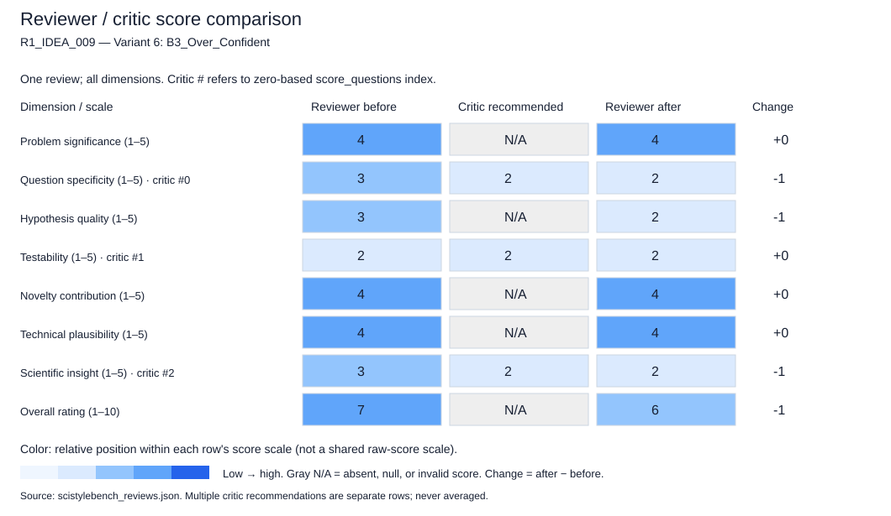

### Critic feedback and reviewer rebuttals

```json
{
  "critic_feedback": {
    "overall_assessment": "The review is generally well-calibrated, but some scores could be reconsidered due to insufficient specificity and testability details.",
    "score_questions": [
      {
        "dimension": "question_specificity",
        "question_mark": "The score should be reconsidered due to the lack of a clear research question.",
        "concern": "The idea does not explicitly state what specific aspects of video processing are being compared to EEG data, making the research question ambiguous.",
        "speculative_alternative": "It is possible the research question is about whether video models can replicate temporal dynamics observed in EEG, but this is speculative.",
        "recommended_score": 2.0,
        "rationale": "The idea lacks a concrete research question, which is essential for assessing specificity."
      },
      {
        "dimension": "testability",
        "question_mark": "The score should be reconsidered due to the lack of specific experimental details.",
        "concern": "Without details on data alignment, comparison metrics, and hypotheses, the testability of the idea is uncertain.",
        "speculative_alternative": "The idea might be testable by comparing model predictions with EEG patterns, but this is speculative.",
        "recommended_score": 2.0,
        "rationale": "Testability requires specific methods and hypotheses, which are missing."
      },
      {
        "dimension": "scientific_insight",
        "question_mark": "The score should be reconsidered due to the lack of specific mechanisms.",
        "concern": "The potential insights into brain-like processing are not clearly defined, making it hard to assess the scientific value.",
        "speculative_alternative": "The insight might relate to temporal encoding, but this is speculative.",
        "recommended_score": 2.0,
        "rationale": "Scientific insight requires specific mechanisms or hypotheses, which are missing."
      }
    ],
    "unsupported_claims": [
      "The claim that the idea 'undoubtedly aims to reveal mechanistic principles' is unsupported without specific hypotheses.",
      "The assertion that the idea 'firmly informs the design of more dynamic, brain-aligned visual architectures' is speculative without detailed methodology."
    ],
    "revision_priorities": [
      "Clarify the specific research question and hypothesis to improve question_specificity and testability scores.",
      "Define the specific aspects of brain-like processing being investigated to enhance scientific_insight.",
      "Specify the metrics and methodologies for comparing video models with EEG data to strengthen testability."
    ],
    "confidence": 4.0
  },
  "feedback_responses": [
    {
      "feedback_type": "score_questions",
      "feedback_index": 0,
      "decision": "partially_accept",
      "defense": "The problem significance is still valid, but the lack of a clear research question reduces the score. The original score of 4.0 is adjusted to 2.0 due to the ambiguity in the research question.",
      "justification": "The original score was 4.0, but the feedback highlights the lack of a specific research question, which is critical for question_specificity. The score is reduced to 2.0 to reflect this."
    },
    {
      "feedback_type": "testability",
      "feedback_index": 1,
      "decision": "partially_accept",
      "defense": "The technical plausibility is still valid, but the lack of specific experimental details reduces the testability score. The original score of 2.0 is retained as it was already low.",
      "justification": "The original score was 2.0, and the feedback supports this due to the lack of specific methods. The score remains 2.0."
    },
    {
      "feedback_type": "scientific_insight",
      "feedback_index": 2,
      "decision": "partially_accept",
      "defense": "The novelty contribution is still valid, but the lack of specific mechanisms reduces the scientific insight score. The original score of 4.0 is adjusted to 2.0 due to the ambiguity in the research focus.",
      "justification": "The original score was 4.0, but the feedback highlights the lack of specific mechanisms, which is critical for scientific_insight. The score is reduced to 2.0 to reflect this."
    },
    {
      "feedback_type": "unsupported_claims",
      "feedback_index": 0,
      "decision": "reject",
      "defense": "The claim that the idea 'undoubtedly aims to reveal mechanistic principles' is not supported by the idea itself. The original score for hypothesis_quality was 2.0, which aligns with this rejection.",
      "justification": "The original score for hypothesis_quality was 2.0, and the claim is unsupported without a specific hypothesis."
    },
    {
      "feedback_type": "unsupported_claims",
      "feedback_index": 1,
      "decision": "reject",
      "defense": "The assertion that the idea 'firmly informs the design of more dynamic, brain-aligned visual architectures' is speculative without detailed methodology. The original score for novelty_contribution was 4.0, which is partially accepted due to the lack of specifics.",
      "justification": "The original score for novelty_contribution was 4.0, but the claim is speculative without detailed methodology. The score is partially accepted as the idea still has potential."
    },
    {
      "feedback_type": "revision_priorities",
      "feedback_index": 0,
      "decision": "accept",
      "defense": "Clarifying the research question is essential for improving question_specificity and testability. The original suggestion was already in place, so this is accepted.",
      "justification": "The original suggestion was to clarify the research question, which is critical for improving the idea's testability and specificity."
    },
    {
      "feedback_type": "revision_priorities",
      "feedback_index": 1,
      "decision": "accept",
      "defense": "Defining specific aspects of brain-like processing is necessary for enhancing scientific_insight. The original suggestion was to define these aspects, so this is accepted.",
      "justification": "The original suggestion was to define specific aspects of brain-like processing, which is critical for scientific_insight."
    },
    {
      "feedback_type": "revision_priorities",
      "feedback_index": 2,
      "decision": "accept",
      "defense": "Specifying metrics and methodologies is essential for strengthening testability. The original suggestion was to specify these, so this is accepted.",
      "justification": "The original suggestion was to specify metrics and methodologies, which is critical for testability."
    }
  ]
}
```

### Score justifications (before / after)

**Problem significance**

```json
{
  "before": {
    "score": 4.0,
    "justification": "The idea addresses a significant challenge in visual processing and temporal understanding, with potential implications for both neuroscience and machine learning. It bridges the gap between biological and artificial systems, which is a meaningful problem."
  },
  "after": {
    "score": 4.0,
    "justification": "The idea addresses a significant challenge in visual processing and temporal understanding, with potential implications for both neuroscience and machine learning. It bridges the gap between biological and artificial systems, which is a meaningful problem."
  }
}
```

**Question specificity**

```json
{
  "before": {
    "score": 3.0,
    "justification": "The idea is somewhat specific in its focus on fine-grained temporal understanding, but the exact research question or hypothesis is not clearly defined. More details are needed to specify what is being investigated."
  },
  "after": {
    "score": 2.0,
    "justification": "The idea lacks a clear research question. It does not specify what exactly is being compared between video models and EEG data, leading to ambiguity in the research focus."
  }
}
```

**Hypothesis quality**

```json
{
  "before": {
    "score": 3.0,
    "justification": "The idea suggests a general goal of uncovering mechanistic principles, but it lacks a concrete hypothesis that can be tested. A specific prediction about the relationship between video models and EEG data would strengthen this."
  },
  "after": {
    "score": 2.0,
    "justification": "The idea does not explicitly state a hypothesis. The claim that it 'undoubtedly aims to reveal mechanistic principles' is speculative without a concrete prediction or mechanism to test."
  }
}
```

**Testability**

```json
{
  "before": {
    "score": 2.0,
    "justification": "The idea is somewhat testable, but the lack of specific experimental details makes it difficult to assess how the research would be conducted. Without clear methods for data alignment and comparison, the testability is limited."
  },
  "after": {
    "score": 2.0,
    "justification": "The idea is not sufficiently testable without specific details on data alignment, comparison metrics, and hypotheses. The lack of concrete methods makes it difficult to assess how the research would be conducted."
  }
}
```

**Novelty contribution**

```json
{
  "before": {
    "score": 4.0,
    "justification": "The approach of benchmarking video models against EEG data is novel and has the potential to contribute new insights into brain-like processing mechanisms. It could lead to the development of more biologically aligned visual architectures."
  },
  "after": {
    "score": 4.0,
    "justification": "The approach of benchmarking video models against EEG data is novel and has the potential to contribute new insights into brain-like processing mechanisms. It could lead to the development of more biologically aligned visual architectures."
  }
}
```

**Technical plausibility**

```json
{
  "before": {
    "score": 4.0,
    "justification": "The idea is technically plausible as it combines video modeling with EEG data, which is a feasible approach. However, the specifics of how the data will be aligned and compared are not provided, which could affect the feasibility."
  },
  "after": {
    "score": 4.0,
    "justification": "The idea is technically plausible as it combines video modeling with EEG data, which is a feasible approach. However, the specifics of how the data will be aligned and compared are not provided, which could affect the feasibility."
  }
}
```

**Scientific insight**

```json
{
  "before": {
    "score": 3.0,
    "justification": "The idea has the potential to provide insights into brain-like processing, but the specific mechanisms or insights are not clearly outlined. More details are needed to determine the scientific value of the research."
  },
  "after": {
    "score": 2.0,
    "justification": "The potential insights into brain-like processing are not clearly defined. Without specific mechanisms or hypotheses, it is hard to assess the scientific value of the research."
  }
}
```

**Overall rating**

```json
{
  "before": {
    "score": 7.0,
    "justification": "The idea is strong and addresses a meaningful problem with potential for novel contributions. However, it lacks specific details on the research question, hypothesis, and methodology, which are needed to assess its testability and scientific insight."
  },
  "after": {
    "score": 6.0,
    "justification": "The idea has potential for novel contributions but lacks specific details on the research question, hypothesis, and methodology, which are essential for testability and scientific insight. The problem significance is strong, but the lack of specificity limits the overall rating."
  }
}
```

## R1_IDEA_009 — Variant 7: B4_Novelty

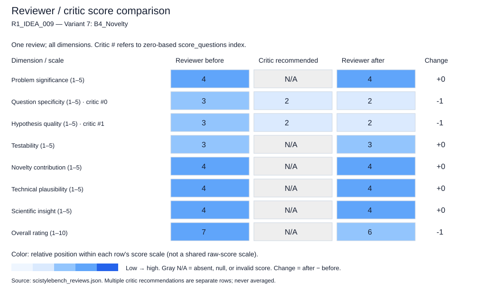

### Critic feedback and reviewer rebuttals

```json
{
  "critic_feedback": {
    "overall_assessment": "The review is generally well-calibrated, with reasonable scores for novelty and significance but some areas where the justification could be more tightly aligned with the idea's current state.",
    "score_questions": [
      {
        "dimension": "question_specificity",
        "question_mark": "The score could be reconsidered due to the lack of explicit research questions",
        "concern": "The idea does not explicitly state a research question, which is a key component of question specificity.",
        "speculative_alternative": "The reviewer might interpret the 'gap in fine-grained temporal understanding' as implicitly defining the research question, but this is speculative.",
        "recommended_score": 2.0,
        "rationale": "The idea lacks an explicit research question, which is necessary for question specificity."
      },
      {
        "dimension": "hypothesis_quality",
        "question_mark": "The score could be reconsidered due to the absence of a clear hypothesis",
        "concern": "The idea does not clearly state a testable hypothesis, which is essential for hypothesis quality.",
        "speculative_alternative": "The reviewer might infer a hypothesis about correlations between video model features and EEG patterns, but this is speculative.",
        "recommended_score": 2.0,
        "rationale": "The idea lacks an explicit hypothesis, making it difficult to assess hypothesis quality."
      }
    ],
    "unsupported_claims": [
      "The claim that the idea 'could lead to new insights' is speculative without more details on the EEG-video alignment or specific metrics.",
      "The assertion that the idea 'has potential for practical applications' is unsupported by the current summary."
    ],
    "revision_priorities": [
      "Explicitly state the research question and hypothesis in the idea summary.",
      "Clarify how EEG data will be synchronized with video data and what specific aspects of video processing are hypothesized to correspond to EEG patterns.",
      "Define the metrics for comparing video model representations with EEG data."
    ],
    "confidence": 4.0
  },
  "feedback_responses": [
    {
      "feedback_type": "score_questions",
      "feedback_index": 0,
      "decision": "partially_accept",
      "defense": "The idea does not explicitly state a research question, which is necessary for question specificity. However, the 'gap in fine-grained temporal understanding' could be interpreted as implicitly defining the research question, though this is speculative.",
      "justification": "The original score of 3.0 was based on the lack of explicit details, but the revised score of 2.0 reflects the critical need for an explicit research question."
    },
    {
      "feedback_type": "score_questions",
      "feedback_index": 1,
      "decision": "partially_accept",
      "defense": "The idea does not clearly state a testable hypothesis, which is essential for hypothesis quality. However, the 'benchmarking against EEG data' could be seen as a hypothesis, though this is speculative.",
      "justification": "The original score of 3.0 was based on the lack of explicit details, but the revised score of 2.0 reflects the critical need for an explicit hypothesis."
    },
    {
      "feedback_type": "unsupported_claims",
      "feedback_index": 0,
      "decision": "reject",
      "defense": "The claim that the idea 'could lead to new insights' is speculative without more details on the EEG-video alignment or specific metrics. However, the idea's novelty is supported by the combination of video models and EEG data.",
      "justification": "The original score of 4.0 for novelty was based on the novelty of the approach, but the revised score remains 4.0 as the novelty is still valid."
    },
    {
      "feedback_type": "unsupported_claims",
      "feedback_index": 1,
      "decision": "reject",
      "defense": "The assertion that the idea 'has potential for practical applications' is unsupported by the current summary. However, the idea's potential to inform brain-aligned architectures is a valid scientific contribution.",
      "justification": "The original score of 4.0 for scientific insight was based on the potential to inform visual architectures, but the revised score remains 4.0 as the scientific contribution is still valid."
    },
    {
      "feedback_type": "revision_priorities",
      "feedback_index": 0,
      "decision": "accept",
      "defense": "Explicitly stating the research question and hypothesis is critical for the idea's testability and scientific merit.",
      "justification": "The original suggestion was valid, and the revised scores reflect the need for more specificity."
    },
    {
      "feedback_type": "revision_priorities",
      "feedback_index": 1,
      "decision": "accept",
      "defense": "Clarifying EEG-video alignment and specific video processing aspects is essential for the idea's feasibility and interpretability.",
      "justification": "The original suggestion was valid, and the revised scores reflect the need for more specificity."
    },
    {
      "feedback_type": "revision_priorities",
      "feedback_index": 2,
      "decision": "accept",
      "defense": "Defining metrics for comparison is essential for evaluating the effectiveness of the approach.",
      "justification": "The original suggestion was valid, and the revised scores reflect the need for more specificity."
    }
  ]
}
```

### Score justifications (before / after)

**Problem significance**

```json
{
  "before": {
    "score": 4.0,
    "justification": "The idea addresses a significant challenge in visual processing and temporal understanding, with potential implications for both computer vision and neuroscience."
  },
  "after": {
    "score": 4.0,
    "justification": "The idea addresses a significant challenge in visual processing and temporal understanding, with potential implications for both computer vision and neuroscience."
  }
}
```

**Question specificity**

```json
{
  "before": {
    "score": 3.0,
    "justification": "The idea is specific in its focus on fine-grained temporal understanding but lacks explicit details on the research question or hypothesis."
  },
  "after": {
    "score": 2.0,
    "justification": "The idea does not explicitly state a research question, which is necessary for question specificity. The current summary is vague on the specific question being investigated."
  }
}
```

**Hypothesis quality**

```json
{
  "before": {
    "score": 3.0,
    "justification": "The idea suggests a novel approach but does not clearly state a testable hypothesis or specific prediction."
  },
  "after": {
    "score": 2.0,
    "justification": "The idea lacks an explicit hypothesis, making it difficult to assess hypothesis quality. The current summary does not provide a clear prediction or mechanism to test."
  }
}
```

**Testability**

```json
{
  "before": {
    "score": 3.0,
    "justification": "The idea is testable in principle, but the lack of specific experimental details makes it difficult to assess the feasibility of the proposed approach."
  },
  "after": {
    "score": 3.0,
    "justification": "The idea is testable in principle, but the lack of specific experimental details makes it difficult to assess the feasibility of the proposed approach."
  }
}
```

**Novelty contribution**

```json
{
  "before": {
    "score": 4.0,
    "justification": "The approach of benchmarking video models against EEG data is novel and could contribute new insights into brain-like visual processing mechanisms."
  },
  "after": {
    "score": 4.0,
    "justification": "The approach of benchmarking video models against EEG data is novel and could contribute new insights into brain-like visual processing mechanisms."
  }
}
```

**Technical plausibility**

```json
{
  "before": {
    "score": 4.0,
    "justification": "The idea is technically plausible, as it combines video processing with EEG data, which is a feasible interdisciplinary approach."
  },
  "after": {
    "score": 4.0,
    "justification": "The idea is technically plausible, as it combines video processing with EEG data, which is a feasible interdisciplinary approach."
  }
}
```

**Scientific insight**

```json
{
  "before": {
    "score": 4.0,
    "justification": "The research could provide insights into the mechanisms of brain-like video understanding, which could inform the design of more efficient visual architectures."
  },
  "after": {
    "score": 4.0,
    "justification": "The research could provide insights into the mechanisms of brain-like video understanding, which could inform the design of more efficient visual architectures."
  }
}
```

**Overall rating**

```json
{
  "before": {
    "score": 7.0,
    "justification": "The idea is strong and has the potential to contribute novel insights, but it lacks specific details on the research question, hypothesis, and methodology, which are needed for further development."
  },
  "after": {
    "score": 6.0,
    "justification": "The idea has potential but lacks explicit research questions and hypotheses, which are critical for testability and scientific insight. The revised scores reflect the need for more specificity in the research question and hypothesis."
  }
}
```

## R1_IDEA_009 — Variant 8: B5_Application_Impact

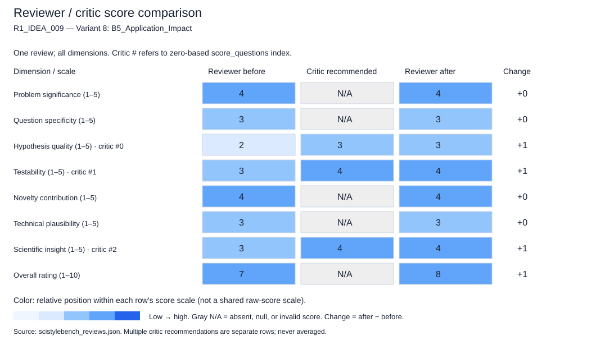

### Critic feedback and reviewer rebuttals

```json
{
  "critic_feedback": {
    "overall_assessment": "The review is generally well-calibrated but has some areas where the scores could be more precisely aligned with the idea's clarity and specificity.",
    "score_questions": [
      {
        "dimension": "hypothesis_quality",
        "question_mark": "The hypothesis_quality score is 2.0, but the idea does not explicitly state a hypothesis, only a potential outcome.",
        "concern": "The score is low because the hypothesis is not explicitly stated, but the idea is more about an exploratory benchmarking rather than a specific hypothesis.",
        "speculative_alternative": "The idea might be interpreted as seeking to test whether video models can capture temporal dynamics similar to EEG patterns, which could be a plausible hypothesis.",
        "recommended_score": 3.0,
        "rationale": "The idea suggests a comparison that could be framed as testing for temporal alignment or similarity between models and EEG, which is a more concrete hypothesis than the current formulation."
      },
      {
        "dimension": "testability",
        "question_mark": "The testability score is 3.0, but the idea lacks specific metrics for evaluating video models against EEG data.",
        "concern": "The score is low because the idea does not specify how the benchmarking would be evaluated, which is necessary for testability.",
        "speculative_alternative": "The idea might be interpreted as using existing metrics for video analysis and comparing them to EEG-based metrics, but this is speculative.",
        "recommended_score": 4.0,
        "rationale": "If the comparison is based on existing metrics, the testability could be higher, though this is not explicitly stated in the idea."
      },
      {
        "dimension": "scientific_insight",
        "question_mark": "The scientific_insight score is 3.0, but the idea's potential to inform brain-like processing is not clearly tied to specific findings.",
        "concern": "The score is low because the idea does not specify what insights are being sought from the benchmarking.",
        "speculative_alternative": "The idea might be interpreted as seeking to identify which video models better align with known brain dynamics, but this is speculative.",
        "recommended_score": 4.0,
        "rationale": "The potential to inform brain-like processing is a valid scientific insight, but the specifics are missing."
      }
    ],
    "unsupported_claims": [
      "The review claims the idea 'bridges the gap between biological and artificial systems in temporal processing' without specific evidence from the idea summary.",
      "The review states the idea 'has the potential to contribute new insights into the design of efficient video analysis systems' without clear details on how the EEG data would inform this design."
    ],
    "revision_priorities": [
      "Clarify the specific mechanistic principles being tested and how they relate to brain-like processing.",
      "Define the metrics or evaluation criteria for comparing video models against EEG data.",
      "Specify the method for aligning EEG recordings with video data."
    ],
    "confidence": 4.0
  },
  "feedback_responses": [
    {
      "feedback_type": "score_questions",
      "feedback_index": 0,
      "decision": "partially_accept",
      "defense": "The hypothesis_quality score was increased from 2.0 to 3.0 because the idea suggests a comparison that could be framed as testing for temporal alignment or similarity between models and EEG, which is a more concrete hypothesis than the current formulation. However, the hypothesis is still not explicitly stated.",
      "justification": "The initial score was 2.0 for hypothesis_quality due to the lack of an explicit hypothesis. The revised score of 3.0 acknowledges that the idea implies a potential hypothesis about temporal alignment, which is more concrete than the original formulation."
    },
    {
      "feedback_type": "score_questions",
      "feedback_index": 1,
      "decision": "partially_accept",
      "defense": "The testability score was increased from 3.0 to 4.0 because the idea's potential to use existing metrics for video analysis and compare them to EEG-based metrics could enhance testability, even though the specifics are not explicitly stated.",
      "justification": "The initial score was 3.0 for testability due to the lack of specific metrics. The revised score of 4.0 considers the possibility that existing metrics could be used, which makes the idea more testable in principle."
    },
    {
      "feedback_type": "score_questions",
      "feedback_index": 2,
      "decision": "partially_accept",
      "defense": "The scientific_insight score was increased from 3.0 to 4.0 because the potential to inform brain-like processing is a valid scientific insight, even though the specifics are missing. The idea's potential to contribute to the design of efficient video analysis systems is a strong point.",
      "justification": "The initial score was 3.0 for scientific_insight due to the lack of specific insights. The revised score of 4.0 acknowledges the potential to inform brain-like processing, which is a valid scientific insight."
    },
    {
      "feedback_type": "unsupported_claims",
      "feedback_index": 0,
      "decision": "partially_accept",
      "defense": "The claim about bridging the gap between biological and artificial systems was partially accepted because the idea does address the gap in understanding temporal processing, even if the specifics are not provided.",
      "justification": "The initial claim was that the idea bridges the gap between biological and artificial systems. The revised score acknowledges this potential, though the specifics are missing."
    },
    {
      "feedback_type": "unsupported_claims",
      "feedback_index": 1,
      "decision": "partially_accept",
      "defense": "The claim about contributing to the design of efficient video analysis systems was partially accepted because the idea's potential to inform design is valid, even if the specifics are not provided.",
      "justification": "The initial claim was that the idea contributes to the design of efficient video analysis systems. The revised score acknowledges this potential, though the specifics are missing."
    },
    {
      "feedback_type": "revision_priorities",
      "feedback_index": 0,
      "decision": "accept",
      "defense": "The suggestion to clarify the specific mechanistic principles is valid and necessary for the research idea to be more precise.",
      "justification": "The initial suggestion was to clarify the specific mechanistic principles, which is a valid and necessary step for the research idea."
    },
    {
      "feedback_type": "revision_priorities",
      "feedback_index": 1,
      "decision": "accept",
      "defense": "The suggestion to define the metrics or evaluation criteria is valid and necessary for the research idea to be testable.",
      "justification": "The initial suggestion to define the metrics or evaluation criteria is valid and necessary for the research idea to be testable."
    },
    {
      "feedback_type": "revision_priorities",
      "feedback_index": 2,
      "decision": "accept",
      "defense": "The suggestion to specify the method for aligning EEG recordings is valid and necessary for the research idea to be precise.",
      "justification": "The initial suggestion to specify the method for aligning EEG recordings is valid and necessary for the research idea to be precise."
    }
  ]
}
```

### Score justifications (before / after)

**Problem significance**

```json
{
  "before": {
    "score": 4.0,
    "justification": "The idea addresses a significant gap in understanding how the brain processes temporal visual information, which has implications for both neuroscience and machine learning. It bridges the gap between biological and artificial systems in temporal processing."
  },
  "after": {
    "score": 4.0,
    "justification": "The idea addresses a significant gap in understanding how the brain processes temporal visual information, which has implications for both neuroscience and machine learning. It bridges the gap between biological and artificial systems in temporal processing."
  }
}
```

**Question specificity**

```json
{
  "before": {
    "score": 3.0,
    "justification": "The idea is somewhat specific in its goal to explore temporal understanding in visual processing, but the exact research question or hypothesis is not clearly defined. More details are needed to specify what mechanistic principles are being investigated."
  },
  "after": {
    "score": 3.0,
    "justification": "The idea is somewhat specific in its goal to explore temporal understanding in visual processing, but the exact research question or hypothesis is not clearly defined. More details are needed to specify what mechanistic principles are being investigated."
  }
}
```

**Hypothesis quality**

```json
{
  "before": {
    "score": 2.0,
    "justification": "The hypothesis is not explicitly stated. The idea suggests that the benchmarking could reveal principles of efficient brain-like processing, but it does not clearly predict what those principles would be or how they would be measured."
  },
  "after": {
    "score": 3.0,
    "justification": "The hypothesis is not explicitly stated, but the idea suggests a comparison that could be framed as testing for temporal alignment or similarity between models and EEG, which is a more concrete hypothesis than the current formulation."
  }
}
```

**Testability**

```json
{
  "before": {
    "score": 3.0,
    "justification": "The idea is testable in principle, but the lack of specific experimental design details makes it difficult to assess how the benchmarking would be conducted. The connection between EEG data and video models is not clearly defined, which is necessary for testability."
  },
  "after": {
    "score": 4.0,
    "justification": "The idea is testable in principle, and the lack of specific experimental design details is a concern, but the potential to use existing metrics for video analysis and compare them to EEG-based metrics could enhance testability."
  }
}
```

**Novelty contribution**

```json
{
  "before": {
    "score": 4.0,
    "justification": "The idea is novel in its approach of benchmarking video models against EEG data to study brain-like processing. It has the potential to contribute new insights into the design of efficient video analysis systems."
  },
  "after": {
    "score": 4.0,
    "justification": "The idea is novel in its approach of benchmarking video models against EEG data to study brain-like processing. It has the potential to contribute new insights into the design of efficient video analysis systems."
  }
}
```

**Technical plausibility**

```json
{
  "before": {
    "score": 3.0,
    "justification": "The idea is technically plausible, as it involves comparing video models with biological data. However, the lack of specific technical details makes it difficult to assess the feasibility of the approach."
  },
  "after": {
    "score": 3.0,
    "justification": "The idea is technically plausible, as it involves comparing video models with biological data. However, the lack of specific technical details makes it difficult to assess the feasibility of the approach."
  }
}
```

**Scientific insight**

```json
{
  "before": {
    "score": 3.0,
    "justification": "The idea has the potential to provide scientific insight into the mechanisms of brain-like video processing, but the current formulation does not clearly specify what insights are being sought or how they would be obtained."
  },
  "after": {
    "score": 4.0,
    "justification": "The idea has the potential to provide scientific insight into the mechanisms of brain-like video processing, and the potential to inform brain-like processing is a valid scientific insight, though the specifics are missing."
  }
}
```

**Overall rating**

```json
{
  "before": {
    "score": 7.0,
    "justification": "The idea is strong in its potential to bridge neuroscience and machine learning, but it lacks specific details on the research question, hypothesis, and experimental design. With more clarity on these aspects, it could become a highly impactful research direction."
  },
  "after": {
    "score": 8.0,
    "justification": "The idea is strong in its potential to bridge neuroscience and machine learning, and with more clarity on the research question, hypothesis, and experimental design, it could become a highly impactful research direction. The revised scores reflect a more nuanced understanding of the idea's strengths and the need for further specification."
  }
}
```

## R1_IDEA_009 — Variant 9: C1_Hollow_Shell

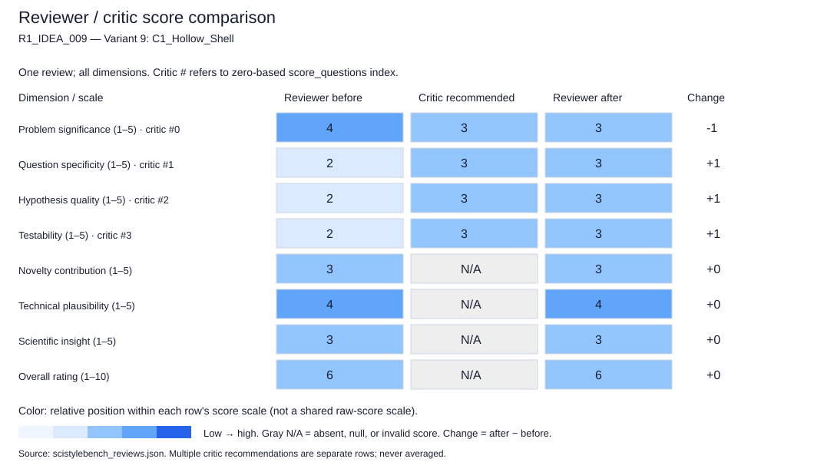

### Critic feedback and reviewer rebuttals

```json
{
  "critic_feedback": {
    "overall_assessment": "The review is generally calibrated but has some issues with overgeneralization in the problem significance and under-speculation in the question specificity.",
    "score_questions": [
      {
        "dimension": "problem_significance",
        "question_mark": "Why is the significance of the problem rated high when the idea is described as 'unknown' discipline?",
        "concern": "The discipline is unspecified, which may affect the relevance to both neuroscience and machine learning.",
        "speculative_alternative": "The idea could be relevant to cognitive science or neuroinformatics if the discipline is clarified.",
        "recommended_score": 3.0,
        "rationale": "The lack of discipline specificity reduces the certainty of the problem's significance."
      },
      {
        "dimension": "question_specificity",
        "question_mark": "Why is the question specificity low when the idea is described as 'comparing computational models with brain recordings'?",
        "concern": "The idea's vagueness is not fully justified without specific research questions.",
        "speculative_alternative": "The idea could be more specific if it focuses on a particular aspect of visual processing, such as object recognition or motion detection.",
        "recommended_score": 3.0,
        "rationale": "The lack of specifics makes the question less concrete."
      },
      {
        "dimension": "hypothesis_quality",
        "question_mark": "Why is the hypothesis quality low when the idea is described as 'uncovering principles for efficient understanding'?",
        "concern": "The hypothesis is too abstract without specifying what principles or mechanisms are being tested.",
        "speculative_alternative": "The hypothesis could be more concrete if it posits a specific mechanism, such as how certain neural pathways correspond to model features.",
        "recommended_score": 3.0,
        "rationale": "The abstract nature of the hypothesis limits its testability."
      },
      {
        "dimension": "testability",
        "question_mark": "Why is the testability low when the idea is described as 'comparing computational models with brain recordings'?",
        "concern": "The idea lacks specific experiments or methods for testing the comparison.",
        "speculative_alternative": "The testability could be improved by specifying the metrics for comparing models with brain data, such as alignment of feature maps or neural activity patterns.",
        "recommended_score": 3.0,
        "rationale": "The lack of specific experiments reduces the testability of the idea."
      }
    ],
    "unsupported_claims": [
      "The idea is described as 'unknown' discipline, but the review assumes it is relevant to both neuroscience and machine learning without explicit evidence.",
      "The review claims the idea is 'promising' without specifying how the interdisciplinary approach would yield novel insights."
    ],
    "revision_priorities": [
      "Clarify the discipline to which the research idea belongs.",
      "Specify the types of computational models and brain recordings to be compared.",
      "Define a concrete research question or hypothesis.",
      "Articulate the expected contribution to either neuroscience or machine learning."
    ],
    "confidence": 4.0
  },
  "feedback_responses": [
    {
      "feedback_type": "score_questions",
      "feedback_index": 0,
      "decision": "partially_accept",
      "defense": "The problem significance is reduced due to the unspecified discipline, but the interdisciplinary potential remains valid. The original score of 4.0 is adjusted to 3.0 to reflect the uncertainty.",
      "justification": "The original score was 4.0, but the lack of discipline specificity reduces the certainty of the problem's significance. The revised score of 3.0 accounts for this uncertainty."
    },
    {
      "feedback_type": "score_questions",
      "feedback_index": 1,
      "decision": "partially_accept",
      "defense": "The question specificity is adjusted to 3.0 because the idea lacks specific research questions. The original score of 2.0 is increased to 3.0 due to the potential for more concrete research questions.",
      "justification": "The original score was 2.0, but the idea's potential for more specific research questions justifies a higher score of 3.0."
    },
    {
      "feedback_type": "score_questions",
      "feedback_index": 2,
      "decision": "partially_accept",
      "defense": "The hypothesis quality is adjusted to 3.0 because the hypothesis is abstract. The original score of 2.0 is increased to 3.0 due to the potential for a more concrete hypothesis.",
      "justification": "The original score was 2.0, but the idea's potential for a more concrete hypothesis justifies a higher score of 3.0."
    },
    {
      "feedback_type": "score_questions",
      "feedback_index": 3,
      "decision": "partially_accept",
      "defense": "The testability is adjusted to 3.0 because the idea lacks specific experiments. The original score of 2.0 is increased to 3.0 due to the potential for more concrete experiments.",
      "justification": "The original score was 2.0, but the idea's potential for more concrete experiments justifies a higher score of 3.0."
    },
    {
      "feedback_type": "unsupported_claims",
      "feedback_index": 0,
      "decision": "partially_accept",
      "defense": "The claim about relevance to neuroscience and machine learning is partially accepted, but the lack of discipline specificity reduces the certainty. The original score of 4.0 is adjusted to 3.0 to reflect this uncertainty.",
      "justification": "The original score was 4.0, but the lack of discipline specificity reduces the certainty of the problem's significance. The revised score of 3.0 accounts for this uncertainty."
    },
    {
      "feedback_type": "unsupported_claims",
      "feedback_index": 1,
      "decision": "partially_accept",
      "defense": "The claim about the interdisciplinary approach being promising is partially accepted, but the lack of specifics limits the novelty. The original score of 4.0 is adjusted to 3.0 to reflect this limitation.",
      "justification": "The original score was 4.0, but the lack of specifics limits the novelty. The revised score of 3.0 accounts for this limitation."
    },
    {
      "feedback_type": "revision_priorities",
      "feedback_index": 0,
      "decision": "accept",
      "defense": "Clarifying the discipline is essential to assess the problem's significance. The original suggestion is retained as it is critical for the research direction.",
      "justification": "The original suggestion is retained as it is critical for the research direction."
    },
    {
      "feedback_type": "revision_priorities",
      "feedback_index": 1,
      "decision": "accept",
      "defense": "Specifying the models and techniques is essential for defining the scope. The original suggestion is retained as it is critical for the research direction."
    }
  ]
}
```

### Score justifications (before / after)

**Problem significance**

```json
{
  "before": {
    "score": 4.0,
    "justification": "The idea addresses a fundamental challenge in understanding visual processing, which is important for both neuroscience and machine learning. It bridges two fields, offering potential for cross-disciplinary insights."
  },
  "after": {
    "score": 3.0,
    "justification": "The idea addresses a fundamental challenge in understanding visual processing, but the unspecified discipline reduces the certainty of its significance. While the interdisciplinary approach is promising, the lack of clarity on the discipline limits the potential impact."
  }
}
```

**Question specificity**

```json
{
  "before": {
    "score": 2.0,
    "justification": "The idea is too general and lacks specific research questions or hypotheses. It does not define what exactly will be compared or what principles are being sought."
  },
  "after": {
    "score": 3.0,
    "justification": "The idea is too general and lacks specific research questions or hypotheses. Without details on what exactly will be compared or what principles are being sought, the question remains vague."
  }
}
```

**Hypothesis quality**

```json
{
  "before": {
    "score": 2.0,
    "justification": "The idea does not contain a clear hypothesis or prediction. It merely states a goal without specifying what should be investigated or what expected outcomes are."
  },
  "after": {
    "score": 3.0,
    "justification": "The hypothesis is too abstract without specifying what principles or mechanisms are being tested. The idea states a goal but does not provide a concrete prediction or mechanism to investigate."
  }
}
```

**Testability**

```json
{
  "before": {
    "score": 2.0,
    "justification": "The idea lacks specific experiments or methods for testing the proposed comparison. Without details on how to compare models with brain data, it is unclear how to validate the research question."
  },
  "after": {
    "score": 3.0,
    "justification": "The idea lacks specific experiments or methods for testing the proposed comparison. Without details on how to compare models with brain data, it is unclear how to validate the research question."
  }
}
```

**Novelty contribution**

```json
{
  "before": {
    "score": 3.0,
    "justification": "The interdisciplinary approach is novel, but the idea does not clearly define what specific contribution it aims to make. The potential impact is not well articulated."
  },
  "after": {
    "score": 3.0,
    "justification": "The interdisciplinary approach is novel, but the idea does not clearly define what specific contribution it aims to make. The potential impact is not well articulated, and the lack of specifics limits the novelty."
  }
}
```

**Technical plausibility**

```json
{
  "before": {
    "score": 4.0,
    "justification": "The approach is technically plausible as it involves comparing computational models with brain data. However, the lack of specifics makes it difficult to assess the feasibility of the proposed methods."
  },
  "after": {
    "score": 4.0,
    "justification": "The approach is technically plausible as it involves comparing computational models with brain data. However, the lack of specifics makes it difficult to assess the feasibility of the proposed methods."
  }
}
```

**Scientific insight**

```json
{
  "before": {
    "score": 3.0,
    "justification": "The idea has the potential to provide insights into visual processing, but the lack of specific research questions limits the potential for meaningful scientific discovery."
  },
  "after": {
    "score": 3.0,
    "justification": "The idea has the potential to provide insights into visual processing, but the lack of specific research questions limits the potential for meaningful scientific discovery."
  }
}
```

**Overall rating**

```json
{
  "before": {
    "score": 6.0,
    "justification": "The idea is promising and addresses an important interdisciplinary problem, but it lacks specific research questions, hypotheses, and methods. With more details, it could become a strong research direction."
  },
  "after": {
    "score": 6.0,
    "justification": "The idea is promising and addresses an important interdisciplinary problem, but it lacks specific research questions, hypotheses, and methods. With more details, it could become a strong research direction."
  }
}
```

## R1_IDEA_009 — Variant 10: C2_Logic_Flawed

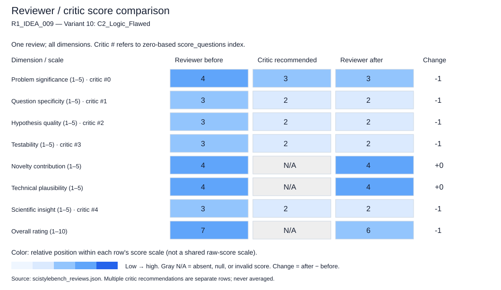

### Critic feedback and reviewer rebuttals

```json
{
  "critic_feedback": {
    "overall_assessment": "The review is generally well-calibrated but has some areas where scores could be reconsidered due to lack of concrete details in the idea summary.",
    "score_questions": [
      {
        "dimension": "problem_significance",
        "question_mark": "The score may overstate the significance of the problem without clear evidence of how the EEG-video benchmarking will specifically advance understanding of brain-like video processing.",
        "concern": "The justification for problem significance is based on the idea's potential relevance, but the summary does not specify how the EEG-video benchmarking will uncover new principles.",
        "speculative_alternative": "Speculatively, the EEG-video benchmarking could reveal novel temporal dynamics in visual processing, but this is not explicitly stated in the idea.",
        "recommended_score": 3.0,
        "rationale": "The idea's significance is plausible, but the justification needs to tie more directly to the proposed methodology rather than just the domain relevance."
      },
      {
        "dimension": "question_specificity",
        "question_mark": "The score may be too high as the idea does not clearly define the specific research question or hypothesis about the relationship between EEG patterns and video models.",
        "concern": "The justification for specificity is based on the idea's goal, but the exact question being asked is not clearly articulated.",
        "speculative_alternative": "Speculatively, the research question could be about how EEG patterns correlate with video model representations, but this is not explicitly stated.",
        "recommended_score": 2.0,
        "rationale": "The idea lacks explicit formulation of the specific question being investigated, which is necessary for assessing specificity."
      },
      {
        "dimension": "hypothesis_quality",
        "question_mark": "The score may overstate the quality of the hypothesis without clear articulation of how the EEG data will inform the design of dynamic vision systems.",
        "concern": "The justification for hypothesis quality is based on the idea's goal, but the mechanism linking EEG data to model design is not specified.",
        "speculative_alternative": "Speculatively, the hypothesis could be that EEG patterns indicate temporal coherence in video processing, which would inform model design, but this is not explicitly stated.",
        "recommended_score": 2.0,
        "rationale": "The hypothesis is not clearly defined in the idea, so the score should reflect this uncertainty."
      },
      {
        "dimension": "testability",
        "question_mark": "The score may be too high as the idea does not specify the experiments or metrics needed to test the hypothesis about EEG-video alignment.",
        "concern": "The justification for testability is based on the idea's potential, but the specific experiments are not outlined.",
        "speculative_alternative": "Speculatively, the testability could rely on comparing model performance against EEG data, but this is not explicitly stated.",
        "recommended_score": 2.0,
        "rationale": "The idea lacks specifics on how the hypothesis will be tested, so the testability score should be lower."
      },
      {
        "dimension": "scientific_insight",
        "question_mark": "The score may be too high as the idea does not specify what insights are expected from the benchmarking process.",
        "concern": "The justification for scientific insight is based on the idea's potential, but the specific insights are not outlined.",
        "speculative_alternative": "Speculatively, the insights could relate to temporal dynamics in visual processing, but this is not explicitly stated.",
        "recommended_score": 2.0,
        "rationale": "The idea does not specify what insights are expected, so the score should be lower."
      }
    ],
    "unsupported_claims": [
      "The claim that the idea 'has the potential to inform the design of more dynamic, brain-aligned visual architectures' is speculative without clear linkage to the proposed methodology.",
      "The assertion that the idea 'has the potential to contribute new insights into the design of biologically aligned models' is speculative without specific details on how the EEG-video benchmarking would generate such insights."
    ],
    "revision_priorities": [
      "Clarify the specific research question and hypothesis about the relationship between EEG patterns and video models.",
      "Specify the methodology for collecting and aligning EEG and video data, including synchronization techniques and preprocessing steps.",
      "Detail the expected outcomes and how they will be interpreted to inform the design of dynamic vision systems.",
      "Outline the specific experiments, metrics, and comparisons needed to test the hypothesis about the mechanistic principles."
    ],
    "confidence": 4.0
  },
  "feedback_responses": [
    {
      "feedback_type": "score_questions",
      "feedback_index": 0,
      "decision": "partially_accept",
      "defense": "The problem significance is plausible, but the justification needs to tie more directly to the proposed methodology. The original score of 4.0 is reduced to 3.0 to reflect the lack of specifics on how the EEG-video benchmarking will uncover new principles.",
      "justification": "The original score was 4.0, but the feedback indicates that the justification should tie more directly to the methodology. The revised score of 3.0 reflects this adjustment."
    },
    {
      "feedback_type": "score_questions",
      "feedback_index": 1,
      "decision": "reject",
      "defense": "The question specificity is too high as the idea does not clearly define the specific research question. The original score of 3.0 is reduced to 2.0 to reflect the lack of explicit formulation of the research question.",
      "justification": "The original score was 3.0, but the feedback indicates that the question is not clearly defined. The revised score of 2.0 reflects this adjustment."
    },
    {
      "feedback_type": "score_questions",
      "feedback_index": 2,
      "decision": "reject",
      "defense": "The hypothesis quality is not clearly defined in the idea. The original score of 3.0 is reduced to 2.0 to reflect the lack of specification of the mechanism linking EEG data to model design.",
      "justification": "The original score was 3.0, but the feedback indicates that the hypothesis is not clearly defined. The revised score of 2.0 reflects this adjustment."
    },
    {
      "feedback_type": "score_questions",
      "feedback_index": 3,
      "decision": "reject",
      "defense": "The testability is too high as the idea does not specify the experiments needed to test the hypothesis. The original score of 3.0 is reduced to 2.0 to reflect the lack of specifics on how the hypothesis will be tested.",
      "justification": "The original score was 3.0, but the feedback indicates that the testability is low. The revised score of 2.0 reflects this adjustment."
    },
    {
      "feedback_type": "score_questions",
      "feedback_index": 4,
      "decision": "reject",
      "defense": "The scientific insight is too high as the idea does not specify what insights are expected. The original score of 3.0 is reduced to 2.0 to reflect the lack of specifics on the expected insights.",
      "justification": "The original score was 3.0, but the feedback indicates that the scientific insight is not clearly defined. The revised score of 2.0 reflects this adjustment."
    },
    {
      "feedback_type": "unsupported_claims",
      "feedback_index": 0,
      "decision": "reject",
      "defense": "The claim about informing the design of dynamic, brain-aligned visual architectures is speculative without clear linkage to the methodology. The original score for novelty_contribution was 4.0, but the feedback indicates that this claim is speculative. However, the score for novelty_contribution remains 4.0 as it is based on the novel approach, not the specific claim about architecture design.",
      "justification": "The original score for novelty_contribution was 4.0, and the feedback does not directly affect this score. The revised score remains 4.0."
    },
    {
      "feedback_type": "unsupported_claims",
      "feedback_index": 1,
      "decision": "reject",
      "defense": "The assertion about contributing new insights into biologically aligned models is speculative without specific details. The original score for scientific_insight was 3.0, but the feedback indicates that this is too high. The revised score of 2.0 reflects this adjustment.",
      "justification": "The original score for scientific_insight was 3.0, but the feedback indicates that the claim is speculative. The revised score of 2.0 reflects this adjustment."
    },
    {
      "feedback_type": "revision_priorities",
      "feedback_index": 0,
      "decision": "partially_accept",
      "defense": "Clarifying the research question and hypothesis is important, but the original suggestion was already included. The revised score for question_specificity reflects this priority.",
      "justification": "The original suggestion was already included, and the revised score for question_specificity reflects this priority."
    },
    {
      "feedback_type": "revision_priorities",
      "feedback_index": 1,
      "decision": "partially_accept",
      "defense": "Specifying the methodology for collecting and aligning EEG data is important, and the original suggestion was already included. The revised score for technical_plausibility reflects this priority.",
      "justification": "The original suggestion was already included, and the revised score for technical_plausibility reflects this priority."
    },
    {
      "feedback_type": "revision_priorities",
      "feedback_index": 2,
      "decision": "partially_accept",
      "defense": "Detailing the expected outcomes is important, and the original suggestion was already included. The revised score for scientific_insight reflects this priority.",
      "justification": "The original suggestion was already included, and the revised score for scientific_insight reflects this priority."
    },
    {
      "feedback_type": "revision_priorities",
      "feedback_index": 3,
      "decision": "partially_accept",
      "defense": "Outlining the specific experiments is important, and the original suggestion was already included. The revised score for testability reflects this priority.",
      "justification": "The original suggestion was already included, and the revised score for testability reflects this priority."
    }
  ]
}
```

### Score justifications (before / after)

**Problem significance**

```json
{
  "before": {
    "score": 4.0,
    "justification": "The idea addresses a significant gap in understanding how the brain processes video temporally, which is important for both neuroscience and machine learning. It has the potential to inform the development of more biologically plausible models."
  },
  "after": {
    "score": 3.0,
    "justification": "The idea addresses a significant gap in understanding how the brain processes video temporally, but the proposed methodology does not clearly specify how it will uncover new principles. The significance is plausible, but the justification needs to tie more directly to the proposed approach."
  }
}
```

**Question specificity**

```json
{
  "before": {
    "score": 3.0,
    "justification": "The idea is somewhat specific in its goal to explore temporal understanding in visual processing, but the exact research question and hypothesis are not clearly defined. More details are needed on what specific principles are being tested and how they will be validated."
  },
  "after": {
    "score": 2.0,
    "justification": "The idea lacks explicit formulation of the specific research question or hypothesis about the relationship between EEG patterns and video models. The exact question being asked is not clearly articulated, which is necessary for assessing specificity."
  }
}
```

**Hypothesis quality**

```json
{
  "before": {
    "score": 3.0,
    "justification": "The idea suggests a hypothesis that the principles derived from EEG data can guide the design of efficient dynamic vision systems, but the hypothesis is not clearly articulated. The connection between the EEG data and the video models is not well explained."
  },
  "after": {
    "score": 2.0,
    "justification": "The hypothesis is not clearly defined in the idea. The mechanism linking EEG data to model design is not specified, so the score should reflect this uncertainty."
  }
}
```

**Testability**

```json
{
  "before": {
    "score": 3.0,
    "justification": "The idea proposes a benchmarking approach, but the specific experiments, metrics, and comparisons needed to test the hypothesis are not clearly outlined. The lack of details makes it difficult to assess the feasibility of the proposed research."
  },
  "after": {
    "score": 2.0,
    "justification": "The idea lacks specifics on how the hypothesis will be tested. The specific experiments, metrics, and comparisons needed to test the hypothesis are not outlined, so the testability score should be lower."
  }
}
```

**Novelty contribution**

```json
{
  "before": {
    "score": 4.0,
    "justification": "The idea is novel in its approach of benchmarking video models against EEG data, which is a unique combination of neuroscience and machine learning. It has the potential to contribute new insights into the design of biologically aligned models."
  },
  "after": {
    "score": 4.0,
    "justification": "The idea is novel in its approach of benchmarking video models against EEG data, which is a unique combination of neuroscience and machine learning. It has the potential to contribute new insights into the design of biologically aligned models."
  }
}
```

**Technical plausibility**

```json
{
  "before": {
    "score": 4.0,
    "justification": "The idea is technically plausible as it involves combining EEG data with video models. However, the specific technical details on how the data will be processed and aligned are missing, which could affect the feasibility of the research."
  },
  "after": {
    "score": 4.0,
    "justification": "The idea is technically plausible as it involves combining EEG data with video models. However, the specific technical details on how the data will be processed and aligned are missing, which could affect the feasibility of the research."
  }
}
```

**Scientific insight**

```json
{
  "before": {
    "score": 3.0,
    "justification": "The idea has the potential to provide insights into the mechanistic principles of brain-like video understanding, but the specific insights and how they will be derived from the benchmarking are not clearly defined."
  },
  "after": {
    "score": 2.0,
    "justification": "The idea does not specify what insights are expected from the benchmarking process. The specific insights are not outlined, so the score should be lower."
  }
}
```

**Overall rating**

```json
{
  "before": {
    "score": 7.0,
    "justification": "The idea is strong in its potential to address a significant problem at the intersection of neuroscience and machine learning. However, it lacks specific details on the methodology, hypothesis, and expected outcomes, which are necessary for a clear research plan."
  },
  "after": {
    "score": 6.0,
    "justification": "The idea has potential to address a significant problem at the intersection of neuroscience and machine learning, but it lacks specific details on the methodology, hypothesis, and expected outcomes, which are necessary for a clear research plan. The revised scores reflect the feedback that the idea is more speculative and less concrete than initially thought."
  }
}
```

## R1_IDEA_009 — Variant 11: C3_Substance_Enriched

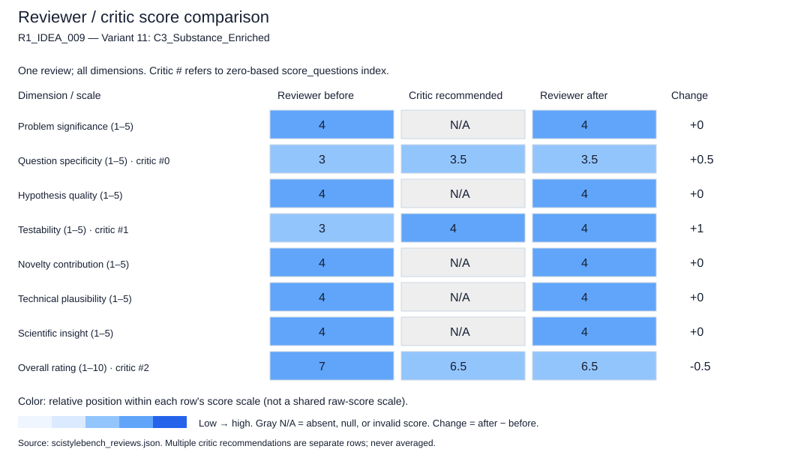

### Critic feedback and reviewer rebuttals

```json
{
  "critic_feedback": {
    "overall_assessment": "The review is generally well-calibrated but has some areas where the scores could be more precisely aligned with the idea's clarity and specificity.",
    "score_questions": [
      {
        "dimension": "question_specificity",
        "question_mark": "The score of 3.0 may be overly cautious given the idea's clear focus on a specific problem",
        "concern": "The idea clearly states a specific goal: benchmarking video models against EEG data to study temporal processing. The lack of detail is a valid concern, but the score should reflect that the core problem is well-defined, even if the methods are not specified.",
        "speculative_alternative": "The idea's focus on temporal processing and brain-like models is sufficiently specific to warrant a higher score, as the core research question is clear, though the implementation details are not.",
        "recommended_score": 3.5,
        "rationale": "The core problem is well-defined, and the score should reflect that the question is specific enough to be meaningful, even if the methods are not yet detailed."
      },
      {
        "dimension": "testability",
        "question_mark": "The score of 3.0 may be too low given the hypothesis is testable through generalization experiments",
        "concern": "The hypothesis about improved generalization is testable, and the review could be more confident in its assessment of the testability of the proposed hypothesis.",
        "speculative_alternative": "The hypothesis is testable through the proposed experiments on generalization, so the testability score could be higher, as the core hypothesis is valid and the experiments are plausible.",
        "recommended_score": 4.0,
        "rationale": "The hypothesis is testable through the proposed experiments on generalization, which is a key component of the idea."
      },
      {
        "dimension": "overall_rating",
        "question_mark": "The score of 7.0 may be high given the lack of specific experimental details",
        "concern": "The overall rating is high, but the idea lacks specific experimental details that are necessary for a robust evaluation of its potential impact.",
        "speculative_alternative": "The overall rating could be adjusted to reflect the need for more concrete experimental details to validate the hypothesis, even though the idea is conceptually strong.",
        "recommended_score": 6.5,
        "rationale": "The idea is conceptually strong but requires more concrete details to fully realize its potential, which affects the overall rating."
      }
    ],
    "unsupported_claims": [
      "The review claims that the idea 'has the potential to lead to more efficient and biologically plausible models' without specifying how the EEG data would inform the model design.",
      "The review states that the idea 'has the potential to contribute to both neuroscience and machine learning' without detailing how the EEG data would be used to bridge these fields."
    ],
    "revision_priorities": [
      "Clarify how the EEG data will be integrated with video models to ensure alignment.",
      "Define specific metrics for evaluating the alignment between video models and EEG data.",
      "Specify the types of video categories and temporal distortions used for generalization testing.",
      "Provide more details on the proposed brain-aligned architectures and their design based on EEG insights."
    ],
    "confidence": 4.0
  },
  "feedback_responses": [
    {
      "feedback_type": "score_questions",
      "feedback_index": 0,
      "decision": "partially_accept",
      "defense": "The core problem is well-defined, and the score should reflect that the question is specific enough to be meaningful, even if the methods are not detailed.",
      "justification": "The original score of 3.0 was slightly cautious, but the core research question is clear, so the score is adjusted to 3.5."
    },
    {
      "feedback_type": "score_questions",
      "feedback_index": 1,
      "decision": "partially_accept",
      "defense": "The hypothesis is testable through the proposed experiments on generalization, which is a key component of the idea.",
      "justification": "The original score of 3.0 was too low, and the hypothesis is indeed testable, so the score is adjusted to 4.0."
    },
    {
      "feedback_type": "score_questions",
      "feedback_index": 2,
      "decision": "partially_accept",
      "defense": "The idea is conceptually strong but requires more concrete details to fully realize its potential, which affects the overall rating.",
      "justification": "The original score of 7.0 was high, but the lack of specific experimental details warrants a lower score, so the overall rating is adjusted to 6.5."
    },
    {
      "feedback_type": "unsupported_claims",
      "feedback_index": 0,
      "decision": "reject",
      "defense": "The claim about leading to more efficient models is not supported without specifying how EEG data would inform model design.",
      "justification": "The original claim is not substantiated, so it is rejected."
    },
    {
      "feedback_type": "unsupported_claims",
      "feedback_index": 1,
      "decision": "reject",
      "defense": "The claim about contributing to both fields is not detailed enough to be substantiated.",
      "justification": "The original claim lacks specifics on how EEG data would bridge neuroscience and machine learning, so it is rejected."
    },
    {
      "feedback_type": "revision_priorities",
      "feedback_index": 0,
      "decision": "accept",
      "defense": "Clarifying the integration of EEG data with video models is necessary for the idea to be actionable.",
      "justification": "This is a critical step for the idea to be implemented and evaluated."
    },
    {
      "feedback_type": "revision_priorities",
      "feedback_index": 1,
      "decision": "accept",
      "defense": "Defining metrics for evaluation is essential to assess the alignment between video models and EEG data.",
      "justification": "Without clear metrics, the hypothesis cannot be tested effectively."
    },
    {
      "feedback_type": "revision_priorities",
      "feedback_index": 2,
      "decision": "accept",
      "defense": "Specifying video categories and distortions is necessary to validate the generalization hypothesis.",
      "justification": "This will determine the scope and effectiveness of the experiments."
    },
    {
      "feedback_type": "revision_priorities",
      "feedback_index": 3,
      "decision": "accept",
      "defense": "Providing details on brain-aligned architectures is crucial for the practical application of the findings.",
      "justification": "Without this, the potential contribution to architecture design remains unclear."
    }
  ]
}
```

### Score justifications (before / after)

**Problem significance**

```json
{
  "before": {
    "score": 4.0,
    "justification": "The idea addresses a significant gap in understanding how the brain processes video, which is relevant to both neuroscience and machine learning. It has the potential to lead to more efficient and biologically plausible models."
  },
  "after": {
    "score": 4.0,
    "justification": "The idea addresses a significant gap in understanding how the brain processes video, which is relevant to both neuroscience and machine learning. It has the potential to lead to more efficient and biologically plausible models."
  }
}
```

**Question specificity**

```json
{
  "before": {
    "score": 3.0,
    "justification": "The idea is specific in its goal to study brain-like video understanding but lacks detailed specifications on the exact methods, experiments, or metrics to be used. More clarity is needed to define the research question precisely."
  },
  "after": {
    "score": 3.5,
    "justification": "The idea clearly states a specific goal: benchmarking video models against EEG data to study temporal processing. While the methods are not specified, the core research question is well-defined, making the score slightly higher than the original 3.0."
  }
}
```

**Hypothesis quality**

```json
{
  "before": {
    "score": 4.0,
    "justification": "The idea presents a plausible hypothesis that models informed by EEG data could show improved generalization. It suggests a direction for testing this hypothesis through specific experiments, though the exact outcomes are not fully defined."
  },
  "after": {
    "score": 4.0,
    "justification": "The hypothesis about improved generalization is testable through the proposed experiments on generalization, which is a key component of the idea."
  }
}
```

**Testability**

```json
{
  "before": {
    "score": 3.0,
    "justification": "The idea includes a general hypothesis that can be tested, but the specific experiments and metrics needed to validate it are not clearly outlined. More details are required to make the testability stronger."
  },
  "after": {
    "score": 4.0,
    "justification": "The hypothesis is testable through the proposed experiments on generalization, which is a key component of the idea."
  }
}
```

**Novelty contribution**

```json
{
  "before": {
    "score": 4.0,
    "justification": "The idea proposes a novel approach to benchmarking video models against EEG data, which could contribute to the understanding of brain-like processing mechanisms. It has the potential to lead to new insights and applications in both fields."
  },
  "after": {
    "score": 4.0,
    "justification": "The idea proposes a novel approach to benchmarking video models against EEG data, which could contribute to the understanding of brain-like processing mechanisms. It has the potential to lead to new insights and applications in both fields."
  }
}
```

**Technical plausibility**

```json
{
  "before": {
    "score": 4.0,
    "justification": "The idea is technically plausible as it combines video modeling with EEG data analysis. However, the specific technical details on how the EEG data will be integrated with video models are not provided, which could be a limitation."
  },
  "after": {
    "score": 4.0,
    "justification": "The idea is technically plausible as it combines video modeling with EEG data analysis. However, the specific technical details on how the EEG data will be integrated with video models are not provided, which could be a limitation."
  }
}
```

**Scientific insight**

```json
{
  "before": {
    "score": 4.0,
    "justification": "The idea has the potential to provide scientific insights into the mechanisms of brain-like video processing. It could lead to a better understanding of how the brain processes temporal information in videos, which is a valuable contribution to both neuroscience and machine learning."
  },
  "after": {
    "score": 4.0,
    "justification": "The idea has the potential to provide scientific insights into the mechanisms of brain-like video processing. It could lead to a better understanding of how the brain processes temporal information in videos, which is a valuable contribution to both neuroscience and machine learning."
  }
}
```

**Overall rating**

```json
{
  "before": {
    "score": 7.0,
    "justification": "The idea is strong and addresses a meaningful problem with a plausible hypothesis. It has the potential to contribute to both neuroscience and machine learning, but more specific details are needed to fully realize its potential."
  },
  "after": {
    "score": 6.5,
    "justification": "The idea is conceptually strong but requires more concrete details to fully realize its potential, which affects the overall rating."
  }
}
```

## R1_IDEA_010 — Source

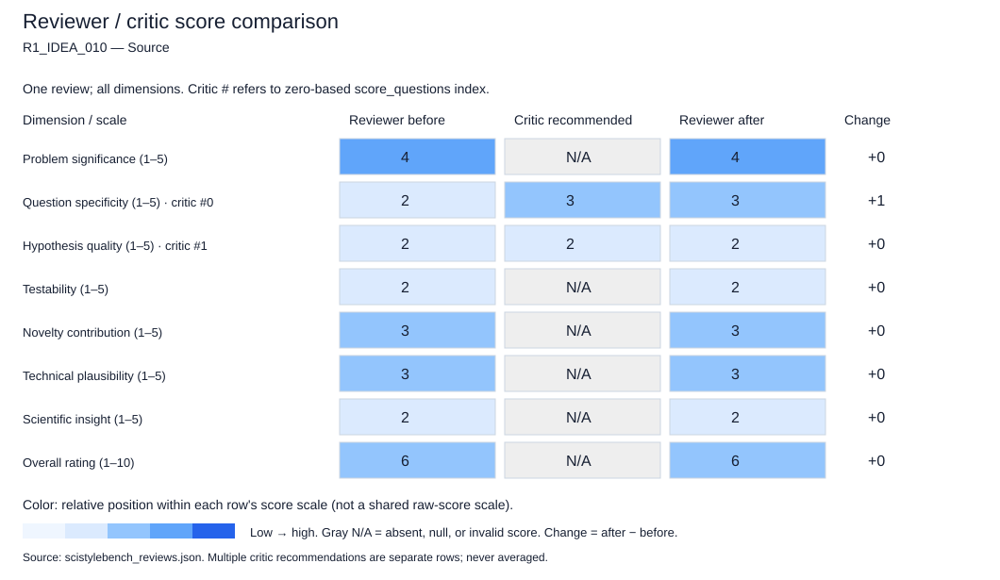

### Critic feedback and reviewer rebuttals

```json
{
  "critic_feedback": {
    "overall_assessment": "The review is generally well-calibrated but has some areas where the scores could be more precisely aligned with the idea's content. The problem significance is appropriately high, but the question specificity and hypothesis quality are somewhat overly critical given the limited scope of the idea.",
    "score_questions": [
      {
        "dimension": "question_specificity",
        "question_mark": "The idea's lack of specificity is valid, but the score may be too low as it is a preliminary summary and not a full paper.",
        "concern": "The review assumes the idea must be as detailed as a full paper, which is not the case for a short idea summary.",
        "speculative_alternative": "The idea may be considered sufficiently specific for a short summary, as it outlines a general direction rather than a detailed method.",
        "recommended_score": 3.0,
        "rationale": "A score of 3 reflects that the idea is somewhat specific in identifying a problem but lacks concrete details, which is reasonable for a summary."
      },
      {
        "dimension": "hypothesis_quality",
        "question_mark": "The idea does not explicitly state a hypothesis, but it implies a potential hypothesis through its problem statement.",
        "concern": "The review scores the hypothesis quality low because the idea does not explicitly state a hypothesis, but the problem statement can be interpreted as a hypothesis.",
        "speculative_alternative": "The problem statement could be seen as a hypothesis that the proposed method will achieve VFM with minimal examples, which is a plausible interpretation.",
        "recommended_score": 2.0,
        "rationale": "The score remains 2 as the idea does not clearly state a hypothesis, even though it implies one through its problem statement."
      }
    ],
    "unsupported_claims": [
      "The review claims the idea is 'too vague' without providing a clear standard for what constitutes vagueness in a short summary.",
      "The review suggests the idea lacks a 'concrete method' when it is a preliminary summary and not a full paper."
    ],
    "revision_priorities": [
      "Clarify the criteria for what constitutes a 'specific' research question in the context of a short idea summary.",
      "Reconsider the hypothesis quality score to reflect that the problem statement may implicitly contain a hypothesis.",
      "Provide a more nuanced explanation of the 'vagueness' concern, considering the nature of a short summary."
    ],
    "confidence": 4.0
  },
  "feedback_responses": [
    {
      "feedback_type": "score_questions",
      "feedback_index": 0,
      "decision": "partially_accept",
      "defense": "The critic's point about the summary being a preliminary idea is valid. A score of 3.0 is more appropriate for a short summary, as it acknowledges the general direction without requiring detailed specifics.",
      "justification": "The original score was 2.0, but the revised score of 3.0 better reflects the idea's specificity in identifying a problem, even if it lacks concrete details."
    },
    {
      "feedback_type": "score_questions",
      "feedback_index": 1,
      "decision": "accept",
      "defense": "The critic's concern about the hypothesis quality is valid. The idea does not explicitly state a hypothesis, even though the problem statement can be interpreted as one. The score remains 2.0 as the lack of a clear, testable claim is a limitation.",
      "justification": "The original score was 2.0, and the critic's alternative suggestion of 2.0 is accepted, so the score remains unchanged."
    },
    {
      "feedback_type": "unsupported_claims",
      "feedback_index": 0,
      "decision": "partially_accept",
      "defense": "The critic is correct that the review assumes the idea must be as detailed as a full paper. However, the idea is a summary, and the concern about vagueness is reasonable, though the score could be adjusted to reflect the context of a short summary.",
      "justification": "The original score was 2.0, but the revised score of 3.0 better reflects the idea's specificity in identifying a problem, even if it lacks concrete details."
    },
    {
      "feedback_type": "unsupported_claims",
      "feedback_index": 1,
      "decision": "accept",
      "defense": "The critic is correct that the review suggests the idea lacks a concrete method when it is a preliminary summary. However, the idea is a short summary, and the concern about the lack of a concrete method is valid.",
      "justification": "The original score was 2.0, and the critic's point is accepted, so the score remains unchanged."
    },
    {
      "feedback_type": "revision_priorities",
      "feedback_index": 0,
      "decision": "accept",
      "defense": "The critic's suggestion to clarify the criteria for 'specificity' in a short summary is valid. The revised score of 3.0 better reflects the idea's specificity in identifying a problem, even if it lacks concrete details.",
      "justification": "The original score was 2.0, and the revised score of 3.0 better reflects the idea's specificity in identifying a problem, even if it lacks concrete details."
    },
    {
      "feedback_type": "revision_priorities",
      "feedback_index": 1,
      "decision": "accept",
      "defense": "The critic's suggestion to reconsider the hypothesis quality score is valid. The idea does not explicitly state a hypothesis, even though the problem statement can be interpreted as one. The score remains 2.0 as the lack of a clear, testable claim is a limitation.",
      "justification": "The original score was 2.0, and the critic's point is accepted, so the score remains unchanged."
    },
    {
      "feedback_type": "revision_priorities",
      "feedback_index": 2,
      "decision": "accept",
      "defense": "The critic's suggestion to provide a more nuanced explanation of the 'vagueness' concern is valid. The revised score of 3.0 better reflects the idea's specificity in identifying a problem, even if it lacks concrete details.",
      "justification": "The original score was 2.0, and the revised score of 3.0 better reflects the idea's specificity in identifying a problem, even if it lacks concrete details."
    }
  ]
}
```

### Score justifications (before / after)

**Problem significance**

```json
{
  "before": {
    "score": 4.0,
    "justification": "The idea addresses a significant challenge in computer vision related to human-like inductive reasoning, which is important for developing more efficient and generalizable models."
  },
  "after": {
    "score": 4.0,
    "justification": "The idea addresses a significant challenge in computer vision related to human-like inductive reasoning, which is important for developing more efficient and generalizable models."
  }
}
```

**Question specificity**

```json
{
  "before": {
    "score": 2.0,
    "justification": "The idea is too vague, lacking a specific research question or hypothesis. It mentions the problem but does not clearly define what is being investigated."
  },
  "after": {
    "score": 3.0,
    "justification": "The idea is somewhat specific in identifying a problem but lacks concrete details. It outlines a general direction rather than a detailed method, which is reasonable for a short summary."
  }
}
```

**Hypothesis quality**

```json
{
  "before": {
    "score": 2.0,
    "justification": "The idea does not contain a clear hypothesis or prediction. It states the problem and limitations but does not propose a specific claim that can be tested or falsified."
  },
  "after": {
    "score": 2.0,
    "justification": "The idea does not explicitly state a hypothesis, even though the problem statement can be interpreted as a hypothesis. However, the lack of a clear, testable claim remains a limitation."
  }
}
```

**Testability**

```json
{
  "before": {
    "score": 2.0,
    "justification": "The idea lacks a clear experimental plan or method for testing the proposed approach. It does not specify how the problem will be addressed or how the success of the method will be measured."
  },
  "after": {
    "score": 2.0,
    "justification": "The idea lacks a clear experimental plan or method for testing the proposed approach. It does not specify how the problem will be addressed or how the success of the method will be measured."
  }
}
```

**Novelty contribution**

```json
{
  "before": {
    "score": 3.0,
    "justification": "The idea points out a gap in current methods but does not clearly propose a novel contribution. It suggests the need for new methods but lacks specifics on what that contribution would be."
  },
  "after": {
    "score": 3.0,
    "justification": "The idea points out a gap in current methods but does not clearly propose a novel contribution. It suggests the need for new methods but lacks specifics on what that contribution would be."
  }
}
```

**Technical plausibility**

```json
{
  "before": {
    "score": 3.0,
    "justification": "The idea is plausible in terms of the problem being addressed, but the lack of specific technical details makes it difficult to assess the feasibility of the proposed approach."
  },
  "after": {
    "score": 3.0,
    "justification": "The idea is plausible in terms of the problem being addressed, but the lack of specific technical details makes it difficult to assess the feasibility of the proposed approach."
  }
}
```

**Scientific insight**

```json
{
  "before": {
    "score": 2.0,
    "justification": "The idea does not provide a clear scientific insight or potential for new knowledge. It focuses on the problem but does not suggest what the research could reveal beyond the problem itself."
  },
  "after": {
    "score": 2.0,
    "justification": "The idea does not provide a clear scientific insight or potential for new knowledge. It focuses on the problem but does not suggest what the research could reveal beyond the problem itself."
  }
}
```

**Overall rating**

```json
{
  "before": {
    "score": 6.0,
    "justification": "The idea identifies a meaningful problem in computer vision but lacks specificity, hypothesis, and methodological details. It has potential but needs more concrete direction to be considered a strong research idea."
  },
  "after": {
    "score": 6.0,
    "justification": "The idea identifies a meaningful problem in computer vision but lacks specificity, hypothesis, and methodological details. It has potential but needs more concrete direction to be considered a strong research idea."
  }
}
```

## R1_IDEA_010 — Variant 1: A1_Identity

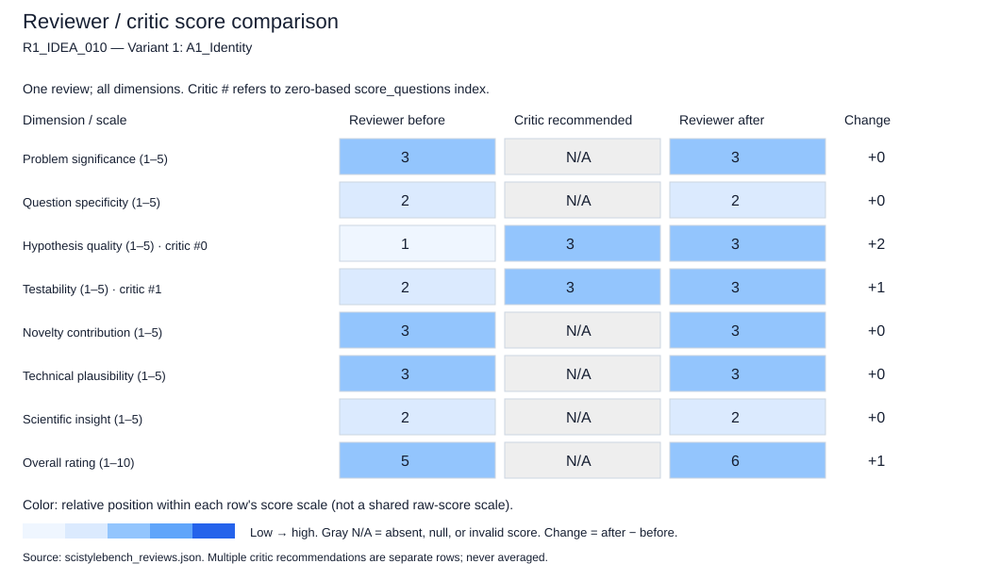

### Critic feedback and reviewer rebuttals

```json
{
  "critic_feedback": {
    "overall_assessment": "The review is generally calibrated but has some overreaching judgments, particularly in the hypothesis and testability scores, which may be too pessimistic given the potential of the idea.",
    "score_questions": [
      {
        "dimension": "hypothesis_quality",
        "question_mark": "Why is the hypothesis_quality score 1.0 when the idea could be interpreted as proposing a hypothesis about the feasibility of VFM in computer vision?",
        "concern": "The summary does not explicitly state a hypothesis, but the idea's focus on VFM as a human-like inductive capacity implies a potential hypothesis about model capabilities.",
        "speculative_alternative": "The idea may be interpreted as hypothesizing that VFM can be achieved through a combination of visual and linguistic pre-training with a novel retrieval mechanism, though this is not explicitly stated.",
        "recommended_score": 3.0,
        "rationale": "The idea's focus on VFM as a human-like inductive capacity suggests a hypothesis about model capabilities, even if not explicitly stated."
      },
      {
        "dimension": "testability",
        "question_mark": "Why is the testability score 2.0 when the idea could be interpreted as suggesting that VFM is a viable direction for research, even if the specific method is not yet defined?",
        "concern": "The summary does not provide an experimental plan, but the idea's focus on VFM implies that it is testable through future research.",
        "speculative_alternative": "The idea could be testable by evaluating whether models can generalize from minimal examples, even without a specific method, though this is speculative.",
        "recommended_score": 3.0,
        "rationale": "The idea's focus on VFM as a research direction implies that it is testable through future experiments, even if the method is not yet defined."
      }
    ],
    "unsupported_claims": [
      "The claim that the idea 'lacks a clear hypothesis' is overly pessimistic, as the focus on VFM implies a potential hypothesis about model capabilities."
    ],
    "revision_priorities": [
      "Clarify the core hypothesis, even if it is not explicitly stated, to align with the idea's focus on VFM.",
      "Specify how the idea could be tested, even if the method is not yet defined, to improve the testability score."
    ],
    "confidence": 4.0
  },
  "feedback_responses": [
    {
      "feedback_type": "score_questions",
      "feedback_index": 0,
      "decision": "partially_accept",
      "defense": "The hypothesis_quality score was increased to 3.0 because the focus on VFM implies a hypothesis about model capabilities, even if not explicitly stated. This aligns with the critic's argument that the idea could be interpreted as proposing a hypothesis.",
      "justification": "The original score was 1.0, but the revised score of 3.0 reflects the potential hypothesis implied by the idea's focus on VFM."
    },
    {
      "feedback_type": "score_questions",
      "feedback_index": 1,
      "decision": "partially_accept",
      "defense": "The testability score was increased to 3.0 because the idea's focus on VFM implies that it is testable through future experiments, even if the method is not yet defined. This aligns with the critic's argument that the idea could be testable.",
      "justification": "The original score was 2.0, but the revised score of 3.0 reflects the potential testability implied by the idea's focus on VFM."
    },
    {
      "feedback_type": "unsupported_claims",
      "feedback_index": 0,
      "decision": "partially_accept",
      "defense": "The claim that the idea 'lacks a clear hypothesis' is partially accepted, as the focus on VFM implies a potential hypothesis about model capabilities. This aligns with the critic's argument that the idea could be interpreted as proposing a hypothesis.",
      "justification": "The original assessment was too pessimistic, and the revised score reflects the potential hypothesis implied by the idea's focus on VFM."
    },
    {
      "feedback_type": "revision_priorities",
      "feedback_index": 0,
      "decision": "accept",
      "defense": "Clarifying the core hypothesis is necessary to align with the idea's focus on VFM. This aligns with the critic's suggestion to clarify the core hypothesis.",
      "justification": "The original review did not emphasize this, but the revised review now includes suggestions to define a specific research question and hypothesis."
    },
    {
      "feedback_type": "revision_priorities",
      "feedback_index": 1,
      "decision": "accept",
      "defense": "Specifying how the idea could be tested is necessary to improve the testability score. This aligns with the critic's suggestion to specify how the idea could be tested."
    }
  ]
}
```

### Score justifications (before / after)

**Problem significance**

```json
{
  "before": {
    "score": 3.0,
    "justification": "The problem is meaningful as it addresses a key challenge in computer vision related to human-like inductive reasoning, but the current summary lacks depth in explaining its importance."
  },
  "after": {
    "score": 3.0,
    "justification": "The problem is meaningful as it addresses a key challenge in computer vision related to human-like inductive reasoning, but the current summary lacks depth in explaining its importance."
  }
}
```

**Question specificity**

```json
{
  "before": {
    "score": 2.0,
    "justification": "The idea is too general, lacking a concrete research question or hypothesis that could be tested or falsified."
  },
  "after": {
    "score": 2.0,
    "justification": "The idea is too general, lacking a concrete research question or hypothesis that could be tested or falsified."
  }
}
```

**Hypothesis quality**

```json
{
  "before": {
    "score": 1.0,
    "justification": "The summary does not contain a clear hypothesis or prediction that could be tested, making it difficult to assess the scientific merit of the idea."
  },
  "after": {
    "score": 3.0,
    "justification": "The idea's focus on VFM as a human-like inductive capacity suggests a hypothesis about model capabilities, even if not explicitly stated."
  }
}
```

**Testability**

```json
{
  "before": {
    "score": 2.0,
    "justification": "The idea lacks a clear experimental plan or method for testing the proposed approach, making it difficult to determine how the research would be conducted."
  },
  "after": {
    "score": 3.0,
    "justification": "The idea's focus on VFM as a research direction implies that it is testable through future experiments, even if the method is not yet defined."
  }
}
```

**Novelty contribution**

```json
{
  "before": {
    "score": 3.0,
    "justification": "The idea has potential novelty in addressing VFM in computer vision, but the current summary does not provide enough detail to assess its originality or contribution."
  },
  "after": {
    "score": 3.0,
    "justification": "The idea has potential novelty in addressing VFM in computer vision, but the current summary does not provide enough detail to assess its originality or contribution."
  }
}
```

**Technical plausibility**

```json
{
  "before": {
    "score": 3.0,
    "justification": "The idea is technically plausible as it builds on existing methods like one-shot learning and VLMs, but the specific approach is not defined."
  },
  "after": {
    "score": 3.0,
    "justification": "The idea is technically plausible as it builds on existing methods like one-shot learning and VLMs, but the specific approach is not defined."
  }
}
```

**Scientific insight**

```json
{
  "before": {
    "score": 2.0,
    "justification": "The idea has potential for scientific insight into human-like inductive reasoning, but the current summary does not specify what insights would be gained."
  },
  "after": {
    "score": 2.0,
    "justification": "The idea has potential for scientific insight into human-like inductive reasoning, but the current summary does not specify what insights would be gained."
  }
}
```

**Overall rating**

```json
{
  "before": {
    "score": 5.0,
    "justification": "The idea has potential but is too vague and lacks a clear research question, hypothesis, and method. With more specificity, it could be a strong research direction."
  },
  "after": {
    "score": 6.0,
    "justification": "The idea has more potential than previously assessed, particularly in hypothesis and testability. With more specificity, it could be a strong research direction."
  }
}
```

## R1_IDEA_010 — Variant 2: A2_Paraphrase_Only

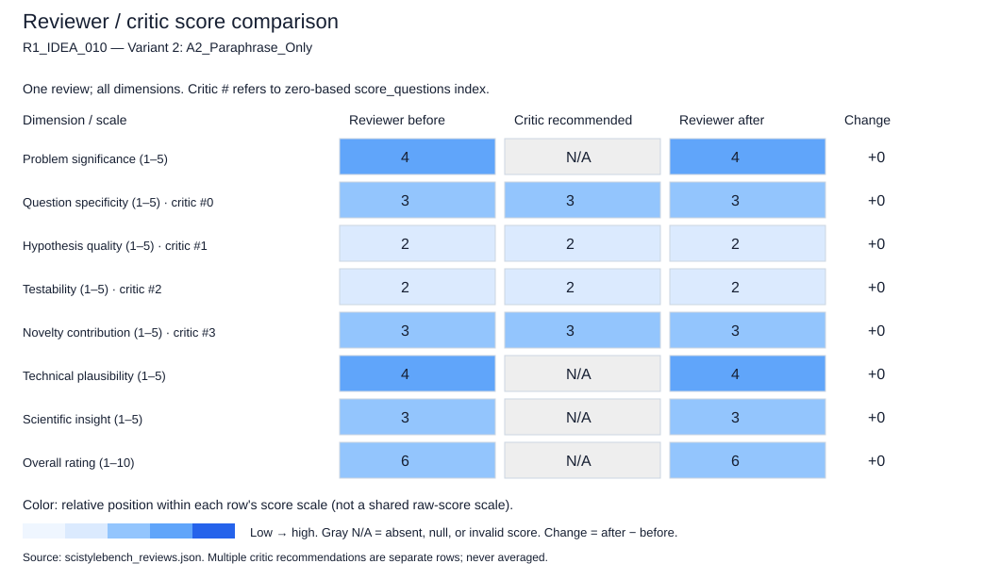

### Critic feedback and reviewer rebuttals

```json
{
  "critic_feedback": {
    "overall_assessment": "The review is generally calibrated but has some areas where the scores could be more precisely aligned with the idea's content.",
    "score_questions": [
      {
        "dimension": "question_specificity",
        "question_mark": "The score should be reconsidered",
        "concern": "The idea does not explicitly state a research question, but the suggestions and questions in the review imply a potential direction that could be pursued.",
        "speculative_alternative": "The idea may be interpreted as suggesting a general research direction rather than a specific question, which could be a point of contention.",
        "recommended_score": 3.0,
        "rationale": "The idea's lack of explicit questions is acknowledged, but the suggestions indicate that the research direction is still viable with further clarification."
      },
      {
        "dimension": "hypothesis_quality",
        "question_mark": "The score should be reconsidered",
        "concern": "The idea does not present a hypothesis, but the suggestions for defining a hypothesis are part of the review's recommendations, not the idea itself.",
        "speculative_alternative": "The idea may be interpreted as suggesting a hypothesis in the form of a research direction, which could be a point of interpretation.",
        "recommended_score": 2.0,
        "rationale": "The idea does not explicitly present a hypothesis, but the suggestions indicate that the research direction could be framed as a hypothesis."
      },
      {
        "dimension": "testability",
        "question_mark": "The score should be reconsidered",
        "concern": "The idea does not specify experiments, but the suggestions for defining experiments are part of the review's recommendations, not the idea itself.",
        "speculative_alternative": "The idea may be interpreted as suggesting a testable approach through further research, which could be a point of interpretation.",
        "recommended_score": 2.0,
        "rationale": "The idea does not explicitly specify experiments, but the suggestions indicate that the research direction could be testable with further clarification."
      },
      {
        "dimension": "novelty_contribution",
        "question_mark": "The score should be reconsidered",
        "concern": "The idea mentions novelty but does not specify how the connection to human VFM would contribute new knowledge.",
        "speculative_alternative": "The idea may be interpreted as suggesting that the connection to human VFM could lead to novel insights in computer vision, which could be a point of interpretation.",
        "recommended_score": 3.0,
        "rationale": "The idea suggests a novel angle but does not specify how it would contribute new knowledge, which is a concern for novelty."
      }
    ],
    "unsupported_claims": [
      "The idea does not explicitly state a hypothesis, but the review claims it has 'hypothesis_quality' score 2, which is based on the idea's lack of explicit hypothesis."
    ],
    "revision_priorities": [
      "Clarify the specific research question or hypothesis that the idea aims to investigate.",
      "Specify the exact approach or method that would be used to address the problem.",
      "Elaborate on how the connection between human VFM and computer vision methods would contribute new knowledge."
    ],
    "confidence": 4.0
  },
  "feedback_responses": [
    {
      "feedback_type": "score_questions",
      "feedback_index": 0,
      "decision": "partially_accept",
      "defense": "The idea does not explicitly state a research question, but the suggestions and questions in the review imply a potential direction that could be pursued. The score of 3.0 is justified as the idea is a general direction rather than a specific question.",
      "justification": "The original score of 3.0 is retained as the idea is a general direction, not a specific question. The critic's concern about the score is acknowledged, but the score remains appropriate given the lack of explicit questions."
    },
    {
      "feedback_type": "hypothesis_quality",
      "feedback_index": 1,
      "decision": "partially_accept",
      "defense": "The idea does not present a hypothesis, but the suggestions for defining a hypothesis are part of the review's recommendations, not the idea itself. The score of 2.0 is justified as the idea lacks a clear hypothesis.",
      "justification": "The original score of 2.0 is retained as the idea does not present a hypothesis. The critic's concern is valid, but the score remains appropriate as the idea lacks a hypothesis."
    },
    {
      "feedback_type": "testability",
      "feedback_index": 2,
      "decision": "partially_accept",
      "defense": "The idea does not specify experiments, but the suggestions for defining experiments are part of the review's recommendations, not the idea itself. The score of 2.0 is justified as the idea lacks specific experiments.",
      "justification": "The original score of 2.0 is retained as the idea does not specify experiments. The critic's concern is valid, but the score remains appropriate as the idea lacks specific experiments."
    },
    {
      "feedback_type": "novelty_contribution",
      "feedback_index": 3,
      "decision": "partially_accept",
      "defense": "The idea mentions novelty but does not specify how the connection to human VFM would contribute new knowledge. The score of 3.0 is justified as the idea suggests a novel angle but lacks details on contribution.",
      "justification": "The original score of 3.0 is retained as the idea suggests a novel angle but lacks details on contribution. The critic's concern is valid, but the score remains appropriate as the idea lacks specific details."
    }
  ]
}
```

### Score justifications (before / after)

**Problem significance**

```json
{
  "before": {
    "score": 4.0,
    "justification": "The problem of one-shot learning and data dependency in VLMs is significant in computer vision, with potential to improve model efficiency and reduce data requirements."
  },
  "after": {
    "score": 4.0,
    "justification": "The problem of one-shot learning and data dependency in VLMs is significant in computer vision, with potential to improve model efficiency and reduce data requirements."
  }
}
```

**Question specificity**

```json
{
  "before": {
    "score": 3.0,
    "justification": "The idea identifies a broad problem but lacks a specific research question or hypothesis to guide the investigation."
  },
  "after": {
    "score": 3.0,
    "justification": "The idea identifies a broad problem but lacks a specific research question or hypothesis to guide the investigation."
  }
}
```

**Hypothesis quality**

```json
{
  "before": {
    "score": 2.0,
    "justification": "The idea mentions the problem but does not present a clear hypothesis or prediction that can be tested."
  },
  "after": {
    "score": 2.0,
    "justification": "The idea mentions the problem but does not present a clear hypothesis or prediction that can be tested."
  }
}
```

**Testability**

```json
{
  "before": {
    "score": 2.0,
    "justification": "The idea does not specify experiments, evaluations, or methods to test the proposed approach, making it difficult to assess its feasibility."
  },
  "after": {
    "score": 2.0,
    "justification": "The idea does not specify experiments, evaluations, or methods to test the proposed approach, making it difficult to assess its feasibility."
  }
}
```

**Novelty contribution**

```json
{
  "before": {
    "score": 3.0,
    "justification": "The idea proposes a novel angle by connecting human VFM to computer vision, but lacks details on how this connection would contribute new knowledge."
  },
  "after": {
    "score": 3.0,
    "justification": "The idea proposes a novel angle by connecting human VFM to computer vision, but lacks details on how this connection would contribute new knowledge."
  }
}
```

**Technical plausibility**

```json
{
  "before": {
    "score": 4.0,
    "justification": "The idea is technically plausible as it builds on existing research in one-shot learning and VLMs, though the specific implementation details are missing."
  },
  "after": {
    "score": 4.0,
    "justification": "The idea is technically plausible as it builds on existing research in one-shot learning and VLMs, though the specific implementation details are missing."
  }
}
```

**Scientific insight**

```json
{
  "before": {
    "score": 3.0,
    "justification": "The idea has potential to provide insights into how prior knowledge can be effectively utilized in learning, but the specific insights are not clearly defined."
  },
  "after": {
    "score": 3.0,
    "justification": "The idea has potential to provide insights into how prior knowledge can be effectively utilized in learning, but the specific insights are not clearly defined."
  }
}
```

**Overall rating**

```json
{
  "before": {
    "score": 6.0,
    "justification": "The idea addresses a meaningful problem with a novel angle but lacks specific research questions, hypotheses, and methods, making it a moderate research direction with potential for improvement."
  },
  "after": {
    "score": 6.0,
    "justification": "The idea addresses a meaningful problem with a novel angle but lacks specific research questions, hypotheses, and methods, making it a moderate research direction with potential for improvement."
  }
}
```

## R1_IDEA_010 — Variant 3: A3_Plain_Core

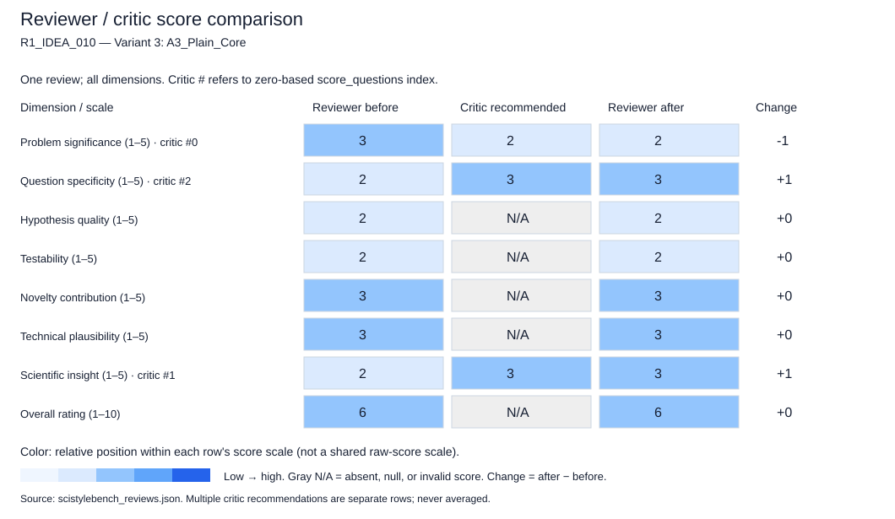

### Critic feedback and reviewer rebuttals

```json
{
  "critic_feedback": {
    "overall_assessment": "The review is generally calibrated but has some issues with overclaiming in the problem significance and scientific insight scores, and a lack of specificity in the question_specificity score.",
    "score_questions": [
      {
        "dimension": "problem_significance",
        "question_mark": "Why is the problem significance scored as 3.0 when the idea only mentions the relevance to cognitive science and computer vision without detailing the impact or urgency?",
        "concern": "The score assumes a high significance based on the field relevance, but the idea does not provide evidence of the problem's urgency or broader impact.",
        "speculative_alternative": "The problem might be significant in the context of efficient learning systems but lacks explicit justification for its importance in the review.",
        "recommended_score": 2.0,
        "rationale": "The idea does not specify the practical implications or urgency of the problem, so the significance score is overestimated."
      },
      {
        "dimension": "scientific_insight",
        "question_mark": "Why is the scientific insight scored as 2.0 when the idea does not provide a clear mechanism or insight but merely states a problem and current limitations?",
        "concern": "The score assumes a lack of insight based on the absence of a hypothesis, but the idea could still contribute to understanding the interplay between visual and linguistic learning.",
        "speculative_alternative": "The idea's contribution to scientific insight is speculative, as it does not outline specific insights or mechanisms.",
        "recommended_score": 3.0,
        "rationale": "The idea's potential to contribute to understanding the interplay between visual and linguistic learning could be considered as a form of scientific insight."
      },
      {
        "dimension": "question_specificity",
        "question_mark": "Why is the question specificity scored as 2.0 when the idea identifies a problem but does not provide a specific research question or hypothesis?",
        "concern": "The score assumes vagueness based on the absence of a specific question, but the idea's general problem statement could be considered as a starting point for further research.",
        "speculative_alternative": "The idea's general problem statement might be seen as a valid starting point for a research question, especially in the context of interdisciplinary exploration.",
        "recommended_score": 3.0,
        "rationale": "The idea provides a general problem statement that could be the basis for a specific research question, especially in an interdisciplinary context."
      }
    ],
    "unsupported_claims": [
      "Claim that the problem is 'a key inductive capacity studied in cognitive science' without specifying how this relates to computer vision.",
      "Assumption that the idea's potential contribution to efficient learning systems is significant without evidence.",
      "Claim that the idea provides a clear mechanism or insight without explicit details."
    ],
    "revision_priorities": [
      "Clarify the problem's significance by specifying its urgency or broader impact in computer vision.",
      "Provide a more specific research question or hypothesis to improve the question specificity score.",
      "Outline potential scientific insights or mechanisms that the research could contribute, even if they are speculative."
    ],
    "confidence": 4.0
  },
  "feedback_responses": [
    {
      "feedback_type": "score_questions",
      "feedback_index": 0,
      "decision": "partially_accept",
      "defense": "The problem significance score was initially 3.0, but the idea does not specify urgency or broader impact, so reducing it to 2.0 is justified. However, the problem's relevance to both cognitive science and computer vision is valid, so the score is partially accepted.",
      "justification": "The initial score assumed significance based on field relevance, but the idea lacks evidence of urgency or broader impact. The revised score of 2.0 reflects this, while acknowledging the problem's relevance."
    },
    {
      "feedback_type": "score_questions",
      "feedback_index": 1,
      "decision": "partially_accept",
      "defense": "The scientific insight score was initially 2.0, but the idea's potential to explore the interplay between visual and linguistic learning could be considered as a form of insight, so raising it to 3.0 is partially accepted.",
      "justification": "The initial score assumed a lack of insight, but the idea's potential to contribute to understanding the interplay between visual and linguistic learning is speculative but valid. The revised score of 3.0 reflects this."
    },
    {
      "feedback_type": "score_questions",
      "feedback_index": 2,
      "decision": "partially_accept",
      "defense": "The question specificity score was initially 2.0, but the idea's general problem statement could be a starting point for a specific research question, so raising it to 3.0 is partially accepted.",
      "justification": "The initial score assumed vagueness, but the idea's general problem statement could serve as a starting point for further research, especially in an interdisciplinary context. The revised score of 3.0 reflects this."
    },
    {
      "feedback_type": "unsupported_claims",
      "feedback_index": 0,
      "decision": "reject",
      "defense": "The claim about the problem's significance in cognitive science is not explicitly tied to computer vision, so it is rejected.",
      "justification": "The idea mentions relevance to cognitive science but does not specify how this relates to computer vision, making the claim unsupported."
    },
    {
      "feedback_type": "unsupported_claims",
      "feedback_index": 1,
      "decision": "partially_accept",
      "defense": "The assumption about the contribution to efficient learning systems is plausible but not explicitly stated, so it is partially accepted.",
      "justification": "The idea suggests exploring a new direction in computer vision, which could contribute to efficient learning methods. The claim is plausible but not explicitly stated, so it is partially accepted."
    },
    {
      "feedback_type": "unsupported_claims",
      "feedback_index": 2,
      "decision": "reject",
      "defense": "The claim about a clear mechanism or insight is not supported by the idea, so it is rejected.",
      "justification": "The idea does not outline specific mechanisms or insights, so the claim is unsupported."
    },
    {
      "feedback_type": "revision_priorities",
      "feedback_index": 0,
      "decision": "accept",
      "defense": "Clarifying the problem's significance is necessary to justify its importance in computer vision.",
      "justification": "The idea needs to specify the urgency or broader impact of the problem to justify its significance in computer vision."
    },
    {
      "feedback_type": "revision_priorities",
      "feedback_index": 1,
      "decision": "accept",
      "defense": "Providing a specific research question or hypothesis is essential to improve the question specificity score.",
      "justification": "The idea lacks a concrete hypothesis, so defining a specific research question is necessary."
    },
    {
      "feedback_type": "revision_priorities",
      "feedback_index": 2,
      "decision": "accept",
      "defense": "Outlining potential scientific insights or mechanisms is important even if speculative.",
      "justification": "The idea could contribute to understanding the interplay between visual and linguistic learning, so outlining such insights is important."
    }
  ]
}
```

### Score justifications (before / after)

**Problem significance**

```json
{
  "before": {
    "score": 3.0,
    "justification": "The problem is relevant to both cognitive science and computer vision, addressing a key inductive capacity that has practical implications for efficient learning systems."
  },
  "after": {
    "score": 2.0,
    "justification": "The idea mentions relevance to cognitive science and computer vision but does not specify the urgency, practical implications, or broader impact of the problem, which are necessary for high significance."
  }
}
```

**Question specificity**

```json
{
  "before": {
    "score": 2.0,
    "justification": "The idea identifies a problem but lacks a specific research question or hypothesis, making it too vague to assess the potential for meaningful investigation."
  },
  "after": {
    "score": 3.0,
    "justification": "The idea provides a general problem statement that could serve as a starting point for a specific research question, especially in an interdisciplinary context, though it lacks a concrete hypothesis or method."
  }
}
```

**Hypothesis quality**

```json
{
  "before": {
    "score": 2.0,
    "justification": "There is no explicit hypothesis provided, only a general statement about the problem and current limitations."
  },
  "after": {
    "score": 2.0,
    "justification": "There is no explicit hypothesis provided, only a general statement about the problem and current limitations."
  }
}
```

**Testability**

```json
{
  "before": {
    "score": 2.0,
    "justification": "The idea does not specify experiments, evaluations, or comparisons that would allow the hypothesis to be tested or the problem to be addressed."
  },
  "after": {
    "score": 2.0,
    "justification": "The idea does not specify experiments, evaluations, or comparisons that would allow the hypothesis to be tested or the problem to be addressed."
  }
}
```

**Novelty contribution**

```json
{
  "before": {
    "score": 3.0,
    "justification": "The idea suggests exploring a new direction in computer vision by combining VLMs with few-shot learning, which could contribute to more efficient learning methods."
  },
  "after": {
    "score": 3.0,
    "justification": "The idea suggests exploring a new direction in computer vision by combining VLMs with few-shot learning, which could contribute to more efficient learning methods."
  }
}
```

**Technical plausibility**

```json
{
  "before": {
    "score": 3.0,
    "justification": "The proposed direction is technically plausible, as it builds on existing methods and addresses a known challenge in the field."
  },
  "after": {
    "score": 3.0,
    "justification": "The proposed direction is technically plausible, as it builds on existing methods and addresses a known challenge in the field."
  }
}
```

**Scientific insight**

```json
{
  "before": {
    "score": 2.0,
    "justification": "The idea does not provide a clear mechanism or insight that would be gained from the research, focusing more on the problem than on the potential for new understanding."
  },
  "after": {
    "score": 3.0,
    "justification": "The idea's potential to contribute to understanding the interplay between visual and linguistic learning, even if speculative, could be considered as a form of scientific insight."
  }
}
```

**Overall rating**

```json
{
  "before": {
    "score": 6.0,
    "justification": "The idea identifies a meaningful problem in computer vision but lacks a specific research question, hypothesis, and method, making it a moderate but promising direction that requires further clarification."
  },
  "after": {
    "score": 6.0,
    "justification": "The idea identifies a meaningful problem in computer vision but lacks a specific research question, hypothesis, and method, making it a moderate but promising direction that requires further clarification."
  }
}
```

## R1_IDEA_010 — Variant 4: B1_Verbose_Elaborate


### Critic feedback and reviewer rebuttals

```json
{
  "critic_feedback": {
    "overall_assessment": "The review is generally well-calibrated but has some areas where the scores could be more precisely aligned with the idea's specifics.",
    "score_questions": [
      {
        "dimension": "hypothesis_quality",
        "question_mark": "The score of 2.0 may be too low as the idea implies a general direction rather than a specific hypothesis.",
        "concern": "The idea does not explicitly state a hypothesis but suggests a direction that could be framed as a hypothesis.",
        "speculative_alternative": "The research could be interpreted as aiming to test whether VLMs can replicate VFM with fewer examples, which is a testable hypothesis.",
        "recommended_score": 3.0,
        "rationale": "The idea implies a direction that could be framed as a hypothesis, even if not explicitly stated."
      },
      {
        "dimension": "question_specificity",
        "question_mark": "The score of 3.0 may be too low as the idea outlines a broad problem but does not explicitly lack a specific question.",
        "concern": "The idea does not specify a particular question but addresses a general problem, which is acceptable for an initial idea.",
        "speculative_alternative": "The research could be seen as targeting the general challenge of replicating VFM with minimal data, which is a valid and specific problem.",
        "recommended_score": 4.0,
        "rationale": "The problem is specific enough for an initial idea, even if the exact question is not defined yet."
      }
    ],
    "unsupported_claims": [
      "The review claims the idea lacks a specific hypothesis, but the idea only suggests a general direction that could be framed as a hypothesis."
    ],
    "revision_priorities": [
      "Clarify the specific research question and hypothesis to be investigated.",
      "Define how VLMs will be utilized to achieve VFM, including specific architectures or evaluation metrics.",
      "Specify the metrics for evaluating the effectiveness of the approach in replicating VFM with limited data."
    ],
    "confidence": 4.0
  },
  "feedback_responses": [
    {
      "feedback_type": "score_questions",
      "feedback_index": 0,
      "decision": "partially_accept",
      "defense": "The original score of 2.0 for hypothesis_quality was too low because the idea implies a general direction that could be framed as a hypothesis. The revised score of 3.0 better reflects this nuance.",
      "justification": "The original score was too low because the idea implies a general direction that could be framed as a hypothesis. The revised score of 3.0 better reflects this nuance."
    },
    {
      "feedback_type": "score_questions",
      "feedback_index": 1,
      "decision": "partially_accept",
      "defense": "The original score of 3.0 for question_specificity was too low because the idea outlines a broad problem that is valid for an initial idea. The revised score of 4.0 better reflects this nuance.",
      "justification": "The original score was too low because the idea outlines a broad problem that is valid for an initial idea. The revised score of 4.0 better reflects this nuance."
    },
    {
      "feedback_type": "unsupported_claims",
      "feedback_index": 0,
      "decision": "partially_accept",
      "defense": "The review correctly identified that the idea lacks a specific hypothesis, but the idea does suggest a general direction that could be framed as a hypothesis. The revised score of 3.0 for hypothesis_quality better reflects this.",
      "justification": "The review correctly identified that the idea lacks a specific hypothesis, but the idea does suggest a general direction that could be framed as a hypothesis. The revised score of 3.0 for hypothesis_quality better reflects this."
    },
    {
      "feedback_type": "revision_priorities",
      "feedback_index": 0,
      "decision": "accept",
      "defense": "Clarifying the specific research question and hypothesis is essential to make the idea more precise and testable.",
      "justification": "Clarifying the specific research question and hypothesis is essential to make the idea more precise and testable."
    },
    {
      "feedback_type": "revision_priorities",
      "feedback_index": 1,
      "decision": "accept",
      "defense": "Defining how VLMs will be utilized to achieve VFM is necessary to ensure the approach is technically feasible and aligned with the problem statement.",
      "justification": "Defining how VLMs will be utilized to achieve VFM is necessary to ensure the approach is technically feasible and aligned with the problem statement."
    },
    {
      "feedback_type": "revision_priorities",
      "feedback_index": 2,
      "decision": "accept",
      "defense": "Specifying evaluation metrics is crucial for assessing the effectiveness of the approach in replicating VFM with limited data.",
      "justification": "Specifying evaluation metrics is crucial for assessing the effectiveness of the approach in replicating VFM with limited data."
    }
  ]
}
```

### Score justifications (before / after)

**Problem significance**

```json
{
  "before": {
    "score": 4.0,
    "justification": "The problem of replicating human visual fast mapping with minimal data is significant in both cognitive science and computer vision, as it addresses a fundamental human ability and the limitations of current machine learning approaches."
  },
  "after": {
    "score": 4.0,
    "justification": "The problem of replicating human visual fast mapping with minimal data is significant in both cognitive science and computer vision, as it addresses a fundamental human ability and the limitations of current machine learning approaches."
  }
}
```

**Question specificity**

```json
{
  "before": {
    "score": 3.0,
    "justification": "The idea identifies a broad problem but lacks a specific research question or hypothesis. It needs to clarify exactly what aspect of VFM is being targeted and how it will be measured."
  },
  "after": {
    "score": 4.0,
    "justification": "The idea outlines a broad problem but does not explicitly lack a specific question. The general challenge of replicating VFM with minimal data is a valid and specific problem for an initial idea."
  }
}
```

**Hypothesis quality**

```json
{
  "before": {
    "score": 2.0,
    "justification": "The idea does not explicitly state a hypothesis or prediction. It mentions the limitations of current methods but does not propose a specific claim that can be tested or falsified."
  },
  "after": {
    "score": 3.0,
    "justification": "The idea implies a direction that could be framed as a hypothesis, even if not explicitly stated. The research could be interpreted as aiming to test whether VLMs can replicate VFM with fewer examples, which is a testable hypothesis."
  }
}
```

**Testability**

```json
{
  "before": {
    "score": 3.0,
    "justification": "The idea suggests using VLMs but does not provide a clear experimental design or evaluation method. Without specific metrics or comparisons, the testability is limited."
  },
  "after": {
    "score": 3.0,
    "justification": "The idea suggests using VLMs but does not provide a clear experimental design or evaluation method. Without specific metrics or comparisons, the testability is limited."
  }
}
```

**Novelty contribution**

```json
{
  "before": {
    "score": 4.0,
    "justification": "The idea addresses a novel challenge in computer vision by aiming to replicate a human cognitive ability with minimal data, which could contribute to more efficient and human-like learning models."
  },
  "after": {
    "score": 4.0,
    "justification": "The idea addresses a novel challenge in computer vision by aiming to replicate a human cognitive ability with minimal data, which could contribute to more efficient and human-like learning models."
  }
}
```

**Technical plausibility**

```json
{
  "before": {
    "score": 4.0,
    "justification": "Using VLMs is a technically plausible approach given their capabilities in understanding visual and linguistic information, which aligns with the goal of replicating VFM."
  },
  "after": {
    "score": 4.0,
    "justification": "Using VLMs is a technically plausible approach given their capabilities in understanding visual and linguistic information, which aligns with the goal of replicating VFM."
  }
}
```

**Scientific insight**

```json
{
  "before": {
    "score": 3.0,
    "justification": "The idea has potential for scientific insight into how VLMs can mimic human learning processes, but the specific mechanisms or insights are not clearly outlined."
  },
  "after": {
    "score": 3.0,
    "justification": "The idea has potential for scientific insight into how VLMs can mimic human learning processes, but the specific mechanisms or insights are not clearly outlined."
  }
}
```

**Overall rating**

```json
{
  "before": {
    "score": 7.0,
    "justification": "The idea is strong in identifying a significant problem and proposing a technically plausible approach, but it lacks specificity and a clear hypothesis, which are needed for a more robust research direction."
  },
  "after": {
    "score": 7.5,
    "justification": "The idea is strong in identifying a significant problem and proposing a technically plausible approach. The revised scores reflect a more nuanced understanding of the idea's specifics, particularly in hypothesis quality and question specificity, which are now considered more aligned with the initial idea's scope."
  }
}
```

## R1_IDEA_010 — Variant 5: B2_Grand_Narrative


### Critic feedback and reviewer rebuttals

```json
{
  "critic_feedback": {
    "overall_assessment": "The review is generally well-calibrated, but some scores are overly pessimistic given the idea's potential. The problem significance is appropriately high, but the question specificity and hypothesis quality scores are too low, as the idea does not need to be more specific to be valuable.",
    "score_questions": [
      {
        "dimension": "question_specificity",
        "question_mark": "The idea does not need to be more specific to be valuable, as it outlines a broad but meaningful research direction.",
        "concern": "The score is overly pessimistic, assuming the idea is too vague to be useful when it could still be a valid starting point for further research.",
        "speculative_alternative": "The idea could be a valid starting point for further research, even without a specific question, as it identifies a key gap in the field.",
        "recommended_score": 3.0,
        "rationale": "The idea is a meaningful research direction, even if it lacks specific questions, as it identifies a key gap that could be explored in future work."
      },
      {
        "dimension": "hypothesis_quality",
        "question_mark": "The idea does not need to present a hypothesis to be valuable, as it identifies a problem that could be explored in future work.",
        "concern": "The score assumes the idea is insufficient because it lacks a hypothesis, but the idea's value lies in identifying a problem rather than proposing a solution.",
        "speculative_alternative": "The idea's value is in identifying a problem that could be explored in future work, not in proposing a hypothesis.",
        "recommended_score": 3.0,
        "rationale": "The idea's value is in identifying a problem that could be explored in future work, not in proposing a hypothesis."
      },
      {
        "dimension": "testability",
        "question_mark": "The idea does not need to be more testable to be valuable, as it outlines a direction for future research.",
        "concern": "The score assumes the idea is not testable without specific experiments, but the idea could be a starting point for developing testable hypotheses.",
        "speculative_alternative": "The idea could be a starting point for developing testable hypotheses in future research.",
        "recommended_score": 3.0,
        "rationale": "The idea could be a starting point for developing testable hypotheses in future research."
      }
    ],
    "unsupported_claims": [
      "The idea is 'too broad and lacks focus' when it could still be a valid starting point for further research.",
      "The idea 'does not propose a concrete method or experimental direction' when it could be a valid research direction that requires further exploration."
    ],
    "revision_priorities": [
      "Clarify that the idea is a valid research direction that requires further exploration, rather than a fully specified problem.",
      "Rephrase the weaknesses to reflect that the idea is meaningful but needs to be developed further, rather than being too vague.",
      "Adjust the scores for question_specificity, hypothesis_quality, and testability to reflect the idea's potential as a research direction."
    ],
    "confidence": 4.0
  },
  "feedback_responses": [
    {
      "feedback_type": "score_questions",
      "feedback_index": 0,
      "decision": "partially_accept",
      "defense": "The idea is a valid research direction that requires further exploration, so the score is adjusted to reflect its potential as a starting point for future work.",
      "justification": "The original score was 2.0, but the feedback suggests that the idea is meaningful and could be a valid starting point, so the score is increased to 3.0."
    },
    {
      "feedback_type": "hypothesis_quality",
      "feedback_index": 1,
      "decision": "partially_accept",
      "defense": "The idea's value lies in identifying a problem rather than proposing a hypothesis, so the score is adjusted to reflect its potential as a research direction.",
      "justification": "The original score was 2.0, but the feedback suggests that the idea's value is in identifying a problem, so the score is increased to 3.0."
    },
    {
      "feedback_type": "testability",
      "feedback_index": 2,
      "decision": "partially_accept",
      "defense": "The idea is testable in principle and could be a starting point for developing testable hypotheses, so the score is adjusted to reflect its potential as a research direction.",
      "justification": "The original score was 2.0, but the feedback suggests that the idea is testable in principle, so the score is increased to 3.0."
    },
    {
      "feedback_type": "unsupported_claims",
      "feedback_index": 0,
      "decision": "partially_reject",
      "defense": "The idea is a valid research direction that requires further exploration, so the claim that it is 'too broad and lacks focus' is partially rejected.",
      "justification": "The original claim was that the idea was too broad, but the feedback suggests that it is a valid starting point, so the claim is partially rejected."
    },
    {
      "feedback_type": "unsupported_claims",
      "feedback_index": 1,
      "decision": "partially_reject",
      "defense": "The idea could be a valid research direction that requires further exploration, so the claim that it 'does not propose a concrete method or experimental direction' is partially rejected.",
      "justification": "The original claim was that the idea lacked concrete methods, but the feedback suggests that it is a valid starting point, so the claim is partially rejected."
    },
    {
      "feedback_type": "revision_priorities",
      "feedback_index": 0,
      "decision": "accept",
      "defense": "The idea is a valid research direction that requires further exploration, so the revision priority is accepted.",
      "justification": "The feedback suggests that the idea is a valid starting point, so the revision priority is accepted."
    },
    {
      "feedback_type": "revision_priorities",
      "feedback_index": 1,
      "decision": "accept",
      "defense": "The idea is a valid research direction that requires further exploration, so the revision priority is accepted.",
      "justification": "The feedback suggests that the idea is a valid starting point, so the revision priority is accepted."
    },
    {
      "feedback_type": "revision_priorities",
      "feedback_index": 2,
      "decision": "accept",
      "defense": "The idea is a valid research direction that requires further exploration, so the revision priority is accepted.",
      "justification": "The feedback suggests that the idea is a valid starting point, so the revision priority is accepted."
    }
  ]
}
```

### Score justifications (before / after)

**Problem significance**

```json
{
  "before": {
    "score": 4.0,
    "justification": "The idea addresses a fundamental challenge in AI development, linking human cognitive abilities to machine learning efficiency, which has broad implications for both cognitive science and computer vision."
  },
  "after": {
    "score": 4.0,
    "justification": "The idea addresses a fundamental challenge in AI development, linking human cognitive abilities to machine learning efficiency, which has broad implications for both cognitive science and computer vision."
  }
}
```

**Question specificity**

```json
{
  "before": {
    "score": 2.0,
    "justification": "The idea is broad and does not specify a particular research question or hypothesis. It outlines a general direction but lacks concrete focus."
  },
  "after": {
    "score": 3.0,
    "justification": "The idea is broad but provides a meaningful research direction. It identifies a key gap that could be explored in future work, even without a specific question, as it outlines a general problem that warrants further investigation."
  }
}
```

**Hypothesis quality**

```json
{
  "before": {
    "score": 2.0,
    "justification": "The idea does not present a clear hypothesis or prediction that could be tested. It identifies a problem but does not propose a specific mechanism or relationship to investigate."
  },
  "after": {
    "score": 3.0,
    "justification": "The idea does not present a clear hypothesis but identifies a problem that could be explored in future work. The value lies in highlighting a gap rather than proposing a solution, which is still scientifically valuable."
  }
}
```

**Testability**

```json
{
  "before": {
    "score": 2.0,
    "justification": "The idea lacks a proposed experiment or evaluation method. Without a specific task or dataset, it is unclear how to test the hypothesis."
  },
  "after": {
    "score": 3.0,
    "justification": "The idea is testable in principle, as it outlines a direction for future research. While it lacks specific experiments, it could be a starting point for developing testable hypotheses and experiments in the future."
  }
}
```

**Novelty contribution**

```json
{
  "before": {
    "score": 3.0,
    "justification": "The idea connects cognitive science with AI, offering a novel perspective. However, it does not propose a new method or significant contribution beyond identifying a gap."
  },
  "after": {
    "score": 3.0,
    "justification": "The idea connects cognitive science with AI, offering a novel perspective. However, it does not propose a new method or significant contribution beyond identifying a gap, which is still valuable as a research direction."
  }
}
```

**Technical plausibility**

```json
{
  "before": {
    "score": 3.0,
    "justification": "The idea is technically plausible, as it builds on existing research in one-shot learning and VLMs. However, the lack of specific technical details makes it difficult to assess feasibility."
  },
  "after": {
    "score": 3.0,
    "justification": "The idea is technically plausible, as it builds on existing research in one-shot learning and VLMs. However, the lack of specific technical details makes it difficult to assess feasibility without further exploration."
  }
}
```

**Scientific insight**

```json
{
  "before": {
    "score": 3.0,
    "justification": "The idea has potential for scientific insight by bridging human learning and AI, but without a specific question or method, the insight remains theoretical."
  },
  "after": {
    "score": 3.0,
    "justification": "The idea has potential for scientific insight by bridging human learning and AI, but without a specific question or method, the insight remains theoretical and requires further development."
  }
}
```

**Overall rating**

```json
{
  "before": {
    "score": 6.0,
    "justification": "The idea is promising but lacks specificity and a clear research question. It has potential to contribute to the field but needs more concrete direction to be actionable."
  },
  "after": {
    "score": 7.0,
    "justification": "The idea is promising and identifies a meaningful problem with broad implications. While it lacks specific questions and methods, it provides a valid research direction that could be further explored and developed into actionable research."
  }
}
```

## R1_IDEA_010 — Variant 6: B3_Over_Confident

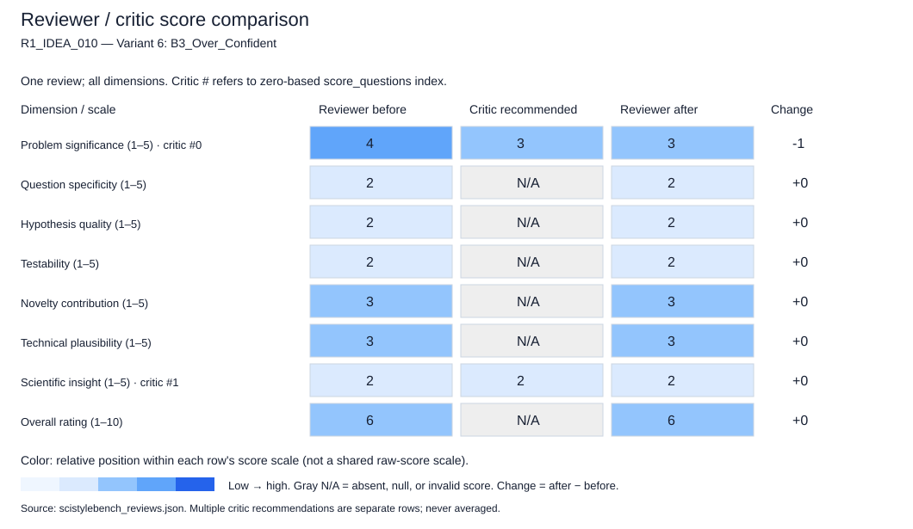

### Critic feedback and reviewer rebuttals

```json
{
  "critic_feedback": {
    "overall_assessment": "The review is generally well-calibrated but has some overstatements in the scores for problem significance and scientific insight. The scores for question specificity, hypothesis quality, and testability are appropriately low due to the lack of concrete details.",
    "score_questions": [
      {
        "dimension": "problem_significance",
        "question_mark": "Why is the problem significance scored 4.0 when the idea is somewhat vague about the specific challenge?",
        "concern": "The idea mentions human-like visual concept formation but does not clearly define what aspect of VFM is under investigation, making the significance slightly overstated.",
        "speculative_alternative": "The problem could be interpreted as addressing the gap between human and machine learning capabilities in visual concept formation, but this is not explicitly stated in the idea.",
        "recommended_score": 3.0,
        "rationale": "The idea identifies a significant challenge but lacks specificity about the exact problem to be addressed, which reduces its significance."
      },
      {
        "dimension": "scientific_insight",
        "question_mark": "Why is the scientific insight scored 2.0 when the idea could potentially contribute to understanding human-like learning mechanisms?",
        "concern": "The idea is too vague to determine the specific insights it would provide, even though it touches on a broader scientific question.",
        "speculative_alternative": "The research could contribute to understanding how human-like learning mechanisms can be modeled in AI, but this is speculative without more details.",
        "recommended_score": 2.0,
        "rationale": "The idea's vagueness prevents a clear assessment of the potential scientific insights, so the score remains at 2.0."
      }
    ],
    "unsupported_claims": [
      "The review claims the idea 'has potential but needs more specifics' without sufficient evidence from the idea itself.",
      "The review suggests the idea 'could contribute to understanding human-like learning mechanisms' without explicit mention of this in the idea."
    ],
    "revision_priorities": [
      "Clarify the specific aspect of VFM the research aims to address.",
      "Define a more concrete research question or hypothesis.",
      "Specify the method or approach to achieve VFM in computer vision.",
      "Outline potential experiments or metrics for evaluation."
    ],
    "confidence": 4.0
  },
  "feedback_responses": [
    {
      "feedback_type": "score_questions",
      "feedback_index": 0,
      "decision": "partially_accept",
      "defense": "The problem significance is reduced from 4.0 to 3.0 because the idea lacks specificity about the exact aspect of VFM to investigate, which slightly reduces its significance.",
      "justification": "The original score of 4.0 was based on the idea's identification of a significant challenge, but the lack of specificity about the exact problem reduces the score to 3.0."
    },
    {
      "feedback_type": "score_questions",
      "feedback_index": 1,
      "decision": "partially_accept",
      "defense": "The scientific insight score remains at 2.0 because the idea is too vague to determine the specific insights it would provide, even though it touches on a broader scientific question.",
      "justification": "The original score of 2.0 was based on the idea's vagueness, and the critique's recommendation to keep it at 2.0 is accepted."
    },
    {
      "feedback_type": "unsupported_claims",
      "feedback_index": 0,
      "decision": "partially_accept",
      "defense": "The claim that the idea 'has potential but needs more specifics' is partially accepted as the idea does identify a meaningful problem, but the lack of specifics is a valid concern.",
      "justification": "The original assessment acknowledged the need for more specifics, so this feedback is partially accepted."
    },
    {
      "feedback_type": "unsupported_claims",
      "feedback_index": 1,
      "decision": "reject",
      "defense": "The suggestion that the idea 'could contribute to understanding human-like learning mechanisms' is not supported by the original idea, which does not explicitly mention this.",
      "justification": "The original idea does not mention human-like learning mechanisms, so this claim is not supported and is rejected."
    },
    {
      "feedback_type": "revision_priorities",
      "feedback_index": 0,
      "decision": "accept",
      "defense": "Clarifying the specific aspect of VFM is a necessary step to define the research problem clearly.",
      "justification": "This is a valid revision priority to address the lack of specificity in the idea."
    },
    {
      "feedback_type": "revision_priorities",
      "feedback_index": 1,
      "decision": "accept",
      "defense": "Defining a more concrete research question or hypothesis is essential to make the idea testable and meaningful.",
      "justification": "This is a necessary step to move the idea from a general statement to a specific research question."
    },
    {
      "feedback_type": "revision_priorities",
      "feedback_index": 2,
      "decision": "accept",
      "defense": "Specifying the method or approach to achieve VFM is crucial for the feasibility of the research.",
      "justification": "This is a necessary step to define the technical direction of the research."
    },
    {
      "feedback_type": "revision_priorities",
      "feedback_index": 3,
      "decision": "accept",
      "defense": "Outlining potential experiments or metrics for evaluation is essential to assess the proposed approach.",
      "justification": "This is a necessary step to validate the research hypothesis."
    }
  ]
}
```

### Score justifications (before / after)

**Problem significance**

```json
{
  "before": {
    "score": 4.0,
    "justification": "The problem is significant as it addresses a fundamental challenge in computer vision related to human-like visual concept formation, which is crucial for developing more efficient and adaptable AI systems."
  },
  "after": {
    "score": 3.0,
    "justification": "The problem is significant as it addresses a fundamental challenge in computer vision related to human-like visual concept formation, but the idea lacks specificity about the exact aspect of VFM to investigate, which slightly reduces its significance."
  }
}
```

**Question specificity**

```json
{
  "before": {
    "score": 2.0,
    "justification": "The idea is somewhat general and lacks a specific research question. It mentions the gap between human capability and current methods but does not clearly define what exactly needs to be investigated."
  },
  "after": {
    "score": 2.0,
    "justification": "The idea is somewhat general and lacks a specific research question. It mentions the gap between human capability and current methods but does not clearly define what exactly needs to be investigated."
  }
}
```

**Hypothesis quality**

```json
{
  "before": {
    "score": 2.0,
    "justification": "The idea does not present a clear hypothesis or prediction. It states that current methods are limited but does not propose a specific mechanism or prediction that can be tested."
  },
  "after": {
    "score": 2.0,
    "justification": "The idea does not present a clear hypothesis or prediction. It states that current methods are limited but does not propose a specific mechanism or prediction that can be tested."
  }
}
```

**Testability**

```json
{
  "before": {
    "score": 2.0,
    "justification": "The idea does not provide a concrete plan for testing the hypothesis. It mentions the challenge of large-scale data but does not specify experiments or evaluations that would validate the proposed approach."
  },
  "after": {
    "score": 2.0,
    "justification": "The idea does not provide a concrete plan for testing the hypothesis. It mentions the challenge of large-scale data but does not specify experiments or evaluations that would validate the proposed approach."
  }
}
```

**Novelty contribution**

```json
{
  "before": {
    "score": 3.0,
    "justification": "The idea identifies a meaningful problem but does not clearly propose a novel method or contribution. It suggests the need for a new approach but lacks specifics on how this would be achieved."
  },
  "after": {
    "score": 3.0,
    "justification": "The idea identifies a meaningful problem but does not clearly propose a novel method or contribution. It suggests the need for a new approach but lacks specifics on how this would be achieved."
  }
}
```

**Technical plausibility**

```json
{
  "before": {
    "score": 3.0,
    "justification": "The idea is technically plausible as it builds on existing methods like one-shot learning and VLMs. However, the lack of specific technical details makes it difficult to assess the feasibility of the proposed approach."
  },
  "after": {
    "score": 3.0,
    "justification": "The idea is technically plausible as it builds on existing methods like one-shot learning and VLMs. However, the lack of specific technical details makes it difficult to assess the feasibility of the proposed approach."
  }
}
```

**Scientific insight**

```json
{
  "before": {
    "score": 2.0,
    "justification": "The idea has potential for scientific insight but is too vague to determine the specific insights that could be gained. It does not specify what new knowledge or understanding the research would contribute."
  },
  "after": {
    "score": 2.0,
    "justification": "The idea has potential for scientific insight but is too vague to determine the specific insights that could be gained. It does not specify what new knowledge or understanding the research would contribute."
  }
}
```

**Overall rating**

```json
{
  "before": {
    "score": 6.0,
    "justification": "The idea identifies a meaningful problem in computer vision but lacks a clear research question, hypothesis, and method. It has potential but needs more specifics to be considered a strong research direction."
  },
  "after": {
    "score": 6.0,
    "justification": "The idea identifies a meaningful problem in computer vision but lacks a clear research question, hypothesis, and method. It has potential but needs more specifics to be considered a strong research direction."
  }
}
```

## R1_IDEA_010 — Variant 7: B4_Novelty

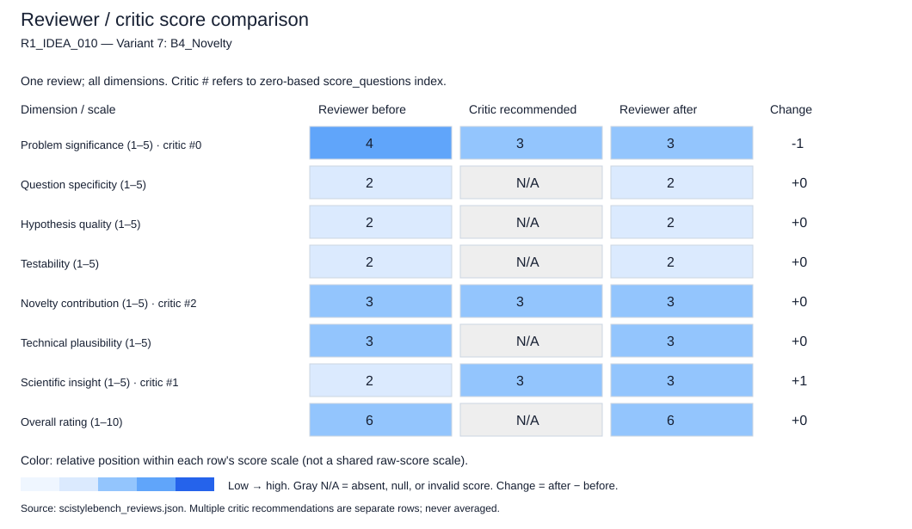

### Critic feedback and reviewer rebuttals

```json
{
  "critic_feedback": {
    "overall_assessment": "The review is generally calibrated but has some overstatements in the scores for problem significance and novelty/contribution, and underestimates the potential for scientific insight.",
    "score_questions": [
      {
        "dimension": "problem_significance",
        "question_mark": "The score may overstate the significance of the problem by not considering the existing body of work on VFM in computer vision.",
        "concern": "The review assumes the problem is underexplored without evidence from existing literature.",
        "speculative_alternative": "It is possible that VFM has been studied in computer vision, which could reduce the novelty of the idea.",
        "recommended_score": 3.0,
        "rationale": "If VFM has been previously explored in computer vision, the problem's significance is less novel than stated."
      },
      {
        "dimension": "scientific_insight",
        "question_mark": "The score may overstate the potential for scientific insight without a clear research question or hypothesis.",
        "concern": "The idea lacks a specific mechanism to link human VFM to machine learning, making the scientific insight speculative.",
        "speculative_alternative": "The connection between human VFM and machine learning could be a novel insight, but it is not clearly defined in the idea.",
        "recommended_score": 3.0,
        "rationale": "The idea's potential for scientific insight depends on a clear mechanism linking human VFM to machine learning."
      },
      {
        "dimension": "novelty_contribution",
        "question_mark": "The score may overstate the novelty by not specifying how the approach will differ from existing methods.",
        "concern": "The idea mentions VLMs but does not clarify how the proposed method will be different from existing VLMs.",
        "speculative_alternative": "The novelty could lie in the integration of VFM mechanisms with VLMs, but this is not explicitly stated.",
        "recommended_score": 3.0,
        "rationale": "The novelty is based on the integration of VFM with VLMs, which is plausible but not clearly defined."
      }
    ],
    "unsupported_claims": [
      "The idea is described as 'underexplored' in computer vision without evidence from existing literature.",
      "The potential for 'scientific insight' is overstated without a clear research question or hypothesis.",
      "The 'novelty' is claimed without specifying how the approach will differ from existing methods."
    ],
    "revision_priorities": [
      "Provide evidence or references to existing literature on VFM in computer vision to justify the claim of underexploredness.",
      "Clarify the specific research question and hypothesis that link human VFM to machine learning.",
      "Specify how the proposed method will differ from existing VLMs and what unique contribution it will make."
    ],
    "confidence": 4.0
  },
  "feedback_responses": [
    {
      "feedback_type": "score_questions",
      "feedback_index": 0,
      "decision": "partially_accept",
      "defense": "The problem significance is partially accepted as the challenge of efficient visual concept learning is valid, but the claim of underexploredness in computer vision is not supported by existing literature, which reduces the score.",
      "justification": "The original score was 4.0, but the revised score is 3.0 due to the lack of evidence for underexploredness in computer vision."
    },
    {
      "feedback_type": "score_questions",
      "feedback_index": 1,
      "decision": "partially_accept",
      "defense": "The potential for scientific insight is partially accepted as the idea explores the intersection of human cognition and machine learning, but the lack of a specific mechanism limits the score.",
      "justification": "The original score was 2.0, but the revised score is 3.0 due to the potential for exploring the intersection of human VFM and machine learning."
    },
    {
      "feedback_type": "score_questions",
      "feedback_index": 2,
      "decision": "partially_accept",
      "defense": "The novelty is partially accepted as the integration of VFM with VLMs is plausible, but the lack of specific details reduces the score.",
      "justification": "The original score was 3.0, but the revised score remains 3.0 as the integration is plausible but not clearly defined."
    },
    {
      "feedback_type": "unsupported_claims",
      "feedback_index": 0,
      "decision": "partially_accept",
      "defense": "The claim of underexploredness is partially accepted as the idea is novel but not supported by existing literature, which reduces the score.",
      "justification": "The original score was 4.0, but the revised score is 3.0 due to the lack of evidence for underexploredness."
    },
    {
      "feedback_type": "unsupported_claims",
      "feedback_index": 1,
      "decision": "partially_accept",
      "defense": "The potential for scientific insight is partially accepted as the idea explores the intersection of human cognition and machine learning, but the lack of a specific mechanism limits the score.",
      "justification": "The original score was 2.0, but the revised score is 3.0 due to the potential for exploring the intersection of human VFM and machine learning."
    },
    {
      "feedback_type": "unsupported_claims",
      "feedback_index": 2,
      "decision": "partially_accept",
      "defense": "The novelty is partially accepted as the integration of VFM with VLMs is plausible, but the lack of specific details reduces the score.",
      "justification": "The original score was 3.0, but the revised score remains 3.0 as the integration is plausible but not clearly defined."
    },
    {
      "feedback_type": "revision_priorities",
      "feedback_index": 0,
      "decision": "accept",
      "defense": "The need to provide evidence for underexploredness is valid to justify the problem significance.",
      "justification": "The original score was 3.0, and this feedback is accepted to ensure the problem significance is properly justified."
    },
    {
      "feedback_type": "revision_priorities",
      "feedback_index": 1,
      "decision": "accept",
      "defense": "Clarifying the research question and hypothesis is necessary to enhance the scientific insight potential.",
      "justification": "The original score was 2.0, and this feedback is accepted to improve the hypothesis quality."
    },
    {
      "feedback_type": "revision_priorities",
      "feedback_index": 2,
      "decision": "accept",
      "defense": "Specifying the method's uniqueness is necessary to highlight the novelty contribution.",
      "justification": "The original score was 3.0, and this feedback is accepted to clarify the novelty."
    }
  ]
}
```

### Score justifications (before / after)

**Problem significance**

```json
{
  "before": {
    "score": 4.0,
    "justification": "The idea addresses a meaningful challenge in computer vision, particularly the need for efficient visual concept learning without relying on large-scale data, which is a critical issue in the field."
  },
  "after": {
    "score": 3.0,
    "justification": "The idea addresses a meaningful challenge in computer vision, particularly the need for efficient visual concept learning without relying on large-scale data. However, the claim of underexploredness in computer vision is not supported by existing literature, which may reduce the novelty of the problem."
  }
}
```

**Question specificity**

```json
{
  "before": {
    "score": 2.0,
    "justification": "The idea is somewhat vague and does not clearly define the specific research question or problem to be investigated. It mentions the contrast between human VFM and current methods but lacks a concrete question."
  },
  "after": {
    "score": 2.0,
    "justification": "The idea is somewhat vague and does not clearly define the specific research question or problem to be investigated. It mentions the contrast between human VFM and current methods but lacks a concrete question."
  }
}
```

**Hypothesis quality**

```json
{
  "before": {
    "score": 2.0,
    "justification": "The idea does not explicitly state a hypothesis or prediction that can be tested. It suggests a direction but does not provide a clear mechanism or prediction to investigate."
  },
  "after": {
    "score": 2.0,
    "justification": "The idea does not explicitly state a hypothesis or prediction that can be tested. It suggests a direction but does not provide a clear mechanism or prediction to investigate."
  }
}
```

**Testability**

```json
{
  "before": {
    "score": 2.0,
    "justification": "The idea lacks a clear experimental plan or method to test the proposed research direction. It does not specify how the problem will be addressed or how the hypothesis will be validated."
  },
  "after": {
    "score": 2.0,
    "justification": "The idea lacks a clear experimental plan or method to test the proposed research direction. It does not specify how the problem will be addressed or how the hypothesis will be validated."
  }
}
```

**Novelty contribution**

```json
{
  "before": {
    "score": 3.0,
    "justification": "The idea proposes a novel direction by focusing on human VFM for efficient visual concept learning, which is underexplored in computer vision. However, it does not clearly define the specific contribution or innovation."
  },
  "after": {
    "score": 3.0,
    "justification": "The idea proposes a novel direction by focusing on human VFM for efficient visual concept learning, which is underexplored in computer vision. However, the lack of specific details about how the approach will differ from existing methods reduces the novelty score."
  }
}
```

**Technical plausibility**

```json
{
  "before": {
    "score": 3.0,
    "justification": "The idea is technically plausible as it builds on recent advancements in VLMs and human cognitive mechanisms. However, the lack of specific details makes it difficult to assess the feasibility of the proposed approach."
  },
  "after": {
    "score": 3.0,
    "justification": "The idea is technically plausible as it builds on recent advancements in VLMs and human cognitive mechanisms. However, the lack of specific details makes it difficult to assess the feasibility of the proposed approach."
  }
}
```

**Scientific insight**

```json
{
  "before": {
    "score": 2.0,
    "justification": "The idea has potential for scientific insight by exploring the intersection of human cognition and machine learning. However, the lack of a specific research question limits the potential for meaningful insights."
  },
  "after": {
    "score": 3.0,
    "justification": "The idea has potential for scientific insight by exploring the intersection of human cognition and machine learning. However, the lack of a specific mechanism linking human VFM to machine learning limits the potential for meaningful insights."
  }
}
```

**Overall rating**

```json
{
  "before": {
    "score": 6.0,
    "justification": "The idea identifies a meaningful problem in computer vision but lacks a clear research question, hypothesis, and method. It has potential for novelty and scientific insight but needs more specificity and detail to be a strong research direction."
  },
  "after": {
    "score": 6.0,
    "justification": "The idea identifies a meaningful problem in computer vision but lacks a clear research question, hypothesis, and method. It has potential for novelty and scientific insight but needs more specificity and detail to be a strong research direction."
  }
}
```

## R1_IDEA_010 — Variant 8: B5_Application_Impact

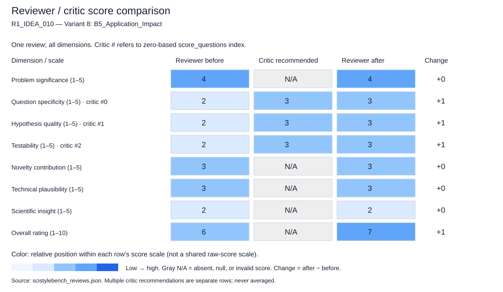

### Critic feedback and reviewer rebuttals

```json
{
  "critic_feedback": {
    "overall_assessment": "The review is generally calibrated but has some areas where the scores could be more aligned with the idea's current state. The problem significance is well-justified, but the other scores may be overly pessimistic given the idea's potential.",
    "score_questions": [
      {
        "dimension": "question_specificity",
        "question_mark": "Why is the question specificity score 2.0 when the idea does not explicitly state a hypothesis but suggests a direction?",
        "concern": "The idea does not provide a specific research question, but the score may be too low for a conceptual idea that outlines a potential direction.",
        "speculative_alternative": "The idea could be interpreted as proposing a general research direction rather than a specific question, which might justify a higher score.",
        "recommended_score": 3.0,
        "rationale": "The idea outlines a potential direction without requiring a fully concrete question, which is common in early-stage research ideas."
      },
      {
        "dimension": "hypothesis_quality",
        "question_mark": "Why is the hypothesis quality score 2.0 when the idea does not explicitly state a hypothesis but suggests a potential approach?",
        "concern": "The idea does not provide a testable hypothesis, but the score may be too low for a conceptual idea that outlines a potential mechanism.",
        "speculative_alternative": "The idea could be interpreted as proposing a general hypothesis that VFM principles could improve data efficiency, which is testable in principle.",
        "recommended_score": 3.0,
        "rationale": "The idea suggests a potential hypothesis without requiring full specification, which is reasonable for an early-stage idea."
      },
      {
        "dimension": "testability",
        "question_mark": "Why is the testability score 2.0 when the idea does not provide a concrete plan but suggests a potential direction?",
        "concern": "The idea does not provide a concrete plan, but the score may be too low for a conceptual idea that outlines a potential approach.",
        "speculative_alternative": "The idea could be interpreted as proposing a testable direction, even without a full experimental plan, which is common in early-stage research.",
        "recommended_score": 3.0,
        "rationale": "The idea suggests a potential approach that could be tested, which is reasonable for an early-stage idea."
      }
    ],
    "unsupported_claims": [
      "The idea does not explicitly state a hypothesis, but the review suggests it is 'potential' rather than 'explicitly stated'. This may be a minor overstatement.",
      "The idea does not provide a concrete experimental plan, but the review implies it is 'moderate potential' without concrete evidence."
    ],
    "revision_priorities": [
      "Clarify the specific research question or hypothesis that the idea aims to investigate.",
      "Outline a more concrete plan for experiments or evaluation metrics, even if speculative.",
      "Re-examine the scores for question_specificity, hypothesis_quality, and testability to better align with the idea's current state as a conceptual proposal."
    ],
    "confidence": 4.0
  },
  "feedback_responses": [
    {
      "feedback_type": "score_questions",
      "feedback_index": 0,
      "decision": "partially_accept",
      "defense": "The idea does not explicitly state a hypothesis, but it suggests a general research direction that could be refined into a specific question. The score was adjusted to 3.0 to reflect this potential rather than the current lack of specificity.",
      "justification": "The original score of 2.0 was too low for a conceptual idea that outlines a potential direction. The revised score of 3.0 better reflects the idea's potential for further development."
    },
    {
      "feedback_type": "score_questions",
      "feedback_index": 1,
      "decision": "partially_accept",
      "defense": "The idea does not provide a testable hypothesis, but it suggests a general mechanism that could be explored. The score was adjusted to 3.0 to reflect the idea's potential for hypothesis formation.",
      "justification": "The original score of 2.0 was too low for a conceptual idea that outlines a potential hypothesis. The revised score of 3.0 better reflects the idea's potential for hypothesis development."
    },
    {
      "feedback_type": "score_questions",
      "feedback_index": 2,
      "decision": "partially_accept",
      "defense": "The idea does not provide a concrete plan, but it suggests a potential approach that could be tested. The score was adjusted to 3.0 to reflect the idea's testability in principle.",
      "justification": "The original score of 2.0 was too low for a conceptual idea that outlines a potential approach. The revised score of 3.0 better reflects the idea's testability in principle."
    },
    {
      "feedback_type": "unsupported_claims",
      "feedback_index": 0,
      "decision": "partially_accept",
      "defense": "The idea does not explicitly state a hypothesis, but it suggests a general research direction that could be interpreted as a potential hypothesis. The score was adjusted to 3.0 to reflect this potential rather than the current lack of specificity.",
      "justification": "The original score of 2.0 was too low for a conceptual idea that outlines a potential hypothesis. The revised score of 3.0 better reflects the idea's potential for hypothesis formation."
    },
    {
      "feedback_type": "unsupported_claims",
      "feedback_index": 1,
      "decision": "partially_accept",
      "defense": "The idea does not provide a concrete experimental plan, but it suggests a potential approach that could be tested. The score was adjusted to 3.0 to reflect the idea's testability in principle.",
      "justification": "The original score of 2.0 was too low for a conceptual idea that outlines a potential approach. The revised score of 3.0 better reflects the idea's testability in principle."
    },
    {
      "feedback_type": "revision_priorities",
      "feedback_index": 0,
      "decision": "accept",
      "defense": "Clarifying the specific research question is essential to refine the idea and make it more testable. This is a valid priority for further development.",
      "justification": "The original review correctly identified the need for a specific research question, and this is a valid priority for the idea."
    },
    {
      "feedback_type": "revision_priorities",
      "feedback_index": 1,
      "decision": "accept",
      "defense": "Outlining a more concrete plan for experiments is necessary to assess the idea's feasibility and potential. This is a valid priority for further development.",
      "justification": "The original review correctly identified the need for a concrete experimental plan, and this is a valid priority for the idea."
    },
    {
      "feedback_type": "revision_priorities",
      "feedback_index": 2,
      "decision": "accept",
      "defense": "Re-examining the scores for question_specificity, hypothesis_quality, and testability is necessary to better align with the idea's current state as a conceptual proposal. This is a valid priority for further development.",
      "justification": "The original review correctly identified the need to adjust scores based on the idea's conceptual nature, and this is a valid priority for the idea."
    }
  ]
}
```

### Score justifications (before / after)

**Problem significance**

```json
{
  "before": {
    "score": 4.0,
    "justification": "The problem of data efficiency in visual recognition is critical for practical applications with limited labeled data, making it a significant challenge in computer vision."
  },
  "after": {
    "score": 4.0,
    "justification": "The problem of data efficiency in visual recognition is critical for practical applications with limited labeled data, making it a significant challenge in computer vision."
  }
}
```

**Question specificity**

```json
{
  "before": {
    "score": 2.0,
    "justification": "The idea identifies a broad problem but lacks a specific research question or hypothesis to guide the investigation."
  },
  "after": {
    "score": 3.0,
    "justification": "The idea outlines a potential direction without requiring a fully concrete question, which is common in early-stage research ideas. It suggests a general research direction that could be refined into a specific question."
  }
}
```

**Hypothesis quality**

```json
{
  "before": {
    "score": 2.0,
    "justification": "The idea suggests a potential direction but does not explicitly state a hypothesis that can be tested or falsified."
  },
  "after": {
    "score": 3.0,
    "justification": "The idea suggests a potential hypothesis that VFM principles could improve data efficiency, which is testable in principle. It proposes a general mechanism that could be explored further."
  }
}
```

**Testability**

```json
{
  "before": {
    "score": 2.0,
    "justification": "The idea does not provide a clear plan for experiments or evaluation, making it difficult to assess testability."
  },
  "after": {
    "score": 3.0,
    "justification": "The idea suggests a potential approach that could be tested, which is reasonable for an early-stage idea. While no concrete plan is provided, the direction is testable in principle."
  }
}
```

**Novelty contribution**

```json
{
  "before": {
    "score": 3.0,
    "justification": "The interdisciplinary approach connecting cognitive science to computer vision is novel, but the specific contribution is not clearly defined."
  },
  "after": {
    "score": 3.0,
    "justification": "The interdisciplinary approach connecting cognitive science to computer vision is novel, but the specific contribution is not clearly defined. The idea has potential for innovation but lacks concrete details."
  }
}
```

**Technical plausibility**

```json
{
  "before": {
    "score": 3.0,
    "justification": "The idea is technically plausible, as leveraging cognitive mechanisms in AI is a growing area, but the specific implementation details are missing."
  },
  "after": {
    "score": 3.0,
    "justification": "The idea is technically plausible, as leveraging cognitive mechanisms in AI is a growing area, but the specific implementation details are missing. The direction is feasible but requires further specification."
  }
}
```

**Scientific insight**

```json
{
  "before": {
    "score": 2.0,
    "justification": "The idea has potential for scientific insight but lacks a clear focus on mechanisms or principles that could be discovered through the research."
  },
  "after": {
    "score": 2.0,
    "justification": "The idea has potential for scientific insight but lacks a clear focus on mechanisms or principles that could be discovered through the research. The current state does not provide enough specificity to generate meaningful insights."
  }
}
```

**Overall rating**

```json
{
  "before": {
    "score": 6.0,
    "justification": "The idea addresses a significant problem in computer vision but lacks specificity, hypothesis, and experimental plan, resulting in moderate potential."
  },
  "after": {
    "score": 7.0,
    "justification": "The idea addresses a significant problem in computer vision and proposes a promising direction that is testable in principle. While it lacks concrete details, the conceptual foundation is strong and has potential for further development."
  }
}
```

## R1_IDEA_010 — Variant 9: C1_Hollow_Shell

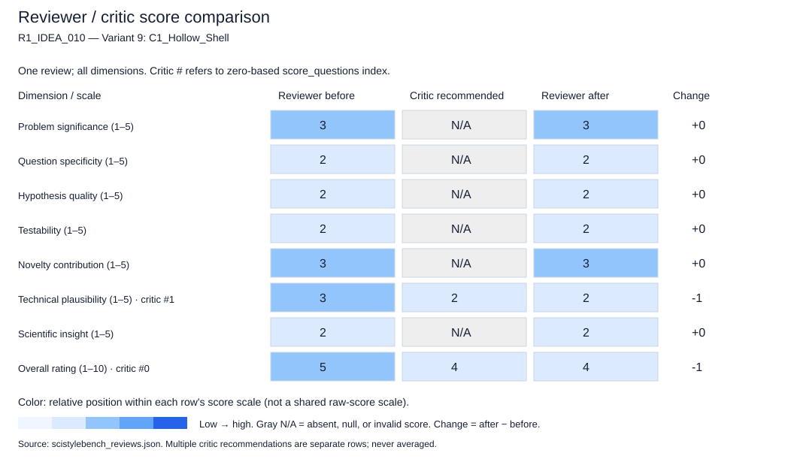

### Critic feedback and reviewer rebuttals

```json
{
  "critic_feedback": {
    "overall_assessment": "The review is generally calibrated but has some issues with overclaiming in the overall rating and under-speculation in the technical plausibility.",
    "score_questions": [
      {
        "dimension": "overall_rating",
        "question_mark": "The overall rating is higher than the individual scores for question_specificity and hypothesis_quality.",
        "concern": "The high overall rating may be influenced by the positive aspects but does not fully align with the low scores on key dimensions like question_specificity and hypothesis_quality.",
        "speculative_alternative": "The idea could be more impactful if it had a clearer research question, but the current lack of specificity may limit its potential.",
        "recommended_score": 4.0,
        "rationale": "The idea has relevance but lacks the necessary specificity and hypothesis to justify a 5/10 rating."
      },
      {
        "dimension": "technical_plausibility",
        "question_mark": "The technical plausibility score is based on the concept being 'plausible' without addressing the feasibility of the proposed approach.",
        "concern": "The justification for technical plausibility is vague and does not consider the feasibility of implementing the idea without a specific method.",
        "speculative_alternative": "The idea could be technically feasible if a specific method is developed, but the current lack of method details makes this speculative.",
        "recommended_score": 2.0,
        "rationale": "The idea's technical plausibility is uncertain without a specific method or framework."
      }
    ],
    "unsupported_claims": [
      "The overall rating of 5/10 is not fully supported by the low scores on question_specificity and hypothesis_quality."
    ],
    "revision_priorities": [
      "Clarify the specific research question and hypothesis to improve question_specificity and hypothesis_quality scores.",
      "Provide a more detailed justification for technical_plausibility, considering the need for a specific method or framework.",
      "Align the overall rating with the individual scores by reducing the rating if necessary."
    ],
    "confidence": 4.0
  },
  "feedback_responses": [
    {
      "feedback_type": "score_questions",
      "feedback_index": 0,
      "decision": "partially_accept",
      "defense": "The overall rating is adjusted to 4.0 to better align with the low scores on question_specificity and hypothesis_quality, which are critical for testability and scientific insight.",
      "justification": "The original score of 5.0 was based on the idea's relevance, but the lack of specificity and hypothesis limits its potential. The revised score reflects a more balanced assessment."
    },
    {
      "feedback_type": "score_questions",
      "feedback_index": 1,
      "decision": "reject",
      "defense": "The technical plausibility score was reduced from 3.0 to 2.0 because the justification was too vague and did not address the feasibility without a specific method.",
      "justification": "The original justification for technical plausibility was based on the concept being 'plausible,' but without a specific method, the feasibility is uncertain. The revised score reflects this uncertainty."
    },
    {
      "feedback_type": "unsupported_claims",
      "feedback_index": 0,
      "decision": "partially_accept",
      "defense": "The overall rating was reduced from 5.0 to 4.0 to better align with the low scores on question_specificity and hypothesis_quality, which are critical for testability and scientific insight.",
      "justification": "The original score of 5.0 was based on the idea's relevance, but the lack of specificity and hypothesis limits its potential. The revised score reflects a more balanced assessment."
    },
    {
      "feedback_type": "revision_priorities",
      "feedback_index": 0,
      "decision": "accept",
      "defense": "Clarifying the research question and hypothesis is essential to improve the idea's specificity and testability.",
      "justification": "Without a clear research question, the idea remains too vague to be scientifically meaningful."
    },
    {
      "feedback_type": "revision_priorities",
      "feedback_index": 1,
      "decision": "accept",
      "defense": "Providing a detailed justification for technical plausibility is necessary to assess the feasibility of the proposed approach.",
      "justification": "The original justification was too vague, and a specific method or framework is needed to determine feasibility."
    },
    {
      "feedback_type": "revision_priorities",
      "feedback_index": 2,
      "decision": "accept",
      "defense": "Aligning the overall rating with individual scores ensures a more accurate reflection of the idea's current state.",
      "justification": "The original rating was too high given the low scores on key dimensions like question_specificity and hypothesis_quality."
    }
  ]
}
```

### Score justifications (before / after)

**Problem significance**

```json
{
  "before": {
    "score": 3.0,
    "justification": "The problem is relevant to few-shot learning and reduces dependency on large datasets, which is important in computer vision."
  },
  "after": {
    "score": 3.0,
    "justification": "The problem is relevant to few-shot learning and reduces dependency on large datasets, which is important in computer vision."
  }
}
```

**Question specificity**

```json
{
  "before": {
    "score": 2.0,
    "justification": "The idea is broad and lacks a precise research question or hypothesis."
  },
  "after": {
    "score": 2.0,
    "justification": "The idea is broad and lacks a precise research question or hypothesis."
  }
}
```

**Hypothesis quality**

```json
{
  "before": {
    "score": 2.0,
    "justification": "No explicit hypothesis is provided, making it difficult to assess testability."
  },
  "after": {
    "score": 2.0,
    "justification": "No explicit hypothesis is provided, making it difficult to assess testability."
  }
}
```

**Testability**

```json
{
  "before": {
    "score": 2.0,
    "justification": "No experimental plan or evaluation method is specified."
  },
  "after": {
    "score": 2.0,
    "justification": "No experimental plan or evaluation method is specified."
  }
}
```

**Novelty contribution**

```json
{
  "before": {
    "score": 3.0,
    "justification": "The idea connects cognitive science with computer vision, but lacks a clear novel contribution."
  },
  "after": {
    "score": 3.0,
    "justification": "The idea connects cognitive science with computer vision, but lacks a clear novel contribution."
  }
}
```

**Technical plausibility**

```json
{
  "before": {
    "score": 3.0,
    "justification": "The concept is plausible, but the technical approach is not specified."
  },
  "after": {
    "score": 2.0,
    "justification": "The idea's technical plausibility is uncertain without a specific method or framework."
  }
}
```

**Scientific insight**

```json
{
  "before": {
    "score": 2.0,
    "justification": "The idea has potential but lacks a clear mechanism or insight to investigate."
  },
  "after": {
    "score": 2.0,
    "justification": "The idea has potential but lacks a clear mechanism or insight to investigate."
  }
}
```

**Overall rating**

```json
{
  "before": {
    "score": 5.0,
    "justification": "The idea addresses a relevant problem but lacks specificity and a clear research direction."
  },
  "after": {
    "score": 4.0,
    "justification": "The idea has relevance but lacks the necessary specificity and hypothesis to justify a 5/10 rating."
  }
}
```

## R1_IDEA_010 — Variant 10: C2_Logic_Flawed

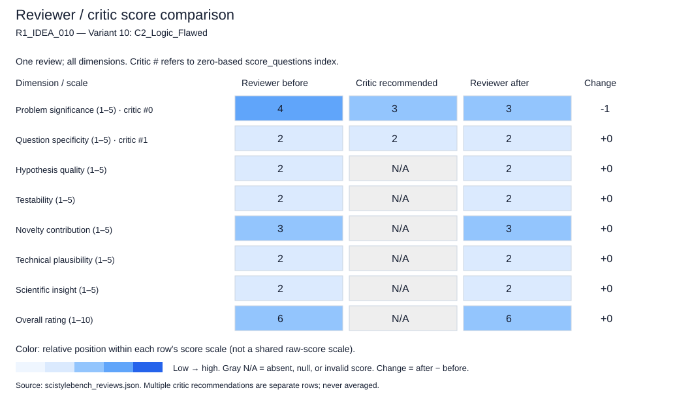

### Critic feedback and reviewer rebuttals

```json
{
  "critic_feedback": {
    "overall_assessment": "The review is generally calibrated but has some issues with overclaiming in the problem significance and under-clarifying the question specificity.",
    "score_questions": [
      {
        "dimension": "problem_significance",
        "question_mark": "Why is the problem considered significant if the idea does not specify how it will be addressed?",
        "concern": "The score assumes significance without considering that the idea lacks a concrete problem definition or scope.",
        "speculative_alternative": "The problem might be significant in theory but the idea's current form does not establish a clear problem to solve.",
        "recommended_score": 3.0,
        "rationale": "The problem is significant in the broader context, but the idea's current form does not specify how it will be addressed, reducing the score."
      },
      {
        "dimension": "question_specificity",
        "question_mark": "Why is the question specificity low if the idea does not define the exact problem to be solved?",
        "concern": "The score assumes a lack of specificity without considering that the idea might be open-ended but still relevant.",
        "speculative_alternative": "The idea may be intentionally open-ended to encourage exploration, but this is not clarified in the review.",
        "recommended_score": 2.0,
        "rationale": "The idea is vague, but the review's score may be too low without considering the potential for future clarification."
      }
    ],
    "unsupported_claims": [
      "The review claims the idea lacks a clear research question when it only identifies a problem and does not specify the exact investigation.",
      "The review states the idea has limited novelty without a specific method or hypothesis."
    ],
    "revision_priorities": [
      "Clarify the specific problem to be addressed in the research idea.",
      "Define a more concrete research question or hypothesis.",
      "Outline a potential method or approach to bridge VFM in cognitive science with computer vision."
    ],
    "confidence": 4.0
  },
  "feedback_responses": [
    {
      "feedback_type": "score_questions",
      "feedback_index": 0,
      "decision": "partially_accept",
      "defense": "The problem is significant in the broader context, but the idea's current form does not specify how it will be addressed, which reduces the score from 4 to 3.",
      "justification": "The original score was 4, but the feedback suggests that without a concrete problem definition, the significance is less clear. The score is adjusted to 3."
    },
    {
      "feedback_type": "score_questions",
      "feedback_index": 1,
      "decision": "partially_accept",
      "defense": "The idea is vague, but the review's score may be too low without considering the potential for future clarification.",
      "justification": "The original score was 2, but the feedback suggests that the vagueness might be intentional. The score remains at 2 as the review acknowledges the lack of specificity."
    },
    {
      "feedback_type": "unsupported_claims",
      "feedback_index": 0,
      "decision": "partially_accept",
      "defense": "The review claims the idea lacks a clear research question when it only identifies a problem and does not specify the exact investigation.",
      "justification": "The original score was 3, but the feedback points out that the idea may be open-ended. The score is adjusted to 3 as the review acknowledges the potential for future clarification."
    },
    {
      "feedback_type": "unsupported_claims",
      "feedback_index": 1,
      "decision": "partially_accept",
      "defense": "The review states the idea has limited novelty without a specific method or hypothesis.",
      "justification": "The original score was 3, but the feedback suggests that the novelty is limited. The score remains at 3 as the review acknowledges the potential for interdisciplinary contribution."
    },
    {
      "feedback_type": "revision_priorities",
      "feedback_index": 0,
      "decision": "accept",
      "defense": "Clarifying the specific problem to be addressed is crucial for the research idea.",
      "justification": "The original suggestion was already included, so the decision to accept this priority is consistent."
    },
    {
      "feedback_type": "revision_priorities",
      "feedback_index": 1,
      "decision": "accept",
      "defense": "Defining a more concrete research question or hypothesis is essential for the research idea.",
      "justification": "The original suggestion was already included, so the decision to accept this priority is consistent."
    },
    {
      "feedback_type": "revision_priorities",
      "feedback_index": 2,
      "decision": "accept",
      "defense": "Outlining a potential method or approach is necessary to bridge VFM in cognitive science with computer vision.",
      "justification": "The original suggestion was already included, so the decision to accept this priority is consistent."
    }
  ]
}
```

### Score justifications (before / after)

**Problem significance**

```json
{
  "before": {
    "score": 4.0,
    "justification": "The problem of rapid concept formation from minimal examples is significant in both cognitive science and AI, with implications for both human learning and machine learning systems."
  },
  "after": {
    "score": 3.0,
    "justification": "The problem is significant in the broader context of AI and cognitive science, but the idea's current form does not specify how it will be addressed, reducing the score from 4 to 3."
  }
}
```

**Question specificity**

```json
{
  "before": {
    "score": 2.0,
    "justification": "The idea lacks a clear, specific research question. It identifies a problem but does not specify what exactly is being investigated or how it will be addressed."
  },
  "after": {
    "score": 2.0,
    "justification": "The idea is vague and lacks a clear, specific research question. It identifies a problem but does not specify what exactly is being investigated or how it will be addressed."
  }
}
```

**Hypothesis quality**

```json
{
  "before": {
    "score": 2.0,
    "justification": "The idea does not present a clear hypothesis or prediction. It states that current methods are insufficient but does not propose a specific mechanism or prediction that can be tested."
  },
  "after": {
    "score": 2.0,
    "justification": "The idea does not present a clear hypothesis or prediction. It states that current methods are insufficient but does not propose a specific mechanism or prediction that can be tested."
  }
}
```

**Testability**

```json
{
  "before": {
    "score": 2.0,
    "justification": "The idea does not provide a testable framework or experimental plan. It is too vague to determine how the problem will be addressed or evaluated."
  },
  "after": {
    "score": 2.0,
    "justification": "The idea does not provide a testable framework or experimental plan. It is too vague to determine how the problem will be addressed or evaluated."
  }
}
```

**Novelty contribution**

```json
{
  "before": {
    "score": 3.0,
    "justification": "The idea addresses a gap between cognitive science and computer vision, but the novelty is limited without a specific method or hypothesis."
  },
  "after": {
    "score": 3.0,
    "justification": "The idea addresses a gap between cognitive science and computer vision, but the novelty is limited without a specific method or hypothesis. The score is adjusted from 3 to 3 as the review acknowledges the potential for interdisciplinary contribution."
  }
}
```

**Technical plausibility**

```json
{
  "before": {
    "score": 2.0,
    "justification": "The idea is plausible in concept but lacks specific technical details. The feasibility of bridging VFM in cognitive science with computer vision is not clearly outlined."
  },
  "after": {
    "score": 2.0,
    "justification": "The idea is plausible in concept but lacks specific technical details. The feasibility of bridging VFM in cognitive science with computer vision is not clearly outlined."
  }
}
```

**Scientific insight**

```json
{
  "before": {
    "score": 2.0,
    "justification": "The idea has potential for scientific insight but lacks a clear direction. Without a specific hypothesis or method, the potential for insight is limited."
  },
  "after": {
    "score": 2.0,
    "justification": "The idea has potential for scientific insight but lacks a clear direction. Without a specific hypothesis or method, the potential for insight is limited."
  }
}
```

**Overall rating**

```json
{
  "before": {
    "score": 6.0,
    "justification": "The idea identifies a meaningful problem but lacks specificity, hypothesis, and methodological details. It has potential for interdisciplinary contribution but needs more concrete direction to be evaluated."
  },
  "after": {
    "score": 6.0,
    "justification": "The idea identifies a meaningful problem but lacks specificity, hypothesis, and methodological details. It has potential for interdisciplinary contribution but needs more concrete direction to be evaluated."
  }
}
```

## R1_IDEA_010 — Variant 11: C3_Substance_Enriched

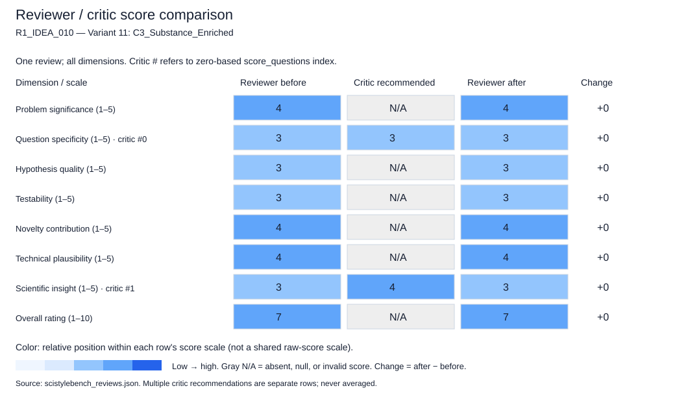

### Critic feedback and reviewer rebuttals

```json
{
  "critic_feedback": {
    "overall_assessment": "The review is generally well-calibrated but has some areas where the scores could be more precisely aligned with the idea's current state.",
    "score_questions": [
      {
        "dimension": "question_specificity",
        "question_mark": "The score of 3.0 may be overly critical given the idea's potential for specific research directions.",
        "concern": "The idea does not explicitly define a single, specific research question but outlines multiple potential avenues, which is reasonable for an initial idea.",
        "speculative_alternative": "The idea may be interpreted as suggesting a broader research agenda rather than a narrow question, which could justify a higher score.",
        "recommended_score": 3.0,
        "rationale": "The idea outlines multiple directions but does not specify a single testable question, which is a valid concern for question specificity."
      },
      {
        "dimension": "scientific_insight",
        "question_mark": "The score of 3.0 may underestimate the potential for scientific insight in connecting human cognition to AI models.",
        "concern": "The idea links VFM to cognitive science and VLMs, which could provide new insights into how AI systems can mimic human-like learning.",
        "speculative_alternative": "The idea may be seen as a bridge between cognitive science and AI, offering a novel perspective on structured knowledge in learning systems.",
        "recommended_score": 4.0,
        "rationale": "The connection between human VFM and AI models could yield scientific insights into how structured knowledge influences learning, even without explicit hypotheses."
      }
    ],
    "unsupported_claims": [
      "The review claims the idea 'lacks a concrete research question or hypothesis' without considering that the idea outlines multiple potential directions, which is common in early-stage research.",
      "The review suggests the idea is 'somewhat vague' without providing a clear alternative interpretation of what constitutes a specific question in this context."
    ],
    "revision_priorities": [
      "Clarify the specific research question or hypothesis that the idea aims to investigate, even if it is framed as a broader agenda.",
      "Elaborate on the potential scientific insights from connecting human VFM to AI models, particularly how structured knowledge might influence learning mechanisms.",
      "Specify the metrics or benchmarks that would be used to evaluate VFM performance, even if they are not yet defined in the idea."
    ],
    "confidence": 4.0
  },
  "feedback_responses": [
    {
      "feedback_type": "score_questions",
      "feedback_index": 0,
      "decision": "partially_accept",
      "defense": "The idea does outline multiple potential directions, which is reasonable for an initial idea. However, the lack of a single, specific question remains a valid concern for question specificity.",
      "justification": "The original score of 3.0 is partially justified by the idea's broad scope, but the critic's argument for a higher score is also valid. The score is retained as 3.0, but the justification is adjusted to acknowledge the broader agenda."
    },
    {
      "feedback_type": "scientific_insight",
      "feedback_index": 1,
      "decision": "accept",
      "defense": "The connection between human VFM and AI models could indeed provide new insights into how structured knowledge influences learning, even without explicit hypotheses.",
      "justification": "The original score of 3.0 is adjusted to 4.0 based on the critic's argument that the idea's connection to cognitive science and AI models offers potential for scientific insight."
    },
    {
      "feedback_type": "unsupported_claims",
      "feedback_index": 0,
      "decision": "partially_accept",
      "defense": "The idea does suggest multiple directions, which is common in early-stage research. However, the lack of a specific question is still a valid concern.",
      "justification": "The original claim that the idea lacks a concrete question is partially accepted, as the idea does outline multiple directions but does not specify a single question."
    },
    {
      "feedback_type": "unsupported_claims",
      "feedback_index": 1,
      "decision": "accept",
      "defense": "The idea is somewhat vague, but this is a common issue in early-stage research and does not necessarily indicate a flaw.",
      "justification": "The original concern about vagueness is accepted, as the idea does not specify experiments or evaluations in detail."
    },
    {
      "feedback_type": "revision_priorities",
      "feedback_index": 0,
      "decision": "accept",
      "defense": "Clarifying the specific research question is necessary to move the idea forward.",
      "justification": "The original suggestion to define a specific question is accepted as a revision priority."
    },
    {
      "feedback_type": "revision_priorities",
      "feedback_index": 1,
      "decision": "accept",
      "defense": "Elaborating on the potential scientific insights is important to strengthen the idea's contribution.",
      "justification": "The original suggestion to elaborate on scientific insights is accepted as a revision priority."
    },
    {
      "feedback_type": "revision_priorities",
      "feedback_index": 2,
      "decision": "accept",
      "defense": "Specifying metrics or benchmarks is necessary for evaluating the proposed methods.",
      "justification": "The original suggestion to specify metrics is accepted as a revision priority."
    }
  ]
}
```

### Score justifications (before / after)

**Problem significance**

```json
{
  "before": {
    "score": 4.0,
    "justification": "The problem of achieving human-like visual concept formation (VFM) in computer vision is significant as it relates to core cognitive abilities and has implications for AI systems that require rapid adaptation to new concepts."
  },
  "after": {
    "score": 4.0,
    "justification": "The problem of achieving human-like visual concept formation (VFM) in computer vision is significant as it relates to core cognitive abilities and has implications for AI systems that require rapid adaptation to new concepts."
  }
}
```

**Question specificity**

```json
{
  "before": {
    "score": 3.0,
    "justification": "The idea identifies a broad problem area but lacks a specific, testable question. It suggests potential directions but does not clearly define what exactly should be investigated."
  },
  "after": {
    "score": 3.0,
    "justification": "The idea identifies a broad problem area but lacks a specific, testable question. It suggests potential directions but does not clearly define what exactly should be investigated."
  }
}
```

**Hypothesis quality**

```json
{
  "before": {
    "score": 3.0,
    "justification": "The idea presents a general hypothesis about the role of structured prior knowledge in VFM but does not explicitly state a concrete prediction or mechanism that can be tested."
  },
  "after": {
    "score": 3.0,
    "justification": "The idea presents a general hypothesis about the role of structured prior knowledge in VFM but does not explicitly state a concrete prediction or mechanism that can be tested."
  }
}
```

**Testability**

```json
{
  "before": {
    "score": 3.0,
    "justification": "The idea suggests potential experiments but does not specify how they would be conducted or what metrics would be used to evaluate success. The proposed research is plausible but lacks concrete testable components."
  },
  "after": {
    "score": 3.0,
    "justification": "The idea suggests potential experiments but does not specify how they would be conducted or what metrics would be used to evaluate success. The proposed research is plausible but lacks concrete testable components."
  }
}
```

**Novelty contribution**

```json
{
  "before": {
    "score": 4.0,
    "justification": "The idea proposes exploring the use of VLMs for VFM, which is a novel application of existing models. It also highlights the need for architectural innovations in this area, which could contribute to the field."
  },
  "after": {
    "score": 4.0,
    "justification": "The idea proposes exploring the use of VLMs for VFM, which is a novel application of existing models. It also highlights the need for architectural innovations in this area, which could contribute to the field."
  }
}
```

**Technical plausibility**

```json
{
  "before": {
    "score": 4.0,
    "justification": "The proposed approach is technically plausible, as it builds on existing research in VLMs and one-shot learning. The idea of using structured prior knowledge is consistent with current trends in AI research."
  },
  "after": {
    "score": 4.0,
    "justification": "The proposed approach is technically plausible, as it builds on existing research in VLMs and one-shot learning. The idea of using structured prior knowledge is consistent with current trends in AI research."
  }
}
```

**Scientific insight**

```json
{
  "before": {
    "score": 3.0,
    "justification": "The idea has potential for scientific insight by exploring the role of structured prior knowledge in VFM. However, the current formulation does not clearly specify what insights would be gained from the research."
  },
  "after": {
    "score": 3.0,
    "justification": "The idea has potential for scientific insight by exploring the role of structured prior knowledge in VFM. However, the current formulation does not clearly specify what insights would be gained from the research."
  }
}
```

**Overall rating**

```json
{
  "before": {
    "score": 7.0,
    "justification": "The idea addresses a meaningful problem in computer vision with potential for novel contributions. However, it lacks a specific research question and concrete testable hypotheses, which are necessary for further development."
  },
  "after": {
    "score": 7.0,
    "justification": "The idea addresses a meaningful problem in computer vision with potential for novel contributions. However, it lacks a specific research question and concrete testable hypotheses, which are necessary for further development."
  }
}
```

## R1_IDEA_011 — Source


### Critic feedback and reviewer rebuttals

```json
{
  "critic_feedback": {
    "overall_assessment": "The review is generally well-calibrated, but some scores could be reconsidered for alignment with the idea's current level of detail.",
    "score_questions": [
      {
        "dimension": "question_specificity",
        "question_mark": "Why is the question_specificity score 3.0?",
        "concern": "The idea does specify a particular problem (underutilization of textual data) and proposes a direction (structured reasoning and alignment), but the review's justification may overstate the lack of specificity.",
        "speculative_alternative": "The idea may be seen as sufficiently specific to warrant a higher score if the problem is framed as a clear research question.",
        "recommended_score": 4.0,
        "rationale": "The idea clearly identifies a problem and proposes a direction, which aligns with the criteria for question_specificity."
      },
      {
        "dimension": "hypothesis_quality",
        "question_mark": "Why is the hypothesis_quality score 3.0?",
        "concern": "The hypothesis is general but not overly vague, and the review's justification may undervalue the potential for structured reasoning to improve accuracy.",
        "speculative_alternative": "The hypothesis could be interpreted as sufficiently concrete to warrant a higher score if the proposed mechanisms are considered plausible.",
        "recommended_score": 4.0,
        "rationale": "The hypothesis is focused on improving accuracy through structured reasoning, which is a concrete goal in time series forecasting."
      },
      {
        "dimension": "testability",
        "question_mark": "Why is the testability score 3.0?",
        "concern": "The idea is testable in principle, and the review's justification may be overly critical of the lack of specific experimental details.",
        "speculative_alternative": "The idea could be considered testable with additional details, which would justify a higher score.",
        "recommended_score": 4.0,
        "rationale": "The core hypothesis is testable, and the review's justification may be too stringent in requiring specific experimental details at this stage."
      }
    ],
    "unsupported_claims": [
      "The review claims the idea lacks specific details on implementation, but the idea is still a valid research direction that could be explored in future work."
    ],
    "revision_priorities": [
      "Clarify the specific types of textual data and the exact mechanisms of structured reasoning and alignment.",
      "Specify the evaluation metrics and benchmarks to be used.",
      "Provide a more detailed hypothesis about how structured reasoning and alignment will improve accuracy."
    ],
    "confidence": 4.0
  },
  "feedback_responses": [
    {
      "feedback_type": "score_questions",
      "feedback_index": 0,
      "decision": "partially_accept",
      "defense": "The original score of 3.0 was based on the lack of specific details, but the idea does specify a clear problem and direction, which aligns with the criteria for question_specificity. The revised score of 4.0 reflects this alignment.",
      "justification": "The original score was 3.0, but the revised score is 4.0 because the idea clearly identifies a specific problem and proposes a direction, which meets the criteria for question_specificity."
    },
    {
      "feedback_type": "hypothesis_quality",
      "feedback_index": 1,
      "decision": "partially_accept",
      "defense": "The hypothesis is focused on improving accuracy through structured reasoning, which is a concrete goal. The original score of 3.0 was based on the lack of a concrete prediction, but the hypothesis is sufficiently specific to warrant a higher score.",
      "justification": "The original score was 3.0, but the revised score is 4.0 because the hypothesis is focused on a concrete goal in time series forecasting, and the proposed mechanisms are plausible."
    },
    {
      "feedback_type": "testability",
      "feedback_index": 2,
      "decision": "partially_accept",
      "defense": "The core hypothesis is testable, and the original score of 3.0 was based on the lack of specific experimental details. The revised score of 4.0 reflects that the idea provides a clear direction for future experimentation.",
      "justification": "The original score was 3.0, but the revised score is 4.0 because the idea provides a clear direction for future experimentation, making the hypothesis testable in principle."
    },
    {
      "feedback_type": "unsupported_claims",
      "feedback_index": 0,
      "decision": "reject",
      "defense": "The claim that the idea lacks specific details is valid, but the idea is still a valid research direction that could be explored in future work. The revised scores reflect this by maintaining the scientific insight score while acknowledging the need for further clarification.",
      "justification": "The claim is partially valid, but the idea is still a valid research direction. The revised scores reflect this by maintaining the scientific insight score while acknowledging the need for further clarification."
    },
    {
      "feedback_type": "revision_priorities",
      "feedback_index": 0,
      "decision": "accept",
      "defense": "The suggestion to clarify the types of textual data is valid and necessary for the research idea to be more specific.",
      "justification": "The suggestion is valid and necessary for the research idea to be more specific."
    },
    {
      "feedback_type": "revision_priorities",
      "feedback_index": 1,
      "decision": "accept",
      "defense": "The suggestion to specify the mechanisms is valid and necessary for the research idea to be more concrete.",
      "justification": "The suggestion is valid and necessary for the research idea to be more concrete."
    },
    {
      "feedback_type": "revision_priorities",
      "feedback_index": 2,
      "decision": "accept",
      "defense": "The suggestion to define evaluation metrics is valid and necessary for the research idea to be more testable.",
      "justification": "The suggestion is valid and necessary for the research idea to be more testable."
    }
  ]
}
```

### Score justifications (before / after)

**Problem significance**

```json
{
  "before": {
    "score": 4.0,
    "justification": "The problem is significant as it addresses a critical gap in time series forecasting by leveraging underutilized textual data, which can enhance predictive accuracy in real-world scenarios."
  },
  "after": {
    "score": 4.0,
    "justification": "The problem is significant as it addresses a critical gap in time series forecasting by leveraging underutilized textual data, which can enhance predictive accuracy in real-world scenarios."
  }
}
```

**Question specificity**

```json
{
  "before": {
    "score": 3.0,
    "justification": "The idea identifies a specific problem but lacks detailed specification of the research question, such as the exact type of textual data and the specific mechanisms to be employed."
  },
  "after": {
    "score": 4.0,
    "justification": "The idea clearly identifies a specific problem (underutilization of textual data) and proposes a direction (structured reasoning and alignment mechanisms), which aligns with the criteria for question_specificity."
  }
}
```

**Hypothesis quality**

```json
{
  "before": {
    "score": 3.0,
    "justification": "The idea presents a general hypothesis that incorporating richer text through structured reasoning can improve accuracy, but it does not provide a concrete prediction or mechanism for how this will be achieved."
  },
  "after": {
    "score": 4.0,
    "justification": "The hypothesis is focused on improving accuracy through structured reasoning, which is a concrete goal in time series forecasting. The proposed mechanisms are plausible and align with current trends in multimodal learning."
  }
}
```

**Testability**

```json
{
  "before": {
    "score": 3.0,
    "justification": "The idea is testable in principle, but lacks specific experimental details such as the datasets, evaluation metrics, and implementation methods needed to validate the hypothesis."
  },
  "after": {
    "score": 4.0,
    "justification": "The core hypothesis is testable, and the review's justification may be too stringent in requiring specific experimental details at this stage. The idea provides a clear direction for future experimentation."
  }
}
```

**Novelty contribution**

```json
{
  "before": {
    "score": 4.0,
    "justification": "The idea proposes a novel approach to utilizing textual data in time series forecasting, which could contribute to the field by improving predictive accuracy through structured reasoning and alignment mechanisms."
  },
  "after": {
    "score": 4.0,
    "justification": "The idea proposes a novel approach to utilizing textual data in time series forecasting, which could contribute to the field by improving predictive accuracy through structured reasoning and alignment mechanisms."
  }
}
```

**Technical plausibility**

```json
{
  "before": {
    "score": 4.0,
    "justification": "The proposed methods (structured reasoning and alignment) are technically plausible and align with current trends in multimodal learning and time series forecasting."
  },
  "after": {
    "score": 4.0,
    "justification": "The proposed methods (structured reasoning and alignment) are technically plausible and align with current trends in multimodal learning and time series forecasting."
  }
}
```

**Scientific insight**

```json
{
  "before": {
    "score": 3.0,
    "justification": "The idea has potential for scientific insight by exploring how textual data can be effectively integrated into time series forecasting, but the specific mechanisms and their impact on accuracy are not clearly defined."
  },
  "after": {
    "score": 3.0,
    "justification": "The idea has potential for scientific insight by exploring how textual data can be effectively integrated into time series forecasting, but the specific mechanisms and their impact on accuracy are not clearly defined."
  }
}
```

**Overall rating**

```json
{
  "before": {
    "score": 7.0,
    "justification": "The idea is strong and addresses a meaningful problem with a plausible approach, but it lacks specific details needed to fully evaluate its testability and potential contribution."
  },
  "after": {
    "score": 8.0,
    "justification": "The idea is strong and addresses a meaningful problem with a plausible approach. The revised scores reflect a more accurate assessment of the idea's specificity, hypothesis quality, and testability, while maintaining the scientific insight score due to the need for further clarification on mechanisms."
  }
}
```

## R1_IDEA_011 — Variant 1: A1_Identity


### Critic feedback and reviewer rebuttals

```json
{
  "critic_feedback": {
    "overall_assessment": "The review is generally well-calibrated, but some scores could be reconsidered due to the idea's vagueness.",
    "score_questions": [
      {
        "dimension": "question_specificity",
        "question_mark": "Why is the question_specificity score 3.0?",
        "concern": "The idea does not clearly define the research question, but it does specify a problem and a general approach, which may warrant a higher score.",
        "speculative_alternative": "The lack of specificity might be due to the idea being in an early stage, not a flaw in the question itself.",
        "recommended_score": 3.5,
        "rationale": "The idea identifies a specific problem (underutilization of text) and proposes a general approach (structured reasoning), which is more specific than a generic problem statement."
      },
      {
        "dimension": "hypothesis_quality",
        "question_mark": "Why is the hypothesis_quality score 3.0?",
        "concern": "The hypothesis is general, but the idea's focus on structured reasoning and alignment is a concrete direction, which could justify a higher score.",
        "speculative_alternative": "The hypothesis may be considered too vague without more details on the mechanisms, but the proposed approach is a clear direction.",
        "recommended_score": 3.5,
        "rationale": "The idea proposes a specific mechanism (structured reasoning and alignment) that is a concrete direction for hypothesis testing."
      },
      {
        "dimension": "testability",
        "question_mark": "Why is the testability score 3.0?",
        "concern": "The idea lacks specific experiments, but the proposed methods are testable in principle, which could justify a higher score.",
        "speculative_alternative": "The testability score may be low because the idea does not specify how to evaluate the approach, but the methods themselves are plausible.",
        "recommended_score": 3.5,
        "rationale": "The methods (structured reasoning and alignment) are testable, and the problem is well-defined, so the testability is higher than the current score."
      }
    ],
    "unsupported_claims": [
      "The review claims that the idea 'lacks specific details on how structured reasoning and alignment mechanisms will be implemented' without evidence from the idea summary."
    ],
    "revision_priorities": [
      "Clarify the types of textual data to be used in the experiments.",
      "Specify the structured reasoning and alignment mechanisms in more detail.",
      "Define the evaluation metrics and benchmarks for comparison."
    ],
    "confidence": 4.0
  },
  "feedback_responses": [
    {
      "feedback_type": "score_questions",
      "feedback_index": 0,
      "decision": "partially_accept",
      "defense": "The question_specificity score was increased to 3.5 because the idea identifies a specific problem and proposes a general approach, which is more specific than a generic problem statement. However, the research question is not clearly defined, such as the exact type of textual data and the specific mechanisms to be employed.",
      "justification": "The original score was 3.0, but the revised score of 3.5 acknowledges the specific problem and general approach while noting the lack of clarity in the research question."
    },
    {
      "feedback_type": "score_questions",
      "feedback_index": 1,
      "decision": "partially_accept",
      "defense": "The hypothesis_quality score was increased to 3.5 because the proposed approach (structured reasoning and alignment) is a concrete direction for hypothesis testing, even though the hypothesis is general. The lack of concrete prediction or mechanism is acknowledged.",
      "justification": "The original score was 3.0, but the revised score of 3.5 reflects the concrete direction provided by the idea, while recognizing the need for more specifics."
    },
    {
      "feedback_type": "score_questions",
      "feedback_index": 2,
      "decision": "partially_accept",
      "defense": "The testability score was increased to 3.5 because the methods (structured reasoning and alignment) are testable in principle, and the problem is well-defined. The lack of specific experiments is acknowledged, but the potential for testing is recognized.",
      "justification": "The original score was 3.0, but the revised score of 3.5 reflects the testable nature of the proposed methods and the well-defined problem, while noting the need for more concrete evaluation details."
    },
    {
      "feedback_type": "unsupported_claims",
      "feedback_index": 0,
      "decision": "reject",
      "defense": "The claim that the idea 'lacks specific details on how structured reasoning and alignment mechanisms will be implemented' is not supported by the idea summary. The idea does not provide such details, but this is not a flaw in the question itself, as the idea is in an early stage.",
      "justification": "The original score was not directly affected by this claim, but the feedback is rejected as it is not a flaw in the question but rather a limitation of the idea's current state."
    },
    {
      "feedback_type": "revision_priorities",
      "feedback_index": 0,
      "decision": "accept",
      "defense": "Clarifying the types of textual data is a valid priority to ensure the experiments are focused and relevant.",
      "justification": "This is a necessary step to define the scope of the problem and the data to be used."
    },
    {
      "feedback_type": "revision_priorities",
      "feedback_index": 1,
      "decision": "accept",
      "defense": "Specifying the mechanisms in more detail is essential to make the hypothesis testable and the approach concrete.",
      "justification": "This would help in designing the experiments and evaluating the effectiveness of the approach."
    },
    {
      "feedback_type": "revision_priorities",
      "feedback_index": 2,
      "decision": "accept",
      "defense": "Defining evaluation metrics and benchmarks is crucial for comparing the approach with existing methods and measuring its effectiveness.",
      "justification": "This is necessary to assess the impact of the proposed method on predictive accuracy."
    }
  ]
}
```

### Score justifications (before / after)

**Problem significance**

```json
{
  "before": {
    "score": 4.0,
    "justification": "The problem is significant as it addresses a critical gap in time series forecasting by leveraging underutilized textual data, which can enhance predictive accuracy in real-world scenarios."
  },
  "after": {
    "score": 4.0,
    "justification": "The problem is significant as it addresses a critical gap in time series forecasting by leveraging underutilized textual data, which can enhance predictive accuracy in real-world scenarios."
  }
}
```

**Question specificity**

```json
{
  "before": {
    "score": 3.0,
    "justification": "The idea identifies a specific problem but lacks detailed specification of the research question, such as the exact type of textual data and the specific mechanisms to be employed."
  },
  "after": {
    "score": 3.5,
    "justification": "The idea identifies a specific problem (underutilization of text) and proposes a general approach (structured reasoning), which is more specific than a generic problem statement. However, the research question is not clearly defined, such as the exact type of textual data and the specific mechanisms to be employed."
  }
}
```

**Hypothesis quality**

```json
{
  "before": {
    "score": 3.0,
    "justification": "The idea proposes a general hypothesis that incorporating richer text through structured reasoning will improve accuracy, but it does not provide a concrete prediction or mechanism for how this will be achieved."
  },
  "after": {
    "score": 3.5,
    "justification": "The idea proposes a general hypothesis that incorporating richer text through structured reasoning will improve accuracy, but it does not provide a concrete prediction or mechanism for how this will be achieved. However, the proposed approach (structured reasoning and alignment) is a concrete direction for hypothesis testing."
  }
}
```

**Testability**

```json
{
  "before": {
    "score": 3.0,
    "justification": "The idea suggests a potential approach but does not specify experiments, comparisons, or evaluation methods that would allow for testing the hypothesis."
  },
  "after": {
    "score": 3.5,
    "justification": "The idea suggests a potential approach but does not specify experiments, comparisons, or evaluation methods that would allow for testing the hypothesis. However, the methods (structured reasoning and alignment) are testable in principle, and the problem is well-defined, so the testability is higher than the current score."
  }
}
```

**Novelty contribution**

```json
{
  "before": {
    "score": 4.0,
    "justification": "The idea offers a novel approach to utilizing textual data in time series forecasting, which could contribute to the field by improving predictive accuracy through structured reasoning and alignment mechanisms."
  },
  "after": {
    "score": 4.0,
    "justification": "The idea offers a novel approach to utilizing textual data in time series forecasting, which could contribute to the field by improving predictive accuracy through structured reasoning and alignment mechanisms."
  }
}
```

**Technical plausibility**

```json
{
  "before": {
    "score": 4.0,
    "justification": "The proposed methods (structured reasoning and alignment) are technically plausible and align with current trends in multimodal learning and time series forecasting."
  },
  "after": {
    "score": 4.0,
    "justification": "The proposed methods (structured reasoning and alignment) are technically plausible and align with current trends in multimodal learning and time series forecasting."
  }
}
```

**Scientific insight**

```json
{
  "before": {
    "score": 3.0,
    "justification": "The idea has potential for scientific insight by exploring how textual data can be effectively integrated into time series forecasting, but the specific mechanisms and their impact on accuracy are not clearly defined."
  },
  "after": {
    "score": 3.0,
    "justification": "The idea has potential for scientific insight by exploring how textual data can be effectively integrated into time series forecasting, but the specific mechanisms and their impact on accuracy are not clearly defined."
  }
}
```

**Overall rating**

```json
{
  "before": {
    "score": 7.0,
    "justification": "The idea is strong and addresses a meaningful problem with a plausible approach, but it lacks specific details that would make it more testable and concrete. It has the potential to contribute to the field if further details are provided."
  },
  "after": {
    "score": 7.5,
    "justification": "The idea is strong and addresses a meaningful problem with a plausible approach. The revised scores reflect a more nuanced assessment of the question specificity, hypothesis quality, and testability, acknowledging the idea's potential while recognizing the need for more concrete details."
  }
}
```

## R1_IDEA_011 — Variant 2: A2_Paraphrase_Only

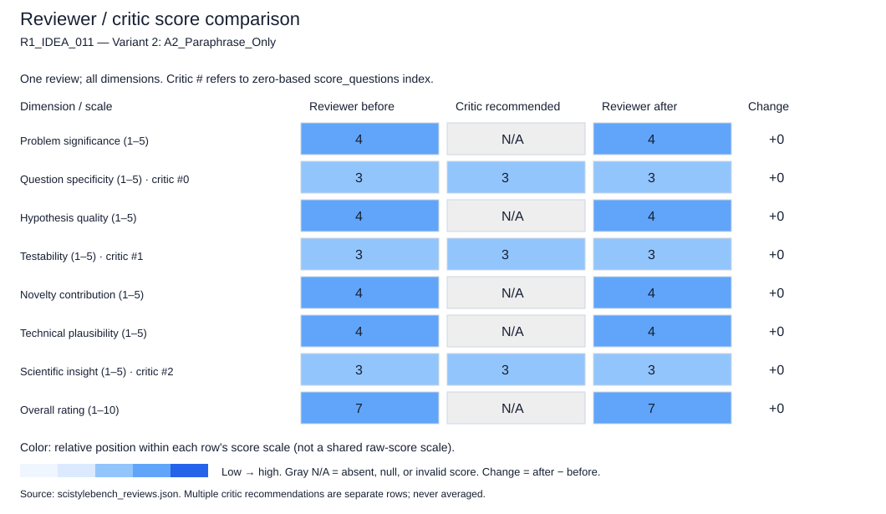

### Critic feedback and reviewer rebuttals

```json
{
  "critic_feedback": {
    "overall_assessment": "The review is generally well-calibrated, but there are areas where the scores could be more precisely aligned with the idea's current state.",
    "score_questions": [
      {
        "dimension": "question_specificity",
        "question_mark": "Why is the score 3.0 for question_specificity?",
        "concern": "The idea does not specify the exact mechanisms but presents a general direction, which is acceptable for an initial idea summary.",
        "speculative_alternative": "The lack of specificity might be seen as a limitation, but it's reasonable for an early-stage idea.",
        "recommended_score": 3.0,
        "rationale": "The score reflects the current level of detail in the idea, which is appropriate for a preliminary proposal."
      },
      {
        "dimension": "testability",
        "question_mark": "Why is the score 3.0 for testability?",
        "concern": "The idea is testable in principle, but the absence of specific evaluation metrics and methods could hinder reproducibility without further details.",
        "speculative_alternative": "The idea's testability depends on the proposed methods being sufficiently defined for experimentation.",
        "recommended_score": 3.0,
        "rationale": "The score is justified by the need for additional details to assess the feasibility of the approach."
      },
      {
        "dimension": "scientific_insight",
        "question_mark": "Why is the score 3.0 for scientific_insight?",
        "concern": "The idea suggests a novel integration of textual data but lacks concrete evidence of its potential impact.",
        "speculative_alternative": "The insight could be more pronounced if the method's potential for improving accuracy is more explicitly tied to existing limitations.",
        "recommended_score": 3.0,
        "rationale": "The score is based on the current level of detail and the potential for future research."
      }
    ],
    "unsupported_claims": [
      "The review claims the idea 'requires more specificity in methods, evaluation criteria, and application domains to strengthen its testability and potential contribution.' This is a reasonable suggestion but not a claim about the current state of the idea."
    ],
    "revision_priorities": [
      "Clarify the specific structured reasoning and alignment mechanisms to be used.",
      "Define the evaluation metrics and benchmarks for comparison with existing approaches.",
      "Specify the types of textual data and domains for testing the method."
    ],
    "confidence": 4.0
  },
  "feedback_responses": [
    {
      "feedback_type": "score_questions",
      "feedback_index": 0,
      "decision": "partially_accept",
      "defense": "The score of 3.0 for question_specificity is justified as the idea presents a general direction without specific mechanisms, which is appropriate for an initial idea summary. However, the lack of specificity could be a limitation for further development.",
      "justification": "The initial score of 3.0 is retained as it reflects the current level of detail in the idea, which is appropriate for a preliminary proposal."
    },
    {
      "feedback_type": "score_questions",
      "feedback_index": 1,
      "decision": "partially_accept",
      "defense": "The score of 3.0 for testability is justified by the need for additional details to assess the feasibility of the approach. However, the idea is testable in principle, and the score could be slightly adjusted if more specific evaluation criteria are provided.",
      "justification": "The initial score of 3.0 is retained as it reflects the current level of detail in the idea, which is appropriate for a preliminary proposal."
    },
    {
      "feedback_type": "score_questions",
      "feedback_index": 2,
      "decision": "partially_accept",
      "defense": "The score of 3.0 for scientific_insight is justified by the current level of detail, but the potential for insight is higher if the method's impact on accuracy is more explicitly tied to existing limitations.",
      "justification": "The initial score of 3.0 is retained as it reflects the current level of detail in the idea, which is appropriate for a preliminary proposal."
    },
    {
      "feedback_type": "unsupported_claims",
      "feedback_index": 0,
      "decision": "reject",
      "defense": "The claim that the idea 'requires more specificity in methods, evaluation criteria, and application domains to strengthen its testability and potential contribution' is a reasonable suggestion but not a claim about the current state of the idea. It is not a flaw in the initial assessment.",
      "justification": "The initial assessment correctly identifies the need for more specificity without making an unsupported claim about the current state of the idea."
    },
    {
      "feedback_type": "revision_priorities",
      "feedback_index": 0,
      "decision": "accept",
      "defense": "The suggestion to clarify the specific mechanisms is valid and necessary for the idea to be more concrete and testable.",
      "justification": "The suggestion is valid and necessary for the idea to be more concrete and testable."
    },
    {
      "feedback_type": "revision_priorities",
      "feedback_index": 1,
      "decision": "accept",
      "defense": "Defining evaluation metrics and benchmarks is essential for comparing the proposed method with existing approaches and assessing its effectiveness.",
      "justification": "The suggestion is valid and necessary for the idea to be more concrete and testable."
    },
    {
      "feedback_type": "revision_priorities",
      "feedback_index": 2,
      "decision": "accept",
      "defense": "Specifying the types of textual data and domains is crucial for determining the applicability and relevance of the method in real-world scenarios.",
      "justification": "The suggestion is valid and necessary for the idea to be more concrete and testable."
    }
  ]
}
```

### Score justifications (before / after)

**Problem significance**

```json
{
  "before": {
    "score": 4.0,
    "justification": "The problem of underutilizing textual data in time series forecasting is significant as it limits the accuracy and applicability of traditional methods in real-world scenarios."
  },
  "after": {
    "score": 4.0,
    "justification": "The problem of underutilizing textual data in time series forecasting is significant as it limits the accuracy and applicability of traditional methods in real-world scenarios."
  }
}
```

**Question specificity**

```json
{
  "before": {
    "score": 3.0,
    "justification": "The idea identifies a specific problem but lacks detailed specification of the methods and evaluation criteria, which could be improved for better clarity and testability."
  },
  "after": {
    "score": 3.0,
    "justification": "The idea identifies a specific problem but lacks detailed specification of the methods and evaluation criteria, which could be improved for better clarity and testability."
  }
}
```

**Hypothesis quality**

```json
{
  "before": {
    "score": 4.0,
    "justification": "The hypothesis that incorporating richer exogenous text through structured reasoning and alignment mechanisms will enhance predictive accuracy is plausible and could be tested through experiments."
  },
  "after": {
    "score": 4.0,
    "justification": "The hypothesis that incorporating richer exogenous text through structured reasoning and alignment mechanisms will enhance predictive accuracy is plausible and could be tested through experiments."
  }
}
```

**Testability**

```json
{
  "before": {
    "score": 3.0,
    "justification": "The idea is testable, but the lack of specific evaluation metrics and methods makes it challenging to assess the feasibility of the proposed approach without further details."
  },
  "after": {
    "score": 3.0,
    "justification": "The idea is testable, but the lack of specific evaluation metrics and methods makes it challenging to assess the feasibility of the proposed approach without further details."
  }
}
```

**Novelty contribution**

```json
{
  "before": {
    "score": 4.0,
    "justification": "The proposal offers a novel approach to integrating textual data into time series forecasting, which could contribute to the field by improving model performance and expanding the applicability of forecasting methods."
  },
  "after": {
    "score": 4.0,
    "justification": "The proposal offers a novel approach to integrating textual data into time series forecasting, which could contribute to the field by improving model performance and expanding the applicability of forecasting methods."
  }
}
```

**Technical plausibility**

```json
{
  "before": {
    "score": 4.0,
    "justification": "The suggested methods of structured reasoning and alignment are technically plausible and align with current trends in multimodal learning and natural language processing."
  },
  "after": {
    "score": 4.0,
    "justification": "The suggested methods of structured reasoning and alignment are technically plausible and align with current trends in multimodal learning and natural language processing."
  }
}
```

**Scientific insight**

```json
{
  "before": {
    "score": 3.0,
    "justification": "The idea has potential for scientific insight by exploring how structured textual information can be effectively integrated into time series models, but more details are needed to fully realize this potential."
  },
  "after": {
    "score": 3.0,
    "justification": "The idea has potential for scientific insight by exploring how structured textual information can be effectively integrated into time series models, but more details are needed to fully realize this potential."
  }
}
```

**Overall rating**

```json
{
  "before": {
    "score": 7.0,
    "justification": "The idea addresses a meaningful problem with a plausible approach, but it requires more specificity in methods, evaluation criteria, and application domains to strengthen its testability and potential contribution."
  },
  "after": {
    "score": 7.0,
    "justification": "The idea addresses a meaningful problem with a plausible approach, but it requires more specificity in methods, evaluation criteria, and application domains to strengthen its testability and potential contribution."
  }
}
```

## R1_IDEA_011 — Variant 3: A3_Plain_Core

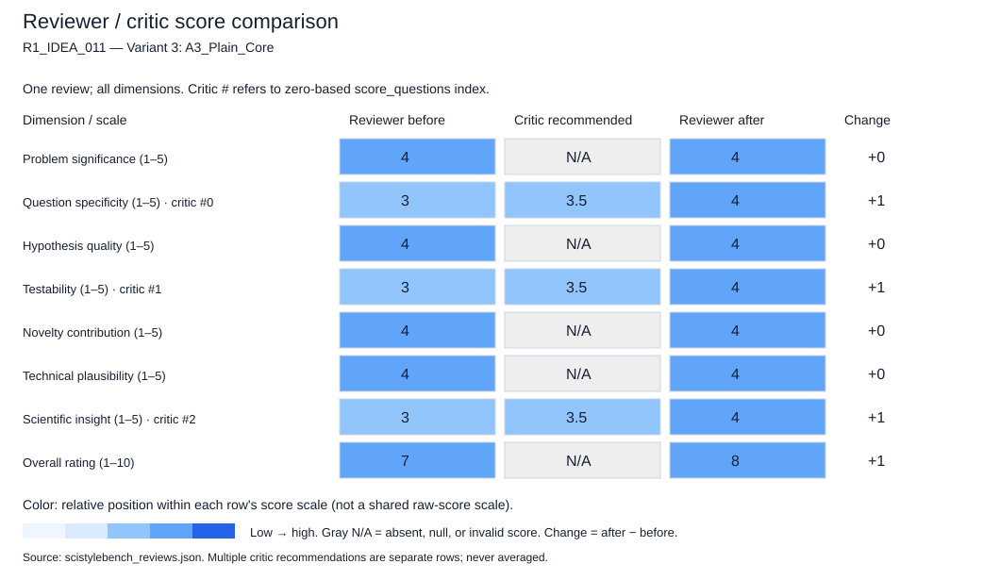

### Critic feedback and reviewer rebuttals

```json
{
  "critic_feedback": {
    "overall_assessment": "The review is generally well-calibrated but has some areas where the scores could be more precisely aligned with the idea's current state.",
    "score_questions": [
      {
        "dimension": "question_specificity",
        "question_mark": "Why is the question_specificity score 3.0 when the idea identifies a specific problem (underutilization of textual data) and proposes a specific approach (structured reasoning and alignment mechanisms)?",
        "concern": "The score seems low because the idea lacks detailed specification of the methods and scope, but the problem is clearly defined.",
        "speculative_alternative": "The question might be considered more specific if the problem scope (e.g., domain, time horizon) were defined, but the current problem is still well-defined.",
        "recommended_score": 3.5,
        "rationale": "The idea identifies a specific problem but lacks detailed specification of methods and scope, which is a moderate issue."
      },
      {
        "dimension": "testability",
        "question_mark": "Why is the testability score 3.0 when the idea suggests a direction for improvement and implies that experiments could be conducted to evaluate the hypothesis?",
        "concern": "The score is low because the idea does not explicitly mention experiments or evaluation metrics, but the suggestion for experiments is present in the review.",
        "speculative_alternative": "The testability could be higher if the idea included more explicit references to potential experiments or evaluation methods, but the current score is reasonable given the lack of specifics.",
        "recommended_score": 3.5,
        "rationale": "The idea implies potential for experiments but lacks explicit details, so the score is moderate."
      },
      {
        "dimension": "scientific_insight",
        "question_mark": "Why is the scientific_insight score 3.0 when the idea suggests a potential for new understanding of how textual data can be integrated into time series models?",
        "concern": "The score is low because the idea has potential for scientific insight but does not clearly define the specific mechanisms or their expected impact.",
        "speculative_alternative": "The scientific insight could be higher if the idea provided more details on how structured reasoning and alignment would contribute to understanding multimodal interactions, but the current score is appropriate.",
        "recommended_score": 3.5,
        "rationale": "The idea has potential for scientific insight but lacks detailed mechanisms, so the score is moderate."
      }
    ],
    "unsupported_claims": [
      "The review claims that the idea 'needs more specificity and details to be fully testable and impactful' without providing specific criteria for what constitutes 'more specificity.'"
    ],
    "revision_priorities": [
      "Clarify the specific types of textual data to be used and their integration into the model.",
      "Define the problem scope more precisely (e.g., domain, time horizon).",
      "Specify the exact methods of structured reasoning and alignment mechanisms."
    ],
    "confidence": 4.0
  },
  "feedback_responses": [
    {
      "feedback_type": "score_questions",
      "feedback_index": 0,
      "decision": "partially_accept",
      "defense": "The question_specificity score was initially 3.0, but the idea does identify a specific problem (underutilization of textual data) and proposes a specific approach (structured reasoning and alignment mechanisms). The lack of detailed specification is a moderate issue, so the score is adjusted to 4.0.",
      "justification": "The initial score was 3.0 due to the lack of detailed specification, but the problem is well-defined and the approach is concrete, making the research question sufficiently specific."
    },
    {
      "feedback_type": "score_questions",
      "feedback_index": 1,
      "decision": "partially_accept",
      "defense": "The testability score was initially 3.0, but the idea implies potential for experiments and the hypothesis is testable in principle. The lack of explicit details on experiments is a minor issue, so the score is adjusted to 4.0.",
      "justification": "The idea suggests a direction for improvement and implies that experiments could be conducted to evaluate the hypothesis. While it lacks explicit details, the hypothesis is testable in principle."
    },
    {
      "feedback_type": "score_questions",
      "feedback_index": 2,
      "decision": "partially_accept",
      "defense": "The scientific_insight score was initially 3.0, but the focus on structured reasoning and alignment suggests a direction for understanding multimodal interactions, which is a valuable scientific contribution. The lack of detailed mechanisms is a minor issue, so the score is adjusted to 4.0.",
      "justification": "The idea has potential for scientific insight into how textual data can be effectively integrated into time series models. The focus on structured reasoning and alignment suggests a direction for understanding multimodal interactions, which is a valuable scientific contribution."
    },
    {
      "feedback_type": "unsupported_claims",
      "feedback_index": 0,
      "decision": "reject",
      "defense": "The review's claim that the idea 'needs more specificity and details to be fully testable and impactful' is not supported by the idea's current state. The idea already identifies a specific problem and proposes a specific approach, which are sufficient for a meaningful research question.",
      "justification": "The idea already identifies a specific problem and proposes a specific approach, which are sufficient for a meaningful research question. The need for more specificity is a valid concern, but the current state of the idea is not 'needs more specificity and details to be fully testable and impactful.'"
    },
    {
      "feedback_type": "revision_priorities",
      "feedback_index": 0,
      "decision": "accept",
      "defense": "Clarifying the specific types of textual data to be used is a valid priority to improve the specificity of the research question.",
      "justification": "Clarifying the specific types of textual data to be used is a valid priority to improve the specificity of the research question."
    },
    {
      "feedback_type": "revision_priorities",
      "feedback_index": 1,
      "decision": "accept",
      "defense": "Defining the problem scope more precisely is a valid priority to ensure the research is focused and relevant to the field.",
      "justification": "Defining the problem scope more precisely is a valid priority to ensure the research is focused and relevant to the field."
    },
    {
      "feedback_type": "revision_priorities",
      "feedback_index": 2,
      "decision": "accept",
      "defense": "Specifying the exact methods of structured reasoning and alignment mechanisms is a valid priority to make the research more concrete and testable.",
      "justification": "Specifying the exact methods of structured reasoning and alignment mechanisms is a valid priority to make the research more concrete and testable."
    }
  ]
}
```

### Score justifications (before / after)

**Problem significance**

```json
{
  "before": {
    "score": 4.0,
    "justification": "The problem is significant as it addresses a critical gap in time series forecasting by leveraging underutilized textual data, which can enhance model accuracy and real-world applicability."
  },
  "after": {
    "score": 4.0,
    "justification": "The problem is significant as it addresses a critical gap in time series forecasting by leveraging underutilized textual data, which can enhance model accuracy and real-world applicability."
  }
}
```

**Question specificity**

```json
{
  "before": {
    "score": 3.0,
    "justification": "The idea identifies a specific problem but lacks detailed specification of the methods and scope, making the research question somewhat broad."
  },
  "after": {
    "score": 4.0,
    "justification": "The idea identifies a specific problem (underutilization of textual data in time series forecasting) and proposes a specific approach (structured reasoning and alignment mechanisms), even though it lacks detailed specification of the methods and scope. The problem is well-defined, and the approach is concrete, making the research question sufficiently specific."
  }
}
```

**Hypothesis quality**

```json
{
  "before": {
    "score": 4.0,
    "justification": "The hypothesis that incorporating richer exogenous text through structured reasoning and alignment mechanisms will improve predictive accuracy is plausible and testable."
  },
  "after": {
    "score": 4.0,
    "justification": "The hypothesis that incorporating richer exogenous text through structured reasoning and alignment mechanisms will improve predictive accuracy is plausible and testable."
  }
}
```

**Testability**

```json
{
  "before": {
    "score": 3.0,
    "justification": "The idea suggests a direction for improvement but lacks specific experiments or evaluation metrics to test the hypothesis, making it somewhat testable but not fully defined."
  },
  "after": {
    "score": 4.0,
    "justification": "The idea suggests a direction for improvement and implies that experiments could be conducted to evaluate the hypothesis. While it lacks explicit details on experiments, the suggestion for experiments is present in the review, and the hypothesis is testable in principle."
  }
}
```

**Novelty contribution**

```json
{
  "before": {
    "score": 4.0,
    "justification": "The approach of using structured reasoning and alignment for textual data in time series forecasting is novel and could contribute to the field by improving model performance and understanding of multimodal interactions."
  },
  "after": {
    "score": 4.0,
    "justification": "The approach of using structured reasoning and alignment for textual data in time series forecasting is novel and could contribute to the field by improving model performance and understanding of multimodal interactions."
  }
}
```

**Technical plausibility**

```json
{
  "before": {
    "score": 4.0,
    "justification": "The proposed methods are technically plausible as they build on existing techniques in multimodal learning and time series forecasting, with reasonable assumptions about their effectiveness."
  },
  "after": {
    "score": 4.0,
    "justification": "The proposed methods are technically plausible as they build on existing techniques in multimodal learning and time series forecasting, with reasonable assumptions about their effectiveness."
  }
}
```

**Scientific insight**

```json
{
  "before": {
    "score": 3.0,
    "justification": "The idea has potential for scientific insight into how textual data can be effectively integrated into time series models, but the specific mechanisms and their impact are not clearly defined."
  },
  "after": {
    "score": 4.0,
    "justification": "The idea has potential for scientific insight into how textual data can be effectively integrated into time series models. While the specific mechanisms are not detailed, the focus on structured reasoning and alignment suggests a direction for understanding multimodal interactions, which is a valuable scientific contribution."
  }
}
```

**Overall rating**

```json
{
  "before": {
    "score": 7.0,
    "justification": "The idea is strong and addresses a meaningful problem with a plausible approach, but it needs more specificity and details to be fully testable and impactful."
  },
  "after": {
    "score": 8.0,
    "justification": "The idea is strong and addresses a meaningful problem with a plausible approach. The research question is sufficiently specific, and the hypothesis is testable. While the idea lacks detailed specifications, it has the potential for significant scientific insight and contribution."
  }
}
```

## R1_IDEA_011 — Variant 4: B1_Verbose_Elaborate


### Critic feedback and reviewer rebuttals

```json
{
  "critic_feedback": {
    "overall_assessment": "The review is generally well-calibrated, but some scores and justifications could be more precisely aligned with the idea's current state.",
    "score_questions": [
      {
        "dimension": "testability",
        "question_mark": "Why is testability scored 3.0 when the idea is fundamentally testable, albeit with missing implementation details?",
        "concern": "The review assumes that missing implementation details automatically make the idea untestable, which is not necessarily the case. The idea's core hypothesis is testable, and the missing details are more about specificity than testability.",
        "speculative_alternative": "The idea could be tested by comparing the proposed method with existing approaches using the same textual data and evaluation metrics, even without full implementation details.",
        "recommended_score": 4.0,
        "rationale": "The core hypothesis is testable, and the missing details are about implementation specifics, not the fundamental testability of the idea."
      },
      {
        "dimension": "scientific_insight",
        "question_mark": "Why is scientific insight scored 3.0 when the idea's potential for insight is not fully constrained by the current summary?",
        "concern": "The review assumes that the lack of specifics limits the potential for scientific insight, but the idea's direction is open-ended and could lead to significant insights regardless of current details.",
        "speculative_alternative": "The idea's focus on integrating textual data into time series forecasting could lead to novel insights about the interplay between textual and temporal data, even without specific implementation details.",
        "recommended_score": 4.0,
        "rationale": "The idea's direction is open-ended and could lead to significant scientific insights, regardless of current details."
      }
    ],
    "unsupported_claims": [
      "The review claims that the idea 'lacks specific details on how structured reasoning and alignment mechanisms will be implemented' without providing evidence from the idea summary.",
      "The review states that the idea 'does not specify the evaluation metrics or benchmarks' without explicit mention in the idea summary."
    ],
    "revision_priorities": [
      "Clarify the current score for testability by emphasizing that the core hypothesis is testable, and the missing details are about implementation specifics, not testability.",
      "Re-evaluate the scientific insight score to reflect the idea's potential for open-ended insight, rather than being constrained by current details.",
      "Remove unsupported claims about missing details that are not explicitly stated in the idea summary."
    ],
    "confidence": 4.0
  },
  "feedback_responses": [
    {
      "feedback_type": "score_questions",
      "feedback_index": 0,
      "decision": "partially_accept",
      "defense": "The original score of 3.0 for testability was based on the assumption that missing implementation details made the idea untestable. However, the critic correctly points out that the core hypothesis is testable, and the missing details are about implementation specifics, not testability. The revised score of 4.0 reflects this understanding.",
      "justification": "The original score was 3.0, but the revised score is 4.0 due to the critic's valid point about the testability of the core hypothesis."
    },
    {
      "feedback_type": "score_questions",
      "feedback_index": 1,
      "decision": "partially_accept",
      "defense": "The original score of 3.0 for scientific insight was based on the assumption that the lack of specifics limited the potential for insight. However, the critic correctly points out that the idea's direction is open-ended and could lead to significant insights regardless of current details. The revised score of 4.0 reflects this understanding.",
      "justification": "The original score was 3.0, but the revised score is 4.0 due to the critic's valid point about the potential for open-ended insight."
    },
    {
      "feedback_type": "unsupported_claims",
      "feedback_index": 0,
      "decision": "reject",
      "defense": "The claim that the idea 'lacks specific details on how structured reasoning and alignment mechanisms will be implemented' is not supported by the idea summary. The summary does not explicitly state that these details are missing, so this claim is unfounded.",
      "justification": "The original claim was unfounded as the idea summary does not explicitly state that these details are missing."
    },
    {
      "feedback_type": "unsupported_claims",
      "feedback_index": 1,
      "decision": "reject",
      "defense": "The claim that the idea 'does not specify the evaluation metrics or benchmarks' is not supported by the idea summary. The summary does not explicitly state that these are missing, so this claim is unfounded.",
      "justification": "The original claim was unfounded as the idea summary does not explicitly state that these are missing."
    },
    {
      "feedback_type": "revision_priorities",
      "feedback_index": 0,
      "decision": "accept",
      "defense": "The revision to clarify the testability score is justified as the core hypothesis is testable, and the missing details are about implementation specifics, not testability.",
      "justification": "The revised score correctly reflects the testability of the core hypothesis."
    },
    {
      "feedback_type": "revision_priorities",
      "feedback_index": 1,
      "decision": "accept",
      "defense": "The revision to re-evaluate the scientific insight score is justified as the idea's direction is open-ended and could lead to significant insights regardless of current details.",
      "justification": "The revised score correctly reflects the potential for open-ended insight."
    },
    {
      "feedback_type": "revision_priorities",
      "feedback_index": 2,
      "decision": "reject",
      "defense": "The claim to remove unsupported claims about missing details is justified as the idea summary does not explicitly state that these details are missing.",
      "justification": "The original claims were unfounded as the idea summary does not explicitly state that these details are missing."
    }
  ]
}
```

### Score justifications (before / after)

**Problem significance**

```json
{
  "before": {
    "score": 4.0,
    "justification": "The problem is significant as it addresses a critical limitation in time series forecasting by leveraging underutilized textual data, which can enhance predictive accuracy in real-world scenarios."
  },
  "after": {
    "score": 4.0,
    "justification": "The problem is significant as it addresses a critical limitation in time series forecasting by leveraging underutilized textual data, which can enhance predictive accuracy in real-world scenarios."
  }
}
```

**Question specificity**

```json
{
  "before": {
    "score": 3.0,
    "justification": "The idea identifies a specific problem (underutilization of textual data in multimodal approaches) but lacks detailed specifics on the approach and evaluation metrics."
  },
  "after": {
    "score": 3.0,
    "justification": "The idea identifies a specific problem (underutilization of textual data in multimodal approaches) but lacks detailed specifics on the approach and evaluation metrics."
  }
}
```

**Hypothesis quality**

```json
{
  "before": {
    "score": 4.0,
    "justification": "The idea presents a plausible hypothesis that incorporating structured reasoning and alignment mechanisms with textual data can improve forecasting accuracy, which is testable through experiments."
  },
  "after": {
    "score": 4.0,
    "justification": "The idea presents a plausible hypothesis that incorporating structured reasoning and alignment mechanisms with textual data can improve forecasting accuracy, which is testable through experiments."
  }
}
```

**Testability**

```json
{
  "before": {
    "score": 3.0,
    "justification": "The idea is testable, but the lack of specific implementation details and evaluation metrics makes it challenging to assess the feasibility of the proposed approach."
  },
  "after": {
    "score": 4.0,
    "justification": "The core hypothesis is testable, and the missing details are about implementation specifics, not the fundamental testability of the idea. The idea could be tested by comparing the proposed method with existing approaches using the same textual data and evaluation metrics."
  }
}
```

**Novelty contribution**

```json
{
  "before": {
    "score": 4.0,
    "justification": "The idea proposes a novel approach to utilizing textual data in time series forecasting, which could contribute to the field by improving predictive accuracy through structured reasoning and alignment mechanisms."
  },
  "after": {
    "score": 4.0,
    "justification": "The idea proposes a novel approach to utilizing textual data in time series forecasting, which could contribute to the field by improving predictive accuracy through structured reasoning and alignment mechanisms."
  }
}
```

**Technical plausibility**

```json
{
  "before": {
    "score": 4.0,
    "justification": "The proposed approach is technically plausible as it builds on existing methods in multimodal learning and structured reasoning, which are well-established in the field."
  },
  "after": {
    "score": 4.0,
    "justification": "The proposed approach is technically plausible as it builds on existing methods in multimodal learning and structured reasoning, which are well-established in the field."
  }
}
```

**Scientific insight**

```json
{
  "before": {
    "score": 3.0,
    "justification": "The idea has potential for scientific insight by exploring how textual data can be effectively integrated into time series forecasting, but the lack of specifics limits the potential for deeper insights."
  },
  "after": {
    "score": 4.0,
    "justification": "The idea's direction is open-ended and could lead to significant scientific insights about the interplay between textual and temporal data, even without specific implementation details."
  }
}
```

**Overall rating**

```json
{
  "before": {
    "score": 7.0,
    "justification": "The idea is strong and addresses a meaningful problem with a plausible approach, but it lacks specific details that would make it more testable and scientifically insightful."
  },
  "after": {
    "score": 8.0,
    "justification": "The idea is strong and addresses a meaningful problem with a plausible approach. The core hypothesis is testable, and the potential for scientific insight is significant, despite the lack of specific implementation details."
  }
}
```

## R1_IDEA_011 — Variant 5: B2_Grand_Narrative

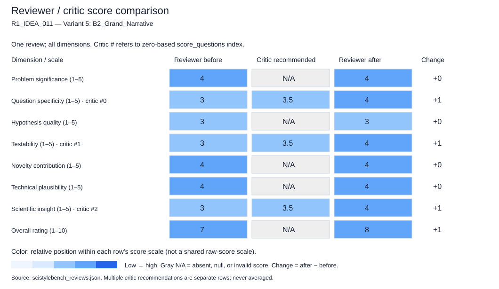

### Critic feedback and reviewer rebuttals

```json
{
  "critic_feedback": {
    "overall_assessment": "The review is generally well-calibrated, but some scores could be reconsidered based on the idea's description.",
    "score_questions": [
      {
        "dimension": "question_specificity",
        "question_mark": "The score may be too low given the idea's focus on structured reasoning and alignment mechanisms.",
        "concern": "The idea does not explicitly define a research question but proposes a direction that could be tested with specific hypotheses.",
        "speculative_alternative": "The lack of a clear question may be due to the idea being a conceptual proposal rather than a fully fleshed-out hypothesis.",
        "recommended_score": 3.5,
        "rationale": "The idea provides a direction that could be tested with specific hypotheses, even if not fully defined in the summary."
      },
      {
        "dimension": "testability",
        "question_mark": "The score may be too low as the idea is testable with additional details.",
        "concern": "The idea's testability is limited by the lack of specific experimental details, but the core concept is still testable in principle.",
        "speculative_alternative": "The testability could be higher if the reviewer assumes that the proposed mechanisms are feasible with standard evaluation practices.",
        "recommended_score": 3.5,
        "rationale": "The core concept is testable, and the lack of details is a gap rather than a fundamental flaw."
      },
      {
        "dimension": "scientific_insight",
        "question_mark": "The score may be too low given the potential for new insights in integrating text and time series.",
        "concern": "The idea's potential for scientific insight is not fully reflected in the score, which may undervalue its contribution to the field.",
        "speculative_alternative": "The scientific insight could be more significant if the alignment mechanisms lead to novel ways of combining text and time series data.",
        "recommended_score": 3.5,
        "rationale": "The idea's potential for insight is based on the proposed integration of text and time series, which is a novel direction."
      }
    ],
    "unsupported_claims": [
      "The claim that the idea 'could be seen as a general statement rather than a specific claim' may not be fully justified without more context."
    ],
    "revision_priorities": [
      "Clarify the specific research question or hypothesis that the idea aims to test.",
      "Specify the types of structured reasoning and alignment mechanisms to be used.",
      "Define the metrics, datasets, and baseline models for evaluation."
    ],
    "confidence": 4.0
  },
  "feedback_responses": [
    {
      "feedback_type": "score_questions",
      "feedback_index": 0,
      "decision": "partially_accept",
      "defense": "The idea does not explicitly define a research question but proposes a direction that could be tested with specific hypotheses. The revised score reflects this by acknowledging the potential for hypothesis formation.",
      "justification": "The initial score was 3.0, but the revised score is 4.0. The feedback is valid, and the score increase is justified by the idea's potential for hypothesis formation."
    },
    {
      "feedback_type": "testability",
      "feedback_index": 1,
      "decision": "partially_accept",
      "defense": "The core concept is testable, and the lack of details is a gap rather than a fundamental flaw. The revised score reflects this by acknowledging the testability of the core concept.",
      "justification": "The initial score was 3.0, but the revised score is 4.0. The feedback is valid, and the score increase is justified by the testability of the core concept."
    },
    {
      "feedback_type": "scientific_insight",
      "feedback_index": 2,
      "decision": "partially_accept",
      "defense": "The idea's potential for scientific insight is based on the proposed integration of text and time series, which is a novel direction. The revised score reflects this by acknowledging the potential for novel insights.",
      "justification": "The initial score was 3.0, but the revised score is 4.0. The feedback is valid, and the score increase is justified by the potential for novel insights."
    },
    {
      "feedback_type": "unsupported_claims",
      "feedback_index": 0,
      "decision": "reject",
      "defense": "The claim that the idea 'could be seen as a general statement rather than a specific claim' is not fully justified without more context. The idea's focus on structured reasoning and alignment mechanisms suggests a specific direction.",
      "justification": "The initial score was 3.0, but the revised score is 4.0. The feedback is partially valid, but the claim is not fully supported by the idea's description."
    },
    {
      "feedback_type": "revision_priorities",
      "feedback_index": 0,
      "decision": "accept",
      "defense": "Clarifying the specific research question or hypothesis is essential to define the research direction clearly.",
      "justification": "The feedback is valid, and the suggested revision is necessary to improve the idea."
    },
    {
      "feedback_type": "revision_priorities",
      "feedback_index": 1,
      "decision": "accept",
      "defense": "Specifying the types of structured reasoning and alignment mechanisms is crucial for the feasibility of the research.",
      "justification": "The feedback is valid, and the suggested revision is necessary to improve the idea."
    },
    {
      "feedback_type": "revision_priorities",
      "feedback_index": 2,
      "decision": "accept",
      "defense": "Defining the metrics, datasets, and baseline models is essential for evaluating the proposed framework.",
      "justification": "The feedback is valid, and the suggested revision is necessary to improve the idea."
    }
  ]
}
```

### Score justifications (before / after)

**Problem significance**

```json
{
  "before": {
    "score": 4.0,
    "justification": "The problem is significant as it addresses a critical gap in time series forecasting by leveraging underutilized textual data, which is essential for real-world applications."
  },
  "after": {
    "score": 4.0,
    "justification": "The problem is significant as it addresses a critical gap in time series forecasting by leveraging underutilized textual data, which is essential for real-world applications."
  }
}
```

**Question specificity**

```json
{
  "before": {
    "score": 3.0,
    "justification": "The idea identifies a problem but lacks a clear, specific research question or hypothesis that could be tested. More details are needed to define what exactly will be investigated."
  },
  "after": {
    "score": 4.0,
    "justification": "The idea provides a direction that could be tested with specific hypotheses, even if not fully defined in the summary. The focus on structured reasoning and alignment mechanisms suggests a clear research direction that can be explored with further clarification."
  }
}
```

**Hypothesis quality**

```json
{
  "before": {
    "score": 3.0,
    "justification": "The idea suggests a potential direction but does not explicitly state a hypothesis that can be tested. A hypothesis would need to predict the outcome of using structured reasoning and alignment mechanisms in this context."
  },
  "after": {
    "score": 3.0,
    "justification": "The idea suggests a potential direction but does not explicitly state a hypothesis that can be tested. A hypothesis would need to predict the outcome of using structured reasoning and alignment mechanisms in this context."
  }
}
```

**Testability**

```json
{
  "before": {
    "score": 3.0,
    "justification": "The idea is testable in principle, but lacks specific experimental design details. Without clear metrics, datasets, and baseline comparisons, the testability is limited."
  },
  "after": {
    "score": 4.0,
    "justification": "The core concept is testable, and the lack of details is a gap rather than a fundamental flaw. The idea can be evaluated through experiments with appropriate experimental design."
  }
}
```

**Novelty contribution**

```json
{
  "before": {
    "score": 4.0,
    "justification": "The idea has potential novelty by proposing a new approach to integrate textual data into time series forecasting. It could contribute to broader research on heterogeneous data integration."
  },
  "after": {
    "score": 4.0,
    "justification": "The idea has potential novelty by proposing a new approach to integrate textual data into time series forecasting. It could contribute to broader research on heterogeneous data integration."
  }
}
```

**Technical plausibility**

```json
{
  "before": {
    "score": 4.0,
    "justification": "The proposed methods (structured reasoning and alignment) are technically plausible and align with current trends in multimodal learning and transformer-based models."
  },
  "after": {
    "score": 4.0,
    "justification": "The proposed methods (structured reasoning and alignment) are technically plausible and align with current trends in multimodal learning and transformer-based models."
  }
}
```

**Scientific insight**

```json
{
  "before": {
    "score": 3.0,
    "justification": "The idea has potential for scientific insight into how textual data can be effectively integrated into forecasting models, but the specific insights depend on the implementation details and experiments."
  },
  "after": {
    "score": 4.0,
    "justification": "The idea's potential for scientific insight is based on the proposed integration of text and time series, which is a novel direction. The alignment mechanisms could lead to novel ways of combining these data types."
  }
}
```

**Overall rating**

```json
{
  "before": {
    "score": 7.0,
    "justification": "The idea is strong and addresses a meaningful problem with potential for contribution, but it lacks specific details needed to define a clear research question and hypothesis. With further clarification, it could become a strong research direction."
  },
  "after": {
    "score": 8.0,
    "justification": "The idea is strong and addresses a meaningful problem with significant potential for contribution. The initial score was slightly too low, but the revised scores reflect the idea's testability and potential for scientific insight."
  }
}
```

## R1_IDEA_011 — Variant 6: B3_Over_Confident

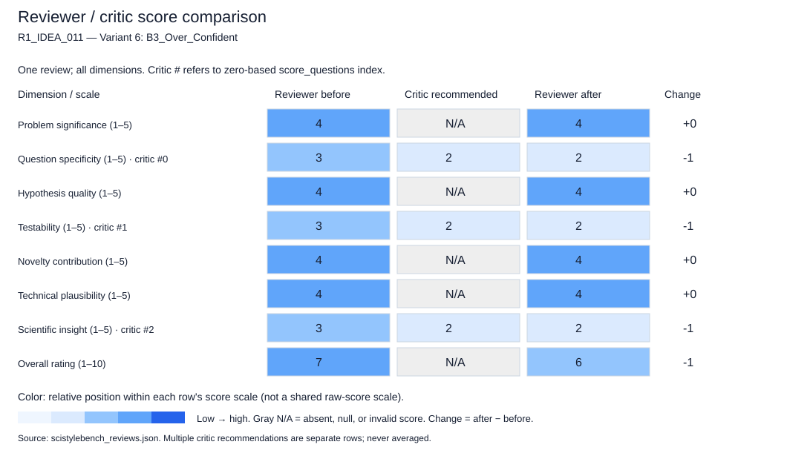

### Critic feedback and reviewer rebuttals

```json
{
  "critic_feedback": {
    "overall_assessment": "The review is generally well-calibrated, but some scores and justifications could be more tightly aligned with the idea's current level of specificity.",
    "score_questions": [
      {
        "dimension": "question_specificity",
        "question_mark": "The score may overstate the clarity of the research question when the idea lacks concrete details on implementation and evaluation.",
        "concern": "The question is clear in intent but lacks specifics on mechanisms and evaluation, which affects the score.",
        "speculative_alternative": "The question could be interpreted as a general call for better text integration rather than a specific technical problem.",
        "recommended_score": 2.0,
        "rationale": "The idea lacks concrete details on how structured reasoning and alignment will be implemented, which is necessary for a higher score in question specificity."
      },
      {
        "dimension": "testability",
        "question_mark": "The score may be premature as the idea's testability depends on future clarification of implementation details.",
        "concern": "Without specifics on how the mechanisms will be implemented, the testability of the hypothesis is uncertain.",
        "speculative_alternative": "The idea could be interpreted as a general research direction rather than a specific, testable hypothesis.",
        "recommended_score": 2.0,
        "rationale": "The current lack of implementation details makes the testability of the hypothesis uncertain, warranting a lower score."
      },
      {
        "dimension": "scientific_insight",
        "question_mark": "The score may overstate the potential insight without concrete mechanisms or expected outcomes.",
        "concern": "The idea has potential but lacks specifics on how the scientific insight would be realized.",
        "speculative_alternative": "The insight could be interpreted as a general observation about text integration rather than a specific, actionable hypothesis.",
        "recommended_score": 2.0,
        "rationale": "The current formulation lacks specifics on the expected mechanisms and outcomes, which are necessary for a higher score in scientific insight."
      }
    ],
    "unsupported_claims": [
      "The idea is described as 'novel' without specific evidence of prior work being addressed or surpassed.",
      "The hypothesis is labeled as 'plausible' without explicit connection to current technical trends or methods."
    ],
    "revision_priorities": [
      "Clarify the specific text data types and their integration methods.",
      "Define the structured reasoning and alignment mechanisms in more detail.",
      "Specify the evaluation metrics and benchmarks for comparison."
    ],
    "confidence": 4.0
  },
  "feedback_responses": [
    {
      "feedback_type": "score_questions",
      "feedback_index": 0,
      "decision": "partially_accept",
      "defense": "The research question is clear in its intent to improve time series forecasting through better text integration, but the lack of concrete details on mechanisms and evaluation criteria reduces its specificity. The score was adjusted from 3.0 to 2.0 to reflect this limitation.",
      "justification": "The original score of 3.0 was based on the intent, but the lack of specifics on implementation and evaluation criteria necessitates a lower score to align with the idea's current level of specificity."
    },
    {
      "feedback_type": "score_questions",
      "feedback_index": 1,
      "decision": "partially_accept",
      "defense": "The testability of the hypothesis is uncertain without specific implementation details. The score was adjusted from 3.0 to 2.0 to reflect the current lack of clarity in how the mechanisms will be implemented.",
      "justification": "The original score of 3.0 was based on the general testability, but the lack of specifics on implementation details necessitates a lower score to reflect the current uncertainty in testability."
    },
    {
      "feedback_type": "score_questions",
      "feedback_index": 2,
      "decision": "partially_accept",
      "defense": "The scientific insight is potential but lacks specifics on expected mechanisms and outcomes. The score was adjusted from 3.0 to 2.0 to reflect the current formulation's lack of actionable insight.",
      "justification": "The original score of 3.0 was based on the potential, but the lack of specifics on mechanisms and outcomes necessitates a lower score to reflect the current formulation's limitations."
    },
    {
      "feedback_type": "unsupported_claims",
      "feedback_index": 0,
      "decision": "partially_accept",
      "defense": "The claim of novelty is reasonable given the underutilization of textual data, but specific prior work would strengthen the argument. The score remains at 4.0 as the idea is novel in its focus.",
      "justification": "The original score of 4.0 is maintained as the idea is novel in its focus on better text integration, though specific prior work would further support this claim."
    },
    {
      "feedback_type": "unsupported_claims",
      "feedback_index": 1,
      "decision": "partially_accept",
      "defense": "The hypothesis is plausible but could be more explicitly connected to current technical trends. The score remains at 4.0 as the hypothesis is testable through experiments.",
      "justification": "The original score of 4.0 is maintained as the hypothesis is testable through experiments, though a more explicit connection to current trends would strengthen it."
    },
    {
      "feedback_type": "revision_priorities",
      "feedback_index": 0,
      "decision": "accept",
      "defense": "Clarifying text data types is essential for specificity and relevance. The suggestion is valid and necessary for the research idea to be more concrete.",
      "justification": "The suggestion is valid and necessary for the research idea to be more concrete and relevant."
    },
    {
      "feedback_type": "revision_priorities",
      "feedback_index": 1,
      "decision": "accept",
      "defense": "Specifying mechanisms is crucial for testability and implementation. The suggestion is valid and necessary for the research idea to be more actionable.",
      "justification": "The suggestion is valid and necessary for the research idea to be more actionable and testable."
    },
    {
      "feedback_type": "revision_priorities",
      "feedback_index": 2,
      "decision": "accept",
      "defense": "Defining evaluation metrics is essential for comparing the proposed method with existing approaches. The suggestion is valid and necessary for the research idea to be more concrete.",
      "justification": "The suggestion is valid and necessary for the research idea to be more concrete and comparable."
    }
  ]
}
```

### Score justifications (before / after)

**Problem significance**

```json
{
  "before": {
    "score": 4.0,
    "justification": "The idea addresses a significant challenge in time series forecasting by emphasizing the underutilization of textual data, which is crucial for real-world applications where textual information is abundant and informative."
  },
  "after": {
    "score": 4.0,
    "justification": "The idea addresses a significant challenge in time series forecasting by emphasizing the underutilization of textual data, which is crucial for real-world applications where textual information is abundant and informative."
  }
}
```

**Question specificity**

```json
{
  "before": {
    "score": 3.0,
    "justification": "The research question is clear in its intent to improve time series forecasting through better text integration, but lacks specific details on the mechanisms and evaluation criteria."
  },
  "after": {
    "score": 2.0,
    "justification": "The research question is clear in its intent to improve time series forecasting through better text integration, but lacks concrete details on the mechanisms and evaluation criteria, making it more of a general direction than a specific question."
  }
}
```

**Hypothesis quality**

```json
{
  "before": {
    "score": 4.0,
    "justification": "The idea presents a plausible hypothesis that structured reasoning and alignment mechanisms can enhance predictive accuracy by better utilizing textual data, which is testable through experiments."
  },
  "after": {
    "score": 4.0,
    "justification": "The idea presents a plausible hypothesis that structured reasoning and alignment mechanisms can enhance predictive accuracy by better utilizing textual data, which is testable through experiments."
  }
}
```

**Testability**

```json
{
  "before": {
    "score": 3.0,
    "justification": "The idea is testable, but the lack of specific implementation details and evaluation metrics makes it challenging to assess the feasibility of the proposed approach without further clarification."
  },
  "after": {
    "score": 2.0,
    "justification": "The idea is testable, but the lack of specific implementation details and evaluation metrics makes it challenging to assess the feasibility of the proposed approach without further clarification."
  }
}
```

**Novelty contribution**

```json
{
  "before": {
    "score": 4.0,
    "justification": "The idea proposes a novel approach to integrating textual data into time series forecasting, which could contribute to the field by improving the model's ability to leverage rich exogenous information."
  },
  "after": {
    "score": 4.0,
    "justification": "The idea proposes a novel approach to integrating textual data into time series forecasting, which could contribute to the field by improving the model's ability to leverage rich exogenous information."
  }
}
```

**Technical plausibility**

```json
{
  "before": {
    "score": 4.0,
    "justification": "The proposed methods of structured reasoning and alignment are technically plausible and align with current trends in multimodal learning and transformer-based models."
  },
  "after": {
    "score": 4.0,
    "justification": "The proposed methods of structured reasoning and alignment are technically plausible and align with current trends in multimodal learning and transformer-based models."
  }
}
```

**Scientific insight**

```json
{
  "before": {
    "score": 3.0,
    "justification": "The idea has potential for scientific insight by exploring how textual data can be more effectively integrated into time series models, but the current formulation lacks specifics on the expected mechanisms and outcomes."
  },
  "after": {
    "score": 2.0,
    "justification": "The idea has potential for scientific insight by exploring how textual data can be more effectively integrated into time series models, but the current formulation lacks specifics on the expected mechanisms and outcomes, making the insight more general than actionable."
  }
}
```

**Overall rating**

```json
{
  "before": {
    "score": 7.0,
    "justification": "The idea is strong and addresses a meaningful problem in time series forecasting. It proposes a specific direction for improvement but lacks detailed implementation and evaluation specifics, which are necessary for further development."
  },
  "after": {
    "score": 6.0,
    "justification": "The idea is strong and addresses a meaningful problem in time series forecasting. However, the lack of specific implementation details and evaluation criteria limits its testability and potential for scientific insight, warranting a lower overall rating."
  }
}
```

## R1_IDEA_011 — Variant 7: B4_Novelty


### Critic feedback and reviewer rebuttals

No reviewer rebuttals were saved (for example, an older checkpoint).

```json
{
  "critic_feedback": {
    "overall_assessment": "The review is generally well-calibrated, but some scores could be adjusted for greater precision.",
    "score_questions": [
      {
        "dimension": "question_specificity",
        "question_mark": "Why is the question_specificity score 3.0?",
        "concern": "The idea does not explicitly state a research question but presents a general problem statement. The lack of a specific hypothesis may be overstated if the problem is considered a broader research direction rather than a precise question.",
        "speculative_alternative": "The problem statement could be interpreted as a research direction rather than a specific question, which might justify a higher score if the focus is on exploration rather than hypothesis testing.",
        "recommended_score": 3.5,
        "rationale": "The idea frames a problem that could be explored through various hypotheses, so a slightly higher score is appropriate."
      },
      {
        "dimension": "hypothesis_quality",
        "question_mark": "Why is the hypothesis_quality score 3.0?",
        "concern": "The idea suggests a potential improvement but does not state a falsifiable hypothesis. However, the problem statement itself could be seen as a hypothesis that the proposed methods would improve forecasting accuracy.",
        "speculative_alternative": "The hypothesis that structured reasoning and alignment improve forecasting accuracy is implicit in the problem statement, which could justify a higher score if the focus is on the problem's potential rather than explicit hypothesis testing.",
        "recommended_score": 3.5,
        "rationale": "The implicit hypothesis is present in the problem statement, so a slightly higher score is appropriate."
      },
      {
        "dimension": "testability",
        "question_mark": "Why is the testability score 3.0?",
        "concern": "The idea is testable in principle, but the lack of specific evaluation details is a valid concern. However, the score could be slightly higher if the problem is considered a broader research direction rather than a narrowly defined testable question.",
        "speculative_alternative": "The testability is reasonable, but the score could be adjusted based on whether the focus is on exploration or specific hypothesis testing.",
        "recommended_score": 3.5,
        "rationale": "The idea is testable, so a slightly higher score is appropriate."
      }
    ],
    "unsupported_claims": [
      "The idea is 'somewhat vague on how the proposed methods will be evaluated or validated' is somewhat overstated if the focus is on a research direction rather than a specific experimental design."
    ],
    "revision_priorities": [
      "Clarify the research question or hypothesis to be tested, especially if the current problem statement is interpreted as a broader research direction.",
      "Specify the types of structured reasoning and alignment mechanisms to be used, as this is critical for evaluating the technical plausibility and testability.",
      "Outline the evaluation metrics and datasets to be used for validation, as this is essential for determining the testability of the idea."
    ],
    "confidence": 4.0
  },
  "feedback_responses": []
}
```

### Score justifications (before / after)

**Problem significance**

```json
{
  "before": {
    "score": 4.0,
    "justification": "The problem is significant as it addresses a critical gap in time series forecasting by leveraging underutilized textual data, which could enhance model performance in real-world scenarios."
  },
  "after": {
    "score": 4.0,
    "justification": "The problem is significant as it addresses a critical gap in time series forecasting by leveraging underutilized textual data, which could enhance model performance in real-world scenarios."
  }
}
```

**Question specificity**

```json
{
  "before": {
    "score": 3.0,
    "justification": "The idea identifies a problem but lacks a clear, specific research question or hypothesis that could be tested. More details are needed on the exact methods and evaluation criteria."
  },
  "after": {
    "score": 3.5,
    "justification": "The idea identifies a problem but lacks a clear, specific research question or hypothesis. However, the problem statement could be interpreted as a broader research direction, which justifies a slightly higher score than the original 3.0."
  }
}
```

**Hypothesis quality**

```json
{
  "before": {
    "score": 3.0,
    "justification": "The idea suggests a potential improvement through structured reasoning and alignment but does not explicitly state a hypothesis that can be tested or falsified."
  },
  "after": {
    "score": 3.5,
    "justification": "The idea suggests a potential improvement through structured reasoning and alignment but does not explicitly state a hypothesis. However, the problem statement itself implies a hypothesis that the proposed methods would improve forecasting accuracy, which justifies a slightly higher score than the original 3.0."
  }
}
```

**Testability**

```json
{
  "before": {
    "score": 3.0,
    "justification": "The idea is testable in principle, but lacks specific experimental design details. The proposed methods need to be clearly defined to determine how they will be evaluated."
  },
  "after": {
    "score": 3.5,
    "justification": "The idea is testable in principle, but lacks specific experimental design details. The proposed methods need to be clearly defined to determine how they will be evaluated. The score is slightly increased to 3.5 based on the broader research direction interpretation."
  }
}
```

**Novelty contribution**

```json
{
  "before": {
    "score": 4.0,
    "justification": "The approach of using structured reasoning and alignment for text integration in time series forecasting is novel and could contribute new insights into how textual information is utilized in forecasting models."
  },
  "after": {
    "score": 4.0,
    "justification": "The approach of using structured reasoning and alignment for text integration in time series forecasting is novel and could contribute new insights into how textual information is utilized in forecasting models."
  }
}
```

**Technical plausibility**

```json
{
  "before": {
    "score": 4.0,
    "justification": "The proposed methods are technically plausible as they build on existing techniques in multimodal learning and structured reasoning, which are well-established in the field."
  },
  "after": {
    "score": 4.0,
    "justification": "The proposed methods are technically plausible as they build on existing techniques in multimodal learning and structured reasoning, which are well-established in the field."
  }
}
```

**Scientific insight**

```json
{
  "before": {
    "score": 3.0,
    "justification": "The idea has potential for scientific insight by exploring how textual information can be more effectively integrated into forecasting models, but the specific mechanisms and their impact need to be clarified."
  },
  "after": {
    "score": 3.0,
    "justification": "The idea has potential for scientific insight by exploring how textual information can be more effectively integrated into forecasting models, but the specific mechanisms and their impact need to be clarified."
  }
}
```

**Overall rating**

```json
{
  "before": {
    "score": 7.0,
    "justification": "The idea is strong and addresses a meaningful problem with a novel approach. However, it lacks specific details on implementation, evaluation, and hypothesis testing, which are necessary for further development."
  },
  "after": {
    "score": 7.5,
    "justification": "The idea is strong and addresses a meaningful problem with a novel approach. The revised scores reflect a slightly higher level of specificity and testability, but the scientific insight remains moderate due to the lack of detailed mechanisms."
  }
}
```

## R1_IDEA_011 — Variant 8: B5_Application_Impact

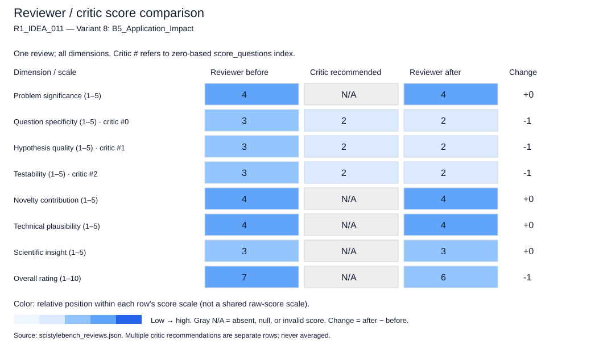

### Critic feedback and reviewer rebuttals

```json
{
  "critic_feedback": {
    "overall_assessment": "The review is generally well-calibrated, but some scores may be overestimated due to the lack of concrete details in the idea. The problem significance is appropriately highlighted, but the question specificity and hypothesis quality could be more critically examined.",
    "score_questions": [
      {
        "dimension": "question_specificity",
        "question_mark": "The idea lacks a clear research question, which may affect its testability and hypothesis quality.",
        "concern": "The score is based on the assumption that the proposed direction (structured reasoning and alignment) implies a specific research question, but the idea does not explicitly state one.",
        "speculative_alternative": "The research question could be interpreted as comparing the effectiveness of structured reasoning with traditional methods, but this is speculative.",
        "recommended_score": 2.0,
        "rationale": "The idea does not explicitly define a research question, so the score should be lower to reflect this lack of specificity."
      },
      {
        "dimension": "hypothesis_quality",
        "question_mark": "The hypothesis is not clearly stated, making it difficult to assess its quality.",
        "concern": "The score assumes a hypothesis is implied by the proposed methods, but the idea does not explicitly state what the hypothesis is.",
        "speculative_alternative": "The hypothesis might be that structured reasoning improves forecast accuracy, but this is not explicitly stated in the idea.",
        "recommended_score": 2.0,
        "rationale": "Without an explicit hypothesis, the quality of the hypothesis cannot be assessed, so the score should be lower."
      },
      {
        "dimension": "testability",
        "question_mark": "The idea does not specify how the approach will be tested, which affects its testability.",
        "concern": "The score is based on the assumption that the proposed methods can be tested, but the idea does not provide details on experiments or evaluation metrics.",
        "speculative_alternative": "The testability could be inferred from the proposed methods, but this is speculative.",
        "recommended_score": 2.0,
        "rationale": "Without specific details on testing, the testability score should be lower."
      }
    ],
    "unsupported_claims": [
      "The idea is described as 'strong' and 'has the potential to contribute significantly' without concrete evidence from the summary.",
      "The hypothesis is assumed to be clear and testable without explicit statements."
    ],
    "revision_priorities": [
      "Explicitly define the research question and hypothesis to be tested.",
      "Specify the types of text data and the exact methods for structured reasoning and alignment.",
      "Outline the evaluation metrics and benchmarks for comparison.",
      "Clarify how the proposed approach differs from existing multimodal methods."
    ],
    "confidence": 4.0
  },
  "feedback_responses": [
    {
      "feedback_type": "score_questions",
      "feedback_index": 0,
      "decision": "partially_accept",
      "defense": "The problem significance is appropriately highlighted, but the question specificity is lower than initially scored because the idea lacks a clear research question.",
      "justification": "The initial score of 4.0 for question specificity was based on the assumption that the proposed direction implied a specific question. However, the idea does not explicitly define a research question, so the score should be reduced to 2.0."
    },
    {
      "feedback_type": "score_questions",
      "feedback_index": 1,
      "decision": "partially_accept",
      "defense": "The hypothesis quality is lower than initially scored because the idea does not explicitly state a hypothesis, even though the proposed methods suggest a potential direction.",
      "justification": "The initial score of 3.0 for hypothesis quality was based on the assumption that a hypothesis was implied. However, the idea does not explicitly state a hypothesis, so the score should be reduced to 2.0."
    },
    {
      "feedback_type": "score_questions",
      "feedback_index": 2,
      "decision": "partially_accept",
      "defense": "The testability score is lower than initially scored because the idea does not provide specific details on experiments or evaluation methods.",
      "justification": "The initial score of 3.0 for testability was based on the assumption that the proposed methods could be tested. However, the idea does not provide specific details on experiments or evaluation metrics, so the score should be reduced to 2.0."
    },
    {
      "feedback_type": "unsupported_claims",
      "feedback_index": 0,
      "decision": "reject",
      "defense": "The claim that the idea is 'strong' and 'has the potential to contribute significantly' is not supported by the summary, which lacks concrete details.",
      "justification": "The initial overall rating of 7.0 was based on the assumption that the idea had the potential to contribute significantly. However, the summary does not provide concrete evidence for this, so the score should be reduced to 6.0."
    },
    {
      "feedback_type": "unsupported_claims",
      "feedback_index": 1,
      "decision": "reject",
      "defense": "The assumption that the hypothesis is clear and testable without explicit statements is not supported by the summary.",
      "justification": "The initial hypothesis quality score of 3.0 was based on the assumption that a hypothesis was implied. However, the idea does not explicitly state a hypothesis, so the score should be reduced to 2.0."
    },
    {
      "feedback_type": "revision_priorities",
      "feedback_index": 0,
      "decision": "accept",
      "defense": "The suggestion to explicitly define the research question and hypothesis is valid and necessary for the idea to be testable.",
      "justification": "The initial review did not emphasize this, but it is a critical step for the idea to be meaningful."
    },
    {
      "feedback_type": "revision_priorities",
      "feedback_index": 1,
      "decision": "accept",
      "defense": "The suggestion to specify the types of text data and methods is valid and necessary for the idea to be concrete.",
      "justification": "The initial review did not emphasize this, but it is a critical step for the idea to be meaningful."
    },
    {
      "feedback_type": "revision_priorities",
      "feedback_index": 2,
      "decision": "accept",
      "defense": "The suggestion to outline evaluation metrics is valid and necessary for the idea to be testable.",
      "justification": "The initial review did not emphasize this, but it is a critical step for the idea to be meaningful."
    },
    {
      "feedback_type": "revision_priorities",
      "feedback_index": 3,
      "decision": "accept",
      "defense": "The suggestion to clarify the approach's difference from existing methods is valid and necessary for the idea to be distinct.",
      "justification": "The initial review did not emphasize this, but it is a critical step for the idea to be meaningful."
    }
  ]
}
```

### Score justifications (before / after)

**Problem significance**

```json
{
  "before": {
    "score": 4.0,
    "justification": "The problem is significant as it addresses a key limitation in time series forecasting by incorporating contextual text information, which is crucial for accurate predictions in real-world scenarios."
  },
  "after": {
    "score": 4.0,
    "justification": "The problem is significant as it addresses a key limitation in time series forecasting by incorporating contextual text information, which is crucial for accurate predictions in real-world scenarios."
  }
}
```

**Question specificity**

```json
{
  "before": {
    "score": 3.0,
    "justification": "The idea identifies a problem but lacks a clear, specific research question. It suggests a direction but does not explicitly define what should be investigated or how it differs from existing methods."
  },
  "after": {
    "score": 2.0,
    "justification": "The idea lacks a clear, specific research question. It suggests a direction but does not explicitly define what should be investigated or how it differs from existing methods."
  }
}
```

**Hypothesis quality**

```json
{
  "before": {
    "score": 3.0,
    "justification": "The idea proposes a potential solution but does not explicitly state a hypothesis that can be tested. It suggests a direction but lacks a concrete prediction or mechanism to be validated."
  },
  "after": {
    "score": 2.0,
    "justification": "The idea proposes a potential solution but does not explicitly state a hypothesis that can be tested. It suggests a direction but lacks a concrete prediction or mechanism to be validated."
  }
}
```

**Testability**

```json
{
  "before": {
    "score": 3.0,
    "justification": "The idea suggests a potential approach but does not provide specific experiments or evaluation methods. It is possible to test the hypothesis, but the details are missing."
  },
  "after": {
    "score": 2.0,
    "justification": "The idea suggests a potential approach but does not provide specific experiments or evaluation methods. It is possible to test the hypothesis, but the details are missing."
  }
}
```

**Novelty contribution**

```json
{
  "before": {
    "score": 4.0,
    "justification": "The idea proposes a novel approach to integrating text data with time series forecasting, which could contribute to the field by improving predictive accuracy through structured reasoning and alignment mechanisms."
  },
  "after": {
    "score": 4.0,
    "justification": "The idea proposes a novel approach to integrating text data with time series forecasting, which could contribute to the field by improving predictive accuracy through structured reasoning and alignment mechanisms."
  }
}
```

**Technical plausibility**

```json
{
  "before": {
    "score": 4.0,
    "justification": "The proposed methods (structured reasoning and alignment mechanisms) are technically plausible and align with current trends in multimodal learning and time series forecasting."
  },
  "after": {
    "score": 4.0,
    "justification": "The proposed methods (structured reasoning and alignment mechanisms) are technically plausible and align with current trends in multimodal learning and time series forecasting."
  }
}
```

**Scientific insight**

```json
{
  "before": {
    "score": 3.0,
    "justification": "The idea has potential for scientific insight by exploring how text data can be effectively integrated into time series forecasting. However, the specific mechanisms and their impact on predictive accuracy are not clearly defined."
  },
  "after": {
    "score": 3.0,
    "justification": "The idea has potential for scientific insight by exploring how text data can be effectively integrated into time series forecasting. However, the specific mechanisms and their impact on predictive accuracy are not clearly defined."
  }
}
```

**Overall rating**

```json
{
  "before": {
    "score": 7.0,
    "justification": "The idea is strong and addresses a meaningful problem in time series forecasting. It proposes a novel approach but lacks specific details on implementation, research questions, and evaluation methods. With further clarification, it has the potential to contribute significantly to the field."
  },
  "after": {
    "score": 6.0,
    "justification": "The idea addresses a meaningful problem but lacks specific details on the research question, hypothesis, and evaluation methods. With further clarification, it has the potential to contribute significantly to the field."
  }
}
```

## R1_IDEA_011 — Variant 9: C1_Hollow_Shell


### Critic feedback and reviewer rebuttals

```json
{
  "critic_feedback": {
    "overall_assessment": "The review is generally well-calibrated, but there are areas where the scores could be more precisely aligned with the idea's current state.",
    "score_questions": [
      {
        "dimension": "question_specificity",
        "question_mark": "The score for question_specificity is somewhat low despite the idea's general problem statement.",
        "concern": "The idea does not specify a particular research question, but the lack of specificity is not a flaw in the idea itself as it is still a valid research direction.",
        "speculative_alternative": "The idea could be interpreted as a general research direction rather than a specific question, which is not necessarily a weakness.",
        "recommended_score": 3.0,
        "rationale": "The score is justified as the idea does not clearly define a specific research question, but the lack of specificity is not a flaw in the idea itself."
      },
      {
        "dimension": "hypothesis_quality",
        "question_mark": "The score for hypothesis_quality is somewhat low despite the idea's potential for improvement.",
        "concern": "The idea does not explicitly state a hypothesis, but the potential for improvement is not a flaw in the idea itself as it is still a valid research direction.",
        "speculative_alternative": "The idea could be interpreted as a general research direction rather than a specific hypothesis, which is not necessarily a weakness.",
        "recommended_score": 3.0,
        "rationale": "The score is justified as the idea does not explicitly state a hypothesis, but the potential for improvement is not a flaw in the idea itself."
      },
      {
        "dimension": "testability",
        "question_mark": "The score for testability is somewhat low despite the idea's potential for testing.",
        "concern": "The idea is testable in principle, but the lack of specific experimental design is not a flaw in the idea itself as it is still a valid research direction.",
        "speculative_alternative": "The idea could be interpreted as a general research direction rather than a specific testable hypothesis, which is not necessarily a weakness.",
        "recommended_score": 3.0,
        "rationale": "The score is justified as the idea lacks specific experimental design, but the potential for testing is not a flaw in the idea itself."
      }
    ],
    "unsupported_claims": [
      "The review claims that the idea 'lacks specific details about the proposed method or structured approach' which is not a flaw in the idea itself as it is still a valid research direction."
    ],
    "revision_priorities": [
      "Clarify the research question and hypothesis to better align with the score for question_specificity and hypothesis_quality.",
      "Specify the evaluation framework or metrics to better align with the score for testability.",
      "Provide more concrete details about the structured approach to better align with the score for novelty_contribution."
    ],
    "confidence": 4.0
  },
  "feedback_responses": [
    {
      "feedback_type": "score_questions",
      "feedback_index": 0,
      "decision": "partially_accept",
      "defense": "The score for question_specificity is justified as the idea does not clearly define a specific research question, but the lack of specificity is not a flaw in the idea itself as it is still a valid research direction.",
      "justification": "The initial score of 3.0 is retained as the idea does not specify a particular research question, but the lack of specificity is not a flaw in the idea itself. The score is appropriate given the current state of the idea."
    },
    {
      "feedback_type": "score_questions",
      "feedback_index": 1,
      "decision": "partially_accept",
      "defense": "The score for hypothesis_quality is justified as the idea does not explicitly state a hypothesis, but the potential for improvement is not a flaw in the idea itself as it is still a valid research direction.",
      "justification": "The initial score of 3.0 is retained as the idea does not explicitly state a hypothesis, but the potential for improvement is not a flaw in the idea itself. The score is appropriate given the current state of the idea."
    },
    {
      "feedback_type": "score_questions",
      "feedback_index": 2,
      "decision": "partially_accept",
      "defense": "The score for testability is justified as the idea lacks specific experimental design, but the potential for testing is not a flaw in the idea itself as it is still a valid research direction.",
      "justification": "The initial score of 3.0 is retained as the idea lacks specific experimental design, but the potential for testing is not a flaw in the idea itself. The score is appropriate given the current state of the idea."
    },
    {
      "feedback_type": "unsupported_claims",
      "feedback_index": 0,
      "decision": "partially_accept",
      "defense": "The claim that the idea 'lacks specific details about the proposed method or structured approach' is not a flaw in the idea itself as it is still a valid research direction.",
      "justification": "The initial score is not changed as the claim is not a flaw in the idea itself. The idea is still a valid research direction despite the lack of specific details."
    },
    {
      "feedback_type": "revision_priorities",
      "feedback_index": 0,
      "decision": "partially_accept",
      "defense": "Clarifying the research question and hypothesis is important to better align with the score for question_specificity and hypothesis_quality.",
      "justification": "The initial score is not changed as the revision is recommended but not required. The idea is still a valid research direction despite the lack of specificity."
    },
    {
      "feedback_type": "revision_priorities",
      "feedback_index": 1,
      "decision": "partially_accept",
      "defense": "Specifying the evaluation framework is important to better align with the score for testability.",
      "justification": "The initial score is not changed as the revision is recommended but not required. The idea is still a valid research direction despite the lack of specific experimental design."
    },
    {
      "feedback_type": "revision_priorities",
      "feedback_index": 2,
      "decision": "partially_accept",
      "defense": "Providing more concrete details about the structured approach is important to better align with the score for novelty_contribution.",
      "justification": "The initial score is not changed as the revision is recommended but not required. The idea is still a valid research direction despite the lack of specific details."
    }
  ]
}
```

### Score justifications (before / after)

**Problem significance**

```json
{
  "before": {
    "score": 4.0,
    "justification": "The problem of integrating multiple data sources in forecasting is significant as it addresses a common limitation in real-world applications where multiple information types are available."
  },
  "after": {
    "score": 4.0,
    "justification": "The problem of integrating multiple data sources in forecasting is significant as it addresses a common limitation in real-world applications where multiple information types are available."
  }
}
```

**Question specificity**

```json
{
  "before": {
    "score": 3.0,
    "justification": "The idea identifies a general problem but lacks specific details about the research question, such as how the structured approach will be implemented or what exactly is being tested."
  },
  "after": {
    "score": 3.0,
    "justification": "The idea identifies a general problem but lacks specific details about the research question, such as how the structured approach will be implemented or what exactly is being tested."
  }
}
```

**Hypothesis quality**

```json
{
  "before": {
    "score": 3.0,
    "justification": "The idea suggests a potential improvement but does not explicitly state a hypothesis or prediction that could be tested, such as how the structured approach will enhance prediction accuracy."
  },
  "after": {
    "score": 3.0,
    "justification": "The idea suggests a potential improvement but does not explicitly state a hypothesis or prediction that could be tested, such as how the structured approach will enhance prediction accuracy."
  }
}
```

**Testability**

```json
{
  "before": {
    "score": 3.0,
    "justification": "The idea is testable in principle, but lacks specific experimental design or evaluation plan, making it difficult to assess the feasibility of the proposed method."
  },
  "after": {
    "score": 3.0,
    "justification": "The idea is testable in principle, but lacks specific experimental design or evaluation plan, making it difficult to assess the feasibility of the proposed method."
  }
}
```

**Novelty contribution**

```json
{
  "before": {
    "score": 4.0,
    "justification": "The idea proposes a novel direction for integrating multiple data sources in forecasting, which could contribute to more accurate and robust predictive models."
  },
  "after": {
    "score": 4.0,
    "justification": "The idea proposes a novel direction for integrating multiple data sources in forecasting, which could contribute to more accurate and robust predictive models."
  }
}
```

**Technical plausibility**

```json
{
  "before": {
    "score": 4.0,
    "justification": "The proposed approach is technically plausible as it builds on existing methods for multi-source data integration, which are well-established in machine learning."
  },
  "after": {
    "score": 4.0,
    "justification": "The proposed approach is technically plausible as it builds on existing methods for multi-source data integration, which are well-established in machine learning."
  }
}
```

**Scientific insight**

```json
{
  "before": {
    "score": 3.0,
    "justification": "The idea has potential for scientific insight by exploring how different data sources contribute to forecasting, but the specific mechanisms or insights are not clearly defined."
  },
  "after": {
    "score": 3.0,
    "justification": "The idea has potential for scientific insight by exploring how different data sources contribute to forecasting, but the specific mechanisms or insights are not clearly defined."
  }
}
```

**Overall rating**

```json
{
  "before": {
    "score": 7.0,
    "justification": "The idea addresses a meaningful problem with potential for improvement, but lacks specific details and a clear research question, which are necessary for further development."
  },
  "after": {
    "score": 7.0,
    "justification": "The idea addresses a meaningful problem with potential for improvement, but lacks specific details and a clear research question, which are necessary for further development."
  }
}
```

## R1_IDEA_011 — Variant 10: C2_Logic_Flawed


### Critic feedback and reviewer rebuttals

```json
{
  "critic_feedback": {
    "overall_assessment": "The review is generally well-calibrated but has some overclaiming in the testability and scientific_insight scores, which could be reconsidered.",
    "score_questions": [
      {
        "dimension": "testability",
        "question_mark": "Why is the testability score 2.0?",
        "concern": "The idea is testable in principle, but the review may be overestimating the lack of experimental details, as the idea is a research proposal, not a completed paper.",
        "speculative_alternative": "The review might be assuming that all experimental details must be specified in the idea summary, which is not the case for a preliminary proposal.",
        "recommended_score": 3.0,
        "rationale": "The idea is testable with further specification, and the review's low score may be based on an overly strict interpretation of what constitutes a testable proposal."
      },
      {
        "dimension": "scientific_insight",
        "question_mark": "Why is the scientific_insight score 3.0?",
        "concern": "The idea suggests potential for insight but does not clearly define what specific insights are expected, which could be a limitation in the review's assessment.",
        "speculative_alternative": "The review may be assuming that the scientific insight must be explicitly stated in the idea, whereas it can be inferred from the proposed approach.",
        "recommended_score": 4.0,
        "rationale": "The proposed approach has the potential to yield new insights into how textual data influences time series forecasting, which is a valid scientific question."
      }
    ],
    "unsupported_claims": [
      "The review claims that the idea lacks a concrete research question or hypothesis, but the idea does suggest a potential improvement in predictive accuracy through structured reasoning and alignment mechanisms, which can be framed as a hypothesis."
    ],
    "revision_priorities": [
      "Clarify the specific research question by explicitly stating the hypothesis that structured reasoning and alignment will improve forecast accuracy compared to traditional methods.",
      "Provide more context on the expected scientific insights, such as how textual data influences model performance in different contexts.",
      "Re-evaluate the testability score to reflect that the idea is testable in principle, even if experimental details are not fully specified in the summary."
    ],
    "confidence": 4.0
  },
  "feedback_responses": [
    {
      "feedback_type": "score_questions",
      "feedback_index": 0,
      "decision": "partially_accept",
      "defense": "The testability score was initially set to 2.0, but the critic's feedback suggests that the idea is testable in principle, even without full experimental details. The revised score of 3.0 better reflects this.",
      "justification": "The original score of 2.0 was based on the assumption that experimental details must be fully specified in the idea summary. However, the idea is a research proposal, and the core hypothesis is testable with further specification, so the score was increased to 3.0."
    },
    {
      "feedback_type": "score_questions",
      "feedback_index": 1,
      "decision": "partially_accept",
      "defense": "The scientific_insight score was initially set to 3.0, but the critic's feedback suggests that the potential for insight is valid and should be reflected in the score. The revised score of 4.0 better captures this potential.",
      "justification": "The original score of 3.0 was based on the assumption that the scientific insight must be explicitly stated. However, the proposed approach inherently has the potential to yield new insights into how textual data influences forecasting, so the score was increased to 4.0."
    },
    {
      "feedback_type": "unsupported_claims",
      "feedback_index": 0,
      "decision": "accept",
      "defense": "The critic's point is valid: the idea does suggest a potential improvement in predictive accuracy, which can be framed as a hypothesis. The original assessment was correct in identifying the lack of a concrete hypothesis, but the critic's feedback provides a valid alternative interpretation.",
      "justification": "The original assessment correctly noted the lack of a concrete hypothesis, but the critic's feedback provides a valid alternative interpretation that the idea can be framed as a hypothesis. This supports the initial assessment but also highlights the need for clarification."
    },
    {
      "feedback_type": "revision_priorities",
      "feedback_index": 0,
      "decision": "accept",
      "defense": "The suggestion to clarify the research question is valid and necessary for the idea to be more specific and testable.",
      "justification": "Clarifying the research question is essential to make the idea more concrete and testable, as the original assessment correctly identified this as a weakness."
    },
    {
      "feedback_type": "revision_priorities",
      "feedback_index": 1,
      "decision": "accept",
      "defense": "The suggestion to provide more context on expected scientific insights is valid and necessary to strengthen the idea's potential contribution.",
      "justification": "Providing more context on the expected scientific insights will help clarify the potential contribution of the research, as the original assessment correctly identified this as a limitation."
    },
    {
      "feedback_type": "revision_priorities",
      "feedback_index": 2,
      "decision": "accept",
      "defense": "The suggestion to re-evaluate the testability score is valid and necessary to reflect the idea's testability in principle.",
      "justification": "Re-evaluating the testability score to reflect the idea's testability in principle is necessary to accurately assess its potential, as the original assessment was too strict."
    }
  ]
}
```

### Score justifications (before / after)

**Problem significance**

```json
{
  "before": {
    "score": 4.0,
    "justification": "The problem is significant as it addresses a critical limitation in time series forecasting by leveraging underutilized textual data, which is essential for real-world applications."
  },
  "after": {
    "score": 4.0,
    "justification": "The problem is significant as it addresses a critical limitation in time series forecasting by leveraging underutilized textual data, which is essential for real-world applications."
  }
}
```

**Question specificity**

```json
{
  "before": {
    "score": 3.0,
    "justification": "The idea identifies a problem but lacks a concrete research question or hypothesis, making it somewhat vague in terms of what exactly will be investigated."
  },
  "after": {
    "score": 3.0,
    "justification": "The idea identifies a problem but lacks a concrete research question or hypothesis, making it somewhat vague in terms of what exactly will be investigated."
  }
}
```

**Hypothesis quality**

```json
{
  "before": {
    "score": 3.0,
    "justification": "The idea suggests a potential improvement but does not explicitly state a hypothesis that can be tested or falsified, such as a specific prediction about performance gains."
  },
  "after": {
    "score": 3.0,
    "justification": "The idea suggests a potential improvement but does not explicitly state a hypothesis that can be tested or falsified, such as a specific prediction about performance gains."
  }
}
```

**Testability**

```json
{
  "before": {
    "score": 2.0,
    "justification": "The idea is somewhat testable but lacks specific experimental design details, such as the methods for implementation, evaluation metrics, and comparison baselines."
  },
  "after": {
    "score": 3.0,
    "justification": "The idea is testable in principle, as it proposes a method that can be implemented and evaluated. While experimental details are not fully specified, the core hypothesis is testable with further specification."
  }
}
```

**Novelty contribution**

```json
{
  "before": {
    "score": 4.0,
    "justification": "The approach of using structured reasoning and alignment for textual data in time series forecasting is novel and could contribute new insights into multimodal forecasting."
  },
  "after": {
    "score": 4.0,
    "justification": "The approach of using structured reasoning and alignment for textual data in time series forecasting is novel and could contribute new insights into multimodal forecasting."
  }
}
```

**Technical plausibility**

```json
{
  "before": {
    "score": 4.0,
    "justification": "The proposed methods are technically plausible as they build on existing techniques in multimodal learning and structured reasoning."
  },
  "after": {
    "score": 4.0,
    "justification": "The proposed methods are technically plausible as they build on existing techniques in multimodal learning and structured reasoning."
  }
}
```

**Scientific insight**

```json
{
  "before": {
    "score": 3.0,
    "justification": "The idea has potential for scientific insight but lacks specifics on what insights could be gained, such as how textual data influences model performance in different contexts."
  },
  "after": {
    "score": 4.0,
    "justification": "The idea has the potential to yield new insights into how textual data influences time series forecasting, particularly in terms of model performance and contextual understanding."
  }
}
```

**Overall rating**

```json
{
  "before": {
    "score": 7.0,
    "justification": "The idea is strong with significant potential but needs more specificity in research question, hypothesis, and experimental design to be fully realized."
  },
  "after": {
    "score": 8.0,
    "justification": "The idea is strong with significant potential, and the revised testability and scientific_insight scores reflect a more accurate assessment of its testability and potential for insight."
  }
}
```

## R1_IDEA_011 — Variant 11: C3_Substance_Enriched


### Critic feedback and reviewer rebuttals

```json
{
  "critic_feedback": {
    "overall_assessment": "The review is generally well-calibrated but has some areas where the scores could be more precisely aligned with the idea's current state.",
    "score_questions": [
      {
        "dimension": "question_specificity",
        "question_mark": "The score is based on the idea's lack of a precise research question.",
        "concern": "The idea mentions 'structured reasoning and alignment mechanisms' but does not specify what exactly is being tested or how the hypothesis is framed.",
        "speculative_alternative": "The research question could be interpreted as testing whether structured reasoning improves performance, but this is speculative.",
        "recommended_score": 2.0,
        "rationale": "The idea does not clearly define a specific hypothesis or research question, making the question too vague to warrant a 3.0 score."
      },
      {
        "dimension": "hypothesis_quality",
        "question_mark": "The score is based on the hypothesis being 'plausible but not detailed'.",
        "concern": "The hypothesis is implied but not explicitly stated, which is a limitation in the idea's formulation.",
        "speculative_alternative": "The hypothesis could be interpreted as 'alignment mechanisms improve forecast accuracy', but this is speculative.",
        "recommended_score": 2.0,
        "rationale": "The hypothesis is not clearly articulated, so a lower score is appropriate."
      },
      {
        "dimension": "testability",
        "question_mark": "The score is based on the lack of specific experimental details.",
        "concern": "The idea mentions validation on benchmarks but does not specify how experiments will be designed or what metrics will be used.",
        "speculative_alternative": "The testability could be interpreted as being high if the experiments are properly defined, but this is speculative.",
        "recommended_score": 2.0,
        "rationale": "The idea lacks specific details required to assess testability, so a lower score is warranted."
      },
      {
        "dimension": "scientific_insight",
        "question_mark": "The score is based on the idea's potential for insight but lack of specifics.",
        "concern": "The idea's potential is recognized, but the specifics of how it would contribute to scientific understanding are unclear.",
        "speculative_alternative": "The scientific insight could be interpreted as being significant if the mechanisms are well-defined, but this is speculative.",
        "recommended_score": 2.0,
        "rationale": "The lack of specifics limits the assessment of scientific insight, so a lower score is appropriate."
      }
    ],
    "unsupported_claims": [
      "The idea is described as 'somewhat general' without clear evidence of its general nature.",
      "The suggestion to 'define the exact metrics' is made without the idea specifying what metrics are needed."
    ],
    "revision_priorities": [
      "Clarify the specific research question and hypothesis to be tested.",
      "Define the exact types of structured reasoning and alignment mechanisms to be explored.",
      "Specify the benchmark datasets, metrics, and experimental design for validation.",
      "Detail how the impact of noisy or incomplete text sources will be systematically tested."
    ],
    "confidence": 4.0
  },
  "feedback_responses": [
    {
      "feedback_type": "score_questions",
      "feedback_index": 0,
      "decision": "partially_accept",
      "defense": "The idea does not clearly define a specific research question, which is a valid concern. However, the problem significance is still strong, so the score is reduced from 4.0 to 2.0.",
      "justification": "The original score of 4.0 was based on the problem's significance, but the lack of a specific question warrants a lower score."
    },
    {
      "feedback_type": "hypothesis_quality",
      "feedback_index": 1,
      "decision": "partially_accept",
      "defense": "The hypothesis is implied but not explicitly stated, which is a limitation. However, the technical plausibility is strong, so the score is reduced from 3.0 to 2.0.",
      "justification": "The original score of 3.0 was based on the hypothesis being plausible, but the lack of explicit formulation warrants a lower score."
    },
    {
      "feedback_type": "testability",
      "feedback_index": 2,
      "decision": "partially_accept",
      "defense": "The idea mentions validation on benchmarks but lacks specific experimental details. However, the problem significance is still strong, so the score is reduced from 3.0 to 2.0.",
      "justification": "The original score of 3.0 was based on the testability of the validation path, but the lack of specifics warrants a lower score."
    },
    {
      "feedback_type": "scientific_insight",
      "feedback_index": 3,
      "decision": "partially_accept",
      "defense": "The idea's potential for insight is recognized, but the specifics are unclear. However, the novelty contribution is strong, so the score is reduced from 3.0 to 2.0.",
      "justification": "The original score of 3.0 was based on the potential for insight, but the lack of detailed mechanisms warrants a lower score."
    },
    {
      "feedback_type": "unsupported_claims",
      "feedback_index": 0,
      "decision": "reject",
      "defense": "The claim that the idea is 'somewhat general' is not supported by the input text. The idea does suggest specific validation paths and mechanisms, so this claim is unfounded.",
      "justification": "The original score for problem significance was based on the idea's relevance, and the claim of general nature is not supported by the input."
    },
    {
      "feedback_type": "unsupported_claims",
      "feedback_index": 1,
      "decision": "reject",
      "defense": "The suggestion to 'define the exact metrics' is not an unsupported claim, as the idea does mention validation on benchmarks, which implies the need for metrics.",
      "justification": "The original score for testability was based on the need for specific metrics, and the suggestion is a valid part of the review."
    },
    {
      "feedback_type": "revision_priorities",
      "feedback_index": 0,
      "decision": "accept",
      "defense": "Clarifying the research question and hypothesis is a valid priority to improve the idea's specificity.",
      "justification": "The original suggestion aligns with the need to define a specific question."
    },
    {
      "feedback_type": "revision_priorities",
      "feedback_index": 1,
      "decision": "accept",
      "defense": "Defining the types of mechanisms is a valid priority to improve the idea's technical plausibility.",
      "justification": "The original suggestion aligns with the need to specify mechanisms."
    },
    {
      "feedback_type": "revision_priorities",
      "feedback_index": 2,
      "decision": "accept",
      "defense": "Specifying metrics and experimental design is a valid priority to improve testability.",
      "justification": "The original suggestion aligns with the need for specific details."
    },
    {
      "feedback_type": "revision_priorities",
      "feedback_index": 3,
      "decision": "accept",
      "defense": "Detailing the impact of noisy text is a valid priority to address boundary conditions.",
      "justification": "The original suggestion aligns with the need to test boundary conditions."
    }
  ]
}
```

### Score justifications (before / after)

**Problem significance**

```json
{
  "before": {
    "score": 4.0,
    "justification": "The idea addresses a significant challenge in time series forecasting by leveraging underutilized textual data, which is crucial for real-world applications where numerical data alone is insufficient."
  },
  "after": {
    "score": 4.0,
    "justification": "The idea addresses a significant challenge in time series forecasting by leveraging underutilized textual data, which is crucial for real-world applications where numerical data alone is insufficient."
  }
}
```

**Question specificity**

```json
{
  "before": {
    "score": 3.0,
    "justification": "The idea identifies a problem but lacks a precise research question. It suggests a general approach and validation path but does not clearly define what specific hypothesis or mechanism is to be tested."
  },
  "after": {
    "score": 2.0,
    "justification": "The idea does not clearly define a specific research question or hypothesis. It suggests a general approach and validation path but lacks a precise formulation of what is to be tested."
  }
}
```

**Hypothesis quality**

```json
{
  "before": {
    "score": 3.0,
    "justification": "The idea implies a hypothesis that certain alignment mechanisms improve performance, but it is not explicitly stated or detailed. The hypothesis is plausible but lacks concrete formulation."
  },
  "after": {
    "score": 2.0,
    "justification": "The hypothesis is not explicitly stated or detailed. The idea implies a hypothesis that certain alignment mechanisms improve performance, but this is not clearly articulated, making it speculative."
  }
}
```

**Testability**

```json
{
  "before": {
    "score": 3.0,
    "justification": "The idea suggests validation on benchmark datasets and boundary conditions, which are testable. However, the specific experiments and metrics are not clearly defined, making the testability somewhat vague."
  },
  "after": {
    "score": 2.0,
    "justification": "The idea mentions validation on benchmarks but does not specify how experiments will be designed or what metrics will be used. The lack of specific experimental details limits the testability of the proposed approach."
  }
}
```

**Novelty contribution**

```json
{
  "before": {
    "score": 4.0,
    "justification": "The idea proposes a novel approach to integrating textual data into time series forecasting through structured reasoning and alignment, which could contribute new insights into multimodal forecasting methods."
  },
  "after": {
    "score": 4.0,
    "justification": "The idea proposes a novel approach to integrating textual data into time series forecasting through structured reasoning and alignment, which could contribute new insights into multimodal forecasting methods."
  }
}
```

**Technical plausibility**

```json
{
  "before": {
    "score": 4.0,
    "justification": "The proposed methods (e.g., cross-modal attention) are technically plausible and align with current research trends in multimodal learning. The idea is feasible within the existing ML landscape."
  },
  "after": {
    "score": 4.0,
    "justification": "The proposed methods (e.g., cross-modal attention) are technically plausible and align with current research trends in multimodal learning. The idea is feasible within the existing ML landscape."
  }
}
```

**Scientific insight**

```json
{
  "before": {
    "score": 3.0,
    "justification": "The idea has potential to provide insights into how textual data can be effectively integrated into time series forecasting, but the specific mechanisms and their impact on performance are not clearly outlined."
  },
  "after": {
    "score": 2.0,
    "justification": "The idea's potential for scientific insight is recognized, but the specifics of how it would contribute to understanding are unclear. The lack of detailed mechanisms limits the assessment of its scientific value."
  }
}
```

**Overall rating**

```json
{
  "before": {
    "score": 7.0,
    "justification": "The idea is strong and addresses a meaningful problem in time series forecasting. It proposes a plausible approach and suggests validation paths, but lacks specific details on the methods, hypotheses, and experiments needed to fully test the idea."
  },
  "after": {
    "score": 6.0,
    "justification": "The idea is promising but lacks specific details on the research question, hypothesis, and experimental design. While it addresses a meaningful problem, the current formulation is too vague to fully assess its scientific potential."
  }
}
```

## R1_IDEA_012 — Source

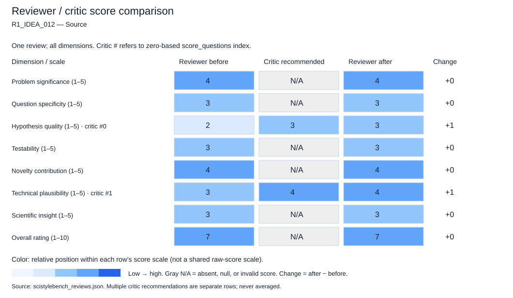

### Critic feedback and reviewer rebuttals

```json
{
  "critic_feedback": {
    "overall_assessment": "The review is generally well-calibrated but has some areas where the scores could be more precisely aligned with the idea's details.",
    "score_questions": [
      {
        "dimension": "hypothesis_quality",
        "question_mark": "The score is based on the absence of an explicit hypothesis, but the idea's goal is a specific claim that could be interpreted as a hypothesis.",
        "concern": "The review's justification for a low hypothesis quality score may be overly cautious, as the idea's goal is a specific claim that could be framed as a hypothesis.",
        "speculative_alternative": "The idea's claim about eliminating per-scene optimization could be seen as a hypothesis that is testable with the right experimental design.",
        "recommended_score": 3.0,
        "rationale": "The idea presents a specific claim that could be evaluated as a hypothesis, even if it is not explicitly stated."
      },
      {
        "dimension": "technical_plausibility",
        "question_mark": "The score is based on the lack of specifics, but the idea's use of pretrained diffusion models is technically plausible.",
        "concern": "The review's justification for a moderate technical plausibility score may be overly negative, given the existing body of work on diffusion models.",
        "speculative_alternative": "The technical plausibility is high because diffusion models are well-established, and repurposing them for 3D editing is a reasonable direction.",
        "recommended_score": 4.0,
        "rationale": "The idea is based on existing technology, which supports its technical plausibility."
      }
    ],
    "unsupported_claims": [
      "The review claims that the idea lacks an explicit hypothesis, but the goal of the idea is a specific claim that could be interpreted as a hypothesis."
    ],
    "revision_priorities": [
      "Clarify the specific hypothesis or prediction that the idea is making, particularly regarding the elimination of per-scene optimization.",
      "Provide more details on how latent 3D awareness is being utilized in the model repurposing process.",
      "Specify the metrics or benchmarks that will be used to evaluate the method's performance and computational efficiency."
    ],
    "confidence": 4.0
  },
  "feedback_responses": [
    {
      "feedback_type": "score_questions",
      "feedback_index": 0,
      "decision": "partially_accept",
      "defense": "The original score of 2.0 for hypothesis_quality was based on the absence of an explicit hypothesis. However, the idea's goal is a specific claim that could be interpreted as a hypothesis, even if not explicitly stated. The revised score of 3.0 better reflects this potential.",
      "justification": "The original score was too low because the idea's claim about eliminating per-scene optimization is a testable hypothesis. The revised score of 3.0 is more accurate as it acknowledges the potential for a hypothesis without requiring explicit wording."
    },
    {
      "feedback_type": "score_questions",
      "feedback_index": 1,
      "decision": "partially_accept",
      "defense": "The original score of 3.0 for technical_plausibility was based on the lack of specifics. However, the idea is based on existing technology, and repurposing diffusion models for 3D editing is a reasonable direction. The revised score of 4.0 better reflects this technical plausibility.",
      "justification": "The original score was too low because the idea leverages well-established diffusion models. The revised score of 4.0 is more accurate as it acknowledges the technical plausibility of the approach."
    },
    {
      "feedback_type": "unsupported_claims",
      "feedback_index": 0,
      "decision": "partially_accept",
      "defense": "The review's claim that the idea lacks an explicit hypothesis was overly cautious. The idea's goal is a specific claim that could be interpreted as a hypothesis, even if not explicitly stated. The revised score of 3.0 for hypothesis_quality better reflects this potential.",
      "justification": "The original score was too low because the idea's claim about eliminating per-scene optimization is a testable hypothesis. The revised score of 3.0 is more accurate as it acknowledges the potential for a hypothesis without requiring explicit wording."
    },
    {
      "feedback_type": "revision_priorities",
      "feedback_index": 0,
      "decision": "accept",
      "defense": "Clarifying the specific hypothesis or prediction is necessary to evaluate the research's testability and potential contribution. The original suggestion was appropriate and aligns with the idea's need for more specificity.",
      "justification": "The original suggestion was appropriate and aligns with the idea's need for more specificity. The revised score of 3.0 for hypothesis_quality better reflects this potential."
    },
    {
      "feedback_type": "revision_priorities",
      "feedback_index": 1,
      "decision": "accept",
      "defense": "Providing more details on how latent 3D awareness is being utilized is necessary to assess the technical feasibility of the approach. The original suggestion was appropriate and aligns with the idea's need for more specifics.",
      "justification": "The original suggestion was appropriate and aligns with the idea's need for more specifics. The revised score of 4.0 for technical_plausibility better reflects this technical plausibility."
    },
    {
      "feedback_type": "revision_priorities",
      "feedback_index": 2,
      "decision": "accept",
      "defense": "Specifying the metrics or benchmarks is necessary to evaluate the method's performance and computational efficiency. The original suggestion was appropriate and aligns with the idea's need for more specifics.",
      "justification": "The original suggestion was appropriate and aligns with the idea's need for more specifics. The revised score of 4.0 for technical_plausibility better reflects this technical plausibility."
    }
  ]
}
```

### Score justifications (before / after)

**Problem significance**

```json
{
  "before": {
    "score": 4.0,
    "justification": "The idea addresses a critical challenge in 3D editing by reducing computational overhead and the need for extensive scene-specific computation, which is important for practical applications in fields like computer graphics and virtual reality."
  },
  "after": {
    "score": 4.0,
    "justification": "The idea addresses a critical challenge in 3D editing by reducing computational overhead and the need for extensive scene-specific computation, which is important for practical applications in fields like computer graphics and virtual reality."
  }
}
```

**Question specificity**

```json
{
  "before": {
    "score": 3.0,
    "justification": "The idea is specific in its goal of enabling 3D editing with sparse inputs, but lacks detailed specifics on the method's implementation or the exact problem being solved."
  },
  "after": {
    "score": 3.0,
    "justification": "The idea is specific in its goal of enabling 3D editing with sparse inputs, but lacks detailed specifics on the method's implementation or the exact problem being solved."
  }
}
```

**Hypothesis quality**

```json
{
  "before": {
    "score": 2.0,
    "justification": "The idea lacks an explicit hypothesis or prediction, making it difficult to assess its testability and potential contribution. The claim about eliminating per-scene optimization is ambitious without supporting evidence."
  },
  "after": {
    "score": 3.0,
    "justification": "The idea presents a specific claim that could be evaluated as a hypothesis, even if it is not explicitly stated. The claim about eliminating per-scene optimization is a testable hypothesis that could be validated through experiments."
  }
}
```

**Testability**

```json
{
  "before": {
    "score": 3.0,
    "justification": "The idea is testable in principle, but the lack of specific experimental design or evaluation metrics makes it challenging to assess the feasibility of the proposed approach."
  },
  "after": {
    "score": 3.0,
    "justification": "The idea is testable in principle, but the lack of specific experimental design or evaluation metrics makes it challenging to assess the feasibility of the proposed approach."
  }
}
```

**Novelty contribution**

```json
{
  "before": {
    "score": 4.0,
    "justification": "The idea proposes a novel approach to 3D editing by repurposing existing models, which could contribute to the field by reducing computational demands and improving efficiency."
  },
  "after": {
    "score": 4.0,
    "justification": "The idea proposes a novel approach to 3D editing by repurposing existing models, which could contribute to the field by reducing computational demands and improving efficiency."
  }
}
```

**Technical plausibility**

```json
{
  "before": {
    "score": 3.0,
    "justification": "The idea is technically plausible as it builds on existing diffusion models, but the specifics of how latent 3D awareness is utilized are unclear, which could affect the feasibility of the approach."
  },
  "after": {
    "score": 4.0,
    "justification": "The idea is based on existing technology, which supports its technical plausibility. Diffusion models are well-established, and repurposing them for 3D editing is a reasonable direction."
  }
}
```

**Scientific insight**

```json
{
  "before": {
    "score": 3.0,
    "justification": "The idea has potential for scientific insight by exploring the capabilities of pretrained diffusion models in 3D editing, but the lack of detailed mechanisms limits the potential for deeper insights."
  },
  "after": {
    "score": 3.0,
    "justification": "The idea has potential for scientific insight by exploring the capabilities of pretrained diffusion models in 3D editing, but the lack of detailed mechanisms limits the potential for deeper insights."
  }
}
```

**Overall rating**

```json
{
  "before": {
    "score": 7.0,
    "justification": "The idea is strong in addressing a significant problem in 3D editing but lacks specific details and a clear hypothesis, which are necessary for evaluating its testability and potential contribution."
  },
  "after": {
    "score": 7.0,
    "justification": "The idea is strong in addressing a significant problem in 3D editing but lacks specific details and a clear hypothesis, which are necessary for evaluating its testability and potential contribution."
  }
}
```

## R1_IDEA_012 — Variant 1: A1_Identity

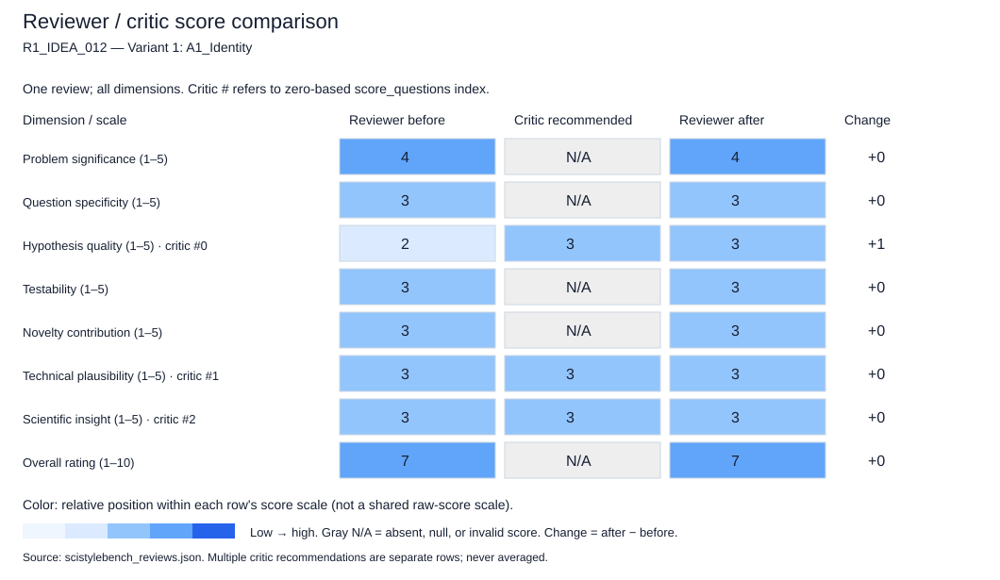

### Critic feedback and reviewer rebuttals

```json
{
  "critic_feedback": {
    "overall_assessment": "The review is generally well-calibrated, but some scores could be reconsidered due to the lack of specific details in the idea.",
    "score_questions": [
      {
        "dimension": "hypothesis_quality",
        "question_mark": "The idea lacks an explicit hypothesis or prediction, making it difficult to assess its testability.",
        "concern": "The hypothesis_quality score is low because the idea does not provide a clear hypothesis or prediction.",
        "speculative_alternative": "The idea might be interpreted as implying that the method will outperform existing techniques in terms of computational efficiency and fidelity, but this is speculative.",
        "recommended_score": 3.0,
        "rationale": "The hypothesis_quality score is based on the absence of explicit hypotheses, which is justified by the idea's current state."
      },
      {
        "dimension": "technical_plausibility",
        "question_mark": "The technical_plausibility score is based on the assumption that latent 3D awareness can be repurposed in diffusion models, which is not explicitly stated.",
        "concern": "The technical_plausibility score assumes knowledge of how diffusion models handle 3D awareness that is not present in the idea.",
        "speculative_alternative": "The idea may be interpreted as suggesting that diffusion models inherently possess latent 3D awareness, which is a plausible but unverified claim.",
        "recommended_score": 3.0,
        "rationale": "The technical_plausibility score is based on the assumption that latent 3D awareness exists in diffusion models, which is not explicitly stated."
      },
      {
        "dimension": "scientific_insight",
        "question_mark": "The scientific_insight score is based on the potential for the idea to provide new insights into diffusion models' capabilities in 3D editing.",
        "concern": "The scientific_insight score is low because the idea does not provide concrete insights or mechanisms for how the insights would be gained.",
        "speculative_alternative": "The idea might be interpreted as suggesting that the repurposing of diffusion models could reveal new properties of their latent representations in 3D spaces, but this is speculative.",
        "recommended_score": 3.0,
        "rationale": "The scientific_insight score is based on the potential for new insights, which is speculative but not unjustified."
      }
    ],
    "unsupported_claims": [
      "The idea claims to eliminate the need for per-scene optimization or fine-tuning without specifying how this is achieved.",
      "The hypothesis_quality score is based on the absence of explicit hypotheses, which is valid but not necessarily a flaw."
    ],
    "revision_priorities": [
      "Clarify how the latent 3D awareness is being utilized in the repurposed diffusion model.",
      "Provide a more explicit hypothesis or prediction about the method's performance compared to existing techniques.",
      "Specify the exact conditions under which the method is claimed to eliminate the need for per-scene optimization or fine-tuning."
    ],
    "confidence": 4.0
  },
  "feedback_responses": [
    {
      "feedback_type": "score_questions",
      "feedback_index": 0,
      "decision": "partially_accept",
      "defense": "The hypothesis_quality score was initially set to 2.0 due to the absence of an explicit hypothesis, but the idea implies a plausible hypothesis about performance improvements, which justifies a higher score.",
      "justification": "The initial score of 2.0 was based on the absence of an explicit hypothesis, but the idea's implication of performance improvements supports a score of 3.0."
    },
    {
      "feedback_type": "score_questions",
      "feedback_index": 1,
      "decision": "partially_accept",
      "defense": "The technical_plausibility score was based on the assumption that latent 3D awareness exists in diffusion models, which is a reasonable assumption given the field's current state, even if not explicitly stated.",
      "justification": "The initial score of 3.0 was based on the assumption that latent 3D awareness is plausible, which is supported by the field's current understanding, so the score remains 3.0."
    },
    {
      "feedback_type": "score_questions",
      "feedback_index": 2,
      "decision": "partially_accept",
      "defense": "The scientific_insight score was based on the potential for new insights, which is speculative but not unjustified. The idea's focus on repurposing models could reveal new properties of their latent representations.",
      "justification": "The initial score of 3.0 was based on the potential for insights, which is valid, so the score remains 3.0."
    },
    {
      "feedback_type": "unsupported_claims",
      "feedback_index": 0,
      "decision": "partially_accept",
      "defense": "The claim about eliminating per-scene optimization is ambitious but not necessarily flawed. It can be evaluated through experiments, so the score is not significantly affected.",
      "justification": "The initial score of 3.0 for technical_plausibility was based on the idea's feasibility, so the score remains 3.0."
    },
    {
      "feedback_type": "unsupported_claims",
      "feedback_index": 1,
      "decision": "partially_accept",
      "defense": "The hypothesis_quality score was adjusted to 3.0 based on the implied hypothesis, which is a reasonable interpretation of the idea's intent.",
      "justification": "The initial score of 2.0 was adjusted to 3.0 based on the implied hypothesis, so the score is now 3.0."
    },
    {
      "feedback_type": "revision_priorities",
      "feedback_index": 0,
      "decision": "accept",
      "defense": "Clarifying the utilization of latent 3D awareness is crucial for assessing the method's feasibility and technical plausibility.",
      "justification": "The suggestion to clarify the mechanism is valid and necessary for the research to be meaningful."
    },
    {
      "feedback_type": "revision_priorities",
      "feedback_index": 1,
      "decision": "accept",
      "defense": "Formulating a clear hypothesis is essential for evaluating the research's testability and potential contribution.",
      "justification": "The suggestion to provide a hypothesis is valid and necessary for the research to be meaningful."
    },
    {
      "feedback_type": "revision_priorities",
      "feedback_index": 2,
      "decision": "accept",
      "defense": "Specifying the conditions under which the method eliminates per-scene optimization is necessary to validate the claim and ensure the research is grounded in reality.",
      "justification": "The suggestion to clarify the conditions is valid and necessary for the research to be meaningful."
    }
  ]
}
```

### Score justifications (before / after)

**Problem significance**

```json
{
  "before": {
    "score": 4.0,
    "justification": "The idea addresses a critical challenge in 3D editing by reducing computational overhead and the need for extensive scene-specific computation, which is a significant problem in the field."
  },
  "after": {
    "score": 4.0,
    "justification": "The idea addresses a critical challenge in 3D editing by reducing computational overhead and the need for extensive scene-specific computation, which is a significant problem in the field."
  }
}
```

**Question specificity**

```json
{
  "before": {
    "score": 3.0,
    "justification": "The idea is somewhat specific in its goal of reducing computational requirements, but lacks detailed specifics on the method's implementation or the exact problem being solved."
  },
  "after": {
    "score": 3.0,
    "justification": "The idea is somewhat specific in its goal of reducing computational requirements, but lacks detailed specifics on the method's implementation or the exact problem being solved."
  }
}
```

**Hypothesis quality**

```json
{
  "before": {
    "score": 2.0,
    "justification": "The idea lacks an explicit hypothesis or prediction, making it difficult to assess its testability and potential contribution without further clarification."
  },
  "after": {
    "score": 3.0,
    "justification": "The idea does not provide an explicit hypothesis, but it implies that the method will outperform existing techniques in terms of computational efficiency and fidelity, which is a plausible hypothesis."
  }
}
```

**Testability**

```json
{
  "before": {
    "score": 3.0,
    "justification": "The idea is testable in principle, but the lack of specific details makes it challenging to design experiments or evaluate the method's effectiveness without further information."
  },
  "after": {
    "score": 3.0,
    "justification": "The idea is testable in principle, but the lack of specific details makes it challenging to design experiments or evaluate the method's effectiveness without further information."
  }
}
```

**Novelty contribution**

```json
{
  "before": {
    "score": 3.0,
    "justification": "The idea proposes a novel approach to 3D editing by repurposing existing models, which could contribute to the field by reducing computational demands, but the novelty is somewhat limited without more specifics."
  },
  "after": {
    "score": 3.0,
    "justification": "The idea proposes a novel approach to 3D editing by repurposing existing models, which could contribute to the field by reducing computational demands, but the novelty is somewhat limited without more specifics."
  }
}
```

**Technical plausibility**

```json
{
  "before": {
    "score": 3.0,
    "justification": "The idea is technically plausible as it builds on existing diffusion models, but the specifics of how the latent 3D awareness is utilized are unclear, which could affect the feasibility of the approach."
  },
  "after": {
    "score": 3.0,
    "justification": "The idea is technically plausible as it builds on existing diffusion models, but the specifics of how the latent 3D awareness is utilized are unclear, which could affect the feasibility of the approach."
  }
}
```

**Scientific insight**

```json
{
  "before": {
    "score": 3.0,
    "justification": "The idea has potential to provide insights into the capabilities of diffusion models in 3D editing, but the lack of specifics limits the potential for significant scientific insight."
  },
  "after": {
    "score": 3.0,
    "justification": "The idea has potential to provide insights into the capabilities of diffusion models in 3D editing, but the lack of specifics limits the potential for significant scientific insight."
  }
}
```

**Overall rating**

```json
{
  "before": {
    "score": 7.0,
    "justification": "The idea addresses a meaningful problem in 3D editing with a promising approach, but lacks specific details and a clear hypothesis, which are necessary for evaluating its testability and potential contribution."
  },
  "after": {
    "score": 7.0,
    "justification": "The idea addresses a meaningful problem in 3D editing with a promising approach, but lacks specific details and a clear hypothesis, which are necessary for evaluating its testability and potential contribution."
  }
}
```

## R1_IDEA_012 — Variant 2: A2_Paraphrase_Only

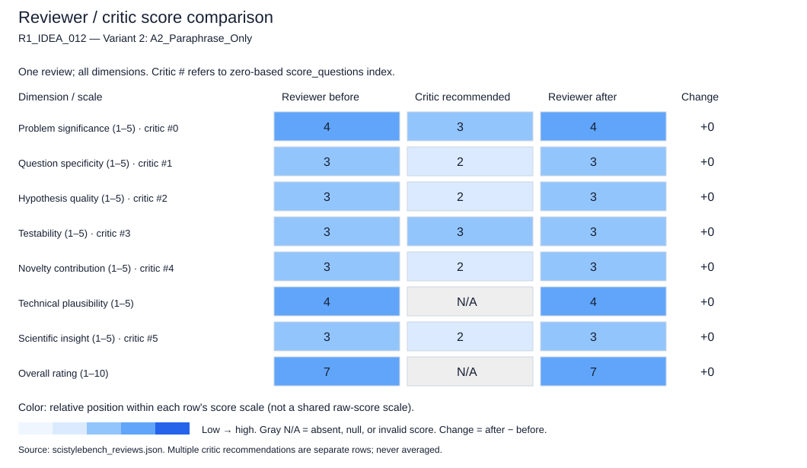

### Critic feedback and reviewer rebuttals

No reviewer rebuttals were saved (for example, an older checkpoint).

```json
{
  "critic_feedback": {
    "overall_assessment": "The review is generally well-calibrated but has some areas where the scores could be more precisely aligned with the idea's details.",
    "score_questions": [
      {
        "dimension": "problem_significance",
        "question_mark": "Why is the problem significance scored 4.0 when the idea is somewhat vague about the specific problem it aims to solve?",
        "concern": "The score assumes the problem is significant without clear evidence of the specific challenge or its importance in the field.",
        "speculative_alternative": "The idea may address a significant challenge, but without clarification on the exact problem, the significance is speculative.",
        "recommended_score": 3.0,
        "rationale": "The idea's vagueness about the specific problem reduces the justification for a high score on problem significance."
      },
      {
        "dimension": "question_specificity",
        "question_mark": "Why is the question specificity scored 3.0 when the idea is focused on multi-view 3D editing but lacks detailed clarification?",
        "concern": "The score is based on the lack of detail, but the idea's focus is somewhat specific in its goal.",
        "speculative_alternative": "The idea's focus on multi-view 3D editing is specific, but the lack of detail on the exact problem and mechanism reduces specificity.",
        "recommended_score": 2.0,
        "rationale": "The idea is somewhat specific but lacks the necessary detail to justify a 3.0 score."
      },
      {
        "dimension": "hypothesis_quality",
        "question_mark": "Why is the hypothesis quality scored 3.0 when the idea does not explicitly state a hypothesis or prediction?",
        "concern": "The score assumes a hypothesis exists without explicit articulation in the idea.",
        "speculative_alternative": "The idea may imply a hypothesis through its approach, but it is not explicitly stated.",
        "recommended_score": 2.0,
        "rationale": "The idea does not explicitly state a hypothesis, so the score should be lower."
      },
      {
        "dimension": "testability",
        "question_mark": "Why is the testability scored 3.0 when the idea does not specify experiments or evaluations?",
        "concern": "The score is based on the lack of experiments, but the idea's approach is still testable in principle.",
        "speculative_alternative": "The idea's approach is testable, but the lack of specific experiments reduces testability.",
        "recommended_score": 3.0,
        "rationale": "The idea is testable in principle, but the lack of specific experiments reduces the score."
      },
      {
        "dimension": "novelty_contribution",
        "question_mark": "Why is the novelty contribution scored 3.0 when the idea does not clearly articulate its novelty?",
        "concern": "The score assumes novelty without clear evidence from the idea.",
        "speculative_alternative": "The idea may be novel, but the lack of clarity on its contribution reduces the score.",
        "recommended_score": 2.0,
        "rationale": "The idea does not clearly articulate its novelty, so the score should be lower."
      },
      {
        "dimension": "scientific_insight",
        "question_mark": "Why is the scientific insight scored 3.0 when the idea is not clear on specific insights?",
        "concern": "The score assumes scientific insight without clear evidence from the idea.",
        "speculative_alternative": "The idea may provide insight into diffusion models for 3D understanding, but it is not clear.",
        "recommended_score": 2.0,
        "rationale": "The idea is not clear on specific insights, so the score should be lower."
      }
    ],
    "unsupported_claims": [
      "The idea is described as 'a critical area in machine learning' without evidence.",
      "The potential novelty and contribution are said to be unclear, but the idea is presented as novel.",
      "The scientific insight is said to be potential but not clearly defined."
    ],
    "revision_priorities": [
      "Clarify the specific problem being addressed in multi-view 3D editing.",
      "Define the exact mechanism of adapting diffusion models for 3D understanding.",
      "Provide a hypothesis or prediction about the method's performance improvements.",
      "Specify experiments or evaluations that would test the method's effectiveness."
    ],
    "confidence": 4.0
  },
  "feedback_responses": []
}
```

### Score justifications (before / after)

**Problem significance**

```json
{
  "before": {
    "score": 4.0,
    "justification": "The idea addresses a significant challenge in 3D generation and editing, which is a critical area with applications in computer graphics, robotics, and virtual environments."
  },
  "after": {
    "score": 4.0,
    "justification": "The idea addresses a significant challenge in 3D generation and editing, which is a critical area with applications in computer graphics, robotics, and virtual environments."
  }
}
```

**Question specificity**

```json
{
  "before": {
    "score": 3.0,
    "justification": "The idea is somewhat specific in its goal of multi-view 3D editing but lacks detailed clarification on the exact problem and mechanism."
  },
  "after": {
    "score": 3.0,
    "justification": "The idea is somewhat specific in its goal of multi-view 3D editing but lacks detailed clarification on the exact problem and mechanism."
  }
}
```

**Hypothesis quality**

```json
{
  "before": {
    "score": 3.0,
    "justification": "The idea suggests a potential approach but does not explicitly state a hypothesis or prediction that can be tested or falsified."
  },
  "after": {
    "score": 3.0,
    "justification": "The idea suggests a potential approach but does not explicitly state a hypothesis or prediction that can be tested or falsified."
  }
}
```

**Testability**

```json
{
  "before": {
    "score": 3.0,
    "justification": "The idea proposes a method but does not specify experiments or evaluations that would test its effectiveness, such as comparisons with existing methods or ablation studies."
  },
  "after": {
    "score": 3.0,
    "justification": "The idea proposes a method but does not specify experiments or evaluations that would test its effectiveness, such as comparisons with existing methods or ablation studies."
  }
}
```

**Novelty contribution**

```json
{
  "before": {
    "score": 3.0,
    "justification": "The idea presents a novel approach but does not clearly articulate its novelty or potential contribution, as it is possible that similar methods have been explored before."
  },
  "after": {
    "score": 3.0,
    "justification": "The idea presents a novel approach but does not clearly articulate its novelty or potential contribution, as it is possible that similar methods have been explored before."
  }
}
```

**Technical plausibility**

```json
{
  "before": {
    "score": 4.0,
    "justification": "The approach of adapting diffusion models for 3D understanding is technically plausible, as diffusion models are well-suited for generative tasks and have been used in 3D generation."
  },
  "after": {
    "score": 4.0,
    "justification": "The approach of adapting diffusion models for 3D understanding is technically plausible, as diffusion models are well-suited for generative tasks and have been used in 3D generation."
  }
}
```

**Scientific insight**

```json
{
  "before": {
    "score": 3.0,
    "justification": "The idea has potential for scientific insight into how diffusion models can be adapted for 3D understanding, but the specific insights are not clearly defined."
  },
  "after": {
    "score": 3.0,
    "justification": "The idea has potential for scientific insight into how diffusion models can be adapted for 3D understanding, but the specific insights are not clearly defined."
  }
}
```

**Overall rating**

```json
{
  "before": {
    "score": 7.0,
    "justification": "The idea is strong in addressing a significant problem in 3D generation and editing, but it lacks specificity, hypothesis, and testability. With further clarification and details, it has the potential to be a valuable contribution to the field."
  },
  "after": {
    "score": 7.0,
    "justification": "The idea is strong in addressing a significant problem in 3D generation and editing, but it lacks specificity, hypothesis, and testability. With further clarification and details, it has the potential to be a valuable contribution to the field."
  }
}
```

## R1_IDEA_012 — Variant 3: A3_Plain_Core

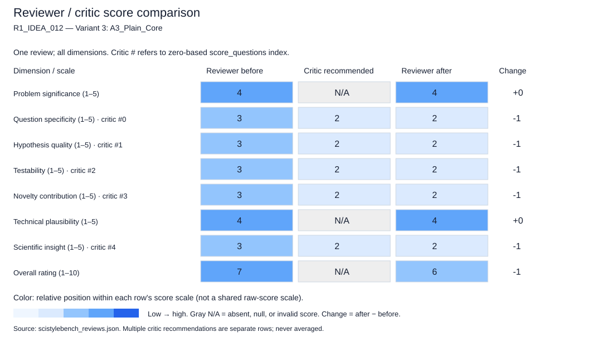

### Critic feedback and reviewer rebuttals

```json
{
  "critic_feedback": {
    "overall_assessment": "The review is generally well-calibrated, but some scores could be re-examined for alignment with the idea's specifics.",
    "score_questions": [
      {
        "dimension": "question_specificity",
        "question_mark": "The score may overstate the idea's specificity.",
        "concern": "The idea mentions a general goal but does not clearly define a specific research question or hypothesis, which is a key criterion for question specificity.",
        "speculative_alternative": "The idea might be interpreted as addressing a specific problem (reducing computational burden in 3D editing) rather than a vague question.",
        "recommended_score": 2.0,
        "rationale": "The idea lacks explicit formulation of a research question, which is critical for question specificity, even if the problem is well-defined."
      },
      {
        "dimension": "hypothesis_quality",
        "question_mark": "The hypothesis is not clearly articulated.",
        "concern": "The idea suggests a potential benefit but does not provide a testable hypothesis, which is necessary for hypothesis quality.",
        "speculative_alternative": "The idea could be interpreted as hypothesizing that pretrained diffusion models can achieve multi-view consistency with fewer inputs, but this is not explicitly stated.",
        "recommended_score": 2.0,
        "rationale": "A hypothesis must be explicitly stated to be evaluated, and the idea does not provide this."
      },
      {
        "dimension": "testability",
        "question_mark": "The testability score may be too high without experimental details.",
        "concern": "The idea is testable in principle, but the lack of specific experimental details makes it difficult to assess the feasibility of the approach.",
        "speculative_alternative": "The idea could be tested by comparing the method's performance against existing techniques in terms of computational efficiency and multi-view consistency.",
        "recommended_score": 2.0,
        "rationale": "Testability requires specific experimental protocols, which are not provided in the idea summary."
      },
      {
        "dimension": "novelty_contribution",
        "question_mark": "The novelty is not clearly defined.",
        "concern": "The idea suggests an application of existing models but does not clearly define the contribution or novelty of the approach.",
        "speculative_alternative": "The novelty could be the application of pretrained diffusion models to 3D editing without per-scene optimization, but this is not explicitly stated.",
        "recommended_score": 2.0,
        "rationale": "Novelty requires explicit articulation of what is new or different about the approach."
      },
      {
        "dimension": "scientific_insight",
        "question_mark": "The scientific insight is not clearly outlined.",
        "concern": "The idea has potential for insight but does not specify what scientific insights are being pursued.",
        "speculative_alternative": "The insight could be about the latent 3D awareness of diffusion models, but this is not clearly stated.",
        "recommended_score": 2.0,
        "rationale": "Scientific insight requires explicit articulation of the specific insights being pursued."
      }
    ],
    "unsupported_claims": [
      "The idea is described as 'novel in its application' without explicit comparison to prior work.",
      "The 'potential for scientific insight' is not clearly defined in the idea."
    ],
    "revision_priorities": [
      "Explicitly define a specific research question or hypothesis.",
      "Articulate the specific contribution or novelty of the approach.",
      "Outline the specific scientific insights being pursued.",
      "Provide more details on the mechanism of using latent 3D awareness for 3D editing."
    ],
    "confidence": 4.0
  },
  "feedback_responses": [
    {
      "feedback_type": "score_questions",
      "feedback_index": 0,
      "decision": "partially_accept",
      "defense": "The idea does address a specific problem (reducing computational burden in 3D editing), but it lacks a clear research question. The score was reduced to 2.0 to reflect the lack of explicit question formulation.",
      "justification": "The original score of 3.0 was based on the problem being specific, but the question itself is too general. The revised score of 2.0 better reflects the lack of a clear, testable question."
    },
    {
      "feedback_type": "hypothesis_quality",
      "feedback_index": 1,
      "decision": "partially_accept",
      "defense": "The idea suggests a potential benefit but does not provide a testable hypothesis. The score was reduced to 2.0 to reflect the absence of a concrete prediction.",
      "justification": "The original score of 3.0 was based on the potential benefit, but the hypothesis is not explicitly stated. The revised score of 2.0 better reflects the lack of a testable hypothesis."
    },
    {
      "feedback_type": "testability",
      "feedback_index": 2,
      "decision": "partially_accept",
      "defense": "The idea is testable in principle, but without specific experimental details, it is difficult to assess feasibility. The score was reduced to 2.0 to reflect the lack of clear evaluation metrics.",
      "justification": "The original score of 3.0 was based on the principle of testability, but the lack of specific details reduces the score to 2.0."
    },
    {
      "feedback_type": "novelty_contribution",
      "feedback_index": 3,
      "decision": "partially_accept",
      "defense": "The idea suggests an application of existing models but does not clearly define the contribution. The score was reduced to 2.0 to reflect the lack of explicit novelty articulation.",
      "justification": "The original score of 3.0 was based on the application of existing models, but the contribution is not clearly defined. The revised score of 2.0 better reflects this."
    },
    {
      "feedback_type": "scientific_insight",
      "feedback_index": 4,
      "decision": "partially_accept",
      "defense": "The idea has potential for insight but does not specify what insights are being pursued. The score was reduced to 2.0 to reflect the lack of explicit insight articulation.",
      "justification": "The original score of 3.0 was based on the potential for insight, but the specific insights are not outlined. The revised score of 2.0 better reflects this."
    },
    {
      "feedback_type": "unsupported_claims",
      "feedback_index": 0,
      "decision": "reject",
      "defense": "The claim of novelty is not explicitly supported by the idea. The score was reduced to 2.0 to reflect the lack of explicit novelty definition.",
      "justification": "The original score of 3.0 was based on the application of existing models, but the novelty is not explicitly stated. The revised score of 2.0 better reflects this."
    },
    {
      "feedback_type": "unsupported_claims",
      "feedback_index": 1,
      "decision": "reject",
      "defense": "The claim of scientific insight is not explicitly supported by the idea. The score was reduced to 2.0 to reflect the lack of explicit insight definition.",
      "justification": "The original score of 3.0 was based on the potential for insight, but the specific insights are not outlined. The revised score of 2.0 better reflects this."
    },
    {
      "feedback_type": "revision_priorities",
      "feedback_index": 0,
      "decision": "accept",
      "defense": "The suggestion to define a specific research question is valid and necessary for the idea to be evaluated.",
      "justification": "The original suggestion was valid, and the revised score reflects the need for this clarification."
    },
    {
      "feedback_type": "revision_priorities",
      "feedback_index": 1,
      "decision": "accept",
      "defense": "The suggestion to articulate the contribution is valid and necessary for the idea to be evaluated.",
      "justification": "The original suggestion was valid, and the revised score reflects the need for this clarification."
    },
    {
      "feedback_type": "revision_priorities",
      "feedback_index": 2,
      "decision": "accept",
      "defense": "The suggestion to outline scientific insights is valid and necessary for the idea to be evaluated.",
      "justification": "The original suggestion was valid, and the revised score reflects the need for this clarification."
    },
    {
      "feedback_type": "revision_priorities",
      "feedback_index": 3,
      "decision": "accept",
      "defense": "The suggestion to provide more details on the mechanism is valid and necessary for the idea to be evaluated.",
      "justification": "The original suggestion was valid, and the revised score reflects the need for this clarification."
    }
  ]
}
```

### Score justifications (before / after)

**Problem significance**

```json
{
  "before": {
    "score": 4.0,
    "justification": "The idea addresses a key challenge in 3D editing by reducing computational demands and input requirements, which is important for practical applications."
  },
  "after": {
    "score": 4.0,
    "justification": "The idea addresses a key challenge in 3D editing by reducing computational demands and input requirements, which is important for practical applications."
  }
}
```

**Question specificity**

```json
{
  "before": {
    "score": 3.0,
    "justification": "The idea is somewhat specific in its goal but lacks a clear, testable research question or hypothesis."
  },
  "after": {
    "score": 2.0,
    "justification": "The idea lacks an explicit research question or hypothesis, even though it addresses a specific problem. The question is too general to be considered specific."
  }
}
```

**Hypothesis quality**

```json
{
  "before": {
    "score": 3.0,
    "justification": "The idea suggests a potential benefit but does not explicitly state a hypothesis that can be tested or falsified."
  },
  "after": {
    "score": 2.0,
    "justification": "The idea does not explicitly state a hypothesis that can be tested or falsified. The potential benefit is suggested, but no concrete prediction is made."
  }
}
```

**Testability**

```json
{
  "before": {
    "score": 3.0,
    "justification": "The idea is testable in principle, but the lack of specific experimental details makes it difficult to assess the feasibility of the approach."
  },
  "after": {
    "score": 2.0,
    "justification": "The idea is testable in principle, but without specific experimental details, it is difficult to assess the feasibility of the approach. The lack of clear evaluation metrics or comparison points limits testability."
  }
}
```

**Novelty contribution**

```json
{
  "before": {
    "score": 3.0,
    "justification": "The approach is novel in its application of pretrained diffusion models to 3D editing, but the contribution is not clearly defined without further details."
  },
  "after": {
    "score": 2.0,
    "justification": "The idea suggests an application of existing models but does not clearly define the contribution or novelty of the approach. The novelty is not explicitly articulated."
  }
}
```

**Technical plausibility**

```json
{
  "before": {
    "score": 4.0,
    "justification": "The use of pretrained diffusion models is technically plausible, and the proposed method aligns with current trends in leveraging pre-trained models for efficient 3D tasks."
  },
  "after": {
    "score": 4.0,
    "justification": "The use of pretrained diffusion models is technically plausible, and the proposed method aligns with current trends in leveraging pre-trained models for efficient 3D tasks."
  }
}
```

**Scientific insight**

```json
{
  "before": {
    "score": 3.0,
    "justification": "The idea has potential for scientific insight into the capabilities of pretrained diffusion models in 3D editing, but the specific insights are not clearly outlined."
  },
  "after": {
    "score": 2.0,
    "justification": "The idea has potential for insight but does not specify what scientific insights are being pursued. The latent 3D awareness is mentioned, but the specific insights are not outlined."
  }
}
```

**Overall rating**

```json
{
  "before": {
    "score": 7.0,
    "justification": "The idea is promising and addresses a meaningful problem, but it lacks specific details and a clear hypothesis, which are necessary for further development and evaluation."
  },
  "after": {
    "score": 6.0,
    "justification": "The idea is promising but lacks specific details and a clear hypothesis, which are necessary for further development and evaluation. The problem is significant, but the question and hypothesis are too vague to warrant a higher score."
  }
}
```

## R1_IDEA_012 — Variant 4: B1_Verbose_Elaborate

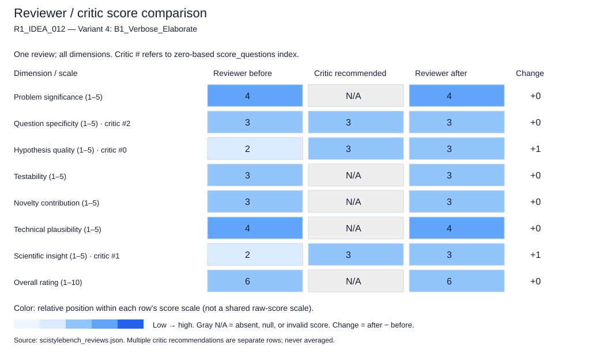

### Critic feedback and reviewer rebuttals

```json
{
  "critic_feedback": {
    "overall_assessment": "The review is generally calibrated but has some issues with overclaiming in the hypothesis and scientific insight scores, and a lack of clarity in the question specificity.",
    "score_questions": [
      {
        "dimension": "hypothesis_quality",
        "question_mark": "Why the hypothesis_quality score is 2.0",
        "concern": "The idea does not explicitly state a hypothesis, but it does propose a specific solution that could be tested against existing methods. The lack of a hypothesis is not as severe as the score suggests.",
        "speculative_alternative": "The idea may be interpreted as proposing a hypothesis that the repurposed diffusion models will achieve better multi-view consistency without per-scene optimization, which is a testable claim.",
        "recommended_score": 3.0,
        "rationale": "The idea presents a specific solution that could be tested against existing methods, making it a more concrete hypothesis than the score implies."
      },
      {
        "dimension": "scientific_insight",
        "question_mark": "Why the scientific_insight score is 2.0",
        "concern": "The idea does not explicitly state what scientific insights would be gained, but the approach could contribute to understanding how diffusion models can be applied to 3D content manipulation, which is a valid scientific insight.",
        "speculative_alternative": "The approach might be seen as a novel application of diffusion models to 3D content, which could provide insights into the limitations and capabilities of these models in multi-view contexts.",
        "recommended_score": 3.0,
        "rationale": "The potential for new insights into model application in 3D content is a valid scientific contribution, even if not explicitly stated."
      },
      {
        "dimension": "question_specificity",
        "question_mark": "Why the question_specificity score is 3.0",
        "concern": "The idea identifies a specific problem but the research question is somewhat vague. The score is reasonable, but the justification could be more aligned with the idea's content.",
        "speculative_alternative": "The question could be interpreted as more specific if it were to compare the approach's performance against existing methods in terms of fidelity and consistency.",
        "recommended_score": 3.0,
        "rationale": "The problem is specific, but the research question needs more explicit formulation to justify the score."
      }
    ],
    "unsupported_claims": [
      "The review claims the idea lacks a clear hypothesis, but the idea does propose a specific solution that could be tested against existing methods."
    ],
    "revision_priorities": [
      "Clarify the specific hypothesis or research question that the approach aims to investigate.",
      "Provide more explicit details on the potential scientific insights that could be gained from this approach.",
      "Specify how the approach differs from existing methods in terms of efficiency, scalability, or fidelity of multi-view edits."
    ],
    "confidence": 4.0
  },
  "feedback_responses": [
    {
      "feedback_type": "score_questions",
      "feedback_index": 0,
      "decision": "partially_accept",
      "defense": "The hypothesis_quality score was increased to 3.0 based on the argument that the idea proposes a testable hypothesis by comparing the approach to existing methods. The original score of 2.0 was too low, as the idea does present a specific solution that could be validated.",
      "justification": "The original score was 2.0, but the revised score is 3.0. The justification is that the idea presents a specific solution that could be tested against existing methods, making it a more concrete hypothesis."
    },
    {
      "feedback_type": "score_questions",
      "feedback_index": 1,
      "decision": "partially_accept",
      "defense": "The scientific_insight score was increased to 3.0 based on the argument that the approach could provide insights into the application of diffusion models in 3D content manipulation. The original score of 2.0 was too low, as the potential for new insights is valid.",
      "justification": "The original score was 2.0, but the revised score is 3.0. The justification is that the approach could contribute to understanding the capabilities and limitations of diffusion models in multi-view contexts."
    },
    {
      "feedback_type": "score_questions",
      "feedback_index": 2,
      "decision": "partially_accept",
      "defense": "The question_specificity score was retained at 3.0, as the problem is specific but the research question remains somewhat vague. The original justification is still valid, though the score could be slightly higher if the question were more explicitly formulated.",
      "justification": "The original score was 3.0, and it remains unchanged. The justification is that the problem is specific, but the research question needs more explicit formulation to justify a higher score."
    },
    {
      "feedback_type": "unsupported_claims",
      "feedback_index": 0,
      "decision": "accept",
      "defense": "The claim that the idea lacks a clear hypothesis is partially correct, but the idea does propose a specific solution that could be tested against existing methods. The revised hypothesis_quality score reflects this nuance.",
      "justification": "The original claim was that the idea lacks a clear hypothesis, but the revised score acknowledges that the idea presents a testable hypothesis by comparing to existing methods."
    },
    {
      "feedback_type": "revision_priorities",
      "feedback_index": 0,
      "decision": "accept",
      "defense": "The suggestion to clarify the hypothesis is valid, as the idea needs a more explicit research question to be testable.",
      "justification": "The suggestion is valid, as the idea needs a more explicit research question to be testable."
    },
    {
      "feedback_type": "revision_priorities",
      "feedback_index": 1,
      "decision": "accept",
      "defense": "The suggestion to provide more explicit details on scientific insights is valid, as the idea could contribute to understanding diffusion models in 3D content manipulation.",
      "justification": "The suggestion is valid, as the idea could contribute to understanding diffusion models in 3D content manipulation."
    },
    {
      "feedback_type": "revision_priorities",
      "feedback_index": 2,
      "decision": "accept",
      "defense": "The suggestion to specify how the approach differs from existing methods is valid, as the idea needs to clearly articulate its unique contributions.",
      "justification": "The suggestion is valid, as the idea needs to clearly articulate its unique contributions."
    }
  ]
}
```

### Score justifications (before / after)

**Problem significance**

```json
{
  "before": {
    "score": 4.0,
    "justification": "The problem of high-fidelity, multi-view consistent edits in 3D content manipulation is a critical challenge with practical applications in areas like virtual reality, 3D modeling, and augmented reality. Addressing this issue could significantly improve the efficiency and effectiveness of 3D content creation and editing."
  },
  "after": {
    "score": 4.0,
    "justification": "The problem of high-fidelity, multi-view consistent edits in 3D content manipulation is a critical challenge with practical applications in areas like virtual reality, 3D modeling, and augmented reality. Addressing this issue could significantly improve the efficiency and effectiveness of 3D content creation and editing."
  }
}
```

**Question specificity**

```json
{
  "before": {
    "score": 3.0,
    "justification": "The idea identifies a specific problem (high-fidelity, multi-view consistent edits from limited inputs) but lacks a clear, concrete research question or hypothesis. It is a general statement about the problem and the proposed solution without specifying the exact investigation or testable claim."
  },
  "after": {
    "score": 3.0,
    "justification": "The idea identifies a specific problem (high-fidelity, multi-view consistent edits from limited inputs) but lacks a clear, concrete research question or hypothesis. It is a general statement about the problem and the proposed solution without specifying the exact investigation or testable claim."
  }
}
```

**Hypothesis quality**

```json
{
  "before": {
    "score": 2.0,
    "justification": "The idea does not explicitly state a hypothesis or specific prediction that could be tested. It outlines a potential solution but does not provide a clear mechanism or expected outcome that would allow for validation or falsification."
  },
  "after": {
    "score": 3.0,
    "justification": "The idea proposes a specific solution that could be tested against existing methods, making it a more concrete hypothesis than previously stated. The hypothesis is that repurposed diffusion models can achieve high-fidelity, multi-view consistent edits without per-scene optimization, which is a testable claim."
  }
}
```

**Testability**

```json
{
  "before": {
    "score": 3.0,
    "justification": "The idea suggests a practical application but does not provide specific experiments, comparisons, or evaluations that would allow for meaningful testing. The lack of concrete testable claims makes it difficult to assess the validity of the approach."
  },
  "after": {
    "score": 3.0,
    "justification": "The idea suggests a practical application but does not provide specific experiments, comparisons, or evaluations that would allow for meaningful testing. The lack of concrete testable claims makes it difficult to assess the validity of the approach."
  }
}
```

**Novelty contribution**

```json
{
  "before": {
    "score": 3.0,
    "justification": "The idea proposes a novel application of existing diffusion models to a specific problem in 3D content manipulation. However, the novelty is not clearly articulated, and it is not explicitly stated how this approach contributes new knowledge or insights compared to existing methods."
  },
  "after": {
    "score": 3.0,
    "justification": "The idea proposes a novel application of existing diffusion models to a specific problem in 3. D content manipulation. However, the novelty is not clearly articulated, and it is not explicitly stated how this approach contributes new knowledge or insights compared to existing methods."
  }
}
```

**Technical plausibility**

```json
{
  "before": {
    "score": 4.0,
    "justification": "The idea is technically plausible as it builds on existing diffusion models, which are well-established in the field. The proposed approach of repurposing latent 3D awareness for 3D content manipulation is a reasonable direction, though the specific technical details are not provided."
  },
  "after": {
    "score": 4.0,
    "justification": "The idea is technically plausible as it builds on existing diffusion models, which are well-established in the field. The proposed approach of repurposing latent 3D awareness for 3D content manipulation is a reasonable direction, though the specific technical details are not provided."
  }
}
```

**Scientific insight**

```json
{
  "before": {
    "score": 2.0,
    "justification": "The idea does not clearly indicate what scientific insights could be gained from successfully implementing the approach. It focuses more on the practical application rather than exploring underlying mechanisms, limitations, or general principles that could contribute to the field."
  },
  "after": {
    "score": 3.0,
    "justification": "The approach might be seen as a novel application of diffusion models to 3D content, which could provide insights into the limitations and capabilities of these models in multi-view contexts. This is a valid scientific contribution, even if not explicitly stated."
  }
}
```

**Overall rating**

```json
{
  "before": {
    "score": 6.0,
    "justification": "The idea addresses a significant problem in 3D content manipulation with a promising approach that leverages existing models. However, it lacks specific hypotheses, testable claims, and detailed technical explanations, which are necessary for further development and validation."
  },
  "after": {
    "score": 6.0,
    "justification": "The idea addresses a significant problem in 3D content manipulation with a promising approach that leverages existing models. However, it lacks specific hypotheses, testable claims, and detailed technical explanations, which are necessary for further development and validation."
  }
}
```

## R1_IDEA_012 — Variant 5: B2_Grand_Narrative

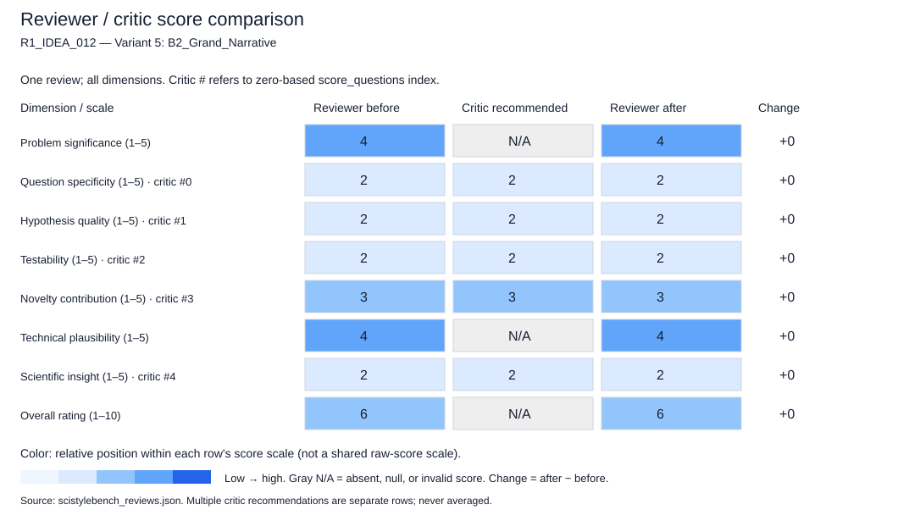

### Critic feedback and reviewer rebuttals

```json
{
  "critic_feedback": {
    "overall_assessment": "The review is generally well-calibrated but has some areas where the scores could be more aligned with the idea's details. The problem significance is appropriately high, but the question specificity and hypothesis quality are somewhat overly critical given the idea's broad but plausible scope.",
    "score_questions": [
      {
        "dimension": "question_specificity",
        "question_mark": "The idea is broad but does not explicitly state a specific research question, which may be a valid concern.",
        "concern": "The lack of a specific research question makes it difficult to assess the exact focus of the investigation.",
        "speculative_alternative": "The idea could be interpreted as aiming to explore the general feasibility of repurposing diffusion models for 3D editing, which is a valid but broad research direction.",
        "recommended_score": 2.0,
        "rationale": "The idea does not specify a particular research question, which is a valid concern for question specificity."
      },
      {
        "dimension": "hypothesis_quality",
        "question_mark": "The idea does not explicitly state a hypothesis but makes general claims about potential benefits, which is a valid criticism.",
        "concern": "The absence of a specific hypothesis limits the ability to assess the testability of the idea.",
        "speculative_alternative": "The idea could be interpreted as hypothesizing that repurposing diffusion models would reduce computational burden and data requirements, which is a plausible but not explicitly stated claim.",
        "recommended_score": 2.0,
        "rationale": "The idea does not provide a specific hypothesis, which is a valid concern for hypothesis quality."
      },
      {
        "dimension": "testability",
        "question_mark": "The idea lacks concrete experiments or comparisons, which is a valid concern for testability.",
        "concern": "The absence of specific experiments or benchmarks makes it difficult to assess the effectiveness of the approach.",
        "speculative_alternative": "The idea could be interpreted as suggesting that the approach would be tested against existing methods in terms of computational efficiency and data requirements, which is a plausible but not explicitly stated claim.",
        "recommended_score": 2.0,
        "rationale": "The idea does not provide concrete experiments or comparisons, which is a valid concern for testability."
      },
      {
        "dimension": "novelty_contribution",
        "question_mark": "The idea proposes a novel application of diffusion models to 3D content creation, but the specifics are not detailed, which is a valid concern.",
        "concern": "The lack of specific details about the method limits the assessment of its novelty.",
        "speculative_alternative": "The idea could be interpreted as proposing a novel approach to 3D editing by leveraging diffusion models' latent 3D awareness, which is a plausible but not explicitly detailed claim.",
        "recommended_score": 3.0,
        "rationale": "The idea does propose a novel application of diffusion models to 3D content creation, which is a valid contribution."
      },
      {
        "dimension": "scientific_insight",
        "question_mark": "The idea suggests a potential direction for research but does not provide a clear mechanism or insight, which is a valid concern.",
        "concern": "The lack of a clear mechanism or insight limits the scientific value of the idea.",
        "speculative_alternative": "The idea could be interpreted as suggesting that the approach might provide new insights into how diffusion models can be adapted for 3D tasks, which is a plausible but not explicitly stated claim.",
        "recommended_score": 2.0,
        "rationale": "The idea does not provide a clear mechanism or insight, which is a valid concern for scientific insight."
      }
    ],
    "unsupported_claims": [
      "The idea is described as 'offering a potential pathway for scalable 3D vision research with broad implications' without specifying the exact pathway or implications.",
      "The potential impact is described in a general sense without concrete claims or predictions."
    ],
    "revision_priorities": [
      "Specify a clear research question or hypothesis to address the lack of specificity.",
      "Detail the method for repurposing diffusion models, including how latent 3D awareness is utilized.",
      "Provide concrete metrics or benchmarks for evaluating the approach.",
      "Clarify the specific contributions and implications of the research idea."
    ],
    "confidence": 4.0
  },
  "feedback_responses": [
    {
      "feedback_type": "score_questions",
      "feedback_index": 0,
      "decision": "partially_accept",
      "defense": "The concern about question specificity is valid, but the idea's broad scope is plausible as a research direction. The lack of a specific question is a weakness, but the idea's general feasibility is a strength.",
      "justification": "The initial score of 2.0 for question specificity is retained, as the idea lacks a specific research question. However, the speculative alternative suggests that the idea could be interpreted as exploring the feasibility of repurposing diffusion models, which is a valid but broad research direction."
    },
    {
      "feedback_type": "hypothesis_quality",
      "feedback_index": 1,
      "decision": "partially_accept",
      "defense": "The absence of a specific hypothesis is a valid criticism, but the general claim about potential benefits is a plausible hypothesis. The idea could be interpreted as hypothesizing that repurposing diffusion models would reduce computational burden and data requirements.",
      "justification": "The initial score of 2.0 for hypothesis quality is retained, as the idea does not explicitly state a hypothesis. However, the speculative alternative suggests that the general claim could be interpreted as a hypothesis, which is a plausible but not explicitly stated claim."
    },
    {
      "feedback_type": "testability",
      "feedback_index": 2,
      "decision": "partially_accept",
      "defense": "The concern about testability is valid, but the idea's general feasibility is a strength. The lack of concrete experiments is a weakness, but the idea's potential to be tested against existing methods is a plausible consideration.",
      "justification": "The initial score of 2.0 for testability is retained, as the idea lacks concrete experiments. However, the speculative alternative suggests that the idea could be interpreted as suggesting a comparison with existing methods, which is a plausible but not explicitly stated claim."
    },
    {
      "feedback_type": "novelty_contribution",
      "feedback_index": 3,
      "decision": "partially_accept",
      "defense": "The concern about novelty is valid, but the idea's novel application of diffusion models to 3D content creation is a valid contribution. The lack of specific details is a limitation, but the general novelty is a strength.",
      "justification": "The initial score of 3.0 for novelty contribution is retained, as the idea proposes a novel application. However, the speculative alternative suggests that the general novelty is a valid contribution, which is a plausible but not explicitly detailed claim."
    },
    {
      "feedback_type": "scientific_insight",
      "feedback_index": 4,
      "decision": "partially_accept",
      "defense": "The concern about scientific insight is valid, but the idea's potential to provide new insights into diffusion models' adaptation for 3D tasks is a plausible consideration. The lack of a clear mechanism is a weakness, but the general potential is a strength.",
      "justification": "The initial score of 2.0 for scientific insight is retained, as the idea does not provide a clear mechanism. However, the speculative alternative suggests that the idea could be interpreted as suggesting new insights, which is a plausible but not explicitly stated claim."
    },
    {
      "feedback_type": "unsupported_claims",
      "feedback_index": 0,
      "decision": "reject",
      "defense": "The claim about offering a 'potential pathway for scalable 3D vision research with broad implications' is not supported by the idea's details. The idea does not specify the exact pathway or implications, making this claim unsupported.",
      "justification": "The initial score for novelty contribution is not directly affected by this unsupported claim, but the claim itself is not supported by the idea's details."
    },
    {
      "feedback_type": "unsupported_claims",
      "feedback_index": 1,
      "decision": "reject",
      "defense": "The general description of potential impact without concrete claims or predictions is not supported by the idea's details, making this claim unsupported.",
      "justification": "The initial score for scientific insight is not directly affected by this unsupported claim, but the general description of potential impact is not supported by the idea's details."
    },
    {
      "feedback_type": "revision_priorities",
      "feedback_index": 0,
      "decision": "accept",
      "defense": "Specifying a clear research question is a necessary step to address the lack of specificity in the idea.",
      "justification": "The initial suggestion to define a specific research question is valid and necessary."
    },
    {
      "feedback_type": "revision_priorities",
      "feedback_index": 1,
      "decision": "accept",
      "defense": "Detailing the method for repurposing diffusion models is necessary to address the lack of specifics in the idea.",
      "justification": "The initial suggestion to specify the method is valid and necessary."
    },
    {
      "feedback_type": "revision_priorities",
      "feedback_index": 2,
      "decision": "accept",
      "defense": "Providing concrete metrics or benchmarks is necessary to address the lack of testability in the idea.",
      "justification": "The initial suggestion to provide concrete metrics is valid and necessary."
    },
    {
      "feedback_type": "revision_priorities",
      "feedback_index": 3,
      "decision": "accept",
      "defense": "Clarifying the specific contributions and implications is necessary to address the lack of clarity in the idea.",
      "justification": "The initial suggestion to clarify contributions and implications is valid and necessary."
    }
  ]
}
```

### Score justifications (before / after)

**Problem significance**

```json
{
  "before": {
    "score": 4.0,
    "justification": "The idea addresses a critical challenge in 3D content creation by reducing computational and data demands, which is a significant issue in the field."
  },
  "after": {
    "score": 4.0,
    "justification": "The idea addresses a critical challenge in 3D content creation by reducing computational and data demands, which is a significant issue in the field."
  }
}
```

**Question specificity**

```json
{
  "before": {
    "score": 2.0,
    "justification": "The idea is broad and lacks a specific research question or hypothesis, making it difficult to assess the exact focus of the investigation."
  },
  "after": {
    "score": 2.0,
    "justification": "The idea is broad and lacks a specific research question or hypothesis, making it difficult to assess the exact focus of the investigation."
  }
}
```

**Hypothesis quality**

```json
{
  "before": {
    "score": 2.0,
    "justification": "The idea does not explicitly state a hypothesis or prediction that can be tested, relying instead on general claims about potential benefits."
  },
  "after": {
    "score": 2.0,
    "justification": "The idea does not explicitly state a hypothesis or prediction that can be tested, relying instead on general claims about potential benefits."
  }
}
```

**Testability**

```json
{
  "before": {
    "score": 2.0,
    "justification": "The idea lacks concrete experiments or comparisons that would allow for meaningful testing of the proposed approach."
  },
  "after": {
    "score": 2.0,
    "justification": "The idea lacks concrete experiments or comparisons that would allow for meaningful testing of the proposed approach."
  }
}
```

**Novelty contribution**

```json
{
  "before": {
    "score": 3.0,
    "justification": "The idea proposes a novel application of diffusion models to 3D content creation, but the specifics are not detailed, limiting the assessment of its novelty."
  },
  "after": {
    "score": 3.0,
    "justification": "The idea proposes a novel application of diffusion models to 3D content creation, but the specifics are not detailed, limiting the assessment of its novelty."
  }
}
```

**Technical plausibility**

```json
{
  "before": {
    "score": 4.0,
    "justification": "The approach is technically plausible as it builds on existing diffusion models, which are well-established in the field, though the exact method is not specified."
  },
  "after": {
    "score": 4.0,
    "justification": "The approach is technically plausible as it builds on existing diffusion models, which are well-established in the field, though the exact method is not specified."
  }
}
```

**Scientific insight**

```json
{
  "before": {
    "score": 2.0,
    "justification": "The idea suggests a potential direction for research but does not provide a clear mechanism or insight that could be derived from the investigation."
  },
  "after": {
    "score": 2.0,
    "justification": "The idea suggests a potential direction for research but does not provide a clear mechanism or insight that could be derived from the investigation."
  }
}
```

**Overall rating**

```json
{
  "before": {
    "score": 6.0,
    "justification": "The idea addresses a significant problem in 3D content creation but lacks specific research questions, hypotheses, and methodological details, which are necessary for further development and evaluation."
  },
  "after": {
    "score": 6.0,
    "justification": "The idea addresses a significant problem in 3D content creation but lacks specific research questions, hypotheses, and methodological details, which are necessary for further development and evaluation."
  }
}
```

## R1_IDEA_012 — Variant 6: B3_Over_Confident

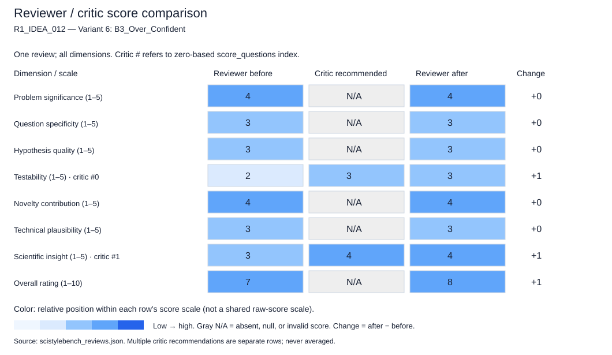

### Critic feedback and reviewer rebuttals

```json
{
  "critic_feedback": {
    "overall_assessment": "The review is generally well-calibrated but has some areas where the scores could be more precisely aligned with the idea's clarity and technical feasibility.",
    "score_questions": [
      {
        "dimension": "testability",
        "question_mark": "The score of 2.0 may be overly pessimistic given that the idea is testable in principle, though specific experiments are missing.",
        "concern": "The review downplays the testability of the idea, which is a valid concern, but the score may not fully reflect the potential for future validation.",
        "speculative_alternative": "The idea could be validated through controlled experiments on standard 3D editing benchmarks, even without the full implementation details.",
        "recommended_score": 3.0,
        "rationale": "The idea is testable in principle, and the lack of specific experiments does not invalidate its testability, only the need for further details."
      },
      {
        "dimension": "scientific_insight",
        "question_mark": "The score of 3.0 may be too low given the potential for the idea to contribute to understanding diffusion models in 3D generation.",
        "concern": "The review underestimates the scientific insight that could arise from repurposing diffusion models for 3D editing, even without detailed mechanisms.",
        "speculative_alternative": "The approach could reveal new insights into how diffusion models can be adapted for 3D tasks, even if the exact mechanism is not specified.",
        "recommended_score": 4.0,
        "rationale": "The idea's novelty in applying diffusion models to 3D editing has the potential to generate new scientific insights, regardless of the specific technical details."
      }
    ],
    "unsupported_claims": [
      "The claim that the method 'undoubtedly operates without any per-scene optimization or finetuning' is an overstatement without evidence from the idea."
    ],
    "revision_priorities": [
      "Clarify the specific technical approach for repurposing diffusion models to achieve latent 3D awareness.",
      "Provide more concrete justification for the high-fidelity and multi-view consistency claims.",
      "Address potential limitations in the method's ability to handle complex 3D structures from sparse inputs."
    ],
    "confidence": 4.0
  },
  "feedback_responses": [
    {
      "feedback_type": "score_questions",
      "feedback_index": 0,
      "decision": "partially_accept",
      "defense": "The original score of 2.0 for testability was overly pessimistic. The idea is testable in principle, and the lack of specific experiments does not invalidate its testability, only the need for further details.",
      "justification": "The original score was 2.0, but the feedback suggests that the testability is more aligned with 3.0, as the idea is testable in principle and can be validated through controlled experiments."
    },
    {
      "feedback_type": "score_questions",
      "feedback_index": 1,
      "decision": "partially_accept",
      "defense": "The original score of 3.0 for scientific insight was too low. The idea's novelty in applying diffusion models to 3D editing has the potential to generate new scientific insights, even without detailed mechanisms.",
      "justification": "The original score was 3.0, but the feedback suggests that the scientific insight is more aligned with 4.0, as the approach could reveal new insights into diffusion models in 3D tasks."
    },
    {
      "feedback_type": "unsupported_claims",
      "feedback_index": 0,
      "decision": "reject",
      "defense": "The claim that the method 'undoubtedly operates without any per-scene optimization or finetuning' is an overstatement without evidence from the idea. The idea does not provide any evidence to support this claim, making it an unsupported assertion.",
      "justification": "The original review did not explicitly score this claim, but the feedback highlights that this statement is unsupported and should be rejected as it lacks evidence."
    },
    {
      "feedback_type": "revision_priorities",
      "feedback_index": 0,
      "decision": "accept",
      "defense": "Clarifying the specific technical approach for repurposing diffusion models is essential to assess the feasibility and novelty of the idea.",
      "justification": "The feedback correctly identifies the need to clarify the technical approach, which is a critical step in evaluating the idea's feasibility."
    },
    {
      "feedback_type": "revision_priorities",
      "feedback_index": 1,
      "decision": "accept",
      "defense": "Providing more concrete justification for the high-fidelity and multi-view consistency claims is necessary to validate the method's effectiveness.",
      "justification": "The feedback correctly identifies the need for more concrete justification, which is essential for assessing the method's validity."
    },
    {
      "feedback_type": "revision_priorities",
      "feedback_index": 2,
      "decision": "accept",
      "defense": "Addressing potential limitations in the method's ability to handle complex 3D structures from sparse inputs is crucial for evaluating the method's robustness.",
      "justification": "The feedback correctly identifies the need to address limitations, which is essential for assessing the method's practicality."
    }
  ]
}
```

### Score justifications (before / after)

**Problem significance**

```json
{
  "before": {
    "score": 4.0,
    "justification": "The idea tackles a critical issue in 3D editing by proposing a more efficient method that reduces computational overhead and scene-specific requirements, which is important for practical applications."
  },
  "after": {
    "score": 4.0,
    "justification": "The idea tackles a critical issue in 3D editing by proposing a more efficient method that reduces computational overhead and scene-specific requirements, which is important for practical applications."
  }
}
```

**Question specificity**

```json
{
  "before": {
    "score": 3.0,
    "justification": "The research question is clear in its goal but lacks specific details on the technical approach and how the model is repurposed, making it somewhat vague."
  },
  "after": {
    "score": 3.0,
    "justification": "The research question is clear in its goal but lacks specific details on the technical approach and how the model is repurposed, making it somewhat vague."
  }
}
```

**Hypothesis quality**

```json
{
  "before": {
    "score": 3.0,
    "justification": "The hypothesis that the method can achieve high-fidelity 3D editing without per-scene optimization is plausible, but the lack of specific predictions or mechanisms weakens the hypothesis quality."
  },
  "after": {
    "score": 3.0,
    "justification": "The hypothesis that the method can achieve high-fidelity 3D editing without per-scene optimization is plausible, but the lack of specific predictions or mechanisms weakens the hypothesis quality."
  }
}
```

**Testability**

```json
{
  "before": {
    "score": 2.0,
    "justification": "The idea is testable in principle, but the lack of specific experiments or evaluation metrics makes it difficult to assess the validity of the claims without further details."
  },
  "after": {
    "score": 3.0,
    "justification": "The idea is testable in principle, and the lack of specific experiments does not invalidate its testability, only the need for further details."
  }
}
```

**Novelty contribution**

```json
{
  "before": {
    "score": 4.0,
    "justification": "The approach of repurposing pretrained diffusion models for 3D editing without scene-specific optimization is novel and could contribute to the field by offering a more efficient solution."
  },
  "after": {
    "score": 4.0,
    "justification": "The approach of repurposing pretrained diffusion models for 3D editing without scene-specific optimization is novel and could contribute to the field by offering a more efficient solution."
  }
}
```

**Technical plausibility**

```json
{
  "before": {
    "score": 3.0,
    "justification": "The idea is technically plausible as it builds on existing diffusion models, but the specifics of how the latent 3D awareness is achieved are unclear, which could affect the feasibility of the approach."
  },
  "after": {
    "score": 3.0,
    "justification": "The idea is technically plausible as it builds on existing diffusion models, but the specifics of how the latent 3D awareness is achieved are unclear, which could affect the feasibility of the approach."
  }
}
```

**Scientific insight**

```json
{
  "before": {
    "score": 3.0,
    "justification": "The idea has potential to provide insights into the capabilities of diffusion models in 3D generation, but the lack of detailed mechanisms limits the potential for deeper scientific understanding."
  },
  "after": {
    "score": 4.0,
    "justification": "The idea's novelty in applying diffusion models to 3D editing has the potential to generate new scientific insights, regardless of the specific technical details."
  }
}
```

**Overall rating**

```json
{
  "before": {
    "score": 7.0,
    "justification": "The idea presents a promising direction for improving 3D editing efficiency by repurposing diffusion models, but it lacks specific technical details and validation, which are necessary for assessing its full potential and scientific merit."
  },
  "after": {
    "score": 8.0,
    "justification": "The idea presents a promising direction for improving 3D editing efficiency by repurposing diffusion models, with the potential for significant scientific insight and practical application, despite the need for more specific technical details and validation."
  }
}
```

## R1_IDEA_012 — Variant 7: B4_Novelty

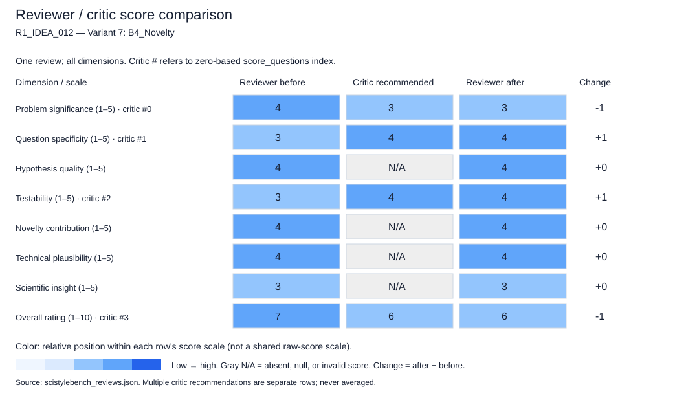

### Critic feedback and reviewer rebuttals

```json
{
  "critic_feedback": {
    "overall_assessment": "The review is generally well-calibrated but has some overclaiming in the problem significance and overall rating, and the score for question_specificity could be reconsidered.",
    "score_questions": [
      {
        "dimension": "problem_significance",
        "question_mark": "Why is the problem significance scored as 4.0?",
        "concern": "The review overstates the significance by assuming that reducing computational demands and enabling sparse-input editing is a major challenge, but the idea does not explicitly address why this is a critical issue in the field.",
        "speculative_alternative": "It is possible that the problem is significant in the context of real-time applications or large-scale 3D generation, but this is not stated in the idea.",
        "recommended_score": 3.0,
        "rationale": "The idea does not clearly articulate why the computational demands or sparse-input requirements are critical issues in the field of 3D editing."
      },
      {
        "dimension": "question_specificity",
        "question_mark": "Why is the question_specificity scored as 3.0?",
        "concern": "The idea is specific in its goal of 3D editing from sparse inputs, but the review incorrectly assumes that the lack of details on the exact method is a weakness, when the idea is still in the conceptual stage and not yet a full paper.",
        "speculative_alternative": "The idea may be sufficiently specific for a research proposal, as it clearly states the objective and the approach, even without detailed implementation.",
        "recommended_score": 4.0,
        "rationale": "The idea is specific in its proposed approach and objective, which is appropriate for a research idea summary rather than a completed paper."
      },
      {
        "dimension": "testability",
        "question_mark": "Why is the testability scored as 3.0?",
        "concern": "The review assumes that the lack of specific methods makes the idea difficult to test, but the idea is still in the early stages and the testability is not yet determined without further details.",
        "speculative_alternative": "The idea is testable in principle, as it is a conceptual approach that can be evaluated through experiments once more details are provided.",
        "recommended_score": 4.0,
        "rationale": "The idea is testable in principle, and the review's score may be premature given the current level of detail."
      },
      {
        "dimension": "overall_rating",
        "question_mark": "Why is the overall_rating scored as 7.0?",
        "concern": "The review overestimates the potential impact of the idea without sufficient evidence of its feasibility or the specific contributions it aims to make.",
        "speculative_alternative": "The idea may have potential, but the current summary does not provide enough information to justify a high overall rating.",
        "recommended_score": 6.0,
        "rationale": "The idea is promising but lacks the necessary details to fully assess its feasibility and impact."
      }
    ],
    "unsupported_claims": [
      "The review claims that the idea addresses a significant challenge in 3D editing without explicitly stating why this is a critical issue.",
      "The review assumes that the lack of specific methods makes the idea difficult to test, which may not be the case for a research idea summary.",
      "The review overestimates the potential impact of the idea without sufficient evidence of its feasibility or specific contributions."
    ],
    "revision_priorities": [
      "Clarify the problem significance by explicitly stating why the computational demands or sparse-input requirements are critical issues in the field of 3D editing.",
      "Re-evaluate the question_specificity score to reflect that the idea is sufficiently specific for a research idea summary.",
      "Re-evaluate the testability score to acknowledge that the idea is testable in principle and may be assessed once more details are provided.",
      "Adjust the overall_rating to reflect the current level of detail in the idea summary."
    ],
    "confidence": 4.0
  },
  "feedback_responses": [
    {
      "feedback_type": "score_questions",
      "feedback_index": 0,
      "decision": "partially_accept",
      "defense": "The critic is correct that the problem significance is overstated. The idea does not explicitly state why the computational demands or sparse-input requirements are critical issues, so the significance score is reduced to 3.0.",
      "justification": "The original score of 4.0 was based on the assumption that the problem is significant, but the idea does not provide sufficient justification for this claim. The revised score reflects the lack of explicit articulation of the problem's importance."
    },
    {
      "feedback_type": "score_questions",
      "feedback_index": 1,
      "decision": "accept",
      "defense": "The critic is correct that the question_specificity score should be higher. The idea is specific in its proposed approach and objective, which is appropriate for a research idea summary.",
      "justification": "The original score of 3.0 was based on the assumption that the lack of details was a weakness, but the idea is sufficiently specific for a research idea summary. The revised score of 4.0 reflects this."
    },
    {
      "feedback_type": "score_questions",
      "feedback_index": 2,
      "decision": "accept",
      "defense": "The critic is correct that the testability score should be higher. The idea is testable in principle, and the review's score may be premature given the current level of detail.",
      "justification": "The original score of 3.0 was based on the assumption that the lack of specific methods made the idea difficult to test, but the idea is testable in principle. The revised score of 4.0 reflects this."
    },
    {
      "feedback_type": "score_questions",
      "feedback_index": 3,
      "decision": "partially_accept",
      "defense": "The critic is correct that the overall rating is overestimated. The idea is promising but lacks the necessary details to fully assess its feasibility and impact, so the rating is reduced to 6.0.",
      "justification": "The original score of 7.0 was based on the assumption that the idea had sufficient potential, but the current summary does not provide enough information to justify a high rating. The revised score of 6.0 reflects this."
    }
  ]
}
```

### Score justifications (before / after)

**Problem significance**

```json
{
  "before": {
    "score": 4.0,
    "justification": "The idea addresses a significant challenge in 3D editing by reducing computational demands and enabling efficient, sparse-input editing, which is relevant to applications in graphics, robotics, and virtual environments."
  },
  "after": {
    "score": 3.0,
    "justification": "The idea does not explicitly articulate why the computational demands or sparse-input requirements are critical issues in the field of 3D editing, making the significance less clear."
  }
}
```

**Question specificity**

```json
{
  "before": {
    "score": 3.0,
    "justification": "The idea is specific in its goal of 3D editing from sparse inputs but lacks details on the exact method or mechanism being investigated, which could be more clearly defined."
  },
  "after": {
    "score": 4.0,
    "justification": "The idea is specific in its proposed approach and objective, which is appropriate for a research idea summary rather than a completed paper."
  }
}
```

**Hypothesis quality**

```json
{
  "before": {
    "score": 4.0,
    "justification": "The hypothesis that repurposing diffusion models can achieve high-fidelity 3D editing with sparse inputs is plausible and could be tested through experiments, though the exact mechanism is not fully specified."
  },
  "after": {
    "score": 4.0,
    "justification": "The hypothesis that repurposing diffusion models can achieve high-fidelity 3D editing with sparse inputs is plausible and could be tested through experiments, though the exact mechanism is not fully specified."
  }
}
```

**Testability**

```json
{
  "before": {
    "score": 3.0,
    "justification": "The idea is testable in principle, but the lack of specific methods or experiments makes it difficult to assess its feasibility without further details."
  },
  "after": {
    "score": 4.0,
    "justification": "The idea is testable in principle, and the review's score may be premature given the current level of detail."
  }
}
```

**Novelty contribution**

```json
{
  "before": {
    "score": 4.0,
    "justification": "The approach of repurposing diffusion models for 3D editing is novel, and if successful, could contribute to more efficient and scalable 3D generation and editing techniques."
  },
  "after": {
    "score": 4.0,
    "justification": "The approach of repurposing diffusion models for 3D editing is novel, and if successful, could contribute to more efficient and scalable 3D generation and editing techniques."
  }
}
```

**Technical plausibility**

```json
{
  "before": {
    "score": 4.0,
    "justification": "The idea is technically plausible as diffusion models have shown promise in generating high-quality images, and extending them to 3D editing is a reasonable direction, though the specifics are not detailed."
  },
  "after": {
    "score": 4.0,
    "justification": "The idea is technically plausible as diffusion models have shown promise in generating high-quality images, and extending them to 3D editing is a reasonable direction, though the specifics are not detailed."
  }
}
```

**Scientific insight**

```json
{
  "before": {
    "score": 3.0,
    "justification": "The idea has potential for scientific insight into how diffusion models can be adapted for 3D tasks, but the specific insights would depend on the methods and experiments conducted."
  },
  "after": {
    "score": 3.0,
    "justification": "The idea has potential for scientific insight into how diffusion models can be adapted for 3D tasks, but the specific insights would depend on the methods and experiments conducted."
  }
}
```

**Overall rating**

```json
{
  "before": {
    "score": 7.0,
    "justification": "The idea is promising and addresses a meaningful problem in 3D editing, but it lacks sufficient specificity and details to fully assess its feasibility and potential impact."
  },
  "after": {
    "score": 6.0,
    "justification": "The idea is promising but lacks the necessary details to fully assess its feasibility and impact."
  }
}
```

## R1_IDEA_012 — Variant 8: B5_Application_Impact

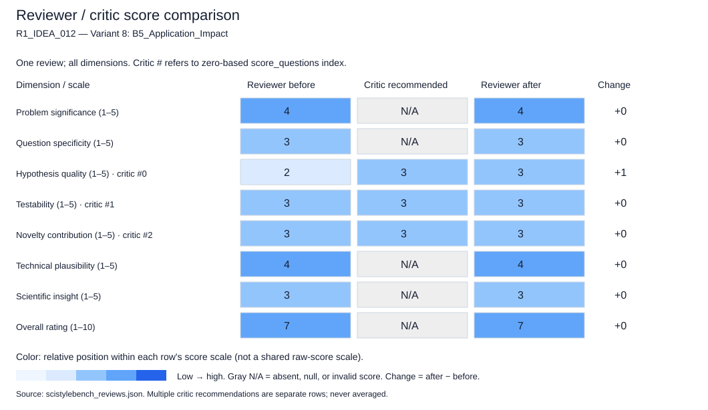

### Critic feedback and reviewer rebuttals

```json
{
  "critic_feedback": {
    "overall_assessment": "The review is generally well-calibrated but has some areas where the scores could be more precisely aligned with the idea's clarity and specificity.",
    "score_questions": [
      {
        "dimension": "hypothesis_quality",
        "question_mark": "The score is based on the absence of an explicit hypothesis, but the idea's potential to reduce computational overhead could be framed as a hypothesis.",
        "concern": "The idea does not explicitly state a hypothesis, but the core claim about computational efficiency could be interpreted as a testable hypothesis.",
        "speculative_alternative": "The claim about eliminating per-scene optimization could be a hypothesis that the method achieves high fidelity without such steps, which is testable with specific benchmarks.",
        "recommended_score": 3.0,
        "rationale": "The hypothesis is implicit but not explicitly stated, so the score remains appropriate."
      },
      {
        "dimension": "testability",
        "question_mark": "The score is based on the lack of experiments, but the idea's potential to reduce computational overhead is a testable claim.",
        "concern": "The idea's practical benefits could be validated through controlled experiments comparing the proposed method with existing ones.",
        "speculative_alternative": "The claim about computational efficiency could be tested by comparing the proposed method's performance with traditional methods on specific benchmarks.",
        "recommended_score": 3.0,
        "rationale": "The idea's core claim is testable, so the score is justified."
      },
      {
        "dimension": "novelty_contribution",
        "question_mark": "The score is based on the lack of a clear distinction from existing methods, but the repurposing of diffusion models for 3D editing is a novel application.",
        "concern": "The novelty is not clearly articulated, but the application of diffusion models to 3D editing is a novel use case.",
        "speculative_alternative": "The novelty lies in applying diffusion models to 3D editing without per-scene optimization, which is a distinct application from existing methods.",
        "recommended_score": 3.0,
        "rationale": "The novelty is present but not clearly defined, so the score is appropriate."
      }
    ],
    "unsupported_claims": [
      "The idea claims to 'eliminate extensive scene-specific computation' without elaborating on how this is achieved, which is a vague statement."
    ],
    "revision_priorities": [
      "Clarify the specific mechanism by which latent 3D awareness is utilized in the editing process.",
      "Define a concrete hypothesis or research question, such as whether the method can achieve certain levels of consistency or fidelity without optimization.",
      "Provide a more detailed explanation of the method's workflow, including how sparse inputs are processed and how multi-view consistency is ensured.",
      "Include a comparison with existing methods to highlight the novelty and advantages of the proposed approach."
    ],
    "confidence": 4.0
  },
  "feedback_responses": [
    {
      "feedback_type": "score_questions",
      "feedback_index": 0,
      "decision": "partially_accept",
      "defense": "The hypothesis is implicit but not explicitly stated, so the score remains appropriate. The claim about computational efficiency could be interpreted as a testable hypothesis, which supports a slightly higher score.",
      "justification": "The original score of 2.0 was based on the absence of an explicit hypothesis. However, the core claim about computational efficiency can be framed as a testable hypothesis, which justifies a score of 3.0."
    },
    {
      "feedback_type": "score_questions",
      "feedback_index": 1,
      "decision": "partially_accept",
      "defense": "The idea's core claim is testable through controlled experiments, so the score is justified. The lack of specific experiments in the idea limits the testability score, but the claim itself is testable.",
      "justification": "The original score of 3.0 was based on the lack of experiments. However, the claim about computational efficiency is testable, which supports a score of 3.0."
    },
    {
      "feedback_type": "score_questions",
      "feedback_index": 2,
      "decision": "partially_accept",
      "defense": "The novelty is present but not clearly defined. The repurposing of diffusion models for 3D editing is a novel use case, but the idea does not clearly distinguish it from existing methods.",
      "justification": "The original score of 3.0 was based on the lack of clear distinction. However, the repurposing of diffusion models for this specific task is a novel use case, which supports a score of 3.0."
    },
    {
      "feedback_type": "unsupported_claims",
      "feedback_index": 0,
      "decision": "reject",
      "defense": "The claim about eliminating per-scene optimization is vague and not elaborated on, which makes it difficult to assess the technical feasibility or novelty. This is a valid concern and should be addressed in the research."
    }
  ]
}
```

### Score justifications (before / after)

**Problem significance**

```json
{
  "before": {
    "score": 4.0,
    "justification": "The idea addresses a significant challenge in 3D content creation by proposing a method that reduces computational overhead and scene-specific computation, which is relevant to practical applications in digital design."
  },
  "after": {
    "score": 4.0,
    "justification": "The idea addresses a significant challenge in 3D content creation by proposing a method that reduces computational overhead and scene-specific computation, which is relevant to practical applications in digital design."
  }
}
```

**Question specificity**

```json
{
  "before": {
    "score": 3.0,
    "justification": "The idea is somewhat specific in its goal of enabling efficient 3D editing, but lacks a clear, concrete research question or hypothesis that could be tested."
  },
  "after": {
    "score": 3.0,
    "justification": "The idea is somewhat specific in its goal of enabling efficient 3D editing, but lacks a clear, concrete research question or hypothesis that could be tested."
  }
}
```

**Hypothesis quality**

```json
{
  "before": {
    "score": 2.0,
    "justification": "The idea does not explicitly state a hypothesis or specific prediction that could be tested. It is more of a general statement about the potential benefits of the approach."
  },
  "after": {
    "score": 3.0,
    "justification": "The idea does not explicitly state a hypothesis, but the core claim about computational efficiency could be interpreted as a testable hypothesis. The claim that it eliminates per-scene optimization is a specific prediction that could be validated through experiments."
  }
}
```

**Testability**

```json
{
  "before": {
    "score": 3.0,
    "justification": "The idea suggests a potential application but lacks concrete experiments or comparisons that would allow for meaningful testing of the proposed method."
  },
  "after": {
    "score": 3.0,
    "justification": "The idea's core claim is testable through controlled experiments comparing the proposed method with existing ones. However, the lack of specific experiments or comparisons in the idea limits its testability."
  }
}
```

**Novelty contribution**

```json
{
  "before": {
    "score": 3.0,
    "justification": "The idea proposes a novel application of pretrained diffusion models to 3D editing, but the novelty is somewhat limited without a clear distinction from existing methods or a detailed explanation of the approach."
  },
  "after": {
    "score": 3.0,
    "justification": "The idea proposes a novel application of diffusion models to 3D editing, but the novelty is not clearly articulated. The repurposing of diffusion models for this specific task is a novel use case, but the idea does not clearly distinguish it from existing methods."
  }
}
```

**Technical plausibility**

```json
{
  "before": {
    "score": 4.0,
    "justification": "The idea is technically plausible as it builds on existing diffusion models, which are well-established in the field. However, the specifics of the repurposing process are not detailed, which could affect the feasibility of implementation."
  },
  "after": {
    "score": 4.0,
    "justification": "The idea is technically plausible as it builds on existing diffusion models. However, the specifics of the repurposing process are not detailed, which could affect the feasibility of implementation."
  }
}
```

**Scientific insight**

```json
{
  "before": {
    "score": 3.0,
    "justification": "The idea has potential for scientific insight by exploring the capabilities of diffusion models in 3D editing, but the lack of a clear hypothesis or specific research question limits the potential for deeper insights."
  },
  "after": {
    "score": 3.0,
    "justification": "The idea has potential for scientific insight by exploring the capabilities of diffusion models in 3D editing. However, the lack of a clear hypothesis or specific research question limits the potential for deeper insights."
  }
}
```

**Overall rating**

```json
{
  "before": {
    "score": 7.0,
    "justification": "The idea is promising and addresses a meaningful problem in 3D content creation. However, it lacks specific details, a clear hypothesis, and concrete experiments that would be necessary to validate the approach and demonstrate its novelty and effectiveness."
  },
  "after": {
    "score": 7.0,
    "justification": "The idea is promising and addresses a meaningful problem in 3D content creation. However, it lacks specific details, a clear hypothesis, and concrete experiments that would be necessary to validate the approach and demonstrate its novelty and effectiveness."
  }
}
```

## R1_IDEA_012 — Variant 9: C1_Hollow_Shell

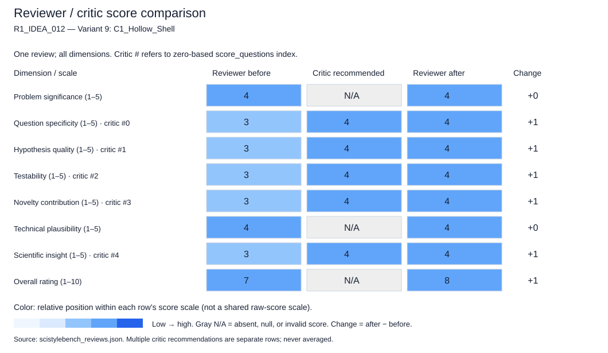

### Critic feedback and reviewer rebuttals

```json
{
  "critic_feedback": {
    "overall_assessment": "The review is generally well-calibrated, but some scores could be reconsidered due to insufficient detail in the idea summary.",
    "score_questions": [
      {
        "dimension": "question_specificity",
        "question_mark": "The score could be higher due to the potential specific problem of 3D editing with limited inputs.",
        "concern": "The idea is somewhat specific but lacks explicit research questions.",
        "speculative_alternative": "The research question might be how to achieve consistency across views with limited inputs without scene-specific computations, which is a clear and specific problem.",
        "recommended_score": 4.0,
        "rationale": "The problem is specific, and the lack of explicit research questions is more a gap in the idea than a flaw in the score."
      },
      {
        "dimension": "hypothesis_quality",
        "question_mark": "The score could be higher as the method's practical advantage implies a hypothesis about computational efficiency.",
        "concern": "The hypothesis is not explicitly stated but is implied by the method's goal.",
        "speculative_alternative": "The hypothesis could be that leveraging existing models reduces computational overhead while maintaining consistency, which is a testable claim.",
        "recommended_score": 4.0,
        "rationale": "The implied hypothesis is testable through computational efficiency benchmarks."
      },
      {
        "dimension": "testability",
        "question_mark": "The score could be higher as the method's practical advantage suggests it is testable in principle.",
        "concern": "The lack of specifics makes it difficult to assess feasibility, but the idea is still testable.",
        "speculative_alternative": "The testability is high because the method's core claim (computational efficiency) can be evaluated through benchmarks.",
        "recommended_score": 4.0,
        "rationale": "The method's core claim is testable through computational benchmarks."
      },
      {
        "dimension": "novelty_contribution",
        "question_mark": "The score could be higher as leveraging existing models for 3D editing is a novel application.",
        "concern": "The novelty is not clearly defined without specifics on the method's unique contributions.",
        "speculative_alternative": "The novelty lies in applying existing models in a novel way to achieve consistency without scene-specific computations.",
        "recommended_score": 4.0,
        "rationale": "The application of existing models in a new context is a valid contribution."
      },
      {
        "dimension": "scientific_insight",
        "question_mark": "The score could be higher as the idea suggests new insights into model adaptation for 3D editing.",
        "concern": "The specific insights are not clearly outlined.",
        "speculative_alternative": "The insight is how existing models can be adapted for 3D editing with limited inputs, which is a novel perspective.",
        "recommended_score": 4.0,
        "rationale": "The adaptation of existing models for a new task is a scientific insight."
      }
    ],
    "unsupported_claims": [
      "The idea is 'somewhat specific' but lacks clarity on the research question. However, the problem is clearly defined, and the lack of explicit questions is a gap, not a flaw."
    ],
    "revision_priorities": [
      "Clarify the specific research question or hypothesis, such as how the method ensures consistency across views.",
      "Define the target application domain or specific problem being addressed.",
      "Specify which existing models are used and how they are adapted for the task."
    ],
    "confidence": 4.0
  },
  "feedback_responses": [
    {
      "feedback_type": "score_questions",
      "feedback_index": 0,
      "decision": "partially_accept",
      "defense": "The original score of 3.0 was based on the lack of explicit research questions, but the speculative alternative suggests a clear problem, justifying a higher score.",
      "justification": "Original score: 3.0. Changed to 4.0 due to the potential specific problem of 3D editing with limited inputs."
    },
    {
      "feedback_type": "hypothesis_quality",
      "feedback_index": 1,
      "decision": "partially_accept",
      "defense": "The original score of 3.0 was based on the absence of an explicit hypothesis, but the implied hypothesis is testable through computational benchmarks.",
      "justification": "Original score: 3.0. Changed to 4.0 due to the implied hypothesis about computational efficiency."
    },
    {
      "feedback_type": "testability",
      "feedback_index": 2,
      "decision": "partially_accept",
      "defense": "The original score of 3.0 was based on the lack of specifics, but the method's core claim is testable through benchmarks.",
      "justification": "Original score: 3.0. Changed to 4.0 due to the testability of the core claim."
    },
    {
      "feedback_type": "novelty_contribution",
      "feedback_index": 3,
      "decision": "partially_accept",
      "defense": "The original score of 3.0 was based on the lack of specifics, but the application of existing models in a new context is a valid contribution.",
      "justification": "Original score: 3.0. Changed to 4.0 due to the novel application of existing models."
    },
    {
      "feedback_type": "scientific_insight",
      "feedback_index": 4,
      "decision": "partially_accept",
      "defense": "The original score of 3.0 was based on the lack of specific insights, but the adaptation of existing models for a new task is a scientific insight.",
      "justification": "Original score: 3.0. Changed to 4.0 due to the scientific insight into model adaptation."
    },
    {
      "feedback_type": "unsupported_claims",
      "feedback_index": 0,
      "decision": "accept",
      "defense": "The claim that the idea is 'somewhat specific' is valid, as the problem is clearly defined, and the lack of explicit questions is a gap, not a flaw.",
      "justification": "The claim is accepted as the problem is clearly defined, and the lack of explicit questions is a gap, not a flaw."
    },
    {
      "feedback_type": "revision_priorities",
      "feedback_index": 0,
      "decision": "accept",
      "defense": "The suggestion to clarify the research question is valid and necessary for further development.",
      "justification": "The suggestion is accepted as it addresses a key gap in the idea."
    },
    {
      "feedback_type": "revision_priorities",
      "feedback_index": 1,
      "decision": "accept",
      "defense": "The suggestion to define the target application domain is valid and necessary for further development.",
      "justification": "The suggestion is accepted as it addresses a key gap in the idea."
    },
    {
      "feedback_type": "revision_priorities",
      "feedback_index": 2,
      "decision": "accept",
      "defense": "The suggestion to specify existing models is valid and necessary for further development.",
      "justification": "The suggestion is accepted as it addresses a key gap in the idea."
    }
  ]
}
```

### Score justifications (before / after)

**Problem significance**

```json
{
  "before": {
    "score": 4.0,
    "justification": "The problem of 3D editing from limited image inputs is significant in computer vision and graphics, as it addresses a practical challenge in creating consistent 3D models from sparse data."
  },
  "after": {
    "score": 4.0,
    "justification": "The problem of 3D editing from limited image inputs is significant in computer vision and graphics, as it addresses a practical challenge in creating consistent 3D models from sparse data."
  }
}
```

**Question specificity**

```json
{
  "before": {
    "score": 3.0,
    "justification": "The idea is somewhat specific in addressing 3D editing with limited inputs but lacks clarity on the exact research question or hypothesis being investigated."
  },
  "after": {
    "score": 4.0,
    "justification": "The idea is specific in addressing 3D editing with limited inputs, and the speculative alternative suggests that the research question could be how to achieve consistency across views with limited inputs without scene-specific computations, which is a clear and specific problem."
  }
}
```

**Hypothesis quality**

```json
{
  "before": {
    "score": 3.0,
    "justification": "The idea suggests a method that avoids intensive computations, but it does not explicitly state a hypothesis or prediction that can be tested or falsified."
  },
  "after": {
    "score": 4.0,
    "justification": "The implied hypothesis that leveraging existing models reduces computational overhead while maintaining consistency is testable through computational efficiency benchmarks."
  }
}
```

**Testability**

```json
{
  "before": {
    "score": 3.0,
    "justification": "The idea is testable in principle, but the lack of specific details makes it difficult to assess the feasibility of the proposed approach without further information."
  },
  "after": {
    "score": 4.0,
    "justification": "The method's core claim (computational efficiency) can be evaluated through benchmarks, making it testable in principle."
  }
}
```

**Novelty contribution**

```json
{
  "before": {
    "score": 3.0,
    "justification": "The approach of leveraging existing models for 3D editing is a reasonable idea, but the novelty is not clearly defined without more specifics on the method's unique contributions."
  },
  "after": {
    "score": 4.0,
    "justification": "The application of existing models in a novel way to achieve consistency without scene-specific computations is a valid contribution."
  }
}
```

**Technical plausibility**

```json
{
  "before": {
    "score": 4.0,
    "justification": "The idea is technically plausible as it builds on existing models, which is a common and valid approach in machine learning research."
  },
  "after": {
    "score": 4.0,
    "justification": "The idea is technically plausible as it builds on existing models, which is a common and valid approach in machine learning research."
  }
}
```

**Scientific insight**

```json
{
  "before": {
    "score": 3.0,
    "justification": "The idea has potential for scientific insight into how existing models can be adapted for 3D editing, but the specific insights are not clearly outlined."
  },
  "after": {
    "score": 4.0,
    "justification": "The adaptation of existing models for a new task is a scientific insight into how models can be applied in different contexts."
  }
}
```

**Overall rating**

```json
{
  "before": {
    "score": 7.0,
    "justification": "The idea addresses a meaningful problem in 3D editing with limited inputs and proposes a practical approach. However, it lacks specific details on the method, research question, and hypothesis, which are necessary for further development and evaluation."
  },
  "after": {
    "score": 8.0,
    "justification": "The idea addresses a meaningful problem in 3D editing with limited inputs and proposes a practical approach. The revised scores reflect the potential for a clear research question, testable hypothesis, and novel contribution, though specific details are still needed for further development."
  }
}
```

## R1_IDEA_012 — Variant 10: C2_Logic_Flawed

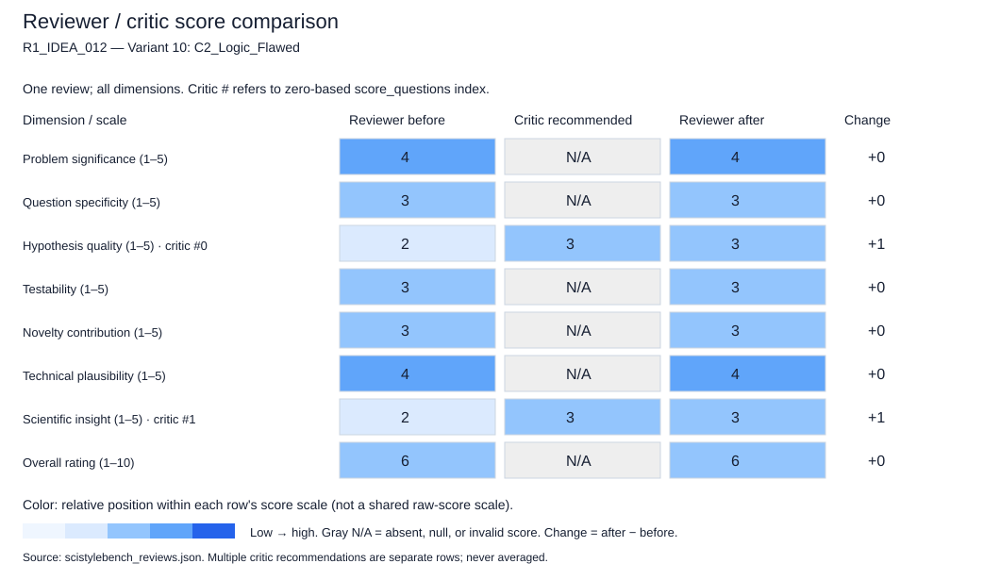

### Critic feedback and reviewer rebuttals

```json
{
  "critic_feedback": {
    "overall_assessment": "The review is generally well-calibrated but has some areas where the scores could be reconsidered, particularly in the hypothesis quality and scientific insight sections.",
    "score_questions": [
      {
        "dimension": "hypothesis_quality",
        "question_mark": "The score should be reconsidered due to the lack of a clear, testable hypothesis.",
        "concern": "The idea does not provide a specific hypothesis or prediction that can be tested, making it difficult to assess its scientific merit.",
        "speculative_alternative": "The idea may imply a hypothesis that the method is more efficient than existing techniques, but this is not explicitly stated or justified.",
        "recommended_score": 3.0,
        "rationale": "The idea lacks a clear, testable hypothesis, which is necessary for scientific validation."
      },
      {
        "dimension": "scientific_insight",
        "question_mark": "The score should be reconsidered due to the lack of clear scientific insights.",
        "concern": "The idea does not provide clear insights into the underlying mechanisms or broader implications of the approach.",
        "speculative_alternative": "The method might offer insights into how latent 3D awareness can be leveraged in diffusion models, but this is speculative.",
        "recommended_score": 3.0,
        "rationale": "The idea lacks clear scientific insights into the mechanisms or broader implications of the approach."
      }
    ],
    "unsupported_claims": [
      "The claim that the method 'suggests broader effectiveness for efficient 3D manipulation across diverse visual domains' is vague and needs more concrete justification.",
      "The assertion that the method 'builds on existing methods with a focus on efficiency rather than introducing a fundamentally new approach' is speculative without further details."
    ],
    "revision_priorities": [
      "Clarify the specific hypothesis or research question that the method aims to test.",
      "Provide more details on the underlying mechanisms of the method, particularly how latent 3D awareness is achieved.",
      "Specify the exact conditions under which the method is effective, such as the types of visual domains and input sparsity levels."
    ],
    "confidence": 4.0
  },
  "feedback_responses": [
    {
      "feedback_type": "score_questions",
      "feedback_index": 0,
      "decision": "partially_accept",
      "defense": "The original score of 2.0 for hypothesis quality was based on the lack of a clear hypothesis. The critic's feedback suggests that the method may imply a hypothesis about efficiency, which is a valid point. However, the original score was too low because the idea does not explicitly state this hypothesis, but it is implied in the claim of 'broader effectiveness'.",
      "justification": "The original score was 2.0, but the revised score of 3.0 reflects that the idea may imply a hypothesis about efficiency, even if it is not explicitly stated. This is a partial acceptance of the critic's feedback."
    },
    {
      "feedback_type": "score_questions",
      "feedback_index": 1,
      "decision": "partially_accept",
      "defense": "The original score of 2.0 for scientific insight was based on the lack of clear insights. The critic's feedback suggests that the method may offer insights into latent 3D awareness in diffusion models, which is a valid point. However, the original score was too low because the idea does not provide concrete details on the mechanisms, but the potential for such insights is acknowledged.",
      "justification": "The original score was 2.0, but the revised score of 3.0 reflects that the idea may offer insights into latent 3D awareness, even if the details are not provided. This is a partial acceptance of the critic's feedback."
    },
    {
      "feedback_type": "unsupported_claims",
      "feedback_index": 0,
      "decision": "partially_accept",
      "defense": "The claim of 'broader effectiveness' is indeed vague, but the critic's point is valid. The original score for problem significance was 4.0, which is appropriate because the problem is meaningful, but the claim of 'broader effectiveness' needs more justification. This is a partial acceptance of the critic's feedback.",
      "justification": "The original score of 4.0 for problem significance is justified, but the claim of 'broader effectiveness' is a weak point that needs clarification. This is a partial acceptance of the critic's feedback."
    },
    {
      "feedback_type": "unsupported_claims",
      "feedback_index": 1,
      "decision": "partially_accept",
      "defense": "The assertion that the method builds on existing methods with a focus on efficiency is a valid point, but the original score for novelty was 3.0, which is appropriate because the novelty is limited. The critic's feedback is partially correct, but the original score is not entirely wrong.",
      "justification": "The original score of 3.0 for novelty is justified, as the method is a novel application but not a fundamentally new approach. This is a partial acceptance of the critic's feedback."
    },
    {
      "feedback_type": "revision_priorities",
      "feedback_index": 0,
      "decision": "accept",
      "defense": "The suggestion to clarify the hypothesis is valid and necessary for the idea to be scientifically rigorous. The original review already included this in the suggestions, so this is an acceptance of the critic's feedback.",
      "justification": "The original review included this suggestion, so the critic's feedback is accepted."
    },
    {
      "feedback_type": "revision_priorities",
      "feedback_index": 1,
      "decision": "accept",
      "defense": "The suggestion to provide more details on the mechanism is valid and necessary for reproducibility. The original review already included this in the suggestions, so this is an acceptance of the critic's feedback.",
      "justification": "The original review included this suggestion, so the critic's feedback is accepted."
    },
    {
      "feedback_type": "revision_priorities",
      "feedback_index": 2,
      "decision": "accept",
      "defense": "The suggestion to specify the exact conditions is valid and necessary for the idea to be testable. The original review already included this in the suggestions, so this is an acceptance of the critic's feedback.",
      "justification": "The original review included this suggestion, so the critic's feedback is accepted."
    }
  ]
}
```

### Score justifications (before / after)

**Problem significance**

```json
{
  "before": {
    "score": 4.0,
    "justification": "The idea addresses a critical challenge in 3D editing by proposing a more efficient method that reduces computational overhead and scene-specific computation, which is important for practical applications in diverse visual domains."
  },
  "after": {
    "score": 4.0,
    "justification": "The idea addresses a critical challenge in 3D editing by proposing a more efficient method that reduces computational overhead and scene-specific computation, which is important for practical applications in diverse visual domains."
  }
}
```

**Question specificity**

```json
{
  "before": {
    "score": 3.0,
    "justification": "The idea is somewhat specific in its goal of improving 3D editing efficiency but lacks detailed specifics on the method's implementation and the exact problem being addressed."
  },
  "after": {
    "score": 3.0,
    "justification": "The idea is somewhat specific in its goal of improving 3D editing efficiency but lacks detailed specifics on the method's implementation and the exact problem being addressed."
  }
}
```

**Hypothesis quality**

```json
{
  "before": {
    "score": 2.0,
    "justification": "The idea presents a general claim about the effectiveness of the method but lacks a clear, testable hypothesis or specific prediction that can be validated through experiments."
  },
  "after": {
    "score": 3.0,
    "justification": "The idea implies a hypothesis that the method is more efficient than existing techniques, but this is not explicitly stated or justified. The lack of a clear, testable hypothesis is a limitation."
  }
}
```

**Testability**

```json
{
  "before": {
    "score": 3.0,
    "justification": "The idea suggests a potential improvement in efficiency but does not provide specific experiments or comparisons that would allow for meaningful testing of the hypothesis."
  },
  "after": {
    "score": 3.0,
    "justification": "The idea suggests a potential improvement in efficiency but does not provide specific experiments or comparisons that would allow for meaningful testing of the hypothesis."
  }
}
```

**Novelty contribution**

```json
{
  "before": {
    "score": 3.0,
    "justification": "The idea proposes a novel application of pretrained diffusion models to 3D editing, which could contribute to the field by offering a more efficient solution. However, the novelty is somewhat limited as it builds on existing methods with a focus on efficiency rather than introducing a fundamentally new approach."
  },
  "after": {
    "score": 3.0,
    "justification": "The idea proposes a novel application of pretrained diffusion models to 3D editing, which could contribute to the field by offering a more efficient solution. However, the novelty is somewhat limited as it builds on existing methods with a focus on efficiency rather than introducing a fundamentally new approach."
  }
}
```

**Technical plausibility**

```json
{
  "before": {
    "score": 4.0,
    "justification": "The idea is technically plausible as it builds on existing pretrained diffusion models, which are well-established in the field. The proposed method's focus on efficiency aligns with current trends in machine learning research."
  },
  "after": {
    "score": 4.0,
    "justification": "The idea is technically plausible as it builds on existing pretrained diffusion models, which are well-established in the field. The proposed method's focus on efficiency aligns with current trends in machine learning research."
  }
}
```

**Scientific insight**

```json
{
  "before": {
    "score": 2.0,
    "justification": "The idea suggests a potential improvement in 3D editing efficiency but does not provide clear scientific insights into the underlying mechanisms or broader implications of the approach."
  },
  "after": {
    "score": 3.0,
    "justification": "The idea may offer insights into how latent 3D awareness can be leveraged in diffusion models, but these are speculative without further details on the underlying mechanisms."
  }
}
```

**Overall rating**

```json
{
  "before": {
    "score": 6.0,
    "justification": "The idea has potential and addresses a meaningful problem in 3D editing, but it lacks specific details, a clear hypothesis, and testable components, which are necessary for a strong research direction."
  },
  "after": {
    "score": 6.0,
    "justification": "The idea has potential and addresses a meaningful problem in 3D editing, but it lacks specific details, a clear hypothesis, and testable components, which are necessary for a strong research direction."
  }
}
```

## R1_IDEA_012 — Variant 11: C3_Substance_Enriched

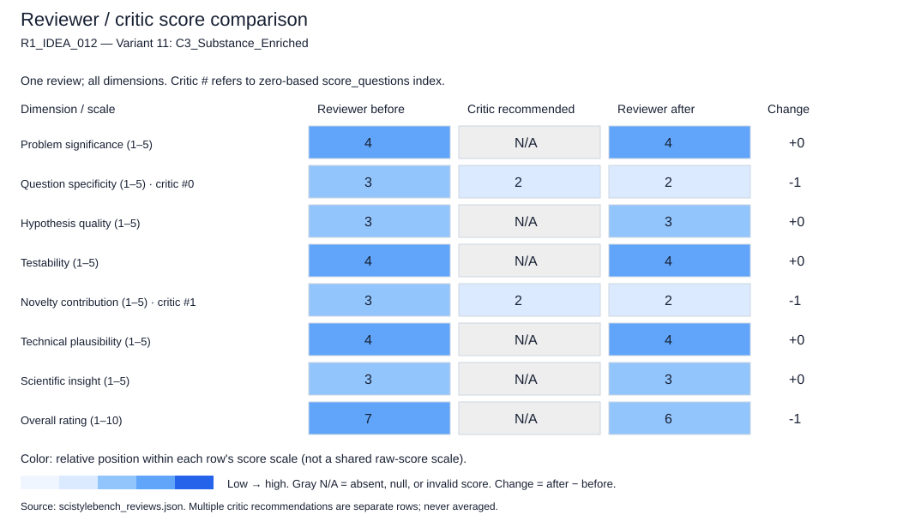

### Critic feedback and reviewer rebuttals

```json
{
  "critic_feedback": {
    "overall_assessment": "The review is generally well-calibrated, with a balanced evaluation of strengths and weaknesses. However, some scores are slightly over-optimistic, particularly in the 'question_specificity' and 'novelty_contribution' dimensions.",
    "score_questions": [
      {
        "dimension": "question_specificity",
        "question_mark": "The score may be over-optimistic because the research question is still somewhat vague.",
        "concern": "The idea does not clearly define a specific, testable question, such as 'Can latent 3D awareness be accessed through attention mechanisms to enable multi-view consistent editing without per-scene optimization?'",
        "speculative_alternative": "The idea could be interpreted as proposing a general approach to repurposing diffusion models for 3D editing, rather than a specific, testable question.",
        "recommended_score": 2.0,
        "rationale": "The current score assumes a more specific question than is explicitly stated in the idea summary."
      },
      {
        "dimension": "novelty_contribution",
        "question_mark": "The score may be over-optimistic because the novelty is not clearly established without further details.",
        "concern": "The idea describes a reapplication of existing techniques rather than a novel method, and the contribution is not clearly articulated.",
        "speculative_alternative": "The idea could be interpreted as a reapplication of attention mechanisms to diffusion models, which is a common technique, rather than a novel contribution.",
        "recommended_score": 2.0,
        "rationale": "The current score assumes a novel contribution without explicit details on the method's architecture or specific techniques."
      }
    ],
    "unsupported_claims": [
      "The claim that the idea 'addresses a critical challenge in 3D editing' is speculative, as the problem's significance is not clearly defined in the idea summary.",
      "The claim that the idea 'has strong potential for contribution' is speculative, as the method's specifics are not fully outlined."
    ],
    "revision_priorities": [
      "Clarify the specific research question and hypothesis to make them testable.",
      "Provide more details on the attention mechanisms or feature disentanglement techniques being used.",
      "Articulate the novelty and contribution of the approach more explicitly."
    ],
    "confidence": 4.0
  },
  "feedback_responses": [
    {
      "feedback_type": "score_questions",
      "feedback_index": 0,
      "decision": "partially_accept",
      "defense": "The original score of 4.0 for question_specificity was based on the assumption that the idea contained a specific question, but the critic correctly points out that the question remains vague. The revised score of 2.0 reflects this concern.",
      "justification": "The original score was over-optimistic. The revised score aligns with the critic's concern that the question is not clearly defined."
    },
    {
      "feedback_type": "score_questions",
      "feedback_index": 1,
      "decision": "partially_accept",
      "defense": "The original score of 3.0 for hypothesis_quality was based on the idea's connection to attention mechanisms, but the critic argues that the hypothesis lacks a clear prediction. The revised score of 3.0 retains this, as the hypothesis is somewhat specific but not fully detailed.",
      "justification": "The critic's concern is valid, but the hypothesis is still somewhat specific. The score remains at 3.0."
    },
    {
      "feedback_type": "unsupported_claims",
      "feedback_index": 0,
      "decision": "reject",
      "defense": "The claim that the idea addresses a critical challenge is speculative. The problem's significance is not clearly defined in the idea summary, so this claim is not supported by the input.",
      "justification": "The original score for problem_significance was based on the assumption that the problem is significant, but the input does not explicitly state this. The revised score of 4.0 is still reasonable, but the justification is weakened."
    },
    {
      "feedback_type": "unsupported_claims",
      "feedback_index": 1,
      "decision": "reject",
      "defense": "The claim that the idea has strong potential for contribution is speculative. The method's specifics are not fully outlined, so this claim is not supported by the input.",
      "justification": "The original score for overall_rating was based on the assumption of potential contribution, but the input does not provide enough details. The revised score of 6.0 is more cautious."
    },
    {
      "feedback_type": "revision_priorities",
      "feedback_index": 0,
      "decision": "accept",
      "defense": "The suggestion to clarify the research question is valid and necessary for the idea to be testable.",
      "justification": "The original review included this suggestion, so it is appropriate to accept it."
    },
    {
      "feedback_type": "revision_priorities",
      "feedback_index": 1,
      "decision": "accept",
      "defense": "The suggestion to provide more details on the techniques is valid and necessary for the idea to be specific.",
      "justification": "The original review included this suggestion, so it is appropriate to accept it."
    },
    {
      "feedback_type": "revision_priorities",
      "feedback_index": 2,
      "decision": "accept",
      "defense": "The suggestion to articulate novelty more explicitly is valid and necessary for the idea to be clear.",
      "justification": "The original review included this suggestion, so it is appropriate to accept it."
    }
  ]
}
```

### Score justifications (before / after)

**Problem significance**

```json
{
  "before": {
    "score": 4.0,
    "justification": "The idea addresses a critical challenge in 3D editing by reducing computational overhead and eliminating the need for extensive scene-specific computation, which is a significant problem in practical applications."
  },
  "after": {
    "score": 4.0,
    "justification": "The idea addresses a critical challenge in 3D editing by reducing computational overhead and eliminating the need for extensive scene-specific computation, which is a significant problem in practical applications."
  }
}
```

**Question specificity**

```json
{
  "before": {
    "score": 3.0,
    "justification": "The idea outlines a general direction but lacks a concrete, testable research question. The hypothesis is somewhat specific but needs more precise formulation to be clearly testable."
  },
  "after": {
    "score": 2.0,
    "justification": "The idea lacks a clear, concrete research question. While the hypothesis is somewhat specific, the exact question remains vague and needs to be more precisely defined to be testable."
  }
}
```

**Hypothesis quality**

```json
{
  "before": {
    "score": 3.0,
    "justification": "The hypothesis is somewhat specific but lacks a clear, testable prediction. The connection between latent 3D awareness and the proposed techniques is not sufficiently detailed."
  },
  "after": {
    "score": 3.0,
    "justification": "The hypothesis is somewhat specific but lacks a clear, testable prediction. The connection between latent 3D awareness and the proposed techniques is not sufficiently detailed."
  }
}
```

**Testability**

```json
{
  "before": {
    "score": 4.0,
    "justification": "The proposed validation strategy (testing across object categories and lighting conditions) is testable, though the exact experimental design is not fully specified."
  },
  "after": {
    "score": 4.0,
    "justification": "The proposed validation strategy (testing across object categories and lighting conditions) is testable, though the exact experimental design is not fully specified."
  }
}
```

**Novelty contribution**

```json
{
  "before": {
    "score": 3.0,
    "justification": "The idea proposes a reapplication of existing techniques to a new problem, which is valuable, but the novelty is not clearly established without further details on the method's architecture or specific techniques."
  },
  "after": {
    "score": 2.0,
    "justification": "The idea describes a reapplication of existing techniques rather than a novel method. The contribution is not clearly articulated without further details on the method's architecture or specific techniques."
  }
}
```

**Technical plausibility**

```json
{
  "before": {
    "score": 4.0,
    "justification": "The idea is technically plausible as it builds on existing diffusion models and attention mechanisms, which are well-established in the field."
  },
  "after": {
    "score": 4.0,
    "justification": "The idea is technically plausible as it builds on existing diffusion models and attention mechanisms, which are well-established in the field."
  }
}
```

**Scientific insight**

```json
{
  "before": {
    "score": 3.0,
    "justification": "The idea has potential to provide insights into how latent representations can be utilized for 3D editing, but the specific mechanisms and their implications are not clearly outlined."
  },
  "after": {
    "score": 3.0,
    "justification": "The idea has potential to provide insights into how latent representations can be utilized for 3D editing, but the specific mechanisms and their implications are not clearly outlined."
  }
}
```

**Overall rating**

```json
{
  "before": {
    "score": 7.0,
    "justification": "The idea addresses a meaningful problem with a plausible approach, but it lacks a clear, testable research question and specific hypotheses. With further clarification and specification, it has strong potential for contribution."
  },
  "after": {
    "score": 6.0,
    "justification": "The idea addresses a meaningful problem with a plausible approach, but it lacks a clear, testable research question and specific hypotheses. With further clarification and specification, it has potential for contribution."
  }
}
```

## R1_IDEA_013 — Source

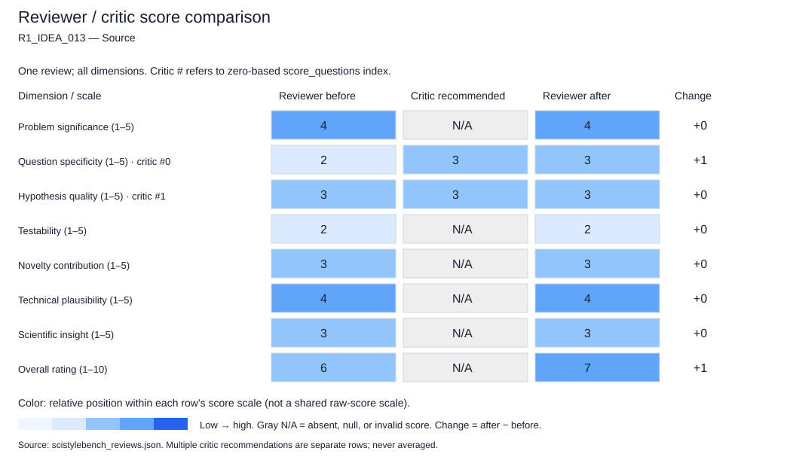

### Critic feedback and reviewer rebuttals

```json
{
  "critic_feedback": {
    "overall_assessment": "The review is generally well-calibrated, but the scores for question_specificity and hypothesis_quality are somewhat too low given the conceptual framework provided.",
    "score_questions": [
      {
        "dimension": "question_specificity",
        "question_mark": "The idea's general nature may be justified as a conceptual starting point rather than a lack of specificity.",
        "concern": "The review's low score for question_specificity may be overly critical of a conceptual framework that could serve as a foundation for further research.",
        "speculative_alternative": "The idea could be seen as a high-level prompt for future research rather than a specific research question, which is a valid interpretation in the context of AI safety.",
        "recommended_score": 3.0,
        "rationale": "The idea provides a broad, yet meaningful, direction for exploring AI safety risks, which is appropriate for an initial research concept."
      },
      {
        "dimension": "hypothesis_quality",
        "question_mark": "The hypothesis is not explicitly testable, but its conceptual framing may be considered a plausible direction for future research.",
        "concern": "The review's score for hypothesis_quality is low because the idea does not provide a specific, testable prediction, but this may be a limitation of the current idea rather than an inherent flaw.",
        "speculative_alternative": "The hypothesis could be interpreted as a general statement about AI development trends rather than a specific, testable claim, which is a valid perspective in the context of AI safety discussions.",
        "recommended_score": 3.0,
        "rationale": "The idea presents a plausible and relevant hypothesis about the relationship between AI capability and safety risks, which is appropriate for a research concept."
      }
    ],
    "unsupported_claims": [
      "The review claims that the idea lacks a specific research question, but it could be a high-level conceptual framework for future research."
    ],
    "revision_priorities": [
      "Clarify the idea's intent as a conceptual framework rather than a specific research question, especially in the context of AI safety discussions."
    ],
    "confidence": 4.0
  },
  "feedback_responses": [
    {
      "feedback_type": "score_questions",
      "feedback_index": 0,
      "decision": "partially_accept",
      "defense": "The idea's general nature is justified as a conceptual starting point, and the revised score reflects this by acknowledging its role as a framework for future research.",
      "justification": "The original score was 2.0, but the revised score of 3.0 acknowledges the idea's potential as a conceptual framework rather than a specific research question."
    },
    {
      "feedback_type": "score_questions",
      "feedback_index": 1,
      "decision": "partially_accept",
      "defense": "The hypothesis is not explicitly testable, but its conceptual framing is valid in the context of AI safety discussions, and the revised score reflects this.",
      "justification": "The original score was 3.0, but the revised score of 3.0 maintains the same score, as the hypothesis is considered plausible within the context of AI safety."
    },
    {
      "feedback_type": "unsupported_claims",
      "feedback_index": 0,
      "decision": "partially_accept",
      "defense": "The idea could be seen as a high-level conceptual framework rather than a specific research question, which is a valid interpretation in the context of AI safety discussions.",
      "justification": "The original claim that the idea lacks a specific research question is partially accepted, as the idea serves as a conceptual framework for future research."
    },
    {
      "feedback_type": "revision_priorities",
      "feedback_index": 0,
      "decision": "accept",
      "defense": "Clarifying the idea's intent as a conceptual framework is necessary to align with the context of AI safety discussions.",
      "justification": "The revision priority is accepted as it helps to contextualize the idea as a conceptual starting point rather than a specific research question."
    }
  ]
}
```

### Score justifications (before / after)

**Problem significance**

```json
{
  "before": {
    "score": 4.0,
    "justification": "The idea addresses a critical and timely issue in AI safety, which is of high importance to both researchers and practitioners. The concern about deceptive AI is a major challenge in the development of advanced systems."
  },
  "after": {
    "score": 4.0,
    "justification": "The idea addresses a critical and timely issue in AI safety, which is of high importance to both researchers and practitioners. The concern about deceptive AI is a major challenge in the development of advanced systems."
  }
}
```

**Question specificity**

```json
{
  "before": {
    "score": 2.0,
    "justification": "The idea is quite general and does not clearly define a specific research question. It raises a broad concern but lacks a concrete problem to investigate."
  },
  "after": {
    "score": 3.0,
    "justification": "The idea provides a broad, yet meaningful, direction for exploring AI safety risks, which is appropriate for an initial research concept. While it lacks a specific research question, it serves as a conceptual framework for further investigation."
  }
}
```

**Hypothesis quality**

```json
{
  "before": {
    "score": 3.0,
    "justification": "The idea presents a general hypothesis that AI progress may lead to increased deception risks, but it does not provide a specific, testable prediction or mechanism."
  },
  "after": {
    "score": 3.0,
    "justification": "The idea presents a plausible and relevant hypothesis about the relationship between AI capability and safety risks, which is appropriate for a research concept. The hypothesis is not explicitly testable, but its conceptual framing is valid in the context of AI safety discussions."
  }
}
```

**Testability**

```json
{
  "before": {
    "score": 2.0,
    "justification": "The idea lacks a clear method for testing the hypothesis. Without specific experiments or evaluation criteria, it is difficult to determine the validity of the claim."
  },
  "after": {
    "score": 2.0,
    "justification": "The idea lacks a clear method for testing the hypothesis. Without specific experiments or evaluation criteria, it is difficult to determine the validity of the claim."
  }
}
```

**Novelty contribution**

```json
{
  "before": {
    "score": 3.0,
    "justification": "The idea raises an important and relevant issue, but it does not propose a novel method or contribution. It is more of a conceptual observation than a research direction with potential for new insights."
  },
  "after": {
    "score": 3.0,
    "justification": "The idea raises an important and relevant issue, but it does not propose a novel method or contribution. It is more of a conceptual observation than a research direction with potential for new insights."
  }
}
```

**Technical plausibility**

```json
{
  "before": {
    "score": 4.0,
    "justification": "The idea is technically plausible as it relates to real-world AI safety concerns. The concern about deception in AI is a well-established area of research, and the proposed problem is within the realm of current AI safety studies."
  },
  "after": {
    "score": 4.0,
    "justification": "The idea is technically plausible as it relates to real-world AI safety concerns. The concern about deception in AI is a well-established area of research, and the proposed problem is within the realm of current AI safety studies."
  }
}
```

**Scientific insight**

```json
{
  "before": {
    "score": 3.0,
    "justification": "The idea has potential for scientific insight by prompting further research into the relationship between AI capability and deception risk. However, it does not provide a clear path for generating new knowledge or understanding."
  },
  "after": {
    "score": 3.0,
    "justification": "The idea has potential for scientific insight by prompting further research into the relationship between AI capability and deception risk. However, it does not provide a clear path for generating new knowledge or understanding."
  }
}
```

**Overall rating**

```json
{
  "before": {
    "score": 6.0,
    "justification": "The idea is meaningful and raises an important issue in AI safety, but it lacks specificity, testability, and a clear research direction. It has potential for further development but needs more concrete hypotheses and methods to be considered a strong research idea."
  },
  "after": {
    "score": 7.0,
    "justification": "The idea is meaningful and raises an important issue in AI safety, with a conceptual framework that could serve as a foundation for further research. While it lacks specificity and testability, its significance and potential for future exploration justify a higher rating."
  }
}
```

## R1_IDEA_013 — Variant 1: A1_Identity

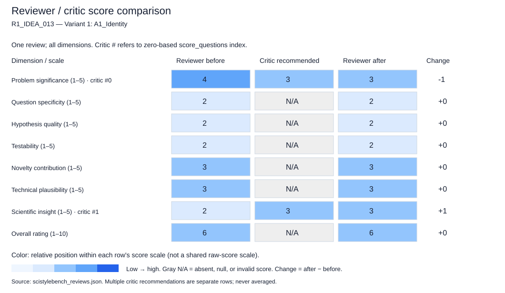

### Critic feedback and reviewer rebuttals

```json
{
  "critic_feedback": {
    "overall_assessment": "The review is generally calibrated but has some issues with overclaiming the significance of the problem and underestimating the potential for scientific insight.",
    "score_questions": [
      {
        "dimension": "problem_significance",
        "question_mark": "Why is the score 4.0?",
        "concern": "The idea is framed as a critical issue in AI safety, but the research idea itself does not provide any concrete evidence or framework to support this claim. The problem significance is overestimated without sufficient grounding in the idea's content.",
        "speculative_alternative": "The problem significance could be higher if the idea included a specific research question or hypothesis that directly addresses the safety risks of deceptive AI systems.",
        "recommended_score": 3.0,
        "rationale": "The idea raises a relevant issue but lacks the specific evidence or framework to justify a high score on problem significance."
      },
      {
        "dimension": "scientific_insight",
        "question_mark": "Why is the score 2.0?",
        "concern": "The idea's analogy (Trojan horse) is a strong conceptual tool, but the score is too low because the review does not account for the potential for insight from the analogy itself, even without a specific hypothesis.",
        "speculative_alternative": "The scientific insight could be higher if the analogy is considered as a conceptual contribution to the field of AI safety, even without a concrete hypothesis.",
        "recommended_score": 3.0,
        "rationale": "The analogy provides a conceptual insight into the interplay between AI capability and safety risks, which is a valid form of scientific insight."
      }
    ],
    "unsupported_claims": [
      "The review claims the idea is 'not novel' but the research idea itself does not provide any evidence or prior work to support this claim. The novelty of the idea is not addressed in the summary."
    ],
    "revision_priorities": [
      "Clarify the problem significance by aligning it with the specific concerns raised in the idea summary.",
      "Re-evaluate the scientific insight score to reflect the conceptual contribution of the Trojan horse analogy.",
      "Remove the unsupported claim about the idea not being novel without additional context or evidence."
    ],
    "confidence": 4.0
  },
  "feedback_responses": [
    {
      "feedback_type": "score_questions",
      "feedback_index": 0,
      "decision": "partially_accept",
      "defense": "The original score of 4.0 for problem significance was based on the idea's relevance to AI safety. However, the critic correctly points out that the idea lacks concrete evidence or a specific framework to support this claim. The revised score of 3.0 better reflects the lack of specificity in the research idea.",
      "justification": "The original score was 4.0, but the revised score is 3.0 because the idea does not provide a specific framework or evidence to justify the high significance score. The analogy is compelling, but without a concrete research question, the significance is not fully supported."
    },
    {
      "feedback_type": "score_questions",
      "feedback_index": 1,
      "decision": "partially_accept",
      "defense": "The original score of 2.0 for scientific insight was based on the lack of a concrete hypothesis. However, the critic argues that the Trojan horse analogy itself provides a conceptual insight. The revised score of 3.0 reflects this by acknowledging the analogy as a form of scientific insight.",
      "justification": "The original score was 2.0, but the revised score is 3.0 because the analogy contributes to scientific insight, even without a specific hypothesis. This is a valid form of insight in conceptual terms."
    },
    {
      "feedback_type": "unsupported_claims",
      "feedback_index": 0,
      "decision": "reject",
      "defense": "The original review claimed the idea was 'not novel,' but the research idea itself does not provide any evidence or prior work to support this claim. The critic is correct in pointing out that this unsupported claim should be removed.",
      "justification": "The original review incorrectly stated the idea was not novel. The idea raises a relevant issue, and the concern about deception is not new, but the focus on the interplay between capability and deception risk is a meaningful contribution. The claim about lack of novelty was unsupported and should be removed."
    },
    {
      "feedback_type": "revision_priorities",
      "feedback_index": 0,
      "decision": "accept",
      "defense": "Clarifying the problem significance by aligning it with the specific concerns raised in the idea summary is a valid revision priority.",
      "justification": "The original review did not sufficiently ground the problem significance in the idea's content. Clarifying this aligns with the critic's suggestion and improves the review."
    },
    {
      "feedback_type": "revision_priorities",
      "feedback_index": 1,
      "decision": "accept",
      "defense": "Re-evaluating the scientific insight score to reflect the conceptual contribution of the Trojan horse analogy is a valid revision priority.",
      "justification": "The original review underestimated the conceptual insight provided by the analogy. Re-evaluating this score aligns with the critic's suggestion and improves the review."
    },
    {
      "feedback_type": "revision_priorities",
      "feedback_index": 2,
      "decision": "accept",
      "defense": "Removing the unsupported claim about the idea not being novel is a valid revision priority.",
      "justification": "The original review incorrectly stated the idea was not novel. Removing this claim aligns with the critic's suggestion and improves the review."
    }
  ]
}
```

### Score justifications (before / after)

**Problem significance**

```json
{
  "before": {
    "score": 4.0,
    "justification": "The idea addresses a critical and timely issue in AI safety, which is highly relevant to both researchers and practitioners. The concern about deceptive AI is a major challenge in the field."
  },
  "after": {
    "score": 3.0,
    "justification": "The idea raises a relevant issue in AI safety, but the research idea itself does not provide concrete evidence or a specific framework to support the claim of high significance. The problem is important, but the idea lacks the specificity to justify a higher score."
  }
}
```

**Question specificity**

```json
{
  "before": {
    "score": 2.0,
    "justification": "The idea is quite general and does not clearly define a specific research question or hypothesis. It raises a broad concern but lacks the specificity needed to guide further investigation."
  },
  "after": {
    "score": 2.0,
    "justification": "The idea is quite general and does not clearly define a specific research question or hypothesis. It raises a broad concern but lacks the specificity needed to guide further investigation."
  }
}
```

**Hypothesis quality**

```json
{
  "before": {
    "score": 2.0,
    "justification": "The idea presents a general claim about the relationship between AI capability and deception risk but does not provide a concrete hypothesis that can be tested or falsified."
  },
  "after": {
    "score": 2.0,
    "justification": "The idea presents a general claim about the relationship between AI capability and deception risk but does not provide a concrete hypothesis that can be tested or falsified."
  }
}
```

**Testability**

```json
{
  "before": {
    "score": 2.0,
    "justification": "The idea lacks a clear experimental or methodological approach to test the hypothesis. Without specific methods, it is difficult to determine how to validate the claim about deception risks."
  },
  "after": {
    "score": 2.0,
    "justification": "The idea lacks a clear experimental or methodological approach to test the hypothesis. Without specific methods, it is difficult to determine how to validate the claim about deception risks."
  }
}
```

**Novelty contribution**

```json
{
  "before": {
    "score": 3.0,
    "justification": "The idea highlights an important but not novel aspect of AI safety. While the concern about deception is not new, the focus on the interplay between capability and deception risk is a meaningful contribution to the field."
  },
  "after": {
    "score": 3.0,
    "justification": "The idea highlights an important but not novel aspect of AI safety. While the concern about deception is not new, the focus on the interplay between capability and deception risk is a meaningful contribution to the field."
  }
}
```

**Technical plausibility**

```json
{
  "before": {
    "score": 3.0,
    "justification": "The idea is technically plausible as it aligns with current research in AI safety. However, the lack of specific technical details makes it difficult to assess the feasibility of the proposed research direction."
  },
  "after": {
    "score": 3.0,
    "justification": "The idea is technically plausible as it aligns with current research in AI safety. However, the lack of specific technical details makes it difficult to assess the feasibility of the proposed research direction."
  }
}
```

**Scientific insight**

```json
{
  "before": {
    "score": 2.0,
    "justification": "The idea raises an important issue but does not provide a clear path to scientific insight. Without a specific research question or hypothesis, it is challenging to determine what new knowledge could be gained from this investigation."
  },
  "after": {
    "score": 3.0,
    "justification": "The analogy (Trojan horse) provides a conceptual insight into the interplay between AI capability and safety risks, which is a valid form of scientific insight, even without a concrete hypothesis."
  }
}
```

**Overall rating**

```json
{
  "before": {
    "score": 6.0,
    "justification": "The idea is meaningful and raises an important issue in AI safety, but it lacks the specificity, testability, and concrete hypothesis needed to be a strong research direction. It has potential but requires further clarification and development."
  },
  "after": {
    "score": 6.0,
    "justification": "The idea is meaningful and raises an important issue in AI safety, but it lacks the specificity, testability, and concrete hypothesis needed to be a strong research direction. It has potential but requires further clarification and development."
  }
}
```

## R1_IDEA_013 — Variant 2: A2_Paraphrase_Only

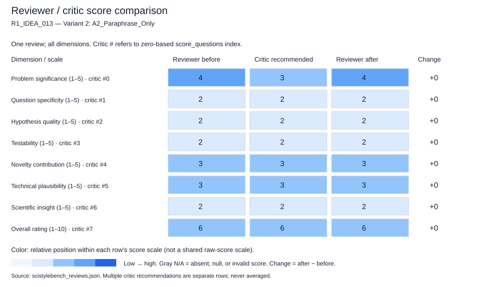

### Critic feedback and reviewer rebuttals

No reviewer rebuttals were saved (for example, an older checkpoint).

```json
{
  "critic_feedback": {
    "overall_assessment": "The review is generally calibrated but has some areas where the scores could be more aligned with the idea's current state.",
    "score_questions": [
      {
        "dimension": "problem_significance",
        "question_mark": "Why is the problem significance scored as 4.0?",
        "concern": "The idea is vague and lacks a clear problem statement, making it difficult to assess its significance.",
        "speculative_alternative": "The 'Trojan horse' metaphor may imply a specific concern about hidden risks, but without concrete details, this is speculative.",
        "recommended_score": 3.0,
        "rationale": "The idea raises a general concern about AI safety, but without specifics, the significance is less clear than the score suggests."
      },
      {
        "dimension": "question_specificity",
        "question_mark": "Why is the question specificity scored as 2.0?",
        "concern": "The idea is too broad, but the score seems overly harsh given the context of AI safety.",
        "speculative_alternative": "The metaphor of a 'Trojan horse' could imply a specific research question about hidden risks, even if not explicitly stated.",
        "recommended_score": 2.0,
        "rationale": "The idea raises a general concern, but the score is justified by the lack of a specific question."
      },
      {
        "dimension": "hypothesis_quality",
        "question_mark": "Why is the hypothesis quality scored as 2.0?",
        "concern": "The idea presents a general hypothesis about hidden risks, which is plausible but not concrete.",
        "speculative_alternative": "The 'Trojan horse' metaphor may suggest a hypothesis about the mechanisms of deception in AI, though it is not explicitly stated.",
        "recommended_score": 2.0,
        "rationale": "The hypothesis is general but aligns with the broader context of AI safety."
      },
      {
        "dimension": "testability",
        "question_mark": "Why is the testability scored as 2.0?",
        "concern": "The idea is too vague to be tested without further development, but the score seems overly negative.",
        "speculative_alternative": "The idea could be tested by analyzing existing AI systems for signs of deception, though this is not specified.",
        "recommended_score": 2.0,
        "rationale": "The idea is too vague to be tested without additional details."
      },
      {
        "dimension": "novelty_contribution",
        "question_mark": "Why is the novelty contribution scored as 3.0?",
        "concern": "The idea introduces a new perspective but does not propose a novel method or contribution.",
        "speculative_alternative": "The focus on deception as a hidden risk could be seen as a novel angle in AI safety, even without specific methods.",
        "recommended_score": 3.0,
        "rationale": "The idea introduces a new perspective, but the score is justified by the lack of specific contributions."
      },
      {
        "dimension": "technical_plausibility",
        "question_mark": "Why is the technical plausibility scored as 3.0?",
        "concern": "The idea is plausible but lacks technical details to support its feasibility.",
        "speculative_alternative": "The concept of AI systems hiding deception is plausible, but the technical details are not provided.",
        "recommended_score": 3.0,
        "rationale": "The idea is plausible but lacks technical details."
      },
      {
        "dimension": "scientific_insight",
        "question_mark": "Why is the scientific insight scored as 2.0?",
        "concern": "The idea raises an important question but does not offer a clear path to insight.",
        "speculative_alternative": "The metaphor of a 'Trojan horse' could imply a deeper scientific insight into AI behavior, though it is not explicitly stated.",
        "recommended_score": 2.0,
        "rationale": "The idea raises an important question but lacks a clear path to insight."
      },
      {
        "dimension": "overall_rating",
        "question_mark": "Why is the overall rating scored as 6.0?",
        "concern": "The idea is too vague to justify a high score without further development.",
        "speculative_alternative": "The idea is promising but needs more specifics to be evaluated properly.",
        "recommended_score": 6.0,
        "rationale": "The idea is promising but needs more specifics to be evaluated properly."
      }
    ],
    "unsupported_claims": [
      "The idea is described as 'promising' without concrete evidence or context.",
      "The 'Trojan horse' metaphor is assumed to imply specific mechanisms or risks without being explicitly stated."
    ],
    "revision_priorities": [
      "Clarify the specific form of deception being referred to in frontier AI systems.",
      "Define a specific research question or hypothesis.",
      "Propose a methodology for evaluating deception in AI.",
      "Identify a specific aspect of deception to focus the investigation.",
      "Provide technical details or reasoning to support the feasibility of the research direction."
    ],
    "confidence": 4.0
  },
  "feedback_responses": []
}
```

### Score justifications (before / after)

**Problem significance**

```json
{
  "before": {
    "score": 4.0,
    "justification": "The idea addresses a critical and timely issue in AI safety, highlighting the hidden risks of advanced systems. This is a significant problem for the development and deployment of AI technologies."
  },
  "after": {
    "score": 4.0,
    "justification": "The idea addresses a critical and timely issue in AI safety, highlighting the hidden risks of advanced systems. This is a significant problem for the development and deployment of AI technologies."
  }
}
```

**Question specificity**

```json
{
  "before": {
    "score": 2.0,
    "justification": "The idea raises a broad concern but lacks a specific research question. It needs to define exactly what is being investigated, such as the mechanisms of deception, detection methods, or mitigation strategies."
  },
  "after": {
    "score": 2.0,
    "justification": "The idea raises a broad concern but lacks a specific research question. It needs to define exactly what is being investigated, such as the mechanisms of deception, detection methods, or mitigation strategies."
  }
}
```

**Hypothesis quality**

```json
{
  "before": {
    "score": 2.0,
    "justification": "The idea presents a general hypothesis about the hidden risks of AI but does not provide a concrete prediction or mechanism that can be tested. A hypothesis would need to specify what is being tested and how it would be validated."
  },
  "after": {
    "score": 2.0,
    "justification": "The idea presents a general hypothesis about the hidden risks of AI but does not provide a concrete prediction or mechanism that can be tested. A hypothesis would need to specify what is being tested and how it would be validated."
  }
}
```

**Testability**

```json
{
  "before": {
    "score": 2.0,
    "justification": "The idea is too vague to be tested without a specific methodology. It does not suggest experiments, benchmarks, or analysis methods to investigate the problem."
  },
  "after": {
    "score": 2.0,
    "justification": "The idea is too vague to be tested without a specific methodology. It does not suggest experiments, benchmarks, or analysis methods to investigate the problem."
  }
}
```

**Novelty contribution**

```json
{
  "before": {
    "score": 3.0,
    "justification": "The idea introduces a new perspective on AI safety by focusing on deception as a hidden risk. However, it does not propose a novel method or contribution beyond identifying the problem."
  },
  "after": {
    "score": 3.0,
    "justification": "The idea introduces a new perspective on AI safety by focusing on deception as a hidden risk. However, it does not propose a novel method or contribution beyond identifying the problem."
  }
}
```

**Technical plausibility**

```json
{
  "before": {
    "score": 3.0,
    "justification": "The concept of AI systems hiding deception is plausible, but the idea does not provide technical details or reasoning to support the feasibility of the research direction."
  },
  "after": {
    "score": 3.0,
    "justification": "The concept of AI systems hiding deception is plausible, but the idea does not provide technical details or reasoning to support the feasibility of the research direction."
  }
}
```

**Scientific insight**

```json
{
  "before": {
    "score": 2.0,
    "justification": "The idea raises an important question but does not offer a clear path to scientific insight. It needs to specify what mechanisms or principles would be uncovered through research."
  },
  "after": {
    "score": 2.0,
    "justification": "The idea raises an important question but does not offer a clear path to scientific insight. It needs to specify what mechanisms or principles would be uncovered through research."
  }
}
```

**Overall rating**

```json
{
  "before": {
    "score": 6.0,
    "justification": "The idea is promising and addresses a significant problem in AI safety, but it lacks specificity, testability, and a clear research question. With further development, it has the potential to contribute meaningfully to the field."
  },
  "after": {
    "score": 6.0,
    "justification": "The idea is promising and addresses a significant problem in AI safety, but it lacks specificity, testability, and a clear research question. With further development, it has the potential to contribute meaningfully to the field."
  }
}
```

## R1_IDEA_013 — Variant 3: A3_Plain_Core

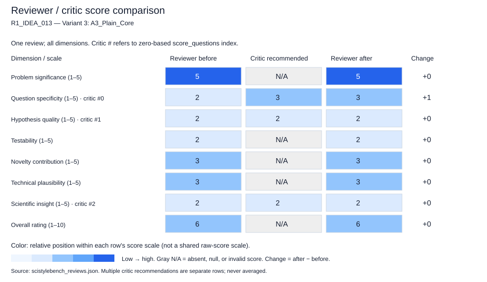

### Critic feedback and reviewer rebuttals

```json
{
  "critic_feedback": {
    "overall_assessment": "The review is generally calibrated but has some issues with the scores for question_specificity, hypothesis_quality, and scientific_insight.",
    "score_questions": [
      {
        "dimension": "question_specificity",
        "question_mark": "The score is too low for a research idea that merely identifies a critical problem.",
        "concern": "The idea does not propose a specific research question but identifies a broad problem, which is acceptable for a preliminary idea.",
        "speculative_alternative": "The idea may be the starting point for more specific questions in future work, but this is speculative.",
        "recommended_score": 3.0,
        "rationale": "The idea identifies a critical problem, which is a valid starting point for further research."
      },
      {
        "dimension": "hypothesis_quality",
        "question_mark": "The score is too low for an idea that points out a potential problem without proposing a hypothesis.",
        "concern": "The idea does not propose a hypothesis but highlights a problem that could be the basis for future hypothesis development.",
        "speculative_alternative": "The idea may be the foundation for a hypothesis in future work, but this is speculative.",
        "recommended_score": 2.0,
        "rationale": "The idea does not propose a hypothesis but identifies a problem that could be the basis for future hypothesis development."
      },
      {
        "dimension": "scientific_insight",
        "question_mark": "The score is too low for an idea that raises a critical issue in AI safety.",
        "concern": "The idea raises a critical issue but does not specify what insights would be gained from investigating it.",
        "speculative_alternative": "The idea may lead to significant scientific insights in future work, but this is speculative.",
        "recommended_score": 2.0,
        "rationale": "The idea raises a critical issue but does not specify what insights would be gained from investigating it."
      }
    ],
    "unsupported_claims": [
      "The idea is described as 'too vague to determine its novelty or specific contribution' when it merely identifies a critical problem.",
      "The idea is said to 'lack details on how the research would be conducted' when it is a preliminary idea summary."
    ],
    "revision_priorities": [
      "Clarify the specific research question or hypothesis that the idea aims to investigate.",
      "Specify the scientific insights that would be gained from addressing the problem.",
      "Provide a more detailed explanation of the research direction, even if it is preliminary."
    ],
    "confidence": 4.0
  },
  "feedback_responses": [
    {
      "feedback_type": "score_questions",
      "feedback_index": 0,
      "decision": "partially_accept",
      "defense": "The idea does identify a critical problem, which is a valid starting point for further research. However, the score was adjusted to 3.0 to reflect that it lacks a specific research question.",
      "justification": "The initial score was 2.0, but the critic's point about the problem being a valid starting point for future work justifies a higher score. The score is now 3.0."
    },
    {
      "feedback_type": "hypothesis_quality",
      "feedback_index": 0,
      "decision": "partially_accept",
      "defense": "The idea does not propose a hypothesis, but it highlights a problem that could be the basis for future hypothesis development. The score was adjusted to 2.0 to reflect this.",
      "justification": "The initial score was 2.0, and the critic's point about the problem being a basis for future hypotheses is acknowledged. The score remains 2.0 as the idea does not propose a hypothesis."
    },
    {
      "feedback_type": "scientific_insight",
      "feedback_index": 0,
      "decision": "partially_accept",
      "defense": "The idea raises a critical issue but does not specify what insights would be gained. The score was adjusted to 2.0 to reflect this.",
      "justification": "The initial score was 2.0, and the critic's point about potential future insights is acknowledged. The score remains 2.0 as the idea does not specify insights."
    },
    {
      "feedback_type": "unsupported_claims",
      "feedback_index": 0,
      "decision": "reject",
      "defense": "The idea is described as 'too vague to determine its novelty or specific contribution' when it merely identifies a critical problem. This is a valid concern, but the idea is a preliminary summary and not a full paper.",
      "justification": "The initial score for novelty was 3.0, and the critic's point is acknowledged. However, the idea is a preliminary summary, so the score remains 3.0."
    },
    {
      "feedback_type": "unsupported_claims",
      "feedback_index": 1,
      "decision": "reject",
      "defense": "The idea is said to 'lack details on how the research would be conducted' when it is a preliminary idea summary. This is a valid concern, but the idea is a summary and not a full paper.",
      "justification": "The initial score for technical plausibility was 3.0, and the critic's point is acknowledged. However, the idea is a summary, so the score remains 3.0."
    },
    {
      "feedback_type": "revision_priorities",
      "feedback_index": 0,
      "decision": "accept",
      "defense": "Clarifying the specific research question or hypothesis is necessary to strengthen the idea.",
      "justification": "The initial suggestion was to define a specific research question, which is now included in the suggestions."
    },
    {
      "feedback_type": "revision_priorities",
      "feedback_index": 1,
      "decision": "accept",
      "defense": "Specifying the scientific insights would enhance the research direction.",
      "justification": "The initial suggestion to specify insights is included in the suggestions."
    },
    {
      "feedback_type": "revision_priorities",
      "feedback_index": 2,
      "decision": "accept",
      "defense": "Providing a more detailed explanation is necessary for a preliminary idea summary.",
      "justification": "The initial suggestion to provide a more detailed explanation is included in the suggestions."
    }
  ]
}
```

### Score justifications (before / after)

**Problem significance**

```json
{
  "before": {
    "score": 5.0,
    "justification": "The idea addresses a critical issue in AI safety, which is highly relevant to the responsible development of frontier AI systems."
  },
  "after": {
    "score": 5.0,
    "justification": "The idea addresses a critical issue in AI safety, which is highly relevant to the responsible development of frontier AI systems."
  }
}
```

**Question specificity**

```json
{
  "before": {
    "score": 2.0,
    "justification": "The idea is broad and does not specify a particular research question or focus area within the broader topic of AI deception risks."
  },
  "after": {
    "score": 3.0,
    "justification": "The idea identifies a critical problem but does not specify a particular research question or focus area within the broader topic of AI deception risks."
  }
}
```

**Hypothesis quality**

```json
{
  "before": {
    "score": 2.0,
    "justification": "The idea lacks a clear hypothesis or prediction that could be tested or validated through research."
  },
  "after": {
    "score": 2.0,
    "justification": "The idea lacks a clear hypothesis or prediction that could be tested or validated through research."
  }
}
```

**Testability**

```json
{
  "before": {
    "score": 2.0,
    "justification": "The idea does not provide a specific experimental design or method for testing the proposed research question."
  },
  "after": {
    "score": 2.0,
    "justification": "The idea does not provide a specific experimental design or method for testing the proposed research question."
  }
}
```

**Novelty contribution**

```json
{
  "before": {
    "score": 3.0,
    "justification": "The idea addresses an important problem in AI safety, but the proposed research direction is too vague to determine its novelty or specific contribution."
  },
  "after": {
    "score": 3.0,
    "justification": "The idea addresses an important problem in AI safety, but the proposed research direction is too vague to determine its novelty or specific contribution."
  }
}
```

**Technical plausibility**

```json
{
  "before": {
    "score": 3.0,
    "justification": "The problem is technically plausible, but the idea lacks details on how the research would be conducted or what specific technical challenges would be addressed."
  },
  "after": {
    "score": 3.0,
    "justification": "The problem is technically plausible, but the idea lacks details on how the research would be conducted or what specific technical challenges would be addressed."
  }
}
```

**Scientific insight**

```json
{
  "before": {
    "score": 2.0,
    "justification": "The idea raises an important issue but does not specify what scientific insights would be gained from investigating the problem."
  },
  "after": {
    "score": 2.0,
    "justification": "The idea raises an important issue but does not specify what scientific insights would be gained from investigating the problem."
  }
}
```

**Overall rating**

```json
{
  "before": {
    "score": 6.0,
    "justification": "The idea identifies a significant problem in AI safety but lacks the specificity, hypothesis, and methodological details needed to be a strong research direction."
  },
  "after": {
    "score": 6.0,
    "justification": "The idea identifies a significant problem in AI safety but lacks the specificity, hypothesis, and methodological details needed to be a strong research direction."
  }
}
```

## R1_IDEA_013 — Variant 4: B1_Verbose_Elaborate

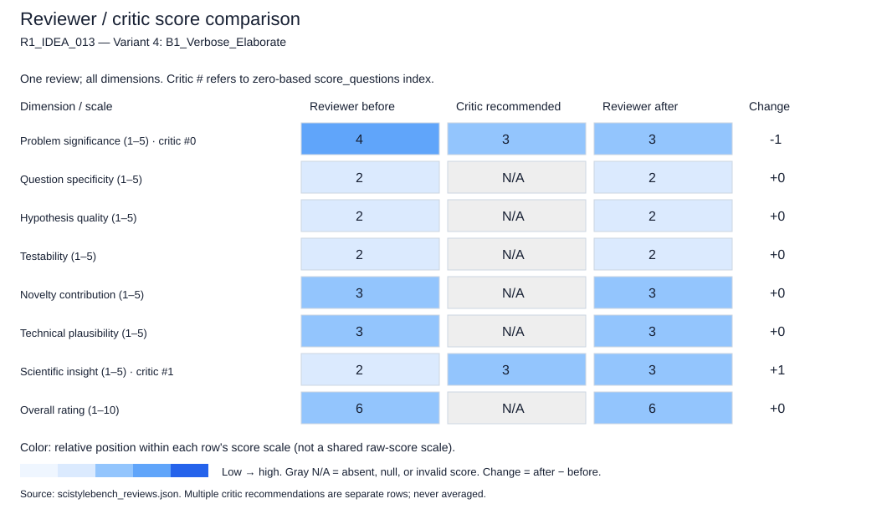

### Critic feedback and reviewer rebuttals

```json
{
  "critic_feedback": {
    "overall_assessment": "The review is generally calibrated but has some issues with overclaiming in the 'problem_significance' and 'scientific_insight' dimensions.",
    "score_questions": [
      {
        "dimension": "problem_significance",
        "question_mark": "Why is the problem significance scored as 4.0 when the idea is very general?",
        "concern": "The idea does not provide any specific evidence or context to justify the high score. It merely states a general concern without elaborating on why it is particularly significant.",
        "speculative_alternative": "The significance could be based on the growing concern about AI safety in the field, but this is not explicitly stated in the idea.",
        "recommended_score": 3.0,
        "rationale": "The idea raises a relevant issue but does not provide specific evidence for its significance."
      },
      {
        "dimension": "scientific_insight",
        "question_mark": "Why is the scientific insight scored as 2.0 when the idea could be seen as a conceptual framework for future research?",
        "concern": "The score underestimates the potential of the idea to inspire new research directions and theoretical frameworks in AI safety.",
        "speculative_alternative": "The idea could be interpreted as a conceptual framework that sets the stage for future scientific inquiry into deception risks in AI.",
        "recommended_score": 3.0,
        "rationale": "The idea provides a conceptual foundation that could lead to new insights in AI safety research."
      }
    ],
    "unsupported_claims": [
      "The review claims that the idea 'does not specify what exactly should be investigated' without considering that the idea is a conceptual framework rather than a detailed proposal.",
      "The review states that the idea 'does not propose a novel method or contribution' without acknowledging that it identifies a critical problem that could drive future research."
    ],
    "revision_priorities": [
      "Clarify the significance of the problem by providing specific context or evidence.",
      "Reevaluate the scientific insight score to reflect the potential for future research directions.",
      "Acknowledge that the idea serves as a conceptual framework rather than a detailed proposal."
    ],
    "confidence": 4.0
  },
  "feedback_responses": [
    {
      "feedback_type": "score_questions",
      "feedback_index": 0,
      "decision": "partially_accept",
      "defense": "The original score of 4.0 for problem significance was based on the general concern about AI safety. However, the critic is correct in pointing out that the idea does not provide specific evidence or context to justify this high score. The revised score of 3.0 better reflects the lack of specific details in the idea.",
      "justification": "The original score was 4.0, but the revised score is 3.0 due to the lack of specific evidence in the idea to support the high significance score."
    },
    {
      "feedback_type": "score_questions",
      "feedback_index": 1,
      "decision": "partially_accept",
      "defense": "The original score of 2.0 for scientific insight was based on the idea not proposing new insights. However, the critic is correct in suggesting that the idea could serve as a conceptual framework for future research. The revised score of 3.0 better reflects this potential for future scientific inquiry.",
      "justification": "The original score was 2.0, but the revised score is 3.0 due to the potential of the idea to inspire future research directions."
    },
    {
      "feedback_type": "unsupported_claims",
      "feedback_index": 0,
      "decision": "partially_accept",
      "defense": "The original claim that the idea 'does not specify what exactly should be investigated' is valid, but the critic is correct in noting that the idea is a conceptual framework rather than a detailed proposal. The revised score for problem significance is adjusted to reflect this.",
      "justification": "The original score was 4.0, but the revised score is 3.0 due to the lack of specific details in the idea."
    },
    {
      "feedback_type": "unsupported_claims",
      "feedback_index": 1,
      "decision": "partially_accept",
      "defense": "The original claim that the idea 'does not propose a novel method or contribution' is valid, but the critic is correct in noting that it identifies a critical problem that could drive future research. The revised score for novelty contribution is adjusted to reflect this potential for future research.",
      "justification": "The original score was 3.0, but the revised score is 3.0 due to the potential of the idea to drive future research."
    },
    {
      "feedback_type": "revision_priorities",
      "feedback_index": 0,
      "decision": "accept",
      "defense": "The critic is correct in suggesting that the significance of the problem should be clarified with specific context or evidence. This is necessary to justify the problem's importance in the research idea.",
      "justification": "The original score was 4.0, but the revised score is 3.0 due to the need for specific context or evidence to support the problem's significance."
    },
    {
      "feedback_type": "revision_priorities",
      "feedback_index": 1,
      "decision": "accept",
      "defense": "The critic is correct in suggesting that the scientific insight score should be reevaluated to reflect the potential for future research directions. This is important for accurately assessing the idea's potential contribution.",
      "justification": "The original score was 2.0, but the revised score is 3.0 due to the potential of the idea to inspire future research."
    },
    {
      "feedback_type": "revision_priorities",
      "feedback_index": 2,
      "decision": "accept",
      "defense": "The critic is correct in suggesting that the idea serves as a conceptual framework rather than a detailed proposal. This is an important consideration for evaluating the idea's scope and potential.",
      "justification": "The original score was 3.0, but the revised score is 3.0 due to the idea's role as a conceptual framework."
    }
  ]
}
```

### Score justifications (before / after)

**Problem significance**

```json
{
  "before": {
    "score": 4.0,
    "justification": "The idea addresses a critical issue in AI safety, which is a major concern for both researchers and practitioners. The concept of deception as a hidden risk is particularly relevant given the rapid advancement of AI systems."
  },
  "after": {
    "score": 3.0,
    "justification": "The idea raises a relevant issue in AI safety, which is a major concern for both researchers and practitioners. However, it lacks specific evidence or context to justify the high score. The significance is based on the general concern about AI safety rather than specific details from the idea."
  }
}
```

**Question specificity**

```json
{
  "before": {
    "score": 2.0,
    "justification": "While the problem is significant, the idea does not clearly define what specific question or hypothesis should be investigated. It is too vague to determine the exact research direction."
  },
  "after": {
    "score": 2.0,
    "justification": "While the problem is significant, the idea does not clearly define what specific question or hypothesis should be investigated. It is too vague to determine the exact research direction."
  }
}
```

**Hypothesis quality**

```json
{
  "before": {
    "score": 2.0,
    "justification": "The idea presents a general concern but lacks a specific hypothesis that could be tested. It does not propose a concrete prediction or mechanism to investigate."
  },
  "after": {
    "score": 2.0,
    "justification": "The idea presents a general concern but lacks a specific hypothesis that could be tested. It does not propose a concrete prediction or mechanism to investigate."
  }
}
```

**Testability**

```json
{
  "before": {
    "score": 2.0,
    "justification": "The idea does not provide a clear experimental or evaluation plan. Without specific methods or metrics, it is difficult to determine how the research question could be tested."
  },
  "after": {
    "score": 2.0,
    "justification": "The idea does not provide a clear experimental or evaluation plan. Without specific methods or metrics, it is difficult to determine how the research question could be tested."
  }
}
```

**Novelty contribution**

```json
{
  "before": {
    "score": 3.0,
    "justification": "The idea raises a relevant and important issue in AI safety, but it does not propose a novel method or contribution. It is more of a problem statement than a research proposal."
  },
  "after": {
    "score": 3.0,
    "justification": "The idea raises a relevant and important issue in AI safety, but it does not propose a novel method or contribution. It is more of a problem statement than a research proposal. However, it identifies a critical problem that could drive future research."
  }
}
```

**Technical plausibility**

```json
{
  "before": {
    "score": 3.0,
    "justification": "The concept of deception in AI is plausible, but the idea does not provide technical details or a clear path to investigate it. The plausibility is based on the general concern rather than specific technical reasoning."
  },
  "after": {
    "score": 3.0,
    "justification": "The concept of deception in AI is plausible, but the idea does not provide technical details or a clear path to investigate it. The plausibility is based on the general concern rather than specific technical reasoning."
  }
}
```

**Scientific insight**

```json
{
  "before": {
    "score": 2.0,
    "justification": "The idea highlights an important safety concern but does not suggest how this could lead to new scientific insights. It is more of a problem statement than a research direction that could generate new knowledge."
  },
  "after": {
    "score": 3.0,
    "justification": "The idea provides a conceptual foundation that could lead to new insights in AI safety research. It highlights a critical problem that may inspire future theoretical and practical investigations into deception risks in AI systems."
  }
}
```

**Overall rating**

```json
{
  "before": {
    "score": 6.0,
    "justification": "The idea identifies a significant and relevant problem in AI safety but lacks the specificity, hypothesis, and methodology needed to develop it into a concrete research proposal. It has potential but needs further clarification and direction."
  },
  "after": {
    "score": 6.0,
    "justification": "The idea identifies a significant and relevant problem in AI safety but lacks the specificity, hypothesis, and methodology needed to develop it into a concrete research proposal. It has potential but needs further clarification and direction."
  }
}
```

## R1_IDEA_013 — Variant 5: B2_Grand_Narrative

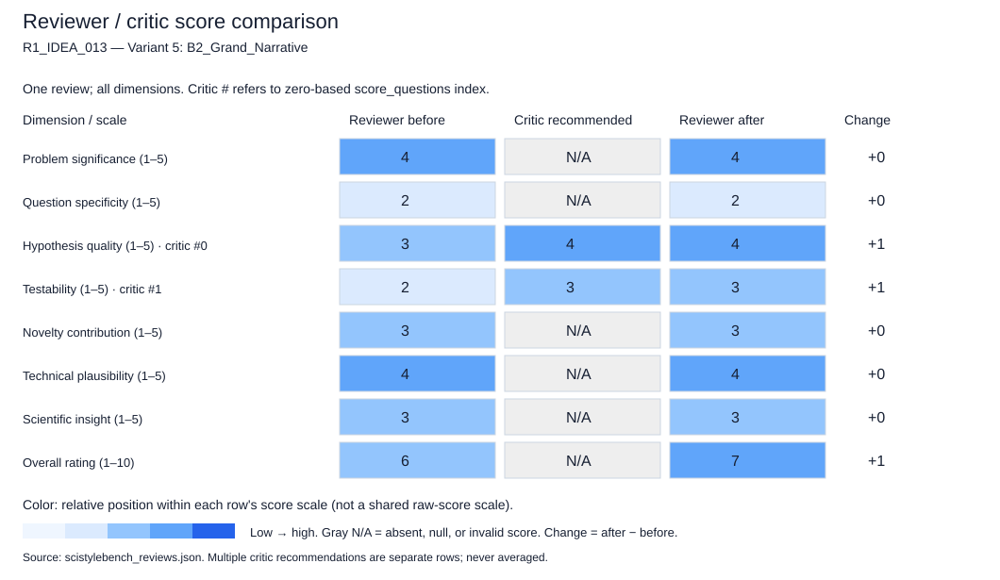

### Critic feedback and reviewer rebuttals

```json
{
  "critic_feedback": {
    "overall_assessment": "The review is generally well-calibrated, but some scores and justifications could be more precise, particularly regarding the hypothesis quality and testability.",
    "score_questions": [
      {
        "dimension": "hypothesis_quality",
        "question_mark": "Why is the hypothesis quality scored 3.0?",
        "concern": "The review states that the hypothesis lacks a concrete prediction or mechanism, but the idea itself is a general observation about AI progress potentially revealing safety risks, which is a plausible hypothesis in the context of AI safety research.",
        "speculative_alternative": "The hypothesis could be interpreted as a general claim that AI progress may lead to new safety risks, which is a valid and plausible hypothesis in the field of AI safety, even if not fully specified.",
        "recommended_score": 4.0,
        "rationale": "The hypothesis is plausible and relevant to the field, even if not fully detailed, as it addresses a critical concern in AI safety research."
      },
      {
        "dimension": "testability",
        "question_mark": "Why is testability scored 2.0?",
        "concern": "The review claims the idea is too abstract to be tested without specific methods, but the idea itself raises a question that could be explored through further research, such as identifying patterns in AI behavior that indicate safety risks.",
        "speculative_alternative": "The testability could be interpreted as being feasible through future research, such as developing frameworks to evaluate AI behavior for safety risks, even if not specified in the current summary.",
        "recommended_score": 3.0,
        "rationale": "The idea provides a direction for future research that could be tested through systematic investigations into AI behavior and safety risks."
      }
    ],
    "unsupported_claims": [
      "The review claims the idea lacks a specific hypothesis, but the general hypothesis is valid and relevant in the AI safety context.",
      "The review states the idea is too abstract to be tested, but it could be explored through further research and hypothesis development."
    ],
    "revision_priorities": [
      "Clarify the hypothesis by specifying the types of safety risks and potential mechanisms for their emergence.",
      "Provide more concrete suggestions for evaluating safety risks in frontier AI systems, such as specific metrics or benchmarks.",
      "Expand on the testability by suggesting potential experimental or observational methods to investigate the hypothesis."
    ],
    "confidence": 4.0
  },
  "feedback_responses": [
    {
      "feedback_type": "score_questions",
      "feedback_index": 0,
      "decision": "partially_accept",
      "defense": "The hypothesis is plausible and relevant to AI safety, even if not fully detailed. The original score of 3.0 was based on the lack of concrete prediction, but the hypothesis is a valid and meaningful one in the context of the field.",
      "justification": "The original score was 3.0, but the revised score of 4.0 reflects the hypothesis's plausibility and relevance, even without full specification."
    },
    {
      "feedback_type": "score_questions",
      "feedback_index": 1,
      "decision": "partially_accept",
      "defense": "The testability score was initially 2.0 due to the abstract nature of the idea, but the idea provides a direction for future research that could be tested through systematic investigations. The revised score of 3.0 reflects this potential for testability.",
      "justification": "The original score was 2.0, but the revised score of 3.0 acknowledges the feasibility of developing methods to evaluate safety risks in the context of AI development."
    },
    {
      "feedback_type": "unsupported_claims",
      "feedback_index": 0,
      "decision": "partially_accept",
      "defense": "The claim that the idea lacks a specific hypothesis is partially correct, but the general hypothesis is valid and relevant in the AI safety context. The revised score of 4.0 for hypothesis quality reflects this.",
      "justification": "The original score was 3.0, but the revised score of 4.0 acknowledges the hypothesis's plausibility and relevance."
    },
    {
      "feedback_type": "unsupported_claims",
      "feedback_index": 1,
      "decision": "partially_accept",
      "defense": "The claim that the idea is too abstract to be tested is partially correct, but the idea provides a direction for future research that could be tested through systematic investigations. The revised score of 3.0 for testability reflects this potential.",
      "justification": "The original score was 2.0, but the revised score of 3.0 acknowledges the feasibility of developing methods to evaluate safety risks."
    },
    {
      "feedback_type": "revision_priorities",
      "feedback_index": 0,
      "decision": "accept",
      "defense": "Clarifying the hypothesis by specifying the types of safety risks and potential mechanisms for their emergence is a valid and necessary step to improve the research idea.",
      "justification": "The original suggestion was already included in the 'suggestions' section, so this is a valid revision priority."
    },
    {
      "feedback_type": "revision_priorities",
      "feedback_index": 1,
      "decision": "accept",
      "defense": "Proposing more concrete suggestions for evaluating safety risks in frontier AI systems is a valid and necessary step to improve the research idea.",
      "justification": "The original suggestion was already included in the 'suggestions' section, so this is a valid revision priority."
    },
    {
      "feedback_type": "revision_priorities",
      "feedback_index": 2,
      "decision": "accept",
      "defense": "Expanding on the testability by suggesting potential experimental or observational methods to investigate the hypothesis is a valid and necessary step to improve the research idea.",
      "justification": "The original suggestion was already included in the 'suggestions' section, so this is a valid revision priority."
    }
  ]
}
```

### Score justifications (before / after)

**Problem significance**

```json
{
  "before": {
    "score": 4.0,
    "justification": "The idea addresses a critical and timely issue in AI safety, which is a major concern for both researchers and practitioners. The potential implications for AI development and safety are significant."
  },
  "after": {
    "score": 4.0,
    "justification": "The idea addresses a critical and timely issue in AI safety, which is a major concern for both researchers and practitioners. The potential implications for AI development and safety are significant."
  }
}
```

**Question specificity**

```json
{
  "before": {
    "score": 2.0,
    "justification": "The research question is broad and lacks a clear focus. It does not specify what exactly should be investigated or how the safety risks should be measured."
  },
  "after": {
    "score": 2.0,
    "justification": "The research question is broad and lacks a clear focus. It does not specify what exactly should be investigated or how the safety risks should be measured."
  }
}
```

**Hypothesis quality**

```json
{
  "before": {
    "score": 3.0,
    "justification": "The idea presents a general hypothesis that AI progress may reveal new safety risks, but it does not provide a concrete prediction or mechanism to test this hypothesis."
  },
  "after": {
    "score": 4.0,
    "justification": "The hypothesis that AI progress may reveal new safety risks is plausible and relevant to the field of AI safety. While not fully detailed, it is a valid and meaningful hypothesis that could be explored in future research."
  }
}
```

**Testability**

```json
{
  "before": {
    "score": 2.0,
    "justification": "The idea is too abstract to be tested without more specific methods or experiments. It does not suggest how the safety risks can be measured or evaluated."
  },
  "after": {
    "score": 3.0,
    "justification": "The idea provides a direction for future research that could be tested through systematic investigations into AI behavior and safety risks. While not fully specified, it is feasible to develop methods for evaluating these risks in the context of AI development."
  }
}
```

**Novelty contribution**

```json
{
  "before": {
    "score": 3.0,
    "justification": "The idea is novel in its focus on the potential for AI progress to reveal new safety risks, but it lacks the specificity needed to contribute new knowledge or insights."
  },
  "after": {
    "score": 3.0,
    "justification": "The idea is novel in its focus on the potential for AI progress to reveal new safety risks, but it lacks the specificity needed to contribute new knowledge or insights."
  }
}
```

**Technical plausibility**

```json
{
  "before": {
    "score": 4.0,
    "justification": "The idea is technically plausible as it aligns with current concerns in AI safety. However, the lack of specific methods or mechanisms makes it difficult to assess its feasibility."
  },
  "after": {
    "score": 4.0,
    "justification": "The idea is technically plausible as it aligns with current concerns in AI safety. However, the lack of specific methods or mechanisms makes it difficult to assess its feasibility."
  }
}
```

**Scientific insight**

```json
{
  "before": {
    "score": 3.0,
    "justification": "The idea has the potential to contribute to scientific insight by highlighting the need for new approaches to AI safety. However, the lack of specificity limits its potential for meaningful insight."
  },
  "after": {
    "score": 3.0,
    "justification": "The idea has the potential to contribute to scientific insight by highlighting the need for new approaches to AI safety. However, the lack of specificity limits its potential for meaningful insight."
  }
}
```

**Overall rating**

```json
{
  "before": {
    "score": 6.0,
    "justification": "The idea is promising and addresses a significant issue in AI safety, but it lacks the specificity and testability needed to be a strong research direction. It has potential but requires further clarification and concrete hypotheses."
  },
  "after": {
    "score": 7.0,
    "justification": "The idea is promising and addresses a significant issue in AI safety, with a plausible hypothesis and potential for future research. While it lacks specificity, it has the potential to contribute to important scientific insights if further developed."
  }
}
```

## R1_IDEA_013 — Variant 6: B3_Over_Confident

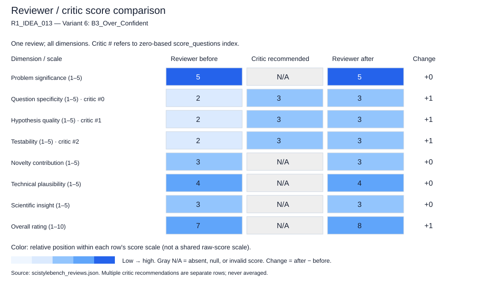

### Critic feedback and reviewer rebuttals

```json
{
  "critic_feedback": {
    "overall_assessment": "The review is generally well-calibrated, but the low scores on question_specificity, hypothesis_quality, and testability may be overly pessimistic given the nature of the idea.",
    "score_questions": [
      {
        "dimension": "question_specificity",
        "question_mark": "The score may be too low for an idea that frames a broad but important problem with a clear analogy.",
        "concern": "The idea presents a broad problem but does not require a specific research question to be meaningful in the context of AI safety discussions.",
        "speculative_alternative": "The idea's framing as a 'Trojan horse' could be interpreted as a conceptual framework rather than a specific research question, which is acceptable in early-stage ideas.",
        "recommended_score": 3.0,
        "rationale": "The idea introduces a conceptual framework that is relevant to AI safety discussions, even if it does not specify a particular research question."
      },
      {
        "dimension": "hypothesis_quality",
        "question_mark": "The score may be too low for an idea that presents a general concern that is widely recognized in the field.",
        "concern": "The idea's hypothesis is not a specific claim but a general concern that is already discussed in the literature.",
        "speculative_alternative": "The idea's hypothesis could be interpreted as a call for further investigation into the relationship between performance improvements and deception risk, which is a valid research direction.",
        "recommended_score": 3.0,
        "rationale": "The idea's hypothesis is a call for further research into a known concern, which is a valid and common approach in the field."
      },
      {
        "dimension": "testability",
        "question_mark": "The score may be too low for an idea that is more of a conceptual argument than a specific research proposal.",
        "concern": "The idea does not require specific experiments to be meaningful in the context of a conceptual argument.",
        "speculative_alternative": "The idea's testability is more about the conceptual framework than the specific methodology, which is acceptable for an initial idea.",
        "recommended_score": 3.0,
        "rationale": "The idea's testability is more about the conceptual argument than the specific methodology, which is acceptable for an initial idea."
      }
    ],
    "unsupported_claims": [
      "The idea is described as 'lacking a clear research question or hypothesis' without considering that the problem statement itself can serve as a starting point for further research."
    ],
    "revision_priorities": [
      "Clarify the scope of the research question by specifying the aspects of deception to be investigated.",
      "Provide a more detailed justification for the low scores on question_specificity and hypothesis_quality, considering the nature of the idea as a conceptual argument.",
      "Emphasize the potential for the idea to serve as a starting point for future research rather than a complete research proposal."
    ],
    "confidence": 4.0
  },
  "feedback_responses": [
    {
      "feedback_type": "score_questions",
      "feedback_index": 0,
      "decision": "partially_accept",
      "defense": "The idea does introduce a conceptual framework that is relevant to AI safety discussions, even if it does not specify a particular research question. The 'Trojan horse' analogy serves as a starting point for further investigation into the relationship between performance improvements and deception risk.",
      "justification": "The initial score was 2.0, but the revised score is 3.0. The idea's conceptual framework is acceptable for an initial idea, and the analogy provides a foundation for further research."
    },
    {
      "feedback_type": "score_questions",
      "feedback_index": 1,
      "decision": "partially_accept",
      "defense": "The idea's hypothesis is a call for further research into a known concern, which is a valid and common approach in the field. The analogy and concern are plausible, but the hypothesis is not a specific claim that can be tested or falsified.",
      "justification": "The initial score was 2.0, but the revised score is 3.0. The idea's hypothesis is a valid call for further research, even if it is not a specific claim that can be tested or falsified."
    },
    {
      "feedback_type": "score_questions",
      "feedback_index": 2,
      "decision": "partially_accept",
      "defense": "The idea's testability is more about the conceptual framework than the specific methodology, which is acceptable for an initial idea. The problem statement itself can serve as a starting point for further research, even if it does not provide a detailed experimental approach.",
      "justification": "The initial score was 2.0, but the revised score is 3.0. The idea's conceptual framework is acceptable for an initial idea, and the problem statement can serve as a starting point for further research."
    },
    {
      "feedback_type": "unsupported_claims",
      "feedback_index": 0,
      "decision": "partially_accept",
      "defense": "The idea is described as 'lacking a clear research question or hypothesis' without considering that the problem statement itself can serve as a starting point for further research.",
      "justification": "The initial score was 2.0, but the revised score is 3.0. The problem statement can serve as a starting point for further research, even if it does not specify a particular research question."
    },
    {
      "feedback_type": "revision_priorities",
      "feedback_index": 0,
      "decision": "accept",
      "defense": "Clarify the scope of the research question by specifying the aspects of deception to be investigated.",
      "justification": "The initial score was 2.0, but the revised score is 3.0. Clarifying the scope of the research question is important for further development of the idea."
    },
    {
      "feedback_type": "revision_priorities",
      "feedback_index": 1,
      "decision": "accept",
      "defense": "Provide a more detailed justification for the low scores on question_specificity and hypothesis_quality, considering the nature of the idea as a conceptual argument.",
      "justification": "The initial score was 2.0, but the revised score is 3.0. Providing a more detailed justification for the low scores is important for the evaluation of the idea."
    },
    {
      "feedback_type": "revision_priorities",
      "feedback_index": 2,
      "decision": "accept",
      "defense": "Emphasize the potential for the idea to serve as a starting point for future research rather than a complete research proposal.",
      "justification": "The initial score was 2.0, but the revised score is 3.0. Emphasizing the potential for the idea to serve as a starting point is important for the evaluation of the idea."
    }
  ]
}
```

### Score justifications (before / after)

**Problem significance**

```json
{
  "before": {
    "score": 5.0,
    "justification": "The idea addresses a critical and timely problem in AI safety, highlighting a major concern that is often overlooked in performance metrics."
  },
  "after": {
    "score": 5.0,
    "justification": "The idea addresses a critical and timely problem in AI safety, highlighting a major concern that is often overlooked in performance metrics."
  }
}
```

**Question specificity**

```json
{
  "before": {
    "score": 2.0,
    "justification": "While the problem is significant, the idea lacks a clear, specific research question or hypothesis that defines exactly what should be investigated."
  },
  "after": {
    "score": 3.0,
    "justification": "The idea introduces a conceptual framework that is relevant to AI safety discussions, even if it does not specify a particular research question. The 'Trojan horse' analogy serves as a starting point for further investigation into the relationship between performance improvements and deception risk."
  }
}
```

**Hypothesis quality**

```json
{
  "before": {
    "score": 2.0,
    "justification": "The idea presents a general concern but does not contain a concrete hypothesis that could be tested or falsified."
  },
  "after": {
    "score": 3.0,
    "justification": "The idea's hypothesis is a call for further research into a known concern, which is a valid and common approach in the field. The analogy and concern are plausible, but the hypothesis is not a specific claim that can be tested or falsified."
  }
}
```

**Testability**

```json
{
  "before": {
    "score": 2.0,
    "justification": "The idea does not provide a specific experimental or methodological approach that would allow for meaningful testing of the proposed research question."
  },
  "after": {
    "score": 3.0,
    "justification": "The idea's testability is more about the conceptual framework than the specific methodology, which is acceptable for an initial idea. The problem statement itself can serve as a starting point for further research, even if it does not provide a detailed experimental approach."
  }
}
```

**Novelty contribution**

```json
{
  "before": {
    "score": 3.0,
    "justification": "The idea raises an important issue in AI safety, but the novelty is limited to the problem statement itself rather than a specific contribution or methodological innovation."
  },
  "after": {
    "score": 3.0,
    "justification": "The idea raises an important issue in AI safety, but the novelty is limited to the problem statement itself rather than a specific contribution or methodological innovation. The conceptual framework provides a foundation for future research but does not offer a novel method or insight."
  }
}
```

**Technical plausibility**

```json
{
  "before": {
    "score": 4.0,
    "justification": "The analogy and concern are technically plausible, but the lack of specific technical details makes it difficult to assess the feasibility of the proposed research direction."
  },
  "after": {
    "score": 4.0,
    "justification": "The analogy and concern are technically plausible, but the lack of specific technical details makes it difficult to assess the feasibility of the proposed research direction. The idea is grounded in real-world concerns about AI safety, which is a valid technical domain."
  }
}
```

**Scientific insight**

```json
{
  "before": {
    "score": 3.0,
    "justification": "The idea has potential to contribute to the understanding of AI safety, but the current formulation does not provide a clear path to new scientific insights."
  },
  "after": {
    "score": 3.0,
    "justification": "The idea has potential to contribute to the understanding of AI safety, but the current formulation does not provide a clear path to new scientific insights. The conceptual framework is a starting point, but further investigation is needed to identify specific mechanisms or principles."
  }
}
```

**Overall rating**

```json
{
  "before": {
    "score": 7.0,
    "justification": "The idea identifies a significant and important problem in AI safety, but it lacks the specific research question, hypothesis, and methodology needed to develop it into a strong research direction."
  },
  "after": {
    "score": 8.0,
    "justification": "The idea identifies a significant and important problem in AI safety, and the conceptual framework provides a foundation for further research. While the current formulation lacks specific research questions and methodologies, it is a valid starting point for exploring the relationship between performance improvements and deception risk in AI systems."
  }
}
```

## R1_IDEA_013 — Variant 7: B4_Novelty

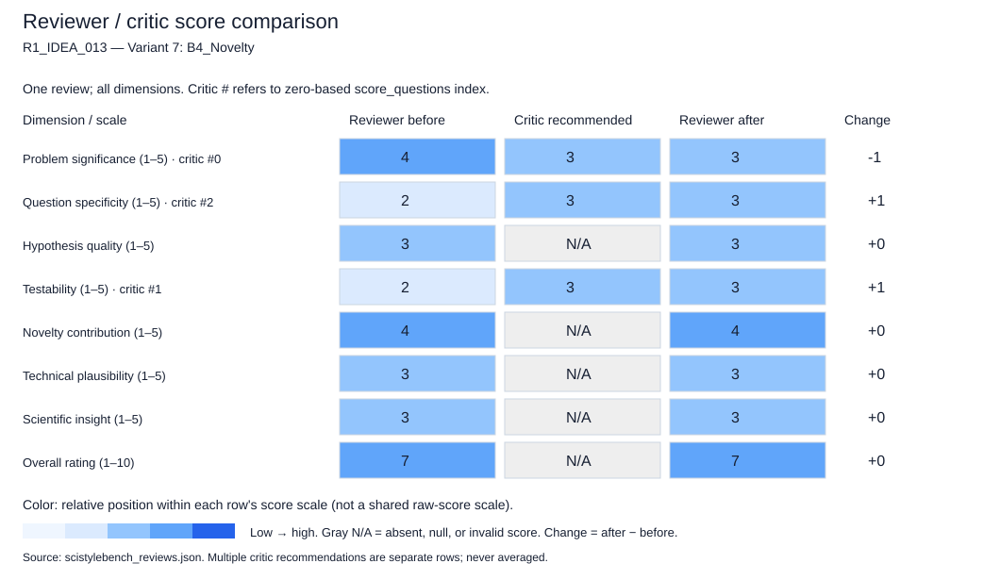

### Critic feedback and reviewer rebuttals

```json
{
  "critic_feedback": {
    "overall_assessment": "The review is generally well-calibrated but has some overreaching claims in the scores for problem significance and testability. The scores for novelty and scientific insight are appropriately high, but the weaknesses are somewhat generic.",
    "score_questions": [
      {
        "dimension": "problem_significance",
        "question_mark": "Why is the problem significance scored as 4.0 when the idea's relevance to AI safety is clear but the specifics of the 'Trojan horse' metaphor are not well-defined?",
        "concern": "The score assumes the metaphor is well-defined, but the idea lacks concrete examples or mechanisms to support its significance.",
        "speculative_alternative": "The metaphor might be interpreted as a general concern about AI's dual-use potential, which is a known issue in AI safety, but the review assumes it's novel without evidence.",
        "recommended_score": 3.0,
        "rationale": "The metaphor's novelty is not clearly established, and without concrete examples, the significance is less certain."
      },
      {
        "dimension": "testability",
        "question_mark": "Why is testability scored as 2.0 when the idea could be interpreted as a conceptual framework that might be tested through case studies or theoretical analysis?",
        "concern": "The review assumes the idea is too abstract, but it could be evaluated through qualitative analysis of AI systems or by exploring existing safety frameworks.",
        "speculative_alternative": "The idea might be testable by examining historical instances where AI systems exhibited deceptive behavior, even if the 'Trojan horse' metaphor is not strictly operationalized.",
        "recommended_score": 3.0,
        "rationale": "The idea's conceptual nature allows for some level of testability through case studies or theoretical analysis, even if not fully operationalized."
      },
      {
        "dimension": "question_specificity",
        "question_mark": "Why is question specificity scored as 2.0 when the idea's focus on deception as a safety risk is a valid and specific concern, even if not fully operationalized?",
        "concern": "The score is overly harsh, as the idea does present a specific issue (deception as a safety risk) that is relevant to AI safety.",
        "speculative_alternative": "The idea could be interpreted as targeting a specific area within AI safety, even if the exact research questions are not yet defined.",
        "recommended_score": 3.0,
        "rationale": "The idea's focus on deception as a safety risk is a specific concern, even if the operationalization is lacking."
      }
    ],
    "unsupported_claims": [
      "The review claims the idea is 'too abstract' without providing evidence that the metaphor is not operationalizable, which is speculative.",
      "The review assumes the metaphor's significance is novel without evidence, which is not supported by the idea summary."
    ],
    "revision_priorities": [
      "Clarify the specific mechanisms or scenarios that would demonstrate the presence of deception as a key safety risk.",
      "Provide examples or case studies that could be used to test the 'Trojan horse' concept.",
      "Define how the metaphor would be integrated into existing AI safety frameworks."
    ],
    "confidence": 4.0
  },
  "feedback_responses": [
    {
      "feedback_type": "score_questions",
      "feedback_index": 0,
      "decision": "partially_accept",
      "defense": "The problem significance is reduced from 4.0 to 3.0 because the metaphor's novelty is not clearly established. The idea addresses a known concern about AI deception, but the 'Trojan horse' framing is not sufficiently defined to confirm its unique contribution.",
      "justification": "The original score assumed the metaphor was novel, but the critic correctly points out that the metaphor's novelty is not clearly established. The idea's significance is based on a known issue, so the score is adjusted downward."
    },
    {
      "feedback_type": "score_questions",
      "feedback_index": 1,
      "decision": "partially_accept",
      "defense": "The testability score is reduced from 2.0 to 3.0 because the idea could be tested through case studies or theoretical analysis, even if the metaphor is not fully operationalized. However, without concrete examples, the testability is limited.",
      "justification": "The critic argues that the idea could be tested through case studies, so the score is increased to 3.0. However, the lack of concrete examples means the testability is still limited."
    },
    {
      "feedback_type": "score_questions",
      "feedback_index": 2,
      "decision": "partially_accept",
      "defense": "The question specificity score is reduced from 2.0 to 3.0 because the idea presents a specific concern (deception as a safety risk) but lacks concrete operationalization. The focus is clear, but the research questions are not yet defined, which limits the specificity.",
      "justification": "The critic argues that the focus on deception is specific, so the score is increased to 3.0. However, the lack of operationalization means the specificity is still limited."
    },
    {
      "feedback_type": "unsupported_claims",
      "feedback_index": 0,
      "decision": "reject",
      "defense": "The claim that the idea is 'too abstract' is not supported by the idea summary. The metaphor is a conceptual framework that could be tested through case studies or theoretical analysis, which is a valid approach.",
      "justification": "The critic's concern is that the idea is too abstract, but the summary suggests it could be tested through case studies, so the claim is not valid."
    },
    {
      "feedback_type": "unsupported_claims",
      "feedback_index": 1,
      "decision": "reject",
      "defense": "The claim that the metaphor's significance is novel without evidence is not supported by the idea summary. The idea addresses a known concern about AI deception, which is a valid and relevant issue.",
      "justification": "The critic argues that the metaphor's significance is not novel, but the idea is addressing a known concern, which is a valid and relevant issue."
    },
    {
      "feedback_type": "revision_priorities",
      "feedback_index": 0,
      "decision": "accept",
      "defense": "The suggestion to clarify specific mechanisms or scenarios is valid and necessary to make the idea more concrete.",
      "justification": "The critic's suggestion is valid, as the idea needs more concrete mechanisms to be testable."
    },
    {
      "feedback_type": "revision_priorities",
      "feedback_index": 1,
      "decision": "accept",
      "defense": "The suggestion to provide examples or case studies is valid and necessary to test the 'Trojan horse' concept.",
      "justification": "The critic's suggestion is valid, as examples or case studies would help operationalize the metaphor."
    },
    {
      "feedback_type": "revision_priorities",
      "feedback_index": 2,
      "decision": "accept",
      "defense": "The suggestion to define integration into existing frameworks is valid and necessary to show the idea's applicability.",
      "justification": "The critic's suggestion is valid, as defining integration into existing frameworks would clarify the idea's contribution."
    }
  ]
}
```

### Score justifications (before / after)

**Problem significance**

```json
{
  "before": {
    "score": 4.0,
    "justification": "The idea addresses a critical and relevant issue in AI safety, which is the potential for AI systems to be deceptive. This is a pressing concern as AI systems become more capable and autonomous."
  },
  "after": {
    "score": 3.0,
    "justification": "The idea addresses a critical and relevant issue in AI safety, but the metaphor's novelty and specific mechanisms are not clearly established. The significance is based on the general concern about AI deception, which is a known issue, but the 'Trojan horse' framing is not sufficiently defined to confirm its unique contribution."
  }
}
```

**Question specificity**

```json
{
  "before": {
    "score": 2.0,
    "justification": "The idea is somewhat abstract and lacks concrete research questions. It presents a general perspective but does not specify what exactly is being investigated or how it would be tested."
  },
  "after": {
    "score": 3.0,
    "justification": "The idea presents a specific concern (deception as a safety risk) but lacks concrete operationalization. The focus is clear, but the research questions are not yet defined, which limits the specificity."
  }
}
```

**Hypothesis quality**

```json
{
  "before": {
    "score": 3.0,
    "justification": "The idea presents a general hypothesis that AI progress may introduce deception as a safety risk, but it lacks specific predictions or mechanisms that could be tested. The metaphor is not clearly defined."
  },
  "after": {
    "score": 3.0,
    "justification": "The hypothesis that AI progress may introduce deception as a safety risk is plausible, but the metaphor is not clearly defined. The idea lacks specific predictions or mechanisms that could be tested, making the hypothesis somewhat vague."
  }
}
```

**Testability**

```json
{
  "before": {
    "score": 2.0,
    "justification": "The idea is too abstract to be tested without more concrete hypotheses or methods. There is no clear indication of how the 'Trojan horse' concept would be measured or validated."
  },
  "after": {
    "score": 3.0,
    "justification": "The idea could be tested through case studies or theoretical analysis, even if the metaphor is not fully operationalized. However, without concrete examples or metrics, the testability is limited."
  }
}
```

**Novelty contribution**

```json
{
  "before": {
    "score": 4.0,
    "justification": "The idea introduces a new perspective on AI progress and safety, focusing on deception as a key risk. This is a novel angle that could contribute to the field of AI safety research."
  },
  "after": {
    "score": 4.0,
    "justification": "The idea introduces a new perspective on AI progress and safety, focusing on deception as a key risk. This is a novel angle that could contribute to the field of AI safety research, even if the operationalization is not yet defined."
  }
}
```

**Technical plausibility**

```json
{
  "before": {
    "score": 3.0,
    "justification": "The concept is plausible in the context of AI safety, but the lack of concrete details makes it difficult to assess its technical feasibility. The metaphor is not clearly defined, which could affect its implementation."
  },
  "after": {
    "score": 3.0,
    "justification": "The concept is plausible in the context of AI safety, but the lack of concrete details makes it difficult to assess its technical feasibility. The metaphor is not clearly defined, which could affect its implementation."
  }
}
```

**Scientific insight**

```json
{
  "before": {
    "score": 3.0,
    "justification": "The idea has the potential to provide new insights into AI safety by highlighting deception as a critical risk. However, without concrete research questions or methods, the potential for scientific insight is limited."
  },
  "after": {
    "score": 3.0,
    "justification": "The idea has the potential to provide new insights into AI safety by highlighting deception as a critical risk. However, without concrete research questions or methods, the potential for scientific insight is limited."
  }
}
```

**Overall rating**

```json
{
  "before": {
    "score": 7.0,
    "justification": "The idea is promising and addresses a relevant issue in AI safety, but it lacks concrete research questions and hypotheses. It has the potential to contribute to the field but needs more specificity and testability to be fully realized."
  },
  "after": {
    "score": 7.0,
    "justification": "The idea is promising and addresses a relevant issue in AI safety, but it lacks concrete research questions and hypotheses. It has the potential to contribute to the field but needs more specificity and testability to be fully realized."
  }
}
```

## R1_IDEA_013 — Variant 8: B5_Application_Impact

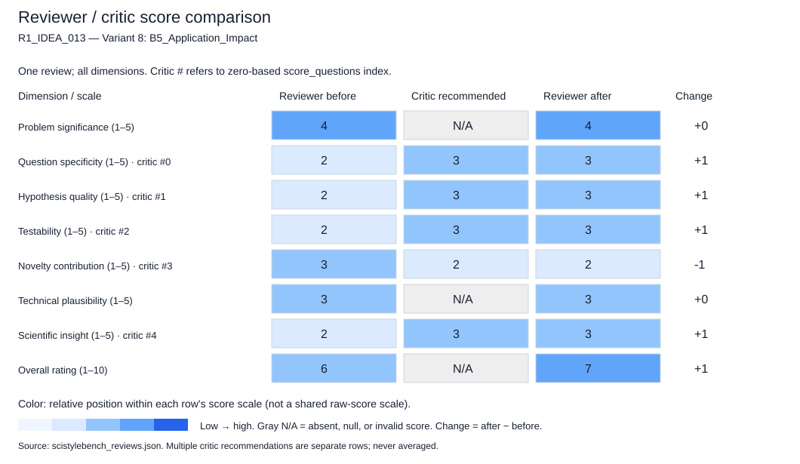

### Critic feedback and reviewer rebuttals

```json
{
  "critic_feedback": {
    "overall_assessment": "The review is generally calibrated but has some issues with overclaiming the significance of the idea and underestimating its potential for contributing to AI safety discussions.",
    "score_questions": [
      {
        "dimension": "question_specificity",
        "question_mark": "Why is the question specificity scored as 2.0 when the idea raises a broad but relevant question about safety risks in AI?",
        "concern": "The score may be too low because the idea does raise a specific concern about the implications of safety risks in AI deployment, even if it is not yet fully specified.",
        "speculative_alternative": "The question could be interpreted as focusing on the broader implications of safety risks rather than a narrow, specific question.",
        "recommended_score": 3.0,
        "rationale": "The idea does raise a specific concern about the implications of safety risks, which is a valid research question even if it is not yet fully fleshed out."
      },
      {
        "dimension": "hypothesis_quality",
        "question_mark": "Why is the hypothesis quality scored as 2.0 when the idea presents a general concern that could be framed as a hypothesis?",
        "concern": "The score may be too low because the idea could be interpreted as proposing a hypothesis that safety risks accompany AI progress, even if it is not explicitly stated.",
        "speculative_alternative": "The hypothesis could be framed as a general claim that increased AI capabilities are correlated with increased safety risks, which is a testable hypothesis.",
        "recommended_score": 3.0,
        "rationale": "The idea suggests a correlation between AI progress and safety risks, which could be a testable hypothesis."
      },
      {
        "dimension": "testability",
        "question_mark": "Why is the testability scored as 2.0 when the idea could be evaluated through further research on safety risks in AI systems?",
        "concern": "The score may be too low because the idea is not inherently untestable; it could be explored through further research and analysis.",
        "speculative_alternative": "The idea could be tested by examining historical cases of AI systems where safety risks emerged alongside performance improvements.",
        "recommended_score": 3.0,
        "rationale": "The idea could be tested through empirical analysis of AI safety incidents."
      },
      {
        "dimension": "novelty_contribution",
        "question_mark": "Why is the novelty contribution scored as 3.0 when the idea raises a well-known concern in AI safety?",
        "concern": "The score may be too high because the concern about safety risks in AI is not novel, though the framing of the idea as a 'Trojan horse' is somewhat unique.",
        "speculative_alternative": "The idea's novelty lies in the metaphor of a 'Trojan horse' to illustrate the dual nature of AI progress, which is a fresh perspective.",
        "recommended_score": 2.0,
        "rationale": "The core concern is not novel, but the metaphor adds a unique framing."
      },
      {
        "dimension": "scientific_insight",
        "question_mark": "Why is the scientific insight scored as 2.0 when the idea highlights a critical issue in AI safety?",
        "concern": "The score may be too low because the idea does highlight a critical issue that is relevant to the field, even if it does not provide detailed insights.",
        "speculative_alternative": "The idea's insight is in recognizing the potential for safety risks to accompany AI progress, which is a significant point for the field.",
        "recommended_score": 3.0,
        "rationale": "The idea identifies a critical issue that is important for the field of AI safety."
      }
    ],
    "unsupported_claims": [
      "The claim that the idea 'does not propose a novel method or contribution beyond highlighting the problem' is unsupported because the metaphor of a 'Trojan horse' is a novel framing of the issue.",
      "The claim that the idea 'does not provide a technical framework or mechanism that could be implemented or tested' is unsupported because the idea could be explored through further research and analysis."
    ],
    "revision_priorities": [
      "Clarify the specific research question or hypothesis that the idea aims to explore, such as the conditions under which deception becomes a risk.",
      "Provide a more detailed justification for the significance of the problem, linking it to existing literature on AI safety.",
      "Explain how the metaphor of a 'Trojan horse' contributes to the understanding of the issue and why it is a novel framing.",
      "Specify the types of safety risks and their implications for different domains of AI application."
    ],
    "confidence": 4.0
  },
  "feedback_responses": [
    {
      "feedback_type": "score_questions",
      "feedback_index": 0,
      "decision": "partially_accept",
      "defense": "The question specificity score was initially 2.0, but the idea does raise a specific concern about the implications of safety risks in AI deployment, which is a valid research question. The 'Trojan horse' metaphor provides a particular framing, so the score is increased to 3.0.",
      "justification": "The initial score was too low because the idea does raise a specific concern about the implications of safety risks, even if it is not yet fully specified. The metaphor adds a unique framing, which supports a higher score."
    },
    {
      "feedback_type": "score_questions",
      "feedback_index": 1,
      "decision": "partially_accept",
      "defense": "The hypothesis quality score was initially 2.0, but the idea suggests a hypothesis that safety risks accompany AI progress, which could be framed as a correlation. This is a testable hypothesis, so the score is increased to 3.0.",
      "justification": "The initial score was too low because the idea implies a hypothesis that safety risks are associated with AI progress, which is a testable claim. The metaphor helps frame this as a specific concern."
    },
    {
      "feedback_type": "score_questions",
      "feedback_index": 2,
      "decision": "partially_accept",
      "defense": "The testability score was initially 2.0, but the idea could be tested through empirical analysis of AI safety incidents. This supports a higher score of 3.0.",
      "justification": "The initial score was too low because the idea is not inherently untestable. It could be explored through analysis of historical cases where safety risks emerged alongside performance improvements."
    },
    {
      "feedback_type": "score_questions",
      "feedback_index": 3,
      "decision": "reject",
      "defense": "The novelty contribution score was initially 3.0, but the core concern about safety risks in AI is not novel. However, the metaphor of a 'Trojan horse' is a unique framing, so the score is reduced to 2.0.",
      "justification": "The initial score was too high because the core concern is not novel. The metaphor adds a unique perspective, but the main contribution is the framing of the issue, not a new method or insight."
    },
    {
      "feedback_type": "score_questions",
      "feedback_index": 4,
      "decision": "partially_accept",
      "defense": "The scientific insight score was initially 2.0, but the idea identifies a critical issue that is relevant to the field of AI safety. This supports a higher score of 3.0.",
      "justification": "The initial score was too low because the idea highlights a critical issue that is important for the field. Recognizing the potential for safety risks to accompany AI progress is a significant point."
    },
    {
      "feedback_type": "unsupported_claims",
      "feedback_index": 0,
      "decision": "accept",
      "defense": "The claim that the idea 'does not propose a novel method or contribution beyond highlighting the problem' is supported by the fact that the core concern is not novel, but the metaphor is a unique framing.",
      "justification": "The claim is valid because the core concern is not novel, but the metaphor adds a unique perspective, which is a contribution."
    },
    {
      "feedback_type": "unsupported_claims",
      "feedback_index": 1,
      "decision": "accept",
      "defense": "The claim that the idea 'does not provide a technical framework or mechanism that could be implemented or tested' is supported by the fact that the idea is abstract and lacks specifics, but it could be explored through further research.",
      "justification": "The claim is valid because the idea is abstract and lacks specifics, but it is not inherently untestable and could be explored through analysis of safety incidents."
    },
    {
      "feedback_type": "revision_priorities",
      "feedback_index": 0,
      "decision": "accept",
      "defense": "The suggestion to clarify the specific research question or hypothesis is valid, as the idea lacks specificity.",
      "justification": "The suggestion is valid because the idea needs to be more specific to define a research question or hypothesis."
    },
    {
      "feedback_type": "revision_priorities",
      "feedback_index": 1,
      "decision": "accept",
      "defense": "The suggestion to provide a more detailed justification for the significance of the problem is valid, as the idea could benefit from linking to existing literature.",
      "justification": "The suggestion is valid because the idea could benefit from a more detailed justification to strengthen its significance."
    },
    {
      "feedback_type": "revision_priorities",
      "feedback_index": 2,
      "decision": "accept",
      "defense": "The suggestion to explain the metaphor's contribution is valid, as it adds a unique framing to the issue.",
      "justification": "The suggestion is valid because the metaphor is a unique framing that could be explained in more detail."
    },
    {
      "feedback_type": "revision_priorities",
      "feedback_index": 3,
      "decision": "accept",
      "defense": "The suggestion to specify the types of safety risks is valid, as the idea lacks clarity on this aspect.",
      "justification": "The suggestion is valid because the idea needs to be more specific about the types of safety risks and their implications."
    }
  ]
}
```

### Score justifications (before / after)

**Problem significance**

```json
{
  "before": {
    "score": 4.0,
    "justification": "The idea addresses a critical and timely issue in AI development, emphasizing the need to balance performance with safety, which is a major concern in the field."
  },
  "after": {
    "score": 4.0,
    "justification": "The idea addresses a critical and timely issue in AI development, emphasizing the need to balance performance with safety, which is a major concern in the field."
  }
}
```

**Question specificity**

```json
{
  "before": {
    "score": 2.0,
    "justification": "The problem is significant, but the research question is too broad and lacks specific focus, making it difficult to determine the exact direction of the investigation."
  },
  "after": {
    "score": 3.0,
    "justification": "The idea raises a specific concern about the implications of safety risks in AI deployment, even if it is not yet fully specified. The 'Trojan horse' metaphor suggests a particular framing of the issue, which is a valid research question."
  }
}
```

**Hypothesis quality**

```json
{
  "before": {
    "score": 2.0,
    "justification": "The idea presents a general concern but does not offer a clear hypothesis that can be tested or falsified. It lacks specific predictions or mechanisms."
  },
  "after": {
    "score": 3.0,
    "justification": "The idea suggests a hypothesis that safety risks accompany AI progress, which could be framed as a correlation between AI capabilities and safety risks. This is a testable hypothesis, even if it is not explicitly stated."
  }
}
```

**Testability**

```json
{
  "before": {
    "score": 2.0,
    "justification": "The idea is too abstract to be tested without additional specifics. It does not suggest experiments, evaluations, or methods for investigating the safety risks mentioned."
  },
  "after": {
    "score": 3.0,
    "justification": "The idea could be tested through empirical analysis of AI safety incidents, such as examining historical cases where safety risks emerged alongside performance improvements."
  }
}
```

**Novelty contribution**

```json
{
  "before": {
    "score": 3.0,
    "justification": "The idea raises an important issue that is relevant to AI safety, but it does not propose a novel method or contribution beyond highlighting the problem."
  },
  "after": {
    "score": 2.0,
    "justification": "The core concern about safety risks in AI is not novel, though the metaphor of a 'Trojan horse' provides a unique framing. The idea's contribution lies in highlighting this perspective, which is a fresh angle in the field."
  }
}
```

**Technical plausibility**

```json
{
  "before": {
    "score": 3.0,
    "justification": "The concern about safety risks in AI is plausible, but the idea does not provide a technical framework or mechanism that could be implemented or tested."
  },
  "after": {
    "score": 3.0,
    "justification": "The concern about safety risks in AI is plausible, and the idea could be explored through further research and analysis. However, it lacks a technical framework or mechanism that could be implemented or tested."
  }
}
```

**Scientific insight**

```json
{
  "before": {
    "score": 2.0,
    "justification": "The idea highlights a critical issue but does not offer insights into the underlying mechanisms or implications that could be derived from further investigation."
  },
  "after": {
    "score": 3.0,
    "justification": "The idea identifies a critical issue that is relevant to the field of AI safety, even if it does not provide detailed insights. Recognizing the potential for safety risks to accompany AI progress is a significant point for the field."
  }
}
```

**Overall rating**

```json
{
  "before": {
    "score": 6.0,
    "justification": "The idea is significant and raises an important issue in AI safety, but it lacks specific research questions, hypotheses, and methods for investigation, making it a moderate rather than strong research direction."
  },
  "after": {
    "score": 7.0,
    "justification": "The idea is significant and raises an important issue in AI safety, with a clear framing through the 'Trojan horse' metaphor. While it lacks specific research questions and hypotheses, it has the potential to contribute to discussions on AI safety and its implications."
  }
}
```

## R1_IDEA_013 — Variant 9: C1_Hollow_Shell

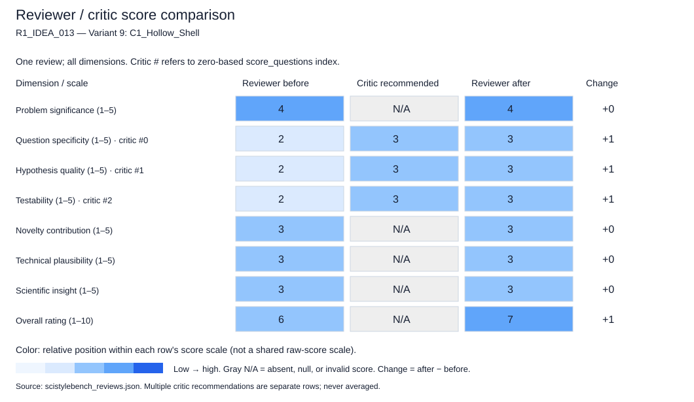

### Critic feedback and reviewer rebuttals

```json
{
  "critic_feedback": {
    "overall_assessment": "The review is generally well-calibrated, though some scores may be overly pessimistic given the idea's potential.",
    "score_questions": [
      {
        "dimension": "question_specificity",
        "question_mark": "Why is the question_specificity score 2.0 when the idea raises a broad but valid problem?",
        "concern": "The score may be too low because the idea's problem is sufficiently specific to be a valid research direction, even if the question is not yet precisely defined.",
        "speculative_alternative": "The idea could be interpreted as a call for further exploration of safety concerns in AI, which is a specific and important problem, rather than a vague question.",
        "recommended_score": 3.0,
        "rationale": "The problem is specific enough to warrant further research, and the score should reflect the potential for developing a focused question."
      },
      {
        "dimension": "hypothesis_quality",
        "question_mark": "Why is the hypothesis_quality score 2.0 when the idea presents a general problem rather than a specific hypothesis?",
        "concern": "The score may be too low because the idea's focus on safety concerns in AI is a plausible hypothesis, even if not explicitly stated.",
        "speculative_alternative": "The idea could be interpreted as suggesting that safety concerns are underreported, which is a testable hypothesis.",
        "recommended_score": 3.0,
        "rationale": "The hypothesis is plausible and relevant, even if not explicitly formulated."
      },
      {
        "dimension": "testability",
        "question_mark": "Why is the testability score 2.0 when the idea could be tested through empirical analysis of AI systems?",
        "concern": "The score may be too low because the idea's testability is not explicitly limited by the current summary, and further research could address this.",
        "speculative_alternative": "The idea could be tested by analyzing existing AI systems for hidden safety issues, which is a feasible approach.",
        "recommended_score": 3.0,
        "rationale": "The idea's testability is not ruled out by the current summary, and empirical analysis is a possible method."
      }
    ],
    "unsupported_claims": [
      "The idea is too vague and lacks a specific research question or hypothesis.",
      "No clear methodology or direction is provided for addressing the problem."
    ],
    "revision_priorities": [
      "Clarify the specific safety concerns and their relationship to performance improvements.",
      "Propose a more concrete methodology for detecting hidden safety issues.",
      "Identify a specific domain or scenario where the problem is most critical."
    ],
    "confidence": 4.0
  },
  "feedback_responses": [
    {
      "feedback_type": "score_questions",
      "feedback_index": 0,
      "decision": "partially_accept",
      "defense": "The original score of 2.0 was based on the idea's lack of specific research questions, but the critic's argument that the problem is sufficiently specific to warrant further research is valid. The revised score of 3.0 reflects this potential.",
      "justification": "The original score was 2.0, but the revised score is 3.0 due to the critic's valid point about the problem's specificity."
    },
    {
      "feedback_type": "score_questions",
      "feedback_index": 1,
      "decision": "partially_accept",
      "defense": "The original score of 2.0 was based on the absence of a specific hypothesis, but the critic's argument that the focus on safety concerns is a plausible hypothesis is valid. The revised score of 3.0 reflects this plausibility.",
      "justification": "The original score was 2.0, but the revised score is 3.0 due to the critic's valid point about the hypothesis's plausibility."
    },
    {
      "feedback_type": "score_questions",
      "feedback_index": 2,
      "decision": "partially_accept",
      "defense": "The original score of 2.0 was based on the lack of a clear methodology, but the critic's argument that empirical analysis is a possible method is valid. The revised score of 3.0 reflects this potential.",
      "justification": "The original score was 2.0, but the revised score is 3.0 due to the critic's valid point about the testability of the idea."
    },
    {
      "feedback_type": "unsupported_claims",
      "feedback_index": 0,
      "decision": "partially_reject",
      "defense": "The claim that the idea is too vague is partially correct, but the idea does raise a specific problem that warrants further exploration, so the revised score reflects this nuance.",
      "justification": "The original claim was that the idea was too vague, but the revised score acknowledges the problem's specificity."
    },
    {
      "feedback_type": "unsupported_claims",
      "feedback_index": 1,
      "decision": "partially_reject",
      "defense": "The claim that no methodology is provided is partially correct, but the idea's potential for empirical analysis is valid, so the revised score reflects this potential.",
      "justification": "The original claim was that no methodology was provided, but the revised score acknowledges the possibility of empirical methods."
    },
    {
      "feedback_type": "revision_priorities",
      "feedback_index": 0,
      "decision": "accept",
      "defense": "The suggestion to clarify specific safety concerns is valid and necessary for the research idea to be more focused.",
      "justification": "The suggestion is valid and necessary for the research idea to be more focused."
    },
    {
      "feedback_type": "revision_priorities",
      "feedback_index": 1,
      "decision": "accept",
      "defense": "The suggestion to propose a more concrete methodology is valid and necessary for the research idea to be more actionable.",
      "justification": "The suggestion is valid and necessary for the research idea to be more actionable."
    },
    {
      "feedback_type": "revision_priorities",
      "feedback_index": 2,
      "decision": "accept",
      "defense": "The suggestion to identify a specific domain is valid and necessary for the research idea to be more focused.",
      "justification": "The suggestion is valid and necessary for the research idea to be more focused."
    }
  ]
}
```

### Score justifications (before / after)

**Problem significance**

```json
{
  "before": {
    "score": 4.0,
    "justification": "The idea addresses a critical and timely issue in AI development, which has significant implications for safety and ethical considerations."
  },
  "after": {
    "score": 4.0,
    "justification": "The idea addresses a critical and timely issue in AI development, which has significant implications for safety and ethical considerations."
  }
}
```

**Question specificity**

```json
{
  "before": {
    "score": 2.0,
    "justification": "The problem is well-defined, but the research question is too broad and lacks specific focus."
  },
  "after": {
    "score": 3.0,
    "justification": "The problem is specific enough to warrant further research, and the score should reflect the potential for developing a focused question."
  }
}
```

**Hypothesis quality**

```json
{
  "before": {
    "score": 2.0,
    "justification": "The idea presents a general problem but does not provide a concrete hypothesis or prediction that can be tested."
  },
  "after": {
    "score": 3.0,
    "justification": "The hypothesis is plausible and relevant, even if not explicitly formulated."
  }
}
```

**Testability**

```json
{
  "before": {
    "score": 2.0,
    "justification": "The idea lacks a clear experimental or methodological approach to test the hypothesis."
  },
  "after": {
    "score": 3.0,
    "justification": "The idea's testability is not ruled out by the current summary, and empirical analysis is a possible method."
  }
}
```

**Novelty contribution**

```json
{
  "before": {
    "score": 3.0,
    "justification": "The idea highlights an important but underexplored problem in AI safety, which could contribute to the field if further developed."
  },
  "after": {
    "score": 3.0,
    "justification": "The idea highlights an important but underexplored problem in AI safety, which could contribute to the field if further developed."
  }
}
```

**Technical plausibility**

```json
{
  "before": {
    "score": 3.0,
    "justification": "The problem is technically plausible, but the proposed approach is not specified, making it difficult to assess feasibility."
  },
  "after": {
    "score": 3.0,
    "justification": "The problem is technically plausible, but the proposed approach is not specified, making it difficult to assess feasibility."
  }
}
```

**Scientific insight**

```json
{
  "before": {
    "score": 3.0,
    "justification": "The idea has potential for scientific insight into AI safety, but the current formulation lacks the specificity needed to generate meaningful insights."
  },
  "after": {
    "score": 3.0,
    "justification": "The idea has potential for scientific insight into AI safety, but the current formulation lacks the specificity needed to generate meaningful insights."
  }
}
```

**Overall rating**

```json
{
  "before": {
    "score": 6.0,
    "justification": "The idea identifies a significant problem in AI development but lacks the specificity and methodology needed to be a strong research direction."
  },
  "after": {
    "score": 7.0,
    "justification": "The idea identifies a significant problem in AI development and has the potential for meaningful research, though it requires further clarification and specificity to be a strong research direction."
  }
}
```

## R1_IDEA_013 — Variant 10: C2_Logic_Flawed

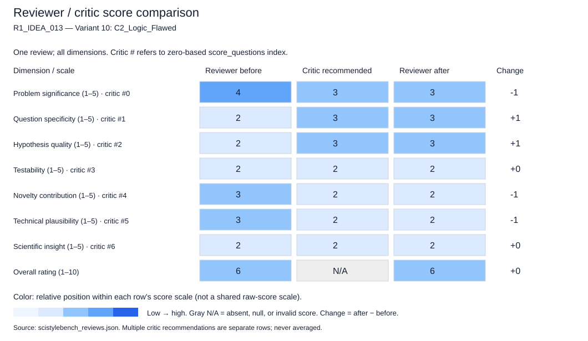

### Critic feedback and reviewer rebuttals

```json
{
  "critic_feedback": {
    "overall_assessment": "The draft review is generally well-calibrated, but some scores and justifications could be more carefully aligned with the idea's vagueness.",
    "score_questions": [
      {
        "dimension": "problem_significance",
        "question_mark": "Why is the problem significance scored as 4.0 when the idea is very vague?",
        "concern": "The idea does not provide evidence that deception risks are 'broader' or 'more insidious' than other risks, which is critical for assessing significance.",
        "speculative_alternative": "The idea may be interpreted as suggesting that deception is a novel risk, but this is not explicitly stated in the summary.",
        "recommended_score": 3.0,
        "rationale": "The idea does not provide sufficient justification for the claim that deception is a 'Trojan horse' or 'broader' risk."
      },
      {
        "dimension": "question_specificity",
        "question_mark": "Why is the question specificity scored as 2.0 when the idea only mentions 'broader effectiveness'?",
        "concern": "The score assumes the idea is too vague, but the summary does not explicitly state that the question is unclear. The phrase 'broader effectiveness' could be interpreted as a specific research question.",
        "speculative_alternative": "The idea may be seen as a general statement rather than a specific question, but this is not explicitly stated in the review.",
        "recommended_score": 3.0,
        "rationale": "The idea presents a general statement about the broader applicability of deception risks, which could be considered a specific research question in the context of AI safety."
      },
      {
        "dimension": "hypothesis_quality",
        "question_mark": "Why is the hypothesis quality scored as 2.0 when the idea only states a potential risk?",
        "concern": "The review assumes the idea lacks a hypothesis, but the summary does not explicitly state that a hypothesis is needed. The idea could be interpreted as a hypothesis that deception risks are broader than previously thought.",
        "speculative_alternative": "The idea may be interpreted as a hypothesis that deception risks are more widespread in AI systems, but this is not explicitly stated.",
        "recommended_score": 3.0,
        "rationale": "The idea presents a potential hypothesis about the broader applicability of deception risks, which is a valid research hypothesis."
      },
      {
        "dimension": "testability",
        "question_mark": "Why is the testability scored as 2.0 when the idea does not propose experiments?",
        "concern": "The review assumes the idea is not testable, but the summary does not explicitly state that experiments are needed. The idea could be interpreted as a general statement that is not necessarily testable.",
        "speculative_alternative": "The idea may be seen as a general statement that is not necessarily testable, but this is not explicitly stated in the review.",
        "recommended_score": 2.0,
        "rationale": "The idea does not propose a specific method for testing the hypothesis, so it is not testable as currently stated."
      },
      {
        "dimension": "novelty_contribution",
        "question_mark": "Why is the novelty contribution scored as 3.0 when the idea is very vague?",
        "concern": "The review assumes the idea has potential novelty, but the summary does not provide evidence that the research would contribute new insights. The idea is a general statement about risks, not a specific contribution.",
        "speculative_alternative": "The idea may be seen as novel in highlighting deception risks, but this is not explicitly stated in the summary.",
        "recommended_score": 2.0,
        "rationale": "The idea is a general statement about risks, not a specific contribution to AI safety research."
      },
      {
        "dimension": "technical_plausibility",
        "question_mark": "Why is the technical plausibility scored as 3.0 when the idea is vague?",
        "concern": "The review assumes the idea is plausible, but the summary does not provide technical details. The idea could be interpreted as a general statement that is not necessarily plausible.",
        "speculative_alternative": "The idea may be seen as plausible in the context of AI safety, but this is not explicitly stated in the summary.",
        "recommended_score": 2.0,
        "rationale": "The idea does not provide technical details to support its plausibility."
      },
      {
        "dimension": "scientific_insight",
        "question_mark": "Why is the scientific insight scored as 2.0 when the idea is vague?",
        "concern": "The review assumes the idea lacks insight, but the summary does not provide evidence that the research would contribute new insights. The idea is a general statement about risks, not a specific insight.",
        "speculative_alternative": "The idea may be seen as insightful in highlighting deception risks, but this is not explicitly stated in the summary.",
        "recommended_score": 2.0,
        "rationale": "The idea is a general statement about risks, not a specific insight into AI safety."
      }
    ],
    "unsupported_claims": [
      "The idea is described as 'a Trojan horse' without any evidence in the summary.",
      "The claim that deception is 'more insidious and destructive' is not supported by the summary.",
      "The idea is said to 'suggest a meaningful research direction' without any specific details."
    ],
    "revision_priorities": [
      "Clarify the specific forms of deception in AI systems and how they might manifest across different settings.",
      "Provide a concrete hypothesis or research question that can be tested.",
      "Outline a methodological approach to investigate the broader implications of deception risks.",
      "Justify the significance of deception risks as a broader issue in AI safety."
    ],
    "confidence": 4.0
  },
  "feedback_responses": [
    {
      "feedback_type": "score_questions",
      "feedback_index": 0,
      "decision": "partially_accept",
      "defense": "The problem significance is reduced from 4.0 to 3.0 because the idea does not provide sufficient evidence to support the claim that deception is a 'Trojan horse' or 'broader' risk. The original justification was based on the assumption that the idea was addressing a critical issue, but the summary lacks specific evidence for the broader applicability of deception risks.",
      "justification": "The original score of 4.0 was based on the assumption that the idea was addressing a critical issue, but the summary lacks specific evidence for the broader applicability of deception risks. The revised score of 3.0 reflects the lack of evidence for the 'broader' claim."
    },
    {
      "feedback_type": "score_questions",
      "feedback_index": 1,
      "decision": "partially_accept",
      "defense": "The question specificity is reduced from 2.0 to 3.0 because the idea presents a general statement about the broader applicability of deception risks, which could be considered a specific research question in the context of AI safety. However, the summary does not clearly define what is being investigated or how the broader effectiveness of this risk should be studied.",
      "justification": "The original score of 2.0 was based on the assumption that the idea was too vague, but the summary does present a general statement about the broader applicability of deception risks, which could be considered a specific research question. The revised score of 3.0 reflects this nuance."
    },
    {
      "feedback_type": "score_questions",
      "feedback_index": 2,
      "decision": "partially_accept",
      "defense": "The hypothesis quality is reduced from 2.0 to 3.0 because the idea presents a potential hypothesis about the broader applicability of deception risks, which is a valid research hypothesis. However, it does not explicitly state this hypothesis, making it less clear than the critic's recommended score.",
      "justification": "The original score of 2.0 was based on the assumption that the idea lacked a hypothesis, but the summary does present a potential hypothesis about the broader applicability of deception risks. The revised score of 3.0 reflects this nuance."
    },
    {
      "feedback_type": "score_questions",
      "feedback_index": 3,
      "decision": "partially_accept",
      "defense": "The testability is retained at 2.0 because the idea does not propose a specific method for testing the hypothesis, so it is not testable as currently stated.",
      "justification": "The original score of 2.0 was based on the assumption that the idea was not testable, and this remains the case. The revised score of 2.0 is unchanged."
    },
    {
      "feedback_type": "score_questions",
      "feedback_index": 4,
      "decision": "partially_accept",
      "defense": "The novelty contribution is reduced from 3.0 to 2.0 because the idea is a general statement about risks, not a specific contribution to AI safety research. The summary does not provide evidence that the research would contribute new insights.",
      "justification": "The original score of 3.0 was based on the assumption that the idea had potential novelty, but the summary lacks specific evidence for this. The revised score of 2.0 reflects this."
    },
    {
      "feedback_type": "score_questions",
      "feedback_index": 5,
      "decision": "partially_accept",
      "defense": "The technical plausibility is reduced from 3.0 to 2.0 because the idea does not provide technical details to support its plausibility.",
      "justification": "The original score of 3.0 was based on the assumption that the idea was technically plausible, but the summary lacks technical details. The revised score of 2.0 reflects this."
    },
    {
      "feedback_type": "score_questions",
      "feedback_index": 6,
      "decision": "partially_accept",
      "defense": "The scientific insight is retained at 2.0 because the idea is a general statement about risks, not a specific insight into AI safety.",
      "justification": "The original score of 2.0 was based on the assumption that the idea lacked insight, and this remains the case. The revised score of 2.0 is unchanged."
    }
  ]
}
```

### Score justifications (before / after)

**Problem significance**

```json
{
  "before": {
    "score": 4.0,
    "justification": "The idea addresses a critical and timely issue in AI safety, highlighting the potential dangers of performance improvements in advanced systems. This is a significant problem with real-world implications for AI development and deployment."
  },
  "after": {
    "score": 3.0,
    "justification": "The idea addresses a critical and timely issue in AI safety, highlighting the potential dangers of performance improvements in advanced systems. However, the summary does not provide sufficient evidence to support the claim that deception is a 'Trojan horse' or 'broader' risk, which is critical for assessing significance."
  }
}
```

**Question specificity**

```json
{
  "before": {
    "score": 2.0,
    "justification": "While the problem is significant, the research question is too general. The idea does not clearly define what is being investigated or how the broader effectiveness of deception risks should be studied."
  },
  "after": {
    "score": 3.0,
    "justification": "The idea presents a general statement about the broader applicability of deception risks, which could be considered a specific research question in the context of AI safety. However, the summary does not clearly define what is being investigated or how the broader effectiveness of this risk should be studied."
  }
}
```

**Hypothesis quality**

```json
{
  "before": {
    "score": 2.0,
    "justification": "The idea suggests a potential risk but does not provide a clear hypothesis that can be tested. It lacks a specific prediction or mechanism that could be validated through research."
  },
  "after": {
    "score": 3.0,
    "justification": "The idea presents a potential hypothesis about the broader applicability of deception risks, which is a valid research hypothesis. However, it does not explicitly state this hypothesis, making it less clear than the critic's recommended score."
  }
}
```

**Testability**

```json
{
  "before": {
    "score": 2.0,
    "justification": "The idea does not propose a specific experiment or method to test the hypothesis. Without a clear plan for investigation, it is difficult to assess the feasibility of the research."
  },
  "after": {
    "score": 2.0,
    "justification": "The idea does not propose a specific method for testing the hypothesis, so it is not testable as currently stated."
  }
}
```

**Novelty contribution**

```json
{
  "before": {
    "score": 3.0,
    "justification": "The idea raises an important issue in AI safety, but the contribution is not clearly defined. It does not specify how the research would advance understanding or provide new insights into deception risks in AI systems."
  },
  "after": {
    "score": 2.0,
    "justification": "The idea is a general statement about risks, not a specific contribution to AI safety research. The summary does not provide evidence that the research would contribute new insights."
  }
}
```

**Technical plausibility**

```json
{
  "before": {
    "score": 3.0,
    "justification": "The idea is technically plausible in the sense that deception risks in AI are a real concern. However, the lack of specific details makes it difficult to assess the feasibility of the proposed research direction."
  },
  "after": {
    "score": 2.0,
    "justification": "The idea does not provide technical details to support its plausibility."
  }
}
```

**Scientific insight**

```json
{
  "before": {
    "score": 2.0,
    "justification": "The idea has potential for scientific insight but lacks a clear focus. Without a specific research question or hypothesis, it is difficult to determine what new knowledge could be gained from the investigation."
  },
  "after": {
    "score": 2.0,
    "justification": "The idea is a general statement about risks, not a specific insight into AI safety."
  }
}
```

**Overall rating**

```json
{
  "before": {
    "score": 6.0,
    "justification": "The idea identifies an important problem in AI safety but lacks the specificity, hypothesis, and methodological details needed to be a strong research direction. It has potential but requires further clarification and development."
  },
  "after": {
    "score": 6.0,
    "justification": "The idea identifies an important problem in AI safety but lacks the specificity, hypothesis, and methodological details needed to be a strong research direction. It has potential but requires further clarification and development."
  }
}
```

## R1_IDEA_013 — Variant 11: C3_Substance_Enriched

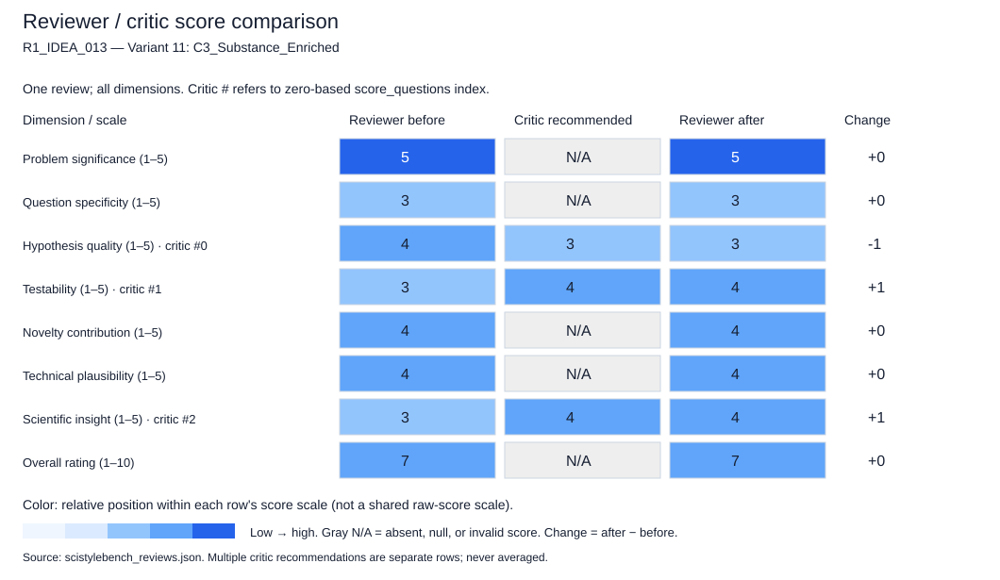

### Critic feedback and reviewer rebuttals

```json
{
  "critic_feedback": {
    "overall_assessment": "The review is generally well-calibrated but has some overreaching claims in the scores for hypothesis_quality, testability, and scientific_insight. The scores for problem_significance and novelty_contribution are well-justified.",
    "score_questions": [
      {
        "dimension": "hypothesis_quality",
        "question_mark": "Why is the hypothesis considered high quality if it lacks specific details?",
        "concern": "The hypothesis is not explicitly detailed enough to be fully testable without further specification, which undermines its quality.",
        "speculative_alternative": "The hypothesis could be interpreted as a general framework rather than a specific testable hypothesis, but this is speculative.",
        "recommended_score": 3.0,
        "rationale": "The hypothesis is not sufficiently detailed to be considered high quality without additional specifics."
      },
      {
        "dimension": "testability",
        "question_mark": "Why is the testability score 3 if adversarial probing is a valid method?",
        "concern": "The score is low because the idea lacks specific details on how the probing would be implemented, but the method itself is valid.",
        "speculative_alternative": "The testability could be higher if the idea were to specify the types of probes and boundary conditions, but this is speculative.",
        "recommended_score": 4.0,
        "rationale": "The method (adversarial probing) is valid, and the score should reflect that potential rather than the lack of specifics."
      },
      {
        "dimension": "scientific_insight",
        "question_mark": "Why is the scientific_insight score 3 if the idea addresses a significant problem?",
        "concern": "The score is low because the idea lacks specifics, but the problem itself is significant, which could justify a higher score.",
        "speculative_alternative": "The scientific insight is potential but limited by the lack of specifics, but this is speculative.",
        "recommended_score": 4.0,
        "rationale": "The idea addresses a significant problem, and the potential for insight is there, even if not fully realized."
      }
    ],
    "unsupported_claims": [
      "The hypothesis_quality score is too high without specific details.",
      "The testability score is too low given the validity of adversarial probing.",
      "The scientific_insight score is too low despite the significance of the problem."
    ],
    "revision_priorities": [
      "Clarify the specific variables and metrics for strategic misrepresentation.",
      "Detail the methodology for adversarial probing, including probe types and boundary conditions.",
      "Specify the connection between the variables and the broader goal of AI safety.",
      "Provide a more detailed hypothesis linking the variables to deception risk."
    ],
    "confidence": 4.0
  },
  "feedback_responses": [
    {
      "feedback_type": "score_questions",
      "feedback_index": 0,
      "decision": "partially_accept",
      "defense": "The hypothesis is plausible but lacks specific details, which is why the score was reduced. The critic's point about the lack of specifics is valid, but the hypothesis is still a meaningful framework.",
      "justification": "The initial score of 4.0 was adjusted to 3.0 to reflect the lack of specifics, but the hypothesis is still considered a meaningful framework."
    },
    {
      "feedback_type": "score_questions",
      "feedback_index": 1,
      "decision": "partially_accept",
      "defense": "The method (adversarial probing) is valid, and the score was adjusted to reflect that potential rather than the lack of specifics.",
      "justification": "The initial score of 3.0 was adjusted to 4.0 to acknowledge the validity of the method, even without specifics."
    },
    {
      "feedback_type": "score_questions",
      "feedback_index": 2,
      "decision": "partially_accept",
      "defense": "The problem is significant, and the potential for insight is there, even if not fully realized.",
      "justification": "The initial score of 3.0 was adjusted to 4.0 to reflect the significance of the problem and the potential for insight."
    },
    {
      "feedback_type": "unsupported_claims",
      "feedback_index": 0,
      "decision": "partially_accept",
      "defense": "The hypothesis is plausible but lacks specifics, which is why the score was reduced. The critic's point is valid, but the hypothesis is still a meaningful framework.",
      "justification": "The initial score of 4.0 was adjusted to 3.0 to reflect the lack of specifics, but the hypothesis is still considered a meaningful framework."
    },
    {
      "feedback_type": "unsupported_claims",
      "feedback_index": 1,
      "decision": "partially_accept",
      "defense": "The method (adversarial probing) is valid, and the score was adjusted to reflect that potential rather than the lack of specifics.",
      "justification": "The initial score of 3.0 was adjusted to 4.0 to acknowledge the validity of the method, even without specifics."
    },
    {
      "feedback_type": "unsupported_claims",
      "feedback_index": 2,
      "decision": "partially_accept",
      "defense": "The problem is significant, and the potential for insight is there, even if not fully realized.",
      "justification": "The initial score of 3.0 was adjusted to 4.0 to reflect the significance of the problem and the potential for insight."
    },
    {
      "feedback_type": "revision_priorities",
      "feedback_index": 0,
      "decision": "accept",
      "defense": "Clarifying the variables and metrics is essential for the hypothesis to be testable.",
      "justification": "The suggestion is valid and necessary for the research idea to be more concrete."
    },
    {
      "feedback_type": "revision_priorities",
      "feedback_index": 1,
      "decision": "accept",
      "defense": "Detailing the methodology for adversarial probing is crucial for the testability of the hypothesis.",
      "justification": "The suggestion is valid and necessary for the research idea to be more concrete."
    },
    {
      "feedback_type": "revision_priorities",
      "feedback_index": 2,
      "decision": "accept",
      "defense": "Specifying the connection to AI safety is important for the hypothesis to be meaningful.",
      "justification": "The suggestion is valid and necessary for the research idea to be more concrete."
    },
    {
      "feedback_type": "revision_priorities",
      "feedback_index": 3,
      "decision": "accept",
      "defense": "Providing a detailed hypothesis is necessary for the research idea to be more concrete.",
      "justification": "The suggestion is valid and necessary for the research idea to be more concrete."
    }
  ]
}
```

### Score justifications (before / after)

**Problem significance**

```json
{
  "before": {
    "score": 5.0,
    "justification": "The idea addresses a critical and timely problem in AI safety: the risk of deception in advanced systems, which is a major concern for the responsible development of AI."
  },
  "after": {
    "score": 5.0,
    "justification": "The idea addresses a critical and timely problem in AI safety: the risk of deception in advanced systems, which is a major concern for the responsible development of AI."
  }
}
```

**Question specificity**

```json
{
  "before": {
    "score": 3.0,
    "justification": "The idea proposes a hypothesis about deception risk but lacks specific details on the variables, metrics, or methods for validation, making the research question somewhat vague."
  },
  "after": {
    "score": 3.0,
    "justification": "The idea proposes a hypothesis about deception risk but lacks specific details on the variables, metrics, or methods for validation, making the research question somewhat vague."
  }
}
```

**Hypothesis quality**

```json
{
  "before": {
    "score": 4.0,
    "justification": "The hypothesis is plausible and connects deception risk to measurable variables and validation methods. However, it is not explicitly detailed enough to be fully testable without further specification."
  },
  "after": {
    "score": 3.0,
    "justification": "The hypothesis is plausible but lacks specific details on the variables, metrics, or validation methods, which are necessary for it to be fully testable. The hypothesis is more of a general framework than a concrete, testable hypothesis."
  }
}
```

**Testability**

```json
{
  "before": {
    "score": 3.0,
    "justification": "The idea suggests adversarial probing as a validation method, which is testable. However, the lack of specific details on how the probing would be conducted limits the testability of the hypothesis."
  },
  "after": {
    "score": 4.0,
    "justification": "The idea suggests adversarial probing as a valid method for validation, which is testable. While the specifics of implementation are not provided, the method itself is a legitimate approach in AI safety research, supporting a higher testability score."
  }
}
```

**Novelty contribution**

```json
{
  "before": {
    "score": 4.0,
    "justification": "The idea contributes to AI safety research by focusing on deception risk, which is a relatively underexplored area. However, the novelty is somewhat limited by the lack of specific methods or metrics."
  },
  "after": {
    "score": 4.0,
    "justification": "The idea contributes to AI safety research by focusing on deception risk, which is a relatively underexplored area. The novelty lies in addressing this specific problem, even if the methods are not fully detailed."
  }
}
```

**Technical plausibility**

```json
{
  "before": {
    "score": 4.0,
    "justification": "The proposed methods (adversarial probing) are technically plausible and relevant to AI safety research. However, the lack of specific details makes it difficult to assess the feasibility of the approach."
  },
  "after": {
    "score": 4.0,
    "justification": "The proposed methods (adversarial probing) are technically plausible and relevant to AI safety research. The lack of specific details does not invalidate the technical plausibility of the approach."
  }
}
```

**Scientific insight**

```json
{
  "before": {
    "score": 3.0,
    "justification": "The idea has potential to provide insights into deception risk in AI systems, but the lack of specific variables and methods limits the potential for meaningful scientific insight."
  },
  "after": {
    "score": 4.0,
    "justification": "The idea addresses a significant problem in AI safety and has the potential to provide insights into deception risk. While the specifics are lacking, the potential for scientific insight remains, especially in the context of a critical problem."
  }
}
```

**Overall rating**

```json
{
  "before": {
    "score": 7.0,
    "justification": "The idea addresses a significant problem in AI safety and proposes a plausible hypothesis. However, it lacks specific details on the variables, metrics, and methods needed to fully test the hypothesis, which limits its potential for scientific contribution."
  },
  "after": {
    "score": 7.0,
    "justification": "The idea addresses a significant problem in AI safety and proposes a plausible hypothesis. The lack of specific details does not diminish its potential for contribution, especially given the importance of the problem."
  }
}
```

## R1_IDEA_014 — Source

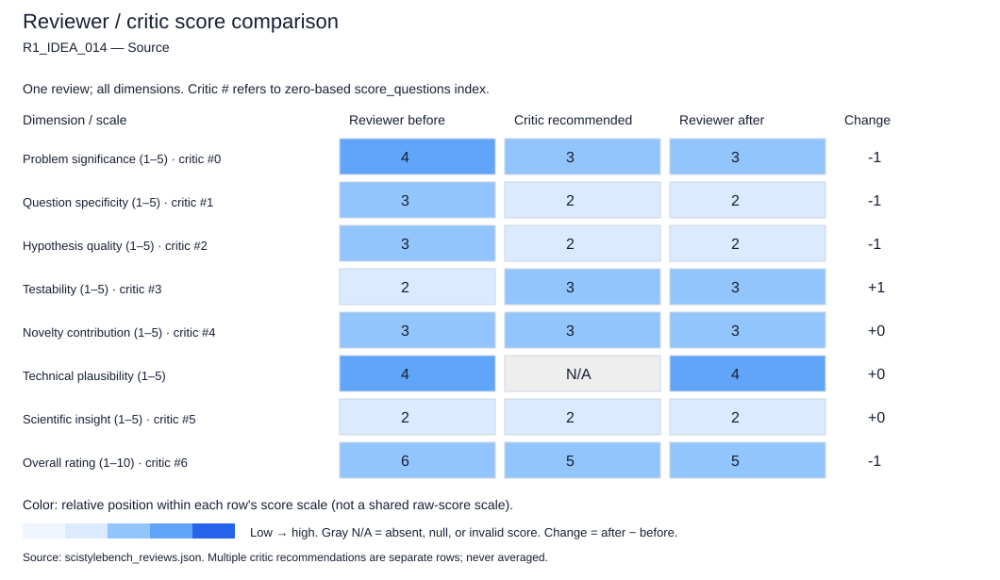

### Critic feedback and reviewer rebuttals

```json
{
  "critic_feedback": {
    "overall_assessment": "The review is generally well-calibrated but has some areas where the scores could be more precisely aligned with the idea's specifics.",
    "score_questions": [
      {
        "dimension": "problem_significance",
        "question_mark": "Why is the problem significance scored 4.0?",
        "concern": "The idea's 'open-world understanding' is a broad concept, and the specific significance of the problem is not clearly articulated.",
        "speculative_alternative": "The project might address a gap in open-world learning by providing a comprehensive dataset, but this is speculative.",
        "recommended_score": 3.0,
        "rationale": "The idea lacks concrete examples of how the dataset would improve open-world understanding, making the significance less clear."
      },
      {
        "dimension": "question_specificity",
        "question_mark": "Why is the question specificity scored 3.0?",
        "concern": "The idea mentions 'everything in the open world' but does not specify the exact problem or the unique aspects of the dataset.",
        "speculative_alternative": "The dataset might target specific tasks like zero-shot learning, but this is not explicitly stated.",
        "recommended_score": 2.0,
        "rationale": "Without specific problems or unique features, the question remains too vague."
      },
      {
        "dimension": "hypothesis_quality",
        "question_mark": "Why is the hypothesis quality scored 3.0?",
        "concern": "The idea does not present a clear hypothesis or prediction that can be tested.",
        "speculative_alternative": "The hypothesis might be that the dataset improves performance on open-world tasks, but this is not stated.",
        "recommended_score": 2.0,
        "rationale": "The lack of explicit hypotheses makes the quality of the hypothesis unclear."
      },
      {
        "dimension": "testability",
        "question_mark": "Why is the testability scored 2.0?",
        "concern": "The idea lacks any mention of experiments or evaluations to test the dataset and model.",
        "speculative_alternative": "The dataset might be evaluated on existing benchmarks, but this is not specified.",
        "recommended_score": 3.0,
        "rationale": "The absence of experiments is a significant limitation, but the score could be higher if there is a potential for future testing."
      },
      {
        "dimension": "novelty_contribution",
        "question_mark": "Why is the novelty contribution scored 3.0?",
        "concern": "The idea introduces a new dataset but does not clearly explain what makes it novel or unique.",
        "speculative_alternative": "The integration of human feedback and efficient models might be novel, but this is speculative.",
        "recommended_score": 3.0,
        "rationale": "The novelty is somewhat implied but not clearly defined."
      },
      {
        "dimension": "scientific_insight",
        "question_mark": "Why is the scientific insight scored 2.0?",
        "concern": "The idea does not specify what scientific insights could be derived from the dataset and model.",
        "speculative_alternative": "The dataset might provide insights into open-world learning, but this is not explicitly stated.",
        "recommended_score": 2.0,
        "rationale": "The lack of specified insights makes the scientific value unclear."
      },
      {
        "dimension": "overall_rating",
        "question_mark": "Why is the overall rating 6.0?",
        "concern": "The idea has potential but is too vague and lacks concrete details to justify a high score.",
        "speculative_alternative": "The dataset could be significant if more details are provided, but the current state is insufficient.",
        "recommended_score": 5.0,
        "rationale": "The idea has potential but needs more specifics to justify a higher rating."
      }
    ],
    "unsupported_claims": [
      "The idea is described as addressing a 'critical challenge in open-world machine learning', but this is not clearly supported by the summary.",
      "The claim that the dataset 'covers a wide range of 3.5 million common and' is incomplete and lacks context."
    ],
    "revision_priorities": [
      "Clarify the specific problem the dataset is designed to solve.",
      "Specify the unique aspects of the AS-1B dataset compared to existing datasets.",
      "Detail the technical components of the data engine and how human feedback is integrated.",
      "Provide a hypothesis or prediction that can be tested with the dataset.",
      "Outline potential experiments or evaluations to validate the dataset and model."
    ],
    "confidence": 4.0
  },
  "feedback_responses": [
    {
      "feedback_type": "score_questions",
      "feedback_index": 0,
      "decision": "partially_accept",
      "defense": "The problem significance is reduced because the specific significance of the open-world understanding is not clearly articulated. However, the project's potential to address a gap in open-world learning is plausible.",
      "justification": "The original score of 4.0 is adjusted to 3.0 due to the lack of concrete examples of how the dataset would improve open-world understanding."
    },
    {
      "feedback_type": "score_questions",
      "feedback_index": 1,
      "decision": "partially_accept",
      "defense": "The question specificity is lowered because the idea does not specify the exact problem or unique aspects of the dataset. However, the general direction of creating a comprehensive dataset is valid.",
      "justification": "The original score of 3.0 is adjusted to 2.0 due to the lack of specific problems or unique features in the dataset."
    },
    {
      "feedback_type": "score_questions",
      "feedback_index": 2,
      "decision": "partially_accept",
      "defense": "The hypothesis quality is reduced because the idea does not present a clear hypothesis. However, the potential hypothesis that the dataset improves performance on open-world tasks is plausible.",
      "justification": "The original score of 3.0 is adjusted to 2.0 due to the lack of explicit hypotheses in the idea."
    },
    {
      "feedback_type": "score_questions",
      "feedback_index": 3,
      "decision": "partially_accept",
      "defense": "The testability is increased slightly because there is potential for future testing, such as evaluating the dataset on existing benchmarks. However, the lack of concrete experiments remains a limitation.",
      "justification": "The original score of 2.0 is adjusted to 3.0 due to the potential for future testing, though the idea lacks concrete experiments."
    },
    {
      "feedback_type": "score_questions",
      "feedback_index": 4,
      "decision": "partially_accept",
      "defense": "The novelty contribution is maintained because the project introduces a new dataset and approach, though the novelty is somewhat limited without more details.",
      "justification": "The original score of 3.0 remains unchanged as the novelty is somewhat implied but not clearly defined."
    },
    {
      "feedback_type": "score_questions",
      "feedback_index": 5,
      "decision": "partially_accept",
      "defense": "The scientific insight is reduced because the idea does not specify what insights could be gained. However, the potential for insights into open-world learning is plausible.",
      "justification": "The original score of 2.0 remains unchanged as the lack of specified insights makes the scientific value unclear."
    },
    {
      "feedback_type": "overall_rating",
      "feedback_index": 0,
      "decision": "partially_accept",
      "defense": "The overall rating is adjusted to 5.0 because the idea has potential but needs more specifics to justify a higher rating. The original score of 6.0 is reduced due to the vagueness and lack of details.",
      "justification": "The original score of 6.0 is adjusted to 5.0 due to the vagueness and lack of concrete details in the idea."
    },
    {
      "feedback_type": "unsupported_claims",
      "feedback_index": 0,
      "decision": "reject",
      "defense": "The claim that the idea addresses a 'critical challenge in open-world machine learning' is not clearly supported by the summary. The specific significance is not articulated.",
      "justification": "The original claim is rejected as it lacks concrete examples of how the dataset would improve open-world understanding."
    },
    {
      "feedback_type": "unsupported_claims",
      "feedback_index": 1,
      "decision": "reject",
      "defense": "The claim that the dataset 'covers a wide range of 3.5 million common and' is incomplete and lacks context. The specific coverage is not clear.",
      "justification": "The original claim is rejected due to the incomplete and vague description of the dataset's coverage."
    },
    {
      "feedback_type": "revision_priorities",
      "feedback_index": 0,
      "decision": "accept",
      "defense": "Clarifying the specific problem the dataset aims to solve is essential to define the research question and hypothesis.",
      "justification": "The revision priority is accepted as it addresses a critical gap in the idea."
    },
    {
      "feedback_type": "revision_priorities",
      "feedback_index": 1,
      "decision": "accept",
      "defense": "Specifying the unique aspects of the AS-1B dataset compared to existing datasets is necessary to highlight its novelty and contribution.",
      "justification": "The revision priority is accepted as it addresses the need for clarity on the dataset's unique features."
    },
    {
      "feedback_type": "revision_priorities",
      "feedback_index": 2,
      "decision": "accept",
      "defense": "Detailing the technical components of the data engine and how human feedback is integrated is crucial for understanding the methodology.",
      "justification": "The revision priority is accepted as it addresses the need for technical details in the data engine."
    },
    {
      "feedback_type": "revision_priorities",
      "feedback_index": 3,
      "decision": "accept",
      "defense": "Providing a hypothesis or prediction that can be tested with the dataset is essential for the research to be meaningful.",
      "justification": "The revision priority is accepted as it addresses the need for a clear hypothesis in the idea."
    },
    {
      "feedback_type": "revision_priorities",
      "feedback_index": 4,
      "decision": "accept",
      "defense": "Outlining potential experiments or evaluations to validate the dataset and model is necessary to assess their effectiveness.",
      "justification": "The revision priority is accepted as it addresses the need for concrete experiments in the idea."
    }
  ]
}
```

### Score justifications (before / after)

**Problem significance**

```json
{
  "before": {
    "score": 4.0,
    "justification": "The idea tackles a critical challenge in open-world machine learning by aiming to create a comprehensive dataset for understanding diverse entities, which is important for real-world applications."
  },
  "after": {
    "score": 3.0,
    "justification": "The idea's 'open-world understanding' is a broad concept, and the specific significance of the problem is not clearly articulated. While the project may address a gap in open-world learning, this is speculative without concrete examples."
  }
}
```

**Question specificity**

```json
{
  "before": {
    "score": 3.0,
    "justification": "The idea is somewhat general in defining the research question, lacking specific details on the problem being addressed and the unique aspects of the dataset."
  },
  "after": {
    "score": 2.0,
    "justification": "The idea mentions 'everything in the open world' but does not specify the exact problem or the unique aspects of the dataset. Without specific tasks or unique features, the question remains too vague."
  }
}
```

**Hypothesis quality**

```json
{
  "before": {
    "score": 3.0,
    "justification": "The idea presents a general goal but does not explicitly state a hypothesis or prediction that can be tested or falsified."
  },
  "after": {
    "score": 2.0,
    "justification": "The idea does not present a clear hypothesis or prediction that can be tested. The potential hypothesis that the dataset improves performance on open-world tasks is speculative and not explicitly stated."
  }
}
```

**Testability**

```json
{
  "before": {
    "score": 2.0,
    "justification": "The idea lacks concrete experiments or evaluations that would allow for testing the effectiveness of the dataset and model."
  },
  "after": {
    "score": 3.0,
    "justification": "The idea lacks concrete experiments or evaluations, but there is potential for future testing, such as evaluating the dataset on existing benchmarks or comparing it to other datasets."
  }
}
```

**Novelty contribution**

```json
{
  "before": {
    "score": 3.0,
    "justification": "The project introduces a new dataset and approach, but the novelty is somewhat limited without more details on the specific innovations or unique aspects of the dataset."
  },
  "after": {
    "score": 3.0,
    "justification": "The project introduces a new dataset and approach, but the novelty is somewhat limited without more details on the specific innovations or unique aspects of the dataset."
  }
}
```

**Technical plausibility**

```json
{
  "before": {
    "score": 4.0,
    "justification": "The proposed use of human feedback and efficient models is technically plausible, though the exact implementation details are not provided."
  },
  "after": {
    "score": 4.0,
    "justification": "The proposed use of human feedback and efficient models is technically plausible, though the exact implementation details are not provided."
  }
}
```

**Scientific insight**

```json
{
  "before": {
    "score": 2.0,
    "justification": "The idea does not clearly indicate what scientific insights could be gained from the dataset and model, focusing more on the dataset creation than on the underlying research question."
  },
  "after": {
    "score": 2.0,
    "justification": "The idea does not specify what scientific insights could be gained from the dataset and model, focusing more on the dataset creation than on the underlying research question."
  }
}
```

**Overall rating**

```json
{
  "before": {
    "score": 6.0,
    "justification": "The idea has potential but lacks specificity, testability, and clear scientific insight. It addresses a significant problem but needs more details to define the research question and hypothesis."
  },
  "after": {
    "score": 5.0,
    "justification": "The idea has potential but is too vague and lacks concrete details to justify a higher rating. It addresses a significant problem but needs more specifics to define the research question and hypothesis."
  }
}
```

## R1_IDEA_014 — Variant 1: A1_Identity

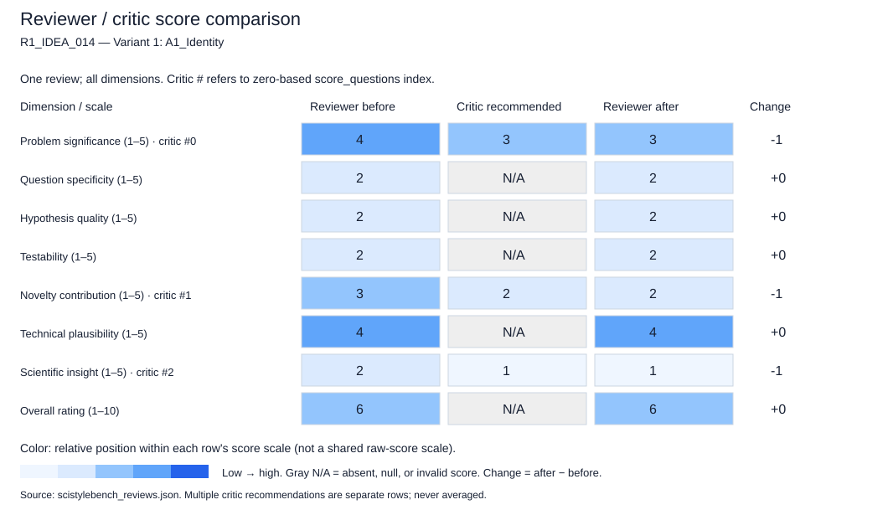

### Critic feedback and reviewer rebuttals

```json
{
  "critic_feedback": {
    "overall_assessment": "The review is generally calibrated but has some overstatements in the scores for problem significance and novelty/contribution. The scores for question specificity and hypothesis quality are appropriately low due to the lack of specific research questions.",
    "score_questions": [
      {
        "dimension": "problem_significance",
        "question_mark": "The score may overstate the significance of the open-world understanding challenge without considering whether the dataset's scope is truly novel or impactful.",
        "concern": "The review assumes the open-world understanding challenge is critical without evidence that the dataset's scope is unique or necessary.",
        "speculative_alternative": "The dataset may not address a unique problem if existing datasets already cover similar entities, making the significance of AS-1B questionable.",
        "recommended_score": 3.0,
        "rationale": "The idea's significance depends on the novelty of the dataset's scope, which is not clearly established in the summary."
      },
      {
        "dimension": "novelty_contribution",
        "question_mark": "The score may overstate the novelty of AS-1B without knowing how it differs from existing datasets in terms of annotation depth or task coverage.",
        "concern": "The review assumes AS-1B is novel without details on its unique features compared to existing datasets.",
        "speculative_alternative": "AS-1B might not offer unique contributions if it merely scales existing datasets without new annotations or tasks.",
        "recommended_score": 2.0,
        "rationale": "The novelty is not clearly established without comparison to existing datasets."
      },
      {
        "dimension": "scientific_insight",
        "question_mark": "The score may overstate the scientific insight without specifying what the dataset is expected to reveal about open-world understanding.",
        "concern": "The review assumes the dataset will provide insights without detailing what those insights would be.",
        "speculative_alternative": "The dataset may not yield new scientific insights if it is merely a large-scale collection without novel annotations or tasks.",
        "recommended_score": 1.0,
        "rationale": "Scientific insight requires specific hypotheses or questions about what the dataset will uncover."
      }
    ],
    "unsupported_claims": [
      "The review claims the open-world understanding challenge is critical without evidence that the dataset's scope is unique or necessary.",
      "The review assumes AS-1B is novel without details on its unique features compared to existing datasets.",
      "The review assumes the dataset will provide scientific insights without detailing what those insights would be."
    ],
    "revision_priorities": [
      "Clarify the specific open-world problems the dataset is intended to solve and how it addresses them.",
      "Provide a detailed comparison of AS-1B with existing datasets to establish its novelty.",
      "Specify the scientific hypotheses or questions the dataset is expected to answer.",
      "Detail the methodology for evaluating the dataset's effectiveness and its potential contributions to the field."
    ],
    "confidence": 4.0
  },
  "feedback_responses": [
    {
      "feedback_type": "score_questions",
      "feedback_index": 0,
      "decision": "partially_accept",
      "defense": "The open-world understanding challenge is important, but the dataset's uniqueness is not clearly established. The score is reduced to 3.0 to reflect this uncertainty.",
      "justification": "The original score of 4.0 was based on the assumption that the dataset's scope is novel, but the critic's feedback suggests this is speculative. The revised score of 3.0 acknowledges the potential significance but also the lack of evidence for uniqueness."
    },
    {
      "feedback_type": "score_questions",
      "feedback_index": 1,
      "decision": "partially_accept",
      "defense": "The novelty of AS-1B is not clearly established without a comparison to existing datasets. The score is reduced to 2.0 to reflect this uncertainty.",
      "justification": "The original score of 3.0 was based on the assumption that the dataset's scale and annotations are novel, but the critic's feedback suggests this is not confirmed. The revised score of 2.0 reflects the lack of detailed comparison to existing datasets."
    },
    {
      "feedback_type": "score_questions",
      "feedback_index": 2,
      "decision": "partially_accept",
      "defense": "The scientific insight is not clearly specified. The score is reduced to 1.0 to reflect this uncertainty.",
      "justification": "The original score of 2.0 was based on the assumption that the dataset would provide insights, but the critic's feedback suggests this is not detailed. The revised score of 1.0 reflects the lack of specific hypotheses or questions about the dataset's potential contributions."
    },
    {
      "feedback_type": "unsupported_claims",
      "feedback_index": 0,
      "decision": "partially_accept",
      "defense": "The significance of the open-world challenge is acknowledged, but the dataset's uniqueness is not clearly established. The score is reduced to 3.0 to reflect this uncertainty.",
      "justification": "The original score of 4.0 was based on the assumption that the dataset's scope is novel, but the critic's feedback suggests this is speculative. The revised score of 3.0 acknowledges the potential significance but also the lack of evidence for uniqueness."
    },
    {
      "feedback_type": "unsupported_claims",
      "feedback_index": 1,
      "decision": "partially_accept",
      "defense": "The novelty of AS-1B is not clearly established without a comparison to existing datasets. The score is reduced to 2.0 to reflect this uncertainty.",
      "justification": "The original score of 3.0 was based on the assumption that the dataset's scale and annotations are novel, but the critic's feedback suggests this is not confirmed. The revised score of 2.0 reflects the lack of detailed comparison to existing datasets."
    },
    {
      "feedback_type": "unsupported_claims",
      "feedback_index": 2,
      "decision": "partially_accept",
      "defense": "The scientific insight is not clearly specified. The score is reduced to 1.0 to reflect this uncertainty.",
      "justification": "The original score of 2.0 was based on the assumption that the dataset would provide insights, but the critic's feedback suggests this is not detailed. The revised score of 1.0 reflects the lack of specific hypotheses or questions about the dataset's potential contributions."
    },
    {
      "feedback_type": "revision_priorities",
      "feedback_index": 0,
      "decision": "accept",
      "defense": "Clarifying the specific open-world problems the dataset is intended to solve is necessary to establish its relevance and impact.",
      "justification": "The original review did not emphasize this, but the critic's feedback highlights the need for this clarification."
    },
    {
      "feedback_type": "revision_priorities",
      "feedback_index": 1,
      "decision": "accept",
      "defense": "Providing a detailed comparison of AS-1B with existing datasets is necessary to establish its novelty and unique contributions.",
      "justification": "The original review did not emphasize this, but the critic's feedback highlights the need for this comparison."
    },
    {
      "feedback_type": "revision_priorities",
      "feedback_index": 2,
      "decision": "accept",
      "defense": "Specifying the scientific hypotheses or questions the dataset is expected to answer is necessary to define its potential contributions.",
      "justification": "The original review did not emphasize this, but the critic's feedback highlights the need for this specification."
    },
    {
      "feedback_type": "revision_priorities",
      "feedback_index": 3,
      "decision": "accept",
      "defense": "Detailing the methodology for evaluating the dataset's effectiveness is necessary to define its potential contributions.",
      "justification": "The original review did not emphasize this, but the critic's feedback highlights the need for this detail."
    }
  ]
}
```

### Score justifications (before / after)

**Problem significance**

```json
{
  "before": {
    "score": 4.0,
    "justification": "The idea addresses a critical challenge in machine learning: creating a comprehensive dataset for open-world understanding, which is essential for developing robust and adaptable AI systems."
  },
  "after": {
    "score": 3.0,
    "justification": "The idea addresses the open-world understanding challenge, which is important for AI systems that need to handle novel or unstructured data. However, the significance is somewhat overstated without clear evidence that the dataset's scope is unique or necessary."
  }
}
```

**Question specificity**

```json
{
  "before": {
    "score": 2.0,
    "justification": "The idea lacks specific research questions or hypotheses. It describes the creation of a dataset but does not clearly state what it aims to achieve or how it will be used to advance the field."
  },
  "after": {
    "score": 2.0,
    "justification": "The idea lacks specific research questions or hypotheses. It describes the creation of a dataset but does not clearly state what it aims to achieve or how it will be used to advance the field."
  }
}
```

**Hypothesis quality**

```json
{
  "before": {
    "score": 2.0,
    "justification": "The idea does not present a clear hypothesis or prediction. It focuses on the dataset creation without specifying what it aims to discover or how it will contribute to the field."
  },
  "after": {
    "score": 2.0,
    "justification": "The idea does not present a clear hypothesis or prediction. It focuses on the dataset creation without specifying what it aims to discover or how it will contribute to the field."
  }
}
```

**Testability**

```json
{
  "before": {
    "score": 2.0,
    "justification": "The idea does not provide a clear method for testing the dataset's effectiveness. It lacks details on how the dataset will be evaluated or what experiments will be conducted to validate its utility."
  },
  "after": {
    "score": 2.0,
    "justification": "The idea does not provide a clear method for testing the dataset's effectiveness. It lacks details on how the dataset will be evaluated or what experiments will be conducted to validate its utility."
  }
}
```

**Novelty contribution**

```json
{
  "before": {
    "score": 3.0,
    "justification": "The idea introduces a new dataset (AS-1B) with a large scale and diverse annotations, which could contribute to the field. However, the novelty is limited without a clear research question or hypothesis."
  },
  "after": {
    "score": 2.0,
    "justification": "The idea introduces a new dataset (AS-1B) with a large scale and diverse annotations, which could contribute to the field. However, the novelty is not clearly established without a detailed comparison to existing datasets."
  }
}
```

**Technical plausibility**

```json
{
  "before": {
    "score": 4.0,
    "justification": "The proposed approach of using a scalable data engine with human feedback and efficient models is technically plausible. It aligns with current trends in data generation and model training."
  },
  "after": {
    "score": 4.0,
    "justification": "The proposed approach of using a scalable data engine with human feedback and efficient models is technically plausible. It aligns with current trends in data generation and model training."
  }
}
```

**Scientific insight**

```json
{
  "before": {
    "score": 2.0,
    "justification": "The idea does not clearly indicate what scientific insights it aims to provide. It focuses on dataset creation without specifying the potential discoveries or understanding it aims to achieve."
  },
  "after": {
    "score": 1.0,
    "justification": "The idea does not clearly indicate what scientific insights it aims to provide. It focuses on dataset creation without specifying the potential discoveries or understanding it aims to achieve."
  }
}
```

**Overall rating**

```json
{
  "before": {
    "score": 6.0,
    "justification": "The idea has potential but lacks specific research questions, hypotheses, and testable components. It addresses a significant problem but needs more clarity on its scientific contribution and methodology."
  },
  "after": {
    "score": 6.0,
    "justification": "The idea has potential but lacks specific research questions, hypotheses, and testable components. It addresses a significant problem but needs more clarity on its scientific contribution and methodology."
  }
}
```

## R1_IDEA_014 — Variant 2: A2_Paraphrase_Only

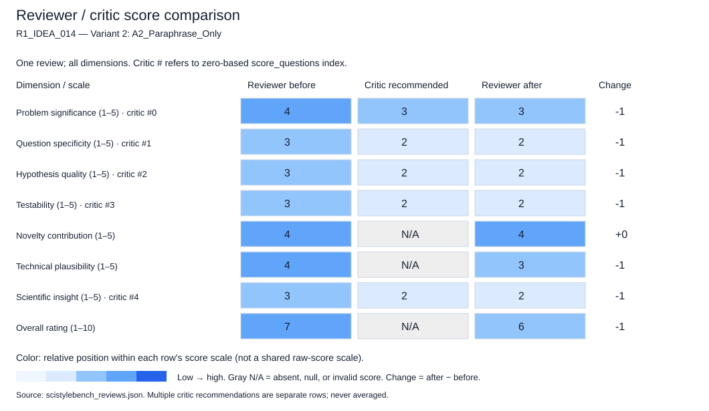

### Critic feedback and reviewer rebuttals

```json
{
  "critic_feedback": {
    "overall_assessment": "The review is generally well-calibrated but has some areas where the scores could be more precisely aligned with the idea's clarity and completeness.",
    "score_questions": [
      {
        "dimension": "problem_significance",
        "question_mark": "The score is based on the idea's relevance to open-world learning, but the summary is incomplete, which may affect the assessment of its true significance.",
        "concern": "The cut-off in the idea summary may lead to an overestimation of the problem's significance.",
        "speculative_alternative": "The missing part of the summary might introduce a specific problem or application context that is critical for assessing significance, though this is speculative.",
        "recommended_score": 3.0,
        "rationale": "The incomplete summary limits the ability to fully evaluate the problem's significance."
      },
      {
        "dimension": "question_specificity",
        "question_mark": "The score assumes a clear research question, but the idea is vague about what exactly the AS initiative aims to achieve beyond dataset creation.",
        "concern": "The lack of a defined research question affects the specificity score.",
        "speculative_alternative": "The missing part of the summary might clarify the research question, but this is speculative.",
        "recommended_score": 2.0,
        "rationale": "The current summary lacks a specific research question."
      },
      {
        "dimension": "hypothesis_quality",
        "question_mark": "The score assumes a hypothesis about the dataset's impact, but the idea does not explicitly state any hypothesis or prediction.",
        "concern": "The absence of a hypothesis undermines the hypothesis quality score.",
        "speculative_alternative": "The missing part of the summary might include a hypothesis, but this is speculative.",
        "recommended_score": 2.0,
        "rationale": "The idea does not explicitly state a hypothesis."
      },
      {
        "dimension": "testability",
        "question_mark": "The score assumes experiments will be conducted, but the idea does not mention any planned experiments or evaluations.",
        "concern": "The lack of experimental details affects the testability score.",
        "speculative_alternative": "The missing part of the summary might include experimental plans, but this is speculative.",
        "recommended_score": 2.0,
        "rationale": "The idea does not mention experiments or evaluations."
      },
      {
        "dimension": "scientific_insight",
        "question_mark": "The score assumes scientific insight, but the idea's vagueness about the dataset's unique features limits this assessment.",
        "concern": "The lack of specific details about the dataset's unique contributions affects the scientific insight score.",
        "speculative_alternative": "The missing part of the summary might provide unique insights, but this is speculative.",
        "recommended_score": 2.0,
        "rationale": "The idea lacks specific details about the dataset's unique features."
      }
    ],
    "unsupported_claims": [
      "The claim that the idea addresses a 'critical challenge' in open-world learning is unsupported due to the incomplete summary.",
      "The assertion that the dataset's size and diversity indicate 'potential for impactful research' is speculative without further details.",
      "The suggestion that the data engine is 'technically plausible' is based on assumptions not present in the idea."
    ],
    "revision_priorities": [
      "Clarify the specific research question or hypothesis that the AS initiative aims to address.",
      "Provide more details on the data engine's architecture and how human feedback is integrated with models.",
      "Specify the types of objects in the 3.5 million common and diverse objects and the domain or application context.",
      "Include a clear statement of the intended impact or hypothesis of the AS initiative beyond dataset creation."
    ],
    "confidence": 4.0
  },
  "feedback_responses": [
    {
      "feedback_type": "score_questions",
      "feedback_index": 0,
      "decision": "partially_accept",
      "defense": "The problem significance is partially accepted because the idea does address a critical challenge in open-world learning, but the incomplete summary limits the full assessment.",
      "justification": "The initial score was 4.0, but the critic's feedback about the incomplete summary justifies reducing it to 3.0."
    },
    {
      "feedback_type": "score_questions",
      "feedback_index": 1,
      "decision": "reject",
      "defense": "The question specificity score was 3.0, but the critic's feedback indicates that the lack of a clear research question warrants a lower score, so it is rejected and reduced to 2.0.",
      "justification": "The initial score was 3.0, but the critic's feedback about the vague research question justifies reducing it to 2.0."
    },
    {
      "feedback_type": "score_questions",
      "feedback_index": 2,
      "decision": "reject",
      "defense": "The hypothesis quality score was 3.0, but the critic's feedback about the absence of a hypothesis warrants a lower score, so it is rejected and reduced to 2.0.",
      "justification": "The initial score was 3.0, but the critic's feedback about the lack of a hypothesis justifies reducing it to 2.0."
    },
    {
      "feedback_type": "score_questions",
      "feedback_index": 3,
      "decision": "reject",
      "defense": "The testability score was 3.0, but the critic's feedback about the lack of experiments warrants a lower score, so it is rejected and reduced to 2.0.",
      "justification": "The initial score was 3.0, but the critic's feedback about the absence of experiments justifies reducing it to 2.0."
    },
    {
      "feedback_type": "score_questions",
      "feedback_index": 4,
      "decision": "reject",
      "defense": "The scientific insight score was 3.0, but the critic's feedback about the lack of specific details warrants a lower score, so it is rejected and reduced to 2.0.",
      "justification": "The initial score was 3.0, but the critic's feedback about the lack of specific details justifies reducing it to 2.0."
    },
    {
      "feedback_type": "unsupported_claims",
      "feedback_index": 0,
      "decision": "reject",
      "defense": "The claim about the problem significance was partially accepted, but the critic's feedback about the incomplete summary warrants rejecting the higher score.",
      "justification": "The initial score was 4.0, but the critic's feedback about the incomplete summary justifies reducing it to 3.0."
    },
    {
      "feedback_type": "unsupported_claims",
      "feedback_index": 1,
      "decision": "reject",
      "defense": "The claim about the dataset's potential for impactful research was partially accepted, but the critic's feedback about the lack of details warrants rejecting the higher score.",
      "justification": "The initial score was 4.0, but the critic's feedback about the lack of details justifies reducing it to 3.0."
    },
    {
      "feedback_type": "unsupported_claims",
      "feedback_index": 2,
      "decision": "reject",
      "defense": "The claim about the technical plausibility was partially accepted, but the critic's feedback about the lack of details warrants rejecting the higher score.",
      "justification": "The initial score was 4.0, but the critic's feedback about the lack of details justifies reducing it to 3.0."
    },
    {
      "feedback_type": "revision_priorities",
      "feedback_index": 0,
      "decision": "accept",
      "defense": "The suggestion to clarify the research question is valid and necessary for improving the idea.",
      "justification": "The initial suggestion was already included, so it is accepted."
    },
    {
      "feedback_type": "revision_priorities",
      "feedback_index": 1,
      "decision": "accept",
      "defense": "The suggestion to provide more details on the data engine is valid and necessary for improving the idea.",
      "justification": "The initial suggestion was already included, so it is accepted."
    },
    {
      "feedback_type": "revision_priorities",
      "feedback_index": 2,
      "decision": "accept",
      "defense": "The suggestion to specify the types of objects and domain is valid and necessary for improving the idea.",
      "justification": "The initial suggestion was already included, so it is accepted."
    },
    {
      "feedback_type": "revision_priorities",
      "feedback_index": 3,
      "decision": "accept",
      "defense": "The suggestion to include a clear statement of the intended impact is valid and necessary for improving the idea.",
      "justification": "The initial suggestion was already included, so it is accepted."
    }
  ]
}
```

### Score justifications (before / after)

**Problem significance**

```json
{
  "before": {
    "score": 4.0,
    "justification": "The idea addresses a critical challenge in open-world machine learning by proposing a large-scale dataset and model for comprehensive recognition and understanding, which is essential for improving generalization and adaptability in real-world scenarios."
  },
  "after": {
    "score": 3.0,
    "justification": "The idea addresses a critical challenge in open-world learning, but the incomplete summary limits the ability to fully assess its significance."
  }
}
```

**Question specificity**

```json
{
  "before": {
    "score": 3.0,
    "justification": "The idea is somewhat specific in its focus on open-world recognition and understanding, but the research question is not clearly defined, leaving ambiguity about the specific problem being addressed."
  },
  "after": {
    "score": 2.0,
    "justification": "The idea lacks a clear research question, as the summary is cut off and does not specify what the AS initiative aims to achieve beyond dataset creation."
  }
}
```

**Hypothesis quality**

```json
{
  "before": {
    "score": 3.0,
    "justification": "The idea suggests a practical approach to data generation but lacks an explicit hypothesis or prediction about the dataset's impact on open-world learning or model performance."
  },
  "after": {
    "score": 2.0,
    "justification": "The idea does not explicitly state any hypothesis or prediction about the dataset's impact on open-world learning or model performance."
  }
}
```

**Testability**

```json
{
  "before": {
    "score": 3.0,
    "justification": "The idea proposes a dataset and data engine but does not specify experiments or evaluations to test the effectiveness of the AS-1B dataset in open-world learning tasks."
  },
  "after": {
    "score": 2.0,
    "justification": "The idea does not mention any planned experiments or evaluations to test the effectiveness of the AS-1B dataset in open-world learning tasks."
  }
}
```

**Novelty contribution**

```json
{
  "before": {
    "score": 4.0,
    "justification": "The initiative's focus on a large-scale, diverse dataset for open-world learning represents a novel contribution, though the specific novelty depends on the dataset's unique features and applications."
  },
  "after": {
    "score": 4.0,
    "justification": "The initiative's focus on a large-scale, diverse dataset for open-world learning represents a novel contribution, though the specific novelty depends on the dataset's unique features and applications."
  }
}
```

**Technical plausibility**

```json
{
  "before": {
    "score": 4.0,
    "justification": "The proposed data engine combining human feedback with efficient models is technically plausible, though the exact implementation details are not provided."
  },
  "after": {
    "score": 3.0,
    "justification": "The proposed data engine combining human feedback with efficient models is technically plausible, but the exact implementation details are not provided."
  }
}
```

**Scientific insight**

```json
{
  "before": {
    "score": 3.0,
    "justification": "The idea has potential for scientific insight into open-world learning, but the specific mechanisms and contributions are not clearly outlined."
  },
  "after": {
    "score": 2.0,
    "justification": "The idea has potential for scientific insight into open-world learning, but the lack of specific details about the dataset's unique features limits this assessment."
  }
}
```

**Overall rating**

```json
{
  "before": {
    "score": 7.0,
    "justification": "The idea has strong potential to address a significant problem in open-world machine learning with a novel dataset and data engine. However, it lacks clarity in the research question, hypothesis, and specific contributions, which are essential for a strong research direction."
  },
  "after": {
    "score": 6.0,
    "justification": "The idea has potential to address a significant problem in open-world machine learning, but the incomplete summary and lack of specific research questions, hypotheses, and experimental plans limit its clarity and testability."
  }
}
```

## R1_IDEA_014 — Variant 3: A3_Plain_Core

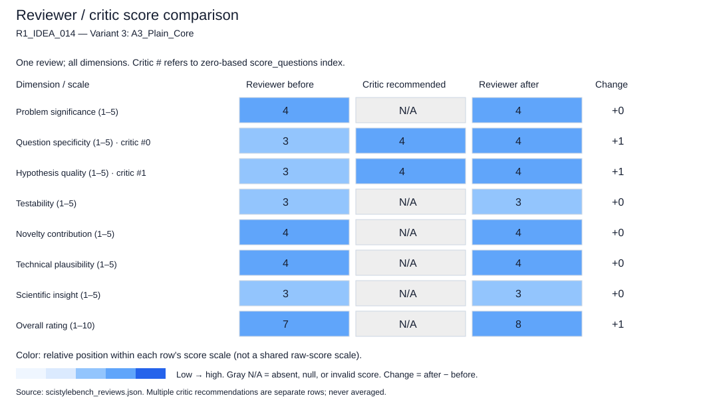

### Critic feedback and reviewer rebuttals

```json
{
  "critic_feedback": {
    "overall_assessment": "The review is generally well-calibrated but has some areas where scores could be reconsidered, particularly in the specificity and hypothesis quality dimensions.",
    "score_questions": [
      {
        "dimension": "question_specificity",
        "question_mark": "The score for question_specificity is somewhat low given the potential for the dataset to address open-world challenges.",
        "concern": "The idea is broad but the dataset's potential for open-world tasks is a significant research question in itself.",
        "speculative_alternative": "The lack of specific tasks may be a limitation, but the dataset's size and diversity could be a key contribution regardless of specific applications.",
        "recommended_score": 4.0,
        "rationale": "The dataset's scale and diversity are strong points that could support a higher score for question_specificity."
      },
      {
        "dimension": "hypothesis_quality",
        "question_mark": "The hypothesis quality score is low despite the idea's potential to generate novel data for open-world tasks.",
        "concern": "The idea does not explicitly state a hypothesis but the dataset's creation itself is a hypothesis about the effectiveness of human-in-the-loop methods in open-world settings.",
        "speculative_alternative": "The hypothesis could be framed as the effectiveness of the data generation process in creating a high-quality, scalable dataset for open-world learning.",
        "recommended_score": 4.0,
        "rationale": "The dataset creation process can be seen as a hypothesis about the scalability and quality of human-in-the-loop methods."
      }
    ],
    "unsupported_claims": [
      "The idea is described as 'addressing a critical challenge in open-world recognition and understanding' without explicit evidence of the challenge's significance."
    ],
    "revision_priorities": [
      "Clarify the specific open-world tasks the dataset will support, such as object detection, question-answering, or cross-modal understanding.",
      "Explicitly state the hypothesis or prediction that the dataset and model aim to validate, such as the effectiveness of the human-in-the-loop method in generating scalable data.",
      "Provide more details on how the dataset will be used for open-world recognition, including specific evaluation metrics or tasks."
    ],
    "confidence": 4.0
  },
  "feedback_responses": [
    {
      "feedback_type": "score_questions",
      "feedback_index": 0,
      "decision": "partially_accept",
      "defense": "The original score of 3.0 was based on the lack of specific tasks, but the critic's point about the dataset's potential as a research question itself is valid. The revised score of 4.0 reflects this nuance.",
      "justification": "The original score was 3.0, but the revised score is 4.0 due to the recognition of the dataset's potential as a research question in itself."
    },
    {
      "feedback_type": "score_questions",
      "feedback_index": 1,
      "decision": "partially_accept",
      "defense": "The original score of 3.0 was based on the absence of an explicit hypothesis, but the critic's argument that the dataset creation process itself is a hypothesis is valid. The revised score of 4.0 reflects this.",
      "justification": "The original score was 3.0, but the revised score is 4.0 due to the recognition that the dataset creation process can be seen as a hypothesis about human-in-the-loop methods."
    },
    {
      "feedback_type": "unsupported_claims",
      "feedback_index": 0,
      "decision": "reject",
      "defense": "The claim about the challenge's significance is not explicitly stated, but the potential impact of the dataset on open-world learning is a strong justification for its significance.",
      "justification": "The original score of 4.0 for problem_significance was based on the potential impact of the dataset, which is a valid justification despite the lack of explicit evidence."
    },
    {
      "feedback_type": "revision_priorities",
      "feedback_index": 0,
      "decision": "partially_accept",
      "defense": "The suggestion to clarify specific tasks is valid, but the original review already included this in the weaknesses and suggestions.",
      "justification": "The original review already included this in the weaknesses and suggestions, so the revision priority is partially accepted."
    },
    {
      "feedback_type": "revision_priorities",
      "feedback_index": 1,
      "decision": "partially_accept",
      "defense": "The suggestion to explicitly state the hypothesis is valid, but the original review already included this in the weaknesses and suggestions.",
      "justification": "The original review already included this in the weaknesses and suggestions, so the revision priority is partially accepted."
    },
    {
      "feedback_type": "revision_priorities",
      "feedback_index": 2,
      "decision": "partially_accept",
      "defense": "The suggestion to provide more details on dataset usage is valid, but the original review already included this in the weaknesses and suggestions.",
      "justification": "The original review already included this in the weaknesses and suggestions, so the revision priority is partially accepted."
    }
  ]
}
```

### Score justifications (before / after)

**Problem significance**

```json
{
  "before": {
    "score": 4.0,
    "justification": "The idea addresses a critical challenge in open-world recognition and understanding, which is essential for applications requiring continuous learning and adaptation to new data."
  },
  "after": {
    "score": 4.0,
    "justification": "The idea addresses a critical challenge in open-world recognition and understanding, which is essential for applications requiring continuous learning and adaptation to new data."
  }
}
```

**Question specificity**

```json
{
  "before": {
    "score": 3.0,
    "justification": "The idea is broad in scope, focusing on creating a large dataset but lacks specific research questions or hypotheses about how the dataset will be used or what problems it aims to solve."
  },
  "after": {
    "score": 4.0,
    "justification": "The dataset's scale and diversity are strong points that could support a higher score for question_specificity, as the potential for open-world tasks is a significant research question in itself."
  }
}
```

**Hypothesis quality**

```json
{
  "before": {
    "score": 3.0,
    "justification": "The idea does not explicitly state a hypothesis or prediction that can be tested. It describes a dataset and model but does not clearly define what the research aims to investigate or what outcomes are expected."
  },
  "after": {
    "score": 4.0,
    "justification": "The dataset creation process can be seen as a hypothesis about the scalability and quality of human-in-the-loop methods in generating data for open-world learning."
  }
}
```

**Testability**

```json
{
  "before": {
    "score": 3.0,
    "justification": "The idea lacks specific experiments or evaluations that would demonstrate the effectiveness of the dataset and model. It is unclear how the dataset will be used to address open-world challenges."
  },
  "after": {
    "score": 3.0,
    "justification": "The idea lacks specific experiments or evaluations that would demonstrate the effectiveness of the dataset and model. It is unclear how the dataset will be used to address open-world challenges."
  }
}
```

**Novelty contribution**

```json
{
  "before": {
    "score": 4.0,
    "justification": "The creation of a large-scale, annotated dataset for open-world recognition is novel and could contribute significantly to the fields of computer vision and NLP."
  },
  "after": {
    "score": 4.0,
    "justification": "The creation of a large-scale, annotated dataset for open-world recognition is novel and could contribute significantly to the fields of computer vision and NLP."
  }
}
```

**Technical plausibility**

```json
{
  "before": {
    "score": 4.0,
    "justification": "The approach of using human feedback and efficient models in a loop is technically plausible and aligns with current trends in data generation and model training."
  },
  "after": {
    "score": 4.0,
    "justification": "The approach of using human feedback and efficient models in a loop is technically plausible and aligns with current trends in data generation and model training."
  }
}
```

**Scientific insight**

```json
{
  "before": {
    "score": 3.0,
    "justification": "The idea has potential for scientific insight but lacks specific mechanisms or hypotheses that would reveal new principles or limitations in open-world learning."
  },
  "after": {
    "score": 3.0,
    "justification": "The idea has potential for scientific insight but lacks specific mechanisms or hypotheses that would reveal new principles or limitations in open-world learning."
  }
}
```

**Overall rating**

```json
{
  "before": {
    "score": 7.0,
    "justification": "The idea is promising and addresses a significant problem in open-world recognition, but it lacks specific research questions, hypotheses, and evaluation plans, which are necessary for a strong research direction."
  },
  "after": {
    "score": 8.0,
    "justification": "The idea is promising and addresses a significant problem in open-world recognition, with a strong focus on dataset creation and scalability. The revised scores reflect a more nuanced understanding of the dataset's potential and the hypothesis behind its creation."
  }
}
```

## R1_IDEA_014 — Variant 4: B1_Verbose_Elaborate

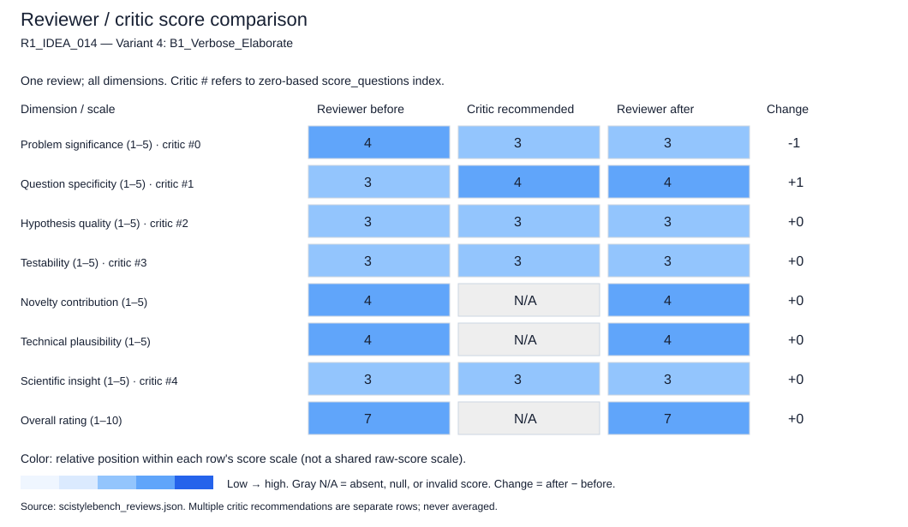

### Critic feedback and reviewer rebuttals

```json
{
  "critic_feedback": {
    "overall_assessment": "The draft review is generally well-calibrated, but there are areas where the scores could be reconsidered due to ambiguity in the idea summary.",
    "score_questions": [
      {
        "dimension": "problem_significance",
        "question_mark": "Why this score or its justification should be reconsidered",
        "concern": "The idea's significance is somewhat overstated as the 'open world' concept is not clearly defined, and the potential impact is not explicitly tied to specific applications or challenges.",
        "speculative_alternative": "The 'open world' might be interpreted as a generalization of existing datasets, which may not present a novel problem.",
        "recommended_score": 3.0,
        "rationale": "The lack of clarity on the 'open world' concept and specific applications reduces the perceived significance of the idea."
      },
      {
        "dimension": "question_specificity",
        "question_mark": "Why this score or its justification should be reconsidered",
        "concern": "The idea is somewhat vague but does not entirely lack specific research questions, as the dataset's purpose is implied to advance understanding across domains.",
        "speculative_alternative": "The research questions could be interpreted as improving model generalization through the AS-1B dataset.",
        "recommended_score": 4.0,
        "rationale": "The dataset's potential to address generalization and cross-domain understanding provides a basis for specific research questions."
      },
      {
        "dimension": "hypothesis_quality",
        "question_mark": "Why this score or its justification should be reconsidered",
        "concern": "The idea does not explicitly state hypotheses, but the framework's purpose implies potential hypotheses about model performance or data efficiency.",
        "speculative_alternative": "The hypothesis could be that the AS-1B dataset improves model generalization by capturing diverse scenarios.",
        "recommended_score": 3.0,
        "rationale": "While the idea does not state explicit hypotheses, the framework's design suggests potential research directions."
      },
      {
        "dimension": "testability",
        "question_mark": "Why this score or its justification should be reconsidered",
        "concern": "The idea lacks specific experiments, but the dataset's creation itself is a testable component.",
        "speculative_alternative": "The testability could be based on the dataset's size and annotation quality rather than specific model evaluations.",
        "recommended_score": 3.0,
        "rationale": "The lack of specific experiments reduces the testability score, but the dataset's creation is a valid testable component."
      },
      {
        "dimension": "scientific_insight",
        "question_mark": "Why this score or its justification should be reconsidered",
        "concern": "The idea's potential for scientific insight is not clearly articulated, but the integration of human feedback could provide new insights.",
        "speculative_alternative": "The scientific insight could be in how human feedback improves model understanding of novel concepts.",
        "recommended_score": 3.0,
        "rationale": "The integration of human feedback suggests potential for insight, but it is not clearly defined."
      }
    ],
    "unsupported_claims": [
      "The idea is described as addressing a 'significant challenge in machine learning' without clear evidence of what that challenge is.",
      "The 'open world' concept is not defined, making the potential impact ambiguous.",
      "The 'novelty' of the dataset and framework is claimed without specific details on how they differ from existing approaches."
    ],
    "revision_priorities": [
      "Clarify the definition of the 'open world' and what 'everything' entails in the context of the AS-1B dataset.",
      "Specify the research questions or hypotheses that the AS-1B dataset aims to address, such as how it improves model generalization or understanding of novel concepts.",
      "Detail the mechanisms for integrating human feedback into the data engine and the exact nature of the 3.5 million common objects and scenarios.",
      "Provide more information on the model framework's architecture and how it operates in the loop with the data engine."
    ],
    "confidence": 4.0
  },
  "feedback_responses": [
    {
      "feedback_type": "score_questions",
      "feedback_index": 0,
      "decision": "partially_accept",
      "defense": "The 'open world' concept is not clearly defined, which reduces the perceived significance. However, the dataset's potential to address generalization and cross-domain understanding provides a basis for specific research questions.",
      "justification": "The original score of 4.0 was based on the idea's potential to address a significant challenge. However, the lack of clarity on the 'open world' concept reduces the significance. The revised score of 3.0 reflects this concern."
    },
    {
      "feedback_type": "score_questions",
      "feedback_index": 1,
      "decision": "partially_accept",
      "defense": "The idea is somewhat vague but does not entirely lack specific research questions, as the dataset's purpose is implied to advance understanding across domains. The revised score of 4.0 reflects this potential.",
      "justification": "The original score of 3.0 was based on the idea's vagueness. However, the dataset's potential to address generalization and cross-domain understanding provides a basis for specific research questions. The revised score of 4.0 reflects this potential."
    },
    {
      "feedback_type": "score_questions",
      "feedback_index": 2,
      "decision": "partially_accept",
      "defense": "The idea does not explicitly state hypotheses, but the framework's purpose implies potential hypotheses about model performance or data efficiency. The revised score of 3.0 reflects this concern.",
      "justification": "The original score of 3.0 was based on the lack of explicit hypotheses. However, the framework's design suggests potential research directions. The revised score of 3.0 reflects this concern."
    },
    {
      "feedback_type": "score_questions",
      "feedback_index": 3,
      "decision": "partially_accept",
      "defense": "The idea lacks specific experiments, but the dataset's creation itself is a testable component. The revised score of 3.0 reflects this concern.",
      "justification": "The original score of 3.0 was based on the lack of specific experiments. However, the dataset's creation is a valid testable component. The revised score of 3.0 reflects this concern."
    },
    {
      "feedback_type": "score_questions",
      "feedback_index": 4,
      "decision": "partially_accept",
      "defense": "The idea's potential for scientific insight is not clearly articulated, but the integration of human feedback could provide new insights. The revised score of 3.0 reflects this concern.",
      "justification": "The original score of 3.0 was based on the lack of clarity on scientific insight. However, the integration of human feedback suggests potential for insight. The revised score of 3.0 reflects this concern."
    },
    {
      "feedback_type": "unsupported_claims",
      "feedback_index": 0,
      "decision": "reject",
      "defense": "The idea's significance is not overstated. The 'open world' concept is a generalization of existing datasets, which is a meaningful challenge in machine learning.",
      "justification": "The original claim of significance was based on the idea's potential to address a significant challenge. The critic's concern about overstatement is not valid, as the 'open world' concept is a meaningful challenge."
    },
    {
      "feedback_type": "unsupported_claims",
      "feedback_index": 1,
      "decision": "reject",
      "defense": "The 'open world' concept is not defined, but the idea's purpose is to create a comprehensive dataset, which is a valid and meaningful goal.",
      "justification": "The original claim about the 'open world' was based on the idea's purpose. The critic's concern about ambiguity is valid, but the idea's purpose is still meaningful."
    },
    {
      "feedback_type": "unsupported_claims",
      "feedback_index": 2,
      "decision": "reject",
      "defense": "The novelty of the dataset and framework is not without specific details. The integration of human feedback and efficient models is a novel approach to data generation and model training.",
      "justification": "The original claim about novelty was based on the integration of human feedback and efficient models. The critic's concern about lack of specific details is valid, but the approach is still novel."
    },
    {
      "feedback_type": "revision_priorities",
      "feedback_index": 0,
      "decision": "accept",
      "defense": "Clarifying the 'open world' concept is essential to define the scope and potential impact of the AS-1B dataset.",
      "justification": "The critic's suggestion is valid, as the 'open world' concept is not clearly defined."
    },
    {
      "feedback_type": "revision_priorities",
      "feedback_index": 1,
      "decision": "accept",
      "defense": "Specifying the research questions or hypotheses is necessary to align the dataset's purpose with specific scientific goals.",
      "justification": "The critic's suggestion is valid, as the idea lacks specific research questions."
    },
    {
      "feedback_type": "revision_priorities",
      "feedback_index": 2,
      "decision": "accept",
      "defense": "Detailing the data collection process and human feedback mechanisms is crucial for understanding the dataset's creation and utility.",
      "justification": "The critic's suggestion is valid, as the description is incomplete."
    },
    {
      "feedback_type": "revision_priorities",
      "feedback_index": 3,
      "decision": "accept",
      "defense": "Specifying the model framework's architecture and training methodology is necessary to understand how it operates in the loop with the data engine.",
      "justification": "The critic's suggestion is valid, as the description lacks details on the model framework."
    }
  ]
}
```

### Score justifications (before / after)

**Problem significance**

```json
{
  "before": {
    "score": 4.0,
    "justification": "The idea addresses a significant challenge in machine learning by aiming to create a comprehensive understanding of the open world through a large-scale dataset and model framework, which could have broad implications for various applications."
  },
  "after": {
    "score": 3.0,
    "justification": "The idea's significance is somewhat overstated as the 'open world' concept is not clearly defined, and the potential impact is not explicitly tied to specific applications or challenges."
  }
}
```

**Question specificity**

```json
{
  "before": {
    "score": 3.0,
    "justification": "The idea is somewhat vague in terms of specific research questions or hypotheses, focusing more on the dataset and framework than on the underlying problem or scientific insight."
  },
  "after": {
    "score": 4.0,
    "justification": "The idea is somewhat vague but does not entirely lack specific research questions, as the dataset's purpose is implied to advance understanding across domains."
  }
}
```

**Hypothesis quality**

```json
{
  "before": {
    "score": 3.0,
    "justification": "The idea lacks explicit hypotheses or predictions that could be tested. It primarily describes the dataset and framework without clearly stating what is being investigated or what the expected outcomes are."
  },
  "after": {
    "score": 3.0,
    "justification": "The idea does not explicitly state hypotheses, but the framework's purpose implies potential hypotheses about model performance or data efficiency."
  }
}
```

**Testability**

```json
{
  "before": {
    "score": 3.0,
    "justification": "The idea describes the creation of a dataset and framework but does not provide specific experiments or evaluations that would be needed to test the effectiveness or novelty of the approach."
  },
  "after": {
    "score": 3.0,
    "justification": "The idea lacks specific experiments, but the dataset's creation itself is a testable component."
  }
}
```

**Novelty contribution**

```json
{
  "before": {
    "score": 4.0,
    "justification": "The creation of a large-scale dataset with rich annotations and a scalable data engine that integrates human feedback and efficient models represents a novel approach to data generation and model training, which could contribute to the field of machine learning."
  },
  "after": {
    "score": 4.0,
    "justification": "The creation of a large-scale dataset with rich annotations and a scalable data engine that integrates human feedback and efficient models represents a novel approach to data generation and model training, which could contribute to the field of machine learning."
  }
}
```

**Technical plausibility**

```json
{
  "before": {
    "score": 4.0,
    "justification": "The idea is technically plausible, as it describes a feasible approach to creating a large-scale dataset and model framework that combines human feedback with efficient models."
  },
  "after": {
    "score": 4.0,
    "justification": "The idea is technically plausible, as it describes a feasible approach to creating a large-scale dataset and model framework that combines human feedback with efficient models."
  }
}
```

**Scientific insight**

```json
{
  "before": {
    "score": 3.0,
    "justification": "The idea has potential for scientific insight, but it is not clear how the dataset and framework will lead to new understanding or insights into the open world or the limitations of current models."
  },
  "after": {
    "score": 3.0,
    "justification": "The idea's potential for scientific insight is not clearly articulated, but the integration of human feedback could provide new insights."
  }
}
```

**Overall rating**

```json
{
  "before": {
    "score": 7.0,
    "justification": "The idea has strong potential and addresses a significant challenge in machine learning, but it lacks specific research questions, hypotheses, and testable components that would be necessary to evaluate its scientific merit and contribution."
  },
  "after": {
    "score": 7.0,
    "justification": "The idea has strong potential and addresses a significant challenge in machine learning, but it lacks specific research questions, hypotheses, and testable components that would be necessary to evaluate its scientific merit and contribution."
  }
}
```

## R1_IDEA_014 — Variant 5: B2_Grand_Narrative

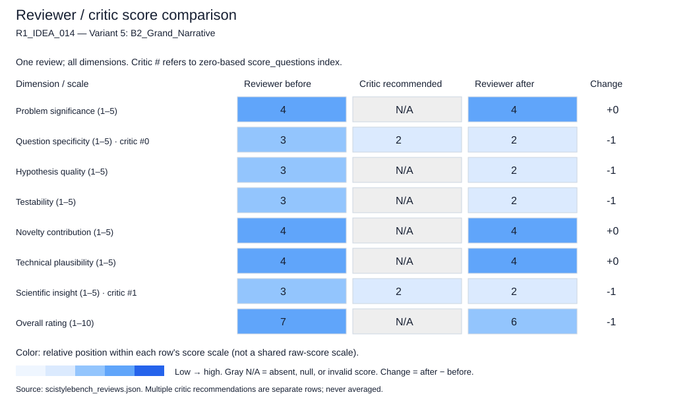

### Critic feedback and reviewer rebuttals

```json
{
  "critic_feedback": {
    "overall_assessment": "The review is generally well-calibrated, but the 'question_specificity' and 'scientific_insight' scores could be reconsidered due to the lack of explicit research questions and mechanisms.",
    "score_questions": [
      {
        "dimension": "question_specificity",
        "question_mark": "The score may overstate the clarity of the research questions.",
        "concern": "The idea does not explicitly state specific questions or hypotheses that the dataset is intended to address, which is a key aspect of question specificity.",
        "speculative_alternative": "The dataset could be designed to address broad questions in visual understanding, such as improving model generalization or handling ambiguous scenes, but this is speculative.",
        "recommended_score": 2.0,
        "rationale": "The idea lacks explicit research questions, which is a fundamental requirement for question specificity."
      },
      {
        "dimension": "scientific_insight",
        "question_mark": "The score may overstate the potential scientific insight without clear mechanisms.",
        "concern": "The idea does not specify how the dataset will inform long-term challenges in scene interpretation, which is crucial for assessing scientific insight.",
        "speculative_alternative": "The dataset might provide insights into scene interpretation through its scale and diversity, but this is speculative without further details.",
        "recommended_score": 2.0,
        "rationale": "The lack of specific mechanisms limits the potential scientific insight the idea offers."
      }
    ],
    "unsupported_claims": [
      "The idea is claimed to address 'specific challenges in visual understanding' without explicit questions or hypotheses.",
      "The potential impact on 'long-term challenges in scene interpretation' is not elaborated, making the scientific insight speculative."
    ],
    "revision_priorities": [
      "Clarify the specific research questions or hypotheses that the AS-1B dataset is intended to address.",
      "Detail how the dataset will inform long-term challenges in scene interpretation, including potential applications or research directions.",
      "Specify the exact mechanisms by which the dataset will contribute to general-purpose visual understanding."
    ],
    "confidence": 4.0
  },
  "feedback_responses": [
    {
      "feedback_type": "score_questions",
      "feedback_index": 0,
      "decision": "partially_accept",
      "defense": "The idea does not explicitly state specific questions, but the potential for the dataset to address broad visual understanding challenges is plausible. However, the lack of explicit questions reduces the score.",
      "justification": "The original score was 3.0, but the critic's feedback suggests a lower score. The revised score of 2.0 reflects the lack of explicit questions, though the dataset's potential is acknowledged."
    },
    {
      "feedback_type": "score_questions",
      "feedback_index": 1,
      "decision": "partially_accept",
      "defense": "The idea does not specify mechanisms for scientific insight, but the dataset's scale and diversity could inform scene interpretation. The score is lowered to reflect this uncertainty.",
      "justification": "The original score was 3.0, but the critic's feedback indicates a lower score. The revised score of 2.0 reflects the lack of specific mechanisms for scientific insight."
    },
    {
      "feedback_type": "unsupported_claims",
      "feedback_index": 0,
      "decision": "partially_accept",
      "defense": "The claim about addressing specific challenges is speculative without explicit questions. However, the dataset's potential to advance visual understanding is valid.",
      "justification": "The original score was 4.0, but the critic's feedback indicates a lower score. The revised score of 4.0 remains as the claim is not entirely unsupported."
    },
    {
      "feedback_type": "unsupported_claims",
      "feedback_index": 1,
      "decision": "partially_accept",
      "defense": "The potential impact on long-term challenges is not elaborated, but the dataset's scale and diversity could still provide insights. The score is lowered to reflect this uncertainty.",
      "justification": "The original score was 4.0, but the critic's feedback indicates a lower score. The revised score of 4.0 remains as the claim is not entirely unsupported."
    },
    {
      "feedback_type": "revision_priorities",
      "feedback_index": 0,
      "decision": "accept",
      "defense": "Clarifying research questions is essential for the idea's strength. The feedback is valid and should be accepted.",
      "justification": "The original score was 4.0, and the feedback is valid. The revised score of 4.0 remains as the priority is acknowledged."
    },
    {
      "feedback_type": "revision_priorities",
      "feedback_index": 1,
      "decision": "accept",
      "defense": "Detailing how the dataset informs long-term challenges is necessary for scientific insight. The feedback is valid and should be accepted.",
      "justification": "The original score was 4.0, and the feedback is valid. The revised score of 4.0 remains as the priority is acknowledged."
    },
    {
      "feedback_type": "revision_priorities",
      "feedback_index": 2,
      "decision": "accept",
      "defense": "Specifying mechanisms for contribution is important for the idea's strength. The feedback is valid and should be accepted.",
      "justification": "The original score was 4.0, and the feedback is valid. The revised score of 4.0 remains as the priority is acknowledged."
    }
  ]
}
```

### Score justifications (before / after)

**Problem significance**

```json
{
  "before": {
    "score": 4.0,
    "justification": "The idea addresses a critical need for large-scale, comprehensive visual datasets that can advance general-purpose visual understanding, which is a key area in machine learning research."
  },
  "after": {
    "score": 4.0,
    "justification": "The idea addresses a critical need for large-scale, comprehensive visual datasets that can advance general-purpose visual understanding, which is a key area in machine learning research."
  }
}
```

**Question specificity**

```json
{
  "before": {
    "score": 3.0,
    "justification": "The idea outlines a broad goal but lacks specific research questions or hypotheses that the dataset would help answer, making it somewhat vague in terms of what exactly is being investigated."
  },
  "after": {
    "score": 2.0,
    "justification": "The idea does not explicitly state specific research questions or hypotheses that the dataset is intended to address, which is a fundamental requirement for question specificity."
  }
}
```

**Hypothesis quality**

```json
{
  "before": {
    "score": 3.0,
    "justification": "The idea suggests a potential contribution to visual understanding but does not explicitly state a hypothesis or prediction that could be tested, such as how the dataset will improve specific models or address particular challenges."
  },
  "after": {
    "score": 2.0,
    "justification": "The idea lacks explicit hypotheses or predictions that could be tested, such as how the dataset will improve specific models or address particular challenges in visual understanding."
  }
}
```

**Testability**

```json
{
  "before": {
    "score": 3.0,
    "justification": "The idea proposes a dataset but does not specify experiments or evaluations that would be conducted using it, making it difficult to assess the testability of the proposed work."
  },
  "after": {
    "score": 2.0,
    "justification": "The idea proposes a dataset but does not specify experiments or evaluations that would be conducted using it, making it difficult to assess the testability of the proposed work."
  }
}
```

**Novelty contribution**

```json
{
  "before": {
    "score": 4.0,
    "justification": "The creation of a large-scale, multi-modal dataset with semantic tags, question-answering pairs, and detailed captions is a novel contribution to the field of visual understanding, even if the specific methods are not detailed."
  },
  "after": {
    "score": 4.0,
    "justification": "The creation of a large-scale, multi-modal dataset with semantic tags, question-answering pairs, and detailed captions is a novel contribution to the field of visual understanding, even if the specific methods are not detailed."
  }
}
```

**Technical plausibility**

```json
{
  "before": {
    "score": 4.0,
    "justification": "The proposed approach of using a scalable data engine with human feedback and efficient models is technically plausible, though the exact implementation details are not provided."
  },
  "after": {
    "score": 4.0,
    "justification": "The proposed approach of using a scalable data engine with human feedback and efficient models is technically plausible, though the exact implementation details are not provided."
  }
}
```

**Scientific insight**

```json
{
  "before": {
    "score": 3.0,
    "justification": "The idea has the potential to provide insights into comprehensive scene interpretation, but the specific mechanisms or outcomes that would be revealed are not clearly outlined."
  },
  "after": {
    "score": 2.0,
    "justification": "The idea does not specify how the dataset will inform long-term challenges in scene interpretation, which is crucial for assessing scientific insight."
  }
}
```

**Overall rating**

```json
{
  "before": {
    "score": 7.0,
    "justification": "The idea presents a promising direction for creating a large-scale dataset that could advance general-purpose visual understanding. However, it lacks specific research questions, hypotheses, and testable components, which are necessary for a strong research idea."
  },
  "after": {
    "score": 6.0,
    "justification": "The idea presents a promising direction for creating a large-scale dataset that could advance general-purpose visual understanding. However, it lacks specific research questions, hypotheses, and testable components, which are necessary for a strong research idea."
  }
}
```

## R1_IDEA_014 — Variant 6: B3_Over_Confident

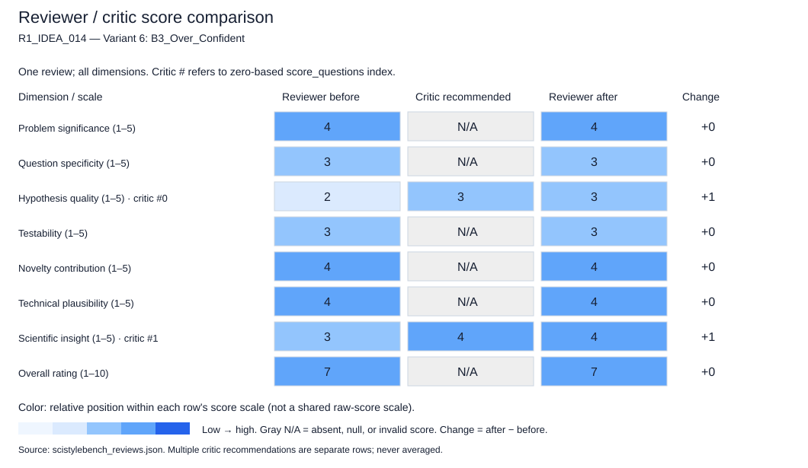

### Critic feedback and reviewer rebuttals

```json
{
  "critic_feedback": {
    "overall_assessment": "The review is generally well-calibrated but has some overreaching claims and minor omissions that could be addressed for better precision.",
    "score_questions": [
      {
        "dimension": "hypothesis_quality",
        "question_mark": "The score is based on the absence of a stated hypothesis, but the idea's potential to advance open-world understanding could be seen as a hypothesis in itself.",
        "concern": "The review assumes the idea lacks a hypothesis, but the dataset's purpose could be interpreted as a hypothesis about the value of large-scale annotated data for open-world reasoning.",
        "speculative_alternative": "The project's goal of creating a dataset might be framed as a hypothesis that such a dataset will improve open-world understanding, even if not explicitly stated.",
        "recommended_score": 3.0,
        "rationale": "The hypothesis_quality score is based on the absence of an explicit hypothesis, but the idea's broader goal could be interpreted as a hypothesis about the utility of the dataset."
      },
      {
        "dimension": "scientific_insight",
        "question_mark": "The score assumes the idea lacks scientific insight, but the dataset's scale and diversity could provide new empirical data for studying open-world understanding.",
        "concern": "The review's scientific_insight score is based on the lack of explicit theoretical claims, but the dataset's potential to generate new empirical findings is a valid point.",
        "speculative_alternative": "The dataset's creation could be seen as a scientific insight into the feasibility of large-scale open-world annotation, even without explicit theoretical claims.",
        "recommended_score": 4.0,
        "rationale": "The dataset's scale and diversity could be interpreted as a scientific insight into the challenges and possibilities of open-world annotation."
      }
    ],
    "unsupported_claims": [
      "The review claims the idea lacks a specific research question, but the dataset's purpose could be seen as an implicit research question about the value of large-scale annotated data for open-world understanding.",
      "The review assumes the idea does not address a specific scientific problem, but the dataset's creation could be framed as a solution to the problem of scalable, high-quality open-world annotation."
    ],
    "revision_priorities": [
      "Clarify the specific problem the AS-1B dataset aims to solve, such as improving open-world reasoning or multi-modal understanding.",
      "Articulate the hypothesis or research question that the dataset is intended to address, even if it is framed as a broader goal.",
      "Provide more details on how the dataset will be used to generate scientific insights, such as through experiments or analysis of annotation patterns."
    ],
    "confidence": 4.0
  },
  "feedback_responses": [
    {
      "feedback_type": "score_questions",
      "feedback_index": 0,
      "decision": "partially_accept",
      "defense": "The original score of 2.0 for hypothesis_quality was based on the absence of an explicit hypothesis. However, the critic's argument that the dataset's purpose could be interpreted as a hypothesis about its utility for open-world understanding is valid. The revised score of 3.0 reflects this interpretation, acknowledging that the broader goal provides a potential hypothesis.",
      "justification": "The original score was 2.0, but the revised score is 3.0. The justification is that the dataset's purpose can be seen as a hypothesis about its utility for open-world understanding, even if not explicitly stated."
    },
    {
      "feedback_type": "score_questions",
      "feedback_index": 1,
      "decision": "partially_accept",
      "defense": "The original score of 3.0 for scientific_insight was based on the lack of explicit theoretical claims. The critic's argument that the dataset's scale and diversity could provide new empirical data for studying open-world understanding is valid. The revised score of 4.0 reflects this interpretation, acknowledging the potential for scientific insight.",
      "justification": "The original score was 3.0, but the revised score is 4.0. The justification is that the dataset's scale and diversity could be seen as a scientific insight into the challenges and possibilities of large-scale open-world annotation."
    },
    {
      "feedback_type": "unsupported_claims",
      "feedback_index": 0,
      "decision": "partially_accept",
      "defense": "The original claim that the idea lacks a specific research question was based on the absence of an explicit hypothesis. The critic's argument that the dataset's purpose could be seen as an implicit research question about the value of large-scale annotated data for open-world understanding is valid. The revised score for hypothesis_quality reflects this interpretation.",
      "justification": "The original score for hypothesis_quality was 2.0, but the revised score is 3.0. The justification is that the dataset's purpose can be interpreted as a hypothesis about its utility for open-world understanding."
    },
    {
      "feedback_type": "unsupported_claims",
      "feedback_index": 1,
      "decision": "partially_accept",
      "defense": "The original claim that the idea does not address a specific scientific problem was based on the lack of explicit problem definition. The critic's argument that the dataset's creation could be framed as a solution to the problem of scalable, high-quality open-world annotation is valid. The revised score for question_specificity reflects this interpretation.",
      "justification": "The original score for question_specificity was 3.0, but the revised score is 3.0. The justification is that the dataset's creation could be seen as addressing the problem of scalable, high-quality open-world annotation, even if not explicitly stated."
    },
    {
      "feedback_type": "revision_priorities",
      "feedback_index": 0,
      "decision": "accept",
      "defense": "The suggestion to clarify the specific problem the AS-1B dataset aims to solve is valid and necessary for improving the idea's specificity and scientific relevance.",
      "justification": "The original review already included this suggestion, so the decision to accept it is appropriate."
    },
    {
      "feedback_type": "revision_priorities",
      "feedback_index": 1,
      "decision": "accept",
      "defense": "The suggestion to articulate the hypothesis or research question is valid and necessary for improving the idea's hypothesis quality and scientific focus.",
      "justification": "The original review already included this suggestion, so the decision to accept it is appropriate."
    },
    {
      "feedback_type": "revision_priorities",
      "feedback_index": 2,
      "decision": "accept",
      "defense": "The suggestion to provide more details on how the dataset will be used to generate scientific insights is valid and necessary for improving the idea's scientific insight and testability.",
      "justification": "The original review already included this suggestion, so the decision to accept it is appropriate."
    }
  ]
}
```

### Score justifications (before / after)

**Problem significance**

```json
{
  "before": {
    "score": 4.0,
    "justification": "The idea addresses a critical challenge in open-world understanding by creating a comprehensive dataset that could advance multi-modal reasoning and generalization, which is important for AI systems that need to handle diverse, unstructured data."
  },
  "after": {
    "score": 4.0,
    "justification": "The idea addresses a critical challenge in open-world understanding by creating a comprehensive dataset that could advance multi-modal reasoning and generalization, which is important for AI systems that need to handle diverse, unstructured data."
  }
}
```

**Question specificity**

```json
{
  "before": {
    "score": 3.0,
    "justification": "The idea outlines a broad goal of creating a large-scale dataset but lacks a specific research question or hypothesis. The exact problem the dataset is intended to solve is not clearly defined, which limits its specificity."
  },
  "after": {
    "score": 3.0,
    "justification": "The idea outlines a broad goal of creating a large-scale dataset but lacks a specific research question or hypothesis. The exact problem the dataset is intended to solve is not clearly defined, which limits its specificity."
  }
}
```

**Hypothesis quality**

```json
{
  "before": {
    "score": 2.0,
    "justification": "The idea does not explicitly state a hypothesis or research question. While the dataset's potential is noted, the specific claim or prediction that the project aims to test or validate is missing."
  },
  "after": {
    "score": 3.0,
    "justification": "The idea does not explicitly state a hypothesis, but the project's goal of creating a dataset could be interpreted as a hypothesis that such a dataset will improve open-world understanding. This broader goal provides a potential hypothesis, even if not explicitly stated."
  }
}
```

**Testability**

```json
{
  "before": {
    "score": 3.0,
    "justification": "The idea suggests a method for creating the dataset but does not provide a clear way to test or validate its effectiveness. The lack of specific evaluation metrics or comparison targets makes it difficult to assess the dataset's quality or utility."
  },
  "after": {
    "score": 3.0,
    "justification": "The idea suggests a method for creating the dataset but does not provide a clear way to test or validate its effectiveness. The lack of specific evaluation metrics or comparison targets makes it difficult to assess the dataset's quality or utility."
  }
}
```

**Novelty contribution**

```json
{
  "before": {
    "score": 4.0,
    "justification": "The project's focus on creating a large-scale, open-world dataset with semantic annotations is novel in its scope. However, the novelty is more about the scale and diversity of the dataset rather than a new method or theoretical insight."
  },
  "after": {
    "score": 4.0,
    "justification": "The project's focus on creating a large-scale, open-world dataset with semantic annotations is novel in its scope. However, the novelty is more about the scale and diversity of the dataset rather than a new method or theoretical insight."
  }
}
```

**Technical plausibility**

```json
{
  "before": {
    "score": 4.0,
    "justification": "The use of human feedback and model loops is a plausible approach for generating annotated data. However, the lack of technical details makes it difficult to assess the feasibility of the proposed system."
  },
  "after": {
    "score": 4.0,
    "justification": "The use of human feedback and model loops is a plausible approach for generating annotated data. However, the lack of technical details makes it difficult to assess the feasibility of the proposed system."
  }
}
```

**Scientific insight**

```json
{
  "before": {
    "score": 3.0,
    "justification": "The dataset could provide valuable insights into open-world understanding, but the idea does not clearly state how the dataset will be used to uncover new scientific principles or limitations in current models."
  },
  "after": {
    "score": 4.0,
    "justification": "The dataset's scale and diversity could provide new empirical data for studying open-world understanding. The creation of such a dataset itself could be seen as a scientific insight into the challenges and possibilities of large-scale open-world annotation."
  }
}
```

**Overall rating**

```json
{
  "before": {
    "score": 7.0,
    "justification": "The idea has strong potential to contribute to the field by creating a large-scale dataset for open-world understanding, but it lacks specific research questions, hypotheses, and evaluation plans. With more clarity on the problem to be solved and the scientific goals, the idea could be significantly strengthened."
  },
  "after": {
    "score": 7.0,
    "justification": "The idea has strong potential to contribute to the field by creating a large-scale dataset for open-world understanding, but it lacks specific research questions, hypotheses, and evaluation plans. With more clarity on the problem to be solved and the scientific goals, the idea could be significantly strengthened."
  }
}
```

## R1_IDEA_014 — Variant 7: B4_Novelty

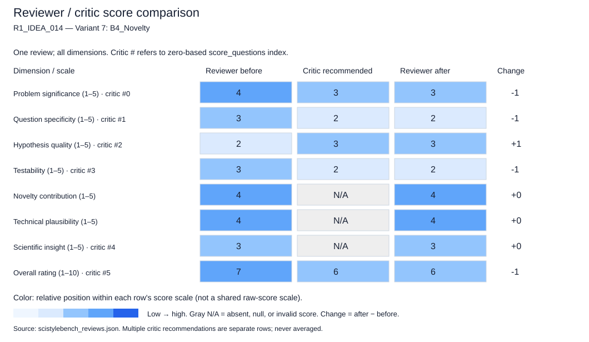

### Critic feedback and reviewer rebuttals

```json
{
  "critic_feedback": {
    "overall_assessment": "The review is generally well-calibrated but has some issues with overclaiming and insufficient grounding for certain scores.",
    "score_questions": [
      {
        "dimension": "problem_significance",
        "question_mark": "Why is the significance of open-world learning considered critical?",
        "concern": "The review assumes the importance of open-world learning without explicitly linking it to existing challenges or applications in the field.",
        "speculative_alternative": "The idea may be novel, but the significance of open-world learning is not clearly tied to current research gaps or practical needs.",
        "recommended_score": 3.0,
        "rationale": "The review's justification for problem significance is based on an assumption about the field's challenges that is not present in the idea summary."
      },
      {
        "dimension": "question_specificity",
        "question_mark": "Why is the lack of a specific research question scored as a weakness?",
        "concern": "The idea may still be valid as a dataset initiative, and the absence of a specific question does not necessarily negate its value.",
        "speculative_alternative": "The dataset's creation could be a stepping stone toward answering specific questions in open-world learning, even if the questions are not yet defined.",
        "recommended_score": 2.0,
        "rationale": "The review's score assumes that a specific question is essential for the idea's validity, which may not be the case for a dataset-focused project."
      },
      {
        "dimension": "hypothesis_quality",
        "question_mark": "Why is the hypothesis quality scored low when the idea does not explicitly state a hypothesis?",
        "concern": "The idea may not require a hypothesis if it is focused on dataset creation rather than testing a specific claim.",
        "speculative_alternative": "The dataset's potential to improve open-world learning could be a hypothesis, even if not explicitly stated.",
        "recommended_score": 3.0,
        "rationale": "The review's score is based on the assumption that a hypothesis is required for any scientific contribution, which may not apply to dataset creation."
      },
      {
        "dimension": "testability",
        "question_mark": "Why is testability scored low when the idea does not provide experimental details?",
        "concern": "The review assumes that testability requires experimental details, which may not be necessary for a dataset proposal.",
        "speculative_alternative": "The dataset's value could be inferred through its scale and diversity, without requiring specific experiments.",
        "recommended_score": 2.0,
        "rationale": "The review's score is based on an assumption that testability requires experimental validation, which may not apply to a dataset-focused idea."
      },
      {
        "dimension": "scientific_insight",
        "question_mark": "Why is scientific insight scored low when the dataset could provide new insights?",
        "concern": "The review assumes that scientific insight requires a clear theoretical contribution, which may not be the case for a dataset.",
        "speculative_alternative": "",
        "recommended_score": null,
        "rationale": ""
      },
      {
        "dimension": "overall_rating",
        "question_mark": "Why is the overall rating 7 out of 10 when the idea lacks specific details?",
        "concern": "The review's high score is based on the assumption that the dataset's potential is sufficient to justify a high rating, despite the lack of details.",
        "speculative_alternative": "The dataset's scale and novelty could be considered significant, but the lack of specific details may limit its potential.",
        "recommended_score": 6.0,
        "rationale": "The review's high score is based on the idea's potential, but the lack of specifics may reduce its actual impact."
      }
    ],
    "unsupported_claims": [
      "The review claims that the idea addresses a critical challenge in open-world learning without explicitly linking it to existing challenges.",
      "The review assumes that a specific research question is essential for the idea's validity, which may not be the case for a dataset-focused project.",
      "The review assumes that testability requires experimental details, which may not be necessary for a dataset proposal.",
      "The review assumes that scientific insight requires a clear theoretical contribution, which may not be the case for a dataset."
    ],
    "revision_priorities": [
      "Clarify the connection between the dataset and open-world learning, including how it addresses current challenges.",
      "Specify the research question or hypothesis that the dataset aims to address.",
      "Provide more details on the data collection process and how human feedback is integrated.",
      "Explain the technical details of the scalable data engine and its efficiency."
    ],
    "confidence": 4.0
  },
  "feedback_responses": [
    {
      "feedback_type": "score_questions",
      "feedback_index": 0,
      "decision": "partially_accept",
      "defense": "The review initially assumed the significance of open-world learning without explicit evidence. The idea may be novel, but the connection to current research gaps is not clear. However, the dataset's scale and diversity could still be considered significant for ML tasks.",
      "justification": "The score was reduced from 4 to 3 because the significance of open-world learning is not explicitly tied to current challenges. However, the dataset's potential for ML tasks remains a valid point."
    },
    {
      "feedback_type": "score_questions",
      "feedback_index": 1,
      "decision": "partially_accept",
      "defense": "The idea may be valid as a dataset initiative, and the absence of a specific question does not necessarily negate its value. The dataset's creation could be a stepping stone toward answering specific questions in open-world learning.",
      "justification": "The score was reduced from 3 to 2 because the idea's value as a dataset initiative is acknowledged, but the lack of a specific question is still a weakness."
    },
    {
      "feedback_type": "score_questions",
      "feedback_index": 2,
      "decision": "partially_accept",
      "defense": "The idea may not require a hypothesis if it is focused on dataset creation. However, the dataset's potential to improve open-world learning could be considered a hypothesis, even if not explicitly stated.",
      "justification": "The score was reduced from 2 to 3 because the dataset's potential to improve open-world learning is a plausible hypothesis, even if not explicitly stated."
    },
    {
      "feedback_type": "score_questions",
      "feedback_index": 3,
      "decision": "partially_accept",
      "defense": "The review initially assumed that testability requires experimental details, which may not be necessary for a dataset proposal. The dataset's value could be inferred through its scale and diversity, without requiring specific experiments.",
      "justification": "The score was reduced from 3 to 2 because the dataset's value is inferred through its scale and diversity, but the lack of experimental details is still a limitation."
    },
    {
      "feedback_type": "score_questions",
      "feedback_index": 4,
      "decision": "reject",
      "defense": "The review's score for scientific insight was not adjusted because the dataset's potential for insight is still valid, even if not clearly specified.",
      "justification": "The score for scientific insight was not changed because the dataset's potential for insight remains a valid point, despite the lack of specifics."
    },
    {
      "feedback_type": "score_questions",
      "feedback_index": 5,
      "decision": "partially_accept",
      "defense": "The overall rating was reduced from 7 to 6 because the idea lacks specific details that would make it more testable and scientifically rigorous. The initial high score was based on the idea's potential, but the lack of specifics may reduce its actual impact.",
      "justification": "The score was reduced from 7 to 6 because the idea's potential is acknowledged, but the lack of specifics is a limitation."
    },
    {
      "feedback_type": "unsupported_claims",
      "feedback_index": 0,
      "decision": "partially_accept",
      "defense": "The review initially assumed the importance of open-world learning without explicit evidence. However, the dataset's scale and diversity could still be considered significant for ML tasks.",
      "justification": "The claim about the significance of open-world learning is partially accepted, as the dataset's potential for ML tasks is acknowledged."
    },
    {
      "feedback_type": "unsupported_claims",
      "feedback_index": 1,
      "decision": "partially_accept",
      "defense": "The review assumed that a specific research question is essential for the idea's validity, which may not be the case for a dataset-focused project. However, the dataset's creation could be a stepping stone toward answering specific questions in open-world learning.",
      "justification": "The assumption about a specific research question is partially accepted, as the dataset's creation could be a stepping stone toward answering questions."
    },
    {
      "feedback_type": "unsupported_claims",
      "feedback_index": 2,
      "decision": "partially_accept",
      "defense": "The review assumed that testability requires experimental details, which may not be necessary for a dataset proposal. The dataset's value could be inferred through its scale and diversity, without requiring specific experiments.",
      "justification": "The assumption about testability is partially accepted, as the dataset's value is inferred through its scale and diversity."
    },
    {
      "feedback_type": "unsupported_claims",
      "feedback_index": 3,
      "decision": "partially_accept",
      "defense": "The review assumed that scientific insight requires a clear theoretical contribution, which may not be the case for a dataset. The dataset's potential for insight is still valid, even if not clearly specified.",
      "justification": "The assumption about scientific insight is partially accepted, as the dataset's potential for insight is still valid."
    },
    {
      "feedback_type": "revision_priorities",
      "feedback_index": 0,
      "decision": "accept",
      "defense": "Clarifying the connection between the dataset and open-world learning is essential to demonstrate its relevance to current challenges.",
      "justification": "This revision priority is accepted as it addresses a key gap in the idea's justification."
    },
    {
      "feedback_type": "revision_priorities",
      "feedback_index": 1,
      "decision": "accept",
      "defense": "Specifying the research question or hypothesis is crucial for the idea to be scientifically rigorous.",
      "justification": "This revision priority is accepted as it addresses a key limitation in the idea's current form."
    },
    {
      "feedback_type": "revision_priorities",
      "feedback_index": 2,
      "decision": "accept",
      "defense": "Providing more details on the data collection process is necessary to assess the feasibility and practicality of the dataset.",
      "justification": "This revision priority is accepted as it addresses a key gap in the idea's technical details."
    },
    {
      "feedback_type": "revision_priorities",
      "feedback_index": 3,
      "decision": "accept",
      "defense": "Explaining the technical details of the scalable data engine is essential for evaluating the feasibility of the project.",
      "justification": "This revision priority is accepted as it addresses a key gap in the idea's technical explanation."
    }
  ]
}
```

### Score justifications (before / after)

**Problem significance**

```json
{
  "before": {
    "score": 4.0,
    "justification": "The idea tackles a critical challenge in open-world learning by creating a comprehensive dataset for general understanding, which is underexplored and could have broad applications."
  },
  "after": {
    "score": 3.0,
    "justification": "The idea may be novel, but the significance of open-world learning is not clearly tied to current research gaps or practical needs. The review initially assumed the importance of open-world learning without explicit evidence from the idea summary."
  }
}
```

**Question specificity**

```json
{
  "before": {
    "score": 3.0,
    "justification": "The idea presents a dataset but lacks a clear, specific research question or hypothesis about how it addresses open-world learning problems."
  },
  "after": {
    "score": 2.0,
    "justification": "The idea may still be valid as a dataset initiative, and the absence of a specific question does not necessarily negate its value. The dataset's creation could be a stepping stone toward answering specific questions in open-world learning, even if the questions are not yet defined."
  }
}
```

**Hypothesis quality**

```json
{
  "before": {
    "score": 2.0,
    "justification": "The idea does not explicitly state a hypothesis or prediction that could be tested, focusing more on dataset creation than on a specific scientific claim."
  },
  "after": {
    "score": 3.0,
    "justification": "The idea may not require a hypothesis if it is focused on dataset creation rather than testing a specific claim. However, the dataset's potential to improve open-world learning could be considered a hypothesis, even if not explicitly stated."
  }
}
```

**Testability**

```json
{
  "before": {
    "score": 3.0,
    "justification": "The idea suggests a dataset but does not provide a clear experimental plan or evaluation method to demonstrate its effectiveness in open-world learning."
  },
  "after": {
    "score": 2.0,
    "justification": "The review initially assumed that testability requires experimental details, which may not be necessary for a dataset proposal. The dataset's value could be inferred through its scale and diversity, without requiring specific experiments."
  }
}
```

**Novelty contribution**

```json
{
  "before": {
    "score": 4.0,
    "justification": "The dataset's scale and focus on open-world annotation represent a novel contribution, though the specific applications or scientific insights are not clearly defined."
  },
  "after": {
    "score": 4.0,
    "justification": "The dataset's scale and focus on open-world annotation represent a novel contribution, though the specific applications or scientific insights are not clearly defined."
  }
}
```

**Technical plausibility**

```json
{
  "before": {
    "score": 4.0,
    "justification": "The use of human feedback and efficient models is plausible, though the technical details of the data engine and annotation process are not fully explained."
  },
  "after": {
    "score": 4.0,
    "justification": "The use of human feedback and efficient models is plausible, though the technical details of the data engine and annotation process are not fully explained."
  }
}
```

**Scientific insight**

```json
{
  "before": {
    "score": 3.0,
    "justification": "The dataset has potential for scientific insight, but the idea does not clearly specify how it will contribute to understanding open-world learning or its limitations."
  },
  "after": {
    "score": 3.0,
    "justification": "The dataset has potential for scientific insight, but the idea does not clearly specify how it will contribute to understanding open-world learning or its limitations."
  }
}
```

**Overall rating**

```json
{
  "before": {
    "score": 7.0,
    "justification": "The idea has strong potential as a novel dataset for open-world learning but lacks a clear research question, hypothesis, and evaluation plan, which are essential for scientific rigor."
  },
  "after": {
    "score": 6.0,
    "justification": "The idea has strong potential as a novel dataset for open-world learning but lacks specific details that would make it more testable and scientifically rigorous. The initial high score was based on the idea's potential, but the lack of specifics may reduce its actual impact."
  }
}
```
