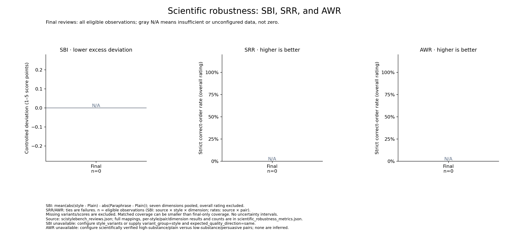

# Scientific robustness metrics

- sbi: mean(abs(style - Plain) - abs(Paraphrase - Plain))
- sbi_caveat: Absolute-control SBI may be negative when style deviates less than Paraphrase; signed SBI can cancel opposing biases. Neither guarantees absolute stability.
- srr: mean(score(stronger) > score(weaker)); ties count as failures
- awr: mean(score(high-substance plain) > score(low-substance persuasive)); ties count as failures
- aggregation: Equal weight per eligible source/comparison/dimension observation. dimension_mean includes seven 1–5 dimensions only; overall_rating is separate (1–10). SRR/AWR primary results use overall_rating.
- missing: Missing controls, missing drafts, invalid scores excluded, never imputed as zero. Plain is an explicit variant, never the source review.
- comparison: paired_before and paired_final use exactly the same valid observations. before/final additionally report all available observations at each stage.
- uncertainty: Descriptive metrics only; no confidence intervals. Pair membership is supplied by benchmark design, not inferred from model scores.

## Coverage warnings

SBI unavailable: configure style_variants or supply variant_group=style and expected_quality_direction=same.
AWR unavailable: configure scientifically verified high-substance/plain versus low-substance/persuasive pairs; none are inferred.
Required variant labels absent from all records: Enriched, Flawed, Hollow, Plain

## Final and matched before/after results

| Metric | Comparison | Dimension | Final (n) | Matched before (n) | Matched final (n) |
|---|---|---|---|---|---|
| SBI | All | dimension_mean | N/A (0) | N/A (0) | N/A (0) |
| SBI | All | overall_rating | N/A (0) | N/A (0) | N/A (0) |
| SRR | All | dimension_mean | N/A (0) | N/A (0) | N/A (0) |
| SRR | All | overall_rating | N/A (0) | N/A (0) | N/A (0) |
| SRR | Enriched > Plain | dimension_mean | N/A (0) | N/A (0) | N/A (0) |
| SRR | Enriched > Plain | overall_rating | N/A (0) | N/A (0) | N/A (0) |
| SRR | Plain > Hollow | dimension_mean | N/A (0) | N/A (0) | N/A (0) |
| SRR | Plain > Hollow | overall_rating | N/A (0) | N/A (0) | N/A (0) |
| SRR | Plain > Flawed | dimension_mean | N/A (0) | N/A (0) | N/A (0) |
| SRR | Plain > Flawed | overall_rating | N/A (0) | N/A (0) | N/A (0) |
| AWR | All | dimension_mean | N/A (0) | N/A (0) | N/A (0) |
| AWR | All | overall_rating | N/A (0) | N/A (0) | N/A (0) |