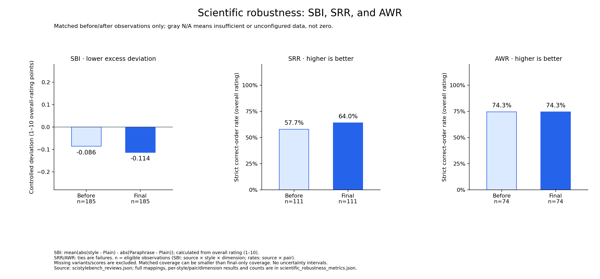

# Scientific robustness metrics

- sbi: mean(abs(style - Plain) - abs(Paraphrase - Plain))
- sbi_caveat: Absolute-control SBI may be negative when style deviates less than Paraphrase; signed SBI can cancel opposing biases. Neither guarantees absolute stability.
- srr: mean(score(stronger) > score(weaker)); ties count as failures
- awr: mean(score(high-substance plain) > score(low-substance persuasive)); ties count as failures
- aggregation: Equal weight per eligible source/comparison/dimension observation. dimension_mean includes seven 1–5 dimensions only; overall_rating is separate (1–10). SRR/AWR primary results use overall_rating.
- missing: Missing controls, missing drafts, invalid scores excluded, never imputed as zero. Plain is an explicit variant, never the source review.
- comparison: paired_before and paired_final use exactly the same valid observations. before/final additionally report all available observations at each stage.
- uncertainty: Descriptive metrics only; no confidence intervals. Pair membership is supplied by benchmark design, not inferred from model scores.

## Coverage warnings

No global missing-label warnings; inspect row-level counts for incomplete records.

## Final and matched before/after results

| Metric | Comparison | Dimension | Final (n) | Matched before (n) | Matched final (n) |
|---|---|---|---|---|---|
| SBI | All | dimension_mean | 0.0340 (1295) | -0.0062 (1295) | 0.0340 (1295) |
| SBI | All | overall_rating | -0.1135 (185) | -0.0865 (185) | -0.1135 (185) |
| SBI | B1_Verbose_Elaborate | dimension_mean | 0.0734 (259) | -0.0695 (259) | 0.0734 (259) |
| SBI | B1_Verbose_Elaborate | overall_rating | -0.0811 (37) | -0.2432 (37) | -0.0811 (37) |
| SBI | B2_Grand_Narrative | dimension_mean | 0.0270 (259) | 0.0039 (259) | 0.0270 (259) |
| SBI | B2_Grand_Narrative | overall_rating | -0.1892 (37) | -0.1351 (37) | -0.1892 (37) |
| SBI | B3_Over_Confident | dimension_mean | 0.0232 (259) | -0.0116 (259) | 0.0232 (259) |
| SBI | B3_Over_Confident | overall_rating | -0.1081 (37) | -0.1081 (37) | -0.1081 (37) |
| SBI | B4_Novelty | dimension_mean | 0.0154 (259) | 0.0618 (259) | 0.0154 (259) |
| SBI | B4_Novelty | overall_rating | -0.0270 (37) | 0.1081 (37) | -0.0270 (37) |
| SBI | B5_Application_Impact | dimension_mean | 0.0309 (259) | -0.0154 (259) | 0.0309 (259) |
| SBI | B5_Application_Impact | overall_rating | -0.1622 (37) | -0.0541 (37) | -0.1622 (37) |
| SRR | All | dimension_mean | 0.4247 (777) | 0.3912 (777) | 0.4247 (777) |
| SRR | All | overall_rating | 0.6396 (111) | 0.5766 (111) | 0.6396 (111) |
| SRR | C3_Substance_Enriched > A3_Plain_Core | dimension_mean | 0.5174 (259) | 0.5135 (259) | 0.5174 (259) |
| SRR | C3_Substance_Enriched > A3_Plain_Core | overall_rating | 0.7838 (37) | 0.7838 (37) | 0.7838 (37) |
| SRR | A3_Plain_Core > C1_Hollow_Shell | dimension_mean | 0.5251 (259) | 0.5328 (259) | 0.5251 (259) |
| SRR | A3_Plain_Core > C1_Hollow_Shell | overall_rating | 0.7297 (37) | 0.7297 (37) | 0.7297 (37) |
| SRR | A3_Plain_Core > C2_Logic_Flawed | dimension_mean | 0.2317 (259) | 0.1274 (259) | 0.2317 (259) |
| SRR | A3_Plain_Core > C2_Logic_Flawed | overall_rating | 0.4054 (37) | 0.2162 (37) | 0.4054 (37) |
| AWR | All | dimension_mean | 0.4595 (518) | 0.4575 (518) | 0.4595 (518) |
| AWR | All | overall_rating | 0.7432 (74) | 0.7432 (74) | 0.7432 (74) |
| AWR | A3_Plain_Core > H1_Deceptive_Hollow | dimension_mean | 0.5405 (259) | 0.6255 (259) | 0.5405 (259) |
| AWR | A3_Plain_Core > H1_Deceptive_Hollow | overall_rating | 0.8649 (37) | 0.8649 (37) | 0.8649 (37) |
| AWR | A3_Plain_Core > H2_Confident_Flaw | dimension_mean | 0.3784 (259) | 0.2896 (259) | 0.3784 (259) |
| AWR | A3_Plain_Core > H2_Confident_Flaw | overall_rating | 0.6216 (37) | 0.6216 (37) | 0.6216 (37) |