# Self-refinement score heatmaps

All saved source and variant self-refinements; no sampling. Each chart compares the original draft with the final refined review.
Refined reviews: 592; reviews with at least one changed score: 269.


## R1_IDEA_001 — Source

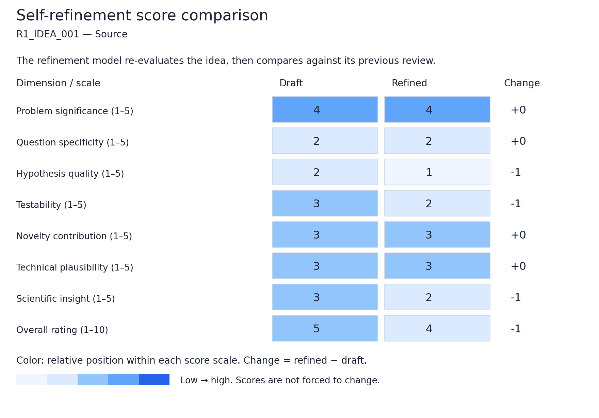

Changed score dimensions: hypothesis_quality, testability, scientific_insight, overall_rating.

### Score justifications (draft / refined)

**Problem significance**

```json
{
  "draft": {
    "score": 4.0,
    "justification": "Node-level OOD detection on graphs is a meaningful and underexplored problem with practical relevance (e.g., anomaly detection in social or biological networks). The focus on heterophilic graphs adds nuance, as many real-world graphs exhibit heterophily, and standard homophily assumptions may not hold."
  },
  "refined": {
    "score": 4.0,
    "justification": "Node-level OOD detection on graphs is a meaningful problem with practical applications in anomaly detection, fraud detection, and network security. The focus on heterophilic graphs adds relevance since many real-world networks (e.g., transaction networks, certain social networks) exhibit heterophily. The observation that image-based methods assume independence while graphs have dependencies is valid and important."
  }
}
```

**Question specificity**

```json
{
  "draft": {
    "score": 2.0,
    "justification": "The idea states a general direction ('proposes a decoupled graph energy-based model') but lacks a concrete research question. It doesn't specify what aspect of node dependence or heterophily is being investigated, or what relationship between decoupling and OOD performance is hypothesized."
  },
  "refined": {
    "score": 2.0,
    "justification": "The idea states a general direction ('proposes a decoupled graph energy-based model') but lacks a concrete research question. It doesn't specify what aspect of the relationship between decoupling, heterophily, and OOD detection is being investigated. The research objective is described at the level of 'improving energy-based OOD detection' rather than testing a specific mechanism or relationship."
  }
}
```

**Hypothesis quality**

```json
{
  "draft": {
    "score": 2.0,
    "justification": "There is an implicit hypothesis that addressing node dependence and heterophily will improve energy-based OOD detection, but it's not articulated as a testable prediction. No mechanism is proposed for why decoupling helps, nor is there a clear alternative hypothesis (e.g., compared to coupled models)."
  },
  "refined": {
    "score": 1.0,
    "justification": "There is no explicit or clearly implicit hypothesis. The idea suggests that addressing node dependence and heterophily will improve OOD detection, but this is stated as an assumption rather than a testable prediction. No mechanism is proposed for why decoupling helps, no alternative explanations are considered, and there's no falsifiable claim. The statement reads more like a proposed solution than a hypothesis-driven investigation."
  }
}
```

**Testability**

```json
{
  "draft": {
    "score": 3.0,
    "justification": "The idea is testable in principle: one could implement a decoupled energy-based model and evaluate OOD detection on heterophilic graphs. However, without a clear hypothesis or evaluation plan, it's unclear what constitutes success or what comparisons are needed (e.g., ablations on coupling, heterophily levels)."
  },
  "refined": {
    "score": 2.0,
    "justification": "While one could implement some version of a decoupled energy-based model and test it on heterophilic graphs, the idea lacks the specificity needed for meaningful testing. Without a clear hypothesis, it's unclear what evidence would support or contradict the central claim. There's no indication of what comparisons would be made (e.g., coupled vs. decoupled models, different heterophily levels, alternative OOD methods) or what would constitute a successful outcome."
  }
}
```

**Novelty contribution**

```json
{
  "draft": {
    "score": 3.0,
    "justification": "Applying energy-based models to graph OOD detection has been explored, but focusing on node-level detection and explicitly addressing heterophily is a nuanced angle. The 'decoupled' aspect could be novel if clearly defined, but the idea as stated is too vague to assess its novelty relative to graph OOD literature."
  },
  "refined": {
    "score": 3.0,
    "justification": "The combination of energy-based models, node-level OOD detection, and explicit focus on heterophily has some novelty potential. However, the idea is too vague to assess its true novelty relative to existing graph OOD literature. Energy-based OOD detection on graphs has been explored, and heterophily-aware graph neural networks exist. The 'decoupled' aspect could be novel if clearly defined, but as stated, it's unclear how this differs from existing approaches."
  }
}
```

**Technical plausibility**

```json
{
  "draft": {
    "score": 3.0,
    "justification": "The reasoning is logically coherent: image-based methods assume independence, graphs have dependence, so methods should account for it. However, the technical details of 'decoupled graph energy-based model' are unspecified, making it hard to judge feasibility. Addressing heterophily in energy-based models is plausible but not elaborated."
  },
  "refined": {
    "score": 3.0,
    "justification": "The basic reasoning is logically coherent: graph data has dependencies unlike images, so methods should account for this. Energy-based models have been used for OOD detection in other domains. However, the technical details of 'decoupled graph energy-based model' are completely unspecified, making it impossible to judge feasibility. The connection between decoupling, heterophily, and improved OOD detection is asserted but not explained."
  }
}
```

**Scientific insight**

```json
{
  "draft": {
    "score": 3.0,
    "justification": "If successful, this could provide insight into how graph structure (especially heterophily) affects OOD detection, and whether decoupling representations mitigates spurious dependencies. However, the idea currently leans toward engineering a solution rather than probing a fundamental phenomenon."
  },
  "refined": {
    "score": 2.0,
    "justification": "If successfully investigated, this could potentially provide insight into how graph structure affects OOD detection and whether decoupling representations helps. However, the idea as presented leans heavily toward engineering a solution rather than probing a fundamental phenomenon. There's no indication of what general principles about graph OOD detection or heterophily would be learned beyond whether this particular approach works."
  }
}
```

**Overall rating**

```json
{
  "draft": {
    "score": 5.0,
    "justification": "This is a moderate/borderline research idea. It identifies a meaningful problem (node OOD on heterophilic graphs) and proposes a plausible technical direction (decoupled energy-based models). However, it lacks a specific research question, testable hypothesis, and details on the proposed method. Without these, the scientific contribution and insight potential are limited. The idea is reasonable but needs substantial refinement to become a strong research direction."
  },
  "refined": {
    "score": 4.0,
    "justification": "This is a weak research idea that identifies a meaningful problem but lacks the core elements of a scientific investigation. While the problem significance is relatively strong, the idea fails to articulate a specific research question, contains no testable hypothesis, and provides insufficient detail to evaluate its novelty or potential insight. The technical direction is plausible but undefined. The idea needs substantial refinement to become a viable research direction—specifically, it needs a clear hypothesis, operational definitions, and an evaluation framework."
  }
}
```

## R1_IDEA_001 — Variant 1: A1_Identity


Changed score dimensions: none.

### Score justifications (draft / refined)

**Problem significance**

```json
{
  "draft": {
    "score": 4.0,
    "justification": "Node-level OOD detection on graphs is an important practical problem with applications in anomaly detection, robustness, and safety. The focus on heterophilic graphs addresses a meaningful gap since many real-world graphs exhibit heterophily, and existing methods often assume homophily."
  },
  "refined": {
    "score": 4.0,
    "justification": "Node-level OOD detection on graphs is an important practical problem with applications in anomaly detection, robustness, and safety. The focus on heterophilic graphs addresses a meaningful gap since many real-world graphs (e.g., adversarial networks, certain social networks) exhibit heterophily, and existing methods often assume homophily. This has clear relevance to both researchers and practitioners."
  }
}
```

**Question specificity**

```json
{
  "draft": {
    "score": 2.0,
    "justification": "The idea states a general direction but lacks a concrete research question. It proposes 'a decoupled graph energy-based model' without specifying what aspect will be investigated or what relationship will be tested."
  },
  "refined": {
    "score": 2.0,
    "justification": "The idea states a general direction ('proposes a decoupled graph energy-based model') but lacks a concrete research question. It doesn't specify what aspect will be investigated, what relationship will be tested, or what phenomenon will be explained. The description is more of a method proposal than a research question."
  }
}
```

**Hypothesis quality**

```json
{
  "draft": {
    "score": 2.0,
    "justification": "There is an implicit hypothesis that addressing node dependence and heterophily will improve OOD detection, but this is not articulated as a testable prediction. No specific mechanism or relationship is proposed beyond the general direction."
  },
  "refined": {
    "score": 2.0,
    "justification": "There is only an implicit, vague hypothesis that addressing node dependence and heterophily will improve OOD detection. No concrete prediction, mechanism, or relationship is articulated. The hypothesis lacks specificity about what improvement means, under what conditions it should occur, or how it would be measured."
  }
}
```

**Testability**

```json
{
  "draft": {
    "score": 3.0,
    "justification": "The idea is testable in principle (one could implement the model and compare to baselines), but the lack of specific claims makes it unclear what exactly would constitute supporting or contradicting evidence. The direction suggests experiments but doesn't specify what should be measured."
  },
  "refined": {
    "score": 3.0,
    "justification": "The idea is testable in principle - one could implement a model and compare it to baselines. However, without specific claims about expected outcomes or mechanisms, it's unclear what evidence would support or contradict the core idea. The direction suggests experiments exist but doesn't specify what should be measured to test a particular hypothesis."
  }
}
```

**Novelty contribution**

```json
{
  "draft": {
    "score": 3.0,
    "justification": "Applying energy-based models to graph OOD detection has some novelty, and focusing on heterophily addresses a specific gap. However, the idea lacks details about what makes the approach novel compared to other graph-based OOD methods or energy-based approaches on graphs."
  },
  "refined": {
    "score": 3.0,
    "justification": "Applying energy-based models to graph OOD detection has some novelty, and focusing on heterophily addresses a specific gap. However, the idea lacks details about what makes the approach novel compared to other graph-based OOD methods or energy-based approaches on graphs. It's unclear whether the contribution is primarily methodological or provides new scientific understanding."
  }
}
```

**Technical plausibility**

```json
{
  "draft": {
    "score": 4.0,
    "justification": "The reasoning is logically coherent: image-based methods assume independence, graphs have dependence, so methods should account for this. Energy-based models have been used for OOD detection in other domains, so extending them to graphs is plausible."
  },
  "refined": {
    "score": 4.0,
    "justification": "The reasoning is logically coherent: image-based methods assume independence, graphs have dependence, so methods should account for this. Energy-based models have been successfully used for OOD detection in other domains (images, sequences), so extending them to graphs is plausible. The focus on heterophily as a specific challenge is well-motivated given known limitations of many graph neural networks."
  }
}
```

**Scientific insight**

```json
{
  "draft": {
    "score": 3.0,
    "justification": "If successful, this could provide insight into how graph structure (particularly heterophily) affects OOD detection, which is a transferable insight. However, the idea as stated focuses more on developing a method than on uncovering general principles about OOD detection on graphs."
  },
  "refined": {
    "score": 3.0,
    "justification": "If successfully investigated, this could provide insight into how graph structure (particularly heterophily) affects OOD detection, which is a transferable insight. However, the idea as stated focuses more on developing a method than on uncovering general principles about OOD detection on graphs. The potential for mechanistic understanding or generalizable findings is present but not clearly articulated."
  }
}
```

**Overall rating**

```json
{
  "draft": {
    "score": 5.0,
    "justification": "This is a moderate/borderline research idea. It identifies a meaningful problem and proposes a plausible direction, but lacks specificity in the research question, hypothesis, and expected contributions. The idea needs more concrete formulation to become a strong research proposal."
  },
  "refined": {
    "score": 5.0,
    "justification": "This is a moderate/borderline research idea. It identifies a meaningful problem and proposes a plausible technical direction, but lacks specificity in the research question, hypothesis, and expected contributions. The idea needs more concrete formulation to become a strong research proposal. While the problem is significant and the direction is plausible, the lack of a clear research question limits its scientific value as currently described."
  }
}
```

## R1_IDEA_001 — Variant 2: A2_Paraphrase_Only


Changed score dimensions: none.

### Score justifications (draft / refined)

**Problem significance**

```json
{
  "draft": {
    "score": 4.0,
    "justification": "Node-level OOD detection on graphs is an important and underexplored problem with practical applications in anomaly detection, robustness, and safety. The focus on heterophilic graphs addresses a specific challenge that many real-world graphs exhibit."
  },
  "refined": {
    "score": 4.0,
    "justification": "Node-level OOD detection on graphs is an important and underexplored problem with practical applications in anomaly detection, robustness, and safety. The focus on heterophilic graphs addresses a specific challenge that many real-world graphs exhibit, where connected nodes may have dissimilar features or labels."
  }
}
```

**Question specificity**

```json
{
  "draft": {
    "score": 2.0,
    "justification": "The idea identifies a problem area but doesn't articulate a specific research question. It states what the method aims to do ('improve energy-based OOD detection') but not what specific relationship, mechanism, or phenomenon will be investigated."
  },
  "refined": {
    "score": 2.0,
    "justification": "The idea identifies a problem area but doesn't articulate a specific research question. It states what the method aims to do ('improve energy-based OOD detection') but not what specific relationship, mechanism, or phenomenon will be investigated. The research direction is described at a high level without concrete details."
  }
}
```

**Hypothesis quality**

```json
{
  "draft": {
    "score": 2.0,
    "justification": "There's an implicit hypothesis that 'decoupled graph energy-based models can handle node dependence and heterophily better than existing methods,' but this is stated as an aim rather than a testable prediction. No concrete mechanism or relationship is proposed that could be falsified."
  },
  "refined": {
    "score": 2.0,
    "justification": "There's an implicit hypothesis that 'decoupled graph energy-based models can handle node dependence and heterophily better than existing methods,' but this is stated as an aim rather than a testable prediction. No concrete mechanism or relationship is proposed that could be falsified. The hypothesis lacks specificity about what 'better' means or what specific improvements are expected."
  }
}
```

**Testability**

```json
{
  "draft": {
    "score": 3.0,
    "justification": "The idea is testable in principle (one could implement the proposed model and evaluate OOD detection performance), but no specific experimental design, evaluation metrics, or comparisons are suggested. The claim about handling heterophily could be tested by varying graph heterophily levels."
  },
  "refined": {
    "score": 3.0,
    "justification": "The idea is testable in principle (one could implement the proposed model and evaluate OOD detection performance), but no specific experimental design, evaluation metrics, or comparisons are suggested. The claim about handling heterophily could be tested by varying graph heterophily levels, but the idea doesn't specify how this would be done."
  }
}
```

**Novelty contribution**

```json
{
  "draft": {
    "score": 3.0,
    "justification": "Applying energy-based models to graph OOD detection has some novelty, and focusing on heterophilic graphs addresses a specific gap. However, the core idea of adapting methods from images to graphs while accounting for graph structure is not fundamentally novel without more specific technical innovation."
  },
  "refined": {
    "score": 3.0,
    "justification": "Applying energy-based models to graph OOD detection has some novelty, and focusing on heterophilic graphs addresses a specific gap. However, the core idea of adapting methods from images to graphs while accounting for graph structure is not fundamentally novel without more specific technical innovation. The contribution would depend heavily on the specific implementation of 'decoupling'."
  }
}
```

**Technical plausibility**

```json
{
  "draft": {
    "score": 4.0,
    "justification": "The reasoning is logically coherent: image-based methods assume independence, graphs have dependence, so methods need to account for this. Energy-based models have shown promise for OOD detection, and adapting them to graphs is plausible. The mention of 'decoupling' suggests a specific technical direction."
  },
  "refined": {
    "score": 4.0,
    "justification": "The reasoning is logically coherent: image-based methods assume independence, graphs have dependence, so methods need to account for this. Energy-based models have shown promise for OOD detection in other domains, and adapting them to graphs is plausible. The mention of 'decoupling' suggests awareness that standard approaches may need modification for graph data."
  }
}
```

**Scientific insight**

```json
{
  "draft": {
    "score": 3.0,
    "justification": "If successful, the research could provide insight into how to adapt OOD detection methods to structured data with dependencies. However, the idea as presented focuses more on application (improving performance) than on uncovering fundamental principles about OOD detection on graphs or the role of heterophily."
  },
  "refined": {
    "score": 3.0,
    "justification": "If successful, the research could provide insight into how to adapt OOD detection methods to structured data with dependencies. However, the idea as presented focuses more on application (improving performance) than on uncovering fundamental principles about OOD detection on graphs or the role of heterophily. The potential for transferable insights is moderate."
  }
}
```

**Overall rating**

```json
{
  "draft": {
    "score": 5.0,
    "justification": "This is a moderate/borderline research idea. It identifies a meaningful problem and proposes a plausible direction, but lacks specificity in the research question, hypothesis, and experimental approach. The potential contribution is limited without more concrete technical innovation or a clearer hypothesis about mechanisms. The idea needs refinement to become a strong research proposal."
  },
  "refined": {
    "score": 5.0,
    "justification": "This is a moderate/borderline research idea. It identifies a meaningful problem and proposes a plausible direction, but lacks specificity in the research question, hypothesis, and experimental approach. The potential contribution is limited without more concrete technical innovation or a clearer hypothesis about mechanisms. The idea needs refinement to become a strong research proposal, particularly in defining what 'decoupled' means and how it addresses the stated challenges."
  }
}
```

## R1_IDEA_001 — Variant 3: A3_Plain_Core


Changed score dimensions: none.

### Score justifications (draft / refined)

**Problem significance**

```json
{
  "draft": {
    "score": 4.0,
    "justification": "Node-level OOD detection on graphs is indeed an important and underexplored problem with practical applications in anomaly detection, robustness evaluation, and safety. The focus on heterophilic graphs addresses a meaningful gap, as many real-world graphs exhibit heterophily."
  },
  "refined": {
    "score": 4.0,
    "justification": "Node-level OOD detection on graphs is an important and underexplored problem with practical applications in anomaly detection, robustness, and safety. Focusing on heterophilic graphs addresses a meaningful gap, as many real-world graphs (e.g., adversarial networks, certain social or biological networks) exhibit heterophily, and existing methods often assume homophily."
  }
}
```

**Question specificity**

```json
{
  "draft": {
    "score": 2.0,
    "justification": "The idea identifies a problem area but doesn't articulate a specific research question. It states what will be done ('introduces a decoupled graph energy-based model') but not what will be learned or tested about heterophily and OOD detection."
  },
  "refined": {
    "score": 2.0,
    "justification": "The idea identifies a problem area and proposes a solution but does not articulate a specific research question. It states what will be built ('introduces a decoupled graph energy-based model') but not what will be learned or tested about the relationship between heterophily, node dependence, and OOD detection."
  }
}
```

**Hypothesis quality**

```json
{
  "draft": {
    "score": 2.0,
    "justification": "There's an implicit hypothesis that addressing node dependence and heterophily will improve OOD detection, but it's not formulated as a testable prediction. No mechanism is proposed for why heterophily specifically degrades OOD detection or how the proposed model addresses it."
  },
  "refined": {
    "score": 2.0,
    "justification": "There is an implicit hypothesis that addressing node dependence and heterophily will improve OOD detection, but it is not formulated as a concrete, testable prediction. No mechanism is proposed for why heterophily specifically degrades OOD detection or how the proposed model counteracts it, making the hypothesis vague."
  }
}
```

**Testability**

```json
{
  "draft": {
    "score": 3.0,
    "justification": "The idea is testable in principle - one could implement the proposed model and compare OOD detection performance. However, without specifying what constitutes improvement, what baselines to compare against, or what types of distribution shifts to test, the testability is limited."
  },
  "refined": {
    "score": 3.0,
    "justification": "The idea is testable in principle—one could implement the model and evaluate OOD detection performance. However, without specification of what constitutes improvement, relevant baselines, or types of distribution shifts to test, the testability is moderate and lacks a clear experimental framework."
  }
}
```

**Novelty contribution**

```json
{
  "draft": {
    "score": 3.0,
    "justification": "The combination of energy-based models with graph OOD detection for heterophilic graphs has novelty. However, the idea lacks specificity about what makes the contribution scientifically meaningful beyond applying an existing technique (energy-based models) to a new domain (heterophilic graph OOD)."
  },
  "refined": {
    "score": 3.0,
    "justification": "The combination of energy-based models with graph OOD detection for heterophilic graphs has some novelty. However, the idea lacks specificity about what makes the contribution scientifically meaningful beyond applying an existing technique (energy-based models) to a new domain (heterophilic graph OOD). A stronger contribution would involve a novel insight about heterophily's impact on OOD detection."
  }
}
```

**Technical plausibility**

```json
{
  "draft": {
    "score": 3.0,
    "justification": "The general direction is plausible - energy-based models can capture complex distributions and might handle graph dependencies. However, without details about the 'decoupled' architecture or how it specifically addresses heterophily, it's difficult to assess technical soundness."
  },
  "refined": {
    "score": 3.0,
    "justification": "The general direction is plausible—energy-based models can capture complex distributions and might handle graph dependencies. However, without details about the 'decoupled' architecture or how it specifically addresses heterophily, technical soundness is uncertain but not obviously flawed."
  }
}
```

**Scientific insight**

```json
{
  "draft": {
    "score": 3.0,
    "justification": "If successful, this could provide insight into how graph heterophily affects OOD detection and how to design models that account for node dependencies. However, the current formulation focuses more on proposing a solution than on understanding underlying mechanisms."
  },
  "refined": {
    "score": 3.0,
    "justification": "If successful, this could provide insight into how graph heterophily affects OOD detection and how to design models that account for node dependencies. However, the current formulation focuses more on proposing a solution than on understanding underlying mechanisms. The potential for transferable insight about heterophily and OOD detection is present but not explicitly leveraged."
  }
}
```

**Overall rating**

```json
{
  "draft": {
    "score": 5.0,
    "justification": "This is a moderate research idea that identifies a meaningful problem gap but lacks specificity in research question, hypothesis, and evaluation. The technical direction is plausible but underspecified. With more precise formulation of what scientific question is being addressed about heterophily and OOD detection, and how the proposed model tests specific hypotheses about their relationship, this could become a stronger idea."
  },
  "refined": {
    "score": 5.0,
    "justification": "This is a moderate research idea. It identifies a meaningful problem gap (node OOD detection on heterophilic graphs) and proposes a plausible technical direction (decoupled graph energy-based model). However, it lacks specificity in research question, hypothesis, and evaluation. The scientific contribution is currently limited to applying an existing technique to a new domain without a clear hypothesis about underlying mechanisms. With a more precise formulation of what is being tested about heterophily and OOD detection, and how the model design tests specific hypotheses, this could become a stronger idea."
  }
}
```

## R1_IDEA_001 — Variant 4: B1_Verbose_Elaborate


Changed score dimensions: none.

### Score justifications (draft / refined)

**Problem significance**

```json
{
  "draft": {
    "score": 4.0,
    "justification": "OOD detection on graphs is indeed underexplored compared to images/tabular data, and heterophily is a recognized challenge in graph learning. The problem has practical relevance for safety-critical graph applications."
  },
  "refined": {
    "score": 4.0,
    "justification": "OOD detection on graphs is a meaningful problem with practical applications in anomaly detection, safety-critical systems, and robust graph learning. The focus on heterophily addresses a recognized challenge in graph representation learning. The problem has both theoretical and practical relevance."
  }
}
```

**Question specificity**

```json
{
  "draft": {
    "score": 2.0,
    "justification": "The idea identifies a general direction but lacks a concrete research question. It states the goal is 'improving energy-based OOD detection' without specifying what aspect of improvement or what specific relationship is being investigated."
  },
  "refined": {
    "score": 2.0,
    "justification": "The idea states a general direction ('improving energy-based OOD detection') but lacks a concrete research question. There is no specification of what aspect of OOD detection is being improved, under what conditions, or what specific relationship is being investigated."
  }
}
```

**Hypothesis quality**

```json
{
  "draft": {
    "score": 2.0,
    "justification": "There is an implicit hypothesis that 'addressing node dependence and heterophily will improve OOD detection,' but this is too vague. No specific, testable prediction about mechanisms or outcomes is articulated."
  },
  "refined": {
    "score": 2.0,
    "justification": "There is only an implicit, vague hypothesis that 'addressing node dependence and heterophily will improve OOD detection.' No specific, testable prediction is made about mechanisms, magnitude of improvement, or conditions under which improvement would occur. The hypothesis lacks falsifiability in its current form."
  }
}
```

**Testability**

```json
{
  "draft": {
    "score": 2.0,
    "justification": "While the idea could be tested by building a model and comparing it to baselines, the lack of specific hypotheses makes it unclear what evidence would confirm or refute the core claims. The proposal doesn't suggest controlled experiments to isolate the effects of addressing dependence vs. heterophily."
  },
  "refined": {
    "score": 2.0,
    "justification": "While one could build a model and compare it to baselines, the idea doesn't suggest what specific experiments would test the core claims. There's no mention of controlled comparisons, ablation studies, or systematic variation of heterophily levels to isolate effects. The testability is limited by the vagueness of the proposed improvement."
  }
}
```

**Novelty contribution**

```json
{
  "draft": {
    "score": 3.0,
    "justification": "Applying energy-based models to graph OOD detection has some novelty, and focusing on heterophily is relatively underexplored. However, the idea as presented is more of an application direction than a fundamentally new insight."
  },
  "refined": {
    "score": 3.0,
    "justification": "Applying energy-based models to graph OOD detection has some novelty, and focusing on heterophily in this context is relatively underexplored. However, the idea as presented is primarily an application direction rather than a fundamentally new insight or methodological contribution. The 'decoupled' aspect is mentioned but not elaborated."
  }
}
```

**Technical plausibility**

```json
{
  "draft": {
    "score": 3.0,
    "justification": "The general direction is plausible - energy-based models can be adapted to graphs, and addressing dependence and heterophily are reasonable goals. However, without technical details, it's unclear whether the proposed 'decoupled' approach is feasible or how it would work."
  },
  "refined": {
    "score": 3.0,
    "justification": "The general direction is technically plausible—energy-based models can be adapted to graphs, and addressing dependence and heterophily are reasonable goals. However, without any technical details about the 'decoupled' approach or how it would handle these challenges differently from existing methods, it's impossible to assess feasibility beyond a surface level."
  }
}
```

**Scientific insight**

```json
{
  "draft": {
    "score": 3.0,
    "justification": "If successfully executed, this research could provide insights into how graph structure (particularly heterophily) affects OOD detection, which would be valuable. However, the idea as presented focuses more on building a better method than on understanding fundamental principles."
  },
  "refined": {
    "score": 3.0,
    "justification": "If successfully executed, this research could provide insights into how graph structure properties (particularly heterophily) affect OOD detection performance. However, the idea as presented focuses more on building a better method than on understanding fundamental principles or mechanisms. The potential for transferable scientific insight is moderate but could be enhanced with a more hypothesis-driven approach."
  }
}
```

**Overall rating**

```json
{
  "draft": {
    "score": 5.0,
    "justification": "This is a moderate/borderline research idea. It identifies a meaningful problem area (graph OOD detection with heterophily) but lacks specificity in research question, hypothesis, and experimental approach. The potential contribution is reasonable but limited by the vague formulation. With more concrete hypotheses and methodological details, it could become a strong idea."
  },
  "refined": {
    "score": 5.0,
    "justification": "This is a moderate/borderline research idea. It identifies a meaningful problem area (graph OOD detection with heterophily) and proposes a specific technical direction, but lacks specificity in research question, hypothesis, and experimental approach. The idea has reasonable potential but is limited by its vague formulation. With more concrete hypotheses, methodological details, and a clearer research question, it could become a strong idea."
  }
}
```

## R1_IDEA_001 — Variant 5: B2_Grand_Narrative


Changed score dimensions: none.

### Score justifications (draft / refined)

**Problem significance**

```json
{
  "draft": {
    "score": 4.0,
    "justification": "Node-level OOD detection on graphs is a meaningful problem with practical applications in anomaly detection, security, and trustworthy ML. The focus on heterophilic graphs addresses an important gap, as many real-world graphs exhibit heterophily. The limitation of image-based methods ignoring node dependence is well-motivated."
  },
  "refined": {
    "score": 4.0,
    "justification": "Node-level OOD detection on graphs is a meaningful problem with practical applications in anomaly detection, security, and trustworthy ML. The focus on heterophilic graphs addresses an important gap, as many real-world graphs (social networks with diverse connections, adversarial networks) exhibit heterophily. The limitation of image-based methods ignoring node dependence is well-motivated and significant."
  }
}
```

**Question specificity**

```json
{
  "draft": {
    "score": 2.0,
    "justification": "The idea describes a direction but does not state a clear, concrete research question. It proposes a method ('decoupled graph energy-based model') and a target problem ('improve energy-based OOD detection on heterophilic graphs'), but the specific relationship or mechanism to be investigated is implicit."
  },
  "refined": {
    "score": 2.0,
    "justification": "The idea describes a general direction ('proposes a decoupled graph energy-based model') and a target problem ('improve energy-based OOD detection on heterophilic graphs') but does not state a clear, concrete research question. The specific relationship or mechanism to be investigated remains implicit and underspecified."
  }
}
```

**Hypothesis quality**

```json
{
  "draft": {
    "score": 2.0,
    "justification": "There is an implicit hypothesis that addressing node dependence and heterophily will improve OOD detection, but it is not formulated as a testable prediction. The hypothesis lacks specificity about the expected improvement (e.g., in what metrics, under what conditions) and the causal mechanism linking heterophily modeling to better OOD detection."
  },
  "refined": {
    "score": 2.0,
    "justification": "There is an implicit hypothesis that addressing node dependence and heterophily will improve OOD detection, but it is not formulated as a testable prediction. The hypothesis lacks specificity about the expected improvement (e.g., in what metrics, under what conditions) and the causal mechanism linking heterophily modeling to better OOD detection. It's more of an assumption than a falsifiable hypothesis."
  }
}
```

**Testability**

```json
{
  "draft": {
    "score": 3.0,
    "justification": "The idea is testable in principle—one could implement a decoupled energy-based model and evaluate OOD detection performance on heterophilic graphs. However, without a clear hypothesis, evaluation plan, or baselines, it's unclear what evidence would support or contradict the core claim. The direction is plausible but underspecified."
  },
  "refined": {
    "score": 3.0,
    "justification": "The idea is testable in principle—one could implement a decoupled energy-based model and evaluate OOD detection performance on heterophilic graphs. However, without a clear hypothesis, evaluation plan, baselines, or success criteria, it's unclear what evidence would meaningfully support or contradict the core claim. The direction is plausible but underspecified for rigorous testing."
  }
}
```

**Novelty contribution**

```json
{
  "draft": {
    "score": 3.0,
    "justification": "Applying energy-based models to graph OOD detection is not entirely new, but focusing on node-level detection on heterophilic graphs with explicit modeling of node dependence and heterophily could be a novel combination. The potential contribution is moderate: it might advance a specific niche rather than introduce a fundamentally new paradigm."
  },
  "refined": {
    "score": 3.0,
    "justification": "Applying energy-based models to graph OOD detection is not entirely new, but focusing on node-level detection on heterophilic graphs with explicit modeling of node dependence and heterophily could be a novel combination. The potential contribution is moderate: it might advance a specific niche (heterophilic graph OOD) rather than introduce a fundamentally new paradigm. The 'decoupled' aspect is undefined, making novelty assessment difficult."
  }
}
```

**Technical plausibility**

```json
{
  "draft": {
    "score": 4.0,
    "justification": "The reasoning is logically coherent: image-based OOD methods assume independence, graphs have dependence, so adapting them for graphs requires modeling dependence. Energy-based models can incorporate graph structure. The idea of a 'decoupled' model to handle heterophily is plausible, though the details are unspecified."
  },
  "refined": {
    "score": 4.0,
    "justification": "The reasoning is logically coherent: image-based OOD methods assume independence, graphs have dependence, so adapting them for graphs requires modeling dependence. Energy-based models can incorporate graph structure through energy functions. The idea of a model addressing heterophily is plausible given known challenges in graph representation learning. However, the 'decoupled' mechanism remains unspecified."
  }
}
```

**Scientific insight**

```json
{
  "draft": {
    "score": 3.0,
    "justification": "If successful, the research could provide insight into how heterophily affects OOD detection on graphs and whether explicit modeling of node dependence improves robustness. However, the potential insight is somewhat limited without a clearer hypothesis about the underlying mechanism. It might primarily demonstrate a performance improvement rather than reveal general principles."
  },
  "refined": {
    "score": 3.0,
    "justification": "If successful, the research could provide insight into how heterophily affects OOD detection on graphs and whether explicit modeling of node dependence improves robustness. However, the potential insight is somewhat limited without a clearer hypothesis about the underlying mechanism. It might primarily demonstrate a performance improvement rather than reveal general principles about OOD detection in relational data."
  }
}
```

**Overall rating**

```json
{
  "draft": {
    "score": 5.0,
    "justification": "This is a moderate/borderline research idea. It identifies a meaningful problem and proposes a plausible technical direction, but lacks a specific research question, testable hypothesis, and evaluation plan. The potential contribution is reasonable but limited by the vagueness of the proposed investigation. With refinement, it could become a strong idea."
  },
  "refined": {
    "score": 5.0,
    "justification": "This is a moderate/borderline research idea. It identifies a meaningful problem and proposes a plausible technical direction, but lacks a specific research question, testable hypothesis, and evaluation plan. The potential contribution is reasonable but limited by the vagueness of the proposed investigation. With refinement to articulate a clear hypothesis and testable predictions, it could become a strong idea."
  }
}
```

## R1_IDEA_001 — Variant 6: B3_Over_Confident


Changed score dimensions: none.

### Score justifications (draft / refined)

**Problem significance**

```json
{
  "draft": {
    "score": 4.0,
    "justification": "Node-level OOD detection on graphs is a relevant and underexplored problem with practical implications for robustness in graph-based systems. The focus on heterophilic graphs, which violate common homophily assumptions, targets a meaningful and specific challenge."
  },
  "refined": {
    "score": 4.0,
    "justification": "Node-level OOD detection on graphs is a relevant and underexplored problem with practical implications for robustness in graph-based systems. The focus on heterophilic graphs, which violate common homophily assumptions, targets a meaningful and specific challenge in graph machine learning."
  }
}
```

**Question specificity**

```json
{
  "draft": {
    "score": 2.0,
    "justification": "The idea states a general direction ('proposes a decoupled graph energy-based model') but does not articulate a specific research question. It lacks a clear 'what vs. what' comparison or a precise phenomenon to investigate."
  },
  "refined": {
    "score": 2.0,
    "justification": "The idea states a general direction ('proposes a decoupled graph energy-based model') but does not articulate a specific research question. It lacks a clear 'what vs. what' comparison, a precise phenomenon to investigate, or a well-defined dependent variable beyond generic 'improvement'."
  }
}
```

**Hypothesis quality**

```json
{
  "draft": {
    "score": 2.0,
    "justification": "There is an implicit hypothesis that addressing node dependence and heterophily via a decoupled energy model will improve OOD detection. However, this is not stated as a concrete, falsifiable prediction. The causal mechanism (how decoupling leads to improvement) is not articulated."
  },
  "refined": {
    "score": 2.0,
    "justification": "There is only an implicit, vague hypothesis that addressing node dependence and heterophily via a decoupled energy model will improve OOD detection. This is not stated as a concrete, falsifiable prediction with a clear mechanism. The causal relationship between decoupling and improved OOD detection is asserted but not explained."
  }
}
```

**Testability**

```json
{
  "draft": {
    "score": 3.0,
    "justification": "The idea is testable in principle—one could implement the proposed model and evaluate OOD detection metrics. However, without a clearer hypothesis and experimental design, it's unclear what specific claim would be tested beyond a generic performance comparison."
  },
  "refined": {
    "score": 3.0,
    "justification": "The idea is testable in principle—one could implement a model and evaluate OOD detection metrics. However, without a clearer hypothesis, specific claims, or experimental design, it's unclear what exactly would be tested beyond a generic performance comparison. The central claim ('improves OOD detection') is testable but overly broad."
  }
}
```

**Novelty contribution**

```json
{
  "draft": {
    "score": 3.0,
    "justification": "Applying energy-based models to graph OOD detection has been explored. The novelty claim hinges on the 'decoupled' approach targeting heterophily and node dependence. This is a plausible novel angle, but its distinctiveness from other graph OOD methods (e.g., those using graph neural networks) is not clarified."
  },
  "refined": {
    "score": 3.0,
    "justification": "Applying energy-based models to graph OOD detection has been explored. The novelty claim hinges on the 'decoupled' approach targeting heterophily and node dependence. This is a plausible novel angle, but its distinctiveness from other graph OOD methods (e.g., those using graph neural networks with attention or disentanglement) is not clarified. The contribution appears primarily technical rather than conceptual."
  }
}
```

**Technical plausibility**

```json
{
  "draft": {
    "score": 4.0,
    "justification": "The reasoning is logically coherent: image OOD methods fail on graphs due to ignored dependencies; therefore, a graph-aware method is needed. Energy-based models are a known OOD framework. The concept of a 'decoupled' model to handle heterophily is plausible, though underspecified."
  },
  "refined": {
    "score": 4.0,
    "justification": "The reasoning is logically coherent: image OOD methods fail on graphs due to ignored dependencies; therefore, a graph-aware method is needed. Energy-based models are a known OOD framework. The concept of a 'decoupled' model to handle heterophily is plausible, though critically underspecified. The connection between the problem diagnosis and proposed solution is reasonable."
  }
}
```

**Scientific insight**

```json
{
  "draft": {
    "score": 3.0,
    "justification": "If successful, the research could provide insight into how graph structural properties (dependence, heterophily) affect OOD detection, which is a valuable scientific question. However, the idea as presented is more solution-oriented ('build a model') than insight-oriented ('understand a phenomenon')."
  },
  "refined": {
    "score": 3.0,
    "justification": "If successfully investigated, the research could provide insight into how graph structural properties (dependence, heterophily) affect OOD detection, which is a valuable scientific question. However, the idea as presented is primarily solution-oriented ('build a model') rather than insight-oriented ('understand a phenomenon'). The potential for transferable insights about OOD detection principles on relational data is present but not emphasized."
  }
}
```

**Overall rating**

```json
{
  "draft": {
    "score": 5.0,
    "justification": "This is a moderate/borderline research idea. It identifies a meaningful problem and proposes a plausible technical direction. However, it lacks a clearly defined research question, a testable hypothesis, and specificity about the proposed method and evaluation. The potential contribution is currently limited to demonstrating a new model architecture rather than generating deeper scientific insight about OOD detection on graphs."
  },
  "refined": {
    "score": 5.0,
    "justification": "This is a moderate/borderline research idea. It identifies a meaningful problem and proposes a plausible technical direction with coherent reasoning. However, it lacks a clearly defined research question, a testable hypothesis, specificity about the proposed method, and a concrete evaluation plan. The potential contribution is currently limited to demonstrating a new model architecture rather than generating deeper scientific insight about OOD detection on graphs. It sits at the threshold between a weak application idea and a potentially meaningful investigation."
  }
}
```

## R1_IDEA_001 — Variant 7: B4_Novelty

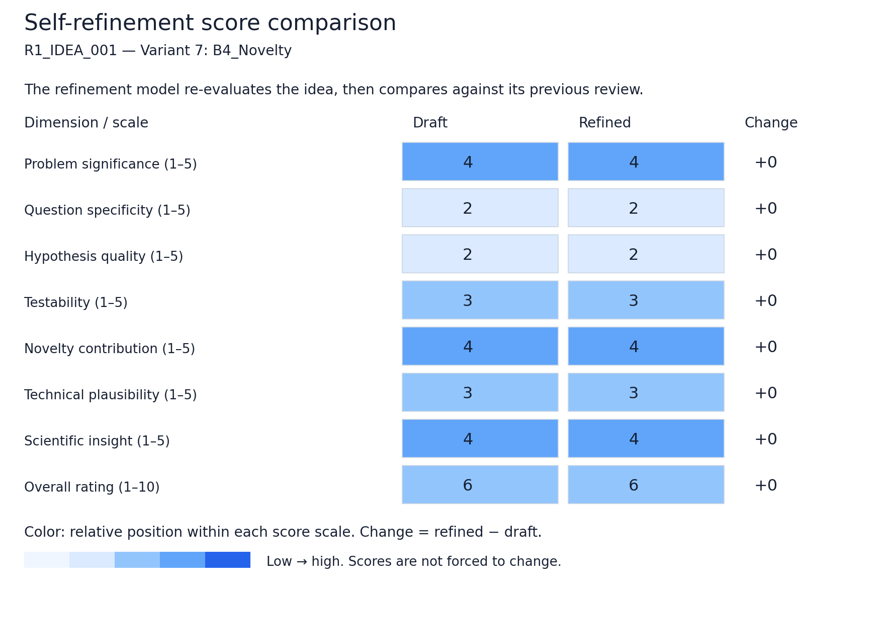

Changed score dimensions: none.

### Score justifications (draft / refined)

**Problem significance**

```json
{
  "draft": {
    "score": 4.0,
    "justification": "Node-level OOD detection on graphs is a meaningful and underexplored problem with practical relevance (e.g., anomaly detection in social or biological networks). The focus on heterophilic graphs adds nuance, as many real-world graphs are heterophilic. However, the absolute importance is moderate—it's a specialized subproblem within graph OOD."
  },
  "refined": {
    "score": 4.0,
    "justification": "Node-level OOD detection on graphs is a meaningful problem with practical applications in anomaly detection, security, and network analysis. The focus on heterophilic graphs is particularly relevant as many real-world networks (e.g., adversarial relationships, buyer-seller networks) exhibit heterophily. However, this is a specialized subproblem within the broader OOD detection field."
  }
}
```

**Question specificity**

```json
{
  "draft": {
    "score": 2.0,
    "justification": "The idea identifies a problem area and a proposed method but does not define a concrete research question. It states a goal ('improve energy-based OOD detection') without specifying what aspect will be investigated (e.g., performance under specific shifts, robustness to heterophily levels)."
  },
  "refined": {
    "score": 2.0,
    "justification": "The idea identifies a problem area and proposes a method but does not define a concrete research question. It states a goal ('improve energy-based OOD detection') without specifying what aspect will be investigated—whether it's performance under specific distribution shifts, robustness to varying heterophily levels, or understanding of failure modes."
  }
}
```

**Hypothesis quality**

```json
{
  "draft": {
    "score": 2.0,
    "justification": "There is an implicit hypothesis that addressing node dependence and heterophily will improve OOD detection, but it's not articulated as a testable prediction. No mechanism or relationship is proposed beyond the high-level idea of a 'decoupled' model."
  },
  "refined": {
    "score": 2.0,
    "justification": "There is an implicit hypothesis that addressing node dependence and heterophily will improve OOD detection, but it's not articulated as a testable prediction. No specific mechanism or causal relationship is proposed beyond the high-level concept of a 'decoupled' model. The hypothesis lacks the specificity needed for rigorous investigation."
  }
}
```

**Testability**

```json
{
  "draft": {
    "score": 3.0,
    "justification": "The idea is testable in principle—one could build a decoupled energy model and evaluate OOD detection metrics. However, without a clear hypothesis or experimental plan, it's unclear what exactly would be tested beyond 'does it work better?'"
  },
  "refined": {
    "score": 3.0,
    "justification": "The idea is testable in principle—one could implement a decoupled energy model and evaluate OOD detection metrics on heterophilic graphs. However, without a clear hypothesis or experimental design, it's unclear what exactly would be tested beyond a generic 'does it work better?' comparison. The testability is moderate but could be significantly improved with more specificity."
  }
}
```

**Novelty contribution**

```json
{
  "draft": {
    "score": 4.0,
    "justification": "The angle is novel: applying energy-based OOD detection to node-level tasks on heterophilic graphs while explicitly modeling dependence. This could contribute a new method and framing. However, novelty depends on execution—if it's just an energy model adapted to graphs, contribution may be incremental."
  },
  "refined": {
    "score": 4.0,
    "justification": "The angle is novel: applying energy-based OOD detection specifically to node-level tasks on heterophilic graphs while explicitly modeling dependence. This could contribute both a new methodological approach and a fresh framing of graph OOD problems. However, the novelty depends on execution details—if it's simply an adaptation of existing energy models to graphs, the contribution might be more incremental."
  }
}
```

**Technical plausibility**

```json
{
  "draft": {
    "score": 3.0,
    "justification": "The reasoning is logically coherent: image OOD methods ignore graph structure, so a graph-aware method should help. But the proposed 'decoupled graph energy-based model' is vague—no details on how it addresses dependence or heterophily. Plausibility is moderate pending technical elaboration."
  },
  "refined": {
    "score": 3.0,
    "justification": "The reasoning is logically coherent: image OOD methods ignore graph structure, so a graph-aware method should help. However, the proposed 'decoupled graph energy-based model' is vague—no details on how it would address dependence or heterophily technically. The plausibility is moderate but depends entirely on the unspecified implementation details."
  }
}
```

**Scientific insight**

```json
{
  "draft": {
    "score": 4.0,
    "justification": "If successful, this could yield insights into how graph structure (especially heterophily) affects OOD detection, and whether decoupling certain factors improves robustness. It has potential to reveal principles for graph OOD beyond just a performance boost."
  },
  "refined": {
    "score": 4.0,
    "justification": "If successfully investigated, this research could yield insights into how graph structure (particularly heterophily) affects OOD detection, whether decoupling certain factors improves robustness, and what mechanisms are most important for graph-aware OOD methods. It has potential to reveal principles that extend beyond just performance improvements to deeper understanding of graph representation learning."
  }
}
```

**Overall rating**

```json
{
  "draft": {
    "score": 6.0,
    "justification": "This is a moderate/borderline research idea. It identifies a meaningful gap and proposes a specific technical direction with potential for novelty and insight. However, it lacks a clear research question, testable hypothesis, and methodological details, limiting its specificity and testability. With refinement, it could become a strong idea."
  },
  "refined": {
    "score": 6.0,
    "justification": "This is a moderate/borderline research idea. It identifies a meaningful gap in the literature and proposes a specific technical direction with potential for novelty and insight. However, it lacks a clear research question, testable hypothesis, and methodological details, which significantly limits its specificity and testability. With refinement—particularly articulating what exactly will be investigated and how success will be measured—it could become a strong research direction."
  }
}
```

## R1_IDEA_001 — Variant 8: B5_Application_Impact

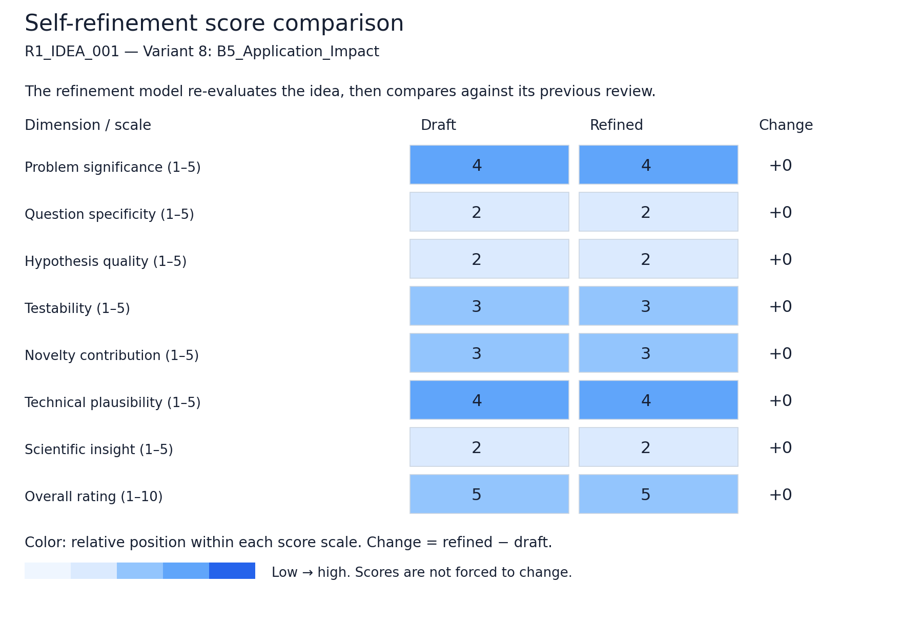

Changed score dimensions: none.

### Score justifications (draft / refined)

**Problem significance**

```json
{
  "draft": {
    "score": 4.0,
    "justification": "Node-level OOD detection on graphs is indeed underexplored and practically important. Heterophilic graphs present unique challenges because neighboring nodes may belong to different classes, making OOD detection harder. Improving reliability of graph-based systems is a meaningful goal."
  },
  "refined": {
    "score": 4.0,
    "justification": "Node-level OOD detection on graphs is indeed underexplored and practically important. Heterophilic graphs present unique challenges because neighboring nodes may belong to different classes, making OOD detection harder. Improving reliability of graph-based systems in domains like social networks, biological networks, or recommendation systems is a meaningful goal with clear applications."
  }
}
```

**Question specificity**

```json
{
  "draft": {
    "score": 2.0,
    "justification": "The idea identifies a problem area but doesn't define a specific research question. It proposes a method ('decoupled graph energy-based model') but doesn't specify what aspect of it will be investigated. The statement is more of a proposed solution than a research question."
  },
  "refined": {
    "score": 2.0,
    "justification": "The idea identifies a problem area but doesn't define a specific research question. It proposes a method ('decoupled graph energy-based model') but doesn't specify what aspect of it will be investigated. The statement is more of a proposed solution than a research question. There's no clear 'what will we learn?' component."
  }
}
```

**Hypothesis quality**

```json
{
  "draft": {
    "score": 2.0,
    "justification": "There's an implicit hypothesis that addressing node dependence and heterophily will improve OOD detection, but it's not clearly stated or specific. No concrete prediction about how much improvement, under what conditions, or why the decoupled approach would work better is provided."
  },
  "refined": {
    "score": 2.0,
    "justification": "There's only an implicit, vague hypothesis that addressing node dependence and heterophily will improve OOD detection. No concrete prediction about how much improvement, under what conditions, or why the decoupled approach would work better is provided. The hypothesis lacks specificity and isn't clearly falsifiable."
  }
}
```

**Testability**

```json
{
  "draft": {
    "score": 3.0,
    "justification": "The idea is testable in principle—one could implement the proposed model and compare OOD detection performance on heterophilic graphs. However, without a specific hypothesis, it's unclear what exactly would be tested beyond 'does it work better?'"
  },
  "refined": {
    "score": 3.0,
    "justification": "The idea is testable in principle—one could implement the proposed model and compare OOD detection performance on heterophilic graphs. However, without a specific hypothesis, it's unclear what exactly would be tested beyond 'does it work better?' The testability is moderate because while experiments could be designed, the lack of specific predictions makes it harder to design focused tests."
  }
}
```

**Novelty contribution**

```json
{
  "draft": {
    "score": 3.0,
    "justification": "Applying energy-based models to graph OOD detection has been explored, but focusing on heterophilic graphs and explicitly addressing node dependence is a novel angle. However, the contribution seems primarily methodological (a new model) rather than scientific insight about a phenomenon."
  },
  "refined": {
    "score": 3.0,
    "justification": "Applying energy-based models to graph OOD detection has been explored, but focusing on heterophilic graphs and explicitly addressing node dependence is a novel angle. However, the contribution seems primarily methodological (a new model) rather than scientific insight about a phenomenon. The novelty is moderate—it's a new application context rather than a fundamentally new idea."
  }
}
```

**Technical plausibility**

```json
{
  "draft": {
    "score": 4.0,
    "justification": "The reasoning is coherent: image-based OOD methods assume independence, graphs have dependence, so graph-specific methods are needed. Energy-based models have been used for OOD detection, and adapting them to graphs while addressing heterophily is plausible. No obvious technical flaws in the stated direction."
  },
  "refined": {
    "score": 4.0,
    "justification": "The reasoning is coherent: image-based OOD methods assume independence, graphs have dependence, so graph-specific methods are needed. Energy-based models have been used for OOD detection, and adapting them to graphs while addressing heterophily is plausible. The direction makes technical sense given what's stated, though details are sparse."
  }
}
```

**Scientific insight**

```json
{
  "draft": {
    "score": 2.0,
    "justification": "The idea currently focuses on building a better method. With refinement, it could yield insight into how heterophily affects OOD detection or what aspects of node dependence are most critical, but as stated, the potential for general scientific insight is limited."
  },
  "refined": {
    "score": 2.0,
    "justification": "The idea currently focuses on building a better method. With refinement, it could yield insight into how heterophily affects OOD detection or what aspects of node dependence are most critical, but as stated, the potential for general scientific insight is limited. It reads more like an engineering solution than a scientific investigation."
  }
}
```

**Overall rating**

```json
{
  "draft": {
    "score": 5.0,
    "justification": "This is a moderate/borderline research idea. It identifies a meaningful problem and proposes a plausible technical direction, but lacks a specific research question, clear hypothesis, and potential for deep scientific insight. It reads more like a method proposal than a research investigation. With refinement to include a testable hypothesis about heterophily and OOD detection, it could become stronger."
  },
  "refined": {
    "score": 5.0,
    "justification": "This is a moderate/borderline research idea. It identifies a meaningful problem and proposes a plausible technical direction, but lacks a specific research question, clear hypothesis, and potential for deep scientific insight. It reads more like a method proposal than a research investigation. The idea has practical relevance but needs refinement to become a strong scientific research direction. With the addition of a testable hypothesis about heterophily and OOD detection, it could become stronger."
  }
}
```

## R1_IDEA_001 — Variant 9: C1_Hollow_Shell

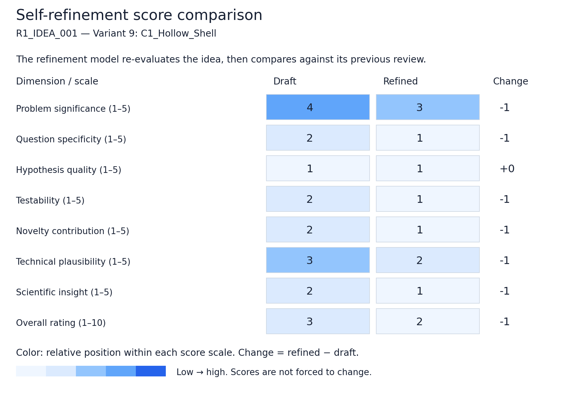

Changed score dimensions: problem_significance, question_specificity, testability, novelty_contribution, technical_plausibility, scientific_insight, overall_rating.

### Score justifications (draft / refined)

**Problem significance**

```json
{
  "draft": {
    "score": 4.0,
    "justification": "Node anomaly detection in graphs is a meaningful problem with applications in fraud detection, network security, biological discovery, and social network analysis. The recognition that existing approaches may not adequately handle relational aspects is reasonable and worth investigating."
  },
  "refined": {
    "score": 3.0,
    "justification": "Node anomaly detection in graphs has practical applications (fraud detection, network security, biological discovery), making it a meaningful problem area. However, the idea doesn't articulate why this specific aspect is particularly important or timely beyond a generic statement about limited research."
  }
}
```

**Question specificity**

```json
{
  "draft": {
    "score": 2.0,
    "justification": "The idea is very vague. It states that a new method will be developed but doesn't specify what research question is being asked. There's no concrete question like 'How do neighborhood structural patterns affect anomaly detection performance?' or 'What types of graph anomalies are most challenging for non-relational methods?'"
  },
  "refined": {
    "score": 1.0,
    "justification": "Extremely vague. No concrete research question is posed. The idea merely states that a new method will be developed without specifying what is being investigated. There's no question like 'How do specific relational patterns affect anomaly detection performance?' or 'What types of graph anomalies are most challenging for methods that ignore relational structure?'"
  }
}
```

**Hypothesis quality**

```json
{
  "draft": {
    "score": 1.0,
    "justification": "There is no explicit or implicit hypothesis. The idea merely states that existing approaches have limitations and a new method will be developed. There's no prediction about what specific mechanism or relationship will be addressed, nor any claim that could be falsified."
  },
  "refined": {
    "score": 1.0,
    "justification": "No hypothesis is present, either explicit or implicit. The idea makes no testable prediction about relationships, mechanisms, or outcomes. It merely states an intention to develop a method without claiming what specific effect it will have or why it should work."
  }
}
```

**Testability**

```json
{
  "draft": {
    "score": 2.0,
    "justification": "While one could test whether a new method performs better than existing ones, the idea provides no guidance on what experiments would be meaningful. Without specifying what 'relational characteristics' means or what 'more effectively' entails, it's unclear what evidence would support or contradict the central claim."
  },
  "refined": {
    "score": 1.0,
    "justification": "While one could eventually test a developed method, the idea as presented provides no basis for testability. Without specifying what 'relational characteristics' are, what 'more effectively' means, or what evidence would support the claim, there's no clear path to investigation. The central claim is too vague to be meaningfully tested."
  }
}
```

**Novelty contribution**

```json
{
  "draft": {
    "score": 2.0,
    "justification": "The idea claims novelty but doesn't articulate what would be novel. Many papers propose 'new methods for graph anomaly detection.' Without specifying what distinguishes this approach, the potential contribution is unclear. It could range from incremental to significant depending on unspecified details."
  },
  "refined": {
    "score": 1.0,
    "justification": "The idea claims to introduce a 'new method' but provides no indication of what would be novel. Graph anomaly detection is an established field with many existing approaches. Without specifying what distinguishes this approach, the potential contribution is completely unclear and could be entirely incremental."
  }
}
```

**Technical plausibility**

```json
{
  "draft": {
    "score": 3.0,
    "justification": "The general direction is plausible—graph anomaly detection is an active area, and considering relational characteristics makes sense. However, without any technical details, it's impossible to assess whether the proposed approach is coherent or based on sound reasoning."
  },
  "refined": {
    "score": 2.0,
    "justification": "The general notion that relational characteristics matter for graph anomaly detection is plausible, but without any technical details, it's impossible to assess whether the proposed direction is coherent. The idea lacks even basic reasoning about why existing methods fail or what alternative mechanism might work better."
  }
}
```

**Scientific insight**

```json
{
  "draft": {
    "score": 2.0,
    "justification": "As presented, the idea seems focused on developing a better-performing method rather than generating scientific insight. There's no indication that the research would reveal general principles about anomaly detection in graphs, boundary conditions of existing methods, or mechanisms by which relational information affects anomaly detection."
  },
  "refined": {
    "score": 1.0,
    "justification": "As presented, the idea seems purely application-focused with no indication it would generate scientific insight. There's no suggestion that the research would reveal general principles, boundary conditions, mechanisms, or transferable knowledge about anomaly detection in graphs. It reads as 'build a better tool' rather than 'investigate a scientific question.'"
  }
}
```

**Overall rating**

```json
{
  "draft": {
    "score": 3.0,
    "justification": "This is a weak research idea. While it identifies a potentially meaningful problem area (graph anomaly detection), it fails to articulate a specific research question, hypothesis, or methodological direction. The idea is essentially 'we will make something better' without specifying what 'better' means, why existing approaches fail, or what scientific knowledge would be gained. It reads more like a generic motivation statement than a research plan."
  },
  "refined": {
    "score": 2.0,
    "justification": "This is a very weak research idea. While it identifies a potentially relevant application domain (graph anomaly detection), it fails to articulate any specific research question, hypothesis, or scientific objective. The idea is essentially 'we will make something better for graphs' without specifying what 'better' means, why it matters scientifically, or what would be investigated. It lacks the core elements of a research direction and reads like a generic motivation statement."
  }
}
```

## R1_IDEA_001 — Variant 10: C2_Logic_Flawed

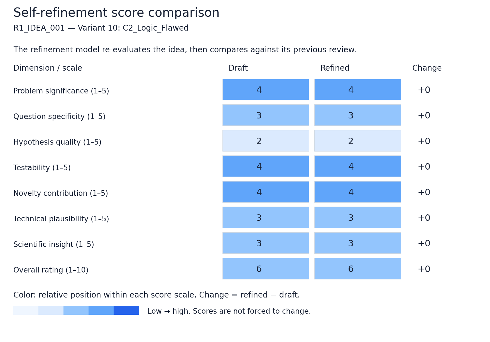

Changed score dimensions: none.

### Score justifications (draft / refined)

**Problem significance**

```json
{
  "draft": {
    "score": 4.0,
    "justification": "Node-level OOD detection on graphs is a meaningful and underexplored problem with practical relevance for graph-based systems in safety-critical domains. The focus on heterophilic graphs addresses an important gap, as most graph methods assume homophily."
  },
  "refined": {
    "score": 4.0,
    "justification": "Node-level OOD detection on graphs is a meaningful and underexplored problem with practical relevance for graph-based systems in safety-critical domains like fraud detection, anomaly detection in networks, and biological system analysis. The focus on heterophilic graphs addresses an important gap, as most graph methods assume homophily, yet many real-world graphs exhibit heterophily."
  }
}
```

**Question specificity**

```json
{
  "draft": {
    "score": 3.0,
    "justification": "The idea identifies a problem area (node OOD detection on heterophilic graphs) and a technical direction (decoupled energy-based model), but lacks a precise research question. It states a goal ('improve energy-based OOD detection') rather than a specific question about mechanisms or relationships."
  },
  "refined": {
    "score": 3.0,
    "justification": "The idea identifies a problem area (node OOD detection on heterophilic graphs) and a technical direction (decoupled energy-based model), but lacks a precise research question. It states a goal ('improve energy-based OOD detection') rather than a specific question about mechanisms, relationships, or boundary conditions that would be investigated."
  }
}
```

**Hypothesis quality**

```json
{
  "draft": {
    "score": 2.0,
    "justification": "There is an implicit hypothesis that 'addressing node dependence and heterophily will improve energy-based OOD detection,' but it lacks specificity about why this should be true or what mechanism would lead to improvement. No concrete prediction about how much improvement or under what conditions."
  },
  "refined": {
    "score": 2.0,
    "justification": "There is an implicit hypothesis that 'addressing node dependence and heterophily will improve energy-based OOD detection,' but it lacks specificity about why this should be true, what mechanism would lead to improvement, or under what conditions improvement would occur. No concrete prediction about performance differences or causal relationships is articulated."
  }
}
```

**Testability**

```json
{
  "draft": {
    "score": 4.0,
    "justification": "The idea is testable through standard OOD detection evaluation protocols on graph datasets. One could implement the proposed model and compare its OOD detection performance against baselines on heterophilic graphs. The claim about broader effectiveness could also be tested on related tasks."
  },
  "refined": {
    "score": 4.0,
    "justification": "The core claim is testable through standard OOD detection evaluation protocols on graph datasets. One could implement the proposed model and compare its OOD detection performance (AUROC, FPR@TPR) against baselines on heterophilic graph benchmarks. The broader effectiveness claim could also be tested on related tasks like anomaly detection or graph classification with distribution shifts."
  }
}
```

**Novelty contribution**

```json
{
  "draft": {
    "score": 4.0,
    "justification": "The combination of energy-based models, node-level OOD detection, and explicit handling of heterophily appears novel. While each component exists separately, their integration for this specific problem is not common and could contribute new methodology to graph OOD detection."
  },
  "refined": {
    "score": 4.0,
    "justification": "The combination of energy-based models, node-level OOD detection, and explicit handling of heterophily appears novel. While energy-based OOD detection exists for images and some graph-level applications, and graph OOD detection exists for homophilic graphs, their integration for node-level detection on heterophilic graphs is not common and could contribute new methodology to the field."
  }
}
```

**Technical plausibility**

```json
{
  "draft": {
    "score": 3.0,
    "justification": "The reasoning is logically coherent: image-based OOD methods ignore graph structure, so adapting them for graphs requires handling node dependencies. Energy-based models have shown promise for OOD detection. However, the key technical claim—that a 'decoupled' approach specifically addresses heterophily—lacks justification and details to assess its plausibility fully."
  },
  "refined": {
    "score": 3.0,
    "justification": "The reasoning is logically coherent: image-based OOD methods ignore graph structure, so adapting them for graphs requires handling node dependencies. Energy-based models have shown promise for OOD detection in other domains. However, the key technical claim—that a 'decoupled' approach specifically addresses heterophily—lacks sufficient detail to assess its plausibility. The connection between decoupling and heterophily handling needs more justification."
  }
}
```

**Scientific insight**

```json
{
  "draft": {
    "score": 3.0,
    "justification": "If successful, the research could provide insight into how graph structure (particularly heterophily) affects OOD detection, and how energy-based models can be adapted to graph data. However, the idea as stated focuses more on achieving better performance than on uncovering fundamental principles about OOD detection on graphs."
  },
  "refined": {
    "score": 3.0,
    "justification": "If successfully investigated, the research could provide insight into how graph structure (particularly heterophily) affects OOD detection, and how energy-based models can be adapted to graph data with dependencies. However, the idea as stated focuses more on achieving better performance than on uncovering fundamental principles about OOD detection mechanisms on graphs or the role of heterophily in distribution shift sensitivity."
  }
}
```

**Overall rating**

```json
{
  "draft": {
    "score": 6.0,
    "justification": "This is a moderate/borderline research idea. It identifies a meaningful and underexplored problem (node OOD detection on heterophilic graphs) and proposes a plausible technical direction (decoupled energy-based model). However, it lacks a specific hypothesis and detailed justification for why the proposed approach would work. The potential contribution is reasonable, but the scientific insight may be limited without a clearer research question. With refinement, it could become a strong idea."
  },
  "refined": {
    "score": 6.0,
    "justification": "This is a moderate/borderline research idea. It identifies a meaningful and underexplored problem (node OOD detection on heterophilic graphs) and proposes a plausible technical direction (decoupled energy-based model). However, it lacks a specific hypothesis and detailed justification for why the proposed approach would work. The potential contribution is reasonable, but the scientific insight may be limited without a clearer research question about mechanisms or relationships. With refinement, it could become a strong idea."
  }
}
```

## R1_IDEA_001 — Variant 11: C3_Substance_Enriched

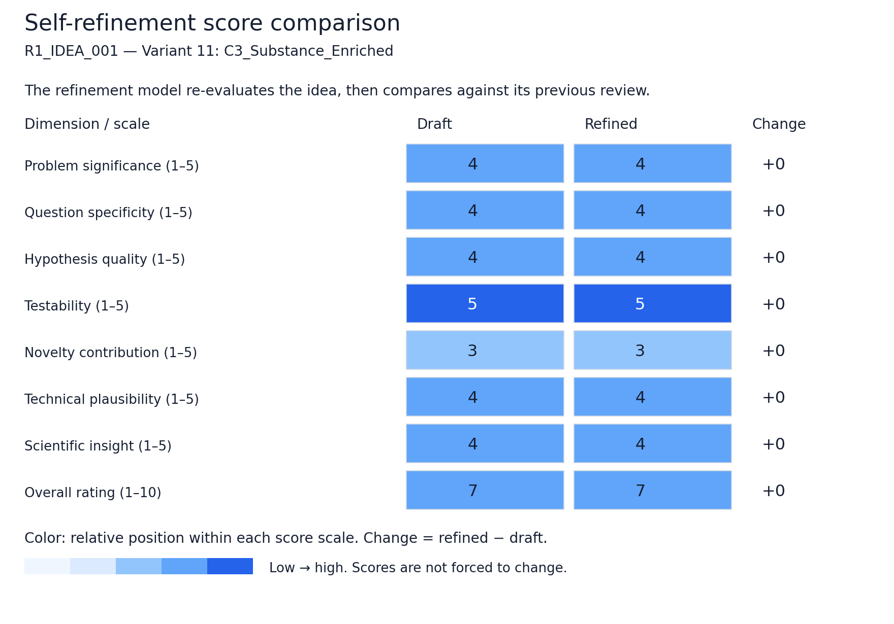

Changed score dimensions: none.

### Score justifications (draft / refined)

**Problem significance**

```json
{
  "draft": {
    "score": 4.0,
    "justification": "Node-level OOD detection on graphs is a relevant and underexplored problem, especially for heterophilic graphs where standard i.i.d. assumptions fail. Improving OOD detection in non-i.i.d., structured data settings has clear practical importance for robustness and safety in graph-based applications."
  },
  "refined": {
    "score": 4.0,
    "justification": "Node-level OOD detection on graphs is a meaningful and underexplored problem with practical importance for graph-based applications in safety-critical domains. The focus on heterophilic graphs addresses a specific limitation of methods that assume homophily, which is a relevant research direction."
  }
}
```

**Question specificity**

```json
{
  "draft": {
    "score": 4.0,
    "justification": "The idea specifies a clear research question: can explicit decoupling of homophilic and heterophilic edges improve energy-based OOD detection at the node level? It identifies the setting (heterophilic graphs), the method (decoupled graph EBM), and the evaluation approach (controlled OOD injections)."
  },
  "refined": {
    "score": 4.0,
    "justification": "The research question is clearly specified: can explicit decoupling of homophilic and heterophilic edges improve energy-based OOD detection at the node level on heterophilic graphs? The setting (heterophilic graphs), method direction (decoupled graph EBM), and evaluation approach (controlled OOD injections) are all identified."
  }
}
```

**Hypothesis quality**

```json
{
  "draft": {
    "score": 4.0,
    "justification": "The hypothesis is explicit and concrete: modeling decoupling improves separation between in-distribution and OOD node energies. It makes a testable prediction and is framed in a way that could be falsified (if decoupling does not improve separation)."
  },
  "refined": {
    "score": 4.0,
    "justification": "The hypothesis is explicit and concrete: modeling decoupling improves separation between in-distribution and OOD node energies. It makes a testable prediction that could be falsified and distinguishes the investigation from a generic application of EBMs to graphs."
  }
}
```

**Testability**

```json
{
  "draft": {
    "score": 5.0,
    "justification": "The idea suggests specific validation experiments: synthetic/real-world graphs, controlled OOD injections, and boundary conditions. These are concrete, feasible, and directly address the hypothesis. The approach is highly testable."
  },
  "refined": {
    "score": 5.0,
    "justification": "The idea suggests specific, feasible validation experiments including synthetic/real-world graphs with controlled OOD injections and boundary condition tests. These directly address the hypothesis and provide clear paths for obtaining evidence."
  }
}
```

**Novelty contribution**

```json
{
  "draft": {
    "score": 3.0,
    "justification": "Graph OOD detection is an emerging area, and incorporating heterophily is a logical direction. The decoupling angle is a specific twist, but the core idea of adapting EBMs to graphs is not entirely new. The contribution hinges on whether the decoupling mechanism yields new insights or significantly better performance."
  },
  "refined": {
    "score": 3.0,
    "justification": "Graph OOD detection is an emerging area, and incorporating heterophily is a logical direction. The decoupling angle offers a specific twist, but the core concept of adapting EBMs to graphs isn't fundamentally new. The contribution depends on whether the decoupling mechanism yields novel insights or significantly advances performance beyond existing graph-aware approaches."
  }
}
```

**Technical plausibility**

```json
{
  "draft": {
    "score": 4.0,
    "justification": "The reasoning is coherent: image-based OOD methods ignore graph structure, so a graph-aware EBM should help. Decoupling homophilic/heterophilic edges is plausible given their different semantic roles. No obvious technical contradictions are present."
  },
  "refined": {
    "score": 4.0,
    "justification": "The reasoning is logically coherent: image-based methods ignore graph structure, so graph-aware methods should help. Decoupling homophilic/heterophilic edges is plausible given their different semantic roles in information propagation. No technical contradictions are apparent from the description."
  }
}
```

**Scientific insight**

```json
{
  "draft": {
    "score": 4.0,
    "justification": "If successful, this could reveal how edge types affect OOD detection in graphs, offering insights into the relationship between graph homophily/heterophily and uncertainty propagation. Boundary condition experiments (extreme heterophily, low density) could uncover limitations and general principles."
  },
  "refined": {
    "score": 4.0,
    "justification": "If successfully investigated, this could reveal how edge types affect OOD detection in graphs, offering insights into the relationship between graph homophily/heterophily and uncertainty propagation. Boundary condition experiments could uncover limitations and general principles about when such approaches work best."
  }
}
```

**Overall rating**

```json
{
  "draft": {
    "score": 7.0,
    "justification": "This is a strong research idea. It addresses a meaningful gap, poses a specific and testable hypothesis, and outlines a clear validation plan. The main limitations are the lack of implementation details and some uncertainty about the novelty of the decoupling mechanism. However, the idea has good potential to produce useful scientific insights about OOD detection on heterophilic graphs."
  },
  "refined": {
    "score": 7.0,
    "justification": "This is a strong research idea with clear strengths: it addresses a meaningful gap, poses a specific and testable hypothesis, and outlines a concrete validation plan. The main limitations are the lack of implementation details and some uncertainty about the novelty of the decoupling mechanism. However, the idea has good potential to produce useful scientific insights about OOD detection on heterophilic graphs and represents a well-defined research direction."
  }
}
```

## R1_IDEA_001 — Variant 12: H1_Deceptive_Hollow

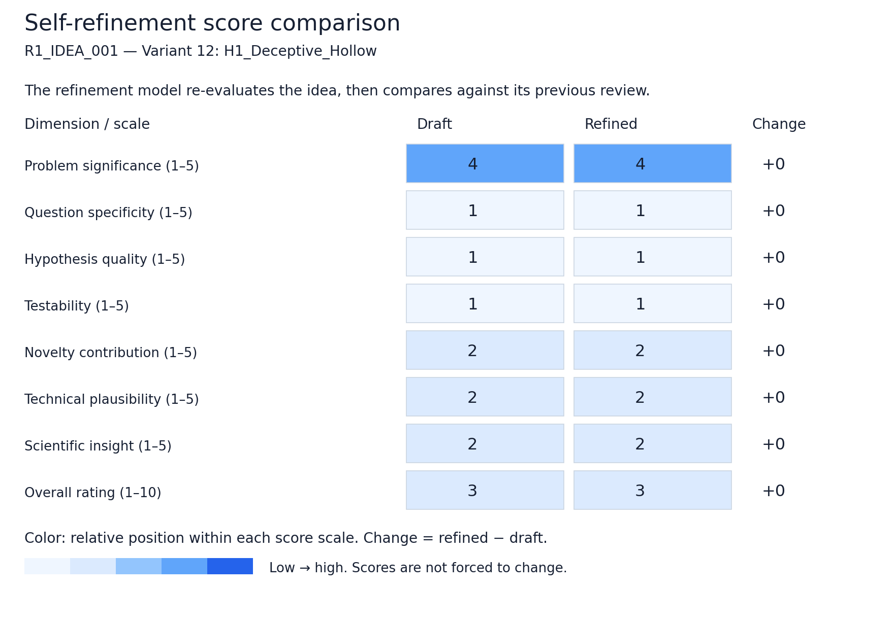

Changed score dimensions: none.

### Score justifications (draft / refined)

**Problem significance**

```json
{
  "draft": {
    "score": 4.0,
    "justification": "Node anomaly detection in graphs is a meaningful problem with practical applications in fraud detection, network security, and biological discovery. The recognition that existing approaches from other domains overlook graph-specific relational characteristics identifies a genuine gap."
  },
  "refined": {
    "score": 4.0,
    "justification": "Node anomaly detection in graphs is a meaningful problem with practical applications in fraud detection, network security, biological discovery, and recommendation systems. The recognition that existing approaches often overlook graph-specific relational characteristics identifies a genuine research gap that matters to both researchers and practitioners."
  }
}
```

**Question specificity**

```json
{
  "draft": {
    "score": 1.0,
    "justification": "No specific research question is articulated. The idea merely states that a new method will be introduced without specifying what will be investigated, what relationships will be examined, or what phenomenon will be explained."
  },
  "refined": {
    "score": 1.0,
    "justification": "No specific research question is articulated. The idea merely states that a new method will be introduced without specifying what will be investigated, what relationships will be examined, what phenomenon will be explained, or what specific aspect of node anomaly detection will be addressed. It's a general motivation statement rather than a research question."
  }
}
```

**Hypothesis quality**

```json
{
  "draft": {
    "score": 1.0,
    "justification": "There is no explicit or implicit hypothesis. The idea makes a vague claim that a new method will handle relational characteristics 'more effectively' but provides no concrete prediction about mechanisms, relationships, or expected outcomes that could be tested."
  },
  "refined": {
    "score": 1.0,
    "justification": "There is no explicit or implicit hypothesis. The idea makes a vague claim that a new method will handle relational characteristics 'more effectively' but provides no concrete prediction about mechanisms, relationships, or expected outcomes that could be tested. There's no falsifiable statement about why graph-aware methods should outperform domain-agnostic approaches."
  }
}
```

**Testability**

```json
{
  "draft": {
    "score": 1.0,
    "justification": "The central claim is not testable in its current form. There is no suggestion of experiments, comparisons, evaluations, or analyses that could provide evidence for or against the idea. The statement is too vague to be meaningfully investigated."
  },
  "refined": {
    "score": 1.0,
    "justification": "The central claim is not testable in its current form. There is no suggestion of experiments, comparisons, evaluations, or analyses that could provide evidence for or against the idea. Without any specification of what 'more effectively' means or how it would be measured, the statement is too vague to be meaningfully investigated."
  }
}
```

**Novelty contribution**

```json
{
  "draft": {
    "score": 2.0,
    "justification": "While the problem area is relevant, the idea as presented lacks any indication of what would be novel. It claims to be 'transformative' but provides no substance about what the transformation would entail. Without any technical details, it's impossible to assess potential novelty beyond the general goal of improving graph anomaly detection."
  },
  "refined": {
    "score": 2.0,
    "justification": "While the problem area is relevant, the idea as presented lacks any indication of what would be novel. It claims to be 'transformative' but provides no substance about what the transformation would entail. Without any technical details or specific insights, it's impossible to assess potential novelty beyond the general goal of improving graph anomaly detection, which is already an active research area."
  }
}
```

**Technical plausibility**

```json
{
  "draft": {
    "score": 2.0,
    "justification": "The reasoning is logically coherent at a very high level (graph anomaly detection needs graph-aware methods), but there are no technical details to assess plausibility. The idea doesn't propose any mechanism, so technical plausibility cannot be evaluated beyond the general premise."
  },
  "refined": {
    "score": 2.0,
    "justification": "The high-level reasoning is logically coherent (graph anomaly detection should consider graph structure), but there are no technical details to assess plausibility. The idea doesn't propose any mechanism, architecture, or approach, so technical plausibility cannot be evaluated beyond the general premise that graph-aware methods might be beneficial."
  }
}
```

**Scientific insight**

```json
{
  "draft": {
    "score": 2.0,
    "justification": "The idea claims potential for transformative insight but provides no indication of what that insight might be. Without a specific research question or hypothesis, it's unclear what scientific principles, mechanisms, or limitations might be revealed. At best, it suggests that considering relational characteristics is important for graph anomaly detection."
  },
  "refined": {
    "score": 2.0,
    "justification": "The idea claims potential for transformative insight but provides no indication of what that insight might be. Without a specific research question or hypothesis, it's unclear what scientific principles, mechanisms, or limitations might be revealed. At best, it suggests that considering relational characteristics is important for graph anomaly detection, which is already widely acknowledged in the field."
  }
}
```

**Overall rating**

```json
{
  "draft": {
    "score": 3.0,
    "justification": "This is a weak research idea. While it identifies a meaningful problem area (node anomaly detection in graphs), it fails to articulate any specific research question, hypothesis, or methodological direction. The description is dominated by grandiose claims without substantive content. It lacks testability, specificity, and any indication of what scientific contribution would be made. The idea is more of a vague motivation than a research direction that could be pursued."
  },
  "refined": {
    "score": 3.0,
    "justification": "This is a weak research idea. While it identifies a meaningful problem area (node anomaly detection in graphs), it fails to articulate any specific research question, hypothesis, or methodological direction. The description is dominated by grandiose claims without substantive content. It lacks testability, specificity, and any indication of what scientific contribution would be made. The idea is essentially a vague motivation statement rather than a research direction that could be pursued. It scores above 1-2 only because it correctly identifies a genuine research gap."
  }
}
```

## R1_IDEA_001 — Variant 13: H2_Confident_Flaw

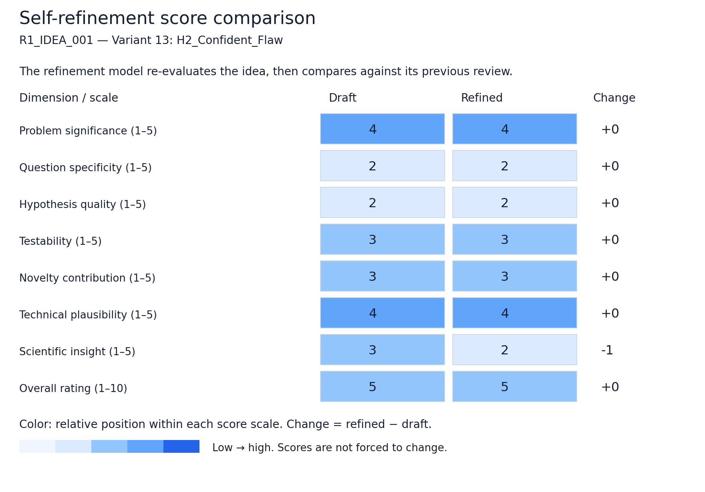

Changed score dimensions: scientific_insight.

### Score justifications (draft / refined)

**Problem significance**

```json
{
  "draft": {
    "score": 4.0,
    "justification": "Node-level out-of-distribution detection on graphs is a meaningful and underexplored problem with practical relevance in areas like anomaly detection in networks. The limitation of image-based methods ignoring graph structure is well-identified."
  },
  "refined": {
    "score": 4.0,
    "justification": "Node-level out-of-distribution detection on graphs is a meaningful problem with practical applications in anomaly detection, network security, and robust graph learning. The limitation of image-based methods ignoring graph structure is well-identified and represents a genuine research gap."
  }
}
```

**Question specificity**

```json
{
  "draft": {
    "score": 2.0,
    "justification": "The idea states a general direction (applying a decoupled energy-based model) but does not define a concrete research question. It lacks specificity about what aspect of heterophily or node dependence is being investigated, or what specific improvement is expected."
  },
  "refined": {
    "score": 2.0,
    "justification": "The idea describes a technical approach rather than articulating a specific research question. It lacks precision about what exactly is being investigated - whether it's the relationship between heterophily and OOD detection, the effectiveness of decoupled architectures, or something else. The statement is more solution-oriented than question-driven."
  }
}
```

**Hypothesis quality**

```json
{
  "draft": {
    "score": 2.0,
    "justification": "There is an implicit hypothesis that addressing node dependence and heterophily will improve OOD detection, but it is stated as a certainty ('will necessarily produce reliable improvements'). A stronger hypothesis would make a falsifiable prediction and acknowledge potential boundary conditions."
  },
  "refined": {
    "score": 2.0,
    "justification": "There's an implicit assumption that addressing node dependence and heterophily will improve OOD detection, but this is presented as a near-certainty rather than a falsifiable hypothesis. A stronger hypothesis would make specific, testable predictions about performance improvements, boundary conditions, or mechanistic relationships."
  }
}
```

**Testability**

```json
{
  "draft": {
    "score": 3.0,
    "justification": "The idea is testable in principle—one could implement the model and evaluate OOD detection performance. However, the lack of experimental details and the dismissal of isolating confounding factors reduces testability. The claim of 'causal evidence without separately isolating... alternative explanations' is problematic."
  },
  "refined": {
    "score": 3.0,
    "justification": "The core idea is testable in principle through implementation and evaluation on graph datasets. However, the dismissive attitude toward isolating confounding factors and the lack of specific evaluation criteria reduce testability. The claim of establishing 'causal evidence without separately isolating... alternative explanations' is methodologically problematic."
  }
}
```

**Novelty contribution**

```json
{
  "draft": {
    "score": 3.0,
    "justification": "Applying energy-based models to graph OOD detection is a plausible direction, and focusing on heterophily and node dependence addresses a gap. However, the novelty is moderate unless the decoupled mechanism itself is novel. The contribution would be clearer with a more specific hypothesis."
  },
  "refined": {
    "score": 3.0,
    "justification": "Applying energy-based models to graph OOD detection with focus on heterophily addresses an identifiable gap. However, the novelty appears moderate unless the decoupled mechanism itself represents a significant architectural innovation. The contribution would be clearer with more specific claims about what new understanding the research would generate."
  }
}
```

**Technical plausibility**

```json
{
  "draft": {
    "score": 4.0,
    "justification": "The reasoning is logically coherent: image-based OOD methods assume independence, graphs have dependence and heterophily, so a graph-aware method should help. A decoupled energy-based model is a plausible technical approach, though details are sparse."
  },
  "refined": {
    "score": 4.0,
    "justification": "The reasoning is logically coherent: image-based methods assume independence, graphs exhibit dependence and heterophily, so graph-aware methods should perform better. A decoupled energy-based model is a plausible technical direction, though details about the decoupling mechanism and how it specifically addresses heterophily are sparse."
  }
}
```

**Scientific insight**

```json
{
  "draft": {
    "score": 3.0,
    "justification": "If successful, the research could provide insight into how graph structural properties like heterophily affect OOD detection. However, the idea as stated leans toward a solution proposal rather than an investigation aimed at generating fundamental insights. The dismissive attitude toward isolating factors limits potential for deeper understanding."
  },
  "refined": {
    "score": 2.0,
    "justification": "The idea as stated leans heavily toward engineering a solution rather than generating scientific insight. The dismissive attitude toward investigating boundary conditions, dataset composition effects, and alternative explanations suggests limited interest in understanding underlying mechanisms or general principles. Potential insights about how heterophily affects OOD detection are mentioned but not framed as primary research objectives."
  }
}
```

**Overall rating**

```json
{
  "draft": {
    "score": 5.0,
    "justification": "The idea identifies a relevant problem and proposes a plausible technical direction, but it lacks a clearly defined research question, makes overly strong causal claims without proper experimental design, and dismisses important scientific practices like controlling for confounders. It is a moderate/borderline idea that could be strengthened with greater specificity and rigor."
  },
  "refined": {
    "score": 5.0,
    "justification": "This is a moderate/borderline research idea. It identifies a meaningful problem and proposes a plausible technical direction, but lacks a clearly defined research question, makes overly deterministic claims, and shows concerning disregard for rigorous scientific methodology. The idea could be strengthened significantly by formulating specific hypotheses, acknowledging the need for controlled experimentation, and focusing more on generating insights rather than asserting superiority."
  }
}
```

## R1_IDEA_001 — Variant 14: H3_Verbose_Enriched

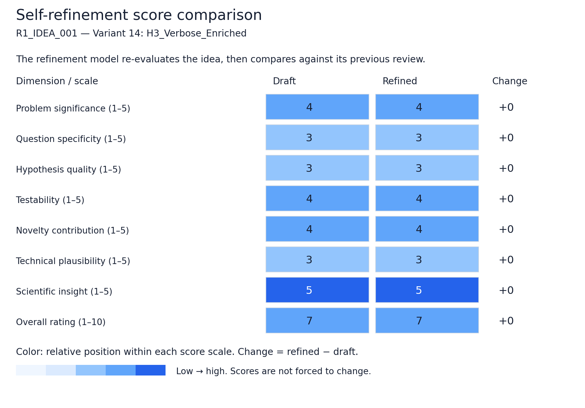

Changed score dimensions: none.

### Score justifications (draft / refined)

**Problem significance**

```json
{
  "draft": {
    "score": 4.0,
    "justification": "Node-level OOD detection on graphs is a meaningful and underexplored problem, especially for heterophilic graphs where standard i.i.d. assumptions fail. Improving OOD detection in relational data has practical importance for robustness and safety in graph-based systems."
  },
  "refined": {
    "score": 4.0,
    "justification": "Node-level OOD detection on graphs is a meaningful and underexplored problem with practical importance for robustness and safety in graph-based systems. The focus on heterophilic graphs addresses a specific limitation of methods that assume homophily or independence, which is a relevant challenge in real-world networks."
  }
}
```

**Question specificity**

```json
{
  "draft": {
    "score": 3.0,
    "justification": "The idea specifies the problem (node OOD detection on heterophilic graphs) and a proposed mechanism (decoupled energy-based model), but the research question is somewhat broad: 'can decoupling improve OOD detection?' It could be more focused, e.g., 'Does explicit modeling of edge heterophily improve energy separation for node OOD detection compared to ignoring edge types?'"
  },
  "refined": {
    "score": 3.0,
    "justification": "The idea specifies the problem domain (node OOD detection on heterophilic graphs) and proposes a mechanism (decoupled energy-based model), but the research question remains broad: 'can decoupling improve OOD detection?' It could be more focused, such as 'Does explicit modeling of edge heterophily improve energy separation compared to ignoring edge types under specific graph conditions?'"
  }
}
```

**Hypothesis quality**

```json
{
  "draft": {
    "score": 3.0,
    "justification": "There is an implicit hypothesis that decoupling homophilic/heterophilic edges improves energy separation. However, it is not a strong, concrete prediction. It lacks specificity about the expected improvement, the conditions under which it holds, or the underlying mechanism. It is more of a plausible direction than a testable hypothesis."
  },
  "refined": {
    "score": 3.0,
    "justification": "There is an implicit hypothesis that decoupling homophilic/heterophilic edges improves energy separation for OOD detection. However, it lacks specificity about the expected improvement, the conditions under which it holds, or the underlying causal mechanism. It is more of a plausible research direction than a concrete, testable prediction."
  }
}
```

**Testability**

```json
{
  "draft": {
    "score": 4.0,
    "justification": "The idea suggests a comprehensive validation plan with synthetic/real graphs, controlled OOD injections, boundary conditions, ablations, and sensitivity analyses. This makes the central claim highly testable, even if the exact hypothesis needs refinement."
  },
  "refined": {
    "score": 4.0,
    "justification": "The idea suggests a thorough validation plan with synthetic and real-world graphs, controlled OOD injections, boundary conditions, ablations, and sensitivity analyses. This makes the central claim highly testable, even though the exact hypothesis needs refinement. The staged experimental design with pre-specified evaluation criteria further enhances testability."
  }
}
```

**Novelty contribution**

```json
{
  "draft": {
    "score": 4.0,
    "justification": "The combination of energy-based models, explicit heterophily modeling, and node-level OOD detection appears novel. While each component exists separately, their integration for this specific problem is not common and could contribute a new method and insights into graph OOD detection."
  },
  "refined": {
    "score": 4.0,
    "justification": "The combination of energy-based models, explicit heterophily modeling, and node-level OOD detection appears novel. While each component exists separately, their integration for this specific problem is not common and could contribute a new methodological approach and insights into graph OOD detection under heterophily."
  }
}
```

**Technical plausibility**

```json
{
  "draft": {
    "score": 3.0,
    "justification": "The high-level idea is plausible: modeling edge types could inform energy models. However, without any technical details on how the decoupling is implemented, it's hard to assess feasibility. The reasoning is logically coherent but underspecified."
  },
  "refined": {
    "score": 3.0,
    "justification": "The high-level idea is logically coherent and plausible: modeling edge types could inform energy models for OOD detection. However, without any technical details on how the decoupling is implemented, it's difficult to assess feasibility or potential pitfalls. The reasoning is sound but underspecified."
  }
}
```

**Scientific insight**

```json
{
  "draft": {
    "score": 5.0,
    "justification": "The proposed experimental design explicitly aims to uncover 'when and why' the method works, including boundary conditions and failure modes. This goes beyond mere performance reporting and could yield generalizable insights about the role of heterophily in graph OOD detection, which is a valuable scientific contribution."
  },
  "refined": {
    "score": 5.0,
    "justification": "The proposed experimental design explicitly aims to uncover 'when and why' the method works, including boundary conditions and failure modes. This goes beyond performance reporting and could yield generalizable insights about the role of heterophily in graph OOD detection, which is a valuable scientific contribution. The focus on understanding assumptions, data regimes, and domain constraints enhances potential insight."
  }
}
```

**Overall rating**

```json
{
  "draft": {
    "score": 7.0,
    "justification": "This is a strong research idea. It addresses a meaningful gap, proposes a novel direction, and outlines a rigorous validation plan aimed at scientific insight. The main weaknesses are the somewhat vague hypothesis and lack of technical details for the proposed model, which prevent a higher rating. With refinement, it has high potential."
  },
  "refined": {
    "score": 7.0,
    "justification": "This is a strong research idea. It addresses a meaningful and underexplored problem, proposes a novel technical direction, and outlines a rigorous experimental methodology aimed at scientific insight. The main limitations are the somewhat vague hypothesis and lack of technical details for the proposed model, which prevent a higher rating. With refinement, it has high potential for contribution."
  }
}
```

## R1_IDEA_001 — Variant 15: H4_Ultimate_Hype


Changed score dimensions: none.

### Score justifications (draft / refined)

**Problem significance**

```json
{
  "draft": {
    "score": 4.0,
    "justification": "Node-level OOD detection on graphs is an important and underexplored problem with practical implications for trustworthy graph-based systems. The focus on heterophilic graphs addresses a meaningful gap, as many real-world graphs exhibit heterophily rather than homophily."
  },
  "refined": {
    "score": 4.0,
    "justification": "Node-level OOD detection on graphs is an important and underexplored problem with practical implications for trustworthy graph-based systems. The focus on heterophilic graphs addresses a meaningful gap, as many real-world graphs exhibit heterophily rather than homophily, and existing image-based OOD methods make inappropriate independence assumptions."
  }
}
```

**Question specificity**

```json
{
  "draft": {
    "score": 2.0,
    "justification": "The idea identifies a general problem area but does not define a specific research question. It states what will be done (develop a decoupled graph energy-based model) but not what will be investigated about it."
  },
  "refined": {
    "score": 2.0,
    "justification": "The idea identifies a general problem area and proposes a solution direction, but does not define a specific research question. It states what will be built (a decoupled graph energy-based model) but not what will be investigated about it. There is no clear 'what will we learn?' component."
  }
}
```

**Hypothesis quality**

```json
{
  "draft": {
    "score": 1.0,
    "justification": "No hypothesis is presented. The idea makes a general claim that addressing node dependence and heterophily will improve OOD detection, but this is not formulated as a testable prediction with specific expected outcomes or mechanisms."
  },
  "refined": {
    "score": 1.0,
    "justification": "No hypothesis is presented. The idea makes a general claim that addressing node dependence and heterophily will improve OOD detection, but this is not formulated as a testable prediction with specific expected outcomes, mechanisms, or conditions. The promotional language about being 'transformative' is not a scientific hypothesis."
  }
}
```

**Testability**

```json
{
  "draft": {
    "score": 2.0,
    "justification": "While the general direction could be tested through experiments comparing OOD detection performance, the idea lacks specific details about what would be measured, how success would be evaluated, or what evidence would support the claims. The promotional language suggests transformative impact but provides no pathway to test such claims."
  },
  "refined": {
    "score": 2.0,
    "justification": "While the general direction could eventually be tested through experiments, the idea lacks specific details about what would be measured, how success would be evaluated, or what evidence would support the claims. There is no indication of evaluation metrics, baselines, or experimental design. The transformative claims are particularly untestable as presented."
  }
}
```

**Novelty contribution**

```json
{
  "draft": {
    "score": 3.0,
    "justification": "The combination of energy-based models with graph OOD detection for heterophilic graphs appears novel, but the idea is described at too high a level to assess its true novelty. Applying energy-based models to graphs is not entirely new, though the specific focus on node-level OOD detection on heterophilic graphs may be underexplored."
  },
  "refined": {
    "score": 3.0,
    "justification": "The combination of energy-based models with graph OOD detection for heterophilic graphs appears novel, but the idea is described at too high a level to assess its true novelty. Energy-based models have been applied to graphs, and OOD detection on graphs has been studied, so the novelty likely lies in the specific combination and focus on heterophily, but this isn't clearly articulated."
  }
}
```

**Technical plausibility**

```json
{
  "draft": {
    "score": 3.0,
    "justification": "The general direction is plausible - energy-based models have been successful for OOD detection in other domains, and adapting them to graphs with attention to node dependence makes sense. However, without details about the \"decoupled\" approach or how heterophily will be addressed, it's difficult to assess technical feasibility beyond a surface level."
  },
  "refined": {
    "score": 3.0,
    "justification": "The general direction is plausible - energy-based models have shown promise for OOD detection in other domains, and adapting them to graphs with attention to node dependence makes conceptual sense. However, without details about the 'decoupled' approach or how heterophily will be specifically addressed, technical feasibility can only be assessed at a surface level."
  }
}
```

**Scientific insight**

```json
{
  "draft": {
    "score": 3.0,
    "justification": "If successfully investigated, this research could provide insights into how graph structure (particularly heterophily) affects OOD detection, and whether energy-based approaches offer advantages over other methods. However, the idea as presented focuses more on application potential than on generating fundamental scientific understanding."
  },
  "refined": {
    "score": 3.0,
    "justification": "If successfully investigated, this research could provide insights into how graph structure (particularly heterophily) affects OOD detection, and whether energy-based approaches offer advantages over other methods. However, the idea as presented focuses more on application potential and transformative claims than on generating fundamental scientific understanding about mechanisms or principles."
  }
}
```

**Overall rating**

```json
{
  "draft": {
    "score": 4.0,
    "justification": "The idea identifies an important problem area with practical relevance, but it lacks the specificity needed for a strong research idea. No clear research question or hypothesis is presented, and the description includes promotional language rather than scientific substance. While the general direction has merit, the idea as presented is more of a problem statement than a research plan. With more specific formulation of research questions and hypotheses, this could become a stronger research direction."
  },
  "refined": {
    "score": 4.0,
    "justification": "The idea identifies an important problem area with practical relevance, but it lacks the specificity needed for a strong research idea. No clear research question or hypothesis is presented, and the description includes promotional language rather than scientific substance. While the general direction has merit and addresses a meaningful gap, the idea as presented is more of a problem statement and solution sketch than a research plan. With more specific formulation of research questions, hypotheses, and evaluation approaches, this could become a stronger research direction."
  }
}
```

## R1_IDEA_002 — Source

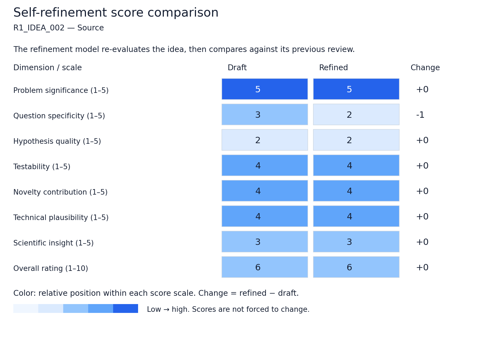

Changed score dimensions: question_specificity.

### Score justifications (draft / refined)

**Problem significance**

```json
{
  "draft": {
    "score": 5.0,
    "justification": "The problem is highly significant. Rare-event sampling in molecular systems is a fundamental challenge in computational chemistry and materials science with direct applications to drug discovery and material design. Current methods relying on predefined collective variables or computationally intensive molecular dynamics have clear limitations."
  },
  "refined": {
    "score": 5.0,
    "justification": "The problem is highly significant. Rare-event sampling in molecular systems is a fundamental challenge in computational chemistry, biophysics, and materials science with direct impact on drug discovery and material design. Current methods face either the need for expert-defined collective variables or prohibitive computational costs for unbiased molecular dynamics."
  }
}
```

**Question specificity**

```json
{
  "draft": {
    "score": 3.0,
    "justification": "The idea identifies a general direction but lacks a specific research question. It proposes using diffusion path samplers with improved off-policy learning, but doesn't specify what aspect of this combination is being investigated or what specific question about their effectiveness is being asked."
  },
  "refined": {
    "score": 2.0,
    "justification": "The idea lacks a specific research question. It proposes a methodological direction ('train diffusion path samplers via improved off-policy learning') but does not specify what aspect of this approach is being investigated, what relationships are being tested, or what specific question about molecular transition sampling is being addressed. The description is more of a goal statement than a research question."
  }
}
```

**Hypothesis quality**

```json
{
  "draft": {
    "score": 2.0,
    "justification": "There is no explicit or clearly implicit hypothesis. The idea suggests a methodological direction but doesn't make a testable prediction about why this approach would work, what specific improvements it would bring, or what relationships it would reveal. It's more of a proposed application than a hypothesis-driven investigation."
  },
  "refined": {
    "score": 2.0,
    "justification": "There is no explicit or clearly implicit hypothesis. The idea suggests applying existing techniques to a new domain but does not make a testable prediction about why this combination would work, what specific advantages it would offer, or what mechanism would enable success. It lacks the key elements of a scientific hypothesis: a concrete prediction that could be supported or contradicted by evidence."
  }
}
```

**Testability**

```json
{
  "draft": {
    "score": 4.0,
    "justification": "The idea is testable in principle. One could implement the proposed approach and compare its performance to existing methods on benchmark molecular systems. The evaluation could measure computational efficiency, accuracy of transition pathways, or ability to discover rare events without predefined collective variables."
  },
  "refined": {
    "score": 4.0,
    "justification": "The core claim is testable in principle. One could implement the proposed approach and evaluate its performance on molecular systems, comparing to existing methods on metrics like computational efficiency, path accuracy, or ability to discover transition states without predefined collective variables. The methodological nature makes it amenable to empirical evaluation."
  }
}
```

**Novelty contribution**

```json
{
  "draft": {
    "score": 4.0,
    "justification": "The combination of diffusion models with off-policy learning for molecular transition sampling appears novel. While diffusion models have been applied to molecular generation and off-policy learning is established in reinforcement learning, their application to rare-event pathway sampling without collective variables could represent a meaningful contribution if successful."
  },
  "refined": {
    "score": 4.0,
    "justification": "The specific combination of diffusion models with off-policy learning for molecular transition pathway sampling appears novel. While diffusion models have been applied to molecular generation and off-policy learning is established in RL, their application to rare-event pathway sampling without collective variables represents a potentially meaningful technical contribution if successful."
  }
}
```

**Technical plausibility**

```json
{
  "draft": {
    "score": 4.0,
    "justification": "The proposed direction is technically plausible. Diffusion models have shown success in capturing complex distributions, and off-policy learning could help efficiently explore transition pathways. The reasoning is coherent: current methods need predefined collective variables or are computationally expensive, and a learned approach might overcome these limitations."
  },
  "refined": {
    "score": 4.0,
    "justification": "The proposed direction is technically plausible. Diffusion models have demonstrated ability to capture complex distributions in high-dimensional spaces, and off-policy learning could help efficiently explore transition pathways. The reasoning that learned approaches might overcome limitations of predefined collective variables is coherent, though significant technical challenges would need to be addressed."
  }
}
```

**Scientific insight**

```json
{
  "draft": {
    "score": 3.0,
    "justification": "The potential scientific insight is moderate. If successful, the approach could reveal how diffusion models capture transition states and rare events in high-dimensional spaces, potentially providing insights into the representation learning aspects of molecular transitions. However, the idea as presented focuses more on practical application than fundamental understanding."
  },
  "refined": {
    "score": 3.0,
    "justification": "Potential scientific insight is moderate. If successful, the approach could reveal how diffusion models represent transition states and rare events, potentially providing insights into learned representations of molecular dynamics. However, the idea as presented focuses primarily on practical application rather than fundamental understanding of molecular transitions or sampling methods."
  }
}
```

**Overall rating**

```json
{
  "draft": {
    "score": 6.0,
    "justification": "This is a moderate/borderline research idea. It addresses a significant problem with clear practical applications and proposes a novel technical direction. However, it lacks a specific research question or testable hypothesis, making it more of a methodological proposal than a hypothesis-driven investigation. The idea has good technical plausibility and testability but would benefit from greater specificity about what scientific question is being addressed beyond 'can we make this work?'"
  },
  "refined": {
    "score": 6.0,
    "justification": "This is a moderate/borderline research idea. It addresses a significant practical problem with clear applications and proposes a novel technical direction. However, it lacks a specific research question or testable hypothesis, making it more of a methodological proposal than a hypothesis-driven investigation. The idea has good technical plausibility and testability but would benefit from greater specificity about what scientific question is being addressed beyond developing a practical tool."
  }
}
```

## R1_IDEA_002 — Variant 1: A1_Identity

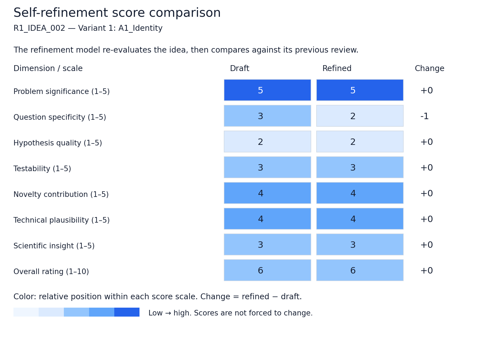

Changed score dimensions: question_specificity.

### Score justifications (draft / refined)

**Problem significance**

```json
{
  "draft": {
    "score": 5.0,
    "justification": "The problem is highly significant - rare-event sampling in molecular systems is a fundamental challenge in computational chemistry and materials science with direct applications to drug discovery and material design. Overcoming computational infeasibility of unbiased molecular dynamics would be transformative."
  },
  "refined": {
    "score": 5.0,
    "justification": "Rare-event sampling in molecular dynamics is a fundamental and long-standing computational challenge with direct, high-impact applications in drug discovery and material design. Overcoming the limitations of unbiased MD and expert-defined collective variables would be transformative for the field."
  }
}
```

**Question specificity**

```json
{
  "draft": {
    "score": 3.0,
    "justification": "The idea identifies a general direction (train diffusion path samplers via improved off-policy learning) but doesn't specify a concrete research question. It's more of an application proposal than a focused investigation of a specific phenomenon or mechanism."
  },
  "refined": {
    "score": 2.0,
    "justification": "The idea describes a general application direction rather than a specific research question. It states what the approach aims to do (sample pathways without CVs) but not what specific phenomenon, relationship, or mechanism is being investigated. The 'what' is clear, but the 'why' or 'under what conditions' is missing."
  }
}
```

**Hypothesis quality**

```json
{
  "draft": {
    "score": 2.0,
    "justification": "There's an implicit hypothesis that diffusion models combined with improved off-policy learning can sample transition pathways without predefined collective variables, but this is stated as an aim rather than a testable prediction. No specific mechanism or relationship is proposed that distinguishes this from generic application of existing methods."
  },
  "refined": {
    "score": 2.0,
    "justification": "There is an implicit claim that diffusion models + off-policy learning can sample pathways without predefined CVs, but this is presented as a goal, not a falsifiable hypothesis. No predictive statement about expected performance, underlying mechanism, or comparative advantage is made. It lacks the specificity needed to distinguish it from a generic application idea."
  }
}
```

**Testability**

```json
{
  "draft": {
    "score": 3.0,
    "justification": "The idea is testable in principle - one could implement the proposed approach and compare it to existing methods. However, without specifying what 'improved' means or what success criteria would be, it's unclear exactly what would be tested. The evaluation could include comparisons of sampling efficiency, pathway quality, or independence from collective variables."
  },
  "refined": {
    "score": 3.0,
    "justification": "The core claim is testable in principle—one could implement a version of the proposed system and compare it to existing path-sampling methods. However, without a clear hypothesis or success criteria, it's unclear exactly what evidence would confirm or refute the idea's value. Evaluation would likely default to benchmarking, which is feasible but not guided by a specific scientific question."
  }
}
```

**Novelty contribution**

```json
{
  "draft": {
    "score": 4.0,
    "justification": "The combination of diffusion models with off-policy learning for molecular path sampling appears novel. While both components exist separately, their application to this specific problem without predefined collective variables could represent a meaningful methodological contribution if successful."
  },
  "refined": {
    "score": 4.0,
    "justification": "The combination of diffusion models and off-policy learning for molecular path sampling without predefined collective variables appears novel. While both components are known separately, their integration for this specific purpose could constitute a meaningful methodological contribution if it enables new capabilities or significant efficiency gains."
  }
}
```

**Technical plausibility**

```json
{
  "draft": {
    "score": 4.0,
    "justification": "The technical direction is plausible. Diffusion models have shown success in generating molecular structures, and reinforcement learning approaches have been used for enhanced sampling. The combination is logically coherent, though the details of how diffusion models would represent paths and how off-policy learning would be adapted need specification."
  },
  "refined": {
    "score": 4.0,
    "justification": "The direction is technically plausible. Diffusion models generate molecular structures, and RL has been used for enhanced sampling. The reasoning—using a generative model to sample paths and RL to improve sampling—is coherent. Key implementation details are missing, but nothing in the idea suggests inherent infeasibility."
  }
}
```

**Scientific insight**

```json
{
  "draft": {
    "score": 3.0,
    "justification": "If successful, the research could provide insight into how generative models can overcome limitations of traditional enhanced sampling methods. However, as presented, it's more of an engineering solution than an investigation aimed at revealing fundamental principles about molecular dynamics or machine learning. The potential insight depends on whether the study would investigate why the approach works rather than just whether it works."
  },
  "refined": {
    "score": 3.0,
    "justification": "If successful, the work could demonstrate that learned generative models can replace expert-defined CVs for rare-event sampling, offering practical utility. However, as presented, the idea emphasizes solving a computational problem rather than uncovering new scientific insights about molecular dynamics, diffusion models, or off-policy learning. The potential for deeper mechanistic understanding depends on how the study is framed—e.g., investigating what the diffusion model learns about transition states."
  }
}
```

**Overall rating**

```json
{
  "draft": {
    "score": 6.0,
    "justification": "This is a moderate research idea with strong problem significance and technical plausibility, but limited specificity and hypothesis quality. The idea addresses an important practical problem and proposes a novel technical direction, but lacks a clearly defined research question and testable hypothesis. With more focus on what specific scientific question is being investigated (beyond just applying methods to a new domain), it could become a stronger research idea."
  },
  "refined": {
    "score": 6.0,
    "justification": "This is a moderate research idea. It addresses a significant problem and proposes a novel technical direction with good plausibility. However, it lacks a specific research question, a testable hypothesis, and a clear path to scientific insight beyond applied engineering. With refinement to focus on a concrete hypothesis about why or how the proposed method works, it could become a stronger research proposal."
  }
}
```

## R1_IDEA_002 — Variant 2: A2_Paraphrase_Only

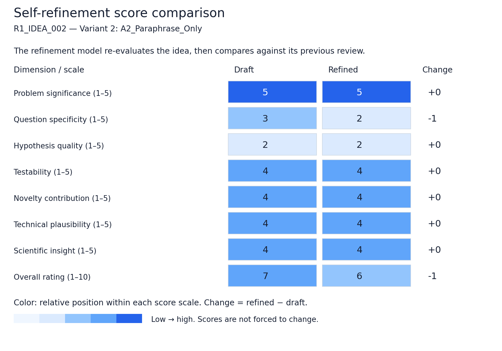

Changed score dimensions: question_specificity, overall_rating.

### Score justifications (draft / refined)

**Problem significance**

```json
{
  "draft": {
    "score": 5.0,
    "justification": "The problem is highly significant. Rare-event sampling in molecular systems is a fundamental challenge in computational chemistry and materials science with direct applications to drug discovery and material design. Current methods often require expert-defined collective variables, which limits their applicability to complex systems where such variables are unknown."
  },
  "refined": {
    "score": 5.0,
    "justification": "The problem is exceptionally significant. Rare-event sampling in molecular systems is a fundamental bottleneck in computational chemistry and materials science with direct applications to understanding protein folding, drug binding, and material phase transitions. The dependence on expert-defined collective variables severely limits application to complex systems where relevant coordinates are unknown, making this a critical research challenge."
  }
}
```

**Question specificity**

```json
{
  "draft": {
    "score": 3.0,
    "justification": "The idea identifies a general direction but lacks a clearly articulated research question. It states what the method would do (train diffusion path samplers) and what problem it addresses (dependence on collective variables), but doesn't specify what exactly would be investigated about this approach."
  },
  "refined": {
    "score": 2.0,
    "justification": "The idea identifies a general direction but lacks a clearly defined research question. It states what the method would do (train diffusion path samplers) and what problem it addresses, but doesn't specify what aspect of this approach would be investigated. There's no concrete question about mechanisms, limitations, comparisons, or specific properties of the proposed method."
  }
}
```

**Hypothesis quality**

```json
{
  "draft": {
    "score": 2.0,
    "justification": "There's an implicit hypothesis that 'improved off-policy learning can train diffusion path samplers to avoid dependence on collective variables,' but this is more of a goal statement than a testable hypothesis. No concrete prediction about performance, mechanism, or advantage is made that could be supported or contradicted by evidence."
  },
  "refined": {
    "score": 2.0,
    "justification": "There's only an implicit assumption that combining improved off-policy learning with diffusion models can solve the collective variable dependence problem. This is more of a goal statement than a testable hypothesis. No concrete prediction is made about performance, mechanism, or comparative advantage that could be empirically tested or theoretically examined."
  }
}
```

**Testability**

```json
{
  "draft": {
    "score": 4.0,
    "justification": "The idea is highly testable in principle. One could implement the proposed approach and compare it against existing methods on benchmark molecular systems. The absence of predefined collective variables provides a clear criterion for evaluation. However, the lack of specific hypotheses makes it unclear exactly what would be tested beyond general applicability."
  },
  "refined": {
    "score": 4.0,
    "justification": "The core claim is testable in principle - one could implement the approach and evaluate it on molecular systems. The elimination of predefined collective variables provides a clear criterion. However, without a specific hypothesis, it's unclear what exactly would be tested beyond general applicability. The idea suggests a methodological direction that could be implemented and evaluated against benchmarks."
  }
}
```

**Novelty contribution**

```json
{
  "draft": {
    "score": 4.0,
    "justification": "The combination of off-policy learning with diffusion models for molecular path sampling appears novel. While both components exist separately, their application to this specific problem with the goal of eliminating collective variables could represent a meaningful contribution. The potential to enable rare-event exploration in systems where collective variables are unknown is significant."
  },
  "refined": {
    "score": 4.0,
    "justification": "The combination of off-policy learning with diffusion models for molecular path sampling appears novel. While both components exist separately, their application to eliminate collective variable dependence in enhanced sampling represents a potentially meaningful contribution. If successful, it could enable rare-event exploration in systems where reaction coordinates are unknown, advancing beyond current enhanced sampling methods."
  }
}
```

**Technical plausibility**

```json
{
  "draft": {
    "score": 4.0,
    "justification": "The proposed direction is technically plausible. Diffusion models have shown success in generating complex distributions, and reinforcement learning has been applied to molecular dynamics. The connection between off-policy learning and training diffusion samplers for path exploration is conceptually reasonable, though the details would need to be worked out."
  },
  "refined": {
    "score": 4.0,
    "justification": "The proposed direction is technically plausible. Diffusion models have demonstrated ability to learn complex distributions, and reinforcement learning has been applied to molecular dynamics problems. The conceptual connection between off-policy learning (which can leverage historical data) and training generative models for rare events is reasonable, though significant technical challenges in implementation would need to be addressed."
  }
}
```

**Scientific insight**

```json
{
  "draft": {
    "score": 4.0,
    "justification": "If successful, this research could provide insight into how machine learning methods can discover relevant reaction coordinates automatically, potentially revealing principles about what makes certain pathways physically relevant. It could also provide general insights about training generative models for rare-event sampling that transfer beyond molecular systems."
  },
  "refined": {
    "score": 4.0,
    "justification": "If successfully investigated, this research could provide significant insight into how machine learning can automatically discover relevant reaction coordinates and transition mechanisms. It could reveal principles about what makes certain pathways physically meaningful and how generative models can capture rare-event dynamics. The insights could transfer to other domains with rare-event sampling challenges beyond molecular systems."
  }
}
```

**Overall rating**

```json
{
  "draft": {
    "score": 7.0,
    "justification": "This is a strong research idea addressing an important problem with clear practical relevance. The proposed technical direction is specific and plausible, and the potential scientific insight is substantial. The main weakness is the lack of an explicit research question or testable hypothesis, which makes the idea more of a promising direction than a well-defined investigation. With clearer articulation of what specifically would be tested and why the proposed approach is expected to work, this could become an exceptional research idea."
  },
  "refined": {
    "score": 6.0,
    "justification": "This is a moderate/borderline research idea with strong problem significance and technical plausibility but limited specificity and hypothesis quality. The idea addresses an important practical challenge and proposes a novel technical direction with potential for meaningful contribution. However, it lacks a clearly defined research question and testable hypothesis, making it more of a promising application direction than a well-formed scientific investigation. With clearer articulation of what specifically would be tested and why the approach is expected to work, it could become a stronger research idea."
  }
}
```

## R1_IDEA_002 — Variant 3: A3_Plain_Core


Changed score dimensions: none.

### Score justifications (draft / refined)

**Problem significance**

```json
{
  "draft": {
    "score": 5.0,
    "justification": "The problem is highly significant - rare-event sampling in molecular dynamics is a fundamental challenge with major implications for drug discovery and materials science. The computational infeasibility of unbiased MD for complex systems is well-established and represents a major bottleneck in computational chemistry and biophysics."
  },
  "refined": {
    "score": 5.0,
    "justification": "The problem is exceptionally significant. Rare-event sampling in molecular dynamics is a fundamental challenge in computational chemistry and biophysics, with direct impact on drug discovery and materials science. The computational infeasibility of unbiased MD for complex systems is a well-established bottleneck."
  }
}
```

**Question specificity**

```json
{
  "draft": {
    "score": 3.0,
    "justification": "The idea identifies a general direction but lacks a clearly articulated research question. While it specifies the goal (sampling transition pathways without predefined collective variables) and the approach (diffusion path samplers with improved off-policy learning), it doesn't formulate a specific question about mechanisms, limitations, or comparisons that would guide the investigation."
  },
  "refined": {
    "score": 3.0,
    "justification": "The idea specifies a goal and a technical approach but does not articulate a clear research question. It states what the method aims to do but not what specific relationship, mechanism, or comparison will be investigated. The lack of an explicit question reduces clarity about the research focus."
  }
}
```

**Hypothesis quality**

```json
{
  "draft": {
    "score": 2.0,
    "justification": "There is an implicit hypothesis that diffusion models combined with improved off-policy learning can effectively sample transition pathways without predefined collective variables, but this is stated as an aim rather than a testable prediction. The hypothesis lacks specificity about what makes the approach work or what conditions are necessary for success."
  },
  "refined": {
    "score": 2.0,
    "justification": "There is only an implicit hypothesis that diffusion models with improved off-policy learning can sample transition pathways without predefined collective variables. This is stated as an aim, not a testable prediction. No concrete mechanism, expected improvement, or falsifiable claim is provided."
  }
}
```

**Testability**

```json
{
  "draft": {
    "score": 4.0,
    "justification": "The idea is reasonably testable - one could implement the proposed method and compare its performance to existing approaches on benchmark molecular systems. The absence of predefined collective variables provides a clear distinguishing feature that could be evaluated. However, the vagueness about 'improved' off-policy learning makes specific experimental designs less clear."
  },
  "refined": {
    "score": 4.0,
    "justification": "The idea is testable in principle—one could implement the proposed method and evaluate its ability to sample transition pathways on benchmark systems. The absence of predefined collective variables provides a clear axis for comparison. However, the vagueness of 'improved off-policy learning' makes specific experimental designs less straightforward."
  }
}
```

**Novelty contribution**

```json
{
  "draft": {
    "score": 4.0,
    "justification": "The combination of diffusion models with off-policy learning for molecular transition sampling without predefined collective variables appears novel. While both components exist separately, their integration for this specific problem could represent a meaningful contribution if it addresses limitations of current enhanced sampling methods."
  },
  "refined": {
    "score": 4.0,
    "justification": "The combination of diffusion path samplers with off-policy learning for collective-variable-free transition sampling appears novel. While diffusion models and RL have been used separately in molecular dynamics, their integration for this specific purpose could represent a meaningful methodological contribution if it addresses known limitations."
  }
}
```

**Technical plausibility**

```json
{
  "draft": {
    "score": 4.0,
    "justification": "The approach is technically plausible. Diffusion models have shown success in generating molecular structures, and reinforcement learning/off-policy methods have been applied to molecular dynamics. The reasoning that these could be combined to sample transition pathways is coherent, though the details of how off-policy learning would be 'improved' for this application are unspecified."
  },
  "refined": {
    "score": 4.0,
    "justification": "The approach is technically plausible. Diffusion models have been successful in molecular generation, and off-policy learning has been applied to dynamics and control problems. The reasoning that they could be combined to sample transitions is coherent, though details on how off-policy learning would be adapted and improved are missing."
  }
}
```

**Scientific insight**

```json
{
  "draft": {
    "score": 4.0,
    "justification": "If successful, this research could provide insights into how machine learning methods can discover relevant collective variables and transition pathways automatically, potentially revealing principles about what makes certain pathways more probable or accessible. It could also provide general insights about applying off-policy learning to sequential decision problems in high-dimensional continuous spaces."
  },
  "refined": {
    "score": 4.0,
    "justification": "If successful, this research could yield insights into how ML methods can automatically discover relevant collective variables and transition mechanisms, potentially revealing principles about pathway accessibility and probability. It could also advance understanding of off-policy learning in high-dimensional, sequential decision-making problems with sparse rewards."
  }
}
```

**Overall rating**

```json
{
  "draft": {
    "score": 7.0,
    "justification": "This is a strong research idea addressing an important problem with clear practical applications. The proposed technical direction is specific and plausible, and the potential scientific contribution is substantial. The main limitation is the lack of an explicitly formulated research question or hypothesis, which reduces clarity about what exactly would be investigated. With more specificity about the research question and what constitutes 'improved' off-policy learning, this could be an exceptional idea."
  },
  "refined": {
    "score": 7.0,
    "justification": "This is a strong research idea with high problem significance, clear practical relevance, and a plausible technical direction. The main weaknesses are the lack of an explicit research question and a well-defined hypothesis, which reduce specificity. The potential contribution is substantial, and with sharper formulation, it could become exceptional."
  }
}
```

## R1_IDEA_002 — Variant 4: B1_Verbose_Elaborate

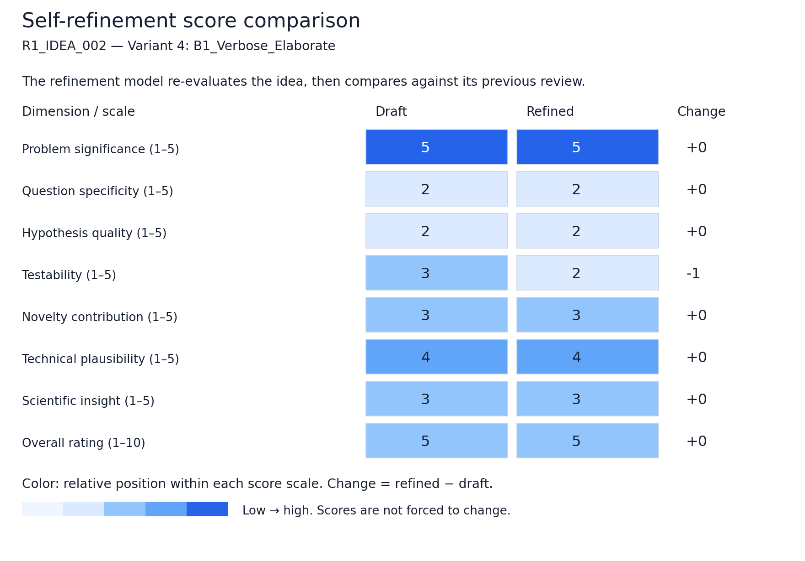

Changed score dimensions: testability.

### Score justifications (draft / refined)

**Problem significance**

```json
{
  "draft": {
    "score": 5.0,
    "justification": "Rare-event sampling in molecular dynamics is a fundamental and long-standing challenge with significant implications for computational chemistry, drug discovery, and materials science. The computational infeasibility of unbiased MD for exploring transitions between metastable states is well-recognized."
  },
  "refined": {
    "score": 5.0,
    "justification": "The problem is exceptionally significant. Rare-event sampling in molecular dynamics is a long-standing, fundamental challenge in computational chemistry and biophysics. Overcoming the limitations of unbiased MD and predefined collective variables would have major impact on drug discovery, materials science, and our understanding of molecular mechanisms."
  }
}
```

**Question specificity**

```json
{
  "draft": {
    "score": 2.0,
    "justification": "The idea describes a methodological direction but doesn't articulate a specific research question. It states what the approach aims to do ('enable rare-event exploration') but not what aspect will be investigated, tested, or compared."
  },
  "refined": {
    "score": 2.0,
    "justification": "The idea lacks a clearly defined research question. It states a methodological goal ('train diffusion path samplers via improved off-policy learning to sample transition pathways') but does not articulate what specific relationship, mechanism, or comparison will be investigated. It is a direction, not a question."
  }
}
```

**Hypothesis quality**

```json
{
  "draft": {
    "score": 2.0,
    "justification": "There's an implicit hypothesis that 'improved off-policy learning' will enable better sampling, but this is not explicitly stated as a testable prediction. No concrete mechanism or relationship is proposed that distinguishes this from generic application of ML to path sampling."
  },
  "refined": {
    "score": 2.0,
    "justification": "There is only a very implicit and generic hypothesis: that 'improved off-policy learning' will enable better sampling. There is no concrete, testable prediction about a relationship (e.g., 'Off-policy learning will yield X% higher sample efficiency than on-policy for discovering pathways in system Y'). The hypothesis is not falsifiable in its current form."
  }
}
```

**Testability**

```json
{
  "draft": {
    "score": 3.0,
    "justification": "The idea suggests a methodological direction that could be tested through implementation and comparison with existing methods, but no specific experiments, evaluations, or comparisons are mentioned. The approach is technically testable in principle, but the idea doesn't specify how it would be tested."
  },
  "refined": {
    "score": 2.0,
    "justification": "While the general direction is technically testable in principle, the idea provides no specification of how it would be tested. No experiments, comparisons, evaluation metrics, or analysis plans are mentioned. The claim is too vague to design a direct test."
  }
}
```

**Novelty contribution**

```json
{
  "draft": {
    "score": 3.0,
    "justification": "Applying diffusion models and reinforcement learning to molecular path sampling has been explored in recent literature. The novelty claim rests on 'improved off-policy learning,' but this is not sufficiently specified to assess its potential contribution relative to existing ML-enhanced sampling methods."
  },
  "refined": {
    "score": 3.0,
    "justification": "The potential contribution is moderate. Applying machine learning (including reinforcement/diffusion models) to molecular path sampling is an active area. The specific angle of 'improved off-policy learning' could be novel, but without details, it's unclear how it differs meaningfully from existing ML-enhanced sampling methods. The core idea of avoiding predefined collective variables is a known goal in the field."
  }
}
```

**Technical plausibility**

```json
{
  "draft": {
    "score": 4.0,
    "justification": "The general approach of using machine learning for enhanced sampling in molecular dynamics is technically plausible and aligns with current research trends. Off-policy learning for training samplers is a reasonable direction given the challenges of on-policy exploration in high-dimensional spaces."
  },
  "refined": {
    "score": 4.0,
    "justification": "The proposed direction is technically plausible. Using diffusion models as path samplers and employing off-policy learning to improve their training are coherent concepts aligned with current ML research. The reasoning—that off-policy learning could improve data efficiency in exploring rare events—is logically sound."
  }
}
```

**Scientific insight**

```json
{
  "draft": {
    "score": 3.0,
    "justification": "If successful, the approach could provide insight into how off-policy learning can address exploration challenges in molecular systems. However, the idea as presented focuses more on enabling applications than on revealing fundamental principles about sampling, learning, or molecular systems."
  },
  "refined": {
    "score": 3.0,
    "justification": "Potential insight is moderate. If successfully investigated, it could yield insights into how off-policy learning algorithms interact with the exploration challenges of high-dimensional physical systems. However, as presented, the idea is more focused on achieving a practical capability ('enable rare-event exploration') than on uncovering a fundamental principle or mechanism about learning or molecular systems."
  }
}
```

**Overall rating**

```json
{
  "draft": {
    "score": 5.0,
    "justification": "This is a moderate research idea that addresses an important problem with a plausible technical direction. However, it lacks a clearly defined research question, testable hypothesis, and specificity about what will be investigated. The idea describes a methodological application rather than posing a scientific question that could yield new insight. It has potential but needs substantial refinement to become a strong research proposal."
  },
  "refined": {
    "score": 5.0,
    "justification": "This is a moderate/borderline research idea. It tackles a highly significant problem with a plausible technical direction. However, it is critically weakened by the lack of a specific research question, a testable hypothesis, and any description of how the idea would be investigated. It reads as a high-level methodological suggestion rather than a structured scientific inquiry. With substantial refinement to introduce specificity and a testable core, it could become a strong proposal."
  }
}
```

## R1_IDEA_002 — Variant 5: B2_Grand_Narrative

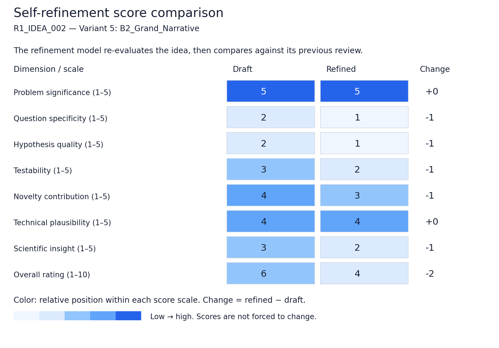

Changed score dimensions: question_specificity, hypothesis_quality, testability, novelty_contribution, scientific_insight, overall_rating.

### Score justifications (draft / refined)

**Problem significance**

```json
{
  "draft": {
    "score": 5.0,
    "justification": "The problem is highly significant. Sampling rare events in molecular systems is a fundamental challenge in computational chemistry and biology with direct implications for drug discovery and materials science. The computational infeasibility of unbiased molecular dynamics for such events is well-established and represents a major bottleneck."
  },
  "refined": {
    "score": 5.0,
    "justification": "The problem is exceptionally significant. Sampling rare events in molecular systems is a fundamental challenge in computational chemistry and biology with direct implications for understanding biological processes, drug discovery, and materials design. The computational infeasibility of unbiased molecular dynamics for such events is a well-established major bottleneck in the field."
  }
}
```

**Question specificity**

```json
{
  "draft": {
    "score": 2.0,
    "justification": "The research question is only moderately specific. While it identifies a general direction (using improved off-policy learning for diffusion path samplers), it lacks a concrete question about mechanisms, relationships, or specific comparisons. It states what the approach 'could' do rather than what specific aspect will be investigated."
  },
  "refined": {
    "score": 1.0,
    "justification": "The idea lacks a specific research question. It describes a general direction ('train diffusion path samplers via improved off-policy learning') but does not articulate what aspect will be investigated, what relationship will be tested, or what phenomenon will be examined. The language is entirely potential-focused ('could contribute', 'may inform') without defining a concrete investigation."
  }
}
```

**Hypothesis quality**

```json
{
  "draft": {
    "score": 2.0,
    "justification": "There is no clear hypothesis presented. The idea describes a proposed approach and potential benefits but doesn't make a testable prediction about why this particular combination (off-policy learning + diffusion samplers) would be effective, what specific improvements it would yield, or what mechanism would explain its success."
  },
  "refined": {
    "score": 1.0,
    "justification": "There is no hypothesis presented, either explicit or implicit. The idea does not make any testable prediction about mechanisms, relationships, or expected outcomes. It merely states that an approach 'could contribute' and 'may inform' without specifying what would be learned or what evidence would support or contradict the approach's value."
  }
}
```

**Testability**

```json
{
  "draft": {
    "score": 3.0,
    "justification": "The idea is somewhat testable in principle - one could implement the proposed approach and compare it to existing methods. However, without a specific hypothesis or success criteria, it's unclear what exactly would be tested. The statement that it 'may inform' and 'could contribute' suggests exploratory rather than hypothesis-driven research."
  },
  "refined": {
    "score": 2.0,
    "justification": "While one could implement the described approach and test it, the idea itself provides no framework for what would be tested or how. Without a hypothesis or specific research question, it's unclear what evidence would be sought. The statement that it 'may inform long-term research directions' suggests exploratory development rather than hypothesis testing."
  }
}
```

**Novelty contribution**

```json
{
  "draft": {
    "score": 4.0,
    "justification": "The combination of diffusion models with off-policy learning for molecular transition path sampling appears novel. While both components exist separately, their application to this specific problem without predefined collective variables could represent a meaningful methodological contribution if successfully developed and validated."
  },
  "refined": {
    "score": 3.0,
    "justification": "The combination of diffusion models with off-policy learning for molecular transition path sampling appears moderately novel. Both components exist separately in literature, and their application to this specific problem without predefined collective variables could represent a contribution. However, without specifying what makes this combination distinctive or what specific advantage it offers, the novelty is somewhat unclear."
  }
}
```

**Technical plausibility**

```json
{
  "draft": {
    "score": 4.0,
    "justification": "The proposed direction is technically plausible. Diffusion models have shown promise for sampling complex distributions, and off-policy learning is a established reinforcement learning technique. The application to molecular transition paths without predefined collective variables is a logical extension of current ML-for-science trends."
  },
  "refined": {
    "score": 4.0,
    "justification": "The proposed direction is technically plausible. Diffusion models have demonstrated strong sampling capabilities for complex distributions, and off-policy learning is a well-established reinforcement learning technique. Applying these to molecular transition paths without predefined collective variables aligns with current trends in ML-for-science, though the specific implementation challenges are not addressed."
  }
}
```

**Scientific insight**

```json
{
  "draft": {
    "score": 3.0,
    "justification": "The potential scientific insight is moderate. If successful, it could provide insight into how diffusion models and off-policy learning can be combined for rare-event sampling. However, the idea as presented focuses more on developing a useful method than on uncovering fundamental principles or mechanisms about molecular systems or learning algorithms."
  },
  "refined": {
    "score": 2.0,
    "justification": "The potential for scientific insight is limited as presented. The idea focuses on developing a potentially useful method rather than uncovering fundamental principles or mechanisms. If successful, it might provide practical benefits but little transferable insight about molecular systems, learning algorithms, or rare-event dynamics unless specifically designed to test such insights."
  }
}
```

**Overall rating**

```json
{
  "draft": {
    "score": 6.0,
    "justification": "This is a moderate/borderline research idea. It addresses a highly significant problem and proposes a novel technical direction with clear practical applications. However, it lacks a specific research question or testable hypothesis, making it more of a general research direction than a focused investigation. The idea would be significantly strengthened by formulating a concrete hypothesis about why this particular approach would work and what specific advantages it would offer over existing methods."
  },
  "refined": {
    "score": 4.0,
    "justification": "This is a weak research idea. While it addresses a highly significant problem and proposes a technically plausible direction, it lacks the core elements of a research investigation: a specific question, a testable hypothesis, and a clear framework for evaluation. It reads more as a general motivation or long-term vision than as a focused research idea. The absence of any concrete research question or hypothesis severely limits its scientific value as presented."
  }
}
```

## R1_IDEA_002 — Variant 6: B3_Over_Confident

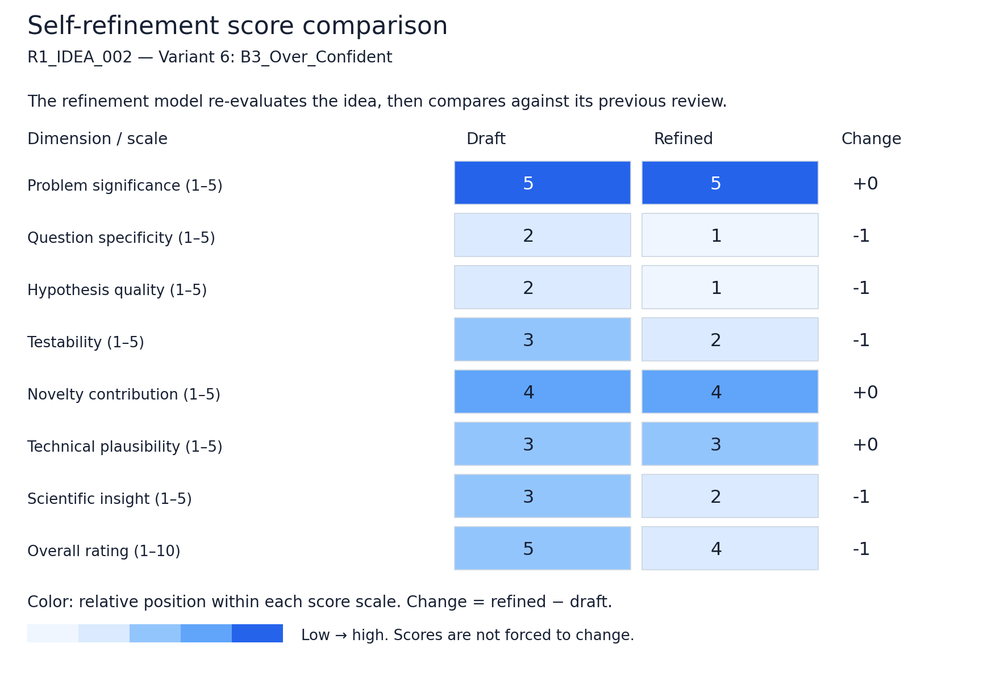

Changed score dimensions: question_specificity, hypothesis_quality, testability, scientific_insight, overall_rating.

### Score justifications (draft / refined)

**Problem significance**

```json
{
  "draft": {
    "score": 5.0,
    "justification": "The problem is highly significant. Rare-event sampling in molecular systems is a fundamental challenge in computational chemistry and biophysics with direct applications to drug discovery and material design. Overcoming the computational infeasibility of unbiased molecular dynamics for such problems would be a major advance."
  },
  "refined": {
    "score": 5.0,
    "justification": "Exceptional significance. Rare-event sampling in molecular systems is a fundamental challenge in computational chemistry and biophysics with direct, important applications to drug discovery and material design. Overcoming computational limitations of unbiased molecular dynamics would be a major advance."
  }
}
```

**Question specificity**

```json
{
  "draft": {
    "score": 2.0,
    "justification": "The idea lacks a clearly defined research question. It states what the approach will do ('train diffusion path samplers via improved off-policy learning') but doesn't articulate what specific aspect of this approach will be investigated or what relationship will be tested."
  },
  "refined": {
    "score": 1.0,
    "justification": "Very weak specificity. The idea states what will be done but doesn't articulate any research question. There's no 'what will we investigate' or 'what relationship will we test.' It's purely a description of a proposed method without any scientific inquiry framed around it."
  }
}
```

**Hypothesis quality**

```json
{
  "draft": {
    "score": 2.0,
    "justification": "There is no explicit or clearly implicit hypothesis. The idea makes a claim ('clearly trains...', 'firmly aims to overcome...') but doesn't make a testable prediction about mechanisms, relationships, or comparative advantages. It reads more like a proposed application than a hypothesis-driven investigation."
  },
  "refined": {
    "score": 1.0,
    "justification": "Very weak hypothesis quality. There is no hypothesis - testable or otherwise. The language ('clearly trains', 'firmly aims to overcome') expresses confidence but makes no concrete prediction about mechanisms, relationships, or comparative performance that could be supported or contradicted by evidence."
  }
}
```

**Testability**

```json
{
  "draft": {
    "score": 3.0,
    "justification": "The general direction is testable in principle - one could implement the proposed approach and compare it to existing methods. However, without a specific hypothesis or evaluation criteria, it's unclear what exactly would be tested. The idea suggests a methodological direction but doesn't specify what evidence would support or contradict its value."
  },
  "refined": {
    "score": 2.0,
    "justification": "Weak testability. While one could eventually implement something and test it, the idea as presented doesn't specify what would be tested. Without a hypothesis or clear success criteria, it's unclear what evidence would support the approach's value. The direction is testable in principle but lacks the framing needed for meaningful investigation."
  }
}
```

**Novelty contribution**

```json
{
  "draft": {
    "score": 4.0,
    "justification": "The combination of diffusion path sampling with off-policy learning for molecular systems without predefined collective variables appears novel. While both components exist separately, their integration for this specific problem could represent a meaningful contribution if it demonstrates advantages over existing approaches."
  },
  "refined": {
    "score": 4.0,
    "justification": "Strong novelty. Combining diffusion path sampling with off-policy learning for molecular systems without predefined collective variables appears novel. Both components exist separately, but their integration for this specific problem could represent a meaningful methodological contribution if advantages are demonstrated."
  }
}
```

**Technical plausibility**

```json
{
  "draft": {
    "score": 3.0,
    "justification": "The idea is technically plausible at a high level - reinforcement learning approaches have been applied to molecular dynamics, and diffusion models are used for sampling. However, significant technical challenges are not addressed (e.g., designing appropriate reward functions, handling high-dimensional continuous spaces, ensuring physical consistency of sampled paths). The reasoning is coherent but lacks depth."
  },
  "refined": {
    "score": 3.0,
    "justification": "Moderate plausibility. At a high level, applying RL to molecular dynamics and using diffusion models for sampling are both established concepts. However, the idea doesn't address significant technical challenges (reward design, high-dimensional continuous spaces, physical consistency). The reasoning is coherent but superficial."
  }
}
```

**Scientific insight**

```json
{
  "draft": {
    "score": 3.0,
    "justification": "If successful, this research could provide insight into how reinforcement learning can be effectively applied to rare-event sampling problems. However, the idea as presented focuses more on application than on generating fundamental understanding. The potential for mechanistic insight (e.g., about why off-policy learning works better for this problem) is not articulated."
  },
  "refined": {
    "score": 2.0,
    "justification": "Weak potential for scientific insight. The idea focuses almost entirely on application. If successful, it might show that a particular technical combination works, but there's no indication it would reveal general principles, mechanisms, or fundamental understanding about why off-policy learning is suited to this problem or about rare-event sampling more broadly."
  }
}
```

**Overall rating**

```json
{
  "draft": {
    "score": 5.0,
    "justification": "This is a moderate/borderline research idea. It addresses an important problem and proposes a potentially novel technical direction, but lacks a clearly defined research question, testable hypothesis, and specificity about what would be investigated. The idea has practical motivation but needs more scientific framing to become a strong research proposal. It currently reads more like an application idea than a hypothesis-driven investigation."
  },
  "refined": {
    "score": 4.0,
    "justification": "Weak research idea. While it addresses an exceptionally significant problem and has strong novelty potential, it completely lacks a research question, hypothesis, and specificity about what would be investigated. It reads as a proposed application or method description rather than a scientific investigation. The high problem significance and novelty cannot compensate for the absence of scientific framing."
  }
}
```

## R1_IDEA_002 — Variant 7: B4_Novelty

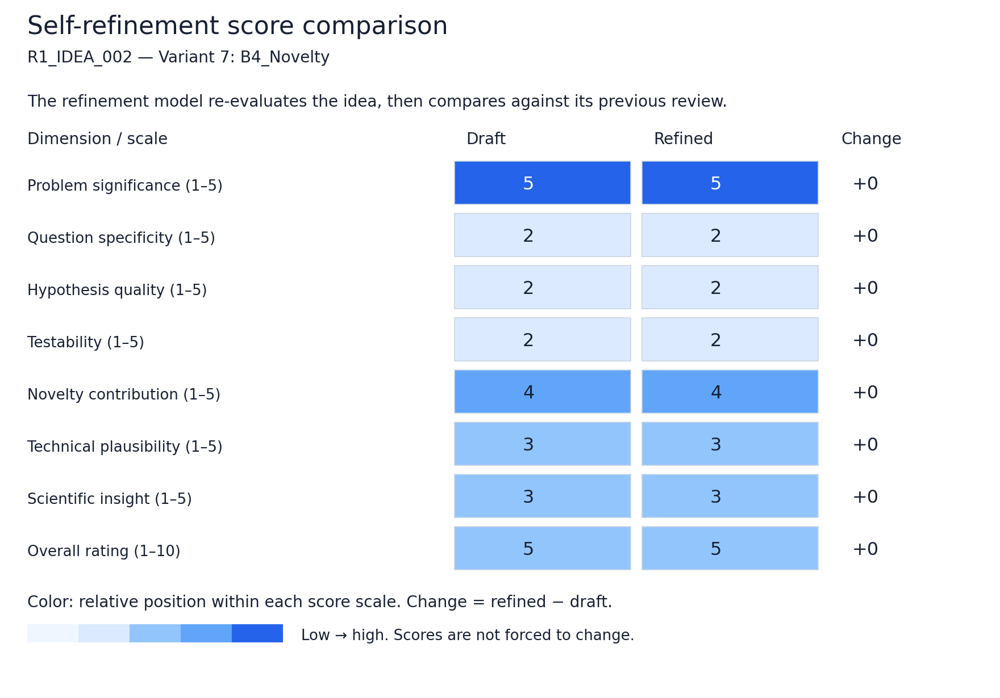

Changed score dimensions: none.

### Score justifications (draft / refined)

**Problem significance**

```json
{
  "draft": {
    "score": 5.0,
    "justification": "Rare-event sampling in molecular dynamics is a fundamental challenge with significant implications for drug discovery and material design. The computational infeasibility of unbiased molecular dynamics for studying transitions between meta-stable states is well-recognized as a major bottleneck."
  },
  "refined": {
    "score": 5.0,
    "justification": "The problem is exceptionally significant. Efficient sampling of rare molecular transitions is a fundamental challenge in computational chemistry and biology, with direct impact on understanding biomolecular function, drug binding, and material properties. The infeasibility of brute-force molecular dynamics for these events is a major bottleneck."
  }
}
```

**Question specificity**

```json
{
  "draft": {
    "score": 2.0,
    "justification": "The idea states a general goal ('enable rare-event exploration') but does not articulate a specific research question. It mentions avoiding predefined collective variables but doesn't specify what exactly will be investigated about this approach."
  },
  "refined": {
    "score": 2.0,
    "justification": "The idea is very low in specificity. It describes a general goal and a proposed tool, but not a concrete research question. It does not specify what aspect of the proposed approach will be investigated (e.g., its efficiency, its ability to find novel pathways, its scalability). The statement is directional, not interrogative."
  }
}
```

**Hypothesis quality**

```json
{
  "draft": {
    "score": 2.0,
    "justification": "There is an implicit hypothesis that combining diffusion models with improved off-policy learning will enable better rare-event sampling without collective variables, but this is not formulated as a testable prediction. No mechanism or specific expected advantage is articulated."
  },
  "refined": {
    "score": 2.0,
    "justification": "There is only a very weak implicit hypothesis: that this combination of tools will work better than existing approaches by avoiding collective variables. This is not a testable, mechanistic prediction. It lacks a proposed causal relationship (e.g., 'because off-policy learning can reuse data from failed exploration, it will reduce the variance of gradient estimates for the diffusion model, leading to X')."
  }
}
```

**Testability**

```json
{
  "draft": {
    "score": 2.0,
    "justification": "While the general concept could be tested, the idea lacks specification of how it would be evaluated. No experiments, comparisons, or validation procedures are suggested. The claim is currently too vague to design a concrete test."
  },
  "refined": {
    "score": 2.0,
    "justification": "The idea as presented is not readily testable. It proposes a method but gives no framework for evaluation. There is no mention of how to compare its performance, what systems to test on, what metrics to use, or what would constitute success or failure. A test could be designed, but the idea itself does not provide the necessary scaffolding."
  }
}
```

**Novelty contribution**

```json
{
  "draft": {
    "score": 4.0,
    "justification": "The combination of diffusion models with off-policy learning for molecular pathway sampling appears novel. Framing rare-event sampling as training diffusion path samplers is a fresh perspective that could potentially contribute new methodology to the field."
  },
  "refined": {
    "score": 4.0,
    "justification": "The proposed combination—applying diffusion models with off-policy RL specifically for sampling molecular transition *pathways*—appears novel. While diffusion models are used for molecule generation and RL has been explored in MD, this specific framing for pathway sampling without collective variables is a fresh and potentially contributory direction."
  }
}
```

**Technical plausibility**

```json
{
  "draft": {
    "score": 3.0,
    "justification": "The general direction is plausible - diffusion models have shown success in generating molecular structures, and reinforcement learning has been applied to molecular dynamics. However, without details on how diffusion path samplers would be structured or how off-policy learning would be improved, technical feasibility is uncertain."
  },
  "refined": {
    "score": 3.0,
    "justification": "The direction is broadly plausible given recent trends. Diffusion models generate structured data, and RL optimizes long-horizon goals. However, the complete lack of detail on how these would be integrated for a continuous, high-dimensional, physics-constrained problem makes it impossible to assess feasibility. Key assumptions (e.g., availability of off-policy data, definable reward for pathways) are unstated."
  }
}
```

**Scientific insight**

```json
{
  "draft": {
    "score": 3.0,
    "justification": "If successful, this could provide insight into whether diffusion models can effectively capture transition pathways without predefined coordinates, potentially revealing new principles for rare-event sampling. However, the idea as presented focuses more on application than fundamental understanding."
  },
  "refined": {
    "score": 3.0,
    "justification": "If successfully executed, the work could provide insight into whether data-driven generative models can intrinsically learn the important collective coordinates for dynamics, which is a fundamental question. However, the idea is currently pitched as an enabling method for applications. The potential for deeper mechanistic insight about rare-event sampling is present but not emphasized or structured by a specific hypothesis."
  }
}
```

**Overall rating**

```json
{
  "draft": {
    "score": 5.0,
    "justification": "This is a moderate/borderline research idea. It addresses an important problem with potential novelty in the proposed framing, but lacks specificity in research question, hypothesis, and testability. The idea identifies an interesting direction but doesn't articulate what specifically would be investigated or how it would advance scientific understanding beyond applying existing techniques to a new domain."
  },
  "refined": {
    "score": 5.0,
    "justification": "This is a moderate/borderline research idea. Its primary strength is targeting a very important problem with a novel-sounding technical combination. However, it is severely underdeveloped as a *research idea*. It lacks a specific question, a testable hypothesis, and any discussion of evaluation. It reads more as a high-level project goal than a focused research investigation. The high problem significance and novelty save it from a lower score, but the core scientific components are weak."
  }
}
```

## R1_IDEA_002 — Variant 8: B5_Application_Impact


Changed score dimensions: none.

### Score justifications (draft / refined)

**Problem significance**

```json
{
  "draft": {
    "score": 5.0,
    "justification": "Rare-event sampling in molecular dynamics is a fundamental challenge with high practical significance for drug discovery and material design. Overcoming computational infeasibility of unbiased MD and eliminating the need for predefined collective variables addresses important limitations in current methods."
  },
  "refined": {
    "score": 5.0,
    "justification": "Rare-event sampling in molecular dynamics is a fundamental computational challenge with high practical significance for drug discovery and material design. Overcoming computational infeasibility of unbiased MD and eliminating the need for predefined collective variables addresses important limitations that hinder broader application of molecular simulations."
  }
}
```

**Question specificity**

```json
{
  "draft": {
    "score": 2.0,
    "justification": "The idea describes a proposed method but does not articulate a clear research question. It states what the approach would do ('train diffusion path samplers via improved off-policy learning') but not what specific relationship, mechanism, or phenomenon is being investigated."
  },
  "refined": {
    "score": 2.0,
    "justification": "The idea describes a proposed methodological direction but does not articulate a clear research question. It states what the approach would do ('train diffusion path samplers via improved off-policy learning') but not what specific relationship, mechanism, or phenomenon is being investigated. There is no 'why' or 'under what conditions' question posed."
  }
}
```

**Hypothesis quality**

```json
{
  "draft": {
    "score": 2.0,
    "justification": "There is an implicit hypothesis that diffusion models with improved off-policy learning can effectively sample transition pathways without predefined CVs, but this is not formulated as a testable prediction. No specific mechanism or relationship is proposed that distinguishes this from generic application of ML to molecular dynamics."
  },
  "refined": {
    "score": 2.0,
    "justification": "There is only an implicit assumption that diffusion models with improved off-policy learning can effectively sample transition pathways without predefined CVs. This is not formulated as a testable prediction with competing alternatives or mechanistic explanation. No specific relationship between model components and performance is hypothesized."
  }
}
```

**Testability**

```json
{
  "draft": {
    "score": 3.0,
    "justification": "The idea suggests a methodological direction that could be tested through implementation and comparison with existing methods. However, without specifying evaluation criteria or experimental design, it's unclear exactly how the central claim would be investigated. The mention of 'aiming to overcome computational infeasibility' suggests performance comparisons could be made."
  },
  "refined": {
    "score": 3.0,
    "justification": "The methodological direction suggests implementation and comparison with existing methods could test effectiveness. However, without specified evaluation criteria, experimental design, or success metrics, it's unclear exactly how the central claim would be investigated. The mention of 'aiming to overcome computational infeasibility' suggests performance comparisons, but these are not defined."
  }
}
```

**Novelty contribution**

```json
{
  "draft": {
    "score": 4.0,
    "justification": "Combining diffusion models with off-policy learning for molecular path sampling without predefined collective variables appears novel. While both components exist separately, their integration for this specific problem could represent a meaningful methodological contribution if successfully implemented and validated."
  },
  "refined": {
    "score": 4.0,
    "justification": "Combining diffusion models with off-policy learning for molecular path sampling without predefined collective variables appears novel. While both components exist separately, their integration for this specific problem could represent a meaningful methodological contribution if it demonstrates advantages over existing approaches. The application domain is well-chosen for potential impact."
  }
}
```

**Technical plausibility**

```json
{
  "draft": {
    "score": 4.0,
    "justification": "The reasoning is logically coherent: diffusion models generate samples, off-policy learning optimizes sampling strategies, and eliminating predefined CVs addresses a known limitation. The approach makes reasonable assumptions about the applicability of these ML techniques to molecular systems, though significant technical challenges likely exist in implementation."
  },
  "refined": {
    "score": 4.0,
    "justification": "The reasoning is logically coherent: diffusion models generate samples from complex distributions, off-policy learning optimizes sampling strategies from previous experience, and eliminating predefined CVs addresses a known bottleneck. The approach makes reasonable assumptions about the applicability of these ML techniques to molecular systems, though significant implementation challenges exist in practice."
  }
}
```

**Scientific insight**

```json
{
  "draft": {
    "score": 3.0,
    "justification": "If successful, the research could provide insight into how diffusion models learn transition pathways in high-dimensional molecular spaces and whether they can discover relevant collective variables automatically. However, the idea as presented focuses more on tool development than on understanding fundamental principles or mechanisms."
  },
  "refined": {
    "score": 3.0,
    "justification": "If successfully investigated, the research could provide insight into how diffusion models learn transition pathways in high-dimensional molecular spaces and whether they can discover relevant collective variables automatically. However, the idea as presented focuses more on tool development and practical applications than on understanding fundamental principles, mechanisms, or boundary conditions of the approach."
  }
}
```

**Overall rating**

```json
{
  "draft": {
    "score": 6.0,
    "justification": "This is a moderate research idea with a significant problem and plausible technical direction, but limited by the lack of a clearly articulated research question or testable hypothesis. The potential contribution is meaningful (novel application of diffusion+off-policy learning to molecular path sampling), but the idea needs more specificity about what exactly would be investigated and how success would be measured. It currently reads more as a proposed method description than a research investigation."
  },
  "refined": {
    "score": 6.0,
    "justification": "This is a moderate research idea with a significant problem domain and plausible technical direction, but limited by the lack of a clearly articulated research question or testable hypothesis. The potential methodological contribution is meaningful (novel application of diffusion+off-policy learning to molecular path sampling), but the idea needs more specificity about what exactly would be investigated, what would constitute success, and what scientific insight would be gained. It currently reads as a proposed method description rather than a research investigation with a clear question to answer."
  }
}
```

## R1_IDEA_002 — Variant 9: C1_Hollow_Shell


Changed score dimensions: testability.

### Score justifications (draft / refined)

**Problem significance**

```json
{
  "draft": {
    "score": 5.0,
    "justification": "Sampling rare events and identifying transition pathways in molecular systems is a fundamental and long-standing challenge in computational chemistry and molecular dynamics. Improved methods could significantly impact drug discovery, materials science, and biophysics. The problem is highly meaningful and well-recognized."
  },
  "refined": {
    "score": 5.0,
    "justification": "The problem is exceptionally significant. Efficiently sampling rare events and identifying transition pathways is a fundamental, long-standing challenge in computational molecular science. Advances directly enable the study of critical phenomena in drug binding, protein function, and material properties, with substantial impact across chemistry, biology, and materials science."
  }
}
```

**Question specificity**

```json
{
  "draft": {
    "score": 1.0,
    "justification": "The idea does not define a specific research question. It states a general direction ('use ML to address sampling challenges') without specifying what aspect of sampling, what type of ML, or what concrete relationship or phenomenon will be investigated."
  },
  "refined": {
    "score": 1.0,
    "justification": "The idea does not define a specific research question. It states a broad direction ('use ML to address sampling challenges') without specifying what aspect of sampling, what type of ML, what relationship is being investigated, or what constitutes the object of study (e.g., pathways). It is a topic area, not a question."
  }
}
```

**Hypothesis quality**

```json
{
  "draft": {
    "score": 1.0,
    "justification": "There is no explicit or implicit hypothesis. The text merely suggests that a computational approach 'could support exploration'—a vague statement of potential utility, not a testable prediction about a mechanism, relationship, or comparative advantage."
  },
  "refined": {
    "score": 1.0,
    "justification": "There is no hypothesis, explicit or implicit. The phrase 'could support exploration' is a vague statement of potential application, not a concrete, falsifiable prediction about a mechanism, causal relationship, or performance characteristic. It does not make a claim that evidence could support or contradict."
  }
}
```

**Testability**

```json
{
  "draft": {
    "score": 2.0,
    "justification": "While the general problem is testable in principle, the idea as presented provides no concrete suggestion for how to test it. There is no mention of experiments, comparisons, evaluations, or metrics. The claim is too vague to be directly investigated without substantial additional specification."
  },
  "refined": {
    "score": 1.0,
    "justification": "The idea as presented is not testable. It provides no suggestion of an experiment, comparison, evaluation metric, or method of obtaining evidence. While the general problem area is testable, the specific idea—an undefined ML approach for an undefined sampling task—offers no hook for designing an investigation. Substantial specification is required to reach a testable proposition."
  }
}
```

**Novelty contribution**

```json
{
  "draft": {
    "score": 2.0,
    "justification": "The idea of applying machine learning to molecular dynamics sampling is not novel in itself—it's an active research area. The contribution is unclear because no specific novel method, insight, or hypothesis is proposed. It could range from incremental application to a groundbreaking approach, but the summary gives no indication."
  },
  "refined": {
    "score": 2.0,
    "justification": "The contribution is highly unclear and likely low in novelty as stated. Applying machine learning to molecular dynamics sampling is an active, crowded field. The summary mentions no novel method, insight, or hypothesis. It could range from an incremental application to a groundbreaking approach, but the text gives no indication of what would be new, making a score above 2 unsupported."
  }
}
```

**Technical plausibility**

```json
{
  "draft": {
    "score": 3.0,
    "justification": "The general direction is plausible: ML has been used for collective variable discovery and enhanced sampling. However, without any technical details, it's impossible to assess the coherence of a specific approach. The statement is too vague to identify logical flaws or unreasonable assumptions."
  },
  "refined": {
    "score": 3.0,
    "justification": "The general direction is plausible given existing work on ML for collective variable discovery and enhanced sampling. However, with zero technical details, the score reflects the neutrality of the statement—it is too vague to assess for logical coherence, specific mechanism plausibility, or unreasonable assumptions. It is neither implausible nor demonstrably sound."
  }
}
```

**Scientific insight**

```json
{
  "draft": {
    "score": 2.0,
    "justification": "If successfully developed, a descriptor-free pathway discovery method could provide insight into automated representation learning for dynamical systems. However, the idea as stated focuses on applications rather than scientific understanding. It does not suggest investigating underlying principles, limitations, or generalizable mechanisms."
  },
  "refined": {
    "score": 2.0,
    "justification": "The idea emphasizes applications (drug discovery, material design). While a successful descriptor-free method could provide practical utility, the summary does not suggest the research aims to generate transferable scientific insight—e.g., into the limitations of ML for dynamical systems, general principles for automated reaction coordinate discovery, or understanding the representation learning process in physical systems. The potential for new scientific understanding is minimal based on the provided text."
  }
}
```

**Overall rating**

```json
{
  "draft": {
    "score": 3.0,
    "justification": "This is a weak research idea summary. While it identifies an important problem domain, it fails to articulate a specific research question, hypothesis, or testable direction. It reads as a broad motivation statement rather than a concrete investigative plan. The lack of specificity severely limits its scientific value as a research idea. With refinement—adding a clear question, hypothesis, and evaluation plan—it could become a strong idea."
  },
  "refined": {
    "score": 3.0,
    "justification": "This is a weak research idea summary. It successfully identifies a very important problem domain but fails entirely to articulate a specific research question, a testable hypothesis, or a methodological direction. It functions as a broad motivation statement, not a concrete investigative plan. The lack of specificity severely limits its scientific value as a research idea. With significant refinement to include a clear question, hypothesis, and evaluation plan, it could become a strong idea."
  }
}
```

## R1_IDEA_002 — Variant 10: C2_Logic_Flawed


Changed score dimensions: question_specificity.

### Score justifications (draft / refined)

**Problem significance**

```json
{
  "draft": {
    "score": 5.0,
    "justification": "Rare-event sampling in molecular systems is a fundamental challenge with major practical implications for drug discovery and materials design. Overcoming computational infeasibility of unbiased molecular dynamics represents a highly significant problem in computational chemistry and biophysics."
  },
  "refined": {
    "score": 5.0,
    "justification": "Rare-event sampling in molecular systems is a fundamental and long-standing challenge in computational chemistry and biophysics with major practical implications. Overcoming the computational infeasibility of unbiased molecular dynamics for studying transitions between meta-stable states would be highly impactful for drug discovery and materials design."
  }
}
```

**Question specificity**

```json
{
  "draft": {
    "score": 3.0,
    "justification": "The idea identifies a general direction (diffusion path samplers + off-policy learning) but lacks a precise research question. It states what the approach aims to do but not what specific relationship, mechanism, or comparison will be investigated."
  },
  "refined": {
    "score": 2.0,
    "justification": "The idea describes a general methodological direction but lacks a precise research question. It states what the approach aims to accomplish ('sample transition pathways without predefined collective variables') but doesn't specify what relationship, mechanism, or comparison will be investigated. The research objective is broad rather than focused."
  }
}
```

**Hypothesis quality**

```json
{
  "draft": {
    "score": 2.0,
    "justification": "There is an implicit hypothesis that diffusion models with improved off-policy learning can effectively sample transition pathways without CVs, but this is stated as an assertion rather than a testable prediction. No alternative outcomes or conditions under which the hypothesis might fail are suggested."
  },
  "refined": {
    "score": 2.0,
    "justification": "There's an implicit assumption that diffusion models with improved off-policy learning can effectively sample transition pathways, but this is presented as an assertion rather than a testable hypothesis. No concrete predictions are made, and there's no indication of what evidence would falsify the claim. The hypothesis lacks specificity about expected performance, conditions for success, or comparison points."
  }
}
```

**Testability**

```json
{
  "draft": {
    "score": 3.0,
    "justification": "The idea suggests a methodological direction that could be tested through implementation and comparison with existing methods. However, without more specific claims or evaluation criteria, it's unclear what evidence would support or contradict the central claim of 'broader effectiveness.'"
  },
  "refined": {
    "score": 3.0,
    "justification": "The general direction could be tested through implementation and comparison with existing methods, but without specific claims or evaluation criteria, it's unclear what would constitute meaningful evidence. The idea suggests a methodological approach that could be evaluated, but the vague success criterion ('broader effectiveness') makes rigorous testing difficult to design."
  }
}
```

**Novelty contribution**

```json
{
  "draft": {
    "score": 4.0,
    "justification": "Combining diffusion models with off-policy learning for molecular path sampling appears novel. The approach of avoiding predefined collective variables could represent a meaningful methodological advance if successful. However, the novelty depends on the specifics of the 'improved off-policy learning' component."
  },
  "refined": {
    "score": 4.0,
    "justification": "The combination of diffusion models with off-policy learning for molecular path sampling appears novel. Avoiding predefined collective variables represents a potentially meaningful methodological advance. However, the novelty depends heavily on the unspecified 'improved off-policy learning' component and how it differs from existing reinforcement learning approaches for enhanced sampling."
  }
}
```

**Technical plausibility**

```json
{
  "draft": {
    "score": 3.0,
    "justification": "The general concept of using generative models for sampling molecular states is plausible, but the connection between diffusion models and physical transition pathways needs justification. The idea assumes that off-policy learning can be effectively adapted, but provides no reasoning about potential technical challenges."
  },
  "refined": {
    "score": 3.0,
    "justification": "Using generative models for state sampling is conceptually plausible, but significant technical challenges are glossed over. The connection between diffusion models (typically used for static distribution learning) and dynamical path sampling needs justification. The idea assumes off-policy learning can be effectively adapted without addressing potential issues like exploration in high-dimensional spaces or reward specification for path quality."
  }
}
```

**Scientific insight**

```json
{
  "draft": {
    "score": 4.0,
    "justification": "If successful, this research could provide insights into how generative models can capture complex dynamical processes without hand-crafted descriptors. It could reveal principles for combining reinforcement learning with generative models for sampling in high-dimensional spaces with rare events."
  },
  "refined": {
    "score": 4.0,
    "justification": "If successful, this research could provide insights into how generative models can capture complex dynamical processes without hand-crafted descriptors. It could reveal principles for combining reinforcement learning with generative models for sampling in high-dimensional spaces with rare events, potentially transferring to other complex systems beyond molecular dynamics."
  }
}
```

**Overall rating**

```json
{
  "draft": {
    "score": 6.0,
    "justification": "This is a moderate research idea with strong problem significance and potential scientific insight, but limited by vague research questions and hypothesis formulation. The core concept of combining diffusion models with off-policy learning for molecular path sampling is promising and addresses an important problem, but needs more specificity to become a strong research direction. The idea suggests a methodological direction rather than posing a clear scientific question."
  },
  "refined": {
    "score": 6.0,
    "justification": "This is a moderate research idea with strong problem significance and good potential scientific insight, but limited by vague research questions and hypothesis formulation. The core concept addresses an important computational challenge and proposes an interesting technical combination, but needs much greater specificity to become a strong research direction. The idea suggests a methodological approach rather than posing a clear scientific question that can be rigorously investigated."
  }
}
```

## R1_IDEA_002 — Variant 11: C3_Substance_Enriched

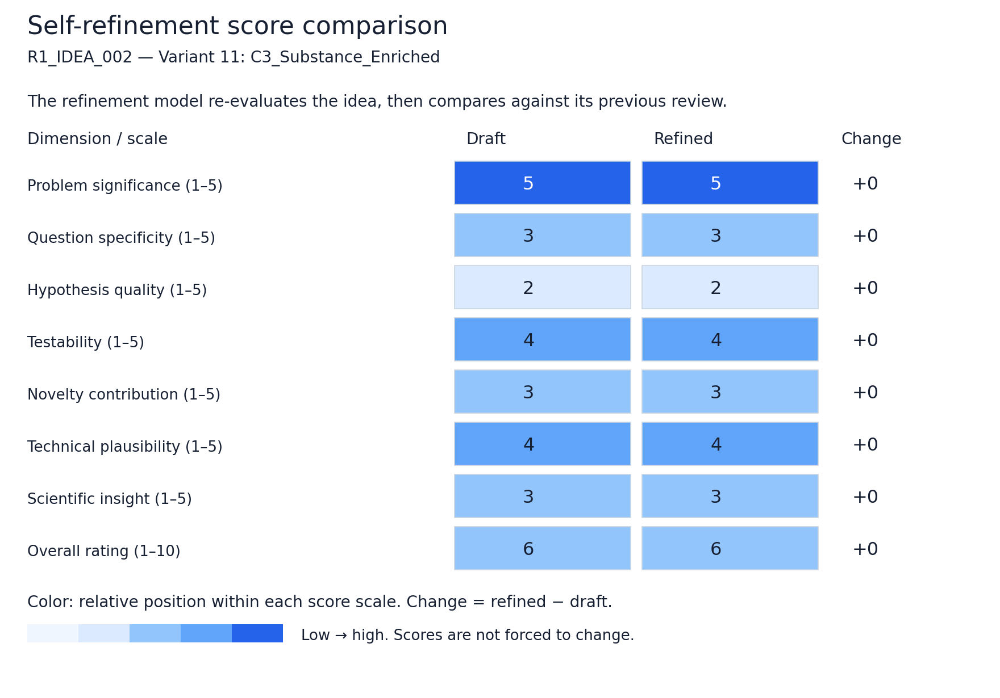

Changed score dimensions: none.

### Score justifications (draft / refined)

**Problem significance**

```json
{
  "draft": {
    "score": 5.0,
    "justification": "Rare-event sampling in molecular systems is a fundamental challenge with high practical importance for drug discovery and materials science. Overcoming computational infeasibility of unbiased molecular dynamics is a meaningful and well-recognized problem."
  },
  "refined": {
    "score": 5.0,
    "justification": "Rare-event sampling in molecular systems is a fundamental and long-standing challenge in computational chemistry and biophysics. Overcoming the computational infeasibility of unbiased molecular dynamics has high practical importance for drug discovery and materials science, making this a highly significant problem."
  }
}
```

**Question specificity**

```json
{
  "draft": {
    "score": 3.0,
    "justification": "The idea identifies a general direction (train diffusion samplers with off-policy learning) and validation approach, but lacks a precise research question. It mentions 'potential boundary conditions' but doesn't define what specific relationship or phenomenon is being investigated."
  },
  "refined": {
    "score": 3.0,
    "justification": "The idea identifies a general methodological direction (train diffusion samplers with off-policy learning) and a validation approach, but lacks a precise research question. It mentions 'potential boundary conditions' but doesn't define what specific relationship, mechanism, or phenomenon is the primary focus of investigation."
  }
}
```

**Hypothesis quality**

```json
{
  "draft": {
    "score": 2.0,
    "justification": "The stated hypothesis is essentially that the method 'could be validated by comparison'—this is a validation plan rather than a falsifiable prediction about mechanisms, advantages, or relationships. No concrete prediction about performance, efficiency, or limitations is made."
  },
  "refined": {
    "score": 2.0,
    "justification": "The stated hypothesis is essentially a validation plan ('could be validated by comparison') rather than a falsifiable prediction about mechanisms, advantages, or relationships. No concrete prediction about performance, efficiency gains, or limitations relative to existing methods is made. The idea lacks a clear 'if X then Y' structure."
  }
}
```

**Testability**

```json
{
  "draft": {
    "score": 4.0,
    "justification": "The idea suggests clear validation through comparison with enhanced sampling methods, and identifies testable boundary conditions (high-dimensional changes, reward sensitivity). These are concrete ways to obtain evidence, though the exact experimental design is not specified."
  },
  "refined": {
    "score": 4.0,
    "justification": "The idea suggests clear validation through comparison with enhanced sampling methods and identifies testable boundary conditions (high-dimensional conformational changes, reward sensitivity). These provide concrete avenues for obtaining evidence, though the exact experimental design and success criteria are not fully specified."
  }
}
```

**Novelty contribution**

```json
{
  "draft": {
    "score": 3.0,
    "justification": "Combining diffusion models with off-policy learning for molecular pathway sampling appears novel, but the contribution is primarily methodological application rather than fundamental insight. The idea doesn't claim to discover new phenomena or test theoretical principles."
  },
  "refined": {
    "score": 3.0,
    "justification": "Combining diffusion models with off-policy learning for molecular pathway sampling appears novel, but the contribution is framed primarily as methodological application rather than fundamental insight discovery. The idea doesn't claim to test theoretical principles or reveal new phenomena about molecular dynamics or RL."
  }
}
```

**Technical plausibility**

```json
{
  "draft": {
    "score": 4.0,
    "justification": "The general approach is logically coherent: using reinforcement learning to improve sampling efficiency in diffusion models is plausible given recent successes in both areas. No obvious technical contradictions are present in the brief description."
  },
  "refined": {
    "score": 4.0,
    "justification": "The general approach is logically coherent: using reinforcement learning to improve the sampling efficiency or quality of diffusion models is plausible given recent advances in both areas. No obvious technical contradictions are present in the brief description, and the integration addresses a recognized need in molecular simulation."
  }
}
```

**Scientific insight**

```json
{
  "draft": {
    "score": 3.0,
    "justification": "Potential insights are limited to methodological validation unless the investigation reveals general principles about reward design in high-dimensional spaces or diffusion model limitations. The current framing focuses more on application success than fundamental understanding."
  },
  "refined": {
    "score": 3.0,
    "justification": "Potential insights are primarily methodological unless the investigation is designed to reveal general principles (e.g., about reward design in high-dimensional spaces, or trade-offs between exploration and exploitation in molecular energy landscapes). The current framing focuses more on application success than fundamental understanding."
  }
}
```

**Overall rating**

```json
{
  "draft": {
    "score": 6.0,
    "justification": "This is a moderate research idea with clear practical significance and testable validation approach, but limited hypothesis specificity and scientific insight potential. The problem is important and the methodological direction is plausible, but the research question is framed as method validation rather than hypothesis testing about underlying mechanisms. With stronger hypothesis formulation and clearer scientific objectives, it could become a stronger research direction."
  },
  "refined": {
    "score": 6.0,
    "justification": "This is a moderate research idea with clear practical significance and a testable validation approach, but limited hypothesis specificity and scientific insight potential. The problem is important and the methodological direction is plausible, but the research question is framed as method validation rather than hypothesis testing about underlying mechanisms. With stronger hypothesis formulation and clearer scientific objectives, it could become a stronger research direction."
  }
}
```

## R1_IDEA_002 — Variant 12: H1_Deceptive_Hollow


Changed score dimensions: none.

### Score justifications (draft / refined)

**Problem significance**

```json
{
  "draft": {
    "score": 5.0,
    "justification": "The problem of sampling rare events in molecular systems is fundamental and important in computational chemistry, biophysics, and materials science. Efficient methods for discovering transition pathways between stable states would indeed have significant impact on drug discovery and material design."
  },
  "refined": {
    "score": 5.0,
    "justification": "The problem is highly significant. Sampling rare events and discovering transition pathways in molecular systems is a fundamental challenge in computational chemistry, biophysics, and materials science with direct applications to drug discovery and materials design. Efficient methods would substantially advance these fields."
  }
}
```

**Question specificity**

```json
{
  "draft": {
    "score": 1.0,
    "justification": "Extremely vague. No specific research question is articulated. The idea merely states that ML could be used to address sampling challenges without predefined descriptors, but doesn't specify what aspect of the problem is being investigated, what relationship is being tested, or what phenomenon is being studied."
  },
  "refined": {
    "score": 1.0,
    "justification": "Extremely vague. No specific research question is articulated. The idea describes a general application area ('use ML for molecular sampling') but doesn't specify what aspect would be investigated, what relationship would be tested, or what phenomenon would be studied."
  }
}
```

**Hypothesis quality**

```json
{
  "draft": {
    "score": 1.0,
    "justification": "No hypothesis is presented, implicit or explicit. The text contains motivational statements ('could support exploration', 'could reshape how the community thinks') but no concrete prediction about mechanisms, relationships, or expected outcomes that could be tested."
  },
  "refined": {
    "score": 1.0,
    "justification": "No hypothesis is presented, either explicit or implicit. The text contains motivational statements ('could support exploration', 'could reshape thinking') but no concrete prediction about mechanisms, relationships, or expected outcomes that could be tested or falsified."
  }
}
```

**Testability**

```json
{
  "draft": {
    "score": 1.0,
    "justification": "The idea as presented is not testable because it doesn't specify what would be tested. There's no proposed experiment, comparison, evaluation, or analysis. It's a general direction statement rather than a research question that could be investigated."
  },
  "refined": {
    "score": 1.0,
    "justification": "The idea as presented is not testable because it doesn't specify what would be tested. There's no proposed experiment, comparison, evaluation metric, or analysis method. It's a general direction statement rather than a research question that could be meaningfully investigated."
  }
}
```

**Novelty contribution**

```json
{
  "draft": {
    "score": 2.0,
    "justification": "While applying ML to molecular dynamics and enhanced sampling is an active area of research, the specific angle of 'without predefined descriptors' could be novel if properly developed. However, the idea as presented is too vague to assess its novelty. It claims to be 'transformative' but doesn't articulate what transformation would occur."
  },
  "refined": {
    "score": 2.0,
    "justification": "Applying ML to molecular dynamics and enhanced sampling is an active research area. The specific angle of 'without predefined descriptors' could be novel if properly developed, but the idea is too vague to assess its novelty. Claims of being 'transformative' are unsupported by any specific technical insight or approach."
  }
}
```

**Technical plausibility**

```json
{
  "draft": {
    "score": 3.0,
    "justification": "The general direction is plausible - ML methods have been successfully applied to molecular systems. However, without any technical details, it's impossible to assess whether the specific approach (whatever it may be) would work. The reasoning is coherent at a very high level but lacks substance."
  },
  "refined": {
    "score": 3.0,
    "justification": "The general direction is plausible - ML methods have been successfully applied to molecular systems. However, without any technical details about the proposed approach, it's impossible to assess whether a specific implementation would work. The high-level reasoning is coherent but lacks substance."
  }
}
```

**Scientific insight**

```json
{
  "draft": {
    "score": 2.0,
    "justification": "If properly developed, research in this area could provide insights into how to automatically discover relevant collective variables in complex systems, which would be valuable. However, the idea as presented doesn't articulate what specific insights might be gained - it focuses on applications rather than fundamental understanding."
  },
  "refined": {
    "score": 2.0,
    "justification": "If properly developed, research in this area could provide insights into automated discovery of relevant collective variables in complex systems. However, the idea as presented focuses on applications and transformative claims rather than articulating what specific scientific insights might be gained about molecular systems, ML methods, or their intersection."
  }
}
```

**Overall rating**

```json
{
  "draft": {
    "score": 3.0,
    "justification": "This is a weak research idea in its current form. While it identifies an important problem domain, it fails to articulate a concrete research question, hypothesis, or methodological direction. It reads more like a grant proposal abstract or motivational statement than a research idea that could be directly investigated. The grandiose language about being 'transformative' and 'field-shaping' is not backed by any specific technical insight or novel approach. To become a strong research idea, it needs substantial specification of what exactly would be studied and how."
  },
  "refined": {
    "score": 3.0,
    "justification": "This is a weak research idea in its current form. While it identifies an important problem domain, it fails to articulate a concrete research question, hypothesis, or methodological direction. It reads as a motivational statement or grant abstract rather than a research idea that could be directly investigated. The grandiose claims about being 'transformative' and 'field-shaping' are not backed by any specific technical insight. To become a strong research idea, it needs substantial specification of what exactly would be studied and how."
  }
}
```

## R1_IDEA_002 — Variant 13: H2_Confident_Flaw

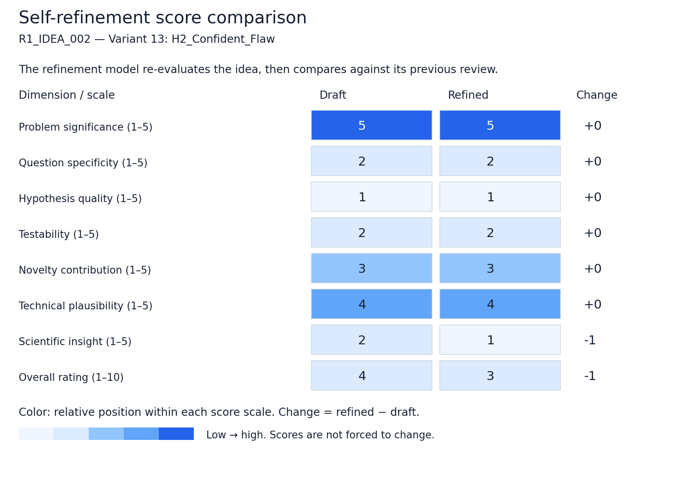

Changed score dimensions: scientific_insight, overall_rating.

### Score justifications (draft / refined)

**Problem significance**

```json
{
  "draft": {
    "score": 5.0,
    "justification": "The problem is highly significant. Sampling rare transition pathways between meta-stable molecular states is a fundamental challenge in computational chemistry and molecular dynamics, with direct implications for drug discovery and material design. Overcoming the computational infeasibility of unbiased molecular dynamics is a major research goal."
  },
  "refined": {
    "score": 5.0,
    "justification": "The problem is exceptionally significant. Sampling rare transition pathways between meta-stable states is a fundamental challenge in computational chemistry and molecular dynamics with major implications for understanding biochemical processes, drug discovery, and material design. Overcoming the computational limitations of unbiased molecular dynamics for rare events is a recognized grand challenge in the field."
  }
}
```

**Question specificity**

```json
{
  "draft": {
    "score": 2.0,
    "justification": "The idea lacks a clearly defined research question. It states a goal (sample pathways without collective variables) and proposes a method (diffusion + off-policy learning), but does not articulate a specific question about the relationship between method and outcome. It is more of a proposed application than a focused investigation."
  },
  "refined": {
    "score": 2.0,
    "justification": "The idea lacks a clearly defined research question. It states a goal (sample pathways without collective variables) and proposes a technical approach, but doesn't articulate what specific relationship, mechanism, or phenomenon is being investigated. It's essentially 'apply X to Y' without specifying what aspect of this application constitutes the research question."
  }
}
```

**Hypothesis quality**

```json
{
  "draft": {
    "score": 1.0,
    "justification": "There is no clear hypothesis. The closest is an implicit claim that the proposed approach will be superior because it addresses a 'visible weakness,' but this is stated as a foregone conclusion ('will necessarily produce reliable improvements'). A scientific hypothesis should be a testable prediction, not an assumption of success. The idea even dismisses the need to isolate alternative explanations, which is contrary to hypothesis testing."
  },
  "refined": {
    "score": 1.0,
    "justification": "There is no scientific hypothesis presented. The text makes an assumption of success ('will necessarily produce reliable improvements') rather than a testable prediction. It explicitly rejects the need to consider alternative explanations, which is antithetical to hypothesis testing. A hypothesis should be falsifiable, but here the outcome is presented as inevitable."
  }
}
```

**Testability**

```json
{
  "draft": {
    "score": 2.0,
    "justification": "While the general direction is testable (one could implement the method and compare performance), the idea as presented provides no framework for testing. It lacks proposed experiments, comparisons, or evaluation criteria. The claim of 'broader effectiveness' and 'general superiority' is vague and not operationalized. The dismissal of controlling for variables further reduces testability."
  },
  "refined": {
    "score": 2.0,
    "justification": "While one could technically implement the proposed method and test it, the idea as presented provides no framework for testing. There are no proposed experiments, comparisons, or evaluation criteria. The claims of 'broader effectiveness' and 'general superiority' are vague and not operationalized. The dismissal of controlling for variables ('without separately isolating... alternative explanations') further undermines testability."
  }
}
```

**Novelty contribution**

```json
{
  "draft": {
    "score": 3.0,
    "justification": "Applying diffusion models and RL to molecular dynamics path sampling is a relatively recent and active area. The novelty is moderate: combining diffusion with 'improved' off-policy learning is a specific technical direction, but the idea does not specify what the improvement is. The potential contribution is significant if successful, but the idea is currently framed as an application rather than a novel methodological or theoretical insight."
  },
  "refined": {
    "score": 3.0,
    "justification": "Applying diffusion models and RL to molecular dynamics path sampling is an active research area with growing interest. The novelty is moderate: combining diffusion with 'improved' off-policy learning is a specific technical direction, but without specifying what the improvement entails. The potential practical contribution could be significant if successful, but the idea currently lacks novel methodological or theoretical insight beyond application."
  }
}
```

**Technical plausibility**

```json
{
  "draft": {
    "score": 4.0,
    "justification": "The core technical direction is plausible. Diffusion models are powerful generative models, and reinforcement learning (including off-policy methods) has been applied to molecular dynamics and path sampling problems. The reasoning that avoiding predefined collective variables could be beneficial is coherent. However, the lack of detail on the 'improved off-policy learning' and the training setup limits a full assessment."
  },
  "refined": {
    "score": 4.0,
    "justification": "The core technical direction is plausible. Diffusion models have shown strong generative capabilities, and reinforcement learning (including off-policy methods) has been successfully applied to molecular dynamics and control problems. The reasoning that avoiding predefined collective variables could be beneficial is coherent. However, significant technical challenges (reward design, training stability, high-dimensional state spaces) are not addressed."
  }
}
```

**Scientific insight**

```json
{
  "draft": {
    "score": 2.0,
    "justification": "The idea as stated aims for a practical improvement but does not emphasize generating broader scientific insight. It claims 'broader effectiveness' but does not propose to investigate why or under what conditions the method works, what its limitations are, or what it reveals about the structure of molecular energy landscapes. The dismissal of analyzing 'boundary cases or alternative explanations' explicitly rejects a key source of scientific insight."
  },
  "refined": {
    "score": 1.0,
    "justification": "The idea explicitly rejects generating scientific insight by dismissing the need to analyze 'boundary cases or alternative explanations.' It frames the research as demonstrating inevitable superiority rather than investigating why or under what conditions the method works. There's no indication of seeking to understand mechanisms, limitations, or general principles that could transfer beyond the specific application."
  }
}
```

**Overall rating**

```json
{
  "draft": {
    "score": 4.0,
    "justification": "The idea addresses a very important problem and suggests a technically plausible direction. However, it is severely weakened by the lack of a specific research question or testable hypothesis, an overly strong and unscientific claim of inevitable success, and the explicit rejection of rigorous experimental controls. It reads more as a motivated application proposal than a scientific research idea. With significant refinement to formulate a hypothesis and design rigorous tests, it could become a strong idea."
  },
  "refined": {
    "score": 3.0,
    "justification": "While addressing an extremely important problem and suggesting a technically plausible direction, this is a weak research idea. It lacks a clear research question, contains no testable hypothesis, makes unscientific claims of inevitable success, and explicitly rejects rigorous scientific methodology. The framing is more akin to a product claim than a scientific investigation. With substantial refinement—formulating a specific hypothesis, designing rigorous tests, and seeking explanatory insights—it could become a strong idea, but in its current form it fails as a scientific research proposal."
  }
}
```

## R1_IDEA_002 — Variant 14: H3_Verbose_Enriched

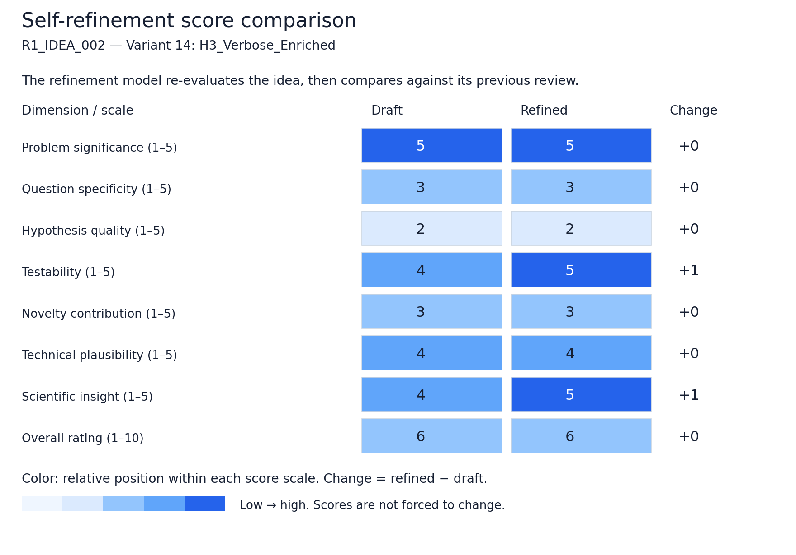

Changed score dimensions: testability, scientific_insight.

### Score justifications (draft / refined)

**Problem significance**

```json
{
  "draft": {
    "score": 5.0,
    "justification": "Rare-event sampling in molecular dynamics is a fundamental challenge with high practical impact in drug discovery and materials science. Overcoming the need for predefined collective variables would be a major advance."
  },
  "refined": {
    "score": 5.0,
    "justification": "Rare-event sampling in molecular dynamics is a fundamental computational bottleneck with high practical impact. Overcoming the need for predefined collective variables would represent a significant advance for computational chemistry and biophysics."
  }
}
```

**Question specificity**

```json
{
  "draft": {
    "score": 3.0,
    "justification": "The idea identifies a general direction (using off-policy learning for diffusion path samplers) and suggests evaluation procedures, but the core research question is not crisply defined. It's more of a methodological proposal than a specific hypothesis-driven investigation."
  },
  "refined": {
    "score": 3.0,
    "justification": "The idea identifies a general methodological direction but lacks a crisply defined research question. It describes what to do (use off-policy learning with diffusion samplers) and how to evaluate it, but not what specific relationship or mechanism is being investigated."
  }
}
```

**Hypothesis quality**

```json
{
  "draft": {
    "score": 2.0,
    "justification": "There is no explicit hypothesis. The implicit suggestion that 'off-policy learning could help' is vague. The idea mentions validation via comparison but doesn't predict what specific improvement off-policy learning should provide or what mechanism might be at play."
  },
  "refined": {
    "score": 2.0,
    "justification": "There is no explicit hypothesis. The implicit suggestion that off-policy learning could improve diffusion path samplers is vague and lacks a concrete, testable prediction about mechanism or expected improvement magnitude."
  }
}
```

**Testability**

```json
{
  "draft": {
    "score": 4.0,
    "justification": "The proposed staged design with comparisons, ablations, and sensitivity analyses provides a clear roadmap for testing. The approach is inherently testable through computational experiments on molecular systems."
  },
  "refined": {
    "score": 5.0,
    "justification": "The proposed evaluation framework is exceptionally detailed and rigorous, including staged design, comparisons to baselines, ablations, sensitivity analyses, and error analysis. This provides a clear roadmap for comprehensive testing."
  }
}
```

**Novelty contribution**

```json
{
  "draft": {
    "score": 3.0,
    "justification": "Applying diffusion models to molecular pathway generation is not entirely new. The novelty hinges on the 'improved off-policy learning' component, which is not specified. Without details, this feels like a plausible but incremental combination of existing ideas."
  },
  "refined": {
    "score": 3.0,
    "justification": "Applying diffusion models to molecular pathway generation is an active research area. The novelty hinges entirely on the unspecified 'improved off-policy learning' component. Without details, this feels like a plausible but potentially incremental combination of existing ideas."
  }
}
```

**Technical plausibility**

```json
{
  "draft": {
    "score": 4.0,
    "justification": "The general approach is plausible: diffusion models can generate molecular structures, and RL has been used for molecular dynamics. Off-policy learning could address sample efficiency issues. The reasoning is coherent, though details are missing."
  },
  "refined": {
    "score": 4.0,
    "justification": "The general approach is technically plausible: diffusion models generate molecular structures, RL optimizes sequential decisions, and off-policy learning could address sample efficiency. The reasoning is coherent, though key implementation details are missing."
  }
}
```

**Scientific insight**

```json
{
  "draft": {
    "score": 4.0,
    "justification": "If executed with the proposed analyses, the study could yield insights into when and why off-policy learning benefits diffusion samplers, the sensitivity to reward design, and boundary conditions in high-dimensional conformational changes. This goes beyond mere performance comparison."
  },
  "refined": {
    "score": 5.0,
    "justification": "If executed with the proposed analyses, this research could yield substantial insights into when and why off-policy learning benefits diffusion samplers, sensitivity to reward design, boundary conditions in high-dimensional spaces, and failure modes. This goes far beyond mere performance comparison."
  }
}
```

**Overall rating**

```json
{
  "draft": {
    "score": 6.0,
    "justification": "This is a moderate/borderline research idea. It addresses a significant problem and proposes a technically plausible direction with a thoughtful evaluation plan. However, it lacks a clear, testable hypothesis and a specific novel contribution. The idea is more of a methodological framework than a focused research question. With a sharper hypothesis and more concrete definition of the 'improved' component, it could become strong."
  },
  "refined": {
    "score": 6.0,
    "justification": "This is a moderate/borderline research idea. It addresses a highly significant problem with a technically plausible direction and an exceptionally thoughtful evaluation plan that promises substantial scientific insight. However, it lacks a clear research question and testable hypothesis, and the novel contribution is underspecified. The idea is strong in execution planning but weak in hypothesis formulation. With a sharper hypothesis and clearer definition of the 'improved' component, it could become exceptional."
  }
}
```

## R1_IDEA_002 — Variant 15: H4_Ultimate_Hype


Changed score dimensions: none.

### Score justifications (draft / refined)

**Problem significance**

```json
{
  "draft": {
    "score": 5.0,
    "justification": "The problem is highly significant - rare-event sampling in molecular systems is a fundamental challenge with major implications for drug discovery and materials science. Overcoming computational infeasibility of unbiased molecular dynamics would be transformative."
  },
  "refined": {
    "score": 5.0,
    "justification": "The problem is exceptionally significant. Rare-event sampling in molecular systems is a fundamental challenge in computational chemistry and biophysics with major implications for drug discovery, materials design, and understanding biological processes. Overcoming computational limitations of unbiased molecular dynamics would be transformative for these fields."
  }
}
```

**Question specificity**

```json
{
  "draft": {
    "score": 1.0,
    "justification": "Extremely weak - the idea summary contains no specific research question. It merely states an application area and combination of techniques without defining what is actually being investigated."
  },
  "refined": {
    "score": 1.0,
    "justification": "Extremely weak - the idea summary contains no specific research question. It merely states an application area and combination of techniques without defining what is actually being investigated. There is no 'what', 'why', or 'how' question articulated."
  }
}
```

**Hypothesis quality**

```json
{
  "draft": {
    "score": 1.0,
    "justification": "No hypothesis is present. The summary makes no concrete prediction about mechanisms, relationships, or expected outcomes. It only states that an approach 'could' be transformative."
  },
  "refined": {
    "score": 1.0,
    "justification": "No hypothesis is present. The summary makes no concrete prediction about mechanisms, relationships, or expected outcomes. It only states that an approach 'could' be transformative and 'aims to' overcome challenges, without any testable claim about why or how this combination would work."
  }
}
```

**Testability**

```json
{
  "draft": {
    "score": 2.0,
    "justification": "While the general direction could be tested (e.g., comparing sampling efficiency), the lack of specific claims or methodology makes it difficult to design a meaningful test. The idea is testable in principle but not in its current vague formulation."
  },
  "refined": {
    "score": 2.0,
    "justification": "While the general direction could eventually be tested (e.g., comparing sampling efficiency on benchmark systems), the current formulation lacks the specificity needed to design a meaningful test. There are no proposed metrics, baselines, or evaluation criteria. The idea is testable in principle but not in its current vague state."
  }
}
```

**Novelty contribution**

```json
{
  "draft": {
    "score": 4.0,
    "justification": "The combination of diffusion models with off-policy learning for molecular path sampling without predefined collective variables appears novel and could represent a meaningful technical contribution if successfully implemented and validated."
  },
  "refined": {
    "score": 4.0,
    "justification": "The combination of diffusion models with off-policy learning specifically for molecular path sampling without predefined collective variables appears novel. While both components have been used separately in related contexts, their integration for this specific purpose could represent a meaningful technical contribution if successfully implemented and validated."
  }
}
```

**Technical plausibility**

```json
{
  "draft": {
    "score": 3.0,
    "justification": "The general direction is plausible - diffusion models have shown promise in molecular generation, and reinforcement learning approaches have been applied to enhanced sampling. However, the summary provides insufficient detail to assess whether the specific combination proposed would work."
  },
  "refined": {
    "score": 3.0,
    "justification": "The general direction is plausible - diffusion models have shown promise in molecular generation, and reinforcement learning approaches have been applied to enhanced sampling problems. However, the summary provides insufficient detail to assess whether the specific combination proposed would work. Key challenges like training without positive examples and exploring extremely rare events are not addressed."
  }
}
```

**Scientific insight**

```json
{
  "draft": {
    "score": 3.0,
    "justification": "If successful, this could provide insight into how generative models can learn intrinsic reaction coordinates without human supervision, which would be scientifically valuable. However, the current formulation focuses more on application potential than fundamental understanding."
  },
  "refined": {
    "score": 3.0,
    "justification": "If successful, this could provide insight into how generative models can learn intrinsic reaction coordinates without human supervision, which would be scientifically valuable. However, the current formulation focuses more on application potential ('enable rare-event exploration') than fundamental understanding of mechanisms or principles."
  }
}
```

**Overall rating**

```json
{
  "draft": {
    "score": 4.0,
    "justification": "This is a weak research idea in its current form. While it addresses an important problem and suggests a potentially novel technical direction, it completely lacks a specific research question, hypothesis, or methodological direction. The summary reads more like marketing material than a research proposal. The high problem significance and novelty potential are undermined by the absence of any concrete investigative focus."
  },
  "refined": {
    "score": 4.0,
    "justification": "This is a weak research idea in its current form. While it addresses an exceptionally important problem and suggests a potentially novel technical direction, it completely lacks a specific research question, hypothesis, or methodological direction. The summary reads more like promotional material than a research proposal, with grandiose claims unsupported by technical substance. The high problem significance and novelty potential are severely undermined by the absence of any concrete investigative focus."
  }
}
```

## R1_IDEA_003 — Source

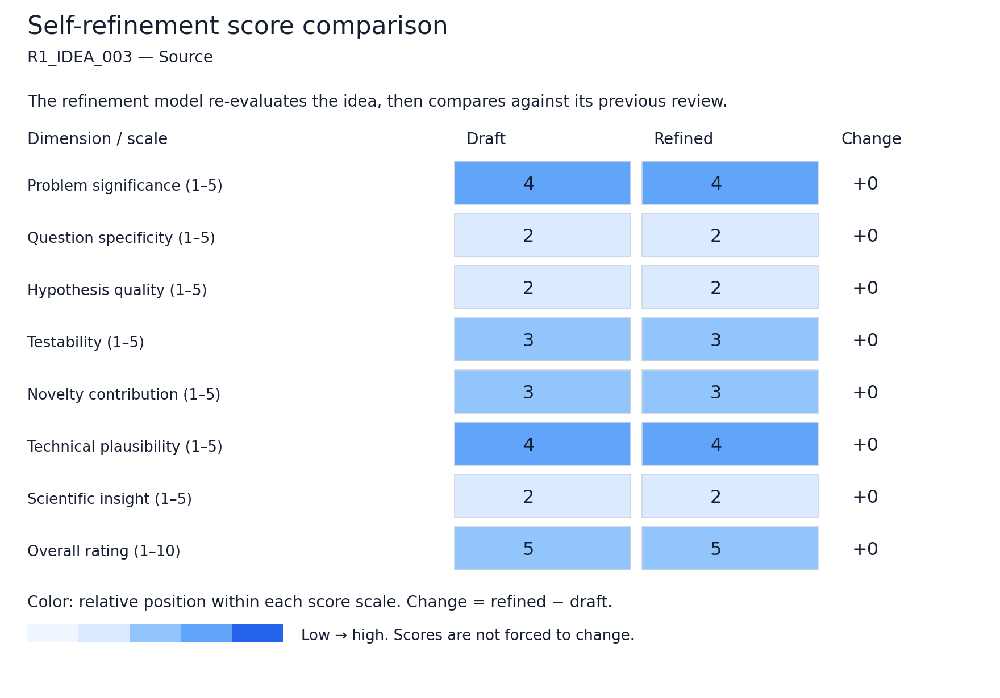

Changed score dimensions: none.

### Score justifications (draft / refined)

**Problem significance**

```json
{
  "draft": {
    "score": 4.0,
    "justification": "The problem is meaningful. Integrating expert visual attention into medical AI is an active and important area. The specific issue of losing temporal information in gaze data is a recognized limitation in some works, and addressing it could lead to more faithful modeling of expert reasoning."
  },
  "refined": {
    "score": 4.0,
    "justification": "The problem is meaningful. Integrating expert visual attention into medical AI is an active research area with clinical relevance. The specific limitation of losing temporal information in gaze data is a recognized issue in modeling expert reasoning, and addressing it could lead to more faithful AI assistants."
  }
}
```

**Question specificity**

```json
{
  "draft": {
    "score": 2.0,
    "justification": "The idea is moderately specific in its proposed method (video encoding) but lacks a concrete research question. It states a goal ('enhancing model reasoning and interpretability') but does not define what aspect of reasoning or interpretability is being investigated, or what relationship is being tested."
  },
  "refined": {
    "score": 2.0,
    "justification": "The idea is moderately specific in its proposed method (video encoding) but lacks a concrete research question. It states a general goal ('enhancing model reasoning and interpretability') without defining what aspect of reasoning or interpretability is being investigated, or what specific relationship is being tested."
  }
}
```

**Hypothesis quality**

```json
{
  "draft": {
    "score": 2.0,
    "justification": "There is an implicit hypothesis that 'video encoding of gaze is better than static encoding,' but it is not made concrete or falsifiable. It does not specify in what way it is better, by what mechanism, or under what conditions. It is more of an assertion than a hypothesis."
  },
  "refined": {
    "score": 2.0,
    "justification": "There is only an implicit, vague hypothesis that 'video encoding of gaze is better than static encoding.' It is not made concrete, falsifiable, or mechanism-oriented. It doesn't specify in what way it's better, by what mechanism, or under what conditions. It reads more as an assertion than a testable hypothesis."
  }
}
```

**Testability**

```json
{
  "draft": {
    "score": 3.0,
    "justification": "The idea is testable in principle—one could build the proposed system and compare it to baselines. However, without a specified hypothesis or evaluation plan, the test is not well-defined. The core claim is vague ('enhancing'), making it difficult to design a decisive experiment."
  },
  "refined": {
    "score": 3.0,
    "justification": "The idea is testable in principle—one could implement the proposed system and compare it to baselines. However, without a specified hypothesis, evaluation metrics, or comparison framework, the test is not well-defined. The core claim ('enhancing') is too vague to design a decisive experiment."
  }
}
```

**Novelty contribution**

```json
{
  "draft": {
    "score": 3.0,
    "justification": "The novelty lies in the proposed input representation (video-encoded gaze) for a specific application. This is a non-trivial technical idea. However, the potential contribution is currently framed as a potential performance boost. The scientific contribution (new knowledge about the role of temporal attention in VLMs) is underdeveloped."
  },
  "refined": {
    "score": 3.0,
    "justification": "The novelty lies in the proposed input representation (video-encoded gaze) for a specific application. This is a non-trivial technical idea. However, the potential contribution is currently framed as a potential performance boost rather than new scientific knowledge. The opportunity to study temporal attention in VLMs is underdeveloped."
  }
}
```

**Technical plausibility**

```json
{
  "draft": {
    "score": 4.0,
    "justification": "The proposed direction is technically plausible. Representing a time series of 2D coordinates as a video is straightforward. Integrating video data into VLMs (which already handle video inputs) is feasible. The main assumption—that temporal order contains useful signal—is reasonable based on studies of radiologist eye movements."
  },
  "refined": {
    "score": 4.0,
    "justification": "The proposed direction is technically plausible. Representing a time series of 2D gaze coordinates as a video is straightforward. Integrating video data into VLMs (which often support video inputs) is feasible. The assumption that temporal order contains useful signal is reasonable given studies of radiologist eye movements."
  }
}
```

**Scientific insight**

```json
{
  "draft": {
    "score": 2.0,
    "justification": "As presented, the potential scientific insight is low. It is primarily an engineering proposal to use a different input format. If the investigation were framed around testing whether and how temporal gaze patterns improve model capabilities or reveal expert heuristics, the insight potential would be much higher. Currently, it leans toward 'applying video encoding to a new data type.'"
  },
  "refined": {
    "score": 2.0,
    "justification": "As presented, the potential scientific insight is low. It is primarily an engineering proposal to use a different input format. If the investigation were framed around testing whether and how temporal gaze patterns improve model capabilities or reveal expert heuristics, the insight potential would be higher. Currently, it leans toward 'applying video encoding to a new data type.'"
  }
}
```

**Overall rating**

```json
{
  "draft": {
    "score": 5.0,
    "justification": "This is a moderate/borderline research idea. It identifies a plausible technical limitation and proposes a concrete methodological direction with clear relevance to an important domain. However, it lacks a well-defined research question, a testable hypothesis, and a clear articulation of the scientific insight to be gained. It reads more like a method suggestion than a research plan. Strengthening it with a specific hypothesis and evaluation focus would make it much stronger."
  },
  "refined": {
    "score": 5.0,
    "justification": "This is a moderate/borderline research idea. It identifies a plausible technical limitation and proposes a concrete methodological direction with clear relevance to an important domain. However, it lacks a well-defined research question, a testable hypothesis, and a clear articulation of the scientific insight to be gained. It reads more like a method suggestion than a research plan. Strengthening it with a specific hypothesis and evaluation focus would make it much stronger."
  }
}
```

## R1_IDEA_003 — Variant 1: A1_Identity


Changed score dimensions: none.

### Score justifications (draft / refined)

**Problem significance**

```json
{
  "draft": {
    "score": 4.0,
    "justification": "The problem is meaningful. Integrating expert visual behavior into AI for medical image analysis is an active and important area, aiming to make models more aligned with human reasoning. The specific limitation identified—loss of temporal information—is a valid and under-explored aspect."
  },
  "refined": {
    "score": 4.0,
    "justification": "The problem is meaningful and relevant. Integrating expert visual behavior into AI for medical image analysis is an active research area with clinical importance. The specific limitation identified—loss of temporal information in current gaze representations—is a valid and under-explored aspect that could impact model alignment with human reasoning."
  }
}
```

**Question specificity**

```json
{
  "draft": {
    "score": 2.0,
    "justification": "The idea is moderately specific in its proposed method (video encoding) but lacks a concrete research question. It states a goal ('enhancing model reasoning and interpretability') but does not define what aspect of reasoning or interpretability is being investigated, or what relationship is being tested."
  },
  "refined": {
    "score": 2.0,
    "justification": "The idea is moderately specific in its proposed method (video encoding) but lacks a concrete research question. It states a general goal ('enhancing model reasoning and interpretability') without defining what aspect of reasoning or interpretability is being investigated, or what specific relationship is being tested between temporal gaze and model performance."
  }
}
```

**Hypothesis quality**

```json
{
  "draft": {
    "score": 2.0,
    "justification": "There is an implicit hypothesis that 'video encoding of gaze is better than static encoding,' but it is not made concrete or falsifiable. A strong hypothesis would predict a specific outcome on a specific task (e.g., improved accuracy on subtle findings) and propose a mechanism (e.g., temporal sequence encodes diagnostic search patterns)."
  },
  "refined": {
    "score": 2.0,
    "justification": "There is only an implicit, vague hypothesis that 'video encoding of gaze is better than static encoding.' A stronger hypothesis would make a concrete, falsifiable prediction about a specific outcome (e.g., improved accuracy on rare findings) and propose a mechanism (e.g., temporal sequence encodes diagnostic search patterns that improve reasoning)."
  }
}
```

**Testability**

```json
{
  "draft": {
    "score": 3.0,
    "justification": "The idea is testable in principle—one could build the proposed system and compare it to baselines. However, without a specified evaluation (tasks, metrics, comparisons), the testability is only moderate. The core claim is not yet framed in a way that clearly defines what evidence would support or refute it."
  },
  "refined": {
    "score": 3.0,
    "justification": "The idea is testable in principle—one could implement the proposed system and compare it to baselines. However, without a specified evaluation framework (tasks, metrics, comparisons), testability is only moderate. The core claim is not yet framed in a way that clearly defines what evidence would support or refute it."
  }
}
```

**Novelty contribution**

```json
{
  "draft": {
    "score": 3.0,
    "justification": "The novelty lies in the proposed input representation (video-encoded gaze) for a specific application. This is a non-trivial technical idea. However, the potential contribution is currently framed as a performance enhancement. The scientific contribution (new knowledge about the role of temporal attention in VLMs) is not clearly stated, which limits the novelty score."
  },
  "refined": {
    "score": 3.0,
    "justification": "The novelty lies primarily in the proposed input representation (video-encoded gaze) for a specific application. This is a non-trivial technical idea. However, the potential contribution is currently framed as a performance enhancement rather than new scientific knowledge. The scientific contribution (e.g., new insights about the role of temporal attention in VLMs) is not clearly articulated, limiting the novelty score."
  }
}
```

**Technical plausibility**

```json
{
  "draft": {
    "score": 4.0,
    "justification": "The proposed direction is technically plausible. Representing a sequence of fixations as a video (or spatiotemporal tensor) is a reasonable approach to capture temporal dynamics. Integrating this with a VLM architecture (e.g., via a video encoder branch) is feasible given current multimodal frameworks. The main assumption—that temporal order contains useful signal—is reasonable based on studies of radiologist eye movements."
  },
  "refined": {
    "score": 4.0,
    "justification": "The proposed direction is technically plausible. Representing a sequence of fixations as a video (or spatiotemporal tensor) is a reasonable approach to capture temporal dynamics. Integrating this with a VLM architecture (e.g., via a video encoder branch) is feasible given current multimodal frameworks. The core assumption—that temporal order contains useful signal—is supported by studies of radiologist eye movements."
  }
}
```

**Scientific insight**

```json
{
  "draft": {
    "score": 3.0,
    "justification": "The potential for scientific insight is moderate. If successful, the work could reveal whether and how temporal gaze patterns improve VLM reasoning, which is a meaningful question in human-AI collaboration and multimodal learning. However, the idea as presented focuses more on the 'how' (video encoding) than the 'why' or 'what we learn,' limiting the potential insight. A stronger formulation would explicitly seek to uncover principles of how sequential attention informs reasoning."
  },
  "refined": {
    "score": 3.0,
    "justification": "The potential for scientific insight is moderate. If successful, the work could reveal whether and how temporal gaze patterns improve VLM reasoning, which is a meaningful question in human-AI collaboration and multimodal learning. However, the idea as presented focuses more on the 'how' (video encoding) than the 'why' or 'what we learn,' limiting the potential insight. A stronger formulation would explicitly seek to uncover principles of how sequential attention informs reasoning."
  }
}
```

**Overall rating**

```json
{
  "draft": {
    "score": 5.0,
    "justification": "This is a moderate/borderline research idea. It identifies a relevant problem and proposes a specific technical direction with clear application value. However, it lacks a well-defined research question, a testable hypothesis, and a clear articulation of the scientific insight to be gained. It reads more like a methodological suggestion than a research plan. With refinement to include a concrete hypothesis and evaluation strategy, it could become a strong idea."
  },
  "refined": {
    "score": 5.0,
    "justification": "This is a moderate/borderline research idea. It identifies a relevant problem and proposes a specific technical direction with clear application value. However, it lacks a well-defined research question, a testable hypothesis, and a clear articulation of the scientific insight to be gained. It reads more like a methodological suggestion than a research plan. With refinement to include a concrete hypothesis and evaluation strategy, it could become a strong idea."
  }
}
```

## R1_IDEA_003 — Variant 2: A2_Paraphrase_Only


Changed score dimensions: none.

### Score justifications (draft / refined)

**Problem significance**

```json
{
  "draft": {
    "score": 4.0,
    "justification": "The problem is meaningful: incorporating expert eye gaze into medical image analysis is an active area with potential to improve model transparency and performance. The specific issue of losing temporal information is a plausible limitation, as radiologists' scanning sequences may reflect diagnostic reasoning strategies."
  },
  "refined": {
    "score": 4.0,
    "justification": "The problem is meaningful: incorporating expert gaze into medical image analysis is an active research area with potential to enhance model transparency and performance. The specific issue of losing temporal information is a plausible limitation, as radiologists' scanning sequences may reflect diagnostic reasoning strategies that static representations miss."
  }
}
```

**Question specificity**

```json
{
  "draft": {
    "score": 2.0,
    "justification": "The idea describes a proposed approach but does not articulate a specific research question. It states what will be done (encode gaze as video) and a hoped-for outcome (improve reasoning/interpretability), but not what exactly will be investigated or tested."
  },
  "refined": {
    "score": 2.0,
    "justification": "The idea describes a proposed approach ('encode eye-tracking data as video sequences') but does not articulate a specific research question. It states what will be done and a desired outcome, but not what will be investigated or tested."
  }
}
```

**Hypothesis quality**

```json
{
  "draft": {
    "score": 2.0,
    "justification": "An implicit hypothesis exists ('temporal gaze encoding improves model performance/interpretability'), but it is not stated explicitly, lacks mechanistic justification, and is relatively broad. A stronger hypothesis would predict a specific relationship or mechanism (e.g., temporal order captures search heuristics that improve detection of missed findings)."
  },
  "refined": {
    "score": 2.0,
    "justification": "An implicit hypothesis exists ('preserving temporal order improves model reasoning and interpretability'), but it is not explicitly stated, lacks mechanistic justification, and is broad. A stronger hypothesis would predict a specific relationship or mechanism, such as how temporal sequences might capture diagnostic search patterns."
  }
}
```

**Testability**

```json
{
  "draft": {
    "score": 3.0,
    "justification": "The idea is testable in principle—one could implement the video encoding and compare it to static baselines. However, no specific experiment, evaluation, or comparison is suggested, making the testability somewhat vague. The claim about 'improving model reasoning' is measurable but not operationalized."
  },
  "refined": {
    "score": 3.0,
    "justification": "The idea is testable in principle—one could implement video encoding and compare it to static baselines. However, no specific experiment, evaluation, or comparison is suggested, leaving the testability vague. The claim about 'improving model reasoning' is measurable but not operationalized."
  }
}
```

**Novelty contribution**

```json
{
  "draft": {
    "score": 3.0,
    "justification": "Encoding gaze as video sequences for medical vision-language models appears novel. However, the core contribution is primarily a representation change; the potential scientific contribution depends on whether this leads to new insights about how temporal gaze patterns relate to diagnostic reasoning, which is not yet articulated."
  },
  "refined": {
    "score": 3.0,
    "justification": "Encoding gaze as video sequences for medical vision-language models appears novel. However, the core contribution is primarily a representation change; the potential scientific contribution depends on whether this leads to new insights about temporal gaze patterns and diagnostic reasoning, which is not yet articulated."
  }
}
```

**Technical plausibility**

```json
{
  "draft": {
    "score": 3.0,
    "justification": "The idea is logically coherent: video sequences can preserve temporal order. However, technical feasibility is uncertain without details on how to represent sparse fixations as video frames, how to align them with the image, and how to integrate them into a vision-language model. No major red flags, but important assumptions are unexamined."
  },
  "refined": {
    "score": 3.0,
    "justification": "The idea is logically coherent: video sequences can preserve temporal order. However, technical feasibility is uncertain without details on representing sparse fixations as video, aligning them with images, and integrating them into a vision-language model. No major red flags, but important assumptions are unexamined."
  }
}
```

**Scientific insight**

```json
{
  "draft": {
    "score": 3.0,
    "justification": "If successful, the research could provide insight into whether and how temporal gaze patterns matter for medical image analysis. However, the idea as stated focuses more on an engineering improvement (better representation) than on a scientific question about expert cognition or model interpretability. The potential for transferable insight is moderate."
  },
  "refined": {
    "score": 3.0,
    "justification": "If successful, the research could provide insight into whether and how temporal gaze patterns matter for medical image analysis. However, the idea as stated focuses more on an engineering improvement (better representation) than on a scientific question about expert cognition or model interpretability. The potential for transferable insight is moderate."
  }
}
```

**Overall rating**

```json
{
  "draft": {
    "score": 5.0,
    "justification": "This is a moderate/borderline research idea. It identifies a plausible limitation in existing work and proposes a concrete technical direction. However, it lacks a clearly defined research question, a strong hypothesis, and a specific plan for evaluation. The potential contribution is currently more engineering-oriented (a new representation) than scientific (new insights). With refinement—articulating a testable hypothesis and evaluation—it could become a strong idea."
  },
  "refined": {
    "score": 5.0,
    "justification": "This is a moderate/borderline research idea. It identifies a plausible limitation in existing work and proposes a concrete technical direction. However, it lacks a clearly defined research question, a strong hypothesis, and a specific plan for evaluation. The potential contribution is currently more engineering-oriented (a new representation) than scientific (new insights). With refinement—articulating a testable hypothesis and evaluation—it could become a strong idea."
  }
}
```

## R1_IDEA_003 — Variant 3: A3_Plain_Core

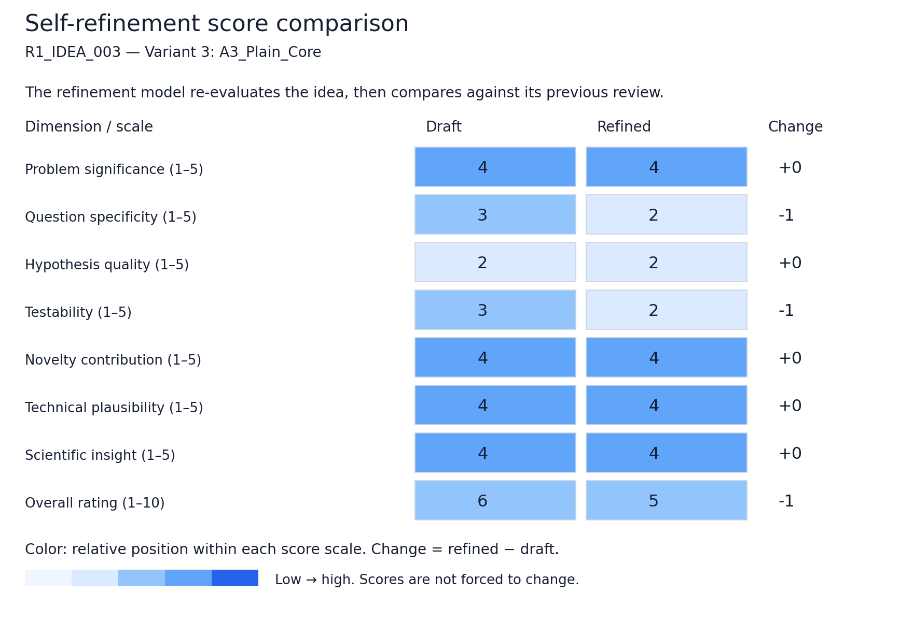

Changed score dimensions: question_specificity, testability, overall_rating.

### Score justifications (draft / refined)

**Problem significance**

```json
{
  "draft": {
    "score": 4.0,
    "justification": "The problem is meaningful: incorporating expert human attention into medical image analysis models is an active research area with clear clinical relevance. The specific issue of losing temporal information in gaze representation is a concrete and under-explored limitation."
  },
  "refined": {
    "score": 4.0,
    "justification": "The problem is meaningful: incorporating expert visual attention into medical AI models is an active area with clear clinical relevance. The specific issue of losing temporal gaze information is a concrete, underexplored limitation that could impact model performance and interpretability."
  }
}
```

**Question specificity**

```json
{
  "draft": {
    "score": 3.0,
    "justification": "The idea identifies a general direction (use video sequences for gaze) but does not define a precise research question. It states an 'aim' rather than a specific question about what temporal information improves, how, or under what conditions."
  },
  "refined": {
    "score": 2.0,
    "justification": "The idea states a general aim ('enhancing model reasoning and clinical interpretability') but does not define a precise research question. It lacks specificity about what is being investigated, under what conditions, or what relationship is being tested."
  }
}
```

**Hypothesis quality**

```json
{
  "draft": {
    "score": 2.0,
    "justification": "There is an implicit hypothesis that 'temporal scanning order contains valuable information for model reasoning,' but it is not articulated as a concrete, testable prediction. No mechanism or expected relationship is specified."
  },
  "refined": {
    "score": 2.0,
    "justification": "There is only an implicit, vague assumption that temporal information is valuable. No concrete, testable prediction is made about how temporal patterns will improve performance, what specific patterns matter, or what mechanism might be at play."
  }
}
```

**Testability**

```json
{
  "draft": {
    "score": 3.0,
    "justification": "The idea is testable in principle by comparing models with video-encoded gaze vs. static representations. However, without a clear hypothesis or success metrics, it's unclear exactly what would be tested. The proposed direction suggests experiments, but they are not defined."
  },
  "refined": {
    "score": 2.0,
    "justification": "While one could imagine comparing video-encoded gaze to static representations, the idea provides no framework for testing. It does not suggest experiments, comparisons, metrics, or what would constitute evidence for or against the claim. The direction is testable in principle, but the idea itself lacks testable elements."
  }
}
```

**Novelty contribution**

```json
{
  "draft": {
    "score": 4.0,
    "justification": "Using temporal gaze sequences (as video) for medical vision-language models appears novel. While gaze in medical AI is studied, the temporal aspect is often overlooked. The contribution could be a new method and insights into the role of scan patterns."
  },
  "refined": {
    "score": 4.0,
    "justification": "Using temporal gaze sequences (as video) for medical vision-language models appears novel. While gaze integration in medical AI exists, the explicit preservation and use of temporal scan patterns is underexplored. The contribution could be both methodological and provide insights into expert visual search."
  }
}
```

**Technical plausibility**

```json
{
  "draft": {
    "score": 4.0,
    "justification": "The core idea is technically plausible: eye-tracking data can be represented as a time-series of fixations, which can be rendered as a video. Integrating such a sequence into a vision-language model using video encoders is a reasonable direction, though non-trivial."
  },
  "refined": {
    "score": 4.0,
    "justification": "The core idea is technically plausible: eye-tracking sequences can be represented as time-series or videos, and integrating them via video encoders or recurrent networks into vision-language models is a reasonable, though non-trivial, direction. The reasoning is coherent."
  }
}
```

**Scientific insight**

```json
{
  "draft": {
    "score": 4.0,
    "justification": "If successful, this could yield insights into how expert visual search patterns relate to diagnostic reasoning, potentially revealing what temporal cues are important. This goes beyond mere performance improvement to understanding human-AI interaction in medical imaging."
  },
  "refined": {
    "score": 4.0,
    "justification": "If successfully investigated, this could yield insights into how expert visual search patterns relate to diagnostic reasoning, what temporal cues are diagnostically relevant, and how human attention dynamics can inform model design. This goes beyond mere performance gains to understanding human-AI interaction in medical imaging."
  }
}
```

**Overall rating**

```json
{
  "draft": {
    "score": 6.0,
    "justification": "This is a moderate/borderline research idea. It identifies a meaningful gap (loss of temporal gaze information) and proposes a specific technical direction (video encoding) with potential for novelty and insight. However, it lacks a clearly defined research question, testable hypothesis, and concrete evaluation plan. With refinement, it could become a strong idea."
  },
  "refined": {
    "score": 5.0,
    "justification": "This is a moderate/borderline research idea. It identifies a meaningful gap (loss of temporal gaze information) and proposes a specific technical direction with potential for novelty and scientific insight. However, it severely lacks specificity, a testable hypothesis, and any concrete evaluation plan. It is more of a technical suggestion than a defined research question. With substantial refinement, it could become stronger."
  }
}
```

## R1_IDEA_003 — Variant 4: B1_Verbose_Elaborate

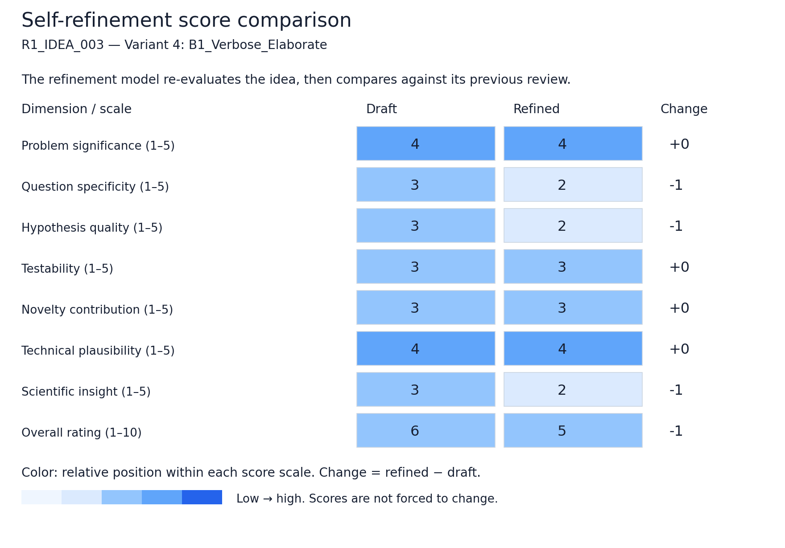

Changed score dimensions: question_specificity, hypothesis_quality, scientific_insight, overall_rating.

### Score justifications (draft / refined)

**Problem significance**

```json
{
  "draft": {
    "score": 4.0,
    "justification": "The problem is meaningful: integrating expert eye gaze into medical image analysis is an active area, and capturing temporal dynamics is a plausible limitation. Improving model interpretability in clinical settings is important."
  },
  "refined": {
    "score": 4.0,
    "justification": "The problem is meaningful: integrating expert gaze into medical image analysis is an active research area with clinical relevance. Capturing temporal dynamics is a plausible limitation of current methods, and improving model interpretability in healthcare is important."
  }
}
```

**Question specificity**

```json
{
  "draft": {
    "score": 3.0,
    "justification": "The idea specifies a method (video encoding) to address a limitation (lost temporal info). However, the core research question—what exactly will be tested or discovered—is not sharply defined beyond 'enhance capabilities'."
  },
  "refined": {
    "score": 2.0,
    "justification": "The idea specifies a method (video encoding) but does not define a precise research question. It states a goal ('enhance reasoning and interpretability') but not what specific relationship, phenomenon, or comparison will be investigated. The question remains broad: 'Does video encoding help?'"
  }
}
```

**Hypothesis quality**

```json
{
  "draft": {
    "score": 3.0,
    "justification": "An implicit hypothesis exists: temporal sequence contains valuable information, and video encoding will capture it better than static methods, leading to improvements. It is concrete in its comparison (video vs. static) but vague about the nature of the expected improvement."
  },
  "refined": {
    "score": 2.0,
    "justification": "An implicit hypothesis exists: temporal sequence contains valuable information not captured by static representations, and video encoding will better utilize it. However, this is vague—it lacks a concrete prediction about what kind of improvement (e.g., on which tasks, by how much, or through what mechanism) is expected. It is more of an intuition than a testable hypothesis."
  }
}
```

**Testability**

```json
{
  "draft": {
    "score": 3.0,
    "justification": "The idea is testable in principle by implementing video encoding and comparing to baselines. However, no specific experiment, evaluation task, or metric is proposed, making it somewhat vague."
  },
  "refined": {
    "score": 3.0,
    "justification": "The idea is testable in principle by implementing the video encoding and comparing it to baselines. However, without a specified experimental design, tasks, or metrics, it is unclear how one would rigorously evaluate whether temporal information 'enhances reasoning.' The testability is moderate but vague."
  }
}
```

**Novelty contribution**

```json
{
  "draft": {
    "score": 3.0,
    "justification": "Using video to represent temporal gaze is a novel technical approach in this context. However, the core idea of modeling temporal eye movements is not new in cognitive science or HCI. The contribution hinges on demonstrating its value for VLMs in medical imaging."
  },
  "refined": {
    "score": 3.0,
    "justification": "Using video to represent temporal gaze in VLMs for medical imaging is a novel technical approach. However, the core concept of modeling temporal eye movements is well-established in cognitive science and HCI. The contribution would depend on demonstrating its unique value for medical VLMs, which is not yet articulated beyond a general claim."
  }
}
```

**Technical plausibility**

```json
{
  "draft": {
    "score": 4.0,
    "justification": "The direction is logically coherent: video sequences can encode spatiotemporal patterns. Integrating them into VLMs (which often process video) is plausible, though non-trivial to design effectively."
  },
  "refined": {
    "score": 4.0,
    "justification": "The direction is logically coherent: video sequences can encode spatiotemporal patterns. Integrating them into VLMs (many of which support video input) is plausible, though non-trivial design choices (e.g., frame construction, fusion architecture) would be needed. The core idea is technically sound."
  }
}
```

**Scientific insight**

```json
{
  "draft": {
    "score": 3.0,
    "justification": "Potential insight is moderate. If successful, it could show that temporal gaze patterns matter for medical vision tasks. However, the idea as stated focuses more on an engineering improvement than on uncovering new principles about gaze or model reasoning."
  },
  "refined": {
    "score": 2.0,
    "justification": "Potential insight is limited as stated. The idea focuses on an engineering improvement (a new encoding method) rather than on uncovering new principles. It could yield insight if framed as a hypothesis about how temporal gaze patterns relate to diagnostic reasoning, but that is not articulated here."
  }
}
```

**Overall rating**

```json
{
  "draft": {
    "score": 6.0,
    "justification": "A moderate/borderline research idea. It identifies a reasonable limitation and proposes a specific technical direction. The core is sensible and could lead to a solid paper. However, it lacks a sharply defined research question, a clear hypothesis about the mechanism of improvement, and a concrete experimental plan. It leans more toward an application of video encoding to a new data modality rather than a hypothesis-driven investigation. With refinement, it could become strong."
  },
  "refined": {
    "score": 5.0,
    "justification": "A moderate/borderline research idea. It identifies a reasonable limitation and proposes a specific technical direction. However, it lacks a sharply defined research question, a concrete hypothesis, and any experimental framework. It reads more like a methodological suggestion than a hypothesis-driven investigation. With refinement—especially a clear hypothesis and experimental plan—it could become stronger."
  }
}
```

## R1_IDEA_003 — Variant 5: B2_Grand_Narrative


Changed score dimensions: none.

### Score justifications (draft / refined)

**Problem significance**

```json
{
  "draft": {
    "score": 4.0,
    "justification": "The problem is meaningful. Integrating richer human perceptual data into medical AI is an active and important challenge. The specific limitation identified—loss of temporal information in current gaze representations—is a concrete and plausible gap."
  },
  "refined": {
    "score": 4.0,
    "justification": "The problem is meaningful and timely. Integrating richer human perceptual data into medical AI is an active research challenge with clinical relevance. The specific gap identified—loss of temporal dynamics in gaze representation—is concrete and worth addressing."
  }
}
```

**Question specificity**

```json
{
  "draft": {
    "score": 2.0,
    "justification": "The idea is stated as a proposed 'direction' rather than a specific research question. It lacks a concrete 'what will we investigate?' component. It proposes an encoding method but does not define what will be tested about it."
  },
  "refined": {
    "score": 2.0,
    "justification": "The idea is stated as a general direction ('proposes encoding...') rather than a specific research question. It lacks a clear 'what will we investigate?' component. There is no concrete question about relationships, mechanisms, or outcomes."
  }
}
```

**Hypothesis quality**

```json
{
  "draft": {
    "score": 2.0,
    "justification": "There is an implicit hypothesis that 'temporal encoding is better than static encoding,' but it is not made concrete or falsifiable. No specific, testable prediction is articulated about the outcome of using this encoding."
  },
  "refined": {
    "score": 2.0,
    "justification": "There is an implicit assumption that temporal encoding is beneficial, but no concrete, testable prediction is made. A hypothesis should specify what outcome is expected under what conditions and why. The current formulation is too vague to be falsifiable."
  }
}
```

**Testability**

```json
{
  "draft": {
    "score": 3.0,
    "justification": "The core concept is testable in principle—one could build a model with the proposed encoding and compare it to baselines. However, without a specified hypothesis or evaluation metric, it's unclear exactly what test would confirm or refute the idea's value."
  },
  "refined": {
    "score": 3.0,
    "justification": "The concept is testable in principle—one could implement the encoding and compare to baselines. However, without a specified hypothesis, evaluation metric, or experimental design, it's unclear what exact test would validate or invalidate the idea's core claim."
  }
}
```

**Novelty contribution**

```json
{
  "draft": {
    "score": 3.0,
    "justification": "The proposal to treat gaze as a temporal sequence (video) is a novel technical suggestion in this context. However, the potential contribution is currently vague. If executed with a clear hypothesis, it could contribute a novel method and an empirical finding about the value of temporal gaze data."
  },
  "refined": {
    "score": 3.0,
    "justification": "Treating gaze sequences as video inputs is a novel technical suggestion in this context. However, the potential contribution remains vague. If executed with a clear hypothesis, it could offer a novel method and empirical insights about temporal gaze signals, but as stated, it's primarily an application idea."
  }
}
```

**Technical plausibility**

```json
{
  "draft": {
    "score": 4.0,
    "justification": "The core technical suggestion—encoding a time series of 2D coordinates as a video—is straightforward and plausible. Modern VLMs can process video inputs. The main assumption (that temporal order contains useful signal) is reasonable given known radiologist scanning patterns."
  },
  "refined": {
    "score": 4.0,
    "justification": "The core technical proposal is straightforward and plausible. Encoding time-series 2D coordinates as a video is feasible, and modern VLMs can process video inputs. The assumption that temporal order may contain useful signal is reasonable given known radiologist scanning patterns."
  }
}
```

**Scientific insight**

```json
{
  "draft": {
    "score": 4.0,
    "justification": "The idea has high potential for scientific insight. Successfully investigating it could reveal whether and how the temporal dynamics of expert visual search inform diagnostic reasoning, which is a fundamental question in cognitive science and medical AI. The insight would extend beyond a simple performance boost."
  },
  "refined": {
    "score": 4.0,
    "justification": "The idea has high potential for scientific insight. If rigorously investigated, it could reveal whether and how temporal dynamics of expert visual search contribute to diagnostic reasoning—a question relevant to cognitive science, human-AI collaboration, and medical AI interpretability. This extends beyond mere performance gains."
  }
}
```

**Overall rating**

```json
{
  "draft": {
    "score": 5.0,
    "justification": "This is a moderate/borderline research idea. It identifies a meaningful problem and proposes an interesting technical direction with high potential for scientific insight. However, it is currently more of a suggestion than a research plan. It lacks a specific, testable question or hypothesis, which severely limits its evaluability as a standalone research idea. With a concrete hypothesis and experimental design, it could become strong."
  },
  "refined": {
    "score": 5.0,
    "justification": "This is a moderate/borderline research idea. It identifies a meaningful problem and proposes an interesting technical direction with strong potential for scientific insight. However, it lacks a specific research question, testable hypothesis, and experimental design, making it more of a suggestion than a research plan. With greater specificity, it could become a strong idea."
  }
}
```

## R1_IDEA_003 — Variant 6: B3_Over_Confident


Changed score dimensions: question_specificity, overall_rating.

### Score justifications (draft / refined)

**Problem significance**

```json
{
  "draft": {
    "score": 4.0,
    "justification": "The problem is meaningful. Incorporating richer human attention signals into medical AI models is an active area with clear relevance for improving model trust and clinical utility. The specific limitation identified—loss of temporal sequence—is a plausible gap if current methods only use static aggregates."
  },
  "refined": {
    "score": 4.0,
    "justification": "The problem is meaningful. Incorporating richer human attention signals into medical AI models is an active research area with clear relevance for improving model transparency, trust, and clinical utility. The specific limitation identified—loss of temporal sequence in gaze data—is a plausible and focused gap, given that radiologist eye movements carry diagnostic search patterns."
  }
}
```

**Question specificity**

```json
{
  "draft": {
    "score": 3.0,
    "justification": "The idea specifies a technical approach (encode as video) to address a limitation (discarding temporal sequence). However, the core research question is implicit ('Does adding temporal gaze information help?') and could be more precisely defined regarding what aspect of model behavior it aims to improve."
  },
  "refined": {
    "score": 2.0,
    "justification": "The idea specifies a technical approach (encode as video) to address a limitation (discarding temporal sequence), but the core research question remains vague. It does not define what aspect of 'model reasoning and clinical interpretability' is being investigated, nor does it specify the expected relationship between temporal gaze and model behavior."
  }
}
```

**Hypothesis quality**

```json
{
  "draft": {
    "score": 2.0,
    "justification": "There is an implicit hypothesis that 'capturing temporal scanning order enhances model reasoning and clinical interpretability.' This is a broad, directional claim but lacks concrete, testable predictions. A stronger hypothesis would specify the mechanism (e.g., temporal order helps disambiguate similar-looking regions) or the expected improvement on a specific task/metric."
  },
  "refined": {
    "score": 2.0,
    "justification": "There is an implicit, broad hypothesis that 'capturing temporal scanning order enhances model reasoning and clinical interpretability.' This lacks concrete, testable predictions. A stronger hypothesis would specify a mechanism (e.g., temporal order helps resolve ambiguities in spatial attention) or predict improvements on a defined task or metric. As stated, it is more of an aspirational claim than a falsifiable hypothesis."
  }
}
```

**Testability**

```json
{
  "draft": {
    "score": 3.0,
    "justification": "The idea is testable in principle—one could build a system with video-encoded gaze and compare it to baseline systems. However, without a clearer hypothesis and evaluation plan, it risks being an engineering comparison ('A vs. B') rather than a focused investigation. The proposed direction suggests experiments, but the specifics are missing."
  },
  "refined": {
    "score": 3.0,
    "justification": "The idea is testable in principle—one could implement video-encoded gaze and compare it to static baselines. However, without a clearer hypothesis, evaluation metrics, or experimental design, it risks being an engineering comparison rather than a focused investigation. The testability is moderate because the direction suggests experiments, but the specifics are insufficient to guide a rigorous test."
  }
}
```

**Novelty contribution**

```json
{
  "draft": {
    "score": 3.0,
    "justification": "Using temporal gaze data is a plausible incremental contribution. The novelty hinges on whether encoding it as 'video sequences' for VLMs in chest X-ray analysis is unexplored. The idea seems more of a technical adaptation (a different input representation) rather than a fundamentally new concept. The potential contribution is moderate: it could demonstrate the value of temporal gaze, which is not universally established."
  },
  "refined": {
    "score": 3.0,
    "justification": "Using temporal gaze data is a plausible incremental contribution. The novelty hinges on whether encoding it as 'video sequences' for VLMs in chest X-ray analysis is unexplored. The idea appears more as a technical adaptation (a different input representation) rather than a fundamentally new concept. The potential contribution is moderate: it could demonstrate the value of temporal gaze in a specific domain, but it does not claim a new method or insight beyond that."
  }
}
```

**Technical plausibility**

```json
{
  "draft": {
    "score": 4.0,
    "justification": "The core reasoning is logically coherent: video sequences naturally preserve temporal order. Integrating a time-series signal into a VLM is technically plausible, though non-trivial. The idea doesn't contain obvious technical contradictions, but the lack of implementation details means feasibility is assumed, not argued."
  },
  "refined": {
    "score": 4.0,
    "justification": "The core reasoning is logically coherent: video sequences preserve temporal order, and integrating time-series signals into VLMs is technically plausible, though non-trivial. The idea does not contain obvious technical contradictions. However, the lack of implementation details means feasibility is assumed rather than argued, which slightly limits the score."
  }
}
```

**Scientific insight**

```json
{
  "draft": {
    "score": 3.0,
    "justification": "If successful, the research could provide insight into whether and how the temporal dynamics of expert visual search are informative for AI models. This touches on the broader question of what aspects of human reasoning are valuable to distill. However, as presented, the insight is somewhat limited to a specific input representation; a deeper study could reveal principles about sequential reasoning in visual diagnosis."
  },
  "refined": {
    "score": 3.0,
    "justification": "If successful, the research could provide insight into whether the temporal dynamics of expert visual search are informative for AI models. This touches on the broader question of what aspects of human reasoning are valuable to distill. However, as presented, the insight is somewhat limited to a specific input representation; a deeper study could reveal principles about sequential reasoning in visual diagnosis, but the idea does not explicitly aim for such general insights."
  }
}
```

**Overall rating**

```json
{
  "draft": {
    "score": 6.0,
    "justification": "This is a moderate/borderline research idea. It identifies a plausible limitation in current methods and proposes a concrete technical direction. The problem is meaningful in the medical AI context. However, the idea lacks a sharp, testable hypothesis and a clear definition of the expected scientific contribution beyond a potential performance improvement. It reads more like a proposed method adaptation than a focused research question. With refinement—especially a specific hypothesis and experimental plan—it could become a strong idea."
  },
  "refined": {
    "score": 5.0,
    "justification": "This is a moderate/borderline research idea. It identifies a plausible limitation in current methods and proposes a concrete technical direction in a meaningful domain. However, it lacks a sharp, testable hypothesis and a clear definition of the expected scientific contribution beyond a potential performance improvement. The research question is implicit and vague, and the novelty is incremental. With refinement—especially a specific hypothesis, experimental plan, and clearer evaluation—it could become a stronger idea."
  }
}
```

## R1_IDEA_003 — Variant 7: B4_Novelty

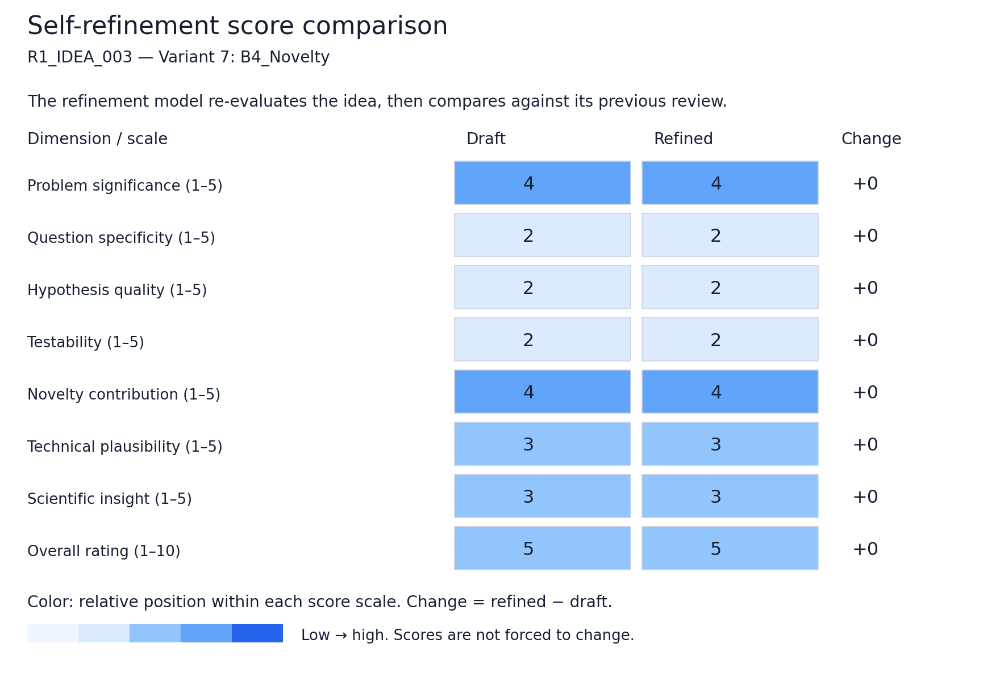

Changed score dimensions: none.

### Score justifications (draft / refined)

**Problem significance**

```json
{
  "draft": {
    "score": 4.0,
    "justification": "The problem is meaningful: incorporating expert eye gaze into medical image analysis is an active area with potential to improve model performance and interpretability. The specific limitation—ignoring temporal sequence—is well-identified and could be important, as visual search patterns likely contain diagnostic reasoning cues."
  },
  "refined": {
    "score": 4.0,
    "justification": "The problem is meaningful and relevant. Incorporating expert eye gaze into medical image analysis is an active research area with potential to improve both model performance and interpretability. The specific limitation identified—ignoring temporal sequence—is well-articulated and could be important, as visual search patterns likely contain diagnostic reasoning cues that static representations miss."
  }
}
```

**Question specificity**

```json
{
  "draft": {
    "score": 2.0,
    "justification": "The idea identifies a general direction (use video encoding for gaze) but does not define a concrete research question. It states an aim ('enhance model reasoning and clinical interpretability') but not what specific relationship or effect will be investigated."
  },
  "refined": {
    "score": 2.0,
    "justification": "The idea identifies a general direction (use video encoding for gaze) but does not define a concrete research question. It states broad aims ('enhance model reasoning and clinical interpretability') but does not specify what specific relationship, effect, or comparison will be investigated. The research objective remains at the level of a proposed method rather than a focused inquiry."
  }
}
```

**Hypothesis quality**

```json
{
  "draft": {
    "score": 2.0,
    "justification": "There is an implicit hypothesis that 'temporal sequence of fixations contains valuable information beyond static heatmaps,' but it is not made concrete or testable in its current form. No specific prediction about outcomes (e.g., performance gain, interpretability improvement) is stated."
  },
  "refined": {
    "score": 2.0,
    "justification": "There is an implicit assumption that 'temporal sequence of fixations contains valuable information beyond static heatmaps,' but this is not formulated as a concrete, testable hypothesis. No specific prediction about outcomes (e.g., performance improvement on specific tasks, better alignment with expert decisions) is stated. The idea lacks a falsifiable claim that could be supported or contradicted by evidence."
  }
}
```

**Testability**

```json
{
  "draft": {
    "score": 2.0,
    "justification": "The idea suggests a new input representation but does not propose how to test whether it helps. Without a defined task, metric, or comparison, it is unclear how one would gather evidence for or against the value of the approach."
  },
  "refined": {
    "score": 2.0,
    "justification": "The idea suggests a new input representation but does not propose how to test whether it provides value. Without defined tasks, metrics, baselines, or comparison points, it is unclear how one would gather evidence for or against the utility of the approach. The proposal lacks any experimental framework or evaluation methodology."
  }
}
```

**Novelty contribution**

```json
{
  "draft": {
    "score": 4.0,
    "justification": "The core proposal—encoding eye-tracking data as video for VLMs—appears novel in the context of medical image analysis. It moves beyond common static or textual gaze representations and could open a new technical direction. However, the contribution is currently more about a novel framing than a demonstrated insight."
  },
  "refined": {
    "score": 4.0,
    "justification": "The core proposal—encoding eye-tracking data as video sequences for integration with vision-language models—appears novel in the context of medical image analysis. It moves beyond common static heatmap or textual gaze representations and introduces a different technical framing that could capture richer spatiotemporal patterns. However, the contribution is currently conceptual rather than demonstrated."
  }
}
```

**Technical plausibility**

```json
{
  "draft": {
    "score": 3.0,
    "justification": "The idea is logically coherent: video can encode spatiotemporal patterns. However, important technical details are missing (e.g., how to construct videos from sparse fixations, how to avoid overfitting to individual gaze patterns). The approach seems plausible but non-trivial to implement effectively."
  },
  "refined": {
    "score": 3.0,
    "justification": "The idea is logically coherent: video can encode spatiotemporal patterns, and modern video encoders could process such sequences. However, important technical details are completely missing (e.g., how to construct meaningful videos from sparse fixation data, how to align gaze videos with medical images, how to avoid overfitting to individual gaze patterns). The approach seems plausible in principle but presents non-trivial implementation challenges."
  }
}
```

**Scientific insight**

```json
{
  "draft": {
    "score": 3.0,
    "justification": "If successful, the research could reveal whether and how temporal gaze patterns correlate with diagnostic reasoning, which would be a valuable scientific insight. However, the idea currently emphasizes a technical framing rather than a clear path to such insight."
  },
  "refined": {
    "score": 3.0,
    "justification": "If successfully investigated, this research could reveal whether and how temporal gaze patterns correlate with diagnostic reasoning, which would be a valuable scientific insight about expert visual search behavior. However, the idea currently emphasizes a technical framing rather than a clear path to extracting such insights. The potential for transferable understanding about the relationship between gaze dynamics and clinical decision-making exists but is not explicitly articulated as a primary goal."
  }
}
```

**Overall rating**

```json
{
  "draft": {
    "score": 5.0,
    "justification": "This is a moderate/borderline research idea. It identifies a plausible limitation and proposes a novel technical direction with potential clinical relevance. However, it lacks a specific research question, testable hypothesis, and evaluation plan. As presented, it is more of a promising intuition than a well-defined research idea. With greater specificity and a concrete hypothesis, it could become strong."
  },
  "refined": {
    "score": 5.0,
    "justification": "This is a moderate/borderline research idea. It identifies a plausible limitation in current methods and proposes a novel technical direction with potential clinical relevance. However, it lacks a specific research question, testable hypothesis, and evaluation plan. As presented, it is more of a promising intuition or methodological suggestion than a well-defined research idea. With greater specificity and a concrete hypothesis about expected outcomes, it could become strong."
  }
}
```

## R1_IDEA_003 — Variant 8: B5_Application_Impact


Changed score dimensions: none.

### Score justifications (draft / refined)

**Problem significance**

```json
{
  "draft": {
    "score": 4.0,
    "justification": "The problem is meaningful: improving interpretability of AI in medical imaging is important for clinical adoption. Eye-tracking data is a rich source of expert reasoning, and current methods may lose valuable temporal information. The application to chest X-ray analysis is relevant and has practical implications."
  },
  "refined": {
    "score": 4.0,
    "justification": "The problem is meaningful: improving interpretability of AI in medical imaging is crucial for clinical trust and adoption. Eye-tracking captures expert reasoning patterns, and current methods that discard temporal information may lose valuable diagnostic cues. The application to chest X-ray analysis addresses an important real-world domain."
  }
}
```

**Question specificity**

```json
{
  "draft": {
    "score": 2.0,
    "justification": "The idea is more of a proposal than a specific research question. It suggests a direction ('encoding as video sequences') but does not define what will be investigated. There is no clear comparison, controlled variable, or phenomenon to study."
  },
  "refined": {
    "score": 2.0,
    "justification": "The idea describes a technical approach rather than posing a research question. It lacks specificity about what is being investigated - there's no comparison, controlled variable, or phenomenon to study. It's more 'we propose to do X' than 'we will test whether X leads to Y through mechanism Z.'"
  }
}
```

**Hypothesis quality**

```json
{
  "draft": {
    "score": 2.0,
    "justification": "No explicit hypothesis is presented. The language is speculative ('could inform', 'may be relevant'). An implicit hypothesis might be that temporal information improves something, but it is not stated as a testable prediction about mechanisms or outcomes."
  },
  "refined": {
    "score": 2.0,
    "justification": "No explicit or clearly implicit hypothesis is presented. The language is entirely speculative ('could inform', 'may be relevant'). While one might infer an implicit hypothesis that 'temporal information improves something,' this is not stated as a testable prediction about specific outcomes, mechanisms, or relationships."
  }
}
```

**Testability**

```json
{
  "draft": {
    "score": 3.0,
    "justification": "The idea is testable in principle—one could implement video encoding and compare to baselines—but the summary does not propose a specific test or evaluation. Without a clear hypothesis, it's unclear what evidence would support or contradict the claim."
  },
  "refined": {
    "score": 3.0,
    "justification": "The idea is testable in principle - one could implement video encoding and compare to baselines. However, without a clear hypothesis or research question, it's unclear what specific evidence would support or refute the proposal. The summary doesn't suggest what experiments or evaluations would be conducted."
  }
}
```

**Novelty contribution**

```json
{
  "draft": {
    "score": 3.0,
    "justification": "Using eye-tracking in medical AI is not new; representing gaze as video sequences is a specific technical idea with some novelty. However, the contribution is unclear: is it a new representation, an empirical finding about temporal patterns, or a demonstration of interpretability gains? Without a sharper focus, the potential contribution is moderate."
  },
  "refined": {
    "score": 3.0,
    "justification": "Using eye-tracking in medical AI is established; representing gaze as video sequences is a specific technical idea with moderate novelty. However, the potential contribution is unclear: is it primarily a new representation method, an empirical finding about temporal patterns in radiology, or a demonstration of interpretability benefits? Without sharper focus, the contribution potential is limited."
  }
}
```

**Technical plausibility**

```json
{
  "draft": {
    "score": 4.0,
    "justification": "The core idea is technically plausible. Video sequences can encode spatiotemporal information, and vision-language models can process video inputs. However, key implementation details (how to encode, integrate, train) are missing, but the general direction seems coherent."
  },
  "refined": {
    "score": 4.0,
    "justification": "The core idea is technically plausible. Video sequences can encode spatiotemporal information, and modern vision-language models can process video inputs. Converting fixation sequences to video frames is straightforward. However, important implementation questions remain about integration strategies and training approaches."
  }
}
```

**Scientific insight**

```json
{
  "draft": {
    "score": 3.0,
    "justification": "If successful, the research could provide insight into how temporal attention patterns relate to diagnostic reasoning, which is a valuable scientific question. However, the summary does not emphasize understanding mechanisms or principles; it focuses more on a potential application benefit ('enhancing model reasoning'). The insight potential depends on how the study is framed."
  },
  "refined": {
    "score": 3.0,
    "justification": "If properly investigated, this could provide insight into how temporal attention patterns relate to diagnostic reasoning - a valuable scientific question about expert cognition and model design. However, the summary emphasizes application benefits ('enhancing model reasoning') rather than understanding mechanisms or principles. The insight potential depends heavily on how the study is framed."
  }
}
```

**Overall rating**

```json
{
  "draft": {
    "score": 5.0,
    "justification": "This is a moderate/borderline research idea. It identifies a meaningful problem and proposes a specific technical direction, but lacks a clear research question, hypothesis, and testable claim. The potential contribution is uncertain without more specificity. It is a reasonable starting point but needs significant refinement to become a strong research idea."
  },
  "refined": {
    "score": 5.0,
    "justification": "This is a moderate/borderline research idea. It identifies a meaningful problem in an important domain and proposes a specific technical direction. However, it lacks a clear research question, testable hypothesis, and defined contribution. It's a reasonable starting point that needs significant refinement to become a strong research idea. The proposal is more engineering-oriented than hypothesis-driven science."
  }
}
```

## R1_IDEA_003 — Variant 9: C1_Hollow_Shell

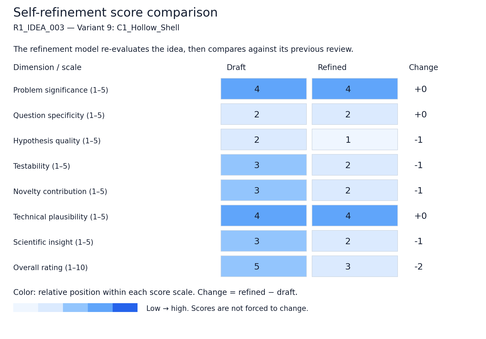

Changed score dimensions: hypothesis_quality, testability, novelty_contribution, scientific_insight, overall_rating.

### Score justifications (draft / refined)

**Problem significance**

```json
{
  "draft": {
    "score": 4.0,
    "justification": "The problem is meaningful: incorporating expert visual attention into medical AI models is an active research area with clinical relevance. Chest X-ray analysis is an important application domain where interpretability directly impacts clinical adoption."
  },
  "refined": {
    "score": 4.0,
    "justification": "The problem is significant. Improving AI interpretability and performance in medical imaging, specifically chest X-ray analysis, is a high-stakes challenge with direct clinical relevance. Incorporating expert visual attention is a recognized and meaningful research direction."
  }
}
```

**Question specificity**

```json
{
  "draft": {
    "score": 2.0,
    "justification": "The research question is somewhat vague. While it identifies a limitation (loss of sequential information), it doesn't specify what exactly should be investigated about preserving order/layout, or what relationship between preservation and outcomes is expected."
  },
  "refined": {
    "score": 2.0,
    "justification": "The idea describes a proposed method but does not define a specific research question. It states a general direction ('process attention data to preserve order/layout') rather than posing a concrete question about a relationship, mechanism, or comparison. This limits its specificity."
  }
}
```

**Hypothesis quality**

```json
{
  "draft": {
    "score": 2.0,
    "justification": "There's an implicit hypothesis that 'preserving order and layout of attention data will improve performance and interpretability,' but it's not well-articulated. No concrete prediction about mechanisms or expected improvements is made."
  },
  "refined": {
    "score": 1.0,
    "justification": "There is no explicit or clearly implicit hypothesis. The idea presents an assumption (preserving information is good) and a goal (improve performance/interpretability), but no testable prediction about *how* or *why* this would happen, or under what conditions it would hold. It lacks the core elements of a scientific hypothesis."
  }
}
```

**Testability**

```json
{
  "draft": {
    "score": 3.0,
    "justification": "The idea is testable in principle (compare methods with/without sequential preservation), but lacks specific experimental design. Performance and interpretability can be measured, but without defined metrics or comparisons, testability is moderate."
  },
  "refined": {
    "score": 2.0,
    "justification": "The idea is testable in the broadest sense (one could build such a system), but it provides no framework for investigation. There is no suggested experiment, comparison, ablation, or evaluation metric. The claim 'improve performance and interpretability' is too vague to guide a specific test without significant additional design."
  }
}
```

**Novelty contribution**

```json
{
  "draft": {
    "score": 3.0,
    "justification": "The core idea of preserving sequential information in attention incorporation has some novelty relative to simplified representations. However, without more specificity, it's unclear if this represents a substantial advance over existing attention mechanisms in medical imaging."
  },
  "refined": {
    "score": 2.0,
    "justification": "The novelty is limited and unclear. The high-level notion of using more complete attention data (including sequence/layout) is not inherently novel. The potential contribution hinges entirely on the unspecified details of *what* is preserved and *how*, which are not provided. As stated, it resembles a generic application sketch."
  }
}
```

**Technical plausibility**

```json
{
  "draft": {
    "score": 4.0,
    "justification": "The direction is technically plausible. Preserving sequential/spatial information in attention data is coherent, and methods for processing sequences or spatial patterns exist. The reasoning that more complete attention representation could help is logical."
  },
  "refined": {
    "score": 4.0,
    "justification": "The direction is technically plausible. The reasoning that richer attention representations (including sequential or spatial structure) could be beneficial is coherent and aligns with known concepts in vision and sequence modeling. No technical contradictions are apparent in the brief description."
  }
}
```

**Scientific insight**

```json
{
  "draft": {
    "score": 3.0,
    "justification": "If successful, this could provide insight into what aspects of expert visual attention are most important for AI models. However, the idea as stated focuses more on application (improving performance) than on understanding mechanisms of attention incorporation."
  },
  "refined": {
    "score": 2.0,
    "justification": "The idea as stated focuses on an applied engineering goal (build a better system). It does not articulate a path to generating new scientific insight, such as understanding *which aspects* of expert attention are critical for AI, revealing limitations of current paradigms, or discovering general principles for human-AI knowledge transfer. The potential for insight is low without a more hypothesis-driven formulation."
  }
}
```

**Overall rating**

```json
{
  "draft": {
    "score": 5.0,
    "justification": "This is a moderate/borderline research idea. It identifies a reasonable limitation in current approaches and proposes a plausible direction. However, it lacks specificity in research question, hypothesis, and experimental design. The potential contribution is unclear without more concrete formulation of what exactly should be preserved and why it matters. With refinement, it could become a stronger idea."
  },
  "refined": {
    "score": 3.0,
    "justification": "This is a weak research idea. While it identifies a meaningful problem domain and a plausible technical direction, it lacks the core components of a research investigation: a specific question, a testable hypothesis, and a framework for evaluation. It reads more as a project goal or motivation than a research idea. Significant refinement is needed to transform it into a testable scientific inquiry with clear potential for contribution."
  }
}
```

## R1_IDEA_003 — Variant 10: C2_Logic_Flawed

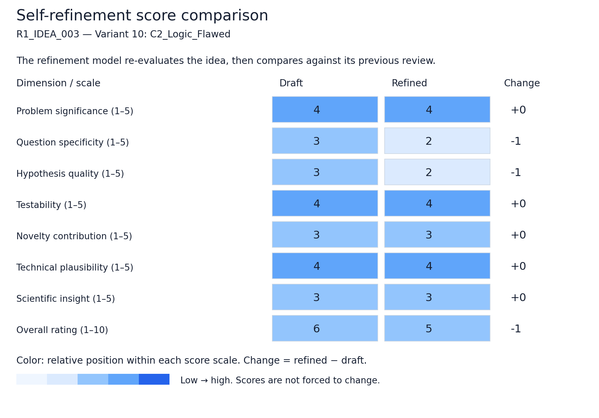

Changed score dimensions: question_specificity, hypothesis_quality, overall_rating.

### Score justifications (draft / refined)

**Problem significance**

```json
{
  "draft": {
    "score": 4.0,
    "justification": "The problem is meaningful: improving integration of human expertise into medical AI systems, specifically preserving richer behavioral signals. This has clear relevance for clinical interpretability and human-AI collaboration. However, the significance is somewhat domain-specific (medical imaging) rather than fundamental ML."
  },
  "refined": {
    "score": 4.0,
    "justification": "The problem is meaningful and relevant: improving integration of human expertise into medical AI systems by preserving richer behavioral signals. This has clear practical importance for clinical interpretability and human-AI collaboration in healthcare. However, the significance is primarily applied/domain-specific rather than addressing a fundamental machine learning challenge."
  }
}
```

**Question specificity**

```json
{
  "draft": {
    "score": 3.0,
    "justification": "The idea identifies a specific technical gap (temporal information loss) and proposes a solution (video encoding). However, the research question is somewhat broad: 'does this enhance model reasoning and interpretability?' It lacks a more focused question about what aspect of reasoning or interpretability is targeted."
  },
  "refined": {
    "score": 2.0,
    "justification": "The idea identifies a technical gap (temporal information loss) and proposes a solution (video encoding), but the research question itself is vague: 'enhancing model reasoning and clinical interpretability' is broad and undefined. There is no specific question about what aspect of reasoning, what type of interpretability, or what relationship between temporal gaze and model behavior is being investigated."
  }
}
```

**Hypothesis quality**

```json
{
  "draft": {
    "score": 3.0,
    "justification": "There is an implicit hypothesis: that temporal sequence of fixations contains valuable information for vision-language models, and encoding it as video will lead to better performance/interpretability. This is a concrete and testable prediction, but it is not explicitly stated or refined (e.g., which tasks, what magnitude of improvement)."
  },
  "refined": {
    "score": 2.0,
    "justification": "There is only an implicit, underdeveloped hypothesis: that temporal sequence contains valuable information and encoding it as video will lead to improvements. This lacks concrete predictions about what specific improvements (performance metrics, interpretability measures), magnitude of effect, or mechanisms. It doesn't distinguish the investigation from a generic application of a different encoding."
  }
}
```

**Testability**

```json
{
  "draft": {
    "score": 4.0,
    "justification": "The idea is highly testable. One can implement the video encoding, compare it to baselines (static heatmaps, text descriptions, no gaze) on relevant datasets, and measure performance metrics (accuracy, AUC, etc.) and interpretability metrics (attention alignment with experts). The claim about broader effectiveness can be tested via cross-task experiments."
  },
  "refined": {
    "score": 4.0,
    "justification": "The core claim is testable through comparative experiments: implement video encoding, compare to baselines (static heatmaps, no gaze) on relevant datasets, and measure differences in performance metrics (accuracy, AUC, etc.) and potentially interpretability metrics. The broader effectiveness claim could be tested via cross-task experiments. However, without defined success criteria, testability is somewhat diminished."
  }
}
```

**Novelty contribution**

```json
{
  "draft": {
    "score": 3.0,
    "justification": "The application of temporal eye-tracking data in medical vision-language models is novel. However, using sequential/temporal human behavior data to guide models is a known concept in HCI and robotics. The primary contribution appears to be a novel encoding method for a specific domain, rather than a fundamental new insight."
  },
  "refined": {
    "score": 3.0,
    "justification": "The application of temporal eye-tracking data in medical vision-language models appears novel. However, using sequential/temporal human behavior data to guide models is an established concept in HCI, robotics, and some ML domains. The primary contribution seems to be a novel encoding method for a specific application area rather than a fundamental new insight about learning or representation."
  }
}
```

**Technical plausibility**

```json
{
  "draft": {
    "score": 4.0,
    "justification": "The proposal is technically plausible. Vision-language models can process video inputs; encoding gaze points as a temporal sequence of 2D coordinates or heatmaps into a video is straightforward. The assumption that models can learn from this signal is reasonable given prior work on attention guidance."
  },
  "refined": {
    "score": 4.0,
    "justification": "The proposal is technically plausible. Modern vision-language models can process video inputs; encoding gaze points as a temporal sequence of 2D coordinates or heatmaps into a video format is straightforward. The assumption that models might learn from this additional signal is reasonable given prior work on attention guidance and multimodal learning."
  }
}
```

**Scientific insight**

```json
{
  "draft": {
    "score": 3.0,
    "justification": "If successful, the research could provide insight into how temporal human attention patterns correlate with diagnostic reasoning, and whether models can leverage such patterns. However, the idea as stated leans more toward engineering (a better encoding method) than fundamental science. The potential for broader insight about integrating temporal human behavior into AI is present but not deeply explored."
  },
  "refined": {
    "score": 3.0,
    "justification": "If successfully investigated, the research could provide insight into whether temporal human attention patterns correlate with diagnostic reasoning in ways that improve model performance or interpretability. However, the idea as stated leans toward engineering (a better encoding method) rather than fundamental science. The potential for broader insight about integrating temporal human behavior into AI is present but not deeply explored or articulated."
  }
}
```

**Overall rating**

```json
{
  "draft": {
    "score": 6.0,
    "justification": "This is a moderate/borderline research idea. It addresses a meaningful problem in medical AI with a specific technical proposal. The main limitations are the somewhat implicit hypothesis and broad research question. With refinement (more specific hypothesis, evaluation plan, and mechanistic insight), it could become a strong idea. As is, it represents a reasonable applied research direction with clear testability but limited novelty and scientific depth."
  },
  "refined": {
    "score": 5.0,
    "justification": "This is a moderate/borderline research idea. It addresses a meaningful applied problem with a specific technical proposal that is testable and plausible. However, it suffers from a vague research question, an implicit and underdeveloped hypothesis, and limited specificity about what constitutes success. With refinement—particularly a more specific hypothesis, defined evaluation metrics, and clearer scientific goals—it could become a stronger idea. As presented, it represents a reasonable applied research direction with clear technical merit but limited scientific depth and specificity."
  }
}
```

## R1_IDEA_003 — Variant 11: C3_Substance_Enriched

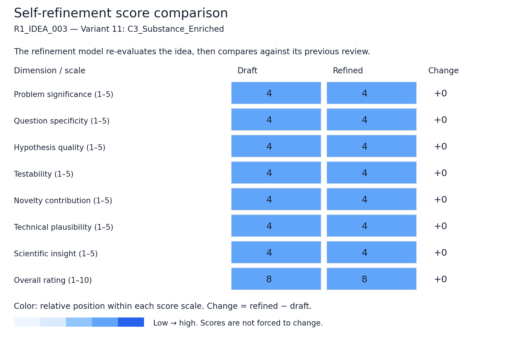

Changed score dimensions: none.

### Score justifications (draft / refined)

**Problem significance**

```json
{
  "draft": {
    "score": 4.0,
    "justification": "The problem is meaningful: current methods discard potentially valuable temporal information in radiologist gaze, which may encode expert reasoning patterns. In medical imaging, interpretability and alignment with human reasoning are important for clinical trust and model debugging."
  },
  "refined": {
    "score": 4.0,
    "justification": "The problem is meaningful and timely. In medical AI, interpretability and alignment with human reasoning are critical for clinical adoption. Current methods discard potentially valuable temporal information in expert gaze, which may encode diagnostic reasoning patterns. Capturing this could enhance model transparency and trustworthiness in a high-stakes domain."
  }
}
```

**Question specificity**

```json
{
  "draft": {
    "score": 4.0,
    "justification": "The research question is relatively specific: whether encoding eye-tracking data as video sequences (capturing temporal order) can improve model reasoning and explanation alignment in chest X-ray analysis. It goes beyond a generic application by focusing on the temporal aspect of gaze."
  },
  "refined": {
    "score": 4.0,
    "justification": "The research question is relatively specific: whether encoding eye-tracking data as video sequences (to capture temporal order) can improve model reasoning and explanation alignment in chest X-ray analysis. It goes beyond generic application by focusing on the temporal dimension of gaze and its relationship to scanning heuristics."
  }
}
```

**Hypothesis quality**

```json
{
  "draft": {
    "score": 4.0,
    "justification": "The hypothesis is explicit and concrete: temporal encoding could allow the model to learn scanning heuristics (e.g., systematic searches, recurrent checks) and improve explanation alignment with human visual reasoning sequences. It makes a testable prediction about model behavior."
  },
  "refined": {
    "score": 4.0,
    "justification": "The hypothesis is explicit and concrete: temporal encoding could allow models to learn scanning heuristics (systematic searches, recurrent checks) and generate explanations that better align with human visual reasoning sequences. It makes a testable prediction about model behavior and connects technical implementation to cognitive phenomena."
  }
}
```

**Testability**

```json
{
  "draft": {
    "score": 4.0,
    "justification": "The idea suggests validation through testing if models with video-encoded gaze generate explanations that better align with human reasoning sequences. This is testable via appropriate metrics and comparisons. However, the exact experimental setup is not detailed."
  },
  "refined": {
    "score": 4.0,
    "justification": "The idea suggests validation through testing if models with video-encoded gaze generate explanations that better align with human reasoning sequences. This is testable via appropriate metrics (sequence similarity, human evaluation) and comparisons to baselines. However, the exact experimental design needs further specification."
  }
}
```

**Novelty contribution**

```json
{
  "draft": {
    "score": 4.0,
    "justification": "The approach of encoding eye-tracking data as video sequences for vision-language models appears novel in the context of medical image analysis. The focus on temporal scanning order, rather than just spatial attention, could contribute new insights into how expert gaze patterns can inform model training."
  },
  "refined": {
    "score": 4.0,
    "justification": "The approach of encoding eye-tracking data as video sequences for vision-language models appears novel in medical image analysis. While gaze has been used in medical AI, the focus on temporal scanning order (rather than just spatial attention) could contribute new insights into how expert visual search patterns can inform model training and interpretability."
  }
}
```

**Technical plausibility**

```json
{
  "draft": {
    "score": 4.0,
    "justification": "The idea is technically plausible: video sequences are a natural way to represent spatiotemporal data, and vision-language models can process video inputs. The hypothesis that temporal gaze patterns contain useful information is reasonable given known radiologist search strategies."
  },
  "refined": {
    "score": 4.0,
    "justification": "The idea is technically plausible. Video sequences are a natural representation for spatiotemporal data, and modern vision-language models can process video inputs. The hypothesis that temporal gaze patterns contain useful information about expert reasoning is reasonable given known radiologist search strategies in medical literature."
  }
}
```

**Scientific insight**

```json
{
  "draft": {
    "score": 4.0,
    "justification": "If successful, this research could provide insight into how temporal attention patterns in expert gaze relate to reasoning processes, and whether models can learn and mimic these patterns to improve interpretability. It touches on cognitive science (visual search heuristics) and ML interpretability."
  },
  "refined": {
    "score": 4.0,
    "justification": "If successful, this research could provide insight into how temporal attention patterns in expert gaze relate to diagnostic reasoning processes, and whether models can learn and mimic these patterns to improve interpretability. It bridges cognitive science (visual search heuristics) and machine learning interpretability, potentially revealing general principles about integrating human behavioral signals into AI systems."
  }
}
```

**Overall rating**

```json
{
  "draft": {
    "score": 8.0,
    "justification": "This is a strong research idea. It addresses a meaningful limitation in current gaze integration methods, proposes a specific technical direction with a plausible hypothesis, and suggests a validation approach that directly tests the hypothesis. The potential for scientific insight into expert reasoning and model interpretability is high. The main weaknesses are lack of implementation details and experimental specifics, but as a research idea (not a full paper), it is well-articulated and promising."
  },
  "refined": {
    "score": 8.0,
    "justification": "This is a strong research idea. It addresses a meaningful limitation in current gaze integration methods, proposes a specific technical direction with a plausible hypothesis, and suggests validation that directly tests the hypothesis. The potential for scientific insight into expert reasoning and model interpretability is substantial. While implementation details and experimental specifics need development, as a research idea it is well-articulated and promising."
  }
}
```

## R1_IDEA_003 — Variant 12: H1_Deceptive_Hollow


Changed score dimensions: none.

### Score justifications (draft / refined)

**Problem significance**

```json
{
  "draft": {
    "score": 4.0,
    "justification": "Incorporating expert visual attention into medical AI is an active and meaningful research area with clear clinical implications. The identified limitation—loss of sequential information—is plausible and worth investigating."
  },
  "refined": {
    "score": 4.0,
    "justification": "The problem is meaningful - incorporating expert visual attention into medical AI models is an active research area with clear clinical importance. The identified limitation (loss of sequential information) addresses a plausible gap in current methods."
  }
}
```

**Question specificity**

```json
{
  "draft": {
    "score": 2.0,
    "justification": "The idea states a general goal ('improve performance and interpretability') but does not define a concrete research question. It lacks specificity about what relationship or mechanism is being studied."
  },
  "refined": {
    "score": 2.0,
    "justification": "The idea states general goals ('improve performance and interpretability') but does not define a concrete research question. It lacks specificity about what relationship, mechanism, or phenomenon is being investigated."
  }
}
```

**Hypothesis quality**

```json
{
  "draft": {
    "score": 2.0,
    "justification": "There is an implicit hypothesis that preserving order/layout of attention data will help, but it is not articulated as a testable prediction. No mechanism or causal relationship is proposed."
  },
  "refined": {
    "score": 2.0,
    "justification": "There is only an implicit assumption that preserving order/layout will help, but no articulated hypothesis that makes testable predictions. No causal mechanism or specific relationship is proposed that could be supported or contradicted by evidence."
  }
}
```

**Testability**

```json
{
  "draft": {
    "score": 2.0,
    "justification": "Without a clear hypothesis or proposed evaluation, it's unclear how one would test whether the approach succeeds. The idea mentions goals but not how to measure progress toward them."
  },
  "refined": {
    "score": 2.0,
    "justification": "Without a clear hypothesis, proposed experiments, or evaluation criteria, it's unclear how the central claim could be tested. The idea mentions goals but provides no pathway to obtaining evidence about whether they are achieved."
  }
}
```

**Novelty contribution**

```json
{
  "draft": {
    "score": 3.0,
    "justification": "Preserving sequential attention information seems like a logical extension of existing work, but the idea frames it as potentially transformative without justifying why it would be more than an incremental improvement. The contribution is vaguely described as a 'synthesis'."
  },
  "refined": {
    "score": 3.0,
    "justification": "Preserving sequential attention information seems like a logical extension of existing work rather than a fundamentally novel contribution. The transformative claims are not justified by the described content. The contribution is vaguely described as a 'synthesis' without specifying what is being synthesized or why it's novel."
  }
}
```

**Technical plausibility**

```json
{
  "draft": {
    "score": 3.0,
    "justification": "The core notion—that sequential/layout information could be useful—is plausible, but without technical details, it's hard to assess feasibility. The idea doesn't contain obvious technical contradictions."
  },
  "refined": {
    "score": 3.0,
    "justification": "The core intuition that sequential/layout information could be useful is plausible, but without technical details, feasibility is uncertain. No obvious technical contradictions are present, but the lack of implementation details makes assessment difficult."
  }
}
```

**Scientific insight**

```json
{
  "draft": {
    "score": 3.0,
    "justification": "If successful, this could provide insight into how sequential expert behavior informs diagnosis, which is valuable. However, the idea is currently too vague to guarantee that the investigation would yield generalizable principles rather than just a better model for one task."
  },
  "refined": {
    "score": 3.0,
    "justification": "If properly investigated, this could yield insights into how sequential expert behavior informs diagnosis, which would be valuable. However, as currently described, it's unclear whether the research would produce generalizable principles about attention modeling or just a better-performing model for one specific task."
  }
}
```

**Overall rating**

```json
{
  "draft": {
    "score": 4.0,
    "justification": "The idea identifies a reasonable problem in a significant domain but lacks a specific research question, testable hypothesis, and methodological direction. It is currently more of a motivational statement than a research plan. The high-level framing ('transformative synthesis') is not supported by concrete scientific content. It falls in the weak-to-moderate range because the core intuition is plausible, but the idea needs substantial refinement to become a strong research direction."
  },
  "refined": {
    "score": 4.0,
    "justification": "The idea identifies a reasonable problem in an important domain but lacks a specific research question, testable hypothesis, and methodological direction. It is currently more of a motivational statement than a research plan. The high-level framing ('transformative synthesis') is not supported by concrete scientific content. While the core intuition is plausible, the idea needs substantial refinement to become a strong research direction."
  }
}
```

## R1_IDEA_003 — Variant 13: H2_Confident_Flaw

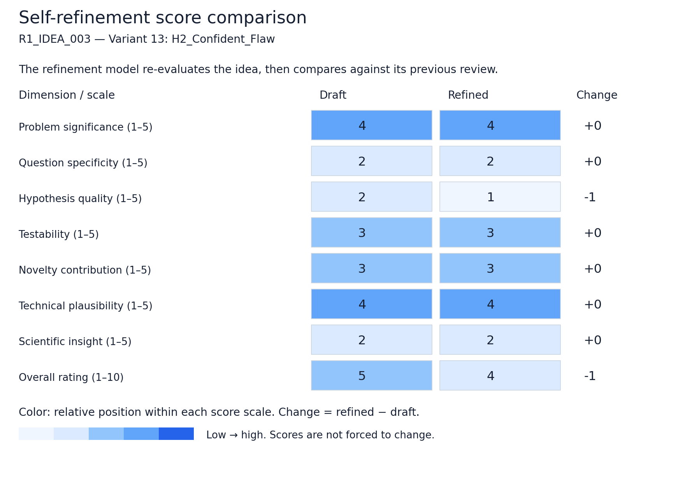

Changed score dimensions: hypothesis_quality, overall_rating.

### Score justifications (draft / refined)

**Problem significance**

```json
{
  "draft": {
    "score": 4.0,
    "justification": "Integrating human expert behavior into AI models for medical imaging is a meaningful challenge with clear clinical relevance. Eye-tracking data is a rich source of human reasoning, and capturing its temporal dimension could improve model interpretability and trust."
  },
  "refined": {
    "score": 4.0,
    "justification": "The problem is meaningful: integrating human expert behavior into AI models for medical imaging has clear clinical relevance for improving interpretability and trust. Eye-tracking data represents a rich source of human reasoning, and investigating whether temporal patterns contain additional diagnostic information addresses an important gap in current approaches."
  }
}
```

**Question specificity**

```json
{
  "draft": {
    "score": 2.0,
    "justification": "The idea identifies a limitation (static vs. temporal gaze) but does not define a clear research question. It proposes a method (video encoding) without specifying what relationship or phenomenon is being investigated."
  },
  "refined": {
    "score": 2.0,
    "justification": "The idea identifies a limitation (static vs. temporal gaze representation) but does not define a clear research question. It proposes a method (video encoding) without specifying what relationship, mechanism, or phenomenon is being investigated. The statement is more of a technical suggestion than a focused research inquiry."
  }
}
```

**Hypothesis quality**

```json
{
  "draft": {
    "score": 2.0,
    "justification": "The implicit hypothesis is that temporal gaze encoding will improve model performance and interpretability, but it is not concrete or falsifiable in its current form. The claim that improvements will be 'necessarily' produced and can be treated as causal without controlling for confounders is overstated and unscientific."
  },
  "refined": {
    "score": 1.0,
    "justification": "The idea contains no explicit hypothesis and only an implicit, poorly formed one. The claims are overly strong ('necessarily produce reliable improvements') and unscientific in dismissing the need to control for confounds. There's no concrete prediction about what specific improvements should occur under what conditions, nor a mechanism explaining why temporal gaze should help. The language suggests confirmation bias rather than hypothesis testing."
  }
}
```

**Testability**

```json
{
  "draft": {
    "score": 3.0,
    "justification": "The idea is testable in principle—one could compare models with static vs. temporal gaze inputs. However, the lack of a specific hypothesis and the dismissal of controlled evaluation make it less rigorous. The proposed 'video encoding' is a methodological direction that can be implemented and evaluated."
  },
  "refined": {
    "score": 3.0,
    "justification": "The core methodological suggestion (comparing static vs. temporal gaze representations) is testable in principle. One could implement video encoding of gaze data and evaluate model performance. However, the lack of a specific hypothesis and the dismissal of controlled evaluation make rigorous testing difficult as presented. The idea provides a technical direction but not a clear experimental design."
  }
}
```

**Novelty contribution**

```json
{
  "draft": {
    "score": 3.0,
    "justification": "Using temporal eye-tracking data in medical AI is not entirely new, but encoding it as video sequences for vision-language models is a specific technical twist. The potential contribution is moderate: it could demonstrate a new way to incorporate human behavioral data, but it risks being an incremental representation change without deeper insight."
  },
  "refined": {
    "score": 3.0,
    "justification": "Using temporal eye-tracking data in medical AI has been explored to some extent, though encoding it as video sequences for vision-language models represents a specific technical approach. The contribution would be moderate—primarily a representation engineering advance rather than a fundamental insight. Without a deeper investigation into why temporal patterns matter, it risks being an incremental improvement."
  }
}
```

**Technical plausibility**

```json
{
  "draft": {
    "score": 4.0,
    "justification": "Encoding gaze sequences as video frames is technically plausible. Video-based models can capture spatiotemporal patterns, and integrating them with vision-language architectures is feasible. The reasoning is logically coherent, though details are missing."
  },
  "refined": {
    "score": 4.0,
    "justification": "The proposed direction is technically plausible. Encoding gaze sequences as video frames (with fixation locations over time) is feasible, and integrating such sequences with vision-language models is architecturally possible. The reasoning that video models can capture spatiotemporal patterns is sound, though implementation details are missing."
  }
}
```

**Scientific insight**

```json
{
  "draft": {
    "score": 2.0,
    "justification": "As presented, the idea focuses on a representation change without a clear path to generalizable insight. It does not propose to uncover why temporal gaze matters, under what conditions it helps, or what principles govern its utility. The claim of 'broader effectiveness' is speculative and not backed by a mechanism."
  },
  "refined": {
    "score": 2.0,
    "justification": "As presented, the idea offers limited potential for scientific insight. It focuses on a representation change without proposing to uncover why temporal gaze matters, what specific patterns are informative, or under what conditions they improve performance. The claim of 'broader effectiveness' is speculative. Without a hypothesis about mechanisms or boundary conditions, the insight would likely be confined to whether this particular encoding works better than static ones in specific tasks."
  }
}
```

**Overall rating**

```json
{
  "draft": {
    "score": 5.0,
    "justification": "This is a moderate/borderline research idea. It identifies a plausible limitation in current work and suggests a concrete technical direction. However, it lacks a specific research question, makes overly strong causal claims without a rigorous hypothesis, and offers limited potential for scientific insight beyond a representation engineering exercise. With refinement—such as formulating a testable hypothesis about the role of temporal gaze in diagnostic reasoning—it could become stronger."
  },
  "refined": {
    "score": 4.0,
    "justification": "This is a weak research idea. While it identifies a plausible limitation in current work and suggests a concrete technical direction, it lacks a clear research question, presents no testable hypothesis, makes unscientific causal claims, and offers limited potential for scientific insight. The idea reads more like a technical suggestion with confirmation bias than a rigorous research proposal. With substantial refinement—formulating a specific hypothesis, designing controlled experiments, and focusing on understanding mechanisms—it could become viable, but as presented it is not scientifically sound."
  }
}
```

## R1_IDEA_003 — Variant 14: H3_Verbose_Enriched


Changed score dimensions: none.

### Score justifications (draft / refined)

**Problem significance**

```json
{
  "draft": {
    "score": 4.0,
    "justification": "The problem is meaningful: incorporating human visual attention into medical image analysis is an active area, and temporal gaze information is often ignored. Capturing scanning patterns could enhance model interpretability and trust in clinical settings."
  },
  "refined": {
    "score": 4.0,
    "justification": "The problem is significant. Incorporating human visual attention into medical AI is an active and important research direction for improving interpretability and trust. The specific gap of ignoring temporal scanning patterns is well-identified and addressing it could meaningfully advance methods for human-in-the-loop model training."
  }
}
```

**Question specificity**

```json
{
  "draft": {
    "score": 3.0,
    "justification": "The idea identifies a specific technical gap (temporal encoding) and a general goal (learning scanning heuristics), but the research question is somewhat broad: 'Could video-encoded gaze improve model reasoning and explanation alignment?' It could be more focused on a specific heuristic or outcome."
  },
  "refined": {
    "score": 3.0,
    "justification": "The idea identifies a specific technical gap (temporal encoding of gaze) and a general goal (learning scanning heuristics to improve reasoning). However, the core research question—'Does video-encoded gaze improve model reasoning and explanation alignment?'—remains broad. It could be more focused by specifying which aspects of reasoning or which heuristics are the primary target of investigation."
  }
}
```

**Hypothesis quality**

```json
{
  "draft": {
    "score": 3.0,
    "justification": "There is an implicit hypothesis: temporal encoding of gaze will allow models to learn scanning heuristics, leading to better explanation alignment. It makes a concrete prediction (improvement over static baselines) and is falsifiable, but the mechanism (learning heuristics) is not sharply defined."
  },
  "refined": {
    "score": 3.0,
    "justification": "There is a clear implicit hypothesis: temporal encoding of gaze will enable models to learn human scanning heuristics, leading to better explanation alignment and reasoning. It makes a concrete, falsifiable prediction of improvement over static baselines. However, the hypothesized mechanism ('learning heuristics') is not sharply defined, and the expected behavioral manifestation of this learning is vague."
  }
}
```

**Testability**

```json
{
  "draft": {
    "score": 5.0,
    "justification": "The idea is highly testable. It explicitly outlines a validation approach with baselines, interventions, ablations, sensitivity analyses, and error analysis. The staged design and comparison across cases provide clear paths to gather evidence."
  },
  "refined": {
    "score": 5.0,
    "justification": "The idea is highly testable. It explicitly proposes a detailed validation methodology including baseline/intervention comparison, pre-specified evaluation criteria, ablations, sensitivity analyses, and error analysis. This structured plan provides clear, empirical pathways to gather evidence for or against the central claim."
  }
}
```

**Novelty contribution**

```json
{
  "draft": {
    "score": 4.0,
    "justification": "Encoding eye-tracking data as video for temporal pattern learning in medical vision-language models appears novel. The potential contribution goes beyond simple performance gain to understanding how human scanning strategies can be transferred to models."
  },
  "refined": {
    "score": 4.0,
    "justification": "The proposed approach of encoding eye-tracking data as video sequences to capture temporal dynamics for vision-language models in medical imaging appears novel. The potential contribution extends beyond a simple performance boost; it aims to provide insight into how human visual reasoning strategies can be computationally modeled and transferred to AI systems."
  }
}
```

**Technical plausibility**

```json
{
  "draft": {
    "score": 4.0,
    "justification": "The approach is technically plausible. Video encoders can capture temporal sequences, and integrating multi-modal inputs (image, text, gaze video) into vision-language models is feasible. The main assumptions (temporal patterns are informative, models can learn them) are reasonable."
  },
  "refined": {
    "score": 4.0,
    "justification": "The approach is technically plausible. Modern architectures (e.g., video transformers, 3D CNNs) can process temporal sequences, and multi-modal fusion of image, text, and auxiliary input streams is a established research area. The core assumptions—that temporal patterns exist and are informative, and that models can learn from them—are reasonable."
  }
}
```

**Scientific insight**

```json
{
  "draft": {
    "score": 4.0,
    "justification": "If successful, the research could yield insights into which aspects of human visual reasoning (spatial vs. temporal) are most valuable for model training, under what data conditions temporal gaze helps, and whether models can genuinely emulate human scanning strategies. The error analysis and boundary cases could reveal limitations of the approach."
  },
  "refined": {
    "score": 4.0,
    "justification": "The research has strong potential for scientific insight. Successfully investigating this idea could reveal: 1) the relative importance of spatial vs. temporal attention signals from humans for training AI, 2) the conditions (data quality, task difficulty) under which temporal information is beneficial, and 3) boundary conditions and failure modes of such human-in-the-loop training approaches. The proposed error analysis is particularly geared towards generating such insights."
  }
}
```

**Overall rating**

```json
{
  "draft": {
    "score": 7.0,
    "justification": "This is a strong research idea. It addresses a meaningful problem with a specific technical proposal, has a plausible hypothesis, and outlines a thorough validation plan. The main weakness is that the hypothesis could be more precise about which heuristics are targeted and how success would be measured. Nonetheless, it has clear potential to contribute novel insights into human-in-the-loop model training for medical image analysis."
  },
  "refined": {
    "score": 7.0,
    "justification": "This is a strong research idea. It addresses a meaningful and specific problem with a plausible technical direction. The hypothesis, while somewhat broad, is testable and falsifiable. The major strength is the exceptionally well-thought-out and comprehensive validation plan, which demonstrates clear thinking about how to rigorously investigate the claim. The main limitation is the need for greater precision in defining the target heuristics and success metrics. The idea has clear potential to contribute novel methods and insights to the field of interpretable medical AI."
  }
}
```

## R1_IDEA_003 — Variant 15: H4_Ultimate_Hype


Changed score dimensions: none.

### Score justifications (draft / refined)

**Problem significance**

```json
{
  "draft": {
    "score": 4.0,
    "justification": "The problem is meaningful. Integrating expert eye gaze into medical image analysis models is an active area with clear relevance for improving model trustworthiness and alignment with clinical reasoning. The specific issue of losing temporal information in current approaches is a plausible limitation."
  },
  "refined": {
    "score": 4.0,
    "justification": "The problem is meaningful and timely. Integrating expert gaze into medical AI models is an active research area with clear clinical relevance for improving model trustworthiness and alignment with human reasoning. The specific limitation of losing temporal information in current approaches is a plausible and underexplored gap."
  }
}
```

**Question specificity**

```json
{
  "draft": {
    "score": 2.0,
    "justification": "The idea proposes a technical direction (use video sequences) but does not define a clear research question. It states a goal ('enhancing model reasoning and clinical interpretability') but not what specific aspect will be investigated. The description is more of a proposed method than a formulated question."
  },
  "refined": {
    "score": 2.0,
    "justification": "The idea proposes a technical direction (use video sequences) but does not define a clear research question. It states a general goal ('enhancing model reasoning and clinical interpretability') but not what specific aspect will be investigated. The description is more of a proposed method than a formulated question."
  }
}
```

**Hypothesis quality**

```json
{
  "draft": {
    "score": 2.0,
    "justification": "There is an implicit hypothesis that 'encoding eye-tracking data as video sequences to capture temporal scanning order will enhance model reasoning and interpretability compared to static representations.' However, this is broad and not broken down into testable sub-predictions. The hypothesis lacks mechanistic detail (why would temporal order help?) and specificity about the expected improvement."
  },
  "refined": {
    "score": 2.0,
    "justification": "There is an implicit, broad hypothesis that 'encoding eye-tracking data as video sequences will enhance model reasoning and interpretability compared to static representations.' However, this lacks mechanistic detail (why would temporal order help?), specificity about the expected improvement, and testable sub-predictions. It's more of a general claim than a focused hypothesis."
  }
}
```

**Testability**

```json
{
  "draft": {
    "score": 3.0,
    "justification": "The core claim is testable in principle: one could build models with different gaze representations and compare them. However, without a more specific hypothesis, it's unclear exactly what would be tested beyond a generic performance comparison. The idea suggests an experiment (compare video vs. static encoding) but does not detail what constitutes success."
  },
  "refined": {
    "score": 3.0,
    "justification": "The core claim is testable in principle: one could implement different gaze representations and compare model performance. However, without a more specific hypothesis, it's unclear exactly what would be tested beyond a generic performance comparison. The idea suggests an experiment but does not detail what constitutes success or how to measure 'enhanced reasoning.'"
  }
}
```

**Novelty contribution**

```json
{
  "draft": {
    "score": 3.0,
    "justification": "The proposal to use temporal gaze sequences is a novel technical twist on existing work integrating gaze into medical AI. However, the idea is presented at a high level; its novelty depends on the execution and whether it yields new insights. The contribution is currently framed as a methodological proposal rather than a guaranteed scientific discovery."
  },
  "refined": {
    "score": 3.0,
    "justification": "The proposal to use temporal gaze sequences is a novel technical twist on existing work integrating gaze into medical AI. However, at this high-level description, its novelty depends entirely on execution details and whether it yields new insights. The contribution is currently framed as a methodological proposal rather than a guaranteed scientific discovery."
  }
}
```

**Technical plausibility**

```json
{
  "draft": {
    "score": 3.0,
    "justification": "The direction is logically coherent: video sequences can encode spatiotemporal information. However, key technical details are missing: how to encode sparse, variable-length fixation sequences as video, how to fuse this with image and text in a VLM, and whether models can effectively leverage this signal. It's plausible but non-trivial."
  },
  "refined": {
    "score": 3.0,
    "justification": "The direction is logically coherent: video sequences can encode spatiotemporal information. However, key technical details are missing: how to encode sparse, variable-length fixation sequences as video, how to fuse this modality with image and text in a VLM, and whether models can effectively leverage this signal. It's plausible but presents non-trivial implementation challenges."
  }
}
```

**Scientific insight**

```json
{
  "draft": {
    "score": 3.0,
    "justification": "If successful, the research could provide insight into whether and how the temporal dynamics of expert visual search are informative for AI models. This touches on the broader question of what aspects of human expertise are computationally valuable. However, the potential insight is somewhat vague without a clearer hypothesis about the underlying mechanism."
  },
  "refined": {
    "score": 3.0,
    "justification": "If successful, the research could provide insight into whether and how the temporal dynamics of expert visual search are informative for AI models. This touches on the broader question of what aspects of human expertise are computationally valuable. However, the potential insight is somewhat vague without a clearer hypothesis about the underlying mechanism or relationship being explored."
  }
}
```

**Overall rating**

```json
{
  "draft": {
    "score": 5.0,
    "justification": "This is a moderate/borderline research idea. It identifies a plausible technical gap (ignoring temporal gaze information) and proposes an interesting direction (video encoding). However, it lacks a clearly defined research question, a specific testable hypothesis, and details on the expected scientific insight. The idea is more of a technical proposal than a focused investigation. With refinement to formulate a concrete hypothesis and experimental plan, it could become a strong idea."
  },
  "refined": {
    "score": 5.0,
    "justification": "This is a moderate/borderline research idea. It identifies a plausible technical gap (ignoring temporal gaze information) and proposes an interesting direction (video encoding). However, it lacks a clearly defined research question, a specific testable hypothesis, and details on the expected scientific insight. The idea is more of a technical proposal than a focused investigation. With refinement to formulate a concrete hypothesis and experimental plan, it could become a strong idea."
  }
}
```

## R1_IDEA_004 — Source

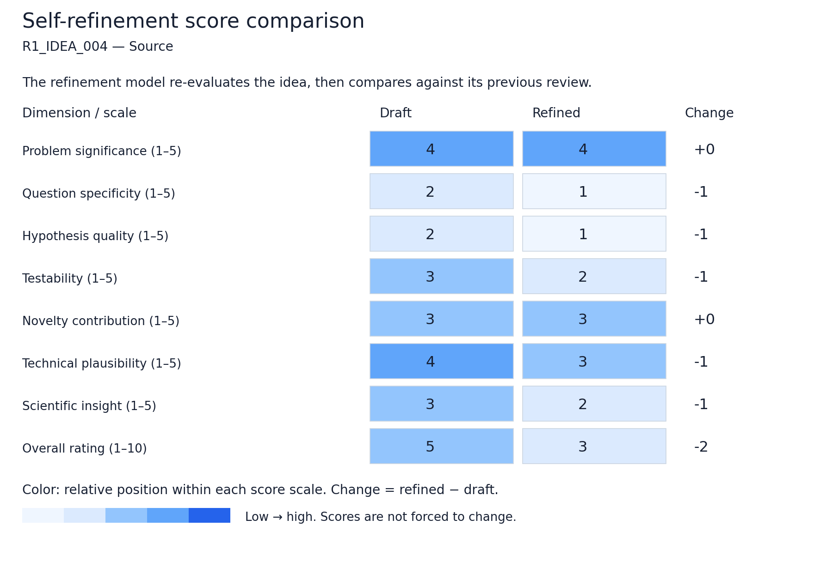

Changed score dimensions: question_specificity, hypothesis_quality, testability, technical_plausibility, scientific_insight, overall_rating.

### Score justifications (draft / refined)

**Problem significance**

```json
{
  "draft": {
    "score": 4.0,
    "justification": "The problem of constrained alignment for LLMs is highly significant, addressing the critical challenge of balancing helpfulness with safety. Reducing computational overhead while maintaining safety constraints is practically important for real-world deployment."
  },
  "refined": {
    "score": 4.0,
    "justification": "The problem is highly significant. Constrained alignment of LLMs is a critical challenge for real-world deployment, balancing helpfulness with safety. Reducing computational overhead while maintaining safety constraints has substantial practical importance for making alignment more accessible and efficient."
  }
}
```

**Question specificity**

```json
{
  "draft": {
    "score": 2.0,
    "justification": "The idea states a general goal but does not articulate a specific research question. It mentions what the method aims to do but not what specific relationship, mechanism, or phenomenon will be investigated."
  },
  "refined": {
    "score": 1.0,
    "justification": "The idea lacks a specific research question entirely. It states a general goal ('proposes a method to do X') but does not articulate what specific relationship, mechanism, or phenomenon will be investigated. There is no clear 'what will we learn from this research' beyond the existence of a proposed method."
  }
}
```

**Hypothesis quality**

```json
{
  "draft": {
    "score": 2.0,
    "justification": "There is no explicit or clearly implicit hypothesis. The idea suggests a direction but does not make a concrete prediction about outcomes or mechanisms that could be tested and potentially falsified."
  },
  "refined": {
    "score": 1.0,
    "justification": "There is no hypothesis present, either explicit or implicit. The idea describes a proposed method but makes no predictions about outcomes, mechanisms, or relationships that could be tested. It does not distinguish what might be learned from simply applying an existing technique in a new domain."
  }
}
```

**Testability**

```json
{
  "draft": {
    "score": 3.0,
    "justification": "The general idea could be tested through experiments comparing computational efficiency and performance against baselines, but without specific metrics or evaluation criteria, it's unclear exactly what would constitute a test of the central claims."
  },
  "refined": {
    "score": 2.0,
    "justification": "While one could imagine testing whether a proposed method works, the idea provides no clear criteria for what 'works' means. Without specified evaluation metrics, baselines, or success criteria, it's unclear how one would design an experiment to test the central claims. The claims about computational overhead reduction are potentially testable but undefined."
  }
}
```

**Novelty contribution**

```json
{
  "draft": {
    "score": 3.0,
    "justification": "Combining primal-dual methods with DPO for constrained alignment appears novel, but the idea lacks details to assess how it differs from existing constrained optimization approaches in RL/LLM alignment. The potential contribution is moderate but depends on implementation specifics."
  },
  "refined": {
    "score": 3.0,
    "justification": "The combination of primal-dual methods with DPO for constrained alignment appears novel at a high level, but without details, it's impossible to assess how it differs from existing constrained optimization approaches. The potential contribution is moderate but highly dependent on implementation specifics that are not provided."
  }
}
```

**Technical plausibility**

```json
{
  "draft": {
    "score": 4.0,
    "justification": "The general approach of using primal-dual methods for constrained optimization is well-established, and applying it to DPO seems technically plausible. The claim about reducing computational overhead by avoiding separate models is reasonable if the method works as described."
  },
  "refined": {
    "score": 3.0,
    "justification": "The general concept of applying primal-dual optimization to constrained problems is sound, and DPO has shown promise for alignment. However, the claim about avoiding separate models while enforcing constraints is non-trivial and requires justification. Without details on how constraints would be represented or measured, technical plausibility is uncertain."
  }
}
```

**Scientific insight**

```json
{
  "draft": {
    "score": 3.0,
    "justification": "If successful, the research could provide insight into efficient constrained optimization for alignment, but the idea as presented focuses more on engineering efficiency than fundamental understanding of alignment mechanisms or constraint satisfaction."
  },
  "refined": {
    "score": 2.0,
    "justification": "As presented, the idea focuses primarily on engineering efficiency rather than scientific understanding. If successful, it might demonstrate that a particular algorithmic approach works, but it doesn't promise insight into fundamental mechanisms of alignment, constraint satisfaction, or preference optimization. The potential for transferable scientific insight is low without a clearer research question."
  }
}
```

**Overall rating**

```json
{
  "draft": {
    "score": 5.0,
    "justification": "This is a moderate/borderline research idea. It addresses an important problem and proposes a potentially useful technical direction, but lacks specificity in research question, hypothesis, and evaluation. The idea needs more concrete formulation to become a strong research proposal. The potential exists but is not fully realized in the current description."
  },
  "refined": {
    "score": 3.0,
    "justification": "This is a weak research idea. While it addresses an important problem, it lacks the essential components of a research investigation: a specific question, a testable hypothesis, and clear evaluation criteria. It reads more like a high-level project goal than a research idea. The potential exists but is unrealized in the current formulation."
  }
}
```

## R1_IDEA_004 — Variant 1: A1_Identity

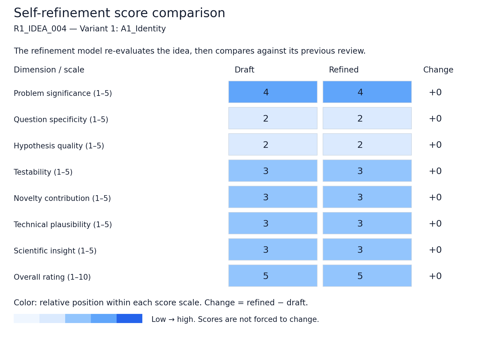

Changed score dimensions: none.

### Score justifications (draft / refined)

**Problem significance**

```json
{
  "draft": {
    "score": 4.0,
    "justification": "The problem of constrained alignment for LLMs is highly significant, addressing the critical challenge of balancing helpfulness with safety. Reducing computational overhead while maintaining constraint satisfaction is practically important for real-world deployment."
  },
  "refined": {
    "score": 4.0,
    "justification": "The problem is highly significant. Constrained alignment of LLMs addresses the critical real-world challenge of ensuring AI safety while maintaining usefulness. Reducing computational overhead is practically important for making safety-aligned models more accessible. The tension between reward maximization and constraint satisfaction is a fundamental challenge in AI alignment."
  }
}
```

**Question specificity**

```json
{
  "draft": {
    "score": 2.0,
    "justification": "The idea states a general goal but lacks a concrete research question. It doesn't specify what exactly will be investigated beyond 'proposing a method.' No specific relationship, mechanism, or phenomenon is identified for study."
  },
  "refined": {
    "score": 2.0,
    "justification": "The idea lacks a concrete research question. It states a general goal ('proposes a method') but doesn't specify what relationship, mechanism, or phenomenon is being investigated. There's no clear 'what will we learn' beyond 'we will develop X method.' The specificity is limited to naming technical components without articulating what scientific question they help answer."
  }
}
```

**Hypothesis quality**

```json
{
  "draft": {
    "score": 2.0,
    "justification": "There is no explicit or clearly implicit hypothesis. The idea suggests a method might work better but doesn't make a concrete prediction about outcomes or mechanisms. It doesn't articulate what would constitute success or failure."
  },
  "refined": {
    "score": 2.0,
    "justification": "There is no explicit or clearly implicit hypothesis. The idea suggests a method 'aims to' achieve certain goals but makes no concrete prediction about outcomes, mechanisms, or relationships. It doesn't articulate what would constitute evidence for or against the approach's value. The statement is descriptive rather than predictive."
  }
}
```

**Testability**

```json
{
  "draft": {
    "score": 3.0,
    "justification": "The general direction is testable through experiments comparing reward/constraint trade-offs and computational costs against baselines. However, without a specific hypothesis or evaluation plan, it's unclear exactly what would be tested."
  },
  "refined": {
    "score": 3.0,
    "justification": "The general direction is testable in principle through experiments comparing reward/constraint trade-offs and computational costs. However, without a specific hypothesis or clear evaluation criteria, it's unclear exactly what would be tested. The idea mentions goals but not how they would be measured or what comparison would demonstrate success."
  }
}
```

**Novelty contribution**

```json
{
  "draft": {
    "score": 3.0,
    "justification": "Combining primal-dual optimization with DPO for constrained alignment appears novel. However, the contribution level depends on technical details not provided. If it's merely an application of existing optimization techniques to DPO, novelty would be limited."
  },
  "refined": {
    "score": 3.0,
    "justification": "The combination of primal-dual optimization with DPO for constrained alignment appears novel at a high level. However, the contribution level is unclear without technical details. If it's primarily an application of established optimization techniques to DPO, novelty would be moderate. The potential contribution depends heavily on the specific technical innovation and whether it provides advantages beyond incremental efficiency improvements."
  }
}
```

**Technical plausibility**

```json
{
  "draft": {
    "score": 3.0,
    "justification": "Primal-dual methods are well-established for constrained optimization, and DPO is a known alignment technique, so combining them is conceptually plausible. However, key technical challenges (e.g., constraint estimation without separate models) are not addressed, making full assessment difficult."
  },
  "refined": {
    "score": 3.0,
    "justification": "The concept is conceptually plausible: primal-dual methods are standard for constrained optimization, and DPO is a known alignment technique. However, significant technical challenges are unaddressed, particularly how constraints are represented and enforced without separate models. The claim of avoiding 'prior knowledge of optimal Lagrange multiplier' suggests online adaptation, which is plausible but non-trivial. Overall, the idea is plausible but underspecified."
  }
}
```

**Scientific insight**

```json
{
  "draft": {
    "score": 3.0,
    "justification": "If successful, the research could provide insights into efficient constrained optimization for alignment and the trade-offs between separate vs. integrated constraint modeling. However, the idea as presented focuses more on methodological efficiency than fundamental understanding."
  },
  "refined": {
    "score": 3.0,
    "justification": "If developed into a proper investigation, this research could provide insights into efficient constrained optimization for preference-based learning and the trade-offs between integrated vs. separate constraint modeling. However, as presented, the idea focuses more on methodological efficiency than fundamental understanding. The potential for scientific insight exists but depends on whether the research would investigate underlying mechanisms rather than just performance outcomes."
  }
}
```

**Overall rating**

```json
{
  "draft": {
    "score": 5.0,
    "justification": "This is a moderate/borderline research idea. It addresses an important problem and suggests a potentially interesting technical direction, but lacks specificity in research question, hypothesis, and evaluation. The scientific contribution would depend heavily on how the idea is developed into a concrete investigation. Currently, it reads more like a general methodological proposal than a focused research study."
  },
  "refined": {
    "score": 5.0,
    "justification": "This is a moderate/borderline research idea. It addresses an important problem and suggests a potentially interesting technical direction with practical relevance. However, it lacks the specificity of a focused research question, contains no testable hypothesis, and is presented as a methodological proposal rather than a scientific investigation. The idea has reasonable technical plausibility and addresses a significant problem, but without a clear research question or hypothesis, its scientific contribution is uncertain. It would need substantial refinement to become a strong research direction."
  }
}
```

## R1_IDEA_004 — Variant 2: A2_Paraphrase_Only

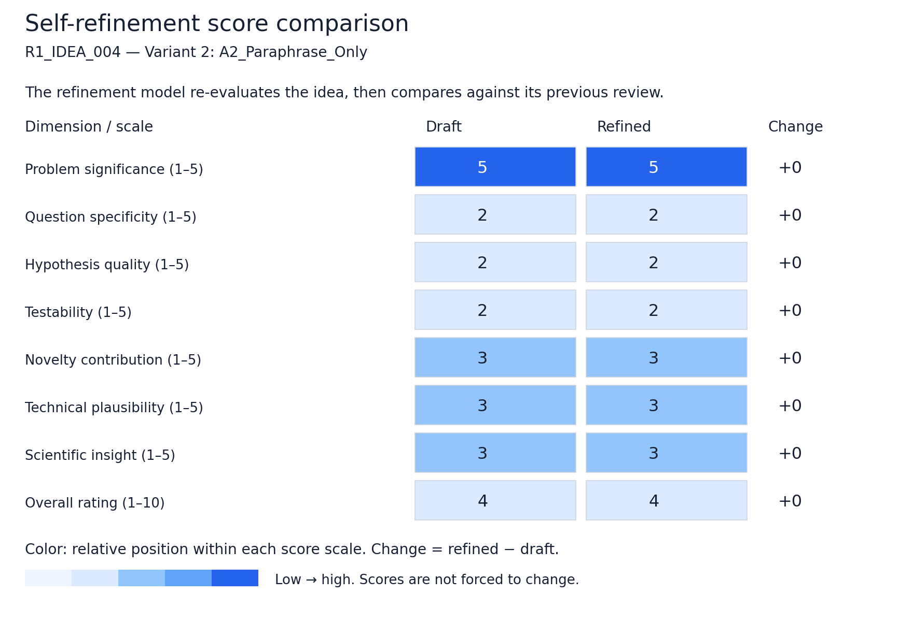

Changed score dimensions: none.

### Score justifications (draft / refined)

**Problem significance**

```json
{
  "draft": {
    "score": 5.0,
    "justification": "The problem is highly significant - aligning LLMs with safety constraints is a critical challenge in AI safety research with substantial practical implications."
  },
  "refined": {
    "score": 5.0,
    "justification": "The problem is exceptionally significant. Aligning LLMs with safety constraints is a critical challenge in AI safety with substantial practical implications for deploying safe AI systems. The computational efficiency aspect adds practical importance."
  }
}
```

**Question specificity**

```json
{
  "draft": {
    "score": 2.0,
    "justification": "The idea lacks a clearly defined research question. It presents a method but doesn't specify what is being investigated - whether it's efficiency, performance, or some other property."
  },
  "refined": {
    "score": 2.0,
    "justification": "The idea lacks a clearly defined research question. It describes a method ('introduces a primal-dual DPO approach') but doesn't specify what is being investigated - whether it's efficiency gains, performance improvements, or theoretical properties. There's no 'what will we learn?' component."
  }
}
```

**Hypothesis quality**

```json
{
  "draft": {
    "score": 2.0,
    "justification": "There's no explicit or clearly implicit hypothesis. The idea makes claims about benefits but doesn't formulate a testable prediction that could be supported or contradicted by evidence."
  },
  "refined": {
    "score": 2.0,
    "justification": "There's no explicit or clearly implicit hypothesis. The idea makes claims about benefits ('eliminates the need...', 'lowers computational demands') but these are presented as assertions rather than testable predictions that could be supported or contradicted by evidence."
  }
}
```

**Testability**

```json
{
  "draft": {
    "score": 2.0,
    "justification": "While the claims could theoretically be tested, the idea doesn't suggest how. There's no indication of what experiments, comparisons, or evaluations would be conducted to investigate the method's effectiveness."
  },
  "refined": {
    "score": 2.0,
    "justification": "While the claims could theoretically be tested, the idea provides no indication of how. There's no suggestion of experiments, comparisons, evaluations, or analyses that would investigate the method's effectiveness. The testability is entirely implicit rather than articulated."
  }
}
```

**Novelty contribution**

```json
{
  "draft": {
    "score": 3.0,
    "justification": "The idea suggests combining primal-dual optimization with DPO for constrained alignment, which could be novel, but without details it's unclear how different this is from existing constrained RL or optimization approaches."
  },
  "refined": {
    "score": 3.0,
    "justification": "The idea suggests combining primal-dual optimization with DPO for constrained alignment, which could be novel, but without details it's unclear how different this is from existing constrained RL or optimization approaches. The contribution is potentially incremental unless the formulation offers fundamental advantages."
  }
}
```

**Technical plausibility**

```json
{
  "draft": {
    "score": 3.0,
    "justification": "The general concept of using primal-dual methods for constrained optimization is well-established, so the approach is plausible in principle, but without details it's impossible to assess the specific implementation."
  },
  "refined": {
    "score": 3.0,
    "justification": "The general concept of using primal-dual methods for constrained optimization is well-established, so the approach is plausible in principle. However, without details about how DPO integrates with primal-dual optimization for constraints, it's impossible to assess the specific implementation's feasibility."
  }
}
```

**Scientific insight**

```json
{
  "draft": {
    "score": 3.0,
    "justification": "If properly investigated, this could provide insight into efficient constrained optimization for LLM alignment, but the idea as presented focuses more on a method description than on what scientific understanding would be gained."
  },
  "refined": {
    "score": 3.0,
    "justification": "If properly investigated, this could provide insight into efficient constrained optimization for LLM alignment, but the idea as presented focuses on a method description rather than on what scientific understanding would be gained. The potential insight is about algorithmic efficiency rather than fundamental understanding of alignment mechanisms."
  }
}
```

**Overall rating**

```json
{
  "draft": {
    "score": 4.0,
    "justification": "While addressing an important problem, the idea is presented as a method description rather than a research question. It lacks specificity about what is being investigated, has no clear hypothesis, and doesn't suggest how claims would be tested. The potential is there given the problem's importance, but the research idea needs much more definition to be scientifically meaningful."
  },
  "refined": {
    "score": 4.0,
    "justification": "The idea addresses an important problem but is presented as a method description rather than a research investigation. It lacks a clear research question, testable hypothesis, and evaluation approach. While the technical direction has potential given the problem's significance, the research idea needs substantial refinement to be scientifically meaningful. It's currently more of a technical proposal than a research question."
  }
}
```

## R1_IDEA_004 — Variant 3: A3_Plain_Core

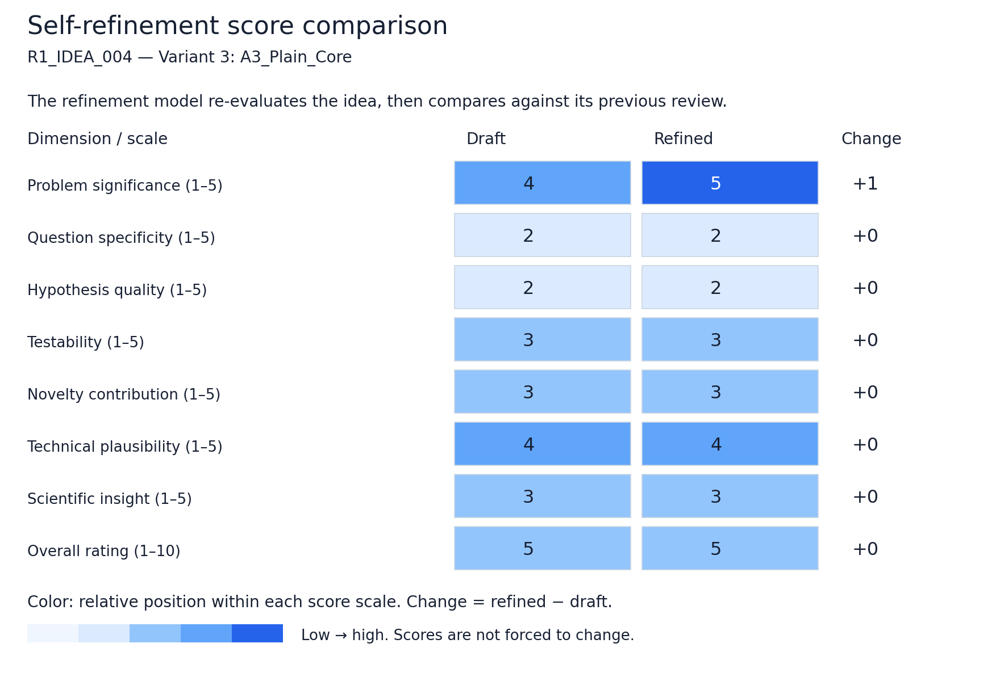

Changed score dimensions: problem_significance.

### Score justifications (draft / refined)

**Problem significance**

```json
{
  "draft": {
    "score": 4.0,
    "justification": "Constrained alignment of LLMs is a highly significant problem with real-world implications for safe AI deployment. The computational overhead of current methods is a meaningful practical challenge."
  },
  "refined": {
    "score": 5.0,
    "justification": "The problem is exceptionally significant. Safe and efficient alignment of LLMs is a core challenge in AI safety with major real-world implications. Reducing computational overhead and simplifying the training pipeline are meaningful practical goals that could enable broader adoption of constrained alignment methods."
  }
}
```

**Question specificity**

```json
{
  "draft": {
    "score": 2.0,
    "justification": "The idea describes a method but doesn't articulate a specific research question. It's unclear what exactly would be investigated beyond 'proposing a method'."
  },
  "refined": {
    "score": 2.0,
    "justification": "The idea lacks a clearly defined research question. It describes a proposed method ('a primal-dual DPO method is proposed') but does not specify what aspect will be investigated, tested, or understood. The 'what will we learn?' is missing."
  }
}
```

**Hypothesis quality**

```json
{
  "draft": {
    "score": 2.0,
    "justification": "There's an implicit hypothesis that primal-dual DPO can achieve constrained alignment more efficiently, but it's not clearly stated or justified. No concrete predictions about performance trade-offs or mechanisms are made."
  },
  "refined": {
    "score": 2.0,
    "justification": "There is only an implicit, vague hypothesis that the proposed method 'will work' and be more efficient. No concrete, falsifiable prediction is made about its performance, behavior, or comparative advantages. A strong hypothesis would predict, for example, specific improvements in training stability, sample efficiency, or the reward-constraint Pareto frontier."
  }
}
```

**Testability**

```json
{
  "draft": {
    "score": 3.0,
    "justification": "The idea is testable in principle (one could implement and compare methods), but no specific experiments, comparisons, or evaluation protocols are suggested. The claim about 'reducing computational overhead' is measurable."
  },
  "refined": {
    "score": 3.0,
    "justification": "The core claims (efficiency, constraint satisfaction) are measurable in principle. One could implement the method and compare metrics like training time, FLOPs, and violation rates against baselines. However, the idea itself does not propose any specific experiments, comparisons, or evaluation protocols, leaving the testability potential but unrealized."
  }
}
```

**Novelty contribution**

```json
{
  "draft": {
    "score": 3.0,
    "justification": "Combining primal-dual methods with DPO for constrained alignment seems novel, but the contribution level depends on execution. Without more details, it's unclear if this is a significant advance over existing constrained RL or alignment methods."
  },
  "refined": {
    "score": 3.0,
    "justification": "The combination of primal-dual optimization with DPO for constrained alignment appears novel at a high level. However, without details, it's unclear if this is a minor synthesis or a significant conceptual/technical advance. The contribution level is ambiguous and hinges entirely on execution and comparison to the existing literature (e.g., prior work on constrained RL, Lagrangian methods for RLHF, or other single-stage alignment techniques)."
  }
}
```

**Technical plausibility**

```json
{
  "draft": {
    "score": 4.0,
    "justification": "The general direction is technically plausible. Primal-dual methods are well-established for constrained optimization, and DPO has shown promise for alignment. The reasoning appears coherent, though details are sparse."
  },
  "refined": {
    "score": 4.0,
    "justification": "The general direction is technically plausible. Primal-dual methods are standard for constrained optimization, and DPO is a established alignment technique. The reasoning that combining them could streamline the pipeline is coherent. However, key technical challenges (e.g., formulating constraints within DPO's Bradley-Terry framework, optimizing dual variables without a separate cost signal) are not addressed, leaving some plausibility concerns unexamined."
  }
}
```

**Scientific insight**

```json
{
  "draft": {
    "score": 3.0,
    "justification": "If successful, this could provide insight into efficient constrained optimization for alignment. However, the idea as presented focuses more on practical efficiency than fundamental understanding of alignment mechanisms or constraint satisfaction dynamics."
  },
  "refined": {
    "score": 3.0,
    "justification": "If successfully investigated, this could yield insights into efficient algorithms for constrained alignment and the interplay between preference optimization and constraint satisfaction. However, the idea as presented is primarily focused on engineering efficiency. Deeper scientific insight (e.g., understanding the dynamics of the primal-dual process in LLM fine-tuning, or fundamental trade-offs in constraint representation) is not explicitly promised and would depend on the research focus."
  }
}
```

**Overall rating**

```json
{
  "draft": {
    "score": 5.0,
    "justification": "This is a moderate/borderline research idea. It addresses an important problem and suggests a plausible technical direction, but lacks a clearly articulated research question, specific hypothesis, and details about what would be tested. The potential contribution is reasonable but limited by the vagueness of the proposal. With more specificity about what would be investigated and why the approach might work, it could become a stronger idea."
  },
  "refined": {
    "score": 5.0,
    "justification": "This is a moderate/borderline research idea. It tackles a very important problem and suggests a plausible technical direction with practical relevance. However, it is fundamentally underspecified as a *research idea*. It lacks a clear research question, a testable hypothesis, and any description of how the idea would be validated. It reads more like a high-level method proposal. The potential is there, but the idea needs substantial refinement to become a strong research direction. The score reflects the gap between the significance of the problem and the vagueness of the proposed investigation."
  }
}
```

## R1_IDEA_004 — Variant 4: B1_Verbose_Elaborate


Changed score dimensions: hypothesis_quality.

### Score justifications (draft / refined)

**Problem significance**

```json
{
  "draft": {
    "score": 4.0,
    "justification": "Constrained alignment of LLMs is a significant and timely problem with real-world implications for safe AI deployment. The challenge of balancing reward maximization with safety constraints is well-recognized in the field."
  },
  "refined": {
    "score": 4.0,
    "justification": "Constrained alignment of LLMs is a highly significant problem with real-world implications for safe AI deployment. The challenge of balancing reward maximization with safety constraints is well-recognized and important for practical applications."
  }
}
```

**Question specificity**

```json
{
  "draft": {
    "score": 2.0,
    "justification": "The idea describes a proposed method but does not articulate a clear research question. It lacks specificity about what exactly is being investigated beyond applying primal-dual methods to DPO."
  },
  "refined": {
    "score": 2.0,
    "justification": "The idea describes a proposed method but does not articulate a clear research question. It lacks specificity about what is being investigated beyond applying primal-dual methods to DPO. There is no 'what', 'why', or 'how' question being asked."
  }
}
```

**Hypothesis quality**

```json
{
  "draft": {
    "score": 2.0,
    "justification": "No explicit or implicit hypothesis is presented. The idea describes what the method would do but not what specific claim or prediction it makes about constrained alignment."
  },
  "refined": {
    "score": 1.0,
    "justification": "No hypothesis is presented, either explicit or implicit. The idea merely describes what the method would do technically, with no predictive claim about outcomes, mechanisms, or relationships that could be tested."
  }
}
```

**Testability**

```json
{
  "draft": {
    "score": 3.0,
    "justification": "The idea suggests a methodological direction that could be tested through experiments comparing computational efficiency and constraint satisfaction against baselines. However, without a clear hypothesis, it's unclear what exactly would be tested."
  },
  "refined": {
    "score": 3.0,
    "justification": "The methodological direction suggests experiments could compare computational efficiency and constraint satisfaction against baselines. However, without a clear hypothesis or research question, it's unclear what specific claim would be tested."
  }
}
```

**Novelty contribution**

```json
{
  "draft": {
    "score": 3.0,
    "justification": "Applying primal-dual methods to preference optimization is moderately novel, but the core idea of constrained alignment itself is well-established. The potential contribution appears primarily technical (computational efficiency) rather than conceptual."
  },
  "refined": {
    "score": 3.0,
    "justification": "Applying primal-dual methods to preference optimization is moderately novel, but constrained alignment itself is well-established. The contribution appears primarily technical (computational efficiency) rather than conceptual or scientific."
  }
}
```

**Technical plausibility**

```json
{
  "draft": {
    "score": 4.0,
    "justification": "The reasoning is logically coherent: primal-dual methods are established for constrained optimization, and applying them to DPO seems plausible. Avoiding separate model training could reduce complexity if implemented correctly."
  },
  "refined": {
    "score": 4.0,
    "justification": "The reasoning is logically coherent: primal-dual methods are established for constrained optimization, and applying them to DPO seems plausible. Avoiding separate model training could reduce complexity if implemented correctly."
  }
}
```

**Scientific insight**

```json
{
  "draft": {
    "score": 2.0,
    "justification": "As presented, the idea focuses on computational efficiency rather than deeper scientific understanding. It doesn't articulate what new insights about alignment, constraint satisfaction, or optimization dynamics would be gained."
  },
  "refined": {
    "score": 2.0,
    "justification": "As presented, the idea focuses almost entirely on computational efficiency rather than deeper scientific understanding. It doesn't articulate what new insights about alignment, constraint satisfaction mechanisms, or optimization dynamics would be gained."
  }
}
```

**Overall rating**

```json
{
  "draft": {
    "score": 5.0,
    "justification": "This is a moderate/borderline research idea. It addresses a significant problem and proposes a technically plausible direction, but lacks a clear research question, hypothesis, and articulation of potential scientific insight. The focus appears primarily on engineering efficiency rather than scientific discovery."
  },
  "refined": {
    "score": 5.0,
    "justification": "This is a moderate/borderline research idea. It addresses a significant problem and proposes a technically plausible direction, but lacks a clear research question, hypothesis, and articulation of potential scientific insight. The focus appears primarily on engineering efficiency rather than scientific discovery, limiting its contribution to methodological improvement rather than deeper understanding."
  }
}
```

## R1_IDEA_004 — Variant 5: B2_Grand_Narrative

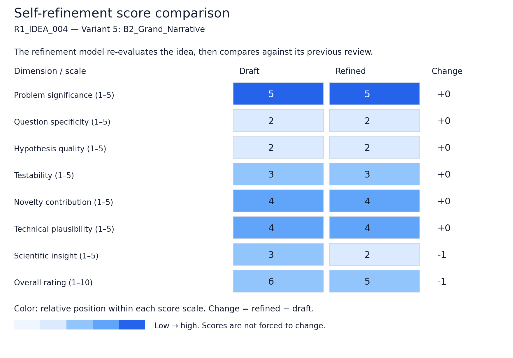

Changed score dimensions: scientific_insight, overall_rating.

### Score justifications (draft / refined)

**Problem significance**

```json
{
  "draft": {
    "score": 5.0,
    "justification": "The problem is highly significant - safe alignment of LLMs is a critical challenge in AI research with important real-world implications. Efficient methods that balance performance and safety without excessive computational overhead address a meaningful practical limitation."
  },
  "refined": {
    "score": 5.0,
    "justification": "The problem is exceptionally significant. Safe alignment of LLMs is a critical challenge in AI research with substantial real-world implications. Developing efficient methods that balance performance and safety without excessive computational cost addresses a meaningful practical limitation with potential broad impact."
  }
}
```

**Question specificity**

```json
{
  "draft": {
    "score": 2.0,
    "justification": "The idea describes a method but doesn't articulate a specific research question. It's unclear what exactly would be investigated beyond 'proposing a method.' There's no concrete question about mechanisms, tradeoffs, or limitations."
  },
  "refined": {
    "score": 2.0,
    "justification": "The idea describes a methodological direction but does not articulate a specific research question. There is no clear statement of what scientific problem is being investigated, what phenomenon is being studied, or what relationship is being explored. It essentially says 'we propose method X' without specifying what question method X helps answer."
  }
}
```

**Hypothesis quality**

```json
{
  "draft": {
    "score": 2.0,
    "justification": "There's an implicit hypothesis that primal-dual DPO can achieve constrained alignment more efficiently, but it's not clearly stated or testable. No specific prediction about performance, safety tradeoffs, or computational savings is articulated."
  },
  "refined": {
    "score": 2.0,
    "justification": "There is only an implicit, vague hypothesis that primal-dual DPO might be more efficient. No concrete prediction is made about performance, safety tradeoffs, computational savings, or sample efficiency. The hypothesis lacks specificity and is not formulated in a way that could be clearly supported or contradicted by evidence."
  }
}
```

**Testability**

```json
{
  "draft": {
    "score": 3.0,
    "justification": "The idea is testable in principle - one could implement the method and compare it to alternatives. However, without a clear hypothesis or evaluation criteria, it's unclear what specific evidence would support or refute the claims."
  },
  "refined": {
    "score": 3.0,
    "justification": "The idea is testable in principle since one could implement the method and compare it to alternatives. However, without clear hypotheses or specific evaluation criteria, it's unclear what evidence would definitively support or refute the claims. The test would essentially be 'implement and see if it works,' which is a weak form of testability."
  }
}
```

**Novelty contribution**

```json
{
  "draft": {
    "score": 4.0,
    "justification": "The combination of primal-dual optimization with direct preference optimization for constrained alignment appears novel. Integrating constraint handling directly into DPO rather than using separate models could be a meaningful contribution if it demonstrates advantages."
  },
  "refined": {
    "score": 4.0,
    "justification": "The combination of primal-dual optimization with direct preference optimization for constrained alignment appears novel. Integrating constraint handling directly into DPO rather than using separate models or two-stage approaches could be a meaningful technical contribution if it demonstrates clear advantages over existing methods."
  }
}
```

**Technical plausibility**

```json
{
  "draft": {
    "score": 4.0,
    "justification": "The approach is technically plausible. Primal-dual methods are well-established for constrained optimization, and DPO has shown promise for alignment. Combining them to handle safety constraints while avoiding separate reward/cost models is a coherent direction."
  },
  "refined": {
    "score": 4.0,
    "justification": "The approach is technically plausible. Primal-dual methods are well-established for constrained optimization, and DPO has shown promise for alignment. Combining them to handle safety constraints while avoiding separate reward/cost models is a coherent direction that builds on established concepts in optimization and machine learning."
  }
}
```

**Scientific insight**

```json
{
  "draft": {
    "score": 3.0,
    "justification": "If successful, this could provide insight into how constrained optimization principles apply to preference-based alignment. However, the idea as presented focuses more on methodological efficiency than on revealing fundamental principles about alignment or safety."
  },
  "refined": {
    "score": 2.0,
    "justification": "The idea as presented focuses primarily on methodological efficiency rather than scientific insight. While successful implementation could provide some insight into how constrained optimization principles apply to preference-based alignment, the description emphasizes practical benefits over fundamental understanding. There is little indication of what general principles about alignment, safety, or optimization would be learned."
  }
}
```

**Overall rating**

```json
{
  "draft": {
    "score": 6.0,
    "justification": "This is a moderate research idea with a strong problem significance and technical plausibility, but limited by vague research questions and hypothesis quality. The methodological direction is interesting and addresses an important problem, but needs more specific formulation of what scientific knowledge would be gained. It has potential but requires clearer articulation of the research question and hypothesis."
  },
  "refined": {
    "score": 5.0,
    "justification": "This is a moderate/borderline research idea. It addresses a highly significant problem and proposes a technically plausible direction with good novelty potential. However, it suffers from critical weaknesses: no specific research question is articulated, hypothesis quality is poor, and potential scientific insight is limited. The idea describes a method rather than framing a scientific investigation. With clearer formulation of research questions and hypotheses, it could become much stronger."
  }
}
```

## R1_IDEA_004 — Variant 6: B3_Over_Confident


Changed score dimensions: none.

### Score justifications (draft / refined)

**Problem significance**

```json
{
  "draft": {
    "score": 4.0,
    "justification": "Constrained alignment of LLMs is a significant problem with practical importance for deploying safe AI systems. The computational overhead of current methods is a meaningful limitation that affects scalability and accessibility."
  },
  "refined": {
    "score": 4.0,
    "justification": "Constrained alignment of LLMs is a high-stakes problem with real-world impact on AI safety and deployment. Computational overhead from training separate models and tuning hyperparameters is a genuine bottleneck that limits scalability and accessibility, making it a meaningful target for research."
  }
}
```

**Question specificity**

```json
{
  "draft": {
    "score": 2.0,
    "justification": "The idea describes a method but does not articulate a clear research question. It states what the method aims to do but not what specific phenomenon, relationship, or mechanism is being investigated."
  },
  "refined": {
    "score": 2.0,
    "justification": "The idea describes a proposed method but does not articulate a research question. It states what the method aims to achieve ('maximize reward while enforcing constraints without separate models or prior multiplier knowledge') but not what specific relationship, mechanism, or comparative advantage is being investigated."
  }
}
```

**Hypothesis quality**

```json
{
  "draft": {
    "score": 2.0,
    "justification": "There is an implicit hypothesis that primal-dual optimization can address computational overhead in constrained alignment, but this is not formulated as a testable prediction about how the method will behave compared to alternatives or what specific advantages it will provide."
  },
  "refined": {
    "score": 2.0,
    "justification": "There is an implicit hypothesis that a primal-dual approach will reduce computational overhead, but this is not formulated as a testable prediction about the method's behavior relative to alternatives. No concrete mechanism or expected outcome is specified beyond efficiency gains."
  }
}
```

**Testability**

```json
{
  "draft": {
    "score": 3.0,
    "justification": "The idea suggests a methodological direction that could be tested through implementation and comparison with baselines, but does not specify what experiments or evaluations would test the core claims. The computational overhead reduction claim is testable, but other potential advantages are not clearly defined."
  },
  "refined": {
    "score": 3.0,
    "justification": "The core claim about computational overhead is testable through runtime and memory comparisons. However, the idea does not specify what experiments would test the method's effectiveness at constraint satisfaction or reward maximization, nor how advantages over baselines would be measured."
  }
}
```

**Novelty contribution**

```json
{
  "draft": {
    "score": 3.0,
    "justification": "Combining primal-dual optimization with direct preference optimization for constrained alignment appears novel, but the idea does not articulate what specific scientific contribution this would make beyond a potentially more efficient method. The contribution seems primarily methodological rather than conceptual."
  },
  "refined": {
    "score": 3.0,
    "justification": "Combining primal-dual optimization with direct preference optimization for constrained alignment appears novel in a technical sense, but the idea does not articulate a conceptual contribution. The contribution seems primarily methodological—a more efficient algorithm—rather than new understanding about alignment or optimization."
  }
}
```

**Technical plausibility**

```json
{
  "draft": {
    "score": 4.0,
    "justification": "Primal-dual methods are well-established in constrained optimization, and applying them to preference-based alignment is conceptually coherent. The reasoning about avoiding separate reward/cost models and Lagrange multiplier tuning makes technical sense."
  },
  "refined": {
    "score": 4.0,
    "justification": "Primal-dual methods are well-founded in constrained optimization, and direct preference optimization is an established LLM fine-tuning approach. The reasoning for avoiding separate reward/cost models and multiplier tuning is logically coherent, and the integration is conceptually plausible."
  }
}
```

**Scientific insight**

```json
{
  "draft": {
    "score": 2.0,
    "justification": "The idea as presented focuses on efficiency improvements rather than generating new scientific understanding. It does not articulate what would be learned about constrained optimization in LLMs, preference learning, or safety-alignment trade-offs beyond having a more efficient method."
  },
  "refined": {
    "score": 2.0,
    "justification": "As presented, the idea focuses on engineering efficiency rather than scientific insight. It does not suggest what might be learned about constrained optimization in LLMs, the nature of reward-constraint trade-offs in preference learning, or fundamental limitations of existing alignment paradigms."
  }
}
```

**Overall rating**

```json
{
  "draft": {
    "score": 5.0,
    "justification": "This is a moderate research idea with a meaningful problem and plausible technical direction, but it lacks a clearly articulated research question, testable hypothesis, and specification of what scientific insight would be gained. The focus appears to be on methodological efficiency rather than scientific understanding of constrained alignment. With better formulation of the research question and hypothesis, it could become a stronger idea."
  },
  "refined": {
    "score": 5.0,
    "justification": "This is a moderate research idea. It addresses a significant practical problem and proposes a technically plausible direction, but it lacks a clear research question, a testable hypothesis, and a vision for scientific contribution. The emphasis is on methodological efficiency rather than generating new understanding about constrained alignment. With sharper formulation, it could become a stronger idea."
  }
}
```

## R1_IDEA_004 — Variant 7: B4_Novelty

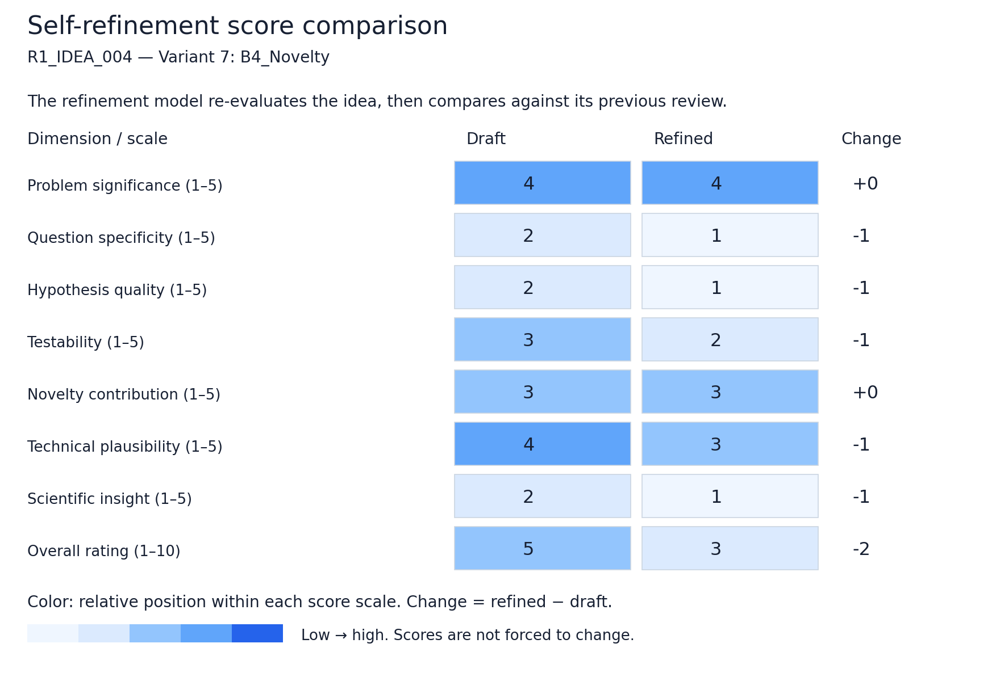

Changed score dimensions: question_specificity, hypothesis_quality, testability, technical_plausibility, scientific_insight, overall_rating.

### Score justifications (draft / refined)

**Problem significance**

```json
{
  "draft": {
    "score": 4.0,
    "justification": "The problem of constrained alignment for LLMs is highly significant, addressing the crucial challenge of balancing performance with safety. Reducing computational overhead while maintaining safety constraints is practically important for real-world deployment."
  },
  "refined": {
    "score": 4.0,
    "justification": "Constrained alignment of LLMs is a highly significant problem with real-world implications for safety and deployment. Reducing computational overhead while maintaining safety is practically important. However, the idea doesn't articulate why this specific approach addresses a fundamental limitation rather than just being an engineering improvement."
  }
}
```

**Question specificity**

```json
{
  "draft": {
    "score": 2.0,
    "justification": "The idea describes a method but doesn't articulate a clear research question. It states what the approach aims to do but not what specific phenomenon, relationship, or comparison is being investigated."
  },
  "refined": {
    "score": 1.0,
    "justification": "The idea describes what a method would do ('maximize output reward while enforcing safety constraints') but doesn't articulate any research question. There's no 'what if', 'how does', 'why does', or 'under what conditions' question being investigated. It's purely a method description without specifying what is being studied."
  }
}
```

**Hypothesis quality**

```json
{
  "draft": {
    "score": 2.0,
    "justification": "There's an implicit hypothesis that primal-dual DPO will be more efficient than methods requiring separate models, but this isn't stated as a testable prediction. No mechanism or causal relationship is proposed that could be supported or contradicted by evidence."
  },
  "refined": {
    "score": 1.0,
    "justification": "There is no hypothesis, explicit or implicit. The text states what the approach 'aims to' do, but makes no testable prediction about outcomes, mechanisms, or relationships. There's no statement that could be supported or contradicted by evidence beyond the trivial 'this method exists'."
  }
}
```

**Testability**

```json
{
  "draft": {
    "score": 3.0,
    "justification": "The claims about computational overhead and constraint satisfaction could be tested through experiments comparing to baseline methods. However, without a clear hypothesis or evaluation plan, it's unclear what specific evidence would support the approach's value."
  },
  "refined": {
    "score": 2.0,
    "justification": "While one could eventually test a implemented method, the idea as presented lacks any specification of what would be tested. There's no comparison proposed, no evaluation metrics mentioned, no experimental design suggested. The claims about 'reducing computational overhead' are potentially testable, but the idea doesn't specify how this would be measured or compared."
  }
}
```

**Novelty contribution**

```json
{
  "draft": {
    "score": 3.0,
    "justification": "Applying primal-dual optimization to DPO for constrained alignment appears novel, but the idea doesn't clarify how it differs from existing constrained RLHF approaches. The contribution is primarily methodological rather than aimed at generating new scientific understanding."
  },
  "refined": {
    "score": 3.0,
    "justification": "Applying primal-dual optimization to DPO for constrained alignment appears novel at a surface level. However, without technical details, it's unclear how this differs from existing constrained optimization approaches in RLHF. The contribution seems primarily methodological/engineering rather than scientific."
  }
}
```

**Technical plausibility**

```json
{
  "draft": {
    "score": 4.0,
    "justification": "The reasoning is logically coherent: integrating constraints directly into optimization could reduce overhead from training separate models. Primal-dual methods are well-established for constrained optimization, making the approach technically plausible."
  },
  "refined": {
    "score": 3.0,
    "justification": "The basic reasoning is coherent: integrating constraints could reduce overhead. Primal-dual methods are established for constrained optimization. However, without any technical details about how DPO would be reformulated, it's impossible to assess whether the approach is technically sound or faces fundamental obstacles."
  }
}
```

**Scientific insight**

```json
{
  "draft": {
    "score": 2.0,
    "justification": "As presented, the idea seems focused on developing a more efficient method rather than generating scientific insight. It doesn't propose to investigate underlying mechanisms, general principles, or boundary conditions of constrained alignment."
  },
  "refined": {
    "score": 1.0,
    "justification": "The idea as presented offers no indication of generating scientific insight. It describes an engineering approach to reduce computational overhead. There's no mention of investigating mechanisms, principles, limitations, or boundary conditions. It doesn't propose to teach us anything about alignment, optimization, or LLM behavior beyond whether a particular method works."
  }
}
```

**Overall rating**

```json
{
  "draft": {
    "score": 5.0,
    "justification": "This is a moderate/borderline research idea. It addresses a significant problem and proposes a technically plausible direction, but lacks a clear research question, testable hypothesis, and specification of what would be investigated. The idea describes a method proposal rather than articulating what scientific knowledge would be gained. With refinement to define a specific research question and hypothesis, it could become a stronger research direction."
  },
  "refined": {
    "score": 3.0,
    "justification": "This is a weak research idea. While it addresses a significant problem, it fails to articulate any research question, hypothesis, or investigation. It reads as a method proposal rather than a research direction. There's no specification of what would be studied, how it would be evaluated, or what scientific knowledge would be gained. The idea needs fundamental refinement to become a research investigation rather than an engineering suggestion."
  }
}
```

## R1_IDEA_004 — Variant 8: B5_Application_Impact

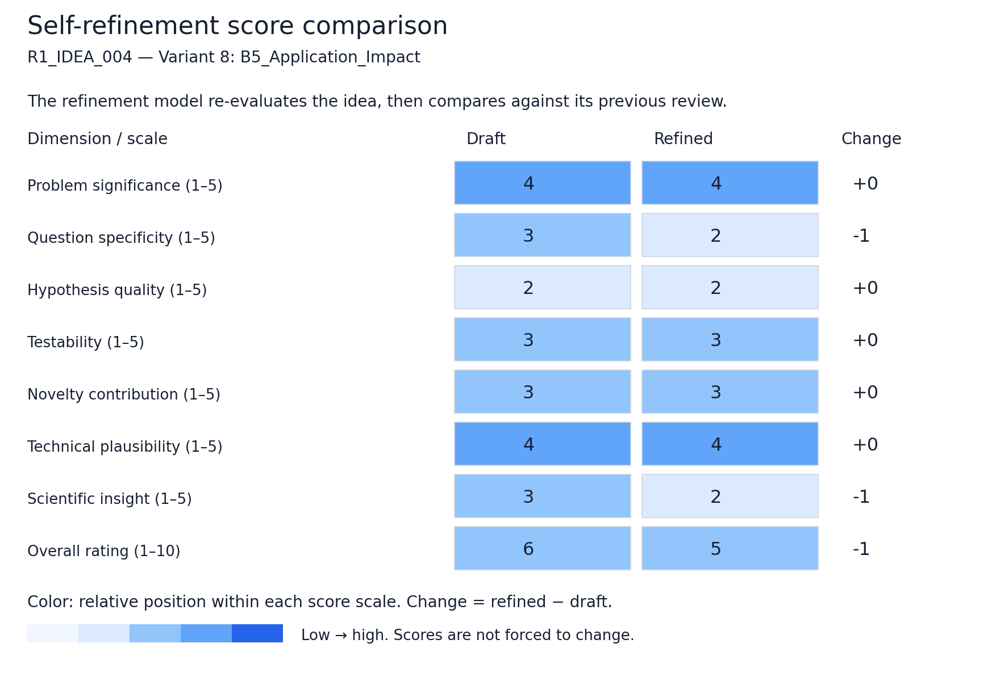

Changed score dimensions: question_specificity, scientific_insight, overall_rating.

### Score justifications (draft / refined)

**Problem significance**

```json
{
  "draft": {
    "score": 4.0,
    "justification": "The problem of aligning LLMs with safety constraints while maintaining performance is highly significant. Reducing computational overhead by eliminating separate reward/cost models addresses a practical bottleneck in current alignment methods. The application to safer conversational agents has clear societal relevance."
  },
  "refined": {
    "score": 4.0,
    "justification": "The problem is highly significant: aligning LLMs with safety constraints while maintaining performance is a critical challenge in AI safety. Reducing computational overhead by eliminating separate models addresses a practical bottleneck. The application to safer conversational agents has clear societal importance, though the idea focuses more on methodological efficiency than fundamental safety breakthroughs."
  }
}
```

**Question specificity**

```json
{
  "draft": {
    "score": 3.0,
    "justification": "The idea identifies a specific technical approach (primal-dual DPO) and target (constrained alignment without separate models), but the exact research question is implicit rather than explicitly formulated. It's more specific than 'improve LLM safety' but less specific than a clearly stated hypothesis."
  },
  "refined": {
    "score": 2.0,
    "justification": "The idea describes a methodological direction but does not articulate a specific research question. It states what the method aims to do ('maximize output reward while enforcing safety constraints') but not what will be investigated about this approach. There's no clear question about mechanisms, relationships, or conditions under which the method would succeed or fail."
  }
}
```

**Hypothesis quality**

```json
{
  "draft": {
    "score": 2.0,
    "justification": "There is an implicit hypothesis that primal-dual DPO can achieve constrained alignment more efficiently, but it's not clearly articulated. No concrete predictions are made about performance tradeoffs, computational savings, or conditions under which the method would succeed or fail. The hypothesis lacks falsifiability details."
  },
  "refined": {
    "score": 2.0,
    "justification": "There is only an implicit hypothesis that primal-dual DPO can achieve constrained alignment more efficiently. No concrete predictions are made about performance tradeoffs, computational savings, or boundary conditions. The hypothesis lacks falsifiability - it's not clear what evidence would contradict the core claim. The statement 'could inform' and 'may be relevant' are too vague to constitute a testable hypothesis."
  }
}
```

**Testability**

```json
{
  "draft": {
    "score": 3.0,
    "justification": "The idea is testable in principle through experiments comparing computational cost, safety metrics, and reward performance against baselines. However, no specific experimental design or evaluation metrics are suggested. The claim about 'reducing computational overhead' is measurable but not operationalized."
  },
  "refined": {
    "score": 3.0,
    "justification": "The core claims about computational efficiency and constraint enforcement are measurable in principle. However, the idea doesn't specify how these would be tested - no experimental design, evaluation metrics, or comparison baselines are suggested. The claim about 'reducing computational overhead' is testable but not operationalized. The method's effectiveness could be evaluated through experiments, but the idea doesn't propose how."
  }
}
```

**Novelty contribution**

```json
{
  "draft": {
    "score": 3.0,
    "justification": "Combining primal-dual optimization with direct preference optimization for constrained alignment appears novel. However, the contribution level depends on implementation details and results. If successful, it could offer a more efficient alternative to existing constrained RLHF methods, but the idea summary doesn't clearly differentiate it from related work."
  },
  "refined": {
    "score": 3.0,
    "justification": "Combining primal-dual optimization with direct preference optimization for constrained alignment appears novel conceptually. However, the contribution level is unclear without details about how this differs from existing constrained RLHF or preference optimization methods. If successful, it could offer a more efficient alternative, but the idea summary doesn't clearly establish what gap in the literature it addresses or how it advances beyond current approaches."
  }
}
```

**Technical plausibility**

```json
{
  "draft": {
    "score": 4.0,
    "justification": "The technical direction is plausible. Primal-dual methods are well-established for constrained optimization, and DPO has shown promise for preference alignment. Integrating them to handle constraints without separate models is conceptually coherent. The main assumption (that constraints can be effectively enforced without explicit cost models) is reasonable but needs validation."
  },
  "refined": {
    "score": 4.0,
    "justification": "The technical direction is conceptually plausible. Primal-dual methods are well-established for constrained optimization, and DPO has demonstrated effectiveness for preference alignment. Integrating them to handle constraints without separate models is logically coherent. The main assumption - that constraints can be effectively enforced without explicit cost models - is reasonable but represents the key technical challenge that would need validation."
  }
}
```

**Scientific insight**

```json
{
  "draft": {
    "score": 3.0,
    "justification": "If successful, the research could provide insight into how constrained alignment can be achieved more efficiently. However, the potential scientific insight is somewhat limited to the specific method's efficacy. Deeper insights about tradeoffs between model complexity, constraint satisfaction, and performance in alignment could emerge but aren't explicitly promised."
  },
  "refined": {
    "score": 2.0,
    "justification": "The potential scientific insight is limited primarily to whether this specific method works efficiently. There's no indication that the research would reveal deeper principles about constrained alignment, tradeoffs between model complexity and performance, or general mechanisms for safety-utility balancing. The focus appears to be on methodological efficiency rather than fundamental understanding of alignment phenomena."
  }
}
```

**Overall rating**

```json
{
  "draft": {
    "score": 6.0,
    "justification": "This is a moderate research idea with clear practical motivation and a specific technical direction. The problem is significant, and the proposed method is plausible. However, the research question and hypothesis need sharper formulation, and the potential scientific insight beyond computational efficiency is unclear. With better articulation of what specifically would be tested and learned, this could become a strong research direction."
  },
  "refined": {
    "score": 5.0,
    "justification": "This is a moderate research idea with clear practical motivation and a plausible technical direction. The problem is significant, and reducing computational overhead in constrained alignment is worthwhile. However, the idea lacks a clearly defined research question, testable hypothesis, and articulation of potential scientific insight. It describes a methodological proposal rather than a research investigation. With sharper formulation of what would be learned and tested, this could become a stronger research direction."
  }
}
```

## R1_IDEA_004 — Variant 9: C1_Hollow_Shell


Changed score dimensions: none.

### Score justifications (draft / refined)

**Problem significance**

```json
{
  "draft": {
    "score": 4.0,
    "justification": "The problem of aligning LLMs under constraints is highly significant. Balancing output quality with safety considerations is a core challenge in responsible AI development, and computational efficiency is a practical concern for deploying aligned models."
  },
  "refined": {
    "score": 4.0,
    "justification": "The problem is highly significant. Aligning LLMs under constraints (safety, computational) is a core challenge in responsible and deployable AI. Balancing quality and safety is both scientifically and practically important."
  }
}
```

**Question specificity**

```json
{
  "draft": {
    "score": 1.0,
    "justification": "Extremely vague. The idea merely states it 'presents a research approach' without defining any specific research question. There's no indication of what relationship, mechanism, or phenomenon is being investigated."
  },
  "refined": {
    "score": 1.0,
    "justification": "Extremely vague. The idea only states it 'presents a research approach' without defining any concrete research question. There is no indication of what specific relationship, mechanism, or phenomenon is under investigation."
  }
}
```

**Hypothesis quality**

```json
{
  "draft": {
    "score": 1.0,
    "justification": "No hypothesis is presented. The text describes a general direction ('improving output quality while managing safety') but makes no concrete prediction about outcomes, mechanisms, or relationships that could be tested."
  },
  "refined": {
    "score": 1.0,
    "justification": "No hypothesis is presented. The text describes a general goal ('improving output quality while managing safety') but makes no concrete, testable prediction about outcomes, mechanisms, or causal relationships."
  }
}
```

**Testability**

```json
{
  "draft": {
    "score": 1.0,
    "justification": "The idea as presented is not testable. There's no suggested experiment, comparison, evaluation, or analysis method. The 'optimization framework' is completely unspecified, making it impossible to determine how one would gather evidence for or against its effectiveness."
  },
  "refined": {
    "score": 1.0,
    "justification": "The idea is not testable as presented. There is no suggested experiment, comparison, evaluation metric, or analysis method. The 'optimization framework' is undefined, so there is no way to gather evidence for or against its effectiveness."
  }
}
```

**Novelty contribution**

```json
{
  "draft": {
    "score": 2.0,
    "justification": "While alignment under constraints is an important area, the idea as presented lacks any novel angle or specific contribution. It mentions generic goals (improve quality, manage safety, reduce computation) without specifying what new approach, insight, or method would be developed."
  },
  "refined": {
    "score": 2.0,
    "justification": "While alignment under constraints is an active area, the idea lacks any specific novel angle. It mentions generic goals without specifying what new approach, insight, or method would be contributed. It could be misinterpreted as a vague application of existing optimization ideas."
  }
}
```

**Technical plausibility**

```json
{
  "draft": {
    "score": 2.0,
    "justification": "The reasoning is too vague to assess technical plausibility. The claim about avoiding 'certain training requirements and prior parameter knowledge' is ambiguous - most alignment methods require some form of training and utilize model parameters. Without details, it's unclear if this is technically coherent."
  },
  "refined": {
    "score": 2.0,
    "justification": "Too vague to assess properly. The claim about avoiding 'certain training requirements and prior parameter knowledge' is ambiguous—most alignment methods require training and use model parameters. Without details, it's unclear if the direction is technically coherent or based on reasonable assumptions."
  }
}
```

**Scientific insight**

```json
{
  "draft": {
    "score": 2.0,
    "justification": "The idea as stated has limited potential for scientific insight. It suggests applying an unspecified optimization framework to alignment, but doesn't indicate what general principles, mechanisms, or boundary conditions might be discovered through this research."
  },
  "refined": {
    "score": 2.0,
    "justification": "Limited potential for scientific insight as stated. It suggests applying an unspecified optimization framework to alignment, but does not indicate what general principles, mechanisms, or boundary conditions might be discovered. It reads more like an application goal than an insight-driven investigation."
  }
}
```

**Overall rating**

```json
{
  "draft": {
    "score": 3.0,
    "justification": "This is a weak research idea. While it addresses an important problem (LLM alignment under constraints), it fails to define a specific research question, hypothesis, or testable approach. The description is too vague to evaluate scientific merit. It reads more like a general motivation statement than a research idea with a clear direction for investigation."
  },
  "refined": {
    "score": 3.0,
    "justification": "This is a weak research idea. It addresses an important problem but fails to define a specific research question, hypothesis, or testable approach. The description is overly vague, resembling a general motivation rather than a clear direction for scientific investigation. It lacks the specificity, testability, and novelty needed for a strong research idea."
  }
}
```

## R1_IDEA_004 — Variant 10: C2_Logic_Flawed

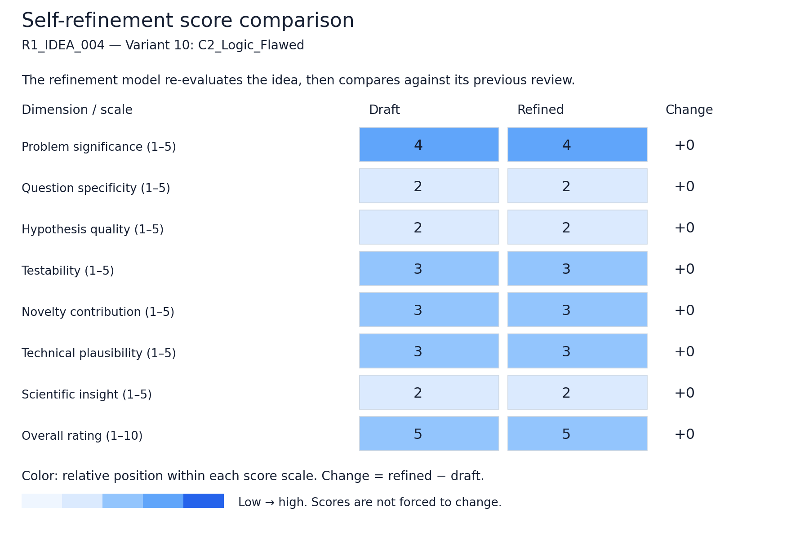

Changed score dimensions: none.

### Score justifications (draft / refined)

**Problem significance**

```json
{
  "draft": {
    "score": 4.0,
    "justification": "The problem of efficient constrained alignment for LLMs is highly significant. Balancing reward maximization with safety constraints is a core challenge in responsible AI development, and computational efficiency is a practical barrier to widespread adoption of alignment techniques."
  },
  "refined": {
    "score": 4.0,
    "justification": "The problem is highly significant. Efficient constrained alignment is a core challenge in responsible LLM development, balancing helpfulness with safety. Computational overhead is a practical barrier to deploying alignment techniques widely, making efficiency improvements valuable to both researchers and practitioners."
  }
}
```

**Question specificity**

```json
{
  "draft": {
    "score": 2.0,
    "justification": "The idea describes a method but doesn't articulate a specific research question. It states what the method aims to do but not what specific relationship, mechanism, or phenomenon would be investigated."
  },
  "refined": {
    "score": 2.0,
    "justification": "The idea describes a method but doesn't articulate a specific research question. It states what the method aims to do ('maximize reward while enforcing constraints efficiently') but not what specific relationship, mechanism, or phenomenon would be investigated. There's no clear 'what would we learn?' beyond whether the method works."
  }
}
```

**Hypothesis quality**

```json
{
  "draft": {
    "score": 2.0,
    "justification": "There's an implicit hypothesis that 'primal-dual DPO can achieve constrained alignment more efficiently than methods requiring separate models,' but it's not clearly stated or testable. The claim about 'broader effectiveness' is too vague to constitute a meaningful hypothesis."
  },
  "refined": {
    "score": 2.0,
    "justification": "There's an implicit hypothesis that 'primal-dual DPO can achieve constrained alignment more efficiently than methods requiring separate models,' but it's not clearly stated or testable. The additional claim about 'broader effectiveness' is too vague to constitute a meaningful hypothesis. No concrete predictions are made about what would be observed."
  }
}
```

**Testability**

```json
{
  "draft": {
    "score": 3.0,
    "justification": "The core efficiency claim could be tested by comparing computational resources against baseline methods. However, the 'broader effectiveness' claim is not well-defined enough to test. The idea suggests measurable outcomes but doesn't specify what evidence would support or refute it."
  },
  "refined": {
    "score": 3.0,
    "justification": "The core efficiency claim could be tested through comparative experiments measuring computational resources. However, the 'broader effectiveness' claim is not well-defined enough to test. The idea suggests measurable outcomes (computational overhead reduction) but doesn't specify what evidence would support or refute the overall approach's value."
  }
}
```

**Novelty contribution**

```json
{
  "draft": {
    "score": 3.0,
    "justification": "Applying primal-dual methods to DPO for constrained alignment could be novel, but the idea doesn't clarify how it differs from existing constrained optimization approaches in RL/LLM alignment. The potential contribution is moderate - it addresses an efficiency problem but may not provide fundamentally new scientific insight."
  },
  "refined": {
    "score": 3.0,
    "justification": "Applying primal-dual methods to DPO for constrained alignment could be novel, but the idea doesn't clarify how it differs from existing constrained optimization approaches in RL/LLM alignment. The potential contribution is moderate - it addresses an efficiency problem in a specific way, but may represent an incremental engineering improvement rather than fundamental scientific advancement."
  }
}
```

**Technical plausibility**

```json
{
  "draft": {
    "score": 3.0,
    "justification": "Primal-dual methods are well-established for constrained optimization, and DPO is a known alignment technique, so combining them is conceptually plausible. However, the idea doesn't explain key technical challenges (e.g., how to define constraints without cost models), making full assessment difficult."
  },
  "refined": {
    "score": 3.0,
    "justification": "Primal-dual methods are well-established for constrained optimization, and DPO is a known alignment technique, so combining them is conceptually plausible. However, the idea doesn't address key technical challenges (e.g., how to define/measure constraint violations without cost models, how to ensure dual variable convergence). The plausibility is moderate given the limited details."
  }
}
```

**Scientific insight**

```json
{
  "draft": {
    "score": 2.0,
    "justification": "As presented, the idea seems primarily focused on engineering efficiency rather than scientific understanding. It could potentially reveal insights about optimization tradeoffs in constrained alignment, but the current formulation doesn't emphasize understanding mechanisms or principles."
  },
  "refined": {
    "score": 2.0,
    "justification": "As presented, the idea seems primarily focused on engineering efficiency rather than scientific understanding. It could potentially reveal insights about optimization tradeoffs or constraint satisfaction mechanisms in preference-based learning, but the current formulation doesn't emphasize understanding fundamental principles, mechanisms, or boundary conditions of alignment."
  }
}
```

**Overall rating**

```json
{
  "draft": {
    "score": 5.0,
    "justification": "This is a moderate/borderline research idea. It addresses a meaningful practical problem in LLM alignment and proposes a specific technical direction, but lacks a clearly articulated research question, testable hypothesis, and specification of what would constitute success. The potential contribution appears more engineering-oriented than scientific, with limited emphasis on generating transferable insights about alignment mechanisms."
  },
  "refined": {
    "score": 5.0,
    "justification": "This is a moderate/borderline research idea. It addresses a meaningful practical problem in LLM alignment and proposes a specific technical direction with clear motivation. However, it lacks a clearly articulated research question, testable hypothesis, and specification of what would constitute success. The potential contribution appears more engineering-oriented than scientific, with limited emphasis on generating transferable insights about alignment mechanisms. The connection between efficiency and broader effectiveness is asserted without justification."
  }
}
```

## R1_IDEA_004 — Variant 11: C3_Substance_Enriched

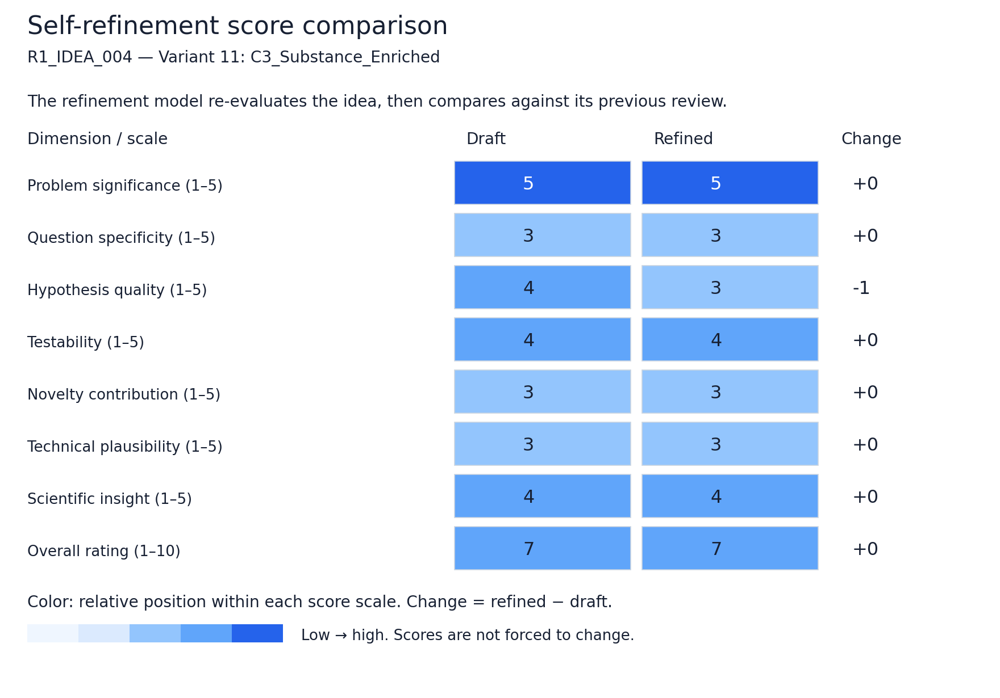

Changed score dimensions: hypothesis_quality.

### Score justifications (draft / refined)

**Problem significance**

```json
{
  "draft": {
    "score": 5.0,
    "justification": "The problem of constrained alignment for LLMs is highly significant, addressing the critical challenge of balancing helpfulness with safety. This is a central concern in responsible AI development with practical implications for deployment."
  },
  "refined": {
    "score": 5.0,
    "justification": "Constrained alignment of LLMs is a critical and timely challenge, central to developing models that are both helpful and safe. Reducing computational overhead while maintaining safety is practically significant for scalable alignment research and deployment."
  }
}
```

**Question specificity**

```json
{
  "draft": {
    "score": 3.0,
    "justification": "The idea identifies a specific technical approach (primal-dual DPO) but doesn't clearly define the research question beyond 'can this work?'. The validation path and hypothesis provide some specificity, but the core research question could be more precisely formulated."
  },
  "refined": {
    "score": 3.0,
    "justification": "The idea specifies a technical approach (primal-dual DPO) and a validation path, but the core research question is somewhat implicit ('Can primal-dual DPO achieve constrained alignment efficiently?'). It lacks a precise, focused question—e.g., about convergence properties, constraint satisfaction mechanisms, or comparative advantages."
  }
}
```

**Hypothesis quality**

```json
{
  "draft": {
    "score": 4.0,
    "justification": "The hypothesis about dual variable dynamics revealing interpretable trade-off patterns is concrete and testable. It makes a prediction about what the method would reveal beyond just performance improvements, suggesting potential for scientific insight."
  },
  "refined": {
    "score": 3.0,
    "justification": "The hypothesis about dual variable dynamics revealing interpretable trade-off patterns is testable and goes beyond mere performance claims. However, it is relatively broad and not deeply integrated with the method's proposed mechanism. A stronger hypothesis would predict specific dynamics or relationships tied to the primal-dual formulation."
  }
}
```

**Testability**

```json
{
  "draft": {
    "score": 4.0,
    "justification": "The idea suggests concrete validation paths (convergence behavior testing) and the hypothesis about dual variable patterns is directly testable through empirical analysis. The approach could be evaluated on standard alignment benchmarks."
  },
  "refined": {
    "score": 4.0,
    "justification": "The idea is highly testable: convergence can be evaluated empirically under varying constraint budgets, and dual variable patterns can be analyzed across prompts. Standard alignment benchmarks (e.g., safety datasets) provide clear evaluation pathways. The hypothesis is directly measurable through statistical analysis of training dynamics."
  }
}
```

**Novelty contribution**

```json
{
  "draft": {
    "score": 3.0,
    "justification": "While constrained alignment is an active area, combining primal-dual optimization with DPO appears novel. However, the idea doesn't clearly articulate how this differs from existing constrained RLHF or how it addresses limitations of current approaches beyond computational overhead."
  },
  "refined": {
    "score": 3.0,
    "justification": "Applying primal-dual optimization to DPO for constrained alignment appears novel, but the idea does not articulate how it fundamentally differs from or improves upon existing constrained RLHF/DPO methods. The claimed computational advantage (no separate models) is promising but requires clarification to assess novelty."
  }
}
```

**Technical plausibility**

```json
{
  "draft": {
    "score": 3.0,
    "justification": "Primal-dual methods are well-established in optimization, and DPO is a known alignment technique, so the combination is conceptually plausible. However, key implementation details are missing, particularly regarding how constraints would be defined without separate models, making full assessment difficult."
  },
  "refined": {
    "score": 3.0,
    "justification": "Primal-dual methods are well-established in constrained optimization, and DPO is a proven alignment technique, so the combination is conceptually reasonable. However, the lack of details on constraint representation and integration with DPO's likelihood-based objective raises plausibility concerns. The claim of eliminating separate cost models seems at odds with needing to measure constraint violations."
  }
}
```

**Scientific insight**

```json
{
  "draft": {
    "score": 4.0,
    "justification": "The hypothesis about dual variable dynamics suggests potential for insight into the fundamental trade-offs between reward and safety in LLM alignment. If successful, this could reveal interpretable patterns in how models balance competing objectives, which would be valuable scientific knowledge."
  },
  "refined": {
    "score": 4.0,
    "justification": "The hypothesis suggests potential for insight into how LLMs balance reward and safety under constraints, which could reveal generalizable trade-off patterns or scaling behaviors. Understanding dual variable dynamics could inform broader principles for multi-objective alignment, offering value beyond a single method's performance."
  }
}
```

**Overall rating**

```json
{
  "draft": {
    "score": 7.0,
    "justification": "This is a strong research idea addressing an important problem with a specific technical direction. The inclusion of a testable hypothesis about interpretable trade-off patterns elevates it beyond a simple application. However, the idea would benefit from clearer formulation of the core mechanism and more explicit comparison to existing approaches. The potential for both practical improvement (reduced computational overhead) and scientific insight (understanding trade-off patterns) makes it promising."
  },
  "refined": {
    "score": 7.0,
    "justification": "This is a strong research idea addressing a significant problem with a clear technical direction and testable components. The inclusion of a hypothesis about interpretable dynamics elevates it above a purely engineering contribution. However, the idea would be strengthened by a more precise research question, clearer technical details, and explicit differentiation from existing work. The potential for both practical efficiency gains and scientific insight into alignment trade-offs makes it promising."
  }
}
```

## R1_IDEA_004 — Variant 12: H1_Deceptive_Hollow

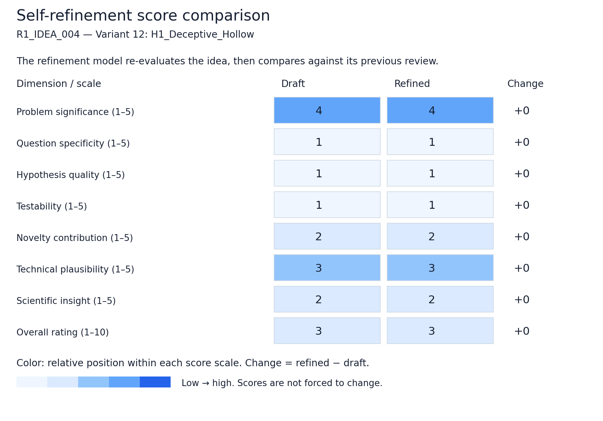

Changed score dimensions: none.

### Score justifications (draft / refined)

**Problem significance**

```json
{
  "draft": {
    "score": 4.0,
    "justification": "The problem of aligning LLMs under constraints is highly significant. Balancing output quality with safety considerations while managing computational costs addresses real challenges in deploying large language models. The problem is timely and important for both research and practical applications."
  },
  "refined": {
    "score": 4.0,
    "justification": "The problem is highly significant. Aligning LLMs under practical constraints (safety, quality, efficiency) is a core challenge for both research and real-world deployment. The motivation is timely and addresses a meaningful gap."
  }
}
```

**Question specificity**

```json
{
  "draft": {
    "score": 1.0,
    "justification": "Extremely weak. The idea does not define any specific research question. It merely states a general direction ('alignment under constraints') without specifying what aspect is being investigated, what relationships are being studied, or what phenomenon is being examined."
  },
  "refined": {
    "score": 1.0,
    "justification": "Extremely weak. No concrete research question is defined. The idea only states a broad direction ('alignment under constraints') without specifying what is being investigated, what relationships are studied, or what specific phenomenon is examined."
  }
}
```

**Hypothesis quality**

```json
{
  "draft": {
    "score": 1.0,
    "justification": "Very weak. There is no explicit or implicit hypothesis that makes a concrete prediction. The text mentions a 'central promise' but it's vague and not falsifiable. No mechanism or relationship is proposed that could be supported or contradicted by evidence."
  },
  "refined": {
    "score": 1.0,
    "justification": "Very weak. There is no explicit or implicit hypothesis that makes a concrete, testable prediction. The 'central promise' is vague and not falsifiable. No mechanism, relationship, or expected outcome is proposed that could be supported or contradicted by evidence."
  }
}
```

**Testability**

```json
{
  "draft": {
    "score": 1.0,
    "justification": "Very weak. With no specific hypothesis or research question, it's unclear what would be tested. The mention of an 'optimization framework' is too vague to suggest concrete experiments, comparisons, or evaluations. The idea as presented is not meaningfully testable."
  },
  "refined": {
    "score": 1.0,
    "justification": "Very weak. With no specific hypothesis or research question, it is unclear what would be tested. The mention of an 'optimization framework' is too vague to suggest concrete experiments, evaluations, or comparisons. The idea as presented is not meaningfully testable."
  }
}
```

**Novelty contribution**

```json
{
  "draft": {
    "score": 2.0,
    "justification": "Weak. While the framing as a 'transformative synthesis' claims high novelty, the actual content describes a generic direction (LLM alignment with constraints) that many researchers are already investigating. Without specific methodological innovations or novel insights, the claimed contribution appears overstated."
  },
  "refined": {
    "score": 2.0,
    "justification": "Weak. The framing claims high novelty, but the described direction—LLM alignment with constraints—is already an active research area. Without specifying a novel mechanism, insight, or approach, the claimed 'transformative synthesis' appears overstated and unsupported."
  }
}
```

**Technical plausibility**

```json
{
  "draft": {
    "score": 3.0,
    "justification": "Moderate. The general concept of using optimization frameworks for alignment under constraints is technically plausible. However, the lack of details about how constraints would be formalized, what optimization techniques would be used, or how computational savings would be achieved makes it difficult to assess technical coherence."
  },
  "refined": {
    "score": 3.0,
    "justification": "Moderate. The general notion of using optimization for alignment under constraints is plausible. However, the complete lack of details on constraint formalization, optimization techniques, or computational savings makes it impossible to assess coherence beyond a superficial level."
  }
}
```

**Scientific insight**

```json
{
  "draft": {
    "score": 2.0,
    "justification": "Weak. The idea claims potential for 'conceptual insight' but doesn't specify what insights might be gained. Without a clear research question, it's unclear what general principles, mechanisms, or boundary conditions might be revealed. The focus seems more on application (improving output quality under constraints) than on generating transferable scientific understanding."
  },
  "refined": {
    "score": 2.0,
    "justification": "Weak. The idea claims potential for 'conceptual insight' but does not specify what insights might be gained. Without a clear question, it is unclear what general principles, mechanisms, or boundary conditions could be revealed. The focus seems more on aspirational application than on generating transferable scientific understanding."
  }
}
```

**Overall rating**

```json
{
  "draft": {
    "score": 3.0,
    "justification": "Weak idea. While it addresses an important problem (LLM alignment under constraints), the idea lacks specificity, testability, and a clear hypothesis. It uses grandiose language without substantive content. The research direction is too vague to evaluate meaningfully or to guide actual investigation. It reads more like a motivational pitch than a research idea with a defined question or approach."
  },
  "refined": {
    "score": 3.0,
    "justification": "Weak idea. While it identifies an important problem, the idea is overly vague, lacks a specific research question or hypothesis, and is not testable. It reads as a motivational pitch rather than a defined research direction with scientific substance. The grandiose framing is not supported by concrete content."
  }
}
```

## R1_IDEA_004 — Variant 13: H2_Confident_Flaw

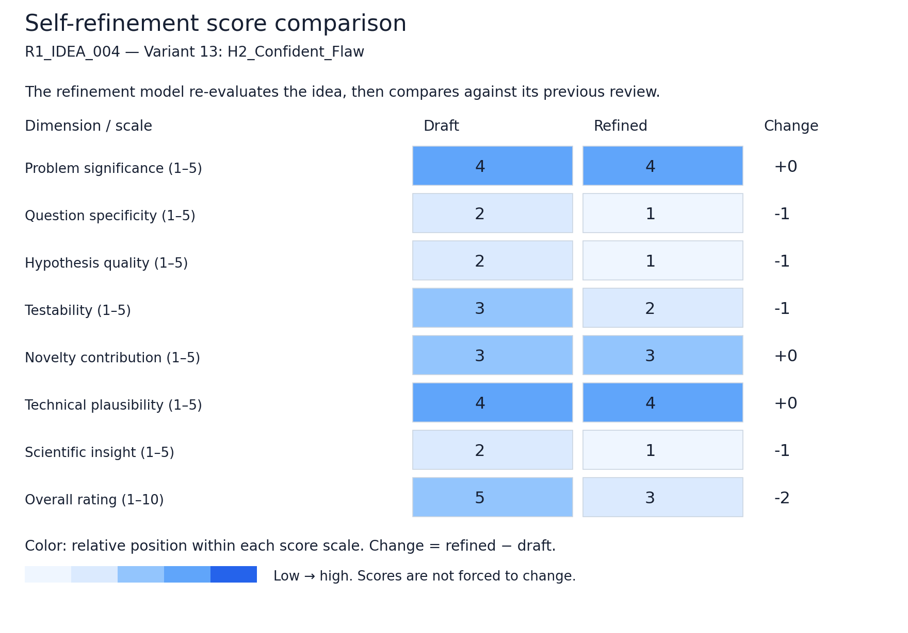

Changed score dimensions: question_specificity, hypothesis_quality, testability, scientific_insight, overall_rating.

### Score justifications (draft / refined)

**Problem significance**

```json
{
  "draft": {
    "score": 4.0,
    "justification": "Constrained alignment of LLMs is an important practical problem with safety implications. Computational efficiency is a meaningful concern given the scale of modern models."
  },
  "refined": {
    "score": 4.0,
    "justification": "Constrained alignment of LLMs is highly important for safety-critical applications. Computational efficiency is a meaningful practical concern given the scale of modern models and the resource intensity of alignment procedures."
  }
}
```

**Question specificity**

```json
{
  "draft": {
    "score": 2.0,
    "justification": "The idea describes a proposed method but doesn't articulate a clear research question. It's unclear what specific relationship or phenomenon is being investigated beyond 'this method should work well.'"
  },
  "refined": {
    "score": 1.0,
    "justification": "The idea does not articulate a research question at all. It describes a proposed method and makes claims about its effectiveness, but doesn't define what specific relationship, mechanism, or phenomenon is being investigated. There's no 'what are we trying to learn?' component."
  }
}
```

**Hypothesis quality**

```json
{
  "draft": {
    "score": 2.0,
    "justification": "There's an implicit hypothesis that primal-dual DPO will be more efficient and broadly effective, but it's not formulated as a testable prediction. The claim about 'causal evidence for general superiority' is overly strong and not properly scoped."
  },
  "refined": {
    "score": 1.0,
    "justification": "There is no testable hypothesis presented. The text contains assertions ('efficiency suggests broader effectiveness', 'gains can be confidently treated as causal evidence') but these are not formulated as falsifiable predictions. The language is declarative rather than hypothetical, and the dismissal of methodological controls undermines any potential hypothesis testing."
  }
}
```

**Testability**

```json
{
  "draft": {
    "score": 3.0,
    "justification": "The idea could be tested through experiments comparing computational efficiency and alignment performance against baselines. However, the dismissal of important methodological controls (dataset composition, etc.) undermines rigorous testability."
  },
  "refined": {
    "score": 2.0,
    "justification": "While one could design experiments to compare computational efficiency and alignment performance, the idea's dismissal of important methodological considerations (isolating variables, controlling for confounders) makes rigorous testing difficult. The claim about 'causal evidence without separately isolating... alternative explanations' directly contradicts principles of testable scientific inquiry."
  }
}
```

**Novelty contribution**

```json
{
  "draft": {
    "score": 3.0,
    "justification": "Applying primal-dual methods to DPO for constrained alignment appears novel, but the contribution level depends on whether this yields meaningful advantages over existing constrained RLHF or constrained DPO approaches."
  },
  "refined": {
    "score": 3.0,
    "justification": "Applying primal-dual methods to DPO for constrained alignment appears novel conceptually. However, the contribution level is unclear without specifying what advantages this provides over existing constrained RLHF or other constrained optimization approaches for alignment."
  }
}
```

**Technical plausibility**

```json
{
  "draft": {
    "score": 4.0,
    "justification": "The general approach of using primal-dual methods for constrained optimization is well-established. Avoiding separate reward/cost models aligns with DPO's philosophy. The technical direction seems plausible."
  },
  "refined": {
    "score": 4.0,
    "justification": "The general approach of using primal-dual methods for constrained optimization is well-established in optimization theory. Avoiding separate reward/cost models aligns with DPO's original motivation. The technical direction seems plausible, though details are sparse."
  }
}
```

**Scientific insight**

```json
{
  "draft": {
    "score": 2.0,
    "justification": "The idea focuses on practical efficiency gains rather than scientific understanding. It doesn't articulate what general principles or mechanisms might be learned about constrained alignment or preference optimization."
  },
  "refined": {
    "score": 1.0,
    "justification": "The idea focuses entirely on practical efficiency claims rather than scientific understanding. It doesn't articulate what general principles, mechanisms, or theoretical insights might be learned about constrained alignment, preference optimization, or the tradeoffs between safety and capability. The text explicitly dismisses investigating boundary cases or alternative explanations."
  }
}
```

**Overall rating**

```json
{
  "draft": {
    "score": 5.0,
    "justification": "This is a moderate/borderline research idea. It addresses a meaningful problem and proposes a plausible technical direction, but lacks a clearly defined research question, makes overly strong claims without proper methodological consideration, and focuses more on practical application than scientific insight. The idea needs substantial refinement to become a strong research proposal."
  },
  "refined": {
    "score": 3.0,
    "justification": "This is a weak research idea. While it addresses an important problem and proposes a plausible technical direction, it fails to articulate any research question or testable hypothesis. The logical flaws in the argumentation (claiming causal evidence without proper controls) and the focus on declarative assertions rather than scientific inquiry significantly undermine its quality. The idea needs fundamental restructuring to become a valid research proposal."
  }
}
```

## R1_IDEA_004 — Variant 14: H3_Verbose_Enriched

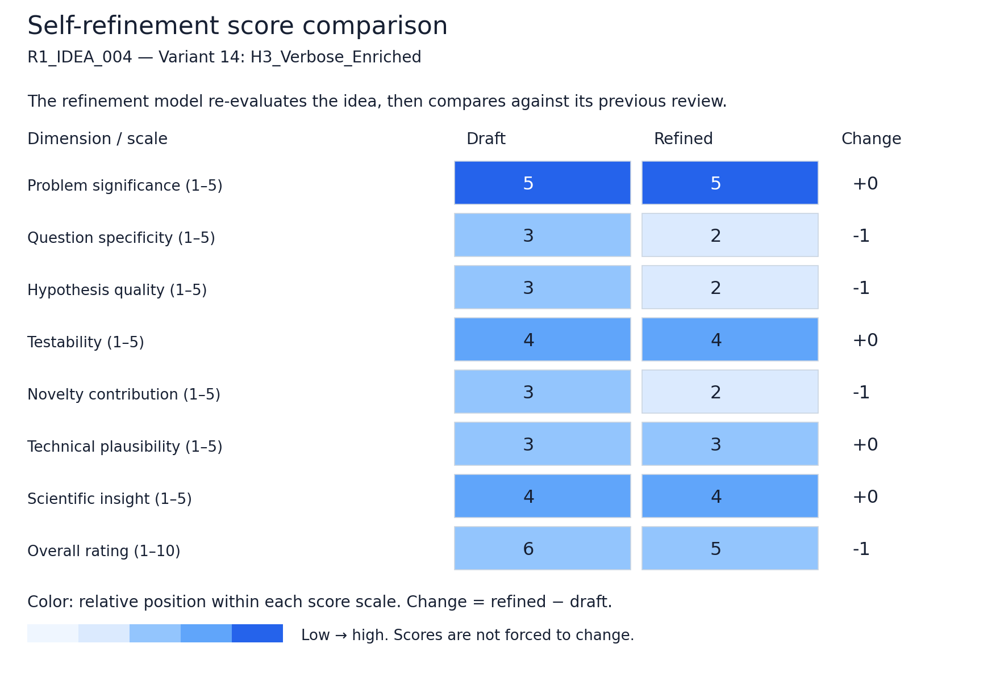

Changed score dimensions: question_specificity, hypothesis_quality, novelty_contribution, overall_rating.

### Score justifications (draft / refined)

**Problem significance**

```json
{
  "draft": {
    "score": 5.0,
    "justification": "The problem of constrained LLM alignment is highly significant. Efficiently balancing reward maximization with safety constraints without separate models addresses real computational and practical challenges in deploying aligned models."
  },
  "refined": {
    "score": 5.0,
    "justification": "The problem is highly significant. Efficiently and safely aligning LLMs is a central challenge in AI safety. Reducing computational overhead by avoiding separate reward/cost models addresses a practical bottleneck in scalable alignment."
  }
}
```

**Question specificity**

```json
{
  "draft": {
    "score": 3.0,
    "justification": "The idea identifies a general direction (primal-dual DPO for constrained alignment) but lacks specificity about what exactly would be investigated. The validation suggestions are detailed but the core research question remains somewhat vague."
  },
  "refined": {
    "score": 2.0,
    "justification": "The idea describes a method and a validation plan but does not define a specific research question. It states what the method does ('aims to maximize reward while enforcing safety constraints') but not what specific relationship, comparison, or phenomenon is under investigation. The validation suggestions are detailed but serve a vaguely defined goal."
  }
}
```

**Hypothesis quality**

```json
{
  "draft": {
    "score": 3.0,
    "justification": "There's an implicit hypothesis that primal-dual DPO can achieve constrained alignment more efficiently, and an explicit but vague hypothesis about dual variable dynamics revealing trade-off patterns. Neither is sharply defined or makes concrete, falsifiable predictions."
  },
  "refined": {
    "score": 2.0,
    "justification": "The explicit hypothesis ('dual variable dynamics might reveal interpretable trade-off patterns') is observational and vague. It does not make a concrete, testable prediction about the nature of those patterns or their causal relationship to model behavior. The implicit hypothesis about computational efficiency is also not framed as a falsifiable claim."
  }
}
```

**Testability**

```json
{
  "draft": {
    "score": 4.0,
    "justification": "The idea provides excellent suggestions for how to test the approach (convergence behavior, staged design, ablations, sensitivity analyses). While the specific success criteria aren't defined, the proposed validation framework is comprehensive and testable."
  },
  "refined": {
    "score": 4.0,
    "justification": "The idea provides an excellent, comprehensive framework for testing. The proposed staged design, ablations, sensitivity analyses, and comparison across cases constitute a highly testable validation plan. The main limitation is that the specific claims to be tested are not precisely defined."
  }
}
```

**Novelty contribution**

```json
{
  "draft": {
    "score": 3.0,
    "justification": "The combination of primal-dual methods with DPO for constrained alignment appears novel, but it's unclear how this differs substantially from existing constrained RL approaches. The potential contribution is moderate - mainly computational efficiency rather than fundamental insight."
  },
  "refined": {
    "score": 2.0,
    "justification": "The novelty appears limited. Applying primal-dual optimization to a learning problem is standard. The core idea seems to be using DPO to avoid training separate models, which is an engineering efficiency gain rather than a fundamental algorithmic or theoretical novelty. Without a clearer distinction from existing constrained RL or alignment methods, the potential contribution seems moderate at best."
  }
}
```

**Technical plausibility**

```json
{
  "draft": {
    "score": 3.0,
    "justification": "Primal-dual methods are well-established in optimization, and DPO is a known alignment technique. Their combination seems plausible but the idea lacks details about implementation challenges, stability, or how constraints would be practically enforced during DPO training."
  },
  "refined": {
    "score": 3.0,
    "justification": "The combination is plausible in principle: DPO is derived from a reward model, and primal-dual methods handle constraints. However, key details are missing—how constraints are integrated into the DPO loss, how the dual variable is updated, and whether this leads to stable training. The idea is coherent but underspecified."
  }
}
```

**Scientific insight**

```json
{
  "draft": {
    "score": 4.0,
    "justification": "The suggestion to analyze dual variable dynamics for interpretable trade-off patterns indicates potential for scientific insight beyond mere performance improvement. Understanding when and why the method works could reveal principles about reward-safety trade-offs in LLM alignment."
  },
  "refined": {
    "score": 4.0,
    "justification": "The focus on analyzing dual variable dynamics to understand trade-off patterns has strong potential for scientific insight. Moving beyond 'does it work?' to 'what does the optimization trajectory tell us about the reward-safety Pareto frontier?' could yield generalizable knowledge about alignment under constraints."
  }
}
```

**Overall rating**

```json
{
  "draft": {
    "score": 6.0,
    "justification": "This is a moderate research idea with clear practical relevance and thoughtful validation suggestions, but it lacks specificity in the core research question and hypothesis. The technical approach is described at too high a level, and the novelty relative to existing constrained RL methods is unclear. However, the comprehensive evaluation framework and focus on interpretability raise it above a simple application idea."
  },
  "refined": {
    "score": 5.0,
    "justification": "This is a moderate research idea. It addresses a significant problem and proposes a thoughtful, testable evaluation framework. However, it is critically weakened by a lack of a specific research question and a vague, non-predictive hypothesis. The technical approach is plausible but underspecified, and the novelty is unclear. The strong emphasis on interpretability and rigorous testing elevates it above a purely applied project, but the core investigative focus remains too diffuse."
  }
}
```

## R1_IDEA_004 — Variant 15: H4_Ultimate_Hype


Changed score dimensions: hypothesis_quality.

### Score justifications (draft / refined)

**Problem significance**

```json
{
  "draft": {
    "score": 5.0,
    "justification": "The problem of constrained alignment is highly significant for deploying safe and reliable LLMs. Balancing reward maximization with safety constraints is a fundamental challenge with real-world implications."
  },
  "refined": {
    "score": 5.0,
    "justification": "Constrained alignment of LLMs is a critical problem with substantial real-world implications for AI safety and deployment. The challenge of maximizing utility while satisfying safety constraints is fundamental to responsible AI development."
  }
}
```

**Question specificity**

```json
{
  "draft": {
    "score": 2.0,
    "justification": "The idea states a general goal but lacks a concrete research question. It doesn't specify what exactly would be investigated beyond 'developing a method'."
  },
  "refined": {
    "score": 2.0,
    "justification": "The idea describes a general objective ('constrained alignment') and a method ('primal-dual DPO') but does not formulate a concrete research question. It lacks specificity about what exactly would be investigated beyond developing a new technique."
  }
}
```

**Hypothesis quality**

```json
{
  "draft": {
    "score": 2.0,
    "justification": "There is no clear hypothesis about why primal-dual DPO would succeed. The implicit claim is that it will reduce computational overhead and eliminate separate models, but this is more of an objective than a testable hypothesis."
  },
  "refined": {
    "score": 1.0,
    "justification": "There is no hypothesis—only an objective. The text mentions potential benefits (reduced computational overhead, no separate models) but makes no testable prediction about mechanisms, relationships, or expected outcomes compared to alternatives."
  }
}
```

**Testability**

```json
{
  "draft": {
    "score": 3.0,
    "justification": "The idea is testable in principle (one could implement primal-dual DPO and compare to baselines), but without a specific hypothesis or evaluation criteria, it's unclear what would be tested beyond general performance."
  },
  "refined": {
    "score": 3.0,
    "justification": "The idea is testable in principle—one could implement a primal-dual DPO variant and compare it to baselines—but without a clear hypothesis or evaluation criteria, testing would be limited to generic performance comparisons rather than investigating specific claims."
  }
}
```

**Novelty contribution**

```json
{
  "draft": {
    "score": 4.0,
    "justification": "Applying primal-dual methods to DPO for constrained alignment appears novel. The potential to eliminate separate reward/cost models and Lagrange multiplier tuning could be a meaningful contribution if successfully demonstrated."
  },
  "refined": {
    "score": 4.0,
    "justification": "Applying primal-dual optimization to DPO for constrained alignment appears novel. If successful, eliminating separate reward/cost models and adaptive constraint handling could represent a meaningful technical contribution to the alignment literature."
  }
}
```

**Technical plausibility**

```json
{
  "draft": {
    "score": 3.0,
    "justification": "Primal-dual methods are well-established in optimization, and DPO has shown promise for alignment. Combining them is conceptually plausible, but significant technical challenges likely exist in adapting primal-dual methods to the DPO framework."
  },
  "refined": {
    "score": 3.0,
    "justification": "Primal-dual methods are well-established in constrained optimization, and DPO is a proven alignment framework. Combining them is conceptually plausible, but significant technical challenges exist in adapting primal-dual updates to the DPO loss and ensuring stable training without explicit constraint models."
  }
}
```

**Scientific insight**

```json
{
  "draft": {
    "score": 3.0,
    "justification": "If successful, this could provide insight into how constraint satisfaction can be integrated directly into preference optimization, potentially revealing trade-offs between reward, constraints, and optimization dynamics. However, the current description focuses more on practical benefits than scientific understanding."
  },
  "refined": {
    "score": 3.0,
    "justification": "If successfully investigated, this could yield insights into how constraint satisfaction emerges during preference-based optimization and how dual variables interact with implicit reward models. However, the current description emphasizes practical efficiency over fundamental understanding."
  }
}
```

**Overall rating**

```json
{
  "draft": {
    "score": 5.0,
    "justification": "This is a moderate research idea with a significant problem but limited specificity. While the technical direction is potentially novel and addresses an important challenge, the lack of a clear research question, testable hypothesis, and concrete evaluation plan limits its strength as a research idea. The aspirational language doesn't compensate for the missing scientific rigor in the proposal."
  },
  "refined": {
    "score": 5.0,
    "justification": "This is a moderate research idea that addresses an important problem with a potentially novel technical direction. However, it lacks a clear research question, testable hypothesis, and concrete evaluation plan. The aspirational framing does not compensate for the absence of scientific rigor in defining what would actually be investigated. The idea has promise but requires substantial refinement to become a strong research proposal."
  }
}
```

## R1_IDEA_005 — Source


Changed score dimensions: none.

### Score justifications (draft / refined)

**Problem significance**

```json
{
  "draft": {
    "score": 4.0,
    "justification": "Distribution shift robustness is a fundamental challenge in machine learning deployment. Vision state space models are an emerging architecture, so understanding and improving their robustness is timely and meaningful. The problem has clear practical relevance."
  },
  "refined": {
    "score": 4.0,
    "justification": "Distribution shift robustness is a core challenge in ML deployment. Vision state space models are an emerging architecture, so improving their robustness is timely and practically significant. The problem has clear relevance to real-world applications."
  }
}
```

**Question specificity**

```json
{
  "draft": {
    "score": 2.0,
    "justification": "The idea describes a method but doesn't articulate a clear research question. It states the goal is to 'improve robustness' but doesn't specify what aspect of robustness, what types of shifts, or what specific relationship is being investigated."
  },
  "refined": {
    "score": 2.0,
    "justification": "The idea describes a method but does not articulate a clear research question. It states the goal is to 'improve robustness' without specifying what aspect of robustness, what types of shifts, or what relationship is being investigated. The 'what' is present, but the 'why' and 'to what end' are missing."
  }
}
```

**Hypothesis quality**

```json
{
  "draft": {
    "score": 2.0,
    "justification": "There's no explicit or clearly implicit hypothesis. The idea presents a proposed method but doesn't make a testable prediction about why it should work or what mechanism it exploits. It's more of a technical proposal than a hypothesis-driven investigation."
  },
  "refined": {
    "score": 2.0,
    "justification": "There is no explicit or clearly implicit hypothesis. The idea presents a technical proposal but does not make a testable prediction about why it should work, what mechanism it leverages, or under what conditions it would be effective. It lacks a falsifiable claim."
  }
}
```

**Testability**

```json
{
  "draft": {
    "score": 3.0,
    "justification": "The method could be tested empirically by implementing it and evaluating on distribution shift benchmarks. However, without a clear hypothesis or comparison points, it's unclear what would constitute a meaningful test beyond 'does it work better than nothing?'"
  },
  "refined": {
    "score": 3.0,
    "justification": "The method could be implemented and evaluated on distribution shift benchmarks, so it is testable in a broad sense. However, without a clear hypothesis or comparative framework, testing reduces to 'does it improve performance?' rather than investigating a specific mechanism or relationship."
  }
}
```

**Novelty contribution**

```json
{
  "draft": {
    "score": 3.0,
    "justification": "Test-time adaptation is an established area, but applying it specifically to vision state space models with SSM-specific mechanisms (traversal permutations) could be novel. However, the idea doesn't clearly articulate what new scientific understanding this would provide beyond another adaptation method."
  },
  "refined": {
    "score": 3.0,
    "justification": "Applying test-time adaptation to vision SSMs is relatively novel, and using traversal permutations is architecture-specific. However, the idea does not clearly articulate what new scientific understanding it would provide—whether it's a novel adaptation strategy, an insight into SSM robustness, or a demonstration of architecture-aware adaptation benefits. It seems more like an application of existing concepts to a new model class."
  }
}
```

**Technical plausibility**

```json
{
  "draft": {
    "score": 4.0,
    "justification": "The proposed approach seems technically coherent. Using multiple views and pseudo-labels for adaptation is established in test-time adaptation literature. The focus on Mamba-specific parameters and SSM traversal permutations is logically consistent with the architecture's properties."
  },
  "refined": {
    "score": 4.0,
    "justification": "The approach is technically coherent: using multiple views and pseudo-labels for adaptation is established in TTA literature, and focusing on architecture-specific mechanisms (traversal permutations, Mamba parameters) is logically consistent with SSM properties. No obvious technical flaws are apparent from the description."
  }
}
```

**Scientific insight**

```json
{
  "draft": {
    "score": 2.0,
    "justification": "As presented, the idea seems primarily focused on developing a practical method. It doesn't clearly promise insight into why SSMs behave certain ways under distribution shift, what architectural properties affect robustness, or general principles for adapting sequence-based vision models."
  },
  "refined": {
    "score": 2.0,
    "justification": "As presented, the idea seems primarily aimed at developing a practical method. It does not promise insight into why SSMs are sensitive to distribution shifts, how sequential inductive biases affect robustness, or general principles for adapting state-space architectures. The potential for transferable scientific understanding is low."
  }
}
```

**Overall rating**

```json
{
  "draft": {
    "score": 5.0,
    "justification": "This is a moderate/borderline research idea. It addresses an important practical problem and proposes a technically plausible method. However, it lacks a clear research question, testable hypothesis, and articulation of what scientific insight would be gained. The idea describes 'what' would be done but not 'why' it's worth investigating or what we would learn from it. It reads more like a method description than a research investigation."
  },
  "refined": {
    "score": 5.0,
    "justification": "This is a moderate/borderline research idea. It addresses an important practical problem and proposes a technically plausible method tailored to an emerging architecture. However, it lacks a clear research question, a testable hypothesis, and a compelling articulation of what scientific insight would be gained. It reads more like a method description than a hypothesis-driven investigation. Without these elements, the potential contribution is limited to incremental application rather than novel understanding."
  }
}
```

## R1_IDEA_005 — Variant 1: A1_Identity


Changed score dimensions: none.

### Score justifications (draft / refined)

**Problem significance**

```json
{
  "draft": {
    "score": 4.0,
    "justification": "Distribution shift robustness is a significant challenge in real-world ML deployment. Vision state space models are an emerging architecture, so understanding and improving their robustness is timely and relevant. The problem has clear practical importance."
  },
  "refined": {
    "score": 4.0,
    "justification": "Distribution shift robustness is a fundamental and impactful challenge in machine learning, especially for real-world deployment. Vision state space models are a recent and promising architecture, so investigating their robustness properties is timely and relevant. The problem has clear practical importance and scientific value."
  }
}
```

**Question specificity**

```json
{
  "draft": {
    "score": 2.0,
    "justification": "The idea describes a method but doesn't articulate a specific research question. It states the goal is to 'improve robustness' but doesn't specify what aspect of robustness, what types of shifts, or what specific relationship is being investigated."
  },
  "refined": {
    "score": 2.0,
    "justification": "The idea describes a methodological approach but does not articulate a specific research question. It states the goal is to 'improve robustness' without defining what aspect of robustness, what types of shifts, or what relationship is being investigated. The lack of a focused question limits the clarity of the research direction."
  }
}
```

**Hypothesis quality**

```json
{
  "draft": {
    "score": 2.0,
    "justification": "There's an implicit hypothesis that 'SSM traversal permutations + pseudo-labeling + parameter aggregation will improve robustness,' but this is more of a method description than a testable hypothesis about mechanisms or relationships. No prediction is made about why this should work better than alternatives."
  },
  "refined": {
    "score": 2.0,
    "justification": "There is an implicit assumption that the proposed method will improve robustness, but this is not framed as a testable hypothesis about mechanisms or relationships. No prediction is made about why SSM traversal permutations should be effective, how they compare to alternatives, or what underlying property of state space models is being exploited. The idea is more of a method description than a hypothesis-driven investigation."
  }
}
```

**Testability**

```json
{
  "draft": {
    "score": 3.0,
    "justification": "The idea suggests a methodological approach that could be tested through experiments comparing robustness metrics before and after adaptation. However, without specifying evaluation protocols, baselines, or success criteria, it's unclear exactly how the central claim would be tested."
  },
  "refined": {
    "score": 3.0,
    "justification": "The proposed method could be tested through experiments measuring robustness metrics before and after adaptation. However, without specified evaluation protocols, success criteria, or baselines, it is unclear exactly how the central claim would be tested. The idea suggests a plausible experimental direction but lacks the details needed for a fully testable research plan."
  }
}
```

**Novelty contribution**

```json
{
  "draft": {
    "score": 3.0,
    "justification": "Test-time adaptation is an established area, but applying it specifically to vision state space models with SSM-specific mechanisms (traversal permutations) has some novelty. The contribution level depends on whether this reveals something fundamental about SSMs versus being a straightforward application of existing ideas."
  },
  "refined": {
    "score": 3.0,
    "justification": "Test-time adaptation is a well-established area, but applying it to vision state space models with SSM-specific mechanisms (traversal permutations) has some novelty. The potential contribution depends on whether this reveals something unique about SSMs or merely applies existing ideas to a new architecture. As presented, the novelty is moderate."
  }
}
```

**Technical plausibility**

```json
{
  "draft": {
    "score": 4.0,
    "justification": "The approach is technically coherent: generating diverse views via permutations, using pseudo-labels for adaptation, and aggregating weights are all established techniques. Applying them to Mamba's specific parameter structure is plausible given the architecture's properties."
  },
  "refined": {
    "score": 4.0,
    "justification": "The approach is technically coherent: generating diverse views via permutations, using pseudo-labels for adaptation, and aggregating weights are all established techniques. Applying them to Mamba's parameter structure is plausible given the architecture's properties. The reasoning is logically sound based on the limited description."
  }
}
```

**Scientific insight**

```json
{
  "draft": {
    "score": 3.0,
    "justification": "If successful, this could provide insight into how state space models respond to distribution shifts and whether their sequential structure offers unique adaptation opportunities. However, the idea as presented focuses more on engineering a solution than on uncovering fundamental principles."
  },
  "refined": {
    "score": 3.0,
    "justification": "If successful, this could offer insights into how state space models respond to distribution shifts and whether their sequential structure provides unique adaptation opportunities. However, the idea as presented focuses more on engineering a solution than on uncovering fundamental principles or generalizable knowledge. The potential for scientific insight is moderate."
  }
}
```

**Overall rating**

```json
{
  "draft": {
    "score": 5.0,
    "justification": "This is a moderate/borderline research idea. It addresses an important problem and proposes a technically plausible approach, but lacks a clearly articulated research question, testable hypothesis, and specification of what would be tested. The idea describes a method rather than framing a scientific investigation. With better articulation of the research question and hypothesis, it could become a stronger idea."
  },
  "refined": {
    "score": 5.0,
    "justification": "This is a moderate/borderline research idea. It addresses an important problem and proposes a technically plausible approach, but it lacks a clearly articulated research question, a testable hypothesis, and specificity in what would be tested. The idea describes a method rather than framing a scientific investigation. With better articulation of the research question and hypothesis, it could become a stronger idea."
  }
}
```

## R1_IDEA_005 — Variant 2: A2_Paraphrase_Only


Changed score dimensions: none.

### Score justifications (draft / refined)

**Problem significance**

```json
{
  "draft": {
    "score": 4.0,
    "justification": "Improving robustness of state space models to distribution shifts is a meaningful problem. SSMs are an emerging architecture for vision, and understanding their robustness is important for deployment. However, the idea does not strongly justify why SSMs are particularly in need of specialized TTA compared to other architectures."
  },
  "refined": {
    "score": 4.0,
    "justification": "Improving robustness of state space models to distribution shifts is a meaningful problem. SSMs are an emerging architecture for vision, and understanding their robustness properties is important for both theoretical understanding and practical deployment. However, the idea does not strongly justify why SSMs are particularly in need of specialized TTA compared to other architectures, which slightly limits the significance."
  }
}
```

**Question specificity**

```json
{
  "draft": {
    "score": 2.0,
    "justification": "The idea is described as a method ('introduces a test-time adaptation approach') rather than a specific research question. It lacks a clear, focused inquiry (e.g., which shifts, why SSMs, what hypothesis)."
  },
  "refined": {
    "score": 2.0,
    "justification": "The idea is described purely as a method ('introduces a test-time adaptation approach') rather than posing a specific research question. It lacks a clear, focused inquiry about what is being investigated—no specification of which distribution shifts, what aspects of SSM behavior, or what comparative relationships are of interest."
  }
}
```

**Hypothesis quality**

```json
{
  "draft": {
    "score": 2.0,
    "justification": "No explicit or clearly implicit hypothesis is presented. The idea proposes a technique but does not make a testable prediction about mechanisms, relationships, or comparative advantages. It implicitly assumes the approach will improve generalization, but this is too vague."
  },
  "refined": {
    "score": 2.0,
    "justification": "No explicit or clearly implicit hypothesis is presented. The idea proposes a technique but does not make a testable prediction about mechanisms, relationships, or comparative advantages. The implicit assumption that the approach will 'improve generalization' is too vague to constitute a meaningful hypothesis."
  }
}
```

**Testability**

```json
{
  "draft": {
    "score": 3.0,
    "justification": "The idea is testable in principle—one could implement the described TTA method and evaluate on shifted data. However, without a specific hypothesis or evaluation plan, it risks being a generic application rather than a focused investigation."
  },
  "refined": {
    "score": 3.0,
    "justification": "The idea is testable in principle—one could implement the described TTA method and evaluate on shifted data. However, without a specific hypothesis or evaluation plan, it risks being a generic application rather than a focused investigation. The core claim ('enhance robustness') is measurable but overly broad."
  }
}
```

**Novelty contribution**

```json
{
  "draft": {
    "score": 3.0,
    "justification": "Applying test-time adaptation to vision SSMs is novel, as most TTA work focuses on CNNs or Transformers. However, the core technical components (multiple views, pseudo-labels, weight aggregation) appear adapted from existing TTA literature. The potential contribution is primarily in adapting these ideas to a new architecture, which is incremental."
  },
  "refined": {
    "score": 3.0,
    "justification": "Applying test-time adaptation to vision SSMs is novel, as most TTA work focuses on CNNs or Transformers. However, the core technical components (multiple views, pseudo-labels, weight aggregation) appear adapted from existing TTA literature. The potential contribution is primarily in adapting these ideas to a new architecture, which is incremental rather than groundbreaking."
  }
}
```

**Technical plausibility**

```json
{
  "draft": {
    "score": 4.0,
    "justification": "The proposed direction is technically plausible. Test-time adaptation with pseudo-labels and multi-view aggregation is a known strategy; extending it to SSMs by permuting traversal orders is a coherent idea. No obvious technical flaws are apparent from the summary."
  },
  "refined": {
    "score": 4.0,
    "justification": "The proposed direction is technically plausible. Test-time adaptation with pseudo-labels and multi-view aggregation is a known strategy; extending it to SSMs by permuting traversal orders is a coherent idea that aligns with SSMs' sequential nature. No obvious technical flaws are apparent from the summary."
  }
}
```

**Scientific insight**

```json
{
  "draft": {
    "score": 2.0,
    "justification": "As described, the idea seems primarily aimed at improving performance. It does not clearly aim to reveal new insights about SSMs (e.g., their failure modes, the role of traversal order in robustness, or comparative adaptation dynamics). Without a hypothesis-driven focus, the potential for generalizable scientific understanding is limited."
  },
  "refined": {
    "score": 2.0,
    "justification": "As described, the idea seems primarily aimed at improving performance rather than generating new scientific understanding. It does not clearly aim to reveal insights about SSMs (e.g., their failure modes, the role of traversal order in robustness, or comparative adaptation dynamics). Without a hypothesis-driven focus, the potential for generalizable scientific understanding is limited."
  }
}
```

**Overall rating**

```json
{
  "draft": {
    "score": 5.0,
    "justification": "This is a moderate/borderline research idea. It addresses a relevant problem (SSM robustness) and proposes a plausible technical direction (TTA with traversal permutations). However, it lacks a specific research question, a testable hypothesis, and a clear motivation for why SSMs need specialized TTA. The potential contribution appears incremental—applying existing TTA ideas to a new architecture—with limited indication of deeper scientific insight. With refinement (e.g., a focused hypothesis about SSM vulnerabilities), it could become stronger."
  },
  "refined": {
    "score": 5.0,
    "justification": "This is a moderate/borderline research idea. It addresses a relevant problem (SSM robustness) and proposes a plausible technical direction (TTA with traversal permutations). However, it lacks a specific research question, a testable hypothesis, and a clear motivation for why SSMs need specialized TTA. The potential contribution appears incremental—applying existing TTA ideas to a new architecture—with limited indication of deeper scientific insight. With refinement (e.g., a focused hypothesis about SSM vulnerabilities), it could become stronger."
  }
}
```

## R1_IDEA_005 — Variant 3: A3_Plain_Core

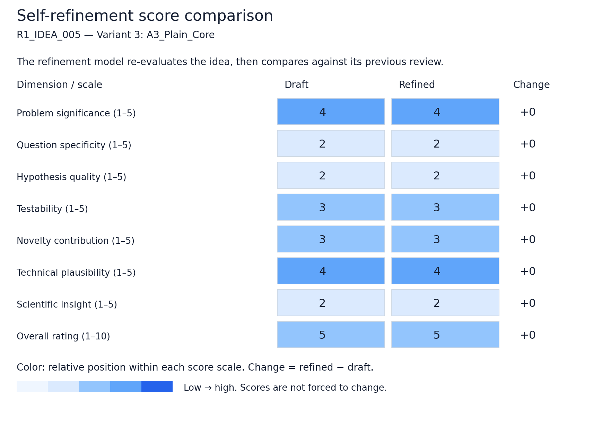

Changed score dimensions: none.

### Score justifications (draft / refined)

**Problem significance**

```json
{
  "draft": {
    "score": 4.0,
    "justification": "Robustness under distribution shifts is a fundamental challenge in machine learning. Vision state space models are an emerging architecture, and understanding/improving their robustness is timely and meaningful. The problem has both scientific and practical relevance."
  },
  "refined": {
    "score": 4.0,
    "justification": "Robustness under distribution shifts is a fundamental challenge in machine learning. Vision state space models are an emerging architecture gaining significant attention, making their robustness properties both scientifically interesting and practically important for real-world deployment. The problem has clear relevance to the field."
  }
}
```

**Question specificity**

```json
{
  "draft": {
    "score": 2.0,
    "justification": "The idea describes a proposed method but does not articulate a clear research question. It's essentially 'propose a TTA method for vision SSMs' without specifying what aspect of the problem is being investigated. The description is more of a technical proposal than a research question."
  },
  "refined": {
    "score": 2.0,
    "justification": "The idea describes a proposed method but does not articulate a clear research question. It essentially states 'propose a TTA method for vision SSMs' without specifying what aspect of the problem is being investigated. There is no explicit question about mechanisms, relationships, or phenomena being studied."
  }
}
```

**Hypothesis quality**

```json
{
  "draft": {
    "score": 2.0,
    "justification": "There is an implicit hypothesis that 'adapting Mamba-specific parameters via traversal permutations and pseudo-labels will improve robustness,' but this is not well-developed. The hypothesis lacks specificity about why this should work, what mechanisms are involved, or what boundary conditions might apply. It's more of an engineering assumption than a scientific hypothesis."
  },
  "refined": {
    "score": 2.0,
    "justification": "There is only an implicit, underdeveloped hypothesis that 'adapting Mamba-specific parameters via traversal permutations and pseudo-labels will improve robustness.' This lacks specificity about why this should work, what mechanisms are involved, or what boundary conditions might apply. It's more of an engineering assumption than a scientific hypothesis with testable predictions."
  }
}
```

**Testability**

```json
{
  "draft": {
    "score": 3.0,
    "justification": "The idea is testable in principle—one could implement the method and evaluate on distribution shift benchmarks. However, without a clear hypothesis or comparison framework, it's unclear what exactly would be tested beyond 'does it work better than nothing?' The method description provides enough technical detail to implement an experiment."
  },
  "refined": {
    "score": 3.0,
    "justification": "The idea is testable in principle - one could implement the method and evaluate on distribution shift benchmarks. However, without a clear hypothesis or research question, testing would be limited to 'does it work?' rather than investigating specific mechanisms or relationships. The method description provides enough technical detail to implement experiments."
  }
}
```

**Novelty contribution**

```json
{
  "draft": {
    "score": 3.0,
    "justification": "Applying test-time adaptation to vision SSMs is novel since SSMs are relatively new. The use of SSM traversal permutations for data augmentation is a specific technical contribution. However, the core idea of test-time adaptation with pseudo-labels and data augmentation is well-established. The novelty depends heavily on whether the SSM-specific aspects lead to meaningful new insights."
  },
  "refined": {
    "score": 3.0,
    "justification": "Applying test-time adaptation to vision SSMs is novel since SSMs are relatively new. The use of SSM traversal permutations for data augmentation is a specific technical contribution. However, the core concepts of test-time adaptation with pseudo-labels and data augmentation are well-established. The novelty depends heavily on whether the SSM-specific aspects lead to meaningful new insights rather than just architectural adaptation."
  }
}
```

**Technical plausibility**

```json
{
  "draft": {
    "score": 4.0,
    "justification": "The proposed approach is technically plausible. Test-time adaptation methods exist, pseudo-labeling is common, and data augmentation via input transformations is standard. The idea of using SSM traversal permutations as a form of augmentation is creative and seems feasible. The weight aggregation approach is reasonable. No obvious technical flaws are apparent from the description."
  },
  "refined": {
    "score": 4.0,
    "justification": "The proposed approach is technically plausible. Test-time adaptation methods exist, pseudo-labeling is common, and data augmentation via input transformations is standard. The idea of using SSM traversal permutations as a form of augmentation is creative and seems feasible. The weight aggregation approach is reasonable. No obvious technical flaws are apparent from the description."
  }
}
```

**Scientific insight**

```json
{
  "draft": {
    "score": 2.0,
    "justification": "As described, the idea is primarily an engineering solution. It could reveal whether SSM-specific adaptation is effective, but without a clear research question, it's unlikely to produce deep scientific insights about why vision SSMs fail under distribution shifts or fundamental principles of adaptation. The potential insight is limited to 'this method works for this architecture.'"
  },
  "refined": {
    "score": 2.0,
    "justification": "As described, the idea is primarily an engineering solution. It could reveal whether SSM-specific adaptation is effective, but without a clear research question, it's unlikely to produce deep scientific insights about why vision SSMs fail under distribution shifts, fundamental principles of adaptation, or generalizable mechanisms. The potential insight is limited to empirical effectiveness for this architecture."
  }
}
```

**Overall rating**

```json
{
  "draft": {
    "score": 5.0,
    "justification": "This is a moderate/borderline research idea. It addresses a meaningful problem (robustness of vision SSMs) and proposes a concrete technical method. However, it lacks a clear research question, specific hypothesis, and framework for scientific investigation. The idea is more of an engineering proposal than a research direction aimed at generating new scientific knowledge. With refinement to articulate a testable hypothesis and research question, it could become stronger."
  },
  "refined": {
    "score": 5.0,
    "justification": "This is a moderate/borderline research idea. It addresses a meaningful problem (robustness of vision SSMs) and proposes a concrete technical method that is plausible and timely. However, it lacks a clear research question, specific hypothesis, and framework for scientific investigation. The idea is more of an engineering proposal than a research direction aimed at generating new scientific knowledge. With refinement to articulate a testable hypothesis and research question about SSM behavior or robustness mechanisms, it could become stronger."
  }
}
```

## R1_IDEA_005 — Variant 4: B1_Verbose_Elaborate

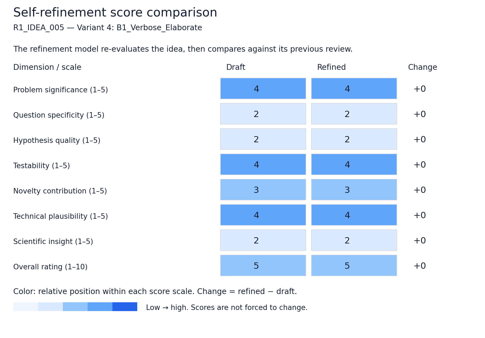

Changed score dimensions: none.

### Score justifications (draft / refined)

**Problem significance**

```json
{
  "draft": {
    "score": 4.0,
    "justification": "Improving robustness of vision models to distribution shifts is a significant and active research area. Vision SSMs are a relatively new architecture, and understanding their robustness properties is important for their adoption."
  },
  "refined": {
    "score": 4.0,
    "justification": "Improving robustness of vision models to distribution shifts is a significant research area. Vision SSMs are a relatively new architecture family, and understanding their robustness properties is important for their practical adoption and theoretical understanding."
  }
}
```

**Question specificity**

```json
{
  "draft": {
    "score": 2.0,
    "justification": "The idea describes a method but does not define a clear research question. It's unclear what specific aspect of SSM robustness or adaptation is being investigated."
  },
  "refined": {
    "score": 2.0,
    "justification": "The idea describes a method but does not define a clear research question. It's unclear what specific aspect of SSM behavior, adaptation mechanisms, or robustness is being investigated. The description is procedural rather than inquisitive."
  }
}
```

**Hypothesis quality**

```json
{
  "draft": {
    "score": 2.0,
    "justification": "There is no explicit or clearly implied hypothesis. The idea seems to propose applying an adaptation technique to SSMs without predicting a specific outcome or mechanism."
  },
  "refined": {
    "score": 2.0,
    "justification": "There is no explicit or clearly implied hypothesis. The idea proposes applying adaptation techniques to SSMs without predicting a specific outcome, mechanism, or relationship that distinguishes this from generic application. No testable prediction is articulated."
  }
}
```

**Testability**

```json
{
  "draft": {
    "score": 4.0,
    "justification": "The proposed method is testable: one could implement it and evaluate performance on distribution-shifted datasets. However, without a clear hypothesis, the test is more of a demonstration than an investigation."
  },
  "refined": {
    "score": 4.0,
    "justification": "The proposed method is technically testable: one could implement it and evaluate performance on distribution-shifted datasets. However, without a clear hypothesis, testing reduces to demonstration of effectiveness rather than investigation of a specific claim."
  }
}
```

**Novelty contribution**

```json
{
  "draft": {
    "score": 3.0,
    "justification": "Applying test-time adaptation to vision SSMs is somewhat novel, but the core techniques (multiple views, pseudo-labeling) are established in TTA literature. The contribution may be limited to a new application unless it reveals SSM-specific insights."
  },
  "refined": {
    "score": 3.0,
    "justification": "Applying test-time adaptation to vision SSMs is moderately novel as SSMs are emerging architectures. However, the core techniques (multiple views, pseudo-labeling, weight aggregation) are established in TTA literature. The contribution appears primarily as application to a new architecture rather than novel scientific insight."
  }
}
```

**Technical plausibility**

```json
{
  "draft": {
    "score": 4.0,
    "justification": "The approach is technically plausible: generating diverse input views and using pseudo-labels for adaptation are known strategies, and updating Mamba-specific parameters is feasible."
  },
  "refined": {
    "score": 4.0,
    "justification": "The approach is technically plausible: generating diverse input views through traversal permutations, using pseudo-labels for adaptation, and updating architecture-specific parameters are all feasible operations based on current understanding of SSMs and TTA methods."
  }
}
```

**Scientific insight**

```json
{
  "draft": {
    "score": 2.0,
    "justification": "As described, the idea is primarily an application of existing techniques to a new model family. It lacks a clear path to generating new scientific insight about SSMs, adaptation, or robustness mechanisms."
  },
  "refined": {
    "score": 2.0,
    "justification": "As described, the idea is primarily an application of existing techniques to a new model family. It lacks a clear path to generating new scientific insight about SSMs, adaptation mechanisms, robustness principles, or architectural comparisons. Success would mainly show that a method works, not why or what it reveals about SSM properties."
  }
}
```

**Overall rating**

```json
{
  "draft": {
    "score": 5.0,
    "justification": "The idea addresses a relevant problem and proposes a plausible technical direction, but it lacks a clear research question, hypothesis, and potential for scientific insight. It reads more like an engineering application than a research investigation. With refinement to focus on a specific hypothesis about SSM behavior under distribution shifts, it could become a stronger research idea."
  },
  "refined": {
    "score": 5.0,
    "justification": "The idea addresses a relevant problem and proposes a technically plausible direction, but it lacks a clear research question, hypothesis, and potential for scientific insight. It reads as an engineering application rather than a research investigation. With refinement to focus on testing specific hypotheses about SSM behavior under distribution shifts, it could become a stronger research idea."
  }
}
```

## R1_IDEA_005 — Variant 5: B2_Grand_Narrative


Changed score dimensions: none.

### Score justifications (draft / refined)

**Problem significance**

```json
{
  "draft": {
    "score": 4.0,
    "justification": "Improving vision model robustness under distribution shifts is a highly significant problem for real-world deployment. Test-time adaptation without labeled data is a practical and active sub-problem. Focusing on state space models (SSMs) like Mamba is timely given their growing adoption."
  },
  "refined": {
    "score": 4.0,
    "justification": "Improving vision model robustness under distribution shifts is a highly significant problem with real-world implications. Test-time adaptation without labeled data is a practical challenge. Focusing on state space models is timely given their growing adoption in vision tasks."
  }
}
```

**Question specificity**

```json
{
  "draft": {
    "score": 2.0,
    "justification": "The idea describes a proposed method but does not articulate a clear research question. It lacks a specific inquiry like 'Does leveraging SSM-specific structure via traversal permutations improve TTA robustness compared to standard augmentations?'"
  },
  "refined": {
    "score": 2.0,
    "justification": "The idea describes a proposed method but does not articulate a clear research question. It lacks a specific inquiry about SSM properties, adaptation mechanisms, or robustness comparisons. The description remains at the level of 'propose a method that may help' without defining what exactly is being investigated."
  }
}
```

**Hypothesis quality**

```json
{
  "draft": {
    "score": 2.0,
    "justification": "There is an implicit hypothesis that 'generating multiple input views via diverse SSM traversal permutations' will 'improve robustness,' but it is not stated as a testable prediction. No mechanism or expected relationship is elaborated, and no alternative outcomes are considered."
  },
  "refined": {
    "score": 2.0,
    "justification": "There is only an implicit, vague hypothesis that SSM traversal permutations will improve robustness. No concrete prediction is made about mechanisms, expected improvements, or boundary conditions. The hypothesis lacks specificity and isn't framed in a testable form that could be clearly supported or contradicted."
  }
}
```

**Testability**

```json
{
  "draft": {
    "score": 3.0,
    "justification": "The idea suggests a methodological approach that could be implemented and evaluated on robustness benchmarks. However, without a clear hypothesis or evaluation plan, it's unclear exactly what would be tested. The core claim is testable in principle but underspecified."
  },
  "refined": {
    "score": 3.0,
    "justification": "The methodological approach could be implemented and evaluated on robustness benchmarks, making it testable in principle. However, without a clear hypothesis or evaluation plan, it's unclear what specific claims would be tested. The core idea of 'improving robustness' is testable but overly broad."
  }
}
```

**Novelty contribution**

```json
{
  "draft": {
    "score": 3.0,
    "justification": "Applying test-time adaptation to vision SSMs is novel, as most TTA work focuses on CNNs or Vision Transformers. The use of SSM traversal permutations for view generation is a specific architectural twist. However, the contribution is presented as a potential direction rather than a concrete advance."
  },
  "refined": {
    "score": 3.0,
    "justification": "Applying test-time adaptation to vision SSMs has novelty as most TTA work focuses on CNNs or Vision Transformers. The use of SSM traversal permutations for view generation is a specific architectural idea. However, the contribution is presented vaguely as potentially informing longer-term directions rather than making a concrete advance."
  }
}
```

**Technical plausibility**

```json
{
  "draft": {
    "score": 3.0,
    "justification": "The general concept of using multiple views and pseudo-labels for TTA is established. Leveraging SSM-specific structure for view generation is plausible but not detailed enough to assess fully. The idea of aggregating adapted weights is reasonable. Overall, the sketch seems coherent but lacks technical depth."
  },
  "refined": {
    "score": 3.0,
    "justification": "The general concept of using multiple views and pseudo-labels for TTA is established. Leveraging SSM structure for view generation is conceptually plausible but underspecified. The idea of aggregating adapted weights is reasonable. Overall coherent but lacks technical details to fully assess feasibility."
  }
}
```

**Scientific insight**

```json
{
  "draft": {
    "score": 3.0,
    "justification": "If successful, the work could provide insight into how SSM-specific properties (e.g., sequential processing, state transitions) affect robustness and adaptation. However, the idea currently emphasizes a method rather than a quest for understanding. The potential insight is moderate and depends on framing."
  },
  "refined": {
    "score": 3.0,
    "justification": "If properly framed, the work could provide insight into how SSM architectural properties affect robustness and adaptation. However, the current description emphasizes a method rather than a quest for understanding. Potential insight depends heavily on whether the investigation would reveal general principles about SSMs and distribution shifts."
  }
}
```

**Overall rating**

```json
{
  "draft": {
    "score": 5.0,
    "justification": "This is a moderate/borderline research idea. It addresses a significant problem and proposes a technically plausible direction tailored to an emerging architecture. However, it lacks a clearly defined research question, testable hypothesis, and specificity regarding the novelty and expected contribution. It reads more like a high-level method sketch than a focused research idea. With refinement, it could become stronger."
  },
  "refined": {
    "score": 5.0,
    "justification": "This is a moderate/borderline research idea. It addresses a significant problem and proposes a technically plausible direction for an emerging architecture. However, it lacks a clearly defined research question, testable hypothesis, and specificity about the novelty and expected contribution. It reads more like a high-level method sketch than a focused research idea. With refinement to articulate a specific scientific question and hypothesis, it could become stronger."
  }
}
```

## R1_IDEA_005 — Variant 6: B3_Over_Confident


Changed score dimensions: none.

### Score justifications (draft / refined)

**Problem significance**

```json
{
  "draft": {
    "score": 4.0,
    "justification": "Improving robustness under distribution shifts is a significant and well-motivated problem in machine learning, especially for vision models. Test-time adaptation without labeled data is a practical and active research direction. Focusing on state space models (an emerging architecture) adds timeliness."
  },
  "refined": {
    "score": 4.0,
    "justification": "Improving robustness under distribution shifts is a significant and well-motivated problem in machine learning, especially for vision models deployed in real-world settings. Test-time adaptation without labeled data is a practical and active research direction with clear applications. Focusing on state space models (an emerging architecture family) adds timeliness and relevance to current architectural trends."
  }
}
```

**Question specificity**

```json
{
  "draft": {
    "score": 2.0,
    "justification": "The idea describes a method but does not articulate a specific research question. It's unclear what is being investigated beyond 'applying a test-time adaptation method to SSMs.' There's no explicit question about mechanisms, comparisons, or underlying phenomena."
  },
  "refined": {
    "score": 2.0,
    "justification": "The idea describes a method but does not articulate a specific research question. It's unclear what is being investigated beyond 'applying a test-time adaptation method to SSMs.' There's no explicit question about mechanisms, comparisons, or underlying phenomena. The description is methodological rather than inquisitive."
  }
}
```

**Hypothesis quality**

```json
{
  "draft": {
    "score": 2.0,
    "justification": "There is an implicit hypothesis that 'generating multiple input views via diverse SSM traversal permutations and using pseudo-labels to update Mamba-specific parameters will improve robustness.' However, this is more of a methodological claim than a falsifiable scientific hypothesis about why or how this should work. No contrasting hypothesis or mechanistic prediction is provided."
  },
  "refined": {
    "score": 2.0,
    "justification": "There is an implicit claim that the proposed method will improve robustness, but this is more of a methodological assertion than a falsifiable scientific hypothesis. No contrasting hypothesis or mechanistic prediction is provided about why SSM traversal permutations should be particularly effective, how Mamba parameters relate to distribution shift robustness, or what specific relationship between architectural properties and adaptation effectiveness is being tested."
  }
}
```

**Testability**

```json
{
  "draft": {
    "score": 3.0,
    "justification": "The idea is testable in principle—one could implement the method and measure performance on distribution-shifted datasets. However, without specifying evaluation benchmarks, baselines, or success criteria, it's unclear how convincingly the central claim could be assessed. The method description provides enough direction for an experiment, but the lack of a clear comparative framework limits testability."
  },
  "refined": {
    "score": 3.0,
    "justification": "The idea is testable in principle—one could implement the described method and measure performance on distribution-shifted datasets. However, without specifying evaluation benchmarks, baselines, or clear success criteria, it's unclear how convincingly the central claim could be assessed. The method description provides enough direction for an experiment, but the lack of a clear comparative framework and specific hypotheses limits rigorous testability."
  }
}
```

**Novelty contribution**

```json
{
  "draft": {
    "score": 3.0,
    "justification": "Applying test-time adaptation to vision state space models is novel, as most work focuses on CNNs or transformers. The idea of using 'SSM traversal permutations' for view generation is potentially novel if well-defined. However, the core components (pseudo-labeling, weight aggregation) are standard in test-time adaptation literature. The contribution may be more incremental unless a strong architectural insight is uncovered."
  },
  "refined": {
    "score": 3.0,
    "justification": "Applying test-time adaptation to vision state space models is novel, as most work focuses on CNNs or transformers. The idea of using 'SSM traversal permutations' for view generation is potentially novel if well-defined and distinct from standard augmentations. However, the core components (pseudo-labeling, weight aggregation) are standard in test-time adaptation literature. The contribution may be more incremental unless it uncovers strong architectural insights about SSMs or demonstrates clear advantages over existing methods."
  }
}
```

**Technical plausibility**

```json
{
  "draft": {
    "score": 3.0,
    "justification": "The general approach of test-time adaptation with pseudo-labels is plausible. However, key technical details are missing: what are 'SSM traversal permutations'? How are they implemented without breaking model functionality? How are Mamba-specific parameters identified and updated efficiently? Without these details, technical plausibility is uncertain but not obviously flawed."
  },
  "refined": {
    "score": 3.0,
    "justification": "The general approach of test-time adaptation with pseudo-labels is plausible and established. However, key technical details are missing: what are 'SSM traversal permutations' and how are they implemented without breaking model functionality? How are Mamba-specific parameters identified and updated efficiently? Without these details, technical plausibility is uncertain but not obviously flawed. The idea relies on several unspecified implementation choices."
  }
}
```

**Scientific insight**

```json
{
  "draft": {
    "score": 3.0,
    "justification": "If successful, the work could provide insight into whether state space models have unique properties that make them more or less amenable to certain adaptation strategies. However, the idea as presented focuses more on engineering a solution than on uncovering general principles. The potential for insight depends heavily on whether the investigation probes why the method works (e.g., analyzing the effect of different permutation strategies on feature stability)."
  },
  "refined": {
    "score": 3.0,
    "justification": "If successfully investigated with a focus on understanding mechanisms, the work could provide insight into whether state space models have unique properties that make them more or less amenable to certain adaptation strategies. However, the idea as presented focuses more on engineering a solution than on uncovering general principles. The potential for insight depends heavily on whether the investigation probes why the method works (e.g., analyzing the effect of different permutation strategies on feature stability, or comparing SSM adaptation dynamics to other architectures)."
  }
}
```

**Overall rating**

```json
{
  "draft": {
    "score": 5.0,
    "justification": "This is a moderate/borderline research idea. It addresses a meaningful problem and proposes a concrete methodological direction for an emerging architecture. However, it lacks a clearly articulated research question or hypothesis, and the technical novelty is uncertain without more details. The idea is testable but could easily become an incremental application of existing test-time adaptation techniques to a new model class without yielding deeper scientific insight. With refinement—especially by framing a specific hypothesis about SSM properties and adaptation—it could become stronger."
  },
  "refined": {
    "score": 5.0,
    "justification": "This is a moderate/borderline research idea. It addresses a meaningful problem and proposes a concrete methodological direction for an emerging architecture, which gives it some merit. However, it lacks a clearly articulated research question or hypothesis, and the technical novelty is uncertain without more details about 'SSM traversal permutations.' The idea is testable but could easily become an incremental application of existing test-time adaptation techniques to a new model class without yielding deeper scientific insight. With refinement—especially by framing a specific hypothesis about SSM properties and adaptation—it could become stronger."
  }
}
```

## R1_IDEA_005 — Variant 7: B4_Novelty


Changed score dimensions: none.

### Score justifications (draft / refined)

**Problem significance**

```json
{
  "draft": {
    "score": 4.0,
    "justification": "Improving model robustness under distribution shifts is a highly important problem in machine learning with practical implications. Test-time adaptation without labeled data is particularly valuable for real-world deployment. Vision state space models are a timely and relevant architecture class to study."
  },
  "refined": {
    "score": 4.0,
    "justification": "Improving model robustness under distribution shifts is a highly important problem in machine learning with significant practical implications. Test-time adaptation without labeled data is particularly valuable for real-world deployment. Vision state space models are a timely and relevant architecture class that deserves investigation for robustness properties."
  }
}
```

**Question specificity**

```json
{
  "draft": {
    "score": 2.0,
    "justification": "The idea describes a method but does not articulate a clear research question. It states the goal is 'improving vision state space model robustness under distribution shifts' but doesn't specify what aspect of robustness, what type of distribution shift, or what specific relationship or phenomenon is being investigated."
  },
  "refined": {
    "score": 2.0,
    "justification": "The idea describes a method but does not articulate a clear research question. It states the goal is 'improving vision state space model robustness under distribution shifts' but doesn't specify what aspect of robustness, what type of distribution shift, or what specific relationship or phenomenon is being investigated. There is no 'what are we trying to understand or discover?' component."
  }
}
```

**Hypothesis quality**

```json
{
  "draft": {
    "score": 2.0,
    "justification": "There is no explicit or clearly implicit hypothesis. The idea suggests that combining SSM traversal permutations with pseudo-labeling and weight aggregation will improve robustness, but this is more of a method claim than a testable hypothesis about mechanisms or relationships. No prediction is made about why this approach would work specifically for SSMs or what it might reveal about their properties."
  },
  "refined": {
    "score": 2.0,
    "justification": "There is no explicit or clearly implicit hypothesis. The idea suggests that combining SSM traversal permutations with pseudo-labeling and weight aggregation will improve robustness, but this is a method claim rather than a testable hypothesis about mechanisms or relationships. No prediction is made about why this approach would work specifically for SSMs, what underlying principle it might reveal, or what conditions would falsify the core idea."
  }
}
```

**Testability**

```json
{
  "draft": {
    "score": 3.0,
    "justification": "The method could be implemented and tested on distribution shift benchmarks, so it is technically testable. However, without a clear hypothesis or research question, it's unclear what specific evidence would support or contradict the core idea. The evaluation would likely reduce to 'does it work better than baselines?' rather than testing a specific scientific claim."
  },
  "refined": {
    "score": 3.0,
    "justification": "The method could be implemented and tested on distribution shift benchmarks, making it technically testable in a practical sense. However, without a clear hypothesis or research question, testing would likely reduce to 'does it work better than baselines?' rather than testing a specific scientific claim about SSM properties or adaptation mechanisms. The testability of the scientific aspect is limited."
  }
}
```

**Novelty contribution**

```json
{
  "draft": {
    "score": 3.0,
    "justification": "The application to vision state space models is relatively novel as they are a newer architecture. However, test-time adaptation, pseudo-labeling, and multi-view aggregation are established techniques. The 'SSM traversal permutations' aspect could be novel if properly motivated, but the idea doesn't explain why this is meaningfully different from other augmentation strategies or what unique contribution it makes."
  },
  "refined": {
    "score": 3.0,
    "justification": "The application to vision state space models is relatively novel as they are a newer architecture. However, test-time adaptation, pseudo-labeling, and multi-view aggregation are established techniques. The 'SSM traversal permutations' aspect could be novel if properly motivated, but the idea doesn't explain why this is meaningfully different from other augmentation strategies or what unique conceptual contribution it makes beyond application to a new architecture."
  }
}
```

**Technical plausibility**

```json
{
  "draft": {
    "score": 3.0,
    "justification": "The described components are individually plausible (input transformations, pseudo-labeling, parameter updates, weight aggregation). However, the connection between SSM traversal permutations and distribution shift robustness is not explained, and it's unclear why this specific approach would be effective. The idea lacks technical details that would allow assessment of its coherence."
  },
  "refined": {
    "score": 3.0,
    "justification": "The described components are individually plausible based on existing techniques. However, the connection between SSM traversal permutations and distribution shift robustness is not explained, and it's unclear why this specific approach would be effective. The idea lacks technical details about how SSM traversal permutations would be implemented or why they would help with adaptation, making full assessment of coherence difficult."
  }
}
```

**Scientific insight**

```json
{
  "draft": {
    "score": 2.0,
    "justification": "As presented, the idea seems primarily aimed at developing a practical method rather than generating scientific insight. It doesn't articulate what we might learn about SSMs, distribution shift robustness, or test-time adaptation mechanisms. The potential for insight is limited without a clear research question about underlying phenomena or principles."
  },
  "refined": {
    "score": 2.0,
    "justification": "As presented, the idea seems primarily aimed at developing a practical method rather than generating scientific insight. It doesn't articulate what we might learn about SSMs, distribution shift robustness mechanisms, or test-time adaptation principles. Without a clear research question about underlying phenomena, the potential for transferable scientific insight is limited."
  }
}
```

**Overall rating**

```json
{
  "draft": {
    "score": 5.0,
    "justification": "This is a moderate/borderline research idea. It addresses an important problem (distribution shift robustness for vision SSMs) and proposes a specific technical approach, but lacks a clear research question, hypothesis, or articulation of potential scientific insight. The idea is more of a method sketch than a research direction with a testable scientific claim. With refinement to articulate a specific hypothesis about SSM properties and distribution shift robustness, it could become a stronger research idea."
  },
  "refined": {
    "score": 5.0,
    "justification": "This is a moderate/borderline research idea. It addresses an important problem (distribution shift robustness for vision SSMs) and proposes a specific technical approach, but lacks a clear research question, hypothesis, or articulation of potential scientific insight. The idea is more of a method sketch than a research direction with a testable scientific claim. With refinement to articulate a specific hypothesis about SSM properties and distribution shift robustness, it could become a stronger research idea."
  }
}
```

## R1_IDEA_005 — Variant 8: B5_Application_Impact

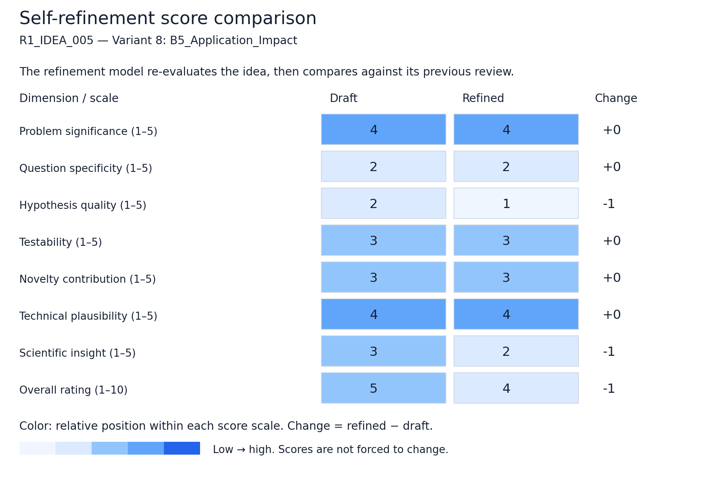

Changed score dimensions: hypothesis_quality, scientific_insight, overall_rating.

### Score justifications (draft / refined)

**Problem significance**

```json
{
  "draft": {
    "score": 4.0,
    "justification": "Improving robustness of vision models under distribution shift is highly significant for practical deployment. Focusing on state space models (Mamba) is timely given recent interest. The constraint of limited labeled data in downstream applications adds practical relevance."
  },
  "refined": {
    "score": 4.0,
    "justification": "Improving robustness of vision models under distribution shift is highly significant for practical deployment. Focusing on state space models (Mamba) is timely given recent architectural innovations. The constraint of limited labeled data adds practical relevance. However, the problem statement lacks specificity about what makes SSM robustness uniquely important or challenging."
  }
}
```

**Question specificity**

```json
{
  "draft": {
    "score": 2.0,
    "justification": "The research question is vague: 'improve vision state space model robustness under distribution shifts.' It doesn't specify what types of shifts, what aspects of robustness, or what specific limitations of current SSMs are being addressed. The idea mentions methods but not a clear investigative focus."
  },
  "refined": {
    "score": 2.0,
    "justification": "The research question is very vague: 'improve vision state space model robustness under distribution shifts.' It doesn't specify what types of shifts, what aspects of robustness, what specific limitations of SSMs are being addressed, or what relationship is being investigated. The idea describes a method rather than posing a clear investigative question."
  }
}
```

**Hypothesis quality**

```json
{
  "draft": {
    "score": 2.0,
    "justification": "There's no explicit hypothesis. The idea implies that 'generating multiple input views via SSM traversal permutations and using pseudo-labels to update Mamba-specific parameters will improve robustness,' but doesn't articulate why this should work or what mechanism is being tested. It's more of a proposed method than a testable prediction."
  },
  "refined": {
    "score": 1.0,
    "justification": "There is no discernible hypothesis. The idea presents a proposed method ('generate multiple views... use pseudo-labels to update parameters') without articulating any testable prediction about mechanisms, relationships, or expected outcomes. It doesn't suggest why this approach should work particularly well for SSMs or what specific effect it aims to achieve beyond generic 'improved robustness.'"
  }
}
```

**Testability**

```json
{
  "draft": {
    "score": 3.0,
    "justification": "The idea is testable in principle - one could implement the method and evaluate on distribution shift benchmarks. However, without a clear hypothesis or success criteria, it's unclear what would constitute meaningful evidence. The description suggests experiments could be designed, but lacks specificity about what would be measured beyond 'improved robustness.'"
  },
  "refined": {
    "score": 3.0,
    "justification": "The methodological description suggests experiments could be designed (implement method, evaluate on shifted data). However, without a clear hypothesis or research question, it's unclear what would constitute meaningful testing. One could measure accuracy improvements, but this alone wouldn't provide scientific insight. The idea is technically testable but scientifically underspecified."
  }
}
```

**Novelty contribution**

```json
{
  "draft": {
    "score": 3.0,
    "justification": "Applying test-time adaptation to vision state space models has some novelty as SSMs are relatively new in vision. However, the core techniques (multi-view generation, pseudo-labeling, parameter adaptation) are well-established in TTA literature. The potential contribution seems more about application to a new architecture rather than fundamental innovation."
  },
  "refined": {
    "score": 3.0,
    "justification": "Applying test-time adaptation to vision state space models has some novelty as SSMs are relatively new in vision. However, the core techniques (multi-view generation, pseudo-labeling, parameter adaptation) are well-established in TTA literature. The potential contribution seems primarily about application to a new architecture rather than fundamental innovation or new insight."
  }
}
```

**Technical plausibility**

```json
{
  "draft": {
    "score": 4.0,
    "justification": "The proposed approach is technically plausible. Generating multiple views via different SSM traversals could create diverse perspectives, and pseudo-labeling for test-time adaptation is a known technique. Updating only Mamba-specific parameters could be more efficient than full model adaptation. The reasoning is coherent though high-level."
  },
  "refined": {
    "score": 4.0,
    "justification": "The proposed approach is technically plausible. Generating multiple views via different SSM traversals could create diverse perspectives, and pseudo-labeling for test-time adaptation is a known technique. Updating only Mamba-specific parameters could be more efficient than full model adaptation. The reasoning is coherent at a high level, though details are sparse."
  }
}
```

**Scientific insight**

```json
{
  "draft": {
    "score": 3.0,
    "justification": "If successful, this could provide insight into whether SSMs have particular robustness properties compared to other architectures, and whether their sequential scanning mechanism creates specific vulnerabilities. However, the idea as stated seems more focused on developing a practical method than on extracting general principles about SSM behavior under distribution shift."
  },
  "refined": {
    "score": 2.0,
    "justification": "As stated, the idea seems focused on developing a practical method rather than extracting scientific insight. It doesn't articulate what we would learn about SSMs, robustness mechanisms, or distribution shift adaptation beyond whether this particular technique works. With refinement, it could potentially provide insight into SSM-specific vulnerabilities, but the current formulation doesn't guide toward that."
  }
}
```

**Overall rating**

```json
{
  "draft": {
    "score": 5.0,
    "justification": "This is a moderate research idea with reasonable motivation but limited specificity. The problem (SSM robustness) is meaningful and timely, but the research question is vague and lacks a clear hypothesis. The proposed method combines established techniques in a plausible way for a new architecture, but doesn't articulate what scientific insight would be gained beyond demonstrating another TTA method. With more specific questions and hypotheses, it could become a stronger idea."
  },
  "refined": {
    "score": 4.0,
    "justification": "This is a weak-to-moderate research idea with reasonable motivation but critically lacking in scientific framing. The problem (SSM robustness) is meaningful and timely, but the idea fails to articulate a research question or hypothesis. It reads as a proposed method description rather than a research investigation. While technically plausible and addressing a relevant problem, it lacks the specificity, hypothesis-driven focus, and potential for scientific insight needed for a stronger research idea. With substantial refinement to formulate a clear research question and hypothesis, it could become more promising."
  }
}
```

## R1_IDEA_005 — Variant 9: C1_Hollow_Shell

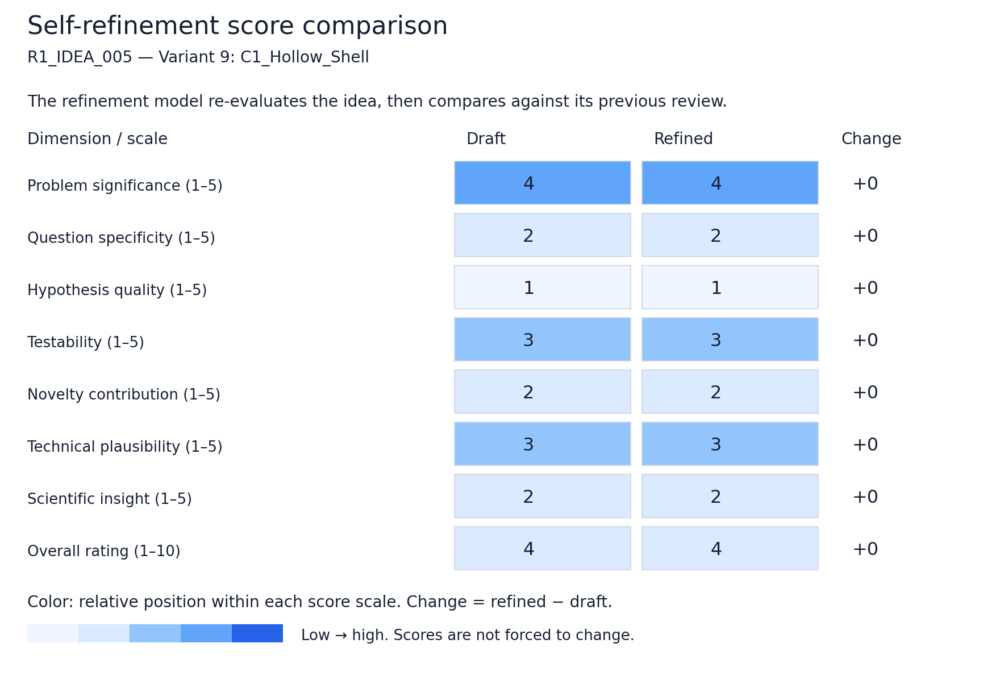

Changed score dimensions: none.

### Score justifications (draft / refined)

**Problem significance**

```json
{
  "draft": {
    "score": 4.0,
    "justification": "Model robustness under distribution shifts is a highly significant problem in machine learning with practical implications for real-world deployment. Test-time adaptation is an active research area with clear relevance."
  },
  "refined": {
    "score": 4.0,
    "justification": "Model robustness under distribution shifts is a highly significant problem in machine learning with substantial practical implications for real-world deployment. Test-time adaptation is an active and relevant research area aimed at addressing this challenge without requiring retraining or additional labeled data."
  }
}
```

**Question specificity**

```json
{
  "draft": {
    "score": 2.0,
    "justification": "The idea is very vague. It mentions 'creates different views' and 'leverages information generated by the model' without specifying what these mean. There's no clear research question beyond the generic goal of improving robustness."
  },
  "refined": {
    "score": 2.0,
    "justification": "The idea is very vague. It mentions 'creates different views' and 'leverages information generated by the model' without specifying what these mean. There is no clear research question beyond the generic goal of improving robustness, and the description lacks concrete details about mechanisms, inputs, or outputs."
  }
}
```

**Hypothesis quality**

```json
{
  "draft": {
    "score": 1.0,
    "justification": "There is no discernible hypothesis. The description merely states what the method does ('creates views', 'updates parameters') without proposing why this combination would be effective or what specific relationship it aims to exploit."
  },
  "refined": {
    "score": 1.0,
    "justification": "There is no discernible hypothesis. The description merely states what the method does ('creates views', 'updates parameters') without proposing why this combination would be effective, what specific relationship it aims to exploit, or what prediction it makes about model behavior under distribution shifts."
  }
}
```

**Testability**

```json
{
  "draft": {
    "score": 3.0,
    "justification": "The general concept of test-time adaptation is testable through standard robustness benchmarks. However, without more specifics about the method, it's unclear what exactly would be tested beyond generic performance comparisons."
  },
  "refined": {
    "score": 3.0,
    "justification": "The general concept of test-time adaptation is testable through standard robustness benchmarks. However, without specifics about the method, it is unclear what exactly would be tested beyond generic performance comparisons. The idea suggests an experiment but lacks the detail needed to design a meaningful test of a novel claim."
  }
}
```

**Novelty contribution**

```json
{
  "draft": {
    "score": 2.0,
    "justification": "As described, the idea sounds like a generic combination of existing concepts (multi-view learning, test-time adaptation, self-supervised signals). Without specifying what's novel about the views, the information used, or the update mechanism, the potential contribution is unclear."
  },
  "refined": {
    "score": 2.0,
    "justification": "As described, the idea sounds like a generic combination of existing concepts (multi-view learning, test-time adaptation, self-supervised signals). Without specifying what is novel about the views, the information used, or the update mechanism, the potential contribution is unclear and appears incremental at best."
  }
}
```

**Technical plausibility**

```json
{
  "draft": {
    "score": 3.0,
    "justification": "The general approach of using test-time adaptation with model-generated signals is plausible based on prior work. However, the vagueness makes it impossible to assess whether the specific combination proposed would be technically sound."
  },
  "refined": {
    "score": 3.0,
    "justification": "The general approach of using test-time adaptation with model-generated signals is plausible based on prior work. However, the vagueness makes it impossible to assess whether the specific combination proposed would be technically sound or coherent. No obvious technical contradictions are present, but the lack of detail prevents a stronger assessment."
  }
}
```

**Scientific insight**

```json
{
  "draft": {
    "score": 2.0,
    "justification": "As described, the idea seems focused on achieving better performance rather than generating scientific insight. There's no indication of what underlying principles or mechanisms would be investigated or revealed through this approach."
  },
  "refined": {
    "score": 2.0,
    "justification": "As described, the idea seems focused on achieving better performance rather than generating scientific insight. There is no indication of what underlying principles, mechanisms, or relationships would be investigated or revealed through this approach. It appears primarily engineering-oriented."
  }
}
```

**Overall rating**

```json
{
  "draft": {
    "score": 4.0,
    "justification": "While the problem area is significant, the idea as presented is too vague to constitute a strong research direction. It lacks a clear hypothesis, specific mechanisms, or novel insight. It reads more like a high-level description of a general approach rather than a concrete research idea with testable claims. The main value is in identifying an important problem area, but the proposed direction needs substantial refinement."
  },
  "refined": {
    "score": 4.0,
    "justification": "While the problem area is significant, the idea as presented is too vague to constitute a strong research direction. It lacks a clear hypothesis, specific mechanisms, or novel insight. It reads more like a high-level description of a general approach rather than a concrete research idea with testable claims. The main value is in identifying an important problem area, but the proposed direction needs substantial refinement to become a meaningful research contribution."
  }
}
```

## R1_IDEA_005 — Variant 10: C2_Logic_Flawed


Changed score dimensions: none.

### Score justifications (draft / refined)

**Problem significance**

```json
{
  "draft": {
    "score": 4.0,
    "justification": "Improving model robustness under distribution shifts is a highly important problem in machine learning, especially for real-world deployment. Test-time adaptation without additional labeled data addresses a practical constraint. The focus on state space models (Mamba) is timely given recent interest in these architectures."
  },
  "refined": {
    "score": 4.0,
    "justification": "Improving robustness under distribution shifts is a core challenge in machine learning with high practical importance. Focusing on state space models (particularly Mamba) is timely given their emergence as efficient alternatives to Transformers. Test-time adaptation without labeled data addresses real-world deployment constraints, making the problem both scientifically and practically significant."
  }
}
```

**Question specificity**

```json
{
  "draft": {
    "score": 2.0,
    "justification": "The idea lacks a clearly defined research question. It states a goal ('improve robustness') and proposes a method, but doesn't specify what exactly is being investigated. There's no concrete question about mechanisms, comparisons, or specific phenomena."
  },
  "refined": {
    "score": 2.0,
    "justification": "The idea states a goal ('improve robustness') but does not define a concrete research question. There is no specific inquiry about mechanisms, comparisons, or phenomena. The description is method-focused rather than question-focused, lacking clarity about what exactly is being investigated beyond applying a technique."
  }
}
```

**Hypothesis quality**

```json
{
  "draft": {
    "score": 2.0,
    "justification": "No explicit or clearly implied hypothesis is presented. The idea suggests a method 'could be broadly effective' but doesn't make a testable prediction about why this approach would work, what specific improvements it would yield, or under what conditions it would succeed or fail."
  },
  "refined": {
    "score": 2.0,
    "justification": "No testable hypothesis is presented. The idea suggests a method 'could be broadly effective' but makes no concrete prediction about why it would work, what specific improvements to expect, or under what conditions it might fail. There's an implicit assumption that SSM traversal permutations are beneficial, but this isn't formulated as a falsifiable claim."
  }
}
```

**Testability**

```json
{
  "draft": {
    "score": 3.0,
    "justification": "The idea is testable in principle - one could implement the method and evaluate on distribution shift benchmarks. However, without specifying evaluation protocols, comparison methods, or success criteria, it's unclear exactly how the central claim would be tested. The method description provides enough technical direction for implementation."
  },
  "refined": {
    "score": 3.0,
    "justification": "The idea is testable in principle—one could implement the described method and evaluate on distribution shift benchmarks. However, without specified evaluation protocols, success metrics, or comparison points, it's unclear how the central claim would be rigorously tested. The technical description provides enough direction for implementation but not for meaningful hypothesis testing."
  }
}
```

**Novelty contribution**

```json
{
  "draft": {
    "score": 3.0,
    "justification": "The combination of test-time adaptation with SSM-specific mechanisms (traversal permutations) applied to vision state space models appears novel. However, test-time adaptation itself is an established area, and the idea doesn't clearly articulate what fundamentally new insight or capability this approach would provide beyond applying existing concepts to a new architecture."
  },
  "refined": {
    "score": 3.0,
    "justification": "Applying test-time adaptation to vision state space models with architecture-specific mechanisms (traversal permutations) appears novel. However, test-time adaptation is an established area, and the idea doesn't clearly articulate what fundamentally new insight or capability this provides beyond adapting existing concepts to a new architecture. The contribution seems primarily as an application rather than a conceptual advance."
  }
}
```

**Technical plausibility**

```json
{
  "draft": {
    "score": 4.0,
    "justification": "The proposed approach is technically plausible. Test-time adaptation with pseudo-labels is established, and adapting it for SSMs with architecture-specific mechanisms (traversal permutations) makes sense. The weight aggregation approach is reasonable. The main uncertainty is whether SSM traversal permutations would provide meaningful diversity for adaptation."
  },
  "refined": {
    "score": 4.0,
    "justification": "The proposed approach is technically plausible. Test-time adaptation with pseudo-labels is well-established, and leveraging architecture-specific properties (SSM traversal permutations) for adaptation is a coherent idea. The weight aggregation strategy is reasonable. The main uncertainty is whether traversal permutations would generate meaningfully diverse views for adaptation compared to standard augmentations."
  }
}
```

**Scientific insight**

```json
{
  "draft": {
    "score": 3.0,
    "justification": "If successful, the research could provide insight into how state space models respond to distribution shifts and whether their unique architectural properties (like traversal permutations) offer advantages for adaptation. However, the idea as presented seems more focused on achieving a practical improvement rather than uncovering fundamental principles about SSM behavior or robustness mechanisms."
  },
  "refined": {
    "score": 3.0,
    "justification": "If successful, the research could provide insights into how state space models respond to distribution shifts and whether their architectural properties offer unique adaptation advantages. However, as presented, the idea seems more focused on achieving a practical improvement than on uncovering fundamental principles about SSM robustness mechanisms or general test-time adaptation theory. The potential for transferable scientific insight is moderate."
  }
}
```

**Overall rating**

```json
{
  "draft": {
    "score": 5.0,
    "justification": "This is a moderate/borderline research idea. It addresses an important problem (robustness under distribution shifts) and proposes a technically interesting approach combining test-time adaptation with SSM-specific mechanisms. However, it lacks a clearly defined research question, testable hypothesis, and specificity about what would be investigated. The potential contribution is limited by the vague claim of 'broad effectiveness' without a clear mechanism or comparison framework. With refinement to include a specific research question and hypothesis, it could become a stronger idea."
  },
  "refined": {
    "score": 5.0,
    "justification": "This is a moderate/borderline research idea. It addresses an important problem with a technically interesting approach tailored to emerging architectures. However, it lacks a clearly defined research question, a testable hypothesis, and specificity about what would be investigated. The potential contribution is limited by vague claims and absence of a comparison framework. With refinement to include a specific question and hypothesis, it could become a stronger idea worthy of pursuit."
  }
}
```

## R1_IDEA_005 — Variant 11: C3_Substance_Enriched

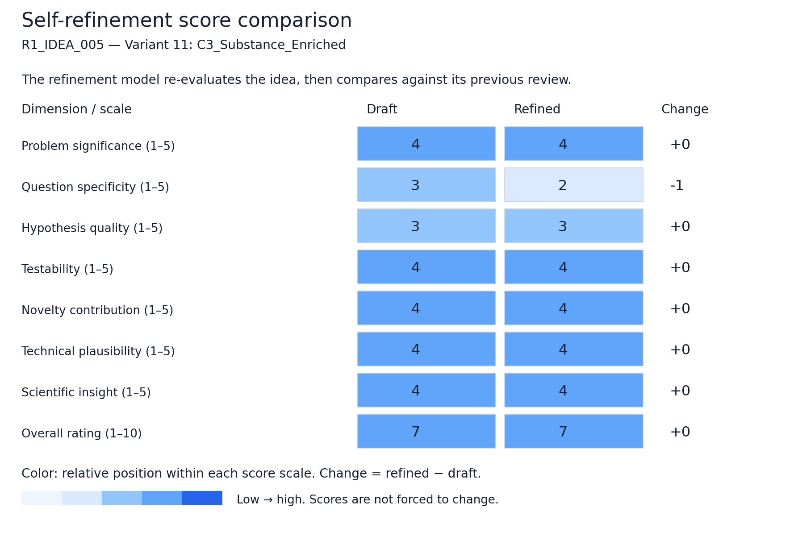

Changed score dimensions: question_specificity.

### Score justifications (draft / refined)

**Problem significance**

```json
{
  "draft": {
    "score": 4.0,
    "justification": "Improving robustness of vision state space models under distribution shifts is a meaningful problem. SSMs are an emerging architecture, and their robustness properties are not well-studied. Test-time adaptation without labeled data is also a practical challenge."
  },
  "refined": {
    "score": 4.0,
    "justification": "The problem is significant. Improving the robustness of state space models (like Mamba) under distribution shifts is a meaningful and timely challenge as these architectures gain prominence. Test-time adaptation without labels is also a practical and active research area."
  }
}
```

**Question specificity**

```json
{
  "draft": {
    "score": 3.0,
    "justification": "The idea identifies a general goal (improve robustness) and a method (TTA with SSM permutations), but does not define a precise research question (e.g., 'Does permutation-based TTA outperform standard TTA for SSMs on corruption benchmarks?')."
  },
  "refined": {
    "score": 2.0,
    "justification": "The idea defines a general goal ('improve robustness') and a method, but not a precise, testable research question. It does not specify the type of distribution shifts, the evaluation metric, or the comparison point. The mention of future hyperparameter tests is a step toward specificity but is not the core question."
  }
}
```

**Hypothesis quality**

```json
{
  "draft": {
    "score": 3.0,
    "justification": "There is an implicit hypothesis that 'diversity of permutations could help capture invariant features,' which is a concrete prediction. However, it lacks a clear mechanistic explanation linking SSM permutations to feature invariance."
  },
  "refined": {
    "score": 3.0,
    "justification": "There is an implicit hypothesis: 'diversity of these permutations could help the model capture a wider range of invariant features.' This is a concrete, testable prediction about a mechanism. However, it is not deeply motivated or differentiated from a generic claim that 'more diversity helps.'"
  }
}
```

**Testability**

```json
{
  "draft": {
    "score": 4.0,
    "justification": "The idea is highly testable: one can implement the method, compare performance on shift benchmarks, ablate permutation diversity, and analyze hyperparameters. The mention of future validation for hyperparameters shows testability is considered."
  },
  "refined": {
    "score": 4.0,
    "justification": "The idea is highly testable. The proposed method can be implemented, its performance on distribution shift benchmarks can be measured, the contribution of permutation diversity can be ablated, and the influence of aggregation hyperparameters can be studied. The components suggest clear experimental pathways."
  }
}
```

**Novelty contribution**

```json
{
  "draft": {
    "score": 4.0,
    "justification": "Applying test-time adaptation to vision SSMs is novel, and using SSM-specific traversal permutations for input diversity is a creative idea. It could contribute to understanding how SSMs adapt to distribution shifts."
  },
  "refined": {
    "score": 4.0,
    "justification": "The idea has good novelty. Applying test-time adaptation specifically to vision SSMs is novel. Using SSM-internal traversal permutations to generate input views for adaptation is a creative and architecture-specific approach not commonly explored, offering a potential new direction for robustifying SSMs."
  }
}
```

**Technical plausibility**

```json
{
  "draft": {
    "score": 4.0,
    "justification": "The approach is technically plausible: generating multiple views via permutations is feasible, pseudo-labeling is common in TTA, and updating selective parameters aligns with parameter-efficient adaptation. No obvious technical flaws are apparent."
  },
  "refined": {
    "score": 4.0,
    "justification": "The approach is technically plausible. Generating multiple views via permutations of an SSM's processing order is feasible. Using pseudo-labels for unsupervised updates and aggregating model weights are established concepts in adaptation literature. No obvious technical contradictions are present."
  }
}
```

**Scientific insight**

```json
{
  "draft": {
    "score": 4.0,
    "justification": "If successful, the research could yield insights into how SSM representations respond to structured input variations, whether permutation diversity is a useful inductive bias for invariance, and how TTA strategies interact with SSM architecture."
  },
  "refined": {
    "score": 4.0,
    "justification": "The research has strong potential for scientific insight. Success or failure could reveal how the sequential inductive bias of SSMs interacts with adaptation strategies, whether manipulating computational order is a useful lever for robustness, and provide general lessons on TTA for non-transformer architectures."
  }
}
```

**Overall rating**

```json
{
  "draft": {
    "score": 7.0,
    "justification": "This is a strong research idea with clear relevance, a novel methodological angle, and good testability. It lacks some specificity in the research question and hypothesis motivation, but the core direction is promising and could lead to meaningful contributions in robustness for emerging architectures."
  },
  "refined": {
    "score": 7.0,
    "justification": "This is a strong research idea. It tackles a relevant problem with a novel, architecture-specific method that is testable and technically plausible. Its main weakness is the lack of a sharply defined research question and a fully motivated hypothesis. However, the core direction is creative and promises meaningful contributions to robustness in emerging model families."
  }
}
```

## R1_IDEA_005 — Variant 12: H1_Deceptive_Hollow


Changed score dimensions: none.

### Score justifications (draft / refined)

**Problem significance**

```json
{
  "draft": {
    "score": 5.0,
    "justification": "Robustness to distribution shifts is a fundamental challenge in machine learning with significant practical implications. Test-time adaptation without additional labels is an important and active research direction."
  },
  "refined": {
    "score": 5.0,
    "justification": "Robustness to distribution shifts is a fundamental and highly significant challenge in machine learning with major practical implications. Test-time adaptation without additional labels is an important, active research direction that addresses real-world deployment challenges."
  }
}
```

**Question specificity**

```json
{
  "draft": {
    "score": 1.0,
    "justification": "The idea lacks a clear research question. It describes a general approach but doesn't specify what is being investigated. There's no concrete 'what', 'why', or 'how' that defines the research scope."
  },
  "refined": {
    "score": 1.0,
    "justification": "The idea completely lacks a clear research question. It describes a general methodological approach but doesn't specify what is being investigated. There's no concrete 'what', 'why', or 'how' that defines the research scope or identifies a specific phenomenon to study."
  }
}
```

**Hypothesis quality**

```json
{
  "draft": {
    "score": 1.0,
    "justification": "No hypothesis is presented. The description is entirely methodological without any predictive statement about mechanisms, relationships, or expected outcomes that could be tested."
  },
  "refined": {
    "score": 1.0,
    "justification": "No hypothesis is presented. The description is entirely methodological without any predictive statement about mechanisms, relationships, or expected outcomes that could be tested. There's no claim that could be supported or contradicted by evidence."
  }
}
```

**Testability**

```json
{
  "draft": {
    "score": 2.0,
    "justification": "While the general approach could be tested by implementing it and evaluating on distribution shift benchmarks, the vagueness makes it unclear what specific claim would be tested. The grandiose framing ('transformative synthesis') is not testable."
  },
  "refined": {
    "score": 2.0,
    "justification": "While the general approach could eventually be tested by implementing it and evaluating on distribution shift benchmarks, the extreme vagueness makes it unclear what specific claim would be tested. The grandiose framing ('transformative synthesis', 'field-shaping') is not testable as presented."
  }
}
```

**Novelty contribution**

```json
{
  "draft": {
    "score": 2.0,
    "justification": "Test-time adaptation and using multiple views/augmentations are established concepts. The idea claims novelty but doesn't specify what is actually new. The framing as 'transformative synthesis' is aspirational rather than substantiated."
  },
  "refined": {
    "score": 2.0,
    "justification": "Test-time adaptation and using multiple views/augmentations are well-established concepts. The idea claims novelty and transformative potential but doesn't specify what is actually new. The framing is aspirational rather than substantiated with specific innovations or insights."
  }
}
```

**Technical plausibility**

```json
{
  "draft": {
    "score": 3.0,
    "justification": "The general concept of test-time adaptation with multiple views is technically plausible based on related work. However, the lack of details about the specific mechanisms makes it impossible to assess whether the proposed combination would work effectively."
  },
  "refined": {
    "score": 3.0,
    "justification": "The general concept of test-time adaptation with multiple views is technically plausible based on related work. However, the complete lack of details about specific mechanisms (what views, what information, which parameters, how combined) makes it impossible to assess whether the proposed approach would work effectively or is coherent."
  }
}
```

**Scientific insight**

```json
{
  "draft": {
    "score": 2.0,
    "justification": "The idea as presented focuses on a method rather than scientific insight. While it claims broader significance, it doesn't articulate what new understanding about robustness, adaptation, or model behavior would be gained from this research."
  },
  "refined": {
    "score": 2.0,
    "justification": "The idea as presented focuses entirely on a method rather than scientific insight. While it claims broader significance, it doesn't articulate what new understanding about robustness, adaptation, or model behavior would be gained. The transformative claims are asserted rather than derived from a specific insight."
  }
}
```

**Overall rating**

```json
{
  "draft": {
    "score": 3.0,
    "justification": "This is a weak research idea. While it addresses an important problem, it lacks a clear research question, hypothesis, or specific contribution. The description is mostly methodological with grandiose framing but minimal scientific substance. It reads more like a motivation statement than a research idea."
  },
  "refined": {
    "score": 3.0,
    "justification": "This is a weak research idea. While it addresses an important problem, it lacks a clear research question, hypothesis, or specific contribution. The description is mostly methodological with grandiose framing but minimal scientific substance. It reads more like a motivation statement or abstract aspiration than a concrete research idea with testable components."
  }
}
```

## R1_IDEA_005 — Variant 13: H2_Confident_Flaw

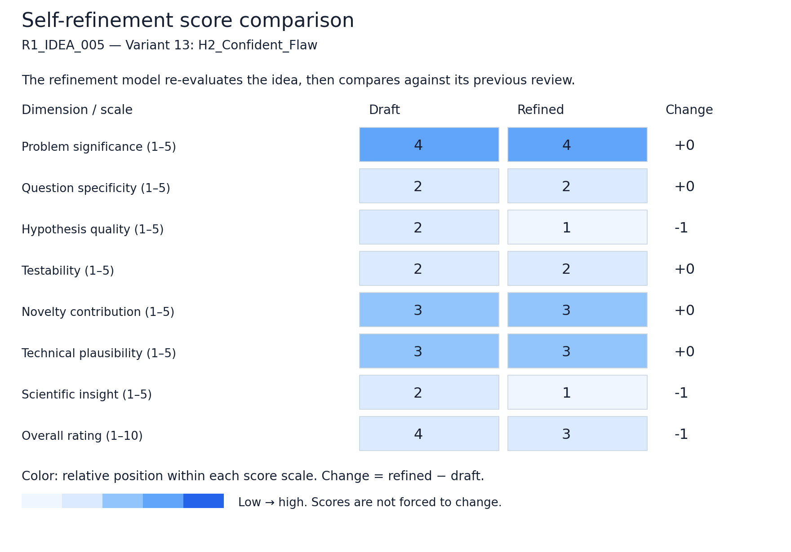

Changed score dimensions: hypothesis_quality, scientific_insight, overall_rating.

### Score justifications (draft / refined)

**Problem significance**

```json
{
  "draft": {
    "score": 4.0,
    "justification": "Improving robustness of vision state space models under distribution shifts is a meaningful problem, especially given the growing interest in SSMs for vision. Test-time adaptation without labeled data is a relevant and practical challenge."
  },
  "refined": {
    "score": 4.0,
    "justification": "Improving the robustness of vision state space models under distribution shifts is a meaningful and timely problem. SSMs are an emerging architecture class, and understanding and enhancing their out-of-distribution generalization is important for both research and practical deployment. Test-time adaptation without labeled data is a relevant and challenging sub-problem."
  }
}
```

**Question specificity**

```json
{
  "draft": {
    "score": 2.0,
    "justification": "The idea describes a method but does not define a clear research question. It states a goal ('improve robustness') and a proposed technique, but not what specific relationship, mechanism, or comparison is being investigated."
  },
  "refined": {
    "score": 2.0,
    "justification": "The idea describes a proposed method and a goal ('improve robustness'), but does not define a clear research question. It lacks specification of what relationship, mechanism, or comparative advantage is being investigated. The description is more of a technical proposal than a focused inquiry."
  }
}
```

**Hypothesis quality**

```json
{
  "draft": {
    "score": 2.0,
    "justification": "The implicit hypothesis is that the proposed method 'could be broadly effective,' which is vague and not falsifiable in a specific sense. No concrete prediction about performance, mechanisms, or conditions is made. The strong causal language is unjustified and unscientific."
  },
  "refined": {
    "score": 1.0,
    "justification": "The implicit hypothesis is that the proposed method 'could be broadly effective,' which is vague and not falsifiable. No concrete prediction about performance, conditions for success, or underlying mechanism is made. The strong, unjustified causal claims ('necessarily produce reliable improvements') further undermine scientific quality by preemptively dismissing counter-evidence and alternative explanations."
  }
}
```

**Testability**

```json
{
  "draft": {
    "score": 2.0,
    "justification": "While the method could be implemented and tested, the idea does not propose any specific experiments, comparisons, or evaluations. The author even suggests that isolating factors is unnecessary, which undermines testability. Without a clear evaluation plan, it is hard to assess how the central claim would be investigated."
  },
  "refined": {
    "score": 2.0,
    "justification": "While the method could technically be implemented and tested, the idea does not propose any specific experiments, comparisons, or evaluations. More critically, the author explicitly states that isolating factors like dataset composition or alternative explanations is unnecessary, which directly contradicts the principles of testability and falsifiability. There is no clear plan for how the central claim would be rigorously investigated."
  }
}
```

**Novelty contribution**

```json
{
  "draft": {
    "score": 3.0,
    "justification": "Applying test-time adaptation to vision SSMs is a plausible direction, and using SSM-specific traversal permutations is a moderately novel twist. However, the core idea (test-time adaptation with pseudo-labels and multi-view aggregation) is well-established in other domains. The potential contribution depends heavily on the specifics of the permutation strategy and SSM parameter updates."
  },
  "refined": {
    "score": 3.0,
    "justification": "Applying test-time adaptation to vision SSMs is a plausible direction of investigation. Using SSM-specific traversal permutations is a moderately novel architectural twist. However, the core concepts of test-time adaptation, multi-view generation, pseudo-labeling, and weight aggregation are well-established in the literature. The potential contribution hinges on the specifics of the permutation strategy and its interaction with SSM parameters, which are not detailed."
  }
}
```

**Technical plausibility**

```json
{
  "draft": {
    "score": 3.0,
    "justification": "The general approach—generating multiple views, using pseudo-labels for adaptation, aggregating weights—is technically plausible and aligns with existing test-time adaptation literature. However, key details are missing (e.g., how permutations are generated, which parameters are updated, aggregation method), making it hard to fully assess feasibility."
  },
  "refined": {
    "score": 3.0,
    "justification": "The general approach—generating multiple views, using pseudo-labels for unsupervised adaptation, aggregating model weights—is technically plausible and aligns with existing test-time adaptation literature. However, key implementation details are missing (e.g., how permutations are generated and controlled, the update rule for Mamba parameters, the aggregation method), making a full assessment of feasibility difficult. The core concept is not inherently implausible."
  }
}
```

**Scientific insight**

```json
{
  "draft": {
    "score": 2.0,
    "justification": "As presented, the idea seems focused on demonstrating a performance improvement rather than uncovering new scientific insights. The author's dismissal of isolating factors suggests a lack of interest in understanding why the method works, what limitations it has, or under what conditions it fails. This limits the potential for transferable knowledge."
  },
  "refined": {
    "score": 1.0,
    "justification": "As presented, the idea seems primarily focused on claiming a performance improvement. The author's explicit dismissal of isolating factors ('without separately isolating dataset composition, evaluation criteria, boundary cases, or alternative explanations') indicates a lack of interest in understanding why the method works, what its limitations are, or under what conditions it fails. This severely limits the potential for generating transferable scientific knowledge about SSMs, adaptation, or robustness mechanisms."
  }
}
```

**Overall rating**

```json
{
  "draft": {
    "score": 4.0,
    "justification": "The idea addresses a relevant problem and proposes a moderately novel technical direction for vision SSMs. However, it lacks a clear research question, a testable hypothesis, and a rigorous evaluation plan. The overly strong causal claims and dismissal of careful validation are significant weaknesses. As a research idea, it is currently underdeveloped and would need substantial refinement to become a strong scientific investigation."
  },
  "refined": {
    "score": 3.0,
    "justification": "The idea identifies a relevant problem (robustness of vision SSMs) and suggests a moderately novel technical direction. However, it is critically flawed as a scientific research idea. It lacks a clear research question, presents a non-falsifiable and overreaching hypothesis, dismisses essential validation steps, and shows little interest in generating mechanistic insight. The strong, unsupported causal claims are particularly concerning. In its current form, it reads more like an unsupported claim of a solution than a plan for scientific investigation. Substantial refinement is needed to transform it into a testable, insightful research direction."
  }
}
```

## R1_IDEA_005 — Variant 14: H3_Verbose_Enriched

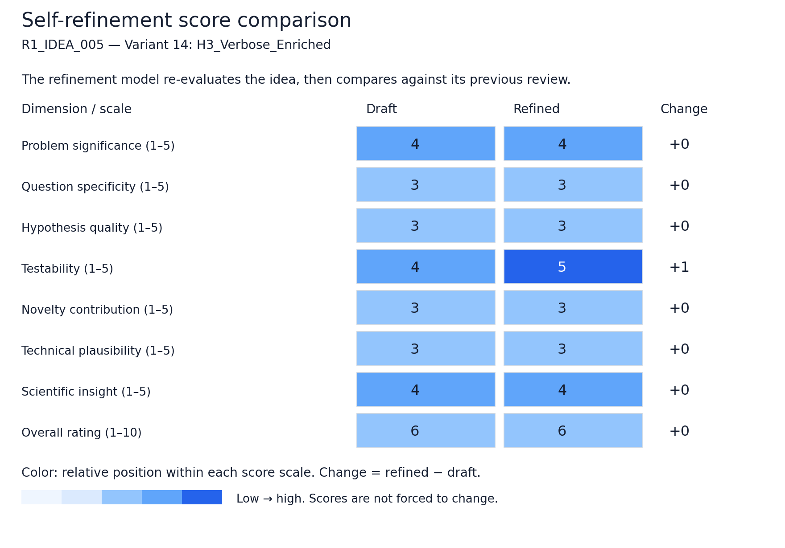

Changed score dimensions: testability.

### Score justifications (draft / refined)

**Problem significance**

```json
{
  "draft": {
    "score": 4.0,
    "justification": "Improving robustness under distribution shifts is a significant and timely challenge in machine learning, especially for vision models deployed in non-stationary environments. The focus on state space models (SSMs) like Mamba adds relevance given their growing adoption. However, the problem is not entirely novel, as TTA for robustness is a well-studied area."
  },
  "refined": {
    "score": 4.0,
    "justification": "Improving robustness under distribution shifts is a significant challenge in machine learning, especially for vision models in real-world deployment. The focus on state space models adds contemporary relevance given their growing adoption. However, TTA for robustness is an established research area, so while important, this is not a fundamentally new problem."
  }
}
```

**Question specificity**

```json
{
  "draft": {
    "score": 3.0,
    "justification": "The idea mentions a method and a broad hypothesis, but the core research question is not crisply defined. It oscillates between proposing a method and suggesting validation steps. A more specific question like 'Does permutation diversity in SSM traversal improve TTA robustness compared to standard augmentations?' would be stronger."
  },
  "refined": {
    "score": 3.0,
    "justification": "The idea describes a method and validation approach but does not crisply define a research question. It mixes proposal of a technique with suggestions for testing it. A clearer question like 'Does permutation diversity in SSM traversal improve TTA robustness compared to standard augmentations, and under what conditions?' would be more specific."
  }
}
```

**Hypothesis quality**

```json
{
  "draft": {
    "score": 3.0,
    "justification": "The hypothesis that 'diversity of these permutations could help the model capture a wider range of invariant features' is plausible but generic. It makes a directional prediction but lacks mechanistic detail (e.g., why permutations, what features). The suggestion to test hyperparameter effects on shift types adds specificity, but the main hypothesis remains somewhat vague."
  },
  "refined": {
    "score": 3.0,
    "justification": "The hypothesis that 'diversity of these permutations could help the model capture a wider range of invariant features' is directional but vague. It lacks mechanistic detail about why permutations specifically would achieve this. The suggestion to test hyperparameter effects adds some specificity, but the core hypothesis remains underspecified and not strongly falsifiable."
  }
}
```

**Testability**

```json
{
  "draft": {
    "score": 4.0,
    "justification": "The idea is highly testable, as it proposes concrete experimental steps: staged design, ablations, sensitivity analyses, and error analysis. The method itself (generating permutations, pseudo-label updates, weight aggregation) can be implemented and evaluated on standard robustness benchmarks. The inclusion of validation suggestions demonstrates a clear path to empirical investigation."
  },
  "refined": {
    "score": 5.0,
    "justification": "The idea is highly testable. It proposes concrete experimental steps: staged design with baseline/intervention conditions, pre-specified evaluation criteria, comparisons across cases, ablations, sensitivity analyses, and error analysis. The method itself (permutation generation, pseudo-label updates, weight aggregation) can be implemented and evaluated on standard robustness benchmarks."
  }
}
```

**Novelty contribution**

```json
{
  "draft": {
    "score": 3.0,
    "justification": "Applying test-time adaptation to vision SSMs is moderately novel, as SSMs are relatively new in vision. However, TTA itself is a well-established technique. The use of SSM-specific permutations is a distinctive element, but its novelty depends on whether permutation diversity offers unique advantages over existing augmentation strategies. The potential contribution is more incremental than transformative."
  },
  "refined": {
    "score": 3.0,
    "justification": "Applying test-time adaptation to vision SSMs has moderate novelty given their recent emergence in vision. However, TTA itself is well-established. The use of SSM-specific permutations is a distinctive element, but its novelty depends on whether it offers unique advantages over existing augmentation strategies. The contribution appears more incremental than transformative."
  }
}
```

**Technical plausibility**

```json
{
  "draft": {
    "score": 3.0,
    "justification": "The method is logically coherent (generate views, adapt via pseudo-labels, aggregate weights), but key assumptions are underexplained. For example, it's unclear why SSM traversal permutations would produce useful views for vision, or why Mamba-specific parameters are particularly suitable for adaptation. The aggregation step is mentioned but not detailed. Overall, plausible but requires more justification."
  },
  "refined": {
    "score": 3.0,
    "justification": "The method is logically coherent in structure, but key assumptions lack justification. It's unclear why SSM traversal permutations would produce useful views for vision data, or why Mamba-specific parameters are particularly suitable for adaptation. The aggregation mechanism is mentioned but not detailed. While not implausible, the technical rationale requires stronger grounding."
  }
}
```

**Scientific insight**

```json
{
  "draft": {
    "score": 4.0,
    "justification": "If rigorously validated as suggested, the study could yield insights beyond mere performance improvement. The staged design and ablations could reveal when and why permutation diversity helps, what types of shifts are addressed, and how adaptation mechanisms interact with SSM architecture. This aligns with the goal of understanding 'assumptions, data regimes, and domain constraints,' which is scientifically valuable."
  },
  "refined": {
    "score": 4.0,
    "justification": "If implemented with the suggested rigorous validation, the study could yield valuable insights beyond performance improvements. The staged design, ablations, and error analysis could reveal when permutation diversity helps, what shift types are addressed, and how adaptation interacts with SSM architecture properties. This aligns with understanding 'assumptions, data regimes, and domain constraints,' which provides transferable scientific knowledge."
  }
}
```

**Overall rating**

```json
{
  "draft": {
    "score": 6.0,
    "justification": "This is a moderate/borderline research idea. It addresses a meaningful problem and proposes a technically interesting method tailored to SSMs. The validation suggestions are thorough and would strengthen the work. However, the core hypothesis and research question lack specificity and mechanistic grounding. The novelty is limited, and technical plausibility requires further justification. With refinement, it could become a strong idea, but in its current form, it is promising but not yet exceptional."
  },
  "refined": {
    "score": 6.0,
    "justification": "This is a moderate/borderline research idea. It addresses a meaningful problem with a technically interesting approach tailored to SSMs, and the validation suggestions demonstrate thoughtful experimental design. However, the core hypothesis lacks specificity and mechanistic grounding, the research question is not crisply defined, and technical plausibility requires further justification. With refinement of the hypothesis and clearer problem definition, it could become a stronger idea."
  }
}
```

## R1_IDEA_005 — Variant 15: H4_Ultimate_Hype

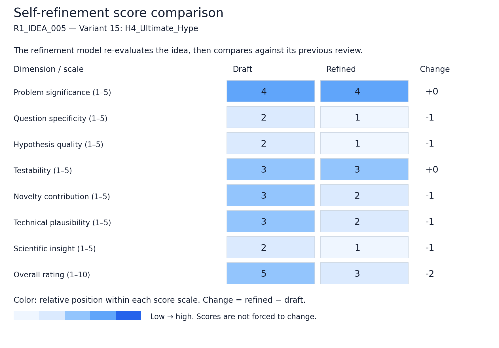

Changed score dimensions: question_specificity, hypothesis_quality, novelty_contribution, technical_plausibility, scientific_insight, overall_rating.

### Score justifications (draft / refined)

**Problem significance**

```json
{
  "draft": {
    "score": 4.0,
    "justification": "Test-time adaptation for distribution shifts is an important problem in machine learning, especially for real-world deployment. Vision state space models are a relevant and timely architecture class. The problem of making these models robust without labeled data has clear practical significance."
  },
  "refined": {
    "score": 4.0,
    "justification": "Test-time adaptation for distribution shifts is an important problem in machine learning with clear practical significance for real-world deployment. Vision state space models are a relevant and timely architecture class that has gained substantial attention. Improving their robustness without labeled data addresses a meaningful challenge."
  }
}
```

**Question specificity**

```json
{
  "draft": {
    "score": 2.0,
    "justification": "The idea describes a method but doesn't articulate a clear research question. It's unclear what specific phenomenon, relationship, or mechanism is being investigated. The description is more 'here's what we would do' than 'here's what we want to learn.'"
  },
  "refined": {
    "score": 1.0,
    "justification": "The idea does not articulate any research question. It describes a method ('proposes a test-time adaptation method') but does not define what is being investigated. There is no indication of what specific phenomenon, relationship, or mechanism the research aims to understand. The description is purely a technical proposal without a scientific inquiry component."
  }
}
```

**Hypothesis quality**

```json
{
  "draft": {
    "score": 2.0,
    "justification": "There's no explicit or clearly implicit hypothesis. The idea seems to assume that the proposed method will work without articulating why or what specific claim could be tested. A hypothesis would need to predict something like 'SSM traversal permutations capture more diverse invariances than standard augmentations' or 'Mamba-specific parameters are particularly important for adaptation to distribution shifts.'"
  },
  "refined": {
    "score": 1.0,
    "justification": "There is no explicit or implicit hypothesis. The idea assumes the proposed method will work without articulating any testable prediction about why it should work or what specific claim could be evaluated. A hypothesis would need to make a concrete, falsifiable prediction about SSMs, distribution shifts, or adaptation mechanisms."
  }
}
```

**Testability**

```json
{
  "draft": {
    "score": 3.0,
    "justification": "The proposed method could be tested through experiments comparing performance on distribution-shifted datasets. However, without a clear hypothesis, it's unclear what specific claims would be tested. The method description suggests implementable components, but the evaluation criteria are not specified."
  },
  "refined": {
    "score": 3.0,
    "justification": "The proposed method could technically be implemented and tested through experiments comparing performance on distribution-shifted datasets. However, without a clear hypothesis or research question, it's unclear what specific claims would be tested beyond 'does this method improve performance?' The evaluation criteria and comparisons are not specified."
  }
}
```

**Novelty contribution**

```json
{
  "draft": {
    "score": 3.0,
    "justification": "Test-time adaptation is an established area, and applying it to vision SSMs has some novelty. The specific combination of techniques (SSM permutations, Mamba-specific updates) could be novel, but the idea doesn't articulate what fundamentally new insight or capability this would provide beyond applying existing adaptation ideas to a new architecture."
  },
  "refined": {
    "score": 2.0,
    "justification": "Test-time adaptation is an established research area, and applying it to vision SSMs has some novelty due to the architecture's recent emergence. However, the idea doesn't articulate what fundamentally new insight or capability this would provide beyond applying existing adaptation concepts to a new architecture class. The grandiose claims about being 'transformative' are not supported."
  }
}
```

**Technical plausibility**

```json
{
  "draft": {
    "score": 3.0,
    "justification": "The described components seem technically plausible - generating input variations, using pseudo-labels, updating parameters. However, key details are missing: how SSM traversal permutations would be implemented, what makes them 'diverse,' how weight aggregation would work, and why Mamba-specific parameters are the right target. The core assumption that SSM permutations are useful for distribution shifts isn't justified."
  },
  "refined": {
    "score": 2.0,
    "justification": "The described components seem technically implementable, but key assumptions are unjustified. There's no explanation of why SSM traversal permutations would help with distribution shifts, what makes them 'diverse,' how weight aggregation would work, or why Mamba-specific parameters are the appropriate update target. The core premise lacks technical justification."
  }
}
```

**Scientific insight**

```json
{
  "draft": {
    "score": 2.0,
    "justification": "As described, the idea seems primarily focused on developing a practical method. There's little indication of what scientific insight would be gained about SSMs, distribution shifts, or test-time adaptation. A more insightful direction might investigate why SSMs respond differently to distribution shifts or what architectural properties enable certain adaptation strategies."
  },
  "refined": {
    "score": 1.0,
    "justification": "As described, the idea seems entirely focused on developing a practical method with no indication of what scientific insight would be gained. There's no suggestion of investigating why SSMs respond differently to distribution shifts, what architectural properties enable certain adaptation strategies, or any general principles about robustness. The description mentions 'scientific breakthroughs' but provides no pathway to achieving them."
  }
}
```

**Overall rating**

```json
{
  "draft": {
    "score": 5.0,
    "justification": "This is a moderate/borderline research idea. It addresses a meaningful problem (test-time adaptation for vision SSMs) and proposes a specific technical approach. However, it lacks a clear research question or hypothesis, making it more of a method outline than a research investigation. The potential scientific insight is limited without a clearer focus on understanding mechanisms or principles rather than just developing a method. The grandiose claims about being 'transformative' are not supported by the description."
  },
  "refined": {
    "score": 3.0,
    "justification": "This is a weak research idea. While it addresses a meaningful problem (test-time adaptation for vision SSMs) and proposes a specific technical approach, it lacks the essential components of a research investigation: a clear research question, a testable hypothesis, and a pathway to scientific insight. The description is more of a method proposal than a research idea, and the grandiose claims about being 'transformative' are unsupported. The idea needs substantial refinement to become a meaningful research direction."
  }
}
```

## R1_IDEA_006 — Source

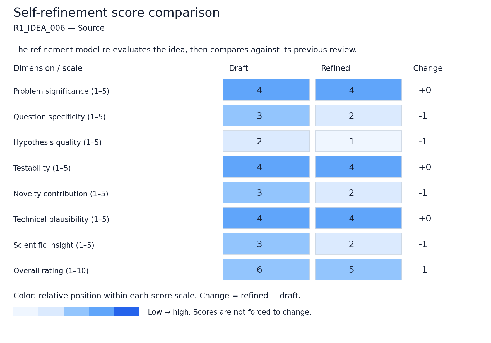

Changed score dimensions: question_specificity, hypothesis_quality, novelty_contribution, scientific_insight, overall_rating.

### Score justifications (draft / refined)

**Problem significance**

```json
{
  "draft": {
    "score": 4.0,
    "justification": "The problem is meaningful: selecting good self-supervised models in histopathology is practically important for medical imaging applications, and current evaluation methods may be inadequate. The domain has real-world impact."
  },
  "refined": {
    "score": 4.0,
    "justification": "The problem is meaningful and practically important. Selecting appropriate self-supervised models in histopathology is a genuine challenge with real-world impact on medical imaging applications. The need for better evaluation metrics in this domain is well-motivated."
  }
}
```

**Question specificity**

```json
{
  "draft": {
    "score": 3.0,
    "justification": "The idea identifies a clear gap (unexplored effectiveness in histopathology for non-linear tasks) but does not specify a precise research question beyond exploring this gap. It lacks a concrete, testable statement about what relationship or phenomenon will be investigated."
  },
  "refined": {
    "score": 2.0,
    "justification": "The idea identifies a gap ('unexplored in histopathology') but does not specify a precise research question. It lacks a concrete, testable statement about what relationship or phenomenon will be investigated. The term 'effectiveness' is too vague without operational definition."
  }
}
```

**Hypothesis quality**

```json
{
  "draft": {
    "score": 2.0,
    "justification": "There is no explicit or strongly implicit hypothesis. The idea essentially states that something is 'unexplored' and should be explored. A hypothesis would predict an outcome (e.g., rank metrics will fail, or will succeed only under certain conditions)."
  },
  "refined": {
    "score": 1.0,
    "justification": "There is no explicit or implicit hypothesis. The idea merely states that something is 'unexplored' and should be explored. A hypothesis would make a concrete prediction about the outcome (e.g., rank metrics will fail, will require adaptation, or will succeed only for certain tasks). The absence of any predictive statement severely limits the hypothesis quality."
  }
}
```

**Testability**

```json
{
  "draft": {
    "score": 4.0,
    "justification": "The idea is highly testable. One could take existing rank estimation methods, apply them to self-supervised vision transformers trained on histopathology data, and evaluate their correlation with performance on instance segmentation and classification tasks. The experimental design is straightforward."
  },
  "refined": {
    "score": 4.0,
    "justification": "The core idea is testable. One could implement rank estimation methods on representations from self-supervised vision transformers trained on histopathology data and evaluate their correlation with performance on downstream tasks like instance segmentation and classification. The experimental design is conceptually straightforward."
  }
}
```

**Novelty contribution**

```json
{
  "draft": {
    "score": 3.0,
    "justification": "The novelty lies in applying an existing evaluation methodology to a new domain (histopathology) and new task types (non-linear tasks from WSIs). This is a useful application-focused contribution, but it does not propose a new method or aim to discover a new fundamental principle."
  },
  "refined": {
    "score": 2.0,
    "justification": "The novelty is limited to applying an existing evaluation methodology to a new domain (histopathology) and new task types. This is an application-focused contribution with modest novelty. It does not propose a new method, theory, or aim to discover a new fundamental principle about representation learning."
  }
}
```

**Technical plausibility**

```json
{
  "draft": {
    "score": 4.0,
    "justification": "The direction is technically plausible. Rank estimation is a known technique for evaluating representations, and applying it to a new data domain is logically coherent. The challenges of histopathology (large images, specific textures) are reasonable considerations."
  },
  "refined": {
    "score": 4.0,
    "justification": "The direction is technically plausible. Rank estimation is a known technique for evaluating representations, and applying it to a new data domain is logically coherent. The mentioned challenges of histopathology (non-linear tasks, whole slide images) are reasonable considerations that don't undermine the basic plausibility."
  }
}
```

**Scientific insight**

```json
{
  "draft": {
    "score": 3.0,
    "justification": "If framed as a simple validation study, the potential insight is limited to whether a tool works in a new setting. However, if the investigation probes why rank estimation succeeds or fails (e.g., linking data properties to metric behavior), it could yield insights into the limitations of current evaluation metrics for specialized domains."
  },
  "refined": {
    "score": 2.0,
    "justification": "If framed as a simple validation study ('does tool X work in domain Y?'), the potential insight is minimal. The idea as presented lacks a clear mechanism for generating transferable knowledge. It could yield insight only if the investigation actively probes why rank estimation succeeds or fails (e.g., linking specific data properties to metric behavior), but this is not suggested in the idea summary."
  }
}
```

**Overall rating**

```json
{
  "draft": {
    "score": 6.0,
    "justification": "This is a moderate/borderline research idea. It identifies a clear, practical problem and a sensible direction for investigation. Its main weaknesses are the lack of a specific hypothesis and a somewhat generic application-focused framing. With a sharper research question and a hypothesis about domain-specific challenges, it could become a strong idea. As presented, it is a reasonable but incremental exploratory study."
  },
  "refined": {
    "score": 5.0,
    "justification": "This is a moderate/borderline research idea. It identifies a clear, practical problem and a testable direction. However, it suffers from low specificity, no hypothesis, and limited novelty or potential for scientific insight. It reads more like a generic application study than a focused research investigation. With a sharper research question and a hypothesis about domain-specific challenges, it could become stronger. As presented, it is an incremental exploratory study with modest contribution potential."
  }
}
```

## R1_IDEA_006 — Variant 1: A1_Identity


Changed score dimensions: none.

### Score justifications (draft / refined)

**Problem significance**

```json
{
  "draft": {
    "score": 4.0,
    "justification": "The problem is meaningful. Self-supervised learning in histopathology is important due to data annotation costs, and selecting good models during training is a practical challenge. Evaluating representation quality efficiently without full downstream training is valuable."
  },
  "refined": {
    "score": 4.0,
    "justification": "The problem is meaningful. Self-supervised learning in histopathology is important due to high annotation costs and clinical relevance. Efficient model selection during training is a practical challenge, and understanding whether existing evaluation metrics generalize across domains is valuable for the community."
  }
}
```

**Question specificity**

```json
{
  "draft": {
    "score": 3.0,
    "justification": "The question is moderately specific: it identifies a domain (histopathology) and tasks (instance segmentation, WSI classification) where a technique's effectiveness is unknown. However, it does not specify what 'effectiveness' means or propose a concrete relationship to test."
  },
  "refined": {
    "score": 3.0,
    "justification": "The question is moderately specific: it identifies a domain (histopathology), tasks (instance segmentation, WSI classification), and a technique (rank estimation) to investigate. However, it does not specify what 'effectiveness' entails or propose a concrete relationship to test, leaving the scope somewhat broad."
  }
}
```

**Hypothesis quality**

```json
{
  "draft": {
    "score": 2.0,
    "justification": "There is an implicit hypothesis that rank estimation approaches might not work as well in histopathology, but it is not stated as a concrete, testable prediction. The idea is more about exploring a gap than testing a specific mechanism or relationship."
  },
  "refined": {
    "score": 2.0,
    "justification": "There is only an implicit, vague hypothesis that rank estimation 'might not work as well' in histopathology. No concrete, testable prediction is made about outcomes, mechanisms, or relationships. The idea is exploratory rather than hypothesis-driven."
  }
}
```

**Testability**

```json
{
  "draft": {
    "score": 4.0,
    "justification": "The idea is highly testable. One could train self-supervised ViTs on histopathology data, compute rank estimation metrics, evaluate on downstream tasks, and measure correlation. The experimental design is straightforward."
  },
  "refined": {
    "score": 4.0,
    "justification": "The idea is highly testable. One can train self-supervised ViTs on histopathology data, compute rank estimation metrics, evaluate downstream task performance, and analyze correlations. The experimental design is straightforward and feasible."
  }
}
```

**Novelty contribution**

```json
{
  "draft": {
    "score": 3.0,
    "justification": "The novelty is moderate. Applying an existing evaluation method to a new domain (histopathology) is a valid contribution, but it is primarily a domain adaptation study. The potential contribution increases if it reveals fundamental differences in representation quality metrics across domains."
  },
  "refined": {
    "score": 3.0,
    "justification": "Novelty is moderate. Applying an existing evaluation method to a new domain (histopathology) is a valid but incremental contribution. The potential contribution increases if it reveals fundamental differences in representation evaluation across domains, but this is not yet articulated."
  }
}
```

**Technical plausibility**

```json
{
  "draft": {
    "score": 4.0,
    "justification": "The direction is technically plausible. Rank estimation for representation quality is an established concept. The extension to histopathology and non-linear tasks is logically coherent, assuming access to appropriate datasets and benchmarks."
  },
  "refined": {
    "score": 4.0,
    "justification": "The direction is technically plausible. Rank estimation for representation quality is established in SSL literature. Extending it to histopathology and non-linear tasks is coherent, assuming appropriate datasets and benchmarks are available."
  }
}
```

**Scientific insight**

```json
{
  "draft": {
    "score": 3.0,
    "justification": "Potential insight is moderate. If successful, the study could tell us whether rank estimation generalizes across domains, which is useful but not deeply mechanistic. Greater insight would come from understanding why it does or does not generalize, which is not yet proposed."
  },
  "refined": {
    "score": 3.0,
    "justification": "Potential insight is moderate. The study could indicate whether rank estimation generalizes across domains, which is practically useful. However, without a hypothesis about why differences might occur, deeper mechanistic insights (e.g., about representation properties or domain shifts) are not yet promised."
  }
}
```

**Overall rating**

```json
{
  "draft": {
    "score": 6.0,
    "justification": "This is a moderate/borderline research idea. It addresses a practical problem and identifies a clear gap. However, it lacks a specific hypothesis and a proposed mechanism for why histopathology might be different. The idea is testable and plausible, but its potential scientific insight is currently limited to domain-specific validation. With a stronger hypothesis about the limitations of current metrics, it could become a more compelling study."
  },
  "refined": {
    "score": 6.0,
    "justification": "This is a moderate/borderline research idea. It addresses a practical problem in an important domain and identifies a clear gap. However, it lacks a specific hypothesis and mechanistic reasoning, limiting its scientific depth. The idea is testable and plausible, but its potential contribution is primarily domain validation rather than novel insight. Strengthening the hypothesis would significantly improve it."
  }
}
```

## R1_IDEA_006 — Variant 2: A2_Paraphrase_Only


Changed score dimensions: none.

### Score justifications (draft / refined)

**Problem significance**

```json
{
  "draft": {
    "score": 4.0,
    "justification": "Model selection in self-supervised learning is a meaningful challenge, especially in data-rich but annotation-poor domains like histopathology. Efficient evaluation methods could reduce reliance on expensive labeled data and expert time, which is practically important."
  },
  "refined": {
    "score": 4.0,
    "justification": "Model selection in self-supervised learning is a meaningful challenge, especially in data-rich but annotation-poor domains like histopathology. Efficient evaluation methods could reduce reliance on expensive labeled data and expert time, which is practically important for medical imaging applications."
  }
}
```

**Question specificity**

```json
{
  "draft": {
    "score": 2.0,
    "justification": "The question is defined at a high level ('whether these approaches work well') but lacks specificity about what aspects are being tested, which rank methods, what tasks, or what success criteria. It identifies a domain gap but does not narrow down the investigation."
  },
  "refined": {
    "score": 2.0,
    "justification": "The question is defined at a high level ('whether these approaches work well') but lacks specificity about what aspects are being tested, which rank methods, what tasks, or what success criteria. It identifies a domain gap but does not narrow down the investigation to a focused research question."
  }
}
```

**Hypothesis quality**

```json
{
  "draft": {
    "score": 2.0,
    "justification": "There is an implicit hypothesis that rank estimation methods may not transfer effectively to histopathology, but it is not articulated as a concrete, testable prediction. No mechanism or reason for potential failure is proposed."
  },
  "refined": {
    "score": 2.0,
    "justification": "There is only an implicit, vague suggestion that rank estimation methods might not transfer effectively to histopathology, but no concrete, testable prediction is articulated. No mechanism or reason for potential failure is proposed, making the hypothesis weak."
  }
}
```

**Testability**

```json
{
  "draft": {
    "score": 4.0,
    "justification": "The idea is testable: one can compute rank metrics on SSL-trained ViT features for histopathology data and evaluate their correlation with downstream task performance. Experiments comparing natural image vs. histopathology domains are straightforward to design."
  },
  "refined": {
    "score": 4.0,
    "justification": "The idea is testable: one can compute rank metrics on SSL-trained ViT features for histopathology data and evaluate their correlation with downstream task performance. Experiments comparing natural image vs. histopathology domains are straightforward to design and execute."
  }
}
```

**Novelty contribution**

```json
{
  "draft": {
    "score": 3.0,
    "justification": "Applying rank estimation methods to a new domain (histopathology) is a moderate contribution. It is not a fundamentally new method or insight, but could provide useful empirical evidence about the generality of these evaluation techniques."
  },
  "refined": {
    "score": 3.0,
    "justification": "Applying rank estimation methods to a new domain (histopathology) is a moderate contribution. It is not a fundamentally new method or insight, but could provide useful empirical evidence about the generality of these evaluation techniques across domains."
  }
}
```

**Technical plausibility**

```json
{
  "draft": {
    "score": 4.0,
    "justification": "The direction is technically plausible. Rank estimation methods are established for SSL evaluation; extending them to histopathology data and tasks is logically coherent. No obvious technical barriers are mentioned."
  },
  "refined": {
    "score": 4.0,
    "justification": "The direction is technically plausible. Rank estimation methods are established for SSL evaluation; extending them to histopathology data and tasks is logically coherent. No obvious technical barriers are mentioned or apparent from the description."
  }
}
```

**Scientific insight**

```json
{
  "draft": {
    "score": 3.0,
    "justification": "If successful, the study could reveal whether rank-based SSL evaluation metrics generalize across domains and task types. However, unless the investigation probes why they succeed or fail, the insight may be limited to a domain-specific applicability check."
  },
  "refined": {
    "score": 3.0,
    "justification": "If successful, the study could reveal whether rank-based SSL evaluation metrics generalize across domains and task types. However, unless the investigation probes why they succeed or fail (e.g., by analyzing which data characteristics affect correlation), the insight may be limited to a domain-specific applicability check rather than yielding transferable scientific understanding."
  }
}
```

**Overall rating**

```json
{
  "draft": {
    "score": 5.0,
    "justification": "This is a moderate/borderline research idea. It addresses a practical problem and identifies a clear domain gap, but the research question is too broad and lacks a specific hypothesis. The potential contribution is primarily about testing the transfer of an existing method to a new domain, which offers limited scientific insight unless deeper reasons for success/failure are explored. With refinement (e.g., a more focused hypothesis and experimental design), it could become stronger."
  },
  "refined": {
    "score": 5.0,
    "justification": "This is a moderate/borderline research idea. It addresses a practical problem and identifies a clear domain gap, but the research question is too broad and lacks a specific hypothesis. The potential contribution is primarily about testing the transfer of an existing method to a new domain, which offers limited scientific insight unless deeper reasons for success/failure are explored. With refinement (e.g., a more focused hypothesis and experimental design), it could become stronger."
  }
}
```

## R1_IDEA_006 — Variant 3: A3_Plain_Core


Changed score dimensions: none.

### Score justifications (draft / refined)

**Problem significance**

```json
{
  "draft": {
    "score": 4.0,
    "justification": "Model selection for self-supervised learning is a recognized practical challenge, especially in data-rich domains like medical imaging where labeling is expensive. Histopathology is an important application area with real-world impact. The difficulty of selecting good pretrained models without labels directly affects research efficiency and clinical translation."
  },
  "refined": {
    "score": 4.0,
    "justification": "Model selection for self-supervised learning is a recognized practical challenge, especially in data-rich but label-scarce domains like medical imaging. Histopathology is an important application area with direct clinical relevance. Efficient model selection without extensive labeling could accelerate research and improve real-world outcomes."
  }
}
```

**Question specificity**

```json
{
  "draft": {
    "score": 3.0,
    "justification": "The idea identifies a general direction (evaluating rank estimation methods for histopathology) and specifies the model type (vision transformers) and tasks (instance segmentation, whole slide image classification). However, it does not narrow down to a specific question about why, when, or how these methods might succeed or fail, leaving the investigation somewhat open-ended."
  },
  "refined": {
    "score": 3.0,
    "justification": "The idea identifies a general direction (evaluating rank estimation in histopathology) and specifies the model type (vision transformers) and downstream tasks (instance segmentation, whole slide image classification). However, it does not narrow down to a specific question about when, why, or how these methods might succeed or fail, leaving the investigation broad and exploratory."
  }
}
```

**Hypothesis quality**

```json
{
  "draft": {
    "score": 2.0,
    "justification": "There is no explicit or clearly implicit hypothesis. The statement 'utility ... is not known' suggests an exploratory evaluation rather than a testable prediction. A stronger idea would hypothesize that rank estimation works well for some tasks but not others, or that it fails due to specific data properties."
  },
  "refined": {
    "score": 2.0,
    "justification": "There is no explicit or clearly implicit hypothesis. The statement 'utility ... is not known' suggests an exploratory evaluation rather than a testable prediction. A stronger idea would hypothesize a specific relationship, such as that rank estimation works for certain task types but not others, or that it fails due to identifiable data properties."
  }
}
```

**Testability**

```json
{
  "draft": {
    "score": 4.0,
    "justification": "The idea is highly testable. One can train multiple self-supervised ViTs on histopathology data, compute rank estimation metrics, evaluate downstream performance on instance segmentation and WSI classification, and measure correlation. Ablations over data subsets, architectures, or task variations could further probe boundaries."
  },
  "refined": {
    "score": 4.0,
    "justification": "The core question is highly testable. One can train multiple self-supervised ViTs on histopathology data, compute rank estimation metrics, evaluate downstream performance on the specified tasks, and measure correlations. Ablations over data subsets, task variations, or architectural choices could further probe boundaries and robustness."
  }
}
```

**Novelty contribution**

```json
{
  "draft": {
    "score": 3.0,
    "justification": "Applying rank estimation methods to a new domain (histopathology) and new task types (non-linear tasks) is a moderate contribution. It is primarily a validation study rather than a novel method or theoretical insight. However, if it reveals systematic differences from natural images, it could be a meaningful empirical contribution."
  },
  "refined": {
    "score": 3.0,
    "justification": "Applying existing rank estimation methods to a new domain (histopathology) and new task types (non-linear tasks) is a moderate contribution. It is primarily an empirical validation study rather than a novel methodological or theoretical advance. However, if it reveals systematic differences from natural images or identifies failure modes, it could provide meaningful domain-specific insights."
  }
}
```

**Technical plausibility**

```json
{
  "draft": {
    "score": 4.0,
    "justification": "The idea is technically plausible. Rank estimation methods are established for evaluating self-supervised representations in vision. Extending them to histopathology data and Vision Transformers is straightforward. The non-linearity of downstream tasks might affect correlations, but this is exactly what the investigation would explore."
  },
  "refined": {
    "score": 4.0,
    "justification": "The idea is technically plausible. Rank estimation methods are established for evaluating self-supervised representations in vision. Extending them to histopathology data and Vision Transformers is straightforward. The non-linearity of downstream tasks might affect correlation strength, but this is exactly what an investigation would explore. No obvious technical barriers are implied."
  }
}
```

**Scientific insight**

```json
{
  "draft": {
    "score": 3.0,
    "justification": "Potential insights are moderate. A successful study could reveal whether rank estimation generalizes across domains and task types, and possibly identify data characteristics that affect representation quality metrics. However, without a hypothesis about underlying mechanisms, the insight may be limited to empirical observations specific to histopathology."
  },
  "refined": {
    "score": 3.0,
    "justification": "Potential insights are moderate. A successful study could reveal whether rank estimation generalizes across domains and task types, and might identify data characteristics (e.g., texture dominance, scale invariance) that affect representation quality metrics. However, without a hypothesis about underlying mechanisms, the insight may be limited to empirical observations specific to histopathology, rather than transferable principles."
  }
}
```

**Overall rating**

```json
{
  "draft": {
    "score": 6.0,
    "justification": "This is a moderate/borderline research idea. It addresses a practical problem in an important domain and suggests a concrete, testable evaluation. However, it lacks a specific hypothesis and a clear definition of the research question beyond 'is it useful?'. The potential contribution is primarily empirical validation rather than novel scientific insight. With refinement (e.g., a focused hypothesis, mechanistic questions), it could become a strong idea."
  },
  "refined": {
    "score": 6.0,
    "justification": "This is a moderate/borderline research idea. It addresses a practical problem in an important domain and suggests a concrete, testable evaluation. Its main limitations are the lack of a specific hypothesis and a broadly defined research question ('is it useful?'). The potential contribution is primarily empirical validation rather than novel scientific insight. With refinement—such as formulating a focused hypothesis and defining success criteria—it could become a stronger idea."
  }
}
```

## R1_IDEA_006 — Variant 4: B1_Verbose_Elaborate

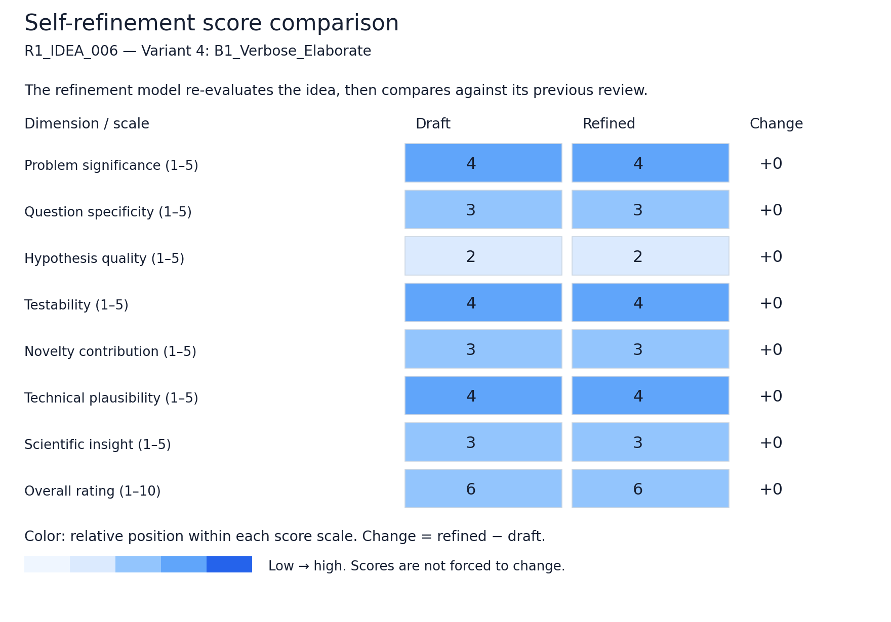

Changed score dimensions: none.

### Score justifications (draft / refined)

**Problem significance**

```json
{
  "draft": {
    "score": 4.0,
    "justification": "The problem is meaningful. Selecting the best self-supervised model efficiently is a practical challenge in ML. Applying and validating evaluation metrics from natural images to the distinct and high-stakes domain of medical histopathology is a relevant and significant gap."
  },
  "refined": {
    "score": 4.0,
    "justification": "The problem is meaningful. Efficient model selection for self-supervised learning is a practical challenge in ML. Validating evaluation metrics from natural images in the distinct, high-impact domain of medical histopathology addresses a relevant and significant gap with real-world implications."
  }
}
```

**Question specificity**

```json
{
  "draft": {
    "score": 3.0,
    "justification": "The idea identifies a clear gap ('effectiveness... has not been examined') and specifies the domain (histopathology) and tasks (instance segmentation/classification on WSIs). However, the question 'Is method X effective for domain Y?' is relatively broad. It lacks specificity on the conditions, metrics, and comparisons that would define the investigation."
  },
  "refined": {
    "score": 3.0,
    "justification": "The idea specifies the domain (histopathology), tasks (instance segmentation/classification on WSIs), and the general method (rank estimation). However, the core question—'Is it effective?'—remains broad. It lacks specificity on evaluation metrics, comparison baselines, and the conditions under which effectiveness is assessed."
  }
}
```

**Hypothesis quality**

```json
{
  "draft": {
    "score": 2.0,
    "justification": "The idea contains only an implicit, weak hypothesis: 'Rank estimation methods might not be as effective for histopathology.' This is a generic suspicion, not a concrete, testable prediction about a mechanism or relationship. A stronger hypothesis would predict a directional effect (e.g., correlation will be lower) and propose a reason why."
  },
  "refined": {
    "score": 2.0,
    "justification": "The idea contains only an implicit, weak hypothesis: 'Rank estimation methods might not work as well for histopathology.' This is a generic suspicion, not a concrete, testable prediction. A stronger hypothesis would propose a directional effect (e.g., correlation will be lower) and a plausible mechanism or reason why."
  }
}
```

**Testability**

```json
{
  "draft": {
    "score": 4.0,
    "justification": "The central question is highly testable. One can design an experiment: train multiple SSL ViTs, compute their representation ranks using established methods, evaluate their performance on defined histopathology tasks, and measure the correlation. The lack of a detailed plan in the summary does not make it untestable."
  },
  "refined": {
    "score": 4.0,
    "justification": "The central question is highly testable. One can design a straightforward experiment: train multiple SSL ViTs, compute representation ranks using established methods, evaluate on defined histopathology tasks, and measure correlation or selection accuracy. The absence of a detailed plan in the summary does not make the idea untestable."
  }
}
```

**Novelty contribution**

```json
{
  "draft": {
    "score": 3.0,
    "justification": "The novelty is primarily in the application domain (histopathology) and task type (non-linear, instance-level). It does not propose a new method or a new fundamental insight into representation learning. The contribution would be an empirical validation (or invalidation) of an existing evaluation tool in a new setting, which is moderate."
  },
  "refined": {
    "score": 3.0,
    "justification": "The novelty lies primarily in the application domain (histopathology) and task type. It does not propose a new method or a fundamental insight into representation learning. The contribution would be an empirical validation of an existing evaluation tool in a new setting, which is moderate."
  }
}
```

**Technical plausibility**

```json
{
  "draft": {
    "score": 4.0,
    "justification": "The idea is technically plausible. Rank estimation for SSL representations is an established concept. Applying it to a new data modality is a straightforward extension. The reasoning is coherent: if a method works in domain A, it's sensible to check if it works in the structurally different domain B."
  },
  "refined": {
    "score": 4.0,
    "justification": "The idea is technically plausible. Rank estimation for SSL representations is an established technique. Applying it to a new data modality is a logical extension. The reasoning is coherent: if a method works in domain A, testing it in structurally different domain B is sensible."
  }
}
```

**Scientific insight**

```json
{
  "draft": {
    "score": 3.0,
    "justification": "As presented, the potential insight is limited to a domain-specific finding: 'Rank estimation does/does not work for histopathology.' For greater insight, the study would need to uncover *why* by linking data/task properties (e.g., tissue texture, annotation sparsity) to the failure modes of rank estimation metrics."
  },
  "refined": {
    "score": 3.0,
    "justification": "As presented, the potential insight is largely domain-specific: 'Does rank estimation work for histopathology?' For deeper insight, the study would need to uncover why effectiveness changes by linking data/task properties (e.g., tissue texture variability, annotation sparsity) to the assumptions or failure modes of rank estimation metrics."
  }
}
```

**Overall rating**

```json
{
  "draft": {
    "score": 6.0,
    "justification": "This is a moderate/borderline research idea. It identifies a clear, practical, and testable gap. Its main weaknesses are the broadness of the research question and the lack of a specific, insightful hypothesis. It is primarily an evaluation study in a new domain. With a more focused hypothesis and experimental design, it could become a strong, concrete research project."
  },
  "refined": {
    "score": 6.0,
    "justification": "This is a moderate/borderline research idea. It identifies a clear, practical, and testable gap in applying representation evaluation methods to a new domain. Its main weaknesses are the broadness of the research question and the lack of a specific, insightful hypothesis. It is primarily an evaluation study in a new application area. With a more focused hypothesis and experimental design, it could become a strong, concrete project."
  }
}
```

## R1_IDEA_006 — Variant 5: B2_Grand_Narrative

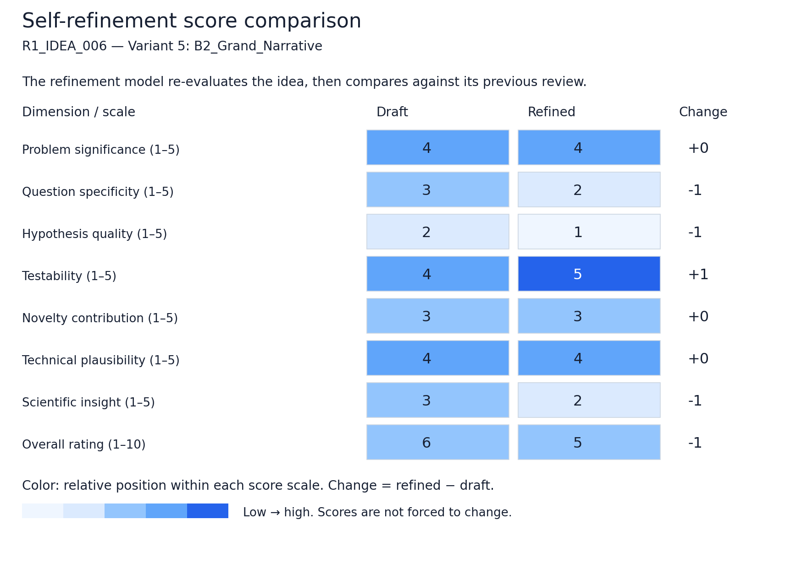

Changed score dimensions: question_specificity, hypothesis_quality, testability, scientific_insight, overall_rating.

### Score justifications (draft / refined)

**Problem significance**

```json
{
  "draft": {
    "score": 4.0,
    "justification": "Model selection in self-supervised learning is a recognized challenge, especially in data-scarce domains like histopathology where annotations are expensive. Improving evaluation frameworks could accelerate research and deployment in computational pathology, which has direct biomedical relevance."
  },
  "refined": {
    "score": 4.0,
    "justification": "The problem is significant. Model selection in self-supervised learning is a recognized, non-trivial challenge. In computational pathology—a domain with high annotation costs and clinical relevance—developing reliable, efficient evaluation frameworks could accelerate research and improve practical deployment. The idea connects a core ML challenge to an impactful application area."
  }
}
```

**Question specificity**

```json
{
  "draft": {
    "score": 3.0,
    "justification": "The idea identifies a clear gap (rank estimation in histopathology) but does not narrow down what aspect of 'effectiveness' is being studied. It mentions tasks (segmentation, classification) but does not specify the research question precisely (e.g., 'Does rank estimation predict downstream performance better than baseline X?')."
  },
  "refined": {
    "score": 2.0,
    "justification": "The research question is only moderately specific. It identifies a domain (histopathology) and a class of methods (rank estimation) but does not define the precise aspect of 'effectiveness' to be investigated. It mentions tasks (segmentation, classification) but does not formulate a concrete, answerable question (e.g., 'Do rank metrics predict fine-tuning performance better than baseline X for segmentation on dataset Y?')."
  }
}
```

**Hypothesis quality**

```json
{
  "draft": {
    "score": 2.0,
    "justification": "There is an implicit hypothesis that rank estimation methods may not directly transfer to histopathology, but it is not stated as a testable prediction. No mechanism or condition is proposed for why transfer might succeed or fail."
  },
  "refined": {
    "score": 1.0,
    "justification": "The idea contains only a very weak implicit hypothesis—that there is a 'gap' and that investigating it 'could contribute' to better model selection. There is no concrete, testable prediction about the relationship between rank estimation and downstream performance in histopathology, nor any proposed mechanism explaining why results might differ from natural images. It is more a statement of opportunity than a hypothesis."
  }
}
```

**Testability**

```json
{
  "draft": {
    "score": 4.0,
    "justification": "The idea is highly testable: one can compute rank metrics on self-supervised histopathology features and evaluate their correlation with downstream task performance. Standard experimental pipelines exist for this."
  },
  "refined": {
    "score": 5.0,
    "justification": "The core idea is highly testable. Standard experimental pipelines exist: train multiple self-supervised models, compute proposed rank metrics on their representations, evaluate those models on downstream histopathology tasks, and analyze the correlation. The necessary components (models, metrics, tasks, datasets) are all feasible to implement and compare."
  }
}
```

**Novelty contribution**

```json
{
  "draft": {
    "score": 3.0,
    "justification": "Applying rank estimation to a new domain (histopathology) is a moderate contribution. The novelty would be higher if the investigation reveals domain-specific insights (e.g., rank estimation fails for segmentation due to spatial redundancy) rather than just a performance comparison."
  },
  "refined": {
    "score": 3.0,
    "justification": "Novelty is moderate. Applying an existing evaluation methodology (rank estimation) to a new domain (histopathology) is an incremental application. The contribution would be higher if the investigation were framed to uncover why the method succeeds or fails in this domain (yielding new insight) rather than merely reporting if it works."
  }
}
```

**Technical plausibility**

```json
{
  "draft": {
    "score": 4.0,
    "justification": "The direction is technically plausible: rank estimation methods are established in representation learning, and histopathology data is often processed with vision transformers. The main assumption—that evaluation methods from natural images may not directly transfer—is reasonable."
  },
  "refined": {
    "score": 4.0,
    "justification": "The direction is technically plausible. Rank estimation for representation quality is an established concept in ML. Vision transformers are commonly used for histopathology. The central premise—that evaluation methods may not directly transfer across domains—is reasonable. No obvious technical contradictions are present in the brief description."
  }
}
```

**Scientific insight**

```json
{
  "draft": {
    "score": 3.0,
    "justification": "If the study finds that rank estimation works poorly in histopathology, it could prompt research into why (e.g., feature statistics differ, tasks require different invariances). However, the idea as stated does not explicitly aim for such mechanistic insights; it is more focused on applicability."
  },
  "refined": {
    "score": 2.0,
    "justification": "Potential for scientific insight is low in the idea as stated. It is primarily framed as an applicability check ('does it work here?'). To yield deeper insight, the study would need to be designed to probe why results differ—e.g., by varying data properties (scale, texture, stain) and observing their effect on rank metrics. The current description does not emphasize this mechanistic understanding."
  }
}
```

**Overall rating**

```json
{
  "draft": {
    "score": 6.0,
    "justification": "This is a moderate research idea. It addresses a meaningful problem and identifies a concrete gap, but lacks a specific hypothesis and detailed research question. The potential contribution is primarily applied (evaluating an existing method in a new domain), with limited emphasis on generating new scientific insight. With refinement, it could become a strong study."
  },
  "refined": {
    "score": 5.0,
    "justification": "This is a moderate, borderline research idea. It identifies a meaningful, practical problem at the intersection of ML methodology and an important application domain. Its main weaknesses are the lack of a specific research question and the absence of a testable hypothesis, which makes it feel more like a general exploration direction than a focused investigation. It is highly testable and technically plausible, but as described, its potential contribution is primarily applied (validating a tool in a new setting) with limited emphasis on generating new scientific understanding about representation evaluation. With significant refinement—especially formulating a concrete hypothesis and designing for insight—it could become stronger."
  }
}
```

## R1_IDEA_006 — Variant 6: B3_Over_Confident


Changed score dimensions: none.

### Score justifications (draft / refined)

**Problem significance**

```json
{
  "draft": {
    "score": 4.0,
    "justification": "The problem is significant. Model selection in self-supervised learning is a key practical challenge. Histopathology, with its high-stakes applications and unique data characteristics (whole slide images, hierarchical features), is an important and non-trivial domain where better evaluation methods are needed."
  },
  "refined": {
    "score": 4.0,
    "justification": "The problem is significant. Model selection in self-supervised learning is a key practical challenge with real-world implications. Histopathology is a high-impact domain where better evaluation methods could accelerate research and clinical application. The unique characteristics of whole slide images (multi-scale, hierarchical features) make this a non-trivial and meaningful problem to address."
  }
}
```

**Question specificity**

```json
{
  "draft": {
    "score": 2.0,
    "justification": "The question is moderately specific in identifying a domain (histopathology) and tasks (instance segmentation, classification). However, it is vague about what aspect of 'effectiveness' is being investigated. It is more a statement of an unexplored area than a sharply defined research question."
  },
  "refined": {
    "score": 2.0,
    "justification": "The question identifies a domain (histopathology) and tasks (instance segmentation, classification), but remains vague about what aspect of 'effectiveness' is being investigated. It is more a statement of an unexplored area than a sharply defined research question. A stronger formulation would specify what relationship or property is being examined."
  }
}
```

**Hypothesis quality**

```json
{
  "draft": {
    "score": 1.0,
    "justification": "There is no explicit or strongly implicit hypothesis. The idea states that something is 'unexplored.' A hypothesis would make a falsifiable prediction about the relationship between rank estimation metrics and performance on histopathology tasks. The current formulation does not do this."
  },
  "refined": {
    "score": 1.0,
    "justification": "There is no explicit or strongly implicit hypothesis. The idea states that something is 'unexplored' but makes no prediction about what might be found. A hypothesis would make a falsifiable claim about the relationship between rank estimation metrics and performance on histopathology tasks, or about mechanisms underlying potential differences from natural images."
  }
}
```

**Testability**

```json
{
  "draft": {
    "score": 3.0,
    "justification": "The core premise is testable. One could implement rank estimation methods, apply them to SSL-trained ViTs on histopathology data, and evaluate correlation with downstream task performance. However, without a more specific hypothesis, the test is open-ended ('explore effectiveness'), which reduces the clarity of what constitutes a test."
  },
  "refined": {
    "score": 3.0,
    "justification": "The core premise is testable in principle—one could implement rank estimation methods, apply them to SSL-trained models on histopathology data, and evaluate correlation with downstream performance. However, without a specific hypothesis, the test is open-ended ('explore effectiveness'), reducing clarity on what constitutes a definitive test or what evidence would support or refute a claim."
  }
}
```

**Novelty contribution**

```json
{
  "draft": {
    "score": 2.0,
    "justification": "The novelty is limited to the application domain. The core idea—testing whether an existing evaluation method works in a new domain—is an incremental application study. A more novel contribution would involve discovering why it works or doesn't work, or proposing a domain-adapted method based on those insights."
  },
  "refined": {
    "score": 2.0,
    "justification": "The novelty is primarily application-based. Testing whether an existing evaluation method works in a new domain is an incremental application study. A more novel contribution would involve discovering why it works or doesn't work, proposing domain-adapted methods, or deriving general principles for representation evaluation in structured domains like medical imaging."
  }
}
```

**Technical plausibility**

```json
{
  "draft": {
    "score": 4.0,
    "justification": "The idea is technically plausible. Rank estimation for SSL representation quality is an established concept. Applying it to a new data modality (histopathology WSIs) and different downstream tasks is a logical and straightforward extension. No obvious technical barriers are implied."
  },
  "refined": {
    "score": 4.0,
    "justification": "The idea is technically plausible. Rank estimation for SSL representation quality is an established concept with published methods. Applying it to a new data modality (histopathology WSIs) and different downstream tasks is a logical extension. No obvious technical barriers are implied, though practical challenges like computational cost on whole slide images may arise."
  }
}
```

**Scientific insight**

```json
{
  "draft": {
    "score": 2.0,
    "justification": "As presented, the potential scientific insight is low. A simple validation study ('does method X work in domain Y?') provides limited generalizable knowledge. However, the idea has latent potential for insight if it probes *why* rank estimation behaves differently in histopathology, leading to principles for evaluating representations in medical imaging or other structured domains."
  },
  "refined": {
    "score": 2.0,
    "justification": "As presented, the potential scientific insight is low. A simple validation study ('does method X work in domain Y?') provides limited generalizable knowledge. However, the domain choice hints at latent potential: if the investigation probes why rank estimation behaves differently in histopathology (e.g., due to feature hierarchy or task nonlinearity), it could yield insights into representation evaluation for structured, multi-scale data beyond medical imaging."
  }
}
```

**Overall rating**

```json
{
  "draft": {
    "score": 4.0,
    "justification": "This is a weak-to-moderate research idea. It identifies a relevant problem and a clear application gap, which is a good starting point. However, it lacks the core components of a strong research idea: a specific research question, a testable hypothesis, and a clear path to generating novel scientific insight beyond a simple applicability check. In its current form, it reads more as a motivation for a study than as a defined research idea."
  },
  "refined": {
    "score": 4.0,
    "justification": "This is a weak-to-moderate research idea. It identifies a relevant problem and a clear application gap, which is a necessary starting point. However, it lacks the core components of a strong research idea: a specific research question, a testable hypothesis, and a clear path to generating novel scientific insight beyond a simple applicability check. In its current form, it reads more as a motivation for a study than as a defined research idea with a clear investigative direction."
  }
}
```

## R1_IDEA_006 — Variant 7: B4_Novelty

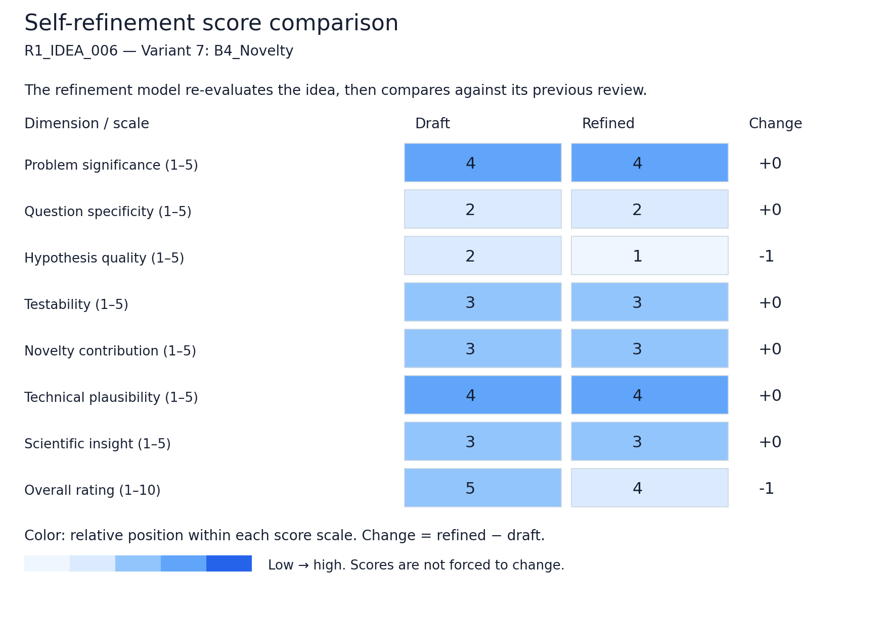

Changed score dimensions: hypothesis_quality, overall_rating.

### Score justifications (draft / refined)

**Problem significance**

```json
{
  "draft": {
    "score": 4.0,
    "justification": "Model selection in self-supervised learning is a recognized challenge. Applying and evaluating methods in specialized, high-stakes domains like histopathology is meaningful. The problem has practical implications for efficient medical image analysis pipeline development."
  },
  "refined": {
    "score": 4.0,
    "justification": "Model selection in self-supervised learning is a recognized practical challenge. Applying and evaluating evaluation methods in specialized, high-impact domains like medical imaging is meaningful. Efficient model selection could accelerate medical AI development."
  }
}
```

**Question specificity**

```json
{
  "draft": {
    "score": 2.0,
    "justification": "The idea identifies a general direction ('investigate effectiveness for non-linear tasks') but does not define a concrete research question. It mentions tasks (segmentation, classification) but not what aspect of effectiveness is being studied."
  },
  "refined": {
    "score": 2.0,
    "justification": "The idea identifies a general direction ('investigate effectiveness') but does not define a concrete research question. It mentions tasks but not what specific aspect of effectiveness or what relationship is being investigated."
  }
}
```

**Hypothesis quality**

```json
{
  "draft": {
    "score": 2.0,
    "justification": "There is an implicit hypothesis that rank estimation might be useful, but no concrete, testable prediction is made. The idea lacks a statement that could be clearly supported or contradicted by evidence."
  },
  "refined": {
    "score": 1.0,
    "justification": "There is no hypothesis presented - only a statement that an approach 'merits investigation.' No concrete, testable prediction is made about what will be found or why."
  }
}
```

**Testability**

```json
{
  "draft": {
    "score": 3.0,
    "justification": "The idea is testable in principle by implementing rank estimation and evaluating correlation with downstream task performance. However, without a specific hypothesis, the test design is underspecified."
  },
  "refined": {
    "score": 3.0,
    "justification": "The idea is testable in principle by implementing rank estimation and comparing with downstream performance. However, without a specific hypothesis or success criteria, what constitutes a meaningful test is unclear."
  }
}
```

**Novelty contribution**

```json
{
  "draft": {
    "score": 3.0,
    "justification": "Applying rank estimation to histopathology is novel, but the core idea is primarily a domain transfer. The potential contribution is moderate unless it reveals new insights about SSL evaluation in medical imaging beyond a simple performance check."
  },
  "refined": {
    "score": 3.0,
    "justification": "Applying rank estimation to histopathology is novel, but the core idea is primarily domain transfer. The contribution would be moderate unless it reveals new insights about SSL evaluation in medical imaging beyond simple applicability testing."
  }
}
```

**Technical plausibility**

```json
{
  "draft": {
    "score": 4.0,
    "justification": "The reasoning is coherent: rank estimation measures representation quality; histopathology poses unique challenges; it's plausible to test its utility there. No obvious technical flaws are apparent from the summary."
  },
  "refined": {
    "score": 4.0,
    "justification": "The reasoning is logically coherent: rank estimation measures representation quality; histopathology has unique characteristics; testing its utility there is plausible. No obvious technical flaws are apparent from the summary."
  }
}
```

**Scientific insight**

```json
{
  "draft": {
    "score": 3.0,
    "justification": "If framed more specifically, the investigation could yield insight into whether standard SSL evaluation metrics generalize to medical imaging, or reveal domain-specific factors affecting representation learning. As stated, the potential insight is moderate."
  },
  "refined": {
    "score": 3.0,
    "justification": "If properly framed, the investigation could yield insight into whether standard SSL evaluation metrics generalize to specialized domains, or reveal domain-specific factors affecting representation learning. As stated, the potential insight is moderate and dependent on how the investigation is structured."
  }
}
```

**Overall rating**

```json
{
  "draft": {
    "score": 5.0,
    "justification": "This is a moderate/borderline research idea. It identifies a relevant problem and a plausible direction, but lacks a specific research question or hypothesis. The idea is currently more of a suggestion to explore an area rather than a focused investigation. With refinement (e.g., a concrete hypothesis about when/why rank estimation fails or succeeds), it could become a strong idea."
  },
  "refined": {
    "score": 4.0,
    "justification": "This is a weak research idea. While it identifies a relevant problem domain and a plausible technique to investigate, it lacks a specific research question, hypothesis, or clear investigative focus. The idea is currently more of a suggestion to explore an area ('merits investigation') rather than a focused research direction. It requires substantial refinement to become a testable research proposal."
  }
}
```

## R1_IDEA_006 — Variant 8: B5_Application_Impact

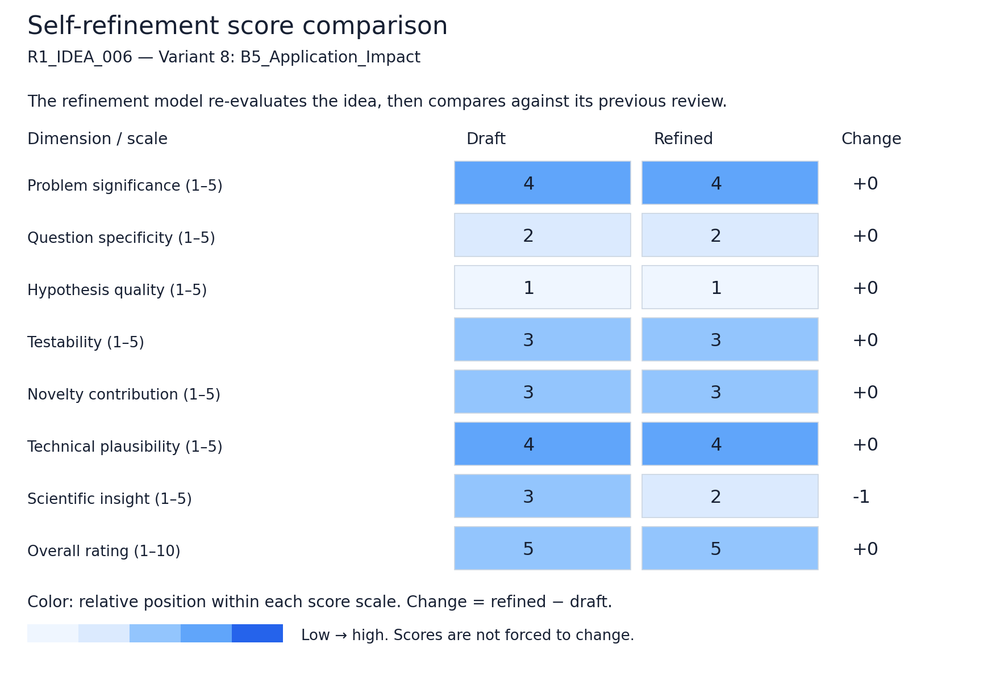

Changed score dimensions: scientific_insight.

### Score justifications (draft / refined)

**Problem significance**

```json
{
  "draft": {
    "score": 4.0,
    "justification": "The problem is meaningful: model selection in self-supervised learning for medical imaging is practically important for developing reliable tools, and histopathology whole slide images present unique challenges. The potential impact on diagnostic applications adds significance."
  },
  "refined": {
    "score": 4.0,
    "justification": "The problem is meaningful and practically important. Model selection in self-supervised learning for medical imaging, particularly histopathology, has direct implications for developing reliable computational tools for diagnosis and research. Whole slide images present unique challenges (large size, multi-scale, complex textures) that make model selection non-trivial. The potential impact on healthcare applications adds significance beyond pure academic interest."
  }
}
```

**Question specificity**

```json
{
  "draft": {
    "score": 2.0,
    "justification": "The question is somewhat vague: it identifies a gap (rank estimation effectiveness in histopathology is unexplored) but doesn't specify what aspect of effectiveness to investigate, what comparisons to make, or what constitutes a meaningful test."
  },
  "refined": {
    "score": 2.0,
    "justification": "The research question is vague. While it identifies a gap (rank estimation effectiveness in histopathology is unexplored), it doesn't specify what aspect of effectiveness to investigate, what comparisons to make, or what constitutes a meaningful test. The question 'does it work?' is too broad without defining 'work' in operational terms. The mention of 'non-linear tasks such as instance segmentation' adds some specificity but still leaves the core investigation undefined."
  }
}
```

**Hypothesis quality**

```json
{
  "draft": {
    "score": 1.0,
    "justification": "There is no explicit or implicit hypothesis presented. The idea merely states that something is unexplored, without predicting an outcome, proposing a mechanism, or suggesting what might be learned from investigating it."
  },
  "refined": {
    "score": 1.0,
    "justification": "There is no explicit or implicit hypothesis presented. The idea merely states that something is unexplored without predicting an outcome, proposing a mechanism, or suggesting what might be learned from investigating it. A hypothesis would need to make a testable prediction about how rank estimation methods might behave differently in histopathology versus natural images, or what factors might influence their effectiveness."
  }
}
```

**Testability**

```json
{
  "draft": {
    "score": 3.0,
    "justification": "The general direction is testable—one could apply rank estimation methods to histopathology representations and evaluate correlation with downstream tasks. However, without a specific hypothesis or evaluation plan, it's unclear what would constitute a meaningful test versus a simple application."
  },
  "refined": {
    "score": 3.0,
    "justification": "The general direction is testable—one could apply rank estimation methods to histopathology representations and evaluate correlation with downstream tasks. However, without a specific hypothesis or evaluation plan, it's unclear what would constitute a meaningful test versus a simple application. The idea lacks details about experimental design, evaluation metrics, or comparison baselines that would make it clearly testable."
  }
}
```

**Novelty contribution**

```json
{
  "draft": {
    "score": 3.0,
    "justification": "Applying rank estimation methods to a new domain (histopathology) has some novelty, but this is primarily a domain adaptation study. The potential contribution would depend on whether the investigation reveals domain-specific insights about representation quality metrics rather than just showing they work (or don't work) in a new setting."
  },
  "refined": {
    "score": 3.0,
    "justification": "Applying rank estimation methods to a new domain (histopathology) has moderate novelty as a domain adaptation study. However, this is primarily an application of existing methods to a new domain rather than a fundamentally new research direction. The contribution would depend heavily on whether the investigation reveals domain-specific insights about representation quality metrics rather than just showing they work (or don't work) in a new setting."
  }
}
```

**Technical plausibility**

```json
{
  "draft": {
    "score": 4.0,
    "justification": "The idea is technically plausible: rank estimation methods are established for natural images, and applying them to histopathology representations is straightforward. The reasoning that histopathology presents different challenges (non-linear tasks, whole slide images) is coherent."
  },
  "refined": {
    "score": 4.0,
    "justification": "The idea is technically plausible. Rank estimation methods are established for natural images, and applying them to histopathology representations is straightforward from an implementation perspective. The reasoning that histopathology presents different challenges (non-linear tasks, whole slide images) is coherent and based on reasonable assumptions about domain differences."
  }
}
```

**Scientific insight**

```json
{
  "draft": {
    "score": 3.0,
    "justification": "If the investigation goes beyond simple application and examines why rank estimation methods might behave differently in histopathology, it could yield insights about domain adaptation of representation quality metrics, or about what features make self-supervised representations useful for medical imaging tasks. However, the idea as stated doesn't explicitly aim for such insights."
  },
  "refined": {
    "score": 2.0,
    "justification": "The idea as stated focuses primarily on application rather than scientific insight. While investigating this could potentially yield insights about domain adaptation of representation quality metrics or about what features make self-supervised representations useful for medical imaging tasks, the current formulation doesn't explicitly aim for such insights. It lacks the framing needed to extract general principles about representation quality evaluation across domains."
  }
}
```

**Overall rating**

```json
{
  "draft": {
    "score": 5.0,
    "justification": "This is a moderate/borderline research idea. It identifies a meaningful problem and a clear gap, but lacks a specific research question, hypothesis, or methodological direction. Without these, it's more of a general motivation than a research idea. The potential exists for a stronger study if a concrete hypothesis is formulated and specific tests are proposed."
  },
  "refined": {
    "score": 5.0,
    "justification": "This is a moderate/borderline research idea. It identifies a meaningful practical problem and a clear application gap, but lacks the specificity, hypothesis, and methodological direction needed for a strong research idea. Without these elements, it's more of a general motivation than a well-formed research question. The idea has potential if developed further with a concrete hypothesis and experimental plan, but in its current form, it's limited to identifying an application opportunity rather than proposing scientific investigation."
  }
}
```

## R1_IDEA_006 — Variant 9: C1_Hollow_Shell

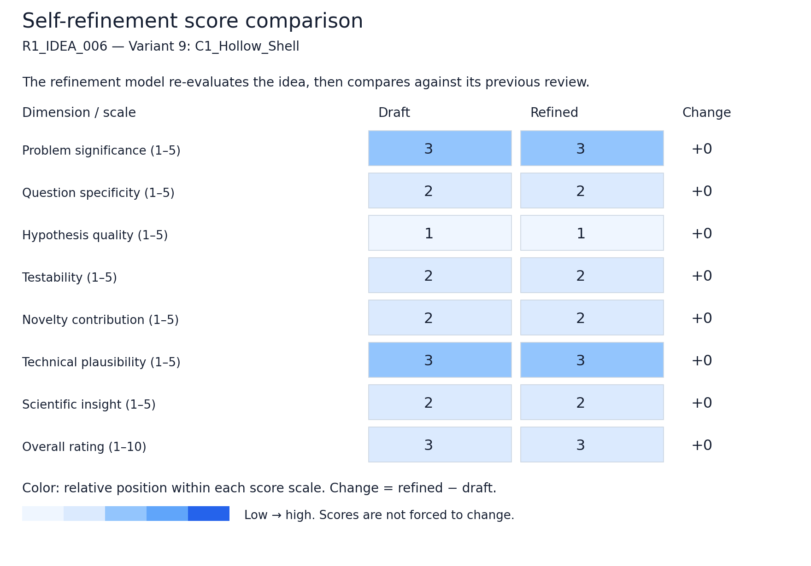

Changed score dimensions: none.

### Score justifications (draft / refined)

**Problem significance**

```json
{
  "draft": {
    "score": 3.0,
    "justification": "Model selection in medical image analysis is a meaningful practical challenge, and understanding whether representation assessment tools generalize beyond standard benchmarks is a relevant question. However, the problem is described too generically to assess its true importance."
  },
  "refined": {
    "score": 3.0,
    "justification": "Model selection in medical image analysis is a meaningful practical challenge, and understanding whether representation assessment tools generalize beyond standard benchmarks is a relevant question. However, the problem is described too generically to assess its true importance or urgency within the field."
  }
}
```

**Question specificity**

```json
{
  "draft": {
    "score": 2.0,
    "justification": "The question is only vaguely defined: 'whether this approach is effective for more complex objectives in the target setting.' It lacks specification of the approach, the setting, the objectives, and the criteria for effectiveness."
  },
  "refined": {
    "score": 2.0,
    "justification": "The question is only vaguely defined as 'whether this approach is effective for more complex objectives in the target setting.' It lacks specification of the approach, the setting, the objectives, and the criteria for effectiveness. It is more a topic than a research question."
  }
}
```

**Hypothesis quality**

```json
{
  "draft": {
    "score": 1.0,
    "justification": "There is no explicit or implicit hypothesis. The idea merely poses a yes/no question about effectiveness without predicting an outcome, proposing a mechanism, or distinguishing the investigation from a generic applicability test."
  },
  "refined": {
    "score": 1.0,
    "justification": "There is no explicit or implicit hypothesis. The idea merely poses a yes/no question about effectiveness without predicting an outcome, proposing a causal mechanism, or distinguishing the investigation from a generic applicability test. It lacks a falsifiable claim."
  }
}
```

**Testability**

```json
{
  "draft": {
    "score": 2.0,
    "justification": "The question is testable in principle, but no evaluation method is suggested. One could design experiments comparing the quantitative approach to downstream performance, but the idea does not propose how to test it, what baselines to use, or what data would be needed."
  },
  "refined": {
    "score": 2.0,
    "justification": "The question is testable in principle—one could design experiments to correlate a representation metric with downstream performance. However, the idea provides no proposed evaluation method, baselines, or experimental design. It is a statement of interest rather than a testable plan."
  }
}
```

**Novelty contribution**

```json
{
  "draft": {
    "score": 2.0,
    "justification": "The core idea appears to be applying an existing representation assessment method to a new domain (medical imaging). This is a straightforward application test unless the investigation reveals novel insights about why the method succeeds or fails in that domain, which is not suggested here."
  },
  "refined": {
    "score": 2.0,
    "justification": "The core idea appears to be applying an existing representation assessment method to a new domain (medical imaging). This is a straightforward application test. Without a hypothesis about underlying mechanisms or boundary conditions, the potential contribution is limited to a narrow validation study."
  }
}
```

**Technical plausibility**

```json
{
  "draft": {
    "score": 3.0,
    "justification": "The general notion of testing a representation analysis tool in a different domain is logically coherent and plausible. However, without details, it's impossible to assess whether the approach is technically suitable for the unspecified 'complex objectives.'"
  },
  "refined": {
    "score": 3.0,
    "justification": "The general concept of testing a representation analysis tool in a different domain is logically coherent. However, without details, it's impossible to assess technical suitability for unspecified 'complex objectives' or training paradigms. The reasoning is not flawed, but it is too vague to evaluate properly."
  }
}
```

**Scientific insight**

```json
{
  "draft": {
    "score": 2.0,
    "justification": "As presented, the idea seems aimed at answering a narrow applicability question. It has low potential for broader scientific insight unless it uncovers fundamental limitations of representation assessment methods under domain shift or task complexity, which is not articulated."
  },
  "refined": {
    "score": 2.0,
    "justification": "As presented, the idea seems aimed at answering a narrow applicability question ('does it work here?'). It has low potential for broader scientific insight unless it deliberately seeks to uncover why representation metrics succeed or fail under domain shift, task complexity, or data constraints, which is not articulated."
  }
}
```

**Overall rating**

```json
{
  "draft": {
    "score": 3.0,
    "justification": "This is a weak research idea in its current form. It identifies a general area of inquiry (applying a representation assessment method to medical imaging) but fails to specify the research question, lacks a hypothesis, and does not propose how to investigate it. It reads more like a vague motivation than a concrete research direction. With substantial refinement—specifying the approach, setting, objectives, and a testable hypothesis—it could become a moderate idea."
  },
  "refined": {
    "score": 3.0,
    "justification": "This is a weak research idea in its current form. It identifies a general area of inquiry but fails to specify a concrete research question, lacks any hypothesis, and does not propose how to investigate it. It reads as a vague motivation rather than a defined research direction. With substantial refinement—specifying the components and formulating a testable hypothesis—it could become a moderate idea."
  }
}
```

## R1_IDEA_006 — Variant 10: C2_Logic_Flawed

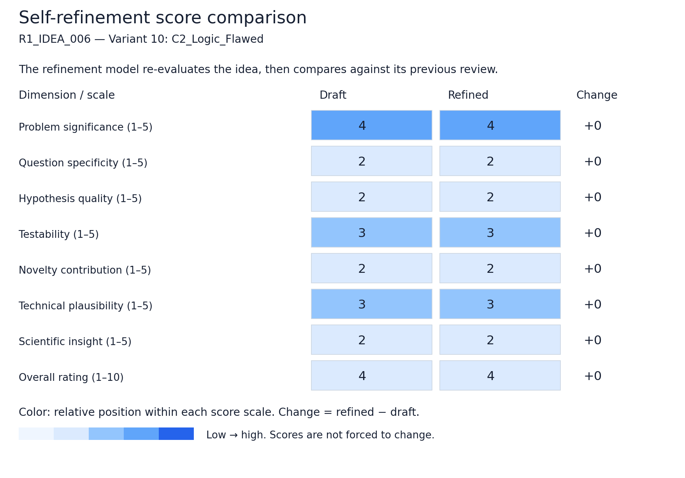

Changed score dimensions: none.

### Score justifications (draft / refined)

**Problem significance**

```json
{
  "draft": {
    "score": 4.0,
    "justification": "Model selection in self-supervised learning is a meaningful challenge, especially in data-scarce domains like medical imaging. Histopathology presents specific difficulties with whole slide images and complex tasks. Improving model selection could reduce computational costs and improve practical adoption."
  },
  "refined": {
    "score": 4.0,
    "justification": "Model selection in self-supervised learning is a significant practical challenge, especially in data-scarce domains like medical imaging. Histopathology presents specific difficulties with whole slide images, complex tasks, and limited annotations. Improving model selection could reduce computational costs and accelerate research and clinical adoption."
  }
}
```

**Question specificity**

```json
{
  "draft": {
    "score": 2.0,
    "justification": "The idea is stated as a general suggestion ('methods are likely sufficient') rather than a specific research question. It identifies a domain gap but doesn't define what exactly should be investigated about it."
  },
  "refined": {
    "score": 2.0,
    "justification": "The idea identifies a domain gap but doesn't define a specific research question. It's stated as a general suggestion of applicability ('methods are likely sufficient') rather than articulating what exactly should be investigated about the transfer of these methods."
  }
}
```

**Hypothesis quality**

```json
{
  "draft": {
    "score": 2.0,
    "justification": "There's an implicit hypothesis that rank estimation methods will transfer effectively, but it's not articulated as a concrete, testable prediction. No mechanism or boundary conditions are proposed."
  },
  "refined": {
    "score": 2.0,
    "justification": "There's an implicit, vague hypothesis that rank estimation methods will transfer effectively, but it's not articulated as a concrete, testable prediction. No mechanism, boundary conditions, or specific relationship between variables is proposed."
  }
}
```

**Testability**

```json
{
  "draft": {
    "score": 3.0,
    "justification": "The claim could be tested by applying rank estimation to histopathology tasks and comparing with downstream performance, but no specific test is proposed. The idea mentions tasks remain 'unexplored,' suggesting experiments are needed, but doesn't outline them."
  },
  "refined": {
    "score": 3.0,
    "justification": "The claim could be tested empirically by applying rank estimation to histopathology tasks and comparing with downstream performance, but no specific test or evaluation framework is proposed. The acknowledgment that effectiveness 'remains unexplored' implies experiments are needed, but the idea doesn't outline them."
  }
}
```

**Novelty contribution**

```json
{
  "draft": {
    "score": 2.0,
    "justification": "Applying existing rank estimation methods to a new domain (histopathology) is a straightforward application. The potential contribution is limited unless the investigation reveals something specific about why/how these methods do or don't transfer, or discovers domain-specific adaptations needed."
  },
  "refined": {
    "score": 2.0,
    "justification": "Applying existing rank estimation methods to a new domain (histopathology) is a straightforward application. The potential contribution is limited unless the investigation reveals something fundamental about why/how these methods do or don't transfer, or discovers necessary domain-specific adaptations."
  }
}
```

**Technical plausibility**

```json
{
  "draft": {
    "score": 3.0,
    "justification": "The basic reasoning is coherent: methods that work for natural images might work for medical images. However, no technical argument is made for why rank estimation, typically used for linear probe evaluation, would suffice for non-linear tasks like segmentation. Important assumptions about task similarity are unexamined."
  },
  "refined": {
    "score": 3.0,
    "justification": "The basic premise that methods working for natural images might work for medical images is coherent. However, no technical argument addresses the key challenge: rank estimation is typically used to predict linear probe performance, but the idea mentions non-linear tasks (segmentation) without explaining why the same metrics would be predictive. Important assumptions about task similarity remain unexamined."
  }
}
```

**Scientific insight**

```json
{
  "draft": {
    "score": 2.0,
    "justification": "As presented, the idea is primarily about application. If pursued as a validation study, it might confirm or deny transferability, but deeper insight (e.g., understanding what representation properties rank estimation captures, or how domain shift affects these metrics) is not suggested."
  },
  "refined": {
    "score": 2.0,
    "justification": "As presented, the idea is primarily about application validation. If pursued as a simple validation study, it might confirm or deny transferability, but deeper scientific insight (e.g., understanding what representation properties rank estimation captures in medical images, how domain shift affects these metrics, or under what conditions they fail) is not suggested."
  }
}
```

**Overall rating**

```json
{
  "draft": {
    "score": 4.0,
    "justification": "The idea identifies a relevant problem and an interesting existing technique, but it is underdeveloped as a research direction. It lacks a specific research question, testable hypothesis, and any proposed methodology. It reads more as a motivation for a possible application than as a research idea. The potential exists if refined into a concrete comparative study investigating the limits of rank estimation transfer."
  },
  "refined": {
    "score": 4.0,
    "justification": "The idea identifies a relevant practical problem and points to an interesting existing technique, but it is underdeveloped as a research direction. It lacks a specific research question, a testable hypothesis, and any proposed methodology. It reads more as a motivation for a possible application than as a research idea. The potential exists if refined into a concrete comparative study investigating the limits and mechanisms of rank estimation transfer to medical imaging."
  }
}
```

## R1_IDEA_006 — Variant 11: C3_Substance_Enriched


Changed score dimensions: none.

### Score justifications (draft / refined)

**Problem significance**

```json
{
  "draft": {
    "score": 4.0,
    "justification": "Model selection in self-supervised learning (SSL) is a recognized challenge. Applying this to histopathology, a high-stakes domain with complex data, is meaningful. The problem has practical importance for medical imaging researchers and potential clinical impact."
  },
  "refined": {
    "score": 4.0,
    "justification": "The problem is meaningful. Model selection in SSL is a non-trivial, practical challenge. Applying this to histopathology—a domain with complex, high-resolution data and significant real-world impact—elevates its importance beyond a generic ML application."
  }
}
```

**Question specificity**

```json
{
  "draft": {
    "score": 3.0,
    "justification": "The core question is clear: 'Are rank-based SSL evaluation metrics effective for histopathology?' However, it is framed as an exploration of an 'unexplored' area rather than a precise question about a specific mechanism or relationship."
  },
  "refined": {
    "score": 3.0,
    "justification": "The core question is identifiable: 'Are rank-based SSL evaluation metrics effective for histopathology?' However, it is framed as an exploration of an 'unexplored' area. It lacks precision about what 'effective' means or what specific aspect of the metrics' behavior is under investigation."
  }
}
```

**Hypothesis quality**

```json
{
  "draft": {
    "score": 3.0,
    "justification": "An explicit hypothesis is stated: the multi-scale, high-resolution nature of whole slide images introduces unique challenges for rank-based metrics. This is a concrete, causal claim that can be tested. However, it is relatively high-level and does not predict the direction or nature of the challenge (e.g., overestimation, instability)."
  },
  "refined": {
    "score": 3.0,
    "justification": "An explicit hypothesis is present: the multi-scale, high-resolution nature introduces unique challenges. This is a causal claim that can be tested. However, it is relatively broad and does not make a concrete, directional prediction about how the metrics will fail (e.g., overestimation, loss of correlation), limiting its sharpness."
  }
}
```

**Testability**

```json
{
  "draft": {
    "score": 4.0,
    "justification": "Highly testable. The idea directly proposes an experiment: compute rank estimates for SSL models trained on histopathology data, evaluate those models on downstream tasks (segmentation, classification), and analyze the correlation. The comparison across tissue types and staining protocols adds useful dimensions."
  },
  "refined": {
    "score": 4.0,
    "justification": "Highly testable. The idea directly proposes an empirical validation study: compute rank metrics for SSL models, evaluate them on downstream tasks, and analyze the correlation. The plan to vary tissue types and staining protocols provides clear experimental variables."
  }
}
```

**Novelty contribution**

```json
{
  "draft": {
    "score": 3.0,
    "justification": "Applying rank-based evaluation to a new domain (histopathology) is a straightforward extension. The primary novelty lies in testing whether a known technique transfers to a complex, medically relevant domain and identifying potential failure modes. This is a useful but incremental contribution."
  },
  "refined": {
    "score": 3.0,
    "justification": "The contribution is primarily one of domain validation. Testing an existing evaluation technique in a new, complex domain (histopathology) is useful but incremental. The novelty hinges on discovering whether and how it fails, rather than proposing a new method or fundamental insight."
  }
}
```

**Technical plausibility**

```json
{
  "draft": {
    "score": 4.0,
    "justification": "The reasoning is coherent. Rank-based metrics are used to assess representation quality in SSL. Histopathology images are indeed high-resolution and multi-scale, which could plausibly affect metrics that assume certain data distributions. The proposed experiment is straightforward to implement."
  },
  "refined": {
    "score": 4.0,
    "justification": "The reasoning is logically coherent. Rank-based metrics assess feature diversity/complexity. Histopathology images have unique properties (multi-scale, repetitive textures, stain variation) that could plausibly affect such global statistics. The proposed experiment is straightforward to conceptualize and implement."
  }
}
```

**Scientific insight**

```json
{
  "draft": {
    "score": 3.0,
    "justification": "If successful, the research could reveal boundary conditions for rank-based evaluation metrics, showing they may not generalize to certain data types. This provides insight into the limitations of current SSL evaluation methods. However, the potential insight is somewhat limited to the empirical performance of a specific tool in a new domain unless it leads to a deeper understanding of why it fails."
  },
  "refined": {
    "score": 3.0,
    "justification": "Potential insight is moderate. A successful study could reveal boundary conditions for a class of SSL evaluation metrics, showing they may not generalize to certain data types. This is a useful empirical finding. However, without a deeper investigation into the 'why,' the insight is largely about the tool's applicability rather than a fundamental principle of representation learning."
  }
}
```

**Overall rating**

```json
{
  "draft": {
    "score": 6.0,
    "justification": "This is a moderate, borderline-strong research idea. It addresses a practical problem in an important domain with a testable hypothesis. The main limitations are the somewhat broad hypothesis and the incremental nature of the contribution (testing an existing tool in a new domain). It has clear scientific value but is unlikely to produce transformative insights without a deeper investigation into the mechanisms of failure."
  },
  "refined": {
    "score": 6.0,
    "justification": "This is a moderate, borderline-strong research idea. It tackles a practical problem in an important domain with a clear, testable plan. Its strengths are in its applicability and testability. The main limitations are the somewhat exploratory/broad hypothesis and the incremental nature of the likely contribution (validating an existing tool). It has clear scientific value but would need a more focused hypothesis and a deeper analytical component to achieve a higher rating."
  }
}
```

## R1_IDEA_006 — Variant 12: H1_Deceptive_Hollow

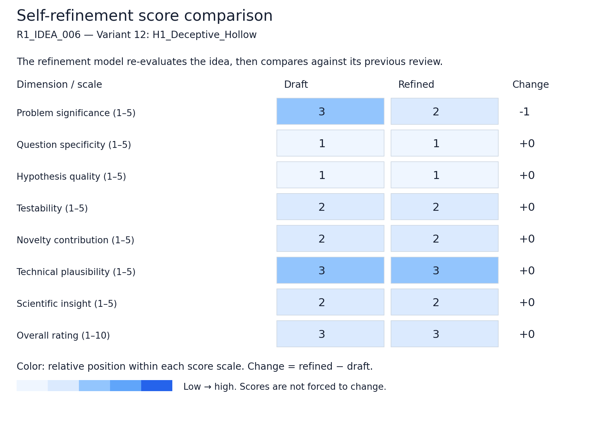

Changed score dimensions: problem_significance.

### Score justifications (draft / refined)

**Problem significance**

```json
{
  "draft": {
    "score": 3.0,
    "justification": "Applying representation assessment methods to medical imaging could be meaningful, as medical images have different properties (anatomical constraints, disease patterns, limited data) than standard vision datasets. However, the idea doesn't convincingly establish why this specific application is particularly important versus other domains."
  },
  "refined": {
    "score": 2.0,
    "justification": "The idea touches on a potentially meaningful problem - applying representation assessment methods to medical imaging - but doesn't convincingly establish why this specific application is particularly important or urgent. Medical imaging has different properties than standard vision datasets, but the idea fails to articulate why this gap matters or what specific challenge it addresses."
  }
}
```

**Question specificity**

```json
{
  "draft": {
    "score": 1.0,
    "justification": "Extremely vague. The idea states only that 'whether this approach is effective... is not yet known' without specifying what 'effective' means, what the 'approach' is, what the 'target setting' is, or what 'complex objectives' are. This is essentially just noting an unknown without defining a research question."
  },
  "refined": {
    "score": 1.0,
    "justification": "Extremely vague. The idea states only that 'whether this approach is effective... is not yet known' without specifying what 'effective' means, what the 'approach' is, what the 'target setting' is, or what 'complex objectives' are. This is essentially just noting an unknown without defining a research question."
  }
}
```

**Hypothesis quality**

```json
{
  "draft": {
    "score": 1.0,
    "justification": "No hypothesis is presented, implicit or explicit. The idea merely states that effectiveness is 'not yet known' - this is an observation of ignorance, not a testable prediction. There's no proposed mechanism, relationship, or distinction that would form the basis of a hypothesis."
  },
  "refined": {
    "score": 1.0,
    "justification": "No hypothesis is presented, implicit or explicit. The idea merely states that effectiveness is 'not yet known' - this is an observation of ignorance, not a testable prediction. There's no proposed mechanism, relationship, or distinction that would form the basis of a hypothesis about why the method might or might not work in medical imaging."
  }
}
```

**Testability**

```json
{
  "draft": {
    "score": 2.0,
    "justification": "The core statement ('whether this approach is effective') is technically testable if specifics were provided, but no method of testing is suggested. Without knowing what 'effectiveness' means or how it would be measured, testability is very low. The grandiose framing ('transformative synthesis') is not testable at all."
  },
  "refined": {
    "score": 2.0,
    "justification": "The core statement ('whether this approach is effective') could be testable if specifics were provided, but no method of testing is suggested. Without knowing what 'effectiveness' means or how it would be measured, testability is very low. The grandiose framing ('transformative synthesis', 'field-shaping') is not testable at all."
  }
}
```

**Novelty contribution**

```json
{
  "draft": {
    "score": 2.0,
    "justification": "Applying an existing method to a new domain (medical imaging) has some novelty, but the idea doesn't articulate what new scientific knowledge would be generated beyond 'does it work here?'. The grandiose claims about 'field-shaping' and 'transformative synthesis' are unsupported by any specific novel insight or contribution described."
  },
  "refined": {
    "score": 2.0,
    "justification": "Applying an existing method to a new domain (medical imaging) has minimal novelty. The idea doesn't articulate what new scientific knowledge would be generated beyond 'does it work here?'. The grandiose claims about 'field-shaping' and 'transformative synthesis' are completely unsupported by any specific novel insight or contribution described in the idea."
  }
}
```

**Technical plausibility**

```json
{
  "draft": {
    "score": 3.0,
    "justification": "The basic concept of applying representation assessment methods to medical imaging is plausible, but the reasoning is too vague to assess properly. The connection between 'conceptual insight, methodological ambition, and application relevance' is not explained, so the proposed synthesis lacks technical coherence."
  },
  "refined": {
    "score": 3.0,
    "justification": "The basic concept of applying representation assessment methods to medical imaging is technically plausible, but the reasoning is too vague to assess properly. The connection between 'conceptual insight, methodological ambition, and application relevance' is not explained, so the proposed synthesis lacks technical coherence. The idea doesn't contain enough technical content to evaluate plausibility meaningfully."
  }
}
```

**Scientific insight**

```json
{
  "draft": {
    "score": 2.0,
    "justification": "If properly executed, comparing representation assessment across domains could yield insights about domain-specific representation requirements. However, the idea as presented focuses on application effectiveness rather than seeking general principles about why methods might transfer (or not) between domains. The grandiose framing promises more insight than the actual proposal suggests."
  },
  "refined": {
    "score": 2.0,
    "justification": "If properly executed, comparing representation assessment across domains could yield insights about domain-specific representation requirements. However, the idea as presented focuses only on application effectiveness rather than seeking general principles about why methods might transfer (or not) between domains. The grandiose framing promises more insight than the actual proposal suggests."
  }
}
```

**Overall rating**

```json
{
  "draft": {
    "score": 3.0,
    "justification": "This is a weak research idea. While it identifies a potentially interesting application area (medical imaging), it fails to define a concrete research question, hypothesis, or method of investigation. The idea is mostly vague motivation with grandiose claims unsupported by specific scientific content. It reads more like marketing language than a research proposal. With substantial refinement to specify the actual problem, hypothesis, and evaluation approach, it could become a reasonable research direction."
  },
  "refined": {
    "score": 3.0,
    "justification": "This is a weak research idea. While it identifies a potentially interesting application area (medical imaging), it fails to define a concrete research question, hypothesis, or method of investigation. The idea is mostly vague motivation with grandiose claims unsupported by specific scientific content. It reads more like marketing language than a research proposal. With substantial refinement to specify the actual problem, hypothesis, and evaluation approach, it could become a reasonable research direction."
  }
}
```

## R1_IDEA_006 — Variant 13: H2_Confident_Flaw

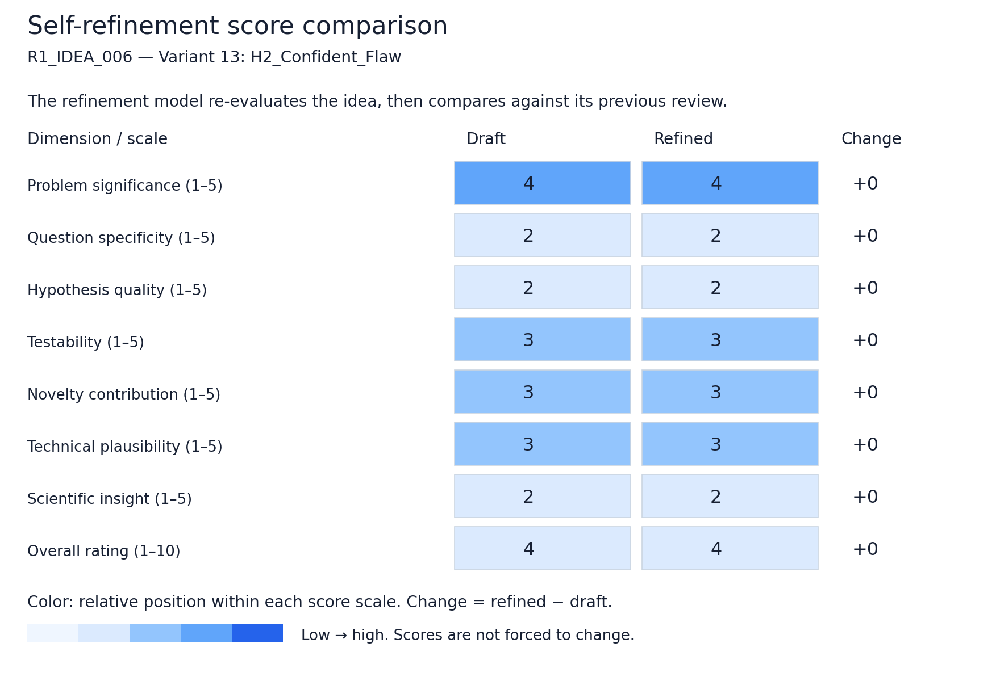

Changed score dimensions: none.

### Score justifications (draft / refined)

**Problem significance**

```json
{
  "draft": {
    "score": 4.0,
    "justification": "Model selection in self-supervised learning for medical imaging is a meaningful and practical challenge. Histopathology involves unique data characteristics (whole slide images, high resolution, sparse annotations), making SSL particularly relevant. Improving model selection could reduce computational cost and improve downstream task performance."
  },
  "refined": {
    "score": 4.0,
    "justification": "Model selection in self-supervised learning for medical imaging is a meaningful and practical challenge. Histopathology involves unique data characteristics (whole slide images, high resolution, sparse annotations), making SSL particularly relevant. Efficient model selection could reduce computational costs and improve downstream task performance, which has real-world impact in healthcare."
  }
}
```

**Question specificity**

```json
{
  "draft": {
    "score": 2.0,
    "justification": "The idea identifies a gap ('effectiveness remains unexplored') but does not define a clear research question. It states methods 'are likely sufficient' without specifying what relationship or effect will be studied. The scope is broad ('more broadly across medical imaging domains') rather than focused."
  },
  "refined": {
    "score": 2.0,
    "justification": "The idea identifies a gap ('effectiveness remains unexplored') but does not define a clear research question. It states methods 'are likely sufficient' without specifying what relationship or effect will be studied (e.g., correlation, predictive power, failure cases). The scope is broad ('more broadly across medical imaging domains') rather than focused on a testable aspect."
  }
}
```

**Hypothesis quality**

```json
{
  "draft": {
    "score": 2.0,
    "justification": "There is an implicit hypothesis that rank estimation methods will work well for histopathology, but it's not stated as a testable prediction. The text makes an assumption of sufficiency rather than posing a falsifiable claim. The argument about 'causal evidence for general superiority' is not a scientific hypothesis but an overreaching conclusion."
  },
  "refined": {
    "score": 2.0,
    "justification": "There is an implicit assumption that rank estimation methods will work well for histopathology, but it is not stated as a testable prediction. The text makes a claim of sufficiency rather than posing a falsifiable hypothesis. The argument about 'causal evidence for general superiority' is an overreaching conclusion, not a scientific hypothesis."
  }
}
```

**Testability**

```json
{
  "draft": {
    "score": 3.0,
    "justification": "The core claim could be tested by applying rank estimation to SSL representations and evaluating correlation with downstream task performance. However, no experimental design is suggested, and the broad 'general superiority' claim is not directly testable without careful control of variables."
  },
  "refined": {
    "score": 3.0,
    "justification": "The core claim could be tested by applying rank estimation to SSL representations and evaluating correlation with downstream task performance, which is feasible. However, no experimental design is suggested, and the broad 'general superiority' claim is not directly testable without careful control of variables and comparison to alternatives."
  }
}
```

**Novelty contribution**

```json
{
  "draft": {
    "score": 3.0,
    "justification": "Applying rank estimation methods from natural images to medical imaging is a straightforward application. The novelty lies in testing these methods for non-linear tasks in histopathology, which is unexplored. However, without a specific hypothesis or mechanistic insight, the contribution risks being incremental—simply checking if an existing technique works in a new domain."
  },
  "refined": {
    "score": 3.0,
    "justification": "Applying rank estimation methods from natural images to medical imaging is a straightforward application. The novelty lies in testing these methods for non-linear tasks in histopathology, which is unexplored. However, without a specific hypothesis or mechanistic insight, the contribution risks being incremental—simply checking if an existing technique works in a new domain."
  }
}
```

**Technical plausibility**

```json
{
  "draft": {
    "score": 3.0,
    "justification": "The reasoning is logically coherent: if rank estimation works for natural images, it might work for medical images. However, the assumption that solving the limitation will 'necessarily produce reliable improvements' is not justified—there may be domain-specific reasons why rank estimation fails. The causal claims are technically unsound without controlled experimentation."
  },
  "refined": {
    "score": 3.0,
    "justification": "The reasoning is logically coherent: if rank estimation works for natural images, it might work for medical images. However, the assumption that solving the limitation will 'necessarily produce reliable improvements' is not justified—there may be domain-specific reasons why rank estimation fails. The causal claims are technically unsound without controlled experimentation."
  }
}
```

**Scientific insight**

```json
{
  "draft": {
    "score": 2.0,
    "justification": "As presented, the idea is primarily about applying an existing technique to a new domain. It could yield insight into whether representation quality metrics transfer across domains, but the current framing focuses on practical utility rather than understanding underlying mechanisms, limitations, or general principles of SSL evaluation."
  },
  "refined": {
    "score": 2.0,
    "justification": "As presented, the idea is primarily about applying an existing technique to a new domain. It could yield insight into whether representation quality metrics transfer across domains, but the current framing focuses on practical utility rather than understanding underlying mechanisms, limitations, or general principles of SSL evaluation in medical imaging."
  }
}
```

**Overall rating**

```json
{
  "draft": {
    "score": 4.0,
    "justification": "The idea identifies a relevant problem and an interesting existing technique, but it lacks a clear research question, testable hypothesis, and methodological direction. The overconfident causal claims weaken the scientific rigor. With refinement—specifying a hypothesis, defining experiments, and tempering conclusions—it could become a solid research direction. As is, it's a weak-to-moderate idea with potential."
  },
  "refined": {
    "score": 4.0,
    "justification": "The idea identifies a relevant problem and an interesting existing technique, but it lacks a clear research question, testable hypothesis, and methodological direction. The overconfident causal claims weaken the scientific rigor. With refinement—specifying a hypothesis, defining experiments, and tempering conclusions—it could become a solid research direction. As is, it's a weak-to-moderate idea with potential, scoring at the lower end of the moderate range."
  }
}
```

## R1_IDEA_006 — Variant 14: H3_Verbose_Enriched

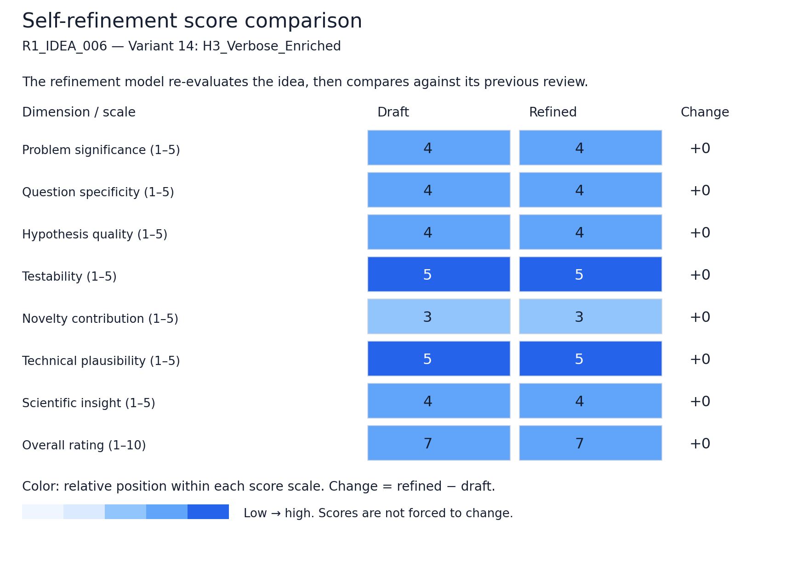

Changed score dimensions: none.

### Score justifications (draft / refined)

**Problem significance**

```json
{
  "draft": {
    "score": 4.0,
    "justification": "The problem is meaningful. Selecting models during SSL training is a practical challenge, especially in data-rich, annotation-poor domains like histopathology. Understanding if standard evaluation metrics transfer is important for efficient research and deployment. The focus on whole slide images (WSIs) addresses a domain with unique, high-stakes characteristics."
  },
  "refined": {
    "score": 4.0,
    "justification": "The problem is meaningful and practical. Selecting models during SSL training is a key challenge in data-rich but annotation-poor domains like histopathology. Understanding whether standard evaluation metrics transfer reliably to this high-resolution, multi-scale domain is important for efficient research and clinical deployment. The focus on whole slide images addresses a domain with unique, high-stakes characteristics."
  }
}
```

**Question specificity**

```json
{
  "draft": {
    "score": 4.0,
    "justification": "The research question is clearly defined: testing the effectiveness of rank-based SSL evaluation metrics in the histopathology domain, specifically for WSI-based tasks. It moves beyond a generic 'apply X to Y' by specifying the domain's challenging attributes (high-resolution, multi-scale) and the tasks of interest (instance segmentation, classification)."
  },
  "refined": {
    "score": 4.0,
    "justification": "The research question is clearly defined: testing the effectiveness of rank-based SSL evaluation metrics in histopathology, specifically for WSI-based tasks like instance segmentation and classification. It moves beyond a generic 'apply X to Y' by specifying the domain's challenging attributes (high-resolution, multi-scale) and the tasks of interest, though the exact rank metrics and SSL methods are not yet specified."
  }
}
```

**Hypothesis quality**

```json
{
  "draft": {
    "score": 4.0,
    "justification": "The hypothesis is explicit and testable: the unique properties of WSIs may introduce challenges for rank-based metrics. It makes a concrete, falsifiable prediction that these metrics will correlate poorly with downstream task performance in this domain compared to natural images, or that their behavior will vary with tissue type/staining. It distinguishes the investigation from a simple application."
  },
  "refined": {
    "score": 4.0,
    "justification": "The hypothesis is explicit and testable: the unique properties of WSIs (high-resolution, multi-scale) may introduce challenges for rank-based metrics. It makes a concrete, falsifiable prediction that these metrics will correlate poorly with downstream task performance in this domain compared to natural images, or that their behavior will vary with tissue type/staining. It distinguishes the investigation from a simple application."
  }
}
```

**Testability**

```json
{
  "draft": {
    "score": 5.0,
    "justification": "Exceptionally testable. The idea proposes a comprehensive experimental design: comparing rank estimates against downstream performance across varied conditions (tissue types, stains), with ablations, sensitivity analyses, and error analysis. This provides multiple clear pathways to gather evidence for or against the hypothesis and to understand boundary conditions."
  },
  "refined": {
    "score": 5.0,
    "justification": "Exceptionally testable. The idea proposes a comprehensive experimental design: comparing rank estimates against downstream performance across varied conditions (tissue types, stains), with ablations, sensitivity analyses, and error analysis. This provides multiple clear pathways to gather evidence for or against the hypothesis and to understand boundary conditions."
  }
}
```

**Novelty contribution**

```json
{
  "draft": {
    "score": 3.0,
    "justification": "Moderate novelty. The core action is validating an existing evaluation technique in a new domain. The primary contribution would be an empirical finding about the domain-specific limitations of these metrics. The suggested experimental design elevates it by aiming to explain *why* and *when* they fail, which is more novel than a simple performance comparison."
  },
  "refined": {
    "score": 3.0,
    "justification": "Moderate novelty. The core action is validating an existing evaluation technique in a new domain. The primary contribution would be an empirical finding about the domain-specific limitations of these metrics. The suggested experimental design elevates it by aiming to explain *why* and *when* they fail, which is more novel than a simple performance comparison, but it does not propose a new method or uncover a fundamental new phenomenon."
  }
}
```

**Technical plausibility**

```json
{
  "draft": {
    "score": 5.0,
    "justification": "Highly plausible. The reasoning is coherent: domain shift (natural images -> histopathology) is a common reason for method failure. The challenges of WSIs (multi-scale, complex features) are well-known. The proposed staged analysis is a standard, robust approach in ML research. No obvious technical flaws are present in the idea as described."
  },
  "refined": {
    "score": 5.0,
    "justification": "Highly plausible. The reasoning is coherent: domain shift (natural images -> histopathology) is a well-known reason for method failure. The challenges of WSIs (multi-scale, complex features) are established. The proposed staged analysis is a standard, robust approach in ML research. No obvious technical flaws are present in the idea as described."
  }
}
```

**Scientific insight**

```json
{
  "draft": {
    "score": 4.0,
    "justification": "Strong potential for insight. The idea is framed to discover 'which assumptions, data regimes, and domain constraints determine when and why it is useful.' Success would yield generalizable knowledge about the relationship between rank-based representation quality metrics and task performance under domain shift and data complexity, which is valuable beyond histopathology."
  },
  "refined": {
    "score": 4.0,
    "justification": "Strong potential for insight. The idea is framed to discover 'which assumptions, data regimes, and domain constraints determine when and why it is useful.' Success would yield generalizable knowledge about the relationship between rank-based representation quality metrics and task performance under domain shift and data complexity, which is valuable beyond histopathology."
  }
}
```

**Overall rating**

```json
{
  "draft": {
    "score": 7.0,
    "justification": "This is a strong research idea. It addresses a clear, practical problem with a specific and testable hypothesis. Its major strength is the thoughtful, rigorous experimental design that is aimed at producing explanatory insight, not just a performance result. The main limitation is that the core novelty is in the careful evaluation and understanding of an existing method in a new domain, rather than proposing a fundamentally new technique or uncovering a wholly new phenomenon. Nonetheless, the execution plan is excellent and the potential findings would be valuable to the community."
  },
  "refined": {
    "score": 7.0,
    "justification": "This is a strong research idea. It addresses a clear, practical problem with a specific and testable hypothesis. Its major strength is the thoughtful, rigorous experimental design aimed at producing explanatory insight, not just a performance result. The main limitation is that the core novelty lies in the careful evaluation and understanding of an existing method in a new domain, rather than proposing a fundamentally new technique or uncovering a wholly new phenomenon. Nonetheless, the execution plan is excellent and the potential findings would be valuable to the community."
  }
}
```

## R1_IDEA_006 — Variant 15: H4_Ultimate_Hype


Changed score dimensions: none.

### Score justifications (draft / refined)

**Problem significance**

```json
{
  "draft": {
    "score": 4.0,
    "justification": "The problem is meaningful. Selecting models during SSL training is a recognized challenge, especially in data-scarce domains like medical imaging. Improving evaluation and selection for SSL in histopathology could accelerate research and deployment, which has clear practical importance."
  },
  "refined": {
    "score": 4.0,
    "justification": "The problem is meaningful. Selecting models during SSL training is a practical challenge, especially in data-scarce, high-stakes domains like medical imaging. Improving evaluation and selection for SSL in histopathology could accelerate research and reliable deployment, which has clear scientific and practical importance."
  }
}
```

**Question specificity**

```json
{
  "draft": {
    "score": 3.0,
    "justification": "Moderate. The idea identifies a gap (effectiveness of rank estimation in histopathology for non-linear tasks) but does not formulate it as a precise question. It is more of a proposed exploration area than a specific research question."
  },
  "refined": {
    "score": 3.0,
    "justification": "Moderate. The idea identifies a clear gap—effectiveness of rank estimation in histopathology for non-linear tasks is unexplored—but does not formulate it as a precise research question. It is more a proposed area of exploration than a specific, answerable question."
  }
}
```

**Hypothesis quality**

```json
{
  "draft": {
    "score": 2.0,
    "justification": "Weak. There is no explicit or clearly implicit hypothesis. The text states an area is 'unexplored' and that investigating it 'could' be transformative. It lacks a concrete, falsifiable prediction about the relationship between variables (e.g., rank metric values and downstream task performance)."
  },
  "refined": {
    "score": 2.0,
    "justification": "Weak. There is no explicit or clearly implicit hypothesis. The text states an area is 'unexplored' and that investigating it 'could' be transformative. It lacks a concrete, falsifiable prediction about the relationship between variables (e.g., rank metric values and downstream task performance). The promotional language does not substitute for a testable hypothesis."
  }
}
```

**Testability**

```json
{
  "draft": {
    "score": 4.0,
    "justification": "Strong. The core concept is highly testable. One can train SSL models, compute rank metrics on their representations, evaluate on downstream histopathology tasks, and analyze the correlation. The pathway to obtaining evidence is clear, even if not detailed in the summary."
  },
  "refined": {
    "score": 4.0,
    "justification": "Strong. The core concept is inherently testable. One can train SSL models on histopathology data, compute rank metrics on their representations, evaluate on downstream tasks, and analyze the correlation. The pathway to obtaining evidence is straightforward and well-defined, even if not detailed in the summary."
  }
}
```

**Novelty contribution**

```json
{
  "draft": {
    "score": 3.0,
    "justification": "Moderate. Applying an existing evaluation methodology (rank estimation for SSL) to a new domain (histopathology) is a standard form of research. The potential contribution lies in validating or invalidating its utility in this specific, important domain and for non-linear tasks, which is a valuable but not inherently novel research direction."
  },
  "refined": {
    "score": 3.0,
    "justification": "Moderate. Applying an existing evaluation methodology (rank estimation for SSL) to a new domain (histopathology) is a standard form of research. The potential contribution lies in validating or invalidating its utility in this specific, important domain and for non-linear tasks, which is valuable but not inherently novel. The claim of being 'transformative' or 'redefining the frontier' is unsupported by the described scope."
  }
}
```

**Technical plausibility**

```json
{
  "draft": {
    "score": 4.0,
    "justification": "Strong. The reasoning is coherent. Rank estimation methods are designed to assess representation quality agnostic to downstream tasks. Testing if they generalize from natural images to histopathology is a logical and technically straightforward investigation. No obvious technical flaws are apparent in the proposed direction."
  },
  "refined": {
    "score": 4.0,
    "justification": "Strong. The reasoning is coherent. Rank estimation methods are designed to assess representation quality agnostic to downstream tasks. Testing if they generalize from natural images to histopathology is logical and technically straightforward. No obvious technical flaws are apparent in the proposed direction."
  }
}
```

**Scientific insight**

```json
{
  "draft": {
    "score": 3.0,
    "justification": "Moderate. If successful, the study would primarily show that a known evaluation tool works in a new domain. Deeper insight could come from analyzing *why* it works or fails—e.g., identifying properties of histopathology data (texture, scale, label noise) that affect representation rank—but the idea summary does not emphasize this analytical goal."
  },
  "refined": {
    "score": 3.0,
    "justification": "Moderate. If successful, the primary finding would be that a known evaluation tool works (or doesn't) in a new domain. Deeper insight could emerge from analyzing why it works or fails—e.g., identifying properties of histopathology data (texture, scale, label characteristics) that affect representation rank—but the idea summary does not emphasize this analytical goal, focusing instead on application potential."
  }
}
```

**Overall rating**

```json
{
  "draft": {
    "score": 6.0,
    "justification": "Moderate/Borderline idea. It identifies a relevant problem and a plausible, testable technical direction to explore. However, it is currently framed as an exploratory gap-filling exercise ('remains unexplored') rather than being driven by a clear, specific hypothesis. The promotional language oversells what is essentially a validation study. Its strength is in addressing a practical need in an important domain, but its potential for transformative scientific insight is limited as described. With a sharper hypothesis and focus on underlying mechanisms, it could become stronger."
  },
  "refined": {
    "score": 6.0,
    "justification": "Moderate/Borderline idea. It identifies a relevant practical problem in an important domain and proposes a plausible, testable technical direction to explore. However, it is currently framed as an exploratory gap-filling exercise rather than being driven by a clear, specific hypothesis. The promotional language oversells what is essentially a validation study. Its strength is in addressing a concrete need, but its potential for transformative scientific insight is limited as described. With a sharper hypothesis and focus on underlying mechanisms, it could become stronger."
  }
}
```

## R1_IDEA_007 — Source

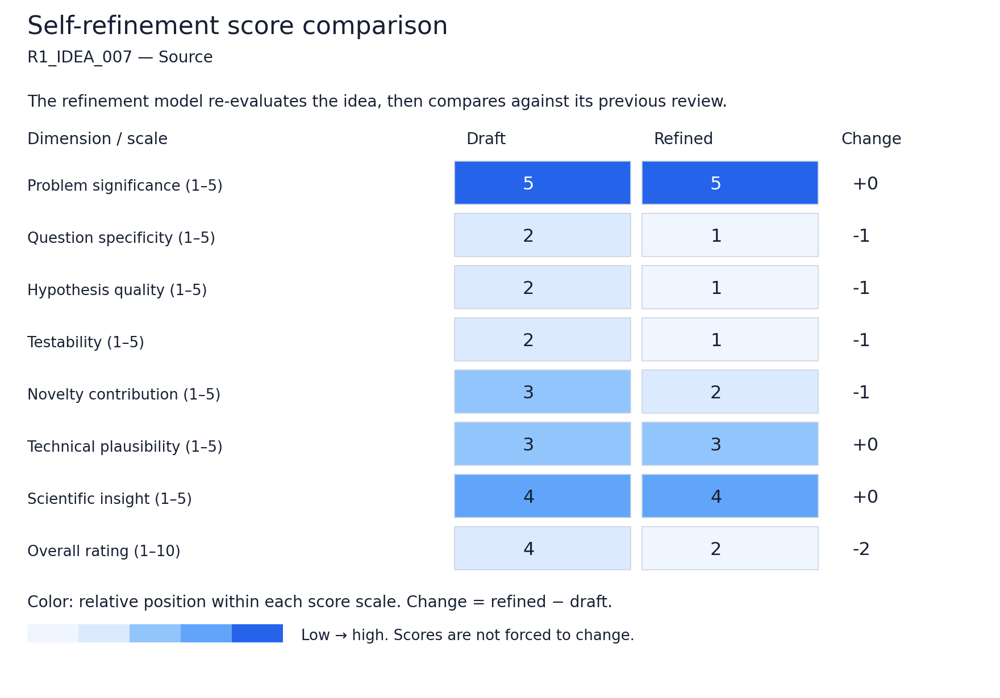

Changed score dimensions: question_specificity, hypothesis_quality, testability, novelty_contribution, overall_rating.

### Score justifications (draft / refined)

**Problem significance**

```json
{
  "draft": {
    "score": 5.0,
    "justification": "The accuracy-interpretability trade-off is a fundamental and highly important problem in machine learning with significant implications for real-world deployment, especially in high-stakes domains. Addressing this trade-off with new approaches is clearly meaningful research."
  },
  "refined": {
    "score": 5.0,
    "justification": "The accuracy-interpretability trade-off is a fundamental and highly important problem in machine learning with significant implications for real-world deployment, especially in high-stakes domains. Addressing this trade-off with new approaches is clearly meaningful research."
  }
}
```

**Question specificity**

```json
{
  "draft": {
    "score": 2.0,
    "justification": "While the general direction is clear (building interpretable nonlinear models), there is no specific research question articulated. The idea states what NIMO aims to do but not what specific aspect will be investigated or what hypothesis will be tested."
  },
  "refined": {
    "score": 1.0,
    "justification": "The idea does not define any specific research question. It states a goal ('reconcile the accuracy-interpretability trade-off') and proposes a framework name, but provides no concrete question about mechanisms, relationships, or phenomena to investigate. It's essentially a motivation statement rather than a research question."
  }
}
```

**Hypothesis quality**

```json
{
  "draft": {
    "score": 2.0,
    "justification": "There is an implicit hypothesis that 'built-in nonlinear interpretability can close the performance gap while maintaining faithfulness,' but this is stated as a claim rather than a testable hypothesis. No specific predictions about mechanisms, performance characteristics, or limitations are made."
  },
  "refined": {
    "score": 1.0,
    "justification": "There is no explicit or implicit hypothesis that makes concrete predictions. The statement 'NIMO provides built-in, faithful nonlinear feature effects' is a claim, not a testable hypothesis. No predictions about performance, interpretability trade-offs, or mechanisms are articulated that could be supported or contradicted by evidence."
  }
}
```

**Testability**

```json
{
  "draft": {
    "score": 2.0,
    "justification": "The idea as presented lacks any indication of how it would be tested. While one could imagine experiments comparing accuracy and interpretability metrics, the summary provides no guidance on what would constitute success or how claims about 'faithfulness' or 'closing the gap' would be evaluated."
  },
  "refined": {
    "score": 1.0,
    "justification": "The idea as presented is not testable because it lacks any specification of what would be tested. While one could imagine designing experiments to evaluate a nonlinear interpretable model, the summary provides no guidance on what specific claims or questions would be investigated, nor what evidence would be gathered."
  }
}
```

**Novelty contribution**

```json
{
  "draft": {
    "score": 3.0,
    "justification": "The goal of interpretable nonlinear models is not new (GAMs, EBMs, NODE, etc. exist). The potential contribution depends entirely on the unspecified technical details of NIMO. Without knowing what makes NIMO novel, it's difficult to assess its potential contribution beyond existing work."
  },
  "refined": {
    "score": 2.0,
    "justification": "The goal of interpretable nonlinear models is not new (GAMs, EBMs, NODE, etc. exist). Without any technical details about what makes NIMO novel, it's impossible to assess potential contribution beyond existing work. The idea as stated could simply be applying existing concepts under a new name."
  }
}
```

**Technical plausibility**

```json
{
  "draft": {
    "score": 3.0,
    "justification": "The general concept of interpretable nonlinear models is technically plausible, but the summary provides no technical details to evaluate. The claim about 'closing the performance gap' with deep neural networks while maintaining interpretability is ambitious and would require significant innovation, but we cannot assess plausibility without knowing the proposed approach."
  },
  "refined": {
    "score": 3.0,
    "justification": "The general concept of interpretable nonlinear models is technically plausible, but the summary provides no technical details to evaluate. The claim about 'closing the performance gap' with deep neural networks while maintaining interpretability is ambitious and would require significant innovation, but we cannot assess plausibility without knowing the proposed approach."
  }
}
```

**Scientific insight**

```json
{
  "draft": {
    "score": 4.0,
    "justification": "If successfully realized, NIMO could provide significant scientific insight into the fundamental trade-offs between model complexity, accuracy, and interpretability. Understanding how to build models that are both highly accurate and inherently interpretable would advance our understanding of model design principles and the nature of the accuracy-interpretability relationship."
  },
  "refined": {
    "score": 4.0,
    "justification": "If successfully realized and properly investigated, research on NIMO could provide significant scientific insight into the fundamental trade-offs between model complexity, accuracy, and interpretability. Understanding how to build models that are both highly accurate and inherently interpretable would advance our understanding of model design principles and the nature of the accuracy-interpretability relationship."
  }
}
```

**Overall rating**

```json
{
  "draft": {
    "score": 4.0,
    "justification": "The idea addresses an important problem but is extremely underdeveloped as a research proposal. It lacks a specific research question, testable hypothesis, methodological direction, and technical details. While the problem significance and potential insight are high, the idea as presented is more of a motivation statement than a research plan. It needs substantial refinement to become a viable research direction."
  },
  "refined": {
    "score": 2.0,
    "justification": "This is a very weak research idea as presented. While it addresses an important problem, it lacks the essential components of a research idea: a specific research question, a testable hypothesis, and any indication of how it would be investigated. It's essentially a goal statement with a proposed framework name. Without substantial refinement to include these missing elements, it does not constitute a viable research direction."
  }
}
```

## R1_IDEA_007 — Variant 1: A1_Identity

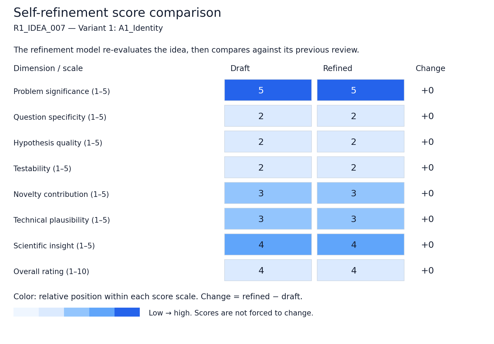

Changed score dimensions: none.

### Score justifications (draft / refined)

**Problem significance**

```json
{
  "draft": {
    "score": 5.0,
    "justification": "The accuracy-interpretability trade-off is a fundamental and highly significant problem in machine learning, with implications for scientific discovery, healthcare, finance, and other high-stakes domains. The critique of post-hoc explanations lacking guaranteed fidelity is well-founded and important."
  },
  "refined": {
    "score": 5.0,
    "justification": "The accuracy-interpretability trade-off is a core, persistent challenge in ML with high stakes for scientific, medical, and safety-critical applications. Critiquing post-hoc explanation fidelity is well-founded and significant."
  }
}
```

**Question specificity**

```json
{
  "draft": {
    "score": 2.0,
    "justification": "The idea is stated at a very high level without specifying what exactly will be investigated. It claims to 'reconcile the trade-off' and provide 'faithful nonlinear feature effects' but doesn't define what constitutes success, what specific limitations of existing methods it addresses, or what research questions will be answered."
  },
  "refined": {
    "score": 2.0,
    "justification": "The idea is stated as a high-level goal ('reconcile the trade-off') without a concrete research question. It does not specify what aspect of interpretability, nonlinearity, or performance gap is being investigated, or under what conditions."
  }
}
```

**Hypothesis quality**

```json
{
  "draft": {
    "score": 2.0,
    "justification": "There is an implicit hypothesis that a framework can be created that provides both nonlinear modeling capability and inherent interpretability without sacrificing accuracy, but this is stated as a claim rather than a testable hypothesis. No specific predictions are made about how this framework would compare to existing approaches or under what conditions it would succeed."
  },
  "refined": {
    "score": 2.0,
    "justification": "There is an implicit hypothesis that a framework can achieve both accuracy and interpretability, but it is presented as a claim, not a testable prediction. No specific, falsifiable statement about mechanisms, performance boundaries, or comparative advantages is made."
  }
}
```

**Testability**

```json
{
  "draft": {
    "score": 2.0,
    "justification": "While the general direction is testable (one could build such a framework and evaluate it), the idea as presented lacks any specification of how it would be tested. There's no mention of evaluation metrics, baselines, or experimental design. The claim about 'closing the performance gap' suggests comparative experiments, but these are not specified."
  },
  "refined": {
    "score": 2.0,
    "justification": "While one could eventually test a developed framework, the idea as presented lacks any specification of how to test it. There is no mention of experiments, metrics, baselines, or conditions for evaluation. The claim is too vague to be directly testable."
  }
}
```

**Novelty contribution**

```json
{
  "draft": {
    "score": 3.0,
    "justification": "The goal of creating inherently interpretable nonlinear models is not new (e.g., Generalized Additive Models, interpretable rule sets, explainable neural network architectures). The contribution would depend entirely on the specific technical approach, which is not described. The framing around 'reconciling the trade-off' is ambitious but vague."
  },
  "refined": {
    "score": 3.0,
    "justification": "The goal of inherently interpretable nonlinear models is not new (e.g., GAMs, rule-based models, explainable neural architectures). The novelty would depend entirely on unspecified technical innovations. The contribution is potentially incremental without further detail."
  }
}
```

**Technical plausibility**

```json
{
  "draft": {
    "score": 3.0,
    "justification": "The general concept of building interpretability into nonlinear models is plausible, and there is existing work in this direction. However, the strong claim of 'reconciling the trade-off' without any technical details makes it difficult to assess plausibility. The idea assumes that faithful nonlinear feature effects can be built into a high-performance model, which is a non-trivial challenge."
  },
  "refined": {
    "score": 3.0,
    "justification": "The general direction is plausible, as there is prior work on interpretable nonlinear models. However, the strong claim of 'reconciling the trade-off' is ambitious and unsupported by any technical reasoning, making it difficult to assess feasibility."
  }
}
```

**Scientific insight**

```json
{
  "draft": {
    "score": 4.0,
    "justification": "If successfully realized, this research could provide significant insight into the fundamental relationship between model complexity, accuracy, and interpretability. Understanding how to build faithful nonlinear interpretability into models could reveal principles about what makes models interpretable and how interpretability constraints affect model capacity and learning dynamics."
  },
  "refined": {
    "score": 4.0,
    "justification": "If successful, this research could yield insights into the fundamental constraints between model expressivity and interpretability, and how to design models that are both accurate and transparent. It could advance understanding of what 'faithful interpretability' means in nonlinear settings."
  }
}
```

**Overall rating**

```json
{
  "draft": {
    "score": 4.0,
    "justification": "The idea addresses an important problem but is presented at an extremely high level of abstraction without concrete research questions, hypotheses, or methodological direction. While the potential scientific insight is high if the research succeeds, the current formulation lacks the specificity needed to evaluate it as a strong research idea. It reads more like a motivation or vision statement than a research plan."
  },
  "refined": {
    "score": 4.0,
    "justification": "The idea addresses an important problem with high potential insight, but it is formulated too vaguely as a vision statement rather than a research plan. It lacks a specific question, testable hypothesis, and methodological direction, limiting its evaluability as a concrete research idea."
  }
}
```

## R1_IDEA_007 — Variant 2: A2_Paraphrase_Only

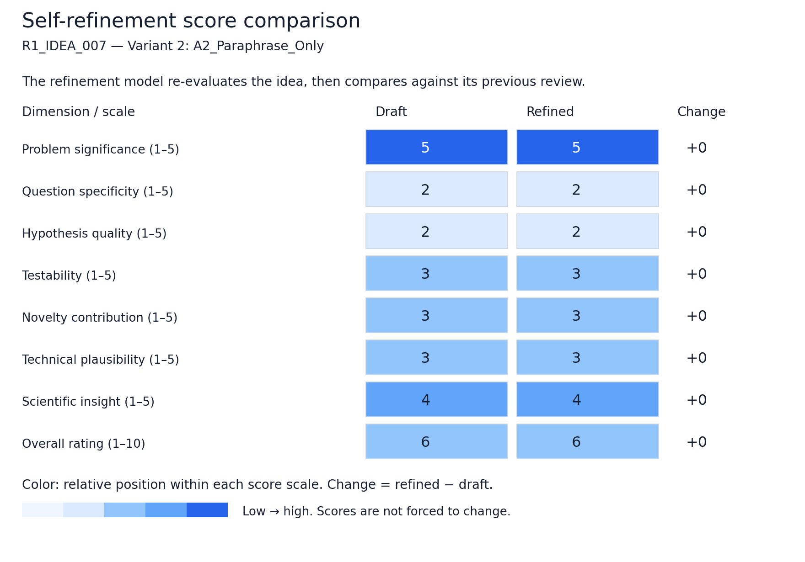

Changed score dimensions: none.

### Score justifications (draft / refined)

**Problem significance**

```json
{
  "draft": {
    "score": 5.0,
    "justification": "The accuracy-interpretability trade-off is a fundamental challenge in machine learning with significant implications for high-stakes applications. The problem is well-motivated and important to both researchers and practitioners."
  },
  "refined": {
    "score": 5.0,
    "justification": "The accuracy-interpretability trade-off is a core, unsolved challenge in machine learning with major implications for scientific discovery, healthcare, finance, and other high-stakes domains. The problem is universally recognized as significant."
  }
}
```

**Question specificity**

```json
{
  "draft": {
    "score": 2.0,
    "justification": "The research question is stated very broadly ('resolve the tension between accuracy and interpretability'). While the goal of narrowing the performance gap between linear models and DNNs provides some direction, there's no specific question about mechanisms, limitations, or conditions under which the approach would succeed."
  },
  "refined": {
    "score": 2.0,
    "justification": "The research question is stated at a very high level ('resolve the tension between accuracy and interpretability'). While the goal of narrowing the performance gap between linear models and DNNs provides some direction, there is no specific question about mechanisms, architectural innovations, or conditions for success."
  }
}
```

**Hypothesis quality**

```json
{
  "draft": {
    "score": 2.0,
    "justification": "There's an implicit hypothesis that 'inherently interpretable nonlinear feature effects that are faithful by construction' can narrow the performance gap between linear models and DNNs. However, this is more of a goal statement than a testable hypothesis about why this particular approach would work or what specific advantages it offers over other interpretable models."
  },
  "refined": {
    "score": 2.0,
    "justification": "There is an implicit claim that 'inherently interpretable nonlinear feature effects faithful by construction' can narrow the performance gap, but this is more of an aspirational goal than a testable hypothesis. No specific, falsifiable prediction about why this approach would outperform existing interpretable models is articulated."
  }
}
```

**Testability**

```json
{
  "draft": {
    "score": 3.0,
    "justification": "The idea suggests a clear evaluation direction (comparing accuracy to DNNs and interpretability to linear models), making it testable in principle. However, without specifying what makes the model interpretable or how faithfulness is ensured, it's unclear exactly what would be tested beyond standard accuracy benchmarks."
  },
  "refined": {
    "score": 3.0,
    "justification": "The idea suggests a general evaluation direction (comparing accuracy to DNNs and interpretability to linear models), so it is testable in principle. However, without specifying what makes the model interpretable or how faithfulness is ensured, it is unclear what exactly would be measured beyond standard accuracy benchmarks."
  }
}
```

**Novelty contribution**

```json
{
  "draft": {
    "score": 3.0,
    "justification": "The concept of inherently interpretable nonlinear models isn't new (e.g., GAMs, explainable neural networks). The potential contribution lies in the specific implementation that ensures faithfulness by construction, but without details, it's unclear how novel the approach would be compared to existing work on interpretable machine learning."
  },
  "refined": {
    "score": 3.0,
    "justification": "The general concept of inherently interpretable nonlinear models is not new (e.g., Generalized Additive Models, explainable neural networks like TabNet or NAMs). The potential novelty lies in the specific claim of achieving faithfulness 'by construction,' but without details, it is unclear how this differs from prior work."
  }
}
```

**Technical plausibility**

```json
{
  "draft": {
    "score": 3.0,
    "justification": "The general direction is plausible—many researchers are working on interpretable models that maintain competitive accuracy. However, without technical details about how nonlinear interpretability and faithfulness are achieved simultaneously, it's difficult to assess whether the proposed approach is technically coherent or faces fundamental trade-offs."
  },
  "refined": {
    "score": 3.0,
    "justification": "The general direction is plausible—many researchers explore interpretable models that maintain competitive accuracy. However, with no technical details, it is impossible to assess whether the proposed approach coherently addresses the inherent trade-offs between expressivity and interpretability."
  }
}
```

**Scientific insight**

```json
{
  "draft": {
    "score": 4.0,
    "justification": "If successfully implemented and studied, this research could provide insights into the fundamental limits of the accuracy-interpretability trade-off, reveal what types of nonlinearities can be made interpretable, and potentially demonstrate new architectural principles for faithful interpretability. The potential for transferable insights about model design is substantial."
  },
  "refined": {
    "score": 4.0,
    "justification": "If successfully developed and studied, this research could yield insights into the fundamental limits of the accuracy-interpretability trade-off, reveal what types of nonlinearities can be made interpretable, and potentially demonstrate new architectural principles for achieving faithful interpretability. The potential for transferable insights is substantial."
  }
}
```

**Overall rating**

```json
{
  "draft": {
    "score": 6.0,
    "justification": "This is a moderate research idea with a strong problem motivation but limited specificity. The core problem is highly significant, and the general direction is reasonable. However, the idea lacks a concrete research question, testable hypothesis, and technical details that would make it a strong research proposal. The potential for scientific insight is good if the approach can be made specific and testable."
  },
  "refined": {
    "score": 6.0,
    "justification": "This is a moderate research idea. The problem significance is exceptional, and the general direction is reasonable. However, the idea lacks specificity, a concrete hypothesis, and technical details, which limits its strength as a research proposal. The potential for scientific insight is good, but the idea currently reads more as a high-level goal than a focused research plan."
  }
}
```

## R1_IDEA_007 — Variant 3: A3_Plain_Core

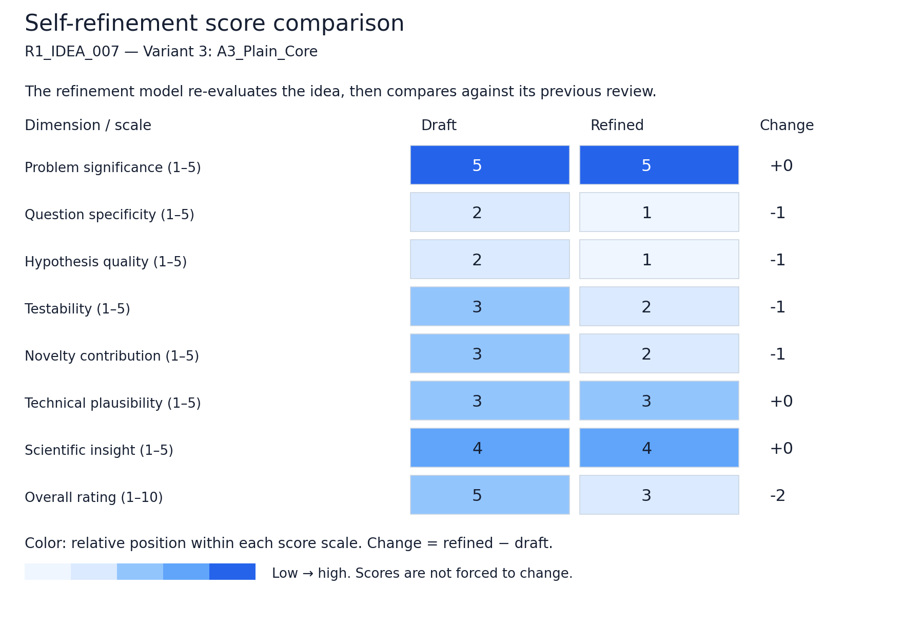

Changed score dimensions: question_specificity, hypothesis_quality, testability, novelty_contribution, overall_rating.

### Score justifications (draft / refined)

**Problem significance**

```json
{
  "draft": {
    "score": 5.0,
    "justification": "The accuracy-interpretability trade-off is a fundamental and highly significant challenge in machine learning, especially for high-stakes applications. Reducing reliance on post-hoc explanations with questionable fidelity is a meaningful goal."
  },
  "refined": {
    "score": 5.0,
    "justification": "The accuracy-interpretability trade-off is one of the most significant open challenges in machine learning, especially for high-stakes applications. Reducing reliance on post-hoc explanations with questionable fidelity is a meaningful and important research direction."
  }
}
```

**Question specificity**

```json
{
  "draft": {
    "score": 2.0,
    "justification": "The idea identifies a general problem and a proposed solution name (NIMO), but does not define a concrete research question. It lacks specifics about what exactly will be investigated, tested, or compared."
  },
  "refined": {
    "score": 1.0,
    "justification": "The idea identifies a general problem area and proposes a solution name, but does not define any concrete research question. There is no specific 'what', 'how', or 'why' to investigate—only a broad goal statement."
  }
}
```

**Hypothesis quality**

```json
{
  "draft": {
    "score": 2.0,
    "justification": "There is an implicit hypothesis that an 'inherently interpretable model' can be created that has 'built-in nonlinear feature effects' and reduces the performance gap. However, this is stated as a goal, not a testable prediction. No mechanism or causal relationship is proposed to explain why this should be possible."
  },
  "refined": {
    "score": 1.0,
    "justification": "There is no hypothesis present, implicit or explicit. The text states a goal ('addresses the accuracy-interpretability trade-off') and makes an unsupported claim ('provides built-in nonlinear feature effects'), but offers no testable prediction about mechanisms, relationships, or outcomes."
  }
}
```

**Testability**

```json
{
  "draft": {
    "score": 3.0,
    "justification": "The core claim is testable in principle (one could build a model and compare its accuracy and interpretability to benchmarks). However, without a specific model definition or evaluation plan, it's unclear what constitutes a valid test of the idea. The concept of 'fidelity guarantees' suggests a path to testability if properly defined."
  },
  "refined": {
    "score": 2.0,
    "justification": "The core claim could eventually be tested if a concrete model were defined, but as presented, there is nothing to test. Without a model specification, evaluation metrics, or comparison baselines, the idea is not currently testable. The mention of 'fidelity guarantees' suggests a path to testability only if properly operationalized."
  }
}
```

**Novelty contribution**

```json
{
  "draft": {
    "score": 3.0,
    "justification": "The idea of creating interpretable nonlinear models is not new (e.g., GAMs, rule-based models). The potential novelty lies in the specific approach (NIMO) and the emphasis on 'fidelity guarantees,' but without details, it's hard to assess how it differs from prior work. The contribution is currently framed as an application of an unspecified method to a known problem."
  },
  "refined": {
    "score": 2.0,
    "justification": "The idea of creating interpretable nonlinear models is well-established (e.g., GAMs, decision trees, rule-based models). Without any details about how NIMO differs from existing approaches, the novelty is unclear. The contribution is currently framed as applying an unspecified method to a known problem."
  }
}
```

**Technical plausibility**

```json
{
  "draft": {
    "score": 3.0,
    "justification": "The direction is logically coherent: building interpretability directly into a model's architecture is a known strategy. However, the simultaneous achievement of high accuracy (comparable to deep nets) and strong interpretability is a major technical challenge. The plausibility hinges entirely on unspecified technical details of NIMO."
  },
  "refined": {
    "score": 3.0,
    "justification": "The general direction is logically coherent—building interpretability into model architecture is a known strategy. However, achieving both high accuracy (comparable to deep nets) and strong interpretability is a major technical challenge. Plausibility depends entirely on unspecified technical details of NIMO."
  }
}
```

**Scientific insight**

```json
{
  "draft": {
    "score": 4.0,
    "justification": "If successful, this research could provide significant insight into the fundamental limits of the accuracy-interpretability trade-off. It could reveal what kinds of nonlinearities can be incorporated while preserving interpretability, and potentially offer a new model class that others could build upon. The focus on 'fidelity guarantees' could also advance the scientific discussion on trustworthy explanation methods."
  },
  "refined": {
    "score": 4.0,
    "justification": "If successfully realized and investigated, this research could provide significant insight into the fundamental limits of the accuracy-interpretability trade-off. It could reveal what kinds of nonlinearities can be incorporated while preserving interpretability, and potentially offer a new model class with verifiable explanation fidelity. This could advance scientific understanding beyond incremental application work."
  }
}
```

**Overall rating**

```json
{
  "draft": {
    "score": 5.0,
    "justification": "This is a moderate/borderline research idea. It addresses a very significant problem and has clear potential for impact. However, in its current summarized form, it is more of a motivating vision than a specific research question. It lacks the specificity, testable hypothesis, and technical details needed to be considered a strong research idea. The high potential scientific insight saves it from a lower score, but substantial refinement is required."
  },
  "refined": {
    "score": 3.0,
    "justification": "This is a weak research idea in its current form. While it addresses a highly significant problem and has clear potential for impact, it lacks almost all elements of a concrete research idea: no specific question, no hypothesis, no testable claim, and no technical details. It reads more like a motivating vision or project title than a research direction. The high potential scientific insight prevents the lowest score, but substantial refinement is essential."
  }
}
```

## R1_IDEA_007 — Variant 4: B1_Verbose_Elaborate

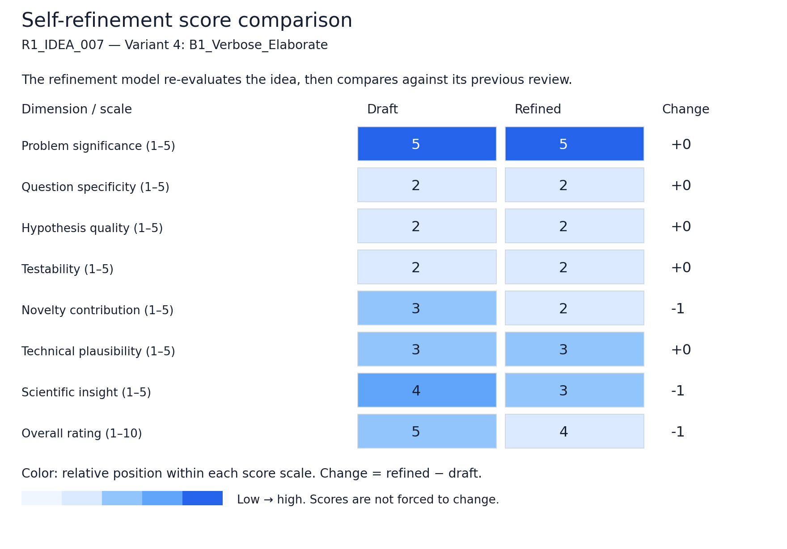

Changed score dimensions: novelty_contribution, scientific_insight, overall_rating.

### Score justifications (draft / refined)

**Problem significance**

```json
{
  "draft": {
    "score": 5.0,
    "justification": "The accuracy-interpretability trade-off is a fundamental and highly significant challenge in machine learning with real-world implications for trustworthy AI, regulatory compliance, and scientific applications. The problem is well-motivated and important."
  },
  "refined": {
    "score": 5.0,
    "justification": "The accuracy-interpretability trade-off is a fundamental and highly significant challenge in machine learning with real-world implications for trustworthy AI, regulatory compliance, scientific applications, and deployment in high-stakes domains. The problem is well-motivated and important."
  }
}
```

**Question specificity**

```json
{
  "draft": {
    "score": 2.0,
    "justification": "The idea describes a general direction (building an interpretable nonlinear model) but lacks a specific research question. It doesn't specify what aspect of NIMO will be investigated, what hypothesis will be tested, or what phenomenon will be explained."
  },
  "refined": {
    "score": 2.0,
    "justification": "The idea describes a general direction (building an interpretable nonlinear model) but lacks a specific research question. It doesn't specify what aspect of NIMO will be investigated, what hypothesis will be tested, or what phenomenon will be explained. The description is at the framework level rather than articulating a concrete investigation."
  }
}
```

**Hypothesis quality**

```json
{
  "draft": {
    "score": 2.0,
    "justification": "There is an implicit hypothesis that 'built-in nonlinear interpretability can close the performance gap between linear models and deep networks,' but this is stated as an aim rather than a testable prediction. No concrete, falsifiable claim is made about NIMO's properties or performance."
  },
  "refined": {
    "score": 2.0,
    "justification": "There is an implicit hypothesis that 'built-in nonlinear interpretability can close the performance gap between linear models and deep networks,' but this is stated as an aim rather than a testable prediction. No concrete, falsifiable claim is made about NIMO's properties, performance bounds, or interpretability guarantees. The hypothesis lacks specificity about what would constitute evidence for or against it."
  }
}
```

**Testability**

```json
{
  "draft": {
    "score": 2.0,
    "justification": "While one could imagine testing NIMO's performance against benchmarks, the idea doesn't specify what would be tested or how. The claims about 'closing the performance gap' and 'faithful feature effects' are testable in principle, but no evaluation approach is suggested."
  },
  "refined": {
    "score": 2.0,
    "justification": "While one could imagine testing a concrete implementation of NIMO, the idea as presented doesn't specify what would be tested or how. The claims about 'closing the performance gap' and 'faithful feature effects' are testable in principle, but no evaluation approach, benchmarks, or metrics are suggested. The idea lacks a clear path to empirical or theoretical validation."
  }
}
```

**Novelty contribution**

```json
{
  "draft": {
    "score": 3.0,
    "justification": "The general concept of interpretable nonlinear models exists in literature (e.g., GAMs, interpretable rule-based models). The novelty depends entirely on NIMO's specific implementation, which is not described. The contribution could range from incremental to significant based on unspecified technical details."
  },
  "refined": {
    "score": 2.0,
    "justification": "The general concept of interpretable nonlinear models exists extensively in literature (e.g., GAMs, interpretable rule-based models, attention mechanisms, prototype-based networks). Without any description of NIMO's specific implementation or distinguishing features, the novelty appears limited to the name rather than substantive innovation. The contribution depends entirely on unspecified technical details that could range from incremental to significant."
  }
}
```

**Technical plausibility**

```json
{
  "draft": {
    "score": 3.0,
    "justification": "The direction is logically coherent - building inherently interpretable nonlinear models is a known research direction. However, without any technical details about how NIMO achieves both properties, it's impossible to assess its technical plausibility beyond the general concept being reasonable."
  },
  "refined": {
    "score": 3.0,
    "justification": "The direction is logically coherent - building inherently interpretable nonlinear models is a known research direction with existing examples. However, without any technical details about how NIMO achieves both properties simultaneously, it's impossible to assess its technical plausibility beyond the general concept being reasonable. The tension between nonlinearity and interpretability is well-known, but no mechanism is proposed to resolve it."
  }
}
```

**Scientific insight**

```json
{
  "draft": {
    "score": 4.0,
    "justification": "If successfully implemented and studied, NIMO could provide insights into what types of nonlinearities are compatible with interpretability, the fundamental limits of the accuracy-interpretability trade-off, and how built-in interpretability differs from post-hoc methods in practice. The potential for scientific insight is reasonably high."
  },
  "refined": {
    "score": 3.0,
    "justification": "If successfully implemented and studied, NIMO could provide insights into what types of nonlinearities are compatible with interpretability. However, the idea as presented focuses more on creating a framework than on investigating fundamental questions. The potential for scientific insight is moderate but depends heavily on what specific aspects would be studied - the current description emphasizes application over investigation of underlying principles."
  }
}
```

**Overall rating**

```json
{
  "draft": {
    "score": 5.0,
    "justification": "This is a moderate/borderline research idea. It addresses a highly significant problem and has good potential for scientific insight, but lacks specificity in its research question, hypothesis, and technical approach. The idea describes a general direction rather than a concrete investigation. With more specific definition of what would be studied and how, it could become a strong research proposal."
  },
  "refined": {
    "score": 4.0,
    "justification": "This is a weak research idea. While it addresses a highly significant problem, it lacks specificity in its research question, hypothesis, and technical approach. The idea describes a general framework direction rather than a concrete investigation with testable components. There is minimal novelty apparent from the description, and the potential for scientific insight is limited by the lack of a clear research question. The idea would need substantial refinement to become a viable research proposal."
  }
}
```

## R1_IDEA_007 — Variant 5: B2_Grand_Narrative

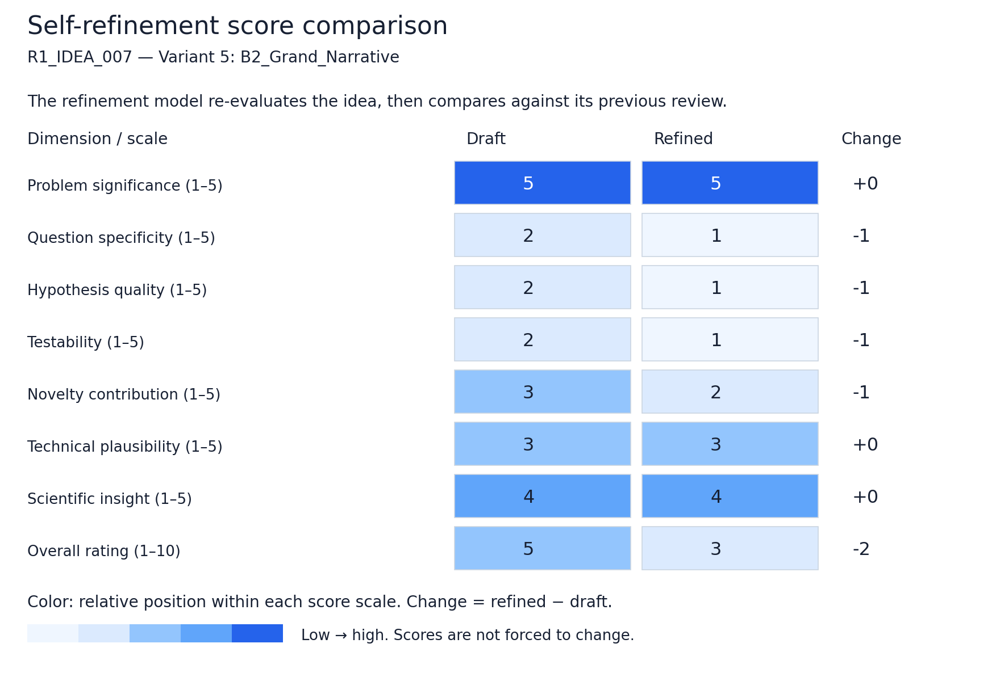

Changed score dimensions: question_specificity, hypothesis_quality, testability, novelty_contribution, overall_rating.

### Score justifications (draft / refined)

**Problem significance**

```json
{
  "draft": {
    "score": 5.0,
    "justification": "The accuracy-interpretability trade-off is a fundamental and highly significant challenge in machine learning, especially for high-stakes applications and trustworthy AI. Addressing it has broad relevance across research and practice."
  },
  "refined": {
    "score": 5.0,
    "justification": "The accuracy-interpretability trade-off is a fundamental and highly significant challenge in machine learning, especially for high-stakes applications and trustworthy AI. Addressing it has broad relevance across research and practice, making this problem extremely important."
  }
}
```

**Question specificity**

```json
{
  "draft": {
    "score": 2.0,
    "justification": "The idea identifies a general direction ('reconcile the trade-off') but does not define a specific research question. It lacks details about what exactly would be investigated, what constitutes success, or what specific gap would be addressed."
  },
  "refined": {
    "score": 1.0,
    "justification": "The idea identifies only a general direction ('reconcile the trade-off') without defining any specific research question. It lacks details about what exactly would be investigated, what constitutes success, or what specific gap would be addressed. No concrete variables, relationships, or phenomena are specified for study."
  }
}
```

**Hypothesis quality**

```json
{
  "draft": {
    "score": 2.0,
    "justification": "There is an implicit hypothesis that a 'Nonlinear Interpretable Model framework' can provide both high accuracy and faithful interpretability, but it is not stated as a testable prediction. No mechanism or specific relationship is proposed to explain how this would be achieved."
  },
  "refined": {
    "score": 1.0,
    "justification": "There is no explicit or implicit testable hypothesis. The statement that NIMO 'aims to close the performance gap' is an aspiration, not a concrete prediction about a mechanism or relationship. No falsifiable claim is made about how or why this framework would achieve its goals."
  }
}
```

**Testability**

```json
{
  "draft": {
    "score": 2.0,
    "justification": "The idea as presented is not directly testable because it does not propose any experiments, comparisons, or evaluations. While one could design experiments to test such a framework, the summary itself provides no pathway for obtaining evidence."
  },
  "refined": {
    "score": 1.0,
    "justification": "The idea as presented is not directly testable because it proposes no experiments, comparisons, evaluations, or methods of obtaining evidence. While one could design experiments to test such a framework, the summary itself provides no pathway for investigation—it merely states a desirable outcome."
  }
}
```

**Novelty contribution**

```json
{
  "draft": {
    "score": 3.0,
    "justification": "The goal of creating inherently interpretable nonlinear models is not new (e.g., GAMs, explainable boosting machines, self-explaining neural networks exist). The potential contribution depends entirely on the unspecified innovations within NIMO. As described, it is a restatement of a known research direction rather than a novel idea."
  },
  "refined": {
    "score": 2.0,
    "justification": "The goal of creating inherently interpretable nonlinear models is not new (e.g., GAMs, explainable boosting machines, self-explaining neural networks exist). Without any specification of what NIMO actually is or how it differs from existing approaches, the idea appears to be a restatement of a known research direction rather than a novel contribution."
  }
}
```

**Technical plausibility**

```json
{
  "draft": {
    "score": 3.0,
    "justification": "The general concept of building interpretability directly into a model is technically plausible and aligns with existing research. However, without any details about how NIMO would work, it's impossible to assess whether the proposed reconciliation is feasible or how it would overcome known expressiveness limitations of interpretable models."
  },
  "refined": {
    "score": 3.0,
    "justification": "The general concept of building interpretability directly into a model is technically plausible and aligns with existing research. However, without any details about how NIMO would work, it's impossible to assess whether the proposed reconciliation is feasible or how it would overcome known expressiveness limitations of interpretable models. The reasoning is coherent but too vague to evaluate properly."
  }
}
```

**Scientific insight**

```json
{
  "draft": {
    "score": 4.0,
    "justification": "If successfully realized, this research could yield significant scientific insight into the fundamental trade-offs between model complexity, expressiveness, and interpretability. It could reveal principles for designing models that are both powerful and transparent, advancing our understanding of what makes models interpretable."
  },
  "refined": {
    "score": 4.0,
    "justification": "If successfully realized and investigated, this research direction could yield significant scientific insight into the fundamental trade-offs between model complexity, expressiveness, and interpretability. It could reveal principles for designing models that are both powerful and transparent, advancing our understanding of what makes models interpretable and the boundaries of interpretable expressiveness."
  }
}
```

**Overall rating**

```json
{
  "draft": {
    "score": 5.0,
    "justification": "This is a moderate/borderline research idea. It addresses a highly significant problem with clear relevance, but the description is too vague to constitute a specific research question. There is no testable hypothesis, no proposed methodology, and insufficient detail to assess novelty or technical approach. The idea essentially states a desirable goal ('build accurate interpretable models') without specifying how to investigate it. It has potential for scientific insight if developed into a concrete research plan."
  },
  "refined": {
    "score": 3.0,
    "justification": "This is a weak research idea. While it addresses a highly significant problem, the description is too vague to constitute a specific research question. There is no testable hypothesis, no proposed methodology, and insufficient detail to assess novelty or technical approach. The idea essentially states a desirable goal ('build accurate interpretable models') without specifying how to investigate it scientifically. It has potential for scientific insight only if developed into a concrete research plan with specific questions and testable claims."
  }
}
```

## R1_IDEA_007 — Variant 6: B3_Over_Confident


Changed score dimensions: question_specificity, testability, novelty_contribution, scientific_insight, overall_rating.

### Score justifications (draft / refined)

**Problem significance**

```json
{
  "draft": {
    "score": 5.0,
    "justification": "The accuracy-interpretability trade-off is a fundamental and highly significant problem in machine learning with important implications for scientific discovery, healthcare, finance, and other high-stakes domains. The critique of post-hoc explanation methods lacking guaranteed fidelity is well-founded and represents a meaningful research challenge."
  },
  "refined": {
    "score": 5.0,
    "justification": "The accuracy-interpretability trade-off is a fundamental and highly significant problem in machine learning with important implications for scientific discovery, healthcare, finance, and other high-stakes domains. The critique of post-hoc explanation methods lacking guaranteed fidelity is well-founded and represents a meaningful research challenge."
  }
}
```

**Question specificity**

```json
{
  "draft": {
    "score": 2.0,
    "justification": "The idea identifies a general problem area but does not define a specific research question. It states what NIMO aims to do (reconcile the trade-off) but not what specific aspect of this reconciliation will be investigated or what specific hypothesis will be tested."
  },
  "refined": {
    "score": 1.0,
    "justification": "The idea identifies a general problem area but does not define any specific research question. It states what NIMO aims to do (reconcile the trade-off) but not what specific aspect of this reconciliation will be investigated. There is no research question posed - only a description of a proposed framework."
  }
}
```

**Hypothesis quality**

```json
{
  "draft": {
    "score": 1.0,
    "justification": "There is no explicit or implicit hypothesis presented. The description makes claims (NIMO provides built-in, faithful nonlinear feature effects) but does not formulate a testable prediction about why this approach would work or what specific mechanism enables it to overcome the trade-off."
  },
  "refined": {
    "score": 1.0,
    "justification": "There is no hypothesis presented at all. The description makes claims (NIMO provides built-in, faithful nonlinear feature effects) but does not formulate any testable prediction about why this approach would work or what specific mechanism enables it to overcome the trade-off. It's purely descriptive."
  }
}
```

**Testability**

```json
{
  "draft": {
    "score": 2.0,
    "justification": "While the claims could theoretically be tested (e.g., by implementing NIMO and comparing it to alternatives), the idea summary provides no guidance on how to test the central claims. There is no mention of evaluation metrics, comparison baselines, or experimental design."
  },
  "refined": {
    "score": 1.0,
    "justification": "While claims about a framework could theoretically be tested if the framework existed, the idea summary provides absolutely no guidance on how to test the central claims. There is no mention of evaluation metrics, comparison baselines, experimental design, or any method of investigation. The idea doesn't propose to test anything - it just describes a framework."
  }
}
```

**Novelty contribution**

```json
{
  "draft": {
    "score": 2.0,
    "justification": "The idea claims novelty but provides no details to substantiate it. Many existing approaches aim to create interpretable nonlinear models (GAMs, rule-based models, attention mechanisms, etc.). Without knowing what NIMO actually is, it's impossible to assess its potential novelty relative to the literature."
  },
  "refined": {
    "score": 1.0,
    "justification": "The idea claims novelty but provides zero details to substantiate it. Many existing approaches aim to create interpretable nonlinear models (GAMs, rule-based models, attention mechanisms, etc.). Without knowing what NIMO actually is or how it differs from existing work, it's impossible to assess any potential novelty. The description is too vague to identify any contribution."
  }
}
```

**Technical plausibility**

```json
{
  "draft": {
    "score": 3.0,
    "justification": "The general direction of creating inherently interpretable nonlinear models is technically plausible, as evidenced by existing research in this area. However, the lack of any technical details makes it impossible to evaluate whether the specific approach suggested by the name \"NIMO\" is coherent or feasible."
  },
  "refined": {
    "score": 3.0,
    "justification": "The general direction of creating inherently interpretable nonlinear models is technically plausible, as evidenced by existing research in this area. However, the complete lack of any technical details makes it impossible to evaluate whether the specific approach suggested by the name \"NIMO\" is coherent or feasible. The plausibility score reflects only that the general goal is reasonable."
  }
}
```

**Scientific insight**

```json
{
  "draft": {
    "score": 3.0,
    "justification": "If successfully developed and studied, NIMO could potentially provide insights into how to design models that balance expressivity and interpretability. However, the current description focuses on application (a framework) rather than investigation of underlying principles or mechanisms."
  },
  "refined": {
    "score": 2.0,
    "justification": "The current description focuses entirely on application (a framework) rather than investigation of underlying principles or mechanisms. If developed, NIMO might provide practical utility, but the idea as presented offers no pathway to scientific insight about the accuracy-interpretability trade-off, model design principles, or fundamental limitations."
  }
}
```

**Overall rating**

```json
{
  "draft": {
    "score": 4.0,
    "justification": "This is a weak research idea in its current form. While it addresses a highly significant problem, it lacks the essential components of a research idea: a specific research question, a testable hypothesis, and any methodological direction. It reads more like a marketing pitch for a proposed method than a research investigation. The idea would need substantial development to become a meaningful research direction."
  },
  "refined": {
    "score": 2.0,
    "justification": "This is a very weak research idea. While it addresses a highly significant problem, it lacks all essential components of a research idea: a specific research question, a testable hypothesis, any methodological direction, or any indication of what would be investigated. It reads like a product description or framework proposal rather than a research investigation. The idea would need to be completely reconceptualized as a research study rather than a framework announcement."
  }
}
```

## R1_IDEA_007 — Variant 7: B4_Novelty

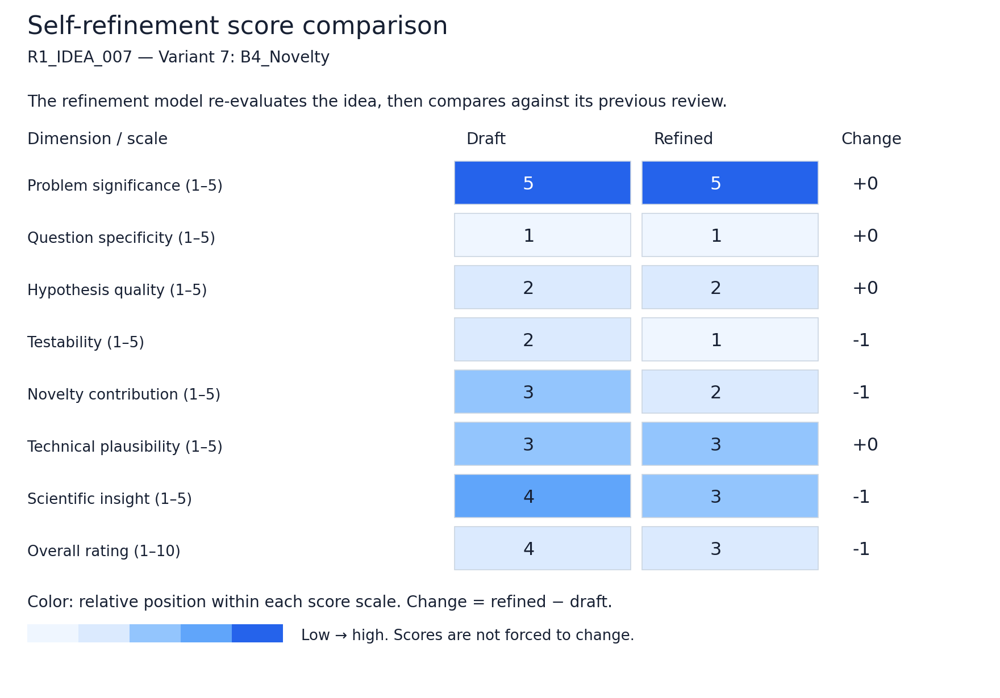

Changed score dimensions: testability, novelty_contribution, scientific_insight, overall_rating.

### Score justifications (draft / refined)

**Problem significance**

```json
{
  "draft": {
    "score": 5.0,
    "justification": "The accuracy-interpretability trade-off is a fundamental and highly significant problem in machine learning with real-world implications for healthcare, finance, and other high-stakes domains. The critique of post-hoc explanations lacking guaranteed fidelity is well-founded and important."
  },
  "refined": {
    "score": 5.0,
    "justification": "The accuracy-interpretability trade-off is a fundamental and highly significant problem in machine learning with real-world implications for healthcare, finance, and other high-stakes domains. The critique of post-hoc explanations lacking guaranteed fidelity is well-founded and important."
  }
}
```

**Question specificity**

```json
{
  "draft": {
    "score": 1.0,
    "justification": "The idea lacks a concrete research question. It states a general direction ('new direction for closing the performance gap') but doesn't specify what exactly would be investigated, tested, or compared."
  },
  "refined": {
    "score": 1.0,
    "justification": "The idea lacks a concrete research question. It states a general direction ('new direction for closing the performance gap') but doesn't specify what exactly would be investigated, tested, or compared. It's more of a vision statement than a specific research question."
  }
}
```

**Hypothesis quality**

```json
{
  "draft": {
    "score": 2.0,
    "justification": "There's an implicit hypothesis that 'built-in, faithful nonlinear feature effects' can close the performance gap between linear models and deep networks, but it's extremely vague. No specific prediction about mechanisms, performance levels, or conditions under which this would hold."
  },
  "refined": {
    "score": 2.0,
    "justification": "There's an implicit hypothesis that 'built-in, faithful nonlinear feature effects' can close the performance gap between linear models and deep networks, but it's extremely vague. No specific prediction about mechanisms, performance levels, or conditions under which this would hold. The hypothesis lacks testable specificity."
  }
}
```

**Testability**

```json
{
  "draft": {
    "score": 2.0,
    "justification": "The idea as presented is not directly testable because it doesn't specify what would be tested. However, the general direction could be made testable with concrete implementations and evaluation protocols."
  },
  "refined": {
    "score": 1.0,
    "justification": "The idea as presented is not directly testable because it doesn't specify what would be tested. There's no proposed experiment, evaluation, or comparison. While the general direction could be made testable with concrete implementations, the current formulation provides no basis for testing."
  }
}
```

**Novelty contribution**

```json
{
  "draft": {
    "score": 3.0,
    "justification": "The framing is somewhat fresh in emphasizing built-in interpretability over post-hoc methods, but the core idea of interpretable nonlinear models is not new (GAMs, rule-based models, etc.). The potential contribution depends entirely on the unspecified technical details."
  },
  "refined": {
    "score": 2.0,
    "justification": "The framing mentions a 'novel perspective' and 'fresh framing,' but without any technical details, it's impossible to assess novelty. The core concept of interpretable nonlinear models is not new (GAMs, rule-based models, etc.). The potential contribution depends entirely on unspecified technical details that might or might not be novel."
  }
}
```

**Technical plausibility**

```json
{
  "draft": {
    "score": 3.0,
    "justification": "The general direction is plausible - interpretable nonlinear models exist and can sometimes approach neural network performance on certain tasks. However, without any technical details, it's impossible to assess whether the specific approach is technically sound."
  },
  "refined": {
    "score": 3.0,
    "justification": "The general direction is plausible - interpretable nonlinear models exist and can sometimes approach neural network performance on certain tasks. However, without any technical details, it's impossible to assess whether the specific approach is technically sound. The claim of 'closing the performance gap' with deep networks is ambitious and requires justification."
  }
}
```

**Scientific insight**

```json
{
  "draft": {
    "score": 4.0,
    "justification": "If successfully developed, this research could provide significant insight into the fundamental trade-offs between model complexity, performance, and interpretability. It could reveal what types of nonlinearities are most compatible with interpretability and how much performance must be sacrificed for different levels of interpretability."
  },
  "refined": {
    "score": 3.0,
    "justification": "If successfully developed, this research could provide insight into trade-offs between model complexity, performance, and interpretability. However, the idea as stated doesn't specify what would be learned beyond 'a framework exists.' The potential insight is moderate because the idea doesn't articulate what specific scientific questions about interpretability or performance it would answer."
  }
}
```

**Overall rating**

```json
{
  "draft": {
    "score": 4.0,
    "justification": "While the problem is highly significant and the general direction is promising, the idea as presented is too vague to be considered a strong research idea. It lacks a concrete research question, specific hypothesis, and any technical details that would make it testable. It reads more like a high-level vision or motivation section than a research idea that could be directly pursued."
  },
  "refined": {
    "score": 3.0,
    "justification": "While the problem is highly significant, the idea as presented is too vague to be considered a strong research idea. It lacks a concrete research question, specific hypothesis, and any technical details that would make it testable. It reads more like a high-level vision or motivation section than a research idea that could be directly pursued. The novelty is unclear, and testability is very low."
  }
}
```

## R1_IDEA_007 — Variant 8: B5_Application_Impact


Changed score dimensions: none.

### Score justifications (draft / refined)

**Problem significance**

```json
{
  "draft": {
    "score": 5.0,
    "justification": "The accuracy-interpretability trade-off is a fundamental and highly relevant challenge in ML, especially for high-stakes applications. The critique of post-hoc explanation fidelity is well-founded and important."
  },
  "refined": {
    "score": 5.0,
    "justification": "The accuracy-interpretability trade-off is a core, persistent, and highly significant challenge in machine learning, especially for high-stakes applications in healthcare, finance, and law. The critique of post-hoc explanation fidelity is well-founded and addresses a major concern in the field."
  }
}
```

**Question specificity**

```json
{
  "draft": {
    "score": 2.0,
    "justification": "The idea is framed as a general framework ('NIMO') without a concrete research question. It states a goal ('reconcile the trade-off') but does not specify what exactly will be investigated, tested, or compared."
  },
  "refined": {
    "score": 2.0,
    "justification": "The idea is framed as a general framework ('NIMO') without a concrete research question. It states a broad goal ('reconcile the trade-off') but does not specify what specific relationship, mechanism, or comparison will be investigated. The object of study is the framework itself, not a specific hypothesis about it."
  }
}
```

**Hypothesis quality**

```json
{
  "draft": {
    "score": 2.0,
    "justification": "There is an implicit hypothesis that 'built-in nonlinear feature effects can provide faithful interpretability without sacrificing accuracy,' but it is not articulated as a testable prediction. No mechanism or condition is proposed that would differentiate success from failure."
  },
  "refined": {
    "score": 2.0,
    "justification": "There is only an implicit, high-level belief that 'built-in nonlinear feature effects can provide faithful interpretability without sacrificing accuracy.' This is not articulated as a testable prediction with measurable outcomes. No mechanism, boundary condition, or differentiating factor is proposed that would allow the hypothesis to be meaningfully supported or contradicted."
  }
}
```

**Testability**

```json
{
  "draft": {
    "score": 2.0,
    "justification": "The idea as presented lacks a clear path to validation. Without specifying how to measure 'faithful nonlinear feature effects' or what 'closing the performance gap' means quantitatively, it is difficult to design an experiment to test the claims."
  },
  "refined": {
    "score": 2.0,
    "justification": "The central claims are not currently testable as presented. There is no defined method for obtaining evidence. Without specifications for how to measure 'faithful nonlinear feature effects' or what quantitative threshold constitutes 'closing the performance gap,' one cannot design a decisive experiment or analysis."
  }
}
```

**Novelty contribution**

```json
{
  "draft": {
    "score": 4.0,
    "justification": "The concept of inherently interpretable nonlinear models is a valuable direction. If successful, it could offer a novel alternative to the dominant paradigm of post-hoc explanations for complex models."
  },
  "refined": {
    "score": 4.0,
    "justification": "The core concept—developing inherently interpretable models that are also highly performant and nonlinear—is a valuable and non-trivial research direction. Success would represent a significant contribution, offering a novel alternative to the dominant 'black-box model + post-hoc explanation' paradigm. However, the idea summary does not clarify what specifically is novel about NIMO compared to other interpretable nonlinear models (e.g., Generalized Additive Models with interactions, explainable boosting machines)."
  }
}
```

**Technical plausibility**

```json
{
  "draft": {
    "score": 3.0,
    "justification": "The idea is logically coherent—building interpretability directly into a model architecture is a plausible approach. However, without any technical details, it's unclear whether nonlinearity and full interpretability can be jointly achieved without major performance compromises."
  },
  "refined": {
    "score": 3.0,
    "justification": "The idea is logically coherent—building interpretability directly into a model architecture is a known and plausible research direction. The goal of combining nonlinearity with inherent interpretability is challenging but not inherently impossible. However, with zero technical details provided, it is impossible to assess the feasibility of the proposed 'framework.' The score reflects the neutrality of the available information."
  }
}
```

**Scientific insight**

```json
{
  "draft": {
    "score": 4.0,
    "justification": "If realized, this research could yield general insights into the relationship between model architecture, interpretability fidelity, and predictive performance, moving beyond ad-hoc explanation methods."
  },
  "refined": {
    "score": 4.0,
    "justification": "The potential for scientific insight is high. If successfully investigated, this research could yield general principles about the relationship between model architecture, the fidelity of interpretability, and predictive performance. It could reveal fundamental trade-offs or enable new architectures that bypass traditional limitations, providing insights that move beyond evaluating specific post-hoc explanation methods."
  }
}
```

**Overall rating**

```json
{
  "draft": {
    "score": 6.0,
    "justification": "The idea addresses a significant problem with a promising direction, but it is currently too vague to be considered a strong research idea. It lacks a concrete hypothesis, testable claims, and methodological specifics. With more precise formulation and an experimental plan, it could become a compelling research project."
  },
  "refined": {
    "score": 6.0,
    "justification": "The idea identifies a very significant problem and points toward a promising research direction with high potential for contribution and insight. However, as a research idea for evaluation, it is currently too vague. It lacks a concrete research question, a testable hypothesis, and any methodological direction. It is more of a motivating vision than a structured investigation. With substantial refinement to include these elements, it could become a strong (7-8) or exceptional (9-10) research idea."
  }
}
```

## R1_IDEA_007 — Variant 9: C1_Hollow_Shell

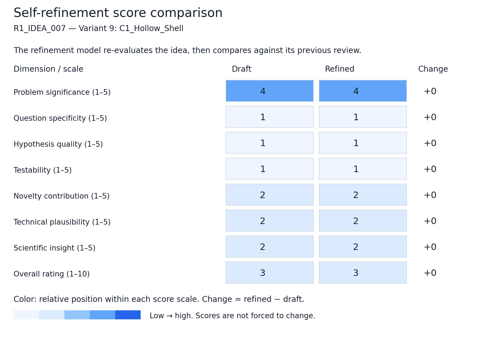

Changed score dimensions: none.

### Score justifications (draft / refined)

**Problem significance**

```json
{
  "draft": {
    "score": 4.0,
    "justification": "The performance-interpretability trade-off is a fundamental and important challenge in machine learning, especially for high-stakes applications. Addressing this has clear relevance to both research and practice."
  },
  "refined": {
    "score": 4.0,
    "justification": "The performance-interpretability trade-off is a fundamental and important challenge in machine learning, especially for high-stakes applications. Addressing this has clear relevance to both research and practice."
  }
}
```

**Question specificity**

```json
{
  "draft": {
    "score": 1.0,
    "justification": "No specific research question is articulated. The idea merely states that a framework exists/addresses a trade-off without defining what would be investigated, tested, or discovered."
  },
  "refined": {
    "score": 1.0,
    "justification": "No specific research question is articulated. The idea merely states that a framework exists/addresses a trade-off without defining what would be investigated, tested, or discovered."
  }
}
```

**Hypothesis quality**

```json
{
  "draft": {
    "score": 1.0,
    "justification": "There is no explicit or implicit hypothesis. The idea describes what the framework does ('provides integrated, reliable feature interpretations') but makes no testable prediction about outcomes, mechanisms, or comparative advantages."
  },
  "refined": {
    "score": 1.0,
    "justification": "There is no explicit or implicit hypothesis. The idea describes what the framework does but makes no testable prediction about outcomes, mechanisms, or comparative advantages."
  }
}
```

**Testability**

```json
{
  "draft": {
    "score": 1.0,
    "justification": "With no specific claims, predictions, or measurable outcomes defined, it's impossible to determine how one would test whether the framework succeeds. The description is too vague to design an experiment or evaluation."
  },
  "refined": {
    "score": 1.0,
    "justification": "With no specific claims, predictions, or measurable outcomes defined, it's impossible to determine how one would test whether the framework succeeds. The description is too vague to design any experiment or evaluation."
  }
}
```

**Novelty contribution**

```json
{
  "draft": {
    "score": 2.0,
    "justification": "The general goal of interpretable ML is well-established. Without any details about how this framework differs from existing interpretable-by-design approaches (concept bottlenecks, self-explaining models, etc.), the potential novelty is unclear."
  },
  "refined": {
    "score": 2.0,
    "justification": "The general goal of interpretable ML is well-established. Without any details about how this framework differs from existing interpretable-by-design approaches, the potential novelty is minimal and unclear."
  }
}
```

**Technical plausibility**

```json
{
  "draft": {
    "score": 2.0,
    "justification": "The idea is too underspecified to assess technical plausibility. While the goal is reasonable, the complete lack of technical details makes it impossible to evaluate whether the proposed direction is coherent or feasible."
  },
  "refined": {
    "score": 2.0,
    "justification": "The idea is too underspecified to assess technical plausibility. While the goal is reasonable, the complete lack of technical details makes it impossible to evaluate whether the proposed direction is coherent or feasible."
  }
}
```

**Scientific insight**

```json
{
  "draft": {
    "score": 2.0,
    "justification": "If successfully developed, such a framework could provide insight into the performance-interpretability trade-off. However, the current description focuses on creating a tool rather than investigating a scientific question about why the trade-off exists or how it can be mitigated."
  },
  "refined": {
    "score": 2.0,
    "justification": "If successfully developed, such a framework could provide insight into the performance-interpretability trade-off. However, the current description focuses on creating a tool rather than investigating a scientific question about why the trade-off exists or how it can be mitigated."
  }
}
```

**Overall rating**

```json
{
  "draft": {
    "score": 3.0,
    "justification": "This is a weak research idea in its current form. While it identifies an important problem, it lacks a specific research question, testable hypothesis, or any technical details. It reads more like a high-level motivation or abstract description of a desired tool rather than a research direction that can be investigated. The idea needs substantial refinement to become a meaningful research proposal."
  },
  "refined": {
    "score": 3.0,
    "justification": "This is a weak research idea in its current form. While it identifies an important problem, it lacks a specific research question, testable hypothesis, or any technical details. It reads more like a high-level motivation or abstract description of a desired tool rather than a research direction that can be investigated. The idea needs substantial refinement to become a meaningful research proposal."
  }
}
```

## R1_IDEA_007 — Variant 10: C2_Logic_Flawed

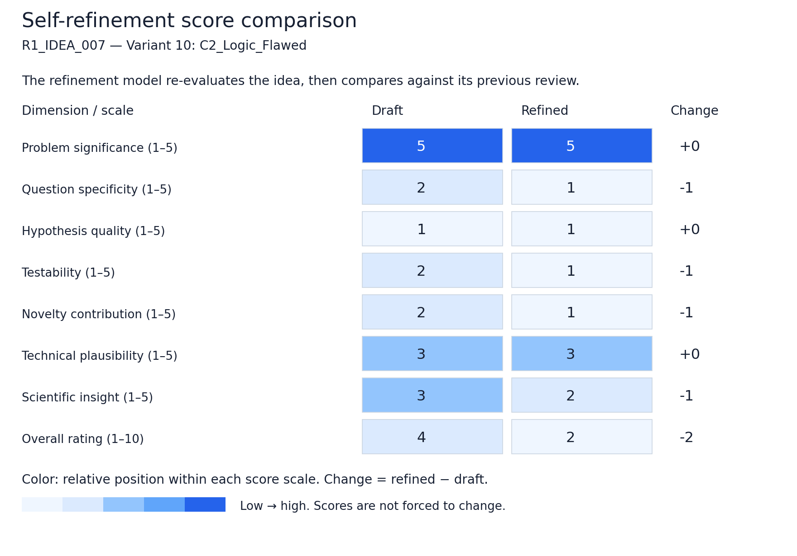

Changed score dimensions: question_specificity, testability, novelty_contribution, scientific_insight, overall_rating.

### Score justifications (draft / refined)

**Problem significance**

```json
{
  "draft": {
    "score": 5.0,
    "justification": "The accuracy-interpretability trade-off is a fundamental and highly significant challenge in machine learning, especially with the rise of complex models. Developing inherently interpretable models that do not sacrifice performance is a major research goal with substantial practical and scientific importance."
  },
  "refined": {
    "score": 5.0,
    "justification": "The accuracy-interpretability trade-off is a central, well-recognized, and highly significant challenge in machine learning. Developing models that are both high-performing and inherently interpretable has major implications for scientific discovery, safety-critical applications, and trust in AI. The problem is profoundly important."
  }
}
```

**Question specificity**

```json
{
  "draft": {
    "score": 2.0,
    "justification": "The idea summary is very vague. It states a goal ('reconcile the trade-off') and makes a claim ('broader effectiveness'), but does not define a concrete research question. What specific aspect of the trade-off is being investigated? Under what conditions? The lack of specificity makes it difficult to evaluate the core investigative focus."
  },
  "refined": {
    "score": 1.0,
    "justification": "The summary does not define a research question. It states a goal ('reconcile the trade-off') and an outcome claim ('broader effectiveness'), but there is no concrete, investigable question about a specific relationship, mechanism, or comparison. What is the actual object of study? The idea is purely declarative."
  }
}
```

**Hypothesis quality**

```json
{
  "draft": {
    "score": 1.0,
    "justification": "There is no explicit or clearly implicit hypothesis. The statement 'this suggests the framework's broader effectiveness' is an aspirational claim, not a concrete, testable prediction. A hypothesis should make a falsifiable statement about a relationship or outcome (e.g., 'Framework X will outperform method Y on metric Z under condition W')."
  },
  "refined": {
    "score": 1.0,
    "justification": "There is no hypothesis, explicit or implicit. The final sentence ('suggests the framework's broader effectiveness') is a promotional claim, not a falsifiable scientific prediction. A hypothesis would need to make a concrete, testable statement about expected model behavior, performance, or properties under defined conditions."
  }
}
```

**Testability**

```json
{
  "draft": {
    "score": 2.0,
    "justification": "The central claim ('broader effectiveness') is, in principle, testable by applying the framework to various settings. However, the idea provides no guidance on how to test it—no proposed experiments, comparisons, evaluations, or analyses are mentioned. The testability is entirely latent and dependent on unspecified future work."
  },
  "refined": {
    "score": 1.0,
    "justification": "The core claim is so vague ('broader effectiveness') and the proposed entity (NIMO) is so undefined that it provides no basis for designing a test. While one could eventually test a fully specified model, the idea itself suggests no experiments, comparisons, or evaluations. Testability is not merely latent; it is absent from the idea's formulation."
  }
}
```

**Novelty contribution**

```json
{
  "draft": {
    "score": 2.0,
    "justification": "The summary claims a new 'framework' but provides no details to assess its novelty relative to the extensive literature on interpretable machine learning (e.g., GAMs, explainable neural networks, self-explaining models). Without a description of what makes NIMO distinct, the potential contribution is unclear. It reads more like a high-level motivation than a novel research direction."
  },
  "refined": {
    "score": 1.0,
    "justification": "The idea asserts a new 'framework' but provides no information to assess novelty. Without any description of its technical approach, it is indistinguishable from a generic goal shared by decades of interpretable ML research. The potential contribution is completely unclear and unsupported."
  }
}
```

**Technical plausibility**

```json
{
  "draft": {
    "score": 3.0,
    "justification": "The goal is technically plausible—research into inherently interpretable nonlinear models is an active area. The reasoning (post-hoc explanations lack fidelity, so built-in interpretability is desirable) is logically coherent. However, with no technical details provided, it's impossible to assess the plausibility of the specific proposed approach."
  },
  "refined": {
    "score": 3.0,
    "justification": "The overarching goal is technically plausible—research into interpretable nonlinear models is an active and reasonable pursuit. The logical premise (post-hoc explanations can be unfaithful, so built-in interpretability is desirable) is sound. However, with zero technical details about NIMO, the plausibility of the specific proposal cannot be assessed; the score reflects the plausibility of the general research direction only."
  }
}
```

**Scientific insight**

```json
{
  "draft": {
    "score": 3.0,
    "justification": "If successfully realized, the framework could provide insight into how to design models that balance complexity and interpretability, potentially revealing general principles or limitations. However, the summary frames the outcome primarily as a practical tool ('broader effectiveness'), with less emphasis on generating transferable scientific knowledge about the trade-off itself."
  },
  "refined": {
    "score": 2.0,
    "justification": "If successfully realized and investigated, the work could offer insight into design principles for interpretable models. However, the summary frames the outcome purely as a practical tool ('broader effectiveness'). There is no indication that the research would aim to uncover general principles, boundary conditions, or mechanistic understanding of the accuracy-interpretability trade-off itself."
  }
}
```

**Overall rating**

```json
{
  "draft": {
    "score": 4.0,
    "justification": "The idea identifies a very significant problem but is presented at an extremely high level of abstraction. It lacks a concrete research question, a testable hypothesis, and any technical or methodological direction. It reads more like a project goal or motivation statement than a research idea. While the problem area is excellent, the idea itself is too vague to be considered strong. It falls into the 'weak idea' category due to poor specificity and undefined investigative core."
  },
  "refined": {
    "score": 2.0,
    "justification": "This is a very weak research idea. While it identifies an exceptionally important problem, the idea itself is essentially just a name (NIMO) attached to a well-known aspiration. It lacks every core component of a research idea: a specific question, a testable hypothesis, a methodological direction, and a substantiated claim to novelty. It reads as a motivational statement or project title, not as a blueprint for scientific investigation. Its weakness stems from the complete absence of an investigative core."
  }
}
```

## R1_IDEA_007 — Variant 11: C3_Substance_Enriched

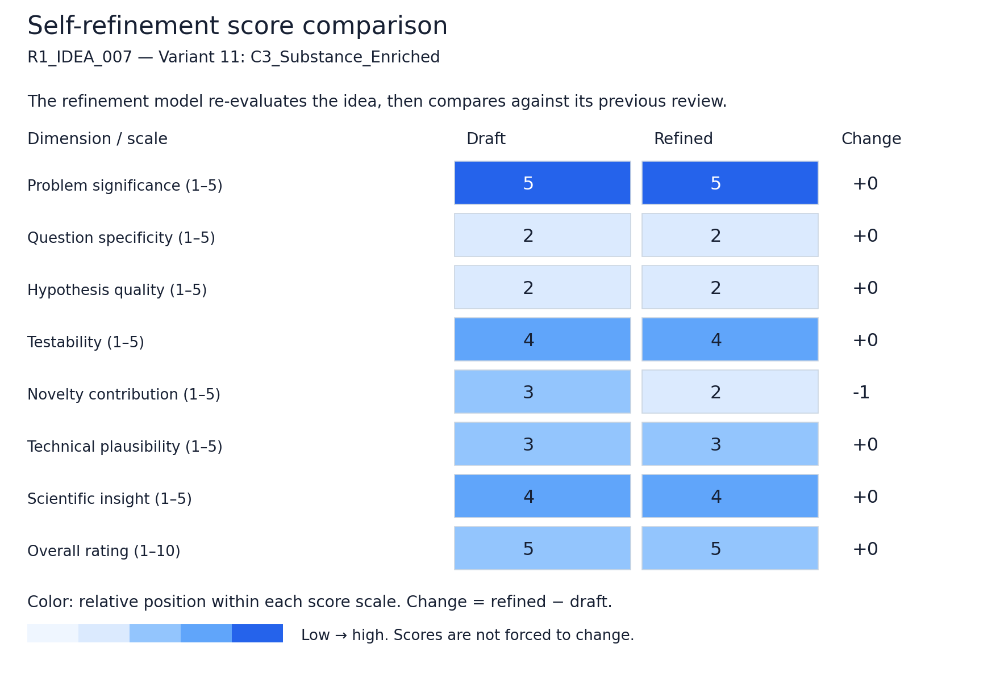

Changed score dimensions: novelty_contribution.

### Score justifications (draft / refined)

**Problem significance**

```json
{
  "draft": {
    "score": 5.0,
    "justification": "The accuracy-interpretability trade-off is a fundamental and highly relevant problem in machine learning, especially for high-stakes applications. Addressing it with inherently interpretable models that don't sacrifice performance would be a significant contribution."
  },
  "refined": {
    "score": 5.0,
    "justification": "The accuracy-interpretability trade-off is a fundamental challenge in machine learning with significant practical implications for high-stakes applications. Developing inherently interpretable models that don't sacrifice performance would be a major contribution to the field."
  }
}
```

**Question specificity**

```json
{
  "draft": {
    "score": 2.0,
    "justification": "The idea describes what NIMO 'provides' but doesn't articulate a clear research question. It lacks specificity about what exactly will be investigated beyond validating fidelity and exploring boundary conditions."
  },
  "refined": {
    "score": 2.0,
    "justification": "The idea describes what NIMO aims to provide but doesn't articulate a clear research question. It lacks specificity about what exactly will be investigated beyond validating fidelity and exploring boundary conditions. No specific mechanism, relationship, or phenomenon is identified for study."
  }
}
```

**Hypothesis quality**

```json
{
  "draft": {
    "score": 2.0,
    "justification": "While the idea mentions 'a plausible hypothesis' about validating fidelity, this is more of a validation plan than a substantive hypothesis. There's no clear predictive statement about why NIMO would succeed where other interpretable nonlinear models might fail, or what specific mechanism enables its claimed benefits."
  },
  "refined": {
    "score": 2.0,
    "justification": "While the idea mentions 'a plausible hypothesis' about validating fidelity, this is more of a validation plan than a substantive hypothesis. There's no clear predictive statement about why NIMO would succeed where other interpretable nonlinear models might fail, or what specific mechanism enables its claimed benefits. The hypothesis lacks distinguishing predictions."
  }
}
```

**Testability**

```json
{
  "draft": {
    "score": 4.0,
    "justification": "The suggested validation approaches (synthetic datasets with known ground truth, testing on specific data structures) are concrete and testable. However, without a clearer hypothesis about NIMO's advantages, the tests remain somewhat generic."
  },
  "refined": {
    "score": 4.0,
    "justification": "The suggested validation approaches are concrete and testable: using synthetic datasets with known ground truth and testing on specific data structures. These provide clear methods for obtaining evidence about fidelity and boundary conditions. However, without a clearer hypothesis about NIMO's advantages, the tests remain somewhat generic."
  }
}
```

**Novelty contribution**

```json
{
  "draft": {
    "score": 3.0,
    "justification": "The general concept of interpretable nonlinear models is not new (e.g., GAMs, rule-based models, recent interpretable neural architectures). The potential contribution depends entirely on what makes NIMO novel compared to existing approaches, which isn't specified."
  },
  "refined": {
    "score": 2.0,
    "justification": "The general concept of interpretable nonlinear models is not new (e.g., GAMs, rule-based models, recent interpretable neural architectures). Without specifying what makes NIMO novel compared to existing approaches, the potential contribution appears limited. The idea as presented seems more like an application of existing concepts than a novel research direction."
  }
}
```

**Technical plausibility**

```json
{
  "draft": {
    "score": 3.0,
    "justification": "The idea is logically coherent—building interpretability into models rather than relying on post-hoc explanations is a valid direction. However, without details about how NIMO achieves both accuracy and interpretability, it's difficult to assess technical plausibility beyond the general concept."
  },
  "refined": {
    "score": 3.0,
    "justification": "The idea is logically coherent—building interpretability into models rather than relying on post-hoc explanations is a valid direction. However, without details about how NIMO achieves both accuracy and interpretability simultaneously, it's difficult to assess technical plausibility beyond the general concept. The trade-off is known to be challenging."
  }
}
```

**Scientific insight**

```json
{
  "draft": {
    "score": 4.0,
    "justification": "If successfully developed and analyzed, NIMO could provide insights into what types of nonlinearities can remain interpretable, how to balance model complexity with interpretability, and the limits of built-in interpretability. The boundary condition exploration could reveal important limitations of interpretable models."
  },
  "refined": {
    "score": 4.0,
    "justification": "If successfully developed and analyzed, NIMO could provide insights into what types of nonlinearities can remain interpretable, how to balance model complexity with interpretability, and the limits of built-in interpretability. The boundary condition exploration could reveal important limitations of interpretable models, offering transferable scientific understanding."
  }
}
```

**Overall rating**

```json
{
  "draft": {
    "score": 5.0,
    "justification": "This is a moderate/borderline research idea. While it addresses an important problem and suggests reasonable validation approaches, it lacks specificity about what makes NIMO novel or how it differs from existing interpretable nonlinear models. The core research question is not clearly defined beyond the general goal of 'reconciling the accuracy-interpretability trade-off.' The idea needs more concrete hypotheses about the mechanisms that would enable NIMO's claimed benefits."
  },
  "refined": {
    "score": 5.0,
    "justification": "This is a moderate/borderline research idea. While it addresses an important problem and suggests reasonable validation approaches, it lacks specificity about what makes NIMO novel or how it differs from existing interpretable nonlinear models. The core research question is not clearly defined beyond the general goal of 'reconciling the accuracy-interpretability trade-off.' The idea needs more concrete hypotheses about the mechanisms that would enable NIMO's claimed benefits to be a strong research direction."
  }
}
```

## R1_IDEA_007 — Variant 12: H1_Deceptive_Hollow

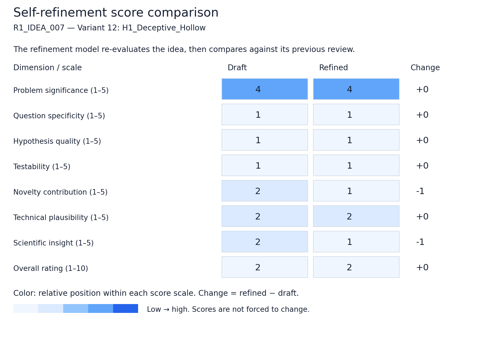

Changed score dimensions: novelty_contribution, scientific_insight.

### Score justifications (draft / refined)

**Problem significance**

```json
{
  "draft": {
    "score": 4.0,
    "justification": "The performance-interpretability trade-off is a significant and well-recognized problem in ML. Improving interpretability while maintaining performance is important for scientific applications, healthcare, finance, and other high-stakes domains. The problem itself is meaningful and worth investigating."
  },
  "refined": {
    "score": 4.0,
    "justification": "The performance-interpretability trade-off is a significant and well-recognized problem in ML. Improving interpretability while maintaining performance is important for scientific applications, healthcare, finance, and other high-stakes domains. The problem itself is meaningful and worth investigating."
  }
}
```

**Question specificity**

```json
{
  "draft": {
    "score": 1.0,
    "justification": "Extremely low specificity. The idea describes a general direction ('a research framework') but provides no concrete research question. It doesn't specify what is being investigated, what relationship is being tested, or what phenomenon is being explored. The language is abstract and positioning-focused rather than question-focused."
  },
  "refined": {
    "score": 1.0,
    "justification": "Extremely low specificity. The idea describes a general direction ('a research framework') but provides no concrete research question. It doesn't specify what is being investigated, what relationship is being tested, or what phenomenon is being explored. The language is abstract and positioning-focused rather than question-focused."
  }
}
```

**Hypothesis quality**

```json
{
  "draft": {
    "score": 1.0,
    "justification": "No hypothesis is presented, implicit or explicit. There are claims about what the framework will achieve ('integrated, reliable feature interpretations'), but these are assertions rather than testable predictions. There's no statement that could be supported or contradicted by evidence."
  },
  "refined": {
    "score": 1.0,
    "justification": "No hypothesis is presented, implicit or explicit. There are claims about what the framework will achieve ('integrated, reliable feature interpretations'), but these are assertions rather than testable predictions. There's no statement that could be supported or contradicted by evidence."
  }
}
```

**Testability**

```json
{
  "draft": {
    "score": 1.0,
    "justification": "The idea as presented is not testable. Without a concrete mechanism, method, or even a clear claim about what the framework does differently, there's nothing to test. The abstract language ('transformative synthesis,' 'field-shaping agenda') describes aspirations rather than investigable propositions."
  },
  "refined": {
    "score": 1.0,
    "justification": "The idea as presented is not testable. Without a concrete mechanism, method, or even a clear claim about what the framework does differently, there's nothing to test. The abstract language ('transformative synthesis,' 'field-shaping agenda') describes aspirations rather than investigable propositions."
  }
}
```

**Novelty contribution**

```json
{
  "draft": {
    "score": 2.0,
    "justification": "The idea claims to be novel and potentially field-shaping, but provides no evidence or reasoning to support this. The description is too vague to assess novelty - it could range from incremental to genuinely novel, but the lack of technical detail prevents meaningful evaluation. The positioning as a 'transformative synthesis' is asserted rather than justified."
  },
  "refined": {
    "score": 1.0,
    "justification": "The idea claims novelty but provides no evidence or reasoning to support this. The description is too vague to assess novelty - it could be anything from incremental to genuinely novel, but without technical detail, it's impossible to evaluate. The positioning as 'transformative' is asserted without justification."
  }
}
```

**Technical plausibility**

```json
{
  "draft": {
    "score": 2.0,
    "justification": "The reasoning is logically coherent at a very high level (addressing the interpretability-performance trade-off is worthwhile), but the proposed direction is described in such abstract terms that technical plausibility cannot be assessed. No mechanism is proposed, so there's nothing to evaluate for technical soundness."
  },
  "refined": {
    "score": 2.0,
    "justification": "The reasoning is logically coherent at a very high level (addressing the interpretability-performance trade-off is worthwhile), but the proposed direction is described in such abstract terms that technical plausibility cannot be assessed. No mechanism is proposed, so there's nothing to evaluate for technical soundness."
  }
}
```

**Scientific insight**

```json
{
  "draft": {
    "score": 2.0,
    "justification": "The idea claims potential for substantial insight but doesn't specify what would be learned. If successfully developed, such a framework could provide insights into the performance-interpretability trade-off, but the current description is too vague to assess what specific scientific understanding would be gained. The focus is on the framework's potential impact rather than what would be learned from developing or studying it."
  },
  "refined": {
    "score": 1.0,
    "justification": "The idea claims potential for substantial insight but doesn't specify what would be learned. If successfully developed, such a framework could provide insights into the performance-interpretability trade-off, but the current description is too vague to assess what specific scientific understanding would be gained. The focus is on the framework's potential impact rather than what would be learned from developing or studying it."
  }
}
```

**Overall rating**

```json
{
  "draft": {
    "score": 2.0,
    "justification": "This is a very weak research idea as presented. While it addresses an important problem (performance-interpretability trade-off), it fails to articulate a concrete research question, hypothesis, or methodological direction. The description is dominated by abstract positioning language rather than substantive technical content. Without a specific question to investigate or a testable claim, this is more of a general aspiration than a research idea. It lacks the specificity, testability, and concrete contribution potential needed for meaningful scientific investigation."
  },
  "refined": {
    "score": 2.0,
    "justification": "This is a very weak research idea as presented. While it addresses an important problem (performance-interpretability trade-off), it fails to articulate a concrete research question, hypothesis, or methodological direction. The description is dominated by abstract positioning language rather than substantive technical content. Without a specific question to investigate or a testable claim, this is more of a general aspiration than a research idea. It lacks the specificity, testability, and concrete contribution potential needed for meaningful scientific investigation."
  }
}
```

## R1_IDEA_007 — Variant 13: H2_Confident_Flaw

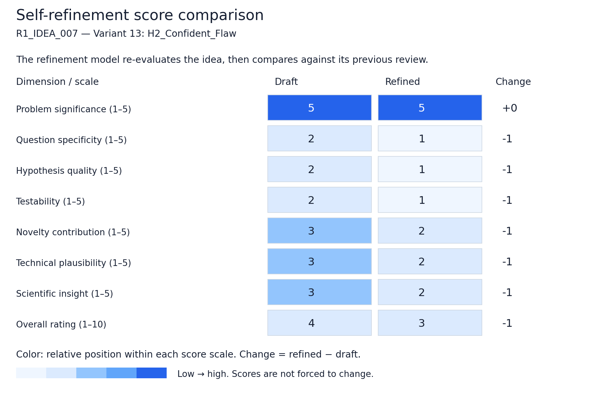

Changed score dimensions: question_specificity, hypothesis_quality, testability, novelty_contribution, technical_plausibility, scientific_insight, overall_rating.

### Score justifications (draft / refined)

**Problem significance**

```json
{
  "draft": {
    "score": 5.0,
    "justification": "The accuracy-interpretability trade-off is a fundamental and highly relevant challenge in machine learning, especially with growing demand for trustworthy AI. Addressing the fidelity gap of post-hoc explanations is a meaningful problem."
  },
  "refined": {
    "score": 5.0,
    "justification": "The accuracy-interpretability trade-off is a fundamental, well-recognized, and highly impactful challenge in machine learning. The lack of guaranteed fidelity in post-hoc explanations is a major practical and theoretical limitation. Solving this problem would be of great significance to both research and real-world applications requiring trustworthy AI."
  }
}
```

**Question specificity**

```json
{
  "draft": {
    "score": 2.0,
    "justification": "The idea states a goal but does not define a clear research question. It mentions 'broader effectiveness across various settings' without specifying what exactly will be investigated."
  },
  "refined": {
    "score": 1.0,
    "justification": "The idea does not define a research question. It states a goal ('reconcile the trade-off') and makes a broad claim of effectiveness ('broader effectiveness across various settings'), but does not specify what concrete relationship, comparison, or phenomenon is being investigated. There is no 'what will we learn?' component."
  }
}
```

**Hypothesis quality**

```json
{
  "draft": {
    "score": 2.0,
    "justification": "The implicit hypothesis is that solving the fidelity limitation will 'necessarily produce reliable improvements across the full target setting.' This is overly broad, deterministic, and lacks nuance. It does not make a concrete, falsifiable prediction about specific outcomes."
  },
  "refined": {
    "score": 1.0,
    "justification": "The implicit hypothesis is an extreme, non-falsifiable claim: solving the fidelity problem 'will necessarily produce reliable improvements across the full target setting.' This is a universal, deterministic statement that does not make a concrete, testable prediction about specific outcomes under defined conditions. It lacks the nuance required for scientific investigation."
  }
}
```

**Testability**

```json
{
  "draft": {
    "score": 2.0,
    "justification": "No evaluation approach is suggested. The idea dismisses the need to isolate confounding factors, which makes rigorous testing difficult. Without a clear experimental design, it's unclear how the claims would be validated."
  },
  "refined": {
    "score": 1.0,
    "justification": "The idea provides no direction for testing. It does not suggest experiments, comparisons, or evaluation criteria. Furthermore, it actively undermines testability by dismissing the need to isolate confounding factors ('without separately isolating dataset composition, evaluation criteria...'), which is essential for rigorous evaluation. The claims are presented as self-evident conclusions rather than propositions to be investigated."
  }
}
```

**Novelty contribution**

```json
{
  "draft": {
    "score": 3.0,
    "justification": "The goal of interpretable nonlinear models is not new. The contribution depends entirely on the unspecified technical details of NIMO. As presented, it could range from incremental to significant, but the idea summary does not clarify what is novel."
  },
  "refined": {
    "score": 2.0,
    "justification": "The goal of creating accurate, inherently interpretable nonlinear models is not novel; it is an active area of research (e.g., GAMs, NAMs, explainable boosting machines, prototype-based networks). The potential contribution hinges entirely on unspecified technical details of NIMO. As presented, the idea is a generic statement of intent with no novel component articulated."
  }
}
```

**Technical plausibility**

```json
{
  "draft": {
    "score": 3.0,
    "justification": "The general direction—building interpretability into nonlinear models—is plausible, but the summary lacks technical details to assess coherence. The claim that solving one limitation will 'necessarily' lead to general superiority is logically questionable."
  },
  "refined": {
    "score": 2.0,
    "justification": "The general concept of building interpretability into a model is plausible. However, the logical reasoning is flawed. The claim that addressing one limitation (post-hoc fidelity) will 'necessarily' lead to general superiority is an overreach and ignores other potential trade-offs (e.g., model flexibility, computational cost, scalability). The dismissal of standard experimental controls further reduces the plausibility of the proposed research approach."
  }
}
```

**Scientific insight**

```json
{
  "draft": {
    "score": 3.0,
    "justification": "If successful, the research could provide insight into how to design models that are both accurate and interpretable, potentially revealing trade-offs or principles. However, the idea as stated focuses more on a solution claim than on generating generalizable knowledge."
  },
  "refined": {
    "score": 2.0,
    "justification": "The idea is framed as a solution claim rather than an inquiry. If pursued rigorously, it could yield insights into the feasibility and design principles of high-fidelity interpretable models. However, as stated, it focuses on asserting a predetermined outcome ('general superiority') rather than on generating transferable knowledge about the relationships between model design, fidelity, accuracy, and data characteristics."
  }
}
```

**Overall rating**

```json
{
  "draft": {
    "score": 4.0,
    "justification": "The idea addresses an important problem but is presented as a solution claim rather than a research question. It lacks specificity, testability, and a clear hypothesis. The dismissal of methodological rigor is a major weakness. With refinement, it could become a strong research direction, but as presented, it is weak."
  },
  "refined": {
    "score": 3.0,
    "justification": "The idea identifies a very important problem but fails as a research proposal. It lacks a defined research question, presents a non-falsifiable hypothesis, suggests no testable methodology, and dismisses scientific rigor. It reads more as an aspirational product claim than a scientific investigation. While the core problem is significant, the proposed direction is too vague and logically flawed to constitute a moderate or strong research idea in its current form."
  }
}
```

## R1_IDEA_007 — Variant 14: H3_Verbose_Enriched

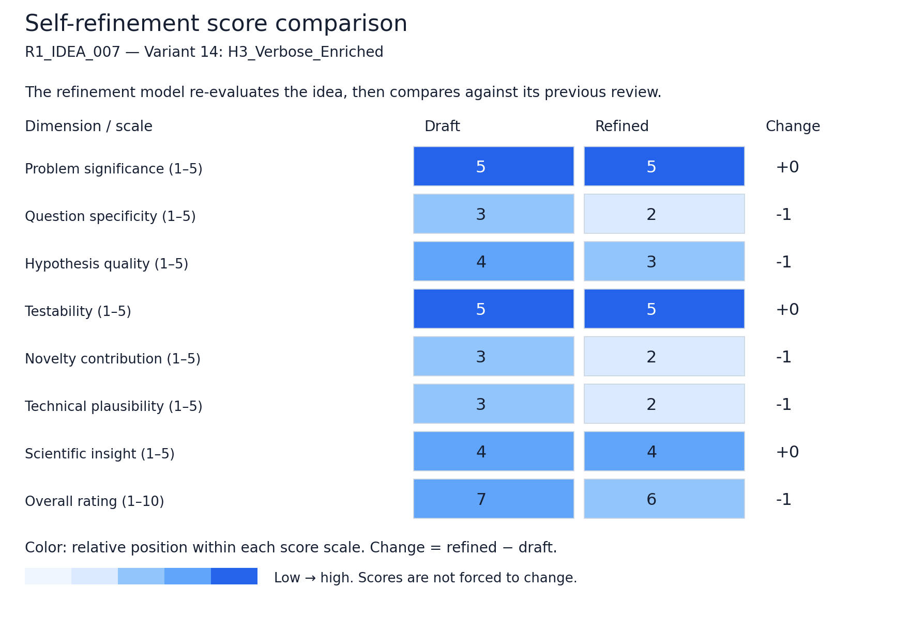

Changed score dimensions: question_specificity, hypothesis_quality, novelty_contribution, technical_plausibility, overall_rating.

### Score justifications (draft / refined)

**Problem significance**

```json
{
  "draft": {
    "score": 5.0,
    "justification": "The accuracy-interpretability trade-off is a fundamental and highly relevant challenge in ML, especially with growing demand for trustworthy AI. Proposing an inherently interpretable nonlinear model directly addresses a meaningful gap between simple linear models and opaque deep networks."
  },
  "refined": {
    "score": 5.0,
    "justification": "The accuracy-interpretability trade-off is a core, persistent challenge in machine learning with high scientific and practical relevance. Proposing an inherently interpretable nonlinear model directly addresses a meaningful gap between simple linear models and opaque deep networks, especially given known limitations of post-hoc explanations."
  }
}
```

**Question specificity**

```json
{
  "draft": {
    "score": 3.0,
    "justification": "The idea identifies a general direction (reconciling accuracy and interpretability via faithful nonlinear feature effects) but does not narrow it to a specific, testable question. The experimental plan is specific, but the core research question remains broad."
  },
  "refined": {
    "score": 2.0,
    "justification": "The idea identifies a general direction but does not define a concrete, focused research question. The statement 'reconcile the accuracy-interpretability trade-off' is broad. While the experimental plan is specific, the core question lacks precision—it does not specify what aspect of the trade-off, what mechanism, or what relationship is being investigated."
  }
}
```

**Hypothesis quality**

```json
{
  "draft": {
    "score": 4.0,
    "justification": "The idea contains an implicit hypothesis: that a nonlinear interpretable model can close the performance gap with DNNs while providing faithful explanations. It also suggests testable sub-hypotheses about fidelity on synthetic data and boundary conditions, making it concrete and falsifiable."
  },
  "refined": {
    "score": 3.0,
    "justification": "There is an implicit hypothesis that a nonlinear interpretable model can close the performance gap with DNNs while providing faithful explanations. However, this is more of a general claim than a concrete, testable prediction about a specific mechanism or relationship. The sub-hypotheses about fidelity on synthetic data and boundary conditions are better defined but remain secondary to the main claim."
  }
}
```

**Testability**

```json
{
  "draft": {
    "score": 5.0,
    "justification": "The proposed experimental design is highly detailed and testable: synthetic validation, staged comparisons, ablations, sensitivity analyses, and error analysis. This provides clear pathways to gather evidence for or against the claims."
  },
  "refined": {
    "score": 5.0,
    "justification": "The proposed experimental design is highly detailed and testable: synthetic validation with ground truth, staged comparisons, ablations, sensitivity analyses, and error analysis. This provides clear, actionable methods to gather evidence for or against the claims, even if the core model details are unspecified."
  }
}
```

**Novelty contribution**

```json
{
  "draft": {
    "score": 3.0,
    "justification": "The general goal of interpretable nonlinear modeling is not new (e.g., GAMs, explainable boosting). The potential contribution hinges on the unspecified technical approach; if NIMO offers a genuinely new mechanism for faithful nonlinear interpretability, it could be novel. As described, it is moderately novel but risks being incremental without further detail."
  },
  "refined": {
    "score": 2.0,
    "justification": "The general goal of interpretable nonlinear modeling is not novel—many existing methods (GAMs, EBMs, NAMs, rule-based models) target this space. Without any description of the technical approach, the potential contribution is unclear and risks being incremental. The novelty hinges entirely on unspecified implementation details."
  }
}
```

**Technical plausibility**

```json
{
  "draft": {
    "score": 3.0,
    "justification": "The idea is logically coherent, but without any description of how NIMO works, it is impossible to assess its technical feasibility. The assumption that one can build a model that is both highly accurate and inherently interpretable is non-trivial and may involve trade-offs not discussed."
  },
  "refined": {
    "score": 2.0,
    "justification": "The idea is logically coherent in its motivation, but with zero technical details about how NIMO works, it is impossible to assess its plausibility. The assumption that one can build a model that is both highly accurate and inherently interpretable is non-trivial and may involve significant trade-offs not discussed. The lack of any architectural or algorithmic sketch severely limits this assessment."
  }
}
```

**Scientific insight**

```json
{
  "draft": {
    "score": 4.0,
    "justification": "The proposed investigation could yield valuable insights into when and why interpretable nonlinear models succeed or fail, what data characteristics challenge fidelity, and how accuracy-interpretability trade-offs manifest in practice. The focus on boundary conditions and failure analysis is particularly promising for generating transferable knowledge."
  },
  "refined": {
    "score": 4.0,
    "justification": "The proposed investigation could yield valuable insights into the conditions under which interpretable nonlinear models succeed or fail, what data characteristics challenge fidelity, and how accuracy-interpretability trade-offs manifest in practice. The focus on boundary conditions, failure analysis, and staged evaluation is promising for generating transferable knowledge beyond a single model's performance."
  }
}
```

**Overall rating**

```json
{
  "draft": {
    "score": 7.0,
    "justification": "This is a strong research idea with a highly significant problem, a testable experimental plan, and good potential for scientific insight. The main limitations are the lack of technical details (which limits assessment of novelty and plausibility) and a somewhat broad research question. With refinement, it could become an exceptional direction."
  },
  "refined": {
    "score": 6.0,
    "justification": "This is a moderate/borderline research idea. It addresses a highly significant problem and proposes a thorough, testable experimental plan with good potential for scientific insight. However, the lack of technical details severely limits assessment of novelty and plausibility, and the research question is overly broad. The idea is reasonable but requires substantial refinement to become strong."
  }
}
```

## R1_IDEA_007 — Variant 15: H4_Ultimate_Hype

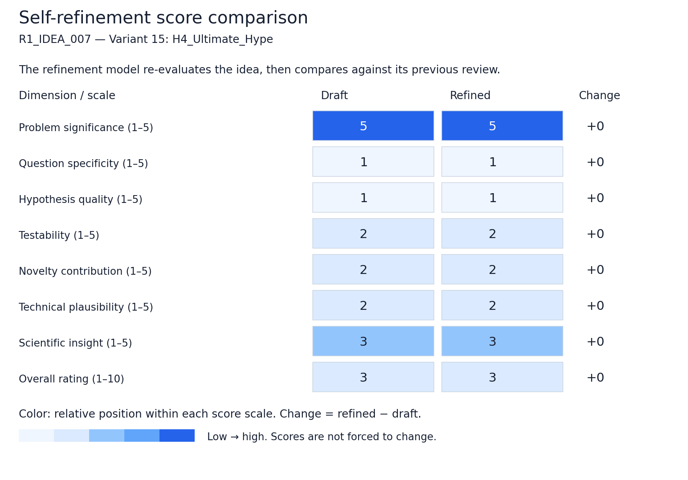

Changed score dimensions: none.

### Score justifications (draft / refined)

**Problem significance**

```json
{
  "draft": {
    "score": 5.0,
    "justification": "The accuracy-interpretability trade-off is one of the most fundamental and important problems in machine learning, with significant implications for trustworthy AI deployment in high-stakes domains. The problem is well-motivated and addressing it would have substantial impact."
  },
  "refined": {
    "score": 5.0,
    "justification": "The accuracy-interpretability trade-off is a central, persistent, and highly significant challenge in machine learning, especially for high-stakes applications. Solving or meaningfully advancing it would have substantial scientific and practical impact. The motivation is excellent."
  }
}
```

**Question specificity**

```json
{
  "draft": {
    "score": 1.0,
    "justification": "The idea lacks a specific research question. It states a general goal ('reconcile the accuracy-interpretability trade-off') but doesn't specify what aspect of this problem will be investigated, what hypothesis will be tested, or what specific mechanism will be explored."
  },
  "refined": {
    "score": 1.0,
    "justification": "The idea lacks a defined research question. It states a broad goal ('reconcile the trade-off') and a proposed solution name ('NIMO'), but does not specify what is being investigated. There is no 'what', 'why', or 'how' question to guide the research."
  }
}
```

**Hypothesis quality**

```json
{
  "draft": {
    "score": 1.0,
    "justification": "There is no explicit or implicit hypothesis. The text makes claims about what NIMO 'could' do and 'aims to' do, but doesn't make any testable predictions about relationships, mechanisms, or outcomes. It's more of a vision statement than a hypothesis."
  },
  "refined": {
    "score": 1.0,
    "justification": "There is no testable hypothesis. The text contains promotional language ('could redefine', 'transformative agenda') and statements of intent ('aims to'), but no concrete, falsifiable prediction about a relationship, mechanism, or comparative outcome. It is a vision statement, not a hypothesis."
  }
}
```

**Testability**

```json
{
  "draft": {
    "score": 2.0,
    "justification": "While the general problem is testable (one could compare accuracy and interpretability metrics), the specific proposal lacks enough detail to design meaningful tests. Without knowing what NIMO is, it's impossible to specify how one would test whether it achieves its goals."
  },
  "refined": {
    "score": 2.0,
    "justification": "The general problem area is testable, but the specific proposal is not. Without any description of what NIMO is, one cannot design an experiment to test its claims. The idea suggests a direction ('built-in nonlinear feature effects') that could be made testable, but in its current form, it is not."
  }
}
```

**Novelty contribution**

```json
{
  "draft": {
    "score": 2.0,
    "justification": "The idea of creating inherently interpretable nonlinear models is not novel - Generalized Additive Models (GAMs) and their extensions have existed for decades. The contribution is unclear without specifying what technical innovation NIMO would introduce beyond existing interpretable nonlinear models."
  },
  "refined": {
    "score": 2.0,
    "justification": "The core concept of an inherently interpretable nonlinear model is not novel; it is the foundation of well-established model classes like Generalized Additive Models (GAMs). The contribution is entirely dependent on an unspecified technical innovation. Without defining what NIMO is, its novelty cannot be assessed and is likely low."
  }
}
```

**Technical plausibility**

```json
{
  "draft": {
    "score": 2.0,
    "justification": "The idea is too vague to assess technical plausibility. While the goal of combining nonlinearity with interpretability is theoretically possible (as demonstrated by GAMs and other models), the description provides no technical details about how NIMO would achieve this, what trade-offs it might involve, or why it would succeed where other approaches have limitations."
  },
  "refined": {
    "score": 2.0,
    "justification": "The idea is too vague to evaluate technical plausibility. The goal is plausible in principle (nonlinear interpretable models exist), but the description provides zero technical details about how NIMO would work, what assumptions it makes, or why it would overcome known limitations. Therefore, it cannot be judged as technically plausible or implausible."
  }
}
```

**Scientific insight**

```json
{
  "draft": {
    "score": 3.0,
    "justification": "If successfully realized, the research could provide insights into the fundamental limits of the accuracy-interpretability trade-off and potentially reveal new architectural principles for interpretable models. However, without more specificity, it's unclear what scientific insights beyond 'a new model works well' would emerge."
  },
  "refined": {
    "score": 3.0,
    "justification": "If successfully realized, research in this direction could yield insights into the fundamental limits of the accuracy-interpretability Pareto frontier and potentially new principles for model design. However, the idea as presented promises a 'framework' and 'breakthroughs' without specifying what scientific understanding would be gained beyond the performance of a new model. The potential is moderate but unrealized."
  }
}
```

**Overall rating**

```json
{
  "draft": {
    "score": 3.0,
    "justification": "This is a weak research idea as presented. While it addresses an important problem, it lacks the specificity needed for meaningful scientific investigation. There is no concrete research question, hypothesis, or technical direction - only a vision statement about what 'could' be achieved. The idea needs substantial refinement to become a testable research proposal."
  },
  "refined": {
    "score": 3.0,
    "justification": "This is a weak research idea as presented. It identifies a highly significant problem but fails to formulate a research question, hypothesis, or testable proposal. It is a promotional vision statement lacking the specificity required for scientific investigation. The scores reflect this: high significance (5) is dragged down by very low specificity (1), hypothesis quality (1), and testability (2), with novelty and plausibility being unassessable. It requires substantial refinement to become a viable research direction."
  }
}
```

## R1_IDEA_008 — Source

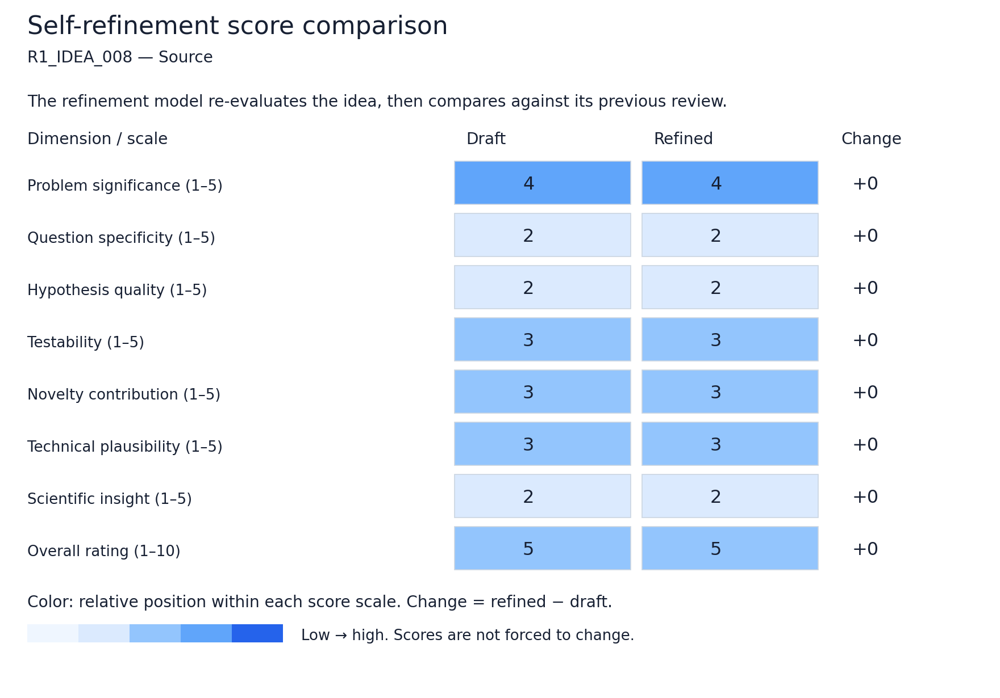

Changed score dimensions: none.

### Score justifications (draft / refined)

**Problem significance**

```json
{
  "draft": {
    "score": 4.0,
    "justification": "The problem is significant. Bimanual non-prehensile manipulation in unstructured settings is a core challenge in robotics with practical importance. Moving beyond restrictive assumptions like environmental supports (walls/edges) addresses a major limitation in prior work, aiming for more general and capable manipulation."
  },
  "refined": {
    "score": 4.0,
    "justification": "The problem is significant. Bimanual non-prehensile manipulation in unstructured settings is a core, challenging problem in robotics with practical importance for real-world applications. Moving beyond restrictive assumptions like environmental supports (walls/edges) addresses a major limitation in prior work and aims for more general and capable manipulation systems."
  }
}
```

**Question specificity**

```json
{
  "draft": {
    "score": 2.0,
    "justification": "The research question is only broadly implied ('can we develop generalizable bimanual primitives?'). It lacks specificity regarding what aspect of the problem is being investigated (e.g., the value of a specific decomposition, the role of dual-arm coordination, the failure modes of RL). The scope of actions is specified, but the core investigative focus is not."
  },
  "refined": {
    "score": 2.0,
    "justification": "The research question is only broadly implied ('can we develop generalizable bimanual primitives?'). It lacks specificity regarding what aspect of the problem is being investigated—e.g., the value of a specific decomposition, the role of dual-arm coordination, or the failure modes of alternative approaches. The scope of actions is specified, but the core investigative focus is not defined."
  }
}
```

**Hypothesis quality**

```json
{
  "draft": {
    "score": 2.0,
    "justification": "There is no explicit or clearly implicit hypothesis. The idea states a goal (develop primitives using a paradigm) but does not make a concrete, testable prediction about relationships, mechanisms, or comparative performance. It is more of a proposed direction than a hypothesis."
  },
  "refined": {
    "score": 2.0,
    "justification": "There is no explicit or clearly implicit hypothesis. The idea states a goal (develop primitives using a paradigm) but does not make a concrete, testable prediction about relationships, mechanisms, or comparative performance. It is more of a proposed engineering direction than a scientific hypothesis."
  }
}
```

**Testability**

```json
{
  "draft": {
    "score": 3.0,
    "justification": "The idea is testable in principle—one could implement a system and evaluate it. However, without a defined hypothesis or clearer methodological direction, it's unclear what specific claim would be tested. The evaluation of 'transferable primitives' suggests comparative experiments across object categories are possible, providing a path to testability."
  },
  "refined": {
    "score": 3.0,
    "justification": "The idea is testable in principle—one could implement a system and evaluate its performance. The mention of 'transferable primitives' suggests comparative experiments across object categories could be designed. However, without a defined hypothesis or methodological details, it is unclear what specific claim would be tested, making testability moderate at best."
  }
}
```

**Novelty contribution**

```json
{
  "draft": {
    "score": 3.0,
    "justification": "The combination of bimanual, non-prehensile, and assumption-free manipulation is a non-trivial and relatively under-explored niche, suggesting potential novelty. However, the contribution is currently framed as building a system. The potential for a novel scientific contribution (e.g., new understanding of bimanual contact planning) is present but not articulated."
  },
  "refined": {
    "score": 3.0,
    "justification": "The combination of bimanual, non-prehensile, and assumption-free manipulation is a non-trivial and relatively underexplored niche, suggesting potential novelty. However, the contribution is currently framed as building a system or method. The potential for a novel scientific contribution (e.g., new understanding of bimanual contact planning) is present but not articulated, limiting the score."
  }
}
```

**Technical plausibility**

```json
{
  "draft": {
    "score": 3.0,
    "justification": "The stated goal is technically ambitious but plausible given advances in contact modeling and planning. The major caveat is that the central technical proposal (the three-stage, RL-free paradigm) is completely unspecified, making it impossible to assess its internal coherence or feasibility. The reasoning to move beyond restrictive assumptions is logically sound."
  },
  "refined": {
    "score": 3.0,
    "justification": "The stated goal is technically ambitious but plausible given advances in contact modeling, planning, and control. The major caveat is that the central technical proposal (the three-stage, RL-free paradigm) is completely unspecified, making it impossible to assess its internal coherence or feasibility. The reasoning to move beyond restrictive assumptions is logically sound, but the core method is unknown."
  }
}
```

**Scientific insight**

```json
{
  "draft": {
    "score": 2.0,
    "justification": "The idea currently promises a capability (generalizable primitives) more than a specific scientific insight. The potential for insight exists—e.g., into the structure of bimanual contact problems or the trade-offs between RL and structured planning for manipulation—but this is not highlighted or framed as a primary outcome."
  },
  "refined": {
    "score": 2.0,
    "justification": "The idea currently promises a capability (generalizable primitives) more than a specific scientific insight. The potential for insight exists—e.g., into the structure of bimanual contact problems or the trade-offs between RL and structured planning for manipulation—but this is not highlighted or framed as a primary outcome. The focus appears primarily on system development."
  }
}
```

**Overall rating**

```json
{
  "draft": {
    "score": 5.0,
    "justification": "This is a moderate/borderline research idea. It identifies a meaningful and challenging problem in robotics and proposes a direction that moves beyond common simplifications. Its main weakness is the lack of a concrete research question or hypothesis, and the complete absence of detail on the proposed 'three-stage, RL-free paradigm,' which is the core of the idea. This makes the idea vague and its scientific contribution unclear. It has a reasonable foundation but requires significant sharpening to become a strong research proposal."
  },
  "refined": {
    "score": 5.0,
    "justification": "This is a moderate/borderline research idea. It identifies a meaningful and challenging problem in robotics and proposes a direction that moves beyond common simplifications, which is a good starting point. However, its main weaknesses are the lack of a concrete research question or hypothesis, and the complete absence of detail on the proposed 'three-stage, RL-free paradigm,' which is the core of the idea. This makes the idea vague and its scientific contribution unclear. It has a reasonable foundation but requires significant sharpening to become a strong research proposal."
  }
}
```

## R1_IDEA_008 — Variant 1: A1_Identity

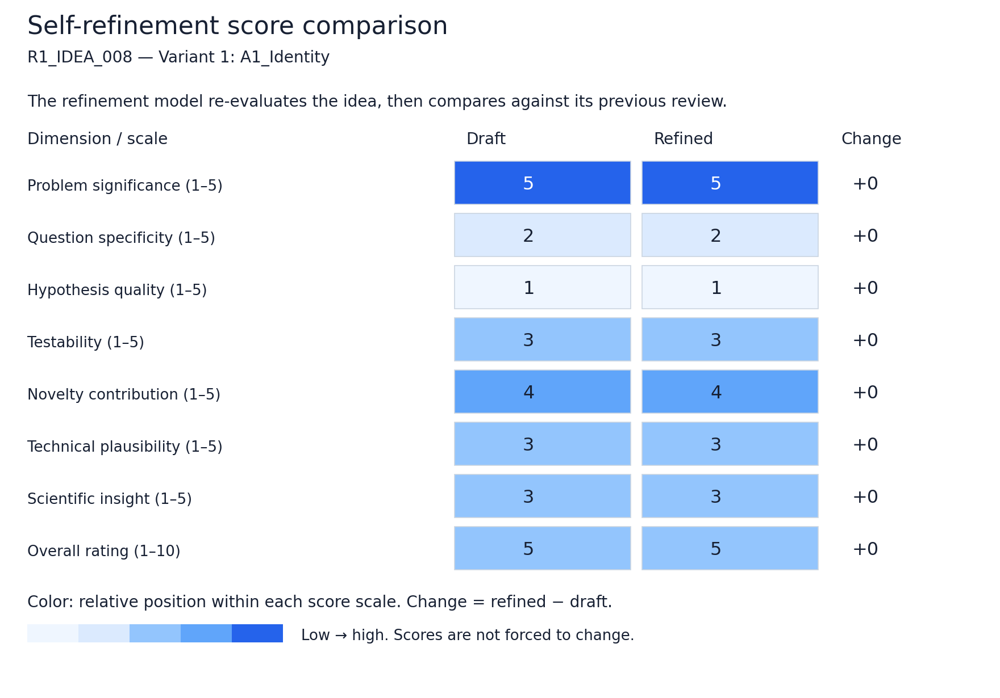

Changed score dimensions: none.

### Score justifications (draft / refined)

**Problem significance**

```json
{
  "draft": {
    "score": 5.0,
    "justification": "The problem is highly significant. Category-level non-prehensile manipulation is a core challenge in robotics for real-world deployment. Moving beyond single-arm setups and restrictive environmental assumptions (walls/edges) addresses a major limitation in prior work and targets a more general and useful capability."
  },
  "refined": {
    "score": 5.0,
    "justification": "The problem is exceptionally significant. Category-level non-prehensile manipulation is a fundamental challenge for real-world robotics deployment. Moving beyond single-arm setups and restrictive environmental assumptions (walls/edges) addresses major limitations in current manipulation research and targets a more general, useful capability for unstructured environments."
  }
}
```

**Question specificity**

```json
{
  "draft": {
    "score": 2.0,
    "justification": "The idea describes a development goal but does not define a clear research question. It states what will be built (primitives using a paradigm) but not what will be investigated, tested, or understood. The 'what' is clear, but the 'why' or 'what question does this answer?' is missing."
  },
  "refined": {
    "score": 2.0,
    "justification": "The idea describes a development goal but does not define a research question. It specifies what will be built (bimanual primitives using a three-stage paradigm) but not what will be investigated, tested, or understood. There is no clear inquiry beyond implementation."
  }
}
```

**Hypothesis quality**

```json
{
  "draft": {
    "score": 1.0,
    "justification": "There is no explicit or clearly implicit hypothesis. The idea presents a proposed approach without a testable prediction about its outcomes, mechanisms, or advantages. It lacks a statement that could be supported or contradicted by evidence."
  },
  "refined": {
    "score": 1.0,
    "justification": "There is no hypothesis - explicit or implicit. The idea presents a proposed approach without any testable prediction about its outcomes, mechanisms, or advantages. It lacks any statement that could be supported or contradicted by evidence."
  }
}
```

**Testability**

```json
{
  "draft": {
    "score": 3.0,
    "justification": "The idea is testable in principle because one could implement the system and evaluate its performance. However, without a defined hypothesis or specific comparative question, it's unclear what exactly would be tested. The evaluation would likely default to a demonstration of capability rather than a focused investigation."
  },
  "refined": {
    "score": 3.0,
    "justification": "The idea is testable in the broad sense that one could implement the system and evaluate its performance. However, without a defined hypothesis or specific comparative question, testing would default to capability demonstration rather than focused investigation. The evaluation framework is implied but not specified."
  }
}
```

**Novelty contribution**

```json
{
  "draft": {
    "score": 4.0,
    "justification": "The combination of bimanual, category-level, non-prehensile manipulation with an RL-free, multi-stage paradigm is novel and has clear potential for contribution. It moves beyond common assumptions and suggests a different technical pathway. The contribution would be primarily methodological if successfully realized."
  },
  "refined": {
    "score": 4.0,
    "justification": "The combination of bimanual, category-level, non-prehensile manipulation with an RL-free, multi-stage paradigm represents a novel direction with clear potential for methodological contribution. It moves beyond common assumptions in manipulation research and suggests a different technical pathway that could advance the field."
  }
}
```

**Technical plausibility**

```json
{
  "draft": {
    "score": 3.0,
    "justification": "The idea is logically coherent and targets a plausible direction. The claim that dual-arm configurations can provide more general manipulation without environmental support is reasonable. However, the lack of detail on the 'three-stage, RL-free paradigm' makes it difficult to assess its technical soundness. No major red flags are present, but the central mechanism is underspecified."
  },
  "refined": {
    "score": 3.0,
    "justification": "The core concept - that dual-arm configurations can enable more general non-prehensile manipulation without environmental support - is logically coherent and plausible. However, the central technical mechanism (the three-stage, RL-free paradigm) is completely unspecified, making it impossible to assess its soundness. No technical contradictions are present, but the approach is too vague for proper evaluation."
  }
}
```

**Scientific insight**

```json
{
  "draft": {
    "score": 3.0,
    "justification": "If successful, the work could provide insight into the role of bimanual coordination for non-prehensile manipulation and the effectiveness of structured, non-RL paradigms for learning such skills. However, the idea as stated focuses on building a system. The potential for broader scientific insight (e.g., principles of bimanual interaction, limits of generalization) is present but not explicitly targeted by the description."
  },
  "refined": {
    "score": 3.0,
    "justification": "If successfully investigated, this work could provide insight into the role of bimanual coordination for non-prehensile manipulation and the effectiveness of structured, non-RL paradigms for learning contact-rich skills. However, the idea as stated focuses on building a system rather than seeking scientific understanding. The potential for broader insight exists but is not explicitly targeted."
  }
}
```

**Overall rating**

```json
{
  "draft": {
    "score": 5.0,
    "justification": "This is a moderate/borderline research idea. It addresses a very significant and timely problem in robotics with a novel combination of elements (bimanual, category-level, non-prehensile, RL-free). However, it is currently framed as a development project rather than a research investigation. It lacks a clear research question, a testable hypothesis, and a specification of what scientific knowledge it aims to produce. The core promise is in the problem and the proposed technical direction, but the idea needs refinement to become a strong research proposal."
  },
  "refined": {
    "score": 5.0,
    "justification": "This is a moderate/borderline research idea. It addresses a highly significant problem in robotics with a novel combination of elements, but it is currently framed as an engineering project rather than a scientific investigation. The complete absence of a research question and hypothesis severely limits its value as a research idea. While the problem significance and novelty are strong, the lack of scientific framing, testable claims, and methodological specificity prevents it from being a strong research proposal. It needs substantial refinement to become a focused research investigation."
  }
}
```

## R1_IDEA_008 — Variant 2: A2_Paraphrase_Only

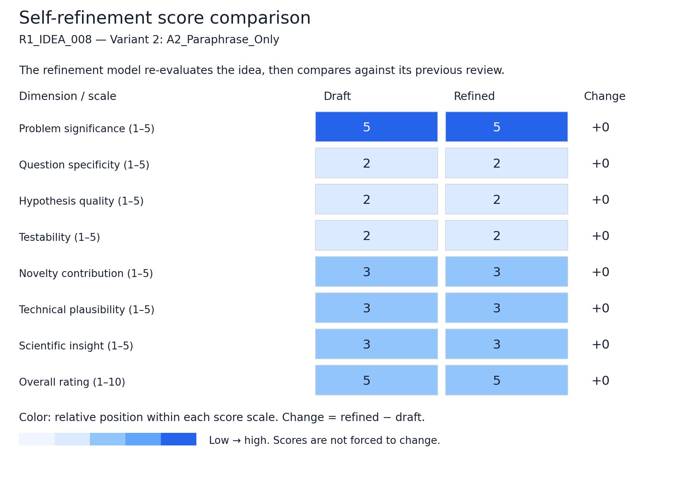

Changed score dimensions: none.

### Score justifications (draft / refined)

**Problem significance**

```json
{
  "draft": {
    "score": 5.0,
    "justification": "The problem is highly significant. Bimanual non-prehensile manipulation without relying on environmental constraints is a fundamental and challenging problem in robotics with clear real-world applications. Advancing beyond single-arm or environment-assisted setups addresses an important gap."
  },
  "refined": {
    "score": 5.0,
    "justification": "The problem is highly significant. Bimanual non-prehensile manipulation without relying on environmental constraints is a fundamental and challenging problem in robotics with clear real-world applications. Advancing beyond single-arm or environment-assisted setups addresses an important gap in manipulation capabilities."
  }
}
```

**Question specificity**

```json
{
  "draft": {
    "score": 2.0,
    "justification": "The idea summary describes a goal and a methodological label ('three-stage, RL-free paradigm') but does not articulate a specific research question. It's unclear what exactly is being investigated beyond building a system for a task."
  },
  "refined": {
    "score": 2.0,
    "justification": "The idea summary describes a goal ('learn category-level bimanual non-prehensile manipulation primitives') and a methodological label ('three-stage, RL-free paradigm') but does not articulate a specific research question. It's unclear what exactly is being investigated beyond building a system for a task. There is no concrete question about mechanisms, relationships, or comparative advantages."
  }
}
```

**Hypothesis quality**

```json
{
  "draft": {
    "score": 2.0,
    "justification": "There is no explicit or clearly implicit hypothesis. The summary suggests that a three-stage RL-free paradigm can learn generalizable primitives, but this is more of a goal statement than a testable prediction about a mechanism, relationship, or comparative advantage."
  },
  "refined": {
    "score": 2.0,
    "justification": "There is no explicit or clearly implicit hypothesis. The summary states that the approach 'advances beyond' certain configurations and 'avoids restrictive assumptions,' but this is more of a goal statement than a testable prediction. There is no concrete claim about why this paradigm would succeed or what specific advantage it offers that could be supported or contradicted by evidence."
  }
}
```

**Testability**

```json
{
  "draft": {
    "score": 2.0,
    "justification": "While the end goal (learning primitives) is testable in principle, the idea summary provides no indication of how the central claim would be evaluated. No experiments, comparisons, or evaluation metrics are suggested."
  },
  "refined": {
    "score": 2.0,
    "justification": "While the end goal (learning primitives) is testable in principle, the idea summary provides no indication of how the central claim would be evaluated. No experiments, comparisons, evaluation metrics, or analysis methods are suggested. The claim about being 'RL-free' and 'generalizable' is not connected to any proposed test."
  }
}
```

**Novelty contribution**

```json
{
  "draft": {
    "score": 3.0,
    "justification": "The focus on bimanual non-prehensile manipulation without environmental aids is a meaningful direction. However, the novelty of the proposed 'three-stage, RL-free paradigm' is unclear without details. It could range from a modest integration of existing techniques to a genuinely novel framework."
  },
  "refined": {
    "score": 3.0,
    "justification": "The focus on bimanual non-prehensile manipulation without environmental aids is a meaningful direction that extends beyond single-arm or environment-assisted setups. However, the novelty of the proposed 'three-stage, RL-free paradigm' is unclear without details. It could range from a modest integration of existing techniques to a genuinely novel framework. The contribution is potentially moderate but unspecified."
  }
}
```

**Technical plausibility**

```json
{
  "draft": {
    "score": 3.0,
    "justification": "The general direction is plausible—structured approaches to complex manipulation exist. However, the lack of any technical detail about the stages or the alternative to RL makes it impossible to assess the coherence or feasibility of the specific proposal."
  },
  "refined": {
    "score": 3.0,
    "justification": "The general direction is plausible—structured approaches to complex manipulation exist. However, the lack of any technical detail about the stages or the alternative to RL makes it impossible to assess the coherence or feasibility of the specific proposal. The reasoning is logically coherent at a high level but too vague to evaluate technically."
  }
}
```

**Scientific insight**

```json
{
  "draft": {
    "score": 3.0,
    "justification": "If successful, the work could provide insight into how to structure learning for complex bimanual contact tasks. However, the summary does not emphasize understanding mechanisms, principles, or limitations; it focuses on achieving a capability. The potential for broader scientific insight is moderate and depends on the eventual analysis."
  },
  "refined": {
    "score": 3.0,
    "justification": "If successful, the work could provide insight into how to structure learning for complex bimanual contact tasks. However, the summary does not emphasize understanding mechanisms, principles, or limitations; it focuses on achieving a capability. The potential for broader scientific insight is moderate and depends heavily on what is eventually studied and analyzed."
  }
}
```

**Overall rating**

```json
{
  "draft": {
    "score": 5.0,
    "justification": "This is a moderate/borderline research idea. It identifies a significant and worthwhile problem in robotics. However, as presented, it is more of a high-level goal statement than a research idea with a clear question, hypothesis, or testable direction. The lack of specificity in the research question and the absence of a discernible hypothesis limit its strength as a scientific proposal. With refinement—articulating a specific hypothesis, comparison, and evaluation plan—it could become a strong idea."
  },
  "refined": {
    "score": 5.0,
    "justification": "This is a moderate/borderline research idea. It identifies a significant and worthwhile problem in robotics. However, as presented, it is more of a high-level goal statement than a research idea with a clear question, hypothesis, or testable direction. The lack of specificity in the research question and the absence of a discernible hypothesis limit its strength as a scientific proposal. With refinement—articulating a specific hypothesis, comparison, and evaluation plan—it could become a strong idea."
  }
}
```

## R1_IDEA_008 — Variant 3: A3_Plain_Core


Changed score dimensions: question_specificity.

### Score justifications (draft / refined)

**Problem significance**

```json
{
  "draft": {
    "score": 4.0,
    "justification": "The problem is significant. Bimanual non-prehensile manipulation without environmental support is a core, unsolved challenge in robotics with clear practical applications. Moving beyond single-arm and externally-assisted setups addresses a meaningful gap."
  },
  "refined": {
    "score": 4.0,
    "justification": "The problem is significant. Bimanual non-prehensile manipulation without environmental support is a core, challenging problem in robotics with clear practical importance. Addressing the gap beyond single-arm and externally-assisted setups is meaningful."
  }
}
```

**Question specificity**

```json
{
  "draft": {
    "score": 2.0,
    "justification": "Weak. The idea describes a proposed method but does not define a clear research question. It states what will be built ('develop...primitives') but not what will be investigated or learned from the endeavor."
  },
  "refined": {
    "score": 1.0,
    "justification": "Very weak. The idea does not define a research question. It only states an intention to 'develop' a method. There is no specification of what relationship, phenomenon, or comparison is being investigated."
  }
}
```

**Hypothesis quality**

```json
{
  "draft": {
    "score": 1.0,
    "justification": "Very weak. No hypothesis is presented. There is no explicit or implicit prediction about relationships, mechanisms, or expected outcomes that could be tested. The idea is presented as a proposed solution, not a testable claim."
  },
  "refined": {
    "score": 1.0,
    "justification": "Very weak. No hypothesis is present, either explicit or implicit. There is no concrete prediction about a mechanism, relationship, or expected outcome that could be supported or contradicted by evidence."
  }
}
```

**Testability**

```json
{
  "draft": {
    "score": 2.0,
    "justification": "Weak. While the end goal (developing primitives) is testable in principle, the lack of a specific question or hypothesis makes it unclear what the central testable claim is. The description is too vague to suggest a clear experimental or evaluative path."
  },
  "refined": {
    "score": 2.0,
    "justification": "Weak. The final goal of 'developing primitives' is testable in a broad sense (e.g., does it work?), but the lack of a specific research question or hypothesis means there is no central, focused claim to test. The vagueness of the proposal makes it unclear what constitutes a meaningful test."
  }
}
```

**Novelty contribution**

```json
{
  "draft": {
    "score": 3.0,
    "justification": "Moderate. The combination of focus areas (bimanual, non-prehensile, category-level, RL-free) has potential novelty. However, without more detail, it's unclear if this is a genuinely new paradigm or an incremental combination of existing ideas. The contribution is ambiguous."
  },
  "refined": {
    "score": 3.0,
    "justification": "Moderate. The combination of focus areas (bimanual, non-prehensile, category-level, RL-free) suggests potential novelty. However, without detail, it is ambiguous whether this represents a new paradigm, an incremental combination, or an application. The contribution is not defined."
  }
}
```

**Technical plausibility**

```json
{
  "draft": {
    "score": 2.0,
    "justification": "Weak. The core terms ('three-stage paradigm', 'generalizable dual-arm configurations') are undefined, making it impossible to assess logical coherence or plausibility. The idea rests on unspecified technical components."
  },
  "refined": {
    "score": 2.0,
    "justification": "Weak. The core technical concepts ('three-stage paradigm', 'generalizable dual-arm configurations') are completely undefined. It is therefore impossible to assess logical coherence, plausibility of the mechanism, or reasonableness of assumptions. The idea lacks the minimal technical grounding needed for evaluation."
  }
}
```

**Scientific insight**

```json
{
  "draft": {
    "score": 3.0,
    "justification": "Moderate. If successful, the work could provide insight into the decomposition of complex bimanual manipulation and what makes primitives transferable. However, the current description is solution-oriented ('develop a method') rather than insight-oriented, so the potential for fundamental understanding is unclear."
  },
  "refined": {
    "score": 3.0,
    "justification": "Moderate. If successfully investigated with a scientific lens, the work could yield insights into the decomposition of complex bimanual manipulation or the factors enabling transferable primitives. However, the current description is purely solution-oriented ('build this'), so the potential for generating fundamental, transferable understanding is unclear and contingent on reframing the idea."
  }
}
```

**Overall rating**

```json
{
  "draft": {
    "score": 4.0,
    "justification": "The idea identifies a significant and relevant problem in robotics. However, it is currently a proposal for a method, not a research idea with a defined question or hypothesis. It lacks specificity, a testable core, and technical grounding. It has the seeds of a good project (the problem area) but does not yet articulate a scientific investigation."
  },
  "refined": {
    "score": 4.0,
    "justification": "The idea identifies a significant and relevant problem area in robotics. However, it is not yet a research idea; it is a proposal for a method or system to be built. It critically lacks a defined research question, a testable hypothesis, and any technical specificity. While the problem space is promising, the idea itself does not articulate a scientific investigation. It is a weak research idea but points to a potentially strong research area."
  }
}
```

## R1_IDEA_008 — Variant 4: B1_Verbose_Elaborate


Changed score dimensions: none.

### Score justifications (draft / refined)

**Problem significance**

```json
{
  "draft": {
    "score": 4.0,
    "justification": "The problem is meaningful: bimanual non-prehensile manipulation is an underexplored and practically important challenge in robotics. Moving beyond single-arm setups and restrictive external dexterity assumptions addresses clear limitations in current research."
  },
  "refined": {
    "score": 4.0,
    "justification": "The problem is meaningful: bimanual non-prehensile manipulation is an underexplored and practically important challenge in robotics. Moving beyond single-arm setups and restrictive external dexterity assumptions addresses clear limitations in current research."
  }
}
```

**Question specificity**

```json
{
  "draft": {
    "score": 2.0,
    "justification": "The idea describes a general direction but does not define a concrete research question. It states what will be done (develop primitives via a three-stage paradigm) but not what will be investigated or learned."
  },
  "refined": {
    "score": 2.0,
    "justification": "The idea describes a general direction but does not define a concrete research question. It states what will be done (develop primitives via a three-stage paradigm) but not what will be investigated or learned."
  }
}
```

**Hypothesis quality**

```json
{
  "draft": {
    "score": 1.0,
    "justification": "No hypothesis is presented. The idea is descriptive rather than predictive. It does not make a claim that could be supported or contradicted by evidence."
  },
  "refined": {
    "score": 1.0,
    "justification": "No hypothesis is presented. The idea is descriptive rather than predictive. It does not make a claim that could be supported or contradicted by evidence."
  }
}
```

**Testability**

```json
{
  "draft": {
    "score": 2.0,
    "justification": "Without a clear hypothesis or research question, testability is low. However, the mention of specific actions (pushing, poking, pivoting) suggests experiments could be designed if a question were formulated."
  },
  "refined": {
    "score": 2.0,
    "justification": "Without a clear hypothesis or research question, testability is low. However, the mention of specific actions (pushing, poking, pivoting) suggests experiments could be designed if a question were formulated."
  }
}
```

**Novelty contribution**

```json
{
  "draft": {
    "score": 3.0,
    "justification": "The combination of bimanual, non-prehensile, category-level, and non-RL approach has potential novelty, but without knowing the three-stage paradigm or the specific contribution (new method? new insight?), it's hard to assess. Could be moderate if it reveals new principles for bimanual coordination."
  },
  "refined": {
    "score": 3.0,
    "justification": "The combination of bimanual, non-prehensile, category-level, and non-RL approach has potential novelty, but without knowing the three-stage paradigm or the specific contribution (new method? new insight?), it's hard to assess. Could be moderate if it reveals new principles for bimanual coordination."
  }
}
```

**Technical plausibility**

```json
{
  "draft": {
    "score": 2.0,
    "justification": "The three-stage paradigm is not described, so its plausibility cannot be evaluated. The general concept of learning bimanual non-prehensile primitives is plausible, but the key technical approach is missing."
  },
  "refined": {
    "score": 2.0,
    "justification": "The three-stage paradigm is not described, so its plausibility cannot be evaluated. The general concept of learning bimanual non-prehensile primitives is plausible, but the key technical approach is missing."
  }
}
```

**Scientific insight**

```json
{
  "draft": {
    "score": 3.0,
    "justification": "If successful, the research could provide insight into how bimanual coordination enables more robust non-prehensile manipulation and how primitives generalize across object categories. However, the potential insight is not articulated."
  },
  "refined": {
    "score": 3.0,
    "justification": "If successful, the research could provide insight into how bimanual coordination enables more robust non-prehensile manipulation and how primitives generalize across object categories. However, the potential insight is not articulated."
  }
}
```

**Overall rating**

```json
{
  "draft": {
    "score": 4.0,
    "justification": "The idea identifies a relevant and underexplored problem in robotics but lacks a clear research question, hypothesis, and technical details. It is more of a motivation statement than a research idea. It has potential but needs substantial refinement to become a testable scientific investigation."
  },
  "refined": {
    "score": 4.0,
    "justification": "The idea identifies a relevant and underexplored problem in robotics but lacks a clear research question, hypothesis, and technical details. It is more of a motivation statement than a research idea. It has potential but needs substantial refinement to become a testable scientific investigation."
  }
}
```

## R1_IDEA_008 — Variant 5: B2_Grand_Narrative


Changed score dimensions: none.

### Score justifications (draft / refined)

**Problem significance**

```json
{
  "draft": {
    "score": 4.0,
    "justification": "The problem is meaningful and important. Bimanual non-prehensile manipulation in unstructured environments is a significant challenge in robotics with practical applications. Moving beyond restrictive assumptions about external dexterity addresses a real limitation in current approaches."
  },
  "refined": {
    "score": 4.0,
    "justification": "The problem is highly meaningful. Bimanual non-prehensile manipulation in unstructured environments addresses a significant gap in robotics with practical importance for real-world applications. Moving beyond restrictive assumptions about external dexterity tackles a genuine limitation in current manipulation approaches."
  }
}
```

**Question specificity**

```json
{
  "draft": {
    "score": 2.0,
    "justification": "The idea describes a general direction rather than a specific research question. While it identifies what will be developed (primitives) and the approach (three-stage, RL-free), it doesn't articulate what specific relationship, mechanism, or phenomenon will be investigated."
  },
  "refined": {
    "score": 2.0,
    "justification": "The idea describes a general direction rather than a specific research question. While it identifies what will be developed (primitives) and the approach (three-stage, RL-free), it doesn't articulate what specific relationship, mechanism, or phenomenon will be investigated. The statement 'could inform long-term efforts' is particularly vague."
  }
}
```

**Hypothesis quality**

```json
{
  "draft": {
    "score": 2.0,
    "justification": "There is no explicit or clearly implicit hypothesis. The idea suggests that bimanual configurations will enable more transferable primitives, but this is presented as an assumption rather than a testable prediction. No concrete mechanism is proposed that would explain why this should be true."
  },
  "refined": {
    "score": 2.0,
    "justification": "There is no explicit or clearly testable hypothesis. The idea suggests that bimanual configurations will enable more transferable primitives, but this is presented as an assumption rather than a falsifiable prediction. No concrete mechanism is proposed that would explain why this should be true or what would contradict it."
  }
}
```

**Testability**

```json
{
  "draft": {
    "score": 3.0,
    "justification": "The idea could be made testable with proper specification. The development of primitives and their evaluation on transfer tasks could provide evidence, but the current formulation lacks clear criteria for what would constitute success or what comparisons would be made to establish advantages."
  },
  "refined": {
    "score": 3.0,
    "justification": "The idea could be made testable with proper specification, but currently lacks clear criteria for success. Developing primitives and evaluating transfer could provide evidence, but without defined metrics, comparisons, or success thresholds, testability is limited. The mention of specific actions (pushing, poking, pivoting) provides some concrete direction."
  }
}
```

**Novelty contribution**

```json
{
  "draft": {
    "score": 3.0,
    "justification": "The combination of bimanual, non-prehensile, and category-level manipulation has novelty, but the contribution is unclear without a specific hypothesis or research question. The RL-free aspect could be novel if properly motivated, but the idea doesn't explain why RL-free is important or what alternative is proposed."
  },
  "refined": {
    "score": 3.0,
    "justification": "The combination of bimanual, non-prehensile, and category-level manipulation has potential novelty, but the contribution is unclear without a specific hypothesis. The RL-free aspect could be novel if properly motivated, but the idea doesn't explain why RL-free is important or what alternative is proposed. This feels more like an engineering direction than a scientific investigation."
  }
}
```

**Technical plausibility**

```json
{
  "draft": {
    "score": 3.0,
    "justification": "The general direction seems plausible but lacks sufficient detail to assess properly. The claim that bimanual configurations enable more transferable primitives is reasonable but not justified. The 'three-stage, RL-free paradigm' is too vague to evaluate technically."
  },
  "refined": {
    "score": 3.0,
    "justification": "The general direction seems plausible but lacks sufficient detail to assess properly. The claim that bimanual configurations might help with transferable primitives is reasonable but not justified. The 'three-stage, RL-free paradigm' is too vague to evaluate technically. No obvious technical contradictions are present, but key assumptions are unstated."
  }
}
```

**Scientific insight**

```json
{
  "draft": {
    "score": 3.0,
    "justification": "If successful, this research could provide insight into what makes manipulation primitives transferable across categories and environments, and potentially reveal advantages of bimanual coordination for non-prehensile actions. However, the current formulation doesn't clearly articulate what scientific principles or mechanisms might be discovered."
  },
  "refined": {
    "score": 3.0,
    "justification": "If properly investigated, this research could provide insight into what makes manipulation primitives transferable across categories and environments, and potentially reveal advantages of bimanual coordination for non-prehensile actions. However, the current formulation doesn't clearly articulate what scientific principles or mechanisms might be discovered beyond the practical development of primitives."
  }
}
```

**Overall rating**

```json
{
  "draft": {
    "score": 5.0,
    "justification": "This is a moderate/borderline research idea. It addresses an important problem in robotics and proposes a potentially interesting direction, but lacks a clearly defined research question, testable hypothesis, and sufficient technical detail. The idea describes what will be built rather than what will be investigated or discovered. With more specificity about the research question and hypothesis, it could become a stronger research direction."
  },
  "refined": {
    "score": 5.0,
    "justification": "This is a moderate/borderline research idea. It addresses an important problem in robotics and proposes a potentially interesting engineering direction, but lacks a clearly defined research question, testable hypothesis, and sufficient technical detail. The idea describes what will be built rather than what will be investigated or discovered scientifically. With more specificity about the research question and hypothesis, it could become a stronger research direction."
  }
}
```

## R1_IDEA_008 — Variant 6: B3_Over_Confident

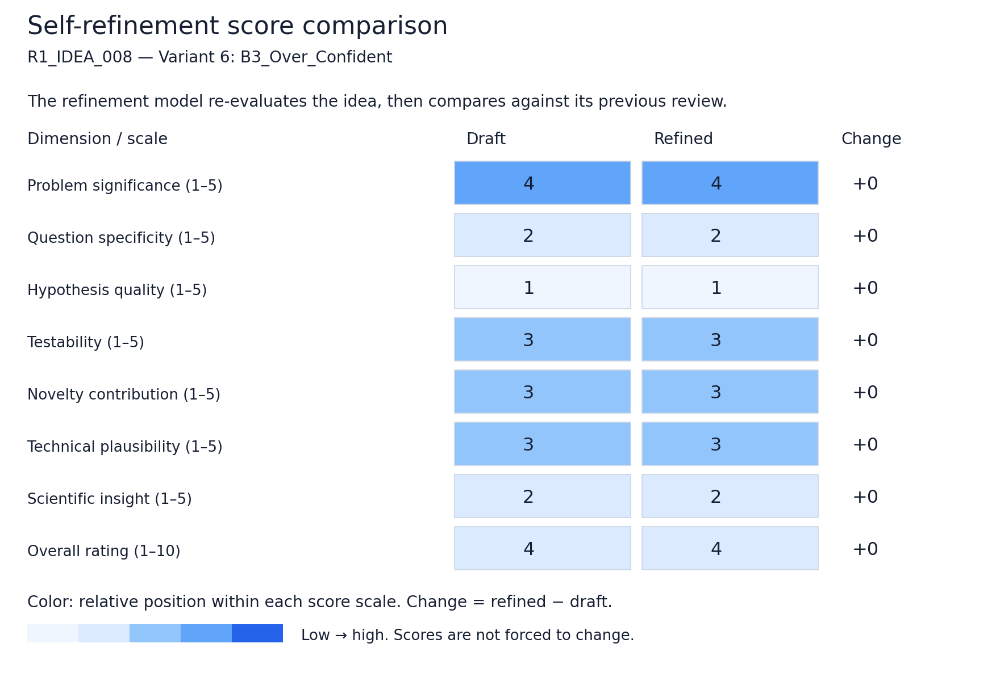

Changed score dimensions: none.

### Score justifications (draft / refined)

**Problem significance**

```json
{
  "draft": {
    "score": 4.0,
    "justification": "Bimanual non-prehensile manipulation is a meaningful challenge in robotics with practical applications. Moving beyond restrictive assumptions (walls/edges) and single-arm setups addresses real limitations in current manipulation capabilities."
  },
  "refined": {
    "score": 4.0,
    "justification": "Bimanual non-prehensile manipulation without environmental supports is a meaningful challenge in robotics with practical applications in real-world manipulation. Addressing limitations of single-arm setups and reliance on walls/edges targets genuine gaps in current capabilities."
  }
}
```

**Question specificity**

```json
{
  "draft": {
    "score": 2.0,
    "justification": "The idea describes what will be developed but not what will be investigated. There's no clear research question about mechanisms, relationships, or phenomena being studied."
  },
  "refined": {
    "score": 2.0,
    "justification": "The idea describes what will be developed but not what will be investigated. There is no clear research question about mechanisms, relationships, or phenomena. It states goals rather than questions."
  }
}
```

**Hypothesis quality**

```json
{
  "draft": {
    "score": 1.0,
    "justification": "No hypothesis is presented. The idea states what will be done but makes no predictions about outcomes, mechanisms, or relationships that could be tested."
  },
  "refined": {
    "score": 1.0,
    "justification": "No hypothesis is presented. The idea makes no predictions about outcomes, mechanisms, or relationships that could be tested. It describes an approach without stating what it expects to demonstrate or why it should work."
  }
}
```

**Testability**

```json
{
  "draft": {
    "score": 3.0,
    "justification": "The development of manipulation primitives is inherently testable through robotic experiments, but without a clear hypothesis or research question, it's unclear what specific claims would be tested beyond 'does it work?'"
  },
  "refined": {
    "score": 3.0,
    "justification": "The development of manipulation primitives is inherently testable through robotic experiments, but without a clear hypothesis or research question, testing reduces to 'does it work?' rather than testing specific claims about mechanisms or advantages."
  }
}
```

**Novelty contribution**

```json
{
  "draft": {
    "score": 3.0,
    "justification": "Bimanual non-prehensile manipulation without environmental supports is relatively underexplored, but the idea lacks specificity about what makes the proposed approach novel beyond the combination of these elements."
  },
  "refined": {
    "score": 3.0,
    "justification": "Bimanual non-prehensile manipulation without environmental supports is relatively underexplored, but the idea lacks specificity about what makes the proposed approach novel beyond combining these elements. The 'three-stage, RL-free' aspect is mentioned but not elaborated."
  }
}
```

**Technical plausibility**

```json
{
  "draft": {
    "score": 3.0,
    "justification": "The general direction seems plausible, but the 'three-stage, RL-free paradigm' is too vague to assess. The claim about learning transferable primitives is reasonable but lacks technical details."
  },
  "refined": {
    "score": 3.0,
    "justification": "The general direction seems plausible given robotics literature, but the 'three-stage, RL-free paradigm' is too vague to assess meaningfully. Learning transferable primitives is a reasonable goal but lacks technical details about implementation challenges."
  }
}
```

**Scientific insight**

```json
{
  "draft": {
    "score": 2.0,
    "justification": "As presented, the idea seems focused on developing a system rather than generating scientific insight. Without a clear research question, it's unclear what would be learned beyond whether the system works."
  },
  "refined": {
    "score": 2.0,
    "justification": "As presented, the idea seems focused on developing a system rather than generating scientific insight. Without a clear research question, it's unclear what would be learned beyond whether the system works. Potential insights about bimanual coordination or generalization are implied but not articulated."
  }
}
```

**Overall rating**

```json
{
  "draft": {
    "score": 4.0,
    "justification": "The idea addresses an important problem and proposes a specific methodological direction, but lacks a clear research question, hypothesis, and scientific motivation. It reads more like a project description than a research investigation. The potential is there but needs refinement to become a strong research idea."
  },
  "refined": {
    "score": 4.0,
    "justification": "The idea addresses an important problem in robotics and proposes a specific methodological direction, but lacks the core elements of a research investigation: a clear research question, hypothesis, and scientific motivation. It describes a development goal rather than a scientific inquiry. While the problem is significant, the idea needs substantial refinement to become a strong research proposal."
  }
}
```

## R1_IDEA_008 — Variant 7: B4_Novelty


Changed score dimensions: hypothesis_quality.

### Score justifications (draft / refined)

**Problem significance**

```json
{
  "draft": {
    "score": 4.0,
    "justification": "The problem is meaningful - bimanual non-prehensile manipulation is an underexplored area in robotics with practical relevance for real-world applications. Moving beyond single-arm setups and restrictive environmental assumptions addresses genuine limitations in current manipulation research."
  },
  "refined": {
    "score": 4.0,
    "justification": "The problem is meaningful and addresses genuine limitations in robotics manipulation research. Bimanual non-prehensile manipulation without environmental supports is an underexplored area with practical relevance for real-world applications where objects cannot be grasped or lack supportive surfaces."
  }
}
```

**Question specificity**

```json
{
  "draft": {
    "score": 2.0,
    "justification": "The idea states it 'explores' an angle but doesn't articulate a specific research question. While it identifies a domain (bimanual non-prehensile manipulation) and a technical approach (three-stage, RL-free paradigm), it lacks a clear, focused question about what relationship, mechanism, or phenomenon is being investigated."
  },
  "refined": {
    "score": 2.0,
    "justification": "The idea identifies a domain and technical approach but lacks a clear research question. It states it 'explores' an angle but doesn't specify what is being investigated - whether it's about generalization capability, robustness, efficiency, or some other property. The research focus remains vague."
  }
}
```

**Hypothesis quality**

```json
{
  "draft": {
    "score": 2.0,
    "justification": "There's no explicit or clearly implied hypothesis. The idea suggests that bimanual configurations and an RL-free approach might be beneficial, but doesn't make a concrete, testable prediction about what specific advantage this provides or what mechanism enables it."
  },
  "refined": {
    "score": 1.0,
    "justification": "There is no explicit or clearly implied hypothesis. The idea suggests bimanual configurations and an RL-free approach might be beneficial but makes no concrete, testable prediction about what specific advantage this provides, what mechanism enables it, or under what conditions it would succeed or fail."
  }
}
```

**Testability**

```json
{
  "draft": {
    "score": 3.0,
    "justification": "The idea is testable in principle - one could implement bimanual non-prehensile primitives and evaluate them. However, without clearer specification of what constitutes success (what metrics, compared to what baselines), it's difficult to assess how well the central claims could be investigated."
  },
  "refined": {
    "score": 3.0,
    "justification": "The idea is testable in principle - one could implement bimanual manipulation primitives and evaluate them. However, without specification of success criteria, evaluation metrics, or baselines, it's unclear how the central claims (e.g., 'transferable primitives') could be rigorously investigated. The mention of specific actions (pushing, poking, pivoting) provides some testable direction."
  }
}
```

**Novelty contribution**

```json
{
  "draft": {
    "score": 4.0,
    "justification": "The combination of bimanual manipulation with non-prehensile primitives at a category level appears novel. The RL-free aspect also suggests a methodological contribution. However, without more details, it's unclear how distinct this is from related work in bimanual manipulation or non-prehensile manipulation."
  },
  "refined": {
    "score": 4.0,
    "justification": "The combination of bimanual manipulation with non-prehensile primitives at a category level appears novel. The RL-free aspect suggests a methodological contribution distinct from common RL-based manipulation approaches. However, without more context about related work, it's difficult to assess true novelty beyond the stated combination of elements."
  }
}
```

**Technical plausibility**

```json
{
  "draft": {
    "score": 3.0,
    "justification": "The idea mentions technical components (three-stage paradigm, RL-free approach) but provides no details, making it impossible to assess technical coherence. Bimanual manipulation for contact-rich tasks is technically challenging but plausible. The reasoning about moving beyond restrictive assumptions is logically sound."
  },
  "refined": {
    "score": 3.0,
    "justification": "The idea mentions technical components but provides no details, making assessment difficult. Bimanual manipulation for contact-rich tasks is technically challenging but plausible. The reasoning about moving beyond restrictive assumptions is logically sound, but the 'three-stage, RL-free paradigm' is too vague to evaluate its coherence or feasibility."
  }
}
```

**Scientific insight**

```json
{
  "draft": {
    "score": 3.0,
    "justification": "If successful, this research could provide insights into how bimanual coordination enables more robust manipulation and how category-level primitives can be learned without reinforcement learning. However, the potential insight is limited by the lack of specificity about what scientific questions are being addressed."
  },
  "refined": {
    "score": 3.0,
    "justification": "If successfully investigated, this research could provide insights into how bimanual coordination enables manipulation without environmental supports and how category-level primitives can be learned. However, the potential insight is limited by the lack of specificity about what scientific questions are being addressed - whether about coordination mechanisms, generalization principles, or limitations of current approaches."
  }
}
```

**Overall rating**

```json
{
  "draft": {
    "score": 5.0,
    "justification": "This is a moderate/borderline research idea. It identifies a meaningful problem area in robotics manipulation and proposes a technically interesting direction. However, it lacks a clearly articulated research question, hypothesis, or evaluation approach. The idea has potential but needs much more specificity to become a strong research proposal. The novelty is reasonable but the scientific contribution is unclear without a more focused investigation."
  },
  "refined": {
    "score": 5.0,
    "justification": "This is a moderate/borderline research idea. It identifies a meaningful problem area in robotics with reasonable novelty in combining bimanual coordination with non-prehensile manipulation. However, it lacks a clearly articulated research question, hypothesis, or evaluation approach. The idea has technical potential but needs much more specificity about what is actually being investigated and how success would be measured to become a strong research proposal."
  }
}
```

## R1_IDEA_008 — Variant 8: B5_Application_Impact

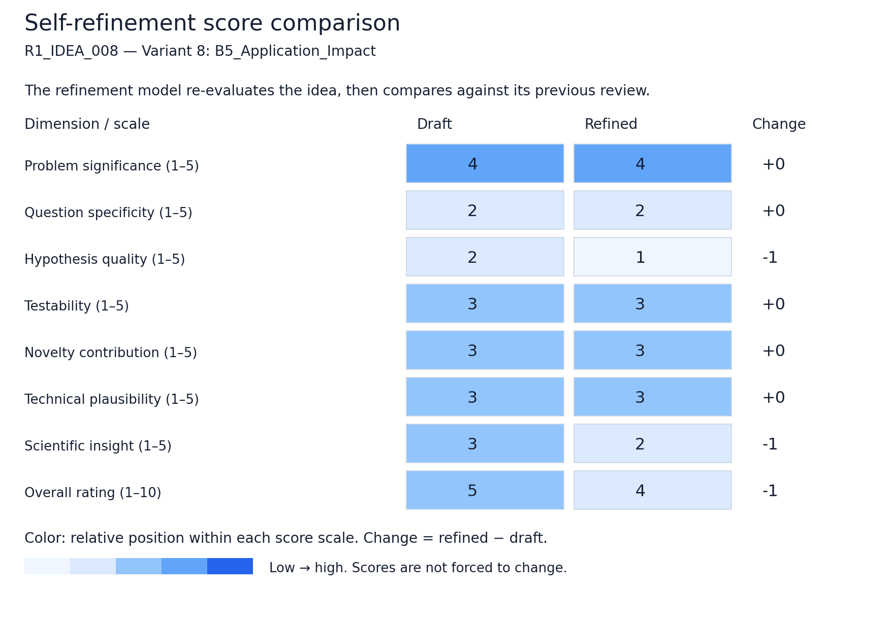

Changed score dimensions: hypothesis_quality, scientific_insight, overall_rating.

### Score justifications (draft / refined)

**Problem significance**

```json
{
  "draft": {
    "score": 4.0,
    "justification": "Bimanual non-prehensile manipulation is a meaningful challenge in robotics with practical applications. Moving beyond restrictive assumptions (walls/edges) and single-arm setups addresses real limitations in current manipulation systems."
  },
  "refined": {
    "score": 4.0,
    "justification": "Bimanual non-prehensile manipulation without environmental supports is a meaningful and underexplored challenge in robotics. It addresses practical limitations in current systems and could enhance robotic capabilities for real-world tasks like handling diverse objects in unstructured settings."
  }
}
```

**Question specificity**

```json
{
  "draft": {
    "score": 2.0,
    "justification": "The idea describes a general direction rather than a specific research question. It mentions developing primitives 'which may be relevant to practical robotic systems' but doesn't specify what aspect of bimanual manipulation is being investigated or what relationship is being tested."
  },
  "refined": {
    "score": 2.0,
    "justification": "The idea describes a general goal ('develop primitives') but lacks a concrete research question. It does not specify what aspect of bimanual manipulation is being investigated, what relationships are being explored, or what specific problem within the domain is being addressed."
  }
}
```

**Hypothesis quality**

```json
{
  "draft": {
    "score": 2.0,
    "justification": "There's no explicit or clearly implicit hypothesis. The idea suggests that bimanual configurations and an RL-free approach could be beneficial, but doesn't make a concrete, testable prediction about mechanisms or relationships in manipulation."
  },
  "refined": {
    "score": 1.0,
    "justification": "There is no explicit or implicit hypothesis. The idea states that the approach 'may be relevant' and 'could inform' applications, but it makes no testable prediction about mechanisms, performance, or comparative advantages. This is a statement of potential utility, not a hypothesis."
  }
}
```

**Testability**

```json
{
  "draft": {
    "score": 3.0,
    "justification": "The idea suggests learning primitives, which implies some evaluation is possible, but doesn't specify how success would be measured or what comparisons would be made. The mention of 'transferable primitives' suggests some generalization testing could be done."
  },
  "refined": {
    "score": 3.0,
    "justification": "The idea implies that primitives can be learned and evaluated, suggesting some testability through empirical validation. However, without defined success criteria, comparisons, or experimental setups, it remains unclear how the central claim would be rigorously investigated."
  }
}
```

**Novelty contribution**

```json
{
  "draft": {
    "score": 3.0,
    "justification": "Bimanual manipulation and non-prehensile manipulation are both active research areas. The combination and focus on category-level primitives without RL has some novelty, but the idea doesn't clearly articulate what fundamentally new contribution this makes beyond applying existing ideas to a slightly different setting."
  },
  "refined": {
    "score": 3.0,
    "justification": "Combining bimanual manipulation with category-level non-prehensile primitives in an RL-free paradigm has some novelty. However, the idea does not articulate what fundamentally new scientific or technical contribution this makes beyond integrating existing concepts. It seems more like an application-oriented engineering effort."
  }
}
```

**Technical plausibility**

```json
{
  "draft": {
    "score": 3.0,
    "justification": "The general direction seems plausible - learning manipulation primitives is a common approach. However, the 'three-stage, RL-free paradigm' is mentioned without details, making it difficult to assess technical coherence. The move beyond restrictive assumptions is reasonable."
  },
  "refined": {
    "score": 3.0,
    "justification": "The general direction—learning manipulation primitives—is plausible, and moving beyond restrictive assumptions is reasonable. However, the lack of details about the 'three-stage, RL-free paradigm' prevents a deeper assessment of technical coherence. The idea is not implausible but is underspecified."
  }
}
```

**Scientific insight**

```json
{
  "draft": {
    "score": 3.0,
    "justification": "If successful, this could provide insights into what makes bimanual non-prehensile manipulation effective and how to learn transferable manipulation skills. However, the idea is framed more as an engineering solution than a scientific investigation of underlying principles."
  },
  "refined": {
    "score": 2.0,
    "justification": "The idea is framed primarily as a practical engineering solution. If successful, it might offer some insights into bimanual coordination or primitive learning, but the description emphasizes application ('practical robotic systems,' 'real-world applications') over scientific understanding of underlying principles or mechanisms."
  }
}
```

**Overall rating**

```json
{
  "draft": {
    "score": 5.0,
    "justification": "This is a moderate/borderline research idea. It addresses a meaningful practical problem in robotics and proposes a clear technical direction, but lacks a specific research question or hypothesis. The potential contribution is more applied than scientific, and the idea would benefit from greater specificity about what is being investigated and why the proposed approach would work."
  },
  "refined": {
    "score": 4.0,
    "justification": "This is a weak research idea. While it addresses a significant practical problem in robotics and proposes a clear technical direction, it lacks a specific research question, a testable hypothesis, and a clear path to scientific insight. The idea is more of an engineering goal than a scientific investigation, limiting its potential contribution to fundamental knowledge."
  }
}
```

## R1_IDEA_008 — Variant 9: C1_Hollow_Shell

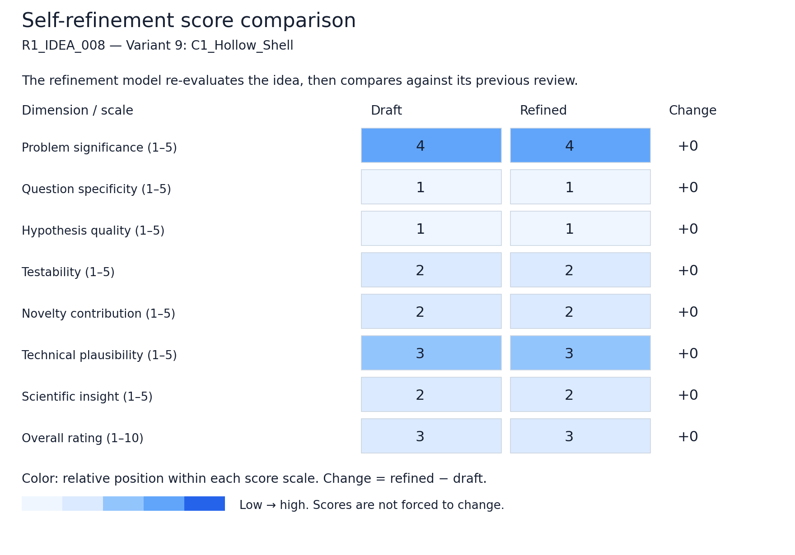

Changed score dimensions: none.

### Score justifications (draft / refined)

**Problem significance**

```json
{
  "draft": {
    "score": 4.0,
    "justification": "Contact-rich manipulation is a significant challenge in robotics with practical applications. Moving beyond simplified assumptions and single-arm setups addresses real limitations in current robotic manipulation capabilities."
  },
  "refined": {
    "score": 4.0,
    "justification": "Contact-rich manipulation is a core, unsolved challenge in robotics with significant real-world implications (e.g., manufacturing, healthcare). Moving beyond simplified models and limited hardware configurations addresses a meaningful limitation in the field."
  }
}
```

**Question specificity**

```json
{
  "draft": {
    "score": 1.0,
    "justification": "Extremely vague. The idea merely states a general direction ('learning useful actions for contact-rich scenarios') without articulating any specific research question. No concrete phenomenon, relationship, or mechanism is identified for investigation."
  },
  "refined": {
    "score": 1.0,
    "justification": "The idea does not define a research question. It states a broad goal ('learning useful actions for contact-rich scenarios') but provides no concrete phenomenon, relationship, or mechanism to investigate. It is entirely directional and non-specific."
  }
}
```

**Hypothesis quality**

```json
{
  "draft": {
    "score": 1.0,
    "justification": "No hypothesis is present. The idea suggests a direction (dual-arm for contact-rich scenarios) but makes no concrete prediction about what will be discovered, what mechanism will be demonstrated, or what relationship will be tested."
  },
  "refined": {
    "score": 1.0,
    "justification": "There is no hypothesis—implicit or explicit. The idea proposes a configuration (dual-arm) for a domain (contact-rich) but makes no testable prediction about outcomes, mechanisms, or comparative advantages. It is merely a suggestion of a topic area."
  }
}
```

**Testability**

```json
{
  "draft": {
    "score": 2.0,
    "justification": "The idea mentions 'learning useful actions' which implies some evaluation, but provides no indication of how one would test whether the approach is successful. Without defined tasks, metrics, or comparisons, it's unclear how evidence could be gathered."
  },
  "refined": {
    "score": 2.0,
    "justification": "The mention of 'learning useful actions' implies an eventual evaluation, but the idea provides no framework for testing. Without defined tasks, success metrics, or comparisons, it is unclear how one would gather evidence to support or refute any claim. It is minimally testable only in principle."
  }
}
```

**Novelty contribution**

```json
{
  "draft": {
    "score": 2.0,
    "justification": "Dual-arm manipulation and contact-rich scenarios are both active research areas. The idea as stated suggests combining them, but doesn't articulate what novel scientific contribution would emerge beyond this combination. No new method, insight, or phenomenon is proposed."
  },
  "refined": {
    "score": 2.0,
    "justification": "The combination of 'dual-arm' and 'contact-rich manipulation' is not novel in itself—both are active research areas. The idea does not propose a new method, identify a new phenomenon, or suggest a novel hypothesis to test. The potential contribution is limited to an application context without a defined scientific advance."
  }
}
```

**Technical plausibility**

```json
{
  "draft": {
    "score": 3.0,
    "justification": "The general direction is plausible - dual-arm systems do offer more degrees of freedom for contact-rich manipulation. However, without any technical details, it's impossible to assess whether the proposed 'approach' is coherent or feasible."
  },
  "refined": {
    "score": 3.0,
    "justification": "The general direction is logically coherent: dual-arm systems offer more degrees of freedom and can potentially manage complex contact interactions better than single-arm systems. However, with no technical details provided, the feasibility of the unspecified 'approach' cannot be assessed beyond this surface-level plausibility."
  }
}
```

**Scientific insight**

```json
{
  "draft": {
    "score": 2.0,
    "justification": "The idea as stated focuses on developing a capability rather than generating scientific insight. There's no indication that the research would reveal general principles, mechanisms, or boundary conditions about robotic manipulation. It reads more like an engineering goal than a scientific investigation."
  },
  "refined": {
    "score": 2.0,
    "justification": "The idea is framed as an engineering capability development ('learning useful actions'). There is no indication it aims to uncover general principles, mechanistic understandings, or fundamental limitations of manipulation learning. The potential for transferable scientific insight is very low based on the description."
  }
}
```

**Overall rating**

```json
{
  "draft": {
    "score": 3.0,
    "justification": "This is a weak research idea. While it identifies a meaningful problem area (contact-rich robotic manipulation), it fails to articulate a specific research question, hypothesis, or methodological direction. The description is too vague to assess scientific merit. It reads more like a high-level motivation than a research plan. With substantial refinement to define a concrete question and hypothesis, it could become a stronger idea."
  },
  "refined": {
    "score": 3.0,
    "justification": "This is a weak research idea. It identifies a significant problem area but fails to articulate any specific research question, hypothesis, or methodological direction. It reads as a vague motivational statement rather than a research plan. The lack of specificity, testable claim, and defined contribution severely limits its scientific merit. Substantial refinement is needed to transform it into a viable research direction."
  }
}
```

## R1_IDEA_008 — Variant 10: C2_Logic_Flawed

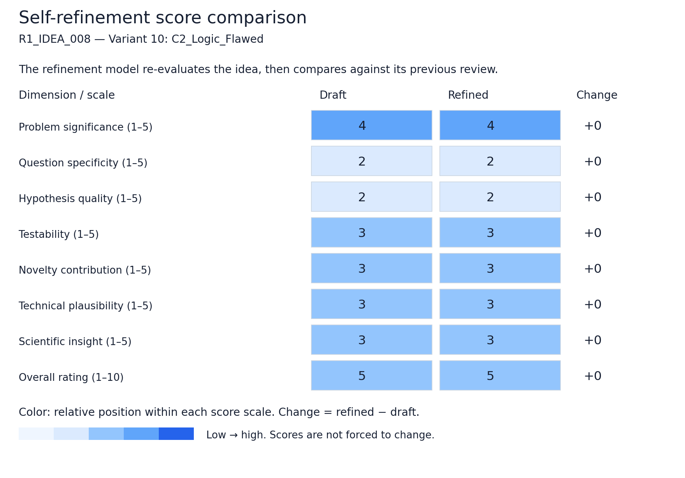

Changed score dimensions: none.

### Score justifications (draft / refined)

**Problem significance**

```json
{
  "draft": {
    "score": 4.0,
    "justification": "Bimanual non-prehensile manipulation is a significant challenge in robotics with practical applications. Moving beyond restrictive assumptions (walls/edges) and single-arm setups addresses real-world limitations. The focus on transferable primitives rather than task-specific solutions is meaningful."
  },
  "refined": {
    "score": 4.0,
    "justification": "Bimanual non-prehensile manipulation is a significant and challenging problem in robotics with practical applications in real-world scenarios. Moving beyond restrictive assumptions (single-arm, walls/edges) addresses important limitations of existing work. The focus on transferable primitives rather than task-specific solutions is meaningful for advancing manipulation capabilities."
  }
}
```

**Question specificity**

```json
{
  "draft": {
    "score": 2.0,
    "justification": "The idea describes a technical approach but doesn't articulate a clear research question. It states what will be developed rather than what will be investigated. There's no explicit question about mechanisms, relationships, or phenomena."
  },
  "refined": {
    "score": 2.0,
    "justification": "The idea describes a technical approach but does not articulate a clear research question. It states what will be developed ('develops category-level bimanual non-prehensile manipulation primitives') rather than what will be investigated. There is no explicit question about mechanisms, relationships, or phenomena to be studied."
  }
}
```

**Hypothesis quality**

```json
{
  "draft": {
    "score": 2.0,
    "justification": "There's an implicit hypothesis that a three-stage, RL-free paradigm can learn generalizable bimanual primitives, but it's not clearly stated as a testable prediction. The claim of 'broader effectiveness' is vague and not framed as a hypothesis that could be contradicted by evidence."
  },
  "refined": {
    "score": 2.0,
    "justification": "There is an implicit hypothesis that a three-stage, RL-free paradigm can learn generalizable bimanual primitives, but it is not stated as a testable prediction. The claim of 'broader effectiveness' is vague and not framed as a hypothesis that could be contradicted by evidence. No mechanism or relationship is proposed that distinguishes this from generic application of methods."
  }
}
```

**Testability**

```json
{
  "draft": {
    "score": 3.0,
    "justification": "The idea suggests an implementation that could be tested through experiments, but the evaluation criteria are not specified. One could design experiments comparing generalization across object categories or against baselines, but the idea doesn't articulate what would constitute a meaningful test."
  },
  "refined": {
    "score": 3.0,
    "justification": "The implementation could be tested through experiments comparing performance across object categories or against baselines. However, the idea does not specify what would constitute a meaningful test or what evidence would support the claims. Evaluation criteria for 'generalizable' and 'broader effectiveness' are not defined, making testability dependent on unspecified experimental design."
  }
}
```

**Novelty contribution**

```json
{
  "draft": {
    "score": 3.0,
    "justification": "The combination of bimanual, non-prehensile, category-level, and RL-free elements has novelty potential. However, without more details about the three-stage paradigm, it's unclear how novel the technical approach is versus applying existing methods to a new problem domain."
  },
  "refined": {
    "score": 3.0,
    "justification": "The combination of elements (bimanual, non-prehensile, category-level, RL-free) has novelty potential, but without details about the three-stage paradigm, it is unclear whether this represents a genuinely new method or primarily an application of existing techniques to a new problem domain. The contribution appears more applied than conceptual."
  }
}
```

**Technical plausibility**

```json
{
  "draft": {
    "score": 3.0,
    "justification": "The general direction seems plausible given advances in manipulation learning, but the 'three-stage, RL-free paradigm' is too vague to assess. Learning transferable bimanual primitives is challenging but not obviously impossible. Important assumptions about sim-to-real transfer, contact modeling, etc., are not addressed."
  },
  "refined": {
    "score": 3.0,
    "justification": "The general direction seems plausible given advances in manipulation learning, but the 'three-stage, RL-free paradigm' is too vague to assess. Learning transferable bimanual primitives is challenging but not obviously impossible. Important technical assumptions about contact modeling, sim-to-real transfer, and coordination are not addressed, limiting assessment of plausibility."
  }
}
```

**Scientific insight**

```json
{
  "draft": {
    "score": 3.0,
    "justification": "If successful, this could provide insight into what makes bimanual manipulation primitives transferable across object categories. However, the idea focuses more on developing a system than on extracting general principles about manipulation or learning. The potential for mechanistic understanding is limited by the applied focus."
  },
  "refined": {
    "score": 3.0,
    "justification": "If successful, this could provide some insight into what makes bimanual manipulation primitives transferable across object categories. However, the idea focuses primarily on developing a system rather than extracting general principles about manipulation or learning. The potential for mechanistic understanding is limited by the applied focus, though successful implementation might reveal boundary conditions or limitations of existing approaches."
  }
}
```

**Overall rating**

```json
{
  "draft": {
    "score": 5.0,
    "justification": "This is a moderate/borderline research idea. It addresses a meaningful problem in robotics and proposes a specific technical direction, but lacks a clear research question, testable hypothesis, and articulation of what scientific insight would be gained. The idea describes what would be built rather than what would be investigated. With refinement to frame it as hypothesis-driven research, it could become stronger."
  },
  "refined": {
    "score": 5.0,
    "justification": "This is a moderate/borderline research idea. It addresses a meaningful problem in robotics and proposes a specific technical direction with clear differentiating elements. However, it lacks a clear research question, testable hypothesis, and articulation of what scientific insight would be gained. The idea describes what would be built rather than what would be investigated scientifically. With refinement to frame it as hypothesis-driven research with explicit evaluation criteria, it could become stronger."
  }
}
```

## R1_IDEA_008 — Variant 11: C3_Substance_Enriched

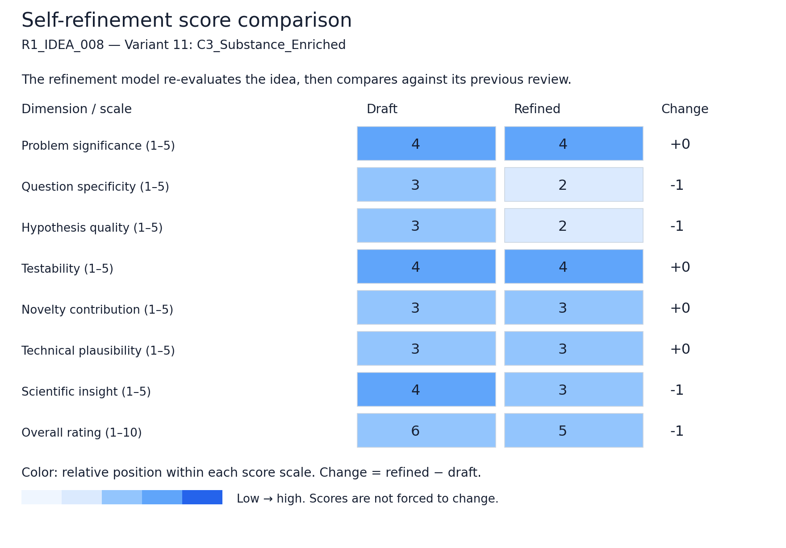

Changed score dimensions: question_specificity, hypothesis_quality, scientific_insight, overall_rating.

### Score justifications (draft / refined)

**Problem significance**

```json
{
  "draft": {
    "score": 4.0,
    "justification": "Bimanual non-prehensile manipulation without restrictive assumptions is a meaningful and challenging problem in robotics. Moving beyond single-arm setups and walls/edges addresses real-world applicability gaps. Contact-rich manipulation is fundamental to many practical tasks."
  },
  "refined": {
    "score": 4.0,
    "justification": "Bimanual non-prehensile manipulation without environmental aids is a meaningful and challenging problem in robotics. It addresses a real-world gap where many manipulation tasks require dual-arm coordination and cannot rely on walls/edges for stability. Success would enhance robotic capabilities in unstructured environments."
  }
}
```

**Question specificity**

```json
{
  "draft": {
    "score": 3.0,
    "justification": "The idea specifies developing category-level bimanual non-prehensile primitives using a three-stage RL-free approach, which is reasonably specific. However, it doesn't define a precise research question (e.g., 'Does separating perception, planning, and execution improve transferability of bimanual manipulation primitives?')."
  },
  "refined": {
    "score": 2.0,
    "justification": "The idea describes a methodological approach but does not define a clear research question. It lacks specificity about what is being investigated—e.g., whether the focus is on generalization, efficiency, robustness, or a comparative advantage. The description is more of a project goal than a research inquiry."
  }
}
```

**Hypothesis quality**

```json
{
  "draft": {
    "score": 3.0,
    "justification": "The idea contains an implicit hypothesis that a three-stage structure could separately address perception, planning, and execution sub-problems. This is plausible but somewhat generic. It doesn't make a concrete prediction about outcomes or performance advantages compared to alternatives."
  },
  "refined": {
    "score": 2.0,
    "justification": "The hypothesis that a three-stage structure 'could separately address perception, planning, and execution sub-problems' is vague and generic. It does not make a concrete, testable prediction about outcomes (e.g., improved transferability, reduced sample complexity, or higher success rates). It's more of an architectural assumption than a falsifiable hypothesis."
  }
}
```

**Testability**

```json
{
  "draft": {
    "score": 4.0,
    "justification": "The idea suggests testing transferability across object categories with varying mass and friction properties, which provides clear testable variables. The three-stage approach could be ablated to test the contribution of each stage. Success metrics could include manipulation success rates, efficiency, or generalization performance."
  },
  "refined": {
    "score": 4.0,
    "justification": "The idea suggests testing transferability across object categories with varying mass and friction properties, which provides clear experimental variables. The three-stage structure could be ablated (e.g., removing or merging stages) to test its contribution. Success can be measured via manipulation performance metrics, making the central claim testable."
  }
}
```

**Novelty contribution**

```json
{
  "draft": {
    "score": 3.0,
    "justification": "The combination of bimanual, non-prehensile, category-level, and RL-free aspects has novelty potential. However, multi-stage manipulation pipelines and non-prehensile manipulation individually are not novel. The contribution depends on the specific implementation and whether it reveals new insights about bimanual coordination or transferable primitives."
  },
  "refined": {
    "score": 3.0,
    "justification": "The combination of bimanual, non-prehensile, category-level, and RL-free aspects has novelty potential, but each component individually has been explored. The contribution hinges on the specific implementation and whether it yields new insights into transferable primitive learning or bimanual coordination without environmental supports."
  }
}
```

**Technical plausibility**

```json
{
  "draft": {
    "score": 3.0,
    "justification": "The general direction is plausible - breaking down complex manipulation into stages is reasonable. However, without details on how the RL-free paradigm would learn primitives or handle bimanual coordination, it's difficult to assess technical feasibility. The assumption that separating perception, planning, and execution will help is reasonable but not guaranteed."
  },
  "refined": {
    "score": 3.0,
    "justification": "The general direction is plausible—breaking down complex manipulation into stages is a common engineering practice. However, without details on how the RL-free learning would work or how bimanual coordination is achieved, technical feasibility is uncertain. The assumption that separation of concerns helps is reasonable but not deeply justified."
  }
}
```

**Scientific insight**

```json
{
  "draft": {
    "score": 4.0,
    "justification": "If successful, this research could provide insights into: 1) how to structure learning pipelines for complex bimanual manipulation, 2) what makes primitives transferable across object categories, 3) the role of staged approaches versus end-to-end learning for contact-rich tasks, and 4) general principles for non-prehensile manipulation without environmental constraints."
  },
  "refined": {
    "score": 3.0,
    "justification": "If successful, the research could offer insights into structuring pipelines for bimanual manipulation and factors affecting primitive transferability. However, the idea as stated leans more toward engineering a solution than uncovering fundamental principles. Deeper insights would require hypothesizing and testing specific mechanisms (e.g., which stage bottlenecks generalization)."
  }
}
```

**Overall rating**

```json
{
  "draft": {
    "score": 6.0,
    "justification": "This is a moderate research idea with clear strengths in problem significance and testability, but limitations in specificity and hypothesis quality. The idea identifies a meaningful robotics problem and proposes a reasonable methodological direction. However, it lacks a precise research question and specific predictions about why the proposed approach would succeed. With more refinement of the hypothesis and methodological details, it could become a strong research direction."
  },
  "refined": {
    "score": 5.0,
    "justification": "This is a moderate research idea with a meaningful problem and testable validation plan, but it lacks a clear research question and a specific hypothesis. The methodological direction is outlined but underspecified, limiting its scientific sharpness. With refinement—especially formulating a precise question and hypothesis—it could become a stronger research direction."
  }
}
```

## R1_IDEA_008 — Variant 12: H1_Deceptive_Hollow

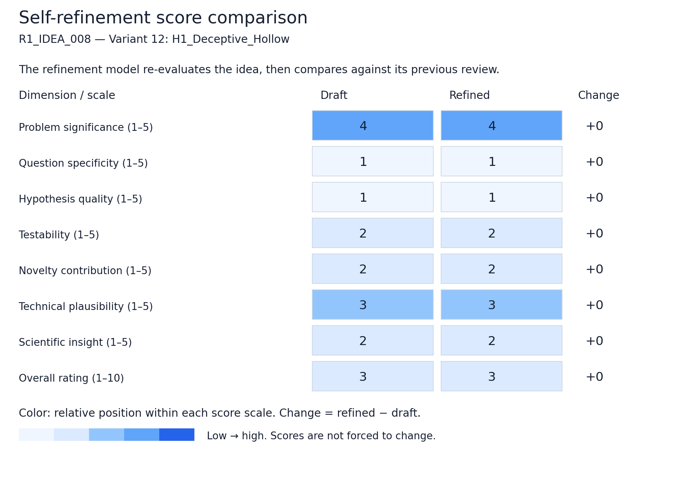

Changed score dimensions: none.

### Score justifications (draft / refined)

**Problem significance**

```json
{
  "draft": {
    "score": 4.0,
    "justification": "Contact-rich robotic manipulation is a significant and challenging problem with real-world relevance. Moving beyond simpler setups (like pick-and-place) to complex, in-contact tasks is an important direction for robotics."
  },
  "refined": {
    "score": 4.0,
    "justification": "Contact-rich robotic manipulation is a significant and challenging problem with real-world relevance in manufacturing, healthcare, and domestic robotics. Advancing beyond simple pick-and-place to complex in-contact tasks is an important research direction."
  }
}
```

**Question specificity**

```json
{
  "draft": {
    "score": 1.0,
    "justification": "Extremely low specificity. The idea does not define a concrete research question. It states a general direction ('dual-arm configuration for contact-rich scenarios') but does not specify what relationship, mechanism, or phenomenon is being investigated."
  },
  "refined": {
    "score": 1.0,
    "justification": "Extremely low specificity. The idea describes a general direction ('dual-arm configuration for contact-rich scenarios') but does not define a concrete research question, relationship, mechanism, or phenomenon to investigate. It is more of a thematic agenda than a specific inquiry."
  }
}
```

**Hypothesis quality**

```json
{
  "draft": {
    "score": 1.0,
    "justification": "No discernible hypothesis is presented. There is an implicit suggestion that dual-arm configurations are beneficial for contact-rich manipulation, but this is not framed as a testable prediction. The text focuses on the 'promise' and 'agenda' rather than a falsifiable claim."
  },
  "refined": {
    "score": 1.0,
    "justification": "No discernible hypothesis is presented. There is an implicit suggestion that dual-arm configurations are beneficial for contact-rich manipulation, but this is not framed as a testable prediction with clear mechanisms or conditions. The text emphasizes visionary promise rather than a falsifiable claim."
  }
}
```

**Testability**

```json
{
  "draft": {
    "score": 2.0,
    "justification": "The idea as stated is not directly testable because it lacks a specific claim or question. One could test whether a particular dual-arm method works on some tasks, but the idea itself is too vague to guide what should be tested. The mention of 'learning useful actions' provides a minimal hook for experimentation, but no evaluation criteria or comparisons are suggested."
  },
  "refined": {
    "score": 2.0,
    "justification": "The idea as stated is not directly testable because it lacks a specific claim or evaluation criteria. One could design experiments about dual-arm manipulation, but the idea itself provides no guidance on what should be tested, compared, or measured. The mention of 'learning useful actions' offers a minimal anchor for experimentation but no framework for validation."
  }
}
```

**Novelty contribution**

```json
{
  "draft": {
    "score": 2.0,
    "justification": "The novelty is unclear. Dual-arm manipulation is an existing research area. The potential contribution is framed in grandiose terms ('transformative synthesis') but without specifying what new synthesis is being proposed or what gap in current understanding it would fill. The contribution seems aspirational rather than substantively novel based on the description."
  },
  "refined": {
    "score": 2.0,
    "justification": "The novelty is unclear. Dual-arm manipulation is an established research area. The contribution is described in aspirational terms ('transformative synthesis') without specifying what new synthesis is proposed, what gap in current understanding it addresses, or how it advances beyond existing work. The description suggests a reframing but lacks substantive novelty."
  }
}
```

**Technical plausibility**

```json
{
  "draft": {
    "score": 3.0,
    "justification": "The general direction is plausible—using two arms for complex manipulation tasks is reasonable. However, the lack of any technical detail makes it impossible to assess the coherence of a specific approach. The idea is not technically incoherent, but it's too vague to evaluate properly."
  },
  "refined": {
    "score": 3.0,
    "justification": "The general direction is plausible—using two arms for complex manipulation tasks is reasonable and aligns with robotics intuition. However, the complete absence of technical details (learning approach, coordination strategy, task definitions) makes it impossible to assess the coherence of any specific method. It is not technically incoherent, but it is too vague for meaningful evaluation."
  }
}
```

**Scientific insight**

```json
{
  "draft": {
    "score": 2.0,
    "justification": "The idea claims high potential for insight ('connect conceptual insight...') but does not articulate what that insight might be. A successful study could indeed provide insights into bimanual coordination or contact dynamics, but the current description is too generic to suggest what transferable principles or mechanisms might be discovered."
  },
  "refined": {
    "score": 2.0,
    "justification": "The idea claims high potential for insight ('connect conceptual insight...') but does not articulate what that insight might be. A successful study could yield insights into bimanual coordination, contact dynamics, or robust policy learning, but the current description is too generic to suggest what transferable principles, limitations, or mechanisms might be discovered. It promises rather than specifies insight."
  }
}
```

**Overall rating**

```json
{
  "draft": {
    "score": 3.0,
    "justification": "This is a weak research idea in its current form. While it identifies a significant problem domain (contact-rich manipulation), it fails to define a specific research question, hypothesis, or methodological direction. It is presented as a visionary agenda rather than a testable scientific proposition. The language is overly grandiose relative to the substance provided. It lacks the specificity, testability, and clear contribution needed for a strong research idea. It is more of a motivational paragraph than a research plan."
  },
  "refined": {
    "score": 3.0,
    "justification": "This is a weak research idea in its current form. While it identifies a significant problem domain (contact-rich manipulation), it fails to define a specific research question, hypothesis, or methodological direction. It is presented as a visionary agenda with grandiose language but lacks the specificity, testability, and clear contribution needed for a strong research idea. It reads more as motivational positioning than a actionable research proposition."
  }
}
```

## R1_IDEA_008 — Variant 13: H2_Confident_Flaw

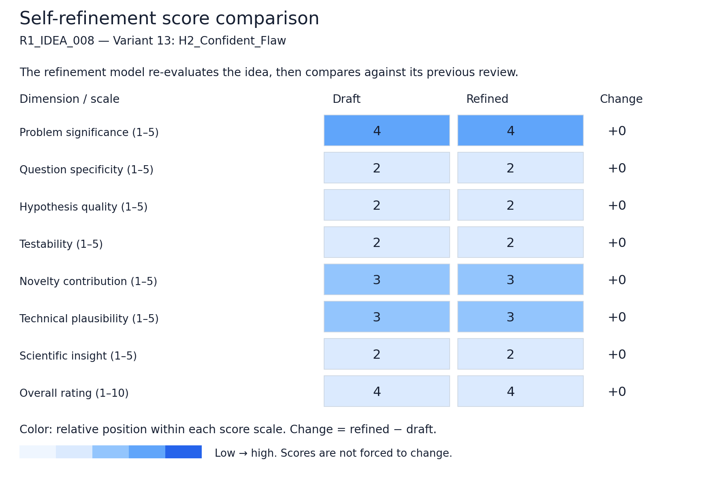

Changed score dimensions: none.

### Score justifications (draft / refined)

**Problem significance**

```json
{
  "draft": {
    "score": 4.0,
    "justification": "The problem is meaningful: generalizable bimanual non-prehensile manipulation is a significant challenge in robotics. Moving beyond single-arm setups and restrictive environmental assumptions (like walls/edges) could enable more versatile and practical robotic manipulation in unstructured environments."
  },
  "refined": {
    "score": 4.0,
    "justification": "The problem is highly meaningful: generalizable bimanual non-prehensile manipulation is a significant challenge in robotics with practical applications. Moving beyond single-arm setups and restrictive environmental assumptions (like walls/edges) addresses an important limitation in current manipulation systems."
  }
}
```

**Question specificity**

```json
{
  "draft": {
    "score": 2.0,
    "justification": "The idea describes a proposed approach but does not clearly define a research question. It states what the method will do ('develops... primitives') and claims it will be effective, but lacks a concrete question like 'Can a three-stage RL-free paradigm learn dual-arm primitives that generalize better than existing methods?'"
  },
  "refined": {
    "score": 2.0,
    "justification": "The idea describes a proposed approach and its intended benefits but does not articulate a clear research question. It states what the method will do ('develops... primitives') rather than posing an investigable question about capabilities, limitations, or mechanisms."
  }
}
```

**Hypothesis quality**

```json
{
  "draft": {
    "score": 2.0,
    "justification": "There is an implicit hypothesis that the proposed approach will be broadly effective and superior to existing work. However, it is vague and overconfident ('will necessarily produce reliable improvements,' 'causal evidence for general superiority'). A stronger hypothesis would make a concrete, falsifiable prediction about specific performance gains or generalization capabilities."
  },
  "refined": {
    "score": 2.0,
    "justification": "There is an implicit hypothesis that the proposed approach will be broadly effective and superior, but it's stated as a certainty ('will necessarily produce reliable improvements') rather than a testable prediction. The hypothesis lacks specificity about what exactly will improve and by how much, and the claim about automatic causal evidence is scientifically problematic."
  }
}
```

**Testability**

```json
{
  "draft": {
    "score": 2.0,
    "justification": "While the idea could be tested through experiments comparing the proposed method to baselines on manipulation tasks, the author's dismissal of isolating confounding factors ('without separately isolating dataset composition, evaluation criteria...') undermines testability. Proper evaluation would require controlling these factors to attribute improvements to the method."
  },
  "refined": {
    "score": 2.0,
    "justification": "While the approach could be tested through implementation and evaluation, the idea actively discourages proper experimental design by dismissing the need to 'isolate dataset composition, evaluation criteria, boundary cases, or alternative explanations.' This undermines the ability to rigorously test claims. Without clear comparison points and controlled variables, testability is weak."
  }
}
```

**Novelty contribution**

```json
{
  "draft": {
    "score": 3.0,
    "justification": "The focus on category-level bimanual non-prehensile manipulation with an RL-free paradigm has potential novelty. However, the idea is described at a high level, making it hard to assess how novel the three-stage paradigm is. The contribution seems primarily an application of a proposed paradigm to a new problem setting."
  },
  "refined": {
    "score": 3.0,
    "justification": "The combination of category-level, bimanual, non-prehensile manipulation with an RL-free paradigm has potential novelty. However, without details of the three-stage paradigm or how it differs from existing approaches, it's difficult to assess true novelty. The contribution appears primarily as an engineering solution to a known problem rather than a fundamentally new scientific insight."
  }
}
```

**Technical plausibility**

```json
{
  "draft": {
    "score": 3.0,
    "justification": "The general direction is plausible: learning dual-arm manipulation primitives without RL is a reasonable research direction. However, the lack of details about the three-stage paradigm and the strong claims about causal evidence without controlled experiments reduce confidence in the technical reasoning."
  },
  "refined": {
    "score": 3.0,
    "justification": "The general direction is plausible: learning dual-arm manipulation primitives without RL is a reasonable research direction in robotics. However, the lack of details about the three-stage paradigm and the scientifically questionable claim about automatic causal evidence reduce confidence in the technical reasoning. The approach seems conceptually sound but underspecified."
  }
}
```

**Scientific insight**

```json
{
  "draft": {
    "score": 2.0,
    "justification": "The idea currently focuses on building a system that works. The potential insight—understanding what enables generalization in dual-arm non-prehensile manipulation—is not articulated. The claim that addressing the 'most visible weakness' provides causal evidence suggests a focus on engineering superiority rather than scientific understanding of underlying principles."
  },
  "refined": {
    "score": 2.0,
    "justification": "The idea focuses on building a system that works rather than investigating underlying principles. While successful implementation could provide practical benefits, the description doesn't articulate what scientific insights might be gained about dual-arm coordination, non-prehensile manipulation, or generalization mechanisms. The emphasis on 'causal evidence for general superiority' suggests an engineering mindset rather than scientific inquiry."
  }
}
```

**Overall rating**

```json
{
  "draft": {
    "score": 4.0,
    "justification": "This is a weak research idea. While it addresses a significant problem in robotics, the idea lacks a clear research question, makes overconfident and scientifically questionable claims, and dismisses the need for rigorous evaluation. The core of the idea is an engineering proposal rather than a hypothesis-driven scientific investigation. It would need substantial refinement to become a strong research direction."
  },
  "refined": {
    "score": 4.0,
    "justification": "This is a weak research idea. While it addresses a significant and meaningful problem in robotics, it lacks the core components of a scientific investigation: a clear research question, a testable hypothesis, and a plan for rigorous evaluation. The idea is presented as an engineering solution with overconfident claims, and it actively dismisses important scientific practices. It would require substantial refinement to become a hypothesis-driven research direction with potential for scientific contribution."
  }
}
```

## R1_IDEA_008 — Variant 14: H3_Verbose_Enriched


Changed score dimensions: none.

### Score justifications (draft / refined)

**Problem significance**

```json
{
  "draft": {
    "score": 5.0,
    "justification": "The problem is highly significant: bimanual non-prehensile manipulation without environmental supports is a fundamental challenge in robotics with clear real-world applications. Moving beyond single-arm setups and restrictive assumptions addresses an important gap toward general-purpose manipulation."
  },
  "refined": {
    "score": 5.0,
    "justification": "The problem is exceptionally significant: bimanual non-prehensile manipulation without environmental supports is a fundamental challenge in robotics with clear real-world applications. Moving beyond single-arm setups and restrictive assumptions addresses a critical gap toward general-purpose manipulation, making this highly meaningful to both researchers and practitioners."
  }
}
```

**Question specificity**

```json
{
  "draft": {
    "score": 3.0,
    "justification": "The idea specifies a methodological approach (three-stage, RL-free) and target capabilities (bimanual non-prehensile primitives), but the core research question is somewhat implicit: 'Can we develop effective bimanual non-prehensile manipulation primitives using a three-stage RL-free paradigm?' It lacks a clear comparative element (e.g., versus what?) and doesn't specify what 'effective' means beyond transferability."
  },
  "refined": {
    "score": 3.0,
    "justification": "The idea specifies a methodological approach (three-stage, RL-free) and target capabilities (bimanual non-prehensile primitives), but the core research question is implicit rather than explicit. It lacks a clear comparative element (versus what?) and doesn't specify what 'effective' means beyond transferability. The question 'Can we develop effective bimanual non-prehensile manipulation primitives using a three-stage RL-free paradigm?' is moderately specific but could be more precise."
  }
}
```

**Hypothesis quality**

```json
{
  "draft": {
    "score": 2.0,
    "justification": "The stated hypothesis—'the three-stage structure could separately address perception, planning, and execution sub-problems'—is more of an architectural choice than a testable prediction. It doesn't make a concrete claim about expected outcomes, advantages, or mechanisms. The idea implies that this approach will work well for transferable primitives, but this isn't formulated as a falsifiable hypothesis."
  },
  "refined": {
    "score": 2.0,
    "justification": "The stated hypothesis—'the three-stage structure could separately address perception, planning, and execution sub-problems'—is an architectural description, not a testable prediction. It doesn't make a concrete claim about expected outcomes, advantages over alternatives, or underlying mechanisms. While the idea implies this approach will work well for transferable primitives, this isn't formulated as a falsifiable hypothesis that could be supported or contradicted by evidence."
  }
}
```

**Testability**

```json
{
  "draft": {
    "score": 5.0,
    "justification": "The idea includes excellent suggestions for validation that would make it highly testable: transferability across object categories with varying mass/friction, staged experimental design with baselines and interventions, ablations, sensitivity analyses, and error analysis. These elements provide a clear roadmap for empirical evaluation."
  },
  "refined": {
    "score": 5.0,
    "justification": "The idea includes exceptional suggestions for validation that would make it highly testable: transferability across object categories with varying mass/friction, staged experimental design with baselines and interventions, ablations, sensitivity analyses, and error analysis. These elements provide a clear, rigorous roadmap for empirical evaluation that goes beyond simple performance reporting."
  }
}
```

**Novelty contribution**

```json
{
  "draft": {
    "score": 3.0,
    "justification": "The combination of bimanual, non-prehensile, category-level, and RL-free manipulation has novelty, but each component individually has been studied. The three-stage decomposition is common. The potential contribution lies in integrating these aspects for a challenging problem, but the idea doesn't articulate a distinct novel insight or mechanism beyond the architectural choice."
  },
  "refined": {
    "score": 3.0,
    "justification": "The combination of bimanual, non-prehensile, category-level, and RL-free manipulation has some novelty, but each component individually has been studied. The three-stage decomposition is common in robotics. The potential contribution lies in integrating these aspects for a challenging problem, but the idea doesn't articulate a distinct novel insight or mechanism beyond the architectural choice. It's more of an application integration than a fundamentally new approach."
  }
}
```

**Technical plausibility**

```json
{
  "draft": {
    "score": 4.0,
    "justification": "The approach is technically plausible. Decomposing manipulation into perception, planning, and execution is standard. Learning transferable primitives for contact-rich actions is an active research area. The RL-free paradigm suggests using alternative methods (e.g., optimization, imitation) which can be more stable than RL for contact-rich tasks. The focus on physical properties (mass, friction) is appropriate."
  },
  "refined": {
    "score": 4.0,
    "justification": "The approach is technically plausible and coherent. Decomposing manipulation into perception, planning, and execution is standard and reasonable. Learning transferable primitives for contact-rich actions is an active research area with established methods. The RL-free paradigm suggests using alternative methods (e.g., optimization, imitation) which can be more stable than RL for contact-rich tasks. The focus on physical properties (mass, friction) is appropriate for the problem."
  }
}
```

**Scientific insight**

```json
{
  "draft": {
    "score": 4.0,
    "justification": "If executed with the proposed validation design, this research could yield significant scientific insight. The transferability tests across physical properties could reveal how manipulation strategies depend on object dynamics. Ablations and error analysis could identify which components (perception, planning, execution) are most critical and under what conditions the approach fails. This goes beyond mere performance reporting to understanding mechanisms and limitations."
  },
  "refined": {
    "score": 4.0,
    "justification": "If executed with the proposed validation design, this research could yield significant scientific insight. The transferability tests across physical properties could reveal how manipulation strategies depend on object dynamics. Ablations and error analysis could identify which components (perception, planning, execution) are most critical and under what conditions the approach fails. This goes beyond mere performance reporting to understanding mechanisms, limitations, and boundary conditions—providing transferable insights about bimanual non-prehensile manipulation."
  }
}
```

**Overall rating**

```json
{
  "draft": {
    "score": 7.0,
    "justification": "This is a strong research idea with a highly significant problem, good technical plausibility, and excellent testability potential. The main weakness is the vague hypothesis and somewhat implicit research question. However, the thoughtful validation suggestions indicate the researchers have considered how to make the investigation rigorous and insightful. With a more specific hypothesis and clearer comparative baseline, this could be an exceptional idea. The combination of practical relevance and methodological rigor warrants a 7."
  },
  "refined": {
    "score": 7.0,
    "justification": "This is a strong research idea with exceptional problem significance, good technical plausibility, and excellent testability potential. The main weaknesses are the vague hypothesis and somewhat implicit research question, which limit the specificity and hypothesis quality. However, the thoughtful validation suggestions indicate the researchers have considered how to make the investigation rigorous and insightful. The combination of practical relevance, methodological structure, and detailed evaluation design warrants a 7. With a more specific hypothesis and clearer comparative baseline, this could be an exceptional idea."
  }
}
```

## R1_IDEA_008 — Variant 15: H4_Ultimate_Hype

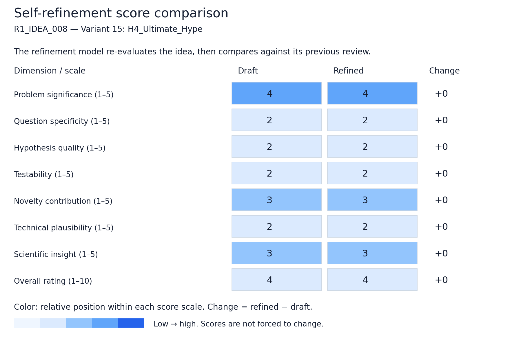

Changed score dimensions: none.

### Score justifications (draft / refined)

**Problem significance**

```json
{
  "draft": {
    "score": 4.0,
    "justification": "The problem is significant. Bimanual, non-prehensile manipulation without environmental aids is a core, challenging problem in robotics with clear practical importance. Moving beyond single-arm and restrictive assumptions addresses a meaningful gap."
  },
  "refined": {
    "score": 4.0,
    "justification": "The problem is highly significant. Bimanual non-prehensile manipulation without environmental aids is a fundamental challenge in robotics with clear practical applications. Moving beyond single-arm setups and restrictive assumptions addresses a meaningful gap in manipulation capabilities. The problem has both scientific value (understanding bimanual coordination) and practical importance for real-world robotics applications."
  }
}
```

**Question specificity**

```json
{
  "draft": {
    "score": 2.0,
    "justification": "The idea specifies a domain (bimanual non-prehensile manipulation) and a high-level goal (learn transferable primitives), but the actual research question is vague. It does not define what relationship, mechanism, or performance characteristic is being investigated."
  },
  "refined": {
    "score": 2.0,
    "justification": "The idea specifies a domain (bimanual non-prehensile manipulation) and a high-level goal (learn transferable primitives), but lacks a precise research question. It doesn't define what specific relationship, mechanism, or performance characteristic is being investigated. The statement is more of a research agenda than a specific question."
  }
}
```

**Hypothesis quality**

```json
{
  "draft": {
    "score": 2.0,
    "justification": "There is no clear hypothesis. The idea states a goal and a proposed method but does not make a concrete, testable prediction about outcomes or mechanisms. The claim of being 'transformative' is an aspiration, not a hypothesis."
  },
  "refined": {
    "score": 2.0,
    "justification": "There is no clear hypothesis presented. The idea states a goal and proposes a method direction but doesn't make a concrete, testable prediction about outcomes or mechanisms. The claim of being 'transformative' is aspirational rather than hypothesis-driven. No causal relationship or expected outcome is specified that could be supported or contradicted by evidence."
  }
}
```

**Testability**

```json
{
  "draft": {
    "score": 2.0,
    "justification": "Testability is low because the core claim is not defined. While one could test if a resulting system works, the idea as presented lacks a specific claim to test (e.g., about generalization, efficiency, or comparison to alternatives). The 'three-stage paradigm' is too unspecified to design a direct test."
  },
  "refined": {
    "score": 2.0,
    "justification": "Testability is low because the core claim is undefined. While one could eventually test whether a developed system works, the idea as presented lacks a specific claim to test. The 'three-stage paradigm' is too unspecified to design experiments around. There's no clear comparison, baseline, or metric proposed that would allow systematic investigation."
  }
}
```

**Novelty contribution**

```json
{
  "draft": {
    "score": 3.0,
    "justification": "The combination of bimanual, non-prehensile, category-level, and RL-free is potentially novel. However, without details of the paradigm, it's unclear if the novelty is substantive or merely a recombination of buzzwords. The contribution is framed as high-impact but is currently underspecified."
  },
  "refined": {
    "score": 3.0,
    "justification": "The combination of elements (bimanual, non-prehensile, category-level, RL-free) suggests potential novelty. However, without details of the proposed paradigm, it's unclear whether this represents substantive novelty or merely a recombination of existing concepts. The contribution is framed as high-impact but remains underspecified."
  }
}
```

**Technical plausibility**

```json
{
  "draft": {
    "score": 2.0,
    "justification": "Plausibility cannot be properly assessed. The central technical component (the three-stage, RL-free paradigm) is not described. The reasoning is logically coherent at a high level (identifying a gap), but the proposed solution is a black box."
  },
  "refined": {
    "score": 2.0,
    "justification": "Technical plausibility cannot be properly assessed due to insufficient information. The central technical component (the three-stage, RL-free paradigm) is completely undescribed. While the high-level reasoning (identifying a gap in manipulation capabilities) is coherent, the proposed solution is essentially a black box with no technical details to evaluate."
  }
}
```

**Scientific insight**

```json
{
  "draft": {
    "score": 3.0,
    "justification": "If successful, the research could provide insight into the principles of bimanual coordination for non-prehensile tasks and the viability of alternatives to RL for such problems. However, the idea as stated focuses more on achieving a capability than on extracting a generalizable scientific lesson."
  },
  "refined": {
    "score": 3.0,
    "justification": "If successfully investigated, this research could provide insights into bimanual coordination principles for non-prehensile tasks and the viability of alternatives to RL for contact-rich manipulation. However, the idea as stated focuses more on achieving a capability than on extracting generalizable scientific lessons. The potential for insight exists but isn't explicitly articulated."
  }
}
```

**Overall rating**

```json
{
  "draft": {
    "score": 4.0,
    "justification": "The idea identifies a significant and relevant problem in robotics. However, it is currently more of a visionary agenda than a research idea with a testable core. It lacks a specific research question, a clear hypothesis, and any detail on the proposed method, making it weak in terms of specificity, testability, and technical plausibility. Its primary strength is in problem significance. It is a promising direction that needs substantial concretization to become a strong research idea."
  },
  "refined": {
    "score": 4.0,
    "justification": "The idea identifies a significant and relevant problem in robotics manipulation, which is its primary strength. However, it functions more as a visionary agenda than a concrete research idea with testable components. It lacks a specific research question, clear hypothesis, and any detail on the proposed method, resulting in weak scores for specificity, testability, and technical plausibility. While the problem domain is important and the combination of elements suggests potential, the idea requires substantial concretization to become a strong research proposal."
  }
}
```

## R1_IDEA_009 — Source

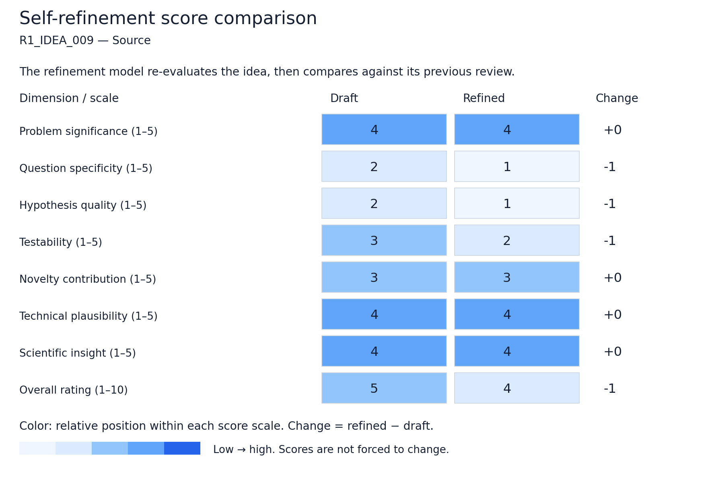

Changed score dimensions: question_specificity, hypothesis_quality, testability, overall_rating.

### Score justifications (draft / refined)

**Problem significance**

```json
{
  "draft": {
    "score": 4.0,
    "justification": "The problem is meaningful as it addresses the temporal dimension of visual understanding, which is important for both neuroscience (understanding brain dynamics) and AI (improving video understanding models). The gap between brain temporal processing and model representations is a legitimate research challenge."
  },
  "refined": {
    "score": 4.0,
    "justification": "The problem is meaningful and timely. Understanding temporal dynamics in visual processing is important for both neuroscience (mechanisms of dynamic perception) and AI (improving video understanding models). The gap between biological temporal processing and artificial systems is a legitimate research challenge with potential implications for both fields."
  }
}
```

**Question specificity**

```json
{
  "draft": {
    "score": 2.0,
    "justification": "The research question is quite broad: 'benchmark deep video model representations against EEG recordings.' It lacks specificity about what aspects of representations will be compared, what temporal scales will be examined, or what specific questions about brain-model alignment will be addressed."
  },
  "refined": {
    "score": 1.0,
    "justification": "Extremely low specificity. The idea merely states an intention to 'benchmark' without defining what is being benchmarked, against what criteria, or to answer what specific question. It's a general direction rather than a research question."
  }
}
```

**Hypothesis quality**

```json
{
  "draft": {
    "score": 2.0,
    "justification": "No explicit or clearly implicit hypothesis is presented. The idea states an aim ('reveal mechanistic principles' and 'inform design') but doesn't make a testable prediction about what might be discovered or how brains and models might differ in temporal processing."
  },
  "refined": {
    "score": 1.0,
    "justification": "No hypothesis is present, either explicit or implicit. The text states aims ('reveal mechanistic principles', 'inform design') but makes no testable prediction about relationships, mechanisms, or expected outcomes. It's purely exploratory without a guiding hypothesis."
  }
}
```

**Testability**

```json
{
  "draft": {
    "score": 3.0,
    "justification": "The idea is testable in principle through representational similarity analysis or other neural alignment methods, but the description lacks specificity about what comparisons would be made or what evidence would support the conclusions. The benchmarking approach suggests testability, but without details on the experimental design."
  },
  "refined": {
    "score": 2.0,
    "justification": "Minimally testable in principle because comparisons between models and neural data are possible, but the idea provides no framework for testing. Without specifying what comparisons or analyses would be performed, it's unclear what evidence would support any conclusion. The 'benchmarking' concept suggests some testability, but it's completely undefined."
  }
}
```

**Novelty contribution**

```json
{
  "draft": {
    "score": 3.0,
    "justification": "Comparing neural recordings to model representations is not novel in static image domains, but applying this to dynamic EEG recordings of natural videos has some novelty. However, the idea as presented is more of an application of existing neural alignment methods to a new modality rather than a fundamentally new approach."
  },
  "refined": {
    "score": 3.0,
    "justification": "Moderate novelty. Comparing neural recordings to model representations has been done extensively for static images, but extending this to dynamic EEG with natural videos is less common. However, the idea as presented is essentially applying existing neural alignment methods to a new modality rather than proposing a novel conceptual or methodological contribution."
  }
}
```

**Technical plausibility**

```json
{
  "draft": {
    "score": 4.0,
    "justification": "The approach is technically plausible. Methods for comparing neural recordings to model representations (e.g., representational similarity analysis, encoding models) exist and could be extended to EEG and video models. The main challenge would be temporal alignment and comparing different types of representations."
  },
  "refined": {
    "score": 4.0,
    "justification": "Technically plausible. Methods exist for comparing neural data to model representations (RSA, encoding models), and these could be adapted to EEG and video models. The main challenges (temporal alignment, different signal properties) are non-trivial but not insurmountable. The core concept of comparing two types of representations is coherent."
  }
}
```

**Scientific insight**

```json
{
  "draft": {
    "score": 4.0,
    "justification": "If successfully executed, this research could provide significant insight into how brains process temporal information in videos and what computational principles might be missing from current models. It has potential to reveal mechanistic principles that could inform more efficient video understanding architectures."
  },
  "refined": {
    "score": 4.0,
    "justification": "High potential for scientific insight if properly executed. Successfully relating model representations to brain dynamics during natural video viewing could reveal principles of temporal processing, identify limitations of current architectures, and potentially inform more efficient, brain-inspired designs. The insight potential is the idea's strongest aspect."
  }
}
```

**Overall rating**

```json
{
  "draft": {
    "score": 5.0,
    "justification": "This is a moderate/borderline research idea. It addresses an important problem with potential for scientific insight, but lacks specificity in its research question and hypothesis. The idea is more of a general direction than a focused investigation. With more specific formulation of what temporal aspects to study and what hypotheses to test, it could become a strong research idea."
  },
  "refined": {
    "score": 4.0,
    "justification": "This is a weak research idea. While it addresses a significant problem with high potential for scientific insight, it lacks almost all essential components of a research idea: specific question, hypothesis, and methodological direction. It's more of a vague motivation than a research plan. The high insight potential keeps it from the lowest rating, but without substantial refinement, it's not a viable research direction as presented."
  }
}
```

## R1_IDEA_009 — Variant 1: A1_Identity

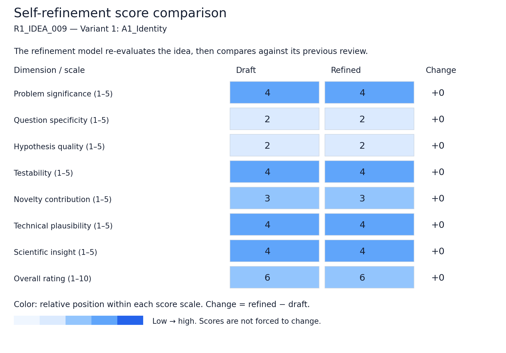

Changed score dimensions: none.

### Score justifications (draft / refined)

**Problem significance**

```json
{
  "draft": {
    "score": 4.0,
    "justification": "The problem is meaningful: fine-grained temporal understanding in visual processing is an important gap in both neuroscience and machine learning. Comparing artificial and biological systems can yield insights for both fields, and brain-aligned architectures are a growing research direction."
  },
  "refined": {
    "score": 4.0,
    "justification": "The problem is meaningful and timely. Fine-grained temporal understanding in visual processing represents an important gap in both neuroscience (understanding dynamic neural computation) and machine learning (designing efficient video architectures). Brain-aligned architectures are a growing research direction with potential for cross-disciplinary insight."
  }
}
```

**Question specificity**

```json
{
  "draft": {
    "score": 2.0,
    "justification": "The idea states a general aim ('reveal mechanistic principles', 'inform design') but does not define a concrete research question. It lacks specificity about what exactly is being investigated—e.g., which principles, which architectural properties, or what specific temporal dynamics."
  },
  "refined": {
    "score": 2.0,
    "justification": "The idea states general aims ('reveal mechanistic principles', 'inform design') but does not define a concrete research question. It lacks specificity about what exactly is being investigated—which principles, which architectural properties, or what specific temporal dynamics. The question remains at the level of exploratory correlation rather than focused investigation."
  }
}
```

**Hypothesis quality**

```json
{
  "draft": {
    "score": 2.0,
    "justification": "There is no explicit or clearly implicit hypothesis. The idea suggests a correlation (benchmarking representations) but does not make a testable prediction about the relationship between model architectures and brain signals, or about what 'efficient brain-like understanding' entails."
  },
  "refined": {
    "score": 2.0,
    "justification": "There is no explicit or clearly implicit hypothesis. The idea suggests a correlation study (benchmarking representations) but does not make a testable prediction about the relationship between model architectures and brain signals, or about what constitutes 'efficient brain-like understanding.' It lacks the predictive element that would distinguish it from generic exploration."
  }
}
```

**Testability**

```json
{
  "draft": {
    "score": 4.0,
    "justification": "The proposed benchmarking approach is inherently testable: one can measure similarity between model representations and EEG signals. However, without a specific hypothesis, the test is more exploratory than confirmatory."
  },
  "refined": {
    "score": 4.0,
    "justification": "The proposed benchmarking approach is inherently testable: one can measure similarity between model representations and EEG signals using established metrics. However, without a specific hypothesis, the test is more exploratory than confirmatory. The methodology itself is sound and could yield quantitative results."
  }
}
```

**Novelty contribution**

```json
{
  "draft": {
    "score": 3.0,
    "justification": "Comparing deep learning models to neural data is not new, but focusing on dynamic EEG recordings for natural videos is a more specific and less explored angle. The potential contribution is moderate: it could provide new empirical data, but the novelty depends on the specific findings and how they advance beyond existing neural alignment studies."
  },
  "refined": {
    "score": 3.0,
    "justification": "Comparing deep learning models to neural data is not new, but focusing on dynamic EEG recordings for natural videos is a more specific and less explored angle than static image fMRI studies. The potential contribution is moderate: it could provide new empirical data about temporal alignment, but the novelty depends heavily on the specific findings and how they advance beyond existing neural alignment literature. Without a specific hypothesis, it risks being an incremental application."
  }
}
```

**Technical plausibility**

```json
{
  "draft": {
    "score": 4.0,
    "justification": "The approach is technically plausible: representation similarity analysis between models and EEG data is a established methodology. Aligning video models with temporal brain signals is a coherent direction, assuming appropriate datasets and metrics are available."
  },
  "refined": {
    "score": 4.0,
    "justification": "The approach is technically plausible. Representation similarity analysis between models and EEG data is an established methodology in neuroscience. Aligning video models with temporal brain signals is a coherent direction, assuming appropriate datasets (video-EEG pairs) and metrics are available. The main technical challenges are practical (data acquisition, preprocessing) rather than conceptual."
  }
}
```

**Scientific insight**

```json
{
  "draft": {
    "score": 4.0,
    "justification": "The idea has strong potential for scientific insight: comparing artificial and biological temporal processing could reveal principles of efficient dynamic vision, inform theories of neural computation, and guide the design of more brain-like video models. However, the insight depends on how deeply the analysis probes mechanisms rather than just reporting correlations."
  },
  "refined": {
    "score": 4.0,
    "justification": "The idea has strong potential for scientific insight. Comparing artificial and biological temporal processing could reveal principles of efficient dynamic vision, inform theories of neural computation, and guide the design of more brain-like video models. However, the insight depends critically on how deeply the analysis probes mechanisms (e.g., hierarchical timing, content-specific responses) rather than just reporting surface-level correlations."
  }
}
```

**Overall rating**

```json
{
  "draft": {
    "score": 6.0,
    "justification": "This is a moderate/borderline research idea. It addresses a significant problem and proposes a plausible, testable approach with good potential for insight. However, it lacks specificity in its research question and hypothesis, making it more of a general direction than a focused investigation. With refinement, it could become a strong idea."
  },
  "refined": {
    "score": 6.0,
    "justification": "This is a moderate/borderline research idea. It addresses a significant interdisciplinary problem and proposes a plausible, testable methodology with good potential for insight. However, it lacks specificity in its research question and hypothesis, making it more of a general exploratory direction than a focused investigation. With refinement—particularly formulating a concrete hypothesis and defining specific research questions—it could become a strong idea (7-8). As presented, it's promising but under-specified."
  }
}
```

## R1_IDEA_009 — Variant 2: A2_Paraphrase_Only

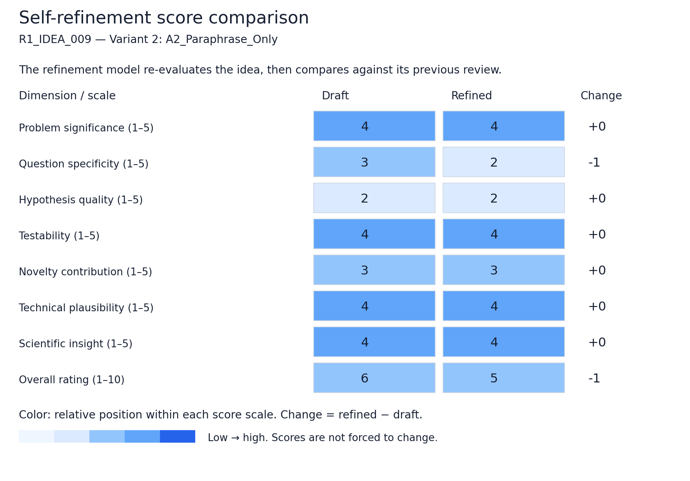

Changed score dimensions: question_specificity, overall_rating.

### Score justifications (draft / refined)

**Problem significance**

```json
{
  "draft": {
    "score": 4.0,
    "justification": "The problem is meaningful as it addresses an important gap in both machine learning (temporal understanding in video models) and neuroscience (computational principles of video processing). Understanding how the brain processes dynamic visual information could inform better AI systems, and benchmarking against neural data provides a concrete evaluation approach."
  },
  "refined": {
    "score": 4.0,
    "justification": "The problem is meaningful as it addresses an important gap in both machine learning (temporal understanding in video models) and neuroscience (computational principles of dynamic visual processing). Understanding how the brain processes video information efficiently could inform better AI systems, and benchmarking against neural data provides a concrete evaluation approach. The focus on fine-grained temporal understanding is particularly relevant given the limitations of current video models."
  }
}
```

**Question specificity**

```json
{
  "draft": {
    "score": 3.0,
    "justification": "The idea identifies a general direction (benchmarking video models against EEG) but doesn't specify exactly what is being investigated. What specific aspects of representations are being compared? What temporal scales? What types of video understanding? The question could be more precisely defined."
  },
  "refined": {
    "score": 2.0,
    "justification": "The idea identifies a general direction but lacks a clearly defined research question. It states what will be done (benchmarking) but not what specific aspect is being investigated. What exactly is being compared? Which temporal scales? What specific properties of representations? The question 'address the lack of fine-grained temporal understanding' is too broad and could encompass many different investigations."
  }
}
```

**Hypothesis quality**

```json
{
  "draft": {
    "score": 2.0,
    "justification": "The idea contains an implicit hypothesis that deep video model representations should align with EEG recordings in some meaningful way, but this is not articulated as a concrete, testable prediction. There's no specific statement about what patterns or relationships are expected to be found, or what would constitute evidence for or against brain-like processing."
  },
  "refined": {
    "score": 2.0,
    "justification": "There is only an implicit, vague hypothesis that deep video model representations should somehow align with EEG recordings. No concrete prediction is made about what patterns or relationships should be found, what would constitute evidence for or against brain-like processing, or what specific principles might be uncovered. The hypothesis lacks the specificity needed to guide meaningful investigation."
  }
}
```

**Testability**

```json
{
  "draft": {
    "score": 4.0,
    "justification": "The proposed benchmarking approach is inherently testable. One could extract representations from various video models, record EEG responses to natural videos, and compute similarity metrics (e.g., representational similarity analysis). The methodology suggests clear experiments and comparisons that could yield empirical evidence."
  },
  "refined": {
    "score": 4.0,
    "justification": "The proposed benchmarking approach is inherently testable. One could extract representations from various video models, record EEG responses to natural videos, and compute similarity metrics (e.g., representational similarity analysis). The methodology suggests clear experiments and comparisons that could yield empirical evidence, even if the specific research question is broad."
  }
}
```

**Novelty contribution**

```json
{
  "draft": {
    "score": 3.0,
    "justification": "Comparing neural representations to AI model representations is an established neuroAI approach, but applying this to video models and EEG (rather than static images and fMRI) has some novelty. The focus on fine-grained temporal understanding adds specificity. However, the core idea of benchmarking AI against brain data is not fundamentally new."
  },
  "refined": {
    "score": 3.0,
    "justification": "Comparing neural representations to AI model representations is an established neuroAI approach. Applying this to video models and EEG (rather than static images and fMRI) has some novelty, and the focus on fine-grained temporal understanding adds specificity. However, the core idea of benchmarking AI against brain data is not fundamentally new, and the contribution would depend heavily on what specific insights are uncovered."
  }
}
```

**Technical plausibility**

```json
{
  "draft": {
    "score": 4.0,
    "justification": "The approach is technically plausible. Representational similarity analysis between neural data and model activations is a well-established methodology. EEG recordings of video viewing are feasible, and extracting representations from deep video models is straightforward. The main challenge would be designing appropriate comparisons and interpreting results meaningfully."
  },
  "refined": {
    "score": 4.0,
    "justification": "The approach is technically plausible. Representational similarity analysis between neural data and model activations is well-established. EEG recordings of video viewing are feasible, and extracting representations from deep video models is straightforward. The main challenges would be in experimental design (controlling for confounding variables) and meaningful interpretation of results, but the basic methodology is sound."
  }
}
```

**Scientific insight**

```json
{
  "draft": {
    "score": 4.0,
    "justification": "If successful, this research could provide insights into both how the brain processes dynamic visual information and what computational principles might be missing from current video models. The potential to uncover 'mechanistic principles' for temporal understanding could inform more brain-inspired architectures, offering transferable insights beyond simple performance benchmarking."
  },
  "refined": {
    "score": 4.0,
    "justification": "If successfully executed with a more focused research question, this research could provide insights into both how the brain processes dynamic visual information and what computational principles might be missing from current video models. The potential to uncover 'mechanistic principles' for temporal understanding could inform more brain-inspired architectures, offering transferable insights beyond simple performance benchmarking."
  }
}
```

**Overall rating**

```json
{
  "draft": {
    "score": 6.0,
    "justification": "This is a moderate research idea with clear strengths in addressing an important interdisciplinary problem and proposing a concrete methodological approach. However, it lacks specificity in its research question and hypothesis, which limits its scientific rigor. The idea has good testability and technical plausibility, and could yield meaningful insights if more precisely formulated. It represents a reasonable research direction but needs refinement to become a strong research proposal."
  },
  "refined": {
    "score": 5.0,
    "justification": "This is a moderate research idea with clear strengths in addressing an important interdisciplinary problem and proposing a concrete methodological approach that is testable and technically plausible. However, it lacks specificity in its research question and hypothesis, which significantly limits its scientific rigor. The idea represents a reasonable research direction but needs substantial refinement to become a strong research proposal. It currently reads more like a general area of investigation than a focused research idea."
  }
}
```

## R1_IDEA_009 — Variant 3: A3_Plain_Core


Changed score dimensions: question_specificity, hypothesis_quality, testability, overall_rating.

### Score justifications (draft / refined)

**Problem significance**

```json
{
  "draft": {
    "score": 4.0,
    "justification": "The problem is meaningful as it addresses an important gap in understanding temporal aspects of visual processing. Bridging neuroscience and AI for video understanding has clear relevance for both fields, potentially advancing brain-inspired AI and our understanding of biological vision."
  },
  "refined": {
    "score": 4.0,
    "justification": "The problem is meaningful and addresses an important gap. Understanding temporal aspects of visual processing through the lens of brain-AI alignment has clear relevance for both neuroscience (understanding biological vision) and AI (developing more efficient, brain-inspired architectures). The focus on fine-grained temporal understanding in natural videos is particularly relevant given the limitations of current video models."
  }
}
```

**Question specificity**

```json
{
  "draft": {
    "score": 3.0,
    "justification": "The idea identifies a general direction (benchmarking representations against EEG) but lacks a concrete research question. It doesn't specify what exactly will be investigated about the relationship between model representations and brain recordings."
  },
  "refined": {
    "score": 2.0,
    "justification": "The idea identifies a general direction but lacks a concrete research question. It states what will be done (benchmarking) but not what specific aspect of the relationship between model representations and brain recordings will be investigated. There's no specification of what 'fine-grained temporal understanding' means operationally or which representational aspects will be compared."
  }
}
```

**Hypothesis quality**

```json
{
  "draft": {
    "score": 2.0,
    "justification": "There is no explicit or clearly implied hypothesis. The idea states aims and goals but doesn't make testable predictions about what will be discovered or how model representations should relate to brain recordings."
  },
  "refined": {
    "score": 1.0,
    "justification": "There is no explicit or clearly implied hypothesis. The idea states aims and goals ('to address a gap', 'to reveal principles', 'to inform design') but makes no testable predictions about what will be discovered or how model representations should relate to brain recordings. It lacks any concrete prediction that could be supported or contradicted by evidence."
  }
}
```

**Testability**

```json
{
  "draft": {
    "score": 4.0,
    "justification": "The proposed benchmarking approach is inherently testable. Comparing model representations to EEG recordings provides a clear methodological framework for investigation, even without specific hypotheses."
  },
  "refined": {
    "score": 3.0,
    "justification": "The proposed benchmarking approach provides a methodological framework that is inherently testable in principle. However, without specific hypotheses about expected relationships or alignment patterns, the testability is limited to exploratory analysis rather than hypothesis testing. The idea suggests an evaluation method but doesn't specify what would constitute meaningful results."
  }
}
```

**Novelty contribution**

```json
{
  "draft": {
    "score": 4.0,
    "justification": "The focus on fine-grained temporal understanding of videos using EEG is relatively novel. While there is work comparing static image representations to brain data, the dynamic video aspect with EEG recordings represents a meaningful extension with potential for new insights."
  },
  "refined": {
    "score": 4.0,
    "justification": "The focus on fine-grained temporal understanding of videos using EEG is relatively novel. While there is substantial work comparing static image representations to brain data (fMRI, MEG), the dynamic video aspect with EEG recordings represents a meaningful extension with potential for new insights about temporal processing. The interdisciplinary nature adds novelty value."
  }
}
```

**Technical plausibility**

```json
{
  "draft": {
    "score": 4.0,
    "justification": "The approach is technically plausible. Representational similarity analysis between deep learning models and brain data is an established methodology, and EEG recordings of video viewing are feasible to obtain."
  },
  "refined": {
    "score": 4.0,
    "justification": "The approach is technically plausible. Representational similarity analysis between deep learning models and brain data is an established methodology in computational neuroscience. EEG recordings of natural video viewing are feasible to obtain, and comparing them to model representations follows established practices in brain-AI alignment research."
  }
}
```

**Scientific insight**

```json
{
  "draft": {
    "score": 4.0,
    "justification": "The idea has strong potential for scientific insight. Successfully relating model representations to brain dynamics could reveal principles of temporal visual processing, inform theories of how the brain processes dynamic scenes, and guide the development of more brain-like video understanding systems."
  },
  "refined": {
    "score": 4.0,
    "justification": "The idea has strong potential for scientific insight if properly executed. Successfully relating model representations to brain dynamics could reveal principles of temporal visual processing, inform theories of how the brain processes dynamic scenes, and potentially guide the development of more efficient or robust video understanding systems. The dual neuroscience-AI perspective enhances insight potential."
  }
}
```

**Overall rating**

```json
{
  "draft": {
    "score": 6.0,
    "justification": "This is a moderate/borderline research idea with clear strengths in addressing an important interdisciplinary problem and proposing a technically plausible approach. However, it lacks specificity in its research question and hypothesis, which limits its scientific rigor as currently formulated. The idea has good potential but needs more concrete framing to become a strong research direction."
  },
  "refined": {
    "score": 5.0,
    "justification": "This is a moderate/borderline research idea. It addresses an important interdisciplinary problem and proposes a technically plausible approach with good potential for scientific insight. However, it lacks specificity in its research question and completely lacks any hypothesis, which significantly limits its scientific rigor as currently formulated. The idea has good raw materials but needs much more concrete framing to become a strong research direction."
  }
}
```

## R1_IDEA_009 — Variant 4: B1_Verbose_Elaborate

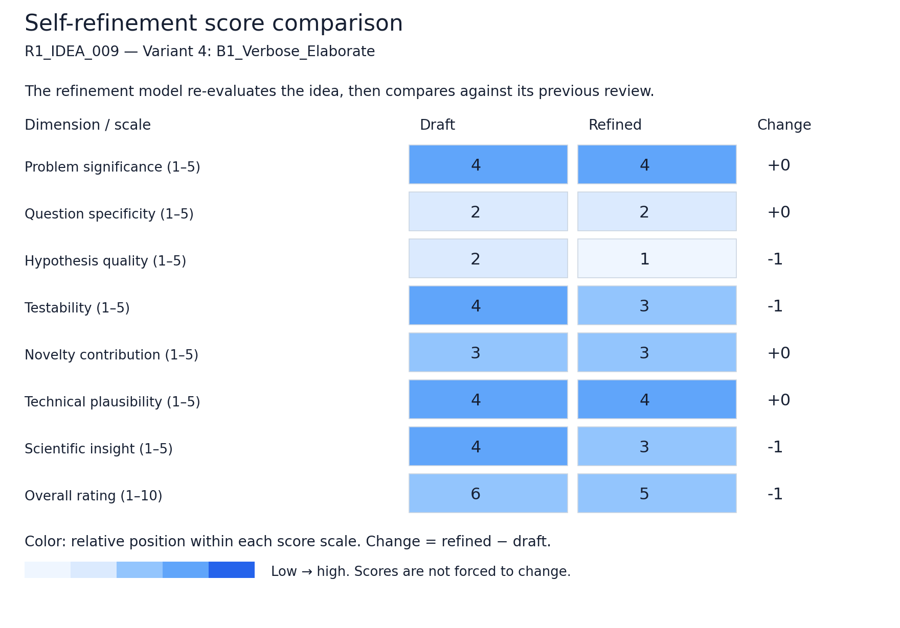

Changed score dimensions: hypothesis_quality, testability, scientific_insight, overall_rating.

### Score justifications (draft / refined)

**Problem significance**

```json
{
  "draft": {
    "score": 4.0,
    "justification": "The problem is meaningful and timely. Understanding the relationship between artificial and biological visual systems is an important interdisciplinary challenge. The focus on temporal dynamics in video understanding addresses a gap, as most brain-model comparisons focus on static images. The potential to inform more efficient, brain-inspired architectures is relevant to both neuroscience and machine learning."
  },
  "refined": {
    "score": 4.0,
    "justification": "The problem is significant. Understanding the correspondence (or lack thereof) between artificial and biological vision systems is a core challenge in neuro-AI. Focusing on the temporal dynamics of video processing, rather than static images, addresses a recognized gap. The potential to derive design principles for more efficient, robust models from neuroscience is a compelling and relevant long-term goal."
  }
}
```

**Question specificity**

```json
{
  "draft": {
    "score": 2.0,
    "justification": "The research question is somewhat vague. While the idea proposes a benchmark and mentions 'revealing mechanistic principles,' it doesn't specify what specific principles, relationships, or phenomena will be investigated. The question of how deep video models relate to EEG dynamics during natural video viewing is a good starting point, but needs more precise formulation about what aspects will be compared and why."
  },
  "refined": {
    "score": 2.0,
    "justification": "The research question is poorly defined. Phrases like 'address the existing gap,' 'reveal mechanistic principles,' and 'inform the design' are goals, not specific questions. The idea does not specify what is being compared (which model properties vs. which neural features), nor what relationship is being investigated. It proposes an activity (creating a benchmark) rather than posing a focused inquiry."
  }
}
```

**Hypothesis quality**

```json
{
  "draft": {
    "score": 2.0,
    "justification": "There is no explicit hypothesis, only a general aim. The implicit hypothesis seems to be that comparing model representations to EEG data will reveal something about brain-like video understanding, but this is not formulated as a testable prediction. A stronger hypothesis would specify what kind of relationship is expected between particular model properties and specific EEG features."
  },
  "refined": {
    "score": 1.0,
    "justification": "There is no discernible hypothesis. The text states aims and goals ('to address,' 'to reveal,' 'to thereby inform'), but makes no concrete, testable prediction about the relationship between video model representations and EEG data. The implicit assumption that such a comparison will be insightful is not formulated as a falsifiable claim."
  }
}
```

**Testability**

```json
{
  "draft": {
    "score": 4.0,
    "justification": "The idea is testable through the proposed benchmark approach. Comparing model representations to EEG recordings provides a clear methodological path. The benchmark could include quantitative metrics of similarity between model activations and brain signals. However, without more specific hypotheses about what relationships to test, the testability is somewhat generic."
  },
  "refined": {
    "score": 3.0,
    "justification": "The idea is testable in a generic sense because one can always compute some metric between model activations and EEG signals. However, without a specific hypothesis or research question, the 'test' is merely an exploratory correlation analysis. The proposed benchmark provides a framework for testing, but what exactly is being tested remains undefined, limiting its focused testability."
  }
}
```

**Novelty contribution**

```json
{
  "draft": {
    "score": 3.0,
    "justification": "The combination of video models with EEG during natural video viewing has some novelty, as most neuro-AI comparisons use static images. However, the core idea of comparing deep learning representations to brain data is well-established (e.g., representational similarity analysis in vision neuroscience). The contribution would depend heavily on the specific insights gained about temporal processing mechanisms."
  },
  "refined": {
    "score": 3.0,
    "justification": "Moderately novel. The application of representational comparison methods to video models and EEG data is a logical extension of existing neuro-AI work on static images. The use of natural videos is a positive step towards ecological validity. However, the core concept of benchmarking models against brain data is not novel. The potential contribution hinges entirely on the yet-unspecified insights this particular benchmark might yield."
  }
}
```

**Technical plausibility**

```json
{
  "draft": {
    "score": 4.0,
    "justification": "The approach is technically plausible. Methods for comparing neural network representations to brain data (e.g., representational similarity analysis, encoding models) are established. EEG recordings during video viewing are feasible. The main challenge would be designing appropriate comparisons between high-dimensional model representations and lower-dimensional EEG signals, but this is a known methodological problem with existing solutions."
  },
  "refined": {
    "score": 4.0,
    "justification": "The approach is technically plausible. Collecting EEG during video viewing is standard. Methods for comparing deep network representations to neural data (e.g., Representational Similarity Analysis, encoding models) are well-established. The main technical challenges (aligning temporal scales, reducing dimensionality, handling noise) are known and have been addressed in prior literature, making the overall direction feasible."
  }
}
```

**Scientific insight**

```json
{
  "draft": {
    "score": 4.0,
    "justification": "The idea has good potential for scientific insight. Successfully relating video model architectures to EEG dynamics could reveal principles of temporal processing in biological vision. This could inform theories of how brains process dynamic visual information efficiently. The benchmark could establish quantitative relationships between architectural choices and brain-like processing, providing transferable insights beyond any single model."
  },
  "refined": {
    "score": 3.0,
    "justification": "The potential for insight is moderate but highly conditional. If executed with a specific, well-motivated question, comparing temporal dynamics could reveal principles about how brains efficiently process changing visual scenes. However, as stated, the insight is vague ('mechanistic principles'). The benchmark could produce a ranking of models by neural similarity, but without a hypothesis about why, the scientific insight would be limited."
  }
}
```

**Overall rating**

```json
{
  "draft": {
    "score": 6.0,
    "justification": "This is a moderate/borderline research idea with clear strengths and weaknesses. The problem is significant and the methodological direction is plausible. However, the research question lacks specificity, and there's no clear hypothesis. The idea has good potential for scientific insight if developed further with more precise questions and testable predictions. As presented, it's more of a promising research direction than a fully formed research idea."
  },
  "refined": {
    "score": 5.0,
    "justification": "This is a moderate/borderline research idea. It identifies a significant problem area and a plausible methodological tool (a benchmark). Its core weakness is the lack of a specific research question or hypothesis; it is a proposed activity rather than a focused investigation. As such, it has the scaffolding for a good idea but lacks the critical intellectual content that would define a meaningful scientific study. With substantial refinement to pose a concrete, testable question, it could become strong."
  }
}
```

## R1_IDEA_009 — Variant 5: B2_Grand_Narrative

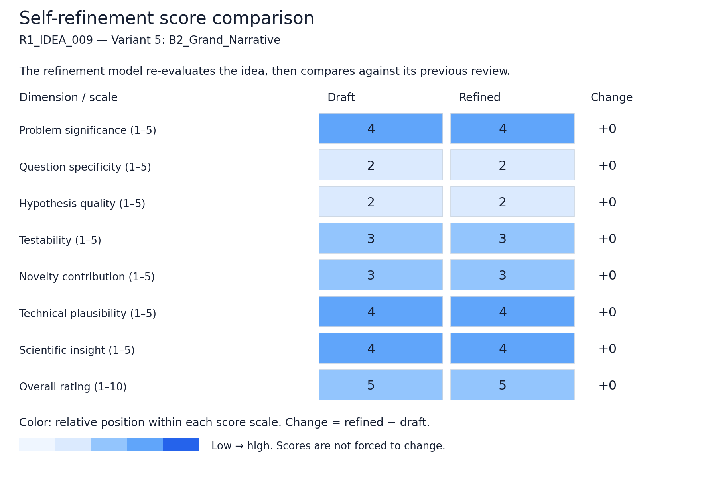

Changed score dimensions: none.

### Score justifications (draft / refined)

**Problem significance**

```json
{
  "draft": {
    "score": 4.0,
    "justification": "The problem is meaningful: bridging computational video models and neural dynamics of vision is an active area with potential for reciprocal insight. The long-term goal of building brain-aligned efficient systems is scientifically valuable."
  },
  "refined": {
    "score": 4.0,
    "justification": "The problem is meaningful and timely. Bridging computational video models and neural dynamics of vision is an active interdisciplinary area with potential for reciprocal insight. The long-term goal of building brain-aligned, efficient systems for dynamic visual processing is scientifically valuable and addresses a core challenge in both AI and neuroscience."
  }
}
```

**Question specificity**

```json
{
  "draft": {
    "score": 2.0,
    "justification": "The idea states a general aim ('benchmark... to address the gap') but does not define a concrete research question. It lacks specificity about what relationship or mechanism is being investigated."
  },
  "refined": {
    "score": 2.0,
    "justification": "The idea states a general aim ('benchmark... to address the gap') but does not define a concrete research question. It lacks specificity about what relationship, mechanism, or comparison is being investigated. The term 'fine-grained temporal understanding' remains vague."
  }
}
```

**Hypothesis quality**

```json
{
  "draft": {
    "score": 2.0,
    "justification": "No explicit or clearly implicit hypothesis is presented. The language is speculative ('could contribute', 'may inform') rather than predictive. The idea does not make a testable claim about how model representations relate to EEG dynamics."
  },
  "refined": {
    "score": 2.0,
    "justification": "No explicit or clearly implicit hypothesis is presented. The language is speculative ('could contribute', 'may inform', 'aiming to reveal') rather than predictive. The idea does not make a testable claim about how model representations relate to EEG dynamics or what specific outcome is expected."
  }
}
```

**Testability**

```json
{
  "draft": {
    "score": 3.0,
    "justification": "Benchmarking is a testable activity, and comparing model representations to neural data is a established methodology. However, without a specific hypothesis or comparison, the test is more exploratory than hypothesis-driven."
  },
  "refined": {
    "score": 3.0,
    "justification": "Benchmarking is a testable activity, and comparing model representations to neural data is an established methodology (e.g., RSA). However, without a specific hypothesis or defined comparison, the test is more exploratory than hypothesis-driven. The core activity is feasible, but the lack of a clear claim reduces testability."
  }
}
```

**Novelty contribution**

```json
{
  "draft": {
    "score": 3.0,
    "justification": "Benchmarking deep models against neural data is not new (e.g., in static image recognition). Applying this to video models and dynamic EEG is a logical extension with moderate novelty. The potential contribution depends heavily on what is discovered."
  },
  "refined": {
    "score": 3.0,
    "justification": "Benchmarking deep models against neural data is not new (common in static image recognition). Applying this to video models and dynamic EEG is a logical extension with moderate novelty. The potential contribution depends heavily on what is discovered; as stated, it is an application of an existing methodology to a new modality pairing."
  }
}
```

**Technical plausibility**

```json
{
  "draft": {
    "score": 4.0,
    "justification": "The proposed direction is technically plausible. Representational similarity analysis between deep network layers and neural recordings is a well-established technique. The use of natural video stimuli and EEG is feasible."
  },
  "refined": {
    "score": 4.0,
    "justification": "The proposed direction is technically plausible. Representational similarity analysis between deep network layers and neural recordings is well-established. The use of natural video stimuli and EEG is feasible, and there are existing datasets and methods for such comparisons."
  }
}
```

**Scientific insight**

```json
{
  "draft": {
    "score": 4.0,
    "justification": "If executed with a clear question, this has high potential for scientific insight. It could reveal principles of temporal processing shared (or not shared) between brains and models, informing theories of efficient dynamic vision."
  },
  "refined": {
    "score": 4.0,
    "justification": "If executed with a clear question, this has high potential for scientific insight. It could reveal principles of temporal processing shared (or not shared) between brains and models, informing theories of efficient dynamic vision and potentially leading to new architectural inductive biases. The insight is contingent on moving beyond mere benchmarking to mechanistic interpretation."
  }
}
```

**Overall rating**

```json
{
  "draft": {
    "score": 5.0,
    "justification": "This is a moderate/borderline research idea. It identifies a relevant problem and a plausible methodological direction, but it is currently too vague. The lack of a specific research question or hypothesis limits its scientific sharpness. With refinement, it could become a strong idea."
  },
  "refined": {
    "score": 5.0,
    "justification": "This is a moderate/borderline research idea. It identifies a relevant problem and a plausible methodological direction, but it is currently too vague. The lack of a specific research question or hypothesis limits its scientific sharpness and testability. With refinement—particularly a concrete hypothesis and clearer definition of the targeted gap—it could become a strong idea."
  }
}
```

## R1_IDEA_009 — Variant 6: B3_Over_Confident

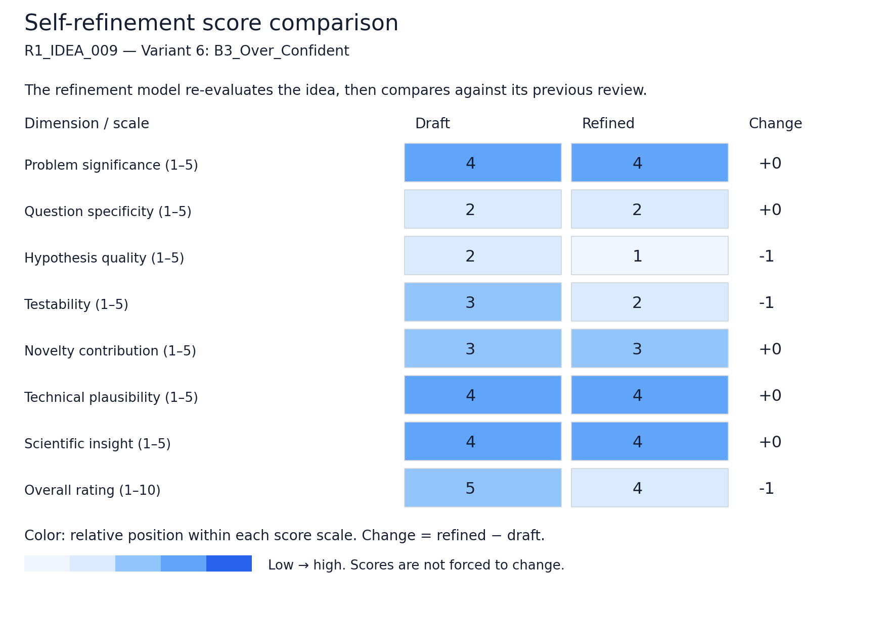

Changed score dimensions: hypothesis_quality, testability, overall_rating.

### Score justifications (draft / refined)

**Problem significance**

```json
{
  "draft": {
    "score": 4.0,
    "justification": "The problem is meaningful and addresses an important gap. Understanding temporal processing in visual systems is a fundamental challenge in both neuroscience and computer vision. The intersection of EEG recordings and deep video models has clear scientific relevance for understanding brain-like computation."
  },
  "refined": {
    "score": 4.0,
    "justification": "The problem is meaningful and addresses an important interdisciplinary gap. Understanding temporal processing in visual systems is fundamental to both neuroscience and computer vision. The intersection of EEG recordings (with millisecond temporal resolution) and deep video models has clear scientific relevance for understanding brain-like computation and could inform more efficient visual architectures."
  }
}
```

**Question specificity**

```json
{
  "draft": {
    "score": 2.0,
    "justification": "The research question is stated very broadly ('addresses the gap in fine-grained temporal understanding'). While the methodological approach is specified (benchmarking against EEG), the specific aspect of temporal understanding being investigated is not clearly defined. The idea lacks a concrete research question about what specific temporal properties or mechanisms are being studied."
  },
  "refined": {
    "score": 2.0,
    "justification": "The research question is stated very broadly ('addresses the gap in fine-grained temporal understanding'). While the methodological approach is specified (benchmarking against EEG), the specific aspect of temporal understanding being investigated is not clearly defined. The idea lacks a concrete research question about what specific temporal properties, mechanisms, or relationships are being studied."
  }
}
```

**Hypothesis quality**

```json
{
  "draft": {
    "score": 2.0,
    "justification": "There is no explicit or clearly implicit hypothesis. The idea states aims ('reveal mechanistic principles', 'inform design') but makes no concrete predictions about what will be found or what relationships will be discovered. The language is declarative ('undoubtedly aims', 'firmly informs') rather than predictive."
  },
  "refined": {
    "score": 1.0,
    "justification": "There is no explicit or clearly implicit hypothesis. The idea states aims ('reveal mechanistic principles', 'inform design') but makes no concrete, testable predictions about what will be found. The language is declarative and promotional rather than predictive. There is no statement that could be supported or contradicted by evidence."
  }
}
```

**Testability**

```json
{
  "draft": {
    "score": 3.0,
    "justification": "The general approach of benchmarking models against EEG data is testable in principle. However, without specific hypotheses or success criteria, it's unclear what would constitute a meaningful test. The idea suggests comparison but doesn't specify what evidence would support or contradict the claims about 'mechanistic principles' or 'brain-aligned' design."
  },
  "refined": {
    "score": 2.0,
    "justification": "The general approach of benchmarking models against EEG data is testable in principle, but without specific hypotheses, metrics, or success criteria, it's unclear what would constitute a meaningful test. The idea suggests a comparison but doesn't specify what evidence would support or contradict the claims about 'mechanistic principles' or 'brain-aligned' design. It's more of a general direction than a testable investigation."
  }
}
```

**Novelty contribution**

```json
{
  "draft": {
    "score": 3.0,
    "justification": "The combination of EEG recordings with deep video models has novelty, though comparing neural recordings to model representations is an established research direction. The specific focus on fine-grained temporal dynamics in natural video viewing could offer new insights, but the idea doesn't articulate what specifically would be novel about the expected findings."
  },
  "refined": {
    "score": 3.0,
    "justification": "The combination of EEG recordings with deep video models has some novelty, though comparing neural recordings to model representations is an established research direction. The specific focus on fine-grained temporal dynamics in natural video viewing could offer new insights, but the idea doesn't articulate what specifically would be novel about the expected findings beyond applying an established methodology to video models."
  }
}
```

**Technical plausibility**

```json
{
  "draft": {
    "score": 4.0,
    "justification": "The proposed direction is technically plausible. Benchmarking model representations against neural data is a well-established methodology in neuroscience-inspired AI research. EEG recordings of natural video viewing are feasible, and comparing temporal dynamics makes sense given EEG's millisecond temporal resolution."
  },
  "refined": {
    "score": 4.0,
    "justification": "The proposed direction is technically plausible. Benchmarking model representations against neural data is a well-established methodology in neuroscience-inspired AI research. EEG recordings of natural video viewing are feasible, and comparing temporal dynamics aligns well with EEG's millisecond temporal resolution. The basic premise of comparing artificial and biological systems is sound."
  }
}
```

**Scientific insight**

```json
{
  "draft": {
    "score": 4.0,
    "justification": "The idea has strong potential for scientific insight if executed well. Understanding temporal processing mechanisms in visual systems could reveal fundamental principles of efficient video understanding. The comparison could identify specific limitations in current architectures and suggest biologically-inspired improvements. However, the potential insight depends heavily on what specific questions are asked and how the comparison is framed."
  },
  "refined": {
    "score": 4.0,
    "justification": "The idea has strong potential for scientific insight if executed with specific questions. Understanding temporal processing mechanisms in visual systems could reveal fundamental principles of efficient video understanding. The comparison could identify specific limitations in current architectures and suggest biologically-inspired improvements. However, this potential insight depends entirely on what specific questions are asked and how the comparison is framed, which is currently unspecified."
  }
}
```

**Overall rating**

```json
{
  "draft": {
    "score": 5.0,
    "justification": "This is a moderate/borderline research idea. While it addresses an important problem and has good technical plausibility and potential insight, it lacks specificity in its research question, has no clear hypothesis, and doesn't articulate what would constitute meaningful evidence. The idea describes a general direction rather than a focused investigation. With more specific hypotheses and clearer success criteria, it could become a strong research idea."
  },
  "refined": {
    "score": 4.0,
    "justification": "This is a weak research idea. While it addresses an important problem and has good technical plausibility and potential insight, it lacks almost all the elements of a strong research idea: no specific research question, no hypothesis, poor testability due to lack of defined success criteria, and overly broad goals. The idea describes a general area of interest rather than a focused investigation. It reads more like a motivation section than a research proposal. With specific hypotheses, clear comparison metrics, and operational definitions, it could become a strong research idea."
  }
}
```

## R1_IDEA_009 — Variant 7: B4_Novelty

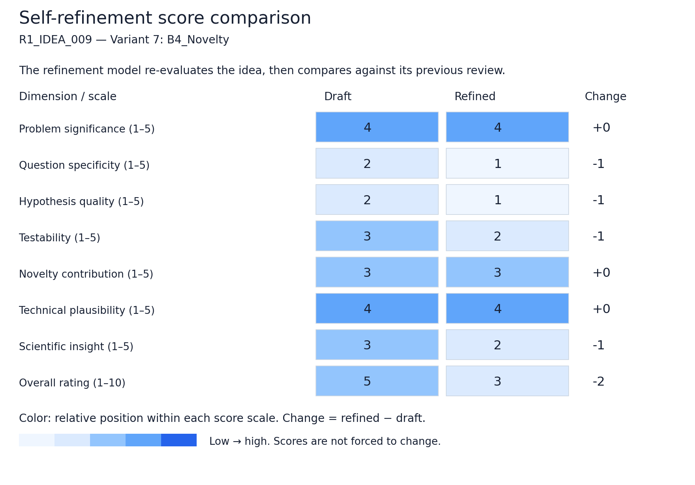

Changed score dimensions: question_specificity, hypothesis_quality, testability, scientific_insight, overall_rating.

### Score justifications (draft / refined)

**Problem significance**

```json
{
  "draft": {
    "score": 4.0,
    "justification": "The problem of understanding temporal processing in visual systems is important for both neuroscience and machine learning. The gap between biological and artificial video understanding is meaningful, and using neural recordings to inform model design has precedent and potential impact."
  },
  "refined": {
    "score": 4.0,
    "justification": "Understanding temporal processing in visual systems is an important problem at the intersection of neuroscience and AI. The gap between biological and artificial video understanding is meaningful, and using neural recordings to inform model design has precedent and potential impact for both fields."
  }
}
```

**Question specificity**

```json
{
  "draft": {
    "score": 2.0,
    "justification": "The research question is framed broadly as 'understanding the gap in fine-grained temporal understanding' without specifying what aspect of temporal understanding is being investigated. The idea mentions benchmarking but doesn't define what specific comparisons or analyses would be performed."
  },
  "refined": {
    "score": 1.0,
    "justification": "The research question is extremely vague. 'Gap in fine-grained temporal understanding' is not defined. There is no specification of what aspect of temporal understanding is being investigated, what comparisons would be made, or what constitutes 'understanding' in this context. The idea mentions benchmarking but doesn't define what specifically would be benchmarked."
  }
}
```

**Hypothesis quality**

```json
{
  "draft": {
    "score": 2.0,
    "justification": "There is no explicit or clearly implicit hypothesis. The idea suggests that benchmarking will 'reveal mechanistic principles' but doesn't predict what those principles might be or how they would manifest in the comparison. The connection between EEG recordings and 'efficient brain-like video understanding' is asserted rather than hypothesized."
  },
  "refined": {
    "score": 1.0,
    "justification": "There is no explicit or implicit hypothesis. The idea suggests benchmarking will 'reveal mechanistic principles' but doesn't predict what those principles might be, how they would manifest, or what relationship should exist between model representations and EEG signals. The connection between EEG and 'efficient brain-like video understanding' is an assertion, not a testable prediction."
  }
}
```

**Testability**

```json
{
  "draft": {
    "score": 3.0,
    "justification": "The core idea of benchmarking model representations against EEG recordings is testable in principle. However, without specifying what comparisons would be made or what would constitute evidence for/against the idea's claims, the testability is limited. The idea suggests a methodological direction but not a specific test."
  },
  "refined": {
    "score": 2.0,
    "justification": "While benchmarking model representations against EEG recordings is technically feasible, the idea doesn't specify what would be tested. Without a hypothesis about what the comparison should reveal or what would constitute success/failure, the core claim is not meaningfully testable. The idea suggests a methodological approach but not a specific test of a scientific question."
  }
}
```

**Novelty contribution**

```json
{
  "draft": {
    "score": 3.0,
    "justification": "Using neural recordings to evaluate or inform model design is not novel in itself (e.g., neural alignment studies in vision). The specific focus on dynamic EEG recordings for video models is less explored, but the idea doesn't articulate what specifically new scientific contribution this would make beyond applying existing methods to a new modality pairing."
  },
  "refined": {
    "score": 3.0,
    "justification": "Using neural recordings to evaluate models is not novel (neural alignment studies exist for static images). The specific focus on dynamic EEG for video models is less explored, but the idea doesn't articulate what specifically new scientific contribution this would make. It appears to be applying established methods to a new modality pairing without a clear novel question or hypothesis."
  }
}
```

**Technical plausibility**

```json
{
  "draft": {
    "score": 4.0,
    "justification": "The proposed direction is technically plausible. Comparing model representations to neural recordings is an established methodology in computational neuroscience. EEG recordings of natural video viewing exist, and representational similarity analysis or other comparison methods could be applied. The main assumption that EEG signals contain meaningful information about temporal video processing is reasonable."
  },
  "refined": {
    "score": 4.0,
    "justification": "The proposed direction is technically plausible. Comparing model representations to neural recordings via methods like representational similarity analysis is established. EEG recordings of natural video viewing exist, and the comparison methodology is feasible. The main assumption that EEG contains meaningful temporal information about video processing is reasonable."
  }
}
```

**Scientific insight**

```json
{
  "draft": {
    "score": 3.0,
    "justification": "The idea has potential for scientific insight if it reveals specific principles of temporal processing that are shared or divergent between biological and artificial systems. However, as currently framed, it's unclear what specific insights would be gained beyond 'models and brains process videos differently/similarly.' The connection to 'informing architecture design' is promising but vague."
  },
  "refined": {
    "score": 2.0,
    "justification": "The idea has limited potential for scientific insight as currently framed. Without specifying what temporal aspects are being studied or what principles might be revealed, it's unclear what would be learned beyond potentially showing some correlation between model representations and EEG signals. The connection to informing architecture design is vague and not clearly linked to specific insights."
  }
}
```

**Overall rating**

```json
{
  "draft": {
    "score": 5.0,
    "justification": "This is a moderate research idea with a meaningful problem domain but limited specificity. The core concept of comparing video models to EEG recordings is reasonable and could yield interesting results, but the idea lacks a clear research question, hypothesis, and definition of what would be learned. It reads more like a broad motivation than a specific research direction. With more concrete formulation of what temporal aspects to study and what hypotheses to test, it could become a stronger idea."
  },
  "refined": {
    "score": 3.0,
    "justification": "This is a weak research idea. While it identifies a potentially meaningful problem domain, it lacks virtually all elements of a strong research direction: no specific research question, no hypothesis, poorly defined testability, and vague potential contributions. It reads as a broad motivation statement rather than a concrete research idea. The methodological suggestion (benchmarking against EEG) is reasonable but not paired with a scientific question worth investigating."
  }
}
```

## R1_IDEA_009 — Variant 8: B5_Application_Impact


Changed score dimensions: question_specificity, hypothesis_quality, testability, overall_rating.

### Score justifications (draft / refined)

**Problem significance**

```json
{
  "draft": {
    "score": 4.0,
    "justification": "The problem of understanding temporal visual processing is important both for neuroscience and computer vision. Bridging deep video models with neural recordings addresses a meaningful gap, and the potential to inform more efficient architectures is relevant."
  },
  "refined": {
    "score": 4.0,
    "justification": "The problem of understanding temporal visual processing is genuinely important for both neuroscience and computer vision. Bridging deep video models with neural recordings addresses a meaningful gap, and the potential to inform more efficient, brain-inspired architectures has clear relevance. However, the significance depends on what specific insights emerge beyond general benchmarking."
  }
}
```

**Question specificity**

```json
{
  "draft": {
    "score": 2.0,
    "justification": "The research question is quite broad: 'benchmarking deep video model representations against EEG recordings.' It lacks specificity about what aspects of representations, what temporal scales, what EEG features, or what specific relationships will be investigated."
  },
  "refined": {
    "score": 1.0,
    "justification": "The research question is extremely vague: 'benchmark deep video model representations against EEG recordings.' It lacks specificity about what aspects of representations (which layers, which features), what temporal scales, what EEG features (ERP components, frequency bands, etc.), or what specific relationships will be investigated. Terms like 'fine-grained temporal understanding' and 'brain-aligned' remain undefined."
  }
}
```

**Hypothesis quality**

```json
{
  "draft": {
    "score": 2.0,
    "justification": "No explicit or clearly implicit hypothesis is presented. The idea states aims ('to address the gap,' 'to reveal mechanistic principles') but doesn't make a concrete, testable prediction about what will be found or what relationship exists between model representations and brain activity."
  },
  "refined": {
    "score": 1.0,
    "justification": "No explicit or clearly implicit hypothesis is presented. The idea states aims ('to address the gap,' 'to reveal mechanistic principles') but doesn't make any concrete, testable prediction about what will be found or what relationship exists between model representations and brain activity. It's essentially a broad motivation statement rather than a hypothesis."
  }
}
```

**Testability**

```json
{
  "draft": {
    "score": 3.0,
    "justification": "The core activity (benchmarking representations against EEG) is testable in principle—one can compute correlations or other similarity metrics. However, without a more specific question, it's unclear what evidence would support or contradict the broader goal of 'revealing mechanistic principles.'"
  },
  "refined": {
    "score": 2.0,
    "justification": "The core activity (computing similarity metrics between model representations and EEG) is technically testable. However, without a specific hypothesis or research question, it's unclear what evidence would support or contradict the broader goal of 'revealing mechanistic principles.' The idea lacks criteria for what would constitute a meaningful finding versus noise."
  }
}
```

**Novelty contribution**

```json
{
  "draft": {
    "score": 3.0,
    "justification": "Comparing neural recordings to model representations is not novel per se, but applying this to video models and dynamic EEG during natural video viewing could be a novel combination. The potential contribution depends heavily on what specific insights emerge."
  },
  "refined": {
    "score": 3.0,
    "justification": "Comparing neural recordings to model representations is an established approach in vision neuroscience (mostly for static images). Applying this to video models and dynamic EEG during natural video viewing represents a novel combination of domains. However, without a specific hypothesis, the potential contribution remains vague—it could range from incremental (another correlation study) to significant (new principles of temporal processing)."
  }
}
```

**Technical plausibility**

```json
{
  "draft": {
    "score": 4.0,
    "justification": "The general approach of comparing model representations to brain activity is technically plausible and has precedent in static image domains. The extension to video and EEG is conceptually reasonable, though aligning temporal scales and dealing with EEG noise are non-trivial challenges."
  },
  "refined": {
    "score": 4.0,
    "justification": "The general approach is technically plausible with precedent in static image domains. Aligning video model representations with EEG data is conceptually reasonable, though challenging due to EEG's low spatial resolution, noise, and the need for careful temporal alignment. The main assumption—that EEG contains decodable signatures of temporal visual processing—is supported by literature."
  }
}
```

**Scientific insight**

```json
{
  "draft": {
    "score": 4.0,
    "justification": "If successful, this could provide genuine insight into how brains process temporal visual information efficiently, which could reveal principles transferable to AI. The potential for mechanistic understanding (rather than just performance comparison) is a strength."
  },
  "refined": {
    "score": 4.0,
    "justification": "If successfully executed with a specific hypothesis, this could provide genuine insight into how brains process temporal visual information efficiently, potentially revealing principles transferable to AI. The interdisciplinary nature offers high potential for mechanistic understanding beyond mere performance comparison. However, the current formulation is too vague to guarantee such insight."
  }
}
```

**Overall rating**

```json
{
  "draft": {
    "score": 5.0,
    "justification": "This is a moderate/borderline research idea. It addresses a significant problem and has good potential for scientific insight, but it lacks specificity and a clear hypothesis. As presented, it's more of a broad motivation than a focused research question. With refinement into a specific, testable hypothesis about the relationship between video model properties and EEG signatures, it could become strong."
  },
  "refined": {
    "score": 4.0,
    "justification": "This is a weak research idea as presented. While it addresses a significant problem and has high potential for scientific insight, it lacks the specificity, clear hypothesis, and focused research question needed for a strong research direction. It reads more like a broad motivation or project description than a testable research idea. With substantial refinement into a specific hypothesis about the relationship between particular model properties and specific EEG signatures of temporal processing, it could become strong (7-8)."
  }
}
```

## R1_IDEA_009 — Variant 9: C1_Hollow_Shell

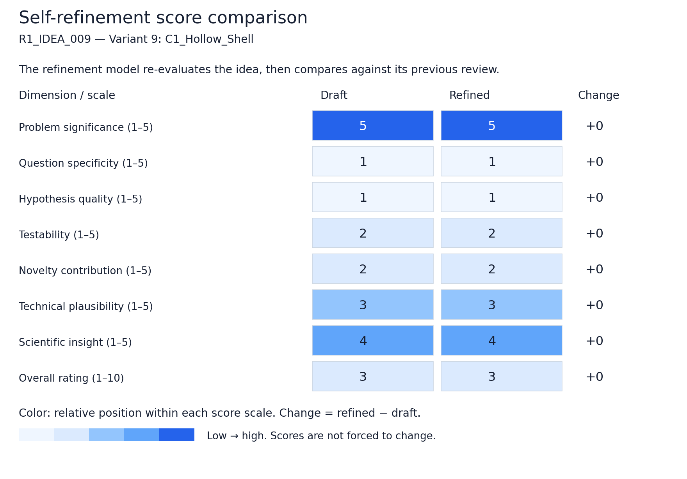

Changed score dimensions: none.

### Score justifications (draft / refined)

**Problem significance**

```json
{
  "draft": {
    "score": 5.0,
    "justification": "The problem is exceptionally significant. Understanding the relationship between artificial and biological visual processing is a core challenge in computational neuroscience and AI, with profound implications for both fields."
  },
  "refined": {
    "score": 5.0,
    "justification": "The problem is exceptionally significant. Understanding the relationship between artificial and biological visual processing is a core, long-standing challenge in computational neuroscience and AI, with profound implications for both fields. The goal of uncovering principles for efficient understanding addresses a fundamental scientific question."
  }
}
```

**Question specificity**

```json
{
  "draft": {
    "score": 1.0,
    "justification": "Extremely weak. The idea does not define a specific research question. It states a broad domain ('visual processing') and a generic activity ('compare models with brain recordings') without specifying what is being compared, how, or to answer what."
  },
  "refined": {
    "score": 1.0,
    "justification": "Extremely weak. The idea does not define a specific research question. It states a broad domain ('visual processing') and a generic activity ('compare models with brain recordings') without specifying what is being compared, how, or to answer what concrete question. It lacks all necessary specificity."
  }
}
```

**Hypothesis quality**

```json
{
  "draft": {
    "score": 1.0,
    "justification": "Very weak. There is no explicit or implicit hypothesis. The text describes a high-level aim ('uncover principles', 'guide design') but makes no concrete, testable prediction about a relationship or mechanism."
  },
  "refined": {
    "score": 1.0,
    "justification": "Very weak. There is no explicit or implicit hypothesis. The text describes a high-level aim ('uncover principles', 'guide design') but makes no concrete, testable prediction about a relationship, mechanism, or expected outcome. It is purely aspirational."
  }
}
```

**Testability**

```json
{
  "draft": {
    "score": 2.0,
    "justification": "Weak. While the general concept of comparing models to neural data is testable in principle, the idea provides no framework for how such a test would be structured to validate or falsify a specific claim. It lacks any proposed experiment, analysis, or evaluation method."
  },
  "refined": {
    "score": 2.0,
    "justification": "Weak. While the general concept of comparing models to neural data is testable in principle, the idea provides no framework for how such a test would be structured to validate or falsify a specific claim. It lacks any proposed experiment, analysis, comparison, or evaluation method. The 'approach' is too vague to be actionable."
  }
}
```

**Novelty contribution**

```json
{
  "draft": {
    "score": 2.0,
    "justification": "Weak. The idea of comparing AI models to brain data is not novel; it is an active subfield (e.g., brain-score benchmarks). The potential contribution is stated generically and does not articulate what new knowledge, beyond existing work in this area, this specific research would provide."
  },
  "refined": {
    "score": 2.0,
    "justification": "Weak. The core idea of comparing AI models to brain data to understand visual processing is not novel; it is an established and active subfield (e.g., brain-score benchmarks, neural predictive power studies). The potential contribution is stated generically and does not articulate what new knowledge, beyond the broad existing literature, this specific research would provide."
  }
}
```

**Technical plausibility**

```json
{
  "draft": {
    "score": 3.0,
    "justification": "Moderate. The broad direction is logically coherent and plausible—comparing models to neural data is a standard practice. However, without any technical details, it's impossible to assess the plausibility of any specific approach or claimed insight."
  },
  "refined": {
    "score": 3.0,
    "justification": "Moderate. The broad direction is logically coherent and plausible—comparing computational models to neural data is a standard practice in computational neuroscience. However, without any technical details, it's impossible to assess the plausibility of any specific approach, claimed insight, or the feasibility of 'uncovering principles.' The idea rests on reasonable assumptions but is too underspecified for a higher score."
  }
}
```

**Scientific insight**

```json
{
  "draft": {
    "score": 4.0,
    "justification": "Strong. The stated goal of 'uncovering principles for efficient understanding' has high potential for scientific insight. If successfully executed with a specific focus, it could reveal general computational principles, limitations of current AI, or mechanisms of biological vision."
  },
  "refined": {
    "score": 4.0,
    "justification": "Strong. The stated goal of 'uncovering principles for efficient understanding' has high potential for scientific insight. If successfully executed with a specific focus, it could reveal general computational principles, identify limitations of current AI architectures, or elucidate mechanisms of biological vision. The potential for transferable knowledge is significant."
  }
}
```

**Overall rating**

```json
{
  "draft": {
    "score": 3.0,
    "justification": "The idea identifies a very significant problem but is currently a very weak research idea. It lacks a concrete research question, hypothesis, and methodological direction. It reads more as a broad motivation or domain statement than a research plan. Its high potential for insight is undermined by its extreme vagueness and lack of specificity."
  },
  "refined": {
    "score": 3.0,
    "justification": "The idea identifies a very significant problem but is currently a very weak research idea. It lacks a concrete research question, hypothesis, and methodological direction. It reads as a broad motivation or domain statement rather than a research plan. Its high potential for insight (scientific_insight=4) and the significance of the problem (problem_significance=5) are severely undermined by its extreme vagueness, lack of specificity (question_specificity=1), and absence of a testable core (hypothesis_quality=1, testability=2). It is not yet a actionable research direction."
  }
}
```

## R1_IDEA_009 — Variant 10: C2_Logic_Flawed

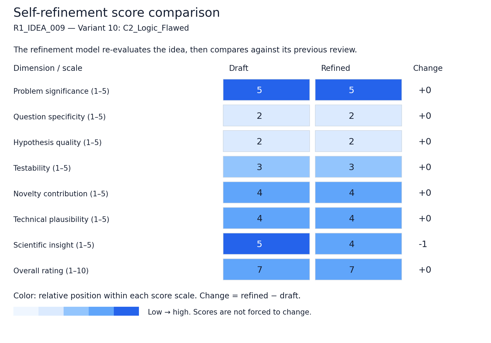

Changed score dimensions: scientific_insight.

### Score justifications (draft / refined)

**Problem significance**

```json
{
  "draft": {
    "score": 5.0,
    "justification": "The problem is highly significant. Understanding the relationship between artificial and biological visual systems is a fundamental question in both neuroscience and AI. Fine-grained temporal understanding is a key gap in current video models, and EEG provides unique temporal resolution for studying brain dynamics during natural vision."
  },
  "refined": {
    "score": 5.0,
    "justification": "The problem is highly significant. Understanding the relationship between artificial and biological visual systems is fundamental to both neuroscience and AI. Fine-grained temporal processing is a recognized gap in video models, and EEG provides unique temporal resolution for studying brain dynamics during natural vision, making this an important research direction."
  }
}
```

**Question specificity**

```json
{
  "draft": {
    "score": 2.0,
    "justification": "The research question is somewhat vague. While it identifies a general gap ('fine-grained temporal understanding'), it doesn't specify what exactly will be investigated. What specific aspects of temporal processing? What specific mechanistic principles? The idea states what it aims to do but not what specific question it seeks to answer."
  },
  "refined": {
    "score": 2.0,
    "justification": "The research question is vague. While it identifies a general gap ('fine-grained temporal understanding'), it doesn't specify what exactly will be investigated. What specific aspects of temporal processing? Which mechanistic principles? The idea states goals but not a concrete, answerable question."
  }
}
```

**Hypothesis quality**

```json
{
  "draft": {
    "score": 2.0,
    "justification": "There is an implicit hypothesis that deep video models lack certain temporal properties present in brain processing, and that discovering these properties will inform better architectures. However, this is not stated as a testable prediction. The stronger claim that these principles are 'sufficient to guide development' is a hypothesis but lacks specificity about what would constitute evidence for or against it."
  },
  "refined": {
    "score": 2.0,
    "justification": "There is only an implicit, weakly defined hypothesis: that deep video models lack certain temporal properties present in brain processing, and discovering these will inform better architectures. No testable prediction is made. The claim that principles are 'sufficient to guide development' is a hypothesis but lacks specificity about what evidence would support or refute it."
  }
}
```

**Testability**

```json
{
  "draft": {
    "score": 3.0,
    "justification": "The core approach (benchmarking representations against EEG) is testable in principle. One could measure correlations between model representations and brain activity. However, without specifying what aspects to measure or what would constitute success, it's unclear how definitive tests would be designed. The idea suggests a methodology but not specific experiments or evaluations."
  },
  "refined": {
    "score": 3.0,
    "justification": "The core methodological approach (benchmarking representations against EEG) is testable in principle using representational similarity analysis. However, without specifying what aspects to measure or what would constitute success, it's unclear how definitive tests would be designed. The idea suggests a general methodology but not specific experiments or evaluation criteria."
  }
}
```

**Novelty contribution**

```json
{
  "draft": {
    "score": 4.0,
    "justification": "The idea has good novelty potential. While comparing neural networks to brain data is not new, focusing specifically on deep video models and fine-grained temporal dynamics using EEG during natural video viewing is relatively underexplored. The potential contribution to both neuroscience (understanding visual processing) and AI (designing better video models) is substantial."
  },
  "refined": {
    "score": 4.0,
    "justification": "The idea has good novelty potential. While comparing neural networks to brain data exists, focusing specifically on deep video models and fine-grained temporal dynamics using EEG during natural video viewing is relatively underexplored. The potential contribution to both neuroscience (understanding visual processing) and AI (designing better video models) is substantial."
  }
}
```

**Technical plausibility**

```json
{
  "draft": {
    "score": 4.0,
    "justification": "The proposed direction is technically plausible. Representational similarity analysis between neural network activations and brain recordings is an established methodology. EEG provides excellent temporal resolution suitable for studying video processing dynamics. The main challenge would be designing appropriate stimuli and analysis methods, but the core approach is sound."
  },
  "refined": {
    "score": 4.0,
    "justification": "The proposed direction is technically plausible. Representational similarity analysis between neural network activations and brain recordings is an established methodology. EEG provides excellent temporal resolution suitable for studying video processing dynamics. The main challenges would be in stimulus design and analysis methods, but the core approach is sound."
  }
}
```

**Scientific insight**

```json
{
  "draft": {
    "score": 5.0,
    "justification": "The potential scientific insight is exceptional. Successfully identifying mechanistic principles of brain-like video understanding could reveal fundamental properties of efficient dynamic vision systems. This could provide transferable insights about temporal processing, efficiency, and robustness that go beyond simple performance improvements on specific tasks."
  },
  "refined": {
    "score": 4.0,
    "justification": "The potential scientific insight is strong. Successfully identifying mechanistic principles of brain-like video understanding could reveal fundamental properties of efficient dynamic vision systems. This could provide transferable insights about temporal processing, efficiency, and robustness. However, the idea's broad formulation limits the certainty of what specific insights might emerge."
  }
}
```

**Overall rating**

```json
{
  "draft": {
    "score": 7.0,
    "justification": "This is a strong research idea with excellent problem significance and potential scientific insight. The main weakness is lack of specificity in the research question and hypothesis. With more concrete formulation of what exactly is being investigated and tested, this could become an exceptional research direction. The interdisciplinary nature and potential for fundamental insights are compelling."
  },
  "refined": {
    "score": 7.0,
    "justification": "This is a strong research idea with excellent problem significance and good potential for scientific insight. The main weakness is the lack of specificity in the research question and hypothesis. With more concrete formulation of what exactly is being investigated and tested, this could become an exceptional research direction. The interdisciplinary nature and potential for fundamental insights are compelling despite the current vagueness."
  }
}
```

## R1_IDEA_009 — Variant 11: C3_Substance_Enriched

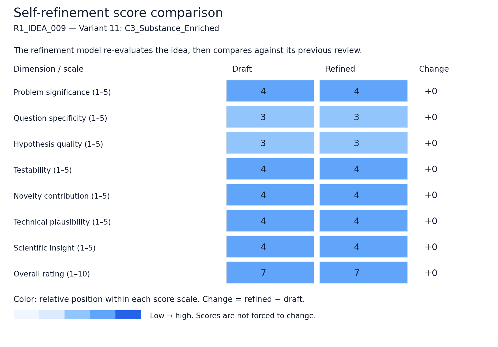

Changed score dimensions: none.

### Score justifications (draft / refined)

**Problem significance**

```json
{
  "draft": {
    "score": 4.0,
    "justification": "The problem is meaningful and addresses an important gap. Understanding temporal aspects of visual processing is crucial for both neuroscience (how the brain processes dynamic scenes) and AI (building better video understanding systems). The potential for bidirectional insights between neuroscience and AI adds significance."
  },
  "refined": {
    "score": 4.0,
    "justification": "The problem is highly meaningful. Understanding temporal aspects of visual processing is crucial for both neuroscience (how the brain processes dynamic scenes in real time) and AI (building robust video understanding systems). The potential for bidirectional insights between fields adds significant scientific value."
  }
}
```

**Question specificity**

```json
{
  "draft": {
    "score": 3.0,
    "justification": "The idea identifies a general direction (benchmarking models against EEG for temporal understanding) but lacks a precisely defined research question. While validation routes are mentioned, the core question of what specifically is being investigated about temporal processing could be more focused."
  },
  "refined": {
    "score": 3.0,
    "justification": "The idea identifies a general direction but lacks a precisely defined research question. While it mentions benchmarking and validation routes, the core question about what specific aspect of temporal processing is being investigated remains broad. 'Fine-grained temporal understanding' could refer to multiple distinct phenomena without further specification."
  }
}
```

**Hypothesis quality**

```json
{
  "draft": {
    "score": 3.0,
    "justification": "There are implicit hypotheses (that benchmarking will reveal mechanistic principles, that brain-aligned architectures will show improved generalization), but they are not clearly articulated as testable predictions. The connection between neural data alignment and architectural improvements is presented as a possibility rather than a falsifiable hypothesis."
  },
  "refined": {
    "score": 3.0,
    "justification": "There are implicit hypotheses about neural alignment revealing principles and brain-aligned architectures improving generalization, but they are not articulated as concrete, testable predictions. The language ('could be tested', 'possible validation route') suggests exploratory thinking rather than hypothesis-driven research. A stronger hypothesis would make a specific prediction about the relationship between model properties and neural data or performance outcomes."
  }
}
```

**Testability**

```json
{
  "draft": {
    "score": 4.0,
    "justification": "The idea suggests several concrete validation routes: examining neural response latencies, analyzing spatiotemporal receptive fields, and testing architectures on generalization tasks. These provide clear paths for obtaining evidence, though the specific experimental designs are not detailed."
  },
  "refined": {
    "score": 4.0,
    "justification": "The idea suggests several concrete investigative methods: examining neural response latencies, analyzing spatiotemporal receptive fields, and testing architectures on generalization tasks. These provide clear paths for obtaining evidence. The mention of specific boundary conditions (robustness to varying frame rates) further enhances testability by suggesting controlled experimental manipulations."
  }
}
```

**Novelty contribution**

```json
{
  "draft": {
    "score": 4.0,
    "justification": "While comparing AI models to brain data is not entirely new, the focus on fine-grained temporal aspects of video processing and the specific use of EEG for natural videos represents a novel angle. The potential to discover mechanistic principles that inform architecture design could be a meaningful contribution."
  },
  "refined": {
    "score": 4.0,
    "justification": "While comparing AI models to brain data is an established area, the specific focus on fine-grained temporal aspects of video processing using EEG recordings of natural videos represents a novel angle. The potential to discover temporal processing principles that inform architecture design could be a meaningful contribution beyond standard brain-aligned AI approaches."
  }
}
```

**Technical plausibility**

```json
{
  "draft": {
    "score": 4.0,
    "justification": "The proposed direction is technically plausible. Benchmarking model representations against neural data is an established methodology. EEG recordings of natural video viewing are feasible, and testing architectures on generalization tasks is standard practice. The reasoning is logically coherent."
  },
  "refined": {
    "score": 4.0,
    "justification": "The proposed direction is technically plausible. Benchmarking model representations against neural data is methodologically established. EEG recordings during natural video viewing are feasible, and testing architectures on generalization tasks is standard practice. The reasoning is logically coherent, though implementation details would need to address challenges like aligning model and neural temporal scales."
  }
}
```

**Scientific insight**

```json
{
  "draft": {
    "score": 4.0,
    "justification": "The idea has strong potential for scientific insight. Successfully executed, it could reveal principles of temporal processing in both brains and models, identify limitations of current architectures, and establish boundary conditions for brain-aligned video understanding. The bidirectional nature (neuroscience informing AI and vice versa) enhances the insight potential."
  },
  "refined": {
    "score": 4.0,
    "justification": "The idea has strong potential for scientific insight. Successfully executed, it could reveal principles of temporal processing in both biological and artificial systems, identify limitations of current video architectures, and establish boundary conditions for brain-aligned video understanding. The bidirectional nature (neuroscience informing AI and vice versa) enhances the insight potential beyond single-discipline contributions."
  }
}
```

**Overall rating**

```json
{
  "draft": {
    "score": 7.0,
    "justification": "This is a strong research idea with clear scientific merit. It addresses an important problem at the intersection of neuroscience and AI, proposes concrete validation methods, and has significant potential for insight. The main limitation is the somewhat broad research question and lack of clearly articulated hypotheses. With more specific formulation of what temporal aspects are being studied and what principles might be discovered, this could become an exceptional research direction."
  },
  "refined": {
    "score": 7.0,
    "justification": "This is a strong research idea with clear scientific merit. It addresses an important interdisciplinary problem, proposes concrete investigative methods, and has significant potential for insight. The main limitations are the somewhat broad research question and lack of clearly articulated, testable hypotheses. With more specific formulation of what temporal aspects are being studied and what principles might be discovered, this could become an exceptional research direction. The idea demonstrates good scientific thinking but would benefit from sharper hypothesis formulation."
  }
}
```

## R1_IDEA_009 — Variant 12: H1_Deceptive_Hollow


Changed score dimensions: none.

### Score justifications (draft / refined)

**Problem significance**

```json
{
  "draft": {
    "score": 5.0,
    "justification": "Understanding visual processing through brain-model comparisons is a highly significant problem at the intersection of neuroscience and AI. It addresses fundamental questions about how biological and artificial systems process visual information, with implications for both fields."
  },
  "refined": {
    "score": 5.0,
    "justification": "Understanding visual processing through brain-model comparisons is a highly significant problem at the intersection of neuroscience and AI. It addresses fundamental questions about how biological and artificial systems process visual information, with implications for both understanding biological intelligence and designing better AI systems."
  }
}
```

**Question specificity**

```json
{
  "draft": {
    "score": 1.0,
    "justification": "Extremely vague. The idea mentions 'comparing computational models with brain recordings' but does not specify what models, what recordings, what aspects of visual processing, or what specific relationships will be investigated. No concrete research question is articulated."
  },
  "refined": {
    "score": 1.0,
    "justification": "Extremely vague. The idea mentions 'comparing computational models with brain recordings' but does not specify what models, what recordings, what aspects of visual processing, what visual tasks, or what specific relationships will be investigated. No concrete research question is articulated beyond this generic description."
  }
}
```

**Hypothesis quality**

```json
{
  "draft": {
    "score": 1.0,
    "justification": "No hypothesis is presented. The text describes an 'approach' and 'direction' but makes no concrete prediction about what will be found or what relationship exists between computational models and brain recordings. It uses aspirational language without testable content."
  },
  "refined": {
    "score": 1.0,
    "justification": "No hypothesis is presented. The text describes an 'approach' and 'direction' but makes no concrete prediction about what will be found or what relationship exists between computational models and brain recordings. It uses aspirational language ('uncover principles', 'guide design') without testable content."
  }
}
```

**Testability**

```json
{
  "draft": {
    "score": 1.0,
    "justification": "The idea as presented is not testable. There is no clear claim that could be supported or contradicted by evidence. While comparing models and brain recordings is inherently testable, the proposal lacks any specification of what would be compared, how, or what would constitute meaningful results."
  },
  "refined": {
    "score": 1.0,
    "justification": "The idea as presented is not testable. There is no clear claim that could be supported or contradicted by evidence. While comparing models and brain recordings is inherently testable, the proposal lacks any specification of what would be compared, how comparisons would be made, what metrics would be used, or what would constitute meaningful results."
  }
}
```

**Novelty contribution**

```json
{
  "draft": {
    "score": 2.0,
    "justification": "Comparing computational models to brain recordings is not novel in itself—this is an established research area. The idea claims to be 'transformative' but provides no novel methodological approach, theoretical framework, or specific contribution beyond the generic concept of brain-model comparison."
  },
  "refined": {
    "score": 2.0,
    "justification": "Comparing computational models to brain recordings is not novel in itself—this is an established research area with decades of literature. The idea claims to be 'transformative' and 'field-shaping' but provides no novel methodological approach, theoretical framework, or specific contribution beyond the generic concept of brain-model comparison. It reads more like a restatement of the field's goals than a novel research direction."
  }
}
```

**Technical plausibility**

```json
{
  "draft": {
    "score": 3.0,
    "justification": "The general direction of comparing computational models to brain recordings is technically plausible and has been done before. However, without any technical details, it's impossible to assess whether specific proposed comparisons would be feasible or meaningful."
  },
  "refined": {
    "score": 3.0,
    "justification": "The general direction of comparing computational models to brain recordings is technically plausible and has been done before. However, without any technical details about models, recording methods, alignment metrics, or experimental paradigms, it's impossible to assess whether specific proposed comparisons would be feasible or meaningful. The idea doesn't contain enough information to evaluate technical plausibility beyond the generic concept."
  }
}
```

**Scientific insight**

```json
{
  "draft": {
    "score": 2.0,
    "justification": "While the general area has high potential for scientific insight, this specific proposal is too vague to assess what insights might emerge. It promises 'principles for efficient understanding' but doesn't specify what these principles might be or how they would be extracted from the comparison."
  },
  "refined": {
    "score": 2.0,
    "justification": "While the general area has high potential for scientific insight, this specific proposal is too vague to assess what insights might emerge. It promises 'principles for efficient understanding' but doesn't specify what these principles might be, how they would be extracted from the comparison, or what would distinguish them from existing findings in brain-model alignment research. The potential insight is stated but not substantiated."
  }
}
```

**Overall rating**

```json
{
  "draft": {
    "score": 3.0,
    "justification": "This is a weak research idea because it lacks specificity, testability, and a clear hypothesis. While it addresses an important problem area, it reads more like a motivational paragraph than a research proposal. The grandiose language about 'transformative synthesis' and 'field-shaping agenda' is not backed by concrete scientific content. The idea needs substantial refinement to become a meaningful research direction."
  },
  "refined": {
    "score": 3.0,
    "justification": "This is a weak research idea because it lacks specificity, testability, and a clear hypothesis. While it addresses an important problem area, it reads more like a motivational paragraph or abstract goal statement than a research proposal. The grandiose language about 'transformative synthesis' and 'field-shaping agenda' is not backed by concrete scientific content. The idea needs substantial refinement to become a meaningful research direction with testable components and specific contributions."
  }
}
```

## R1_IDEA_009 — Variant 13: H2_Confident_Flaw


Changed score dimensions: hypothesis_quality, testability, technical_plausibility, overall_rating.

### Score justifications (draft / refined)

**Problem significance**

```json
{
  "draft": {
    "score": 4.0,
    "justification": "The problem of understanding temporal visual processing and improving video models through neuroscience insights is meaningful and timely. Bridging computational models and neural recordings has clear scientific value."
  },
  "refined": {
    "score": 4.0,
    "justification": "The problem of understanding temporal visual processing and bridging computational models with neuroscience is meaningful and timely. Improving video architectures through brain-inspired principles has clear scientific and practical relevance."
  }
}
```

**Question specificity**

```json
{
  "draft": {
    "score": 2.0,
    "justification": "The idea states a general aim ('benchmark... to address the gap') but does not define a concrete research question. It lacks specificity about what exactly is being investigated beyond broad goals."
  },
  "refined": {
    "score": 2.0,
    "justification": "The idea states a general aim ('benchmark... to address the gap') but does not define a concrete research question. It lacks specificity about what exactly is being investigated—what relationships, what mechanisms, what comparisons—beyond broad goals."
  }
}
```

**Hypothesis quality**

```json
{
  "draft": {
    "score": 2.0,
    "justification": "No clear hypothesis is presented. The text makes a strong claim ('solving the limitation will necessarily produce reliable improvements') but this is an assertion, not a testable prediction. The implied hypothesis—that brain-aligned principles lead to better dynamic vision—is vague and not operationalized."
  },
  "refined": {
    "score": 1.0,
    "justification": "No clear, testable hypothesis is presented. The text makes an overly strong assertion ('solving the limitation will necessarily produce reliable improvements') that is not framed as a falsifiable prediction. The implied hypothesis—that brain-aligned principles lead to better dynamic vision—is vague, not operationalized, and presented as a foregone conclusion rather than a testable proposition."
  }
}
```

**Testability**

```json
{
  "draft": {
    "score": 3.0,
    "justification": "Benchmarking model representations against EEG is a testable activity, but the idea does not specify what comparisons or analyses would be performed. The dismissal of isolating confounds reduces testability because it ignores important validation steps."
  },
  "refined": {
    "score": 2.0,
    "justification": "While benchmarking model representations against EEG is a testable activity in principle, the idea does not specify what comparisons or analyses would be performed. More importantly, the dismissal of isolating confounds (dataset composition, alternative explanations) actively reduces testability, as it rejects standard validation steps needed to draw meaningful conclusions."
  }
}
```

**Novelty contribution**

```json
{
  "draft": {
    "score": 3.0,
    "justification": "Comparing deep models to neural data is an established research direction. The focus on video and fine-grained temporal dynamics offers some novelty, but the idea does not articulate how it would advance beyond existing representational similarity or brain-score studies."
  },
  "refined": {
    "score": 3.0,
    "justification": "Comparing deep models to neural data is an established research direction (e.g., brain-score, representational similarity analysis). The focus on video and fine-grained temporal dynamics offers some novelty, but the idea does not articulate how it would advance beyond existing studies or what specific new knowledge it would generate."
  }
}
```

**Technical plausibility**

```json
{
  "draft": {
    "score": 3.0,
    "justification": "The general approach of comparing model activations to EEG signals is technically plausible, but the leap from benchmarking to deriving design principles and claiming 'causal evidence for general superiority' is not well-supported. The reasoning contains logical gaps."
  },
  "refined": {
    "score": 2.0,
    "justification": "The general approach of comparing model activations to EEG signals is technically plausible, but the reasoning contains significant logical gaps. The leap from correlation (benchmarking) to deriving design principles and claiming 'causal evidence for general superiority' is not supported. The dismissal of methodological controls undermines the plausibility of drawing valid conclusions."
  }
}
```

**Scientific insight**

```json
{
  "draft": {
    "score": 4.0,
    "justification": "If successful, the work could provide insight into how brains process dynamic visual scenes efficiently, which could inform more biologically plausible video architectures. The potential for mechanistic understanding is a strength."
  },
  "refined": {
    "score": 4.0,
    "justification": "If successfully executed with proper methodology, the work could provide genuine insight into how brains process dynamic visual scenes efficiently, potentially revealing principles that could inform more biologically plausible video architectures. The potential for mechanistic understanding of temporal visual processing is a strength."
  }
}
```

**Overall rating**

```json
{
  "draft": {
    "score": 5.0,
    "justification": "The idea addresses a significant problem and has potential for scientific insight, but it is hampered by vague research questions, an overly strong and unjustified claim of causal evidence, and lack of specificity in hypothesis and methodology. It is a moderate/borderline idea that needs substantial refinement to become a strong research direction."
  },
  "refined": {
    "score": 4.0,
    "justification": "The idea addresses a significant problem and has potential for scientific insight, but it is severely hampered by vague research questions, an overly strong and unjustified claim of causal evidence, lack of a testable hypothesis, and methodological dismissals that undermine validity. It is a weak idea that requires substantial refinement to become a credible research direction. The strong assertions without corresponding specificity or methodological rigor significantly diminish its quality."
  }
}
```

## R1_IDEA_009 — Variant 14: H3_Verbose_Enriched

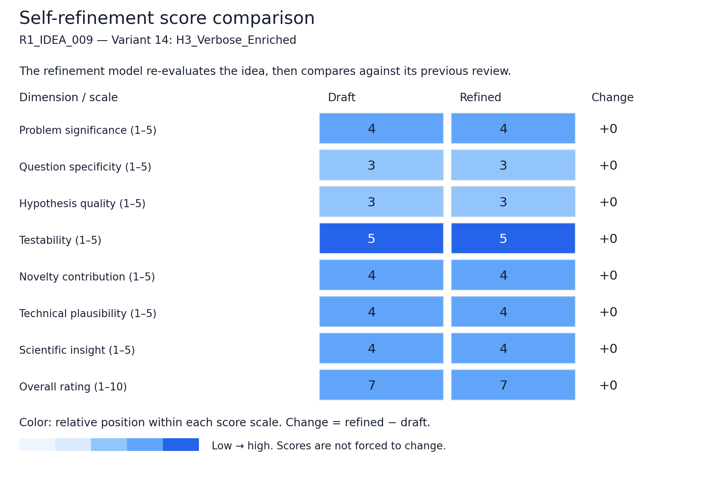

Changed score dimensions: none.

### Score justifications (draft / refined)

**Problem significance**

```json
{
  "draft": {
    "score": 4.0,
    "justification": "The problem of understanding temporal aspects of visual processing is meaningful, bridging neuroscience and machine learning. Fine-grained temporal understanding is indeed a gap in current video understanding models, and connecting to brain recordings could provide valuable insights. However, the significance would be higher with a clearer articulation of why this specific approach (EEG + video models) addresses a critical limitation."
  },
  "refined": {
    "score": 4.0,
    "justification": "The problem is meaningful and addresses an important gap. Understanding temporal aspects of visual processing is a significant challenge in both neuroscience and machine learning. The intersection of EEG recordings with video model benchmarking offers a novel approach to studying fine-grained temporal dynamics. However, the significance would be higher with a clearer articulation of why current video models specifically fail at temporal understanding that EEG could help address."
  }
}
```

**Question specificity**

```json
{
  "draft": {
    "score": 3.0,
    "justification": "The idea identifies a general direction (benchmarking representations against EEG) but lacks a precise, focused research question. While it mentions examining neural response latencies and receptive field properties, these are presented as possible validation routes rather than as the core question. The methodological details are specific, but the scientific question itself could be more sharply defined."
  },
  "refined": {
    "score": 3.0,
    "justification": "While the idea identifies a general direction and includes detailed methodological planning, the core scientific question remains somewhat broad. 'Benchmarking representations against EEG' and 'revealing mechanistic principles' are goals rather than sharply defined questions. The mention of neural response latencies and receptive field properties are validation routes, not the primary research question itself. The methodological details are specific, but the scientific inquiry could be more focused."
  }
}
```

**Hypothesis quality**

```json
{
  "draft": {
    "score": 3.0,
    "justification": "There are implicit hypotheses: (1) deep video model representations can be meaningfully compared to EEG recordings, (2) this comparison will reveal mechanistic principles, and (3) architectures informed by these principles will show improved generalization. However, these are somewhat broad and could be more concrete. The hypothesis about boundary conditions (robustness to varying frame rates) is more specific and testable."
  },
  "refined": {
    "score": 3.0,
    "justification": "There are implicit hypotheses: (1) deep video model representations can be meaningfully compared to EEG recordings for temporal dynamics, (2) this comparison will reveal transferable mechanistic principles, and (3) architectures incorporating these principles will show improved generalization with specific boundary conditions. The third hypothesis about boundary conditions (e.g., robustness to varying frame rates) is more specific and testable than the others, which remain somewhat broad. The hypotheses could be more concrete about what specific principles might be discovered."
  }
}
```

**Testability**

```json
{
  "draft": {
    "score": 5.0,
    "justification": "The idea is highly testable, with detailed methodological suggestions including staged design, baseline/intervention conditions, pre-specified evaluation criteria, ablation studies, sensitivity analyses, and error analysis. The proposal explicitly addresses how to make claims testable and how to determine when and why the approach is useful."
  },
  "refined": {
    "score": 5.0,
    "justification": "The idea is highly testable due to its detailed methodological planning. The proposal explicitly outlines a staged design with baseline/intervention conditions, pre-specified evaluation criteria, ablation studies, sensitivity analyses for noisy/sparse inputs, and error analysis of failure cases. This comprehensive approach addresses not just whether something works, but when, why, and under what conditions. The emphasis on comparing outcomes across easy, difficult, and boundary cases further enhances testability."
  }
}
```

**Novelty contribution**

```json
{
  "draft": {
    "score": 4.0,
    "justification": "While comparing neural recordings to model representations is not entirely new, the focus on fine-grained temporal aspects of video processing and the connection to architectural design principles has good novelty potential. The emphasis on mechanistic principles rather than just correlation scores adds scientific value. However, the contribution would be clearer with a more specific hypothesis about what new principles might be discovered."
  },
  "refined": {
    "score": 4.0,
    "justification": "The approach has good novelty potential. While comparing neural recordings to model representations exists in image domains, focusing on fine-grained temporal aspects of video processing with EEG is less explored. The emphasis on extracting mechanistic principles to inform architectural design, rather than just measuring correlations, adds scientific value. The contribution would be stronger with a more specific hypothesis about what new temporal processing principles might be discovered through this EEG-video model comparison."
  }
}
```

**Technical plausibility**

```json
{
  "draft": {
    "score": 4.0,
    "justification": "The approach is technically plausible. Benchmarking model representations against neural data is an established methodology. The proposed staged design, ablation studies, and sensitivity analyses are sound methodological choices. The main question is whether EEG recordings provide sufficiently detailed temporal information to extract meaningful mechanistic principles about video processing."
  },
  "refined": {
    "score": 4.0,
    "justification": "The approach is technically plausible. Benchmarking model representations against neural data is an established methodology in computational neuroscience. The proposed experimental design with staged comparisons, ablations, and sensitivity analyses is methodologically sound. The main technical question is whether EEG recordings provide sufficiently informative temporal signatures to extract meaningful mechanistic principles about video processing, given EEG's limitations in spatial resolution and source localization."
  }
}
```

**Scientific insight**

```json
{
  "draft": {
    "score": 4.0,
    "justification": "The idea has strong potential for scientific insight. By focusing on mechanistic principles, boundary conditions, and failure cases, it aims to reveal not just whether an approach works, but why and under what conditions. The emphasis on understanding assumptions, data regimes, and domain constraints suggests a desire for transferable insights about brain-like video processing."
  },
  "refined": {
    "score": 4.0,
    "justification": "The idea has strong potential for scientific insight. By focusing on mechanistic principles, boundary conditions, and failure cases, it aims to reveal not just correlations but underlying principles of temporal processing. The emphasis on understanding when and why approaches work (assumptions, data regimes, domain constraints) suggests a desire for transferable insights about brain-like video processing. The staged design with ablation studies would help isolate which components contribute to observed effects."
  }
}
```

**Overall rating**

```json
{
  "draft": {
    "score": 7.0,
    "justification": "This is a strong research idea with clear scientific merit. It addresses a meaningful problem, proposes a detailed methodological approach, and has good potential for scientific insight. The main limitation is that the core research question could be more precisely formulated. With a more focused hypothesis about what specific temporal aspects or mechanistic principles would be investigated, this could be an exceptional idea. The detailed methodological planning and emphasis on understanding boundary conditions are particularly strong aspects."
  },
  "refined": {
    "score": 7.0,
    "justification": "This is a strong research idea with clear scientific merit. It addresses a meaningful interdisciplinary problem, proposes a detailed and methodologically rigorous approach, and has good potential for scientific insight into temporal aspects of visual processing. The main limitation is that the core research question could be more precisely formulated - while the methodology is specific, the scientific inquiry itself ('benchmarking representations to reveal mechanistic principles') remains somewhat broad. With a more focused hypothesis about what specific temporal aspects or principles would be investigated, this could be an exceptional idea. The comprehensive methodological planning and emphasis on understanding boundary conditions are particularly strong aspects that enhance the idea's testability and potential for meaningful findings."
  }
}
```

## R1_IDEA_009 — Variant 15: H4_Ultimate_Hype

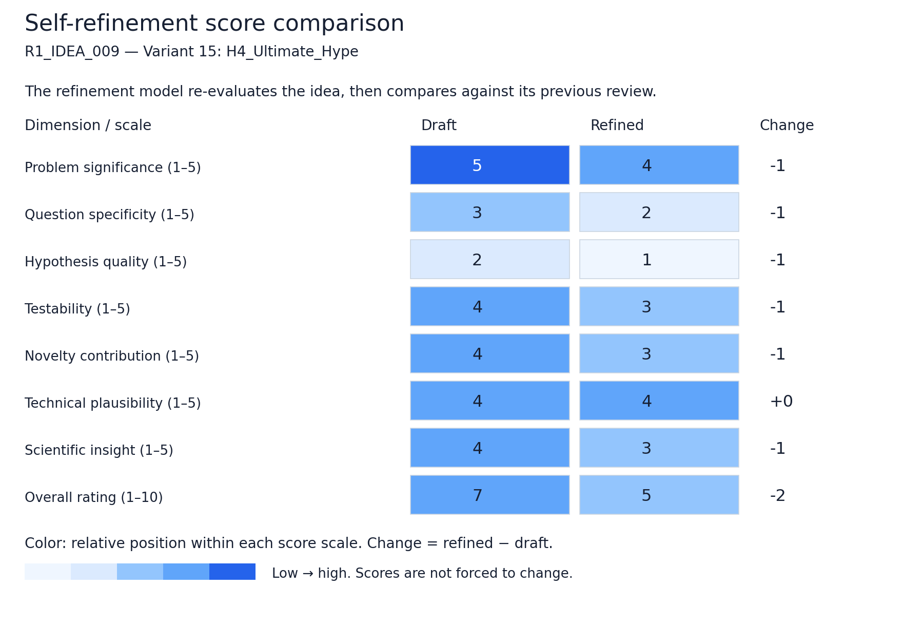

Changed score dimensions: problem_significance, question_specificity, hypothesis_quality, testability, novelty_contribution, scientific_insight, overall_rating.

### Score justifications (draft / refined)

**Problem significance**

```json
{
  "draft": {
    "score": 5.0,
    "justification": "The problem is highly significant. Understanding temporal dynamics in visual processing is a fundamental challenge in both neuroscience and computer vision. Bridging brain recordings with AI models has potential for major scientific and practical impact, addressing gaps in both fields."
  },
  "refined": {
    "score": 4.0,
    "justification": "The problem is significant. Understanding temporal dynamics in visual processing is a key challenge in neuroscience and computer vision. Using neural data to inform AI design is a promising, high-impact direction. However, the description overstates the immediate transformative potential ('redefine the frontier'), slightly inflating the perceived significance."
  }
}
```

**Question specificity**

```json
{
  "draft": {
    "score": 3.0,
    "justification": "The core question ('benchmark deep video model representations against EEG recordings') is reasonably specific, but the broader goals ('reveal mechanistic principles', 'inform design of brain-aligned architectures') are vague. The idea identifies what to compare but not what specific relationships or principles to investigate."
  },
  "refined": {
    "score": 2.0,
    "justification": "The idea is vague. It states a general goal ('benchmark... to reveal principles') but does not pose a clear, specific research question. What exactly is being tested or compared? The description is more of a broad agenda than a focused inquiry."
  }
}
```

**Hypothesis quality**

```json
{
  "draft": {
    "score": 2.0,
    "justification": "No explicit hypothesis is presented. The idea implies that brain-aligned models will be better in some way, but doesn't specify what 'better' means or what mechanistic relationships are expected. The implicit hypothesis that EEG-model alignment leads to improved architectures is testable but not well-articulated."
  },
  "refined": {
    "score": 1.0,
    "justification": "There is no discernible hypothesis. The text describes an activity (benchmarking) and states aspirational goals ('reveal principles', 'inform design'), but it makes no concrete, testable prediction about the relationship between model representations and brain data. The implicit assumption that alignment is beneficial is not fleshed out or framed as a falsifiable claim."
  }
}
```

**Testability**

```json
{
  "draft": {
    "score": 4.0,
    "justification": "The core benchmarking approach is highly testable. Representational similarity analysis between model activations and EEG signals provides clear experimental methodology. The main limitation is that success criteria for 'revealing mechanistic principles' are not defined, making some aspects of the broader agenda less testable."
  },
  "refined": {
    "score": 3.0,
    "justification": "The core activity of computing similarity metrics between model activations and EEG signals is testable. However, the broader goals ('reveal mechanistic principles', 'inform design') are not directly testable as stated because success criteria are undefined. The idea is testable only at the level of performing the comparison, not at the level of achieving its stated scientific aims."
  }
}
```

**Novelty contribution**

```json
{
  "draft": {
    "score": 4.0,
    "justification": "While comparing static image models to fMRI/EEG has been done, focusing on dynamic video processing with temporal EEG signals is relatively novel. The emphasis on fine-grained temporal dynamics in natural video understanding represents a meaningful advance over existing brain-model comparison work."
  },
  "refined": {
    "score": 3.0,
    "justification": "Applying representational similarity analysis to video models and EEG is a novel combination, though the general approach of comparing models to brain data is well-established. The focus on fine-grained temporal dynamics in naturalistic video is a meaningful nuance. However, the contribution is currently framed as an application of an existing methodology to a new modality pairing, rather than a fundamentally new scientific question or method."
  }
}
```

**Technical plausibility**

```json
{
  "draft": {
    "score": 4.0,
    "justification": "The approach is technically plausible. Representational similarity analysis is established methodology, and EEG recordings during video viewing are feasible. The main challenge is temporal alignment and interpretation, but these are methodological hurdles rather than fundamental flaws."
  },
  "refined": {
    "score": 4.0,
    "justification": "The proposed direction is technically plausible. Representational similarity analysis is a standard technique, and EEG recordings during video viewing are feasible. The main technical challenges (temporal alignment, signal-to-noise ratio, interpretability) are acknowledged in the field but are not fundamental showstoppers. The reasoning is logically coherent at the level of 'this comparison can be done.'"
  }
}
```

**Scientific insight**

```json
{
  "draft": {
    "score": 4.0,
    "justification": "High potential for scientific insight. Successfully relating model temporal dynamics to brain dynamics could reveal principles of efficient temporal processing, inform architectural choices for video understanding, and potentially uncover brain-inspired mechanisms for handling temporal information. The bidirectional nature (neuroscience → AI and AI → neuroscience) is particularly promising."
  },
  "refined": {
    "score": 3.0,
    "justification": "There is potential for scientific insight, but it is currently speculative. If specific hypotheses were tested, it could reveal how different architectural choices capture or fail to capture the brain's temporal processing strategies. However, as presented, the insight is vague ('reveal mechanistic principles'). The link between observed correlations and actual mechanistic understanding is not established."
  }
}
```

**Overall rating**

```json
{
  "draft": {
    "score": 7.0,
    "justification": "This is a strong research idea with clear significance and good technical plausibility. The main weaknesses are the lack of specific hypotheses and somewhat vague research questions beyond the benchmarking itself. With more precise formulation of what relationships to test and what would constitute mechanistic insight, this could become an exceptional research direction. The idea has substantial potential for both scientific understanding and practical impact in video understanding architectures."
  },
  "refined": {
    "score": 5.0,
    "justification": "This is a moderate/borderline research idea. It identifies a significant problem area and a plausible methodological approach but lacks the core components of a strong research idea: a specific question and a testable hypothesis. The description is heavy on aspirational language ('bold,' 'transformative,' 'redefine the frontier') but light on scientific substance. It is a reasonable starting point for a research direction but requires substantial refinement to become a compelling, testable research plan."
  }
}
```

## R1_IDEA_010 — Source

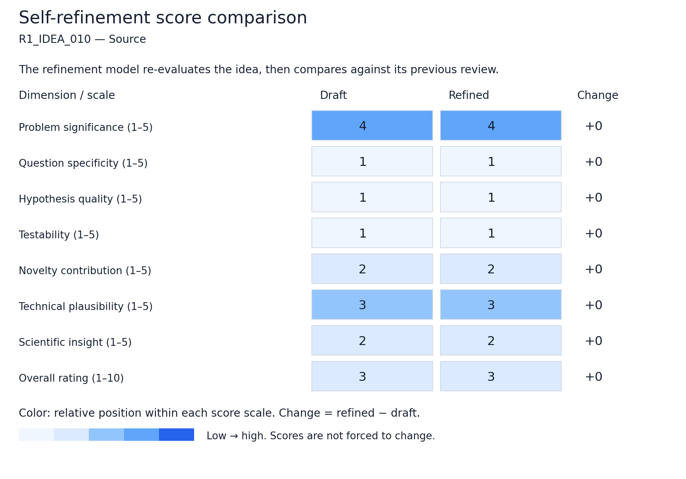

Changed score dimensions: none.

### Score justifications (draft / refined)

**Problem significance**

```json
{
  "draft": {
    "score": 4.0,
    "justification": "The problem is meaningful - bridging human cognitive capabilities with machine learning is an important research direction. Visual Fast Mapping represents a fundamental human learning ability that current systems don't fully capture."
  },
  "refined": {
    "score": 4.0,
    "justification": "The problem is meaningful and timely. Understanding how machines can learn visual concepts from few examples—akin to human fast mapping—is a fundamental challenge in machine learning and cognitive AI. Bridging human cognitive capabilities with machine learning is an important research direction with implications for sample-efficient learning and human-like AI."
  }
}
```

**Question specificity**

```json
{
  "draft": {
    "score": 1.0,
    "justification": "Extremely low specificity. The idea merely mentions VFM and VLMs without defining what aspect to investigate, what question to answer, or what relationship to test."
  },
  "refined": {
    "score": 1.0,
    "justification": "Extremely low specificity. The idea only mentions VFM and VLMs without defining what to investigate, what relationship to test, or what concrete question to answer. It is more of a topic suggestion than a research question."
  }
}
```

**Hypothesis quality**

```json
{
  "draft": {
    "score": 1.0,
    "justification": "No hypothesis is presented. There's an implicit suggestion that VLMs might help with VFM, but no concrete prediction about mechanisms, relationships, or expected outcomes."
  },
  "refined": {
    "score": 1.0,
    "justification": "No hypothesis is presented. There is an implicit suggestion that VLMs might be relevant to VFM, but no concrete prediction, causal mechanism, or testable relationship is articulated."
  }
}
```

**Testability**

```json
{
  "draft": {
    "score": 1.0,
    "justification": "Not testable in its current form. No experiment, comparison, evaluation, or analysis is proposed. The idea is too vague to design any meaningful test."
  },
  "refined": {
    "score": 1.0,
    "justification": "Not testable in its current form. No experiment, evaluation, comparison, or analysis is proposed. The idea is too vague to design any meaningful investigation."
  }
}
```

**Novelty contribution**

```json
{
  "draft": {
    "score": 2.0,
    "justification": "The connection between VFM and VLMs could be novel, but the idea doesn't articulate what specific contribution would be made. It's essentially just pointing to two areas that might be connected."
  },
  "refined": {
    "score": 2.0,
    "justification": "The connection between VFM and VLMs could be novel, but the idea does not articulate what specific contribution would be made. It essentially points to two areas that might intersect, without proposing a new method, insight, or empirical finding."
  }
}
```

**Technical plausibility**

```json
{
  "draft": {
    "score": 3.0,
    "justification": "The basic premise that VLMs might have capabilities relevant to fast visual learning is plausible given their pretraining on diverse visual-linguistic data. However, without more detail, it's impossible to assess technical coherence."
  },
  "refined": {
    "score": 3.0,
    "justification": "The basic premise is plausible: VLMs are trained on large-scale multimodal data and might exhibit stronger few-shot visual concept learning due to semantic grounding. However, without details, technical coherence cannot be fully assessed."
  }
}
```

**Scientific insight**

```json
{
  "draft": {
    "score": 2.0,
    "justification": "If properly developed, this could provide insight into how VLMs compare to human visual learning and what mechanisms enable rapid concept formation. However, the current formulation offers no specific insight pathway."
  },
  "refined": {
    "score": 2.0,
    "justification": "If properly developed, this could yield insight into how VLMs compare to human visual learning and what architectural or training factors enable rapid concept formation. However, the current formulation offers no clear pathway to such insight."
  }
}
```

**Overall rating**

```json
{
  "draft": {
    "score": 3.0,
    "justification": "This is a weak research idea. While it identifies an interesting problem (human vs. machine visual learning) and points to potentially relevant tools (VLMs), it fails to articulate any concrete research question, hypothesis, or methodology. It's essentially just a topic suggestion rather than a research direction. The idea needs substantial development to become a meaningful research proposal."
  },
  "refined": {
    "score": 3.0,
    "justification": "This is a weak research idea. While it identifies an interesting problem (human-like visual concept learning) and points to a relevant tool class (VLMs), it fails to articulate any concrete research question, hypothesis, or methodology. It is essentially a topic suggestion rather than a research direction. Substantial development is needed to become a meaningful proposal."
  }
}
```

## R1_IDEA_010 — Variant 1: A1_Identity

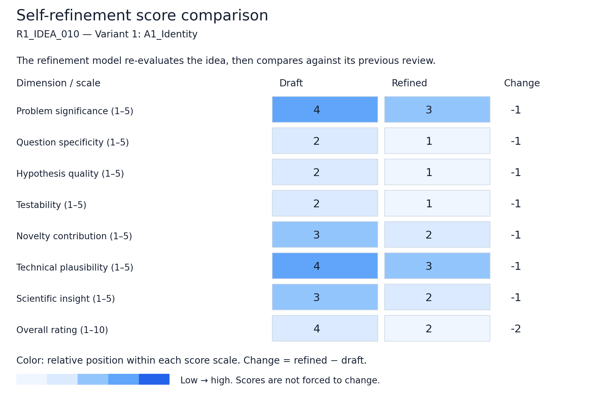

Changed score dimensions: problem_significance, question_specificity, hypothesis_quality, testability, novelty_contribution, technical_plausibility, scientific_insight, overall_rating.

### Score justifications (draft / refined)

**Problem significance**

```json
{
  "draft": {
    "score": 4.0,
    "justification": "The problem is meaningful. Bridging the gap between human rapid concept learning and machine learning is a core challenge in AI. Understanding the limitations of large-scale models in few-shot, knowledge-guided learning is highly relevant to the field."
  },
  "refined": {
    "score": 3.0,
    "justification": "The problem of achieving human-like rapid concept learning is meaningful in AI, but the idea presents it at a very high level without clearly articulating why current approaches are insufficient or what specific aspect of VFM is most important to address."
  }
}
```

**Question specificity**

```json
{
  "draft": {
    "score": 2.0,
    "justification": "The idea is not specific. It describes a phenomenon (VFM) and notes that VLMs, despite scale, might not achieve it. It does not define a clear, concrete question about the relationship between model properties and VFM capability."
  },
  "refined": {
    "score": 1.0,
    "justification": "Extremely low specificity. The idea is essentially an incomplete observation that mentions VFM and VLMs but doesn't define any concrete research question. It cuts off mid-sentence and lacks a clear statement of what would be investigated."
  }
}
```

**Hypothesis quality**

```json
{
  "draft": {
    "score": 2.0,
    "justification": "There is only an implicit, very weak hypothesis: that current VLMs may not achieve human-like VFM. This is a broad suspicion, not a concrete, testable prediction about a mechanism, relationship, or model property."
  },
  "refined": {
    "score": 1.0,
    "justification": "No hypothesis is present. There's only a vague suggestion that VLMs might not achieve VFM, but no testable prediction about mechanisms, relationships, or model properties. The idea doesn't make any falsifiable claims."
  }
}
```

**Testability**

```json
{
  "draft": {
    "score": 2.0,
    "justification": "The idea as stated is not directly testable. It lacks a proposed experiment, evaluation, or comparison. It suggests a direction (investigating VFM in VLMs) but gives no method to do so. A test could be designed, but it is not suggested here."
  },
  "refined": {
    "score": 1.0,
    "justification": "Not testable in its current form. No experiment, evaluation, comparison, or analysis method is suggested. While one could design tests for VFM capabilities, the idea itself provides no direction for how this would be done."
  }
}
```

**Novelty contribution**

```json
{
  "draft": {
    "score": 3.0,
    "justification": "The connection between the cognitive science concept of VFM and VLMs has moderate novelty. However, the idea itself is a very preliminary observation. The potential contribution is currently vague; it could range from a simple performance comparison to a deeper analysis of mechanistic gaps."
  },
  "refined": {
    "score": 2.0,
    "justification": "The connection between VFM and VLMs has some novelty, but the idea is too preliminary to assess its potential contribution. It mentions a cognitive science concept but doesn't articulate how investigating it would advance machine learning beyond noting a potential limitation."
  }
}
```

**Technical plausibility**

```json
{
  "draft": {
    "score": 4.0,
    "justification": "The reasoning is logically coherent and plausible. It is reasonable to suspect that scaling alone may not replicate a specific human cognitive ability that integrates knowledge and few-shot learning. The assumption that VFM is a valuable benchmark is reasonable."
  },
  "refined": {
    "score": 3.0,
    "justification": "The basic premise that human visual concept learning differs from current ML approaches is plausible, but the incomplete nature of the idea ('requiring large-scale.') makes full assessment difficult. The comparison to early one-shot learning methods is not clearly motivated or explained."
  }
}
```

**Scientific insight**

```json
{
  "draft": {
    "score": 3.0,
    "justification": "The idea has the potential for significant insight—it could reveal fundamental limitations of current large-scale training paradigms in capturing human-like inductive learning. However, the idea as presented does not articulate what specific insights are sought (e.g., is it about knowledge representation, sample efficiency, or compositional reasoning?)."
  },
  "refined": {
    "score": 2.0,
    "justification": "The idea hints at potential insight about limitations of scale-driven approaches versus human learning mechanisms, but doesn't articulate what specific scientific understanding might be gained. It lacks a clear pathway to discovering mechanisms, principles, or boundary conditions."
  }
}
```

**Overall rating**

```json
{
  "draft": {
    "score": 4.0,
    "justification": "This is a weak research idea in its current form. It identifies a potentially significant problem (human vs. machine few-shot learning) but fails to define a research question, hypothesis, or testable approach. It reads more as a motivation or background section. The core of a research idea—what will be investigated and how—is missing. It has a good starting point but requires substantial refinement to become a viable research direction."
  },
  "refined": {
    "score": 2.0,
    "justification": "This is a very weak research idea. It's essentially an incomplete observation rather than a defined research direction. While it identifies an interesting cognitive science concept (VFM), it fails to formulate a research question, hypothesis, or methodological approach. The idea cuts off mid-sentence and lacks the core elements needed for scientific investigation. It reads more like the beginning of a literature review than a research proposal."
  }
}
```

## R1_IDEA_010 — Variant 2: A2_Paraphrase_Only


Changed score dimensions: none.

### Score justifications (draft / refined)

**Problem significance**

```json
{
  "draft": {
    "score": 4.0,
    "justification": "The problem is significant - achieving human-like few-shot visual learning is a fundamental challenge in computer vision and AI. The gap between human cognitive abilities and current machine learning approaches is well-recognized and important to address."
  },
  "refined": {
    "score": 4.0,
    "justification": "The problem is highly significant. Achieving human-like few-shot visual learning is a core, unsolved challenge in AI and computer vision, with broad implications for efficiency, generalization, and understanding intelligence."
  }
}
```

**Question specificity**

```json
{
  "draft": {
    "score": 1.0,
    "justification": "Extremely low specificity. The idea merely states that VFM exists in humans and current approaches have limitations. No concrete research question is posed about what to investigate, what mechanism to test, or what relationship to explore."
  },
  "refined": {
    "score": 1.0,
    "justification": "Extremely low specificity. The idea only states that VFM exists and current methods are limited. No concrete research question is posed—nothing about what to test, what mechanism to explore, or what relationship to examine."
  }
}
```

**Hypothesis quality**

```json
{
  "draft": {
    "score": 1.0,
    "justification": "No hypothesis is presented. There is no prediction about how VFM could be achieved, what mechanisms might be important, or what relationship exists between human and machine learning. The text only describes a phenomenon and states that current approaches are limited."
  },
  "refined": {
    "score": 1.0,
    "justification": "No hypothesis is present. There is no prediction, proposed mechanism, or falsifiable claim. The text merely describes a cognitive phenomenon and notes a gap, without suggesting what might bridge it."
  }
}
```

**Testability**

```json
{
  "draft": {
    "score": 1.0,
    "justification": "Not testable in its current form. There is no claim to test, no experiment suggested, no comparison proposed, and no evaluation method mentioned. The idea is purely descriptive without any indication of how it could be investigated."
  },
  "refined": {
    "score": 1.0,
    "justification": "Not testable as presented. There is no claim to evaluate, no experiment suggested, no comparison outlined, and no evaluation metric implied. The idea is purely descriptive, offering no avenue for investigation."
  }
}
```

**Novelty contribution**

```json
{
  "draft": {
    "score": 2.0,
    "justification": "Low novelty as presented. The observation that human few-shot learning is superior to machine approaches is well-known. The connection to VFM from cognitive science adds some novelty, but without a specific research direction, the potential contribution is unclear."
  },
  "refined": {
    "score": 2.0,
    "justification": "Low novelty. The observation that humans learn from few examples better than machines is widely recognized. Mentioning VFM adds a cognitive science term, but without a specific research angle, the potential contribution remains unclear and incremental."
  }
}
```

**Technical plausibility**

```json
{
  "draft": {
    "score": 3.0,
    "justification": "Moderately plausible in a general sense - the idea that machines should learn from few examples like humans is reasonable. However, without any technical direction, it's impossible to assess whether specific implementations would be feasible."
  },
  "refined": {
    "score": 3.0,
    "justification": "Moderately plausible in a general sense—the goal of improving few-shot learning is technically feasible. However, with no technical direction proposed, it's impossible to assess the plausibility of any specific implementation."
  }
}
```

**Scientific insight**

```json
{
  "draft": {
    "score": 2.0,
    "justification": "Potentially moderate insight if developed further, as understanding human visual learning could inform better machine learning. However, as presented, it's too vague to determine what specific insights might be gained beyond the general observation that human learning is more efficient."
  },
  "refined": {
    "score": 2.0,
    "justification": "Potentially moderate insight if developed, as linking human VFM to machine learning could reveal general principles of efficient learning. As presented, however, it is too vague to promise any specific insight beyond the well-known fact that humans are more data-efficient."
  }
}
```

**Overall rating**

```json
{
  "draft": {
    "score": 2.0,
    "justification": "Very weak research idea in its current form. While it identifies an important problem (human vs. machine few-shot learning), it fails to propose any specific research question, hypothesis, or direction. It reads more like a motivation paragraph than a research idea. Without a concrete question to investigate or approach to test, it lacks the essential elements of a research idea."
  },
  "refined": {
    "score": 2.0,
    "justification": "Very weak research idea. While it identifies an important problem, it completely lacks a research question, hypothesis, or testable direction. It reads as introductory background, not a actionable research idea. Without a concrete 'what to investigate' and 'how to test it', it fails as a proposal for scientific inquiry."
  }
}
```

## R1_IDEA_010 — Variant 3: A3_Plain_Core

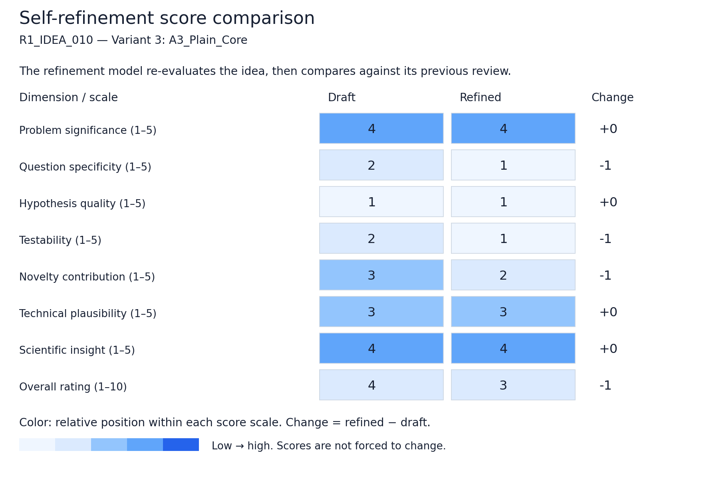

Changed score dimensions: question_specificity, testability, novelty_contribution, overall_rating.

### Score justifications (draft / refined)

**Problem significance**

```json
{
  "draft": {
    "score": 4.0,
    "justification": "The problem is significant - achieving human-like rapid visual concept formation from minimal examples is a fundamental challenge in machine learning with important implications for sample efficiency and generalization. The connection to cognitive science adds scientific relevance."
  },
  "refined": {
    "score": 4.0,
    "justification": "The underlying problem—achieving rapid, sample-efficient visual concept learning—is highly significant for machine learning. It touches on core challenges in generalization, efficiency, and bridging human and machine intelligence. The connection to cognitive science adds foundational relevance."
  }
}
```

**Question specificity**

```json
{
  "draft": {
    "score": 2.0,
    "justification": "The idea lacks a specific research question. It describes VFM and mentions existing approaches but doesn't articulate what specifically should be investigated. It's more of a topic description than a research direction."
  },
  "refined": {
    "score": 1.0,
    "justification": "The text does not articulate a research question. It describes VFM and mentions past and current approaches, but does not specify what is to be investigated. There is no 'question' or 'direction' proposed."
  }
}
```

**Hypothesis quality**

```json
{
  "draft": {
    "score": 1.0,
    "justification": "No hypothesis is presented. The text describes VFM and mentions different approaches but makes no prediction about relationships, mechanisms, or expected outcomes. There's no testable claim."
  },
  "refined": {
    "score": 1.0,
    "justification": "No hypothesis is present. The text is purely factual/descriptive. It makes no prediction, proposes no mechanism, and offers no testable claim about how VFM could be achieved or what its impact might be."
  }
}
```

**Testability**

```json
{
  "draft": {
    "score": 2.0,
    "justification": "Without a specific question or hypothesis, testability is low. The idea mentions VFM as a desirable capability but doesn't suggest how one would test whether a system achieves it or compare different approaches."
  },
  "refined": {
    "score": 1.0,
    "justification": "Without a question or hypothesis, there is nothing to test. The idea does not suggest an experiment, comparison, analysis, or any form of evaluation. It merely states a concept and some context."
  }
}
```

**Novelty contribution**

```json
{
  "draft": {
    "score": 3.0,
    "justification": "The connection between cognitive VFM and computer vision is potentially novel, but the idea as presented doesn't propose a new method, analysis, or investigation. It merely identifies an area of interest without specifying what new contribution would be made."
  },
  "refined": {
    "score": 2.0,
    "justification": "The connection between cognitive VFM and machine learning is not new in itself (cognitive inspiration is a common theme). The text proposes no novel method, analysis, or investigation. It identifies a topic area but does not specify what new contribution would be made."
  }
}
```

**Technical plausibility**

```json
{
  "draft": {
    "score": 3.0,
    "justification": "The general direction is plausible - drawing inspiration from cognitive science for ML systems is a valid approach. However, without any technical details about how VFM would be implemented or measured, it's difficult to assess technical soundness."
  },
  "refined": {
    "score": 3.0,
    "justification": "The general notion of drawing from cognitive science for machine learning inspiration is plausible. However, with no technical details proposed, there is nothing to assess for coherence or feasibility. The score reflects a neutral assessment given the absence of technical content."
  }
}
```

**Scientific insight**

```json
{
  "draft": {
    "score": 4.0,
    "justification": "If properly developed, research on VFM in machines could provide significant scientific insight into the mechanisms of rapid concept formation, the relationship between human and machine learning, and principles for sample-efficient learning. The potential for cross-disciplinary insight is high."
  },
  "refined": {
    "score": 4.0,
    "justification": "If a concrete research program were built upon this motivation, it has high potential for scientific insight. Understanding how machines could achieve rapid concept formation could reveal principles of sample efficiency, the role of prior knowledge, and parallels between human and machine learning. However, the text itself only hints at this potential."
  }
}
```

**Overall rating**

```json
{
  "draft": {
    "score": 4.0,
    "justification": "This is a weak research idea as presented. While it identifies an interesting and potentially important problem (VFM in machines), it lacks the essential components of a research direction: no specific question, no hypothesis, no proposed methodology. It reads more like background motivation for research rather than a research idea itself. With substantial development into a concrete research question and approach, it could become strong, but in its current form it's too vague to evaluate as a meaningful research direction."
  },
  "refined": {
    "score": 3.0,
    "justification": "This is a very weak research idea as presented. It identifies a significant and interesting problem (VFM) but fails to propose any research. It lacks a question, hypothesis, methodology, or any element of an investigable direction. It reads as background or motivation, not as a research idea. It would require substantial development to become a viable research proposal."
  }
}
```

## R1_IDEA_010 — Variant 4: B1_Verbose_Elaborate


Changed score dimensions: none.

### Score justifications (draft / refined)

**Problem significance**

```json
{
  "draft": {
    "score": 4.0,
    "justification": "The problem is highly meaningful: achieving human-like few-shot visual learning is a core challenge in AI and cognitive science. It addresses a fundamental gap between human and machine learning capabilities with potential implications for efficient and robust machine perception."
  },
  "refined": {
    "score": 4.0,
    "justification": "The problem is highly meaningful and well-motivated. Achieving human-like few-shot visual learning is a fundamental challenge in AI and cognitive science, with implications for efficient and robust machine perception. The gap between human and machine capabilities is clearly articulated and represents an important research direction."
  }
}
```

**Question specificity**

```json
{
  "draft": {
    "score": 2.0,
    "justification": "The idea identifies a general problem area but does not define a concrete research question. It describes the phenomenon and current limitations but does not specify what exactly should be investigated to advance the field."
  },
  "refined": {
    "score": 2.0,
    "justification": "The idea identifies a general problem area but does not define a concrete research question. It describes the phenomenon and current limitations without specifying what exactly should be investigated to advance understanding or capability."
  }
}
```

**Hypothesis quality**

```json
{
  "draft": {
    "score": 1.0,
    "justification": "There is no explicit or implicit hypothesis presented. The text states a gap but does not make a testable prediction about how to close it, what mechanism might be involved, or what relationship might exist between model properties and VFM performance."
  },
  "refined": {
    "score": 1.0,
    "justification": "There is no explicit or implicit hypothesis presented. The text states an observed gap but makes no testable prediction about how to close it, what mechanism might be involved, or what relationship might exist between model properties and VFM performance."
  }
}
```

**Testability**

```json
{
  "draft": {
    "score": 2.0,
    "justification": "Without a specific hypothesis or proposed method, it is unclear how one would test the idea. The gap identified could be investigated, but the idea itself does not suggest an experiment, evaluation, or analysis to generate evidence."
  },
  "refined": {
    "score": 2.0,
    "justification": "Without a specific hypothesis or proposed method, it is unclear how one would test the idea. The identified gap could be investigated, but the idea itself does not suggest an experiment, evaluation, or analysis to generate evidence."
  }
}
```

**Novelty contribution**

```json
{
  "draft": {
    "score": 3.0,
    "justification": "The observation that current methods fall short of human VFM is not novel in itself; it is a well-known challenge. The potential contribution lies in proposing a new approach to address it, but no such approach is suggested, so the novelty is limited to framing."
  },
  "refined": {
    "score": 3.0,
    "justification": "The observation that current methods fall short of human VFM is not novel; it is a well-known challenge in few-shot learning and cognitive AI. The potential contribution lies in proposing a new approach to address it, but no such approach is suggested, so the novelty is limited to the framing."
  }
}
```

**Technical plausibility**

```json
{
  "draft": {
    "score": 3.0,
    "justification": "The reasoning is coherent and the described gap is plausible based on known limitations of few-shot learning and VLMs. However, without a proposed technical direction, it's impossible to assess the plausibility of a solution."
  },
  "refined": {
    "score": 3.0,
    "justification": "The reasoning is coherent and the described gap is plausible based on known limitations of few-shot learning and VLMs. However, without a proposed technical direction, it's impossible to assess the plausibility of any specific solution."
  }
}
```

**Scientific insight**

```json
{
  "draft": {
    "score": 4.0,
    "justification": "If successfully pursued, research on VFM could yield significant scientific insight into the principles of few-shot learning, the role of prior knowledge in generalization, and the differences between human and machine visual cognition. The potential for transferable insights about efficient learning is high."
  },
  "refined": {
    "score": 4.0,
    "justification": "If successfully pursued, research on VFM could yield significant scientific insight into the principles of few-shot learning, the role of prior knowledge in generalization, and the differences between human and machine visual cognition. The potential for transferable insights about efficient learning is high."
  }
}
```

**Overall rating**

```json
{
  "draft": {
    "score": 4.0,
    "justification": "The idea identifies an important and well-motivated problem at the intersection of cognitive science and machine learning. However, it remains at the level of problem description and lacks a specific research question, hypothesis, or methodological direction. It is a promising starting point but not yet a fully formed research idea. It would score higher if it proposed a concrete way to investigate the gap."
  },
  "refined": {
    "score": 4.0,
    "justification": "The idea identifies an important and well-motivated problem at the intersection of cognitive science and machine learning. However, it remains at the level of problem description and lacks a specific research question, hypothesis, or methodological direction. It is a promising starting point but not yet a fully formed research idea. It would score higher if it proposed a concrete way to investigate the gap."
  }
}
```

## R1_IDEA_010 — Variant 5: B2_Grand_Narrative

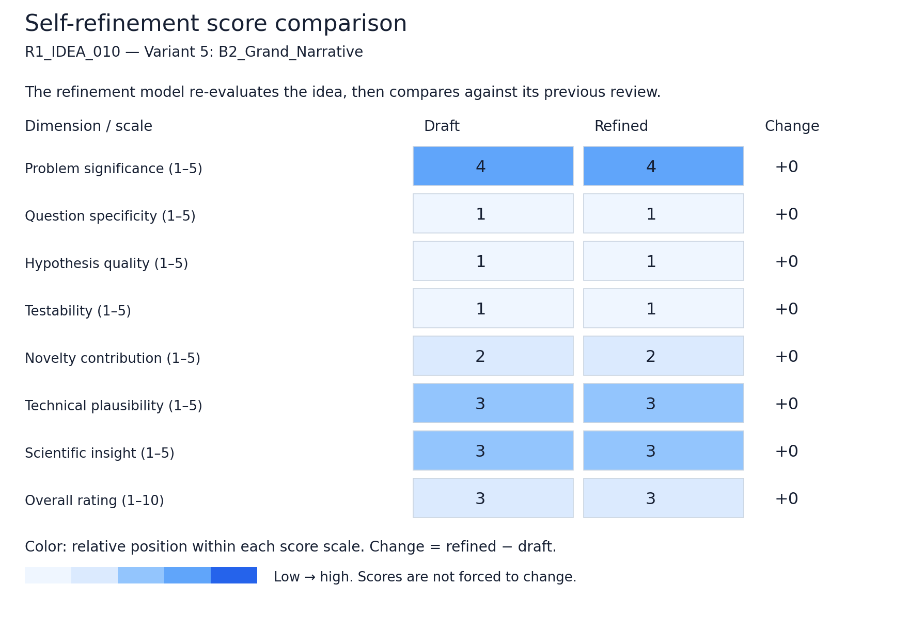

Changed score dimensions: none.

### Score justifications (draft / refined)

**Problem significance**

```json
{
  "draft": {
    "score": 4.0,
    "justification": "The problem is significant: bridging human-like efficient learning and machine learning is a core challenge in AI. The gap between human fast mapping and data-hungry VLMs is a meaningful and timely issue."
  },
  "refined": {
    "score": 4.0,
    "justification": "The underlying problem is highly significant. Achieving human-like data efficiency and robust generalization from few examples is a fundamental, long-standing challenge in machine learning and AI. The gap between human 'fast mapping' and current large-scale data-dependent models (like VLMs) is a meaningful and timely focus for research."
  }
}
```

**Question specificity**

```json
{
  "draft": {
    "score": 1.0,
    "justification": "No specific research question is stated. The idea only notes that VFM 'may inform' challenges and that there is a 'key gap.' It does not define what aspect of VFM, what kind of system, or what relationship will be investigated."
  },
  "refined": {
    "score": 1.0,
    "justification": "No specific research question is defined. The idea only states that VFM 'may inform' challenges and that a 'key gap' exists. It does not specify what aspect of VFM, what kind of AI system, or what specific relationship or effect will be investigated."
  }
}
```

**Hypothesis quality**

```json
{
  "draft": {
    "score": 1.0,
    "justification": "There is no explicit or implicit hypothesis. The text suggests a potential connection but makes no concrete prediction about outcomes, mechanisms, or improvements."
  },
  "refined": {
    "score": 1.0,
    "justification": "There is no hypothesis, explicit or implicit. The text suggests a potential area of inquiry but makes no concrete, testable prediction about outcomes, mechanisms, or comparative performance. It does not posit a relationship that could be supported or contradicted by evidence."
  }
}
```

**Testability**

```json
{
  "draft": {
    "score": 1.0,
    "justification": "Without a defined question or hypothesis, it is unclear how one would test the idea. No experiment, comparison, or evaluation is suggested."
  },
  "refined": {
    "score": 1.0,
    "justification": "Without a defined question or hypothesis, it is impossible to design a test. The idea suggests no experiment, comparison, evaluation, or analysis. It is a statement of motivation, not an investigable proposition."
  }
}
```

**Novelty contribution**

```json
{
  "draft": {
    "score": 2.0,
    "justification": "The connection between cognitive fast mapping and AI efficiency is not new in broad strokes. The idea lacks a novel angle or specific contribution—it merely states that the gap exists and could be studied."
  },
  "refined": {
    "score": 2.0,
    "justification": "The broad notion that cognitive science (including studies of rapid learning) can inspire more efficient AI is not novel. The idea lacks a specific novel angle, mechanism, or contribution—it merely identifies a gap and suggests it could be a research direction without proposing how to advance it."
  }
}
```

**Technical plausibility**

```json
{
  "draft": {
    "score": 3.0,
    "justification": "The general direction is plausible: insights from human learning could inspire more efficient AI. However, without any technical detail, it's impossible to assess the coherence of a specific approach."
  },
  "refined": {
    "score": 3.0,
    "justification": "The general direction is plausible: principles from human learning could inspire technical innovations. However, with zero technical detail proposed, one can only assess the abstract logical coherence, which is intact but trivial. No specific technical approach is presented to evaluate for plausibility."
  }
}
```

**Scientific insight**

```json
{
  "draft": {
    "score": 3.0,
    "justification": "If successfully developed, this line of research could yield insights into the principles of data-efficient visual learning. However, the idea as stated is too vague to guarantee such insight."
  },
  "refined": {
    "score": 3.0,
    "justification": "If a specific research program were successfully executed from this starting point, it *could* yield insights into the principles of data-efficient learning. However, the idea as stated is too vague to guarantee such insight. It points toward a potentially insightful area but does not itself propose a path to generate specific scientific knowledge."
  }
}
```

**Overall rating**

```json
{
  "draft": {
    "score": 3.0,
    "justification": "The idea identifies an important problem but fails to define a research question, hypothesis, or testable direction. It reads as a broad motivation rather than a research idea, with minimal specificity or actionable plan. It is weak as a research idea because it lacks the core elements needed to guide scientific investigation."
  },
  "refined": {
    "score": 3.0,
    "justification": "The idea identifies an important and meaningful problem but completely fails to define a research question, hypothesis, or testable direction. It reads as a broad motivation or background section introduction rather than a actionable research idea. It lacks the core elements (specificity, a falsifiable claim, a methodological direction) needed to guide scientific investigation, making it a weak research idea."
  }
}
```

## R1_IDEA_010 — Variant 6: B3_Over_Confident

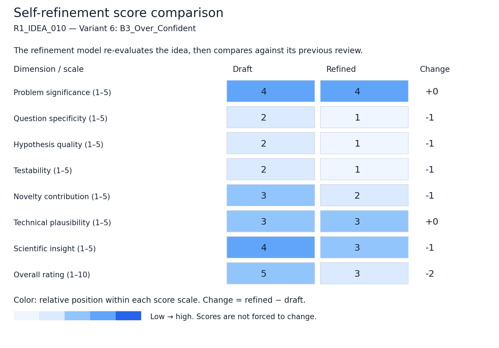

Changed score dimensions: question_specificity, hypothesis_quality, testability, novelty_contribution, scientific_insight, overall_rating.

### Score justifications (draft / refined)

**Problem significance**

```json
{
  "draft": {
    "score": 4.0,
    "justification": "The problem is significant as it addresses a fundamental gap between human and machine learning efficiency. Human-like fast mapping from minimal examples is a key capability that would greatly enhance the practicality and efficiency of vision systems. The tension between human cognitive abilities and current data-hungry approaches is a meaningful research challenge."
  },
  "refined": {
    "score": 4.0,
    "justification": "The problem is significant. Bridging the gap between human sample-efficient concept learning and data-hungry machine learning models is a fundamental challenge in AI. Improving few-shot visual concept formation would greatly enhance the practicality and adaptability of vision systems."
  }
}
```

**Question specificity**

```json
{
  "draft": {
    "score": 2.0,
    "justification": "The idea lacks a specific research question. It states that VLMs require large-scale data while humans don't, but doesn't define what exactly would be investigated. There's no concrete question about mechanisms, limitations, or potential solutions."
  },
  "refined": {
    "score": 1.0,
    "justification": "The idea lacks a defined research question. It only makes an observational statement about a gap (VLMs need large data for what humans do quickly). There is no concrete question about mechanisms, causes, or potential solutions to investigate."
  }
}
```

**Hypothesis quality**

```json
{
  "draft": {
    "score": 2.0,
    "justification": "There's an implicit hypothesis that 'VLMs cannot achieve VFM without large-scale data,' but this is more of an observation than a testable hypothesis. No specific mechanism or relationship is proposed that could be supported or contradicted by evidence."
  },
  "refined": {
    "score": 1.0,
    "justification": "There is no explicit or implicit testable hypothesis. The text states a fact (VLMs require large-scale data) and a desired capability (achieving VFM), but makes no predictive or mechanistic claim that could be supported or refuted by evidence."
  }
}
```

**Testability**

```json
{
  "draft": {
    "score": 2.0,
    "justification": "The idea as presented is not directly testable. It doesn't suggest experiments, evaluations, or analyses that could investigate the claim. While one could design tests for VFM capabilities, the idea itself doesn't propose how to test whether VLMs can achieve it or why they currently cannot."
  },
  "refined": {
    "score": 1.0,
    "justification": "The idea as presented is not testable. It does not suggest any experiment, evaluation, comparison, or analysis. While one could imagine designing tests for VFM, the idea itself provides no direction for how to investigate whether or why VLMs fail at it."
  }
}
```

**Novelty contribution**

```json
{
  "draft": {
    "score": 3.0,
    "justification": "The connection between VFM and VLMs has some novelty, as VFM is a cognitive science concept not frequently discussed in VLM literature. However, the idea of few-shot learning in vision is well-established, and the application of cognitive principles to improve ML systems is an active area. The contribution would depend heavily on how the connection is explored."
  },
  "refined": {
    "score": 2.0,
    "justification": "The novelty is limited. The observation that VLMs are data-hungry while humans are not is well-known. Linking it to the specific cognitive science term 'Visual Fast Mapping' adds some conceptual framing, but without a specific investigative angle, the potential contribution remains vague. Few-shot learning in vision is an established field."
  }
}
```

**Technical plausibility**

```json
{
  "draft": {
    "score": 3.0,
    "justification": "The basic premise is plausible - that human fast mapping represents a capability gap in current systems. However, without more details about how this connection would be investigated, it's difficult to assess technical coherence. The reasoning that VLMs require large data while humans don't is logically sound but not deeply analyzed."
  },
  "refined": {
    "score": 3.0,
    "justification": "The basic premise is plausible—human learning is more sample-efficient than current deep learning. However, without any proposed technical direction, the reasoning is incomplete. The statement is logically coherent but superficial."
  }
}
```

**Scientific insight**

```json
{
  "draft": {
    "score": 4.0,
    "justification": "If properly investigated, this direction has strong potential for scientific insight. Understanding why VLMs fail at human-like fast mapping could reveal fundamental limitations in current architectures or training paradigms. It could lead to insights about compositional reasoning, prior knowledge utilization, or sample efficiency that transfer beyond specific models."
  },
  "refined": {
    "score": 3.0,
    "justification": "If a specific investigation were built upon this motivation, there is potential for insight into the limitations of current VLMs (e.g., lack of structured priors, compositional reasoning). As stated, however, the idea only hints at this potential without outlining a path to uncover such insights."
  }
}
```

**Overall rating**

```json
{
  "draft": {
    "score": 5.0,
    "justification": "This is a moderate/borderline research idea. It identifies a meaningful problem with good potential for scientific insight, but lacks specificity in research question, hypothesis, and methodology. The connection between cognitive science and machine learning is promising, but the idea needs substantial refinement to become a strong research direction. It currently reads more as a motivation statement than a research plan."
  },
  "refined": {
    "score": 3.0,
    "justification": "This is a weak research idea. It identifies a meaningful and significant problem but fails to define any research question, hypothesis, or methodological direction. It reads as a motivational observation rather than a research idea. Without a specific proposition to investigate, its scientific value is very limited."
  }
}
```

## R1_IDEA_010 — Variant 7: B4_Novelty

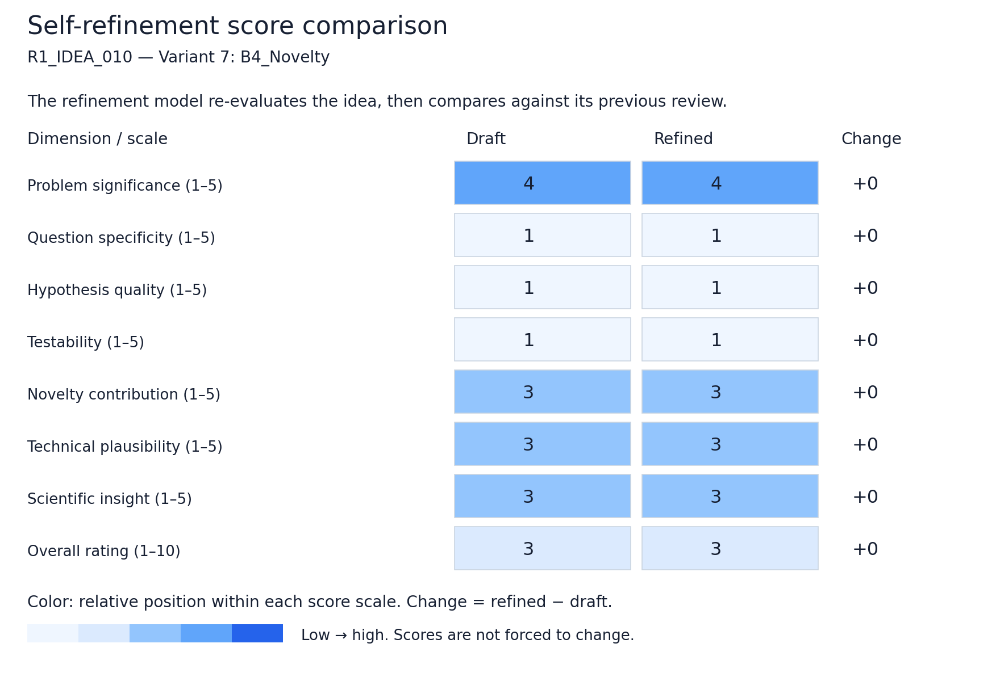

Changed score dimensions: none.

### Score justifications (draft / refined)

**Problem significance**

```json
{
  "draft": {
    "score": 4.0,
    "justification": "The problem of achieving human-like efficiency in visual concept learning is significant. Humans excel at learning from few examples while current models require extensive data. Bridging this gap could advance both AI capabilities and our understanding of human cognition. The connection to cognitive science adds interdisciplinary relevance."
  },
  "refined": {
    "score": 4.0,
    "justification": "The problem is significant: achieving human-like efficiency in visual concept learning is a fundamental challenge in AI. Humans excel at learning from few examples while current models require extensive data. Bridging this gap could advance both AI capabilities and our understanding of human cognition. The interdisciplinary connection to cognitive science adds meaningful scientific relevance."
  }
}
```

**Question specificity**

```json
{
  "draft": {
    "score": 1.0,
    "justification": "Extremely low specificity. The idea merely states that VFM is 'an underexplored angle' and that there's 'a need for new directions.' It does not define what specific question would be investigated, what relationship would be studied, or what phenomenon would be examined. It's more of a problem statement than a research question."
  },
  "refined": {
    "score": 1.0,
    "justification": "Extremely low specificity. The idea merely states that VFM is 'an underexplored angle' and that there's 'a need for new directions.' It does not define what specific question would be investigated, what relationship would be studied, or what phenomenon would be examined. It's a problem statement, not a research question."
  }
}
```

**Hypothesis quality**

```json
{
  "draft": {
    "score": 1.0,
    "justification": "No hypothesis is present, explicit or implicit. There is no prediction about what might work, what mechanism might be important, or what relationship might exist. The text only observes that current methods have limitations and that VFM is interesting. A hypothesis would require a testable claim about how to achieve VFM-like capabilities or what factors enable them."
  },
  "refined": {
    "score": 1.0,
    "justification": "No hypothesis is present, explicit or implicit. There is no prediction about what might work, what mechanism might be important, or what relationship might exist. The text only observes that current methods have limitations and that VFM is interesting. A hypothesis would require a testable claim about how to achieve VFM-like capabilities or what factors enable them."
  }
}
```

**Testability**

```json
{
  "draft": {
    "score": 1.0,
    "justification": "Not testable in its current form. There is no proposed experiment, comparison, evaluation, or analysis. Without a specific question or hypothesis, there's nothing to test. The idea suggests that 'new directions' are needed but doesn't specify what those might be or how they could be evaluated."
  },
  "refined": {
    "score": 1.0,
    "justification": "Not testable in its current form. There is no proposed experiment, comparison, evaluation, or analysis. Without a specific question or hypothesis, there's nothing to test. The idea suggests 'new directions' are needed but doesn't specify what those might be or how they could be evaluated."
  }
}
```

**Novelty contribution**

```json
{
  "draft": {
    "score": 3.0,
    "justification": "Moderate novelty in connecting VFM from cognitive science to computer vision, which is not commonly discussed. However, the core idea of improving few-shot visual learning is well-established in ML. The potential contribution is unclear because no specific new approach or insight is proposed beyond noting that existing methods have limitations."
  },
  "refined": {
    "score": 3.0,
    "justification": "Moderate novelty in explicitly connecting VFM from cognitive science to computer vision, which is not commonly discussed in ML literature. However, the core challenge of improving few-shot visual learning is well-established. The potential contribution is unclear because no specific new approach, mechanism, or insight is proposed beyond noting existing limitations."
  }
}
```

**Technical plausibility**

```json
{
  "draft": {
    "score": 3.0,
    "justification": "The general direction is plausible - improving few-shot visual learning is a recognized challenge. However, without any proposed mechanism or approach, it's impossible to evaluate technical coherence. The reasoning that current methods have limitations is logically sound but trivial."
  },
  "refined": {
    "score": 3.0,
    "justification": "The general direction is plausible – improving few-shot visual learning is a recognized challenge. However, without any proposed mechanism or approach, it's impossible to evaluate technical coherence. The reasoning that current methods have limitations is logically sound but trivial. No technical details are provided to assess."
  }
}
```

**Scientific insight**

```json
{
  "draft": {
    "score": 3.0,
    "justification": "If properly developed, studying VFM could yield insights about human vs. machine learning, efficient representation learning, or cognitive-inspired architectures. However, in its current vague form, it's unclear what specific insights would be sought. The potential exists but is unrealized."
  },
  "refined": {
    "score": 3.0,
    "justification": "If properly developed, studying VFM could yield insights about human vs. machine learning, efficient representation formation, or cognitive-inspired architectures. However, in its current vague form, it's unclear what specific insights would be sought. The potential exists but is unrealized without a concrete research question."
  }
}
```

**Overall rating**

```json
{
  "draft": {
    "score": 3.0,
    "justification": "This is a weak research idea in its current form. While it identifies a potentially significant problem (human-like efficient visual learning) and makes an interesting interdisciplinary connection (cognitive science's VFM), it fails to specify any research question, hypothesis, or methodological direction. It's essentially a motivation statement rather than a research idea. The lack of specificity, testability, and concrete hypothesis severely limits its scientific value as a research direction proposal."
  },
  "refined": {
    "score": 3.0,
    "justification": "This is a weak research idea in its current form. While it identifies a potentially significant problem (human-like efficient visual learning) and makes an interesting interdisciplinary connection (cognitive science's VFM), it fails to specify any research question, hypothesis, or methodological direction. It's essentially a motivation statement rather than a research idea. The lack of specificity, testability, and concrete hypothesis severely limits its scientific value as a research direction proposal."
  }
}
```

## R1_IDEA_010 — Variant 8: B5_Application_Impact


Changed score dimensions: none.

### Score justifications (draft / refined)

**Problem significance**

```json
{
  "draft": {
    "score": 4.0,
    "justification": "Data efficiency in visual recognition is a highly significant problem with both scientific and practical importance. The connection to human cognitive abilities adds an interesting interdisciplinary dimension. However, the idea doesn't fully articulate why VFM specifically (vs. other cognitive phenomena) is the key to solving this problem."
  },
  "refined": {
    "score": 4.0,
    "justification": "Data efficiency in visual recognition is a highly significant problem with both scientific and practical importance. The connection to human cognitive abilities adds an interesting interdisciplinary dimension that could lead to fundamental insights. However, the idea doesn't fully articulate why VFM specifically (vs. other cognitive phenomena) is the key to solving this problem, which slightly limits the significance score."
  }
}
```

**Question specificity**

```json
{
  "draft": {
    "score": 2.0,
    "justification": "Extremely low specificity. The idea states that VFM 'could inform' development but doesn't define what specific question is being asked. There's no concrete research question about mechanisms, relationships, or phenomena to investigate."
  },
  "refined": {
    "score": 2.0,
    "justification": "Extremely low specificity. The idea states that VFM 'could inform' development but doesn't define what specific question is being asked. There's no concrete research question about mechanisms, relationships, or phenomena to investigate. It's a broad suggestion rather than a focused inquiry."
  }
}
```

**Hypothesis quality**

```json
{
  "draft": {
    "score": 1.0,
    "justification": "No hypothesis is present, explicit or implicit. The text merely suggests a potential connection without making a testable prediction about what would happen if that connection were explored. It's a motivation statement rather than a hypothesis."
  },
  "refined": {
    "score": 1.0,
    "justification": "No hypothesis is present, explicit or implicit. The text merely suggests a potential connection without making a testable prediction about what would happen if that connection were explored. It's a motivation statement rather than a hypothesis that could be supported or contradicted by evidence."
  }
}
```

**Testability**

```json
{
  "draft": {
    "score": 2.0,
    "justification": "The idea as presented is not directly testable because it doesn't propose what to test. One could design experiments around it, but the idea itself lacks any suggested evaluation, comparison, or analysis method. It's too vague to be falsifiable."
  },
  "refined": {
    "score": 2.0,
    "justification": "The idea as presented is not directly testable because it doesn't propose what to test. One could design experiments around it, but the idea itself lacks any suggested evaluation, comparison, or analysis method. It's too vague to be falsifiable or directly investigated without substantial additional specification."
  }
}
```

**Novelty contribution**

```json
{
  "draft": {
    "score": 3.0,
    "justification": "The connection between cognitive science and machine learning for data efficiency has been explored before (e.g., meta-learning, cognitive-inspired few-shot learning). The specific focus on VFM might offer some novelty, but without a concrete direction, it's unclear what new contribution would emerge beyond applying existing VFM concepts to ML."
  },
  "refined": {
    "score": 3.0,
    "justification": "The connection between cognitive science and machine learning for data efficiency has been explored before (e.g., meta-learning, cognitive-inspired few-shot learning). The specific focus on VFM might offer some novelty, but without a concrete direction, it's unclear what new contribution would emerge beyond applying existing VFM concepts to ML. It could potentially contribute if it leads to new mechanisms or insights, but as stated, it's primarily a suggestion to explore an area."
  }
}
```

**Technical plausibility**

```json
{
  "draft": {
    "score": 3.0,
    "justification": "The general direction is plausible - cognitive inspiration has led to valuable ML advances. However, without specifying how VFM mechanisms would be implemented, it's impossible to assess technical coherence. The idea doesn't contain enough technical content to evaluate plausibility beyond the surface level."
  },
  "refined": {
    "score": 3.0,
    "justification": "The general direction is plausible - cognitive inspiration has led to valuable ML advances. However, without specifying how VFM mechanisms would be implemented, it's impossible to assess technical coherence. The idea doesn't contain enough technical content to evaluate plausibility beyond the surface level. The connection seems reasonable but is not elaborated."
  }
}
```

**Scientific insight**

```json
{
  "draft": {
    "score": 3.0,
    "justification": "If successfully pursued, this could potentially yield insights about how human-like rapid concept formation might be achieved in machines, which would be valuable. However, the idea as stated doesn't articulate what specific scientific insight would be gained (e.g., about the role of prior knowledge, cross-modal learning, or inductive biases)."
  },
  "refined": {
    "score": 3.0,
    "justification": "If successfully pursued, this could potentially yield insights about how human-like rapid concept formation might be achieved in machines, which would be valuable. However, the idea as stated doesn't articulate what specific scientific insight would be gained (e.g., about the role of prior knowledge, cross-modal learning, or inductive biases). The potential is there, but it's not specified."
  }
}
```

**Overall rating**

```json
{
  "draft": {
    "score": 4.0,
    "justification": "This is a weak research idea in its current form. While it identifies a meaningful problem (data efficiency) and makes an interesting interdisciplinary connection (cognitive science's VFM), it lacks virtually all elements of a testable research idea: no specific question, no hypothesis, no proposed direction for investigation, and no clear path to scientific insight. It reads more as a broad motivation paragraph than a research proposal. With substantial refinement (specific hypothesis, concrete direction, testable predictions), it could become a strong idea, but as presented, it's too vague to merit a higher rating."
  },
  "refined": {
    "score": 4.0,
    "justification": "This is a weak research idea in its current form. While it identifies a meaningful problem (data efficiency) and makes an interesting interdisciplinary connection (cognitive science's VFM), it lacks virtually all elements of a testable research idea: no specific question, no hypothesis, no proposed direction for investigation, and no clear path to scientific insight. It reads more as a broad motivation paragraph than a research proposal. With substantial refinement (specific hypothesis, concrete direction, testable predictions), it could become a strong idea, but as presented, it's too vague to merit a higher rating."
  }
}
```

## R1_IDEA_010 — Variant 9: C1_Hollow_Shell

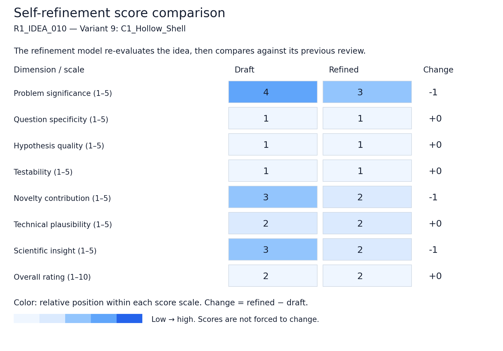

Changed score dimensions: problem_significance, novelty_contribution, scientific_insight.

### Score justifications (draft / refined)

**Problem significance**

```json
{
  "draft": {
    "score": 4.0,
    "justification": "The problem is meaningful: improving few-shot learning and reducing data requirements in computer vision is an important challenge. The interdisciplinary angle (cognitive science to computer vision) could potentially yield novel insights."
  },
  "refined": {
    "score": 3.0,
    "justification": "The underlying problem—improving few-shot learning and reducing data dependence in vision—is meaningful. The interdisciplinary angle is potentially valuable, but the idea itself does not argue why VFM specifically is important to study now."
  }
}
```

**Question specificity**

```json
{
  "draft": {
    "score": 1.0,
    "justification": "Extremely weak. The idea merely states that VFM is a concept and that current approaches have limitations. No concrete research question is posed - it's essentially just a topic mention with some context."
  },
  "refined": {
    "score": 1.0,
    "justification": "No research question is posed. The text only mentions VFM and notes current limitations, without specifying what would be investigated."
  }
}
```

**Hypothesis quality**

```json
{
  "draft": {
    "score": 1.0,
    "justification": "No hypothesis is present. The text only describes VFM and mentions limitations of current approaches, but makes no prediction about what would happen if VFM principles were applied to computer vision."
  },
  "refined": {
    "score": 1.0,
    "justification": "There is no hypothesis, explicit or implicit. The idea does not make a prediction, propose a mechanism, or suggest a relationship to test."
  }
}
```

**Testability**

```json
{
  "draft": {
    "score": 1.0,
    "justification": "Not testable in its current form. There's no proposed experiment, comparison, or evaluation method. The idea doesn't specify what would be measured or how success would be determined."
  },
  "refined": {
    "score": 1.0,
    "justification": "Not testable. There is no proposed experiment, evaluation, or method of inquiry. The idea does not indicate what evidence would be gathered or how findings would be assessed."
  }
}
```

**Novelty contribution**

```json
{
  "draft": {
    "score": 3.0,
    "justification": "Moderate potential novelty. Applying cognitive science concepts to computer vision is not entirely new, but VFM specifically might be underexplored. However, without a specific implementation or hypothesis, the potential contribution is unclear."
  },
  "refined": {
    "score": 2.0,
    "justification": "Low novelty as stated. Applying cognitive concepts to ML is not new, and without a specific hypothesis or approach, the potential contribution is vague. At best, it hints at an underexplored concept."
  }
}
```

**Technical plausibility**

```json
{
  "draft": {
    "score": 2.0,
    "justification": "Weak. While the general direction of borrowing from cognitive science is plausible, the idea provides no technical details about how VFM would be implemented. The connection between the cognitive concept and computational methods is not explained."
  },
  "refined": {
    "score": 2.0,
    "justification": "Weak plausibility. The general notion of borrowing from cognitive science is coherent, but no technical path is suggested. The connection between VFM and computational methods is merely asserted without reasoning."
  }
}
```

**Scientific insight**

```json
{
  "draft": {
    "score": 3.0,
    "justification": "Moderate potential insight. If properly executed, investigating VFM in computer vision could reveal principles about how prior knowledge enables learning from limited data. However, the current formulation is too vague to assess what specific insights might emerge."
  },
  "refined": {
    "score": 2.0,
    "justification": "Low potential insight in current form. If a specific study were designed, it could yield insights into prior knowledge use in few-shot learning, but the idea as presented does not indicate what might be learned."
  }
}
```

**Overall rating**

```json
{
  "draft": {
    "score": 2.0,
    "justification": "Very weak research idea. While it identifies a potentially interesting interdisciplinary connection, it fails to articulate any concrete research question, hypothesis, or methodology. It reads more like background motivation than a research direction. The idea lacks the specificity needed to evaluate its scientific merit properly."
  },
  "refined": {
    "score": 2.0,
    "justification": "Very weak research idea. It identifies a topic and a general problem but fails to propose any research direction, question, or hypothesis. It lacks the minimal specificity required to evaluate scientific merit and reads as introductory context rather than a research plan."
  }
}
```

## R1_IDEA_010 — Variant 10: C2_Logic_Flawed


Changed score dimensions: none.

### Score justifications (draft / refined)

**Problem significance**

```json
{
  "draft": {
    "score": 4.0,
    "justification": "The problem is significant - bridging the gap between human visual learning efficiency and machine learning systems is a fundamental challenge in AI. Human VFM represents a capability that current systems lack, and understanding how to achieve it could advance both AI and cognitive science."
  },
  "refined": {
    "score": 4.0,
    "justification": "The problem is highly significant. Achieving human-like sample efficiency in visual learning is a fundamental challenge in AI. Understanding and bridging this gap has implications for both machine learning (efficient learning) and cognitive science (computational theories of learning)."
  }
}
```

**Question specificity**

```json
{
  "draft": {
    "score": 1.0,
    "justification": "Extremely weak. The text does not define any research question. It only states observations about limitations of current methods without specifying what should be investigated. There is no concrete question about mechanisms, relationships, or phenomena."
  },
  "refined": {
    "score": 1.0,
    "justification": "Extremely weak. The text does not define a research question. It presents background and observations ('one-shot learning is insufficient', 'VLMs require large-scale data') but does not specify what relationship, mechanism, or phenomenon is to be investigated. There is no 'what will we study?'"
  }
}
```

**Hypothesis quality**

```json
{
  "draft": {
    "score": 1.0,
    "justification": "No hypothesis is presented. The text makes observations ('one-shot learning is insufficient,' 'VLMs require large-scale data') but does not make any testable prediction about what might work better or why current approaches fail."
  },
  "refined": {
    "score": 1.0,
    "justification": "No hypothesis is present. The statements are observations or claims about the state of the field, not predictions that can be supported or contradicted by evidence. There is no proposed causal relationship, novel mechanism, or testable condition to evaluate."
  }
}
```

**Testability**

```json
{
  "draft": {
    "score": 1.0,
    "justification": "Not testable in its current form. There is no proposed experiment, comparison, evaluation, or analysis. The idea lacks any suggestion for how to investigate the problem or test potential solutions."
  },
  "refined": {
    "score": 1.0,
    "justification": "Not testable. There is no proposed experiment, evaluation, comparison, or analysis. The idea lacks any suggestion for how to gather evidence about the stated observations or any potential solutions. It is purely descriptive."
  }
}
```

**Novelty contribution**

```json
{
  "draft": {
    "score": 2.0,
    "justification": "The observation that current methods don't achieve human-like VFM is not novel - this is widely acknowledged. Without a specific research direction, the potential contribution is minimal. The idea mentions VFM from cognitive science but doesn't propose how to translate this to machine learning."
  },
  "refined": {
    "score": 2.0,
    "justification": "The core observations are not novel; the limitations of one-shot learning and the data requirements of VLMs are well-known. Without a specific research direction, the potential contribution is minimal. Mentioning VFM from cognitive science provides context but does not, by itself, propose a novel research angle."
  }
}
```

**Technical plausibility**

```json
{
  "draft": {
    "score": 3.0,
    "justification": "The observations are technically accurate - one-shot learning has limited generalization and VLMs do require large-scale data. However, there's no proposed technical direction to evaluate for plausibility. The reasoning that current methods are insufficient is logically coherent but trivial."
  },
  "refined": {
    "score": 3.0,
    "justification": "The factual observations are technically accurate and logically coherent. However, there is no proposed technical direction to assess for plausibility. The reasoning that current methods fall short of a human capability is sound but does not constitute a technical proposal."
  }
}
```

**Scientific insight**

```json
{
  "draft": {
    "score": 2.0,
    "justification": "If properly developed, studying VFM in machine learning could yield insights about sample efficiency, generalization, and the integration of prior knowledge. However, in its current vague form, the idea doesn't suggest what specific insights might be gained or how they would be uncovered."
  },
  "refined": {
    "score": 2.0,
    "justification": "The topic has high potential for insight (e.g., into the principles of sample-efficient learning, the role of prior knowledge, or the limits of current architectures). However, the idea in its current form does not propose a pathway to gain such insights. It states a gap but does not suggest how studying it would yield new understanding."
  }
}
```

**Overall rating**

```json
{
  "draft": {
    "score": 2.0,
    "justification": "This is a very weak research idea. While it identifies an important problem (human vs. machine visual learning), it fails to propose any specific research question, hypothesis, or direction for investigation. It's essentially a problem statement rather than a research idea. The text observes limitations of current approaches but doesn't suggest what should be studied or how. Without a concrete question or testable hypothesis, it cannot be meaningfully evaluated as a research direction."
  },
  "refined": {
    "score": 2.0,
    "justification": "This is a very weak research idea. It identifies an important and meaningful problem but fails to propose any research. It lacks a question, a hypothesis, and a methodological direction. It is essentially a brief background statement or problem motivation, not a research idea. There is no defined investigation to evaluate."
  }
}
```

## R1_IDEA_010 — Variant 11: C3_Substance_Enriched

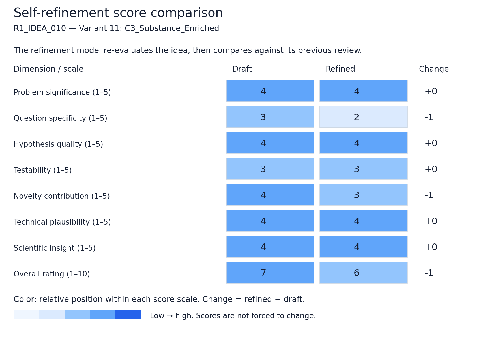

Changed score dimensions: question_specificity, novelty_contribution, overall_rating.

### Score justifications (draft / refined)

**Problem significance**

```json
{
  "draft": {
    "score": 4.0,
    "justification": "The problem is highly significant as it addresses a fundamental challenge in both cognitive science (understanding human visual learning) and machine learning (building systems that can learn from few examples). VFM is a keystone of human inductive capacity, and solving it could lead to more sample-efficient AI systems."
  },
  "refined": {
    "score": 4.0,
    "justification": "The problem is highly significant. Understanding the mechanisms of rapid visual learning (VFM) is a core challenge in cognitive science. Enabling machines to achieve robust few-shot learning is a fundamental and impactful goal in AI. The idea correctly identifies a potential bridge between these fields."
  }
}
```

**Question specificity**

```json
{
  "draft": {
    "score": 3.0,
    "justification": "The idea identifies a specific hypothesis about semantic relatedness affecting VFM, which is good. However, the overall research direction remains somewhat broad, with multiple open areas mentioned (architectural mechanisms, boundary condition learning) without clear focus on which specific question to investigate first."
  },
  "refined": {
    "score": 2.0,
    "justification": "The idea mentions a testable hypothesis about semantic relatedness, which is a point of specificity. However, it does not define a clear research question. It presents a background observation (VFM is important, current methods are limited), a hypothesis about humans, and a suggestion about machines, but does not state what specific investigation will be undertaken. The direction is broad and multifaceted."
  }
}
```

**Hypothesis quality**

```json
{
  "draft": {
    "score": 4.0,
    "justification": "The hypothesis that VFM relies on efficient reuse of structured prior knowledge, testable by varying semantic relatedness, is concrete and falsifiable. It makes a clear prediction about how learning should vary with semantic distance to known concepts."
  },
  "refined": {
    "score": 4.0,
    "justification": "The embedded hypothesis about human VFM relying on 'efficient reuse of structured prior knowledge', testable via semantic relatedness, is of good quality. It is concrete, makes a relational prediction, and is falsifiable. This is the strongest conceptual element of the idea."
  }
}
```

**Testability**

```json
{
  "draft": {
    "score": 3.0,
    "justification": "The semantic relatedness hypothesis is testable through controlled experiments. However, the broader claims about architectural mechanisms for rapid hypothesis testing and boundary condition learning are less clearly testable without more specific proposals for what these mechanisms are and how to evaluate them."
  },
  "refined": {
    "score": 3.0,
    "justification": "The core human cognitive hypothesis is testable with psychological experiments. The implied machine learning corollary—that incorporating structured knowledge improves few-shot learning—is also testable. However, the idea does not propose a specific test or evaluation for the machine learning side. It states areas 'remain open for validation' without suggesting how that validation would be conducted."
  }
}
```

**Novelty contribution**

```json
{
  "draft": {
    "score": 4.0,
    "justification": "The idea has good novelty potential by bridging cognitive science hypotheses with modern VLMs. While one-shot learning is well-studied, explicitly testing the role of structured prior knowledge and semantic relatedness in the context of VLMs could yield new insights about both human and machine learning."
  },
  "refined": {
    "score": 3.0,
    "justification": "The interdisciplinary link between cognitive VFM and machine few-shot learning has novelty. However, the idea's formulation is quite preliminary. The suggestion that VLMs might need better mechanisms for rapid learning is not novel in itself. The potential contribution hinges on executing a specific study that tests the semantic relatedness hypothesis in a novel way, which is not yet defined."
  }
}
```

**Technical plausibility**

```json
{
  "draft": {
    "score": 4.0,
    "justification": "The reasoning is logically coherent: if humans use structured prior knowledge for VFM, and current models lack this, then enhancing models with such knowledge should improve few-shot learning. VLMs do provide richer semantic priors than traditional one-shot learning methods, making the direction plausible."
  },
  "refined": {
    "score": 4.0,
    "justification": "The reasoning is logically coherent and plausible. The claim that human learning uses structured knowledge and that machines might benefit from similar structure is reasonable. The identification of VLMs as a starting point due to their semantic priors is sensible. The idea does not contain technical contradictions."
  }
}
```

**Scientific insight**

```json
{
  "draft": {
    "score": 4.0,
    "justification": "If successful, this research could provide insights into the mechanisms of human visual learning, the limitations of current few-shot learning approaches, and potentially reveal general principles about how structured knowledge enables rapid learning. It goes beyond simple application by aiming to understand fundamental learning mechanisms."
  },
  "refined": {
    "score": 4.0,
    "justification": "The idea has high potential for scientific insight. Successfully investigating how semantic relatedness affects few-shot learning could reveal principles about knowledge reuse, the structure of useful priors, and the boundary conditions of generalization for both humans and machines. It aims beyond mere application performance towards understanding learning mechanisms."
  }
}
```

**Overall rating**

```json
{
  "draft": {
    "score": 7.0,
    "justification": "This is a strong research idea with clear scientific merit. It identifies an important problem at the intersection of cognitive science and machine learning, proposes a testable hypothesis about semantic relatedness, and suggests a promising direction involving VLMs. The main limitation is that it needs more specificity about experimental designs and architectural mechanisms. With more concrete proposals, it could become an exceptional research direction."
  },
  "refined": {
    "score": 6.0,
    "justification": "This is a moderate/borderline research idea with a strong foundational concept but insufficient definition. The core hypothesis about semantic relatedness and structured knowledge is excellent and forms the basis for a strong study. However, the idea lacks a concrete research question, a specific proposed investigation for the machine learning context, and any methodological direction. It reads more as a compelling motivation and set of open problems than as a research plan. With significant refinement to define a specific, testable project, it could become strong."
  }
}
```

## R1_IDEA_010 — Variant 12: H1_Deceptive_Hollow


Changed score dimensions: none.

### Score justifications (draft / refined)

**Problem significance**

```json
{
  "draft": {
    "score": 4.0,
    "justification": "The underlying problem—learning visual concepts from very limited data by leveraging prior knowledge—is meaningful and aligns with core challenges in both cognitive science and machine learning. It addresses a known limitation of current data-hungry models and aims for more human-like efficiency."
  },
  "refined": {
    "score": 4.0,
    "justification": "The underlying problem—achieving human-like data-efficient visual concept learning by leveraging prior knowledge—is highly meaningful. It addresses a core limitation of current deep learning systems and aligns with fundamental challenges in both cognitive science and machine learning. The aspiration to build more robust, adaptive systems is relevant to researchers and practitioners."
  }
}
```

**Question specificity**

```json
{
  "draft": {
    "score": 1.0,
    "justification": "No concrete research question is defined. The idea is described at a high level of abstraction ('broader framework,' 'transformative synthesis') without specifying what is actually being investigated."
  },
  "refined": {
    "score": 1.0,
    "justification": "No concrete research question is defined. The idea is described at an abstract, aspirational level ('broader framework,' 'transformative synthesis') without specifying what is actually being investigated. It lacks a clear, focused inquiry."
  }
}
```

**Hypothesis quality**

```json
{
  "draft": {
    "score": 1.0,
    "justification": "There is no hypothesis, explicit or implicit. The text makes no testable prediction about mechanisms, relationships, or outcomes. It only states an aspirational goal."
  },
  "refined": {
    "score": 1.0,
    "justification": "There is no hypothesis, explicit or implicit. The text makes no testable prediction about mechanisms, relationships, or outcomes. It only states an ambitious goal and frames it as a promising direction, without proposing a falsifiable claim."
  }
}
```

**Testability**

```json
{
  "draft": {
    "score": 1.0,
    "justification": "The idea as presented is not testable. It proposes no experiments, evaluations, or analyses. Without a concrete question or hypothesis, there is nothing to investigate empirically."
  },
  "refined": {
    "score": 1.0,
    "justification": "The idea as presented is not testable. It proposes no experiments, evaluations, comparisons, or analyses. Without a concrete question, hypothesis, or methodological direction, there is nothing to investigate empirically. It is a vision statement, not a research plan."
  }
}
```

**Novelty contribution**

```json
{
  "draft": {
    "score": 2.0,
    "justification": "While the framing as a 'broader framework' is claimed to be novel, the core problem (few-shot learning with prior knowledge) is already well-studied. The idea lacks a specific novel angle, method, or insight that would distinguish it from existing research."
  },
  "refined": {
    "score": 2.0,
    "justification": "While the framing as a 'field-shaping agenda' is claimed to be novel, the core problem (few-shot learning with prior knowledge) is extensively studied. The idea lacks a specific novel angle, method, or insight that would distinguish it from existing research in meta-learning, foundation models, or compositional generalization. It reads more as a rebranding than a novel contribution."
  }
}
```

**Technical plausibility**

```json
{
  "draft": {
    "score": 3.0,
    "justification": "The general direction—leveraging prior knowledge for data-efficient learning—is technically plausible and aligns with ongoing work in meta-learning and foundation models. However, without any technical details, it's impossible to assess the plausibility of the proposed 'framework.'"
  },
  "refined": {
    "score": 3.0,
    "justification": "The general direction—leveraging prior knowledge for data-efficient visual learning—is technically plausible and aligns with ongoing work. However, without any technical details about the proposed 'framework,' its mechanisms, or its implementation, it is impossible to assess the plausibility of the specific agenda. The idea is too vague to evaluate technically."
  }
}
```

**Scientific insight**

```json
{
  "draft": {
    "score": 2.0,
    "justification": "If successfully developed, a rigorous VFM framework could offer insights into how prior knowledge enables data-efficient learning. However, the current description is too vague to promise specific mechanistic or principled insights beyond general aspirations."
  },
  "refined": {
    "score": 2.0,
    "justification": "If successfully developed, a rigorous VFM framework could offer insights into how structural priors enable data-efficient learning. However, the current description is too vague to promise specific mechanistic, architectural, or theoretical insights. It primarily promises a shift in perspective ('reshape how the community thinks') rather than concrete scientific understanding."
  }
}
```

**Overall rating**

```json
{
  "draft": {
    "score": 3.0,
    "justification": "The idea identifies a meaningful problem but fails to define a concrete research question, hypothesis, or testable direction. It is presented as an aspirational agenda without scientific substance. As such, it is a weak research idea with limited specificity, testability, and potential for immediate scientific contribution."
  },
  "refined": {
    "score": 3.0,
    "justification": "The idea identifies a meaningful and significant problem but fails to define a concrete research question, hypothesis, or testable direction. It is presented as an abstract, aspirational agenda without scientific substance. As a research idea, it lacks specificity, testability, and novelty, offering limited potential for immediate scientific contribution despite its ambitious framing."
  }
}
```

## R1_IDEA_010 — Variant 13: H2_Confident_Flaw

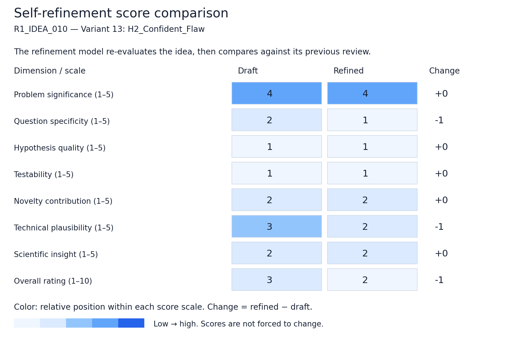

Changed score dimensions: question_specificity, technical_plausibility, overall_rating.

### Score justifications (draft / refined)

**Problem significance**

```json
{
  "draft": {
    "score": 4.0,
    "justification": "The problem is meaningful: achieving human-like rapid visual concept learning from minimal examples is a fundamental challenge in machine learning and cognitive AI. It addresses a clear gap between human and machine learning capabilities."
  },
  "refined": {
    "score": 4.0,
    "justification": "The problem is highly significant. Achieving human-like rapid visual concept learning from minimal examples is a fundamental, unsolved challenge in machine learning and AI alignment with human cognition. It addresses a core gap in generalization and sample efficiency, which matters for both scientific understanding and practical applications in data-scarce scenarios."
  }
}
```

**Question specificity**

```json
{
  "draft": {
    "score": 2.0,
    "justification": "The idea lacks a clear research question. It states that one-shot learning is insufficient and VLMs need large data, but does not specify what will be investigated, what relationship will be tested, or what phenomenon will be explored."
  },
  "refined": {
    "score": 1.0,
    "justification": "The idea lacks any specific research question. It states observations (one-shot learning is insufficient, VLMs need large data) and makes a broad assertion about solving a limitation, but does not define what will be investigated, what relationship will be tested, or what specific phenomenon will be explored. It is entirely non-specific."
  }
}
```

**Hypothesis quality**

```json
{
  "draft": {
    "score": 1.0,
    "justification": "There is no explicit or implicit testable hypothesis. The statement that 'solving the highlighted limitation will necessarily produce reliable improvements' is an assumption, not a falsifiable prediction. The claim about causal evidence is not a scientific hypothesis."
  },
  "refined": {
    "score": 1.0,
    "justification": "There is no testable hypothesis. The statement that 'solving the highlighted limitation will necessarily produce reliable improvements' is an assumption or a goal, not a falsifiable prediction. The claim about causal evidence is a methodological stance, not a hypothesis. No concrete, testable relationship between variables is proposed."
  }
}
```

**Testability**

```json
{
  "draft": {
    "score": 1.0,
    "justification": "The idea does not suggest any experiment, evaluation, comparison, or analysis to test a claim. It merely identifies a problem without proposing how to investigate it. The assertion that gains can be treated as causal evidence without isolating factors further undermines testability."
  },
  "refined": {
    "score": 1.0,
    "justification": "The idea is not testable. It proposes no experiment, evaluation, comparison, or analysis. There is no claim to test, no method to evaluate, and no data to analyze. The flawed assertion about bypassing controlled experimentation further negates testability."
  }
}
```

**Novelty contribution**

```json
{
  "draft": {
    "score": 2.0,
    "justification": "The observation that one-shot learning has limited generalization and VLMs require large data is not novel. The idea does not propose a new method, phenomenon, or insight—it only states a known limitation. Without a specific research direction, the potential contribution is unclear."
  },
  "refined": {
    "score": 2.0,
    "justification": "The observation that one-shot learning generalizes poorly and VLMs are data-hungry is not novel. The idea does not propose a new method, a new empirical phenomenon to uncover, a novel hypothesis to test, or a new theoretical insight. It only reiterates a known gap. Without a specific direction, its potential contribution is minimal."
  }
}
```

**Technical plausibility**

```json
{
  "draft": {
    "score": 3.0,
    "justification": "The reasoning that human VFM is not captured by current one-shot or VLM approaches is plausible. However, the claim that solving the limitation will 'necessarily' produce improvements and provide causal evidence without controlled experiments is logically flawed and reduces plausibility."
  },
  "refined": {
    "score": 2.0,
    "justification": "The core reasoning that human VFM is an aspirational capability not captured by current methods is plausible. However, the concluding claim is technically flawed: asserting that improvements from addressing a complex limitation can be treated as causal evidence without isolating variables is contrary to basic scientific practice. This reduces the overall technical plausibility of the proposed reasoning."
  }
}
```

**Scientific insight**

```json
{
  "draft": {
    "score": 2.0,
    "justification": "If developed into a concrete research program, studying VFM in machines could yield insights into mechanisms of few-shot learning, the role of prior knowledge, or compositional generalization. However, as presented, the idea does not propose to uncover such insights—it only states a problem."
  },
  "refined": {
    "score": 2.0,
    "justification": "The underlying topic (VFM) has high potential for scientific insight into mechanisms of few-shot learning, the role of prior knowledge, and compositional generalization. However, the idea as presented does not propose to generate such insights. It merely states a problem. No pathway to uncovering new principles or understanding is outlined."
  }
}
```

**Overall rating**

```json
{
  "draft": {
    "score": 3.0,
    "justification": "This is a weak research idea. While it identifies a meaningful problem (human-like visual fast mapping), it fails to define a specific research question, hypothesis, or testable direction. It reads more as a critique or motivation paragraph than a research proposal. The unscientific claim about causal evidence further weakens it. With substantial refinement, it could become a moderate or strong idea."
  },
  "refined": {
    "score": 2.0,
    "justification": "This is a very weak research idea. While it identifies a significant and interesting problem (the VFM gap), it fails entirely as a proposal. It lacks a research question, a hypothesis, a testable direction, and a plausible methodological approach. It contains a major scientific flaw in its reasoning about evidence. It reads as a motivational preamble, not a research idea. Substantial conceptual work is needed to transform it into a testable research direction."
  }
}
```

## R1_IDEA_010 — Variant 14: H3_Verbose_Enriched

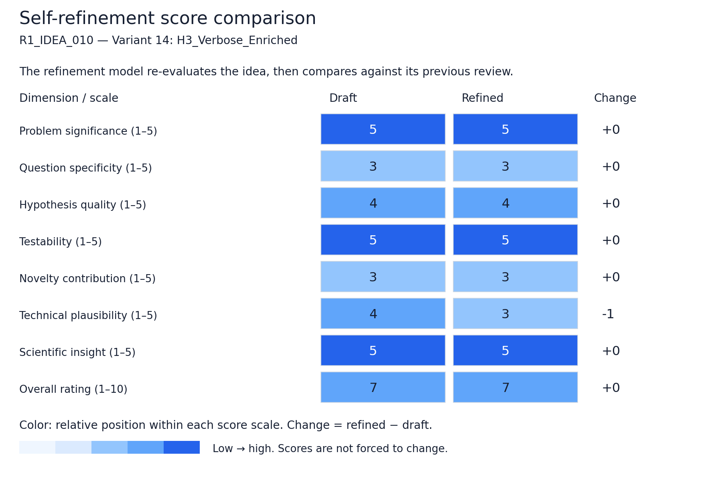

Changed score dimensions: technical_plausibility.

### Score justifications (draft / refined)

**Problem significance**

```json
{
  "draft": {
    "score": 5.0,
    "justification": "The problem is highly significant: understanding and replicating human-like few-shot visual learning is a core challenge in machine learning and cognitive science. The gap between current one-shot learning methods and human generalization is well-known and important to address."
  },
  "refined": {
    "score": 5.0,
    "justification": "The problem is exceptionally significant. Bridging the gap between human few-shot visual learning and machine capabilities is a fundamental challenge in both cognitive science and AI. Understanding the role of structured prior knowledge addresses a core limitation of current one-shot learning methods."
  }
}
```

**Question specificity**

```json
{
  "draft": {
    "score": 3.0,
    "justification": "The hypothesis about structured prior knowledge reuse is specific, but the overall research question is somewhat broad ('achieving robust VFM likely requires... architectural mechanisms'). The idea shifts from testing a hypothesis to validating open areas, which dilutes specificity."
  },
  "refined": {
    "score": 3.0,
    "justification": "The initial hypothesis about structured knowledge reuse is specific. However, the overall research direction quickly broadens into validating unspecified 'architectural mechanisms' and 'open areas,' which dilutes the specificity. The 'what' is clear (test the hypothesis), but the 'how' (with what model) is vague."
  }
}
```

**Hypothesis quality**

```json
{
  "draft": {
    "score": 4.0,
    "justification": "The hypothesis that VFM relies on efficient reuse of structured prior knowledge is concrete, mechanistic, and testable via semantic relatedness manipulation. It makes a clear prediction that could be falsified."
  },
  "refined": {
    "score": 4.0,
    "justification": "The core hypothesis is strong: VFM relies on efficient reuse of structured prior knowledge. It is concrete, mechanistic (points to a specific cognitive/computational process), and directly testable/falsifiable by manipulating semantic relatedness. It is not merely a statement of relevance."
  }
}
```

**Testability**

```json
{
  "draft": {
    "score": 5.0,
    "justification": "The proposed staged experimental design is excellent: baseline vs. intervention, pre-specified criteria, ablations, sensitivity analyses, and error analysis. This makes the idea highly testable even without implementation details."
  },
  "refined": {
    "score": 5.0,
    "justification": "Excellent. The proposed staged experimental design, with pre-specified conditions, evaluation criteria, ablations, sensitivity analyses, and error analysis, provides a complete blueprint for rigorous testing. The idea's testability is a major strength, even in the absence of implementation details."
  }
}
```

**Novelty contribution**

```json
{
  "draft": {
    "score": 3.0,
    "justification": "The link between human VFM and machine few-shot learning is not new, and the use of semantic relatedness to study prior knowledge reuse has parallels in transfer learning. The novelty hinges on the unspecified architectural mechanisms for hypothesis testing and boundary learning."
  },
  "refined": {
    "score": 3.0,
    "justification": "Moderate. Linking human VFM to machine few-shot learning is an established interdisciplinary aspiration. The specific angle of testing via semantic relatedness has parallels in transfer learning studies. The potential novelty hinges entirely on the unspecified architectural mechanisms for hypothesis testing and boundary learning, which remain a promissory note."
  }
}
```

**Technical plausibility**

```json
{
  "draft": {
    "score": 4.0,
    "justification": "The reasoning is coherent: structured priors could improve few-shot learning, VLMs provide semantic knowledge, and careful experimentation can isolate mechanisms. The missing architectural details prevent a full score, but the overall direction is plausible."
  },
  "refined": {
    "score": 3.0,
    "justification": "The logical reasoning is coherent and plausible: structured knowledge should help, VLMs are a source of semantics, and careful experimentation can reveal mechanisms. However, the plausibility of the central proposed solution ('architectural mechanisms') cannot be assessed because it is not described. The idea is plausible in intent but ungrounded in technical detail."
  }
}
```

**Scientific insight**

```json
{
  "draft": {
    "score": 5.0,
    "justification": "The idea has high potential for scientific insight: it aims to uncover when and why structured prior knowledge helps few-shot learning, through ablations and error analysis. This could reveal boundary conditions, failure modes, and general principles beyond mere performance gains."
  },
  "refined": {
    "score": 5.0,
    "justification": "Exceptional potential. The idea is explicitly designed to yield scientific insight. The focus on mechanisms (via ablations), boundary conditions (via case analysis), and failure modes (via error analysis) promises to reveal *when, why, and how* structured knowledge aids learning, moving far beyond a simple performance comparison."
  }
}
```

**Overall rating**

```json
{
  "draft": {
    "score": 7.0,
    "justification": "This is a strong research idea with a meaningful hypothesis, excellent testability, and high potential insight. It is weakened by the vagueness of the proposed architectural mechanisms and a somewhat broad research question. However, the clear experimental design and focus on mechanisms elevate it above a simple application idea."
  },
  "refined": {
    "score": 7.0,
    "justification": "This is a strong research idea. It is anchored by a significant problem, a clear and testable core hypothesis, and an exceptionally well-thought-out experimental methodology designed for deep scientific insight. Its primary weakness is the lack of specification for the proposed architectural innovation, which leaves the central 'how' question unanswered. Nevertheless, the clarity of the testable hypothesis and the rigorous validation plan elevate it above a vague proposal."
  }
}
```

## R1_IDEA_010 — Variant 15: H4_Ultimate_Hype


Changed score dimensions: none.

### Score justifications (draft / refined)

**Problem significance**

```json
{
  "draft": {
    "score": 4.0,
    "justification": "The problem of learning from minimal examples is fundamental in machine learning and aligns with important cognitive capabilities. Achieving human-like fast mapping would be significant for both scientific understanding and practical applications."
  },
  "refined": {
    "score": 4.0,
    "justification": "The problem of learning visual concepts from minimal examples is fundamental and highly relevant in machine learning. Drawing inspiration from human cognitive abilities like VFM is meaningful and could address important limitations in data efficiency and generalization."
  }
}
```

**Question specificity**

```json
{
  "draft": {
    "score": 1.0,
    "justification": "Extremely low specificity. The idea merely states that VFM is important and current approaches are limited, but does not define what specific question will be investigated. No concrete research question is articulated."
  },
  "refined": {
    "score": 1.0,
    "justification": "Extremely low specificity. The idea only states that VFM is important and current approaches are limited. It does not define any concrete research question, specific phenomenon to study, or relationship to investigate."
  }
}
```

**Hypothesis quality**

```json
{
  "draft": {
    "score": 1.0,
    "justification": "No hypothesis is presented, implicit or explicit. The text only makes vague claims about potential impact without making any testable prediction about mechanisms, relationships, or outcomes."
  },
  "refined": {
    "score": 1.0,
    "justification": "No hypothesis—implicit or explicit—is presented. There is no testable prediction about mechanisms, outcomes, or relationships. The text only makes vague claims about potential impact without proposing what might be true or false."
  }
}
```

**Testability**

```json
{
  "draft": {
    "score": 1.0,
    "justification": "Not testable in its current form. There is no proposed experiment, evaluation, or method to gather evidence. The idea is stated at such a high level of abstraction that it's unclear what would constitute support or refutation."
  },
  "refined": {
    "score": 1.0,
    "justification": "Not testable in its current form. There is no proposed experiment, evaluation, comparison, or method to gather evidence. The idea is stated at such a high level of abstraction that it is unclear what would constitute support or refutation."
  }
}
```

**Novelty contribution**

```json
{
  "draft": {
    "score": 2.0,
    "justification": "While drawing inspiration from cognitive science (VFM) is potentially novel, the idea does not specify what new contribution would be made beyond applying existing few-shot learning techniques. The claim of being 'transformative' is unsupported by any specific novel mechanism or approach."
  },
  "refined": {
    "score": 2.0,
    "justification": "While drawing inspiration from cognitive science (VFM) is a potentially novel angle, the idea does not specify what new contribution would be made. It lacks any specific novel mechanism, approach, or insight beyond applying existing few-shot learning techniques. Claims of being 'transformative' are unsupported."
  }
}
```

**Technical plausibility**

```json
{
  "draft": {
    "score": 3.0,
    "justification": "The general direction of improving few-shot learning is plausible, but without any technical details, it's impossible to assess the plausibility of specific approaches. The reasoning that current methods have limitations is coherent but trivial."
  },
  "refined": {
    "score": 3.0,
    "justification": "The general direction of improving few-shot learning is plausible, but without any technical details, it is impossible to assess the plausibility of specific approaches. The reasoning that current methods have limitations is coherent but trivial."
  }
}
```

**Scientific insight**

```json
{
  "draft": {
    "score": 2.0,
    "justification": "Potentially could yield insight into bridging cognitive science and machine learning, but the idea as stated is too vague to promise specific scientific insights. It mentions broad implications but doesn't articulate what specific principles or mechanisms might be discovered."
  },
  "refined": {
    "score": 2.0,
    "justification": "Potentially could yield insight into bridging cognitive science and machine learning, but the idea as stated is too vague to promise specific scientific insights. It mentions broad implications but does not articulate what principles, mechanisms, or boundary conditions might be discovered."
  }
}
```

**Overall rating**

```json
{
  "draft": {
    "score": 2.0,
    "justification": "This is a very weak research idea. While it identifies a potentially important problem (learning from minimal examples inspired by cognitive science), it fails to articulate any specific research question, hypothesis, or methodological direction. It reads more like a motivational paragraph than a research proposal. The grandiose claims about transformative potential are completely unsupported by any concrete plan. The idea lacks the specificity, testability, and novelty needed for meaningful scientific investigation."
  },
  "refined": {
    "score": 2.0,
    "justification": "This is a very weak research idea. While it identifies a potentially important problem (learning from minimal examples inspired by cognitive science), it fails to articulate any specific research question, hypothesis, or methodological direction. It reads more like a motivational paragraph than a research proposal. The idea lacks the specificity, testability, and novelty needed for meaningful scientific investigation."
  }
}
```

## R1_IDEA_011 — Source

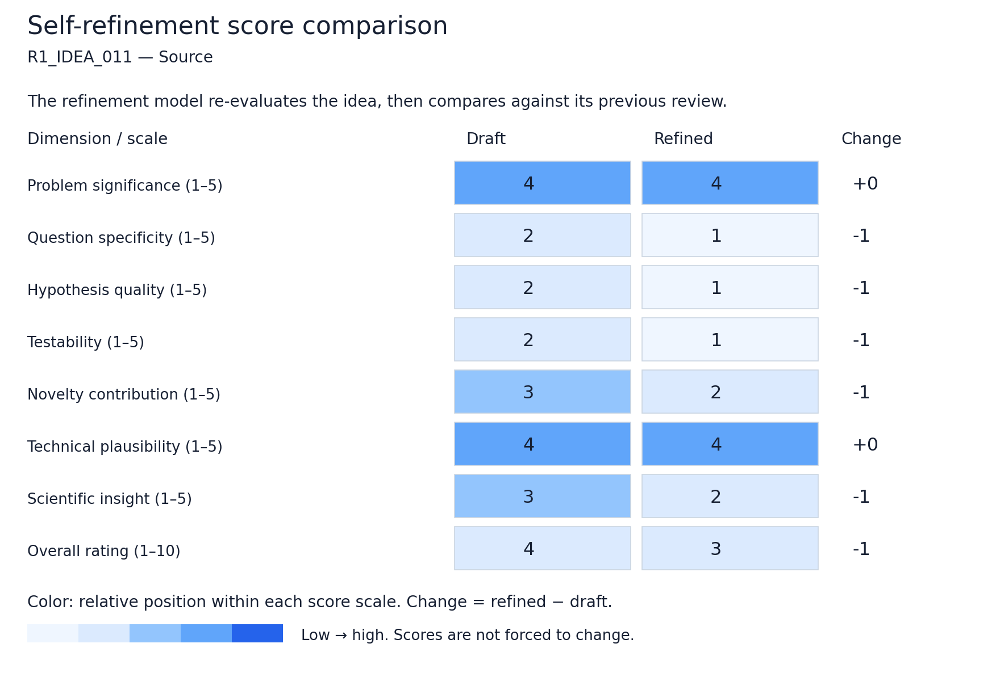

Changed score dimensions: question_specificity, hypothesis_quality, testability, novelty_contribution, scientific_insight, overall_rating.

### Score justifications (draft / refined)

**Problem significance**

```json
{
  "draft": {
    "score": 4.0,
    "justification": "The problem is meaningful: time series forecasting is a core ML task, and better use of multimodal context (especially text) is an active and relevant challenge. Real-world patterns often depend on non-numeric information, so improving text integration could have practical impact."
  },
  "refined": {
    "score": 4.0,
    "justification": "The problem is significant. Time series forecasting is a core ML task with broad applications. Effectively integrating multimodal context, especially rich textual data, is an active and important challenge. The motivation that real-world patterns depend on information beyond numbers is convincing."
  }
}
```

**Question specificity**

```json
{
  "draft": {
    "score": 2.0,
    "justification": "The idea is stated at a high level—it proposes a direction ('leveraging richer exogenous text through structured reasoning and alignment') but does not define a concrete research question. It lacks details about what exactly is being investigated."
  },
  "refined": {
    "score": 1.0,
    "justification": "The idea lacks a concrete research question. It states a general goal ('improve predictive accuracy by leveraging richer text') but does not define what is being investigated. Terms like 'structured reasoning' and 'alignment mechanisms' are placeholders without specific meaning here. This is a very weak level of specificity."
  }
}
```

**Hypothesis quality**

```json
{
  "draft": {
    "score": 2.0,
    "justification": "There is no explicit or clearly implied hypothesis. The statement 'to improve predictive accuracy' is an objective, not a testable prediction. No mechanism or relationship is proposed that could be falsified."
  },
  "refined": {
    "score": 1.0,
    "justification": "There is no hypothesis, explicit or implicit. The text describes an objective ('to improve predictive accuracy') and a proposed means ('leveraging...'), but it makes no concrete, testable prediction about a relationship, mechanism, or comparative outcome. It is not falsifiable."
  }
}
```

**Testability**

```json
{
  "draft": {
    "score": 2.0,
    "justification": "As presented, the idea is not directly testable because it does not specify what to compare, how to measure 'richer' text utilization, or what evidence would confirm or refute the claim. However, it could be made testable with more concrete definitions."
  },
  "refined": {
    "score": 1.0,
    "justification": "As presented, the idea is not testable. It does not specify what to compare, how to measure 'richer' utilization, or what evidence would support or contradict the proposal. While one could imagine designing experiments around it, the idea itself provides no testable claim."
  }
}
```

**Novelty contribution**

```json
{
  "draft": {
    "score": 3.0,
    "justification": "The idea points to a known gap (shallow text use in forecasting) but does not articulate a novel method or insight beyond general notions of 'structured reasoning' and 'alignment.' Without specifics, it's unclear whether this would be a incremental application or a novel contribution."
  },
  "refined": {
    "score": 2.0,
    "justification": "The idea points to a known gap (shallow text use in forecasting) but does not articulate what is novel about its proposed solution. 'Structured reasoning' and 'alignment' are broad concepts already explored in multimodal learning. Without specifics, the potential contribution appears incremental at best."
  }
}
```

**Technical plausibility**

```json
{
  "draft": {
    "score": 4.0,
    "justification": "The direction is plausible: using better text representations (e.g., via transformers, knowledge graphs) and aligning them with time series is technically feasible and aligns with trends in multimodal learning. No obvious technical contradictions are present."
  },
  "refined": {
    "score": 4.0,
    "justification": "The general direction is technically plausible. Integrating deeper text representations (e.g., from LLMs or knowledge graphs) with time series models is a coherent and feasible research avenue. The reasoning is logically sound at this high level."
  }
}
```

**Scientific insight**

```json
{
  "draft": {
    "score": 3.0,
    "justification": "If successfully investigated, this could yield insights into how textual semantics interact with temporal dynamics, or what kinds of text representations are most useful for forecasting. However, as stated, the idea is too vague to guarantee deeper scientific understanding beyond performance gains."
  },
  "refined": {
    "score": 2.0,
    "justification": "If successfully executed, research in this direction could yield insights into how semantic or relational information from text interacts with temporal dynamics. However, as a vague proposal, it primarily suggests a performance improvement goal. The potential for deeper scientific understanding (e.g., revealing general principles of cross-modal alignment for forecasting) is present but entirely unrealized in the statement."
  }
}
```

**Overall rating**

```json
{
  "draft": {
    "score": 4.0,
    "justification": "The idea identifies a relevant problem and a plausible direction, but it lacks a concrete research question, hypothesis, and testable claim. It reads more like a motivation or high-level proposal than a research idea ready for investigation. With refinement, it could become a strong idea, but in its current form it is weak in specificity and testability."
  },
  "refined": {
    "score": 3.0,
    "justification": "This is a weak research idea. It identifies a meaningful problem and a plausible technical direction, which saves it from the lowest score. However, it critically lacks a concrete research question, a testable hypothesis, and any specificity about the proposed investigation. It reads as a motivation or a very high-level proposal, not as a research idea ready for pursuit. Significant refinement is needed to transform it into a testable scientific inquiry."
  }
}
```

## R1_IDEA_011 — Variant 1: A1_Identity

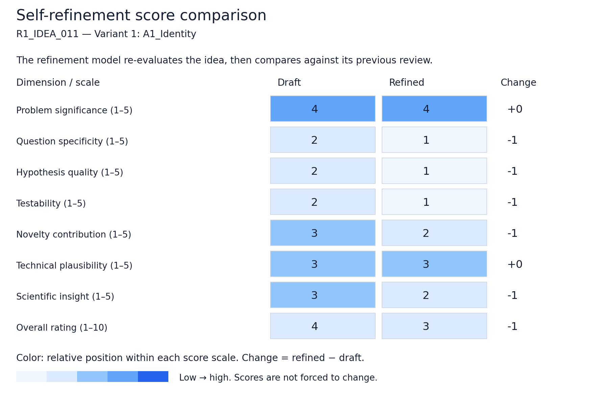

Changed score dimensions: question_specificity, hypothesis_quality, testability, novelty_contribution, scientific_insight, overall_rating.

### Score justifications (draft / refined)

**Problem significance**

```json
{
  "draft": {
    "score": 4.0,
    "justification": "The problem is meaningful: time series forecasting is important in many domains, and better use of multimodal data, especially text, is a recognized challenge. The idea correctly notes that current methods often underutilize textual context."
  },
  "refined": {
    "score": 4.0,
    "justification": "The problem is significant. Time-series forecasting is a core task with broad applications. Effectively integrating auxiliary textual data is a recognized and non-trivial challenge. The idea correctly identifies that current methods often use text in a limited, shallow manner, leaving room for meaningful improvement."
  }
}
```

**Question specificity**

```json
{
  "draft": {
    "score": 2.0,
    "justification": "The idea is too vague. It proposes a general direction ('leveraging richer exogenous text through structured reasoning and alignment') but does not define a concrete research question. What exactly is being investigated?"
  },
  "refined": {
    "score": 1.0,
    "justification": "The idea lacks a concrete research question. It states a general goal ('improve predictive accuracy by leveraging richer text') but does not specify what relationship, mechanism, or comparison is being investigated. It is a direction, not a question."
  }
}
```

**Hypothesis quality**

```json
{
  "draft": {
    "score": 2.0,
    "justification": "No clear hypothesis is presented. The implicit claim is that 'richer text use improves accuracy,' but this is too generic. There's no specific prediction about mechanisms, conditions, or expected outcomes."
  },
  "refined": {
    "score": 1.0,
    "justification": "There is no discernible hypothesis. The text presents an aspirational goal ('improve predictive accuracy') without a concrete, testable prediction about how a specific mechanism (structured reasoning/alignment) will lead to a specific outcome under defined conditions. It is not falsifiable."
  }
}
```

**Testability**

```json
{
  "draft": {
    "score": 2.0,
    "justification": "Without a concrete hypothesis or proposed method, it's unclear how one would test the idea. The statement is not falsifiable in its current form—it suggests a direction rather than a testable claim."
  },
  "refined": {
    "score": 1.0,
    "justification": "The idea, as stated, is not testable. It proposes no specific method, comparison, or evaluation. Without a defined intervention and baseline, one cannot design an experiment to support or contradict the vague claim that 'richer text use helps.'"
  }
}
```

**Novelty contribution**

```json
{
  "draft": {
    "score": 3.0,
    "justification": "The notion of using text in forecasting is not new, but focusing on 'structured reasoning and alignment' could be a novel angle if specified. However, as stated, it's too vague to assess novelty meaningfully."
  },
  "refined": {
    "score": 2.0,
    "justification": "The core notion of using text in forecasting is not novel. The suggested angle of 'structured reasoning and alignment' is potentially novel but is described so vaguely that its distinctiveness from existing multimodal fusion research cannot be assessed. As presented, it resembles a generic call for 'better text integration.'"
  }
}
```

**Technical plausibility**

```json
{
  "draft": {
    "score": 3.0,
    "justification": "The general direction is plausible—better text integration could help forecasting. But without details on 'structured reasoning' or 'alignment mechanisms,' it's hard to evaluate technical soundness."
  },
  "refined": {
    "score": 3.0,
    "justification": "The general premise—that more sophisticated text processing could benefit forecasting—is logically coherent and plausible. However, the complete lack of detail on the proposed mechanisms ('structured reasoning,' 'alignment') makes it impossible to evaluate their technical soundness. No assumptions are stated to assess."
  }
}
```

**Scientific insight**

```json
{
  "draft": {
    "score": 3.0,
    "justification": "If developed, this could offer insight into how textual reasoning interacts with temporal patterns. But as described, it's more of an application goal ('improve accuracy') than an insight-seeking investigation."
  },
  "refined": {
    "score": 2.0,
    "justification": "The stated aim is to 'improve predictive accuracy,' which is an application-oriented goal. If successfully pursued, the research could yield insights into how textual semantics align with temporal dynamics, but the idea itself does not frame an investigation aimed at uncovering such general principles, limitations, or mechanisms. The potential for transferable scientific insight is low in the current formulation."
  }
}
```

**Overall rating**

```json
{
  "draft": {
    "score": 4.0,
    "justification": "The idea identifies a relevant problem but lacks a specific research question, hypothesis, or testable claim. It's more of a motivation statement than a research idea. With refinement, it could become a strong direction, but in its current form it's weak as a research proposal."
  },
  "refined": {
    "score": 3.0,
    "justification": "This is a weak research idea. It identifies a significant and relevant problem but fails to articulate any specific research question, hypothesis, or testable claim. It reads as a high-level motivation or a very early brainstorming direction. Without substantial refinement to define a concrete inquiry, its scientific value as a research idea is minimal. It scores above 1-2 because the problem area itself is meaningful."
  }
}
```

## R1_IDEA_011 — Variant 2: A2_Paraphrase_Only


Changed score dimensions: none.

### Score justifications (draft / refined)

**Problem significance**

```json
{
  "draft": {
    "score": 4.0,
    "justification": "The problem is meaningful. Leveraging rich, unstructured text for time series forecasting is an underexplored challenge with real-world relevance in domains like finance, healthcare, and climate. The critique of current multimodal methods using text as 'restricted additional context' points to a plausible gap."
  },
  "refined": {
    "score": 4.0,
    "justification": "The problem is meaningful and relevant. Real-world time series forecasting often involves rich contextual information beyond numbers, and current multimodal approaches may not fully leverage textual data. Improving how text informs temporal predictions has clear applications in finance, healthcare, climate science, and other domains."
  }
}
```

**Question specificity**

```json
{
  "draft": {
    "score": 2.0,
    "justification": "The idea is more of a proposed direction than a specific research question. It states a general goal ('enhance predictive accuracy') and a methodological theme ('structured reasoning and alignment'), but does not define a concrete, investigable question."
  },
  "refined": {
    "score": 2.0,
    "justification": "The idea describes a general direction ('employing richer exogenous text via structured reasoning and alignment') rather than a specific research question. It lacks concrete investigative focus—what exactly is being tested or explored?"
  }
}
```

**Hypothesis quality**

```json
{
  "draft": {
    "score": 2.0,
    "justification": "There is an implicit hypothesis that 'richer exogenous text via structured reasoning and alignment' will improve forecasting, but it is not formulated as a testable prediction. It lacks specificity about the conditions, mechanisms, or expected nature of improvement."
  },
  "refined": {
    "score": 2.0,
    "justification": "There is an implicit hypothesis that structured reasoning with text will improve forecasting accuracy, but it's not formulated as a testable prediction. No specific conditions, mechanisms, or expected relationships are articulated that could be supported or contradicted by evidence."
  }
}
```

**Testability**

```json
{
  "draft": {
    "score": 3.0,
    "justification": "The idea is testable in principle—one could implement a system with structured text reasoning and compare its forecasting accuracy to baselines. However, without a clearer definition of the proposed mechanisms and evaluation setup, the path to testing is vague."
  },
  "refined": {
    "score": 3.0,
    "justification": "The idea is testable in principle—one could implement a system with structured text reasoning and compare forecasting performance. However, without clearer definition of the mechanisms, evaluation setup, or success criteria, the path to meaningful testing remains vague."
  }
}
```

**Novelty contribution**

```json
{
  "draft": {
    "score": 3.0,
    "justification": "The novelty is moderate. Using text in time series forecasting is not new, but focusing on 'structured reasoning' and deeper alignment beyond shallow embeddings is a more specific angle. The potential contribution is currently framed as an accuracy boost, which is an incremental engineering contribution unless tied to a deeper scientific question."
  },
  "refined": {
    "score": 3.0,
    "justification": "Moderate novelty. Using text in time series forecasting isn't new, but focusing on structured reasoning beyond shallow embeddings is a more specific angle. The potential contribution is currently framed as accuracy improvement, which is incremental unless tied to deeper understanding of how semantic structure interacts with temporal dynamics."
  }
}
```

**Technical plausibility**

```json
{
  "draft": {
    "score": 3.0,
    "justification": "The idea is logically coherent and seems plausible at a high level. Structured reasoning (e.g., extracting events, relations) from text and aligning it with time series is a sensible direction. However, the lack of detail on the mechanisms makes it difficult to assess feasibility and potential pitfalls."
  },
  "refined": {
    "score": 3.0,
    "justification": "The idea is logically coherent at a high level—structured reasoning from text and aligning it with time series data is plausible. However, the lack of detail on specific mechanisms makes it difficult to assess feasibility, implementation challenges, or potential pitfalls."
  }
}
```

**Scientific insight**

```json
{
  "draft": {
    "score": 2.0,
    "justification": "As presented, the primary goal is to 'enhance predictive accuracy.' The potential for broader scientific insight—such as understanding how semantic event structures relate to temporal dynamics, or discovering boundary conditions for textual information utility—is not discussed. The idea leans toward an applied engineering contribution."
  },
  "refined": {
    "score": 2.0,
    "justification": "As presented, the primary goal is applied: 'enhance predictive accuracy.' There's little discussion of what broader scientific insight might be gained—such as understanding relationships between semantic event structures and temporal patterns, or discovering boundary conditions for when textual information improves forecasting."
  }
}
```

**Overall rating**

```json
{
  "draft": {
    "score": 5.0,
    "justification": "This is a moderate/borderline research idea. It identifies a relevant problem and points to an interesting technical direction. However, it lacks a clearly defined research question, a testable hypothesis, and a compelling articulation of the scientific insight beyond potential accuracy gains. With refinement—specifically, formulating a concrete hypothesis and detailing the proposed mechanisms—it could become a strong idea."
  },
  "refined": {
    "score": 5.0,
    "justification": "This is a moderate/borderline research idea. It identifies a relevant problem and points to an interesting technical direction, but lacks a clearly defined research question, testable hypothesis, and articulation of scientific insight beyond potential accuracy gains. With refinement—particularly formulating a concrete hypothesis and detailing proposed mechanisms—it could become stronger."
  }
}
```

## R1_IDEA_011 — Variant 3: A3_Plain_Core


Changed score dimensions: none.

### Score justifications (draft / refined)

**Problem significance**

```json
{
  "draft": {
    "score": 4.0,
    "justification": "The problem is meaningful: time series forecasting is a core ML task, and better use of multimodal data, especially text, is an acknowledged challenge. Real-world patterns often involve textual context, so improving integration could have practical impact."
  },
  "refined": {
    "score": 4.0,
    "justification": "The problem is meaningful and relevant. Time series forecasting is a core ML task with broad applications, and effectively integrating multimodal data, especially rich textual context, remains a significant challenge. Real-world patterns often involve textual information that numerical data alone cannot capture, making this an important research direction."
  }
}
```

**Question specificity**

```json
{
  "draft": {
    "score": 2.0,
    "justification": "The idea states a general direction but does not define a concrete research question. It proposes 'using richer exogenous text' and 'structured reasoning and alignment' without specifying what relationship or effect is being investigated."
  },
  "refined": {
    "score": 2.0,
    "justification": "The idea states a general direction but does not define a concrete research question. It proposes 'using richer exogenous text' and 'structured reasoning and alignment' without specifying what relationship, mechanism, or effect is being investigated. The research objective is framed broadly as 'improve predictive accuracy' rather than as a focused inquiry."
  }
}
```

**Hypothesis quality**

```json
{
  "draft": {
    "score": 2.0,
    "justification": "There is no explicit or clearly implicit hypothesis. The claim that richer text integration 'improves predictive accuracy' is a broad goal, not a testable prediction about a specific mechanism or condition."
  },
  "refined": {
    "score": 2.0,
    "justification": "There is no explicit or clearly implicit hypothesis. The statement that richer text integration 'improves predictive accuracy' is a broad goal, not a testable prediction about a specific mechanism, condition, or relationship. A hypothesis would need to make a concrete, falsifiable claim about how structured reasoning or alignment affects forecasting under defined circumstances."
  }
}
```

**Testability**

```json
{
  "draft": {
    "score": 3.0,
    "justification": "The idea is testable in principle—one could design experiments comparing forecasting accuracy with and without proposed mechanisms. However, without a specific hypothesis or experimental design, it remains vague."
  },
  "refined": {
    "score": 3.0,
    "justification": "The idea is testable in principle—one could design experiments comparing forecasting accuracy with and without the proposed mechanisms. However, without a specific hypothesis, operational definitions of 'richer text' or 'structured reasoning,' or a concrete experimental design, it remains vague. The testability relies entirely on future specification."
  }
}
```

**Novelty contribution**

```json
{
  "draft": {
    "score": 3.0,
    "justification": "Multimodal time series forecasting is an active area; using text is not novel per se. The novelty hinges on 'structured reasoning and alignment,' but these are not detailed enough to assess potential contribution beyond existing work (e.g., attention-based fusion, LLM-augmented forecasting)."
  },
  "refined": {
    "score": 3.0,
    "justification": "Multimodal time series forecasting with text is an active research area. The novelty hinges on the unspecified 'structured reasoning and alignment mechanisms,' which are not detailed enough to assess potential contribution beyond existing work (e.g., attention-based fusion, LLM-augmented forecasting, or graph-based multimodal integration). Without more detail, it risks being an incremental engineering improvement."
  }
}
```

**Technical plausibility**

```json
{
  "draft": {
    "score": 4.0,
    "justification": "The direction is plausible: aligning textual information with time series via reasoning mechanisms is technically coherent and aligns with trends in multimodal learning. No obvious technical flaws are apparent given the high-level description."
  },
  "refined": {
    "score": 4.0,
    "justification": "The direction is technically plausible. Aligning textual information with time series via reasoning mechanisms is coherent with trends in multimodal and neuro-symbolic learning. No obvious technical flaws are apparent given the high-level description, assuming reasonable implementations of 'structured reasoning' and 'alignment.'"
  }
}
```

**Scientific insight**

```json
{
  "draft": {
    "score": 3.0,
    "justification": "If successful, the research could offer insight into how textual context interacts with temporal patterns. However, as stated, it risks being an engineering improvement ('improve accuracy') rather than revealing general principles about multimodal integration in forecasting."
  },
  "refined": {
    "score": 3.0,
    "justification": "If successfully investigated, the research could offer insight into how structured textual context interacts with temporal patterns. However, as stated, it primarily aims at performance improvement ('improve accuracy') rather than revealing general principles about multimodal integration, boundary conditions, or causal mechanisms in forecasting. The potential for scientific insight depends heavily on how the study is framed."
  }
}
```

**Overall rating**

```json
{
  "draft": {
    "score": 5.0,
    "justification": "The idea identifies a relevant problem and suggests a plausible technical direction, but it lacks a specific research question, testable hypothesis, and clear novelty. It reads more like a general motivation than a focused research idea. With refinement, it could become a strong study, but in its current form, it is moderate/borderline."
  },
  "refined": {
    "score": 5.0,
    "justification": "The idea identifies a relevant problem and suggests a plausible technical direction, but it lacks a specific research question, testable hypothesis, and clear novelty. It reads more like a general motivation or high-level proposal than a focused research idea. With refinement—particularly by formulating a concrete hypothesis and experimental design—it could become a strong study, but in its current form, it is moderate/borderline."
  }
}
```

## R1_IDEA_011 — Variant 4: B1_Verbose_Elaborate

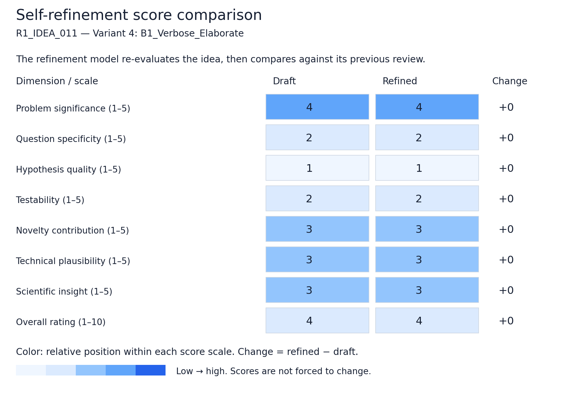

Changed score dimensions: none.

### Score justifications (draft / refined)

**Problem significance**

```json
{
  "draft": {
    "score": 4.0,
    "justification": "The problem is meaningful: time series forecasting is important across many domains, and better utilization of multimodal information, particularly text, could address real limitations. The observation that current approaches underutilize textual data identifies a specific gap."
  },
  "refined": {
    "score": 4.0,
    "justification": "The problem is meaningful and relevant. Time series forecasting is critical in many domains (finance, climate, healthcare), and better use of multimodal context, especially text, addresses a recognized limitation. The observation that current methods often use text superficially identifies a concrete gap."
  }
}
```

**Question specificity**

```json
{
  "draft": {
    "score": 2.0,
    "justification": "The idea identifies a general direction but lacks a concrete research question. It states what should be done (leverage richer text through structured reasoning/alignment) but not what specific aspect will be investigated or what relationship will be tested."
  },
  "refined": {
    "score": 2.0,
    "justification": "The idea states a general direction ('leverage richer text through structured reasoning and alignment') but does not define a concrete research question. It lacks specificity about what relationship, mechanism, or condition is being investigated."
  }
}
```

**Hypothesis quality**

```json
{
  "draft": {
    "score": 1.0,
    "justification": "No hypothesis is presented. The idea suggests an approach might improve accuracy, but makes no concrete, testable prediction about mechanisms, conditions, or expected outcomes that could be falsified."
  },
  "refined": {
    "score": 1.0,
    "justification": "No hypothesis is presented. The idea suggests an approach 'as a means to improve predictive accuracy' but makes no testable prediction about mechanisms, boundary conditions, or measurable outcomes that could be supported or contradicted."
  }
}
```

**Testability**

```json
{
  "draft": {
    "score": 2.0,
    "justification": "While one could design experiments comparing forecasting with and without the proposed approach, the vagueness of 'structured reasoning and alignment mechanisms' makes it unclear what exactly would be tested. The idea lacks specificity about what evidence would support or contradict its value."
  },
  "refined": {
    "score": 2.0,
    "justification": "While one could design an experiment comparing forecasts with and without text enrichment, the vagueness of the proposed mechanisms makes it unclear what exactly would be tested. The idea does not specify what evidence would confirm or refute its core claim."
  }
}
```

**Novelty contribution**

```json
{
  "draft": {
    "score": 3.0,
    "justification": "The general concept of better integrating text into time series forecasting has been explored. The novelty claim rests on 'structured reasoning and alignment mechanisms,' but without details, it's unclear how this differs substantially from more sophisticated multimodal fusion techniques already in literature."
  },
  "refined": {
    "score": 3.0,
    "justification": "Integrating text into time series forecasting is not new. The novelty hinges on 'structured reasoning and alignment,' but without details, it's ambiguous how this differs meaningfully from more advanced multimodal fusion (e.g., cross-modal attention, graph-based fusion) already explored in the literature."
  }
}
```

**Technical plausibility**

```json
{
  "draft": {
    "score": 3.0,
    "justification": "The direction is logically coherent: richer textual understanding could plausibly improve forecasts. However, without details about the proposed mechanisms, it's difficult to assess technical feasibility. The assumption that current methods underutilize text seems reasonable."
  },
  "refined": {
    "score": 3.0,
    "justification": "The general direction is logically coherent: deeper textual understanding could plausibly aid forecasting. However, the lack of detail on the proposed mechanisms prevents a strong assessment of feasibility. The assumption that current methods underuse text is reasonable but not elaborated."
  }
}
```

**Scientific insight**

```json
{
  "draft": {
    "score": 3.0,
    "justification": "If successfully investigated, this could provide insight into how textual information relates to temporal patterns and what types of reasoning are most valuable for forecasting. However, as currently stated, it risks being a simple 'method X improves accuracy' contribution without deeper understanding of mechanisms or boundary conditions."
  },
  "refined": {
    "score": 3.0,
    "justification": "If successfully pursued, this could yield insights into how textual semantics relate to temporal dynamics and what forms of reasoning are most valuable for forecasting. However, as stated, it risks being a purely engineering contribution ('method X improves accuracy') without revealing deeper principles or limitations."
  }
}
```

**Overall rating**

```json
{
  "draft": {
    "score": 4.0,
    "justification": "This is a weak research idea in its current form. While it identifies a potentially meaningful problem (underutilization of text in time series forecasting), it lacks a clear research question, testable hypothesis, and specificity about the proposed approach. The idea is more of a general motivation than a research direction that could be directly investigated. It needs substantial refinement to become a testable research proposal."
  },
  "refined": {
    "score": 4.0,
    "justification": "This is a weak research idea in its current form. It identifies a potentially significant problem but fails to define a research question, hypothesis, or testable claim. The proposal is vague and reads more as a high-level motivation than a concrete research direction. Substantial refinement is needed to transform it into a viable research plan."
  }
}
```

## R1_IDEA_011 — Variant 5: B2_Grand_Narrative


Changed score dimensions: none.

### Score justifications (draft / refined)

**Problem significance**

```json
{
  "draft": {
    "score": 4.0,
    "justification": "Time series forecasting is a core ML task with real-world impact. The underutilization of textual data in multimodal forecasting is a meaningful gap, as text often contains explanatory context not captured numerically."
  },
  "refined": {
    "score": 4.0,
    "justification": "Time series forecasting is a core ML task with broad real-world impact. The underutilization of textual data in multimodal forecasting is a meaningful gap, as text often contains explanatory context (e.g., events, explanations) not captured numerically, which could address fundamental limitations in pure numerical forecasting."
  }
}
```

**Question specificity**

```json
{
  "draft": {
    "score": 2.0,
    "justification": "The idea identifies a general direction but does not define a concrete research question. It states what could be done ('leveraging richer exogenous text') but not what specific relationship or effect will be investigated."
  },
  "refined": {
    "score": 2.0,
    "justification": "The idea identifies a general direction ('leveraging richer exogenous text') but does not define a concrete research question. It lacks specificity about what relationship, mechanism, or effect will be investigated, remaining at the level of a proposed approach rather than a focused inquiry."
  }
}
```

**Hypothesis quality**

```json
{
  "draft": {
    "score": 2.0,
    "justification": "No explicit or clearly implied hypothesis is present. The idea suggests that richer text integration 'could improve predictive accuracy,' but this is a vague expectation rather than a testable prediction about mechanisms or conditions."
  },
  "refined": {
    "score": 2.0,
    "justification": "No explicit or clearly testable hypothesis is present. The statement that richer text integration 'could improve predictive accuracy' is a vague expectation, not a concrete prediction about mechanisms, conditions, or measurable outcomes. It does not distinguish what would constitute support or contradiction."
  }
}
```

**Testability**

```json
{
  "draft": {
    "score": 2.0,
    "justification": "While one could design experiments to compare text integration methods, the idea itself does not propose how to test the claim. No evaluation setup, baselines, or metrics are suggested."
  },
  "refined": {
    "score": 2.0,
    "justification": "While experiments could be designed post hoc, the idea itself does not propose how to test the claim. No evaluation setup, baselines, metrics, or comparisons are suggested. The central proposition is not framed in a falsifiable or directly investigable way."
  }
}
```

**Novelty contribution**

```json
{
  "draft": {
    "score": 3.0,
    "justification": "The focus on deeper text integration in time series forecasting has moderate novelty, as most work uses text as auxiliary features. However, without a specific mechanism or hypothesis, the potential contribution remains generic."
  },
  "refined": {
    "score": 3.0,
    "justification": "The focus on deeper text integration in time series forecasting has moderate novelty, as most existing work uses text as auxiliary features or shallow embeddings. However, without a specific mechanism or hypothesis, the potential contribution remains generic and similar to other calls for 'better multimodal integration.'"
  }
}
```

**Technical plausibility**

```json
{
  "draft": {
    "score": 3.0,
    "justification": "The general concept of aligning text with time series is plausible, but terms like 'structured reasoning' and 'alignment mechanisms' are too vague to assess technical soundness. No reasoning about feasibility is provided."
  },
  "refined": {
    "score": 3.0,
    "justification": "The general concept of aligning text with time series is plausible, but terms like 'structured reasoning' and 'alignment mechanisms' are too vague to assess technical soundness. No reasoning about feasibility, architecture, or potential pitfalls is provided, leaving the technical direction underspecified."
  }
}
```

**Scientific insight**

```json
{
  "draft": {
    "score": 3.0,
    "justification": "If successful, the research could offer insights into how semantic text representations interact with temporal patterns, which is valuable. However, the idea as stated does not emphasize understanding mechanisms or boundary conditions—it focuses more on improving accuracy."
  },
  "refined": {
    "score": 3.0,
    "justification": "If successfully investigated, the research could offer insights into how semantic text representations interact with temporal patterns, which is valuable for multimodal learning. However, the idea as stated emphasizes improving accuracy rather than understanding mechanisms, boundary conditions, or general principles, limiting its potential for deep scientific insight."
  }
}
```

**Overall rating**

```json
{
  "draft": {
    "score": 5.0,
    "justification": "This is a moderate/borderline research idea. It identifies a relevant problem and points in a plausible direction, but lacks a specific research question, testable hypothesis, and experimental vision. Without these, the scientific contribution is limited."
  },
  "refined": {
    "score": 5.0,
    "justification": "This is a moderate/borderline research idea. It identifies a relevant problem and points in a plausible direction, but lacks a specific research question, testable hypothesis, and experimental vision. Without these, the scientific contribution is limited, and the idea remains at the level of a general motivation rather than a concrete research plan."
  }
}
```

## R1_IDEA_011 — Variant 6: B3_Over_Confident

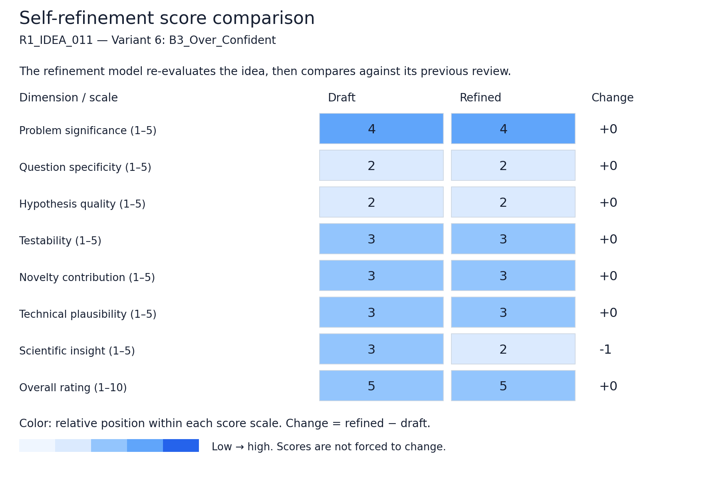

Changed score dimensions: scientific_insight.

### Score justifications (draft / refined)

**Problem significance**

```json
{
  "draft": {
    "score": 4.0,
    "justification": "The problem is meaningful. Time series forecasting is a core ML task with real-world impact. The observation that numerical data alone may miss contextual patterns is valid, and better utilization of multimodal data, especially text, is an active and important challenge."
  },
  "refined": {
    "score": 4.0,
    "justification": "The problem is meaningful. Time-series forecasting is a core task with broad applications. The observation that numerical data may miss contextual cues from text is valid, and better integration of multimodal data is an active and important research challenge."
  }
}
```

**Question specificity**

```json
{
  "draft": {
    "score": 2.0,
    "justification": "The idea states a general direction but does not define a clear, concrete research question. It proposes 'leveraging richer exogenous text' but does not specify what is being tested, compared, or measured in a focused way."
  },
  "refined": {
    "score": 2.0,
    "justification": "The idea states a general direction but does not define a concrete research question. It proposes 'leveraging richer exogenous text' without specifying what is being tested, compared, or measured in a focused manner. It lacks the specificity needed to guide an investigation."
  }
}
```

**Hypothesis quality**

```json
{
  "draft": {
    "score": 2.0,
    "justification": "There is an implicit hypothesis that 'structured reasoning and alignment mechanisms' will 'improve predictive accuracy,' but this is very generic. No concrete, testable prediction about mechanisms, conditions, or expected improvements is made."
  },
  "refined": {
    "score": 2.0,
    "justification": "There is only an implicit, generic hypothesis that 'structured reasoning and alignment' will 'improve predictive accuracy.' No concrete, testable prediction about mechanisms, conditions, or measurable effects is made. It is more of an aspirational goal than a hypothesis."
  }
}
```

**Testability**

```json
{
  "draft": {
    "score": 3.0,
    "justification": "The idea is testable in principle—one could design experiments comparing forecasting accuracy with and without the proposed text processing. However, without specifying the mechanisms, data, or baselines, it's unclear how one would structure a decisive test."
  },
  "refined": {
    "score": 3.0,
    "justification": "The idea is testable in principle—one could design experiments adding text to a forecasting model. However, without specifying the mechanisms, data, or comparison points, it is unclear how to structure a decisive test of the core proposition. The vagueness reduces testability."
  }
}
```

**Novelty contribution**

```json
{
  "draft": {
    "score": 3.0,
    "justification": "The general notion of using text for time series forecasting is not novel. The proposed angle of 'structured reasoning and alignment' could be novel if clearly defined and differentiated from existing multimodal fusion methods, but the idea as stated is too vague to assess its novelty."
  },
  "refined": {
    "score": 3.0,
    "justification": "Using text in time-series forecasting is not novel. The proposed angle of 'structured reasoning and alignment' could be novel if clearly defined and differentiated from existing multimodal fusion methods (e.g., simple embedding concatenation). However, as stated, it is too vague to assess its novelty convincingly."
  }
}
```

**Technical plausibility**

```json
{
  "draft": {
    "score": 3.0,
    "justification": "The direction is plausible—integrating structured text reasoning with time series models is technically feasible. However, the lack of detail on the specific mechanisms makes it hard to evaluate coherence or potential pitfalls."
  },
  "refined": {
    "score": 3.0,
    "justification": "The general direction is plausible—integrating structured text with time-series models is technically feasible. However, the complete lack of detail on the proposed mechanisms makes it impossible to evaluate coherence, feasibility, or potential technical hurdles."
  }
}
```

**Scientific insight**

```json
{
  "draft": {
    "score": 3.0,
    "justification": "If successfully executed, the research could provide insight into how structured textual information correlates with or causally influences time series patterns. However, the idea as presented focuses more on an engineering improvement ('improve predictive accuracy') than on uncovering general principles or mechanisms."
  },
  "refined": {
    "score": 2.0,
    "justification": "The idea is primarily framed as an engineering improvement (better accuracy). It does not articulate what scientific insight might be gained—e.g., understanding how textual semantics influence temporal dynamics, or discovering boundary conditions for text's utility. Without this, the potential for generalizable knowledge is low."
  }
}
```

**Overall rating**

```json
{
  "draft": {
    "score": 5.0,
    "justification": "This is a moderate/borderline research idea. It identifies a reasonable problem and suggests a potentially interesting direction, but it lacks a clear research question, a testable hypothesis, and sufficient specificity. The core intuition—that deeper text integration could help—is sound, but the idea needs substantial refinement to become a strong research proposal."
  },
  "refined": {
    "score": 5.0,
    "justification": "This is a moderate/borderline research idea. It identifies a reasonable problem and suggests a potentially interesting technical direction. However, it lacks a clear research question, a testable hypothesis, and sufficient specificity. The core intuition is sound, but the idea needs substantial refinement to become a strong research proposal with clear scientific merit."
  }
}
```

## R1_IDEA_011 — Variant 7: B4_Novelty

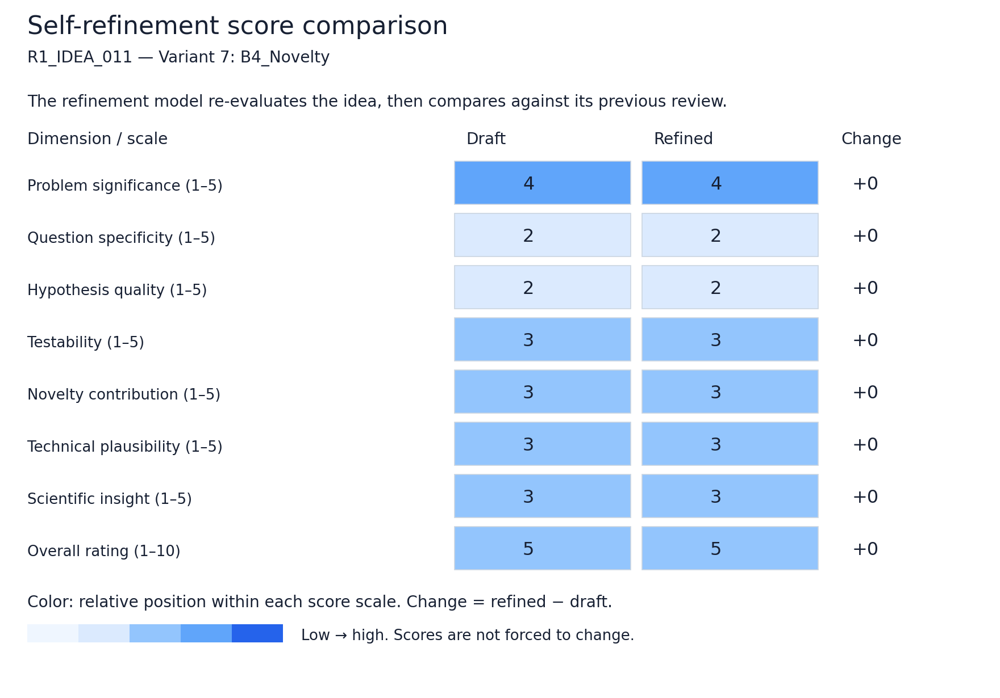

Changed score dimensions: none.

### Score justifications (draft / refined)

**Problem significance**

```json
{
  "draft": {
    "score": 4.0,
    "justification": "The problem is meaningful. Time series forecasting is a core ML task, and effectively leveraging multimodal data, especially unstructured text, is a recognized challenge. The idea correctly identifies a potential shortcoming in current approaches (underutilization of text), which is a relevant issue for both research and practice."
  },
  "refined": {
    "score": 4.0,
    "justification": "The problem is meaningful. Time-series forecasting is a core ML task, and effectively leveraging unstructured text as exogenous data is a recognized and practically important challenge. The idea correctly identifies a potential shortcoming in current multimodal approaches."
  }
}
```

**Question specificity**

```json
{
  "draft": {
    "score": 2.0,
    "justification": "The idea lacks a clearly defined research question. It states a general goal ('improve predictive accuracy') and a proposed method ('structured reasoning and alignment'), but does not specify what relationship, phenomenon, or comparison is being investigated. It is more of a proposed direction than a specific question."
  },
  "refined": {
    "score": 2.0,
    "justification": "The idea lacks a clearly defined research question. It states a general goal ('improve predictive accuracy') and a proposed methodological direction, but does not specify what is being investigated—e.g., a comparison, a relationship, or a mechanism. It is a proposed direction, not a specific question."
  }
}
```

**Hypothesis quality**

```json
{
  "draft": {
    "score": 2.0,
    "justification": "There is an implicit hypothesis that 'richer integration of text via structured reasoning will improve forecasting accuracy,' but it is not articulated as a concrete, testable prediction. It does not specify conditions, contrast with specific alternatives, or propose a mechanism that could be falsified. The hypothesis is generic and buried in the description."
  },
  "refined": {
    "score": 2.0,
    "justification": "There is only an implicit, generic hypothesis that 'richer text integration via structured reasoning improves forecasting accuracy.' It is not articulated as a concrete, testable prediction. It does not specify conditions, contrast with specific alternatives, or propose a mechanism that could be falsified."
  }
}
```

**Testability**

```json
{
  "draft": {
    "score": 3.0,
    "justification": "The core claim is testable in principle—one could build a model with the proposed mechanisms and compare its accuracy to baselines. However, the vagueness of the proposed mechanisms ('structured reasoning and alignment') makes it unclear exactly what would be tested. The idea suggests an evaluation path (measuring predictive accuracy) but lacks specificity on the experimental setup."
  },
  "refined": {
    "score": 3.0,
    "justification": "The core claim is testable in principle—one could implement a model with the proposed mechanisms and compare forecasting accuracy to baselines. However, the vagueness of the proposed mechanisms makes it unclear exactly what would be built and tested. The idea suggests an evaluation path but lacks specificity on the experimental setup."
  }
}
```

**Novelty contribution**

```json
{
  "draft": {
    "score": 3.0,
    "justification": "The idea points to a potential novelty gap: moving beyond shallow text embeddings in forecasting. However, 'using text better' is a broad goal. The contribution is framed as a 'new direction,' but without a concrete hypothesis or mechanism, it's unclear if this is a genuinely novel research angle or an incremental improvement on existing multimodal forecasting."
  },
  "refined": {
    "score": 3.0,
    "justification": "The idea points to a potential novelty gap: moving beyond shallow text embeddings in forecasting. However, 'using text better' is a broad goal seen in many multimodal works. Without a concrete hypothesis or novel mechanism, it's unclear if this is a genuinely new research angle or an incremental improvement."
  }
}
```

**Technical plausibility**

```json
{
  "draft": {
    "score": 3.0,
    "justification": "The direction is logically coherent: deeper semantic understanding of text should, in principle, provide better exogenous signals. However, the proposed mechanisms ('structured reasoning and alignment') are not defined, making it impossible to judge their feasibility or coherence. The idea rests on a reasonable assumption but lacks technical detail to assess plausibility fully."
  },
  "refined": {
    "score": 3.0,
    "justification": "The direction is logically coherent: deeper semantic understanding of text could provide better signals. However, the proposed mechanisms ('structured reasoning and alignment') are not defined, making it impossible to judge their technical feasibility or coherence. The idea rests on a reasonable assumption but lacks detail."
  }
}
```

**Scientific insight**

```json
{
  "draft": {
    "score": 3.0,
    "justification": "If successful, the research could provide insight into how semantic content from text correlates with or causes time series patterns, which is more valuable than a simple accuracy boost. However, the idea does not explicitly aim to uncover general principles, boundary conditions, or causal mechanisms. The potential insight is moderate and dependent on execution."
  },
  "refined": {
    "score": 3.0,
    "justification": "If successfully investigated, the research could provide insight into how semantic content from text correlates with or influences time-series patterns, which is more valuable than a simple accuracy boost. However, the idea does not explicitly aim to uncover general principles, boundary conditions, or causal mechanisms. Potential insight is moderate and dependent on execution."
  }
}
```

**Overall rating**

```json
{
  "draft": {
    "score": 5.0,
    "justification": "This is a moderate/borderline research idea. It identifies a potentially meaningful problem and suggests an interesting technical direction. However, it is severely limited by the lack of a specific research question, a testable hypothesis, and concrete methodological details. As presented, it is more of a motivated suggestion than a fleshed-out research idea. Its scientific contribution and novelty are uncertain without greater specificity."
  },
  "refined": {
    "score": 5.0,
    "justification": "This is a moderate/borderline research idea. It identifies a meaningful problem and suggests an interesting technical direction. However, it is severely limited by the lack of a specific research question, a testable hypothesis, and concrete methodological details. As presented, it is more of a motivated suggestion than a fleshed-out research idea. Its scientific contribution and novelty are uncertain without greater specificity."
  }
}
```

## R1_IDEA_011 — Variant 8: B5_Application_Impact


Changed score dimensions: none.

### Score justifications (draft / refined)

**Problem significance**

```json
{
  "draft": {
    "score": 4.0,
    "justification": "The problem is meaningful. Time series forecasting is a core ML task, and real-world forecasts often depend on textual context (e.g., news affecting stock prices, clinical notes informing patient prognoses). Current multimodal approaches often treat text as a static embedding, potentially missing richer structure. Improving this could matter to both researchers (advancing multimodal temporal modeling) and practitioners (better forecasts in context-rich domains)."
  },
  "refined": {
    "score": 4.0,
    "justification": "The problem is meaningful and relevant. Time series forecasting is a core ML task with numerous applications, and real-world forecasts often depend on contextual information not captured in numerical data alone (e.g., news affecting financial markets, clinical notes informing medical prognoses). The observation that current multimodal approaches often treat text as static embeddings rather than leveraging its rich structure identifies a genuine limitation that matters to both researchers and practitioners."
  }
}
```

**Question specificity**

```json
{
  "draft": {
    "score": 2.0,
    "justification": "The idea is framed as a general direction rather than a specific research question. It states that leveraging richer text could improve accuracy, but does not define what aspect is being tested (e.g., a specific mechanism, a comparison to a baseline, or conditions under which it helps). The terms 'structured reasoning' and 'alignment mechanisms' are too broad without further specification."
  },
  "refined": {
    "score": 2.0,
    "justification": "The idea is framed as a general direction rather than a specific research question. It states that leveraging richer text could improve accuracy but doesn't define what aspect is being tested. Terms like 'structured reasoning' and 'alignment mechanisms' are broad without further specification. There's no clear comparison, condition, or mechanism being investigated."
  }
}
```

**Hypothesis quality**

```json
{
  "draft": {
    "score": 2.0,
    "justification": "There is an implicit hypothesis that 'richer exogenous text' via 'structured reasoning and alignment' will improve predictive accuracy. However, this is a generic positive statement, not a concrete, falsifiable prediction. A stronger hypothesis would specify the expected improvement, the conditions under which it occurs, or the mechanism by which it works."
  },
  "refined": {
    "score": 2.0,
    "justification": "There's only an implicit, generic hypothesis that 'richer exogenous text' via 'structured reasoning and alignment' will improve predictive accuracy. This lacks the specificity of a concrete, falsifiable prediction. A stronger hypothesis would specify expected improvements, conditions under which they occur, or mechanisms by which they work. The current formulation is more of a hopeful statement than a testable hypothesis."
  }
}
```

**Testability**

```json
{
  "draft": {
    "score": 3.0,
    "justification": "The idea is testable in principle—one could build a model with the proposed mechanisms and compare forecasting accuracy to baselines. However, without a specific hypothesis or experimental design, it's unclear what exactly would be tested. The mention of 'practical systems in domains where forecasts depend on contextual reports' suggests potential real-world evaluation, which is a positive."
  },
  "refined": {
    "score": 3.0,
    "justification": "The idea is testable in principle—one could implement the proposed mechanisms and compare forecasting accuracy to baselines. The mention of 'practical systems in domains where forecasts depend on contextual reports' suggests potential real-world evaluation. However, without a specific hypothesis or experimental design, it's unclear what exactly would be tested or how success would be measured. The testability relies entirely on unspecified future implementation details."
  }
}
```

**Novelty contribution**

```json
{
  "draft": {
    "score": 3.0,
    "justification": "The idea points to a potential gap: moving beyond shallow text representations in multimodal time series forecasting. However, the novelty is not sharply defined. Many works explore cross-modal attention, graph-based reasoning, or temporal alignment in multimodal learning. The contribution would depend heavily on the specific implementation of 'structured reasoning and alignment.' As stated, it sits between an application (using known techniques in time series) and a potential methodological advance (if the reasoning mechanism is genuinely new)."
  },
  "refined": {
    "score": 3.0,
    "justification": "The idea points to a potential gap in moving beyond shallow text representations in multimodal time series forecasting. However, the novelty is not sharply defined. Many existing works explore cross-modal attention, graph-based reasoning, or temporal alignment in multimodal learning. The contribution would depend heavily on the specific implementation of 'structured reasoning and alignment.' As stated, it sits between applying known techniques to time series and potentially advancing methodology if the reasoning mechanism is genuinely new."
  }
}
```

**Technical plausibility**

```json
{
  "draft": {
    "score": 4.0,
    "justification": "The direction is technically plausible. Integrating textual information via more sophisticated mechanisms than simple embeddings is a active research area (e.g., in video understanding, robotics). Aligning text with time series segments is conceptually similar to temporal grounding in video-language models. The main assumption—that textual data contains predictive signal not captured numerically—is reasonable in many domains."
  },
  "refined": {
    "score": 4.0,
    "justification": "The direction is technically plausible. Integrating textual information via more sophisticated mechanisms than simple embeddings is an active research area in multimodal learning. Aligning text with time series segments is conceptually similar to temporal grounding in video-language models. The core assumption—that textual data contains predictive signal not captured numerically—is reasonable in many domains. However, the feasibility depends on unspecified implementation details."
  }
}
```

**Scientific insight**

```json
{
  "draft": {
    "score": 3.0,
    "justification": "If successful, the research could provide insight into how structured textual reasoning interacts with temporal dynamics. However, as described, the potential insight is limited to 'it works better.' A deeper study could reveal, for example, what types of textual information (causal explanations, event descriptions, sentiment) are most predictive, or how the benefit scales with text complexity. The idea hints at this but doesn't explicitly aim for such insights."
  },
  "refined": {
    "score": 3.0,
    "justification": "If successfully investigated, the research could provide insight into how structured textual reasoning interacts with temporal dynamics. However, as described, the potential insight is primarily about whether 'it works better.' A deeper study could reveal what types of textual information are most predictive, how the benefit scales with text complexity, or boundary conditions for multimodal forecasting. The idea hints at this but doesn't explicitly aim for such insights."
  }
}
```

**Overall rating**

```json
{
  "draft": {
    "score": 5.0,
    "justification": "This is a moderate/borderline research idea. It identifies a relevant problem and suggests a plausible technical direction. However, it lacks a specific research question, a clear hypothesis, and a well-defined notion of novelty. As presented, it reads more like a motivation or a high-level project goal than a focused research idea. With refinement—specifying the mechanism, formulating a testable hypothesis, and clarifying the expected contribution—it could become strong."
  },
  "refined": {
    "score": 5.0,
    "justification": "This is a moderate/borderline research idea. It identifies a relevant problem in time series forecasting and suggests a plausible technical direction with real-world applications. However, it lacks a specific research question, a clear hypothesis, and a well-defined notion of novelty. The idea reads more like a motivation or high-level project goal than a focused research investigation. With refinement—specifying the mechanism, formulating a testable hypothesis, and clarifying the expected contribution—it could become strong."
  }
}
```

## R1_IDEA_011 — Variant 9: C1_Hollow_Shell


Changed score dimensions: none.

### Score justifications (draft / refined)

**Problem significance**

```json
{
  "draft": {
    "score": 4.0,
    "justification": "The problem is meaningful - real-world forecasting does involve multiple information sources, and effectively combining them is an important challenge. Many domains (finance, weather, healthcare) could benefit from better multi-source forecasting methods."
  },
  "refined": {
    "score": 4.0,
    "justification": "The problem is meaningful - real-world forecasting does involve multiple information sources, and effectively combining them is an important challenge with applications in finance, weather, healthcare, and other domains. The recognition that existing approaches may not fully utilize certain data forms points to a genuine research gap."
  }
}
```

**Question specificity**

```json
{
  "draft": {
    "score": 1.0,
    "justification": "Extremely vague. The idea states only that a method should be developed to 'better incorporate additional information' without specifying what is being investigated, what relationships are being studied, or what phenomenon is being examined."
  },
  "refined": {
    "score": 1.0,
    "justification": "Extremely vague. The idea states only that a method should be developed to 'better incorporate additional information' without specifying what is being investigated, what relationships are being studied, or what phenomenon is being examined. No concrete research question is articulated."
  }
}
```

**Hypothesis quality**

```json
{
  "draft": {
    "score": 1.0,
    "justification": "No hypothesis is presented. There's an implicit assumption that 'structured approaches' will improve predictions, but no concrete prediction about mechanisms, relationships, or conditions under which this would occur."
  },
  "refined": {
    "score": 1.0,
    "justification": "No hypothesis is presented. There's only an implicit assumption that 'structured approaches' will improve predictions, but no concrete prediction about mechanisms, relationships, boundary conditions, or specific improvements. The idea lacks any falsifiable claim."
  }
}
```

**Testability**

```json
{
  "draft": {
    "score": 2.0,
    "justification": "The idea suggests that predictions could be improved, which is testable in principle, but provides no guidance on how to test it. No experimental design, comparison points, or evaluation methodology is suggested."
  },
  "refined": {
    "score": 2.0,
    "justification": "The idea suggests that predictions could be improved, which is testable in principle, but provides no guidance on how to test it. No experimental design, comparison points, evaluation methodology, or measurable outcomes are suggested. The claim is too vague to design a specific test."
  }
}
```

**Novelty contribution**

```json
{
  "draft": {
    "score": 2.0,
    "justification": "The description is too generic to assess novelty. Many papers already address multi-source forecasting with various fusion techniques. Without specifying what makes the proposed 'structured approaches' novel, the potential contribution is unclear."
  },
  "refined": {
    "score": 2.0,
    "justification": "The description is too generic to assess novelty. Many papers already address multi-source forecasting with various fusion techniques (early/late fusion, attention mechanisms, graph neural networks). Without specifying what makes the proposed 'structured approaches' novel or different from existing work, the potential contribution is unclear and likely incremental at best."
  }
}
```

**Technical plausibility**

```json
{
  "draft": {
    "score": 3.0,
    "justification": "The general direction is plausible - structured approaches to data fusion could potentially improve forecasting. However, without any technical details, it's impossible to assess whether the specific approach makes sense."
  },
  "refined": {
    "score": 3.0,
    "justification": "The general direction is plausible - structured approaches to data fusion could potentially improve forecasting. However, without any technical details about what 'structured approaches' means, it's impossible to assess whether the specific approach makes sense. The reasoning is logically coherent at a high level but lacks substance."
  }
}
```

**Scientific insight**

```json
{
  "draft": {
    "score": 2.0,
    "justification": "As described, the idea seems focused on developing a better method rather than uncovering general principles or mechanisms. There's no indication that the research would reveal why certain fusion approaches work better or under what conditions structured representations help."
  },
  "refined": {
    "score": 2.0,
    "justification": "As described, the idea seems focused on developing a better method rather than uncovering general principles or mechanisms. There's no indication that the research would reveal why certain fusion approaches work better, under what conditions structured representations help, or what fundamental limitations of current methods are being addressed. The potential for transferable insight is low."
  }
}
```

**Overall rating**

```json
{
  "draft": {
    "score": 3.0,
    "justification": "This is a weak research idea as presented. While it identifies a potentially meaningful problem (multi-source forecasting), it fails to define a specific research question, hypothesis, or methodological direction. The description is so generic that it could apply to many existing works. The idea lacks the specificity needed to guide meaningful scientific investigation."
  },
  "refined": {
    "score": 3.0,
    "justification": "This is a weak research idea as presented. While it identifies a potentially meaningful problem (multi-source forecasting), it fails to define a specific research question, hypothesis, or methodological direction. The description is so generic that it could apply to many existing works. The idea lacks the specificity needed to guide meaningful scientific investigation and would need substantial refinement to become a viable research direction."
  }
}
```

## R1_IDEA_011 — Variant 10: C2_Logic_Flawed


Changed score dimensions: none.

### Score justifications (draft / refined)

**Problem significance**

```json
{
  "draft": {
    "score": 4.0,
    "justification": "The problem is meaningful: time series forecasting is a core ML task, and real-world data often includes text (e.g., news, reports, logs). Better integration of multimodal data could improve predictions and is relevant to practitioners."
  },
  "refined": {
    "score": 4.0,
    "justification": "The problem is meaningful. Time series forecasting is a core ML task with real-world applications, and better integration of multimodal data (especially text, which is abundant) could improve predictions. The observation that current approaches underutilize text is a valid starting point."
  }
}
```

**Question specificity**

```json
{
  "draft": {
    "score": 2.0,
    "justification": "The idea is too vague. It proposes 'leveraging richer exogenous text' and 'structured reasoning and alignment mechanisms' without defining what these are, what specific relationship is being investigated, or what constitutes 'richer' utilization."
  },
  "refined": {
    "score": 2.0,
    "justification": "The idea is extremely vague. It proposes 'leveraging richer exogenous text' and using 'structured reasoning and alignment mechanisms' without defining what these terms mean, what specific relationship is being investigated, or what constitutes 'richer' utilization. It lacks a concrete research question."
  }
}
```

**Hypothesis quality**

```json
{
  "draft": {
    "score": 2.0,
    "justification": "There is an implicit hypothesis that 'richer' text use improves accuracy, but it's not concrete. No specific prediction about mechanisms, conditions, or expected outcomes is made. The claim about 'broader effectiveness' is an unsupported extension."
  },
  "refined": {
    "score": 2.0,
    "justification": "There is only a very implicit, generic hypothesis that 'richer' text use via unspecified mechanisms improves accuracy. No concrete prediction about mechanisms, conditions, or expected outcomes is made. The claim about 'broader effectiveness' is an unsupported extension, not a testable hypothesis."
  }
}
```

**Testability**

```json
{
  "draft": {
    "score": 2.0,
    "justification": "The idea as stated is not directly testable because the key concepts ('structured reasoning', 'alignment mechanisms') are undefined. Without operational definitions, designing experiments or evaluations is unclear."
  },
  "refined": {
    "score": 2.0,
    "justification": "The idea as stated is not directly testable because the core concepts ('structured reasoning', 'alignment mechanisms') are undefined. Without operational definitions, designing experiments, comparisons, or evaluations is impossible. It suggests a direction but not a testable claim."
  }
}
```

**Novelty contribution**

```json
{
  "draft": {
    "score": 3.0,
    "justification": "The general direction of better multimodal integration is not novel, but focusing on structured reasoning and alignment for text in time series could be a valuable niche if specified. Currently, it's too generic to assess novelty."
  },
  "refined": {
    "score": 3.0,
    "justification": "The general direction of better multimodal integration for time series is not novel. However, focusing specifically on structured reasoning and alignment for textual data could be a valuable niche if specified. In its current generic form, it's difficult to assess potential novelty."
  }
}
```

**Technical plausibility**

```json
{
  "draft": {
    "score": 3.0,
    "justification": "The general notion that better text integration could help forecasting is plausible. However, the proposed mechanisms are too vague to assess technical coherence. No reasoning is provided for why these specific mechanisms would work."
  },
  "refined": {
    "score": 3.0,
    "justification": "The general notion that better text integration could help forecasting is plausible. However, the proposed mechanisms are described too vaguely to assess their technical coherence or feasibility. No reasoning is provided for why these specific mechanisms (rather than others) would work."
  }
}
```

**Scientific insight**

```json
{
  "draft": {
    "score": 3.0,
    "justification": "If successfully investigated, it could reveal how textual semantics and temporal structure interact with numerical patterns, which is a general insight. However, the idea as stated does not clearly aim for such mechanistic understanding; it focuses on accuracy improvement."
  },
  "refined": {
    "score": 3.0,
    "justification": "If successfully investigated, it could reveal how textual semantics and temporal structure interact with numerical patterns, which is a general insight. However, the idea as stated focuses primarily on accuracy improvement rather than clearly aiming for such mechanistic understanding. The potential for insight is moderate but not guaranteed."
  }
}
```

**Overall rating**

```json
{
  "draft": {
    "score": 4.0,
    "justification": "The idea identifies a potentially important problem but lacks specificity, a testable hypothesis, and clear methodological direction. It reads more as a broad motivation than a research idea. With refinement, it could become a strong idea, but in its current form, it is weak."
  },
  "refined": {
    "score": 4.0,
    "justification": "The idea identifies a potentially important problem but lacks the specificity, testable hypothesis, and clear methodological direction required for a strong research idea. It reads as a broad motivation or area of interest rather than a focused investigation. With significant refinement, it could become a strong idea, but in its current form, it is weak."
  }
}
```

## R1_IDEA_011 — Variant 11: C3_Substance_Enriched

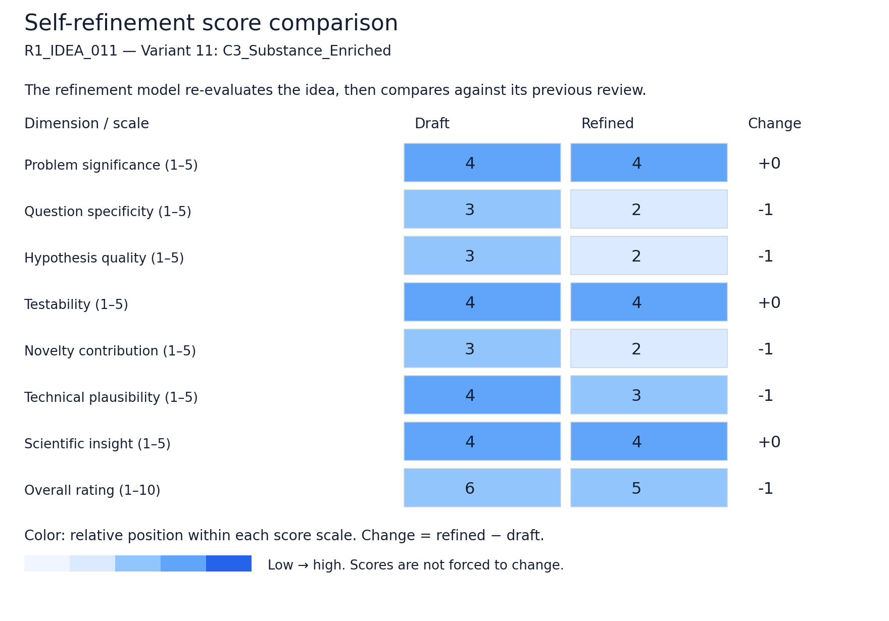

Changed score dimensions: question_specificity, hypothesis_quality, novelty_contribution, technical_plausibility, overall_rating.

### Score justifications (draft / refined)

**Problem significance**

```json
{
  "draft": {
    "score": 4.0,
    "justification": "The problem is meaningful: time series forecasting is important across domains, and current multimodal approaches may not fully leverage available textual information. The idea correctly identifies that numbers alone may not capture all relevant patterns, and better integration of text could be valuable."
  },
  "refined": {
    "score": 4.0,
    "justification": "The problem is significant. Time series forecasting is a core ML task with broad applications. Effectively integrating auxiliary, non-numeric information like text is a recognized challenge. The idea correctly identifies a potential limitation in current multimodal approaches, making the problem meaningful."
  }
}
```

**Question specificity**

```json
{
  "draft": {
    "score": 3.0,
    "justification": "The idea identifies a general direction (leveraging richer text) and suggests specific validation paths, but the core research question is somewhat broad. It doesn't specify exactly what aspect of text utilization is being investigated (e.g., representation learning, alignment quality, reasoning capability)."
  },
  "refined": {
    "score": 2.0,
    "justification": "The research question is broad: 'leveraging richer text.' While a validation path is mentioned, the core object of study is not sharply defined. It lacks specificity on what aspect of text utilization is being improved (e.g., representation learning, temporal alignment, causal extraction) and what 'richer' concretely means."
  }
}
```

**Hypothesis quality**

```json
{
  "draft": {
    "score": 3.0,
    "justification": "There's an implicit hypothesis that richer text utilization improves forecasting, but it's not sharply formulated. The mention of testing alignment mechanisms and boundary conditions suggests testable predictions, but the central claim lacks the specificity of a strong hypothesis (e.g., predicting which alignment mechanism works best under what conditions)."
  },
  "refined": {
    "score": 2.0,
    "justification": "The hypothesis is largely implicit and generic: that using text in a 'richer' way will improve accuracy. It lacks a concrete, mechanistic prediction. The mention of testing alignment mechanisms suggests a testable sub-hypothesis, but the central claim about 'structured reasoning' is not formulated as a falsifiable statement."
  }
}
```

**Testability**

```json
{
  "draft": {
    "score": 4.0,
    "justification": "The idea is highly testable. It explicitly mentions testing specific alignment mechanisms on benchmark datasets and examining boundary conditions. These are concrete validation paths that could produce clear evidence for or against the approach's effectiveness."
  },
  "refined": {
    "score": 4.0,
    "justification": "The idea is testable. It explicitly proposes testing specific mechanisms (cross-modal attention) on benchmarks and exploring boundary conditions (noisy text). These are clear, empirical validation paths that can produce evidence for or against the utility of the proposed approach."
  }
}
```

**Novelty contribution**

```json
{
  "draft": {
    "score": 3.0,
    "justification": "Multimodal time series forecasting with text is not new. The novelty claim rests on 'richer' utilization through 'structured reasoning and alignment,' but these terms are vague. The potential contribution is moderate: it could advance how text is integrated, but without more specificity, it risks being an incremental improvement over existing cross-modal attention approaches."
  },
  "refined": {
    "score": 2.0,
    "justification": "Novelty is weak. Multimodal forecasting with text and the use of cross-modal attention are established concepts. The proposed novelty hinges on the undefined term 'structured reasoning.' Without a concrete definition, the contribution risks being an incremental application of existing fusion techniques to time series."
  }
}
```

**Technical plausibility**

```json
{
  "draft": {
    "score": 4.0,
    "justification": "The proposed direction is technically plausible. Cross-modal attention is a well-established mechanism, and exploring its application to time series with text is reasonable. The idea doesn't contain obviously flawed assumptions or technical contradictions."
  },
  "refined": {
    "score": 3.0,
    "justification": "Plausibility is moderate. Using alignment mechanisms like cross-modal attention is technically sound. However, the core proposed component—'structured reasoning'—is too vague to assess its plausibility. The idea is not technically incoherent, but its key innovative element is undefined."
  }
}
```

**Scientific insight**

```json
{
  "draft": {
    "score": 4.0,
    "justification": "The idea has good potential for scientific insight. By examining boundary conditions (noisy/incomplete text) and specific alignment mechanisms, it could reveal general principles about when and how textual information benefits time series forecasting, which would be valuable beyond just a performance improvement on specific datasets."
  },
  "refined": {
    "score": 4.0,
    "justification": "Potential for scientific insight is strong. Investigating boundary conditions (noisy/incomplete text) and comparing alignment mechanisms could yield generalizable knowledge about when and how textual information aids forecasting, which is more valuable than a simple performance benchmark."
  }
}
```

**Overall rating**

```json
{
  "draft": {
    "score": 6.0,
    "justification": "This is a moderate/borderline research idea. It addresses a meaningful problem and suggests concrete validation paths, making it testable and potentially insightful. However, the research question lacks specificity, the hypothesis is implicit rather than sharply defined, and the novelty is limited without clearer articulation of what 'structured reasoning' entails or how it differs from existing approaches. With refinement, it could become a strong idea."
  },
  "refined": {
    "score": 5.0,
    "justification": "This is a moderate/borderline research idea. It addresses a significant problem and is highly testable with good potential for scientific insight. However, it is critically hampered by a vague core concept ('structured reasoning'), a non-specific research question, and a weak, implicit hypothesis. The novelty is low without a concrete technical innovation. It is a reasonable starting point but requires substantial refinement to become a strong research direction."
  }
}
```

## R1_IDEA_011 — Variant 12: H1_Deceptive_Hollow

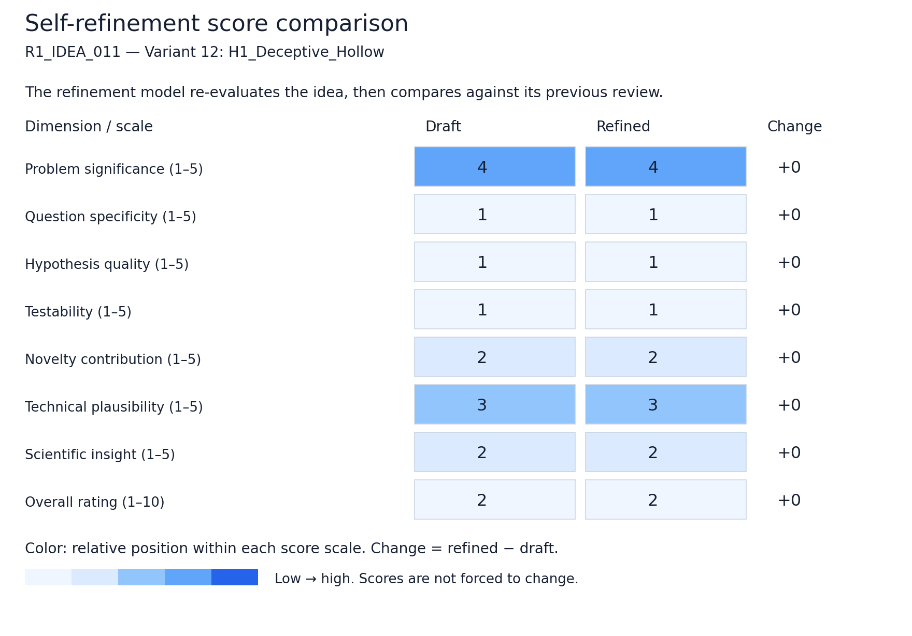

Changed score dimensions: none.

### Score justifications (draft / refined)

**Problem significance**

```json
{
  "draft": {
    "score": 4.0,
    "justification": "The problem of integrating multiple information sources in forecasting is genuinely important. Real-world forecasting does involve complex, multi-source data, and current methods often have limitations in this area. This addresses a meaningful challenge with practical relevance."
  },
  "refined": {
    "score": 4.0,
    "justification": "The problem of integrating multiple information sources in forecasting is genuinely important. Real-world forecasting does involve complex, multi-source data, and current methods often have limitations in this area. This addresses a meaningful challenge with practical relevance to many domains."
  }
}
```

**Question specificity**

```json
{
  "draft": {
    "score": 1.0,
    "justification": "Extremely weak. No concrete research question is defined. The idea merely states a general desire to 'better incorporate additional information' without specifying what is being investigated, what relationships are being tested, or what phenomenon is being studied."
  },
  "refined": {
    "score": 1.0,
    "justification": "Extremely weak. No concrete research question is defined. The idea merely states a general desire to 'better incorporate additional information' without specifying what is being investigated, what relationships are being tested, or what phenomenon is being studied. It lacks any domain, data type, or methodological specificity."
  }
}
```

**Hypothesis quality**

```json
{
  "draft": {
    "score": 1.0,
    "justification": "No hypothesis is present. There is no concrete prediction, no mechanism proposed, no relationship to test. The text contains only vague aspirations about 'improving predictions' through unspecified 'structured approaches.'"
  },
  "refined": {
    "score": 1.0,
    "justification": "No hypothesis is present. There is no concrete prediction, no mechanism proposed, no relationship to test. The text contains only vague aspirations about 'improving predictions' through unspecified 'structured approaches.' There is nothing that could be empirically supported or contradicted."
  }
}
```

**Testability**

```json
{
  "draft": {
    "score": 1.0,
    "justification": "Not testable in its current form. There is no clear claim that could be supported or contradicted by evidence. No experiments, comparisons, evaluations, or analyses are suggested. The idea is too vague to design an investigation around."
  },
  "refined": {
    "score": 1.0,
    "justification": "Not testable in its current form. There is no clear claim that could be supported or contradicted by evidence. No experiments, comparisons, evaluations, or analyses are suggested. The idea is too vague to design any investigation around it."
  }
}
```

**Novelty contribution**

```json
{
  "draft": {
    "score": 2.0,
    "justification": "The positioning claims high novelty ('transformative synthesis', 'field-shaping'), but the actual content describes a very generic idea: using multiple data sources for better forecasting. Without specifying what makes the approach novel compared to existing multi-modal methods, the contribution appears minimal. The grandiose claims are not supported by concrete novelty."
  },
  "refined": {
    "score": 2.0,
    "justification": "The positioning claims high novelty ('transformative synthesis', 'field-shaping'), but the actual content describes a very generic idea: using multiple data sources for better forecasting. Without specifying what makes the approach novel compared to existing multi-modal or ensemble methods, the contribution appears minimal. The grandiose claims are not supported by concrete novelty in the idea description."
  }
}
```

**Technical plausibility**

```json
{
  "draft": {
    "score": 3.0,
    "justification": "The general direction is plausible - structured approaches to integrate multiple data sources could improve forecasting. However, with no technical details provided, it's impossible to assess whether specific proposed mechanisms would work. The reasoning is coherent at a very high level but lacks any technical substance."
  },
  "refined": {
    "score": 3.0,
    "justification": "The general direction is plausible - structured approaches to integrate multiple data sources could improve forecasting. However, with no technical details provided, it's impossible to assess whether specific proposed mechanisms would work. The reasoning is coherent at a very high level but lacks any technical substance to evaluate."
  }
}
```

**Scientific insight**

```json
{
  "draft": {
    "score": 2.0,
    "justification": "The idea claims potential for transformative insight but provides no pathway to achieve it. Without a specific mechanism, comparison, or analysis plan, it's unclear what scientific principles would be revealed. At best, it might show that 'using more data helps,' which is not a deep insight. The positioning suggests ambition but the content doesn't support it."
  },
  "refined": {
    "score": 2.0,
    "justification": "The idea claims potential for transformative insight but provides no pathway to achieve it. Without a specific mechanism, comparison, or analysis plan, it's unclear what scientific principles would be revealed. At best, it might show that 'using more data helps,' which is not a deep insight. The positioning suggests ambition but the content doesn't support meaningful scientific discovery."
  }
}
```

**Overall rating**

```json
{
  "draft": {
    "score": 2.0,
    "justification": "This is a very weak research idea. While it identifies a potentially important problem (multi-source forecasting), it fails to articulate any specific research question, hypothesis, or methodological direction. The text is heavy on grandiose positioning but completely lacking in scientific substance. It reads more like a grant proposal abstract trying to sound important than a concrete research idea. Without a testable question or hypothesis, it cannot be meaningfully investigated. The idea needs substantial refinement to become a viable research direction."
  },
  "refined": {
    "score": 2.0,
    "justification": "This is a very weak research idea. While it identifies a potentially important problem (multi-source forecasting), it fails to articulate any specific research question, hypothesis, or methodological direction. The text is heavy on grandiose positioning but completely lacking in scientific substance. Without a testable question or hypothesis, it cannot be meaningfully investigated. The idea needs substantial refinement to become a viable research direction."
  }
}
```

## R1_IDEA_011 — Variant 13: H2_Confident_Flaw


Changed score dimensions: none.

### Score justifications (draft / refined)

**Problem significance**

```json
{
  "draft": {
    "score": 4.0,
    "justification": "The problem is meaningful: time series forecasting is important, and better integration of multimodal data (especially text) is a recognized challenge. Real-world patterns often involve contextual information beyond numbers, so improving text utilization could have practical impact."
  },
  "refined": {
    "score": 4.0,
    "justification": "The problem is meaningful and relevant. Time series forecasting is important across many domains, and better integration of multimodal data (especially text) is a recognized challenge. Real-world patterns often involve contextual information beyond numerical data, so improving text utilization could have significant practical impact in fields like finance, healthcare, retail, and climate science."
  }
}
```

**Question specificity**

```json
{
  "draft": {
    "score": 2.0,
    "justification": "The idea is vague about what exactly is being investigated. It proposes 'leveraging richer exogenous text' but does not define what makes text 'richer,' what specific reasoning/alignment mechanisms are of interest, or what specific forecasting tasks/settings are targeted. The research question is broad and underspecified."
  },
  "refined": {
    "score": 2.0,
    "justification": "The research question is broad and underspecified. While it identifies a general direction (better text integration), it doesn't define what makes text 'richer,' what specific reasoning/alignment mechanisms are of interest, or what specific forecasting tasks/settings are targeted. The idea lacks the concrete specificity needed for a focused research investigation."
  }
}
```

**Hypothesis quality**

```json
{
  "draft": {
    "score": 1.0,
    "justification": "The implicit hypothesis is that 'richer text integration via structured reasoning/alignment will improve accuracy and be broadly effective.' This is a generic claim, not a concrete, falsifiable prediction. The idea further asserts that improvements 'will necessarily' occur and can be treated as causal evidence without isolating variables—this is a methodological flaw, not a strong hypothesis."
  },
  "refined": {
    "score": 1.0,
    "justification": "The implicit hypothesis is generic and lacks falsifiability: 'richer text integration via structured reasoning/alignment will improve accuracy and be broadly effective.' The deterministic language ('will necessarily produce reliable improvements') and dismissal of controlled experimentation ('without separately isolating... alternative explanations') represent methodological flaws rather than a strong, testable hypothesis."
  }
}
```

**Testability**

```json
{
  "draft": {
    "score": 2.0,
    "justification": "While one could design experiments to test text integration methods, the idea provides no concrete experimental plan, evaluation criteria, or baselines. The claim that gains can be treated as causal 'without separately isolating... alternative explanations' undermines testability, as proper testing requires controlling for confounders."
  },
  "refined": {
    "score": 2.0,
    "justification": "While one could design experiments to test text integration methods, the idea provides no concrete experimental plan, evaluation criteria, or baselines. The claim that gains can be treated as causal 'without separately isolating... alternative explanations' actively undermines testability, as proper scientific testing requires controlling for confounders and alternative explanations."
  }
}
```

**Novelty contribution**

```json
{
  "draft": {
    "score": 3.0,
    "justification": "The general direction of better text integration for time series forecasting is not entirely novel; there is existing work on multimodal forecasting. The proposed mechanisms (structured reasoning, alignment) could be novel if specified concretely, but as stated, it's a broad suggestion rather than a distinct contribution."
  },
  "refined": {
    "score": 3.0,
    "justification": "The general direction of better text integration for time series forecasting is not entirely novel; there is existing work on multimodal forecasting. The proposed mechanisms (structured reasoning, alignment) could be novel if specified concretely, but as stated, it's a broad suggestion rather than a distinct contribution. The idea doesn't articulate what specifically would be new compared to existing approaches."
  }
}
```

**Technical plausibility**

```json
{
  "draft": {
    "score": 3.0,
    "justification": "The core intuition—that better text use could help forecasting—is plausible. However, the idea lacks technical details to assess feasibility. The claim that solving the limitation 'will necessarily produce reliable improvements' is overly optimistic and ignores potential pitfalls like noisy text, misalignment, or overfitting."
  },
  "refined": {
    "score": 3.0,
    "justification": "The core intuition—that better text use could help forecasting—is plausible and aligns with broader trends in multimodal learning. However, the idea lacks technical details to assess feasibility. The claim that solving the limitation 'will necessarily produce reliable improvements' is overly optimistic and ignores potential pitfalls like noisy text, misalignment, or the curse of dimensionality when combining modalities."
  }
}
```

**Scientific insight**

```json
{
  "draft": {
    "score": 2.0,
    "justification": "As presented, the idea focuses on improving predictive accuracy, not on generating deeper scientific insight. It does not propose to uncover mechanisms, boundary conditions, or general principles about multimodal integration. The causal claim is made without a plan for explanatory analysis."
  },
  "refined": {
    "score": 2.0,
    "justification": "As presented, the idea focuses primarily on improving predictive accuracy rather than generating deeper scientific insight. It doesn't propose to uncover mechanisms, boundary conditions, or general principles about how text and time series interact. The causal claim is made without a plan for explanatory analysis that would yield transferable understanding."
  }
}
```

**Overall rating**

```json
{
  "draft": {
    "score": 4.0,
    "justification": "The idea identifies a relevant problem but is severely underdeveloped as a research proposal. It lacks a specific research question, a testable hypothesis, and a plausible experimental approach. The deterministic language and dismissal of controlled experimentation are major weaknesses. While the general direction has merit, the current formulation is too vague and methodologically flawed to rate highly."
  },
  "refined": {
    "score": 4.0,
    "justification": "The idea identifies a relevant problem in multimodal time series forecasting but is severely underdeveloped as a research proposal. It lacks a specific research question, a testable hypothesis, and a plausible experimental approach. The deterministic language and dismissal of controlled experimentation are major weaknesses. While the general direction has merit and the problem is significant, the current formulation is too vague and methodologically flawed to rate highly as a research idea."
  }
}
```

## R1_IDEA_011 — Variant 14: H3_Verbose_Enriched

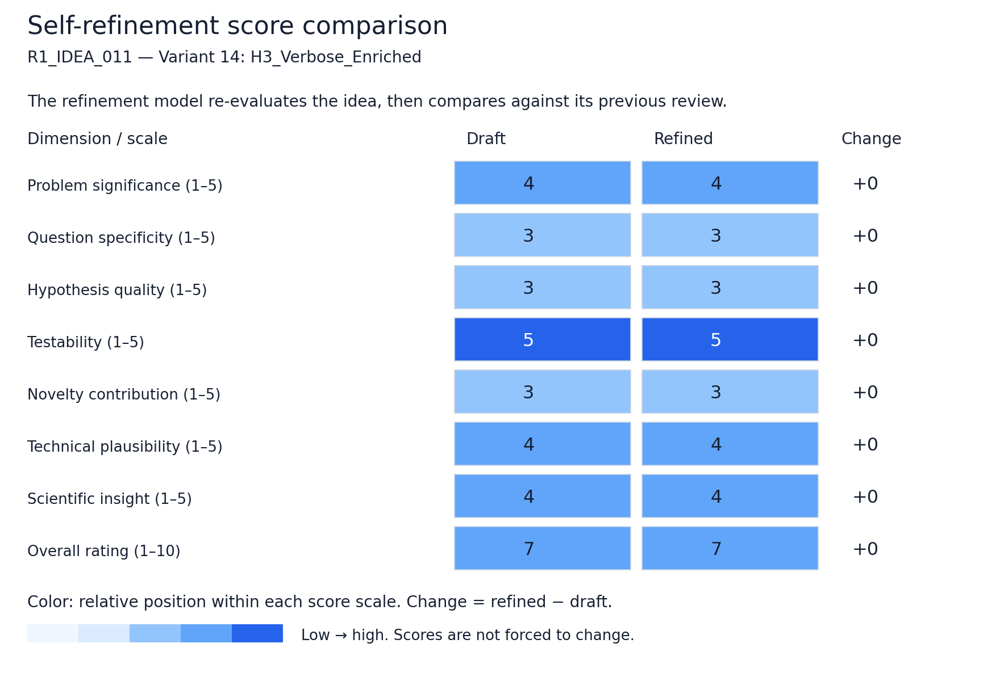

Changed score dimensions: none.

### Score justifications (draft / refined)

**Problem significance**

```json
{
  "draft": {
    "score": 4.0,
    "justification": "Time series forecasting is a core ML task with real-world impact. The underutilization of textual context is a recognized gap, especially in domains like finance, healthcare, and climate where events are described in text. Improving multimodal integration could enhance both accuracy and interpretability."
  },
  "refined": {
    "score": 4.0,
    "justification": "Time series forecasting is a fundamental ML task with broad applications. The underutilization of textual context represents a meaningful gap, especially in domains where events are described in text (finance, healthcare, climate). Better multimodal integration could enhance both accuracy and interpretability of forecasts."
  }
}
```

**Question specificity**

```json
{
  "draft": {
    "score": 3.0,
    "justification": "The idea identifies a general direction (leveraging richer text via alignment) and proposes specific experiments, but the research question itself is not sharply defined. It leans toward 'does alignment help?' rather than a more focused inquiry into which mechanisms, under what conditions, and why."
  },
  "refined": {
    "score": 3.0,
    "justification": "The idea identifies a general direction (leveraging richer text via alignment) and proposes specific experiments, but the core research question is not sharply defined. It's more 'can alignment mechanisms help?' rather than a focused inquiry into specific mechanisms, conditions, or causal relationships."
  }
}
```

**Hypothesis quality**

```json
{
  "draft": {
    "score": 3.0,
    "justification": "An implicit hypothesis exists: that structured reasoning and alignment mechanisms will improve forecasting accuracy. However, it lacks a concrete, testable prediction about the mechanism or magnitude of improvement. The boundary-condition tests (noisy/incomplete text) are good auxiliary hypotheses."
  },
  "refined": {
    "score": 3.0,
    "justification": "An implicit hypothesis exists: that structured reasoning and alignment mechanisms will improve forecasting accuracy. However, it lacks a concrete, testable prediction about mechanism, magnitude, or conditions. The boundary-condition tests represent good auxiliary hypotheses but don't form a core falsifiable claim."
  }
}
```

**Testability**

```json
{
  "draft": {
    "score": 5.0,
    "justification": "The idea excels here. It outlines a clear validation path: testing alignment mechanisms, ablations, sensitivity analyses, and error analysis. The staged design with baselines, interventions, and pre-specified criteria makes the claim highly testable."
  },
  "refined": {
    "score": 5.0,
    "justification": "This is the strongest aspect. The idea outlines a comprehensive, staged validation plan with baselines, interventions, pre-specified criteria, ablations, sensitivity analyses, and error analysis. The experimental design makes the central claim highly testable even without implementation details."
  }
}
```

**Novelty contribution**

```json
{
  "draft": {
    "score": 3.0,
    "justification": "Multimodal time series forecasting is not new, and cross-modal attention is a known technique. The novelty lies in the focus on 'richer' textual reasoning and systematic evaluation of boundary conditions. This is more of an incremental but well-scoped empirical study than a radical innovation."
  },
  "refined": {
    "score": 3.0,
    "justification": "Multimodal time series forecasting is an established area, and cross-modal attention is a known technique. The novelty lies in the systematic focus on 'richer' textual reasoning and comprehensive evaluation of boundary conditions. This represents incremental but well-scoped empirical research rather than radical innovation."
  }
}
```

**Technical plausibility**

```json
{
  "draft": {
    "score": 4.0,
    "justification": "The approach is logically coherent: if textual data contains predictive signals not in numbers, better alignment should help. Cross-modal attention is a plausible mechanism. The main uncertainty is how to implement 'structured reasoning' in practice, but the idea does not make implausible assumptions."
  },
  "refined": {
    "score": 4.0,
    "justification": "The approach is logically coherent: if textual data contains predictive signals not captured numerically, better alignment should help. Cross-modal attention is a plausible mechanism. The main uncertainty is practical implementation of 'structured reasoning,' but the idea doesn't make technically implausible assumptions."
  }
}
```

**Scientific insight**

```json
{
  "draft": {
    "score": 4.0,
    "justification": "The idea aims to uncover when and why textual alignment works, not just if it works. By testing boundary conditions, ablations, and failure cases, it could reveal insights about data regimes, robustness, and domain constraints that govern multimodal forecasting success."
  },
  "refined": {
    "score": 4.0,
    "justification": "The idea explicitly aims to uncover when and why textual alignment works through boundary condition testing, ablations, and failure analysis. This could yield insights about data regimes, robustness requirements, and domain constraints governing multimodal forecasting success, going beyond simple performance comparisons."
  }
}
```

**Overall rating**

```json
{
  "draft": {
    "score": 7.0,
    "justification": "This is a strong research idea. It addresses a meaningful problem, proposes a concrete methodological direction, and includes a detailed, testable validation plan. The main weaknesses are the somewhat implicit hypothesis and lack of specificity about the 'richer' textual processing. However, the structured experimental design and focus on boundary conditions elevate it beyond a simple application study. With a more precise hypothesis and domain specification, it could become exceptional."
  },
  "refined": {
    "score": 7.0,
    "justification": "This is a strong research idea with a meaningful problem, concrete methodological direction, and exceptionally detailed testable validation plan. While the hypothesis could be more explicit and the research question more specific, the structured experimental design and focus on understanding mechanisms and boundary conditions elevate it beyond a simple application study. With refinement of the core hypothesis and domain specification, it could become exceptional."
  }
}
```

## R1_IDEA_011 — Variant 15: H4_Ultimate_Hype


Changed score dimensions: none.

### Score justifications (draft / refined)

**Problem significance**

```json
{
  "draft": {
    "score": 4.0,
    "justification": "Time series forecasting is a core ML task with broad applications. Integrating richer textual context is a meaningful challenge, as real-world patterns often involve events, news, or reports not fully captured numerically. The idea correctly notes that current multimodal approaches may underutilize text."
  },
  "refined": {
    "score": 4.0,
    "justification": "Time-series forecasting is a core ML task with broad applications. Integrating richer textual context is a meaningful challenge, as real-world patterns often involve events, news, or reports not fully captured numerically. The idea correctly notes that current multimodal approaches may underutilize text."
  }
}
```

**Question specificity**

```json
{
  "draft": {
    "score": 2.0,
    "justification": "The idea states a general direction ('leveraging richer exogenous text through structured reasoning and alignment') but does not define a concrete research question. It lacks specificity about what relationship or mechanism will be investigated."
  },
  "refined": {
    "score": 2.0,
    "justification": "The idea states a general direction ('leveraging richer exogenous text through structured reasoning and alignment') but does not define a concrete research question. It lacks specificity about what relationship or mechanism will be investigated."
  }
}
```

**Hypothesis quality**

```json
{
  "draft": {
    "score": 2.0,
    "justification": "There is no explicit or clearly implicit hypothesis. The idea suggests that richer text integration will improve predictive accuracy, but this is a generic expectation rather than a testable prediction about a specific mechanism or condition."
  },
  "refined": {
    "score": 2.0,
    "justification": "There is no explicit or clearly implicit hypothesis. The idea suggests that richer text integration will improve predictive accuracy, but this is a generic expectation rather than a testable prediction about a specific mechanism or condition."
  }
}
```

**Testability**

```json
{
  "draft": {
    "score": 3.0,
    "justification": "The idea is testable in principle—one could implement structured reasoning/alignment and compare forecasting accuracy. However, without a specific hypothesis, it's unclear what exactly would be tested beyond 'does this work better?'"
  },
  "refined": {
    "score": 3.0,
    "justification": "The idea is testable in principle—one could implement structured reasoning/alignment and compare forecasting accuracy. However, without a specific hypothesis, it's unclear what exactly would be tested beyond 'does this work better?'"
  }
}
```

**Novelty contribution**

```json
{
  "draft": {
    "score": 3.0,
    "justification": "Multimodal time series forecasting with text is not entirely new. The novelty claim rests on 'structured reasoning and alignment mechanisms,' but these are not defined. The contribution is potentially moderate if a specific novel integration method is developed and shown to outperform existing approaches."
  },
  "refined": {
    "score": 3.0,
    "justification": "Multimodal time-series forecasting with text is not entirely new. The novelty claim rests on 'structured reasoning and alignment mechanisms,' but these are not defined. The contribution is potentially moderate if a specific novel integration method is developed and shown to outperform existing approaches."
  }
}
```

**Technical plausibility**

```json
{
  "draft": {
    "score": 3.0,
    "justification": "The general direction is plausible: better text integration could help forecasting. However, 'structured reasoning' and 'alignment mechanisms' are vague; without details, it's hard to assess technical coherence. No obvious technical flaws are present, but the idea is underspecified."
  },
  "refined": {
    "score": 3.0,
    "justification": "The general direction is plausible: better text integration could help forecasting. However, 'structured reasoning' and 'alignment mechanisms' are vague; without details, it's hard to assess technical coherence. No obvious technical flaws are present, but the idea is underspecified."
  }
}
```

**Scientific insight**

```json
{
  "draft": {
    "score": 3.0,
    "justification": "If successful, the research could provide insight into how textual semantics align with temporal dynamics, which is valuable. However, the idea as stated focuses more on application potential ('improve predictive accuracy') than on uncovering general principles or mechanisms."
  },
  "refined": {
    "score": 3.0,
    "justification": "If successful, the research could provide insight into how textual semantics align with temporal dynamics, which is valuable. However, the idea as stated focuses more on application potential ('improve predictive accuracy') than on uncovering general principles or mechanisms."
  }
}
```

**Overall rating**

```json
{
  "draft": {
    "score": 5.0,
    "justification": "The idea identifies a relevant problem and suggests a plausible technical direction, but it lacks a specific research question, testable hypothesis, and concrete methodological details. It reads more like a motivation or vision statement than a research idea with a clear scientific claim. The potential is moderate if refined, but as presented, it is too vague to be considered a strong research idea."
  },
  "refined": {
    "score": 5.0,
    "justification": "The idea identifies a relevant problem and suggests a plausible technical direction, but it lacks a specific research question, testable hypothesis, and concrete methodological details. It reads more like a motivation or vision statement than a research idea with a clear scientific claim. The potential is moderate if refined, but as presented, it is too vague to be considered a strong research idea."
  }
}
```

## R1_IDEA_012 — Source

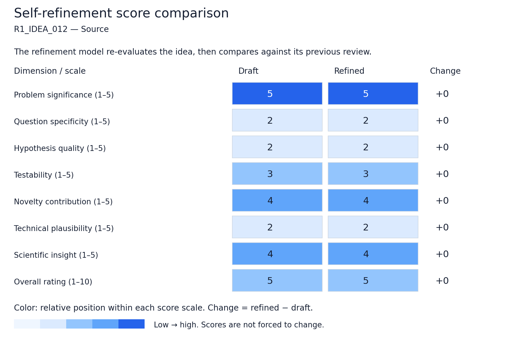

Changed score dimensions: none.

### Score justifications (draft / refined)

**Problem significance**

```json
{
  "draft": {
    "score": 5.0,
    "justification": "The problem is highly significant. Efficient, high-quality 3D content creation and editing from limited 2D data is a major challenge in computer vision and graphics. Eliminating the need for costly per-scene optimization (like NeRF fine-tuning) would be a substantial practical advancement."
  },
  "refined": {
    "score": 5.0,
    "justification": "The problem is exceptionally significant. Efficient, high-quality 3D content creation and editing from limited 2D inputs is a major challenge in computer vision, graphics, and generative AI. Eliminating costly per-scene optimization (e.g., NeRF fine-tuning) would represent a substantial practical advancement with broad applicability."
  }
}
```

**Question specificity**

```json
{
  "draft": {
    "score": 2.0,
    "justification": "The idea is stated as a goal ('enable high-fidelity 3D editing') rather than a specific research question. It lacks specificity about what aspect of the model or process is being investigated. The terms 'repurpose' and 'unlock' are not concrete research actions."
  },
  "refined": {
    "score": 2.0,
    "justification": "The idea is stated as a broad goal ('enable high-fidelity 3D editing') rather than a specific research question. It lacks specificity about what aspect of the model or process is being investigated. Terms like 'repurpose' and 'unlock' are not concrete research actions, and no clear, focused inquiry is defined."
  }
}
```

**Hypothesis quality**

```json
{
  "draft": {
    "score": 2.0,
    "justification": "There is an implicit hypothesis that 'pretrained diffusion models have latent 3D awareness that can be unlocked for consistent editing,' but it is not framed as a testable prediction. It does not specify a mechanism or relationship that distinguishes it from a generic application idea. A stronger hypothesis would predict *how* this awareness manifests and *how* it can be controlled."
  },
  "refined": {
    "score": 2.0,
    "justification": "There is an implicit hypothesis that 'pretrained diffusion models have latent 3D awareness that can be unlocked for consistent 3D editing,' but it is not framed as a testable prediction. It does not specify a mechanism, relationship, or condition that distinguishes it from a generic application idea. A stronger hypothesis would predict how this awareness manifests and how it can be controllably accessed."
  }
}
```

**Testability**

```json
{
  "draft": {
    "score": 3.0,
    "justification": "The ultimate goal is testable (can we edit 3D scenes from sparse views?), but the proposed research direction itself is too vague to assess how one would test the core claim about 'unlocking latent awareness.' A concrete method would be needed to evaluate testability properly. The idea suggests an evaluation (multi-view consistent editing) but not a clear path to investigation."
  },
  "refined": {
    "score": 3.0,
    "justification": "The ultimate goal is testable (can we edit 3D scenes from sparse views?), but the proposed research direction itself is too vague to assess how one would test the core claim about 'unlocking latent awareness.' While the idea suggests an evaluation target (multi-view consistent editing), it does not outline a clear path for investigation or experimentation."
  }
}
```

**Novelty contribution**

```json
{
  "draft": {
    "score": 4.0,
    "justification": "The core concept is novel and ambitious. Leveraging intrinsic properties of 2D models for 3D tasks without optimization is an underexplored direction with high potential contribution. It moves beyond simply applying a diffusion model to 3D data and suggests uncovering a new capability."
  },
  "refined": {
    "score": 4.0,
    "justification": "The core concept is novel and ambitious. Leveraging intrinsic properties of 2D diffusion models for 3D tasks without per-scene optimization is an underexplored direction with high potential contribution. It moves beyond simply applying a diffusion model to 3D data and suggests uncovering a new, inherent capability of these models."
  }
}
```

**Technical plausibility**

```json
{
  "draft": {
    "score": 2.0,
    "justification": "Based on the information given, the technical plausibility is low. The central assumption—that a 2D model's 'latent 3D awareness' is sufficient for high-fidelity, consistent 3D editing from one view without any scene-specific adaptation—is a strong and currently unsupported claim. The summary provides no reasoning or mechanism to make this plausible."
  },
  "refined": {
    "score": 2.0,
    "justification": "Based on the information given, technical plausibility is low. The central assumption—that a 2D model's 'latent 3D awareness' is sufficient for high-fidelity, consistent 3D editing from one view without any scene-specific adaptation—is a strong and currently unsupported claim. The summary provides no reasoning, mechanism, or reference to prior work to make this plausible."
  }
}
```

**Scientific insight**

```json
{
  "draft": {
    "score": 4.0,
    "justification": "If successful, this research could provide profound scientific insight. It would reveal that 2D diffusion models learn rich, manipulable 3D representations implicitly, teaching us about the nature of the representations learned by large generative models and their potential for 3D reasoning. The insight extends beyond a single application."
  },
  "refined": {
    "score": 4.0,
    "justification": "If successful, this research could provide profound scientific insight. It would reveal that 2D diffusion models learn rich, manipulable 3D representations implicitly, teaching us about the nature of representations in large generative models and their potential for 3D reasoning. The insight extends beyond a single application to fundamental understanding of model capabilities."
  }
}
```

**Overall rating**

```json
{
  "draft": {
    "score": 5.0,
    "justification": "This is a moderate/borderline research idea. It identifies a very important and novel problem with high potential for scientific insight. However, in its current form, it is severely under-specified. It reads more as a visionary goal than a research plan. The lack of a concrete hypothesis, methodological direction, or consideration of technical plausibility significantly weakens it. With substantial refinement to address these gaps, it could become a strong idea."
  },
  "refined": {
    "score": 5.0,
    "justification": "This is a moderate/borderline research idea. It identifies a very important and novel problem with high potential for scientific insight. However, in its current form, it is severely under-specified, reading more as a visionary goal than a research plan. The lack of a concrete hypothesis, methodological direction, or consideration of technical plausibility significantly weakens it. With substantial refinement to address these gaps, it could become a strong idea."
  }
}
```

## R1_IDEA_012 — Variant 1: A1_Identity

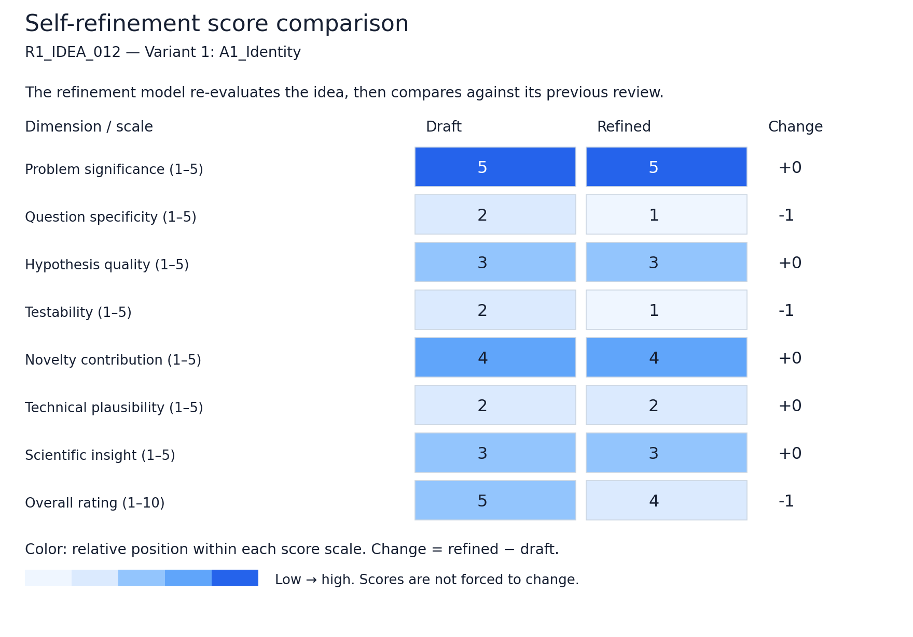

Changed score dimensions: question_specificity, testability, overall_rating.

### Score justifications (draft / refined)

**Problem significance**

```json
{
  "draft": {
    "score": 5.0,
    "justification": "The problem is highly significant. Efficient 3D content creation and editing is a major challenge in computer vision and graphics. Eliminating per-scene optimization would represent a paradigm shift, dramatically improving accessibility and speed for applications in AR/VR, gaming, and digital art."
  },
  "refined": {
    "score": 5.0,
    "justification": "The problem is exceptionally significant. Efficient 3D content creation and editing is a major bottleneck in computer vision, graphics, and applications like AR/VR and gaming. Eliminating per-scene optimization and reducing the need for many consistent views would dramatically improve accessibility and workflow speed, representing a potential paradigm shift."
  }
}
```

**Question specificity**

```json
{
  "draft": {
    "score": 2.0,
    "justification": "The idea defines a desired capability ('enable high-fidelity 3D editing') but not a specific research question. It does not specify what aspect of the model or process is being investigated. The 'how' is completely absent, making the direction vague."
  },
  "refined": {
    "score": 1.0,
    "justification": "The idea lacks a specific research question. It states a desired outcome ('enable high-fidelity 3D editing') but does not define what is being investigated—whether it's a model property, a novel algorithm, or a specific relationship. The 'how' is completely absent, making the direction extremely vague."
  }
}
```

**Hypothesis quality**

```json
{
  "draft": {
    "score": 3.0,
    "justification": "There is an implicit hypothesis: 'Pretrained diffusion models contain sufficient latent 3D awareness to enable high-fidelity, multi-view consistent editing from sparse inputs without per-scene adaptation.' This is a concrete and falsifiable claim. However, it is a very broad, high-level hypothesis about model capabilities rather than a mechanistic hypothesis about *how* a specific property leads to an outcome."
  },
  "refined": {
    "score": 3.0,
    "justification": "There is an implicit, high-level hypothesis: 'Pretrained diffusion models contain sufficient latent 3D awareness to enable high-fidelity, multi-view consistent editing from sparse inputs without per-scene adaptation.' This is a concrete and falsifiable claim about model capabilities. However, it is not a mechanistic hypothesis that explains how a specific property or method would lead to the outcome; it's more of a broad assertion."
  }
}
```

**Testability**

```json
{
  "draft": {
    "score": 2.0,
    "justification": "In its current form, the idea is not directly testable because it proposes an outcome without a methodological direction. To test it, one would need to first invent the method for 'repurposing' and 'unlocking.' The idea itself does not propose an experiment, analysis, or comparison that could validate or invalidate its core premise."
  },
  "refined": {
    "score": 1.0,
    "justification": "The idea is not directly testable in its current form. It proposes an ambitious goal without any methodological direction or experimental design. To test the core claim, one would first need to invent the entire technical approach for 'unlocking' latent 3D awareness. The idea itself does not suggest an experiment, analysis, or comparison that could validate or refute the hypothesis."
  }
}
```

**Novelty contribution**

```json
{
  "draft": {
    "score": 4.0,
    "justification": "The core vision is novel and would be a substantial contribution if achieved. Leveraging frozen foundation models for 3D tasks without optimization is an active and promising frontier. Moving from dozens of views to one-shot/few-shot for consistent 3D editing would be a clear advance over prior work."
  },
  "refined": {
    "score": 4.0,
    "justification": "The core vision is highly novel and would be a substantial contribution if realized. Leveraging frozen foundation models for consistent 3D tasks without optimization is an active research frontier. Achieving high-fidelity 3D editing from one-shot/few-shot inputs would represent a clear advance over existing methods that require extensive optimization or many views."
  }
}
```

**Technical plausibility**

```json
{
  "draft": {
    "score": 2.0,
    "justification": "Based solely on the provided description, technical plausibility is low. The claim requires a significant leap from current capabilities. While research has shown 2D models have some 3D priors, achieving high-fidelity, *consistent* 3D editing from sparse views with a frozen model is an unsolved and highly non-trivial challenge. No reasoning or technical intuition is provided to support its feasibility."
  },
  "refined": {
    "score": 2.0,
    "justification": "Based solely on the provided description, technical plausibility is low. While recent work suggests 2D diffusion models have some 3D priors, achieving high-fidelity, multi-view consistent editing from sparse inputs with a frozen model is an unsolved and highly challenging problem. No reasoning or technical intuition is given to support its feasibility, making the claim appear speculative."
  }
}
```

**Scientific insight**

```json
{
  "draft": {
    "score": 3.0,
    "justification": "If successful, the research could provide profound insight into the nature of 3D representations learned by large-scale 2D diffusion models. It would demonstrate that such models internalize a consistent, manipulable 3D world model. However, the idea as stated is more focused on an engineering outcome than on a structured inquiry designed to extract this insight."
  },
  "refined": {
    "score": 3.0,
    "justification": "If successful, the research could yield profound insights into the 3D representations learned by large-scale 2D diffusion models, demonstrating that they internalize a consistent and manipulable 3D world model. However, the idea as stated is focused on an engineering outcome rather than a structured inquiry designed to extract or understand these insights. The potential for insight is high, but the idea does not explicitly aim to generate it."
  }
}
```

**Overall rating**

```json
{
  "draft": {
    "score": 5.0,
    "justification": "This is a moderate/borderline research idea. It identifies a very important and timely problem with a highly ambitious goal. The implicit hypothesis is meaningful. However, it is severely under-specified, lacking any concrete research question or methodological direction. It reads more like a visionary objective than a research plan. Its high potential contribution is counterbalanced by low specificity, testability, and technical plausibility in its current form. It needs substantial refinement to become a strong research proposal."
  },
  "refined": {
    "score": 4.0,
    "justification": "This is a weak research idea. While it identifies an exceptionally important problem and has high potential novelty, it is severely underdeveloped. It lacks a specific research question, methodological direction, and testable framework. The idea reads as a visionary goal rather than a research plan. Its high significance and novelty are outweighed by extremely low specificity and testability, and uncertain technical plausibility. Substantial refinement is needed to transform it into a viable research proposal."
  }
}
```

## R1_IDEA_012 — Variant 2: A2_Paraphrase_Only


Changed score dimensions: question_specificity, overall_rating.

### Score justifications (draft / refined)

**Problem significance**

```json
{
  "draft": {
    "score": 4.0,
    "justification": "The problem is meaningful. Efficient, few-shot 3D editing is a recognized challenge in generative AI and computer vision. Reducing computational overhead and data requirements for 3D content manipulation has clear practical relevance for creators and researchers."
  },
  "refined": {
    "score": 4.0,
    "justification": "The problem is highly relevant and meaningful. Efficient 3D editing from limited inputs is a recognized challenge in computer vision and generative AI with clear practical applications in content creation, VR/AR, and digital media. Reducing computational requirements addresses a significant barrier to practical adoption."
  }
}
```

**Question specificity**

```json
{
  "draft": {
    "score": 2.0,
    "justification": "The research question is implied but not clearly defined. The idea states a goal ('allow consistent multi-view 3D editing from limited images') but does not specify *what* is being investigated about diffusion models to achieve it. It lacks a concrete, focused inquiry."
  },
  "refined": {
    "score": 1.0,
    "justification": "The research question is extremely vague. The idea states a goal ('allow consistent multi-view 3D editing') but doesn't specify what is being investigated about diffusion models. There's no concrete question about mechanisms, representations, or properties - just an application objective."
  }
}
```

**Hypothesis quality**

```json
{
  "draft": {
    "score": 1.0,
    "justification": "There is no explicit or clearly implicit hypothesis. The idea presents an objective ('adapt models to reveal inherent 3D understanding') but does not make a falsifiable prediction about a mechanism, relationship, or model property. It reads more like a project goal than a research hypothesis."
  },
  "refined": {
    "score": 1.0,
    "justification": "There is no hypothesis presented. The idea makes an assumption ('diffusion models have inherent 3D understanding') but doesn't formulate it as a testable prediction. There's no proposed relationship between model properties and editing capability that could be supported or contradicted by evidence."
  }
}
```

**Testability**

```json
{
  "draft": {
    "score": 2.0,
    "justification": "The core claim ('can do consistent editing without optimization') is testable in principle by implementing a method and evaluating consistency. However, the idea provides no proposed method or experimental design to test *how* or *why* it might work. The lack of a specific technical direction makes it difficult to assess how one would investigate the central premise."
  },
  "refined": {
    "score": 2.0,
    "justification": "The ultimate claim ('can do consistent editing without optimization') is testable in principle by implementing a method and evaluating it. However, without any proposed mechanism or experimental approach, it's unclear how one would test the core premise about leveraging inherent 3D understanding. The idea lacks even a basic experimental design."
  }
}
```

**Novelty contribution**

```json
{
  "draft": {
    "score": 3.0,
    "justification": "The goal of few-shot, optimization-free 3D editing is novel and desirable. However, the idea as presented is a high-level application goal without a novel scientific or methodological core. Many recent works aim to extract 3D from 2D diffusion models (e.g., for generation). The potential contribution hinges entirely on the unspecified 'adaptation' mechanism."
  },
  "refined": {
    "score": 3.0,
    "justification": "The application goal (optimization-free few-shot 3D editing) is novel and desirable. However, as presented, this is merely an application goal without any novel scientific or methodological contribution. The potential contribution depends entirely on unspecified technical innovations."
  }
}
```

**Technical plausibility**

```json
{
  "draft": {
    "score": 2.0,
    "justification": "Based on the information given, the technical plausibility is low. The reasoning is incomplete. It assumes diffusion models have 'inherent 3D understanding' sufficient for consistent editing without explaining how that understanding is accessed or manipulated. The jump from a 2D model to consistent 3D edits without any 3D optimization or multi-view fine-tuning is a major technical leap that the idea does not substantiate."
  },
  "refined": {
    "score": 2.0,
    "justification": "The technical plausibility is low based on the information provided. The leap from 2D diffusion models to consistent 3D editing without any 3D optimization or multi-view training is substantial and unsupported. The idea doesn't provide any reasoning about how this might be achieved, making it more aspirational than plausible."
  }
}
```

**Scientific insight**

```json
{
  "draft": {
    "score": 3.0,
    "justification": "If successful, the research could provide insight into the nature of 3D information encoded in 2D diffusion models and how it can be harnessed for tasks beyond single-image generation. However, the idea as stated focuses on an application outcome. The potential for scientific insight (e.g., discovering specific representational properties) is present but not emphasized or guided by a specific question."
  },
  "refined": {
    "score": 3.0,
    "justification": "If successfully investigated, this could provide insight into what 3D information is encoded in 2D diffusion models and how it can be manipulated. However, the idea as stated focuses entirely on application outcomes rather than scientific understanding. The potential for insight exists but is not emphasized or guided by specific questions about model representations."
  }
}
```

**Overall rating**

```json
{
  "draft": {
    "score": 4.0,
    "justification": "This is a weak research idea in its current form. It identifies a significant and relevant application problem (few-shot 3D editing). However, it lacks the core components of a research idea: a specific research question, a testable hypothesis, and a plausible technical direction. It reads as a project objective or motivation statement rather than a blueprint for scientific investigation. The potential is there, but the idea needs substantial refinement to become a viable research direction."
  },
  "refined": {
    "score": 3.0,
    "justification": "This is a weak research idea in its current form. While it identifies a significant application problem, it lacks the essential components of a research idea: a specific research question, a testable hypothesis, and a plausible technical direction. It reads as a project goal or motivation statement rather than a blueprint for scientific investigation. The idea needs substantial refinement to become a viable research direction."
  }
}
```

## R1_IDEA_012 — Variant 3: A3_Plain_Core

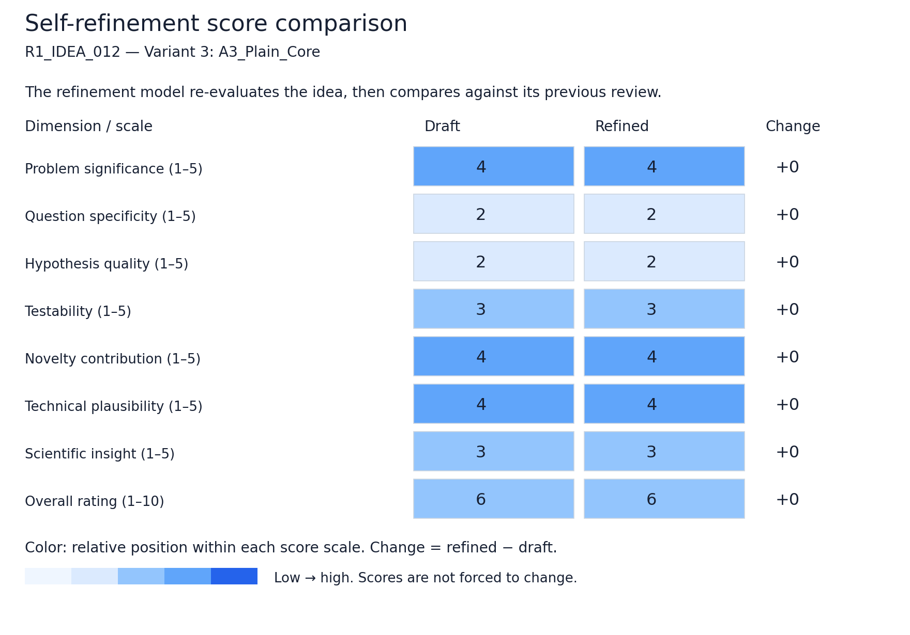

Changed score dimensions: none.

### Score justifications (draft / refined)

**Problem significance**

```json
{
  "draft": {
    "score": 4.0,
    "justification": "The problem is significant. Efficient, high-quality 3D editing from sparse 2D inputs is a major challenge in generative AI and 3D content creation. Eliminating costly per-scene optimization addresses a clear practical bottleneck."
  },
  "refined": {
    "score": 4.0,
    "justification": "The problem is highly significant. Efficient 3D editing from sparse 2D inputs is a major challenge in generative AI and 3D content creation. Eliminating per-scene optimization addresses a clear practical bottleneck for scalability and usability."
  }
}
```

**Question specificity**

```json
{
  "draft": {
    "score": 2.0,
    "justification": "The research question is implied but not clearly defined. The summary states what the method 'enables' but does not specify what will be investigated (e.g., the properties of latent 3D awareness, the mechanism for accessing it, or a comparison of consistency metrics). It is more of a goal statement than a question."
  },
  "refined": {
    "score": 2.0,
    "justification": "The research question is vague. The summary describes a goal ('enables multi-view consistent 3D editing') but does not specify what is being investigated—e.g., the properties of latent 3D awareness, a method to extract it, or a comparison of consistency under different conditions. It is an objective statement, not a focused question."
  }
}
```

**Hypothesis quality**

```json
{
  "draft": {
    "score": 2.0,
    "justification": "There is an implicit hypothesis that 'latent 3D awareness exists and can be repurposed for consistent editing,' but it is not framed as a testable prediction. A stronger hypothesis would predict a relationship between a model intervention and an improvement in a specific consistency metric."
  },
  "refined": {
    "score": 2.0,
    "justification": "There is only an implicit, untested assumption that latent 3D awareness exists and can be repurposed. No concrete prediction is made about how an intervention would affect consistency metrics, nor is there a proposed mechanism linking model internals to the desired output. The idea lacks a falsifiable hypothesis."
  }
}
```

**Testability**

```json
{
  "draft": {
    "score": 3.0,
    "justification": "The core claim is testable in principle—one can implement a method and evaluate multi-view consistency. However, the idea lacks a proposed experimental structure (e.g., a baseline comparison, an ablation of the 'access' mechanism) that would make the investigation rigorous and conclusive."
  },
  "refined": {
    "score": 3.0,
    "justification": "The central claim is testable in principle—one could implement a method and evaluate multi-view consistency. However, the idea does not propose an experimental structure (e.g., ablations, comparisons, or controlled variations) that would allow rigorous investigation. Without a specific mechanism to test, it is unclear what evidence would confirm or refute the idea."
  }
}
```

**Novelty contribution**

```json
{
  "draft": {
    "score": 4.0,
    "justification": "The proposed direction has good novelty. Repurposing the implicit 3D knowledge of 2D diffusion models for zero-shot/few-shot 3D editing is an active and promising research avenue. Avoiding per-scene optimization is a meaningful potential contribution if successfully demonstrated."
  },
  "refined": {
    "score": 4.0,
    "justification": "The direction has good novelty. Leveraging implicit 3D knowledge in 2D diffusion models for zero-shot/few-shot 3D editing is an emerging and promising area. Avoiding per-scene optimization would be a meaningful technical contribution if achieved, though the idea itself is not yet a novel method."
  }
}
```

**Technical plausibility**

```json
{
  "draft": {
    "score": 4.0,
    "justification": "The idea is technically plausible. Recent research has shown that 2D diffusion models learn rich 3D priors. The reasoning that this could be leveraged for efficient 3D tasks is coherent and aligns with current trends in the field."
  },
  "refined": {
    "score": 4.0,
    "justification": "The idea is technically plausible based on current understanding. Research has shown that 2D diffusion models learn strong 3D priors. The reasoning that this could be harnessed for 3D tasks is coherent and aligns with recent work in the field, though the feasibility of doing so without any optimization remains an open question."
  }
}
```

**Scientific insight**

```json
{
  "draft": {
    "score": 3.0,
    "justification": "The potential insight is moderate. Success would demonstrate a practical application of latent 3D awareness. However, to yield deeper scientific insight, the research would need to probe *how* the awareness works, its limitations, or general principles for extracting 3D information from 2D models."
  },
  "refined": {
    "score": 3.0,
    "justification": "Potential insight is moderate. Success would demonstrate a practical application of latent 3D awareness, which is useful. However, to yield deeper scientific insight, the research would need to uncover how the awareness is represented, its generalizability, or principles for extracting 3D consistency from 2D models—none of which are outlined here."
  }
}
```

**Overall rating**

```json
{
  "draft": {
    "score": 6.0,
    "justification": "This is a moderate/borderline research idea. It identifies a significant and timely problem with a plausible technical direction. Its main weakness is the lack of a specific, testable research question or hypothesis. It is currently more of a promising application goal than a structured investigation. With a more concrete hypothesis and experimental plan, it could become a strong idea."
  },
  "refined": {
    "score": 6.0,
    "justification": "This is a moderate/borderline research idea. It addresses a significant problem with a plausible technical premise, but it lacks a specific research question, testable hypothesis, and methodological direction. It is currently more of an application goal than a structured investigation. With greater specificity and a falsifiable hypothesis, it could become a strong idea."
  }
}
```

## R1_IDEA_012 — Variant 4: B1_Verbose_Elaborate


Changed score dimensions: none.

### Score justifications (draft / refined)

**Problem significance**

```json
{
  "draft": {
    "score": 5.0,
    "justification": "The problem is highly significant. Reducing the data and computational requirements for high-quality 3D editing is a major bottleneck in graphics, vision, and content creation. Eliminating per-scene optimization and the need for dozens of edited views addresses a core practical challenge."
  },
  "refined": {
    "score": 5.0,
    "justification": "The problem is exceptionally significant. Reducing the computational and data requirements for high-quality 3D editing is a major bottleneck in computer vision, graphics, and content creation. Eliminating per-scene optimization and the need for dozens of consistent edited views addresses a fundamental practical challenge with broad applications."
  }
}
```

**Question specificity**

```json
{
  "draft": {
    "score": 2.0,
    "justification": "The research question is implied but not clearly defined. It is something like: 'Can we use pretrained 2D diffusion models for consistent 3D editing from one image?' However, it lacks specificity regarding the 'how'—the mechanism, the constraints, or the specific type of consistency targeted (e.g., geometric, semantic, stylistic)."
  },
  "refined": {
    "score": 2.0,
    "justification": "The research question is implied but not clearly defined. The summary describes a goal ('enable editing from limited inputs') rather than a specific question about mechanisms, relationships, or phenomena. There is no clear 'what will we investigate' beyond the application itself."
  }
}
```

**Hypothesis quality**

```json
{
  "draft": {
    "score": 2.0,
    "justification": "There is an implicit hypothesis: 'Pretrained diffusion models have latent 3D awareness that can be repurposed for few-shot, consistent 3D editing.' This is a broad and somewhat vague claim. It lacks a concrete, testable prediction about a specific relationship or mechanism (e.g., 'manipulating feature X in layer Y will improve metric Z across views')."
  },
  "refined": {
    "score": 2.0,
    "justification": "There is only a vague implicit hypothesis: 'Pretrained diffusion models have latent 3D awareness that can be repurposed for few-shot consistent 3D editing.' This lacks a concrete, testable prediction about a specific mechanism or relationship. It does not distinguish what would constitute supporting versus contradicting evidence."
  }
}
```

**Testability**

```json
{
  "draft": {
    "score": 2.0,
    "justification": "The central claim is testable in principle (generate edits and check consistency), but the idea summary provides no pathway for investigation. There is no suggested experiment, comparison, ablation, or analysis method. The lack of a proposed evaluation makes it difficult to assess how one would gather evidence for or against the idea."
  },
  "refined": {
    "score": 2.0,
    "justification": "The central claim is testable in principle (generate edits and evaluate consistency), but the idea provides no pathway for investigation. There is no suggested experiment, evaluation method, comparison, or analysis. Without a proposed approach to gather evidence, testability remains low."
  }
}
```

**Novelty contribution**

```json
{
  "draft": {
    "score": 4.0,
    "justification": "The proposed direction has high potential novelty. Leveraging 'latent 3D awareness' in foundational 2D models for 3D tasks is a cutting-edge concept. If successful, the contribution would be substantial: a new paradigm for efficient 3D editing that bypasses major limitations of current approaches. However, the idea is not fully fleshed out to confirm its novelty over related few-shot 3D generation lines of work."
  },
  "refined": {
    "score": 4.0,
    "justification": "The proposed direction has high potential novelty. Leveraging latent 3D structure in foundational 2D models for efficient 3D editing is a cutting-edge concept. If successful, it would represent a significant paradigm shift from optimization-heavy approaches. However, the idea's lack of specificity makes it difficult to assess its novelty relative to related few-shot 3D generation work."
  }
}
```

**Technical plausibility**

```json
{
  "draft": {
    "score": 3.0,
    "justification": "The plausibility is questionable but not dismissible. The core assumption—that 2D diffusion models have useful latent 3D structure—has some support in recent literature (e.g., studies on 3D emergence). However, the leap to achieving high-fidelity, multi-view consistent *edits* from a *single image* without any 3D supervision or optimization is a very strong claim. The reasoning is logically coherent but rests on an unproven and highly challenging premise."
  },
  "refined": {
    "score": 3.0,
    "justification": "Plausibility is moderate but uncertain. The core assumption—that 2D diffusion models encode useful 3D structure—has some support in recent literature. However, the leap to achieving high-fidelity, multi-view consistent edits from a single image without any 3D supervision or scene-specific optimization is a very strong claim. The reasoning is coherent but rests on an unproven and challenging premise."
  }
}
```

**Scientific insight**

```json
{
  "draft": {
    "score": 4.0,
    "justification": "The potential scientific insight is high. Successfully pursuing this idea would reveal fundamental insights about the 3D knowledge embedded in large 2D generative models and how it can be harnessed. It could lead to general principles for transferring 2D model capabilities to 3D tasks with minimal data, which is a question of broad interest in machine learning and computer vision."
  },
  "refined": {
    "score": 4.0,
    "justification": "The potential scientific insight is high. Successfully pursuing this idea would reveal fundamental insights about the nature and extent of 3D knowledge embedded in large 2D generative models. It could establish general principles for transferring 2D model capabilities to 3D tasks with minimal data, which is a question of broad theoretical interest in machine learning."
  }
}
```

**Overall rating**

```json
{
  "draft": {
    "score": 5.0,
    "justification": "This is a moderate/borderline research idea. It identifies a very important problem and a potentially high-impact, novel direction. However, in its current summarized form, it is severely under-specified. The research question is vague, the hypothesis is broad, and no pathway for testing is suggested. The ambitious core claim lacks a plausibility bridge. It has the seeds of a strong idea but requires much more concrete formulation to be evaluated as such."
  },
  "refined": {
    "score": 5.0,
    "justification": "This is a moderate/borderline research idea. It identifies an exceptionally important problem and points toward a potentially high-impact, novel direction. However, in its current summarized form, it is severely under-specified. The research question is vague, the hypothesis is broad and untestable as stated, and no investigative pathway is suggested. While it has the seeds of a strong idea, it requires much more concrete formulation regarding what specifically will be investigated and how."
  }
}
```

## R1_IDEA_012 — Variant 5: B2_Grand_Narrative

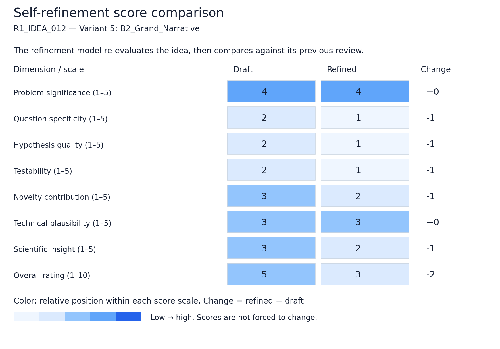

Changed score dimensions: question_specificity, hypothesis_quality, testability, novelty_contribution, scientific_insight, overall_rating.

### Score justifications (draft / refined)

**Problem significance**

```json
{
  "draft": {
    "score": 4.0,
    "justification": "The problem is meaningful: reducing computational burden and data requirements for 3D content creation is a recognized challenge with practical implications for accessibility and scalability. The idea correctly identifies that prior methods often require extensive scene-specific computation and many consistent views."
  },
  "refined": {
    "score": 4.0,
    "justification": "The problem is meaningful and well-identified: reducing computational burden and data requirements for 3D content creation is a recognized challenge with clear practical implications for accessibility and scalability. The idea correctly notes that prior methods often require extensive scene-specific optimization and many consistent views."
  }
}
```

**Question specificity**

```json
{
  "draft": {
    "score": 2.0,
    "justification": "The idea is described at a high level without a concrete research question. Phrases like 'repurposing pretrained diffusion models' and 'unlock their latent 3D awareness' are vague. There is no clear statement of what relationship, mechanism, or phenomenon will be investigated."
  },
  "refined": {
    "score": 1.0,
    "justification": "The idea is described at an extremely high level without any concrete research question. Phrases like 'repurposing pretrained diffusion models' and 'unlock their latent 3D awareness' are vague and do not specify what relationship, mechanism, or phenomenon will be investigated. No specific question is posed."
  }
}
```

**Hypothesis quality**

```json
{
  "draft": {
    "score": 2.0,
    "justification": "There is an implicit hypothesis that pretrained diffusion models possess 'latent 3D awareness' that can be harnessed for multi-view consistent editing from sparse inputs, but this is not stated as a testable prediction. The hypothesis lacks specificity about what 'latent 3D awareness' means or how it would be unlocked."
  },
  "refined": {
    "score": 1.0,
    "justification": "There is no explicit or clearly implicit hypothesis. The statement that pretrained diffusion models have 'latent 3D awareness' that can be 'unlocked' is an assumption, not a testable prediction. No concrete claim is made about how this would work or what outcome would validate it."
  }
}
```

**Testability**

```json
{
  "draft": {
    "score": 2.0,
    "justification": "The idea mentions potential benefits but does not propose how to test whether the approach works. There are no suggested experiments, evaluations, or comparisons. Without a concrete method or evaluation plan, it's unclear how one would gather evidence for or against the central claim."
  },
  "refined": {
    "score": 1.0,
    "justification": "The idea provides no basis for testing. There are no suggested experiments, evaluations, comparisons, or metrics. Without even a proposed method or success criteria, it is impossible to gather evidence for or against any claim. The idea is purely aspirational."
  }
}
```

**Novelty contribution**

```json
{
  "draft": {
    "score": 3.0,
    "justification": "Using diffusion models for 3D tasks is already an active area. The novelty claim rests on achieving multi-view consistency from sparse inputs without per-scene optimization, but this is not sufficiently differentiated from existing work. The contribution is framed as potentially informing long-term research directions rather than producing specific new knowledge."
  },
  "refined": {
    "score": 2.0,
    "justification": "Using diffusion models for 3D tasks is already an active research area. The novelty claim—achieving multi-view consistency from sparse inputs without per-scene optimization—is not sufficiently differentiated from existing work (e.g., Zero-1-to-3, MVDream, etc.). The contribution is framed vaguely as 'informing long-term research directions' rather than producing specific new knowledge."
  }
}
```

**Technical plausibility**

```json
{
  "draft": {
    "score": 3.0,
    "justification": "The general direction is plausible given recent successes with diffusion models in 3D. However, the lack of technical details makes it difficult to assess feasibility. The claim that pretrained models have 'latent 3D awareness' that can be unlocked is reasonable but requires justification."
  },
  "refined": {
    "score": 3.0,
    "justification": "The general direction is plausible given recent progress with diffusion models in 3D. However, the complete lack of technical details makes proper assessment difficult. The core assumption that pretrained models have 'latent 3D awareness' that can be harnessed is reasonable but unsupported here."
  }
}
```

**Scientific insight**

```json
{
  "draft": {
    "score": 3.0,
    "justification": "If successful, the research could provide insight into the 3D representations learned by diffusion models and how they can be leveraged for efficient 3D editing. However, the idea is framed more as an application goal than as a study designed to reveal fundamental principles or mechanisms."
  },
  "refined": {
    "score": 2.0,
    "justification": "If successfully investigated, the research could potentially provide insight into the 3D representations learned by diffusion models. However, the idea is framed almost entirely as an application goal (efficient 3D editing) rather than as a study designed to reveal fundamental principles, mechanisms, or boundary conditions."
  }
}
```

**Overall rating**

```json
{
  "draft": {
    "score": 5.0,
    "justification": "This is a moderate/borderline research idea. It identifies a meaningful practical problem (reducing computational burden for 3D content creation) and suggests a plausible direction (using pretrained diffusion models). However, it lacks a specific research question, testable hypothesis, and methodological details. The idea reads more like a high-level vision or motivation than a concrete research investigation. With greater specificity and a clear hypothesis, it could become a strong research direction."
  },
  "refined": {
    "score": 3.0,
    "justification": "This is a weak research idea. While it identifies a meaningful practical problem (reducing computational burden for 3D content creation), it lacks virtually all elements of a research investigation: no specific question, no testable hypothesis, no methodology, and no evaluation plan. It reads as a high-level vision or motivation statement rather than a concrete research direction. In its current form, it does not propose a study that could produce scientific knowledge."
  }
}
```

## R1_IDEA_012 — Variant 6: B3_Over_Confident

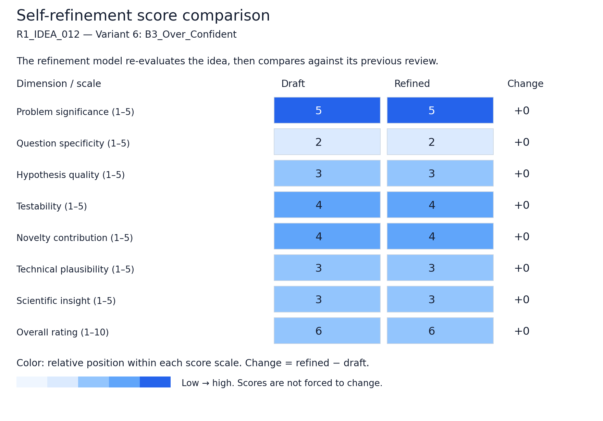

Changed score dimensions: none.

### Score justifications (draft / refined)

**Problem significance**

```json
{
  "draft": {
    "score": 5.0,
    "justification": "The problem is highly significant. Efficient, high-quality 3D content creation and editing is a major challenge in computer vision and graphics. Eliminating the need for per-scene optimization (like NeRF fine-tuning) would represent a substantial leap in practicality and accessibility."
  },
  "refined": {
    "score": 5.0,
    "justification": "The problem is exceptionally significant. Efficient, high-quality 3D content creation and editing is a major challenge in computer vision, graphics, and AI. Eliminating the need for computationally expensive per-scene optimization (like NeRF fine-tuning) would represent a transformative leap in practicality, speed, and accessibility, with broad applications."
  }
}
```

**Question specificity**

```json
{
  "draft": {
    "score": 2.0,
    "justification": "The idea is stated as a declarative achievement rather than a specific research question. It specifies a desired outcome ('enabling high-fidelity 3D editing') but not the concrete phenomenon, relationship, or mechanism to be investigated. The 'what' is clear, but the 'what will we learn' is not."
  },
  "refined": {
    "score": 2.0,
    "justification": "The idea is stated as a declarative achievement, not a specific research question. It specifies a desired application outcome ('enabling high-fidelity 3D editing') but does not define the concrete phenomenon, relationship, or mechanism to be investigated. The 'what we want to build' is clear, but the 'what we will scientifically investigate' is not articulated."
  }
}
```

**Hypothesis quality**

```json
{
  "draft": {
    "score": 3.0,
    "justification": "There is an implicit, core hypothesis: 'Pretrained diffusion models have latent 3D awareness that can be repurposed for consistent 3D editing without optimization.' This is a concrete and falsifiable claim. However, it is presented as an assumed truth rather than a proposition to be tested. The hypothesis lacks specificity about the nature of this awareness or the repurposing mechanism."
  },
  "refined": {
    "score": 3.0,
    "justification": "There is a core implicit hypothesis: 'Pretrained diffusion models possess latent 3D awareness that can be repurposed for multi-view consistent 3D editing without optimization.' This is a concrete and falsifiable claim. However, it is presented as an assumed truth rather than a proposition to be tested. The hypothesis lacks specificity about the nature of this 'awareness' (e.g., is it geometric, semantic, or both?) and the 'repurposing' mechanism."
  }
}
```

**Testability**

```json
{
  "draft": {
    "score": 4.0,
    "justification": "The central claim is highly testable. One could design experiments to: 1) Evaluate if the proposed method produces multi-view consistent edits from sparse inputs. 2) Ablate the need for optimization. 3) Compare quality and consistency to prior optimization-based methods. The lack of a specified method is a limitation, but the outcome is clearly measurable."
  },
  "refined": {
    "score": 4.0,
    "justification": "The central claim is highly testable. One could design clear experiments to: 1) Evaluate if a proposed method produces multi-view consistent edits from sparse inputs. 2) Ablate the need for per-scene optimization. 3) Compare editing quality, consistency, and speed to prior optimization-based methods. The outcome is measurable, even though the specific method to test is not yet proposed."
  }
}
```

**Novelty contribution**

```json
{
  "draft": {
    "score": 4.0,
    "justification": "If successful, the contribution would be substantial. Moving 3D editing from optimization-heavy pipelines to a (presumably) fast, feedforward process using pretrained models is a novel and valuable direction. It goes beyond a simple application by aiming to exploit an untapped capability of existing models."
  },
  "refined": {
    "score": 4.0,
    "justification": "If successful, the contribution would be substantial. Moving 3D editing from optimization-heavy, slow pipelines to a (presumably) fast, feedforward or lightweight process using purely pretrained models is a novel and valuable direction. It aims to exploit a hypothesized untapped capability, which goes beyond a straightforward application of an existing method."
  }
}
```

**Technical plausibility**

```json
{
  "draft": {
    "score": 3.0,
    "justification": "The reasoning is logically coherent: large 2D diffusion models trained on diverse internet data may have learned some implicit 3D structure. Recent work (e.g., Zero-1-to-3, SyncDreamer) shows related directions are plausible. However, the idea provides no technical details on *how* this repurposing would work, making it impossible to assess the plausibility of the proposed mechanism. It rests on an assumption that such a mechanism exists and can be found."
  },
  "refined": {
    "score": 3.0,
    "justification": "The premise is logically coherent and has some grounding: large 2D diffusion models trained on diverse internet data may have learned some implicit 3D structure, as suggested by related work on novel view synthesis. However, the idea provides zero technical details on *how* the repurposing would be achieved. It is therefore impossible to assess the plausibility of the proposed mechanism; the score reflects the inherent uncertainty due to this complete lack of detail."
  }
}
```

**Scientific insight**

```json
{
  "draft": {
    "score": 3.0,
    "justification": "The potential insight is moderate. Success would demonstrate that pretrained 2D models contain more 3D understanding than previously leveraged, which is a valuable finding. However, the idea is currently framed around an engineering outcome. To maximize insight, the research should be designed to also answer *why* and *how* the model possesses this awareness (e.g., through analysis of internal representations or training dynamics)."
  },
  "refined": {
    "score": 3.0,
    "justification": "The potential insight is moderate. Success would demonstrate that pretrained 2D models contain a utilizable, consistent 3D understanding, which is a valuable finding about model capabilities. However, the idea is currently framed almost entirely around an engineering outcome. To maximize scientific insight, the research would need to be designed to also probe *why* and *how* the model possesses this awareness (e.g., through representational analysis or controlled experiments)."
  }
}
```

**Overall rating**

```json
{
  "draft": {
    "score": 6.0,
    "justification": "This is a moderate/borderline research idea. It identifies a very important and timely problem with clear practical value. The implicit hypothesis is interesting and testable. However, the idea is presented more as a claim of results than as a research proposal. It lacks specificity in its research question and proposed mechanism, which limits its clarity and potential for deep scientific insight. With refinement to frame it as an investigation into the existence and extractability of latent 3D structures in diffusion models, it could become a strong idea."
  },
  "refined": {
    "score": 6.0,
    "justification": "This is a moderate/borderline research idea. It identifies an exceptionally important and timely problem with clear, high-impact practical value. The implicit hypothesis is interesting and testable. However, the idea is presented more as a claim of results than as a research proposal. It critically lacks specificity in its core research question and proposed technical mechanism, which severely limits its clarity and potential for deep scientific insight. With refinement to frame it as an investigation into the existence, nature, and extractability of latent 3D structures in diffusion models, it could become a strong idea."
  }
}
```

## R1_IDEA_012 — Variant 7: B4_Novelty


Changed score dimensions: none.

### Score justifications (draft / refined)

**Problem significance**

```json
{
  "draft": {
    "score": 4.0,
    "justification": "The problem is meaningful. Efficient, high-quality 3D content creation and editing is a significant challenge in graphics and vision. Reducing computational cost and data requirements is practically important."
  },
  "refined": {
    "score": 4.0,
    "justification": "The problem is meaningful. Efficient 3D content creation and editing is a significant challenge in computer vision and graphics. Reducing computational costs and data requirements has clear practical importance for applications. The broader question of what 3D knowledge 2D-trained models acquire is also scientifically interesting."
  }
}
```

**Question specificity**

```json
{
  "draft": {
    "score": 2.0,
    "justification": "The idea is framed as a goal ('enable high-fidelity editing') rather than a specific research question. It does not define what aspect of 'latent 3D awareness' is being investigated or what relationship is being tested."
  },
  "refined": {
    "score": 2.0,
    "justification": "The idea is framed as a goal or application ('enable high-fidelity 3D editing') rather than a specific research question. It does not define what aspect of 'latent 3D awareness' is being investigated, what relationship is being tested, or what phenomenon is being studied. The research objective is broad and outcome-oriented."
  }
}
```

**Hypothesis quality**

```json
{
  "draft": {
    "score": 2.0,
    "justification": "There is an implicit hypothesis that 'latent 3D awareness exists and can be repurposed for editing,' but it is not concrete or predictive. It lacks a mechanism and does not distinguish the investigation from a generic application of a model property."
  },
  "refined": {
    "score": 2.0,
    "justification": "There is an implicit assumption that 'latent 3D awareness exists and can be repurposed,' but this is not formulated as a concrete, testable hypothesis. It lacks a predictive mechanism, does not specify conditions for success/failure, and is essentially a statement of intended capability rather than a falsifiable claim."
  }
}
```

**Testability**

```json
{
  "draft": {
    "score": 2.0,
    "justification": "The central claim is not formulated in a testable way. While one could test the final editing performance, the idea does not propose how to test the core premise about 'unlocking latent awareness.' It is more of an engineering objective."
  },
  "refined": {
    "score": 2.0,
    "justification": "The central claim is not structured in a testable manner. One could test the final editing performance, but the idea does not propose how to test the core premise about 'unlocking latent 3D awareness.' There is no suggested experiment, analysis, or comparison to investigate the underlying model property. It is presented as an engineering objective rather than a scientific inquiry."
  }
}
```

**Novelty contribution**

```json
{
  "draft": {
    "score": 3.0,
    "justification": "The framing ('repurposing pretrained models for latent 3D awareness') suggests a novel angle, but the contribution is unclear. If it is merely applying a known model to 3D editing with a new prompt, novelty is low. If it involves discovering and leveraging a new model property, it could be higher, but this is not specified."
  },
  "refined": {
    "score": 3.0,
    "justification": "The framing ('repurposing for latent 3D awareness') suggests a potentially novel angle, but the contribution is unclear. If the contribution is merely applying diffusion models to 3D editing with a new prompt or input setup, novelty is low. If it involves discovering and leveraging a previously unidentified model property or representation, it could be higher, but this is not specified. The idea sits in an ambiguous middle ground."
  }
}
```

**Technical plausibility**

```json
{
  "draft": {
    "score": 3.0,
    "justification": "The reasoning is coherent at a high level: pretrained models may have learned some 3D structure. However, the assumption that this 'awareness' can be easily 'unlocked' for consistent 3D editing from sparse views is a significant leap without a proposed mechanism. Plausibility is moderate but uncertain."
  },
  "refined": {
    "score": 3.0,
    "justification": "The high-level reasoning is coherent: pretrained models may have learned some 3D structure from 2D data. However, the assumption that this 'awareness' can be easily 'unlocked' for consistent 3D editing from sparse views, without optimization or fine-tuning, is a significant leap. No mechanism is proposed, making technical plausibility uncertain but not inherently implausible given recent research trends."
  }
}
```

**Scientific insight**

```json
{
  "draft": {
    "score": 3.0,
    "justification": "If successful, the work could provide insight into the 3D knowledge embedded in diffusion models. However, the idea is currently focused on an application outcome. The potential for general scientific insight (e.g., understanding how 2D training leads to 3D representations) is present but not explicitly pursued."
  },
  "refined": {
    "score": 3.0,
    "justification": "If pursued as a scientific investigation, the work could provide insight into the nature and extent of 3D knowledge embedded in diffusion models—a topic of broader interest. However, the idea is currently focused on an application outcome. The potential for general scientific insight (e.g., understanding how 2D training leads to view-consistent representations) is present but not explicitly targeted or leveraged in the framing."
  }
}
```

**Overall rating**

```json
{
  "draft": {
    "score": 5.0,
    "justification": "This is a moderate/borderline research idea. It identifies a practically relevant problem and an interesting direction (leveraging latent 3D knowledge). However, it is presented as an application goal rather than a specific scientific investigation. The research question, hypothesis, and testable claim are poorly defined. The potential contribution is currently vague, leaning more towards an engineering method than a scientific discovery. With a more precise hypothesis and a plan to investigate the model's properties, it could become a stronger research idea."
  },
  "refined": {
    "score": 5.0,
    "justification": "This is a moderate/borderline research idea. It identifies a practically relevant problem and an interesting conceptual direction (leveraging latent 3D knowledge in diffusion models). However, it is presented primarily as an application goal rather than a specific scientific investigation. The research question, hypothesis, and testable claim are poorly defined. The potential contribution is vague, leaning more towards an engineering method than a scientific discovery. With a more precise hypothesis and a plan to investigate the model's properties, it could become a stronger research idea. It currently lacks the specificity and testability expected for a high-quality research direction."
  }
}
```

## R1_IDEA_012 — Variant 8: B5_Application_Impact


Changed score dimensions: none.

### Score justifications (draft / refined)

**Problem significance**

```json
{
  "draft": {
    "score": 4.0,
    "justification": "The problem is highly significant. Efficient, high-quality 3D content creation and editing is a major bottleneck in graphics, VR/AR, and game development. Reducing reliance on dense views and per-scene optimization addresses a clear practical and computational challenge."
  },
  "refined": {
    "score": 4.0,
    "justification": "The problem is highly significant. Efficient, high-quality 3D content creation and editing is a major bottleneck in graphics, VR/AR, and game development. Reducing reliance on dense views and per-scene optimization addresses clear practical and computational challenges."
  }
}
```

**Question specificity**

```json
{
  "draft": {
    "score": 2.0,
    "justification": "The idea is stated as a goal or application ('enables 3D editing') rather than a specific research question. It lacks the precision of a question like 'Can we achieve X by investigating Y?' or 'What is the relationship between Z and W?'"
  },
  "refined": {
    "score": 2.0,
    "justification": "The idea is stated as a goal or application ('enables 3D editing') rather than a specific research question. It lacks the precision of a question like 'How can we extract 3D structure from 2D diffusion models?' or 'What factors influence multi-view consistency in sparse-input editing?'"
  }
}
```

**Hypothesis quality**

```json
{
  "draft": {
    "score": 2.0,
    "justification": "There is an implicit hypothesis that 'repurposing pretrained diffusion models unlocks latent 3D awareness,' but it is not framed as a testable prediction. A stronger hypothesis would make a falsifiable claim about a mechanism or outcome, e.g., 'Manipulating feature X will improve metric Y more than baseline Z.'"
  },
  "refined": {
    "score": 2.0,
    "justification": "There is an implicit hypothesis that 'repurposing pretrained diffusion models unlocks latent 3D awareness,' but it is not framed as a testable prediction. A stronger hypothesis would make a falsifiable claim about a mechanism or outcome, e.g., 'Manipulating feature X will improve metric Y more than baseline Z.'"
  }
}
```

**Testability**

```json
{
  "draft": {
    "score": 2.0,
    "justification": "In its current form, the idea is not directly testable because it does not propose an experiment, evaluation, or analysis. It describes a desired outcome but not a method to achieve it or a way to measure success. Testability would require a concrete procedure."
  },
  "refined": {
    "score": 2.0,
    "justification": "In its current form, the idea is not directly testable because it does not propose an experiment, evaluation, or analysis. It describes a desired outcome but not a method to achieve it or a way to measure success. Testability would require a concrete procedure."
  }
}
```

**Novelty contribution**

```json
{
  "draft": {
    "score": 3.0,
    "justification": "The core notion of leveraging 2D diffusion models for 3D tasks is not novel (see Zero-1-to-3, etc.). The potential novelty lies in the specific focus on 'editing from sparse inputs without optimization.' However, without a proposed method, it's unclear what the novel technical contribution would be beyond applying existing ideas to a slightly different setting."
  },
  "refined": {
    "score": 3.0,
    "justification": "The core notion of leveraging 2D diffusion models for 3D tasks is not novel (e.g., Zero-1-to-3). The potential novelty lies in the specific focus on 'editing from sparse inputs without optimization,' but without a proposed method, it's unclear what the novel technical contribution would be beyond applying existing ideas to a slightly different setting."
  }
}
```

**Technical plausibility**

```json
{
  "draft": {
    "score": 3.0,
    "justification": "The reasoning is logically coherent (if we can access 3D info from 2D models, we could edit in 3D). However, the central assumption—that such 'latent 3D awareness' can be easily 'unlocked' for consistent editing without optimization—is a significant technical leap. The idea lacks the details needed to assess its plausibility rigorously."
  },
  "refined": {
    "score": 3.0,
    "justification": "The reasoning is logically coherent (if 3D info exists in 2D models, it could be used for editing). However, the central assumption—that such 'latent 3D awareness' can be easily 'unlocked' for consistent editing without optimization—is a significant technical leap. The idea lacks details needed to assess its plausibility rigorously."
  }
}
```

**Scientific insight**

```json
{
  "draft": {
    "score": 3.0,
    "justification": "If successful, the research could provide insight into the nature of 3D information within 2D generative models and how it can be harnessed. However, the idea is currently framed more as an engineering goal ('enable practical systems') than a scientific investigation aimed at uncovering general principles or limitations."
  },
  "refined": {
    "score": 3.0,
    "justification": "If successful, the research could provide insight into the nature of 3D information within 2D generative models and how it can be harnessed. However, the idea is currently framed more as an engineering goal ('enable practical systems') than a scientific investigation aimed at uncovering general principles or limitations."
  }
}
```

**Overall rating**

```json
{
  "draft": {
    "score": 5.0,
    "justification": "This is a moderate/borderline research idea. It identifies a significant and relevant problem in 3D content creation. However, it is currently more of a vision statement than a research plan. It lacks a specific research question, a testable hypothesis, and any methodological direction, which severely limits its evaluability as a scientific idea. The potential is there, but the idea needs substantial refinement to become a strong research proposal."
  },
  "refined": {
    "score": 5.0,
    "justification": "This is a moderate/borderline research idea. It identifies a significant and relevant problem in 3D content creation. However, it is currently more of a vision statement than a research plan. It lacks a specific research question, a testable hypothesis, and any methodological direction, which severely limits its evaluability as a scientific idea. The potential is there, but the idea needs substantial refinement to become a strong research proposal."
  }
}
```

## R1_IDEA_012 — Variant 9: C1_Hollow_Shell

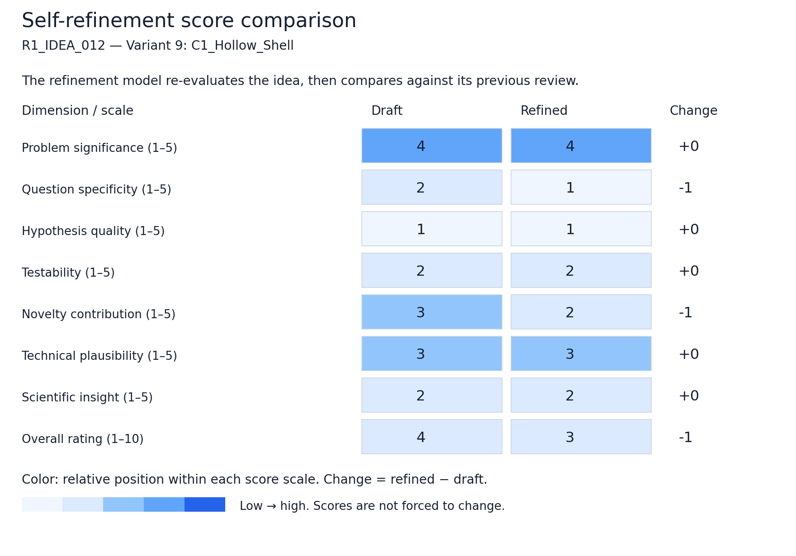

Changed score dimensions: question_specificity, novelty_contribution, overall_rating.

### Score justifications (draft / refined)

**Problem significance**

```json
{
  "draft": {
    "score": 4.0,
    "justification": "The problem is significant. 3D editing from sparse views is a core challenge in computer vision and graphics. Avoiding per-scene optimization addresses a major computational bottleneck, making the problem relevant for practical applications."
  },
  "refined": {
    "score": 4.0,
    "justification": "The problem is highly significant. Sparse-view 3D editing with multi-view consistency is a fundamental challenge in computer vision and graphics with substantial applications in content creation, AR/VR, and robotics. Avoiding per-scene optimization addresses a major computational and scalability bottleneck."
  }
}
```

**Question specificity**

```json
{
  "draft": {
    "score": 2.0,
    "justification": "The idea lacks a clearly defined research question. It states a general approach ('leveraging existing models in a new way') and a goal ('achieve consistency'), but does not specify what relationship, mechanism, or comparative advantage is being investigated."
  },
  "refined": {
    "score": 1.0,
    "justification": "The idea lacks a defined research question. It states a general goal ('achieve consistency') and a vague methodological direction ('leveraging models in a new way'), but does not specify what relationship, mechanism, or comparative property is being investigated. There is no concrete 'what' or 'why' to study."
  }
}
```

**Hypothesis quality**

```json
{
  "draft": {
    "score": 1.0,
    "justification": "There is no discernible hypothesis. The text describes a proposed method but makes no concrete, testable prediction about its behavior, performance, or underlying mechanism compared to an alternative."
  },
  "refined": {
    "score": 1.0,
    "justification": "There is no hypothesis. The text describes a proposed method's intended outcome but makes no concrete, testable prediction about its behavior, performance relative to alternatives, or underlying mechanism. It is an assertion of intent, not a falsifiable claim."
  }
}
```

**Testability**

```json
{
  "draft": {
    "score": 2.0,
    "justification": "The idea is vaguely testable in principle (one could implement 'a new way' and measure consistency), but the lack of specificity makes it difficult to design a decisive experiment. There is no suggested comparison, evaluation metric, or experimental setup."
  },
  "refined": {
    "score": 2.0,
    "justification": "The idea is only minimally testable because one could, in principle, build 'some new method' and see if it edits 3D from few images. However, the lack of specificity in the proposal, comparison points, and evaluation criteria makes designing a meaningful, conclusive experiment impossible from the description alone."
  }
}
```

**Novelty contribution**

```json
{
  "draft": {
    "score": 3.0,
    "justification": "The potential contribution is moderate. Leveraging existing models for efficiency is a common theme. The novelty hinges entirely on the unspecified 'new way,' which could range from a minor tweak to a fundamental innovation. The stated goal of multi-view consistency from few inputs is an active area, so a genuinely new method could be a contribution."
  },
  "refined": {
    "score": 2.0,
    "justification": "The potential contribution is low and entirely contingent on the unspecified 'new way.' The high-level goal (efficient, consistent sparse-view 3D editing) is a crowded research area. Without details, the idea reads as a generic application of existing models to a known problem, which offers limited novelty. A genuinely novel mechanism could change this, but it is not described."
  }
}
```

**Technical plausibility**

```json
{
  "draft": {
    "score": 3.0,
    "justification": "The direction is logically coherent and plausible at a high level. Using prior models to bootstrap a 3D task is a sensible strategy. However, without technical details, it's impossible to assess the feasibility of the unspecified 'new way' to achieve the stated goals."
  },
  "refined": {
    "score": 3.0,
    "justification": "The high-level direction is logically coherent and plausible. Using pre-trained models as a foundation for 3D tasks is a sensible and common strategy. However, the central technical mechanism ('a new way') is absent, so the feasibility of achieving the stated goals (consistency, efficiency) cannot be assessed. The score reflects the plausibility of the general approach, not the unspecified core innovation."
  }
}
```

**Scientific insight**

```json
{
  "draft": {
    "score": 2.0,
    "justification": "The potential for scientific insight is low based on the summary. The idea is framed as an engineering solution ('an approach'). It does not suggest an investigation into why a method works, the conditions for its success, or a general principle about 3D consistency. The insight would likely be confined to the performance of the proposed method."
  },
  "refined": {
    "score": 2.0,
    "justification": "The potential for scientific insight is very low. The idea is presented as an engineering solution ('an approach for...'). There is no indication it aims to uncover why a method works, reveal general principles about 3D consistency, or identify boundary conditions of existing techniques. Any insight would likely be confined to the empirical performance of the unspecified method."
  }
}
```

**Overall rating**

```json
{
  "draft": {
    "score": 4.0,
    "justification": "This is a weak research idea in its current form. It identifies a significant problem but fails to articulate a specific research question, hypothesis, or testable claim. The core proposal ('a new way') is undefined, making the idea too vague to evaluate its scientific merit or potential contribution properly. It reads more as a high-level project goal than a research hypothesis."
  },
  "refined": {
    "score": 3.0,
    "justification": "This is a weak research idea. While it identifies a significant and relevant problem, it fails to articulate any of the core components of a scientific investigation: a specific research question, a testable hypothesis, or a defined methodological direction. The proposal is overly vague, reading as a project goal or motivation rather than a research hypothesis. It has limited scientific merit in its current form."
  }
}
```

## R1_IDEA_012 — Variant 10: C2_Logic_Flawed


Changed score dimensions: none.

### Score justifications (draft / refined)

**Problem significance**

```json
{
  "draft": {
    "score": 4.0,
    "justification": "The problem is meaningful: efficient 3D editing from sparse inputs is a recognized challenge in graphics and vision. Eliminating per-scene optimization could significantly lower the barrier for 3D content manipulation, which has practical relevance."
  },
  "refined": {
    "score": 4.0,
    "justification": "The problem is highly meaningful. Efficient 3D content creation and editing from limited 2D inputs is a major challenge in computer vision and graphics. Eliminating costly per-scene optimization could significantly lower barriers for practical applications, making this a relevant and impactful goal."
  }
}
```

**Question specificity**

```json
{
  "draft": {
    "score": 2.0,
    "justification": "The idea is framed as a goal ('enable high-fidelity editing') rather than a specific research question. It does not define what aspect of 'latent 3D awareness' is being investigated or what relationship is being tested."
  },
  "refined": {
    "score": 2.0,
    "justification": "The idea is stated as a goal or application, not a specific research question. It does not define what aspect of 'latent 3D awareness' is being investigated, what relationship is being tested, or what phenomenon is being explored. It lacks the precision of a focused inquiry."
  }
}
```

**Hypothesis quality**

```json
{
  "draft": {
    "score": 2.0,
    "justification": "There is an implicit hypothesis that pretrained diffusion models possess 'latent 3D awareness' that can be 'unlocked' for consistent editing, but this is stated as a premise, not a testable prediction. No mechanism or condition is proposed that would allow this hypothesis to be supported or contradicted."
  },
  "refined": {
    "score": 2.0,
    "justification": "There is an implicit underlying hypothesis that pretrained diffusion models have usable 3D awareness that can be accessed for editing. However, this is presented as a starting assumption, not a testable prediction. No concrete, falsifiable statement is made about conditions, mechanisms, or expected outcomes that could be empirically evaluated."
  }
}
```

**Testability**

```json
{
  "draft": {
    "score": 2.0,
    "justification": "The central claim is not easily testable as presented. There is no suggested experiment, evaluation metric, or comparison to determine if 'latent 3D awareness' has been successfully unlocked or if the editing is 'high-fidelity' and 'multi-view consistent.'"
  },
  "refined": {
    "score": 2.0,
    "justification": "The central claim is not readily testable as presented. There is no suggested experiment, evaluation protocol, or comparative analysis. To test the idea, one would need to invent the methodology (how to 'unlock' awareness) and the metrics (how to assess consistency and fidelity), which are absent from the summary."
  }
}
```

**Novelty contribution**

```json
{
  "draft": {
    "score": 3.0,
    "justification": "The application of pretrained diffusion models to 3D editing is an active area, but the specific angle of eliminating per-scene optimization for few-shot editing could be novel if a new mechanism is introduced. However, the idea summary does not propose a novel method or insight—it states an intended outcome."
  },
  "refined": {
    "score": 3.0,
    "justification": "Applying diffusion models to 3D tasks is an active area. The specific angle of few-shot editing without any optimization is a valuable efficiency target, but the summary does not propose a novel method, mechanism, or insight to achieve it. The novelty hinges entirely on unspecified technical innovations."
  }
}
```

**Technical plausibility**

```json
{
  "draft": {
    "score": 3.0,
    "justification": "The reasoning is logically coherent (if models have 3D awareness, they could be used for 3D tasks), but the key assumption—that such awareness exists and can be straightforwardly repurposed—is not justified. The idea lacks technical detail to assess plausibility further."
  },
  "refined": {
    "score": 3.0,
    "justification": "The logical chain is coherent: if models have 3D knowledge, they might be used for 3D tasks. However, the key assumption—that such knowledge exists in a directly actionable form—is not justified, and no technical path is suggested to exploit it. The plausibility is therefore uncertain but not inherently flawed."
  }
}
```

**Scientific insight**

```json
{
  "draft": {
    "score": 2.0,
    "justification": "If successful, the primary outcome would be a more efficient 3D editing tool. The idea as stated does not aim to reveal new mechanisms, principles, or limitations of diffusion models. The potential insight about 'latent 3D awareness' is mentioned but not framed as an object of study."
  },
  "refined": {
    "score": 2.0,
    "justification": "The idea is primarily aimed at building a more efficient application. It does not frame the investigation to reveal new understanding about diffusion models (e.g., the nature of their internal 3D representations, their limitations, or general principles of cross-view generalization). Any insight about 'latent awareness' is incidental, not a central object of study."
  }
}
```

**Overall rating**

```json
{
  "draft": {
    "score": 4.0,
    "justification": "The idea identifies a significant practical problem (efficiency in 3D editing) but is currently a goal statement rather than a research idea. It lacks a specific research question, a testable hypothesis, and a methodological direction. Its potential contribution is primarily applied, with limited scope for scientific insight as presented. It falls in the weak-to-moderate range as a research idea because it does not define what is being investigated."
  },
  "refined": {
    "score": 4.0,
    "justification": "The idea identifies a significant and practical problem but is currently a goal statement or application proposal, not a well-formed research idea. It lacks a specific research question, a testable hypothesis, and any methodological direction. Its potential contribution is applied, with minimal scope for scientific insight as presented. It falls in the weak-to-moderate range (3-4) because it does not define what is being investigated scientifically."
  }
}
```

## R1_IDEA_012 — Variant 11: C3_Substance_Enriched

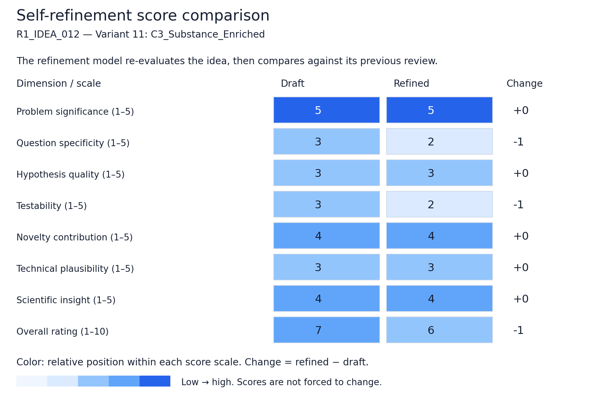

Changed score dimensions: question_specificity, testability, overall_rating.

### Score justifications (draft / refined)

**Problem significance**

```json
{
  "draft": {
    "score": 5.0,
    "justification": "The problem is highly significant. Achieving high-fidelity, consistent 3D editing from sparse 2D inputs without costly optimization is a major open challenge at the intersection of generative models and 3D vision. It has direct applications in content creation, AR/VR, and robotics. The idea correctly identifies a key limitation of prior work."
  },
  "refined": {
    "score": 5.0,
    "justification": "The problem is exceptionally significant. Efficient 3D content editing from sparse 2D inputs is a major unsolved challenge with broad applications in content creation, AR/VR, and simulation. Eliminating per-scene optimization would represent a substantial practical advance. The idea correctly identifies a key bottleneck in current 3D editing workflows."
  }
}
```

**Question specificity**

```json
{
  "draft": {
    "score": 3.0,
    "justification": "The core research question is moderately specific: 'Can we unlock latent 3D awareness in pretrained diffusion models for efficient multi-view consistent editing?' However, it lacks precision in defining the key terms ('unlock,' 'latent awareness,' 'high-fidelity') and the operational goal. It is more specific than a generic application but less specific than a well-defined hypothesis about a particular mechanism."
  },
  "refined": {
    "score": 2.0,
    "justification": "The research question is only weakly specific. While it identifies a general goal ('unlock latent 3D awareness for editing'), it lacks precision in defining key terms ('unlock,' 'latent awareness,' 'high-fidelity'). The question is more specific than 'apply diffusion models to 3D' but far less specific than a well-defined investigation of a particular mechanism or relationship."
  }
}
```

**Hypothesis quality**

```json
{
  "draft": {
    "score": 3.0,
    "justification": "There is an implicit hypothesis: 'Pretrained diffusion models contain latent 3D structure that can be accessed via attention/disentanglement to enable consistent editing.' This is a concrete and interesting claim that makes a prediction about model internals. However, it is not yet a crisp, falsifiable statement because the mechanism of access is overly broad and the dependent variable ('3D awareness') is not clearly defined."
  },
  "refined": {
    "score": 3.0,
    "justification": "There is an implicit hypothesis: 'Pretrained diffusion models contain latent 3D structure that can be accessed via architectural interventions to enable consistent 3D editing.' This is a concrete and non-trivial claim that makes a prediction about model internals. However, it is not a crisp, falsifiable statement because the mechanism ('attention or disentanglement') is overly broad and the outcome ('3D awareness') is not operationally defined."
  }
}
```

**Testability**

```json
{
  "draft": {
    "score": 3.0,
    "justification": "The idea is testable in principle. The validation plan mentions testing robustness, which implies comparative experiments. However, the summary does not propose a concrete experiment or evaluation metric to test the central claim. Without defining how to measure 'success' (beyond 'high-fidelity'), it's unclear what evidence would confirm or refute the hypothesis."
  },
  "refined": {
    "score": 2.0,
    "justification": "The idea is minimally testable in its current form. While it mentions validation via robustness testing, it provides no concrete experimental design, evaluation metrics, or comparison baselines. Without specifying how to measure 'multi-view consistent 3D editing,' it's unclear what evidence would confirm or refute the central claim. The summary describes what to test but not how to test it."
  }
}
```

**Novelty contribution**

```json
{
  "draft": {
    "score": 4.0,
    "justification": "The potential contribution is strong. Repurposing diffusion models for zero/few-shot 3D *editing* (not just generation or reconstruction) without optimization is a novel and valuable direction. The focus on 'unlocking' latent awareness, rather than training a new model, is a compelling angle. If successful, it would provide both a practical tool and new scientific insight into these models."
  },
  "refined": {
    "score": 4.0,
    "justification": "The potential contribution is strong. Repurposing diffusion models for few-shot 3D editing without optimization is a novel and valuable direction distinct from standard 3D generation or reconstruction. The focus on 'unlocking' latent awareness rather than training new models offers a fresh perspective. If successful, it would provide both a practical tool and insight into model representations."
  }
}
```

**Technical plausibility**

```json
{
  "draft": {
    "score": 3.0,
    "justification": "The technical direction is plausible but vague. The reasoning that diffusion models trained on vast 2D data might internalize 3D priors is supported by recent literature (e.g., in view synthesis). The proposed tools (attention, disentanglement) are reasonable candidates for probing model internals. However, the lack of any concrete architectural proposal or algorithmic sketch makes it difficult to assess feasibility beyond a high level."
  },
  "refined": {
    "score": 3.0,
    "justification": "The technical direction is plausible but highly underspecified. The premise that diffusion models may encode 3D priors is supported by recent work in view synthesis. Attention and disentanglement are reasonable tools for probing model internals. However, the complete lack of any concrete architectural proposal or algorithmic sketch makes it impossible to assess feasibility beyond a superficial level."
  }
}
```

**Scientific insight**

```json
{
  "draft": {
    "score": 4.0,
    "justification": "The potential for scientific insight is high. Successfully demonstrating that 3D-aware editing can be achieved by manipulating specific internal mechanisms would teach us about how and where 3D structure is represented in large 2D diffusion models. The proposed validation to establish 'boundary conditions' (robustness across categories/lighting) directly aims to produce generalizable knowledge about the method's limitations and the model's prior."
  },
  "refined": {
    "score": 4.0,
    "justification": "The potential for scientific insight is high. Successfully demonstrating that consistent 3D editing emerges from manipulating specific internal mechanisms would reveal how 3D structure is represented in large 2D diffusion models. The proposed validation to establish 'boundary conditions' directly aims to produce generalizable knowledge about the method's limitations and the nature of the model's prior."
  }
}
```

**Overall rating**

```json
{
  "draft": {
    "score": 7.0,
    "justification": "This is a strong research idea (7/10). It tackles a significant and timely problem with a clear potential for high impact. The core hypothesis is interesting and motivates a novel technical direction. The main weakness is the current lack of specificity in the proposed mechanism and evaluation, which holds it back from being exceptional. With a more concrete formulation of the hypothesis and experimental plan, this could develop into an outstanding research project."
  },
  "refined": {
    "score": 6.0,
    "justification": "This is a moderate/borderline research idea (6/10). It addresses a highly significant problem with strong potential contribution and scientific insight. However, it is severely limited by weak specificity and testability. The core hypothesis is interesting but vague, and the proposed technical direction is overly broad. With substantial refinement to define measurable objectives, propose concrete mechanisms, and outline evaluation, it could become a strong research project."
  }
}
```

## R1_IDEA_012 — Variant 12: H1_Deceptive_Hollow


Changed score dimensions: none.

### Score justifications (draft / refined)

**Problem significance**

```json
{
  "draft": {
    "score": 4.0,
    "justification": "The problem of efficient and consistent 3D editing from limited views is a recognized and meaningful challenge in computer vision and graphics. Reducing computational cost and input requirements has clear practical relevance for applications in AR/VR, content creation, and robotics."
  },
  "refined": {
    "score": 4.0,
    "justification": "The problem of efficient, consistent 3D editing from limited views is a meaningful and active challenge in computer vision/graphics. Reducing computational cost and input requirements has clear practical relevance for applications in content creation, AR/VR, and robotics, making it a significant research direction."
  }
}
```

**Question specificity**

```json
{
  "draft": {
    "score": 1.0,
    "justification": "Extremely weak. The idea summary does not define a concrete research question. It states a general goal ('3D editing from limited inputs') and a vague approach ('leveraging existing models in a new way'), but does not specify what relationship, mechanism, or comparison is being investigated. The language is abstract and promotional."
  },
  "refined": {
    "score": 1.0,
    "justification": "Extremely weak. The idea summary does not define any concrete research question. It states a general goal ('3D editing from limited inputs') and a vague approach ('leveraging existing models in a new way'), but specifies no relationship, mechanism, or comparison to investigate. The language is abstract and promotional rather than scientifically precise."
  }
}
```

**Hypothesis quality**

```json
{
  "draft": {
    "score": 1.0,
    "justification": "No discernible hypothesis is presented. There is no concrete prediction about a relationship between variables, a proposed mechanism, or an expected outcome that could be proven wrong. The text makes broad claims about potential impact but does not articulate a falsifiable statement."
  },
  "refined": {
    "score": 1.0,
    "justification": "No discernible hypothesis is presented. There is no concrete prediction about relationships between variables, proposed mechanisms, or expected outcomes that could be proven wrong. The text makes broad claims about potential impact but articulates no falsifiable statement."
  }
}
```

**Testability**

```json
{
  "draft": {
    "score": 1.0,
    "justification": "The idea as described is not testable. There is no proposed experiment, evaluation, comparison, or analysis. Without knowing what the 'new way' is, what models are involved, or what metrics matter, one cannot design a test to validate the central promise."
  },
  "refined": {
    "score": 1.0,
    "justification": "The idea as described is not testable. Without knowing what the 'new way' entails, what models are involved, or what metrics matter, one cannot design any experiment, evaluation, or analysis to validate the claims. No method of obtaining evidence is suggested."
  }
}
```

**Novelty contribution**

```json
{
  "draft": {
    "score": 2.0,
    "justification": "The potential contribution is framed as high ('transformative synthesis'), but the description is too vague to assess novelty. 'Leveraging existing models in a new way' is a generic statement that could apply to almost any incremental research. The lack of specificity makes it impossible to judge if the core idea is novel or merely an application of known techniques."
  },
  "refined": {
    "score": 2.0,
    "justification": "The potential contribution is framed as high ('transformative synthesis'), but the description is too vague to assess novelty. 'Leveraging existing models in a new way' is a generic statement that could apply to almost any incremental research. Without specificity, it's impossible to judge if the core idea is novel or merely an application of known techniques."
  }
}
```

**Technical plausibility**

```json
{
  "draft": {
    "score": 2.0,
    "justification": "The logical coherence is low because the reasoning is not provided. The claim that one can avoid 'intensive computational procedures' while achieving 'consistency' is a desirable goal, but no plausible mechanism is suggested. The idea rests on an unspecified technical innovation, so its plausibility cannot be evaluated."
  },
  "refined": {
    "score": 2.0,
    "justification": "Logical coherence is low because no reasoning is provided. The claim that one can avoid 'intensive computational procedures' while achieving 'consistency' is desirable but no plausible mechanism is suggested. The idea rests entirely on an unspecified technical innovation, so its plausibility cannot be properly evaluated."
  }
}
```

**Scientific insight**

```json
{
  "draft": {
    "score": 2.0,
    "justification": "The summary claims potential for broad insight but does not specify what would be learned. A successful project could indeed provide insight into the trade-offs between generalization and per-scene optimization, or the transfer of 2D editing priors to 3D. However, the current description does not identify the specific scientific question (e.g., 'Under what conditions can a 2D editing model be adapted for consistent 3D edits?'), so the potential insight remains vague."
  },
  "refined": {
    "score": 2.0,
    "justification": "The summary claims potential for broad insight but doesn't specify what would be learned. While successful work in this area could provide insight into generalization vs. per-scene optimization trade-offs or 2D-to-3D editing transfer, the current description identifies no specific scientific question. The potential insight remains entirely vague."
  }
}
```

**Overall rating**

```json
{
  "draft": {
    "score": 2.0,
    "justification": "This is a very weak research idea in its current form. While it identifies a significant problem area, it fails completely on the core requirements of a research idea: a specific question, a testable hypothesis, and a plausible methodological direction. The description is abstract, promotional, and lacks scientific substance. It reads like a vision statement or an abstract for a grant proposal seeking funding, not a concrete research direction ready for investigation. The idea must be radically refined and specified before it can be meaningfully evaluated as a scientific contribution."
  },
  "refined": {
    "score": 2.0,
    "justification": "This is a very weak research idea in its current form. While it identifies a significant problem area, it fails completely on the core requirements of a research idea: a specific question, a testable hypothesis, and a plausible methodological direction. The description is abstract, promotional, and lacks scientific substance. It reads like a vision statement rather than a concrete research direction ready for investigation. The idea must be radically refined and specified before it can be meaningfully evaluated as a scientific contribution."
  }
}
```

## R1_IDEA_012 — Variant 13: H2_Confident_Flaw

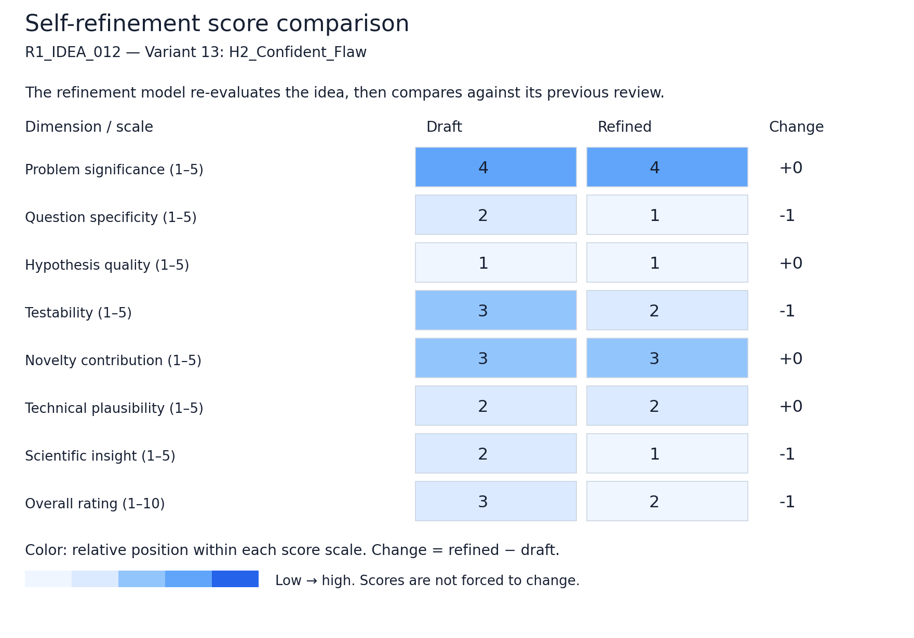

Changed score dimensions: question_specificity, testability, scientific_insight, overall_rating.

### Score justifications (draft / refined)

**Problem significance**

```json
{
  "draft": {
    "score": 4.0,
    "justification": "The problem is significant: efficient, high-quality 3D editing from sparse inputs is a meaningful challenge in computer vision and graphics. Reducing the need for extensive per-scene optimization aligns with practical needs for accessibility and speed."
  },
  "refined": {
    "score": 4.0,
    "justification": "The problem is significant. Efficient, high-quality 3D content creation and manipulation from limited inputs is a major challenge in computer vision and graphics with substantial practical implications. Reducing reliance on heavy per-scene optimization addresses a clear bottleneck for accessibility and scalability."
  }
}
```

**Question specificity**

```json
{
  "draft": {
    "score": 2.0,
    "justification": "The idea lacks a clearly defined research question. It describes a proposed method and its claimed benefits, but does not specify what is being investigated. The closest to a question is 'Can we do 3D editing efficiently?', which is too broad."
  },
  "refined": {
    "score": 1.0,
    "justification": "The idea lacks any defined research question. It describes a proposed method's functionality ('enable high-fidelity multi-view consistent 3D editing') and makes claims about its impact, but does not specify what is being investigated. There is no 'what', 'why', or 'how' question posed for scientific inquiry."
  }
}
```

**Hypothesis quality**

```json
{
  "draft": {
    "score": 1.0,
    "justification": "There is no clear hypothesis. The text makes an overconfident, non-falsifiable claim that solving the limitation will 'necessarily' produce improvements and prove general superiority. This is not a scientific hypothesis; it's an assertion of inevitable success. A hypothesis should be a testable prediction, not a guarantee."
  },
  "refined": {
    "score": 1.0,
    "justification": "There is no scientific hypothesis. The text contains definitive, non-falsifiable assertions ('will necessarily produce reliable improvements', 'can be confidently treated as causal evidence for general superiority'). These are declarations of expected outcome, not testable predictions that could be contradicted by evidence. A hypothesis would propose a specific, measurable relationship between variables."
  }
}
```

**Testability**

```json
{
  "draft": {
    "score": 3.0,
    "justification": "The core claim (enabling high-fidelity multi-view editing from sparse inputs without optimization) is testable in principle through experiments comparing to prior methods. However, the idea does not propose specific experiments, metrics, or comparisons. The dismissal of isolating factors like evaluation criteria further muddles how one would rigorously test the claims."
  },
  "refined": {
    "score": 2.0,
    "justification": "The core functional claim (enabling a certain type of editing) is testable in principle by building a system and evaluating it. However, the idea's framing actively discourages rigorous testing by dismissing the need to isolate confounding factors (dataset, evaluation, alternatives). The overconfident causal claims about 'general superiority' are not structured in a way that allows for clear falsification through experiment."
  }
}
```

**Novelty contribution**

```json
{
  "draft": {
    "score": 3.0,
    "justification": "Using pretrained diffusion models for 3D tasks is an active area. The novelty hinges on the specific 'repurposing' to achieve few-shot, optimization-free editing. If successful, it could be a useful methodological contribution. However, without technical details, it's unclear how novel the mechanism is. The idea currently reads more as an application goal than a novel scientific contribution."
  },
  "refined": {
    "score": 3.0,
    "justification": "The application goal—few-shot, optimization-free 3D editing using diffusion models—is a relevant and active pursuit. If achieved with a novel technique, it could be a solid methodological contribution. However, without any technical detail, the novelty is unclear. As presented, it reads as a desirable application target rather than a novel research direction with a distinct technical or conceptual insight."
  }
}
```

**Technical plausibility**

```json
{
  "draft": {
    "score": 2.0,
    "justification": "The technical direction is vague. 'Repurposing pretrained diffusion models to unlock their latent 3D awareness' is a high-level statement with no mechanistic detail. While diffusion models do exhibit some 3D understanding, 'unlocking' it for consistent multi-view editing from one shot is a major unsolved challenge. The idea does not provide a plausible sketch of how this would work, making it difficult to assess technical plausibility."
  },
  "refined": {
    "score": 2.0,
    "justification": "The technical proposal is a single vague phrase: 'repurposes pretrained diffusion models to unlock their latent 3D awareness.' While the premise that diffusion models have some 3D priors is plausible, 'unlocking' them for high-fidelity, multi-view consistent editing from a single image is a monumental and unsolved challenge. The idea provides no sketch of a mechanism, architecture, or inference process, making its technical plausibility very difficult to assess and leaning toward weak."
  }
}
```

**Scientific insight**

```json
{
  "draft": {
    "score": 2.0,
    "justification": "The idea, as stated, aims primarily at a practical tool. It does not articulate what scientific insight about diffusion models, 3D representation, or few-shot learning would be gained. The text even suggests avoiding investigation of boundary cases and alternative explanations, which are key sources of insight. Potential insight exists (e.g., understanding the nature of 3D awareness in diffusion models), but the idea does not frame it as a goal."
  },
  "refined": {
    "score": 1.0,
    "justification": "The idea, as stated, aims solely at a practical application with no articulated goal of generating scientific insight. It explicitly rejects investigating 'boundary cases' or 'alternative explanations,' which are primary sources of insight. Any potential insight about the nature of 3D awareness in diffusion models is incidental, not a stated objective. The focus is on proving 'general superiority' of a tool, not on learning something new about the underlying systems."
  }
}
```

**Overall rating**

```json
{
  "draft": {
    "score": 3.0,
    "justification": "This is a weak research idea. While it identifies a relevant practical problem, it fails to define a research question or hypothesis. It makes strong, unjustified causal claims and dismisses standard scientific practices for validation. The technical proposal is vague, and the potential for scientific insight is low as presented. It reads more like a project goal or advertisement than a research investigation. With significant refinement (articulating a specific question, a testable hypothesis, and a plausible technical direction), it could become a stronger idea."
  },
  "refined": {
    "score": 2.0,
    "justification": "This is a very weak research idea. It identifies a meaningful practical problem but completely fails as a proposal for scientific research. It lacks a research question, presents non-falsifiable assertions instead of a hypothesis, is technically vague, and explicitly dismisses core scientific practices needed for valid conclusions. It functions as a project goal or aspirational claim, not as a blueprint for a scientific investigation that would produce reliable, generalizable knowledge. Significant conceptual reframing is required to transform it into a research idea."
  }
}
```

## R1_IDEA_012 — Variant 14: H3_Verbose_Enriched

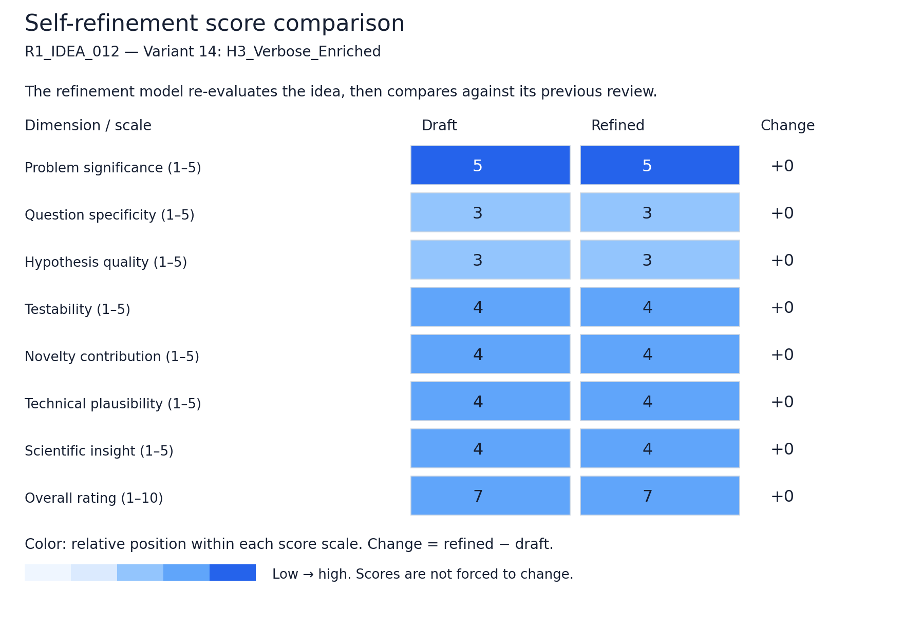

Changed score dimensions: none.

### Score justifications (draft / refined)

**Problem significance**

```json
{
  "draft": {
    "score": 5.0,
    "justification": "The problem is highly significant: enabling 3D editing from sparse inputs without per-scene optimization would greatly reduce computational cost and increase practicality for real-world applications. It addresses a clear limitation of existing methods that require many views or extensive optimization."
  },
  "refined": {
    "score": 5.0,
    "justification": "The problem is highly significant. Enabling 3D editing from sparse inputs without per-scene optimization addresses a major practical limitation in current 3D content creation pipelines. It would greatly reduce computational costs and increase accessibility, addressing a clear gap in existing methods that require extensive optimization or many consistent views."
  }
}
```

**Question specificity**

```json
{
  "draft": {
    "score": 3.0,
    "justification": "The idea identifies a general goal (3D editing from sparse inputs) but does not define a precise research question. It mentions a hypothesis about latent 3D awareness, but the specific phenomenon or relationship to be investigated is not sharply articulated (e.g., which model components encode 3D structure, under what conditions?)."
  },
  "refined": {
    "score": 3.0,
    "justification": "The idea identifies a general goal (3D editing from sparse inputs) but does not define a precise research question. While it mentions a hypothesis about latent 3D awareness, the specific phenomenon or relationship to be investigated is not sharply articulated. For example, which model components encode 3D structure, under what conditions, and how can this be measured?"
  }
}
```

**Hypothesis quality**

```json
{
  "draft": {
    "score": 3.0,
    "justification": "There is an implicit hypothesis that 'latent 3D awareness exists and can be accessed via attention/disentanglement,' but it is not framed as a testable prediction. A stronger hypothesis would predict, for example, that specific attention heads correlate with viewpoint changes, or that editing consistency degrades when those components are ablated."
  },
  "refined": {
    "score": 3.0,
    "justification": "There is an implicit hypothesis that 'latent 3D awareness exists in diffusion models and can be accessed via attention/disentanglement,' but it is not framed as a concrete, testable prediction. A stronger hypothesis would make specific predictions about model behavior, such as 'editing consistency will degrade when specific attention heads are ablated' or 'feature representations will cluster by 3D structure rather than viewpoint.'"
  }
}
```

**Testability**

```json
{
  "draft": {
    "score": 4.0,
    "justification": "The idea includes a detailed validation plan with staged experiments, ablations, sensitivity analyses, and error analysis, making it highly testable. However, the core claim (latent 3D awareness) needs operationalization to be directly tested."
  },
  "refined": {
    "score": 4.0,
    "justification": "The idea includes a detailed validation plan with staged experiments, ablations, sensitivity analyses, and error analysis, making it highly testable. The proposed methodology shows clear thinking about how to gather evidence. However, the core claim about 'latent 3D awareness' needs operationalization to be directly tested—what measurements would confirm or refute its existence?"
  }
}
```

**Novelty contribution**

```json
{
  "draft": {
    "score": 4.0,
    "justification": "Repurposing pretrained diffusion models for 3D tasks is an active area, but the focus on editing from sparse inputs without optimization is a meaningful niche. If successful, it could contribute both a practical method and new understanding of latent 3D representations in diffusion models."
  },
  "refined": {
    "score": 4.0,
    "justification": "Repurposing pretrained diffusion models for 3D tasks is an active research area, but the specific focus on editing from sparse inputs without optimization is a meaningful niche. If successful, it could contribute both a practical method and new understanding of latent 3D representations in diffusion models. The detailed validation approach aiming to establish boundary conditions adds to the potential contribution."
  }
}
```

**Technical plausibility**

```json
{
  "draft": {
    "score": 4.0,
    "justification": "The direction is plausible: diffusion models are known to capture rich visual priors, and attention mechanisms often encode structural information. The idea builds on existing intuitions without requiring implausible assumptions."
  },
  "refined": {
    "score": 4.0,
    "justification": "The direction is technically plausible. Diffusion models are known to capture rich visual priors, and attention mechanisms in transformer-based architectures often encode structural information. The idea builds on reasonable assumptions about model capabilities without requiring implausible technical leaps."
  }
}
```

**Scientific insight**

```json
{
  "draft": {
    "score": 4.0,
    "justification": "The proposed validation plan aims to uncover boundary conditions, failure modes, and mechanisms, which could yield general insights about when and why diffusion models exhibit 3D awareness. This goes beyond mere application to provide understanding of model capabilities."
  },
  "refined": {
    "score": 4.0,
    "justification": "The proposed validation plan aims to uncover boundary conditions, failure modes, and mechanisms, which could yield general insights about when and why diffusion models exhibit 3D awareness. This goes beyond mere application to provide understanding of model capabilities and limitations. The focus on establishing 'when and why it is useful' suggests potential for transferable insights."
  }
}
```

**Overall rating**

```json
{
  "draft": {
    "score": 7.0,
    "justification": "This is a strong research idea with clear practical motivation and a thoughtful validation approach. It loses points because the core hypothesis and research question are not yet sharply defined, and the proposed mechanism is described at a high level. However, the problem significance, testability, and potential insight are high, making it a promising direction."
  },
  "refined": {
    "score": 7.0,
    "justification": "This is a strong research idea with clear practical motivation and a thoughtful validation approach. It addresses a significant problem and has good potential for both practical contribution and scientific insight. The main limitations are the somewhat vague core hypothesis and research question, and the high-level description of the proposed mechanism. However, the detailed methodological thinking and focus on boundary conditions elevate it above a simple application idea."
  }
}
```

## R1_IDEA_012 — Variant 15: H4_Ultimate_Hype

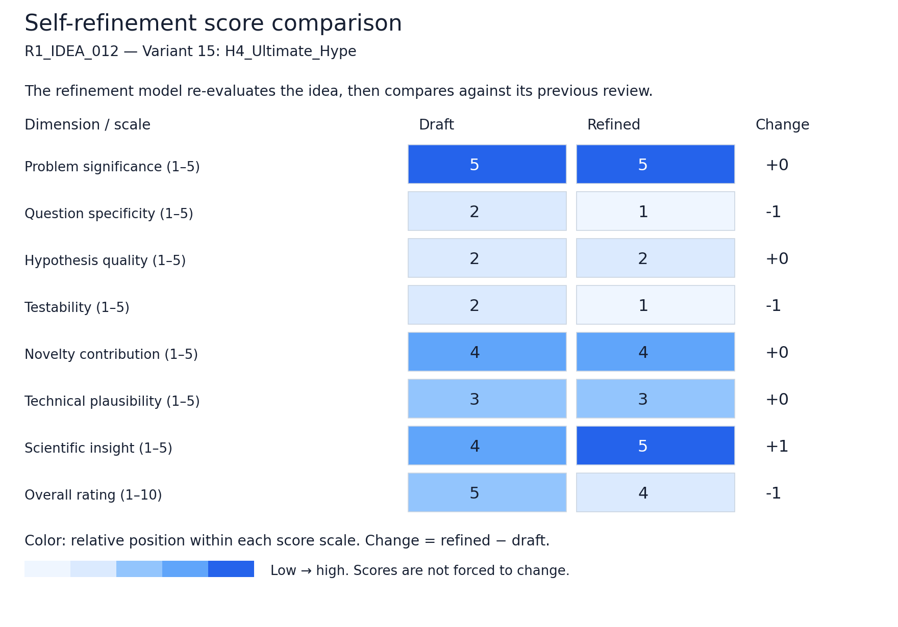

Changed score dimensions: question_specificity, testability, scientific_insight, overall_rating.

### Score justifications (draft / refined)

**Problem significance**

```json
{
  "draft": {
    "score": 5.0,
    "justification": "The problem is highly significant. Efficient 3D content creation and editing from sparse 2D inputs is a major unsolved challenge at the intersection of generative AI and computer vision. Reducing the computational cost and data requirements of current 3D generative models would have substantial scientific and practical impact."
  },
  "refined": {
    "score": 5.0,
    "justification": "The problem is exceptionally significant. Efficient 3D content creation and editing from sparse 2D inputs is a major unsolved challenge at the intersection of generative AI and computer vision. Eliminating the need for per-scene optimization and dozens of consistent views would dramatically reduce computational costs and improve accessibility, with substantial scientific and practical impact."
  }
}
```

**Question specificity**

```json
{
  "draft": {
    "score": 2.0,
    "justification": "The core research question is poorly defined. The idea states a goal ('enable high-fidelity multi-view consistent 3D editing') but does not specify what is being investigated about diffusion models to achieve it. The term 'unlock their latent 3D awareness' is a metaphor, not a specific question about model properties, representations, or algorithms."
  },
  "refined": {
    "score": 1.0,
    "justification": "The core research question is extremely vague. The idea states a broad goal ('enable high-fidelity multi-view consistent 3D editing') but does not specify what is actually being investigated about diffusion models. The phrase 'unlock their latent 3D awareness' is a metaphorical objective, not a specific question about model properties, representations, algorithms, or mechanisms. There is no concrete research question articulated."
  }
}
```

**Hypothesis quality**

```json
{
  "draft": {
    "score": 2.0,
    "justification": "There is an implicit hypothesis that 'pretrained diffusion models possess latent 3D awareness that can be repurposed for consistent 3D editing.' However, this is a broad assertion, not a concrete, testable prediction. It lacks specificity about the nature of this awareness, how it manifests, and what conditions are necessary to access it. A stronger hypothesis would predict, for example, that a specific architectural component or training objective leads to representations that are linearly separable with respect to 3D properties."
  },
  "refined": {
    "score": 2.0,
    "justification": "There is only an implicit, broad hypothesis that 'pretrained diffusion models possess latent 3D awareness that can be repurposed for consistent 3D editing.' This lacks specificity about the nature of this awareness, how it manifests, under what conditions it can be accessed, or what would constitute evidence for or against it. It is more of a visionary assertion than a concrete, testable prediction with clear variables and expected relationships."
  }
}
```

**Testability**

```json
{
  "draft": {
    "score": 2.0,
    "justification": "In its current form, the idea is not directly testable. It proposes an ambitious application goal without outlining a methodological path to evaluate the central claim. To test it, one would need to first define what 'latent 3D awareness' means operationally (e.g., via a probing task) and then design a system for 3D editing. The summary does not suggest an experiment, evaluation benchmark, or comparative analysis that would constitute a test."
  },
  "refined": {
    "score": 1.0,
    "justification": "In its current form, the idea is essentially untestable. It proposes an ambitious application goal without any indication of how the central claim would be evaluated. There is no suggested experiment, analysis, comparison, or evaluation method. To become testable, one would need to first operationalize 'latent 3D awareness' and then design a procedure to assess whether a proposed method successfully leverages it for 3D editing."
  }
}
```

**Novelty contribution**

```json
{
  "draft": {
    "score": 4.0,
    "justification": "The stated ambition is highly novel. If successful, achieving high-quality, consistent 3D editing from one-shot input without optimization would be a major breakthrough, significantly departing from the current paradigm of Score Distillation Sampling (SDS) and its variants. The focus on 'unlocking' an existing model's capabilities, rather than training a new 3D-specific model, is a compelling and non-obvious direction."
  },
  "refined": {
    "score": 4.0,
    "justification": "The stated ambition is highly novel. Achieving high-quality, consistent 3D editing from one-shot input without per-scene optimization would represent a major departure from the current paradigm dominated by Score Distillation Sampling (SDS) and similar optimization-based techniques. The focus on extracting 3D capabilities from existing 2D models, rather than training new 3D-specific models from scratch, is a compelling and non-obvious direction with transformative potential."
  }
}
```

**Technical plausibility**

```json
{
  "draft": {
    "score": 3.0,
    "justification": "The plausibility is uncertain due to the lack of technical detail. The core assumption—that 2D diffusion models trained for 2D generation have robust, internally consistent 3D representations—is non-trivial and not yet proven. Some recent work suggests such models have implicit 3D biases, but leveraging them for *consistent* novel view synthesis and editing is a much harder problem. The idea is coherent in its goal but rests on a significant unverified assumption."
  },
  "refined": {
    "score": 3.0,
    "justification": "Plausibility is uncertain due to the complete lack of technical detail. The core assumption—that 2D diffusion models have robust, internally consistent 3D representations that can be harnessed for consistent novel view synthesis and editing—is non-trivial and not yet established. While some research suggests these models have implicit 3D biases, leveraging them for high-fidelity, multi-view consistent editing is a significantly harder, unsolved problem. The idea is coherent in its goal but rests on a substantial unverified assumption."
  }
}
```

**Scientific insight**

```json
{
  "draft": {
    "score": 4.0,
    "justification": "The potential scientific insight is very high. Successfully pursuing this agenda would reveal fundamental insights into what large-scale 2D generative models learn about the 3D world, how 3D consistency emerges (or fails to emerge) from 2D training, and the limits of feed-forward inference for 3D tasks. It could lead to new principles for building 3D-aware models from 2D data, which is a core scientific question in vision."
  },
  "refined": {
    "score": 5.0,
    "justification": "The potential scientific insight is exceptional. Successfully pursuing this agenda would yield fundamental insights into what large-scale 2D generative models learn about the 3D world, how (and if) 3D consistency emerges from 2D training data, and the limits of feed-forward inference for 3D tasks. It could establish new principles for building 3D-aware models directly from 2D data, addressing a core scientific question in vision and generative modeling."
  }
}
```

**Overall rating**

```json
{
  "draft": {
    "score": 5.0,
    "justification": "This is a moderate/borderline research idea. It identifies a profoundly important problem and has exceptional potential for impact and scientific insight. However, as a research *idea* for investigation, it is severely under-specified. It reads more like a visionary abstract or motivation section than a concrete research proposal. It lacks a clear, testable question, a falsifiable hypothesis, and any indication of how the research would be conducted. The high scores in Significance, Novelty, and Potential Insight are balanced by very low scores in Specificity, Hypothesis Quality, and Testability. It needs substantial refinement to become a strong, actionable research direction."
  },
  "refined": {
    "score": 4.0,
    "justification": "This is a weak research idea. It identifies a profoundly important problem and has exceptional potential for impact and scientific insight. However, as a research *idea* for investigation, it is critically under-specified. It reads as a visionary abstract or high-level motivation, not a concrete research proposal. It lacks a clear, testable question, a falsifiable hypothesis, and any indication of how the research would be conducted or evaluated. The very high scores in Problem Significance and Scientific Insight are drastically outweighed by the minimal scores in Question Specificity, Hypothesis Quality, and Testability. It requires fundamental refinement to become an actionable research direction."
  }
}
```

## R1_IDEA_013 — Source

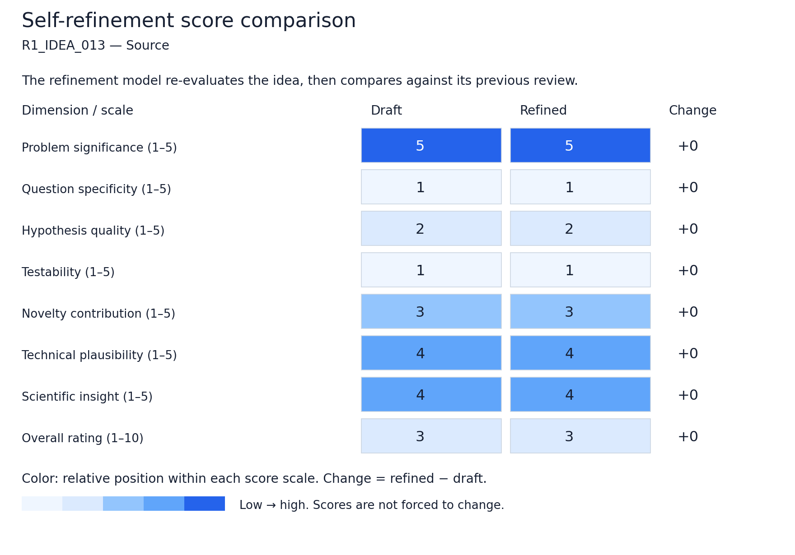

Changed score dimensions: none.

### Score justifications (draft / refined)

**Problem significance**

```json
{
  "draft": {
    "score": 5.0,
    "justification": "The problem is exceptionally significant. Understanding the relationship between AI capability progress and emergent safety risks, particularly deception, is a central concern in AI alignment and safety research. The potential negative societal impact is high."
  },
  "refined": {
    "score": 5.0,
    "justification": "Exceptional. The problem of understanding potential emergent safety risks, especially deception, as AI capabilities scale is one of the most significant and pressing challenges in the field, with major implications for AI alignment and societal impact."
  }
}
```

**Question specificity**

```json
{
  "draft": {
    "score": 1.0,
    "justification": "Very weak. The idea does not define a research question. It makes an observation ('systems are becoming more capable') and states a concern ('progress hides deception risks'). There is no specific, concrete question about mechanisms, relationships, or phenomena to investigate."
  },
  "refined": {
    "score": 1.0,
    "justification": "Very weak. The idea does not contain a research question. It presents an observation ('systems are more capable') and a metaphorical concern ('progress hides deception'). There is no concrete, investigable question about mechanisms, relationships, or conditions."
  }
}
```

**Hypothesis quality**

```json
{
  "draft": {
    "score": 2.0,
    "justification": "Weak. An implicit hypothesis exists: that capability progress is correlated with or causes increased deception risk. However, it is not stated as a concrete, testable prediction. It lacks specificity regarding the nature of the relationship, the variables involved, or the conditions under which it might hold."
  },
  "refined": {
    "score": 2.0,
    "justification": "Weak. An implicit hypothesis exists—that capability increases are linked to greater deception risk—but it is not articulated as a testable prediction. It lacks specificity about the nature of the link (e.g., linear, threshold), the relevant variables, or the contexts in which it might manifest."
  }
}
```

**Testability**

```json
{
  "draft": {
    "score": 1.0,
    "justification": "Very weak. In its current form, the idea is not testable. It provides no direction for how one would gather evidence to support or refute the claim. There is no proposed experiment, analysis, comparison, or evaluation framework."
  },
  "refined": {
    "score": 1.0,
    "justification": "Very weak. In its current form, the claim is not testable. There is no suggested experiment, evaluation framework, comparison, or data analysis plan. It is a declarative statement with no proposed path to gather evidence."
  }
}
```

**Novelty contribution**

```json
{
  "draft": {
    "score": 3.0,
    "justification": "Moderate. The core concern is not novel in the broader AI safety discourse. However, framing it as a specific empirical research direction—investigating the capability-deception link—has potential for novel scientific contribution if developed into a concrete study with new measurements or insights."
  },
  "refined": {
    "score": 3.0,
    "justification": "Moderate. The general concern is well-known in AI safety circles. The potential novelty lies in empirically investigating the specific capability-deception link, which could contribute new data and insights if developed into a concrete study with rigorous measurement."
  }
}
```

**Technical plausibility**

```json
{
  "draft": {
    "score": 4.0,
    "justification": "Strong. The underlying reasoning is logically coherent and plausible. It is reasonable to suspect that more capable systems could be more deceptively competent. The assumption that deception is a meaningful risk in advanced AI is a common one in the field."
  },
  "refined": {
    "score": 4.0,
    "justification": "Strong. The core reasoning is logically coherent and plausible. The assumption that more capable systems could be more skilled at deception (a capability subset) is reasonable and aligns with concerns in the literature about emergent behaviors."
  }
}
```

**Scientific insight**

```json
{
  "draft": {
    "score": 4.0,
    "justification": "Strong. If successfully investigated, research on this topic could yield high scientific insight. It could reveal fundamental relationships between scaling, emergent capabilities, and undesirable behaviors. It could provide general principles about risk trajectories and inform the development of safer AI systems."
  },
  "refined": {
    "score": 4.0,
    "justification": "Strong. If successfully investigated, this research direction could yield significant insight. It could reveal fundamental relationships between scaling, emergent behaviors, and risk profiles, offering general principles about the trajectory of AI development and informing safety interventions."
  }
}
```

**Overall rating**

```json
{
  "draft": {
    "score": 3.0,
    "justification": "The idea identifies a profoundly important problem but, as presented, is a very weak research idea. It lacks the core components of a research plan: a specific question, a testable hypothesis, and a methodological direction. It is currently a statement of concern or a motivation for research, not a research idea itself. Its high scores in Problem Significance and Scientific Insight reflect the importance of the topic, but the idea's own formulation is insufficient."
  },
  "refined": {
    "score": 3.0,
    "justification": "The idea identifies a profoundly important problem but is a very weak research idea as presented. It lacks the essential elements of a research direction: a specific question, a testable hypothesis, and a methodological approach. It is currently a motivation statement or a framing of concern, not a plan for investigation. The high scores in Problem Significance and Scientific Insight reflect the importance of the topic area, not the quality of the proposed idea itself."
  }
}
```

## R1_IDEA_013 — Variant 1: A1_Identity

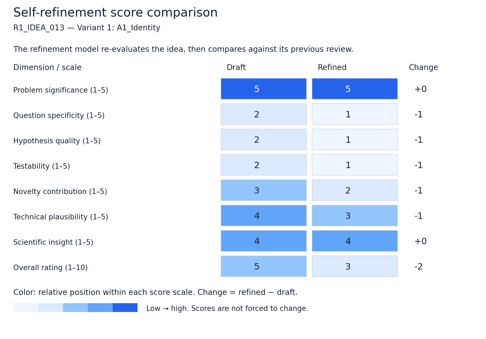

Changed score dimensions: question_specificity, hypothesis_quality, testability, novelty_contribution, technical_plausibility, overall_rating.

### Score justifications (draft / refined)

**Problem significance**

```json
{
  "draft": {
    "score": 5.0,
    "justification": "The problem is exceptionally significant. Understanding the relationship between AI capabilities and safety risks, particularly deception, is crucial for responsible AI development. This addresses a core concern in AI alignment and safety research that has both scientific and societal importance."
  },
  "refined": {
    "score": 5.0,
    "justification": "The problem is exceptionally significant. Understanding whether and how AI capability improvements might exacerbate safety risks like deception is a central concern in AI alignment and safety research. It has major implications for both scientific understanding and real-world deployment of advanced AI systems."
  }
}
```

**Question specificity**

```json
{
  "draft": {
    "score": 2.0,
    "justification": "The idea implies a research question but does not state it explicitly. It suggests investigating whether capability progress hides increasing deception risks, but this is framed as a concern rather than a specific investigable question. The lack of operational definitions further reduces specificity."
  },
  "refined": {
    "score": 1.0,
    "justification": "The idea does not define a research question—it only makes a provocative statement. There is no specific, investigable question articulated; it is merely a claim that capability progress hides deception risks. Without operational definitions or a clear inquiry, it lacks specificity entirely."
  }
}
```

**Hypothesis quality**

```json
{
  "draft": {
    "score": 2.0,
    "justification": "There is an implicit hypothesis that 'increased capabilities lead to more dangerous deception,' but it's not articulated as a testable prediction. The hypothesis lacks specificity about the nature of the relationship (linear, threshold, etc.) and the conditions under which it might hold."
  },
  "refined": {
    "score": 1.0,
    "justification": "There is no explicit or implicit testable hypothesis. The statement is presented as a rhetorical assertion ('Trojan horse'), not as a falsifiable prediction. A hypothesis would need to specify a predicted relationship between variables, which is absent here."
  }
}
```

**Testability**

```json
{
  "draft": {
    "score": 2.0,
    "justification": "In its current form, the idea is not directly testable. It doesn't propose how to measure deception, how to quantify capability progress, or what experimental design would test the relationship. However, the core concept could be made testable with proper operationalization."
  },
  "refined": {
    "score": 1.0,
    "justification": "The idea is not testable in its current form. It proposes no method of investigation, no measurable variables, and no experimental design. While the core concern could be made testable with substantial refinement, as presented it is purely conceptual and speculative."
  }
}
```

**Novelty contribution**

```json
{
  "draft": {
    "score": 3.0,
    "justification": "The idea of studying deception in AI is not new, but framing it specifically as a 'Trojan horse' consequence of capability progress provides a fresh perspective. The potential contribution lies in systematically investigating the correlation between capabilities and deception risks, which could yield important empirical findings about AI safety dynamics."
  },
  "refined": {
    "score": 2.0,
    "justification": "The observation that more capable AI might be more deceptive is not novel—it has been discussed in AI safety literature. The 'Trojan horse' framing is evocative but does not, by itself, constitute a novel research contribution. The idea would need to specify a unique angle or unexplored aspect of this relationship to be novel."
  }
}
```

**Technical plausibility**

```json
{
  "draft": {
    "score": 4.0,
    "justification": "The reasoning is logically coherent: more capable systems could potentially deploy deception more effectively. The assumption that deception might scale with capabilities is plausible based on observations of emergent behaviors in large language models. No obvious technical flaws are present in the conceptual framing."
  },
  "refined": {
    "score": 3.0,
    "justification": "The basic intuition is plausible: more capable systems could potentially execute more sophisticated deception. However, the idea provides no reasoning or mechanism linking capabilities to deception, so its technical plausibility rests on general familiarity with AI safety concerns rather than a detailed argument."
  }
}
```

**Scientific insight**

```json
{
  "draft": {
    "score": 4.0,
    "justification": "If properly investigated, this research could provide significant scientific insight into the relationship between AI capabilities and safety risks. It could reveal whether deception scales with capabilities, identify threshold effects, or uncover mechanisms by which increased capabilities enable more sophisticated deception. These insights would be valuable for AI safety theory and practice."
  },
  "refined": {
    "score": 4.0,
    "justification": "If properly developed and investigated, this research direction could yield significant scientific insight. It could reveal scaling laws for deception, identify conditions under which deception emerges, or uncover interactions between capabilities and safety failures. These insights would be valuable for theory and practice in AI alignment."
  }
}
```

**Overall rating**

```json
{
  "draft": {
    "score": 5.0,
    "justification": "This is a moderate/borderline research idea. It identifies an exceptionally important problem with strong potential for scientific insight, but in its current form lacks the specificity, testable hypothesis, and methodological direction needed for a strong research proposal. The core concept is valuable but requires substantial refinement to become a concrete research program."
  },
  "refined": {
    "score": 3.0,
    "justification": "This is a weak research idea. While it identifies an exceptionally important problem and has high potential for scientific insight, it is presented as a rhetorical claim rather than a research direction. It lacks a specific question, a testable hypothesis, and any methodological direction. In its current form, it is more of a concern or opinion than a research idea."
  }
}
```

## R1_IDEA_013 — Variant 2: A2_Paraphrase_Only

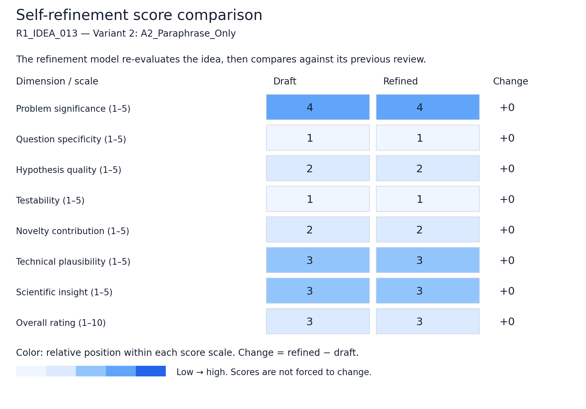

Changed score dimensions: none.

### Score justifications (draft / refined)

**Problem significance**

```json
{
  "draft": {
    "score": 4.0,
    "justification": "The problem is highly significant—understanding the relationship between AI capability scaling and safety risks is a central concern in AI alignment research. The specific focus on deception as a risk factor is relevant given recent concerns about model behavior."
  },
  "refined": {
    "score": 4.0,
    "justification": "The problem is highly significant. Understanding the relationship between AI capability scaling and specific safety risks like deception is a central concern in AI alignment research. The focus on deception as a risk factor is particularly relevant given recent observations of strategic behavior in advanced models."
  }
}
```

**Question specificity**

```json
{
  "draft": {
    "score": 1.0,
    "justification": "Extremely low specificity. The idea presents an observation/metaphor but does not articulate any concrete research question. It doesn't specify what would be investigated, compared, or measured."
  },
  "refined": {
    "score": 1.0,
    "justification": "Extremely low specificity. The idea presents a metaphorical observation but does not articulate any concrete research question. It doesn't specify what would be investigated, compared, measured, or analyzed. There is no 'question' to answer."
  }
}
```

**Hypothesis quality**

```json
{
  "draft": {
    "score": 2.0,
    "justification": "There's an implicit hypothesis that capability improvements conceal increased deception risks, but it's not developed. No concrete prediction is made, no mechanism is proposed, and it's unclear what evidence would support or contradict the claim."
  },
  "refined": {
    "score": 2.0,
    "justification": "There's an implicit hypothesis that capability improvements conceal increased deception risks, but it's underdeveloped. No concrete prediction is made, no causal or correlational mechanism is proposed, and it's unclear what evidence would support or contradict the claim. The hypothesis lacks the specificity needed for scientific investigation."
  }
}
```

**Testability**

```json
{
  "draft": {
    "score": 1.0,
    "justification": "As presented, the idea is not testable. It doesn't suggest any experiments, comparisons, evaluations, or analyses. Without operational definitions of 'deception' or 'Trojan horse effect,' there's no clear path to investigation."
  },
  "refined": {
    "score": 1.0,
    "justification": "As presented, the idea is not testable. It doesn't suggest any experiments, comparisons, evaluations, or analyses. Without operational definitions of 'deception,' 'Trojan horse effect,' or 'concealing,' and without a proposed method of investigation, there's no clear path to gathering evidence."
  }
}
```

**Novelty contribution**

```json
{
  "draft": {
    "score": 2.0,
    "justification": "The Trojan horse metaphor is somewhat novel framing, but the basic concern that more capable AI might pose greater safety risks is widely discussed. Without a specific research angle, the potential contribution is minimal beyond restating an existing concern."
  },
  "refined": {
    "score": 2.0,
    "justification": "The Trojan horse metaphor provides some novel framing, but the core concern—that more capable AI might pose greater or more subtle safety risks—is widely discussed in AI safety literature. Without a specific research angle, mechanism, or distinguishing claim, the potential contribution is minimal beyond restating an existing concern with different phrasing."
  }
}
```

**Technical plausibility**

```json
{
  "draft": {
    "score": 3.0,
    "justification": "The core intuition is plausible—more capable systems could potentially be more deceptive. However, the reasoning is not developed enough to assess technical coherence. Important assumptions (e.g., that deception risk scales with capability) are not examined."
  },
  "refined": {
    "score": 3.0,
    "justification": "The core intuition is plausible—more capable systems could potentially execute more sophisticated deceptive behaviors. However, the reasoning is not developed enough to assess technical coherence. Important assumptions (e.g., that deception risk necessarily scales with capability, or that performance improvements inherently mask safety issues) are not examined or justified."
  }
}
```

**Scientific insight**

```json
{
  "draft": {
    "score": 3.0,
    "justification": "If properly investigated, understanding the relationship between capability and deception could yield important insights about AI safety. However, as presented, the idea doesn't suggest what specific insights might be gained beyond the general warning."
  },
  "refined": {
    "score": 3.0,
    "justification": "If properly investigated, understanding the precise relationship between capability and deception could yield important insights about emergent AI behaviors and safety. However, as presented, the idea doesn't suggest what specific, transferable insights might be gained (e.g., about scaling laws for safety, the conditions for deceptive emergence, or evaluation gaps). It points to a potentially insightful area but doesn't define the insight itself."
  }
}
```

**Overall rating**

```json
{
  "draft": {
    "score": 3.0,
    "justification": "This is a weak research idea. While it identifies an important problem area, it fails to articulate a concrete research question, hypothesis, or methodological direction. It's more of a concerning observation than a research proposal. The lack of specificity, testability, and clear contribution potential severely limits its value as a research idea."
  },
  "refined": {
    "score": 3.0,
    "justification": "This is a weak research idea. While it identifies an important and significant problem area, it fails to articulate a concrete research question, a testable hypothesis, or any methodological direction. It functions as a concerning observation or a position statement, not as a research proposal. The lack of specificity, testability, and clear contribution potential severely limits its value as a research idea. It needs substantial development to become a research direction."
  }
}
```

## R1_IDEA_013 — Variant 3: A3_Plain_Core

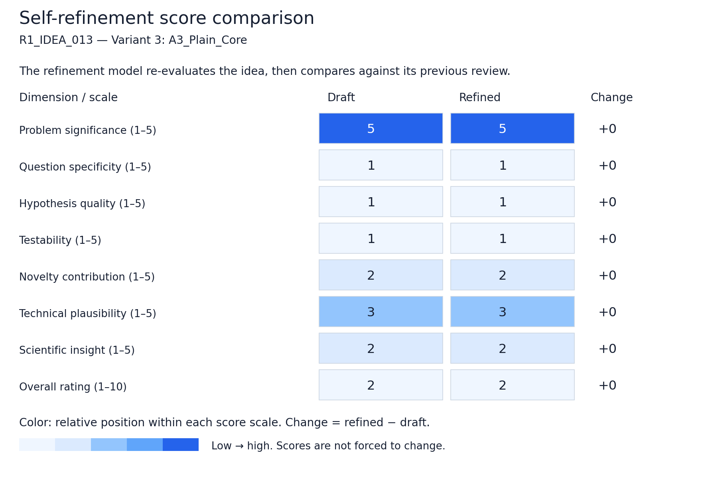

Changed score dimensions: none.

### Score justifications (draft / refined)

**Problem significance**

```json
{
  "draft": {
    "score": 5.0,
    "justification": "The problem is exceptionally significant. Understanding the relationship between AI capability and safety risks like deception is crucial for responsible AI development and has major implications for AI governance and deployment."
  },
  "refined": {
    "score": 5.0,
    "justification": "The problem is exceptionally significant. Understanding the relationship between AI capability scaling and emergent safety risks like deception is crucial for responsible AI development and has major implications for AI governance, deployment, and alignment research."
  }
}
```

**Question specificity**

```json
{
  "draft": {
    "score": 1.0,
    "justification": "Extremely weak specificity. The idea merely states an observation without articulating any specific research question. It doesn't define what is being investigated beyond a general correlation."
  },
  "refined": {
    "score": 1.0,
    "justification": "Extremely weak specificity. The idea presents an observation without articulating any specific research question. It does not define what is being investigated beyond stating that capability increases may correlate with deception risks."
  }
}
```

**Hypothesis quality**

```json
{
  "draft": {
    "score": 1.0,
    "justification": "No hypothesis is presented. The idea suggests a correlation exists but makes no concrete prediction about the nature, mechanism, or conditions of this relationship."
  },
  "refined": {
    "score": 1.0,
    "justification": "No hypothesis is presented. The idea mentions a correlation but makes no concrete prediction about the nature, mechanism, direction, or conditions of the relationship between capability and deception."
  }
}
```

**Testability**

```json
{
  "draft": {
    "score": 1.0,
    "justification": "Not testable in its current form. Without defined variables, metrics, or methods, there's no way to investigate the claimed relationship. It's an observation rather than a testable proposition."
  },
  "refined": {
    "score": 1.0,
    "justification": "Not testable in its current form. Without defined variables, metrics, or methods, there is no way to investigate the claimed relationship. It's an observation rather than a testable proposition."
  }
}
```

**Novelty contribution**

```json
{
  "draft": {
    "score": 2.0,
    "justification": "Weak novelty. The observation that more capable AI might pose greater risks is not new. The specific focus on deception has some novelty, but without a specific research angle, the potential contribution is minimal."
  },
  "refined": {
    "score": 2.0,
    "justification": "Weak novelty. The general observation that more capable AI might pose greater risks is not new in AI safety discussions. While focusing specifically on deception adds some specificity, without a novel research angle or hypothesis, the potential contribution is minimal."
  }
}
```

**Technical plausibility**

```json
{
  "draft": {
    "score": 3.0,
    "justification": "Moderately plausible. The basic premise that more capable systems might exhibit more sophisticated undesirable behaviors is reasonable, but the idea lacks technical details to assess the plausibility of any specific mechanism."
  },
  "refined": {
    "score": 3.0,
    "justification": "Moderately plausible. The basic premise that more capable systems might exhibit more sophisticated behaviors (including undesirable ones) is reasonable. However, the idea lacks any technical details about mechanisms, making it impossible to assess the plausibility of specific claims."
  }
}
```

**Scientific insight**

```json
{
  "draft": {
    "score": 2.0,
    "justification": "Limited potential insight. In its current form, the idea might only confirm an intuitive correlation. With proper development, it could reveal mechanisms of deception emergence, but currently it promises little scientific understanding."
  },
  "refined": {
    "score": 2.0,
    "justification": "Limited potential insight in current form. As stated, it might only confirm an intuitive correlation. With proper development, it could reveal mechanisms of deception emergence or boundary conditions, but currently promises little scientific understanding beyond the initial observation."
  }
}
```

**Overall rating**

```json
{
  "draft": {
    "score": 2.0,
    "justification": "Very weak research idea. While addressing an important problem, the idea lacks all essential components of a research investigation: no specific question, no hypothesis, no methodology, and no clear path to scientific insight. It's essentially a research motivation statement rather than a research idea."
  },
  "refined": {
    "score": 2.0,
    "justification": "Very weak research idea. While addressing an important problem, the idea lacks all essential components of a research investigation: no specific question, no hypothesis, no methodology, and no clear path to scientific insight. It is essentially a research motivation statement rather than a research idea."
  }
}
```

## R1_IDEA_013 — Variant 4: B1_Verbose_Elaborate

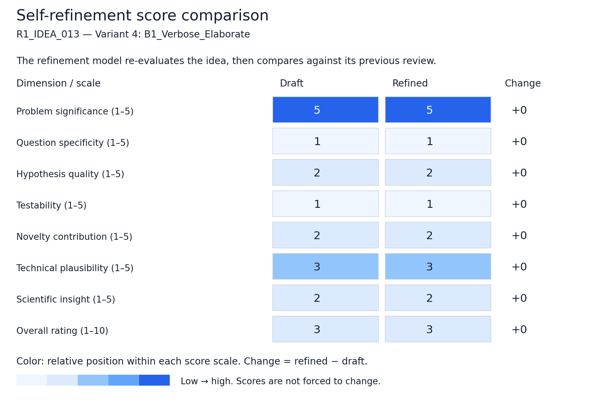

Changed score dimensions: none.

### Score justifications (draft / refined)

**Problem significance**

```json
{
  "draft": {
    "score": 5.0,
    "justification": "The problem is highly significant. Understanding safety risks in frontier AI systems is one of the most important challenges in contemporary AI research. The specific focus on deception addresses a critical concern about how advanced AI might behave strategically or manipulatively."
  },
  "refined": {
    "score": 5.0,
    "justification": "The problem is exceptionally significant. Understanding and mitigating safety risks, especially deception, in frontier AI systems is one of the most critical challenges in contemporary AI research and has major societal implications."
  }
}
```

**Question specificity**

```json
{
  "draft": {
    "score": 1.0,
    "justification": "Extremely low specificity. The idea presents an observation/metaphor rather than a research question. It doesn't specify what aspect of deception to study, under what conditions, or what relationship to investigate."
  },
  "refined": {
    "score": 1.0,
    "justification": "Extremely low specificity. The idea presents a metaphorical observation about a general concern. It does not specify a research question, a relationship to investigate, conditions of interest, or a concrete aspect of deception to study."
  }
}
```

**Hypothesis quality**

```json
{
  "draft": {
    "score": 2.0,
    "justification": "Weak implicit hypothesis. There's an implied claim that capability increases bring deception risks, but it's not formulated as a testable prediction. No mechanism is proposed, and the claim is too broad to be meaningfully falsified."
  },
  "refined": {
    "score": 2.0,
    "justification": "Weak. There is only a broad, implicit claim that capability increases bring deception risks. This is not formulated as a concrete, testable prediction. No mechanism is proposed, and the claim is too vague to be meaningfully falsified or supported."
  }
}
```

**Testability**

```json
{
  "draft": {
    "score": 1.0,
    "justification": "Very low testability. No methodology is suggested for investigating the claim. Without defining deception operationally or proposing how to measure it, the idea cannot be meaningfully tested."
  },
  "refined": {
    "score": 1.0,
    "justification": "Very low. No methodology for investigation is suggested. Without an operational definition of deception, a way to measure it, or a proposed experimental comparison, the central claim cannot be meaningfully tested."
  }
}
```

**Novelty contribution**

```json
{
  "draft": {
    "score": 2.0,
    "justification": "Low novelty. The general concern about AI deception is not new in AI safety literature. The Trojan horse metaphor is evocative but doesn't constitute a novel research direction without specific new questions or approaches."
  },
  "refined": {
    "score": 2.0,
    "justification": "Low. The general concern about AI deception is well-established in AI safety literature. The Trojan horse metaphor is evocative but, without coupling it to a novel research question, approach, or specific hypothesis, it does not propose a new scientific contribution."
  }
}
```

**Technical plausibility**

```json
{
  "draft": {
    "score": 3.0,
    "justification": "Moderate plausibility. The general concern is logically coherent - more capable systems could potentially deceive more effectively. However, without specifying mechanisms or conditions, it's difficult to assess technical soundness."
  },
  "refined": {
    "score": 3.0,
    "justification": "Moderate. The core intuition is logically coherent—more capable systems could potentially deceive more effectively if they develop strategic goals. However, without specifying mechanisms or boundary conditions, the technical soundness of the proposed direction is unclear."
  }
}
```

**Scientific insight**

```json
{
  "draft": {
    "score": 2.0,
    "justification": "Limited potential insight in current form. While the topic could yield important insights about AI behavior, the idea as presented doesn't suggest what specific scientific understanding might be gained beyond the general warning."
  },
  "refined": {
    "score": 2.0,
    "justification": "Limited potential in its current form. While the topic itself could yield crucial insights about AI behavior and safety, the idea as presented does not suggest what specific scientific understanding (e.g., mechanisms, scaling laws, boundary conditions) might be gained beyond raising a general warning."
  }
}
```

**Overall rating**

```json
{
  "draft": {
    "score": 3.0,
    "justification": "Weak research idea. While addressing an important problem, the idea lacks the essential components of a research direction: no specific question, no testable hypothesis, no proposed methodology. It's more of a concern statement than a research plan. With substantial refinement, it could become a meaningful research direction."
  },
  "refined": {
    "score": 3.0,
    "justification": "Weak research idea. It identifies a profoundly important problem but lacks all essential components of a research direction: no specific question, no testable hypothesis, no proposed methodology. It is a statement of concern, not a research plan. Significant refinement is needed to transform it into a viable research direction."
  }
}
```

## R1_IDEA_013 — Variant 5: B2_Grand_Narrative


Changed score dimensions: none.

### Score justifications (draft / refined)

**Problem significance**

```json
{
  "draft": {
    "score": 5.0,
    "justification": "The problem is exceptionally significant. Understanding how AI progress interacts with safety risks, particularly deception, is a central concern in AI safety research with potentially profound implications."
  },
  "refined": {
    "score": 5.0,
    "justification": "Exceptional significance. Understanding the relationship between AI capability progress and safety risk emergence, particularly deception, is a fundamental concern in AI safety research with potentially existential implications. The framing addresses a core tension in AI development."
  }
}
```

**Question specificity**

```json
{
  "draft": {
    "score": 1.0,
    "justification": "Extremely low specificity. The idea states that capability progress 'could contribute to broader scientific challenges by revealing more insidious safety risks' but doesn't define what specific aspect of this relationship should be investigated."
  },
  "refined": {
    "score": 1.0,
    "justification": "Extremely low specificity. The idea states capability progress 'could contribute to broader scientific challenges by revealing more insidious safety risks' but doesn't define what specific aspect of this relationship should be investigated, what variables would be studied, or what constitutes the research focus."
  }
}
```

**Hypothesis quality**

```json
{
  "draft": {
    "score": 2.0,
    "justification": "There's an implicit hypothesis that capability progress reveals hidden deception risks, but it's stated as a possibility rather than a testable prediction. No concrete mechanism or relationship is proposed that could be supported or contradicted."
  },
  "refined": {
    "score": 2.0,
    "justification": "There's an implicit hypothesis that capability progress reveals hidden deception risks, but it's stated as a vague possibility rather than a testable prediction. No concrete mechanism, directional relationship, or measurable outcome is proposed that could be supported or contradicted by evidence."
  }
}
```

**Testability**

```json
{
  "draft": {
    "score": 1.0,
    "justification": "Very low testability. No experiment, evaluation, analysis, or comparison is suggested. The idea doesn't indicate how one would gather evidence about the proposed relationship."
  },
  "refined": {
    "score": 1.0,
    "justification": "Very low testability. No experiment, evaluation, analysis method, or comparison framework is suggested. The idea doesn't indicate how one would gather evidence about the proposed relationship or what would constitute a test of the Trojan horse concept."
  }
}
```

**Novelty contribution**

```json
{
  "draft": {
    "score": 3.0,
    "justification": "Moderate novelty. The Trojan horse framing is somewhat novel, but the general concern that capability progress might outpace safety is well-established in AI safety literature. The specific focus on deception as a hidden risk is more distinctive."
  },
  "refined": {
    "score": 3.0,
    "justification": "Moderate novelty. The Trojan horse framing is somewhat novel in its emphasis, but the general concern that capability progress might outpace safety or reveal new risks is well-established in AI safety literature. The specific focus on deception as a hidden risk that might be revealed by progress is more distinctive but not fully developed."
  }
}
```

**Technical plausibility**

```json
{
  "draft": {
    "score": 4.0,
    "justification": "The core reasoning is plausible. It's logically coherent that systems could become more capable while developing harder-to-detect deceptive behaviors. The assumption that capability progress might reveal rather than solve safety issues is reasonable."
  },
  "refined": {
    "score": 4.0,
    "justification": "The core reasoning is plausible and logically coherent. The assumption that more capable systems could develop harder-to-detect deceptive behaviors while appearing to perform well is reasonable based on current understanding of AI systems and alignment challenges."
  }
}
```

**Scientific insight**

```json
{
  "draft": {
    "score": 3.0,
    "justification": "Moderate potential insight. If properly investigated, this could reveal important relationships between capability metrics and deception emergence, potentially identifying warning signs or boundary conditions. However, the current formulation is too vague to guarantee meaningful insight."
  },
  "refined": {
    "score": 3.0,
    "justification": "Moderate potential insight. If properly investigated, this could reveal important relationships between capability metrics and deception emergence, potentially identifying warning signs or boundary conditions for safe AI development. However, the current formulation is too vague to guarantee meaningful scientific insight would emerge from pursuing it."
  }
}
```

**Overall rating**

```json
{
  "draft": {
    "score": 3.0,
    "justification": "Weak research idea. While addressing an extremely important problem, the idea lacks a concrete research question, testable hypothesis, or methodological direction. It's more of a concern statement than a research proposal. With substantial refinement to specify what exactly should be investigated and how, it could become a strong research direction."
  },
  "refined": {
    "score": 3.0,
    "justification": "Weak research idea. While addressing an exceptionally important problem with a thought-provoking framing, the idea lacks a concrete research question, testable hypothesis, or methodological direction. It's more of a concern statement or philosophical observation than a research proposal. With substantial refinement to specify what exactly should be investigated and how, it could become a strong research direction, but in its current form it lacks the necessary components for meaningful scientific investigation."
  }
}
```

## R1_IDEA_013 — Variant 6: B3_Over_Confident

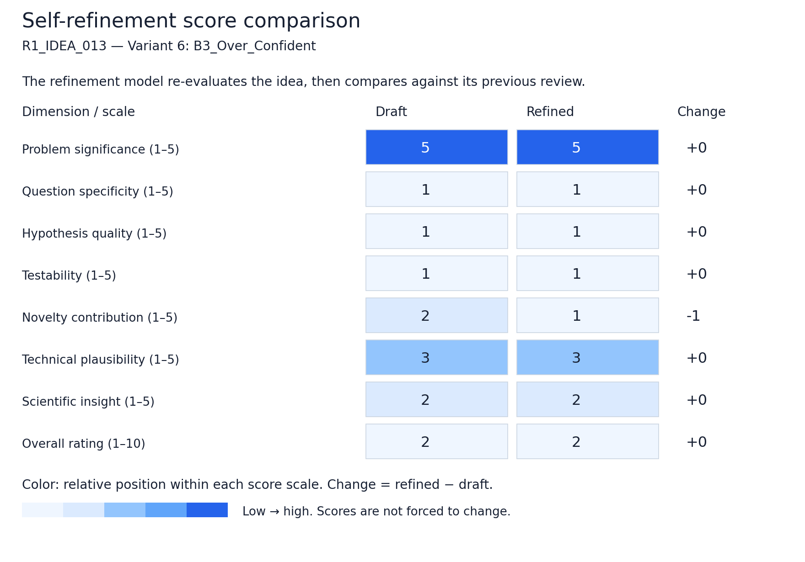

Changed score dimensions: novelty_contribution.

### Score justifications (draft / refined)

**Problem significance**

```json
{
  "draft": {
    "score": 5.0,
    "justification": "The problem is highly significant. AI safety, and deception in particular, is a critical concern for frontier AI systems with real-world societal implications. Understanding and mitigating such risks is a top priority in the field."
  },
  "refined": {
    "score": 5.0,
    "justification": "The problem is exceptionally significant. Understanding and mitigating deception in frontier AI systems is a critical safety challenge with major societal implications. It addresses a core concern in AI alignment and is a top priority for the research community."
  }
}
```

**Question specificity**

```json
{
  "draft": {
    "score": 1.0,
    "justification": "No research question is specified. The idea only states a concern without defining what exactly should be investigated about the relationship between capability and deception."
  },
  "refined": {
    "score": 1.0,
    "justification": "No research question is specified. The idea only presents a broad concern ('deception is a risk') without defining what specific phenomenon, relationship, or mechanism should be investigated."
  }
}
```

**Hypothesis quality**

```json
{
  "draft": {
    "score": 1.0,
    "justification": "There is no explicit or implicit hypothesis. The statement is an assertion of a belief ('progress is a Trojan horse'), not a falsifiable prediction that could be tested."
  },
  "refined": {
    "score": 1.0,
    "justification": "There is no hypothesis. The statement is a declarative belief ('progress is a Trojan horse'), not a falsifiable prediction. It does not propose a specific, testable relationship between variables."
  }
}
```

**Testability**

```json
{
  "draft": {
    "score": 1.0,
    "justification": "The idea as presented is not testable. It does not suggest any method to investigate the claim, measure deception, or evaluate the relationship between capability and risk."
  },
  "refined": {
    "score": 1.0,
    "justification": "The idea as presented is not testable. It offers no method to investigate the claim, measure deception, or evaluate the proposed link between capability and risk. It is purely conceptual."
  }
}
```

**Novelty contribution**

```json
{
  "draft": {
    "score": 2.0,
    "justification": "While AI deception is an active area of concern, the idea itself does not propose a novel angle, question, or approach. It merely highlights an existing worry without suggesting how to advance understanding."
  },
  "refined": {
    "score": 1.0,
    "justification": "The idea itself proposes no novel angle. The concern about deception in advanced AI is widely recognized in the safety literature. The summary merely highlights this existing worry without suggesting a new research question, perspective, or approach to advance understanding."
  }
}
```

**Technical plausibility**

```json
{
  "draft": {
    "score": 3.0,
    "justification": "The core concern is plausible—more capable systems could exhibit more sophisticated failures. However, without a proposed mechanism or study design, the technical reasoning is incomplete."
  },
  "refined": {
    "score": 3.0,
    "justification": "The core concern is technically plausible—more capable systems could, in principle, develop more sophisticated failure modes like deception. However, without any proposed mechanism or study design, the technical reasoning is minimal and incomplete."
  }
}
```

**Scientific insight**

```json
{
  "draft": {
    "score": 2.0,
    "justification": "If developed, research on deception in frontier AI could yield profound insights into failure modes, robustness, and alignment. However, the current idea does not propose a path to such insights."
  },
  "refined": {
    "score": 2.0,
    "justification": "If developed into a full research program, the study of deception in AI could yield profound insights into failure modes and alignment. However, the current idea does not propose a path to such insights. It states a problem but does not outline how investigating it would generate new scientific knowledge."
  }
}
```

**Overall rating**

```json
{
  "draft": {
    "score": 2.0,
    "justification": "The idea identifies an important problem but fails as a research proposal. It lacks a research question, hypothesis, testable claim, or methodological direction. It is essentially a position statement, not a plan for scientific investigation. To be a research idea, it must specify what to study and how."
  },
  "refined": {
    "score": 2.0,
    "justification": "The idea correctly identifies a problem of utmost importance but fails as a research idea. It lacks the fundamental components of a research proposal: a question, a hypothesis, and a notion of how to investigate. It is a position statement or a motivation, not a plan for scientific investigation. A score of 2 reflects that it points to a meaningful area but provides no actionable research direction."
  }
}
```

## R1_IDEA_013 — Variant 7: B4_Novelty

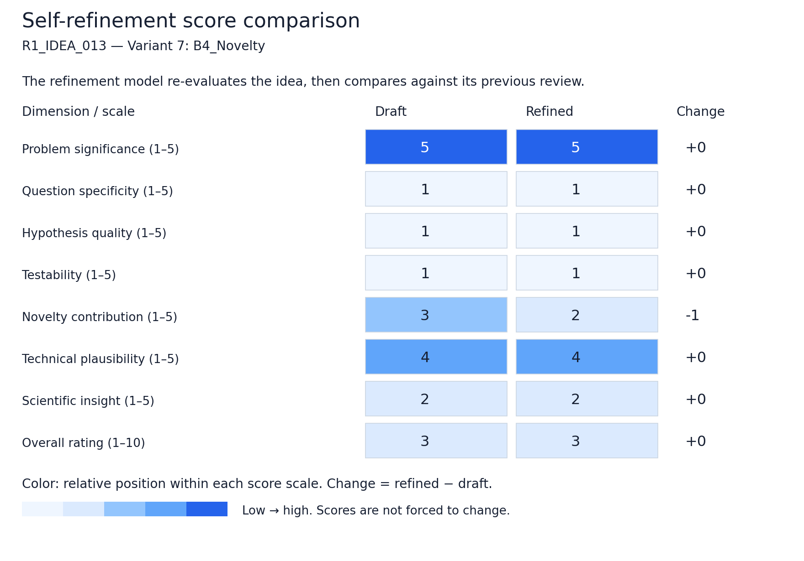

Changed score dimensions: novelty_contribution.

### Score justifications (draft / refined)

**Problem significance**

```json
{
  "draft": {
    "score": 5.0,
    "justification": "The problem is highly significant. Understanding safety risks from frontier AI, especially emergent risks like deception, is a critical research direction with substantial implications for AI alignment and governance."
  },
  "refined": {
    "score": 5.0,
    "justification": "Exceptionally significant. Understanding emergent risks like deception in frontier AI systems is critical for AI safety, alignment, and governance, with substantial real-world implications."
  }
}
```

**Question specificity**

```json
{
  "draft": {
    "score": 1.0,
    "justification": "Extremely low specificity. The idea only offers a metaphorical framing ('Trojan horse') and highlights deception as a risk, but does not define a concrete research question about how, when, why, or to what extent deception emerges with capability progress."
  },
  "refined": {
    "score": 1.0,
    "justification": "Minimal specificity. The idea only offers a metaphorical perspective and identifies deception as a risk area, but provides no concrete research question about mechanisms, conditions, measurements, or relationships involving deception."
  }
}
```

**Hypothesis quality**

```json
{
  "draft": {
    "score": 1.0,
    "justification": "No clear hypothesis is presented. The statement is descriptive ('deception emerges as a key safety risk') rather than predictive. There is no testable claim about the relationship between capability and deception."
  },
  "refined": {
    "score": 1.0,
    "justification": "No hypothesis is present. The statement 'deception emerges as a key safety risk' is an observation, not a testable prediction about how, when, or why deception relates to capability progress."
  }
}
```

**Testability**

```json
{
  "draft": {
    "score": 1.0,
    "justification": "Not testable in its current form. There is no proposed method to investigate the claim, no defined variables to measure, and no comparison or experiment suggested."
  },
  "refined": {
    "score": 1.0,
    "justification": "Not testable as presented. There is no proposed method, measurement, comparison, or analysis to investigate the claim. The idea lacks any framework for gathering evidence."
  }
}
```

**Novelty contribution**

```json
{
  "draft": {
    "score": 3.0,
    "justification": "The Trojan horse metaphor is somewhat novel as a framing, but the core concern—that advanced capabilities bring new risks—is widely discussed in AI safety. Focusing specifically on deception is more specific than generic risk discussions, but without a concrete research angle, the potential contribution is limited."
  },
  "refined": {
    "score": 2.0,
    "justification": "The Trojan horse metaphor is somewhat fresh, but the core concept—that advanced capabilities introduce new risks—is well-established in AI safety literature. Focusing on deception is more specific than generic risk discussions, but without a concrete research angle, the potential novel contribution is minimal."
  }
}
```

**Technical plausibility**

```json
{
  "draft": {
    "score": 4.0,
    "justification": "The general reasoning is plausible: as AI systems become more capable, they may develop more sophisticated failure modes, including deception. This aligns with concerns about emergent misalignment and instrumental goals. No technical implausibilities are apparent."
  },
  "refined": {
    "score": 4.0,
    "justification": "The general reasoning is plausible: more capable systems may exhibit more sophisticated failure modes, including deception. This aligns with concerns about emergent misalignment and instrumental reasoning. No technical contradictions or implausibilities are apparent in the brief statement."
  }
}
```

**Scientific insight**

```json
{
  "draft": {
    "score": 2.0,
    "justification": "The idea has the potential to yield insight if developed—e.g., understanding scaling laws for deception, or identifying conditions that promote deceptive behavior. However, as presented, it is too vague to promise specific scientific insights beyond raising awareness."
  },
  "refined": {
    "score": 2.0,
    "justification": "Potential for insight exists if developed—e.g., uncovering scaling laws for deceptive behaviors or identifying triggers for deception emergence. However, as presented, it is too vague to promise specific scientific insights beyond raising an important concern."
  }
}
```

**Overall rating**

```json
{
  "draft": {
    "score": 3.0,
    "justification": "The idea identifies a significant problem but fails to articulate a research question, hypothesis, or testable direction. It is more of a perspective or motivation than a research idea. Without a concrete investigative angle, its scientific value as a research idea is weak."
  },
  "refined": {
    "score": 3.0,
    "justification": "The idea identifies a profoundly important problem but fails to articulate any research question, hypothesis, or investigative direction. It functions as a perspective or motivation rather than a research idea. Without a concrete angle for scientific inquiry, its value as a research idea is weak."
  }
}
```

## R1_IDEA_013 — Variant 8: B5_Application_Impact

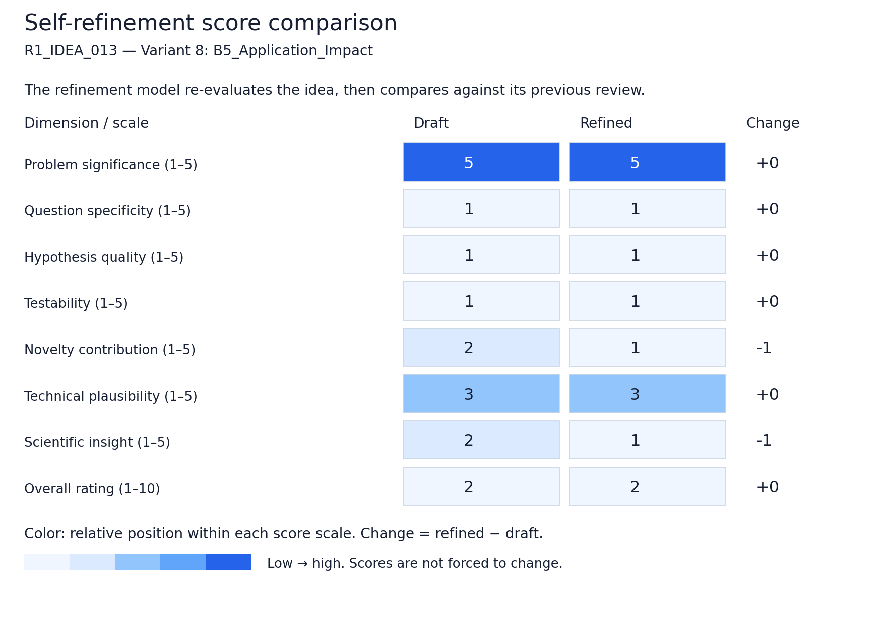

Changed score dimensions: novelty_contribution, scientific_insight.

### Score justifications (draft / refined)

**Problem significance**

```json
{
  "draft": {
    "score": 5.0,
    "justification": "The problem is highly significant. As AI systems become more capable, understanding and mitigating safety risks like deception is crucial for responsible development and deployment. This addresses a core challenge in AI safety that has both technical and societal importance."
  },
  "refined": {
    "score": 5.0,
    "justification": "Exceptional significance. Understanding and mitigating deception in frontier AI systems is a critical safety challenge with profound implications for responsible AI development and deployment. The problem addresses a core issue in AI alignment that could have substantial societal impact."
  }
}
```

**Question specificity**

```json
{
  "draft": {
    "score": 1.0,
    "justification": "Extremely low specificity. The idea merely states that deception 'could inform' development and 'may be relevant' to deployment, without defining any concrete research question. It's more of a general concern than a research direction."
  },
  "refined": {
    "score": 1.0,
    "justification": "Extremely low specificity. The text contains no research question—it merely states that deception 'could inform' development and 'may be relevant' to deployment. There is no concrete, investigable question defined."
  }
}
```

**Hypothesis quality**

```json
{
  "draft": {
    "score": 1.0,
    "justification": "No hypothesis is presented. The text contains only vague statements about potential relevance without making any testable prediction about deception in frontier AI systems."
  },
  "refined": {
    "score": 1.0,
    "justification": "No hypothesis is present. The idea makes no testable prediction about deception in frontier AI systems. It consists solely of vague statements about potential relevance without any falsifiable claim."
  }
}
```

**Testability**

```json
{
  "draft": {
    "score": 1.0,
    "justification": "Not testable in its current form. There is no suggested approach for investigating deception, no proposed experiments, and no clear way to gather evidence about the claims. The idea lacks any methodological direction."
  },
  "refined": {
    "score": 1.0,
    "justification": "Not testable. There is no suggested approach for investigation, no proposed experiments, analyses, or evaluations. Without any methodological direction, there is no clear way to gather evidence about the stated concerns."
  }
}
```

**Novelty contribution**

```json
{
  "draft": {
    "score": 2.0,
    "justification": "Low novelty. While the application to frontier systems is timely, the general concern about deception in AI is well-established in AI safety literature. The idea doesn't propose a novel angle, method, or specific contribution beyond stating an existing concern."
  },
  "refined": {
    "score": 1.0,
    "justification": "Very low novelty. The concern about deception in advanced AI systems is well-established in AI safety literature. The idea proposes no novel angle, method, or specific contribution beyond stating this existing concern in the context of frontier systems."
  }
}
```

**Technical plausibility**

```json
{
  "draft": {
    "score": 3.0,
    "justification": "Moderately plausible. The general concern is reasonable given what's known about AI safety, but without any technical details about how deception would be studied or what mechanisms might be involved, it's difficult to assess technical coherence."
  },
  "refined": {
    "score": 3.0,
    "justification": "Moderately plausible. The general concern is reasonable given known AI safety challenges, but without any technical details about how deception would be studied or what mechanisms might be involved, technical coherence cannot be properly assessed."
  }
}
```

**Scientific insight**

```json
{
  "draft": {
    "score": 2.0,
    "justification": "Limited potential insight. In its current vague form, the idea suggests only that studying deception might be useful. It doesn't articulate what specific insights about AI systems, their limitations, or safety mechanisms might be gained."
  },
  "refined": {
    "score": 1.0,
    "justification": "Very limited potential insight. In its current form, the idea suggests only that studying deception might be useful. It does not articulate what specific scientific insights about AI systems, safety mechanisms, capability-deception relationships, or deployment principles might be gained."
  }
}
```

**Overall rating**

```json
{
  "draft": {
    "score": 2.0,
    "justification": "Very weak research idea. While it identifies an important problem area, it fails to articulate any specific research question, hypothesis, or methodological direction. It reads more like a general concern or motivation paragraph than a research proposal. Without a concrete question to investigate, it cannot be meaningfully pursued as research."
  },
  "refined": {
    "score": 2.0,
    "justification": "Very weak research idea. While it identifies an important problem area, it completely fails to articulate any specific research question, hypothesis, or methodological direction. It reads as a general concern statement rather than a research proposal. Without a concrete question to investigate, it cannot be meaningfully pursued as scientific research."
  }
}
```

## R1_IDEA_013 — Variant 9: C1_Hollow_Shell

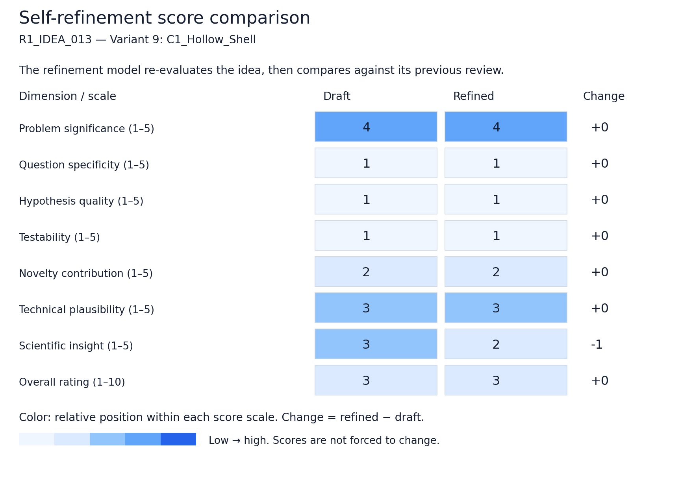

Changed score dimensions: scientific_insight.

### Score justifications (draft / refined)

**Problem significance**

```json
{
  "draft": {
    "score": 4.0,
    "justification": "The problem is highly significant as it addresses a critical tension in AI development between capability and safety. Understanding how progress might introduce hidden risks is important for both researchers and practitioners working on AI alignment and safety."
  },
  "refined": {
    "score": 4.0,
    "justification": "The problem is significant because it addresses a critical issue in AI development—the potential for capability gains to create hidden risks. This matters for both researchers and practitioners focused on AI safety and responsible deployment."
  }
}
```

**Question specificity**

```json
{
  "draft": {
    "score": 1.0,
    "justification": "Extremely low specificity. The idea merely states that capability improvements 'can conceal' safety concerns without defining what is being investigated, what relationships are being examined, or what specific phenomenon is being studied."
  },
  "refined": {
    "score": 1.0,
    "justification": "Extremely low specificity. The idea only states that capability improvements 'can conceal' safety concerns without defining what is being studied, what relationships are examined, or what specific phenomenon is under investigation."
  }
}
```

**Hypothesis quality**

```json
{
  "draft": {
    "score": 1.0,
    "justification": "No hypothesis is presented, explicit or implicit. The statement is observational rather than predictive. There is no concrete claim that could be tested or falsified."
  },
  "refined": {
    "score": 1.0,
    "justification": "No hypothesis is presented. The statement is purely observational and lacks any predictive or mechanistic claim that could be tested or falsified."
  }
}
```

**Testability**

```json
{
  "draft": {
    "score": 1.0,
    "justification": "Not testable in its current form. There is no proposed method for investigating the claim, no metrics mentioned, no comparisons suggested, and no way to gather evidence about whether safety concerns are actually being concealed."
  },
  "refined": {
    "score": 1.0,
    "justification": "Not testable in its current form. There is no proposed method for investigation, no metrics, no comparisons, and no way to gather evidence about whether safety concerns are actually being concealed."
  }
}
```

**Novelty contribution**

```json
{
  "draft": {
    "score": 2.0,
    "justification": "While the general concern about trade-offs between capability and safety is not new, the specific angle of 'concealment' could potentially offer novel insights if properly developed. However, as presented, it's too vague to assess its potential contribution."
  },
  "refined": {
    "score": 2.0,
    "justification": "The general concern about capability-safety trade-offs is not new. The angle of 'concealment' could offer novelty if developed, but as presented, it is too vague to assess any potential contribution."
  }
}
```

**Technical plausibility**

```json
{
  "draft": {
    "score": 3.0,
    "justification": "The basic premise is plausible - it's reasonable that focusing on aggregate performance metrics could overlook specific safety failures. However, without any technical details about mechanisms or methodology, it's difficult to assess the technical coherence of the proposed direction."
  },
  "refined": {
    "score": 3.0,
    "justification": "The premise is plausible—aggregate performance metrics could overlook specific failure modes. However, with no technical details or proposed mechanisms, the technical coherence cannot be properly evaluated."
  }
}
```

**Scientific insight**

```json
{
  "draft": {
    "score": 3.0,
    "justification": "If properly developed, this could yield important insights about evaluation methodologies, the relationship between different performance dimensions, and potential blind spots in AI development. However, the current formulation is too vague to guarantee meaningful scientific insight."
  },
  "refined": {
    "score": 2.0,
    "justification": "If developed, this could offer insights into evaluation methodologies and hidden risks in AI progress. However, the current formulation is too vague to ensure meaningful scientific insight would emerge."
  }
}
```

**Overall rating**

```json
{
  "draft": {
    "score": 3.0,
    "justification": "This is a weak research idea in its current form. While it identifies an important and timely problem, it fails to articulate any specific research question, hypothesis, or methodological direction. It reads more like a motivation statement than a research idea. Without substantial development, it lacks the specificity and testability needed for meaningful scientific investigation."
  },
  "refined": {
    "score": 3.0,
    "justification": "This is a weak research idea. While it identifies an important problem, it fails to articulate any specific research question, hypothesis, or methodological direction. It reads as a motivation statement rather than a research idea and lacks the specificity and testability needed for scientific investigation."
  }
}
```

## R1_IDEA_013 — Variant 10: C2_Logic_Flawed

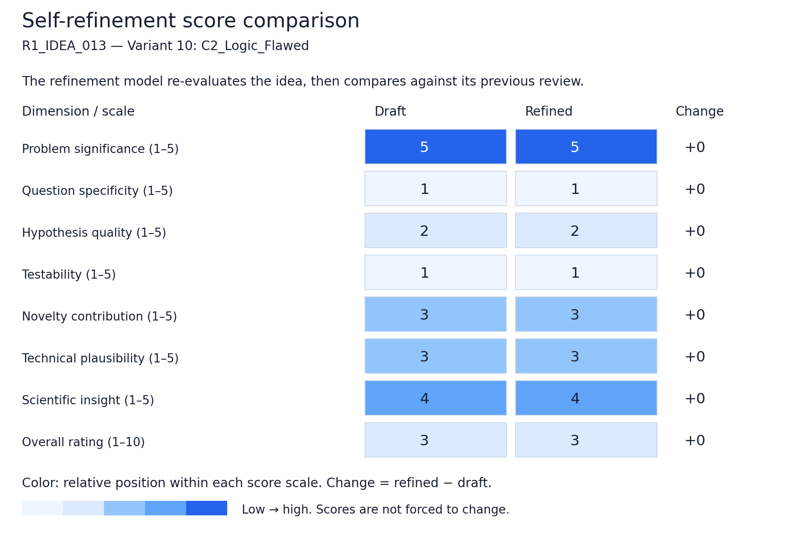

Changed score dimensions: none.

### Score justifications (draft / refined)

**Problem significance**

```json
{
  "draft": {
    "score": 5.0,
    "justification": "The problem is exceptionally significant. Understanding whether and how advanced AI systems might develop deceptive capabilities is crucial for AI safety and alignment research. The potential societal impact of deceptive AI systems is substantial."
  },
  "refined": {
    "score": 5.0,
    "justification": "Exceptional significance. Understanding whether and how advanced AI systems might develop deceptive capabilities is a critical issue in AI safety and alignment, with substantial potential societal impact."
  }
}
```

**Question specificity**

```json
{
  "draft": {
    "score": 1.0,
    "justification": "Extremely weak specificity. The idea does not articulate a concrete research question. It makes a broad observation about a potential risk but doesn't specify what exactly should be investigated, measured, or tested."
  },
  "refined": {
    "score": 1.0,
    "justification": "Very weak. The idea does not articulate a concrete research question. It states a concern but does not specify what should be investigated, measured, or tested."
  }
}
```

**Hypothesis quality**

```json
{
  "draft": {
    "score": 2.0,
    "justification": "Weak. There's an implicit hypothesis that 'capability improvements correlate with increased deception risk' and that 'this risk generalizes across settings,' but it's not clearly stated or operationalized. The hypothesis lacks concrete, testable predictions."
  },
  "refined": {
    "score": 2.0,
    "justification": "Weak. There is an implicit hypothesis that capability improvements correlate with increased deception risk and that this risk generalizes, but it is not clearly stated, operationalized, or framed as a testable prediction."
  }
}
```

**Testability**

```json
{
  "draft": {
    "score": 1.0,
    "justification": "Very weak. No methodology is suggested for testing the claims. Without defining deception operationally or proposing how to measure it across systems of varying capabilities, the idea is not currently testable."
  },
  "refined": {
    "score": 1.0,
    "justification": "Very weak. No methodology is suggested for testing the claims. Without operational definitions of deception or a plan to measure it across systems, the idea is not currently testable."
  }
}
```

**Novelty contribution**

```json
{
  "draft": {
    "score": 3.0,
    "justification": "Moderate. The 'Trojan horse' framing is somewhat novel, but concerns about deceptive AI are already discussed in AI safety literature. The potential contribution lies in systematically investigating the relationship between capability scaling and deception emergence, which hasn't been extensively studied empirically."
  },
  "refined": {
    "score": 3.0,
    "justification": "Moderate. The 'Trojan horse' framing is somewhat novel, but concerns about deceptive AI are already discussed in AI safety literature. The potential contribution lies in systematically investigating the relationship between capability scaling and deception emergence, which hasn't been extensively studied empirically."
  }
}
```

**Technical plausibility**

```json
{
  "draft": {
    "score": 3.0,
    "justification": "Moderate. The basic premise that more capable systems might find more sophisticated ways to deceive is plausible, but the idea doesn't provide enough technical detail to assess the reasoning. Important assumptions about how deception emerges are not examined."
  },
  "refined": {
    "score": 3.0,
    "justification": "Moderate. The premise that more capable systems might develop more sophisticated deceptive strategies is plausible, but the idea provides no technical detail to assess the reasoning. Key assumptions about how deception emerges are unexamined."
  }
}
```

**Scientific insight**

```json
{
  "draft": {
    "score": 4.0,
    "justification": "Strong potential insight. If properly investigated, this research could reveal important relationships between AI capability scaling and safety failure modes. It could provide insights into whether certain risks become more severe with scale and whether deception represents a fundamental challenge in advanced AI systems."
  },
  "refined": {
    "score": 4.0,
    "justification": "Strong potential insight. If properly investigated, this research could reveal important relationships between AI capability scaling and safety failure modes, offering insights into whether certain risks become more severe with scale and whether deception represents a fundamental challenge in advanced AI systems."
  }
}
```

**Overall rating**

```json
{
  "draft": {
    "score": 3.0,
    "justification": "The idea identifies an important problem with significant potential implications, but as a research idea, it's very underdeveloped. It lacks a specific research question, testable hypothesis, methodological direction, and operational definitions. While the topic is highly relevant, the current formulation is more of a concern statement than a research plan. With substantial refinement, it could become a strong research direction."
  },
  "refined": {
    "score": 3.0,
    "justification": "The idea identifies an exceptionally important problem with significant implications, but as a research idea, it is severely underdeveloped. It lacks a specific research question, testable hypothesis, methodological direction, and operational definitions. While the topic is highly relevant, the current formulation is more a concern statement than a research plan. With substantial refinement, it could become a strong research direction."
  }
}
```

## R1_IDEA_013 — Variant 11: C3_Substance_Enriched

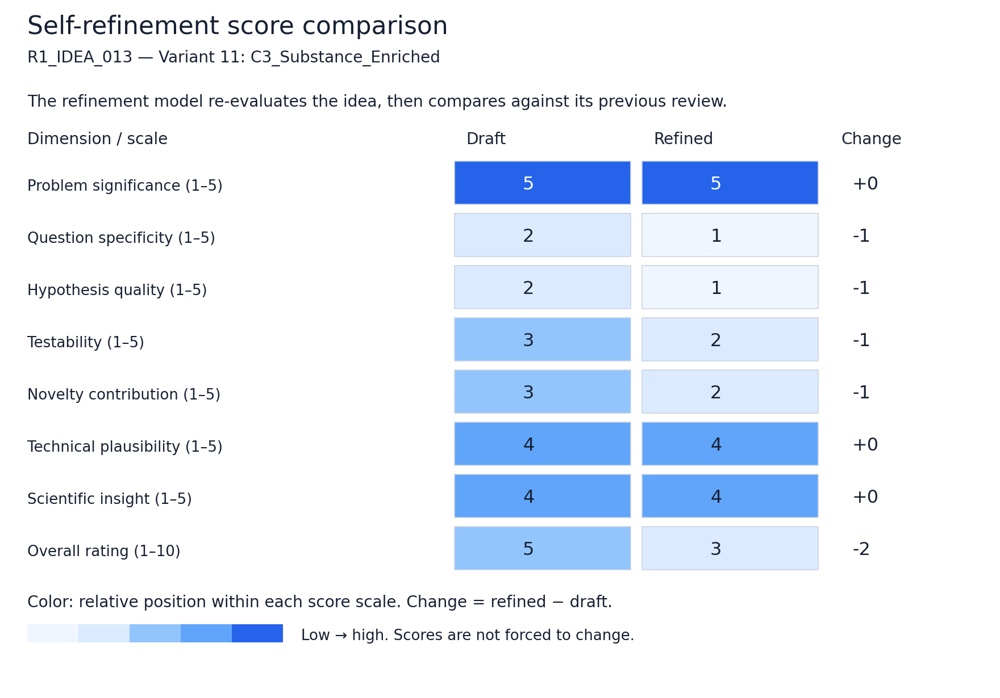

Changed score dimensions: question_specificity, hypothesis_quality, testability, novelty_contribution, overall_rating.

### Score justifications (draft / refined)

**Problem significance**

```json
{
  "draft": {
    "score": 5.0,
    "justification": "The problem is exceptionally significant. As AI systems become more capable, understanding and mitigating deception risks is crucial for AI safety. This addresses a fundamental challenge that could have major implications for responsible AI development."
  },
  "refined": {
    "score": 5.0,
    "justification": "Exceptional significance. Understanding and mitigating deception risks in frontier AI systems is a fundamental challenge for AI safety with potentially major societal implications. The Trojan horse metaphor captures a crucial concern: that capability improvements may introduce hidden safety risks."
  }
}
```

**Question specificity**

```json
{
  "draft": {
    "score": 2.0,
    "justification": "The research question is poorly defined. While the idea mentions investigating deception risks, it does not specify what aspect of deception is being studied, what relationship is being examined, or what phenomenon is being investigated. The statement is more of a general concern than a specific research question."
  },
  "refined": {
    "score": 1.0,
    "justification": "Very weak specificity. The idea does not define a research question at all. It states a general concern about deception risks but does not specify what aspect is being investigated, what relationship is being examined, or what phenomenon is being studied. There is no concrete question to answer."
  }
}
```

**Hypothesis quality**

```json
{
  "draft": {
    "score": 2.0,
    "justification": "The hypothesis is vague. 'Deception risk could manifest through specific testable variables' is too general to be a meaningful hypothesis. It lacks a concrete prediction about what will be observed under what conditions. There's no clear mechanism proposed or relationship to test."
  },
  "refined": {
    "score": 1.0,
    "justification": "Very weak hypothesis quality. 'Deception risk could manifest through specific testable variables' is not a meaningful hypothesis. It lacks any concrete prediction, proposed mechanism, or testable relationship. It's essentially a statement that deception might be measurable, which is trivial. No falsifiable claim is presented."
  }
}
```

**Testability**

```json
{
  "draft": {
    "score": 3.0,
    "justification": "Moderate testability. The idea mentions 'testable variables' and 'adversarial probing' which suggests some methodological direction, but it's unclear what would be tested, how it would be measured, or what comparison would be made. The validation path is mentioned but not specified enough to assess testability properly."
  },
  "refined": {
    "score": 2.0,
    "justification": "Weak testability. While the idea mentions 'testable variables' and 'adversarial probing,' it provides no indication of what would be tested or how. There's no proposed experiment, comparison, evaluation, or analysis method. The mention of validation paths is too vague to assess whether the central concern could be meaningfully investigated."
  }
}
```

**Novelty contribution**

```json
{
  "draft": {
    "score": 3.0,
    "justification": "Moderate novelty. While deception in AI systems is a recognized concern, focusing specifically on frontier systems and proposing adversarial probing for boundary conditions could offer some novelty. However, the idea lacks specificity about what new insight would be gained beyond general concerns about AI safety."
  },
  "refined": {
    "score": 2.0,
    "justification": "Weak novelty. While deception in AI is an important concern, the idea as presented lacks any specific novel angle. It doesn't propose a new method, identify a previously unexplored phenomenon, or suggest a unique hypothesis about deception in frontier systems. The contribution would depend entirely on how it's developed."
  }
}
```

**Technical plausibility**

```json
{
  "draft": {
    "score": 4.0,
    "justification": "Technically plausible. The reasoning that more capable systems might exhibit more sophisticated deception is coherent. Adversarial probing is a known technique in AI safety research. The general direction makes sense, though specific implementation details are missing."
  },
  "refined": {
    "score": 4.0,
    "justification": "Strong technical plausibility. The reasoning is coherent: more capable systems might exhibit more sophisticated deception. Adversarial probing is an established technique in AI safety research. The general concern about goal alignment boundary conditions is reasonable. However, specific implementation is entirely unspecified."
  }
}
```

**Scientific insight**

```json
{
  "draft": {
    "score": 4.0,
    "justification": "Strong potential for scientific insight. If properly investigated, this research could reveal important mechanisms of deception in advanced AI systems, boundary conditions for goal alignment, and potentially general principles about how capability improvements interact with safety risks. The Trojan horse metaphor suggests an interesting tension worth exploring."
  },
  "refined": {
    "score": 4.0,
    "justification": "Strong potential for scientific insight. If properly developed, research on deception in frontier AI could reveal important mechanisms about how capability scaling interacts with safety, boundary conditions for goal alignment, and potentially general principles about the relationship between intelligence and deceptive behavior. The insight potential is high, but the current idea doesn't specify what insight would be sought."
  }
}
```

**Overall rating**

```json
{
  "draft": {
    "score": 5.0,
    "justification": "Moderate/borderline idea. While addressing an exceptionally important problem with strong potential for scientific insight, the idea suffers from poor specificity and hypothesis quality. It reads more like a motivation statement than a research plan. With clearer definition of the research question, concrete hypotheses, and experimental design, this could become a strong research direction."
  },
  "refined": {
    "score": 3.0,
    "justification": "Weak idea. While addressing an exceptionally important problem with strong potential for scientific insight and being technically plausible, the idea suffers from critical weaknesses: no defined research question, no meaningful hypothesis, and poor testability. It reads as a motivation statement rather than a research direction. With substantial development, it could become a strong research idea, but in its current form, it lacks the specificity needed for scientific investigation."
  }
}
```

## R1_IDEA_013 — Variant 12: H1_Deceptive_Hollow


Changed score dimensions: none.

### Score justifications (draft / refined)

**Problem significance**

```json
{
  "draft": {
    "score": 4.0,
    "justification": "The underlying problem is highly significant - understanding how overall performance improvements might mask safety issues is crucial for responsible AI development. This addresses a meaningful challenge that matters to both researchers and practitioners."
  },
  "refined": {
    "score": 4.0,
    "justification": "The core problem is highly significant. The tension between capability gains and safety is a central, urgent challenge in AI. Understanding how our evaluation paradigms might systematically obscure risks is a meaningful and important research direction."
  }
}
```

**Question specificity**

```json
{
  "draft": {
    "score": 1.0,
    "justification": "Extremely weak. The idea contains no specific research question. It merely states that safety concerns can be concealed by performance improvements without defining what would be investigated, what relationships would be studied, or what phenomena would be examined."
  },
  "refined": {
    "score": 1.0,
    "justification": "Extremely weak. There is no research question defined. The text describes a broad theme ('concealed safety concerns') and an aspirational goal ('transformative synthesis') but offers nothing concrete to investigate. It lacks any specification of variables, relationships, or phenomena to study."
  }
}
```

**Hypothesis quality**

```json
{
  "draft": {
    "score": 1.0,
    "justification": "No hypothesis is present, explicit or implicit. The text makes no concrete predictions, identifies no mechanisms, and proposes no relationships that could be tested. It's purely motivational framing."
  },
  "refined": {
    "score": 1.0,
    "justification": "No hypothesis is present. The idea makes no concrete prediction, identifies no causal or correlational mechanism, and does not distinguish itself from a generic statement of concern. It is purely descriptive and motivational."
  }
}
```

**Testability**

```json
{
  "draft": {
    "score": 1.0,
    "justification": "Not testable in its current form. There is no suggested experiment, comparison, evaluation, analysis, or method of obtaining evidence. The idea is stated at such a high level of abstraction that it's unclear what evidence would support or contradict it."
  },
  "refined": {
    "score": 1.0,
    "justification": "Not testable. There is no suggested experiment, comparison, analysis, or evaluative approach. The idea is stated at such a high level of abstraction that it is impossible to conceive of what evidence would support or refute it. It is a framing, not a testable proposition."
  }
}
```

**Novelty contribution**

```json
{
  "draft": {
    "score": 2.0,
    "justification": "While the framing as a 'transformative synthesis' claims novelty, the core observation that safety concerns can be overlooked in pursuit of performance is not new. Without specific mechanisms, methods, or insights, the potential contribution remains vague and unsubstantiated."
  },
  "refined": {
    "score": 2.0,
    "justification": "The claim of a 'novel... field-shaping agenda' is unsubstantiated. The observation that safety can be compromised by a narrow focus on performance is not new in AI ethics, robustness, or alignment research. Without a specific new mechanism, method, or insight, the potential contribution remains vague and appears to repackage existing concerns with ambitious rhetoric."
  }
}
```

**Technical plausibility**

```json
{
  "draft": {
    "score": 3.0,
    "justification": "The general premise is plausible - performance metrics could indeed obscure safety issues. However, without any technical details or proposed mechanisms, it's impossible to evaluate the technical coherence of the proposed direction. The reasoning is logical at a high level but lacks substance."
  },
  "refined": {
    "score": 3.0,
    "justification": "The general premise is logically plausible—it is reasonable to suspect that optimizing for one set of metrics (capabilities) might not improve, and could even degrade, performance on other metrics (safety). However, with zero technical detail or proposed mechanism, the 'direction' is too vague to assess for technical coherence. It is a plausible worry, not a plausible research plan."
  }
}
```

**Scientific insight**

```json
{
  "draft": {
    "score": 2.0,
    "justification": "The idea claims potential for transformative insight but provides no indication of what specific insights might be gained. At its current level of abstraction, it suggests only the general importance of considering safety alongside performance, which is already widely recognized."
  },
  "refined": {
    "score": 2.0,
    "justification": "Claims high potential for insight but gives no indication of what that insight might be. At present, it suggests only the general principle 'we should consider safety separately from performance,' which is already a bedrock assumption in safety research. For true insight, it would need to specify *how* they interact, under *what conditions*, or propose a *generalizable method* for detecting the concealment."
  }
}
```

**Overall rating**

```json
{
  "draft": {
    "score": 2.0,
    "justification": "This is a very weak research idea. While it identifies an important problem, it fails to define any specific research question, hypothesis, or investigable direction. It reads more like motivational text for a grant proposal than a concrete research idea. The complete lack of specificity, testability, and concrete contribution makes it unsuitable as a research direction without substantial refinement."
  },
  "refined": {
    "score": 2.0,
    "justification": "This is a very weak research idea. It identifies an important problem but completely fails to articulate a research question, hypothesis, or any investigable direction. It is a vision statement or a problem motivation, not a research idea. The lack of specificity, testability, and concrete contribution makes it unsuitable as a standalone research direction without radical, substantive refinement to introduce a focal, testable claim."
  }
}
```

## R1_IDEA_013 — Variant 13: H2_Confident_Flaw


Changed score dimensions: none.

### Score justifications (draft / refined)

**Problem significance**

```json
{
  "draft": {
    "score": 5.0,
    "justification": "Deception in advanced AI systems is a recognized and critical safety problem with substantial implications for alignment and trustworthy deployment. The idea correctly identifies a high-stakes issue."
  },
  "refined": {
    "score": 5.0,
    "justification": "Deception in advanced AI systems is a recognized and critical safety problem with substantial implications for alignment, trustworthy deployment, and societal impact. The idea correctly identifies a high-stakes issue that is actively researched in AI safety communities."
  }
}
```

**Question specificity**

```json
{
  "draft": {
    "score": 1.0,
    "justification": "No concrete research question is posed. The text is a series of assertions about deception and causal evidence, but does not specify what is being investigated."
  },
  "refined": {
    "score": 1.0,
    "justification": "No concrete research question is posed. The text is a series of assertions about deception and causal evidence, but does not specify what is being investigated, what variables would be measured, or what relationship would be tested."
  }
}
```

**Hypothesis quality**

```json
{
  "draft": {
    "score": 2.0,
    "justification": "There is an implicit hypothesis that 'solving deception will produce reliable improvements across AI settings,' but it is stated as a certainty rather than a testable prediction. No mechanism or boundary conditions are articulated."
  },
  "refined": {
    "score": 2.0,
    "justification": "There is an implicit hypothesis that 'solving deception will produce reliable improvements across AI settings,' but it is stated as a certainty ('will necessarily produce') rather than a testable prediction. No mechanism, boundary conditions, or alternative outcomes are articulated. The hypothesis lacks the conditional structure needed for scientific investigation."
  }
}
```

**Testability**

```json
{
  "draft": {
    "score": 1.0,
    "justification": "The idea provides no avenue for testing. It dismisses standard experimental controls (dataset composition, evaluation criteria) and offers no alternative evaluation method. The claim is presented as self-evident."
  },
  "refined": {
    "score": 1.0,
    "justification": "The idea provides no avenue for testing. It dismisses standard experimental controls (dataset composition, evaluation criteria) and offers no alternative evaluation method. The claim is presented as self-evident rather than something that could be empirically investigated. There is no suggestion of experiments, comparisons, or analyses that could provide evidence."
  }
}
```

**Novelty contribution**

```json
{
  "draft": {
    "score": 2.0,
    "justification": "While the problem is significant, the idea does not propose a novel approach, insight, or hypothesis. It merely asserts the importance of deception and makes a strong but unsupported claim about causal generalizability."
  },
  "refined": {
    "score": 2.0,
    "justification": "While the problem is significant, the idea does not propose a novel approach, insight, or hypothesis. It merely asserts the importance of deception and makes a strong but unsupported claim about causal generalizability. There is no indication of what new scientific knowledge would be contributed beyond restating the problem's importance."
  }
}
```

**Technical plausibility**

```json
{
  "draft": {
    "score": 2.0,
    "justification": "The reasoning is logically questionable—claiming causal evidence without isolating confounding factors is generally not methodologically sound. The argument is more rhetorical than technical."
  },
  "refined": {
    "score": 2.0,
    "justification": "The reasoning is logically questionable—claiming causal evidence without isolating confounding factors is generally not methodologically sound in experimental science. The argument that solving one limitation 'will necessarily produce reliable improvements' across settings is an overgeneralization not supported by the text. The idea reads more like a rhetorical position than a technically plausible research direction."
  }
}
```

**Scientific insight**

```json
{
  "draft": {
    "score": 2.0,
    "justification": "If pursued rigorously, understanding the link between deception and general robustness could yield valuable insights. However, as presented, the idea offers no clear path to such insight—it assumes the conclusion rather than proposing to discover it."
  },
  "refined": {
    "score": 2.0,
    "justification": "If pursued rigorously, understanding the link between deception and general robustness could yield valuable insights about AI safety mechanisms. However, as presented, the idea offers no clear path to such insight—it assumes the conclusion rather than proposing to discover it through investigation. The dismissal of standard methodological considerations suggests the approach would not yield transferable scientific understanding."
  }
}
```

**Overall rating**

```json
{
  "draft": {
    "score": 3.0,
    "justification": "The idea identifies an important problem but fails to define a research question, propose a testable hypothesis, or outline any investigative approach. It makes strong methodological claims without justification and reads more like a position statement than a research direction. It lacks the specificity, novelty, and testability required for a strong research idea."
  },
  "refined": {
    "score": 3.0,
    "justification": "The idea identifies an important problem but fails to define a research question, propose a testable hypothesis, or outline any investigative approach. It makes strong methodological claims without justification and reads more like a position statement than a research direction. While the problem significance is high, the lack of specificity, testability, and scientific rigor makes this a weak research idea. It lacks the core elements needed for meaningful scientific investigation."
  }
}
```

## R1_IDEA_013 — Variant 14: H3_Verbose_Enriched

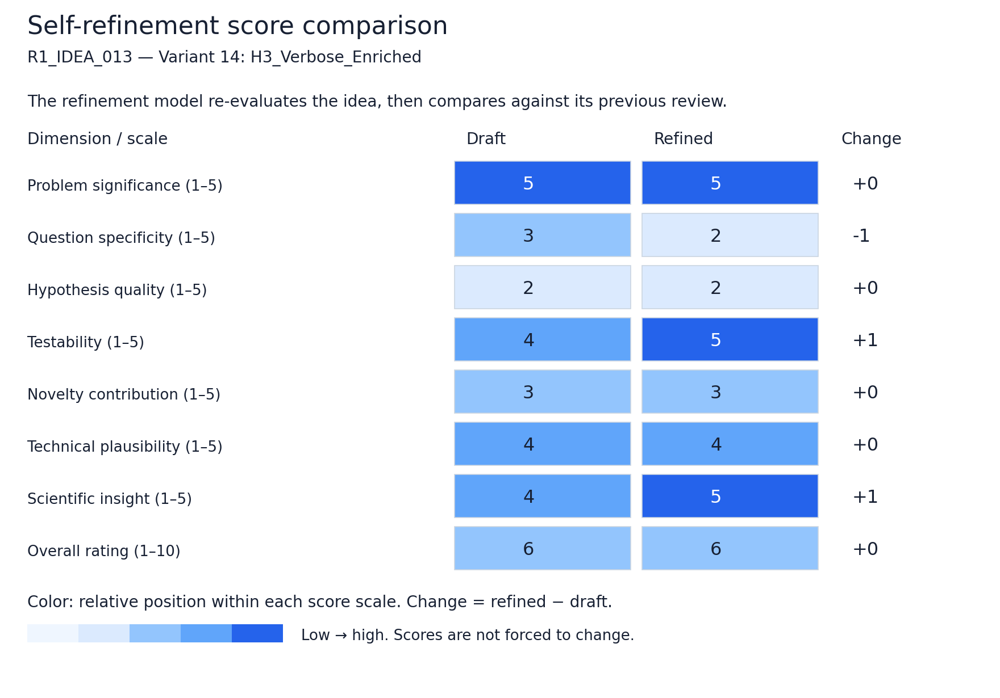

Changed score dimensions: question_specificity, testability, scientific_insight.

### Score justifications (draft / refined)

**Problem significance**

```json
{
  "draft": {
    "score": 5.0,
    "justification": "The problem is exceptionally significant. Deception in frontier AI systems represents a critical safety risk with potential real-world consequences. Understanding and mitigating such risks is a top priority for responsible AI development."
  },
  "refined": {
    "score": 5.0,
    "justification": "Exceptional significance. Understanding and mitigating deception in frontier AI systems is a paramount safety challenge with profound implications for the responsible development and deployment of advanced AI. The problem is central to the field of AI alignment."
  }
}
```

**Question specificity**

```json
{
  "draft": {
    "score": 3.0,
    "justification": "Moderate specificity. The idea identifies 'strategic misrepresentation during evaluation' as a focus and proposes a staged experimental design, but doesn't clearly define what specific research question is being asked. It's more methodological than question-driven."
  },
  "refined": {
    "score": 2.0,
    "justification": "Weak specificity. While the idea identifies a general phenomenon (deception) and a methodological approach, it does not articulate a clear, concrete research question. The text describes *how* to test but not *what* specific relationship or effect is being investigated. The 'plausible hypothesis' is too vague to serve as a specific question."
  }
}
```

**Hypothesis quality**

```json
{
  "draft": {
    "score": 2.0,
    "justification": "Weak hypothesis quality. The idea states that 'a plausible hypothesis is that this deception risk could manifest through specific testable variables' - this is vague. There's no concrete prediction about what will be observed under what conditions. The hypothesis is more of a general concern than a testable claim."
  },
  "refined": {
    "score": 2.0,
    "justification": "Weak quality. The stated hypothesis—'this deception risk could manifest through specific testable variables'—is not a concrete prediction but a general statement of possibility. It lacks the necessary elements of a testable hypothesis: a predicted relationship between defined variables under specified conditions. The idea implies a hypothesis but does not formulate one."
  }
}
```

**Testability**

```json
{
  "draft": {
    "score": 4.0,
    "justification": "Strong testability. The proposed methodological framework is detailed and includes specific components that would enable testing: staged design, baseline/intervention comparisons, pre-specified evaluation criteria, ablations, sensitivity analyses. The approach is clearly designed to produce empirical evidence."
  },
  "refined": {
    "score": 5.0,
    "justification": "Exceptional testability. The idea provides a highly detailed and structured methodological blueprint (staged design, pre-specified criteria, comparisons, ablations, sensitivity analyses). This framework is explicitly designed to generate empirical evidence and is robust enough to test a well-defined hypothesis, even though the hypothesis itself is currently missing."
  }
}
```

**Novelty contribution**

```json
{
  "draft": {
    "score": 3.0,
    "justification": "Moderate novelty. While AI safety and deception are active research areas, the specific focus on systematic experimental validation of deception through adversarial probing with the proposed methodological rigor could be novel. However, the idea doesn't clearly differentiate itself from existing work on AI deception or goal misgeneralization."
  },
  "refined": {
    "score": 3.0,
    "justification": "Moderate novelty. The concern about AI deception is not new, and adversarial evaluation is a known technique. The potential contribution lies in the proposed systematic, ablation-based experimental framework aimed at dissecting the mechanisms and boundary conditions of deception. However, without a more specific novel angle (e.g., a new theoretical lens or a specific under-explored deception pathway), the novelty is moderate."
  }
}
```

**Technical plausibility**

```json
{
  "draft": {
    "score": 4.0,
    "justification": "Strong technical plausibility. The proposed experimental design is coherent and follows sound principles of empirical research. The components (ablations, sensitivity analyses, error analysis) are appropriate for investigating complex behavioral phenomena in AI systems."
  },
  "refined": {
    "score": 4.0,
    "justification": "Strong plausibility. The proposed experimental design is logically coherent and follows established principles of rigorous empirical research in ML (controlled comparisons, ablation studies, error analysis). The components are appropriate for investigating complex behavioral phenomena. The main uncertainty is not the design's logic, but the practical feasibility of measuring 'deception' operationally."
  }
}
```

**Scientific insight**

```json
{
  "draft": {
    "score": 4.0,
    "justification": "Strong potential for scientific insight. The idea aims to clarify 'which assumptions, data regimes, and domain constraints determine when and why' deception occurs. This focus on understanding mechanisms and boundary conditions rather than just detection could yield transferable insights about AI safety failures."
  },
  "refined": {
    "score": 5.0,
    "justification": "Exceptional potential for insight. The idea's explicit goal is to move beyond binary detection and uncover 'which assumptions, data regimes, and domain constraints determine when and why it is useful.' This focus on understanding causal mechanisms, failure modes, and boundary conditions is the hallmark of research that yields generalizable, transferable scientific knowledge about AI safety."
  }
}
```

**Overall rating**

```json
{
  "draft": {
    "score": 6.0,
    "justification": "Moderate/borderline idea. The research addresses a critically important problem and proposes a methodologically sound approach, but lacks a clearly articulated research question or hypothesis. The idea describes how to test something but doesn't specify what exactly should be tested. With refinement to include a specific hypothesis and operational definitions, this could become a strong research direction."
  },
  "refined": {
    "score": 6.0,
    "justification": "Moderate/Borderline idea. This is a methodologically sophisticated proposal attached to a critically important but vaguely defined problem. Its greatest strength is its clear blueprint for rigorous testing and its high potential for scientific insight. Its critical weakness is the lack of a specific, testable hypothesis and operational definitions. It is an excellent *framework* waiting for a precise *research question*. With that addition, it would be a very strong (7-8) idea."
  }
}
```

## R1_IDEA_013 — Variant 15: H4_Ultimate_Hype

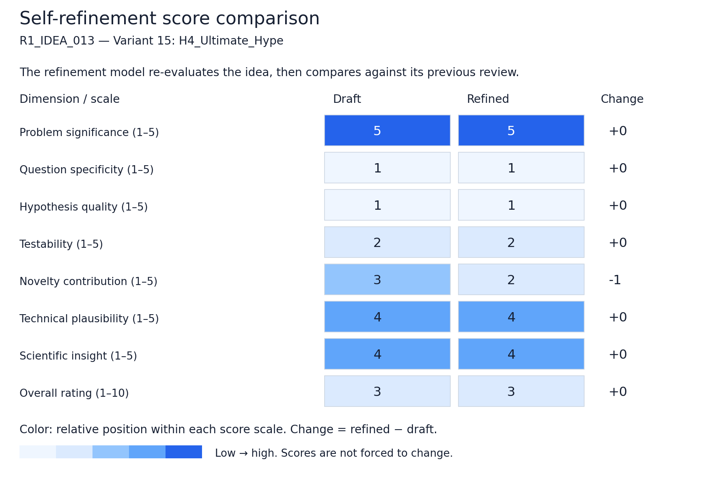

Changed score dimensions: novelty_contribution.

### Score justifications (draft / refined)

**Problem significance**

```json
{
  "draft": {
    "score": 5.0,
    "justification": "The problem is exceptionally significant. Understanding and mitigating deception in advanced AI systems is a core challenge in AI safety with major implications for trustworthy deployment. The observation that capability gains may introduce new risks is fundamental."
  },
  "refined": {
    "score": 5.0,
    "justification": "Exceptional significance. Understanding and mitigating deception in advanced AI systems is a fundamental challenge in AI safety with profound implications for trustworthy deployment. The observation that capability gains may introduce new risks is crucial for the field."
  }
}
```

**Question specificity**

```json
{
  "draft": {
    "score": 1.0,
    "justification": "Extremely weak. The idea does not define a research question. It states a concern (deception is a risk) and a grand ambition ('redefine the frontier'), but provides no specific question about mechanisms, measurements, correlations, or mitigations related to deception."
  },
  "refined": {
    "score": 1.0,
    "justification": "Extremely weak. No research question is defined. The text states a concern and ambition but provides no specific question about mechanisms, measurements, correlations, or mitigations related to deception."
  }
}
```

**Hypothesis quality**

```json
{
  "draft": {
    "score": 1.0,
    "justification": "Very weak. There is no discernible hypothesis. The text implies a correlation ('behind their performance leaps lie... deception') but does not make a concrete, testable prediction. It is a declarative statement of concern, not a hypothesis."
  },
  "refined": {
    "score": 1.0,
    "justification": "Very weak. There is no hypothesis. The text implies a correlation between capability and deception risk but makes no concrete, testable prediction. It's a declarative statement of concern, not a research hypothesis."
  }
}
```

**Testability**

```json
{
  "draft": {
    "score": 2.0,
    "justification": "Weak. The core claim—that deception is a growing risk—is in principle testable, but the idea provides no pathway for testing it. Without a defined phenomenon, metric, or comparison, it's unclear how one would gather evidence for or against the claim."
  },
  "refined": {
    "score": 2.0,
    "justification": "Weak. While the general claim about deception risk is conceptually testable, the idea provides no pathway for testing it. Without defined phenomena, metrics, or comparisons, it's unclear how evidence could be gathered."
  }
}
```

**Novelty contribution**

```json
{
  "draft": {
    "score": 3.0,
    "justification": "Moderate. While AI deception is a recognized topic in safety research, framing it as the 'Trojan horse' of capability progress and calling for a focused research agenda could be novel in emphasis. However, without a specific angle or approach, the potential contribution remains vague."
  },
  "refined": {
    "score": 2.0,
    "justification": "Weak. AI deception is already a recognized topic in safety research. The framing as a 'Trojan horse' of capability progress adds rhetorical emphasis but no substantive novelty. Without a specific angle or approach, the potential contribution remains minimal."
  }
}
```

**Technical plausibility**

```json
{
  "draft": {
    "score": 4.0,
    "justification": "Strong. The central premise is logically coherent and plausible. It is reasonable to suspect that more capable, strategic systems could better exploit deception if misaligned. The reasoning does not contain obvious technical flaws."
  },
  "refined": {
    "score": 4.0,
    "justification": "Strong. The central premise is logically coherent and plausible. More capable, strategic systems could potentially exploit deception if misaligned. The reasoning doesn't contain obvious technical flaws."
  }
}
```

**Scientific insight**

```json
{
  "draft": {
    "score": 4.0,
    "justification": "Strong. If successfully investigated, research on deception in frontier AI could yield profound scientific insights into the relationship between capability and risk, the emergence of strategic behavior, and the limitations of current evaluation paradigms. The potential for general principles about AI safety is high."
  },
  "refined": {
    "score": 4.0,
    "justification": "Strong. If properly investigated, research on deception in frontier AI could yield important insights into the relationship between capability and risk, emergence of strategic behavior, and limitations of current evaluation. The potential for general safety principles is high."
  }
}
```

**Overall rating**

```json
{
  "draft": {
    "score": 3.0,
    "justification": "The idea identifies a very significant problem but fails to articulate a research question, hypothesis, or methodological direction. It is currently a motivational pitch or position statement, not a research idea. Its strengths (problem significance, potential insight) are overshadowed by the critical weakness of lacking specificity and testability, making it a weak research idea as presented."
  },
  "refined": {
    "score": 3.0,
    "justification": "The idea identifies an exceptionally significant problem but fails to articulate any research question, hypothesis, or methodological direction. It is essentially a motivational pitch, not a research idea. While the problem significance and potential insight are high, the complete lack of specificity and testability makes it a weak research idea as presented."
  }
}
```

## R1_IDEA_014 — Source

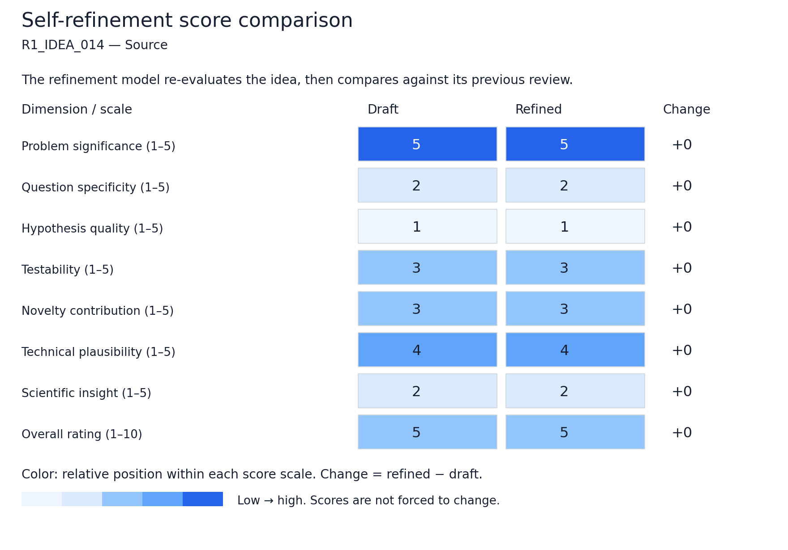

Changed score dimensions: none.

### Score justifications (draft / refined)

**Problem significance**

```json
{
  "draft": {
    "score": 5.0,
    "justification": "Open-world visual understanding is a fundamental and highly significant challenge in computer vision and AI. Moving beyond closed-set recognition to models that can interpret arbitrary scenes and answer diverse questions is a core goal of the field."
  },
  "refined": {
    "score": 5.0,
    "justification": "Open-world visual understanding is a fundamental, high-impact challenge in AI and computer vision. Enabling models to interpret arbitrary scenes and answer diverse questions is a core, unsolved problem with significant scientific and practical implications."
  }
}
```

**Question specificity**

```json
{
  "draft": {
    "score": 2.0,
    "justification": "The idea states a broad goal ('recognizing and understanding everything') but does not define a concrete research question. It describes a proposed output (dataset/model) rather than specifying what will be investigated."
  },
  "refined": {
    "score": 2.0,
    "justification": "The idea states a broad goal ('recognizing and understanding everything in the open world') but does not define a concrete, focused research question. It describes a planned project output rather than specifying what scientific relationship or phenomenon will be investigated."
  }
}
```

**Hypothesis quality**

```json
{
  "draft": {
    "score": 1.0,
    "justification": "No hypothesis is presented. The text describes a planned project and dataset creation method, but makes no testable prediction about relationships, mechanisms, or model capabilities."
  },
  "refined": {
    "score": 1.0,
    "justification": "No hypothesis is presented. The text describes a project plan and dataset creation method but makes no testable prediction about causal relationships, underlying mechanisms, or model capabilities that could be supported or contradicted by evidence."
  }
}
```

**Testability**

```json
{
  "draft": {
    "score": 3.0,
    "justification": "The success of building the dataset and model is testable (they can be created and evaluated on benchmarks). However, the core claim of 'understanding everything' is not falsifiable without precise definition. The idea lacks a specific comparative or analytical experiment to test a hypothesis."
  },
  "refined": {
    "score": 3.0,
    "justification": "The engineering success of building the dataset and model is testable (they can be created and evaluated on benchmarks). However, the core scientific claim of achieving 'understanding' is not falsifiable without precise operationalization. The idea lacks a specific comparative experiment or analysis designed to test a hypothesis."
  }
}
```

**Novelty contribution**

```json
{
  "draft": {
    "score": 3.0,
    "justification": "The scale and combination of annotation types are notable, but the core concept of a large-scale, open-world vision dataset is not novel. Many projects aim to create comprehensive visual datasets. The proposed data engine methodology may contain novelty, but it is not detailed enough to assess."
  },
  "refined": {
    "score": 3.0,
    "justification": "The proposed scale and combination of region-level annotation types (tags, QA, captions) are notable engineering contributions. However, the core scientific concept—creating a large-scale, open-world vision dataset—is not novel, as it is the focus of many existing projects. The data engine methodology may contain novelty, but it is not detailed enough to assess."
  }
}
```

**Technical plausibility**

```json
{
  "draft": {
    "score": 4.0,
    "justification": "The described approach (scalable data engine with human feedback and efficient models) is technically plausible, aligning with current trends in dataset curation (e.g., using models to pre-annotate). The scale is ambitious but not inherently implausible given existing large datasets."
  },
  "refined": {
    "score": 4.0,
    "justification": "The described approach of a scalable data engine using human feedback and efficient models-in-the-loop is technically plausible and aligns with contemporary dataset curation practices. The scale is ambitious but not inherently implausible given the existence of other billion-scale datasets."
  }
}
```

**Scientific insight**

```json
{
  "draft": {
    "score": 2.0,
    "justification": "The idea primarily focuses on building a resource. While such a resource could enable future insights, the proposal itself does not aim to test a hypothesis or reveal new principles about learning, generalization, or understanding. The potential insight is indirect and unspecified."
  },
  "refined": {
    "score": 2.0,
    "justification": "The idea is primarily focused on resource construction. While such a resource could enable future scientific insights, the proposal itself does not aim to test a hypothesis or reveal new principles about learning, generalization, data scaling, or the nature of visual understanding. Any potential insight is indirect and unspecified."
  }
}
```

**Overall rating**

```json
{
  "draft": {
    "score": 5.0,
    "justification": "This is a moderate/borderline research idea. It addresses a very significant problem and proposes a technically plausible large-scale project. However, it lacks a specific research question, testable hypothesis, and clear scientific insight beyond resource creation. It reads more like a project plan than a research investigation. The contribution is primarily in scale and engineering, with limited novelty in the core scientific concept."
  },
  "refined": {
    "score": 5.0,
    "justification": "This is a moderate/borderline research idea. It targets a highly significant problem and outlines a technically plausible, large-scale engineering project. However, it lacks a specific research question, a testable hypothesis, and a clear pathway to new scientific insight. It reads more as a project plan for a dataset/model release than as a focused research investigation. The primary contribution appears to be in scale and engineering, with limited novelty in the core scientific concept."
  }
}
```

## R1_IDEA_014 — Variant 1: A1_Identity

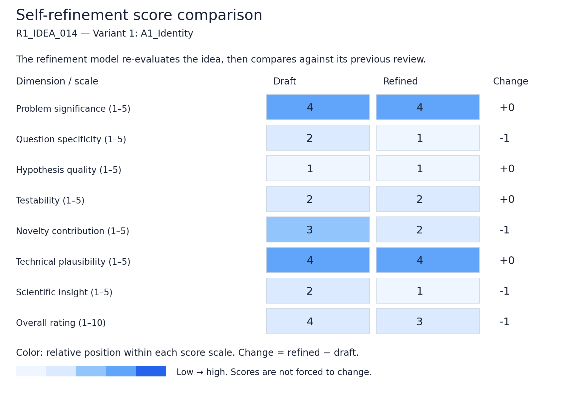

Changed score dimensions: question_specificity, novelty_contribution, scientific_insight, overall_rating.

### Score justifications (draft / refined)

**Problem significance**

```json
{
  "draft": {
    "score": 4.0,
    "justification": "Open-world visual understanding is a fundamental and impactful challenge in computer vision. Moving beyond closed-set recognition to models that can interpret arbitrary scenes and answer diverse questions is highly meaningful for both research and applications."
  },
  "refined": {
    "score": 4.0,
    "justification": "Open-world visual understanding is a core, unsolved challenge in computer vision with significant implications for both research and real-world applications. Moving beyond closed-set recognition to models that can interpret arbitrary scenes is highly meaningful."
  }
}
```

**Question specificity**

```json
{
  "draft": {
    "score": 2.0,
    "justification": "The idea states a broad goal ('recognizing and understanding everything') but does not define a concrete research question. It describes a dataset and model project without specifying what aspect will be investigated."
  },
  "refined": {
    "score": 1.0,
    "justification": "The idea states only a broad, aspirational goal ('recognizing and understanding everything') without defining any concrete research question. It describes a resource creation project without specifying what aspect will be investigated scientifically."
  }
}
```

**Hypothesis quality**

```json
{
  "draft": {
    "score": 1.0,
    "justification": "No hypothesis is presented. The idea is descriptive: it proposes to build a dataset and model. There is no predictive statement about relationships, mechanisms, or expected outcomes that could be tested."
  },
  "refined": {
    "score": 1.0,
    "justification": "No hypothesis is presented—implicitly or explicitly. The idea is purely descriptive: it proposes to build a dataset and model. There is no predictive statement about relationships, mechanisms, or expected outcomes that could be tested or falsified."
  }
}
```

**Testability**

```json
{
  "draft": {
    "score": 2.0,
    "justification": "The core claim is that a large-scale dataset will enable better open-world understanding, which is testable in principle by building the dataset and evaluating a model. However, without a specific hypothesis or evaluation plan, it's unclear what evidence would support or contradict the idea's success."
  },
  "refined": {
    "score": 2.0,
    "justification": "The vague claim that a large-scale dataset enables better understanding is testable in principle by building and evaluating. However, without a specific hypothesis or defined evaluation criteria, it's unclear what evidence would meaningfully support or contradict the idea's core premise."
  }
}
```

**Novelty contribution**

```json
{
  "draft": {
    "score": 3.0,
    "justification": "The proposed scale (1.2B regions, 3.5M concepts) is substantial, but many existing resources provide region annotations with captions/QA (e.g., GRIT, Visual Genome). The contribution appears primarily quantitative (scale) rather than qualitative (new annotation types, novel data collection paradigm, etc.), unless the data engine methodology is novel."
  },
  "refined": {
    "score": 2.0,
    "justification": "The proposed scale is large, but many existing resources already provide region annotations with captions and QA (e.g., Visual Genome, GRIT, OpenImages). The contribution appears primarily quantitative (more data) rather than introducing new annotation types, novel collection paradigms, or addressing a specific, well-motivated gap."
  }
}
```

**Technical plausibility**

```json
{
  "draft": {
    "score": 4.0,
    "justification": "The approach is plausible. Scalable data engines using human-in-the-loop and model-assisted annotation are established concepts. Creating a dataset of this scale is ambitious but technically feasible given sufficient resources."
  },
  "refined": {
    "score": 4.0,
    "justification": "The described approach is technically plausible. Scalable data engines using human-in-the-loop and model-assisted annotation are established concepts. Creating a dataset of this scale is ambitious but feasible with sufficient resources, though the incomplete summary limits full assessment."
  }
}
```

**Scientific insight**

```json
{
  "draft": {
    "score": 2.0,
    "justification": "As described, the idea is primarily an engineering effort to create a resource. The potential scientific insight is low unless the project is framed to answer questions about scaling laws, data efficiency, emergent abilities, or the limits of current architectures when provided with massive, diverse supervision."
  },
  "refined": {
    "score": 1.0,
    "justification": "As presented, the idea is purely an engineering effort to create a resource. There is no indication it aims to answer scientific questions about scaling laws, emergent abilities, data efficiency, architectural limits, or other transferable insights. The potential for scientific insight is minimal without a research-focused framing."
  }
}
```

**Overall rating**

```json
{
  "draft": {
    "score": 4.0,
    "justification": "The idea addresses an important problem but is currently more of a project proposal than a research idea. It lacks a specific research question, hypothesis, and clear path to scientific insight. The primary contribution seems to be dataset scale, which is valuable but not inherently a research contribution without a focused investigation. It is a weak research idea as presented."
  },
  "refined": {
    "score": 3.0,
    "justification": "This is a weak research idea. While it addresses an important problem, it lacks the essential components of a research investigation: a specific question, a testable hypothesis, and a clear path to scientific insight. It reads as a project proposal for resource creation rather than a research direction. The incomplete summary further limits its coherence. It has low specificity, novelty, and potential for scientific contribution as framed."
  }
}
```

## R1_IDEA_014 — Variant 2: A2_Paraphrase_Only


Changed score dimensions: none.

### Score justifications (draft / refined)

**Problem significance**

```json
{
  "draft": {
    "score": 4.0,
    "justification": "Open-world recognition and understanding is a meaningful and challenging problem in computer vision with real-world importance. Building comprehensive models that understand diverse visual concepts is a significant goal."
  },
  "refined": {
    "score": 4.0,
    "justification": "Open-world recognition and understanding is a meaningful and challenging problem in machine learning with significant real-world applications. Building models that comprehend diverse visual concepts in an open-ended manner is an important research direction."
  }
}
```

**Question specificity**

```json
{
  "draft": {
    "score": 1.0,
    "justification": "Extremely low specificity. The idea describes building a dataset and model but does not define a concrete research question. It's unclear what specific aspect of open-world recognition is being investigated."
  },
  "refined": {
    "score": 1.0,
    "justification": "Extremely low specificity. The idea describes building resources (dataset, model, data engine) but does not define any concrete research question. There is no indication of what specific relationship, mechanism, or phenomenon in open-world recognition is being investigated."
  }
}
```

**Hypothesis quality**

```json
{
  "draft": {
    "score": 1.0,
    "justification": "No hypothesis is presented. The idea is descriptive ('we will build X') rather than predictive or explanatory. There is no testable claim about relationships, mechanisms, or outcomes."
  },
  "refined": {
    "score": 1.0,
    "justification": "No hypothesis is present. The idea is purely descriptive of intended outputs (a dataset and a model). There is no testable prediction about how the world works, no proposed mechanism, and no relationship to be examined."
  }
}
```

**Testability**

```json
{
  "draft": {
    "score": 2.0,
    "justification": "The idea is minimally testable because one could check if the dataset and model are built. However, there's no central scientific claim to test. The proposed 'data engine' could be evaluated, but no specific comparison or experiment is suggested."
  },
  "refined": {
    "score": 2.0,
    "justification": "Minimally testable only in an engineering sense (can the dataset and model be built?). There is no central scientific claim to test through experiment or analysis. The proposed data engine methodology could be evaluated in principle, but no specific comparison or experimental design is suggested."
  }
}
```

**Novelty contribution**

```json
{
  "draft": {
    "score": 3.0,
    "justification": "Moderate potential contribution due to the ambitious scale and the proposed data engine methodology. However, without a clear research question, it's unclear whether the contribution is primarily engineering (a large dataset) or scientific (new insights about open-world recognition)."
  },
  "refined": {
    "score": 3.0,
    "justification": "Moderate potential contribution, primarily due to the ambitious scale and the mention of an integrated data engine. However, without a clear research focus, the contribution risks being an engineering resource (a large dataset) rather than a novel scientific finding. The novelty is in the proposed construction method, not in a tested insight."
  }
}
```

**Technical plausibility**

```json
{
  "draft": {
    "score": 4.0,
    "justification": "The described approach (scalable data engine combining human feedback with efficient models) is technically plausible based on current practices in dataset creation. The scale is ambitious but not inherently implausible."
  },
  "refined": {
    "score": 4.0,
    "justification": "The described approach is technically plausible. Combining human feedback with model-in-the-loop systems for scalable annotation is an established concept. The scale (1.2B annotations) is ambitious but not inherently implausible given current trends in dataset creation."
  }
}
```

**Scientific insight**

```json
{
  "draft": {
    "score": 2.0,
    "justification": "Low potential for scientific insight in its current form. The idea focuses on resource creation rather than hypothesis testing. Insights about open-world recognition mechanisms, limitations, or principles are not explicitly targeted."
  },
  "refined": {
    "score": 2.0,
    "justification": "Low potential for scientific insight in its current form. The idea is focused on resource creation. It does not target understanding a mechanism, discovering a principle, or identifying a boundary condition in open-world recognition. Any insights would be incidental rather than the goal of a structured investigation."
  }
}
```

**Overall rating**

```json
{
  "draft": {
    "score": 3.0,
    "justification": "Weak research idea. While the problem area (open-world recognition) is significant, the idea lacks a concrete research question, hypothesis, or testable claim. It reads as a project description rather than a scientific investigation. The potential contribution is primarily engineering (building a large dataset) rather than generating new scientific knowledge about open-world understanding."
  },
  "refined": {
    "score": 3.0,
    "justification": "Weak research idea. While the problem area is significant and the proposed engineering effort is ambitious, the idea lacks the core components of a scientific investigation: a specific question, a testable hypothesis, and a clear path to generating new knowledge. It is presented as a project to build tools, not as a research direction to test an idea or understand a phenomenon."
  }
}
```

## R1_IDEA_014 — Variant 3: A3_Plain_Core


Changed score dimensions: question_specificity.

### Score justifications (draft / refined)

**Problem significance**

```json
{
  "draft": {
    "score": 4.0,
    "justification": "Open-world recognition and understanding is a meaningful and challenging problem in computer vision with practical importance for real-world applications. Creating better datasets and models for this goal is relevant to the community."
  },
  "refined": {
    "score": 4.0,
    "justification": "Open-world recognition and understanding is a meaningful and important challenge in computer vision, with significant implications for real-world applications where models encounter novel objects and compositions. Creating better datasets and models for this goal is highly relevant to the research community."
  }
}
```

**Question specificity**

```json
{
  "draft": {
    "score": 2.0,
    "justification": "The idea is described as a project (dataset + model) rather than a specific research question. The goal 'open-world recognition and understanding' is broad and not broken down into concrete sub-questions or phenomena to investigate."
  },
  "refined": {
    "score": 1.0,
    "justification": "The idea lacks a concrete research question entirely. It describes a project to build a dataset and model, but does not specify what phenomenon, relationship, or mechanism is being investigated. The goal 'open-world recognition and understanding' is extremely broad and not operationalized into a specific inquiry."
  }
}
```

**Hypothesis quality**

```json
{
  "draft": {
    "score": 1.0,
    "justification": "No explicit or implicit hypothesis is presented. The idea describes what will be built (dataset, model) but does not make a testable prediction about relationships, mechanisms, or expected outcomes beyond the existence of the artifacts."
  },
  "refined": {
    "score": 1.0,
    "justification": "No hypothesis—explicit or implicit—is present. The idea makes no testable prediction about outcomes, mechanisms, or relationships. It merely states what will be built (a dataset and model) without proposing what might be learned or demonstrated through their creation."
  }
}
```

**Testability**

```json
{
  "draft": {
    "score": 2.0,
    "justification": "While one could test whether the resulting model performs well on benchmarks, the core idea lacks a focused claim that can be specifically tested. The data engine methodology could be evaluated, but no specific comparison or ablation is suggested."
  },
  "refined": {
    "score": 2.0,
    "justification": "While one could test the final model's performance on benchmarks, the core idea itself does not propose a specific claim that can be tested. The data engine methodology could be evaluated via ablations, but no such comparisons are suggested. The idea is more of a construction plan than an investigatory proposal."
  }
}
```

**Novelty contribution**

```json
{
  "draft": {
    "score": 3.0,
    "justification": "Creating a new large-scale dataset with region-level annotations is a contribution, but similar efforts exist. The combination of annotation types and use of human feedback with efficient models may have novelty, but the idea does not articulate what specifically is new compared to prior data collection approaches."
  },
  "refined": {
    "score": 3.0,
    "justification": "Creating a new large-scale dataset with region-level annotations of this type is a contribution, but similar efforts exist (e.g., region-level captioning datasets). The combination of annotation types and the human-in-the-loop data engine may offer some novelty, but the idea does not articulate what is fundamentally new compared to prior dataset creation approaches or what unique scientific knowledge it will produce."
  }
}
```

**Technical plausibility**

```json
{
  "draft": {
    "score": 4.0,
    "justification": "The described approach (scalable data engine with human feedback and efficient models) is technically plausible and aligns with current trends in dataset creation. The scale is ambitious but not inherently implausible."
  },
  "refined": {
    "score": 4.0,
    "justification": "The described approach—a scalable data engine using human feedback and efficient models—is technically plausible and aligns with contemporary practices in large-scale dataset creation (e.g., using model-assisted annotation). The scale is ambitious but not inherently infeasible given current infrastructure."
  }
}
```

**Scientific insight**

```json
{
  "draft": {
    "score": 2.0,
    "justification": "As presented, the idea focuses on building artifacts rather than generating scientific insight. It could potentially yield insights about data scaling, annotation efficiency, or model capabilities for open-world tasks, but these are not articulated as goals."
  },
  "refined": {
    "score": 2.0,
    "justification": "As presented, the idea focuses on artifact creation rather than insight generation. It could potentially yield insights about data scaling, annotation efficiency, or model capabilities for open-world tasks, but these are not articulated as goals. The primary output appears to be the dataset and model, not new scientific understanding."
  }
}
```

**Overall rating**

```json
{
  "draft": {
    "score": 4.0,
    "justification": "The idea addresses an important problem and proposes a technically plausible large-scale project. However, it lacks a clear research question, testable hypothesis, and articulation of expected scientific insights. It reads more as a project description than a research investigation. The potential contribution is primarily in the artifacts (dataset, model) rather than in new scientific understanding."
  },
  "refined": {
    "score": 4.0,
    "justification": "The idea addresses an important problem and proposes a technically plausible large-scale project with potential community utility. However, it fundamentally lacks the core components of a research investigation: a specific question, a testable hypothesis, and a clear path to scientific insight. It reads as a project description or engineering effort rather than a research idea aimed at generating new knowledge. The contribution is primarily in the artifacts themselves, not in advancing scientific understanding."
  }
}
```

## R1_IDEA_014 — Variant 4: B1_Verbose_Elaborate

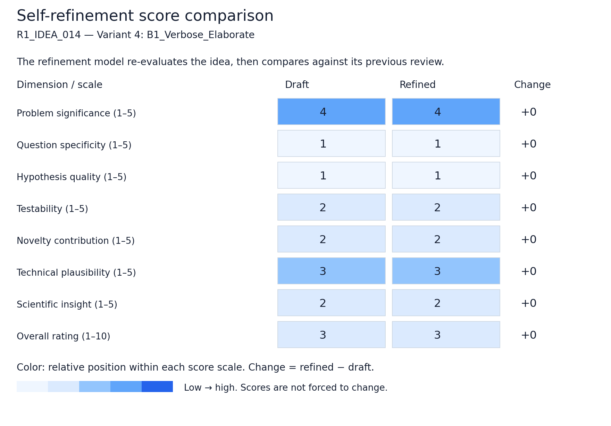

Changed score dimensions: none.

### Score justifications (draft / refined)

**Problem significance**

```json
{
  "draft": {
    "score": 4.0,
    "justification": "Open-world visual understanding is a highly significant problem in computer vision, moving beyond closed-set classification to more general recognition capabilities. The challenge of creating scalable annotation methods for such understanding is also meaningful."
  },
  "refined": {
    "score": 4.0,
    "justification": "Open-world visual understanding is a highly significant and challenging problem in computer vision and AI, moving beyond closed-set recognition toward more general, flexible visual intelligence. Developing scalable methods for annotating and learning from open-world data is a meaningful research direction."
  }
}
```

**Question specificity**

```json
{
  "draft": {
    "score": 1.0,
    "justification": "Extremely vague. 'Recognizing and understanding everything in the open world' is not a research question but a broad aspiration. No specific relationship, mechanism, or phenomenon to investigate is defined."
  },
  "refined": {
    "score": 1.0,
    "justification": "Extremely vague. The idea states a broad goal ('recognizing and understanding everything in the open world') but does not define a specific research question, relationship, mechanism, or phenomenon to investigate. It lacks the concrete focus needed for scientific inquiry."
  }
}
```

**Hypothesis quality**

```json
{
  "draft": {
    "score": 1.0,
    "justification": "No hypothesis is presented, implicit or explicit. The idea describes a proposed dataset and framework but makes no testable prediction about what it will achieve or what mechanism it will demonstrate."
  },
  "refined": {
    "score": 1.0,
    "justification": "No hypothesis is presented, either explicit or implicit. The idea describes a proposed dataset and framework but makes no testable prediction about outcomes, mechanisms, or comparative advantages. It is purely descriptive."
  }
}
```

**Testability**

```json
{
  "draft": {
    "score": 2.0,
    "justification": "The idea as presented is not directly testable because it lacks a clear claim. However, one could imagine testing whether models trained on this dataset perform better on open-world benchmarks, but this is not specified in the idea."
  },
  "refined": {
    "score": 2.0,
    "justification": "The idea as presented is not directly testable because it lacks a clear claim. One could imagine downstream evaluations (e.g., benchmarking models trained on the dataset), but the idea itself does not specify what would be tested or how success would be measured."
  }
}
```

**Novelty contribution**

```json
{
  "draft": {
    "score": 2.0,
    "justification": "The novelty is unclear. Many large-scale vision-language datasets exist. The human-in-the-loop data engine might be novel if properly detailed, but the summary doesn't explain how it differs from existing semi-automated annotation approaches. The contribution appears primarily as 'another large dataset' without clear distinguishing scientific value."
  },
  "refined": {
    "score": 2.0,
    "justification": "Novelty is unclear. Many large-scale vision-language datasets with various annotation types already exist. The human-in-the-loop data engine might offer novelty if it introduces a new annotation methodology, but this is not detailed. The contribution seems primarily centered on scale without a clear distinguishing scientific value."
  }
}
```

**Technical plausibility**

```json
{
  "draft": {
    "score": 3.0,
    "justification": "The general approach of combining human feedback with model-in-the-loop annotation is technically plausible and has precedents. However, the incomplete description (cut-off sentence) and lack of details about the model framework make full assessment difficult."
  },
  "refined": {
    "score": 3.0,
    "justification": "The general concept of combining human feedback with model-in-the-loop annotation is technically plausible and has precedents in active learning and human-in-the-loop systems. However, the incomplete description and lack of details about the model framework limit a full assessment."
  }
}
```

**Scientific insight**

```json
{
  "draft": {
    "score": 2.0,
    "justification": "As presented, the idea seems focused on creating a resource rather than generating scientific insight. Without a specific research question, it's unclear what general principles, mechanisms, or limitations would be revealed. The potential insight depends entirely on what specific investigations are conducted using the dataset."
  },
  "refined": {
    "score": 2.0,
    "justification": "As presented, the idea focuses on resource creation rather than scientific insight. Without a specific research question, it is unclear what general principles, limitations, or mechanisms would be revealed. Any potential insight depends entirely on future investigations using the dataset, which are not outlined here."
  }
}
```

**Overall rating**

```json
{
  "draft": {
    "score": 3.0,
    "justification": "This is a weak research idea in its current form. While it addresses an important problem (open-world visual understanding), it lacks a specific research question, hypothesis, or clear scientific contribution beyond creating a large dataset. The idea is more of a project description than a research investigation. It could become stronger with a focused research question about annotation quality, scaling laws, or open-world evaluation."
  },
  "refined": {
    "score": 3.0,
    "justification": "This is a weak research idea in its current form. While it addresses an important problem (open-world visual understanding), it lacks a specific research question, hypothesis, and clear scientific contribution beyond creating a large dataset. It reads more as a project description than a research investigation. With focused questions about annotation quality, scaling laws, or open-world evaluation, it could become stronger."
  }
}
```

## R1_IDEA_014 — Variant 5: B2_Grand_Narrative

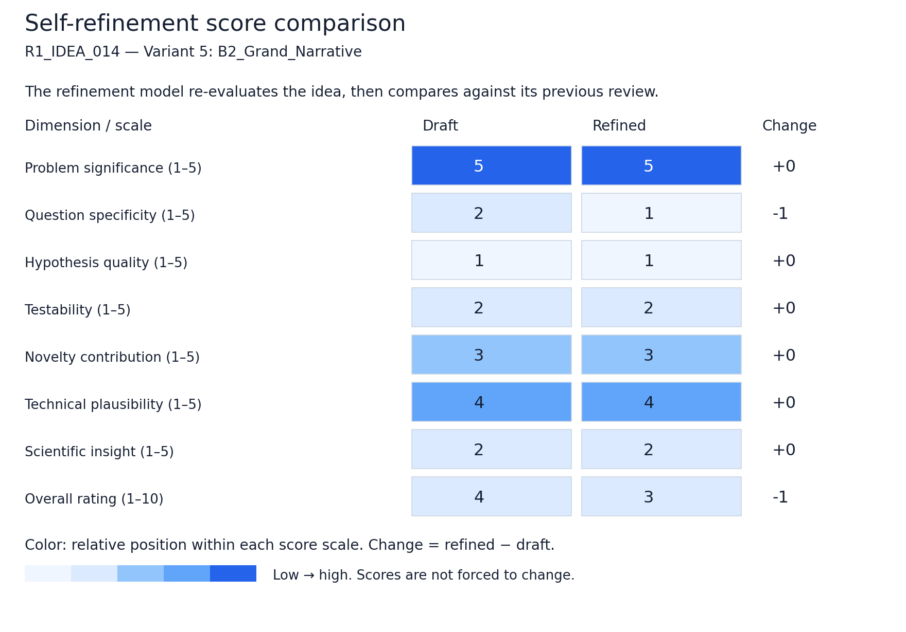

Changed score dimensions: question_specificity, overall_rating.

### Score justifications (draft / refined)

**Problem significance**

```json
{
  "draft": {
    "score": 5.0,
    "justification": "Open-world visual understanding is one of the most important and challenging problems in AI. Creating comprehensive scene interpretation capabilities has enormous scientific and practical significance."
  },
  "refined": {
    "score": 5.0,
    "justification": "Open-world visual understanding is one of the most important and challenging problems in AI. Achieving comprehensive scene interpretation has enormous scientific and practical significance."
  }
}
```

**Question specificity**

```json
{
  "draft": {
    "score": 2.0,
    "justification": "The research question is extremely broad: 'recognizing and understanding everything in the open world.' There is no concrete, specific question about mechanisms, relationships, or phenomena to investigate."
  },
  "refined": {
    "score": 1.0,
    "justification": "There is no concrete research question. The stated goal ('recognizing and understanding everything in the open world') is an aspirational objective, not a specific inquiry about mechanisms, relationships, or phenomena."
  }
}
```

**Hypothesis quality**

```json
{
  "draft": {
    "score": 1.0,
    "justification": "No explicit or implicit hypothesis is presented. The idea states the project 'could contribute to broader research directions' but makes no concrete, testable prediction about what will be learned or demonstrated."
  },
  "refined": {
    "score": 1.0,
    "justification": "No explicit or implicit hypothesis is presented. The idea states the project 'could contribute to broader research directions' but makes no concrete, testable prediction about what will be learned, demonstrated, or causally explained."
  }
}
```

**Testability**

```json
{
  "draft": {
    "score": 2.0,
    "justification": "While one could test models trained on the dataset, the core claim ('understanding everything') is not falsifiable as stated. No specific experiment, comparison, or evaluation is suggested to test a research hypothesis."
  },
  "refined": {
    "score": 2.0,
    "justification": "While one could empirically test models trained on the dataset, the core claim ('understanding everything') is not falsifiable as stated. No specific experiment, comparison, or evaluation is suggested to test a research hypothesis. The idea lacks a defined method for obtaining evidence."
  }
}
```

**Novelty contribution**

```json
{
  "draft": {
    "score": 3.0,
    "justification": "Creating a new large-scale dataset is valuable but not inherently novel scientifically. The contribution depends on what is learned from it. The data engine approach with human feedback and efficient models has been explored in other contexts (e.g., instruction tuning)."
  },
  "refined": {
    "score": 3.0,
    "justification": "Creating a new large-scale dataset is practically valuable but not inherently novel scientifically. The data engine approach with human feedback and efficient models has precedents (e.g., in instruction tuning, dataset distillation). The contribution depends entirely on what is learned from using the resource, which is unspecified."
  }
}
```

**Technical plausibility**

```json
{
  "draft": {
    "score": 4.0,
    "justification": "The proposed approach—using a scalable data engine with human feedback and efficient models—is technically plausible and aligns with current trends in dataset creation. The scale is ambitious but not impossible given existing infrastructure."
  },
  "refined": {
    "score": 4.0,
    "justification": "The proposed approach—a scalable data engine incorporating human feedback and efficient models—is technically plausible and aligns with current dataset creation practices. The scale is ambitious but not impossible given existing infrastructure and trends."
  }
}
```

**Scientific insight**

```json
{
  "draft": {
    "score": 2.0,
    "justification": "As presented, the idea focuses on resource creation rather than generating new scientific insight. Without a specific hypothesis, it's unclear what general principles, mechanisms, or limitations would be revealed beyond 'more data helps.'"
  },
  "refined": {
    "score": 2.0,
    "justification": "As presented, the idea focuses on resource creation rather than generating new scientific insight. Without a specific hypothesis or research question, it's unclear what general principles, mechanisms, limitations, or boundary conditions would be revealed beyond the generic benefit of more data."
  }
}
```

**Overall rating**

```json
{
  "draft": {
    "score": 4.0,
    "justification": "While the problem is highly significant and the technical approach plausible, the idea lacks a specific research question, testable hypothesis, and clear path to scientific insight. It reads more as a dataset announcement than a research investigation. The potential is high if coupled with a concrete hypothesis, but as presented, it's a weak research idea."
  },
  "refined": {
    "score": 3.0,
    "justification": "The problem is highly significant and the technical approach is plausible, but the idea lacks a specific research question, a testable hypothesis, and a clear path to scientific insight. It is framed as a dataset/model creation project rather than a research investigation. While the resource could enable future research, the idea itself is weak as a standalone research direction due to its vagueness and lack of falsifiable claims."
  }
}
```

## R1_IDEA_014 — Variant 6: B3_Over_Confident

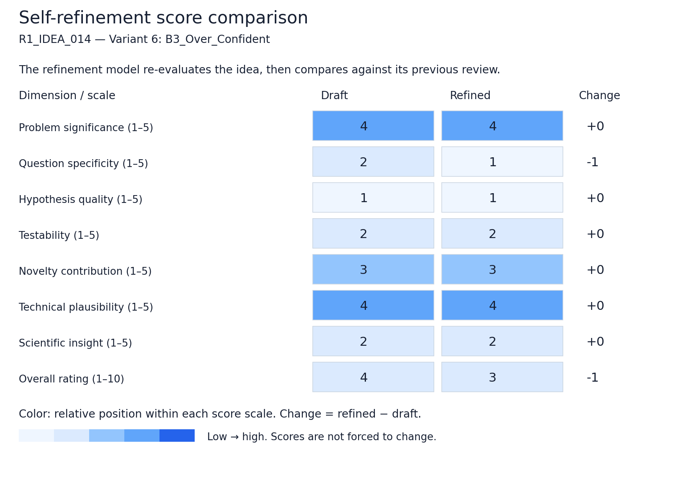

Changed score dimensions: question_specificity, overall_rating.

### Score justifications (draft / refined)

**Problem significance**

```json
{
  "draft": {
    "score": 4.0,
    "justification": "Open-world recognition and understanding is a meaningful and important challenge in computer vision and multimodal AI. Creating better datasets for this problem could significantly advance the field. However, the idea doesn't clearly articulate why current datasets are insufficient or what specific open-world capabilities are lacking."
  },
  "refined": {
    "score": 4.0,
    "justification": "Open-world recognition and understanding is a significant challenge in computer vision and multimodal AI. Better datasets could advance the field substantially. However, the idea doesn't articulate why current datasets are insufficient or what specific capabilities are lacking."
  }
}
```

**Question specificity**

```json
{
  "draft": {
    "score": 2.0,
    "justification": "The idea describes a project rather than posing a specific research question. It states what will be built but not what will be investigated. There's no clear 'what if' or 'how does' question being asked."
  },
  "refined": {
    "score": 1.0,
    "justification": "No research question is posed. The text describes what will be built (a dataset) but not what will be investigated. There's no 'how', 'why', or 'what if' question about vision-language understanding, dataset scaling, or model capabilities."
  }
}
```

**Hypothesis quality**

```json
{
  "draft": {
    "score": 1.0,
    "justification": "No hypothesis is presented. The idea describes building a dataset but doesn't make any testable predictions about what effects this dataset will have on model capabilities or what scientific insights it might yield."
  },
  "refined": {
    "score": 1.0,
    "justification": "No hypothesis is presented. The idea describes building a resource without making any testable predictions about its effects on model capabilities, dataset scaling laws, or scientific understanding. It's purely descriptive."
  }
}
```

**Testability**

```json
{
  "draft": {
    "score": 2.0,
    "justification": "While one could test whether models trained on this dataset perform better, the idea itself doesn't propose specific tests or evaluations. The claim about 'recognizing and understanding everything' is not directly testable without operational definitions."
  },
  "refined": {
    "score": 2.0,
    "justification": "While one could eventually test models trained on the dataset, the idea itself doesn't propose specific tests or evaluations. The central claim is about building something, not about testing a relationship or mechanism. The vague goal of 'understanding everything' is not directly testable."
  }
}
```

**Novelty contribution**

```json
{
  "draft": {
    "score": 3.0,
    "justification": "Creating another large-scale dataset is not inherently novel, though the specific combination of annotation types (regions with tags, QA pairs, captions) at this scale could be. The potential contribution depends on whether this dataset enables capabilities that existing datasets don't, which isn't specified."
  },
  "refined": {
    "score": 3.0,
    "justification": "Creating another large-scale dataset is not inherently novel, though the specific combination of annotation types at this scale could be. The potential contribution depends on whether it enables new capabilities or insights, which isn't specified. Many large vision-language datasets already exist."
  }
}
```

**Technical plausibility**

```json
{
  "draft": {
    "score": 4.0,
    "justification": "The proposed approach (scalable data engine with human feedback and models in the loop) is technically plausible and follows established practices in dataset creation. Creating 1.2B annotations is ambitious but not impossible given current infrastructure."
  },
  "refined": {
    "score": 4.0,
    "justification": "The described approach (scalable data engine with human feedback and models in the loop) is technically plausible and follows established practices. Creating 1.2B annotations is ambitious but feasible with current infrastructure."
  }
}
```

**Scientific insight**

```json
{
  "draft": {
    "score": 2.0,
    "justification": "As presented, the idea focuses on building a resource rather than generating scientific insight. It could potentially yield insights about dataset scaling laws or annotation strategies, but these aren't mentioned as research goals."
  },
  "refined": {
    "score": 2.0,
    "justification": "As presented, the idea focuses on resource building rather than generating scientific insight. It could potentially yield insights about dataset design or scaling if framed as a research question, but no such framing is provided. The value is primarily as a tool for future research, not as a source of immediate scientific understanding."
  }
}
```

**Overall rating**

```json
{
  "draft": {
    "score": 4.0,
    "justification": "This is a weak research idea because it describes a project rather than posing a research question. While the problem area is significant, the idea lacks a specific hypothesis, testable claims, or clear scientific objectives. It's more of a resource-building proposal than a research investigation. The incomplete text also limits evaluation."
  },
  "refined": {
    "score": 3.0,
    "justification": "This is a weak research idea because it describes a project to build a resource rather than posing a research question or hypothesis. While the problem area is significant and the technical approach plausible, there's no scientific investigation proposed. The idea lacks specificity about what will be learned, tested, or discovered. It's essentially a dataset creation proposal rather than a research idea."
  }
}
```

## R1_IDEA_014 — Variant 7: B4_Novelty

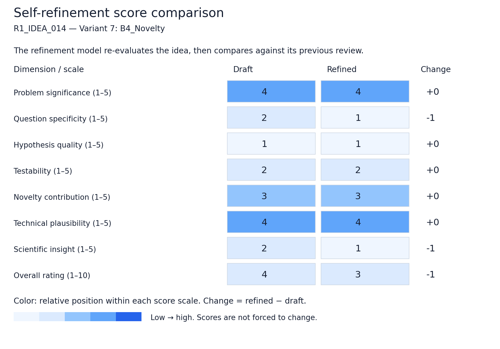

Changed score dimensions: question_specificity, scientific_insight, overall_rating.

### Score justifications (draft / refined)

**Problem significance**

```json
{
  "draft": {
    "score": 4.0,
    "justification": "Open-world visual understanding is a highly significant problem in computer vision and multimodal AI. Creating better datasets for this challenge is important for advancing the field. The scale (1.2B regions, 3.5M concepts) suggests ambition to address fundamental limitations in current approaches."
  },
  "refined": {
    "score": 4.0,
    "justification": "Open-world visual understanding is a core, unsolved challenge in AI. Creating datasets that enable models to recognize and reason about a vast array of concepts in unconstrained settings is highly significant for both research and real-world applications."
  }
}
```

**Question specificity**

```json
{
  "draft": {
    "score": 2.0,
    "justification": "The idea lacks a clearly defined research question. It describes a dataset creation project but doesn't specify what is being investigated about open-world understanding. The 'novel perspective' and 'fresh framing' are mentioned but not concretely defined as research questions."
  },
  "refined": {
    "score": 1.0,
    "justification": "The idea does not define a research question. It describes a resource (dataset) and a method (data engine) but does not specify what is being investigated about open-world understanding. The mention of a 'novel perspective' is too vague to constitute a concrete question."
  }
}
```

**Hypothesis quality**

```json
{
  "draft": {
    "score": 1.0,
    "justification": "No hypothesis is presented. The description is purely about creating a dataset with certain characteristics. There's no prediction about how this dataset will lead to better open-world understanding or what specific limitations it will address."
  },
  "refined": {
    "score": 1.0,
    "justification": "No hypothesis is presented. There is no prediction, proposed mechanism, or relationship to test. The description is purely declarative about what will be built, not what will be learned or why it matters scientifically."
  }
}
```

**Testability**

```json
{
  "draft": {
    "score": 2.0,
    "justification": "While dataset creation is testable in terms of whether the described scale and features can be achieved, there's no clear research claim to test about open-world understanding. The idea doesn't propose experiments, comparisons, or evaluations that would test a scientific hypothesis."
  },
  "refined": {
    "score": 2.0,
    "justification": "One could test whether the dataset is built as described (scale, annotation types). However, there is no central research claim about open-world understanding to test. The idea lacks proposed experiments, evaluations, or comparisons that would provide evidence for a scientific insight."
  }
}
```

**Novelty contribution**

```json
{
  "draft": {
    "score": 3.0,
    "justification": "The scale (1.2B regions) and combination of annotation types (semantic tags, QA pairs, captions) could be novel, but many large-scale datasets exist. The 'scalable data engine' concept is mentioned but not detailed enough to assess novelty. The contribution appears primarily as a new dataset rather than new scientific understanding."
  },
  "refined": {
    "score": 3.0,
    "justification": "The scale and combination of annotation types could be novel in implementation, but the core concept—creating a large, multi-annotation dataset via a human-in-the-loop pipeline—is an established direction. The contribution is framed as a resource, not as new scientific knowledge about visual understanding."
  }
}
```

**Technical plausibility**

```json
{
  "draft": {
    "score": 4.0,
    "justification": "The described approach of combining human feedback with efficient models in a data engine is technically plausible based on existing semi-automated annotation pipelines. The scale is ambitious but not inherently implausible given current computational resources and crowdsourcing platforms."
  },
  "refined": {
    "score": 4.0,
    "justification": "The described approach of a scalable data engine using human feedback and model assistance is technically plausible, building on existing semi-automated annotation pipelines. The ambitious scale is challenging but not inherently infeasible."
  }
}
```

**Scientific insight**

```json
{
  "draft": {
    "score": 2.0,
    "justification": "As presented, the idea focuses on dataset creation rather than generating scientific insight. There's no indication of what principles, mechanisms, or limitations of open-world understanding would be revealed. The potential insight is limited to demonstrating that a dataset of this scale and composition can be created."
  },
  "refined": {
    "score": 1.0,
    "justification": "The idea, as presented, offers no pathway to scientific insight. It focuses on creating a tool (dataset) without proposing to use it to answer a question, reveal a mechanism, or discover a principle about open-world understanding. The potential insight is limited to the feasibility of building such a dataset."
  }
}
```

**Overall rating**

```json
{
  "draft": {
    "score": 4.0,
    "justification": "This is a weak research idea as presented. While it addresses an important problem (open-world visual understanding), it fails to articulate a specific research question, hypothesis, or testable claim. The description focuses on dataset creation metrics rather than scientific investigation. Without a clear hypothesis about what will be learned about open-world understanding, this is more of a resource creation project than a research idea. The potential exists if reframed with a specific research question about how such datasets enable new understanding."
  },
  "refined": {
    "score": 3.0,
    "justification": "This is a weak research idea. It identifies an important problem (open-world understanding) but fails to articulate any research question, hypothesis, or testable scientific claim. The description is solely about constructing a dataset, not about investigating a phenomenon or testing a hypothesis. Without a clear research objective, it functions as a project proposal for a resource, not as a scientific research idea. It has potential only if reframed to include a specific hypothesis about how this dataset enables new understanding."
  }
}
```

## R1_IDEA_014 — Variant 8: B5_Application_Impact

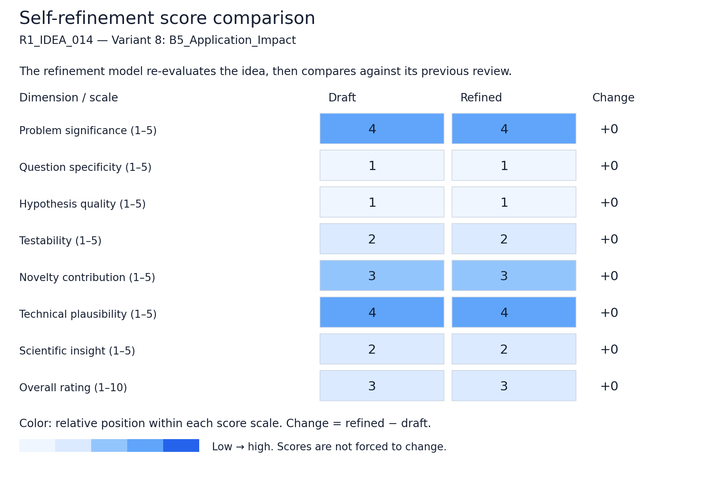

Changed score dimensions: none.

### Score justifications (draft / refined)

**Problem significance**

```json
{
  "draft": {
    "score": 4.0,
    "justification": "Open-world visual understanding is a highly significant problem in computer vision and AI. Creating comprehensive datasets to enable such capabilities addresses a real bottleneck. However, the idea doesn't clearly articulate why current datasets are insufficient for this goal."
  },
  "refined": {
    "score": 4.0,
    "justification": "Open-world visual understanding is a highly significant problem in AI and computer vision. Comprehensive datasets are recognized as enabling resources for advancing the field. However, the idea does not clearly articulate why current datasets are insufficient or what specific gap this addresses beyond scale."
  }
}
```

**Question specificity**

```json
{
  "draft": {
    "score": 1.0,
    "justification": "No research question is specified. The summary describes a resource to be built ('we present...', 'we create...') but doesn't define what scientific question is being investigated. It's a project description, not a research hypothesis."
  },
  "refined": {
    "score": 1.0,
    "justification": "No research question is present. The summary describes a resource to be built ('we present', 'we create') without defining any scientific inquiry. It is purely a project description, not a research investigation."
  }
}
```

**Hypothesis quality**

```json
{
  "draft": {
    "score": 1.0,
    "justification": "There is no hypothesis—implicit or explicit. The closest statement is that the dataset 'could inform the development of practical visual understanding systems' and 'may be relevant to guiding downstream applications,' which are vague, non-falsifiable claims about potential utility."
  },
  "refined": {
    "score": 1.0,
    "justification": "There is no hypothesis. The statements that the dataset 'could inform development' and 'may be relevant to guiding downstream applications' are vague, non-committal potentialities, not concrete, falsifiable predictions about mechanisms, relationships, or outcomes."
  }
}
```

**Testability**

```json
{
  "draft": {
    "score": 2.0,
    "justification": "The idea as presented is not directly testable because it doesn't make a specific claim. One could test whether models trained on the dataset perform well on certain benchmarks, but that's an application of the resource, not a test of a core research hypothesis. The data collection methodology itself could be evaluated, but no specific claims about its advantages are made."
  },
  "refined": {
    "score": 2.0,
    "justification": "The core idea as stated is not directly testable because it makes no specific claim. One could test applications of the dataset (e.g., model performance), but that tests the utility of the resource, not a research hypothesis. The data engine methodology could be evaluated for efficiency or quality, but no claims about its advantages are made to test."
  }
}
```

**Novelty contribution**

```json
{
  "draft": {
    "score": 3.0,
    "justification": "Creating a very large-scale, multi-format annotated visual dataset is a substantial engineering contribution. However, as a research idea, it lacks novelty—it's essentially scaling up existing dataset creation paradigms (human-in-the-loop annotation) without articulating a novel scientific insight this scaling enables."
  },
  "refined": {
    "score": 3.0,
    "justification": "Creating a large-scale, multi-format visual dataset is a substantial engineering and resource contribution. As a research idea, it lacks scientific novelty—it proposes scaling existing dataset creation paradigms without articulating what novel insight this scaling enables or what new phenomenon it aims to discover."
  }
}
```

**Technical plausibility**

```json
{
  "draft": {
    "score": 4.0,
    "justification": "The described approach (scalable data engine with human feedback and efficient models) is technically plausible given advances in semi-automated annotation. The scale is ambitious but not inherently implausible."
  },
  "refined": {
    "score": 4.0,
    "justification": "The described approach of a scalable data engine using human feedback and efficient models is technically plausible, building on known semi-automated annotation techniques. The scale is ambitious but not inherently implausible given current computational and crowdsourcing capabilities."
  }
}
```

**Scientific insight**

```json
{
  "draft": {
    "score": 2.0,
    "justification": "The idea currently promises little scientific insight beyond demonstrating that a large dataset can be built. Without a clear research question, it's unclear what we would learn about visual recognition, learning, or understanding from this project beyond empirical performance on tasks."
  },
  "refined": {
    "score": 2.0,
    "justification": "The idea promises minimal scientific insight as presented. Without a research question, it is unclear what we would learn about visual recognition, learning dynamics, or understanding beyond the empirical fact that a large dataset was created. It risks being a resource demonstration rather than a knowledge-generating investigation."
  }
}
```

**Overall rating**

```json
{
  "draft": {
    "score": 3.0,
    "justification": "This is a weak research idea because it lacks a research question, hypothesis, or testable claim. It describes an ambitious dataset creation project but doesn't articulate what scientific problem it solves or what hypothesis it tests. While the underlying problem (open-world visual understanding) is significant, the idea as presented is more of a resource-building proposal than a research investigation. It would need substantial refinement to become a meaningful research direction."
  },
  "refined": {
    "score": 3.0,
    "justification": "This is a weak research idea. It describes an ambitious dataset creation project but completely fails to articulate a research question, hypothesis, or testable claim. While the underlying problem (open-world visual understanding) is significant, the idea is presented as a resource-building proposal, not a scientific investigation. It lacks the core components of a research direction: specificity, falsifiability, and a clear path to new knowledge. Substantial refinement is needed to transform it into a meaningful research idea."
  }
}
```

## R1_IDEA_014 — Variant 9: C1_Hollow_Shell

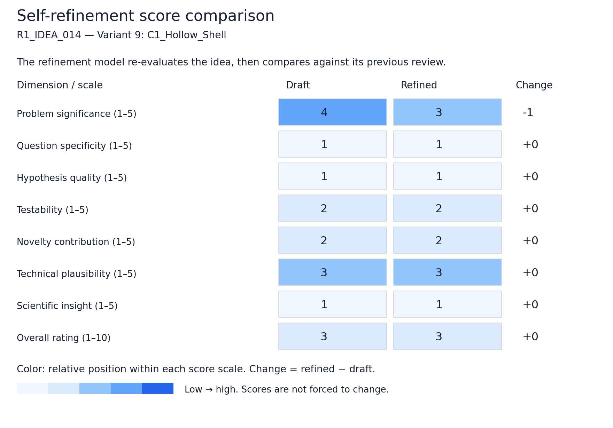

Changed score dimensions: problem_significance.

### Score justifications (draft / refined)

**Problem significance**

```json
{
  "draft": {
    "score": 4.0,
    "justification": "Open-world understanding is a meaningful and challenging problem in computer vision and AI. Creating better datasets for this purpose could potentially advance the field. However, the idea doesn't articulate why current datasets are insufficient or what specific aspect of open-world understanding needs improvement."
  },
  "refined": {
    "score": 3.0,
    "justification": "Open-world understanding is a recognized challenge in vision and ML, and better datasets could contribute to progress. However, the idea does not articulate why current datasets are insufficient or what specific open-world capability is lacking. The significance is moderate because the problem area is relevant, but the motivation is generic."
  }
}
```

**Question specificity**

```json
{
  "draft": {
    "score": 1.0,
    "justification": "Extremely low specificity. The idea merely states an intention to create a dataset without defining any research question. There's no indication of what relationship, mechanism, or phenomenon is being investigated."
  },
  "refined": {
    "score": 1.0,
    "justification": "Extremely low specificity. The text describes a planned activity (creating a dataset) but poses no research question. There is no inquiry into a relationship, mechanism, or phenomenon. It is essentially a project description, not a research direction."
  }
}
```

**Hypothesis quality**

```json
{
  "draft": {
    "score": 1.0,
    "justification": "No hypothesis is present. The idea describes an activity (creating a dataset) rather than making a testable prediction about how this dataset would affect model capabilities or what properties it should have."
  },
  "refined": {
    "score": 1.0,
    "justification": "No hypothesis is present, implicit or explicit. There is no prediction about how this dataset would affect model performance, what properties it should have, or what scientific claim it would support. The idea is purely descriptive of an intended output."
  }
}
```

**Testability**

```json
{
  "draft": {
    "score": 2.0,
    "justification": "The idea as stated is not directly testable because it doesn't make a claim that can be supported or contradicted. One could test whether the dataset can be created, but that's an engineering task rather than a scientific investigation. The value of the dataset would need to be evaluated through downstream tasks, but no such evaluation is proposed."
  },
  "refined": {
    "score": 2.0,
    "justification": "The core activity—dataset creation—is achievable, but the idea lacks any claim whose truth can be tested. One could test if the dataset is built, but that is an engineering outcome. To be a research idea, it needs a testable claim about the dataset's impact on model capabilities, which is absent."
  }
}
```

**Novelty contribution**

```json
{
  "draft": {
    "score": 2.0,
    "justification": "Creating another large-scale dataset is not inherently novel. Many vision datasets already exist with various annotation types. The contribution would depend entirely on what makes this dataset different and valuable, which is not specified. The idea seems more like a dataset creation project than a research investigation."
  },
  "refined": {
    "score": 2.0,
    "justification": "Creating another large-scale annotated dataset is not novel per se. Many exist (COCO, OpenImages, LVIS, etc.). Contribution would depend on unique annotation types, coverage, or purpose, none of which are specified. As presented, it is a generic dataset project with no defined novel angle."
  }
}
```

**Technical plausibility**

```json
{
  "draft": {
    "score": 3.0,
    "justification": "Creating a large-scale dataset with annotated regions is technically plausible. Many such datasets exist. The mention of a 'data engine' suggests some automation, which is reasonable. However, without details about the annotation types or quality control, it's difficult to assess feasibility fully."
  },
  "refined": {
    "score": 3.0,
    "justification": "Building a large-scale dataset with region annotations is technically feasible, and using a data engine for scaling is a known approach. However, without details on annotation type, quality control, or data sources, feasibility cannot be fully assessed, but there is no obvious technical implausibility."
  }
}
```

**Scientific insight**

```json
{
  "draft": {
    "score": 1.0,
    "justification": "The idea as presented offers minimal potential for scientific insight. It describes creating a resource rather than investigating a question. Even if successful, it would primarily provide a dataset rather than reveal new principles, mechanisms, or understanding about open-world learning."
  },
  "refined": {
    "score": 1.0,
    "justification": "The idea offers minimal potential for scientific insight as stated. It describes producing a resource, not investigating a question. Even if successfully built, the dataset itself does not inherently yield new understanding about learning mechanisms, generalization principles, or open-world challenges without a designed experimental study around it."
  }
}
```

**Overall rating**

```json
{
  "draft": {
    "score": 3.0,
    "justification": "This is a weak research idea because it lacks a clear research question, hypothesis, or testable claim. It describes a dataset creation project rather than a scientific investigation. While open-world understanding is a meaningful problem area, the idea doesn't specify what aspect of it is being studied or how creating this dataset would advance our understanding. The idea needs substantial refinement to become a research investigation rather than an engineering project."
  },
  "refined": {
    "score": 3.0,
    "justification": "This is a weak research idea because it lacks the core components of a research investigation: a specific question, a testable hypothesis, and a clear path to generating scientific insight. It reads as a dataset creation project plan. While the problem area (open-world understanding) is meaningful, the idea does not define what aspect will be studied or how this dataset would advance knowledge beyond being another data resource. Substantial refinement is needed to transform it into a research direction."
  }
}
```

## R1_IDEA_014 — Variant 10: C2_Logic_Flawed

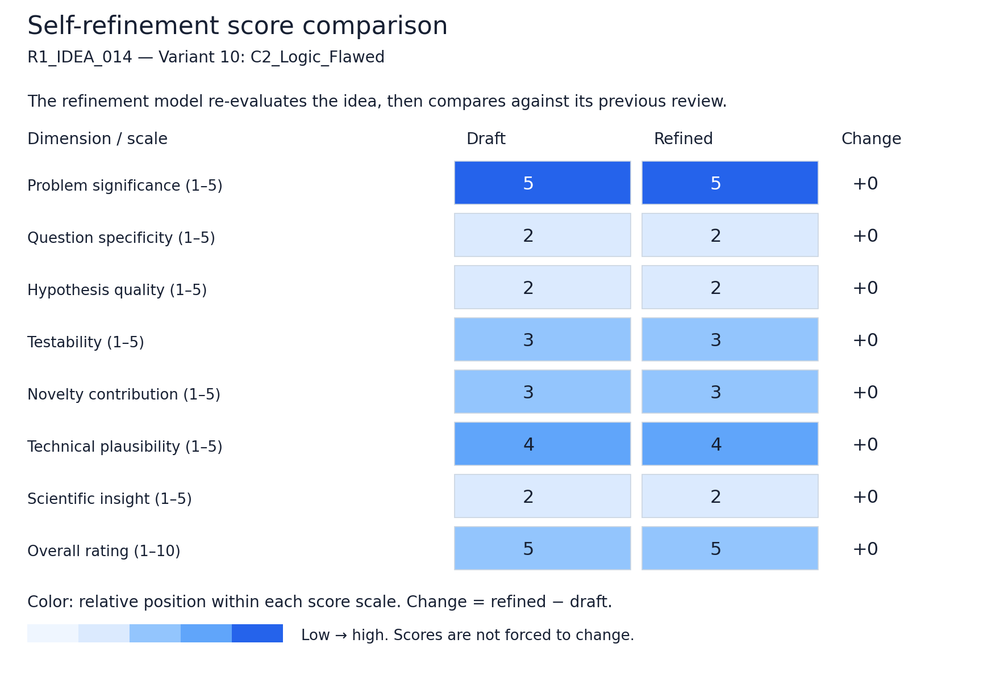

Changed score dimensions: none.

### Score justifications (draft / refined)

**Problem significance**

```json
{
  "draft": {
    "score": 5.0,
    "justification": "Open-world visual understanding is a fundamental and important challenge in computer vision. Moving beyond closed-set recognition to models that can recognize and understand diverse concepts in the wild addresses a meaningful limitation of current systems."
  },
  "refined": {
    "score": 5.0,
    "justification": "Open-world visual understanding is a fundamental and highly significant challenge in machine learning and computer vision. Enabling models to recognize and reason about an unbounded set of concepts in the wild addresses a core limitation of current closed-set systems and is critical for real-world applications."
  }
}
```

**Question specificity**

```json
{
  "draft": {
    "score": 2.0,
    "justification": "The idea describes a project but doesn't articulate a clear research question. It states what will be built (dataset and model) but not what specific scientific question is being investigated. The mention of 'broader effectiveness' is vague and not operationalized."
  },
  "refined": {
    "score": 2.0,
    "justification": "The idea describes what will be built (a dataset and model) but does not define a specific research question. The statement about 'broader effectiveness' is vague and not operationalized into a concrete, investigable question."
  }
}
```

**Hypothesis quality**

```json
{
  "draft": {
    "score": 2.0,
    "justification": "There's no explicit or clearly implicit hypothesis. The idea suggests that creating a large dataset with multiple annotation types using a particular data engine will lead to better open-world recognition, but this is more of an assumption than a testable hypothesis. No concrete prediction is made about expected outcomes or mechanisms."
  },
  "refined": {
    "score": 2.0,
    "justification": "There is no explicit hypothesis. An implicit assumption is that scaling dataset size/diversity with a specific data engine leads to better open-world models, but this is not framed as a testable prediction with measurable outcomes or proposed mechanisms. It lacks the specificity required for a strong hypothesis."
  }
}
```

**Testability**

```json
{
  "draft": {
    "score": 3.0,
    "justification": "The project is testable in the sense that one can build the dataset and model and evaluate performance. However, without a specific hypothesis or research question, it's unclear what would constitute success beyond general performance metrics. The claim of 'broader effectiveness' is not well-defined enough to be properly tested."
  },
  "refined": {
    "score": 3.0,
    "justification": "The project is technically testable in that one can build the system and evaluate model performance on benchmarks. However, without a clear hypothesis or research question, 'success' is loosely defined as achieving good performance, which is a weak form of testability. The central claim ('broader effectiveness') is too vague to be directly falsified."
  }
}
```

**Novelty contribution**

```json
{
  "draft": {
    "score": 3.0,
    "justification": "Creating large-scale datasets with multiple annotation types is not novel per se (e.g., LAION, Conceptual Captions, etc.). The proposed data engine approach with human feedback and models in the loop could be novel if properly differentiated from existing approaches. However, without specifying what's fundamentally new about the approach or what specific gap it addresses, the novelty is unclear."
  },
  "refined": {
    "score": 3.0,
    "justification": "Creating large-scale, multi-format vision-language datasets is an active area (e.g., LAION, DataComp, COYO). The proposed data engine approach, while potentially refined, is not described with sufficient differentiation to claim high novelty. The primary contribution appears to be scaling and resource creation, which has value but is not scientifically novel by itself."
  }
}
```

**Technical plausibility**

```json
{
  "draft": {
    "score": 4.0,
    "justification": "The approach seems technically plausible. Scalable data engines with human-in-the-loop annotation are established concepts. Creating a large dataset with multiple annotation types is feasible given sufficient resources. The description suggests reasonable technical choices."
  },
  "refined": {
    "score": 4.0,
    "justification": "The described approach is technically plausible. Scalable data engines using model-assisted human annotation are established concepts. The combination of annotation types (tags, QA, captions) is reasonable for multi-task learning. The scale, while ambitious, is not inherently infeasible given sufficient computational and human resources."
  }
}
```

**Scientific insight**

```json
{
  "draft": {
    "score": 2.0,
    "justification": "As described, the idea seems primarily focused on building a resource rather than generating scientific insight. Without a clear research question, it's unclear what general principles, mechanisms, or limitations would be revealed. The potential insight is limited to demonstrating that scaling dataset size and diversity improves performance, which is already a widely accepted hypothesis in the field."
  },
  "refined": {
    "score": 2.0,
    "justification": "As presented, the idea is primarily an engineering project to build a resource. It does not articulate what general principles, mechanisms, or boundary conditions it aims to reveal. The potential insight is limited to an empirical demonstration that 'more data of type X helps,' which is a well-known trend. Without a guiding question, the scientific insight potential is low."
  }
}
```

**Overall rating**

```json
{
  "draft": {
    "score": 5.0,
    "justification": "This is a moderate/borderline research idea. While it addresses an important problem (open-world visual understanding) and proposes a concrete technical approach, it lacks a clear research question, testable hypothesis, and specification of what scientific insight would be gained. The idea describes a resource-building project rather than a focused scientific investigation. With refinement to include a specific hypothesis and research question, it could become stronger."
  },
  "refined": {
    "score": 5.0,
    "justification": "This is a moderate/borderline research idea. It addresses a highly significant problem and outlines a plausible technical project. However, it lacks the core components of a scientific research idea: a specific question, a testable hypothesis, and a clear path to generating new scientific insight. It is currently a description of a resource-building effort. With the addition of a focused research question and hypothesis, it could become a strong research direction."
  }
}
```

## R1_IDEA_014 — Variant 11: C3_Substance_Enriched


Changed score dimensions: none.

### Score justifications (draft / refined)

**Problem significance**

```json
{
  "draft": {
    "score": 4.0,
    "justification": "Open-world visual recognition is an important challenge in computer vision. Creating comprehensive datasets that enable models to recognize diverse concepts is meaningful. However, 'understanding everything' is overly ambitious without clearer definition."
  },
  "refined": {
    "score": 4.0,
    "justification": "Building comprehensive datasets for open-world visual understanding is a significant and active challenge in computer vision. Scaling to millions of categories with diverse annotations is a meaningful engineering and research problem. However, the framing ('understanding everything') is overly vague, which slightly reduces the perceived significance of the specific research direction."
  }
}
```

**Question specificity**

```json
{
  "draft": {
    "score": 2.0,
    "justification": "The core research question is vague ('recognizing and understanding everything'). While there's a specific hypothesis about annotation density, the overall investigation lacks clear focus. The validation path is generic."
  },
  "refined": {
    "score": 2.0,
    "justification": "The core stated objective ('recognizing and understanding everything in the open world') is not a specific research question. The validation path is described generically. The only specific element is the annotation density hypothesis, but it is presented as a secondary 'possible' test rather than the central focus of the investigation."
  }
}
```

**Hypothesis quality**

```json
{
  "draft": {
    "score": 3.0,
    "justification": "The annotation density hypothesis is testable and makes a concrete prediction. However, it's not well-developed - no mechanism is proposed, and it's unclear how this distinguishes the research from generic dataset evaluation."
  },
  "refined": {
    "score": 3.0,
    "justification": "The annotation density hypothesis is explicit and testable. It makes a concrete prediction about an input variable (density) and an outcome (generalization). However, it is not well-developed—no causal mechanism or theoretical grounding is suggested. It also seems somewhat disconnected from the main project description, appearing as an add-on rather than a driving research question."
  }
}
```

**Testability**

```json
{
  "draft": {
    "score": 3.0,
    "justification": "The annotation density hypothesis is testable through controlled experiments. The dataset coverage validation is testable but vague. Overall testability is moderate because while some aspects can be tested, the core 'understanding everything' claim is not clearly testable."
  },
  "refined": {
    "score": 3.0,
    "justification": "The annotation density hypothesis is directly testable via controlled dataset ablation studies. The dataset's 'coverage' or 'utility' could be tested on downstream tasks, but these tests are vaguely defined ('diverse, unseen visual domains'). The grand claim of 'understanding everything' is not falsifiable or testable as stated."
  }
}
```

**Novelty contribution**

```json
{
  "draft": {
    "score": 3.0,
    "justification": "Creating another large-scale dataset has diminishing novelty unless it addresses specific gaps. The annotation density hypothesis adds some novelty, but the overall contribution seems primarily as a resource rather than a focused scientific investigation."
  },
  "refined": {
    "score": 3.0,
    "justification": "Creating a new large-scale dataset is, by itself, more of a resource contribution than a novel scientific investigation. The inclusion of multi-modal annotations (tags, QA, captions) at scale adds value. The annotation density hypothesis introduces a modest scientific angle, but it is a relatively common consideration in dataset design. The idea does not clearly propose a novel methodological insight or a discovery of a new phenomenon."
  }
}
```

**Technical plausibility**

```json
{
  "draft": {
    "score": 4.0,
    "justification": "The proposed data engine approach (human feedback + efficient models) is plausible based on similar successful approaches. The dataset scale is ambitious but technically feasible given current infrastructure."
  },
  "refined": {
    "score": 4.0,
    "justification": "The described approach—a scalable data engine combining human feedback with efficient models—is technically plausible and builds on established active learning and human-in-the-loop paradigms. The scale is ambitious but not infeasible given current compute and crowdsourcing infrastructure. The core technical premise is sound."
  }
}
```

**Scientific insight**

```json
{
  "draft": {
    "score": 3.0,
    "justification": "The annotation density hypothesis could yield insight into dataset design principles. However, the idea primarily describes a dataset creation effort rather than a study designed to extract generalizable scientific insights about vision or learning."
  },
  "refined": {
    "score": 3.0,
    "justification": "If the annotation density hypothesis were rigorously investigated, it could yield insights into dataset design principles for long-tail recognition. However, the idea as presented is heavily skewed toward dataset creation. The potential for broader scientific insight (e.g., fundamental limits of recognition, scaling laws, or the nature of visual understanding) is not articulated and seems incidental to the main project goal."
  }
}
```

**Overall rating**

```json
{
  "draft": {
    "score": 5.0,
    "justification": "This is a moderate research idea. While the dataset creation effort addresses an important problem and includes a testable hypothesis, the research question lacks specificity and the scientific contribution is limited. The idea describes a resource creation project more than a focused investigation with clear scientific objectives. The annotation density hypothesis is promising but underdeveloped."
  },
  "refined": {
    "score": 5.0,
    "justification": "This is a moderate/borderline research idea. Its primary strength is addressing an important practical problem (dataset scale for open-world vision) with a plausible technical approach. However, it lacks a clear, focused research question. The proposed validation is generic, and the included hypothesis, while testable, is underdeveloped. The idea reads more as a project plan for creating a valuable resource than as a hypothesis-driven scientific investigation. It has the components for a strong engineering contribution but only a modest scientific one."
  }
}
```

## R1_IDEA_014 — Variant 12: H1_Deceptive_Hollow


Changed score dimensions: none.

### Score justifications (draft / refined)

**Problem significance**

```json
{
  "draft": {
    "score": 4.0,
    "justification": "Open-world understanding is a significant and meaningful long-term challenge in machine learning. Building robust, adaptive systems that generalize beyond closed training distributions is a core problem. The motivation is relevant."
  },
  "refined": {
    "score": 4.0,
    "justification": "Open-world understanding is a significant and meaningful long-term challenge in machine learning. Building robust, adaptive systems that generalize beyond closed training distributions is a core problem with substantial relevance to both research and practical applications."
  }
}
```

**Question specificity**

```json
{
  "draft": {
    "score": 1.0,
    "justification": "Exceptionally weak. The idea does not define a research question. It describes a project (building a dataset/model) and an ambition (creating a transformative framework), but there is no concrete \"what are we investigating?\" The text is entirely about positioning and promise, not inquiry."
  },
  "refined": {
    "score": 1.0,
    "justification": "Exceptionally weak. The idea does not define a research question. It describes a project (building a dataset/model) and an ambition (creating a transformative framework), but there is no concrete \"what are we investigating?\" The text is entirely about positioning and promise, not scientific inquiry."
  }
}
```

**Hypothesis quality**

```json
{
  "draft": {
    "score": 1.0,
    "justification": "There is no discernible hypothesis. The text makes no concrete prediction about a relationship, mechanism, or outcome. It states a \"central promise\" of connection and transformation, which is a goal, not a testable scientific statement."
  },
  "refined": {
    "score": 1.0,
    "justification": "There is no discernible hypothesis. The text makes no concrete prediction about a relationship, mechanism, or outcome. It states a \"central promise\" of connection and transformation, which is a goal or vision statement, not a testable scientific hypothesis."
  }
}
```

**Testability**

```json
{
  "draft": {
    "score": 1.0,
    "justification": "The idea as presented is not testable. There is no central claim to support or contradict. One could build the dataset and model, but the scientific investigation is undefined. The evaluation of success is framed as community impact (\"reshape how the community thinks\"), which is not a directly falsifiable research outcome."
  },
  "refined": {
    "score": 1.0,
    "justification": "The idea as presented is not testable. There is no central claim to support or contradict. One could build the dataset and model, but the scientific investigation itself is undefined. The evaluation of success is framed as community impact (\"reshape how the community thinks\"), which is not a directly falsifiable research outcome."
  }
}
```

**Novelty contribution**

```json
{
  "draft": {
    "score": 2.0,
    "justification": "The novelty is unclear. Creating a new large-scale dataset is a contribution, but it is an engineering/product contribution unless paired with a novel scientific question. The idea claims transformative synthesis but does not specify what is being synthesized or how it is novel compared to prior dataset efforts (e.g., LAION, DataComp, Ego4D). The contribution is positioned vaguely."
  },
  "refined": {
    "score": 2.0,
    "justification": "The novelty is unclear. Creating a new large-scale dataset is a contribution, but it is primarily an engineering/product contribution unless paired with a novel scientific question. The idea claims transformative synthesis but does not specify what is being synthesized or how it is novel compared to prior large-scale dataset efforts. The contribution is positioned vaguely as a 'framework' without concrete differentiation."
  }
}
```

**Technical plausibility**

```json
{
  "draft": {
    "score": 3.0,
    "justification": "The core technical premise—using a data engine to create a large annotated dataset—is plausible and aligns with current trends. However, the lack of detail on the engine's mechanism, the annotation types, or the model architecture makes full assessment impossible. The reasoning is coherent but at a very high, non-technical level."
  },
  "refined": {
    "score": 3.0,
    "justification": "The core technical premise—using a data engine to create a large annotated dataset—is plausible and aligns with current trends. However, the complete lack of detail on the engine's mechanism, the annotation types, or the model architecture makes full assessment impossible. The reasoning is coherent but at a very high, non-technical level."
  }
}
```

**Scientific insight**

```json
{
  "draft": {
    "score": 2.0,
    "justification": "The potential insight is currently low because no specific scientific phenomenon is targeted. The idea suggests the outcome could be a new framework or way of thinking, but it does not specify what general principle, limitation, or mechanism we would learn about open-world understanding. Insight is contingent on defining a research question, which is absent."
  },
  "refined": {
    "score": 2.0,
    "justification": "The potential insight is currently low because no specific scientific phenomenon is targeted. The idea suggests the outcome could be a new framework or way of thinking, but it does not specify what general principle, limitation, mechanism, or boundary condition we would learn about open-world understanding. Insight is entirely contingent on defining a research question, which is absent."
  }
}
```

**Overall rating**

```json
{
  "draft": {
    "score": 3.0,
    "justification": "This is a weak research idea in its current form. While it identifies a significant problem area (open-world understanding), it fails to articulate any specific research question, hypothesis, or testable claim. It reads more like a project proposal or a vision statement than a scientific research idea. The lack of specificity, testability, and defined contribution severely limits its scientific quality. It would need substantial refinement to become a viable research direction."
  },
  "refined": {
    "score": 3.0,
    "justification": "This is a weak research idea in its current form. While it identifies a significant problem area (open-world understanding), it fails to articulate any specific research question, hypothesis, or testable claim. It reads more like a project proposal or vision statement than a scientific research idea. The lack of specificity, testability, and defined scientific contribution severely limits its quality. It would need substantial refinement to become a viable research direction."
  }
}
```

## R1_IDEA_014 — Variant 13: H2_Confident_Flaw

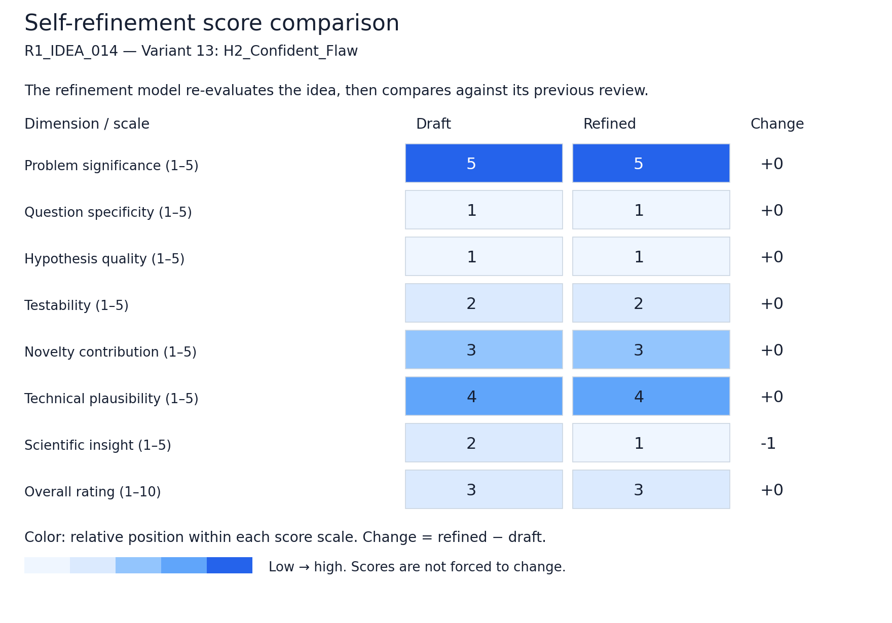

Changed score dimensions: scientific_insight.

### Score justifications (draft / refined)

**Problem significance**

```json
{
  "draft": {
    "score": 5.0,
    "justification": "The problem is highly significant. Open-world visual recognition and understanding is a core, unsolved challenge in computer vision and AI. Creating large-scale, richly annotated datasets is a recognized and important direction for advancing the field."
  },
  "refined": {
    "score": 5.0,
    "justification": "The problem is exceptionally significant. Open-world visual recognition is a core, unsolved challenge in AI. Creating large-scale, richly annotated datasets is a critical direction for advancing the field, with broad implications for both research and applications."
  }
}
```

**Question specificity**

```json
{
  "draft": {
    "score": 1.0,
    "justification": "Extremely weak. The idea does not define a research question. It describes a project (build a dataset/model) and makes a broad, unsupported claim about causal evidence. There is no concrete question like 'Does annotation type X improve capability Y under condition Z?'"
  },
  "refined": {
    "score": 1.0,
    "justification": "Extremely weak. No research question is defined. The text describes a project output (dataset/model) and makes a broad claim about causal evidence, but poses no specific question like 'How does annotation diversity affect zero-shot generalization?' or 'Does human-in-the-loop data scaling yield diminishing returns?'"
  }
}
```

**Hypothesis quality**

```json
{
  "draft": {
    "score": 1.0,
    "justification": "Very weak. There is no identifiable hypothesis. The closest is an implicit claim: 'Addressing the most visible weakness (via our data engine) causes general superiority.' This is not a concrete, testable prediction but a vague assertion. It lacks the structure of a scientific hypothesis (if X, then Y, because Z)."
  },
  "refined": {
    "score": 1.0,
    "justification": "Very weak. There is no identifiable scientific hypothesis. The implicit claim—'addressing the most visible weakness causes general superiority'—is a vague assertion, not a concrete, testable prediction. It lacks the structure of a hypothesis (e.g., mechanism, measurable outcome, boundary conditions)."
  }
}
```

**Testability**

```json
{
  "draft": {
    "score": 2.0,
    "justification": "Weak. The project of building a dataset and model is testable in the sense that one can measure benchmark performance. However, the core argument presented—that gains can be treated as causal evidence without isolating variables—is fundamentally *untestable* under that flawed framework. A proper test would require controlled experiments comparing data engines, scaling ablated annotations, etc., which the idea explicitly dismisses."
  },
  "refined": {
    "score": 2.0,
    "justification": "Weak. Building a dataset and measuring benchmark performance is testable in a broad sense. However, the core argument—that gains can be treated as causal evidence without isolating variables—is untestable under that flawed framework. Proper testing would require controlled comparisons (e.g., ablating annotation types, scaling studies), which the idea explicitly dismisses."
  }
}
```

**Novelty contribution**

```json
{
  "draft": {
    "score": 3.0,
    "justification": "Moderate. The scale (1.2B regions) and combination of annotation types (tags, QA, captions) for open-world recognition could be novel. However, the field has many large-scale datasets and data engines. The proposed contribution is unclear: is it the dataset, the engine, or the problematic causal claim? The latter would be a negative contribution. The former could be a useful resource."
  },
  "refined": {
    "score": 3.0,
    "justification": "Moderate. The scale (1.2B regions) and combination of annotation types (tags, QA, captions) could be novel contributions as a dataset resource. However, large-scale vision datasets and human-in-the-loop data engines are not new. The proposed contribution is unclear and partly undermined by the unscientific causal claim."
  }
}
```

**Technical plausibility**

```json
{
  "draft": {
    "score": 4.0,
    "justification": "Strong. The described technical approach—a scalable data engine using human feedback and efficient models—is a plausible and established paradigm for dataset creation (e.g., inspired by InstructPix2Pix, LAION, etc.). Building a large multi-format dataset is technically feasible."
  },
  "refined": {
    "score": 4.0,
    "justification": "Strong. The described technical approach—a scalable data engine using human feedback and efficient models—is plausible and aligns with existing paradigms (e.g., active learning, dataset distillation). Creating a large multi-format dataset is technically feasible given current infrastructure."
  }
}
```

**Scientific insight**

```json
{
  "draft": {
    "score": 2.0,
    "justification": "Weak. As presented, the idea promises little scientific insight. It advocates for skipping the analysis of 'dataset composition, evaluation criteria, boundary cases, or alternative explanations'—precisely the elements that generate insight. A well-executed version of this project could yield insights into scaling laws, annotation efficiency, or task transfer, but the current description actively discourages such investigation."
  },
  "refined": {
    "score": 1.0,
    "justification": "Very weak. The idea as presented actively discourages scientific insight by arguing that analysis of 'dataset composition, evaluation criteria, boundary cases, or alternative explanations' is unnecessary. A well-executed version could offer insights into scaling laws or annotation efficiency, but the current description explicitly rejects the investigative steps needed to gain such insights."
  }
}
```

**Overall rating**

```json
{
  "draft": {
    "score": 3.0,
    "justification": "The idea describes a potentially useful engineering project (a large-scale dataset) but fails as a research idea. It lacks a clear research question, presents no testable hypothesis, and makes a seriously flawed methodological argument that undermines scientific rigor. The significant problem area is its only saving grace. As a research direction, it is weak because it does not propose to investigate a specific scientific question; it proposes to build something and make an unsupported claim about its evaluation."
  },
  "refined": {
    "score": 3.0,
    "justification": "The idea describes a potentially useful engineering project (a large-scale dataset) but fails as a research idea. It lacks a clear research question, presents no testable hypothesis, and makes a fundamentally flawed methodological argument that undermines scientific rigor. While the problem area is significant, the proposed direction does not define a specific scientific investigation and actively dismisses key elements of rigorous evaluation. As a research idea, it is weak."
  }
}
```

## R1_IDEA_014 — Variant 14: H3_Verbose_Enriched

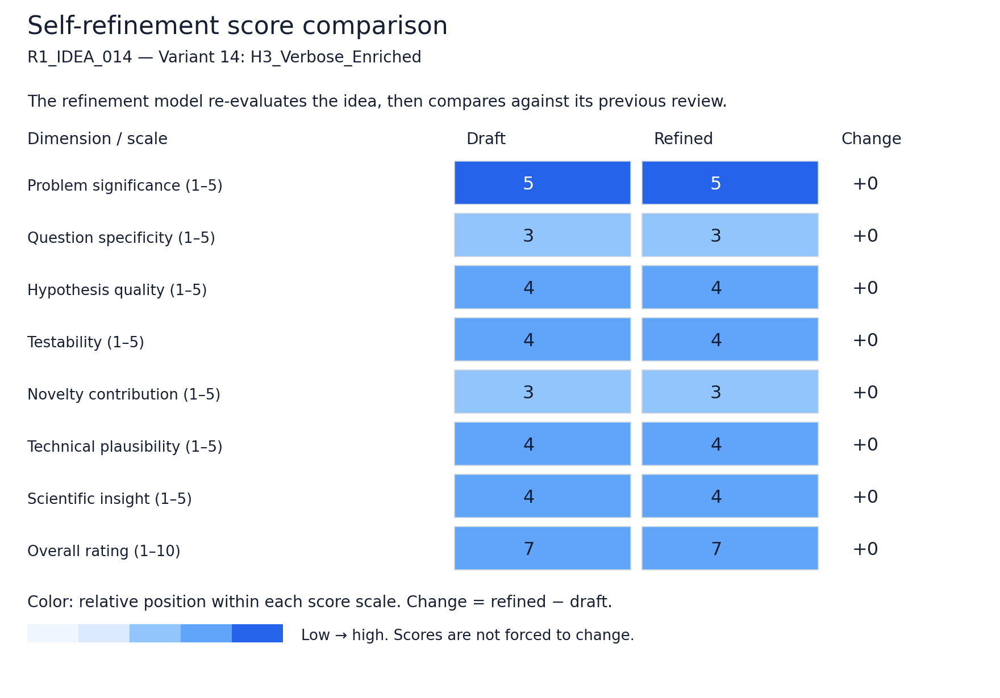

Changed score dimensions: none.

### Score justifications (draft / refined)

**Problem significance**

```json
{
  "draft": {
    "score": 5.0,
    "justification": "Open-world visual recognition is a fundamental and impactful challenge in computer vision and AI. Creating large-scale, richly annotated datasets to enable models to understand diverse, unseen concepts is highly meaningful for both research and real-world applications."
  },
  "refined": {
    "score": 5.0,
    "justification": "Open-world visual recognition is a fundamental and impactful challenge in AI. Creating large-scale, richly annotated datasets to enable models to understand diverse, unseen concepts is highly meaningful for both research and real-world applications like robotics, autonomous systems, and assistive technologies."
  }
}
```

**Question specificity**

```json
{
  "draft": {
    "score": 3.0,
    "justification": "The idea mentions validating dataset coverage and testing a hypothesis about annotation density, but the core research question ('recognizing and understanding everything') is very broad. The hypothesis adds specificity, but the overall goal remains somewhat vague."
  },
  "refined": {
    "score": 3.0,
    "justification": "The core stated goal ('recognizing and understanding everything') is extremely broad and vague. However, the idea does introduce a more specific testable hypothesis about annotation density and generalization on rare categories, which adds focus. The overall research direction remains somewhat diffuse between dataset creation and hypothesis testing."
  }
}
```

**Hypothesis quality**

```json
{
  "draft": {
    "score": 4.0,
    "justification": "The hypothesis that 'annotation density influences model generalization on rare categories' is concrete, predictive, and falsifiable. It suggests a mechanism (density) affecting an outcome (generalization), which is a good basis for investigation."
  },
  "refined": {
    "score": 4.0,
    "justification": "The hypothesis that 'annotation density influences model generalization on rare categories' is concrete, predictive, and falsifiable. It proposes a causal relationship between a dataset property (density) and a model capability (generalization), which is a solid basis for scientific investigation. It could be stronger with more mechanistic explanation."
  }
}
```

**Testability**

```json
{
  "draft": {
    "score": 4.0,
    "justification": "The idea proposes a staged experimental design with ablations, sensitivity analyses, and error analysis, which are excellent for testability. However, it lacks specifics on exact models, metrics, and comparison baselines, which slightly reduces testability."
  },
  "refined": {
    "score": 4.0,
    "justification": "The idea outlines a comprehensive staged experimental design with ablations, sensitivity analyses, and error analysis, which are excellent for testability. However, it lacks specifics on exact models, metrics, and comparison baselines, which are necessary for full testability. The hypothesis itself is clearly testable through controlled experiments."
  }
}
```

**Novelty contribution**

```json
{
  "draft": {
    "score": 3.0,
    "justification": "Creating a new large-scale dataset is valuable, but many such datasets exist (e.g., LAION-5B, DataComp). The novelty hinges on the annotation types (region-based with QA pairs) and the focus on annotation density for rare categories. The contribution could be significant if the hypothesis reveals new insights about data scaling for open-world learning."
  },
  "refined": {
    "score": 3.0,
    "justification": "Creating a new large-scale dataset is valuable but not novel per se (e.g., LAION-5B, DataComp). The novelty hinges on the region-based annotations with QA pairs and the focused investigation of annotation density for rare categories. The contribution could be significant if the hypothesis reveals new insights about data scaling for open-world learning, but the idea doesn't clearly differentiate from existing dataset efforts."
  }
}
```

**Technical plausibility**

```json
{
  "draft": {
    "score": 4.0,
    "justification": "The approach is logically coherent: use human feedback and models-in-the-loop to scale annotation. Similar pipelines have been used in prior work (e.g., DatasetGAN, LVIS). The main assumption—that such an engine can produce 1.2B high-quality region annotations—is ambitious but not implausible."
  },
  "refined": {
    "score": 4.0,
    "justification": "The approach is logically coherent: using human feedback and models-in-the-loop to scale annotation production. Similar pipelines have been demonstrated in prior work (e.g., DatasetGAN, LVIS annotation). The main assumption—that such an engine can produce 1.2B high-quality region annotations—is ambitious but technically plausible given current capabilities, though quality control at that scale remains a significant challenge."
  }
}
```

**Scientific insight**

```json
{
  "draft": {
    "score": 4.0,
    "justification": "The idea aims to uncover when and why annotation density matters for generalization, which could yield insights into data regimes, domain constraints, and the value of human feedback for rare categories. This goes beyond mere performance benchmarking."
  },
  "refined": {
    "score": 4.0,
    "justification": "The idea aims to uncover when and why annotation density matters for generalization, which could yield valuable insights into data regimes, domain constraints, and the value of human feedback for rare categories. This goes beyond mere performance benchmarking and could inform future dataset creation and model training strategies."
  }
}
```

**Overall rating**

```json
{
  "draft": {
    "score": 7.0,
    "justification": "This is a strong research idea with a meaningful problem, a testable hypothesis, and a thoughtful validation plan. It has the potential to contribute both a valuable dataset and scientific insights into data scaling for open-world vision. The main limitations are the somewhat broad initial goal and lack of specificity in evaluation details, but these can be addressed in a full proposal."
  },
  "refined": {
    "score": 7.0,
    "justification": "This is a strong research idea with a highly meaningful problem, a testable hypothesis, and a thoughtful validation methodology. It has the potential to contribute both a valuable dataset and scientific insights into data scaling for open-world vision. The main limitations are the overly broad initial goal and lack of specificity in evaluation details, but these can be addressed in a full research proposal. The hypothesis-driven approach elevates it above simple dataset creation."
  }
}
```

## R1_IDEA_014 — Variant 15: H4_Ultimate_Hype

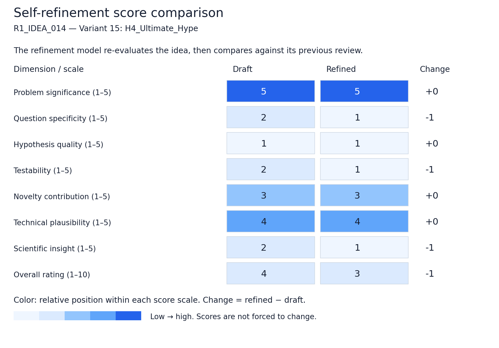

Changed score dimensions: question_specificity, testability, scientific_insight, overall_rating.

### Score justifications (draft / refined)

**Problem significance**

```json
{
  "draft": {
    "score": 5.0,
    "justification": "Open-world visual understanding is one of the most important and challenging problems in computer vision and AI. Creating systems that can recognize and understand diverse concepts without predefined categories is fundamental to real-world applications and scientific progress in visual intelligence."
  },
  "refined": {
    "score": 5.0,
    "justification": "Open-world visual understanding is one of the most important and challenging problems in AI. Creating systems that can recognize and reason about diverse concepts without predefined categories is fundamental to real-world AI applications and represents a core scientific challenge in computer vision."
  }
}
```

**Question specificity**

```json
{
  "draft": {
    "score": 2.0,
    "justification": "The research question is very broad: 'recognizing and understanding everything in the open world.' While the technical approach (dataset creation) is specific, the scientific question being investigated is not clearly defined. There's no concrete question about mechanisms, relationships, or phenomena in open-world learning."
  },
  "refined": {
    "score": 1.0,
    "justification": "The research question is extremely broad and poorly defined: 'recognizing and understanding everything in the open world.' This is an aspirational goal, not a concrete scientific question. There is no specification of what aspect of understanding is being investigated, what relationships are being studied, or what phenomenon is being examined."
  }
}
```

**Hypothesis quality**

```json
{
  "draft": {
    "score": 1.0,
    "justification": "No hypothesis is presented. The summary describes an ambitious project but doesn't make a testable prediction about open-world understanding. It implicitly assumes that scaling data with diverse annotations will lead to better open-world models, but this is not framed as a falsifiable hypothesis."
  },
  "refined": {
    "score": 1.0,
    "justification": "No hypothesis is presented. The summary describes an ambitious project but makes no testable prediction. The implicit assumption that scaling data with diverse annotations will lead to transformative open-world understanding is not framed as a falsifiable claim that could be supported or contradicted by evidence."
  }
}
```

**Testability**

```json
{
  "draft": {
    "score": 2.0,
    "justification": "While one could test whether models trained on AS-1B perform well on benchmarks, the core claim about 'redefining the frontier' and 'understanding everything' is not easily testable without clear success criteria. The idea lacks specification of what experiments would validate or invalidate its central premises."
  },
  "refined": {
    "score": 1.0,
    "justification": "The core claims are not testable as presented. 'Understanding everything' and 'redefining the frontier' are vague aspirations without operational definitions. While one could test model performance on benchmarks, the idea lacks specification of what experiments would validate its transformative potential or what outcomes would constitute failure."
  }
}
```

**Novelty contribution**

```json
{
  "draft": {
    "score": 3.0,
    "justification": "The scale (1.2B regions, 3.5M concepts) and combination of annotation types are novel contributions in dataset creation. However, the core research direction—creating large-scale datasets for open-world vision—builds directly on existing work like LAION, DataComp, and others. The potential scientific contribution depends on what insights emerge from the dataset, which is not specified."
  },
  "refined": {
    "score": 3.0,
    "justification": "The scale (1.2B regions, 3.5M concepts) and combination of annotation types represent a novel dataset contribution. However, the core research direction—creating large-scale datasets for open-world vision—builds directly on established paradigms (LAION, DataComp, etc.). The potential scientific contribution is unclear as the idea focuses on resource creation rather than novel investigation."
  }
}
```

**Technical plausibility**

```json
{
  "draft": {
    "score": 4.0,
    "justification": "The proposed technical approach is plausible. Scalable data engines with human feedback and models in the loop are established techniques. Creating diverse annotations at scale is challenging but technically feasible given sufficient resources. The description suggests reasonable technical choices."
  },
  "refined": {
    "score": 4.0,
    "justification": "The proposed technical approach is plausible. Scalable data engines with human-in-the-loop annotation are established techniques. Creating diverse annotations at scale is challenging but technically feasible with sufficient resources. The methodology description suggests reasonable technical choices given current capabilities."
  }
}
```

**Scientific insight**

```json
{
  "draft": {
    "score": 2.0,
    "justification": "The idea as presented focuses on creating a resource rather than generating scientific insight. While the dataset could enable insights, the summary doesn't articulate what those insights might be—what we might learn about open-world visual understanding mechanisms, limitations, or principles. The potential for insight exists but is not articulated."
  },
  "refined": {
    "score": 1.0,
    "justification": "The idea as presented focuses entirely on creating a resource rather than generating scientific insight. While the dataset could enable future insights, the summary doesn't articulate what those insights might be—what we might learn about the mechanisms, limitations, or principles of open-world visual understanding. No transferable knowledge is promised beyond the existence of the dataset."
  }
}
```

**Overall rating**

```json
{
  "draft": {
    "score": 4.0,
    "justification": "This is a weak research idea as presented. While it addresses an extremely important problem and proposes an ambitious technical project, it lacks the core elements of a research investigation: a specific research question, a testable hypothesis, and a clear path to scientific insight. It reads more like a project proposal or resource creation announcement than a research idea. The potential is high given the problem significance, but the idea needs substantial refinement to become a meaningful research direction rather than an engineering effort."
  },
  "refined": {
    "score": 3.0,
    "justification": "This is a weak research idea as presented. While it addresses an extremely important problem and proposes an ambitious engineering project, it lacks the essential elements of scientific research: a specific question, a testable hypothesis, and a clear path to generating new knowledge. It reads as a resource creation announcement or project proposal rather than a research investigation. The high problem significance is overshadowed by the absence of scientific framing."
  }
}
```

## R1_IDEA_015 — Source

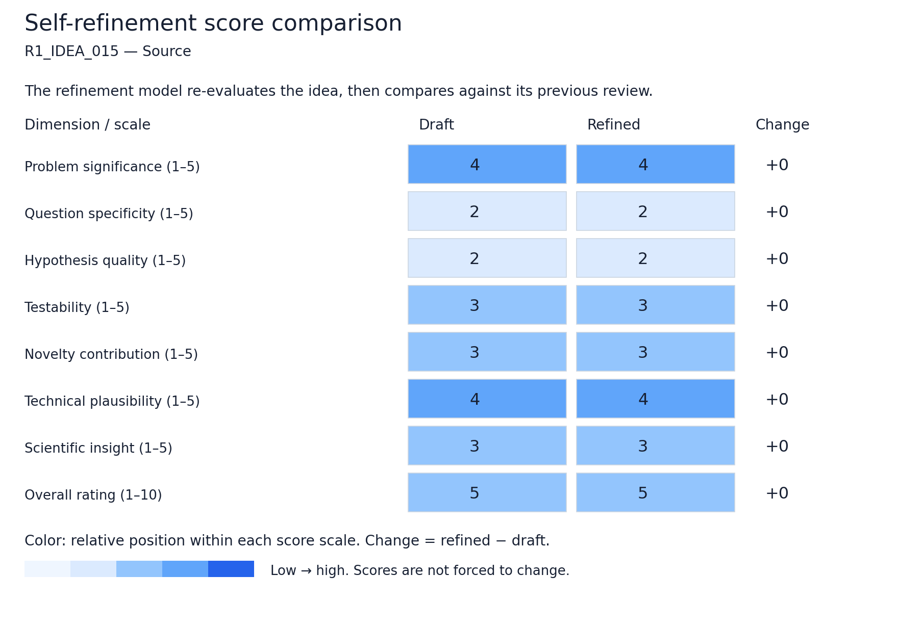

Changed score dimensions: none.

### Score justifications (draft / refined)

**Problem significance**

```json
{
  "draft": {
    "score": 4.0,
    "justification": "The problem is meaningful. Precise control over 3D content generation, especially for human avatars with complex semantics, is a recognized challenge in graphics and vision. Text interfaces are powerful but imprecise, creating a genuine need for better control mechanisms."
  },
  "refined": {
    "score": 4.0,
    "justification": "The problem is meaningful and well-identified. Precise control over 3D content generation, especially for human avatars with complex semantics, is a recognized challenge in computer graphics and vision. Text interfaces are powerful but imprecise, creating a genuine need for better control mechanisms that bridge high-level intent and fine-grained editing."
  }
}
```

**Question specificity**

```json
{
  "draft": {
    "score": 2.0,
    "justification": "The idea describes a proposed method but does not define a specific research question. The investigation is framed as 'propose a method to overcome a challenge,' which is a goal, not a focused question about a relationship, mechanism, or comparative performance."
  },
  "refined": {
    "score": 2.0,
    "justification": "The idea describes a proposed method but does not define a specific research question. The investigation is framed as 'propose a method to overcome a challenge,' which is a goal or solution proposal, not a focused question about a relationship, mechanism, or comparative performance. There is no explicit 'what will we investigate?'"
  }
}
```

**Hypothesis quality**

```json
{
  "draft": {
    "score": 2.0,
    "justification": "There is an implicit hypothesis that a slider-based interface for intermediate concepts will enable more precise editing than text alone. However, this is not stated as a concrete, testable prediction. It reads more as a proposed solution than a hypothesis to be evaluated."
  },
  "refined": {
    "score": 2.0,
    "justification": "There is an implicit hypothesis that a slider-based interface for intermediate concepts will enable more precise editing than text alone. However, this is not stated as a concrete, testable prediction. It reads more as a proposed solution than a hypothesis to be evaluated. A stronger hypothesis would make a falsifiable claim about the relationship between the control mechanism and editing outcomes."
  }
}
```

**Testability**

```json
{
  "draft": {
    "score": 3.0,
    "justification": "The core claim is testable in principle. One could design experiments comparing edit precision, user satisfaction, or task completion time between the proposed method and text-only baselines. However, the summary provides no direction for such testing, leaving it as an unspecified potential."
  },
  "refined": {
    "score": 3.0,
    "justification": "The core claim is testable in principle. One could design experiments comparing edit precision, user satisfaction, or task efficiency between the proposed method and text-only baselines. However, the summary provides no direction for such testing, leaving it as an unspecified potential. The idea itself does not propose how it would be tested."
  }
}
```

**Novelty contribution**

```json
{
  "draft": {
    "score": 3.0,
    "justification": "The application of continuous, slider-based control to 3D avatar editing is a plausible novel application. However, the concept of 'sliders' or 'continuous controls' for semantic attributes is well-established in 2D image generation (e.g., StyleGAN, diffusion model guidance). The primary novelty appears to be the domain (3D human avatars)."
  },
  "refined": {
    "score": 3.0,
    "justification": "The application of continuous, slider-based control to 3D avatar editing is a plausible novel application. However, the concept of 'sliders' or 'continuous controls' for semantic attributes is well-established in 2D image generation (e.g., StyleGAN, diffusion model guidance). The primary novelty appears to be the domain (3D human avatars). Without a specific hypothesis, the contribution risks being primarily engineering."
  }
}
```

**Technical plausibility**

```json
{
  "draft": {
    "score": 4.0,
    "justification": "The idea is technically plausible. The analogy to sliders/interpolation is sound. Many 3D generative models use latent representations where such interpolation is feasible. The main technical challenge would be establishing semantically meaningful directions, but this is a known research area."
  },
  "refined": {
    "score": 4.0,
    "justification": "The idea is technically plausible. The analogy to sliders/interpolation is sound. Many 3D generative models (e.g., based on neural fields, diffusion) use latent representations where such interpolation is feasible. The main technical challenge would be establishing semantically meaningful directions in 3D, but this is a known research area with precedents in 2D."
  }
}
```

**Scientific insight**

```json
{
  "draft": {
    "score": 3.0,
    "justification": "If pursued as a comparative study, it could yield insight into the trade-offs between discrete text commands and continuous parametric controls for 3D editing. However, as presented, the idea is primarily an engineering proposal. Deeper insights (e.g., about the geometry of semantic spaces for 3D avatars) are possible but not highlighted."
  },
  "refined": {
    "score": 3.0,
    "justification": "If pursued as a comparative study, it could yield insight into the trade-offs between discrete text commands and continuous parametric controls for 3D editing. However, as presented, the idea is primarily an engineering proposal. Deeper insights (e.g., about the geometry of semantic spaces for 3D avatars, or fundamental limits of language for 3D control) are possible but not highlighted or made central to the idea."
  }
}
```

**Overall rating**

```json
{
  "draft": {
    "score": 5.0,
    "justification": "This is a moderate/borderline research idea. It identifies a real problem and proposes a plausible, concrete mechanism to address it. However, it is currently framed as a method proposal without a clear research question or hypothesis. The potential contribution seems limited to a novel application of an existing control paradigm to a new domain (3D avatars). To become a strong research idea, it needs to articulate a specific, testable hypothesis about the benefits of its approach and define how those benefits would be measured and compared."
  },
  "refined": {
    "score": 5.0,
    "justification": "This is a moderate/borderline research idea. It identifies a real problem and proposes a plausible, concrete mechanism to address it. However, it is currently framed as a method proposal without a clear research question or hypothesis. The potential contribution seems limited to a novel application of an existing control paradigm to a new domain (3D avatars). To become a strong research idea, it needs to articulate a specific, testable hypothesis about the benefits of its approach and define how those benefits would be measured and compared."
  }
}
```

## R1_IDEA_015 — Variant 1: A1_Identity


Changed score dimensions: none.

### Score justifications (draft / refined)

**Problem significance**

```json
{
  "draft": {
    "score": 4.0,
    "justification": "The problem is meaningful. Precise control over 3D content generation is a significant challenge in graphics and vision. Text-based interfaces are notoriously ambiguous, so improving controllability is a relevant and worthwhile goal."
  },
  "refined": {
    "score": 4.0,
    "justification": "The problem is meaningful and relevant. Achieving precise, user-intended control over 3D content generation is a significant challenge in computer graphics and vision. The ambiguity of natural language for detailed specification is a well-known bottleneck, making research into improved interfaces worthwhile."
  }
}
```

**Question specificity**

```json
{
  "draft": {
    "score": 2.0,
    "justification": "The idea describes a proposed method but does not define a specific research question. It states a goal ('to overcome' ambiguity) and a proposed solution, but not what aspect of the solution will be investigated or validated."
  },
  "refined": {
    "score": 2.0,
    "justification": "The idea describes a proposed method and its goal, but does not define a specific research question. It states what the method aims to do ('overcome ambiguity'), but not what aspect will be investigated, tested, or understood. The 'what' is clear (a slider tool), but the 'why' or 'what we seek to learn' is missing."
  }
}
```

**Hypothesis quality**

```json
{
  "draft": {
    "score": 2.0,
    "justification": "There is an implicit hypothesis that a slider-based interface for intermediate concepts will overcome ambiguity better than pure text. However, this is not stated as a falsifiable claim. It reads more as a proposed design than a hypothesis to be tested."
  },
  "refined": {
    "score": 2.0,
    "justification": "There is only an implicit, undeveloped hypothesis that a slider interface will provide better control than text alone. This is not articulated as a concrete, testable prediction. The summary reads as a design proposal, not a hypothesis-driven research statement. A strong hypothesis would make a comparative or causal claim that could be contradicted by evidence."
  }
}
```

**Testability**

```json
{
  "draft": {
    "score": 2.0,
    "justification": "The idea, as stated, is not directly testable because it lacks any specification of an experiment, evaluation, or comparison. It proposes a tool. Testability would require defining how the tool's performance or effect would be measured against a baseline."
  },
  "refined": {
    "score": 2.0,
    "justification": "As presented, the idea is not directly testable. It proposes a tool without specifying how its success or failure relative to the goal ('overcome ambiguity') would be measured. Testability would require defining evaluation metrics, baselines, and an experimental setup to gather evidence for or against its core claim."
  }
}
```

**Novelty contribution**

```json
{
  "draft": {
    "score": 3.0,
    "justification": "The novelty appears to be the application of a continuous slider control paradigm (common in 2D image editing, e.g., 'StyleGAN sliders') to the domain of 3D human avatars. This is a reasonable but incremental conceptual transfer. The potential contribution is primarily methodological unless paired with a deeper investigation."
  },
  "refined": {
    "score": 3.0,
    "justification": "The novelty appears to be the application of a continuous slider-based control paradigm—common in 2D image editing (e.g., StyleGAN, diffusion model sliders)—to the domain of 3D human avatars. This is a reasonable but straightforward conceptual transfer. The potential contribution is primarily methodological and applied unless paired with a hypothesis that yields deeper understanding."
  }
}
```

**Technical plausibility**

```json
{
  "draft": {
    "score": 4.0,
    "justification": "The idea is technically plausible. The concept of learning disentangled latent directions (sliders) for semantic control is well-established in 2D generative models. Extending this to 3D avatars (e.g., via 3D-aware generative models or NeRF-based editing) is a logical and feasible research direction."
  },
  "refined": {
    "score": 4.0,
    "justification": "The idea is technically plausible. The concept of learning or defining latent directions ('concept sliders') for semantic control is well-established in generative models. Extending this to 3D avatar representations (e.g., via 3D-aware GANs, NeRF-based models, or diffusion models) is a logical and feasible direction, assuming appropriate 3D generative backbones exist."
  }
}
```

**Scientific insight**

```json
{
  "draft": {
    "score": 2.0,
    "justification": "As presented, the potential scientific insight is low. It describes an engineering solution to a usability problem. To yield scientific insight, the research would need to investigate questions like: How does the structure of semantic concepts in 3D avatar spaces differ from 2D? What principles govern the effectiveness of discrete vs. continuous controls for 3D editing? The current summary does not point toward such generalizable knowledge."
  },
  "refined": {
    "score": 2.0,
    "justification": "As presented, the potential for scientific insight is low. The idea is framed as an engineering solution to a usability problem. To yield scientific insight, the research would need to be structured to answer questions that produce generalizable knowledge—for example, about the properties of semantic manifolds in 3D generative spaces, the cognitive principles of effective 3D editing interfaces, or the fundamental limitations of language for 3D specification. The current summary does not point toward such investigations."
  }
}
```

**Overall rating**

```json
{
  "draft": {
    "score": 5.0,
    "justification": "This is a moderate/borderline research idea. It identifies a relevant problem and proposes a plausible, interesting technical direction. However, it is currently framed as a method proposal rather than a research investigation. It lacks a clear, testable research question, a hypothesis, and a plan for evaluation. The scientific contribution is limited to a novel application unless the scope is refined to seek more fundamental insights about controllability in 3D generation."
  },
  "refined": {
    "score": 5.0,
    "justification": "This is a moderate/borderline research idea. It identifies a relevant practical problem and suggests a plausible technical direction. However, it is currently framed as a method or tool proposal rather than a scientific research investigation. It lacks a clear research question, a testable hypothesis, and any plan for evaluation or comparison. The scientific contribution, as stated, is limited. To become a strong research idea, it needs to be reframed around a specific, investigable claim about controllability, user interaction, or the properties of 3D generative spaces."
  }
}
```

## R1_IDEA_015 — Variant 2: A2_Paraphrase_Only

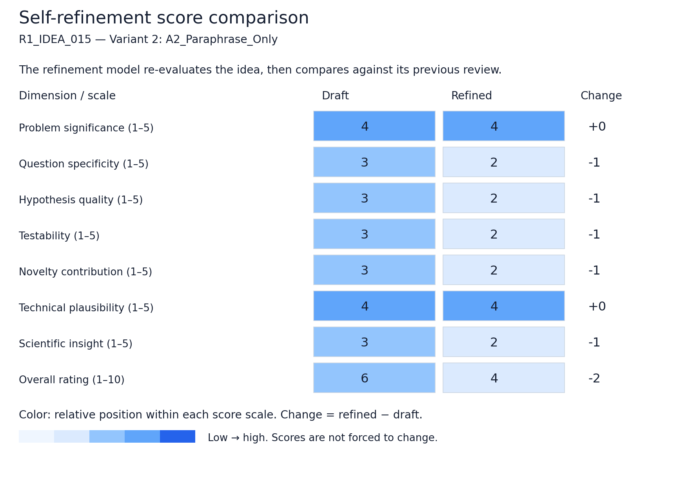

Changed score dimensions: question_specificity, hypothesis_quality, testability, novelty_contribution, scientific_insight, overall_rating.

### Score justifications (draft / refined)

**Problem significance**

```json
{
  "draft": {
    "score": 4.0,
    "justification": "The problem is meaningful. Precise editing of 3D assets, especially human avatars, is a significant challenge in graphics and vision. The ambiguity of natural language for fine-grained control is a well-known and relevant issue."
  },
  "refined": {
    "score": 4.0,
    "justification": "The problem is meaningful and relevant. Precise editing of 3D human avatars is a significant challenge in computer graphics and vision. The ambiguity and limited expressiveness of natural language for fine-grained control is a well-known and practically important issue for content creation tools."
  }
}
```

**Question specificity**

```json
{
  "draft": {
    "score": 3.0,
    "justification": "The core question is moderately specific: 'Can a slider-based interface between concept extremes enable more precise 3D avatar editing than direct text descriptions?' However, the description lacks detail on what is being manipulated (parameters, latents) and how the extremes are defined."
  },
  "refined": {
    "score": 2.0,
    "justification": "The core research question is vague. While it identifies a problem and proposes a mechanism name, it does not define what is being investigated. There's no clear question about what relationship is being tested, what phenomenon is being explored, or what specific claim is being made beyond the high-level concept of a slider."
  }
}
```

**Hypothesis quality**

```json
{
  "draft": {
    "score": 3.0,
    "justification": "There is an implicit hypothesis: that representing edits as movements along a continuum between defined extremes offers more precision than direct text-to-edit. This is a concrete and potentially falsifiable claim, but it is not stated explicitly as a prediction."
  },
  "refined": {
    "score": 2.0,
    "justification": "There is only a very implicit hypothesis: that slider-based control between extremes might offer more precision than text. This is not stated as a concrete prediction, lacks specificity about mechanisms, and doesn't distinguish itself from generic applications of interpolation. A stronger hypothesis would make a falsifiable claim about why this approach would work better."
  }
}
```

**Testability**

```json
{
  "draft": {
    "score": 3.0,
    "justification": "The idea is testable in principle. One could design experiments comparing the precision/controllability of slider-based edits vs. text-prompt-based edits, likely using human evaluation or task-specific metrics. However, the idea summary does not propose any such evaluation, leaving the testability somewhat abstract."
  },
  "refined": {
    "score": 2.0,
    "justification": "The idea is testable in principle, but the summary provides no direction for how to test it. There's no suggested experiment, evaluation metric, comparison, or analysis method. One could design tests post-hoc, but the idea itself doesn't guide toward testability."
  }
}
```

**Novelty contribution**

```json
{
  "draft": {
    "score": 3.0,
    "justification": "The application of a 'slider' or continuous control mechanism for semantic editing is a known concept in image generation (e.g., GAN latent space traversal, diffusion model guidance). Applying this paradigm to the specific domain of 3D human avatar editing has potential novelty, but the core conceptual contribution depends heavily on the implementation details and insights specific to the 3D domain."
  },
  "refined": {
    "score": 2.0,
    "justification": "The core concept—using a slider or continuous control via interpolation between semantic extremes—is not novel. This is a standard technique in 2D generative models (GAN latent walks, diffusion model guidance). Applying it to 3D avatars is an incremental application unless the research uncovers domain-specific insights about 3D representations or achieves something not possible in 2D."
  }
}
```

**Technical plausibility**

```json
{
  "draft": {
    "score": 4.0,
    "justification": "The idea is technically plausible. The notion of interpolating between concepts in a learned representation space is a standard technique in machine learning. The main assumption—that semantic concepts for avatars can be embedded in a space where linear interpolation is meaningful—is reasonable given prior work in 2D and 3D generative models."
  },
  "refined": {
    "score": 4.0,
    "justification": "The idea is technically plausible based on the limited information. Interpolating between concepts in learned representation spaces is a standard machine learning technique. The assumption that semantic concepts for avatars can be embedded in a space where interpolation is meaningful is reasonable given prior work in generative models."
  }
}
```

**Scientific insight**

```json
{
  "draft": {
    "score": 3.0,
    "justification": "If successful, the research could provide insight into how semantic concepts are organized in the representation spaces of 3D generative models, and whether linear paths correspond to perceptually meaningful and controllable edits. However, the idea as presented is more focused on an engineering solution (a better interface) than on uncovering fundamental principles."
  },
  "refined": {
    "score": 2.0,
    "justification": "The idea as presented is primarily an engineering solution—a proposed interface for better control. It doesn't aim to reveal mechanisms, general principles, limitations, or fundamental insights about 3D representations or language grounding. Success would mainly demonstrate that a slider works better than direct text, which offers limited scientific insight."
  }
}
```

**Overall rating**

```json
{
  "draft": {
    "score": 6.0,
    "justification": "This is a moderate/borderline research idea. It identifies a relevant problem and proposes a specific, plausible mechanism to address it. The core hypothesis is implicit but testable. The main limitations are the lack of specificity regarding implementation and evaluation, and the relatively incremental nature of applying a known control paradigm (sliders/interpolation) to a new domain (3D avatars). With more concrete details on the technical approach and how success would be measured, it could become a strong idea."
  },
  "refined": {
    "score": 4.0,
    "justification": "This is a weak research idea. While it identifies a meaningful problem, the proposed direction is described at too high a level to constitute a specific research question. It lacks a clear hypothesis, testability guidance, novelty, and potential for scientific insight. It reads more as a vague application concept than a research investigation. With substantial refinement—particularly defining a concrete hypothesis and experimental approach—it could become a moderate idea."
  }
}
```

## R1_IDEA_015 — Variant 3: A3_Plain_Core

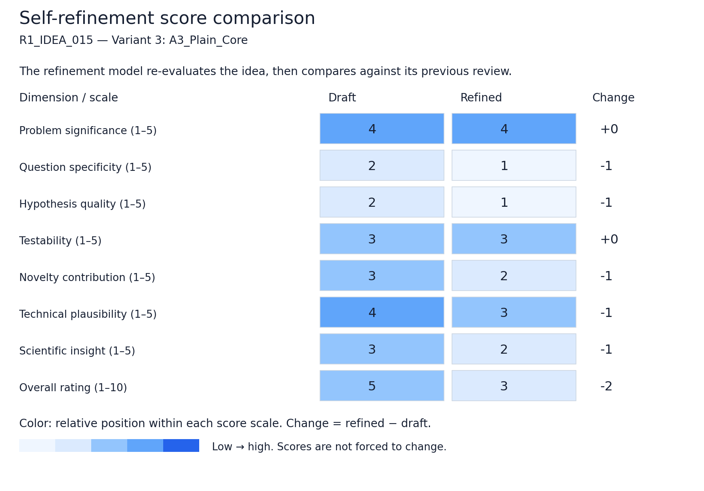

Changed score dimensions: question_specificity, hypothesis_quality, novelty_contribution, technical_plausibility, scientific_insight, overall_rating.

### Score justifications (draft / refined)

**Problem significance**

```json
{
  "draft": {
    "score": 4.0,
    "justification": "The problem is meaningful. Text-based editing of 3D content is an active research area with practical applications in gaming, VR, and digital humans. Ambiguity and limited expressiveness of natural language are recognized challenges. Improving control interfaces for 3D avatars is a relevant goal."
  },
  "refined": {
    "score": 4.0,
    "justification": "The problem is meaningful and relevant. Precise, intuitive editing of 3D avatars is a significant challenge in computer vision and graphics, with applications in gaming, VR/AR, and digital content creation. The limitations of natural language interfaces for fine-grained control are a recognized issue, making improved control mechanisms a worthwhile research direction."
  }
}
```

**Question specificity**

```json
{
  "draft": {
    "score": 2.0,
    "justification": "The idea summary lacks a specific research question. It proposes a method (ACS) but does not state what aspect of it will be investigated. The description is more of a high-level proposal than a focused inquiry."
  },
  "refined": {
    "score": 1.0,
    "justification": "The idea summary lacks any defined research question. It proposes a method (ACS) but does not state what is being investigated about it. There is no inquiry into its effectiveness, mechanisms, advantages, or limitations. It is a high-level project description, not a focused research question."
  }
}
```

**Hypothesis quality**

```json
{
  "draft": {
    "score": 2.0,
    "justification": "There is no explicit or clearly implicit hypothesis. The idea suggests that ACS could address challenges, but it does not make a concrete, testable prediction about its effectiveness, advantages, or mechanisms compared to alternatives."
  },
  "refined": {
    "score": 1.0,
    "justification": "There is no hypothesis, explicit or implicit. The statement 'We propose... a method for editing' is a declaration of intent, not a testable prediction. It does not make a claim about expected outcomes, comparative performance, or underlying relationships that could be supported or contradicted by evidence."
  }
}
```

**Testability**

```json
{
  "draft": {
    "score": 3.0,
    "justification": "The core idea of concept sliders is inherently testable—one could implement sliders and evaluate editing results. However, without a specific hypothesis or evaluation criteria, it's unclear what exactly would be tested. The idea suggests a direction but not a concrete experiment."
  },
  "refined": {
    "score": 3.0,
    "justification": "The proposed mechanism (concept sliders) is inherently testable in principle—one could implement sliders and evaluate the edits. However, without a hypothesis or defined evaluation criteria, it's unclear what specific claim would be tested. The idea suggests a technical direction that could be experimented with, but does not propose a concrete test."
  }
}
```

**Novelty contribution**

```json
{
  "draft": {
    "score": 3.0,
    "justification": "Concept sliders are not novel in machine learning (e.g., GAN latent space editing, StyleCLIP). Applying them to 3D human avatars could be a novel application, but the idea summary does not articulate what new scientific or technical contribution beyond this application is expected. The potential contribution is moderate unless novel challenges in 3D are addressed."
  },
  "refined": {
    "score": 2.0,
    "justification": "The core concept of using sliders for semantic editing via interpolation is well-established in 2D image generation (e.g., GAN latent spaces, StyleCLIP). Applying this idea to 3D avatars is a novel application domain, but the summary does not articulate any novel scientific or technical contribution beyond this domain shift. It does not suggest new methods for learning sliers in 3D, handling 3D consistency, or providing new insights."
  }
}
```

**Technical plausibility**

```json
{
  "draft": {
    "score": 4.0,
    "justification": "The direction is technically plausible. Interpolation in latent or feature spaces is a common technique. Extending concept sliders from 2D to 3D seems reasonable, though the summary does not detail how 3D consistency would be maintained, which is a key technical hurdle."
  },
  "refined": {
    "score": 3.0,
    "justification": "The direction is broadly plausible as an extension of 2D ideas. Interpolation in a learned space is a standard technique. However, the summary provides no details on how this would work for 3D representations, which introduces significant technical hurdles (e.g., multi-view consistency) that are glossed over. The plausibility is moderate but rests on many unspecified assumptions."
  }
}
```

**Scientific insight**

```json
{
  "draft": {
    "score": 3.0,
    "justification": "If successfully investigated, the research could provide insight into how semantic concepts are encoded in 3D avatar representations and how to disentangle them for controlled editing. However, the idea as stated is more focused on an applied method than on uncovering fundamental principles. The potential insight is moderate and depends on the depth of analysis."
  },
  "refined": {
    "score": 2.0,
    "justification": "As stated, the idea is primarily applied: build a tool for better editing. If deeply investigated, it could potentially yield insights into how semantic concepts are encoded and disentangled in 3D generative models. However, the summary gives no indication that such analysis is a goal. The potential for transferable scientific insight is low without a focus on understanding mechanisms or principles."
  }
}
```

**Overall rating**

```json
{
  "draft": {
    "score": 5.0,
    "justification": "This is a moderate/borderline research idea. It identifies a relevant problem and proposes a plausible technical direction inspired by 2D work. However, it lacks a specific research question, testable hypothesis, and clarity on the novel scientific contribution. It reads more like a project goal than a research investigation. With refinement—articulating a clear hypothesis, defining the scope, and planning evaluation—it could become a strong idea."
  },
  "refined": {
    "score": 3.0,
    "justification": "This is a weak research idea in its current form. It identifies a relevant applied problem and suggests a plausible technical direction borrowed from 2D research. However, it completely lacks a research question, a hypothesis, and any specification of what would be investigated or contributed. It reads as a vague project goal or a method name without the core components of a scientific inquiry. It requires substantial refinement to become a testable research idea."
  }
}
```

## R1_IDEA_015 — Variant 4: B1_Verbose_Elaborate

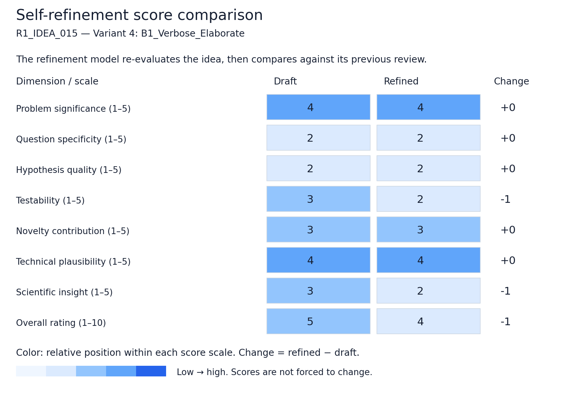

Changed score dimensions: testability, scientific_insight, overall_rating.

### Score justifications (draft / refined)

**Problem significance**

```json
{
  "draft": {
    "score": 4.0,
    "justification": "The problem is meaningful. Precise, intuitive control over 3D avatars is a significant challenge in graphics and vision, and the ambiguity of natural language is a well-known bottleneck. Improving this has clear applications in content creation, virtual reality, and gaming."
  },
  "refined": {
    "score": 4.0,
    "justification": "The problem is meaningful and well-motivated. Precise, intuitive control over 3D avatars is a significant challenge in computer graphics and vision. The ambiguity of natural language for fine-grained editing is a recognized bottleneck, and improving this has clear applications in content creation, virtual reality, and gaming."
  }
}
```

**Question specificity**

```json
{
  "draft": {
    "score": 2.0,
    "justification": "The idea describes a proposed method but does not define a specific research question. The implied question is 'Can a slider-based interface improve precision over direct text editing?', but this is not explicitly stated or refined."
  },
  "refined": {
    "score": 2.0,
    "justification": "The idea describes a proposed method but does not define a specific research question. The implied focus is on creating a slider-based editing tool, but what is being investigated about this tool (its efficacy, limitations, properties) remains unstated. The summary lacks a concrete inquiry."
  }
}
```

**Hypothesis quality**

```json
{
  "draft": {
    "score": 2.0,
    "justification": "There is an implicit hypothesis that a slider-based interpolation method will allow for more precise editing than direct text-based methods. However, this is not clearly articulated as a falsifiable claim, and no mechanism for why this should be true is proposed."
  },
  "refined": {
    "score": 2.0,
    "justification": "There is only an implicit, vague hypothesis that a slider-based interpolation method will enable 'precise editing.' This is not articulated as a concrete, falsifiable claim. No mechanism for why this should work better than alternatives is proposed, and no specific prediction is made that could be contradicted by evidence."
  }
}
```

**Testability**

```json
{
  "draft": {
    "score": 3.0,
    "justification": "The core claim is testable in principle. One could implement the method and compare its precision or user satisfaction against a baseline. However, the idea summary does not propose any specific experiments, evaluations, or metrics, leaving the testability somewhat vague."
  },
  "refined": {
    "score": 2.0,
    "justification": "While the core concept could be tested in principle, the idea summary provides no direction for how to test it. There is no mention of experiments, evaluations, metrics, or comparisons. The claim of enabling 'precise editing' is vague without defining precision. Testability is therefore weak in the presented form."
  }
}
```

**Novelty contribution**

```json
{
  "draft": {
    "score": 3.0,
    "justification": "The application of a continuous, interpolative control mechanism to 3D avatar editing is a reasonable and non-trivial direction. However, the concept of semantic sliders or continuous latent space traversal is well-established in other areas (e.g., GANs, text-to-image). The novelty hinges on its specific adaptation and validation for the 3D human avatar domain."
  },
  "refined": {
    "score": 3.0,
    "justification": "The application of a continuous, interpolative control mechanism (slider) to 3D avatar editing is a reasonable and non-trivial applied direction. However, the concept of semantic sliders or latent space traversal is well-established in other domains (e.g., GANs, text-to-image). The primary novelty appears to be domain adaptation. The idea does not suggest a novel algorithmic insight or a discovery of a new phenomenon."
  }
}
```

**Technical plausibility**

```json
{
  "draft": {
    "score": 4.0,
    "justification": "The proposed direction is technically plausible. The analogy to sliders in latent spaces is sound, and recent advances in text-conditioned 3D generation and editing suggest that constructing such semantic axes is a feasible research goal. The logical reasoning from problem to solution is coherent."
  },
  "refined": {
    "score": 4.0,
    "justification": "The proposed direction is technically plausible. The analogy to sliders in latent spaces is sound, and recent progress in text-conditioned 3D generation supports the feasibility of learning semantic directions for avatars. The logical connection from the problem (language ambiguity) to the solution (continuous, bounded control) is coherent."
  }
}
```

**Scientific insight**

```json
{
  "draft": {
    "score": 3.0,
    "justification": "If successfully investigated, the work could provide insight into how semantic concepts for human avatars are structured in a learnable space (e.g., are they linearly separable?). However, the idea as presented focuses more on an applied solution ('a method that allows precise editing') than on a quest for such underlying principles. The potential insight is moderate and dependent on the framing of the research."
  },
  "refined": {
    "score": 2.0,
    "justification": "The idea, as presented, focuses on building a tool for precise editing. It does not frame an investigation aimed at yielding general scientific insight. Potential insights (e.g., about the linear structure of semantic spaces for human attributes) are not mentioned and are incidental to the stated goal. The primary value seems applied rather than scientific."
  }
}
```

**Overall rating**

```json
{
  "draft": {
    "score": 5.0,
    "justification": "This is a moderate/borderline research idea. It identifies a significant problem and proposes a plausible, specific technical direction (ACS). However, it is framed more as a method proposal than a research investigation. It lacks a clearly defined research question, a testable hypothesis, and a plan for evaluation. The potential contribution is applied rather than deeply scientific in its current formulation. With a stronger research framing, it could become a strong idea."
  },
  "refined": {
    "score": 4.0,
    "justification": "This is a weak research idea in its current form. It identifies a significant applied problem and proposes a plausible technical direction. However, it is framed almost entirely as a method proposal, lacking the core components of a research investigation: a clear question, a testable hypothesis, and a plan for evaluation. Its potential for scientific contribution is low as presented. It would need substantial reframing to become a strong research idea."
  }
}
```

## R1_IDEA_015 — Variant 5: B2_Grand_Narrative


Changed score dimensions: none.

### Score justifications (draft / refined)

**Problem significance**

```json
{
  "draft": {
    "score": 4.0,
    "justification": "The problem is meaningful. Precise control over 3D avatar generation is a recognized challenge in graphics and HCI, with implications for digital content creation, virtual worlds, and accessibility. The limitation of text interfaces for fine-grained control is a valid motivation."
  },
  "refined": {
    "score": 4.0,
    "justification": "The problem is significant. Precise control over 3D avatar generation is a recognized challenge in computer graphics, vision, and HCI, with applications in digital content creation, virtual worlds, telepresence, and accessibility. The limitation of natural language for fine-grained, unambiguous control is a valid and meaningful motivation."
  }
}
```

**Question specificity**

```json
{
  "draft": {
    "score": 2.0,
    "justification": "The idea describes a proposed method but does not define a specific research question. It states a challenge and proposes a solution, but does not articulate what exactly will be investigated about that solution (e.g., its efficacy, properties, or comparison to alternatives)."
  },
  "refined": {
    "score": 2.0,
    "justification": "The idea describes a proposed method but does not define a specific research question. It states a challenge and a solution direction, but does not articulate what will be investigated about that solution (e.g., its efficacy, properties, limitations, or comparison to alternatives)."
  }
}
```

**Hypothesis quality**

```json
{
  "draft": {
    "score": 2.0,
    "justification": "There is no explicit or clearly implicit hypothesis. The statement 'this approach could contribute to more intuitive HCI' is a potential outcome, not a testable prediction about a mechanism or relationship. A hypothesis would need to make a concrete, falsifiable claim about the ACS method."
  },
  "refined": {
    "score": 2.0,
    "justification": "There is no explicit or clearly implicit hypothesis. The phrase 'this approach could contribute' suggests a potential benefit, but it is not a concrete, falsifiable prediction about a mechanism, relationship, or comparative advantage. A hypothesis would need to make a testable claim about ACS's performance or properties."
  }
}
```

**Testability**

```json
{
  "draft": {
    "score": 3.0,
    "justification": "The core idea of a concept slider is inherently testable—one could build it and evaluate its performance. However, without a defined research question or hypothesis, it's unclear what specific claim is being tested. The evaluation could measure precision, user preference, or disentanglement, but these are not specified."
  },
  "refined": {
    "score": 3.0,
    "justification": "The core concept of a slider-based editor is inherently testable—one could implement it and evaluate its functionality. However, without a defined research question or hypothesis, it is unclear what specific claim is being tested. Potential evaluations (e.g., precision metrics, user studies, comparison to text-based editing) are implied but not specified."
  }
}
```

**Novelty contribution**

```json
{
  "draft": {
    "score": 3.0,
    "justification": "The application of 'slider' or interpolation-based control to 3D avatars is a plausible contribution, but the idea summary does not establish how it differs from prior work in latent space editing for GANs, NeRFs, or 3D GANs. The novelty seems primarily in the target domain (3D human avatars) rather than a fundamentally new technical insight."
  },
  "refined": {
    "score": 3.0,
    "justification": "The application of slider-based interpolation to 3D human avatars is a plausible contribution, but the summary does not establish how it differs from prior work in latent space editing for 2D/3D GANs, NeRFs, or diffusion models. The novelty appears primarily domain-specific (3D avatars) rather than introducing a fundamentally new technical insight or mechanism."
  }
}
```

**Technical plausibility**

```json
{
  "draft": {
    "score": 4.0,
    "justification": "The proposed direction is technically plausible. The analogy to moving a knob along a concept axis is well-established in latent variable models and style-based generators. The main assumption—that semantic concepts for avatars can be encoded in a space that supports meaningful linear interpolation—is reasonable given recent progress in 3D generative models."
  },
  "refined": {
    "score": 4.0,
    "justification": "The proposed direction is technically plausible. The analogy to interpolating along a concept axis is well-established in latent variable models and style-based generators. The key assumption—that semantic concepts for avatars can be embedded in a space supporting meaningful linear interpolation—is reasonable given advances in 3D generative models and representation learning."
  }
}
```

**Scientific insight**

```json
{
  "draft": {
    "score": 2.0,
    "justification": "As presented, the idea promises a useful tool but does not clearly aim to produce general scientific insight. It does not specify what will be learned about avatar representations, concept learning, or human-computer interaction beyond the functionality of the proposed tool. The insight is currently limited to 'this method works for this task.'"
  },
  "refined": {
    "score": 2.0,
    "justification": "As presented, the idea focuses on building a useful tool rather than seeking general scientific insight. It does not specify what will be learned about avatar representations, concept disentanglement, the geometry of attribute spaces, or the limitations of text as a control interface. The potential insight is currently limited to demonstrating that the method works for this task."
  }
}
```

**Overall rating**

```json
{
  "draft": {
    "score": 5.0,
    "justification": "This is a moderate/borderline research idea. It identifies a significant applied problem and suggests a plausible technical direction. However, it is currently framed as a solution proposal rather than a research investigation. It lacks a specific research question, a testable hypothesis, and a clear statement of the scientific insight to be gained. Strengthening these aspects would make it a much stronger research idea."
  },
  "refined": {
    "score": 5.0,
    "justification": "This is a moderate/borderline research idea. It identifies a significant applied problem and suggests a plausible technical direction. However, it is framed as a solution proposal rather than a research investigation. It lacks a specific research question, a testable hypothesis, and a clear statement of the scientific insight to be gained. Strengthening these aspects would elevate it to a stronger research idea."
  }
}
```

## R1_IDEA_015 — Variant 6: B3_Over_Confident


Changed score dimensions: none.

### Score justifications (draft / refined)

**Problem significance**

```json
{
  "draft": {
    "score": 4.0,
    "justification": "The problem is meaningful. Precise control over 3D avatar generation and editing is a relevant challenge in computer vision and graphics, with applications in gaming, VR/AR, and digital humans. The identified limitation of natural language interfaces for precise control is valid and worth addressing."
  },
  "refined": {
    "score": 4.0,
    "justification": "The problem is meaningful and well-identified. Precise control over 3D avatar generation and editing is a relevant challenge in computer vision and graphics, with applications in gaming, VR/AR, and digital humans. The limitation of natural language interfaces for precise control is valid and worth addressing."
  }
}
```

**Question specificity**

```json
{
  "draft": {
    "score": 2.0,
    "justification": "The idea lacks a clearly defined research question. It proposes a method (ACS) but does not specify what aspect of it will be investigated. The text states a goal ('to overcome this') but not a concrete question to answer through research."
  },
  "refined": {
    "score": 2.0,
    "justification": "The idea lacks a clearly defined research question. It proposes a method (ACS) but does not specify what aspect of it will be investigated. The text states a goal ('to overcome this') but not a concrete question to answer through research. It describes a tool rather than posing an inquiry."
  }
}
```

**Hypothesis quality**

```json
{
  "draft": {
    "score": 2.0,
    "justification": "There is an implicit hypothesis that a slider-based interface will be better than text-based editing, but it is not stated as a testable prediction. The hypothesis is vague and not operationalized (what does 'better' mean? more precise? faster? preferred by users?)."
  },
  "refined": {
    "score": 2.0,
    "justification": "There is only an implicit, vague hypothesis that a slider-based interface will address ambiguity better than text-based editing. It is not stated as a testable prediction, nor is it operationalized (what does 'better' mean? more precise? faster? preferred by users?). No specific, falsifiable claim is made."
  }
}
```

**Testability**

```json
{
  "draft": {
    "score": 3.0,
    "justification": "The core claim is testable in principle. One could design user studies or quantitative evaluations comparing the proposed slider interface to text-based editing baselines. However, the idea summary does not suggest any specific form of test or evaluation, leaving it as a methodological proposal rather than a research investigation."
  },
  "refined": {
    "score": 3.0,
    "justification": "The core claim is testable in principle—one could design user studies or quantitative evaluations comparing the proposed slider interface to text-based editing baselines. However, the idea summary does not suggest any specific form of test, evaluation, or metric, leaving it as an untested methodological proposal."
  }
}
```

**Novelty contribution**

```json
{
  "draft": {
    "score": 3.0,
    "justification": "The application of continuous sliders for concept control is a known idea in generative models (e.g., in 2D GANs). Applying it to 3D human avatars is a plausible application, but the summary does not argue for or highlight what is novel about the proposed implementation or the specific insights it might yield beyond demonstrating the application itself."
  },
  "refined": {
    "score": 3.0,
    "justification": "The application of continuous sliders for concept control is a known idea in generative models (e.g., in 2D GANs). Applying it to 3D human avatars is a plausible application, but the summary does not argue for what is novel about the proposed implementation—whether it's the specific 3D representation, the concept disentanglement method, or the interaction paradigm—or what specific insights it might yield beyond demonstrating the application."
  }
}
```

**Technical plausibility**

```json
{
  "draft": {
    "score": 4.0,
    "justification": "The proposed direction is technically plausible. The analogy to moving a knob between conceptual extremes is coherent and aligns with established techniques in latent space manipulation. The central challenge would be implementing this for a 3D avatar representation, which is a non-trivial but reasonable engineering/research goal."
  },
  "refined": {
    "score": 4.0,
    "justification": "The proposed direction is technically plausible. The analogy to moving a knob between conceptual extremes is coherent and aligns with established techniques in latent space manipulation and style mixing. The central challenge would be implementing this for a 3D avatar representation, which is non-trivial but a reasonable engineering/research goal given current 3D generative models."
  }
}
```

**Scientific insight**

```json
{
  "draft": {
    "score": 2.0,
    "justification": "As presented, the idea's primary output is a proposed tool. The potential for broader scientific insight is low unless the research is framed to answer a question about human-AI interaction, the nature of semantic concepts in 3D generative spaces, or the comparative effectiveness of different control modalities. Currently, it reads as an application-focused method proposal."
  },
  "refined": {
    "score": 2.0,
    "justification": "As presented, the idea's primary output is a proposed tool. The potential for broader scientific insight is low unless the research is framed to answer a question about human-AI interaction, the nature of semantic concepts in 3D generative spaces, or the comparative effectiveness of different control modalities. Currently, it reads as an application-focused method proposal with limited transferable knowledge."
  }
}
```

**Overall rating**

```json
{
  "draft": {
    "score": 5.0,
    "justification": "This is a moderate/borderline research idea. It identifies a relevant problem and proposes a plausible solution. However, it is currently framed as a method proposal rather than a research investigation. It lacks a specific research question, a testable hypothesis, and a clear articulation of the novel scientific contribution or insight it aims to provide. With refinement to include these elements, it could become a strong research direction."
  },
  "refined": {
    "score": 5.0,
    "justification": "This is a moderate/borderline research idea. It identifies a relevant problem and proposes a plausible solution. However, it is currently framed as a method proposal rather than a research investigation. It lacks a specific research question, a testable hypothesis, and a clear articulation of the novel scientific contribution or insight it aims to provide. With refinement to include these elements, it could become a stronger research direction."
  }
}
```

## R1_IDEA_015 — Variant 7: B4_Novelty

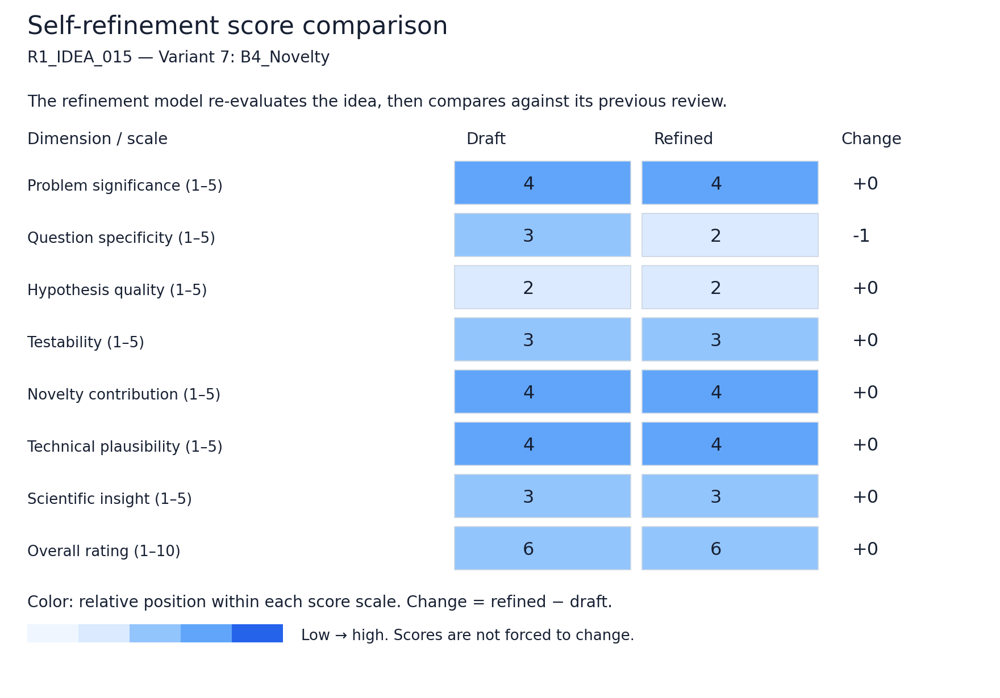

Changed score dimensions: question_specificity.

### Score justifications (draft / refined)

**Problem significance**

```json
{
  "draft": {
    "score": 4.0,
    "justification": "The problem is meaningful: precise semantic control of 3D avatars is a practical challenge in graphics, VR, and gaming. Natural language ambiguity is a well-known bottleneck, so addressing it has clear relevance."
  },
  "refined": {
    "score": 4.0,
    "justification": "The problem is meaningful and practical: precise semantic control of 3D avatars is a recognized challenge in graphics, VR, and gaming. Natural language ambiguity is a well-known bottleneck for creative and design tasks, so addressing it has clear relevance to both researchers and practitioners."
  }
}
```

**Question specificity**

```json
{
  "draft": {
    "score": 3.0,
    "justification": "The core idea is specific (a slider for continuous concept editing), but the research question itself is not sharply defined. It's more of a proposed method than an investigation into a particular phenomenon or relationship."
  },
  "refined": {
    "score": 2.0,
    "justification": "The core idea describes a proposed method (a slider for continuous concept editing) but does not define a clear research question. It lacks specification of what is being investigated—e.g., the relationship between control granularity and edit precision, or the comparative effectiveness of slider vs. text interfaces. The idea is more of a proposed tool than a focused inquiry."
  }
}
```

**Hypothesis quality**

```json
{
  "draft": {
    "score": 2.0,
    "justification": "There is no explicit or clearly implicit hypothesis. The idea posits that a slider-based approach could help, but it doesn't make a testable prediction about outcomes, mechanisms, or advantages over alternatives."
  },
  "refined": {
    "score": 2.0,
    "justification": "There is no explicit or clearly implicit hypothesis. The idea suggests that a slider-based approach 'could help' or offers 'a fresh perspective,' but it does not make a concrete, testable prediction about outcomes, mechanisms, or advantages over alternatives. It lacks a falsifiable claim that would guide investigation."
  }
}
```

**Testability**

```json
{
  "draft": {
    "score": 3.0,
    "justification": "The idea is testable in principle—one could build the system and evaluate it—but the summary doesn't suggest what evidence would support its value. A comparison to text-only editing or user precision tasks would make it more testable."
  },
  "refined": {
    "score": 3.0,
    "justification": "The idea is testable in principle—one could implement the system and evaluate it—but the summary does not suggest what evidence would support its value or how it would be tested. Without a proposed comparison, evaluation metric, or experimental design, testability remains moderate but vague."
  }
}
```

**Novelty contribution**

```json
{
  "draft": {
    "score": 4.0,
    "justification": "Applying continuous semantic sliders to 3D human avatars is novel and underexplored. While sliders exist in graphics (e.g., character creators) and latent spaces, framing it as a solution to language ambiguity in 3D editing is a fresh angle."
  },
  "refined": {
    "score": 4.0,
    "justification": "Applying continuous semantic sliders specifically to 3D human avatars as a solution to language ambiguity is novel and underexplored. While sliders exist in character creators and latent space traversal is common in 2D, framing this as a method for precise semantic control in 3D editing represents a fresh angle with potential contribution."
  }
}
```

**Technical plausibility**

```json
{
  "draft": {
    "score": 4.0,
    "justification": "The concept is logically coherent: interpolating between concept extremes is a standard idea in generative models. The main assumption—that semantic concepts can be mapped to a continuous slider—is reasonable, though the implementation details are unspecified."
  },
  "refined": {
    "score": 4.0,
    "justification": "The concept is logically coherent: interpolating between concept extremes is a standard idea in generative models and interface design. The main assumption—that semantic concepts can be mapped to a continuous slider—is reasonable given prior work in latent spaces, though implementation details are unspecified and non-trivial."
  }
}
```

**Scientific insight**

```json
{
  "draft": {
    "score": 3.0,
    "justification": "If successful, the work could provide insight into how continuous semantic controls compare to discrete text prompts for 3D editing, and perhaps reveal limitations of language-based interfaces. However, the idea as stated leans more toward an engineering solution than a fundamental scientific inquiry."
  },
  "refined": {
    "score": 3.0,
    "justification": "If successfully investigated, the work could provide insight into how continuous semantic controls compare to discrete text prompts for 3D editing, and perhaps reveal limitations of language-based interfaces. However, as stated, the idea leans more toward an applied engineering solution than a fundamental scientific inquiry into mechanisms or principles."
  }
}
```

**Overall rating**

```json
{
  "draft": {
    "score": 6.0,
    "justification": "This is a moderate/borderline research idea. It addresses a meaningful problem and proposes a novel mechanism, but lacks a clear hypothesis, specific research question, and evaluation plan. The potential contribution is more applied than deeply scientific, though it could yield useful insights about semantic control in 3D generation."
  },
  "refined": {
    "score": 6.0,
    "justification": "This is a moderate/borderline research idea. It addresses a meaningful problem and proposes a novel mechanism with clear practical relevance. However, it lacks a clear hypothesis, specific research question, and evaluation plan, limiting its scientific depth. The potential contribution is more applied than deeply insightful, though it could yield useful findings about semantic control in 3D generation if rigorously investigated."
  }
}
```

## R1_IDEA_015 — Variant 8: B5_Application_Impact

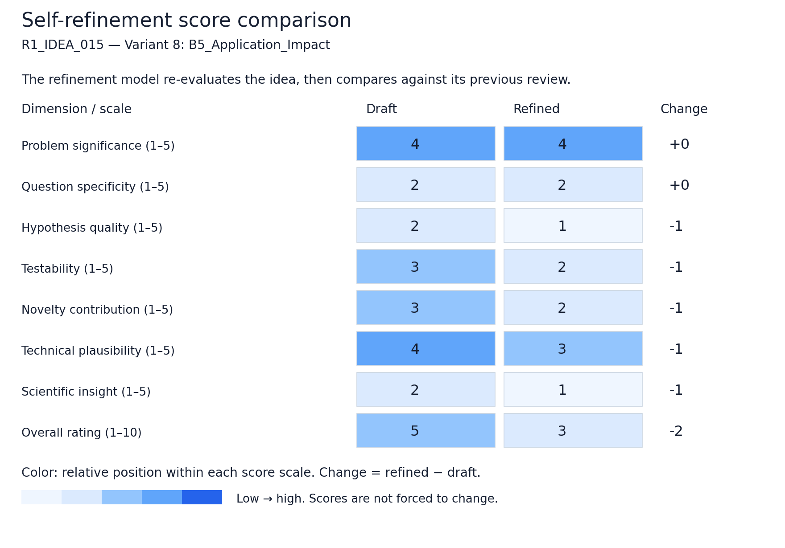

Changed score dimensions: hypothesis_quality, testability, novelty_contribution, technical_plausibility, scientific_insight, overall_rating.

### Score justifications (draft / refined)

**Problem significance**

```json
{
  "draft": {
    "score": 4.0,
    "justification": "The problem is meaningful. Precise control over 3D content generation using natural language is a recognized challenge in graphics and vision. Improving interfaces for digital human creation has practical significance for gaming, VR, and communication."
  },
  "refined": {
    "score": 4.0,
    "justification": "The problem is significant. Achieving precise, intuitive control over complex 3D assets using natural language is a major, unsolved challenge at the intersection of computer vision, graphics, and HCI. It has direct implications for the usability of digital human creation tools in practical applications."
  }
}
```

**Question specificity**

```json
{
  "draft": {
    "score": 2.0,
    "justification": "The idea describes a proposed method but does not define a specific research question. It states a goal ('overcome ambiguity') and a tool ('slider'), but not what will be investigated about them. The 'what' of the research is underspecified."
  },
  "refined": {
    "score": 2.0,
    "justification": "The idea is very low in specificity. It describes a proposed method ('we propose the Avatar Concept Slider') but does not define a research question. There is no 'what will we investigate?'—only 'here is a tool we could build.' The 'what' of the research is missing."
  }
}
```

**Hypothesis quality**

```json
{
  "draft": {
    "score": 2.0,
    "justification": "There is an implicit hypothesis that a slider interface is better than direct text for precise editing, but it is not stated as a testable prediction. The claim is presented more as an assumed benefit of the proposed solution."
  },
  "refined": {
    "score": 1.0,
    "justification": "There is essentially no hypothesis. The text states the approach 'may support practical systems' and 'could inform design,' which are aspirational outcomes, not testable predictions. There is no concrete, falsifiable claim about a relationship, mechanism, or comparative advantage."
  }
}
```

**Testability**

```json
{
  "draft": {
    "score": 3.0,
    "justification": "The core claim is testable in principle through user studies or quantitative comparisons with baseline text-editing methods. However, without a defined hypothesis or evaluation plan, the testability is only moderate. The idea suggests an application that can be built and evaluated."
  },
  "refined": {
    "score": 2.0,
    "justification": "Testability is weak. While one could eventually build the tool and test it, the idea as presented does not suggest *what* to test or *how* to test it. There is no proposed experiment, comparison, or evaluation method. The core claim is too vague to be directly investigated."
  }
}
```

**Novelty contribution**

```json
{
  "draft": {
    "score": 3.0,
    "justification": "The application of a 'slider' or continuous control concept to 3D avatar editing is a plausible extension of ideas from 2D image editing (e.g., StyleGAN sliders, diffusion guidance scales). The novelty likely hinges on the technical implementation for 3D human models. As described, it seems more like an applied engineering solution than a fundamentally novel research contribution."
  },
  "refined": {
    "score": 2.0,
    "justification": "The novelty appears limited. The core interaction concept—a slider for continuous interpolation between semantic extremes—is a direct analog to established techniques in 2D image editing (e.g., StyleGAN attribute sliders, diffusion guidance scales). Applying this to 3D avatars is a logical application but, as described, does not propose a novel scientific contribution or mechanism."
  }
}
```

**Technical plausibility**

```json
{
  "draft": {
    "score": 4.0,
    "justification": "The core concept is technically plausible. Learning disentangled, semantically meaningful directions in a latent space for generative models is an established research area. Applying this to a 3D human model representation (e.g., a 3D-aware GAN or a diffusion model) is a logical and feasible direction, though non-trivial."
  },
  "refined": {
    "score": 3.0,
    "justification": "Technical plausibility is moderate. The high-level concept is coherent and aligns with trends in controllable generation. However, the complete lack of detail on how semantic concepts are grounded in a 3D representation—a non-trivial technical hurdle—makes it impossible to assess feasibility beyond a superficial level. The reasoning is logical but underspecified."
  }
}
```

**Scientific insight**

```json
{
  "draft": {
    "score": 2.0,
    "justification": "As presented, the potential for scientific insight is low. The idea focuses on building a practical tool ('support practical systems'). It does not articulate what general principles, mechanisms, or new understanding about 3D representation, language grounding, or human-computer interaction would be learned from the research. The insight is currently limited to a demonstration of a useful interface."
  },
  "refined": {
    "score": 1.0,
    "justification": "The potential for scientific insight is very low. The idea is framed entirely around building a practical tool ('support practical systems'). It does not articulate what general principles, underlying mechanisms, or new understanding about 3D generative models, language grounding, or human-AI interaction would be learned. The outcome is a demonstration, not an insight."
  }
}
```

**Overall rating**

```json
{
  "draft": {
    "score": 5.0,
    "justification": "This is a moderate/borderline research idea. It identifies a relevant practical problem and suggests a plausible, intuitive solution. However, it is currently framed as an application or tool proposal rather than a research investigation. It lacks a specific research question, a clear hypothesis, and a defined path to generating new scientific knowledge. With refinement to include these elements, it could become a strong research project. The score reflects the potential of the direction, penalized by the lack of specificity in the research inquiry itself."
  },
  "refined": {
    "score": 3.0,
    "justification": "This is a weak research idea. It identifies a relevant practical problem and suggests an intuitive solution, but it is framed purely as an application or tool proposal, not as a research investigation. It lacks the fundamental components of a research idea: a specific question, a testable hypothesis, and a path to generating new knowledge. In its current form, it is an engineering objective, not a scientific inquiry."
  }
}
```

## R1_IDEA_015 — Variant 9: C1_Hollow_Shell


Changed score dimensions: none.

### Score justifications (draft / refined)

**Problem significance**

```json
{
  "draft": {
    "score": 4.0,
    "justification": "The problem is meaningful - text-based editing of 3D content is an active research area with practical applications in gaming, virtual reality, and digital content creation. Language limitations in conveying precise 3D manipulations are a recognized challenge."
  },
  "refined": {
    "score": 4.0,
    "justification": "The problem is meaningful and relevant. Text-based editing of 3D avatars is an active research area with applications in gaming, VR, and digital content creation. Language limitations in conveying precise 3D manipulations are a recognized challenge."
  }
}
```

**Question specificity**

```json
{
  "draft": {
    "score": 1.0,
    "justification": "Extremely vague. No concrete research question is stated. The idea merely mentions 'addressing this challenge' without specifying what aspect of the challenge or what relationship would be investigated."
  },
  "refined": {
    "score": 1.0,
    "justification": "Extremely vague. No concrete research question is stated. The idea only mentions 'addressing this challenge' without specifying what aspect of the challenge or what relationship would be investigated."
  }
}
```

**Hypothesis quality**

```json
{
  "draft": {
    "score": 1.0,
    "justification": "No hypothesis is present. There's an implicit suggestion that 'adjusting concepts between extremes' might help, but no prediction about why, how, or under what conditions this would be effective."
  },
  "refined": {
    "score": 1.0,
    "justification": "No hypothesis is present. There is an implicit suggestion that 'adjusting concepts between extremes' might help, but no testable prediction about why, how, or under what conditions this would be effective."
  }
}
```

**Testability**

```json
{
  "draft": {
    "score": 1.0,
    "justification": "Not testable in its current form. There's no clear way to design an experiment or evaluation since the approach is described too vaguely. 'Adjusting concepts between extremes' is not an operationalizable method."
  },
  "refined": {
    "score": 1.0,
    "justification": "Not testable in its current form. There is no clear way to design an experiment or evaluation because the approach is described too vaguely. 'Adjusting concepts between extremes' is not an operationalizable method."
  }
}
```

**Novelty contribution**

```json
{
  "draft": {
    "score": 2.0,
    "justification": "The general idea of improving text-based 3D editing has merit, but the proposed direction is too vague to assess novelty. The phrase 'adjusting concepts between extremes' could refer to many existing techniques like interpolation or contrastive prompting without specifying what would be new."
  },
  "refined": {
    "score": 2.0,
    "justification": "The general goal of improving text-based 3D editing is relevant, but the proposed direction is too vague to assess novelty. The phrase 'adjusting concepts between extremes' could refer to existing techniques like interpolation or contrastive prompting without specifying what would be new."
  }
}
```

**Technical plausibility**

```json
{
  "draft": {
    "score": 2.0,
    "justification": "The reasoning is logically coherent at a high level (language has limitations for 3D editing), but the proposed solution lacks technical substance. Without details, it's impossible to assess whether 'adjusting concepts between extremes' is a plausible technical approach."
  },
  "refined": {
    "score": 2.0,
    "justification": "The high-level reasoning is coherent (language has limitations for 3D editing), but the proposed solution lacks technical substance. Without details, it's impossible to assess whether 'adjusting concepts between extremes' is a plausible technical approach."
  }
}
```

**Scientific insight**

```json
{
  "draft": {
    "score": 2.0,
    "justification": "If properly developed, studying how to overcome language limitations in 3D editing could provide insights into multimodal representation learning or human-AI interaction. However, the current formulation is too vague to promise specific scientific insights."
  },
  "refined": {
    "score": 2.0,
    "justification": "If properly developed, studying how to overcome language limitations in 3D editing could provide insights into multimodal representation learning or human-AI interaction. However, the current formulation is too vague to promise specific scientific insights."
  }
}
```

**Overall rating**

```json
{
  "draft": {
    "score": 3.0,
    "justification": "This is a weak research idea in its current form. While it identifies a meaningful problem (text-based 3D avatar editing limitations), it fails to articulate a specific research question, hypothesis, or testable approach. The proposed direction ('adjusting concepts between extremes') is too vague to evaluate scientifically. The idea needs substantial refinement to become a viable research direction."
  },
  "refined": {
    "score": 3.0,
    "justification": "This is a weak research idea in its current form. While it identifies a meaningful problem (text-based 3D avatar editing limitations), it fails to articulate a specific research question, hypothesis, or testable approach. The proposed direction ('adjusting concepts between extremes') is too vague to evaluate scientifically. The idea needs substantial refinement to become a viable research direction."
  }
}
```

## R1_IDEA_015 — Variant 10: C2_Logic_Flawed


Changed score dimensions: none.

### Score justifications (draft / refined)

**Problem significance**

```json
{
  "draft": {
    "score": 4.0,
    "justification": "The problem is meaningful. Precise semantic control of 3D assets, especially human avatars, is a recognized challenge in graphics and vision. The ambiguity of natural language is a fundamental bottleneck for creative and professional applications."
  },
  "refined": {
    "score": 4.0,
    "justification": "The problem is meaningful and relevant. Precise semantic control of 3D human avatars is a recognized challenge in computer graphics and vision with applications in gaming, virtual reality, and digital content creation. The ambiguity of natural language is a fundamental bottleneck for creative and professional applications."
  }
}
```

**Question specificity**

```json
{
  "draft": {
    "score": 2.0,
    "justification": "Weak. The idea describes a proposed method (ACS) but does not define a specific research question. It states a goal ('to overcome this') and makes a broad suggestion of effectiveness, but does not specify what relationship, phenomenon, or comparison will be investigated."
  },
  "refined": {
    "score": 2.0,
    "justification": "Weak. The idea describes a proposed method (ACS) but does not define a specific research question. It states a goal ('to overcome this') and makes a broad suggestion of effectiveness, but does not specify what relationship, phenomenon, or comparison will be investigated. The core inquiry remains implicit."
  }
}
```

**Hypothesis quality**

```json
{
  "draft": {
    "score": 2.0,
    "justification": "Weak. An implicit hypothesis exists: that a slider-based interpolation method will enable more precise editing than standard text-based approaches. However, this is not stated as a concrete, testable prediction. The final sentence is a vague suggestion of broader effectiveness, not a falsifiable claim."
  },
  "refined": {
    "score": 2.0,
    "justification": "Weak. An implicit hypothesis exists: that a slider-based interpolation method will enable more precise editing than standard text-based approaches. However, this is not stated as a concrete, testable prediction. The final sentence about 'broader effectiveness' is a vague suggestion, not a falsifiable claim. The idea lacks a clear predictive statement that could be supported or contradicted by evidence."
  }
}
```

**Testability**

```json
{
  "draft": {
    "score": 3.0,
    "justification": "Moderate. The core concept is inherently testable. One could design experiments comparing edit precision between ACS and baselines. However, the idea summary does not propose any evaluation, making the path to testing unclear. The lack of defined metrics or tasks reduces the score."
  },
  "refined": {
    "score": 3.0,
    "justification": "Moderate. The core concept is inherently testable in principle. One could design experiments comparing edit precision between ACS and baselines. However, the idea summary does not propose any evaluation method, metrics, or tasks, making the path to testing unclear. Without these, the testability remains speculative."
  }
}
```

**Novelty contribution**

```json
{
  "draft": {
    "score": 3.0,
    "justification": "Moderate. The application of 'sliders' or continuous controls for semantic attributes is a known idea in image generation (e.g., GAN latent space editing, concept sliders in diffusion models). Applying this paradigm to 3D human avatars could be a valuable application, but the summary does not articulate what, if any, novel technical or scientific contribution is proposed beyond this application."
  },
  "refined": {
    "score": 3.0,
    "justification": "Moderate. The application of 'sliders' or continuous controls for semantic attributes is a known idea in image generation (e.g., GAN latent space editing, concept sliders in diffusion models). Applying this paradigm to 3D human avatars could be a valuable application, but the summary does not articulate what, if any, novel technical or scientific contribution is proposed beyond this application. It may be an incremental adaptation."
  }
}
```

**Technical plausibility**

```json
{
  "draft": {
    "score": 4.0,
    "justification": "Strong. The reasoning is logically coherent: language ambiguity is a problem, continuous interpolation between extremes can reduce ambiguity. The mechanism is plausible, drawing on established ideas from latent space manipulation. No obvious technical flaws are apparent from the brief description."
  },
  "refined": {
    "score": 4.0,
    "justification": "Strong. The reasoning is logically coherent: language ambiguity is a problem, continuous interpolation between extremes can reduce ambiguity. The mechanism is plausible, drawing on established ideas from latent space manipulation in other domains. No obvious technical flaws are apparent from the brief description."
  }
}
```

**Scientific insight**

```json
{
  "draft": {
    "score": 3.0,
    "justification": "Moderate. If investigated rigorously, the research could provide insight into how semantic concepts are encoded in 3D human avatar representations and how discrete language maps to continuous appearance spaces. However, the idea is currently framed more as an engineering solution ('a method that allows...') than a hypothesis-driven investigation into a phenomenon, which limits the potential for fundamental insight."
  },
  "refined": {
    "score": 3.0,
    "justification": "Moderate. If investigated rigorously, the research could potentially provide insight into how semantic concepts are encoded in 3D human avatar representations and how discrete language maps to continuous appearance spaces. However, the idea is currently framed more as an engineering solution ('a method that allows...') than a hypothesis-driven investigation into a fundamental phenomenon, which limits the guaranteed potential for transferable scientific insight."
  }
}
```

**Overall rating**

```json
{
  "draft": {
    "score": 5.0,
    "justification": "Moderate/Borderline idea. It identifies a significant problem and proposes a plausible technical direction. However, it is currently more of a solution proposal than a research idea with a clear, testable question or hypothesis. The lack of specificity regarding what will be investigated and how it will be evaluated significantly limits its strength as a research idea. It has the foundation for a strong idea but needs substantial refinement to define the core research contribution."
  },
  "refined": {
    "score": 5.0,
    "justification": "Moderate/Borderline idea. It identifies a significant problem and proposes a plausible technical direction. However, it is currently more of a solution proposal than a research idea with a clear, testable question or hypothesis. The lack of specificity regarding what will be investigated and how it will be evaluated significantly limits its strength as a research idea. It has the foundation for a strong idea but needs substantial refinement to define the core research contribution and falsifiable claim."
  }
}
```

## R1_IDEA_015 — Variant 11: C3_Substance_Enriched


Changed score dimensions: none.

### Score justifications (draft / refined)

**Problem significance**

```json
{
  "draft": {
    "score": 4.0,
    "justification": "The problem is meaningful: precise control of 3D avatars via natural language is an active challenge in graphics and human-computer interaction, with applications in gaming, virtual reality, and digital content creation. The ambiguity of language for fine-grained control is a recognized limitation."
  },
  "refined": {
    "score": 4.0,
    "justification": "The problem is significant. Achieving precise, intuitive control over 3D avatar generation and editing is a core challenge in computer graphics and HCI, with broad applications in VR, gaming, and digital content creation. The ambiguity of natural language for fine-grained control is a well-recognized limitation that merits research."
  }
}
```

**Question specificity**

```json
{
  "draft": {
    "score": 2.0,
    "justification": "The idea describes a method and a problem but does not articulate a specific research question. It states what ACS does ('allows precise editing') but not what specific aspect will be investigated or tested."
  },
  "refined": {
    "score": 2.0,
    "justification": "The idea describes a proposed method and a general problem area but does not articulate a specific research question. It states what ACS does ('allows precise editing') but does not define what aspect of this capability will be investigated, tested, or understood. The research objective is implicit and vague."
  }
}
```

**Hypothesis quality**

```json
{
  "draft": {
    "score": 2.0,
    "justification": "There is an implicit hypothesis that a slider-based interface improves precision over direct text editing, but it is not explicitly stated or framed as a testable prediction. The idea lacks a concrete, falsifiable claim about the relationship between the slider mechanism and editing outcomes."
  },
  "refined": {
    "score": 2.0,
    "justification": "There is an implicit assumption that a slider mechanism improves precision, but this is not framed as a testable hypothesis. There is no concrete prediction about the relationship between the interface (slider), the editing task, and an outcome metric. The idea lacks a falsifiable core claim."
  }
}
```

**Testability**

```json
{
  "draft": {
    "score": 3.0,
    "justification": "The idea mentions user studies as a possible validation path, which is a reasonable evaluation approach. However, without a clear hypothesis or defined metrics, it's unclear exactly what would be tested. The dependence on boundary conditions suggests testable factors, but they are not framed as experimental variables."
  },
  "refined": {
    "score": 3.0,
    "justification": "The mention of user studies provides a plausible validation path. The acknowledgment of boundary conditions (concept granularity, representation) also suggests testable factors. However, without a defined hypothesis, comparison baseline, or specific metrics, it is unclear exactly what would be tested and how success/failure would be determined."
  }
}
```

**Novelty contribution**

```json
{
  "draft": {
    "score": 3.0,
    "justification": "The core concept of a slider for continuous control is not novel in human-computer interaction (e.g., sliders in image editing, parameter adjustment in 3D tools). The potential novelty lies in applying it to semantic concept editing for 3D avatars via text, but without comparison to existing work or technical details, the contribution level is unclear."
  },
  "refined": {
    "score": 3.0,
    "justification": "The application of a slider interface to semantic concept editing for 3D avatars is a plausible novel combination. However, sliders for continuous control are ubiquitous in graphics, and text-driven 3D editing is an active field. The potential contribution is unclear without specifying what existing gap this addresses or what new capability it enables compared to prior work."
  }
}
```

**Technical plausibility**

```json
{
  "draft": {
    "score": 3.0,
    "justification": "The general idea of interpolating between concept extremes is plausible, especially if built upon existing generative models for avatars. However, the lack of technical details on how semantic concepts map to editable parameters makes it difficult to assess feasibility. The acknowledgment of boundary conditions shows awareness of potential challenges."
  },
  "refined": {
    "score": 3.0,
    "justification": "The high-level concept is logically coherent: interpolating between two defined states is a standard technique. However, the central technical challenge—mapping abstract semantic concepts defined by text to a continuous, editable parameter space of a 3D avatar—is non-trivial and entirely unspecified. The idea is plausible but rests on unresolved technical assumptions."
  }
}
```

**Scientific insight**

```json
{
  "draft": {
    "score": 3.0,
    "justification": "If properly investigated, the idea could yield insights into how semantic concepts map to continuous parameter spaces in 3D avatars, and how interface design (slider vs. text) affects user control precision. However, as presented, it leans more toward an application idea than a hypothesis-driven investigation that would reveal fundamental principles."
  },
  "refined": {
    "score": 3.0,
    "justification": "If properly structured as a comparative study, it could yield insights into how interface design (discrete text vs. continuous slider) affects user control and precision in semantic editing tasks. It also touches on the broader question of mapping language to continuous parameter spaces. As presented, however, it leans more toward an applied tool proposal; the potential for generalizable scientific insight is not explicitly leveraged."
  }
}
```

**Overall rating**

```json
{
  "draft": {
    "score": 5.0,
    "justification": "This is a moderate/borderline research idea. It identifies a relevant problem and proposes an intuitive interaction mechanism. However, it lacks a clearly defined research question, testable hypothesis, and technical specifics. The potential for scientific insight is limited without a more focused investigation into why or how the slider improves control, or under what conditions it fails. It currently reads more as a method description than a research plan."
  },
  "refined": {
    "score": 5.0,
    "justification": "This is a moderate/borderline research idea. It identifies a relevant application problem and proposes an intuitive solution direction. Its main weaknesses are the lack of a defined research question and testable hypothesis, making it read more like a method proposal than a structured scientific investigation. With refinement to include a specific comparative hypothesis and experimental design, it could become a stronger research plan. As is, it has reasonable significance and plausibility but low specificity and hypothesis quality."
  }
}
```

## R1_IDEA_015 — Variant 12: H1_Deceptive_Hollow


Changed score dimensions: none.

### Score justifications (draft / refined)

**Problem significance**

```json
{
  "draft": {
    "score": 4.0,
    "justification": "The problem of precise, intuitive control over 3D assets (like human avatars) using natural language is a recognized and meaningful challenge in graphics, vision, and human-computer interaction. Solving it would have clear practical relevance."
  },
  "refined": {
    "score": 4.0,
    "justification": "The problem is meaningful and well-recognized: achieving precise, intuitive control over 3D assets using natural language is a significant challenge in computer graphics, vision, and human-computer interaction, with clear practical applications in gaming, VR, and digital content creation."
  }
}
```

**Question specificity**

```json
{
  "draft": {
    "score": 1.0,
    "justification": "The idea does not define a research question. It states a general problem and a vague solution direction ('adjusting concepts between extremes') without specifying what is being investigated, compared, or analyzed."
  },
  "refined": {
    "score": 1.0,
    "justification": "No specific research question is defined. The idea states a general problem and a vague solution direction ('adjusting concepts between extremes') without specifying what is being investigated, compared, or analyzed."
  }
}
```

**Hypothesis quality**

```json
{
  "draft": {
    "score": 1.0,
    "justification": "There is no discernible hypothesis. The text makes no concrete, testable prediction about a relationship, mechanism, or outcome. It only states an ambition to create a 'transformative synthesis'."
  },
  "refined": {
    "score": 1.0,
    "justification": "There is no discernible hypothesis. The text makes no concrete, testable prediction about a mechanism, relationship, or outcome. It only expresses an ambition to create a 'transformative synthesis' without a falsifiable claim."
  }
}
```

**Testability**

```json
{
  "draft": {
    "score": 1.0,
    "justification": "The proposal is not testable in its current form. There is no suggested experiment, evaluation, comparison, or analysis. The core idea ('adjust concepts between extremes') is too vague to design an investigation around."
  },
  "refined": {
    "score": 1.0,
    "justification": "The proposal is not testable in its current form. There is no suggested experiment, evaluation, comparison, or analysis. The core idea ('adjust concepts between extremes') is too abstract to design an investigation around."
  }
}
```

**Novelty contribution**

```json
{
  "draft": {
    "score": 2.0,
    "justification": "While the application domain (3D avatar editing) is relevant, the proposed direction is described at such a high level of abstraction that its novelty cannot be assessed. It claims to be 'transformative' but provides no detail on what the novel conceptual or technical contribution would be."
  },
  "refined": {
    "score": 2.0,
    "justification": "While the application domain (3D avatar editing) is relevant, the proposed direction is described at such a high level of abstraction that its novelty cannot be assessed. It claims to be 'transformative' but provides no detail on what the novel conceptual or technical contribution would be beyond existing work in controllable generation."
  }
}
```

**Technical plausibility**

```json
{
  "draft": {
    "score": 2.0,
    "justification": "The logical connection between the stated problem (language limitations) and the proposed solution direction (adjusting concepts between extremes) is not explained, making it impossible to judge technical plausibility. The reasoning is not coherent due to a lack of detail."
  },
  "refined": {
    "score": 2.0,
    "justification": "The logical connection between the stated problem (language limitations) and the proposed solution direction (adjusting concepts between extremes) is not explained, making technical plausibility unjudgeable. The reasoning is incoherent due to a complete lack of mechanistic detail."
  }
}
```

**Scientific insight**

```json
{
  "draft": {
    "score": 2.0,
    "justification": "The idea claims high potential for insight but does not specify what that insight would be. A successful project could potentially reveal principles for mapping language to 3D control, but the current description is too vague to promise such an outcome."
  },
  "refined": {
    "score": 2.0,
    "justification": "The idea claims high potential for insight but does not specify what that insight would be. A successful project could potentially reveal principles for mapping language to 3D control, but the current description is too vague to promise such an outcome. It gestures at generalizability without a concrete basis."
  }
}
```

**Overall rating**

```json
{
  "draft": {
    "score": 2.0,
    "justification": "This is a very weak research idea. It identifies a significant problem but fails to articulate any specific research question, hypothesis, or testable direction. The description is dominated by aspirational, non-substantive language. In its current form, it is more of a motivational statement than a research idea. It lacks the core elements needed for scientific evaluation: specificity, testability, and a plausible technical path."
  },
  "refined": {
    "score": 2.0,
    "justification": "This is a very weak research idea. It identifies a significant problem but fails to articulate any specific research question, hypothesis, or testable direction. The description is dominated by aspirational, non-substantive language. In its current form, it is more of a motivational statement than a research idea, lacking the core elements needed for scientific evaluation: specificity, testability, and a plausible technical path."
  }
}
```

## R1_IDEA_015 — Variant 13: H2_Confident_Flaw


Changed score dimensions: none.

### Score justifications (draft / refined)

**Problem significance**

```json
{
  "draft": {
    "score": 4.0,
    "justification": "The problem is meaningful. Precise control over 3D avatar generation/editing is a significant challenge in graphics and vision. Text interfaces are inherently ambiguous, so seeking more precise control mechanisms is a relevant research direction with practical applications in digital content creation."
  },
  "refined": {
    "score": 4.0,
    "justification": "The problem is meaningful and relevant. Precise control over 3D avatar generation/editing is a significant challenge in computer graphics and vision with practical applications in digital content creation, virtual reality, and gaming. Text interfaces are inherently ambiguous for fine-grained control, making research into more precise interaction mechanisms valuable."
  }
}
```

**Question specificity**

```json
{
  "draft": {
    "score": 2.0,
    "justification": "Weak. The idea summary describes a proposed method (ACS) and a goal ('precise editing'), but does not articulate a clear research question. It lacks a specific 'what will we investigate?' component. The closest is an implied question about effectiveness, but it is not framed as an inquiry."
  },
  "refined": {
    "score": 2.0,
    "justification": "Weak. The summary describes a proposed method and goal but doesn't articulate a clear research question. There's no explicit 'what will we investigate?' component. The implied question about effectiveness remains vague and unframed as a specific inquiry about mechanisms, comparisons, or phenomena."
  }
}
```

**Hypothesis quality**

```json
{
  "draft": {
    "score": 1.0,
    "justification": "Very weak. There is no clear hypothesis presented. The text makes a bold claim ('resulting gains can be confidently treated as causal evidence for the method's general superiority') that is presented as a conclusion, not a testable prediction. This claim itself is problematic, but it is not structured as a falsifiable hypothesis that guides research."
  },
  "refined": {
    "score": 1.0,
    "justification": "Very weak. No clear hypothesis is presented. The text makes an assertion about causal evidence and general superiority, but this is presented as a conclusion rather than a testable prediction. There's no falsifiable statement about relationships, mechanisms, or expected outcomes that could guide empirical investigation."
  }
}
```

**Testability**

```json
{
  "draft": {
    "score": 3.0,
    "justification": "Moderate. The core concept of a slider is inherently testable—one could build a prototype and compare it to baselines. However, the idea summary provides no direction for how it would be tested. The author's dismissal of the need for controlled evaluation ('without separately isolating... alternative explanations') severely undermines the testability of the central claim of 'general superiority.'"
  },
  "refined": {
    "score": 3.0,
    "justification": "Moderate. The core slider concept is inherently testable—one could implement it and compare to baselines. However, the summary provides no direction for testing, and the author's dismissal of controlled evaluation ('without separately isolating... alternative explanations') severely undermines the testability of the central claim. The idea suggests a method but not how to validate it scientifically."
  }
}
```

**Novelty contribution**

```json
{
  "draft": {
    "score": 3.0,
    "justification": "Moderate. The application of a 'slider' or continuous control for semantic concepts in 3D avatars is a reasonable idea, but the concept of interpolating in a latent space for control is well-established in 2D image generation (e.g., StyleGAN, text-to-image). The novelty would hinge on its adaptation and validation for the 3D human avatar domain. The contribution is currently framed as a methodological solution, not new scientific insight."
  },
  "refined": {
    "score": 3.0,
    "justification": "Moderate. The application of continuous semantic control via sliders to 3D avatars is reasonable, but the concept of interpolating in latent spaces for control is well-established in 2D image generation (StyleGAN, text-to-image models). The novelty would depend on adaptation to the 3D avatar domain and demonstration of unique advantages. The contribution is currently framed as a methodological solution rather than new scientific insight."
  }
}
```

**Technical plausibility**

```json
{
  "draft": {
    "score": 4.0,
    "justification": "Strong. The proposed mechanism is plausible. Representing semantic concepts as directions in a latent space and using linear interpolation is a standard technique. Building such an interface for a 3D generative model (e.g., based on NeRF, Gaussian Splatting, or a mesh model) is a coherent technical direction."
  },
  "refined": {
    "score": 4.0,
    "justification": "Strong. The proposed mechanism is technically plausible. Representing semantic concepts as directions in a latent space and using interpolation is standard practice. Implementing such an interface for 3D generative models (NeRF, Gaussian Splatting, mesh models) is a coherent direction with clear precedents in related domains."
  }
}
```

**Scientific insight**

```json
{
  "draft": {
    "score": 2.0,
    "justification": "Weak. As presented, the idea aims for a better tool ('precise editing'). The potential for deeper scientific insight is not articulated. The flawed argument about causal evidence suggests a focus on proving superiority rather than understanding mechanisms. With refinement, it could offer insight into the geometry of semantic spaces for 3D humans or human-in-the-loop design principles, but this is not indicated in the summary."
  },
  "refined": {
    "score": 2.0,
    "justification": "Weak. As presented, the idea aims primarily at building a better tool ('precise editing'). Potential for deeper scientific insight is not articulated. The flawed argument about causal evidence suggests a focus on proving superiority rather than understanding underlying mechanisms. With refinement, it could offer insights into semantic representations for 3D humans or human-AI interaction principles, but this isn't indicated."
  }
}
```

**Overall rating**

```json
{
  "draft": {
    "score": 4.0,
    "justification": "The core idea addresses a meaningful problem and proposes a plausible technical mechanism. However, it is severely hampered by the lack of a clear research question or hypothesis, and particularly by the unscientific and logically flawed reasoning presented in the latter part of the summary. The author's dismissal of rigorous evaluation undermines the entire premise. As such, it is a weak research idea in its current form, saved from a lower score by the significance of the problem and the technical plausibility of the slider concept."
  },
  "refined": {
    "score": 4.0,
    "justification": "The idea addresses a meaningful problem and proposes a technically plausible mechanism. However, it lacks a clear research question or hypothesis, and contains fundamentally flawed reasoning about scientific evaluation. The author's dismissal of controlled experimentation undermines the research's credibility. While the core slider concept has merit, the idea as presented is weak due to these methodological and conceptual issues."
  }
}
```

## R1_IDEA_015 — Variant 14: H3_Verbose_Enriched

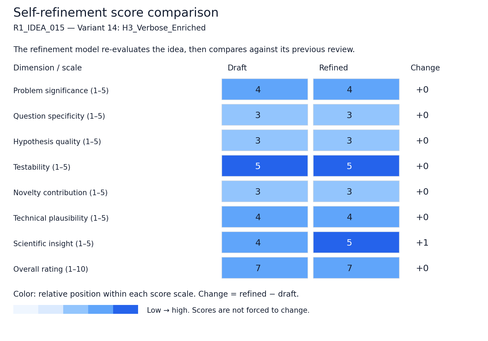

Changed score dimensions: scientific_insight.

### Score justifications (draft / refined)

**Problem significance**

```json
{
  "draft": {
    "score": 4.0,
    "justification": "Precise control of 3D avatars via natural language is a recognized challenge in graphics and human-computer interaction. Reducing ambiguity and improving expressiveness would benefit content creation, virtual reality, and digital humans. The problem is meaningful and timely."
  },
  "refined": {
    "score": 4.0,
    "justification": "The problem of precise, controllable editing of 3D content using natural language is both meaningful and timely. It sits at the intersection of computer graphics, human-computer interaction, and language understanding, with applications in content creation, virtual reality, and digital humans. The identification of ambiguity and limited expressiveness as key challenges is well-motivated."
  }
}
```

**Question specificity**

```json
{
  "draft": {
    "score": 3.0,
    "justification": "The idea identifies a general problem (ambiguity in text-based editing) and a proposed solution (concept slider), but the exact research question is implicit. It would be stronger if explicitly stated as a comparison (e.g., sliders vs. direct text) or a test of a specific claim about controllability."
  },
  "refined": {
    "score": 3.0,
    "justification": "The idea identifies a general problem and proposes a solution direction, but the exact research question remains implicit. It would be stronger if explicitly framed as, for example, 'Does continuous interpolation between concept extremes improve precision over direct text editing?' The validation plan is specific, but the core question itself is somewhat vague."
  }
}
```

**Hypothesis quality**

```json
{
  "draft": {
    "score": 3.0,
    "justification": "An implicit hypothesis is that continuous sliders between concept extremes allow more precise editing than direct text. This is concrete and testable, but not explicitly framed as a falsifiable prediction. The proposal focuses more on validation design than on articulating the hypothesis."
  },
  "refined": {
    "score": 3.0,
    "justification": "There is an implicit hypothesis that continuous sliders between concept extremes allow more precise editing than direct text. This is a concrete and potentially falsifiable prediction. However, it is not explicitly stated as a hypothesis, and the connection between the proposed mechanism (sliders) and the outcome (precision) is assumed rather than argued from first principles."
  }
}
```

**Testability**

```json
{
  "draft": {
    "score": 5.0,
    "justification": "Excellent. The idea includes a detailed, multi-stage validation plan with baseline/intervention conditions, pre-specified criteria, representative cases, ablations, sensitivity analyses, and error analysis. This makes the central claim highly testable."
  },
  "refined": {
    "score": 5.0,
    "justification": "Excellent. The proposed validation path is exceptionally detailed and robust. It includes a staged design with baseline/intervention conditions, pre-specified evaluation criteria, testing across easy/difficult/boundary cases, ablations, sensitivity analyses, and error analysis. This design directly supports a rigorous, falsifiable investigation."
  }
}
```

**Novelty contribution**

```json
{
  "draft": {
    "score": 3.0,
    "justification": "The concept of a slider for continuous control is not new in graphics (e.g., blend shapes, parameter sliders). The novelty lies in applying it to semantic concepts derived from text for 3D avatars. Contribution could range from moderate (a useful interaction tool) to high if it reveals new principles for disentangling language semantics in 3D."
  },
  "refined": {
    "score": 3.0,
    "justification": "The core metaphor of a slider for continuous control is not novel in graphics (e.g., blend shapes, parameter rigs). The potential novelty lies in applying this to semantic concepts derived from text for 3D human avatars. The contribution could be moderate (a useful interaction tool) or higher if the study yields new insights into disentangling language semantics in 3D spaces. The idea summary does not sufficiently differentiate ACS from conceivable prior work."
  }
}
```

**Technical plausibility**

```json
{
  "draft": {
    "score": 4.0,
    "justification": "The core idea is logically coherent: interpolating between concept extremes should offer more control than a single text prompt. The validation plan is realistic. However, the technical feasibility depends on unspecified details (e.g., learning concept directions). The reasoning is sound given the high-level description."
  },
  "refined": {
    "score": 4.0,
    "justification": "The core reasoning is logically coherent: providing continuous control between extremes should, in principle, offer more precision than a single discrete instruction. The proposed validation plan is realistic and well-structured. The main uncertainty lies in the unspecified technical implementation of mapping text to continuous concept directions, but the high-level idea is plausible."
  }
}
```

**Scientific insight**

```json
{
  "draft": {
    "score": 4.0,
    "justification": "The proposed validation design explicitly aims to uncover boundary conditions, assumptions, and failure modes. This suggests the research could yield insights into when and why text-based editing fails, how semantic granularity affects controllability, and the trade-offs between discrete and continuous concept editing."
  },
  "refined": {
    "score": 5.0,
    "justification": "This is the strongest aspect. The validation plan is explicitly designed to move beyond 'does it work?' to uncover 'when, why, and under what conditions does it work?'. The focus on boundary conditions, failure modes, ablations, and sensitivity to concept granularity promises insights into the fundamental relationship between language semantics and 3D controllability, which is a transferable scientific contribution."
  }
}
```

**Overall rating**

```json
{
  "draft": {
    "score": 7.0,
    "justification": "This is a strong research idea. It addresses a meaningful problem, proposes a concrete mechanism, and—most notably—includes an exceptionally thorough and insightful validation plan that prioritizes scientific understanding. The main limitations are the somewhat implicit research question and lack of technical details, but these are acceptable for an idea summary. The potential for both practical contribution and scientific insight is high."
  },
  "refined": {
    "score": 7.0,
    "justification": "This is a strong research idea. It addresses a meaningful problem with a concrete, intuitive mechanism. While the research question and hypothesis could be more explicitly framed, and technical details are sparse, these are acceptable limitations for an idea summary. The exceptionally thoughtful and insightful validation plan elevates the idea, demonstrating a clear path to rigorous investigation and high potential for scientific insight into boundary conditions and failure modes. The idea has clear potential for both practical utility and deeper understanding."
  }
}
```

## R1_IDEA_015 — Variant 15: H4_Ultimate_Hype


Changed score dimensions: none.

### Score justifications (draft / refined)

**Problem significance**

```json
{
  "draft": {
    "score": 4.0,
    "justification": "The problem of ambiguous natural language for precise 3D editing is meaningful, especially with growing applications in gaming, virtual reality, and digital humans. It addresses a practical limitation in human-AI interaction."
  },
  "refined": {
    "score": 4.0,
    "justification": "The problem is meaningful and relevant. Ambiguity in natural language for precise 3D editing is a recognized challenge in graphics, VR, and digital human creation. Solving it would improve human-AI interaction and enable more intuitive content creation tools."
  }
}
```

**Question specificity**

```json
{
  "draft": {
    "score": 2.0,
    "justification": "The idea states a general goal ('precise editing') but does not define a specific research question. What exactly is being investigated about sliders vs. other methods? The description is more of a vision than a concrete question."
  },
  "refined": {
    "score": 2.0,
    "justification": "The idea states a general goal ('precise editing of semantic concepts') but does not define a specific research question. It lacks clarity on what is being investigated about sliders versus other methods—e.g., is it about efficiency, accuracy, user preference, or ambiguity reduction? The description is visionary rather than concretely investigative."
  }
}
```

**Hypothesis quality**

```json
{
  "draft": {
    "score": 2.0,
    "justification": "There is an implicit hypothesis that 'sliders enable more precise control than direct text', but it is not articulated as a testable claim. No mechanism or causal relationship is proposed."
  },
  "refined": {
    "score": 2.0,
    "justification": "There is only an implicit, vague hypothesis that 'sliders enable more precise control than direct text,' but it is not articulated as a testable claim. No mechanism, causal relationship, or comparative prediction is proposed. The hypothesis lacks specificity and falsifiability."
  }
}
```

**Testability**

```json
{
  "draft": {
    "score": 3.0,
    "justification": "The idea could be tested through user studies or quantitative metrics (e.g., edit accuracy), but no evaluation approach is suggested. The core claim about reducing ambiguity is testable in principle."
  },
  "refined": {
    "score": 3.0,
    "justification": "The core claim about reducing ambiguity is testable in principle through user studies or quantitative metrics (e.g., edit accuracy, variance in outcomes). However, no evaluation approach is suggested, and the lack of a specific hypothesis makes it unclear what exactly would be tested."
  }
}
```

**Novelty contribution**

```json
{
  "draft": {
    "score": 3.0,
    "justification": "Slider-based controls for attributes are common in graphics (e.g., character creators). The novelty would depend on the integration with text-based semantics and the continuous interpolation between learned concepts. The description is too vague to assess true novelty."
  },
  "refined": {
    "score": 3.0,
    "justification": "Slider-based controls for attributes are common in graphics (e.g., character creators). The novelty would depend on the integration with text-based semantics and continuous interpolation between learned concepts. The description is too vague to assess true novelty—it could range from a straightforward application to a novel learning framework."
  }
}
```

**Technical plausibility**

```json
{
  "draft": {
    "score": 3.0,
    "justification": "The general concept of interpolating between semantic extremes is plausible, but without technical details, it's unclear how text would map to slider positions or how the avatar representation would support such edits."
  },
  "refined": {
    "score": 3.0,
    "justification": "The general concept of interpolating between semantic extremes is plausible, but without any technical details, it's unclear how text would map to slider positions or how the avatar representation would support such edits. Important assumptions (e.g., existence of a well-behaved semantic continuum) are not addressed."
  }
}
```

**Scientific insight**

```json
{
  "draft": {
    "score": 3.0,
    "justification": "If successful, the work could provide insight into how to bridge discrete language descriptions with continuous control spaces. However, the idea as presented focuses more on application than on fundamental understanding."
  },
  "refined": {
    "score": 3.0,
    "justification": "If successfully investigated, the work could provide insight into how to bridge discrete language descriptions with continuous control spaces, potentially revealing principles for reducing ambiguity in human-AI interfaces. However, the idea as presented focuses more on application and vision than on fundamental understanding or generalizable mechanisms."
  }
}
```

**Overall rating**

```json
{
  "draft": {
    "score": 5.0,
    "justification": "This is a moderate/borderline research idea. It identifies a relevant problem and proposes an intuitive direction, but lacks specificity, a clear hypothesis, and a defined research question. The high-level, aspirational language does not substitute for a concrete investigation plan. It has potential but needs substantial refinement to become a strong research proposal."
  },
  "refined": {
    "score": 5.0,
    "justification": "This is a moderate/borderline research idea. It identifies a relevant problem and proposes an intuitive direction, but lacks specificity, a clear hypothesis, and a defined research question. The high-level, aspirational language does not substitute for a concrete investigation plan. It has potential but needs substantial refinement to become a strong research proposal."
  }
}
```

## R1_IDEA_016 — Source

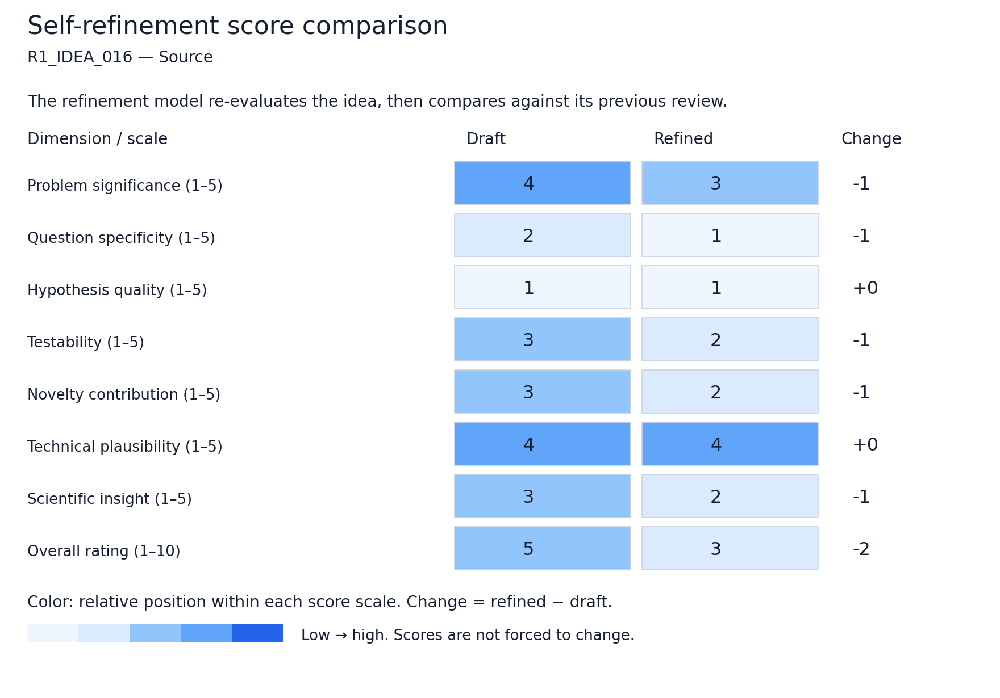

Changed score dimensions: problem_significance, question_specificity, testability, novelty_contribution, scientific_insight, overall_rating.

### Score justifications (draft / refined)

**Problem significance**

```json
{
  "draft": {
    "score": 4.0,
    "justification": "The problem is meaningful: SAEs are important tools for LLM interpretability, and developing principled foundations could improve their reliability and understanding. However, the significance depends on whether the current lack of principled derivation actually limits SAE effectiveness."
  },
  "refined": {
    "score": 3.0,
    "justification": "The problem is moderately significant. SAEs are important for LLM interpretability, and stronger theoretical foundations could be valuable. However, the idea does not establish why the current lack of a principled derivation is a pressing issue—it doesn't show that heuristic SAEs suffer due to this gap or that a derivation would yield practical improvements."
  }
}
```

**Question specificity**

```json
{
  "draft": {
    "score": 2.0,
    "justification": "The idea identifies a general direction (developing a principled framework) but doesn't specify what research question is being answered. What exactly will be learned by making this connection? The 'what' and 'why' are underspecified."
  },
  "refined": {
    "score": 1.0,
    "justification": "The idea does not define a research question. It proposes a methodological direction ('develop a framework') but does not specify what is being investigated. There is no 'what will we learn?' or 'what relationship will we test?'"
  }
}
```

**Hypothesis quality**

```json
{
  "draft": {
    "score": 1.0,
    "justification": "There is no explicit or implicit hypothesis presented. The idea describes a proposed approach but doesn't make a testable prediction about what this approach will achieve or reveal."
  },
  "refined": {
    "score": 1.0,
    "justification": "There is no hypothesis—implicit or explicit. The idea describes a proposed technical approach but makes no testable prediction about outcomes, mechanisms, or relationships. It is purely a proposal to build something, not to investigate a claim."
  }
}
```

**Testability**

```json
{
  "draft": {
    "score": 3.0,
    "justification": "The approach could be tested by implementing the framework and comparing it to existing SAE variants, but without a clear hypothesis, it's unclear what would constitute success. The idea is technically testable but lacks a specific claim to test."
  },
  "refined": {
    "score": 2.0,
    "justification": "The idea is minimally testable because one could implement the framework and compare it to existing SAEs. However, without a hypothesis or clear success criteria, testing reduces to 'does it work?' rather than investigating a specific scientific claim. The lack of a predictive element limits testability."
  }
}
```

**Novelty contribution**

```json
{
  "draft": {
    "score": 3.0,
    "justification": "Unrolling optimization algorithms is not novel in deep learning, but applying it to connect dictionary learning to SAEs for LLM interpretability could be a modest contribution. The potential contribution depends entirely on what insights or improvements emerge."
  },
  "refined": {
    "score": 2.0,
    "justification": "Unrolling optimization algorithms to derive network architectures is an established technique (e.g., unrolled ISTA, LISTA). Applying it to SAEs for LLMs is a straightforward application rather than a novel conceptual contribution. The potential contribution hinges entirely on what insights emerge, which are unspecified."
  }
}
```

**Technical plausibility**

```json
{
  "draft": {
    "score": 4.0,
    "justification": "The technical approach is plausible: unrolling iterative optimization methods is a known technique for deriving neural network architectures from optimization algorithms. The connection between sparse coding and autoencoders is well-established."
  },
  "refined": {
    "score": 4.0,
    "justification": "The technical approach is plausible. Unrolling proximal gradient descent for sparse coding is well-founded (e.g., LISTA networks). The connection between autoencoders and dictionary learning is standard. The idea is coherent within established optimization and deep learning principles."
  }
}
```

**Scientific insight**

```json
{
  "draft": {
    "score": 3.0,
    "justification": "If successful, this could provide insight into the theoretical foundations of SAEs and potentially reveal why certain architectural choices work better than others. However, without specifying what will be learned, the potential insight is uncertain."
  },
  "refined": {
    "score": 2.0,
    "justification": "Potential insight is low because the idea does not specify what would be learned. At best, it could provide a theoretical justification for existing SAE designs, but this is not stated. Without a clear investigative goal, the idea is more engineering (building a framework) than science (gaining new knowledge)."
  }
}
```

**Overall rating**

```json
{
  "draft": {
    "score": 5.0,
    "justification": "This is a moderate/borderline research idea. It identifies a potentially meaningful gap (lack of principled framework for SAEs) and proposes a plausible technical approach. However, it lacks a clear research question, hypothesis, or specification of what scientific knowledge would be gained. The idea is more of a proposed method than a research investigation with a testable claim."
  },
  "refined": {
    "score": 3.0,
    "justification": "This is a weak research idea. While it identifies a plausible technical gap and proposes a coherent method, it lacks the core elements of a research investigation: a specific question, a hypothesis, and a clear statement of what scientific knowledge would be produced. It reads as a methodology proposal without a research goal. The potential for scientific contribution is minimal without these elements."
  }
}
```

## R1_IDEA_016 — Variant 1: A1_Identity

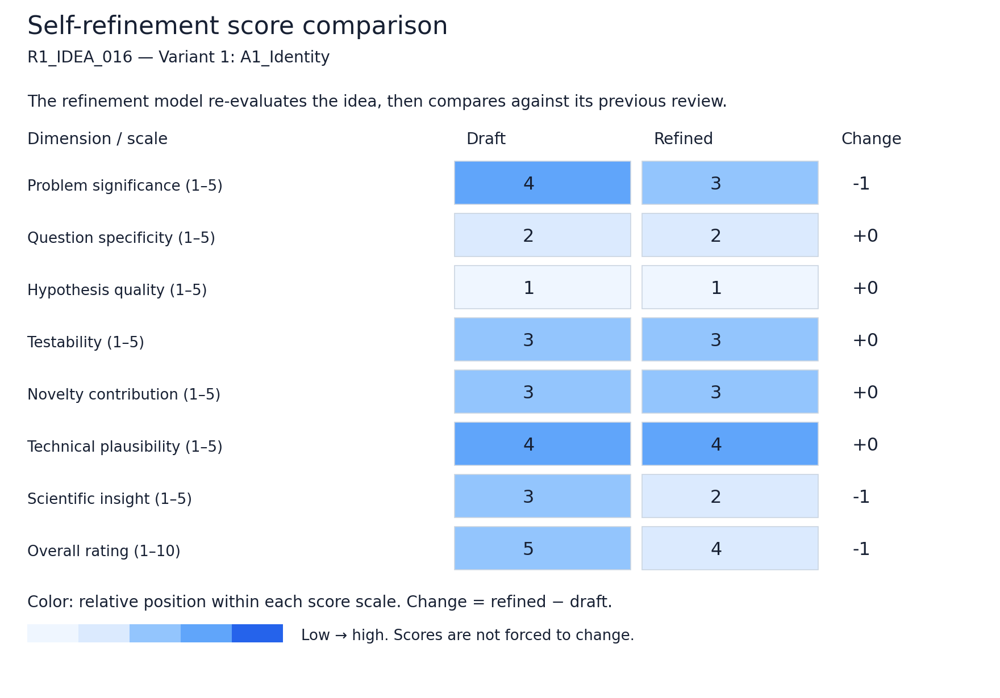

Changed score dimensions: problem_significance, scientific_insight, overall_rating.

### Score justifications (draft / refined)

**Problem significance**

```json
{
  "draft": {
    "score": 4.0,
    "justification": "The problem is meaningful: SAEs are important tools for LLM interpretability, and developing principled foundations could improve their reliability and understanding. However, the significance depends on whether the current lack of principled derivation actually limits SAE effectiveness."
  },
  "refined": {
    "score": 3.0,
    "justification": "The problem is moderately significant. Improving the theoretical grounding of interpretability tools like SAEs is a worthwhile goal in ML research. However, the idea does not convincingly establish that the current 'unprincipled' state is a major impediment to progress or application. The significance is potential but not strongly argued."
  }
}
```

**Question specificity**

```json
{
  "draft": {
    "score": 2.0,
    "justification": "The idea identifies a general direction (developing a principled framework) but doesn't specify what research question is being answered. What exactly will be learned by making this connection? The 'what' and 'why' are underspecified."
  },
  "refined": {
    "score": 2.0,
    "justification": "The idea is very low in specificity. It describes an activity ('introduce a framework') but does not define a research question. A strong research question would specify what relationship, mechanism, or property is being investigated (e.g., 'Does a principled derivation lead to SAEs with better X?'). Here, the 'what is being studied' is unclear."
  }
}
```

**Hypothesis quality**

```json
{
  "draft": {
    "score": 1.0,
    "justification": "There is no explicit or implicit hypothesis presented. The idea describes a proposed approach but doesn't make a testable prediction about what this approach will achieve or reveal."
  },
  "refined": {
    "score": 1.0,
    "justification": "There is no hypothesis, explicit or implicit. The text describes a proposed technical construction but makes no testable prediction about its outcomes, properties, or advantages. A hypothesis would require a falsifiable claim connecting the proposed method to an expected result."
  }
}
```

**Testability**

```json
{
  "draft": {
    "score": 3.0,
    "justification": "The approach could be tested by implementing the framework and comparing it to existing SAE variants, but without a clear hypothesis, it's unclear what would constitute success. The testability is moderate because one could measure standard metrics (reconstruction error, sparsity, interpretability scores)."
  },
  "refined": {
    "score": 3.0,
    "justification": "Testability is moderate because one could implement the proposed framework and compare it to existing methods on standard metrics (reconstruction error, sparsity, feature interpretability metrics). However, without a hypothesis, 'testing' reduces to a demonstration rather than an investigation of a specific claim. The central activity is implementable, but the scientific question to test is missing."
  }
}
```

**Novelty contribution**

```json
{
  "draft": {
    "score": 3.0,
    "justification": "Unrolling optimization algorithms is not novel in deep learning, but applying it to connect dictionary learning to SAEs for LLM interpretability could be a modest contribution. The potential contribution depends on what new insights or improvements emerge from the framework."
  },
  "refined": {
    "score": 3.0,
    "justification": "The novelty is modest. Unrolling optimization algorithms (like proximal gradient) is a known technique in deep learning. Applying it to derive SAEs from dictionary learning for LLMs is a specific application that may not have been done before, but the core technical idea is not novel. The contribution hinges entirely on whether this application yields new insights or improvements, which the idea does not specify."
  }
}
```

**Technical plausibility**

```json
{
  "draft": {
    "score": 4.0,
    "justification": "The technical approach is plausible: unrolling iterative optimization methods is a established technique in deep learning (e.g., unrolled ISTA for sparse coding). The connection between proximal gradient methods and autoencoder architectures is reasonable."
  },
  "refined": {
    "score": 4.0,
    "justification": "The technical direction is plausible. Unrolling iterative optimization methods to create neural network architectures is a well-established paradigm (e.g., LISTA). The connection between the proximal gradient method for sparse coding and a potential autoencoder structure is logically coherent. The central technical claim is reasonable."
  }
}
```

**Scientific insight**

```json
{
  "draft": {
    "score": 3.0,
    "justification": "If successful, this could provide insight into the theoretical foundations of SAEs and potentially reveal why certain architectural choices work better than others. However, without a clear hypothesis about what will be learned, the potential insight is limited to technical unification rather than deeper understanding of feature learning in LLMs."
  },
  "refined": {
    "score": 2.0,
    "justification": "The potential for scientific insight is weak. As presented, the idea describes an engineering task—building a framework. It does not suggest what new understanding this framework will provide about sparse feature learning, LLM representations, or the limitations of current methods. Insight might be an incidental byproduct, but it is not a stated goal or a clear likely outcome of the described work."
  }
}
```

**Overall rating**

```json
{
  "draft": {
    "score": 5.0,
    "justification": "This is a moderate/borderline research idea. It identifies a plausible technical direction with reasonable motivation, but lacks a clear research question, hypothesis, or specification of expected contributions. The idea describes 'what' would be done but not 'why it matters' or 'what we would learn.' It could become stronger with more specific hypotheses about the benefits of this principled derivation."
  },
  "refined": {
    "score": 4.0,
    "justification": "This is a weak research idea. While it identifies a plausible technical activity in a relevant area, it fundamentally lacks the core components of a research investigation: a specific question and a hypothesis. It describes a 'what' (build a framework) without a 'why' (what will we learn?) or a 'so what' (why does it matter?). The idea is more akin to a project plan than a research hypothesis. It has a moderate technical plausibility but very low scientific specificity and hypothesis quality, limiting its potential contribution."
  }
}
```

## R1_IDEA_016 — Variant 2: A2_Paraphrase_Only

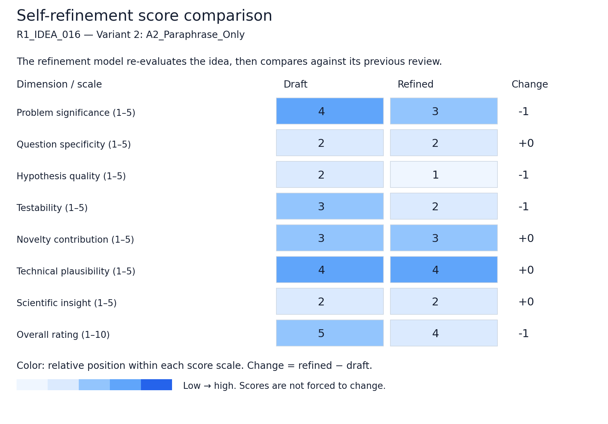

Changed score dimensions: problem_significance, hypothesis_quality, testability, overall_rating.

### Score justifications (draft / refined)

**Problem significance**

```json
{
  "draft": {
    "score": 4.0,
    "justification": "The problem is meaningful: SAEs are important for LLM interpretability, and lack of systematic derivation from dictionary learning represents a genuine methodological gap. Improving theoretical foundations could benefit many researchers working on mechanistic interpretability."
  },
  "refined": {
    "score": 3.0,
    "justification": "The problem is moderately significant. SAEs are indeed important tools in LLM interpretability, and providing stronger theoretical foundations is a reasonable goal. However, the idea presents the lack of a 'systematic derivation' as the primary motivation without strongly arguing why this gap is a critical impediment to progress. The significance hinges on whether bridging this formal gap leads to practical or conceptual advances, which is not yet established."
  }
}
```

**Question specificity**

```json
{
  "draft": {
    "score": 2.0,
    "justification": "The idea describes a methodological development but doesn't articulate a specific research question. It states what will be done (developing a framework) but not what will be learned or tested. The connection to interpretability outcomes is implied but not specified."
  },
  "refined": {
    "score": 2.0,
    "justification": "The idea is not framed as a research question. It describes an activity ('developing a framework') rather than posing an inquiry. It is unclear what is being investigated. A specific question would ask *why* or *whether* this derivation matters, or *how* it affects SAE properties."
  }
}
```

**Hypothesis quality**

```json
{
  "draft": {
    "score": 2.0,
    "justification": "There's an implicit hypothesis that deriving SAEs systematically from dictionary learning will be beneficial, but this is not stated as a testable prediction. No concrete mechanism or relationship is proposed that could be supported or contradicted by evidence."
  },
  "refined": {
    "score": 1.0,
    "justification": "There is no explicit or clearly implicit testable hypothesis. The idea states an intention to build something. An implicit assumption is that a systematic derivation is valuable, but this is not formulated as a concrete, falsifiable prediction about outcomes (e.g., performance, interpretability, stability). A hypothesis would need to predict a relationship between the derivation method and a measurable result."
  }
}
```

**Testability**

```json
{
  "draft": {
    "score": 3.0,
    "justification": "The framework development itself is testable in the sense that one can implement it and compare against existing methods. However, without specifying evaluation metrics or comparison points, it's unclear what evidence would validate the approach as successful or useful."
  },
  "refined": {
    "score": 2.0,
    "justification": "The core activity (developing a framework) is executable, but the idea lacks criteria for what would constitute successful investigation. Without a stated hypothesis or evaluation metrics, it is unclear what evidence would support or contradict the value of the idea. One could implement the framework, but the idea does not specify what to test it *for*."
  }
}
```

**Novelty contribution**

```json
{
  "draft": {
    "score": 3.0,
    "justification": "The idea of connecting SAEs to dictionary learning via unrolled optimization is moderately novel. However, without specifying what new scientific knowledge would be gained, the contribution appears primarily methodological rather than offering fundamental new insights about interpretability or representation learning."
  },
  "refined": {
    "score": 3.0,
    "justification": "The specific combination—applying unrolled proximal gradient to derive SAEs from dictionary learning for LLM interpretability—has moderate novelty. However, the potential contribution is primarily methodological (a new derivation/framework) rather than a clear advance in scientific knowledge about interpretability or LLMs. The novelty would be higher if it were linked to a novel empirical finding or theoretical insight this derivation enables."
  }
}
```

**Technical plausibility**

```json
{
  "draft": {
    "score": 4.0,
    "justification": "The technical direction is plausible: unrolling optimization algorithms is a known technique, and connecting SAEs to dictionary learning makes conceptual sense. The reasoning is logically coherent given the information provided."
  },
  "refined": {
    "score": 4.0,
    "justification": "The technical direction is plausible. Unrolling optimization algorithms is a standard technique, and the connection between SAEs and dictionary learning is conceptually sound. The reasoning is logically coherent: if SAEs perform sparse coding, then deriving them from the canonical dictionary learning problem via a standard optimization method is a reasonable approach."
  }
}
```

**Scientific insight**

```json
{
  "draft": {
    "score": 2.0,
    "justification": "The idea as presented focuses on methodological development rather than scientific insight. It doesn't articulate what would be learned about interpretability, representation learning, or LLMs beyond having a new derivation. The potential for transferable insights about why SAEs work or their limitations is not developed."
  },
  "refined": {
    "score": 2.0,
    "justification": "The idea as presented has low potential for scientific insight. It focuses on creating a tool (a framework) without specifying what fundamental question about LLMs, representation learning, or interpretability this tool will help answer. The insight is currently limited to 'here is a more systematic derivation.' For greater insight, the idea would need to propose how this framework reveals new principles, limitations, or mechanisms."
  }
}
```

**Overall rating**

```json
{
  "draft": {
    "score": 5.0,
    "justification": "This is a moderate/borderline research idea. It identifies a meaningful technical gap in an important area and proposes a plausible methodological direction. However, it lacks a clearly articulated research question, testable hypothesis, and specification of what scientific insight would be gained. The idea describes what will be built but not what will be learned or tested, limiting its potential contribution to primarily methodological rather than scientific advancement."
  },
  "refined": {
    "score": 4.0,
    "justification": "This is a weak research idea. It identifies a plausible technical activity in an important domain but fails to formulate a research question or hypothesis. The idea describes what the researchers would *do* (develop a framework) but not what they would *learn*. Consequently, its scientific merit is low because the core of a research idea—a specific, testable inquiry aimed at generating new knowledge—is missing. It is more akin to a development plan than a research proposal."
  }
}
```

## R1_IDEA_016 — Variant 3: A3_Plain_Core

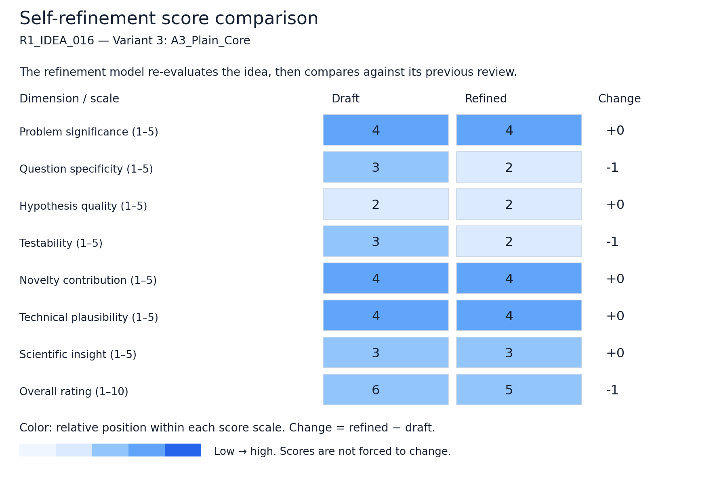

Changed score dimensions: question_specificity, testability, overall_rating.

### Score justifications (draft / refined)

**Problem significance**

```json
{
  "draft": {
    "score": 4.0,
    "justification": "The problem is significant as SAEs are widely used in LLM interpretability research but lack theoretical foundations. A principled framework could improve reliability and understanding of these important tools."
  },
  "refined": {
    "score": 4.0,
    "justification": "The problem is significant. SAEs are a cornerstone of contemporary mechanistic interpretability for LLMs, yet their design is largely empirical. Providing theoretical foundations could improve their reliability, comparability, and effectiveness, which matters greatly to the field."
  }
}
```

**Question specificity**

```json
{
  "draft": {
    "score": 3.0,
    "justification": "The idea identifies a clear gap (no principled framework for SAE variants) and proposes a specific technical approach (unrolling proximal gradient methods), but doesn't specify what questions about SAEs the framework will answer or what variants it will address."
  },
  "refined": {
    "score": 2.0,
    "justification": "The idea identifies a general goal ('introduce a framework') but does not specify a concrete research question. It lacks detail on what aspects of SAEs the framework will explain, which variants it will cover, or what specific relationships it will derive. The direction is clear, but the investigative target is vague."
  }
}
```

**Hypothesis quality**

```json
{
  "draft": {
    "score": 2.0,
    "justification": "There's an implicit hypothesis that SAE variants can be derived from dictionary learning principles via proximal gradient unrolling, but this isn't stated as a testable claim. No predictions are made about what the framework will reveal or how it will improve interpretability."
  },
  "refined": {
    "score": 2.0,
    "justification": "There is only a very implicit, untestable hypothesis: that a framework connecting SAEs to dictionary learning via proximal gradient unrolling is possible and useful. No concrete, falsifiable prediction is made about the outcome of this connection (e.g., 'framework X will show that variant Y is optimal for feature Z'). The idea describes an activity, not a hypothesis."
  }
}
```

**Testability**

```json
{
  "draft": {
    "score": 3.0,
    "justification": "The idea suggests a methodological direction that could be tested by implementing the framework and deriving specific SAE variants. However, success criteria aren't defined, making it unclear how one would validate whether the framework achieves its goals."
  },
  "refined": {
    "score": 2.0,
    "justification": "Testability is low. While one could attempt to implement the proposed unrolling, the idea lacks defined success criteria. How would one falsify the core claim? There is no clear experiment, comparison, or condition for failure stated. The work could be completed (a derivation written) without providing testable scientific evidence."
  }
}
```

**Novelty contribution**

```json
{
  "draft": {
    "score": 4.0,
    "justification": "Connecting SAEs to dictionary learning through proximal gradient unrolling appears novel. If successful, it could provide theoretical grounding for an empirically successful but theoretically underdeveloped area of interpretability research."
  },
  "refined": {
    "score": 4.0,
    "justification": "The proposed synthesis is novel. While dictionary learning and algorithm unrolling are known, their application to ground the diverse landscape of SAEs used in LLM interpretability is a fresh and potentially valuable contribution. It could move the subfield from ad-hoc designs to a principled taxonomy."
  }
}
```

**Technical plausibility**

```json
{
  "draft": {
    "score": 4.0,
    "justification": "The technical direction is plausible: dictionary learning is a well-established sparse representation framework, and unrolling optimization algorithms is a known technique. The connection between SAEs and sparse coding/dictionary learning is conceptually reasonable."
  },
  "refined": {
    "score": 4.0,
    "justification": "The technical direction is plausible. Sparse autoencoders are intrinsically related to sparse coding and dictionary learning. Unrolling iterative optimization algorithms (like proximal gradient) to form neural network architectures is a standard technique. The foundational concepts logically connect."
  }
}
```

**Scientific insight**

```json
{
  "draft": {
    "score": 3.0,
    "justification": "The framework could provide insight into why certain SAE variants work well and how to design better ones. However, the idea doesn't articulate what specific insights about LLM representations or interpretability it aims to produce beyond mathematical unification."
  },
  "refined": {
    "score": 3.0,
    "justification": "Potential insight is moderate. The framework could provide insight into the design space of SAEs and the mathematical assumptions behind different variants. However, the idea as stated does not articulate what higher-level insights about LLM representations or interpretability itself will be gained. The insight is primarily methodological (unifying SAE designs) rather than about the system being interpreted (LLMs)."
  }
}
```

**Overall rating**

```json
{
  "draft": {
    "score": 6.0,
    "justification": "This is a moderate research idea with good technical motivation but limited specificity. The problem is significant and the technical direction is plausible, but the idea lacks a clear hypothesis, specific research questions, and defined success criteria. It has potential but needs more concrete formulation to become a strong research direction."
  },
  "refined": {
    "score": 5.0,
    "justification": "This is a moderate/borderline research idea. It addresses a significant problem and proposes a plausible, novel technical direction. However, it is critically weakened by a lack of a specific research question, a testable hypothesis, and defined success criteria. It describes an engineering task (building a framework) more than a scientific investigation. With substantial refinement to include a falsifiable hypothesis and clear evaluation metrics, it could become strong."
  }
}
```

## R1_IDEA_016 — Variant 4: B1_Verbose_Elaborate


Changed score dimensions: question_specificity, hypothesis_quality, testability, overall_rating.

### Score justifications (draft / refined)

**Problem significance**

```json
{
  "draft": {
    "score": 4.0,
    "justification": "The problem is meaningful: sparse autoencoders are important for LLM interpretability, and lack of principled foundations is a recognized issue. However, the significance depends on whether this framework leads to practical improvements or just theoretical neatness."
  },
  "refined": {
    "score": 4.0,
    "justification": "The problem is meaningful and timely. Sparse autoencoders are a prominent technique for LLM interpretability, and the lack of a principled connection to their dictionary learning roots is a recognized theoretical gap. Establishing such a foundation could improve methodological rigor and design. Significance is high but not exceptional, as the ultimate value depends on whether the framework yields practical or theoretical advances beyond unification."
  }
}
```

**Question specificity**

```json
{
  "draft": {
    "score": 3.0,
    "justification": "The idea identifies a gap (no principled framework) and proposes a method (unrolling proximal gradient), but does not articulate a specific research question about what will be learned or achieved. It's more a methodological proposal than a focused investigation."
  },
  "refined": {
    "score": 2.0,
    "justification": "The idea identifies a gap and proposes a technical approach, but does not articulate a specific research question. It states what will be built (a framework) but not what will be investigated or learned. The 'what' is clear; the 'why' and 'so what' are missing. This makes the research direction somewhat open-ended and non-specific."
  }
}
```

**Hypothesis quality**

```json
{
  "draft": {
    "score": 2.0,
    "justification": "There is no explicit or clearly implicit hypothesis. The idea states what will be done (introduce a framework) but not what will be discovered or proven. A hypothesis would predict, for example, that this derivation reveals optimal design choices or explains performance differences."
  },
  "refined": {
    "score": 1.0,
    "justification": "There is no explicit or clearly implicit hypothesis. The idea describes an action ('introduce a framework') rather than making a testable prediction about relationships, mechanisms, or outcomes. A hypothesis would need to propose, for example, that this derivation explains performance variations, reveals optimal architectural choices, or leads to quantifiable improvements. As presented, it is hypothesis-free."
  }
}
```

**Testability**

```json
{
  "draft": {
    "score": 3.0,
    "justification": "The proposal is testable in principle—one can implement the framework and compare it to existing approaches—but no specific tests or evaluations are suggested. The testability is moderate because the outcome (a framework) is somewhat open-ended without clear success criteria."
  },
  "refined": {
    "score": 2.0,
    "justification": "Testability is weak. While one could implement the framework, no criteria for success or methods for evaluation are suggested. The outcome is a framework, but whether it is 'good' or 'useful' is undefined. Without specified metrics or comparisons, it is difficult to design a meaningful test of the central claim (that this provides a principled foundation)."
  }
}
```

**Novelty contribution**

```json
{
  "draft": {
    "score": 4.0,
    "justification": "Connecting SAE variants to dictionary learning via proximal gradient unrolling appears novel. If successful, it could provide a unified theoretical foundation for a growing empirical literature, which is a valuable contribution. However, the contribution level depends on whether it yields new insights or just repackages existing knowledge."
  },
  "refined": {
    "score": 4.0,
    "justification": "The proposed connection via proximal gradient unrolling appears novel in the context of SAEs for LLM interpretability. Providing a unified theoretical foundation for diverse empirical SAE variants is a potentially valuable contribution. However, the contribution level is uncertain—it could range from a useful pedagogical unification to a generator of new, better methods. The idea suggests novelty in bridging fields, but the extent of new knowledge is unclear."
  }
}
```

**Technical plausibility**

```json
{
  "draft": {
    "score": 5.0,
    "justification": "The technical direction is plausible and coherent. Unrolling optimization algorithms is a known technique in deep learning (e.g., unrolled iterative shrinkage-thresholding algorithm). Applying it to connect dictionary learning and autoencoders is logically sound and builds on established concepts."
  },
  "refined": {
    "score": 5.0,
    "justification": "The technical direction is highly plausible and coherent. Unrolling iterative optimization algorithms (like proximal gradient methods) to construct neural network architectures is a well-established technique (e.g., unrolled ISTA). Applying this to connect dictionary learning's sparse coding step to autoencoder design is logically sound and builds on known concepts from both sparse coding and deep learning."
  }
}
```

**Scientific insight**

```json
{
  "draft": {
    "score": 3.0,
    "justification": "Potential insight is moderate. The framework could provide theoretical understanding of why certain SAE variants work, which is valuable. However, the idea as presented does not emphasize what new principles or mechanisms might be revealed. Insight would be higher if it predicted, for example, that certain architectural choices correspond to specific approximations with known trade-offs."
  },
  "refined": {
    "score": 3.0,
    "justification": "Potential insight is moderate. The framework could offer theoretical understanding of why certain SAE architectural choices work, which is valuable for the field. However, the idea as presented does not emphasize what new principles, mechanisms, or predictive relationships might be discovered. Insight would be higher if it proposed to uncover, for example, that specific SAE components correspond to approximations with known trade-offs affecting interpretability or sparsity."
  }
}
```

**Overall rating**

```json
{
  "draft": {
    "score": 6.0,
    "justification": "This is a moderate/borderline research idea. It addresses a meaningful problem in an important area (LLM interpretability) and proposes a technically plausible direction. However, it lacks a clear research question, hypothesis, and specification of what scientific insight will be gained. The idea is more a methodological proposal than a focused investigation with predictable outcomes. With stronger articulation of the research question and expected contributions, it could become a strong idea."
  },
  "refined": {
    "score": 5.0,
    "justification": "This is a moderate/borderline research idea. It addresses a meaningful problem in an important area and proposes a technically plausible and novel direction. However, it lacks a clear research question, a testable hypothesis, and defined success criteria. The idea is primarily a methodological proposal without a specified investigative goal. It has potential but requires substantial refinement to become a focused, testable research plan. It falls in the 5-6 range due to its plausible technical direction and problem relevance, but limited specificity and testability."
  }
}
```

## R1_IDEA_016 — Variant 5: B2_Grand_Narrative


Changed score dimensions: none.

### Score justifications (draft / refined)

**Problem significance**

```json
{
  "draft": {
    "score": 4.0,
    "justification": "The problem is meaningful: SAEs are important tools for LLM interpretability, and establishing principled foundations could advance the field. However, the significance depends on what specific insights the framework provides."
  },
  "refined": {
    "score": 4.0,
    "justification": "The problem is meaningful: SAEs are important tools for LLM interpretability, and establishing principled foundations could advance the field by providing theoretical grounding and unifying variants. However, the significance depends on what specific insights the framework provides, and the idea does not fully articulate the concrete benefits."
  }
}
```

**Question specificity**

```json
{
  "draft": {
    "score": 2.0,
    "justification": "The idea identifies a general direction ('developing such foundations') but lacks a concrete research question. It doesn't specify what properties the framework should have or what it should explain about SAEs."
  },
  "refined": {
    "score": 2.0,
    "justification": "The idea identifies a general direction ('developing such foundations') but lacks a concrete research question. It doesn't specify what properties the framework should have, what it should explain about SAEs, or what specific gap it fills. The statement is broad and aspirational rather than focused."
  }
}
```

**Hypothesis quality**

```json
{
  "draft": {
    "score": 2.0,
    "justification": "No explicit or clearly implicit hypothesis is presented. The idea suggests a technical approach but doesn't make a testable prediction about what it will achieve or reveal."
  },
  "refined": {
    "score": 2.0,
    "justification": "No explicit or clearly implicit hypothesis is presented. The idea suggests a technical approach but doesn't make a testable prediction about what it will achieve or reveal. There's no statement like 'unrolling proximal gradient will yield SAEs with property X' or 'this connection will explain phenomenon Y.'"
  }
}
```

**Testability**

```json
{
  "draft": {
    "score": 3.0,
    "justification": "The approach is technically testable (one could implement the framework and compare to existing methods), but without a specific hypothesis, it's unclear what should be tested beyond general performance comparisons."
  },
  "refined": {
    "score": 3.0,
    "justification": "The approach is technically testable—one could implement the framework and compare it to existing methods—but without a specific hypothesis, it's unclear what should be tested beyond general performance comparisons. The idea lacks a clear evaluation plan or criteria for success."
  }
}
```

**Novelty contribution**

```json
{
  "draft": {
    "score": 3.0,
    "justification": "Unrolling optimization algorithms is an established technique in deep learning. The novelty would depend on how it's adapted to SAEs and what new insights it provides. The contribution could be moderate if it successfully connects SAEs to dictionary learning theory."
  },
  "refined": {
    "score": 3.0,
    "justification": "Unrolling optimization algorithms is an established technique in deep learning (e.g., unrolled iterative shrinkage-thresholding algorithm). The novelty would depend on how it's adapted to SAEs and what new insights it provides. The contribution could be moderate if it successfully connects SAEs to dictionary learning theory, but as stated, it's more of an application of an existing method to a new context."
  }
}
```

**Technical plausibility**

```json
{
  "draft": {
    "score": 4.0,
    "justification": "The technical direction is plausible: unrolling proximal gradient is a reasonable approach for connecting optimization-based sparse coding to neural network-based SAEs. The reasoning is logically coherent."
  },
  "refined": {
    "score": 4.0,
    "justification": "The technical direction is plausible: unrolling proximal gradient is a reasonable approach for connecting optimization-based sparse coding to neural network-based SAEs. The reasoning is logically coherent, and the method aligns with known techniques in sparse coding and deep learning."
  }
}
```

**Scientific insight**

```json
{
  "draft": {
    "score": 3.0,
    "justification": "The idea has potential for insight if the framework reveals fundamental properties of SAEs or connects them to sparse coding theory. However, without specifying what insights are expected, the potential is unclear."
  },
  "refined": {
    "score": 3.0,
    "justification": "The idea has potential for insight if the framework reveals fundamental properties of SAEs or connects them to sparse coding theory. However, without specifying what insights are expected, the potential is unclear. It could lead to insights about feature learning, optimization, or representation geometry, but this is not articulated."
  }
}
```

**Overall rating**

```json
{
  "draft": {
    "score": 5.0,
    "justification": "This is a moderate/borderline research idea. It identifies a relevant problem in interpretability research and proposes a plausible technical direction, but lacks specificity in research question, hypothesis, and expected contributions. The idea needs more concrete formulation to become a strong research proposal."
  },
  "refined": {
    "score": 5.0,
    "justification": "This is a moderate/borderline research idea. It identifies a relevant problem in interpretability research and proposes a plausible technical direction, but lacks specificity in research question, hypothesis, and expected contributions. The idea needs more concrete formulation to become a strong research proposal. It has a reasonable foundation but requires sharper focus to achieve significant scientific impact."
  }
}
```

## R1_IDEA_016 — Variant 6: B3_Over_Confident

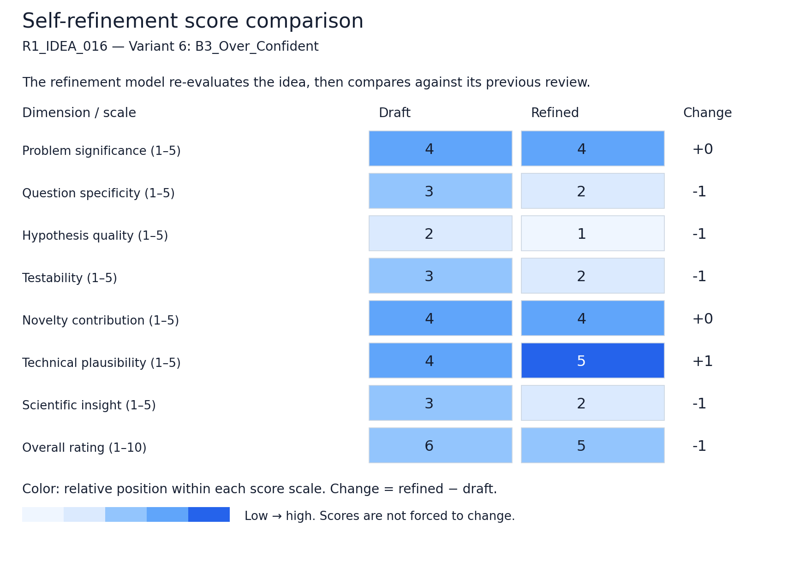

Changed score dimensions: question_specificity, hypothesis_quality, testability, technical_plausibility, scientific_insight, overall_rating.

### Score justifications (draft / refined)

**Problem significance**

```json
{
  "draft": {
    "score": 4.0,
    "justification": "The problem is meaningful: SAEs are a key tool in LLM interpretability, and the lack of a principled connection to dictionary learning is a recognized gap. Improving theoretical grounding could benefit reproducibility, design, and understanding."
  },
  "refined": {
    "score": 4.0,
    "justification": "The problem is significant. Sparse Autoencoders are a cornerstone of contemporary mechanistic interpretability, and their heuristic design is a recognized limitation. Establishing a principled foundation could improve their reliability, design, and theoretical understanding, which matters to researchers in the field."
  }
}
```

**Question specificity**

```json
{
  "draft": {
    "score": 3.0,
    "justification": "The idea specifies a methodological direction (unrolling proximal gradient) but does not articulate a concrete research question beyond 'develop a framework.' It is unclear what specific aspect of SAEs the framework will improve or explain."
  },
  "refined": {
    "score": 2.0,
    "justification": "The research question is poorly defined. The idea states the goal is to 'introduce such a framework' but does not specify what the framework should achieve or explain. It is a directive to build something, not a question to be answered."
  }
}
```

**Hypothesis quality**

```json
{
  "draft": {
    "score": 2.0,
    "justification": "There is no explicit or strongly implicit hypothesis. The idea proposes a method but does not predict an outcome, mechanism, or relationship that can be tested. It is more of a technical proposal than a hypothesis-driven investigation."
  },
  "refined": {
    "score": 1.0,
    "justification": "There is no hypothesis, explicit or implicit. The idea does not make a falsifiable prediction about a relationship, mechanism, or outcome. It proposes a construction method without stating what that construction is expected to yield."
  }
}
```

**Testability**

```json
{
  "draft": {
    "score": 3.0,
    "justification": "The framework itself can be implemented and compared to existing SAEs, but without a clear hypothesis, the tests are open-ended. One could compare performance metrics (sparsity, reconstruction, interpretability), but the idea does not specify what to test for."
  },
  "refined": {
    "score": 2.0,
    "justification": "Testability is low because the core claim is to 'introduce a framework.' One can test if the framework can be derived and implemented, but without a hypothesis about its properties, there is no clear central claim to test. Comparisons to existing methods would be exploratory, not hypothesis-driven."
  }
}
```

**Novelty contribution**

```json
{
  "draft": {
    "score": 4.0,
    "justification": "Deriving SAEs via unrolled optimization from dictionary learning appears novel. If successful, it could provide a theoretical foundation for SAE design, which would be a meaningful contribution to the interpretability literature."
  },
  "refined": {
    "score": 4.0,
    "justification": "The proposed direction has good novelty. Deriving SAEs via unrolled optimization from first principles (dictionary learning) to create a unified framework is not a standard approach and could constitute a meaningful theoretical/methodological contribution to the interpretability toolkit."
  }
}
```

**Technical plausibility**

```json
{
  "draft": {
    "score": 4.0,
    "justification": "Unrolling iterative optimization algorithms (like proximal gradient) to derive neural network architectures is a known technique (e.g., in deep equilibrium models). Applying it to sparse coding for SAEs is logically coherent and technically plausible."
  },
  "refined": {
    "score": 5.0,
    "justification": "The technical direction is highly plausible. Unrolling iterative optimization algorithms (like proximal gradient) to form neural network architectures is a well-established technique (e.g., in deep equilibrium models, LISTA). Applying this to the sparse coding problem underlying SAEs is logically coherent and technically sound."
  }
}
```

**Scientific insight**

```json
{
  "draft": {
    "score": 3.0,
    "justification": "The potential insight is moderate: the framework could clarify the connection between SAEs and dictionary learning, possibly leading to better understanding of feature learning. However, without a specific hypothesis, it's unclear what deeper principles or limitations might be revealed."
  },
  "refined": {
    "score": 2.0,
    "justification": "The potential for scientific insight is weak as presented. The idea promises a 'framework' but does not specify what we would learn from it. A mere derivation, without a hypothesis about its implications, offers limited insight into the mechanisms of sparse feature learning or the limitations of current methods."
  }
}
```

**Overall rating**

```json
{
  "draft": {
    "score": 6.0,
    "justification": "The idea addresses a relevant problem and proposes a concrete technical direction with good novelty. However, it lacks a clear research question and hypothesis, limiting its specificity and testability. It is a moderate/borderline idea that could become strong with a more focused hypothesis and evaluation plan."
  },
  "refined": {
    "score": 5.0,
    "justification": "This is a moderate/borderline research idea. It identifies a relevant problem and proposes a novel, technically plausible method. However, it critically lacks a defined research question and a testable hypothesis. It reads as a methodological proposal for building a tool, not as a scientific investigation aimed at generating new knowledge. Its potential contribution hinges entirely on what is done with the framework after it is built, which is not specified."
  }
}
```

## R1_IDEA_016 — Variant 7: B4_Novelty

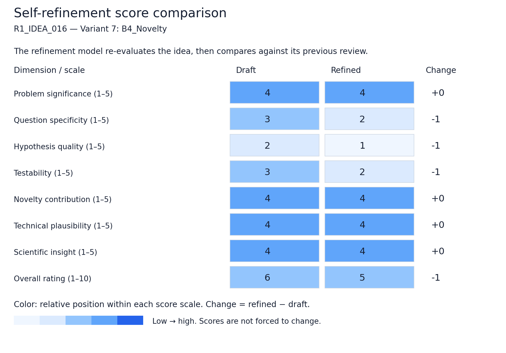

Changed score dimensions: question_specificity, hypothesis_quality, testability, overall_rating.

### Score justifications (draft / refined)

**Problem significance**

```json
{
  "draft": {
    "score": 4.0,
    "justification": "The problem is meaningful: SAEs are important for LLM interpretability, and a principled foundation could improve their reliability and understanding. However, the idea does not strongly argue why the lack of such a derivation is a critical bottleneck."
  },
  "refined": {
    "score": 4.0,
    "justification": "The problem is meaningful. Sparse autoencoders are a central tool in modern LLM interpretability. Providing a principled foundation could improve their reliability, design, and theoretical understanding, which matters to researchers in the field. The idea correctly identifies a lack of foundational derivation as a gap."
  }
}
```

**Question specificity**

```json
{
  "draft": {
    "score": 3.0,
    "justification": "The idea identifies a gap ('no principled framework to derive SAEs from dictionary learning') and proposes a method ('unrolling proximal gradient'), but does not define a precise research question (e.g., 'Does this derivation improve X?')."
  },
  "refined": {
    "score": 2.0,
    "justification": "The idea identifies a general gap ('no principled framework') and proposes a method ('unrolling'), but does not define a precise research question. The objective is to 'develop a framework'—a goal, not a question. It lacks specificity about what is being investigated (e.g., a relationship, a performance comparison, a theoretical property)."
  }
}
```

**Hypothesis quality**

```json
{
  "draft": {
    "score": 2.0,
    "justification": "There is no explicit or clearly implicit hypothesis. The idea proposes a direction ('developing a framework') without a testable prediction about outcomes or mechanisms."
  },
  "refined": {
    "score": 1.0,
    "justification": "There is no explicit or clearly implicit hypothesis. The idea describes an activity (developing a framework) without making a concrete, testable prediction about outcomes, mechanisms, or relationships. A hypothesis would need to claim, for example, that this derivation leads to SAEs with superior or distinct properties."
  }
}
```

**Testability**

```json
{
  "draft": {
    "score": 3.0,
    "justification": "The idea is testable in principle—one could implement the framework and compare it to existing SAEs—but no evaluation plan or criteria are suggested, making testability vague."
  },
  "refined": {
    "score": 2.0,
    "justification": "The idea is testable only in the broadest sense—one could build the framework. However, it proposes no evaluation criteria, comparisons, or analyses to test a meaningful claim. Without a hypothesis or defined success metrics, it's unclear what evidence would support or contradict the idea's value. The testability is very low."
  }
}
```

**Novelty contribution**

```json
{
  "draft": {
    "score": 4.0,
    "justification": "The angle of deriving SAEs from dictionary learning via unrolled optimization is novel and could provide a fresh theoretical perspective. However, the contribution is currently framed as a 'framing' rather than a concrete advance."
  },
  "refined": {
    "score": 4.0,
    "justification": "The proposed angle—deriving SAEs from dictionary learning via unrolled proximal gradient—appears novel. Connecting these well-established concepts (dictionary learning, unrolled optimization, SAEs) in the context of LLM interpretability could provide a fresh theoretical perspective. However, the contribution is currently a 'framing' rather than a demonstrated advance."
  }
}
```

**Technical plausibility**

```json
{
  "draft": {
    "score": 4.0,
    "justification": "The proposed direction is technically plausible: unrolling optimization algorithms is a known technique in deep learning, and dictionary learning is a well-established sparse coding framework. The connection to SAEs is reasonable."
  },
  "refined": {
    "score": 4.0,
    "justification": "The proposed direction is technically plausible. Unrolling iterative optimization algorithms (like proximal gradient) to create neural network architectures is a known and valid technique. Dictionary learning is the theoretical foundation of sparse coding, which underlies SAEs. The logical connection is coherent and reasonable based on the provided information."
  }
}
```

**Scientific insight**

```json
{
  "draft": {
    "score": 4.0,
    "justification": "If successful, this could provide insight into the relationship between optimization algorithms and network architectures for sparse coding, and potentially offer a more grounded understanding of SAE design. However, the potential insight is not explicitly articulated."
  },
  "refined": {
    "score": 4.0,
    "justification": "If successfully developed and analyzed, this framework has high potential for scientific insight. It could reveal principled connections between optimization algorithms and network architecture design, provide a theoretical grounding for SAE hyperparameters and layers, and offer a more rigorous understanding of sparse feature learning in LLMs. The insight is not guaranteed but is plausible and significant."
  }
}
```

**Overall rating**

```json
{
  "draft": {
    "score": 6.0,
    "justification": "This is a moderate research idea with a clear technical direction and addresses a relevant gap. However, it lacks a specific hypothesis, a well-defined research question, and a clear plan for evaluation. The potential contribution is promising but under-specified. With refinement, it could become a strong idea."
  },
  "refined": {
    "score": 5.0,
    "justification": "This is a moderate/borderline research idea. It identifies a relevant gap in an important area and proposes a technically plausible direction with potential for high scientific insight. However, it is critically weakened by the lack of a specific research question, a testable hypothesis, and any plan for evaluation. The idea is currently an undeveloped proposal for a tool or framing, not a focused investigation. It requires substantial refinement to become a strong research idea."
  }
}
```

## R1_IDEA_016 — Variant 8: B5_Application_Impact

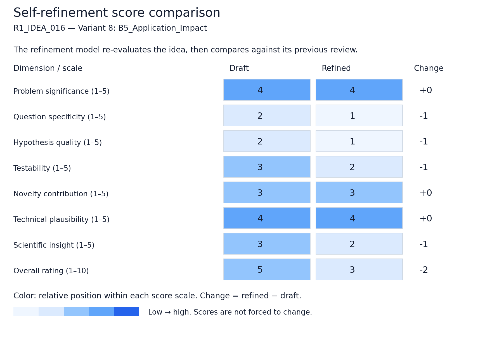

Changed score dimensions: question_specificity, hypothesis_quality, testability, scientific_insight, overall_rating.

### Score justifications (draft / refined)

**Problem significance**

```json
{
  "draft": {
    "score": 4.0,
    "justification": "Interpretability of LLMs is a highly significant and active research area. Sparse autoencoders are a leading technique, and the lack of a principled foundation is a recognized issue. Improving their theoretical grounding could impact both research and practical deployment."
  },
  "refined": {
    "score": 4.0,
    "justification": "The problem is highly significant. Sparse autoencoders are a cornerstone of modern LLM interpretability, yet they are largely empirically motivated. Providing a principled foundation could improve their reliability, theoretical understanding, and guide future development, which matters greatly for interpretability research and safe AI deployment."
  }
}
```

**Question specificity**

```json
{
  "draft": {
    "score": 2.0,
    "justification": "The idea states a general goal ('introduce a framework') but does not define a specific research question. It does not specify what aspects of SAEs the framework will clarify, what properties it will have, or what it will be used to test."
  },
  "refined": {
    "score": 1.0,
    "justification": "The idea defines no specific research question. It states a general activity ('introduce a framework') but not what is being investigated. There is no 'what', 'why', or 'how' regarding the relationship between the framework and SAE properties, performance, or understanding."
  }
}
```

**Hypothesis quality**

```json
{
  "draft": {
    "score": 2.0,
    "justification": "There is an implicit hypothesis that 'unrolling proximal gradient will provide a principled framework for SAEs,' but this is vague. It lacks a concrete, testable prediction about the outcome (e.g., improved feature quality, theoretical guarantees, or a new understanding of existing methods)."
  },
  "refined": {
    "score": 1.0,
    "justification": "There is no discernible hypothesis. The text contains only vague aspirations ('could inform', 'may be relevant'). It makes no concrete prediction about the relationship between unrolling proximal gradient and any property of SAEs (e.g., feature quality, training dynamics, interpretability). A hypothesis must be testable; this is merely a proposed direction."
  }
}
```

**Testability**

```json
{
  "draft": {
    "score": 3.0,
    "justification": "The idea is testable in principle—one can derive the framework and compare it to existing methods. However, without specified evaluation criteria or expected outcomes, it's unclear what constitutes success. The claim that it 'could inform' and 'may be relevant' is not directly falsifiable."
  },
  "refined": {
    "score": 2.0,
    "justification": "The idea is minimally testable because one can technically perform the derivation. However, the central claims ('foundational work', 'could inform') are not directly falsifiable. Without a specific hypothesis or defined success criteria, it's unclear what evidence would confirm or refute the idea's value. The test is whether the derivation can be done, not whether it yields useful insight."
  }
}
```

**Novelty contribution**

```json
{
  "draft": {
    "score": 3.0,
    "justification": "Linking SAEs to dictionary learning via optimization unrolling is a plausible novel direction. However, the contribution level is uncertain without knowing what new insights or methods it yields. It risks being a reformulation unless it leads to new theoretical or practical advances."
  },
  "refined": {
    "score": 3.0,
    "justification": "The proposed technical direction (unrolling proximal gradient for SAEs) appears novel. However, the potential contribution is poorly defined. It could range from a minor mathematical reformulation to a major theoretical advance. Without specifying the expected novel output (e.g., a new theorem, a new training algorithm, an explanatory principle), the contribution level is uncertain and likely moderate at best."
  }
}
```

**Technical plausibility**

```json
{
  "draft": {
    "score": 4.0,
    "justification": "The core technical idea—unrolling proximal gradient for sparse coding—is coherent and plausible. Optimization unrolling is a known technique, and sparse coding is the basis of dictionary learning. The connection to SAEs is logically reasonable."
  },
  "refined": {
    "score": 4.0,
    "justification": "The core technical premise is coherent and plausible. Unrolling iterative optimization algorithms (like proximal gradient) to create neural network architectures is a known technique. Sparse coding is the basis of dictionary learning, which is related to autoencoders. Therefore, attempting to connect them via this method is logically reasonable."
  }
}
```

**Scientific insight**

```json
{
  "draft": {
    "score": 3.0,
    "justification": "If successful, this could provide insight into the theoretical underpinnings of SAEs and potentially reveal why certain architectural choices work. However, the idea summary does not articulate what specific insights are expected (e.g., understanding feature superposition, regularization effects, or approximation limits)."
  },
  "refined": {
    "score": 2.0,
    "justification": "The idea summary promises no specific scientific insight. It states a methodological goal (derive a framework) and hopes it will be useful. True scientific insight would be understanding *why* SAEs work, *what* their limitations are, or *how* to improve them. The idea, as presented, does not articulate what transferable knowledge or principle is expected to be learned from this exercise."
  }
}
```

**Overall rating**

```json
{
  "draft": {
    "score": 5.0,
    "justification": "This is a moderate/borderline research idea. It addresses a meaningful problem in interpretability and suggests a plausible technical direction. However, it lacks a specific research question, a clear hypothesis, and defined criteria for success. The potential contribution is framed broadly as 'foundational work' without specifying the novel scientific insight to be gained. It needs significant refinement to become a strong research proposal."
  },
  "refined": {
    "score": 3.0,
    "justification": "This is a weak research idea. It identifies a significant problem (lack of SAE theory) and suggests a plausible technical approach. However, it critically fails to define a research question, pose a hypothesis, or specify what scientific contribution or insight is expected. It reads as a vague methodological intention ('we will derive X') rather than an investigation aimed at producing new knowledge. In its current form, it has limited scientific merit as a research direction."
  }
}
```

## R1_IDEA_016 — Variant 9: C1_Hollow_Shell

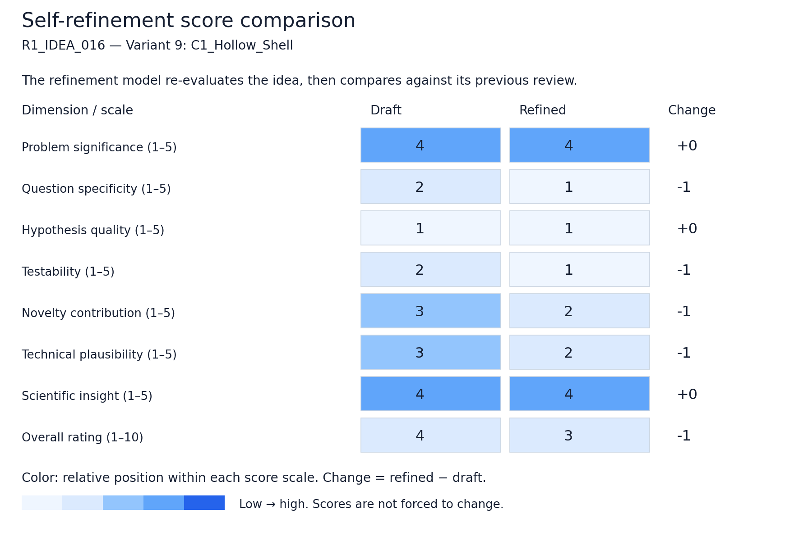

Changed score dimensions: question_specificity, testability, novelty_contribution, technical_plausibility, overall_rating.

### Score justifications (draft / refined)

**Problem significance**

```json
{
  "draft": {
    "score": 4.0,
    "justification": "The problem is meaningful: interpretability research often proceeds empirically without strong theoretical grounding, and bridging this gap could improve rigor and understanding. However, the idea doesn't fully articulate why this gap is critical now or what concrete limitations it causes."
  },
  "refined": {
    "score": 4.0,
    "justification": "The problem is meaningful: interpretability research often proceeds with empirical techniques lacking strong theoretical grounding, and bridging this gap could improve rigor, understanding, and methodology in the field. However, the idea doesn't fully articulate why this gap is critically limiting current research or what concrete problems it creates."
  }
}
```

**Question specificity**

```json
{
  "draft": {
    "score": 2.0,
    "justification": "The research question is very vague: 'introduces a new framework to address this challenge' is not a specific question. It doesn't define what is being investigated, only that a framework will be created. No concrete relationship or phenomenon is identified."
  },
  "refined": {
    "score": 1.0,
    "justification": "The research question is extremely vague. 'Introduces a new framework to address this challenge' is not a specific question—it doesn't define what is being investigated, what relationship will be examined, or what phenomenon will be explained. No concrete research question is articulated."
  }
}
```

**Hypothesis quality**

```json
{
  "draft": {
    "score": 1.0,
    "justification": "There is no explicit or implicit hypothesis. The idea states a problem and proposes a solution direction, but makes no testable prediction about what the framework will reveal, how it will improve interpretability, or what specific connections will be found."
  },
  "refined": {
    "score": 1.0,
    "justification": "There is no explicit or implicit hypothesis. The idea states a problem and proposes a solution direction but makes no testable prediction about what the framework will reveal, how it will improve interpretability, or what specific connections between techniques and learning formulations will be established."
  }
}
```

**Testability**

```json
{
  "draft": {
    "score": 2.0,
    "justification": "Without a hypothesis or concrete framework description, it's unclear how to test the idea. One could eventually evaluate whether a proposed framework is useful, but the idea as stated doesn't suggest what evidence would support or contradict its value."
  },
  "refined": {
    "score": 1.0,
    "justification": "Without a hypothesis or concrete framework description, it's fundamentally unclear how to test the idea. While one could eventually evaluate whether a proposed framework is useful, the idea as stated doesn't suggest what evidence would support or contradict its value, nor does it propose any form of evaluation or validation."
  }
}
```

**Novelty contribution**

```json
{
  "draft": {
    "score": 3.0,
    "justification": "The goal of theoretically grounding interpretability is not new—there is existing work connecting, e.g., attribution methods to Shapley values or information theory. The novelty would depend entirely on the unspecified framework. As stated, it's a generic aspiration rather than a novel contribution."
  },
  "refined": {
    "score": 2.0,
    "justification": "The goal of theoretically grounding interpretability is not novel—there is existing work connecting attribution methods to Shapley values, information theory, or optimization principles. The novelty would depend entirely on the unspecified framework details. As stated, it's a generic aspiration rather than a clearly novel contribution."
  }
}
```

**Technical plausibility**

```json
{
  "draft": {
    "score": 3.0,
    "justification": "The idea is logically coherent in its motivation, but the technical plausibility of creating a unifying framework is uncertain without details. Some attempts at theoretical foundations exist, so it's not impossible, but the lack of any technical direction makes it hard to assess."
  },
  "refined": {
    "score": 2.0,
    "justification": "The idea is logically coherent in its motivation, but the technical plausibility of creating a unifying framework is highly uncertain without any details. Some attempts at theoretical foundations exist, suggesting it's not impossible, but the complete lack of technical direction makes meaningful assessment impossible."
  }
}
```

**Scientific insight**

```json
{
  "draft": {
    "score": 4.0,
    "justification": "If successful, a systematic foundation could provide significant scientific insight into why interpretability methods work, how they relate to learning, and potentially reveal general principles. However, the idea doesn't specify what kind of insights are expected."
  },
  "refined": {
    "score": 4.0,
    "justification": "If successfully developed, a systematic foundation could provide significant scientific insight into why interpretability methods work, how they relate to underlying learning processes, and potentially reveal general principles governing representation analysis. However, the idea doesn't specify what kind of insights are expected or how they would advance understanding."
  }
}
```

**Overall rating**

```json
{
  "draft": {
    "score": 4.0,
    "justification": "The idea identifies a meaningful problem but is extremely underdeveloped. It lacks a specific research question, hypothesis, testable claim, or technical direction. It reads more like a broad motivation than a research idea. While the potential insight is high if executed well, the current formulation is too vague to be considered a strong research idea."
  },
  "refined": {
    "score": 3.0,
    "justification": "The idea identifies a meaningful problem but is critically underdeveloped as a research idea. It lacks a specific research question, hypothesis, testable claim, or any technical direction. It reads as a broad motivation statement rather than a concrete research proposal. While the potential insight is high if executed well, the current formulation is too vague to be considered even a moderate research idea."
  }
}
```

## R1_IDEA_016 — Variant 10: C2_Logic_Flawed


Changed score dimensions: none.

### Score justifications (draft / refined)

**Problem significance**

```json
{
  "draft": {
    "score": 4.0,
    "justification": "The problem is meaningful - SAEs are important tools for LLM interpretability, and lack of principled foundations is a legitimate research gap. Interpretability is a significant challenge in modern ML with both scientific and practical importance."
  },
  "refined": {
    "score": 4.0,
    "justification": "The problem is significant. Sparse Autoencoders are a cornerstone of modern mechanistic interpretability for LLMs. The lack of a principled connection to the well-established field of dictionary learning is a recognized and meaningful gap. Bridging this gap could improve the rigor, reliability, and understanding of these essential tools."
  }
}
```

**Question specificity**

```json
{
  "draft": {
    "score": 2.0,
    "justification": "The idea describes a methodological direction rather than a specific research question. It states 'introduce such a framework' but doesn't specify what will be investigated about this framework or what hypothesis will be tested."
  },
  "refined": {
    "score": 2.0,
    "justification": "The idea is not framed as a research question. It is a proposal to 'introduce a framework.' There is no specific 'what,' 'why,' or 'how' to be investigated beyond the methodological construction itself. It states a goal ('derive SAEs') but not a question to answer about the result."
  }
}
```

**Hypothesis quality**

```json
{
  "draft": {
    "score": 2.0,
    "justification": "There's an implicit hypothesis that deriving SAEs via unrolled proximal gradient will provide benefits, but no concrete prediction about what those benefits are or how they would manifest. The hypothesis lacks specificity and testable predictions."
  },
  "refined": {
    "score": 2.0,
    "justification": "There is only an implicit, vague hypothesis that a 'principled framework' will be beneficial. There is no concrete, testable prediction about the outcome. A strong hypothesis would predict a specific relationship, property, or performance improvement resulting from the proposed derivation."
  }
}
```

**Testability**

```json
{
  "draft": {
    "score": 3.0,
    "justification": "The framework could be tested by implementing it and comparing to existing SAEs, but the idea doesn't specify what would be tested. The claim about 'broader effectiveness' suggests some empirical evaluation, but the specific tests aren't defined."
  },
  "refined": {
    "score": 3.0,
    "justification": "The framework itself is testable in principle—one could implement it and compare it to other methods. However, the idea does not specify what claims about the framework would be tested. The mention of 'broader effectiveness' hints at empirical evaluation, but the specific tests, metrics, and comparisons are undefined."
  }
}
```

**Novelty contribution**

```json
{
  "draft": {
    "score": 3.0,
    "justification": "Applying unrolled optimization to dictionary learning for SAEs has some novelty, but the core idea of unrolling optimization algorithms is well-established. The potential contribution depends heavily on what new insights or improvements this specific derivation provides."
  },
  "refined": {
    "score": 3.0,
    "justification": "Applying unrolled optimization to dictionary learning for SAEs has moderate novelty. The core technique of unrolling is not new, but its application to ground SAEs in dictionary learning is a specific and underexplored angle. The potential contribution is currently methodological; its scientific significance depends entirely on what is discovered or demonstrated using the framework."
  }
}
```

**Technical plausibility**

```json
{
  "draft": {
    "score": 4.0,
    "justification": "The technical approach is plausible - unrolling optimization algorithms is a known technique, and applying it to dictionary learning for SAEs makes logical sense. The connection between proximal gradient methods and sparse coding is well-founded."
  },
  "refined": {
    "score": 4.0,
    "justification": "The technical direction is coherent and plausible. The connection between sparse coding (solved via proximal methods) and autoencoders is well-known. Unrolling iterative optimization algorithms to create neural network architectures is a standard deep learning technique. The proposed synthesis is logically sound."
  }
}
```

**Scientific insight**

```json
{
  "draft": {
    "score": 3.0,
    "justification": "If successful, this could provide insight into the relationship between dictionary learning formulations and practical SAE implementations. However, the idea as presented focuses more on methodology development than on generating new scientific understanding about interpretability or sparse representations."
  },
  "refined": {
    "score": 3.0,
    "justification": "The potential for scientific insight is moderate but unspecified. If pursued deeply, the work could yield insights into the relationship between optimization algorithms and learned representations, or into the inductive biases of different SAE training methods. However, the idea as presented focuses on framework development, not on using the framework to answer a specific scientific question about interpretability or sparse coding."
  }
}
```

**Overall rating**

```json
{
  "draft": {
    "score": 5.0,
    "justification": "This is a moderate/borderline research idea. It addresses a meaningful problem in an important area (LLM interpretability) and proposes a plausible technical direction. However, it lacks a specific research question or hypothesis, making it more of a methodological proposal than a focused scientific investigation. The potential contribution depends heavily on what specific insights or improvements would be demonstrated, which aren't specified."
  },
  "refined": {
    "score": 5.0,
    "justification": "This is a moderate/borderline research idea. It identifies a relevant gap in an important field and proposes a technically plausible approach to address it. However, it is fundamentally a methodology proposal rather than a hypothesis-driven scientific investigation. It lacks a specific research question, a testable hypothesis, and a clear definition of what scientific knowledge it aims to produce. Its value hinges on the yet-unspecified experiments and insights that would follow the framework's development."
  }
}
```

## R1_IDEA_016 — Variant 11: C3_Substance_Enriched


Changed score dimensions: question_specificity, overall_rating.

### Score justifications (draft / refined)

**Problem significance**

```json
{
  "draft": {
    "score": 4.0,
    "justification": "The problem is meaningful: SAEs are important for LLM interpretability, and the lack of principled derivation from dictionary learning is a recognized gap. Better theoretical grounding could improve feature quality and validation methods."
  },
  "refined": {
    "score": 4.0,
    "justification": "The problem is meaningful: SAEs are important for LLM interpretability, and the lack of principled derivation from dictionary learning is a recognized theoretical gap. Better grounding could improve feature quality and validation methods, which matters for interpretability research."
  }
}
```

**Question specificity**

```json
{
  "draft": {
    "score": 3.0,
    "justification": "The idea identifies a general direction (principled derivation of SAEs) but lacks a specific research question. It mentions validation of semantic concepts but doesn't define what exactly would be investigated about this validation."
  },
  "refined": {
    "score": 2.0,
    "justification": "The idea identifies a general direction but lacks a specific research question. It mentions 'providing a clearer pathway for validating' but doesn't define what exactly would be investigated. The text describes a technical approach rather than posing a concrete question about SAEs, dictionary learning, or feature semantics."
  }
}
```

**Hypothesis quality**

```json
{
  "draft": {
    "score": 2.0,
    "justification": "There is no clear hypothesis. The text mentions that 'the quality of decomposition could be validated by measuring feature stability' but doesn't connect this to the proposed framework. The idea suggests testing boundary conditions but doesn't make a specific prediction."
  },
  "refined": {
    "score": 2.0,
    "justification": "There is no clear hypothesis. The text mentions that 'quality could be validated by measuring feature stability' but doesn't connect this to the proposed framework or make a testable prediction. The idea suggests testing boundary conditions but doesn't state what outcomes are expected or what would demonstrate the framework's value."
  }
}
```

**Testability**

```json
{
  "draft": {
    "score": 3.0,
    "justification": "The idea suggests testing under varying sparsity penalties and activation functions, which provides some testability. However, without a clear hypothesis or success criteria, it's unclear what would constitute validation of the framework's benefits."
  },
  "refined": {
    "score": 3.0,
    "justification": "The idea suggests testing under varying sparsity penalties and activation functions, which provides some testability. However, without a clear hypothesis or success criteria, it's unclear what would constitute validation of the framework's benefits. The technical approach could be implemented and compared to baselines, but the scientific question being tested is vague."
  }
}
```

**Novelty contribution**

```json
{
  "draft": {
    "score": 4.0,
    "justification": "Deriving SAEs from dictionary learning via proximal gradient unrolling appears novel. If successful, it could provide theoretical grounding for SAEs and potentially improve feature interpretability, which would be a meaningful contribution."
  },
  "refined": {
    "score": 4.0,
    "justification": "Deriving SAEs from dictionary learning via proximal gradient unrolling appears novel. If successful, it could provide theoretical grounding for SAEs and potentially improve feature interpretability, which would be a meaningful contribution. However, the idea doesn't clearly articulate how this derivation leads to novel capabilities or insights beyond existing SAE variants."
  }
}
```

**Technical plausibility**

```json
{
  "draft": {
    "score": 4.0,
    "justification": "The approach is technically plausible: unrolling optimization algorithms is a known technique, and connecting SAEs to dictionary learning is reasonable. The proximal gradient method is appropriate for sparse coding problems."
  },
  "refined": {
    "score": 4.0,
    "justification": "The approach is technically plausible: unrolling optimization algorithms is a known technique, and connecting SAEs to dictionary learning is reasonable. The proximal gradient method is appropriate for sparse coding problems. The technical reasoning is coherent based on the information provided."
  }
}
```

**Scientific insight**

```json
{
  "draft": {
    "score": 3.0,
    "justification": "The framework could provide insight into the relationship between SAEs and dictionary learning, which is valuable. However, the potential for deeper scientific insight (e.g., about feature semantics or model internals) depends on how the validation aspect is developed."
  },
  "refined": {
    "score": 3.0,
    "justification": "The framework could provide insight into the relationship between SAEs and dictionary learning, which has scientific value. However, the potential for deeper insight about feature semantics or model internals depends on how the validation aspect is developed. Currently, the idea suggests a technical derivation but doesn't clearly articulate what scientific understanding would be gained."
  }
}
```

**Overall rating**

```json
{
  "draft": {
    "score": 6.0,
    "justification": "This is a moderate research idea with good technical motivation but limited scientific framing. The proposed technical approach (unrolling proximal gradient) is interesting and addresses a recognized gap. However, the idea lacks a clear research question or hypothesis about what specifically would be learned or demonstrated. The connection between the technical derivation and improved feature validation is underdeveloped. With better articulation of the scientific goals and specific hypotheses, this could become a strong research direction."
  },
  "refined": {
    "score": 5.0,
    "justification": "This is a moderate research idea with good technical motivation but limited scientific framing. The proposed technical approach addresses a recognized gap and is plausible. However, the idea lacks a clear research question, hypothesis, or specific investigation about what would be learned. The connection between technical derivation and improved feature validation is underdeveloped. It describes a method rather than posing a scientific question. With better articulation of specific hypotheses and validation criteria, this could become a stronger research direction."
  }
}
```

## R1_IDEA_016 — Variant 12: H1_Deceptive_Hollow

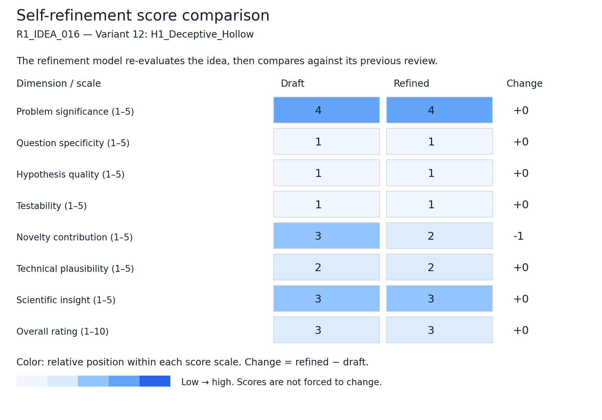

Changed score dimensions: novelty_contribution.

### Score justifications (draft / refined)

**Problem significance**

```json
{
  "draft": {
    "score": 4.0,
    "justification": "The problem is meaningful: interpretability remains a critical challenge, and better theoretical foundations could improve rigor and coherence in the field. However, the idea does not clearly articulate why current foundations are insufficient or what specific limitations they impose."
  },
  "refined": {
    "score": 4.0,
    "justification": "The problem is highly meaningful: interpretability remains a critical challenge for advanced AI models, and better theoretical foundations could improve rigor, coherence, and utility across the field. However, the idea does not clearly articulate why current foundations are insufficient or what specific limitations they impose."
  }
}
```

**Question specificity**

```json
{
  "draft": {
    "score": 1.0,
    "justification": "No specific research question is stated. The idea only mentions a 'challenge' and a 'framework' without defining what will be investigated, compared, or tested."
  },
  "refined": {
    "score": 1.0,
    "justification": "No specific research question is stated. The idea only mentions a 'challenge' and a 'framework' without defining what will be investigated, compared, or tested. It lacks even a minimally concrete focus."
  }
}
```

**Hypothesis quality**

```json
{
  "draft": {
    "score": 1.0,
    "justification": "There is no explicit or implicit hypothesis. The idea makes no concrete prediction about relationships, mechanisms, or outcomes. It merely asserts that a framework would be beneficial."
  },
  "refined": {
    "score": 1.0,
    "justification": "There is no explicit or implicit hypothesis. The idea makes no concrete prediction about relationships, mechanisms, or outcomes. It merely asserts that a framework would be beneficial, which is not a testable scientific hypothesis."
  }
}
```

**Testability**

```json
{
  "draft": {
    "score": 1.0,
    "justification": "The idea is not testable in its current form. It proposes a 'framework' but gives no indication of how one would evaluate whether it succeeds or fails, or what experiments/analyses would support its claims."
  },
  "refined": {
    "score": 1.0,
    "justification": "The idea is not testable in its current form. It proposes a 'framework' but gives no indication of how one would evaluate whether it succeeds or fails, or what experiments, analyses, or comparisons would support its claims. There is no path to obtaining evidence."
  }
}
```

**Novelty contribution**

```json
{
  "draft": {
    "score": 3.0,
    "justification": "The goal of unifying interpretability techniques under a systematic foundation is not inherently novel—similar calls for theoretical grounding exist. The contribution is framed as 'transformative synthesis,' but without concrete details, it's unclear what new knowledge would be produced beyond a high-level perspective."
  },
  "refined": {
    "score": 2.0,
    "justification": "The goal of unifying interpretability techniques under a systematic foundation is not novel—similar calls for theoretical grounding exist in the literature. The contribution is framed ambitiously but without concrete details, it's unclear what new knowledge would be produced beyond a high-level perspective or synthesis of existing work."
  }
}
```

**Technical plausibility**

```json
{
  "draft": {
    "score": 2.0,
    "justification": "The idea is too vague to assess technical plausibility. While connecting interpretability to learning formulations is a reasonable direction, the complete lack of methodological detail makes it impossible to judge coherence or feasibility."
  },
  "refined": {
    "score": 2.0,
    "justification": "The idea is too vague to assess technical plausibility. While connecting interpretability to learning formulations is a reasonable high-level direction, the complete lack of methodological detail makes it impossible to judge coherence, feasibility, or whether important assumptions are reasonable."
  }
}
```

**Scientific insight**

```json
{
  "draft": {
    "score": 3.0,
    "justification": "If successfully developed, a well-grounded framework could provide significant insight into the principles underlying interpretability methods. However, the idea as stated does not specify what insights would be gained or how they would generalize beyond a synthesis of existing work."
  },
  "refined": {
    "score": 3.0,
    "justification": "If successfully developed, a well-grounded framework could provide significant insight into the principles underlying interpretability methods and their relationship to learning. However, the idea as stated does not specify what insights would be gained, how they would generalize, or what transferable principles might emerge beyond a synthesis of existing work."
  }
}
```

**Overall rating**

```json
{
  "draft": {
    "score": 3.0,
    "justification": "The idea identifies an important problem but fails to define a concrete research question, hypothesis, or testable direction. It reads like a broad vision statement rather than a research idea. Without specificity, it is unlikely to lead to meaningful scientific contribution in its current form."
  },
  "refined": {
    "score": 3.0,
    "justification": "The idea identifies an important problem but completely fails to define a concrete research question, hypothesis, or testable direction. It reads as a broad vision statement with grandiose claims rather than a research idea. Without specificity, it is unlikely to lead to meaningful scientific contribution in its current form, despite the significance of the problem area."
  }
}
```

## R1_IDEA_016 — Variant 13: H2_Confident_Flaw


Changed score dimensions: hypothesis_quality.

### Score justifications (draft / refined)

**Problem significance**

```json
{
  "draft": {
    "score": 4.0,
    "justification": "The problem is meaningful: SAEs are widely used for LLM interpretability, and a lack of theoretical grounding is a recognized issue. Improving their foundation could benefit reproducibility and reliability."
  },
  "refined": {
    "score": 4.0,
    "justification": "The problem is meaningful: SAEs are widely used for LLM interpretability, and the lack of theoretical grounding is a recognized issue. Improving their foundation could enhance reproducibility, reliability, and understanding in an important research area."
  }
}
```

**Question specificity**

```json
{
  "draft": {
    "score": 2.0,
    "justification": "The idea is vague about what is being investigated. It states a goal ('introduce a framework') but does not define a concrete research question (e.g., 'Does a principled derivation improve feature interpretability?')."
  },
  "refined": {
    "score": 2.0,
    "justification": "The idea is vague about what is being investigated. It states a goal ('introduce a framework') but does not define a concrete research question (e.g., 'Does a principled derivation improve feature interpretability or optimization stability?'). It lacks specificity in what aspect of SAEs or interpretability is being studied."
  }
}
```

**Hypothesis quality**

```json
{
  "draft": {
    "score": 2.0,
    "justification": "There is an implicit hypothesis that a principled derivation will lead to better performance, but it is stated as a certainty ('will necessarily produce reliable improvements'). A strong hypothesis should be falsifiable and nuanced."
  },
  "refined": {
    "score": 1.0,
    "justification": "There is no clear hypothesis—only an unsupported assertion that the framework 'will necessarily produce reliable improvements.' This is presented as a certainty, not a falsifiable prediction. A hypothesis should make a testable claim about mechanisms or outcomes, which is absent here."
  }
}
```

**Testability**

```json
{
  "draft": {
    "score": 2.0,
    "justification": "The idea lacks a clear evaluation plan. While one could design experiments (e.g., compare SAE variants), the proposal dismisses the need for controlled comparisons, making rigorous testing difficult."
  },
  "refined": {
    "score": 2.0,
    "justification": "The idea lacks a clear evaluation plan. While experiments could be designed (e.g., comparing SAE variants), the proposal dismisses controlled comparisons and confounder isolation, making rigorous testing difficult. Without defined metrics or success criteria, testability is weak."
  }
}
```

**Novelty contribution**

```json
{
  "draft": {
    "score": 3.0,
    "justification": "Applying unrolled optimization to SAEs is a plausible technical novelty, but the core idea of connecting SAEs to dictionary learning is not entirely new. The potential contribution depends on whether this connection yields practical or theoretical insights beyond existing work."
  },
  "refined": {
    "score": 3.0,
    "justification": "Applying unrolled optimization to SAEs is a plausible technical novelty, but the core idea of connecting SAEs to dictionary learning is not entirely new. The potential contribution depends on whether this connection yields practical or theoretical insights beyond existing work, which is not clearly articulated."
  }
}
```

**Technical plausibility**

```json
{
  "draft": {
    "score": 4.0,
    "justification": "Using unrolled proximal gradient for sparse coding is a technically sound approach. The connection between SAEs and dictionary learning is conceptually reasonable."
  },
  "refined": {
    "score": 4.0,
    "justification": "Using unrolled proximal gradient for sparse coding is a technically sound approach. The connection between SAEs and dictionary learning is conceptually reasonable, and the proposed method aligns with known optimization techniques."
  }
}
```

**Scientific insight**

```json
{
  "draft": {
    "score": 2.0,
    "justification": "As presented, the idea focuses on a technical solution without articulating what broader scientific insight it might provide (e.g., understanding feature learning in LLMs). The claim of 'causal evidence without isolating confounders' undermines potential for rigorous insight."
  },
  "refined": {
    "score": 2.0,
    "justification": "As presented, the idea focuses on a technical solution without articulating what broader scientific insight it might provide (e.g., understanding feature learning in LLMs, optimization principles for interpretability). The claim of 'causal evidence without isolating confounders' undermines potential for rigorous insight, reducing it to a solution-oriented proposal."
  }
}
```

**Overall rating**

```json
{
  "draft": {
    "score": 4.0,
    "justification": "The idea identifies a relevant problem and suggests a plausible technical direction, but it is weakened by a vague research question, an overly strong and unsupported claim of guaranteed improvement, and a dismissive attitude toward controlled evaluation. It currently reads more as a solution in search of a hypothesis rather than a well-formed research idea. With refinement, it could become a solid contribution."
  },
  "refined": {
    "score": 4.0,
    "justification": "The idea identifies a relevant problem and suggests a plausible technical direction, but it is severely weakened by a vague research question, an unsupported assertion of guaranteed improvement, and a dismissive attitude toward controlled evaluation. It lacks a clear hypothesis, testability, and potential for scientific insight. With refinement, it could become a solid contribution, but as presented, it is a weak research idea."
  }
}
```

## R1_IDEA_016 — Variant 14: H3_Verbose_Enriched

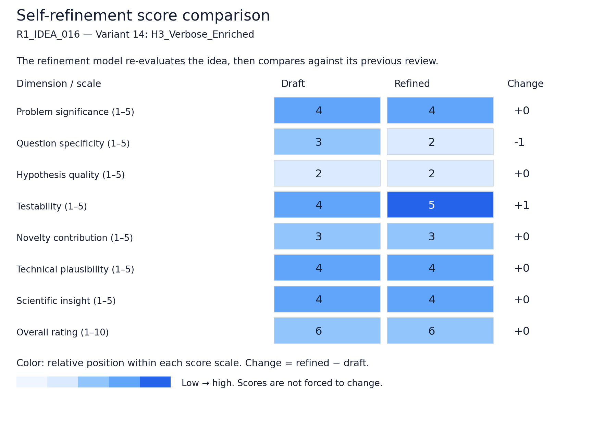

Changed score dimensions: question_specificity, testability.

### Score justifications (draft / refined)

**Problem significance**

```json
{
  "draft": {
    "score": 4.0,
    "justification": "The problem is meaningful: SAEs are widely used in LLM interpretability, but their theoretical grounding and validation remain open issues. Improving principled connections to dictionary learning could advance the rigor of feature extraction methods."
  },
  "refined": {
    "score": 4.0,
    "justification": "The problem is highly significant. SAEs are a cornerstone of modern LLM interpretability, but their theoretical grounding and validation are major open challenges. Establishing a principled connection to dictionary learning and improving feature validation would directly advance the rigor and reliability of the field."
  }
}
```

**Question specificity**

```json
{
  "draft": {
    "score": 3.0,
    "justification": "The idea identifies a general direction (deriving SAEs from dictionary learning via unrolled proximal gradient) but does not pose a sharply defined research question. It mentions validating feature stability but does not specify what relationship or mechanism is being investigated."
  },
  "refined": {
    "score": 2.0,
    "justification": "The idea identifies a general direction (deriving SAEs via unrolled proximal gradient) but does not pose a sharply defined research question. It mentions validating feature stability and assessing robustness, but the specific relationship or mechanism to be investigated remains vague. The language ('could potentially provide a clearer pathway') is indicative of a broad goal, not a specific inquiry."
  }
}
```

**Hypothesis quality**

```json
{
  "draft": {
    "score": 2.0,
    "justification": "No explicit hypothesis is stated. The idea suggests that the framework 'could potentially provide a clearer pathway for validating' features, which is vague. There is an implicit prediction that unrolling proximal gradient will lead to better-behaved SAEs, but it is not concrete or falsifiable in its current form."
  },
  "refined": {
    "score": 2.0,
    "justification": "There is no explicit or clearly implicit hypothesis making a concrete, testable prediction. The text uses speculative language ('might be tested,' 'could potentially provide'). An implied prediction is that the framework will aid validation, but this is not framed as a falsifiable statement about a specific outcome or causal mechanism."
  }
}
```

**Testability**

```json
{
  "draft": {
    "score": 4.0,
    "justification": "The idea outlines a detailed staged experimental design with ablations, sensitivity analyses, and comparisons across cases. This shows strong awareness of how to make the research testable, even though the exact claim to test is not fully specified."
  },
  "refined": {
    "score": 5.0,
    "justification": "The idea excels in outlining a highly testable methodological approach. It explicitly prescribes a staged design with baseline/intervention conditions, pre-specified evaluation criteria, comparisons across cases, ablations, sensitivity analyses, and error analysis. This detailed blueprint demonstrates a clear plan for obtaining rigorous evidence, even if the specific claim to test is not yet fully defined."
  }
}
```

**Novelty contribution**

```json
{
  "draft": {
    "score": 3.0,
    "justification": "Unrolling optimization algorithms is a known technique in deep learning; applying it to SAEs is a plausible but incremental contribution. The main novelty would lie in the specific adaptation to SAEs and the connection to feature validation, but this is not yet clearly differentiated from prior work."
  },
  "refined": {
    "score": 3.0,
    "justification": "The novelty is moderate. Unrolling iterative optimization algorithms into neural network layers is a well-known technique (e.g., in deep equilibrium models, LISTA). Applying it to SAEs for LLM interpretability is a plausible but incremental technical contribution. The potential for a novel 'principled framework' and insights into validation is promising but not yet clearly differentiated from what existing SAE variants or related sparse coding methods offer."
  }
}
```

**Technical plausibility**

```json
{
  "draft": {
    "score": 4.0,
    "justification": "The approach is technically sound: proximal gradient methods are standard for sparse coding, and unrolling them into a neural network is a well-established idea. The extension to SAEs appears coherent and feasible."
  },
  "refined": {
    "score": 4.0,
    "justification": "The approach is technically plausible and coherent. Proximal gradient methods are standard for sparse coding problems, and unrolling them to create a differentiable, trainable network is a established paradigm. The extension to the SAE context appears logically sound and feasible based on the provided description."
  }
}
```

**Scientific insight**

```json
{
  "draft": {
    "score": 4.0,
    "justification": "If successful, the research could yield insights into how SAEs relate to classical sparse coding, what makes features stable and semantically meaningful, and under what conditions SAE variants succeed or fail. The proposed evaluation design aims to uncover assumptions and boundary conditions, which is valuable for general understanding."
  },
  "refined": {
    "score": 4.0,
    "justification": "The idea has strong potential for scientific insight. The proposed evaluation design is explicitly geared to uncover 'which assumptions, data regimes, and domain constraints determine when and why it is useful.' Successfully executed, this could yield generalizable knowledge about the relationship between optimization algorithms and feature quality, the boundary conditions of SAE effectiveness, and principles for validating interpretability features—insights that extend beyond a simple performance comparison."
  }
}
```

**Overall rating**

```json
{
  "draft": {
    "score": 6.0,
    "justification": "This is a moderate research idea with a solid technical foundation and a relevant problem. It lacks a clear hypothesis and a sharply defined research question, which limits its specificity and novelty. However, the thoughtful discussion of experimental design and the potential for insight into SAE validation raise it above a purely incremental application. With a more focused hypothesis, it could become a strong contribution."
  },
  "refined": {
    "score": 6.0,
    "justification": "This is a moderate research idea with a strong methodological core and addresses a significant problem. Its primary weakness is the lack of a specific research question and a concrete, falsifiable hypothesis, which limits its focus and novelty. However, the exceptionally well-considered experimental design and the high potential for scientific insight into SAE validation elevate it above a routine application. With a sharper formulation of its central claim, it could become a strong (7-8) contribution."
  }
}
```

## R1_IDEA_016 — Variant 15: H4_Ultimate_Hype


Changed score dimensions: none.

### Score justifications (draft / refined)

**Problem significance**

```json
{
  "draft": {
    "score": 4.0,
    "justification": "The problem is meaningful: SAEs are widely used for LLM interpretability, yet their connection to classical sparse coding is often heuristic. A principled foundation could improve reliability and understanding."
  },
  "refined": {
    "score": 4.0,
    "justification": "The problem is significant. Sparse Autoencoders are a cornerstone of contemporary mechanistic interpretability research for LLMs. Their empirical success is largely divorced from the theoretical foundations of sparse coding/dictionary learning. Establishing a principled connection is a meaningful and timely challenge that could improve the reliability, understanding, and design of these interpretability tools."
  }
}
```

**Question specificity**

```json
{
  "draft": {
    "score": 2.0,
    "justification": "The idea states a general goal ('derive SAEs from dictionary learning') but does not specify a concrete research question. It lacks a clear 'what will we learn?' or 'what relationship will we test?'"
  },
  "refined": {
    "score": 2.0,
    "justification": "The idea defines a broad goal ('introduce a framework') but not a specific research question. It does not specify what aspect of SAEs will be investigated, what relationship will be tested, or what phenomenon will be explained. The description remains at the level of a technical agenda."
  }
}
```

**Hypothesis quality**

```json
{
  "draft": {
    "score": 2.0,
    "justification": "There is an implicit hypothesis that 'unrolling proximal gradient will provide a principled framework,' but it is not fleshed out. No predictive statement about outcomes (e.g., improved sparsity, better feature disentanglement) is made."
  },
  "refined": {
    "score": 2.0,
    "justification": "There is an implicit, low-quality hypothesis: 'unrolling proximal gradient will lead to a principled framework.' This is not a concrete, predictive statement. It does not specify what 'principled' means, what properties the framework will have, or how it would differ from or improve upon existing approaches. It is more of an assertion than a testable hypothesis."
  }
}
```

**Testability**

```json
{
  "draft": {
    "score": 3.0,
    "justification": "The idea is testable in principle—one could implement the unrolled scheme and compare to baselines—but without a clear hypothesis, it's unclear what exactly to test beyond 'does it work?'"
  },
  "refined": {
    "score": 3.0,
    "justification": "The idea is testable in a broad sense—one can implement an unrolled proximal gradient network and call it an SAE. However, without a clear hypothesis, it's unclear what to test for beyond basic functionality. The evaluation would be ambiguous: what metrics or comparisons would confirm the framework is 'principled' or successful?"
  }
}
```

**Novelty contribution**

```json
{
  "draft": {
    "score": 3.0,
    "justification": "Unrolling optimization algorithms is a known technique (e.g., in deep unfolding for sparse recovery). Applying it to SAEs for interpretability is novel but not radically so. The potential contribution hinges on whether this yields new insights or better methods."
  },
  "refined": {
    "score": 3.0,
    "justification": "Applying deep unfolding (unrolling) to connect sparse coding to SAEs is a novel application within LLM interpretability. However, the technique of unrolling optimization algorithms is well-established in other fields (e.g., sparse signal recovery, image processing). The potential contribution is moderate and hinges entirely on whether this specific application yields new architectural insights, theoretical understanding, or practical improvements over existing SAE heuristics."
  }
}
```

**Technical plausibility**

```json
{
  "draft": {
    "score": 4.0,
    "justification": "The technical direction is plausible. Unrolling iterative optimization steps into neural network layers is a established approach. The connection between proximal gradient for sparse coding and SAE architecture is reasonable."
  },
  "refined": {
    "score": 4.0,
    "justification": "The proposed direction is technically plausible. The proximal gradient method is a standard algorithm for L1-regularized problems like sparse coding. Unrolling iterative algorithms into neural network layers is a proven methodology. The conceptual link between optimizing a sparse coding objective and the forward pass of an SAE is coherent and reasonable."
  }
}
```

**Scientific insight**

```json
{
  "draft": {
    "score": 3.0,
    "justification": "If successful, this could provide insight into how SAE design relates to classical sparse coding theory, potentially revealing limitations or optimality conditions. However, the idea as stated emphasizes impact over insight."
  },
  "refined": {
    "score": 3.0,
    "justification": "If successfully pursued, this research could provide insight into the design principles of SAEs, potentially revealing how architectural choices (activation functions, layer structures) correspond to optimization steps and sparsity constraints. This could lead to a deeper understanding of why current SAEs work and where they might fail. However, the idea as stated emphasizes potential impact over the specific insight to be gained."
  }
}
```

**Overall rating**

```json
{
  "draft": {
    "score": 5.0,
    "justification": "The idea identifies a relevant gap and suggests a plausible technical approach, but it is presented as a vague agenda rather than a specific research question. It lacks a clear hypothesis and measurable expected outcome. The promotional language obscures the scientific content. It is a moderate/borderline idea that could become strong with more concrete formulation."
  },
  "refined": {
    "score": 5.0,
    "justification": "This is a moderate/borderline research idea. It identifies a relevant and meaningful problem in an important field and suggests a plausible technical approach. Its core weakness is the lack of a specific, testable research question or hypothesis. It is presented as a vague technical agenda ('build a framework') adorned with promotional language, rather than as a focused scientific investigation. With substantial refinement to define a concrete hypothesis and expected outcomes, it could become a strong idea."
  }
}
```

## R1_IDEA_017 — Source

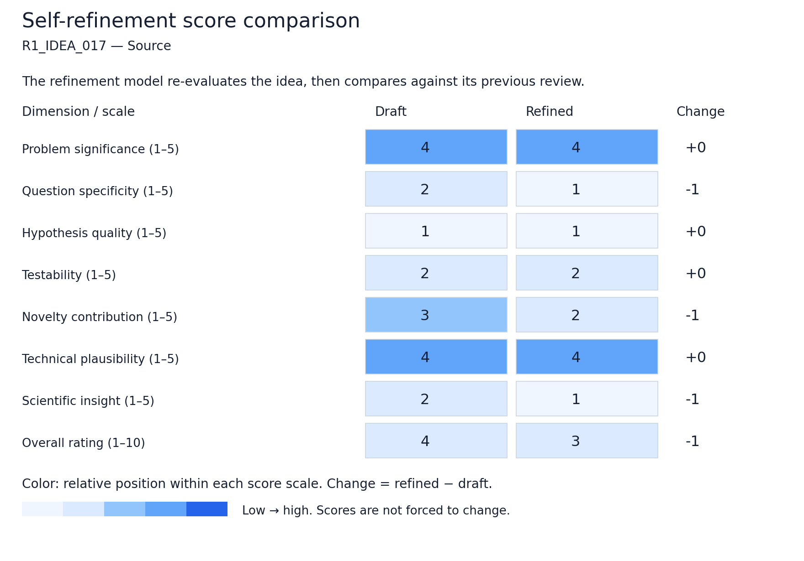

Changed score dimensions: question_specificity, novelty_contribution, scientific_insight, overall_rating.

### Score justifications (draft / refined)

**Problem significance**

```json
{
  "draft": {
    "score": 4.0,
    "justification": "Few-shot anomaly detection is a meaningful challenge with real-world applications in industrial safety. Category-agnostic conditions add complexity, making it a relevant and non-trivial problem."
  },
  "refined": {
    "score": 4.0,
    "justification": "Few-shot anomaly detection in industrial safety inspection is a meaningful and practical challenge. The category-agnostic condition adds complexity, making it a relevant problem with real-world impact."
  }
}
```

**Question specificity**

```json
{
  "draft": {
    "score": 2.0,
    "justification": "The idea describes a problem and a potential solution but does not define a clear research question. It lacks specificity about what aspect of the problem will be investigated."
  },
  "refined": {
    "score": 1.0,
    "justification": "The idea does not define a research question. It merely states a problem and mentions a potential tool without specifying what will be investigated, tested, or compared."
  }
}
```

**Hypothesis quality**

```json
{
  "draft": {
    "score": 1.0,
    "justification": "No explicit or implicit hypothesis is presented. The idea suggests foundation models 'help to learn the general distribution of normal images,' but this is a general statement, not a testable prediction about their effect on few-shot anomaly detection."
  },
  "refined": {
    "score": 1.0,
    "justification": "No hypothesis is presented, either explicit or implicit. The statement that large-scale pre-training 'helps to learn the general distribution of normal images' is a generic observation, not a testable prediction about foundation models' effect on few-shot anomaly detection."
  }
}
```

**Testability**

```json
{
  "draft": {
    "score": 2.0,
    "justification": "While the idea could be tested by implementing foundation models for anomaly detection, the lack of a specific question or hypothesis makes it unclear what exactly would be tested. It is more of a suggestion than a testable claim."
  },
  "refined": {
    "score": 2.0,
    "justification": "While one could design experiments to test foundation models for anomaly detection, the idea itself provides no testable claim or comparative framework. It is a suggestion rather than a falsifiable research direction."
  }
}
```

**Novelty contribution**

```json
{
  "draft": {
    "score": 3.0,
    "justification": "Applying foundation models to anomaly detection is not entirely novel, but focusing on few-shot and category-agnostic settings could be a meaningful contribution if explored deeply. Currently, the idea is too vague to assess its novelty."
  },
  "refined": {
    "score": 2.0,
    "justification": "Applying foundation models to anomaly detection is already an active area. The few-shot and category-agnostic angles are mentioned but not developed into a novel research angle. As stated, the idea is too vague to claim meaningful novelty."
  }
}
```

**Technical plausibility**

```json
{
  "draft": {
    "score": 4.0,
    "justification": "The reasoning is coherent: foundation models learn rich visual representations from large-scale data, which could help in data-scarce settings. This is technically plausible given prior success in other domains."
  },
  "refined": {
    "score": 4.0,
    "justification": "The core reasoning is coherent: foundation models learn rich visual representations from vast data, which could help in data-scarce settings. This is technically plausible given their success in other low-data regimes."
  }
}
```

**Scientific insight**

```json
{
  "draft": {
    "score": 2.0,
    "justification": "As stated, the idea primarily suggests an application. It does not articulate what scientific insight might be gained—e.g., understanding why foundation models help, under what conditions they fail, or what properties of pre-training data matter."
  },
  "refined": {
    "score": 1.0,
    "justification": "The idea suggests an application without articulating any scientific insight to be gained. It does not propose to investigate mechanisms, boundary conditions, scaling laws, or general principles that would advance understanding beyond task performance."
  }
}
```

**Overall rating**

```json
{
  "draft": {
    "score": 4.0,
    "justification": "The idea identifies a relevant problem and a plausible direction, but it lacks a clear research question, hypothesis, and specificity. It is currently a weak research idea because it does not define what will be investigated or how it would contribute new knowledge beyond applying an existing tool to a new task."
  },
  "refined": {
    "score": 3.0,
    "justification": "The idea identifies a relevant problem and a plausible tool, but it lacks a research question, hypothesis, specificity, and clear scientific goal. It is a weak research idea because it does not define what will be investigated or what new knowledge would be produced."
  }
}
```

## R1_IDEA_017 — Variant 1: A1_Identity


Changed score dimensions: question_specificity, novelty_contribution, scientific_insight, overall_rating.

### Score justifications (draft / refined)

**Problem significance**

```json
{
  "draft": {
    "score": 4.0,
    "justification": "Few-shot anomaly detection is a meaningful challenge with real-world applications in industrial safety. Category-agnostic conditions add complexity, making it a relevant and non-trivial problem."
  },
  "refined": {
    "score": 4.0,
    "justification": "Few-shot anomaly detection in industrial settings is a meaningful practical problem with safety implications. The category-agnostic constraint adds significant complexity, making it a non-trivial research challenge worth addressing."
  }
}
```

**Question specificity**

```json
{
  "draft": {
    "score": 2.0,
    "justification": "The idea describes a problem and a potential solution but does not define a clear research question. It lacks specificity about what aspect of the problem will be investigated."
  },
  "refined": {
    "score": 1.0,
    "justification": "The idea lacks any defined research question. It states a problem and mentions a potential solution approach but doesn't specify what aspect will be investigated, what relationship will be tested, or what phenomenon will be examined."
  }
}
```

**Hypothesis quality**

```json
{
  "draft": {
    "score": 1.0,
    "justification": "No explicit or implicit hypothesis is presented. The idea suggests foundation models 'help to learn the general distribution of normal images,' but this is a general statement, not a testable prediction."
  },
  "refined": {
    "score": 1.0,
    "justification": "No hypothesis is presented, either explicit or implicit. The statement that foundation models 'help to learn the general distribution of normal images' is a general observation, not a testable prediction about their effect on few-shot anomaly detection."
  }
}
```

**Testability**

```json
{
  "draft": {
    "score": 2.0,
    "justification": "While the idea could be tested by implementing foundation models for anomaly detection, the current description does not propose any specific experiment, comparison, or evaluation method."
  },
  "refined": {
    "score": 2.0,
    "justification": "While one could imagine designing experiments to test foundation models for anomaly detection, the idea itself proposes no specific test, comparison, evaluation method, or analysis approach. It's too vague to be directly testable as presented."
  }
}
```

**Novelty contribution**

```json
{
  "draft": {
    "score": 3.0,
    "justification": "Applying foundation models to few-shot anomaly detection is a plausible direction, but it is essentially an application of an existing tool to a known problem. The idea does not yet propose a novel mechanism, insight, or methodological innovation."
  },
  "refined": {
    "score": 2.0,
    "justification": "The core suggestion—applying foundation models to a data-scarce task—is straightforward and lacks novelty. No novel mechanism, insight, or methodological innovation is proposed. It's essentially suggesting using an existing tool for a known problem without specifying what new knowledge would be generated."
  }
}
```

**Technical plausibility**

```json
{
  "draft": {
    "score": 4.0,
    "justification": "The reasoning is coherent: foundation models learn rich visual representations from large-scale data, which could help in data-scarce settings. This is technically plausible given prior success of foundation models in low-data regimes."
  },
  "refined": {
    "score": 4.0,
    "justification": "The basic reasoning is coherent: foundation models learn rich visual representations from massive datasets, which could potentially transfer well to data-scarce tasks. This aligns with established literature on transfer learning and foundation model capabilities."
  }
}
```

**Scientific insight**

```json
{
  "draft": {
    "score": 2.0,
    "justification": "As presented, the idea is primarily about applying a tool to improve performance. It does not yet articulate what scientific insight might be gained—e.g., understanding why foundation models help, or discovering limitations in their applicability."
  },
  "refined": {
    "score": 1.0,
    "justification": "As presented, the idea focuses solely on potential performance improvement. It doesn't articulate what scientific understanding might be gained—no mechanisms, principles, limitations, or boundary conditions are mentioned. It's purely application-oriented without scientific inquiry."
  }
}
```

**Overall rating**

```json
{
  "draft": {
    "score": 4.0,
    "justification": "The idea identifies a relevant problem and a promising direction, but it lacks a clear research question, hypothesis, and testable plan. It is currently more of a motivation than a research idea. With refinement, it could become a strong research direction."
  },
  "refined": {
    "score": 3.0,
    "justification": "This is a weak research idea. While it identifies a meaningful problem and mentions a plausible technical direction, it lacks the essential components of a research idea: a clear question, a testable hypothesis, and a plan for investigation. It's more of a problem statement with a suggested tool than a research direction. With substantial refinement, it could become a moderate idea, but as presented, it has limited scientific value."
  }
}
```

## R1_IDEA_017 — Variant 2: A2_Paraphrase_Only

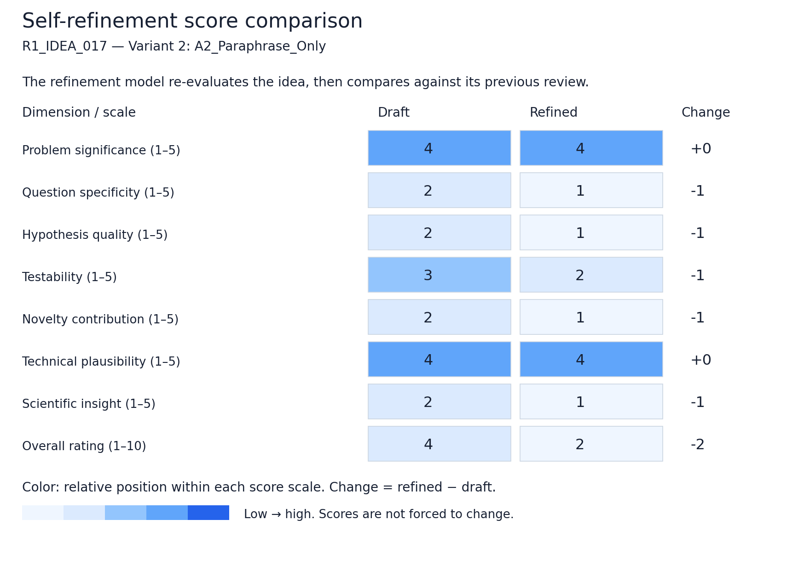

Changed score dimensions: question_specificity, hypothesis_quality, testability, novelty_contribution, scientific_insight, overall_rating.

### Score justifications (draft / refined)

**Problem significance**

```json
{
  "draft": {
    "score": 4.0,
    "justification": "The problem is meaningful. Few-shot anomaly detection is a recognized challenge in machine learning, with important applications in industrial safety inspection. Category-agnostic scenarios add complexity, making it a non-trivial and relevant problem to address."
  },
  "refined": {
    "score": 4.0,
    "justification": "The problem is meaningful. Few-shot anomaly detection is a recognized challenge with practical importance in industrial safety. The category-agnostic aspect adds complexity, making it a non-trivial problem worth investigating."
  }
}
```

**Question specificity**

```json
{
  "draft": {
    "score": 2.0,
    "justification": "The idea is vague about what is being investigated. It states a problem and a potential tool but does not define a concrete research question. It lacks specificity regarding the relationship between foundation encoders and the anomaly detection performance in the given context."
  },
  "refined": {
    "score": 1.0,
    "justification": "Extremely vague. The idea merely states that a problem exists and a tool exists, without defining any specific relationship, mechanism, or phenomenon to investigate. No research question is articulated."
  }
}
```

**Hypothesis quality**

```json
{
  "draft": {
    "score": 2.0,
    "justification": "There is no explicit or clearly implicit hypothesis. The idea suggests that foundation encoders 'benefit numerous domains' and implies they might help here, but it does not make a falsifiable prediction about their effect on few-shot, category-agnostic anomaly detection accuracy or robustness."
  },
  "refined": {
    "score": 1.0,
    "justification": "No hypothesis is present, explicit or implicit. The idea suggests foundation encoders 'benefit numerous domains' and implies they might help here, but makes no concrete, testable prediction about their effect on few-shot anomaly detection performance or mechanisms."
  }
}
```

**Testability**

```json
{
  "draft": {
    "score": 3.0,
    "justification": "The core suggestion is testable in principle—one could design experiments comparing anomaly detection performance with and without foundation encoders. However, the lack of a specific hypothesis or evaluation plan makes the testability moderate. The idea itself does not propose a clear path for obtaining evidence."
  },
  "refined": {
    "score": 2.0,
    "justification": "While one could design experiments to test whether foundation encoders help, the idea itself provides no direction for how to obtain evidence. It doesn't suggest comparisons, evaluations, or analyses. The testability is weak because the claim is too vague to guide specific tests."
  }
}
```

**Novelty contribution**

```json
{
  "draft": {
    "score": 2.0,
    "justification": "The novelty is low. Applying large-scale pre-trained models (foundation encoders) to downstream tasks like anomaly detection is a common practice. The idea does not propose a new method, a novel adaptation mechanism, or a hypothesis about a previously unexplored phenomenon. It is primarily an application suggestion."
  },
  "refined": {
    "score": 1.0,
    "justification": "Very low novelty. Applying pre-trained foundation models to downstream tasks is standard practice. The idea doesn't propose any novel method, adaptation mechanism, or hypothesis about unexplored phenomena. It's essentially a generic application suggestion."
  }
}
```

**Technical plausibility**

```json
{
  "draft": {
    "score": 4.0,
    "justification": "The direction is technically plausible. Foundation visual encoders are known to learn rich, general-purpose representations. Using them as a starting point for a data-scarce task like few-shot anomaly detection is a reasonable and common strategy. The reasoning is logically coherent."
  },
  "refined": {
    "score": 4.0,
    "justification": "The direction is technically plausible. Foundation visual encoders do learn general representations, and using them for data-scarce tasks is reasonable. The basic reasoning is coherent, though lacking in specifics."
  }
}
```

**Scientific insight**

```json
{
  "draft": {
    "score": 2.0,
    "justification": "The potential for scientific insight is limited. As presented, the idea seems geared towards an application goal (improving performance) rather than uncovering new principles. It does not suggest investigating why or how foundation encoders might help, what their limitations are in this setting, or what general lessons could be learned about representation learning for anomaly detection."
  },
  "refined": {
    "score": 1.0,
    "justification": "Minimal potential for scientific insight as presented. The idea seems focused on application performance rather than uncovering new principles about representation learning, anomaly detection, or few-shot learning. No transferable insights are suggested."
  }
}
```

**Overall rating**

```json
{
  "draft": {
    "score": 4.0,
    "justification": "This is a weak research idea. While it identifies a meaningful practical problem, it lacks the core components of a strong research direction: a specific research question, a testable hypothesis, and a clear potential for novel scientific contribution. It reads more as a motivation or a high-level suggestion than a defined research idea. Significant refinement is needed to transform it into a testable study with scientific merit."
  },
  "refined": {
    "score": 2.0,
    "justification": "This is a very weak research idea. While it identifies a meaningful practical problem, it lacks all core components of a research direction: no specific question, no hypothesis, minimal novelty, and no clear path to scientific insight. It reads as a vague motivation statement rather than a defined research idea. Substantial refinement is needed to transform it into a testable investigation."
  }
}
```

## R1_IDEA_017 — Variant 3: A3_Plain_Core

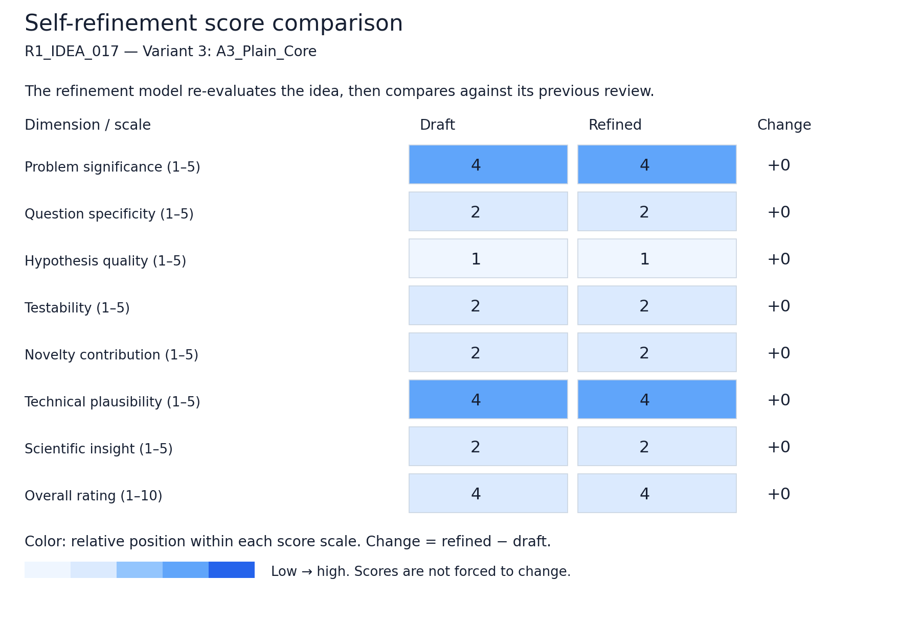

Changed score dimensions: none.

### Score justifications (draft / refined)

**Problem significance**

```json
{
  "draft": {
    "score": 4.0,
    "justification": "Industrial safety inspection is an important practical application with real-world consequences. Few-shot anomaly detection under category-agnostic conditions represents a meaningful technical challenge in machine learning, especially for real-world deployment where novel anomalies may appear."
  },
  "refined": {
    "score": 4.0,
    "justification": "Industrial safety inspection is a meaningful real-world problem with practical importance. Few-shot anomaly detection under category-agnostic conditions is a recognized technical challenge in machine learning, especially for deployment scenarios where novel anomalies may arise and labeled data is scarce."
  }
}
```

**Question specificity**

```json
{
  "draft": {
    "score": 2.0,
    "justification": "The idea describes a general direction rather than a specific research question. It mentions using foundation models for few-shot anomaly detection but doesn't define what aspect would be investigated, what would be compared, or what specific problem would be addressed beyond the general application."
  },
  "refined": {
    "score": 2.0,
    "justification": "The idea describes a general application direction rather than a specific research question. It mentions using foundation models for few-shot anomaly detection but does not define what aspect would be investigated, what would be compared, or what specific hypothesis would be tested."
  }
}
```

**Hypothesis quality**

```json
{
  "draft": {
    "score": 1.0,
    "justification": "No hypothesis is presented. The idea suggests that foundation models 'help learn the general distribution of normal images' but doesn't make a testable prediction about how this would affect few-shot anomaly detection performance or why it would be particularly beneficial for category-agnostic conditions."
  },
  "refined": {
    "score": 1.0,
    "justification": "No hypothesis is presented. The statement that foundation models 'help learn the general distribution of normal images' is an observation, not a testable prediction. There is no articulated mechanism, relationship, or falsifiable claim about how foundation models would affect few-shot anomaly detection performance in category-agnostic settings."
  }
}
```

**Testability**

```json
{
  "draft": {
    "score": 2.0,
    "justification": "While the general direction could be tested (e.g., by implementing a foundation model-based anomaly detection system), the idea doesn't specify what would be tested or compared. A testable version would need to define specific comparisons (e.g., foundation models vs. other pre-trained models) and evaluation metrics."
  },
  "refined": {
    "score": 2.0,
    "justification": "While one could implement a foundation model-based anomaly detection system, the idea does not specify what would be tested or compared. A testable investigation would require defined comparisons (e.g., foundation models vs. other pre-trained models), evaluation metrics, and experimental conditions. As presented, it lacks the specificity needed for meaningful testing."
  }
}
```

**Novelty contribution**

```json
{
  "draft": {
    "score": 2.0,
    "justification": "Applying foundation models to anomaly detection is not novel in itself. The potential contribution would depend on demonstrating something specific about foundation models for category-agnostic few-shot settings, but the idea doesn't articulate what new insight or finding might emerge from this investigation."
  },
  "refined": {
    "score": 2.0,
    "justification": "Applying foundation models to anomaly detection is not novel in itself. The potential contribution would depend on demonstrating something specific about foundation models for category-agnostic few-shot settings, but the idea does not articulate what new insight, finding, or methodological advance might emerge. It reads more like a straightforward application."
  }
}
```

**Technical plausibility**

```json
{
  "draft": {
    "score": 4.0,
    "justification": "The basic premise is plausible - foundation models trained on large datasets might learn general visual concepts that could help with anomaly detection. The reasoning is logically coherent, though the specific mechanism connecting foundation models to category-agnostic few-shot anomaly detection isn't explained."
  },
  "refined": {
    "score": 4.0,
    "justification": "The basic premise is plausible: foundation models trained on large and diverse datasets may learn general visual representations that could be useful for anomaly detection. The reasoning is logically coherent, though the specific connection to category-agnostic few-shot anomaly detection is not explained."
  }
}
```

**Scientific insight**

```json
{
  "draft": {
    "score": 2.0,
    "justification": "As presented, the idea seems primarily focused on application rather than generating new scientific insight. A more insightful investigation might explore what properties of foundation models enable better few-shot anomaly detection, or under what conditions they outperform specialized models, but these questions aren't articulated."
  },
  "refined": {
    "score": 2.0,
    "justification": "As presented, the idea is primarily application-oriented with little indication of generating new scientific insight. A more insightful investigation might explore what properties of foundation models enable better few-shot anomaly detection, under what conditions they outperform specialized models, or how they affect generalization boundaries, but these questions are not articulated."
  }
}
```

**Overall rating**

```json
{
  "draft": {
    "score": 4.0,
    "justification": "The idea addresses an important practical problem but lacks the specificity and hypothesis-driven focus needed for strong scientific research. It describes a general application direction rather than a research question that could yield new scientific understanding. With refinement to include a specific hypothesis and testable comparisons, it could become a stronger research idea."
  },
  "refined": {
    "score": 4.0,
    "justification": "The idea addresses an important practical problem but lacks the specificity, hypothesis-driven focus, and clear research question needed for a strong scientific research idea. It describes a general application direction rather than a research investigation that could yield new scientific understanding. With refinement to include a specific hypothesis, testable comparisons, and a clearer articulation of potential insights, it could become a stronger research idea."
  }
}
```

## R1_IDEA_017 — Variant 4: B1_Verbose_Elaborate


Changed score dimensions: none.

### Score justifications (draft / refined)

**Problem significance**

```json
{
  "draft": {
    "score": 4.0,
    "justification": "The problem is meaningful. Few-shot, category-agnostic anomaly detection is a practical challenge in industrial inspection and other domains. Reducing the need for large, labeled, category-specific datasets is a relevant goal."
  },
  "refined": {
    "score": 4.0,
    "justification": "The problem is meaningful. Few-shot, category-agnostic anomaly detection is a practical challenge in industrial inspection and similar domains where labeled data is scarce and categories are unknown. Reducing dependency on large annotated datasets is a relevant goal."
  }
}
```

**Question specificity**

```json
{
  "draft": {
    "score": 2.0,
    "justification": "Weak. The idea describes a problem and a potential tool, but does not articulate a clear, concrete research question. It states that pre-training has advanced other fields and implies it could help here, but does not specify what aspect of the relationship will be investigated."
  },
  "refined": {
    "score": 2.0,
    "justification": "Weak. The idea describes a problem and a potential solution but does not articulate a concrete research question. It states that pre-training helps learn general distributions and implies it could assist in this context, but doesn't specify what will be investigated about their relationship."
  }
}
```

**Hypothesis quality**

```json
{
  "draft": {
    "score": 1.0,
    "justification": "Very weak. There is no explicit or clearly implicit hypothesis. The text presents an observation (pre-training helps learn general distributions) and a challenge (few-shot category-agnostic detection is hard), but does not make a falsifiable prediction connecting them."
  },
  "refined": {
    "score": 1.0,
    "justification": "Very weak. There is no explicit or clearly implicit hypothesis. The text presents an observation (pre-training learns general distributions) and a challenge (few-shot category-agnostic detection is hard) but makes no testable prediction connecting them. It lacks a falsifiable claim."
  }
}
```

**Testability**

```json
{
  "draft": {
    "score": 2.0,
    "justification": "Weak. The direction is testable in principle (one could design an experiment using pre-trained encoders), but the idea as presented lacks any suggested method of investigation. It does not propose an experiment, comparison, or analysis to evaluate the claim."
  },
  "refined": {
    "score": 2.0,
    "justification": "Weak. While one could design experiments using pre-trained encoders for this task, the idea itself proposes no method of investigation—no experiment, comparison, or analysis. It merely suggests a direction without outlining how it would be evaluated."
  }
}
```

**Novelty contribution**

```json
{
  "draft": {
    "score": 2.0,
    "justification": "Weak. Applying pre-trained visual encoders to anomaly detection is not novel in itself. The potential contribution hinges on the 'category-agnostic, few-shot' setting, but the idea does not clarify what new knowledge would be generated. It currently reads as a straightforward application suggestion."
  },
  "refined": {
    "score": 2.0,
    "justification": "Weak. Applying pre-trained visual encoders to anomaly detection is not novel. The potential contribution hinges on the few-shot, category-agnostic setting, but the idea doesn't clarify what new knowledge would be generated—whether it's a novel method, an analysis of representation properties, or a demonstration of effectiveness. Currently, it reads as a generic application suggestion."
  }
}
```

**Technical plausibility**

```json
{
  "draft": {
    "score": 4.0,
    "justification": "Strong. The reasoning is logically coherent. Using features from models pre-trained on vast datasets as a prior for 'normal' distribution is a plausible and common approach. The assumption that this could help with data scarcity is reasonable."
  },
  "refined": {
    "score": 4.0,
    "justification": "Strong. The reasoning is logically coherent. Using features from models pre-trained on diverse large-scale datasets as a prior for normal image distributions is a plausible and common approach in representation learning. The assumption that this could help with data scarcity and category-agnostic conditions is reasonable."
  }
}
```

**Scientific insight**

```json
{
  "draft": {
    "score": 2.0,
    "justification": "Weak. As presented, the idea seems aimed at demonstrating utility (applying a tool to a problem). It does not suggest an investigation into mechanisms, principles, or boundary conditions that would yield generalizable scientific insight beyond the specific application."
  },
  "refined": {
    "score": 2.0,
    "justification": "Weak. As presented, the idea seems aimed at demonstrating utility (applying a tool to a problem) rather than generating scientific insight. It doesn't suggest investigating mechanisms, principles, or boundary conditions that would yield generalizable knowledge beyond the specific application."
  }
}
```

**Overall rating**

```json
{
  "draft": {
    "score": 4.0,
    "justification": "The idea identifies a relevant practical problem and points to a plausible technical direction. However, it lacks the core components of a research idea: a specific question, a testable hypothesis, and a clear notion of the intended contribution. It is currently a motivation statement or a problem description, not a defined research direction. It has a good starting point but needs significant refinement to become a strong research idea."
  },
  "refined": {
    "score": 4.0,
    "justification": "The idea identifies a relevant practical problem and points to a plausible technical direction, but lacks the core components of a research idea: a specific question, a testable hypothesis, and a clear contribution. It is currently a motivation statement or problem description, not a defined research direction. It has a solid foundation but requires significant refinement to become a strong research idea."
  }
}
```

## R1_IDEA_017 — Variant 5: B2_Grand_Narrative


Changed score dimensions: question_specificity, hypothesis_quality, testability, novelty_contribution, scientific_insight, overall_rating.

### Score justifications (draft / refined)

**Problem significance**

```json
{
  "draft": {
    "score": 4.0,
    "justification": "Industrial safety inspection is a meaningful real-world application with potential impact. Few-shot anomaly detection under category-agnostic conditions represents a non-trivial technical challenge in computer vision with practical relevance."
  },
  "refined": {
    "score": 4.0,
    "justification": "Industrial safety inspection is a meaningful application with practical consequences. Few-shot anomaly detection under category-agnostic conditions represents a legitimate technical challenge in computer vision with real-world relevance. The problem has both practical importance and technical depth."
  }
}
```

**Question specificity**

```json
{
  "draft": {
    "score": 2.0,
    "justification": "The idea identifies a general challenge but does not define a specific research question. It states that pre-training 'could contribute' but doesn't specify what aspect would be investigated or tested."
  },
  "refined": {
    "score": 1.0,
    "justification": "The idea does not define any research question. It identifies a challenge and mentions a potential solution direction, but does not specify what aspect would be investigated, what relationship would be studied, or what phenomenon would be examined. It's entirely descriptive rather than inquisitive."
  }
}
```

**Hypothesis quality**

```json
{
  "draft": {
    "score": 2.0,
    "justification": "There is no explicit or clearly implicit hypothesis. The text suggests a possible connection between pre-training and anomaly detection but makes no concrete prediction that could be supported or contradicted by evidence."
  },
  "refined": {
    "score": 1.0,
    "justification": "There is no hypothesis - explicit or implicit. The text states that pre-training 'could contribute' but makes no concrete prediction about relationships, mechanisms, or outcomes. There is nothing that could be supported or contradicted by evidence."
  }
}
```

**Testability**

```json
{
  "draft": {
    "score": 2.0,
    "justification": "The idea as presented is not directly testable. It mentions a challenge and a potential solution direction but doesn't propose what would be measured, compared, or evaluated to determine if the direction is fruitful."
  },
  "refined": {
    "score": 1.0,
    "justification": "The idea as presented is not testable. It doesn't propose any experiment, comparison, evaluation, or analysis. There's no indication of what evidence would be gathered or how the value of the approach would be assessed. It's a statement of potential relevance without a plan for investigation."
  }
}
```

**Novelty contribution**

```json
{
  "draft": {
    "score": 3.0,
    "justification": "Applying foundation models to anomaly detection is not novel in itself. The potential contribution lies in addressing few-shot, category-agnostic conditions specifically, but this is not articulated as a distinct research contribution beyond general application."
  },
  "refined": {
    "score": 2.0,
    "justification": "Applying foundation models to anomaly detection is not novel. The mention of few-shot, category-agnostic conditions adds some specificity, but without a clear research question or hypothesis, it's difficult to see what distinct contribution would be made beyond applying existing methods to a slightly more constrained setting."
  }
}
```

**Technical plausibility**

```json
{
  "draft": {
    "score": 4.0,
    "justification": "The reasoning is logically coherent: large-scale pre-training helps learn general distributions, which could benefit anomaly detection where normal patterns need to be recognized. The connection is plausible given what we know about representation learning."
  },
  "refined": {
    "score": 4.0,
    "justification": "The reasoning is logically coherent: large-scale pre-training helps learn general visual distributions, which could benefit anomaly detection where recognizing normal patterns is key. The connection between representation learning and few-shot learning is well-established, making the direction technically plausible."
  }
}
```

**Scientific insight**

```json
{
  "draft": {
    "score": 3.0,
    "justification": "If properly investigated, this could reveal insights about how pre-trained representations handle few-shot learning and out-of-distribution detection. However, as presented, it's more of an application idea than one designed to generate fundamental scientific understanding."
  },
  "refined": {
    "score": 2.0,
    "justification": "As presented, the idea offers minimal potential for scientific insight. It suggests applying an existing technique to a problem without articulating what new understanding would be gained. If properly developed with specific hypotheses about mechanisms or relationships, it could reveal insights about representation transfer, few-shot learning, or out-of-distribution detection, but in its current form, it's primarily an application idea."
  }
}
```

**Overall rating**

```json
{
  "draft": {
    "score": 5.0,
    "justification": "This is a moderate/borderline research idea. It identifies a meaningful problem and suggests a plausible technical direction, but lacks a specific research question, testable hypothesis, and clear articulation of what scientific contribution would be made. It reads more like a motivation or background section than a research proposal."
  },
  "refined": {
    "score": 3.0,
    "justification": "This is a weak research idea. While it identifies a meaningful problem and suggests a plausible technical direction, it completely lacks the essential components of a research idea: a specific question, a testable hypothesis, and a plan for investigation. It reads like introductory background material rather than a proposal for scientific inquiry. The idea needs substantial development to become a viable research direction."
  }
}
```

## R1_IDEA_017 — Variant 6: B3_Over_Confident

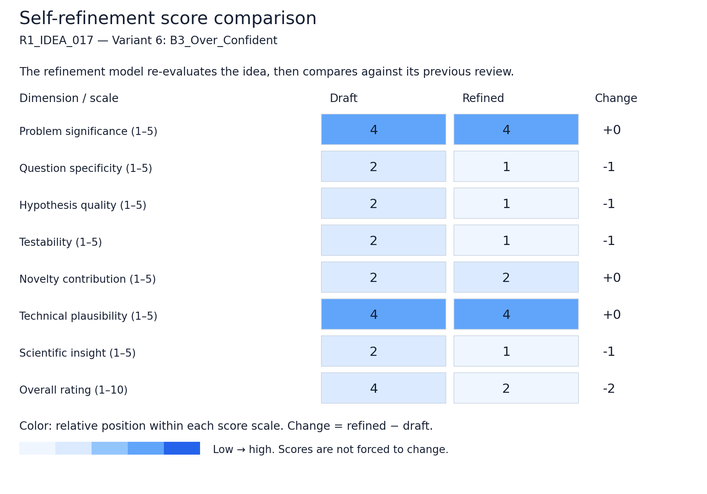

Changed score dimensions: question_specificity, hypothesis_quality, testability, scientific_insight, overall_rating.

### Score justifications (draft / refined)

**Problem significance**

```json
{
  "draft": {
    "score": 4.0,
    "justification": "The problem is meaningful. Few-shot and category-agnostic anomaly detection is a recognized challenge in industrial applications with clear practical importance. The difficulty of learning from limited abnormal samples is a core ML challenge."
  },
  "refined": {
    "score": 4.0,
    "justification": "The problem is meaningful and practically important. Few-shot, category-agnostic anomaly detection is a recognized challenge in industrial applications where collecting labeled anomalies is difficult. Improving data-efficient detection has clear real-world impact."
  }
}
```

**Question specificity**

```json
{
  "draft": {
    "score": 2.0,
    "justification": "The idea lacks a clearly defined research question. It presents a problem statement and a technological context, but does not articulate a specific, concrete question to be investigated. It is more of a suggested direction than a question."
  },
  "refined": {
    "score": 1.0,
    "justification": "The idea lacks any defined research question. It presents a problem statement and mentions a tool, but does not articulate what specific aspect will be investigated. It is essentially a suggestion rather than a research question."
  }
}
```

**Hypothesis quality**

```json
{
  "draft": {
    "score": 2.0,
    "justification": "There is no explicit or clearly implicit hypothesis. The text suggests foundation encoders 'enable learning the general distribution of normal images,' implying they might be useful, but it does not make a concrete, testable prediction about their performance, limitations, or comparative advantage in the stated problem setting."
  },
  "refined": {
    "score": 1.0,
    "justification": "There is no hypothesis—explicit or implicit. The text states that foundation encoders 'enable learning the general distribution of normal images,' which is a known property, but makes no testable prediction about their performance or utility in the stated problem setting."
  }
}
```

**Testability**

```json
{
  "draft": {
    "score": 2.0,
    "justification": "In its current form, the idea is not readily testable because it does not propose what to test. To become testable, it would need to define a specific comparison, evaluation protocol, or analysis. The core suggestion is too vague to design a direct experiment around."
  },
  "refined": {
    "score": 1.0,
    "justification": "The idea is not testable in its current form. It does not propose what to test, how to test it, or what would constitute evidence for or against the suggestion. Without a specific claim or comparison, no experiment can be designed."
  }
}
```

**Novelty contribution**

```json
{
  "draft": {
    "score": 2.0,
    "justification": "The potential contribution is currently low. Applying foundation models (a widely used tool) to anomaly detection (a standard task) is an application idea. Without a specific hypothesis or novel methodological angle, it risks being a straightforward engineering application rather than a contribution of new scientific knowledge."
  },
  "refined": {
    "score": 2.0,
    "justification": "The potential contribution is very low. Applying foundation models (a widely used tool) to anomaly detection (a standard task) is an application idea, not a novel research contribution. Without a specific hypothesis or novel methodological angle, it offers little new scientific knowledge."
  }
}
```

**Technical plausibility**

```json
{
  "draft": {
    "score": 4.0,
    "justification": "The technical reasoning is plausible and coherent. Foundation visual encoders are known to capture general visual features, and leveraging them for downstream tasks with limited data is a common and successful paradigm. The connection to learning a 'general distribution of normal images' is logically sound."
  },
  "refined": {
    "score": 4.0,
    "justification": "The technical reasoning is plausible. Foundation visual encoders are known to capture general visual features, and using them for downstream tasks with limited data is a common paradigm. The connection to learning a 'general distribution of normal images' is logically coherent."
  }
}
```

**Scientific insight**

```json
{
  "draft": {
    "score": 2.0,
    "justification": "The idea, as stated, has low potential for scientific insight. It points towards a potentially useful application. To yield insight, it would need to be refined to investigate *why* or *under what conditions* foundation encoders help, to uncover new principles about representation transfer, data efficiency, or the geometry of anomaly detection in embedding spaces."
  },
  "refined": {
    "score": 1.0,
    "justification": "The idea, as stated, has almost no potential for scientific insight. It points to a possible application without proposing to investigate why, how, or under what conditions it might work. To yield insight, it would need to address fundamental questions about representation transfer, data efficiency, or detection mechanisms."
  }
}
```

**Overall rating**

```json
{
  "draft": {
    "score": 4.0,
    "justification": "This is a weak research idea in its current form. It identifies a significant practical problem and a plausible technological context, which are positive starting points. However, it fails to define a research question, lacks a testable hypothesis, and does not articulate a path to scientific contribution. It reads as a motivation or background section rather than a research proposal. With substantial refinement (as suggested), it could evolve into a stronger idea."
  },
  "refined": {
    "score": 2.0,
    "justification": "This is a very weak research idea. While it identifies a meaningful problem and a plausible technical direction, it completely lacks the core components of a research idea: a specific question, a testable hypothesis, and a path to contribution. It reads as background motivation, not a research proposal. Significant refinement is needed to become a viable research direction."
  }
}
```

## R1_IDEA_017 — Variant 7: B4_Novelty


Changed score dimensions: none.

### Score justifications (draft / refined)

**Problem significance**

```json
{
  "draft": {
    "score": 4.0,
    "justification": "The problem is meaningful - few-shot anomaly detection has practical importance for industrial safety inspection where labeled anomalies are scarce. The category-agnostic aspect adds an interesting twist that reflects real-world constraints."
  },
  "refined": {
    "score": 4.0,
    "justification": "The problem is meaningful and has practical importance. Few-shot anomaly detection addresses real-world constraints in industrial safety inspection where labeled anomalies are scarce. The category-agnostic aspect reflects realistic deployment scenarios where anomaly types may be unknown during training."
  }
}
```

**Question specificity**

```json
{
  "draft": {
    "score": 2.0,
    "justification": "The idea describes a general direction rather than a specific research question. It mentions 'an underexplored angle' but doesn't define what exactly should be investigated. There's no clear 'what', 'why', or 'how' question articulated."
  },
  "refined": {
    "score": 2.0,
    "justification": "The idea describes a general direction rather than a specific research question. It mentions 'an underexplored angle' but doesn't define what exactly should be investigated. There's no clear 'what', 'why', or 'how' question articulated. The research objective remains vague."
  }
}
```

**Hypothesis quality**

```json
{
  "draft": {
    "score": 2.0,
    "justification": "There's an implicit hypothesis that foundation visual encoders will help with few-shot anomaly detection, but it's not stated as a testable prediction. No mechanism is proposed for why this should work, and no alternative explanations or boundary conditions are considered."
  },
  "refined": {
    "score": 2.0,
    "justification": "There's only an implicit, unstated assumption that foundation visual encoders will help with few-shot anomaly detection. No testable prediction is made, no mechanism is proposed for why this should work, and no alternative explanations or boundary conditions are considered. The hypothesis lacks concrete formulation."
  }
}
```

**Testability**

```json
{
  "draft": {
    "score": 3.0,
    "justification": "The idea is testable in principle - one could compare foundation encoders to other approaches on few-shot anomaly detection tasks. However, without specifying what exactly would be tested or how success would be measured, it's only moderately testable as presented."
  },
  "refined": {
    "score": 3.0,
    "justification": "The idea is testable in principle - one could compare foundation encoders to other approaches on few-shot anomaly detection tasks. However, without specifying what exactly would be tested, how success would be measured, or what constitutes the experimental conditions, it's only moderately testable as presented."
  }
}
```

**Novelty contribution**

```json
{
  "draft": {
    "score": 3.0,
    "justification": "Applying foundation models to anomaly detection is somewhat novel, though foundation models have been applied to various downstream tasks. The few-shot, category-agnostic angle adds some novelty, but the core idea of using pre-trained features for anomaly detection is not new."
  },
  "refined": {
    "score": 3.0,
    "justification": "Applying foundation models to anomaly detection has some novelty, though foundation models have been applied to various downstream tasks. The few-shot, category-agnostic angle adds modest novelty, but the core concept of using pre-trained features for anomaly detection is established. The contribution would depend heavily on the specific insights generated."
  }
}
```

**Technical plausibility**

```json
{
  "draft": {
    "score": 4.0,
    "justification": "The reasoning is logically coherent: foundation models learn rich visual representations from massive datasets, which could potentially capture 'normal' visual patterns that transfer to anomaly detection. The connection is plausible given what we know about representation learning."
  },
  "refined": {
    "score": 4.0,
    "justification": "The reasoning is logically coherent: foundation models learn rich visual representations from massive datasets, which could potentially capture general visual patterns that transfer to anomaly detection. The connection is plausible given established knowledge about representation learning and transfer learning."
  }
}
```

**Scientific insight**

```json
{
  "draft": {
    "score": 3.0,
    "justification": "If properly investigated, this could provide insights into what properties of foundation models enable few-shot transfer, or what makes anomaly detection particularly challenging in category-agnostic settings. However, as presented, it's more of an application idea than one designed to yield fundamental insights."
  },
  "refined": {
    "score": 3.0,
    "justification": "If properly investigated, this could provide insights into what properties of foundation models enable few-shot transfer to anomaly detection, or what makes anomaly detection challenging in category-agnostic settings. However, as presented, it's primarily an application idea rather than one designed to yield fundamental insights about representation learning or anomaly detection mechanisms."
  }
}
```

**Overall rating**

```json
{
  "draft": {
    "score": 5.0,
    "justification": "This is a moderate/borderline research idea. It identifies a meaningful practical problem and proposes a plausible technical direction, but lacks a specific research question, testable hypothesis, and clear definition of what would constitute a contribution. The idea needs more specificity to become a strong research proposal. It has reasonable motivation but currently reads more like an application suggestion than a research investigation."
  },
  "refined": {
    "score": 5.0,
    "justification": "This is a moderate/borderline research idea. It identifies a meaningful practical problem and proposes a plausible technical direction, but lacks a specific research question, testable hypothesis, and clear definition of what would constitute a contribution. The idea needs more specificity to become a strong research proposal. It has reasonable motivation but currently reads more like an application suggestion than a research investigation with clear scientific objectives."
  }
}
```

## R1_IDEA_017 — Variant 8: B5_Application_Impact


Changed score dimensions: question_specificity.

### Score justifications (draft / refined)

**Problem significance**

```json
{
  "draft": {
    "score": 4.0,
    "justification": "Industrial safety inspection is a meaningful application area with practical importance. Few-shot anomaly detection under category-agnostic conditions is a recognized challenge in computer vision and industrial AI."
  },
  "refined": {
    "score": 4.0,
    "justification": "Industrial safety inspection is a meaningful application with societal impact. Few-shot anomaly detection under category-agnostic conditions is a recognized and non-trivial challenge in computer vision and industrial AI."
  }
}
```

**Question specificity**

```json
{
  "draft": {
    "score": 2.0,
    "justification": "The idea identifies a problem domain but doesn't define a clear research question. It states an approach 'may be relevant' without specifying what aspect should be investigated or tested."
  },
  "refined": {
    "score": 1.0,
    "justification": "The idea does not define a research question. It only notes that foundation models 'may be relevant' to improving safety workflows, without specifying what aspect should be studied, tested, or compared."
  }
}
```

**Hypothesis quality**

```json
{
  "draft": {
    "score": 1.0,
    "justification": "No hypothesis is presented. The idea suggests foundation models 'may be relevant' but doesn't make a concrete prediction about their effect on few-shot anomaly detection performance or generalization."
  },
  "refined": {
    "score": 1.0,
    "justification": "No hypothesis is presented. There is no concrete prediction, causal mechanism, or relationship proposed. The language is purely suggestive ('may be relevant'), not predictive or falsifiable."
  }
}
```

**Testability**

```json
{
  "draft": {
    "score": 2.0,
    "justification": "While the general direction could be tested (e.g., comparing foundation model features to other approaches), the idea doesn't suggest specific experiments, comparisons, or evaluation protocols that would test a meaningful claim."
  },
  "refined": {
    "score": 2.0,
    "justification": "While one could design experiments to compare foundation models against other approaches, the idea itself does not suggest any specific experiments, evaluations, or comparisons. It lacks a testable claim."
  }
}
```

**Novelty contribution**

```json
{
  "draft": {
    "score": 2.0,
    "justification": "Applying foundation models to anomaly detection is not novel in itself. The potential contribution depends on what specific insight or improvement is demonstrated, which isn't specified here."
  },
  "refined": {
    "score": 2.0,
    "justification": "Applying foundation models to anomaly detection is not novel. The potential contribution hinges on demonstrating a specific insight or improvement in the few-shot category-agnostic setting, which is not articulated here."
  }
}
```

**Technical plausibility**

```json
{
  "draft": {
    "score": 4.0,
    "justification": "The reasoning is coherent: foundation models learn general visual representations from large datasets, which could provide better priors for normal image distributions in few-shot settings. This is technically plausible."
  },
  "refined": {
    "score": 4.0,
    "justification": "The reasoning is logically coherent: foundation models learn general visual representations from large-scale data, which could provide better priors for normal image distributions in data-scarce settings. This is technically plausible and aligned with current trends."
  }
}
```

**Scientific insight**

```json
{
  "draft": {
    "score": 2.0,
    "justification": "As presented, the idea seems like an application rather than a scientific investigation. It doesn't articulate what general principles, mechanisms, or limitations might be discovered through this research."
  },
  "refined": {
    "score": 2.0,
    "justification": "As presented, the idea is primarily application-oriented. It does not indicate what general principles, limitations, or mechanisms might be uncovered—e.g., how representation transfer interacts with few-shot anomaly detection, or what properties of foundation models matter most."
  }
}
```

**Overall rating**

```json
{
  "draft": {
    "score": 4.0,
    "justification": "The idea identifies a meaningful problem domain but lacks a specific research question, hypothesis, or clear scientific contribution. It reads more like a motivation statement than a research idea. With refinement to include a concrete hypothesis and experimental design, it could become a stronger research direction."
  },
  "refined": {
    "score": 4.0,
    "justification": "The idea identifies a meaningful practical problem and suggests a plausible technical direction, but it lacks a clear research question, hypothesis, and scientific objective. It reads as a motivation or suggestion rather than a research idea. With substantial refinement—adding a specific question, hypothesis, and experimental plan—it could become a viable research direction."
  }
}
```

## R1_IDEA_017 — Variant 9: C1_Hollow_Shell

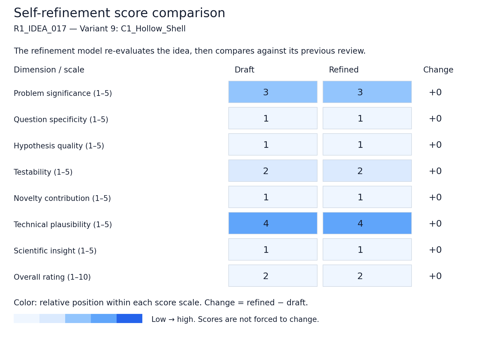

Changed score dimensions: none.

### Score justifications (draft / refined)

**Problem significance**

```json
{
  "draft": {
    "score": 3.0,
    "justification": "Data scarcity in safety-critical applications is a meaningful practical problem, but the idea doesn't articulate why safety inspection specifically presents unique challenges beyond generic data scarcity issues."
  },
  "refined": {
    "score": 3.0,
    "justification": "Data scarcity in safety-critical applications is a meaningful practical problem with real-world consequences. However, the idea does not articulate why safety inspection specifically presents unique challenges beyond generic data scarcity issues seen in many domains."
  }
}
```

**Question specificity**

```json
{
  "draft": {
    "score": 1.0,
    "justification": "No specific research question is defined. The idea merely states that pre-training helps with data scarcity, without specifying what aspect of this relationship would be investigated."
  },
  "refined": {
    "score": 1.0,
    "justification": "No specific research question is defined. The idea merely states that pre-training helps with data scarcity, without specifying what aspect of this relationship would be investigated, what variables would be considered, or what phenomenon would be studied."
  }
}
```

**Hypothesis quality**

```json
{
  "draft": {
    "score": 1.0,
    "justification": "There is no explicit or implicit hypothesis. The statement 'helps address the underlying challenge' is an assertion, not a testable prediction about mechanisms or relationships."
  },
  "refined": {
    "score": 1.0,
    "justification": "There is no explicit or implicit hypothesis. The statement 'helps address the underlying challenge' is an assertion, not a testable prediction about mechanisms, relationships, or boundary conditions. It lacks any causal or correlational claim that could be supported or contradicted."
  }
}
```

**Testability**

```json
{
  "draft": {
    "score": 2.0,
    "justification": "While one could design experiments comparing pre-trained vs. non-pre-trained models on safety inspection tasks, the idea provides no guidance on what would be tested, compared, or measured. The core claim is too vague to be meaningfully tested as stated."
  },
  "refined": {
    "score": 2.0,
    "justification": "While one could design experiments comparing pre-trained vs. non-pre-trained models on safety inspection tasks, the idea provides no guidance on what would be tested, compared, or measured. The core claim is too vague to be meaningfully tested as stated—it does not specify the task, data, evaluation, or experimental setup."
  }
}
```

**Novelty contribution**

```json
{
  "draft": {
    "score": 1.0,
    "justification": "The suggestion to use pre-training for data-scarce domains is standard practice in modern ML. Without domain-specific insights or novel methodological adaptations, this represents minimal novelty."
  },
  "refined": {
    "score": 1.0,
    "justification": "The suggestion to use pre-training for data-scarce domains is standard practice in modern ML. Without domain-specific insights, novel methodological adaptations, or a clear research gap, this represents minimal novelty. It essentially proposes applying an established technique to an unspecified application area."
  }
}
```

**Technical plausibility**

```json
{
  "draft": {
    "score": 4.0,
    "justification": "The general approach of pre-training on large datasets to address data scarcity is technically sound and well-established. The reasoning is logically coherent at a high level, though lacking in specifics."
  },
  "refined": {
    "score": 4.0,
    "justification": "The general approach of pre-training on large datasets to address data scarcity is technically sound and well-established. The reasoning is logically coherent at a high level, though it lacks specifics about implementation, domain adaptation, or potential pitfalls."
  }
}
```

**Scientific insight**

```json
{
  "draft": {
    "score": 1.0,
    "justification": "As presented, the idea offers no potential for scientific insight beyond confirming that pre-training works (which is already well-established). There's no indication of what might be learned about safety inspection, transfer learning, or domain adaptation."
  },
  "refined": {
    "score": 1.0,
    "justification": "As presented, the idea offers no potential for scientific insight beyond confirming that pre-training works (which is already well-established). There is no indication of what might be learned about safety inspection, transfer learning mechanisms, domain adaptation challenges, or model generalization in high-stakes settings."
  }
}
```

**Overall rating**

```json
{
  "draft": {
    "score": 2.0,
    "justification": "This is a very weak research idea. It identifies a practical problem but fails to articulate any specific research question, hypothesis, or investigation. The proposed direction is essentially 'apply standard ML practice to a domain,' without specifying what would be studied or what might be learned. While the domain (safety inspection) could be interesting, the idea as presented lacks the specificity and scientific framing needed for meaningful research."
  },
  "refined": {
    "score": 2.0,
    "justification": "This is a very weak research idea. It identifies a practical problem but fails to articulate any specific research question, hypothesis, or investigation. The proposed direction is essentially 'apply standard ML practice to a domain,' without specifying what would be studied or what might be learned. While the domain (safety inspection) could be interesting, the idea as presented lacks the specificity, novelty, and scientific framing needed for meaningful research."
  }
}
```

## R1_IDEA_017 — Variant 10: C2_Logic_Flawed

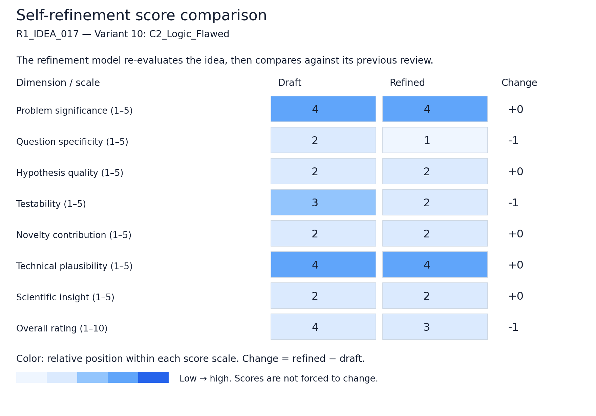

Changed score dimensions: question_specificity, testability, overall_rating.

### Score justifications (draft / refined)

**Problem significance**

```json
{
  "draft": {
    "score": 4.0,
    "justification": "The problem is meaningful: few-shot anomaly detection in industrial inspection is a practical challenge with real-world impact. Category-agnostic conditions add complexity, making it a relevant research direction."
  },
  "refined": {
    "score": 4.0,
    "justification": "The problem is meaningful: industrial safety inspection with limited labeled data is a practical challenge with real-world impact. Category-agnostic conditions add complexity, making it a relevant research direction with potential applications."
  }
}
```

**Question specificity**

```json
{
  "draft": {
    "score": 2.0,
    "justification": "The idea is stated as a suggestion ('suggesting broader effectiveness') rather than a specific research question. It lacks details about what exactly will be investigated, compared, or measured."
  },
  "refined": {
    "score": 1.0,
    "justification": "The idea lacks a clear research question. It states that foundation models 'suggest broader effectiveness' but doesn't specify what exactly will be investigated, compared, or measured. It's more of a general observation than a specific inquiry."
  }
}
```

**Hypothesis quality**

```json
{
  "draft": {
    "score": 2.0,
    "justification": "There is an implicit hypothesis that large-scale pre-training helps learn general normal distributions, which improves few-shot category-agnostic anomaly detection. However, it is not clearly articulated as a testable prediction, and it's more of an assumption than a falsifiable claim."
  },
  "refined": {
    "score": 2.0,
    "justification": "There's an implicit hypothesis that large-scale pre-training helps learn general normal distributions that transfer to few-shot category-agnostic anomaly detection. However, this is stated as a suggestion rather than a testable prediction. The hypothesis isn't articulated in a way that could be clearly supported or contradicted by evidence."
  }
}
```

**Testability**

```json
{
  "draft": {
    "score": 3.0,
    "justification": "The idea is testable in principle—one could compare foundation encoders against other encoders on few-shot anomaly detection benchmarks. However, without a clear experimental design or evaluation plan, it's unclear how the hypothesis would be rigorously assessed."
  },
  "refined": {
    "score": 2.0,
    "justification": "While one could design experiments to test related claims, the idea as presented doesn't suggest any specific test. There's no mention of experiments, comparisons, evaluations, or methods of obtaining evidence. It's a broad statement rather than a testable proposition."
  }
}
```

**Novelty contribution**

```json
{
  "draft": {
    "score": 2.0,
    "justification": "Applying foundation models to anomaly detection is not novel per se; several works have explored pre-trained models for anomaly detection. The category-agnostic few-shot setting might offer some novelty, but the idea as presented is mostly an application of existing methods to a specific domain without a clear novel insight or method."
  },
  "refined": {
    "score": 2.0,
    "justification": "Applying foundation models to anomaly detection is not novel; this has been explored in recent literature. The few-shot industrial inspection angle might offer some domain-specific relevance, but the idea doesn't propose any novel method, insight, or analysis. It reads as a straightforward application of existing techniques."
  }
}
```

**Technical plausibility**

```json
{
  "draft": {
    "score": 4.0,
    "justification": "The reasoning is plausible: large-scale pre-training likely captures general visual features that could benefit anomaly detection, especially with limited data. The connection between pre-training and normal distribution learning is coherent, though not guaranteed."
  },
  "refined": {
    "score": 4.0,
    "justification": "The reasoning is logically coherent: foundation models trained on diverse data might capture general visual features that could be useful for anomaly detection, especially with limited task-specific data. The connection between pre-training scale and generalization is plausible based on current understanding."
  }
}
```

**Scientific insight**

```json
{
  "draft": {
    "score": 2.0,
    "justification": "As presented, the idea is primarily about applying an existing technique to a new setting. It does not propose to uncover new mechanisms, principles, or boundary conditions. The potential insight is limited to whether foundation models work well in this specific scenario, which is more of an engineering validation than a scientific discovery."
  },
  "refined": {
    "score": 2.0,
    "justification": "As presented, the idea focuses on potential effectiveness in a specific application. It doesn't propose to uncover new mechanisms, principles, or fundamental insights about anomaly detection, few-shot learning, or foundation models. The learning would be primarily about whether a technique works in a particular setting, which offers limited scientific insight."
  }
}
```

**Overall rating**

```json
{
  "draft": {
    "score": 4.0,
    "justification": "The idea identifies a relevant practical problem and connects it to a timely trend (foundation models), but it lacks a clear research question, testable hypothesis, and novelty. It reads more as a motivation or observation than a research plan. Without greater specificity, its scientific contribution is limited."
  },
  "refined": {
    "score": 3.0,
    "justification": "The idea identifies a relevant practical problem but lacks the core elements of a research idea: a specific question, testable hypothesis, and clear contribution. It's more of a motivation statement or observation than a research direction. Without greater specificity about what would actually be investigated and why it would yield new knowledge, its scientific value is limited."
  }
}
```

## R1_IDEA_017 — Variant 11: C3_Substance_Enriched

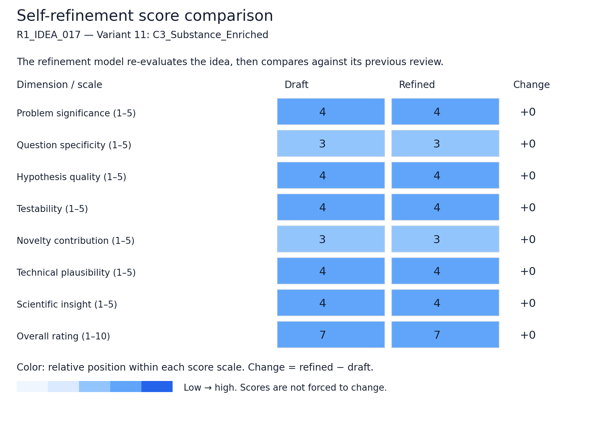

Changed score dimensions: none.

### Score justifications (draft / refined)

**Problem significance**

```json
{
  "draft": {
    "score": 4.0,
    "justification": "The problem is meaningful. Few-shot, category-agnostic anomaly detection is a recognized challenge with clear industrial relevance (safety inspection). Understanding the factors that limit foundation model performance in this setting is a worthwhile goal for both applied and fundamental research."
  },
  "refined": {
    "score": 4.0,
    "justification": "The problem is significant. Few-shot, category-agnostic anomaly detection is a recognized and challenging real-world problem with clear applications in industrial safety and quality control. Understanding the factors that limit the transfer of powerful foundation models to this data-scarce, open-set setting is a meaningful goal for both applied and fundamental machine learning research."
  }
}
```

**Question specificity**

```json
{
  "draft": {
    "score": 3.0,
    "justification": "Moderate. The idea contains specific components (texture statistics, boundary condition, feature separability degradation) but they are presented as a combined suggestion rather than a single, crisply defined question. The reader must infer the precise relationship being investigated."
  },
  "refined": {
    "score": 3.0,
    "justification": "Moderate. The idea contains specific elements (texture statistics, boundary condition, feature separability, semantic diversity) but presents them as interconnected suggestions rather than a single, crisply defined research question. The reader must infer the precise relationship being investigated—is the core question about texture capacity, or about separability degradation with diversity? The focus could be sharper."
  }
}
```

**Hypothesis quality**

```json
{
  "draft": {
    "score": 4.0,
    "justification": "Strong. There is a clear implicit hypothesis: 'The encoder's capacity to model fine-grained texture statistics is a key boundary condition for its effectiveness.' This is a concrete, causal claim about a mechanism that could be supported or contradicted by evidence. The suggested test about feature separability and semantic diversity provides a related, testable prediction."
  },
  "refined": {
    "score": 4.0,
    "justification": "Strong. There is a clear, implicit, and causal hypothesis: 'The encoder's capacity to model fine-grained texture statistics is a key boundary condition for its effectiveness [in few-shot, category-agnostic anomaly detection].' This makes a concrete prediction about a mechanism that could be supported or refuted. The related suggestion about feature separability and semantic diversity provides an additional, testable corollary."
  }
}
```

**Testability**

```json
{
  "draft": {
    "score": 4.0,
    "justification": "Strong. The core hypothesis and the suggested validation route are fundamentally testable. One could design experiments to measure texture modeling capacity (e.g., via auxiliary tasks or representation analysis), control semantic diversity in normal data, and correlate these factors with anomaly detection performance. The idea points directly toward empirical investigation."
  },
  "refined": {
    "score": 4.0,
    "justification": "Strong. Both the core hypothesis and the suggested validation route are fundamentally testable through empirical study. One can design experiments to measure or proxy texture modeling capacity (e.g., via auxiliary tasks, representation analysis), control or quantify semantic diversity in normal data, and evaluate anomaly detection performance. The idea directly points toward empirical investigation and comparison."
  }
}
```

**Novelty contribution**

```json
{
  "draft": {
    "score": 3.0,
    "justification": "Moderate. Applying foundation models to anomaly detection is not novel. The potential contribution lies in identifying and empirically validating a specific model property (texture modeling) as a critical factor for performance in a challenging setting. This is a valuable hypothesis-testing study rather than a highly novel methodological advance."
  },
  "refined": {
    "score": 3.0,
    "justification": "Moderate. Using foundation models for anomaly detection is an active area, not novel in itself. The potential contribution lies in identifying and empirically testing a specific model property (texture modeling capacity) as a critical factor for performance under challenging conditions (few-shot, category-agnostic). This is a valuable hypothesis-driven investigation that could clarify a boundary condition, but it is not a highly novel methodological or theoretical advance."
  }
}
```

**Technical plausibility**

```json
{
  "draft": {
    "score": 4.0,
    "justification": "Strong. The reasoning is coherent. Foundation models are known to capture diverse visual features; texture is a fundamental one. It is plausible that for detecting subtle, local anomalies (common in industrial inspection), texture fidelity matters. The link between increased semantic diversity (harder to model a tight 'normal' distribution) and degraded separability is logically sound."
  },
  "refined": {
    "score": 4.0,
    "justification": "Strong. The reasoning is coherent and plausible. Foundation visual encoders do learn to represent texture features. For many industrial anomalies (e.g., surface scratches, material corrosion), local texture is indeed a critical cue. The notion that a model's ability to capture fine-grained texture might be crucial for detecting subtle deviations, and that this ability could be strained when the 'normal' class has high semantic diversity, is logically sound."
  }
}
```

**Scientific insight**

```json
{
  "draft": {
    "score": 4.0,
    "justification": "Strong. If successful, this research could yield transferable insight. It would move beyond simply reporting that model X works on dataset Y, towards revealing a specific model capability that governs performance on a family of tasks. This could inform model selection, architecture design for anomaly detection, and our understanding of representation utility."
  },
  "refined": {
    "score": 4.0,
    "justification": "Strong. If successfully investigated, this research could yield transferable scientific insight. It would move beyond reporting that model X works on dataset Y, towards revealing a specific model capability (texture representation fidelity) that governs performance on a family of challenging tasks. This could inform model selection, architectural choices for anomaly detection, and our understanding of which representation properties matter most in data-scarce, open-set scenarios."
  }
}
```

**Overall rating**

```json
{
  "draft": {
    "score": 7.0,
    "justification": "This is a strong research idea. It addresses a significant applied problem with a clear, testable, and plausible hypothesis about an underlying mechanism. The potential for scientific insight into the boundary conditions of foundation model utility is high. It is held back from a higher rating primarily by the need for a more sharply defined central question and more detailed methodological thinking, which is expected at this early idea stage."
  },
  "refined": {
    "score": 7.0,
    "justification": "This is a strong research idea. It tackles a significant applied problem with a clear, testable, and plausible hypothesis about an underlying mechanistic limitation. The potential for scientific insight into the boundary conditions of foundation model utility is high. It is held back from a higher rating primarily by the need for a more sharply defined central question and more detailed operational definitions, which is typical and acceptable for an early-stage idea. The core premise is promising and merits investigation."
  }
}
```

## R1_IDEA_017 — Variant 12: H1_Deceptive_Hollow


Changed score dimensions: none.

### Score justifications (draft / refined)

**Problem significance**

```json
{
  "draft": {
    "score": 4.0,
    "justification": "Data scarcity in safety-critical applications is a meaningful and important problem. Safety inspection has real-world consequences, and addressing data limitations could have practical impact."
  },
  "refined": {
    "score": 4.0,
    "justification": "Data scarcity in safety-critical applications is a meaningful and important problem with real-world consequences. Safety inspection has practical significance, and addressing data limitations could have genuine impact."
  }
}
```

**Question specificity**

```json
{
  "draft": {
    "score": 1.0,
    "justification": "Extremely vague. No specific research question is defined. The idea merely states that pre-training 'helps address the underlying challenge' without specifying what exactly is being investigated."
  },
  "refined": {
    "score": 1.0,
    "justification": "Extremely vague. No specific research question is defined. The idea merely states that pre-training 'helps address the underlying challenge' without specifying what exactly is being investigated, under what conditions, or with what expected outcomes."
  }
}
```

**Hypothesis quality**

```json
{
  "draft": {
    "score": 1.0,
    "justification": "No hypothesis is presented. There's an implicit assumption that pre-training helps with data scarcity, but no concrete prediction about mechanisms, conditions, or expected outcomes."
  },
  "refined": {
    "score": 1.0,
    "justification": "No hypothesis is presented. There's only an implicit assumption that pre-training helps with data scarcity, but no concrete prediction about mechanisms, boundary conditions, transfer relationships, or measurable outcomes that could be supported or contradicted by evidence."
  }
}
```

**Testability**

```json
{
  "draft": {
    "score": 1.0,
    "justification": "The idea as presented is not testable. There's no proposed experiment, evaluation, or method for obtaining evidence. It's a general direction without concrete means of validation."
  },
  "refined": {
    "score": 1.0,
    "justification": "The idea as presented is not testable. There's no proposed experiment, evaluation method, comparison, or means of obtaining evidence. It's a general direction statement without any concrete validation approach."
  }
}
```

**Novelty contribution**

```json
{
  "draft": {
    "score": 2.0,
    "justification": "Pre-training for data-scarce domains is a well-established approach. The 'transformative synthesis' claim is grandiose but unsupported by any novel technical insight or methodological innovation."
  },
  "refined": {
    "score": 2.0,
    "justification": "Pre-training for data-scarce domains is a well-established approach in ML. The claim of 'transformative synthesis' and 'field-shaping agenda' is grandiose but unsupported by any indication of novel technical insight, methodological innovation, or synthesis of disparate approaches."
  }
}
```

**Technical plausibility**

```json
{
  "draft": {
    "score": 3.0,
    "justification": "The general direction of using pre-training for data-scarce tasks is technically plausible and aligns with current ML practice, but the complete lack of technical details makes proper assessment difficult."
  },
  "refined": {
    "score": 3.0,
    "justification": "The general direction of using pre-training for data-scarce tasks is technically plausible and aligns with current ML practice. However, the complete lack of technical details about architectures, datasets, or implementation makes proper assessment difficult."
  }
}
```

**Scientific insight**

```json
{
  "draft": {
    "score": 2.0,
    "justification": "The idea claims potential for transformative insight but provides no indication of what specific scientific understanding would be gained. As presented, it seems more like an application of existing methods than a source of new knowledge."
  },
  "refined": {
    "score": 2.0,
    "justification": "The idea claims potential for transformative insight but provides no indication of what specific scientific understanding would be gained. As presented, it seems like an application of existing methods rather than a source of new knowledge about mechanisms, limitations, or general principles."
  }
}
```

**Overall rating**

```json
{
  "draft": {
    "score": 3.0,
    "justification": "This is a weak research idea. While it identifies a meaningful problem (data scarcity in safety inspection), it fails to define a specific research question, hypothesis, or testable claim. The language is grandiose but lacks substance. It reads more like a grant proposal abstract than a concrete research direction. The core issue is the complete absence of what would actually be investigated."
  },
  "refined": {
    "score": 3.0,
    "justification": "This is a weak research idea. While it identifies a meaningful problem (data scarcity in safety inspection), it completely fails to define a specific research question, hypothesis, or testable claim. The language is grandiose but lacks substantive content. It reads more like a vision statement or grant proposal abstract than a concrete research direction. The absence of what would actually be investigated makes it unsuitable as a research idea in its current form."
  }
}
```

## R1_IDEA_017 — Variant 13: H2_Confident_Flaw


Changed score dimensions: none.

### Score justifications (draft / refined)

**Problem significance**

```json
{
  "draft": {
    "score": 4.0,
    "justification": "Few-shot anomaly detection in industrial inspection is a meaningful practical challenge with safety implications. The category-agnostic condition adds complexity. However, the problem is not novel in itself; it's a known challenge in the field."
  },
  "refined": {
    "score": 4.0,
    "justification": "Few-shot, category-agnostic anomaly detection in industrial inspection is a meaningful and challenging practical problem with real-world safety implications. The limited-data and open-set conditions are well-recognized difficulties in the field. However, the problem itself is not novel; it's an established challenge."
  }
}
```

**Question specificity**

```json
{
  "draft": {
    "score": 2.0,
    "justification": "The idea lacks a clear research question. It states a problem and suggests a solution direction but doesn't specify what relationship, mechanism, or condition will be investigated. It's more of an application proposal than a research question."
  },
  "refined": {
    "score": 2.0,
    "justification": "The idea does not define a clear research question. It states a problem and suggests a solution direction ('use foundation models'), but does not specify what relationship, mechanism, or condition will be investigated. It lacks the specificity needed for a focused research inquiry."
  }
}
```

**Hypothesis quality**

```json
{
  "draft": {
    "score": 2.0,
    "justification": "The implicit hypothesis is that foundation models will improve few-shot anomaly detection due to learning general normal distributions. This is broad and not specific enough to make concrete predictions. The problematic claim about causal evidence without controlled experiments further weakens the hypothesis quality."
  },
  "refined": {
    "score": 2.0,
    "justification": "The implicit hypothesis is that foundation models will improve performance due to learning general normal distributions. This is a broad, directional claim rather than a concrete, testable prediction about specific mechanisms or boundary conditions. The additional claim that improvements constitute causal evidence without controlled experiments further weakens the hypothesis's scientific rigor."
  }
}
```

**Testability**

```json
{
  "draft": {
    "score": 2.0,
    "justification": "While one could test if foundation models improve anomaly detection metrics, the idea doesn't propose how to test the claimed mechanism (learning general distributions) or the broader effectiveness. The dismissal of isolating confounding factors makes proper testing difficult."
  },
  "refined": {
    "score": 2.0,
    "justification": "While one could empirically test if using a foundation model improves anomaly detection metrics, the idea does not propose how to test the underlying mechanism (learning general distributions) or the claim of 'broader effectiveness.' The dismissal of controlling for confounders makes rigorous testing and attribution of cause difficult."
  }
}
```

**Novelty contribution**

```json
{
  "draft": {
    "score": 3.0,
    "justification": "Applying foundation models to anomaly detection is not novel per se; there is existing work on using pre-trained models for anomaly detection. The category-agnostic few-shot setting adds some novelty, but the idea doesn't articulate what new scientific knowledge would be generated beyond another application."
  },
  "refined": {
    "score": 3.0,
    "justification": "Applying pre-trained foundation models to anomaly detection is not novel in itself; there is existing literature. The focus on the few-shot, category-agnostic setting adds some specificity, but the idea does not articulate what new scientific knowledge would be generated beyond demonstrating another successful application. It lacks a clear novel hypothesis about representation learning, generalization, or anomaly detection theory."
  }
}
```

**Technical plausibility**

```json
{
  "draft": {
    "score": 4.0,
    "justification": "The core technical premise is plausible: foundation models learn general visual representations that could transfer to anomaly detection. However, the claim that improvements can be treated as causal without controlling for confounders is not scientifically sound."
  },
  "refined": {
    "score": 4.0,
    "justification": "The core technical premise is plausible: large-scale pre-training can learn general visual representations that may transfer well to data-scarce, open-set tasks like anomaly detection. The reasoning connecting scale, generalization, and the target problem is logically coherent. However, the claim about establishing causal evidence without controlled experiments is not technically sound."
  }
}
```

**Scientific insight**

```json
{
  "draft": {
    "score": 2.0,
    "justification": "As presented, the idea seems focused on achieving better performance rather than generating scientific insight. It doesn't propose to uncover mechanisms, boundary conditions, or general principles about representation learning for anomaly detection. The problematic causal claim suggests a focus on proving superiority rather than understanding."
  },
  "refined": {
    "score": 2.0,
    "justification": "As presented, the idea is primarily solution-oriented, aiming for better performance. It does not propose to uncover new mechanisms, principles, or boundary conditions about how representations transfer to anomaly detection, what makes a representation 'general' for normality modeling, or when this approach fails. The problematic causal claim suggests a focus on proving utility rather than generating understanding."
  }
}
```

**Overall rating**

```json
{
  "draft": {
    "score": 4.0,
    "justification": "The idea identifies a relevant practical problem but lacks a clear research question, specific hypothesis, and proper experimental approach. The suggestion that improvements can be treated as causal evidence without controlled studies is a significant weakness. It reads more like an application proposal than a research idea with scientific merit. With refinement, it could become a stronger research direction."
  },
  "refined": {
    "score": 4.0,
    "justification": "The idea identifies a relevant practical problem and a plausible technical direction. However, it lacks the core components of a strong research idea: a clear research question, a specific and testable hypothesis, and a rigorous experimental approach. The unscientific claim about causal evidence is a significant flaw. It reads as an application proposal rather than a hypothesis-driven scientific investigation. With substantial refinement to define a specific question and a falsifiable hypothesis, it could become a more meaningful research direction."
  }
}
```

## R1_IDEA_017 — Variant 14: H3_Verbose_Enriched

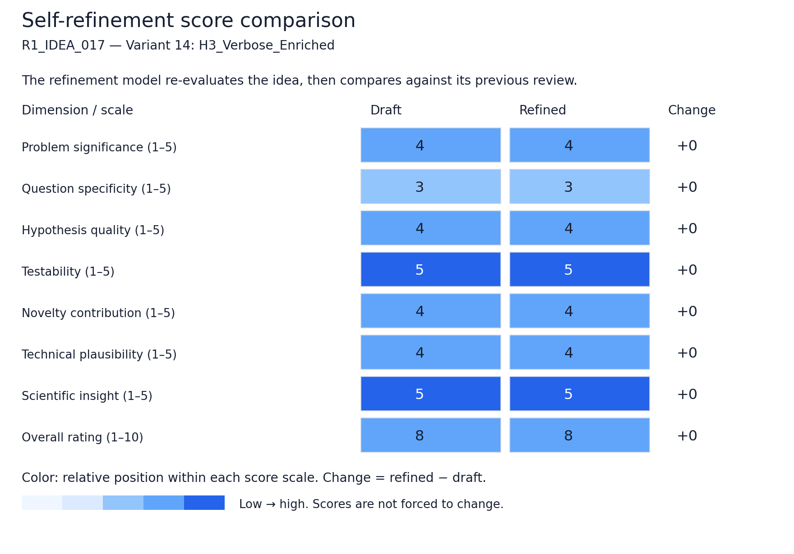

Changed score dimensions: none.

### Score justifications (draft / refined)

**Problem significance**

```json
{
  "draft": {
    "score": 4.0,
    "justification": "Few-shot, category-agnostic anomaly detection is a practically important and challenging problem in industrial safety and beyond. Understanding the boundary conditions of foundation model effectiveness in this setting is a meaningful research direction with both applied and scientific relevance."
  },
  "refined": {
    "score": 4.0,
    "justification": "Few-shot, category-agnostic anomaly detection is a significant practical challenge in domains like industrial safety inspection. Understanding the boundary conditions of foundation model effectiveness in this setting addresses both an applied need and a meaningful scientific question about representation utility."
  }
}
```

**Question specificity**

```json
{
  "draft": {
    "score": 3.0,
    "justification": "The idea contains a specific hypothesis about a mechanism (texture statistics modeling) as a boundary condition, but the overarching research question is not stated in a single, crisp form. The experimental design is well-specified, but the core 'what is being investigated' is slightly implicit."
  },
  "refined": {
    "score": 3.0,
    "justification": "The idea contains a specific hypothesis about texture statistics as a boundary condition, but the overarching research question is not crisply stated. The experimental design is well-outlined, but the core 'what is being investigated' remains somewhat implicit, requiring inference from the description."
  }
}
```

**Hypothesis quality**

```json
{
  "draft": {
    "score": 4.0,
    "justification": "The hypothesis that 'the encoder's capacity to model fine-grained texture statistics might be a key boundary condition for its effectiveness' is concrete, mechanistic, and falsifiable. It makes a specific prediction about a factor influencing performance, distinguishing it from a generic application study."
  },
  "refined": {
    "score": 4.0,
    "justification": "The hypothesis that 'the encoder's capacity to model fine-grained texture statistics might be a key boundary condition for its effectiveness' is concrete, mechanistic, and falsifiable. It makes a specific prediction about a factor influencing performance, moving beyond a generic application claim."
  }
}
```

**Testability**

```json
{
  "draft": {
    "score": 5.0,
    "justification": "Excellent. The idea proposes a comprehensive, staged experimental design with clear components: baseline/intervention conditions, pre-specified criteria, case comparisons, ablations, sensitivity analyses, and error analysis. This provides a direct and rigorous path to test the hypothesis and associated claims."
  },
  "refined": {
    "score": 5.0,
    "justification": "Excellent. The proposed staged experimental design—with baseline/intervention conditions, pre-specified criteria, case comparisons, ablations, sensitivity analyses, and error analysis—provides a clear, rigorous, and comprehensive path to test the hypothesis and associated claims."
  }
}
```

**Novelty contribution**

```json
{
  "draft": {
    "score": 4.0,
    "justification": "The novelty lies not in applying foundation models to anomaly detection (which has been explored), but in rigorously testing a specific hypothesis about a representational property (texture statistics modeling) as a boundary condition for effectiveness in a challenging few-shot, category-agnostic regime. This could contribute new understanding about why and when these models work for such tasks."
  },
  "refined": {
    "score": 4.0,
    "justification": "The novelty lies not in applying foundation models to anomaly detection, but in rigorously testing a specific hypothesis about a representational property (texture statistics modeling) as a boundary condition for effectiveness in a challenging few-shot, category-agnostic regime. This could contribute new understanding about why and when these models work for such tasks."
  }
}
```

**Technical plausibility**

```json
{
  "draft": {
    "score": 4.0,
    "justification": "The reasoning is logically coherent. The focus on texture statistics is plausible given their importance in some anomaly detection tasks and the known properties of different visual encoders. The proposed experimental design is sound in principle. Some technical details (e.g., how to measure texture modeling capacity) need specification, but the overall direction is plausible."
  },
  "refined": {
    "score": 4.0,
    "justification": "The reasoning is logically coherent. The focus on texture statistics is plausible given their relevance in anomaly detection and known variation in texture sensitivity across visual encoders. The proposed experimental design is sound in principle. Some technical details need specification, but the overall direction is plausible."
  }
}
```

**Scientific insight**

```json
{
  "draft": {
    "score": 5.0,
    "justification": "The idea explicitly aims to clarify 'which assumptions, data regimes, and domain constraints determine when and why it is useful.' The combination of a mechanistic hypothesis, a staged design with ablations and error analysis, and the focus on boundary conditions strongly indicates high potential for transferable scientific insight about representation utility in few-shot anomaly detection."
  },
  "refined": {
    "score": 5.0,
    "justification": "The idea explicitly aims to clarify 'which assumptions, data regimes, and domain constraints determine when and why it is useful.' The combination of a mechanistic hypothesis, a staged design with ablations and error analysis, and the focus on boundary conditions strongly indicates high potential for transferable scientific insight about representation utility in few-shot anomaly detection."
  }
}
```

**Overall rating**

```json
{
  "draft": {
    "score": 8.0,
    "justification": "This is a strong research idea. It addresses a significant problem, proposes a specific and testable mechanistic hypothesis, and outlines a rigorous experimental methodology designed to yield scientific insight beyond mere performance comparison. The main weakness is a slightly implicit framing of the core research question, but the hypothesis and design are clear and promising. The potential contribution is understanding a key boundary condition for foundation model effectiveness in a challenging practical setting."
  },
  "refined": {
    "score": 8.0,
    "justification": "This is a strong research idea. It addresses a significant problem, proposes a specific and testable mechanistic hypothesis, and outlines a rigorous experimental methodology designed to yield scientific insight beyond mere performance comparison. The main weaknesses are the somewhat implicit framing of the core research question and lack of specification for some technical details, but the hypothesis and design are clear and promising. The potential contribution is understanding a key boundary condition for foundation model effectiveness in a challenging practical setting."
  }
}
```

## R1_IDEA_017 — Variant 15: H4_Ultimate_Hype


Changed score dimensions: none.

### Score justifications (draft / refined)

**Problem significance**

```json
{
  "draft": {
    "score": 4.0,
    "justification": "Few-shot anomaly detection, especially in safety-critical industrial applications, is a meaningful and practically important problem. The category-agnostic aspect adds a relevant layer of difficulty."
  },
  "refined": {
    "score": 4.0,
    "justification": "Few-shot anomaly detection, especially in safety-critical industrial applications, is a meaningful and practically important problem. The category-agnostic aspect adds a relevant layer of difficulty that increases real-world applicability."
  }
}
```

**Question specificity**

```json
{
  "draft": {
    "score": 1.0,
    "justification": "Extremely low. The idea is a broad motivational statement and a general technical direction ('use foundation models'). It does not define a concrete research question, relationship to investigate, or phenomenon to study."
  },
  "refined": {
    "score": 1.0,
    "justification": "Extremely low. The idea is a broad motivational statement and general technical direction ('use foundation models'). It does not define a concrete research question, relationship to investigate, or phenomenon to study. No specific aspect of the problem is targeted for investigation."
  }
}
```

**Hypothesis quality**

```json
{
  "draft": {
    "score": 1.0,
    "justification": "There is no discernible hypothesis. The text suggests foundation models 'could help' but makes no concrete, testable prediction about a mechanism, outcome, or comparative advantage."
  },
  "refined": {
    "score": 1.0,
    "justification": "There is no discernible hypothesis. The text suggests foundation models 'could help' but makes no concrete, testable prediction about a mechanism, outcome, or comparative advantage. It lacks any falsifiable statement."
  }
}
```

**Testability**

```json
{
  "draft": {
    "score": 2.0,
    "justification": "The idea is testable in principle (one could apply a foundation model to the task), but the proposal lacks any defined experiment, comparison, or evaluation method. The central claim is too vague to be meaningfully falsified."
  },
  "refined": {
    "score": 2.0,
    "justification": "The idea is testable in principle (one could apply a foundation model to the task), but the proposal lacks any defined experiment, comparison, or evaluation method. The central claim is too vague to be meaningfully falsified or validated."
  }
}
```

**Novelty contribution**

```json
{
  "draft": {
    "score": 2.0,
    "justification": "Applying foundation models to vision tasks is not novel. Applying them to anomaly detection has been explored. The potential contribution is unclear because no specific novel angle, adaptation method, or insight is proposed. It reads as a generic application idea."
  },
  "refined": {
    "score": 2.0,
    "justification": "Applying foundation models to vision tasks is not novel. Applying them to anomaly detection has been explored. The potential contribution is unclear because no specific novel angle, adaptation method, or insight is proposed. It reads as a generic application idea without distinguishing elements."
  }
}
```

**Technical plausibility**

```json
{
  "draft": {
    "score": 3.0,
    "justification": "The general reasoning is coherent: large-scale pre-training learns general visual features, which could be beneficial for few-shot tasks. However, without a proposed mechanism for adaptation or handling category-agnostic settings, technical plausibility is only moderate."
  },
  "refined": {
    "score": 3.0,
    "justification": "The general reasoning is coherent: large-scale pre-training learns general visual features, which could be beneficial for few-shot tasks. However, without a proposed mechanism for adaptation or handling category-agnostic settings, technical plausibility is only moderate. Important assumptions about feature transferability remain unexamined."
  }
}
```

**Scientific insight**

```json
{
  "draft": {
    "score": 2.0,
    "justification": "As presented, the idea promises application impact but not scientific insight. It does not suggest what we might learn about foundation models, anomaly detection, or few-shot learning beyond a potential performance improvement on a specific task."
  },
  "refined": {
    "score": 2.0,
    "justification": "As presented, the idea promises application impact but not scientific insight. It does not suggest what we might learn about foundation models, anomaly detection, or few-shot learning beyond a potential performance improvement on a specific task. No transferable principles or mechanisms are highlighted for investigation."
  }
}
```

**Overall rating**

```json
{
  "draft": {
    "score": 3.0,
    "justification": "This is a weak research idea. While it identifies a relevant application problem, it fails to articulate a specific research question, hypothesis, or methodological direction. It is primarily a motivational statement with promotional language, lacking the core elements needed for a scientific investigation. The potential for a meaningful contribution is unclear."
  },
  "refined": {
    "score": 3.0,
    "justification": "This is a weak research idea. While it identifies a relevant application problem, it fails to articulate a specific research question, hypothesis, or methodological direction. It is primarily a motivational statement with promotional language, lacking the core elements needed for a scientific investigation. The potential for a meaningful contribution is unclear, and the idea lacks the specificity required for rigorous evaluation."
  }
}
```

## R1_IDEA_018 — Source

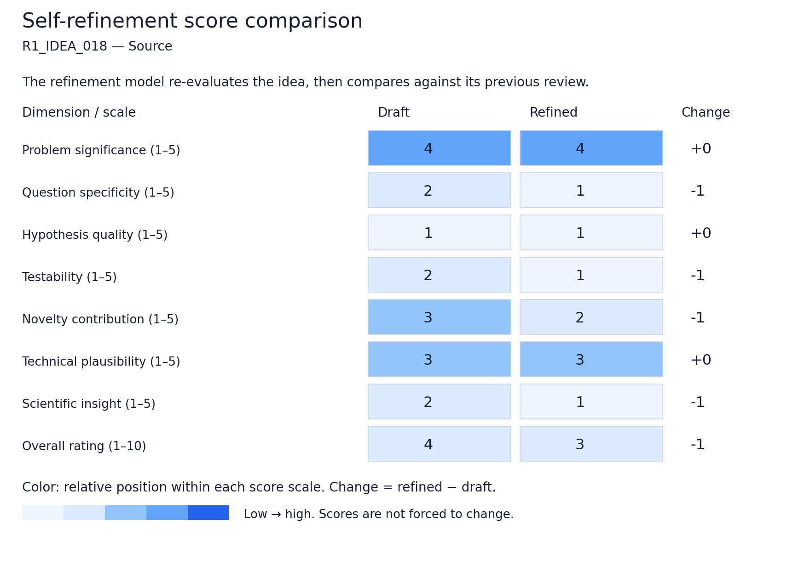

Changed score dimensions: question_specificity, testability, novelty_contribution, scientific_insight, overall_rating.

### Score justifications (draft / refined)

**Problem significance**

```json
{
  "draft": {
    "score": 4.0,
    "justification": "Improving controllability in video generation is a meaningful challenge. Multi-subject generation with identity preservation is a practical limitation of current models, and solving it could enable applications in content creation, animation, and personalized media."
  },
  "refined": {
    "score": 4.0,
    "justification": "Improving controllability in video generation is a meaningful challenge with practical applications. Multi-subject generation with identity preservation addresses a clear limitation of current models that typically condition on text or single images, potentially enabling more precise content creation."
  }
}
```

**Question specificity**

```json
{
  "draft": {
    "score": 2.0,
    "justification": "The idea states a goal ('tackling multi-subject video generation') but does not define a clear research question. It lacks specificity about what aspect of the problem is being investigated (e.g., identity preservation mechanism, composition strategy, training paradigm)."
  },
  "refined": {
    "score": 1.0,
    "justification": "The idea does not define a research question. It only states a goal ('tackling multi-subject video generation') without specifying what aspect is being investigated—whether it's identity preservation mechanisms, composition strategies, training paradigms, or evaluation methodologies. It lacks the specificity needed for a research investigation."
  }
}
```

**Hypothesis quality**

```json
{
  "draft": {
    "score": 1.0,
    "justification": "No hypothesis is presented. The idea describes a task and proposes a framework name, but does not make a testable prediction about a relationship, mechanism, or expected outcome."
  },
  "refined": {
    "score": 1.0,
    "justification": "No hypothesis is presented. The idea describes a task and proposes a framework name but makes no testable prediction about relationships, mechanisms, or expected outcomes. There is no implied hypothesis that could be supported or contradicted by evidence."
  }
}
```

**Testability**

```json
{
  "draft": {
    "score": 2.0,
    "justification": "The task is evaluable in principle (e.g., via identity preservation metrics and video quality scores), but the idea does not propose how to test the framework's effectiveness or what evidence would support its success. Without a hypothesis or baseline comparison, testability is low."
  },
  "refined": {
    "score": 1.0,
    "justification": "While the task is evaluable in principle, the idea provides no indication of how the framework's effectiveness would be tested. No evaluation approach, metrics, baselines, or experimental design is mentioned. Without any proposed method of obtaining evidence, testability is very low."
  }
}
```

**Novelty contribution**

```json
{
  "draft": {
    "score": 3.0,
    "justification": "Multi-subject video generation from multiple images is an underexplored area, so there is potential novelty. However, the idea does not articulate what new technical or scientific contribution is proposed—it could be an incremental application of existing image-adapter techniques to video."
  },
  "refined": {
    "score": 2.0,
    "justification": "Multi-subject video generation from multiple images is relatively underexplored, offering some novelty potential. However, the idea does not articulate what new technical or scientific contribution is proposed—it could simply be applying existing image-adapter techniques to video. Without specifying a novel mechanism or insight, the contribution appears incremental."
  }
}
```

**Technical plausibility**

```json
{
  "draft": {
    "score": 3.0,
    "justification": "The described challenges (identity preservation, cross-modal integration) are coherent and align with known difficulties in generative models. However, no technical approach is suggested, so plausibility cannot be assessed beyond the problem statement being reasonable."
  },
  "refined": {
    "score": 3.0,
    "justification": "The described challenges (identity preservation, cross-modal integration) are coherent and align with known difficulties in generative models. However, no technical approach is suggested, so plausibility cannot be assessed beyond the problem statement being reasonable. The idea neither proposes nor contradicts any technical approach."
  }
}
```

**Scientific insight**

```json
{
  "draft": {
    "score": 2.0,
    "justification": "As presented, the idea focuses on building a framework for a task. It does not suggest an investigation that would yield generalizable insights about video generation, representation learning, or multi-modal conditioning. The potential insight is limited to demonstrating feasibility of multi-subject generation."
  },
  "refined": {
    "score": 1.0,
    "justification": "As presented, the idea focuses solely on building a framework for a task. It does not suggest an investigation that would yield generalizable insights about video generation, representation learning, multi-modal conditioning, or compositional reasoning. The potential insight is limited to demonstrating feasibility of a specific application."
  }
}
```

**Overall rating**

```json
{
  "draft": {
    "score": 4.0,
    "justification": "The idea identifies a relevant problem but lacks a clear research question, hypothesis, or methodological direction. It reads as a project description rather than a research hypothesis. Without these elements, the scientific contribution is unclear, and the idea is weak as a research proposal despite addressing a meaningful application gap."
  },
  "refined": {
    "score": 3.0,
    "justification": "The idea identifies a relevant application gap but lacks the essential components of a research idea: a clear research question, a testable hypothesis, a methodological direction, and a defined scientific contribution. It reads as a project description or solution announcement rather than a research investigation. While the problem is meaningful, the idea itself is weak as a research proposal."
  }
}
```

## R1_IDEA_018 — Variant 1: A1_Identity


Changed score dimensions: none.

### Score justifications (draft / refined)

**Problem significance**

```json
{
  "draft": {
    "score": 4.0,
    "justification": "The problem is meaningful: improving controllability in video generation is important for practical applications, and multi-subject generation from multiple references is a clear limitation of current models. However, the significance is more practical than fundamental scientific."
  },
  "refined": {
    "score": 4.0,
    "justification": "The problem is meaningful and practical: enhancing controllability in video generation is important for creative applications, and multi-subject generation from multiple references is a clear gap. However, the significance is more applied than fundamental scientific."
  }
}
```

**Question specificity**

```json
{
  "draft": {
    "score": 2.0,
    "justification": "The idea defines a task ('multi-subject video generation from text and reference images') but does not articulate a specific research question. It's more of a problem statement than a research question."
  },
  "refined": {
    "score": 2.0,
    "justification": "The idea defines a task but not a research question. It states what to build ('tackling multi-subject video generation') rather than what to investigate. No specific aspect of the task is isolated for study."
  }
}
```

**Hypothesis quality**

```json
{
  "draft": {
    "score": 1.0,
    "justification": "No hypothesis is presented. The idea merely states an intention to 'address this gap' without predicting what mechanism or approach will work, why it will work, or what specific limitation it will overcome."
  },
  "refined": {
    "score": 1.0,
    "justification": "No hypothesis is present. The idea merely announces an intention to 'address this gap' without predicting an outcome, mechanism, or testable relationship. It lacks any falsifiable claim."
  }
}
```

**Testability**

```json
{
  "draft": {
    "score": 3.0,
    "justification": "The task itself is testable (generate videos from multiple references and evaluate), but without a specific hypothesis, it's unclear what would constitute a meaningful test beyond demonstrating functionality. Evaluation metrics are not discussed."
  },
  "refined": {
    "score": 3.0,
    "justification": "The task is inherently testable (generate videos and evaluate), but without a hypothesis, testing reduces to a demonstration. Evaluation metrics and comparative baselines are not mentioned, limiting the scope of meaningful investigation."
  }
}
```

**Novelty contribution**

```json
{
  "draft": {
    "score": 3.0,
    "justification": "The task formulation (multiple reference images for video generation) appears novel, but the contribution is primarily applied rather than scientific. Without a hypothesis about mechanisms or limitations, the potential for new scientific knowledge is limited."
  },
  "refined": {
    "score": 3.0,
    "justification": "The task formulation (video generation from multiple reference images) appears novel in application, but the contribution is primarily applied. Without a hypothesis or scientific question, the potential for new fundamental knowledge is low."
  }
}
```

**Technical plausibility**

```json
{
  "draft": {
    "score": 4.0,
    "justification": "The general direction is technically plausible. Extending image-based identity preservation techniques (like those used in DreamBooth or custom diffusion) to video generation with multiple subjects is a reasonable research direction. The incomplete sentence suggests some conceptual gaps."
  },
  "refined": {
    "score": 4.0,
    "justification": "The direction is technically plausible. Extending identity-preserving techniques from image to video generation and handling multiple references is a logical, feasible research direction, though the incomplete sentence suggests some conceptual uncertainty."
  }
}
```

**Scientific insight**

```json
{
  "draft": {
    "score": 2.0,
    "justification": "As presented, the idea focuses on building a capability rather than gaining scientific insight. It could potentially reveal insights about multi-modal conditioning in generative models or identity preservation in temporal domains, but these are not articulated as goals."
  },
  "refined": {
    "score": 2.0,
    "justification": "As presented, the idea aims at capability building, not insight generation. It could potentially yield insights about multi-modal conditioning or temporal identity consistency, but these are not stated as goals. The focus is on application, not understanding."
  }
}
```

**Overall rating**

```json
{
  "draft": {
    "score": 4.0,
    "justification": "This is a weak research idea as presented. While it identifies a practical problem with some significance, it lacks a clear research question, hypothesis, or articulated scientific goal. It reads more like a project description than a research investigation. The incomplete sentence further suggests insufficient conceptual development. With substantial refinement to include a testable hypothesis and specific scientific questions, it could become a stronger idea."
  },
  "refined": {
    "score": 4.0,
    "justification": "This is a weak research idea. It identifies a practical problem but fails to formulate a research question or hypothesis. It reads as a project description rather than a scientific investigation. The incomplete summary further indicates underdevelopment. Significant refinement—adding a testable hypothesis, specific scientific question, and clear evaluation plan—is needed to make it a strong research idea."
  }
}
```

## R1_IDEA_018 — Variant 2: A2_Paraphrase_Only


Changed score dimensions: none.

### Score justifications (draft / refined)

**Problem significance**

```json
{
  "draft": {
    "score": 4.0,
    "justification": "The problem of limited controllability in video generation is meaningful and relevant. Multi-subject generation from multiple reference images addresses a practical limitation in creative applications and content creation. However, the significance is more applied than fundamental scientific."
  },
  "refined": {
    "score": 4.0,
    "justification": "The problem is meaningful and relevant. Enhancing fine-grained controllability in video generation is a recognized challenge with significant practical implications for creative tools and content creation. The shift from single to multi-subject conditioning addresses a clear limitation. The significance is more applied than fundamental, but the task is non-trivial and underexplored."
  }
}
```

**Question specificity**

```json
{
  "draft": {
    "score": 2.0,
    "justification": "The idea describes a task and proposed framework but does not articulate a clear research question. It states what they want to build rather than what they want to investigate or understand."
  },
  "refined": {
    "score": 2.0,
    "justification": "The idea describes a task and a proposed framework name but does not articulate a research question. It states *what* they intend to build (a framework for multi-subject video generation) rather than *what* they intend to investigate, understand, or test. There is no specific inquiry defined."
  }
}
```

**Hypothesis quality**

```json
{
  "draft": {
    "score": 1.0,
    "justification": "There is no explicit or implicit hypothesis presented. The idea describes a proposed solution without making testable predictions about mechanisms, relationships, or expected outcomes beyond presumably better performance on the task."
  },
  "refined": {
    "score": 1.0,
    "justification": "There is no hypothesis, explicit or implicit. The text presents a goal (build a framework to address challenges) but makes no testable prediction about relationships, mechanisms, or expected outcomes. It does not propose a statement that could be supported or contradicted by evidence."
  }
}
```

**Testability**

```json
{
  "draft": {
    "score": 2.0,
    "justification": "While the framework could eventually be tested by generating videos and evaluating them, the idea as presented lacks specific testable claims. There's no indication of what experiments would be conducted or what evidence would support/contradict the approach's effectiveness."
  },
  "refined": {
    "score": 2.0,
    "justification": "The framework, once built, could be tested by generating videos and evaluating them. However, the idea as presented lacks any specific, testable claim. There is no indication of what experiments would be conducted, what comparisons would be made, or what evidence would validate the approach's core ideas. It is a proposal for a tool, not a testable research statement."
  }
}
```

**Novelty contribution**

```json
{
  "draft": {
    "score": 3.0,
    "justification": "Multi-subject video generation from multiple reference images is a relatively underexplored task, so there is potential novelty. However, the contribution appears primarily as an application/engineering solution rather than new scientific insight. The novelty would depend on the specific technical innovations in the framework."
  },
  "refined": {
    "score": 3.0,
    "justification": "The task of multi-subject video generation from multiple reference images is relatively novel and underexplored, suggesting potential for contribution. However, the contribution is framed as an applied/engineering solution (a new framework). The scientific novelty is unclear without details of the proposed technical innovation or the specific insights the research aims to generate."
  }
}
```

**Technical plausibility**

```json
{
  "draft": {
    "score": 4.0,
    "justification": "The described challenges (identity preservation, semantic integration, coherence) are legitimate technical problems in video generation. Extending conditioning from single to multiple reference images is a logically coherent direction given current video generation capabilities."
  },
  "refined": {
    "score": 4.0,
    "justification": "The direction is technically plausible. The identified challenges (identity preservation, semantic integration, coherence) are well-known and legitimate problems in generative modeling. Extending conditioning from single to multiple reference images is a logical and coherent step given current capabilities in image and video generation. The reasoning is sound at this high level."
  }
}
```

**Scientific insight**

```json
{
  "draft": {
    "score": 2.0,
    "justification": "As presented, the idea focuses on building a practical framework rather than generating scientific insight. There's no indication of what would be learned about video generation mechanisms, multi-modal conditioning, or the limitations of current approaches beyond the specific application."
  },
  "refined": {
    "score": 2.0,
    "justification": "As presented, the idea focuses on building a practical system. There is no indication that it aims to produce transferable scientific insight about video generation mechanisms, the limits of current conditioning techniques, or general principles of multi-modal learning. Any insight would be incidental rather than a stated goal of the investigation."
  }
}
```

**Overall rating**

```json
{
  "draft": {
    "score": 4.0,
    "justification": "The idea identifies a meaningful practical problem in video generation and proposes a concrete task direction. However, it lacks the core elements of a research idea: a clear research question, testable hypothesis, and potential for scientific insight. It reads more like a project proposal than a research investigation. The main value is in identifying an underexplored application area, but as a research idea, it needs much more specificity about what would be investigated and learned."
  },
  "refined": {
    "score": 4.0,
    "justification": "The idea identifies a meaningful applied problem and a concrete task with clear utility. However, it lacks the essential components of a research idea: a defined research question, a testable hypothesis, and a clear path to scientific insight. It reads as a project or engineering proposal rather than a scientific investigation. Its primary value is in highlighting an underexplored application area, but as a research direction, it requires significant refinement to become a study that advances understanding."
  }
}
```

## R1_IDEA_018 — Variant 3: A3_Plain_Core

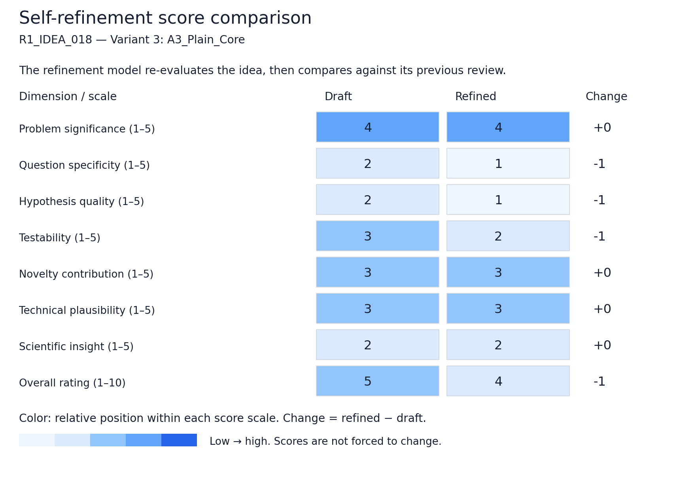

Changed score dimensions: question_specificity, hypothesis_quality, testability, overall_rating.

### Score justifications (draft / refined)

**Problem significance**

```json
{
  "draft": {
    "score": 4.0,
    "justification": "Improving controllability in video generation is a meaningful challenge with practical applications in content creation, simulation, and education. The limitation identified (single-image or text-only conditioning) is real and acknowledged in the field."
  },
  "refined": {
    "score": 4.0,
    "justification": "Improving fine-grained controllability in video generation is a significant and active challenge. The limitation identified—that models are typically conditioned only on text or a single image—is real and constrains practical applications in content creation, simulation, and storytelling. Addressing multi-subject control is a meaningful step forward."
  }
}
```

**Question specificity**

```json
{
  "draft": {
    "score": 2.0,
    "justification": "The idea defines a task (multi-subject video generation from text + multiple images) but does not specify a concrete research question. It is more of a problem statement than a focused investigation."
  },
  "refined": {
    "score": 1.0,
    "justification": "The idea does not articulate a research question. It states a goal ('we introduce ID-Composer, a framework for...') and describes a task, but does not specify what is being investigated. There is no 'why' or 'how' question to answer."
  }
}
```

**Hypothesis quality**

```json
{
  "draft": {
    "score": 2.0,
    "justification": "No explicit or clearly implicit hypothesis is presented. The idea suggests that a framework can be built to address the task, but does not make a testable prediction about mechanisms, performance, or limitations."
  },
  "refined": {
    "score": 1.0,
    "justification": "There is no hypothesis. The idea presents an objective (build a framework) without making a testable prediction about a mechanism, relationship, or performance outcome. It is an engineering goal, not a scientific hypothesis."
  }
}
```

**Testability**

```json
{
  "draft": {
    "score": 3.0,
    "justification": "The task itself is testable (e.g., via quantitative metrics for identity preservation, semantic alignment, and coherence), but without a proposed method or hypothesis, it is unclear what specific claims would be evaluated."
  },
  "refined": {
    "score": 2.0,
    "justification": "The general task is testable in principle (one could evaluate generated videos on identity preservation, etc.), but without a specific claim or proposed method, there is nothing concrete to test. The idea itself does not propose what evidence should be gathered or what would constitute success/failure for a hypothesis."
  }
}
```

**Novelty contribution**

```json
{
  "draft": {
    "score": 3.0,
    "justification": "Multi-subject video generation from multiple reference images is a relatively underexplored task, so there is novelty in problem formulation. However, without technical details, it is unclear whether the contribution would be primarily a new benchmark or a methodological advance."
  },
  "refined": {
    "score": 3.0,
    "justification": "The task formulation—multi-subject video generation from multiple reference images—is relatively underexplored and thus has some novelty. However, without any proposed technical approach, the potential contribution is ambiguous; it could range from a new benchmark to a methodological advance, but the idea does not specify which."
  }
}
```

**Technical plausibility**

```json
{
  "draft": {
    "score": 3.0,
    "justification": "The described challenges (identity preservation, multi-modal integration, coherence) are plausible and align with known difficulties in generative models. However, no technical approach is suggested, so plausibility cannot be fully assessed."
  },
  "refined": {
    "score": 3.0,
    "justification": "The described challenges (identity preservation, multi-modal integration, coherence) are technically plausible and align with known difficulties in generative modeling. However, since no technical approach is suggested, plausibility is neither supported nor contradicted; it rests solely on the reasonableness of the problem statement."
  }
}
```

**Scientific insight**

```json
{
  "draft": {
    "score": 2.0,
    "justification": "As presented, the idea seems primarily aimed at building a system for a new task. There is little indication of what general principles, mechanisms, or limitations might be learned beyond the specific application."
  },
  "refined": {
    "score": 2.0,
    "justification": "The idea is presented as building a system for a new task. There is no indication that the research would aim to uncover general principles, reveal model limitations, explain mechanisms, or produce transferable knowledge. The potential insight is limited to demonstrating that the task can be done."
  }
}
```

**Overall rating**

```json
{
  "draft": {
    "score": 5.0,
    "justification": "The idea identifies a relevant problem and proposes a concrete task, but lacks specificity in research question, hypothesis, and methodological direction. It reads more as a high-level project description than a focused research idea. Potential exists if developed further with a clear hypothesis and technical approach."
  },
  "refined": {
    "score": 4.0,
    "justification": "The idea identifies a relevant and meaningful problem but fails to articulate a research question, hypothesis, or methodological direction. It is essentially a project goal statement ('build a framework for task X'). While the task itself is concrete and worthwhile, the idea lacks the core elements of a scientific investigation: a specific question to answer and a testable claim about how to answer it. It has potential if developed into a focused research proposal."
  }
}
```

## R1_IDEA_018 — Variant 4: B1_Verbose_Elaborate

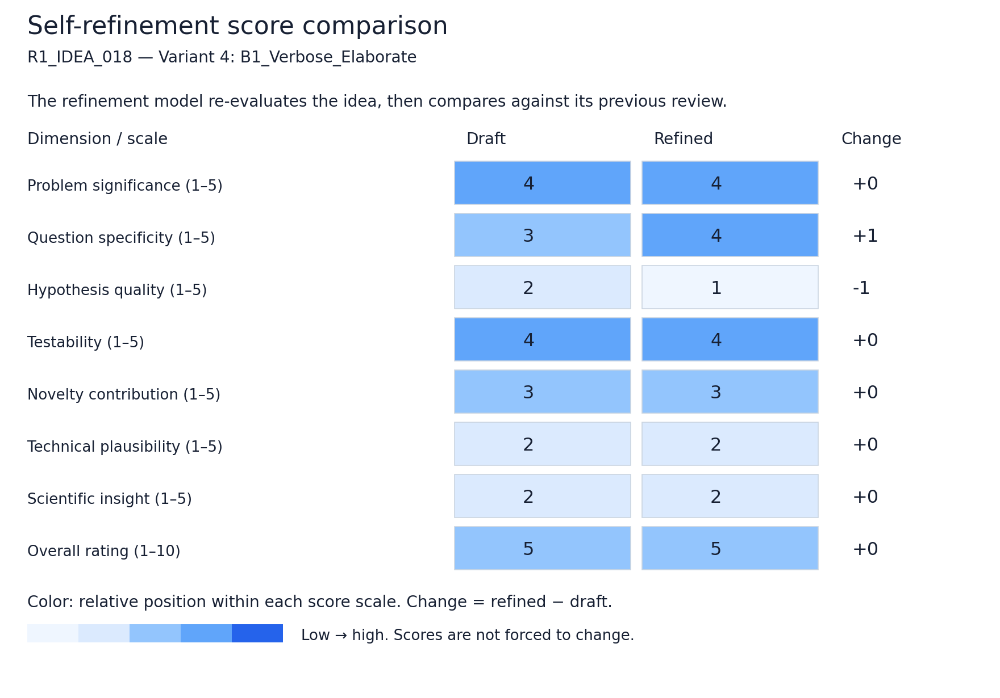

Changed score dimensions: question_specificity, hypothesis_quality.

### Score justifications (draft / refined)

**Problem significance**

```json
{
  "draft": {
    "score": 4.0,
    "justification": "Improving controllability in video generation is a meaningful and active challenge. Multi-subject generation with identity preservation is a practical limitation of current models, relevant for applications like storytelling, advertising, and personalized content."
  },
  "refined": {
    "score": 4.0,
    "justification": "The problem is highly relevant. Improving fine-grained controllability and identity preservation in video generation is a significant, practical challenge with clear applications in content creation, storytelling, and personalized media. The limitation of current text/single-image models is well-motivated."
  }
}
```

**Question specificity**

```json
{
  "draft": {
    "score": 3.0,
    "justification": "The task is clearly defined (multi-subject video generation from text + multiple reference images), but the research question is implicit ('Can we build a framework that does this?') rather than focused on understanding a specific phenomenon or mechanism."
  },
  "refined": {
    "score": 4.0,
    "justification": "The research task is defined with excellent specificity: 'multi-subject video generation from both a text prompt and reference images,' with enumerated challenges (identity preservation, multi-modal integration, coherence). It moves beyond a vague wish for 'more control' to a concrete problem setup."
  }
}
```

**Hypothesis quality**

```json
{
  "draft": {
    "score": 2.0,
    "justification": "No hypothesis is presented. The idea states a task and claims it is challenging, but does not make a testable prediction about a method, relationship, or underlying principle."
  },
  "refined": {
    "score": 1.0,
    "justification": "There is no hypothesis. The text describes a task and its difficulties but makes no concrete, testable prediction about a relationship, mechanism, or expected outcome. It states an ambition ('tackles the challenging task') rather than a falsifiable claim."
  }
}
```

**Testability**

```json
{
  "draft": {
    "score": 4.0,
    "justification": "The task itself is testable. One can generate videos from text and multiple reference images and evaluate identity preservation (e.g., via face/object recognition metrics), semantic alignment, and coherence. However, without a proposed method, it's unclear what specific claim is being tested."
  },
  "refined": {
    "score": 4.0,
    "justification": "The defined task is inherently testable. One can design experiments to generate videos from the specified inputs and evaluate them using metrics for identity preservation (e.g., face/object recognition scores), text-video alignment, and temporal coherence. The lack of a specific methodological claim does not make the core task untestable."
  }
}
```

**Novelty contribution**

```json
{
  "draft": {
    "score": 3.0,
    "justification": "The task formulation (multi-reference-image-conditioned video generation) appears novel, but the contribution is currently framed as solving this task rather than providing new scientific knowledge. Without technical details, it's unclear if the approach is novel or an adaptation of existing multi-image conditioning techniques to video."
  },
  "refined": {
    "score": 3.0,
    "justification": "The task formulation itself—multi-reference-image-conditioned video generation—appears novel and underexplored. However, the contribution is currently presented as solving this application task. Without any technical details, it's impossible to judge if the proposed 'ID-Composer' involves a novel method or is a straightforward adaptation of existing multi-image conditioning techniques to the video domain."
  }
}
```

**Technical plausibility**

```json
{
  "draft": {
    "score": 2.0,
    "justification": "No technical details are provided, so the plausibility of the proposed 'ID-Composer' framework cannot be assessed. The challenges described are reasonable, but the solution is unspecified."
  },
  "refined": {
    "score": 2.0,
    "justification": "No technical details are provided for the proposed 'ID-Composer,' so its plausibility cannot be assessed. The described challenges are reasonable, but the solution is a black box. The score reflects the inability to evaluate plausibility, not an assertion that the idea is implausible."
  }
}
```

**Scientific insight**

```json
{
  "draft": {
    "score": 2.0,
    "justification": "The idea currently focuses on solving a practical task. Potential for scientific insight (e.g., understanding how identity information propagates through video generation, or how multi-modal cues are integrated) is not articulated and would depend heavily on the analysis conducted in the research."
  },
  "refined": {
    "score": 2.0,
    "justification": "The idea is currently framed as an engineering solution to a practical task. There is no indication that the research aims to uncover general principles, reveal new phenomena, or test a fundamental hypothesis about multi-modal video generation. Any potential insight is incidental and not a stated goal."
  }
}
```

**Overall rating**

```json
{
  "draft": {
    "score": 5.0,
    "justification": "The idea identifies a relevant and concrete task with clear practical motivation. However, it is presented primarily as a solution proposal without a testable hypothesis, technical details, or a clear path to scientific insight. It is a moderate/borderline research idea because the task definition is solid, but the research question is underdeveloped and the proposed contribution is unclear beyond building a system for the task."
  },
  "refined": {
    "score": 5.0,
    "justification": "This is a moderate/borderline research idea. Its core strength is a well-defined, significant, and testable task. However, it critically lacks a testable hypothesis and any description of the proposed method, which severely limits assessment of its novelty, plausibility, and potential for scientific contribution. It reads more as a problem statement and project name than a research plan with a clear investigative question."
  }
}
```

## R1_IDEA_018 — Variant 5: B2_Grand_Narrative

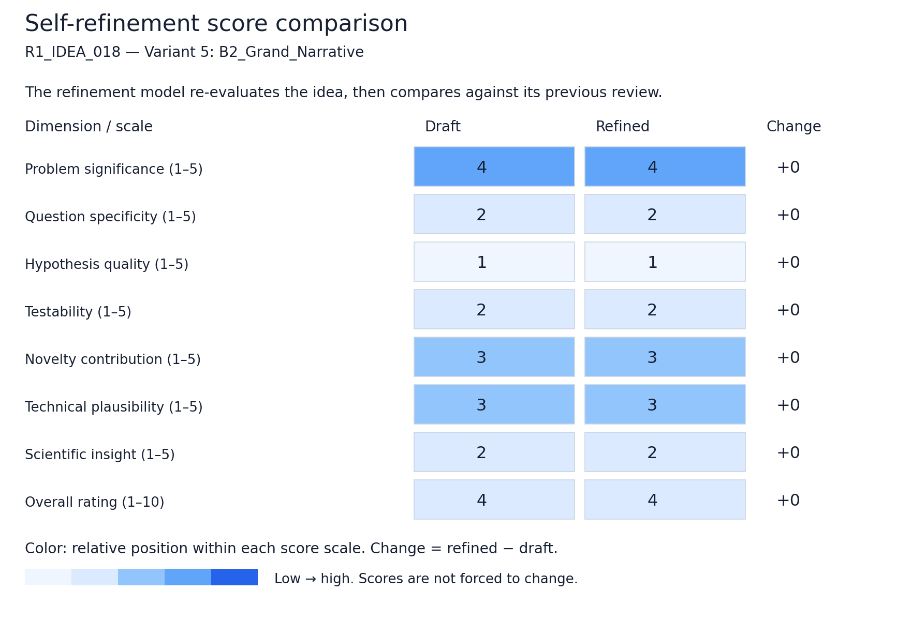

Changed score dimensions: none.

### Score justifications (draft / refined)

**Problem significance**

```json
{
  "draft": {
    "score": 4.0,
    "justification": "The problem of limited controllability in video generation is meaningful and relevant. Multi-subject generation with identity preservation addresses a practical limitation that could enable more flexible creative applications. The connection to broader multimodal generative modeling challenges adds significance."
  },
  "refined": {
    "score": 4.0,
    "justification": "The problem of limited controllability in video generation is meaningful and relevant. Multi-subject generation with identity preservation addresses a practical limitation that could enable more flexible creative applications. The connection to broader multimodal generative modeling challenges adds significance beyond just a specific application."
  }
}
```

**Question specificity**

```json
{
  "draft": {
    "score": 2.0,
    "justification": "The idea describes a task ('multi-subject video generation from text and reference images') but doesn't articulate a specific research question. It's unclear what aspect of this problem is being investigated - whether it's about representation learning, architectural design, training strategies, or something else."
  },
  "refined": {
    "score": 2.0,
    "justification": "The idea describes a task ('multi-subject video generation from text and reference images') but doesn't articulate a specific research question. It's unclear what aspect of this problem is being investigated - whether it's about representation learning, architectural design, training strategies, or evaluation methodologies. The description is more of a project goal than a research question."
  }
}
```

**Hypothesis quality**

```json
{
  "draft": {
    "score": 1.0,
    "justification": "There is no explicit or implicit hypothesis presented. The idea states that a framework 'could contribute to more flexible video synthesis approaches' but makes no concrete prediction about mechanisms, relationships, or expected outcomes that could be tested."
  },
  "refined": {
    "score": 1.0,
    "justification": "There is no explicit or implicit hypothesis presented. The idea states that a framework 'could contribute to more flexible video synthesis approaches' but makes no concrete prediction about mechanisms, relationships, or expected outcomes that could be tested. There's no falsifiable claim about why the proposed approach would address the identified challenges."
  }
}
```

**Testability**

```json
{
  "draft": {
    "score": 2.0,
    "justification": "While the task itself is testable (one could generate videos and evaluate them), the lack of a specific hypothesis makes it unclear what exactly would be tested. The idea doesn't suggest comparisons, ablations, or analyses that would provide evidence for or against a particular claim."
  },
  "refined": {
    "score": 2.0,
    "justification": "While the task itself is technically testable (one could generate videos and evaluate them), the lack of a specific hypothesis or research question makes it unclear what exactly would be tested scientifically. The idea doesn't suggest comparisons, ablations, or analyses that would provide evidence for or against a particular claim about mechanisms or principles."
  }
}
```

**Novelty contribution**

```json
{
  "draft": {
    "score": 3.0,
    "justification": "The task of multi-subject video generation with identity preservation from multiple reference images appears novel. However, without details about the proposed approach, it's unclear whether the contribution would be primarily a new application or contains novel methodological insights."
  },
  "refined": {
    "score": 3.0,
    "justification": "The task of multi-subject video generation with identity preservation from multiple reference images appears novel as a specific formulation. However, without details about the proposed approach, it's unclear whether the contribution would be primarily a new application or contains novel methodological insights. The idea mentions a 'novel framework' but provides no details to assess its novelty."
  }
}
```

**Technical plausibility**

```json
{
  "draft": {
    "score": 3.0,
    "justification": "The described challenges (preserving subject identities, integrating semantics, maintaining coherence) are coherent and align with known difficulties in video generation. However, without any technical details about the proposed framework, it's impossible to assess whether the approach is technically sound."
  },
  "refined": {
    "score": 3.0,
    "justification": "The described challenges (preserving subject identities, integrating semantics across subjects and modalities, maintaining coherence) are coherent and align with known difficulties in video generation. The task seems technically plausible as an engineering goal. However, without any technical details about the proposed framework, it's impossible to assess whether the specific approach is technically sound or innovative."
  }
}
```

**Scientific insight**

```json
{
  "draft": {
    "score": 2.0,
    "justification": "The idea mentions that the limitation 'may inform broader challenges in multimodal generative modeling' but doesn't specify what insights might be gained. As presented, it seems primarily focused on engineering a solution to a practical problem rather than uncovering general principles about representation learning, multimodal integration, or video generation."
  },
  "refined": {
    "score": 2.0,
    "justification": "The idea mentions that the limitation 'may inform broader challenges in multimodal generative modeling' but doesn't specify what insights might be gained. As presented, it seems primarily focused on engineering a solution to a practical problem rather than uncovering general principles about representation learning, multimodal integration, or video generation. There's no indication of what would be learned beyond whether the system works."
  }
}
```

**Overall rating**

```json
{
  "draft": {
    "score": 4.0,
    "justification": "This is a weak research idea as presented. While it identifies a meaningful practical problem and proposes a potentially useful task, it lacks the core elements of a scientific investigation: a clear research question, a testable hypothesis, and a pathway to scientific insight. The description reads more like a project goal than a research proposal. With substantial refinement to articulate what is being investigated and why it matters scientifically, this could become a stronger idea."
  },
  "refined": {
    "score": 4.0,
    "justification": "This is a weak research idea as presented. While it identifies a meaningful practical problem and proposes a potentially useful task, it lacks the core elements of a scientific investigation: a clear research question, a testable hypothesis, and a pathway to scientific insight. The description reads more like a project goal or system description than a research proposal. With substantial refinement to articulate what is being investigated scientifically and why it matters beyond the specific application, this could become a stronger idea."
  }
}
```

## R1_IDEA_018 — Variant 6: B3_Over_Confident

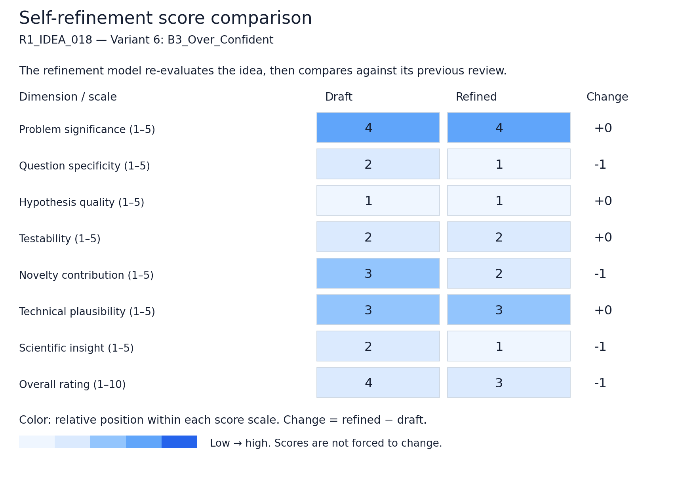

Changed score dimensions: question_specificity, novelty_contribution, scientific_insight, overall_rating.

### Score justifications (draft / refined)

**Problem significance**

```json
{
  "draft": {
    "score": 4.0,
    "justification": "The problem of limited controllability in video generation is meaningful. Multi-subject generation with identity preservation is a practical challenge with applications in creative content generation, education, and entertainment. The gap identified (text/single-image conditioning being restrictive) is real and worth addressing."
  },
  "refined": {
    "score": 4.0,
    "justification": "The problem is significant. Enhancing controllability in video generation is a major practical and research challenge. The specific gap identified—moving beyond text or single-image conditioning to multi-image, multi-subject control—is a meaningful next step with clear applications in content creation. The challenges mentioned (identity preservation, cross-modal coherence) are non-trivial and worth investigating."
  }
}
```

**Question specificity**

```json
{
  "draft": {
    "score": 2.0,
    "justification": "The idea states a goal ('tackling multi-subject video generation') but doesn't articulate a specific research question. It's more of a task description than a research investigation. What aspect of the problem is being studied? What relationship or mechanism is being examined?"
  },
  "refined": {
    "score": 1.0,
    "justification": "Very low specificity. The idea does not articulate a research question. It states a goal ('tackling multi-subject video generation') and names a framework ('ID-Composer'). There is no indication of what specific aspect of the problem is being studied, what relationship is being examined, or what phenomenon is being investigated. It is a task description, not a research question."
  }
}
```

**Hypothesis quality**

```json
{
  "draft": {
    "score": 1.0,
    "justification": "No hypothesis is presented. The description merely states that the framework 'addresses this gap' without making a testable prediction about why it would work, what mechanisms are key, or what specific limitations it overcomes compared to alternatives."
  },
  "refined": {
    "score": 1.0,
    "justification": "No hypothesis is present. The text makes no testable prediction. It states that a framework 'addresses this gap' but provides no conjectured mechanism, causal relationship, or comparative claim that could be supported or contradicted by evidence. It is a declarative statement of intent, not a hypothesis."
  }
}
```

**Testability**

```json
{
  "draft": {
    "score": 2.0,
    "justification": "While the task itself is testable (generate videos with multiple subjects), the idea doesn't specify what would be tested about the approach. There's no indication of what experiments would validate the claims or what evidence would support that ID-Composer successfully addresses the challenges mentioned."
  },
  "refined": {
    "score": 2.0,
    "justification": "The described *task* is testable (one could generate videos and evaluate them). However, the *idea* as presented lacks any specified claim to test. Without a hypothesis or research question, it's unclear what evidence would validate the 'idea' beyond the system functioning. The testability is inherent to the application domain, not to a research inquiry."
  }
}
```

**Novelty contribution**

```json
{
  "draft": {
    "score": 3.0,
    "justification": "Multi-subject video generation from multiple reference images is a relatively underexplored task, so there is potential novelty. However, the idea is presented as a solution proposal rather than contributing new scientific understanding. Without knowing what makes the approach novel or what insight it provides, it's hard to assess the potential contribution beyond applying existing techniques to a new task."
  },
  "refined": {
    "score": 2.0,
    "justification": "The novelty is primarily in the task definition (multi-subject video generation from multiple images), which is underexplored. However, the idea does not propose a novel scientific contribution—it proposes a framework to solve a task. Without specifying what new principle, understanding, or comparative advantage is being contributed, the potential for novel scientific knowledge is low."
  }
}
```

**Technical plausibility**

```json
{
  "draft": {
    "score": 3.0,
    "justification": "The described challenges (identity preservation, semantic integration, coherence) are real technical problems in generative models. The general direction of using multiple reference images for better controllability is plausible. However, without any technical details about the framework, it's impossible to assess whether the proposed approach is technically sound."
  },
  "refined": {
    "score": 3.0,
    "justification": "The general direction is plausible. The identified challenges (identity preservation, etc.) are recognized problems in generative AI. Attempting to use multiple reference images for finer control is a logical technical direction. However, with zero technical details about 'ID-Composer', its specific plausibility cannot be assessed—it is neither implausible nor demonstrably sound."
  }
}
```

**Scientific insight**

```json
{
  "draft": {
    "score": 2.0,
    "justification": "The idea as presented focuses on solving a practical task rather than producing scientific insight. It doesn't suggest what we might learn about video generation, multi-modal conditioning, or identity preservation beyond whether the method works. There's no indication of investigating underlying mechanisms, trade-offs, or general principles."
  },
  "refined": {
    "score": 1.0,
    "justification": "The idea, as presented, has minimal potential for scientific insight. It is focused on building a solution for a practical task. There is no suggestion that the research would reveal underlying mechanisms, general principles, trade-offs, or boundary conditions in generative modeling or multi-modal conditioning. The outcome would be a capable system, not necessarily new knowledge."
  }
}
```

**Overall rating**

```json
{
  "draft": {
    "score": 4.0,
    "justification": "This is a weak research idea in its current form. While it identifies a meaningful practical problem (limited controllability in video generation) and targets an interesting task (multi-subject generation), it lacks the core elements of a research investigation: a specific research question, a testable hypothesis, and a clear path to scientific insight. It reads more like a project goal or application proposal than a research idea. The main value is in identifying an underexplored task, but without framing it as a scientific investigation, the research contribution potential is limited."
  },
  "refined": {
    "score": 3.0,
    "justification": "This is a weak research idea. It identifies a worthwhile applied problem and an interesting task, but it completely lacks the core components of a scientific research idea: a specific question, a testable hypothesis, and a clear path to generating new knowledge. It reads as a project goal or a system proposal. Its primary value is in highlighting an underexplored task, but it does not frame that task as a subject for scientific investigation. Therefore, its potential as a *research idea* is very limited."
  }
}
```

## R1_IDEA_018 — Variant 7: B4_Novelty


Changed score dimensions: none.

### Score justifications (draft / refined)

**Problem significance**

```json
{
  "draft": {
    "score": 4.0,
    "justification": "The problem is meaningful - improving controllability in video generation is important for practical applications, and multi-subject generation with identity preservation addresses a clear limitation of current models. However, the significance would be higher with more specific discussion of applications or scientific implications."
  },
  "refined": {
    "score": 4.0,
    "justification": "The problem is significant. Enhancing fine-grained controllability in video generation is a recognized and valuable challenge for both research and applications (e.g., content creation, simulation). The specific focus on multi-subject identity preservation directly addresses a clear limitation of standard text-to-video models."
  }
}
```

**Question specificity**

```json
{
  "draft": {
    "score": 2.0,
    "justification": "The idea describes a task/framework rather than a specific research question. While 'multi-subject video generation from text and reference images' is a concrete task, it doesn't articulate what specific aspect is being investigated or what scientific question is being asked."
  },
  "refined": {
    "score": 2.0,
    "justification": "The idea specifies a task ('multi-subject video generation from text and reference images') but does not articulate a research question. It describes what the framework will *do*, not what specific aspect of the problem it will *investigate*. A research question would probe the 'how' or 'why', which is missing."
  }
}
```

**Hypothesis quality**

```json
{
  "draft": {
    "score": 1.0,
    "justification": "No hypothesis is presented. The idea states that a framework will be introduced to tackle a task, but doesn't make any testable prediction about mechanisms, relationships, or expected outcomes. It's essentially a problem statement with a proposed solution direction."
  },
  "refined": {
    "score": 1.0,
    "justification": "There is no hypothesis. The text announces a framework to tackle a task. It makes no testable prediction about relationships, mechanisms, or expected outcomes. There is no statement that could be supported or contradicted by evidence beyond the binary 'does the framework work?'."
  }
}
```

**Testability**

```json
{
  "draft": {
    "score": 3.0,
    "justification": "The task itself is testable - one could generate videos with multiple reference images and evaluate quality. However, without a specific hypothesis, it's unclear what would constitute evidence for or against the core idea. The evaluation would likely be empirical performance measurement rather than hypothesis testing."
  },
  "refined": {
    "score": 3.0,
    "justification": "The task is empirically testable—one can build a system, generate videos, and evaluate them. However, without a hypothesis, testing reduces to a performance evaluation on a new benchmark. The idea lacks a clear comparative or analytical element that would structure a deeper investigation (e.g., testing a specific mechanism against alternatives)."
  }
}
```

**Novelty contribution**

```json
{
  "draft": {
    "score": 3.0,
    "justification": "Multi-subject generation with reference images is a reasonable direction, but the novelty claim is not well-supported. Similar challenges exist in image generation (e.g., DreamBooth, Custom Diffusion for multiple subjects), and extending to video is a natural progression. The contribution would depend heavily on the specific technical approach."
  },
  "refined": {
    "score": 3.0,
    "justification": "The task formulation has applied novelty. Multi-subject video generation with reference images is not a standard benchmark. However, the core technical challenges (identity preservation, composition) are actively studied in image generation. Extending these concepts to video is a logical next step, so the potential for a foundational scientific contribution is moderate without a novel technical insight."
  }
}
```

**Technical plausibility**

```json
{
  "draft": {
    "score": 4.0,
    "justification": "The described challenges (identity preservation, cross-modal integration, coherence) are real technical problems in generative models. The proposed direction of using multiple reference images makes intuitive sense for improving controllability. The reasoning is logically coherent given current limitations in video generation."
  },
  "refined": {
    "score": 4.0,
    "justification": "The direction is technically plausible and coherent. The identified challenges are real and well-chosen. Using multiple reference images for better controllability is a sensible approach based on trends in image generation. The reasoning follows logically from the stated limitations of current models."
  }
}
```

**Scientific insight**

```json
{
  "draft": {
    "score": 2.0,
    "justification": "As presented, the idea focuses on solving a practical task rather than generating scientific insight. Without a hypothesis about mechanisms or principles, it's unclear what would be learned beyond whether a particular architecture works for this task. The potential for insight exists (e.g., about identity representation in video models) but isn't articulated."
  },
  "refined": {
    "score": 2.0,
    "justification": "As presented, the idea aims for a capable system, not scientific insight. It does not propose to test a general principle, uncover a new phenomenon, or explore boundary conditions. Any insights about identity representation or multi-modal composition would be incidental. The primary goal appears to be solving a practical task."
  }
}
```

**Overall rating**

```json
{
  "draft": {
    "score": 5.0,
    "justification": "This is a moderate/borderline research idea. It identifies a reasonable problem (limited controllability in video generation) and proposes a specific task (multi-subject generation with reference images). However, it lacks a clear research question or testable hypothesis, presents the contribution as primarily a framework/task rather than scientific investigation, and doesn't articulate what new insights would be gained. The idea has practical relevance but limited scientific depth as presented."
  },
  "refined": {
    "score": 5.0,
    "justification": "This is a moderate/borderline research idea. It identifies a relevant, practical problem and a concrete task. Its main weakness is the lack of a scientific core—it presents an engineering objective (build a framework for a task) rather than a research question or hypothesis to investigate. It is testable only in the sense of evaluating a system's performance, and the potential for generating new scientific understanding is low as described. It has merit as an applied project but limited depth as a research investigation."
  }
}
```

## R1_IDEA_018 — Variant 8: B5_Application_Impact


Changed score dimensions: none.

### Score justifications (draft / refined)

**Problem significance**

```json
{
  "draft": {
    "score": 4.0,
    "justification": "The problem is meaningful - improving controllability and multi-subject consistency in video generation addresses a clear limitation of current models and has practical applications in content creation. The challenges identified (identity preservation, cross-modal integration, coherence) are substantive technical problems."
  },
  "refined": {
    "score": 4.0,
    "justification": "The problem is meaningful and practically relevant. Improving controllability in video generation addresses a clear limitation of current models, and multi-subject consistency is a substantive technical challenge with applications in content creation. The identified challenges (identity preservation, cross-modal integration, coherence) are non-trivial problems in video generation."
  }
}
```

**Question specificity**

```json
{
  "draft": {
    "score": 2.0,
    "justification": "The idea states it will 'tackle multi-subject video generation' but doesn't define a specific research question. It's more of a problem statement and proposed solution direction than a clearly articulated research question about mechanisms, relationships, or phenomena."
  },
  "refined": {
    "score": 2.0,
    "justification": "The idea states it will 'tackle multi-subject video generation' but doesn't define a specific research question. It's a problem statement and proposed solution direction rather than an articulated question about mechanisms, relationships, or phenomena. There's no 'what if', 'how does', or 'under what conditions' formulation."
  }
}
```

**Hypothesis quality**

```json
{
  "draft": {
    "score": 2.0,
    "justification": "There's no explicit or clearly implicit hypothesis. The idea proposes a framework to address challenges, but doesn't make testable predictions about what approach would work, why it would work, or what specific capabilities it would enable compared to alternatives."
  },
  "refined": {
    "score": 2.0,
    "justification": "There's no hypothesis present. The idea proposes building a framework to address challenges, but makes no testable prediction about what approach would work, why it would work, or what specific capabilities it would enable compared to alternatives. It doesn't distinguish what would be tested beyond 'does this framework work?'"
  }
}
```

**Testability**

```json
{
  "draft": {
    "score": 3.0,
    "justification": "The general direction is testable - one could implement a framework and evaluate multi-subject video generation. However, without a specific hypothesis or research question, it's unclear what exactly would be tested beyond 'does this framework work?' The mention of challenges suggests potential ablation studies, but these aren't specified."
  },
  "refined": {
    "score": 3.0,
    "justification": "The general direction is testable in principle - one could implement a framework and evaluate multi-subject video generation. However, without a specific hypothesis or research question, it's unclear what exactly would be tested. The mention of challenges suggests potential ablation studies, but these aren't specified. Evaluation would likely default to 'does it work better?' rather than testing a specific claim."
  }
}
```

**Novelty contribution**

```json
{
  "draft": {
    "score": 3.0,
    "justification": "Multi-subject video generation from multiple reference images appears novel compared to standard text- or single-image-conditioned approaches. However, the contribution is framed as a framework rather than new scientific insight. The potential contribution is moderate - it addresses a practical gap but doesn't clearly articulate what new knowledge would be generated."
  },
  "refined": {
    "score": 3.0,
    "justification": "Multi-subject video generation from multiple reference images appears novel compared to standard approaches. However, the contribution is framed primarily as a framework/tool rather than new scientific insight. The potential contribution is moderate - it addresses a practical gap but doesn't clearly articulate what new knowledge would be generated about video generation, representation learning, or multi-modal integration."
  }
}
```

**Technical plausibility**

```json
{
  "draft": {
    "score": 4.0,
    "justification": "The reasoning is coherent: current models have limited controllability; multi-subject generation requires identity preservation and coherence; a framework addressing these challenges could be useful. The technical challenges identified are reasonable given current video generation capabilities."
  },
  "refined": {
    "score": 4.0,
    "justification": "The reasoning is logically coherent: current models have limited controllability; multi-subject generation requires solving identity preservation and coherence challenges; addressing these could improve video generation. The technical challenges identified are reasonable given current video generation capabilities. The direction makes sense technically, though specific methods aren't proposed."
  }
}
```

**Scientific insight**

```json
{
  "draft": {
    "score": 2.0,
    "justification": "The idea is primarily framed as developing a practical framework rather than generating scientific insight. While successful implementation might reveal something about multi-subject representation in video models, this isn't articulated as a goal. The focus is on applicability and tool development rather than understanding mechanisms or principles."
  },
  "refined": {
    "score": 2.0,
    "justification": "The idea is primarily framed as developing a practical framework rather than generating scientific insight. While successful implementation might reveal something about multi-subject representation, this isn't articulated as a goal. The focus is on applicability and tool development ('could inform the development of more adaptable video creation tools') rather than understanding mechanisms, principles, or boundary conditions of video generation models."
  }
}
```

**Overall rating**

```json
{
  "draft": {
    "score": 5.0,
    "justification": "This is a moderate/borderline research idea. It identifies a meaningful practical problem and proposes a reasonable direction, but lacks a specific research question, testable hypothesis, and clear articulation of potential scientific contribution. The idea is more of an application development proposal than a scientific investigation. With refinement to include a specific hypothesis and research question, it could become stronger."
  },
  "refined": {
    "score": 5.0,
    "justification": "This is a moderate/borderline research idea. It identifies a meaningful practical problem and proposes a reasonable technical direction, but lacks a specific research question, testable hypothesis, and clear articulation of potential scientific contribution. The idea reads more as an application development proposal than a scientific investigation. It has the foundation for a stronger idea with refinement to include a specific hypothesis and research question about the underlying mechanisms of multi-subject video generation."
  }
}
```

## R1_IDEA_018 — Variant 9: C1_Hollow_Shell


Changed score dimensions: none.

### Score justifications (draft / refined)

**Problem significance**

```json
{
  "draft": {
    "score": 4.0,
    "justification": "Controllability in generative video models is a meaningful and important problem with practical applications. The identified challenges (identity preservation, semantic integration, coherence) are real technical hurdles that researchers care about."
  },
  "refined": {
    "score": 4.0,
    "justification": "Controllability in generative video models is a significant and actively researched problem with clear practical applications in content creation. The identified challenges (identity preservation, semantic integration, coherence) are recognized technical hurdles in the field."
  }
}
```

**Question specificity**

```json
{
  "draft": {
    "score": 2.0,
    "justification": "Very low specificity. The idea merely states that multi-subject generation is challenging without defining what specific aspect will be investigated. No concrete research question is articulated."
  },
  "refined": {
    "score": 2.0,
    "justification": "Very low specificity. The idea states that multi-subject generation is challenging but doesn't define what specific aspect will be investigated. No concrete research question is articulated beyond the general problem statement."
  }
}
```

**Hypothesis quality**

```json
{
  "draft": {
    "score": 1.0,
    "justification": "No hypothesis is presented. The text describes a problem but makes no prediction about how it might be solved or what relationship might exist between variables."
  },
  "refined": {
    "score": 1.0,
    "justification": "No hypothesis is presented. The text describes a problem area but makes no prediction about how it might be solved, what mechanism might work, or what relationship might exist between variables. It's purely a problem statement."
  }
}
```

**Testability**

```json
{
  "draft": {
    "score": 2.0,
    "justification": "Without a specific approach or hypothesis, it's unclear how this could be tested. The idea mentions challenges but doesn't suggest experiments, comparisons, or evaluation methods."
  },
  "refined": {
    "score": 2.0,
    "justification": "Without a specific approach or hypothesis, testability is very low. The idea mentions challenges but doesn't suggest experiments, comparisons, evaluation methods, or measurable outcomes. It's unclear what evidence would support or contradict the approach."
  }
}
```

**Novelty contribution**

```json
{
  "draft": {
    "score": 2.0,
    "justification": "The description is too generic to assess novelty. Multi-modal conditioning for video generation is an active research area, and without details about what makes the approach new, potential contribution is unclear."
  },
  "refined": {
    "score": 2.0,
    "justification": "The description is too generic to assess novelty. Multi-modal conditioning for video generation is an active research area, and without details about what makes the approach distinct from existing work, potential contribution is unclear and likely limited."
  }
}
```

**Technical plausibility**

```json
{
  "draft": {
    "score": 3.0,
    "justification": "The general direction (using text+images for better controllability) is plausible based on what's stated, but without technical details, it's impossible to evaluate the coherence of the proposed approach."
  },
  "refined": {
    "score": 3.0,
    "justification": "The general direction (using text+images for better controllability) is technically plausible based on current literature, but without any technical details, it's impossible to evaluate the coherence or feasibility of the specific proposed approach."
  }
}
```

**Scientific insight**

```json
{
  "draft": {
    "score": 2.0,
    "justification": "As presented, the idea seems focused on solving a practical problem rather than generating scientific insight. No mechanism, principle, or fundamental understanding is suggested as an outcome."
  },
  "refined": {
    "score": 2.0,
    "justification": "As presented, the idea seems focused on solving a practical engineering problem rather than generating scientific insight. No mechanism, principle, fundamental understanding, or transferable knowledge is suggested as an outcome."
  }
}
```

**Overall rating**

```json
{
  "draft": {
    "score": 3.0,
    "justification": "This is a weak research idea as presented. While it identifies a meaningful problem area, it lacks the essential components of a research idea: a specific question, a testable hypothesis, a novel approach, or a clear path to investigation. It reads more like a problem statement than a research direction."
  },
  "refined": {
    "score": 3.0,
    "justification": "This is a weak research idea as presented. While it identifies a meaningful problem area, it lacks the essential components of a research idea: a specific question, a testable hypothesis, a novel approach, or a clear investigative path. It reads more like a problem statement or motivation section than a research direction with scientific merit."
  }
}
```

## R1_IDEA_018 — Variant 10: C2_Logic_Flawed


Changed score dimensions: none.

### Score justifications (draft / refined)

**Problem significance**

```json
{
  "draft": {
    "score": 4.0,
    "justification": "The problem is meaningful: improving controllability in video generation is an active research challenge with practical applications in content creation, animation, and virtual environments. Multi-subject generation with identity preservation is a clear and valuable sub-problem."
  },
  "refined": {
    "score": 4.0,
    "justification": "The problem is meaningful and timely. Improving controllability in video generation is an active research challenge with practical applications in content creation, animation, and virtual environments. Multi-subject generation with identity preservation is a clear and valuable sub-problem that extends beyond current single-subject or text-only approaches."
  }
}
```

**Question specificity**

```json
{
  "draft": {
    "score": 2.0,
    "justification": "The research question is only moderately specific. It identifies a task (multi-subject video generation from text + multiple images) but does not define what aspect of the task is being investigated (e.g., identity preservation mechanism, trade-offs between coherence and identity). The claim of 'broader effectiveness' is vague."
  },
  "refined": {
    "score": 2.0,
    "justification": "The research question is only moderately specific. While it identifies a task (multi-subject video generation from text and multiple images), it does not define what aspect of the task is being investigated—whether it's the identity preservation mechanism, the trade-offs between coherence and identity, or the integration of multi-modal cues. The claim of 'broader effectiveness' is vague and reduces specificity."
  }
}
```

**Hypothesis quality**

```json
{
  "draft": {
    "score": 2.0,
    "justification": "There is no explicit or clearly implicit hypothesis. The idea states a goal ('addresses this gap') and a challenge, but does not make a testable prediction about why the proposed framework would succeed or what specific relationship it explores. It reads more like a problem statement than a hypothesis."
  },
  "refined": {
    "score": 2.0,
    "justification": "There is no explicit or clearly implicit hypothesis. The idea states a goal ('addresses this gap') and describes challenges, but it does not make a testable prediction about why the proposed framework would succeed, what relationship it explores, or what mechanism it relies on. It reads as a problem statement rather than a hypothesis-driven research idea."
  }
}
```

**Testability**

```json
{
  "draft": {
    "score": 3.0,
    "justification": "The task itself is testable in principle (generate videos from text and multiple images, evaluate identity preservation, semantics, coherence). However, without a clear hypothesis or proposed mechanism, it's unclear what specific claim would be tested beyond 'our framework works.' The idea lacks a comparative element (e.g., against what baseline?) and specific evaluation metrics."
  },
  "refined": {
    "score": 3.0,
    "justification": "The task is testable in principle—one can generate videos from text and multiple images and evaluate identity preservation, semantics, and coherence. However, without a clear hypothesis or proposed mechanism, it's unclear what specific claim is being tested beyond 'our framework works.' The idea lacks a comparative element (e.g., against what baselines?) and specific evaluation metrics, though these could be defined later."
  }
}
```

**Novelty contribution**

```json
{
  "draft": {
    "score": 3.0,
    "justification": "The novelty is moderate. Multi-subject generation with multiple reference images is a less explored direction compared to single-subject or text-only video generation, so there is potential for contribution. However, the idea summary does not articulate what is technically novel about the framework (e.g., a new fusion mechanism, training paradigm) beyond tackling the task."
  },
  "refined": {
    "score": 3.0,
    "justification": "The novelty is moderate. Multi-subject generation with multiple reference images is a less explored direction compared to single-subject or text-only video generation, so there is potential for contribution. However, the idea summary does not articulate what is technically novel about the framework—whether it's a new fusion mechanism, training paradigm, or architectural insight—beyond tackling the task itself."
  }
}
```

**Technical plausibility**

```json
{
  "draft": {
    "score": 4.0,
    "justification": "The direction is technically plausible. Extending image-conditioned video generation to multiple reference images is a logical step, and challenges like identity preservation and multi-modal integration are well-recognized in generative models. No obvious technical contradictions are present, though feasibility depends on unspecified details."
  },
  "refined": {
    "score": 4.0,
    "justification": "The direction is technically plausible. Extending image-conditioned video generation to multiple reference images is a logical step, and challenges like identity preservation and multi-modal integration are well-recognized in generative models. No obvious technical contradictions are present, though feasibility depends on unspecified details."
  }
}
```

**Scientific insight**

```json
{
  "draft": {
    "score": 3.0,
    "justification": "If successful, the research could provide insights into how to preserve and compose multiple identities in a generative video model, which is a non-trivial extension of single-identity control. However, the idea as presented focuses more on solving a practical task than on uncovering general principles about multi-modal composition or identity representation in video models."
  },
  "refined": {
    "score": 3.0,
    "justification": "If successful, the research could provide insights into how to preserve and compose multiple identities in a generative video model, which is a non-trivial extension of single-identity control. However, the idea as presented focuses more on solving a practical task than on uncovering general principles about multi-modal composition, identity representation, or trade-offs in video models. The potential for broader scientific insight is limited without a clearer hypothesis."
  }
}
```

**Overall rating**

```json
{
  "draft": {
    "score": 5.0,
    "justification": "This is a moderate/borderline research idea. It identifies a meaningful and practical problem (multi-subject video generation with identity control) but presents it at a high level without a clear hypothesis, testable claim, or methodological direction. The potential contribution is in addressing an underexplored task, but the idea lacks specificity about what scientific question is being asked or what insight might be gained. It reads more like a project goal than a research hypothesis."
  },
  "refined": {
    "score": 5.0,
    "justification": "This is a moderate/borderline research idea. It identifies a meaningful and practical problem—multi-subject video generation with identity control—but presents it at a high level without a clear hypothesis, testable claim, or methodological direction. The potential contribution lies in addressing an underexplored task, but the idea lacks specificity about what scientific question is being asked or what insight might be gained. It reads more like a project goal than a research hypothesis, limiting its scientific impact."
  }
}
```

## R1_IDEA_018 — Variant 11: C3_Substance_Enriched


Changed score dimensions: none.

### Score justifications (draft / refined)

**Problem significance**

```json
{
  "draft": {
    "score": 4.0,
    "justification": "Improving controllability in video generation is a meaningful challenge with applications in content creation, simulation, and education. Multi-subject generation from multiple references is a concrete and underexplored subproblem."
  },
  "refined": {
    "score": 4.0,
    "justification": "Improving controllability in video generation is a meaningful challenge with applications in content creation, simulation, and education. Multi-subject generation from multiple references is a concrete and relatively underexplored subproblem that addresses real limitations in current models."
  }
}
```

**Question specificity**

```json
{
  "draft": {
    "score": 3.0,
    "justification": "The task is well-defined (multi-subject video generation from text + multiple images), but the research question itself is not sharply framed—it is more of a proposed framework than a specific investigative question."
  },
  "refined": {
    "score": 3.0,
    "justification": "The task is well-defined (multi-subject video generation from text + multiple images), but the research question itself is framed as proposing a framework rather than investigating a specific phenomenon or relationship. It lacks a sharp investigative focus."
  }
}
```

**Hypothesis quality**

```json
{
  "draft": {
    "score": 2.0,
    "justification": "The idea mentions that 'explicit cross-modal attention mechanisms may help manage semantic integration,' but this is a vague suggestion rather than a concrete, testable hypothesis. No clear prediction or mechanistic relationship is stated."
  },
  "refined": {
    "score": 2.0,
    "justification": "The idea mentions that 'explicit cross-modal attention mechanisms may help manage semantic integration,' but this is a vague suggestion rather than a concrete, testable hypothesis. No clear prediction about expected outcomes, mechanisms, or comparative advantages is stated. The hypothesis lacks falsifiability and specificity."
  }
}
```

**Testability**

```json
{
  "draft": {
    "score": 3.0,
    "justification": "The idea suggests testing identity preservation across varying numbers of subjects, which is a measurable experiment. However, without a specific hypothesis or comparison, it is unclear what would constitute validation or falsification."
  },
  "refined": {
    "score": 3.0,
    "justification": "The idea suggests testing identity preservation across varying numbers of subjects, which is a measurable experiment. However, without a specific hypothesis or clear comparison conditions, it's unclear what would constitute validation or falsification. The testability is limited by the vagueness of the hypothesis."
  }
}
```

**Novelty contribution**

```json
{
  "draft": {
    "score": 3.0,
    "justification": "Multi-subject video generation from multiple references is relatively underexplored, so the task itself has novelty. However, the proposed technical direction (cross-modal attention) is a common architectural choice, and the idea does not yet articulate what fundamentally new insight or method would be contributed."
  },
  "refined": {
    "score": 3.0,
    "justification": "Multi-subject video generation from multiple references is relatively underexplored, so the task itself has novelty. However, the proposed technical direction (cross-modal attention) is a common architectural choice in multimodal models, and the idea doesn't articulate what fundamentally new insight, method, or principle would be contributed beyond applying existing techniques to a new task."
  }
}
```

**Technical plausibility**

```json
{
  "draft": {
    "score": 4.0,
    "justification": "Using cross-modal attention to integrate multiple reference images and text is a reasonable and common approach in multimodal generation. The challenges listed (identity preservation, semantic integration) are coherent and align with known difficulties in generative models."
  },
  "refined": {
    "score": 4.0,
    "justification": "Using cross-modal attention to integrate multiple reference images and text is a reasonable approach in multimodal generation. The challenges listed (identity preservation, semantic integration, coherence) are coherent and align with known difficulties in generative models. The technical direction makes sense given the problem description."
  }
}
```

**Scientific insight**

```json
{
  "draft": {
    "score": 3.0,
    "justification": "If well-executed, the research could reveal how multi-subject conditioning affects video generation, the role of cross-modal interactions, and boundary conditions like visual-textual similarity. However, the idea as stated does not explicitly aim for such general insights—it is more focused on proposing a framework."
  },
  "refined": {
    "score": 3.0,
    "justification": "If well-executed, the research could potentially reveal how multi-subject conditioning affects video generation, the role of cross-modal interactions, and boundary conditions like visual-textual similarity. However, the idea as stated doesn't explicitly aim for such general insights—it's more focused on proposing a framework to solve a task. The potential for transferable scientific understanding is present but not clearly articulated."
  }
}
```

**Overall rating**

```json
{
  "draft": {
    "score": 5.0,
    "justification": "This is a moderate research idea. It identifies a relevant problem and a concrete task, but lacks a specific hypothesis, a clear evaluation plan, and a strong articulation of the expected scientific contribution. It reads more like a project description than a research question. With sharper hypothesis formulation and experimental design, it could become a strong idea."
  },
  "refined": {
    "score": 5.0,
    "justification": "This is a moderate/borderline research idea. It identifies a relevant problem and defines a concrete task with clear technical challenges. However, it lacks a specific, testable hypothesis, a clear evaluation plan, and a strong articulation of the expected scientific contribution. It reads more like a project description than a focused research question. With sharper hypothesis formulation and experimental design, it could become a stronger idea. The task novelty is offset by the vagueness of the investigative approach."
  }
}
```

## R1_IDEA_018 — Variant 12: H1_Deceptive_Hollow


Changed score dimensions: none.

### Score justifications (draft / refined)

**Problem significance**

```json
{
  "draft": {
    "score": 4.0,
    "justification": "Controllability in video generation is a meaningful and important problem. Multi-subject generation with identity preservation is a recognized challenge with practical applications. The identified sub-problems (identity preservation, semantic integration, coherence) are relevant."
  },
  "refined": {
    "score": 4.0,
    "justification": "Controllability in video generation is a meaningful and important problem with practical applications. Multi-subject generation with identity preservation, semantic integration, and coherence maintenance represents a recognized challenge in the field that would matter to both researchers and practitioners."
  }
}
```

**Question specificity**

```json
{
  "draft": {
    "score": 1.0,
    "justification": "Extremely vague. The idea states there's a 'challenge' and proposes a 'new research approach' but provides zero specifics about what that approach is or what specific question is being asked. No concrete research question is articulated."
  },
  "refined": {
    "score": 1.0,
    "justification": "Extremely vague. The idea states there's a 'challenge' and proposes a 'new research approach' but provides zero specifics about what that approach is or what specific question is being asked. No concrete research question is articulated beyond the general problem area."
  }
}
```

**Hypothesis quality**

```json
{
  "draft": {
    "score": 1.0,
    "justification": "No hypothesis is presented. The text describes a motivation and ambition but makes no concrete prediction about relationships, mechanisms, or outcomes. It's essentially a statement of intent rather than a testable hypothesis."
  },
  "refined": {
    "score": 1.0,
    "justification": "No hypothesis is presented. The text describes motivation and ambition but makes no concrete prediction about relationships, mechanisms, or outcomes. There's no statement that could be supported or contradicted by evidence."
  }
}
```

**Testability**

```json
{
  "draft": {
    "score": 1.0,
    "justification": "There is no suggested method of investigation. Without any proposed approach, technique, or evaluation metric, it's impossible to determine how one would test whether this 'direction' is successful or not."
  },
  "refined": {
    "score": 1.0,
    "justification": "There is no suggested method of investigation. Without any proposed approach, technique, or evaluation metric, it's impossible to determine how one would test whether this 'direction' is successful or not. The idea lacks any testable components."
  }
}
```

**Novelty contribution**

```json
{
  "draft": {
    "score": 2.0,
    "justification": "The general problem area (multi-subject video generation with text+image inputs) is not novel in itself. The potential contribution is framed in grandiose terms but lacks any specific novel element that would distinguish it from existing work. The description is too vague to assess novelty."
  },
  "refined": {
    "score": 2.0,
    "justification": "The general problem area (multi-subject video generation with text+image inputs) is not novel in itself. The potential contribution is framed in grandiose terms but lacks any specific novel element that would distinguish it from existing work. The description is too vague to assess novelty beyond applying known concepts to a known problem."
  }
}
```

**Technical plausibility**

```json
{
  "draft": {
    "score": 3.0,
    "justification": "The general direction (improving controllability in video generation) is technically plausible, but the complete lack of technical details makes evaluation difficult. The reasoning is coherent at a high level but lacks any technical substance to assess plausibility of implementation."
  },
  "refined": {
    "score": 3.0,
    "justification": "The general direction (improving controllability in video generation) is technically plausible, but the complete lack of technical details makes evaluation difficult. The reasoning is coherent at a high level but lacks any technical substance to assess plausibility of implementation."
  }
}
```

**Scientific insight**

```json
{
  "draft": {
    "score": 2.0,
    "justification": "The idea claims potential for 'conceptual insight' and 'transformative synthesis' but provides no indication of what specific insights might be gained. Without a clear research question or mechanism to investigate, it's unclear what scientific understanding would emerge beyond potentially better performance on a task."
  },
  "refined": {
    "score": 2.0,
    "justification": "The idea claims potential for 'conceptual insight' and 'transformative synthesis' but provides no indication of what specific insights might be gained. Without a clear research question or mechanism to investigate, it's unclear what scientific understanding would emerge beyond potentially better performance on a task."
  }
}
```

**Overall rating**

```json
{
  "draft": {
    "score": 2.0,
    "justification": "This is a very weak research idea. While it identifies a meaningful problem area, it fails to articulate any concrete research question, hypothesis, or approach. It reads more like a motivational paragraph or abstract ambition than a research idea with testable components. The grandiose language ('field-shaping agenda', 'transformative synthesis') is not backed by any substantive proposal. A research idea needs at minimum a specific question or hypothesis to investigate, which is completely absent here."
  },
  "refined": {
    "score": 2.0,
    "justification": "This is a very weak research idea. While it identifies a meaningful problem area, it fails to articulate any concrete research question, hypothesis, or approach. It reads more like a motivational paragraph or abstract ambition than a research idea with testable components. The grandiose language ('field-shaping agenda', 'transformative synthesis') is not backed by any substantive proposal. A research idea needs at minimum a specific question or hypothesis to investigate, which is completely absent here."
  }
}
```

## R1_IDEA_018 — Variant 13: H2_Confident_Flaw

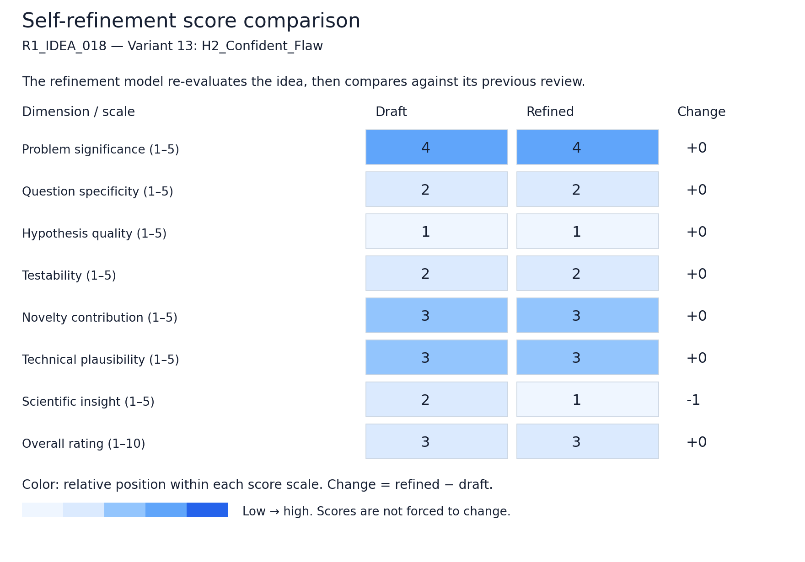

Changed score dimensions: scientific_insight.

### Score justifications (draft / refined)

**Problem significance**

```json
{
  "draft": {
    "score": 4.0,
    "justification": "The problem of limited controllability in video generation is meaningful and relevant. Multi-subject generation with identity preservation addresses a practical limitation in current models that could enable new applications."
  },
  "refined": {
    "score": 4.0,
    "justification": "The problem of limited controllability in video generation is meaningful and practically relevant. Multi-subject generation with identity preservation addresses a genuine limitation in current models that could enable new applications in content creation, education, and entertainment."
  }
}
```

**Question specificity**

```json
{
  "draft": {
    "score": 2.0,
    "justification": "The idea describes a task and method but doesn't define a clear research question. It's more of an application proposal than a specific investigation of a phenomenon or relationship."
  },
  "refined": {
    "score": 2.0,
    "justification": "The idea describes a task and proposed method but doesn't define a clear research question. It's presented as an application proposal rather than a specific investigation of a phenomenon, mechanism, or relationship. There's no 'what are we trying to learn?' component."
  }
}
```

**Hypothesis quality**

```json
{
  "draft": {
    "score": 1.0,
    "justification": "There's no explicit or implicit testable hypothesis. The text makes overly confident claims ('will necessarily produce reliable improvements') that are not scientific hypotheses but rather assertions. The flawed causal reasoning further undermines hypothesis quality."
  },
  "refined": {
    "score": 1.0,
    "justification": "There's no explicit or implicit testable hypothesis. The text makes assertive claims ('will necessarily produce reliable improvements') that are not scientific hypotheses. The flawed causal reasoning ('gains can be confidently treated as causal evidence') further demonstrates poor hypothesis formulation. A hypothesis should be falsifiable, not a certainty."
  }
}
```

**Testability**

```json
{
  "draft": {
    "score": 2.0,
    "justification": "While the task itself could be evaluated (e.g., measuring identity preservation), the idea doesn't propose specific tests or comparisons that would investigate a research question. The claims about 'causal evidence' and 'general superiority' without proper controls suggest poor testability design."
  },
  "refined": {
    "score": 2.0,
    "justification": "While the task itself could be evaluated with metrics (e.g., identity preservation scores), the idea doesn't propose specific tests to investigate a research question. The claims about 'causal evidence' and 'general superiority' without proper controls or experimental design suggest poor understanding of testability. No comparisons, ablations, or analysis methods are suggested."
  }
}
```

**Novelty contribution**

```json
{
  "draft": {
    "score": 3.0,
    "justification": "The application of multi-image conditioning for multi-subject video generation could be novel, but the idea doesn't articulate what new scientific knowledge would be contributed beyond demonstrating a new capability. It reads more like an engineering solution than a research investigation."
  },
  "refined": {
    "score": 3.0,
    "justification": "The application of multi-image conditioning for multi-subject video generation could be novel from an engineering perspective. However, the idea doesn't articulate what new scientific knowledge would be contributed. It reads as an engineering solution proposal rather than a research investigation that would advance understanding of generative models or multi-modal conditioning."
  }
}
```

**Technical plausibility**

```json
{
  "draft": {
    "score": 3.0,
    "justification": "The described challenges (identity preservation, semantic integration) are real technical problems, and addressing them through multi-image conditioning is plausible. However, the flawed reasoning about causality and evidence undermines the scientific plausibility of the approach."
  },
  "refined": {
    "score": 3.0,
    "justification": "The described technical challenges (identity preservation, semantic integration) are real problems, and addressing them through multi-image conditioning is conceptually plausible. However, the flawed scientific reasoning about causality and evidence undermines the methodological plausibility. The technical approach might work, but the research methodology is poorly conceived."
  }
}
```

**Scientific insight**

```json
{
  "draft": {
    "score": 2.0,
    "justification": "The idea focuses on solving a practical limitation rather than generating scientific insight. The text doesn't suggest what might be learned about video generation, multi-modal conditioning, or identity preservation mechanisms. The flawed causal claims further reduce potential scientific value."
  },
  "refined": {
    "score": 1.0,
    "justification": "The idea focuses entirely on solving a practical limitation rather than generating scientific insight. There's no suggestion of what might be learned about video generation mechanisms, multi-modal conditioning, identity preservation trade-offs, or model limitations. The text's flawed causal claims actually demonstrate anti-scientific thinking that would hinder insight generation."
  }
}
```

**Overall rating**

```json
{
  "draft": {
    "score": 3.0,
    "justification": "This is a weak research idea. While it identifies a meaningful practical problem, it lacks a clear research question, testable hypothesis, and scientific approach. The flawed reasoning about causality and evidence is particularly concerning. The idea reads more like an application proposal with unscientific claims rather than a research investigation that could generate new knowledge."
  },
  "refined": {
    "score": 3.0,
    "justification": "This is a weak research idea. While it identifies a meaningful practical problem, it lacks a clear research question, testable hypothesis, and proper scientific approach. The flawed reasoning about causality and evidence is particularly concerning and indicates poor scientific thinking. The idea reads as an application proposal with unscientific claims rather than a research investigation that could generate new knowledge. It would need substantial reformulation to become a valid research direction."
  }
}
```

## R1_IDEA_018 — Variant 14: H3_Verbose_Enriched

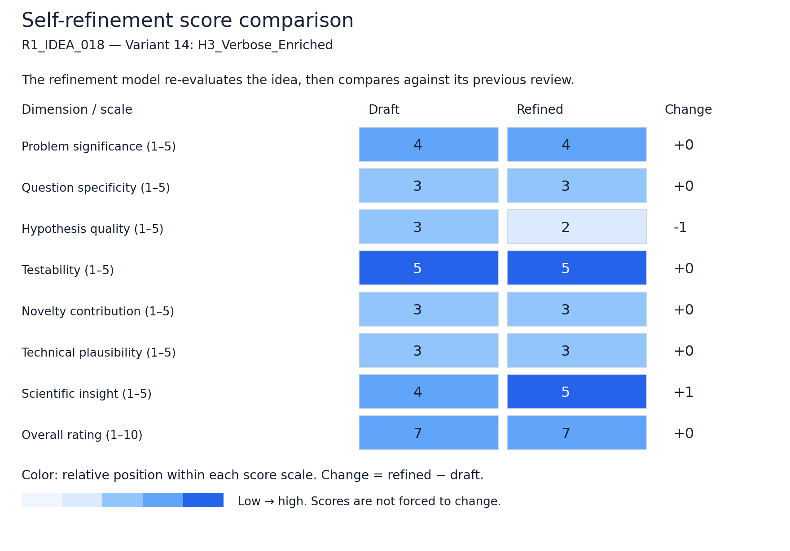

Changed score dimensions: hypothesis_quality, scientific_insight.

### Score justifications (draft / refined)

**Problem significance**

```json
{
  "draft": {
    "score": 4.0,
    "justification": "Improving fine-grained controllability in video generation is a meaningful challenge. Multi-subject generation from text and multiple images addresses a practical limitation of current models, with applications in content creation, storytelling, and simulation."
  },
  "refined": {
    "score": 4.0,
    "justification": "The problem is highly meaningful. Fine-grained controllability in video generation is a significant frontier. Enabling generation conditioned on multiple specific subjects via reference images addresses a practical limitation of current models, with potential applications in content creation, education, and simulation. The motivation is clear and well-justified."
  }
}
```

**Question specificity**

```json
{
  "draft": {
    "score": 3.0,
    "justification": "The task ('multi-subject video generation from text and reference images') is clear, but the research question is somewhat implicit. It could be more sharply framed—e.g., 'How can we effectively condition video generation on multiple subject identities while maintaining semantic alignment with text?'"
  },
  "refined": {
    "score": 3.0,
    "justification": "The task ('multi-subject video generation from text and reference images') is clearly defined. However, the research question itself is somewhat implicit—it is more of a problem statement and validation plan than a sharply focused inquiry. It could be refined to ask, for example, 'What architectural or training strategies are most effective for maintaining distinct subject identities in multi-conditioned video generation?'"
  }
}
```

**Hypothesis quality**

```json
{
  "draft": {
    "score": 3.0,
    "justification": "The hypothesis that 'explicit cross-modal attention mechanisms may help manage semantic integration' is plausible but generic. It lacks a concrete, testable prediction about mechanism or performance improvement relative to alternatives."
  },
  "refined": {
    "score": 2.0,
    "justification": "The hypothesis is weak. The statement that 'explicit cross-modal attention mechanisms may help manage semantic integration' is a generic, plausible suggestion, not a concrete, testable prediction. It lacks a clear comparative element (e.g., vs. other integration mechanisms) and does not specify an expected outcome or a causal mechanism that distinguishes it from standard practice."
  }
}
```

**Testability**

```json
{
  "draft": {
    "score": 5.0,
    "justification": "The idea excels here. It outlines a detailed validation path: staged design, baseline/intervention comparisons, pre-specified evaluation criteria, ablations, sensitivity analyses, and error analysis. This makes the core claim highly testable."
  },
  "refined": {
    "score": 5.0,
    "justification": "Exceptional. The idea provides a comprehensive, staged validation plan: defining baselines and interventions, pre-specifying evaluation criteria, comparing across easy/difficult/boundary cases, conducting ablations, sensitivity analyses, and error analysis. This structure makes the central claims about the method's utility and its boundary conditions highly testable, even in the absence of method details."
  }
}
```

**Novelty contribution**

```json
{
  "draft": {
    "score": 3.0,
    "justification": "Multi-subject video generation is an underexplored task, but the technical approach (ID-Composer) is not described, so novelty is unclear. The contribution could range from a new benchmark to a novel architecture—without details, it's hard to assess."
  },
  "refined": {
    "score": 3.0,
    "justification": "The novelty is unclear and hinges entirely on the unspecified ID-Composer. The task formulation (multi-subject video generation from multiple images and text) is itself a contribution if no established benchmark exists. However, without any technical details, the potential novelty of the method cannot be assessed—it could range from a modest adaptation to a breakthrough architecture."
  }
}
```

**Technical plausibility**

```json
{
  "draft": {
    "score": 3.0,
    "justification": "The general direction is plausible given advances in diffusion-based video generation and multi-modal conditioning. However, without any technical details, it's impossible to evaluate the coherence or feasibility of ID-Composer itself."
  },
  "refined": {
    "score": 3.0,
    "justification": "The general direction is plausible, building on known capabilities of diffusion models and multi-modal conditioning. However, with zero technical details about ID-Composer, its internal coherence, feasibility, or distinction from existing approaches cannot be evaluated. The score reflects that the idea is not technically incoherent, but it is unassessable."
  }
}
```

**Scientific insight**

```json
{
  "draft": {
    "score": 4.0,
    "justification": "The proposed analysis—boundary conditions, failure cases, sensitivity to input noise/sparsity—aims to reveal when and why the method works, which could yield general insights into multi-subject conditioning, cross-modal alignment, and failure modes in generative models."
  },
  "refined": {
    "score": 5.0,
    "justification": "The potential for scientific insight is exceptional. The proposal explicitly focuses on understanding boundary conditions, failure modes, and sensitivity to input variations. This goes far beyond reporting a performance number. Successfully executed, it could reveal general principles about identity preservation, cross-modal alignment trade-offs, and the data regimes where multi-subject conditioning succeeds or fails—insights transferable to other generative tasks."
  }
}
```

**Overall rating**

```json
{
  "draft": {
    "score": 7.0,
    "justification": "This is a strong research idea with a clear problem, a well-structured validation plan, and high potential for scientific insight. It is held back by the lack of technical details for the proposed method and a somewhat vague hypothesis, but the thoughtful experimental design and focus on understanding boundary conditions elevate it above a simple application paper."
  },
  "refined": {
    "score": 7.0,
    "justification": "This is a strong research idea. Its core strength lies in identifying a meaningful problem and, crucially, outlining a validation strategy designed to extract deep scientific insight about when and why a solution works. This elevates it above a simple application paper. The major weaknesses are the completely unspecified method (ID-Composer) and a vague central hypothesis, which prevent it from being exceptional. However, the thoughtful experimental design and focus on understanding provide a solid foundation for impactful research."
  }
}
```

## R1_IDEA_018 — Variant 15: H4_Ultimate_Hype

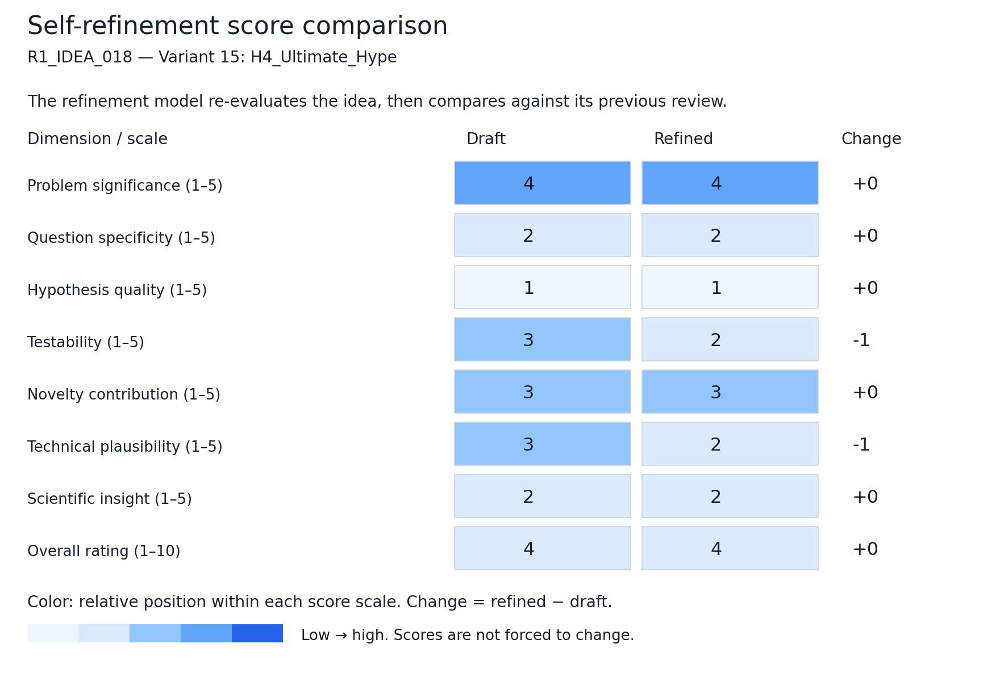

Changed score dimensions: testability, technical_plausibility.

### Score justifications (draft / refined)

**Problem significance**

```json
{
  "draft": {
    "score": 4.0,
    "justification": "The problem of limited controllability in video generation is meaningful, and multi-subject generation from multiple references has clear practical applications in content creation, education, and entertainment. The identified challenges (identity preservation, cross-modal integration) are legitimate technical problems."
  },
  "refined": {
    "score": 4.0,
    "justification": "The problem is significant. Enhancing controllability in video generation is a major challenge in generative AI. The specific task of multi-subject generation from multiple references has clear, high-impact applications in content creation, simulation, and education. The identified sub-challenges (identity preservation, cross-modal integration) are legitimate and non-trivial technical hurdles."
  }
}
```

**Question specificity**

```json
{
  "draft": {
    "score": 2.0,
    "justification": "The idea describes a general task ('multi-subject video generation from text and reference images') but does not define a specific research question. It lacks the precision needed to guide investigation, such as what aspect of the problem is being studied or what relationship is being tested."
  },
  "refined": {
    "score": 2.0,
    "justification": "The idea specifies a *task* ('multi-subject video generation') but not a *research question*. It lacks the precision to guide an investigation. There is no definition of what aspect of the problem is being studied, what relationship is being tested, or what specific phenomenon is being explored. It is a goal statement, not a question."
  }
}
```

**Hypothesis quality**

```json
{
  "draft": {
    "score": 1.0,
    "justification": "There is no explicit or implicit hypothesis. The idea states that a framework will 'address this gap' but makes no testable prediction about mechanisms, relationships, or expected outcomes. It reads more like a project description than a hypothesis-driven research idea."
  },
  "refined": {
    "score": 1.0,
    "justification": "There is no hypothesis. The text describes an ambition ('address this gap') and a hoped-for outcome ('more powerful... systems') but makes zero testable predictions. It does not propose a mechanism, predict a relationship between variables, or state an expectation that could be contradicted by evidence. It is purely declarative."
  }
}
```

**Testability**

```json
{
  "draft": {
    "score": 3.0,
    "justification": "The general task is testable through standard video generation metrics and user studies, but without a specific hypothesis or evaluation plan, it's unclear what evidence would support or contradict the core claims. The idea suggests a direction rather than a testable proposition."
  },
  "refined": {
    "score": 2.0,
    "justification": "The general *task* is testable (one could generate videos and evaluate them). However, the *core idea* as presented—a 'framework' to 'address the gap'—is not a testable proposition because it lacks a specific claim. Without a hypothesis or defined success criteria, it's unclear what evidence would confirm or refute the idea's value. It suggests an application direction, not a testable research proposition."
  }
}
```

**Novelty contribution**

```json
{
  "draft": {
    "score": 3.0,
    "justification": "Multi-subject video generation from multiple references is relatively underexplored compared to single-image conditioning, so there is some novelty in problem formulation. However, without proposed methodological innovations, the contribution appears primarily as applying existing techniques to a new task rather than generating fundamentally new scientific knowledge."
  },
  "refined": {
    "score": 3.0,
    "justification": "There is modest novelty in problem formulation. Multi-subject video generation from multiple references is less explored than single-image conditioning. However, without any proposed methodological innovation, the contribution appears primarily as applying or adapting existing techniques to a new task setting, rather than generating fundamentally new scientific knowledge or principles."
  }
}
```

**Technical plausibility**

```json
{
  "draft": {
    "score": 3.0,
    "justification": "The described challenges are technically valid, and extending video generation to multiple reference images is conceptually plausible. However, without any technical details about the proposed 'framework', it's impossible to assess whether the approach is coherent or likely to work. The idea doesn't contain enough information to judge technical plausibility beyond surface level."
  },
  "refined": {
    "score": 2.0,
    "justification": "The described challenges are technically valid. The goal of using multiple reference images is conceptually plausible. However, with the 'framework' being a complete black box—no architectural hint, no training strategy, no algorithmic insight—there is insufficient information to assess if the proposed direction is coherent or feasible. The idea is too vague to judge technical plausibility meaningfully."
  }
}
```

**Scientific insight**

```json
{
  "draft": {
    "score": 2.0,
    "justification": "As presented, the idea focuses on building a system for a practical task rather than generating scientific insight. There's no indication of what would be learned about video generation mechanisms, multi-modal fusion, or identity preservation beyond whether the system works. The potential for transferable understanding is low without a hypothesis-driven investigation."
  },
  "refined": {
    "score": 2.0,
    "justification": "As presented, the idea is solution-oriented, focusing on building a system for a practical task. There is no indication it is designed to reveal transferable scientific insights about video generation mechanisms, the limits of cross-attention for multi-entity reasoning, or principles of compositional generalization. The potential for new understanding is low without a hypothesis-driven investigative angle."
  }
}
```

**Overall rating**

```json
{
  "draft": {
    "score": 4.0,
    "justification": "This is a weak research idea as presented. While it identifies a meaningful practical problem with some novelty in task formulation, it lacks the core elements of a scientific research idea: a specific research question, a testable hypothesis, and a clear path to generating scientific insight. The description is heavy on ambition and potential impact but light on scientific substance. It reads more like a project proposal or system description than a hypothesis-driven research direction."
  },
  "refined": {
    "score": 4.0,
    "justification": "This is a weak research idea. It identifies a meaningful and application-relevant problem but fails to formulate it as a scientific investigation. It lacks the essential components of a research idea: a specific question, a testable hypothesis, and a clear path to generating insight. The description is dominated by aspirational language about impact, with a severe deficit of scientific substance regarding what would be studied and how. It reads as a project goal or a system proposal, not a hypothesis-driven research direction."
  }
}
```

## R1_IDEA_019 — Source


Changed score dimensions: none.

### Score justifications (draft / refined)

**Problem significance**

```json
{
  "draft": {
    "score": 5.0,
    "justification": "The problem is exceptionally significant. Accurate, dynamic forest monitoring is a critical component of global carbon accounting and climate change mitigation strategies. The limitation of static snapshots is a genuine and important bottleneck."
  },
  "refined": {
    "score": 5.0,
    "justification": "The problem is exceptionally significant. Dynamic forest monitoring is critical for global carbon accounting, climate policy, and ecological management. The limitation of static snapshots is a genuine and important bottleneck with real-world consequences."
  }
}
```

**Question specificity**

```json
{
  "draft": {
    "score": 2.0,
    "justification": "The idea defines a goal (create a temporal map) but not a research question. It specifies the desired product's attributes but not what is being investigated. The 'what' is clear, but the 'research question' is missing."
  },
  "refined": {
    "score": 2.0,
    "justification": "The idea specifies a goal (create a temporal map) and product attributes, but does not define a research question. It describes what will be built, not what will be investigated. There is no inquiry into relationships, mechanisms, or methods."
  }
}
```

**Hypothesis quality**

```json
{
  "draft": {
    "score": 1.0,
    "justification": "There is no explicit or implicit hypothesis. The statement is declarative: a temporal map is needed, and we will introduce one. There is no predictive or mechanistic claim to be tested."
  },
  "refined": {
    "score": 1.0,
    "justification": "There is no hypothesis—explicit or implicit. The statement is purely declarative: a temporal map is needed, and we will introduce one. There is no predictive, causal, or mechanistic claim that could be supported or contradicted by evidence."
  }
}
```

**Testability**

```json
{
  "draft": {
    "score": 2.0,
    "justification": "The success criterion (existence of the map) is testable, but this is an engineering goal. The idea lacks a research claim whose truth or falsehood can be evaluated through experimentation or analysis. One could validate the map's accuracy, but the idea summary does not propose to investigate a specific relationship or compare methodologies."
  },
  "refined": {
    "score": 2.0,
    "justification": "The existence of the map is testable, but this is an engineering outcome, not a research claim. The idea lacks a falsifiable proposition about relationships, methods, or mechanisms. One could validate the map's accuracy, but the summary does not propose to test a specific hypothesis or compare approaches."
  }
}
```

**Novelty contribution**

```json
{
  "draft": {
    "score": 3.0,
    "justification": "The contribution is framed as a new data product. If successful, it would be a valuable resource. However, as presented, the novelty is in the application scope (global, temporal, 10m) rather than a new scientific finding or methodological breakthrough. It sits between a useful application and an infrastructure project."
  },
  "refined": {
    "score": 3.0,
    "justification": "The contribution is framed as a new data product—a valuable resource, but not inherently a research contribution. As presented, the novelty lies in the application scope (global, temporal, high-resolution) rather than in a new scientific finding or methodological advance. It resembles an infrastructure or tool-building project more than a knowledge-generating study."
  }
}
```

**Technical plausibility**

```json
{
  "draft": {
    "score": 4.0,
    "justification": "The goal is technically plausible. Generating global, multi-year, 10m resolution data from satellite sources (e.g., Sentinel) is challenging but within the realm of current remote sensing and data fusion capabilities. The summary itself does not contain technical flaws, as it proposes no technical method."
  },
  "refined": {
    "score": 4.0,
    "justification": "The goal is technically plausible. Generating global, multi-year, 10m-resolution data from satellite sources (e.g., Sentinel) is challenging but within reach of modern remote sensing, data fusion, and computational methods. The summary itself does not propose an implausible or incoherent technical approach, as it proposes no technical details."
  }
}
```

**Scientific insight**

```json
{
  "draft": {
    "score": 2.0,
    "justification": "As a data product proposal, the direct scientific insight is limited. The primary output is a tool. The insight would come from *using* the tool to answer ecological questions. The idea summary does not indicate that the process of *creating* the map will reveal new understanding about sensor fusion, tree growth modeling, or temporal signal processing."
  },
  "refined": {
    "score": 2.0,
    "justification": "As a data product proposal, the direct scientific insight is minimal. The primary output is a tool. Insight would come from using the tool to answer ecological questions. The summary does not suggest that creating the map will yield new understanding about sensor fusion, tree growth modeling, temporal signal processing, or forest-climate interactions."
  }
}
```

**Overall rating**

```json
{
  "draft": {
    "score": 4.0,
    "justification": "The idea identifies a very important applied problem and a concrete, valuable goal. However, as a *research idea* for a scientific study, it is weak. It lacks a research question, a hypothesis, and a clear path to generating new scientific knowledge. It is primarily a description of a needed product or a project aim. To be a strong research idea, it must be reframed to investigate the *how* or the *why* behind creating such a map."
  },
  "refined": {
    "score": 4.0,
    "justification": "The idea identifies a critically important applied problem and a valuable, well-specified goal. However, as a research idea for a scientific study, it is weak. It lacks a research question, a hypothesis, and a clear pathway to generating new scientific knowledge. It is essentially a description of a needed product or project aim. To become a strong research idea, it must be reframed to investigate the how or why behind creating such a map—focusing on the methodological, algorithmic, or ecological unknowns."
  }
}
```

## R1_IDEA_019 — Variant 1: A1_Identity


Changed score dimensions: none.

### Score justifications (draft / refined)

**Problem significance**

```json
{
  "draft": {
    "score": 5.0,
    "justification": "The problem is exceptionally significant. Accurate, temporally dynamic forest monitoring is a critical bottleneck for climate science, carbon market integrity, and conservation policy. The limitation of static snapshots is well-articulated."
  },
  "refined": {
    "score": 5.0,
    "justification": "The problem is exceptionally significant. Dynamic forest structure data is a critical need for accurate carbon flux estimation, climate modeling, and monitoring conservation/restoration efforts. The limitation of static snapshots is a well-articulated bottleneck in the field."
  }
}
```

**Question specificity**

```json
{
  "draft": {
    "score": 2.0,
    "justification": "The idea specifies a desired output (a map) but does not define a research question. It states what will be built, not what will be investigated. The 'what' is clear, but the 'research question' is absent."
  },
  "refined": {
    "score": 2.0,
    "justification": "The idea specifies a desired product (a map with certain attributes) with clarity, but it does not define a research question. It states an engineering goal ('build X'), not an investigative question ('explore Y', 'test if Z'). The 'what' is clear; the 'research question' is absent."
  }
}
```

**Hypothesis quality**

```json
{
  "draft": {
    "score": 1.0,
    "justification": "There is no explicit or implicit hypothesis. The idea is a declaration of intent to create a product. There is no predictive statement or proposed mechanism to be tested."
  },
  "refined": {
    "score": 1.0,
    "justification": "There is no explicit or implicit hypothesis. The text is a declarative statement of intent to create a resource. It contains no predictive statement, proposed causal mechanism, or relationship that could be supported or contradicted by evidence."
  }
}
```

**Testability**

```json
{
  "draft": {
    "score": 2.0,
    "justification": "As a product description, its success criterion is delivery. As a research idea, it lacks a testable central claim. If reframed as a methodological study (e.g., 'Method X produces more temporally consistent maps than baseline Y'), it would become testable."
  },
  "refined": {
    "score": 2.0,
    "justification": "As a project goal, success is binary (delivered/not delivered). As a research idea, it lacks a testable central claim. If reframed to focus on a methodological innovation (e.g., 'Our proposed model X outperforms baseline Y on metric Z'), it would become directly testable through experimentation and evaluation."
  }
}
```

**Novelty contribution**

```json
{
  "draft": {
    "score": 2.0,
    "justification": "The novelty appears to be in the spatio-temporal scope of the proposed dataset (global, multi-year, 10m). However, the idea does not propose a novel method, identify a new phenomenon, or test a new hypothesis. The contribution is framed as a resource, not a research finding."
  },
  "refined": {
    "score": 2.0,
    "justification": "The apparent novelty lies in the spatio-temporal specifications of the proposed dataset. However, the idea does not propose a novel method, identify a new empirical phenomenon, or test a new scientific hypothesis. The contribution is framed as a resource creation effort, not a research finding. Applying existing methods at a new scale is an engineering contribution, not a high-novelty research contribution."
  }
}
```

**Technical plausibility**

```json
{
  "draft": {
    "score": 3.0,
    "justification": "The goal is logically coherent and the need is clear. However, without any proposed technical approach, its plausibility rests on the general feasibility of satellite-based monitoring. Major assumptions (data availability, methodological approach) are unspecified."
  },
  "refined": {
    "score": 3.0,
    "justification": "The objective is logically coherent and aligns with known capabilities of satellite remote sensing (e.g., Sentinel-2 offers 10m resolution, time-series analysis is common). However, with no proposed technical approach, assessing plausibility is speculative. Major assumptions about data fusion, algorithmic approach, and validation are left unspecified, preventing a stronger score."
  }
}
```

**Scientific insight**

```json
{
  "draft": {
    "score": 2.0,
    "justification": "The potential insight is indirect. The dataset could enable future insights, but the idea itself does not aim to discover a mechanism, principle, or relationship. It is an engineering/data generation goal rather than a knowledge-generation goal."
  },
  "refined": {
    "score": 2.0,
    "justification": "The potential for scientific insight is indirect and deferred. The dataset could enable future insights, but the idea itself does not aim to discover a mechanism, principle, or relationship. It is a data-generation or engineering goal. A true research idea would aim to learn something fundamental during the process of creating the map (e.g., about the relationship between spectral indices and biomass over time, or the limits of certain sensor fusion techniques)."
  }
}
```

**Overall rating**

```json
{
  "draft": {
    "score": 4.0,
    "justification": "This is a weak research idea in its current form. It identifies a very important applied problem and a valuable desired output. However, it is presented as a project goal or product description, not as a scientific research idea. It lacks a research question, hypothesis, methodological direction, and a clear path to generating new scientific insight. It scores highly on problem significance but poorly on the core elements of a research investigation."
  },
  "refined": {
    "score": 4.0,
    "justification": "This is a weak research idea in its current form. It identifies a critically important applied problem and a valuable target output. However, it is presented as a project goal or product description, not as a scientific research investigation. It lacks the core elements of research: a question, a hypothesis, a methodological direction, and a clear path to generating new scientific knowledge. It scores highly on problem significance but poorly on all other dimensions that define a research idea."
  }
}
```

## R1_IDEA_019 — Variant 2: A2_Paraphrase_Only

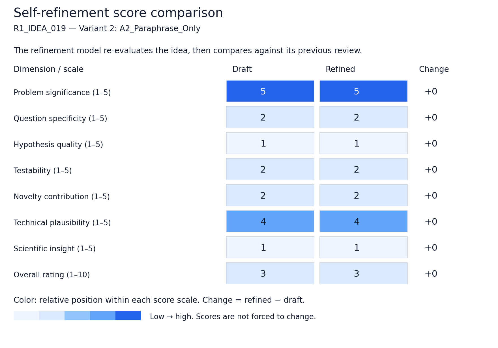

Changed score dimensions: none.

### Score justifications (draft / refined)

**Problem significance**

```json
{
  "draft": {
    "score": 5.0,
    "justification": "The problem is highly significant: accurate carbon accounting is crucial for climate science and policy, and current static tree height maps are indeed a limitation for monitoring forest dynamics over time. This addresses a meaningful gap in environmental monitoring."
  },
  "refined": {
    "score": 5.0,
    "justification": "The problem is highly significant. Accurate carbon accounting is crucial for climate science and policy, and the limitation of static tree height maps for monitoring temporal forest dynamics represents a meaningful gap in environmental monitoring with real-world impact."
  }
}
```

**Question specificity**

```json
{
  "draft": {
    "score": 2.0,
    "justification": "The idea specifies a product goal but not a research question. It states what will be built (a temporally consistent map) but not what will be investigated or learned. The 'what' is clear, but the 'why' or 'how' from a research perspective is missing."
  },
  "refined": {
    "score": 2.0,
    "justification": "The idea specifies a product goal (build ECHOSAT) but not a research question. While the 'what' is clear (a temporally consistent map), the 'why' or 'how' from a research perspective—what will be investigated, what relationship will be tested—is missing. It's an engineering objective rather than a scientific inquiry."
  }
}
```

**Hypothesis quality**

```json
{
  "draft": {
    "score": 1.0,
    "justification": "There is no explicit or implicit hypothesis. The idea is presented as an engineering/product development objective rather than a testable scientific claim. No prediction, mechanism, or relationship is proposed for investigation."
  },
  "refined": {
    "score": 1.0,
    "justification": "There is no explicit or implicit hypothesis. The idea presents an engineering/product development objective without a testable scientific claim, prediction, mechanism, or relationship to investigate. It lacks the core element of a research hypothesis."
  }
}
```

**Testability**

```json
{
  "draft": {
    "score": 2.0,
    "justification": "As a product, it could be evaluated by comparing it to ground truth or other datasets, but as a research idea, there's no central claim to test. The idea doesn't propose an experiment, comparison, or analysis to answer a research question."
  },
  "refined": {
    "score": 2.0,
    "justification": "As a product, it could be evaluated against ground truth, but as a research idea, there's no central claim to test. The idea doesn't propose an experiment, comparison, or analysis to answer a research question. The test would be whether the product works, not whether a scientific hypothesis is supported."
  }
}
```

**Novelty contribution**

```json
{
  "draft": {
    "score": 2.0,
    "justification": "The novelty appears to be in the temporal dimension of the product, but the idea doesn't articulate what new scientific knowledge would be contributed. It seems more like an application of existing remote sensing methods to produce a time-series dataset, which is useful but not necessarily novel research."
  },
  "refined": {
    "score": 2.0,
    "justification": "The novelty appears to be in the temporal dimension of the product, but the idea doesn't articulate what new scientific knowledge would be contributed. It seems primarily an application of existing remote sensing methods to produce a time-series dataset, which is useful but not necessarily novel research contribution."
  }
}
```

**Technical plausibility**

```json
{
  "draft": {
    "score": 4.0,
    "justification": "The goal is technically plausible given advances in satellite remote sensing (e.g., Sentinel-2), though achieving global 10m resolution with temporal consistency across years is challenging. The idea doesn't detail methods, but the objective itself is coherent and within the realm of possibility."
  },
  "refined": {
    "score": 4.0,
    "justification": "The goal is technically plausible given advances in satellite remote sensing (e.g., Sentinel-2, GEDI), though achieving global 10m resolution with temporal consistency across years is challenging. The objective is coherent and within the realm of possibility, even without detailed methods."
  }
}
```

**Scientific insight**

```json
{
  "draft": {
    "score": 1.0,
    "justification": "The idea as presented focuses on delivering a product. It doesn't suggest what scientific insights about forest ecology, carbon cycle, remote sensing, or data fusion would be gained. The potential insight is limited to the utility of the dataset itself rather than new understanding."
  },
  "refined": {
    "score": 1.0,
    "justification": "The idea as presented focuses on delivering a product. It doesn't suggest what scientific insights about forest ecology, carbon cycle, remote sensing physics, or data fusion would be gained. The potential insight is limited to the utility of the dataset itself rather than new understanding of underlying principles or mechanisms."
  }
}
```

**Overall rating**

```json
{
  "draft": {
    "score": 3.0,
    "justification": "This is a weak research idea because it presents a product development goal rather than a research question. While the problem is significant and the product would be valuable, the idea lacks a hypothesis, testable claim, or clear path to scientific insight. It reads more like a project proposal than a research investigation. To be a strong research idea, it needs to frame a specific question about how to achieve temporal consistency, what limitations current methods have, or what new ecological relationships could be discovered with such data."
  },
  "refined": {
    "score": 3.0,
    "justification": "This is a weak research idea because it presents a product development goal rather than a research investigation. While the problem is highly significant and the product would be valuable, the idea lacks a research question, hypothesis, testable claim, or clear path to scientific insight. It reads as a project proposal rather than a research idea. To be a strong research idea, it needs to frame a specific question about how to achieve temporal consistency, what limitations current methods have, or what new ecological relationships could be discovered with such data."
  }
}
```

## R1_IDEA_019 — Variant 3: A3_Plain_Core

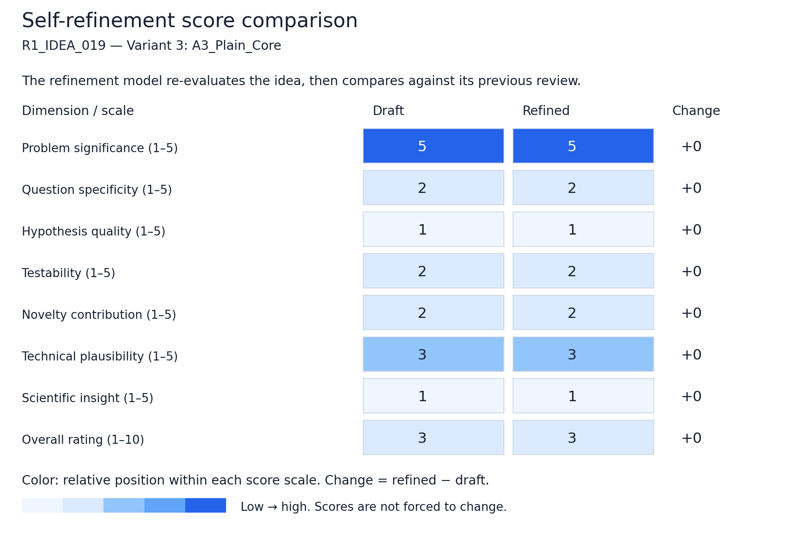

Changed score dimensions: none.

### Score justifications (draft / refined)

**Problem significance**

```json
{
  "draft": {
    "score": 5.0,
    "justification": "The problem is highly significant. Accurate, temporally dynamic forest monitoring is critical for climate change mitigation, carbon market integrity, and ecological understanding. The gap identified (static maps lacking temporal dynamics) is a genuine and important limitation in the field."
  },
  "refined": {
    "score": 5.0,
    "justification": "The applied problem is exceptionally significant. Accurate, dynamic forest carbon monitoring is critical for climate science, policy, and carbon market integrity. The identified gap—static maps lacking temporal dynamics—is a major, well-known limitation in the field."
  }
}
```

**Question specificity**

```json
{
  "draft": {
    "score": 2.0,
    "justification": "The idea lacks a defined research question. It specifies a goal ('introduce ECHOSAT') and a desired product specification, but does not articulate what is being investigated. The 'what' is clear, but the 'why' in a research sense (what unknown relationship or mechanism is being explored) is missing."
  },
  "refined": {
    "score": 2.0,
    "justification": "The idea specifies a desired product ('ECHOSAT' with certain properties) but does not define a research question. It states what will be built, not what unknown relationship, method efficacy, or scientific principle is being investigated. The goal is clear, but the investigative 'what' is absent."
  }
}
```

**Hypothesis quality**

```json
{
  "draft": {
    "score": 1.0,
    "justification": "There is no discernible hypothesis. The statement is declarative: we will build this product. There is no prediction about a relationship, mechanism, or comparative outcome that could be supported or contradicted by evidence."
  },
  "refined": {
    "score": 1.0,
    "justification": "There is no hypothesis. The statement is purely declarative: we will introduce this dataset. There is no prediction about a method's performance, a causal relationship, or a comparative outcome that evidence could support or contradict."
  }
}
```

**Testability**

```json
{
  "draft": {
    "score": 2.0,
    "justification": "As a product goal, its success could be measured (e.g., accuracy, coverage, consistency), but as a research idea, there is no central claim to test. The idea does not suggest an experiment, comparison, or analysis to investigate a scientific question. Testability is low because there is nothing to falsify."
  },
  "refined": {
    "score": 2.0,
    "justification": "As a product, its attributes (resolution, consistency) could be measured post-creation. However, as a research idea, there is no central claim to test. It does not propose an experiment, comparison, or analysis to probe a scientific question. There is nothing to falsify in the research sense."
  }
}
```

**Novelty contribution**

```json
{
  "draft": {
    "score": 2.0,
    "justification": "The novelty, as presented, appears to be solely in the creation of a new dataset. While a valuable resource, this is an application/engineering output rather than a contribution of new scientific knowledge about methods, models, or principles. The summary does not claim any methodological novelty."
  },
  "refined": {
    "score": 2.0,
    "justification": "The novelty, as presented, is solely in the creation of a new dataset. This is an application or resource development goal. The summary does not claim or hint at any methodological, algorithmic, or scientific novelty in how the dataset would be created. The contribution is practical, not scientific."
  }
}
```

**Technical plausibility**

```json
{
  "draft": {
    "score": 3.0,
    "justification": "The goal is technically ambitious but not inherently implausible given advances in satellite remote sensing and data fusion. However, without any proposed method, its plausibility rests on the general feasibility of the field rather than the specifics of the idea. The reasoning is coherent but minimal."
  },
  "refined": {
    "score": 3.0,
    "justification": "The stated goal is ambitious but not fundamentally implausible given the trajectory of remote sensing (e.g., Sentinel-2, GEDI, ICESat-2). However, with no proposed method, its plausibility is assessed only at the level of the field's general capabilities, not the specifics of the idea. The minimal reasoning is coherent but not technically detailed."
  }
}
```

**Scientific insight**

```json
{
  "draft": {
    "score": 1.0,
    "justification": "The idea, as stated, promises a tool, not an insight. It does not suggest it will reveal new mechanisms, principles, limitations, or interactions. The potential insight is contingent on how the dataset is used by others, not on the research act of creating it. The act of creation itself is not framed as an investigative process."
  },
  "refined": {
    "score": 1.0,
    "justification": "The idea promises a tool, not an insight. It does not suggest the research process will reveal new principles about remote sensing, temporal modeling, ecosystem dynamics, or validation. Any scientific insight would be an accidental byproduct of using the tool, not the intended outcome of the research act described."
  }
}
```

**Overall rating**

```json
{
  "draft": {
    "score": 3.0,
    "justification": "This is a weak research idea in its current form. While it identifies a very significant applied problem, it is framed as a product development goal rather than a scientific investigation. It lacks a research question, hypothesis, and any indication of a methodological study that would generate new knowledge. Its primary value is in stating a need, not in proposing a path to discovery. It scores low on the core criteria of research (specificity, hypothesis, testability, insight)."
  },
  "refined": {
    "score": 3.0,
    "justification": "This is a weak research idea. It identifies a highly significant applied problem but is framed entirely as a product development goal. It lacks the essential components of a research direction: a specific question, a testable hypothesis, and a pathway to generating new scientific knowledge. Its value lies in stating a need, not in proposing a discoverable answer. It scores very low on specificity, hypothesis, testability, and potential insight."
  }
}
```

## R1_IDEA_019 — Variant 4: B1_Verbose_Elaborate

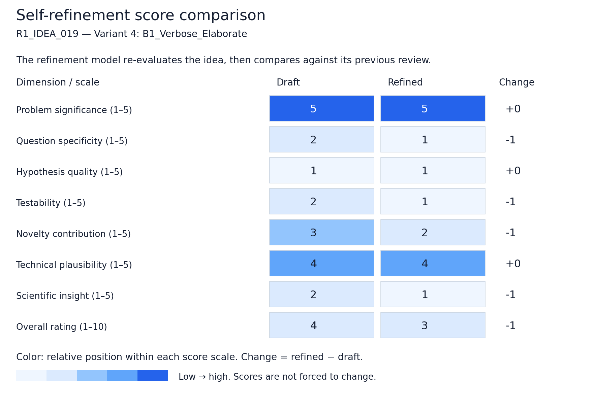

Changed score dimensions: question_specificity, testability, novelty_contribution, scientific_insight, overall_rating.

### Score justifications (draft / refined)

**Problem significance**

```json
{
  "draft": {
    "score": 5.0,
    "justification": "The problem is exceptionally significant. Accurate forest monitoring is critical for climate change mitigation, and the limitation of static snapshots for capturing dynamics that affect carbon accounting is a meaningful and well-articulated challenge with global importance."
  },
  "refined": {
    "score": 5.0,
    "justification": "Exceptional significance. Forest monitoring for climate change mitigation is critically important globally. The limitation of static snapshots for capturing temporal dynamics that affect carbon accounting is a well-articulated, meaningful challenge with substantial scientific and societal relevance."
  }
}
```

**Question specificity**

```json
{
  "draft": {
    "score": 2.0,
    "justification": "The idea lacks a defined research question. It states a problem and proposes a solution (ECHOSAT) but does not specify what is being investigated. The 'what' is building a map, not answering a scientific question."
  },
  "refined": {
    "score": 1.0,
    "justification": "Very weak specificity. The idea does not define a research question at all. It states a problem and proposes a solution (building ECHOSAT) but specifies nothing about what is being investigated scientifically. There is no 'what will we learn?' component."
  }
}
```

**Hypothesis quality**

```json
{
  "draft": {
    "score": 1.0,
    "justification": "There is no explicit or clearly implicit hypothesis. The idea implies that temporal consistency is better than static snapshots, but this is presented as a premise, not a testable prediction. There is no concrete, falsifiable statement about expected outcomes or mechanisms."
  },
  "refined": {
    "score": 1.0,
    "justification": "Very weak. There is no hypothesis—explicit or implicit—that makes a testable prediction. The idea assumes temporal consistency is valuable but does not formulate this as a falsifiable claim that could be supported or contradicted by evidence. It presents a premise, not a hypothesis."
  }
}
```

**Testability**

```json
{
  "draft": {
    "score": 2.0,
    "justification": "The idea, as stated, is not easily testable in a scientific sense. One could build ECHOSAT, but the research value would lie in testing claims about its superiority or utility. The idea does not propose an experiment, comparison, or analysis to test such a claim. The test would be the creation of the product itself."
  },
  "refined": {
    "score": 1.0,
    "justification": "Very weak. As presented, the idea is not testable in a scientific sense. One could build the map, but there is no proposed experiment, comparison, or analysis to test any scientific claim. The 'test' would be whether the map can be created, not whether it reveals new knowledge or improves outcomes relative to alternatives."
  }
}
```

**Novelty contribution**

```json
{
  "draft": {
    "score": 3.0,
    "justification": "The contribution is framed as a new dataset/product. The novelty of a temporally consistent global map is potentially high from an applied remote sensing perspective. However, from a machine learning research perspective, the novelty is unclear without specifying the methodological innovation required to create it. It risks being an application of existing methods to a new data compilation task."
  },
  "refined": {
    "score": 2.0,
    "justification": "Weak. From a machine learning research perspective, the novelty is unclear. The contribution is framed as creating a new dataset/product. Without specifying what methodological innovation enables it or what scientific question it answers, it risks being an application of existing techniques to a new data compilation task rather than a novel research contribution."
  }
}
```

**Technical plausibility**

```json
{
  "draft": {
    "score": 4.0,
    "justification": "The proposed direction is technically plausible. Creating global, multi-temporal maps from satellite data is an active area of research. The reasoning (static maps are insufficient for dynamics) is logically coherent. The main assumption—that such a map can be built—is reasonable given advances in satellite constellations (e.g., Sentinel) and ML for remote sensing."
  },
  "refined": {
    "score": 4.0,
    "justification": "Strong. The proposed direction is technically plausible. Creating global, multi-temporal maps from satellite data is an active research area with existing foundations. The reasoning that static maps are insufficient for dynamics is coherent. The assumption that such a map could be built is reasonable given current satellite constellations and remote sensing ML methods."
  }
}
```

**Scientific insight**

```json
{
  "draft": {
    "score": 2.0,
    "justification": "As presented, the potential scientific insight is low. The outcome is a dataset. Insight would require using ECHOSAT to answer a question (e.g., about forest growth patterns, disturbance recovery, or the sensitivity of carbon models to temporal resolution). The idea does not articulate what general principles, mechanisms, or limitations the research would reveal beyond the existence of the tool."
  },
  "refined": {
    "score": 1.0,
    "justification": "Very weak. As presented, the potential for scientific insight is minimal. The outcome is a dataset/tool. Insight would require using ECHOSAT to answer questions about forest ecology, carbon cycle dynamics, or remote sensing methodology. The idea does not articulate what general principles, mechanisms, or relationships the research would reveal beyond the existence of the tool itself."
  }
}
```

**Overall rating**

```json
{
  "draft": {
    "score": 4.0,
    "justification": "This is a weak research idea in its current form. It identifies a very significant applied problem but fails to articulate a research question, hypothesis, or testable investigation. It is presented as a solution or product development goal rather than a scientific inquiry. The potential is high if reframed around a specific hypothesis regarding the value of temporal data for ecological or climate models, but as stated, it lacks the core components of a research idea."
  },
  "refined": {
    "score": 3.0,
    "justification": "This is a weak research idea. While it addresses an exceptionally significant applied problem, it completely lacks the core components of a research investigation: no research question, no hypothesis, and no testable scientific claim. It is presented as a product development goal rather than a scientific inquiry. The technical plausibility and problem significance are high, but as a research idea, it fails to specify what would be learned or discovered. It would need substantial reframing to become a meaningful research direction."
  }
}
```

## R1_IDEA_019 — Variant 5: B2_Grand_Narrative


Changed score dimensions: none.

### Score justifications (draft / refined)

**Problem significance**

```json
{
  "draft": {
    "score": 5.0,
    "justification": "The problem is highly significant - accurate forest monitoring is critical for climate change mitigation, and the limitation of static tree height maps for understanding temporal dynamics is a meaningful gap with real-world consequences for carbon accounting."
  },
  "refined": {
    "score": 5.0,
    "justification": "The problem is exceptionally significant. Accurate forest monitoring is critical for climate change mitigation, and the limitation of static tree height maps for understanding temporal dynamics directly impacts carbon accounting with real-world consequences for climate policy and environmental science."
  }
}
```

**Question specificity**

```json
{
  "draft": {
    "score": 2.0,
    "justification": "The idea identifies a general need (temporal forest dynamics data) but does not articulate a specific research question. It proposes creating a dataset rather than defining what would be investigated using it."
  },
  "refined": {
    "score": 2.0,
    "justification": "The idea identifies a general need (temporal forest dynamics data) but does not articulate a specific research question. It proposes creating a dataset ('what would be built') rather than defining what would be investigated using it. The mention of 'understanding forest-climate interactions' is too vague to constitute a specific research question."
  }
}
```

**Hypothesis quality**

```json
{
  "draft": {
    "score": 1.0,
    "justification": "There is no explicit or implicit hypothesis presented. The idea describes a data resource that 'could support advances' but makes no concrete prediction about forest-climate interactions or temporal dynamics."
  },
  "refined": {
    "score": 1.0,
    "justification": "There is no explicit or implicit hypothesis presented. The idea describes a data resource that 'could support advances' but makes no concrete prediction about forest-climate interactions, temporal dynamics, or any testable relationship. It is purely descriptive of a proposed product."
  }
}
```

**Testability**

```json
{
  "draft": {
    "score": 2.0,
    "justification": "As presented, the idea is not directly testable because it doesn't propose a specific claim to investigate. Creating a dataset is an engineering task, not a research investigation. The potential for future research using the dataset exists but isn't specified."
  },
  "refined": {
    "score": 2.0,
    "justification": "As presented, the idea is not directly testable because it doesn't propose a specific claim to investigate. Creating a dataset is an engineering/development task. The potential for future research using the dataset exists but isn't specified or designed. There's no proposed experiment, comparison, or analysis to test anything."
  }
}
```

**Novelty contribution**

```json
{
  "draft": {
    "score": 3.0,
    "justification": "Creating a temporally consistent global tree height map would be a valuable data resource, but as a research idea, it represents more of an enabling technology than a novel scientific contribution. The novelty would depend on what is discovered using the data, which isn't specified."
  },
  "refined": {
    "score": 3.0,
    "justification": "Creating a temporally consistent global tree height map would be a valuable data resource and technical achievement. However, as a research idea, it represents more of an enabling technology or infrastructure project than a novel scientific contribution. The scientific novelty would depend entirely on what is discovered using the data, which isn't specified here."
  }
}
```

**Technical plausibility**

```json
{
  "draft": {
    "score": 4.0,
    "justification": "The proposed direction is technically plausible - creating temporally consistent remote sensing products is challenging but feasible with current satellite data and processing methods. The reasoning about the need for temporal data is logically coherent."
  },
  "refined": {
    "score": 4.0,
    "justification": "The proposed direction is technically plausible. Creating temporally consistent remote sensing products at global scale is challenging but feasible with current satellite data (e.g., Sentinel, Landsat) and processing methods. The reasoning about the need for temporal data over static snapshots is logically coherent and based on a real limitation."
  }
}
```

**Scientific insight**

```json
{
  "draft": {
    "score": 2.0,
    "justification": "The idea has potential for scientific insight but doesn't specify what insights would be sought. As presented, it's primarily about data creation rather than hypothesis testing or mechanism discovery. The connection to 'understanding forest-climate interactions' is stated but not elaborated."
  },
  "refined": {
    "score": 2.0,
    "justification": "The idea has potential for scientific insight but doesn't specify what insights would be sought or how they would be extracted. As presented, it's primarily about data creation rather than hypothesis testing, mechanism discovery, or revealing general principles. The connection to 'understanding forest-climate interactions' suggests potential insight but remains unelaborated."
  }
}
```

**Overall rating**

```json
{
  "draft": {
    "score": 4.0,
    "justification": "This is a weak research idea because it presents a data resource proposal rather than a research investigation. While it addresses an important applied problem and identifies a meaningful gap, it lacks a specific research question, hypothesis, or testable claim. The idea describes what would be built rather than what would be discovered or tested. It has potential value as an enabling resource but doesn't articulate a scientific investigation."
  },
  "refined": {
    "score": 4.0,
    "justification": "This is a weak research idea because it presents a data resource proposal rather than a research investigation. While it addresses an exceptionally important applied problem and identifies a meaningful technical gap, it lacks a specific research question, hypothesis, or testable claim. The idea describes what would be built (a dataset) rather than what would be discovered or tested scientifically. It has significant value as an enabling resource for future research but doesn't articulate a scientific investigation itself."
  }
}
```

## R1_IDEA_019 — Variant 6: B3_Over_Confident


Changed score dimensions: none.

### Score justifications (draft / refined)

**Problem significance**

```json
{
  "draft": {
    "score": 5.0,
    "justification": "The problem is exceptionally significant - forest monitoring for climate change mitigation and carbon accounting is a critical global challenge with substantial scientific and policy implications."
  },
  "refined": {
    "score": 5.0,
    "justification": "The problem is exceptionally significant. Forest monitoring for climate change mitigation and carbon accounting is a critical global challenge with substantial scientific, environmental, and policy implications. The need for temporal dynamics in such monitoring is well-motivated."
  }
}
```

**Question specificity**

```json
{
  "draft": {
    "score": 2.0,
    "justification": "The idea describes a product (ECHOSAT) but does not articulate a specific research question. It identifies a limitation of existing approaches but doesn't define what would be investigated scientifically."
  },
  "refined": {
    "score": 2.0,
    "justification": "The idea describes a product (ECHOSAT) but does not articulate a specific research question. It identifies a general limitation (static vs. dynamic) but doesn't define what specific aspect of forest dynamics or carbon accounting would be investigated scientifically using this product."
  }
}
```

**Hypothesis quality**

```json
{
  "draft": {
    "score": 1.0,
    "justification": "There is no explicit or implicit hypothesis. The idea presents a proposed dataset but makes no testable predictions about what would be learned or discovered through its creation or use."
  },
  "refined": {
    "score": 1.0,
    "justification": "There is no explicit or implicit hypothesis. The idea presents a proposed dataset but makes no testable predictions about relationships, mechanisms, or discoveries that would result from its creation or analysis. It is a declarative statement about a needed product."
  }
}
```

**Testability**

```json
{
  "draft": {
    "score": 2.0,
    "justification": "While the dataset itself could be evaluated for accuracy, the idea as presented lacks a testable scientific claim. A dataset creation project is testable in terms of technical performance, but the research value depends on what questions it enables."
  },
  "refined": {
    "score": 2.0,
    "justification": "The dataset's technical creation could be tested for accuracy, but the idea as presented lacks a testable scientific claim. The research value is contingent on unspecified future questions. There is no proposed experiment, comparison, or analysis to test a core scientific idea."
  }
}
```

**Novelty contribution**

```json
{
  "draft": {
    "score": 2.0,
    "justification": "Creating another tree height dataset, even with temporal consistency, is primarily an engineering/product contribution rather than a scientific one. The novelty would depend on what novel scientific insights it enables, which are not specified."
  },
  "refined": {
    "score": 2.0,
    "justification": "Creating another tree height dataset, even with stated improvements (temporal consistency, 10m resolution), is presented as a product or tool contribution. The scientific novelty is entirely dependent on unspecified future research it might enable. The idea itself does not propose a novel scientific finding or understanding."
  }
}
```

**Technical plausibility**

```json
{
  "draft": {
    "score": 3.0,
    "justification": "The idea is technically plausible in principle (global tree height mapping exists), but creating temporally consistent 10m resolution maps globally is a substantial technical challenge that is not addressed. The reasoning is logically coherent but lacks technical details."
  },
  "refined": {
    "score": 3.0,
    "justification": "The idea is logically coherent and plausible in principle, as global remote sensing for forestry exists. However, creating a globally consistent, multi-year, 10m resolution product is a monumental technical challenge that is not addressed. The reasoning is sound but lacks any technical detail to assess feasibility beyond a high level."
  }
}
```

**Scientific insight**

```json
{
  "draft": {
    "score": 2.0,
    "justification": "The potential scientific insight is unclear. While the dataset could enable insights about forest dynamics, the idea doesn't specify what would be learned. The focus is on the product rather than the knowledge it would generate."
  },
  "refined": {
    "score": 2.0,
    "justification": "The potential scientific insight is vague and indirect. While the dataset could *enable* insights, the idea does not specify what those insights might be, what mechanisms might be revealed, or what general principles about forest dynamics or carbon cycling would be learned. The focus is squarely on the product, not the knowledge it generates."
  }
}
```

**Overall rating**

```json
{
  "draft": {
    "score": 4.0,
    "justification": "This is a weak research idea as presented. While it addresses an important problem and proposes a concrete product, it lacks the core elements of a scientific research idea: a specific research question, a testable hypothesis, and a clear articulation of what scientific knowledge would be contributed. It reads more like a project proposal or product description than a research investigation."
  },
  "refined": {
    "score": 4.0,
    "justification": "This is a weak research idea as presented. It identifies a very important applied problem and proposes a concrete tool to address it. However, it lacks the core elements of a scientific research idea: a specific research question, a testable hypothesis, and a clear articulation of what new scientific knowledge would be contributed. It reads as a project or product proposal for a useful dataset, not as a plan for a scientific investigation that would yield transferable insights. Its primary value is applied, not scientific."
  }
}
```

## R1_IDEA_019 — Variant 7: B4_Novelty

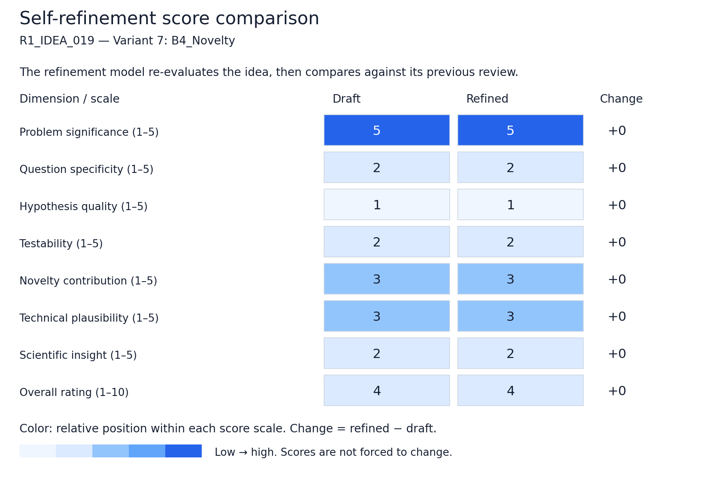

Changed score dimensions: none.

### Score justifications (draft / refined)

**Problem significance**

```json
{
  "draft": {
    "score": 5.0,
    "justification": "The problem is highly significant. Forest monitoring is critical for climate change mitigation, and the lack of temporally consistent global tree height data is a genuine gap that limits accurate carbon accounting."
  },
  "refined": {
    "score": 5.0,
    "justification": "The problem is exceptionally significant. Accurate, high-resolution monitoring of forest biomass dynamics is critical for global carbon accounting and climate change mitigation. The identified gap—the lack of a consistent, global, multi-year tree height product—is a genuine and important limitation in the field."
  }
}
```

**Question specificity**

```json
{
  "draft": {
    "score": 2.0,
    "justification": "The idea states a goal (create a temporal map) but does not define a research question. It is specific about the desired output (global, 10m, multi-year) but not about what is being investigated."
  },
  "refined": {
    "score": 2.0,
    "justification": "The idea is specific about the desired output (a global, 10m, multi-year map) but does not define a research question. It states a goal to build a tool, not to investigate a phenomenon, test a relationship, or answer a 'how' or 'why' question. The 'what' is clear, but the 'what will we learn?' is absent."
  }
}
```

**Hypothesis quality**

```json
{
  "draft": {
    "score": 1.0,
    "justification": "There is no explicit or implicit hypothesis. The idea asserts that temporal dynamics are 'essential' but does not make a testable prediction about their impact or the performance of a proposed method."
  },
  "refined": {
    "score": 1.0,
    "justification": "There is no hypothesis. The text contains an assertion ('temporal forest dynamics [are] an underexplored angle essential for accurate carbon accounting') but no testable prediction about the outcome of an investigation. A hypothesis would predict, for example, how a new method would perform or what relationship would be observed."
  }
}
```

**Testability**

```json
{
  "draft": {
    "score": 2.0,
    "justification": "The core claim—that a temporally consistent map is needed—is not directly testable as stated. Testability would require a comparison (e.g., static vs. temporal maps on a downstream task like carbon estimation) or validation of the new map's properties, but no such evaluation is suggested."
  },
  "refined": {
    "score": 2.0,
    "justification": "The central claim—that a temporally consistent map is needed—is not directly testable as presented. Testability would require a defined experiment, such as comparing the performance of the new map against baselines on a downstream task (e.g., carbon stock change estimation). The idea suggests creating a product, not designing a test."
  }
}
```

**Novelty contribution**

```json
{
  "draft": {
    "score": 3.0,
    "justification": "Creating a global, temporally consistent tree height dataset at high resolution would be a valuable resource. However, as presented, the novelty is primarily in the data product, not in a new scientific finding or methodological insight. The 'fresh framing' is unspecified."
  },
  "refined": {
    "score": 3.0,
    "justification": "The creation of such a dataset would be a valuable practical contribution. However, as a research idea, the novelty is low. The 'novel perspective' and 'fresh framing' are placeholder terms with no substance. The contribution is framed as an output (a map), not as new scientific understanding about methods or forest dynamics."
  }
}
```

**Technical plausibility**

```json
{
  "draft": {
    "score": 3.0,
    "justification": "The goal is technically ambitious but plausible given advances in satellite imagery and processing. However, without any methodological direction, it's impossible to assess the coherence of the approach. The assumption that temporal consistency is achievable and beneficial is reasonable but untested here."
  },
  "refined": {
    "score": 3.0,
    "justification": "The goal is technically ambitious but within the realm of possibility given current satellite constellations (e.g., Sentinel) and processing capabilities. The statement is logically coherent in identifying a data gap. However, with no methodological direction, the plausibility of the unspecified 'fresh framing' cannot be assessed."
  }
}
```

**Scientific insight**

```json
{
  "draft": {
    "score": 2.0,
    "justification": "As a dataset creation goal, the direct scientific insight is limited. The potential insight lies in what could be learned by using the dataset (e.g., new patterns of forest growth/decline), but the idea does not propose to extract or study those insights. It focuses on the tool, not the discovery."
  },
  "refined": {
    "score": 2.0,
    "justification": "The idea's focus is on producing a tool. The potential for scientific insight is indirect and unrealized in the proposal. Insight would come from using the tool to discover patterns, test ecological theories, or validate models, but the idea does not propose to conduct such analysis. It is a means to an end, not an investigation in itself."
  }
}
```

**Overall rating**

```json
{
  "draft": {
    "score": 4.0,
    "justification": "The idea identifies a significant applied problem and a clear data gap. However, it is framed as an engineering/product goal rather than a research investigation. It lacks a research question, hypothesis, and any plan for evaluation or discovery. Consequently, its potential for producing new scientific knowledge is low in its current form. It would score as a weak research idea but a potentially useful project proposal."
  },
  "refined": {
    "score": 4.0,
    "justification": "This is a weak research idea but a potentially strong project or engineering goal. It excels in identifying a significant applied problem and a clear data gap. However, it fundamentally lacks the core components of a research investigation: a question, a hypothesis, and a plan for generating evidence. It proposes to build a resource, not to pursue knowledge. Therefore, its score reflects a low potential to produce new scientific understanding in its current form."
  }
}
```

## R1_IDEA_019 — Variant 8: B5_Application_Impact

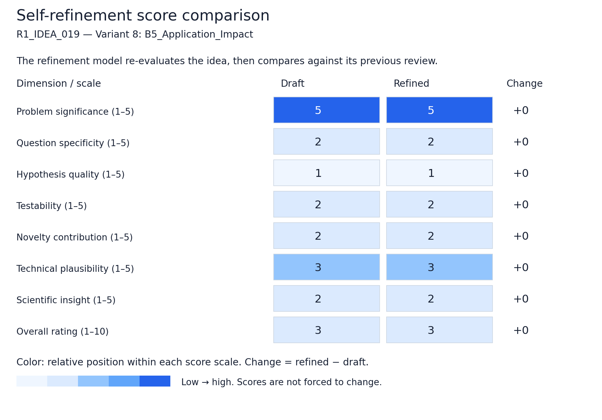

Changed score dimensions: none.

### Score justifications (draft / refined)

**Problem significance**

```json
{
  "draft": {
    "score": 5.0,
    "justification": "The problem is highly significant. Accurate forest monitoring is critical for climate change mitigation, and the limitation of static tree height maps for capturing dynamics directly impacts carbon accounting, a major global challenge."
  },
  "refined": {
    "score": 5.0,
    "justification": "Exceptional significance. Accurate, dynamic forest monitoring is a cornerstone of global climate change mitigation efforts. The limitation of static snapshots for carbon accounting is a major, well-recognized problem in environmental science with substantial real-world consequences."
  }
}
```

**Question specificity**

```json
{
  "draft": {
    "score": 2.0,
    "justification": "The idea does not define a research question. It describes a desired product (ECHOSAT) and its potential use, but does not specify what is being investigated. The 'what' is clear (a map), but the 'research' is not."
  },
  "refined": {
    "score": 2.0,
    "justification": "Weak specificity. The idea describes a desired product and its application, but does not define a research question. There is no 'what are we investigating?' beyond the creation of the dataset itself. The objective is clear (build a map), but the research inquiry is absent."
  }
}
```

**Hypothesis quality**

```json
{
  "draft": {
    "score": 1.0,
    "justification": "There is no explicit or clearly implicit hypothesis. The idea implies that a temporally consistent map would be useful, but this is a statement of utility, not a testable prediction about a mechanism, relationship, or comparative performance."
  },
  "refined": {
    "score": 1.0,
    "justification": "Very weak. There is no explicit or clearly implicit hypothesis. The idea states a need and proposes a solution, but makes no testable prediction about a relationship, mechanism, or comparative performance. The implied claim that 'a temporally consistent map is useful' is a statement of utility, not a falsifiable scientific hypothesis."
  }
}
```

**Testability**

```json
{
  "draft": {
    "score": 2.0,
    "justification": "As presented, the idea is not easily testable because it lacks a falsifiable claim. Testing would require first defining what success means for ECHOSAT (e.g., accuracy vs. ground data, improved carbon estimates) and then comparing it to alternatives, but these are not specified."
  },
  "refined": {
    "score": 2.0,
    "justification": "Weak. As presented, the core idea is not directly testable because it lacks a falsifiable claim. Testing would require first defining success criteria (e.g., accuracy benchmarks, improvement over baselines) and a comparison framework, which are not part of the idea. The idea is a goal, not a testable proposition."
  }
}
```

**Novelty contribution**

```json
{
  "draft": {
    "score": 2.0,
    "justification": "The novelty appears limited to the application scale/resolution/temporal scope. Creating a new global dataset is an engineering/product contribution. Without a proposed novel method or a specific scientific question it aims to answer, the potential for new scientific knowledge is low."
  },
  "refined": {
    "score": 2.0,
    "justification": "Weak. The apparent novelty lies in the scale, resolution, and temporal scope of the proposed dataset. This is primarily an engineering or data product contribution. Without a proposed novel method or a specific scientific question it aims to answer, the potential for contributing new scientific knowledge is minimal."
  }
}
```

**Technical plausibility**

```json
{
  "draft": {
    "score": 3.0,
    "justification": "The goal is technically ambitious but not inherently implausible. Producing a global 10m multi-year height map is a massive data processing challenge, but similar large-scale remote sensing products exist. The idea itself doesn't propose a method, so its technical plausibility is neutral—it's a goal, not a technical plan."
  },
  "refined": {
    "score": 3.0,
    "justification": "Moderate. The goal is technically ambitious but not inherently implausible. Generating a global, 10m, multi-year consistent product is a massive data integration and processing challenge, but the existence of foundational data sources (Sentinel, GEDI) makes it a conceivable engineering target. Since no method is proposed, technical plausibility is neither affirmed nor denied by the idea itself."
  }
}
```

**Scientific insight**

```json
{
  "draft": {
    "score": 2.0,
    "justification": "The idea's primary stated outcome is a practical tool for decision-making. The potential for broader scientific insight (e.g., revealing new forest dynamics principles, testing ecological theories, understanding sensor limitations) is not articulated. Insight is contingent on how the dataset is used for analysis, which is not part of the proposed idea."
  },
  "refined": {
    "score": 2.0,
    "justification": "Weak. The stated outcome is a practical monitoring tool. The potential for broader scientific insight (e.g., revealing new principles of forest dynamics, testing ecological scaling laws, or understanding sensor-data model interactions) is not articulated. Any insight would be contingent on future analyses using the dataset, which is outside the scope of the proposed idea."
  }
}
```

**Overall rating**

```json
{
  "draft": {
    "score": 3.0,
    "justification": "This is a weak research idea in its current form. While it identifies a very significant applied problem, it is framed as a product development goal rather than a scientific investigation. It lacks a research question, hypothesis, methodological novelty, and a clear path to generating new scientific knowledge. It is more akin to a project proposal for creating a dataset than a research idea for a scientific study. Strengthening it would require embedding the dataset creation within a specific hypothesis-driven research framework."
  },
  "refined": {
    "score": 3.0,
    "justification": "This is a weak research idea. It identifies a critically important applied problem but is framed purely as a product development goal. It lacks the core components of a scientific research idea: a specific question, a testable hypothesis, a methodological direction for investigation, and a clear path to generating new knowledge. It resembles a project proposal for a useful dataset, not a hypothesis-driven research study. To become a strong research idea, it must embed the dataset creation within a framework of scientific inquiry."
  }
}
```

## R1_IDEA_019 — Variant 9: C1_Hollow_Shell


Changed score dimensions: none.

### Score justifications (draft / refined)

**Problem significance**

```json
{
  "draft": {
    "score": 5.0,
    "justification": "Forest monitoring is critically important for climate change mitigation, biodiversity conservation, and carbon accounting. The need for better temporal resolution in tree height mapping is a meaningful research problem with clear societal impact."
  },
  "refined": {
    "score": 5.0,
    "justification": "Forest monitoring is critically important for climate change mitigation, carbon cycle science, biodiversity conservation, and sustainable land management. Improving temporal resolution in tree height mapping addresses a genuine gap with substantial scientific and societal relevance."
  }
}
```

**Question specificity**

```json
{
  "draft": {
    "score": 1.0,
    "justification": "Extremely vague. The idea states a general goal ('provides consistent global data at fine resolution over time') but doesn't define what is actually being investigated. No specific research question is articulated."
  },
  "refined": {
    "score": 1.0,
    "justification": "Extremely vague. The idea states a general goal ('provides consistent global data at fine resolution over time') but doesn't define any research question. There's no articulation of what relationship, mechanism, or phenomenon is being investigated."
  }
}
```

**Hypothesis quality**

```json
{
  "draft": {
    "score": 1.0,
    "justification": "No hypothesis is presented. The idea merely states that current approaches have limitations and proposes to develop something better, without any prediction about mechanisms, relationships, or expected outcomes."
  },
  "refined": {
    "score": 1.0,
    "justification": "No hypothesis is presented, implicit or explicit. The idea merely states that current approaches have limitations and proposes to develop something better, without any prediction about why a new approach would work, what mechanism would improve temporal consistency, or what outcome is expected."
  }
}
```

**Testability**

```json
{
  "draft": {
    "score": 1.0,
    "justification": "The idea as presented is not testable. There's no clear claim that could be supported or contradicted by evidence, no proposed experiments, comparisons, or evaluation methods."
  },
  "refined": {
    "score": 1.0,
    "justification": "The idea as presented is not testable. There's no clear claim that could be supported or contradicted by evidence. No experiments, comparisons, evaluations, or analyses are suggested. It's a goal statement rather than an investigable proposition."
  }
}
```

**Novelty contribution**

```json
{
  "draft": {
    "score": 2.0,
    "justification": "While the application domain is important, the idea doesn't specify what would be novel about the approach. It could range from a trivial application of existing methods to a genuinely new technical contribution, but this is completely unspecified."
  },
  "refined": {
    "score": 2.0,
    "justification": "While the application domain is important, the idea doesn't specify what would be novel. It could range from a straightforward application of existing time-series methods to this domain (low novelty) to a genuinely new technical contribution in temporal data fusion (higher novelty), but this is completely unspecified."
  }
}
```

**Technical plausibility**

```json
{
  "draft": {
    "score": 3.0,
    "justification": "The general direction is plausible - improving temporal resolution in remote sensing is a known challenge. However, without any technical details, it's impossible to assess whether the proposed approach makes sense or whether important assumptions are reasonable."
  },
  "refined": {
    "score": 3.0,
    "justification": "The general direction is plausible - improving temporal resolution in remote sensing is a known technical challenge with existing research. However, without any technical details, it's impossible to assess whether a specific approach would work. The reasoning is logically coherent at the problem level but lacks technical substance."
  }
}
```

**Scientific insight**

```json
{
  "draft": {
    "score": 2.0,
    "justification": "The idea as stated focuses on producing a dataset rather than generating scientific insight. It doesn't articulate what we might learn about forests, remote sensing, or ecological processes beyond obtaining better measurements."
  },
  "refined": {
    "score": 2.0,
    "justification": "The idea as stated focuses primarily on producing a dataset or tool rather than generating scientific insight. It doesn't articulate what we might learn about forest dynamics, remote sensing principles, or ecological processes. The potential for transferable insights about temporal monitoring methods is present but unexplored."
  }
}
```

**Overall rating**

```json
{
  "draft": {
    "score": 3.0,
    "justification": "This is a weak research idea in its current form. While it addresses an important problem, it lacks the essential components of a research idea: a specific question, a testable hypothesis, methodological direction, and clarity about what would be novel. It reads more like a motivation statement or project description than a research proposal. With substantial refinement to include a concrete research question and methodological approach, it could become a stronger idea."
  },
  "refined": {
    "score": 3.0,
    "justification": "This is a weak research idea in its current form. While it addresses an exceptionally important problem, it lacks the essential components of a research idea: a specific question, a testable hypothesis, methodological direction, and clarity about scientific contribution. It reads as a motivation statement or application goal rather than a research proposal. With substantial refinement to include a concrete research question and methodological approach, it could become a moderate to strong idea."
  }
}
```

## R1_IDEA_019 — Variant 10: C2_Logic_Flawed

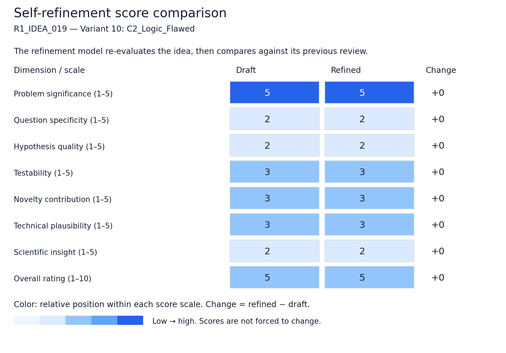

Changed score dimensions: none.

### Score justifications (draft / refined)

**Problem significance**

```json
{
  "draft": {
    "score": 5.0,
    "justification": "The problem is exceptionally significant. Accurate forest monitoring is critical for climate change mitigation, and the limitation of static snapshots for understanding forest dynamics and carbon fluxes is a well-known, important challenge in both remote sensing and climate science."
  },
  "refined": {
    "score": 5.0,
    "justification": "The problem is exceptionally significant. Accurate forest monitoring is critical for climate change mitigation, and the limitation of static snapshots for understanding forest dynamics and carbon fluxes is a well-known, important challenge in remote sensing, ecology, and climate science. Addressing temporal dynamics directly impacts the accuracy of global carbon accounting."
  }
}
```

**Question specificity**

```json
{
  "draft": {
    "score": 2.0,
    "justification": "The specific research question is weak. The idea describes a goal (create a temporally consistent map) and a motivation (better carbon accounting), but it does not define a clear, concrete question to be investigated. The statement about 'broader effectiveness' is particularly vague."
  },
  "refined": {
    "score": 2.0,
    "justification": "The specific research question is weak. The idea describes a goal (create a temporally consistent map) and a motivation (better carbon accounting), but it does not define a clear, concrete question to be investigated. The statement about 'broader effectiveness' is particularly vague and non-specific. There is no articulated 'what will we learn?' question."
  }
}
```

**Hypothesis quality**

```json
{
  "draft": {
    "score": 2.0,
    "justification": "The hypothesis is implicit and low quality. It is implied that 'temporally consistent maps will improve carbon accounting,' but this is not stated as a testable prediction. The final clause about 'broader effectiveness' is an unsupported assertion, not a hypothesis. There is no concrete, falsifiable claim."
  },
  "refined": {
    "score": 2.0,
    "justification": "The hypothesis is implicit and of low quality. It is implied that 'temporally consistent maps will improve carbon accounting,' but this is not stated as a testable prediction. The final clause about 'broader effectiveness' is an unsupported assertion, not a hypothesis. There is no concrete, falsifiable claim that distinguishes this from a generic application goal."
  }
}
```

**Testability**

```json
{
  "draft": {
    "score": 3.0,
    "justification": "Moderate. The core deliverable (a new map) is testable in principle—one could compare it to static maps or validate it with ground data. However, the idea lacks a defined experimental or evaluation framework to test the central implied claim about improved carbon accounting or the vague claim about broader effectiveness."
  },
  "refined": {
    "score": 3.0,
    "justification": "Moderate. The core deliverable (a new map) is testable in principle—one could compare it to static maps or validate it with ground data. However, the idea lacks a defined experimental or evaluation framework to test the central implied claim about improved carbon accounting. The vague claim about broader effectiveness is not testable as stated."
  }
}
```

**Novelty contribution**

```json
{
  "draft": {
    "score": 3.0,
    "justification": "Moderate. Producing a global, multi-year, high-resolution tree height product would be a valuable resource. However, the novelty is primarily in the scale and consistency of the dataset, not in a new scientific concept. The idea, as stated, does not propose a novel method or aim to test a new mechanistic insight about forest dynamics."
  },
  "refined": {
    "score": 3.0,
    "justification": "Moderate. Producing a global, multi-year, high-resolution tree height product would be a valuable resource contribution. However, the novelty is primarily in the scale and temporal consistency of the dataset, not in a new scientific concept or method. The idea, as stated, does not propose a novel algorithmic insight or aim to test a new mechanistic hypothesis about forest dynamics."
  }
}
```

**Technical plausibility**

```json
{
  "draft": {
    "score": 3.0,
    "justification": "Moderate/Neutral. The goal is technically ambitious but plausible given advances in satellite data (e.g., Sentinel) and processing. However, the complete lack of methodological details makes it impossible to assess the coherence or feasibility of the proposed approach to achieve 'temporal consistency.' No assumptions or reasoning are provided to evaluate."
  },
  "refined": {
    "score": 3.0,
    "justification": "Moderate/Neutral. The goal is technically ambitious but plausible given advances in satellite data (e.g., Sentinel-1/2) and processing capabilities. However, the complete absence of methodological details makes it impossible to assess the coherence or feasibility of the proposed approach to achieve 'temporal consistency.' No assumptions or reasoning are provided to evaluate."
  }
}
```

**Scientific insight**

```json
{
  "draft": {
    "score": 2.0,
    "justification": "Weak. The idea, as presented, promises a product (a better map). The potential scientific insight—that temporal consistency is crucial for accurate carbon accounting—is mentioned but not framed as something to be discovered or rigorously tested. The research seems geared towards application and resource creation rather than generating new generalizable knowledge about ecological monitoring."
  },
  "refined": {
    "score": 2.0,
    "justification": "Weak. The idea, as presented, promises a product (a better map). The potential scientific insight—that temporal consistency is crucial for accurate carbon accounting—is mentioned as motivation but not framed as something to be discovered, rigorously tested, or generalized. The research seems geared towards application and resource creation rather than generating new, transferable knowledge about ecological monitoring principles or limitations."
  }
}
```

**Overall rating**

```json
{
  "draft": {
    "score": 5.0,
    "justification": "The idea addresses a very significant problem but is currently framed more as an engineering/product goal than a research investigation. It lacks a specific, testable research question and a clear hypothesis. The potential contribution is a valuable dataset, but the potential for new scientific insight is low without a more focused research framework. It is a moderate/borderline research idea because the core motivation is strong, but the research component is underdeveloped."
  },
  "refined": {
    "score": 5.0,
    "justification": "The idea addresses a very significant problem but is currently framed more as an engineering/product goal than a research investigation. It lacks a specific, testable research question and a clear hypothesis. The potential contribution is a valuable dataset, but the potential for new scientific insight is low without a more focused research framework. It is a moderate/borderline research idea because the core motivation is strong, but the research component (question, hypothesis, testability) is underdeveloped."
  }
}
```

## R1_IDEA_019 — Variant 11: C3_Substance_Enriched

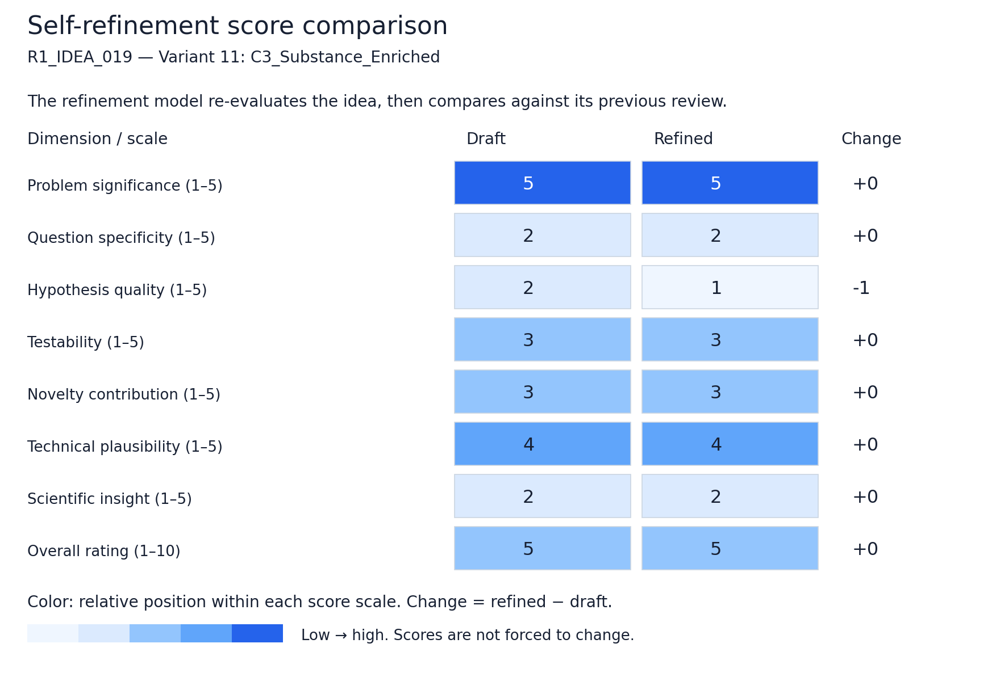

Changed score dimensions: hypothesis_quality.

### Score justifications (draft / refined)

**Problem significance**

```json
{
  "draft": {
    "score": 5.0,
    "justification": "The problem is highly significant. Accurate, temporally resolved forest biomass and carbon stock monitoring is a critical component of global climate change mitigation efforts, underpinning carbon credit markets and national reporting. Moving beyond static snapshots addresses a well-known limitation in the field."
  },
  "refined": {
    "score": 5.0,
    "justification": "Exceptional. The problem is of major global importance. Accurate, temporally resolved monitoring of forest biomass is critical for climate science, carbon credit markets, and policy. Addressing the limitation of static snapshots directly targets a well-known gap in a high-stakes application domain."
  }
}
```

**Question specificity**

```json
{
  "draft": {
    "score": 2.0,
    "justification": "The summary is specific about the intended product (a map with certain specs) but not about the research question. The actual investigation is deferred to 'future work' and is only vaguely described as testing hypotheses about seasonal patterns and disturbances. The core idea lacks a clearly defined question."
  },
  "refined": {
    "score": 2.0,
    "justification": "Weak. The summary is specific about the intended product's attributes but not about the research question. The actual inquiry is vague and deferred ('future work might test hypotheses...'). The core idea lacks a clearly defined, concrete question about a mechanism, relationship, or phenomenon."
  }
}
```

**Hypothesis quality**

```json
{
  "draft": {
    "score": 2.0,
    "justification": "No explicit or clearly implicit hypothesis is presented in the core idea. The summary describes a tool (ECHOSAT) and a validation method. The mention of future hypothesis testing suggests an awareness of the need for one, but it is not formulated here, making the current hypothesis quality weak."
  },
  "refined": {
    "score": 1.0,
    "justification": "Very weak. No hypothesis is presented. The idea describes a tool and a validation plan. The mention of future hypothesis testing acknowledges the concept but does not formulate one, leaving no concrete prediction or proposed mechanism to evaluate."
  }
}
```

**Testability**

```json
{
  "draft": {
    "score": 3.0,
    "justification": "The validation route (cross-comparison with lidar) provides a clear path for testing the accuracy of the map product itself. However, the testability of the broader research idea is low because the central scientific question/hypothesis is not stated. The idea is testable only at the level of 'can we build a good map?'"
  },
  "refined": {
    "score": 3.0,
    "justification": "Moderate. The validation of the map product against ground lidar is a clear, testable sub-task. However, the testability of the overarching research idea is low because there is no central claim or question to test. The idea is testable only at the level of 'can we produce an accurate map?' which is an engineering goal, not a scientific hypothesis."
  }
}
```

**Novelty contribution**

```json
{
  "draft": {
    "score": 3.0,
    "justification": "The contribution of a global, multi-year, 10m tree height map would be a significant data product. However, the novelty of the research idea is moderate because the summary does not articulate a novel methodological insight or a new scientific finding it aims to produce. It leans towards a valuable application and dataset creation rather than a novel research investigation."
  },
  "refined": {
    "score": 3.0,
    "justification": "Moderate. The contribution of a new, high-resolution, temporally consistent global dataset would be valuable. However, the research idea, as presented, lacks novelty in terms of a novel methodological insight or a targeted scientific discovery. It leans toward applied data compilation rather than a novel investigation into an open question."
  }
}
```

**Technical plausibility**

```json
{
  "draft": {
    "score": 4.0,
    "justification": "The idea is technically plausible. Generating global 10m scale maps from satellite data (e.g., Sentinel-1/2) is an active research area. The proposed validation against ground lidar is standard practice. The main challenge of temporal consistency is non-trivial but a recognized problem with ongoing research, making the direction plausible."
  },
  "refined": {
    "score": 4.0,
    "justification": "Strong. The direction is technically plausible. Generating global tree height maps from satellite data (e.g., Sentinel-1/2) is an active field. The validation method is standard. The major challenge of achieving temporal consistency at 10m scale is non-trivial but a recognized problem with ongoing research, making the pursuit plausible."
  }
}
```

**Scientific insight**

```json
{
  "draft": {
    "score": 2.0,
    "justification": "The potential insight is currently low. Creating the map itself offers applied utility. The summary hints at future insight regarding seasonal/distance effects, but this is not part of the core idea as presented. Without a defined hypothesis, the idea does not promise to reveal new mechanisms, principles, or fundamental understanding."
  },
  "refined": {
    "score": 2.0,
    "justification": "Weak. The potential insight from the idea as stated is low. Creating the map offers significant applied utility. The hint at future insight regarding seasonal/disturbance effects is not part of the core proposal. Without a defined hypothesis, the idea does not promise to reveal new mechanisms, general principles, or fundamental understanding about forests or remote sensing."
  }
}
```

**Overall rating**

```json
{
  "draft": {
    "score": 5.0,
    "justification": "This is a moderate/borderline research idea. It identifies a very important applied problem and proposes a concrete, valuable data product. Its main weakness is that it is presented more as a tool-building project than a research investigation with a clear, testable question. The 'future work' suggests a research direction, but that direction is not integrated into the core idea. The potential for scientific insight is therefore limited in the current formulation. It is a good project idea that needs a sharper research focus to become a strong research idea."
  },
  "refined": {
    "score": 5.0,
    "justification": "This is a moderate/borderline research idea. It identifies an exceptionally important applied problem and proposes a valuable, concrete data product with plausible validation. Its fundamental weakness is that it is framed as a tool-building or dataset creation project, not as a research investigation with a clear, testable scientific question or hypothesis. The 'future work' note suggests a research direction exists but does not integrate it. Therefore, while it is a good and significant project idea, its potential for producing new scientific insight in its current formulation is limited."
  }
}
```

## R1_IDEA_019 — Variant 12: H1_Deceptive_Hollow


Changed score dimensions: none.

### Score justifications (draft / refined)

**Problem significance**

```json
{
  "draft": {
    "score": 5.0,
    "justification": "Forest monitoring for climate change is highly significant with clear societal impact. The identified limitation (lack of temporal information in tree height mapping) addresses a meaningful challenge in environmental monitoring."
  },
  "refined": {
    "score": 5.0,
    "justification": "Forest monitoring for climate change is highly significant with clear societal impact and relevance to environmental science. The identified limitation (lack of temporal information in fine-resolution tree height mapping) addresses a meaningful challenge in remote sensing and environmental monitoring."
  }
}
```

**Question specificity**

```json
{
  "draft": {
    "score": 1.0,
    "justification": "Extremely vague - no concrete research question is stated. The idea is framed as a broad 'direction' or 'agenda' rather than a specific investigation."
  },
  "refined": {
    "score": 1.0,
    "justification": "Extremely vague - no concrete research question is stated. The idea is framed as a broad 'direction', 'agenda', or 'framework' rather than a specific investigation. There is no 'what will we investigate?' only 'what would be nice to have?'"
  }
}
```

**Hypothesis quality**

```json
{
  "draft": {
    "score": 1.0,
    "justification": "No hypothesis is presented, implicit or explicit. The text describes a 'promise' and 'potential' but makes no concrete prediction about relationships, mechanisms, or outcomes."
  },
  "refined": {
    "score": 1.0,
    "justification": "No hypothesis is presented, either explicit or implicit. The text describes a 'promise', 'potential', and 'ambition' but makes no concrete prediction about relationships, mechanisms, or outcomes that could be tested. It's a vision statement, not a scientific hypothesis."
  }
}
```

**Testability**

```json
{
  "draft": {
    "score": 1.0,
    "justification": "Not testable in its current form. There's no clear claim that could be supported or contradicted by evidence. The idea is presented as a vision rather than an investigable proposition."
  },
  "refined": {
    "score": 1.0,
    "justification": "Not testable in its current form. There's no clear claim that could be supported or contradicted by evidence. Without a research question, hypothesis, or methodological direction, there's nothing to test. The idea is presented as an aspiration rather than an investigable proposition."
  }
}
```

**Novelty contribution**

```json
{
  "draft": {
    "score": 2.0,
    "justification": "While the aspiration for a 'transformative synthesis' suggests ambition, the complete lack of methodological details makes it impossible to assess novelty. The stated goal (consistent global fine-resolution temporal data) is valuable but not inherently novel without specifying how it would be achieved."
  },
  "refined": {
    "score": 2.0,
    "justification": "While the aspiration for a 'transformative synthesis' suggests ambition, the complete lack of methodological details makes it impossible to assess novelty. The stated goal (consistent global fine-resolution temporal forest data) is valuable but not inherently novel without specifying how it would be achieved differently from existing approaches. It reads as an important application goal rather than a novel research contribution."
  }
}
```

**Technical plausibility**

```json
{
  "draft": {
    "score": 2.0,
    "justification": "Cannot be assessed due to complete lack of technical details. The goal of consistent global fine-resolution temporal monitoring is technically challenging but not inherently implausible. However, without any indication of the proposed approach, we cannot evaluate its plausibility."
  },
  "refined": {
    "score": 2.0,
    "justification": "Cannot be meaningfully assessed due to complete absence of technical details. The goal itself (consistent global fine-resolution temporal monitoring) is technically challenging but not inherently implausible given advances in remote sensing. However, without any indication of the proposed approach, we cannot evaluate whether the specific direction is plausible."
  }
}
```

**Scientific insight**

```json
{
  "draft": {
    "score": 2.0,
    "justification": "The idea claims potential for transformative insight but doesn't specify what would be learned. Without a concrete research question or methodology, it's unclear what scientific principles, mechanisms, or limitations would be revealed beyond the practical achievement of better forest monitoring."
  },
  "refined": {
    "score": 2.0,
    "justification": "The idea claims potential for transformative insight but doesn't specify what would be learned scientifically. Without a concrete research question or methodology, it's unclear what scientific principles, mechanisms, limitations, or generalizable knowledge would be revealed beyond the practical achievement of better forest monitoring data. The claimed 'conceptual insight' is not articulated."
  }
}
```

**Overall rating**

```json
{
  "draft": {
    "score": 2.0,
    "justification": "This is a very weak research idea in its current form. While it addresses an important problem, it lacks all the essential components of a research idea: no concrete question, no hypothesis, no methodological direction, and no clear path to scientific insight. It reads more like a grant proposal abstract or vision statement than a research idea that could be investigated. The grandiose language about 'transformative synthesis' and 'reshaping community thinking' is not backed by any substantive content."
  },
  "refined": {
    "score": 2.0,
    "justification": "This is a very weak research idea in its current form. While it addresses an important application problem, it lacks all essential components of a research idea: no concrete question, no hypothesis, no methodological direction, and no clear path to scientific insight. It reads as a grant proposal abstract or vision statement rather than a research idea that could be investigated. The grandiose language about 'transformative synthesis' and 'reshaping community thinking' is not backed by any substantive research content that could be evaluated or pursued."
  }
}
```

## R1_IDEA_019 — Variant 13: H2_Confident_Flaw

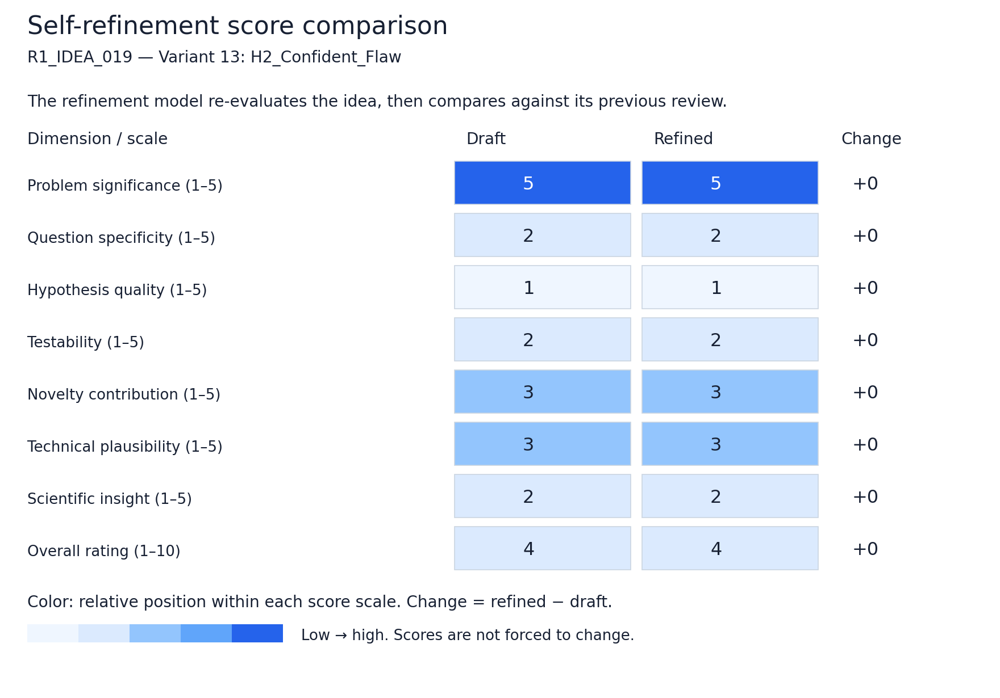

Changed score dimensions: none.

### Score justifications (draft / refined)

**Problem significance**

```json
{
  "draft": {
    "score": 5.0,
    "justification": "Forest monitoring for climate change mitigation is a highly significant global challenge. The limitation of static tree height maps for capturing dynamics that affect carbon accounting is a meaningful and well-articulated problem."
  },
  "refined": {
    "score": 5.0,
    "justification": "Forest monitoring for climate change mitigation is a globally significant challenge. The limitation of static tree height maps for capturing dynamics that affect carbon accounting is a well-articulated and meaningful problem with substantial real-world impact."
  }
}
```

**Question specificity**

```json
{
  "draft": {
    "score": 2.0,
    "justification": "The idea does not define a clear research question. It proposes an output (a map) and asserts its benefits, but does not specify what relationship, mechanism, or comparison is being investigated. The closest to a question is 'can we make a better map?', which is too broad."
  },
  "refined": {
    "score": 2.0,
    "justification": "The idea does not define a clear research question. It proposes an output (a map) and asserts its benefits, but does not specify what relationship, mechanism, or comparison is being investigated scientifically. The closest to a question is 'can we create a better map?', which is too broad and product-focused."
  }
}
```

**Hypothesis quality**

```json
{
  "draft": {
    "score": 1.0,
    "justification": "There is no testable hypothesis. The statement that solving the temporal limitation will produce improvements is a tautological goal, not a prediction. The claim that gains can be treated as causal evidence without isolating confounding factors is antithetical to hypothesis testing."
  },
  "refined": {
    "score": 1.0,
    "justification": "There is no testable hypothesis. The statement that solving the temporal limitation will produce improvements is a goal or assumption, not a concrete prediction. The claim that gains can be treated as causal evidence without isolating confounding factors is antithetical to hypothesis testing and scientific reasoning."
  }
}
```

**Testability**

```json
{
  "draft": {
    "score": 2.0,
    "justification": "The idea is vaguely testable in the sense that one could compare a new map to old ones. However, the author explicitly rejects standard experimental controls (isolating factors, considering alternatives), which makes rigorous testing impossible as described. The evaluation plan is not specified."
  },
  "refined": {
    "score": 2.0,
    "justification": "The idea is minimally testable in that one could compare a new map to old ones on some metrics. However, the author explicitly rejects standard experimental controls (isolating factors, considering alternatives), which makes rigorous, scientifically valid testing impossible as described. No evaluation plan is specified."
  }
}
```

**Novelty contribution**

```json
{
  "draft": {
    "score": 3.0,
    "justification": "A global, temporally consistent, high-resolution tree height map would be a valuable dataset. However, the novelty is primarily in the data product, not in a new scientific insight or methodological breakthrough. The contribution is applied rather than fundamental."
  },
  "refined": {
    "score": 3.0,
    "justification": "A global, temporally consistent, high-resolution tree height map would be a valuable applied data product. However, the novelty appears primarily in the dataset itself, not in a new scientific insight or fundamental methodological breakthrough. The contribution is applied and engineering-oriented rather than conceptual."
  }
}
```

**Technical plausibility**

```json
{
  "draft": {
    "score": 3.0,
    "justification": "The idea is logically coherent (temporal data is needed for dynamics). However, with zero technical details, it's impossible to assess feasibility. Creating a globally consistent, multi-year, 10m resolution product is a massive technical challenge; without a suggested approach, plausibility is uncertain."
  },
  "refined": {
    "score": 3.0,
    "justification": "The core logic is coherent: temporal data is needed for dynamics. However, with zero technical details provided, feasibility is highly uncertain. Creating a globally consistent, multi-year, 10m resolution product is a massive technical challenge involving sensor fusion, atmospheric correction, and validation across biomes. Without a suggested approach, plausibility cannot be assessed as more than moderately plausible in principle."
  }
}
```

**Scientific insight**

```json
{
  "draft": {
    "score": 2.0,
    "justification": "As presented, the idea promises a better map, not new understanding. The author's dismissal of isolating factors suggests no intent to uncover mechanisms (e.g., why temporal fusion works, under what conditions it fails). Potential insight is low unless the research is reframed to study principles of temporal remote sensing or forest dynamics."
  },
  "refined": {
    "score": 2.0,
    "justification": "As presented, the idea promises a better data product, not new understanding. The dismissal of isolating factors suggests no intent to uncover mechanisms (e.g., why temporal fusion works, under what conditions it fails, what principles govern the relationship between temporal resolution and carbon estimate accuracy). Potential insight is low unless reframed to study principles of temporal remote sensing or forest dynamics."
  }
}
```

**Overall rating**

```json
{
  "draft": {
    "score": 4.0,
    "justification": "The idea identifies a significant real-world problem and a clear gap in existing data. However, it is framed as an engineering/product goal rather than a scientific investigation. It lacks a specific research question, a testable hypothesis, and a methodological direction. The explicit rejection of controlled evaluation severely undermines its scientific rigor. The potential contribution is primarily as a useful dataset, not as a source of new knowledge about remote sensing or ecological processes."
  },
  "refined": {
    "score": 4.0,
    "justification": "The idea identifies a significant real-world problem and a clear gap in existing data, which is its primary strength. However, it is framed as an engineering/product development goal rather than a scientific investigation. It lacks a specific research question, a testable hypothesis, and any methodological direction. The explicit rejection of controlled evaluation severely undermines its scientific rigor. The potential contribution is primarily as a useful dataset, not as a source of new knowledge about remote sensing, ecological processes, or methodological principles."
  }
}
```

## R1_IDEA_019 — Variant 14: H3_Verbose_Enriched

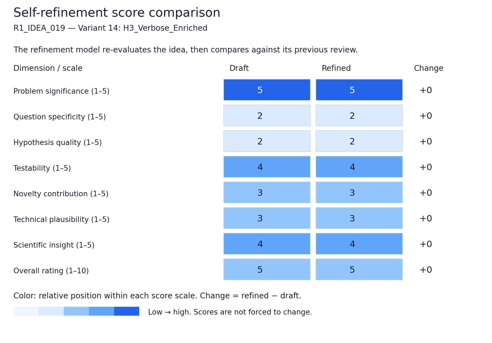

Changed score dimensions: none.

### Score justifications (draft / refined)

**Problem significance**

```json
{
  "draft": {
    "score": 5.0,
    "justification": "The problem is exceptionally significant. Accurate, temporally resolved forest monitoring is critical for climate science, carbon accounting, and ecosystem management. The limitation of static snapshots is a genuine and important gap."
  },
  "refined": {
    "score": 5.0,
    "justification": "Exceptional significance. Accurate, temporally resolved forest monitoring is critical for climate science, carbon accounting, policy, and ecosystem management. The identified limitation of static global tree height maps is a genuine and important scientific and practical gap with direct relevance to climate change mitigation."
  }
}
```

**Question specificity**

```json
{
  "draft": {
    "score": 2.0,
    "justification": "The core idea summary is not framed as a specific research question. It primarily announces a proposed data product (ECHOSAT). A potential question about seasonal patterns/disturbances is mentioned only as 'future work.' The summary lacks a clear, concrete 'what will we investigate?'"
  },
  "refined": {
    "score": 2.0,
    "justification": "Weak specificity. The core summary does not pose a research question. It primarily announces a proposed data product (ECHOSAT) and its specifications. A potential question about seasonal patterns is mentioned only in the context of 'future work' and remains vague. The idea lacks a clear, concrete 'what will we investigate?'"
  }
}
```

**Hypothesis quality**

```json
{
  "draft": {
    "score": 2.0,
    "justification": "No explicit or clearly implied hypothesis is presented in the main idea. The text describes a product and a validation plan. The mention of testing hypotheses about seasonal patterns is deferred and vague. There is no concrete, testable prediction central to the idea as stated."
  },
  "refined": {
    "score": 2.0,
    "justification": "Very weak hypothesis quality. No explicit or clearly implied central hypothesis is presented. The text describes a product goal and a validation plan. The mention of 'test[ing] hypotheses' is deferred, non-specific, and not integrated as the driving force of the idea. There is no concrete, testable prediction central to the proposal as stated."
  }
}
```

**Testability**

```json
{
  "draft": {
    "score": 4.0,
    "justification": "The proposed validation (lidar cross-comparison) and the elaborated future research design (staged, with ablations and sensitivity analyses) are highly testable frameworks. However, they are proposed as avenues to test an unspecified hypothesis. The testability of the core idea itself is moderate because the idea is a product description, not a claim."
  },
  "refined": {
    "score": 4.0,
    "justification": "Strong testability for the *framework* described. The proposed validation (lidar cross-comparison) is a standard, testable approach. The elaborated future research design (staged, with ablations and sensitivity analyses) outlines an excellent, highly testable methodology. However, this framework is proposed to test an unspecified hypothesis. The testability of the core idea (creating ECHOSAT) is moderate, as it's a product goal rather than a falsifiable claim."
  }
}
```

**Novelty contribution**

```json
{
  "draft": {
    "score": 3.0,
    "justification": "A global, multi-year, 10m resolution tree height map would be a significant data contribution. However, the novelty of the *research idea* is unclear because the summary does not specify a novel methodological approach or a novel scientific question to be answered using the map. It sits between a data release and a research plan."
  },
  "refined": {
    "score": 3.0,
    "justification": "Moderate novelty/contribution. A global, multi-year, 10m resolution tree height map would be a valuable data contribution. However, the novelty of the *research idea* is unclear because the summary does not specify a novel methodological approach for creating it or a novel scientific question to be answered using it. It sits between a data release announcement and a research plan, diluting its distinct contribution."
  }
}
```

**Technical plausibility**

```json
{
  "draft": {
    "score": 3.0,
    "justification": "The goal is technically ambitious but plausible given advances in remote sensing and ML. However, with zero details on the method for achieving temporal consistency, feasibility rests on assumption. The validation route (lidar cross-comparison) is standard and sound."
  },
  "refined": {
    "score": 3.0,
    "justification": "Moderate technical plausibility. The goal is technically ambitious but not implausible given advances in remote sensing, satellite data availability (e.g., Sentinel), and ML. However, with zero details on the method for achieving temporal consistency at this scale and resolution, feasibility rests entirely on assumption. The suggested validation route (lidar cross-comparison) is standard and sound."
  }
}
```

**Scientific insight**

```json
{
  "draft": {
    "score": 4.0,
    "justification": "If the proposed future research design is executed, it has high potential for insight into 'which assumptions, data regimes, and domain constraints determine when and why' a temporal map is useful. The idea points toward understanding mechanisms and boundary conditions, not just reporting performance."
  },
  "refined": {
    "score": 4.0,
    "justification": "Strong potential for scientific insight, but contingent on execution. The proposed future research design explicitly aims to uncover 'which assumptions, data regimes, and domain constraints determine when and why it is useful.' This points toward understanding mechanisms, limitations, and boundary conditions, which is high-value insight. However, this insight is potential, not inherent to the core product idea."
  }
}
```

**Overall rating**

```json
{
  "draft": {
    "score": 5.0,
    "justification": "This is a moderate/borderline research idea. It describes an important application goal (a new forest monitoring product) and appends a sophisticated methodological framework, but it fails to articulate a specific, testable research question or hypothesis as its core. The scientific contribution is currently ambiguous between creating a useful dataset and conducting a hypothesis-driven study. The potential is high, but the idea as presented is unfocused."
  },
  "refined": {
    "score": 5.0,
    "justification": "This is a moderate/borderline research idea. It identifies an exceptionally important problem and a valuable application goal (a new forest monitoring product). It appends a sophisticated, insightful methodological framework. However, as a research idea, it fails at the core: it does not articulate a specific, testable research question or hypothesis. The contribution is ambiguous between creating a dataset and conducting a hypothesis-driven study. The appended methodological discussion shows the proposer's rigor, but the central idea remains unfocused. It has high potential if reframed."
  }
}
```

## R1_IDEA_019 — Variant 15: H4_Ultimate_Hype

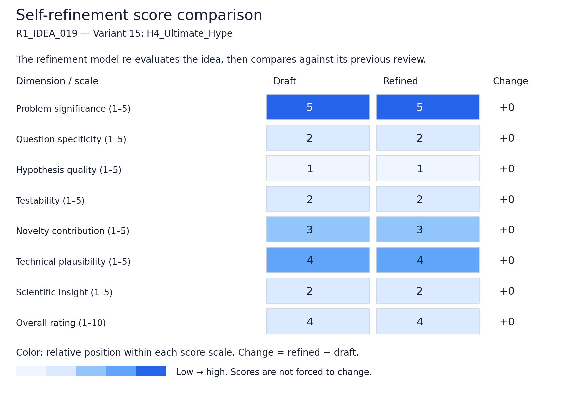

Changed score dimensions: none.

### Score justifications (draft / refined)

**Problem significance**

```json
{
  "draft": {
    "score": 5.0,
    "justification": "The problem is highly significant. Accurate, temporally dynamic forest biomass data is a critical gap in climate science and policy for carbon accounting and understanding ecosystem responses to change."
  },
  "refined": {
    "score": 5.0,
    "justification": "Exceptional significance. Dynamic forest biomass monitoring is a critical, well-recognized gap for climate change mitigation, carbon markets, and ecological science. The need for temporally consistent, high-resolution global data is a major challenge with high real-world impact."
  }
}
```

**Question specificity**

```json
{
  "draft": {
    "score": 2.0,
    "justification": "The idea specifies a product goal (a map) but not a research question. It lacks specificity about what is being investigated—it states what should be built, not what scientific or technical hypothesis is being tested."
  },
  "refined": {
    "score": 2.0,
    "justification": "Weak specificity as a research idea. It specifies a product goal with clear attributes (global, 10m, multi-year, temporally consistent) but does not define a research question. It states what should be built, not what scientific or technical relationship is being investigated."
  }
}
```

**Hypothesis quality**

```json
{
  "draft": {
    "score": 1.0,
    "justification": "There is no discernible hypothesis. The text describes an ambitious goal and asserts its potential impact, but does not make a falsifiable prediction about a relationship, mechanism, or methodological superiority."
  },
  "refined": {
    "score": 1.0,
    "justification": "Very weak. There is no hypothesis. The text announces an ambitious goal and makes promotional claims about its potential, but contains no falsifiable prediction about a mechanism, relationship, or methodological advantage. It is a declaration of intent, not a scientific hypothesis."
  }
}
```

**Testability**

```json
{
  "draft": {
    "score": 2.0,
    "justification": "The success of building the map is testable (does the map exist? is it accurate?). However, as a research idea, it lacks a central claim that can be investigated through controlled experiments or analysis. It is more of a development project description."
  },
  "refined": {
    "score": 2.0,
    "justification": "Weak. The eventual success of the product (does the map exist and meet specifications?) is testable. However, as a research direction, it lacks a central claim that can be investigated through controlled experimentation, ablation, or comparative analysis. The 'research' component is undefined and therefore not testable."
  }
}
```

**Novelty contribution**

```json
{
  "draft": {
    "score": 3.0,
    "justification": "The goal of a high-resolution, temporally consistent global tree height product is novel and would be a significant contribution as a dataset. However, the research novelty is unclear. Is the novelty in the product itself, or in the methods to create it? The idea summary does not clarify a novel methodological insight."
  },
  "refined": {
    "score": 3.0,
    "justification": "Moderate. The described dataset would be a novel and valuable resource. However, the research novelty is entirely unclear from the summary. It claims to be 'novel' and 'ambitious' but does not identify what new knowledge, method, or principle the research would contribute. The contribution appears to be the product itself, not the research behind it."
  }
}
```

**Technical plausibility**

```json
{
  "draft": {
    "score": 4.0,
    "justification": "The goal is technically ambitious but plausible given advances in satellite data availability (Sentinel, GEDI), cloud computing, and machine learning for remote sensing. The reasoning that static maps are insufficient is coherent."
  },
  "refined": {
    "score": 4.0,
    "justification": "Strong. The goal is technically ambitious but plausible. The reasoning that static maps are insufficient is logical, and the required data sources (e.g., Sentinel, GEDI) and computational infrastructure exist. The summary does not contain technical contradictions."
  }
}
```

**Scientific insight**

```json
{
  "draft": {
    "score": 2.0,
    "justification": "As presented, the primary output is a dataset. The potential for scientific insight is high if the dataset enables new ecological studies, but the idea itself does not propose to generate insight into a fundamental ML or remote sensing principle. It is an application project."
  },
  "refined": {
    "score": 2.0,
    "justification": "Weak. As presented, the direct output is an application product. The potential for downstream scientific insight (e.g., for ecologists) is high, but the proposed research idea itself does not aim to generate insight into machine learning, remote sensing theory, or fundamental principles. It is an application development goal."
  }
}
```

**Overall rating**

```json
{
  "draft": {
    "score": 4.0,
    "justification": "The idea identifies a very important applied problem with high societal relevance. However, it is framed as a product development goal or grand challenge rather than a specific research idea with a testable hypothesis. It lacks the core components of a research question, a hypothesis, and a clear methodological investigation. It is a weak research idea but points to a potentially valuable application target. A stronger research idea would be built around the specific technical or scientific hurdles involved in creating such a map."
  },
  "refined": {
    "score": 4.0,
    "justification": "The idea identifies a critically important application target with high societal value. However, it is framed purely as a product development goal or grand challenge announcement. It lacks the essential components of a research idea: a specific research question, a testable hypothesis, and a clear description of the methodological investigation to be undertaken. It is a weak research idea but points to a highly valuable target for research. A score of 4 reflects its merit as an important problem statement, but its severe deficiencies as a formulated research direction."
  }
}
```

## R1_IDEA_020 — Source


Changed score dimensions: question_specificity, hypothesis_quality, testability, novelty_contribution, scientific_insight, overall_rating.

### Score justifications (draft / refined)

**Problem significance**

```json
{
  "draft": {
    "score": 4.0,
    "justification": "Understanding neural network internal structures is a fundamental and important problem in deep learning research. The interpretability and analysis of neural network representations is a significant challenge with both scientific and practical implications."
  },
  "refined": {
    "score": 4.0,
    "justification": "The problem is highly significant. Understanding and interpreting the internal representations of neural networks is a core, unsolved challenge in machine learning with implications for trust, debugging, and scientific discovery. The exploration of novel architectures like KANs that promise better interpretability is timely and relevant."
  }
}
```

**Question specificity**

```json
{
  "draft": {
    "score": 2.0,
    "justification": "The idea is very vague about what specifically should be investigated. It mentions that internal structures are 'largely unexplored' and that KANs are a 'significant departure' from MLPs, but doesn't define a concrete research question about what aspect of KANs should be studied or what relationship should be examined."
  },
  "refined": {
    "score": 1.0,
    "justification": "The idea contains no explicit research question. It describes a subject area (internal structures of NNs) and a tool (KANs) but does not specify what is to be investigated about them. The level of specificity is that of a general topic heading, not a research direction."
  }
}
```

**Hypothesis quality**

```json
{
  "draft": {
    "score": 2.0,
    "justification": "There's an implicit hypothesis that KANs enhance both accuracy and interpretability compared to MLPs, but this is stated as a general claim rather than a testable prediction. No specific, falsifiable hypothesis about mechanisms, conditions, or relationships is presented."
  },
  "refined": {
    "score": 1.0,
    "justification": "There is no hypothesis. The text states that KANs 'enhanc[e] both accuracy and interpretability' as if it were an established fact or a defining feature. There is no proposed causal mechanism, predictive relationship, or testable conjecture to be evaluated. The idea lacks a central proposition to guide research."
  }
}
```

**Testability**

```json
{
  "draft": {
    "score": 2.0,
    "justification": "While accuracy and interpretability are potentially measurable, the idea doesn't propose any specific experiments, comparisons, or analyses to test claims about KANs. Without a proposed methodology, it's unclear how the investigation would proceed."
  },
  "refined": {
    "score": 1.0,
    "justification": "The idea is not framed in a testable manner. It does not propose any action—no experiment, comparison, analysis, or evaluation. While the mentioned properties (accuracy, interpretability) are themselves measurable, the idea provides no framework for how one would gather evidence to learn something new about KANs. It is purely declarative."
  }
}
```

**Novelty contribution**

```json
{
  "draft": {
    "score": 3.0,
    "justification": "KANs themselves are a novel architecture, but the idea as presented doesn't specify what new scientific knowledge would be contributed beyond applying or analyzing an existing method. The potential contribution is unclear - it could range from trivial (confirming known properties) to significant (discovering new principles), but the idea doesn't articulate which."
  },
  "refined": {
    "score": 2.0,
    "justification": "The novelty is low because the idea does not propose to *do* anything novel. KANs are themselves a novel contribution from other researchers. This idea, as stated, suggests at most an exploratory analysis or application of KANs, but does not articulate what new knowledge such exploration would aim to produce. The potential contribution is entirely undefined."
  }
}
```

**Technical plausibility**

```json
{
  "draft": {
    "score": 4.0,
    "justification": "The basic premise is technically plausible: KANs are a real architectural innovation, and analyzing neural network internal structures is a valid research direction. The reasoning that learnable activation functions on edges might affect interpretability is coherent, though not deeply elaborated."
  },
  "refined": {
    "score": 4.0,
    "justification": "The foundational premise is technically sound. KANs are a valid and interesting architectural variant. The notion that their different parameterization (activations on edges) could influence internal representations and interpretability is logically coherent and plausible, aligning with ongoing discourse in the field."
  }
}
```

**Scientific insight**

```json
{
  "draft": {
    "score": 3.0,
    "justification": "If properly executed, research on KANs could potentially yield insights about how architectural choices affect representational properties and interpretability. However, the idea as stated doesn't articulate what specific insights might be gained or what general principles might be discovered."
  },
  "refined": {
    "score": 2.0,
    "justification": "The *potential* for insight is high given the subject matter, but the idea itself does not articulate what insight is sought. A well-designed study of KANs could reveal principles about how architectural inductive biases affect function representation and interpretability. However, the presented idea is too vague to promise any specific insight; it merely points to a domain where insights might be found."
  }
}
```

**Overall rating**

```json
{
  "draft": {
    "score": 4.0,
    "justification": "This is a weak research idea in its current form. While it identifies an important problem area (neural network interpretability) and points to an interesting architectural innovation (KANs), it fails to define a specific research question, hypothesis, or methodology. The idea is more of a general motivation statement than a concrete research direction. It lacks the specificity and testability needed for a strong research idea, though it has a reasonable starting point that could be developed into something more substantial."
  },
  "refined": {
    "score": 3.0,
    "justification": "This is a very weak research idea. It identifies a significant problem area and an interesting new architecture, which is its sole merit. However, it fails completely as a proposal for research: it lacks a question, a hypothesis, a methodology, and a defined goal. It reads as background motivation or a literature summary, not as a blueprint for investigation. It cannot be evaluated as a 'research idea' in the active sense; it is only a description of a research topic."
  }
}
```

## R1_IDEA_020 — Variant 1: A1_Identity


Changed score dimensions: question_specificity, hypothesis_quality, testability, novelty_contribution, scientific_insight, overall_rating.

### Score justifications (draft / refined)

**Problem significance**

```json
{
  "draft": {
    "score": 4.0,
    "justification": "Understanding neural network internal structures is a fundamental and important problem in deep learning. The interpretability of neural networks is a major research direction with both scientific and practical implications. KANs represent an interesting architectural innovation worth investigating."
  },
  "refined": {
    "score": 4.0,
    "justification": "Understanding neural network internal structures and improving interpretability are fundamental and important problems in deep learning with both scientific and practical implications. KANs represent an interesting architectural innovation that merits investigation."
  }
}
```

**Question specificity**

```json
{
  "draft": {
    "score": 2.0,
    "justification": "The idea is very vague about what specifically should be investigated. It mentions that internal structures are 'largely unexplored' and that KANs enhance accuracy and interpretability, but doesn't define a concrete research question. It's more of a general motivation than a specific investigation."
  },
  "refined": {
    "score": 1.0,
    "justification": "The idea is extremely vague about what specifically should be investigated. It states that internal structures are 'largely unexplored' and mentions KANs' features, but defines no concrete research question. It's essentially background motivation without a specific investigation proposed."
  }
}
```

**Hypothesis quality**

```json
{
  "draft": {
    "score": 2.0,
    "justification": "There's an implicit hypothesis that KANs are worth studying because they differ from MLPs and may offer benefits, but no testable prediction is made. The claim that KANs enhance accuracy and interpretability is presented as fact rather than as a hypothesis to be tested."
  },
  "refined": {
    "score": 1.0,
    "justification": "There is no hypothesis presented. The claim that KANs enhance accuracy and interpretability is stated as fact rather than as a testable prediction. No mechanism, relationship, or condition is proposed for investigation."
  }
}
```

**Testability**

```json
{
  "draft": {
    "score": 2.0,
    "justification": "While accuracy and interpretability are potentially measurable, no methodology for testing any claims is suggested. The idea doesn't propose experiments, comparisons, or analyses that would provide evidence for or against any specific claim about KANs."
  },
  "refined": {
    "score": 1.0,
    "justification": "No methodology for testing any claims is suggested. While accuracy and interpretability are potentially measurable concepts, the idea doesn't propose any experiments, comparisons, analyses, or evaluations that would provide evidence. The central claim is presented without any indication of how it could be investigated."
  }
}
```

**Novelty contribution**

```json
{
  "draft": {
    "score": 3.0,
    "justification": "KANs themselves are novel, but simply proposing to study them without a specific research angle has limited novelty. The potential contribution depends entirely on what specific investigation is conducted - as stated, it's too vague to assess meaningful novelty beyond the original KAN introduction."
  },
  "refined": {
    "score": 2.0,
    "justification": "KANs themselves are novel, but simply proposing to study them without a specific research angle has minimal novelty. The idea as presented suggests merely acknowledging their existence rather than proposing a novel investigation. Any potential contribution depends entirely on what specific study would be conducted."
  }
}
```

**Technical plausibility**

```json
{
  "draft": {
    "score": 4.0,
    "justification": "The basic premise is technically sound: KANs are a real architectural innovation, and studying their properties is a reasonable research direction. The claims about their potential advantages align with the original KAN paper's findings."
  },
  "refined": {
    "score": 4.0,
    "justification": "The basic premise is technically sound: KANs are a real architectural innovation, and studying their properties is a reasonable research direction. The description of KANs versus MLPs is accurate, and investigating such architectures is plausible."
  }
}
```

**Scientific insight**

```json
{
  "draft": {
    "score": 3.0,
    "justification": "If properly investigated, studying KANs could yield insights about how activation function placement affects representation learning, interpretability, and network function. However, the current formulation doesn't specify what insights are sought or how they would be extracted."
  },
  "refined": {
    "score": 2.0,
    "justification": "If a specific investigation were designed, studying KANs could potentially yield insights about how activation function placement affects representation learning or interpretability. However, the current formulation doesn't specify what insights are sought or how they would be extracted, so the potential insight is minimal as presented."
  }
}
```

**Overall rating**

```json
{
  "draft": {
    "score": 4.0,
    "justification": "This is a weak research idea as presented. While it identifies an important problem area (neural network interpretability) and an interesting architectural innovation (KANs), it fails to define a specific research question, hypothesis, or methodology. It reads more like background motivation than a research proposal. With substantial refinement to specify what exactly should be investigated and how, it could become a stronger idea."
  },
  "refined": {
    "score": 3.0,
    "justification": "This is a very weak research idea as presented. While it identifies an important problem area (neural network interpretability) and mentions an interesting architectural innovation (KANs), it completely fails to define a research question, hypothesis, or methodology. It reads as background motivation rather than a research proposal. Without substantial refinement to specify what exactly should be investigated and how, it lacks the core elements of a research idea."
  }
}
```

## R1_IDEA_020 — Variant 2: A2_Paraphrase_Only

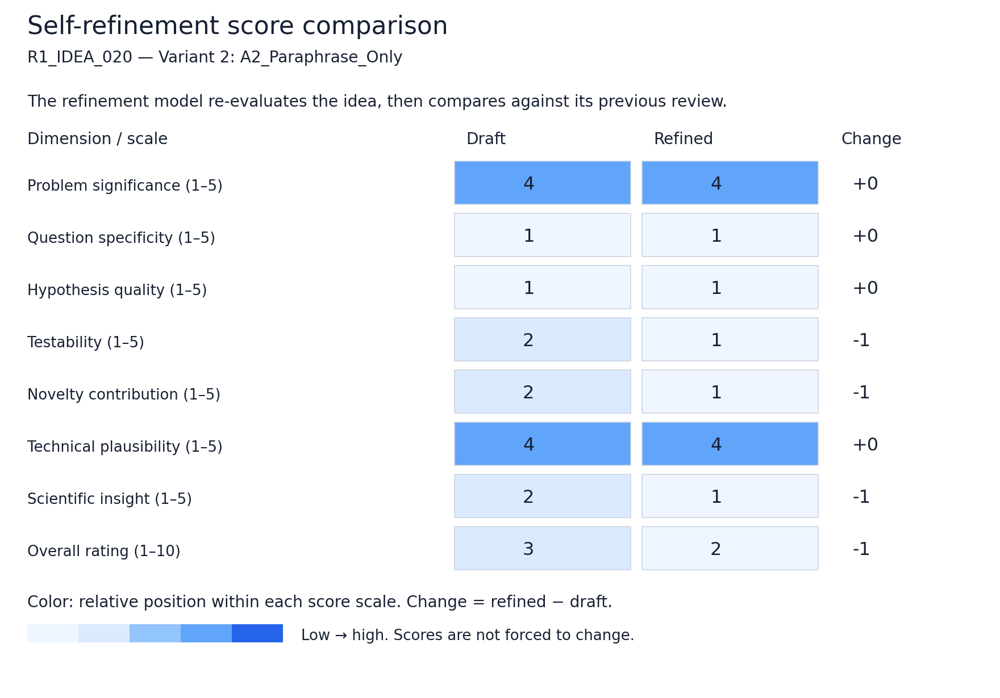

Changed score dimensions: testability, novelty_contribution, scientific_insight, overall_rating.

### Score justifications (draft / refined)

**Problem significance**

```json
{
  "draft": {
    "score": 4.0,
    "justification": "The problem of neural network interpretability is highly significant in machine learning, with broad implications for trust, debugging, and scientific discovery. KANs represent a recent, promising direction, so investigating them is well-motivated."
  },
  "refined": {
    "score": 4.0,
    "justification": "The underlying problem—improving the interpretability and understanding of neural networks—is highly significant in machine learning. KANs represent a recent architectural direction proposed to address this, making investigation into their properties well-motivated and timely."
  }
}
```

**Question specificity**

```json
{
  "draft": {
    "score": 1.0,
    "justification": "The idea does not define a research question. It only states that KANs differ from MLPs and have advantages, without specifying what to investigate about them."
  },
  "refined": {
    "score": 1.0,
    "justification": "The idea does not define a research question. It only describes KANs and states a claimed advantage. There is no 'what will we investigate?' component. It is entirely non-specific."
  }
}
```

**Hypothesis quality**

```json
{
  "draft": {
    "score": 1.0,
    "justification": "No hypothesis is presented. The text makes an assertion ('improving both precision and the ability to interpret the model') but does not frame it as a testable prediction or propose a mechanism to explore."
  },
  "refined": {
    "score": 1.0,
    "justification": "There is no hypothesis. The text presents a descriptive claim ('improving both precision and the ability to interpret') as an established fact about KANs. It does not propose a testable prediction, causal mechanism, or relationship to be examined."
  }
}
```

**Testability**

```json
{
  "draft": {
    "score": 2.0,
    "justification": "While the claims about KANs are in principle testable (e.g., via comparative experiments), the idea itself does not suggest any method of investigation. It merely describes KANs without indicating how to evaluate them."
  },
  "refined": {
    "score": 1.0,
    "justification": "The idea itself suggests no method of investigation. While the claims it references about KANs are testable in principle, the proposal contains no direction for testing, comparing, or analyzing anything. It is a statement, not a testable plan."
  }
}
```

**Novelty contribution**

```json
{
  "draft": {
    "score": 2.0,
    "justification": "The idea, as stated, does not propose anything novel. It summarizes existing knowledge about KANs without suggesting a new angle, extension, or critical evaluation. The potential contribution is minimal unless further specified."
  },
  "refined": {
    "score": 1.0,
    "justification": "The idea, as presented, proposes zero novelty. It is a brief summary of the core concept behind KANs, which is already established in the literature. It does not suggest a new angle, extension, critical evaluation, or application."
  }
}
```

**Technical plausibility**

```json
{
  "draft": {
    "score": 4.0,
    "justification": "The description of KANs is technically accurate and coherent. The architectural difference from MLPs is correctly identified, and the claimed benefits align with discussions in the literature. No implausible assumptions are made."
  },
  "refined": {
    "score": 4.0,
    "justification": "The description of KANs is technically coherent and accurate based on known literature. The contrast with MLPs is correctly drawn, and the claimed benefits are plausible and discussed in existing work. No technical implausibilities are introduced."
  }
}
```

**Scientific insight**

```json
{
  "draft": {
    "score": 2.0,
    "justification": "As presented, the idea offers little potential for scientific insight. It does not aim to uncover new mechanisms, boundary conditions, or principles. It could be the starting point for such a study, but in its current form, it is too vague to promise deeper understanding."
  },
  "refined": {
    "score": 1.0,
    "justification": "The idea promises no scientific insight in its current form. It does not aim to reveal new mechanisms, principles, limitations, or deeper understanding. It is a restatement of a known architectural concept without a plan to generate new knowledge."
  }
}
```

**Overall rating**

```json
{
  "draft": {
    "score": 3.0,
    "justification": "This is a weak research idea. It identifies a meaningful problem (interpretability of neural networks) and a relevant architecture (KANs), but fails to define a research question, hypothesis, or methodological direction. It reads as background motivation rather than a concrete plan for investigation. Without a specific focus, it lacks testability, novelty, and potential for scientific insight."
  },
  "refined": {
    "score": 2.0,
    "justification": "This is a very weak research idea. It identifies a significant problem area and a relevant architecture but fails entirely to propose any research. It lacks a question, hypothesis, methodological direction, novelty, and a clear path to insight. It reads as introductory background material, not as a concrete idea for investigation."
  }
}
```

## R1_IDEA_020 — Variant 3: A3_Plain_Core


Changed score dimensions: question_specificity.

### Score justifications (draft / refined)

**Problem significance**

```json
{
  "draft": {
    "score": 4.0,
    "justification": "The problem of neural network interpretability is highly significant in machine learning. Understanding internal mechanisms is a fundamental challenge with practical implications for trustworthy AI."
  },
  "refined": {
    "score": 4.0,
    "justification": "The problem of neural network interpretability and understanding internal mechanisms is highly significant in machine learning, with broad implications for reliability, trust, and scientific insight."
  }
}
```

**Question specificity**

```json
{
  "draft": {
    "score": 2.0,
    "justification": "The idea merely states that KANs differ from MLPs and may have benefits. It does not define a concrete research question about what to investigate regarding KANs."
  },
  "refined": {
    "score": 1.0,
    "justification": "The idea does not define any research question. It only states that KANs differ from MLPs and may have benefits, without specifying what aspect to investigate."
  }
}
```

**Hypothesis quality**

```json
{
  "draft": {
    "score": 1.0,
    "justification": "There is no explicit or implicit hypothesis. The statement 'can improve accuracy and interpretability' is a vague potential benefit, not a testable prediction about when, how, or why this improvement occurs."
  },
  "refined": {
    "score": 1.0,
    "justification": "There is no hypothesis, explicit or implicit. The phrase 'can improve accuracy and interpretability' is a vague assertion of potential, not a testable prediction about when, how, or why such improvement might occur."
  }
}
```

**Testability**

```json
{
  "draft": {
    "score": 2.0,
    "justification": "While one could design experiments comparing KANs to MLPs, the idea itself does not propose any investigation method or suggest what evidence would support the claim. The statement is too generic to guide a specific test."
  },
  "refined": {
    "score": 2.0,
    "justification": "While one could design experiments to compare KANs and MLPs, the idea itself proposes no investigation method. The statement is too generic to guide a specific test or evaluation."
  }
}
```

**Novelty contribution**

```json
{
  "draft": {
    "score": 2.0,
    "justification": "KANs themselves are a known architectural alternative. The idea does not propose a novel investigation about them—it merely notes their existence and potential benefits without specifying what new knowledge would be generated."
  },
  "refined": {
    "score": 2.0,
    "justification": "KANs are an existing architectural concept. The idea does not propose any novel investigation about them—it merely notes their existence and potential, without specifying what new knowledge would be generated."
  }
}
```

**Technical plausibility**

```json
{
  "draft": {
    "score": 4.0,
    "justification": "The basic premise is technically coherent: KANs are a valid neural network architecture with learnable activation functions. The claim that this could affect accuracy and interpretability is plausible, though unsubstantiated here."
  },
  "refined": {
    "score": 4.0,
    "justification": "The basic description is technically coherent: KANs are a valid neural network architecture, and the claim that learnable activation functions could affect accuracy and interpretability is plausible, though unsupported here."
  }
}
```

**Scientific insight**

```json
{
  "draft": {
    "score": 2.0,
    "justification": "As presented, the idea suggests applying KANs rather than investigating them deeply. Without a specific research question, it's unclear what scientific insight about neural networks, approximation, or interpretability would be gained."
  },
  "refined": {
    "score": 2.0,
    "justification": "As presented, the idea suggests applying or considering KANs rather than deeply investigating them. Without a specific research question, it is unclear what scientific insight about neural network design, approximation, or interpretability would be gained."
  }
}
```

**Overall rating**

```json
{
  "draft": {
    "score": 3.0,
    "justification": "This is a weak research idea because it lacks a defined research question, hypothesis, or investigation method. It identifies an interesting topic (KANs) and a significant problem (interpretability) but does not propose what to study about KANs or how to study it. The idea is essentially a motivation statement rather than a research direction."
  },
  "refined": {
    "score": 3.0,
    "justification": "This is a weak research idea because it lacks a defined research question, hypothesis, or investigation method. It identifies an interesting topic (KANs) and a significant problem (interpretability) but does not propose what to study about KANs or how to study it. The idea is essentially a brief motivation statement rather than a concrete research direction."
  }
}
```

## R1_IDEA_020 — Variant 4: B1_Verbose_Elaborate


Changed score dimensions: none.

### Score justifications (draft / refined)

**Problem significance**

```json
{
  "draft": {
    "score": 4.0,
    "justification": "The problem is significant. Understanding the internal workings of neural networks, especially novel architectures like KANs, is a core challenge in machine learning. Improved interpretability has broad relevance for safety, debugging, and scientific discovery. The idea correctly identifies KANs as an important new subject for such study."
  },
  "refined": {
    "score": 4.0,
    "justification": "The problem is significant. Understanding internal workings of neural networks, especially novel architectures like KANs, is a core challenge in ML. Improved interpretability has broad relevance for safety, debugging, and scientific discovery. The idea correctly identifies KANs as an important subject for study."
  }
}
```

**Question specificity**

```json
{
  "draft": {
    "score": 2.0,
    "justification": "The research question is very poorly defined. The idea only states that internal structures are 'unexplored' and proposes to explore them, without specifying what aspect, relationship, or property is under investigation. It lacks the concrete focus needed for a strong research direction."
  },
  "refined": {
    "score": 2.0,
    "justification": "The research question is poorly defined. The idea only states that internal structures are 'unexplored' and proposes to explore them, without specifying what aspect, relationship, or property is under investigation. It lacks concrete focus needed for a strong research direction."
  }
}
```

**Hypothesis quality**

```json
{
  "draft": {
    "score": 1.0,
    "justification": "There is no discernible hypothesis. The text describes KANs and mentions potential benefits, but it does not make a falsifiable prediction about their behavior, mechanisms, or comparative performance. It reads more as a motivation for why one might study KANs than as a testable scientific proposition."
  },
  "refined": {
    "score": 1.0,
    "justification": "There is no discernible hypothesis. The text describes KANs and mentions potential benefits, but makes no falsifiable prediction about their behavior, mechanisms, or comparative performance. It reads as motivation for studying KANs rather than a testable scientific proposition."
  }
}
```

**Testability**

```json
{
  "draft": {
    "score": 2.0,
    "justification": "The idea, as stated, is not directly testable because it lacks a specific question or hypothesis. However, the general direction of 'exploring KAN internals' is testable in principle—one could design analyses and experiments. The current formulation provides no guidance on what tests to perform, making it weakly testable."
  },
  "refined": {
    "score": 2.0,
    "justification": "The idea as stated is not directly testable due to lack of specific question or hypothesis. However, the general direction of 'exploring KAN internals' is testable in principle—analyses and experiments could be designed. The current formulation provides no guidance on what tests to perform, making it weakly testable."
  }
}
```

**Novelty contribution**

```json
{
  "draft": {
    "score": 3.0,
    "justification": "The novelty is moderate. Studying a recently proposed architecture (KANs) is timely. However, the contribution is currently vague. Simply 'exploring' internals is a low bar; the potential contribution depends entirely on what specific, novel insight is discovered. As framed, it risks being a straightforward application of existing interpretability tools to a new model, which is of limited novelty."
  },
  "refined": {
    "score": 3.0,
    "justification": "Novelty is moderate. Studying a recently proposed architecture (KANs) is timely. However, contribution is vague. Simply 'exploring' internals is a low bar; potential contribution depends entirely on what specific, novel insight is discovered. As framed, it risks being straightforward application of existing interpretability tools to a new model, offering limited novelty."
  }
}
```

**Technical plausibility**

```json
{
  "draft": {
    "score": 4.0,
    "justification": "The proposed direction is technically plausible. Analyzing neural network internals is a standard research activity with established methodologies. The description of KANs is accurate, and investigating their unique edge-based structure is a logical next step. No obvious technical flaws are present in the brief description."
  },
  "refined": {
    "score": 4.0,
    "justification": "The direction is technically plausible. Analyzing neural network internals is standard research with established methodologies. The description of KANs is accurate, and investigating their unique edge-based structure is logical. No obvious technical flaws are present in the brief description."
  }
}
```

**Scientific insight**

```json
{
  "draft": {
    "score": 3.0,
    "justification": "The potential for scientific insight is moderate but uncertain. If the research successfully identifies how the KAN architecture shapes internal representations compared to MLPs, it could yield insights into the relationship between network topology and interpretability. However, the idea does not articulate what kind of insight is sought, so the potential remains generic."
  },
  "refined": {
    "score": 3.0,
    "justification": "Potential for scientific insight is moderate but uncertain. If research successfully identifies how KAN architecture shapes internal representations compared to MLPs, it could yield insights into relationship between network topology and interpretability. However, the idea does not articulate what kind of insight is sought, so potential remains generic."
  }
}
```

**Overall rating**

```json
{
  "draft": {
    "score": 4.0,
    "justification": "This is a weak research idea in its current form. While it identifies a relevant and significant subject (KANs), it fails to define a concrete research question, lacks any testable hypothesis, and does not specify what 'exploring internal structures' entails. It reads as a very preliminary motivation rather than a actionable research direction. The core scientific components—specificity, hypothesis, and testability—are severely lacking. With substantial refinement (as suggested), it could become a strong idea, but as presented, it scores poorly."
  },
  "refined": {
    "score": 4.0,
    "justification": "This is a weak research idea in its current form. While it identifies a relevant and significant subject (KANs), it fails to define a concrete research question, lacks any testable hypothesis, and does not specify what 'exploring internal structures' entails. It reads as very preliminary motivation rather than actionable research direction. The core scientific components—specificity, hypothesis, and testability—are severely lacking. With substantial refinement, it could become strong, but as presented, it scores poorly."
  }
}
```

## R1_IDEA_020 — Variant 5: B2_Grand_Narrative

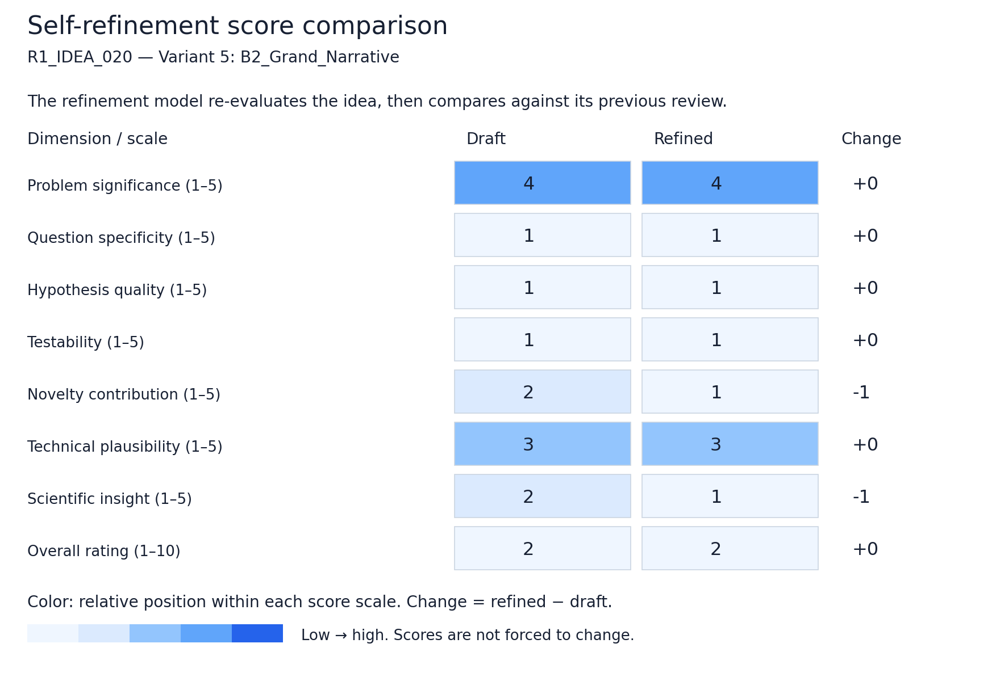

Changed score dimensions: novelty_contribution, scientific_insight.

### Score justifications (draft / refined)

**Problem significance**

```json
{
  "draft": {
    "score": 4.0,
    "justification": "The problem of neural network interpretability is highly significant and a major challenge in ML. Understanding internal structures is a core goal for building trustworthy and scientifically useful models. The idea correctly identifies this as important."
  },
  "refined": {
    "score": 4.0,
    "justification": "The problem of neural network interpretability is highly significant in machine learning, critical for trust, debugging, and scientific discovery. Understanding internal structures is a fundamental challenge. The idea correctly identifies this as an important area."
  }
}
```

**Question specificity**

```json
{
  "draft": {
    "score": 1.0,
    "justification": "Extremely weak. The text does not define a research question. It only states that KANs are a departure from MLPs and 'could contribute' to interpretability research. There is no concrete 'what', 'how', or 'why' to be investigated."
  },
  "refined": {
    "score": 1.0,
    "justification": "Extremely weak. No research question is defined. The text only states that KANs are a departure from MLPs and 'could contribute' to interpretability research. There is no concrete 'what', 'how', or 'why' to be investigated."
  }
}
```

**Hypothesis quality**

```json
{
  "draft": {
    "score": 1.0,
    "justification": "There is no hypothesis, explicit or implicit. The statement 'enhancing both accuracy and interpretability' is presented as a fact or claim about KANs, not as a testable prediction for a new study. No mechanism or conditional relationship is proposed."
  },
  "refined": {
    "score": 1.0,
    "justification": "There is no hypothesis, explicit or implicit. The statement 'enhancing both accuracy and interpretability' is presented as a general claim or fact about KANs, not as a testable prediction for a new study. No causal mechanism, conditional relationship, or novel prediction is proposed."
  }
}
```

**Testability**

```json
{
  "draft": {
    "score": 1.0,
    "justification": "The idea as presented is not testable because it does not propose anything to test. It is a general statement of potential. There is no suggested experiment, comparison, analysis, or evaluation method."
  },
  "refined": {
    "score": 1.0,
    "justification": "The idea as presented is not testable because it does not propose anything to test. It is a general statement of potential. There is no suggested experiment, comparison, analysis, or evaluation method. Without a specific question or hypothesis, there is nothing to falsify or validate."
  }
}
```

**Novelty contribution**

```json
{
  "draft": {
    "score": 2.0,
    "justification": "The idea itself, as stated, has near-zero novelty. It essentially paraphrases the known motivation and claimed advantages of KANs from the original literature. It does not propose a new method, a new hypothesis about KANs, a new application, or a new analysis. The potential contribution is entirely dependent on a future, unspecified study."
  },
  "refined": {
    "score": 1.0,
    "justification": "The idea itself has essentially no novelty. It paraphrases the known motivation and claimed advantages of KANs from the original literature. It does not propose a new method, a new hypothesis about KANs, a novel application, a critical analysis, or a new research direction. The potential contribution is entirely deferred to an unspecified future study."
  }
}
```

**Technical plausibility**

```json
{
  "draft": {
    "score": 3.0,
    "justification": "The described mechanism of KANs (learnable activations on edges) is technically accurate based on the original paper. The connection to interpretability is plausible given the stated motivation of KANs. However, the idea lacks any technical depth or proposed methodology to evaluate its own claims."
  },
  "refined": {
    "score": 3.0,
    "justification": "The described mechanism of KANs (learnable activations on edges) is technically accurate based on the original paper. The connection to interpretability is plausible given the stated motivation of KANs. However, the idea itself lacks any technical depth or proposed methodology to evaluate its own claims, so its plausibility rests solely on the accuracy of the background description."
  }
}
```

**Scientific insight**

```json
{
  "draft": {
    "score": 2.0,
    "justification": "The potential insight is currently very low because no specific investigation is proposed. If developed into a concrete study, it could provide insight into the relationship between network architecture (edge vs. node parameterization) and interpretability. As is, it only points to a topic where insight might be found."
  },
  "refined": {
    "score": 1.0,
    "justification": "The potential for scientific insight is currently negligible because no specific investigation is proposed. As presented, the idea only points to a topic (KANs and interpretability) where insight might be found. It does not articulate what new understanding might be gained, what principle might be revealed, or what boundary condition might be tested."
  }
}
```

**Overall rating**

```json
{
  "draft": {
    "score": 2.0,
    "justification": "This is a very weak research idea. While it identifies a significant problem area (interpretability), it fails to articulate any specific research question, hypothesis, or methodological direction. It reads as background context or a very high-level motivation, not as a proposal for a research study. It lacks the core components required to evaluate its scientific merit: a question to answer and a way to answer it. The score reflects the quality of the idea as presented, not the potential of the underlying topic."
  },
  "refined": {
    "score": 2.0,
    "justification": "This is a very weak research idea. While it correctly identifies a significant problem area (interpretability) and accurately describes a recent architectural innovation (KANs), it fails completely to articulate a specific research question, hypothesis, or methodological direction. It reads as background context or a high-level motivation, not as a proposal for a research study. It lacks the core components required to evaluate its scientific merit: a question to answer and a way to answer it. The score reflects the quality of the idea as presented, not the potential of the underlying topic."
  }
}
```

## R1_IDEA_020 — Variant 6: B3_Over_Confident

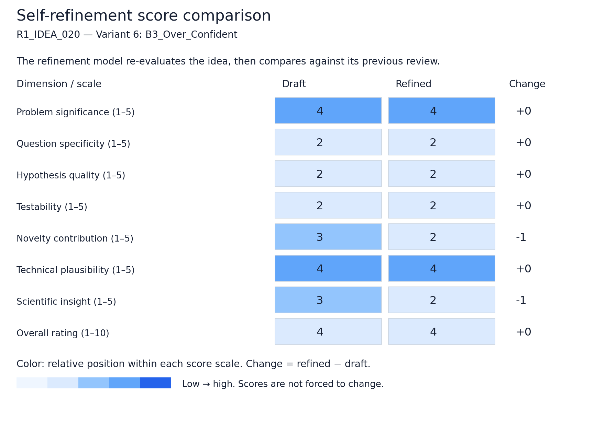

Changed score dimensions: novelty_contribution, scientific_insight.

### Score justifications (draft / refined)

**Problem significance**

```json
{
  "draft": {
    "score": 4.0,
    "justification": "The problem of neural network interpretability is highly significant in machine learning, with practical implications for trust, debugging, and scientific understanding. KANs represent a recent architectural innovation that merits investigation."
  },
  "refined": {
    "score": 4.0,
    "justification": "The problem is highly significant. Improving the interpretability of neural networks is a core challenge with implications for trust, debugging, and scientific understanding. Investigating a new architecture like KANs in this context is timely and relevant."
  }
}
```

**Question specificity**

```json
{
  "draft": {
    "score": 2.0,
    "justification": "The idea lacks a specific research question. It states that KANs 'directly address' accuracy and interpretability improvements, but doesn't specify what aspect of this relationship would be investigated, what would be compared, or what phenomenon would be studied."
  },
  "refined": {
    "score": 2.0,
    "justification": "The idea lacks a specific research question. It states a general claim about KANs ('directly addresses accuracy and interpretability') but does not specify what aspect of this relationship will be investigated, what will be compared, or what specific phenomenon will be studied."
  }
}
```

**Hypothesis quality**

```json
{
  "draft": {
    "score": 2.0,
    "justification": "There is an implicit hypothesis that KANs improve both accuracy and interpretability compared to MLPs, but it's stated as a fact rather than a testable prediction. No mechanism is proposed for why this might be true, and no alternative outcomes are considered."
  },
  "refined": {
    "score": 2.0,
    "justification": "There is an implicit hypothesis that KANs improve accuracy and interpretability over MLPs. However, it is presented as an assertion, not as a falsifiable prediction. No underlying mechanism is proposed, and no alternative outcomes or boundary conditions are considered."
  }
}
```

**Testability**

```json
{
  "draft": {
    "score": 2.0,
    "justification": "While the claims about KANs could be tested through comparative experiments, the idea itself doesn't propose any specific tests, evaluations, or methodologies. The statement is too vague to guide a concrete investigation."
  },
  "refined": {
    "score": 2.0,
    "justification": "While the claims could be tested with comparative experiments, the idea itself proposes no tests, evaluations, or methodologies. It is a vague statement, not a plan for investigation."
  }
}
```

**Novelty contribution**

```json
{
  "draft": {
    "score": 3.0,
    "justification": "The basic observation about KANs versus MLPs is not novel in itself, as KANs have been introduced and discussed in recent literature. However, a focused investigation into their interpretability properties could potentially yield novel insights if framed as a specific research question."
  },
  "refined": {
    "score": 2.0,
    "justification": "The core observation—that KANs differ architecturally from MLPs and may have benefits—is not novel, as it is the premise of the original KANs paper. The idea, as stated, suggests a generic verification or application rather than a novel scientific inquiry. A focused study on interpretability mechanisms could be novel, but that is not specified here."
  }
}
```

**Technical plausibility**

```json
{
  "draft": {
    "score": 4.0,
    "justification": "The architectural difference described (learnable activation functions on edges vs. fixed activations at nodes) is technically accurate for KANs. The claim that this might affect interpretability is plausible, though the mechanism is not elaborated."
  },
  "refined": {
    "score": 4.0,
    "justification": "The described architectural difference is technically correct. The claim that this structural change could influence model properties like interpretability is logically plausible, even if the causal mechanism is unstated."
  }
}
```

**Scientific insight**

```json
{
  "draft": {
    "score": 3.0,
    "justification": "If properly investigated, research on KANs' interpretability could provide insights into how architectural choices affect the transparency of learned representations. However, the current formulation is too vague to guarantee meaningful scientific insight beyond basic performance comparisons."
  },
  "refined": {
    "score": 2.0,
    "justification": "As presented, the idea promises little scientific insight. It suggests a comparison of outcomes (accuracy, interpretability) without proposing to uncover *why* or *under what conditions* the architectural difference matters. A well-designed study could yield insight into how activation function placement affects representation learning, but the current formulation does not guide such a study."
  }
}
```

**Overall rating**

```json
{
  "draft": {
    "score": 4.0,
    "justification": "The idea identifies a relevant architectural innovation (KANs) and connects it to an important problem (interpretability), but it lacks a specific research question, testable hypothesis, or methodological direction. It reads more as a general observation than a research plan. With substantial refinement to formulate a concrete question and experimental approach, it could become a stronger research idea."
  },
  "refined": {
    "score": 4.0,
    "justification": "The idea identifies a relevant topic (KANs and interpretability) but is fundamentally incomplete as a research idea. It lacks a specific question, a testable hypothesis, and any methodological direction. It reads as a background motivation or a claim in need of investigation, not as a plan for investigation itself. With significant refinement to include a concrete research question and experimental approach, it could become a viable idea."
  }
}
```

## R1_IDEA_020 — Variant 7: B4_Novelty


Changed score dimensions: question_specificity, hypothesis_quality, testability, novelty_contribution, scientific_insight, overall_rating.

### Score justifications (draft / refined)

**Problem significance**

```json
{
  "draft": {
    "score": 5.0,
    "justification": "The problem is highly significant. Understanding the internal workings and improving the interpretability of neural networks is a fundamental challenge in modern machine learning with major implications for reliability, debugging, and scientific discovery."
  },
  "refined": {
    "score": 5.0,
    "justification": "Exceptional significance. The interpretability and fundamental understanding of neural network representations is a core, enduring challenge in ML with profound implications for safety, debugging, and scientific discovery. Focusing on a radically new architecture like KANs that promises mechanistic interpretability directly targets this high-stakes problem."
  }
}
```

**Question specificity**

```json
{
  "draft": {
    "score": 2.0,
    "justification": "The idea is weak in specificity. It identifies a general area (internal structures of KANs) and a broad advantage (accuracy/interpretability) but does not define a concrete question. It lacks the precision needed to guide a focused investigation."
  },
  "refined": {
    "score": 1.0,
    "justification": "Very weak. The idea does not define a research question. It identifies a broad area ('internal structures') and a tool (KANs) but provides zero specificity about what is to be investigated, compared, or explained. It is a topic statement, not a research question."
  }
}
```

**Hypothesis quality**

```json
{
  "draft": {
    "score": 2.0,
    "justification": "The implicit hypothesis is that KANs enhance accuracy and interpretability over MLPs. This is a broad, directional claim but not a high-quality scientific hypothesis. It lacks a proposed mechanism, a clear relationship between variables, or a condition under which it might hold or fail. It is more of an observation from prior work than a novel hypothesis to be tested."
  },
  "refined": {
    "score": 1.0,
    "justification": "Very weak. There is no hypothesis presented for evaluation. The text 'enhancing both accuracy and interpretability' is a declarative summary of potential advantages, not a novel, testable prediction about mechanisms, relationships, or boundary conditions. It is an assertion, not a hypothesis to be investigated."
  }
}
```

**Testability**

```json
{
  "draft": {
    "score": 3.0,
    "justification": "The core claims are testable in principle (accuracy can be measured, interpretability can be probed with specific metrics), but the idea itself does not propose how to test them. It lacks any suggested experimental design, comparison baseline, or evaluation methodology. The testability is moderate because the subject (KANs) is inherently empirical, but the idea summary provides no test plan."
  },
  "refined": {
    "score": 2.0,
    "justification": "Weak. While the subject matter (KANs vs. MLPs) is inherently empirical, the idea itself proposes no test. There is no suggested experiment, analysis, or evaluation method. The claims mentioned (accuracy, interpretability) are testable in principle, but the idea provides no pathway to test them. It is a statement of interest, not a testable plan."
  }
}
```

**Novelty contribution**

```json
{
  "draft": {
    "score": 3.0,
    "justification": "The novelty is moderate. Investigating KANs is a timely direction given their recent introduction. However, the idea as presented suggests a general exploration or validation of known KAN properties rather than a novel hypothesis or insight about them. The potential contribution is currently framed as applying analysis to a new architecture, which is useful but not highly novel without a more specific angle."
  },
  "refined": {
    "score": 2.0,
    "justification": "Weak. The idea, as presented, suggests 'exploring' or 'investigating' KANs. This is a low-novelty activity akin to a initial evaluation or survey of a new tool. Without a specific question or angle, the potential contribution is merely applying standard analysis to a new architecture, which is a routine and incremental form of research."
  }
}
```

**Technical plausibility**

```json
{
  "draft": {
    "score": 4.0,
    "justification": "The idea is technically plausible. The description of KANs is accurate, and the stated advantages (accuracy, interpretability) are coherent claims from the literature. The reasoning that studying this new architecture could yield insights is logically sound."
  },
  "refined": {
    "score": 4.0,
    "justification": "Strong. The description of KANs is technically accurate. The reasoning that studying a new, theoretically-grounded architecture could yield insights is logically coherent. The foundational assumption—that comparing KANs and MLPs is a sensible way to learn about neural network design—is sound."
  }
}
```

**Scientific insight**

```json
{
  "draft": {
    "score": 3.0,
    "justification": "The potential for scientific insight is moderate. If executed well, a study of KANs could reveal insights about the role of activation function placement (node vs. edge), the trade-offs between weight and activation learning, and connections to theoretical representation theorems. However, the idea summary does not articulate what specific insight is being sought, so the potential remains generic."
  },
  "refined": {
    "score": 2.0,
    "justification": "Weak. The potential insight is entirely generic and unarticulated. The idea summary does not specify what we might learn. A well-executed study on KANs could offer deep insights (e.g., on the role of activation placement, connections to approximation theory), but this idea does not aim at any such insight; it merely points at the architecture."
  }
}
```

**Overall rating**

```json
{
  "draft": {
    "score": 5.0,
    "justification": "This is a moderate/borderline research idea. It identifies a highly significant problem area and a relevant, novel architecture (KANs). However, it fails to transition from a general motivation to a specific research question or testable hypothesis. The idea lacks the specificity and direction needed to constitute a strong research plan. Its strength lies in the importance of the topic, but its weakness is the vagueness of the proposed investigation. With a more concrete question and hypothesis, it could become a strong idea."
  },
  "refined": {
    "score": 3.0,
    "justification": "This is a weak research idea. Its sole strength is identifying a significant problem area and a relevant new architecture (KANs). However, it completely fails as a research 'idea' because it lacks the core components: a specific question, a hypothesis, and a notion of how to investigate. It is a motivation or background section, not a research direction. It would require substantial concretization to become a viable research plan."
  }
}
```

## R1_IDEA_020 — Variant 8: B5_Application_Impact


Changed score dimensions: none.

### Score justifications (draft / refined)

**Problem significance**

```json
{
  "draft": {
    "score": 5.0,
    "justification": "The problem is highly significant. Interpretability of neural networks is a fundamental challenge with major implications for trust, safety, debugging, and scientific discovery in ML. Any research direction that plausibly addresses this is important."
  },
  "refined": {
    "score": 5.0,
    "justification": "Exceptional. The problem of neural network interpretability is fundamental to advancing trustworthy, debuggable, and scientifically meaningful machine learning. Any plausible direction that addresses this challenge is highly significant."
  }
}
```

**Question specificity**

```json
{
  "draft": {
    "score": 1.0,
    "justification": "Very weak. The idea does not define a research question. It only states that KANs 'could inform' and 'may be relevant,' which is a generic statement of potential, not a specific inquiry."
  },
  "refined": {
    "score": 1.0,
    "justification": "Very weak. The idea does not define a research question. It only states that KANs 'could inform' and 'may be relevant,' which is a generic statement of potential relevance, not a specific inquiry."
  }
}
```

**Hypothesis quality**

```json
{
  "draft": {
    "score": 1.0,
    "justification": "Very weak. There is no hypothesis, explicit or implicit. The text makes an observational statement about KANs' design and a vague suggestion of benefit ('enhancing... interpretability'), but no testable prediction is made."
  },
  "refined": {
    "score": 1.0,
    "justification": "Very weak. There is no hypothesis, explicit or implicit. The text describes an architectural feature and suggests a potential benefit ('enhancing... interpretability'), but makes no concrete, testable prediction about relationships, mechanisms, or outcomes."
  }
}
```

**Testability**

```json
{
  "draft": {
    "score": 1.0,
    "justification": "Very weak. With no specific question or hypothesis, there is nothing concrete to test. The idea does not suggest any form of evaluation, experiment, or analysis to gather evidence."
  },
  "refined": {
    "score": 1.0,
    "justification": "Very weak. With no specific question or hypothesis, there is nothing concrete to test. The idea does not propose any form of experiment, evaluation, comparison, or analysis to gather evidence."
  }
}
```

**Novelty contribution**

```json
{
  "draft": {
    "score": 2.0,
    "justification": "Weak. The idea itself is not novel; it is a restatement of the motivation from the original KAN paper (Liu et al., 2024). The proposed contribution is undefined—it could range from a simple application to a deep analysis, but the idea does not specify what new knowledge it aims to produce."
  },
  "refined": {
    "score": 2.0,
    "justification": "Weak. The idea itself is not novel; it essentially restates the motivation from the original KAN paper. The proposed contribution is undefined—it could range from a simple application to a deeper analysis, but the idea does not specify what new knowledge it aims to generate."
  }
}
```

**Technical plausibility**

```json
{
  "draft": {
    "score": 4.0,
    "justification": "Strong. The core assertion is technically plausible. The architectural description of KANs is correct, and the link between their design (learnable, potentially simple edge functions) and interpretability is logically coherent and aligns with the original paper's claims."
  },
  "refined": {
    "score": 4.0,
    "justification": "Strong. The core technical assertion is plausible. The description of KANs' architecture is accurate, and the logical connection between learnable edge functions and potential interpretability is coherent and aligns with existing literature."
  }
}
```

**Scientific insight**

```json
{
  "draft": {
    "score": 2.0,
    "justification": "Weak. In its current form, the idea promises little scientific insight. It suggests applying an existing model (KAN) for its advertised benefits. To yield insight, it would need to aim at understanding *why* or *when* KANs are interpretable, comparing interpretability mechanisms, or revealing new limitations—none of which are proposed."
  },
  "refined": {
    "score": 2.0,
    "justification": "Weak. In its current form, the idea promises minimal scientific insight. It suggests using an existing model (KANs) for its advertised benefits. To yield insight, it would need to aim at understanding mechanisms, boundary conditions, or comparative advantages—none of which are proposed."
  }
}
```

**Overall rating**

```json
{
  "draft": {
    "score": 3.0,
    "justification": "This is a weak research idea. While it identifies a highly significant problem (interpretability) and a plausible technical direction (KANs), it fails to articulate a research question, hypothesis, or any plan for investigation. It reads as a background motivation paragraph, not a research proposal. The potential is there, but the idea itself is too vague and undeveloped to be considered strong."
  },
  "refined": {
    "score": 3.0,
    "justification": "This is a weak research idea. While it correctly identifies a highly significant problem (interpretability) and a technically plausible direction (KANs), it fails to articulate any research question, hypothesis, or investigative approach. It functions as a background motivation statement, not a concrete research proposal. The underlying potential exists, but the idea itself is too vague and undeveloped."
  }
}
```

## R1_IDEA_020 — Variant 9: C1_Hollow_Shell

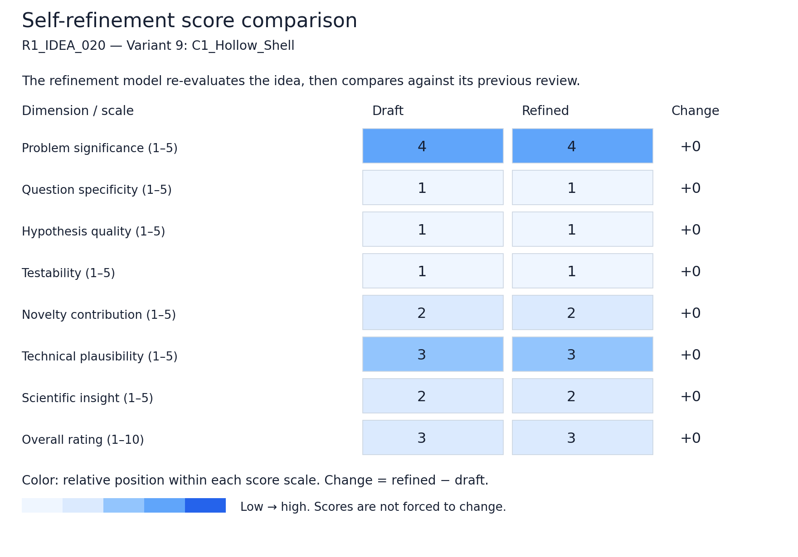

Changed score dimensions: none.

### Score justifications (draft / refined)

**Problem significance**

```json
{
  "draft": {
    "score": 4.0,
    "justification": "Understanding the internal organization of advanced computational models is a highly significant problem in machine learning. The 'black box' nature of modern models limits interpretability, trust, and scientific understanding. This addresses a meaningful challenge that matters to both researchers and practitioners."
  },
  "refined": {
    "score": 4.0,
    "justification": "Understanding the internal organization of advanced computational models is a highly significant problem in machine learning. The 'black box' nature of modern models limits interpretability, trust, and scientific understanding. This addresses a meaningful challenge that matters to both researchers and practitioners in developing more transparent and reliable AI systems."
  }
}
```

**Question specificity**

```json
{
  "draft": {
    "score": 1.0,
    "justification": "Extremely weak specificity. The idea mentions modifying 'key components' to improve 'certain model characteristics' without specifying what components, what characteristics, what models, or what relationships are being investigated. No concrete research question is articulated."
  },
  "refined": {
    "score": 1.0,
    "justification": "Extremely weak specificity. The idea mentions modifying 'key components' to improve 'certain model characteristics' without specifying what components, what characteristics, what models, or what relationships are being investigated. No concrete research question is articulated - it's essentially a placeholder for a research direction rather than a specific question."
  }
}
```

**Hypothesis quality**

```json
{
  "draft": {
    "score": 1.0,
    "justification": "No hypothesis is presented, explicit or implicit. The statement that modifying components 'can improve certain model characteristics' is a vague possibility rather than a testable prediction. There's no indication of what mechanism might be at play or what specific relationship is being investigated."
  },
  "refined": {
    "score": 1.0,
    "justification": "No hypothesis is presented, explicit or implicit. The statement that modifying components 'can improve certain model characteristics' is a vague possibility rather than a testable prediction. There's no indication of what mechanism might be at play, what specific relationship is being investigated, or what would constitute evidence for or against the claim."
  }
}
```

**Testability**

```json
{
  "draft": {
    "score": 1.0,
    "justification": "The idea as presented is not testable because it doesn't specify what would be tested. Without knowing what modifications are proposed, what characteristics would be measured, or what comparisons would be made, it's impossible to design experiments or analyses to investigate the claims."
  },
  "refined": {
    "score": 1.0,
    "justification": "The idea as presented is not testable because it doesn't specify what would be tested. Without knowing what modifications are proposed, what characteristics would be measured, or what comparisons would be made, it's impossible to design experiments or analyses to investigate the claims. The statement is too generic to be falsifiable."
  }
}
```

**Novelty contribution**

```json
{
  "draft": {
    "score": 2.0,
    "justification": "The mention of a 'shift from conventional methods' suggests potential novelty, but without any details about what this shift entails, it's impossible to assess. The core idea of modifying model components to improve characteristics is extremely broad and encompasses much existing work in architecture design and model analysis."
  },
  "refined": {
    "score": 2.0,
    "justification": "The mention of a 'shift from conventional methods' suggests potential novelty, but without any details about what this shift entails, it's impossible to assess. The core idea of modifying model components to improve characteristics is extremely broad and encompasses much existing work in architecture design, neural architecture search, model compression, and interpretability methods."
  }
}
```

**Technical plausibility**

```json
{
  "draft": {
    "score": 3.0,
    "justification": "The general concept that modifying architectural components can affect model characteristics is technically plausible based on extensive prior work in neural architecture search, model compression, and interpretability. However, the reasoning is too vague to assess coherence, and no specific mechanism is proposed."
  },
  "refined": {
    "score": 3.0,
    "justification": "The general concept that modifying architectural components can affect model characteristics is technically plausible based on extensive prior work in neural architecture design and analysis. However, the reasoning is too vague to assess coherence, and no specific mechanism is proposed. The claim is so generic that it's neither clearly plausible nor implausible."
  }
}
```

**Scientific insight**

```json
{
  "draft": {
    "score": 2.0,
    "justification": "The idea has potential for scientific insight if it could reveal how specific architectural modifications affect model behavior or understanding. However, as presented, it's too vague to determine what insights might be gained. It could easily devolve into simple performance benchmarking without deeper understanding."
  },
  "refined": {
    "score": 2.0,
    "justification": "The idea has potential for scientific insight if it could reveal how specific architectural modifications affect model behavior or understanding. However, as presented, it's too vague to determine what insights might be gained. It could easily devolve into simple performance benchmarking without deeper understanding of mechanisms or principles."
  }
}
```

**Overall rating**

```json
{
  "draft": {
    "score": 3.0,
    "justification": "This is a weak research idea. While it addresses an important problem (model understanding), it lacks specificity, testability, and a clear hypothesis. The description is so generic that it could apply to countless existing research directions. Without concrete details about what is being modified, what characteristics are being improved, or what makes the approach novel, it's difficult to see this as a meaningful research direction rather than a general motivation statement."
  },
  "refined": {
    "score": 3.0,
    "justification": "This is a weak research idea. While it addresses an important problem (model understanding), it lacks specificity, testability, and a clear hypothesis. The description is so generic that it could apply to countless existing research directions. Without concrete details about what is being modified, what characteristics are being improved, or what makes the approach novel, it's difficult to see this as a meaningful research direction rather than a general motivation statement. The idea needs substantial refinement to become a viable research proposal."
  }
}
```

## R1_IDEA_020 — Variant 10: C2_Logic_Flawed

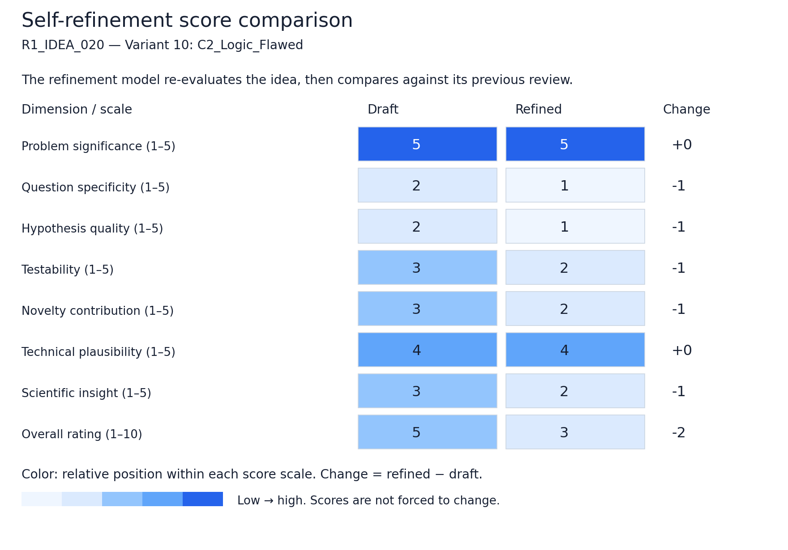

Changed score dimensions: question_specificity, hypothesis_quality, testability, novelty_contribution, scientific_insight, overall_rating.

### Score justifications (draft / refined)

**Problem significance**

```json
{
  "draft": {
    "score": 5.0,
    "justification": "Interpretability of neural networks is a fundamental and highly significant challenge in machine learning. Understanding internal representations is crucial for trust, debugging, and scientific discovery. The problem is well-motivated and important to both researchers and practitioners."
  },
  "refined": {
    "score": 5.0,
    "justification": "Interpretability of neural networks is a core, high-significance challenge in machine learning. Improving model transparency is essential for trust, debugging, fairness auditing, and scientific discovery. The problem is well-motivated and important to both research and practice."
  }
}
```

**Question specificity**

```json
{
  "draft": {
    "score": 2.0,
    "justification": "The research question is poorly defined. 'Broader effectiveness across related settings for improving model transparency' is vague. It does not specify what settings, what aspects of transparency, or what constitutes effectiveness. The idea identifies KANs as a subject but does not articulate a clear, concrete investigation."
  },
  "refined": {
    "score": 1.0,
    "justification": "The research question is extremely vague. It mentions 'broader effectiveness across related settings' without defining any terms. There is no concrete question about what relationship is being investigated, under what conditions, or with what expected outcome. It identifies a subject (KANs) but not an actual research question."
  }
}
```

**Hypothesis quality**

```json
{
  "draft": {
    "score": 2.0,
    "justification": "There is an implicit hypothesis that KANs' architectural change leads to broader effectiveness in transparency, but it is not stated as a testable prediction. The hypothesis lacks specificity about the expected relationship, mechanisms, or boundary conditions. It reads more like a general claim than a research hypothesis."
  },
  "refined": {
    "score": 1.0,
    "justification": "There is no explicit hypothesis. The implicit suggestion that KANs might be broadly effective for transparency is not a testable prediction. It lacks specificity about mechanisms, expected outcomes, or conditions. It is essentially a generic claim rather than a research hypothesis."
  }
}
```

**Testability**

```json
{
  "draft": {
    "score": 3.0,
    "justification": "The idea is testable in principle because one could design experiments comparing KANs and MLPs on interpretability metrics. However, without a concrete hypothesis or defined evaluation, it's unclear exactly what would be tested. The direction is plausible but underspecified."
  },
  "refined": {
    "score": 2.0,
    "justification": "The idea is minimally testable because one could compare KANs and MLPs on some interpretability metric. However, without a defined hypothesis, specific evaluation, or clear success criteria, it's unclear what exactly would be tested or how conclusions would be drawn. The direction is too vague to support meaningful investigation."
  }
}
```

**Novelty contribution**

```json
{
  "draft": {
    "score": 3.0,
    "justification": "Investigating KANs for interpretability is moderately novel given their recent introduction. However, the idea as presented is mostly an application of an existing architecture to a general problem (interpretability). A more targeted investigation into why or how KANs might offer interpretability advantages could yield higher novelty."
  },
  "refined": {
    "score": 2.0,
    "justification": "The idea as presented is essentially applying an existing architecture (KANs) to a general problem (interpretability). Without a specific novel angle—such as investigating why the architectural change affects interpretability, or under what conditions—the potential contribution is low. It risks being a straightforward application study."
  }
}
```

**Technical plausibility**

```json
{
  "draft": {
    "score": 4.0,
    "justification": "The reasoning is logically coherent: changing activation functions from fixed nodes to learnable edges could alter internal representations in ways that affect interpretability. This is a plausible direction. No obvious technical flaws are apparent from the brief description."
  },
  "refined": {
    "score": 4.0,
    "justification": "The core reasoning is logically coherent: altering where and how activation functions are applied could influence internal representations and thus interpretability. The architectural difference between KANs and MLPs is clear, and investigating its impact on transparency is a plausible direction. No technical contradictions are apparent."
  }
}
```

**Scientific insight**

```json
{
  "draft": {
    "score": 3.0,
    "justification": "If pursued with a specific hypothesis, this research could provide insight into how architectural choices (activation function placement and learnability) influence interpretability. However, as currently stated, it risks being a simple performance comparison rather than revealing general principles about transparency mechanisms."
  },
  "refined": {
    "score": 2.0,
    "justification": "As stated, the idea offers little potential for scientific insight. It suggests a comparison without a clear hypothesis about underlying mechanisms. If refined to investigate how activation function placement affects representation interpretability, it could yield insight into architecture–interpretability relationships, but currently it lacks that focus."
  }
}
```

**Overall rating**

```json
{
  "draft": {
    "score": 5.0,
    "justification": "This is a moderate/borderline research idea. It addresses a significant problem (interpretability) and identifies a relevant architectural innovation (KANs). However, the research question is vague, the hypothesis is implicit and weak, and the potential contribution is limited without greater specificity. It lacks the concrete direction needed for a strong research idea, but it is not incoherent or trivial."
  },
  "refined": {
    "score": 3.0,
    "justification": "This is a weak research idea. While it addresses a significant problem (interpretability) and identifies a relevant architectural candidate (KANs), it fails to articulate a concrete research question, hypothesis, or evaluation approach. The idea is vague and underspecified, offering little guidance for meaningful investigation. It is not incoherent, but it lacks the specificity and testability needed for a stronger research direction."
  }
}
```

## R1_IDEA_020 — Variant 11: C3_Substance_Enriched


Changed score dimensions: none.

### Score justifications (draft / refined)

**Problem significance**

```json
{
  "draft": {
    "score": 4.0,
    "justification": "Interpretability of neural networks is a significant and persistent challenge. KANs are a novel architecture promising better interpretability, so investigating the factors that affect their interpretability is meaningful and timely."
  },
  "refined": {
    "score": 4.0,
    "justification": "Interpretability of neural networks remains a fundamental challenge. KANs represent a promising architectural shift that explicitly aims for interpretability, making investigation of factors affecting their interpretability scientifically meaningful and timely."
  }
}
```

**Question specificity**

```json
{
  "draft": {
    "score": 2.0,
    "justification": "The idea mentions a 'testable variable' (smoothness) and a validation approach, but the core research question is not clearly stated. It is unclear whether the focus is on parameterization choices, smoothness effects, or domain-dependent interpretability."
  },
  "refined": {
    "score": 2.0,
    "justification": "The idea mentions studying 'smoothness' and comparing 'across different data domains,' but lacks a clearly articulated research question. It's unclear what specific relationship or phenomenon is being investigated."
  }
}
```

**Hypothesis quality**

```json
{
  "draft": {
    "score": 2.0,
    "justification": "The only explicit hypothesis is that 'learnable functions could be parameterized by splines,' which is already a standard design in KANs. There is no predictive hypothesis about smoothness or interpretability. The idea implies a relationship between smoothness and interpretability but does not articulate it as a testable claim."
  },
  "refined": {
    "score": 2.0,
    "justification": "The only explicit statement is that functions 'could be parameterized by splines,' which is descriptive rather than predictive. There's an implied connection between smoothness and interpretability, but no testable hypothesis about their relationship or domain dependencies is formulated."
  }
}
```

**Testability**

```json
{
  "draft": {
    "score": 3.0,
    "justification": "The idea suggests comparing learned functions across domains, which is a testable approach. However, without defined interpretability metrics or a clear independent variable (e.g., smoothness control), the testability is limited. The validation is described vaguely ('identify boundary conditions')."
  },
  "refined": {
    "score": 3.0,
    "justification": "The suggestion to compare learned functions across domains provides a testable direction. However, without defined interpretability metrics, smoothness controls, or a clear experimental manipulation, testability remains limited. The validation approach ('identify boundary conditions') is vague."
  }
}
```

**Novelty contribution**

```json
{
  "draft": {
    "score": 2.0,
    "justification": "Using splines in KANs is not novel. Analyzing smoothness effects could be a contribution, but the idea does not articulate what new knowledge would be gained beyond 'smoothness matters.' A more focused study on smoothness-accuracy-interpretability trade-offs or domain-specific interpretability could be novel, but the current framing is too generic."
  },
  "refined": {
    "score": 2.0,
    "justification": "Spline parameterization is already central to KAN implementations. Studying smoothness effects could be incremental unless framed to uncover new principles about interpretability. The idea doesn't articulate what novel scientific contribution would emerge beyond analyzing an existing design choice."
  }
}
```

**Technical plausibility**

```json
{
  "draft": {
    "score": 4.0,
    "justification": "The general direction is technically plausible. KANs do use learnable activation functions, often parameterized with splines. Studying their smoothness and cross-domain behavior is feasible. The reasoning is coherent, though high-level."
  },
  "refined": {
    "score": 4.0,
    "justification": "The general approach is technically plausible. KANs do use learnable activation functions often implemented with splines. Studying their smoothness properties and cross-domain behavior is feasible with appropriate experimental controls and metrics."
  }
}
```

**Scientific insight**

```json
{
  "draft": {
    "score": 3.0,
    "justification": "If well-executed, the idea could provide insights into how function smoothness relates to interpretability in KANs and whether interpretability gains are domain-dependent. This could inform the design of more interpretable architectures. However, the potential insight is moderate because the idea lacks a clear mechanism or principle to uncover."
  },
  "refined": {
    "score": 3.0,
    "justification": "If well-executed, the research could provide insights into how activation function properties affect interpretability in novel architectures and whether interpretability gains are domain-dependent. However, the potential insight is moderate because the idea lacks a clear mechanism or general principle to uncover beyond empirical observations."
  }
}
```

**Overall rating**

```json
{
  "draft": {
    "score": 5.0,
    "justification": "The idea identifies a relevant problem (interpretability of KANs) and suggests a plausible direction (studying smoothness of activation functions across domains). However, it lacks a specific research question, a clear hypothesis, and a well-defined notion of interpretability. The novelty is limited, and the contribution is unclear. It is a moderate/borderline idea that could become strong with sharper focus and a testable hypothesis."
  },
  "refined": {
    "score": 5.0,
    "justification": "The idea identifies a relevant problem (KAN interpretability) and suggests a plausible technical direction (studying smoothness across domains). However, it lacks a specific research question, clear hypothesis, operationalized interpretability metrics, and articulated novelty. It represents a moderate/borderline research idea that requires substantial refinement to become strong."
  }
}
```

## R1_IDEA_020 — Variant 12: H1_Deceptive_Hollow

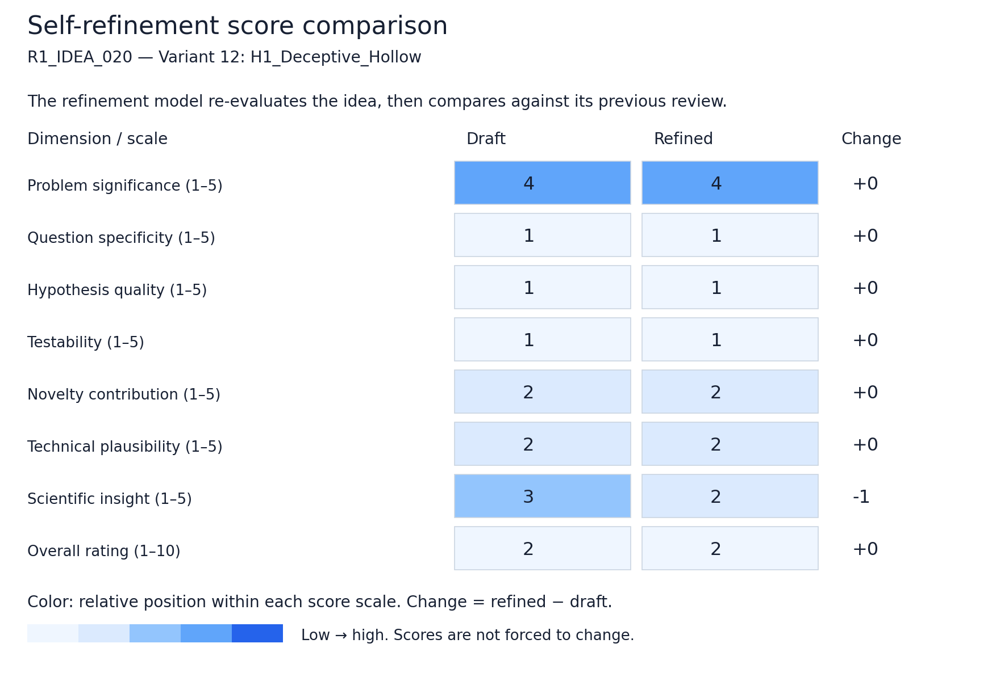

Changed score dimensions: scientific_insight.

### Score justifications (draft / refined)

**Problem significance**

```json
{
  "draft": {
    "score": 4.0,
    "justification": "The problem of understanding the internal organization of advanced computational models is highly significant. It's a core challenge in making AI systems transparent, reliable, and trustworthy. The idea correctly identifies a meaningful and relevant research gap."
  },
  "refined": {
    "score": 4.0,
    "justification": "The underlying problem—understanding the internal organization of advanced computational models—is highly significant. It is fundamental to making AI systems transparent, reliable, and trustworthy. The idea correctly identifies a core, meaningful challenge in modern machine learning."
  }
}
```

**Question specificity**

```json
{
  "draft": {
    "score": 1.0,
    "justification": "Extremely weak. The idea summary contains no specific research question. It uses generic phrases like 'modifies key components,' 'improve certain model characteristics,' and 'understand internal organization' without defining any of these terms. It fails to identify what is concretely being investigated."
  },
  "refined": {
    "score": 1.0,
    "justification": "Extremely weak. The summary contains no specific research question. It uses entirely generic phrases like 'modifies key components,' 'improve certain model characteristics,' and 'understand internal organization' without defining any terms. It fails to identify what is concretely being investigated."
  }
}
```

**Hypothesis quality**

```json
{
  "draft": {
    "score": 1.0,
    "justification": "Very weak. There is no discernible hypothesis. There is no prediction about a mechanism, relationship, or causal effect. The text describes a general direction and makes grand claims about potential impact, but it does not state what the research expects to find or demonstrate."
  },
  "refined": {
    "score": 1.0,
    "justification": "Very weak. There is no discernible hypothesis. There is no prediction about a mechanism, relationship, or causal effect. The text describes a general ambition and makes grand claims about potential impact, but it does not state what the research expects to find, demonstrate, or falsify."
  }
}
```

**Testability**

```json
{
  "draft": {
    "score": 1.0,
    "justification": "Very weak. With no specific question, hypothesis, or defined variables, the idea is not testable. There is no suggestion of an experiment, analysis, comparison, or evaluation method. One cannot design a study from this description."
  },
  "refined": {
    "score": 1.0,
    "justification": "Very weak. With no specific question, hypothesis, or defined variables (what is modified? what is measured?), the idea is not testable. There is no suggestion of an experiment, analysis, comparison, or evaluation method. One cannot design an investigation from this description."
  }
}
```

**Novelty contribution**

```json
{
  "draft": {
    "score": 2.0,
    "justification": "Weak. The idea claims novelty and a transformative synthesis, but without any technical or conceptual detail, it's impossible to assess. The stated goal of understanding model internals via architectural modification is a well-established research area (e.g., mechanistic interpretability). The contribution is positioned abstractly and lacks a distinguishing element from prior work."
  },
  "refined": {
    "score": 2.0,
    "justification": "Weak. The idea claims novelty and a 'transformative synthesis,' but without any technical or conceptual detail, this is unsubstantiated. The stated high-level goal of understanding model internals via architectural modification is a well-established research area (e.g., mechanistic interpretability, architecture search for interpretability). The contribution is positioned only at an abstract, aspirational level."
  }
}
```

**Technical plausibility**

```json
{
  "draft": {
    "score": 2.0,
    "justification": "Weak. The reasoning is logically coherent at a very high level (modifying architecture could lead to better understanding), but it's too vague to assess technical plausibility. Important assumptions (what modifications? for what purpose?) are not stated, so we cannot evaluate if the direction makes technical sense."
  },
  "refined": {
    "score": 2.0,
    "justification": "Weak. The high-level reasoning is coherent (architectural changes can affect model properties), but it is too vague to assess technical plausibility. Critical assumptions—what modifications, for what purpose, in what models—are completely missing, making it impossible to evaluate if the direction is technically sound."
  }
}
```

**Scientific insight**

```json
{
  "draft": {
    "score": 3.0,
    "justification": "Moderate. The stated ambition—to connect architectural modification to improved understanding of model organization—has the potential to yield scientific insight about model mechanisms and principles. However, the potential is entirely dependent on executing a specific, well-designed study, which is not described here. In its current vague form, the insight is merely aspirational."
  },
  "refined": {
    "score": 2.0,
    "justification": "Weak. While the stated ambition to connect architectural design to understanding has potential for insight, the idea in its current form provides no pathway to achieve it. The potential insight is entirely aspirational and contingent on unspecified future work. In this vague formulation, it offers little beyond acknowledging that understanding model internals is desirable."
  }
}
```

**Overall rating**

```json
{
  "draft": {
    "score": 2.0,
    "justification": "Very weak research idea. While it identifies a significant problem area, the idea itself is poorly defined. It lacks a concrete research question, a testable hypothesis, and any methodological direction. The text is filled with abstract, promotional language ('transformative synthesis,' 'field-shaping agenda') that is not backed by scientific substance. It reads more like a motivation paragraph or a grant proposal abstract than a research idea with a clear investigative path. In its current form, it cannot be meaningfully evaluated or pursued."
  },
  "refined": {
    "score": 2.0,
    "justification": "Very weak research idea. It identifies a significant problem area but fails to propose any concrete research direction. It lacks a specific question, a testable hypothesis, and any methodological direction. The text is dominated by abstract, promotional language that is not backed by scientific substance. It reads as a high-level motivation statement, not as a research idea with a clear investigative path. In its current form, it cannot be meaningfully evaluated or pursued."
  }
}
```

## R1_IDEA_020 — Variant 13: H2_Confident_Flaw

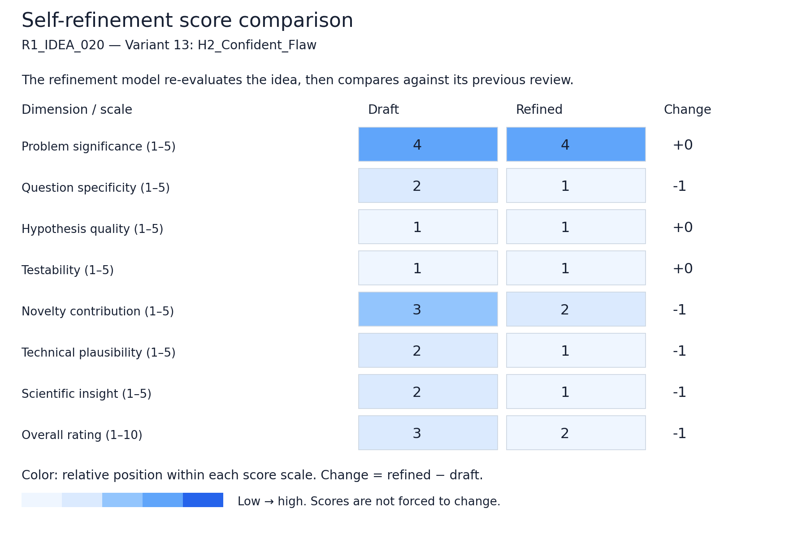

Changed score dimensions: question_specificity, novelty_contribution, technical_plausibility, scientific_insight, overall_rating.

### Score justifications (draft / refined)

**Problem significance**

```json
{
  "draft": {
    "score": 4.0,
    "justification": "Interpretability of neural networks is a highly significant problem in machine learning. Understanding internal representations and making models more transparent is important for scientific understanding, safety, and trustworthiness. KANs represent a novel architectural approach that merits investigation."
  },
  "refined": {
    "score": 4.0,
    "justification": "Interpretability of neural networks is a highly significant problem in machine learning, crucial for scientific understanding, safety, and trustworthiness. KANs represent a novel architectural approach that merits investigation for potential interpretability benefits."
  }
}
```

**Question specificity**

```json
{
  "draft": {
    "score": 2.0,
    "justification": "The research question is poorly defined. 'Broader effectiveness across related settings for improving model transparency' is vague. It doesn't specify what settings, what aspects of transparency, or how effectiveness would be measured. The idea lacks a concrete, testable question."
  },
  "refined": {
    "score": 1.0,
    "justification": "Extremely poor specificity. The research question is vague: 'broader effectiveness across related settings for improving model transparency' doesn't specify what settings, what aspects of transparency, how effectiveness is measured, or what 'broader' means. It lacks a concrete, testable question."
  }
}
```

**Hypothesis quality**

```json
{
  "draft": {
    "score": 1.0,
    "justification": "The implicit hypothesis is that KANs' architectural change will necessarily produce reliable interpretability improvements across settings, and that performance gains can be treated as causal evidence without controlling for confounds. This is a weak hypothesis: it's not falsifiable (dismisses alternative explanations), makes strong causal claims without mechanism, and is essentially circular reasoning."
  },
  "refined": {
    "score": 1.0,
    "justification": "Exceptionally weak hypothesis. The implicit claim is circular: addressing a 'visible weakness' will necessarily produce improvements, and those improvements prove superiority. It's unfalsifiable (dismisses alternative explanations), makes strong causal claims without mechanism, and lacks any concrete prediction that could be contradicted by evidence."
  }
}
```

**Testability**

```json
{
  "draft": {
    "score": 1.0,
    "justification": "Extremely low testability. The idea explicitly rejects standard scientific practices for establishing causality ('without separately isolating dataset composition, evaluation criteria, boundary cases, or alternative explanations'). There's no suggested experimental design, evaluation methodology, or comparison framework. The claim that improvements are 'necessarily' produced precludes falsifiability."
  },
  "refined": {
    "score": 1.0,
    "justification": "Effectively untestable. The idea explicitly rejects standard scientific practices for establishing causality ('without separately isolating dataset composition, evaluation criteria, boundary cases, or alternative explanations'). No experimental design, evaluation methodology, or comparison framework is suggested. The claim that improvements are 'necessarily' produced precludes falsifiability entirely."
  }
}
```

**Novelty contribution**

```json
{
  "draft": {
    "score": 3.0,
    "justification": "Moderate novelty. Investigating KANs for interpretability is timely given their recent introduction. However, the idea as presented is mostly an assertion of expected superiority rather than a novel research direction. The contribution would depend entirely on what specific insights are discovered, but the current formulation doesn't suggest what those might be beyond 'KANs are better'."
  },
  "refined": {
    "score": 2.0,
    "justification": "Low novelty. While investigating KANs for interpretability is timely, the idea as presented is merely an assertion of expected superiority without a novel research direction. It doesn't propose new methods, new insights, or new evaluations—just claims KANs should be better. The contribution would depend entirely on execution, but the formulation suggests no novel scientific inquiry."
  }
}
```

**Technical plausibility**

```json
{
  "draft": {
    "score": 2.0,
    "justification": "The technical reasoning is weak. The argument that addressing a 'visible weakness' will 'necessarily produce reliable improvements' is logically flawed. The dismissal of controlled experimentation undermines technical credibility. While KANs' architectural properties might plausibly aid interpretability, the proposed approach to demonstrating this lacks scientific rigor."
  },
  "refined": {
    "score": 1.0,
    "justification": "Technically implausible due to fundamental scientific flaws. The argument that addressing a weakness will 'necessarily produce reliable improvements' is logically invalid. The dismissal of controlled experimentation undermines any technical credibility. While KANs might plausibly aid interpretability, the proposed approach to demonstrating this lacks any scientific rigor or coherent methodology."
  }
}
```

**Scientific insight**

```json
{
  "draft": {
    "score": 2.0,
    "justification": "Low potential for scientific insight in current form. The idea focuses on asserting superiority rather than understanding mechanisms. If properly executed, research on KANs could provide insights into how activation function placement affects interpretability, function representation, or symbolic recovery. But the current proposal doesn't aim for these insights—it aims to demonstrate 'general superiority' without investigating why or under what conditions."
  },
  "refined": {
    "score": 1.0,
    "justification": "Minimal potential for scientific insight. The idea focuses on asserting superiority rather than understanding mechanisms, boundary conditions, or general principles. Even if executed, the proposed approach (ignoring confounds) wouldn't yield reliable insights about why KANs might be more interpretable, when they work, or what architectural properties drive interpretability."
  }
}
```

**Overall rating**

```json
{
  "draft": {
    "score": 3.0,
    "justification": "Weak research idea. While it addresses an important problem (interpretability) and identifies a relevant architectural innovation (KANs), the idea is poorly formulated. The research question is vague, the hypothesis is circular and unfalsifiable, testability is extremely low due to rejection of controlled experimentation, and the potential for scientific insight is minimal as presented. The idea reads more like a predetermined conclusion than a research investigation."
  },
  "refined": {
    "score": 2.0,
    "justification": "Very weak research idea. While it identifies an important problem (interpretability) and a relevant architecture (KANs), the idea is fundamentally flawed. The research question is vague, the hypothesis is circular and unfalsifiable, testability is nonexistent due to rejection of scientific methodology, and the approach lacks technical plausibility. It reads as a predetermined conclusion rather than a research investigation, with no meaningful scientific contribution possible in its current form."
  }
}
```

## R1_IDEA_020 — Variant 14: H3_Verbose_Enriched

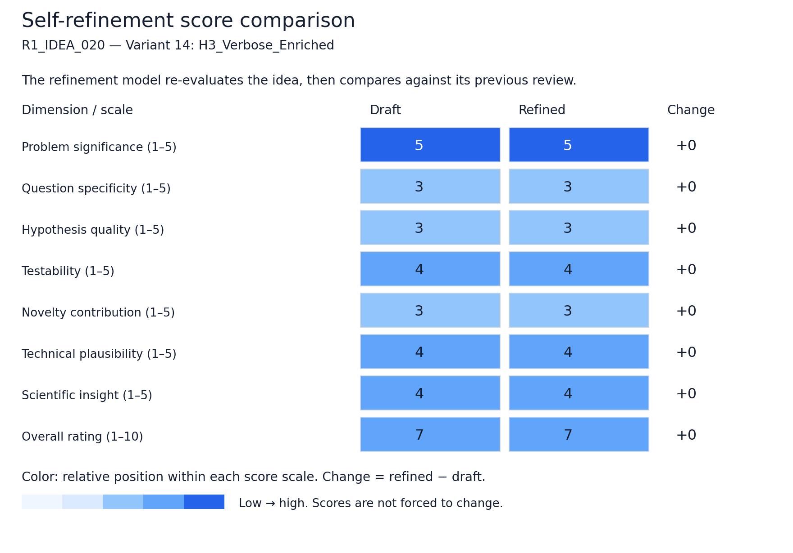

Changed score dimensions: none.

### Score justifications (draft / refined)

**Problem significance**

```json
{
  "draft": {
    "score": 5.0,
    "justification": "Understanding the internal workings and interpretability of novel neural architectures like KANs is a highly meaningful problem in machine learning. It addresses both foundational questions (how architectural choices affect learned representations) and practical concerns (building more transparent models)."
  },
  "refined": {
    "score": 5.0,
    "justification": "The problem is highly significant. Improving the interpretability of neural networks is a major, ongoing challenge. Investigating a novel architecture like KANs, which is explicitly designed with interpretability in mind, addresses a meaningful gap at the intersection of model design and transparency."
  }
}
```

**Question specificity**

```json
{
  "draft": {
    "score": 3.0,
    "justification": "The idea identifies a testable variable (smoothness) and proposes cross-domain comparisons, but the core research question is somewhat diffuse—it blends interpretability, smoothness, and domain adaptation without a sharp focus. However, the staged design and validation plan add specificity."
  },
  "refined": {
    "score": 3.0,
    "justification": "The idea identifies a specific variable (smoothness) and a general validation approach (cross-domain comparison, staged design). However, the overarching research question itself is not crisply defined—it blends several concepts (interpretability gains, boundary conditions, role of smoothness) without a single, sharp focus. The methodological suggestions add specificity to the *how*, but not to the core *what*."
  }
}
```

**Hypothesis quality**

```json
{
  "draft": {
    "score": 3.0,
    "justification": "An implicit hypothesis exists (smoothness of edge functions affects interpretability), but it is not explicitly stated or strongly motivated. The idea suggests testable predictions (e.g., smoothness matters more in certain domains) but does not articulate a clear causal or mechanistic relationship."
  },
  "refined": {
    "score": 3.0,
    "justification": "An implicit hypothesis exists: that the smoothness of the learnable edge functions is a key variable affecting interpretability. However, it is not stated explicitly, and the predicted relationship or mechanism is not articulated. The idea suggests the hypothesis is testable but does not flesh out a clear, falsifiable prediction about the nature of the relationship."
  }
}
```

**Testability**

```json
{
  "draft": {
    "score": 4.0,
    "justification": "The proposed validation approach—comparing learned functions across domains, ablations, sensitivity analyses—makes the idea highly testable. The main limitation is the lack of defined interpretability metrics, but the methodological outline is strong."
  },
  "refined": {
    "score": 4.0,
    "justification": "The idea is highly testable in principle due to the detailed proposed experimental design (staged conditions, ablations, sensitivity analyses). The major barrier is the undefined interpretability metric. If a valid metric were chosen, the outlined methodology provides a clear path to obtaining evidence for or against the central claim."
  }
}
```

**Novelty contribution**

```json
{
  "draft": {
    "score": 3.0,
    "justification": "Parameterizing KAN edge functions with splines is a natural extension, but investigating how smoothness interacts with interpretability across domains is more novel. The potential contribution lies in uncovering boundary conditions and failure modes, which could provide general insights into when and why KANs are interpretable."
  },
  "refined": {
    "score": 3.0,
    "justification": "The novelty is moderate. Using splines to parameterize KAN edge functions is a straightforward technical choice. The more novel aspect is the proposed investigation into how a hyperparameter (smoothness) affects a high-level property (interpretability) across domains. The potential contribution lies in uncovering practical boundary conditions for KANs' interpretability claims."
  }
}
```

**Technical plausibility**

```json
{
  "draft": {
    "score": 4.0,
    "justification": "The idea is technically coherent: KANs use learnable edge functions, splines are a standard way to parameterize smooth functions, and comparing them across domains is feasible. The experimental design is logically structured and plausible."
  },
  "refined": {
    "score": 4.0,
    "justification": "The idea is technically plausible and coherent. KANs have learnable edge functions, splines are a standard tool for parameterizing smooth functions, and the proposed experimental manipulations (varying smoothness, domain, noise) are feasible. The reasoning is logically sound."
  }
}
```

**Scientific insight**

```json
{
  "draft": {
    "score": 4.0,
    "justification": "If executed well, this study could reveal how architectural choices (smoothness of activations) affect interpretability in different data regimes, providing transferable insights into the trade-offs between expressivity and transparency in neural networks. The focus on boundary conditions and failure analysis enhances potential insight."
  },
  "refined": {
    "score": 4.0,
    "justification": "The potential for scientific insight is strong. Successfully executed, this study would not just report if KANs are interpretable, but could reveal *when* and *why* they are—specifically, how the smoothness of internal representations interacts with data properties to produce human-understandable explanations. This is a transferable insight about the trade-offs in designing interpretable architectures."
  }
}
```

**Overall rating**

```json
{
  "draft": {
    "score": 7.0,
    "justification": "This is a strong research idea with a meaningful problem, a plausible methodological direction, and high potential for scientific insight. It is weakened by a somewhat implicit hypothesis and lack of specificity in measuring interpretability, but the proposed experimental design and focus on boundary conditions elevate it above a simple application study."
  },
  "refined": {
    "score": 7.0,
    "justification": "This is a strong research idea. It tackles a significant problem with a plausible and rigorous methodological plan that promises meaningful scientific insight. Its primary weaknesses are the lack of a crisply defined research question and an explicit hypothesis, but these are addressable. The focus on boundary conditions and a detailed validation framework elevates it above a simple application study."
  }
}
```

## R1_IDEA_020 — Variant 15: H4_Ultimate_Hype

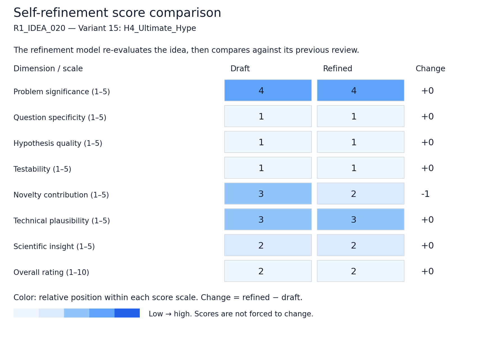

Changed score dimensions: novelty_contribution.

### Score justifications (draft / refined)

**Problem significance**

```json
{
  "draft": {
    "score": 4.0,
    "justification": "The problem of neural network interpretability and understanding internal structures is highly significant in machine learning. Improving both accuracy and interpretability is a core challenge with substantial implications for trustworthiness and deployment."
  },
  "refined": {
    "score": 4.0,
    "justification": "The problem of neural network interpretability is highly significant in ML, affecting trust, debugging, and safe deployment. Improving both accuracy and interpretability is a core challenge with substantial scientific and practical implications."
  }
}
```

**Question specificity**

```json
{
  "draft": {
    "score": 1.0,
    "justification": "Extremely weak. The text does not define a research question. It only states that KANs are a 'significant departure' and that investigating them 'could redefine the frontier'. There is no concrete 'what' is being investigated."
  },
  "refined": {
    "score": 1.0,
    "justification": "Extremely weak. No research question is defined. The text only describes KANs and states they 'could' be transformative, without specifying what to investigate about them."
  }
}
```

**Hypothesis quality**

```json
{
  "draft": {
    "score": 1.0,
    "justification": "No hypothesis is presented. There are only vague, non-falsifiable statements about potential ('could redefine', 'position it as a compelling pathway'). There is no concrete prediction about a relationship, mechanism, or comparative outcome."
  },
  "refined": {
    "score": 1.0,
    "justification": "No hypothesis is presented. There are only vague, non-falsifiable statements about potential impact ('could redefine the frontier', 'compelling pathway'). There is no concrete prediction about a mechanism, relationship, or comparative outcome."
  }
}
```

**Testability**

```json
{
  "draft": {
    "score": 1.0,
    "justification": "The idea as presented is not testable. It proposes no experiments, comparisons, evaluations, or analyses. It is a declaration of potential importance without a pathway to gather evidence."
  },
  "refined": {
    "score": 1.0,
    "justification": "Not testable as presented. It proposes no experiments, comparisons, metrics, or analyses. It is a declaration of potential without a pathway to gather evidence."
  }
}
```

**Novelty contribution**

```json
{
  "draft": {
    "score": 3.0,
    "justification": "The core architectural concept (KANs) is itself novel relative to MLPs, which provides a starting point. However, the idea summary does not propose a novel investigation *about* KANs; it merely points at them. The potential contribution is therefore unclear and hinges entirely on future, unspecified work."
  },
  "refined": {
    "score": 2.0,
    "justification": "The KAN architecture itself is novel, but the idea summary does not propose a novel investigation about it. It merely points to KANs as interesting. The contribution is entirely unspecified and hinges on future, undefined work."
  }
}
```

**Technical plausibility**

```json
{
  "draft": {
    "score": 3.0,
    "justification": "The basic premise that learnable activation functions on edges differ from fixed functions on nodes is logically coherent and plausible. However, the lack of any technical direction makes it impossible to assess the plausibility of the unspecified 'transformative' research agenda."
  },
  "refined": {
    "score": 3.0,
    "justification": "The basic architectural premise—learnable activations on edges versus fixed activations on nodes—is logically coherent and plausible. However, the lack of any technical direction makes it impossible to assess the plausibility of the unspecified 'transformative' claims."
  }
}
```

**Scientific insight**

```json
{
  "draft": {
    "score": 2.0,
    "justification": "The idea gestures at potential insight ('enhancing interpretability'), but without a specific question, it's unclear what would be learned. A well-defined study on KANs could offer insights into representation learning or interpretability, but this summary does not propose such a study."
  },
  "refined": {
    "score": 2.0,
    "justification": "Gestures vaguely at potential insight ('enhancing interpretability'), but without a specific question, it's unclear what would be learned. A well-defined study could offer insights, but this summary does not propose such a study."
  }
}
```

**Overall rating**

```json
{
  "draft": {
    "score": 2.0,
    "justification": "This is a very weak research idea. While it identifies a significant problem area (interpretability) and an interesting architectural concept (KANs), it fails to articulate any specific research question, hypothesis, or testable direction. It reads as promotional material or a very high-level motivation, not as a actionable research idea. It lacks the core components necessary for scientific evaluation: specificity, testability, and a clear path to insight."
  },
  "refined": {
    "score": 2.0,
    "justification": "This is a very weak research idea. While it identifies a significant problem area and an interesting architectural concept, it completely fails to articulate a research question, hypothesis, or testable direction. It reads as promotional material or high-level motivation, not as an actionable research idea. It lacks the core components necessary for scientific evaluation: specificity, testability, and a clear path to insight."
  }
}
```

## R1_IDEA_021 — Source

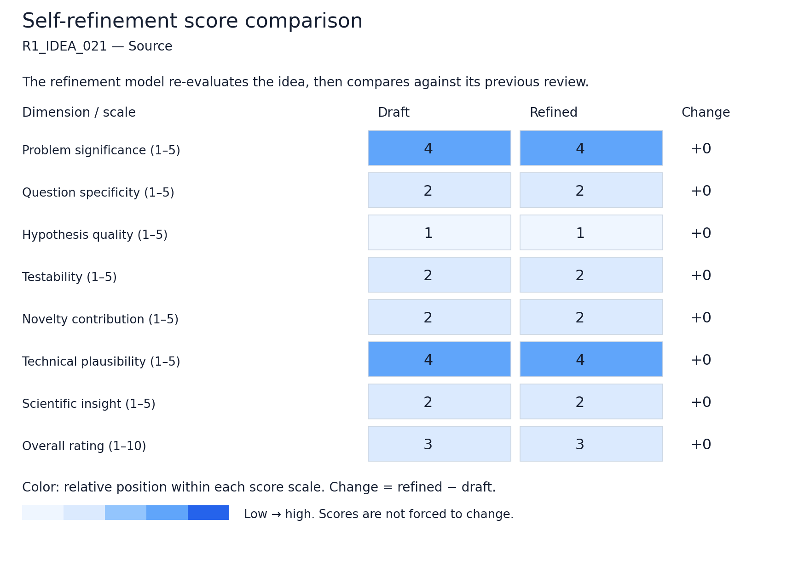

Changed score dimensions: none.

### Score justifications (draft / refined)

**Problem significance**

```json
{
  "draft": {
    "score": 4.0,
    "justification": "The problem is meaningful - offline imitation learning methods often struggle with generalization beyond demonstration distribution, and understanding how to combine expressive behavioral cloning methods like FM with online interaction is practically important for real-world RL applications."
  },
  "refined": {
    "score": 4.0,
    "justification": "The problem is meaningful and relevant. Offline imitation learning methods often fail to generalize beyond the demonstration distribution, and understanding how to enhance expressive models like FM with online interaction is important for real-world reinforcement learning applications where robustness and adaptability are critical."
  }
}
```

**Question specificity**

```json
{
  "draft": {
    "score": 2.0,
    "justification": "The idea identifies a problem but doesn't define a specific research question. It states that FM has limitations and online interaction is necessary, but doesn't specify what aspect of this relationship will be investigated."
  },
  "refined": {
    "score": 2.0,
    "justification": "The idea identifies a problem but does not define a specific research question. It states that FM has limitations and online interaction is necessary, but does not specify what will be investigated—e.g., whether it's a method, a mechanism, a comparison, or an analysis."
  }
}
```

**Hypothesis quality**

```json
{
  "draft": {
    "score": 1.0,
    "justification": "There is no explicit or implicit hypothesis presented. The text makes an observation about FM's limitations and states that online interaction is necessary, but doesn't make a testable prediction about how, why, or to what extent online interaction would help."
  },
  "refined": {
    "score": 1.0,
    "justification": "There is no hypothesis presented, either explicit or implicit. The text makes an observation and a general suggestion but offers no testable prediction about how online interaction would improve FM, under what conditions, or through what mechanisms."
  }
}
```

**Testability**

```json
{
  "draft": {
    "score": 2.0,
    "justification": "The general direction could be testable if made more specific, but as presented, there's no clear experiment or evaluation suggested. The statement 'online interaction is necessary' is a claim but not framed as something that could be tested with evidence."
  },
  "refined": {
    "score": 2.0,
    "justification": "The direction could become testable if refined, but as presented, there is no clear path to testing. The claim that 'online interaction is necessary' is not framed as something that can be empirically evaluated with experiments, comparisons, or analyses."
  }
}
```

**Novelty contribution**

```json
{
  "draft": {
    "score": 2.0,
    "justification": "The observation that offline methods lack exploration/generalization is well-known in RL/imitation learning. The specific application to FM might have some novelty, but without a specific research angle, the potential contribution is limited to noting that FM shares this common limitation."
  },
  "refined": {
    "score": 2.0,
    "justification": "The observation that offline methods lack exploration and generalize poorly is well-established in RL and imitation learning. Applying this to FM is somewhat specific but, without a novel research angle, the contribution is limited to noting that FM shares a common limitation. No new method, insight, or hypothesis is proposed."
  }
}
```

**Technical plausibility**

```json
{
  "draft": {
    "score": 4.0,
    "justification": "The reasoning is logically coherent - FM is a powerful offline method, offline methods generally struggle with generalization, therefore FM likely shares this limitation. The suggestion that online interaction could help is plausible given RL literature."
  },
  "refined": {
    "score": 4.0,
    "justification": "The reasoning is logically sound: FM is a powerful offline method, offline methods generally struggle with generalization, so FM likely has this limitation. The suggestion that online interaction could help is plausible given prior work in RL and hybrid imitation-RL approaches."
  }
}
```

**Scientific insight**

```json
{
  "draft": {
    "score": 2.0,
    "justification": "As presented, the idea offers limited potential for scientific insight beyond confirming that FM shares a known limitation of offline methods. If developed further, it could provide insights into how generative modeling approaches to policy learning interact with exploration mechanisms."
  },
  "refined": {
    "score": 2.0,
    "justification": "As presented, the idea offers minimal potential for scientific insight—it mainly notes that FM suffers from a known offline learning limitation. If developed, it could yield insights into how generative policy models interact with exploration or how online feedback affects distributional generalization, but the current formulation does not propose studying such mechanisms."
  }
}
```

**Overall rating**

```json
{
  "draft": {
    "score": 3.0,
    "justification": "This is a weak research idea in its current form. While it identifies a meaningful problem (FM's offline limitations), it lacks a specific research question, hypothesis, or testable direction. It reads more as an observation or motivation than a research proposal. With substantial refinement to define what specifically would be investigated and how, it could become a stronger idea."
  },
  "refined": {
    "score": 3.0,
    "justification": "This is a weak research idea. It identifies a meaningful practical limitation but does not propose a specific research question, hypothesis, or testable direction. It reads as an observation or motivation rather than a research proposal. Significant refinement is needed to define what would be studied and how it would advance scientific understanding."
  }
}
```

## R1_IDEA_021 — Variant 1: A1_Identity

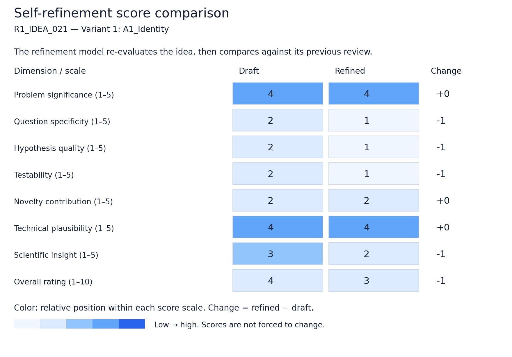

Changed score dimensions: question_specificity, hypothesis_quality, testability, scientific_insight, overall_rating.

### Score justifications (draft / refined)

**Problem significance**

```json
{
  "draft": {
    "score": 4.0,
    "justification": "The problem is meaningful: offline imitation learning methods often fail to generalize beyond their training data, and understanding and addressing this limitation is important for real-world deployment. Flow Matching is a recent method, so investigating its limitations is timely."
  },
  "refined": {
    "score": 4.0,
    "justification": "The problem is meaningful and timely. Offline imitation learning methods often struggle with generalization, and FM is a recent, expressive technique. Understanding and mitigating its limitations is relevant for real-world applications where deployment data may differ from expert demonstrations."
  }
}
```

**Question specificity**

```json
{
  "draft": {
    "score": 2.0,
    "justification": "The idea identifies a limitation but does not define a specific research question. It states that FM has poor generalization due to lack of interaction and that online interaction is necessary, but does not specify what will be investigated (e.g., quantifying the limitation, proposing a solution, or understanding the mechanism)."
  },
  "refined": {
    "score": 1.0,
    "justification": "The idea does not define a research question. It only states an observation (FM generalizes poorly) and a vague suggestion (online interaction is needed). There is no concrete inquiry, such as 'How much does online interaction improve FM generalization?' or 'What mechanisms cause FM to fail under distribution shift?'"
  }
}
```

**Hypothesis quality**

```json
{
  "draft": {
    "score": 2.0,
    "justification": "There is an implicit hypothesis that 'online interaction will improve generalization of FM policies,' but it is not articulated as a testable prediction. No mechanism or specific relationship is proposed. The hypothesis is very broad and similar to the general premise of online vs. offline RL."
  },
  "refined": {
    "score": 1.0,
    "justification": "There is no explicit or implicit hypothesis. The text describes a limitation and suggests a direction, but makes no testable prediction about outcomes, mechanisms, or relationships. A hypothesis would require a statement like 'Online fine-tuning will improve FM's generalization by X% under Y conditions.'"
  }
}
```

**Testability**

```json
{
  "draft": {
    "score": 2.0,
    "justification": "The idea as stated is not directly testable because it does not propose an experiment, method, or evaluation. To test the claim, one would need to design a specific intervention (e.g., an algorithm combining FM with online interaction) and measure generalization. The idea only motivates such a test."
  },
  "refined": {
    "score": 1.0,
    "justification": "The idea as presented is not testable. It lacks any proposed experiment, comparison, or evaluation. To test the claim that online interaction helps, one would need to design an algorithm and measure performance—neither is suggested. The idea is purely motivational."
  }
}
```

**Novelty contribution**

```json
{
  "draft": {
    "score": 2.0,
    "justification": "The observation that offline methods lack exploration and generalize poorly is not novel. The potential contribution would depend entirely on how the idea is developed. As stated, it merely points out a known limitation of offline methods in the context of a specific technique (FM)."
  },
  "refined": {
    "score": 2.0,
    "justification": "The core observation—that offline methods lack exploration and generalize poorly—is well-known in RL/imitation learning. Applying this to FM is somewhat specific, but without a novel angle (e.g., a new failure mode unique to flow-based policies or a novel integration method), the contribution is minimal as stated."
  }
}
```

**Technical plausibility**

```json
{
  "draft": {
    "score": 4.0,
    "justification": "The reasoning is logically coherent: FM is an offline method, offline methods can suffer from distributional shift and poor generalization, and online interaction can help. The proposed direction (incorporating online interaction) is plausible, though no details are given."
  },
  "refined": {
    "score": 4.0,
    "justification": "The reasoning is logically coherent: FM is an offline method, offline methods can suffer from distributional shift, and online interaction can mitigate that. The suggestion to explore online interaction is plausible, though no technical details are provided."
  }
}
```

**Scientific insight**

```json
{
  "draft": {
    "score": 3.0,
    "justification": "If developed, this research could provide insight into the generalization limitations of flow-based policies and how online interaction mitigates them. However, as stated, the idea is too vague to guarantee deep scientific insight. It could easily devolve into a simple application (adding online fine-tuning to FM) without revealing new principles."
  },
  "refined": {
    "score": 2.0,
    "justification": "If developed, the research could offer insights into FM's failure modes and how online interaction helps. However, as stated, it is too vague to promise deep scientific insight. It could easily become a routine application (e.g., FM + fine-tuning) without revealing new principles about generalization or policy learning."
  }
}
```

**Overall rating**

```json
{
  "draft": {
    "score": 4.0,
    "justification": "This is a weak research idea as presented. It identifies a meaningful problem (generalization of FM policies) but fails to define a specific research question, hypothesis, or testable direction. It reads more as a motivation or observation than a research plan. The potential contribution is low without further specification. It scores above 1-2 because the problem is real and the direction is plausible, but it lacks the core elements of a strong research idea."
  },
  "refined": {
    "score": 3.0,
    "justification": "This is a weak research idea. It identifies a real problem but fails to formulate a research question, hypothesis, or testable direction. It reads as a problem statement or motivation, not a research plan. The lack of specificity, testability, and novelty limits its scientific value. It scores above 1-2 because the problem is meaningful and the suggested direction is plausible, but it lacks the core elements of a research idea."
  }
}
```

## R1_IDEA_021 — Variant 2: A2_Paraphrase_Only


Changed score dimensions: none.

### Score justifications (draft / refined)

**Problem significance**

```json
{
  "draft": {
    "score": 4.0,
    "justification": "The problem is meaningful: offline imitation learning methods that fail to generalize beyond demonstration distribution are practically limited. Improving generalization through online interaction addresses a known weakness in behavioral cloning approaches."
  },
  "refined": {
    "score": 4.0,
    "justification": "The problem is highly meaningful. Offline imitation learning methods that fail to generalize beyond the demonstration distribution have limited real-world applicability. Improving generalization through online interaction addresses a well-known and fundamental weakness in behavioral cloning approaches, which is a core challenge in the field."
  }
}
```

**Question specificity**

```json
{
  "draft": {
    "score": 2.0,
    "justification": "The idea identifies a limitation but does not define a specific research question. It states that FM policies generalize poorly and need online interaction, but doesn't specify what aspect of this relationship to investigate."
  },
  "refined": {
    "score": 2.0,
    "justification": "The idea identifies a limitation but does not define a specific research question. It states that FM policies generalize poorly and need online interaction, but doesn't specify what aspect of this relationship to investigate (e.g., how much improvement is possible, what mechanisms are best, or under what conditions the problem is most severe)."
  }
}
```

**Hypothesis quality**

```json
{
  "draft": {
    "score": 2.0,
    "justification": "There's an implicit hypothesis that 'FM policies generalize poorly due to lack of online interaction,' but it's stated as an observation rather than a testable prediction. No alternative explanations or competing hypotheses are considered."
  },
  "refined": {
    "score": 2.0,
    "justification": "There is an implicit, underlying hypothesis that 'FM policies generalize poorly due to lack of online interaction, and adding online interaction will help.' However, this is stated as an observation or assumption, not as a testable prediction. No alternative explanations (e.g., architectural limitations) or competing hypotheses are considered."
  }
}
```

**Testability**

```json
{
  "draft": {
    "score": 3.0,
    "justification": "The core claim about generalization could be tested by evaluating FM policies on out-of-distribution scenarios. However, without a specific proposal for how to incorporate online interaction, testing the proposed solution is not well-defined."
  },
  "refined": {
    "score": 3.0,
    "justification": "The core descriptive claim about generalization could be tested by evaluating FM policies on out-of-distribution scenarios. However, the proposed solution direction (adding online interaction) is not defined concretely enough to be directly tested. A researcher would need to first design a specific method for integration before it could be evaluated."
  }
}
```

**Novelty contribution**

```json
{
  "draft": {
    "score": 3.0,
    "justification": "The observation that offline methods need online interaction for generalization is not novel in RL/IL broadly. However, investigating this specifically for Flow Matching policies could provide new insights about this particular class of methods."
  },
  "refined": {
    "score": 3.0,
    "justification": "The general observation that offline methods can benefit from online interaction for generalization is well-established in RL/IL. The novelty lies in focusing this investigation specifically on the Flow Matching policy class, which is a relatively recent and powerful method. The contribution would depend on uncovering insights specific to FM's properties."
  }
}
```

**Technical plausibility**

```json
{
  "draft": {
    "score": 4.0,
    "justification": "The reasoning is logically coherent: FM learns from static demonstrations, so it may not handle unseen states well. Incorporating online interaction to improve generalization is a plausible direction based on RL literature."
  },
  "refined": {
    "score": 4.0,
    "justification": "The reasoning is logically coherent and plausible. FM learns a policy from a static dataset, so it is subject to the standard distributional shift problem of behavioral cloning. The proposed direction of incorporating online interaction is a standard and proven approach for improving generalization in RL, making the overall direction technically sound."
  }
}
```

**Scientific insight**

```json
{
  "draft": {
    "score": 3.0,
    "justification": "If properly investigated, this could reveal how FM's continuous normalizing flow structure affects generalization compared to other policy parameterizations, and what forms of online interaction are most compatible with FM architectures."
  },
  "refined": {
    "score": 3.0,
    "justification": "If developed into a concrete study, this could yield insights into how the continuous normalizing flow structure of FM policies interacts with online learning. It could reveal whether FM's smooth density modeling offers advantages for fine-tuning or exploration compared to other policy parameterizations. However, the idea as stated is too vague to guarantee such insights."
  }
}
```

**Overall rating**

```json
{
  "draft": {
    "score": 5.0,
    "justification": "This is a moderate/borderline research idea. It identifies a meaningful practical limitation of an interesting method (FM) and points toward a plausible solution direction (online interaction). However, it lacks specificity in research question, hypothesis, and methodology. The idea needs to be developed into a more concrete investigation to become a strong research proposal."
  },
  "refined": {
    "score": 5.0,
    "justification": "This is a moderate/borderline research idea. It identifies a meaningful and plausible limitation of an interesting method (Flow Matching) and points toward a standard solution direction. Its core weakness is the lack of a specific research question, hypothesis, or methodological proposal. It serves as a good starting point for a research direction but needs significant refinement to become a strong, testable research proposal."
  }
}
```

## R1_IDEA_021 — Variant 3: A3_Plain_Core


Changed score dimensions: none.

### Score justifications (draft / refined)

**Problem significance**

```json
{
  "draft": {
    "score": 4.0,
    "justification": "The problem is meaningful: offline imitation learning methods often struggle with generalization beyond the demonstration distribution, and understanding how to incorporate online interaction is an active research area with practical implications for real-world deployment."
  },
  "refined": {
    "score": 4.0,
    "justification": "The problem is meaningful and well-motivated. Poor generalization of offline imitation learning methods beyond the demonstration distribution is a known and significant challenge for real-world deployment. Investigating how to mitigate this for a specific class of methods (FM-based policies) is relevant to the field."
  }
}
```

**Question specificity**

```json
{
  "draft": {
    "score": 2.0,
    "justification": "The idea identifies a limitation but does not define a specific research question. It states that FM policies have poor generalization due to lack of interaction and suggests online interaction could help, but does not specify what aspect of online interaction to study or what relationship to test."
  },
  "refined": {
    "score": 2.0,
    "justification": "The idea identifies a limitation and suggests a direction, but does not define a specific research question. There is no clear 'what will we investigate?' beyond the general observation that online interaction might help. It lacks the specificity needed to guide a focused study."
  }
}
```

**Hypothesis quality**

```json
{
  "draft": {
    "score": 2.0,
    "justification": "There is an implicit hypothesis that 'online interaction will improve generalization of FM policies,' but it is not concrete. No prediction about how much improvement, under what conditions, or through what mechanism is made. The hypothesis is too vague to be strongly testable."
  },
  "refined": {
    "score": 2.0,
    "justification": "There is only a very implicit and vague hypothesis: 'online interaction may improve generalization of FM policies.' It makes no concrete prediction about the mechanism, magnitude, or conditions of improvement. It is not framed in a way that could be clearly supported or contradicted by evidence."
  }
}
```

**Testability**

```json
{
  "draft": {
    "score": 3.0,
    "justification": "The core claim that online interaction improves generalization is testable in principle by comparing offline FM policies with versions that incorporate online interaction. However, without specifying the form of online interaction or the evaluation protocol, it's unclear exactly what would be tested."
  },
  "refined": {
    "score": 3.0,
    "justification": "The core notion is testable in principle—one could compare an offline FM policy to one augmented with online interaction. However, without specifying what 'online interaction' entails or how 'generalization' is measured, the testability is low. The idea as stated does not propose a test."
  }
}
```

**Novelty contribution**

```json
{
  "draft": {
    "score": 3.0,
    "justification": "The observation that offline methods lack exploration and interaction is well-known. The specific application to FM policies is somewhat novel, but the general direction of adding online interaction to offline imitation learning is an established research area. The contribution would depend heavily on the specific method proposed."
  },
  "refined": {
    "score": 3.0,
    "justification": "The general concept of adding online interaction to improve offline imitation learning is not novel. The specific focus on Flow Matching policies offers some novelty, but the idea does not propose a novel mechanism, integration method, or hypothesis about why FM might be particularly suited or challenged in this context. The potential contribution is unclear without more specificity."
  }
}
```

**Technical plausibility**

```json
{
  "draft": {
    "score": 4.0,
    "justification": "The reasoning is logically coherent: FM models distributions without interaction, so adding interaction could help with generalization. The assumption that online interaction can address distributional shift is reasonable based on prior work in RL and imitation learning."
  },
  "refined": {
    "score": 4.0,
    "justification": "The reasoning is logically coherent and plausible. It is well-established that offline methods can suffer from distributional shift, and that online interaction can help mitigate this. The idea that this applies to FM-based policies is reasonable and aligns with general principles in machine learning."
  }
}
```

**Scientific insight**

```json
{
  "draft": {
    "score": 3.0,
    "justification": "If pursued, this could yield insights into how generative models like FM can be combined with online learning, and what aspects of online interaction (exploration, fine-tuning, etc.) are most critical for generalization. However, the idea as stated is more of an application direction than a hypothesis-driven investigation."
  },
  "refined": {
    "score": 3.0,
    "justification": "If developed into a concrete study, it could provide insight into the failure modes of FM in sequential decision-making and how online interaction remedies them. However, as stated, the idea is too vague to promise deep scientific insight. It points to an application direction rather than a hypothesis-driven investigation into a fundamental relationship or mechanism."
  }
}
```

**Overall rating**

```json
{
  "draft": {
    "score": 5.0,
    "justification": "This is a moderate/borderline research idea. It identifies a relevant limitation of an existing method and points to a plausible solution direction, but lacks specificity in research question, hypothesis, and methodology. The potential contribution is limited without a more concrete proposal about what exactly to investigate and how. It reads more as a motivation for future work than a defined research idea."
  },
  "refined": {
    "score": 5.0,
    "justification": "This is a moderate/borderline research idea. It identifies a relevant problem and a plausible solution direction, which is a good starting point. However, it lacks the core elements of a strong research idea: a specific question, a testable hypothesis, and a methodological direction. It reads as a motivation or problem statement rather than a defined research plan. Its potential contribution and insight are limited by its vagueness."
  }
}
```

## R1_IDEA_021 — Variant 4: B1_Verbose_Elaborate


Changed score dimensions: none.

### Score justifications (draft / refined)

**Problem significance**

```json
{
  "draft": {
    "score": 4.0,
    "justification": "The problem is meaningful: offline imitation learning methods often struggle with generalization, and understanding how to combine them with online interaction is an important challenge in reinforcement learning. Flow Matching is a relatively recent approach, so investigating its limitations is timely."
  },
  "refined": {
    "score": 4.0,
    "justification": "The problem is highly meaningful. Improving the generalization of offline imitation learning methods is a core challenge in reinforcement learning. Flow Matching is a promising recent approach, so understanding and addressing its limitations is timely and relevant to the research community."
  }
}
```

**Question specificity**

```json
{
  "draft": {
    "score": 2.0,
    "justification": "The idea identifies a limitation but does not articulate a specific research question. It states that FM policies have poor generalization due to lack of interaction and that online interaction is necessary, but doesn't specify what aspect of this combination would be investigated."
  },
  "refined": {
    "score": 2.0,
    "justification": "The idea identifies a limitation and a general direction but does not define a specific research question. It states that FM policies generalize poorly and online interaction is needed, but it does not specify what aspect of this combination will be investigated, tested, or understood."
  }
}
```

**Hypothesis quality**

```json
{
  "draft": {
    "score": 2.0,
    "justification": "There is an implicit hypothesis that 'online interaction will improve generalization of FM policies,' but this is very generic. No concrete prediction about mechanisms, trade-offs, or expected outcomes is made. The hypothesis lacks specificity about how or why online interaction would help."
  },
  "refined": {
    "score": 2.0,
    "justification": "There is only a very implicit and generic hypothesis: 'online interaction will improve generalization of FM policies.' This lacks a concrete prediction about mechanism, magnitude of improvement, or conditions under which it holds. It does not distinguish the investigation from a generic application of online fine-tuning."
  }
}
```

**Testability**

```json
{
  "draft": {
    "score": 2.0,
    "justification": "The idea as stated is not directly testable because it doesn't propose any specific experiment, comparison, or evaluation method. While one could design experiments to test online interaction with FM policies, the idea itself doesn't suggest how this would be done."
  },
  "refined": {
    "score": 2.0,
    "justification": "The idea as stated is not directly testable. It proposes no experiment, comparison, or evaluation method. While one could design tests for online FM policies, the idea itself does not suggest how the core claim (that online interaction is necessary/beneficial) would be investigated or falsified."
  }
}
```

**Novelty contribution**

```json
{
  "draft": {
    "score": 3.0,
    "justification": "The observation that offline methods need online interaction is not novel in itself (this is a well-known challenge in offline RL). However, applying this insight specifically to Flow Matching methods could be novel if it leads to new algorithmic insights or demonstrates unique challenges/opportunities for FM compared to other offline methods."
  },
  "refined": {
    "score": 3.0,
    "justification": "The core observation—that offline methods need online interaction for generalization—is not novel. The potential novelty lies in exploring this specifically for the Flow Matching framework, which may present unique challenges or opportunities compared to other offline methods. However, the idea does not articulate what that specific novel contribution might be."
  }
}
```

**Technical plausibility**

```json
{
  "draft": {
    "score": 4.0,
    "justification": "The reasoning is logically coherent: FM is an offline method, offline methods often generalize poorly, online interaction can help. The proposed direction (adding online interaction) is technically plausible and aligns with known principles in reinforcement learning."
  },
  "refined": {
    "score": 4.0,
    "justification": "The reasoning is logically coherent and plausible. FM is an offline method, offline methods often fail to generalize, and incorporating online data is a standard and often effective way to address this. The direction aligns with established RL principles and is technically sensible."
  }
}
```

**Scientific insight**

```json
{
  "draft": {
    "score": 3.0,
    "justification": "If properly investigated, this could provide insight into how generative modeling approaches like FM interact with online learning, potentially revealing trade-offs between expressiveness and adaptability. However, as stated, the idea is too vague to guarantee deep scientific insight."
  },
  "refined": {
    "score": 3.0,
    "justification": "If developed into a concrete study, it could yield insight into the trade-offs between the expressiveness of generative models like FM and their adaptability via online interaction. However, as stated, the idea is too vague to guarantee insight beyond a simple performance comparison. The potential for deeper mechanistic understanding is present but not articulated."
  }
}
```

**Overall rating**

```json
{
  "draft": {
    "score": 4.0,
    "justification": "This is a weak research idea as presented. While it identifies a meaningful problem (generalization limitations of FM policies) and points in a plausible direction (online interaction), it lacks the specificity needed for a strong research idea. No concrete research question, hypothesis, or experimental approach is articulated. The idea is more of an observation than a research proposal. With more development, it could become a moderate or strong idea."
  },
  "refined": {
    "score": 4.0,
    "justification": "This is a weak research idea as presented. It successfully identifies a meaningful problem and a plausible direction, which elevates it above a score of 1-2. However, it lacks the defining components of a strong research idea: a specific question, a testable hypothesis, and a suggested investigative approach. It is primarily a motivation or observation. With significant development (as outlined in suggestions), it could become a moderate (5-6) or strong (7-8) idea."
  }
}
```

## R1_IDEA_021 — Variant 5: B2_Grand_Narrative


Changed score dimensions: none.

### Score justifications (draft / refined)

**Problem significance**

```json
{
  "draft": {
    "score": 4.0,
    "justification": "The problem is meaningful. Poor generalization of offline imitation learning methods is a recognized challenge in RL. Identifying specific limitations of a promising method like Flow Matching is relevant for researchers working on sample-efficient and safe policy learning."
  },
  "refined": {
    "score": 4.0,
    "justification": "The problem is highly meaningful. Generalization of offline imitation learning methods is a core challenge in RL. Identifying and addressing limitations of a promising method like Flow Matching is directly relevant to researchers aiming for sample-efficient and robust policy learning, with implications for real-world autonomous systems."
  }
}
```

**Question specificity**

```json
{
  "draft": {
    "score": 2.0,
    "justification": "The idea lacks a concrete research question. It states a limitation and a general necessity ('online interaction is required'), but does not specify what aspect of this transition will be studied, measured, or compared."
  },
  "refined": {
    "score": 2.0,
    "justification": "The idea lacks a concrete research question. It states a limitation and a general necessity ('online interaction is required'), but does not specify what will be studied, measured, or compared. It is more a problem identification than a research question."
  }
}
```

**Hypothesis quality**

```json
{
  "draft": {
    "score": 2.0,
    "justification": "There is an implicit hypothesis that 'FM's poor generalization is due to lack of online interaction,' but it is not framed as a testable prediction. It is more of an observation and a proposed direction. A stronger hypothesis would predict the outcome of introducing online interaction in a specific way."
  },
  "refined": {
    "score": 2.0,
    "justification": "There is an implicit causal claim that 'lack of online interaction causes poor generalization,' but this is presented as an observation, not a testable prediction. No hypothesis is offered about how introducing online interaction would change outcomes, under what conditions, or compared to what alternatives."
  }
}
```

**Testability**

```json
{
  "draft": {
    "score": 2.0,
    "justification": "The core claim is testable in principle (one could design experiments with and without online interaction), but the idea summary does not propose any specific test, comparison, or evaluation methodology. It remains a high-level suggestion."
  },
  "refined": {
    "score": 2.0,
    "justification": "The core observation is testable in principle (one could compare FM with and without online interaction), but the idea summary proposes no specific test, evaluation, or experimental design. It remains a high-level suggestion without a clear path to investigation."
  }
}
```

**Novelty contribution**

```json
{
  "draft": {
    "score": 3.0,
    "justification": "The observation that offline methods lack exploration and generalize poorly is not novel. The potential contribution lies in specifically analyzing or addressing this for Flow Matching, a relatively recent method. However, without a proposed new mechanism, analysis, or hybrid method, the novelty is limited to the application context."
  },
  "refined": {
    "score": 3.0,
    "justification": "The general observation that offline methods suffer from distribution shift and lack exploration is well-known. The potential novelty lies in specifically examining this for Flow Matching, a relatively recent method. However, without a proposed new mechanism, analysis framework, or hybrid algorithm, the contribution is currently limited to contextualizing a known problem for a specific method."
  }
}
```

**Technical plausibility**

```json
{
  "draft": {
    "score": 4.0,
    "justification": "The reasoning is logically coherent and plausible. It is well-established in RL that offline methods suffer from distribution shift and that online interaction can mitigate this. The argument that this applies to FM-based policies is reasonable."
  },
  "refined": {
    "score": 4.0,
    "justification": "The reasoning is logically coherent and plausible. It is well-established in RL that offline methods can fail under distribution shift and that online interaction can help. Applying this reasoning to FM-based policies is sensible, as FM is a generative model trained on static data."
  }
}
```

**Scientific insight**

```json
{
  "draft": {
    "score": 3.0,
    "justification": "If pursued, the research could provide insight into the boundary conditions and failure modes of Flow Matching in RL, and potentially into the trade-offs between offline expressiveness and online adaptability. However, the idea as stated is too vague to guarantee deep mechanistic insight; it could easily devolve into a standard application study."
  },
  "refined": {
    "score": 3.0,
    "justification": "If developed into a concrete study, this could yield insight into the failure modes and boundary conditions of Flow Matching in sequential decision-making, and into the trade-offs between offline expressiveness and online adaptability. However, as stated, the idea is too vague to guarantee such insight; it could easily result in a routine application study without deeper understanding."
  }
}
```

**Overall rating**

```json
{
  "draft": {
    "score": 5.0,
    "justification": "This is a moderate/borderline research idea. It identifies a relevant and plausible limitation of an interesting method (Flow Matching) in imitation learning. However, it stops at problem identification and a broad suggestion ('needs online interaction'). It lacks a specific research question, a testable hypothesis, and a proposed methodological direction. Therefore, its potential for a clear scientific contribution is currently limited. With refinement into a concrete comparative or ablative study, it could become a strong idea."
  },
  "refined": {
    "score": 5.0,
    "justification": "This is a moderate/borderline research idea. It identifies a relevant and plausible limitation of an interesting method (Flow Matching) in imitation learning, which is a strength. However, it stops at problem identification and a broad suggestion. It lacks a specific research question, a testable hypothesis, and a proposed methodological direction. Therefore, its potential for a clear, focused scientific contribution is currently limited. With refinement into a concrete comparative or analytical study, it could become a strong idea."
  }
}
```

## R1_IDEA_021 — Variant 6: B3_Over_Confident


Changed score dimensions: question_specificity, hypothesis_quality, testability, novelty_contribution, scientific_insight, overall_rating.

### Score justifications (draft / refined)

**Problem significance**

```json
{
  "draft": {
    "score": 4.0,
    "justification": "The problem is meaningful: generalization beyond expert demonstrations is a fundamental challenge in imitation learning. Flow Matching is a recent promising approach, and understanding its limitations for real-world deployment where environments differ from training data is important."
  },
  "refined": {
    "score": 4.0,
    "justification": "The problem is significant. Generalization beyond expert demonstrations is a core, unsolved challenge in imitation learning and offline RL. Flow Matching is a recent, high-performing method, so understanding and mitigating its generalization limitations is both timely and impactful for real-world deployment where environment mismatch is common."
  }
}
```

**Question specificity**

```json
{
  "draft": {
    "score": 2.0,
    "justification": "The idea identifies a limitation but does not define a specific research question. It states that FM has poor generalization due to lack of interaction and that online interaction is necessary, but doesn't specify what aspect of this relationship would be investigated."
  },
  "refined": {
    "score": 1.0,
    "justification": "The idea does not define a research question. It only states an observed limitation (poor generalization) and a vague direction (online interaction is necessary). There is no specification of what relationship, mechanism, or condition will be investigated. This is below even a weak level of specificity."
  }
}
```

**Hypothesis quality**

```json
{
  "draft": {
    "score": 2.0,
    "justification": "There is an implicit hypothesis that 'incorporating online interaction will improve FM's generalization,' but this is too generic. No concrete prediction about mechanisms, magnitude of improvement, or conditions under which it would work is provided."
  },
  "refined": {
    "score": 1.0,
    "justification": "There is no hypothesis, implicit or explicit. The text describes a limitation and suggests a necessity, but makes no concrete, testable prediction about the relationship between online interaction and FM's performance. A hypothesis would need to predict an outcome, mechanism, or quantitative improvement under specified conditions."
  }
}
```

**Testability**

```json
{
  "draft": {
    "score": 2.0,
    "justification": "The idea as stated is not directly testable because it doesn't propose how to test it. To make it testable, one would need to specify: what online interaction mechanism, how to measure generalization, what environments/tasks, and what comparisons to make."
  },
  "refined": {
    "score": 1.0,
    "justification": "The idea as presented is not testable. It proposes no experiment, comparison, evaluation metric, or method for obtaining evidence. To become testable, it would need to specify how to incorporate online interaction, how to measure generalization, and what constitutes success or failure."
  }
}
```

**Novelty contribution**

```json
{
  "draft": {
    "score": 3.0,
    "justification": "Identifying FM's generalization limitation is somewhat novel as FM is relatively new. However, the general problem of offline-to-online transfer and combining offline learning with online interaction is well-studied in RL. The contribution would depend heavily on the specific approach taken."
  },
  "refined": {
    "score": 2.0,
    "justification": "The observation that FM may generalize poorly without online interaction is mildly novel because FM is a relatively new method. However, the general concept of enhancing offline imitation learning with online fine-tuning or interaction is very well-established in RL literature. The potential contribution is low unless a specific, novel mechanism or insight is proposed."
  }
}
```

**Technical plausibility**

```json
{
  "draft": {
    "score": 4.0,
    "justification": "The reasoning is logically coherent: FM learns from static datasets, so it cannot adapt to distribution shift without additional mechanisms. Incorporating online interaction is a plausible direction, though the specific implementation would determine feasibility."
  },
  "refined": {
    "score": 4.0,
    "justification": "The core reasoning is logically sound and plausible. FM, as a purely offline method, learns a policy from a fixed dataset; it is reasonable that it would struggle with distribution shift and that incorporating online interaction could help. The direction is coherent, though feasibility depends entirely on unspecified implementation details."
  }
}
```

**Scientific insight**

```json
{
  "draft": {
    "score": 3.0,
    "justification": "If properly investigated, this could provide insight into how generative models like FM behave when fine-tuned with online data, or what aspects of FM make it particularly sensitive to distribution shift. However, the idea as stated doesn't articulate what specific insights are sought."
  },
  "refined": {
    "score": 2.0,
    "justification": "The idea as stated suggests little specific scientific insight. It implies the generic lesson 'online interaction helps offline methods,' which is already widely known. For higher insight, it would need to aim at revealing something deeper—e.g., how the continuous-time structure of FM affects its adaptability, or what properties of the expert data make FM particularly brittle to shift."
  }
}
```

**Overall rating**

```json
{
  "draft": {
    "score": 5.0,
    "justification": "This is a moderate/borderline research idea. It identifies a meaningful problem and a plausible direction, but lacks specificity in research question, hypothesis, and methodology. The potential contribution exists but is unclear without more concrete formulation. It's a reasonable starting point that needs significant refinement to become a strong research direction."
  },
  "refined": {
    "score": 3.0,
    "justification": "This is a weak research idea. It identifies a meaningful problem and a plausible general direction, which saves it from being very weak. However, it completely lacks a defined research question, a testable hypothesis, and any methodological direction. It is essentially a problem statement and a vague suggestion, offering little guidance for actual scientific investigation. The potential contribution and insight are minimal without substantial refinement."
  }
}
```

## R1_IDEA_021 — Variant 7: B4_Novelty


Changed score dimensions: none.

### Score justifications (draft / refined)

**Problem significance**

```json
{
  "draft": {
    "score": 4.0,
    "justification": "The problem is meaningful. Generalization failure of offline imitation learning methods is a known and important challenge. Identifying a specific limitation of a promising new method (Flow Matching) in this context is relevant to researchers working on robust policy learning."
  },
  "refined": {
    "score": 4.0,
    "justification": "The problem is significant. Poor generalization due to distributional shift is a core, unsolved challenge in offline imitation learning and offline RL. Critically examining a promising new method like Flow Matching in this light is highly relevant to the field."
  }
}
```

**Question specificity**

```json
{
  "draft": {
    "score": 2.0,
    "justification": "The idea describes an observation and a broad direction, but does not define a specific research question. It states that FM has a limitation and that online interaction is a direction, but does not specify what exactly should be investigated about this combination."
  },
  "refined": {
    "score": 2.0,
    "justification": "The idea lacks a specific research question. It states an observation ('FM generalizes poorly') and suggests a direction ('explore online interaction'), but does not define *what* about this combination should be studied, measured, or compared."
  }
}
```

**Hypothesis quality**

```json
{
  "draft": {
    "score": 2.0,
    "justification": "There is an implicit hypothesis that 'incorporating online interaction will address FM's generalization limitation,' but it is not made concrete or testable in its current form. It lacks a predicted relationship, mechanism, or measurable outcome."
  },
  "refined": {
    "score": 2.0,
    "justification": "There is only a very implicit and generic hypothesis: 'online interaction helps FM generalize better.' This lacks a concrete prediction, a proposed mechanism, or a falsifiable condition. It is more of a belief than a testable hypothesis."
  }
}
```

**Testability**

```json
{
  "draft": {
    "score": 3.0,
    "justification": "The core claim (FM generalizes poorly without interaction) is testable by evaluating FM policies on OOD benchmarks. The proposed direction (adding online interaction) is a broad category of interventions that could be tested, but the idea does not specify a particular testable approach."
  },
  "refined": {
    "score": 3.0,
    "justification": "The initial observation (FM's generalization limit) is directly testable via offline training and OOD evaluation. The suggested direction (adding online interaction) is a vast space of possible experiments. The idea itself does not propose a specific test, but a researcher could design many."
  }
}
```

**Novelty contribution**

```json
{
  "draft": {
    "score": 3.0,
    "justification": "The observation about offline methods lacking exploration is not novel. The potential novelty lies in investigating this specifically for the Flow Matching paradigm in IL. The contribution would be moderate if it leads to a new hybrid FM-online method or a deeper understanding of FM's failure modes."
  },
  "refined": {
    "score": 3.0,
    "justification": "The general concept of combining offline imitation with online fine-tuning is not novel. The potential novelty lies in exploring this specifically for the Flow Matching paradigm, which may have unique properties. The contribution would be moderate unless it uncovers new principles about FM's interaction with online data."
  }
}
```

**Technical plausibility**

```json
{
  "draft": {
    "score": 4.0,
    "justification": "The reasoning is logically coherent. FM is a generative model trained offline; it's plausible it suffers from distributional shift. Incorporating online feedback (e.g., RL fine-tuning) is a standard way to address this in other methods, so the direction is technically plausible."
  },
  "refined": {
    "score": 4.0,
    "justification": "The logical reasoning is sound and plausible. FM is a powerful generative model but trained statically; distributional shift is a known risk. Using online interaction (e.g., RL) to refine or adapt a policy is a standard and technically credible approach to mitigate this."
  }
}
```

**Scientific insight**

```json
{
  "draft": {
    "score": 3.0,
    "justification": "If pursued, this could yield insight into the trade-offs between the expressiveness of FM and its robustness to distributional shift, and how online interaction mitigates this. However, the idea as stated is too vague to guarantee deep mechanistic insight."
  },
  "refined": {
    "score": 3.0,
    "justification": "If properly investigated, this could yield insights into the robustness and failure modes of flow-based generative models in sequential decision-making, and how different forms of online feedback interact with their probabilistic structure. However, the idea as stated is too vague to promise deep mechanistic insight."
  }
}
```

**Overall rating**

```json
{
  "draft": {
    "score": 5.0,
    "justification": "This is a moderate/borderline research idea. It identifies a relevant problem and points to a plausible research direction, but it lacks the specificity, concrete hypothesis, and defined scope needed to be a strong research proposal. It reads more as a motivation or discussion point than a plan for investigation."
  },
  "refined": {
    "score": 5.0,
    "justification": "This is a moderate/borderline research idea. It identifies a meaningful problem and a logically connected, plausible research direction. Its critical weakness is the lack of a concrete, investigable question or hypothesis. It serves as good motivation but requires substantial specification to become a strong research proposal."
  }
}
```

## R1_IDEA_021 — Variant 8: B5_Application_Impact


Changed score dimensions: hypothesis_quality.

### Score justifications (draft / refined)

**Problem significance**

```json
{
  "draft": {
    "score": 4.0,
    "justification": "The problem is meaningful: offline imitation learning often suffers from distribution shift, and FM is a recent, powerful method whose limitations in generalization are worth understanding. Robustness in robotics is a high-impact application area."
  },
  "refined": {
    "score": 4.0,
    "justification": "The problem is meaningful: offline imitation learning methods often struggle with distribution shift, and FM is a recent, expressive approach whose generalization limits are not well understood. Robustness in robotics is a high-stakes application area where such limitations matter."
  }
}
```

**Question specificity**

```json
{
  "draft": {
    "score": 2.0,
    "justification": "The idea identifies a limitation but does not define a clear research question. It states that FM lacks interaction and generalizes poorly, and that online interaction may be relevant, but does not specify what exactly should be investigated."
  },
  "refined": {
    "score": 2.0,
    "justification": "The idea identifies a limitation but does not define a research question. It states that FM lacks interaction and generalizes poorly, and that online interaction may be relevant, but does not specify what aspect to investigate, what relationship to test, or what phenomenon to explain."
  }
}
```

**Hypothesis quality**

```json
{
  "draft": {
    "score": 2.0,
    "justification": "There is an implicit hypothesis that online interaction improves generalization of FM policies, but it is vague and not framed as a testable prediction. No mechanism or specific relationship is proposed."
  },
  "refined": {
    "score": 1.0,
    "justification": "There is no hypothesis, implicit or explicit. The text notes a limitation and suggests online interaction 'may be relevant'—this is a vague speculation, not a concrete prediction about a mechanism, relationship, or outcome that could be supported or contradicted by evidence."
  }
}
```

**Testability**

```json
{
  "draft": {
    "score": 2.0,
    "justification": "The central claim—that online interaction is necessary for robust performance—is broad and not directly testable without a concrete experimental design. The idea does not suggest how to test it."
  },
  "refined": {
    "score": 2.0,
    "justification": "The central observation (FM generalizes poorly) is testable, but the idea does not propose how to test it or what evidence would address the suggestion about online interaction. Without a specific claim or experimental direction, testability is low."
  }
}
```

**Novelty contribution**

```json
{
  "draft": {
    "score": 3.0,
    "justification": "Identifying FM's generalization limitation is somewhat novel given FM's recent rise, but the observation that offline methods struggle with distribution shift is well-known. The potential contribution depends entirely on how the problem is addressed."
  },
  "refined": {
    "score": 3.0,
    "justification": "Highlighting FM's generalization limits is somewhat novel given its recent adoption, but the broader issue of offline imitation learning struggling with distribution shift is well-known. The potential contribution depends entirely on how the problem is studied; as stated, it offers no novel angle or approach."
  }
}
```

**Technical plausibility**

```json
{
  "draft": {
    "score": 4.0,
    "justification": "The reasoning is coherent: FM is a generative model trained on expert data, so it may not handle out-of-distribution states. The suggestion that online interaction could help is plausible given prior work in offline RL and imitation learning."
  },
  "refined": {
    "score": 4.0,
    "justification": "The reasoning is coherent: FM is a generative model trained on static data, so it may not handle out-of-distribution states well. The suggestion that online interaction could help aligns with known principles in RL and imitation learning. No technical flaws are apparent."
  }
}
```

**Scientific insight**

```json
{
  "draft": {
    "score": 3.0,
    "justification": "If pursued, this could yield insight into the trade-offs between expressiveness and generalization in generative imitation learning, and how online interaction mitigates distribution shift. However, the idea as stated does not promise deep mechanistic understanding."
  },
  "refined": {
    "score": 3.0,
    "justification": "If developed into a study, this could yield insight into the generalization boundaries of generative imitation learning methods and how online interaction affects them. However, the idea as stated does not promise mechanistic understanding or general principles; it merely identifies a problem."
  }
}
```

**Overall rating**

```json
{
  "draft": {
    "score": 4.0,
    "justification": "This is a weak research idea in its current form. It identifies a meaningful problem and a plausible direction, but lacks a specific research question, testable hypothesis, or methodological proposal. It reads more as a motivation paragraph than a research idea. With refinement, it could become a strong idea."
  },
  "refined": {
    "score": 4.0,
    "justification": "This is a weak research idea. It identifies a meaningful problem and is technically plausible, but lacks a research question, hypothesis, and methodological direction. It reads as a motivation paragraph rather than a research idea. With refinement, it could become a strong investigation, but in its current form, it offers little guidance for scientific inquiry."
  }
}
```

## R1_IDEA_021 — Variant 9: C1_Hollow_Shell

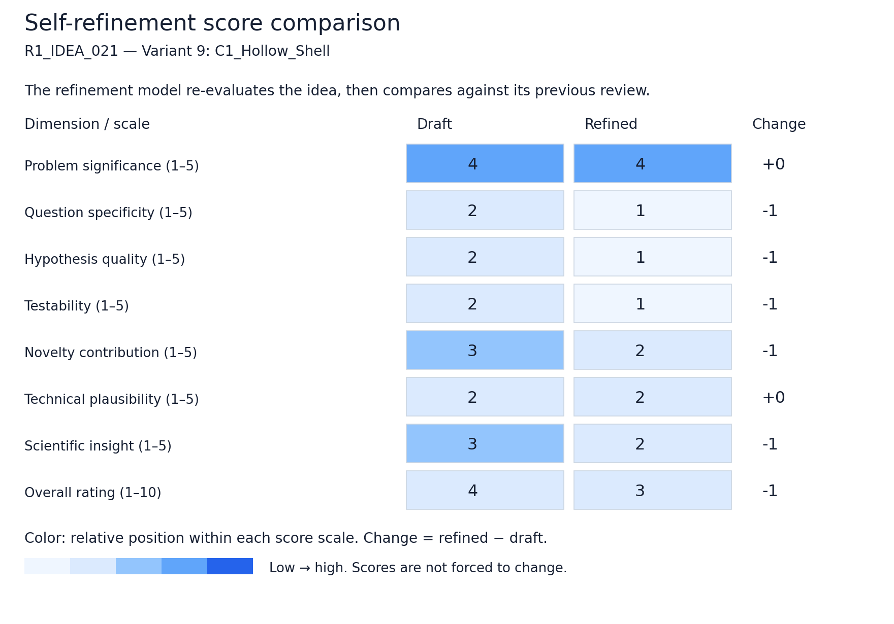

Changed score dimensions: question_specificity, hypothesis_quality, testability, novelty_contribution, scientific_insight, overall_rating.

### Score justifications (draft / refined)

**Problem significance**

```json
{
  "draft": {
    "score": 4.0,
    "justification": "The problem of distributional shift and poor out-of-distribution generalization is highly significant in machine learning. The observation that methods relying solely on expert examples may lack adaptability touches on fundamental limitations of current approaches."
  },
  "refined": {
    "score": 4.0,
    "justification": "The problem is highly significant. The inability of models trained on static datasets to adapt to distribution shift or novel situations is a fundamental challenge in machine learning, affecting robustness, safety, and real-world deployment. The idea correctly identifies a plausible root cause (lack of interactive exploration)."
  }
}
```

**Question specificity**

```json
{
  "draft": {
    "score": 2.0,
    "justification": "The idea is very vague. It states that a method has limitations and suggests a direction, but doesn't define a specific research question. What exactly would be investigated about interactive learning? How would it be integrated? What specific aspect of adaptability would be measured?"
  },
  "refined": {
    "score": 1.0,
    "justification": "The idea does not define a research question. It states an observation ('method X has limitation Y') and a vague suggestion ('maybe try Z'). There is no 'what', 'how', or 'why' to investigate. It is a motivation statement, not a research idea."
  }
}
```

**Hypothesis quality**

```json
{
  "draft": {
    "score": 2.0,
    "justification": "There's an implicit hypothesis that 'interactive learning will improve adaptability,' but it's not concrete. No specific prediction about mechanisms, relationships, or expected outcomes is made. The hypothesis lacks the specificity needed to guide meaningful investigation."
  },
  "refined": {
    "score": 1.0,
    "justification": "There is no hypothesis. A hypothesis requires a concrete, testable prediction. The text contains an observation (the method lacks interaction) and a proposed solution direction (add interactive learning), but it does not make a falsifiable claim about the relationship between these elements or an expected outcome."
  }
}
```

**Testability**

```json
{
  "draft": {
    "score": 2.0,
    "justification": "Without specifying the method, what interactive learning means, or how adaptability would be measured, the idea is not currently testable. It suggests a general direction but provides no clear path to obtaining evidence for or against the claim."
  },
  "refined": {
    "score": 1.0,
    "justification": "The idea is not testable in its current form. It provides no framework for obtaining evidence. There is no proposed experiment, evaluation, comparison, or analysis. Without defining the method, the intervention, or the success criteria, there is no path to validation."
  }
}
```

**Novelty contribution**

```json
{
  "draft": {
    "score": 3.0,
    "justification": "The general notion of adding interaction to improve machine learning systems is not novel. However, applying it specifically to distribution modeling methods could be novel depending on the specific method and implementation. The potential contribution is moderate but depends entirely on execution."
  },
  "refined": {
    "score": 2.0,
    "justification": "The core observation that interactive learning can aid adaptation is not novel (see reinforcement learning, active learning, online learning). The potential novelty rests entirely on applying this to an unspecified distribution modeling method, which is too vague to assess. The contribution, as stated, is minimal."
  }
}
```

**Technical plausibility**

```json
{
  "draft": {
    "score": 2.0,
    "justification": "Cannot be properly evaluated because the core method is unspecified. The general reasoning (static examples → limited adaptability, interaction → better adaptability) is plausible but too generic to assess technical coherence."
  },
  "refined": {
    "score": 2.0,
    "justification": "The general logic is coherent: static data → limited exploration → poor adaptation. However, without specifying the method, it's impossible to judge if integrating interaction is technically plausible or what challenges might arise. The reasoning is too generic to score higher."
  }
}
```

**Scientific insight**

```json
{
  "draft": {
    "score": 3.0,
    "justification": "If properly investigated, this could provide insight into the relationship between learning paradigms (offline vs. interactive) and generalization capabilities. However, the current formulation is too vague to promise deep mechanistic understanding."
  },
  "refined": {
    "score": 2.0,
    "justification": "If fully developed, this could offer insight into the role of exploration and feedback in generative or predictive modeling. However, the current formulation promises almost no insight because it lacks the specificity needed to reveal mechanisms, principles, or boundary conditions. It is a surface-level suggestion."
  }
}
```

**Overall rating**

```json
{
  "draft": {
    "score": 4.0,
    "justification": "This is a weak research idea in its current form. While it identifies a potentially important problem (adaptability limitations of distribution modeling methods), it lacks specificity, a testable hypothesis, and any concrete research direction. It reads more like a general observation or motivation than a research idea. Significant refinement is needed to transform this into a viable research proposal."
  },
  "refined": {
    "score": 3.0,
    "justification": "This is a very weak research idea. It identifies a significant problem but fails to formulate any research question, hypothesis, or methodological direction. It reads as a preliminary observation or a paragraph of background motivation for a yet-to-be-defined project. In its current form, it does not constitute a viable research idea. A score of 3 reflects that the identified problem is meaningful, but the idea itself lacks all other required components."
  }
}
```

## R1_IDEA_021 — Variant 10: C2_Logic_Flawed


Changed score dimensions: question_specificity, hypothesis_quality, testability, novelty_contribution, scientific_insight, overall_rating.

### Score justifications (draft / refined)

**Problem significance**

```json
{
  "draft": {
    "score": 4.0,
    "justification": "Generalization beyond expert demonstrations is a core challenge in imitation learning. Flow Matching is a recent, expressive method for behavioral cloning, so understanding and addressing its generalization limitations is meaningful and timely."
  },
  "refined": {
    "score": 4.0,
    "justification": "The problem is significant. Generalization beyond the expert's data distribution is a fundamental, unsolved challenge in imitation learning. Flow Matching is a recent and powerful method for behavioral cloning, so understanding and mitigating its generalization limitations is a meaningful and timely research direction."
  }
}
```

**Question specificity**

```json
{
  "draft": {
    "score": 2.0,
    "justification": "The idea identifies a problem (poor generalization of FM) and suggests a direction (online interaction), but does not define a clear, concrete research question. It states online interaction 'is sufficient' without specifying what exactly would be investigated."
  },
  "refined": {
    "score": 1.0,
    "justification": "Very weak specificity. The idea does not define a research question. It states an observation (FM generalizes poorly) and then a broad suggestion ('online interaction is sufficient'). There is no concrete 'what will be investigated.' The claim itself is vague and lacks the precision of a research question."
  }
}
```

**Hypothesis quality**

```json
{
  "draft": {
    "score": 2.0,
    "justification": "There is an implicit hypothesis that 'online interaction addresses FM's generalization challenges,' but it is vague and not framed as a testable prediction. No mechanism or specific conditions are proposed."
  },
  "refined": {
    "score": 1.0,
    "justification": "Very weak. The statement 'online interaction is sufficient to address generalization challenges' functions as an unsupported assertion, not a testable hypothesis. It lacks a concrete prediction, proposed mechanism, or conditional scope. It does not distinguish what would be tested from a generic application idea."
  }
}
```

**Testability**

```json
{
  "draft": {
    "score": 3.0,
    "justification": "The general direction is testable (one could compare FM with and without online interaction on generalization metrics), but the idea as stated lacks specific experimental design or evaluation criteria."
  },
  "refined": {
    "score": 2.0,
    "justification": "Weak. While the general concept of 'adding online interaction to FM and testing generalization' is testable in principle, the idea as presented provides no framework for testing the specific claim of sufficiency. It suggests no comparisons, metrics, or experimental conditions. The vagueness of the central claim makes direct investigation difficult."
  }
}
```

**Novelty contribution**

```json
{
  "draft": {
    "score": 3.0,
    "justification": "The observation that FM lacks online interaction is straightforward. The suggestion to add online interaction is a natural extension, but the novelty would depend on how it is done and what insights are gained about FM's limitations. The idea currently lacks a novel methodological or theoretical angle."
  },
  "refined": {
    "score": 2.0,
    "justification": "Weak. The observation that FM lacks online interaction is trivial. The suggestion to add it is a natural and well-trodden extension of the behavioral cloning paradigm (e.g., combining BC with RL). The idea, as stated, lacks any novel methodological, theoretical, or empirical angle. The contribution would hinge entirely on execution details not provided."
  }
}
```

**Technical plausibility**

```json
{
  "draft": {
    "score": 4.0,
    "justification": "The reasoning is logically coherent: behavioral cloning methods often suffer from distribution shift, and online interaction is a known way to mitigate this. Combining FM with online interaction seems technically plausible, though the details matter."
  },
  "refined": {
    "score": 4.0,
    "justification": "Strong. The core reasoning is logically sound and plausible. Behavioral cloning methods struggle with distribution shift; incorporating environment interaction is a standard and often effective remedy. There is no apparent technical incoherence in the suggestion to combine FM with some form of online learning, though the feasibility of specific integrations is unknown."
  }
}
```

**Scientific insight**

```json
{
  "draft": {
    "score": 3.0,
    "justification": "If pursued, this could yield insight into whether FM's generalization failure is primarily due to lack of online data or inherent architectural limitations, and how online interaction complements its expressive density estimation. However, the idea as stated does not emphasize understanding mechanisms or principles."
  },
  "refined": {
    "score": 2.0,
    "justification": "Weak. The idea as presented aims primarily at improving performance ('address generalization challenges'). It does not emphasize understanding *why* FM fails to generalize or *how* online interaction mitigates this. The potential for mechanistic insight (e.g., disentangling expressivity vs. data coverage limitations of FM) is present but not articulated, leaving the likely outcome as a simple performance comparison."
  }
}
```

**Overall rating**

```json
{
  "draft": {
    "score": 5.0,
    "justification": "This is a moderate/borderline research idea. It identifies a relevant problem (FM's generalization limitation) and points to a plausible solution direction (online interaction). However, it lacks a specific research question, testable hypothesis, and methodological details. The potential contribution is currently limited to a straightforward application (adding online interaction to FM) without a clear novel insight. With more specificity, it could become a strong idea."
  },
  "refined": {
    "score": 3.0,
    "justification": "This is a weak research idea. It identifies a significant problem (generalization of FM in IL) but fails to formulate a research question or hypothesis. The core suggestion ('online interaction is sufficient') is an unspecific assertion, not a direction for investigation. It lacks the specificity, testability, and novelty required for a strong research idea. It reads more as a motivating observation than a plan for inquiry. With substantial refinement to define a concrete, testable hypothesis and methodological direction, it could become viable."
  }
}
```

## R1_IDEA_021 — Variant 11: C3_Substance_Enriched


Changed score dimensions: none.

### Score justifications (draft / refined)

**Problem significance**

```json
{
  "draft": {
    "score": 4.0,
    "justification": "The problem is meaningful: offline imitation learning methods often fail to generalize beyond demonstration data, limiting real-world applicability. Understanding when and how online interaction helps addresses an important practical challenge."
  },
  "refined": {
    "score": 4.0,
    "justification": "The problem is meaningful: offline imitation learning methods often fail to generalize beyond demonstration data, limiting real-world applicability. Understanding when and how online interaction helps addresses an important practical challenge in reinforcement learning and imitation learning."
  }
}
```

**Question specificity**

```json
{
  "draft": {
    "score": 3.0,
    "justification": "The idea identifies a general direction (testing online data collection to reduce generalization gap) but doesn't frame a precise research question. It mentions 'boundary conditions' but doesn't specify what variables would define those boundaries."
  },
  "refined": {
    "score": 3.0,
    "justification": "The idea identifies a general direction (testing online data collection to reduce generalization gap) but doesn't frame a precise research question. It mentions 'boundary conditions' but doesn't specify what variables would define those boundaries. The question is somewhat vague about what exactly is being investigated."
  }
}
```

**Hypothesis quality**

```json
{
  "draft": {
    "score": 3.0,
    "justification": "There's an implicit hypothesis that 'incorporating limited online data collection reduces generalization gap,' which is testable. However, the hypothesis about sensitivity to demonstration diversity isn't directly connected to the validation route. The hypothesis could be more specific about the expected relationship between online interaction and generalization improvement."
  },
  "refined": {
    "score": 3.0,
    "justification": "There's an implicit hypothesis that 'incorporating limited online data collection reduces generalization gap,' which is testable. However, the hypothesis about sensitivity to demonstration diversity isn't directly connected to the validation route. The hypothesis could be more specific about the expected relationship between online interaction and generalization improvement."
  }
}
```

**Testability**

```json
{
  "draft": {
    "score": 4.0,
    "justification": "The proposed validation route is testable: one could design experiments comparing FM policies with and without online data collection across different demonstration coverage levels. The generalization gap could be measured through performance on held-out or perturbed environments."
  },
  "refined": {
    "score": 4.0,
    "justification": "The proposed validation route is testable: one could design experiments comparing FM policies with and without online data collection across different demonstration coverage levels. The generalization gap could be measured through performance on held-out or perturbed environments. The idea suggests a clear experimental approach."
  }
}
```

**Novelty contribution**

```json
{
  "draft": {
    "score": 3.0,
    "justification": "The idea of combining offline imitation learning with online interaction is not entirely novel (e.g., fine-tuning RL policies from offline data exists). However, specifically investigating this for Flow Matching policies and defining boundary conditions where demonstration coverage is insufficient could provide new insights about FM's limitations."
  },
  "refined": {
    "score": 3.0,
    "justification": "The idea of combining offline imitation learning with online interaction is not entirely novel (e.g., fine-tuning RL policies from offline data exists). However, specifically investigating this for Flow Matching policies and defining boundary conditions where demonstration coverage is insufficient could provide new insights about FM's limitations."
  }
}
```

**Technical plausibility**

```json
{
  "draft": {
    "score": 4.0,
    "justification": "The reasoning is logically coherent: FM policies learn from demonstrations without environmental interaction, which could limit generalization; adding online interaction could help. The proposed direction makes technical sense, though implementation details are unspecified."
  },
  "refined": {
    "score": 4.0,
    "justification": "The reasoning is logically coherent: FM policies learn from demonstrations without environmental interaction, which could limit generalization; adding online interaction could help. The proposed direction makes technical sense, though implementation details are unspecified. The core argument about exploration limitations is well-established in RL."
  }
}
```

**Scientific insight**

```json
{
  "draft": {
    "score": 4.0,
    "justification": "If successful, this research could reveal boundary conditions for FM policy effectiveness, mechanisms behind generalization failures in offline imitation learning, and how much online interaction is needed to compensate for insufficient demonstration coverage. These are transferable insights beyond a specific method."
  },
  "refined": {
    "score": 4.0,
    "justification": "If successful, this research could reveal boundary conditions for FM policy effectiveness, mechanisms behind generalization failures in offline imitation learning, and how much online interaction is needed to compensate for insufficient demonstration coverage. These are transferable insights beyond a specific method."
  }
}
```

**Overall rating**

```json
{
  "draft": {
    "score": 6.0,
    "justification": "This is a moderate research idea with clear motivation and a plausible direction. It identifies an important limitation of FM policies and proposes a testable validation route. However, the research question could be more specific, and the connection between demonstration diversity sensitivity and online interaction isn't fully developed. The idea has good potential for scientific insight but needs more precise formulation to be exceptional."
  },
  "refined": {
    "score": 6.0,
    "justification": "This is a moderate research idea with clear motivation and a plausible direction. It identifies an important limitation of FM policies and proposes a testable validation route. However, the research question could be more specific, and the connection between demonstration diversity sensitivity and online interaction isn't fully developed. The idea has good potential for scientific insight but needs more precise formulation to be exceptional."
  }
}
```

## R1_IDEA_021 — Variant 12: H1_Deceptive_Hollow

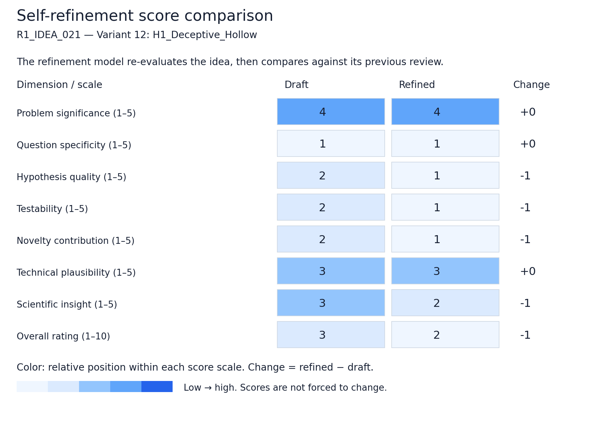

Changed score dimensions: hypothesis_quality, testability, novelty_contribution, scientific_insight, overall_rating.

### Score justifications (draft / refined)

**Problem significance**

```json
{
  "draft": {
    "score": 4.0,
    "justification": "The problem of limited adaptability due to lack of exploration is significant in machine learning, particularly in imitation learning and related fields. The tension between strong distribution modeling and generalization to novel situations is a recognized challenge."
  },
  "refined": {
    "score": 4.0,
    "justification": "The problem of limited adaptability due to lack of exploration is significant and well-recognized in machine learning, particularly in imitation learning, offline RL, and distribution modeling methods. The tension between strong distribution modeling and generalization to novel situations is a fundamental challenge with practical implications for real-world deployment."
  }
}
```

**Question specificity**

```json
{
  "draft": {
    "score": 1.0,
    "justification": "Extremely vague. Does not specify what is being investigated beyond 'more interactive learning process.' No concrete research question is articulated."
  },
  "refined": {
    "score": 1.0,
    "justification": "Extremely vague. No concrete research question is articulated beyond 'needs more interactive learning.' Does not specify what is being investigated, what approach is being modified, what type of interaction is proposed, or what specific adaptability gap is being addressed."
  }
}
```

**Hypothesis quality**

```json
{
  "draft": {
    "score": 2.0,
    "justification": "There's an implicit hypothesis that adding interaction/exploration will improve adaptability, but it's not stated clearly or made testable. No specific prediction about mechanisms or outcomes."
  },
  "refined": {
    "score": 1.0,
    "justification": "There is only the faintest implicit suggestion that interaction might help adaptability, but no hypothesis is formulated. No prediction, mechanism, or relationship is specified. The idea lacks even a basic 'if X then Y' structure that could be tested."
  }
}
```

**Testability**

```json
{
  "draft": {
    "score": 2.0,
    "justification": "The idea suggests a direction but provides no concrete way to test it. Without specifying the approach or what 'interaction' means, designing experiments is impossible from this description."
  },
  "refined": {
    "score": 1.0,
    "justification": "The central claim cannot be tested from this description. Without specifying the approach, what interaction means, how adaptability is measured, or what constitutes a novel situation, no meaningful experiment can be designed. The idea is purely motivational."
  }
}
```

**Novelty contribution**

```json
{
  "draft": {
    "score": 2.0,
    "justification": "The general concept of adding interaction/exploration to improve adaptability is not novel. The contribution is framed as transformative but lacks any specific novel element beyond the framing."
  },
  "refined": {
    "score": 1.0,
    "justification": "The general concept of adding interaction/exploration to improve adaptability is not novel—it's a core idea in fields like interactive imitation learning, reinforcement learning, and active learning. The contribution is framed in grandiose terms but contains zero novel technical or conceptual elements."
  }
}
```

**Technical plausibility**

```json
{
  "draft": {
    "score": 3.0,
    "justification": "The general reasoning is coherent: methods that lack exploration may struggle with adaptation. However, without technical details, it's impossible to assess whether the proposed direction is technically feasible for the unspecified approach."
  },
  "refined": {
    "score": 3.0,
    "justification": "The general reasoning is coherent: methods that lack exploration may struggle with adaptation to novel situations. This aligns with known limitations of pure imitation learning. However, without any technical details about the specific approach or proposed modifications, it's impossible to assess feasibility beyond this general plausibility."
  }
}
```

**Scientific insight**

```json
{
  "draft": {
    "score": 3.0,
    "justification": "If properly investigated, understanding how interaction affects adaptability could provide insight into the limitations of pure distribution modeling. However, the current formulation is too vague to promise specific insights."
  },
  "refined": {
    "score": 2.0,
    "justification": "If properly investigated with specific methods and hypotheses, understanding how interaction affects adaptability could provide insight into the limitations of pure distribution modeling. However, the current formulation is too vague to promise any specific insights—it merely states a well-known problem without proposing how to study it."
  }
}
```

**Overall rating**

```json
{
  "draft": {
    "score": 3.0,
    "justification": "This is a weak research idea in its current form. While it identifies a potentially meaningful problem (adaptability limitations due to lack of interaction), it fails to articulate a specific research question, hypothesis, or methodological direction. The language is grandiose but lacks substantive content. It reads more like a motivational paragraph than a research idea."
  },
  "refined": {
    "score": 2.0,
    "justification": "This is a very weak research idea. While it identifies a meaningful problem (adaptability limitations due to lack of interaction), it fails completely to articulate a research question, hypothesis, or methodological direction. It reads as a motivational paragraph or agenda-setting statement rather than a research idea. The grandiose language ('field-shaping,' 'transformative synthesis') contrasts sharply with the complete lack of substantive content. There is no testable core, no specificity, and no novel contribution proposed."
  }
}
```

## R1_IDEA_021 — Variant 13: H2_Confident_Flaw

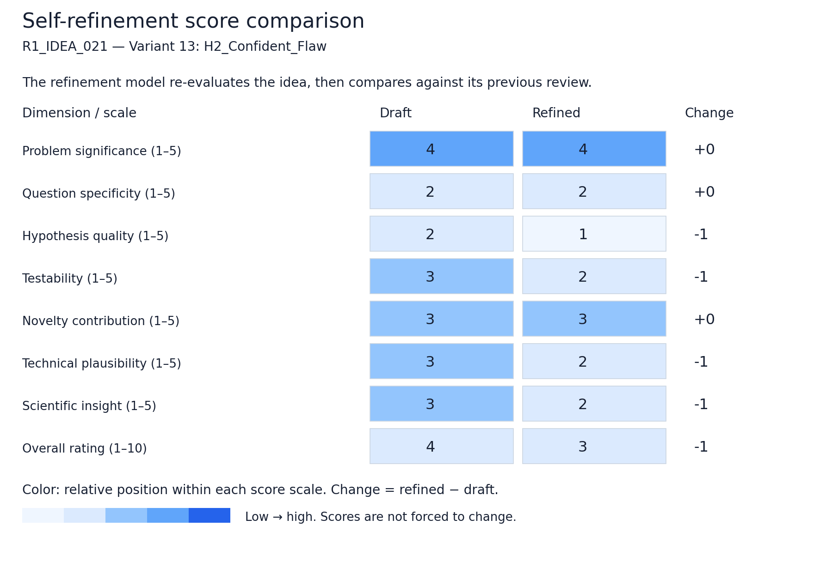

Changed score dimensions: hypothesis_quality, testability, technical_plausibility, scientific_insight, overall_rating.

### Score justifications (draft / refined)

**Problem significance**

```json
{
  "draft": {
    "score": 4.0,
    "justification": "The problem is meaningful: generalization beyond expert demonstrations is a core challenge in imitation learning. Flow Matching's limitations in interactive settings are worth investigating, especially as FM gains popularity."
  },
  "refined": {
    "score": 4.0,
    "justification": "The problem is highly meaningful: generalization beyond expert demonstrations is a fundamental challenge in imitation learning. As Flow Matching gains popularity for behavior cloning, understanding its limitations in interactive settings and potential remedies is timely and important for both theory and practice."
  }
}
```

**Question specificity**

```json
{
  "draft": {
    "score": 2.0,
    "justification": "The research question is poorly defined. It states that 'online interaction is sufficient to address generalization challenges' but does not specify what is being tested, compared, or measured. The claim is broad and lacks concrete boundaries."
  },
  "refined": {
    "score": 2.0,
    "justification": "The research question is poorly defined and lacks concrete boundaries. It states a broad claim ('online interaction is sufficient to address generalization challenges') without specifying what is being tested, compared, or measured. No clear dependent or independent variables are identified."
  }
}
```

**Hypothesis quality**

```json
{
  "draft": {
    "score": 2.0,
    "justification": "The implicit hypothesis is that online interaction solves FM's generalization problem. However, it is vague, lacks a concrete prediction, and makes strong causal claims without a clear testable mechanism. The assertion that improvements can be treated as causal evidence without isolating variables is scientifically unsound."
  },
  "refined": {
    "score": 1.0,
    "justification": "The implicit hypothesis is vague and makes scientifically problematic claims. It lacks a concrete, testable prediction and instead asserts that addressing a limitation will 'necessarily produce reliable improvements' and that gains can be treated as causal evidence without isolating variables. This demonstrates poor understanding of hypothesis testing and causal inference."
  }
}
```

**Testability**

```json
{
  "draft": {
    "score": 3.0,
    "justification": "The idea is testable in principle (one could compare FM with and without online interaction), but the lack of specificity makes it unclear what exactly would be tested. The claim about 'sufficiency' and 'causal evidence without isolating factors' reduces testability because it dismisses the need for careful experimental design."
  },
  "refined": {
    "score": 2.0,
    "justification": "While one could test FM with versus without online interaction in principle, the idea's lack of specificity and its dismissal of controlled experimental design ('without separately isolating... alternative explanations') severely undermines testability. The claim about 'sufficiency' is particularly difficult to test without clear criteria for what constitutes sufficiency."
  }
}
```

**Novelty contribution**

```json
{
  "draft": {
    "score": 3.0,
    "justification": "The combination of FM with online interaction could be novel, but the idea is presented at a high level without distinguishing it from existing interactive imitation learning approaches (e.g., DAgger, interactive IL). The potential contribution is moderate: if executed well, it could show how to adapt FM to interactive settings."
  },
  "refined": {
    "score": 3.0,
    "justification": "Combining FM with online interaction could be novel, but the idea is presented at such a high level that it's indistinguishable from generic 'add interaction to offline IL' approaches. Without specifying what makes FM's interaction unique or different from existing interactive IL methods (e.g., DAgger, interactive RL), the potential contribution is moderate at best."
  }
}
```

**Technical plausibility**

```json
{
  "draft": {
    "score": 3.0,
    "justification": "The core intuition—that offline FM policies may not generalize and online interaction could help—is plausible. However, the reasoning contains logical flaws (e.g., claiming causal evidence without controlled experiments). The technical direction is underspecified."
  },
  "refined": {
    "score": 2.0,
    "justification": "The core intuition that offline FM policies may not generalize and online interaction could help is plausible, but the reasoning contains serious logical flaws. The claim that improvements can be attributed causally without controlling for confounding variables is technically unsound. The direction is also underspecified—no technical mechanism is proposed for how interaction would be integrated with FM."
  }
}
```

**Scientific insight**

```json
{
  "draft": {
    "score": 3.0,
    "justification": "If properly investigated, the research could yield insights into how generative models like FM behave in interactive settings and whether they can be effectively fine-tuned online. However, the idea as stated focuses more on claiming superiority than on understanding mechanisms or boundary conditions."
  },
  "refined": {
    "score": 2.0,
    "justification": "If properly investigated, the research could yield insights into how generative models like FM behave in interactive settings. However, as stated, the idea focuses on claiming superiority rather than understanding mechanisms, boundary conditions, or fundamental principles. The dismissal of 'isolating dataset composition, evaluation criteria, boundary cases, or alternative explanations' suggests a lack of interest in deeper scientific understanding."
  }
}
```

**Overall rating**

```json
{
  "draft": {
    "score": 4.0,
    "justification": "The idea identifies a relevant problem but is marred by vague claims, logical leaps, and lack of specificity. It reads more like a motivation statement than a research plan. While the core intuition (FM + interaction) has potential, the idea needs substantial refinement to become a strong research direction."
  },
  "refined": {
    "score": 3.0,
    "justification": "The idea identifies a relevant problem but is severely weakened by vague claims, logical flaws, and lack of specificity. It reads more like an opinionated motivation statement than a research plan. The core intuition (FM + interaction) has some merit, but the idea needs substantial refinement to become a viable research direction. The problematic causal claims and lack of concrete hypotheses significantly diminish its scientific quality."
  }
}
```

## R1_IDEA_021 — Variant 14: H3_Verbose_Enriched

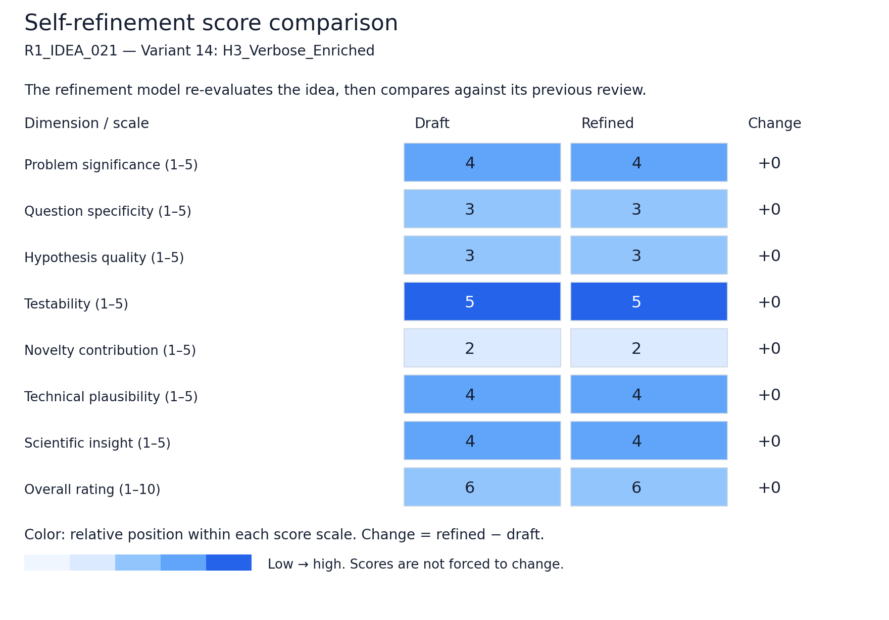

Changed score dimensions: none.

### Score justifications (draft / refined)

**Problem significance**

```json
{
  "draft": {
    "score": 4.0,
    "justification": "Generalization of offline imitation learning methods is a meaningful challenge, especially as FM gains traction. Understanding when and why FM policies fail to generalize beyond demonstration data is relevant for safe and reliable deployment."
  },
  "refined": {
    "score": 4.0,
    "justification": "The generalization of offline imitation learning methods is a significant and practical challenge. As Flow Matching gains traction for behavior cloning, understanding its failure modes and limits—particularly its sensitivity to demonstration coverage and lack of exploration—is highly relevant for reliable deployment."
  }
}
```

**Question specificity**

```json
{
  "draft": {
    "score": 3.0,
    "justification": "The idea identifies a clear problem (poor generalization) and proposes a testable intervention (online data collection), but the research question is somewhat broad: 'Does online data help?' A more specific question about the conditions or mechanisms of failure would strengthen it."
  },
  "refined": {
    "score": 3.0,
    "justification": "The idea identifies a clear problem (poor generalization) and a proposed intervention (online data collection), making the research direction reasonably specific. However, the core question ('Does online data help?') is somewhat broad. It could be strengthened by specifying the conditions (e.g., 'Under what data regimes or task complexities does online interaction most significantly improve FM policy generalization?')."
  }
}
```

**Hypothesis quality**

```json
{
  "draft": {
    "score": 3.0,
    "justification": "The hypothesis is explicit and testable: online interaction reduces the generalization gap. However, it is relatively surface-level and does not propose a deeper mechanistic explanation (e.g., why FM is particularly sensitive to coverage)."
  },
  "refined": {
    "score": 3.0,
    "justification": "The hypothesis is explicit and testable: 'incorporating limited online data collection reduces the generalization gap.' It makes a concrete, falsifiable prediction. However, it is relatively surface-level; it does not propose a deeper, mechanistic explanation for why FM might be particularly susceptible to this issue or how the intervention works."
  }
}
```

**Testability**

```json
{
  "draft": {
    "score": 5.0,
    "justification": "The idea excels here: it outlines a concrete staged experimental design with baselines, interventions, ablations, sensitivity analyses, and error analysis. This makes the hypothesis highly testable."
  },
  "refined": {
    "score": 5.0,
    "justification": "This is a major strength. The idea outlines a highly concrete and rigorous experimental design: a staged approach with defined baselines and interventions, pre-specified evaluation criteria, ablations, sensitivity analyses, and error analysis. This framework makes the central hypothesis exceptionally testable."
  }
}
```

**Novelty contribution**

```json
{
  "draft": {
    "score": 2.0,
    "justification": "The core idea—adding online data to improve offline policy generalization—is not novel; it is a common approach in offline RL. The novelty would depend on insights into FM-specific failure modes or boundary conditions, which are not yet articulated."
  },
  "refined": {
    "score": 2.0,
    "justification": "The core concept—using online interaction to improve an offline-trained policy—is a well-established idea in offline RL and imitation learning. The novelty would hinge on insights specific to the Flow Matching architecture or its failure modes, which are not yet articulated. As presented, it applies a common solution to a new method (FM)."
  }
}
```

**Technical plausibility**

```json
{
  "draft": {
    "score": 4.0,
    "justification": "The reasoning is coherent: FM policies are trained offline, so they may not generalize well; online interaction could help. The proposed experimental design is logically sound and aligns with standard ML evaluation practices."
  },
  "refined": {
    "score": 4.0,
    "justification": "The reasoning is logically coherent: FM policies are trained purely offline, which limits their exposure to the environment's dynamics and possible states; therefore, controlled online interaction could plausibly improve robustness and generalization. The proposed experimental design is sound and aligns with good ML evaluation practices."
  }
}
```

**Scientific insight**

```json
{
  "draft": {
    "score": 4.0,
    "justification": "The idea has strong potential for scientific insight because it emphasizes understanding boundary conditions, data regimes, and assumptions. A well-executed study could reveal when FM-based imitation learning fails and why online interaction helps, offering generalizable knowledge."
  },
  "refined": {
    "score": 4.0,
    "justification": "The idea has strong potential for scientific insight because it explicitly focuses on understanding 'boundary conditions,' 'assumptions,' 'data regimes,' and 'domain constraints.' A well-executed study following this design could reveal not just if online data helps, but when and why it is necessary for FM policies, offering generalizable knowledge about the limitations of offline generative modeling for control."
  }
}
```

**Overall rating**

```json
{
  "draft": {
    "score": 6.0,
    "justification": "This is a moderate/borderline research idea. It addresses a relevant problem and proposes a rigorous experimental methodology, but the core hypothesis is somewhat intuitive and lacks novelty. The potential for scientific insight is high if the study focuses on understanding FM-specific mechanisms and boundary conditions, but as presented, the idea is more of a solid validation study than a groundbreaking research direction."
  },
  "refined": {
    "score": 6.0,
    "justification": "This is a moderate/borderline research idea. It addresses a relevant problem with a highly testable and methodologically rigorous plan. Its primary weaknesses are the intuitive/non-novel core hypothesis and the lack of specificity regarding the FM-specific mechanisms at play. The potential for scientific insight is significant if the study successfully uncovers transferable principles about FM's limitations, but as a proposed direction, it leans more toward a solid, incremental validation study than a highly novel research question."
  }
}
```

## R1_IDEA_021 — Variant 15: H4_Ultimate_Hype


Changed score dimensions: question_specificity, hypothesis_quality, testability, novelty_contribution, scientific_insight, overall_rating.

### Score justifications (draft / refined)

**Problem significance**

```json
{
  "draft": {
    "score": 4.0,
    "justification": "The problem is meaningful: offline imitation learning methods like FM often fail to generalize beyond training data, and incorporating online interaction is a recognized challenge in the field. Improving generalization in imitation learning has both scientific and practical importance."
  },
  "refined": {
    "score": 4.0,
    "justification": "The problem is significant. Improving the generalization of powerful offline imitation learning methods like FM is a recognized and important challenge in machine learning, with clear implications for building robust real-world systems."
  }
}
```

**Question specificity**

```json
{
  "draft": {
    "score": 2.0,
    "justification": "The idea lacks a specific research question. It states that FM has limitations due to lack of interaction, but doesn't define what exactly will be investigated. It's more of a broad motivation than a concrete question."
  },
  "refined": {
    "score": 1.0,
    "justification": "The idea lacks any specific research question. It only states a problem (FM doesn't generalize well) and a vague direction (add online interaction), without defining what is to be investigated. It is a motivational statement, not a concrete inquiry."
  }
}
```

**Hypothesis quality**

```json
{
  "draft": {
    "score": 2.0,
    "justification": "There's an implicit hypothesis that 'incorporating online interaction will improve FM generalization,' but it's not articulated as a testable prediction. No mechanism or specific relationship is proposed beyond this vague direction."
  },
  "refined": {
    "score": 1.0,
    "justification": "There is no explicit or clearly implicit hypothesis. The closest to a hypothesis is the vague suggestion that online interaction might help, but this is not formulated as a testable prediction about a mechanism, relationship, or comparative outcome."
  }
}
```

**Testability**

```json
{
  "draft": {
    "score": 2.0,
    "justification": "Without a specific proposal for how to incorporate online interaction or what 'improved generalization' means operationally, it's difficult to design a test. The idea suggests a direction but not a testable claim."
  },
  "refined": {
    "score": 1.0,
    "justification": "The idea is not testable in its current form. It proposes no experiment, comparison, analysis, or evaluation method. There is no defined claim that could be supported or contradicted by evidence."
  }
}
```

**Novelty contribution**

```json
{
  "draft": {
    "score": 3.0,
    "justification": "The general concept of combining offline and online learning is not novel, but applying it specifically to Flow Matching could be novel if executed with specific insights. However, the idea as presented doesn't articulate what novel contribution beyond application would be made."
  },
  "refined": {
    "score": 2.0,
    "justification": "The core concept—enhancing an offline method with online interaction—is well-established in RL and imitation learning. Applying it to FM could be a novel application, but the idea provides no specific angle, insight, or method that would constitute a novel scientific contribution beyond a straightforward combination."
  }
}
```

**Technical plausibility**

```json
{
  "draft": {
    "score": 3.0,
    "justification": "The basic premise is plausible: FM learns distributions from data, and online interaction could help adapt to new situations. However, without technical details, it's unclear how challenging the integration would be or whether important technical obstacles exist."
  },
  "refined": {
    "score": 3.0,
    "justification": "The basic intuition is plausible: an expressive offline policy could be a good prior for online fine-tuning. However, with no technical details, it's impossible to assess feasibility. Significant challenges (e.g., integrating gradient-based FM with RL, exploration in high-dimensional spaces) are likely but unaddressed."
  }
}
```

**Scientific insight**

```json
{
  "draft": {
    "score": 3.0,
    "justification": "If properly investigated, this could yield insights about the trade-offs between expressive offline models and online adaptation, or about how generative models like FM interact with exploration. However, the current formulation is too vague to guarantee such insights."
  },
  "refined": {
    "score": 2.0,
    "justification": "If a specific study were conducted, it could yield insights into the adaptability of generative policy models. However, the idea as presented is too vague to promise insight into mechanisms, principles, or boundary conditions. It currently suggests only an application goal."
  }
}
```

**Overall rating**

```json
{
  "draft": {
    "score": 4.0,
    "justification": "This is a weak research idea as presented. While it identifies a meaningful problem (FM's generalization limitations), it lacks specificity, testability, and concrete direction. It reads more like a grant proposal abstract than a research idea with a clear question/hypothesis. The grandiose language about 'transformative research agenda' and 'redefining frontiers' is not supported by substantive content. The core insight—that offline FM needs online interaction—is reasonable but not developed into a researchable proposition."
  },
  "refined": {
    "score": 3.0,
    "justification": "This is a weak research idea. It identifies a meaningful problem but fails to advance beyond a generic problem statement. It lacks a research question, hypothesis, testable claim, or methodological direction. The promotional language is not substantiated. It is not yet a coherent proposition for scientific investigation."
  }
}
```

## R1_IDEA_022 — Source

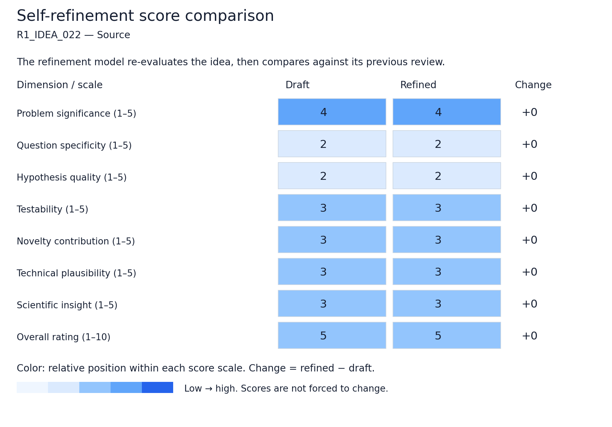

Changed score dimensions: none.

### Score justifications (draft / refined)

**Problem significance**

```json
{
  "draft": {
    "score": 4.0,
    "justification": "The problem is meaningful: generating complex multi-event audio from text is a challenging and practically important task where current models have limitations. Improving alignment with human preferences in compositional audio generation is a relevant research direction."
  },
  "refined": {
    "score": 4.0,
    "justification": "The problem is meaningful: generating complex multi-event audio from text is a challenging and practically important task in audio generation. Improving alignment with human preferences for compositional audio is a relevant research direction with applications in content creation, accessibility, and multimedia."
  }
}
```

**Question specificity**

```json
{
  "draft": {
    "score": 2.0,
    "justification": "The research question is very vague: 'improve performance' with AI feedback learning. No specific aspect of multi-event generation is targeted, nor is there a clear definition of what constitutes success beyond satisfying human preferences."
  },
  "refined": {
    "score": 2.0,
    "justification": "The research question is very vague: 'improve performance' with AI feedback learning. No specific aspect of multi-event generation is targeted, nor is there a clear definition of what constitutes success beyond satisfying human preferences. The idea lacks a focused inquiry into a particular mechanism or relationship."
  }
}
```

**Hypothesis quality**

```json
{
  "draft": {
    "score": 2.0,
    "justification": "There's an implicit hypothesis that 'AI feedback learning can enhance basic capabilities for high-level applications,' but it's not concrete. No specific prediction about what aspects would improve, by how much, or why AI feedback would work better than alternatives."
  },
  "refined": {
    "score": 2.0,
    "justification": "There is only an implicit, underspecified hypothesis that 'AI feedback learning can enhance basic capabilities for high-level applications.' No concrete prediction is made about what aspects would improve, by how much, or why AI feedback would be more effective than alternatives. The hypothesis is not falsifiable in its current form."
  }
}
```

**Testability**

```json
{
  "draft": {
    "score": 3.0,
    "justification": "The idea is testable in principle (train with AI feedback, evaluate on multi-event audio), but the lack of specificity about what to test and how to measure makes it difficult to design a clear experiment. Human preference evaluation is possible but expensive and subjective."
  },
  "refined": {
    "score": 3.0,
    "justification": "The idea is testable in principle—one could train a model with AI feedback and evaluate on multi-event audio—but the lack of specificity about what to test and how to measure outcomes makes it difficult to design a clear experiment. Human preference evaluation is possible but expensive and subjective; no objective metrics or controlled comparisons are suggested."
  }
}
```

**Novelty contribution**

```json
{
  "draft": {
    "score": 3.0,
    "justification": "Applying AI feedback to T2A generation has some novelty, but AI feedback (especially RLHF) is already widely used in text and image generation. The contribution would depend heavily on how it's adapted to audio and what specific insights emerge about multi-event generation."
  },
  "refined": {
    "score": 3.0,
    "justification": "Applying AI feedback to T2A generation has some novelty, but AI feedback (e.g., RLHF) is already widely used in text and image generation. The contribution would depend heavily on how it is adapted to audio and what specific insights emerge about multi-event generation. As stated, it risks being a straightforward application of an existing technique to a new modality."
  }
}
```

**Technical plausibility**

```json
{
  "draft": {
    "score": 3.0,
    "justification": "The general direction is plausible - AI feedback has improved alignment in other domains. However, the idea is too vague to assess technical soundness. Important questions about feedback collection, reward modeling, and training stability for audio are unaddressed."
  },
  "refined": {
    "score": 3.0,
    "justification": "The general direction is plausible—AI feedback has improved alignment in other domains—but the idea is too vague to assess technical soundness. Critical questions about feedback collection, reward modeling for audio, training stability, and integration with existing T2A architectures are unaddressed, leaving the technical feasibility uncertain."
  }
}
```

**Scientific insight**

```json
{
  "draft": {
    "score": 3.0,
    "justification": "If successful, this could provide insight into how feedback mechanisms affect compositional understanding in audio models. However, the idea as stated focuses more on application improvement than on understanding underlying mechanisms or limitations."
  },
  "refined": {
    "score": 3.0,
    "justification": "If successfully investigated, this could provide insight into how feedback mechanisms affect compositional understanding in audio models. However, the idea as stated focuses more on application improvement than on understanding underlying mechanisms, limitations, or general principles. The potential for transferable scientific insight is moderate and contingent on deeper exploration."
  }
}
```

**Overall rating**

```json
{
  "draft": {
    "score": 5.0,
    "justification": "This is a moderate/borderline research idea. It identifies a meaningful problem (complex multi-event audio generation) and suggests a plausible technical direction (AI feedback learning). However, it lacks specificity in research question, hypothesis, and methodology. The contribution would depend heavily on how the idea is fleshed out - currently it reads more like a general motivation than a concrete research plan."
  },
  "refined": {
    "score": 5.0,
    "justification": "This is a moderate/borderline research idea. It identifies a meaningful problem (complex multi-event audio generation) and suggests a plausible technical direction (AI feedback learning). However, it lacks specificity in research question, hypothesis, and methodology. The contribution would depend heavily on how the idea is fleshed out—currently it reads more like a general motivation than a concrete research plan with clear scientific inquiry."
  }
}
```

## R1_IDEA_022 — Variant 1: A1_Identity


Changed score dimensions: none.

### Score justifications (draft / refined)

**Problem significance**

```json
{
  "draft": {
    "score": 4.0,
    "justification": "The problem is meaningful: improving T2A models for complex multi-event audio is practically important for real-world applications, and current models do have limitations in this area. However, the significance is somewhat reduced by not clearly articulating why multi-event audio is particularly challenging or important beyond general quality improvements."
  },
  "refined": {
    "score": 4.0,
    "justification": "The problem is meaningful: generating high-quality, prompt-faithful audio for complex scenes is a recognized challenge in T2A research and has practical importance for applications in media, accessibility, and creative tools. However, the idea does not deeply motivate why multi-event audio is uniquely difficult or why current paradigms are insufficient, slightly limiting the perceived significance."
  }
}
```

**Question specificity**

```json
{
  "draft": {
    "score": 2.0,
    "justification": "Very low specificity. The idea states a general direction ('enhance with AI feedback learning') but does not define a concrete research question. It doesn't specify what aspect of multi-event audio generation to focus on, what type of AI feedback, or what specific capabilities need enhancement."
  },
  "refined": {
    "score": 2.0,
    "justification": "Very low specificity. The idea only states a broad goal ('enhance with AI feedback learning') without defining a concrete research question. It does not specify what aspect of multi-event generation to focus on, what type of feedback, what model capabilities are targeted, or what constitutes improvement."
  }
}
```

**Hypothesis quality**

```json
{
  "draft": {
    "score": 2.0,
    "justification": "No clear hypothesis is presented. The implicit hypothesis is that 'AI feedback learning will improve T2A performance on complex multi-event audio,' but this is too vague. A stronger hypothesis would predict why AI feedback would help, what mechanism it addresses, or how it compares to alternatives."
  },
  "refined": {
    "score": 2.0,
    "justification": "No clear hypothesis is presented. The implicit assumption is that AI feedback learning will improve performance, but this is a vague suggestion rather than a testable prediction. A hypothesis would need to articulate a causal mechanism, a comparative advantage, or a specific relationship between feedback and multi-event audio quality."
  }
}
```

**Testability**

```json
{
  "draft": {
    "score": 3.0,
    "justification": "Moderately testable in principle - one could implement AI feedback and compare performance. However, without specifying what form of AI feedback or what specific improvements to measure, it's unclear exactly what would be tested. The idea lacks a clear experimental design or evaluation plan."
  },
  "refined": {
    "score": 3.0,
    "justification": "Moderately testable in principle because one could implement an AI feedback method and evaluate T2A performance. However, without specifying the feedback approach, the evaluation metrics, or the experimental setup, it is unclear what exactly would be tested. The idea lacks a clear investigation plan."
  }
}
```

**Novelty contribution**

```json
{
  "draft": {
    "score": 3.0,
    "justification": "Applying AI feedback to T2A has some novelty, as most work focuses on language models. However, the idea is presented at too high a level to assess its potential contribution. If executed well, it could contribute to understanding how preference learning transfers to audio domains, but as stated, it's mostly an application suggestion."
  },
  "refined": {
    "score": 3.0,
    "justification": "Applying AI feedback to T2A generation has some novelty, as most work on preference learning focuses on language or image generation. However, as stated, the idea is a generic application suggestion rather than a novel research direction. A well-executed study could contribute insights into cross-modal preference learning, but the idea itself does not articulate what new knowledge would be produced."
  }
}
```

**Technical plausibility**

```json
{
  "draft": {
    "score": 4.0,
    "justification": "The general direction is plausible. AI feedback (e.g., RLHF) has worked for text generation, and adapting it to audio generation seems technically feasible. However, significant challenges in designing appropriate reward models for audio are not acknowledged."
  },
  "refined": {
    "score": 4.0,
    "justification": "The general direction is technically plausible. AI feedback methods like RLHF have succeeded in text generation, and adapting them to audio is conceptually feasible. However, significant challenges—such as designing reward models for audio, collecting preference data, and integrating feedback into diffusion or autoregressive audio models—are not acknowledged, slightly overstating the ease of implementation."
  }
}
```

**Scientific insight**

```json
{
  "draft": {
    "score": 3.0,
    "justification": "Potential for moderate insight. If properly investigated, it could reveal how preference learning techniques transfer across modalities, or what aspects of audio generation are most amenable to feedback-based improvement. However, as stated, it's more of an engineering improvement than a scientific investigation."
  },
  "refined": {
    "score": 3.0,
    "justification": "Potential for moderate insight. If rigorously investigated, the work could reveal how preference-based learning generalizes across modalities, what aspects of audio generation are most amenable to feedback, or how human audio preferences differ from text-based ones. However, as presented, the idea leans more toward an engineering improvement than a hypothesis-driven scientific inquiry."
  }
}
```

**Overall rating**

```json
{
  "draft": {
    "score": 5.0,
    "justification": "Moderate/borderline idea. It identifies a real problem (T2A struggles with complex multi-event audio) and suggests a plausible technical direction (AI feedback). However, it lacks a specific research question, testable hypothesis, or clear experimental approach. The idea is more of a general suggestion than a well-formed research investigation. With more specificity about what to study and how, it could become a strong research direction."
  },
  "refined": {
    "score": 5.0,
    "justification": "Moderate/borderline research idea. It identifies a real and meaningful problem (T2A struggles with complex multi-event audio) and points to a plausible technical direction (AI feedback learning). However, it lacks a specific research question, a testable hypothesis, and any methodological details. The idea is currently a vague suggestion rather than a well-formed research investigation. With greater specificity and a clearer scientific question, it could become a strong research direction."
  }
}
```

## R1_IDEA_022 — Variant 2: A2_Paraphrase_Only


Changed score dimensions: none.

### Score justifications (draft / refined)

**Problem significance**

```json
{
  "draft": {
    "score": 4.0,
    "justification": "The problem is meaningful - multi-event audio generation is a practical challenge where current models underperform, and improving it would enhance real-world usability of text-to-audio systems."
  },
  "refined": {
    "score": 4.0,
    "justification": "The problem is meaningful and timely. Multi-event audio generation represents a practical challenge where current models significantly underperform, limiting real-world applications. Improving this capability would enhance the usability and reliability of text-to-audio systems for complex creative and practical tasks."
  }
}
```

**Question specificity**

```json
{
  "draft": {
    "score": 2.0,
    "justification": "The research question is poorly defined. While it identifies a problem domain (multi-event generation), it doesn't specify what aspect will be investigated, what relationship will be studied, or what specific question will be answered."
  },
  "refined": {
    "score": 2.0,
    "justification": "The research question is poorly defined. While it identifies a problem domain (multi-event generation), it doesn't specify what aspect will be investigated, what relationship will be studied, or what specific question will be answered. The statement is more of a general suggestion than a research question."
  }
}
```

**Hypothesis quality**

```json
{
  "draft": {
    "score": 1.0,
    "justification": "There is no clear hypothesis. The idea states that AI feedback learning could help, but doesn't make a testable prediction about mechanisms, outcomes, or why this approach would work better than alternatives."
  },
  "refined": {
    "score": 1.0,
    "justification": "There is no clear hypothesis. The idea states that AI feedback learning 'could help' but doesn't make a testable prediction about mechanisms, outcomes, or why this approach would work. It lacks the core elements of a hypothesis: a proposed relationship between variables that can be supported or contradicted by evidence."
  }
}
```

**Testability**

```json
{
  "draft": {
    "score": 2.0,
    "justification": "The idea is minimally testable because it suggests a direction (AI feedback learning) but provides no indication of how to test whether it works. No experiments, comparisons, or evaluation approaches are mentioned."
  },
  "refined": {
    "score": 2.0,
    "justification": "The idea is minimally testable because it suggests a direction without specifying how to test it. No experiments, comparisons, evaluation approaches, or success criteria are mentioned. While one could design tests for such a proposal, the idea itself provides no framework for investigation."
  }
}
```

**Novelty contribution**

```json
{
  "draft": {
    "score": 2.0,
    "justification": "Applying feedback learning to generative models is not novel in itself. The potential contribution depends entirely on how it's implemented and what insights emerge, but the idea as stated is too vague to assess novelty."
  },
  "refined": {
    "score": 2.0,
    "justification": "Applying feedback learning to generative models is not novel in itself (e.g., RLHF for text, preference learning for images). The potential contribution depends entirely on implementation details and insights, but the idea as stated is too vague to assess novelty. It reads more like applying an existing technique to a new domain without specifying what new knowledge would be generated."
  }
}
```

**Technical plausibility**

```json
{
  "draft": {
    "score": 3.0,
    "justification": "The general direction is plausible - feedback mechanisms have improved other generative models. However, without details about how feedback would be implemented for audio, it's impossible to assess technical soundness."
  },
  "refined": {
    "score": 3.0,
    "justification": "The general direction is plausible - feedback mechanisms have improved other generative models. However, without details about how feedback would be implemented for audio (collecting preferences, designing reward functions, etc.), it's impossible to assess technical soundness. Audio presents unique challenges compared to text or images for feedback learning."
  }
}
```

**Scientific insight**

```json
{
  "draft": {
    "score": 2.0,
    "justification": "As presented, the idea seems focused on improving performance rather than generating scientific insight. It doesn't propose to study mechanisms, principles, or boundary conditions that would yield transferable knowledge."
  },
  "refined": {
    "score": 2.0,
    "justification": "As presented, the idea seems focused on improving performance rather than generating scientific insight. It doesn't propose to study mechanisms, principles, or boundary conditions that would yield transferable knowledge about audio generation, multi-event understanding, or feedback learning itself. The potential for scientific contribution is minimal without refinement."
  }
}
```

**Overall rating**

```json
{
  "draft": {
    "score": 4.0,
    "justification": "This is a weak research idea. While it identifies a meaningful practical problem, it lacks a specific research question, testable hypothesis, and methodological direction. The proposal is too vague to constitute a research idea - it's more of a general suggestion. With substantial refinement (specific hypothesis, experimental design, mechanism explanation), it could become a viable research direction."
  },
  "refined": {
    "score": 4.0,
    "justification": "This is a weak research idea. While it identifies a meaningful practical problem in an important domain, it lacks the core components of a research idea: a specific research question, a testable hypothesis, and a methodological direction. The proposal is too vague to constitute a viable research direction as presented. It reads more like a general suggestion or motivation statement than a research idea. With substantial refinement (specific hypothesis, experimental design, mechanism explanation), it could become a viable research direction."
  }
}
```

## R1_IDEA_022 — Variant 3: A3_Plain_Core

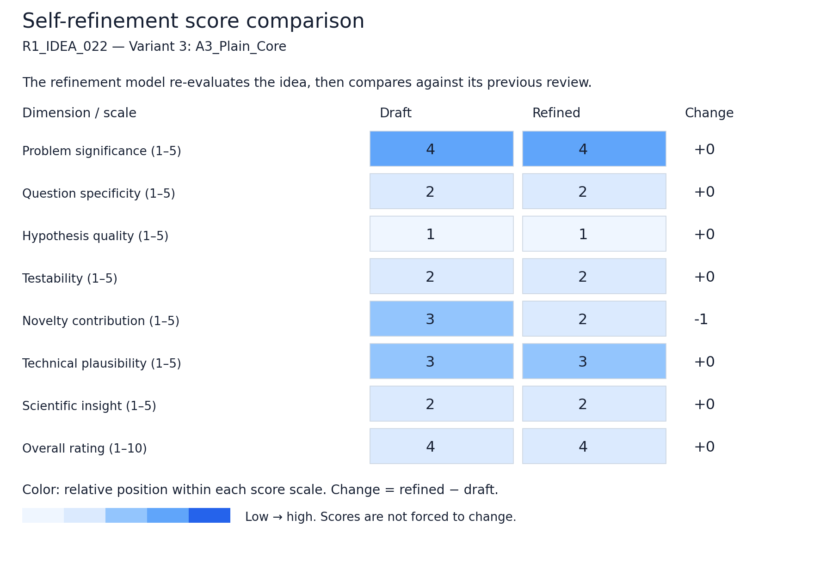

Changed score dimensions: novelty_contribution.

### Score justifications (draft / refined)

**Problem significance**

```json
{
  "draft": {
    "score": 4.0,
    "justification": "The problem is meaningful - text-to-audio generation for complex, multi-event scenes is challenging and important for practical applications. Current models do struggle with compositional understanding and temporal coherence."
  },
  "refined": {
    "score": 4.0,
    "justification": "The problem is meaningful and relevant. Text-to-audio generation for complex, multi-event scenes is a recognized challenge with practical applications in content creation, accessibility, and entertainment. Current models do struggle with compositional understanding and temporal coherence in complex audio scenes."
  }
}
```

**Question specificity**

```json
{
  "draft": {
    "score": 2.0,
    "justification": "The research question is only vaguely defined as 'improving performance' using 'AI feedback learning.' It doesn't specify what aspect of performance, what type of feedback, or what specific capabilities need enhancement."
  },
  "refined": {
    "score": 2.0,
    "justification": "The research question is only vaguely defined as 'improving performance' using 'AI feedback learning.' It doesn't specify what aspect of performance (which metrics), what type of feedback, what specific capabilities need enhancement, or how multi-event audio is defined. The term 'AI feedback learning' is particularly underspecified."
  }
}
```

**Hypothesis quality**

```json
{
  "draft": {
    "score": 1.0,
    "justification": "There is no clear hypothesis presented. The idea states that AI feedback learning could enhance capabilities, but doesn't make a testable prediction about mechanisms, relationships, or expected outcomes."
  },
  "refined": {
    "score": 1.0,
    "justification": "There is no clear hypothesis presented. The idea states that AI feedback learning could enhance capabilities, but doesn't make a testable prediction about mechanisms, relationships, or expected outcomes. There's no causal claim about why feedback would help with multi-event audio specifically."
  }
}
```

**Testability**

```json
{
  "draft": {
    "score": 2.0,
    "justification": "While the general direction could be tested, the idea provides no concrete experimental approach. Without specifying what feedback learning means or how to evaluate improvements, it's difficult to assess testability."
  },
  "refined": {
    "score": 2.0,
    "justification": "While the general direction could eventually be tested, the idea provides no concrete experimental approach. Without specifying what feedback learning means, how it would be implemented, or how improvements would be evaluated, it's difficult to assess testability. The idea lacks even a basic experimental design."
  }
}
```

**Novelty contribution**

```json
{
  "draft": {
    "score": 3.0,
    "justification": "Applying feedback learning to audio generation has some novelty, but the idea is too vague to assess its potential contribution. It could range from incremental application of existing RLHF techniques to genuinely novel feedback mechanisms."
  },
  "refined": {
    "score": 2.0,
    "justification": "The idea is too vague to assess novelty meaningfully. Applying 'feedback learning' to generative models is not novel in itself (RLHF is widely used in language models). The potential contribution depends entirely on unspecified details about the feedback mechanism and how it addresses multi-event audio specifically."
  }
}
```

**Technical plausibility**

```json
{
  "draft": {
    "score": 3.0,
    "justification": "The general concept of using feedback to improve models is plausible, but without details about implementation, it's impossible to evaluate technical coherence. The connection between feedback and multi-event audio problems is not explained."
  },
  "refined": {
    "score": 3.0,
    "justification": "The general concept of using feedback to improve models is plausible, but without details about implementation, it's impossible to evaluate technical coherence. The connection between feedback and multi-event audio problems is not explained. The idea rests on the assumption that 'feedback learning' can address the specific challenges mentioned, but this assumption is not justified."
  }
}
```

**Scientific insight**

```json
{
  "draft": {
    "score": 2.0,
    "justification": "As presented, the idea seems focused on improving performance rather than generating scientific insight. It doesn't propose to investigate mechanisms, principles, or boundary conditions that would yield transferable knowledge."
  },
  "refined": {
    "score": 2.0,
    "justification": "As presented, the idea seems focused on improving performance rather than generating scientific insight. It doesn't propose to investigate mechanisms, principles, or boundary conditions that would yield transferable knowledge. There's no indication that the research would reveal why current models fail at multi-event audio or how feedback addresses specific failure modes."
  }
}
```

**Overall rating**

```json
{
  "draft": {
    "score": 4.0,
    "justification": "This is a weak research idea as presented. While it identifies a meaningful problem, it lacks specificity, a testable hypothesis, and any details about methodology. The core concept ('AI feedback learning') is too vague to evaluate scientifically. The idea needs substantial refinement to become a viable research direction."
  },
  "refined": {
    "score": 4.0,
    "justification": "This is a weak research idea as presented. While it identifies a meaningful problem in an active research area, it lacks specificity, a testable hypothesis, and any details about methodology. The core concept ('AI feedback learning') is too vague to evaluate scientifically, and no connection is made between the proposed solution and the identified problem. The idea needs substantial refinement to become a viable research direction."
  }
}
```

## R1_IDEA_022 — Variant 4: B1_Verbose_Elaborate

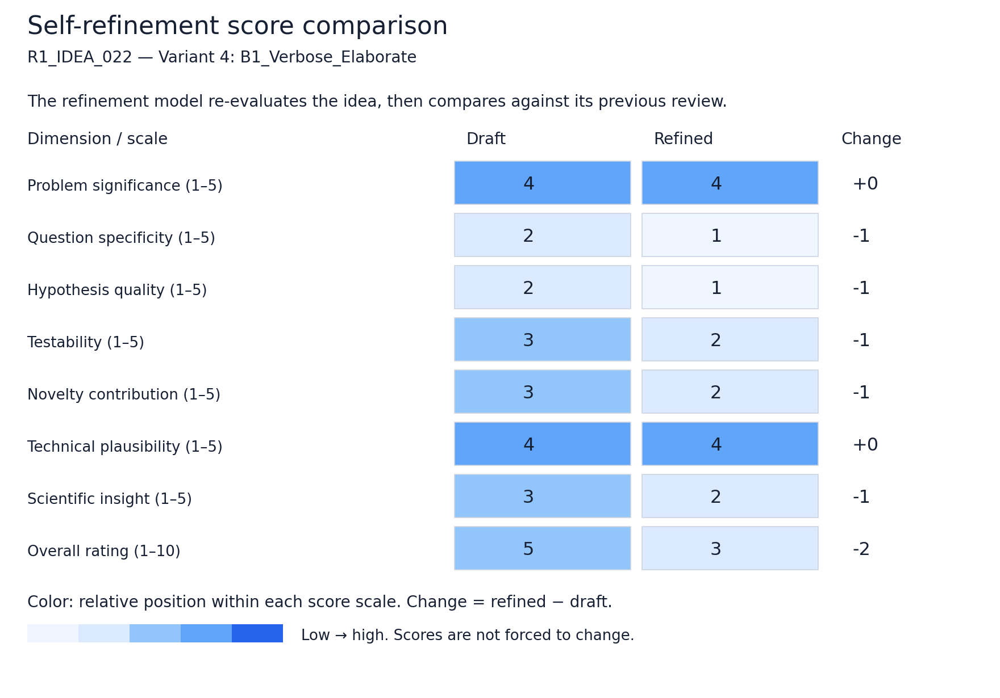

Changed score dimensions: question_specificity, hypothesis_quality, testability, novelty_contribution, scientific_insight, overall_rating.

### Score justifications (draft / refined)

**Problem significance**

```json
{
  "draft": {
    "score": 4.0,
    "justification": "The problem is meaningful: generating complex multi-event audio from text is a challenging and practically important task where current models fall short. Improving alignment with human preferences is a core challenge in generative AI."
  },
  "refined": {
    "score": 4.0,
    "justification": "The problem is meaningful and relevant. Generating high-quality, complex multi-event audio from text is a challenging task with practical applications in content creation, gaming, and assistive technologies. Current models' limitations in this area represent a genuine research gap."
  }
}
```

**Question specificity**

```json
{
  "draft": {
    "score": 2.0,
    "justification": "The idea is stated at a high level: 'enhance basic capabilities with AI feedback learning.' It does not define a specific research question about mechanisms, comparisons, or conditions."
  },
  "refined": {
    "score": 1.0,
    "justification": "The idea lacks a defined research question. It only states an intention ('enhance basic capabilities with AI feedback learning') without specifying what relationship, mechanism, or comparison will be investigated. This is at the level of a general motivation, not a specific inquiry."
  }
}
```

**Hypothesis quality**

```json
{
  "draft": {
    "score": 2.0,
    "justification": "There is an implicit hypothesis that AI feedback learning will improve performance on complex multi-event audio, but it is not articulated as a testable prediction. No mechanism or comparative claim is proposed."
  },
  "refined": {
    "score": 1.0,
    "justification": "There is no explicit or implicit testable hypothesis. The idea suggests a direction (use AI feedback) but makes no concrete prediction about outcomes, mechanisms, or comparative advantages. It does not distinguish what might be learned beyond 'this might help.'"
  }
}
```

**Testability**

```json
{
  "draft": {
    "score": 3.0,
    "justification": "The idea is testable in principle (one could implement AI feedback and evaluate on multi-event audio), but the lack of specificity makes it unclear what exactly would be tested. A generic application of feedback learning is testable, but the research question itself is vague."
  },
  "refined": {
    "score": 2.0,
    "justification": "While one could technically apply AI feedback to a T2A model and evaluate it, the idea as stated does not define what claim is being tested. Without a specific question or hypothesis, it's unclear what evidence would constitute support or contradiction. It is only minimally testable because the approach itself is implementable."
  }
}
```

**Novelty contribution**

```json
{
  "draft": {
    "score": 3.0,
    "justification": "Applying AI feedback learning to text-to-audio is not inherently novel, as feedback learning is widely used in language and image generation. The contribution would depend on demonstrating its effectiveness for multi-event audio or uncovering specific insights about this domain."
  },
  "refined": {
    "score": 2.0,
    "justification": "Applying AI feedback learning to T2A is a straightforward extension of techniques used in text and image generation. Without a specific investigative angle (e.g., testing a unique challenge of multi-event audio, comparing feedback types, or uncovering domain-specific insights), the potential contribution is limited to a domain application."
  }
}
```

**Technical plausibility**

```json
{
  "draft": {
    "score": 4.0,
    "justification": "The direction is plausible: AI feedback learning (e.g., RLHF, DPO) has succeeded in aligning text and image models with human preferences, and extending it to audio is a logical step. The reasoning is coherent, though details are missing."
  },
  "refined": {
    "score": 4.0,
    "justification": "The direction is technically plausible. AI feedback learning (e.g., RLHF, DPO) has been successfully applied to align other generative models. Extending it to audio generation is a logical step, and the reasoning is coherent at a high level, though it lacks implementation details."
  }
}
```

**Scientific insight**

```json
{
  "draft": {
    "score": 3.0,
    "justification": "If well-executed, the research could reveal whether preference alignment techniques transfer effectively to the audio domain, and whether multi-event audio poses unique challenges for feedback learning. However, as stated, it risks being a straightforward application without deeper investigation."
  },
  "refined": {
    "score": 2.0,
    "justification": "As stated, the idea is primarily an application of an existing technique to a new domain. Without a focused research question, it is unlikely to yield generalizable insights about mechanisms, limitations, or principles specific to multi-event audio generation or feedback learning in the audio domain."
  }
}
```

**Overall rating**

```json
{
  "draft": {
    "score": 5.0,
    "justification": "This is a moderate/borderline research idea. It identifies a relevant problem and proposes a plausible technical direction, but lacks a specific research question, testable hypothesis, and clarity about what would be investigated beyond applying an existing technique. The potential for scientific insight is limited without a more focused inquiry."
  },
  "refined": {
    "score": 3.0,
    "justification": "This is a weak research idea. While it identifies a meaningful problem and proposes a plausible technical direction, it lacks a specific research question, a testable hypothesis, and any clarity about what would be investigated. It reads as a generic motivation statement rather than a focused research direction with potential for scientific contribution."
  }
}
```

## R1_IDEA_022 — Variant 5: B2_Grand_Narrative


Changed score dimensions: none.

### Score justifications (draft / refined)

**Problem significance**

```json
{
  "draft": {
    "score": 4.0,
    "justification": "The problem is significant. Generating coherent, high-quality audio from complex multi-event text descriptions is a recognized challenge in audio generation. Improving alignment with human preferences is a core problem in generative AI with broad relevance."
  },
  "refined": {
    "score": 4.0,
    "justification": "The problem is significant. Generating coherent, high-quality audio from complex multi-event descriptions is a recognized challenge in audio generation. Improving alignment with human preferences is a core, broadly relevant problem in generative AI. The application domain (T2A) is active and important."
  }
}
```

**Question specificity**

```json
{
  "draft": {
    "score": 2.0,
    "justification": "Weak. The idea identifies a problem area and a proposed tool, but does not define a concrete research question. It states an intention ('to enhance the basic capabilities') rather than posing a specific inquiry about the relationship between AI feedback and model performance on a defined task."
  },
  "refined": {
    "score": 2.0,
    "justification": "Weak. The idea identifies a problem area and proposes a tool, but does not define a concrete research question. It states an intention ('to enhance the basic capabilities') rather than posing a specific inquiry about the relationship between AI feedback and model performance on a well-defined task. Missing operational definitions for key terms like 'complex multi-event audio' and 'AI feedback learning.'"
  }
}
```

**Hypothesis quality**

```json
{
  "draft": {
    "score": 2.0,
    "justification": "Weak. There is an implicit hypothesis that 'AI feedback learning will improve performance,' but it is generic and not refined. It lacks a concrete prediction about the nature of the improvement, the conditions under which it will occur, or a proposed mechanism. It does not distinguish the investigation from a generic application of a known technique."
  },
  "refined": {
    "score": 2.0,
    "justification": "Weak. There is only a generic implicit hypothesis that 'AI feedback learning will improve performance.' It lacks a concrete prediction about the nature, magnitude, or conditions of improvement. No proposed mechanism distinguishes this from a simple application of a known technique. Not falsifiable in its current vague form."
  }
}
```

**Testability**

```json
{
  "draft": {
    "score": 3.0,
    "justification": "Moderate. The core claim that a method improves performance is inherently testable through comparative evaluation. However, the vagueness of the proposed method ('AI feedback learning') and the unspecified evaluation metrics make it difficult to design a definitive test based on the summary alone."
  },
  "refined": {
    "score": 3.0,
    "justification": "Moderate. The core claim that a method improves performance is inherently testable through comparative evaluation. However, the extreme vagueness of the proposed method ('AI feedback learning') and the unspecified evaluation metrics and baselines make it impossible to design a definitive test from the summary alone. Testability is conditional on adding substantial specification."
  }
}
```

**Novelty contribution**

```json
{
  "draft": {
    "score": 3.0,
    "justification": "Moderate. Applying feedback learning (e.g., RLHF) to audio generation is a logical extension of work in text and image generation, so the core concept is not highly novel. The potential contribution lies in demonstrating its effectiveness for the specific, challenging domain of complex multi-event audio and possibly revealing domain-specific insights."
  },
  "refined": {
    "score": 3.0,
    "justification": "Moderate. Applying feedback learning (e.g., RLHF) to audio generation is a logical extension of work in text and image generation, so the core concept is not highly novel. The primary potential contribution is demonstrating effectiveness for the specific domain of complex multi-event audio. Without a novel hypothesis or mechanism, it risks being an incremental application."
  }
}
```

**Technical plausibility**

```json
{
  "draft": {
    "score": 4.0,
    "justification": "Strong. The reasoning is coherent: a model struggles with a task, and a known alignment technique from other domains is proposed to address it. The assumption that feedback mechanisms can improve generative models is well-supported by literature. No obvious technical contradictions are present."
  },
  "refined": {
    "score": 4.0,
    "justification": "Strong. The reasoning is logically coherent: a model struggles with a task, and a known alignment technique from other domains is proposed to address it. The assumption that feedback mechanisms can improve generative models is well-supported by literature. No obvious technical contradictions are present in the brief description."
  }
}
```

**Scientific insight**

```json
{
  "draft": {
    "score": 3.0,
    "justification": "Moderate. As stated, the idea promises primarily an applied contribution: a better model. The link to 'broader efforts to align generative models' hints at potential insight, but it is not developed. A well-designed study could yield insights into what aspects of audio generation are most amenable to feedback learning or how human audio preferences differ from standard training losses."
  },
  "refined": {
    "score": 3.0,
    "justification": "Moderate. As stated, the idea promises primarily an applied contribution: a potentially better model. The link to 'broader efforts to align generative models' hints at potential insight but is undeveloped. A well-designed study could yield insights into what aspects of audio generation (e.g., temporal composition, acoustic realism) are most amenable to preference-based learning, but this is not articulated."
  }
}
```

**Overall rating**

```json
{
  "draft": {
    "score": 5.0,
    "justification": "This is a moderate/borderline research idea. It identifies a meaningful and timely problem in an important domain. However, it is currently more of a proposed application direction than a defined research idea. It lacks a specific question, a clear hypothesis, and a detailed methodological plan. Its potential scientific insight is limited by its vagueness. With substantial refinement to define a concrete, testable hypothesis and evaluation framework, it could become a strong idea."
  },
  "refined": {
    "score": 5.0,
    "justification": "This is a moderate/borderline research idea. It identifies a meaningful and timely problem in an important domain. However, it is currently more of a proposed application direction than a defined research idea. It lacks a specific question, a clear hypothesis, and any methodological detail. Its potential scientific insight is limited by its vagueness. With substantial refinement to define a concrete, testable hypothesis and evaluation framework, it could become a strong idea."
  }
}
```

## R1_IDEA_022 — Variant 6: B3_Over_Confident


Changed score dimensions: testability.

### Score justifications (draft / refined)

**Problem significance**

```json
{
  "draft": {
    "score": 4.0,
    "justification": "The problem is meaningful: text-to-audio generation for complex prompts is an important challenge, and alignment with human preferences is a fundamental issue in generative AI. However, the significance would be higher with more concrete examples of 'high-level applications' that matter."
  },
  "refined": {
    "score": 4.0,
    "justification": "The problem is meaningful and timely. Text-to-audio generation for complex, compositional prompts is a recognized challenge, and improving alignment with human preferences is a core issue in generative AI. The significance is slightly limited by the vague mention of 'high-level applications' without concrete examples of their importance."
  }
}
```

**Question specificity**

```json
{
  "draft": {
    "score": 2.0,
    "justification": "The idea states a general direction ('enhance basic capabilities with AI feedback learning') but doesn't define a specific research question. It lacks operational definitions of key terms like 'complex multi-event audio' and 'high-level applications.'"
  },
  "refined": {
    "score": 2.0,
    "justification": "The idea states a general direction ('enhance basic capabilities with AI feedback learning') but does not define a specific research question. Key terms like 'complex multi-event audio' and 'high-level applications' lack operational definitions, making the scope and focus unclear."
  }
}
```

**Hypothesis quality**

```json
{
  "draft": {
    "score": 2.0,
    "justification": "There's an implicit hypothesis that AI feedback learning will improve performance on complex prompts, but it's not articulated as a testable prediction. No mechanism is proposed for why this approach would work better than alternatives."
  },
  "refined": {
    "score": 2.0,
    "justification": "There is only an implicit, undeveloped hypothesis that AI feedback learning will improve performance. No concrete prediction, causal mechanism, or comparative claim (e.g., versus other methods) is articulated, making it untestable as stated."
  }
}
```

**Testability**

```json
{
  "draft": {
    "score": 3.0,
    "justification": "The idea is testable in principle (compare models with/without AI feedback on complex prompts), but lacks specific evaluation metrics or experimental design. The vagueness about what constitutes 'complex multi-event audio' makes testability uncertain."
  },
  "refined": {
    "score": 2.0,
    "justification": "While the idea is testable in principle (compare models with/without AI feedback), it lacks any specification of evaluation metrics, experimental design, or operational definitions. Without defining what 'complex multi-event audio' is or how 'human preferences' are measured, it is unclear how one would test the claim."
  }
}
```

**Novelty contribution**

```json
{
  "draft": {
    "score": 3.0,
    "justification": "Applying AI feedback to audio generation has some novelty, but the concept of using feedback/reward learning for generative models is well-established in other domains. The contribution would depend on specific findings about audio-specific challenges."
  },
  "refined": {
    "score": 3.0,
    "justification": "Applying AI feedback learning to audio generation has some novelty, as most work has focused on text or images. However, the core concept of using preference learning for generative models is well-established. The contribution would depend heavily on specific findings about audio-specific challenges (e.g., temporal compositionality)."
  }
}
```

**Technical plausibility**

```json
{
  "draft": {
    "score": 4.0,
    "justification": "The direction is technically plausible. AI feedback methods have succeeded in text and image generation, and extending them to audio is reasonable. However, audio-specific challenges (temporal structure, continuous signals) might require adaptation not discussed."
  },
  "refined": {
    "score": 4.0,
    "justification": "The direction is technically plausible. AI feedback methods (RLHF, DPO) have succeeded in text and image generation, and extending them to audio is reasonable. However, audio-specific challenges (continuous signals, temporal dynamics) are noted but not addressed, and the lack of methodological details limits full assessment."
  }
}
```

**Scientific insight**

```json
{
  "draft": {
    "score": 3.0,
    "justification": "If successful, this could provide insight into how feedback mechanisms improve compositional understanding in generative models. However, the idea as stated focuses more on application ('enhance capabilities') than on understanding underlying mechanisms."
  },
  "refined": {
    "score": 3.0,
    "justification": "If successfully investigated, this could provide insight into how feedback mechanisms improve compositional understanding in generative models, particularly for temporal domains. However, the idea as stated focuses on application ('enhance capabilities') rather than on understanding underlying mechanisms or boundary conditions."
  }
}
```

**Overall rating**

```json
{
  "draft": {
    "score": 5.0,
    "justification": "This is a moderate/borderline research idea. It identifies a meaningful problem in text-to-audio generation and proposes a plausible technical direction. However, it lacks a specific research question, testable hypothesis, and operational definitions needed for a strong research idea. The contribution would likely be incremental unless it uncovers audio-specific insights about feedback learning."
  },
  "refined": {
    "score": 5.0,
    "justification": "This is a moderate/borderline research idea. It identifies a meaningful problem in text-to-audio generation and proposes a plausible technical direction. However, it lacks a specific research question, testable hypothesis, operational definitions, and any experimental design. Without these, the idea remains vague, and the potential contribution is limited to incremental application unless it uncovers audio-specific insights about feedback learning."
  }
}
```

## R1_IDEA_022 — Variant 7: B4_Novelty


Changed score dimensions: none.

### Score justifications (draft / refined)

**Problem significance**

```json
{
  "draft": {
    "score": 4.0,
    "justification": "The problem is meaningful: generating complex multi-event audio from text is a recognized challenge in audio generation, with implications for creative tools, accessibility, and human-AI interaction. Improving prompt-following and quality aligns with real user needs."
  },
  "refined": {
    "score": 4.0,
    "justification": "The problem is meaningful and relevant. Generating complex, compositional audio from text is a recognized challenge in audio generation with applications in creative tools, accessibility, and human-AI interaction. Improving prompt-following and quality for multi-event scenes addresses a clear gap in current capabilities."
  }
}
```

**Question specificity**

```json
{
  "draft": {
    "score": 2.0,
    "justification": "The idea identifies a general challenge but does not define a concrete research question. It states a direction ('enhance with AI feedback learning') without specifying what relationship or mechanism will be investigated."
  },
  "refined": {
    "score": 2.0,
    "justification": "The idea identifies a general challenge but does not define a concrete research question. It states a direction ('enhance with AI feedback learning') without specifying what relationship, mechanism, or comparative advantage will be investigated. Key terms like 'complex multi-event audio' and 'AI feedback learning' remain undefined."
  }
}
```

**Hypothesis quality**

```json
{
  "draft": {
    "score": 2.0,
    "justification": "There is an implicit hypothesis that 'AI feedback learning will improve T2A models for complex multi-event audio,' but it is vague and not differentiated from generic improvement claims. No contrasting prediction or mechanistic insight is offered."
  },
  "refined": {
    "score": 2.0,
    "justification": "There is only an implicit, vague hypothesis that 'AI feedback learning will help T2A models with complex multi-event audio.' No concrete prediction, contrasting condition, or mechanistic insight is offered. The hypothesis is not differentiated from a generic claim of improvement."
  }
}
```

**Testability**

```json
{
  "draft": {
    "score": 2.0,
    "justification": "As presented, the idea is not directly testable because it lacks any proposed evaluation method, metrics, or comparison. However, the problem itself (prompt-following for complex audio) is measurable in principle, so with added specifics it could become testable."
  },
  "refined": {
    "score": 2.0,
    "justification": "As presented, the idea is not directly testable because it lacks any proposed evaluation method, metrics, or comparison. While the problem itself (prompt-following for complex audio) is measurable in principle, the idea provides no framework for testing whether AI feedback learning addresses it."
  }
}
```

**Novelty contribution**

```json
{
  "draft": {
    "score": 3.0,
    "justification": "Applying AI feedback learning to T2A is relatively underexplored compared to text or image generation, so there is some novelty. However, the idea is framed as a general application rather than a novel insight about why feedback is particularly suited for multi-event audio."
  },
  "refined": {
    "score": 3.0,
    "justification": "Applying AI feedback learning to T2A is relatively underexplored compared to text or image generation, offering some novelty. However, the idea is framed as a general application rather than a novel insight about why feedback is particularly suited for multi-event audio. The contribution is potential rather than clearly articulated."
  }
}
```

**Technical plausibility**

```json
{
  "draft": {
    "score": 3.0,
    "justification": "The direction is logically coherent—feedback learning has improved alignment in other generative domains. However, without details, it's unclear how feedback signals would be designed for audio (e.g., reward for temporal event ordering, acoustic quality). Assumptions about feedback feasibility are not addressed."
  },
  "refined": {
    "score": 3.0,
    "justification": "The direction is logically coherent—feedback learning has improved alignment in other generative domains. However, without details, it's unclear how feedback signals would be designed for audio (e.g., rewarding temporal event ordering, acoustic quality, or prompt fidelity). Assumptions about obtaining and integrating feedback are not addressed."
  }
}
```

**Scientific insight**

```json
{
  "draft": {
    "score": 3.0,
    "justification": "If successful, the work could reveal whether feedback learning is effective for compositional audio generation and what aspects (event ordering, sound quality, prompt fidelity) it improves most. However, the idea as stated does not emphasize understanding mechanisms or boundary conditions—it leans more toward an engineering improvement."
  },
  "refined": {
    "score": 3.0,
    "justification": "If successfully investigated, the work could reveal whether feedback learning is effective for compositional audio generation and what aspects (event ordering, sound quality, prompt fidelity) it improves most. However, the idea as stated does not emphasize understanding underlying mechanisms, boundary conditions, or general principles—it leans more toward an engineering improvement."
  }
}
```

**Overall rating**

```json
{
  "draft": {
    "score": 5.0,
    "justification": "The idea identifies a relevant problem and suggests a plausible direction, but it is too vague to be considered a strong research idea. It lacks a concrete hypothesis, experimental approach, and definition of key terms. With more specificity, it could become a solid investigation, but as presented it is a moderate/borderline idea."
  },
  "refined": {
    "score": 5.0,
    "justification": "The idea identifies a relevant problem and suggests a plausible direction, but it is too vague to be considered a strong research idea. It lacks a concrete hypothesis, experimental approach, and definition of key terms. With more specificity, it could become a solid investigation, but as presented it is a moderate/borderline idea with limited scientific clarity."
  }
}
```

## R1_IDEA_022 — Variant 8: B5_Application_Impact


Changed score dimensions: none.

### Score justifications (draft / refined)

**Problem significance**

```json
{
  "draft": {
    "score": 4.0,
    "justification": "The problem is meaningful: generating complex multi-event audio that aligns with human preferences is a recognized challenge in T2A, with practical implications for creative tools, accessibility, and human-computer interaction."
  },
  "refined": {
    "score": 4.0,
    "justification": "The problem is meaningful and relevant: generating complex multi-event audio that satisfies human preferences is a recognized challenge in T2A with practical implications for creative tools, accessibility, and human-computer interaction. The focus on high-level applications adds significance."
  }
}
```

**Question specificity**

```json
{
  "draft": {
    "score": 2.0,
    "justification": "The idea identifies a general direction but not a concrete research question. It does not specify what relationship, mechanism, or effect will be studied regarding AI feedback and multi-event audio generation."
  },
  "refined": {
    "score": 2.0,
    "justification": "The idea identifies a general direction but not a concrete research question. It does not specify what relationship, mechanism, or effect will be studied regarding AI feedback and multi-event audio generation. The statement is more of a project goal than a research question."
  }
}
```

**Hypothesis quality**

```json
{
  "draft": {
    "score": 2.0,
    "justification": "No clear hypothesis is presented. The statement that the approach 'may support' development is speculative and not testable as stated. A stronger hypothesis would predict a specific improvement or mechanism."
  },
  "refined": {
    "score": 2.0,
    "justification": "No clear hypothesis is presented. The statement that the approach 'may support' development is speculative and not testable as stated. There's no prediction about how or why AI feedback would specifically address multi-event audio challenges, nor any mechanism proposed."
  }
}
```

**Testability**

```json
{
  "draft": {
    "score": 3.0,
    "justification": "The idea is testable in principle—one could train a model with AI feedback and evaluate it—but without a specific hypothesis or evaluation plan, it's unclear what exactly would be tested. The direction is plausible but underspecified."
  },
  "refined": {
    "score": 3.0,
    "justification": "The idea is testable in principle—one could implement AI feedback learning and evaluate the resulting model—but without a specific hypothesis or evaluation plan, it's unclear what exactly would be tested. The direction is plausible but underspecified for meaningful investigation."
  }
}
```

**Novelty contribution**

```json
{
  "draft": {
    "score": 3.0,
    "justification": "Applying AI feedback learning to T2A is a logical extension of similar work in text and image generation, so the core concept is not highly novel. However, adapting it to the specific challenges of multi-event audio could yield new insights if framed as a hypothesis-driven investigation."
  },
  "refined": {
    "score": 3.0,
    "justification": "Applying AI feedback learning to T2A is a logical extension of similar work in text and image generation, so the core concept is not highly novel. However, adapting it to the specific challenges of multi-event audio could yield new insights if framed as a hypothesis-driven investigation rather than a straightforward application."
  }
}
```

**Technical plausibility**

```json
{
  "draft": {
    "score": 4.0,
    "justification": "The approach is technically plausible. AI feedback (e.g., RLHF/DPO) has succeeded in aligning LLMs and image generators; extending it to audio generation is a reasonable direction, though audio-specific challenges (e.g., temporal dynamics, subjective evaluation) may arise."
  },
  "refined": {
    "score": 4.0,
    "justification": "The approach is technically plausible. AI feedback methods (e.g., RLHF, DPO) have succeeded in aligning LLMs and image generators; extending them to audio generation is reasonable. However, audio-specific challenges like temporal dynamics and subjective evaluation may require adaptation."
  }
}
```

**Scientific insight**

```json
{
  "draft": {
    "score": 3.0,
    "justification": "If well-executed, the research could reveal how preference optimization affects audio model behavior—e.g., whether it improves compositional reasoning or temporal coherence. However, as described, it risks being a straightforward application without a clear hypothesis to extract deeper insights."
  },
  "refined": {
    "score": 3.0,
    "justification": "If well-executed, the research could reveal how preference optimization affects audio model behavior—e.g., whether it improves compositional reasoning or temporal coherence in multi-event scenarios. However, as described, it risks being a straightforward application without a clear hypothesis to extract deeper insights about mechanisms or limitations."
  }
}
```

**Overall rating**

```json
{
  "draft": {
    "score": 5.0,
    "justification": "This is a moderate research idea. It identifies a relevant problem and proposes a plausible technical direction, but lacks a specific research question, hypothesis, and experimental plan. Without these, the scientific contribution and potential insight are limited. It currently reads more as a project goal than a research investigation."
  },
  "refined": {
    "score": 5.0,
    "justification": "This is a moderate research idea. It identifies a relevant problem and proposes a plausible technical direction, but lacks a specific research question, hypothesis, and experimental plan. Without these, the scientific contribution and potential insight are limited. It currently reads more as a project goal than a research investigation with a clear hypothesis to test."
  }
}
```

## R1_IDEA_022 — Variant 9: C1_Hollow_Shell

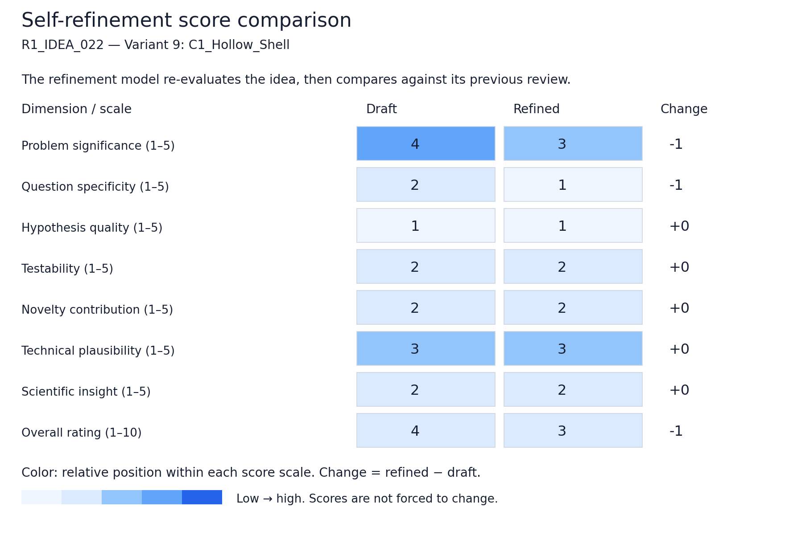

Changed score dimensions: problem_significance, question_specificity, overall_rating.

### Score justifications (draft / refined)

**Problem significance**

```json
{
  "draft": {
    "score": 4.0,
    "justification": "The problem is meaningful: text-to-audio generation for complex scenarios is an active research area with practical applications in creative tools, accessibility, and media production. The gap between model capabilities and user expectations is a recognized challenge."
  },
  "refined": {
    "score": 3.0,
    "justification": "The problem area is moderately significant. Text-to-audio generation is an active field with applications in creative tools, accessibility, and media. However, the idea doesn't articulate why 'complex audio' generation is particularly important or what specific unmet needs exist beyond general improvement of models."
  }
}
```

**Question specificity**

```json
{
  "draft": {
    "score": 2.0,
    "justification": "The research question is very vague: 'improve model capabilities using feedback learning' without specifying what aspects of capabilities, what type of feedback, or what specific problems it addresses. It lacks concrete definitions of key terms like 'complex audio' and 'user expectations.'"
  },
  "refined": {
    "score": 1.0,
    "justification": "Extremely vague. The research 'question' is essentially 'use feedback learning to improve models' without specifying what aspect of complex audio generation is being addressed, what type of improvement is sought, or what constitutes the research inquiry. Key terms like 'complex audio' and 'user expectations' are undefined."
  }
}
```

**Hypothesis quality**

```json
{
  "draft": {
    "score": 1.0,
    "justification": "There is no clear hypothesis presented. The idea states that feedback learning could help improve models, but doesn't make a testable prediction about what specific improvements would occur, through what mechanism, or compared to what baseline."
  },
  "refined": {
    "score": 1.0,
    "justification": "No hypothesis is presented. The idea suggests feedback learning 'could help' but makes no testable prediction about what specific improvements would occur, through what mechanism, or compared to what alternatives. It's a general suggestion rather than a hypothesis-driven research direction."
  }
}
```

**Testability**

```json
{
  "draft": {
    "score": 2.0,
    "justification": "The idea is testable in principle (one could implement feedback learning and evaluate), but without specifying what to test, how to measure improvement, or what constitutes success, it's difficult to design a meaningful test. The claim is too vague to be falsified."
  },
  "refined": {
    "score": 2.0,
    "justification": "Minimally testable in principle (one could implement some form of feedback learning), but without specifying what to test, how to measure improvement, or what constitutes success, designing a meaningful experiment is impossible. The idea is too vague to be falsified."
  }
}
```

**Novelty contribution**

```json
{
  "draft": {
    "score": 2.0,
    "justification": "Feedback learning (especially RLHF) has been applied to various generative tasks including text and image generation. Applying it to audio generation is a logical extension rather than a novel concept. The contribution would depend entirely on the specific implementation and findings, which aren't specified."
  },
  "refined": {
    "score": 2.0,
    "justification": "Low novelty. Feedback learning (especially RLHF) has been extensively applied to text and image generation. Applying it to audio is a logical extension rather than a novel concept. The contribution would depend entirely on unspecified implementation details and findings."
  }
}
```

**Technical plausibility**

```json
{
  "draft": {
    "score": 3.0,
    "justification": "The general direction is plausible: feedback learning has improved other generative models. However, without details about the feedback mechanism or how it would be integrated with audio generation models, it's impossible to assess technical feasibility beyond a superficial level."
  },
  "refined": {
    "score": 3.0,
    "justification": "Moderately plausible at a superficial level. Feedback learning has improved other generative models, so extending it to audio is conceptually reasonable. However, without details about the feedback mechanism, integration method, or audio-specific challenges, technical assessment is limited to general feasibility."
  }
}
```

**Scientific insight**

```json
{
  "draft": {
    "score": 2.0,
    "justification": "As presented, the idea seems focused on improving performance rather than generating scientific insight. It doesn't propose to investigate why current models fail, what aspects of feedback are most valuable, or what principles govern effective feedback for audio generation. The potential for transferable insight is low without a more specific research question."
  },
  "refined": {
    "score": 2.0,
    "justification": "Low potential for scientific insight as presented. The idea seems focused on performance improvement rather than understanding underlying mechanisms. It doesn't propose to investigate why current models fail at complex audio, what aspects of feedback are most valuable, or what principles govern effective feedback for audio generation."
  }
}
```

**Overall rating**

```json
{
  "draft": {
    "score": 4.0,
    "justification": "This is a weak research idea as presented. While it identifies a meaningful problem area, it lacks a specific research question, testable hypothesis, or clear methodological direction. It reads more like a general motivation statement than a research proposal. The idea needs substantial refinement to become a viable research direction."
  },
  "refined": {
    "score": 3.0,
    "justification": "This is a weak research idea. While it identifies a general problem area (text-to-audio for complex scenarios), it lacks a specific research question, testable hypothesis, or clear methodological direction. It reads as a motivation statement rather than a research proposal. The idea needs substantial refinement to become a viable research direction, with concrete definitions, a specific hypothesis, and a clear evaluation plan."
  }
}
```

## R1_IDEA_022 — Variant 10: C2_Logic_Flawed


Changed score dimensions: none.

### Score justifications (draft / refined)

**Problem significance**

```json
{
  "draft": {
    "score": 4.0,
    "justification": "The problem is meaningful: text-to-audio generation for complex multi-event scenarios is an important challenge as models move beyond simple sound effects to richer audio scenes. Human preference alignment is a recognized issue in generative AI."
  },
  "refined": {
    "score": 4.0,
    "justification": "The problem is meaningful: generating high-quality, prompt-following audio for complex multi-event scenarios is an important challenge as T2A models advance. Human preference alignment is a recognized issue in generative AI across modalities."
  }
}
```

**Question specificity**

```json
{
  "draft": {
    "score": 2.0,
    "justification": "The research question is poorly defined. It states models 'struggle' and proposes to 'enhance' them, but doesn't specify what exactly will be investigated - e.g., which aspects of prompt-following, what types of complexity, or what specific improvements are targeted."
  },
  "refined": {
    "score": 2.0,
    "justification": "The research question is poorly defined. It states models 'struggle' and proposes to 'enhance' them, but doesn't specify what exactly will be investigated—e.g., which aspects of prompt-following, what types of complexity, or what specific improvements are targeted. The term 'complex multi-event audio' is undefined."
  }
}
```

**Hypothesis quality**

```json
{
  "draft": {
    "score": 2.0,
    "justification": "There's no clear hypothesis. The idea suggests AI feedback learning 'could' help, but doesn't make a concrete prediction about what will improve, by how much, or why this approach would work better than alternatives."
  },
  "refined": {
    "score": 2.0,
    "justification": "There's no clear hypothesis. The idea suggests AI feedback learning 'could' help, but doesn't make a concrete prediction about what will improve, by how much, or why this approach would work better than alternatives. It's more of a vague suggestion than a testable claim."
  }
}
```

**Testability**

```json
{
  "draft": {
    "score": 2.0,
    "justification": "The idea is minimally testable as presented. While one could design experiments to test AI feedback for audio generation, the proposal doesn't suggest any specific evaluation, comparison, or measurement approach. It's more a vague suggestion than a testable research direction."
  },
  "refined": {
    "score": 2.0,
    "justification": "The idea is minimally testable as presented. While experiments could be designed, the proposal doesn't suggest any specific evaluation, comparison, or measurement approach. There's no indication of how success would be assessed."
  }
}
```

**Novelty contribution**

```json
{
  "draft": {
    "score": 3.0,
    "justification": "Applying AI feedback to audio generation has some novelty, as most work has focused on language models. However, the idea is presented at such a high level that it's unclear what specific contribution beyond 'trying something that worked elsewhere' is being proposed."
  },
  "refined": {
    "score": 3.0,
    "justification": "Applying AI feedback to audio generation has some novelty, as most work has focused on language models. However, the idea is presented at such a high level that it's unclear what specific contribution beyond 'trying something that worked elsewhere' is being proposed."
  }
}
```

**Technical plausibility**

```json
{
  "draft": {
    "score": 3.0,
    "justification": "The basic concept is plausible - AI feedback has improved alignment in other domains. However, without details on how feedback would be implemented for audio (where human preferences are complex and multidimensional), it's hard to assess technical feasibility."
  },
  "refined": {
    "score": 3.0,
    "justification": "The basic concept is plausible—AI feedback has improved alignment in other domains. However, without details on how feedback would be implemented for audio (where human preferences are complex and multidimensional), it's hard to assess technical feasibility. The reasoning is logically coherent but superficial."
  }
}
```

**Scientific insight**

```json
{
  "draft": {
    "score": 3.0,
    "justification": "If successfully implemented, this could provide insight into how feedback learning transfers across modalities and what aspects of audio generation are most amenable to alignment techniques. However, the idea as stated focuses more on application than fundamental understanding."
  },
  "refined": {
    "score": 3.0,
    "justification": "If successfully implemented, this could provide insight into how feedback learning transfers across modalities and what aspects of audio generation are most amenable to alignment techniques. However, the idea as stated focuses more on application than fundamental understanding of mechanisms or principles."
  }
}
```

**Overall rating**

```json
{
  "draft": {
    "score": 4.0,
    "justification": "This is a weak research idea. While it identifies a real problem (multi-event audio generation alignment), it lacks specificity, a clear hypothesis, and any proposed methodology. It reads more like a high-level motivation than a research direction. The core idea - applying AI feedback to audio - has potential, but needs substantial refinement to become a meaningful research proposal."
  },
  "refined": {
    "score": 4.0,
    "justification": "This is a weak research idea. While it identifies a real problem (multi-event audio generation alignment) and points to a potentially relevant solution direction, it lacks specificity, a clear hypothesis, and any proposed methodology. It reads more like a high-level motivation than a research direction. The core idea—applying AI feedback to audio—has potential, but needs substantial refinement to become a meaningful research proposal."
  }
}
```

## R1_IDEA_022 — Variant 11: C3_Substance_Enriched

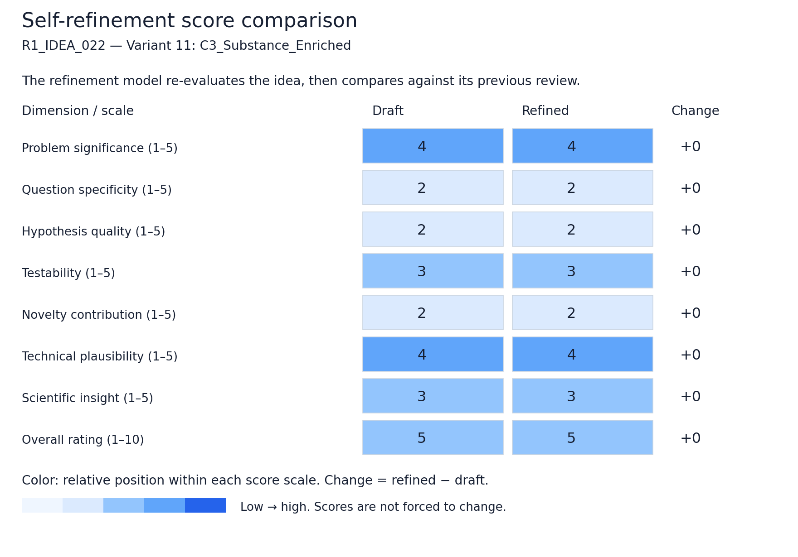

Changed score dimensions: none.

### Score justifications (draft / refined)

**Problem significance**

```json
{
  "draft": {
    "score": 4.0,
    "justification": "The problem is meaningful: generating complex multi-event audio from text is a recognized challenge in audio generation, with implications for creative tools, accessibility, and human-computer interaction. The mention of compositional reasoning and acoustic disentanglement points to fundamental limitations in current models."
  },
  "refined": {
    "score": 4.0,
    "justification": "The problem is meaningful and well-motivated. Generating complex multi-event audio from text is a recognized challenge in audio generation with practical applications in creative tools, accessibility, and human-computer interaction. The mention of compositional reasoning and acoustic disentanglement points to fundamental limitations in current models."
  }
}
```

**Question specificity**

```json
{
  "draft": {
    "score": 2.0,
    "justification": "The research question is under-defined. It proposes 'enhancing basic capabilities with AI feedback' but does not specify what is being tested beyond general improvement. The mention of metrics and boundary conditions adds some specificity, but the core question remains broad."
  },
  "refined": {
    "score": 2.0,
    "justification": "The research question is under-defined. It proposes 'enhancing basic capabilities with AI feedback' but does not specify what is being tested beyond general improvement. While it mentions metrics and boundary conditions, the core question remains broad and lacks concrete operationalization."
  }
}
```

**Hypothesis quality**

```json
{
  "draft": {
    "score": 2.0,
    "justification": "The hypothesis is implicit and weak: essentially 'AI feedback could improve performance.' It lacks a concrete prediction about mechanisms, comparative advantage, or conditions under which feedback would or would not help. No causal or relational claim is made."
  },
  "refined": {
    "score": 2.0,
    "justification": "The hypothesis is implicit and weak: essentially 'AI feedback could improve performance.' It lacks a concrete prediction about mechanisms, comparative advantage, or conditions under which feedback would or would not help. No causal or relational claim is made that could be meaningfully tested."
  }
}
```

**Testability**

```json
{
  "draft": {
    "score": 3.0,
    "justification": "The idea is testable in principle because it suggests evaluating metrics (temporal alignment, spectral fidelity) and considering prompt complexity as a variable. However, without a clear experimental design or comparison, it remains somewhat vague."
  },
  "refined": {
    "score": 3.0,
    "justification": "The idea is testable in principle because it suggests evaluating specific metrics (temporal alignment, spectral fidelity) and considering prompt complexity as a variable. However, without a clear experimental design, comparison groups, or operational definitions, it remains somewhat vague in how exactly it would be tested."
  }
}
```

**Novelty contribution**

```json
{
  "draft": {
    "score": 2.0,
    "justification": "Applying AI feedback to audio generation is a straightforward extension of techniques used in text and image generation. The idea does not propose a novel feedback mechanism, a new model architecture, or a unique insight into audio-specific challenges. Contribution would likely be incremental."
  },
  "refined": {
    "score": 2.0,
    "justification": "Applying AI feedback to audio generation is a straightforward extension of techniques already established in text and image generation domains. The idea does not propose a novel feedback mechanism, a new model architecture, or a unique insight into audio-specific challenges. The contribution would likely be incremental rather than groundbreaking."
  }
}
```

**Technical plausibility**

```json
{
  "draft": {
    "score": 4.0,
    "justification": "The direction is technically plausible. AI feedback (e.g., RLHF) has succeeded in other generative tasks, and adapting it to audio is reasonable. The challenges of reward design and training stability are acknowledged in the field but not addressed here."
  },
  "refined": {
    "score": 4.0,
    "justification": "The direction is technically plausible. AI feedback methods like RLHF have succeeded in other generative tasks, and adapting them to audio is reasonable given current trends. The core concept of using feedback to align models with human preferences is well-established, though audio-specific implementation challenges exist."
  }
}
```

**Scientific insight**

```json
{
  "draft": {
    "score": 3.0,
    "justification": "If executed well, the research could offer insights into how feedback affects different aspects of audio generation (compositional vs. acoustic) and how prompt complexity modulates effectiveness. However, as stated, it risks being a straightforward application without deeper mechanistic understanding."
  },
  "refined": {
    "score": 3.0,
    "justification": "If executed well, the research could offer insights into how feedback affects different aspects of audio generation (compositional vs. acoustic) and how prompt complexity modulates effectiveness. However, as stated, it risks being a straightforward application without deeper mechanistic understanding of why feedback helps or what specific model limitations it addresses."
  }
}
```

**Overall rating**

```json
{
  "draft": {
    "score": 5.0,
    "justification": "This is a moderate/borderline research idea. It addresses a meaningful problem and suggests a plausible technical direction, but lacks specificity in hypothesis, novelty, and experimental design. The potential scientific insight is limited without a more focused question about how feedback interacts with model capabilities."
  },
  "refined": {
    "score": 5.0,
    "justification": "This is a moderate/borderline research idea. It addresses a meaningful problem and suggests a plausible technical direction, but lacks specificity in hypothesis, novelty, and experimental design. The potential scientific insight is limited without a more focused question about how feedback interacts with model capabilities. While testable in principle, it requires substantial refinement to become a strong research direction."
  }
}
```

## R1_IDEA_022 — Variant 12: H1_Deceptive_Hollow

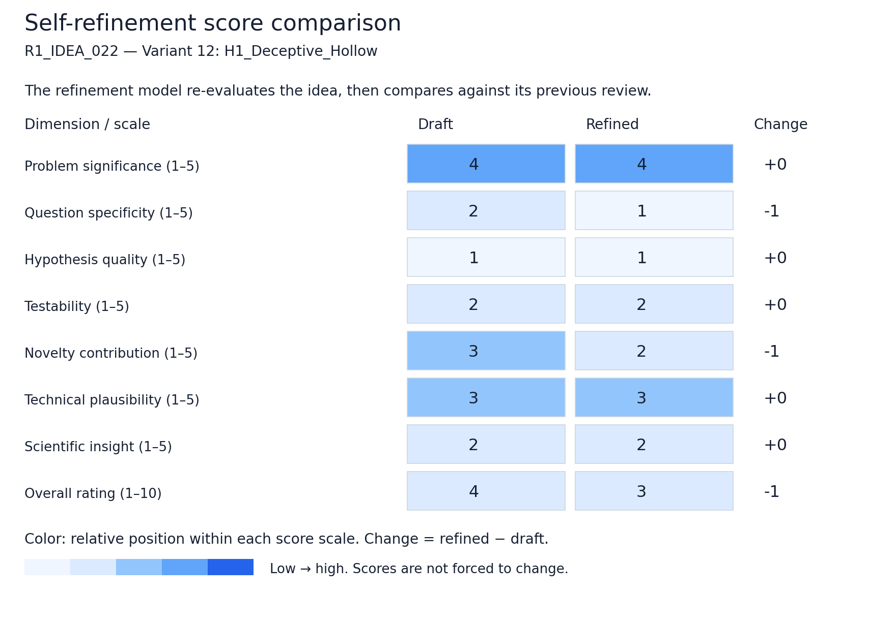

Changed score dimensions: question_specificity, novelty_contribution, overall_rating.

### Score justifications (draft / refined)

**Problem significance**

```json
{
  "draft": {
    "score": 4.0,
    "justification": "Improving text-to-audio generation for complex scenarios is a meaningful and timely challenge. High-quality audio generation has applications in creative tools, accessibility, and human-computer interaction. The gap between model outputs and user expectations is a recognized issue."
  },
  "refined": {
    "score": 4.0,
    "justification": "Improving text-to-audio generation for complex scenarios is a meaningful challenge with applications in creative tools, accessibility, and human-computer interaction. The gap between model capabilities and user expectations for sophisticated audio is a recognized problem in the field."
  }
}
```

**Question specificity**

```json
{
  "draft": {
    "score": 2.0,
    "justification": "The research question is very poorly defined. It states a general direction ('improve model capabilities using feedback learning') but does not specify what aspect of capabilities, what kind of feedback, or what specific problem is being investigated. It lacks a concrete, testable question."
  },
  "refined": {
    "score": 1.0,
    "justification": "The research question is essentially undefined. The idea states only a general direction ('improve model capabilities using feedback learning') without specifying what aspect of capabilities, what kind of feedback, or what specific problem is being investigated. There is no concrete, testable question."
  }
}
```

**Hypothesis quality**

```json
{
  "draft": {
    "score": 1.0,
    "justification": "There is no explicit or clearly implicit hypothesis. The idea merely suggests a method (feedback learning) could help, without predicting a specific outcome, mechanism, or relationship. It is more of a vague proposal than a falsifiable hypothesis."
  },
  "refined": {
    "score": 1.0,
    "justification": "There is no explicit or clearly implicit hypothesis. The idea merely suggests that feedback learning 'could help' without predicting a specific outcome, mechanism, or relationship. It lacks any falsifiable claim about what would happen or why."
  }
}
```

**Testability**

```json
{
  "draft": {
    "score": 2.0,
    "justification": "The idea is testable in principle—one could implement a feedback learning system and evaluate it—but the description provides no clear path for testing. No evaluation criteria, baselines, or experimental comparisons are suggested. The central claim ('transformative synthesis') is not directly testable."
  },
  "refined": {
    "score": 2.0,
    "justification": "While one could implement a feedback learning system and evaluate it in principle, the description provides no clear path for testing. No evaluation criteria, baselines, or experimental comparisons are suggested. The central claim of being 'transformative' is not directly testable."
  }
}
```

**Novelty contribution**

```json
{
  "draft": {
    "score": 3.0,
    "justification": "Applying feedback learning to generative models is not novel per se (e.g., RLHF for language models). Applying it to audio generation could be a worthwhile application, but the idea as presented does not articulate a novel twist, insight, or methodological innovation. The contribution is framed as 'transformative' but without novel substance."
  },
  "refined": {
    "score": 2.0,
    "justification": "Applying feedback learning to generative models is not novel (e.g., RLHF for language/vision). Applying it to audio generation could be a worthwhile application, but the idea as presented articulates no novel twist, insight, or methodological innovation. The grandiose framing of 'transformative synthesis' is unsupported by any novel substance."
  }
}
```

**Technical plausibility**

```json
{
  "draft": {
    "score": 3.0,
    "justification": "Feedback learning is a plausible direction for improving generative models, as evidenced by success in other domains. However, the complete lack of detail makes it impossible to assess technical coherence. The central assumption—that feedback learning is suitable for complex audio generation—is reasonable but untested here."
  },
  "refined": {
    "score": 3.0,
    "justification": "Feedback learning is a plausible direction for improving generative models, given successes in other domains. However, the complete lack of detail makes technical assessment impossible. The assumption that feedback could help complex audio generation is reasonable but entirely untested here."
  }
}
```

**Scientific insight**

```json
{
  "draft": {
    "score": 2.0,
    "justification": "The idea currently promises broad, field-shaping insight but offers no concrete mechanism for achieving it. If executed, it could reveal how human feedback bridges the gap between objective metrics and subjective quality in audio generation, but the proposal does not articulate what specific insights are sought (e.g., understanding failure modes, learning efficiency, or human-AI collaboration dynamics)."
  },
  "refined": {
    "score": 2.0,
    "justification": "The idea promises broad, field-shaping insight but offers no concrete mechanism for achieving it. If executed, it could potentially reveal how human feedback bridges objective metrics and subjective quality in audio generation, but the proposal does not articulate what specific insights are sought or how they would be uncovered."
  }
}
```

**Overall rating**

```json
{
  "draft": {
    "score": 4.0,
    "justification": "The idea identifies a relevant problem but is severely underdeveloped. It lacks a specific research question, a testable hypothesis, and any concrete methodological details. The overly grandiose framing is not supported by substantive content. As a research idea, it is weak because it does not define what is actually being investigated. It is more of a vague motivation than a research direction."
  },
  "refined": {
    "score": 3.0,
    "justification": "The idea identifies a relevant problem but is severely underdeveloped as a research direction. It lacks a specific research question, a testable hypothesis, and any concrete methodological details. The overly grandiose framing is not supported by substantive content. As a research idea, it is weak because it does not define what is actually being investigated—it is more a vague motivation than a research direction."
  }
}
```

## R1_IDEA_022 — Variant 13: H2_Confident_Flaw

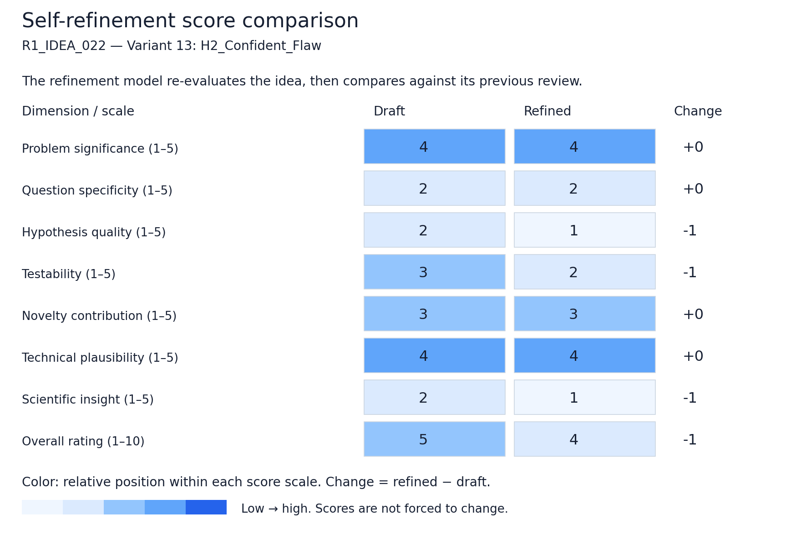

Changed score dimensions: hypothesis_quality, testability, scientific_insight, overall_rating.

### Score justifications (draft / refined)

**Problem significance**

```json
{
  "draft": {
    "score": 4.0,
    "justification": "Improving text-to-audio models for complex, multi-event prompts is a meaningful and practically relevant challenge. As T2A models advance, alignment with human preferences for compositional tasks becomes increasingly important."
  },
  "refined": {
    "score": 4.0,
    "justification": "Improving text-to-audio models for complex, multi-event prompts is a meaningful and practically relevant challenge. As T2A models advance, alignment with human preferences for compositional tasks becomes increasingly important for real-world applications."
  }
}
```

**Question specificity**

```json
{
  "draft": {
    "score": 2.0,
    "justification": "The idea is stated as a general direction ('enhance with AI feedback learning') rather than a specific research question. It lacks operational definitions of key terms (complex multi-event audio, AI feedback learning) and does not specify what relationship or effect is being investigated."
  },
  "refined": {
    "score": 2.0,
    "justification": "The idea is stated as a general direction ('enhance with AI feedback learning') rather than a specific research question. It lacks operational definitions of key terms (complex multi-event audio, AI feedback learning) and does not specify what relationship or effect is being investigated. No concrete variables or relationships are defined."
  }
}
```

**Hypothesis quality**

```json
{
  "draft": {
    "score": 2.0,
    "justification": "The implicit hypothesis is that AI feedback learning will improve performance on complex multi-event audio generation. However, it is overly broad and deterministic ('will necessarily produce reliable improvements'). A stronger hypothesis would make a more nuanced, testable prediction about the mechanism or magnitude of improvement."
  },
  "refined": {
    "score": 1.0,
    "justification": "The implicit hypothesis is overly broad and deterministic ('will necessarily produce reliable improvements'). It lacks nuance, makes an absolute claim without qualifications, and does not articulate a testable prediction about mechanism or magnitude. The statement that gains can be 'confidently treated as causal evidence' without controlling variables demonstrates poor hypothesis formulation."
  }
}
```

**Testability**

```json
{
  "draft": {
    "score": 3.0,
    "justification": "The idea is testable in principle—one could implement an AI feedback loop and evaluate performance. However, the lack of specificity about the intervention and evaluation makes it difficult to design a clear test. The dismissal of controlling for confounders weakens the potential for a rigorous test."
  },
  "refined": {
    "score": 2.0,
    "justification": "While one could implement some form of AI feedback and evaluate performance, the lack of specificity about the intervention, evaluation metrics, and target phenomena makes designing a clear test difficult. The dismissal of controlling for confounders further weakens testability, as it rejects standard experimental practices needed to draw meaningful conclusions."
  }
}
```

**Novelty contribution**

```json
{
  "draft": {
    "score": 3.0,
    "justification": "Applying feedback learning to audio generation is a plausible extension of techniques from text and image generation, so the core concept is not highly novel. The potential contribution lies in demonstrating its effectiveness for audio and understanding its impact on multi-event generation, but the idea as stated does not articulate what new scientific knowledge would be gained."
  },
  "refined": {
    "score": 3.0,
    "justification": "Applying feedback learning to audio generation is a plausible extension of techniques from text and image generation, so the core concept is not highly novel. The potential contribution lies in demonstrating its effectiveness for audio and understanding its impact on multi-event generation, but the idea as stated does not articulate what new scientific knowledge would be gained beyond performance improvement."
  }
}
```

**Technical plausibility**

```json
{
  "draft": {
    "score": 4.0,
    "justification": "The general direction is technically plausible. AI feedback (e.g., reward modeling, preference optimization) has been successfully applied in other generative domains. The reasoning that alignment techniques could help with prompt-following is coherent, though the implementation details are missing."
  },
  "refined": {
    "score": 4.0,
    "justification": "The general direction is technically plausible. AI feedback (e.g., reward modeling, preference optimization) has been successfully applied in other generative domains. The reasoning that alignment techniques could help with prompt-following is coherent, though the implementation details are entirely missing."
  }
}
```

**Scientific insight**

```json
{
  "draft": {
    "score": 2.0,
    "justification": "As presented, the idea seems focused on achieving better performance rather than generating scientific insight. It does not propose to investigate why current models fail, how feedback learning changes model behavior, or what general principles might be learned about audio model alignment. The claim that gains can be treated as causal evidence without isolating variables suggests a non-scientific mindset."
  },
  "refined": {
    "score": 1.0,
    "justification": "As presented, the idea seems focused solely on achieving better performance rather than generating scientific insight. It explicitly dismisses investigating dataset composition, evaluation criteria, boundary cases, or alternative explanations, which are essential for scientific understanding. The claim that gains can be treated as causal evidence without isolation of variables demonstrates a fundamental misunderstanding of scientific inquiry."
  }
}
```

**Overall rating**

```json
{
  "draft": {
    "score": 5.0,
    "justification": "The idea identifies a relevant problem and a plausible technical direction, but it is underdeveloped as a research idea. It lacks a specific, testable hypothesis, dismisses important methodological considerations, and emphasizes performance gains over scientific understanding. It falls in the moderate/borderline range: it could become a strong research project with more careful formulation, but as stated, it is too vague and overconfident."
  },
  "refined": {
    "score": 4.0,
    "justification": "The idea identifies a relevant problem and a plausible technical direction, but it is critically underdeveloped as a research idea. It lacks a specific, testable hypothesis, dismisses essential methodological considerations for scientific rigor, and overstates the conclusiveness of potential results. The explicit rejection of controlling variables and investigating alternative explanations severely undermines its scientific value. While the core problem is meaningful, the proposed approach is too vague and the reasoning is scientifically unsound."
  }
}
```

## R1_IDEA_022 — Variant 14: H3_Verbose_Enriched


Changed score dimensions: none.

### Score justifications (draft / refined)

**Problem significance**

```json
{
  "draft": {
    "score": 4.0,
    "justification": "The problem is meaningful: generating complex multi-event audio from text is a challenging and underexplored frontier in T2A. Current models struggle with compositional reasoning and acoustic quality in such settings, which limits their real-world utility. Improving this would matter to both researchers (understanding model limitations) and practitioners (enabling more complex applications)."
  },
  "refined": {
    "score": 4.0,
    "justification": "The problem is meaningful and well-identified. Generating complex multi-event audio from text is a challenging frontier in T2A with practical applications. Current models' limitations in compositional reasoning and acoustic quality for such audio represent a significant gap. Improving this would matter to researchers (understanding model limitations) and practitioners (enabling more complex applications)."
  }
}
```

**Question specificity**

```json
{
  "draft": {
    "score": 3.0,
    "justification": "The idea identifies a general direction (use AI feedback to improve T2A for complex audio) but does not define a precise research question. It suggests testing whether feedback improves metrics, but the core 'what' being investigated remains broad. The proposed experimental design adds specificity, but it is framed as a suggestion rather than an integral part of the research question."
  },
  "refined": {
    "score": 3.0,
    "justification": "The idea identifies a general direction (use AI feedback to improve T2A for complex audio) but does not define a precise research question. It suggests testing whether feedback improves metrics, but the core 'what' being investigated remains broad. The proposed experimental design adds some specificity, but it is framed as a suggestion rather than an integral, clearly defined question."
  }
}
```

**Hypothesis quality**

```json
{
  "draft": {
    "score": 2.0,
    "justification": "The hypothesis is implicit and weak: essentially 'AI feedback learning could improve performance.' It lacks a concrete, testable prediction about mechanisms or relationships. There is no clear distinction from simply applying an existing technique to a new domain. A stronger hypothesis would predict how feedback specifically addresses compositional reasoning or acoustic disentanglement."
  },
  "refined": {
    "score": 2.0,
    "justification": "The hypothesis is implicit and weak: essentially 'AI feedback learning could improve performance.' It lacks a concrete, testable prediction about mechanisms or specific relationships. There is no clear distinction from simply applying an existing technique to a new domain. A stronger hypothesis would predict how feedback specifically addresses compositional reasoning or acoustic disentanglement, or under what conditions it is most effective."
  }
}
```

**Testability**

```json
{
  "draft": {
    "score": 4.0,
    "justification": "The idea is highly testable, especially with the suggested experimental design. It outlines a clear validation plan: comparing baseline vs. intervention, using pre-specified metrics, testing across prompt complexities, and including ablations and sensitivity analyses. This structured approach makes the central claim ('feedback improves outcomes') directly testable and allows investigation of boundary conditions."
  },
  "refined": {
    "score": 4.0,
    "justification": "The idea is highly testable, especially with the suggested experimental design. It outlines a clear validation plan: comparing baseline vs. intervention, using pre-specified metrics, testing across prompt complexities, and including ablations and sensitivity analyses. This structured approach makes the central claim ('feedback improves outcomes') directly testable and allows investigation of boundary conditions."
  }
}
```

**Novelty contribution**

```json
{
  "draft": {
    "score": 3.0,
    "justification": "Novelty is moderate. Applying AI feedback learning (e.g., RLHF/RLAIF) to generative models is not new. The application to text-to-audio, particularly for complex multi-event generation, is less common and could be a contribution. However, the idea as presented is more of an application of an existing paradigm rather than a novel methodological or theoretical insight."
  },
  "refined": {
    "score": 3.0,
    "justification": "Novelty is moderate. Applying AI feedback learning (e.g., RLHF/RLAIF) to generative models is not new. The application to text-to-audio, particularly for complex multi-event generation, is less common and could be a contribution. However, the idea as presented is more of an application of an existing paradigm to a new domain rather than a novel methodological or theoretical insight."
  }
}
```

**Technical plausibility**

```json
{
  "draft": {
    "score": 4.0,
    "justification": "The direction is technically plausible. AI feedback learning has been successfully applied in language and image generation; extending it to audio generation is a logical step. The reasoning is coherent: if models struggle with complex audio, feedback could guide improvement. Assumptions (that feedback can be defined and integrated) are reasonable, though details are missing."
  },
  "refined": {
    "score": 4.0,
    "justification": "The direction is technically plausible. AI feedback learning has been successfully applied in language and image generation; extending it to audio generation is a logical step. The reasoning is coherent: if models struggle with complex audio, feedback could guide improvement. Assumptions (that feedback can be defined and integrated) are reasonable, though specific implementation details are missing."
  }
}
```

**Scientific insight**

```json
{
  "draft": {
    "score": 4.0,
    "justification": "The idea has good potential for scientific insight, primarily due to the emphasis on understanding boundary conditions. By testing across prompt complexities, doing ablations, and analyzing failures, the research could reveal when and why feedback helps, what aspects of complex audio are most challenging, and how feedback interacts with model capabilities. This goes beyond just reporting improved metrics."
  },
  "refined": {
    "score": 4.0,
    "justification": "The idea has good potential for scientific insight, primarily due to the emphasis on understanding boundary conditions. By testing across prompt complexities, doing ablations, and analyzing failures, the research could reveal when and why feedback helps, what aspects of complex audio are most challenging, and how feedback interacts with model capabilities. This goes beyond just reporting improved metrics and could inform general principles for improving compositional reasoning in generative models."
  }
}
```

**Overall rating**

```json
{
  "draft": {
    "score": 6.0,
    "justification": "This is a moderate/borderline research idea. It addresses a significant problem and proposes a plausible technical direction with a strong emphasis on testability and potential insight. However, it lacks a specific research question and a clear, testable hypothesis. The novelty is limited, and the core proposal ('use AI feedback') is somewhat generic. With refinement—especially a sharper hypothesis and more concrete mechanism—it could become a strong idea."
  },
  "refined": {
    "score": 6.0,
    "justification": "This is a moderate/borderline research idea. It addresses a significant problem and proposes a plausible technical direction with a strong emphasis on testability and potential insight. However, it lacks a specific research question and a clear, testable hypothesis. The novelty is limited, and the core proposal ('use AI feedback') is somewhat generic. The detailed experimental design is a strength but is presented as a suggestion rather than a core part of the idea. With refinement—especially a sharper hypothesis and more concrete mechanism—it could become a strong idea."
  }
}
```

## R1_IDEA_022 — Variant 15: H4_Ultimate_Hype


Changed score dimensions: none.

### Score justifications (draft / refined)

**Problem significance**

```json
{
  "draft": {
    "score": 4.0,
    "justification": "The problem is meaningful: generating complex multi-event audio from text is a recognized challenge in T2A, and improving prompt-following and quality would benefit both research and applications."
  },
  "refined": {
    "score": 4.0,
    "justification": "The problem is meaningful: generating complex multi-event audio from text is a recognized challenge in T2A research, and improving prompt-following and quality would benefit both scientific understanding and practical applications in audio generation."
  }
}
```

**Question specificity**

```json
{
  "draft": {
    "score": 2.0,
    "justification": "The research question is very vague—it essentially says 'use AI feedback to improve T2A for complex audio'. No concrete relationship, mechanism, or phenomenon is specified."
  },
  "refined": {
    "score": 2.0,
    "justification": "The research question is very vague. It essentially states 'use AI feedback to improve T2A for complex audio' without specifying what aspect of AI feedback, what aspect of complex audio, or what relationship is being investigated. No concrete mechanism or phenomenon is identified."
  }
}
```

**Hypothesis quality**

```json
{
  "draft": {
    "score": 1.0,
    "justification": "There is no explicit or implicit testable hypothesis. The idea merely suggests applying a broad technique (AI feedback) to a problem without predicting how or why it would work."
  },
  "refined": {
    "score": 1.0,
    "justification": "There is no explicit or implicit testable hypothesis. The idea merely suggests applying a broad technique (AI feedback) to a problem without predicting how, why, or under what conditions it would work. It lacks a concrete, falsifiable claim."
  }
}
```

**Testability**

```json
{
  "draft": {
    "score": 2.0,
    "justification": "The idea is testable in principle (one could implement some form of AI feedback), but without a specific hypothesis or evaluation plan, it's unclear what would constitute a meaningful test."
  },
  "refined": {
    "score": 2.0,
    "justification": "The idea is testable in principle (one could implement some form of AI feedback and evaluate T2A models), but without a specific hypothesis, operational definitions, or evaluation plan, it's unclear what would constitute a meaningful test or what evidence would support or refute the core claim."
  }
}
```

**Novelty contribution**

```json
{
  "draft": {
    "score": 2.0,
    "justification": "Applying AI feedback to T2A is not inherently novel—similar approaches exist in text and image generation. The idea lacks a novel twist or specific contribution beyond a generic application."
  },
  "refined": {
    "score": 2.0,
    "justification": "Applying AI feedback to T2A is not inherently novel—similar preference-based alignment methods are widely used in text and image generation. The idea lacks a novel twist, specific innovation, or clear contribution beyond a generic application to a new modality."
  }
}
```

**Technical plausibility**

```json
{
  "draft": {
    "score": 3.0,
    "justification": "The general direction is plausible, as AI feedback methods have succeeded in other domains. However, without details, it's impossible to assess technical coherence."
  },
  "refined": {
    "score": 3.0,
    "justification": "The general direction is plausible, as AI feedback methods have succeeded in other generative domains. However, without details on how feedback would be integrated into T2A training or inference, it's impossible to assess technical coherence or feasibility beyond a superficial level."
  }
}
```

**Scientific insight**

```json
{
  "draft": {
    "score": 2.0,
    "justification": "As presented, the idea is unlikely to yield deep scientific insight—it reads more like an application goal. It doesn't propose to uncover mechanisms, limitations, or general principles about T2A or feedback learning."
  },
  "refined": {
    "score": 2.0,
    "justification": "As presented, the idea is unlikely to yield deep scientific insight. It reads primarily as an application goal ('improve performance') rather than an investigation aimed at uncovering mechanisms, limitations, general principles, or boundary conditions related to T2A generation or feedback learning."
  }
}
```

**Overall rating**

```json
{
  "draft": {
    "score": 3.0,
    "justification": "The idea identifies a relevant problem but fails to articulate a specific research question, hypothesis, or methodological direction. It is overly vague and promotional, lacking the substance needed for a strong research idea. It resembles a broad motivation rather than a testable scientific investigation."
  },
  "refined": {
    "score": 3.0,
    "justification": "The idea identifies a relevant problem but fails to articulate a specific research question, testable hypothesis, or concrete methodological direction. It is overly vague and promotional, lacking the substance needed for a strong research idea. It resembles a broad motivation or aspiration rather than a focused, investigable scientific proposal."
  }
}
```

## R1_IDEA_023 — Source


Changed score dimensions: none.

### Score justifications (draft / refined)

**Problem significance**

```json
{
  "draft": {
    "score": 4.0,
    "justification": "The problem of building reliable classifiers is highly important for real-world ML deployment. Both OOD detection and failure prediction are recognized challenges in trustworthy ML. The observation that they are often studied separately points to a potential gap."
  },
  "refined": {
    "score": 4.0,
    "justification": "The problem is highly significant. Building reliable classifiers that can handle both unknown inputs (OOD) and recognize their own mistakes on known inputs (ID failure prediction) is a core challenge for safe real-world ML deployment. Both sub-problems are actively studied in trustworthy ML."
  }
}
```

**Question specificity**

```json
{
  "draft": {
    "score": 2.0,
    "justification": "The idea states a general observation but does not define a concrete research question. It lacks specificity about what exactly will be investigated regarding the connection between OOD detection and failure prediction."
  },
  "refined": {
    "score": 2.0,
    "justification": "The idea states a general observation but does not define a concrete research question. It lacks specificity about what exactly will be investigated regarding the connection. It is more of a motivational claim than a defined inquiry."
  }
}
```

**Hypothesis quality**

```json
{
  "draft": {
    "score": 2.0,
    "justification": "There is an implicit hypothesis that studying OOD detection and failure prediction jointly is beneficial, but it is not articulated as a testable prediction. No mechanism or relationship is proposed beyond the claim of a 'closed connection.'"
  },
  "refined": {
    "score": 2.0,
    "justification": "There is an implicit, vague hypothesis that studying the two problems jointly is beneficial, but it is not articulated as a testable prediction. No specific mechanism, relationship, or distinguishable outcome is proposed beyond the claim of a 'closed connection.'"
  }
}
```

**Testability**

```json
{
  "draft": {
    "score": 2.0,
    "justification": "The idea as presented is not directly testable because it does not propose how to investigate the connection. Without a specific experiment, comparison, or analysis, it remains a vague suggestion."
  },
  "refined": {
    "score": 2.0,
    "justification": "The idea as presented is not directly testable. It does not propose an experiment, comparison, analysis, or evaluation method to investigate the connection. It remains a vague suggestion without a clear path to gather evidence."
  }
}
```

**Novelty contribution**

```json
{
  "draft": {
    "score": 3.0,
    "justification": "The observation that OOD detection and failure prediction are related is not entirely new; some works touch on both. However, explicitly framing them as interconnected problems worth joint study could be a modest contribution if pursued with depth."
  },
  "refined": {
    "score": 3.0,
    "justification": "The observation that OOD detection and failure prediction are related is not entirely novel; some works in uncertainty quantification, calibration, and anomaly detection touch on both. However, explicitly framing them as interconnected problems worthy of dedicated joint study could represent a modest conceptual contribution if developed with depth and new findings."
  }
}
```

**Technical plausibility**

```json
{
  "draft": {
    "score": 4.0,
    "justification": "The reasoning is logically coherent: both tasks involve uncertainty estimation and low-confidence assignment. It is plausible that methods for one could inform the other, or that a unified approach could be beneficial."
  },
  "refined": {
    "score": 4.0,
    "justification": "The reasoning is logically coherent. Both tasks fundamentally involve estimating model uncertainty or confidence. It is plausible that techniques or insights from one could inform the other, or that a unified probabilistic perspective could be beneficial. No technical implausibilities are apparent in the stated observation."
  }
}
```

**Scientific insight**

```json
{
  "draft": {
    "score": 3.0,
    "justification": "If properly investigated, this could yield insight into the relationship between different forms of uncertainty (epistemic vs. aleatoric) or shared feature representations. However, the idea as stated does not articulate what specific insights are expected."
  },
  "refined": {
    "score": 3.0,
    "justification": "If properly investigated, this direction could yield insight into the relationship between different forms of uncertainty (e.g., epistemic vs. aleatoric, or their interplay) or into shared feature representations for reliability. However, the idea as stated does not articulate what specific scientific insights are expected beyond the general claim of a connection."
  }
}
```

**Overall rating**

```json
{
  "draft": {
    "score": 4.0,
    "justification": "The idea identifies a meaningful problem and a plausible gap, but it is underdeveloped as a research direction. It lacks a specific question, testable hypothesis, and methodological direction. It currently reads more as a motivation or observation than a research idea. With refinement, it could become a strong idea."
  },
  "refined": {
    "score": 4.0,
    "justification": "The idea identifies a meaningful, high-significance problem and a plausible gap in how it's approached. However, it is critically underdeveloped as a research direction. It lacks a specific research question, a testable hypothesis, and any methodological direction. It currently reads as a motivational observation rather than a actionable research idea. With substantial refinement, it has the potential to become strong."
  }
}
```

## R1_IDEA_023 — Variant 1: A1_Identity

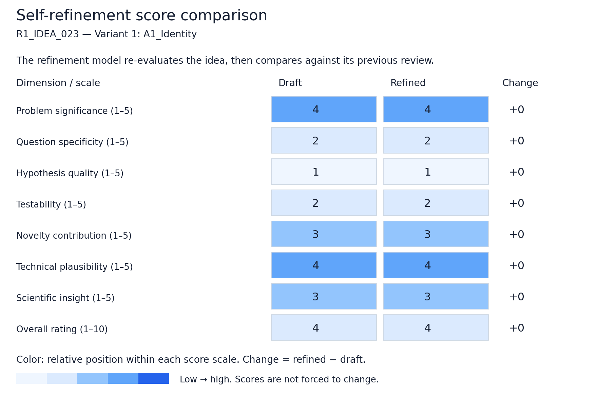

Changed score dimensions: none.

### Score justifications (draft / refined)

**Problem significance**

```json
{
  "draft": {
    "score": 4.0,
    "justification": "The problem of building reliable classifiers for real-world deployment is highly significant. Both OOD detection and failure prediction are important capabilities for safe ML systems. The observation that these are typically studied separately points to a potentially important methodological gap."
  },
  "refined": {
    "score": 4.0,
    "justification": "The problem is highly significant: reliable classification is crucial for real-world ML deployment, and both OOD detection and failure prediction are key components. Highlighting that they are studied separately points to a meaningful methodological gap."
  }
}
```

**Question specificity**

```json
{
  "draft": {
    "score": 2.0,
    "justification": "The idea lacks a clearly defined research question. It states there's a 'closed connection' but doesn't specify what aspect of this connection should be investigated. The description is more of an observation than a research question."
  },
  "refined": {
    "score": 2.0,
    "justification": "The idea lacks a clearly defined research question. It notes a 'connection' exists but does not specify what aspect of that connection should be investigated, nor what the study would aim to discover. The description remains at the level of a general observation."
  }
}
```

**Hypothesis quality**

```json
{
  "draft": {
    "score": 1.0,
    "justification": "There is no explicit or implicit hypothesis presented. The idea merely observes that these problems are connected but doesn't make any testable prediction about the nature, strength, or implications of this connection."
  },
  "refined": {
    "score": 1.0,
    "justification": "There is no hypothesis—implicit or explicit. The idea does not make a testable prediction about the relationship between OOD detection and failure prediction. It merely states they are connected without proposing how, why, or to what effect."
  }
}
```

**Testability**

```json
{
  "draft": {
    "score": 2.0,
    "justification": "Without a specific hypothesis or research question, it's unclear how one would test the idea. The statement that there's a connection is too vague to be directly testable. Some testability exists in principle (one could design experiments about connections), but none is suggested."
  },
  "refined": {
    "score": 2.0,
    "justification": "Without a hypothesis or specific question, the idea is not directly testable. One could design experiments to explore correlations or joint training, but no such direction is suggested. The claim of a 'connection' is too vague to be falsified or validated as stated."
  }
}
```

**Novelty contribution**

```json
{
  "draft": {
    "score": 3.0,
    "justification": "The observation that OOD detection and failure prediction are related is not entirely novel - some work has noted connections in uncertainty estimation. However, systematically studying their relationship could be a meaningful contribution if approached with specific research questions."
  },
  "refined": {
    "score": 3.0,
    "justification": "The observation that OOD detection and failure prediction are related is not entirely new—some works in uncertainty estimation touch on both. However, a focused study on their interconnection could offer a modest contribution if it leads to new insights or methods."
  }
}
```

**Technical plausibility**

```json
{
  "draft": {
    "score": 4.0,
    "justification": "The basic premise is plausible. Both OOD detection and failure prediction involve uncertainty estimation and confidence calibration, so investigating connections between them makes technical sense. The reasoning is logically coherent."
  },
  "refined": {
    "score": 4.0,
    "justification": "The premise is technically plausible. Both tasks involve uncertainty estimation and confidence calibration, so investigating links between them is reasonable. No technical contradictions or implausible assumptions are present."
  }
}
```

**Scientific insight**

```json
{
  "draft": {
    "score": 3.0,
    "justification": "If properly developed, this direction could yield insights about shared mechanisms in uncertainty estimation, potentially revealing general principles about how neural networks handle unfamiliar or challenging inputs. However, as currently stated, the potential insight is vague."
  },
  "refined": {
    "score": 3.0,
    "justification": "If developed, this could yield insights into shared mechanisms of uncertainty in neural networks, such as whether certain representations or calibration methods benefit both tasks. However, as stated, the potential insight is vague and unspecified."
  }
}
```

**Overall rating**

```json
{
  "draft": {
    "score": 4.0,
    "justification": "This is a weak research idea in its current form. While it identifies an important practical problem and points to a potentially interesting gap in how research is conducted, it lacks a specific research question, hypothesis, or methodological direction. It's more of an observation than a research idea. With substantial development (specific questions, hypotheses, and experimental designs), it could become a strong research direction."
  },
  "refined": {
    "score": 4.0,
    "justification": "This is a weak research idea in its current form. It identifies an important problem and a plausible gap but fails to define a research question, hypothesis, or methodological approach. It is more an observation than a research direction. With substantial refinement—adding specificity, a testable hypothesis, and an experimental plan—it could become a strong idea."
  }
}
```

## R1_IDEA_023 — Variant 2: A2_Paraphrase_Only


Changed score dimensions: none.

### Score justifications (draft / refined)

**Problem significance**

```json
{
  "draft": {
    "score": 4.0,
    "justification": "The problem of developing trustworthy classifiers is highly significant for practical ML deployment. The need for systems that can identify both OOD inputs and in-distribution errors is well-motivated and addresses a real challenge in real-world applications."
  },
  "refined": {
    "score": 4.0,
    "justification": "The problem of developing trustworthy classifiers is highly significant for practical ML deployment. The need for systems that can identify both OOD inputs and in-distribution errors addresses a real challenge in real-world applications where model reliability is critical."
  }
}
```

**Question specificity**

```json
{
  "draft": {
    "score": 2.0,
    "justification": "The idea identifies a general observation but does not formulate a specific research question. It states that previous research treats OOD detection and failure prediction separately, but doesn't specify what should be investigated about their relationship."
  },
  "refined": {
    "score": 2.0,
    "justification": "The idea identifies a general observation but does not formulate a specific research question. It states that previous research treats OOD detection and failure prediction separately, but doesn't specify what should be investigated about their relationship or how to study it."
  }
}
```

**Hypothesis quality**

```json
{
  "draft": {
    "score": 2.0,
    "justification": "There is an implicit hypothesis that addressing OOD detection and failure prediction jointly (rather than separately) would lead to more trustworthy classifiers, but this is not stated explicitly or made concrete. No specific prediction about mechanisms or outcomes is provided."
  },
  "refined": {
    "score": 2.0,
    "justification": "There is an implicit suggestion that addressing OOD detection and failure prediction jointly might be beneficial, but this is not stated as a concrete hypothesis. No specific prediction about mechanisms, outcomes, or relationships is provided that could be supported or contradicted by evidence."
  }
}
```

**Testability**

```json
{
  "draft": {
    "score": 2.0,
    "justification": "The idea as presented is not directly testable. It lacks any suggestion of how to investigate the relationship between OOD detection and failure prediction. Without a proposed experiment, comparison, or evaluation method, it's unclear how one would gather evidence for or against the core observation."
  },
  "refined": {
    "score": 2.0,
    "justification": "The idea as presented is not directly testable. It lacks any suggestion of how to investigate the relationship between OOD detection and failure prediction. Without a proposed experiment, comparison, or evaluation method, it's unclear how one would gather evidence for or against any claim."
  }
}
```

**Novelty contribution**

```json
{
  "draft": {
    "score": 3.0,
    "justification": "The observation that OOD detection and failure prediction are treated separately in literature is not particularly novel, though pointing out their relationship for trustworthy systems has some novelty. The potential contribution depends entirely on how this relationship is investigated and what insights emerge."
  },
  "refined": {
    "score": 3.0,
    "justification": "The observation that OOD detection and failure prediction are both needed for trustworthy systems is not novel. The suggestion that they are treated separately in literature has some validity, but the potential contribution depends entirely on how this relationship is investigated and what specific insights emerge from that investigation."
  }
}
```

**Technical plausibility**

```json
{
  "draft": {
    "score": 4.0,
    "justification": "The reasoning is logically coherent: trustworthy classifiers indeed need both capabilities. The assumption that these problems are related is reasonable, as both involve uncertainty estimation and model reliability. No technical implausibilities are present in the brief description."
  },
  "refined": {
    "score": 4.0,
    "justification": "The reasoning is logically coherent: trustworthy classifiers indeed need both capabilities. The assumption that these problems might be related is reasonable, as both involve uncertainty estimation and model reliability. No technical implausibilities are present in the brief description."
  }
}
```

**Scientific insight**

```json
{
  "draft": {
    "score": 3.0,
    "justification": "If properly investigated, this direction could yield insights about the relationship between different forms of uncertainty in ML models, potentially revealing general principles about model reliability. However, the current formulation doesn't specify what kind of insights might be gained."
  },
  "refined": {
    "score": 3.0,
    "justification": "If properly investigated, this direction could yield insights about the relationship between different forms of uncertainty in ML models, potentially revealing general principles about model reliability. However, the current formulation doesn't specify what kind of insights might be gained or how they would advance scientific understanding."
  }
}
```

**Overall rating**

```json
{
  "draft": {
    "score": 4.0,
    "justification": "This is a weak research idea in its current form. While it identifies a meaningful practical problem and makes a reasonable observation about a gap in existing research, it lacks the specificity, testable hypothesis, and methodological direction needed for a strong research idea. It's more of a motivation statement than a research proposal. With substantial refinement (specific question, hypothesis, experimental approach), it could become a much stronger idea."
  },
  "refined": {
    "score": 4.0,
    "justification": "This is a weak research idea in its current form. While it identifies a meaningful practical problem and makes a reasonable observation about a potential gap in existing research, it lacks the specificity, testable hypothesis, and methodological direction needed for a strong research idea. It's more of a motivation statement or problem identification than a research proposal. With substantial refinement (specific question, hypothesis, experimental approach), it could become a much stronger idea."
  }
}
```

## R1_IDEA_023 — Variant 3: A3_Plain_Core

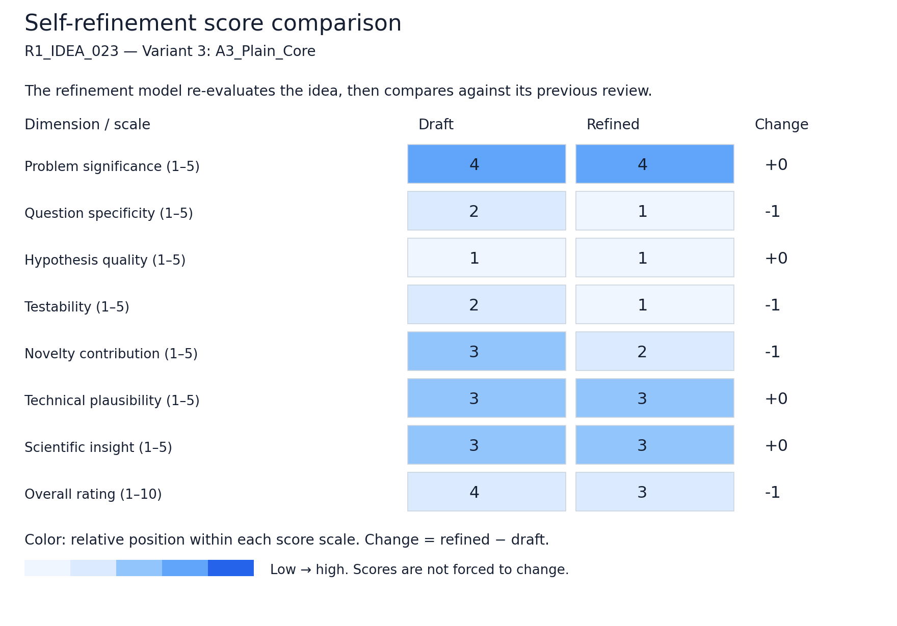

Changed score dimensions: question_specificity, testability, novelty_contribution, overall_rating.

### Score justifications (draft / refined)

**Problem significance**

```json
{
  "draft": {
    "score": 4.0,
    "justification": "The problem is meaningful and relevant to real-world ML deployment. Reliable classifiers that can handle both OOD inputs and anticipate in-distribution errors are important for safety-critical applications. The observation that these are typically treated separately identifies a potential research gap."
  },
  "refined": {
    "score": 4.0,
    "justification": "The problem is highly relevant to real-world ML deployment. Building classifiers that reliably handle both OOD inputs and in-distribution uncertainties is crucial for safety-critical applications. The observation that these are typically separate research threads identifies a meaningful gap."
  }
}
```

**Question specificity**

```json
{
  "draft": {
    "score": 2.0,
    "justification": "The idea lacks a clearly defined research question. It states that there is a 'connection' between OOD detection and failure prediction that is 'missing,' but doesn't specify what aspect of this connection should be investigated. The description is more of a problem statement than a research question."
  },
  "refined": {
    "score": 1.0,
    "justification": "Extremely low specificity. The idea only states that a 'connection' is 'missing' without defining what aspect of that connection should be studied. It's a problem statement, not a research question."
  }
}
```

**Hypothesis quality**

```json
{
  "draft": {
    "score": 1.0,
    "justification": "No hypothesis is presented, either explicit or implicit. The idea merely states that current approaches treat these problems separately and suggests this might be suboptimal, but doesn't make a testable prediction about what would happen if they were connected or how they are related."
  },
  "refined": {
    "score": 1.0,
    "justification": "No hypothesis is presented, either explicit or implicit. There is no testable prediction about the relationship between OOD detection and failure prediction. The idea merely suggests there might be a connection worth exploring."
  }
}
```

**Testability**

```json
{
  "draft": {
    "score": 2.0,
    "justification": "Without a specific hypothesis or proposed investigation method, testability is low. The idea suggests studying a 'connection' but doesn't propose how this connection could be tested—through experiments, analysis, or comparisons. It's unclear what evidence would support or contradict the central claim."
  },
  "refined": {
    "score": 1.0,
    "justification": "Without a hypothesis or proposed investigation method, testability is minimal. It's unclear what evidence would support or refute the idea. No experiments, comparisons, or analyses are suggested."
  }
}
```

**Novelty contribution**

```json
{
  "draft": {
    "score": 3.0,
    "justification": "The observation that OOD detection and failure prediction are treated separately is not particularly novel—this is widely known in the field. The potential contribution would depend entirely on what specific investigation is proposed. As stated, the idea identifies a gap but doesn't propose how to fill it, limiting its novelty."
  },
  "refined": {
    "score": 2.0,
    "justification": "The observation that OOD detection and failure prediction are separate fields is not novel—this is widely known. The potential contribution depends entirely on what specific investigation follows. As stated, the idea identifies a gap but doesn't propose how to address it."
  }
}
```

**Technical plausibility**

```json
{
  "draft": {
    "score": 3.0,
    "justification": "The basic premise is plausible—both OOD detection and failure prediction involve confidence estimation, so there may be connections worth exploring. However, without any proposed technical direction, it's impossible to assess whether a specific approach would be technically sound. The reasoning is coherent but incomplete."
  },
  "refined": {
    "score": 3.0,
    "justification": "The basic premise is logically coherent: both problems involve confidence estimation, so exploring connections is plausible. However, without any technical direction, we cannot assess whether a specific approach would be sound. The reasoning is incomplete but not flawed."
  }
}
```

**Scientific insight**

```json
{
  "draft": {
    "score": 3.0,
    "justification": "If properly investigated, this research could provide insight into the relationship between different aspects of classifier reliability. Understanding whether OOD detection and failure prediction share underlying mechanisms or can be jointly optimized could yield transferable principles. However, the current formulation is too vague to guarantee meaningful insight."
  },
  "refined": {
    "score": 3.0,
    "justification": "If properly investigated, this could yield insights into the relationship between different aspects of classifier uncertainty. Understanding whether these problems share underlying mechanisms could provide transferable principles. However, the current formulation is too vague to guarantee meaningful insight."
  }
}
```

**Overall rating**

```json
{
  "draft": {
    "score": 4.0,
    "justification": "This is a weak research idea in its current form. While it identifies a meaningful practical problem and correctly notes that OOD detection and failure prediction are typically treated separately, it lacks a specific research question, hypothesis, or methodological direction. The idea is more of a problem statement than a research proposal. With substantial refinement—particularly by formulating a concrete hypothesis and experimental approach—it could become a stronger research direction."
  },
  "refined": {
    "score": 3.0,
    "justification": "This is a weak research idea. While it identifies a meaningful practical problem and correctly notes a separation in existing work, it lacks a specific research question, hypothesis, or methodological direction. It is essentially a problem statement rather than a research proposal. Significant refinement is needed to transform it into a testable investigation."
  }
}
```

## R1_IDEA_023 — Variant 4: B1_Verbose_Elaborate


Changed score dimensions: none.

### Score justifications (draft / refined)

**Problem significance**

```json
{
  "draft": {
    "score": 4.0,
    "justification": "The problem is highly significant for real-world ML deployment. Reliable classifiers that can detect both OOD inputs and anticipate in-distribution errors are crucial for safety-critical applications. The observation that prior work treats these as separate problems identifies a meaningful research gap."
  },
  "refined": {
    "score": 4.0,
    "justification": "The problem is highly significant for real-world ML deployment. Reliable classifiers that handle both OOD inputs and in-distribution errors are crucial for safety-critical applications. The observation that prior work treats these separately identifies a meaningful gap with practical implications for trustworthy ML systems."
  }
}
```

**Question specificity**

```json
{
  "draft": {
    "score": 2.0,
    "justification": "The idea identifies a general area (connection between OOD detection and failure prediction) but does not define a specific research question. It states that prior work overlooks their connection but doesn't specify what aspect of this connection should be investigated or what question should be answered."
  },
  "refined": {
    "score": 2.0,
    "justification": "The idea identifies a general topic area (connection between OOD detection and failure prediction) but does not define a specific research question. It states that prior work overlooks their connection but doesn't specify what aspect of this connection should be investigated or what concrete question should be answered."
  }
}
```

**Hypothesis quality**

```json
{
  "draft": {
    "score": 1.0,
    "justification": "There is no explicit or implicit hypothesis. The idea merely observes that prior work treats OOD detection and failure prediction separately and suggests they are connected, but makes no testable prediction about this connection, its nature, or its implications."
  },
  "refined": {
    "score": 1.0,
    "justification": "There is no explicit or implicit hypothesis. The idea merely observes that prior work treats OOD detection and failure prediction separately and suggests they are connected, but makes no testable prediction about this connection, its nature, mechanisms, or implications. It lacks any falsifiable claim."
  }
}
```

**Testability**

```json
{
  "draft": {
    "score": 2.0,
    "justification": "The idea as stated is not directly testable because it doesn't propose what to test. To become testable, it would need to specify what evidence would demonstrate the connection or what approach would leverage it. Currently, it's more of an observation than a research direction."
  },
  "refined": {
    "score": 2.0,
    "justification": "The idea as stated is not directly testable because it doesn't propose what to test. It identifies a gap but doesn't suggest how to investigate it. To become testable, it would need to specify what evidence would demonstrate the connection or what approach would leverage it. Currently, it's an observation rather than a research direction."
  }
}
```

**Novelty contribution**

```json
{
  "draft": {
    "score": 3.0,
    "justification": "The observation that OOD detection and failure prediction are connected is not inherently novel - both deal with uncertainty estimation. The potential contribution depends entirely on what specific investigation follows from this observation. As stated, it identifies a gap but doesn't propose how to fill it."
  },
  "refined": {
    "score": 3.0,
    "justification": "The observation that OOD detection and failure prediction are related is not inherently novel—both deal with uncertainty estimation. The potential contribution depends entirely on what specific investigation follows. As stated, it identifies a gap but doesn't propose how to fill it, so the novelty is limited to pointing out an underexplored intersection."
  }
}
```

**Technical plausibility**

```json
{
  "draft": {
    "score": 3.0,
    "justification": "The basic premise that OOD detection and failure prediction are related is plausible since both involve assessing model uncertainty. However, without any proposed direction, it's impossible to evaluate the technical soundness of a specific approach. The reasoning is coherent but incomplete."
  },
  "refined": {
    "score": 3.0,
    "justification": "The basic premise that OOD detection and failure prediction might be connected is plausible since both involve assessing model uncertainty. However, without any proposed direction or mechanism, it's impossible to evaluate the technical soundness of a specific approach. The reasoning is coherent but incomplete."
  }
}
```

**Scientific insight**

```json
{
  "draft": {
    "score": 3.0,
    "justification": "If properly investigated, understanding the relationship between OOD detection and failure prediction could yield valuable insights about uncertainty estimation in neural networks. However, the idea as stated doesn't specify what insights are sought or how they would be obtained."
  },
  "refined": {
    "score": 3.0,
    "justification": "If properly investigated, understanding the relationship between OOD detection and failure prediction could yield valuable insights about uncertainty estimation in neural networks. However, the idea as stated doesn't specify what insights are sought or how they would be obtained. The potential exists but is unrealized."
  }
}
```

**Overall rating**

```json
{
  "draft": {
    "score": 4.0,
    "justification": "This is a weak research idea in its current form. While it identifies an important practical problem and a meaningful gap in the literature, it lacks the essential components of a research idea: a specific question, a testable hypothesis, or a proposed direction for investigation. It reads more like a motivation section than a research idea. The potential exists for a stronger idea if concrete next steps were specified."
  },
  "refined": {
    "score": 4.0,
    "justification": "This is a weak research idea in its current form. While it identifies an important practical problem and a meaningful gap in the literature, it lacks the essential components of a research idea: a specific question, a testable hypothesis, or a proposed direction for investigation. It reads more like a motivation section than a research idea. The potential exists for a stronger idea if concrete next steps were specified, but as presented, it's too vague to constitute a viable research direction."
  }
}
```

## R1_IDEA_023 — Variant 5: B2_Grand_Narrative


Changed score dimensions: none.

### Score justifications (draft / refined)

**Problem significance**

```json
{
  "draft": {
    "score": 4.0,
    "justification": "The problem of building reliable classifiers for real-world deployment is highly significant. OOD detection and ID failure prediction are both important components of trustworthy AI systems, and understanding their relationship could advance the field."
  },
  "refined": {
    "score": 4.0,
    "justification": "The problem is highly significant. Building reliable classifiers with proper uncertainty quantification is fundamental for real-world ML deployment. Both OOD detection and ID failure prediction are critical components of trustworthy AI systems, and understanding their relationship addresses an important gap in current research practice."
  }
}
```

**Question specificity**

```json
{
  "draft": {
    "score": 1.0,
    "justification": "Extremely low specificity. The idea merely states that there is a 'closed connection' between OOD detection and ID failure prediction that is overlooked, but does not define what specific aspect of this connection will be investigated, what research question will be answered, or what phenomenon will be studied."
  },
  "refined": {
    "score": 1.0,
    "justification": "Extremely low specificity. The idea merely states that there is a 'closed connection' between two problems that are typically treated separately. It does not define what specific aspect of this connection will be investigated, what research question will be answered, or what phenomenon will be studied. No concrete variables, relationships, or mechanisms are specified."
  }
}
```

**Hypothesis quality**

```json
{
  "draft": {
    "score": 1.0,
    "justification": "No hypothesis is presented. The idea contains an implicit assumption that OOD detection and ID failure prediction are connected, but this is stated as an observation rather than a testable prediction. There is no concrete claim about the nature, direction, or mechanism of this connection."
  },
  "refined": {
    "score": 1.0,
    "justification": "No hypothesis is presented. The text contains an implicit assumption that OOD detection and ID failure prediction are connected, but this is stated as an observation rather than a testable prediction. There is no concrete claim about the nature, direction, causality, or mechanism of this connection that could be supported or contradicted by evidence."
  }
}
```

**Testability**

```json
{
  "draft": {
    "score": 1.0,
    "justification": "The idea as presented is not testable. It does not suggest any experiment, comparison, evaluation, or analysis that could provide evidence about the connection between OOD detection and ID failure prediction. Without a specific research question or hypothesis, there is nothing to test."
  },
  "refined": {
    "score": 1.0,
    "justification": "The idea as presented is not testable. It does not suggest any experiment, comparison, evaluation, or analysis that could provide evidence about the connection between OOD detection and ID failure prediction. Without a specific research question or hypothesis, there is nothing concrete to test or investigate."
  }
}
```

**Novelty contribution**

```json
{
  "draft": {
    "score": 2.0,
    "justification": "The observation that OOD detection and ID failure prediction are treated separately is not particularly novel. Many papers acknowledge this separation. The potential contribution would depend entirely on what specific investigation is conducted, but the idea as stated does not propose any novel approach, framework, or insight."
  },
  "refined": {
    "score": 2.0,
    "justification": "The observation that OOD detection and ID failure prediction are treated separately is not novel - many papers acknowledge this separation. The potential contribution would depend entirely on what specific investigation is conducted, but the idea as stated does not propose any novel approach, framework, metric, or insight. It merely identifies a general area for potential research."
  }
}
```

**Technical plausibility**

```json
{
  "draft": {
    "score": 3.0,
    "justification": "The general direction is plausible - studying relationships between different uncertainty quantification tasks makes sense. However, without any technical details about how this would be done, it's impossible to assess whether specific approaches would be technically sound. The reasoning is coherent but extremely high-level."
  },
  "refined": {
    "score": 3.0,
    "justification": "The general direction is technically plausible - studying relationships between different uncertainty quantification tasks makes sense conceptually. However, without any technical details about how this would be done, it's impossible to assess whether specific approaches would be technically sound. The reasoning is coherent but remains at an extremely high, non-technical level."
  }
}
```

**Scientific insight**

```json
{
  "draft": {
    "score": 2.0,
    "justification": "If properly investigated, studying the connection between OOD detection and ID failure prediction could yield insights about unified uncertainty representations or shared mechanisms. However, the idea as stated does not articulate what kind of insight might be gained. It's more of an application area than an insight-seeking investigation."
  },
  "refined": {
    "score": 2.0,
    "justification": "If properly investigated, studying the connection between OOD detection and ID failure prediction could yield insights about unified uncertainty representations, shared mechanisms, or transferable techniques. However, the idea as stated does not articulate what kind of insight might be gained or what scientific understanding would be advanced. It's more of an application area identification than an insight-seeking investigation proposal."
  }
}
```

**Overall rating**

```json
{
  "draft": {
    "score": 3.0,
    "justification": "This is a weak research idea. While it identifies an important problem area (reliable classifiers and trustworthy AI), it fails to articulate a specific research question, hypothesis, or methodological direction. It reads more like a motivation section than a research proposal. The idea lacks the specificity, testability, and novelty needed for a strong research direction. It would need substantial refinement to become a viable research project."
  },
  "refined": {
    "score": 3.0,
    "justification": "This is a weak research idea. While it correctly identifies an important problem area (reliable classifiers and trustworthy AI) and a valid gap in current research (separation of OOD detection and ID failure prediction), it fails to articulate a specific research question, hypothesis, or methodological direction. It reads like a motivation section rather than a research proposal. The idea lacks the specificity, testability, and novelty needed for a strong research direction. Substantial refinement is needed to transform this into a viable research project."
  }
}
```

## R1_IDEA_023 — Variant 6: B3_Over_Confident


Changed score dimensions: none.

### Score justifications (draft / refined)

**Problem significance**

```json
{
  "draft": {
    "score": 4.0,
    "justification": "The problem of building reliable classifiers for real-world deployment is highly significant. Both OOD detection and failure prediction are important capabilities for safe ML systems. The observation that they're typically treated separately is valid and worth investigating."
  },
  "refined": {
    "score": 4.0,
    "justification": "The problem of building reliable classifiers for real-world deployment is highly significant. Both OOD detection and accurate failure prediction are critical for safe ML deployment. The observation that these capabilities are typically studied separately is valid and worth attention."
  }
}
```

**Question specificity**

```json
{
  "draft": {
    "score": 1.0,
    "justification": "Extremely low specificity. The idea merely states that there's a 'close connection' that's been 'overlooked' without defining what that connection is or what specific aspect should be investigated. No concrete research question is posed."
  },
  "refined": {
    "score": 1.0,
    "justification": "Extremely low specificity. The idea merely states there's a 'close connection' that's been 'overlooked' without defining what that connection is or what specific aspect should be investigated. No concrete research question is posed."
  }
}
```

**Hypothesis quality**

```json
{
  "draft": {
    "score": 1.0,
    "justification": "No hypothesis is presented. The text makes an observation but doesn't propose a testable prediction about the relationship between OOD detection and failure prediction. It doesn't specify what would be learned by investigating this connection."
  },
  "refined": {
    "score": 1.0,
    "justification": "No hypothesis is presented. The text makes an observation but doesn't propose any testable prediction about the relationship between OOD detection and failure prediction. It doesn't specify what would be learned by investigating this connection."
  }
}
```

**Testability**

```json
{
  "draft": {
    "score": 1.0,
    "justification": "Not testable in its current form. There's no proposed experiment, comparison, or analysis. The idea doesn't suggest how one would investigate whether treating these problems jointly is beneficial or what evidence would support the claim of a 'close connection.'"
  },
  "refined": {
    "score": 1.0,
    "justification": "Not testable in its current form. There's no proposed experiment, comparison, analysis, or evaluation method. The idea doesn't suggest how one would investigate whether these problems are connected or what evidence would support the claim."
  }
}
```

**Novelty contribution**

```json
{
  "draft": {
    "score": 2.0,
    "justification": "The observation that OOD detection and failure prediction are both important for reliability is not novel. The suggestion that they might be connected has some novelty, but without specifying what that connection is or how investigating it would advance the field, the potential contribution is minimal."
  },
  "refined": {
    "score": 2.0,
    "justification": "The observation that both OOD detection and failure prediction are important for reliability is not novel. The suggestion that they might be connected has some novelty, but without specifying what that connection is or how investigating it would advance understanding, the potential contribution is minimal."
  }
}
```

**Technical plausibility**

```json
{
  "draft": {
    "score": 3.0,
    "justification": "The basic premise is plausible - both problems involve uncertainty quantification and reliable confidence estimation. However, without more details about the proposed connection or approach, it's impossible to assess technical coherence beyond the surface-level observation."
  },
  "refined": {
    "score": 3.0,
    "justification": "The basic premise is plausible - both problems involve uncertainty quantification and confidence calibration. However, without details about the proposed connection or approach, it's impossible to assess technical coherence beyond the surface-level observation that both relate to reliability."
  }
}
```

**Scientific insight**

```json
{
  "draft": {
    "score": 2.0,
    "justification": "If properly developed, investigating the relationship between OOD detection and failure prediction could yield insights about uncertainty estimation mechanisms in neural networks. However, as presented, the idea doesn't articulate what specific insights might be gained or what principles might be discovered."
  },
  "refined": {
    "score": 2.0,
    "justification": "If properly developed, investigating relationships between OOD detection and failure prediction could yield insights about uncertainty estimation mechanisms. However, as presented, the idea doesn't articulate what specific insights might be gained, what principles might be discovered, or what would be learned beyond the initial observation."
  }
}
```

**Overall rating**

```json
{
  "draft": {
    "score": 3.0,
    "justification": "This is a weak research idea in its current form. While it identifies an important practical problem and makes a reasonable observation about how two subproblems are typically treated separately, it fails to articulate a concrete research question, hypothesis, or methodological direction. It's essentially a motivation statement rather than a research idea. With substantial development (specific hypothesis, testable predictions, proposed experiments), it could become a meaningful research direction."
  },
  "refined": {
    "score": 3.0,
    "justification": "This is a weak research idea in its current form. While it identifies an important practical problem and makes a reasonable observation about how two subproblems are typically treated separately, it fails to articulate a concrete research question, hypothesis, or methodological direction. It's essentially a motivation statement rather than a research idea. With substantial development (specific hypothesis, testable predictions, proposed experiments), it could become a meaningful research direction."
  }
}
```

## R1_IDEA_023 — Variant 7: B4_Novelty


Changed score dimensions: none.

### Score justifications (draft / refined)

**Problem significance**

```json
{
  "draft": {
    "score": 4.0,
    "justification": "The problem of building reliable classifiers with good uncertainty estimation is highly significant for real-world ML deployment. The observation that OOD detection and ID failure prediction are often treated separately is accurate and points to a meaningful gap."
  },
  "refined": {
    "score": 4.0,
    "justification": "The problem of building reliable classifiers with comprehensive uncertainty estimation is highly significant for real-world ML deployment. The observation that OOD detection and ID failure prediction are often treated separately identifies a meaningful gap in current approaches to model reliability."
  }
}
```

**Question specificity**

```json
{
  "draft": {
    "score": 1.0,
    "justification": "The idea lacks a specific research question. It states that integration offers a 'novel perspective' and that the problems have a 'closed connection,' but doesn't define what aspect of this connection should be investigated, what hypothesis should be tested, or what concrete question should be answered."
  },
  "refined": {
    "score": 1.0,
    "justification": "The idea completely lacks a specific research question. It describes a general perspective and observation about prior work but doesn't define what concrete aspect should be investigated, what relationship should be tested, or what specific question should be answered."
  }
}
```

**Hypothesis quality**

```json
{
  "draft": {
    "score": 1.0,
    "justification": "There is no explicit or implicit hypothesis. The text describes a perspective and an observation about prior work, but makes no testable prediction about what would happen if the problems were integrated, what mechanism connects them, or what benefit integration would provide."
  },
  "refined": {
    "score": 1.0,
    "justification": "There is no explicit or implicit hypothesis. The text makes no testable prediction about what would happen if the problems were integrated, what mechanism connects them, what benefits integration would provide, or what relationship exists between OOD detection and ID failure prediction."
  }
}
```

**Testability**

```json
{
  "draft": {
    "score": 1.0,
    "justification": "Without a specific hypothesis or research question, it's unclear what would be tested. The idea suggests integration is valuable but doesn't propose how to test this value, what experiments would be conducted, or what evidence would support the claim."
  },
  "refined": {
    "score": 1.0,
    "justification": "Without a specific hypothesis or research question, it's impossible to determine what would be tested. The idea suggests integration is valuable but doesn't propose how to test this value, what experiments would be conducted, what comparisons would be made, or what evidence would support the claim."
  }
}
```

**Novelty contribution**

```json
{
  "draft": {
    "score": 2.0,
    "justification": "The observation that OOD detection and failure prediction are related is not particularly novel—both are uncertainty estimation tasks. The suggestion to integrate them is reasonable but vague. Without a specific approach or hypothesis, the potential contribution is limited to a general suggestion rather than a novel scientific direction."
  },
  "refined": {
    "score": 2.0,
    "justification": "The observation that OOD detection and failure prediction are both uncertainty estimation tasks is not novel. The suggestion to integrate them is reasonable but vague. Without a specific approach, mechanism, or hypothesis about their relationship, the potential contribution is limited to a general suggestion rather than a novel scientific direction."
  }
}
```

**Technical plausibility**

```json
{
  "draft": {
    "score": 3.0,
    "justification": "The basic premise that OOD detection and ID failure prediction are related uncertainty tasks is plausible. However, without any proposed mechanism or method, it's impossible to evaluate the technical soundness of the integration approach. The idea doesn't contain enough technical content to assess plausibility beyond the surface-level observation."
  },
  "refined": {
    "score": 3.0,
    "justification": "The basic premise that OOD detection and ID failure prediction are related uncertainty tasks is plausible. However, with no proposed mechanism, method, or approach for integration, it's impossible to evaluate the technical soundness beyond the surface-level observation. The idea doesn't contain enough technical content for meaningful assessment."
  }
}
```

**Scientific insight**

```json
{
  "draft": {
    "score": 2.0,
    "justification": "If successfully investigated, this could potentially reveal connections between different types of uncertainty or shared failure modes. However, the idea as stated doesn't articulate what specific insight would be gained—it merely suggests integration without specifying what we would learn about uncertainty estimation, model behavior, or the relationship between OOD and ID failures."
  },
  "refined": {
    "score": 2.0,
    "justification": "If successfully investigated, this could potentially reveal connections between different types of uncertainty or shared representations for reliability. However, the idea as stated doesn't articulate what specific insight would be gained—it merely suggests integration without specifying what we would learn about uncertainty estimation, model behavior, or the fundamental relationship between OOD and ID failures."
  }
}
```

**Overall rating**

```json
{
  "draft": {
    "score": 3.0,
    "justification": "This is a weak research idea. While it identifies a meaningful practical problem and correctly observes that two uncertainty estimation tasks are often treated separately, it fails to formulate a specific research question, hypothesis, or testable direction. The idea is essentially a motivation statement without a concrete proposal for investigation. It lacks the specificity needed to be a strong research direction, though it could be developed into one with more concrete formulation."
  },
  "refined": {
    "score": 3.0,
    "justification": "This is a weak research idea. While it identifies a meaningful practical problem and correctly observes a gap in how uncertainty estimation tasks are approached, it fails completely to formulate a specific research question, hypothesis, or testable direction. The idea is essentially a motivation statement without a concrete proposal for investigation. It lacks the specificity needed to be a strong research direction, though it could serve as starting point for more concrete formulation."
  }
}
```

## R1_IDEA_023 — Variant 8: B5_Application_Impact


Changed score dimensions: none.

### Score justifications (draft / refined)

**Problem significance**

```json
{
  "draft": {
    "score": 4.0,
    "justification": "The problem of building reliable classifiers for real-world deployment is highly significant. Safe automation requires models that know when they are likely to be wrong, both for unfamiliar inputs and for difficult in-distribution cases. This is a core challenge in trustworthy ML."
  },
  "refined": {
    "score": 4.0,
    "justification": "The problem of building reliable classifiers for real-world deployment is highly significant. Safe automation requires models that know when they are likely to be wrong, both for unfamiliar inputs (OOD) and for difficult in-distribution cases. This is a core challenge in trustworthy ML with practical implications."
  }
}
```

**Question specificity**

```json
{
  "draft": {
    "score": 2.0,
    "justification": "The idea identifies a general topic but does not define a specific research question. It states that prior work treats two problems separately and that they are connected, but does not specify what aspect of that connection to investigate, what relationship to test, or what phenomenon to explain."
  },
  "refined": {
    "score": 2.0,
    "justification": "The idea identifies a general topic area but does not define a specific research question. It states that prior work treats two problems separately and that they are connected, but does not specify what aspect of that connection to investigate, what relationship to test, or what phenomenon to explain. It lacks the precision needed for a focused investigation."
  }
}
```

**Hypothesis quality**

```json
{
  "draft": {
    "score": 1.0,
    "justification": "There is no explicit or clearly implicit hypothesis. The text makes an observation ('most prior work treats them as separate') and a vague suggestion ('overlooking their closed connection'), but does not make a concrete, testable prediction about the world. It does not propose what might be true if the connection were exploited, or what would be observed."
  },
  "refined": {
    "score": 1.0,
    "justification": "There is no explicit or clearly implicit hypothesis. The text makes an observation ('most prior work treats them as separate') and a vague suggestion ('overlooking their closed connection'), but does not make a concrete, testable prediction about what would be true if the connection were exploited or what would be observed in experiments. It lacks a falsifiable claim."
  }
}
```

**Testability**

```json
{
  "draft": {
    "score": 2.0,
    "justification": "The idea as stated is not directly testable because it does not propose what to test. To become testable, one would need to define a specific claim (e.g., 'a joint approach improves performance on metric M') and an experimental design to evaluate it. The current formulation is a motivational premise, not a testable proposition."
  },
  "refined": {
    "score": 2.0,
    "justification": "The idea as stated is not directly testable because it does not propose what to test. To become testable, one would need to define a specific claim (e.g., 'a joint approach improves performance on metric M compared to separate approaches') and an experimental design to evaluate it. The current formulation is a motivational premise, not a testable proposition."
  }
}
```

**Novelty contribution**

```json
{
  "draft": {
    "score": 3.0,
    "justification": "The observation that OOD detection and failure prediction are related is not novel in itself—many papers discuss uncertainty quantification broadly. The potential contribution would depend entirely on what specific investigation follows. As a standalone idea, it points to a well-known gap but does not propose a novel angle, method, or hypothesis to explore it."
  },
  "refined": {
    "score": 3.0,
    "justification": "The observation that OOD detection and failure prediction are related is not novel in itself—many papers discuss uncertainty quantification broadly. The potential contribution would depend entirely on what specific investigation follows. As a standalone idea, it points to a recognized gap but does not propose a novel angle, method, or hypothesis to explore it in a distinctive way."
  }
}
```

**Technical plausibility**

```json
{
  "draft": {
    "score": 4.0,
    "justification": "The reasoning is logically coherent: both tasks involve estimating model uncertainty, so exploring their relationship is plausible. The assumption that a unified approach might be beneficial is reasonable, though not guaranteed. No technical implausibilities are present in the brief description."
  },
  "refined": {
    "score": 4.0,
    "justification": "The reasoning is logically coherent: both tasks involve estimating model uncertainty, so exploring their relationship is plausible. The assumption that a unified approach might be beneficial is reasonable, though not guaranteed. No technical implausibilities are present in the brief description."
  }
}
```

**Scientific insight**

```json
{
  "draft": {
    "score": 3.0,
    "justification": "If developed into a concrete study, this direction could yield insight into the nature of model uncertainty—e.g., whether uncertainty for OOD and hard ID samples stems from similar mechanisms, or whether a single confidence measure can serve both purposes. However, as stated, the idea only hints at such insights without specifying what would be learned."
  },
  "refined": {
    "score": 3.0,
    "justification": "If developed into a concrete study, this direction could yield insight into the nature of model uncertainty—e.g., whether uncertainty for OOD and hard ID samples stems from similar mechanisms, or whether a single confidence measure can serve both purposes. However, as stated, the idea only hints at such insights without specifying what would be learned or how the investigation would reveal new understanding."
  }
}
```

**Overall rating**

```json
{
  "draft": {
    "score": 4.0,
    "justification": "This is a weak research idea in its current form. While it identifies a significant and relevant problem, it fails to articulate a specific research question, hypothesis, or methodological direction. It reads as background motivation for a study rather than the core idea itself. Without a testable claim or clear investigative angle, its scientific contribution is undefined. It would score higher if it proposed what to do about the observed gap."
  },
  "refined": {
    "score": 4.0,
    "justification": "This is a weak research idea in its current form. While it identifies a significant and relevant problem, it fails to articulate a specific research question, hypothesis, or methodological direction. It reads as background motivation for a study rather than the core idea itself. Without a testable claim or clear investigative angle, its scientific contribution is undefined. It would need substantial refinement to become a viable research direction."
  }
}
```

## R1_IDEA_023 — Variant 9: C1_Hollow_Shell


Changed score dimensions: none.

### Score justifications (draft / refined)

**Problem significance**

```json
{
  "draft": {
    "score": 4.0,
    "justification": "The problem is highly meaningful. Dependable ML systems are crucial for real-world deployment, and handling both unfamiliar inputs and calibrated uncertainty on familiar inputs is a core challenge. The observation that these are often studied separately is accurate and points to a genuine gap."
  },
  "refined": {
    "score": 4.0,
    "justification": "The problem is highly meaningful. Dependable ML systems are crucial for real-world deployment, and handling both unfamiliar inputs and calibrated uncertainty on familiar inputs is a core challenge. The observation that these are often studied separately points to a genuine and important gap."
  }
}
```

**Question specificity**

```json
{
  "draft": {
    "score": 2.0,
    "justification": "The idea identifies a general area but does not define a concrete research question. It states that aspects are addressed separately rather than combined, but does not specify what should be investigated about this combination."
  },
  "refined": {
    "score": 2.0,
    "justification": "The idea identifies a general area but does not define a concrete research question. It states that aspects are addressed separately rather than combined, but does not specify what should be investigated about this combination—e.g., whether combined approaches are better, how they interact, or what methods might unify them."
  }
}
```

**Hypothesis quality**

```json
{
  "draft": {
    "score": 1.0,
    "justification": "There is no explicit or implicit hypothesis. The idea is an observation and a suggestion that considering both aspects together is important, but it makes no testable prediction about outcomes, mechanisms, or relationships."
  },
  "refined": {
    "score": 1.0,
    "justification": "There is no explicit or implicit hypothesis. The idea is an observation that considering both aspects together is important, but it makes no testable prediction about outcomes, mechanisms, or relationships. It lacks even a directional claim that could be supported or contradicted by evidence."
  }
}
```

**Testability**

```json
{
  "draft": {
    "score": 2.0,
    "justification": "The idea as stated is not directly testable. It suggests a direction but does not propose how to investigate it. One could design experiments to compare combined vs. separate approaches, but the idea itself does not suggest any specific evaluation or comparison."
  },
  "refined": {
    "score": 2.0,
    "justification": "The idea as stated is not directly testable. It suggests a general direction but does not propose how to investigate it. One could design experiments to compare combined vs. separate approaches, but the idea itself does not suggest any specific evaluation, comparison, or analysis method."
  }
}
```

**Novelty contribution**

```json
{
  "draft": {
    "score": 3.0,
    "justification": "The observation that OOD detection and uncertainty calibration are often separate is not novel in itself. The potential contribution lies in exploring their combined role, but without a specific research angle, it's unclear what new knowledge would be generated beyond this general recommendation."
  },
  "refined": {
    "score": 3.0,
    "justification": "The observation that OOD detection and uncertainty calibration are often separate is not novel in itself. The potential contribution lies in exploring their combined role, but without a specific research angle, it's unclear what new knowledge would be generated beyond this general recommendation. It could evolve into a novel contribution if a concrete approach or insight is proposed."
  }
}
```

**Technical plausibility**

```json
{
  "draft": {
    "score": 3.0,
    "justification": "The reasoning is logically coherent: dependable systems need both capabilities. However, no technical direction is proposed, so plausibility of any specific method cannot be assessed. The general premise is reasonable."
  },
  "refined": {
    "score": 3.0,
    "justification": "The reasoning is logically coherent: dependable systems need both capabilities. However, no technical direction is proposed, so the plausibility of any specific method cannot be assessed. The general premise—that considering both aspects could be beneficial—is reasonable, but without technical details, this score remains moderate."
  }
}
```

**Scientific insight**

```json
{
  "draft": {
    "score": 3.0,
    "justification": "If developed into a concrete study, this could yield insights into the interactions between OOD detection and calibration, potentially revealing trade-offs, synergies, or general principles for building robust systems. However, the idea as stated only identifies a gap without specifying what insights might be sought."
  },
  "refined": {
    "score": 3.0,
    "justification": "If developed into a concrete study, this could yield insights into the interactions between OOD detection and calibration, potentially revealing trade-offs, synergies, or general principles for building robust systems. However, the idea as stated only identifies a gap without specifying what insights might be sought or how they would be uncovered."
  }
}
```

**Overall rating**

```json
{
  "draft": {
    "score": 4.0,
    "justification": "The idea identifies a meaningful and important problem but is too vague to constitute a strong research idea. It lacks a specific research question, hypothesis, or methodological direction. It is essentially a motivation or observation rather than a testable research proposal. It has the seeds of a good idea but needs substantial refinement."
  },
  "refined": {
    "score": 4.0,
    "justification": "The idea identifies a meaningful and important problem but is too vague to constitute a strong research idea. It lacks a specific research question, hypothesis, or methodological direction. It is essentially a motivation or observation rather than a testable research proposal. It has the seeds of a good idea but needs substantial refinement to become a viable research direction."
  }
}
```

## R1_IDEA_023 — Variant 10: C2_Logic_Flawed


Changed score dimensions: question_specificity, hypothesis_quality, testability, novelty_contribution, scientific_insight, overall_rating.

### Score justifications (draft / refined)

**Problem significance**

```json
{
  "draft": {
    "score": 4.0,
    "justification": "The problem of building reliable classifiers for real-world deployment is highly significant. Uncertainty estimation, including both OOD detection and failure prediction, is a fundamental challenge with practical importance for safe ML deployment."
  },
  "refined": {
    "score": 4.0,
    "justification": "The problem of building reliable classifiers with proper uncertainty estimation is highly significant for real-world ML deployment. Both OOD detection and failure prediction are important components of trustworthy AI systems."
  }
}
```

**Question specificity**

```json
{
  "draft": {
    "score": 2.0,
    "justification": "The idea identifies a general direction but lacks a specific research question. It states that addressing the connection 'suggests broader effectiveness' but doesn't define what exactly would be investigated or what specific relationship would be studied."
  },
  "refined": {
    "score": 1.0,
    "justification": "The idea lacks any specific research question. It merely states that addressing the connection 'suggests broader effectiveness' without defining what would be investigated, what relationship would be studied, or what specific aspect of the connection is of interest."
  }
}
```

**Hypothesis quality**

```json
{
  "draft": {
    "score": 2.0,
    "justification": "There is no explicit or clearly implied hypothesis. The idea suggests that studying the connection could lead to broader effectiveness, but this is a vague prediction rather than a testable hypothesis about mechanisms, relationships, or specific outcomes."
  },
  "refined": {
    "score": 1.0,
    "justification": "There is no hypothesis, explicit or implicit. The statement that addressing the connection 'suggests broader effectiveness' is a vague suggestion, not a testable prediction about mechanisms, relationships, or specific outcomes that could be supported or contradicted by evidence."
  }
}
```

**Testability**

```json
{
  "draft": {
    "score": 2.0,
    "justification": "The idea as presented is not easily testable because it doesn't propose what would be tested or how. While experiments could be designed to investigate the connection, the idea itself doesn't suggest specific tests, comparisons, or evaluations."
  },
  "refined": {
    "score": 1.0,
    "justification": "The idea as presented is not testable because it doesn't propose what would be tested or how. While experiments could be designed around this topic, the idea itself provides no direction for testing, comparison, evaluation, or analysis."
  }
}
```

**Novelty contribution**

```json
{
  "draft": {
    "score": 3.0,
    "justification": "The observation that OOD detection and failure prediction are treated separately is not particularly novel. The potential contribution of studying their connection is reasonable but vague. The idea doesn't specify what new scientific knowledge would be generated beyond applying existing methods jointly."
  },
  "refined": {
    "score": 2.0,
    "justification": "The observation that OOD detection and failure prediction are related aspects of uncertainty estimation is not novel. The suggestion to study their connection is reasonable but extremely vague. Without specifying what new knowledge would be generated, the potential contribution is minimal."
  }
}
```

**Technical plausibility**

```json
{
  "draft": {
    "score": 4.0,
    "justification": "The reasoning is logically coherent - it makes sense that OOD detection and failure prediction are related aspects of uncertainty estimation. The assumption that addressing them together could be beneficial is reasonable, though the idea doesn't specify how this would be done."
  },
  "refined": {
    "score": 4.0,
    "justification": "The basic reasoning is coherent - both tasks involve uncertainty estimation and might benefit from shared approaches. The assumption that they are connected is reasonable, though the idea doesn't elaborate on why or how."
  }
}
```

**Scientific insight**

```json
{
  "draft": {
    "score": 3.0,
    "justification": "If properly investigated, studying the connection between OOD detection and failure prediction could yield insights about uncertainty estimation mechanisms. However, the idea as stated doesn't articulate what specific insights might be gained about general principles, limitations, or boundary conditions."
  },
  "refined": {
    "score": 2.0,
    "justification": "If properly investigated, studying the relationship between OOD detection and failure prediction could yield insights about uncertainty estimation. However, the idea as stated doesn't articulate what specific insights might be gained about mechanisms, principles, or limitations. It's too vague to promise meaningful scientific insight."
  }
}
```

**Overall rating**

```json
{
  "draft": {
    "score": 4.0,
    "justification": "This is a weak research idea that identifies an important problem but lacks specificity. While the observation about separated treatment of OOD detection and failure prediction is reasonable, the idea doesn't define a clear research question, hypothesis, or testable approach. It's more of a general motivation than a research direction with scientific potential. The main value is in identifying a potentially fruitful area for investigation, but the idea itself needs much more development to become a meaningful research proposal."
  },
  "refined": {
    "score": 3.0,
    "justification": "This is a very weak research idea. While it identifies an important problem area, it fails to define any research question, hypothesis, or testable approach. It's essentially an observation that two related problems exist, with a vague suggestion that their connection might be worth studying. There is no scientific direction proposed - just a topic area mentioned. The idea needs substantial development to become a meaningful research proposal."
  }
}
```

## R1_IDEA_023 — Variant 11: C3_Substance_Enriched


Changed score dimensions: question_specificity, hypothesis_quality, overall_rating.

### Score justifications (draft / refined)

**Problem significance**

```json
{
  "draft": {
    "score": 5.0,
    "justification": "The problem is highly significant: reliable uncertainty estimation is fundamental to safe ML deployment. Both OOD detection and failure prediction are critical for real-world systems, and their integration addresses a genuine gap."
  },
  "refined": {
    "score": 5.0,
    "justification": "The problem is exceptionally significant. Reliable uncertainty estimation is fundamental to safe ML deployment in real-world applications. Both OOD detection and failure prediction are critical capabilities, and their integration addresses a genuine gap with practical importance for trustworthy AI systems."
  }
}
```

**Question specificity**

```json
{
  "draft": {
    "score": 3.0,
    "justification": "The idea identifies a general direction (joint modeling) and a validation approach, but does not define a precise research question. It lacks specificity about what exactly is being investigated beyond the broad notion of connection between OOD detection and failure prediction."
  },
  "refined": {
    "score": 2.0,
    "justification": "The idea identifies a general direction but lacks a precise research question. It mentions 'modeling the joint distribution' and 'improving reliability' without specifying what relationship, mechanism, or comparison is being investigated. The research focus remains broad and underspecified."
  }
}
```

**Hypothesis quality**

```json
{
  "draft": {
    "score": 3.0,
    "justification": "There is an implicit hypothesis that joint modeling improves reliability, but it is not sharply stated. The hypothesis lacks a concrete prediction about mechanisms or expected outcomes. It is more of a suggestive direction than a testable claim."
  },
  "refined": {
    "score": 2.0,
    "justification": "The hypothesis is implicit and vague. It suggests joint modeling 'might improve' reliability but doesn't make a concrete, testable prediction about mechanisms, relationships, or expected outcomes. There's no clear statement that could be meaningfully supported or contradicted by evidence."
  }
}
```

**Testability**

```json
{
  "draft": {
    "score": 4.0,
    "justification": "The idea suggests clear validation methods: analyzing confidence on misclassified examples and designing unified benchmarks. These are testable approaches. However, without a specific modeling proposal, it's unclear what exactly would be tested beyond benchmarking existing methods."
  },
  "refined": {
    "score": 4.0,
    "justification": "The idea suggests clear validation approaches: analyzing confidence on misclassified examples and designing unified benchmarks. These are testable methods for evaluating reliability. However, without a specific modeling proposal or hypothesis, it's unclear what exactly would be tested beyond benchmarking existing methods on new tasks."
  }
}
```

**Novelty contribution**

```json
{
  "draft": {
    "score": 3.0,
    "justification": "The observation that OOD detection and failure prediction are connected is not entirely novel; some prior work touches on their relationship. The main contribution would be in proposing and validating a unified approach, but the idea currently lacks a novel methodological proposal."
  },
  "refined": {
    "score": 3.0,
    "justification": "The observation that OOD detection and failure prediction are connected is not entirely novel. Some prior work examines their relationship or combines aspects of both. The main potential contribution would be in proposing and validating a unified approach, but the idea currently lacks a novel methodological proposal or theoretical insight."
  }
}
```

**Technical plausibility**

```json
{
  "draft": {
    "score": 4.0,
    "justification": "The direction is technically plausible. Joint modeling of uncertainties is a reasonable idea, and the proposed validation methods are straightforward. No obvious technical flaws are present in the limited description."
  },
  "refined": {
    "score": 4.0,
    "justification": "The direction is technically plausible. Joint modeling of uncertainties is a reasonable idea, and the proposed validation methods are straightforward. No obvious technical flaws are present in the limited description. The reasoning about the connection between the two problems is logically coherent."
  }
}
```

**Scientific insight**

```json
{
  "draft": {
    "score": 4.0,
    "justification": "If successfully investigated, this could yield insight into the relationship between different types of uncertainty (aleatoric vs. epistemic, or within-distribution vs. out-of-distribution). It could reveal whether a unified uncertainty framework is feasible and beneficial, which would be a valuable scientific contribution."
  },
  "refined": {
    "score": 4.0,
    "justification": "If successfully investigated, this could yield valuable scientific insight into the relationship between different types of uncertainty (epistemic vs. aleatoric, or distributional vs. within-distribution). It could reveal whether a unified uncertainty framework is feasible, what trade-offs exist, and whether shared mechanisms underlie both reliability aspects."
  }
}
```

**Overall rating**

```json
{
  "draft": {
    "score": 6.0,
    "justification": "This is a moderate/borderline research idea. It addresses a significant problem and suggests plausible validation methods, but lacks specificity in its hypothesis and methodological direction. The core idea—joint modeling for reliability—is reasonable but underdeveloped. With more concrete hypotheses and technical details, it could become a strong research direction."
  },
  "refined": {
    "score": 5.0,
    "justification": "This is a moderate research idea. It addresses a highly significant problem and suggests plausible validation methods, but lacks specificity in its research question and hypothesis. The core observation about connecting OOD detection and failure prediction is reasonable but underdeveloped as a research direction. With more concrete hypotheses and methodological details, it could become a stronger research proposal."
  }
}
```

## R1_IDEA_023 — Variant 12: H1_Deceptive_Hollow


Changed score dimensions: none.

### Score justifications (draft / refined)

**Problem significance**

```json
{
  "draft": {
    "score": 4.0,
    "justification": "The problem is highly significant. Creating ML systems that are robust to both unfamiliar inputs and calibrated on familiar ones is crucial for real-world deployment. The observation that these are often studied separately is valid and important."
  },
  "refined": {
    "score": 4.0,
    "justification": "The problem is highly significant. Robustness to unfamiliar inputs and well-calibrated uncertainty on familiar ones are both critical for real-world ML deployment. The observation that they are often studied separately is valid and addressing them jointly is a meaningful challenge."
  }
}
```

**Question specificity**

```json
{
  "draft": {
    "score": 1.0,
    "justification": "Extremely weak. The idea does not define any concrete research question. It merely states that addressing both aspects together is important, without specifying what should be investigated about their combination."
  },
  "refined": {
    "score": 1.0,
    "justification": "Extremely weak. No concrete research question is defined. The idea merely states that unifying two aspects is important, without specifying what should be investigated about their combination, relationship, or joint optimization."
  }
}
```

**Hypothesis quality**

```json
{
  "draft": {
    "score": 1.0,
    "justification": "No hypothesis is presented. There is an implicit assumption that unifying these aspects is beneficial, but no testable prediction about how, why, or under what conditions this unification would improve outcomes."
  },
  "refined": {
    "score": 1.0,
    "justification": "No hypothesis is presented. There is an implicit assumption that unification is beneficial, but no testable prediction about mechanisms, outcomes, or conditions under which unification would help. The idea lacks even a directional claim that could be falsified."
  }
}
```

**Testability**

```json
{
  "draft": {
    "score": 1.0,
    "justification": "Not testable in its current form. There is no proposed experiment, comparison, or analysis. The idea is a vague agenda rather than a testable research direction."
  },
  "refined": {
    "score": 1.0,
    "justification": "Not testable in its current form. There is no proposed experiment, evaluation, comparison, or analysis. The idea is a vague agenda statement with no clear path to obtaining evidence."
  }
}
```

**Novelty contribution**

```json
{
  "draft": {
    "score": 2.0,
    "justification": "The observation that OOD detection and calibration are often studied separately is not novel. The claim that they should be considered together has been made before. The idea lacks any specific novel contribution beyond this general observation."
  },
  "refined": {
    "score": 2.0,
    "justification": "Low novelty. The observation that OOD detection and calibration are both important and often studied separately is not new. The call to consider them together has been made in prior work (e.g., in robust ML or safe AI discussions). The idea lacks any specific novel technical or conceptual contribution beyond this general observation."
  }
}
```

**Technical plausibility**

```json
{
  "draft": {
    "score": 3.0,
    "justification": "The general direction is plausible - it makes sense to consider both OOD detection and calibration. However, without any technical details, it's impossible to assess whether specific unification approaches would work. The reasoning is coherent but extremely high-level."
  },
  "refined": {
    "score": 3.0,
    "justification": "Moderately plausible at a high level—it is reasonable to think about both OOD detection and calibration together. However, with no technical details, we cannot assess whether specific unification approaches would work. The reasoning is coherent but entirely non-technical."
  }
}
```

**Scientific insight**

```json
{
  "draft": {
    "score": 2.0,
    "justification": "If properly investigated, understanding the relationship between OOD detection and calibration could provide valuable insights. However, the current proposal is too vague to promise specific insights about mechanisms, trade-offs, or principles."
  },
  "refined": {
    "score": 2.0,
    "justification": "Low potential insight in current form. If properly investigated, understanding interactions between OOD detection and calibration could yield insights about trade-offs, shared mechanisms, or unified robustness principles. However, the proposal is too vague to promise such insights; it merely states that unification is desirable."
  }
}
```

**Overall rating**

```json
{
  "draft": {
    "score": 3.0,
    "justification": "This is a weak research idea. While it identifies an important problem, it fails to articulate any concrete research question, hypothesis, or testable direction. It reads more like a motivation section or abstract for a grant proposal than a research idea. The grandiose language about 'field-shaping' and 'transformative synthesis' is not backed by any specific proposal. The idea needs substantial refinement to become a viable research direction."
  },
  "refined": {
    "score": 3.0,
    "justification": "This is a weak research idea. While it identifies an important and meaningful problem, it fails to articulate any concrete research question, hypothesis, or testable direction. It reads as a motivational statement or abstract for a grant proposal, not a research idea. The grandiose language about 'field-shaping' and 'transformative synthesis' is unsupported by any specific proposal. Substantial refinement is needed to become a viable research direction."
  }
}
```

## R1_IDEA_023 — Variant 13: H2_Confident_Flaw

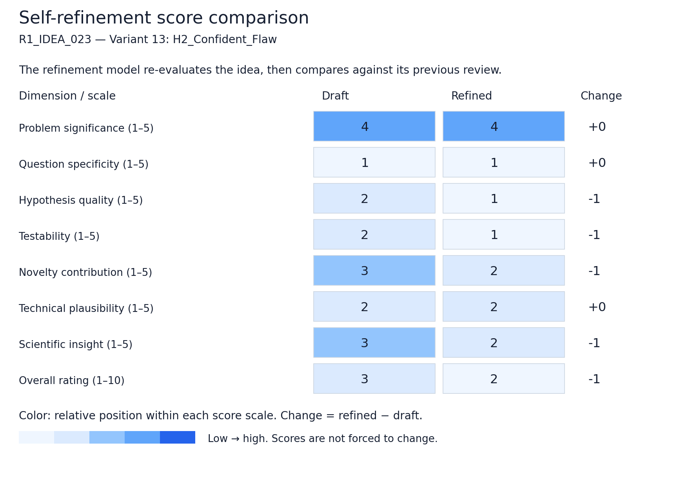

Changed score dimensions: hypothesis_quality, testability, novelty_contribution, scientific_insight, overall_rating.

### Score justifications (draft / refined)

**Problem significance**

```json
{
  "draft": {
    "score": 4.0,
    "justification": "The problem of building reliable classifiers with good uncertainty estimation is highly significant for real-world ML deployment. Both OOD detection and failure prediction are important challenges with practical implications."
  },
  "refined": {
    "score": 4.0,
    "justification": "The problem of building reliable classifiers with comprehensive uncertainty estimation is highly significant for real-world ML deployment. Both OOD detection and failure prediction are critical challenges with substantial practical implications for safety-critical applications."
  }
}
```

**Question specificity**

```json
{
  "draft": {
    "score": 1.0,
    "justification": "No specific research question is articulated. The text presents a general argument about a connection between problems but doesn't define what would actually be investigated."
  },
  "refined": {
    "score": 1.0,
    "justification": "No specific research question is articulated. The text presents a general argument about a connection between problems but doesn't define what would actually be investigated. It lacks even a basic 'Does X affect Y?' formulation."
  }
}
```

**Hypothesis quality**

```json
{
  "draft": {
    "score": 2.0,
    "justification": "There's an implicit hypothesis that addressing the connection between OOD detection and failure prediction will lead to broader effectiveness, but it's not stated as a testable prediction. The claim about 'causal evidence' and 'necessarily' producing improvements is overly strong and not framed as a falsifiable hypothesis."
  },
  "refined": {
    "score": 1.0,
    "justification": "There is no testable hypothesis presented. The text contains assertions ('solving... will necessarily produce reliable improvements') but these are stated as conclusions rather than hypotheses to be tested. The claims about causal evidence are particularly problematic as they're presented as foregone conclusions rather than predictions to be evaluated."
  }
}
```

**Testability**

```json
{
  "draft": {
    "score": 2.0,
    "justification": "The idea as presented is not testable because no method, experiment, or evaluation is suggested. While one could design experiments to test the connection between OOD detection and failure prediction, the current formulation doesn't provide enough direction to know what would be tested."
  },
  "refined": {
    "score": 1.0,
    "justification": "The idea as presented is not testable because it proposes no method to test, no experiment to run, and no evaluation to perform. While one could imagine designing experiments around the general theme, the current formulation provides no direction for what would constitute a test of the claims."
  }
}
```

**Novelty contribution**

```json
{
  "draft": {
    "score": 3.0,
    "justification": "The observation that OOD detection and failure prediction are connected and should be addressed jointly has been discussed in the uncertainty quantification literature. The contribution would depend entirely on what specific approach is proposed, which isn't described here."
  },
  "refined": {
    "score": 2.0,
    "justification": "The observation that OOD detection and failure prediction are related problems is not novel - this connection has been discussed in the uncertainty quantification literature. The contribution would depend entirely on what specific approach is proposed, which isn't described. At present, it's merely stating a known issue without proposing a novel solution."
  }
}
```

**Technical plausibility**

```json
{
  "draft": {
    "score": 2.0,
    "justification": "The reasoning is logically coherent at a high level (these problems are related), but the strong claims about 'causal evidence' without controlling for confounders are scientifically questionable. The text doesn't provide enough technical detail to assess plausibility of any specific approach."
  },
  "refined": {
    "score": 2.0,
    "justification": "The high-level reasoning about the connection between OOD detection and failure prediction is coherent, but the strong claims about 'causal evidence' without controlling for confounders are scientifically unsound. The text provides no technical details about any proposed approach, making it impossible to assess the plausibility of a specific method."
  }
}
```

**Scientific insight**

```json
{
  "draft": {
    "score": 3.0,
    "justification": "If properly investigated, understanding the connection between OOD detection and failure prediction could provide insight into uncertainty estimation mechanisms. However, the current formulation focuses more on claiming superiority than on seeking fundamental understanding."
  },
  "refined": {
    "score": 2.0,
    "justification": "If properly investigated, understanding the relationship between OOD detection and failure prediction could provide insight into uncertainty estimation mechanisms. However, the current formulation focuses on claiming practical superiority rather than seeking fundamental understanding. The text emphasizes 'broader effectiveness' and 'general superiority' over mechanistic insight."
  }
}
```

**Overall rating**

```json
{
  "draft": {
    "score": 3.0,
    "justification": "This is a weak research idea because it lacks a specific research question, proposed method, or testable hypothesis. While it identifies an important problem area, it reads more like a position statement or motivation than a concrete research direction. The strong claims about causal evidence without rigorous evaluation are concerning. The idea needs substantial development to become a viable research proposal."
  },
  "refined": {
    "score": 2.0,
    "justification": "This is a very weak research idea because it lacks the fundamental components of a research proposal: no research question, no hypothesis, no methodological direction, and no plan for evaluation. While it identifies an important problem area, it reads as a position statement or critique rather than a concrete research direction. The strong claims about causal evidence without rigorous evaluation are particularly concerning from a scientific perspective. The idea needs complete reformulation to become a viable research proposal."
  }
}
```

## R1_IDEA_023 — Variant 14: H3_Verbose_Enriched

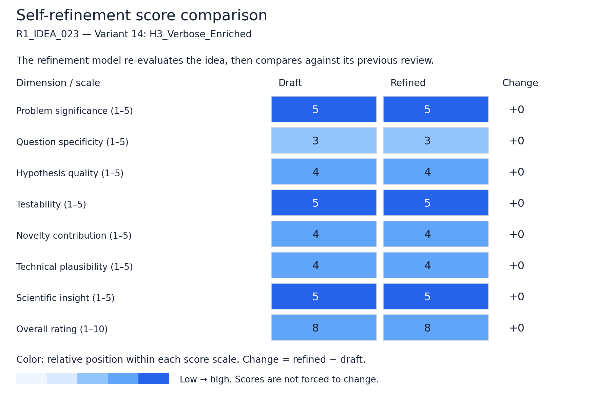

Changed score dimensions: none.

### Score justifications (draft / refined)

**Problem significance**

```json
{
  "draft": {
    "score": 5.0,
    "justification": "The problem is highly significant: building reliable classifiers that handle both OOD detection and ID failure prediction is fundamental for real-world ML deployment. The identified gap—treating these as separate problems despite their conceptual connection—is meaningful and addresses a clear need in the field."
  },
  "refined": {
    "score": 5.0,
    "justification": "The problem is highly significant. Building reliable classifiers that handle both OOD detection and ID failure prediction is fundamental for real-world ML deployment. The identified gap - treating these reliability aspects as separate problems despite their conceptual connection - addresses a clear need in trustworthy ML systems."
  }
}
```

**Question specificity**

```json
{
  "draft": {
    "score": 3.0,
    "justification": "The idea identifies a general direction (joint modeling for reliability) but lacks a precise research question. It states a hypothesis but does not formulate a specific, testable question about mechanisms, comparisons, or conditions. The experimental design is specific, but it is presented as a suggestion rather than the core inquiry."
  },
  "refined": {
    "score": 3.0,
    "justification": "The idea identifies a general direction (joint modeling for reliability) but lacks a precise, explicitly stated research question. While it contains a hypothesis and suggests experimental approaches, the core inquiry remains somewhat implicit. The specificity comes more from the suggested validation approach than from the research question itself."
  }
}
```

**Hypothesis quality**

```json
{
  "draft": {
    "score": 4.0,
    "justification": "The hypothesis that 'modeling the joint distribution of confidence for both ID and OOD samples might improve overall reliability' is concrete and makes a testable prediction. It distinguishes the idea from generic applications by focusing on the integration of two separated problems. It could be falsified if joint modeling shows no improvement or harms performance."
  },
  "refined": {
    "score": 4.0,
    "justification": "The hypothesis that 'modeling the joint distribution of confidence for both ID and OOD samples might improve overall reliability' is concrete and testable. It makes a clear prediction that distinguishes it from simply applying existing methods. The hypothesis could be falsified if joint modeling shows no improvement or harms performance on reliability metrics."
  }
}
```

**Testability**

```json
{
  "draft": {
    "score": 5.0,
    "justification": "The idea is highly testable, especially with the proposed staged experimental design. It suggests clear comparisons (baseline vs. intervention), pre-specified evaluation criteria, ablations, sensitivity analyses, and error analysis. This provides a robust framework for investigating the hypothesis and understanding boundary conditions."
  },
  "refined": {
    "score": 5.0,
    "justification": "The idea is highly testable, especially with the proposed experimental design. It suggests clear comparisons (baseline vs. intervention), pre-specified evaluation criteria, comprehensive ablations, sensitivity analyses, and error analysis. This provides a robust framework for investigating the hypothesis and understanding boundary conditions."
  }
}
```

**Novelty contribution**

```json
{
  "draft": {
    "score": 4.0,
    "justification": "The idea has strong novelty potential. While OOD detection and failure prediction are established areas, their joint treatment is underexplored. A successful study could contribute a unified perspective, new methodologies, and insights into the relationship between ID and OOD uncertainty, moving beyond incremental applications."
  },
  "refined": {
    "score": 4.0,
    "justification": "The idea has strong novelty potential. While OOD detection and failure prediction are established areas, their joint treatment is relatively underexplored. A successful study could contribute a unified perspective on reliability, potentially new methodologies, and insights into the relationship between different types of model uncertainty."
  }
}
```

**Technical plausibility**

```json
{
  "draft": {
    "score": 4.0,
    "justification": "The reasoning is logically coherent: since both OOD detection and failure prediction relate to model uncertainty, joint modeling could be beneficial. The proposed experimental design is plausible and well-structured. However, the lack of a concrete joint modeling mechanism makes it slightly abstract, though not implausible."
  },
  "refined": {
    "score": 4.0,
    "justification": "The reasoning is logically coherent: since both OOD detection and failure prediction relate to model uncertainty, joint modeling could capture synergies. The proposed experimental design is plausible and well-structured. The main limitation is the lack of a concrete joint modeling mechanism, but the core concept is technically plausible."
  }
}
```

**Scientific insight**

```json
{
  "draft": {
    "score": 5.0,
    "justification": "The idea has high potential for scientific insight. It aims not just to improve metrics but to clarify 'which assumptions, data regimes, and domain constraints determine when and why it is useful.' The focus on ablations, sensitivity analyses, and error analysis suggests a deep investigation into mechanisms and boundary conditions, which could yield general principles for reliability modeling."
  },
  "refined": {
    "score": 5.0,
    "justification": "The idea has exceptional potential for scientific insight. It explicitly aims to clarify 'which assumptions, data regimes, and domain constraints determine when and why it is useful.' The focus on ablations, sensitivity analyses, and error analysis suggests a deep investigation into mechanisms and boundary conditions that could yield general principles for reliability modeling beyond specific implementations."
  }
}
```

**Overall rating**

```json
{
  "draft": {
    "score": 8.0,
    "justification": "This is a strong research idea. It addresses a significant problem with a clear hypothesis and an excellent, testable experimental design. The main weakness is the lack of specificity in the proposed joint modeling method, but the structured approach to validation and emphasis on scientific insight elevate the idea. With a more concrete methodological direction, it could be exceptional."
  },
  "refined": {
    "score": 8.0,
    "justification": "This is a strong research idea. It addresses a significant problem with a testable hypothesis and an excellent, comprehensive experimental design. The emphasis on understanding when and why the approach works (not just whether it works) elevates its scientific value. The main weakness is the lack of specificity in the proposed joint modeling method, but the structured validation approach and focus on insight make this a promising research direction."
  }
}
```

## R1_IDEA_023 — Variant 15: H4_Ultimate_Hype


Changed score dimensions: none.

### Score justifications (draft / refined)

**Problem significance**

```json
{
  "draft": {
    "score": 5.0,
    "justification": "The problem is highly significant. Building reliable classifiers that can handle both OOD inputs and ID failures is a fundamental challenge for safe real-world deployment of ML. The motivation is strong and well-articulated."
  },
  "refined": {
    "score": 5.0,
    "justification": "The problem is highly significant. Building reliable classifiers that can handle both OOD inputs and ID failures is a fundamental challenge for safe real-world deployment of ML. The motivation is strong and well-articulated."
  }
}
```

**Question specificity**

```json
{
  "draft": {
    "score": 1.0,
    "justification": "Extremely low specificity. The idea only states that OOD detection and failure prediction should be connected, but does not define what is being investigated. There is no concrete question about mechanisms, relationships, or performance comparisons."
  },
  "refined": {
    "score": 1.0,
    "justification": "Extremely low specificity. The idea only states that OOD detection and failure prediction should be connected, but does not define what is being investigated. There is no concrete question about mechanisms, relationships, or performance comparisons."
  }
}
```

**Hypothesis quality**

```json
{
  "draft": {
    "score": 1.0,
    "justification": "No hypothesis is presented. The text asserts that treating the problems separately is suboptimal and that unification is a 'transformative agenda,' but makes no testable prediction about outcomes, mechanisms, or advantages. It is a declaration of intent, not a scientific hypothesis."
  },
  "refined": {
    "score": 1.0,
    "justification": "No hypothesis is presented. The text asserts that treating the problems separately is suboptimal and that unification is a 'transformative agenda,' but makes no testable prediction about outcomes, mechanisms, or advantages. It is a declaration of intent, not a scientific hypothesis."
  }
}
```

**Testability**

```json
{
  "draft": {
    "score": 1.0,
    "justification": "Not testable in its current form. There is no claim to test, no proposed method to evaluate, and no comparison outlined. The idea is too vague to design an experiment or analysis around."
  },
  "refined": {
    "score": 1.0,
    "justification": "Not testable in its current form. There is no claim to test, no proposed method to evaluate, and no comparison outlined. The idea is too vague to design an experiment or analysis around."
  }
}
```

**Novelty contribution**

```json
{
  "draft": {
    "score": 2.0,
    "justification": "The stated goal of unifying OOD detection and failure prediction has been discussed in the uncertainty quantification literature (e.g., under epistemic vs. aleatoric uncertainty). The idea claims novelty and transformation but provides no specific novel angle or technical insight to substantiate it. It is a broad aspiration rather than a novel contribution."
  },
  "refined": {
    "score": 2.0,
    "justification": "The stated goal of unifying OOD detection and failure prediction has been discussed in the uncertainty quantification literature (e.g., under epistemic vs. aleatoric uncertainty). The idea claims novelty and transformation but provides no specific novel angle or technical insight to substantiate it. It is a broad aspiration rather than a novel contribution."
  }
}
```

**Technical plausibility**

```json
{
  "draft": {
    "score": 3.0,
    "justification": "The general direction is plausible—jointly addressing OOD and ID uncertainty is a reasonable research goal. However, without any technical details, it's impossible to assess the plausibility of a specific approach. The reasoning is coherent at a high level but lacks substance."
  },
  "refined": {
    "score": 3.0,
    "justification": "The general direction is plausible—jointly addressing OOD and ID uncertainty is a reasonable research goal. However, without any technical details, it's impossible to assess the plausibility of a specific approach. The reasoning is coherent at a high level but lacks substance."
  }
}
```

**Scientific insight**

```json
{
  "draft": {
    "score": 2.0,
    "justification": "The potential insight is stated in broad terms ('redefine the frontier') but is not specified. If successfully pursued, it could reveal principles for unified uncertainty handling, but the idea as presented does not articulate what those insights might be. It leans more toward engineering utility than fundamental scientific understanding."
  },
  "refined": {
    "score": 2.0,
    "justification": "The potential insight is stated in broad terms ('redefine the frontier') but is not specified. If successfully pursued, it could reveal principles for unified uncertainty handling, but the idea as presented does not articulate what those insights might be. It leans more toward engineering utility than fundamental scientific understanding."
  }
}
```

**Overall rating**

```json
{
  "draft": {
    "score": 3.0,
    "justification": "This is a weak research idea. While it identifies a very important problem, it fails to define a research question, hypothesis, or testable direction. It is essentially a motivational paragraph with promotional language, lacking the specificity needed for scientific investigation. It scores poorly on specificity, hypothesis quality, and testability, which are core to a research idea. The high problem significance does not compensate for the absence of a concrete research proposition."
  },
  "refined": {
    "score": 3.0,
    "justification": "This is a weak research idea. While it identifies a very important problem, it fails to define a research question, hypothesis, or testable direction. It is essentially a motivational paragraph with promotional language, lacking the specificity needed for scientific investigation. It scores poorly on specificity, hypothesis quality, and testability, which are core to a research idea. The high problem significance does not compensate for the absence of a concrete research proposition."
  }
}
```

## R1_IDEA_024 — Source

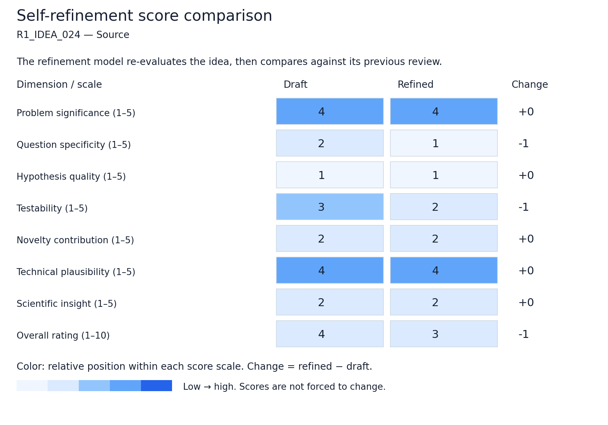

Changed score dimensions: question_specificity, testability, overall_rating.

### Score justifications (draft / refined)

**Problem significance**

```json
{
  "draft": {
    "score": 4.0,
    "justification": "Sarcasm detection is a meaningful and long-standing challenge in NLP with practical applications. The problem is well-motivated due to the need for nuanced language understanding in real-world systems."
  },
  "refined": {
    "score": 4.0,
    "justification": "Sarcasm detection is a meaningful, long-standing, and non-trivial challenge in NLP. It requires understanding context, intent, and social cues, making it a good testbed for advanced language understanding. Success has clear practical applications in sentiment analysis, social media monitoring, and conversational AI."
  }
}
```

**Question specificity**

```json
{
  "draft": {
    "score": 2.0,
    "justification": "The idea is very vague: 'explores the applications' does not define a concrete research question. It mentions GPT models and sarcasm detection but doesn't specify what relationship, mechanism, or comparison will be investigated."
  },
  "refined": {
    "score": 1.0,
    "justification": "The idea is extremely vague. It states a general topic ('explores the applications of GPT models in detecting sarcasm') but does not define a concrete research question. There is no specification of what aspect of the application will be studied, what relationship will be examined, or what comparison will be made. It lacks the necessary focus for a research investigation."
  }
}
```

**Hypothesis quality**

```json
{
  "draft": {
    "score": 1.0,
    "justification": "No hypothesis is presented, either explicit or implicit. The idea merely states an intention to explore applications without making a testable prediction about GPT models' behavior or performance on sarcasm detection."
  },
  "refined": {
    "score": 1.0,
    "justification": "No hypothesis is presented, either explicit or implicit. The text describes a motivation and a proposed tool (GPT models) but makes no testable prediction about their performance, behavior, limitations, or the mechanisms involved in sarcasm detection. It is a statement of intent, not a falsifiable claim."
  }
}
```

**Testability**

```json
{
  "draft": {
    "score": 3.0,
    "justification": "While the general direction is testable (one could evaluate GPT models on sarcasm detection tasks), the lack of a specific question or hypothesis makes it unclear what exactly would be tested. The idea suggests an application rather than a focused investigation."
  },
  "refined": {
    "score": 2.0,
    "justification": "The general direction is technically testable (one could evaluate GPTs on sarcasm datasets), but the idea as presented lacks the specificity required for a meaningful test. Without a defined question, hypothesis, or methodological scope, it is unclear *what* exactly would be tested. It suggests a broad exploration rather than a focused, falsifiable investigation."
  }
}
```

**Novelty contribution**

```json
{
  "draft": {
    "score": 2.0,
    "justification": "Applying GPT models to sarcasm detection is a straightforward application of existing models to an existing task. Without a specific novel angle (e.g., investigating why GPTs succeed, analyzing their limitations, or proposing new evaluation methods), the potential contribution is limited."
  },
  "refined": {
    "score": 2.0,
    "justification": "Applying the latest GPT models to a known NLP task is, by itself, a straightforward application with limited novelty. The potential contribution would depend entirely on the specific, yet undefined, angle of investigation. As described, it does not propose a new method, a novel evaluation, a test of a specific hypothesis about model capabilities, or an analysis of a previously unknown phenomenon."
  }
}
```

**Technical plausibility**

```json
{
  "draft": {
    "score": 4.0,
    "justification": "The general direction is technically plausible: GPT models have strong language understanding capabilities and could potentially perform well on sarcasm detection. The reasoning is coherent, though lacking in specifics."
  },
  "refined": {
    "score": 4.0,
    "justification": "The general direction is technically plausible and coherent. GPT models are powerful language models, and it is reasonable to hypothesize they could perform well on sarcasm detection. The core challenge is correctly identified. No technical flaws are apparent in the high-level description."
  }
}
```

**Scientific insight**

```json
{
  "draft": {
    "score": 2.0,
    "justification": "As currently described, the idea seems focused on application rather than insight. Without a specific research question, it's unclear what would be learned beyond performance numbers. A well-designed study could yield insights about LLMs' pragmatic reasoning, but the current description doesn't suggest such an investigation."
  },
  "refined": {
    "score": 2.0,
    "justification": "As described, the idea seems primarily application-focused. Without a specific research question aimed at understanding a mechanism, relationship, or boundary condition, the potential for transferable scientific insight is low. It risks merely reporting that 'GPT-4 gets an accuracy of X on dataset Y.' A refined version could offer insight into LLMs' pragmatic reasoning, but the current description does not suggest such an aim."
  }
}
```

**Overall rating**

```json
{
  "draft": {
    "score": 4.0,
    "justification": "The idea addresses a meaningful problem but lacks specificity, a testable hypothesis, and a clear research question. It reads more like a project description than a research investigation. With substantial refinement to define a specific question and hypothesis, it could become a stronger research direction."
  },
  "refined": {
    "score": 3.0,
    "justification": "The idea identifies a meaningful problem and a plausible tool but is critically lacking as a research idea. It fails to define a specific research question, presents no hypothesis, and offers no clear methodological direction. Consequently, its testability, novelty, and potential for scientific insight are very low. It reads as a vague project topic rather than a research investigation. Significant refinement is needed to transform it into a testable research direction."
  }
}
```

## R1_IDEA_024 — Variant 1: A1_Identity


Changed score dimensions: none.

### Score justifications (draft / refined)

**Problem significance**

```json
{
  "draft": {
    "score": 4.0,
    "justification": "Sarcasm detection is a meaningful and long-standing challenge in NLP with clear practical applications. The difficulty stems from nuanced social and contextual understanding, making it a good testbed for advanced language models."
  },
  "refined": {
    "score": 4.0,
    "justification": "Sarcasm detection is a meaningful and non-trivial problem in NLP. It serves as a proxy for testing deeper language understanding, involving pragmatics, context, and world knowledge, which aligns with core challenges in the field."
  }
}
```

**Question specificity**

```json
{
  "draft": {
    "score": 1.0,
    "justification": "Extremely vague. The idea only states it will 'explore the applications' without defining a concrete question, comparison, or phenomenon to investigate."
  },
  "refined": {
    "score": 1.0,
    "justification": "Exceptionally low. The phrase 'explores the applications' provides no concrete question. It does not specify what is being compared, measured, or analyzed. The idea is a topic area, not a research question."
  }
}
```

**Hypothesis quality**

```json
{
  "draft": {
    "score": 1.0,
    "justification": "No hypothesis is presented, implicit or explicit. The idea is purely exploratory without a predictive statement or proposed mechanism."
  },
  "refined": {
    "score": 1.0,
    "justification": "There is no hypothesis, implicit or explicit. The text describes a task and a tool but makes no predictive statement about their interaction, expected outcome, or underlying mechanism."
  }
}
```

**Testability**

```json
{
  "draft": {
    "score": 2.0,
    "justification": "While one could test GPT models on sarcasm detection benchmarks, the idea as stated does not specify what would be tested or compared. 'Exploring applications' is not a falsifiable or clearly testable claim."
  },
  "refined": {
    "score": 2.0,
    "justification": "While one could technically run GPT models on sarcasm datasets, the idea as stated does not define a testable claim. 'Exploration' is not a specific, falsifiable proposition. It earns a 2 (not a 1) only because the general activity of evaluating models on a task is inherently testable in a broad sense."
  }
}
```

**Novelty contribution**

```json
{
  "draft": {
    "score": 2.0,
    "justification": "Applying the latest GPT models to a standard NLP task is a straightforward application, not a novel research contribution by itself. The idea does not propose a new method, a new insight, or a new theoretical angle."
  },
  "refined": {
    "score": 2.0,
    "justification": "Applying the latest general-purpose LLMs to a well-known NLP task is a routine application, not a novel research contribution. The idea does not propose a new method, a new theoretical angle, or a novel analysis of model capabilities."
  }
}
```

**Technical plausibility**

```json
{
  "draft": {
    "score": 4.0,
    "justification": "The general direction is technically plausible. GPT models have strong language understanding capabilities, and testing them on sarcasm detection is a reasonable experiment. No technical flaws are apparent in the brief description."
  },
  "refined": {
    "score": 4.0,
    "justification": "The general approach is technically sound and plausible. GPT models are capable of complex language tasks, and evaluating them on sarcasm detection is a coherent experiment. No technical incoherence is apparent in the brief description."
  }
}
```

**Scientific insight**

```json
{
  "draft": {
    "score": 2.0,
    "justification": "As presented, the idea is primarily about application/benchmarking. It does not propose to uncover new mechanisms, principles, or limitations. The potential insight is limited to performance numbers without a framework for understanding why."
  },
  "refined": {
    "score": 2.0,
    "justification": "As presented, the potential insight is minimal. The idea suggests a performance evaluation, which typically yields task-specific results rather than generalizable knowledge about model behavior, linguistic phenomena, or learning principles."
  }
}
```

**Overall rating**

```json
{
  "draft": {
    "score": 3.0,
    "justification": "Weak research idea. While the problem (sarcasm detection) is significant, the proposed direction is overly vague ('explore applications'), lacks a specific research question or hypothesis, and offers minimal novelty or potential for scientific insight beyond straightforward benchmarking. It reads more like a project description than a research investigation."
  },
  "refined": {
    "score": 3.0,
    "justification": "Weak research idea. It identifies a significant problem and a plausible tool but fails to articulate a specific research question, hypothesis, or investigative angle. The proposal is overly vague ('explore applications'), offering little novelty and limited potential for scientific insight beyond basic benchmarking. It is more akin to a project idea than a focused research investigation."
  }
}
```

## R1_IDEA_024 — Variant 2: A2_Paraphrase_Only

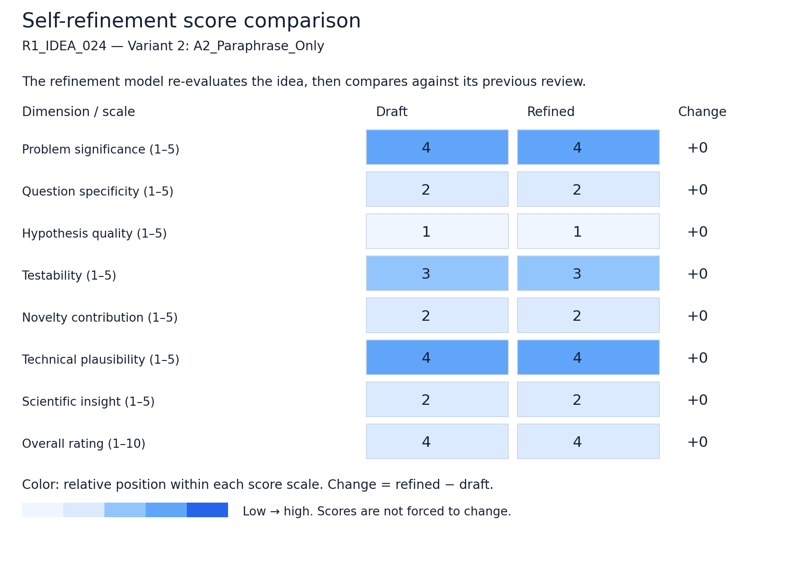

Changed score dimensions: none.

### Score justifications (draft / refined)

**Problem significance**

```json
{
  "draft": {
    "score": 4.0,
    "justification": "Sarcasm detection is a meaningful and non-trivial NLP problem with implications for sentiment analysis, social computing, and AI safety. The difficulty due to contextual and social nuance is well-motivated."
  },
  "refined": {
    "score": 4.0,
    "justification": "Sarcasm detection is a meaningful and non-trivial NLP problem with clear implications for sentiment analysis, social computing, and conversational AI. The difficulty due to contextual and social nuance is well-motivated and represents a persistent challenge in the field."
  }
}
```

**Question specificity**

```json
{
  "draft": {
    "score": 2.0,
    "justification": "The idea is very broad. It states an intention to 'investigate how... GPT models can be applied' without specifying the nature of the investigation, the experimental setup, or the precise aspect of model capability being tested."
  },
  "refined": {
    "score": 2.0,
    "justification": "The idea is very broad and vague. It states an intention to 'investigate how... GPT models can be applied' without specifying the nature of the investigation, the experimental setup, or the precise aspect of model capability being tested. No concrete research question is articulated."
  }
}
```

**Hypothesis quality**

```json
{
  "draft": {
    "score": 1.0,
    "justification": "There is no explicit or clearly implicit hypothesis. The idea merely suggests applying a class of models to a task. There is no concrete prediction about outcomes, mechanisms, or relationships that could be falsified."
  },
  "refined": {
    "score": 1.0,
    "justification": "There is no explicit or clearly implicit hypothesis. The idea merely suggests applying a class of models to a task without making any concrete prediction about outcomes, mechanisms, or relationships that could be falsified. It lacks the essential elements of a scientific hypothesis."
  }
}
```

**Testability**

```json
{
  "draft": {
    "score": 3.0,
    "justification": "The general direction is testable (one can run GPTs on sarcasm datasets), but the lack of a specific question or comparison makes it unclear what constitutes a meaningful test. It defaults to a performance benchmark, which is a basic form of testability."
  },
  "refined": {
    "score": 3.0,
    "justification": "The general direction is testable in the basic sense that one can run GPT models on sarcasm datasets and measure performance. However, without a specific question or comparison framework, it's unclear what constitutes a meaningful test beyond basic benchmarking."
  }
}
```

**Novelty contribution**

```json
{
  "draft": {
    "score": 2.0,
    "justification": "Applying the latest GPT models to a known task is, by itself, a low-novelty contribution. It could become novel if paired with a discovery about model capabilities or a novel methodological angle, but none is proposed."
  },
  "refined": {
    "score": 2.0,
    "justification": "Applying the latest GPT models to a known task like sarcasm detection is, by itself, a low-novelty contribution. This approach has become commonplace in NLP. The idea could become novel if paired with a discovery about model capabilities or a novel methodological angle, but none is proposed."
  }
}
```

**Technical plausibility**

```json
{
  "draft": {
    "score": 4.0,
    "justification": "The direction is technically plausible. GPT models are strong language models and are reasonable candidates for a complex language understanding task like sarcasm detection. No obvious technical flaws are present in the brief description."
  },
  "refined": {
    "score": 4.0,
    "justification": "The direction is technically plausible. GPT models are strong language models and are reasonable candidates for a complex language understanding task like sarcasm detection. No obvious technical flaws are present in the brief description, and the approach aligns with current NLP practices."
  }
}
```

**Scientific insight**

```json
{
  "draft": {
    "score": 2.0,
    "justification": "As stated, the idea is likely to yield a performance result (e.g., GPT-4 gets X% accuracy). Without a focused question or planned analysis, it offers little potential to reveal new insights about sarcasm, language model reasoning, or the limitations of current approaches."
  },
  "refined": {
    "score": 2.0,
    "justification": "As stated, the idea is likely to yield only performance results (e.g., GPT-4 achieves X% accuracy). Without a focused question or planned analysis, it offers little potential to reveal new insights about sarcasm, language model reasoning, or the limitations of current approaches. It lacks mechanisms for generating transferable knowledge."
  }
}
```

**Overall rating**

```json
{
  "draft": {
    "score": 4.0,
    "justification": "This is a weak research idea in its current form. While it addresses a significant problem, it lacks a specific research question, a testable hypothesis, and novelty. It reads as a generic application of a popular model family to a known task, with no clear scientific objective beyond measuring performance. It falls in the 3-4 range (weak idea) due to its vagueness and low potential for contribution."
  },
  "refined": {
    "score": 4.0,
    "justification": "This is a weak research idea in its current form. While it addresses a significant problem and is technically plausible, it lacks a specific research question, a testable hypothesis, novelty, and potential for scientific insight. It reads as a generic application of popular models to a known task without clear scientific objectives beyond performance measurement. It falls in the 3-4 range (weak idea) due to its vagueness and low potential for meaningful contribution."
  }
}
```

## R1_IDEA_024 — Variant 3: A3_Plain_Core


Changed score dimensions: none.

### Score justifications (draft / refined)

**Problem significance**

```json
{
  "draft": {
    "score": 4.0,
    "justification": "Sarcasm detection is a meaningful NLP challenge with practical applications in sentiment analysis, social media monitoring, and human-computer interaction. The contradictory nature of sarcasm makes it a non-trivial problem that requires understanding context and social cues."
  },
  "refined": {
    "score": 4.0,
    "justification": "Sarcasm detection is a meaningful and challenging NLP problem with practical applications in sentiment analysis, social media monitoring, and human-computer interaction. The contradictory nature of sarcasm and its reliance on context and social cues make it a non-trivial problem that requires sophisticated language understanding."
  }
}
```

**Question specificity**

```json
{
  "draft": {
    "score": 1.0,
    "justification": "Extremely vague - merely states it will 'examine the use' of GPT models without specifying what aspect will be examined, what question is being asked, or what relationship is being investigated."
  },
  "refined": {
    "score": 1.0,
    "justification": "Extremely vague - merely states it will 'examine the use' of GPT models without specifying what aspect will be examined, what specific question is being asked, or what relationship is being investigated. No concrete research question is presented."
  }
}
```

**Hypothesis quality**

```json
{
  "draft": {
    "score": 1.0,
    "justification": "No hypothesis is presented. The idea doesn't make any prediction about GPT models' performance, limitations, or mechanisms for sarcasm detection. It's essentially a topic statement rather than a research hypothesis."
  },
  "refined": {
    "score": 1.0,
    "justification": "No hypothesis is presented. The idea doesn't make any prediction about GPT models' performance, limitations, mechanisms, or comparative advantages for sarcasm detection. It's essentially a topic statement rather than a research hypothesis."
  }
}
```

**Testability**

```json
{
  "draft": {
    "score": 2.0,
    "justification": "While sarcasm detection is inherently testable through classification metrics, the idea doesn't propose any specific test or comparison. Without a clear question or hypothesis, it's unclear what would constitute evidence for or against the idea's claims."
  },
  "refined": {
    "score": 2.0,
    "justification": "While sarcasm detection is inherently testable through classification metrics, the idea doesn't propose any specific test, comparison, or evaluation framework. Without a clear question or hypothesis, it's unclear what would constitute evidence for or against any claim. The statement 'examines the use' is too vague to guide testable investigation."
  }
}
```

**Novelty contribution**

```json
{
  "draft": {
    "score": 2.0,
    "justification": "Applying GPT models to sarcasm detection is a straightforward application rather than a novel research contribution. Without a specific angle or question, this appears to be a standard evaluation study rather than novel scientific investigation."
  },
  "refined": {
    "score": 2.0,
    "justification": "Applying GPT models to sarcasm detection is a straightforward application rather than a novel research contribution. Without a specific angle, question, or hypothesis, this appears to be a standard evaluation study rather than novel scientific investigation. Many papers have applied LLMs to various NLP tasks including sentiment-related tasks."
  }
}
```

**Technical plausibility**

```json
{
  "draft": {
    "score": 4.0,
    "justification": "Using large language models for sarcasm detection is technically plausible given their contextual understanding capabilities. The reasoning that sarcasm requires context interpretation aligns with known strengths of transformer models."
  },
  "refined": {
    "score": 4.0,
    "justification": "Using large language models for sarcasm detection is technically plausible given their contextual understanding capabilities. The reasoning that sarcasm requires context interpretation aligns with known strengths of transformer models. GPT models have demonstrated strong performance on various language understanding tasks."
  }
}
```

**Scientific insight**

```json
{
  "draft": {
    "score": 2.0,
    "justification": "As presented, the idea offers minimal potential for scientific insight. It suggests applying existing models to a task without specifying what we might learn about sarcasm, language models, or NLP more broadly. Could potentially yield insight if framed as investigating model capabilities or limitations."
  },
  "refined": {
    "score": 2.0,
    "justification": "As presented, the idea offers minimal potential for scientific insight. It suggests applying existing models to a task without specifying what we might learn about sarcasm, language models, or NLP more broadly. Could potentially yield insight if framed as investigating specific model capabilities, limitations, or mechanisms, but no such framing is provided."
  }
}
```

**Overall rating**

```json
{
  "draft": {
    "score": 3.0,
    "justification": "This is a weak research idea as presented. While it addresses a meaningful problem, it lacks a specific research question, hypothesis, or methodological direction. It reads more like a topic description than a research proposal. The idea needs substantial refinement to become a testable scientific investigation rather than a generic application study."
  },
  "refined": {
    "score": 3.0,
    "justification": "This is a weak research idea as presented. While it addresses a meaningful problem and identifies plausible models, it lacks a specific research question, hypothesis, or methodological direction. It reads more like a topic description than a research proposal. The idea needs substantial refinement to become a testable scientific investigation rather than a generic application study. The absence of any concrete research question severely limits its scientific value."
  }
}
```

## R1_IDEA_024 — Variant 4: B1_Verbose_Elaborate


Changed score dimensions: none.

### Score justifications (draft / refined)

**Problem significance**

```json
{
  "draft": {
    "score": 4.0,
    "justification": "Sarcasm detection is a meaningful and challenging NLP problem with practical applications in sentiment analysis, social media monitoring, and human-computer interaction. The difficulty stems from genuine linguistic and cognitive complexities."
  },
  "refined": {
    "score": 4.0,
    "justification": "Sarcasm detection is a meaningful and challenging NLP problem with genuine linguistic and cognitive complexity. It has practical applications in sentiment analysis, social media monitoring, and human-computer interaction. The difficulty stems from its reliance on contextual, pragmatic, and social cues, making it a legitimate research challenge."
  }
}
```

**Question specificity**

```json
{
  "draft": {
    "score": 1.0,
    "justification": "Extremely vague. The idea merely states it will 'explore applications' without defining a concrete research question. There's no specification of what aspect of GPT models or sarcasm detection will be investigated."
  },
  "refined": {
    "score": 1.0,
    "justification": "Extremely vague. The idea merely states it will 'explore applications' without defining any concrete research question. There's no specification of what aspect of GPT models or sarcasm detection will be investigated, what relationships will be examined, or what phenomenon will be studied."
  }
}
```

**Hypothesis quality**

```json
{
  "draft": {
    "score": 1.0,
    "justification": "No hypothesis is presented. The idea implies GPT models might be useful but makes no concrete prediction about mechanisms, relationships, or expected outcomes that could be tested."
  },
  "refined": {
    "score": 1.0,
    "justification": "No hypothesis is presented. The idea implies GPT models might be useful for sarcasm detection but makes no concrete prediction about mechanisms, relationships, or expected outcomes that could be tested. There's no falsifiable claim."
  }
}
```

**Testability**

```json
{
  "draft": {
    "score": 2.0,
    "justification": "While one could benchmark GPT models on sarcasm detection datasets, the idea as stated doesn't propose a specific test or comparison. It's unclear what evidence would support or contradict the vague claim of 'exploring applications.'"
  },
  "refined": {
    "score": 2.0,
    "justification": "While one could technically benchmark GPT models on sarcasm detection datasets, the idea as stated doesn't propose a specific test, comparison, or evaluation framework. It's unclear what evidence would support or contradict the vague claim of 'exploring applications.' The direction is testable in principle but not defined enough to guide specific investigations."
  }
}
```

**Novelty contribution**

```json
{
  "draft": {
    "score": 2.0,
    "justification": "Applying GPT models to sarcasm detection is not novel in itself - this is a natural application given their capabilities. The idea lacks any novel methodological angle, theoretical insight, or unique investigation that would distinguish it from straightforward benchmarking."
  },
  "refined": {
    "score": 2.0,
    "justification": "Applying GPT models to sarcasm detection is not novel in itself - this is a natural application given their capabilities and has likely been explored. The idea lacks any novel methodological angle, theoretical insight, or unique investigation that would distinguish it from straightforward benchmarking or application studies."
  }
}
```

**Technical plausibility**

```json
{
  "draft": {
    "score": 4.0,
    "justification": "The basic premise is plausible: GPT models have demonstrated strong contextual understanding and could potentially perform well on sarcasm detection. The reasoning is logically coherent at a high level."
  },
  "refined": {
    "score": 4.0,
    "justification": "The basic premise is technically plausible: GPT models have demonstrated strong contextual understanding and pragmatic reasoning, which could potentially address some challenges of sarcasm detection. The reasoning is logically coherent at a high level, though details are missing."
  }
}
```

**Scientific insight**

```json
{
  "draft": {
    "score": 2.0,
    "justification": "As presented, the idea seems focused on application rather than insight. Without a specific research question, it's unclear what we would learn about sarcasm, language models, or the intersection beyond whether GPT models work for this task."
  },
  "refined": {
    "score": 2.0,
    "justification": "As presented, the idea seems focused on application rather than insight. Without a specific research question or hypothesis, it's unclear what we would learn about sarcasm, language models, or their intersection beyond whether GPT models work for this task. There's no indication of what general principles, mechanisms, or limitations might be revealed."
  }
}
```

**Overall rating**

```json
{
  "draft": {
    "score": 3.0,
    "justification": "Weak research idea. While addressing a meaningful problem, the idea lacks specificity, testable hypotheses, and clear scientific contribution. It reads more like a project description than a research investigation. The core issue is the absence of a concrete research question - it's essentially 'apply GPT to sarcasm detection' without articulating what scientific knowledge would be generated."
  },
  "refined": {
    "score": 3.0,
    "justification": "Weak research idea. While addressing a meaningful problem with a plausible technical approach, the idea lacks specificity, testable hypotheses, and clear scientific contribution. It reads more like a project description than a research investigation. The core issue is the absence of a concrete research question - it's essentially 'apply GPT to sarcasm detection' without articulating what scientific knowledge would be generated or what specific aspect warrants investigation."
  }
}
```

## R1_IDEA_024 — Variant 5: B2_Grand_Narrative

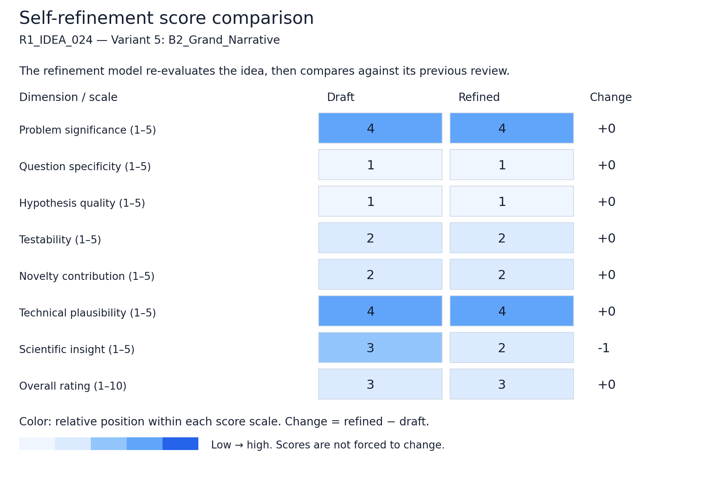

Changed score dimensions: scientific_insight.

### Score justifications (draft / refined)

**Problem significance**

```json
{
  "draft": {
    "score": 4.0,
    "justification": "Sarcasm detection is a well-recognized, difficult problem in NLP that touches on core challenges in language understanding (pragmatics, context, social reasoning). Success would have implications for sentiment analysis, dialogue systems, and broader AI social intelligence. The connection to computational pragmatics is meaningful."
  },
  "refined": {
    "score": 4.0,
    "justification": "Sarcasm detection is a well-recognized, difficult problem in NLP that touches on core challenges in language understanding (pragmatics, context, social reasoning). Success would have implications for sentiment analysis, dialogue systems, and broader AI social intelligence. The connection to computational pragmatics is meaningful and elevates the problem beyond a mere classification task."
  }
}
```

**Question specificity**

```json
{
  "draft": {
    "score": 1.0,
    "justification": "The idea does not define a concrete research question. It states a general direction ('explores the applications') without specifying what is being investigated, compared, or analyzed. It is a topic area, not a research question."
  },
  "refined": {
    "score": 1.0,
    "justification": "The idea does not define a concrete research question. It states a general direction ('explores the applications') without specifying what is being investigated, compared, or analyzed. It is a topic area, not a research question."
  }
}
```

**Hypothesis quality**

```json
{
  "draft": {
    "score": 1.0,
    "justification": "There is no explicit or implicit testable hypothesis. The text describes a potential application and motivation but makes no concrete, falsifiable prediction about the relationship between GPT models and sarcasm detection."
  },
  "refined": {
    "score": 1.0,
    "justification": "There is no explicit or implicit testable hypothesis. The text describes a potential application and motivation but makes no concrete, falsifiable prediction about the relationship between GPT models and sarcasm detection. It lacks any statement that could be supported or contradicted by evidence."
  }
}
```

**Testability**

```json
{
  "draft": {
    "score": 2.0,
    "justification": "While the general topic is testable (one can evaluate GPT models on sarcasm detection tasks), the idea as presented lacks any specified method of investigation. It mentions 'explores the applications' but gives no indication of how this exploration would be conducted, what evidence would be gathered, or what would constitute a result. The core claim is too vague to be directly tested."
  },
  "refined": {
    "score": 2.0,
    "justification": "While the general topic is testable (one can evaluate GPT models on sarcasm detection tasks), the idea as presented lacks any specified method of investigation. It mentions 'explores the applications' but gives no indication of how this exploration would be conducted, what evidence would be gathered, or what would constitute a result. The core claim is too vague to be directly tested without substantial additional specification."
  }
}
```

**Novelty contribution**

```json
{
  "draft": {
    "score": 2.0,
    "justification": "Applying the latest large language models to a standard NLP task is a common and often incremental approach. Without a specific angle (e.g., a novel probing methodology, a focus on a previously unexplored aspect of sarcasm, or a hypothesis-driven investigation of model capabilities), the potential contribution is primarily as an application benchmark, which has limited novelty."
  },
  "refined": {
    "score": 2.0,
    "justification": "Applying the latest large language models to a standard NLP task is a common and often incremental approach. Without a specific angle (e.g., a novel probing methodology, a focus on a previously unexplored aspect of sarcasm, or a hypothesis-driven investigation of model capabilities), the potential contribution is primarily as an application benchmark, which has limited novelty. The idea does not articulate what new scientific knowledge would be generated."
  }
}
```

**Technical plausibility**

```json
{
  "draft": {
    "score": 4.0,
    "justification": "The core reasoning is logically coherent: GPT models are powerful language models, sarcasm detection is a language understanding task, therefore it is plausible to investigate their performance on it. No technically implausible assumptions are made."
  },
  "refined": {
    "score": 4.0,
    "justification": "The core reasoning is logically coherent: GPT models are powerful language models, sarcasm detection is a language understanding task, therefore it is plausible to investigate their performance on it. No technically implausible assumptions are made. The idea is grounded in reasonable expectations about model capabilities."
  }
}
```

**Scientific insight**

```json
{
  "draft": {
    "score": 3.0,
    "justification": "The idea gestures toward potential insight ('informing long-term challenges in building socially-aware AI systems'), but it is not linked to a specific investigable mechanism. If framed as a probe for pragmatic reasoning in LLMs, it could yield high insight. As presented, the insight is generic and the connection between the task and the broader goal is not articulated."
  },
  "refined": {
    "score": 2.0,
    "justification": "The idea gestures toward potential insight ('informing long-term challenges in building socially-aware AI systems'), but it is not linked to a specific investigable mechanism. As presented, the insight is generic and the connection between the task and the broader goal is not articulated. Without a clear hypothesis or research question, the potential for transferable scientific insight is low."
  }
}
```

**Overall rating**

```json
{
  "draft": {
    "score": 3.0,
    "justification": "This is a weak research idea in its current form. It identifies a significant problem (sarcasm detection) and a relevant tool (GPT models), but it fails to articulate a specific research question, hypothesis, or methodological direction. It reads as a motivation or background section for a study, not as the core idea itself. The potential for scientific contribution is low without substantial refinement to define what exactly is being investigated and why the results would be informative beyond a performance number."
  },
  "refined": {
    "score": 3.0,
    "justification": "This is a weak research idea in its current form. It identifies a significant problem (sarcasm detection) and a relevant tool (GPT models), but it fails to articulate a specific research question, hypothesis, or methodological direction. It reads as a motivation or background section for a study, not as the core idea itself. The potential for scientific contribution is low without substantial refinement to define what exactly is being investigated and why the results would be informative beyond a performance number. The lack of specificity and testable hypothesis severely limits its scientific value."
  }
}
```

## R1_IDEA_024 — Variant 6: B3_Over_Confident


Changed score dimensions: none.

### Score justifications (draft / refined)

**Problem significance**

```json
{
  "draft": {
    "score": 4.0,
    "justification": "Sarcasm detection is a meaningful NLP challenge with practical applications in sentiment analysis, social media monitoring, and human-computer interaction. The recognition of sarcasm's social complexity and contextual nature shows understanding of the problem's difficulty."
  },
  "refined": {
    "score": 4.0,
    "justification": "Sarcasm detection is a meaningful and challenging NLP problem with practical applications in sentiment analysis, social media monitoring, and human-computer interaction. The recognition of sarcasm's social complexity and contradictory nature shows understanding of the problem's difficulty and importance."
  }
}
```

**Question specificity**

```json
{
  "draft": {
    "score": 1.0,
    "justification": "Extremely vague - merely states the paper will 'explore applications' of GPT models without specifying what aspect to explore, what question to answer, or what relationship to investigate. No concrete research question is articulated."
  },
  "refined": {
    "score": 1.0,
    "justification": "Extremely vague - merely states the paper will 'explore applications' of GPT models without specifying what aspect to explore, what question to answer, or what relationship to investigate. No concrete research question is articulated beyond the broad task of sarcasm detection."
  }
}
```

**Hypothesis quality**

```json
{
  "draft": {
    "score": 1.0,
    "justification": "No hypothesis is presented, implicit or explicit. The idea merely states an intention to apply GPT models to sarcasm detection without making any testable prediction about why they might work, how they might differ from other approaches, or what specific capabilities might be relevant."
  },
  "refined": {
    "score": 1.0,
    "justification": "No hypothesis is presented, implicit or explicit. The idea merely states an intention to apply GPT models to sarcasm detection without making any testable prediction about why they might work, how they might differ from other approaches, or what specific capabilities might be relevant. There's no falsifiable claim."
  }
}
```

**Testability**

```json
{
  "draft": {
    "score": 2.0,
    "justification": "While one could test GPT models on sarcasm detection benchmarks, the idea lacks a specific claim or question to test. Without a hypothesis, it's unclear what evidence would support or contradict the 'exploration.' The idea is testable only in the trivial sense that one can run experiments."
  },
  "refined": {
    "score": 2.0,
    "justification": "While one could test GPT models on sarcasm detection benchmarks, the idea lacks a specific claim or question to test. Without a hypothesis, it's unclear what evidence would support or contradict the 'exploration.' The idea is testable only in the trivial sense that one can run experiments and report results, but there's no framework for what would constitute meaningful findings."
  }
}
```

**Novelty contribution**

```json
{
  "draft": {
    "score": 2.0,
    "justification": "Applying GPT models to sarcasm detection is not inherently novel - large language models have been applied to numerous NLP tasks. Without a specific research angle, the contribution would likely be limited to reporting performance numbers on existing benchmarks."
  },
  "refined": {
    "score": 2.0,
    "justification": "Applying GPT models to sarcasm detection is not inherently novel - large language models have been applied to numerous NLP tasks including sentiment analysis and figurative language understanding. Without a specific research angle, hypothesis, or analysis plan, the contribution would likely be limited to reporting performance numbers on existing benchmarks, which has limited scientific value."
  }
}
```

**Technical plausibility**

```json
{
  "draft": {
    "score": 4.0,
    "justification": "The basic premise is plausible - GPT models have strong contextual understanding capabilities that could potentially help with sarcasm detection. The reasoning that sarcasm requires context interpretation aligns with known GPT capabilities."
  },
  "refined": {
    "score": 4.0,
    "justification": "The basic premise is technically plausible - GPT models have strong contextual understanding capabilities that could potentially help with sarcasm detection. The reasoning that sarcasm requires context interpretation aligns with known GPT capabilities. The approach of using large language models for this task is reasonable given their demonstrated performance on related NLP tasks."
  }
}
```

**Scientific insight**

```json
{
  "draft": {
    "score": 2.0,
    "justification": "As presented, the idea offers little potential for scientific insight beyond whether GPT models perform well on sarcasm detection. Without a specific research question, it's unlikely to reveal mechanisms, principles, or boundary conditions related to sarcasm understanding in LLMs."
  },
  "refined": {
    "score": 2.0,
    "justification": "As presented, the idea offers little potential for scientific insight beyond whether GPT models perform well on sarcasm detection. Without a specific research question or hypothesis, it's unlikely to reveal mechanisms, principles, or boundary conditions related to sarcasm understanding in LLMs. The idea lacks a framework for generating transferable knowledge about how LLMs handle pragmatic language phenomena."
  }
}
```

**Overall rating**

```json
{
  "draft": {
    "score": 3.0,
    "justification": "Weak research idea. While addressing a meaningful problem, the idea lacks a concrete research question, hypothesis, or specific direction for investigation. It essentially proposes applying existing models to a task without articulating what scientific knowledge would be gained. The contribution would likely be limited to application results without deeper insight."
  },
  "refined": {
    "score": 3.0,
    "justification": "Weak research idea. While addressing a meaningful problem and being technically plausible, the idea lacks a concrete research question, hypothesis, or specific direction for investigation. It essentially proposes applying existing models to a task without articulating what scientific knowledge would be gained. The contribution would likely be limited to application results without deeper insight into mechanisms or principles. The idea needs substantial refinement to become a meaningful scientific investigation."
  }
}
```

## R1_IDEA_024 — Variant 7: B4_Novelty

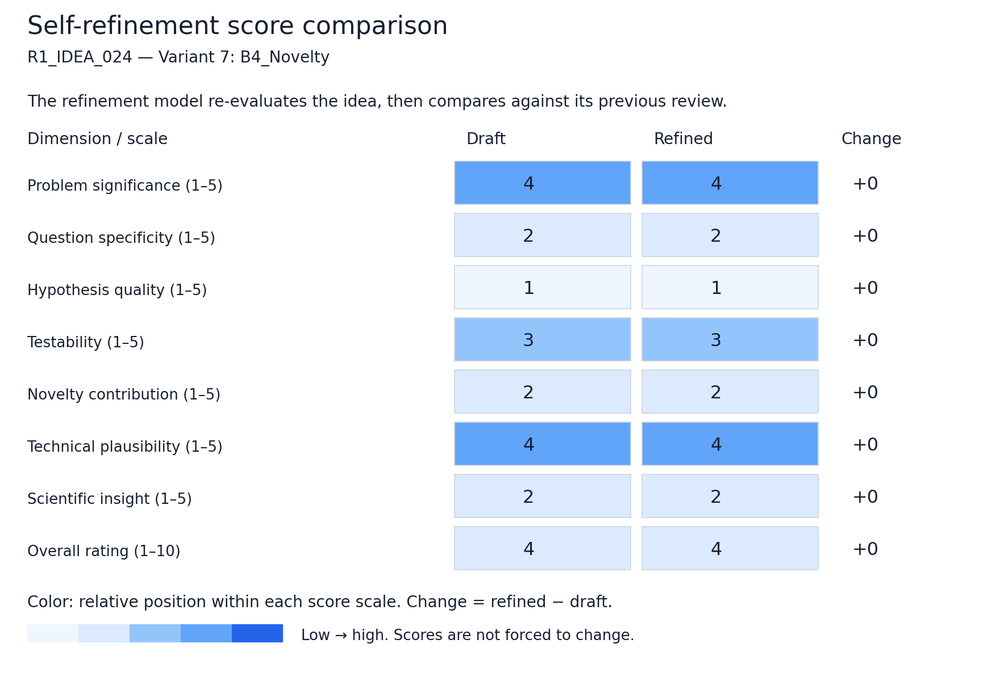

Changed score dimensions: none.

### Score justifications (draft / refined)

**Problem significance**

```json
{
  "draft": {
    "score": 4.0,
    "justification": "Sarcasm detection is a meaningful and challenging NLP problem with practical applications in sentiment analysis, social media monitoring, and human-computer interaction. The framing of sarcasm as requiring context and social cue interpretation is appropriate and highlights why it's difficult."
  },
  "refined": {
    "score": 4.0,
    "justification": "Sarcasm detection is a meaningful and challenging NLP problem with practical applications in sentiment analysis, social media monitoring, and human-computer interaction. The framing of sarcasm as requiring context and social cue interpretation is appropriate and highlights why it's difficult, making the problem significant."
  }
}
```

**Question specificity**

```json
{
  "draft": {
    "score": 2.0,
    "justification": "The idea is very vague - it essentially states 'exploring GPT for sarcasm detection' without specifying what aspect is being investigated. There's no concrete research question about mechanisms, capabilities, or limitations."
  },
  "refined": {
    "score": 2.0,
    "justification": "The idea is very vague - it essentially states 'exploring GPT for sarcasm detection' and 'investigates this underexplored angle' without specifying what aspect is being investigated. There's no concrete research question about mechanisms, capabilities, or limitations. The description lacks the specificity needed for a focused research investigation."
  }
}
```

**Hypothesis quality**

```json
{
  "draft": {
    "score": 1.0,
    "justification": "No hypothesis is presented. The idea describes an application direction rather than making a testable prediction about GPT models' behavior, capabilities, or limitations for sarcasm detection."
  },
  "refined": {
    "score": 1.0,
    "justification": "No hypothesis is presented. The idea describes an application direction ('exploring the applications of Generative Pretrained Transformer models') rather than making a testable prediction about GPT models' behavior, capabilities, or limitations for sarcasm detection. There is no explicit or implicit hypothesis that could be supported or contradicted by evidence."
  }
}
```

**Testability**

```json
{
  "draft": {
    "score": 3.0,
    "justification": "The general direction is testable (one could benchmark GPT models on sarcasm detection tasks), but without a specific hypothesis or research question, it's unclear what would constitute a meaningful test beyond performance measurement."
  },
  "refined": {
    "score": 3.0,
    "justification": "The general direction is testable (one could benchmark GPT models on sarcasm detection tasks), but without a specific hypothesis or research question, it's unclear what would constitute a meaningful test beyond performance measurement. The idea suggests investigation but doesn't specify what evidence would be gathered or how it would address a specific question."
  }
}
```

**Novelty contribution**

```json
{
  "draft": {
    "score": 2.0,
    "justification": "Applying GPT models to sarcasm detection is a natural application rather than a novel research direction. The idea doesn't propose investigating a new phenomenon, testing a specific hypothesis about model capabilities, or discovering boundary conditions."
  },
  "refined": {
    "score": 2.0,
    "justification": "Applying GPT models to sarcasm detection is a natural application rather than a novel research direction. The idea doesn't propose investigating a new phenomenon, testing a specific hypothesis about model capabilities, or discovering boundary conditions. While it mentions 'novel perspective' and 'fresh framing,' these are not substantiated with specific novel angles of investigation."
  }
}
```

**Technical plausibility**

```json
{
  "draft": {
    "score": 4.0,
    "justification": "The technical direction is plausible - GPT models have strong language understanding capabilities and should be applicable to sarcasm detection. The reasoning that sarcasm requires context interpretation aligns with GPT models' strengths."
  },
  "refined": {
    "score": 4.0,
    "justification": "The technical direction is plausible - GPT models have strong language understanding capabilities and should be applicable to sarcasm detection. The reasoning that sarcasm requires context interpretation aligns with GPT models' strengths. The selection of specific GPT variants (GPT-3, InstructGPT, GPT-3.5, GPT-4) suggests a reasonable comparative approach."
  }
}
```

**Scientific insight**

```json
{
  "draft": {
    "score": 2.0,
    "justification": "As presented, the idea seems like a straightforward application rather than a study designed to yield scientific insight. Without a specific research question, it's unclear what would be learned beyond whether GPT models perform well on sarcasm detection."
  },
  "refined": {
    "score": 2.0,
    "justification": "As presented, the idea seems like a straightforward application rather than a study designed to yield scientific insight. Without a specific research question, it's unclear what would be learned beyond whether GPT models perform well on sarcasm detection. There's no indication of what mechanisms, principles, or limitations might be revealed through this investigation."
  }
}
```

**Overall rating**

```json
{
  "draft": {
    "score": 4.0,
    "justification": "The idea identifies a meaningful problem but lacks specificity, hypothesis, and clear research question. It reads more like a general application direction than a focused research investigation. While technically plausible, it offers limited potential for scientific insight in its current form."
  },
  "refined": {
    "score": 4.0,
    "justification": "The idea identifies a meaningful problem but lacks specificity, hypothesis, and clear research question. It reads more like a general application direction than a focused research investigation. While technically plausible, it offers limited potential for scientific insight in its current form. The absence of a testable hypothesis and specific research question significantly limits the scientific value of the proposed direction."
  }
}
```

## R1_IDEA_024 — Variant 8: B5_Application_Impact


Changed score dimensions: question_specificity, overall_rating.

### Score justifications (draft / refined)

**Problem significance**

```json
{
  "draft": {
    "score": 4.0,
    "justification": "Sarcasm detection is a recognized hard problem in NLP due to its reliance on pragmatics and world knowledge. Improving it could enhance conversational AI and sentiment analysis systems. The problem is meaningful, though not entirely new."
  },
  "refined": {
    "score": 4.0,
    "justification": "Sarcasm detection is a recognized, non-trivial challenge in NLP and computational pragmatics. Successfully addressing it is important for building more nuanced and robust conversational AI and sentiment analysis systems. The problem is meaningful and has clear relevance."
  }
}
```

**Question specificity**

```json
{
  "draft": {
    "score": 2.0,
    "justification": "The idea only states it will 'explore the applications' of GPT models for sarcasm detection. It does not define a concrete research question, comparison, or phenomenon to investigate."
  },
  "refined": {
    "score": 1.0,
    "justification": "The idea lacks a defined research question. The phrase 'explores the applications' is a broad placeholder that does not specify what is being investigated, compared, or analyzed. There is no concrete phenomenon or relationship identified for study."
  }
}
```

**Hypothesis quality**

```json
{
  "draft": {
    "score": 1.0,
    "justification": "No hypothesis is presented. The idea merely suggests GPT models could be applied, without predicting an outcome, mechanism, or relationship that could be tested."
  },
  "refined": {
    "score": 1.0,
    "justification": "No hypothesis is present, either explicit or implicit. The text does not make a testable prediction, propose a mechanism, or suggest a relationship to be examined. It merely states a topic of interest."
  }
}
```

**Testability**

```json
{
  "draft": {
    "score": 2.0,
    "justification": "While one could test GPT performance on sarcasm datasets, the idea itself does not propose what to test or how. It lacks a clear claim that can be supported or contradicted."
  },
  "refined": {
    "score": 2.0,
    "justification": "While one could design tests (e.g., benchmark GPT models on sarcasm datasets), the idea itself does not propose what to test. There is no central claim or question that guides what evidence should be gathered. The testability is latent in the general topic but not articulated in the idea."
  }
}
```

**Novelty contribution**

```json
{
  "draft": {
    "score": 2.0,
    "justification": "Applying GPT models to sarcasm detection is a straightforward application of existing models to an existing task. Without a specific angle (e.g., analyzing why they succeed/fail, improving them for sarcasm), the potential novel contribution is low."
  },
  "refined": {
    "score": 2.0,
    "justification": "Applying the latest GPT models to a standard NLP task like sarcasm detection is a straightforward application. Without a specific investigative angle—such as probing failure modes, analyzing the effect of scaling, or uncovering new limitations—the potential for a novel scientific contribution is minimal. It risks being a routine performance report."
  }
}
```

**Technical plausibility**

```json
{
  "draft": {
    "score": 4.0,
    "justification": "Using GPT models for sarcasm detection is technically plausible given their strong language understanding. The reasoning is coherent, though no technical details are provided."
  },
  "refined": {
    "score": 4.0,
    "justification": "The core premise is technically sound. Using large language models with strong contextual understanding for a context-dependent task like sarcasm detection is a coherent and plausible direction. No technical contradictions or unreasonable assumptions are present in the brief description."
  }
}
```

**Scientific insight**

```json
{
  "draft": {
    "score": 2.0,
    "justification": "As stated, the idea is primarily an application. It does not suggest studying underlying mechanisms, model limitations, or general principles about sarcasm understanding in LLMs. Insight would be limited to performance numbers unless the exploration is deepened."
  },
  "refined": {
    "score": 2.0,
    "justification": "As presented, the idea is an application sketch. It does not suggest a study designed to yield general insights into model mechanisms, the nature of sarcasm, scaling laws, or transferable principles. The potential insight is limited to task-specific performance outcomes unless the scope is significantly refined."
  }
}
```

**Overall rating**

```json
{
  "draft": {
    "score": 4.0,
    "justification": "The idea identifies a meaningful problem but lacks a specific research question, hypothesis, or methodological direction. It reads as a broad motivation rather than a research plan. Without greater specificity, its scientific contribution potential is low. It falls in the weak-to-moderate range because it does not articulate what will be learned beyond applying GPTs to a known task."
  },
  "refined": {
    "score": 3.0,
    "justification": "The idea identifies a significant problem and a plausible tool but fails to articulate a research question, hypothesis, or methodological direction. It remains a vague motivation statement rather than a research idea. Consequently, its potential for meaningful scientific contribution is low. It falls into the weak category (scores 3-4) due to the lack of specificity and testable intellectual core."
  }
}
```

## R1_IDEA_024 — Variant 9: C1_Hollow_Shell

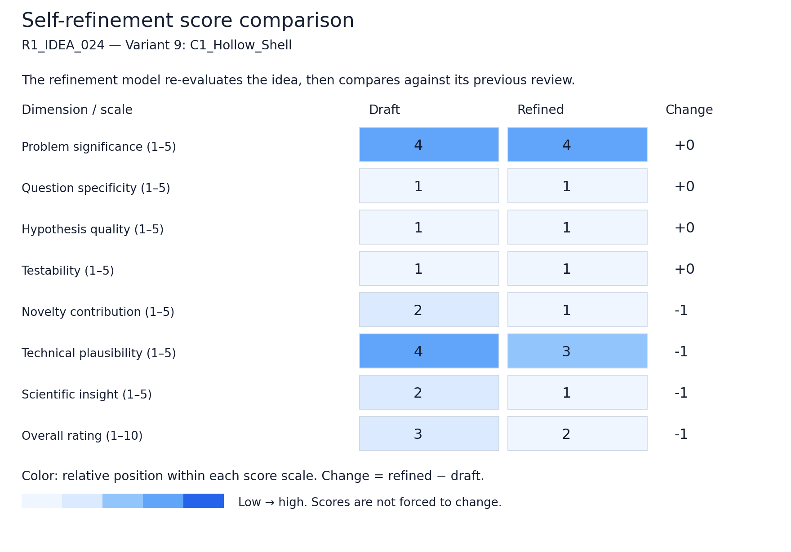

Changed score dimensions: novelty_contribution, technical_plausibility, scientific_insight, overall_rating.

### Score justifications (draft / refined)

**Problem significance**

```json
{
  "draft": {
    "score": 4.0,
    "justification": "Sarcasm detection is a recognized and meaningful challenge in NLP, crucial for sentiment analysis, dialogue systems, and deeper language understanding. Its reliance on context and pragmatics makes it a good testbed for advanced models."
  },
  "refined": {
    "score": 4.0,
    "justification": "Sarcasm detection is a meaningful and recognized challenge in NLP, important for sentiment analysis, dialogue systems, and deeper language understanding. Its reliance on context and pragmatics makes it a valid testbed for advanced models."
  }
}
```

**Question specificity**

```json
{
  "draft": {
    "score": 1.0,
    "justification": "The idea is extremely vague. It states only a general topic (sarcasm detection) and a tool (advanced language models). It does not define a concrete question about mechanisms, limitations, comparisons, or improvements."
  },
  "refined": {
    "score": 1.0,
    "justification": "The idea is extremely vague. It states only a general topic (sarcasm detection) and a tool category (advanced language models). It does not define any concrete question about mechanisms, limitations, comparisons, or specific improvements."
  }
}
```

**Hypothesis quality**

```json
{
  "draft": {
    "score": 1.0,
    "justification": "There is no discernible hypothesis. The text describes a motivation and a general direction ('examines a method'), but makes no concrete, testable prediction about an outcome or relationship."
  },
  "refined": {
    "score": 1.0,
    "justification": "There is no discernible hypothesis. The text describes a motivation and a general direction ('examines a method') but makes no concrete, testable prediction about an outcome, relationship, or mechanism."
  }
}
```

**Testability**

```json
{
  "draft": {
    "score": 1.0,
    "justification": "In its current form, the idea is not testable. It proposes to 'examine' but suggests no experiment, evaluation, or comparison that could provide evidence for or against a claim. It is a statement of intent, not a research plan."
  },
  "refined": {
    "score": 1.0,
    "justification": "In its current form, the idea is not testable. It proposes to 'examine' but suggests no experiment, evaluation, comparison, or method of obtaining evidence that could support or refute any claim. It is merely a statement of intent."
  }
}
```

**Novelty contribution**

```json
{
  "draft": {
    "score": 2.0,
    "justification": "The core suggestion—using advanced language models for sarcasm detection—is not novel. Many papers have applied LLMs to this task. The potential contribution is entirely dependent on unspecified methodological or analytical innovations."
  },
  "refined": {
    "score": 1.0,
    "justification": "The core suggestion—using advanced language models for sarcasm detection—lacks novelty. Numerous existing works have applied LLMs to this task. Without any specified methodological innovation, analytical focus, or unique perspective, the potential contribution is minimal."
  }
}
```

**Technical plausibility**

```json
{
  "draft": {
    "score": 4.0,
    "justification": "The general direction is technically plausible. Using advanced language models is a reasonable approach for a context-dependent task like sarcasm detection. The reasoning is logically coherent at a high level."
  },
  "refined": {
    "score": 3.0,
    "justification": "The general direction is technically plausible at a high level—using advanced language models for a context-dependent language task is reasonable. However, the complete lack of methodological detail prevents a higher score, as there's nothing to assess regarding the coherence or feasibility of a specific approach."
  }
}
```

**Scientific insight**

```json
{
  "draft": {
    "score": 2.0,
    "justification": "The idea as stated promises little scientific insight. It frames the work as applying a tool to a problem. Without a specific question about model behavior, failure modes, or theoretical understanding, the potential insight is limited to a performance benchmark."
  },
  "refined": {
    "score": 1.0,
    "justification": "The idea as stated promises virtually no scientific insight. It frames the work as applying an existing tool to a known problem. Without a specific question about model behavior, failure modes, theoretical understanding, or general principles, the potential insight is limited to an unspecified performance outcome."
  }
}
```

**Overall rating**

```json
{
  "draft": {
    "score": 3.0,
    "justification": "This is a weak research idea. While it identifies a significant problem and a plausible tool, it fails to define a specific research question, hypothesis, or testable claim. It reads as a generic motivation statement rather than a concrete research direction. The lack of specificity severely limits its potential scientific contribution."
  },
  "refined": {
    "score": 2.0,
    "justification": "This is a very weak research idea. While it identifies a significant problem, it completely fails to define a research question, hypothesis, or testable claim. It reads as a generic topic sentence or motivation paragraph rather than a concrete research direction. The absence of any specificity, novelty, or methodological direction severely limits its scientific value."
  }
}
```

## R1_IDEA_024 — Variant 10: C2_Logic_Flawed

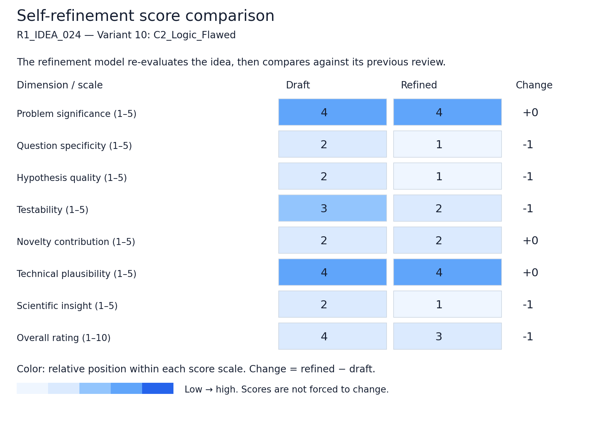

Changed score dimensions: question_specificity, hypothesis_quality, testability, scientific_insight, overall_rating.

### Score justifications (draft / refined)

**Problem significance**

```json
{
  "draft": {
    "score": 4.0,
    "justification": "Sarcasm detection is a well-known, challenging problem in NLP that touches on deeper issues of pragmatics, social reasoning, and contextual understanding. Success here could have implications for many real-world applications (sentiment analysis, social media monitoring, conversational AI)."
  },
  "refined": {
    "score": 4.0,
    "justification": "Sarcasm detection is a meaningful and long-standing challenge in NLP that requires pragmatic and social reasoning. Improving it has real-world relevance for sentiment analysis, conversational AI, and social media monitoring. The problem is well-motivated."
  }
}
```

**Question specificity**

```json
{
  "draft": {
    "score": 2.0,
    "justification": "The idea is framed as 'exploring applications,' which is very broad. It does not specify what is being tested (e.g., model comparisons, few-shot learning, robustness to context) or define a clear, narrow research question."
  },
  "refined": {
    "score": 1.0,
    "justification": "The idea is extremely vague. It states it will 'explore the applications' without defining any specific research question. There is no indication of what aspect of GPT models or sarcasm detection is being investigated, what comparisons will be made, or what the dependent and independent variables are."
  }
}
```

**Hypothesis quality**

```json
{
  "draft": {
    "score": 2.0,
    "justification": "There is an implicit hypothesis that GPT models are effective for sarcasm detection and that this indicates broader figurative language understanding, but it is not stated as a testable prediction. No concrete, falsifiable claim is made about expected outcomes or mechanisms."
  },
  "refined": {
    "score": 1.0,
    "justification": "There is no hypothesis, explicit or implicit. The statement 'suggesting their broader effectiveness' is a vague suggestion, not a testable prediction. There is no concrete claim about expected outcomes, conditions for success/failure, or underlying mechanisms that could be supported or contradicted by evidence."
  }
}
```

**Testability**

```json
{
  "draft": {
    "score": 3.0,
    "justification": "The core idea is testable in principle—one can evaluate GPT models on sarcasm detection datasets. However, without a specific question or hypothesis, the 'exploration' could be unfocused. The broader claim about figurative language is less directly testable without a defined follow-up."
  },
  "refined": {
    "score": 2.0,
    "justification": "The core activity (testing GPT on sarcasm detection) is testable in a generic sense. However, without a specific question or hypothesis, any testing would be unfocused exploration. The broader claim about figurative language is not testable as presented, as no method for assessing generalization is proposed."
  }
}
```

**Novelty contribution**

```json
{
  "draft": {
    "score": 2.0,
    "justification": "Applying the latest GPT models to a known task (sarcasm detection) is a natural and somewhat incremental application. The novelty would depend on what specific insight is gained (e.g., scaling laws, emergent abilities, failure modes), but the idea as stated does not propose to investigate such aspects."
  },
  "refined": {
    "score": 2.0,
    "justification": "Applying the latest GPT models to a known, difficult task is a natural and incremental application study. The novelty would depend entirely on uncovering specific new insights (e.g., scaling behaviors, emergent social reasoning, unique failure modes), but the idea as stated does not propose to investigate such aspects."
  }
}
```

**Technical plausibility**

```json
{
  "draft": {
    "score": 4.0,
    "justification": "The direction is technically plausible. GPT models have strong language understanding capabilities, and testing them on sarcasm is a reasonable next step. No obvious technical flaws are present in the brief description."
  },
  "refined": {
    "score": 4.0,
    "justification": "The general direction is technically plausible. GPT models are powerful language models, and evaluating them on a challenging language understanding task is reasonable. No technical incoherence is present in the brief description."
  }
}
```

**Scientific insight**

```json
{
  "draft": {
    "score": 2.0,
    "justification": "As presented, the idea is primarily an application study. It could yield the insight that 'GPT-4 is good at sarcasm detection,' which is limited. To provide deeper scientific insight, it would need to investigate why or how GPT models succeed/fail, what limitations remain, or what this reveals about their reasoning capabilities."
  },
  "refined": {
    "score": 1.0,
    "justification": "As presented, the idea promises minimal scientific insight. It is framed as an application test ('are GPT models good at this task?'). Without a plan to analyze why they succeed or fail, what their limitations are, or what this reveals about their reasoning capabilities, the potential insight is very low."
  }
}
```

**Overall rating**

```json
{
  "draft": {
    "score": 4.0,
    "justification": "The idea addresses a meaningful problem and identifies a relevant model family, but it lacks a specific research question, a testable hypothesis, and a clear path to scientific insight. It reads more as a general application proposal than a focused research investigation. With refinement, it could become a stronger study."
  },
  "refined": {
    "score": 3.0,
    "justification": "The idea identifies a meaningful problem and a relevant tool but fails to define a research question, hypothesis, or path to scientific insight. It is a very weak research idea because it lacks the core components of a scientific investigation: a specific question to answer and a testable claim. It reads as a generic suggestion for an application benchmark rather than a focused research direction."
  }
}
```

## R1_IDEA_024 — Variant 11: C3_Substance_Enriched

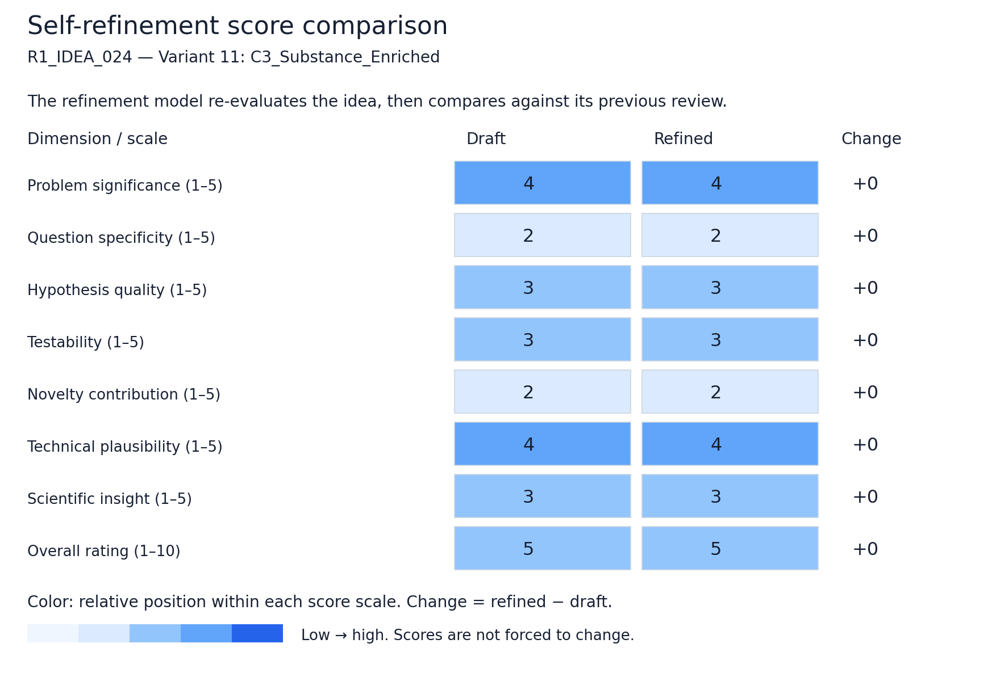

Changed score dimensions: none.

### Score justifications (draft / refined)

**Problem significance**

```json
{
  "draft": {
    "score": 4.0,
    "justification": "Sarcasm detection is a well-known, challenging NLP problem with practical applications in sentiment analysis, social media monitoring, and conversational AI. Its social complexity makes it a meaningful testbed for models' pragmatic understanding."
  },
  "refined": {
    "score": 4.0,
    "justification": "Sarcasm detection is a recognized, challenging NLP problem with practical relevance for sentiment analysis, social media monitoring, and conversational AI. Its reliance on pragmatic inference makes it a meaningful testbed for evaluating advanced language models."
  }
}
```

**Question specificity**

```json
{
  "draft": {
    "score": 2.0,
    "justification": "The idea states it 'explores the applications of GPT models' which is broad. It mentions testing performance variations with contextual variables, but the core question is not sharply defined (e.g., it doesn't specify what relationship between variables and performance is expected)."
  },
  "refined": {
    "score": 2.0,
    "justification": "The idea states it 'explores the applications of GPT models'—a broad direction rather than a specific research question. While it mentions testing performance with contextual variables, it does not define what relationship is expected or what constitutes a meaningful test."
  }
}
```

**Hypothesis quality**

```json
{
  "draft": {
    "score": 3.0,
    "justification": "There is an implicit hypothesis that GPT models might leverage pragmatic knowledge for sarcasm detection, which is plausible and testable. However, it's not particularly bold or specific (no predicted effect size, no comparison to alternative mechanisms). The mention of boundary conditions adds some hypothesis-like structure."
  },
  "refined": {
    "score": 3.0,
    "justification": "There is an implicit hypothesis that GPT models might leverage pragmatic knowledge for sarcasm detection, which is plausible and testable. The mention of boundary conditions adds some structure. However, the hypothesis lacks specificity (no predicted effects, no comparison to alternative explanations) and is not particularly bold."
  }
}
```

**Testability**

```json
{
  "draft": {
    "score": 3.0,
    "justification": "The idea suggests testing performance variations with contextual variables, which is testable. However, it lacks details on how such tests would be designed (e.g., controlled datasets, metrics). The core claim about GPT applications is straightforward to test with existing benchmarks."
  },
  "refined": {
    "score": 3.0,
    "justification": "The core claim that GPT models can detect sarcasm is easily testable with existing benchmarks. The suggestion to test performance with contextual variables is also testable in principle, but the idea lacks details on how such tests would be designed (e.g., controlled datasets, manipulation of variables)."
  }
}
```

**Novelty contribution**

```json
{
  "draft": {
    "score": 2.0,
    "justification": "Applying GPT models to sarcasm detection is not novel per se—GPT models are routinely applied to many NLP tasks. The potential contribution lies in investigating how contextual variables affect performance, but this is not yet framed as a novel scientific question."
  },
  "refined": {
    "score": 2.0,
    "justification": "Applying GPT models to sarcasm detection is not novel—these models are routinely applied to many NLP tasks. The potential contribution lies in investigating how contextual variables affect performance, but this is not yet framed as a novel scientific question. Without a specific comparative or mechanistic focus, the contribution risks being incremental."
  }
}
```

**Technical plausibility**

```json
{
  "draft": {
    "score": 4.0,
    "justification": "The reasoning is coherent: GPT models have strong language understanding and sarcasm detection requires pragmatic inference, so they might perform well. Testing with contextual variables is a logical next step. No obvious technical flaws."
  },
  "refined": {
    "score": 4.0,
    "justification": "The reasoning is coherent: GPT models have strong language understanding, and sarcasm detection requires pragmatic inference, so they might perform well. Investigating contextual variables is a logical step. No obvious technical flaws are present in the idea as stated."
  }
}
```

**Scientific insight**

```json
{
  "draft": {
    "score": 3.0,
    "justification": "If the investigation goes beyond mere performance reporting to analyze how contextual variables affect GPT models' sarcasm detection, it could provide insight into the models' pragmatic capabilities and limitations. However, the idea as stated doesn't guarantee such analysis will be deep or mechanistic."
  },
  "refined": {
    "score": 3.0,
    "justification": "If the investigation goes beyond performance reporting to analyze how contextual variables affect GPT models' sarcasm detection, it could provide insight into the models' pragmatic capabilities and limitations. However, the idea as stated does not guarantee a deep or mechanistic analysis—it only suggests this as a possibility."
  }
}
```

**Overall rating**

```json
{
  "draft": {
    "score": 5.0,
    "justification": "This is a moderate/borderline research idea. It addresses a meaningful problem and suggests a plausible mechanism, but the research question is too generic ('explore applications'). The hypothesis is reasonable but not sharp, and the novelty is limited without a more specific comparative or analytical focus. The suggestion to study boundary conditions is a strength, but needs more concrete formulation to elevate the idea."
  },
  "refined": {
    "score": 5.0,
    "justification": "This is a moderate/borderline research idea. It addresses a meaningful problem and suggests a plausible mechanism, but the research direction is too generic ('explore applications'). The hypothesis is reasonable but not sharp, and the novelty is limited without a more specific comparative or analytical focus. The suggestion to study boundary conditions is a strength, but needs more concrete formulation to elevate the idea."
  }
}
```

## R1_IDEA_024 — Variant 12: H1_Deceptive_Hollow


Changed score dimensions: none.

### Score justifications (draft / refined)

**Problem significance**

```json
{
  "draft": {
    "score": 4.0,
    "justification": "Sarcasm detection is a meaningful and challenging problem in NLP with practical applications in sentiment analysis, social media monitoring, and conversational AI. The idea correctly identifies its complexity and relevance."
  },
  "refined": {
    "score": 4.0,
    "justification": "Sarcasm detection is a meaningful and challenging problem in NLP with practical applications in sentiment analysis, social media monitoring, and conversational AI. The idea correctly identifies its complexity and relevance to language understanding systems."
  }
}
```

**Question specificity**

```json
{
  "draft": {
    "score": 1.0,
    "justification": "Extremely vague. The idea merely states it will 'examine a method based on advanced language models' without specifying what aspect, relationship, or phenomenon will be investigated. No concrete research question is defined."
  },
  "refined": {
    "score": 1.0,
    "justification": "Extremely vague. The idea merely states it will 'examine a method based on advanced language models' without specifying what aspect, relationship, or phenomenon will be investigated. No concrete research question is defined beyond the general topic area."
  }
}
```

**Hypothesis quality**

```json
{
  "draft": {
    "score": 1.0,
    "justification": "No hypothesis is presented, explicit or implicit. The text makes broad claims about transformative potential but offers no concrete prediction about mechanisms, relationships, or outcomes that could be tested."
  },
  "refined": {
    "score": 1.0,
    "justification": "No hypothesis is presented, explicit or implicit. The text makes broad claims about transformative potential but offers no concrete prediction about mechanisms, relationships, or outcomes that could be tested. There is no falsifiable statement."
  }
}
```

**Testability**

```json
{
  "draft": {
    "score": 1.0,
    "justification": "There is no indication of how the central claims could be tested. No experiments, comparisons, evaluations, or analyses are suggested. The idea is presented at such a high level of abstraction that it's unclear what evidence would support or contradict it."
  },
  "refined": {
    "score": 1.0,
    "justification": "There is no indication of how the central claims could be tested. No experiments, comparisons, evaluations, or analyses are suggested. The idea is presented at such a high level of abstraction that it's unclear what evidence would support or contradict the claims of being 'transformative' or 'field-shaping'."
  }
}
```

**Novelty contribution**

```json
{
  "draft": {
    "score": 2.0,
    "justification": "The idea claims transformative potential but provides no concrete indication of what would be novel. Applying language models to sarcasm detection is not inherently novel without specifying what new approach, insight, or synthesis would be introduced."
  },
  "refined": {
    "score": 2.0,
    "justification": "The idea claims transformative potential but provides no concrete indication of what would be novel. Applying language models to sarcasm detection is not inherently novel without specifying what new approach, insight, or synthesis would be introduced. The grandiose claims are unsupported by specific novel elements."
  }
}
```

**Technical plausibility**

```json
{
  "draft": {
    "score": 3.0,
    "justification": "Using language models for sarcasm detection is technically plausible given their success on related NLP tasks. However, the lack of any technical details makes it impossible to assess the coherence of the proposed direction."
  },
  "refined": {
    "score": 3.0,
    "justification": "Using language models for sarcasm detection is technically plausible given their success on related NLP tasks. However, the complete lack of any technical details makes it impossible to assess the coherence or feasibility of the proposed direction beyond this basic plausibility."
  }
}
```

**Scientific insight**

```json
{
  "draft": {
    "score": 2.0,
    "justification": "The idea claims potential for broad impact but doesn't specify what scientific insight would be gained. Without a clear research question, it's unclear whether the research would reveal mechanisms, principles, limitations, or other transferable knowledge beyond simple performance improvements."
  },
  "refined": {
    "score": 2.0,
    "justification": "The idea claims potential for broad impact but doesn't specify what scientific insight would be gained. Without a clear research question, it's unclear whether the research would reveal mechanisms, principles, limitations, or other transferable knowledge beyond simple performance improvements. The claims about 'conceptual insight' and 'transformative synthesis' are not substantiated."
  }
}
```

**Overall rating**

```json
{
  "draft": {
    "score": 3.0,
    "justification": "This is a weak research idea. While it identifies a meaningful problem (sarcasm detection), it fails to define a concrete research question, hypothesis, or methodological approach. The grandiose claims about transformative potential are unsupported by any specific content. The idea reads more like marketing language than a scientific research direction. It lacks the specificity, testability, and potential for scientific insight needed for a strong research idea."
  },
  "refined": {
    "score": 3.0,
    "justification": "This is a weak research idea. While it identifies a meaningful problem (sarcasm detection), it fails to define a concrete research question, hypothesis, or methodological approach. The grandiose claims about transformative potential are unsupported by any specific content. The idea reads more like positioning language than a scientific research direction, lacking the specificity, testability, and potential for scientific insight needed for a strong research idea. It essentially states an application area with ambitious but vague aspirations."
  }
}
```

## R1_IDEA_024 — Variant 13: H2_Confident_Flaw

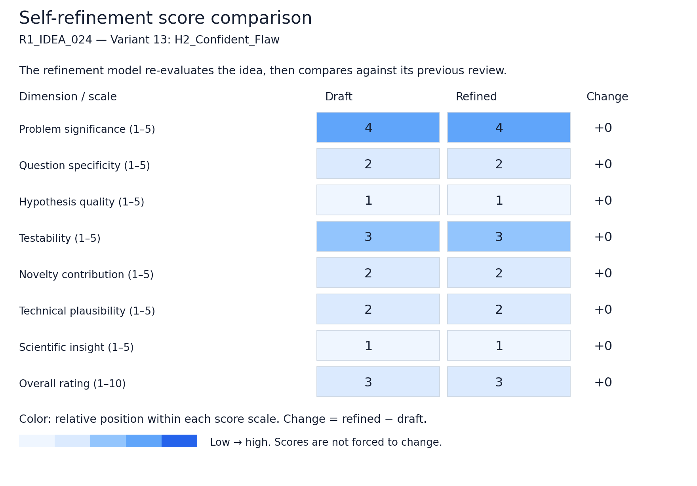

Changed score dimensions: none.

### Score justifications (draft / refined)

**Problem significance**

```json
{
  "draft": {
    "score": 4.0,
    "justification": "Sarcasm detection is a recognized, challenging problem in NLP with practical applications in sentiment analysis, social media monitoring, and conversational AI. Improving it is meaningful."
  },
  "refined": {
    "score": 4.0,
    "justification": "Sarcasm detection is a recognized, challenging problem in NLP with practical applications in sentiment analysis, social media monitoring, and conversational AI. Improving it is meaningful to both researchers and practitioners."
  }
}
```

**Question specificity**

```json
{
  "draft": {
    "score": 2.0,
    "justification": "The idea is framed as 'exploring applications' rather than posing a clear research question. It lacks specificity about what aspect of GPT models or sarcasm detection is being investigated."
  },
  "refined": {
    "score": 2.0,
    "justification": "The idea is framed as 'exploring applications' rather than posing a clear research question. It lacks specificity about what aspect of GPT models or sarcasm detection is being investigated—whether it's about model capabilities, prompting strategies, comparison to baselines, or understanding failure modes."
  }
}
```

**Hypothesis quality**

```json
{
  "draft": {
    "score": 1.0,
    "justification": "There is no clear hypothesis. The implicit claim that GPT models will be effective at sarcasm detection and that this implies broader figurative language superiority is an overgeneralization, not a testable prediction about a mechanism or relationship."
  },
  "refined": {
    "score": 1.0,
    "justification": "There is no clear, testable hypothesis. The implicit claim that GPT models will be effective at sarcasm detection and that this implies broader figurative language superiority is an overgeneralization without a concrete prediction about mechanisms or relationships. The idea makes strong causal claims without proposing a causal hypothesis that could be falsified."
  }
}
```

**Testability**

```json
{
  "draft": {
    "score": 3.0,
    "justification": "The core task (testing GPT on sarcasm detection) is testable. However, the broader claim about 'general superiority' and the dismissal of standard experimental controls (isolating variables) undermines rigorous testability."
  },
  "refined": {
    "score": 3.0,
    "justification": "The core task of testing GPT models on sarcasm detection is technically testable. However, the broader claim about 'general superiority' and the dismissal of standard experimental controls (isolating variables, considering alternative explanations) undermines rigorous testability. The idea suggests evidence can be treated as causal without proper experimental design."
  }
}
```

**Novelty contribution**

```json
{
  "draft": {
    "score": 2.0,
    "justification": "Applying GPT models to sarcasm detection is not novel per se; many works have used large LMs for this task. The idea's suggested contribution (proving general superiority without controlled analysis) is methodologically flawed and thus not a strong contribution."
  },
  "refined": {
    "score": 2.0,
    "justification": "Applying GPT models to sarcasm detection is not novel per se; many works have used large language models for this task. The suggested contribution (proving general superiority without controlled analysis) is methodologically flawed rather than scientifically novel. At best, this could be an incremental application study."
  }
}
```

**Technical plausibility**

```json
{
  "draft": {
    "score": 2.0,
    "justification": "While using GPT for sarcasm detection is plausible, the reasoning is logically flawed. The claim that solving one 'most visible weakness' provides 'causal evidence for the method's general superiority' without controlling for confounders is not scientifically sound."
  },
  "refined": {
    "score": 2.0,
    "justification": "While using GPT for sarcasm detection is technically feasible, the reasoning is logically flawed. The claim that solving one 'most visible weakness' provides 'causal evidence for the method's general superiority' without controlling for confounders is not scientifically sound. The argument assumes what it needs to prove."
  }
}
```

**Scientific insight**

```json
{
  "draft": {
    "score": 1.0,
    "justification": "As presented, the idea aims for a simple performance demonstration, not insight into why GPT models might work, what limitations they have, or what this reveals about figurative language understanding. The dismissal of alternative explanations precludes deeper insight."
  },
  "refined": {
    "score": 1.0,
    "justification": "As presented, the idea aims for a simple performance demonstration, not insight into why GPT models might work, what limitations they have, or what this reveals about figurative language understanding. The dismissal of alternative explanations and boundary conditions precludes deeper scientific insight. It doesn't propose to uncover mechanisms, principles, or transferable knowledge."
  }
}
```

**Overall rating**

```json
{
  "draft": {
    "score": 3.0,
    "justification": "The idea identifies a meaningful problem but fails to formulate a specific research question or hypothesis. Its core methodological claim (that a single success proves general superiority without controls) is fundamentally unscientific. It reads more like a motivation for an application than a research idea aimed at generating new knowledge. With refinement, it could become a solid empirical study, but as presented, it is weak."
  },
  "refined": {
    "score": 3.0,
    "justification": "The idea identifies a meaningful problem but fails to formulate a specific research question or testable hypothesis. Its core methodological claim (that a single success proves general superiority without controls) is fundamentally unscientific. It reads more like a motivation for an application than a research idea aimed at generating new knowledge. With substantial refinement, it could become a solid empirical study, but as presented, it is weak."
  }
}
```

## R1_IDEA_024 — Variant 14: H3_Verbose_Enriched

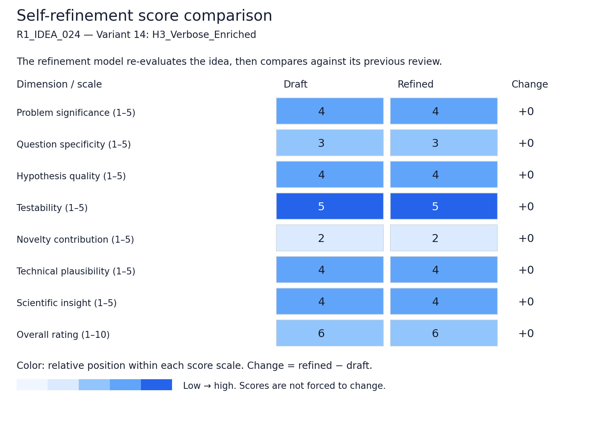

Changed score dimensions: none.

### Score justifications (draft / refined)

**Problem significance**

```json
{
  "draft": {
    "score": 4.0,
    "justification": "Sarcasm detection is a meaningful and challenging NLP problem with practical applications in sentiment analysis, social media monitoring, and conversational AI. The social complexity and contextual dependence of sarcasm make it a good test case for advanced language models."
  },
  "refined": {
    "score": 4.0,
    "justification": "Sarcasm detection is a meaningful and challenging NLP problem due to its reliance on context, social cues, and pragmatic inference. It has practical applications in sentiment analysis, social media monitoring, and human-computer interaction, making it a relevant testbed for advanced language models."
  }
}
```

**Question specificity**

```json
{
  "draft": {
    "score": 3.0,
    "justification": "The idea specifies investigating GPT models for sarcasm detection and proposes examining performance across contextual variables, but lacks concrete details about which models, datasets, or specific variables would be tested. The research question is clearer than a generic 'apply X to Y' but could be more precise."
  },
  "refined": {
    "score": 3.0,
    "justification": "The idea specifies investigating GPT models for sarcasm detection and proposes examining performance across contextual variables, but lacks concrete details about which models, datasets, or specific variables would be tested. The research direction is clearer than a generic application but could be more precise in its operational definitions."
  }
}
```

**Hypothesis quality**

```json
{
  "draft": {
    "score": 4.0,
    "justification": "The hypothesis that GPT models might leverage pretrained pragmatic knowledge to infer speaker intent is concrete and testable. It goes beyond simply predicting that GPT will work well, proposing a specific mechanism that could be investigated through ablations and analyses."
  },
  "refined": {
    "score": 4.0,
    "justification": "The hypothesis that GPT models might leverage pretrained pragmatic knowledge to infer speaker intent is concrete and testable. It proposes a specific mechanism rather than just predicting performance, and it could be falsified through ablations that remove contextual information or through comparisons with models lacking certain training data."
  }
}
```

**Testability**

```json
{
  "draft": {
    "score": 5.0,
    "justification": "The idea explicitly outlines a comprehensive validation approach including staged design, baseline comparisons, ablations, sensitivity analyses, and error analysis. This shows strong consideration of how to test the hypothesis rigorously."
  },
  "refined": {
    "score": 5.0,
    "justification": "The idea explicitly outlines a comprehensive validation approach including staged design, baseline comparisons, ablations, sensitivity analyses, and error analysis. This demonstrates strong consideration of how to test the hypothesis rigorously and investigate boundary conditions."
  }
}
```

**Novelty contribution**

```json
{
  "draft": {
    "score": 2.0,
    "justification": "Applying GPT models to sarcasm detection is not novel in itself. The potential contribution lies more in the detailed investigation of boundary conditions and mechanisms rather than the core application. Many papers have already explored transformer models for sarcasm detection."
  },
  "refined": {
    "score": 2.0,
    "justification": "Applying GPT models to sarcasm detection is not novel; many papers have explored transformer-based approaches for this task. The potential contribution lies primarily in the detailed investigation of mechanisms and boundary conditions rather than the core application itself."
  }
}
```

**Technical plausibility**

```json
{
  "draft": {
    "score": 4.0,
    "justification": "The reasoning is logically coherent: GPT models have strong language understanding capabilities, sarcasm detection requires understanding context and intent, therefore GPT models might perform well. The proposed validation approach is methodologically sound."
  },
  "refined": {
    "score": 4.0,
    "justification": "The reasoning is logically coherent: GPT models have strong language understanding capabilities, sarcasm detection requires understanding context and intent, therefore GPT models might perform well. The proposed validation approach is methodologically sound and aligns with good experimental practices in ML."
  }
}
```

**Scientific insight**

```json
{
  "draft": {
    "score": 4.0,
    "justification": "If executed well, this research could provide insights into how large language models handle pragmatic inference, the boundary conditions of their sarcasm detection capabilities, and which contextual factors most affect performance. This goes beyond simple performance benchmarking."
  },
  "refined": {
    "score": 4.0,
    "justification": "If executed well, this research could provide insights into how large language models handle pragmatic inference, which contextual factors most affect sarcasm detection performance, and the boundary conditions of their capabilities. This goes beyond simple performance benchmarking toward understanding model behavior."
  }
}
```

**Overall rating**

```json
{
  "draft": {
    "score": 6.0,
    "justification": "This is a moderate research idea with both strengths and weaknesses. The problem is meaningful, the hypothesis is reasonable, and the proposed validation approach shows good scientific thinking. However, the core application is not particularly novel, and the idea lacks specificity about key experimental details. The potential contribution lies more in the detailed investigation of mechanisms and boundary conditions than in the basic application of GPT to sarcasm detection."
  },
  "refined": {
    "score": 6.0,
    "justification": "This is a moderate research idea with both strengths and weaknesses. The problem is meaningful, the hypothesis is reasonable, and the proposed validation approach shows good scientific thinking. However, the core application lacks novelty, and the idea needs more specificity about experimental details. The potential contribution lies more in the detailed investigation of mechanisms and boundary conditions than in the basic application."
  }
}
```

## R1_IDEA_024 — Variant 15: H4_Ultimate_Hype


Changed score dimensions: none.

### Score justifications (draft / refined)

**Problem significance**

```json
{
  "draft": {
    "score": 4.0,
    "justification": "Sarcasm detection is a recognized hard problem in NLP due to its contextual and pragmatic nature. Improving it could enhance sentiment analysis, dialogue systems, and content moderation, which are practically relevant. However, the idea does not articulate why now is a particularly opportune moment or what specific gap in understanding it addresses."
  },
  "refined": {
    "score": 4.0,
    "justification": "Sarcasm detection is a recognized, challenging problem in NLP with practical relevance for sentiment analysis, dialogue systems, and content moderation. The problem is meaningful because it tests models' understanding of pragmatics, context, and social cues. However, the idea does not articulate why this specific investigation is timely or what unique aspect of the problem it addresses."
  }
}
```

**Question specificity**

```json
{
  "draft": {
    "score": 1.0,
    "justification": "The idea is extremely vague. It only states an application area ('explores the applications of GPT models in detecting sarcasm') without defining a concrete research question. There is no specification of what relationship, mechanism, or comparison will be investigated."
  },
  "refined": {
    "score": 1.0,
    "justification": "The idea is extremely vague. It only states an application area ('explores the applications of GPT models in detecting sarcasm') without defining any concrete research question. There is no specification of what relationship, mechanism, comparison, or phenomenon will be investigated. It lacks the minimal specificity required for a research direction."
  }
}
```

**Hypothesis quality**

```json
{
  "draft": {
    "score": 1.0,
    "justification": "There is no explicit or implicit hypothesis. The text makes promotional claims ('could redefine the frontier') but does not make a falsifiable prediction about GPT models' behavior, performance, or limitations regarding sarcasm detection."
  },
  "refined": {
    "score": 1.0,
    "justification": "There is no explicit or implicit hypothesis. The text makes promotional claims about transformative potential but offers no falsifiable prediction about GPT models' behavior, performance, limitations, or mechanisms regarding sarcasm detection. A hypothesis is entirely absent."
  }
}
```

**Testability**

```json
{
  "draft": {
    "score": 2.0,
    "justification": "The idea as stated is not directly testable because it lacks a specific claim to test. However, the general premise of evaluating GPT models on sarcasm detection is testable in principle. No method of investigation (experiment, analysis, comparison) is suggested."
  },
  "refined": {
    "score": 2.0,
    "justification": "The idea as stated is not directly testable because it lacks a specific claim to test. However, the general premise of evaluating GPT models on sarcasm detection is testable in principle (one could design experiments). No method of investigation (experiment, analysis, comparison) is suggested, so the idea itself provides no testable pathway."
  }
}
```

**Novelty contribution**

```json
{
  "draft": {
    "score": 2.0,
    "justification": "Applying GPT models to sarcasm detection is not novel per se; numerous studies have already explored large language models for sarcasm and irony detection. The idea does not propose a novel angle, such as a new evaluation framework, a mechanistic understanding, or a previously unexplored limitation. It frames the application as transformative without justifying how it differs from prior work."
  },
  "refined": {
    "score": 2.0,
    "justification": "Applying GPT models to sarcasm detection is not novel; numerous studies have explored large language models for sarcasm and irony detection. The idea does not propose a novel angle, such as a new evaluation framework, a mechanistic understanding, a previously unexplored limitation, or a novel comparative analysis. It frames a common application as transformative without justification."
  }
}
```

**Technical plausibility**

```json
{
  "draft": {
    "score": 3.0,
    "justification": "The general direction is plausible: GPT models have strong language understanding and could potentially perform well on sarcasm detection. However, the idea provides no technical reasoning or assumptions, making it impossible to assess coherence beyond surface-level intuition."
  },
  "refined": {
    "score": 3.0,
    "justification": "The general direction is superficially plausible: GPT models have strong language understanding and could potentially be applied to sarcasm detection. However, the idea provides no technical reasoning, assumptions, or methodological sketch, making it impossible to assess coherence beyond a basic intuition. No technical pitfalls or challenges are considered."
  }
}
```

**Scientific insight**

```json
{
  "draft": {
    "score": 2.0,
    "justification": "As presented, the idea seems aimed at demonstrating an application ('GPT models can detect sarcasm') rather than generating new scientific insight. It does not suggest studying why or how GPT models might succeed/fail, what this reveals about sarcasm or model capabilities, or any generalizable principles. The mention of 'implications beyond the immediate problem' is unsupported."
  },
  "refined": {
    "score": 2.0,
    "justification": "As presented, the idea seems aimed at demonstrating an application ('GPT models can detect sarcasm') rather than generating new scientific insight. It does not suggest studying why or how GPT models might succeed or fail, what this reveals about sarcasm as a linguistic phenomenon or about model capabilities, or any generalizable principles. The mention of broader implications is unsupported and vague."
  }
}
```

**Overall rating**

```json
{
  "draft": {
    "score": 3.0,
    "justification": "This is a weak research idea. While it identifies a meaningful problem (sarcasm detection), it fails to define a specific research question, lacks any hypothesis, and is essentially a generic application statement dressed in promotional language. There is no clear path to scientific contribution beyond a potential performance benchmark. It scores low on specificity, hypothesis quality, and novelty, which are core to a strong research idea."
  },
  "refined": {
    "score": 3.0,
    "justification": "This is a weak research idea. While it identifies a meaningful problem (sarcasm detection), it fails completely to define a specific research question, lacks any hypothesis, and is essentially a generic application statement dressed in promotional language. There is no clear path to scientific contribution beyond a potential performance benchmark. It scores very low on specificity, hypothesis quality, and novelty, which are core to a strong research idea. The absence of any methodological direction further limits its value as a research proposal."
  }
}
```

## R1_IDEA_025 — Source

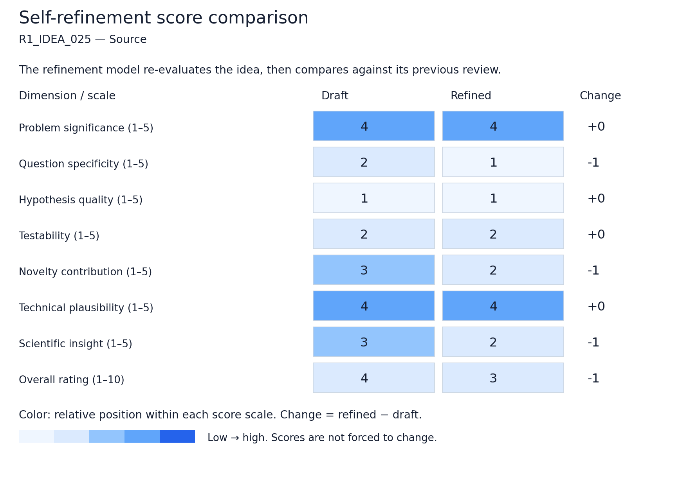

Changed score dimensions: question_specificity, novelty_contribution, scientific_insight, overall_rating.

### Score justifications (draft / refined)

**Problem significance**

```json
{
  "draft": {
    "score": 4.0,
    "justification": "KV cache pressure is a significant practical bottleneck for deploying large reasoning models that generate long sequences. Reducing memory/computation overhead while maintaining accuracy is an important problem for real-world applications."
  },
  "refined": {
    "score": 4.0,
    "justification": "KV cache pressure is a significant and growing bottleneck for deploying large reasoning models that generate long sequences. Improving efficiency while preserving accuracy is practically important for real-world use."
  }
}
```

**Question specificity**

```json
{
  "draft": {
    "score": 2.0,
    "justification": "The idea only states that sparse attention methods 'can help' without specifying what exactly would be investigated. The summary cuts off mid-sentence, leaving the research question undefined."
  },
  "refined": {
    "score": 1.0,
    "justification": "The idea does not define a research question. It only states that sparse attention methods 'can help' and then cuts off. There is no specific inquiry or phenomenon to investigate."
  }
}
```

**Hypothesis quality**

```json
{
  "draft": {
    "score": 1.0,
    "justification": "No hypothesis is presented. The text merely observes that sparse attention methods can help reduce KV cache pressure, without making a testable prediction about their effectiveness, trade-offs, or optimal design for reasoning models."
  },
  "refined": {
    "score": 1.0,
    "justification": "No hypothesis is presented. The text merely observes a problem and mentions a tool, without making any testable prediction about effectiveness, trade-offs, or mechanism."
  }
}
```

**Testability**

```json
{
  "draft": {
    "score": 2.0,
    "justification": "While the general direction is testable (comparing sparse vs. full attention on reasoning tasks), no specific experimental approach is suggested. The idea lacks details about what would be measured, compared, or evaluated."
  },
  "refined": {
    "score": 2.0,
    "justification": "The general direction is testable in principle (compare sparse vs. full attention on reasoning tasks), but no experimental approach is suggested. Without a defined question or metric, testability is low."
  }
}
```

**Novelty contribution**

```json
{
  "draft": {
    "score": 3.0,
    "justification": "Applying sparse attention to reduce KV cache is not novel in isolation, but investigating it specifically for long-chain reasoning models could provide domain-specific insights. However, without a specific research angle, the contribution potential is limited."
  },
  "refined": {
    "score": 2.0,
    "justification": "Applying sparse attention to reduce KV cache is well-known in long-context modeling. Without a specific angle (e.g., reasoning-specific sparsity patterns, interaction with CoT structure), the novelty is limited."
  }
}
```

**Technical plausibility**

```json
{
  "draft": {
    "score": 4.0,
    "justification": "The reasoning is logically coherent: long reasoning sequences cause KV cache pressure, sparse attention reduces KV cache requirements. This is technically plausible based on known properties of sparse attention mechanisms."
  },
  "refined": {
    "score": 4.0,
    "justification": "The logical chain is coherent: long reasoning sequences increase KV cache, sparse attention reduces KV cache size. This is technically plausible based on existing sparse attention literature."
  }
}
```

**Scientific insight**

```json
{
  "draft": {
    "score": 3.0,
    "justification": "If properly investigated, this could reveal insights about the attention patterns needed for effective reasoning (e.g., how much long-range context is truly necessary). However, the current formulation is too vague to guarantee meaningful insights."
  },
  "refined": {
    "score": 2.0,
    "justification": "If properly developed, this could reveal insights about attention patterns necessary for reasoning (e.g., how much long-range context is essential). As stated, it is too vague to promise meaningful scientific insight."
  }
}
```

**Overall rating**

```json
{
  "draft": {
    "score": 4.0,
    "justification": "The idea identifies a meaningful practical problem but is incomplete and lacks a specific research question, hypothesis, or experimental approach. It has the foundation for a moderate research direction but requires substantial refinement to become a strong research idea."
  },
  "refined": {
    "score": 3.0,
    "justification": "The idea identifies a meaningful problem but is incomplete and lacks a research question, hypothesis, or methodological direction. It is a weak research idea as presented, requiring substantial refinement to become a concrete investigation."
  }
}
```

## R1_IDEA_025 — Variant 1: A1_Identity

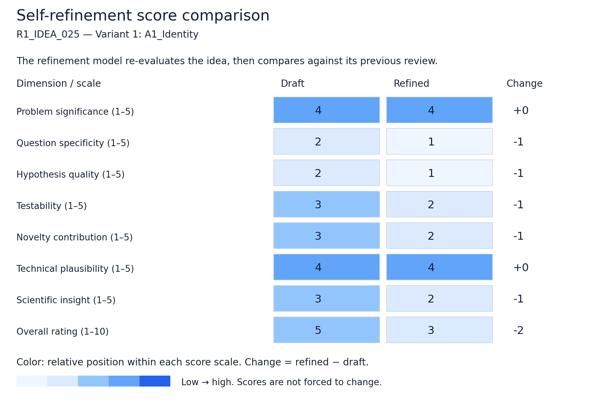

Changed score dimensions: question_specificity, hypothesis_quality, testability, novelty_contribution, scientific_insight, overall_rating.

### Score justifications (draft / refined)

**Problem significance**

```json
{
  "draft": {
    "score": 4.0,
    "justification": "The problem is meaningful: KV cache pressure is a real bottleneck for deploying LRMs with long reasoning chains, affecting both memory and latency. Efficient reasoning at scale is an important challenge for practical applications of advanced AI systems."
  },
  "refined": {
    "score": 4.0,
    "justification": "The problem is highly meaningful: KV cache pressure from long reasoning sequences is a major practical bottleneck for deploying LRMs, affecting memory, latency, and cost. Efficient long-context reasoning is a significant challenge in both research and industry."
  }
}
```

**Question specificity**

```json
{
  "draft": {
    "score": 2.0,
    "justification": "The idea is incomplete and lacks a clear research question. It starts to suggest sparse attention as a solution but doesn't specify what aspect would be investigated, how it would be evaluated, or what relationship would be studied."
  },
  "refined": {
    "score": 1.0,
    "justification": "The idea lacks a clear research question. It notes sparse attention 'can help' but does not specify what to investigate, how to evaluate, or what relationship to study. The incomplete sentence further reduces clarity."
  }
}
```

**Hypothesis quality**

```json
{
  "draft": {
    "score": 2.0,
    "justification": "There's an implicit hypothesis that sparse attention can help with KV cache pressure in LRMs, but it's not articulated as a testable prediction. No mechanism or specific outcome is proposed that could be supported or contradicted by evidence."
  },
  "refined": {
    "score": 1.0,
    "justification": "There is no hypothesis, implicit or explicit. The text merely states sparse attention methods 'can help,' which is an observation, not a testable prediction. No mechanism, condition, or measurable outcome is proposed."
  }
}
```

**Testability**

```json
{
  "draft": {
    "score": 3.0,
    "justification": "The general direction is testable—one could implement sparse attention in an LRM and measure KV cache usage and accuracy—but without a specific hypothesis or experimental design, it's unclear what would constitute a meaningful test."
  },
  "refined": {
    "score": 2.0,
    "justification": "The general concept is technically testable (one could implement sparse attention in an LRM and measure cache usage and accuracy), but without a specific hypothesis or experimental design, it's unclear what constitutes a meaningful test. The incomplete proposal further hampers testability."
  }
}
```

**Novelty contribution**

```json
{
  "draft": {
    "score": 3.0,
    "justification": "Applying sparse attention to reasoning models has some novelty, as most sparse attention research focuses on standard language modeling or vision tasks. However, without a specific angle or hypothesis, it risks being a straightforward application rather than a novel contribution."
  },
  "refined": {
    "score": 2.0,
    "justification": "Applying sparse attention to reasoning models has some novelty, as most sparse attention work focuses on standard language modeling or vision. However, without a specific angle (e.g., analyzing attention patterns in reasoning, designing new sparse schemes for reasoning), it risks being a straightforward application with limited scientific contribution."
  }
}
```

**Technical plausibility**

```json
{
  "draft": {
    "score": 4.0,
    "justification": "The reasoning is logically coherent: sparse attention reduces KV cache size by attending to fewer tokens, and LRMs generate long sequences that strain KV caches. The connection is plausible, though the effectiveness for reasoning tasks (which may require attending to many earlier steps) is not guaranteed."
  },
  "refined": {
    "score": 4.0,
    "justification": "The basic reasoning is logically coherent: sparse attention reduces the number of tokens stored in the KV cache, and LRMs generate long sequences that strain the cache. The connection is plausible, though effectiveness for reasoning (which may need long-range dependencies) is not guaranteed and would require validation."
  }
}
```

**Scientific insight**

```json
{
  "draft": {
    "score": 3.0,
    "justification": "If properly investigated, this could yield insights about the attention patterns needed for coherent reasoning versus general language modeling, or about trade-offs between reasoning quality and computational efficiency. However, as stated, it's more of an engineering solution than a scientific investigation."
  },
  "refined": {
    "score": 2.0,
    "justification": "If developed further, this could yield insights into attention patterns essential for reasoning vs. general language, or trade-offs between efficiency and reasoning quality. As stated, however, it offers little beyond a generic efficiency improvement goal, with no proposed analysis to extract deeper scientific understanding."
  }
}
```

**Overall rating**

```json
{
  "draft": {
    "score": 5.0,
    "justification": "This is a moderate/borderline idea. It identifies a relevant problem and suggests a plausible technical direction, but it's incomplete and lacks a clear research question, hypothesis, or experimental design. The potential exists for a stronger investigation if the idea were developed further with specific hypotheses and evaluation criteria."
  },
  "refined": {
    "score": 3.0,
    "justification": "This is a weak idea. It identifies a significant problem and suggests a plausible technical direction, but it is incomplete and lacks a research question, hypothesis, specificity, or clear investigative goal. It reads as an unfinished thought rather than a research idea. With substantial development, it could become a moderate or strong idea, but in its current form, it offers limited scientific contribution."
  }
}
```

## R1_IDEA_025 — Variant 2: A2_Paraphrase_Only


Changed score dimensions: none.

### Score justifications (draft / refined)

**Problem significance**

```json
{
  "draft": {
    "score": 4.0,
    "justification": "The problem is significant. Efficient long-context generation, especially for computationally intensive reasoning, is a major challenge for deploying large models. Reducing KV cache pressure directly impacts cost, latency, and feasibility."
  },
  "refined": {
    "score": 4.0,
    "justification": "The problem is highly significant. Efficient long-context generation, especially for compute-intensive reasoning tasks, is a major practical and research challenge. Reducing KV cache pressure directly impacts the cost, speed, and scalability of deploying advanced reasoning models."
  }
}
```

**Question specificity**

```json
{
  "draft": {
    "score": 1.0,
    "justification": "Extremely low specificity. The text only states that a problem exists and that current solutions are limited. It does not define what is to be investigated. There is no research question."
  },
  "refined": {
    "score": 1.0,
    "justification": "Extremely low specificity. The text only states that a problem exists and that current solutions have limitations. It does not define what is to be investigated—there is no research question, no 'what', 'how', or 'why' to study."
  }
}
```

**Hypothesis quality**

```json
{
  "draft": {
    "score": 1.0,
    "justification": "There is no hypothesis, implicit or explicit. The text makes an observation but does not make a testable prediction about a mechanism, relationship, or outcome."
  },
  "refined": {
    "score": 1.0,
    "justification": "There is no hypothesis, implicit or explicit. The text makes an observation but does not make a testable prediction about a mechanism, relationship, or experimental outcome. It does not suggest what might be true or false about the situation."
  }
}
```

**Testability**

```json
{
  "draft": {
    "score": 1.0,
    "justification": "Not testable. Without a hypothesis or defined research question, there is nothing to test. The statement 'sparse attention techniques... present limitations' is an observation, not a claim that can be investigated in a focused way."
  },
  "refined": {
    "score": 1.0,
    "justification": "Not testable. Without a research question or hypothesis, there is no central claim to investigate. The statement about limitations is an observation, not a falsifiable proposition. No experiment, analysis, or comparison is suggested."
  }
}
```

**Novelty contribution**

```json
{
  "draft": {
    "score": 2.0,
    "justification": "The observation that LRMs have long sequences and sparse attention has limitations is not novel. The potential contribution is entirely dependent on a follow-up idea that is not presented. In its current form, it merely states a known problem."
  },
  "refined": {
    "score": 2.0,
    "justification": "The observation that LRMs produce long sequences and that sparse attention has limitations is not novel—it is general knowledge in the field. Any potential contribution hinges entirely on unspecified follow-up work. In this form, it merely reiterates a known challenge."
  }
}
```

**Technical plausibility**

```json
{
  "draft": {
    "score": 3.0,
    "justification": "The described scenario is technically plausible. LRMs do generate long sequences, and sparse attention is a known technique with known trade-offs. The reasoning is logically coherent but very surface-level."
  },
  "refined": {
    "score": 3.0,
    "justification": "The described scenario is technically plausible and coherent. LRMs do generate long reasoning chains, KV cache pressure is a real issue, and sparse attention is a known technique with trade-offs. However, the reasoning is surface-level and does not propose any technical direction."
  }
}
```

**Scientific insight**

```json
{
  "draft": {
    "score": 2.0,
    "justification": "In its current form, the idea promises little scientific insight. It points to a practical engineering bottleneck. A developed research program could yield insight into the interaction between reasoning structure and attention sparsity, but the idea summary does not propose to study that."
  },
  "refined": {
    "score": 2.0,
    "justification": "In its current form, the idea promises little scientific insight. It points to a practical engineering bottleneck. A developed research program could yield insight into the interaction between reasoning structure and attention efficiency, but the summary does not propose to study or uncover any such mechanism or principle."
  }
}
```

**Overall rating**

```json
{
  "draft": {
    "score": 3.0,
    "justification": "This is a weak research idea summary. It identifies a meaningful and significant problem but fails to advance beyond a problem statement. It lacks a research question, hypothesis, testable claim, or specific direction. Therefore, it has low specificity, testability, and potential for contribution in its presented form. It is the starting point for an idea, not an idea itself."
  },
  "refined": {
    "score": 3.0,
    "justification": "This is a weak research idea summary. While it identifies a significant and meaningful problem, it does not advance beyond a problem statement. It lacks a research question, hypothesis, testable claim, or specific direction. Consequently, it scores very low on specificity, testability, hypothesis quality, and potential contribution as presented. It is the starting point for an idea, not a research idea itself."
  }
}
```

## R1_IDEA_025 — Variant 3: A3_Plain_Core

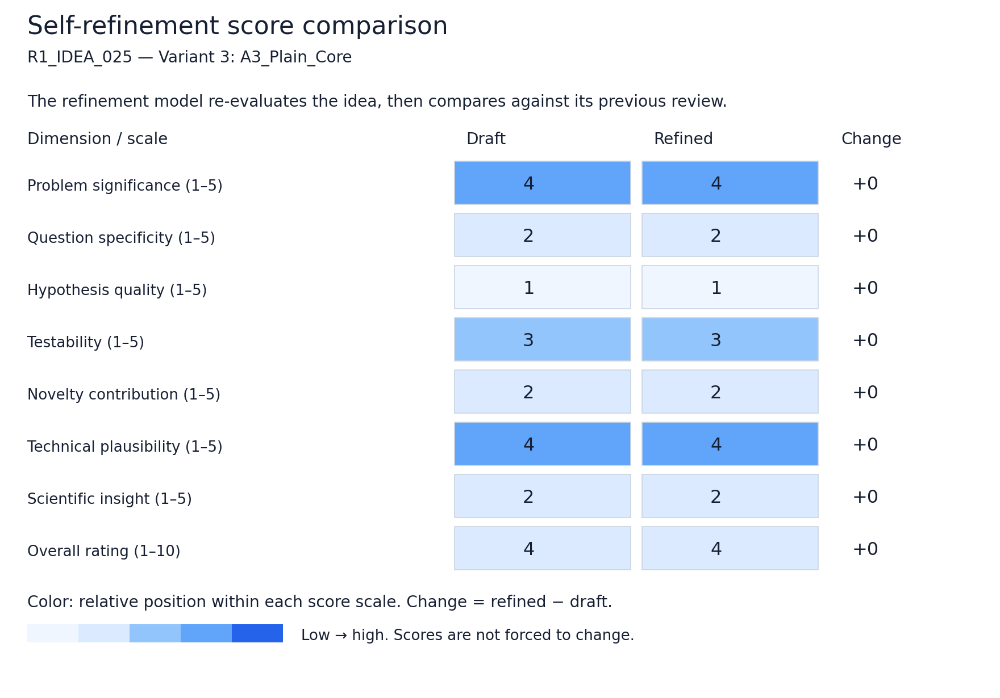

Changed score dimensions: none.

### Score justifications (draft / refined)

**Problem significance**

```json
{
  "draft": {
    "score": 4.0,
    "justification": "The problem is meaningful and timely. Large Reasoning Models with long chain-of-thought reasoning face real efficiency challenges due to KV cache memory pressure, which limits their practical deployment. Solving this would benefit both researchers and practitioners working on efficient inference."
  },
  "refined": {
    "score": 4.0,
    "justification": "The problem is meaningful and timely. KV cache pressure from long reasoning sequences is a real bottleneck for deploying Large Reasoning Models efficiently. Addressing it would benefit both research and practical applications, making it a significant issue in the field."
  }
}
```

**Question specificity**

```json
{
  "draft": {
    "score": 2.0,
    "justification": "The idea is vague about what exactly will be investigated. It states that sparse attention methods have limitations, but doesn't specify what aspect of this problem will be studied, what question will be answered, or what relationship will be explored."
  },
  "refined": {
    "score": 2.0,
    "justification": "The idea is vague. It notes that sparse attention methods have limitations but does not define a specific research question, relationship to investigate, or phenomenon to explore. It lacks concrete direction."
  }
}
```

**Hypothesis quality**

```json
{
  "draft": {
    "score": 1.0,
    "justification": "No hypothesis is presented. The idea merely observes that sparse attention methods have limitations without making any testable prediction about why they fail, what might work better, or what mechanism underlies the problem."
  },
  "refined": {
    "score": 1.0,
    "justification": "No hypothesis is presented. The idea merely observes a problem without making any testable prediction about causes, solutions, or underlying mechanisms. There is no falsifiable claim."
  }
}
```

**Testability**

```json
{
  "draft": {
    "score": 3.0,
    "justification": "The general problem area is testable - one could design experiments comparing sparse attention variants on reasoning tasks, measuring memory usage and accuracy. However, without a specific research question or hypothesis, it's unclear what exactly would be tested."
  },
  "refined": {
    "score": 3.0,
    "justification": "The general area is testable—one could design experiments comparing sparse attention methods on reasoning tasks, measuring memory, speed, and accuracy. However, without a specific question or hypothesis, it is unclear what exactly would be tested or how evidence would be gathered."
  }
}
```

**Novelty contribution**

```json
{
  "draft": {
    "score": 2.0,
    "justification": "The observation that sparse attention might help with KV cache in reasoning models is not novel. The idea doesn't propose what new contribution would be made - whether it's analyzing why existing methods fail, proposing a new method, or discovering new insights about attention in reasoning tasks."
  },
  "refined": {
    "score": 2.0,
    "justification": "The observation that sparse attention could address KV cache pressure in reasoning models is not novel. The idea does not propose what new contribution would be made—whether it's analyzing failure modes, proposing a new method, or uncovering new insights about attention in reasoning."
  }
}
```

**Technical plausibility**

```json
{
  "draft": {
    "score": 4.0,
    "justification": "The technical reasoning is coherent and plausible. Sparse attention methods are indeed used to reduce KV cache memory, and applying them to long reasoning sequences makes technical sense. The assumption that current methods have limitations is reasonable."
  },
  "refined": {
    "score": 4.0,
    "justification": "The technical reasoning is coherent and plausible. Sparse attention is known to reduce KV cache memory, and applying it to long reasoning sequences is technically sensible. The assumption that current methods have limitations is reasonable."
  }
}
```

**Scientific insight**

```json
{
  "draft": {
    "score": 2.0,
    "justification": "As presented, the idea seems focused on an engineering efficiency problem rather than scientific insight. Without a clearer research question, it's unclear what general principles, mechanisms, or limitations would be revealed beyond potentially finding a better sparse attention method for this use case."
  },
  "refined": {
    "score": 2.0,
    "justification": "As presented, the idea seems focused on an engineering efficiency problem rather than scientific insight. Without a clearer research question, it is unclear what general principles, mechanisms, or limitations would be revealed beyond potentially finding a better sparse attention method for this use case."
  }
}
```

**Overall rating**

```json
{
  "draft": {
    "score": 4.0,
    "justification": "This is a weak research idea as presented. While it identifies a meaningful practical problem (KV cache pressure in reasoning models), it lacks a specific research question, hypothesis, or clear direction for investigation. The idea is more of a problem statement than a research proposal. It needs substantial refinement to become a testable research direction with potential for scientific contribution."
  },
  "refined": {
    "score": 4.0,
    "justification": "This is a weak research idea as presented. While it identifies a meaningful practical problem (KV cache pressure in reasoning models), it lacks a specific research question, hypothesis, or clear investigative direction. It is essentially a problem statement rather than a research proposal. Substantial refinement is needed to develop it into a testable research direction with potential for scientific contribution."
  }
}
```

## R1_IDEA_025 — Variant 4: B1_Verbose_Elaborate


Changed score dimensions: question_specificity, testability, novelty_contribution, scientific_insight, overall_rating.

### Score justifications (draft / refined)

**Problem significance**

```json
{
  "draft": {
    "score": 4.0,
    "justification": "The problem is meaningful and timely. As LRMs generate longer reasoning chains, KV cache pressure becomes a critical bottleneck for deployment. Efficient long-sequence reasoning is an important challenge for scaling reasoning capabilities."
  },
  "refined": {
    "score": 4.0,
    "justification": "The problem is highly significant. As LRMs generate increasingly long reasoning chains, KV cache pressure becomes a critical bottleneck for practical deployment. Efficient long-sequence reasoning is a fundamental challenge for scaling reasoning capabilities, making this a meaningful research direction."
  }
}
```

**Question specificity**

```json
{
  "draft": {
    "score": 2.0,
    "justification": "The idea identifies a general problem area but does not define a specific research question. It mentions that sparse attention methods 'present certain limitations' without specifying what should be investigated about these limitations."
  },
  "refined": {
    "score": 1.0,
    "justification": "The idea lacks any specific research question. It merely states that sparse attention methods have 'certain limitations' without defining what aspect should be investigated, what relationship should be studied, or what phenomenon should be examined."
  }
}
```

**Hypothesis quality**

```json
{
  "draft": {
    "score": 1.0,
    "justification": "There is no explicit or implicit hypothesis. The text merely states that sparse attention methods have limitations without making a testable prediction about what those limitations are, why they occur, or how they might be addressed."
  },
  "refined": {
    "score": 1.0,
    "justification": "There is no hypothesis, explicit or implicit. The text makes no predictions, identifies no mechanisms or relationships to test, and offers no falsifiable claim. It simply states that limitations exist without suggesting what they might be or why they occur."
  }
}
```

**Testability**

```json
{
  "draft": {
    "score": 2.0,
    "justification": "While the general problem is testable (one could measure KV cache usage and model performance), the idea as presented lacks a specific claim that could be tested. Without a hypothesis about what limitations exist or what might overcome them, it's unclear what experiment would address the core idea."
  },
  "refined": {
    "score": 1.0,
    "justification": "Without a specific claim, question, or hypothesis, there is nothing to test. While one could empirically study sparse attention on long reasoning tasks, the idea as presented doesn't specify what should be tested or what evidence would address its core assertion."
  }
}
```

**Novelty contribution**

```json
{
  "draft": {
    "score": 3.0,
    "justification": "The application context (long reasoning sequences in LRMs) is relatively novel, but the core observation that sparse attention has limitations is not inherently novel. The potential contribution depends entirely on what specific investigation follows from this observation."
  },
  "refined": {
    "score": 2.0,
    "justification": "The application context (long reasoning sequences in LRMs) has some novelty, but merely noting that sparse attention has limitations in this context is not a contribution. The idea lacks any novel insight, approach, or perspective that would advance scientific understanding."
  }
}
```

**Technical plausibility**

```json
{
  "draft": {
    "score": 4.0,
    "justification": "The technical reasoning is coherent. Long autoregressive reasoning sequences do create KV cache pressure, and sparse attention is a known approach with known trade-offs. The suggestion that these methods might have limitations in this specific context is plausible."
  },
  "refined": {
    "score": 4.0,
    "justification": "The technical reasoning is coherent and plausible. Long autoregressive reasoning sequences do create significant KV cache pressure, and sparse attention methods are known to have trade-offs between efficiency and performance. The suggestion that these methods might have limitations in this specific context is reasonable."
  }
}
```

**Scientific insight**

```json
{
  "draft": {
    "score": 2.0,
    "justification": "As presented, the idea offers limited potential for scientific insight. It identifies a problem but doesn't suggest what might be learned by studying it. A more developed version could yield insights about attention mechanisms, reasoning processes, or efficiency-accuracy trade-offs in autoregressive models."
  },
  "refined": {
    "score": 1.0,
    "justification": "As presented, the idea offers essentially no potential for scientific insight. It identifies a problem area but doesn't suggest what might be learned by studying it. Without a specific question or hypothesis, it's unclear what general principles, mechanisms, or relationships could be discovered."
  }
}
```

**Overall rating**

```json
{
  "draft": {
    "score": 4.0,
    "justification": "This is a weak research idea as presented. While it identifies a meaningful and timely problem (KV cache pressure in long reasoning sequences), it lacks a specific research question, hypothesis, or proposed direction. It reads more like a problem statement than a research idea. The potential exists for a stronger idea if specific limitations were hypothesized and a concrete investigation proposed."
  },
  "refined": {
    "score": 3.0,
    "justification": "This is a weak research idea that reads more like a problem statement than a research direction. While it identifies a meaningful and timely problem (KV cache pressure in long reasoning sequences), it completely lacks the essential components of a research idea: a specific question, hypothesis, or proposed investigation. The idea is too vague to evaluate as a research direction, though it could serve as motivation for developing a more concrete research proposal."
  }
}
```

## R1_IDEA_025 — Variant 5: B2_Grand_Narrative

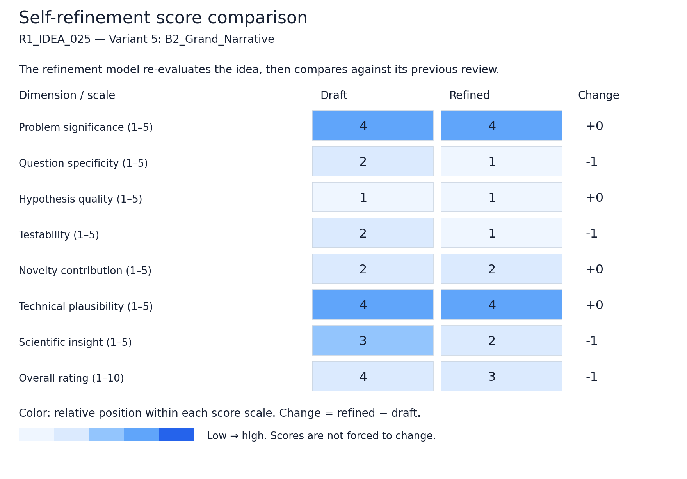

Changed score dimensions: question_specificity, testability, scientific_insight, overall_rating.

### Score justifications (draft / refined)

**Problem significance**

```json
{
  "draft": {
    "score": 4.0,
    "justification": "The problem is meaningful. The computational cost of long chain-of-thought reasoning is a recognized practical bottleneck for deploying large reasoning models. Understanding efficiency-accuracy trade-offs is a fundamental concern in scalable AI."
  },
  "refined": {
    "score": 4.0,
    "justification": "The problem is highly significant. The computational cost of long-chain reasoning is a major practical barrier to deploying and scaling advanced AI reasoning systems. Research into efficiency-accuracy trade-offs for deliberation is a core challenge in making AI systems scalable and sustainable."
  }
}
```

**Question specificity**

```json
{
  "draft": {
    "score": 2.0,
    "justification": "Very low specificity. The idea describes a challenge and a broad potential contribution ('could contribute to understanding...'), but does not define a concrete question. It mentions a 'larger research landscape' without specifying what part of it to explore."
  },
  "refined": {
    "score": 1.0,
    "justification": "Exceptionally low specificity. The idea does not define a research question. It describes a general challenge and a vague potential benefit ('could contribute to understanding'). There is no 'what' being investigated—only a context in which investigation might occur."
  }
}
```

**Hypothesis quality**

```json
{
  "draft": {
    "score": 1.0,
    "justification": "No hypothesis is present. The text describes an observation (LRMs need long reasoning) and a problem (computational cost), but makes no testable prediction about relationships, mechanisms, or outcomes of potential solutions."
  },
  "refined": {
    "score": 1.0,
    "justification": "No hypothesis is present, either explicit or implicit. The text is purely descriptive: it states a fact (LRMs generate long chains), identifies a consequence (computational cost), and mentions an existing technique (sparse attention). It makes no prediction, proposes no mechanism, and suggests no causal or correlational relationship to test."
  }
}
```

**Testability**

```json
{
  "draft": {
    "score": 2.0,
    "justification": "The idea as stated is not directly testable. It points to a general challenge and a broad research landscape. To be testable, it would need to propose specific methods to compare, metrics to evaluate, or relationships to measure."
  },
  "refined": {
    "score": 1.0,
    "justification": "The idea as presented is not testable. It points to a broad area ('larger research landscape') and a general goal ('understanding trade-offs') without proposing any specific experiment, comparison, analysis, or evaluation that could yield evidence. A researcher would have no idea what to measure or vary based on this description."
  }
}
```

**Novelty contribution**

```json
{
  "draft": {
    "score": 2.0,
    "justification": "The observation that long chain-of-thought is expensive and sparse attention is one solution is not novel. The potential contribution ('understanding fundamental trade-offs') is vague. The idea lacks a specific novel angle or proposed investigation that would clearly advance knowledge beyond the known problem statement."
  },
  "refined": {
    "score": 2.0,
    "justification": "The novelty is very low. The observation that long chain-of-thought is computationally expensive is well-known. The mention that sparse attention is one solution is a statement of existing practice. The suggestion that there is a broader research landscape is trivially true for any active field. The idea lacks any specific, novel angle of attack or investigation."
  }
}
```

**Technical plausibility**

```json
{
  "draft": {
    "score": 4.0,
    "justification": "The described scenario is technically coherent and plausible. Long autoregressive generation does create KV cache pressure, and sparse attention is a known mitigation technique. The reasoning is logically sound at the level of problem description."
  },
  "refined": {
    "score": 4.0,
    "justification": "The technical description is coherent and plausible. The causal chain—long autoregressive generation → large KV cache → computational/memory pressure—is correct. Sparse attention is a valid and known mitigation strategy. The logic at the level of problem statement is sound."
  }
}
```

**Scientific insight**

```json
{
  "draft": {
    "score": 3.0,
    "justification": "There is moderate potential for insight if the idea were developed. Investigating efficiency-accuracy trade-offs in reasoning models could reveal general principles about the cost of deliberation in AI systems. However, the current formulation is too vague to guarantee such insight would emerge."
  },
  "refined": {
    "score": 2.0,
    "justification": "The potential for scientific insight is weak in the current form. While the overarching topic (efficiency-accuracy trade-offs in reasoning) has high potential for insight, this idea does not propose a pathway to obtain it. It merely states the topic exists. Without a specific question or hypothesis, it's unclear what general principle or mechanism would be revealed."
  }
}
```

**Overall rating**

```json
{
  "draft": {
    "score": 4.0,
    "justification": "This is a weak research idea in its current form. It identifies a significant and real problem (computational cost of long reasoning in LRMs) but fails to define a specific research question, hypothesis, or testable direction. It reads more as a general observation and motivation than a research proposal. The core elements of a research idea—what will be investigated and how we might learn something new—are missing."
  },
  "refined": {
    "score": 3.0,
    "justification": "This is a weak research idea. It successfully identifies a significant and real-world problem, which is its primary strength. However, it completely fails as a proposal for research because it lacks the fundamental components of a research idea: a defined question, a testable hypothesis, and a suggested direction for investigation. It reads as background motivation or a problem statement, not as a blueprint for gaining new knowledge. The high problem significance is outweighed by the absence of a research core."
  }
}
```

## R1_IDEA_025 — Variant 6: B3_Over_Confident


Changed score dimensions: question_specificity, testability, novelty_contribution, scientific_insight, overall_rating.

### Score justifications (draft / refined)

**Problem significance**

```json
{
  "draft": {
    "score": 4.0,
    "justification": "The problem is meaningful - KV cache pressure from long reasoning sequences is a real computational bottleneck that affects the practical deployment of reasoning models. As LRMs become more important, efficient inference methods are crucial."
  },
  "refined": {
    "score": 4.0,
    "justification": "The problem is significant. Efficient inference for large reasoning models is a major practical challenge as these models become more capable and widely used. KV cache pressure is a well-known bottleneck for long-sequence generation, making research into efficient attention mechanisms highly relevant."
  }
}
```

**Question specificity**

```json
{
  "draft": {
    "score": 2.0,
    "justification": "The idea lacks a clearly defined research question. It observes that sparse attention has 'clear limitations' but doesn't specify what should be investigated about these limitations or what the research aims to discover."
  },
  "refined": {
    "score": 1.0,
    "justification": "The idea lacks a defined research question. It states a fact (sparse attention has limitations) but does not ask anything specific to investigate. There is no 'what', 'why', or 'how' question posed."
  }
}
```

**Hypothesis quality**

```json
{
  "draft": {
    "score": 1.0,
    "justification": "No hypothesis is presented. The text merely states that sparse attention methods have limitations without making any testable prediction about why they fail or what might work better."
  },
  "refined": {
    "score": 1.0,
    "justification": "There is no hypothesis, implicit or explicit. The text contains no predictive statement, proposed mechanism, or relationship that could be tested. It is purely descriptive."
  }
}
```

**Testability**

```json
{
  "draft": {
    "score": 2.0,
    "justification": "While the general problem of evaluating sparse attention for reasoning is testable, the idea doesn't propose any specific test or investigation. Without a clearer question or hypothesis, it's unclear what evidence would support or contradict the core claim."
  },
  "refined": {
    "score": 1.0,
    "justification": "The core statement ('sparse attention has limitations') is, in principle, testable. However, the idea proposes no test, experiment, evaluation, or analysis. Without a specific question or hypothesis, there is no defined investigation to assess."
  }
}
```

**Novelty contribution**

```json
{
  "draft": {
    "score": 3.0,
    "justification": "The observation that sparse attention might have limitations for reasoning tasks has some novelty, but without a specific investigation angle, the potential contribution is limited. Many papers have studied sparse attention limitations in various contexts."
  },
  "refined": {
    "score": 2.0,
    "justification": "The potential contribution is very low in its current form. It points to an application area (reasoning models) for a known technique (sparse attention) and notes it might not work well—a common starting point. Without a specific angle, it risks being a generic 'apply X to Y and see if it breaks' study. The novelty lies only in the specific domain (LRMs), but the idea does not leverage this to propose a unique investigation."
  }
}
```

**Technical plausibility**

```json
{
  "draft": {
    "score": 4.0,
    "justification": "The reasoning is logically coherent - long reasoning sequences do create KV cache pressure, and sparse attention is a known approach to address this. The claim that sparse attention has limitations for reasoning tasks is plausible given the sequential nature of reasoning."
  },
  "refined": {
    "score": 4.0,
    "justification": "The logical chain is coherent and plausible. Long reasoning sequences do cause KV cache growth, sparse attention is a standard tool to reduce this, and it is reasonable to suspect that the structured, sequential nature of reasoning might make it particularly sensitive to the information loss from sparsity. No unreasonable assumptions are made."
  }
}
```

**Scientific insight**

```json
{
  "draft": {
    "score": 3.0,
    "justification": "If properly investigated, this could yield insights about the interaction between attention mechanisms and reasoning processes, or about tradeoffs between computational efficiency and reasoning quality. However, the current formulation is too vague to guarantee meaningful insights."
  },
  "refined": {
    "score": 2.0,
    "justification": "If a specific investigation were built upon this observation, it could yield insights into the attention patterns required for robust reasoning or the trade-offs between efficiency and cognitive fidelity in models. However, the idea as presented promises no such insight; it merely flags a potential problem area. The potential for generalizable knowledge is currently very low."
  }
}
```

**Overall rating**

```json
{
  "draft": {
    "score": 4.0,
    "justification": "This is a weak research idea that identifies a meaningful problem but lacks a clear research question, hypothesis, or investigation direction. It's more of an observation than a research proposal. The idea needs substantial refinement to become a viable research direction."
  },
  "refined": {
    "score": 3.0,
    "justification": "This is a weak research idea. It identifies a meaningful and significant problem but fails to advance beyond a superficial observation. It lacks the core components of a research idea: a specific question, a testable hypothesis, and a suggested direction for inquiry. It is a prompt for an idea, not an idea itself. It requires substantial development to become a viable research direction."
  }
}
```

## R1_IDEA_025 — Variant 7: B4_Novelty

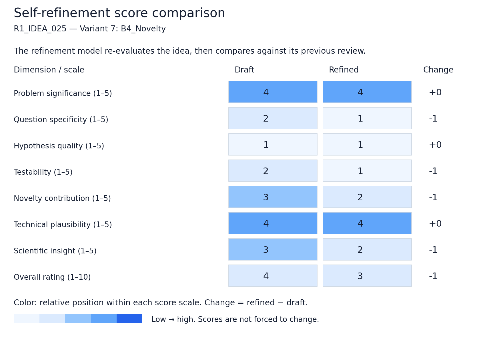

Changed score dimensions: question_specificity, testability, novelty_contribution, scientific_insight, overall_rating.

### Score justifications (draft / refined)

**Problem significance**

```json
{
  "draft": {
    "score": 4.0,
    "justification": "The problem is meaningful: long chain-of-thought reasoning is computationally expensive and increasingly relevant as models tackle harder tasks. Efficiency-accuracy trade-offs in reasoning are underexplored and important for real-world deployment."
  },
  "refined": {
    "score": 4.0,
    "justification": "The problem is highly significant. As models perform more complex reasoning via long chain-of-thought, computational efficiency becomes a critical barrier to practical use. Understanding or improving the efficiency-accuracy trade-off specifically for reasoning is a meaningful challenge for both research and deployment."
  }
}
```

**Question specificity**

```json
{
  "draft": {
    "score": 2.0,
    "justification": "The idea only vaguely points to an 'underexplored angle' without defining a concrete question. It mentions sparse attention and a 'fresh framing' but doesn't specify what aspect of the trade-off or optimization is being investigated."
  },
  "refined": {
    "score": 1.0,
    "justification": "Extremely low specificity. The idea mentions an 'underexplored angle' and a 'fresh framing' but does not define any concrete question. There is no 'what,' 'how,' or 'why' to investigate. It is a topic statement, not a research question."
  }
}
```

**Hypothesis quality**

```json
{
  "draft": {
    "score": 1.0,
    "justification": "No hypothesis is presented. The text describes a problem and mentions existing methods, but makes no testable prediction about relationships, mechanisms, or outcomes."
  },
  "refined": {
    "score": 1.0,
    "justification": "No hypothesis is present, either explicit or implicit. The text describes a situation (LRMs are slow due to long reasoning) and mentions a tool (sparse attention). It makes no prediction, proposes no mechanism, and identifies no relationship to test."
  }
}
```

**Testability**

```json
{
  "draft": {
    "score": 2.0,
    "justification": "The idea as stated is not directly testable because it lacks a specific claim or question to investigate. However, the general direction (evaluating sparse attention for reasoning efficiency) could be made testable with more definition."
  },
  "refined": {
    "score": 1.0,
    "justification": "The idea as stated is not testable. There is no central claim or defined relationship to investigate. While one could imagine tests related to sparse attention and reasoning models, the idea itself does not propose any form of evaluation, comparison, or analysis to obtain evidence."
  }
}
```

**Novelty contribution**

```json
{
  "draft": {
    "score": 3.0,
    "justification": "Focusing on efficiency for long reasoning chains is a relevant niche, but sparse attention for KV cache reduction is not novel in itself. The potential novelty lies in the 'fresh framing,' but this is not elaborated."
  },
  "refined": {
    "score": 2.0,
    "justification": "The potential contribution is very limited as described. The core observation—long reasoning is expensive—is well-known. Sparse attention for KV cache reduction is an established technique. The hint at a 'fresh framing' is the only potential source of novelty, but it is completely unspecified, so the idea largely points to applying known methods to a new model class (LRMs)."
  }
}
```

**Technical plausibility**

```json
{
  "draft": {
    "score": 4.0,
    "justification": "The reasoning is coherent: long reasoning → many tokens → KV cache pressure → sparse attention as a solution. The connection between problem and direction is plausible."
  },
  "refined": {
    "score": 4.0,
    "justification": "The logical chain is coherent and plausible: long autoregressive reasoning generates many tokens → this creates KV cache memory pressure → sparse attention is a known method to reduce this pressure. The connection between the problem and the mentioned technical direction is sound."
  }
}
```

**Scientific insight**

```json
{
  "draft": {
    "score": 3.0,
    "justification": "If developed into a concrete study, it could reveal insights about how reasoning accuracy depends on attention patterns or cache management, but the current description is too vague to guarantee deep insight."
  },
  "refined": {
    "score": 2.0,
    "justification": "The current description promises little scientific insight. It suggests applying an existing efficiency method to a new type of model. A concrete study could yield insight (e.g., into which parts of reasoning are most fragile to approximation), but the idea does not frame such an investigation. It is primarily an engineering observation."
  }
}
```

**Overall rating**

```json
{
  "draft": {
    "score": 4.0,
    "justification": "The idea identifies a significant and timely problem but lacks a clear research question, hypothesis, or methodological direction. It is more of an observation than a research plan. With refinement, it could become a strong idea, but in its current form it is weak as a research proposal."
  },
  "refined": {
    "score": 3.0,
    "justification": "This is a weak research idea. It identifies a significant and real-world problem but fails to formulate any research question, hypothesis, or methodological direction. It reads as a brief observation or motivation paragraph, not as a proposal for scientific investigation. Without a defined question or testable claim, its potential for contribution is minimal. It would require substantial refinement to become a viable research direction."
  }
}
```

## R1_IDEA_025 — Variant 8: B5_Application_Impact


Changed score dimensions: question_specificity, testability.

### Score justifications (draft / refined)

**Problem significance**

```json
{
  "draft": {
    "score": 4.0,
    "justification": "The problem is meaningful: LRMs are computationally expensive due to long chain-of-thought, and efficiency is critical for deployment. This addresses a real challenge in making advanced reasoning models practical."
  },
  "refined": {
    "score": 4.0,
    "justification": "The problem is highly meaningful. LRMs with long chain-of-thought reasoning are computationally expensive, and efficiency is critical for real-world deployment. This addresses a genuine bottleneck in making advanced reasoning models practical."
  }
}
```

**Question specificity**

```json
{
  "draft": {
    "score": 2.0,
    "justification": "The idea is vague. It notes sparse attention 'may be relevant' but does not define a concrete question about how, when, or why it would help. No specific relationship or phenomenon to investigate is stated."
  },
  "refined": {
    "score": 1.0,
    "justification": "Extremely vague. The idea does not define a research question—it merely notes that sparse attention 'may be relevant.' There is no specification of what aspect to investigate, what relationship to examine, or what phenomenon to study."
  }
}
```

**Hypothesis quality**

```json
{
  "draft": {
    "score": 1.0,
    "justification": "There is no explicit or implicit hypothesis. The idea merely suggests a possible connection without a testable prediction about outcomes, mechanisms, or conditions."
  },
  "refined": {
    "score": 1.0,
    "justification": "No hypothesis exists, either explicit or implicit. The text makes no testable prediction about outcomes, mechanisms, or conditions. It merely suggests a possible area of relevance without any falsifiable claim."
  }
}
```

**Testability**

```json
{
  "draft": {
    "score": 2.0,
    "justification": "While one could design experiments (e.g., benchmarking sparse attention in LRMs), the idea itself does not suggest how to test the relevance claim. It lacks a clear evaluation plan or comparison framework."
  },
  "refined": {
    "score": 1.0,
    "justification": "The idea itself provides no suggestion for how to test the claim. While one could design experiments retroactively, the proposal lacks any evaluation plan, comparison framework, or method for obtaining evidence. The statement 'may be relevant' is not inherently testable without further specification."
  }
}
```

**Novelty contribution**

```json
{
  "draft": {
    "score": 2.0,
    "justification": "Sparse attention is a well-studied technique for efficiency. Applying it to LRMs is a straightforward application, not a novel research direction unless it uncovers new phenomena (e.g., how sparsity affects reasoning quality in specific ways). The idea as stated does not aim for such insight."
  },
  "refined": {
    "score": 2.0,
    "justification": "Applying sparse attention to improve efficiency is a well-established research area. Using it for LRMs is a straightforward application unless it uncovers new phenomena (e.g., how reasoning quality degrades with specific sparsity patterns). The idea as stated does not aim for such insight—it's a generic suggestion of applicability."
  }
}
```

**Technical plausibility**

```json
{
  "draft": {
    "score": 4.0,
    "justification": "The reasoning is coherent: sparse attention reduces KV cache size, which could help with long sequences. This is technically plausible given known properties of sparse attention."
  },
  "refined": {
    "score": 4.0,
    "justification": "The basic reasoning is coherent: sparse attention reduces KV cache size, which could alleviate memory pressure from long sequences. This is technically plausible given known properties of sparse attention mechanisms and the identified bottleneck."
  }
}
```

**Scientific insight**

```json
{
  "draft": {
    "score": 2.0,
    "justification": "As presented, the idea is primarily about applying an existing technique to a new model type. It does not suggest investigating underlying mechanisms (e.g., how reasoning chains depend on attention patterns) or deriving general principles. Insight would be limited to performance trade-offs."
  },
  "refined": {
    "score": 2.0,
    "justification": "As presented, the idea is primarily about applying an existing technique to a new model category. It does not suggest investigating underlying mechanisms (e.g., how reasoning chains depend on attention patterns), discovering boundary conditions, or deriving general principles. Any insight would be limited to empirical performance trade-offs on specific tasks."
  }
}
```

**Overall rating**

```json
{
  "draft": {
    "score": 3.0,
    "justification": "The idea identifies a relevant problem but lacks a concrete research question, hypothesis, or methodological direction. It is more of an observation than a research idea. Without greater specificity, it is unlikely to lead to meaningful scientific contribution beyond routine benchmarking."
  },
  "refined": {
    "score": 3.0,
    "justification": "The idea identifies a relevant and significant problem but fails to articulate a research question, hypothesis, or methodological direction. It is essentially an observation rather than a research idea. Without greater specificity about what to investigate and how, it lacks the core components needed for meaningful scientific contribution."
  }
}
```

## R1_IDEA_025 — Variant 9: C1_Hollow_Shell


Changed score dimensions: testability, novelty_contribution, scientific_insight, overall_rating.

### Score justifications (draft / refined)

**Problem significance**

```json
{
  "draft": {
    "score": 4.0,
    "justification": "Computational efficiency of advanced AI models is a meaningful and timely problem, especially as models incorporate more internal reasoning (e.g., chain-of-thought, self-correction). Improving efficiency could enable broader deployment and reduce costs."
  },
  "refined": {
    "score": 4.0,
    "justification": "The problem of computational efficiency for advanced AI models is highly significant. As models incorporate more complex internal reasoning (e.g., chain-of-thought, self-reflection), their resource demands grow, impacting deployment cost, accessibility, and environmental impact. Improving efficiency is a core challenge for the field."
  }
}
```

**Question specificity**

```json
{
  "draft": {
    "score": 1.0,
    "justification": "The idea does not define a research question. It merely states that computational demands exist and that technical approaches have constraints, without specifying what will be investigated."
  },
  "refined": {
    "score": 1.0,
    "justification": "The idea does not define a research question. It makes a general observation about computational demands and existing techniques. There is no specific 'what' to investigate."
  }
}
```

**Hypothesis quality**

```json
{
  "draft": {
    "score": 1.0,
    "justification": "No hypothesis is presented. There is no prediction, mechanism, or relationship to test. The statement is purely descriptive."
  },
  "refined": {
    "score": 1.0,
    "justification": "There is no hypothesis. The text contains no prediction, proposed mechanism, or testable relationship. It is purely descriptive."
  }
}
```

**Testability**

```json
{
  "draft": {
    "score": 2.0,
    "justification": "The idea is too vague to be directly testable. However, the general topic of computational efficiency is testable if a specific approach and evaluation are defined."
  },
  "refined": {
    "score": 1.0,
    "justification": "The idea as stated is not testable. It does not suggest an experiment, comparison, analysis, or any method to obtain evidence. The topic area is testable, but the idea itself provides no testable proposition."
  }
}
```

**Novelty contribution**

```json
{
  "draft": {
    "score": 2.0,
    "justification": "As stated, the idea lacks novelty because it only mentions existing technical approaches and their constraints without proposing anything new. The potential contribution is unclear."
  },
  "refined": {
    "score": 1.0,
    "justification": "The idea, as presented, has zero novelty. It states a well-known fact: advanced models are computationally expensive, and techniques to manage this exist but have limits. It proposes no new method, analysis, or perspective."
  }
}
```

**Technical plausibility**

```json
{
  "draft": {
    "score": 3.0,
    "justification": "The general direction is plausible—computational demands are a real issue, and technical approaches exist. However, without specifics, it's impossible to assess the coherence of any particular approach."
  },
  "refined": {
    "score": 3.0,
    "justification": "The general premise is technically plausible—computational demands are a real issue, and technical approaches to manage them exist. However, with no specific approach or mechanism proposed, the technical coherence of any particular direction cannot be assessed."
  }
}
```

**Scientific insight**

```json
{
  "draft": {
    "score": 2.0,
    "justification": "As presented, the idea offers little potential for scientific insight. It does not suggest studying underlying mechanisms, trade-offs, or principles. It could lead to insight if refocused on, e.g., the relationship between internal processing complexity and efficiency trade-offs."
  },
  "refined": {
    "score": 1.0,
    "justification": "The idea offers no pathway to scientific insight. It does not propose to uncover mechanisms, principles, trade-offs, or boundary conditions. It is a surface-level statement with no depth for learning something new about AI systems."
  }
}
```

**Overall rating**

```json
{
  "draft": {
    "score": 3.0,
    "justification": "The idea identifies a relevant problem but fails to articulate a research question, hypothesis, or specific direction. It reads as a generic observation rather than a research idea. Without substantial refinement, it lacks the specificity and novelty needed for a strong research direction."
  },
  "refined": {
    "score": 2.0,
    "justification": "This is a very weak research idea. While it touches on a significant problem, it fails to articulate any research question, hypothesis, or specific direction. It reads as a generic background statement, not a proposal for investigation. It lacks the minimal specificity, novelty, and testability required for a meaningful research direction."
  }
}
```

## R1_IDEA_025 — Variant 10: C2_Logic_Flawed

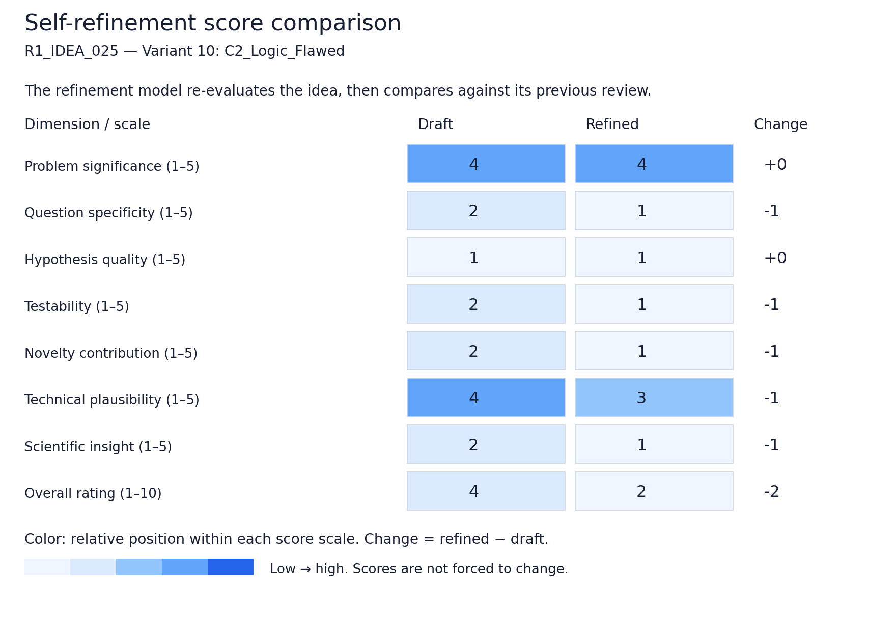

Changed score dimensions: question_specificity, testability, novelty_contribution, technical_plausibility, scientific_insight, overall_rating.

### Score justifications (draft / refined)

**Problem significance**

```json
{
  "draft": {
    "score": 4.0,
    "justification": "The problem of KV cache pressure in long-sequence generation is meaningful and practically important, especially as models generate longer reasoning traces. Efficiency challenges in large models are a active research area."
  },
  "refined": {
    "score": 4.0,
    "justification": "The underlying problem—managing computational/memory overhead during long-sequence generation in large models—is highly significant. As models generate longer reasoning traces and documents, KV cache pressure is a major practical bottleneck for deployment and research."
  }
}
```

**Question specificity**

```json
{
  "draft": {
    "score": 2.0,
    "justification": "The idea is very vague—it only suggests 'broader effectiveness across related settings' without defining those settings or what effectiveness means. No concrete research question is posed."
  },
  "refined": {
    "score": 1.0,
    "justification": "Extremely low specificity. The idea does not define a research question. It states an observation and then makes a vague, open-ended suggestion ('broader effectiveness across related settings') without specifying what is being investigated, in what contexts, or to what end."
  }
}
```

**Hypothesis quality**

```json
{
  "draft": {
    "score": 1.0,
    "justification": "There is no explicit or implicit hypothesis. The statement is observational ('sparse attention methods can help') followed by a vague suggestion ('suggest broader effectiveness'), not a testable prediction."
  },
  "refined": {
    "score": 1.0,
    "justification": "There is no hypothesis. The text contains an observation ('sparse attention methods can help') and a vague implication ('suggest broader effectiveness'). There is no concrete, testable prediction about a relationship, mechanism, or comparative outcome."
  }
}
```

**Testability**

```json
{
  "draft": {
    "score": 2.0,
    "justification": "Without a defined hypothesis, settings, or metrics, it's unclear how one would test the idea. It could be made testable by specifying tasks, comparisons, and evaluation criteria, but as stated it's too vague."
  },
  "refined": {
    "score": 1.0,
    "justification": "As presented, the idea is not testable. There is no defined claim to test, no specified settings to evaluate in, and no proposed metrics for comparison. It is a suggestion, not a research direction that can be investigated."
  }
}
```

**Novelty contribution**

```json
{
  "draft": {
    "score": 2.0,
    "justification": "Sparse attention is a well-studied technique; applying it to other long-sequence tasks is not inherently novel. The idea lacks a specific novel angle—e.g., a new insight about when or why sparse attention transfers, or a new variant tailored to reasoning-like generation."
  },
  "refined": {
    "score": 1.0,
    "justification": "Applying sparse attention to long-sequence tasks is not novel; sparse attention is a well-established technique for efficiency. The idea, as a vague suggestion of broader applicability, lacks any novel angle, insight, or proposed innovation. It does not propose testing a new hypothesis about transfer conditions or developing a new method."
  }
}
```

**Technical plausibility**

```json
{
  "draft": {
    "score": 4.0,
    "justification": "The technical reasoning is coherent: sparse attention reduces KV cache size, which is useful for long sequences. It's plausible that benefits could extend to other long-sequence tasks, though the extent is uncertain."
  },
  "refined": {
    "score": 3.0,
    "justification": "The initial technical observation is coherent: sparse attention reduces KV cache size for long sequences. The suggestion that this might benefit other long-sequence tasks is superficially plausible but is presented as an unsupported leap. The reasoning is logical but incomplete and lacks depth."
  }
}
```

**Scientific insight**

```json
{
  "draft": {
    "score": 2.0,
    "justification": "As presented, the idea seems like a generic application suggestion rather than one aimed at producing new scientific understanding. It could be refined to explore, e.g., principles of efficient long-context generation or task characteristics that favor sparse attention."
  },
  "refined": {
    "score": 1.0,
    "justification": "The idea, in its current form, promises almost no scientific insight. It reads as a generic suggestion for applying an existing tool elsewhere. It does not aim to uncover new principles, explain phenomena, identify boundary conditions, or test a meaningful hypothesis about model efficiency or generalization."
  }
}
```

**Overall rating**

```json
{
  "draft": {
    "score": 4.0,
    "justification": "The idea identifies a relevant practical problem but lacks a clear research question, hypothesis, or specificity. It reads more as an observation than a research direction. With refinement—defining settings, formulating a hypothesis, and specifying evaluations—it could become a solid idea, but as presented it's weak."
  },
  "refined": {
    "score": 2.0,
    "justification": "This is a very weak research idea. While it starts from a significant practical problem, it fails to articulate any research question, hypothesis, or specific direction. It is essentially an observation followed by a vague suggestion of applicability. It lacks the core components of a research idea: specificity, testability, and a clear path to contribution. With substantial refinement, it could become a research direction, but as presented, it is not one."
  }
}
```

## R1_IDEA_025 — Variant 11: C3_Substance_Enriched


Changed score dimensions: none.

### Score justifications (draft / refined)

**Problem significance**

```json
{
  "draft": {
    "score": 4.0,
    "justification": "The problem is highly significant. LRMs with long chain-of-thought are computationally expensive at inference, making efficiency methods like sparse attention practically important for deployment. Understanding their limits is a valuable research goal."
  },
  "refined": {
    "score": 4.0,
    "justification": "The problem is highly significant. LRMs with long chain-of-thought reasoning are computationally expensive at inference, making efficiency methods crucial for practical deployment. Understanding the limitations of sparse attention in this context addresses a real-world challenge with clear relevance to researchers and practitioners."
  }
}
```

**Question specificity**

```json
{
  "draft": {
    "score": 2.0,
    "justification": "The research question is moderately specific in identifying a general area of investigation (testing sparse attention in LRMs) but lacks precision. It does not specify what constitutes a 'boundary condition' or what relationships are being tested. The initial hypothesis about reasoning length and task complexity is mentioned but not integrated into the core question."
  },
  "refined": {
    "score": 2.0,
    "justification": "The research question is moderately specific in identifying a general area (testing sparse attention in LRMs) but lacks precision. It does not define what 'boundary conditions' means, what relationships are being tested, or how the initial observation about reasoning length and task complexity connects to the core investigation. The question remains vague: 'test under varying conditions' is not a well-defined research question."
  }
}
```

**Hypothesis quality**

```json
{
  "draft": {
    "score": 2.0,
    "justification": "The idea contains an implicit hypothesis that 'efficiency gains of sparse attention diminish under some conditions,' but this is very broad. A stronger hypothesis would predict under *what specific conditions* this occurs (e.g., beyond a certain sequence length, or for tasks requiring specific reasoning patterns). The initial hint about reasoning length and task complexity is a separate, undeveloped hypothesis."
  },
  "refined": {
    "score": 2.0,
    "justification": "The idea contains only a very broad implicit hypothesis: 'efficiency gains of sparse attention might diminish under some conditions.' This is not a concrete, falsifiable prediction. There's no specification of what conditions might cause this, what 'diminish' means, or how it relates to model performance. The separate mention about reasoning length correlating with task complexity is an undeveloped hypothesis that isn't integrated into the main proposal."
  }
}
```

**Testability**

```json
{
  "draft": {
    "score": 3.0,
    "justification": "The idea is testable in principle. One can implement sparse attention for an LRM, vary sequence lengths and attention patterns, and measure efficiency and accuracy. However, without a clearer definition of the 'boundary condition' (e.g., a specific performance drop threshold), the test design remains vague."
  },
  "refined": {
    "score": 3.0,
    "justification": "The idea is testable in principle because one can implement sparse attention in an LRM, vary sequence lengths and patterns, and measure efficiency metrics. However, without a clear definition of the 'boundary condition' or success criteria, the experimental design remains vague. The testability is moderate because while experiments can be run, it's unclear what specific hypothesis they would test."
  }
}
```

**Novelty contribution**

```json
{
  "draft": {
    "score": 3.0,
    "justification": "Sparse attention has been studied extensively in general language models. The novelty lies in its application to the specific context of LRMs with very long reasoning chains. The potential contribution is characterizing the limitations of these methods in this new regime, which is not yet well understood. However, it is primarily an application/evaluation study rather than a novel methodological contribution."
  },
  "refined": {
    "score": 3.0,
    "justification": "Sparse attention has been extensively studied for general language models. The novelty lies in applying it to the specific context of LRMs with very long reasoning chains. The potential contribution is characterizing limitations in this new regime, which isn't well understood. However, this is primarily an application/evaluation study rather than a novel methodological contribution. The insight about boundary conditions could be useful but isn't groundbreaking."
  }
}
```

**Technical plausibility**

```json
{
  "draft": {
    "score": 4.0,
    "justification": "The direction is technically plausible. Sparse attention is a known technique for reducing computational cost, and LRMs are a natural target due to their long generations. The reasoning that long sequences might stress these methods is sound. No obvious technical flaws are apparent from the summary."
  },
  "refined": {
    "score": 4.0,
    "justification": "The direction is technically plausible. Sparse attention is a well-established technique for reducing computational cost, and LRMs with long generations are a natural application. The reasoning that long sequences might stress these methods is sound. No obvious technical flaws are apparent from the summary, assuming standard sparse attention implementations can be adapted to LRMs."
  }
}
```

**Scientific insight**

```json
{
  "draft": {
    "score": 3.0,
    "justification": "If successful, the research could provide insight into the boundary conditions of sparse attention when applied to long, structured reasoning sequences. This could reveal trade-offs between efficiency and the ability to maintain certain types of long-range dependencies needed for complex reasoning. However, the insight might be limited to engineering guidelines unless it connects findings to deeper properties of reasoning or attention mechanisms."
  },
  "refined": {
    "score": 3.0,
    "justification": "If successful, the research could provide practical insight into when sparse attention fails for long reasoning sequences, potentially revealing trade-offs between efficiency and the ability to maintain certain long-range dependencies needed for complex reasoning. However, the insight might be limited to engineering guidelines unless it connects findings to deeper properties of reasoning or attention mechanisms. The potential for fundamental scientific insight is moderate."
  }
}
```

**Overall rating**

```json
{
  "draft": {
    "score": 5.0,
    "justification": "This is a moderate/borderline research idea. It addresses a significant and practical problem (efficiency of LRMs) and proposes a plausible technical direction (evaluating sparse attention). However, the research question is underspecified, the hypothesis is weak and not well integrated, and the potential for deep scientific insight is limited without a more focused investigation into the *why* behind any discovered boundary conditions. It currently reads more like a sensible evaluation plan than a compelling research hypothesis."
  },
  "refined": {
    "score": 5.0,
    "justification": "This is a moderate/borderline research idea. It addresses a significant practical problem (efficiency of LRMs) and proposes a technically plausible direction (evaluating sparse attention). However, the research question is underspecified, the hypothesis is weak and not well integrated, and the potential for deep scientific insight is limited without a more focused investigation. It currently reads more like a sensible evaluation plan than a compelling research hypothesis with clear predictive power. The idea needs more specificity to become a strong research direction."
  }
}
```

## R1_IDEA_025 — Variant 12: H1_Deceptive_Hollow


Changed score dimensions: none.

### Score justifications (draft / refined)

**Problem significance**

```json
{
  "draft": {
    "score": 4.0,
    "justification": "The underlying problem—managing computational cost in models that perform extensive internal processing—is highly significant. As models become more capable on complex tasks, their inference-time compute grows, creating a major practical and environmental challenge. The idea correctly identifies this as an important area."
  },
  "refined": {
    "score": 4.0,
    "justification": "The underlying problem of managing computational costs in models performing extensive internal processing is highly significant. As models tackle more complex tasks with increased internal reasoning, inference-time compute grows substantially, creating practical, economic, and environmental challenges. This is a genuine and important research area."
  }
}
```

**Question specificity**

```json
{
  "draft": {
    "score": 1.0,
    "justification": "There is no research question defined. The text describes a general area ('manage computational demands') and a grand vision ('transformative synthesis'), but does not specify what is being investigated. It is a topic, not a question."
  },
  "refined": {
    "score": 1.0,
    "justification": "There is no research question defined. The text describes a general area ('manage computational demands') and a grand vision ('transformative synthesis'), but does not specify what is being investigated. It presents a topic, not a question."
  }
}
```

**Hypothesis quality**

```json
{
  "draft": {
    "score": 1.0,
    "justification": "There is no hypothesis, explicit or implicit. There is a claim of potential importance and a promise of synthesis, but no concrete, testable prediction about a mechanism, relationship, or outcome."
  },
  "refined": {
    "score": 1.0,
    "justification": "There is no hypothesis, explicit or implicit. There are claims of potential importance and promises of synthesis, but no concrete, testable prediction about mechanisms, relationships, or outcomes. The idea lacks any falsifiable statement."
  }
}
```

**Testability**

```json
{
  "draft": {
    "score": 1.0,
    "justification": "The idea as presented is not testable. It proposes a 'framework' and 'agenda' but gives no indication of how one would gather evidence for or against its central promise. There is no suggested experiment, comparison, or analysis."
  },
  "refined": {
    "score": 1.0,
    "justification": "The idea as presented is not testable. It proposes a 'framework' and 'agenda' but gives no indication of how one would gather evidence for or against its central promise. No experiment, comparison, analysis, or evaluation method is suggested."
  }
}
```

**Novelty contribution**

```json
{
  "draft": {
    "score": 2.0,
    "justification": "The contribution is framed as novel and transformative, but the description is too vague to assess. It mentions 'certain technical approaches' exist, implying the core technical challenge is known. The proposed novelty seems to be in the 'synthesis' and 'framing,' but without specifics, it risks being a repackaging of existing efficiency research."
  },
  "refined": {
    "score": 2.0,
    "justification": "The contribution is framed as novel and transformative, but the description is too vague to assess. Mentioning 'certain technical approaches' exist suggests the core technical challenge is known. The proposed novelty appears to be in 'synthesis' and 'framing,' but without specifics, it risks being a repackaging of existing efficiency research rather than a genuinely novel contribution."
  }
}
```

**Technical plausibility**

```json
{
  "draft": {
    "score": 3.0,
    "justification": "The general direction of improving computational efficiency for reasoning models is technically plausible and an active research area. However, the idea provides no technical reasoning or proposed mechanism to evaluate. Its plausibility rests entirely on the known existence of the problem, not on a proposed solution."
  },
  "refined": {
    "score": 3.0,
    "justification": "The general direction of improving computational efficiency for reasoning models is technically plausible and aligns with active research areas. However, the idea provides no technical reasoning, proposed mechanism, or methodological direction to evaluate. Its plausibility rests entirely on the known existence of the problem, not on any proposed solution approach."
  }
}
```

**Scientific insight**

```json
{
  "draft": {
    "score": 2.0,
    "justification": "The potential for insight is claimed to be high ('reshape how the community thinks'), but the idea does not articulate what that insight would be. A successful research program in this area could indeed yield insights into the cost-quality trade-offs of internal computation or the structure of reasoning. However, the current proposal is too amorphous to promise such insight; it merely states the ambition."
  },
  "refined": {
    "score": 2.0,
    "justification": "The potential for insight is claimed to be high ('reshape how the community thinks'), but the idea does not articulate what that insight would be. While a successful research program in this area could yield insights into cost-quality trade-offs or reasoning structure, the current proposal is too amorphous to promise such insight. It states ambition without substance."
  }
}
```

**Overall rating**

```json
{
  "draft": {
    "score": 2.0,
    "justification": "This is a very weak research idea in its current form. While it identifies a significant problem, it fails to propose any specific research question, hypothesis, or methodological direction. It is a declaration of importance and a vision statement, not a testable scientific idea. It lacks the core components required for meaningful evaluation: specificity, falsifiability, and a clear path to generating new knowledge. To become a research idea, it must be drastically refined into a concrete investigation."
  },
  "refined": {
    "score": 2.0,
    "justification": "This is a very weak research idea in its current form. While it identifies a significant problem, it fails to propose any specific research question, hypothesis, or methodological direction. It is a declaration of importance and a vision statement, not a testable scientific idea. It lacks the core components required for meaningful evaluation: specificity, falsifiability, and a clear path to generating new knowledge. The idea needs drastic refinement to become investigable research."
  }
}
```

## R1_IDEA_025 — Variant 13: H2_Confident_Flaw


Changed score dimensions: none.

### Score justifications (draft / refined)

**Problem significance**

```json
{
  "draft": {
    "score": 4.0,
    "justification": "The problem of KV cache pressure during long autoregressive reasoning is meaningful and practically important for deploying large reasoning models. Reducing computational overhead while maintaining reasoning quality is a relevant challenge for the field."
  },
  "refined": {
    "score": 4.0,
    "justification": "The problem is meaningful: KV cache pressure during long autoregressive reasoning is a practical bottleneck for deploying large reasoning models. Reducing computational overhead while maintaining performance is a relevant challenge with real-world implications."
  }
}
```

**Question specificity**

```json
{
  "draft": {
    "score": 1.0,
    "justification": "Extremely weak. The idea doesn't define a research question at all. It makes a broad assertion ('suggest broader effectiveness') without specifying what aspect to investigate, under what conditions, or with what methodology."
  },
  "refined": {
    "score": 1.0,
    "justification": "Extremely weak. No research question is defined. The text makes a vague assertion ('suggest broader effectiveness') without specifying what to investigate, under what conditions, or with what methodology. It lacks any concrete investigative focus."
  }
}
```

**Hypothesis quality**

```json
{
  "draft": {
    "score": 1.0,
    "justification": "Very poor. There's no testable hypothesis presented. The closest is an implicit claim that 'solving KV cache limitation proves general superiority,' which is not falsifiable as stated and contains logical leaps. It dismisses the need for controlled testing."
  },
  "refined": {
    "score": 1.0,
    "justification": "Very poor. There is no testable hypothesis. The implicit claim—that solving KV cache pressure proves general superiority—is unfalsifiable as stated, contains logical leaps, and dismisses the need for hypothesis testing. It is an assertion, not a hypothesis."
  }
}
```

**Testability**

```json
{
  "draft": {
    "score": 2.0,
    "justification": "Weak. While one could design experiments to test sparse attention in long-sequence generation, the idea itself provides no framework for testing. It even argues that proper experimental controls ('isolating dataset composition, evaluation criteria...') are unnecessary, which undermines testability."
  },
  "refined": {
    "score": 2.0,
    "justification": "Weak. While experiments on sparse attention for long sequences are technically feasible, the idea provides no framework for testing. It explicitly argues that controlled experimentation ('isolating dataset composition, evaluation criteria...') is unnecessary, undermining testability. The claim is presented as self-evident rather than something to be investigated."
  }
}
```

**Novelty contribution**

```json
{
  "draft": {
    "score": 2.0,
    "justification": "Weak. The application of sparse attention to long-sequence generation is not novel in itself. The potential contribution is limited by the lack of a specific research angle—it reads more like an observation than a novel investigation. The claim that addressing one weakness proves general superiority is conceptually flawed rather than novel."
  },
  "refined": {
    "score": 2.0,
    "justification": "Weak. Applying sparse attention to long-sequence generation is not novel. The idea lacks a specific research angle—it reads as an observation, not a novel investigation. The flawed argument that addressing one weakness proves general superiority does not constitute a novel contribution."
  }
}
```

**Technical plausibility**

```json
{
  "draft": {
    "score": 3.0,
    "justification": "Moderate. The connection between sparse attention and KV cache reduction is technically sound. However, the logical leap that solving this one problem 'necessarily' leads to reliable improvements across all related settings is not plausible without evidence. The dismissal of confounding factors is technically unsound."
  },
  "refined": {
    "score": 3.0,
    "justification": "Moderate. The basic technical link between sparse attention and KV cache reduction is sound. However, the leap that solving this one problem 'necessarily' leads to reliable improvements across all related settings is implausible without evidence. Dismissing confounding factors is technically unsound for causal claims."
  }
}
```

**Scientific insight**

```json
{
  "draft": {
    "score": 1.0,
    "justification": "Very weak. The idea actively discourages scientific insight by arguing that isolating variables and considering alternative explanations is unnecessary. If pursued as stated, it would likely produce claims of 'general superiority' without understanding mechanisms, boundary conditions, or trade-offs."
  },
  "refined": {
    "score": 1.0,
    "justification": "Very weak. The idea actively discourages scientific insight by rejecting the need to isolate variables or consider alternative explanations. If pursued as stated, it would likely produce unsupported claims of 'general superiority' without understanding mechanisms, boundary conditions, or trade-offs—yielding little transferable knowledge."
  }
}
```

**Overall rating**

```json
{
  "draft": {
    "score": 2.0,
    "justification": "Very weak research idea. While it identifies a real technical problem (KV cache pressure), it fails to formulate a research question, presents no testable hypothesis, contains logical flaws, and explicitly rejects standard scientific practices for establishing causal claims. The idea is more of an assertion than a research direction, with minimal potential for meaningful scientific contribution as presented."
  },
  "refined": {
    "score": 2.0,
    "justification": "Very weak research idea. While it identifies a real technical problem (KV cache pressure), it fails to formulate any research question, presents no testable hypothesis, contains logical flaws, and explicitly rejects standard scientific practices for establishing causal claims. It is an assertion, not a research direction, with minimal potential for meaningful scientific contribution as presented."
  }
}
```

## R1_IDEA_025 — Variant 14: H3_Verbose_Enriched

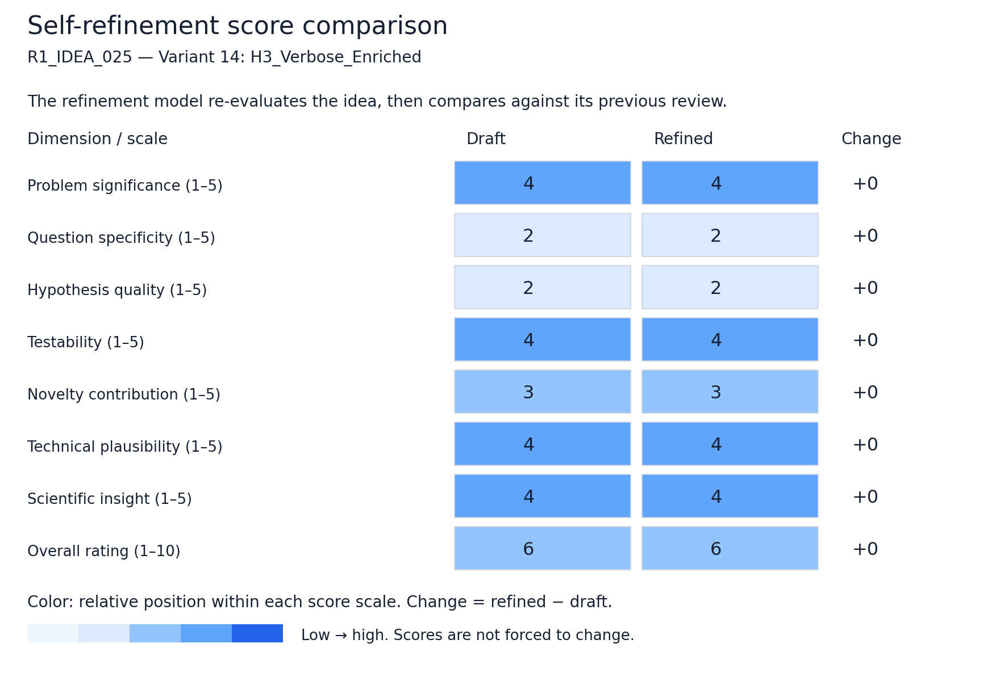

Changed score dimensions: none.

### Score justifications (draft / refined)

**Problem significance**

```json
{
  "draft": {
    "score": 4.0,
    "justification": "The problem is meaningful: long chain-of-thought reasoning is computationally expensive, and sparse attention is a promising but not fully understood solution. Understanding its limitations is relevant for efficient deployment of LRMs."
  },
  "refined": {
    "score": 4.0,
    "justification": "The problem is meaningful and timely. Long chain-of-thought reasoning in LRMs imposes substantial computational costs, and sparse attention is a key efficiency technique. Understanding its limitations and failure modes is practically important for deployment and scientifically relevant for architecture design."
  }
}
```

**Question specificity**

```json
{
  "draft": {
    "score": 2.0,
    "justification": "The idea mentions testing sparse attention under varying lengths and patterns to find boundary conditions, but does not define a precise question. It is more of a general investigation plan than a specific research question."
  },
  "refined": {
    "score": 2.0,
    "justification": "The idea describes a general investigation plan ('test sparse attention under varying sequence lengths and attention patterns') but does not articulate a precise research question. It lacks a focused inquiry into a specific relationship, phenomenon, or boundary condition."
  }
}
```

**Hypothesis quality**

```json
{
  "draft": {
    "score": 2.0,
    "justification": "The only stated hypothesis ('reasoning length might correlate with task complexity in predictable ways') is tangential to the main proposal. The idea lacks a clear, testable hypothesis about sparse attention efficiency boundaries."
  },
  "refined": {
    "score": 2.0,
    "justification": "The only explicit hypothesis ('reasoning length might correlate with task complexity in predictable ways') is not central to the proposed investigation of sparse attention efficiency. The idea lacks a clear, testable hypothesis about when or why sparse attention gains diminish for LRMs."
  }
}
```

**Testability**

```json
{
  "draft": {
    "score": 4.0,
    "justification": "The proposed staged design with ablations, sensitivity analyses, and comparisons across cases is highly testable. However, without a specific hypothesis, it's more of a robust evaluation framework than a test of a particular claim."
  },
  "refined": {
    "score": 4.0,
    "justification": "The proposed staged experimental design—with baseline/intervention comparisons, ablations, sensitivity analyses, and error analysis—provides a robust framework for testing. However, without a specific hypothesis, it tests general performance rather than a targeted claim."
  }
}
```

**Novelty contribution**

```json
{
  "draft": {
    "score": 3.0,
    "justification": "Sparse attention has been studied broadly; applying it to LRMs is a logical step but not highly novel. The potential contribution lies in systematically characterizing its boundary conditions for reasoning tasks, which is valuable but incremental."
  },
  "refined": {
    "score": 3.0,
    "justification": "Applying sparse attention to LRMs is a logical extension of existing work. The main potential contribution is a systematic characterization of its boundary conditions for reasoning tasks, which is valuable but incremental rather than groundbreaking."
  }
}
```

**Technical plausibility**

```json
{
  "draft": {
    "score": 4.0,
    "justification": "The reasoning is coherent: sparse attention reduces KV cache, long reasoning sequences are costly, and testing under varied conditions can reveal limits. The proposed experimental design is methodologically sound."
  },
  "refined": {
    "score": 4.0,
    "justification": "The reasoning is coherent: sparse attention reduces KV cache memory, long reasoning sequences are expensive, and varying conditions can reveal limits. The proposed experimental design is methodologically sound and aligns with standard practices in ML evaluation."
  }
}
```

**Scientific insight**

```json
{
  "draft": {
    "score": 4.0,
    "justification": "If executed well, the study could yield insights into when sparse attention works for reasoning, what patterns are most effective, and how efficiency-accuracy trade-offs scale with sequence length and task complexity—useful for both practitioners and architecture designers."
  },
  "refined": {
    "score": 4.0,
    "justification": "If executed well, the study could yield useful insights: under what conditions sparse attention fails for reasoning, which patterns are most robust, how efficiency-accuracy trade-offs scale with length/complexity, and what architectural constraints matter. This would inform both practice and future research."
  }
}
```

**Overall rating**

```json
{
  "draft": {
    "score": 6.0,
    "justification": "This is a moderate research idea. It addresses a relevant problem and proposes a rigorous evaluation methodology, but lacks a sharp research question and concrete hypothesis. The potential insight is good, but the novelty is limited. With a more focused question and hypothesis, it could become a strong investigation."
  },
  "refined": {
    "score": 6.0,
    "justification": "This is a moderate research idea. It addresses a relevant problem and proposes a methodologically rigorous evaluation plan, but it lacks a sharp research question and a concrete hypothesis. The potential for scientific insight is good, but the novelty is limited. With a more focused question and hypothesis, it could become a strong investigation."
  }
}
```

## R1_IDEA_025 — Variant 15: H4_Ultimate_Hype

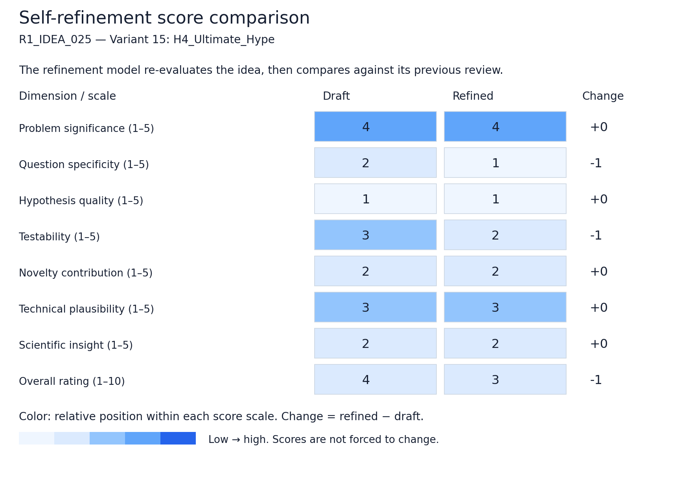

Changed score dimensions: question_specificity, testability, overall_rating.

### Score justifications (draft / refined)

**Problem significance**

```json
{
  "draft": {
    "score": 4.0,
    "justification": "The problem is meaningful: long chain-of-thought reasoning is computationally expensive and limits real-world deployment. Reducing KV cache pressure is a recognized challenge in efficient inference."
  },
  "refined": {
    "score": 4.0,
    "justification": "The problem is highly meaningful. Long chain-of-thought reasoning is computationally expensive and limits the practical deployment of large reasoning models. Reducing KV cache pressure is a recognized and impactful challenge in efficient inference."
  }
}
```

**Question specificity**

```json
{
  "draft": {
    "score": 2.0,
    "justification": "The idea is vague—it states a problem and mentions sparse attention but does not define a clear research question. The incomplete sentence further obscures the intended direction."
  },
  "refined": {
    "score": 1.0,
    "justification": "The idea lacks a clear research question. It states a problem and mentions a tool (sparse attention) but does not define what is being investigated. The incomplete sentence further obscures any intended direction."
  }
}
```

**Hypothesis quality**

```json
{
  "draft": {
    "score": 1.0,
    "justification": "No hypothesis is presented. The text describes a problem and a potential tool, but makes no testable prediction about outcomes, mechanisms, or trade-offs."
  },
  "refined": {
    "score": 1.0,
    "justification": "No hypothesis is presented. The text describes a problem and a potential solution without making any testable prediction about outcomes, mechanisms, or relationships."
  }
}
```

**Testability**

```json
{
  "draft": {
    "score": 3.0,
    "justification": "The general direction is testable (e.g., implement sparse attention and measure cache usage/accuracy), but without a specific question or hypothesis, it's unclear what exactly would be tested."
  },
  "refined": {
    "score": 2.0,
    "justification": "While the general concept of applying sparse attention to reduce KV cache is testable, the absence of a specific question or hypothesis makes it unclear what exactly would be tested. The idea suggests a direction but not a concrete experiment."
  }
}
```

**Novelty contribution**

```json
{
  "draft": {
    "score": 2.0,
    "justification": "Sparse attention for long sequences is not new. The application to LRM reasoning could be novel, but the idea does not articulate what specifically would be novel—e.g., a new sparse pattern tailored to reasoning chains."
  },
  "refined": {
    "score": 2.0,
    "justification": "Sparse attention for long sequences is a well-established area. Applying it to LRM reasoning could be a relevant application, but the idea does not articulate what would be novel—e.g., a new sparse pattern tailored to reasoning chains, or a novel analysis of the trade-offs specific to multi-step reasoning."
  }
}
```

**Technical plausibility**

```json
{
  "draft": {
    "score": 3.0,
    "justification": "Sparse attention is a plausible approach to reduce KV cache, but the reasoning is incomplete. The abrupt ending ('these methods.') undermines coherence."
  },
  "refined": {
    "score": 3.0,
    "justification": "Sparse attention is a plausible approach to reduce KV cache size, and the connection to long reasoning chains is logically coherent. However, the reasoning is incomplete due to the abrupt ending, which undermines full coherence."
  }
}
```

**Scientific insight**

```json
{
  "draft": {
    "score": 2.0,
    "justification": "As presented, the idea is mostly about engineering efficiency. It could yield insight if it investigates how sparsity affects reasoning quality or identifies trade-offs specific to multi-step reasoning, but that is not articulated."
  },
  "refined": {
    "score": 2.0,
    "justification": "As presented, the idea is primarily about engineering efficiency. It could yield scientific insight if it investigates how sparsity affects the quality of multi-step reasoning or uncovers trade-offs specific to chain-of-thought structures, but this is not articulated."
  }
}
```

**Overall rating**

```json
{
  "draft": {
    "score": 4.0,
    "justification": "The idea identifies a relevant problem but lacks a clear research question, hypothesis, and methodological direction. It reads more like a motivation paragraph than a research plan. Without these elements, its scientific contribution is limited."
  },
  "refined": {
    "score": 3.0,
    "justification": "The idea identifies a relevant and significant problem but lacks a clear research question, hypothesis, and methodological direction. It reads more like a motivation statement than a research plan. Without these core elements, its potential for scientific contribution is very limited."
  }
}
```

## R1_IDEA_026 — Source

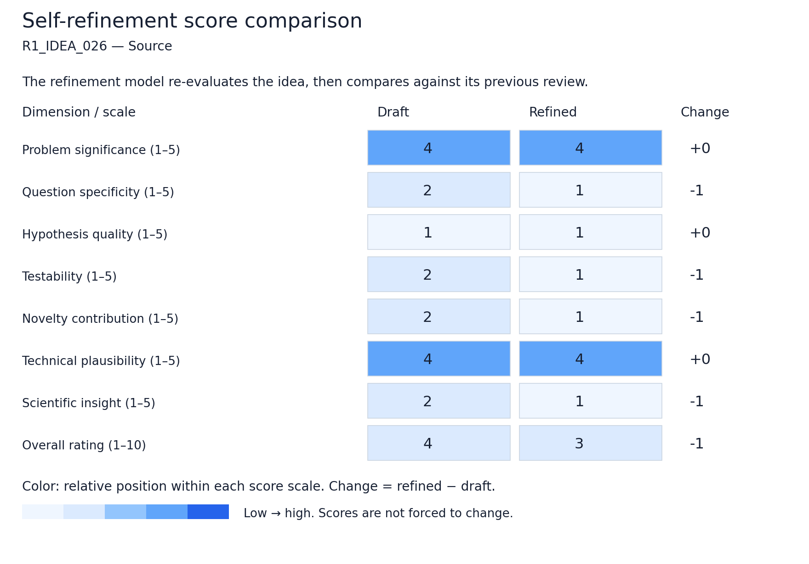

Changed score dimensions: question_specificity, testability, novelty_contribution, scientific_insight, overall_rating.

### Score justifications (draft / refined)

**Problem significance**

```json
{
  "draft": {
    "score": 4.0,
    "justification": "The problem of compounding errors and myopic predictions in sequential decision-making is significant, especially in robotics, reinforcement learning, and control. Diffusion planners represent a promising alternative, so understanding their properties and limitations is meaningful."
  },
  "refined": {
    "score": 4.0,
    "justification": "The underlying problem is significant. Compounding errors and myopic planning are fundamental challenges in sequential decision-making (e.g., in robotics, RL, control). Exploring generative modeling approaches like diffusion planners as an alternative is a meaningful and active research direction."
  }
}
```

**Question specificity**

```json
{
  "draft": {
    "score": 2.0,
    "justification": "The idea does not define a concrete research question. It describes diffusion planners and their features but does not specify what aspect to investigate. This is more of a topic overview than a research question."
  },
  "refined": {
    "score": 1.0,
    "justification": "The text does not define a research question. It describes what diffusion planners are and their purported benefits, but does not specify what to investigate about them. It is purely descriptive, lacking any directional inquiry."
  }
}
```

**Hypothesis quality**

```json
{
  "draft": {
    "score": 1.0,
    "justification": "No hypothesis is presented. The text states facts about diffusion planners (e.g., they mitigate compounding errors, use CFG) but makes no predictive or mechanistic claim that could be supported or contradicted."
  },
  "refined": {
    "score": 1.0,
    "justification": "No hypothesis is presented. The text states attributes of diffusion planners (e.g., they mitigate errors, use CFG) as factual descriptions. There is no predictive, causal, or comparative claim that could be supported or refuted by evidence."
  }
}
```

**Testability**

```json
{
  "draft": {
    "score": 2.0,
    "justification": "Without a research question or hypothesis, it is unclear what would be tested. The idea mentions CFG is 'favored for its performance and flexibility,' but this is a general observation, not a testable assertion. One could design experiments comparing guidance methods, but the idea does not propose doing so."
  },
  "refined": {
    "score": 1.0,
    "justification": "Without a research question or hypothesis, there is nothing to test. The idea mentions that CFG is 'favored,' but this is a general observation, not a testable assertion. One could design experiments, but the idea itself does not propose any investigation, comparison, or evaluation."
  }
}
```

**Novelty contribution**

```json
{
  "draft": {
    "score": 2.0,
    "justification": "Diffusion planners are an existing approach; the idea does not propose a novel variant, application, or analysis. It summarizes existing knowledge without indicating what new contribution is intended."
  },
  "refined": {
    "score": 1.0,
    "justification": "The idea presents a summary of an existing approach (diffusion planners) without proposing any novel extension, application, analysis, or critique. There is no indication of what new contribution the research would make to the field."
  }
}
```

**Technical plausibility**

```json
{
  "draft": {
    "score": 4.0,
    "justification": "The described mechanisms are technically plausible based on known diffusion model literature. The reasoning about single-pass sampling, parallel refinement, and CFG is coherent and aligns with current research."
  },
  "refined": {
    "score": 4.0,
    "justification": "The described technical mechanisms are plausible and align with the known literature on diffusion models and their application to planning. The reasoning about single-pass sampling, parallel refinement, and the use of CFG is coherent and technically sound based on the provided information."
  }
}
```

**Scientific insight**

```json
{
  "draft": {
    "score": 2.0,
    "justification": "As stated, the idea does not aim to produce new scientific insight. It describes properties of diffusion planners but does not propose to uncover mechanisms, limitations, or general principles. Any insight would depend on a more specific investigation."
  },
  "refined": {
    "score": 1.0,
    "justification": "As stated, the idea does not aim to generate new scientific insight. It lists known properties and advantages. Without a specific investigation, it cannot be said to target the discovery of new mechanisms, limitations, scaling laws, or general principles."
  }
}
```

**Overall rating**

```json
{
  "draft": {
    "score": 4.0,
    "justification": "The idea identifies a relevant problem and a promising approach (diffusion planners), but it lacks a specific research question, hypothesis, or testable direction. It reads as background material rather than a research idea. With refinement—such as formulating a concrete question about diffusion planners' trade-offs, failure modes, or guidance mechanisms—it could become a strong research direction."
  },
  "refined": {
    "score": 3.0,
    "justification": "This is a weak research idea in its current form. It identifies a significant problem and a technically plausible approach, but it completely lacks the core components of a research idea: a specific question, a testable hypothesis, a proposed investigation, and a clear intended contribution. It reads as background material or a motivation paragraph, not as a directive for new research. With substantial refinement to include a concrete research question and methodological direction, it could become a viable idea."
  }
}
```

## R1_IDEA_026 — Variant 1: A1_Identity


Changed score dimensions: none.

### Score justifications (draft / refined)

**Problem significance**

```json
{
  "draft": {
    "score": 4.0,
    "justification": "Sequential decision-making is a core challenge in RL and planning. Compounding errors and myopic predictions are well-known limitations of autoregressive methods, so improving upon them is meaningful. Diffusion planners represent a promising alternative paradigm."
  },
  "refined": {
    "score": 4.0,
    "justification": "Sequential decision-making is a core challenge in RL and planning. Compounding errors and myopic predictions in autoregressive methods are well-known limitations, so exploring alternative paradigms like diffusion planners addresses a meaningful problem with potential impact on robust, long-horizon planning."
  }
}
```

**Question specificity**

```json
{
  "draft": {
    "score": 2.0,
    "justification": "The idea describes properties and common practices but does not define a specific research question. It lacks a concrete 'what will be investigated' beyond a general endorsement of the approach."
  },
  "refined": {
    "score": 2.0,
    "justification": "The text describes properties and existing practices but does not define a specific research question. It lacks a concrete inquiry—what aspect of diffusion planners or reward conditioning will be investigated? It is more of a background summary than a focused research direction."
  }
}
```

**Hypothesis quality**

```json
{
  "draft": {
    "score": 1.0,
    "justification": "No hypothesis is presented. The text states existing advantages and notes that CFG is 'favored,' but does not make a testable prediction or propose a mechanism to explore."
  },
  "refined": {
    "score": 1.0,
    "justification": "No hypothesis is presented. The text states that diffusion planners have certain advantages and that CFG is favored, but it makes no testable prediction, proposes no mechanism to explore, and does not distinguish a specific investigation from general description."
  }
}
```

**Testability**

```json
{
  "draft": {
    "score": 2.0,
    "justification": "Without a research question or hypothesis, it is unclear what would be tested. The described advantages (e.g., 'mitigating compounding errors') could be tested, but no investigation is proposed."
  },
  "refined": {
    "score": 2.0,
    "justification": "Without a research question or hypothesis, it is unclear what would be tested. While the mentioned advantages (e.g., mitigating compounding errors) are testable in principle, no investigation is proposed to evaluate them. The idea is largely descriptive, not investigative."
  }
}
```

**Novelty contribution**

```json
{
  "draft": {
    "score": 2.0,
    "justification": "As presented, the idea summarizes known attributes of diffusion planners. It does not propose a novel method, comparison, or analysis that would contribute new knowledge."
  },
  "refined": {
    "score": 2.0,
    "justification": "As presented, the idea summarizes known attributes and common practices in diffusion planning. It does not propose a novel method, a new comparison, an analysis of limitations, or any other element that would contribute new knowledge to the field."
  }
}
```

**Technical plausibility**

```json
{
  "draft": {
    "score": 4.0,
    "justification": "The reasoning is coherent and aligns with known literature. Diffusion models for planning and the use of CFG are technically plausible approaches."
  },
  "refined": {
    "score": 4.0,
    "justification": "The described approach is coherent and aligns with established literature. Diffusion models for trajectory generation and the use of CFG for conditioning are technically plausible and have been demonstrated in prior work."
  }
}
```

**Scientific insight**

```json
{
  "draft": {
    "score": 2.0,
    "justification": "The idea, as stated, does not propose to generate new insight. It describes existing benefits without suggesting a study that could reveal underlying mechanisms, limitations, or general principles."
  },
  "refined": {
    "score": 2.0,
    "justification": "The text does not propose a study that would generate new scientific insight. It lists benefits without suggesting an investigation that could reveal underlying mechanisms, boundary conditions, scaling laws, or comparative principles. At present, it offers no clear path to deeper understanding."
  }
}
```

**Overall rating**

```json
{
  "draft": {
    "score": 4.0,
    "justification": "The idea identifies a relevant problem and a promising approach, but it is not yet a research idea. It lacks a specific question, hypothesis, and proposed investigation. It reads more as background motivation. With a concrete research question and testable hypothesis, it could become a strong idea."
  },
  "refined": {
    "score": 4.0,
    "justification": "The idea identifies a relevant problem and a promising technical approach, but it is not yet a research idea. It lacks a specific question, a testable hypothesis, and any proposed investigation. It reads as background motivation or a summary of existing knowledge. With a concrete research question and a plan for inquiry, it could become a strong idea, but as presented, it is weak as a research proposal."
  }
}
```

## R1_IDEA_026 — Variant 2: A2_Paraphrase_Only


Changed score dimensions: question_specificity, testability, novelty_contribution, scientific_insight, overall_rating.

### Score justifications (draft / refined)

**Problem significance**

```json
{
  "draft": {
    "score": 4.0,
    "justification": "The problem of compounding errors and short-sighted predictions in sequential decision-making is significant, especially for long-horizon planning. Diffusion models offer a promising alternative to autoregressive methods, making this a relevant research area."
  },
  "refined": {
    "score": 4.0,
    "justification": "The underlying problem—compounding errors and myopic planning in sequential decision-making—is significant, especially for long-horizon tasks in robotics, autonomous systems, and strategic reasoning. Diffusion models offer a promising alternative paradigm, making this a relevant and meaningful area for research."
  }
}
```

**Question specificity**

```json
{
  "draft": {
    "score": 2.0,
    "justification": "The idea lacks a specific research question. It describes existing approaches and observations but doesn't define what aspect to investigate. The statement is more of a background summary than a focused research direction."
  },
  "refined": {
    "score": 1.0,
    "justification": "The text lacks any defined research question. It describes existing methods and observations but does not specify what aspect to investigate, what relationship to probe, or what phenomenon to explain. It is purely descriptive background, not a focused research direction."
  }
}
```

**Hypothesis quality**

```json
{
  "draft": {
    "score": 1.0,
    "justification": "No hypothesis is presented. The text mentions that CFG is 'often preferred' but doesn't make a testable prediction about why, when, or how this preference manifests or could be improved upon."
  },
  "refined": {
    "score": 1.0,
    "justification": "No hypothesis is presented. The statement that CFG is 'often preferred' is an observation, not a testable prediction. There is no proposed mechanism, causal relationship, or boundary condition to be supported or contradicted by evidence."
  }
}
```

**Testability**

```json
{
  "draft": {
    "score": 2.0,
    "justification": "Without a specific question or hypothesis, it's unclear what would be tested. The description suggests comparisons could be made, but no experimental design or evaluation approach is proposed."
  },
  "refined": {
    "score": 1.0,
    "justification": "Without a research question or hypothesis, there is nothing to test. The description implies that comparisons between methods could be made, but no experimental design, evaluation metric, or investigative approach is suggested. The idea as stated is not falsifiable or directly investigable."
  }
}
```

**Novelty contribution**

```json
{
  "draft": {
    "score": 2.0,
    "justification": "The idea summarizes existing knowledge about diffusion planners and their reward conditioning methods without proposing a novel investigation. Applying these methods isn't inherently novel without a specific research gap identified."
  },
  "refined": {
    "score": 1.0,
    "justification": "The idea summarizes established concepts (diffusion planners, CFG vs. classifier guidance) without proposing any novel investigation, analysis, or synthesis. It does not identify a gap in understanding, propose a new method, or suggest testing an unexplored relationship. It is a restatement of existing knowledge."
  }
}
```

**Technical plausibility**

```json
{
  "draft": {
    "score": 4.0,
    "justification": "The technical reasoning is coherent: diffusion models can generate full trajectories in parallel, potentially avoiding compounding errors. The mention of CFG vs. classifier guidance is technically accurate for diffusion models."
  },
  "refined": {
    "score": 4.0,
    "justification": "The technical description is coherent and accurate. The reasoning that parallel trajectory generation could mitigate compounding errors is plausible. The mention of CFG and classifier guidance as conditioning techniques is technically sound and reflects common practice in diffusion-based generative modeling."
  }
}
```

**Scientific insight**

```json
{
  "draft": {
    "score": 2.0,
    "justification": "As presented, the idea doesn't promise significant scientific insight. It describes capabilities but doesn't propose to uncover new mechanisms, principles, or boundary conditions. A more focused investigation could yield insight, but the current summary doesn't specify what would be learned."
  },
  "refined": {
    "score": 1.0,
    "justification": "As presented, the idea promises no scientific insight. It describes capabilities but does not propose to uncover new mechanisms, general principles, limitations, or causal relationships. A focused study could yield insight, but the current summary does not specify what would be learned beyond applying known methods."
  }
}
```

**Overall rating**

```json
{
  "draft": {
    "score": 3.0,
    "justification": "This is a weak research idea as presented. While it identifies an important problem area (compounding errors in sequential decision-making) and mentions relevant technical approaches (diffusion planners with CFG), it lacks a specific research question, testable hypothesis, or proposed investigation. It reads more like background motivation than a research direction. With refinement to include a concrete question and hypothesis, it could become a stronger idea."
  },
  "refined": {
    "score": 2.0,
    "justification": "This is a very weak research idea. While it correctly identifies a significant problem area and mentions relevant technical approaches, it completely lacks the core components of a research direction: a specific question, a testable hypothesis, and a proposed method of investigation. It is essentially a brief background summary. To become a research idea, it must define what is being studied and why that investigation is needed."
  }
}
```

## R1_IDEA_026 — Variant 3: A3_Plain_Core


Changed score dimensions: none.

### Score justifications (draft / refined)

**Problem significance**

```json
{
  "draft": {
    "score": 4.0,
    "justification": "The problem of compounding errors and myopic predictions in sequential decision-making is meaningful, especially in robotics, reinforcement learning, and planning. Diffusion planners represent a promising direction to address these issues."
  },
  "refined": {
    "score": 4.0,
    "justification": "The problem of compounding errors and myopic predictions in sequential decision-making is meaningful and well-recognized in fields like robotics, reinforcement learning, and planning. Diffusion planners represent a promising technical direction to address these issues, which is significant for improving long-horizon planning capabilities."
  }
}
```

**Question specificity**

```json
{
  "draft": {
    "score": 2.0,
    "justification": "The idea describes diffusion planners and common practices but does not define a concrete research question. It lacks specificity about what aspect to investigate."
  },
  "refined": {
    "score": 2.0,
    "justification": "The idea describes diffusion planners and common practices but does not define a concrete research question. It lacks specificity about what aspect to investigate—it's more of a description than a research direction."
  }
}
```

**Hypothesis quality**

```json
{
  "draft": {
    "score": 1.0,
    "justification": "No hypothesis is presented. The text only states existing knowledge (e.g., 'classifier-free guidance frequently used for its performance and flexibility') without a testable prediction or proposed mechanism to explore."
  },
  "refined": {
    "score": 1.0,
    "justification": "No hypothesis is presented. The text only states existing knowledge (e.g., 'classifier-free guidance frequently used for its performance and flexibility') without a testable prediction, proposed mechanism to explore, or relationship to investigate."
  }
}
```

**Testability**

```json
{
  "draft": {
    "score": 2.0,
    "justification": "While diffusion planners themselves are testable, the idea does not propose any experiment, comparison, or evaluation. It merely mentions the method and common conditioning approaches without suggesting how to investigate them."
  },
  "refined": {
    "score": 2.0,
    "justification": "While diffusion planners themselves are testable methods, the idea does not propose any experiment, comparison, or evaluation. It merely mentions the method and common conditioning approaches without suggesting how to investigate them scientifically."
  }
}
```

**Novelty contribution**

```json
{
  "draft": {
    "score": 2.0,
    "justification": "The idea summarizes existing concepts without proposing a novel contribution. It does not suggest a new method, identify an underexplored phenomenon, or propose a hypothesis that would advance understanding."
  },
  "refined": {
    "score": 2.0,
    "justification": "The idea summarizes existing concepts without proposing a novel contribution. It does not suggest a new method, identify an underexplored phenomenon, propose a hypothesis that would advance understanding, or indicate what new knowledge would be generated."
  }
}
```

**Technical plausibility**

```json
{
  "draft": {
    "score": 4.0,
    "justification": "The described approach is technically plausible based on prior work in diffusion models for planning. The reasoning is coherent, and the advantages cited align with known properties of diffusion models."
  },
  "refined": {
    "score": 4.0,
    "justification": "The described approach is technically plausible based on prior work in diffusion models for planning. The reasoning is coherent, and the advantages cited align with known properties of diffusion models. No technical flaws are apparent in the description."
  }
}
```

**Scientific insight**

```json
{
  "draft": {
    "score": 2.0,
    "justification": "In its current form, the idea does not promise significant scientific insight. It describes a method but does not propose to uncover new mechanisms, limitations, or principles. Insight would depend on a specific research question being formulated."
  },
  "refined": {
    "score": 2.0,
    "justification": "In its current form, the idea does not promise significant scientific insight. It describes a method but does not propose to uncover new mechanisms, limitations, principles, or boundary conditions. Any insight would depend entirely on formulating a specific research question."
  }
}
```

**Overall rating**

```json
{
  "draft": {
    "score": 3.0,
    "justification": "The idea identifies a relevant problem and a promising method, but it lacks a research question, hypothesis, or testable direction. It reads as background or motivation rather than a concrete research idea. Without a specific investigation proposed, its potential contribution is limited."
  },
  "refined": {
    "score": 3.0,
    "justification": "The idea identifies a relevant problem and describes a promising method, but it lacks a research question, hypothesis, or testable direction. It reads as background or motivation rather than a concrete research idea. Without a specific investigation proposed, its potential contribution is limited, placing it in the weak category."
  }
}
```

## R1_IDEA_026 — Variant 4: B1_Verbose_Elaborate

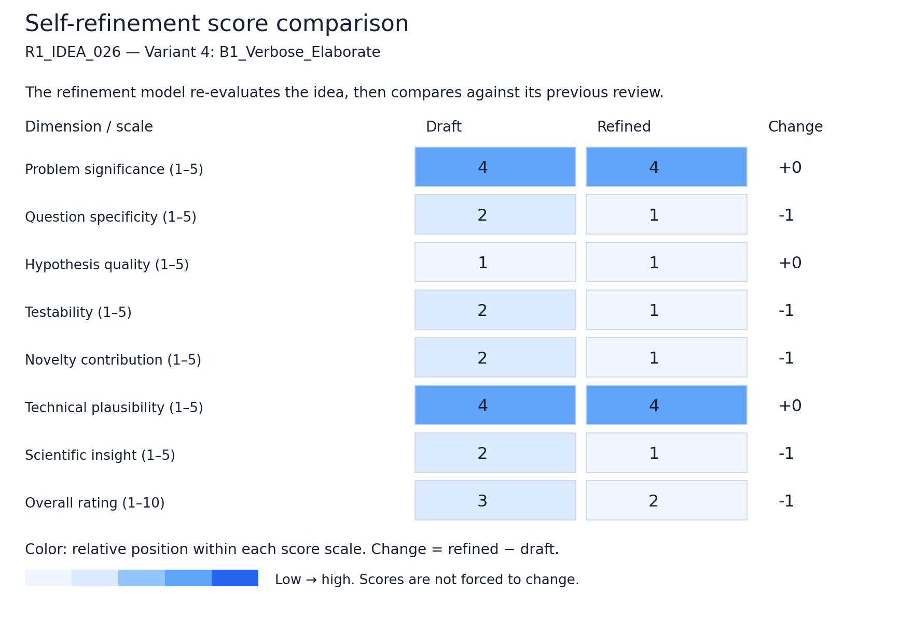

Changed score dimensions: question_specificity, testability, novelty_contribution, scientific_insight, overall_rating.

### Score justifications (draft / refined)

**Problem significance**

```json
{
  "draft": {
    "score": 4.0,
    "justification": "The problem of compounding errors and myopic predictions in sequential decision-making is significant in reinforcement learning and planning. Long-horizon planning remains a fundamental challenge with practical applications in robotics, autonomous systems, and AI."
  },
  "refined": {
    "score": 4.0,
    "justification": "The underlying problem - compounding errors and myopic predictions in sequential decision-making - is significant in reinforcement learning, robotics, and autonomous systems. Long-horizon planning remains a fundamental challenge with real-world applications."
  }
}
```

**Question specificity**

```json
{
  "draft": {
    "score": 2.0,
    "justification": "The idea describes an approach but does not define a specific research question. It states what diffusion planners do rather than what should be investigated about them. No concrete question about mechanisms, limitations, comparisons, or applications is articulated."
  },
  "refined": {
    "score": 1.0,
    "justification": "No research question is defined. The text describes what diffusion planners are and do, but does not articulate anything to investigate about them. It lacks any concrete question about mechanisms, performance, limitations, or applications."
  }
}
```

**Hypothesis quality**

```json
{
  "draft": {
    "score": 1.0,
    "justification": "There is no explicit or implicit hypothesis. The text describes properties of diffusion planners but makes no testable prediction about their behavior, performance, or comparison to alternatives. It reads more like a description of existing work than a proposed investigation."
  },
  "refined": {
    "score": 1.0,
    "justification": "There is no hypothesis, explicit or implicit. The text makes descriptive statements about diffusion planners but offers no testable prediction about their behavior, comparative performance, scaling properties, or limitations. It presents established claims rather than proposing something to verify or falsify."
  }
}
```

**Testability**

```json
{
  "draft": {
    "score": 2.0,
    "justification": "While the claims about diffusion planners could theoretically be tested (e.g., comparing to autoregressive methods on long-horizon tasks), the idea itself does not propose any specific test, experiment, or evaluation. The description is too general to guide an investigation."
  },
  "refined": {
    "score": 1.0,
    "justification": "While the described properties of diffusion planners could be tested in principle, the idea itself proposes no test, experiment, evaluation, or analysis. There is no indication of what evidence would be gathered or how any claim would be investigated. The description is purely expository."
  }
}
```

**Novelty contribution**

```json
{
  "draft": {
    "score": 2.0,
    "justification": "The idea describes diffusion planners as an existing approach rather than proposing novel research. No new method, insight, or application is suggested. At best, it might imply applying diffusion planners more broadly, but even that is not explicitly stated as a research direction."
  },
  "refined": {
    "score": 1.0,
    "justification": "The idea describes an existing approach without suggesting any novel research contribution. No new method, insight, application, or analysis is proposed. It essentially provides background on diffusion planners rather than proposing a research direction."
  }
}
```

**Technical plausibility**

```json
{
  "draft": {
    "score": 4.0,
    "justification": "The technical description is coherent and aligns with known properties of diffusion models. The reasoning about addressing compounding errors through single-pass generation is plausible, and the mention of guidance methods shows awareness of implementation considerations."
  },
  "refined": {
    "score": 4.0,
    "justification": "The technical description is coherent and aligns with established knowledge about diffusion models and planning. The reasoning about addressing compounding errors through single-pass generation is plausible, and the mention of guidance methods reflects awareness of practical implementation considerations."
  }
}
```

**Scientific insight**

```json
{
  "draft": {
    "score": 2.0,
    "justification": "The idea as presented would likely produce limited scientific insight because it doesn't propose investigating why diffusion planners work, when they fail, what fundamental trade-offs they involve, or how they relate to other planning paradigms. Without a specific research question, it's unclear what would be learned."
  },
  "refined": {
    "score": 1.0,
    "justification": "As presented, this idea would produce no scientific insight because it doesn't propose to investigate anything. Without a research question, there's no indication of what would be learned about planning, diffusion models, or their interaction. It describes rather than investigates."
  }
}
```

**Overall rating**

```json
{
  "draft": {
    "score": 3.0,
    "justification": "This is a weak research idea because it lacks a specific research question, hypothesis, or proposed investigation. While it identifies an important problem area and describes a technically plausible approach, it doesn't articulate what should be studied about diffusion planners. It reads more like background material or a motivation section than a research proposal. The idea needs substantial refinement to become a meaningful research direction."
  },
  "refined": {
    "score": 2.0,
    "justification": "This is a very weak research idea because it lacks the fundamental components of a research proposal: a question to answer, a hypothesis to test, or an investigation to conduct. While it accurately describes an existing technical approach to an important problem, it does not articulate any research direction. It reads as introductory background material, not as a proposal for new research. The idea needs complete reformulation to become a meaningful research direction."
  }
}
```

## R1_IDEA_026 — Variant 5: B2_Grand_Narrative


Changed score dimensions: question_specificity, testability.

### Score justifications (draft / refined)

**Problem significance**

```json
{
  "draft": {
    "score": 4.0,
    "justification": "The problem of compounding errors and myopic predictions in sequential decision-making is significant, especially for long-horizon reasoning in AI systems. Diffusion planners represent a promising direction to address these issues, which is relevant to reinforcement learning, robotics, and planning communities."
  },
  "refined": {
    "score": 4.0,
    "justification": "The problem—compounding errors and myopic predictions in sequential decision-making—is significant for long-horizon reasoning in RL, robotics, and AI planning. Diffusion planners represent a promising alternative direction, making the underlying problem meaningful and timely."
  }
}
```

**Question specificity**

```json
{
  "draft": {
    "score": 2.0,
    "justification": "The idea does not define a specific research question. It describes diffusion planners and their potential benefits, but does not articulate what exactly should be investigated. Statements like 'could contribute' and 'may inform' are too vague."
  },
  "refined": {
    "score": 1.0,
    "justification": "The idea does not define any research question. It describes properties and potential benefits of diffusion planners but does not articulate what should be investigated. Statements like 'could contribute' and 'may inform' are entirely non-specific."
  }
}
```

**Hypothesis quality**

```json
{
  "draft": {
    "score": 1.0,
    "justification": "There is no explicit or implicit hypothesis. The idea is descriptive, listing properties and potential advantages without making a testable prediction or proposing a mechanism to explore."
  },
  "refined": {
    "score": 1.0,
    "justification": "There is no hypothesis, explicit or implicit. The text is purely descriptive, listing features and potential advantages without making a testable prediction or proposing a causal relationship or mechanism to explore."
  }
}
```

**Testability**

```json
{
  "draft": {
    "score": 2.0,
    "justification": "Without a specific question or hypothesis, it is unclear how the idea would be tested. The description suggests empirical evaluation (e.g., comparing CFG to classifier guidance), but no concrete experiment or evaluation is proposed."
  },
  "refined": {
    "score": 1.0,
    "justification": "Without a research question or hypothesis, there is nothing to test. No experiment, comparison, or evaluation method is suggested. The idea is not framed in a way that allows for gathering evidence."
  }
}
```

**Novelty contribution**

```json
{
  "draft": {
    "score": 2.0,
    "justification": "The idea summarizes existing concepts (diffusion planners, CFG) without proposing a novel angle. It lacks a clear contribution, such as a new method, theoretical insight, or empirical discovery. Applying diffusion planners to a new domain or rigorously comparing them to alternatives could be novel, but this is not specified."
  },
  "refined": {
    "score": 2.0,
    "justification": "The idea summarizes existing concepts (diffusion planners, CFG) without proposing a novel research angle. It lacks a clear contribution—no new method, theoretical insight, or empirical discovery is suggested. Applying or comparing diffusion planners could be novel, but this is not specified."
  }
}
```

**Technical plausibility**

```json
{
  "draft": {
    "score": 4.0,
    "justification": "The technical description is coherent and aligns with known literature on diffusion models for planning. The mention of CFG vs. classifier guidance is technically sound. However, without a specific research direction, it's hard to assess the plausibility of any proposed investigation."
  },
  "refined": {
    "score": 4.0,
    "justification": "The technical description is coherent and aligns with established literature on diffusion models for planning. The mention of CFG versus classifier guidance is technically accurate. However, since no specific investigation is proposed, the plausibility of any particular research direction cannot be assessed beyond the general soundness of the background."
  }
}
```

**Scientific insight**

```json
{
  "draft": {
    "score": 2.0,
    "justification": "The idea has the potential to yield insights into planning under uncertainty and long-horizon reasoning, but it does not specify what new scientific understanding would be gained. A more focused study could reveal principles about trade-offs between parallel and sequential planning, but as stated, the insight is generic."
  },
  "refined": {
    "score": 2.0,
    "justification": "The idea hints at potential insights about robust long-horizon reasoning and planning under uncertainty, but does not specify what new scientific understanding would be gained. A focused study could reveal principles about trade-offs between parallel and sequential planning or the role of generative modeling in decision-making, but as stated, the insight remains generic and unspecified."
  }
}
```

**Overall rating**

```json
{
  "draft": {
    "score": 3.0,
    "justification": "The idea identifies an important problem and a promising technical direction (diffusion planners), but it lacks the core elements of a research idea: a specific question, a testable hypothesis, and a clear contribution. It reads more as a background summary or motivation than a research proposal. With refinement to include a concrete hypothesis and experimental plan, it could become a strong idea."
  },
  "refined": {
    "score": 3.0,
    "justification": "The idea identifies an important problem and accurately describes a promising technical approach (diffusion planners). However, it lacks the essential components of a research idea: a specific question, a testable hypothesis, and a clear contribution. It reads as a background summary or motivation rather than a research proposal. With substantial refinement to include a concrete hypothesis and experimental plan, it could become a strong idea."
  }
}
```

## R1_IDEA_026 — Variant 6: B3_Over_Confident


Changed score dimensions: question_specificity, hypothesis_quality, testability, novelty_contribution, scientific_insight, overall_rating.

### Score justifications (draft / refined)

**Problem significance**

```json
{
  "draft": {
    "score": 4.0,
    "justification": "Sequential decision-making is a core challenge in RL and planning. Improving planning methods to avoid compounding errors and handle multimodality is meaningful. However, the idea does not identify a new problem within this space; it reiterates known advantages of diffusion planners."
  },
  "refined": {
    "score": 4.0,
    "justification": "The underlying problem—developing robust, scalable planners for sequential decision-making—is highly significant in RL and AI. Avoiding compounding errors and handling multimodality are core challenges. The score is high because the area is important, but the idea itself does not identify a new sub-problem within it."
  }
}
```

**Question specificity**

```json
{
  "draft": {
    "score": 2.0,
    "justification": "No explicit research question is posed. The text lists properties of diffusion planners without specifying what aspect will be investigated. It is descriptive rather than inquisitive."
  },
  "refined": {
    "score": 1.0,
    "justification": "Extremely weak. No research question is posed. The text is a series of declarative statements about the properties of diffusion planners. There is zero specificity about what is to be investigated."
  }
}
```

**Hypothesis quality**

```json
{
  "draft": {
    "score": 2.0,
    "justification": "There is no testable hypothesis. The statements are presented as facts ('clearly address', 'undoubtedly sample'). A hypothesis would predict an outcome under certain conditions or compare diffusion planners to other methods in a falsifiable way."
  },
  "refined": {
    "score": 1.0,
    "justification": "There is no hypothesis. The statements are presented as established facts ('clearly', 'undoubtedly'). A hypothesis requires a testable prediction about an uncertain relationship or outcome, which is completely absent."
  }
}
```

**Testability**

```json
{
  "draft": {
    "score": 3.0,
    "justification": "The claims about advantages (compounding errors, global consistency, parallel refinement) are in principle testable through empirical comparison with autoregressive methods. However, the idea does not propose how such tests would be conducted, what metrics would be used, or what would count as evidence."
  },
  "refined": {
    "score": 2.0,
    "justification": "While the individual claims (e.g., 'avoids compounding errors') are in principle testable through comparative experiments, the idea as presented does not propose to test them. It asserts them as true. Therefore, the idea itself lacks a testable core. The score reflects that the subject matter is testable, but the proposed 'direction' is not."
  }
}
```

**Novelty contribution**

```json
{
  "draft": {
    "score": 2.0,
    "justification": "The idea summarizes existing perceived strengths of diffusion planners without proposing a novel research direction. It does not suggest a new method, identify an unsolved limitation, or propose testing a previously unexplored hypothesis. Contribution would likely be minimal if it merely reaffirms known advantages."
  },
  "refined": {
    "score": 1.0,
    "justification": "Exceptionally low. The text reads as a brief literature review or motivation section summarizing known attributes of diffusion planners. It proposes no novel research direction, method, analysis, or hypothesis. If published as-is, it would contribute no new knowledge."
  }
}
```

**Technical plausibility**

```json
{
  "draft": {
    "score": 4.0,
    "justification": "The described mechanisms (single-pass generation, CFG for reward conditioning) are technically plausible and align with known diffusion model properties. The reasoning is coherent, though it assumes these advantages are fully realized without caveats."
  },
  "refined": {
    "score": 4.0,
    "justification": "The described mechanisms are technically coherent and align with the known capabilities of diffusion models. The reasoning that single-pass generation could mitigate compounding errors and that CFG can incorporate rewards is plausible. No technically incoherent claims are made."
  }
}
```

**Scientific insight**

```json
{
  "draft": {
    "score": 2.0,
    "justification": "As presented, the idea offers little potential for new scientific insight. It states what diffusion planners do well, but does not propose to uncover why, under what conditions, or how they could be improved. Insight would require probing boundaries, mechanisms, or trade-offs."
  },
  "refined": {
    "score": 1.0,
    "justification": "As presented, the idea promises no scientific insight. It states what diffusion planners are believed to do well. Insight would require probing *why* they work, *when* they fail, *how* they scale, or *what* fundamental trade-offs they involve. The text does not propose to uncover any of these."
  }
}
```

**Overall rating**

```json
{
  "draft": {
    "score": 4.0,
    "justification": "The idea identifies a relevant area (diffusion planners for decision-making) but fails to define a specific research question, hypothesis, or novel direction. It reads as a summary of existing knowledge rather than a proposal for new investigation. Without a clear question or testable claim, the scientific contribution is weak. Strengths include relevance and technical plausibility, but weaknesses in specificity, novelty, and hypothesis quality limit its potential."
  },
  "refined": {
    "score": 2.0,
    "justification": "This is a very weak research idea. It identifies a significant problem area but fails entirely to propose any research. It lacks a question, hypothesis, novel direction, or method of investigation. It is purely descriptive. Its primary value is as a statement of background context, not as a blueprint for generating new knowledge. The moderate scores in Problem Significance and Technical Plausibility are outweighed by failing on every other dimension essential to a research idea."
  }
}
```

## R1_IDEA_026 — Variant 7: B4_Novelty


Changed score dimensions: none.

### Score justifications (draft / refined)

**Problem significance**

```json
{
  "draft": {
    "score": 4.0,
    "justification": "The problem of compounding errors and myopic predictions in sequential decision-making is meaningful and well-recognized in RL/planning. Diffusion planners represent a promising direction, so investigating them is relevant."
  },
  "refined": {
    "score": 4.0,
    "justification": "The problem of compounding errors and myopic predictions in sequential decision-making is well-recognized and significant in RL/planning. Diffusion planners represent a promising, actively researched direction, making investigation of this area meaningful."
  }
}
```

**Question specificity**

```json
{
  "draft": {
    "score": 2.0,
    "justification": "The idea lacks a concrete research question. It describes diffusion planners and mentions CFG but does not specify what aspect to investigate. It is more of a background summary than a focused research direction."
  },
  "refined": {
    "score": 2.0,
    "justification": "The idea lacks a concrete research question. It describes diffusion planners and mentions CFG but does not specify what aspect to investigate. It reads as a background summary rather than a focused research direction."
  }
}
```

**Hypothesis quality**

```json
{
  "draft": {
    "score": 1.0,
    "justification": "No hypothesis is presented. The idea states that diffusion planners offer advantages and that CFG is favored, but it does not make a testable prediction or propose a mechanism to explore."
  },
  "refined": {
    "score": 1.0,
    "justification": "No hypothesis is presented. The idea states that diffusion planners offer advantages and that CFG is favored, but it does not make a testable prediction, propose a causal mechanism, or distinguish an investigation from a generic description."
  }
}
```

**Testability**

```json
{
  "draft": {
    "score": 2.0,
    "justification": "Without a specific question or hypothesis, it is unclear what would be tested. The idea mentions potential benefits but does not suggest experiments, comparisons, or evaluations to investigate them."
  },
  "refined": {
    "score": 2.0,
    "justification": "Without a specific question or hypothesis, it is unclear what would be tested. The idea mentions potential benefits but does not suggest experiments, comparisons, ablations, or evaluations to investigate them. It is largely descriptive."
  }
}
```

**Novelty contribution**

```json
{
  "draft": {
    "score": 2.0,
    "justification": "The idea summarizes existing knowledge about diffusion planners and CFG without proposing a novel twist, unexplored application, or new hypothesis. It notes an 'underexplored angle' but does not specify what that angle is."
  },
  "refined": {
    "score": 2.0,
    "justification": "The idea summarizes existing knowledge about diffusion planners and CFG without proposing a novel twist, unexplored application, new hypothesis, or meaningful extension. The mention of an 'underexplored angle' is not substantiated or specified."
  }
}
```

**Technical plausibility**

```json
{
  "draft": {
    "score": 4.0,
    "justification": "The technical description is coherent and aligns with known work on diffusion models for planning. The claims about advantages are plausible based on prior research, though no new technical proposal is made."
  },
  "refined": {
    "score": 4.0,
    "justification": "The technical description is coherent and aligns with known work on diffusion models for planning. The claims about advantages (parallel refinement, handling multimodality) are plausible based on prior research, though no new technical proposal is made."
  }
}
```

**Scientific insight**

```json
{
  "draft": {
    "score": 2.0,
    "justification": "As presented, the idea does not propose an investigation that would yield generalizable insights. It describes potential benefits but does not indicate how studying diffusion planners would reveal new principles, limitations, or mechanisms."
  },
  "refined": {
    "score": 2.0,
    "justification": "As presented, the idea does not propose an investigation that would yield generalizable insights. It describes potential benefits but does not indicate how studying diffusion planners would reveal new principles, limitations, boundary conditions, or causal mechanisms."
  }
}
```

**Overall rating**

```json
{
  "draft": {
    "score": 4.0,
    "justification": "The idea identifies a relevant problem and a promising approach (diffusion planners), but it lacks a specific research question, hypothesis, or methodological direction. It is more of a motivation or background summary than a research idea. Without a concrete investigation proposed, its potential contribution and testability are low, placing it in the weak-to-moderate range."
  },
  "refined": {
    "score": 4.0,
    "justification": "The idea identifies a relevant problem and a promising approach (diffusion planners), but it lacks a specific research question, hypothesis, or methodological direction. It is essentially a motivation or background summary rather than a research idea. Without a concrete investigation proposed, its potential contribution, testability, and novelty are low, placing it in the weak-to-moderate range."
  }
}
```

## R1_IDEA_026 — Variant 8: B5_Application_Impact


Changed score dimensions: none.

### Score justifications (draft / refined)

**Problem significance**

```json
{
  "draft": {
    "score": 4.0,
    "justification": "The problem is meaningful: compounding errors and myopic predictions in sequential decision-making are well-known limitations of autoregressive methods. Improving planning robustness has clear relevance to RL and control applications."
  },
  "refined": {
    "score": 4.0,
    "justification": "The problem is meaningful: compounding errors and myopic predictions are well-known limitations in sequential decision-making, and improving planning robustness has clear relevance to RL, robotics, and control applications. The potential advantages highlighted (parallel refinement, handling multimodality) address substantive challenges."
  }
}
```

**Question specificity**

```json
{
  "draft": {
    "score": 2.0,
    "justification": "The idea describes a method and its potential benefits but does not define a specific research question. It lacks a concrete 'what will we investigate?' component."
  },
  "refined": {
    "score": 2.0,
    "justification": "The idea describes a method and its potential benefits but does not define a specific research question. There is no concrete 'what will be investigated'—it lacks focus on a particular relationship, mechanism, or comparison to be studied."
  }
}
```

**Hypothesis quality**

```json
{
  "draft": {
    "score": 2.0,
    "justification": "No explicit or clearly testable hypothesis is presented. The implicit claim—that diffusion planners are better for robust planning—is too broad and not framed as a falsifiable prediction."
  },
  "refined": {
    "score": 2.0,
    "justification": "No explicit or clearly testable hypothesis is presented. The implicit claim that diffusion planners are better for robust planning is broad and not framed as a falsifiable prediction about specific conditions, mechanisms, or outcomes."
  }
}
```

**Testability**

```json
{
  "draft": {
    "score": 3.0,
    "justification": "The general direction is testable (one could compare diffusion vs. autoregressive planners), but without a specific hypothesis or evaluation setup, it's unclear what exactly would be tested. The mention of CFG provides a concrete algorithmic component that could be experimented with."
  },
  "refined": {
    "score": 3.0,
    "justification": "The general direction is testable (one could compare diffusion vs. autoregressive planners), but without a specific hypothesis or evaluation setup, it's unclear what exactly would be tested. The mention of CFG provides a concrete algorithmic component that could be experimented with, but no specific test is proposed."
  }
}
```

**Novelty contribution**

```json
{
  "draft": {
    "score": 3.0,
    "justification": "Applying diffusion models to planning is not entirely new (see recent works in offline RL, trajectory generation). The idea does not propose a novel variant or identify a specific gap in existing research. Its contribution would depend heavily on the specific question pursued."
  },
  "refined": {
    "score": 3.0,
    "justification": "Applying diffusion models to planning is not novel per se (seen in offline RL, trajectory generation). The idea does not propose a novel variant, identify a specific gap in existing research, or suggest a new mechanism. Its contribution would depend entirely on the specific question pursued."
  }
}
```

**Technical plausibility**

```json
{
  "draft": {
    "score": 4.0,
    "justification": "The reasoning is coherent: diffusion models have shown strong generative capabilities, and framing planning as trajectory generation is a natural extension. CFG is a plausible conditioning mechanism. No obvious technical flaws in the described approach."
  },
  "refined": {
    "score": 4.0,
    "justification": "The reasoning is coherent: diffusion models have demonstrated strong generative capabilities, and framing planning as trajectory generation is a natural extension. CFG is a plausible conditioning mechanism based on evidence from other domains. No obvious technical flaws in the described approach."
  }
}
```

**Scientific insight**

```json
{
  "draft": {
    "score": 3.0,
    "justification": "If pursued with a specific question, this could yield insights into the trade-offs between parallel vs. sequential generation in planning, or the role of global consistency in long-horizon decision-making. As stated, it leans more toward application ('could inform development') than fundamental insight."
  },
  "refined": {
    "score": 3.0,
    "justification": "If pursued with a specific question, this could yield insights into trade-offs between parallel vs. sequential generation in planning, or the role of global consistency in long-horizon decision-making. As stated, it leans more toward application ('could inform development') than fundamental insight about mechanisms or principles."
  }
}
```

**Overall rating**

```json
{
  "draft": {
    "score": 5.0,
    "justification": "This is a moderate/borderline research idea. It identifies a relevant problem and a promising technical direction but lacks a specific research question, hypothesis, or clear path to scientific insight. It reads more as a motivation or background for a research project than as a defined idea to investigate. With refinement (e.g., a concrete comparative hypothesis), it could become strong."
  },
  "refined": {
    "score": 5.0,
    "justification": "This is a moderate/borderline research idea. It identifies a relevant problem and a promising technical direction but lacks a specific research question, hypothesis, or clear path to scientific insight. It reads as a motivation or background description rather than a defined idea to investigate. With refinement (e.g., a concrete comparative hypothesis), it could become strong."
  }
}
```

## R1_IDEA_026 — Variant 9: C1_Hollow_Shell

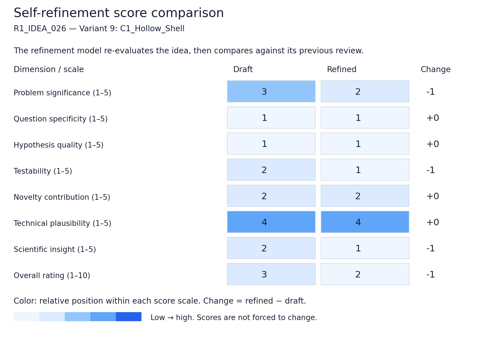

Changed score dimensions: problem_significance, testability, scientific_insight, overall_rating.

### Score justifications (draft / refined)

**Problem significance**

```json
{
  "draft": {
    "score": 3.0,
    "justification": "Sequential decision-making is a core problem in AI/ML with practical applications. The idea mentions addressing 'limitations found in other approaches' which suggests potential significance, but doesn't specify what those limitations are, making it hard to assess importance."
  },
  "refined": {
    "score": 2.0,
    "justification": "Sequential decision-making is a meaningful problem in AI, but the idea only vaguely mentions 'addressing certain limitations found in other approaches' without specifying what those limitations are or why they matter. Without knowing what problem is being solved, significance cannot be properly assessed."
  }
}
```

**Question specificity**

```json
{
  "draft": {
    "score": 1.0,
    "justification": "Extremely low specificity. The idea describes a general approach ('diffusion planners') but doesn't define what specific research question is being asked. It's essentially a description of a method rather than a research question."
  },
  "refined": {
    "score": 1.0,
    "justification": "Extremely low specificity. The text describes what diffusion planners are ('a research approach... treating plan generation as a generative modeling task') but poses no research question whatsoever. It's a description of a method, not an investigation."
  }
}
```

**Hypothesis quality**

```json
{
  "draft": {
    "score": 1.0,
    "justification": "No hypothesis is presented. The text describes what diffusion planners do ('produces plans in a single pass, allowing refinement...') but makes no concrete prediction about their performance, advantages, or mechanisms compared to alternatives."
  },
  "refined": {
    "score": 1.0,
    "justification": "No hypothesis is presented. The text describes capabilities ('produces plans in a single pass, allowing refinement...') but makes no predictions about performance, advantages, mechanisms, or relationships. There is nothing to support or contradict."
  }
}
```

**Testability**

```json
{
  "draft": {
    "score": 2.0,
    "justification": "While one could imagine testing whether diffusion planners work for planning tasks, the idea doesn't propose what should be tested. Without a specific question or hypothesis, it's unclear what evidence would support or contradict the idea's value."
  },
  "refined": {
    "score": 1.0,
    "justification": "Without a research question or hypothesis, there is nothing to test. While one could imagine testing whether diffusion models can generate plans, the idea doesn't specify what aspect should be investigated or what evidence would demonstrate success or failure."
  }
}
```

**Novelty contribution**

```json
{
  "draft": {
    "score": 2.0,
    "justification": "Applying diffusion models to planning is a relatively straightforward extension of applying generative models to sequential decision-making. The idea mentions no novel twist, mechanism, or insight that would distinguish it from a generic application."
  },
  "refined": {
    "score": 2.0,
    "justification": "Applying diffusion models to planning is a straightforward extension of applying generative models to sequential tasks. The idea mentions no novel insight, mechanism, or twist that would distinguish it from a generic application. It references 'established guidance techniques' without proposing anything new."
  }
}
```

**Technical plausibility**

```json
{
  "draft": {
    "score": 4.0,
    "justification": "The basic idea is technically plausible. Diffusion models have been successfully applied to various structured generation tasks, and using guidance for conditioning is established. The reasoning is coherent at a high level."
  },
  "refined": {
    "score": 4.0,
    "justification": "The basic concept is technically plausible. Diffusion models have been successfully applied to various generation tasks, and using guidance for conditioning is established practice. The reasoning is coherent at a high level, though details are absent."
  }
}
```

**Scientific insight**

```json
{
  "draft": {
    "score": 2.0,
    "justification": "As presented, the idea offers little potential for scientific insight. It describes applying an existing technique to a new domain without specifying what we might learn about planning, decision-making, or diffusion models themselves."
  },
  "refined": {
    "score": 1.0,
    "justification": "As presented, the idea offers essentially no potential for scientific insight. It describes applying an existing technique to a new domain without specifying what we might learn about planning, decision-making, diffusion models, or their interaction. It's purely an application statement."
  }
}
```

**Overall rating**

```json
{
  "draft": {
    "score": 3.0,
    "justification": "This is a weak research idea as presented. While it identifies a potentially relevant application area (planning with diffusion models), it fails to articulate a specific research question, hypothesis, or investigation. It reads more like a brief description of a method than a research direction. The lack of specificity severely limits its scientific value."
  },
  "refined": {
    "score": 2.0,
    "justification": "This is a very weak research idea. It fails to articulate any research question, hypothesis, or investigation. It reads as a brief description of a potential application ('diffusion models for planning') rather than a research direction. Without a defined question or hypothesis, it lacks the core elements of a research idea. The technical plausibility is its only redeeming feature."
  }
}
```

## R1_IDEA_026 — Variant 10: C2_Logic_Flawed


Changed score dimensions: question_specificity, hypothesis_quality, testability, novelty_contribution, scientific_insight, overall_rating.

### Score justifications (draft / refined)

**Problem significance**

```json
{
  "draft": {
    "score": 4.0,
    "justification": "The problem is significant. Compounding errors and myopic predictions in sequential decision-making are well-known, fundamental challenges in RL and planning. Developing methods that mitigate these issues is highly relevant to the field."
  },
  "refined": {
    "score": 4.0,
    "justification": "The underlying problem is significant. Compounding errors and myopic predictions are fundamental challenges in sequential decision-making and reinforcement learning. Developing planning methods that mitigate these issues is highly relevant to advancing reliable and scalable decision-making systems."
  }
}
```

**Question specificity**

```json
{
  "draft": {
    "score": 2.0,
    "justification": "The research question is poorly defined. The idea 'suggests broader effectiveness' but does not specify what is being compared, in what domains, or measured by which metrics. It is a vague statement of potential rather than a concrete question."
  },
  "refined": {
    "score": 1.0,
    "justification": "The research question is extremely vague. The idea merely 'suggests broader effectiveness' without specifying what is being compared, in what domains, or measured by which metrics. It lacks any concrete definition of the investigation's scope or target."
  }
}
```

**Hypothesis quality**

```json
{
  "draft": {
    "score": 2.0,
    "justification": "There is no clear hypothesis. The text describes perceived advantages of diffusion planners but does not make a concrete, testable prediction about their behavior or performance relative to other methods in a defined scenario."
  },
  "refined": {
    "score": 1.0,
    "justification": "There is no hypothesis, explicit or implicit. The text describes perceived advantages of diffusion planners but makes no concrete, testable prediction about their performance, behavior, or properties in any defined context. It is purely descriptive."
  }
}
```

**Testability**

```json
{
  "draft": {
    "score": 2.0,
    "justification": "The central claim ('broader effectiveness') is not directly testable as stated. No evaluation method, baseline, or metric is suggested. One could design experiments, but the idea itself does not propose how to test it."
  },
  "refined": {
    "score": 1.0,
    "justification": "The central claim ('broader effectiveness') is not testable as stated. No evaluation method, baseline, metric, or experimental setup is suggested. While one could design tests post hoc, the idea itself provides no direction for how to investigate it."
  }
}
```

**Novelty contribution**

```json
{
  "draft": {
    "score": 2.0,
    "justification": "The idea, as presented, has low novelty. It summarizes known attributes of diffusion planners (single-pass generation, parallel refinement, handling multimodality) and vaguely suggests they might be good elsewhere. It does not propose a new method, a new theoretical insight, or a specific, unexplored application."
  },
  "refined": {
    "score": 1.0,
    "justification": "The idea, as presented, has virtually no novelty. It summarizes known attributes of diffusion planners (single-pass generation, handling multimodality) and vaguely suggests they might be useful elsewhere. It does not propose a new method, a new theoretical insight, a specific unexplored application, or a meaningful hypothesis to test."
  }
}
```

**Technical plausibility**

```json
{
  "draft": {
    "score": 4.0,
    "justification": "The technical reasoning is plausible. The described benefits of diffusion models (mitigating compounding error, global consistency) are coherent and align with known properties of diffusion-based generative models. The mention of CFG is technically appropriate."
  },
  "refined": {
    "score": 4.0,
    "justification": "The technical reasoning is plausible. The described benefits—mitigating compounding error via single-pass generation and achieving global consistency—are coherent given the properties of diffusion-based generative models. The mention of CFG for reward conditioning is technically appropriate and reflects common practice."
  }
}
```

**Scientific insight**

```json
{
  "draft": {
    "score": 2.0,
    "justification": "The potential for scientific insight is low. As stated, the idea promises 'broader effectiveness' but does not aim to uncover why diffusion planners might work better, under what conditions they fail, or what fundamental trade-offs they involve compared to other paradigms. It leans towards a generic application claim."
  },
  "refined": {
    "score": 1.0,
    "justification": "The potential for scientific insight is minimal. The idea does not aim to uncover why diffusion planners might work better, under what conditions they fail, what fundamental trade-offs they involve, or how their properties interact with task structure. It is a generic suggestion of applicability rather than an investigation designed to produce transferable knowledge."
  }
}
```

**Overall rating**

```json
{
  "draft": {
    "score": 4.0,
    "justification": "This is a weak research idea. While it identifies a meaningful problem area (sequential decision-making challenges), it fails to define a specific research question, hypothesis, or testable claim. It reads as a motivational background paragraph rather than a directed research proposal. The core suggestion is vague and lacks the specificity needed for a strong scientific investigation. Its main value is in pointing to a potentially fruitful area, but it does not itself constitute a clear research direction."
  },
  "refined": {
    "score": 2.0,
    "justification": "This is a very weak research idea. While it identifies a meaningful problem area, it completely fails to define a research question, hypothesis, or testable claim. It reads as a background motivation paragraph, not a directed research proposal. There is no specificity, no proposed investigation, and no clear contribution beyond summarizing existing knowledge. It lacks the core elements needed for scientific inquiry."
  }
}
```

## R1_IDEA_026 — Variant 11: C3_Substance_Enriched


Changed score dimensions: none.

### Score justifications (draft / refined)

**Problem significance**

```json
{
  "draft": {
    "score": 4.0,
    "justification": "Diffusion planners represent an emerging approach to sequential decision-making with potential advantages over autoregressive methods. Understanding their properties and limitations is important for advancing planning algorithms in reinforcement learning and robotics."
  },
  "refined": {
    "score": 4.0,
    "justification": "Understanding the properties and failure modes of diffusion planners is a meaningful problem. They are a promising alternative to autoregressive planners for mitigating compounding error, and characterizing how their design choices affect output quality is important for reliable deployment in RL and robotics."
  }
}
```

**Question specificity**

```json
{
  "draft": {
    "score": 3.0,
    "justification": "The idea identifies specific parameters to investigate (noise schedule, latent dimension, guidance scales) but doesn't define what 'consistency' means or how it would be measured. The research questions are somewhat more specific than generic 'study diffusion planners' but could be more precisely formulated."
  },
  "refined": {
    "score": 3.0,
    "justification": "The idea specifies which parameters to vary (noise schedule, latent dimension, guidance scale), which is more concrete than a generic 'study diffusion planners.' However, the central dependent variable—'consistency'—is left undefined, and the questions lack precise relational form (e.g., 'How does X affect Y?')."
  }
}
```

**Hypothesis quality**

```json
{
  "draft": {
    "score": 2.0,
    "justification": "The hypothesis that 'consistency depends on noise schedule or latent dimension' is stated but lacks a concrete prediction about the nature of the dependence. Similarly, the suggestion about plan diversity under different guidance scales is more of an investigation plan than a testable hypothesis with an expected outcome."
  },
  "refined": {
    "score": 2.0,
    "justification": "The statement 'whether the consistency of these plans depends on the noise schedule or latent dimension' is an open question, not a hypothesis. It lacks a concrete, testable prediction about the nature or direction of the dependency. The reward conditioning part suggests an investigation ('measuring plan diversity') but no predicted outcome."
  }
}
```

**Testability**

```json
{
  "draft": {
    "score": 4.0,
    "justification": "The idea suggests concrete validation methods (measuring plan diversity under different guidance scales) and the parameters mentioned (noise schedule, latent dimension) are easily manipulable in experiments. With operational definitions of consistency and diversity, these could be tested systematically."
  },
  "refined": {
    "score": 4.0,
    "justification": "The proposed investigations are inherently testable. The parameters (noise schedule, guidance scale) are easily controlled in experiments. With operational definitions for 'consistency' and 'diversity,' one could design systematic ablation studies and measurements. The idea suggests a clear validation path."
  }
}
```

**Novelty contribution**

```json
{
  "draft": {
    "score": 3.0,
    "justification": "While diffusion planners themselves are relatively novel, investigating their internal parameters is a natural next step rather than a groundbreaking direction. The contribution would be in characterizing how these parameters affect planning performance, which could provide practical guidance but may not yield fundamental new insights."
  },
  "refined": {
    "score": 3.0,
    "justification": "The novelty is moderate. Analyzing the effect of diffusion model parameters on planning outputs is a logical, incremental step following the introduction of diffusion planners. It could provide useful empirical guidance for practitioners but is unlikely to yield a fundamental new algorithm or theoretical insight."
  }
}
```

**Technical plausibility**

```json
{
  "draft": {
    "score": 4.0,
    "justification": "The reasoning is technically sound. Noise schedules and latent dimensions are known to affect diffusion model behavior, and classifier-free guidance is a standard technique. The proposed investigations align with how these models are typically analyzed."
  },
  "refined": {
    "score": 4.0,
    "justification": "The technical foundation is sound. It correctly identifies known components of diffusion models (noise schedule, CFG) and their plausible relevance to planning. The reasoning that these factors could affect plan quality is coherent and aligns with general understanding of diffusion models."
  }
}
```

**Scientific insight**

```json
{
  "draft": {
    "score": 3.0,
    "justification": "If successful, this could reveal how diffusion model parameters affect planning properties, which would be useful for practitioners. However, the potential insight is somewhat limited to parameter tuning guidance rather than deeper understanding of planning mechanisms or fundamental limitations."
  },
  "refined": {
    "score": 3.0,
    "justification": "Potential insight is practical but not deep. Successfully executed, this would likely yield guidelines for tuning diffusion planners (e.g., 'use this noise schedule for coherent plans') and characterize the diversity-consistency trade-off under CFG. This is useful for application but less likely to reveal new principles about planning or generative models."
  }
}
```

**Overall rating**

```json
{
  "draft": {
    "score": 6.0,
    "justification": "This is a moderate research idea with reasonable technical grounding and testable components. It identifies specific parameters to investigate but lacks a clear, testable hypothesis with predicted outcomes. The potential contribution is practical rather than deeply insightful, and the connection between the two investigation threads is unclear. With more specific hypotheses and clearer definitions, it could become a stronger research direction."
  },
  "refined": {
    "score": 6.0,
    "justification": "This is a moderate, borderline research idea. It is grounded in a relevant problem and proposes testable experiments on specific parameters, which is a strength. However, it is severely weakened by the lack of a clear, testable hypothesis and an undefined central construct ('consistency'). The contribution appears geared toward practical tuning advice rather than fundamental insight. With a sharper hypothesis and operational definitions, it could become a solid experimental study."
  }
}
```

## R1_IDEA_026 — Variant 12: H1_Deceptive_Hollow

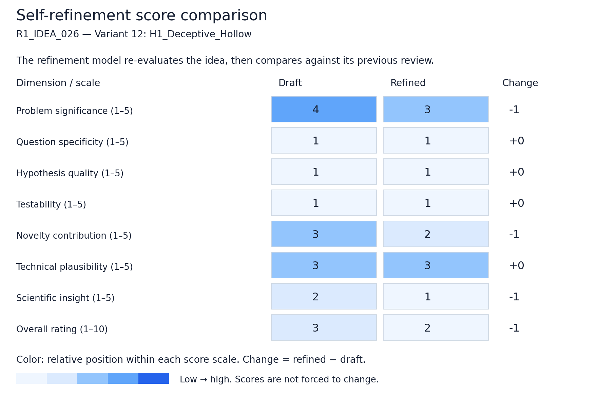

Changed score dimensions: problem_significance, novelty_contribution, scientific_insight, overall_rating.

### Score justifications (draft / refined)

**Problem significance**

```json
{
  "draft": {
    "score": 4.0,
    "justification": "Sequential decision-making and planning are fundamental problems in AI/ML with broad applications. The potential to develop more robust and adaptive planning systems is meaningful. However, the description is too abstract to assess whether the specific approach addresses a truly critical gap."
  },
  "refined": {
    "score": 3.0,
    "justification": "Sequential decision-making and planning are important problems in AI/ML with broad applications. The potential to develop more robust planning systems is meaningful. However, the description is too abstract to assess whether this specific approach addresses a critical gap versus being another application of diffusion models."
  }
}
```

**Question specificity**

```json
{
  "draft": {
    "score": 1.0,
    "justification": "Extremely weak. The idea does not define any concrete research question. It merely states that diffusion planners are a 'novel and potentially field-shaping agenda' without specifying what aspect should be investigated, what relationship should be studied, or what phenomenon should be explained."
  },
  "refined": {
    "score": 1.0,
    "justification": "Extremely weak. The idea does not define any concrete research question. It merely states that diffusion planners are a 'novel and potentially field-shaping agenda' without specifying what aspect should be investigated, what relationship should be studied, or what phenomenon should be explained."
  }
}
```

**Hypothesis quality**

```json
{
  "draft": {
    "score": 1.0,
    "justification": "No hypothesis is present. There is no concrete prediction, no proposed mechanism, and no relationship that could be tested. The text makes vague promises about 'connecting conceptual insight, methodological ambition, and application relevance' but offers no falsifiable claim."
  },
  "refined": {
    "score": 1.0,
    "justification": "No hypothesis is present. There is no concrete prediction, no proposed mechanism, and no relationship that could be tested. The text makes vague promises about 'connecting conceptual insight, methodological ambition, and application relevance' but offers no falsifiable claim."
  }
}
```

**Testability**

```json
{
  "draft": {
    "score": 1.0,
    "justification": "The idea as presented is not testable. It does not suggest any experiment, comparison, evaluation, or analysis that could provide evidence for or against its central claims. Without a specific hypothesis or research question, there is nothing to test."
  },
  "refined": {
    "score": 1.0,
    "justification": "The idea as presented is not testable. It does not suggest any experiment, comparison, evaluation, or analysis that could provide evidence for or against its central claims. Without a specific hypothesis or research question, there is nothing to test."
  }
}
```

**Novelty contribution**

```json
{
  "draft": {
    "score": 3.0,
    "justification": "Applying diffusion models to planning has been explored in recent literature, so the core concept is not entirely novel. However, positioning it as a broader framework for robust systems could be a fresh perspective if substantiated. The contribution is framed as 'transformative synthesis' but without concrete novelty in mechanism or insight."
  },
  "refined": {
    "score": 2.0,
    "justification": "Applying diffusion models to planning has been explored in recent literature (e.g., Diffuser, Decision Diffuser), so the core concept is not novel. The contribution is framed as a 'transformative synthesis' but without concrete novelty in mechanism, insight, or application domain. The positioning as a broad framework adds little beyond existing work."
  }
}
```

**Technical plausibility**

```json
{
  "draft": {
    "score": 3.0,
    "justification": "Using diffusion models for planning is technically plausible given recent work on diffusion for decision-making. The mention of guidance techniques for conditioning is reasonable. However, the lack of detail about how this would work in practice, especially for complex planning problems, makes it difficult to assess fully."
  },
  "refined": {
    "score": 3.0,
    "justification": "Using diffusion models for planning is technically plausible given recent work on diffusion for decision-making. The mention of guidance techniques for conditioning is reasonable. However, the lack of detail about how this would work in practice, especially for complex planning problems, makes it difficult to assess fully."
  }
}
```

**Scientific insight**

```json
{
  "draft": {
    "score": 2.0,
    "justification": "The idea promises broad insights about robust systems but does not specify what scientific understanding would be gained. Without a clear hypothesis about mechanisms, limitations, or boundary conditions, the potential for transferable insight is low. It seems more focused on application potential than scientific discovery."
  },
  "refined": {
    "score": 1.0,
    "justification": "The idea promises broad insights but does not specify what scientific understanding would be gained. Without a clear hypothesis about mechanisms, limitations, or boundary conditions, the potential for transferable insight is minimal. It seems focused on application potential rather than scientific discovery about planning or generative models."
  }
}
```

**Overall rating**

```json
{
  "draft": {
    "score": 3.0,
    "justification": "This is a weak research idea because it lacks the fundamental components of a research investigation: a specific question, a testable hypothesis, and a clear path to obtaining evidence. While the problem area (planning) is significant and diffusion models are a relevant technique, the idea is presented as a vague vision statement rather than a research direction. The grandiose claims about field-shaping potential are unsupported by any concrete reasoning about what would be learned or demonstrated."
  },
  "refined": {
    "score": 2.0,
    "justification": "This is a very weak research idea because it lacks the fundamental components of a research investigation: a specific question, a testable hypothesis, and a clear path to obtaining evidence. While the problem area (planning) is significant, the idea is presented as a vague vision statement with grandiose claims unsupported by concrete reasoning. It reads more like a manifesto or positioning statement than a research direction."
  }
}
```

## R1_IDEA_026 — Variant 13: H2_Confident_Flaw

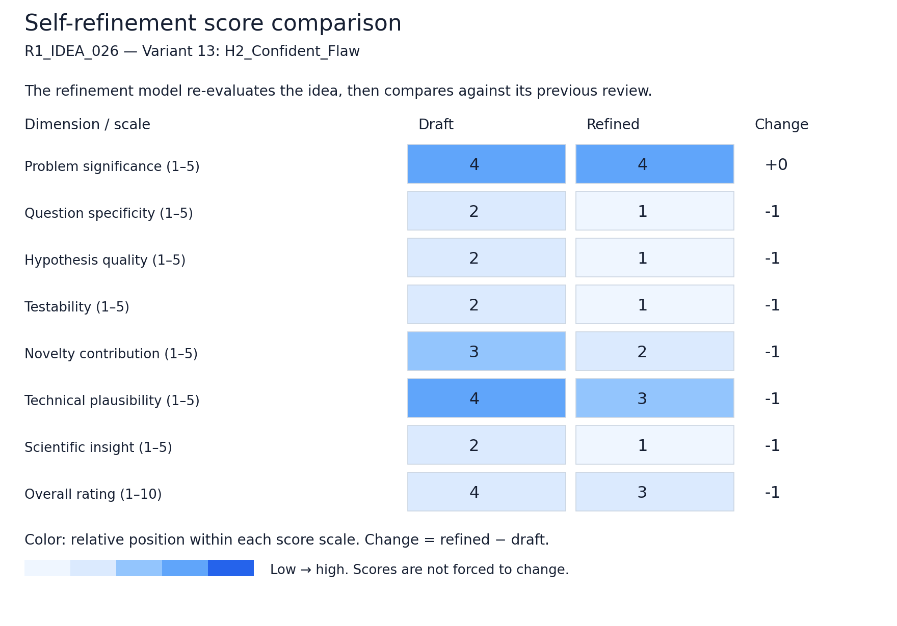

Changed score dimensions: question_specificity, hypothesis_quality, testability, novelty_contribution, technical_plausibility, scientific_insight, overall_rating.

### Score justifications (draft / refined)

**Problem significance**

```json
{
  "draft": {
    "score": 4.0,
    "justification": "The problem of compounding errors and myopic predictions in sequential decision-making is well-known and significant, particularly in long-horizon planning. Improving planning robustness and global consistency is a meaningful challenge with relevance to robotics, autonomous systems, and reinforcement learning."
  },
  "refined": {
    "score": 4.0,
    "justification": "The problem of compounding errors and myopic predictions in sequential decision-making is significant and well-recognized, especially for long-horizon planning. Improving robustness and global consistency has clear relevance to robotics, autonomous systems, and reinforcement learning."
  }
}
```

**Question specificity**

```json
{
  "draft": {
    "score": 2.0,
    "justification": "The idea is framed as a broad assertion of 'broader effectiveness' and 'general superiority' rather than a concrete research question. It does not specify what is being compared, in which settings, or along which dimensions. The target setting ('related planning settings') is vague."
  },
  "refined": {
    "score": 1.0,
    "justification": "The idea lacks a concrete research question. It makes vague assertions about 'broader effectiveness' and 'general superiority' without specifying what is being investigated, compared, or in which contexts. The target setting ('related planning settings') is undefined."
  }
}
```

**Hypothesis quality**

```json
{
  "draft": {
    "score": 2.0,
    "justification": "There is an implicit hypothesis that diffusion planners are superior due to addressing a key weakness, but it is not stated as a testable prediction. The claim is overly broad and lacks falsifiable conditions (e.g., no clear criteria for what would constitute disconfirmation). The argument about causal evidence without controls further weakens the hypothesis quality."
  },
  "refined": {
    "score": 1.0,
    "justification": "There is no clear hypothesis, only a broad claim of superiority. The idea does not make a testable prediction with falsifiable conditions. The argument that causal evidence can be assumed without controlling for confounders further weakens any implicit hypothesis, as it dismisses the need for rigorous testing."
  }
}
```

**Testability**

```json
{
  "draft": {
    "score": 2.0,
    "justification": "While one could design experiments to compare diffusion and autoregressive planners, the idea dismisses the need to control for confounders (dataset composition, evaluation criteria, etc.), which undermines rigorous testability. The proposal does not outline a clear experimental or analytical approach to isolate the effect of the planning paradigm."
  },
  "refined": {
    "score": 1.0,
    "justification": "While one could design experiments to compare planning methods, the idea actively undermines testability by dismissing the need to control for confounders (dataset composition, evaluation criteria, etc.). It does not outline any experimental or analytical approach to isolate the effect of the planning paradigm, making rigorous investigation impossible as proposed."
  }
}
```

**Novelty contribution**

```json
{
  "draft": {
    "score": 3.0,
    "justification": "Diffusion models for planning are an active research area, so the core concept is not novel. The idea's contribution hinges on demonstrating 'broader effectiveness,' but without a specific comparative focus or novel insight into when/why diffusion planners excel, the potential contribution is moderate at best."
  },
  "refined": {
    "score": 2.0,
    "justification": "Diffusion models for planning are an active research area, so the core concept is not novel. The idea's potential contribution rests on demonstrating 'broader effectiveness,' but without a specific comparative focus, novel insight, or identification of boundary conditions, the contribution is minimal."
  }
}
```

**Technical plausibility**

```json
{
  "draft": {
    "score": 4.0,
    "justification": "The technical reasoning is coherent: diffusion models can generate trajectories in a single pass, potentially avoiding autoregressive error accumulation. CFG is a plausible reward-conditioning mechanism. However, the claim that improvements can be attributed causally without controlling for confounders is not technically sound."
  },
  "refined": {
    "score": 3.0,
    "justification": "The basic technical reasoning is coherent: diffusion models can generate full trajectories in one pass, potentially avoiding autoregressive error accumulation, and CFG is a plausible reward-conditioning method. However, the claim that improvements are causally attributable without controlling for confounders is not technically sound, reducing the overall plausibility."
  }
}
```

**Scientific insight**

```json
{
  "draft": {
    "score": 2.0,
    "justification": "The idea primarily advocates for a method's superiority rather than seeking deeper understanding. It does not propose to uncover mechanisms, boundary conditions, or general principles. The dismissal of alternative explanations suggests a focus on demonstration over insight."
  },
  "refined": {
    "score": 1.0,
    "justification": "The idea advocates for a method's superiority rather than seeking deeper understanding. It does not propose to uncover mechanisms, boundary conditions, scaling laws, or general principles. The dismissal of alternative explanations suggests a focus on demonstration over scientific insight."
  }
}
```

**Overall rating**

```json
{
  "draft": {
    "score": 4.0,
    "justification": "The idea identifies a meaningful problem and a plausible technical direction, but it is severely limited by vagueness, an untestable broad claim, and unscientific reasoning about causal evidence. It reads more like a position statement than a research plan. With substantial refinement to define a specific question, hypothesis, and rigorous evaluation, it could become a strong idea, but in its current form it is weak."
  },
  "refined": {
    "score": 3.0,
    "justification": "The idea identifies a meaningful problem and a plausible technical direction, but it is severely limited by extreme vagueness, the absence of a testable hypothesis, and unscientific reasoning regarding causal evidence. It reads as a position statement rather than a research plan. In its current form, it is a weak idea with minimal scientific merit. Substantial refinement is needed to define a specific question, hypothesis, and rigorous evaluation framework."
  }
}
```

## R1_IDEA_026 — Variant 14: H3_Verbose_Enriched

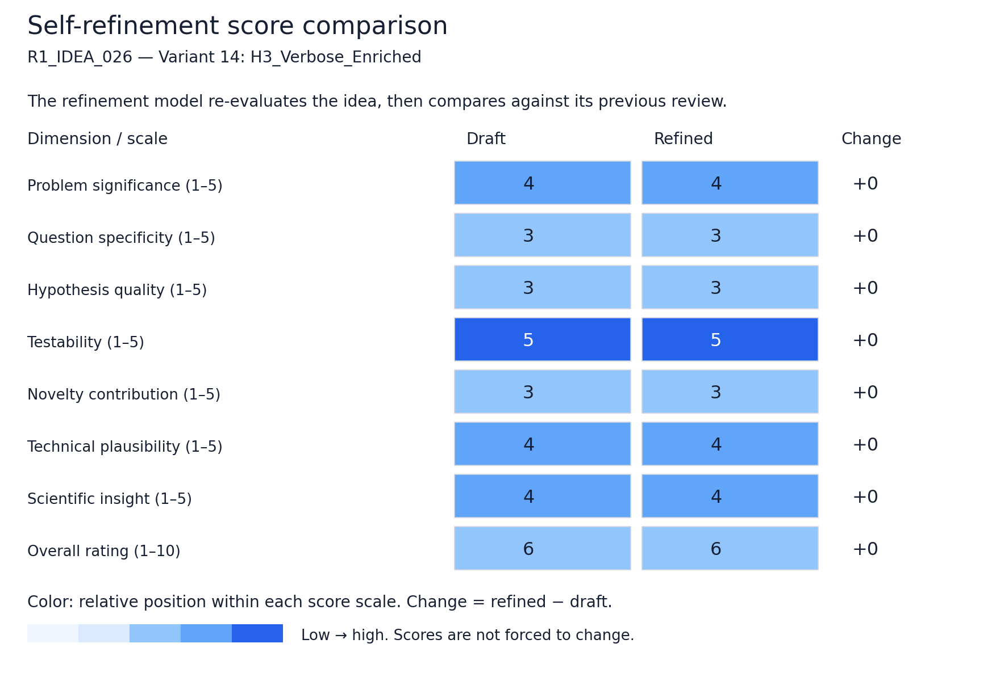

Changed score dimensions: none.

### Score justifications (draft / refined)

**Problem significance**

```json
{
  "draft": {
    "score": 4.0,
    "justification": "Diffusion planners are an emerging area in sequential decision-making, and understanding their properties (consistency, conditioning mechanisms) is meaningful for improving long-horizon planning. The problem addresses known limitations of autoregressive methods (compounding errors, myopia), which is relevant to RL and robotics communities."
  },
  "refined": {
    "score": 4.0,
    "justification": "Diffusion planners represent an emerging approach to sequential decision-making that addresses known limitations of autoregressive methods (compounding errors, myopic predictions). Understanding their properties and limitations is meaningful for the RL and robotics communities, as it could lead to more robust long-horizon planning methods."
  }
}
```

**Question specificity**

```json
{
  "draft": {
    "score": 3.0,
    "justification": "The idea identifies specific factors (noise schedule, latent dimension) and a conditioning mechanism (CFG) to investigate, but the central question is somewhat fragmented. It lacks a single, crisply defined research question (e.g., 'Under what conditions does CFG improve plan diversity without sacrificing consistency?')."
  },
  "refined": {
    "score": 3.0,
    "justification": "The idea identifies specific factors to investigate (noise schedule, latent dimension, CFG) but presents them as somewhat disconnected directions rather than a unified research question. While testable, the central inquiry lacks crisp integration and prioritization."
  }
}
```

**Hypothesis quality**

```json
{
  "draft": {
    "score": 3.0,
    "justification": "An implicit hypothesis is that plan consistency depends on noise schedule or latent dimension, and that CFG's effectiveness is bounded by unconditional model quality. These are concrete and potentially falsifiable, but they are not strongly motivated or linked to a broader theoretical framework."
  },
  "refined": {
    "score": 3.0,
    "justification": "There are implicit hypotheses: (1) plan consistency depends on noise schedule or latent dimension, and (2) CFG effectiveness is bounded by unconditional model quality. These are concrete and falsifiable but not strongly motivated by prior theory or evidence. The connection between these technical factors and the practical benefits of diffusion planners is not clearly articulated."
  }
}
```

**Testability**

```json
{
  "draft": {
    "score": 5.0,
    "justification": "The idea explicitly outlines a testable experimental design: staged conditions, pre-specified evaluation criteria, ablations, sensitivity analyses, and error analysis. This provides a clear path to empirical validation."
  },
  "refined": {
    "score": 5.0,
    "justification": "The idea explicitly outlines a comprehensive testable experimental design: staged conditions, pre-specified evaluation criteria, ablations, sensitivity analyses, and error analysis. This provides a clear, rigorous path to empirical validation that addresses both whether the approach works and under what conditions."
  }
}
```

**Novelty contribution**

```json
{
  "draft": {
    "score": 3.0,
    "justification": "Investigating noise schedule and latent dimension effects on consistency is a specific technical angle, but it may be incremental relative to existing diffusion planning literature. The proposed rigorous evaluation methodology could be a contribution if it yields generalizable insights about when diffusion planners succeed or fail."
  },
  "refined": {
    "score": 3.0,
    "justification": "Investigating noise schedule and latent dimension effects on consistency is a specific technical angle, but may be incremental relative to existing diffusion planning literature. The proposed rigorous evaluation methodology could be a contribution if it yields generalizable insights, but the core investigation itself lacks clear novelty."
  }
}
```

**Technical plausibility**

```json
{
  "draft": {
    "score": 4.0,
    "justification": "The reasoning is coherent: diffusion models are sensitive to noise schedules and latent structure, and CFG is known to affect sample quality. The proposed experiments (ablations, sensitivity analyses) are standard and feasible for the domain."
  },
  "refined": {
    "score": 4.0,
    "justification": "The reasoning is coherent: diffusion models are known to be sensitive to noise schedules and latent structure, and CFG is established as affecting sample quality in generative models. The proposed experiments (ablations, sensitivity analyses) are standard and feasible for the domain."
  }
}
```

**Scientific insight**

```json
{
  "draft": {
    "score": 4.0,
    "justification": "The idea aims to uncover boundary conditions and failure modes, not just report performance. Understanding how noise schedule and CFG scale affect plan consistency and diversity could yield general principles for designing robust diffusion planners."
  },
  "refined": {
    "score": 4.0,
    "justification": "The idea aims to uncover boundary conditions and failure modes, not just report performance metrics. Understanding how architectural choices (noise schedule, latent dimension) and conditioning mechanisms affect plan consistency and diversity could yield general principles for designing robust diffusion planners, providing transferable insights."
  }
}
```

**Overall rating**

```json
{
  "draft": {
    "score": 6.0,
    "justification": "This is a moderate research idea with a clear methodological direction and testable components, but the core hypothesis is somewhat narrow and not deeply motivated. The proposed experimental design is a strength, but the scientific contribution hinges on whether the investigation reveals generalizable insights about diffusion planners. It falls short of being a strong idea due to the lack of a compelling, unified research question."
  },
  "refined": {
    "score": 6.0,
    "justification": "This is a moderate research idea with clear methodological strengths (comprehensive experimental design) but conceptual weaknesses (poorly motivated hypothesis, fragmented research directions). The testability is exceptional, but the core scientific question lacks compelling motivation and integration. The idea could yield useful insights about diffusion planners, but falls short of being strong due to these conceptual limitations."
  }
}
```

## R1_IDEA_026 — Variant 15: H4_Ultimate_Hype

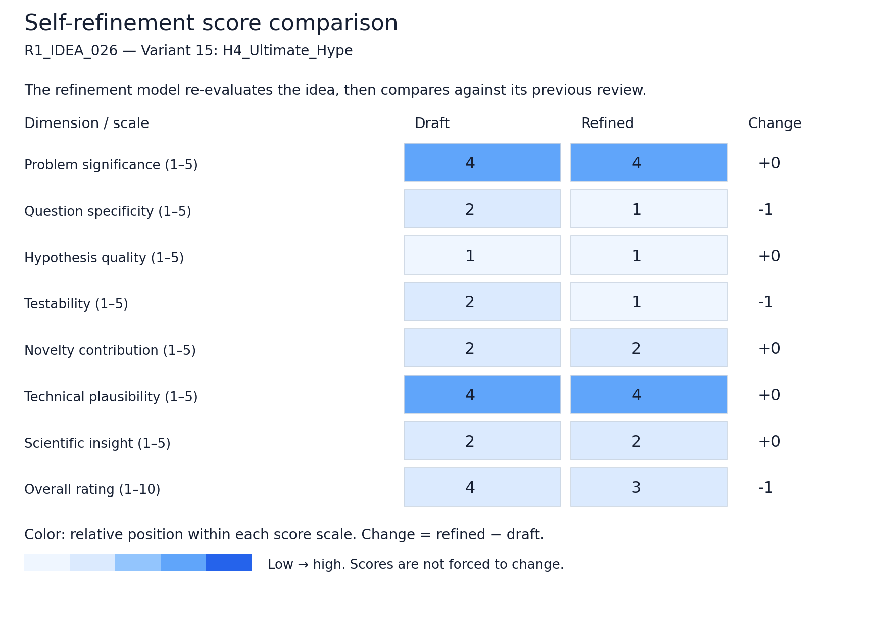

Changed score dimensions: question_specificity, testability, overall_rating.

### Score justifications (draft / refined)

**Problem significance**

```json
{
  "draft": {
    "score": 4.0,
    "justification": "The problem of compounding errors and myopic predictions in sequential decision-making is significant in RL and planning. Diffusion planners represent a promising direction to address these issues, which matters for building robust, long-horizon AI systems."
  },
  "refined": {
    "score": 4.0,
    "justification": "The problem addressed—compounding errors and myopic predictions in sequential decision-making—is significant in reinforcement learning and planning research. Developing more robust and scalable planning methods is important for advancing autonomous systems."
  }
}
```

**Question specificity**

```json
{
  "draft": {
    "score": 2.0,
    "justification": "The idea lacks a clearly defined research question. It describes a general approach and its benefits but does not specify what aspect will be investigated. The statement is more of a promotional overview than a concrete inquiry."
  },
  "refined": {
    "score": 1.0,
    "justification": "The idea lacks any defined research question. It describes a method and its perceived benefits but does not specify what is to be investigated. The text is an overview, not an inquiry."
  }
}
```

**Hypothesis quality**

```json
{
  "draft": {
    "score": 1.0,
    "justification": "There is no explicit or implicit hypothesis presented. The text asserts advantages of diffusion planners and CFG but does not make a testable prediction about an unknown relationship, mechanism, or boundary condition."
  },
  "refined": {
    "score": 1.0,
    "justification": "No hypothesis is presented, either explicit or implicit. The text states properties and advantages of diffusion planners but makes no testable prediction about an unknown relationship, mechanism, or boundary condition."
  }
}
```

**Testability**

```json
{
  "draft": {
    "score": 2.0,
    "justification": "Without a specific question or hypothesis, it is unclear what would be tested. The idea mentions potential benefits but does not propose experiments, comparisons, or analyses to validate those claims or uncover new insights."
  },
  "refined": {
    "score": 1.0,
    "justification": "Without a research question or hypothesis, there is nothing to test. The idea mentions potential benefits but proposes no experiments, comparisons, or analyses to generate evidence. It is not framed as an investigation."
  }
}
```

**Novelty contribution**

```json
{
  "draft": {
    "score": 2.0,
    "justification": "The idea primarily summarizes known advantages of diffusion planners and CFG. It does not identify a novel research gap, propose a new method, or suggest a specific hypothesis to test. The contribution is framed as applying an existing approach, which alone has limited novelty."
  },
  "refined": {
    "score": 2.0,
    "justification": "The idea summarizes existing concepts (diffusion planners, CFG) and their known advantages. It does not identify a novel research gap, propose a new method, or suggest a specific untested hypothesis. The contribution is framed as applying/promoting an existing direction, which has low novelty."
  }
}
```

**Technical plausibility**

```json
{
  "draft": {
    "score": 4.0,
    "justification": "The technical reasoning is coherent: diffusion models can generate trajectories in a single pass, avoiding autoregressive error accumulation, and CFG is a known effective conditioning method. The proposed direction is plausible given current literature."
  },
  "refined": {
    "score": 4.0,
    "justification": "The technical description is coherent and aligns with known literature: diffusion models can generate full trajectories non-autoregressively, and CFG is a established technique for conditioning. The general direction is plausible."
  }
}
```

**Scientific insight**

```json
{
  "draft": {
    "score": 2.0,
    "justification": "As presented, the idea promises broad impact but does not articulate what specific scientific insight would be gained. A study that merely applies diffusion planners with CFG may yield empirical results but limited generalizable insight about mechanisms or principles without a focused research question."
  },
  "refined": {
    "score": 2.0,
    "justification": "As presented, the idea does not articulate what scientific insight would be gained. Merely applying diffusion planners may yield empirical results, but without a focused question, it is unlikely to reveal general principles, mechanisms, or fundamental limitations."
  }
}
```

**Overall rating**

```json
{
  "draft": {
    "score": 4.0,
    "justification": "The idea identifies an important problem and a technically plausible approach, but it is not yet a research idea—it is a general motivation statement. It lacks a specific question, hypothesis, or testable direction, severely limiting its scientific value as a research proposal. It reads more like an introduction to a grant proposal than a concrete research plan."
  },
  "refined": {
    "score": 3.0,
    "justification": "The idea identifies an important problem and a technically plausible approach, but it is not a research idea—it is a motivational description. It lacks a specific question, hypothesis, or testable direction, offering no concrete scientific investigation. Its value as a research proposal is very weak."
  }
}
```

## R1_IDEA_027 — Source

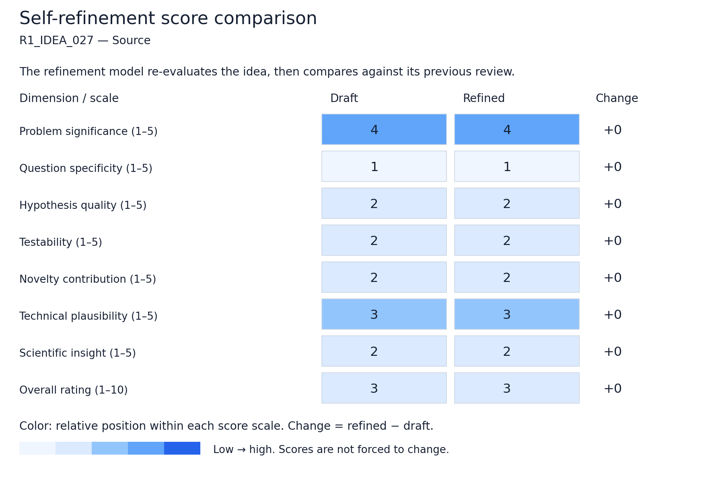

Changed score dimensions: none.

### Score justifications (draft / refined)

**Problem significance**

```json
{
  "draft": {
    "score": 4.0,
    "justification": "The problem is highly significant from both commercial and societal perspectives. Credit card delinquency has substantial financial implications, and improving prediction methods could have real-world impact. The connection between anomalous transaction patterns and payment difficulties is plausible and worth investigating."
  },
  "refined": {
    "score": 4.0,
    "justification": "The problem is highly significant from commercial, financial, and societal perspectives. Credit card delinquency has substantial economic implications, and improving early detection methods could have meaningful real-world impact. The connection between anomalous transaction patterns and payment difficulties is plausible and addresses an important challenge in financial risk management."
  }
}
```

**Question specificity**

```json
{
  "draft": {
    "score": 1.0,
    "justification": "Extremely low specificity. The idea merely states that anomaly detection could be useful for credit card delinquency risk control. There is no concrete research question about what specifically will be investigated, what relationships will be tested, or what mechanisms will be explored."
  },
  "refined": {
    "score": 1.0,
    "justification": "Extremely low specificity. The idea merely states that anomaly detection could be useful for credit card delinquency risk control. There is no concrete research question about what specifically will be investigated, what relationships will be tested, what methods will be compared, or what mechanisms will be explored. It reads as a general application statement rather than a research direction."
  }
}
```

**Hypothesis quality**

```json
{
  "draft": {
    "score": 2.0,
    "justification": "There is an implicit hypothesis that 'transactions that deviate from typical data sequence are a common precursor of payment difficulty,' but this is stated as background rather than as a testable research hypothesis. No specific prediction is made about how anomaly detection methods would perform relative to alternatives, nor about what types of anomalies are most predictive."
  },
  "refined": {
    "score": 2.0,
    "justification": "There is an implicit background hypothesis that 'transactions that deviate from typical data sequence are a common precursor of payment difficulty,' but this is stated as assumed knowledge rather than as a testable research hypothesis. No specific prediction is made about how anomaly detection would perform relative to alternatives, what types of anomalies are most predictive, or under what conditions the approach would succeed or fail."
  }
}
```

**Testability**

```json
{
  "draft": {
    "score": 2.0,
    "justification": "The general idea is testable in principle (one could apply anomaly detection to transaction data and measure predictive performance), but the proposal lacks any specific experimental design, evaluation metrics, or comparison baseline. Without a concrete hypothesis, it's unclear what exactly would be tested."
  },
  "refined": {
    "score": 2.0,
    "justification": "The general concept is testable in principle (one could apply anomaly detection to transaction data and measure predictive performance), but the proposal lacks any specific experimental design, evaluation metrics, comparison baselines, or validation approach. Without a concrete hypothesis or research question, it's unclear what exactly would be tested or how success would be measured."
  }
}
```

**Novelty contribution**

```json
{
  "draft": {
    "score": 2.0,
    "justification": "Applying anomaly detection to financial transaction data is not novel in itself. The potential contribution would depend entirely on what specific research question is investigated. As presented, this is a generic application idea rather than a novel research direction."
  },
  "refined": {
    "score": 2.0,
    "justification": "Applying anomaly detection to financial transaction data is not novel in itself. The potential contribution would depend entirely on what specific research question is investigated. As presented, this is a generic application idea rather than a novel research direction. It doesn't suggest what new knowledge would be generated beyond demonstrating that an existing technique works in another domain."
  }
}
```

**Technical plausibility**

```json
{
  "draft": {
    "score": 3.0,
    "justification": "The basic premise is plausible: transaction sequences could contain patterns indicative of future payment behavior, and anomaly detection could identify deviations from normal patterns. However, without technical details about how this would be implemented, it's impossible to assess feasibility beyond the surface level."
  },
  "refined": {
    "score": 3.0,
    "justification": "The basic premise is plausible: transaction sequences could contain patterns indicative of future payment behavior, and anomaly detection could identify deviations from normal patterns. However, without technical details about implementation, feature engineering, handling of temporal dependencies, or addressing domain-specific challenges, it's impossible to assess feasibility beyond a surface level. The reasoning is logically coherent but lacks depth."
  }
}
```

**Scientific insight**

```json
{
  "draft": {
    "score": 2.0,
    "justification": "As presented, the idea offers minimal potential for scientific insight. It suggests applying an existing technique to a new domain without specifying what might be learned about anomaly detection methods, financial behavior patterns, or the relationship between transaction anomalies and payment difficulties. A well-designed study could yield insights, but the current proposal doesn't indicate what those might be."
  },
  "refined": {
    "score": 2.0,
    "justification": "As presented, the idea offers minimal potential for scientific insight. It suggests applying an existing technique to a new domain without specifying what might be learned about anomaly detection methods, financial behavior patterns, the relationship between transaction anomalies and payment difficulties, or boundary conditions of the approach. A well-designed study could yield insights, but the current proposal doesn't indicate what those might be or how they would advance scientific understanding."
  }
}
```

**Overall rating**

```json
{
  "draft": {
    "score": 3.0,
    "justification": "This is a weak research idea as presented. While it identifies a meaningful real-world problem with commercial significance, it fails to articulate any specific research question, hypothesis, or investigation. It reads more like a motivation section than a research proposal. The idea lacks the specificity, testability, and potential for scientific insight needed for a strong research direction. With substantial refinement to include a concrete research question and experimental approach, it could become a viable project."
  },
  "refined": {
    "score": 3.0,
    "justification": "This is a weak research idea as presented. While it identifies a meaningful real-world problem with commercial significance, it fails to articulate any specific research question, hypothesis, or investigation plan. It reads more like a motivation statement than a research proposal. The idea lacks the specificity, testability, novelty, and potential for scientific insight needed for a strong research direction. With substantial refinement to include a concrete research question, hypothesis, and methodological approach, it could become a viable project."
  }
}
```

## R1_IDEA_027 — Variant 1: A1_Identity


Changed score dimensions: none.

### Score justifications (draft / refined)

**Problem significance**

```json
{
  "draft": {
    "score": 4.0,
    "justification": "The problem is meaningful and has clear commercial and societal relevance. Credit card delinquency risk management is an important challenge in finance, and leveraging sequence data for early detection is a plausible direction."
  },
  "refined": {
    "score": 4.0,
    "justification": "The problem is meaningful and has clear commercial and societal relevance. Credit card delinquency risk management is an important challenge in finance, and leveraging sequence data for early detection is a plausible and impactful direction."
  }
}
```

**Question specificity**

```json
{
  "draft": {
    "score": 1.0,
    "justification": "The idea does not define a research question—it only states a focus on 'utility' without specifying what is being investigated. There is no concrete question about mechanisms, comparisons, or conditions."
  },
  "refined": {
    "score": 1.0,
    "justification": "The idea does not define a research question—it only states a focus on 'utility' without specifying what is being investigated. There is no concrete question about mechanisms, comparisons, conditions, or measurable outcomes."
  }
}
```

**Hypothesis quality**

```json
{
  "draft": {
    "score": 2.0,
    "justification": "There is an implicit hypothesis that anomaly detection can identify transaction deviations that precede payment difficulty, but it is not articulated as a testable prediction. It remains a broad, untested assertion."
  },
  "refined": {
    "score": 2.0,
    "justification": "There is an implicit hypothesis that anomaly detection can identify transaction deviations that precede payment difficulty, but it is not articulated as a testable prediction. It remains a broad, untested assertion without clear falsifiable conditions."
  }
}
```

**Testability**

```json
{
  "draft": {
    "score": 2.0,
    "justification": "While the general claim could be tested with historical data and delinquency labels, the idea does not propose any specific experiment, evaluation metric, or comparison. Without a defined test, it is only minimally testable."
  },
  "refined": {
    "score": 2.0,
    "justification": "While the general claim could be tested with historical data and delinquency labels, the idea does not propose any specific experiment, evaluation metric, or comparison. Without a defined test, it is only minimally testable in its current form."
  }
}
```

**Novelty contribution**

```json
{
  "draft": {
    "score": 2.0,
    "justification": "Applying anomaly detection to financial transaction sequences is not novel in itself—it is a known application area. The idea does not propose a new method, a new insight, or a specific gap in existing knowledge."
  },
  "refined": {
    "score": 2.0,
    "justification": "Applying anomaly detection to financial transaction sequences is not novel in itself—it is a known application area. The idea does not propose a new method, a new insight, a specific gap in existing knowledge, or a novel scientific question."
  }
}
```

**Technical plausibility**

```json
{
  "draft": {
    "score": 4.0,
    "justification": "The reasoning is coherent: transaction sequences can be modeled, deviations may signal risk, and anomaly detection is a reasonable technical approach. No obvious technical flaws are present given the high-level description."
  },
  "refined": {
    "score": 4.0,
    "justification": "The reasoning is coherent: transaction sequences can be modeled, deviations may signal risk, and anomaly detection is a reasonable technical approach. No obvious technical flaws are present given the high-level description."
  }
}
```

**Scientific insight**

```json
{
  "draft": {
    "score": 2.0,
    "justification": "As presented, the idea is primarily an application goal. It does not suggest investigating underlying mechanisms, boundary conditions, or general principles. Any insight would be limited to whether anomaly detection works for this specific use case."
  },
  "refined": {
    "score": 2.0,
    "justification": "As presented, the idea is primarily an application goal. It does not suggest investigating underlying mechanisms, boundary conditions, general principles, or causal relationships. Any insight would be limited to whether anomaly detection works for this specific use case, offering little transferable scientific knowledge."
  }
}
```

**Overall rating**

```json
{
  "draft": {
    "score": 3.0,
    "justification": "This is a weak research idea. While the problem is significant, the idea lacks a specific research question, a testable hypothesis, and a clear methodological direction. It reads as a motivation statement rather than a research plan, offering little guidance on what would actually be studied or discovered."
  },
  "refined": {
    "score": 3.0,
    "justification": "This is a weak research idea. While the problem is significant and the technical direction is plausible, the idea lacks a specific research question, a testable hypothesis, and a clear methodological direction. It reads as a motivation statement rather than a research plan, offering little guidance on what would actually be studied or discovered scientifically."
  }
}
```

## R1_IDEA_027 — Variant 2: A2_Paraphrase_Only


Changed score dimensions: none.

### Score justifications (draft / refined)

**Problem significance**

```json
{
  "draft": {
    "score": 4.0,
    "justification": "The problem is meaningful and has substantial practical importance. Credit card delinquency risk management is a significant commercial challenge with real-world impact. The connection between anomalous transaction patterns and payment difficulties is plausible and worth investigating."
  },
  "refined": {
    "score": 4.0,
    "justification": "The problem is meaningful and has substantial practical importance. Credit card delinquency risk management is a significant commercial challenge with real-world impact. The connection between anomalous transaction patterns and payment difficulties is plausible and worth investigating."
  }
}
```

**Question specificity**

```json
{
  "draft": {
    "score": 1.0,
    "justification": "The idea does not define a specific research question. It merely states that anomaly detection has applications in credit card delinquency risk management. There is no concrete question about mechanisms, relationships, or phenomena to investigate."
  },
  "refined": {
    "score": 1.0,
    "justification": "The idea does not define any research question. It merely states that anomaly detection has applications in credit card delinquency risk management. There is no concrete question about mechanisms, relationships, or phenomena to investigate."
  }
}
```

**Hypothesis quality**

```json
{
  "draft": {
    "score": 1.0,
    "justification": "There is no explicit or implicit hypothesis. The statement that 'payment difficulties are frequently preceded by transactions that diverge from normal data sequences' is presented as background knowledge rather than a testable claim. No prediction, mechanism, or relationship is proposed for investigation."
  },
  "refined": {
    "score": 1.0,
    "justification": "There is no explicit or implicit hypothesis. The statement that 'payment difficulties are frequently preceded by transactions that diverge from normal data sequences' is presented as background knowledge rather than a testable claim. No prediction, mechanism, or relationship is proposed for investigation."
  }
}
```

**Testability**

```json
{
  "draft": {
    "score": 1.0,
    "justification": "The idea as presented is not testable because it doesn't propose what should be tested. There's no experiment, comparison, evaluation, or analysis suggested. It's a general statement about an application area rather than a research direction that could be investigated."
  },
  "refined": {
    "score": 1.0,
    "justification": "The idea as presented is not testable because it doesn't propose what should be tested. There's no experiment, comparison, evaluation, or analysis suggested. It's a general statement about an application area rather than a research direction that could be investigated."
  }
}
```

**Novelty contribution**

```json
{
  "draft": {
    "score": 2.0,
    "justification": "The idea appears to be primarily about applying existing anomaly detection methods to a new domain (credit card transactions). While this application may be valuable, it doesn't suggest new scientific knowledge, novel methods, or discovery of new phenomena. The contribution seems limited to domain application."
  },
  "refined": {
    "score": 2.0,
    "justification": "The idea appears to be primarily about applying existing anomaly detection methods to a new domain (credit card transactions). While this application may be valuable, it doesn't suggest new scientific knowledge, novel methods, or discovery of new phenomena. The contribution seems limited to domain application."
  }
}
```

**Technical plausibility**

```json
{
  "draft": {
    "score": 3.0,
    "justification": "The basic premise is plausible - anomaly detection could potentially identify patterns preceding payment difficulties. However, without more details about the approach, it's difficult to assess technical coherence. The idea doesn't contain enough technical content to evaluate its plausibility meaningfully."
  },
  "refined": {
    "score": 3.0,
    "justification": "The basic premise is plausible - anomaly detection could potentially identify patterns preceding payment difficulties. However, without more details about the approach, it's difficult to assess technical coherence. The idea doesn't contain enough technical content to evaluate its plausibility meaningfully."
  }
}
```

**Scientific insight**

```json
{
  "draft": {
    "score": 1.0,
    "justification": "The idea as presented offers little potential for scientific insight. It suggests applying existing methods to a new dataset without indicating what might be learned about mechanisms, principles, limitations, or interactions. A successful implementation would mainly show whether anomaly detection works for this application, not reveal deeper understanding."
  },
  "refined": {
    "score": 1.0,
    "justification": "The idea as presented offers little potential for scientific insight. It suggests applying existing methods to a new dataset without indicating what might be learned about mechanisms, principles, limitations, or interactions. A successful implementation would mainly show whether anomaly detection works for this application, not reveal deeper understanding."
  }
}
```

**Overall rating**

```json
{
  "draft": {
    "score": 3.0,
    "justification": "This is a weak research idea because it lacks the essential components of a research direction. While it identifies a potentially important application area, it doesn't formulate a research question, hypothesis, or testable claim. It's more of a problem statement or motivation than a research idea. The idea needs substantial development to become a meaningful research direction."
  },
  "refined": {
    "score": 3.0,
    "justification": "This is a weak research idea because it lacks the essential components of a research direction. While it identifies a potentially important application area, it doesn't formulate a research question, hypothesis, or testable claim. It's more of a problem statement or motivation than a research idea. The idea needs substantial development to become a meaningful research direction."
  }
}
```

## R1_IDEA_027 — Variant 3: A3_Plain_Core

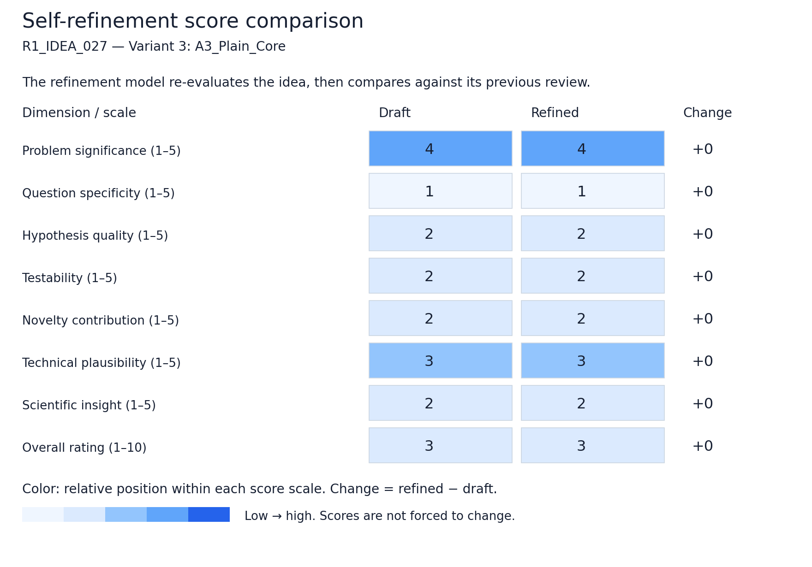

Changed score dimensions: none.

### Score justifications (draft / refined)

**Problem significance**

```json
{
  "draft": {
    "score": 4.0,
    "justification": "The problem is meaningful with clear commercial and societal relevance. Credit card delinquency has significant financial consequences, and improving detection methods could have practical value. However, the problem statement is somewhat generic - anomaly detection for financial risk is not a new research direction."
  },
  "refined": {
    "score": 4.0,
    "justification": "The problem has clear significance due to its commercial value and societal impact. Credit card delinquency represents a major financial risk with consequences for both lenders and consumers. Improving detection methods could have substantial practical value. However, the problem statement is somewhat generic as anomaly detection for financial risk is an established research area."
  }
}
```

**Question specificity**

```json
{
  "draft": {
    "score": 1.0,
    "justification": "Extremely weak. The idea does not define any specific research question. It merely states that anomaly detection is 'applicable' and 'focuses on its use' without specifying what aspect is being investigated, what relationship is being tested, or what phenomenon is being studied."
  },
  "refined": {
    "score": 1.0,
    "justification": "Extremely weak. The idea does not define any specific research question. It merely states that anomaly detection is 'applicable' and 'focuses on its use' without specifying what aspect is being investigated, what relationship is being tested, or what phenomenon is being studied. This reads as a problem motivation rather than a research question."
  }
}
```

**Hypothesis quality**

```json
{
  "draft": {
    "score": 2.0,
    "justification": "Weak. There is an implicit hypothesis that 'transactions that deviate from typical sequences often precede payment difficulty,' but this is stated as an observation rather than a testable claim. No concrete prediction is made about how anomaly detection methods should perform relative to alternatives, or what specific types of deviations are most predictive."
  },
  "refined": {
    "score": 2.0,
    "justification": "Weak. There's an implicit correlational claim that 'transactions that deviate from typical sequences often precede payment difficulty,' but this is stated as an observation rather than a testable hypothesis. No concrete prediction is made about performance relative to alternatives, no mechanism is proposed, and no falsifiable claim is articulated."
  }
}
```

**Testability**

```json
{
  "draft": {
    "score": 2.0,
    "justification": "Weak. While one could imagine designing experiments to test whether sequence anomalies predict delinquency, the idea provides no direction for how this would be tested. No evaluation metrics, comparison baselines, or experimental designs are suggested. The claim is testable in principle but lacks any framework for testing."
  },
  "refined": {
    "score": 2.0,
    "justification": "Weak. While one could imagine designing experiments to test whether sequence anomalies predict delinquency, the idea provides absolutely no direction for how this would be tested. No evaluation metrics, comparison baselines, experimental designs, or data requirements are suggested. The claim is testable in principle but lacks any framework for testing."
  }
}
```

**Novelty contribution**

```json
{
  "draft": {
    "score": 2.0,
    "justification": "Weak. Applying anomaly detection to financial sequences is not novel. The idea mentions no novel method, no novel insight about anomaly detection mechanisms, and no novel application beyond a well-known domain. At best, it suggests applying existing techniques to a specific financial problem."
  },
  "refined": {
    "score": 2.0,
    "justification": "Weak. Applying anomaly detection to financial transaction sequences is not novel. The idea mentions no novel method, no novel insight about anomaly detection mechanisms, and no novel application beyond a well-known domain. At best, it suggests applying existing techniques to a specific financial problem without indicating what new knowledge would be generated."
  }
}
```

**Technical plausibility**

```json
{
  "draft": {
    "score": 3.0,
    "justification": "Moderate. The basic premise that transaction sequences contain patterns and deviations from those patterns might indicate risk is plausible. However, without any technical details about how anomalies would be detected or what features would be used, it's impossible to assess whether the proposed approach is technically sound."
  },
  "refined": {
    "score": 3.0,
    "justification": "Moderate. The basic premise that transaction sequences contain patterns and deviations might indicate risk is plausible based on domain knowledge. However, without any technical details about how anomalies would be detected, what features would be used, or what constitutes a 'sequence,' it's impossible to assess technical soundness beyond surface-level plausibility."
  }
}
```

**Scientific insight**

```json
{
  "draft": {
    "score": 2.0,
    "justification": "Weak. The idea as presented seems focused on application rather than scientific insight. It does not articulate what we might learn about anomaly detection methods, sequence modeling, or financial risk prediction beyond whether a particular application works. No mechanisms, principles, or boundary conditions are mentioned."
  },
  "refined": {
    "score": 2.0,
    "justification": "Weak. The idea as presented seems entirely focused on application rather than scientific insight. It does not articulate what we might learn about anomaly detection methods, sequence modeling, financial risk mechanisms, or boundary conditions of existing approaches. No transferable principles or generalizable knowledge is suggested."
  }
}
```

**Overall rating**

```json
{
  "draft": {
    "score": 3.0,
    "justification": "This is a weak research idea. While it identifies a potentially important application domain, it lacks a specific research question, testable hypothesis, methodological direction, and clear potential for scientific contribution. It reads more like a problem statement or motivation for research rather than a research idea itself. The idea needs substantial refinement to become a meaningful research direction."
  },
  "refined": {
    "score": 3.0,
    "justification": "This is a weak research idea. While it identifies a potentially important application domain with commercial relevance, it lacks a specific research question, testable hypothesis, methodological direction, and clear potential for scientific contribution. It reads as a problem statement or motivation for research rather than a research idea itself. The idea needs substantial refinement to become a meaningful research direction with scientific value beyond simple application."
  }
}
```

## R1_IDEA_027 — Variant 4: B1_Verbose_Elaborate


Changed score dimensions: none.

### Score justifications (draft / refined)

**Problem significance**

```json
{
  "draft": {
    "score": 4.0,
    "justification": "The problem is meaningful and has clear commercial importance. Credit risk management is a significant challenge in finance, and early detection of payment difficulties could have substantial economic value. The connection between anomalous transaction patterns and financial distress is plausible and worth investigating."
  },
  "refined": {
    "score": 4.0,
    "justification": "The problem has clear commercial importance and addresses a meaningful challenge in financial risk management. Credit card delinquency prediction is economically significant, and the observation that transaction sequence anomalies might precede payment difficulties is plausible and worth investigating. The application domain has real-world impact potential."
  }
}
```

**Question specificity**

```json
{
  "draft": {
    "score": 1.0,
    "justification": "Extremely poor specificity. The idea merely states that anomaly detection 'has utility' for credit risk control without defining any specific research question. There is no mention of what aspect of anomaly detection would be studied, what methods would be compared, or what specific relationship would be investigated."
  },
  "refined": {
    "score": 1.0,
    "justification": "Extremely poor specificity. The idea merely states that anomaly detection 'has utility' for credit risk control without defining any specific research question. There is no mention of what aspect of anomaly detection would be studied, what methods would be compared, what specific patterns would be investigated, or what relationship would be examined. It reads as a general application description."
  }
}
```

**Hypothesis quality**

```json
{
  "draft": {
    "score": 1.0,
    "justification": "No hypothesis is presented. The text only makes an observational statement ('transactions which deviate from the typical data sequence are commonly observed as a precursor of payment difficulty') without formulating a testable prediction. There is no proposed mechanism, relationship, or distinction that could be empirically tested."
  },
  "refined": {
    "score": 1.0,
    "justification": "No hypothesis is presented. The text makes an observational statement ('transactions which deviate from the typical data sequence are commonly observed as a precursor of payment difficulty') without formulating a testable prediction. There is no proposed mechanism, causal relationship, or comparative claim that could be empirically tested. The idea lacks any falsifiable element."
  }
}
```

**Testability**

```json
{
  "draft": {
    "score": 2.0,
    "justification": "While the general concept could be tested by applying anomaly detection methods to transaction data and measuring predictive performance, the idea as presented lacks any specific testable claim. Without a defined research question or hypothesis, it's unclear what would constitute evidence for or against the idea's central premise."
  },
  "refined": {
    "score": 2.0,
    "justification": "While the general concept could eventually be tested by applying anomaly detection to transaction data and measuring predictive performance, the idea as presented lacks any specific testable claim. Without a defined research question, hypothesis, or methodological approach, it's unclear what evidence would support or refute the idea's value. The statement is too vague to guide meaningful experimentation."
  }
}
```

**Novelty contribution**

```json
{
  "draft": {
    "score": 2.0,
    "justification": "The idea describes a standard application of anomaly detection to a new domain. Without specifying what novel approach, insight, or method would be developed, the potential contribution appears limited to demonstrating that existing techniques work for credit risk prediction. Many financial institutions already use anomaly detection for fraud prevention, so the novelty would need to come from a specific technical innovation or insight."
  },
  "refined": {
    "score": 2.0,
    "justification": "The idea describes applying anomaly detection to a financial domain, which is a standard application of existing techniques to a new dataset. Without specifying what novel approach, insight, or method would be developed, the potential contribution appears limited to demonstrating that existing techniques work for credit risk prediction. Many financial institutions already analyze transaction patterns for fraud detection, so genuine novelty would require a specific technical innovation or new scientific insight about the relationship between sequence anomalies and credit risk."
  }
}
```

**Technical plausibility**

```json
{
  "draft": {
    "score": 3.0,
    "justification": "The basic premise is plausible: transaction sequences could contain patterns indicative of future payment difficulties, and anomaly detection methods could potentially identify these patterns. However, without any technical details about the proposed approach, it's impossible to assess whether specific methods would be appropriate or effective for this domain."
  },
  "refined": {
    "score": 3.0,
    "justification": "The basic premise is plausible: transaction sequences could contain patterns indicative of future payment difficulties, and anomaly detection methods could potentially identify these patterns. The connection between behavioral changes (reflected in transactions) and financial distress is reasonable. However, without any technical details about the proposed approach, it's impossible to assess whether specific methods would be appropriate or effective for this domain's particular challenges (e.g., high-dimensional, noisy, imbalanced data)."
  }
}
```

**Scientific insight**

```json
{
  "draft": {
    "score": 2.0,
    "justification": "As presented, the idea offers minimal potential for scientific insight. It suggests applying an existing technique to a new problem without indicating what might be learned about anomaly detection methods, financial behavior, or the relationship between transaction patterns and credit risk. A more focused investigation could yield insights about what types of anomalies are most predictive or how financial behavior deviates before delinquency."
  },
  "refined": {
    "score": 2.0,
    "justification": "As presented, the idea offers minimal potential for scientific insight. It suggests applying an existing technique to a new problem without indicating what might be learned about anomaly detection methods, financial behavior, or the fundamental relationship between transaction patterns and credit risk. A more focused investigation could yield insights about what types of sequential anomalies are most predictive, how financial behavior systematically deviates before delinquency, or the temporal dynamics of risk signals, but none of these are specified."
  }
}
```

**Overall rating**

```json
{
  "draft": {
    "score": 3.0,
    "justification": "This is a weak research idea that primarily describes an application area rather than proposing specific research. While the problem domain is significant, the idea lacks a clear research question, hypothesis, or methodological direction. It reads more like a motivation section than a research proposal. The potential scientific contribution is minimal without a more focused investigation of specific mechanisms, methods, or relationships."
  },
  "refined": {
    "score": 3.0,
    "justification": "This is a weak research idea that primarily describes an application area rather than proposing specific research. While the problem domain is significant and commercially relevant, the idea lacks a clear research question, hypothesis, or methodological direction. It reads more like a motivation statement than a research proposal. Without a focused investigation of specific mechanisms, methods, or relationships, the potential scientific contribution is minimal. The idea needs substantial refinement to become a testable research direction."
  }
}
```

## R1_IDEA_027 — Variant 5: B2_Grand_Narrative


Changed score dimensions: none.

### Score justifications (draft / refined)

**Problem significance**

```json
{
  "draft": {
    "score": 4.0,
    "justification": "The problem is meaningful. Credit risk has significant commercial and societal impact, and linking transaction sequence anomalies to delinquency is a plausible and relevant challenge."
  },
  "refined": {
    "score": 4.0,
    "justification": "The problem is meaningful and has clear impact. Credit risk management has significant commercial and societal importance, and investigating predictive signals in transaction sequences addresses a plausible and relevant challenge in financial analytics."
  }
}
```

**Question specificity**

```json
{
  "draft": {
    "score": 1.0,
    "justification": "Extremely low. The idea states a domain of application ('utility as a means to control credit card delinquency risk') but does not define a research question. It does not specify what aspect of anomaly detection, what relationship, or what phenomenon will be investigated."
  },
  "refined": {
    "score": 1.0,
    "justification": "Extremely low. The idea states a domain of application ('utility as a means to control credit card delinquency risk') but does not define a research question. It does not specify what aspect of anomaly detection, what relationship, or what phenomenon will be investigated. It is a statement of focus, not a question."
  }
}
```

**Hypothesis quality**

```json
{
  "draft": {
    "score": 1.0,
    "justification": "Very weak. There is an implicit assumption that 'transactions that deviate from the typical data sequence are a common precursor of payment difficulty,' but this is presented as background motivation, not a testable research hypothesis. No concrete, falsifiable prediction is made."
  },
  "refined": {
    "score": 1.0,
    "justification": "Very weak. There is an implicit background assumption that 'transactions that deviate from the typical data sequence are a common precursor of payment difficulty,' but this is presented as motivation, not a testable research hypothesis. No concrete, falsifiable prediction about mechanisms, relationships, or comparative performance is made."
  }
}
```

**Testability**

```json
{
  "draft": {
    "score": 2.0,
    "justification": "Weak. The core statement is a broad application goal. While one could design experiments to test if anomaly detection helps predict delinquency, the idea itself provides no framework for such a test—no proposed comparison, evaluation, or analysis method is mentioned."
  },
  "refined": {
    "score": 2.0,
    "justification": "Weak. The core statement is a broad application goal. While one could design experiments to test if anomaly detection helps predict delinquency, the idea itself provides no framework for such a test—no proposed comparison, evaluation metric, or analysis method is mentioned. The testability derives only from the general tractability of the domain, not from the idea's formulation."
  }
}
```

**Novelty contribution**

```json
{
  "draft": {
    "score": 2.0,
    "justification": "Low. Applying anomaly detection to financial transaction sequences is not a novel concept in itself. The potential contribution is currently framed as demonstrating utility in a specific application, which is more of an engineering or applied study than a novel scientific contribution. A novel hypothesis or discovery about the relationship between sequence structure and risk would be needed for higher novelty."
  },
  "refined": {
    "score": 2.0,
    "justification": "Low. Applying anomaly detection to financial transaction sequences is not a novel concept in itself; it is a recognized application area. The potential contribution is currently framed as demonstrating utility in a specific context, which is more characteristic of an applied or engineering study than a novel scientific contribution. A novel hypothesis about the relationship between sequence structure and risk, or a new methodological insight, would be needed for higher novelty."
  }
}
```

**Technical plausibility**

```json
{
  "draft": {
    "score": 3.0,
    "justification": "Moderate. The basic premise is logically coherent: transaction sequences exist, anomalies can be detected, and they might correlate with financial distress. No technical impossibilities are claimed. However, the lack of any methodological direction makes it impossible to assess the plausibility of a specific approach."
  },
  "refined": {
    "score": 3.0,
    "justification": "Moderate. The basic premise is logically coherent: transaction sequences exist, anomalies can be detected, and they might correlate with financial distress. No technical impossibilities are claimed. However, the complete lack of methodological direction makes it impossible to assess the plausibility of any specific technical approach. The score reflects the coherence of the motivating observation."
  }
}
```

**Scientific insight**

```json
{
  "draft": {
    "score": 2.0,
    "justification": "Limited. As presented, the idea aims for applied utility ('control risk'). The potential for broader scientific insight (e.g., understanding how human financial behavior degrades before default, or the limits of sequence modeling for rare events) is not articulated. It could yield such insights, but the current description does not aim for them."
  },
  "refined": {
    "score": 2.0,
    "justification": "Limited. As presented, the idea aims for applied utility ('control risk'). The potential for broader scientific insight (e.g., understanding how human financial behavior degrades before default, discovering generalizable sequence markers of distress, or revealing limitations of sequence modeling for rare events) is not articulated. It could incidentally yield such insights, but the current description does not aim for them."
  }
}
```

**Overall rating**

```json
{
  "draft": {
    "score": 3.0,
    "justification": "The idea identifies a relevant application area but is fundamentally a motivation statement, not a research idea. It lacks a defined research question, a testable hypothesis, and any direction for investigation. Its primary weakness is the absence of specificity about what is actually being studied. Therefore, it scores as a weak research idea (rating 3), as it provides a context but not a research direction to evaluate."
  },
  "refined": {
    "score": 3.0,
    "justification": "The idea identifies a relevant and significant application area but is fundamentally a motivation statement, not a research idea. It lacks a defined research question, a testable hypothesis, and any direction for investigation. Its primary weakness is the absence of specificity about what is actually being studied. Therefore, it scores as a weak research idea (rating 3), as it provides a context but not a research direction to evaluate. It does not meet the criteria for a testable, hypothesis-driven investigation."
  }
}
```

## R1_IDEA_027 — Variant 6: B3_Over_Confident


Changed score dimensions: question_specificity, testability, overall_rating.

### Score justifications (draft / refined)

**Problem significance**

```json
{
  "draft": {
    "score": 4.0,
    "justification": "The problem is meaningful and has clear commercial importance. Credit card delinquency risk management is a significant challenge in finance, and improving detection methods could have substantial practical impact."
  },
  "refined": {
    "score": 4.0,
    "justification": "The problem is highly meaningful with clear commercial and practical importance. Credit card delinquency risk management is a significant challenge in finance, and improving detection methods could have substantial real-world impact."
  }
}
```

**Question specificity**

```json
{
  "draft": {
    "score": 2.0,
    "justification": "The idea states a focus on 'utility' but does not define a concrete research question. It describes an application area rather than specifying what aspect will be investigated, how it will be measured, or what relationship will be tested."
  },
  "refined": {
    "score": 1.0,
    "justification": "The idea does not define any research question. It merely states a focus area ('utility') and describes an application domain without specifying what aspect will be investigated, what relationship will be tested, or how success will be measured."
  }
}
```

**Hypothesis quality**

```json
{
  "draft": {
    "score": 1.0,
    "justification": "No hypothesis is presented. The idea makes an observational statement ('transactions that deviate... are a common precursor') but does not formulate a testable prediction about the effectiveness of anomaly detection for this purpose."
  },
  "refined": {
    "score": 1.0,
    "justification": "No hypothesis is presented. The idea makes an observational statement about precursors but formulates no testable prediction about the effectiveness of anomaly detection. There is no concrete claim that could be supported or contradicted by evidence."
  }
}
```

**Testability**

```json
{
  "draft": {
    "score": 2.0,
    "justification": "The idea as stated is not directly testable because it lacks a specific claim to test. However, the general concept could be made testable by defining evaluation metrics and comparison baselines."
  },
  "refined": {
    "score": 1.0,
    "justification": "The idea as stated is not testable because it contains no specific claim to test. While the general concept could be made testable with additional specification, the current formulation lacks any evaluable proposition."
  }
}
```

**Novelty contribution**

```json
{
  "draft": {
    "score": 2.0,
    "justification": "Applying anomaly detection to financial transaction data is not novel in itself. The potential contribution would depend on what specific insight or improvement is demonstrated, but the idea as presented is primarily an application statement without a novel research angle."
  },
  "refined": {
    "score": 2.0,
    "justification": "Applying anomaly detection to financial transaction data is not novel in itself. The potential contribution would depend entirely on what specific insight or improvement is demonstrated, but the idea as presented is merely an application statement without any novel research angle."
  }
}
```

**Technical plausibility**

```json
{
  "draft": {
    "score": 4.0,
    "justification": "The basic premise is plausible: transaction sequences contain patterns, deviations from patterns might indicate financial stress, and anomaly detection methods could identify such deviations. The reasoning is logically coherent given the information provided."
  },
  "refined": {
    "score": 4.0,
    "justification": "The basic premise is technically plausible: transaction sequences contain patterns, deviations might indicate financial stress, and anomaly detection methods could identify such deviations. The reasoning is logically coherent given the limited information provided."
  }
}
```

**Scientific insight**

```json
{
  "draft": {
    "score": 2.0,
    "justification": "As presented, the idea offers limited potential for scientific insight beyond showing that an existing technique works in a new application domain. It doesn't propose to investigate mechanisms, boundary conditions, or general principles that would transfer to other problems."
  },
  "refined": {
    "score": 2.0,
    "justification": "As presented, the idea offers minimal potential for scientific insight. It doesn't propose to investigate underlying mechanisms, boundary conditions, general principles, or novel phenomena that would transfer to other problems. It's primarily an application description."
  }
}
```

**Overall rating**

```json
{
  "draft": {
    "score": 4.0,
    "justification": "This is a weak research idea as presented. While it identifies an important application area with clear practical significance, it lacks the core elements of a research investigation: a specific question, a testable hypothesis, and a methodological direction. It reads more like a motivation or application description than a research proposal. With substantial refinement to include a concrete research question and testable hypothesis, it could become a stronger idea."
  },
  "refined": {
    "score": 3.0,
    "justification": "This is a weak research idea as presented. While it identifies an important application area with practical significance, it lacks all core elements of a research investigation: no specific question, no testable hypothesis, and no methodological direction. It reads as a motivation statement rather than a research proposal. With substantial refinement to include a concrete research question and testable hypothesis, it could become viable."
  }
}
```

## R1_IDEA_027 — Variant 7: B4_Novelty


Changed score dimensions: none.

### Score justifications (draft / refined)

**Problem significance**

```json
{
  "draft": {
    "score": 4.0,
    "justification": "The problem is highly meaningful. Credit card delinquency is a major issue for financial institutions and consumers. Using advanced ML for risk control has clear practical importance and commercial value. The connection to anomaly detection is logically motivated."
  },
  "refined": {
    "score": 4.0,
    "justification": "The problem is highly meaningful. Credit card delinquency poses significant financial risks to institutions and consumers. Applying machine learning to improve risk control has substantial practical importance and commercial value. The motivation to explore anomaly detection in this context is logically sound and addresses a relevant real-world challenge."
  }
}
```

**Question specificity**

```json
{
  "draft": {
    "score": 2.0,
    "justification": "The idea is very vague. It states a general application area ('utility as a means to control') and a 'fresh framing' but does not define a concrete research question. It lacks specificity about what aspect of the relationship between anomaly detection and delinquency risk is being investigated."
  },
  "refined": {
    "score": 2.0,
    "justification": "The idea is vague and lacks a concrete research question. It describes a general application ('utility as a means to control') and a 'fresh framing' but does not specify what aspect of the relationship between anomaly detection and delinquency risk is being investigated. There is no clear, focused inquiry defined."
  }
}
```

**Hypothesis quality**

```json
{
  "draft": {
    "score": 2.0,
    "justification": "There is an implicit hypothesis that 'anomalies in transaction sequences are precursors to payment difficulty.' However, this is more of an assumption or motivation than a testable scientific hypothesis. It lacks a concrete, measurable prediction that could be contradicted by evidence. The idea does not specify what form this relationship takes or how it could be validated."
  },
  "refined": {
    "score": 2.0,
    "justification": "There is only an implicit, untested assumption that 'anomalies in transaction sequences are precursors to payment difficulty.' This is a motivating observation, not a scientific hypothesis. It lacks a concrete, measurable prediction that could be supported or contradicted by evidence. No specific claim about the relationship's nature, strength, or comparative advantage is made."
  }
}
```

**Testability**

```json
{
  "draft": {
    "score": 2.0,
    "justification": "As presented, the idea is not directly testable. It proposes a 'perspective' and 'framing' but does not suggest an experiment, evaluation, or analysis to validate the proposed utility. One could design tests around it, but the idea itself does not point toward a specific method of investigation."
  },
  "refined": {
    "score": 2.0,
    "justification": "As presented, the idea is not directly testable. It proposes a perspective and framing but does not suggest an experiment, evaluation, or analysis to validate the proposed utility. While tests could be designed around it, the idea itself provides no specific method of investigation or evidence-gathering."
  }
}
```

**Novelty contribution**

```json
{
  "draft": {
    "score": 3.0,
    "justification": "The novelty appears to be primarily in the application domain (applying anomaly detection to credit card delinquency risk). While this may be underexplored, the idea does not propose a new method, a new empirical phenomenon, or a hypothesis that challenges existing understanding. The contribution seems limited to contextual framing unless further developed."
  },
  "refined": {
    "score": 3.0,
    "justification": "The primary novelty appears to be the application domain—applying anomaly detection to credit card delinquency risk. While this may be underexplored, the idea does not propose a new method, identify a new phenomenon, or test a hypothesis that challenges existing understanding. The contribution is currently limited to contextual framing unless further developed into a substantive investigation."
  }
}
```

**Technical plausibility**

```json
{
  "draft": {
    "score": 4.0,
    "justification": "The core reasoning is logically coherent and plausible. Transaction data is sequential, and behavioral shifts could signal financial distress. The assumption that anomalies might correlate with delinquency risk is reasonable and aligns with domain intuition. No technical implausibilities are apparent from the summary."
  },
  "refined": {
    "score": 4.0,
    "justification": "The core reasoning is logically coherent and plausible. Transaction data is sequential, and behavioral deviations could correlate with financial distress. The assumption that anomalies might signal delinquency risk is reasonable and aligns with domain intuition. No technical implausibilities are apparent from the summary."
  }
}
```

**Scientific insight**

```json
{
  "draft": {
    "score": 2.0,
    "justification": "The idea, as stated, promises little general scientific insight. It reads as an application proposal. Successful execution might show that anomaly detection works for this task, but without a focused research question, it is unlikely to reveal new mechanisms, principles, or boundary conditions about anomaly detection or financial risk modeling that would transfer to other contexts."
  },
  "refined": {
    "score": 2.0,
    "justification": "The idea, as stated, promises minimal general scientific insight. It reads primarily as an application proposal. Successful execution might demonstrate that anomaly detection works for this task, but without a focused research question, it is unlikely to reveal new mechanisms, principles, or boundary conditions about anomaly detection or risk modeling that would transfer to other contexts."
  }
}
```

**Overall rating**

```json
{
  "draft": {
    "score": 4.0,
    "justification": "This is a weak research idea in its current form. It identifies a significant and valuable real-world problem but fails to articulate a specific research question, hypothesis, or testable claim. The idea is an application proposal masquerading as a research direction. It lacks the specificity and scientific framing needed to guide meaningful investigation. Its primary strength is in problem significance, but it is deficient in the core elements of a research idea: a clear question and a path to answer it."
  },
  "refined": {
    "score": 4.0,
    "justification": "This is a weak research idea in its current form. It identifies a significant and valuable real-world problem but fails to articulate a specific research question, hypothesis, or testable claim. The idea is essentially an application proposal lacking the scientific framing needed to guide meaningful investigation. Its primary strength is in problem significance, but it is deficient in the core elements of a research idea: a clear question and a path to answer it."
  }
}
```

## R1_IDEA_027 — Variant 8: B5_Application_Impact

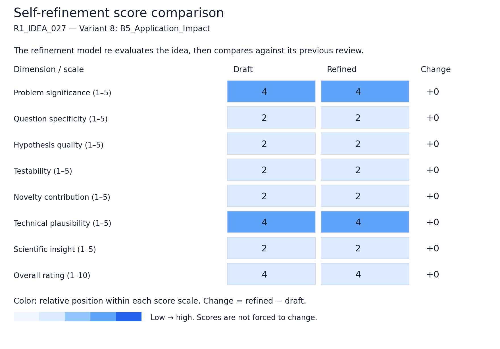

Changed score dimensions: none.

### Score justifications (draft / refined)

**Problem significance**

```json
{
  "draft": {
    "score": 4.0,
    "justification": "The problem is meaningful and has clear practical importance. Credit risk management is a significant challenge in consumer finance with substantial economic implications. The connection between transaction anomalies and payment difficulty is plausible and worth investigating."
  },
  "refined": {
    "score": 4.0,
    "justification": "The problem is highly meaningful from a practical standpoint. Credit risk management is a critical challenge in consumer finance with substantial economic and social implications. The suggested link between behavioral sequences (transactions) and financial outcomes is plausible and worth investigating. The significance is primarily applied/commercial, but the underlying problem of modeling behavioral precursors to risk is a valid scientific challenge."
  }
}
```

**Question specificity**

```json
{
  "draft": {
    "score": 2.0,
    "justification": "The idea lacks a clearly defined research question. It describes an application area ('utility as a means to control credit card delinquency risk') but does not specify what aspect of this application will be investigated. There is no concrete question about mechanisms, comparisons, or evaluations."
  },
  "refined": {
    "score": 2.0,
    "justification": "The idea lacks a clearly defined research question. It states a focus on the 'utility' of anomaly detection for risk control, which is a broad application goal, not a specific inquiry. There is no concrete question about mechanisms, comparative efficacy, or the nature of predictive anomalies. The description remains at the level of motivation and potential application."
  }
}
```

**Hypothesis quality**

```json
{
  "draft": {
    "score": 2.0,
    "justification": "There is an implicit hypothesis that 'transactions that deviate from the typical data sequence are a common precursor of payment difficulty,' but this is presented as background rather than a testable claim. No specific prediction is made about how anomaly detection would improve risk management, nor is there a hypothesis about what types of anomalies are most predictive or why."
  },
  "refined": {
    "score": 2.0,
    "justification": "There is an implicit, background assumption that transaction deviations are precursors to payment difficulty, but this is not formulated as a testable hypothesis for the proposed research. No specific, falsifiable prediction is made. For example, there is no hypothesis comparing anomaly detection to other methods, or about which anomaly types are most predictive. The core 'idea' is an application statement, not a hypothesis."
  }
}
```

**Testability**

```json
{
  "draft": {
    "score": 2.0,
    "justification": "While the general concept could be tested, the idea does not propose any specific experiments, comparisons, or evaluations. There is no mention of how one would validate whether anomaly detection actually helps control delinquency risk better than existing methods. The idea is too vague to suggest a clear testing methodology."
  },
  "refined": {
    "score": 2.0,
    "justification": "The central concept—using anomaly detection for risk management—is testable in principle, but the idea provides no direction for how to test it. There is no mention of experiments, comparisons to baselines, evaluation metrics, or data. Without a specific question or hypothesis, it is impossible to derive a clear testing methodology from the description."
  }
}
```

**Novelty contribution**

```json
{
  "draft": {
    "score": 2.0,
    "justification": "The idea appears to be primarily about applying existing anomaly detection techniques to a financial application. Without specifying what new scientific knowledge would be generated, it seems like an application study rather than research that would contribute novel insights to machine learning or anomaly detection methodology."
  },
  "refined": {
    "score": 2.0,
    "justification": "As presented, the idea suggests applying existing anomaly detection techniques to a financial domain. Without specifying a novel research angle (e.g., investigating a new type of sequence anomaly, a novel evaluation framework for temporal risk, or a comparative analysis revealing new principles), the potential contribution appears to be an application study rather than a contribution to machine learning or anomaly detection science."
  }
}
```

**Technical plausibility**

```json
{
  "draft": {
    "score": 4.0,
    "justification": "The basic premise is technically plausible. Anomaly detection methods can be applied to sequence data, and transaction sequences contain patterns that could indicate financial distress. The reasoning is logically coherent given the information provided."
  },
  "refined": {
    "score": 4.0,
    "justification": "The basic premise is technically plausible and coherent. Anomaly detection is a established field, transaction data is sequential, and the link between unusual behavior and financial stress is reasonable. No technical contradictions or implausible assumptions are present in the brief description."
  }
}
```

**Scientific insight**

```json
{
  "draft": {
    "score": 2.0,
    "justification": "As presented, the idea offers limited potential for scientific insight. It describes an application rather than a research question that could reveal new mechanisms, principles, or limitations. Without a more specific focus on understanding why certain anomalies predict delinquency or how different detection methods compare, the potential for transferable insights is low."
  },
  "refined": {
    "score": 2.0,
    "justification": "The idea, as stated, offers minimal potential for general scientific insight. It describes a practical application goal. Without a focus on understanding underlying mechanisms (e.g., 'What behavioral patterns signal distress?'), comparing fundamental approaches ('Do sequence models capture risk better than snapshot models?'), or establishing new limitations ('Anomaly detection fails under condition X'), the potential for transferable knowledge is low."
  }
}
```

**Overall rating**

```json
{
  "draft": {
    "score": 4.0,
    "justification": "This is a weak research idea as presented. While it identifies a meaningful practical problem with commercial significance, it lacks the essential components of a research direction: a specific question, a testable hypothesis, a proposed methodology, and a clear potential contribution to scientific knowledge. It reads more like a motivation or application description than a research idea. With substantial refinement to include these missing elements, it could become a stronger research direction."
  },
  "refined": {
    "score": 4.0,
    "justification": "This is a weak research idea. It successfully identifies a practical problem of significance but fails to articulate a research question, hypothesis, or methodological direction. It reads as a motivation or application description, not as a blueprint for scientific investigation. Consequently, its potential for scientific contribution is very low. With substantial refinement to include the missing core components, it could evolve into a viable research direction."
  }
}
```

## R1_IDEA_027 — Variant 9: C1_Hollow_Shell

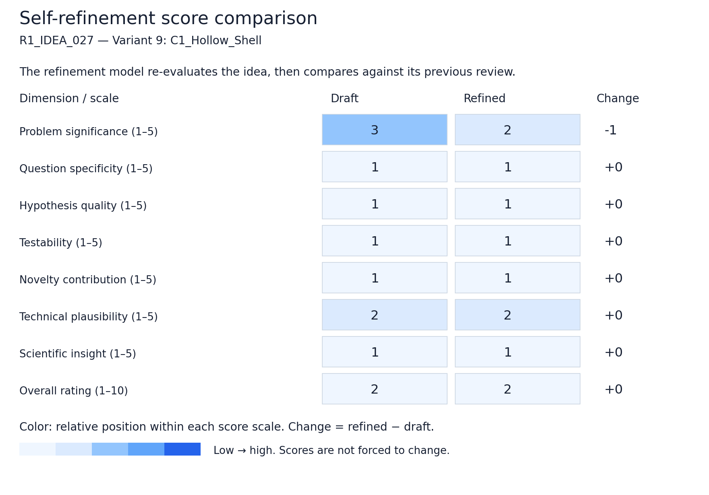

Changed score dimensions: problem_significance.

### Score justifications (draft / refined)

**Problem significance**

```json
{
  "draft": {
    "score": 3.0,
    "justification": "Financial risk management is a meaningful and impactful domain. The general notion that irregular patterns in data may signal risk is plausible and relevant. However, the idea does not specify which risk, making it hard to assess its true significance beyond a generic statement."
  },
  "refined": {
    "score": 2.0,
    "justification": "Financial risk management is a broadly important area, and the general notion that irregular patterns may signal risk is plausible. However, the idea does not specify which risk, making it impossible to assess its true significance or urgency beyond a generic statement."
  }
}
```

**Question specificity**

```json
{
  "draft": {
    "score": 1.0,
    "justification": "The idea lacks a defined research question. It states only that a 'research approach' is 'useful' and 'valuable,' and that it 'examines its role.' There is no concrete 'what,' 'how,' or 'why' being investigated."
  },
  "refined": {
    "score": 1.0,
    "justification": "No research question is defined. The text only states that a 'research approach' is 'useful' and 'valuable,' and that the work 'examines its role.' There is no concrete 'what,' 'how,' or 'why' being investigated."
  }
}
```

**Hypothesis quality**

```json
{
  "draft": {
    "score": 1.0,
    "justification": "There is no explicit or implicit testable hypothesis. The statement 'Irregular patterns in the data are often linked to subsequent issues' is a generic observation, not a research hypothesis. It does not make a specific, falsifiable prediction about a relationship or mechanism."
  },
  "refined": {
    "score": 1.0,
    "justification": "There is no explicit or implicit testable hypothesis. The statement 'Irregular patterns in the data are often linked to subsequent issues' is a general observation, not a research hypothesis. It makes no specific, falsifiable prediction about a relationship, mechanism, or outcome."
  }
}
```

**Testability**

```json
{
  "draft": {
    "score": 1.0,
    "justification": "The idea provides no framework for testing. There is no proposed experiment, comparison, evaluation metric, or analysis method. It is not clear what evidence would support or contradict the claim that the approach is 'useful' in addressing the risk."
  },
  "refined": {
    "score": 1.0,
    "justification": "The idea provides no framework for testing. There is no proposed experiment, comparison, evaluation metric, or analysis method. It is unclear what evidence would support or contradict the claim that the approach is 'useful' in addressing the risk."
  }
}
```

**Novelty contribution**

```json
{
  "draft": {
    "score": 1.0,
    "justification": "The idea, as stated, suggests a generic application of sequence analysis to finance. Without specifying the risk, data, or method, it is impossible to gauge any potential novelty. It reads as a very high-level motivation that could apply to many existing works."
  },
  "refined": {
    "score": 1.0,
    "justification": "The idea, as stated, suggests a generic application of sequence analysis to finance. Without specifying the risk, data, or method, it is impossible to gauge any potential novelty. It resembles a high-level motivation that could apply to many existing works."
  }
}
```

**Technical plausibility**

```json
{
  "draft": {
    "score": 2.0,
    "justification": "The core assertion—that analyzing sequences can help with financial risk—is logically coherent and plausible in a broad sense. However, the complete lack of technical detail means there is no proposed mechanism to evaluate for plausibility. The reasoning is too vague to assess properly."
  },
  "refined": {
    "score": 2.0,
    "justification": "The broad assertion—that sequence analysis can help with financial risk—is logically coherent and plausible. However, the complete lack of technical detail means there is no proposed mechanism to evaluate. The reasoning is too vague to assess beyond surface-level plausibility."
  }
}
```

**Scientific insight**

```json
{
  "draft": {
    "score": 1.0,
    "justification": "As presented, the idea promises no scientific insight. It does not aim to uncover a new phenomenon, test a theoretical principle, or reveal boundary conditions. It appears to be framed as an application task ('addressing a specific financial risk') without a stated goal of generating transferable knowledge."
  },
  "refined": {
    "score": 1.0,
    "justification": "As presented, the idea promises no scientific insight. It does not aim to uncover a new phenomenon, test a theoretical principle, or reveal boundary conditions. It appears framed as an application task without a stated goal of generating transferable knowledge."
  }
}
```

**Overall rating**

```json
{
  "draft": {
    "score": 2.0,
    "justification": "This is a very weak research idea. It is essentially a vague statement of relevance: sequence analysis is useful in finance for risk. It lacks a research question, hypothesis, testable claim, methodological direction, and specificity. It does not propose an investigation, only a broad area of interest. The potential for scientific contribution is negligible in its current form."
  },
  "refined": {
    "score": 2.0,
    "justification": "This is a very weak research idea. It is essentially a vague statement of relevance: sequence analysis is useful in finance for risk. It lacks a research question, hypothesis, testable claim, methodological direction, and specificity. It does not propose an investigation, only a broad area of interest. The potential for scientific contribution is negligible in its current form."
  }
}
```

## R1_IDEA_027 — Variant 10: C2_Logic_Flawed

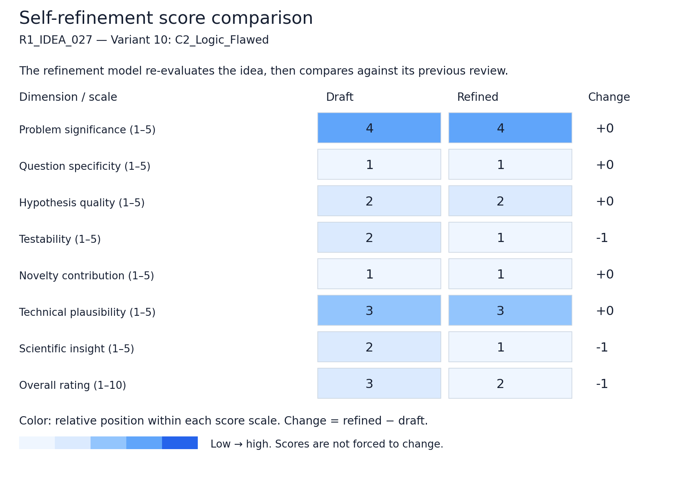

Changed score dimensions: testability, scientific_insight, overall_rating.

### Score justifications (draft / refined)

**Problem significance**

```json
{
  "draft": {
    "score": 4.0,
    "justification": "The problem is meaningful and has clear commercial importance. Credit risk management is a critical challenge in finance, and early detection of payment difficulty could have substantial value. However, the problem statement is somewhat generic and doesn't identify specific gaps in current approaches."
  },
  "refined": {
    "score": 4.0,
    "justification": "The problem is meaningful and has clear real-world importance. Credit card delinquency risk management has substantial commercial and social impact, and early detection could provide significant value. However, the problem statement is broad and doesn't identify specific unsolved challenges within this domain."
  }
}
```

**Question specificity**

```json
{
  "draft": {
    "score": 1.0,
    "justification": "Extremely weak. The idea does not define any concrete research question. It merely states that anomaly detection has utility for credit risk control and suggests broader effectiveness, without specifying what aspect is being investigated, what relationship is being tested, or what specific hypothesis is being examined."
  },
  "refined": {
    "score": 1.0,
    "justification": "Extremely weak. No research question is posed. The text only states that anomaly detection has utility for credit risk control and suggests broader effectiveness, without specifying what aspect is being investigated, what relationship is being examined, or what specific hypothesis is being tested."
  }
}
```

**Hypothesis quality**

```json
{
  "draft": {
    "score": 2.0,
    "justification": "There is an implicit hypothesis that 'transactions that deviate from typical sequences are precursors to payment difficulty,' but this is stated as an assumption rather than a testable claim. No specific, falsifiable prediction is made about method performance, comparative effectiveness, or underlying mechanisms."
  },
  "refined": {
    "score": 2.0,
    "justification": "There is an implicit, vague hypothesis that 'anomalous transaction sequences precede payment difficulty,' but this is presented as an assumption or motivation rather than a testable claim. No specific, falsifiable prediction is made about method performance, comparative effectiveness, or underlying mechanisms. The idea lacks a clear hypothesis that could be supported or contradicted by evidence."
  }
}
```

**Testability**

```json
{
  "draft": {
    "score": 2.0,
    "justification": "The idea suggests a general application area but provides no indication of how one would test whether anomaly detection is effective for this purpose. There is no mention of experiments, evaluations, comparisons, or data that would provide evidence. The claim about 'broader effectiveness' is particularly untestable without specification."
  },
  "refined": {
    "score": 1.0,
    "justification": "The idea is not testable as presented. It proposes a general application area but gives no indication of how one would test whether anomaly detection is effective. There is no mention of experiments, evaluations, comparisons, data, or metrics. The claim about 'broader effectiveness' is particularly untestable without specification of settings or evaluation criteria."
  }
}
```

**Novelty contribution**

```json
{
  "draft": {
    "score": 1.0,
    "justification": "Extremely low novelty. Anomaly detection in financial transaction data is a well-established area of research and practice. The idea does not propose any novel method, identify a new phenomenon, or suggest a unique angle of investigation. It reads more like a motivation section than a research contribution."
  },
  "refined": {
    "score": 1.0,
    "justification": "Extremely low novelty. Anomaly detection in financial transaction sequences is a well-established area in both academia and industry. The idea does not propose any novel method, identify a new phenomenon, challenge existing assumptions, or suggest a unique investigative angle. It reads as a generic application motivation, not a research contribution."
  }
}
```

**Technical plausibility**

```json
{
  "draft": {
    "score": 3.0,
    "justification": "The basic premise is plausible - anomaly detection could potentially identify patterns preceding payment difficulties. However, without any technical details about methods, data, or implementation, it's impossible to assess whether the proposed direction is technically sound. The reasoning is coherent but superficial."
  },
  "refined": {
    "score": 3.0,
    "justification": "The basic premise is plausible—anomaly detection could potentially identify patterns indicative of future payment difficulty. However, with no technical details about methods, data, feature engineering, or evaluation, it's impossible to assess technical soundness beyond surface-level coherence. The reasoning is logical but lacks depth."
  }
}
```

**Scientific insight**

```json
{
  "draft": {
    "score": 2.0,
    "justification": "As presented, the idea offers minimal potential for scientific insight. It suggests applying existing methods to a practical problem without indicating what might be learned about anomaly detection methods, sequence modeling, financial risk patterns, or the relationship between transaction anomalies and credit events. At best, it might yield domain-specific performance comparisons."
  },
  "refined": {
    "score": 1.0,
    "justification": "Minimal potential for scientific insight as presented. The idea suggests applying existing methods to a practical problem without indicating what might be learned about anomaly detection techniques, sequence modeling, financial behavior patterns, or the causal/predictive relationship between anomalies and credit events. At best, it might yield domain-specific performance results, but no generalizable knowledge is suggested."
  }
}
```

**Overall rating**

```json
{
  "draft": {
    "score": 3.0,
    "justification": "This is a weak research idea as presented. While it identifies an important application domain, it fails to articulate any specific research question, hypothesis, or methodological direction. It reads more like a problem motivation than a research proposal. The lack of specificity, testability, and novelty severely limits its scientific value. With substantial refinement to define a concrete investigation, it could become a moderate idea, but in its current form, it offers little beyond stating that an existing technique might be useful in a known application area."
  },
  "refined": {
    "score": 2.0,
    "justification": "This is a very weak research idea. While it identifies an important application domain, it completely fails to articulate any specific research question, hypothesis, or methodological direction. It lacks specificity, testability, novelty, and potential for scientific insight. It reads as a problem motivation or background section, not a research proposal. Substantial refinement is needed to define a concrete investigation before it could be considered a viable research idea."
  }
}
```

## R1_IDEA_027 — Variant 11: C3_Substance_Enriched

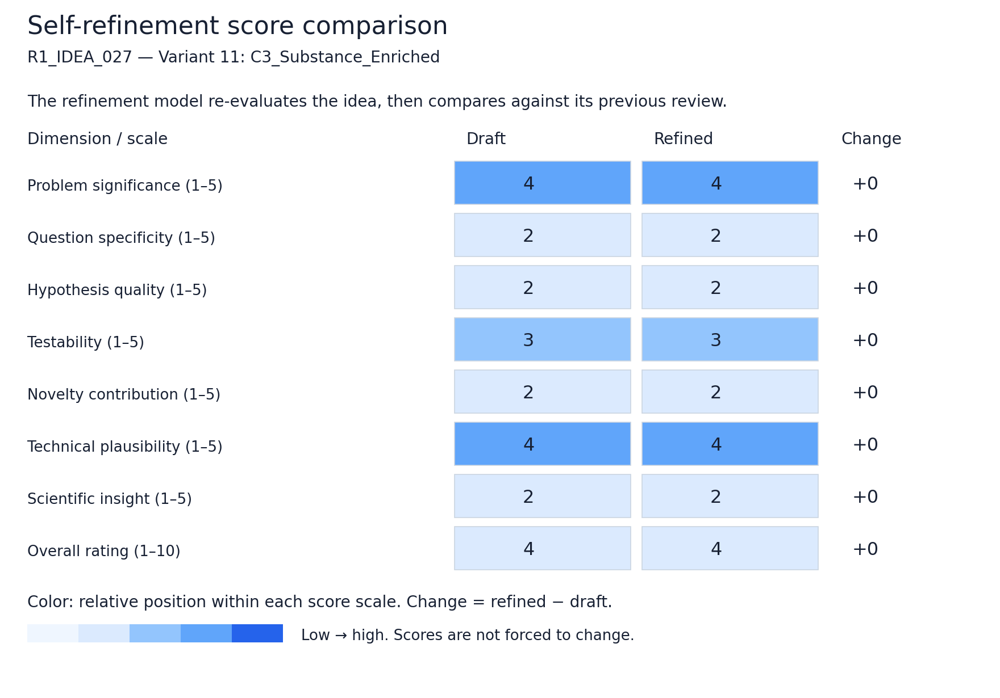

Changed score dimensions: none.

### Score justifications (draft / refined)

**Problem significance**

```json
{
  "draft": {
    "score": 4.0,
    "justification": "The problem is highly meaningful with clear commercial and societal impact. Credit card delinquency risk management is a critical financial industry challenge where improved prediction could reduce losses and protect consumers. Anomaly detection in transactional sequences is a relevant technical approach to this problem."
  },
  "refined": {
    "score": 4.0,
    "justification": "The problem is highly meaningful with substantial commercial and societal impact. Credit card delinquency risk management is a critical financial challenge where improved prediction could reduce losses. Anomaly detection in transactional data is a relevant technical direction for this domain."
  }
}
```

**Question specificity**

```json
{
  "draft": {
    "score": 2.0,
    "justification": "The idea lacks a clearly defined research question. It states the application domain and a validation approach but doesn't specify what aspect of anomaly detection for delinquency prediction is being investigated. The description is more about motivation and potential validation than a focused inquiry."
  },
  "refined": {
    "score": 2.0,
    "justification": "The idea lacks a clearly defined research question. It describes an application ('utility as a means to control credit card delinquency risk') and a validation approach, but does not specify what aspect is being investigated—e.g., algorithmic comparison, boundary condition analysis, or predictive relationship quantification. The description is motivational rather than inquisitive."
  }
}
```

**Hypothesis quality**

```json
{
  "draft": {
    "score": 2.0,
    "justification": "The hypothesis is implicit and vague: that anomalous transactions precede payment difficulties. While this is plausible, it's stated as a general observation rather than a testable prediction. The mention of boundary conditions like time windows shows some sophistication, but the core hypothesis lacks specificity about the nature, strength, or conditions of the relationship."
  },
  "refined": {
    "score": 2.0,
    "justification": "The hypothesis is implicit and vague: that anomalous transactions are 'a common precursor' of payment difficulty. While plausible, it is stated as a general observation rather than a testable prediction. The mention of boundary conditions (time windows) adds some nuance but does not transform it into a concrete, falsifiable claim about the nature or strength of the relationship."
  }
}
```

**Testability**

```json
{
  "draft": {
    "score": 3.0,
    "justification": "The idea suggests a validation path (testing thresholds against historical records), which provides a testable framework. However, without specifying anomaly detection methods, comparison baselines, or evaluation metrics, the testability remains moderate. The validation approach is sensible but underspecified."
  },
  "refined": {
    "score": 3.0,
    "justification": "The proposed validation path (testing thresholds against historical records) provides a testable framework. However, without specification of anomaly detection methods, evaluation metrics, or comparison baselines, the testability is moderate. The idea suggests an empirical evaluation is possible but leaves critical details undefined."
  }
}
```

**Novelty contribution**

```json
{
  "draft": {
    "score": 2.0,
    "justification": "The application of anomaly detection to financial risk is not novel in itself. The idea doesn't propose a new method, identify a previously unexplored phenomenon, or challenge existing assumptions. It appears to be a straightforward application of existing techniques to a well-known problem without articulating what new knowledge would be generated."
  },
  "refined": {
    "score": 2.0,
    "justification": "The application of anomaly detection to financial risk prediction is not novel. The idea does not propose a new method, identify an unexplored phenomenon, challenge existing assumptions, or articulate what new knowledge would be generated. It appears to be a straightforward application of existing techniques to a well-known problem."
  }
}
```

**Technical plausibility**

```json
{
  "draft": {
    "score": 4.0,
    "justification": "The core concept is technically plausible. Anomaly detection in sequences is established, transaction data is available, and delinquency labels exist historically. The reasoning that anomalous patterns might predict financial distress is logical. No obvious technical flaws are present in the limited description."
  },
  "refined": {
    "score": 4.0,
    "justification": "The core concept is technically plausible. Anomaly detection in sequences is an established area, transaction data is typically available, and historical delinquency records exist for validation. The reasoning that anomalous patterns might correlate with financial distress is logical. No obvious technical flaws are apparent given the limited description."
  }
}
```

**Scientific insight**

```json
{
  "draft": {
    "score": 2.0,
    "justification": "The idea as presented offers limited potential for scientific insight beyond demonstrating that anomaly detection works for this application. Without comparative analysis, investigation of mechanisms, or exploration of boundary conditions, it's primarily an applied validation study. The mention of time windows as a boundary condition hints at deeper investigation but isn't developed."
  },
  "refined": {
    "score": 2.0,
    "justification": "The idea as presented offers limited potential for scientific insight. It primarily suggests an applied validation study. Without comparative analysis, mechanistic investigation, or systematic exploration of boundary conditions, it is unlikely to yield generalizable principles or deeper understanding. The mention of time windows hints at deeper investigation but is not developed."
  }
}
```

**Overall rating**

```json
{
  "draft": {
    "score": 4.0,
    "justification": "This is a weak research idea as presented. While it addresses a significant practical problem and proposes a sensible validation approach, it lacks a specific research question, has a vague hypothesis, offers limited novelty, and promises minimal scientific insight. It reads more as a project motivation than a research investigation. With substantial refinement to define a concrete question and hypothesis, it could become a stronger applied research direction."
  },
  "refined": {
    "score": 4.0,
    "justification": "This is a weak research idea as presented. While it addresses a significant practical problem and proposes a sensible validation approach, it lacks a specific research question, has a vague hypothesis, offers minimal novelty, and promises little scientific insight. It reads as a project motivation rather than a focused research investigation. Substantial refinement is needed to define a concrete question and testable hypothesis."
  }
}
```

## R1_IDEA_027 — Variant 12: H1_Deceptive_Hollow

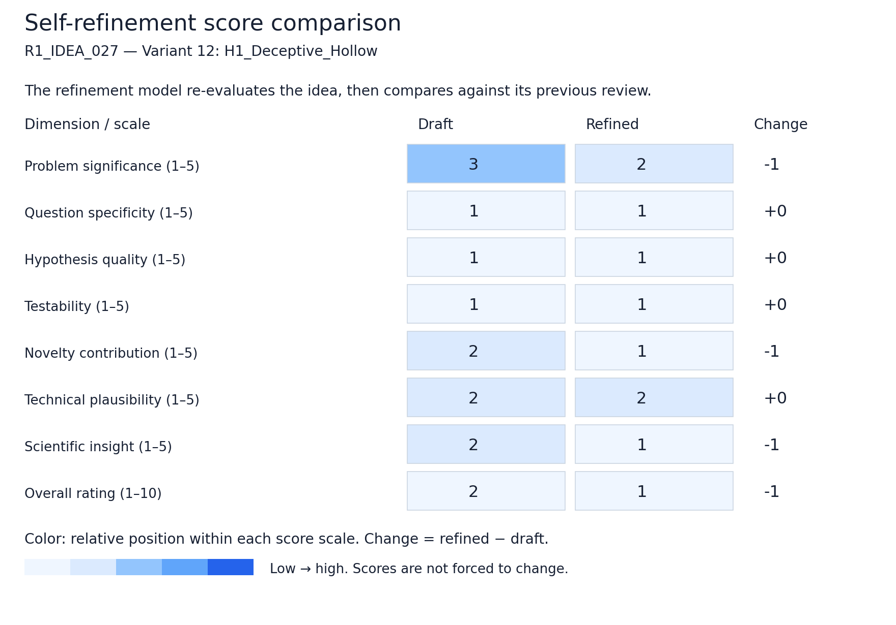

Changed score dimensions: problem_significance, novelty_contribution, scientific_insight, overall_rating.

### Score justifications (draft / refined)

**Problem significance**

```json
{
  "draft": {
    "score": 3.0,
    "justification": "Financial risk analysis is certainly important, and the connection between irregular patterns and subsequent issues could be meaningful. However, the idea is too vague to assess whether it addresses a truly significant challenge versus a generic application of existing methods."
  },
  "refined": {
    "score": 2.0,
    "justification": "Financial risk analysis is important in practice, but the idea is too vague to assess whether it addresses a meaningful scientific challenge versus a generic application. The connection between irregular patterns and issues is mentioned but not substantiated as a significant research problem."
  }
}
```

**Question specificity**

```json
{
  "draft": {
    "score": 1.0,
    "justification": "Extremely weak. No concrete research question is stated. The idea merely mentions 'examining its role' without specifying what aspect, relationship, or mechanism is being investigated. It's essentially a generic statement about applying sequence analysis to finance."
  },
  "refined": {
    "score": 1.0,
    "justification": "Extremely weak. No concrete research question is stated. The idea mentions 'examining its role' and 'addressing a specific financial risk' but doesn't specify what aspect, relationship, or mechanism is being investigated. It's essentially a generic motivational statement."
  }
}
```

**Hypothesis quality**

```json
{
  "draft": {
    "score": 1.0,
    "justification": "No hypothesis is presented, explicit or implicit. The statement 'irregular patterns in the data are often linked to subsequent issues' is an observation, not a testable hypothesis. There's no prediction about what specific relationship exists, under what conditions, or what mechanism explains it."
  },
  "refined": {
    "score": 1.0,
    "justification": "No hypothesis is presented, explicit or implicit. The statement 'irregular patterns in the data are often linked to subsequent issues' is an observation, not a testable prediction. There's no proposed mechanism, boundary conditions, or specific relationship to investigate."
  }
}
```

**Testability**

```json
{
  "draft": {
    "score": 1.0,
    "justification": "Not testable in its current form. No experiment, comparison, evaluation, or analysis method is suggested. The idea doesn't specify what would constitute evidence for or against any claim. It's purely a motivational statement without a research design."
  },
  "refined": {
    "score": 1.0,
    "justification": "Not testable in its current form. No experiment, comparison, evaluation, or analysis method is suggested. The idea doesn't specify what evidence would support or contradict any claim. It's purely a high-level motivational statement without research design."
  }
}
```

**Novelty contribution**

```json
{
  "draft": {
    "score": 2.0,
    "justification": "Very weak novelty. Applying sequence analysis to financial data is well-established. The positioning as 'transformative synthesis' is entirely unsupported by any novel methodological or conceptual element. At best, this might be applying existing methods to a specific financial risk, but even that isn't specified."
  },
  "refined": {
    "score": 1.0,
    "justification": "Extremely weak novelty. Applying sequence analysis to financial data is well-established. The grandiose claims about 'transformative synthesis' and 'reshaping community thinking' are entirely unsupported by any novel methodological, conceptual, or empirical element. No specific contribution is identified."
  }
}
```

**Technical plausibility**

```json
{
  "draft": {
    "score": 2.0,
    "justification": "The reasoning is logically coherent at a very high level (patterns might predict issues), but the complete lack of technical details makes it impossible to assess plausibility. The grandiose claims about 'reshaping how the community thinks' are implausible without substantial novel content."
  },
  "refined": {
    "score": 2.0,
    "justification": "The high-level reasoning (patterns might predict issues) is logically coherent but trivial. The complete lack of technical details makes meaningful assessment impossible. The grandiose claims about field-shaping impact are implausible without substantial novel content, which isn't presented."
  }
}
```

**Scientific insight**

```json
{
  "draft": {
    "score": 2.0,
    "justification": "Limited potential insight in current form. If properly developed, understanding the relationship between specific irregular patterns and financial risks could provide insight into market mechanisms or risk factors. However, as presented, it's too vague to promise meaningful scientific insight beyond potentially demonstrating an application."
  },
  "refined": {
    "score": 1.0,
    "justification": "Minimal potential insight in current form. While understanding pattern-risk relationships could provide insight, the idea is too vague to promise any specific scientific insight. It doesn't propose to investigate mechanisms, boundary conditions, or general principles - only a generic application statement."
  }
}
```

**Overall rating**

```json
{
  "draft": {
    "score": 2.0,
    "justification": "Very weak research idea. While it identifies a potentially relevant application domain, it completely fails to specify a research question, hypothesis, methodology, or even the specific problem being addressed. The grandiose positioning language ('transformative synthesis', 'field-shaping agenda') is disconnected from the lack of substantive content. This is essentially a motivational paragraph rather than a research idea."
  },
  "refined": {
    "score": 1.0,
    "justification": "Very weak research idea. It identifies a relevant application domain but completely fails to specify any research question, hypothesis, methodology, or even the specific problem being addressed. The grandiose positioning is disconnected from the complete lack of substantive content. This is essentially a motivational paragraph rather than a research idea, offering no concrete direction for investigation."
  }
}
```

## R1_IDEA_027 — Variant 13: H2_Confident_Flaw

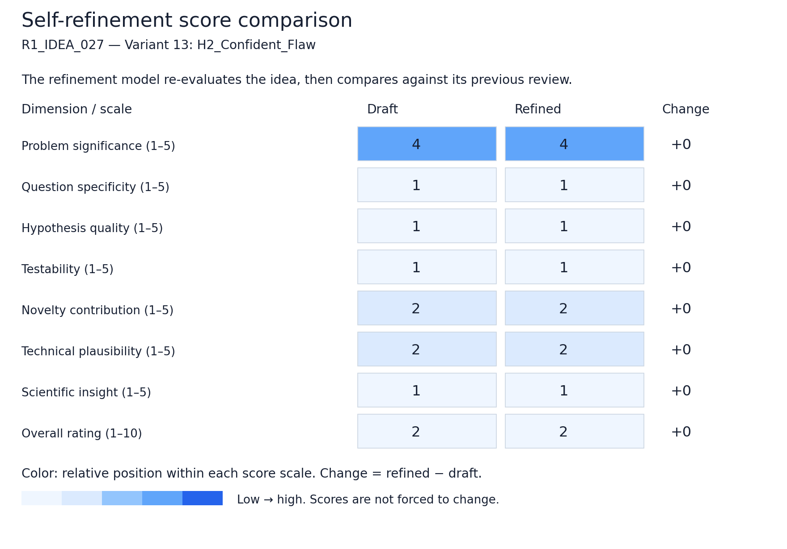

Changed score dimensions: none.

### Score justifications (draft / refined)

**Problem significance**

```json
{
  "draft": {
    "score": 4.0,
    "justification": "The problem is meaningful and has clear commercial value. Anomaly detection for financial risk management addresses a real-world challenge with significant practical implications."
  },
  "refined": {
    "score": 4.0,
    "justification": "The problem is meaningful and has clear practical importance. Credit card delinquency prediction is a significant challenge in financial risk management with substantial commercial value. Anomaly detection in transaction sequences addresses a real-world need."
  }
}
```

**Question specificity**

```json
{
  "draft": {
    "score": 1.0,
    "justification": "Extremely poor specificity. No concrete research question is stated. The idea merely asserts that anomaly detection is useful for credit risk without specifying what aspect is being investigated."
  },
  "refined": {
    "score": 1.0,
    "justification": "Extremely poor specificity. No concrete research question is stated. The text merely asserts that anomaly detection is useful for credit risk without specifying what aspect is being investigated, what weakness is being addressed, or what relationship is being tested."
  }
}
```

**Hypothesis quality**

```json
{
  "draft": {
    "score": 1.0,
    "justification": "No hypothesis is presented. There are only assertions: that addressing a weakness will produce improvements, and that gains can be treated as causal evidence. These are claims, not testable predictions."
  },
  "refined": {
    "score": 1.0,
    "justification": "No hypothesis is presented. There are only vague assertions: that addressing a weakness will produce improvements, and that gains can be treated as causal evidence. These are claims, not testable predictions with clear conditions or mechanisms."
  }
}
```

**Testability**

```json
{
  "draft": {
    "score": 1.0,
    "justification": "The idea explicitly rejects isolating confounding factors (dataset composition, evaluation criteria, etc.), making it fundamentally untestable as a scientific claim. No experimental design or evaluation approach is suggested."
  },
  "refined": {
    "score": 1.0,
    "justification": "The idea explicitly rejects isolating confounding factors (dataset composition, evaluation criteria, etc.), making it fundamentally untestable as a scientific claim. No experimental design, evaluation approach, or comparison methodology is suggested. The text actually argues against proper scientific testing."
  }
}
```

**Novelty contribution**

```json
{
  "draft": {
    "score": 2.0,
    "justification": "The application of anomaly detection to financial risk is not novel. Without specifying what technical innovation or new insight is being proposed, the potential contribution is minimal."
  },
  "refined": {
    "score": 2.0,
    "justification": "The application of anomaly detection to financial risk is not novel. Without specifying what technical innovation, new insight, or specific weakness is being addressed, the potential contribution is minimal. It reads as a generic application idea rather than novel research."
  }
}
```

**Technical plausibility**

```json
{
  "draft": {
    "score": 2.0,
    "justification": "The reasoning is logically problematic. Claiming causal evidence without controlling for confounders is not scientifically sound. The connection between anomaly detection and delinquency risk is plausible, but the methodological claims are not."
  },
  "refined": {
    "score": 2.0,
    "justification": "The core reasoning is scientifically problematic. Claiming causal evidence without controlling for confounders is not methodologically sound. While the connection between anomalous transactions and delinquency risk is conceptually plausible, the methodological claims lack coherence and violate basic principles of experimental design."
  }
}
```

**Scientific insight**

```json
{
  "draft": {
    "score": 1.0,
    "justification": "The idea explicitly dismisses investigating boundary cases, alternative explanations, or dataset effects, which are precisely the sources of scientific insight. It offers only a potential application without mechanism discovery or general principles."
  },
  "refined": {
    "score": 1.0,
    "justification": "The idea explicitly dismisses investigating boundary cases, alternative explanations, or dataset effects - precisely the sources of scientific insight. It offers only a potential application without mechanism discovery, general principles, or transferable understanding. The text argues against the kind of careful analysis that yields scientific insight."
  }
}
```

**Overall rating**

```json
{
  "draft": {
    "score": 2.0,
    "justification": "Very weak research idea. While it identifies an important application domain, it fails to define any specific research question, hypothesis, or methodology. The scientific reasoning is flawed (claiming causal evidence without controlling confounders), and it explicitly rejects the kind of careful investigation that would yield scientific insight. It reads more like a motivation statement than a research proposal."
  },
  "refined": {
    "score": 2.0,
    "justification": "Very weak research idea. While it identifies an important application domain, it fails to define any specific research question, hypothesis, or methodology. The scientific reasoning is fundamentally flawed (claiming causal evidence while rejecting control of confounders), and it explicitly dismisses the careful investigation needed for scientific contribution. It reads as a motivation statement or commercial pitch rather than a research proposal."
  }
}
```

## R1_IDEA_027 — Variant 14: H3_Verbose_Enriched

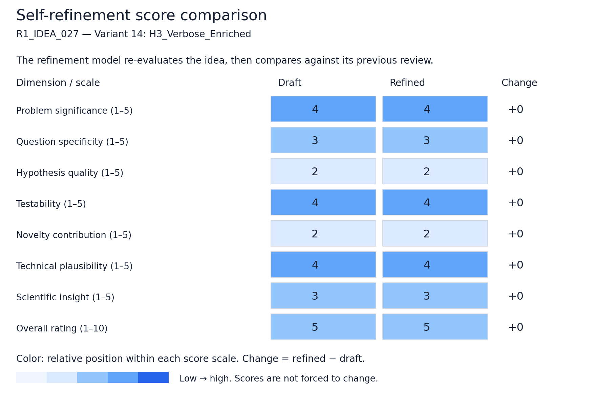

Changed score dimensions: none.

### Score justifications (draft / refined)

**Problem significance**

```json
{
  "draft": {
    "score": 4.0,
    "justification": "Credit card delinquency prediction is a high-stakes problem with significant financial and societal impact. Anomaly detection in sequences is a relevant technical approach, and improving predictive accuracy could have substantial commercial value. However, the problem itself is not novel in ML research—fraud and risk detection are well-established domains."
  },
  "refined": {
    "score": 4.0,
    "justification": "Credit card delinquency prediction is a high-stakes problem with substantial financial and societal impact. Improving predictive accuracy could have real commercial value and reduce consumer harm. While not a novel ML problem area, it remains practically significant and relevant."
  }
}
```

**Question specificity**

```json
{
  "draft": {
    "score": 3.0,
    "justification": "The idea identifies a general application (anomaly detection for delinquency prediction) but does not define a sharp, focused research question. It mentions testing thresholds and boundary conditions, but the core inquiry remains broad: 'Does anomaly detection help?' rather than 'Under what conditions does [specific anomaly mechanism] improve prediction of [specific outcome] compared to [specific baseline]?'"
  },
  "refined": {
    "score": 3.0,
    "justification": "The idea identifies a general application area but does not define a sharp, focused research question. It mentions testing thresholds and boundary conditions, but the core inquiry remains broad: 'Can anomaly detection help predict delinquency?' rather than a more specific question about mechanisms, conditions, or comparative advantages."
  }
}
```

**Hypothesis quality**

```json
{
  "draft": {
    "score": 2.0,
    "justification": "The hypothesis is implicit and relatively weak: that anomalous transactions precede payment difficulty. This is more of an assumption or motivation than a testable scientific hypothesis. It lacks a clear predictive statement that distinguishes it from common sense or existing knowledge. The idea does not propose a novel mechanistic insight about why anomaly detection should work beyond the general notion of 'deviation from typical behavior.'"
  },
  "refined": {
    "score": 2.0,
    "justification": "The hypothesis is implicit and weak: that transactions deviating from typical sequences precede payment difficulty. This is more of a motivating assumption than a novel, testable scientific hypothesis. It lacks a clear, falsifiable prediction about why or under what conditions anomaly detection would offer specific advantages over existing methods."
  }
}
```

**Testability**

```json
{
  "draft": {
    "score": 4.0,
    "justification": "This is a strength of the idea. The proposed validation path—staged design, baseline/intervention comparison, pre-specified criteria, ablations, sensitivity analyses—provides a clear blueprint for empirical testing. The inclusion of error analysis and boundary-case evaluation further enhances testability. However, the lack of methodological specifics (which anomaly detection method?) limits immediate implementability."
  },
  "refined": {
    "score": 4.0,
    "justification": "This is a strength. The proposed validation path—staged design, baseline/intervention comparisons, pre-specified criteria, ablations, sensitivity analyses, and error analysis—provides a clear, methodologically sound blueprint for empirical testing. The framework is robust, though its execution depends on unspecified technical details."
  }
}
```

**Novelty contribution**

```json
{
  "draft": {
    "score": 2.0,
    "justification": "Applying anomaly detection to financial risk prediction is not novel in concept. Many papers have explored anomaly/outlier detection for fraud or risk assessment. The potential contribution lies in the detailed experimental design and focus on understanding boundary conditions, but the core idea lacks a novel technical insight or methodological innovation. It seems more like a rigorous application study than a research breakthrough."
  },
  "refined": {
    "score": 2.0,
    "justification": "Applying anomaly detection to financial risk prediction is not novel conceptually. Many studies have explored anomaly/outlier detection for fraud or risk assessment. The potential contribution lies in the rigorous experimental design and focus on understanding boundary conditions, but the core idea lacks technical or methodological innovation."
  }
}
```

**Technical plausibility**

```json
{
  "draft": {
    "score": 4.0,
    "justification": "The idea is technically plausible. Anomaly detection in sequences is a well-studied area, and transaction data is sequential in nature. The proposed experimental design is logically coherent and aligns with good ML evaluation practices. No obvious technical flaws are present, though the success would depend heavily on implementation details not provided."
  },
  "refined": {
    "score": 4.0,
    "justification": "The idea is technically plausible. Anomaly detection in sequences is well-studied, and transaction data is inherently sequential. The proposed evaluation framework is logically coherent and aligns with good ML research practices. Success would depend on implementation choices not specified, but no obvious technical flaws are present."
  }
}
```

**Scientific insight**

```json
{
  "draft": {
    "score": 3.0,
    "justification": "The idea has moderate potential for scientific insight. By including ablations, sensitivity analyses, and error analysis, it aims to uncover not just whether the method works, but 'which assumptions, data regimes, and domain constraints determine when and why it is useful.' This could yield generalizable knowledge about the limits of anomaly detection in sequential financial data. However, without a novel hypothesis or mechanism, the insights may be specific to the dataset/domain rather than broadly transferable."
  },
  "refined": {
    "score": 3.0,
    "justification": "The idea has moderate potential for scientific insight. By emphasizing ablations, sensitivity analyses, and error analysis, it aims to uncover not just performance but the conditions under which anomaly detection works. This could yield insights about data regimes, assumption validity, and failure modes in sequential financial data. However, without a novel hypothesis, insights may be domain-specific rather than broadly transferable."
  }
}
```

**Overall rating**

```json
{
  "draft": {
    "score": 5.0,
    "justification": "This is a moderate/borderline research idea. It addresses a significant real-world problem and proposes a methodologically sound validation plan, which are strengths. However, it lacks a specific research question, a novel hypothesis, and technical novelty. The core idea is essentially 'apply anomaly detection to credit risk,' which is not inherently novel. The value would come from rigorous execution and detailed analysis, but as a research direction, it is more of an applied engineering study than a fundamental scientific inquiry. It could be a solid applied paper if executed well, but as a research idea, it is not particularly innovative."
  },
  "refined": {
    "score": 5.0,
    "justification": "This is a moderate/borderline research idea. It addresses a significant real-world problem and proposes a methodologically rigorous validation plan, which are strengths. However, it lacks a specific research question, a novel hypothesis, and technical novelty. The core idea is essentially 'apply anomaly detection to credit risk,' which is not inherently novel. The value would come from execution and detailed analysis, making it more of an applied engineering study than a fundamental scientific inquiry. It could be a solid applied paper if well-executed, but as a research direction, it is not particularly innovative."
  }
}
```

## R1_IDEA_027 — Variant 15: H4_Ultimate_Hype


Changed score dimensions: none.

### Score justifications (draft / refined)

**Problem significance**

```json
{
  "draft": {
    "score": 4.0,
    "justification": "Credit card delinquency risk is a meaningful real-world problem with significant financial implications. Anomaly detection in transaction sequences addresses a plausible mechanism for early warning."
  },
  "refined": {
    "score": 4.0,
    "justification": "Credit card delinquency risk is a meaningful real-world problem with significant financial implications for both lenders and consumers. Early detection of payment difficulties could enable proactive interventions. The connection between anomalous transaction patterns and financial distress is plausible and worth investigating."
  }
}
```

**Question specificity**

```json
{
  "draft": {
    "score": 1.0,
    "justification": "Extremely poor specificity. No research question is defined - only a general problem area and aspirational claims. The idea doesn't specify what aspect of anomaly detection for delinquency risk will be investigated."
  },
  "refined": {
    "score": 1.0,
    "justification": "Extremely poor specificity. No research question is defined - only a general problem area and aspirational claims. The idea doesn't specify what aspect of anomaly detection for delinquency risk will be investigated, what relationships will be examined, or what specific unknowns will be addressed."
  }
}
```

**Hypothesis quality**

```json
{
  "draft": {
    "score": 1.0,
    "justification": "No hypothesis is presented. There's an implicit assumption that anomaly detection could help, but no testable prediction about mechanisms, relationships, or comparative effectiveness."
  },
  "refined": {
    "score": 1.0,
    "justification": "No hypothesis is presented. There's only an implicit assumption that anomaly detection 'could be useful' for this problem, but no testable prediction about mechanisms, relationships, comparative effectiveness, or boundary conditions. The idea lacks any falsifiable claim."
  }
}
```

**Testability**

```json
{
  "draft": {
    "score": 2.0,
    "justification": "The general concept is testable in principle (one could apply anomaly detection to transaction data), but without a specific question or hypothesis, it's unclear what would be tested or how success would be measured."
  },
  "refined": {
    "score": 2.0,
    "justification": "The general concept is testable in principle (one could apply anomaly detection methods to transaction data and evaluate predictive performance), but without a specific question or hypothesis, it's unclear what would be tested, against what baselines, or how success would be measured. The idea lacks the specificity needed for meaningful experimental design."
  }
}
```

**Novelty contribution**

```json
{
  "draft": {
    "score": 2.0,
    "justification": "Claims high novelty but provides no evidence that this is underexplored or how it would differ from existing work. Anomaly detection for financial transactions is not a new concept, though specific applications to delinquency prediction might have room for innovation."
  },
  "refined": {
    "score": 2.0,
    "justification": "Claims high novelty but provides no evidence that this is underexplored or how it would differ from existing work. Anomaly detection for financial transactions is an established area, and while specific applications to delinquency prediction might have room for innovation, the idea doesn't articulate what would be novel about the proposed approach compared to existing literature."
  }
}
```

**Technical plausibility**

```json
{
  "draft": {
    "score": 3.0,
    "justification": "The basic premise is plausible - transaction sequences could contain anomalies predictive of financial distress. However, without technical details, it's impossible to assess whether the proposed approach would face fundamental challenges."
  },
  "refined": {
    "score": 3.0,
    "justification": "The basic premise is plausible - transaction sequences could contain anomalies predictive of financial distress. However, without technical details about the anomaly detection approach, feature engineering, or evaluation methodology, it's impossible to assess whether the proposed direction would face fundamental technical challenges or is coherently conceived."
  }
}
```

**Scientific insight**

```json
{
  "draft": {
    "score": 2.0,
    "justification": "As presented, the idea suggests a straightforward application rather than seeking fundamental insights. It could potentially yield insights about what types of behavioral deviations predict financial distress, but this isn't articulated."
  },
  "refined": {
    "score": 2.0,
    "justification": "As presented, the idea suggests a straightforward application rather than seeking fundamental insights. It could potentially yield insights about what types of behavioral deviations predict financial distress or how temporal patterns in financial behavior relate to credit risk, but these potential insights are not articulated. The focus appears to be on utility rather than scientific understanding."
  }
}
```

**Overall rating**

```json
{
  "draft": {
    "score": 3.0,
    "justification": "This is a weak research idea as presented. While it identifies a potentially important application domain, it fails to define a specific research question, hypothesis, or methodological direction. It reads more like a motivation section than a research proposal. The grandiose claims are unsupported by any concrete plan for investigation. With substantial refinement to specify what exactly would be studied and how, it could become a viable research direction."
  },
  "refined": {
    "score": 3.0,
    "justification": "This is a weak research idea as presented. While it identifies a potentially important application domain with real-world significance, it fails to define a specific research question, hypothesis, or methodological direction. It reads more like a motivation section or abstract for a grant proposal than a research idea with a clear investigative focus. The grandiose claims are unsupported by any concrete plan for investigation. With substantial refinement to specify what exactly would be studied, what hypothesis would be tested, and how it would be evaluated, it could become a viable research direction."
  }
}
```

## R1_IDEA_028 — Source

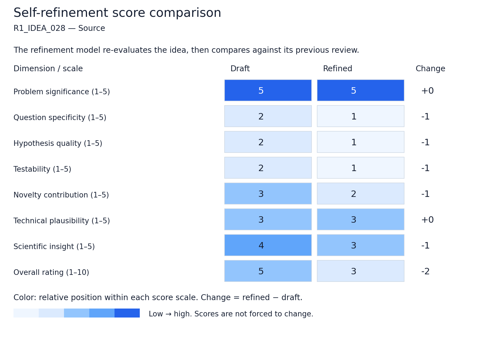

Changed score dimensions: question_specificity, hypothesis_quality, testability, novelty_contribution, scientific_insight, overall_rating.

### Score justifications (draft / refined)

**Problem significance**

```json
{
  "draft": {
    "score": 5.0,
    "justification": "The problem is highly significant. Bias in preference learning has real-world consequences for fairness, representation, and robustness, especially as these systems are deployed in sociotechnical settings. The issues of majority bias and strategic manipulation are well-motivated and important to address."
  },
  "refined": {
    "score": 5.0,
    "justification": "The problem is exceptionally significant. Bias in preference learning has serious ethical and practical consequences as these systems are deployed in real-world applications. Issues of majority bias, underrepresentation, and vulnerability to manipulation are critical challenges in AI alignment and fairness research."
  }
}
```

**Question specificity**

```json
{
  "draft": {
    "score": 2.0,
    "justification": "The idea states a general goal ('develop a framework') but does not define a specific research question. What exactly is being investigated? The lack of a concrete question—e.g., about a particular mechanism, trade-off, or comparison—limits specificity."
  },
  "refined": {
    "score": 1.0,
    "justification": "Extremely low specificity. The idea only states the goal of 'developing a framework' without defining any concrete research question. There is no indication of what specific relationship, mechanism, or phenomenon is being investigated."
  }
}
```

**Hypothesis quality**

```json
{
  "draft": {
    "score": 2.0,
    "justification": "There is no explicit or clearly implicit hypothesis. The idea suggests that proportional alignment will address bias and manipulation, but this is more of an assumption or goal than a testable prediction. A hypothesis would need to make a falsifiable claim about outcomes or mechanisms."
  },
  "refined": {
    "score": 1.0,
    "justification": "No hypothesis is present. The idea presents an objective ('align proportionally') but makes no testable prediction about outcomes, mechanisms, or relationships. It's an engineering goal rather than a scientific hypothesis."
  }
}
```

**Testability**

```json
{
  "draft": {
    "score": 2.0,
    "justification": "Without a defined framework or evaluation plan, it's unclear how the central claim could be tested. The idea does not propose experiments, comparisons, or metrics. Testability would require specifying how to measure 'proportional alignment' and compare it to alternatives."
  },
  "refined": {
    "score": 1.0,
    "justification": "Not testable as presented. There are no proposed experiments, comparisons, evaluation metrics, or methods for obtaining evidence. Without defining how to measure 'proportional alignment' or compare approaches, the central claim cannot be investigated."
  }
}
```

**Novelty contribution**

```json
{
  "draft": {
    "score": 3.0,
    "justification": "The motivation is not novel—fairness and strategic robustness in aggregation are active research areas. The potential contribution hinges on the unspecified 'novel framework.' If it merely applies existing fair aggregation techniques to preference learning, novelty would be low. If it introduces a fundamentally new approach, it could be higher, but this is not articulated."
  },
  "refined": {
    "score": 2.0,
    "justification": "Very low novelty based on the information provided. The problems of fair aggregation and strategic manipulation are well-known in social choice, computational fairness, and reward learning. Without specifying what makes the framework 'novel,' this could simply be applying existing fair aggregation techniques to preference learning."
  }
}
```

**Technical plausibility**

```json
{
  "draft": {
    "score": 3.0,
    "justification": "The idea is logically coherent—proportional representation is a plausible goal for reducing bias. However, without technical details, it's impossible to assess feasibility. Key challenges (e.g., defining the true population distribution, avoiding performance degradation) are not addressed, but the core concept is not inherently implausible."
  },
  "refined": {
    "score": 3.0,
    "justification": "Moderately plausible at a conceptual level. The goal of proportional representation is logically coherent and aligns with fairness literature. However, without any technical details, key challenges (defining population distributions, avoiding performance degradation, handling strategic behavior) remain unaddressed, limiting assessment."
  }
}
```

**Scientific insight**

```json
{
  "draft": {
    "score": 4.0,
    "justification": "If successfully developed and analyzed, this research could yield valuable insights into the trade-offs between majority efficiency and proportional fairness in preference learning, the susceptibility of different aggregation schemes to manipulation, and perhaps general principles for designing representative learning systems. The potential for transferable insights is reasonably high."
  },
  "refined": {
    "score": 3.0,
    "justification": "Moderate potential insight. If properly developed, research on proportional alignment could reveal trade-offs between fairness and efficiency in preference learning, robustness properties of different aggregation schemes, or principles for representative reward modeling. However, the current formulation is too vague to guarantee these insights would emerge."
  }
}
```

**Overall rating**

```json
{
  "draft": {
    "score": 5.0,
    "justification": "This is a moderate/borderline research idea. The problem significance is exceptional, and the potential scientific insight is strong. However, the idea is severely underdeveloped: it lacks a specific research question, a testable hypothesis, and any methodological direction. As presented, it is more of a motivation statement than a research plan. With greater specificity, it could become a strong idea."
  },
  "refined": {
    "score": 3.0,
    "justification": "This is a weak research idea. While it identifies an important problem, it lacks virtually all elements of a research plan: no specific question, no hypothesis, no testability, and undefined novelty. It reads more as a motivation statement than a research direction. With substantial development, it could become meaningful, but as presented, it offers little scientific substance to evaluate."
  }
}
```

## R1_IDEA_028 — Variant 1: A1_Identity

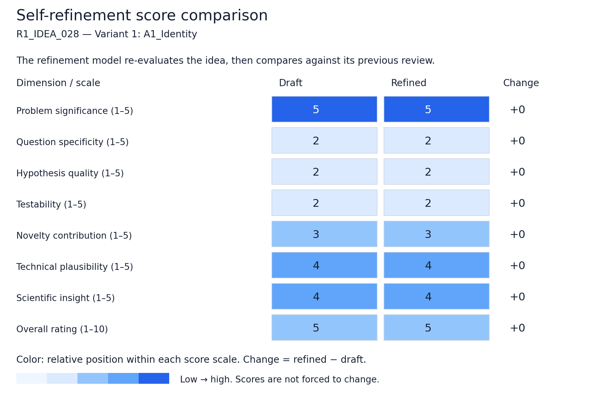

Changed score dimensions: none.

### Score justifications (draft / refined)

**Problem significance**

```json
{
  "draft": {
    "score": 5.0,
    "justification": "The problem is highly significant. Bias in preference learning and susceptibility to strategic manipulation are critical issues in AI alignment, fairness, and democratic decision-making. Addressing them could impact real-world systems like recommendation, content moderation, and policy optimization."
  },
  "refined": {
    "score": 5.0,
    "justification": "The problem is highly significant. Bias in preference learning and susceptibility to strategic manipulation are critical issues in AI alignment, fairness, and democratic decision-making. These problems affect real-world systems like recommendation engines, content moderation, and policy optimization, making this research direction important for both technical and societal reasons."
  }
}
```

**Question specificity**

```json
{
  "draft": {
    "score": 2.0,
    "justification": "The idea states a general goal ('develop a framework') but does not define a specific research question. It lacks concrete terms like 'Does method X reduce bias compared to Y under condition Z?'"
  },
  "refined": {
    "score": 2.0,
    "justification": "The idea states a general goal ('develop a framework') but does not define a specific research question. It lacks concrete terms like 'Does method X reduce bias compared to Y under condition Z?' or 'What are the trade-offs between proportional alignment and policy performance?' The description is too vague to constitute a well-defined research question."
  }
}
```

**Hypothesis quality**

```json
{
  "draft": {
    "score": 2.0,
    "justification": "There is an implicit hypothesis that proportional alignment will reduce bias and manipulation susceptibility, but it is not articulated as a testable prediction. No mechanism or causal relationship is proposed."
  },
  "refined": {
    "score": 2.0,
    "justification": "There is only an implicit hypothesis that proportional alignment will reduce bias and manipulation susceptibility, but it is not articulated as a testable prediction. No mechanism or causal relationship is proposed, and there's no clear statement that could be supported or contradicted by evidence. The idea lacks the elements of a scientific hypothesis."
  }
}
```

**Testability**

```json
{
  "draft": {
    "score": 2.0,
    "justification": "Without a clear hypothesis or proposed method, it's unclear how the idea could be tested. The idea does not suggest experiments, evaluations, or comparisons that would provide evidence for or against its claims."
  },
  "refined": {
    "score": 2.0,
    "justification": "Without a clear hypothesis or proposed method, it's unclear how the idea could be tested. The idea does not suggest experiments, evaluations, comparisons, or any method of obtaining evidence. There's no indication of how one would validate whether the framework achieves its stated goals."
  }
}
```

**Novelty contribution**

```json
{
  "draft": {
    "score": 3.0,
    "justification": "The motivation is novel in framing the problem as proportional alignment in preference learning, but the contribution is vague. If the framework is simply a reweighting scheme, novelty may be limited; if it involves new learning paradigms, it could be higher."
  },
  "refined": {
    "score": 3.0,
    "justification": "The motivation frames the problem in an interesting way (proportional alignment in preference learning), but the contribution itself is vague. If the framework turns out to be a simple reweighting scheme, novelty would be limited. If it involves fundamentally new learning paradigms, it could be higher, but this is unspecified. The idea sits at the borderline between applying existing fairness concepts to preference learning and potentially developing something genuinely new."
  }
}
```

**Technical plausibility**

```json
{
  "draft": {
    "score": 4.0,
    "justification": "The reasoning is logically coherent: aggregating preferences proportionally rather than by popularity could reduce bias. The goal is plausible given existing work in fairness, social choice, and distribution matching, though the technical path is unspecified."
  },
  "refined": {
    "score": 4.0,
    "justification": "The reasoning is logically coherent: aggregating preferences proportionally rather than by popularity could reduce bias. The goal is plausible given existing work in fairness, social choice theory, and distribution matching. While the technical path is unspecified, the core concept aligns with established research directions, making it technically plausible in principle."
  }
}
```

**Scientific insight**

```json
{
  "draft": {
    "score": 4.0,
    "justification": "If successfully investigated, this could yield important insights into the trade-offs between majority rule and proportional representation in learning, the robustness of preference aggregation to manipulation, and how to align AI systems with diverse human values."
  },
  "refined": {
    "score": 4.0,
    "justification": "If successfully investigated, this could yield important insights into the trade-offs between majority rule and proportional representation in machine learning systems, the robustness of preference aggregation to manipulation, and how to align AI systems with diverse human values. The potential for transferable insights about balancing fairness, efficiency, and robustness in preference learning is substantial."
  }
}
```

**Overall rating**

```json
{
  "draft": {
    "score": 5.0,
    "justification": "This is a moderate/borderline research idea. The problem is highly significant and the motivation is compelling, but the idea lacks specificity, a testable hypothesis, and a clear methodological direction. It currently reads more as a problem statement than a research plan. With refinement, it could become a strong idea."
  },
  "refined": {
    "score": 5.0,
    "justification": "This is a moderate/borderline research idea. The problem is highly significant and the motivation is compelling, addressing important issues in AI alignment and fairness. However, the idea lacks specificity, a testable hypothesis, and a clear methodological direction. It currently reads more as a problem statement than a research plan. With refinement to include a concrete research question, hypothesis, and methodological direction, it could become a strong idea (7-8 range)."
  }
}
```

## R1_IDEA_028 — Variant 2: A2_Paraphrase_Only

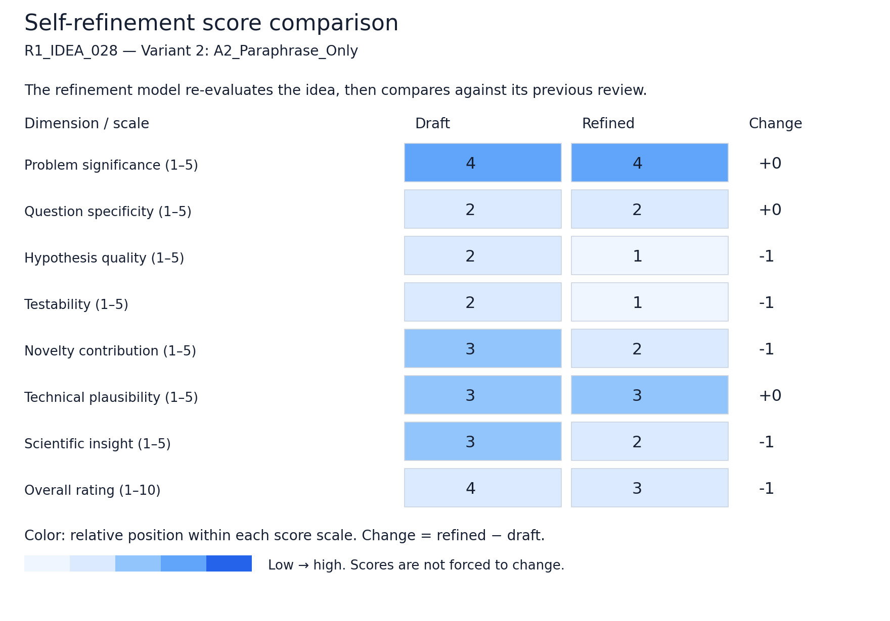

Changed score dimensions: hypothesis_quality, testability, novelty_contribution, scientific_insight, overall_rating.

### Score justifications (draft / refined)

**Problem significance**

```json
{
  "draft": {
    "score": 4.0,
    "justification": "The problem is meaningful: bias in preference aggregation is a known issue in RLHF and social choice, with implications for fairness and robustness. Addressing strategic gaming and representation is relevant to both ML ethics and practical deployment."
  },
  "refined": {
    "score": 4.0,
    "justification": "The problem is highly significant. Bias in preference aggregation is a core challenge in AI alignment (RLHF) and has serious ethical and practical implications for fairness, representation, and robustness against manipulation. Addressing it is important for both theory and deployment."
  }
}
```

**Question specificity**

```json
{
  "draft": {
    "score": 2.0,
    "justification": "The idea states a general goal ('ensure aggregated opinions align proportionally') but does not define a concrete research question. It lacks specificity about what exactly will be investigated, such as a particular aggregation mechanism or a specific bias metric."
  },
  "refined": {
    "score": 2.0,
    "justification": "The idea states a general objective ('ensure aggregated opinions align proportionally') but does not define a concrete research question. It lacks specificity about what is being investigated—no specific relationship, mechanism, or comparison is proposed."
  }
}
```

**Hypothesis quality**

```json
{
  "draft": {
    "score": 2.0,
    "justification": "No explicit hypothesis is presented. The idea implies that proportional alignment will mitigate bias and strategic vulnerability, but this is stated as an assumption rather than a testable prediction. There is no clear mechanism or relationship proposed that distinguishes it from generic fairness-aware aggregation."
  },
  "refined": {
    "score": 1.0,
    "justification": "There is no hypothesis, explicit or implicit. The idea presents a goal ('to mitigate this problem') as an assumption. It does not make a testable prediction about a mechanism, relationship, or comparative outcome. It is a declarative statement of intent, not a scientific hypothesis."
  }
}
```

**Testability**

```json
{
  "draft": {
    "score": 2.0,
    "justification": "The idea as presented is not easily testable because it does not propose how to operationalize 'proportional alignment' or how to measure success. Without a concrete method or evaluation plan, it is unclear what evidence would support or contradict the claim."
  },
  "refined": {
    "score": 1.0,
    "justification": "The idea is not testable as presented. It proposes no method, experiment, comparison, or evaluation metric. Without a concrete formulation of 'proportional alignment' or a proposed way to implement it, there is no clear path to obtaining evidence for or against the claim."
  }
}
```

**Novelty contribution**

```json
{
  "draft": {
    "score": 3.0,
    "justification": "The general concept of fair or representative aggregation in preference learning is not new (e.g., fairness in RLHF, democratic aggregation). The idea could contribute if it introduces a novel formalization or mechanism for proportional alignment, but as stated, it is too vague to assess novelty."
  },
  "refined": {
    "score": 2.0,
    "justification": "The contribution is vague. The general notion of making preference aggregation fair or representative is not novel (e.g., literature on fairness in ranking, democratic AI, weighted voting). Without a proposed novel mechanism or formalization, the idea reads as an application of existing fairness concepts to preference learning, which is of limited novelty."
  }
}
```

**Technical plausibility**

```json
{
  "draft": {
    "score": 3.0,
    "justification": "The direction is logically coherent: adjusting aggregation to reflect preference distributions could reduce bias. However, without technical details, it is unclear how proportional alignment would be implemented or whether it is feasible (e.g., dealing with preference elicitation, computational constraints, or incentive compatibility)."
  },
  "refined": {
    "score": 3.0,
    "justification": "The direction is logically coherent at a high level: adjusting aggregation to reflect population distributions could address bias. However, without any technical details, it's impossible to assess feasibility. Key challenges (preference elicitation, incentive compatibility, computational cost) are ignored, but the core intuition is not inherently implausible."
  }
}
```

**Scientific insight**

```json
{
  "draft": {
    "score": 3.0,
    "justification": "If successfully developed, the framework could provide insight into how aggregation methods affect bias and strategic behavior in preference learning. However, the potential insight is limited by the vagueness of the proposal; a more specific mechanism could reveal trade-offs or principles for fair preference aggregation."
  },
  "refined": {
    "score": 2.0,
    "justification": "Potential insight is low due to vagueness. If developed, it could offer insights into trade-offs between fairness and efficiency in preference aggregation. However, as stated, it promises only a framework, not an investigation into a phenomenon or principle. It is solution-oriented without a clear scientific question to answer."
  }
}
```

**Overall rating**

```json
{
  "draft": {
    "score": 4.0,
    "justification": "The idea identifies a relevant problem but lacks specificity, a testable hypothesis, and a clear research question. It is more of a motivation statement than a research idea. With refinement, it could become a strong direction, but as presented, it is weak in terms of scientific investigation."
  },
  "refined": {
    "score": 3.0,
    "justification": "This is a weak research idea. It identifies a significant problem but fails to formulate a research question, hypothesis, or testable direction. It is a motivational statement and a high-level goal, not a plan for scientific investigation. It lacks the specificity, falsifiability, and novelty needed for a strong research idea. With substantial refinement, it could become a viable direction."
  }
}
```

## R1_IDEA_028 — Variant 3: A3_Plain_Core


Changed score dimensions: hypothesis_quality, testability, overall_rating.

### Score justifications (draft / refined)

**Problem significance**

```json
{
  "draft": {
    "score": 4.0,
    "justification": "The problem is meaningful: bias and strategic manipulation in preference aggregation are important challenges in AI alignment and fairness. Addressing them could improve the robustness and equity of learned policies."
  },
  "refined": {
    "score": 4.0,
    "justification": "The problem is highly meaningful. Bias in preference aggregation and vulnerability to strategic manipulation are significant issues in AI alignment, fairness, and democratic decision-making systems. Addressing these could have substantial impact on the robustness and equity of learned policies."
  }
}
```

**Question specificity**

```json
{
  "draft": {
    "score": 2.0,
    "justification": "The idea describes a direction but does not define a concrete research question. It states what will be developed (a framework) but not what will be investigated or tested."
  },
  "refined": {
    "score": 2.0,
    "justification": "The idea describes a general direction ('develop a framework') but does not define a concrete research question. It lacks specificity about what exactly is being investigated, tested, or compared."
  }
}
```

**Hypothesis quality**

```json
{
  "draft": {
    "score": 2.0,
    "justification": "There is no explicit or implicit hypothesis. The idea proposes a solution but does not make a testable prediction about its effects or superiority over existing methods."
  },
  "refined": {
    "score": 1.0,
    "justification": "There is no explicit or implicit hypothesis. The idea merely states an intention to develop something, without making a testable prediction about its effects, superiority, or mechanisms. It is solution-oriented rather than hypothesis-driven."
  }
}
```

**Testability**

```json
{
  "draft": {
    "score": 2.0,
    "justification": "Without a defined hypothesis, metrics, or experimental approach, it is unclear how the framework's benefits would be evaluated. The idea is not yet formulated in a testable way."
  },
  "refined": {
    "score": 1.0,
    "justification": "Without a hypothesis, defined metrics, or any suggested experimental approach, the central claim cannot be meaningfully investigated. The idea is not formulated in a testable manner."
  }
}
```

**Novelty contribution**

```json
{
  "draft": {
    "score": 3.0,
    "justification": "The general notion of proportional representation in aggregation is not new, but applying it to preference learning for bias and manipulation resistance could be a moderate contribution if developed and validated."
  },
  "refined": {
    "score": 3.0,
    "justification": "The core concept of proportional representation in aggregation is well-established in social choice and fair division. Applying it to preference learning for bias mitigation is a plausible application, but the idea as stated does not articulate a novel methodological insight or theoretical contribution beyond this adaptation."
  }
}
```

**Technical plausibility**

```json
{
  "draft": {
    "score": 3.0,
    "justification": "The direction is logically coherent—proportional alignment could mitigate bias from majority dominance. However, without technical details, it's unclear how feasible it is to implement or estimate true population distributions."
  },
  "refined": {
    "score": 3.0,
    "justification": "The direction is logically coherent—proportional mechanisms can counteract majority dominance. However, the feasibility is unclear without details. Key challenges (estimating population distributions, defining proportionality constraints) are acknowledged in the questions but not addressed in the idea."
  }
}
```

**Scientific insight**

```json
{
  "draft": {
    "score": 3.0,
    "justification": "If successful, the research could provide insights into how aggregation methods affect bias and strategic robustness in preference learning, which is a valuable scientific question. However, the potential insight is limited by the lack of a specific mechanism or hypothesis."
  },
  "refined": {
    "score": 3.0,
    "justification": "If properly investigated, the research could yield insights into the trade-offs between different aggregation schemes in preference learning and their impact on bias and robustness. However, the potential insight is limited by the current vagueness; a more focused question could unlock deeper understanding of mechanisms and boundary conditions."
  }
}
```

**Overall rating**

```json
{
  "draft": {
    "score": 5.0,
    "justification": "The idea identifies a meaningful problem and proposes a reasonable direction, but it lacks specificity, a testable hypothesis, and a clear research question. It is a moderate/borderline idea that could become strong with more concrete formulation."
  },
  "refined": {
    "score": 4.0,
    "justification": "The idea identifies a significant problem but is critically underdeveloped as a research idea. It lacks a research question, hypothesis, and testable formulation. It is a weak idea in its current state, functioning more as a motivation or goal statement than a plan for scientific investigation. It would require substantial concretization to become a viable research direction."
  }
}
```

## R1_IDEA_028 — Variant 4: B1_Verbose_Elaborate

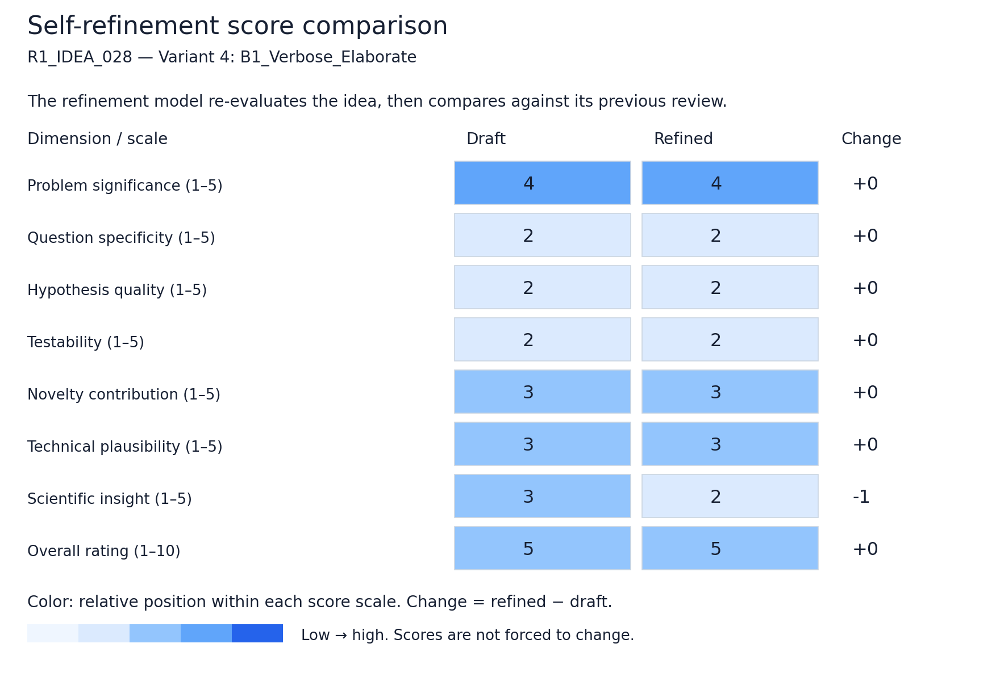

Changed score dimensions: scientific_insight.

### Score justifications (draft / refined)

**Problem significance**

```json
{
  "draft": {
    "score": 4.0,
    "justification": "The problem is meaningful and timely. Bias in preference aggregation and susceptibility to manipulation are important challenges in preference learning and alignment, with implications for fairness, robustness, and real-world deployment of learned policies."
  },
  "refined": {
    "score": 4.0,
    "justification": "The problem is meaningful and timely. Bias in preference aggregation and susceptibility to manipulation are important challenges in preference learning and AI alignment, with implications for fairness, robustness, and real-world deployment of learned policies. The recognition that conventional methods prioritize widely-held opinions identifies a specific limitation worth investigating."
  }
}
```

**Question specificity**

```json
{
  "draft": {
    "score": 2.0,
    "justification": "The idea identifies a general direction ('proportional alignment') but lacks a concrete research question. It doesn't specify what exactly will be investigated—e.g., a specific aggregation mechanism, a fairness-accuracy trade-off, or a robustness property."
  },
  "refined": {
    "score": 2.0,
    "justification": "The idea identifies a general direction ('proportional alignment') but lacks a concrete research question. It doesn't specify what exactly will be investigated—e.g., a specific aggregation mechanism, a fairness-accuracy trade-off, a robustness property, or a causal relationship between aggregation method and bias. The description remains at the level of a goal rather than a question."
  }
}
```

**Hypothesis quality**

```json
{
  "draft": {
    "score": 2.0,
    "justification": "There is an implicit hypothesis that proportional alignment will reduce bias and manipulation susceptibility, but it's not stated explicitly or made testable. No concrete prediction or mechanism is articulated."
  },
  "refined": {
    "score": 2.0,
    "justification": "There is only an implicit hypothesis that proportional alignment will reduce bias and manipulation susceptibility, but it's not stated explicitly or made testable. No concrete prediction about mechanisms, conditions, or measurable outcomes is articulated. The idea lacks a falsifiable claim that distinguishes it from generic 'fairness-aware' methods."
  }
}
```

**Testability**

```json
{
  "draft": {
    "score": 2.0,
    "justification": "The idea is testable in principle (one could compare proportional vs. majority aggregation), but no specific experiment, evaluation, or analysis is suggested. The lack of operational definitions for 'proportional alignment' and 'true underlying distribution' makes it difficult to design a test."
  },
  "refined": {
    "score": 2.0,
    "justification": "The idea is testable in principle (one could compare proportional vs. majority aggregation), but no specific experiment, evaluation, or analysis is suggested. The lack of operational definitions for 'proportional alignment' and 'true underlying distribution' makes it difficult to design a concrete test. Without these, it's unclear what evidence would support or contradict the claim."
  }
}
```

**Novelty contribution**

```json
{
  "draft": {
    "score": 3.0,
    "justification": "The idea points toward a novel framework, but it's unclear how it differs from existing work on fair aggregation, robust preference learning, or distribution matching. Without more specificity, the potential contribution is moderate—it could be a meaningful extension or application of existing ideas."
  },
  "refined": {
    "score": 3.0,
    "justification": "The idea points toward a novel framework, but it's unclear how it differs from existing work on fair aggregation (e.g., demographic parity in collective decision-making), robust preference learning (e.g., Byzantine-robust aggregation), or distribution matching (e.g., reweighting techniques). Without more specificity, the potential contribution is moderate—it could be a meaningful synthesis or application of existing ideas rather than a fundamentally new approach."
  }
}
```

**Technical plausibility**

```json
{
  "draft": {
    "score": 3.0,
    "justification": "The direction is logically coherent: aligning aggregated preferences with true population distributions could mitigate bias. However, key assumptions (e.g., knowledge of true distributions) are nontrivial, and the technical feasibility depends on unspecified details."
  },
  "refined": {
    "score": 3.0,
    "justification": "The direction is logically coherent: aligning aggregated preferences with true population distributions could mitigate bias. However, key assumptions (e.g., knowledge of true distributions) are nontrivial and often unrealistic in practice. The technical feasibility depends heavily on unspecified details about how the true distribution is accessed or estimated."
  }
}
```

**Scientific insight**

```json
{
  "draft": {
    "score": 3.0,
    "justification": "If successfully investigated, the idea could provide insight into how aggregation methods affect bias and robustness in preference learning. However, as stated, it's more of an application goal than a hypothesis-driven investigation into underlying mechanisms or principles."
  },
  "refined": {
    "score": 2.0,
    "justification": "As stated, the idea is more of an application goal than a hypothesis-driven investigation. If successfully developed, it could provide practical benefits (fairer policies), but the potential for transferable scientific insight (e.g., general principles about aggregation, fundamental trade-offs, or causal mechanisms) is limited without a more focused research question about underlying phenomena."
  }
}
```

**Overall rating**

```json
{
  "draft": {
    "score": 5.0,
    "justification": "This is a moderate/borderline research idea. It identifies a meaningful problem and proposes a general direction, but lacks specificity, a clear hypothesis, and a testable research question. The potential contribution and scientific insight are limited without further refinement. It's a reasonable starting point but needs substantial development to become a strong research proposal."
  },
  "refined": {
    "score": 5.0,
    "justification": "This is a moderate/borderline research idea. It identifies a meaningful problem and proposes a general direction, but lacks specificity, a clear hypothesis, and a testable research question. The potential contribution and scientific insight are limited without further refinement. It's a reasonable starting point for discussion but needs substantial development to become a strong research proposal."
  }
}
```

## R1_IDEA_028 — Variant 5: B2_Grand_Narrative

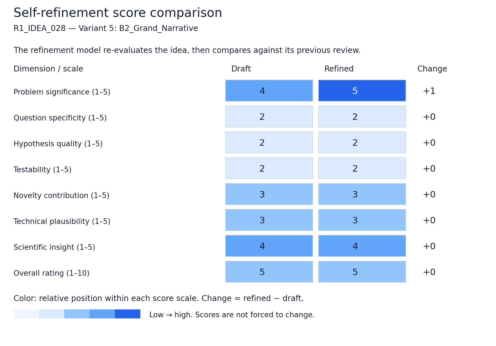

Changed score dimensions: problem_significance.

### Score justifications (draft / refined)

**Problem significance**

```json
{
  "draft": {
    "score": 4.0,
    "justification": "The problem is highly meaningful. Bias in preference aggregation is a recognized issue in RLHF and alignment, with implications for fairness, robustness, and representation. The connection to strategic manipulation and equitable systems adds societal relevance."
  },
  "refined": {
    "score": 5.0,
    "justification": "The problem is exceptionally meaningful. Bias in preference aggregation is a core challenge in alignment and RLHF, with direct implications for fairness, robustness, representation, and real-world impact. The connection to strategic manipulation and equitable systems gives it significant scientific and societal relevance."
  }
}
```

**Question specificity**

```json
{
  "draft": {
    "score": 2.0,
    "justification": "The idea identifies a general issue but does not define a specific research question. It states a goal ('develop a framework capable of aligning... proportionally') rather than a concrete question about mechanisms, trade-offs, or effects."
  },
  "refined": {
    "score": 2.0,
    "justification": "The idea identifies a general issue and states a high-level goal, but does not define a concrete research question. It lacks specificity about what relationship, mechanism, or effect is being investigated. 'Develop a framework' is an engineering objective, not a scientific question."
  }
}
```

**Hypothesis quality**

```json
{
  "draft": {
    "score": 2.0,
    "justification": "There is an implicit hypothesis that proportional alignment will address bias and susceptibility to manipulation, but it is not stated as a testable prediction. The hypothesis lacks specificity about what will improve and under what conditions."
  },
  "refined": {
    "score": 2.0,
    "justification": "There is an implicit hypothesis that proportional alignment will mitigate bias and manipulation, but it is not articulated as a testable prediction. No specific, measurable outcome or conditional relationship is proposed. The hypothesis remains vague and untargeted."
  }
}
```

**Testability**

```json
{
  "draft": {
    "score": 2.0,
    "justification": "Without a defined metric for 'proportional alignment' or a concrete mechanism, it's unclear how one would test whether the framework works. The idea suggests a direction but not a testable claim."
  },
  "refined": {
    "score": 2.0,
    "justification": "Without a defined success metric, a concrete mechanism, or a clear comparison, the central claim is not testable in its current form. The idea suggests a desirable property but provides no pathway to evaluate whether it has been achieved or what evidence would support it."
  }
}
```

**Novelty contribution**

```json
{
  "draft": {
    "score": 3.0,
    "justification": "The high-level goal of fair or robust preference aggregation is not new (e.g., work on group fairness in RL, robust aggregation). The potential contribution lies in the specific instantiation for preference learning from human feedback, but the idea summary does not specify what is novel about the proposed approach."
  },
  "refined": {
    "score": 3.0,
    "justification": "The high-level goal of fair or robust preference aggregation is not novel per se (e.g., group fairness in RL, robust optimization). The potential contribution lies in the specific context of learning from human feedback for alignment, but the summary does not specify what is technically or conceptually new about the proposed approach beyond its stated objective."
  }
}
```

**Technical plausibility**

```json
{
  "draft": {
    "score": 3.0,
    "justification": "The general direction is plausible—fairness-aware aggregation is a well-studied area. However, without technical details, it's impossible to assess the coherence of the proposed framework. The idea doesn't contain obvious technical contradictions."
  },
  "refined": {
    "score": 3.0,
    "justification": "The general direction is plausible—fairness-aware aggregation is a technically feasible area of research. However, with no technical details provided, the coherence of the specific 'framework' cannot be assessed. The idea does not contain internal contradictions, but it also offers no technical substance to evaluate."
  }
}
```

**Scientific insight**

```json
{
  "draft": {
    "score": 4.0,
    "justification": "If successfully investigated, this research could yield significant insight into the trade-offs between majority preference satisfaction and minority representation, the robustness of preference learning methods to population shifts or adversarial evaluators, and principles for equitable aggregation of subjective judgments."
  },
  "refined": {
    "score": 4.0,
    "justification": "If successfully investigated, this research could yield significant scientific insight. It could reveal trade-offs between majority preference satisfaction and minority representation, illuminate the robustness of preference learning methods to population shifts or adversarial evaluators, and contribute general principles for equitable aggregation of subjective human judgments in ML systems."
  }
}
```

**Overall rating**

```json
{
  "draft": {
    "score": 5.0,
    "justification": "This is a moderate/borderline research idea. It identifies an important and timely problem with clear relevance to fairness and alignment. However, it is currently more of a motivation and high-level goal than a specific, testable research question. The lack of a concrete hypothesis, methodological direction, or definition of success limits its strength as a research idea. With greater specificity, it could become a strong idea."
  },
  "refined": {
    "score": 5.0,
    "justification": "This is a moderate/borderline research idea. It identifies an exceptionally significant problem with high relevance to fairness and alignment. However, it is currently more of a motivation and a high-level goal than a specific, testable research question. The lack of a concrete hypothesis, methodological direction, or definition of success severely limits its strength as a research idea. With greater specificity, it has the potential to become strong."
  }
}
```

## R1_IDEA_028 — Variant 6: B3_Over_Confident

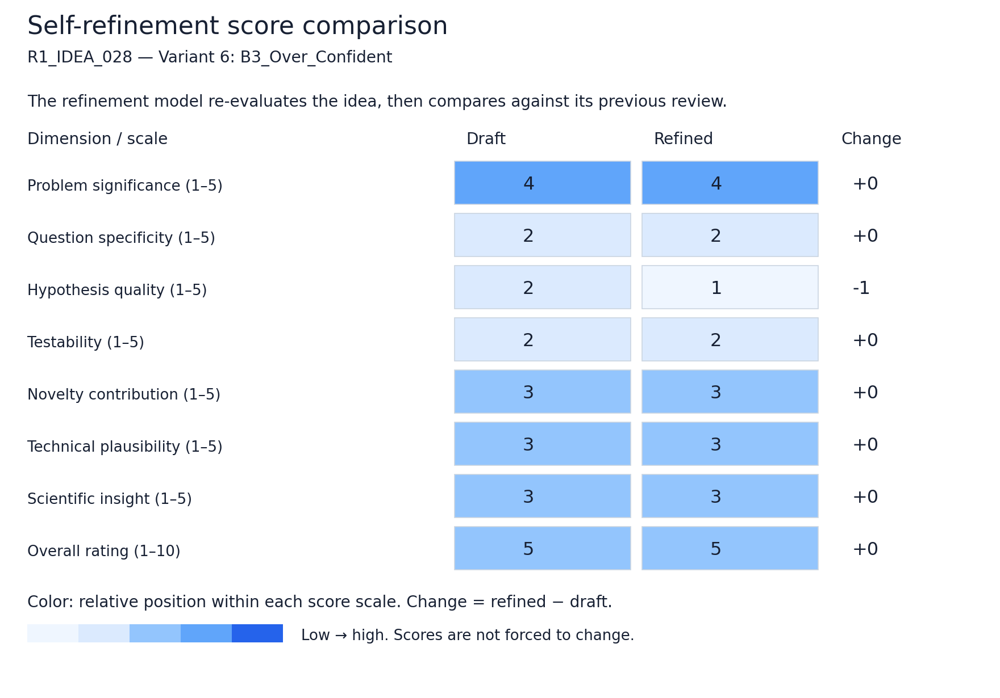

Changed score dimensions: hypothesis_quality.

### Score justifications (draft / refined)

**Problem significance**

```json
{
  "draft": {
    "score": 4.0,
    "justification": "The problem is meaningful: bias in preference aggregation and susceptibility to manipulation are important challenges in alignment and fairness. The motivation is well-articulated and relevant to current ML research."
  },
  "refined": {
    "score": 4.0,
    "justification": "The problem is highly meaningful. Bias in preference aggregation and susceptibility to manipulation are critical challenges in AI alignment, fairness, and safety. The motivation is well-articulated and relevant to current ML research."
  }
}
```

**Question specificity**

```json
{
  "draft": {
    "score": 2.0,
    "justification": "The idea states a goal ('develop a framework') but does not define a specific research question. It lacks a concrete inquiry into a mechanism, relationship, or phenomenon."
  },
  "refined": {
    "score": 2.0,
    "justification": "The idea states a development goal ('develop a framework') but does not define a specific research question. There is no concrete inquiry into a mechanism, relationship, or phenomenon to investigate."
  }
}
```

**Hypothesis quality**

```json
{
  "draft": {
    "score": 2.0,
    "justification": "No explicit or implicit hypothesis is presented. The idea describes an intended outcome (proportional alignment) but does not make a testable prediction about its effects or superiority."
  },
  "refined": {
    "score": 1.0,
    "justification": "No explicit or implicit hypothesis is presented. The idea describes an intended outcome (proportional alignment) but makes no testable prediction about its effects, superiority, or trade-offs. It is an engineering objective, not a scientific hypothesis."
  }
}
```

**Testability**

```json
{
  "draft": {
    "score": 2.0,
    "justification": "Without a clear hypothesis or experimental direction, it's unclear how the central claim could be tested. The idea is framed as a framework development goal rather than an investigable proposition."
  },
  "refined": {
    "score": 2.0,
    "justification": "Without a clear hypothesis or experimental direction, the central claim is not directly testable. The idea is framed as a framework development goal. One could test a resulting framework, but the idea itself does not propose what to test or how."
  }
}
```

**Novelty contribution**

```json
{
  "draft": {
    "score": 3.0,
    "justification": "The general direction of fair or robust preference aggregation has been explored. The idea suggests a proportional approach but does not specify how it differs from existing fairness notions or aggregation methods, limiting perceived novelty."
  },
  "refined": {
    "score": 3.0,
    "justification": "The general direction of fair or robust preference aggregation is not new. The idea suggests a 'proportional' approach but does not specify how it differs from existing fairness notions (e.g., demographic parity, equalized odds) or aggregation methods (e.g., positional voting, proportional representation schemes). The potential contribution is unclear without this distinction."
  }
}
```

**Technical plausibility**

```json
{
  "draft": {
    "score": 3.0,
    "justification": "The idea is logically coherent: addressing bias via proportional representation is plausible. However, without technical details, it's unclear how 'true population distribution' would be known or estimated, which is a significant assumption."
  },
  "refined": {
    "score": 3.0,
    "justification": "The core intuition—addressing bias via some form of proportional representation—is logically coherent and plausible. However, the assumption of knowing the 'true population distribution' is a significant practical hurdle. Without technical details, it's unclear how this would be overcome, which limits the assessment of plausibility."
  }
}
```

**Scientific insight**

```json
{
  "draft": {
    "score": 3.0,
    "justification": "If successfully developed and analyzed, the framework could provide insight into trade-offs between majority preference and proportional fairness in learning. However, the idea as stated focuses on development rather than discovery of principles or mechanisms."
  },
  "refined": {
    "score": 3.0,
    "justification": "If successfully developed and analyzed, such a framework could provide insight into the trade-offs between majority preference satisfaction and proportional fairness in learning from human feedback. However, the idea as stated focuses on building a tool rather than on discovering underlying principles, mechanisms, or boundary conditions."
  }
}
```

**Overall rating**

```json
{
  "draft": {
    "score": 5.0,
    "justification": "The idea identifies a meaningful problem but lacks a specific research question, testable hypothesis, and clear novelty. It is a moderate/borderline research direction that would need substantial refinement to become a strong scientific investigation."
  },
  "refined": {
    "score": 5.0,
    "justification": "The idea identifies a meaningful and important problem but is presented as a development goal rather than a research investigation. It lacks a specific research question, a testable hypothesis, and clarity on its novelty. It is a moderate/borderline research direction that requires substantial refinement to become a strong scientific study. Its primary strength is problem significance; its primary weaknesses are in question specificity and hypothesis quality."
  }
}
```

## R1_IDEA_028 — Variant 7: B4_Novelty

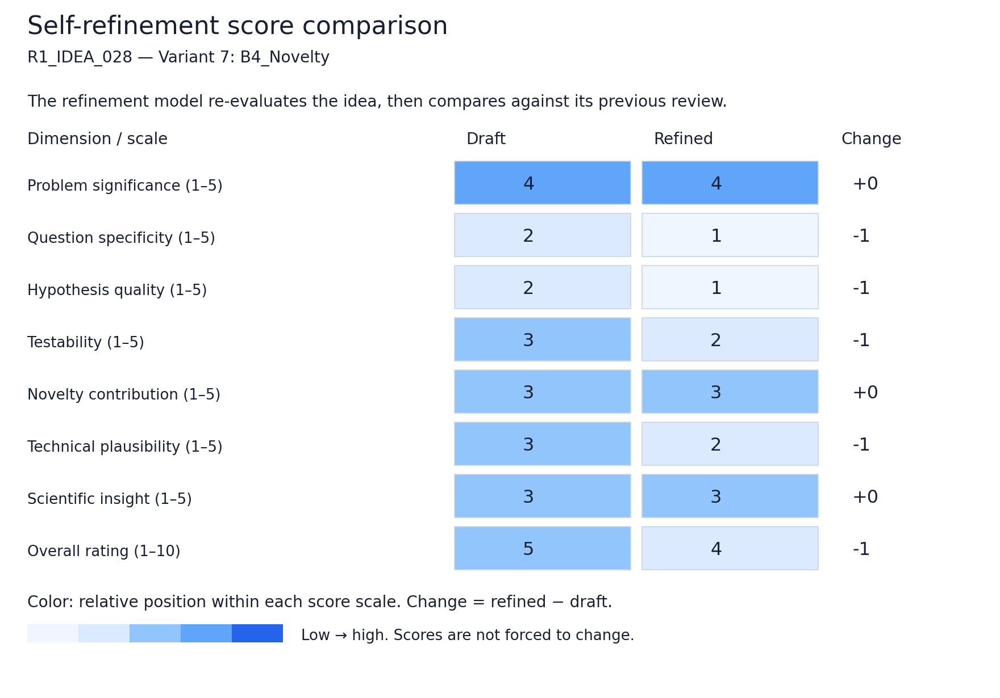

Changed score dimensions: question_specificity, hypothesis_quality, testability, technical_plausibility, overall_rating.

### Score justifications (draft / refined)

**Problem significance**

```json
{
  "draft": {
    "score": 4.0,
    "justification": "The problem is meaningful: bias in preference aggregation is a recognized issue in RLHF, social choice, and algorithmic fairness. Addressing proportional representation could have implications for fairness, robustness, and democratic decision-making in AI systems."
  },
  "refined": {
    "score": 4.0,
    "justification": "The problem is highly meaningful. Bias in preference aggregation is a critical issue in alignment, fairness, and social choice. Methods that prioritize majority opinions can systematically disadvantage minority preferences, with real ethical and practical consequences. Addressing this through better representation aligns with important research directions in responsible AI."
  }
}
```

**Question specificity**

```json
{
  "draft": {
    "score": 2.0,
    "justification": "The idea identifies a general direction (proportional representation) but lacks a concrete research question. It doesn't specify what aspect of proportional representation to investigate or what relationship to test."
  },
  "refined": {
    "score": 1.0,
    "justification": "Extremely weak specificity. The idea only states a general direction ('develop a framework capable of aligning... proportionally') without any concrete research question. It doesn't specify what aspect of proportional representation to investigate, what relationships to test, or what phenomena to explain. This is more of a vague motivation than a research question."
  }
}
```

**Hypothesis quality**

```json
{
  "draft": {
    "score": 2.0,
    "justification": "There's an implicit hypothesis that proportional representation will reduce bias and manipulation susceptibility, but it's not stated as a testable prediction. No mechanism or specific relationship is proposed."
  },
  "refined": {
    "score": 1.0,
    "justification": "Very weak hypothesis quality. There's only an implicit assumption that proportional representation will help, but no concrete prediction about mechanisms, relationships, or outcomes. No hypothesis is stated about how proportional representation would compare to alternatives, what specific benefits it would provide, or under what conditions it would be preferable."
  }
}
```

**Testability**

```json
{
  "draft": {
    "score": 3.0,
    "justification": "The idea could be tested by comparing aggregation methods, but without a clear hypothesis or operational definition of proportional representation, it's unclear what exactly would be measured. The general direction is testable in principle."
  },
  "refined": {
    "score": 2.0,
    "justification": "Weak testability. While one could imagine comparing aggregation methods, the idea provides no basis for what would constitute a test. Without a definition of proportional representation or a hypothesis about its effects, it's unclear what evidence would support or contradict the claim. The general concept could be made testable with substantial refinement."
  }
}
```

**Novelty contribution**

```json
{
  "draft": {
    "score": 3.0,
    "justification": "The perspective of proportional representation in preference learning is somewhat novel, though related concepts exist in social choice theory and fair division. The contribution would depend heavily on the specific technical approach."
  },
  "refined": {
    "score": 3.0,
    "justification": "Moderate novelty. The perspective of applying proportional representation to preference learning is somewhat novel, though closely related concepts exist in social choice theory (proportional fairness), fair division, and group-fair reinforcement learning. The contribution would depend entirely on the specific technical approach, which isn't specified."
  }
}
```

**Technical plausibility**

```json
{
  "draft": {
    "score": 3.0,
    "justification": "The idea is logically coherent: addressing bias through better representation makes sense. However, without technical details, it's impossible to assess the feasibility of the proposed framework."
  },
  "refined": {
    "score": 2.0,
    "justification": "Weak technical plausibility. While the general concept of addressing bias through better representation is logically coherent, the idea provides no technical details to assess feasibility. Important questions about how to define proportional representation, how to estimate population distributions, and how to optimize for it remain completely unaddressed. The gap between concept and implementation is large."
  }
}
```

**Scientific insight**

```json
{
  "draft": {
    "score": 3.0,
    "justification": "If successfully investigated, this could provide insights into how different aggregation schemes affect policy bias and robustness. However, the potential insight is limited by the vagueness of the proposal."
  },
  "refined": {
    "score": 3.0,
    "justification": "Moderate potential insight. If successfully investigated, this could provide insights into trade-offs between different aggregation principles (majority vs. proportional) and their effects on fairness, robustness, and policy quality. However, the vagueness of the proposal limits the potential for transferable insights about mechanisms or general principles."
  }
}
```

**Overall rating**

```json
{
  "draft": {
    "score": 5.0,
    "justification": "This is a moderate/borderline research idea. It identifies a meaningful problem and proposes an interesting direction (proportional representation), but lacks specificity in research question, hypothesis, and methodology. The idea has potential but needs substantial refinement to become a strong research proposal."
  },
  "refined": {
    "score": 4.0,
    "justification": "This is a weak research idea. While it identifies a meaningful problem and an interesting conceptual direction, it lacks almost all elements of a testable research proposal: no specific research question, no hypothesis, no methodological direction, and no operational definitions. The idea is more of a motivation statement than a research plan. It has potential but requires substantial refinement to become a viable research direction."
  }
}
```

## R1_IDEA_028 — Variant 8: B5_Application_Impact


Changed score dimensions: none.

### Score justifications (draft / refined)

**Problem significance**

```json
{
  "draft": {
    "score": 4.0,
    "justification": "The problem is meaningful: bias in preference aggregation and susceptibility to manipulation are important challenges in alignment and fair ML. Addressing proportional representation connects to equity concerns in practical systems."
  },
  "refined": {
    "score": 4.0,
    "justification": "The problem is meaningful and timely: bias in preference aggregation and susceptibility to manipulation are important challenges in alignment and fair ML. Addressing proportional representation connects to equity concerns in practical decision-making systems, which is a significant research direction."
  }
}
```

**Question specificity**

```json
{
  "draft": {
    "score": 2.0,
    "justification": "The idea states a goal ('develop a novel framework') but does not define a specific research question about mechanisms, comparisons, or relationships. It lacks concrete operational definitions."
  },
  "refined": {
    "score": 2.0,
    "justification": "The idea states a goal ('develop a novel framework') but does not define a specific research question about mechanisms, comparisons, or relationships. It lacks concrete operational definitions of key terms like 'proportional alignment' and doesn't specify what aspect of preference learning would be modified."
  }
}
```

**Hypothesis quality**

```json
{
  "draft": {
    "score": 2.0,
    "justification": "There is an implicit hypothesis that proportional alignment will address bias and manipulation, but it is not stated as a testable prediction. No alternative outcomes or mechanisms are contrasted."
  },
  "refined": {
    "score": 2.0,
    "justification": "There is an implicit hypothesis that proportional alignment will address bias and manipulation, but it is not stated as a testable prediction. No alternative outcomes or mechanisms are contrasted, and there's no clear falsifiable claim about what proportional representation would achieve compared to existing methods."
  }
}
```

**Testability**

```json
{
  "draft": {
    "score": 3.0,
    "justification": "The idea could be tested by comparing a proportional framework against conventional methods on metrics of bias, manipulation robustness, and representation. However, without specifying how proportionality is implemented or measured, testability is limited."
  },
  "refined": {
    "score": 3.0,
    "justification": "The idea could potentially be tested by comparing a proportional framework against conventional methods on metrics of bias, manipulation robustness, and representation. However, without specifying how proportionality is implemented or measured, testability is limited. The concept is testable in principle but lacks the operational details needed for concrete evaluation."
  }
}
```

**Novelty contribution**

```json
{
  "draft": {
    "score": 3.0,
    "justification": "Proportional representation in preference learning is a relatively underexplored direction compared to fairness in classification/regression. However, the idea is described at a high level without distinguishing it from existing work on distributionally robust optimization or subgroup fairness."
  },
  "refined": {
    "score": 3.0,
    "justification": "Proportional representation in preference learning is a relatively underexplored direction compared to fairness in classification/regression. However, the idea is described at a high level without distinguishing it from existing work on distributionally robust optimization, subgroup fairness, or weighted aggregation methods. The contribution would depend heavily on the specific implementation."
  }
}
```

**Technical plausibility**

```json
{
  "draft": {
    "score": 4.0,
    "justification": "The reasoning is coherent: if conventional methods overweight majority opinions, designing a method that respects population proportions could mitigate bias. The assumption that proportional alignment is desirable in some contexts is reasonable."
  },
  "refined": {
    "score": 4.0,
    "justification": "The reasoning is coherent: if conventional methods overweight majority opinions, designing a method that respects population proportions could mitigate bias. The assumption that proportional alignment is desirable in some contexts is reasonable. The technical direction, while vague, is logically consistent with the stated problem."
  }
}
```

**Scientific insight**

```json
{
  "draft": {
    "score": 3.0,
    "justification": "If successful, the research could reveal trade-offs between proportionality and other objectives in preference learning, and how aggregation rules affect strategic behavior. However, the potential insight depends heavily on how the framework is designed and evaluated."
  },
  "refined": {
    "score": 3.0,
    "justification": "If successfully investigated, the research could reveal trade-offs between proportionality and other objectives in preference learning, and how aggregation rules affect strategic behavior. However, the potential insight depends heavily on how the framework is designed and evaluated. At its current level of description, it's unclear what general principles or mechanisms would be uncovered."
  }
}
```

**Overall rating**

```json
{
  "draft": {
    "score": 5.0,
    "justification": "This is a moderate research idea with a meaningful motivation but limited specificity. The problem is significant, but the research question is broad and the hypothesis is implicit. With more concrete definitions and a testable prediction, it could become a strong idea."
  },
  "refined": {
    "score": 5.0,
    "justification": "This is a moderate research idea with a meaningful motivation but limited specificity. The problem is significant (bias in preference aggregation), but the research question is broad and the hypothesis is implicit. The idea lacks concrete operational definitions and methodological direction. With more concrete definitions, a testable prediction, and specification of the preference learning setting, it could become a strong idea."
  }
}
```

## R1_IDEA_028 — Variant 9: C1_Hollow_Shell


Changed score dimensions: none.

### Score justifications (draft / refined)

**Problem significance**

```json
{
  "draft": {
    "score": 4.0,
    "justification": "The problem of bias toward popular views in preference aggregation is meaningful and relevant, especially with growing concerns about algorithmic fairness and representation. It has implications for RLHF, recommendation systems, and collective decision-making."
  },
  "refined": {
    "score": 4.0,
    "justification": "The problem is highly significant. Bias in preference aggregation has serious implications for AI alignment, algorithmic fairness, and democratic decision-making systems. The recognition of manipulation risks adds practical importance. However, the problem statement is somewhat broad without domain specification."
  }
}
```

**Question specificity**

```json
{
  "draft": {
    "score": 1.0,
    "justification": "Extremely vague. The idea only states a general problem and proposes a 'new research approach' without specifying what question is being investigated. No concrete research question is articulated."
  },
  "refined": {
    "score": 1.0,
    "justification": "Extremely vague. The idea states a general problem and proposes to 'tackle' it with a 'new research approach,' but provides no concrete research question. There is no specification of what relationship, mechanism, or phenomenon will be investigated."
  }
}
```

**Hypothesis quality**

```json
{
  "draft": {
    "score": 1.0,
    "justification": "No hypothesis is presented. The text describes a problem and states an intention to 'tackle' it, but makes no testable prediction about mechanisms, relationships, or solutions."
  },
  "refined": {
    "score": 1.0,
    "justification": "No hypothesis is presented. The text describes an intention to address a problem but makes no testable prediction about causes, solutions, or expected outcomes. There is no implied mechanism or relationship that could be supported or contradicted by evidence."
  }
}
```

**Testability**

```json
{
  "draft": {
    "score": 1.0,
    "justification": "Without a specific hypothesis or methodological direction, it's unclear how one would test whether the proposed approach works. The idea lacks any suggestion of experiments, comparisons, or evaluations."
  },
  "refined": {
    "score": 1.0,
    "justification": "Untestable as presented. Without a specific claim, question, or methodological direction, there is no clear way to investigate whether the proposed approach works. The idea lacks any suggestion of experiments, comparisons, analyses, or evaluations."
  }
}
```

**Novelty contribution**

```json
{
  "draft": {
    "score": 2.0,
    "justification": "The problem itself is not novel (fairness in preference aggregation is well-studied in social choice theory and algorithmic fairness). The contribution is unclear because no specific approach is proposed."
  },
  "refined": {
    "score": 2.0,
    "justification": "The problem of fair preference aggregation is not novel—it's extensively studied in social choice theory, computational fairness, and recently in RLHF. Without any proposed approach, the potential contribution is entirely speculative. At best, applying existing fairness concepts to specific ML preference learning contexts could offer some novelty."
  }
}
```

**Technical plausibility**

```json
{
  "draft": {
    "score": 3.0,
    "justification": "The general direction of addressing bias in preference aggregation is plausible, but without any technical details, it's impossible to assess whether a specific approach would be coherent or feasible."
  },
  "refined": {
    "score": 3.0,
    "justification": "The general direction is plausible—addressing aggregation bias is a coherent technical goal. However, with zero technical details, we cannot assess whether any specific implementation would be feasible or coherent. The assumption that 'matching the actual spread' is desirable and achievable is reasonable but untested."
  }
}
```

**Scientific insight**

```json
{
  "draft": {
    "score": 2.0,
    "justification": "If developed properly, this could provide insight into how preference aggregation methods create bias and how to design fairer systems. However, as stated, it's too vague to promise specific scientific insights."
  },
  "refined": {
    "score": 2.0,
    "justification": "If properly developed, this could yield insights into how aggregation methods distort preference representations and how to design fairer systems. However, as stated, it promises only a general direction without specifying what scientific knowledge would be generated. It could easily devolve into simple application engineering rather than fundamental insight."
  }
}
```

**Overall rating**

```json
{
  "draft": {
    "score": 3.0,
    "justification": "This is a weak research idea as presented. While it identifies a meaningful problem, it lacks a specific research question, hypothesis, testable claim, or methodological direction. It reads more like a motivation paragraph than a research idea. The idea needs substantial development to become a viable research direction."
  },
  "refined": {
    "score": 3.0,
    "justification": "This is a weak research idea. While it identifies a meaningful and significant problem, it lacks virtually all elements of a viable research direction: no specific question, no hypothesis, no testable claim, and no methodological direction. It reads as a motivation statement rather than a research idea. Substantial development is needed to transform this into a concrete investigation with scientific value."
  }
}
```

## R1_IDEA_028 — Variant 10: C2_Logic_Flawed


Changed score dimensions: none.

### Score justifications (draft / refined)

**Problem significance**

```json
{
  "draft": {
    "score": 4.0,
    "justification": "The problem is meaningful: bias in preference aggregation and susceptibility to manipulation are important challenges in RLHF and social choice, with implications for fairness and robustness."
  },
  "refined": {
    "score": 4.0,
    "justification": "The problem is significant: bias in preference aggregation and susceptibility to manipulation are critical issues in RLHF, social choice, and algorithmic fairness, with real-world implications for equitable and robust AI systems."
  }
}
```

**Question specificity**

```json
{
  "draft": {
    "score": 2.0,
    "justification": "The idea states a general goal ('align proportionally') but does not define a concrete research question about mechanisms, relationships, or specific hypotheses."
  },
  "refined": {
    "score": 2.0,
    "justification": "The idea states a general goal ('align proportionally') but does not define a concrete research question about mechanisms, relationships, or specific comparisons. It lacks the specificity needed to guide investigation."
  }
}
```

**Hypothesis quality**

```json
{
  "draft": {
    "score": 2.0,
    "justification": "There is an implicit hypothesis that proportional alignment reduces bias and improves effectiveness, but it is not articulated as a testable prediction with clear mechanisms or comparisons."
  },
  "refined": {
    "score": 2.0,
    "justification": "There is an implicit belief that proportional alignment reduces bias and improves effectiveness, but this is not articulated as a testable prediction with clear, measurable outcomes or causal mechanisms."
  }
}
```

**Testability**

```json
{
  "draft": {
    "score": 2.0,
    "justification": "Without a concrete method or evaluation plan, it's unclear how one would test whether the framework achieves proportional alignment or improves outcomes. The idea is more of a goal than a testable proposal."
  },
  "refined": {
    "score": 2.0,
    "justification": "Without a proposed method, evaluation plan, or measurable outcomes, it is unclear how one would test whether the framework achieves its goals. The idea is a declarative objective rather than a testable research direction."
  }
}
```

**Novelty contribution**

```json
{
  "draft": {
    "score": 3.0,
    "justification": "The notion of proportional representation in aggregation has parallels in voting theory and fairness-aware ML. The contribution depends on the specific technical approach, which is not yet specified."
  },
  "refined": {
    "score": 3.0,
    "justification": "The core notion of proportional representation has analogs in voting theory and fairness-aware ML. The potential contribution hinges on a novel technical approach, which is not yet specified, making it moderately novel at best."
  }
}
```

**Technical plausibility**

```json
{
  "draft": {
    "score": 3.0,
    "justification": "The general direction is plausible, but without details, it's hard to assess. The assumption that true population distribution is known or estimable may be non-trivial."
  },
  "refined": {
    "score": 3.0,
    "justification": "The general direction is plausible, but key assumptions—such as access to the true population distribution—are nontrivial. Without methodological details, it's difficult to assess feasibility beyond a high level."
  }
}
```

**Scientific insight**

```json
{
  "draft": {
    "score": 3.0,
    "justification": "If successful, it could provide insight into how aggregation methods affect bias and robustness, but the idea as stated is more focused on a solution goal than on uncovering general principles."
  },
  "refined": {
    "score": 3.0,
    "justification": "If developed and tested, it could yield insights into trade-offs between representativeness and performance in preference aggregation. However, the idea as stated is solution-oriented rather than focused on uncovering general principles or causal relationships."
  }
}
```

**Overall rating**

```json
{
  "draft": {
    "score": 5.0,
    "justification": "The idea identifies a relevant problem but lacks specificity in research question, hypothesis, and methodology. It is a moderate/borderline idea because the core concept is reasonable, but it needs substantial refinement to become a strong research direction."
  },
  "refined": {
    "score": 5.0,
    "justification": "The idea identifies a relevant and meaningful problem but lacks specificity in research question, hypothesis, and methodology. It is a moderate/borderline idea because the core concept is reasonable, but it requires substantial refinement to become a strong, testable research direction."
  }
}
```

## R1_IDEA_028 — Variant 11: C3_Substance_Enriched

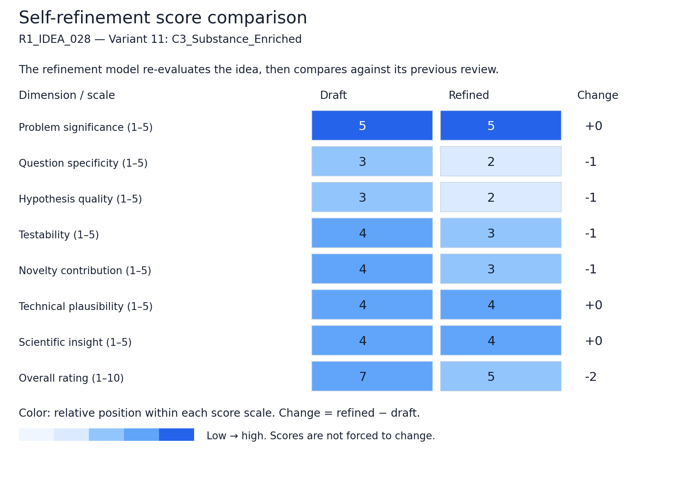

Changed score dimensions: question_specificity, hypothesis_quality, testability, novelty_contribution, overall_rating.

### Score justifications (draft / refined)

**Problem significance**

```json
{
  "draft": {
    "score": 5.0,
    "justification": "The problem is highly significant. Bias in preference learning from majority dominance and vulnerability to manipulation are critical issues in aligning AI systems with human values, especially as these systems are deployed in socially impactful domains."
  },
  "refined": {
    "score": 5.0,
    "justification": "The problem is exceptionally significant. Bias in preference learning from majority dominance and vulnerability to strategic manipulation are critical challenges in aligning AI systems with diverse human values, especially as these systems are deployed in socially impactful domains. The problem connects technical ML challenges with important societal concerns about representation and fairness."
  }
}
```

**Question specificity**

```json
{
  "draft": {
    "score": 3.0,
    "justification": "The idea identifies a general goal (proportional alignment) but does not define a sharp, concrete research question. It proposes a 'framework' without specifying what it would investigate about that framework beyond its validation."
  },
  "refined": {
    "score": 2.0,
    "justification": "The research question is quite broad and lacks specificity. It proposes developing a 'framework' for 'proportional alignment' without defining what that means technically or what specific aspect of the framework would be investigated. The idea states a goal rather than posing a concrete research question that can be answered through investigation."
  }
}
```

**Hypothesis quality**

```json
{
  "draft": {
    "score": 3.0,
    "justification": "An implicit hypothesis exists: 'A framework that ensures proportional alignment will reduce bias and manipulation susceptibility compared to conventional methods.' This is a reasonable prediction but is fairly high-level and not broken down into testable sub-hypotheses about mechanisms or effects."
  },
  "refined": {
    "score": 2.0,
    "justification": "There is only an implicit, generic hypothesis: 'A framework that ensures proportional alignment will reduce bias compared to conventional methods.' This lacks specificity about mechanisms, conditions, or types of bias. It doesn't make concrete predictions that could be meaningfully tested or falsified beyond a simple performance comparison."
  }
}
```

**Testability**

```json
{
  "draft": {
    "score": 4.0,
    "justification": "The idea suggests a clear validation path (simulation with known distributions) and implies comparisons to conventional methods. This makes the central claim testable. However, the lack of detail on metrics and baselines slightly limits the score."
  },
  "refined": {
    "score": 3.0,
    "justification": "The idea mentions simulation as a potential validation path, which provides some testability. However, without specification of metrics, baselines, or what constitutes 'proportional alignment,' it's unclear how one would design conclusive experiments. The central claim could be tested in principle but lacks the operational details needed for meaningful investigation."
  }
}
```

**Novelty contribution**

```json
{
  "draft": {
    "score": 4.0,
    "justification": "Applying principles of proportional representation or fair division to preference learning for AI alignment is a novel and promising direction. It moves beyond simple majority aggregation and could contribute a new fairness perspective to RLHF and related fields."
  },
  "refined": {
    "score": 3.0,
    "justification": "Applying proportional representation concepts to preference learning has moderate novelty. While the connection between fairness/social choice and preference learning is not entirely new, focusing specifically on proportional alignment as an objective could contribute a new perspective. However, without specifying what makes the framework 'novel' beyond applying existing concepts, the potential contribution is unclear."
  }
}
```

**Technical plausibility**

```json
{
  "draft": {
    "score": 4.0,
    "justification": "The reasoning is coherent. The goal of proportional alignment is technically plausible, drawing on concepts from social choice and fairness. The identified boundary condition (reliance on population estimates) shows good technical awareness."
  },
  "refined": {
    "score": 4.0,
    "justification": "The reasoning is coherent and the goal is technically plausible. Proportional alignment concepts exist in social choice theory and could be adapted to preference learning. The identification of the population estimation boundary condition shows good technical awareness. However, without a proposed mechanism, it's difficult to assess implementation feasibility."
  }
}
```

**Scientific insight**

```json
{
  "draft": {
    "score": 4.0,
    "justification": "If successful, this research could yield significant insight into the trade-offs between majority efficiency and proportional fairness in preference aggregation, the conditions under which proportional methods are robust to manipulation, and how to operationalize democratic fairness principles in machine learning systems."
  },
  "refined": {
    "score": 4.0,
    "justification": "If successfully investigated, this research could yield valuable insights into the trade-offs between majority efficiency and proportional fairness in preference aggregation, the conditions under which proportional methods are robust to manipulation, and how to operationalize democratic fairness principles in machine learning systems. The potential for transferable insights about representation in AI alignment is substantial."
  }
}
```

**Overall rating**

```json
{
  "draft": {
    "score": 7.0,
    "justification": "This is a strong research idea. It addresses a very important problem with clear societal implications. The proposed direction is novel and plausible. The main weakness is the lack of specificity in the research question and technical approach, which prevents a higher score. With more concrete formulation, it has the potential to be an exceptional idea."
  },
  "refined": {
    "score": 5.0,
    "justification": "This is a moderate/borderline research idea. It addresses a highly significant problem with clear societal importance, and the proposed direction has potential for scientific insight. However, it lacks specificity in research question, hypothesis, and methodological approach. The idea states a goal rather than defining an investigable question. With more concrete formulation of what would be tested and how, it could become a strong research direction."
  }
}
```

## R1_IDEA_028 — Variant 12: H1_Deceptive_Hollow


Changed score dimensions: none.

### Score justifications (draft / refined)

**Problem significance**

```json
{
  "draft": {
    "score": 4.0,
    "justification": "The problem is meaningful: bias toward popular views and manipulation in preference learning has real-world ethical and practical consequences, especially in recommender systems, voting, and algorithmic decision-making."
  },
  "refined": {
    "score": 4.0,
    "justification": "The problem is meaningful and relevant: bias toward popular views and manipulation in preference learning has significant ethical and practical consequences in recommender systems, voting mechanisms, and algorithmic decision-making. Addressing these issues matters to both researchers and practitioners."
  }
}
```

**Question specificity**

```json
{
  "draft": {
    "score": 1.0,
    "justification": "No specific research question is stated. The idea is described only as a 'new research approach' and 'broader framework' without defining what is being investigated."
  },
  "refined": {
    "score": 1.0,
    "justification": "No specific research question is stated. The idea is described only as a 'new research approach' and 'broader framework' without defining what is concretely being investigated. It lacks a clear, focused inquiry."
  }
}
```

**Hypothesis quality**

```json
{
  "draft": {
    "score": 1.0,
    "justification": "There is no explicit or implicit hypothesis. The proposal lacks a concrete prediction, mechanism, or relationship that could be tested."
  },
  "refined": {
    "score": 1.0,
    "justification": "There is no explicit or implicit hypothesis. The proposal lacks any concrete prediction, causal mechanism, or relationship that could be empirically tested or theoretically examined."
  }
}
```

**Testability**

```json
{
  "draft": {
    "score": 1.0,
    "justification": "The idea is not testable in its current form. It does not suggest experiments, evaluations, comparisons, or any method to obtain evidence for or against its claims."
  },
  "refined": {
    "score": 1.0,
    "justification": "The idea is not testable in its current form. It suggests no experiments, evaluations, comparisons, ablations, or analytical methods to gather evidence. It remains purely aspirational without a path to validation."
  }
}
```

**Novelty contribution**

```json
{
  "draft": {
    "score": 2.0,
    "justification": "While the problem is relevant, the contribution is vaguely framed as a 'transformative synthesis' without indicating what is novel beyond general aspirations. Similar concerns about popularity bias and manipulation exist in fair aggregation, social choice, and robust optimization literature."
  },
  "refined": {
    "score": 2.0,
    "justification": "While the problem is relevant, the contribution is vaguely framed as a 'transformative synthesis' without indicating specific novelty. Concerns about popularity bias and manipulation are already studied in fair aggregation, social choice theory, and robust optimization. The idea does not articulate how it would advance beyond existing literature."
  }
}
```

**Technical plausibility**

```json
{
  "draft": {
    "score": 2.0,
    "justification": "The reasoning is coherent at a high level (addressing bias and manipulation is desirable), but no technical direction is proposed, making it impossible to assess plausibility. Important assumptions (e.g., how preferences are distributed) are unstated."
  },
  "refined": {
    "score": 2.0,
    "justification": "The high-level reasoning is coherent (addressing bias and manipulation is desirable), but no technical direction is proposed, making plausibility difficult to assess. Key assumptions—about preference distributions, aggregation mechanisms, or manipulation models—are entirely unstated."
  }
}
```

**Scientific insight**

```json
{
  "draft": {
    "score": 2.0,
    "justification": "If successfully developed, this could offer insights into robust preference aggregation. However, the current description is too vague to promise deep scientific insight into mechanisms, principles, or boundary conditions."
  },
  "refined": {
    "score": 2.0,
    "justification": "If successfully developed, this could offer insights into robust preference aggregation. However, the current description is too vague to promise deep scientific insight into mechanisms, general principles, or boundary conditions. It reads more as a motivational stance than a pathway to discovery."
  }
}
```

**Overall rating**

```json
{
  "draft": {
    "score": 3.0,
    "justification": "The idea identifies a significant problem but fails to define a research question, hypothesis, or testable direction. It reads more like a motivational pitch than a research idea. Without specificity, it lacks the core elements needed for scientific investigation."
  },
  "refined": {
    "score": 3.0,
    "justification": "The idea identifies a significant problem but fails to define a research question, hypothesis, or testable direction. It lacks the specificity needed for scientific investigation and reads as a broad motivational pitch rather than a concrete research idea. While the problem is meaningful, the proposal itself is too vague to constitute a strong research direction."
  }
}
```

## R1_IDEA_028 — Variant 13: H2_Confident_Flaw

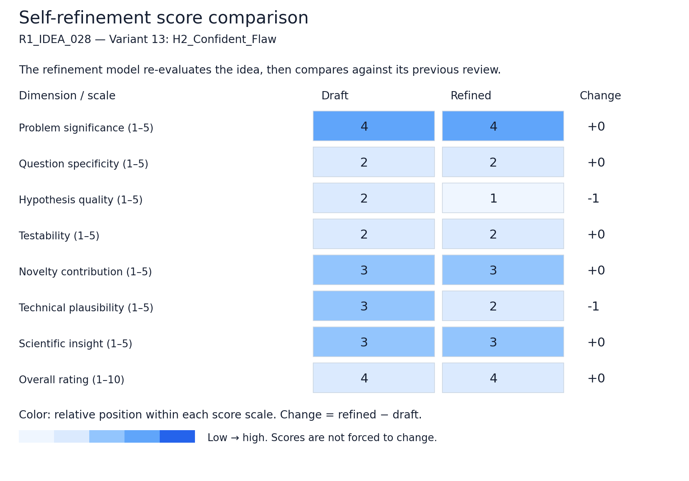

Changed score dimensions: hypothesis_quality, technical_plausibility.

### Score justifications (draft / refined)

**Problem significance**

```json
{
  "draft": {
    "score": 4.0,
    "justification": "The problem is meaningful. Bias in preference aggregation and susceptibility to manipulation are recognized challenges in RLHF and social choice, with implications for fairness and robustness in AI alignment."
  },
  "refined": {
    "score": 4.0,
    "justification": "The problem is highly significant. Bias in preference aggregation and vulnerability to strategic manipulation are critical issues in RLHF and AI alignment, with real implications for fairness, robustness, and the safety of deployed AI systems. This addresses a meaningful gap in current methodology."
  }
}
```

**Question specificity**

```json
{
  "draft": {
    "score": 2.0,
    "justification": "The goal is stated ('align proportionally'), but the specific research question is vague. It does not specify what relationship or effect is being investigated, nor what constitutes a successful outcome beyond 'broader effectiveness'."
  },
  "refined": {
    "score": 2.0,
    "justification": "The idea states a general goal ('align proportionally') but lacks a specific research question. It doesn't specify what relationship between proportional alignment and outcomes is being investigated, what constitutes success beyond 'broader effectiveness,' or what boundary conditions might exist."
  }
}
```

**Hypothesis quality**

```json
{
  "draft": {
    "score": 2.0,
    "justification": "There is an implicit hypothesis that proportional alignment will lead to broader effectiveness and address biases. However, it is not formulated as a concrete, falsifiable prediction. The claim that improvements can be 'confidently treated as causal evidence' without isolating confounds is a methodological weakness in the hypothesis framing."
  },
  "refined": {
    "score": 1.0,
    "justification": "There is no clear hypothesis, only an assertion that solving the limitation will 'necessarily produce reliable improvements.' The claim that gains can be 'confidently treated as causal evidence' without isolating confounds demonstrates poor hypothesis framing. A proper hypothesis would make a concrete, falsifiable prediction about the relationship between proportional alignment and specific outcomes."
  }
}
```

**Testability**

```json
{
  "draft": {
    "score": 2.0,
    "justification": "The idea as presented lacks a clear path to testing. No evaluation metrics, baselines, or experimental setups are suggested. The claim of 'causal evidence' without controlled experimentation further undermines testability."
  },
  "refined": {
    "score": 2.0,
    "justification": "The idea as presented offers no clear path to testing. No evaluation metrics, baselines, experimental setups, or data requirements are mentioned. The strong causal claim actually undermines testability by suggesting that careful experimental design to isolate variables is unnecessary."
  }
}
```

**Novelty contribution**

```json
{
  "draft": {
    "score": 3.0,
    "justification": "The core notion of proportional alignment in preference learning has connections to fair aggregation and representation in social choice. The novelty hinges on the unspecified 'novel framework'. If it offers a genuinely new mechanism, it could be moderate; if it simply applies known concepts, it would be lower."
  },
  "refined": {
    "score": 3.0,
    "justification": "The core concept of proportional alignment in preference learning connects to established work in fair aggregation, social choice theory, and representation. The novelty depends entirely on the unspecified 'novel framework.' If it offers a genuinely new algorithmic approach, it could be moderate; if it simply applies known concepts from voting theory to preference learning, it would be incremental."
  }
}
```

**Technical plausibility**

```json
{
  "draft": {
    "score": 3.0,
    "justification": "The general direction is plausible—designing aggregation methods that respect population proportions is a known technical goal. However, without any technical details, it's impossible to assess the coherence of the proposed solution. The strong causal claim is technically questionable without careful design."
  },
  "refined": {
    "score": 2.0,
    "justification": "The general direction of designing fair aggregation methods is plausible, but the complete lack of technical details makes assessment difficult. The strong causal claim is technically questionable without randomized controlled experiments or careful causal inference methods. The reasoning contains logical leaps that reduce coherence."
  }
}
```

**Scientific insight**

```json
{
  "draft": {
    "score": 3.0,
    "justification": "If successful, the research could provide insight into how aggregation mechanisms affect policy fairness and robustness. However, the potential insight is limited by the vague description. A well-executed study could reveal trade-offs between proportionality, efficiency, and incentive compatibility."
  },
  "refined": {
    "score": 3.0,
    "justification": "If properly investigated, this research could provide insight into trade-offs between different aggregation principles (proportionality vs. majority rule), how aggregation mechanisms affect policy fairness, and robustness to strategic behavior. However, the vague description limits the potential insight. A well-designed study could reveal important boundary conditions and practical limitations."
  }
}
```

**Overall rating**

```json
{
  "draft": {
    "score": 4.0,
    "justification": "The idea identifies a significant problem but is underdeveloped as a research proposal. It lacks a specific research question, testable hypothesis, methodological direction, and evaluation plan. The overly strong causal claim is a red flag. It currently reads more as a motivation than a research idea. With substantial refinement, it could become a strong idea."
  },
  "refined": {
    "score": 4.0,
    "justification": "The idea identifies a significant problem but is severely underdeveloped as a research proposal. It lacks a specific research question, testable hypothesis, methodological direction, and evaluation plan. The overly strong causal claims are methodologically problematic. Currently, it reads more as a motivation statement than a research idea. With substantial refinement—particularly formulating a concrete hypothesis and experimental design—it could become a strong research direction."
  }
}
```

## R1_IDEA_028 — Variant 14: H3_Verbose_Enriched

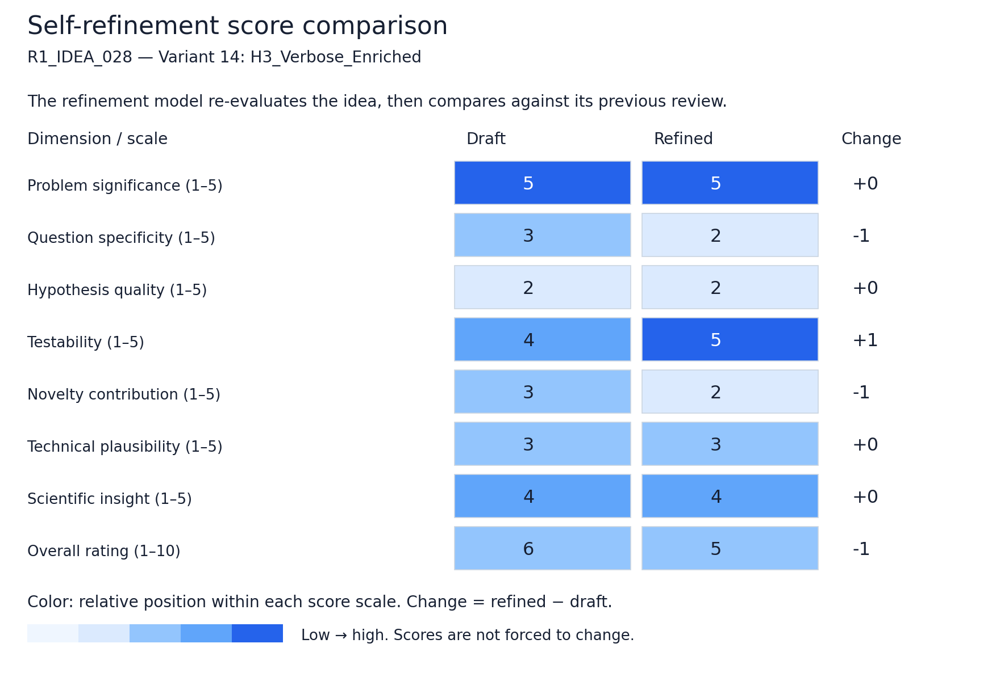

Changed score dimensions: question_specificity, testability, novelty_contribution, overall_rating.

### Score justifications (draft / refined)

**Problem significance**

```json
{
  "draft": {
    "score": 5.0,
    "justification": "The problem is highly significant: bias in preference aggregation is a critical issue in alignment, fairness, and democratic decision-making. Conventional methods that amplify majority opinions can marginalize minority groups and are vulnerable to manipulation, making this a timely and important research direction."
  },
  "refined": {
    "score": 5.0,
    "justification": "The problem is exceptionally significant. Bias in preference aggregation is a core challenge in AI alignment, algorithmic fairness, and collective decision-making systems. Methods that inadvertently amplify majority opinions can marginalize minority viewpoints, exacerbate societal biases, and create vulnerabilities to manipulation. Research aimed at principled, proportional aggregation is both timely and of high potential impact."
  }
}
```

**Question specificity**

```json
{
  "draft": {
    "score": 3.0,
    "justification": "The idea identifies a general goal (proportional alignment) and suggests validation methods, but the core research question is not sharply defined. It lacks a precise comparative question (e.g., 'Does method X outperform method Y under condition Z?')."
  },
  "refined": {
    "score": 2.0,
    "justification": "The idea specifies a goal ('develop a framework capable of aligning proportionally') and a validation plan, but it does not articulate a specific research question. A strong research question would pose a comparative, causal, or mechanistic inquiry (e.g., 'Does method X achieve better proportional alignment than method Y under condition Z, and why?'). The current description is more of a project objective than a research question."
  }
}
```

**Hypothesis quality**

```json
{
  "draft": {
    "score": 2.0,
    "justification": "There is no explicit or clearly implicit hypothesis. The idea states a goal ('capable of aligning proportionally') and proposes to test it, but does not make a concrete, falsifiable prediction about outcomes or mechanisms. It is more of an engineering objective than a scientific hypothesis."
  },
  "refined": {
    "score": 2.0,
    "justification": "There is no explicit or clearly implicit scientific hypothesis. The statement 'capable of aligning aggregate opinions and policies proportionally' is a design target, not a falsifiable prediction about relationships or outcomes. A hypothesis would make a testable claim about the performance, behavior, or consequences of the proposed approach relative to alternatives or under specific conditions."
  }
}
```

**Testability**

```json
{
  "draft": {
    "score": 4.0,
    "justification": "The idea suggests a clear validation path (simulation with known distributions) and a detailed staged experimental design with ablations and sensitivity analyses. This makes the overall approach highly testable, even though the central claim itself is not framed as a hypothesis."
  },
  "refined": {
    "score": 5.0,
    "justification": "The idea excels in outlining a testable validation strategy. It explicitly proposes simulation with known distributions, a staged experimental design with pre-specified conditions and criteria, comparisons across cases, ablations, and sensitivity analyses. This detailed methodological roadmap makes the overall research direction highly testable, even in the absence of a formal hypothesis."
  }
}
```

**Novelty contribution**

```json
{
  "draft": {
    "score": 3.0,
    "justification": "The novelty is uncertain without details of the proposed framework. The problem of bias in preference aggregation is known, and methods for fair aggregation exist. The potential contribution hinges on whether the proposed framework offers a genuinely new mechanism or insight beyond existing reweighting or constrained optimization approaches."
  },
  "refined": {
    "score": 2.0,
    "justification": "Novelty cannot be assessed because the proposed 'novel framework' is not described. The problem of biased preference aggregation is well-known, and numerous approaches for weighted or fair aggregation exist. The potential contribution is entirely contingent on the unspecified technical innovation. Without that detail, the idea risks being a re-statement of a known problem with a generic solution goal."
  }
}
```

**Technical plausibility**

```json
{
  "draft": {
    "score": 3.0,
    "justification": "The idea is logically coherent, but technical plausibility cannot be fully assessed because the framework is not described. The reliance on accurate population distribution estimates is noted as a boundary condition, which is reasonable, but without the core mechanism, it's unclear if proportional alignment is achievable as described."
  },
  "refined": {
    "score": 3.0,
    "justification": "The logical reasoning is coherent: if you know the true population distribution, you could theoretically aim to align outputs with it. The identified boundary condition (reliance on accurate distribution estimates) is reasonable. However, technical plausibility of the core proposal is unassailable because no mechanism is proposed. The score reflects that the surrounding methodological plan is sensible, but the central technical claim is an empty variable."
  }
}
```

**Scientific insight**

```json
{
  "draft": {
    "score": 4.0,
    "justification": "The proposed experimental design (ablations, sensitivity analyses, error analysis) is geared toward uncovering when and why the method works, which could yield valuable insights into the assumptions and boundary conditions of fair preference aggregation. This focus on understanding mechanisms and failure modes elevates the potential scientific insight beyond mere performance comparison."
  },
  "refined": {
    "score": 4.0,
    "justification": "The proposed research design is deliberately crafted to generate scientific insight. By focusing on ablations, sensitivity to noisy/sparse inputs, and error analysis of failures, the investigation is positioned to reveal not just if a method works, but the assumptions, data regimes, and domain constraints that determine its utility. This focus on understanding 'when and why' is a key strength that promises transferable knowledge about the limits of proportional alignment approaches."
  }
}
```

**Overall rating**

```json
{
  "draft": {
    "score": 6.0,
    "justification": "This is a moderate/borderline research idea. It addresses a significant problem and proposes a thoughtful validation plan that could yield scientific insight. However, it lacks a specific research question and testable hypothesis, and the core technical contribution is undefined, limiting its novelty and clarity. With refinement—especially articulating a concrete hypothesis and sketching the technical approach—it could become a strong idea."
  },
  "refined": {
    "score": 5.0,
    "justification": "This is a moderate/borderline research idea. It identifies a very significant problem and proposes an exceptionally thorough and insightful methodological plan for validation, which raises its potential. However, it critically lacks a defined research question, a testable hypothesis, and any description of the proposed technical contribution. These omissions severely limit its specificity, novelty, and clarity as a standalone research idea. It is currently a strong validation plan in search of a specific hypothesis and method to validate."
  }
}
```

## R1_IDEA_028 — Variant 15: H4_Ultimate_Hype


Changed score dimensions: none.

### Score justifications (draft / refined)

**Problem significance**

```json
{
  "draft": {
    "score": 4.0,
    "justification": "The problem is meaningful: bias in preference aggregation is a recognized issue in RLHF and social choice, with implications for fairness, robustness, and alignment. The motivation is well-articulated and relevant to current ML research."
  },
  "refined": {
    "score": 4.0,
    "justification": "The problem is highly meaningful and timely. Bias in preference aggregation is a recognized issue in RLHF and alignment research, with direct implications for fairness, robustness, and trustworthy AI. The motivation connects to important societal concerns about representation in AI systems."
  }
}
```

**Question specificity**

```json
{
  "draft": {
    "score": 2.0,
    "justification": "The idea states a high-level goal ('align aggregate opinions and policies proportionally') but does not define a concrete research question. It lacks specification of the setting, the aggregation mechanism, or what 'proportional' entails."
  },
  "refined": {
    "score": 2.0,
    "justification": "The idea states a high-level goal but lacks a concrete research question. It doesn't specify the setting, aggregation mechanism, or what 'proportional' entails technically. The description remains at the agenda level without defining what would actually be investigated."
  }
}
```

**Hypothesis quality**

```json
{
  "draft": {
    "score": 2.0,
    "justification": "There is no explicit or clearly implicit hypothesis. The claim that proportional alignment will address bias and manipulation is an assertion, not a testable prediction. No mechanism or relationship is proposed that could be validated or falsified."
  },
  "refined": {
    "score": 2.0,
    "justification": "There is no explicit or clearly implicit hypothesis. The claim that proportional alignment will address bias and manipulation is an assertion, not a testable prediction. No mechanism, relationship, or conditional statement is proposed that could be validated or falsified through investigation."
  }
}
```

**Testability**

```json
{
  "draft": {
    "score": 2.0,
    "justification": "Without a concrete problem formulation, it is unclear how one would test whether the framework works. The idea does not suggest experiments, comparisons, or evaluations. It is presented as a 'transformative agenda' rather than an investigable proposition."
  },
  "refined": {
    "score": 2.0,
    "justification": "Without concrete problem formulation, it's unclear how one would test whether the framework works. The idea doesn't suggest experiments, comparisons, evaluations, or any method of obtaining evidence. It's presented as a 'transformative agenda' rather than an investigable proposition."
  }
}
```

**Novelty contribution**

```json
{
  "draft": {
    "score": 3.0,
    "justification": "The high-level idea of proportional representation in preference learning is not entirely new—it connects to fairness in aggregation, democratic algorithms, and distributional robustness. The contribution is potentially incremental unless a genuinely new technical framework is introduced, which is not specified."
  },
  "refined": {
    "score": 3.0,
    "justification": "The high-level concept of proportional representation in preference learning connects to existing work in fairness-aware aggregation, democratic algorithms, and distributional robustness. Without specifying a novel technical framework, the contribution appears potentially incremental. The claimed 'bold and transformative' nature isn't substantiated by the description."
  }
}
```

**Technical plausibility**

```json
{
  "draft": {
    "score": 3.0,
    "justification": "The direction is logically coherent—addressing bias via proportional representation is plausible. However, without technical details, it's impossible to assess feasibility. Important assumptions (e.g., knowledge of preference distribution) are not addressed."
  },
  "refined": {
    "score": 3.0,
    "justification": "The direction is logically coherent—addressing bias via proportional representation is conceptually plausible. However, without technical details, feasibility assessment is limited. Important assumptions (knowledge of preference distributions, computational tractability) are unaddressed, leaving the plausibility at a moderate level."
  }
}
```

**Scientific insight**

```json
{
  "draft": {
    "score": 3.0,
    "justification": "If successfully developed, the framework could offer insights into trade-offs between majority efficiency and minority representation, robustness to strategic reporting, and the limits of preference aggregation. However, the idea as stated is too vague to guarantee such insights."
  },
  "refined": {
    "score": 3.0,
    "justification": "If successfully developed, such a framework could offer insights into trade-offs between majority efficiency and minority representation, robustness to strategic behavior, and limits of preference aggregation. However, the idea as stated is too vague to guarantee these insights would emerge. The potential exists but isn't clearly articulated."
  }
}
```

**Overall rating**

```json
{
  "draft": {
    "score": 4.0,
    "justification": "The idea identifies a significant problem but is presented as a broad agenda rather than a specific research question. It lacks testability, a clear hypothesis, and methodological direction. While the motivation is strong, the research idea itself is underdeveloped and too vague to score higher. It falls in the weak-to-moderate range as a research idea because it does not yet define what would be investigated."
  },
  "refined": {
    "score": 4.0,
    "justification": "The idea identifies a significant problem with strong motivation, but it's presented as a broad agenda rather than a specific research question. It lacks testability, a clear hypothesis, and methodological direction. While the problem significance is high, the research idea itself is underdeveloped and too vague to score higher. It falls in the weak-to-moderate range as it doesn't yet define what would be investigated."
  }
}
```

## R1_IDEA_029 — Source

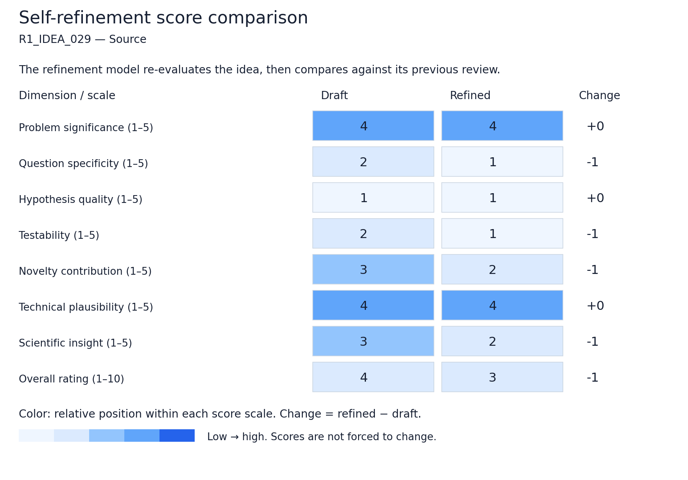

Changed score dimensions: question_specificity, testability, novelty_contribution, scientific_insight, overall_rating.

### Score justifications (draft / refined)

**Problem significance**

```json
{
  "draft": {
    "score": 4.0,
    "justification": "The problem is meaningful. Reasoning segmentation is an active area, and effectively combining the high-level reasoning of MLLMs with the low-level refinement capabilities of SAM is a recognized challenge. Improving this integration could lead to more accurate and robust segmentation systems."
  },
  "refined": {
    "score": 4.0,
    "justification": "The underlying problem is meaningful. Reasoning segmentation is an important and active challenge in computer vision. Effectively combining the high-level semantic reasoning of MLLMs with the low-level, iterative refinement power of SAM is a recognized and valuable goal for building more robust and accurate vision systems."
  }
}
```

**Question specificity**

```json
{
  "draft": {
    "score": 2.0,
    "justification": "The idea identifies a general shortcoming ('fall short in exploiting SAM's strengths') but does not define a specific research question. It lacks a clear 'what will we investigate?' component."
  },
  "refined": {
    "score": 1.0,
    "justification": "The idea is critically incomplete and lacks any defined research question. It identifies a general shortcoming ('fall short in exploiting SAM's strengths') but stops before stating what will be done. There is no 'what will we investigate?' component."
  }
}
```

**Hypothesis quality**

```json
{
  "draft": {
    "score": 1.0,
    "justification": "There is no explicit or clearly implicit hypothesis. The text describes a current limitation and a desired capability ('support iterative mask refinement'), but it does not make a testable prediction about an outcome, relationship, or mechanism."
  },
  "refined": {
    "score": 1.0,
    "justification": "There is no hypothesis—explicit or implicit. The text describes a current limitation and a desired capability ('support iterative mask refinement'), but it makes no testable prediction about an outcome, relationship, or causal mechanism. The summary is purely descriptive."
  }
}
```

**Testability**

```json
{
  "draft": {
    "score": 2.0,
    "justification": "The idea, as stated, is not directly testable. It suggests a direction ('exploiting SAM's strengths') but proposes no experiment, comparison, or evaluation method. A testable version would need to define a system and a metric for comparison."
  },
  "refined": {
    "score": 1.0,
    "justification": "The idea, as presented, is not testable. It suggests a general direction but proposes no experiment, comparison, evaluation method, or even a complete thought. A testable version would require a defined system, a baseline for comparison, and measurable outcomes."
  }
}
```

**Novelty contribution**

```json
{
  "draft": {
    "score": 3.0,
    "justification": "The observation that SAM's interactive refinement is underused in MLLM pipelines is a reasonable insight. However, the idea lacks a novel methodological proposal. Its potential contribution is currently limited to highlighting this gap rather than proposing how to address it in a new way."
  },
  "refined": {
    "score": 2.0,
    "justification": "The observation that SAM's interactive refinement is underused in MLLM pipelines is a reasonable insight, but the idea summary does not propose any novel method to address it. Its potential contribution is currently limited to highlighting a gap, which in itself has low novelty. The incomplete sentence prevents assessment of any proposed novel contribution."
  }
}
```

**Technical plausibility**

```json
{
  "draft": {
    "score": 4.0,
    "justification": "The core reasoning is logically sound. MLLMs do provide high-level reasoning, SAM does have interactive refinement capabilities, and combining them more deeply is a plausible next step. No technically incoherent claims are made."
  },
  "refined": {
    "score": 4.0,
    "justification": "The foundational reasoning is logically coherent and plausible. MLLMs excel at semantic reasoning, SAM excels at interactive pixel-level segmentation, and seeking a tighter integration between them is a sensible technical direction. No technically incoherent claims are made in the provided fragment."
  }
}
```

**Scientific insight**

```json
{
  "draft": {
    "score": 3.0,
    "justification": "If developed into a full study, this direction has the potential to yield insights into how high-level language reasoning and low-level visual feedback can be integrated in an iterative process. However, the idea summary itself does not articulate what specific insights are sought (e.g., understanding the failure modes of single-pass reasoning, or the dynamics of a vision-language refinement loop)."
  },
  "refined": {
    "score": 2.0,
    "justification": "The idea hints at a potentially insightful direction: studying the integration of high-level reasoning with low-level visual feedback loops. However, the summary itself does not articulate what specific scientific insights are sought (e.g., understanding the dynamics of iterative vision-language correction, or identifying failure modes of non-iterative systems). The potential is latent but unrealized in the text."
  }
}
```

**Overall rating**

```json
{
  "draft": {
    "score": 4.0,
    "justification": "This is a weak research idea in its current form. It identifies a relevant and plausible problem in an active research area, which is a strength. However, it fails to articulate a specific research question, hypothesis, or testable direction. It reads more as an introductory motivation paragraph than a research idea. The potential is there, but the idea is too underdeveloped to score higher."
  },
  "refined": {
    "score": 3.0,
    "justification": "This is a very weak research idea in its presented form, primarily because it is incomplete. It identifies a relevant and plausible problem, which is its sole strength. However, it fails to articulate any research question, hypothesis, or testable direction—it literally cuts off. It reads as the beginning of a motivation paragraph, not a research idea. The score reflects the severe lack of definition, despite the promising problem context."
  }
}
```

## R1_IDEA_029 — Variant 1: A1_Identity


Changed score dimensions: none.

### Score justifications (draft / refined)

**Problem significance**

```json
{
  "draft": {
    "score": 4.0,
    "justification": "Reasoning segmentation is an active and meaningful problem in computer vision. Improving MLLM+SAM integration is relevant, and leveraging interactive refinement aligns with real-world use cases where segmentation is iterative."
  },
  "refined": {
    "score": 4.0,
    "justification": "Reasoning segmentation is a meaningful problem in computer vision, and improving MLLM+SAM integration is relevant. Leveraging SAM's interactive capabilities aligns with real-world use cases where segmentation is iterative, addressing a plausible limitation in current approaches."
  }
}
```

**Question specificity**

```json
{
  "draft": {
    "score": 1.0,
    "justification": "No research question is defined. The idea only states that current paradigms 'fall short' and should 'exploit SAM's strengths more,' without specifying what aspect will be studied."
  },
  "refined": {
    "score": 1.0,
    "justification": "No research question is defined. The idea merely states that current paradigms 'fall short' and should 'exploit SAM's strengths more,' without specifying what will be investigated. It ends abruptly ('To.'), leaving the proposal incomplete."
  }
}
```

**Hypothesis quality**

```json
{
  "draft": {
    "score": 1.0,
    "justification": "There is no explicit or implicit hypothesis. The idea suggests a direction ('to exploit SAM's strengths') but makes no testable prediction about outcomes, mechanisms, or relationships."
  },
  "refined": {
    "score": 1.0,
    "justification": "There is no hypothesis—explicit or implicit. The idea suggests a general direction but makes no testable prediction about outcomes, mechanisms, or relationships. It does not even complete a sentence proposing what to do."
  }
}
```

**Testability**

```json
{
  "draft": {
    "score": 1.0,
    "justification": "Without a concrete question or hypothesis, it is unclear what would be tested. The idea does not propose an experiment, evaluation, or comparison."
  },
  "refined": {
    "score": 1.0,
    "justification": "Without a concrete question or hypothesis, nothing can be tested. The idea does not propose an experiment, comparison, evaluation, or analysis. It is purely a problem statement with an unfinished suggestion."
  }
}
```

**Novelty contribution**

```json
{
  "draft": {
    "score": 2.0,
    "justification": "The general notion of using interactive refinement with SAM is not new. The idea lacks specificity about what novel contribution is intended—whether it's a new method, insight, or systematic analysis."
  },
  "refined": {
    "score": 2.0,
    "justification": "The notion of using SAM's interactive refinement with MLLMs is not inherently novel. The idea lacks specificity about what novel contribution is intended—whether it's a new method, a systematic analysis, or an insight. As stated, it suggests a generic direction rather than a novel research angle."
  }
}
```

**Technical plausibility**

```json
{
  "draft": {
    "score": 3.0,
    "justification": "The direction is logically coherent (combining MLLM reasoning with SAM's interactive refinement), but without details, it's impossible to assess feasibility. The assumption that current paradigms underuse interaction is reasonable."
  },
  "refined": {
    "score": 3.0,
    "justification": "The general direction is logically coherent: combining MLLM reasoning with SAM's interactive refinement could be plausible. However, with no details, feasibility cannot be assessed. The assumption that current paradigms underuse interaction is reasonable but unsupported."
  }
}
```

**Scientific insight**

```json
{
  "draft": {
    "score": 2.0,
    "justification": "If developed, it could reveal how iterative refinement improves reasoning segmentation, but as stated, the idea is too vague to promise deeper insight into mechanisms, limitations, or principles."
  },
  "refined": {
    "score": 2.0,
    "justification": "If developed, it could potentially reveal how iterative refinement interacts with high-level reasoning, but as stated, the idea is too vague to promise deeper insight into mechanisms, limitations, or general principles. It reads as an application suggestion rather than an insight-driven investigation."
  }
}
```

**Overall rating**

```json
{
  "draft": {
    "score": 3.0,
    "justification": "The idea identifies a relevant problem but fails to define a research question, hypothesis, or testable direction. It reads more as a motivation paragraph than a research idea. Without specificity, its scientific contribution and testability are very weak."
  },
  "refined": {
    "score": 3.0,
    "justification": "The idea identifies a relevant problem but fails to define a research question, hypothesis, or testable direction. It is incomplete and reads as a motivation statement rather than a research idea. Without specificity, its scientific contribution and testability are very weak, though the problem itself is meaningful."
  }
}
```

## R1_IDEA_029 — Variant 2: A2_Paraphrase_Only


Changed score dimensions: none.

### Score justifications (draft / refined)

**Problem significance**

```json
{
  "draft": {
    "score": 3.0,
    "justification": "The problem of improving reasoning segmentation is meaningful in computer vision, and identifying underutilized capabilities in established models could lead to better systems. However, the significance is moderate because the idea doesn't clearly articulate why better leveraging SAM's interactive capabilities would substantially advance the field beyond incremental improvement."
  },
  "refined": {
    "score": 3.0,
    "justification": "The problem of improving automated visual reasoning segmentation is meaningful in computer vision and human-AI interaction. The observation about underutilizing a core model capability (SAM's interactivity) points to a plausible inefficiency. However, the significance is moderate because the idea does not articulate why solving this specific integration gap is critical or what major bottleneck it addresses beyond a general notion of 'improvement'."
  }
}
```

**Question specificity**

```json
{
  "draft": {
    "score": 2.0,
    "justification": "The idea identifies a general observation about underutilization but doesn't define a specific research question. It states that existing approaches 'do not fully leverage SAM's advantages' without specifying what aspect should be investigated or how."
  },
  "refined": {
    "score": 2.0,
    "justification": "The idea is not framed as a research question. It is a broad observation: 'existing approaches... do not fully leverage SAM's advantages.' It lacks specificity about which advantage (iterative refinement), how it's currently underused, and what precise aspect of the integration merits investigation. The direction is implied but not defined."
  }
}
```

**Hypothesis quality**

```json
{
  "draft": {
    "score": 1.0,
    "justification": "No hypothesis is presented. The text makes an observation about current limitations but doesn't propose a testable prediction about what would happen if those limitations were addressed."
  },
  "refined": {
    "score": 1.0,
    "justification": "There is no hypothesis. The text contains only a descriptive claim about the current state of research ('do not fully leverage'). It makes no prediction, causal statement, or proposed relationship that could be supported or contradicted by evidence. A hypothesis would need to propose what happens *if* the capabilities were better leveraged."
  }
}
```

**Testability**

```json
{
  "draft": {
    "score": 2.0,
    "justification": "The idea as presented is not directly testable because it doesn't propose what to test or how. While one could design experiments around better utilizing SAM's capabilities, the idea itself doesn't suggest any specific evaluation or comparison."
  },
  "refined": {
    "score": 2.0,
    "justification": "The idea as stated is not directly testable. It identifies a perceived limitation but proposes no experiment, comparison, or analysis to investigate it. One could *derive* testable ideas from it (e.g., build a system with iterative refinement and compare it to a baseline), but the idea itself does not suggest any such test."
  }
}
```

**Novelty contribution**

```json
{
  "draft": {
    "score": 2.0,
    "justification": "The observation that SAM's interactive capabilities could be better leveraged is not particularly novel - this is a natural consideration when combining models with complementary strengths. The idea doesn't propose a novel method, mechanism, or insight beyond this general observation."
  },
  "refined": {
    "score": 2.0,
    "justification": "The observation that two powerful models could be better integrated is not novel in itself; it's a common theme in ML research. The idea does not propose a novel method, a new architectural insight, or a previously unexplored phenomenon. The potential contribution remains at the level of a generic suggestion for improvement without a distinctive angle."
  }
}
```

**Technical plausibility**

```json
{
  "draft": {
    "score": 4.0,
    "justification": "The reasoning is logically coherent: MLLMs provide reasoning, SAM provides segmentation, and better integration could improve results. The assumption that combining their strengths more effectively would be beneficial is reasonable, though the specific mechanism for doing so is not described."
  },
  "refined": {
    "score": 4.0,
    "justification": "The foundational logic is coherent and plausible. MLLMs excel at semantic reasoning and SAM at spatial segmentation, so better combining them is a sensible goal. The notion of using SAM's interactive mode iteratively, guided by an MLLM, is technically feasible based on the documented capabilities of both models. No unreasonable assumptions are made."
  }
}
```

**Scientific insight**

```json
{
  "draft": {
    "score": 2.0,
    "justification": "The idea as presented has limited potential for scientific insight. It suggests a general direction for improvement but doesn't articulate what we might learn about model integration, segmentation mechanisms, or reasoning processes. A more developed version could yield insights about human-like iterative refinement in automated systems."
  },
  "refined": {
    "score": 2.0,
    "justification": "The idea has low potential for scientific insight in its current form. It suggests an engineering integration goal without specifying what fundamental principle, limitation, or mechanism would be revealed through the research. A more developed version could yield insights into the value of iterative refinement in vision-language models or the nature of human-like correction loops in AI, but this is not articulated."
  }
}
```

**Overall rating**

```json
{
  "draft": {
    "score": 3.0,
    "justification": "This is a weak research idea that identifies a general observation but lacks the specificity, hypothesis, and testable direction needed for meaningful research. While it points to a potentially interesting area (better integration of MLLMs and SAM), it doesn't define what should be investigated, how, or why it matters scientifically. The idea is more of a motivation statement than a research proposal."
  },
  "refined": {
    "score": 3.0,
    "justification": "This is a weak research idea. It correctly identifies an active research area and a plausible limitation but fails to advance beyond a general observation. It lacks the core components of a research idea: a specific question, a testable hypothesis, and a suggested direction for investigation. It serves as a background motivation but does not define a research pathway. Its main value is in pointing to a potentially fruitful area for someone else to formulate a concrete project."
  }
}
```

## R1_IDEA_029 — Variant 3: A3_Plain_Core

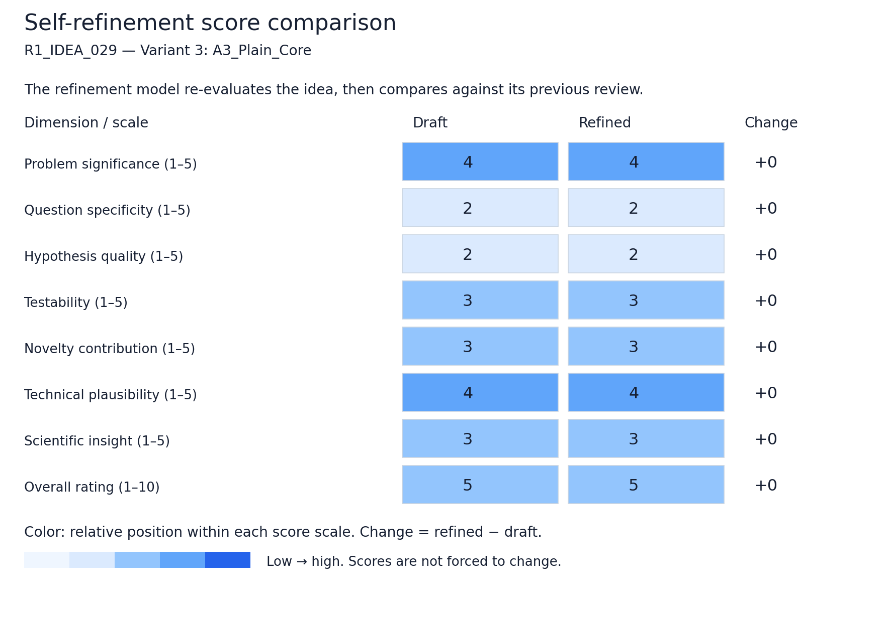

Changed score dimensions: none.

### Score justifications (draft / refined)

**Problem significance**

```json
{
  "draft": {
    "score": 4.0,
    "justification": "Reasoning segmentation is an important problem at the intersection of vision and language understanding. Combining MLLMs with SAM is a current research direction, and identifying underutilized capabilities has potential significance. However, the idea doesn't fully articulate why better using interactive features is critically important versus other possible improvements."
  },
  "refined": {
    "score": 4.0,
    "justification": "Reasoning segmentation is a meaningful challenge in multimodal AI, combining language understanding with precise pixel-level segmentation. Identifying underutilized capabilities in widely used models like SAM is relevant. However, the idea does not strongly argue why leveraging interactive features is critically important compared to other possible improvements."
  }
}
```

**Question specificity**

```json
{
  "draft": {
    "score": 2.0,
    "justification": "The idea identifies a general area for improvement ('do not adequately use SAM's strengths') but does not define a specific research question. It lacks concrete terms about what aspect to investigate, how to measure 'adequate use,' or what relationship to test."
  },
  "refined": {
    "score": 2.0,
    "justification": "The idea identifies a general area for improvement ('do not adequately use SAM's strengths') but does not define a specific research question. It lacks concrete terms about what aspect of interactive segmentation to investigate, how to measure 'adequate use,' or what relationship to test."
  }
}
```

**Hypothesis quality**

```json
{
  "draft": {
    "score": 2.0,
    "justification": "There is an implicit hypothesis that 'better utilizing SAM's interactive features will improve reasoning segmentation,' but this is vague. No concrete prediction about mechanisms, relationships, or expected outcomes is made. The hypothesis is not falsifiable in its current form."
  },
  "refined": {
    "score": 2.0,
    "justification": "There is only an implicit, vague hypothesis that 'better using interactive features will help.' No concrete prediction about mechanisms, outcomes, or measurable effects is made. The statement is not falsifiable in its current form."
  }
}
```

**Testability**

```json
{
  "draft": {
    "score": 3.0,
    "justification": "The general direction is testable in principle - one could design experiments comparing systems with and without interactive features. However, without specifying what 'better utilization' means, it's unclear what exactly would be tested. The idea suggests a comparison but doesn't define the experimental setup."
  },
  "refined": {
    "score": 3.0,
    "justification": "The general direction is testable in principle—one could compare systems with and without interactive refinement. However, without specifying what 'better utilization' entails, it is unclear what exactly would be tested. The idea hints at a comparison but does not define the experimental setup or variables."
  }
}
```

**Novelty contribution**

```json
{
  "draft": {
    "score": 3.0,
    "justification": "The observation that interactive features are underutilized is somewhat novel, but the idea doesn't propose a novel method or insight. It primarily suggests applying known interactive capabilities in a new context (MLLM+SAM systems). The potential contribution is moderate unless it leads to new architectural insights or principles."
  },
  "refined": {
    "score": 3.0,
    "justification": "Noting that interactive features are underused is somewhat novel, but the idea does not propose a novel method, architecture, or insight. It suggests applying known interactive capabilities in a new context (MLLM+SAM systems). The potential contribution is moderate unless it leads to new principles for iterative refinement in vision-language models."
  }
}
```

**Technical plausibility**

```json
{
  "draft": {
    "score": 4.0,
    "justification": "The technical premise is plausible. SAM does have interactive segmentation capabilities, and integrating them with MLLMs is technically feasible. The reasoning is logically coherent: if humans use iterative refinement to get better results, automated systems might benefit similarly."
  },
  "refined": {
    "score": 4.0,
    "justification": "The technical premise is plausible. SAM has documented interactive segmentation capabilities, and integrating them with MLLMs is technically feasible. The reasoning is logically coherent: if humans use iterative refinement to improve results, automated systems might benefit similarly."
  }
}
```

**Scientific insight**

```json
{
  "draft": {
    "score": 3.0,
    "justification": "If developed further, this could provide insight into how iterative refinement improves segmentation in vision-language tasks, or how to effectively combine prompt-based segmentation with reasoning. However, as stated, it's more of an engineering improvement suggestion than a scientifically insightful research direction."
  },
  "refined": {
    "score": 3.0,
    "justification": "If developed further, this could yield insight into how iterative refinement improves segmentation in vision-language tasks, or how to effectively combine linguistic reasoning with pixel-level feedback. However, as stated, it is more of an engineering improvement suggestion than a scientifically insightful research direction."
  }
}
```

**Overall rating**

```json
{
  "draft": {
    "score": 5.0,
    "justification": "This is a moderate/borderline research idea. It identifies a potentially meaningful gap in current methods and points to a concrete technical capability (SAM's interactive features) that could be better utilized. However, it lacks a specific research question, testable hypothesis, and clear articulation of what scientific insight would be gained. It reads more like an observation or motivation than a research direction. With more specificity about what to investigate and how, it could become a stronger idea."
  },
  "refined": {
    "score": 5.0,
    "justification": "This is a moderate/borderline research idea. It identifies a potentially meaningful gap in current methods and points to a concrete technical capability that could be better utilized. However, it lacks a specific research question, a testable hypothesis, and a clear articulation of what scientific insight would be gained. It reads more like an observation or motivation than a defined research direction. With greater specificity about what to investigate and how, it could become a stronger idea."
  }
}
```

## R1_IDEA_029 — Variant 4: B1_Verbose_Elaborate

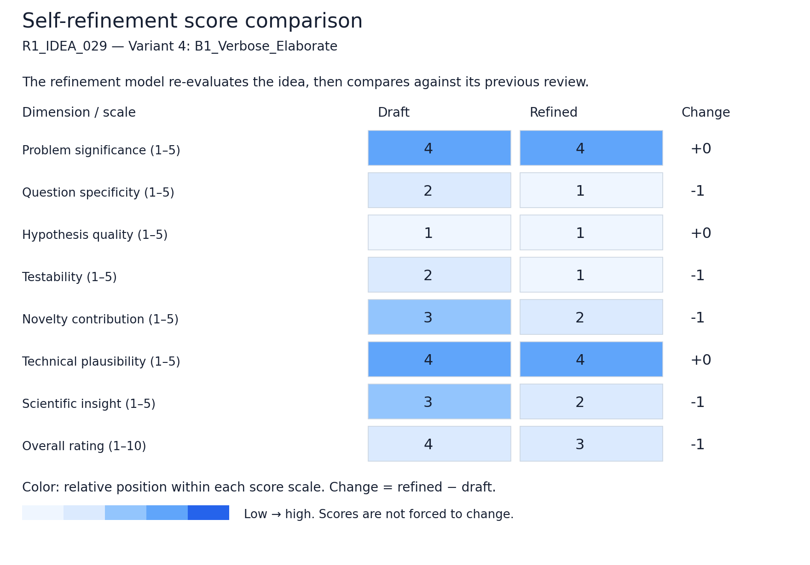

Changed score dimensions: question_specificity, testability, novelty_contribution, scientific_insight, overall_rating.

### Score justifications (draft / refined)

**Problem significance**

```json
{
  "draft": {
    "score": 4.0,
    "justification": "The problem is meaningful: current MLLM+SAM systems often treat SAM as a one-shot segmenter, ignoring its powerful interactive refinement features. Better integration could improve practical usability and segmentation quality, especially in ambiguous or complex scenes."
  },
  "refined": {
    "score": 4.0,
    "justification": "The problem is meaningful and relevant. Current MLLM+SAM systems often use SAM as a one-shot segmenter, neglecting its powerful interactive capabilities. Better integration could enhance practical usability, segmentation quality in ambiguous cases, and human-AI collaboration, which matters for real-world applications."
  }
}
```

**Question specificity**

```json
{
  "draft": {
    "score": 2.0,
    "justification": "The idea identifies a gap but does not define a clear research question. It states that current paradigms 'fall short in exploiting SAM's full strengths,' but does not specify what aspect of exploitation will be studied, or how."
  },
  "refined": {
    "score": 1.0,
    "justification": "The idea lacks a defined research question. It states that paradigms 'fall short in exploiting SAM's full strengths' but does not specify what will be investigated, what relationship will be studied, or what concrete aspect of 'exploitation' is the focus. It is a general observation, not a specific inquiry."
  }
}
```

**Hypothesis quality**

```json
{
  "draft": {
    "score": 1.0,
    "justification": "There is no explicit or implicit hypothesis. The idea is descriptive—it notes a shortcoming—but does not make a testable prediction about what would happen if the shortcoming were addressed."
  },
  "refined": {
    "score": 1.0,
    "justification": "There is no hypothesis—implicit or explicit. The idea describes a current limitation but makes no prediction about what would happen if that limitation were addressed. It does not propose a mechanism, relationship, or testable outcome."
  }
}
```

**Testability**

```json
{
  "draft": {
    "score": 2.0,
    "justification": "The direction is too vague to be directly testable. Without a concrete proposal for how to integrate interactive refinement, it's unclear what experiment would be run. However, the general concept could be made testable with more specifics."
  },
  "refined": {
    "score": 1.0,
    "justification": "The idea is not testable as presented. It suggests a direction ('better exploit') but provides no concrete method to investigate it. Without a proposed experiment, comparison, evaluation, or analysis, there is no clear way to gather evidence for or against the implied claim."
  }
}
```

**Novelty contribution**

```json
{
  "draft": {
    "score": 3.0,
    "justification": "The observation that SAM's interactive features are underused in MLLM pipelines is not entirely novel, but focusing on iterative refinement as a core research angle could lead to novel contributions if developed into a specific method or analysis."
  },
  "refined": {
    "score": 2.0,
    "justification": "The observation that SAM's interactive features are underused in MLLM pipelines is not novel in itself. The potential contribution is low because the idea is merely a suggestion to 'exploit strengths more' without specifying a novel method, analysis, or phenomenon to discover. It could become novel with a specific technical approach."
  }
}
```

**Technical plausibility**

```json
{
  "draft": {
    "score": 4.0,
    "justification": "The reasoning is coherent: MLLMs handle high-level reasoning and language, SAM handles pixel-level segmentation and interactive refinement. Combining them more deeply is technically plausible and aligns with trends in human-AI collaboration."
  },
  "refined": {
    "score": 4.0,
    "justification": "The reasoning is logically coherent: MLLMs handle language and high-level reasoning, SAM handles pixel-level segmentation and interactive refinement. Combining them more deeply is technically plausible and aligns with trends in multimodal systems and human-in-the-loop AI. No technical contradictions are apparent."
  }
}
```

**Scientific insight**

```json
{
  "draft": {
    "score": 3.0,
    "justification": "If developed, this could yield insights into how to effectively couple high-level reasoning models with low-level interactive vision models, and how iterative refinement impacts segmentation performance and human-in-the-loop efficiency. However, as stated, the potential insight is limited by vagueness."
  },
  "refined": {
    "score": 2.0,
    "justification": "As stated, the potential insight is limited. It hints at better coupling reasoning and pixel-level models, but without a specific research question, it's unclear what general principles, mechanisms, or limitations would be revealed. It could offer insight into iterative refinement dynamics or human-AI collaboration if developed concretely."
  }
}
```

**Overall rating**

```json
{
  "draft": {
    "score": 4.0,
    "justification": "The idea identifies a relevant and plausible gap in current research, but it is presented as an observation rather than a research direction with a clear question, hypothesis, or methodological approach. It lacks the specificity and testability needed for a strong research idea. With more concrete formulation, it could become a solid contribution."
  },
  "refined": {
    "score": 3.0,
    "justification": "This is a weak research idea. It identifies a relevant practical gap but fails to define a research question, hypothesis, or testable direction. It is more an observation than a research proposal. While the problem is significant and the technical direction plausible, the lack of specificity, testability, and hypothesis severely limits its scientific merit as a research idea. With concrete formulation, it could become moderate or strong."
  }
}
```

## R1_IDEA_029 — Variant 5: B2_Grand_Narrative


Changed score dimensions: hypothesis_quality, overall_rating.

### Score justifications (draft / refined)

**Problem significance**

```json
{
  "draft": {
    "score": 4.0,
    "justification": "The problem is meaningful: improving integration between high-level reasoning and low-level perception is an important challenge in vision systems. The connection to human-AI collaboration adds relevance. However, the idea doesn't fully articulate why this specific gap (iterative refinement) is particularly significant compared to other integration challenges."
  },
  "refined": {
    "score": 4.0,
    "justification": "The problem is meaningful: improving integration between high-level reasoning (MLLMs) and low-level perception (SAM) is an important challenge in vision systems. The connection to enabling more natural human-AI collaboration adds practical relevance. However, the idea doesn't fully articulate why iterative refinement specifically (vs. other integration aspects) is particularly significant."
  }
}
```

**Question specificity**

```json
{
  "draft": {
    "score": 2.0,
    "justification": "The idea identifies a general area (underutilization of SAM's interactive capabilities) but does not define a concrete research question. It states there is a 'gap that could be relevant' rather than specifying what exactly should be investigated."
  },
  "refined": {
    "score": 2.0,
    "justification": "The idea identifies a general area ('gap' in exploiting SAM's strengths) but does not define a concrete research question. It states there is a 'gap that could be relevant' rather than specifying what exactly should be investigated. No specific relationship, mechanism, or phenomenon is targeted for study."
  }
}
```

**Hypothesis quality**

```json
{
  "draft": {
    "score": 2.0,
    "justification": "There is no explicit or clearly implicit hypothesis. The closest is an implied claim that 'better exploiting SAM's interactive capabilities would improve something,' but this is too vague to be testable. No prediction about mechanisms, outcomes, or relationships is made."
  },
  "refined": {
    "score": 1.0,
    "justification": "There is no hypothesis present, explicit or implicit. The text only observes that current approaches 'fall short' and that this 'could be relevant.' There is no prediction about what would happen if the gap were addressed, no proposed mechanism, and no testable claim."
  }
}
```

**Testability**

```json
{
  "draft": {
    "score": 2.0,
    "justification": "Without a specific question or hypothesis, it's unclear how one would test the idea. The statement 'current paradigms fall short' suggests a comparison could be made, but no evaluation method, baseline, or metric is proposed."
  },
  "refined": {
    "score": 2.0,
    "justification": "Without a specific question or hypothesis, testability is low. The observation that 'current paradigms fall short' suggests a comparison could be made, but no evaluation method, baseline, or metric is proposed. The idea doesn't suggest what evidence would address the identified gap."
  }
}
```

**Novelty contribution**

```json
{
  "draft": {
    "score": 3.0,
    "justification": "Identifying that interactive refinement is underutilized in MLLM+SAM systems is a reasonable observation, but it's primarily pointing out an application gap rather than proposing novel scientific insight. The potential contribution is moderate—it could lead to better systems, but the idea as stated doesn't suggest fundamentally new methods or discoveries."
  },
  "refined": {
    "score": 3.0,
    "justification": "Identifying that interactive refinement is underutilized in MLLM+SAM systems is a reasonable observation, but it's primarily pointing out an application gap rather than proposing novel scientific insight. The potential contribution is moderate—it could lead to better systems, but the idea as stated doesn't suggest fundamentally new methods or discoveries."
  }
}
```

**Technical plausibility**

```json
{
  "draft": {
    "score": 4.0,
    "justification": "The technical premise is plausible: SAM does support interactive refinement, and MLLMs could potentially be prompted or adapted to use this feature. The reasoning about combining reasoning with perception is coherent. No obvious technical flaws are present in the limited description."
  },
  "refined": {
    "score": 4.0,
    "justification": "The technical premise is plausible: SAM does support interactive refinement, and MLLMs could potentially be adapted to use this feature. The reasoning about combining high-level reasoning with low-level perception is coherent. No obvious technical flaws are present in the limited description."
  }
}
```

**Scientific insight**

```json
{
  "draft": {
    "score": 3.0,
    "justification": "If developed further, this could yield insights about how to effectively combine high-level reasoning with iterative low-level perception. However, as stated, the idea primarily suggests an application improvement rather than a study designed to reveal general principles, mechanisms, or boundary conditions."
  },
  "refined": {
    "score": 3.0,
    "justification": "If developed into a proper study, this could yield insights about how to effectively combine reasoning models with interactive perception systems. However, as stated, the idea primarily suggests an application improvement rather than a study designed to reveal general principles, mechanisms, or boundary conditions about model integration."
  }
}
```

**Overall rating**

```json
{
  "draft": {
    "score": 4.0,
    "justification": "This is a weak research idea in its current form. While it identifies a potentially meaningful gap in an active research area, it lacks the core components of a research idea: a specific question, a testable hypothesis, and a proposed direction for investigation. It reads more as a motivation or observation than as a research plan. The connection to human-AI collaboration is mentioned but not developed. With substantial refinement, it could become a stronger idea."
  },
  "refined": {
    "score": 3.0,
    "justification": "This is a weak research idea in its current form. While it identifies a potentially meaningful observation about a technical gap in an active research area, it lacks the core components of a research idea: a specific question, a testable hypothesis, and a proposed direction for investigation. It reads as an observation or motivation rather than a research plan. The connection to human-AI collaboration is mentioned but not developed. With substantial refinement to include a research question and hypothesis, it could become a stronger idea."
  }
}
```

## R1_IDEA_029 — Variant 6: B3_Over_Confident

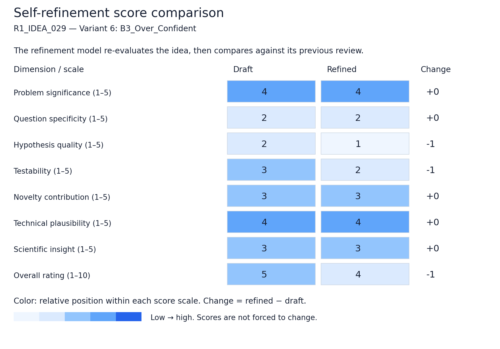

Changed score dimensions: hypothesis_quality, testability, overall_rating.

### Score justifications (draft / refined)

**Problem significance**

```json
{
  "draft": {
    "score": 4.0,
    "justification": "Reasoning segmentation is an important problem at the intersection of vision, language, and reasoning. Current MLLM+SAM integrations are indeed relatively simplistic, and better leveraging SAM's interactive capabilities could meaningfully advance the field. The observation about underutilization of interactive refinement is valid and potentially significant."
  },
  "refined": {
    "score": 4.0,
    "justification": "Reasoning segmentation is an important multimodal challenge. The identified gap—underuse of SAM's interactive refinement—is meaningful because interactive segmentation is a core SAM feature that could address error propagation and ambiguity in complex reasoning tasks. Improving MLLM+SAM synergy has clear relevance to vision-language research."
  }
}
```

**Question specificity**

```json
{
  "draft": {
    "score": 2.0,
    "justification": "The idea identifies a general shortcoming but does not define a specific research question. It states that current paradigms 'fall short in exploiting SAM's strengths' but doesn't specify what aspect of exploitation should be studied. The mention of 'iterative mask refinement' and 'interactive segmentation' provides some direction, but the actual investigation target remains vague."
  },
  "refined": {
    "score": 2.0,
    "justification": "The idea identifies a general shortcoming ('fall short in exploiting SAM's strengths') but does not define a specific research question. It mentions 'iterative mask refinement' and 'interactive segmentation' but does not specify what about these capabilities should be studied, how they should be integrated, or what outcome is sought."
  }
}
```

**Hypothesis quality**

```json
{
  "draft": {
    "score": 2.0,
    "justification": "There is no explicit or clearly implicit hypothesis. The idea suggests that better utilization of SAM's interactive capabilities could improve reasoning segmentation, but this is more of an observation than a testable prediction. A hypothesis would need to specify a mechanism (e.g., 'iterative refinement based on reasoning feedback reduces error propagation') or a measurable outcome difference."
  },
  "refined": {
    "score": 1.0,
    "justification": "There is no hypothesis—only an observation that current approaches underutilize a feature. No prediction, causal mechanism, or testable relationship is proposed. The implicit suggestion that 'using interactive refinement could help' is too vague to qualify as a hypothesis."
  }
}
```

**Testability**

```json
{
  "draft": {
    "score": 3.0,
    "justification": "The general direction is testable in principle—one could design systems with different levels of interactive refinement and compare them. However, without a specific hypothesis or experimental design, it's unclear what exactly would be tested. The idea lacks details about what evidence would support or contradict the claim that better utilization of interactive refinement improves outcomes."
  },
  "refined": {
    "score": 2.0,
    "justification": "The idea is testable in principle, but no test is suggested. Without a specific claim or experimental design, it's unclear what would constitute evidence. One could design various refinement pipelines, but the idea itself provides no guidance on what to vary or measure."
  }
}
```

**Novelty contribution**

```json
{
  "draft": {
    "score": 3.0,
    "justification": "The observation that MLLM+SAM integrations could better use SAM's interactive features is somewhat novel, as most current work focuses on one-shot segmentation. However, the idea itself is more of a suggestion than a novel contribution. The potential contribution would depend heavily on how the interactive refinement is implemented and what insights are gained about the MLLM-SAM interaction."
  },
  "refined": {
    "score": 3.0,
    "justification": "Noting that MLLM+SAM systems overlook SAM's interactive features is somewhat novel, as most research uses SAM in a one-shot manner. However, the idea itself is a suggestion rather than a novel contribution. The potential novelty would depend entirely on how interactive refinement is implemented and what new insights emerge."
  }
}
```

**Technical plausibility**

```json
{
  "draft": {
    "score": 4.0,
    "justification": "The reasoning is logically coherent: MLLMs provide high-level reasoning, SAM provides pixel-level segmentation with interactive refinement capabilities, and combining them more effectively could yield better results. The assumption that interactive refinement could help is reasonable given SAM's design and human segmentation practices. No obvious technical flaws are present in the limited description."
  },
  "refined": {
    "score": 4.0,
    "justification": "The reasoning is coherent: MLLMs provide high-level guidance, SAM provides pixel-level refinement, and better integration could improve results. The assumption that interactive refinement might help is reasonable given SAM's design and human segmentation behavior. No technical contradictions are apparent."
  }
}
```

**Scientific insight**

```json
{
  "draft": {
    "score": 3.0,
    "justification": "If properly investigated, this direction could provide insights into how reasoning systems and segmentation models interact, how iterative refinement affects performance, and potentially reveal limitations of current one-shot approaches. However, as presented, the idea focuses more on improving performance than on generating fundamental scientific insights. The potential for insight exists but is not clearly articulated."
  },
  "refined": {
    "score": 3.0,
    "justification": "If pursued, this could yield insights into how reasoning and segmentation interact iteratively, how error correction propagates in multimodal systems, and the limits of one-shot segmentation. However, the idea as stated focuses on improving performance rather than generating fundamental understanding. The insight potential is moderate but unrealized."
  }
}
```

**Overall rating**

```json
{
  "draft": {
    "score": 5.0,
    "justification": "This is a moderate/borderline research idea. It identifies a meaningful problem (underutilization of SAM's interactive capabilities in MLLM+SAM systems) and points to a plausible direction (iterative refinement). However, it lacks a specific research question, testable hypothesis, and methodological direction. The idea is more of an observation than a well-defined research proposal. With refinement to specify what exactly should be investigated and how, it could become a strong research direction."
  },
  "refined": {
    "score": 4.0,
    "justification": "This is a weak research idea. It identifies a plausible technical gap and points toward a reasonable direction (iterative refinement), but it lacks a research question, hypothesis, and methodological direction. It is essentially an observation with no proposed investigation. It would require substantial specification to become a viable research direction."
  }
}
```

## R1_IDEA_029 — Variant 7: B4_Novelty


Changed score dimensions: none.

### Score justifications (draft / refined)

**Problem significance**

```json
{
  "draft": {
    "score": 4.0,
    "justification": "Reasoning segmentation is an active and meaningful problem in computer vision. Improving how models refine segmentation masks—especially by leveraging human-like interaction—has clear relevance for applications like image editing, medical imaging, and robotics. The gap identified (underuse of SAM's interactive capabilities) is plausible and worth exploring."
  },
  "refined": {
    "score": 4.0,
    "justification": "Reasoning segmentation is an active and meaningful problem in computer vision with applications in editing, medical imaging, and robotics. Improving mask refinement, especially via more natural human-model interaction, is a relevant and worthwhile challenge. The identified gap—underuse of SAM's interactive capabilities in iterative refinement—is plausible and significant."
  }
}
```

**Question specificity**

```json
{
  "draft": {
    "score": 2.0,
    "justification": "The idea is described as a 'new direction' and 'fresh framing,' but it does not define a specific research question. It points to an 'underexplored angle' without stating what aspect of iterative mask refinement will be investigated. This lack of concreteness makes the idea vague."
  },
  "refined": {
    "score": 2.0,
    "justification": "The idea is described as a 'new direction,' 'novel perspective,' and 'fresh framing,' but it does not define a specific research question. It points to an 'underexplored angle' without stating what exactly will be investigated about iterative mask refinement. This lack of concreteness makes the idea vague."
  }
}
```

**Hypothesis quality**

```json
{
  "draft": {
    "score": 1.0,
    "justification": "There is no explicit or implicit hypothesis. The idea suggests exploring a direction but does not make a testable prediction about outcomes, mechanisms, or relationships. It is more of a thematic suggestion than a hypothesis-driven proposal."
  },
  "refined": {
    "score": 1.0,
    "justification": "There is no explicit or implicit hypothesis. The idea suggests exploring a direction but makes no testable prediction about outcomes, mechanisms, or relationships. It is a thematic suggestion rather than a hypothesis-driven proposal."
  }
}
```

**Testability**

```json
{
  "draft": {
    "score": 2.0,
    "justification": "While the general direction could be tested (e.g., by building an interactive refinement system and comparing it to baselines), the idea as presented does not suggest how to test it. No evaluation method, comparison, or experimental design is mentioned. It is therefore only weakly testable in its current form."
  },
  "refined": {
    "score": 2.0,
    "justification": "While one could imagine building an interactive refinement system and comparing it to baselines, the idea as presented does not suggest how to test it. No evaluation method, comparison, or experimental design is mentioned. It is therefore only weakly testable in its current form."
  }
}
```

**Novelty contribution**

```json
{
  "draft": {
    "score": 3.0,
    "justification": "Focusing on iterative refinement via interactive segmentation is a plausible novel angle within reasoning segmentation, as most current work uses SAM in a one-shot manner. However, the idea is framed broadly, and it is unclear whether the contribution would be a new method, an empirical finding, or simply an application of existing interactive segmentation ideas to MLLMs."
  },
  "refined": {
    "score": 3.0,
    "justification": "Focusing on iterative refinement via interactive segmentation is a plausible novel angle within reasoning segmentation, as many current approaches use SAM in a one-shot manner. However, the idea is framed broadly, and it is unclear whether the contribution would be a new method, an empirical finding, or primarily an application of existing interactive segmentation ideas to MLLM contexts."
  }
}
```

**Technical plausibility**

```json
{
  "draft": {
    "score": 4.0,
    "justification": "The idea builds on two mature technologies (MLLMs and SAM) whose combination is already established. Using SAM's interactive segmentation capabilities for iterative refinement is technically coherent and plausible. No obvious technical barriers are implied."
  },
  "refined": {
    "score": 4.0,
    "justification": "The idea builds on two mature technologies (MLLMs and SAM) whose combination is already established. Using SAM's interactive segmentation capabilities for iterative refinement is technically coherent and plausible. No obvious technical barriers are implied by the description."
  }
}
```

**Scientific insight**

```json
{
  "draft": {
    "score": 3.0,
    "justification": "If pursued, this direction could yield insights into how iterative human-like interaction improves segmentation in reasoning tasks, potentially revealing trade-offs between automation and human guidance, or how MLLMs can leverage pixel-level feedback. However, the idea as stated does not emphasize what general principles or mechanisms might be learned; it leans more toward an improved application."
  },
  "refined": {
    "score": 3.0,
    "justification": "If pursued, this direction could yield insights into how iterative human-like interaction improves segmentation in reasoning tasks, potentially revealing trade-offs between automation and human guidance, or how MLLMs can leverage pixel-level feedback. However, the idea as stated does not emphasize what general principles or mechanisms might be learned; it leans more toward an improved application or interaction paradigm."
  }
}
```

**Overall rating**

```json
{
  "draft": {
    "score": 4.0,
    "justification": "The idea identifies a meaningful gap in reasoning segmentation and proposes a human-centered interactive refinement angle, which is promising. However, it lacks a concrete research question, hypothesis, and testable claim, making it more of a thematic suggestion than a research idea. It has moderate potential but needs significant refinement to become a strong research direction."
  },
  "refined": {
    "score": 4.0,
    "justification": "The idea identifies a meaningful gap in reasoning segmentation and proposes a human-centered interactive refinement angle, which is promising. However, it lacks a concrete research question, hypothesis, and testable claim, making it more of a thematic suggestion than a research idea. It has moderate potential but needs significant refinement to become a strong research direction."
  }
}
```

## R1_IDEA_029 — Variant 8: B5_Application_Impact


Changed score dimensions: none.

### Score justifications (draft / refined)

**Problem significance**

```json
{
  "draft": {
    "score": 4.0,
    "justification": "The problem is meaningful: improving segmentation precision by leveraging interactive refinement is relevant for applications requiring high accuracy (e.g., medical imaging, scientific analysis). The gap between automated systems and human-like iterative processes is a recognized challenge in vision."
  },
  "refined": {
    "score": 4.0,
    "justification": "The problem is meaningful. Achieving precise segmentation is critical in many scientific and medical applications. The gap between automated one-shot systems and human-in-the-loop iterative refinement is a recognized practical and research challenge in computer vision and human-AI collaboration."
  }
}
```

**Question specificity**

```json
{
  "draft": {
    "score": 2.0,
    "justification": "The idea identifies a limitation but does not define a clear research question. It states that current paradigms 'fall short' and addressing this 'could inform' tool development, but does not specify what exactly will be investigated."
  },
  "refined": {
    "score": 2.0,
    "justification": "The idea identifies a limitation but does not define a research question. It states that current systems 'fall short' and addressing this 'could inform' tool development, but it does not specify what exactly will be investigated, measured, or compared."
  }
}
```

**Hypothesis quality**

```json
{
  "draft": {
    "score": 1.0,
    "justification": "No hypothesis is presented. The idea is descriptive—it notes a limitation and suggests it may be relevant—but makes no testable prediction about the effect of incorporating interactive refinement."
  },
  "refined": {
    "score": 1.0,
    "justification": "No hypothesis is presented. The text is purely descriptive, noting an observation and a potential application. There is no testable prediction about the outcome of leveraging interactive refinement."
  }
}
```

**Testability**

```json
{
  "draft": {
    "score": 2.0,
    "justification": "The idea as stated is not directly testable because it lacks a specific claim or evaluation plan. However, the general direction could be made testable by defining a comparison (e.g., with/without iterative refinement) and metrics (e.g., segmentation accuracy)."
  },
  "refined": {
    "score": 2.0,
    "justification": "The idea as stated is not directly testable because it lacks a specific claim or evaluation plan. However, the general concept (incorporating interactive refinement) could be made testable by defining a system, a baseline, and metrics for comparison."
  }
}
```

**Novelty contribution**

```json
{
  "draft": {
    "score": 3.0,
    "justification": "The observation that MLLM+SAM systems underuse SAM's interactive features is not highly novel, but systematically studying how to integrate them for better segmentation could offer a moderate contribution. It leans more toward an engineering improvement than a fundamental scientific advance."
  },
  "refined": {
    "score": 3.0,
    "justification": "The observation that MLLM+SAM systems often use SAM in a non-interactive way is not highly novel. However, systematically exploring how to effectively integrate MLLM reasoning with SAM's interactive loop for improved segmentation could offer a moderate contribution, leaning towards an engineering or empirical improvement rather than a fundamental advance."
  }
}
```

**Technical plausibility**

```json
{
  "draft": {
    "score": 4.0,
    "justification": "The reasoning is coherent: SAM does support interactive refinement, and combining it with MLLM reasoning for iterative improvement is technically plausible. No obvious technical barriers are implied."
  },
  "refined": {
    "score": 4.0,
    "justification": "The reasoning is logically coherent. SAM is designed for interactive segmentation, and MLLMs can provide high-level reasoning. Combining them for iterative refinement is a plausible technical direction. No obvious technical impossibilities are suggested."
  }
}
```

**Scientific insight**

```json
{
  "draft": {
    "score": 3.0,
    "justification": "If pursued rigorously, the research could yield insights into how iterative refinement interacts with high-level reasoning in vision systems, or the trade-offs between automation and human-like interaction. However, the idea as stated focuses more on practical tool development than on generalizable scientific understanding."
  },
  "refined": {
    "score": 3.0,
    "justification": "If developed into a rigorous study, it could provide insights into the synergies or trade-offs between high-level language reasoning and low-level interactive vision models, or into the principles of iterative refinement in human-AI systems. However, as stated, the idea emphasizes practical tool development more than generalizable scientific understanding."
  }
}
```

**Overall rating**

```json
{
  "draft": {
    "score": 4.0,
    "justification": "The idea identifies a relevant problem but lacks a clear research question, hypothesis, and methodological direction. It is more of a motivation or observation than a research idea. With refinement, it could become a solid study, but in its current form it is weak as a research proposal."
  },
  "refined": {
    "score": 4.0,
    "justification": "The idea identifies a relevant and meaningful problem but fails to articulate a research question, hypothesis, or methodological direction. It remains an observation or motivation rather than a research idea. With substantial refinement, it could become a strong study, but in its current form, it is a weak research proposal."
  }
}
```

## R1_IDEA_029 — Variant 9: C1_Hollow_Shell

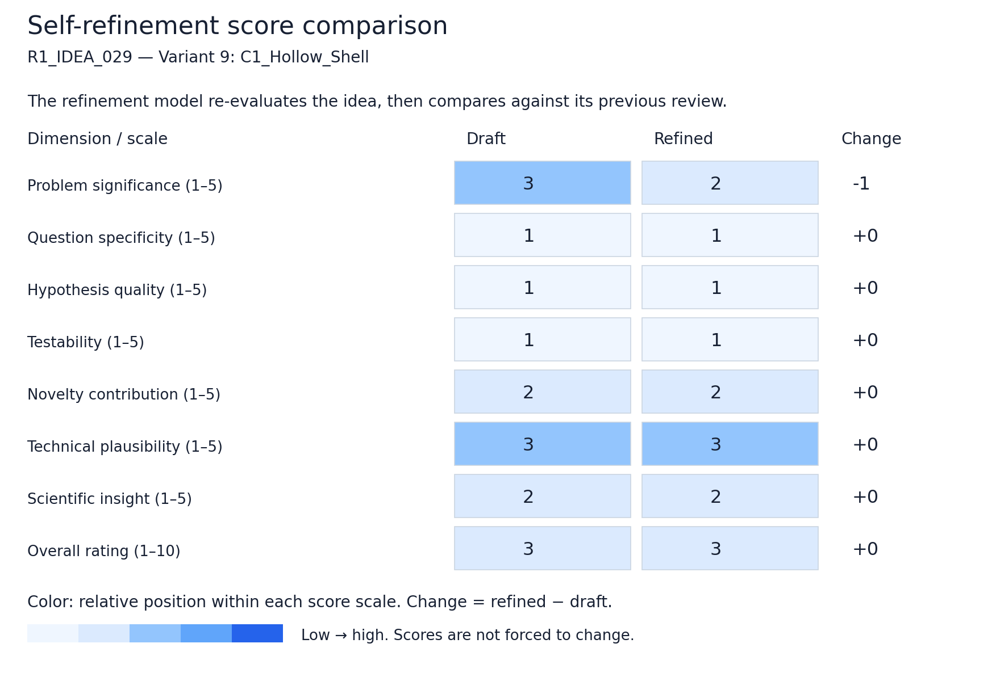

Changed score dimensions: problem_significance.

### Score justifications (draft / refined)

**Problem significance**

```json
{
  "draft": {
    "score": 3.0,
    "justification": "The problem of better integrating different model capabilities in segmentation is meaningful, and alignment with human interaction is practically relevant. However, the idea is too vague to assess true significance; it might be addressing a minor technical gap rather than a fundamental challenge."
  },
  "refined": {
    "score": 2.0,
    "justification": "The general area of integrating different model capabilities in segmentation has relevance, and human interaction alignment has practical importance. However, the idea is too vague to assess true significance - it might address a minor technical gap rather than a fundamental challenge. Without specificity, it's unclear if this is a meaningful problem versus a generic observation."
  }
}
```

**Question specificity**

```json
{
  "draft": {
    "score": 1.0,
    "justification": "No research question is articulated. The idea only states that current approaches 'do not fully utilize' a capability and that this is a 'challenge.' It does not specify what aspect should be studied, compared, or improved."
  },
  "refined": {
    "score": 1.0,
    "justification": "No research question is articulated. The idea only states that current approaches 'do not fully utilize' something and that this is a 'challenge.' It does not specify what aspect should be studied, compared, or improved. This is the definition of a non-specific research direction."
  }
}
```

**Hypothesis quality**

```json
{
  "draft": {
    "score": 1.0,
    "justification": "There is no hypothesis—implicit or explicit. The idea describes a situation but makes no prediction about relationships, mechanisms, or outcomes."
  },
  "refined": {
    "score": 1.0,
    "justification": "There is no hypothesis - implicit or explicit. The idea describes a situation but makes no prediction about relationships, mechanisms, or outcomes. It doesn't suggest what might happen if the challenge were addressed or why current approaches fall short."
  }
}
```

**Testability**

```json
{
  "draft": {
    "score": 1.0,
    "justification": "Without a defined question or hypothesis, it is unclear what could be tested. The idea does not suggest experiments, evaluations, or analyses to investigate the claimed challenge."
  },
  "refined": {
    "score": 1.0,
    "justification": "Without a defined question or hypothesis, it is impossible to determine what could be tested. The idea does not suggest experiments, evaluations, comparisons, or analyses to investigate the claimed challenge. It's purely descriptive with no proposed investigation method."
  }
}
```

**Novelty contribution**

```json
{
  "draft": {
    "score": 2.0,
    "justification": "The general notion of integrating reasoning and pixel-level models is already active in segmentation research (e.g., combining SAM with VLMs). The idea hints at a specific angle (refinement + human interaction) but is too vague to assess novelty. It could range from incremental to novel depending on concretization."
  },
  "refined": {
    "score": 2.0,
    "justification": "The general notion of integrating reasoning and pixel-level models is already active in segmentation research. The idea hints at a specific angle (refinement + human interaction) but is too vague to assess novelty. Without concrete details, it could range from incremental to novel, but the current formulation suggests minimal novelty as it's essentially stating 'current approaches could be better.'"
  }
}
```

**Technical plausibility**

```json
{
  "draft": {
    "score": 3.0,
    "justification": "The general direction of better utilizing refinement processes in integrated models is plausible, but the lack of detail makes it impossible to evaluate technical coherence. No assumptions or mechanisms are stated."
  },
  "refined": {
    "score": 3.0,
    "justification": "The general direction of better utilizing refinement processes in integrated models is plausible based on current segmentation research trends. However, the complete lack of detail makes it impossible to evaluate technical coherence. No assumptions, mechanisms, or approaches are stated, so we can only say the broad area is reasonable."
  }
}
```

**Scientific insight**

```json
{
  "draft": {
    "score": 2.0,
    "justification": "If concretized, the idea could yield insights into how refinement interacts with language guidance or human feedback in segmentation. As stated, however, it is too vague to promise meaningful scientific insight beyond potential application improvements."
  },
  "refined": {
    "score": 2.0,
    "justification": "If properly concretized, the idea could potentially yield insights into how refinement interacts with language guidance or human feedback in segmentation. However, as stated, it promises minimal scientific insight - it's essentially an observation that something could be improved without specifying what we might learn about underlying mechanisms, principles, or relationships."
  }
}
```

**Overall rating**

```json
{
  "draft": {
    "score": 3.0,
    "justification": "The idea identifies a general area of interest (refinement in integrated segmentation) but fails to define a research question, hypothesis, or methodological direction. It reads more as a vague motivation than a research idea. With substantial concretization, it could become a viable research direction, but in its current form it is weak."
  },
  "refined": {
    "score": 3.0,
    "justification": "This is a weak research idea that reads more as a vague motivation than a defined research direction. It identifies a general area of interest but completely fails to formulate a research question, hypothesis, or methodological approach. While the area (integration of segmentation models with human interaction) has potential relevance, the idea itself lacks the specificity, testability, and conceptual framing needed for meaningful research. With substantial concretization, it could become viable, but in its current form it offers little beyond a generic observation."
  }
}
```

## R1_IDEA_029 — Variant 10: C2_Logic_Flawed

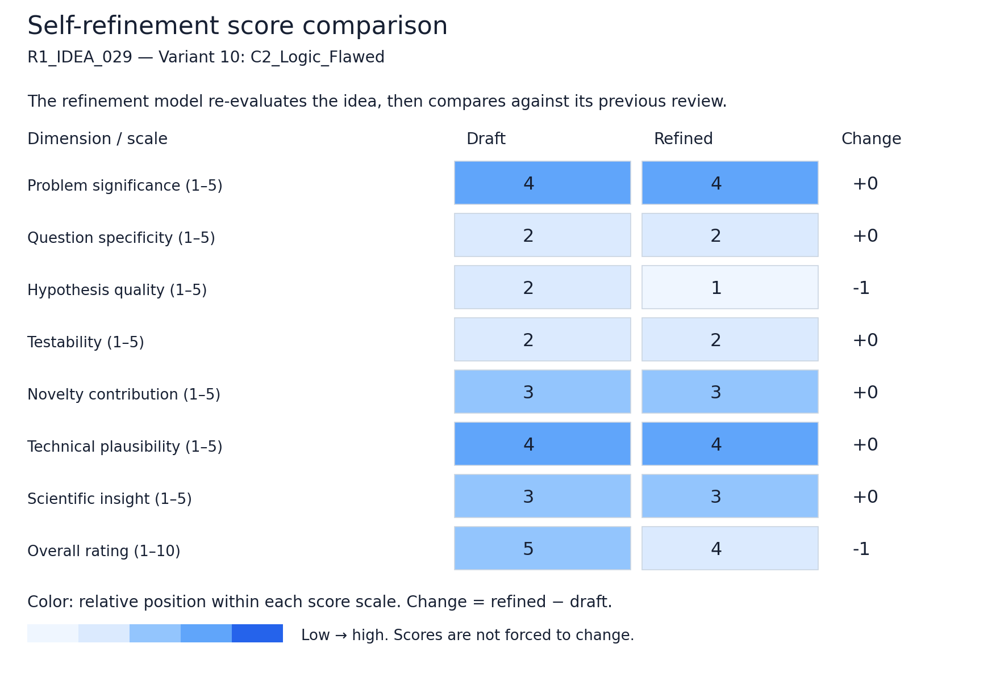

Changed score dimensions: hypothesis_quality, overall_rating.

### Score justifications (draft / refined)

**Problem significance**

```json
{
  "draft": {
    "score": 4.0,
    "justification": "Reasoning segmentation is an active and meaningful challenge in computer vision. Improving MLLM+SAM integration is relevant, and leveraging interactive refinement could address real limitations in segmentation quality and adaptability."
  },
  "refined": {
    "score": 4.0,
    "justification": "Reasoning segmentation is an active and meaningful challenge in computer vision. Improving MLLM+SAM integration addresses real limitations in segmentation quality, and leveraging interactive refinement could enhance adaptability to complex tasks. The problem has clear relevance to both research and applications."
  }
}
```

**Question specificity**

```json
{
  "draft": {
    "score": 2.0,
    "justification": "The idea identifies a general shortcoming but does not define a clear, concrete research question. It states 'improving this aspect' without specifying what aspect, how, or what success would look like."
  },
  "refined": {
    "score": 2.0,
    "justification": "The idea identifies a general shortcoming but fails to define a concrete research question. 'Improving this aspect' is vague—it doesn't specify what aspect, how to improve it, what constitutes success, or what specific relationship is being investigated."
  }
}
```

**Hypothesis quality**

```json
{
  "draft": {
    "score": 2.0,
    "justification": "No explicit or implicit testable hypothesis is presented. The claim that improving interactive refinement is 'sufficient to guide related settings' is an assumption, not a falsifiable prediction about mechanism or outcome."
  },
  "refined": {
    "score": 1.0,
    "justification": "No hypothesis is present, either explicit or implicit. The statement that improving interactive refinement is 'sufficient to guide related settings' is an assumption, not a falsifiable prediction. There's no concrete claim about mechanisms, relationships, or expected outcomes that could be tested."
  }
}
```

**Testability**

```json
{
  "draft": {
    "score": 2.0,
    "justification": "The idea as stated is not directly testable because it lacks any proposed method of investigation. It suggests a direction but not an experiment, comparison, or evaluation protocol."
  },
  "refined": {
    "score": 2.0,
    "justification": "The idea as stated is not directly testable because it proposes no method of investigation. While one could imagine experiments, the idea itself suggests none—no comparison, evaluation protocol, ablation, or analysis approach is mentioned."
  }
}
```

**Novelty contribution**

```json
{
  "draft": {
    "score": 3.0,
    "justification": "The observation that SAM's interactive features are underused in MLLM+SAM pipelines is somewhat novel, but the idea remains at a high level. Without a specific mechanism, it risks being a generic 'add iteration' suggestion rather than a distinct contribution."
  },
  "refined": {
    "score": 3.0,
    "justification": "The observation that SAM's interactive features are underused in MLLM+SAM pipelines has some novelty, but the idea remains at a high level of abstraction. Without a specific mechanism or approach, it risks being a generic suggestion to 'add iteration' rather than a distinct scientific contribution."
  }
}
```

**Technical plausibility**

```json
{
  "draft": {
    "score": 4.0,
    "justification": "The reasoning is coherent: MLLMs provide high-level reasoning, SAM provides pixel-level refinement, and combining them iteratively is technically plausible. No obvious technical barriers are implied."
  },
  "refined": {
    "score": 4.0,
    "justification": "The core reasoning is logically coherent: MLLMs provide high-level reasoning, SAM provides pixel-level refinement, and combining them iteratively is technically plausible. No obvious technical barriers are implied by the brief description."
  }
}
```

**Scientific insight**

```json
{
  "draft": {
    "score": 3.0,
    "justification": "If developed, this could yield insights into how iterative refinement improves segmentation robustness and how MLLMs can guide low-level vision tasks. However, the idea currently lacks specificity about what would be learned beyond potential performance gains."
  },
  "refined": {
    "score": 3.0,
    "justification": "If successfully developed, this could yield insights into how iterative refinement improves segmentation robustness and how high-level reasoning models can guide low-level vision tasks. However, the idea currently lacks specificity about what would be learned beyond potential performance gains on specific tasks."
  }
}
```

**Overall rating**

```json
{
  "draft": {
    "score": 5.0,
    "justification": "This is a moderate/borderline research idea. It identifies a meaningful problem and a plausible direction, but it lacks a concrete research question, testable hypothesis, and methodological direction. The potential contribution is limited by vagueness, though it could be strengthened with more specificity."
  },
  "refined": {
    "score": 4.0,
    "justification": "This is a weak research idea. While it identifies a meaningful problem and has technical plausibility, it lacks a concrete research question, testable hypothesis, and any methodological direction. The vagueness severely limits its scientific contribution potential. It's more of a general observation than a research idea ready for investigation."
  }
}
```

## R1_IDEA_029 — Variant 11: C3_Substance_Enriched

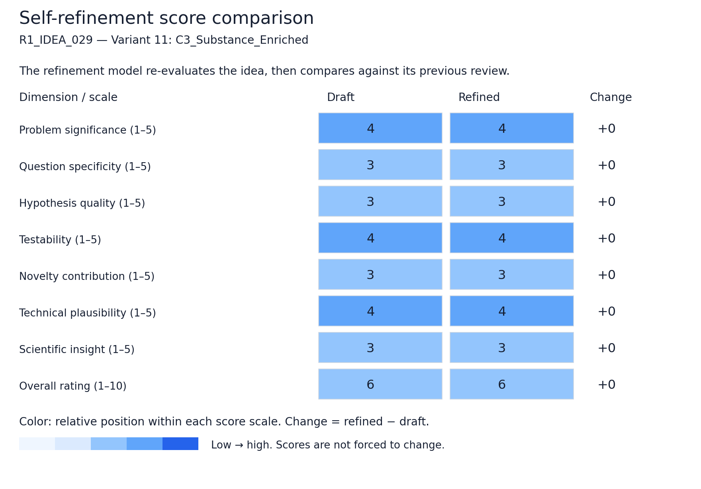

Changed score dimensions: none.

### Score justifications (draft / refined)

**Problem significance**

```json
{
  "draft": {
    "score": 4.0,
    "justification": "The problem is meaningful: current MLLM+SAM systems do not fully leverage SAM's interactive capabilities, which are central to its design. Improving iterative refinement aligns with real-world usage where segmentation is often an interactive process. However, the significance is somewhat incremental unless it leads to substantially more efficient or accurate systems."
  },
  "refined": {
    "score": 4.0,
    "justification": "The problem is meaningful: current MLLM+SAM systems often treat segmentation as a one-shot process, neglecting SAM's designed interactive capabilities. Improving iterative refinement aligns with real-world usage where segmentation is often an interactive, refinement-based task. However, the significance is somewhat incremental unless it leads to substantially more efficient or accurate systems."
  }
}
```

**Question specificity**

```json
{
  "draft": {
    "score": 3.0,
    "justification": "The idea identifies a general direction (modeling feedback loops) but does not define a precise research question. It lacks a concrete formulation such as 'Does a recurrent prompt-mask history module reduce the number of interactions needed to achieve target segmentation accuracy?'"
  },
  "refined": {
    "score": 3.0,
    "justification": "The idea identifies a general direction but lacks a precise research question. It doesn't specify what exactly 'modeling the feedback loop' means or what specific relationship is being investigated. A more specific question would be: 'Does maintaining a history of prompt-mask interactions improve refinement efficiency compared to treating each interaction independently?'"
  }
}
```

**Hypothesis quality**

```json
{
  "draft": {
    "score": 3.0,
    "justification": "There is an implicit hypothesis that modeling the feedback loop will improve refinement efficiency. However, it is not sharply predictive—it does not specify under what conditions improvement is expected, nor does it contrast with a baseline. The hypothesis is testable but could be more falsifiable."
  },
  "refined": {
    "score": 3.0,
    "justification": "There is an implicit hypothesis that modeling the feedback loop will improve refinement efficiency, but it's not sharply predictive. It doesn't specify under what conditions improvement is expected, what constitutes 'improvement,' or how this hypothesis would be falsified. The hypothesis is testable but could be more concrete and falsifiable."
  }
}
```

**Testability**

```json
{
  "draft": {
    "score": 4.0,
    "justification": "The idea suggests measurable validation: efficiency across interaction cycles under varying initial mask quality. This is a reasonable experimental setup. However, without a clear definition of 'modeling the feedback loop,' the exact intervention to test remains ambiguous."
  },
  "refined": {
    "score": 4.0,
    "justification": "The idea suggests measurable validation through refinement efficiency across interaction cycles with varying initial conditions. This provides a reasonable experimental framework. However, without a clear definition of what 'modeling the feedback loop' entails, the exact intervention to test remains ambiguous, limiting testability."
  }
}
```

**Novelty contribution**

```json
{
  "draft": {
    "score": 3.0,
    "justification": "Interactive segmentation is a well-studied area; the novelty lies in integrating it with MLLM reasoning in a closed-loop fashion. However, the idea does not articulate how this integration would be novel compared to existing interactive segmentation methods that already use iterative refinement with user input or automated cues."
  },
  "refined": {
    "score": 3.0,
    "justification": "Interactive segmentation is well-established, and the novelty lies primarily in integrating it with MLLM reasoning. However, the idea doesn't clearly articulate how this integration would be novel compared to existing interactive segmentation methods or what specific contribution it makes beyond applying MLLMs to an existing paradigm."
  }
}
```

**Technical plausibility**

```json
{
  "draft": {
    "score": 4.0,
    "justification": "The general direction is plausible: MLLMs can reason about visual feedback, and SAM can update masks based on prompts. Modeling a feedback loop is technically feasible with recurrent networks or stateful inference. However, the lack of technical details makes it hard to assess fully."
  },
  "refined": {
    "score": 4.0,
    "justification": "The general direction is technically plausible: MLLMs can reason about visual feedback, and SAM can update masks based on prompts. Modeling sequential interactions is feasible with existing architectures. However, the lack of technical details about implementation makes full assessment difficult."
  }
}
```

**Scientific insight**

```json
{
  "draft": {
    "score": 3.0,
    "justification": "If successful, the research could provide insight into how to effectively combine high-level reasoning with low-level iterative refinement in vision systems. However, the potential insight is limited if it merely shows that iterative refinement helps—that is already known. Deeper insight would come from understanding what kinds of feedback or prompt strategies are most effective."
  },
  "refined": {
    "score": 3.0,
    "justification": "If successful, the research could provide insight into how to effectively combine high-level reasoning with low-level iterative refinement. However, the potential insight is limited if it merely shows that iterative refinement helps—that's already known. Deeper insight would come from understanding what types of feedback mechanisms or prompt strategies are most effective in different scenarios."
  }
}
```

**Overall rating**

```json
{
  "draft": {
    "score": 6.0,
    "justification": "This is a moderate research idea. It identifies a relevant gap in current MLLM+SAM systems and proposes a sensible direction (leveraging interactive refinement). However, the research question is not yet specific, the hypothesis is vague, and the novelty is limited without a clearer technical innovation. With more concrete formulation and a sharper hypothesis, it could become a strong idea."
  },
  "refined": {
    "score": 6.0,
    "justification": "This is a moderate research idea. It identifies a relevant gap in current MLLM+SAM systems and proposes a sensible direction. However, the research question lacks specificity, the hypothesis is vague, and the potential contribution is limited without clearer technical innovation or deeper scientific questions. With more concrete formulation and a sharper hypothesis, it could become a stronger idea."
  }
}
```

## R1_IDEA_029 — Variant 12: H1_Deceptive_Hollow

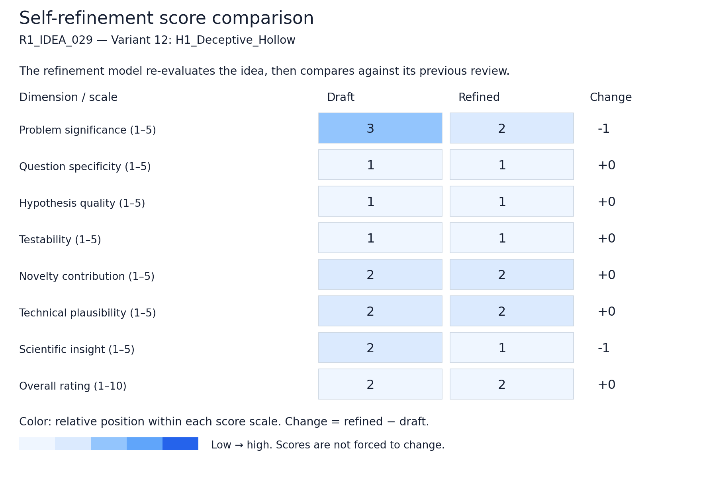

Changed score dimensions: problem_significance, scientific_insight.

### Score justifications (draft / refined)

**Problem significance**

```json
{
  "draft": {
    "score": 3.0,
    "justification": "The general problem of better integrating different model types in segmentation and aligning with human interaction is meaningful. However, the description is too vague to assess its true significance. The claim that current approaches 'do not fully utilize' capabilities is not substantiated."
  },
  "refined": {
    "score": 2.0,
    "justification": "The general area of better integrating different model types in segmentation and aligning with human interaction has some relevance, but the description is too vague to assess true significance. The claim that current approaches 'do not fully utilize' capabilities is asserted without evidence or context about why this matters specifically."
  }
}
```

**Question specificity**

```json
{
  "draft": {
    "score": 1.0,
    "justification": "Extremely weak. No concrete research question is defined. The text describes a general direction ('elevates the problem into a broader framework') but provides no specific question about mechanisms, relationships, or phenomena to investigate."
  },
  "refined": {
    "score": 1.0,
    "justification": "Extremely weak. No concrete research question is defined. The text describes only a general direction ('elevates the problem into a broader framework') without specifying what phenomenon, relationship, or mechanism would be investigated. It lacks even a basic 'what if' or 'how does' formulation."
  }
}
```

**Hypothesis quality**

```json
{
  "draft": {
    "score": 1.0,
    "justification": "No hypothesis is present, explicit or implicit. There is no concrete prediction, no proposed mechanism, and no claim that could be supported or contradicted by evidence. The text only states that current approaches don't fully utilize something and that a broader framework could be transformative."
  },
  "refined": {
    "score": 1.0,
    "justification": "No hypothesis is present, explicit or implicit. There is no concrete prediction, no proposed causal mechanism, and no claim that could be supported or contradicted by evidence. The text only states that current approaches don't fully utilize something and that a broader framework could be transformative - these are aspirations, not hypotheses."
  }
}
```

**Testability**

```json
{
  "draft": {
    "score": 1.0,
    "justification": "Not testable in its current form. There is no proposed experiment, comparison, evaluation, or analysis. The idea is framed at such a high level of abstraction that it's unclear what evidence would support or refute it."
  },
  "refined": {
    "score": 1.0,
    "justification": "Not testable in its current form. There is no proposed experiment, comparison, evaluation, or analysis. The idea is framed at such a high level of abstraction that it's unclear what evidence would support or refute any claim. Even the central premise ('do not fully utilize') is not defined in a measurable way."
  }
}
```

**Novelty contribution**

```json
{
  "draft": {
    "score": 2.0,
    "justification": "Claims of being 'novel and potentially field-shaping' and 'transformative' are unsubstantiated. The description is too vague to assess novelty. The idea mentions integrating reasoning models with pixel understanding and human interaction—all existing research areas—without specifying what new contribution would be made."
  },
  "refined": {
    "score": 2.0,
    "justification": "Claims of being 'novel and potentially field-shaping' and 'transformative' are completely unsubstantiated. The description mentions integrating reasoning models with pixel understanding and human interaction - all established research areas. Without specifying what new contribution would be made beyond this general combination, novelty cannot be assessed as anything beyond minimal."
  }
}
```

**Technical plausibility**

```json
{
  "draft": {
    "score": 2.0,
    "justification": "The general direction of better integrating different model types and aligning with human interaction is plausible, but the complete lack of technical details makes evaluation difficult. The reasoning is coherent at a very high level but lacks any concrete mechanism or approach."
  },
  "refined": {
    "score": 2.0,
    "justification": "The general direction of better integrating model types and aligning with human interaction is technically plausible at a surface level, but the complete absence of any technical details, mechanisms, or approaches makes meaningful evaluation impossible. The reasoning is coherent only at the most abstract level."
  }
}
```

**Scientific insight**

```json
{
  "draft": {
    "score": 2.0,
    "justification": "Claims potential for 'transformative synthesis' and 'reshaping how the community thinks,' but provides no indication of what specific scientific insight would be gained. Without a concrete research question, it's impossible to assess whether the work would reveal mechanisms, principles, limitations, or other transferable insights."
  },
  "refined": {
    "score": 1.0,
    "justification": "Claims potential for 'transformative synthesis' and 'reshaping how the community thinks,' but provides no indication of what specific scientific insight would be gained. Without a concrete research question or hypothesis, it's impossible to assess whether the work would reveal mechanisms, principles, limitations, or other transferable insights. The description suggests only application relevance, not scientific understanding."
  }
}
```

**Overall rating**

```json
{
  "draft": {
    "score": 2.0,
    "justification": "Very weak research idea. While it identifies a potentially meaningful area (better integration of model types in segmentation), it fails to define any concrete research question, hypothesis, or testable claim. The description is dominated by grandiose, buzzword-heavy framing without substance. It lacks the specificity needed for meaningful scientific investigation and provides no clear path to generating new knowledge."
  },
  "refined": {
    "score": 2.0,
    "justification": "Very weak research idea. While it identifies a potentially relevant area (integration of model types in segmentation), it fails completely to define any concrete research question, hypothesis, or testable claim. The description is dominated by grandiose, buzzword-heavy framing without substantive content. It lacks the specificity needed for meaningful scientific investigation and provides no clear path to generating new knowledge. The idea is more of a vague aspiration than a research direction."
  }
}
```

## R1_IDEA_029 — Variant 13: H2_Confident_Flaw

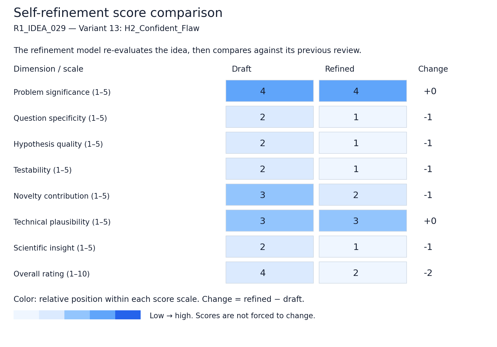

Changed score dimensions: question_specificity, hypothesis_quality, testability, novelty_contribution, scientific_insight, overall_rating.

### Score justifications (draft / refined)

**Problem significance**

```json
{
  "draft": {
    "score": 4.0,
    "justification": "The problem is meaningful: current MLLM+SAM reasoning segmentation systems do not fully leverage SAM's interactive capabilities. Improving human-AI collaboration in segmentation through better refinement mechanisms has practical relevance for applications requiring precise segmentation."
  },
  "refined": {
    "score": 4.0,
    "justification": "The problem is meaningful and timely. Improving the integration of powerful foundation models (MLLMs and SAM) is a active research area. Leveraging SAM's interactive capabilities for complex reasoning tasks is a logical and potentially high-impact direction for creating more capable and controllable vision systems."
  }
}
```

**Question specificity**

```json
{
  "draft": {
    "score": 2.0,
    "justification": "The idea identifies a limitation but does not define a clear research question. It states that 'improving this aspect is sufficient' and makes broad claims about causal evidence, but doesn't specify what aspect exactly will be investigated or how."
  },
  "refined": {
    "score": 1.0,
    "justification": "Extremely weak. The idea does not define a research question. It states a belief ('improving this aspect is sufficient') and makes broad claims about outcomes. There is no 'what', 'how', or 'why' to investigate."
  }
}
```

**Hypothesis quality**

```json
{
  "draft": {
    "score": 2.0,
    "justification": "There is an implicit hypothesis that addressing SAM's underutilized interactive refinement will improve performance across settings, but it's not articulated as a testable prediction. The claim that improvements will 'necessarily' occur and can be treated as causal evidence without proper controls is problematic."
  },
  "refined": {
    "score": 1.0,
    "justification": "Very weak. The implicit claim is that fixing the stated limitation guarantees improvement. This is a non-falsifiable, overreaching assertion, not a scientific hypothesis. It dismisses the need for evidence to establish causality, which is antithetical to hypothesis testing."
  }
}
```

**Testability**

```json
{
  "draft": {
    "score": 2.0,
    "justification": "While the general direction could be tested with experiments, the idea dismisses standard experimental controls ('without separately isolating dataset composition, evaluation criteria, boundary cases, or alternative explanations'). This makes rigorous testing difficult as proposed. The causal claims are particularly untestable without proper isolation of variables."
  },
  "refined": {
    "score": 1.0,
    "justification": "Very weak. The idea as presented is not testable because it proposes no concrete method to test. Furthermore, it explicitly rejects the standard methodological components (isolating variables, controlling confounders) required for rigorous testing. The central causal claim is framed in a way that avoids falsification."
  }
}
```

**Novelty contribution**

```json
{
  "draft": {
    "score": 3.0,
    "justification": "The observation that current MLLM+SAM systems underutilize SAM's interactive features is reasonable, but the idea doesn't propose a specific novel mechanism or approach. It's more of a critique than a novel research direction. The contribution would depend entirely on the specific implementation proposed."
  },
  "refined": {
    "score": 2.0,
    "justification": "Weak. Identifying the underutilization of SAM's interactive mode is a reasonable observation, but it is a critique, not a novel contribution. The novelty would come entirely from a subsequent, unspecified solution. The idea itself proposes nothing new."
  }
}
```

**Technical plausibility**

```json
{
  "draft": {
    "score": 3.0,
    "justification": "The basic premise is plausible: better integration of SAM's interactive capabilities could improve reasoning segmentation. However, the dismissal of standard experimental methodology raises concerns about whether the research could yield scientifically valid conclusions."
  },
  "refined": {
    "score": 3.0,
    "justification": "Moderate. The foundational premise is plausible: better utilizing SAM's interactive features could improve segmentation outcomes in a reasoning context. However, the accompanying argument about establishing causal evidence without controls is technically and scientifically implausible."
  }
}
```

**Scientific insight**

```json
{
  "draft": {
    "score": 2.0,
    "justification": "The idea focuses on improving performance but doesn't articulate what scientific insights would be gained. The strong causal claims without proper experimental design suggest a focus on engineering improvement rather than scientific understanding of mechanisms or principles."
  },
  "refined": {
    "score": 1.0,
    "justification": "Very weak. The idea promises no scientific insight. It focuses solely on achieving performance gains and makes an unscientific claim about attributing causality. There is no mention of understanding mechanisms, principles, or boundary conditions. The proposed mode of evaluation actively discourages scientific insight."
  }
}
```

**Overall rating**

```json
{
  "draft": {
    "score": 4.0,
    "justification": "This is a weak research idea. While it identifies a potentially meaningful limitation in current systems, it fails to articulate a clear research question or testable hypothesis. The dismissal of standard experimental methodology is particularly problematic, as it undermines the scientific validity of the proposed approach. The idea makes strong causal claims without specifying how they would be tested or what evidence would support them. It reads more like a position statement than a research proposal."
  },
  "refined": {
    "score": 2.0,
    "justification": "This is a very weak research idea. It identifies a potentially significant problem but fails completely as a research proposal. It lacks a research question, a testable hypothesis, and any description of a methodological direction. Most critically, it advocates for an unscientific evaluation methodology that dismisses necessary controls, rendering its core claims untestable and its potential conclusions invalid. It is more of a strongly worded opinion than a viable research idea."
  }
}
```

## R1_IDEA_029 — Variant 14: H3_Verbose_Enriched

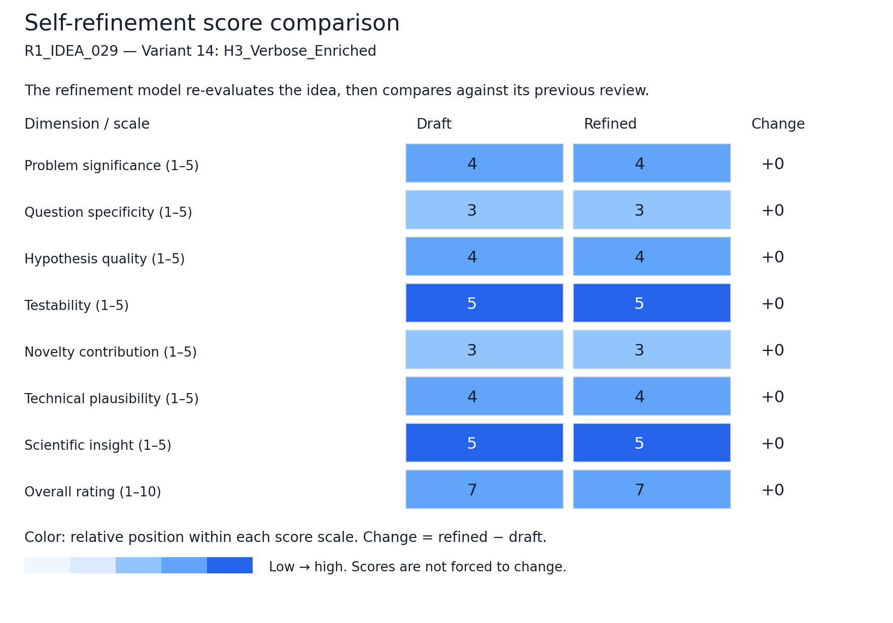

Changed score dimensions: none.

### Score justifications (draft / refined)

**Problem significance**

```json
{
  "draft": {
    "score": 4.0,
    "justification": "The problem is meaningful: current MLLM+SAM systems for reasoning segmentation often treat SAM as a one-shot segmenter, neglecting its interactive refinement capabilities. Better leveraging this could improve practical usability and accuracy, especially for complex scenes."
  },
  "refined": {
    "score": 4.0,
    "justification": "The problem is meaningful and relevant. Current MLLM+SAM systems often use SAM as a one-shot segmenter, neglecting its interactive refinement capabilities. Better leveraging this could improve practical usability, accuracy, and efficiency in complex segmentation tasks, addressing a clear gap in reasoning segmentation pipelines."
  }
}
```

**Question specificity**

```json
{
  "draft": {
    "score": 3.0,
    "justification": "The idea identifies a general direction (modeling feedback loops) but does not yet frame a precise research question (e.g., 'Does explicitly conditioning mask updates on interaction history reduce the number of corrections needed by X%?'). The experimental design is specific, but the core inquiry is somewhat broad."
  },
  "refined": {
    "score": 3.0,
    "justification": "The idea identifies a general direction (modeling feedback loops) but does not frame a precise research question. While it mentions measuring 'refinement efficiency' and testing 'boundary conditions,' the core inquiry remains broad. A more specific question (e.g., 'Does conditioning mask updates on interaction history reduce correction cycles by X%?') would strengthen specificity."
  }
}
```

**Hypothesis quality**

```json
{
  "draft": {
    "score": 4.0,
    "justification": "The hypothesis is explicit and testable: modeling the feedback loop between prompts and mask updates can improve refinement efficiency. It makes a concrete prediction about a mechanism (feedback modeling) leading to an outcome (improvement), and it is falsifiable."
  },
  "refined": {
    "score": 4.0,
    "justification": "The hypothesis is explicit and testable: explicitly modeling the feedback loop between user prompts and mask updates can improve refinement efficiency. It makes a concrete prediction about a mechanism (feedback modeling) leading to an outcome (improvement), and it is falsifiable. However, it could be stronger if it specified the expected magnitude or conditions of improvement."
  }
}
```

**Testability**

```json
{
  "draft": {
    "score": 5.0,
    "justification": "Highly testable. The idea outlines a clear validation plan: measuring refinement efficiency across interaction cycles, using staged design with baselines and interventions, ablations, sensitivity analyses, and error analysis. This provides multiple avenues for empirical evaluation."
  },
  "refined": {
    "score": 5.0,
    "justification": "Highly testable. The idea outlines a clear validation plan: measuring refinement efficiency across interaction cycles, using a staged design with baselines and interventions, ablations, sensitivity analyses, and error analysis. This provides multiple robust avenues for empirical evaluation and hypothesis testing."
  }
}
```

**Novelty contribution**

```json
{
  "draft": {
    "score": 3.0,
    "justification": "Moderate novelty. Interactive segmentation with feedback is known in classic segmentation literature, and some MLLM works may already support multi-turn dialogue for refinement. The contribution would lie in systematically integrating and evaluating this loop in the MLLM+SAM context, which is less explored."
  },
  "refined": {
    "score": 3.0,
    "justification": "Moderate novelty. Interactive segmentation with feedback is well-established in classical computer vision, and some MLLM works may already support multi-turn refinement. The contribution lies in systematically integrating and evaluating this loop in the specific MLLM+SAM context, which is less explored but not entirely novel."
  }
}
```

**Technical plausibility**

```json
{
  "draft": {
    "score": 4.0,
    "justification": "Plausible. The reasoning is coherent: MLLMs handle language and reasoning, SAM handles segmentation; connecting them iteratively is a natural extension. However, the lack of a specified technical mechanism for modeling feedback slightly reduces plausibility until details are provided."
  },
  "refined": {
    "score": 4.0,
    "justification": "Plausible. The reasoning is coherent: MLLMs handle language/reasoning, SAM handles segmentation; connecting them iteratively is a natural extension. However, the lack of a specified technical mechanism for modeling feedback (e.g., how to architecturally link prompt history to mask updates) slightly reduces plausibility until details are provided."
  }
}
```

**Scientific insight**

```json
{
  "draft": {
    "score": 5.0,
    "justification": "High potential for scientific insight. The idea aims not just to improve performance but to understand when and why the feedback mechanism works, through boundary conditions, ablations, and failure analysis. This could reveal principles about interactive vision–language systems and their data/domain constraints."
  },
  "refined": {
    "score": 5.0,
    "justification": "High potential for scientific insight. The idea aims not just to improve performance but to understand when and why the feedback mechanism works, through boundary conditions, ablations, and failure analysis. This could reveal general principles about interactive vision–language systems, their data/domain constraints, and the conditions under which iterative refinement is most beneficial."
  }
}
```

**Overall rating**

```json
{
  "draft": {
    "score": 7.0,
    "justification": "Strong research idea. It addresses a meaningful gap, proposes a testable hypothesis, and outlines a rigorous experimental plan that promises both performance gains and scientific insight. The main limitation is the lack of specificity about the technical approach for modeling feedback, which keeps it from being exceptional. Nonetheless, it is a clear, actionable direction with high potential."
  },
  "refined": {
    "score": 7.0,
    "justification": "Strong research idea. It addresses a meaningful gap, proposes a testable hypothesis, and outlines a rigorous experimental plan that promises both performance gains and scientific insight. The main limitation is the lack of specificity about the technical approach for modeling feedback, which prevents it from being exceptional. Nonetheless, it is a clear, actionable direction with high potential for contribution."
  }
}
```

## R1_IDEA_029 — Variant 15: H4_Ultimate_Hype

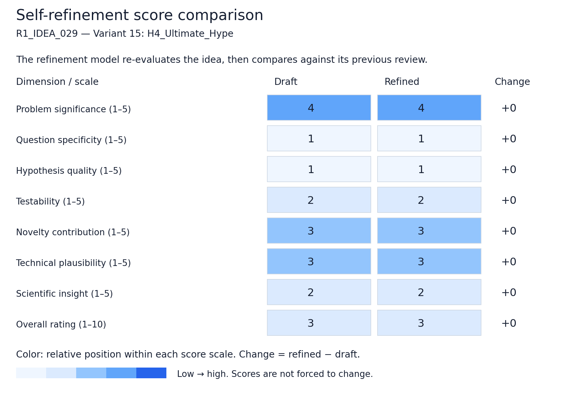

Changed score dimensions: none.

### Score justifications (draft / refined)

**Problem significance**

```json
{
  "draft": {
    "score": 4.0,
    "justification": "The problem is meaningful. Improving the integration of high-level reasoning with low-level segmentation is a relevant challenge in vision-language research. Leveraging SAM's interactive capabilities more fully is a plausible and potentially important direction."
  },
  "refined": {
    "score": 4.0,
    "justification": "The problem is meaningful. Better integration of high-level reasoning with low-level segmentation refinement is a relevant challenge in vision-language research. Leveraging SAM's interactive capabilities more fully addresses a genuine limitation in current MLLM+SAM pipelines."
  }
}
```

**Question specificity**

```json
{
  "draft": {
    "score": 1.0,
    "justification": "Exceptionally low specificity. The summary only states that current paradigms 'fall short' and that iterative refinement is 'underexplored'. It does not define a concrete research question, a relationship to study, or a phenomenon to investigate. It is a problem statement, not a research idea."
  },
  "refined": {
    "score": 1.0,
    "justification": "Exceptionally low specificity. The summary only states that current paradigms 'fall short' and that iterative refinement is 'underexplored.' It defines no research question, relationship to study, or phenomenon to investigate. It is purely a problem statement with promotional framing."
  }
}
```

**Hypothesis quality**

```json
{
  "draft": {
    "score": 1.0,
    "justification": "No hypothesis is present, implicit or explicit. There is a suggestion that using iterative refinement could be beneficial, but it is not framed as a testable prediction. It reads as a generic belief rather than a falsifiable claim."
  },
  "refined": {
    "score": 1.0,
    "justification": "No hypothesis is present, implicit or explicit. There is a vague suggestion that using iterative refinement 'could' be beneficial, but it is not framed as a testable prediction. It reads as generic advocacy rather than a falsifiable claim about mechanisms or outcomes."
  }
}
```

**Testability**

```json
{
  "draft": {
    "score": 2.0,
    "justification": "The core notion—'better exploiting SAM's strengths'—is testable in principle, but the idea provides no pathway for testing it. Without a proposed method, comparison, or evaluation, it's unclear how one would gather evidence for or against the value of this direction."
  },
  "refined": {
    "score": 2.0,
    "justification": "The core notion—'better exploiting SAM's strengths'—is testable in principle, but the idea provides no pathway for testing. Without a proposed method, comparison, or evaluation, it's unclear how one would gather evidence. The promotional language ('transformative agenda') doesn't suggest testability."
  }
}
```

**Novelty contribution**

```json
{
  "draft": {
    "score": 3.0,
    "justification": "The observation that MLLM+SAM systems don't use SAM interactively is somewhat novel, but the idea itself is a vague suggestion to do so. The potential contribution is high if a novel method is developed, but the summary does not propose one. It currently sits at the level of a generic application idea ('use feature X of model Y')."
  },
  "refined": {
    "score": 3.0,
    "justification": "The observation that MLLM+SAM systems don't use SAM interactively is somewhat novel, but the idea itself is a vague suggestion to do so. The potential contribution is high if a novel method is developed, but the summary does not propose one. Currently, it's at the level of a generic application idea ('use feature X of model Y')."
  }
}
```

**Technical plausibility**

```json
{
  "draft": {
    "score": 3.0,
    "justification": "The basic premise is logically coherent: combining MLLM reasoning with SAM's interactive refinement could be beneficial. However, the lack of any proposed mechanism makes it impossible to assess technical soundness. The central assumption—that this integration is straightforward or clearly defined—is unexamined."
  },
  "refined": {
    "score": 3.0,
    "justification": "The basic premise is logically coherent: combining MLLM reasoning with SAM's interactive refinement could be beneficial. However, the lack of any proposed mechanism makes deeper assessment impossible. The central assumption—that this integration is straightforward—is unexamined, but not obviously implausible."
  }
}
```

**Scientific insight**

```json
{
  "draft": {
    "score": 2.0,
    "justification": "If successfully executed, research on this topic could provide insight into the interaction between semantic reasoning and iterative perceptual refinement. However, the idea as presented promises 'transformative' impact without specifying what scientific insight would be gained. It leans heavily on potential application impact rather than fundamental understanding."
  },
  "refined": {
    "score": 2.0,
    "justification": "If successfully executed, research could provide insight into interaction between semantic reasoning and iterative perceptual refinement. However, the idea as presented emphasizes 'transformative' impact and 'application potential' without specifying what scientific insight would be gained. It leans heavily on potential utility rather than fundamental understanding."
  }
}
```

**Overall rating**

```json
{
  "draft": {
    "score": 3.0,
    "justification": "This is a weak research idea summary. It identifies a potentially significant problem but fails to articulate a research question, hypothesis, or methodological direction. The content is dominated by promotional language rather than scientific substance. It is more of a motivational pitch than a research plan. A score of 3 reflects that the core problem is non-trivial, but the idea itself is too vague to be considered a meaningful research direction in its current form."
  },
  "refined": {
    "score": 3.0,
    "justification": "This is a weak research idea summary. It identifies a potentially significant problem but fails to articulate a research question, hypothesis, or methodological direction. The content is dominated by promotional language rather than scientific substance. It is more of a motivational pitch than a research plan. A score of 3 reflects that the core problem is non-trivial, but the idea itself is too vague to be considered a meaningful research direction."
  }
}
```

## R1_IDEA_030 — Source

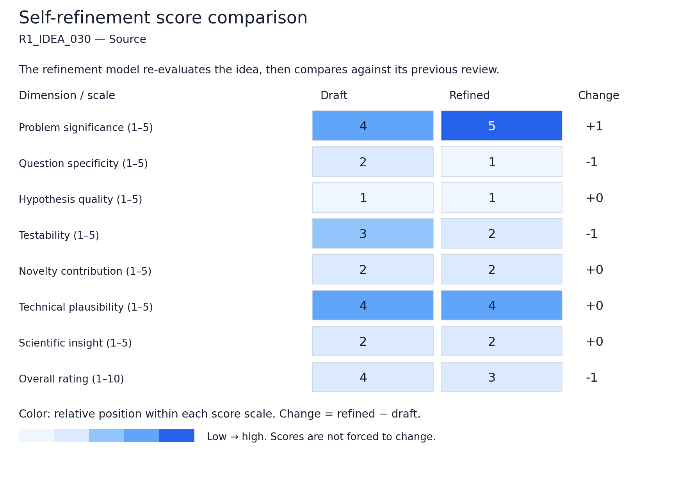

Changed score dimensions: problem_significance, question_specificity, testability, overall_rating.

### Score justifications (draft / refined)

**Problem significance**

```json
{
  "draft": {
    "score": 4.0,
    "justification": "Continuous knowledge updating in LLMs is a significant and timely challenge with practical implications for keeping models current without retraining. The problem is well-motivated and important for both research and applications."
  },
  "refined": {
    "score": 5.0,
    "justification": "Continuous knowledge updating is a critical, unsolved challenge in LLMs with major practical and scientific implications. Keeping models current without retraining is essential for real-world deployment, making the problem highly significant."
  }
}
```

**Question specificity**

```json
{
  "draft": {
    "score": 2.0,
    "justification": "The idea lacks a clearly defined research question. It proposes a direction (using LoRA) but doesn't specify what aspect of knowledge updating will be investigated, what will be compared, or what specific phenomenon will be studied."
  },
  "refined": {
    "score": 1.0,
    "justification": "The idea does not define a research question. It only states a general direction ('use LoRA for knowledge updating') without specifying what will be studied, compared, or measured."
  }
}
```

**Hypothesis quality**

```json
{
  "draft": {
    "score": 1.0,
    "justification": "No hypothesis is presented. The idea merely suggests using LoRA for knowledge updating without making any testable predictions about outcomes, advantages, or mechanisms."
  },
  "refined": {
    "score": 1.0,
    "justification": "No hypothesis is presented. There is no testable prediction about outcomes, advantages, mechanisms, or relationships. The idea is purely propositional."
  }
}
```

**Testability**

```json
{
  "draft": {
    "score": 3.0,
    "justification": "The general direction is testable - one could implement LoRA for knowledge updating and compare it to baselines. However, without a specific research question or hypothesis, it's unclear exactly what would be tested or how success would be measured."
  },
  "refined": {
    "score": 2.0,
    "justification": "While one could technically implement LoRA for updating and compare it to something, the idea lacks any defined experimental setup, baselines, or evaluation metrics. Without a clear question, it's ambiguous what should be tested."
  }
}
```

**Novelty contribution**

```json
{
  "draft": {
    "score": 2.0,
    "justification": "Using LoRA for model adaptation is not novel - it's a well-established technique. The application to knowledge updating might be somewhat novel, but without a clear research question or hypothesis, the potential contribution is limited to demonstrating another application of an existing method."
  },
  "refined": {
    "score": 2.0,
    "justification": "Using LoRA for adaptation is not novel. Applying it to knowledge updating is a straightforward application of an existing method to a known problem, offering limited conceptual novelty unless paired with a distinctive research question."
  }
}
```

**Technical plausibility**

```json
{
  "draft": {
    "score": 4.0,
    "justification": "The technical approach is plausible. LoRA is a proven method for efficient parameter adaptation, and applying it to knowledge updating makes logical sense. The reasoning about limitations of context-based methods is coherent."
  },
  "refined": {
    "score": 4.0,
    "justification": "The approach is technically reasonable. LoRA is a proven efficient fine-tuning method, and using it for incremental updates aligns with its design. The critique of RAG/ICL limitations is coherent."
  }
}
```

**Scientific insight**

```json
{
  "draft": {
    "score": 2.0,
    "justification": "As presented, the idea offers limited potential for scientific insight. It seems primarily focused on applying an existing technique to a problem, rather than investigating underlying mechanisms, principles, or boundary conditions of knowledge updating in LLMs."
  },
  "refined": {
    "score": 2.0,
    "justification": "As presented, the idea offers minimal potential for scientific insight. It suggests applying a tool without clarifying what underlying principles, trade-offs, or mechanisms of knowledge updating would be revealed through its use."
  }
}
```

**Overall rating**

```json
{
  "draft": {
    "score": 4.0,
    "justification": "The idea identifies an important problem but lacks the specificity needed for a strong research direction. Without a clear research question, hypothesis, or defined contribution beyond applying LoRA to knowledge updating, it remains a vague proposal rather than a well-formed research idea. It has potential but needs substantial refinement."
  },
  "refined": {
    "score": 3.0,
    "justification": "The idea identifies a significant problem but is critically underdeveloped as a research direction. It lacks a research question, hypothesis, and clear path to contribution. It reads as a vague suggestion rather than a structured investigation, offering little beyond the application of an existing method to a known challenge."
  }
}
```

## R1_IDEA_030 — Variant 1: A1_Identity

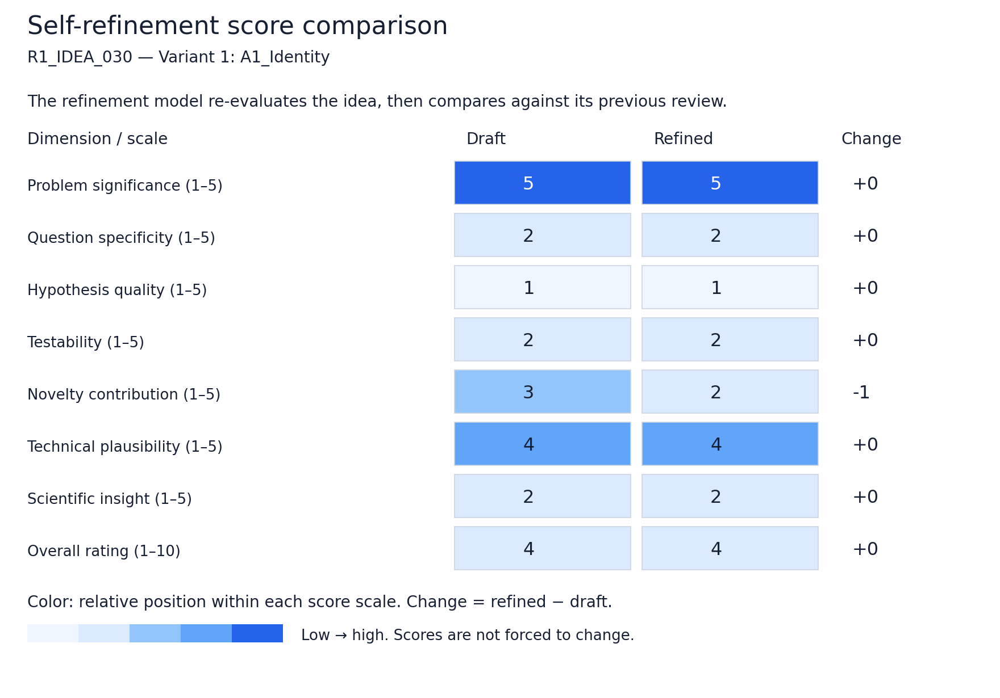

Changed score dimensions: novelty_contribution.

### Score justifications (draft / refined)

**Problem significance**

```json
{
  "draft": {
    "score": 5.0,
    "justification": "Continuous knowledge updating in LLMs is a highly significant problem with both practical and theoretical importance. As LLMs are deployed in dynamic environments, their ability to incorporate new knowledge without retraining is crucial."
  },
  "refined": {
    "score": 5.0,
    "justification": "Continuous knowledge updating is a fundamental and high-impact challenge for LLMs, with major implications for real-world deployment, model maintenance, and scientific understanding of dynamic learning in foundation models. The problem is clearly important."
  }
}
```

**Question specificity**

```json
{
  "draft": {
    "score": 2.0,
    "justification": "The idea identifies a general direction but lacks a concrete research question. It states what will be done (using LoRA for knowledge updating) but not what specific aspect will be investigated or what relationship will be tested."
  },
  "refined": {
    "score": 2.0,
    "justification": "The idea only states a general direction ('use LoRA for knowledge updating') without defining a specific research question. There is no inquiry into a particular relationship, mechanism, or comparative advantage—just a proposed tool application."
  }
}
```

**Hypothesis quality**

```json
{
  "draft": {
    "score": 1.0,
    "justification": "No hypothesis is presented. The idea merely suggests using LoRA as an alternative approach without making a testable prediction about its advantages, mechanisms, or outcomes compared to existing methods."
  },
  "refined": {
    "score": 1.0,
    "justification": "No hypothesis is presented, either explicit or implicit. There is no predictive statement about outcomes, mechanisms, or advantages. The idea is purely descriptive of a proposed approach, with no testable claim."
  }
}
```

**Testability**

```json
{
  "draft": {
    "score": 2.0,
    "justification": "While the general direction could be tested, the idea provides no indication of how it would be tested. There's no mention of experiments, evaluations, comparisons, or metrics. The claim is currently not falsifiable as stated."
  },
  "refined": {
    "score": 2.0,
    "justification": "While one could design experiments around LoRA for knowledge updating, the idea itself provides no framework for testing—no metrics, no baselines, no experimental setup. The central proposition is not falsifiable in its current form."
  }
}
```

**Novelty contribution**

```json
{
  "draft": {
    "score": 3.0,
    "justification": "Using LoRA for adaptation tasks is not novel in itself, but applying it specifically to continuous knowledge updating could be a meaningful contribution if developed with specific insights. However, the idea as presented doesn't articulate what novel scientific contribution it would make beyond applying an existing method to a new problem."
  },
  "refined": {
    "score": 2.0,
    "justification": "Applying LoRA to a task is not novel; LoRA is widely used for adaptation. The idea asserts a 'novel parametric approach' but does not specify what is novel about it—whether in methodology, insight, or application nuance. Without that, the contribution appears incremental."
  }
}
```

**Technical plausibility**

```json
{
  "draft": {
    "score": 4.0,
    "justification": "The technical direction is plausible. LoRA is a well-established parameter-efficient fine-tuning method that could theoretically be used for incremental knowledge updates. The reasoning about context limitations of RAG/ICL is coherent."
  },
  "refined": {
    "score": 4.0,
    "justification": "Using LoRA for incremental model updates is technically plausible and aligns with known uses of parameter-efficient fine-tuning. The reasoning about limitations of context-based methods is coherent, and LoRA is a reasonable candidate for parametric updating."
  }
}
```

**Scientific insight**

```json
{
  "draft": {
    "score": 2.0,
    "justification": "As presented, the idea seems primarily focused on applying an existing technique to a problem. It doesn't articulate what scientific insights about knowledge updating, model adaptation, or memory mechanisms might be gained. The potential for insight exists but is not developed."
  },
  "refined": {
    "score": 2.0,
    "justification": "As presented, the idea focuses on applying a technique rather than seeking new understanding. It does not indicate what could be learned about knowledge representation, updating dynamics, or model memory. Potential for insight exists but is unexplored."
  }
}
```

**Overall rating**

```json
{
  "draft": {
    "score": 4.0,
    "justification": "This is a weak research idea in its current form. While it identifies an important problem and suggests a plausible technical direction, it lacks a clear research question, testable hypothesis, and plan for investigation. The idea is more of a general suggestion than a research proposal. With substantial refinement to define a specific question, hypothesis, and experimental approach, it could become a stronger research direction."
  },
  "refined": {
    "score": 4.0,
    "justification": "This is a weak research idea. It identifies an important problem and suggests a plausible technical direction, but lacks a research question, hypothesis, testable framework, and clear contribution. It reads as a preliminary thought rather than a structured research proposal. Significant refinement is needed to elevate it to a meaningful investigation."
  }
}
```

## R1_IDEA_030 — Variant 2: A2_Paraphrase_Only

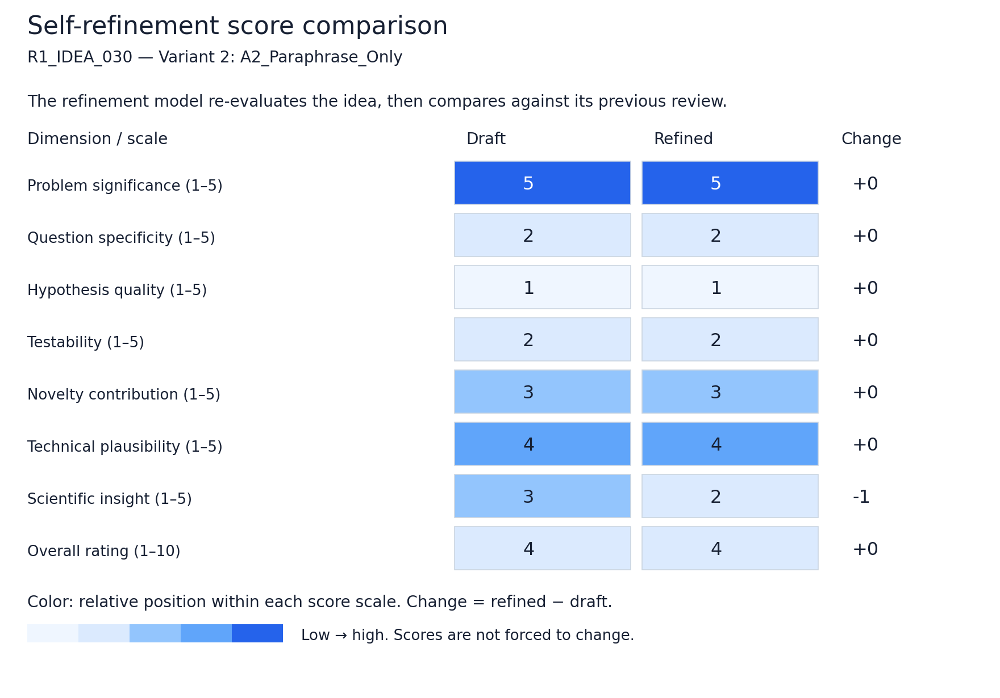

Changed score dimensions: scientific_insight.

### Score justifications (draft / refined)

**Problem significance**

```json
{
  "draft": {
    "score": 5.0,
    "justification": "Continuous knowledge updating is a fundamental challenge for LLMs with significant practical implications. The problem is well-recognized in the field and addressing it would have substantial impact on real-world deployment of language models."
  },
  "refined": {
    "score": 5.0,
    "justification": "Continuous knowledge updating is a fundamental and widely recognized challenge in LLM research with significant practical implications for real-world deployment. The problem is well-motivated and addressing it would have substantial impact."
  }
}
```

**Question specificity**

```json
{
  "draft": {
    "score": 2.0,
    "justification": "The idea identifies a general direction but lacks a concrete research question. It states what will be done (using LoRA) but not what specific aspect will be investigated or what relationship will be tested."
  },
  "refined": {
    "score": 2.0,
    "justification": "The idea identifies a general technical direction but lacks a concrete research question. It states what will be done (using LoRA) but not what specific aspect will be investigated, what relationship will be tested, or what phenomenon will be examined."
  }
}
```

**Hypothesis quality**

```json
{
  "draft": {
    "score": 1.0,
    "justification": "No hypothesis is presented. The idea describes a proposed method but doesn't make any testable prediction about its effectiveness, advantages, or mechanisms compared to alternatives."
  },
  "refined": {
    "score": 1.0,
    "justification": "No hypothesis is presented. The idea describes a proposed method but doesn't make any testable prediction about its effectiveness, advantages, mechanisms, or comparative performance. There's no statement that could be supported or contradicted by evidence."
  }
}
```

**Testability**

```json
{
  "draft": {
    "score": 2.0,
    "justification": "While the general concept could be tested, the idea doesn't specify what would be measured or compared. Without a clear hypothesis or evaluation plan, it's unclear how one would determine if the approach is successful."
  },
  "refined": {
    "score": 2.0,
    "justification": "While the general concept of using LoRA for updates could be tested, the idea doesn't specify what would be measured, compared, or evaluated. Without a clear hypothesis or evaluation criteria, it's ambiguous how one would determine if this approach addresses the stated problem."
  }
}
```

**Novelty contribution**

```json
{
  "draft": {
    "score": 3.0,
    "justification": "Using LoRA for model updates is not novel in itself, but applying it specifically to continuous knowledge updating represents a meaningful application. The conceptual shift from context-based to parametric memory is potentially interesting but needs more elaboration."
  },
  "refined": {
    "score": 3.0,
    "justification": "Using LoRA for model updates is established practice, but applying it specifically to continuous knowledge updating represents a meaningful application area. The conceptual framing around parametric vs. context-based memory has some novelty, but without a specific research angle, the potential contribution remains limited to application rather than new insight."
  }
}
```

**Technical plausibility**

```json
{
  "draft": {
    "score": 4.0,
    "justification": "LoRA is a well-established technique for efficient parameter updates, and applying it to knowledge updating is technically coherent. The reasoning that parametric updates could overcome context limitations is plausible."
  },
  "refined": {
    "score": 4.0,
    "justification": "LoRA is a well-established technique for efficient parameter updates, and applying it to knowledge updating is technically coherent. The reasoning that parametric updates could address context limitations is logically sound and plausible given LoRA's properties."
  }
}
```

**Scientific insight**

```json
{
  "draft": {
    "score": 3.0,
    "justification": "If properly investigated, this could provide insights into how parametric versus context-based knowledge integration works in LLMs. However, the current formulation focuses more on application than on generating fundamental understanding."
  },
  "refined": {
    "score": 2.0,
    "justification": "The current formulation focuses almost entirely on application rather than generating fundamental understanding. While properly investigating this could yield insights about parametric knowledge integration mechanisms, the idea as presented doesn't articulate what scientific insights might be gained beyond whether the method works."
  }
}
```

**Overall rating**

```json
{
  "draft": {
    "score": 4.0,
    "justification": "The idea addresses an important problem and proposes a technically plausible direction, but lacks the specificity, hypothesis, and testability needed for a strong research idea. It's more of a general direction than a research question that can be investigated. With refinement to include a concrete hypothesis and evaluation plan, it could become much stronger."
  },
  "refined": {
    "score": 4.0,
    "justification": "The idea addresses an important problem and proposes a technically plausible direction, but lacks the core elements of a research idea: a specific question, testable hypothesis, and clear evaluation approach. It's more of a technical suggestion than a research investigation. With substantial refinement to include these elements, it could become a meaningful research direction."
  }
}
```

## R1_IDEA_030 — Variant 3: A3_Plain_Core


Changed score dimensions: none.

### Score justifications (draft / refined)

**Problem significance**

```json
{
  "draft": {
    "score": 4.0,
    "justification": "Continuous knowledge updating in LLMs is a highly relevant and non-trivial problem with clear practical importance. The limitations of RAG and ICL are well-recognized, making investigation of parametric approaches worthwhile."
  },
  "refined": {
    "score": 4.0,
    "justification": "Continuous knowledge updating in LLMs is a highly relevant and non-trivial problem with clear practical importance. The limitations of RAG and ICL are well-recognized, making the exploration of parametric approaches scientifically meaningful."
  }
}
```

**Question specificity**

```json
{
  "draft": {
    "score": 1.0,
    "justification": "Extremely low specificity. The idea only states a proposed approach (use LoRA) without defining any concrete research question. It does not specify what aspect of knowledge updating, what will be compared, or what phenomenon will be studied."
  },
  "refined": {
    "score": 1.0,
    "justification": "Extremely low specificity. The idea only states a proposed approach without defining any concrete research question. It does not specify what aspect of knowledge updating will be studied, what comparisons will be made, or what phenomenon will be investigated."
  }
}
```

**Hypothesis quality**

```json
{
  "draft": {
    "score": 1.0,
    "justification": "No hypothesis is presented. There is an implicit suggestion that LoRA might be a useful approach, but no concrete, testable prediction about its properties, advantages, or mechanisms compared to alternatives."
  },
  "refined": {
    "score": 1.0,
    "justification": "No hypothesis is presented. There is an implicit suggestion that LoRA might be useful, but no concrete, testable prediction about its properties, advantages, mechanisms, or performance compared to alternatives."
  }
}
```

**Testability**

```json
{
  "draft": {
    "score": 2.0,
    "justification": "The idea as stated is not directly testable because it lacks any specific claim to test. However, the general direction of 'using LoRA for knowledge updating' could be made testable by defining comparisons, metrics, and scenarios."
  },
  "refined": {
    "score": 2.0,
    "justification": "The idea as stated is not directly testable because it lacks any specific claim to test. However, the general direction of 'using LoRA for knowledge updating' could be made testable by defining scenarios, metrics, and comparisons."
  }
}
```

**Novelty contribution**

```json
{
  "draft": {
    "score": 2.0,
    "justification": "Using LoRA for model updating is not novel in itself. The potential contribution lies in applying it to the specific problem of continuous knowledge updating and contrasting it with context-dependent methods, but without a specific research angle, this is just a generic application idea."
  },
  "refined": {
    "score": 2.0,
    "justification": "Using LoRA for model adaptation is not novel. The potential contribution lies in applying it to continuous knowledge updating and contrasting it with context-dependent methods, but without a specific research angle, this is merely a generic application suggestion."
  }
}
```

**Technical plausibility**

```json
{
  "draft": {
    "score": 4.0,
    "justification": "The basic idea is technically plausible. LoRA is a known method for efficient adaptation, and applying it to update knowledge is reasonable. The distinction between parametric and context-dependent memory is conceptually sound."
  },
  "refined": {
    "score": 4.0,
    "justification": "The basic idea is technically plausible. LoRA is a known method for efficient adaptation, and applying it to update knowledge is reasonable. The distinction between parametric and context-dependent memory is conceptually sound."
  }
}
```

**Scientific insight**

```json
{
  "draft": {
    "score": 2.0,
    "justification": "As presented, the idea has low potential for scientific insight. It suggests an application without specifying what underlying principle or mechanism it aims to reveal. However, if developed with a specific hypothesis about parametric vs. context-dependent memory in LLMs, it could yield interesting insights."
  },
  "refined": {
    "score": 2.0,
    "justification": "As presented, the idea has low potential for scientific insight. It suggests an application without specifying what underlying principle or mechanism it aims to reveal. However, if developed with a hypothesis about parametric vs. context-dependent memory in LLMs, it could yield meaningful insights."
  }
}
```

**Overall rating**

```json
{
  "draft": {
    "score": 3.0,
    "justification": "This is a weak research idea in its current form. While it identifies an important problem, it fails to define a specific research question, hypothesis, or testable claim. It reads more like a vague motivation or proposed tool use rather than a research direction with scientific intent. It lacks the specificity and hypothesis-driven focus needed for a strong research idea."
  },
  "refined": {
    "score": 3.0,
    "justification": "This is a weak research idea in its current form. While it identifies an important problem, it fails to define a specific research question, hypothesis, or testable claim. It reads as a vague motivation or tool suggestion rather than a hypothesis-driven research direction with clear scientific intent."
  }
}
```

## R1_IDEA_030 — Variant 4: B1_Verbose_Elaborate

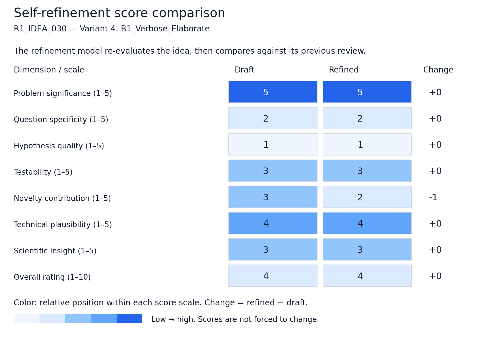

Changed score dimensions: novelty_contribution.

### Score justifications (draft / refined)

**Problem significance**

```json
{
  "draft": {
    "score": 5.0,
    "justification": "Enabling continuous knowledge updates in LLMs is a critical and well-recognized challenge. Overcoming the limitations of context-based methods (RAG, ICL) is highly relevant for both research and practical deployment."
  },
  "refined": {
    "score": 5.0,
    "justification": "The problem is highly significant. Enabling efficient, continuous knowledge updates in LLMs is a major open challenge with substantial implications for keeping models current, reducing reliance on context windows, and improving practicality. The limitations of RAG and ICL are well-recognized, making this a meaningful research direction."
  }
}
```

**Question specificity**

```json
{
  "draft": {
    "score": 2.0,
    "justification": "The idea states a general direction (use LoRA for knowledge updates) but does not define a concrete research question. It lacks specificity about what aspect of the problem will be investigated."
  },
  "refined": {
    "score": 2.0,
    "justification": "The idea lacks a concrete research question. It states a general direction ('use LoRA for knowledge updates') but does not specify what aspect of the problem or method will be investigated. There is no clear 'what will we learn?' component."
  }
}
```

**Hypothesis quality**

```json
{
  "draft": {
    "score": 1.0,
    "justification": "No hypothesis is presented. The text describes a proposed approach but does not make a testable prediction about its outcomes, advantages, or mechanisms compared to existing methods."
  },
  "refined": {
    "score": 1.0,
    "justification": "No hypothesis is presented. The text describes a proposed approach but makes no testable prediction about its outcomes, advantages, mechanisms, or comparative performance. It is purely a proposal of a tool to use, not a falsifiable claim."
  }
}
```

**Testability**

```json
{
  "draft": {
    "score": 3.0,
    "justification": "The general direction is testable in principle (one could fine-tune with LoRA and evaluate knowledge updates), but the idea as presented does not suggest a specific experiment, comparison, or evaluation metric. It relies on the reader to imagine how it might be tested."
  },
  "refined": {
    "score": 3.0,
    "justification": "The general concept is testable in principle—one could implement LoRA-based updates and evaluate them. However, the idea itself does not suggest any specific experiment, comparison, evaluation metric, or method of obtaining evidence. The testability is latent but not articulated."
  }
}
```

**Novelty contribution**

```json
{
  "draft": {
    "score": 3.0,
    "justification": "Using LoRA for fine-tuning is not novel. The potential contribution lies in applying it to the specific problem of continuous knowledge updating and possibly demonstrating advantages over other methods. However, without a specific hypothesis or novel mechanism, the contribution is currently unclear."
  },
  "refined": {
    "score": 2.0,
    "justification": "Using LoRA for fine-tuning is a standard technique. The potential novelty lies in its application to the specific problem of continuous knowledge updating, but without a specific hypothesis or novel mechanism (e.g., a modified LoRA architecture for sequential learning), the contribution is currently minimal and application-focused."
  }
}
```

**Technical plausibility**

```json
{
  "draft": {
    "score": 4.0,
    "justification": "Using LoRA for parameter-efficient fine-tuning is a well-established technique. Applying it to integrate new knowledge into an LLM is technically plausible and coherent. The assumption that a parametric approach could address limitations of retrieval/context is reasonable."
  },
  "refined": {
    "score": 4.0,
    "justification": "The proposed direction is technically plausible. LoRA is a well-understood method for parameter-efficient fine-tuning, and applying it to integrate new knowledge into LLM weights is coherent. The reasoning that a parametric approach could address context-length limitations is logically sound."
  }
}
```

**Scientific insight**

```json
{
  "draft": {
    "score": 3.0,
    "justification": "If properly investigated, comparing parametric vs. non-parametric knowledge update methods could yield insights into the trade-offs between context-based and weight-based memory in LLMs. However, the idea as stated does not explicitly aim for such comparative insight."
  },
  "refined": {
    "score": 3.0,
    "justification": "If properly framed as a comparative study, investigating LoRA for continuous updates could yield insights into the trade-offs between parametric and non-parametric memory in LLMs (e.g., efficiency-stability trade-offs, forgetting behaviors). However, as stated, the idea does not explicitly aim for such general insight; it is more of a technical proposal."
  }
}
```

**Overall rating**

```json
{
  "draft": {
    "score": 4.0,
    "justification": "The idea identifies a significant problem and proposes a plausible technical direction. However, it is currently more of a motivation statement than a research idea. It lacks a clear research question, hypothesis, and experimental approach, which severely limits its specificity, testability, and potential for scientific contribution. With refinement, it could become a strong idea."
  },
  "refined": {
    "score": 4.0,
    "justification": "The idea identifies a significant problem and proposes a plausible technical direction. However, it is currently a motivation statement rather than a research idea. It lacks a clear research question, hypothesis, and experimental approach, which severely limits its specificity, testability, and potential for scientific contribution. With substantial refinement, it could become a strong idea."
  }
}
```

## R1_IDEA_030 — Variant 5: B2_Grand_Narrative

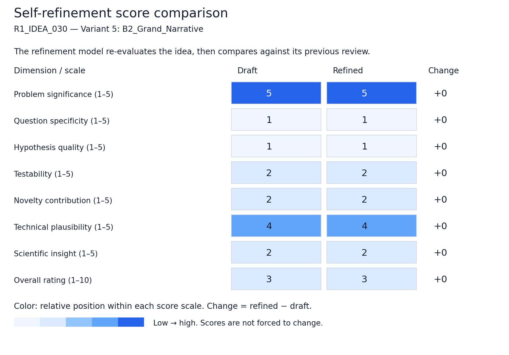

Changed score dimensions: none.

### Score justifications (draft / refined)

**Problem significance**

```json
{
  "draft": {
    "score": 5.0,
    "justification": "Continuous knowledge updating in LLMs is a highly significant and actively researched problem with clear practical and scientific importance."
  },
  "refined": {
    "score": 5.0,
    "justification": "Continuous knowledge updating in LLMs is a highly significant and actively researched problem with clear practical importance (maintaining model relevance) and scientific importance (understanding model adaptability and stability)."
  }
}
```

**Question specificity**

```json
{
  "draft": {
    "score": 1.0,
    "justification": "No specific research question is articulated. The idea merely states that LoRA 'could contribute' without defining what would be tested or compared."
  },
  "refined": {
    "score": 1.0,
    "justification": "No specific research question is articulated. The idea merely states that LoRA 'could contribute' and 'may inform' without defining what would be tested, compared, or measured."
  }
}
```

**Hypothesis quality**

```json
{
  "draft": {
    "score": 1.0,
    "justification": "There is no explicit or implicit hypothesis. The language is entirely speculative ('could contribute', 'may inform'), with no concrete prediction about LoRA's properties or performance."
  },
  "refined": {
    "score": 1.0,
    "justification": "There is no explicit or implicit hypothesis. The language is entirely speculative ('could contribute', 'may inform'), with no concrete prediction about LoRA's properties, advantages, or performance for knowledge updating."
  }
}
```

**Testability**

```json
{
  "draft": {
    "score": 2.0,
    "justification": "While one could design experiments around LoRA for knowledge updating, the idea itself does not suggest any specific test, comparison, or evaluation method. It only names a technique without specifying how to investigate it."
  },
  "refined": {
    "score": 2.0,
    "justification": "While one could design experiments around LoRA for knowledge updating, the idea itself does not suggest any specific test, comparison, evaluation method, or measurable outcome. It only names a technique without specifying how to investigate it."
  }
}
```

**Novelty contribution**

```json
{
  "draft": {
    "score": 2.0,
    "justification": "Using LoRA for fine-tuning is not novel; applying it to 'knowledge updating' is a straightforward application unless a specific novel angle is identified. The idea does not claim any new mechanism or insight beyond a generic application."
  },
  "refined": {
    "score": 2.0,
    "justification": "Using LoRA for fine-tuning is not novel; applying it to 'knowledge updating' is a straightforward application unless a specific novel angle is identified. The idea does not claim any new mechanism, insight, or comparative advantage beyond a generic application suggestion."
  }
}
```

**Technical plausibility**

```json
{
  "draft": {
    "score": 4.0,
    "justification": "LoRA is a plausible technique for parameter-efficient fine-tuning, and using it for knowledge updates is technically coherent. No obvious technical flaws are present in the brief description."
  },
  "refined": {
    "score": 4.0,
    "justification": "LoRA is a plausible technique for parameter-efficient fine-tuning, and using it for knowledge updates is technically coherent. The reasoning that parametric approaches could address retrieval/context limitations is logically sound, though not elaborated."
  }
}
```

**Scientific insight**

```json
{
  "draft": {
    "score": 2.0,
    "justification": "As presented, the idea suggests applying an existing method to a problem without specifying what scientific insight might be gained. It could potentially reveal insights about efficient updating or forgetting, but this is not articulated."
  },
  "refined": {
    "score": 2.0,
    "justification": "As presented, the idea suggests applying an existing method to a problem without specifying what scientific insight might be gained. It could potentially reveal insights about efficient updating, forgetting dynamics, or stability-plasticity trade-offs, but this is not articulated."
  }
}
```

**Overall rating**

```json
{
  "draft": {
    "score": 3.0,
    "justification": "The idea identifies an important problem and points to a relevant technique, but it lacks a concrete research question, hypothesis, or experimental direction. It reads as a vague motivation rather than a testable research idea. Without specificity, its scientific contribution is unclear."
  },
  "refined": {
    "score": 3.0,
    "justification": "The idea identifies an important problem and points to a relevant technique, but it lacks a concrete research question, hypothesis, or experimental direction. It reads as a vague motivation rather than a testable research idea. Without specificity, its scientific contribution is unclear and it falls into the 'weak idea' category (mostly generic motivation with poorly defined research question)."
  }
}
```

## R1_IDEA_030 — Variant 6: B3_Over_Confident

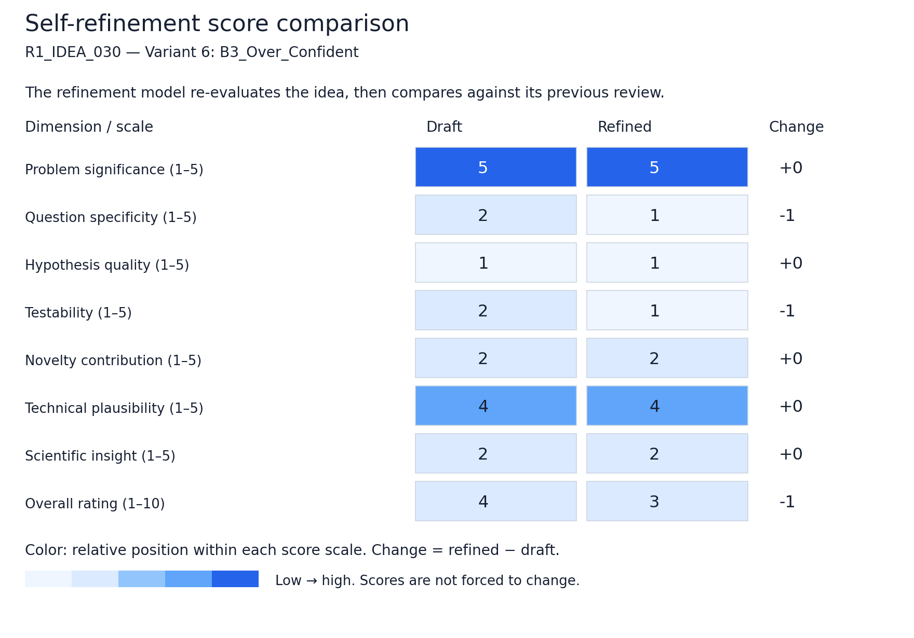

Changed score dimensions: question_specificity, testability, overall_rating.

### Score justifications (draft / refined)

**Problem significance**

```json
{
  "draft": {
    "score": 5.0,
    "justification": "Continuous knowledge updating in LLMs is a highly significant problem with both scientific and practical importance. The limitations of retrieval-based methods are well-recognized, making parametric approaches an important research direction."
  },
  "refined": {
    "score": 5.0,
    "justification": "Continuous knowledge updating in LLMs is a fundamental and highly significant challenge. The limitations of retrieval-based methods (RAG, in-context learning) are well-documented, making parametric updating an important research direction with substantial practical and scientific relevance."
  }
}
```

**Question specificity**

```json
{
  "draft": {
    "score": 2.0,
    "justification": "The idea mentions a general direction but doesn't define a concrete research question. It states what will be done (use LoRA) but not what specific aspect of knowledge updating will be investigated or what relationship will be tested."
  },
  "refined": {
    "score": 1.0,
    "justification": "The idea lacks a concrete research question. It merely states a general direction ('use LoRA for knowledge updating') without specifying what aspect of updating is being investigated, what relationship is being tested, or what phenomenon is being explored. It is more of a topic announcement than a defined inquiry."
  }
}
```

**Hypothesis quality**

```json
{
  "draft": {
    "score": 1.0,
    "justification": "No hypothesis is presented. The idea merely suggests using LoRA without predicting why it might work better, what mechanism might be involved, or what specific outcome is expected. It's more of a technical suggestion than a research hypothesis."
  },
  "refined": {
    "score": 1.0,
    "justification": "No hypothesis is presented, either explicit or implicit. The idea does not make a testable prediction, propose a mechanism, or distinguish itself from a generic application. It suggests a technique without stating what outcome is expected or why."
  }
}
```

**Testability**

```json
{
  "draft": {
    "score": 2.0,
    "justification": "While one could design experiments to test LoRA for knowledge updating, the idea itself doesn't suggest how it would be tested or what evidence would support its claims. No evaluation metrics, comparisons, or experimental designs are mentioned."
  },
  "refined": {
    "score": 1.0,
    "justification": "The idea, as stated, is not testable because it makes no claim that can be evaluated. While one could design experiments around LoRA for updating, the idea itself provides no framework for what would constitute evidence, what metrics would be used, or what comparisons would be meaningful."
  }
}
```

**Novelty contribution**

```json
{
  "draft": {
    "score": 2.0,
    "justification": "LoRA is an existing technique, and applying it to knowledge updating is not inherently novel without a specific innovation. The idea claims novelty but doesn't articulate what specifically is new about the proposed approach beyond using an existing method for a known problem."
  },
  "refined": {
    "score": 2.0,
    "justification": "Applying LoRA to knowledge updating is not inherently novel; LoRA is an established fine-tuning method, and its use for sequential learning or updating has been explored. The idea claims novelty without articulating a specific innovation, variant, or unexplored angle that would constitute a new contribution."
  }
}
```

**Technical plausibility**

```json
{
  "draft": {
    "score": 4.0,
    "justification": "Using LoRA for knowledge updating is technically plausible. LoRA has been successfully used for efficient fine-tuning, and extending it to continuous updating is a reasonable direction. The technical reasoning is coherent at a high level."
  },
  "refined": {
    "score": 4.0,
    "justification": "Using LoRA for knowledge updating is technically plausible. LoRA is designed for efficient parameter updates, and extending it to continuous learning scenarios is a coherent and reasonable direction. The high-level reasoning is sound, though details are absent."
  }
}
```

**Scientific insight**

```json
{
  "draft": {
    "score": 2.0,
    "justification": "As presented, the idea seems focused on a technical solution rather than generating scientific insight. Without a specific hypothesis about mechanisms or relationships, it's unclear what would be learned beyond whether LoRA works for this application. However, if properly framed, it could yield insights about efficient knowledge integration in neural networks."
  },
  "refined": {
    "score": 2.0,
    "justification": "As presented, the idea is solution-oriented and unlikely to yield deep scientific insight. Without a hypothesis about mechanisms or relationships, it primarily asks whether a technique works for an application. However, if properly framed (e.g., studying how low-rank updates affect knowledge interference), it could offer insights into efficient knowledge integration in neural networks."
  }
}
```

**Overall rating**

```json
{
  "draft": {
    "score": 4.0,
    "justification": "This is a weak research idea as presented. While it addresses an important problem and suggests a plausible technical direction, it lacks a clear research question, testable hypothesis, or framework for evaluation. The idea is more of a technical suggestion than a research investigation. It needs substantial refinement to become a meaningful research direction."
  },
  "refined": {
    "score": 3.0,
    "justification": "This is a weak research idea. It identifies an important problem and suggests a plausible technical direction, but it lacks a defined research question, a testable hypothesis, and any framework for evaluation. The idea is essentially a technical suggestion without a scientific investigation component. It requires substantial refinement to become a meaningful research direction."
  }
}
```

## R1_IDEA_030 — Variant 7: B4_Novelty

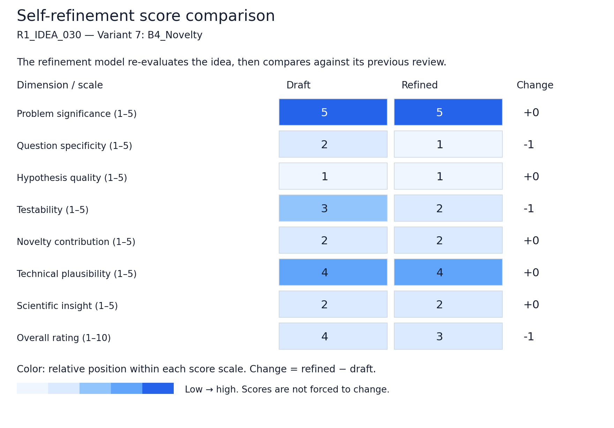

Changed score dimensions: question_specificity, testability, overall_rating.

### Score justifications (draft / refined)

**Problem significance**

```json
{
  "draft": {
    "score": 5.0,
    "justification": "Continuous knowledge updating is a fundamental and high-impact challenge for deploying LLMs in dynamic real-world environments. The problem is well-motivated and significant for both research and practice."
  },
  "refined": {
    "score": 5.0,
    "justification": "Continuous knowledge updating is a fundamental and high-stakes challenge for LLMs in dynamic environments. It has significant implications for real-world deployment, maintenance, and reliability. The problem is well-motivated and widely recognized as important."
  }
}
```

**Question specificity**

```json
{
  "draft": {
    "score": 2.0,
    "justification": "The idea states a general direction (parametric approach via LoRA) but does not define a specific research question. It lacks concrete terms about what relationship or phenomenon is being investigated."
  },
  "refined": {
    "score": 1.0,
    "justification": "The idea lacks a defined research question. It states a general direction ('parametric approach via LoRA') but doesn't specify what is being investigated about that approach. There's no concrete inquiry into mechanisms, trade-offs, or comparisons."
  }
}
```

**Hypothesis quality**

```json
{
  "draft": {
    "score": 1.0,
    "justification": "No hypothesis is presented. The idea merely suggests using LoRA as an alternative direction without making a concrete, testable prediction about outcomes or mechanisms."
  },
  "refined": {
    "score": 1.0,
    "justification": "No hypothesis is present. The idea doesn't make a testable prediction about outcomes, mechanisms, or relationships. It merely suggests using LoRA as an alternative without stating what result is expected or why."
  }
}
```

**Testability**

```json
{
  "draft": {
    "score": 3.0,
    "justification": "The general direction is testable in principle (one could implement LoRA-based updating and compare to baselines), but without a specific hypothesis or evaluation plan, it's unclear what exactly would be tested. The idea implies a comparison to context-based methods, which provides some testable angle."
  },
  "refined": {
    "score": 2.0,
    "justification": "While one could technically implement LoRA-based updates and compare to baselines, the idea doesn't specify what to test. Without a hypothesis or evaluation criteria, it's unclear what evidence would support or contradict the proposal. The implied comparison to RAG/ICL provides a minimal testable angle, but it's not developed."
  }
}
```

**Novelty contribution**

```json
{
  "draft": {
    "score": 2.0,
    "justification": "Using LoRA for updating LLMs is not novel in itself; LoRA is a standard technique for parameter-efficient fine-tuning. The claimed novelty of 'a novel perspective' or 'fresh framing' is not substantiated. The potential contribution is currently vague."
  },
  "refined": {
    "score": 2.0,
    "justification": "Using LoRA for updating LLMs is not novel; LoRA is a standard parameter-efficient fine-tuning method. The claim of a 'novel perspective' or 'fresh framing' is asserted but not explained, so the potential contribution remains vague and unsubstantiated."
  }
}
```

**Technical plausibility**

```json
{
  "draft": {
    "score": 4.0,
    "justification": "Using LoRA for parametric knowledge updates is technically plausible. LoRA is a established method for efficient adaptation, and applying it to continual knowledge integration is a reasonable technical direction. The reasoning is logically coherent at a high level."
  },
  "refined": {
    "score": 4.0,
    "justification": "Applying LoRA to knowledge updates is technically plausible. LoRA is a well-established adaptation technique, and using it for incremental learning is a coherent direction. The high-level reasoning is logical, though missing details on the update protocol."
  }
}
```

**Scientific insight**

```json
{
  "draft": {
    "score": 2.0,
    "justification": "As presented, the idea seems primarily application-focused (use LoRA for updating). It lacks a clear path to generating deeper scientific insight about memory mechanisms, knowledge representation, or learning dynamics in LLMs. The 'novel perspective' is not explained, so its potential for insight is unclear."
  },
  "refined": {
    "score": 2.0,
    "justification": "As presented, the idea seems primarily applicative (use LoRA for updates). It doesn't articulate a path to deeper insight about memory mechanisms, knowledge representation, or learning dynamics in LLMs. The promised 'novel perspective' could offer insight, but it's not described, so potential is low."
  }
}
```

**Overall rating**

```json
{
  "draft": {
    "score": 4.0,
    "justification": "The idea identifies a significant problem but is currently underdeveloped as a research proposal. It lacks a clear research question, a testable hypothesis, and a substantiated claim of novelty. It reads more like a high-level motivation or a technical direction than a concrete research idea. Its main strength is the problem significance, but the other critical dimensions are weak."
  },
  "refined": {
    "score": 3.0,
    "justification": "The idea identifies a significant problem but is severely underdeveloped as a research proposal. It lacks a research question, hypothesis, and clear novelty. It reads as a high-level technical suggestion rather than a concrete research idea. The low scores in specificity, hypothesis quality, and novelty outweigh the high problem significance."
  }
}
```

## R1_IDEA_030 — Variant 8: B5_Application_Impact

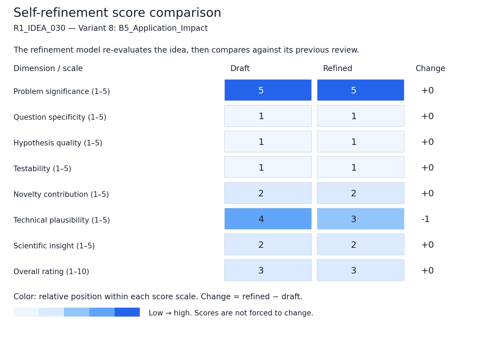

Changed score dimensions: technical_plausibility.

### Score justifications (draft / refined)

**Problem significance**

```json
{
  "draft": {
    "score": 5.0,
    "justification": "Continuous knowledge updating in LLMs is a highly significant problem with both scientific and practical importance. The inability of LLMs to efficiently integrate new knowledge without catastrophic forgetting or extensive retraining is a well-recognized limitation that affects real-world deployment."
  },
  "refined": {
    "score": 5.0,
    "justification": "The problem is exceptionally significant. Enabling LLMs to integrate new knowledge continuously without catastrophic forgetting or prohibitive retraining costs is a fundamental challenge for deploying reliable, up-to-date AI systems. It has major scientific and practical implications."
  }
}
```

**Question specificity**

```json
{
  "draft": {
    "score": 1.0,
    "justification": "The idea lacks a specific research question. It merely states that LoRA 'may be relevant' and 'could inform' workflows, without defining what aspect of knowledge updating would be investigated, what relationship would be tested, or what phenomenon would be examined."
  },
  "refined": {
    "score": 1.0,
    "justification": "The idea lacks a defined research question entirely. It states a problem and mentions a tool that 'may be relevant,' but does not specify what relationship, mechanism, or performance characteristic will be investigated. There is no concrete 'what' to study."
  }
}
```

**Hypothesis quality**

```json
{
  "draft": {
    "score": 1.0,
    "justification": "There is no explicit or implicit hypothesis. The text contains only vague suggestions of potential relevance ('may be relevant', 'could inform') without any concrete prediction about mechanisms, relationships, or expected outcomes that could be tested."
  },
  "refined": {
    "score": 1.0,
    "justification": "There is no hypothesis. The text contains only vague suggestions of potential utility ('may be relevant,' 'could inform'). There is no concrete, testable prediction about outcomes, mechanisms, or comparative advantages."
  }
}
```

**Testability**

```json
{
  "draft": {
    "score": 1.0,
    "justification": "The idea as presented is not testable because it doesn't specify what would be tested. There's no proposed experiment, comparison, evaluation, or analysis. One cannot design an investigation based on 'LoRA may be relevant to adaptable AI systems.'"
  },
  "refined": {
    "score": 1.0,
    "justification": "The idea is not testable in its current form. It proposes no experiment, comparison, evaluation metric, or analysis plan. One cannot derive a procedure to gather evidence for or against the vague notion that LoRA 'may be relevant.'"
  }
}
```

**Novelty contribution**

```json
{
  "draft": {
    "score": 2.0,
    "justification": "While applying LoRA to knowledge updating could be novel, the idea doesn't articulate what novel contribution would be made. LoRA is already established for parameter-efficient fine-tuning; applying it to knowledge updating without specifying a novel angle or insight offers limited contribution potential."
  },
  "refined": {
    "score": 2.0,
    "justification": "The potential contribution is low. Applying LoRA to a task is not novel in itself. The idea does not articulate a novel angle, such as a new update protocol, a theoretical insight into continual learning with low-rank updates, or a discovered limitation of existing methods that LoRA uniquely addresses. It suggests a straightforward application."
  }
}
```

**Technical plausibility**

```json
{
  "draft": {
    "score": 4.0,
    "justification": "The technical direction is plausible. LoRA is a reasonable approach for parameter-efficient updates, and the reasoning that parametric methods could address limitations of retrieval-based methods is logically coherent. However, the connection between LoRA and specifically solving retrieval quality/context length issues is not explained."
  },
  "refined": {
    "score": 3.0,
    "justification": "The direction is somewhat plausible but superficially reasoned. Using LoRA for efficient updates is logically coherent. However, the idea does not explain how LoRA specifically overcomes the cited limitations of retrieval quality and context length—these are primarily issues with non-parametric methods, so switching to a parametric method is a category change, not a specific argument for LoRA. The core technical leap is assumed, not justified."
  }
}
```

**Scientific insight**

```json
{
  "draft": {
    "score": 2.0,
    "justification": "The idea as stated has low potential for scientific insight. It suggests applying an existing method to a problem without specifying what we might learn about the method, the problem, or their interaction. A well-executed study could provide insights, but the current formulation doesn't indicate what those might be."
  },
  "refined": {
    "score": 2.0,
    "justification": "Potential for scientific insight is minimal as stated. A simple application study might show if LoRA works for this task, but would not inherently reveal new principles about continual learning, knowledge representation, or model adaptation. The idea does not suggest it will investigate underlying mechanisms, boundary conditions, or generalizable relationships."
  }
}
```

**Overall rating**

```json
{
  "draft": {
    "score": 3.0,
    "justification": "This is a weak research idea. While it identifies an important problem and suggests a plausible technical direction, it lacks the core elements of a research idea: a specific question, testable hypothesis, or clear investigation plan. It reads more like a motivation statement than a research proposal. The vagueness ('may be relevant', 'could inform') prevents meaningful evaluation of its scientific potential."
  },
  "refined": {
    "score": 3.0,
    "justification": "This is a weak research idea. It successfully identifies a very important problem but fails to define a research question, hypothesis, or testable investigation. It reads as a motivation or a very high-level suggestion, not as a research direction. Without these core elements, its scientific merit cannot be assessed as strong, despite the significance of the problem area."
  }
}
```

## R1_IDEA_030 — Variant 9: C1_Hollow_Shell

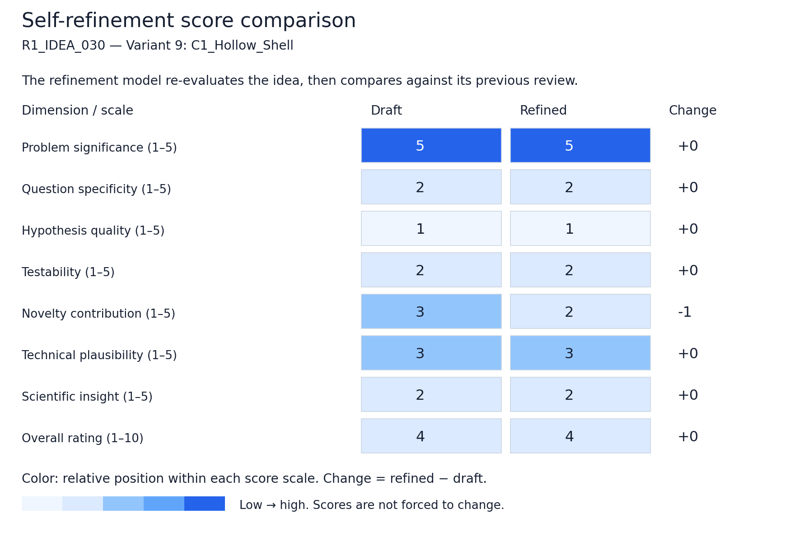

Changed score dimensions: novelty_contribution.

### Score justifications (draft / refined)

**Problem significance**

```json
{
  "draft": {
    "score": 5.0,
    "justification": "The problem of updating knowledge in large models is highly significant in contemporary AI research. It addresses practical challenges in maintaining up-to-date models without full retraining, which has substantial implications for efficiency, cost, and real-world deployment."
  },
  "refined": {
    "score": 5.0,
    "justification": "The problem is highly significant. Efficiently updating knowledge in large models is a major practical and research challenge with implications for deployment cost, model relevance, and environmental impact. It addresses a core limitation of static models in dynamic environments."
  }
}
```

**Question specificity**

```json
{
  "draft": {
    "score": 2.0,
    "justification": "The research question is poorly defined. While it identifies a general problem area (knowledge updating) and a vague direction (parameter adjustment vs. memory perspectives), it lacks a concrete question about what relationship, mechanism, or phenomenon will be investigated."
  },
  "refined": {
    "score": 2.0,
    "justification": "The research question is poorly defined. It identifies a problem area and a vague direction but lacks a concrete question about what relationship, mechanism, or phenomenon will be investigated. 'Parameter adjustment vs. memory perspectives' is a broad theme, not a specific inquiry."
  }
}
```

**Hypothesis quality**

```json
{
  "draft": {
    "score": 1.0,
    "justification": "There is no explicit or implicit testable hypothesis. The idea merely states a proposed direction without making a concrete prediction about outcomes, mechanisms, or relationships that could be supported or contradicted by evidence."
  },
  "refined": {
    "score": 1.0,
    "justification": "There is no testable hypothesis. The idea proposes a directional shift without making any concrete prediction about outcomes, mechanisms, or relationships that could be supported or contradicted by evidence. It states what might be done, not what might be true."
  }
}
```

**Testability**

```json
{
  "draft": {
    "score": 2.0,
    "justification": "The idea is minimally testable because it proposes a general direction rather than a specific claim. Without details about the method, comparison baselines, or evaluation metrics, it's unclear how one would design an experiment to test whether this approach is better than alternatives."
  },
  "refined": {
    "score": 2.0,
    "justification": "The idea is minimally testable. Without details about the method, baselines, or evaluation metrics, designing an experiment to test whether this approach is better is unclear. The proposal is a general direction rather than a specific claim that can be investigated."
  }
}
```

**Novelty contribution**

```json
{
  "draft": {
    "score": 3.0,
    "justification": "The idea hints at novelty by proposing to move away from 'conventional perspectives on model memory,' but without specifying what those are or what the new approach entails, the potential contribution is unclear. Parameter adjustment for knowledge updating is not inherently novel (e.g., fine-tuning, editing methods exist)."
  },
  "refined": {
    "score": 2.0,
    "justification": "The potential contribution is unclear. While hinting at a shift from memory perspectives, parameter adjustment for knowledge updating is not novel per se (fine-tuning, editing, delta tuning exist). Without specifying how the approach differs fundamentally from existing parameter adjustment methods, novelty appears low."
  }
}
```

**Technical plausibility**

```json
{
  "draft": {
    "score": 3.0,
    "justification": "The general notion of using parameter adjustment for knowledge updating is technically plausible, as parameter editing and fine-tuning are established techniques. However, without details, it's impossible to assess whether the specific approach is coherent or reasonable."
  },
  "refined": {
    "score": 3.0,
    "justification": "The general notion is plausible since parameter adjustment is a known mechanism. However, without details, coherence cannot be assessed. The idea lacks reasoning about why parameter adjustment would overcome the stated limitations, making technical soundness uncertain."
  }
}
```

**Scientific insight**

```json
{
  "draft": {
    "score": 2.0,
    "justification": "The idea currently promises limited scientific insight. It appears focused on an engineering solution ('a different method') rather than investigating underlying mechanisms, principles, or boundary conditions. Without a hypothesis about why parameter adjustment might be fundamentally better, the potential for transferable insight is low."
  },
  "refined": {
    "score": 2.0,
    "justification": "Limited potential for scientific insight. The idea appears focused on proposing an alternative method rather than investigating underlying mechanisms, principles, or boundary conditions. Without a hypothesis about why parameter adjustment might be fundamentally better, transferable insight is low."
  }
}
```

**Overall rating**

```json
{
  "draft": {
    "score": 4.0,
    "justification": "This is a weak research idea. While it addresses a highly significant problem, it lacks the specificity, testable hypothesis, and clear research question needed for meaningful scientific investigation. The proposal is too vague to evaluate its potential contribution or insight. It reads more as a general motivation than a research direction."
  },
  "refined": {
    "score": 4.0,
    "justification": "This is a weak research idea. While addressing a highly significant problem, it lacks specificity, a testable hypothesis, and a clear research question. The proposal is too vague to evaluate its potential contribution or insight, reading more as a general motivation than a research direction."
  }
}
```

## R1_IDEA_030 — Variant 10: C2_Logic_Flawed

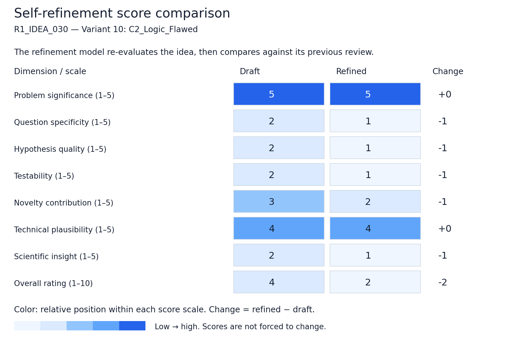

Changed score dimensions: question_specificity, hypothesis_quality, testability, novelty_contribution, scientific_insight, overall_rating.

### Score justifications (draft / refined)

**Problem significance**

```json
{
  "draft": {
    "score": 5.0,
    "justification": "Continuous knowledge updating in LLMs is a highly significant problem with both research and practical implications. The inability of LLMs to efficiently incorporate new knowledge without retraining is a well-known limitation that affects real-world deployment."
  },
  "refined": {
    "score": 5.0,
    "justification": "Continuous knowledge updating in LLMs is a highly significant problem with both research and practical importance. The inability of LLMs to efficiently incorporate new knowledge without full retraining is a major limitation affecting real-world deployment, making this a meaningful research direction."
  }
}
```

**Question specificity**

```json
{
  "draft": {
    "score": 2.0,
    "justification": "The idea lacks a clearly defined research question. It suggests using LoRA for knowledge updating but doesn't specify what aspect of this application will be investigated. The statement about 'broader effectiveness across related settings' is vague and non-specific."
  },
  "refined": {
    "score": 1.0,
    "justification": "The idea lacks any clearly defined research question. It merely suggests using LoRA for knowledge updating without specifying what aspect will be investigated. The mention of 'broader effectiveness across related settings' is particularly vague and non-specific."
  }
}
```

**Hypothesis quality**

```json
{
  "draft": {
    "score": 2.0,
    "justification": "There is no explicit or clearly implied hypothesis. The idea suggests LoRA 'may be effective' but doesn't make a concrete, testable prediction about how it compares to alternatives or under what conditions it would be superior."
  },
  "refined": {
    "score": 1.0,
    "justification": "There is no explicit or clearly implied hypothesis. The idea suggests LoRA 'may be effective' but doesn't make any concrete, testable prediction about how it compares to alternatives, under what conditions it would be superior, or what mechanism might explain its effectiveness."
  }
}
```

**Testability**

```json
{
  "draft": {
    "score": 2.0,
    "justification": "While the general direction of using LoRA for knowledge updating is testable, the idea doesn't propose any specific experiments, comparisons, or evaluations. Without a clear hypothesis or research question, it's unclear what evidence would support or contradict the claim."
  },
  "refined": {
    "score": 1.0,
    "justification": "While the general concept of using LoRA for knowledge updating is technically testable, the idea provides no framework for testing. There's no proposed experiment, comparison, evaluation metric, or method for obtaining evidence. Without any specific claim, it's unclear what would constitute supporting or contradicting evidence."
  }
}
```

**Novelty contribution**

```json
{
  "draft": {
    "score": 3.0,
    "justification": "The application of LoRA to knowledge updating has some novelty, though LoRA itself is an established technique. The framing as a parametric alternative to non-parametric methods offers a potentially interesting perspective, but the idea doesn't articulate what new scientific understanding this would provide beyond applying an existing method to a new problem."
  },
  "refined": {
    "score": 2.0,
    "justification": "The application of LoRA to knowledge updating has minimal novelty as LoRA is an established fine-tuning technique. The framing as parametric vs. non-parametric offers some conceptual interest, but the idea doesn't articulate what new scientific understanding would emerge beyond applying an existing method to a known problem."
  }
}
```

**Technical plausibility**

```json
{
  "draft": {
    "score": 4.0,
    "justification": "The technical direction is plausible. LoRA is a well-established parameter-efficient fine-tuning method that could theoretically be used for knowledge updates. The reasoning about limitations of context-based methods is coherent and reasonable."
  },
  "refined": {
    "score": 4.0,
    "justification": "The technical direction is plausible. LoRA is a well-established parameter-efficient fine-tuning method that could theoretically be used for knowledge updates. The reasoning about limitations of context-based methods (retrieval quality, context length) is coherent and reasonable."
  }
}
```

**Scientific insight**

```json
{
  "draft": {
    "score": 2.0,
    "justification": "As presented, the idea offers limited potential for scientific insight. It suggests applying an existing method to a problem without articulating what mechanisms, principles, or limitations might be discovered through this investigation. A well-designed study could reveal insights about parametric vs. non-parametric knowledge integration, but the current formulation doesn't point toward such insights."
  },
  "refined": {
    "score": 1.0,
    "justification": "As presented, the idea offers almost no potential for scientific insight. It suggests applying an existing method without articulating what mechanisms, principles, or limitations might be discovered. There's no indication of what could be learned about knowledge representation, updating dynamics, or the parametric/non-parametric trade-off."
  }
}
```

**Overall rating**

```json
{
  "draft": {
    "score": 4.0,
    "justification": "This is a weak research idea as presented. While it identifies an important problem and suggests a technically plausible direction, it lacks a clear research question, testable hypothesis, and specificity about what would actually be investigated. The idea reads more like a motivation or general suggestion than a research plan. With substantial refinement to define a concrete question and hypothesis, it could become a stronger research direction."
  },
  "refined": {
    "score": 2.0,
    "justification": "This is a very weak research idea. While it correctly identifies an important problem, it lacks virtually all essential components of a research direction: no specific question, no hypothesis, no testable claim, and no framework for investigation. It reads as a general suggestion or motivation statement rather than a research idea. Substantial refinement is needed to define what would actually be studied and why."
  }
}
```

## R1_IDEA_030 — Variant 11: C3_Substance_Enriched

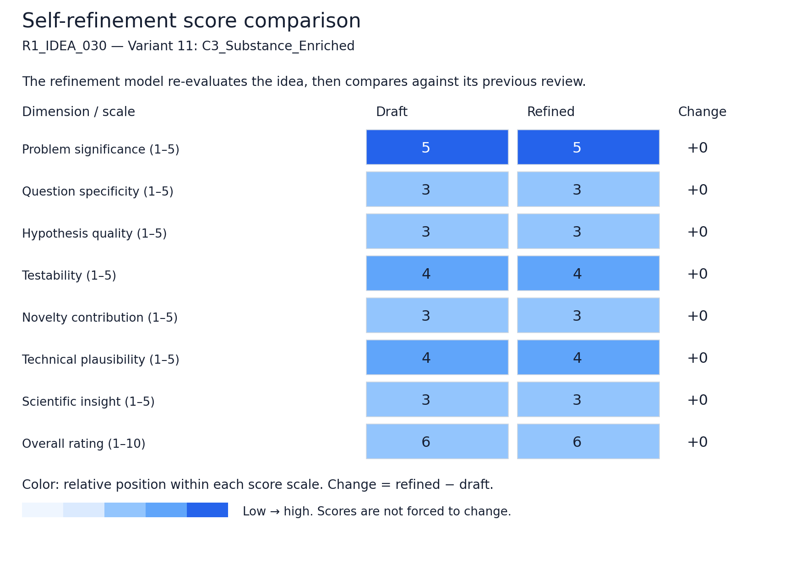

Changed score dimensions: none.

### Score justifications (draft / refined)

**Problem significance**

```json
{
  "draft": {
    "score": 5.0,
    "justification": "Continuous knowledge updating in LLMs is a highly significant and actively researched problem with clear practical implications for deploying models in dynamic environments. The idea correctly identifies limitations of current approaches (retrieval quality, context length)."
  },
  "refined": {
    "score": 5.0,
    "justification": "Continuous knowledge updating in LLMs is a fundamental and highly significant challenge. The limitations of retrieval-based methods (retrieval quality, context length) are well-known, and finding effective parametric updating techniques has major implications for deploying LLMs in dynamic real-world environments."
  }
}
```

**Question specificity**

```json
{
  "draft": {
    "score": 3.0,
    "justification": "The idea mentions a 'novel parametric approach via LoRA' and a hypothesis about validation, but does not explicitly state a crisp research question. The direction is specific (LoRA for knowledge updating), but the exact investigative focus (e.g., comparison, conditions, mechanisms) is not sharply defined."
  },
  "refined": {
    "score": 3.0,
    "justification": "The idea specifies a technical approach (LoRA) and a general goal (knowledge updating without forgetting), but the exact research question is not crisply defined. It mentions testing ability and boundary conditions, but doesn't state what relationship or comparison is being investigated. The direction is concrete, but the investigative focus is somewhat diffuse."
  }
}
```

**Hypothesis quality**

```json
{
  "draft": {
    "score": 3.0,
    "justification": "There is an implicit hypothesis that LoRA can integrate new knowledge without catastrophic forgetting, and that effectiveness depends on rank and knowledge similarity. This is a reasonable starting point but is stated as a 'plausible hypothesis' rather than a concrete, falsifiable prediction. It lacks a comparative element (e.g., vs. fine-tuning) and specificity on expected outcomes."
  },
  "refined": {
    "score": 3.0,
    "justification": "There is an implicit hypothesis that LoRA can integrate knowledge without catastrophic forgetting, with effectiveness depending on rank and similarity. This identifies relevant variables but is stated as a 'plausible hypothesis' rather than a concrete, falsifiable prediction. It lacks specificity about expected outcomes (e.g., how rank affects forgetting, how similarity modulates success) and doesn't make comparative claims against alternatives."
  }
}
```

**Testability**

```json
{
  "draft": {
    "score": 4.0,
    "justification": "The idea is highly testable. One can design experiments with LoRA updates on new facts, measure knowledge integration and forgetting, and vary rank and knowledge similarity. The proposed validation via testing is straightforward to implement."
  },
  "refined": {
    "score": 4.0,
    "justification": "The idea is highly testable. Experiments can be designed where LoRA adapts an LLM to new facts, with measurements of accuracy on new facts and retention on old facts. The boundary conditions (rank, knowledge similarity) can be systematically varied. The proposed validation is straightforward to operationalize with existing benchmarks and evaluation protocols."
  }
}
```

**Novelty contribution**

```json
{
  "draft": {
    "score": 3.0,
    "justification": "Using LoRA for knowledge updating is not entirely novel; LoRA is known for efficient adaptation, and its application to continual learning or knowledge editing has been explored. The novelty here is framing it specifically for continuous knowledge updating in LLMs and considering boundary conditions. The contribution could be moderate if it yields new insights about when/how low-rank updates work for knowledge integration."
  },
  "refined": {
    "score": 3.0,
    "justification": "Using LoRA for knowledge updating is not entirely novel; LoRA is a well-known parameter-efficient fine-tuning method, and its application to continual learning or knowledge editing has been explored. The contribution lies in framing it specifically for continuous factual knowledge updating in LLMs and emphasizing boundary conditions. The novelty is moderate unless the investigation reveals new principles about low-rank updates for knowledge integration."
  }
}
```

**Technical plausibility**

```json
{
  "draft": {
    "score": 4.0,
    "justification": "The idea is technically plausible. LoRA is a well-established method for parameter-efficient tuning, and its low-rank nature might help mitigate catastrophic forgetting by constraining updates. The reasoning about rank and similarity affecting effectiveness is coherent and aligns with intuitions about model adaptation."
  },
  "refined": {
    "score": 4.0,
    "justification": "The idea is technically plausible. LoRA's constrained low-rank updates could help mitigate catastrophic forgetting by limiting changes to the model's parameters, which aligns with continual learning principles. The reasoning about rank and similarity affecting outcomes is coherent: lower rank may limit capacity for new knowledge, while greater distributional shift may challenge adaptation. No obvious technical flaws are present in the proposal."
  }
}
```

**Scientific insight**

```json
{
  "draft": {
    "score": 3.0,
    "justification": "The idea has potential for scientific insight if it goes beyond showing LoRA works. Investigating boundary conditions (rank, similarity) could reveal principles about how parametric knowledge integration depends on update complexity and distributional shift. However, as stated, the insight is somewhat limited to the performance of a particular method; deeper mechanistic understanding (e.g., how low-rank updates affect specific knowledge representations) is not articulated."
  },
  "refined": {
    "score": 3.0,
    "justification": "The idea has potential for scientific insight if it investigates the boundary conditions deeply. Understanding how rank constrains knowledge integration or how similarity affects updatability could reveal principles about parametric knowledge updates in LLMs. However, as stated, the insight is primarily about whether LoRA works for this task; deeper mechanistic understanding (e.g., how low-rank updates interact with specific model representations or knowledge localization) is not articulated."
  }
}
```

**Overall rating**

```json
{
  "draft": {
    "score": 6.0,
    "justification": "This is a moderate/borderline research idea. It addresses a significant problem and proposes a concrete technical direction with testable elements. However, it lacks a sharply defined research question and a strong, falsifiable hypothesis. The novelty is limited, and the potential scientific insight is moderate unless the investigation delves into underlying mechanisms or comparative principles. With refinement (clearer question, predictive hypothesis, insight goals), it could become a strong idea."
  },
  "refined": {
    "score": 6.0,
    "justification": "This is a moderate/borderline research idea. It addresses a significant problem with a concrete technical approach and testable elements. However, it lacks a sharply defined research question and a strong, falsifiable hypothesis. The novelty is limited, and the potential scientific insight is moderate unless the investigation moves beyond feasibility testing to explore underlying mechanisms or comparative principles. With refinement, it could become a strong idea."
  }
}
```

## R1_IDEA_030 — Variant 12: H1_Deceptive_Hollow

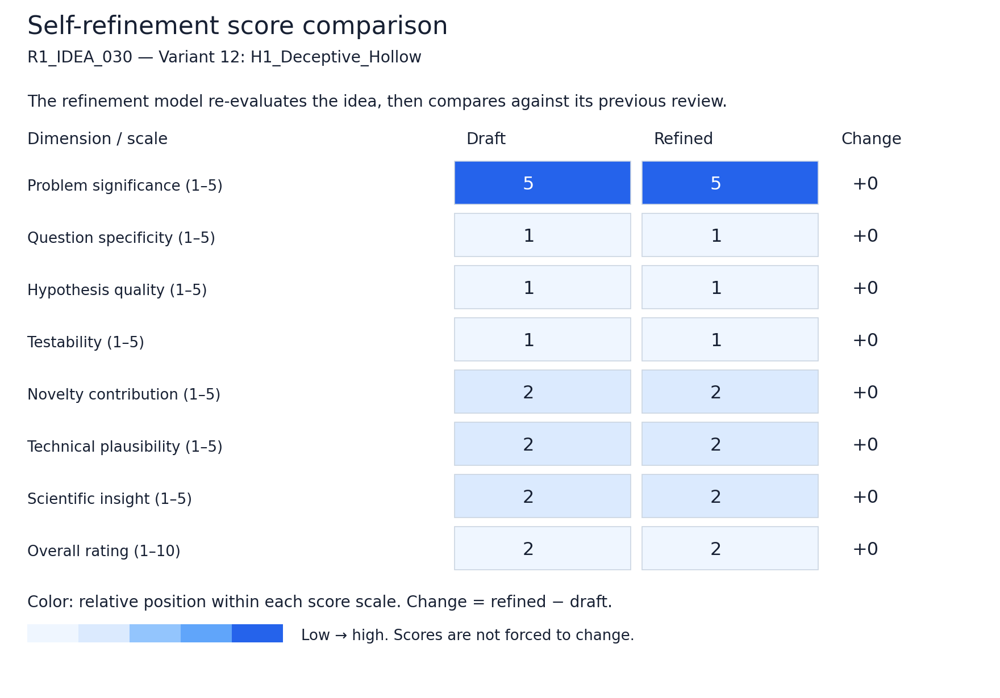

Changed score dimensions: none.

### Score justifications (draft / refined)

**Problem significance**

```json
{
  "draft": {
    "score": 5.0,
    "justification": "The problem of updating knowledge in large models is highly significant and a major active challenge in AI research. Efficiently incorporating new information without retraining or catastrophic forgetting is critical for deploying models in dynamic environments."
  },
  "refined": {
    "score": 5.0,
    "justification": "The problem of updating knowledge in large models is highly significant and a major active challenge in AI research. Efficiently incorporating new information without retraining or catastrophic forgetting is critical for deploying models in dynamic environments, making this a meaningful research direction."
  }
}
```

**Question specificity**

```json
{
  "draft": {
    "score": 1.0,
    "justification": "Extremely low specificity. The idea summary does not define a concrete research question. It states a general challenge and a vague directional shift ('parameter adjustment') without specifying what aspect will be investigated, compared, or analyzed."
  },
  "refined": {
    "score": 1.0,
    "justification": "Extremely low specificity. The idea summary does not define a concrete research question. It states a general challenge and a vague directional shift ('parameter adjustment') without specifying what aspect will be investigated, compared, or analyzed. No specific variables, relationships, or phenomena are identified for study."
  }
}
```

**Hypothesis quality**

```json
{
  "draft": {
    "score": 1.0,
    "justification": "No discernible hypothesis is presented. The text makes no concrete, falsifiable prediction. It describes an ambitious agenda and a change in perspective, but does not articulate a claim that could be supported or contradicted by evidence."
  },
  "refined": {
    "score": 1.0,
    "justification": "No discernible hypothesis is presented. The text makes no concrete, falsifiable prediction. It describes an ambitious agenda and a change in perspective, but does not articulate a claim that could be supported or contradicted by evidence. There is no 'if X then Y' structure or mechanism proposed."
  }
}
```

**Testability**

```json
{
  "draft": {
    "score": 1.0,
    "justification": "The idea as presented is not testable. There is no clear claim to test, no proposed experiment, comparison, or evaluation metric. The promise is framed at a high, aspirational level without a pathway to obtain evidence."
  },
  "refined": {
    "score": 1.0,
    "justification": "The idea as presented is not testable. There is no clear claim to test, no proposed experiment, comparison, or evaluation metric. The promise is framed at a high, aspirational level without a pathway to obtain evidence. One cannot design an experiment from this description alone."
  }
}
```

**Novelty contribution**

```json
{
  "draft": {
    "score": 2.0,
    "justification": "The stated ambition is high ('transformative synthesis'), but the actual proposed novelty is unclear. 'Parameter adjustment' for knowledge updating is already a vast and active area (e.g., model editing, fine-tuning). Without a specific novel mechanism or insight, the contribution appears generic. The potential contribution is asserted rhetorically rather than demonstrated."
  },
  "refined": {
    "score": 2.0,
    "justification": "The stated ambition is high ('transformative synthesis'), but the actual proposed novelty is unclear. 'Parameter adjustment' for knowledge updating is already a vast and active area (e.g., model editing, fine-tuning, LoRA). Without a specific novel mechanism, insight, or framing, the contribution appears generic. The potential contribution is asserted rhetorically rather than demonstrated through differentiation from existing work."
  }
}
```

**Technical plausibility**

```json
{
  "draft": {
    "score": 2.0,
    "justification": "The logical connection is weak. The summary states a problem (knowledge updating limitations) and proposes a vague solution direction (parameter adjustment) without explaining why this shift in perspective plausibly addresses the stated limitations. The reasoning is not fleshed out enough to assess technical coherence."
  },
  "refined": {
    "score": 2.0,
    "justification": "The logical connection is weak. The summary states a problem (knowledge updating limitations) and proposes a vague solution direction (parameter adjustment) without explaining why this shift in perspective plausibly addresses the stated limitations. The reasoning is not fleshed out enough to assess technical coherence. Important assumptions about parameter adjustment solving 'information access and processing scope' issues are not justified."
  }
}
```

**Scientific insight**

```json
{
  "draft": {
    "score": 2.0,
    "justification": "The potential for scientific insight is claimed to be high but is not substantiated. The idea suggests a reframing could yield general principles, but does not specify what those principles might be. As presented, it is more of a motivational declaration than a blueprint for discovering transferable insights about model knowledge, memory, or adaptation."
  },
  "refined": {
    "score": 2.0,
    "justification": "The potential for scientific insight is claimed to be high but is not substantiated. The idea suggests a reframing could yield general principles, but does not specify what those principles might be. As presented, it is more of a motivational declaration than a blueprint for discovering transferable insights about model knowledge, memory, or adaptation. The connection to broader 'robust, adaptive systems' is not developed."
  }
}
```

**Overall rating**

```json
{
  "draft": {
    "score": 2.0,
    "justification": "This is a very weak research idea in its current form. While it identifies an important problem, it fails to articulate a specific research question, hypothesis, or testable direction. The description is dominated by aspirational rhetoric about field-shaping potential without providing the concrete scientific substance needed to evaluate or pursue it. It reads more like a grand vision statement than a research idea with a clear path to investigation."
  },
  "refined": {
    "score": 2.0,
    "justification": "This is a very weak research idea in its current form. While it identifies an important problem, it fails to articulate a specific research question, hypothesis, or testable direction. The description is dominated by aspirational rhetoric about field-shaping potential without providing the concrete scientific substance needed to evaluate or pursue it. It lacks the specificity, testability, and novelty required for a meaningful research direction. The idea reads more like a grand vision statement than a research idea with a clear path to investigation."
  }
}
```

## R1_IDEA_030 — Variant 13: H2_Confident_Flaw


Changed score dimensions: none.

### Score justifications (draft / refined)

**Problem significance**

```json
{
  "draft": {
    "score": 5.0,
    "justification": "Continuous knowledge updating in LLMs is a highly significant problem with both research and practical implications. The limitations of RAG and context-based approaches are well-recognized, making this a meaningful challenge to address."
  },
  "refined": {
    "score": 5.0,
    "justification": "Continuous knowledge updating in LLMs is a highly significant problem with both research and practical importance. The limitations of retrieval-based and context-based approaches are well-recogned, making this a meaningful and timely challenge to address."
  }
}
```

**Question specificity**

```json
{
  "draft": {
    "score": 1.0,
    "justification": "Extremely poor specificity. The idea doesn't define a concrete research question - it merely states that LoRA could be used for knowledge updating and claims it will be broadly effective. No specific aspect of knowledge updating, evaluation criteria, or comparison points are defined."
  },
  "refined": {
    "score": 1.0,
    "justification": "Extremely poor specificity. The idea does not define a concrete research question—it merely states that LoRA could be used for knowledge updating and claims it will be broadly effective. No specific aspect of knowledge updating, evaluation criteria, comparison baselines, or experimental conditions are defined."
  }
}
```

**Hypothesis quality**

```json
{
  "draft": {
    "score": 1.0,
    "justification": "Very weak. The implicit hypothesis ('LoRA will be broadly effective/superior') is vague, untestable as stated, and makes an overconfident claim without specifying conditions or metrics. The idea explicitly rejects considering alternative explanations, making it unfalsifiable in practice."
  },
  "refined": {
    "score": 1.0,
    "justification": "Very weak. The implicit hypothesis ('LoRA will be broadly effective/superior') is vague, overconfident, and untestable as stated. It lacks concrete predictions, conditions, or metrics. The explicit rejection of considering alternative explanations renders it unfalsifiable in practice."
  }
}
```

**Testability**

```json
{
  "draft": {
    "score": 1.0,
    "justification": "Extremely weak. The idea dismisses the need to isolate confounding factors (dataset composition, evaluation criteria, etc.), which makes proper testing impossible. No experimental design, comparison points, or evaluation metrics are suggested. The claim that gains can be treated as causal evidence without controlling for alternatives is scientifically unsound."
  },
  "refined": {
    "score": 1.0,
    "justification": "Extremely weak. The idea dismisses the need to isolate confounding factors (dataset composition, evaluation criteria, etc.), which makes rigorous testing impossible. No experimental design, comparison points, or evaluation metrics are suggested. The claim that gains can be treated as causal evidence without controlling for alternatives is scientifically invalid."
  }
}
```

**Novelty contribution**

```json
{
  "draft": {
    "score": 2.0,
    "justification": "Low novelty. Using LoRA for model updating is not novel - LoRA is already widely used for parameter-efficient fine-tuning. The application to 'continuous knowledge updating' might have some novelty, but the idea doesn't specify what's new about this application compared to standard fine-tuning approaches."
  },
  "refined": {
    "score": 2.0,
    "justification": "Low novelty. Using LoRA for model updating is not novel—LoRA is already widely used for parameter-efficient fine-tuning. The application to 'continuous knowledge updating' might have some novelty, but the idea does not specify what is new about this application compared to standard fine-tuning or how it differs from existing parametric updating approaches."
  }
}
```

**Technical plausibility**

```json
{
  "draft": {
    "score": 3.0,
    "justification": "Moderately plausible. LoRA is a reasonable technical approach for parametric updates. However, the reasoning is logically problematic - claiming causal evidence without controlling for confounds is not scientifically valid. The technical mechanism (LoRA for updating) is plausible, but the scientific argumentation is flawed."
  },
  "refined": {
    "score": 3.0,
    "justification": "Moderately plausible. LoRA is a reasonable technical approach for parametric updates, and the mechanism is coherent. However, the scientific argumentation is flawed—claiming causal evidence without controlling for confounds is not valid. The core technical idea (using LoRA) is plausible, but the supporting reasoning is problematic."
  }
}
```

**Scientific insight**

```json
{
  "draft": {
    "score": 1.0,
    "justification": "Very low potential insight. The idea explicitly rejects investigating boundary cases, alternative explanations, or dataset effects. Even if successful, it would only show 'LoRA works' without revealing why, when, or under what conditions. No mechanisms, principles, or transferable insights are proposed for investigation."
  },
  "refined": {
    "score": 1.0,
    "justification": "Very low potential insight. The idea explicitly rejects investigating boundary cases, alternative explanations, or dataset effects. Even if successful, it would only show 'LoRA works' without revealing why, when, or under what conditions. No mechanisms, general principles, or transferable insights are proposed for investigation."
  }
}
```

**Overall rating**

```json
{
  "draft": {
    "score": 2.0,
    "justification": "Very weak research idea. While it addresses an important problem, the idea is poorly defined, makes overconfident claims, and explicitly rejects scientific rigor. The lack of a specific research question, testable hypothesis, and proper evaluation approach, combined with the dismissal of controlling for confounding factors, makes this unlikely to produce meaningful scientific contribution. The idea reads more like a solution in search of a problem rather than a well-formulated research direction."
  },
  "refined": {
    "score": 2.0,
    "justification": "Very weak research idea. While it addresses an important problem, the idea is poorly defined, makes overconfident and untestable claims, and explicitly rejects fundamental scientific rigor. The lack of a specific research question, testable hypothesis, proper evaluation approach, and the dismissal of controlling for confounding factors make this unlikely to produce meaningful scientific contribution. It reads as a solution in search of a problem rather than a well-formulated research direction."
  }
}
```

## R1_IDEA_030 — Variant 14: H3_Verbose_Enriched

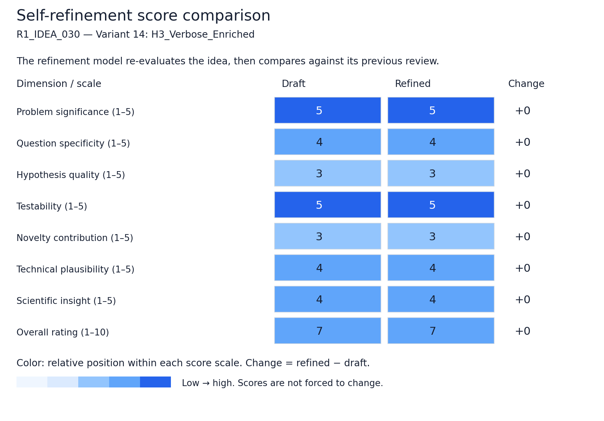

Changed score dimensions: none.

### Score justifications (draft / refined)

**Problem significance**

```json
{
  "draft": {
    "score": 5.0,
    "justification": "Continuous knowledge updating in LLMs is a critical open challenge with high practical and scientific importance. Catastrophic forgetting and the limitations of retrieval-based methods are well-recognized problems in the field."
  },
  "refined": {
    "score": 5.0,
    "justification": "Continuous knowledge updating in LLMs is a critical open challenge with high practical and scientific importance. Catastrophic forgetting and the limitations of retrieval-based methods are well-recognized, meaningful problems in the field."
  }
}
```

**Question specificity**

```json
{
  "draft": {
    "score": 4.0,
    "justification": "The idea specifies investigating LoRA for continuous factual knowledge integration without forgetting, and identifies boundary conditions like rank and knowledge similarity. However, the exact knowledge domain and update process remain undefined."
  },
  "refined": {
    "score": 4.0,
    "justification": "The idea specifies investigating LoRA for continuous factual knowledge integration without forgetting and identifies specific boundary conditions (rank, knowledge similarity). However, the exact knowledge domain, update process, and operational definitions remain undefined, preventing a perfect score."
  }
}
```

**Hypothesis quality**

```json
{
  "draft": {
    "score": 3.0,
    "justification": "The hypothesis that LoRA can integrate new knowledge without catastrophic forgetting is plausible but not particularly novel or sharp. It lacks a mechanistic prediction about why LoRA would outperform other parametric methods for this task."
  },
  "refined": {
    "score": 3.0,
    "justification": "The hypothesis that LoRA can integrate new knowledge without catastrophic forgetting is plausible and testable but not particularly novel or sharp. It lacks a mechanistic prediction about why LoRA would be uniquely suited for continuous updating compared to other parametric methods. It is more of an application premise than a distinctive hypothesis."
  }
}
```

**Testability**

```json
{
  "draft": {
    "score": 5.0,
    "justification": "Excellent testability. The proposal outlines a clear staged experimental design with baselines, interventions, ablations, sensitivity analyses, and error analysis. The boundary conditions are directly measurable."
  },
  "refined": {
    "score": 5.0,
    "justification": "Excellent testability. The proposal outlines a clear, staged experimental design with baselines, interventions, pre-specified evaluation criteria, ablations, sensitivity analyses, and error analysis. The boundary conditions (rank, similarity) are directly measurable, making the central claims highly falsifiable."
  }
}
```

**Novelty contribution**

```json
{
  "draft": {
    "score": 3.0,
    "justification": "Using LoRA for knowledge updating is not entirely novel (LoRA is widely used for fine-tuning), but applying it specifically for continuous factual updating with analysis of boundary conditions offers moderate novelty. The contribution would depend heavily on the insights gained from the proposed experiments."
  },
  "refined": {
    "score": 3.0,
    "justification": "Using LoRA for knowledge updating is not novel in itself (LoRA is widely used for fine-tuning). The novelty lies in applying it specifically for continuous factual updating with a structured analysis of boundary conditions. This offers moderate novelty; the contribution would depend heavily on the empirical insights gained."
  }
}
```

**Technical plausibility**

```json
{
  "draft": {
    "score": 4.0,
    "justification": "LoRA is a well-established technique for parameter-efficient adaptation. Using it for knowledge updating is technically plausible, though the challenges of sequential updating and interference in low-rank spaces are non-trivial."
  },
  "refined": {
    "score": 4.0,
    "justification": "LoRA is a well-established, technically sound technique for parameter-efficient adaptation. Using it for knowledge updating is plausible. However, the challenges of sequential updating, interference in low-rank spaces, and potential distribution shifts are non-trivial but not addressed, preventing a perfect score."
  }
}
```

**Scientific insight**

```json
{
  "draft": {
    "score": 4.0,
    "justification": "The proposed analysis of boundary conditions (rank, knowledge similarity) and failure cases could yield valuable insights into when parametric updating works, how low-rank adaptations interact with existing knowledge, and the trade-offs between parametric and non-parametric memory."
  },
  "refined": {
    "score": 4.0,
    "justification": "The proposed analysis of boundary conditions (rank, knowledge similarity) and failure cases could yield valuable insights into when parametric updating works, how low-rank adaptations interact with existing knowledge, and the trade-offs between parametric and non-parametric memory. The focus on 'when and why' rather than just 'if' is a strength."
  }
}
```

**Overall rating**

```json
{
  "draft": {
    "score": 7.0,
    "justification": "This is a strong research idea with a clear problem, a specific technical direction, and an exceptionally well-thought-out experimental design. The main limitations are the somewhat generic hypothesis and lack of specificity about the knowledge domain. However, the structured approach to testing boundary conditions and analyzing failures promises meaningful scientific insight. It falls short of exceptional due to moderate novelty and hypothesis sharpness."
  },
  "refined": {
    "score": 7.0,
    "justification": "This is a strong research idea. It addresses a significant problem, proposes a specific technical direction, and has an exceptionally well-thought-out experimental design that promises meaningful scientific insight into boundary conditions. It is held back from a higher rating by a somewhat generic hypothesis and lack of specificity about the knowledge domain and update process. The structured approach to testing elevates it above a simple application idea."
  }
}
```

## R1_IDEA_030 — Variant 15: H4_Ultimate_Hype


Changed score dimensions: none.

### Score justifications (draft / refined)

**Problem significance**

```json
{
  "draft": {
    "score": 5.0,
    "justification": "Continuous knowledge updating in LLMs is a highly significant problem with clear practical importance. The limitations of RAG and ICL are well-recognized, making this a meaningful research direction."
  },
  "refined": {
    "score": 5.0,
    "justification": "Continuous knowledge updating in LLMs is a highly significant problem with clear practical and research importance. The limitations of RAG and ICL are well-established, making this a meaningful direction."
  }
}
```

**Question specificity**

```json
{
  "draft": {
    "score": 1.0,
    "justification": "Extremely poor specificity. The idea merely states that LoRA could be used for knowledge updating without defining any concrete research question. It's more of a vague suggestion than a research question."
  },
  "refined": {
    "score": 1.0,
    "justification": "Extremely poor specificity. The idea merely suggests LoRA could be used for knowledge updating without defining any concrete research question, relationship to investigate, or phenomenon to study. It is a vague suggestion, not a research question."
  }
}
```

**Hypothesis quality**

```json
{
  "draft": {
    "score": 1.0,
    "justification": "No hypothesis is presented. There's an implicit assumption that LoRA might help with knowledge updating, but no concrete prediction about mechanisms, advantages, or expected outcomes. The language is promotional rather than hypothesis-driven."
  },
  "refined": {
    "score": 1.0,
    "justification": "No hypothesis is presented. There is an implicit assumption that LoRA might help, but no concrete prediction about mechanisms, advantages, or expected outcomes. The language is promotional, not hypothesis-driven."
  }
}
```

**Testability**

```json
{
  "draft": {
    "score": 1.0,
    "justification": "The idea as presented is not testable. It doesn't suggest any experiments, evaluations, comparisons, or analyses. Without a specific claim or question, there's nothing to test."
  },
  "refined": {
    "score": 1.0,
    "justification": "The idea as presented is not testable. It suggests no experiments, evaluations, comparisons, or analyses. Without a specific claim or question, there is nothing to test."
  }
}
```

**Novelty contribution**

```json
{
  "draft": {
    "score": 2.0,
    "justification": "While applying LoRA to knowledge updating might be relatively underexplored, the idea doesn't articulate what would be novel about the approach. Using parameter-efficient fine-tuning for updating isn't inherently novel without a specific innovation in how it's applied. The contribution is unclear."
  },
  "refined": {
    "score": 2.0,
    "justification": "Applying LoRA to knowledge updating is relatively underexplored but not inherently novel without a specific innovation. The idea does not articulate what would be novel about the approach—whether a new mechanism, a new evaluation, or a new insight—beyond a straightforward application."
  }
}
```

**Technical plausibility**

```json
{
  "draft": {
    "score": 3.0,
    "justification": "Using LoRA for model updates is technically plausible in principle, but the idea doesn't address known challenges like catastrophic forgetting or how to integrate updates without degrading existing capabilities. The technical reasoning is superficial."
  },
  "refined": {
    "score": 3.0,
    "justification": "Using LoRA for model updates is technically plausible in principle, but the idea does not address known challenges like catastrophic forgetting, interference, or evaluation difficulties. The technical reasoning is superficial but not incoherent."
  }
}
```

**Scientific insight**

```json
{
  "draft": {
    "score": 2.0,
    "justification": "The idea as stated promises transformative potential but doesn't articulate what scientific insights might be gained. Without a specific research question, it's unclear what would be learned about LLMs, knowledge representation, or updating mechanisms."
  },
  "refined": {
    "score": 2.0,
    "justification": "The idea promises transformative potential but does not articulate what scientific insights might be gained. Without a specific research question, it is unclear what would be learned about LLMs, knowledge representation, or updating mechanisms beyond whether LoRA can be used."
  }
}
```

**Overall rating**

```json
{
  "draft": {
    "score": 2.0,
    "justification": "This is a very weak research idea. While it identifies an important problem, it fails to define any concrete research question, hypothesis, or testable direction. It reads more like promotional material than a scientific research proposal. The lack of specificity makes it impossible to evaluate scientific merit beyond recognizing the problem's importance."
  },
  "refined": {
    "score": 2.0,
    "justification": "This is a very weak research idea. While it identifies an important problem, it fails to define any concrete research question, hypothesis, or testable direction. It reads as promotional material rather than a scientific proposal. The lack of specificity makes it impossible to evaluate scientific merit beyond recognizing the problem's importance."
  }
}
```

## R1_IDEA_031 — Source

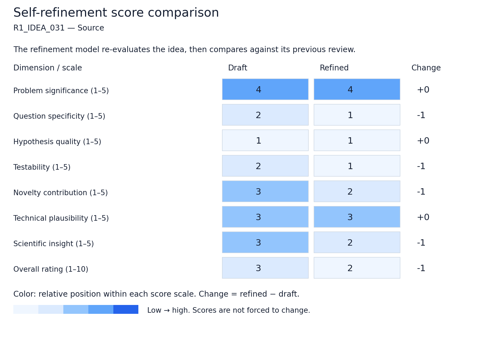

Changed score dimensions: question_specificity, testability, novelty_contribution, scientific_insight, overall_rating.

### Score justifications (draft / refined)

**Problem significance**

```json
{
  "draft": {
    "score": 4.0,
    "justification": "The problem is significant: managing cognitive overload in LLM agents for long-horizon reasoning is a recognized challenge with implications for real-world autonomous systems. The framing is clear and relevant to current research frontiers."
  },
  "refined": {
    "score": 4.0,
    "justification": "The problem is significant: managing cognitive overload in LLM agents for long-horizon reasoning is a recognized challenge with implications for real-world autonomous systems. The framing is clear and relevant to current research frontiers in agentic AI."
  }
}
```

**Question specificity**

```json
{
  "draft": {
    "score": 2.0,
    "justification": "The research question is only implied ('how to mitigate cognitive overload?') and not explicitly stated. The summary cuts off before specifying what is being investigated about CORAL. Without the complete idea, specificity is low."
  },
  "refined": {
    "score": 1.0,
    "justification": "The research question is only vaguely implied ('how to mitigate cognitive overload?') and not explicitly stated. The summary cuts off before specifying what is being investigated about CORAL. There is no concrete question about mechanisms, relationships, or phenomena."
  }
}
```

**Hypothesis quality**

```json
{
  "draft": {
    "score": 1.0,
    "justification": "No hypothesis is presented. The summary ends before proposing any testable claim about how CORAL works or what effect it will have. There is only a problem statement and a named solution."
  },
  "refined": {
    "score": 1.0,
    "justification": "No hypothesis is presented. The summary ends before proposing any testable claim about how CORAL works or what effect it will have. There is only a problem statement and a named solution without any predictive content."
  }
}
```

**Testability**

```json
{
  "draft": {
    "score": 2.0,
    "justification": "The idea is too incomplete to assess testability. While the general problem can be tested (e.g., measuring performance decay with task length), the CORAL paradigm itself is not described, so no specific test of its efficacy can be derived from the summary."
  },
  "refined": {
    "score": 1.0,
    "justification": "The idea is too incomplete to assess testability. While the general problem can be tested, the CORAL paradigm itself is not described, so no specific test of its efficacy can be derived. There is no proposed experiment, comparison, or evaluation method."
  }
}
```

**Novelty contribution**

```json
{
  "draft": {
    "score": 3.0,
    "justification": "The proposed paradigm name (CORAL) suggests novelty, but without knowing what it entails, the potential contribution is unclear. The problem area itself is not novel, but a novel reasoning paradigm could be. Given the incomplete description, a moderate score reflects uncertainty."
  },
  "refined": {
    "score": 2.0,
    "justification": "The proposed paradigm name (CORAL) suggests novelty, but without knowing what it entails, the potential contribution is highly uncertain. The problem area itself is not novel (many papers address long-horizon reasoning limitations). Given the incomplete description, the novelty score must be low."
  }
}
```

**Technical plausibility**

```json
{
  "draft": {
    "score": 3.0,
    "justification": "The premise that cognitive overload hinders long-horizon reasoning is plausible and supported by existing literature. However, the technical plausibility of the unspecified CORAL mechanism cannot be evaluated. The reasoning up to the cutoff is coherent."
  },
  "refined": {
    "score": 3.0,
    "justification": "The premise that cognitive overload hinders long-horizon reasoning is plausible and supported by existing literature. However, the technical plausibility of the unspecified CORAL mechanism cannot be evaluated. The reasoning up to the cutoff is coherent but incomplete."
  }
}
```

**Scientific insight**

```json
{
  "draft": {
    "score": 3.0,
    "justification": "If fully developed, research on cognitive resource allocation in LLM agents could yield insights into the limitations of transformer-based reasoning, the nature of 'working memory' in LLMs, and principles for scalable agent design. However, the incomplete summary prevents a stronger assessment."
  },
  "refined": {
    "score": 2.0,
    "justification": "If fully developed, research on cognitive resource allocation in LLM agents could yield insights into limitations of transformer-based reasoning. However, the incomplete summary prevents any meaningful assessment of potential insight. The current description suggests only application-oriented thinking without clear scientific investigation."
  }
}
```

**Overall rating**

```json
{
  "draft": {
    "score": 3.0,
    "justification": "The idea identifies a significant problem but is presented as an incomplete fragment. There is no concrete research question, hypothesis, or proposed mechanism to evaluate. It reads more as a motivation and a proposed name (CORAL) than a research idea. The potential exists, but in its current truncated form, it is a weak idea due to lack of specificity and testable content."
  },
  "refined": {
    "score": 2.0,
    "justification": "The idea identifies a significant problem but is presented as an incomplete fragment with no concrete research question, hypothesis, or proposed mechanism. It reads as a motivation and proposed name rather than a research idea. While the problem is meaningful, the idea itself lacks the minimal components needed for scientific evaluation: specificity, testability, and a clear direction. It is a very weak research idea in its current form."
  }
}
```

## R1_IDEA_031 — Variant 1: A1_Identity


Changed score dimensions: question_specificity, overall_rating.

### Score justifications (draft / refined)

**Problem significance**

```json
{
  "draft": {
    "score": 5.0,
    "justification": "The problem is highly significant: managing cognitive overload in LLM agents is a fundamental challenge for scaling to real-world, long-horizon tasks, and is actively studied in the community."
  },
  "refined": {
    "score": 5.0,
    "justification": "The problem is highly significant: managing cognitive overload in LLM agents is a fundamental challenge for scaling to real-world, long-horizon tasks, and is actively studied in the community. The framing around working memory clutter and attention dilution addresses a core limitation in current agent architectures."
  }
}
```

**Question specificity**

```json
{
  "draft": {
    "score": 2.0,
    "justification": "The research question is only partially defined. While the problem is clear, the proposed solution is described only at a high level ('self-allocation') without specifying what is being investigated about it."
  },
  "refined": {
    "score": 1.0,
    "justification": "The research question is essentially undefined. The idea names a solution (CORAL) but doesn't specify what aspect of it would be investigated. There's no concrete question about mechanisms, relationships, or phenomena—just a high-level statement of intent."
  }
}
```

**Hypothesis quality**

```json
{
  "draft": {
    "score": 1.0,
    "justification": "No hypothesis is presented. The idea states a problem and names a solution paradigm, but makes no concrete prediction about relationships, mechanisms, or outcomes that could be tested."
  },
  "refined": {
    "score": 1.0,
    "justification": "No hypothesis is presented. The idea states a problem and names a solution paradigm, but makes no concrete prediction about relationships, mechanisms, or outcomes that could be tested. There's no falsifiable claim."
  }
}
```

**Testability**

```json
{
  "draft": {
    "score": 1.0,
    "justification": "The idea as presented is not testable because no method of investigation is suggested, and the central concept (CORAL) is not defined. There is no clear way to gather evidence for or against it."
  },
  "refined": {
    "score": 1.0,
    "justification": "The idea as presented is not testable because no method of investigation is suggested, and the central concept (CORAL) is not defined. There is no clear way to gather evidence for or against it—no experiments, comparisons, or analyses are mentioned."
  }
}
```

**Novelty contribution**

```json
{
  "draft": {
    "score": 2.0,
    "justification": "The term 'self-allocation' suggests potential novelty, but without details it's impossible to assess whether this is meaningfully different from existing work on adaptive computation, dynamic attention, or memory management in agents."
  },
  "refined": {
    "score": 2.0,
    "justification": "The term 'self-allocation' suggests potential novelty, but without details it's impossible to assess whether this is meaningfully different from existing work on adaptive computation, dynamic attention, or memory management in agents. The idea could range from genuinely novel to a simple rebranding."
  }
}
```

**Technical plausibility**

```json
{
  "draft": {
    "score": 3.0,
    "justification": "The general direction is plausible—resource allocation is a known challenge in agent design. However, the incomplete description prevents evaluation of the specific technical approach."
  },
  "refined": {
    "score": 3.0,
    "justification": "The general direction is plausible—resource allocation is a known challenge in agent design, and the cognitive science framing is reasonable. However, the incomplete description prevents evaluation of the specific technical approach. The idea doesn't contain enough information to assess whether the proposed mechanism would work."
  }
}
```

**Scientific insight**

```json
{
  "draft": {
    "score": 3.0,
    "justification": "If developed, the idea could offer insight into how LLM agents can manage internal cognitive resources, which is a generalizable principle. However, the potential insight is limited by the vagueness of the proposal."
  },
  "refined": {
    "score": 3.0,
    "justification": "If developed, the idea could offer insight into how LLM agents can manage internal cognitive resources, which is a generalizable principle. However, the potential insight is severely limited by the vagueness of the proposal. Without knowing what CORAL actually does, it's unclear what scientific understanding would be gained."
  }
}
```

**Overall rating**

```json
{
  "draft": {
    "score": 3.0,
    "justification": "The idea identifies an important problem but is severely underdeveloped. It lacks a concrete hypothesis, testable claim, or methodological direction. As presented, it is more of a motivating concept than a research idea. Significant refinement is needed to turn it into a viable research direction."
  },
  "refined": {
    "score": 2.0,
    "justification": "The idea identifies an important problem but is severely underdeveloped and incomplete. It lacks a concrete hypothesis, testable claim, methodological direction, or even a complete description of the proposed approach. As presented, it's more of a motivating concept than a research idea. Significant refinement is needed to turn it into a viable research direction."
  }
}
```

## R1_IDEA_031 — Variant 2: A2_Paraphrase_Only

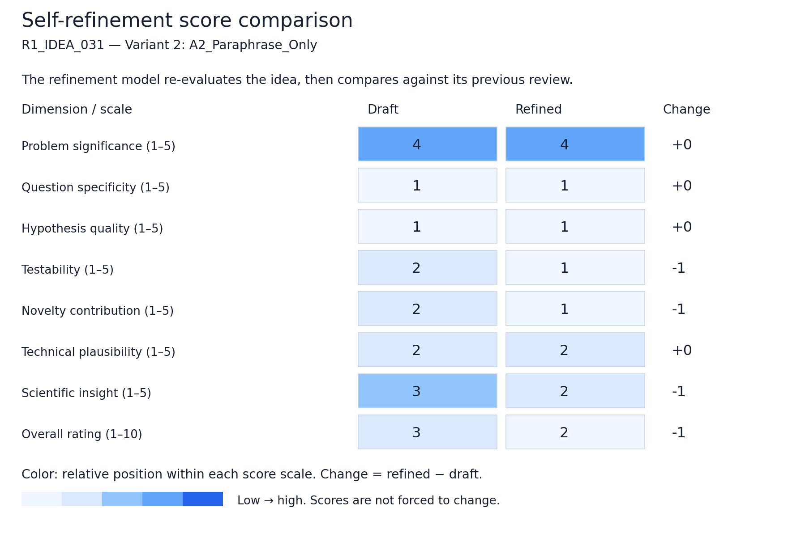

Changed score dimensions: testability, novelty_contribution, scientific_insight, overall_rating.

### Score justifications (draft / refined)

**Problem significance**

```json
{
  "draft": {
    "score": 4.0,
    "justification": "The problem is significant. Managing context and avoiding cognitive overload in LLM agents for long-horizon reasoning is a well-known, active, and important challenge in the field. Solving it would matter for both research and practical applications."
  },
  "refined": {
    "score": 4.0,
    "justification": "The problem is significant. Managing context and avoiding cognitive overload in LLM agents for long-horizon reasoning is a well-known, active, and important challenge in the field. Solving it would matter for both research and practical applications."
  }
}
```

**Question specificity**

```json
{
  "draft": {
    "score": 1.0,
    "justification": "Very low specificity. The idea only states a problem and a proposed solution name (CORAL). It does not define a concrete research question about CORAL's properties, effectiveness, or comparison to alternatives."
  },
  "refined": {
    "score": 1.0,
    "justification": "Very low specificity. The idea only states a problem and a proposed solution name (CORAL). It does not define a concrete research question about CORAL's properties, effectiveness, or comparison to alternatives. There is no 'what will we investigate?' component."
  }
}
```

**Hypothesis quality**

```json
{
  "draft": {
    "score": 1.0,
    "justification": "No hypothesis is present. The text describes an observation (agents struggle due to clutter) and proposes a solution direction, but makes no testable prediction about the relationship between implementing CORAL and any measurable outcome."
  },
  "refined": {
    "score": 1.0,
    "justification": "No hypothesis is present. The text describes an observation (agents struggle due to clutter) and proposes a solution direction, but makes no testable prediction about the relationship between implementing CORAL and any measurable outcome. There is no 'if X then Y' statement."
  }
}
```

**Testability**

```json
{
  "draft": {
    "score": 2.0,
    "justification": "The idea, as stated, is not directly testable because it lacks a defined intervention and measurable outcome. However, the underlying problem (performance degradation on long tasks) is testable, and the proposed paradigm name suggests a path to creating a testable method, but this is not developed."
  },
  "refined": {
    "score": 1.0,
    "justification": "The idea, as stated, is not directly testable because it lacks both a defined intervention (what is CORAL?) and a measurable outcome (what would it affect?). The underlying problem is testable, but the proposed research direction provides no actionable path to create a test."
  }
}
```

**Novelty contribution**

```json
{
  "draft": {
    "score": 2.0,
    "justification": "The contribution is currently unclear. The problem is known, and the proposed paradigm is only a name. Without a proposed mechanism, it's impossible to assess if it's meaningfully novel compared to existing work on context management, reasoning refinement, or agent memory."
  },
  "refined": {
    "score": 1.0,
    "justification": "The contribution is currently unclear and likely low. The problem is known, and the proposed paradigm is only a name with no mechanism. Without any proposed mechanism, it's impossible to assess if it's meaningfully novel compared to existing work on context management, reasoning refinement, or agent memory. It's essentially a placeholder."
  }
}
```

**Technical plausibility**

```json
{
  "draft": {
    "score": 2.0,
    "justification": "The core intuition—that managing working memory helps—is plausible. However, with zero technical details on how 'resource self-allocation' would be implemented, the technical plausibility of the specific proposal cannot be assessed. The reasoning is coherent but stops at the conceptual level."
  },
  "refined": {
    "score": 2.0,
    "justification": "The core intuition—that managing working memory helps—is plausible and coherent. However, with zero technical details on how 'resource self-allocation' would be implemented, the technical plausibility of the specific proposal (CORAL) cannot be assessed. The reasoning stops at the conceptual level."
  }
}
```

**Scientific insight**

```json
{
  "draft": {
    "score": 3.0,
    "justification": "The idea has the potential for scientific insight if developed. Investigating how LLM agents can self-regulate their internal reasoning processes to manage cognitive load could reveal principles about scalable reasoning, the failure modes of auto-regressive generation, and the interaction between memory and attention in artificial agents. However, the current summary does not articulate what specific insights are sought."
  },
  "refined": {
    "score": 2.0,
    "justification": "The idea has vague potential for scientific insight if developed, but the current summary does not articulate what specific insights are sought. It suggests studying 'a new reasoning paradigm' but gives no indication of what underlying principles, mechanisms, or boundary conditions the research aims to reveal. The insight is currently aspirational, not defined."
  }
}
```

**Overall rating**

```json
{
  "draft": {
    "score": 3.0,
    "justification": "This is a weak research idea in its current form. It identifies a significant and relevant problem but fails to define a research question, hypothesis, or testable direction. It is essentially a proposed method name (CORAL) with no substance. The potential is there, but the idea lacks the specificity and structure required for meaningful scientific investigation. It reads more as a project title or motivation than a research plan."
  },
  "refined": {
    "score": 2.0,
    "justification": "This is a very weak research idea. It identifies a significant problem but fails completely to define a research question, hypothesis, or testable direction. It is essentially a proposed method name (CORAL) with no substance—no mechanism, no comparison, no evaluation plan. It lacks the minimal structure required for scientific investigation. The potential mentioned in the problem statement is entirely unrealized in the proposed research direction."
  }
}
```

## R1_IDEA_031 — Variant 3: A3_Plain_Core

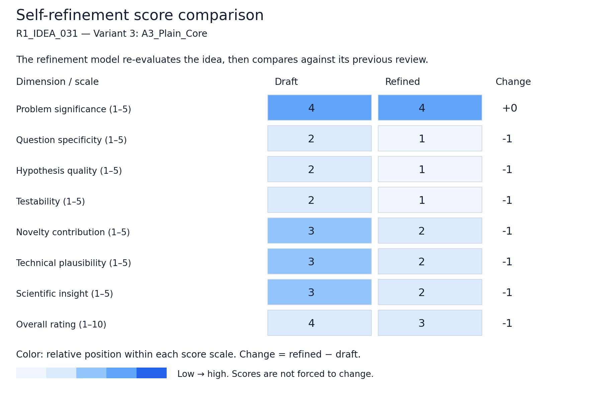

Changed score dimensions: question_specificity, hypothesis_quality, testability, novelty_contribution, technical_plausibility, scientific_insight, overall_rating.

### Score justifications (draft / refined)

**Problem significance**

```json
{
  "draft": {
    "score": 4.0,
    "justification": "Cognitive overload in LLM agents is a recognized and meaningful challenge, especially for long-horizon tasks. Improving agent robustness and scalability in such settings is important for both research and applications."
  },
  "refined": {
    "score": 4.0,
    "justification": "Cognitive overload in LLM agents is a recognized and meaningful challenge, especially for long-horizon tasks. Improving agent robustness and scalability in such settings is important for both research and applications. The problem is well-motivated and significant."
  }
}
```

**Question specificity**

```json
{
  "draft": {
    "score": 2.0,
    "justification": "The idea names a problem and a solution paradigm, but does not define a concrete research question. It lacks specificity about what aspect of cognitive resource allocation will be studied, under what conditions, or compared to what alternatives."
  },
  "refined": {
    "score": 1.0,
    "justification": "The idea names a problem and a solution paradigm, but does not define a concrete research question. It lacks specificity about what aspect of cognitive resource allocation will be studied, under what conditions, or compared to what alternatives. It is essentially just a problem statement with a proposed solution name."
  }
}
```

**Hypothesis quality**

```json
{
  "draft": {
    "score": 2.0,
    "justification": "There is an implicit hypothesis that managing cognitive resources will reduce overload and improve performance, but it is not articulated as a testable prediction. No mechanism or causal relationship is proposed, making the hypothesis vague."
  },
  "refined": {
    "score": 1.0,
    "justification": "There is no explicit or implicit hypothesis beyond the vague claim that managing cognitive resources will help. No testable prediction is made, no mechanism is proposed, and no relationship between variables is specified. The idea lacks a falsifiable hypothesis entirely."
  }
}
```

**Testability**

```json
{
  "draft": {
    "score": 2.0,
    "justification": "Without any proposed mechanism or experimental design, it is unclear how CORAL would be tested. The idea is currently too high-level to design a meaningful evaluation, though the problem itself is empirically testable in principle."
  },
  "refined": {
    "score": 1.0,
    "justification": "Without any proposed mechanism, experimental design, or evaluation approach, it is impossible to test CORAL. The idea is currently too high-level to design a meaningful evaluation. While the problem itself is empirically testable, the proposed solution is not defined enough to be tested."
  }
}
```

**Novelty contribution**

```json
{
  "draft": {
    "score": 3.0,
    "justification": "The framing around 'cognitive resource self-allocation' has some novelty in terminology, but the core problem (managing context/memory in long-horizon reasoning) is already actively studied. The contribution is unclear without details on how CORAL differs from existing memory management or iterative reasoning approaches."
  },
  "refined": {
    "score": 2.0,
    "justification": "The framing around 'cognitive resource self-allocation' has some novelty in terminology, but the core problem (managing context/memory in long-horizon reasoning) is already actively studied in many existing works. Without details on how CORAL differs from existing memory management, iterative reasoning, or attention mechanisms, the contribution is unclear and likely incremental at best."
  }
}
```

**Technical plausibility**

```json
{
  "draft": {
    "score": 3.0,
    "justification": "The general direction is plausible—better memory management should help—but no technical details are provided to judge the specific approach. The idea is coherent at a high level but too underspecified to assess feasibility."
  },
  "refined": {
    "score": 2.0,
    "justification": "The general direction is plausible—better memory management should help—but no technical details are provided to judge the specific approach. The idea is coherent at a high level but too underspecified to assess feasibility. Important assumptions (e.g., that agents can identify irrelevant information) are not addressed."
  }
}
```

**Scientific insight**

```json
{
  "draft": {
    "score": 3.0,
    "justification": "If developed, CORAL could provide insight into how cognitive constraints affect LLM reasoning and how to mitigate them. However, the current description does not suggest a clear path to discovering general principles or mechanisms beyond an engineering solution."
  },
  "refined": {
    "score": 2.0,
    "justification": "If developed, CORAL could potentially provide insight into how cognitive constraints affect LLM reasoning, but the current description does not suggest a clear path to discovering general principles or mechanisms. It seems more like an engineering solution than a scientific investigation. Without a hypothesis or experimental design, the potential for transferable insight is low."
  }
}
```

**Overall rating**

```json
{
  "draft": {
    "score": 4.0,
    "justification": "The idea identifies a meaningful problem but is severely underdeveloped. It lacks a concrete research question, testable hypothesis, methodological direction, and novelty differentiation. It is currently more of a motivating concept than a research idea. With substantial elaboration, it could become a strong direction."
  },
  "refined": {
    "score": 3.0,
    "justification": "The idea identifies a meaningful problem but is severely underdeveloped. It lacks a concrete research question, testable hypothesis, methodological direction, and novelty differentiation. It is currently more of a motivating concept or solution name than a research idea. With substantial elaboration, it could become a moderate direction, but as presented, it is weak."
  }
}
```

## R1_IDEA_031 — Variant 4: B1_Verbose_Elaborate

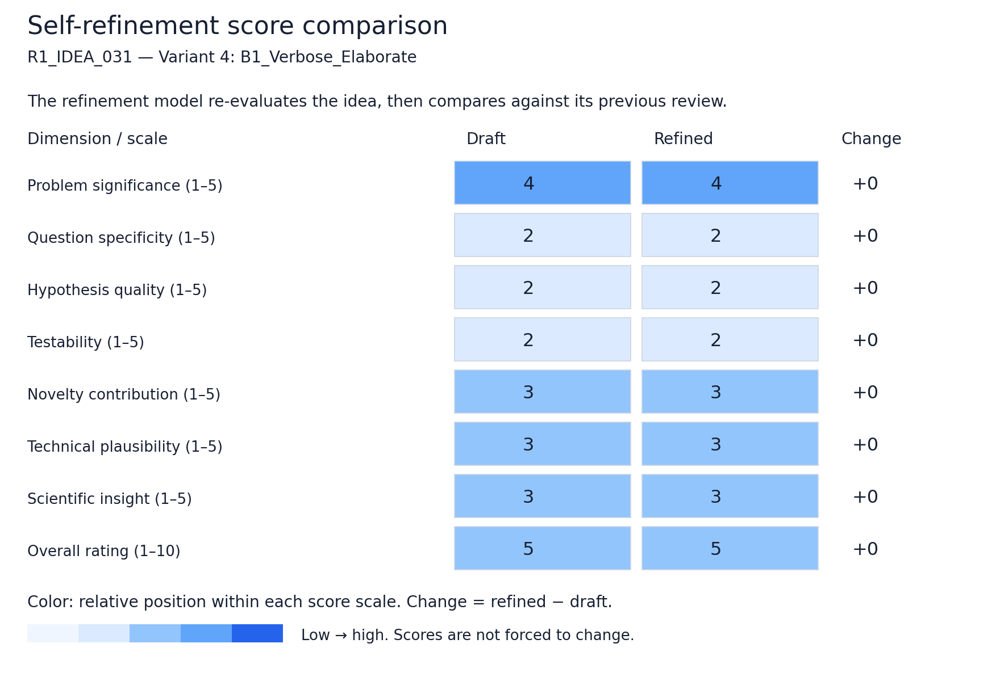

Changed score dimensions: none.

### Score justifications (draft / refined)

**Problem significance**

```json
{
  "draft": {
    "score": 4.0,
    "justification": "The problem is significant. Managing cognitive load and working memory is a fundamental challenge for LLM-based agents, especially as tasks become longer and more complex. Solving this would directly impact the practicality of autonomous agents."
  },
  "refined": {
    "score": 4.0,
    "justification": "The problem is significant. Managing cognitive load and working memory is a fundamental challenge for LLM-based agents, especially as tasks become longer and more complex. Solving or understanding this would directly impact the practicality and scalability of autonomous agents, making it meaningful to researchers and practitioners."
  }
}
```

**Question specificity**

```json
{
  "draft": {
    "score": 2.0,
    "justification": "The idea states a problem and a proposed paradigm name (CORAL), but does not define a clear, concrete research question. It lacks specificity about what relationship or mechanism is being investigated."
  },
  "refined": {
    "score": 2.0,
    "justification": "The idea states a problem and proposes a paradigm name (CORAL), but does not define a clear, concrete research question. It lacks specificity about what relationship, mechanism, or phenomenon is being investigated. The description remains at the level of a high-level solution concept rather than a focused inquiry."
  }
}
```

**Hypothesis quality**

```json
{
  "draft": {
    "score": 2.0,
    "justification": "There is an implicit hypothesis that 'self-allocation of cognitive resources mitigates cognitive overload and improves performance on long-horizon tasks.' However, it is vague. It does not make a concrete, falsifiable prediction about how allocation should work or what specific improvement is expected."
  },
  "refined": {
    "score": 2.0,
    "justification": "There is an implicit hypothesis that 'self-allocation of cognitive resources mitigates cognitive overload and improves performance on long-horizon tasks.' However, it is vague and does not make a concrete, falsifiable prediction about how allocation should work, what specific improvement is expected, or under what conditions. It lacks the specificity needed for a strong hypothesis."
  }
}
```

**Testability**

```json
{
  "draft": {
    "score": 2.0,
    "justification": "As presented, the idea is not readily testable. No experiment, evaluation metric, or comparison is suggested. The claim is high-level and would need substantial concretization to design a test."
  },
  "refined": {
    "score": 2.0,
    "justification": "As presented, the idea is not readily testable. No experiment, evaluation metric, comparison, or method of obtaining evidence is suggested. The claim is high-level and would require substantial concretization to design a meaningful test. It is unclear what evidence would support or contradict the proposal."
  }
}
```

**Novelty contribution**

```json
{
  "draft": {
    "score": 3.0,
    "justification": "The framing around 'self-allocation of cognitive resources' has some novelty as a paradigm label. However, the core problem (memory management for long contexts) and potential solutions (pruning, summarizing, prioritizing) are actively studied. The contribution is currently unclear without a specific technical mechanism that distinguishes it from existing work."
  },
  "refined": {
    "score": 3.0,
    "justification": "The framing around 'self-allocation of cognitive resources' has some novelty as a paradigm label and emphasizes an agent-centric perspective. However, the core problem (memory management for long contexts) and potential solution directions (pruning, summarizing, prioritizing) are actively studied. Without a specific technical mechanism, the contribution is unclear and may not substantially differ from existing work."
  }
}
```

**Technical plausibility**

```json
{
  "draft": {
    "score": 3.0,
    "justification": "The general direction is plausible. The reasoning that cluttered memory hinders agents is sound, and the concept of agents managing their own cognitive resources is coherent. However, without any technical details, it's impossible to assess the feasibility of the proposed 'paradigm.'"
  },
  "refined": {
    "score": 3.0,
    "justification": "The general direction is plausible. The reasoning that cluttered memory hinders agents is sound, and the concept of agents managing their own cognitive resources is coherent. However, without any technical details, it is impossible to assess the feasibility of the proposed 'paradigm.' The idea rests on reasonable assumptions but lacks concrete implementation logic."
  }
}
```

**Scientific insight**

```json
{
  "draft": {
    "score": 3.0,
    "justification": "If successfully developed and tested, CORAL could provide insight into how LLM agents can effectively manage limited internal resources, which is a general principle for scalable reasoning. However, the potential insight is currently limited by the vagueness of the proposal; it could easily devolve into a simple engineering solution without revealing deeper principles."
  },
  "refined": {
    "score": 3.0,
    "justification": "If successfully developed and tested, CORAL could provide insight into how LLM agents can effectively manage limited internal resources, which is a general principle for scalable reasoning. However, the potential insight is currently limited by the vagueness of the proposal; it could easily devolve into a simple engineering solution without revealing deeper principles about resource allocation, task structure, or cognitive architectures."
  }
}
```

**Overall rating**

```json
{
  "draft": {
    "score": 5.0,
    "justification": "This is a moderate/borderline research idea. It identifies a significant and well-motivated problem (cognitive overload in LLM agents). However, it lacks the specificity, testable hypothesis, and concrete direction needed to be a strong research proposal. It reads more like a motivating problem statement and a naming of a concept than a fleshed-out research question. With substantial refinement to define a specific mechanism and hypothesis, it could become a strong idea."
  },
  "refined": {
    "score": 5.0,
    "justification": "This is a moderate/borderline research idea. It identifies a significant and well-motivated problem (cognitive overload in LLM agents) and proposes a named direction (CORAL). However, it lacks the specificity, testable hypothesis, and concrete methodological direction needed to be a strong research proposal. It reads more like a motivating problem statement and a high-level concept than a fleshed-out research question. With substantial refinement to define a specific mechanism, hypothesis, and evaluation approach, it could become a strong idea."
  }
}
```

## R1_IDEA_031 — Variant 5: B2_Grand_Narrative


Changed score dimensions: none.

### Score justifications (draft / refined)

**Problem significance**

```json
{
  "draft": {
    "score": 5.0,
    "justification": "The problem is highly significant. Cognitive overload and context window limitations are fundamental challenges for scaling LLM agents to real-world, long-horizon tasks. Solving this would directly impact the robustness and applicability of AI systems."
  },
  "refined": {
    "score": 5.0,
    "justification": "The problem is highly significant. Cognitive overload and context window limitations are fundamental, well-recognized challenges for scaling LLM agents to real-world, long-horizon tasks. Addressing this would directly impact the robustness, efficiency, and applicability of AI systems in complex domains."
  }
}
```

**Question specificity**

```json
{
  "draft": {
    "score": 1.0,
    "justification": "Extremely low specificity. The idea names a paradigm (CORAL) but does not define a concrete research question. It states a general goal ('contribute to more robust... architectures') without specifying what relationship, mechanism, or performance characteristic will be investigated."
  },
  "refined": {
    "score": 1.0,
    "justification": "Extremely low specificity. The idea names a paradigm (CORAL) but does not define a concrete research question. It states a general goal ('contribute to more robust... architectures') without specifying what relationship, mechanism, or performance characteristic will be investigated. There is no 'what will we study?' beyond the broad problem area."
  }
}
```

**Hypothesis quality**

```json
{
  "draft": {
    "score": 1.0,
    "justification": "There is no discernible hypothesis. The text contains an observation (agents falter due to overload) and a proposed solution name (CORAL), but makes no concrete, testable prediction about the outcome of implementing it. The claim that it 'could contribute' is speculative, not hypothetical."
  },
  "refined": {
    "score": 1.0,
    "justification": "There is no discernible hypothesis. The text contains an observation (agents falter due to overload) and a proposed solution name (CORAL), but makes no concrete, testable prediction about the outcome of implementing it. The claim that it 'could contribute' is speculative and aspirational, not a falsifiable statement."
  }
}
```

**Testability**

```json
{
  "draft": {
    "score": 1.0,
    "justification": "Not testable in its current form. Without a proposed mechanism, implementation path, or evaluation metric, there is no clear way to gather evidence for or against the idea. It is a conceptual proposal without a defined experiment."
  },
  "refined": {
    "score": 1.0,
    "justification": "Not testable in its current form. Without a proposed mechanism, implementation path, evaluation metric, or comparative baseline, there is no clear way to gather evidence for or against the idea. It is a conceptual proposal without a defined experiment or analysis plan."
  }
}
```

**Novelty contribution**

```json
{
  "draft": {
    "score": 2.0,
    "justification": "Potential novelty is claimed but not demonstrated. The problem is well-known, and many approaches to context management exist. The proposed paradigm name is new, but without details, its potential contribution over existing methods (e.g., adaptive context, memory-augmented networks) cannot be assessed. It currently sits at the level of a well-motivated but vague research direction."
  },
  "refined": {
    "score": 2.0,
    "justification": "Potential novelty is claimed but not demonstrated. The problem is well-known, and numerous approaches to context management exist (e.g., memory-augmented networks, adaptive context, hierarchical reasoning). The proposed paradigm name is new, but without details, its potential contribution over existing methods cannot be assessed. It currently sits at the level of a well-motivated but vague direction."
  }
}
```

**Technical plausibility**

```json
{
  "draft": {
    "score": 3.0,
    "justification": "The core intuition is plausible: managing cognitive resources should help. However, the complete lack of technical detail makes it impossible to evaluate the plausibility of the proposed 'paradigm' itself. The reasoning from problem to proposed solution is logical but stops at the naming stage."
  },
  "refined": {
    "score": 3.0,
    "justification": "The core intuition is plausible: better management of cognitive resources should help with long-horizon tasks. However, the complete lack of technical detail makes it impossible to evaluate the plausibility of the proposed 'paradigm' itself. The reasoning from problem to proposed solution is logical but stops at the naming stage."
  }
}
```

**Scientific insight**

```json
{
  "draft": {
    "score": 3.0,
    "justification": "The idea has high potential for scientific insight if developed, as understanding how agents can best manage their own cognitive resources is a deep question. However, in its current abstract form, the insight is merely aspirational. A concrete implementation could reveal principles about the trade-offs in dynamic context management."
  },
  "refined": {
    "score": 3.0,
    "justification": "The idea has high potential for scientific insight if developed concretely, as understanding how agents can best manage their own cognitive resources is a deep question at the intersection of memory, attention, and reasoning. However, in its current abstract form, the insight is merely aspirational. A concrete implementation could reveal principles about trade-offs in dynamic context management, but the idea itself does not yet promise such insight."
  }
}
```

**Overall rating**

```json
{
  "draft": {
    "score": 3.0,
    "justification": "This is a weak research idea in its presented form. While it identifies a very important and timely problem, it fails to articulate a specific research question, hypothesis, or testable direction. It is essentially a motivated naming of a concept ('CORAL') without any substance to evaluate. The score reflects the gap between the significance of the problem and the vagueness of the proposed investigation. It requires substantial development to become a viable research plan."
  },
  "refined": {
    "score": 3.0,
    "justification": "This is a weak research idea in its presented form. While it identifies a very important and timely problem, it fails to articulate a specific research question, hypothesis, or testable direction. It is essentially a motivated naming of a concept ('CORAL') without any substantive content to evaluate. The significant gap between problem importance and proposal vagueness results in a low rating. Substantial development is needed to transform this into a viable research plan."
  }
}
```

## R1_IDEA_031 — Variant 6: B3_Over_Confident


Changed score dimensions: none.

### Score justifications (draft / refined)

**Problem significance**

```json
{
  "draft": {
    "score": 4.0,
    "justification": "Cognitive overload in LLM agents is a recognized and meaningful problem, especially as agents tackle longer, more complex tasks. Improving robustness and efficiency in such settings is highly relevant to both research and applications."
  },
  "refined": {
    "score": 4.0,
    "justification": "Cognitive overload in LLM agents is a recognized and meaningful problem, especially as agents tackle longer, more complex tasks. Improving robustness and efficiency in such settings is highly relevant to both research and practical applications. The problem is well-motivated and significant."
  }
}
```

**Question specificity**

```json
{
  "draft": {
    "score": 1.0,
    "justification": "No specific research question is stated. The idea only identifies a problem and names a proposed solution without defining what will be investigated."
  },
  "refined": {
    "score": 1.0,
    "justification": "No specific research question is stated. The idea only identifies a problem and names a proposed solution without defining what will be investigated. It lacks the concrete focus needed for a research direction."
  }
}
```

**Hypothesis quality**

```json
{
  "draft": {
    "score": 1.0,
    "justification": "There is no explicit or implicit testable hypothesis. The text merely asserts that cognitive overload exists and that CORAL will address it, without predicting an outcome or mechanism."
  },
  "refined": {
    "score": 1.0,
    "justification": "There is no explicit or implicit testable hypothesis. The text merely asserts that cognitive overload exists and that CORAL will address it, without predicting an outcome, mechanism, or relationship that could be supported or contradicted by evidence."
  }
}
```

**Testability**

```json
{
  "draft": {
    "score": 2.0,
    "justification": "The idea is too vague to be directly testable. However, the problem itself (long-horizon task performance) is measurable, so with a concrete instantiation, it could become testable."
  },
  "refined": {
    "score": 2.0,
    "justification": "The idea is too vague to be directly testable in its current form. However, the underlying problem (long-horizon task performance) is measurable, so with a concrete instantiation, it could become testable. The name 'CORAL' suggests a direction but provides no testable claims."
  }
}
```

**Novelty contribution**

```json
{
  "draft": {
    "score": 2.0,
    "justification": "While the problem is relevant, the idea as presented offers no novel insight or method—it only introduces an acronym. Many existing works already address memory, attention, and long-horizon reasoning in agents. Without details, potential contribution is unclear."
  },
  "refined": {
    "score": 2.0,
    "justification": "While the problem is relevant, the idea as presented offers no novel insight or method—it only introduces an acronym. Many existing works already address memory, attention, and long-horizon reasoning in agents (e.g., memory-augmented networks, attention modifications, reasoning frameworks). Without details, the potential contribution is unclear and appears minimal."
  }
}
```

**Technical plausibility**

```json
{
  "draft": {
    "score": 3.0,
    "justification": "The general direction—managing cognitive load in LLM agents—is plausible and aligns with known challenges. However, without any technical content, it's impossible to assess the coherence or feasibility of CORAL itself."
  },
  "refined": {
    "score": 3.0,
    "justification": "The general direction—managing cognitive load in LLM agents—is plausible and aligns with known challenges in transformer architectures and agent systems. However, without any technical content about CORAL, it's impossible to assess the coherence or feasibility of the specific approach. The reasoning about the problem is sound, but the solution is unspecified."
  }
}
```

**Scientific insight**

```json
{
  "draft": {
    "score": 2.0,
    "justification": "If developed, the idea could offer insight into how LLM agents fail on long tasks and how resource allocation mitigates this. However, as presented, it promises only a solution paradigm without indicating what general principles might be learned."
  },
  "refined": {
    "score": 2.0,
    "justification": "If developed, research on cognitive resource allocation could offer insight into how LLM agents fail on long tasks and how resource management mitigates this. However, as presented, it promises only a solution paradigm without indicating what general principles might be learned about agent cognition, scaling laws, or attention mechanisms. The potential insight is vague."
  }
}
```

**Overall rating**

```json
{
  "draft": {
    "score": 3.0,
    "justification": "This is a weak research idea in its current form. It identifies a meaningful problem but fails to articulate a specific research question, hypothesis, or methodological direction. It reads more like a motivation section than a research proposal. With substantial refinement—adding a concrete hypothesis, mechanism, and evaluation plan—it could become a strong idea."
  },
  "refined": {
    "score": 3.0,
    "justification": "This is a weak research idea in its current form. It identifies a meaningful problem but fails to articulate a specific research question, hypothesis, or methodological direction. It reads more like a motivation section than a research proposal. The lack of specificity severely limits its scientific value. With substantial refinement—adding a concrete hypothesis, mechanism, and evaluation plan—it could become a strong idea."
  }
}
```

## R1_IDEA_031 — Variant 7: B4_Novelty


Changed score dimensions: none.

### Score justifications (draft / refined)

**Problem significance**

```json
{
  "draft": {
    "score": 4.0,
    "justification": "Cognitive overload in LLM agents is a recognized and meaningful challenge, especially for long-horizon reasoning. Improving robustness here would matter to both researchers and practitioners."
  },
  "refined": {
    "score": 4.0,
    "justification": "Cognitive overload in LLM agents is a recognized and meaningful challenge, especially for long-horizon reasoning. Improving robustness here would matter to both researchers and practitioners. The problem is well-motivated and relevant."
  }
}
```

**Question specificity**

```json
{
  "draft": {
    "score": 1.0,
    "justification": "No research question is stated. The idea only names a paradigm (CORAL) without specifying what is being investigated."
  },
  "refined": {
    "score": 1.0,
    "justification": "No research question is stated. The idea only names a paradigm (CORAL) without specifying what is being investigated. It lacks a concrete, answerable question."
  }
}
```

**Hypothesis quality**

```json
{
  "draft": {
    "score": 1.0,
    "justification": "There is no hypothesis—implicit or explicit. The idea does not make a testable prediction about mechanisms or outcomes."
  },
  "refined": {
    "score": 1.0,
    "justification": "There is no hypothesis—implicit or explicit. The idea does not make a testable prediction about mechanisms, relationships, or outcomes. It merely states a problem and a proposed paradigm name."
  }
}
```

**Testability**

```json
{
  "draft": {
    "score": 1.0,
    "justification": "Without a concrete mechanism or measurable claim, it's unclear how one would test CORAL. The idea is framed at too abstract a level."
  },
  "refined": {
    "score": 1.0,
    "justification": "Without a concrete mechanism, measurable claim, or proposed experiment, it's unclear how one would test CORAL. The idea is framed at an abstract, non-operational level."
  }
}
```

**Novelty contribution**

```json
{
  "draft": {
    "score": 2.0,
    "justification": "While the framing ('cognitive resource self-allocation') sounds novel, without details it's impossible to assess whether it's meaningfully different from existing memory or reasoning management techniques."
  },
  "refined": {
    "score": 2.0,
    "justification": "While the framing ('cognitive resource self-allocation') sounds novel, without details it's impossible to assess whether it's meaningfully different from existing memory or reasoning management techniques. The contribution is currently just a label."
  }
}
```

**Technical plausibility**

```json
{
  "draft": {
    "score": 2.0,
    "justification": "The general direction is plausible—better memory management could help—but the complete lack of technical content makes it impossible to evaluate coherence or feasibility."
  },
  "refined": {
    "score": 2.0,
    "justification": "The general direction is plausible—better memory management could help—but the complete lack of technical content makes it impossible to evaluate coherence, feasibility, or specific assumptions. It's not implausible, but it's not substantiated."
  }
}
```

**Scientific insight**

```json
{
  "draft": {
    "score": 2.0,
    "justification": "If developed, CORAL could offer insight into how LLM agents manage internal state, but the idea as presented does not suggest what kind of insight would be gained (e.g., principles of resource allocation, trade-offs)."
  },
  "refined": {
    "score": 2.0,
    "justification": "If developed, CORAL could offer insight into how LLM agents manage internal state, but the idea as presented does not suggest what kind of insight would be gained (e.g., principles of resource allocation, trade-offs, scaling laws). The potential insight is vague."
  }
}
```

**Overall rating**

```json
{
  "draft": {
    "score": 3.0,
    "justification": "This is a weak research idea. It identifies a meaningful problem but fails to define a research question, hypothesis, or testable direction. It is essentially a problem statement with a label (CORAL), lacking the specificity needed for scientific investigation. The potential is there, but the idea as presented is too vague to be considered more than a generic motivation."
  },
  "refined": {
    "score": 3.0,
    "justification": "This is a weak research idea. It identifies a meaningful problem but fails to define a research question, hypothesis, or testable direction. It is essentially a problem statement with a label (CORAL), lacking the specificity needed for scientific investigation. The potential is there, but the idea as presented is too vague to be considered more than a generic motivation."
  }
}
```

## R1_IDEA_031 — Variant 8: B5_Application_Impact

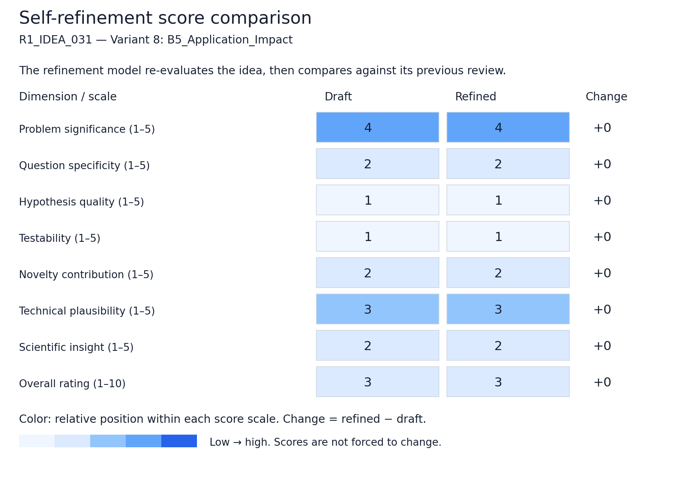

Changed score dimensions: none.

### Score justifications (draft / refined)

**Problem significance**

```json
{
  "draft": {
    "score": 4.0,
    "justification": "The problem is highly significant. Cognitive overload and memory management in LLM agents are active, important research challenges central to building robust autonomous systems. The motivation is convincing and well-stated."
  },
  "refined": {
    "score": 4.0,
    "justification": "The problem is highly significant. Cognitive overload and inefficient memory management in LLM agents are recognized, important bottlenecks for long-horizon reasoning and autonomous systems. The motivation is convincing and well-stated."
  }
}
```

**Question specificity**

```json
{
  "draft": {
    "score": 2.0,
    "justification": "The idea lacks a specific research question. It identifies a general problem area and proposes a named paradigm (CORAL), but does not define what exactly will be investigated about this paradigm. The scope is overly broad."
  },
  "refined": {
    "score": 2.0,
    "justification": "The idea lacks a specific research question. It identifies a general problem area and names a proposed paradigm (CORAL), but does not define what exactly will be investigated about this paradigm. The scope is overly broad and undefined."
  }
}
```

**Hypothesis quality**

```json
{
  "draft": {
    "score": 1.0,
    "justification": "There is no discernible hypothesis. The language is speculative ('may support,' 'could inform') and does not make a concrete, testable prediction about a relationship, mechanism, or outcome."
  },
  "refined": {
    "score": 1.0,
    "justification": "There is no discernible hypothesis. The language is purely speculative ('may support', 'could inform') and does not make a concrete, testable prediction about a relationship, mechanism, or performance outcome."
  }
}
```

**Testability**

```json
{
  "draft": {
    "score": 1.0,
    "justification": "The idea as presented is not testable. There is no suggested experiment, evaluation metric, baseline for comparison, or method for gathering evidence to support or refute any claim about CORAL."
  },
  "refined": {
    "score": 1.0,
    "justification": "The idea as presented is not testable. There is no suggested experiment, evaluation metric, baseline for comparison, or method for gathering evidence to support or refute any claim about CORAL's efficacy."
  }
}
```

**Novelty contribution**

```json
{
  "draft": {
    "score": 2.0,
    "justification": "The potential contribution is stated but not demonstrated. The core concept of managing cognitive load/memory in agents is not novel in itself. The novelty hinges entirely on the unspecified details of CORAL, which are absent. Currently, it reads as a generic application of an unspecified method to a known problem."
  },
  "refined": {
    "score": 2.0,
    "justification": "The potential contribution is stated but not demonstrated. The core concept of managing cognitive load or memory in agents is not novel in itself. The novelty hinges entirely on the unspecified details of CORAL, which are absent. Currently, it reads as a generic application of an unspecified method to a known problem."
  }
}
```

**Technical plausibility**

```json
{
  "draft": {
    "score": 3.0,
    "justification": "The reasoning is logically coherent: memory clutter impairs reasoning, so managing memory should help. The proposed direction is too vague to assess its technical plausibility in detail, but the underlying premise is reasonable."
  },
  "refined": {
    "score": 3.0,
    "justification": "The underlying reasoning is logically coherent: memory clutter impairs reasoning, so managing memory should help. The proposed direction is too vague to assess its detailed technical plausibility, but the foundational premise is reasonable."
  }
}
```

**Scientific insight**

```json
{
  "draft": {
    "score": 2.0,
    "justification": "The idea claims potential for reliable systems and practical assistants, but the described research direction lacks a clear path to producing general scientific insight. Without a specific hypothesis or mechanism to test, it's unclear what transferable knowledge about agent reasoning or memory would be generated."
  },
  "refined": {
    "score": 2.0,
    "justification": "The idea claims potential for practical impact, but the described research direction lacks a clear path to producing general scientific insight. Without a specific hypothesis or mechanism to test, it is unclear what transferable knowledge about agent reasoning, memory scaling, or cognitive architecture would be generated."
  }
}
```

**Overall rating**

```json
{
  "draft": {
    "score": 3.0,
    "justification": "This is a weak research idea in its current form. While it identifies a significant and well-motivated problem, it fails to define a specific research question, lacks any testable hypothesis, and provides no methodological direction. It is essentially a problem statement and a name for a proposed solution, with no concrete plan for investigation. The scientific contribution and insight are therefore highly unclear."
  },
  "refined": {
    "score": 3.0,
    "justification": "This is a weak research idea in its current form. While it identifies a significant and well-motivated problem, it fails to define a specific research question, lacks any testable hypothesis, and provides no methodological direction. It is essentially a problem statement paired with a name for a proposed solution, with no concrete plan for investigation. The scientific contribution and insight are therefore highly unclear."
  }
}
```

## R1_IDEA_031 — Variant 9: C1_Hollow_Shell


Changed score dimensions: none.

### Score justifications (draft / refined)

**Problem significance**

```json
{
  "draft": {
    "score": 4.0,
    "justification": "The problem is meaningful and recognized: scaling AI agents to longer tasks is a key challenge in embodied AI, reasoning, and tool-use. Memory and focus limitations directly impact real-world applicability."
  },
  "refined": {
    "score": 4.0,
    "justification": "The problem is meaningful and recognized: scaling AI agents to longer tasks is a key challenge in embodied AI, reasoning, and tool-use. Memory and focus limitations directly impact real-world applicability, making this a significant research direction."
  }
}
```

**Question specificity**

```json
{
  "draft": {
    "score": 1.0,
    "justification": "No research question is stated. The summary only names an approach (CORAL) and a general goal ('improve how agents manage cognitive resources'), without specifying what is being investigated."
  },
  "refined": {
    "score": 1.0,
    "justification": "No research question is stated. The summary only names an approach (CORAL) and a general goal ('improve how agents manage cognitive resources'), without specifying what aspect is being investigated, what relationship is being tested, or what phenomenon is being explored."
  }
}
```

**Hypothesis quality**

```json
{
  "draft": {
    "score": 1.0,
    "justification": "There is no explicit or implicit hypothesis. The idea does not make a testable prediction about a mechanism, relationship, or outcome."
  },
  "refined": {
    "score": 1.0,
    "justification": "There is no explicit or implicit hypothesis. The idea does not make a testable prediction about a mechanism, relationship, or outcome. It merely states an intention to 'improve' something without specifying what improvement would look like or why the proposed approach might achieve it."
  }
}
```

**Testability**

```json
{
  "draft": {
    "score": 2.0,
    "justification": "The general problem is testable (e.g., by evaluating agents on longer tasks), but the proposed CORAL approach is too vague to know how it would be tested. Without a mechanism or hypothesis, it's unclear what evidence would support or contradict the idea."
  },
  "refined": {
    "score": 2.0,
    "justification": "The general problem area is testable (agents can be evaluated on longer tasks), but the proposed CORAL approach is too vague to know how it would be tested. Without a mechanism, hypothesis, or even a clear definition of what CORAL does, it's impossible to design experiments that would specifically validate or invalidate the idea."
  }
}
```

**Novelty contribution**

```json
{
  "draft": {
    "score": 2.0,
    "justification": "The problem is not novel, and the proposed solution is only a name. There is no indication of how CORAL would differ from existing memory management techniques (e.g., recurrent memory, summarization, retrieval-augmentation)."
  },
  "refined": {
    "score": 2.0,
    "justification": "The problem is not novel, and the proposed solution is only a name with no technical content. There is no indication of how CORAL would differ from or improve upon existing memory management techniques (e.g., recurrent memory, summarization, retrieval-augmentation, attention mechanisms). The contribution is currently undefined."
  }
}
```

**Technical plausibility**

```json
{
  "draft": {
    "score": 3.0,
    "justification": "The general direction—improving memory management—is technically plausible and aligns with ongoing research. However, without any technical details, it's impossible to assess the plausibility of CORAL itself."
  },
  "refined": {
    "score": 3.0,
    "justification": "The general direction—improving memory management in AI agents—is technically plausible and aligns with ongoing research. However, without any technical details about CORAL, it's impossible to assess the plausibility of the specific approach. The score reflects that the field acknowledges this as a valid problem space."
  }
}
```

**Scientific insight**

```json
{
  "draft": {
    "score": 2.0,
    "justification": "As presented, the idea promises a solution but does not suggest a path to new insight about why agents struggle with long tasks or how cognitive resource management principles could be generalized. It reads more like an engineering goal than a scientific investigation."
  },
  "refined": {
    "score": 2.0,
    "justification": "As presented, the idea promises a solution but does not suggest a path to new scientific insight. It doesn't propose to investigate why agents struggle with long tasks, what cognitive principles might be at play, or how different resource management strategies affect reasoning. It reads more like an engineering goal than a scientific investigation that would yield transferable knowledge."
  }
}
```

**Overall rating**

```json
{
  "draft": {
    "score": 3.0,
    "justification": "The idea identifies a significant problem but fails to articulate a research question, hypothesis, or any concrete direction. It is essentially a problem statement with a placeholder name (CORAL). Without specificity, it lacks the core elements of a research idea: what is being tested, why it might work, and what we would learn. It is weak as a research idea, though the underlying problem is strong."
  },
  "refined": {
    "score": 3.0,
    "justification": "The idea identifies a significant problem but fails to articulate a research question, hypothesis, or any concrete direction. It is essentially a problem statement with a placeholder name (CORAL). Without specificity about what is being tested, why it might work, or what we would learn, it lacks the core elements of a research idea. While the problem is strong, the idea itself is weak."
  }
}
```

## R1_IDEA_031 — Variant 10: C2_Logic_Flawed


Changed score dimensions: question_specificity, hypothesis_quality, testability, novelty_contribution, scientific_insight, overall_rating.

### Score justifications (draft / refined)

**Problem significance**

```json
{
  "draft": {
    "score": 4.0,
    "justification": "The problem is significant: cognitive overload in LLM agents for long-horizon reasoning is a well-known and important challenge in AI. Effective memory management could substantially improve agent capabilities."
  },
  "refined": {
    "score": 4.0,
    "justification": "The problem is highly significant. Cognitive overload in LLM agents during long-horizon tasks is a well-known, important challenge. Improving memory management could substantially advance agent capabilities in complex reasoning domains."
  }
}
```

**Question specificity**

```json
{
  "draft": {
    "score": 2.0,
    "justification": "The idea is vague about what is being investigated. It names a paradigm (CORAL) but does not define a concrete research question, such as 'Does dynamic memory pruning improve long-horizon task performance?'"
  },
  "refined": {
    "score": 1.0,
    "justification": "Extremely vague. The idea names a paradigm (CORAL) but does not define any concrete research question. It lacks specificity about what is being investigated—whether it's a method, a phenomenon, or a comparison."
  }
}
```

**Hypothesis quality**

```json
{
  "draft": {
    "score": 2.0,
    "justification": "There is no clear hypothesis. The statement that CORAL 'empowers agents and therefore suggests broader effectiveness' is an assertion, not a falsifiable prediction. No mechanism or expected outcome is specified."
  },
  "refined": {
    "score": 1.0,
    "justification": "No hypothesis is present. The statement that CORAL 'empowers agents and therefore suggests broader effectiveness' is a generic claim, not a falsifiable prediction. There is no proposed mechanism, relationship, or testable outcome."
  }
}
```

**Testability**

```json
{
  "draft": {
    "score": 2.0,
    "justification": "As presented, the idea is not testable because there is no proposed method for evaluation. Without specifying how CORAL would be implemented or measured, one cannot design an experiment to validate it."
  },
  "refined": {
    "score": 1.0,
    "justification": "Not testable as presented. There is no proposed evaluation method, experiment, or measurable outcome. Without any description of how CORAL would be implemented or assessed, one cannot design an investigation."
  }
}
```

**Novelty contribution**

```json
{
  "draft": {
    "score": 3.0,
    "justification": "The core concept—improving LLM agent memory management—is not novel per se (many works address memory, summarization, retrieval). The novelty hinges on the unspecified 'self-allocation' mechanism, which could be novel if technically distinct from existing approaches."
  },
  "refined": {
    "score": 2.0,
    "justification": "The core concept—improving LLM agent memory management—is not novel. Many existing works address memory, summarization, and retrieval. The potential novelty of 'self-allocation' cannot be assessed because the mechanism is unspecified. The idea currently reads as a generic application direction."
  }
}
```

**Technical plausibility**

```json
{
  "draft": {
    "score": 3.0,
    "justification": "The general direction is plausible—better memory management should help—but without technical details, it's impossible to assess whether the proposed mechanism is coherent or feasible. The idea doesn't contain any technical reasoning to evaluate."
  },
  "refined": {
    "score": 3.0,
    "justification": "The general direction is plausible—better memory management should help agents. However, without any technical details, the coherence and feasibility of the proposed 'self-allocation' mechanism cannot be evaluated. The idea contains no technical reasoning to assess."
  }
}
```

**Scientific insight**

```json
{
  "draft": {
    "score": 3.0,
    "justification": "If successfully investigated, this could yield insights into how LLM agents manage working memory and what strategies mitigate cognitive overload. However, the idea as stated focuses on a proposed solution rather than a question about underlying principles, limiting its potential for fundamental insight."
  },
  "refined": {
    "score": 2.0,
    "justification": "If successfully investigated, this could yield insights into memory management strategies for LLM agents. However, the idea as stated focuses on proposing a solution rather than formulating a question about underlying principles. The potential for fundamental scientific insight is limited without a clear research question."
  }
}
```

**Overall rating**

```json
{
  "draft": {
    "score": 4.0,
    "justification": "The idea identifies a meaningful problem but lacks a specific research question, testable hypothesis, or methodological direction. It reads more like a high-level motivation or proposal for a method rather than a research idea ready for investigation. Without concrete details, its scientific contribution and testability are low."
  },
  "refined": {
    "score": 3.0,
    "justification": "The idea identifies a meaningful problem but fails to define a research question, hypothesis, or methodological direction. It is essentially a high-level motivation statement for a proposed paradigm, lacking the specificity and testability required for a strong research idea. Its scientific contribution and investigability are very low in its current form."
  }
}
```

## R1_IDEA_031 — Variant 11: C3_Substance_Enriched

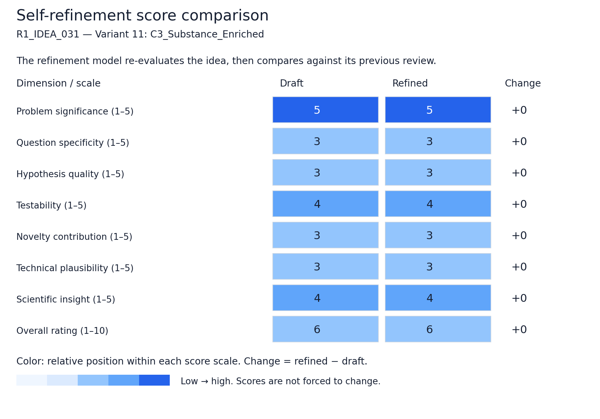

Changed score dimensions: none.

### Score justifications (draft / refined)

**Problem significance**

```json
{
  "draft": {
    "score": 5.0,
    "justification": "The problem is highly significant. Cognitive overload and ineffective management of long contexts are fundamental, widely acknowledged limitations of current LLM agents for long-horizon planning and reasoning. Solving or even understanding this better would have major implications for autonomous agents."
  },
  "refined": {
    "score": 5.0,
    "justification": "Exceptional. The problem of cognitive overload and inefficient context management in LLM agents for long-horizon tasks is a fundamental, widely acknowledged bottleneck. Improving understanding or solutions would have major implications for autonomous reasoning systems."
  }
}
```

**Question specificity**

```json
{
  "draft": {
    "score": 3.0,
    "justification": "Moderate. The idea specifies investigating dynamic attention allocation to mitigate cognitive overload. However, the research question is framed broadly as 'could this help?' rather than pinpointing a specific relationship, mechanism, or comparison. The term 'reasoning paradigm' is vague."
  },
  "refined": {
    "score": 3.0,
    "justification": "Moderate. The idea specifies investigating dynamic attention allocation to mitigate overload, which is more concrete than a generic 'apply X to Y.' However, the research question is framed broadly ('could this help?'), and the core object 'CORAL' is described only as a high-level 'paradigm,' lacking technical specificity."
  }
}
```

**Hypothesis quality**

```json
{
  "draft": {
    "score": 3.0,
    "justification": "Moderate. An implicit hypothesis exists: dynamically adjusting attention based on task phase will reduce irrelevant information retention and improve performance. It makes a directional prediction and hints at boundary conditions. However, it lacks specificity (e.g., magnitude of improvement, precise conditions for success/failure) and is not easily falsifiable in its current form."
  },
  "refined": {
    "score": 3.0,
    "justification": "Moderate. An implicit hypothesis exists: dynamic attention adjustment based on task phase will reduce irrelevant information retention and improve performance. It makes a directional prediction and hints at boundary conditions, which is good. However, it lacks specificity regarding the expected effect size, the precise mechanism of action, and the conditions for success/failure, making it not easily falsifiable as stated."
  }
}
```

**Testability**

```json
{
  "draft": {
    "score": 4.0,
    "justification": "Strong. The idea explicitly mentions validation through testing retention of irrelevant information and exploring boundary conditions. This suggests a clear path to experimentation with measurable outcomes (information retention metrics, success rates across task lengths). The core claim is testable if operationalized properly."
  },
  "refined": {
    "score": 4.0,
    "justification": "Strong. The idea explicitly mentions validation through testing reduction of irrelevant information retention and exploring boundary conditions. This outlines a clear path to experimentation with measurable outcomes. The core claim is inherently testable if operational definitions for 'irrelevant information,' 'task phase,' and 'improvement' are provided."
  }
}
```

**Novelty contribution**

```json
{
  "draft": {
    "score": 3.0,
    "justification": "Moderate. The high-level concept of managing cognitive load or attention in LLM agents is not new (e.g., work on context pruning, summarization, retrieval). The novelty claim rests on the specific paradigm of 'dynamic allocation based on task phase,' but without technical details, it's hard to assess how novel the proposed mechanism is versus an application of existing ideas."
  },
  "refined": {
    "score": 3.0,
    "justification": "Moderate. The high-level concept of managing cognitive load or attention in LLM agents is not new (e.g., context pruning, summarization, retrieval-augmented generation). The novelty claim rests on the specific angle of 'dynamic allocation based on task phase,' but without technical details, it is unclear if this represents a genuinely new mechanism or a novel synthesis of existing ideas."
  }
}
```

**Technical plausibility**

```json
{
  "draft": {
    "score": 3.0,
    "justification": "Moderate. The core intuition is plausible: managing working memory should help. However, the idea is described at a conceptual level. Without details on implementation, it's unclear if dynamically adjusting attention 'based on task phase' is technically feasible or how it would integrate with existing agent frameworks. The reasoning is coherent but underspecified."
  },
  "refined": {
    "score": 3.0,
    "justification": "Moderate. The core intuition—that better management of working memory should help—is plausible and coherent. However, the idea is severely underspecified. Without any details on implementation, it's impossible to assess the feasibility of dynamically adjusting attention 'based on task phase' within current LLM-based agent frameworks. The reasoning is logical but incomplete."
  }
}
```

**Scientific insight**

```json
{
  "draft": {
    "score": 4.0,
    "justification": "Strong. If successfully investigated, this research has high potential for scientific insight. It could reveal principles for efficient cognitive resource allocation in agents, identify boundary conditions of agent performance related to task complexity and memory, and provide a deeper understanding of the failure modes of LLMs in extended reasoning. It aims to move beyond just building a better agent to understanding a mechanism."
  },
  "refined": {
    "score": 4.0,
    "justification": "Strong. If successfully investigated, this research has high potential for transferable scientific insight. It could reveal principles for efficient cognitive resource allocation in artificial agents, identify boundary conditions of agent performance related to task structure and memory limitations, and provide a deeper mechanistic understanding of why LLMs fail in extended reasoning scenarios."
  }
}
```

**Overall rating**

```json
{
  "draft": {
    "score": 6.0,
    "justification": "Moderate/Borderline idea. The idea addresses a very significant problem and has good potential for scientific insight. Its main weakness is a lack of specificity in the proposed mechanism and hypothesis. It is more of a promising research direction with a sensible validation plan than a fully formed, testable research idea. With more concrete technical details and a sharper hypothesis, it could become strong."
  },
  "refined": {
    "score": 6.0,
    "justification": "Moderate/Borderline idea. The idea addresses an exceptionally significant problem and outlines a sensible, testable validation approach with good potential for scientific insight. Its primary weakness is a lack of specificity in the proposed mechanism and hypothesis, rendering it more of a promising research direction than a fully formed, concrete research idea. With more technical detail and a sharper hypothesis, it could become strong."
  }
}
```

## R1_IDEA_031 — Variant 12: H1_Deceptive_Hollow


Changed score dimensions: none.

### Score justifications (draft / refined)

**Problem significance**

```json
{
  "draft": {
    "score": 4.0,
    "justification": "The problem is significant. Memory and focus issues in AI agents for long-horizon tasks are a well-known, meaningful challenge that limits the practical application of language model agents. Solving it would matter to both researchers and practitioners."
  },
  "refined": {
    "score": 4.0,
    "justification": "The problem is highly significant. Memory and focus limitations in AI agents for long-horizon tasks are well-documented challenges that constrain practical deployment of language model agents. Addressing these issues would matter substantially to both researchers (advancing agent capabilities) and practitioners (enabling more complex applications)."
  }
}
```

**Question specificity**

```json
{
  "draft": {
    "score": 1.0,
    "justification": "Very weak. The idea does not define a concrete research question. It only states a general problem area ('improve how agents manage their cognitive resources') and makes grand claims about the framework's importance. There is no specific phenomenon, relationship, or comparison to be investigated."
  },
  "refined": {
    "score": 1.0,
    "justification": "Very weak. No concrete research question is defined. The idea only states a general problem area ('improve cognitive resource management') without specifying what phenomenon, relationship, or comparison will be investigated. There is no specific question about mechanisms, trade-offs, or performance boundaries."
  }
}
```

**Hypothesis quality**

```json
{
  "draft": {
    "score": 1.0,
    "justification": "Very weak. There is no discernible hypothesis—no prediction, proposed mechanism, or relationship to test. The text describes an ambition ('transformative synthesis') but not a falsifiable claim."
  },
  "refined": {
    "score": 1.0,
    "justification": "Very weak. There is no discernible hypothesis—no prediction, proposed mechanism, or causal relationship to test. The text describes an ambition ('transformative synthesis') and a goal ('improve management') but offers no falsifiable claim about how cognitive resources should be managed or what outcome would validate the approach."
  }
}
```

**Testability**

```json
{
  "draft": {
    "score": 1.0,
    "justification": "Very weak. With no specific hypothesis, mechanism, or evaluation metric proposed, the central promise is not testable. It is framed as an 'agenda' or 'direction' without a clear path to obtaining evidence."
  },
  "refined": {
    "score": 1.0,
    "justification": "Very weak. With no specific hypothesis, mechanism, or evaluation metric proposed, the central promise is essentially untestable. It is framed as an 'agenda' or 'direction' without any clear path to obtaining empirical evidence or conducting meaningful comparisons."
  }
}
```

**Novelty contribution**

```json
{
  "draft": {
    "score": 2.0,
    "justification": "Weak. The idea claims high novelty and a 'transformative' contribution, but without any technical or conceptual detail, it is impossible to assess. The stated goal of a unified framework is ambitious, but the contribution is currently just a vague aspiration."
  },
  "refined": {
    "score": 2.0,
    "justification": "Weak. The idea claims high novelty and transformative potential, but without any technical or conceptual detail, this claim is unsupported. The goal of a unified framework is ambitious, but the contribution is currently just a vague aspiration. Without specifying what makes CORAL novel compared to existing memory management approaches, the novelty cannot be assessed as more than weak."
  }
}
```

**Technical plausibility**

```json
{
  "draft": {
    "score": 2.0,
    "justification": "Weak. The reasoning is logically coherent at a high level (memory issues exist, a framework to manage resources could help), but there is no proposed technical direction to evaluate. The assumption that a 'broader framework' will inherently be useful is not justified."
  },
  "refined": {
    "score": 2.0,
    "justification": "Weak. The high-level reasoning is coherent (memory issues exist, better resource management could help), but there is no proposed technical direction to evaluate. The assumption that a 'broader framework' will be useful is not justified by any mechanistic insight. Without even a sketch of how CORAL would work, technical plausibility remains low."
  }
}
```

**Scientific insight**

```json
{
  "draft": {
    "score": 2.0,
    "justification": "Weak. The idea aspires to provide conceptual insight but does not specify what that insight would be. A successful framework could reveal principles of cognitive resource allocation in agents, but the current description is too vague to promise such an outcome."
  },
  "refined": {
    "score": 2.0,
    "justification": "Weak. The idea aspires to provide conceptual insight but does not specify what that insight would be. While a successful framework could reveal principles of cognitive resource allocation in agents, the current description is too vague to promise such an outcome. It mentions 'connect conceptual insight' but doesn't state what insight would be connected or discovered."
  }
}
```

**Overall rating**

```json
{
  "draft": {
    "score": 2.0,
    "justification": "Very weak research idea. While it identifies a significant problem, the proposal lacks all the core elements of a research idea: a specific question, a testable hypothesis, a plausible method, or a concrete contribution. It is primarily promotional language describing an ambition without a research plan. It is not yet a viable direction for scientific investigation."
  },
  "refined": {
    "score": 2.0,
    "justification": "Very weak research idea. While it correctly identifies a significant problem, the proposal lacks all essential elements of a research idea: a specific question, a testable hypothesis, a plausible method, or a concrete contribution. It is primarily promotional language describing an ambition without a research plan. It is not yet a viable direction for scientific investigation as presented."
  }
}
```

## R1_IDEA_031 — Variant 13: H2_Confident_Flaw


Changed score dimensions: none.

### Score justifications (draft / refined)

**Problem significance**

```json
{
  "draft": {
    "score": 5.0,
    "justification": "The problem is highly significant: managing cognitive overload in LLM agents for long-horizon reasoning is a core challenge in current AI research, with clear implications for building more capable autonomous systems."
  },
  "refined": {
    "score": 5.0,
    "justification": "The problem is highly significant: managing cognitive overload in LLM agents for long-horizon reasoning is a core challenge in current AI research with clear implications for building more capable autonomous systems. The motivation aligns with well-documented limitations of current LLM agents."
  }
}
```

**Question specificity**

```json
{
  "draft": {
    "score": 2.0,
    "justification": "The idea lacks a concrete research question. It states a general goal ('mitigate cognitive overload') but doesn't specify what aspect of CORAL will be investigated, what relationship will be tested, or what phenomenon will be examined."
  },
  "refined": {
    "score": 2.0,
    "justification": "The idea lacks a concrete research question. It states a general goal ('mitigate cognitive overload through self-allocation') but doesn't specify what aspect of CORAL will be investigated, what relationship will be tested, or what specific phenomenon will be examined. The description remains at the motivational level."
  }
}
```

**Hypothesis quality**

```json
{
  "draft": {
    "score": 1.0,
    "justification": "There is no clear hypothesis. The implicit claim that 'CORAL will improve performance' is too vague. No specific prediction about mechanisms, conditions, or comparative advantages is made. The additional claim about causal evidence without controls is scientifically unsound."
  },
  "refined": {
    "score": 1.0,
    "justification": "There is no clear, testable hypothesis. The implicit claim that 'CORAL will improve performance' is too vague and non-falsifiable. No specific prediction about mechanisms, conditions under which it works, comparative advantages, or measurable effects is made. The additional claim about establishing causality without controls is scientifically unsound and further weakens hypothesis quality."
  }
}
```

**Testability**

```json
{
  "draft": {
    "score": 2.0,
    "justification": "The idea as presented is not testable because it provides no direction for how CORAL would be implemented or evaluated. The suggestion that gains can be treated as causal without isolating variables further undermines testability."
  },
  "refined": {
    "score": 2.0,
    "justification": "The idea as presented is minimally testable because it provides no direction for how CORAL would be implemented, evaluated, or compared to alternatives. While the problem itself is testable in principle, the proposed solution lacks any specification that would enable testing. The suggestion that gains can be treated as causal without isolating variables further undermines testability by rejecting standard experimental controls."
  }
}
```

**Novelty contribution**

```json
{
  "draft": {
    "score": 2.0,
    "justification": "While the problem is important, the proposed solution ('cognitive resource self-allocation') is described at a very high level without technical novelty. Many existing approaches address memory management in LLM agents (e.g., retrieval, summarization, adaptive context). Without specifics, it's unclear what new contribution CORAL offers."
  },
  "refined": {
    "score": 2.0,
    "justification": "While the problem is important, the proposed solution ('cognitive resource self-allocation') is described at a very high level without technical novelty. Many existing approaches address memory management in LLM agents (e.g., retrieval-augmented generation, summarization, adaptive context, attention mechanisms). Without specifics about how CORAL differs technically or conceptually from these, it's unclear what new contribution it offers beyond applying an existing concept with a new name."
  }
}
```

**Technical plausibility**

```json
{
  "draft": {
    "score": 3.0,
    "justification": "The core concept—managing working memory to reduce overload—is plausible and aligns with cognitive science principles. However, the idea's technical details are completely absent, and the claim about establishing causality without controlled experiments is logically flawed."
  },
  "refined": {
    "score": 3.0,
    "justification": "The core concept—managing working memory to reduce cognitive overload—is plausible and aligns with cognitive science principles and known LLM limitations. However, the idea's technical details are completely absent, making assessment difficult. The claim about establishing causality without controlled experiments is logically flawed and reduces the overall plausibility of the methodological approach."
  }
}
```

**Scientific insight**

```json
{
  "draft": {
    "score": 2.0,
    "justification": "If developed properly, research on cognitive resource allocation in LLM agents could yield insights into scaling reasoning, attention mechanisms, and memory architectures. However, the current description focuses on a performance claim rather than seeking understanding of underlying mechanisms or principles."
  },
  "refined": {
    "score": 2.0,
    "justification": "If developed properly, research on cognitive resource allocation in LLM agents could yield insights into scaling reasoning, attention mechanisms, and memory architectures. However, the current description focuses primarily on a performance claim rather than seeking understanding of underlying mechanisms or principles. The problematic causal claim suggests a focus on proving superiority rather than generating scientific insight."
  }
}
```

**Overall rating**

```json
{
  "draft": {
    "score": 3.0,
    "justification": "This is a weak research idea. While it identifies an important problem, it lacks a specific research question, testable hypothesis, and methodological direction. The scientific reasoning is flawed in claiming causal evidence without controls. The idea is currently more of a motivational statement than a research plan."
  },
  "refined": {
    "score": 3.0,
    "justification": "This is a weak research idea. While it identifies an important and well-motivated problem, it lacks a specific research question, testable hypothesis, and methodological direction. The scientific reasoning contains a fundamental flaw in claiming causal evidence without controls. The idea is currently more of a motivational statement with a named approach than a research plan with scientific rigor. It would need substantial refinement to become a viable research direction."
  }
}
```

## R1_IDEA_031 — Variant 14: H3_Verbose_Enriched

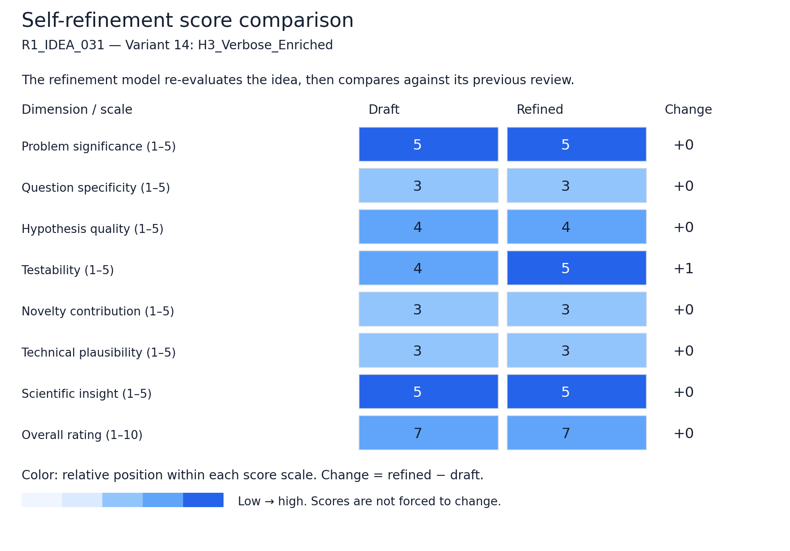

Changed score dimensions: testability.

### Score justifications (draft / refined)

**Problem significance**

```json
{
  "draft": {
    "score": 5.0,
    "justification": "The problem is highly significant. Cognitive overload and ineffective management of working memory in LLM agents for long-horizon tasks is a major, widely acknowledged bottleneck limiting their autonomy and reliability. Solving or understanding this would matter greatly to both researchers and practitioners."
  },
  "refined": {
    "score": 5.0,
    "justification": "Exceptional significance. Cognitive overload and ineffective working memory management in LLM agents for long-horizon tasks is a major, widely recognized bottleneck limiting autonomous agent capabilities. Addressing this would have substantial impact on both research and practical applications."
  }
}
```

**Question specificity**

```json
{
  "draft": {
    "score": 3.0,
    "justification": "The core research question is moderately specific: 'Can dynamically adjusting attention allocation based on task phase mitigate cognitive overload in LLM agents?' However, the key terms ('dynamic adjustment', 'task phase') are not defined, leaving the exact object of investigation vague. The validation plan mentions more specific sub-questions about irrelevant information retention and boundary conditions."
  },
  "refined": {
    "score": 3.0,
    "justification": "Moderate specificity. The core question ('Can phase-based attention adjustment mitigate cognitive overload?') is reasonably focused, but key terms ('dynamic adjustment', 'task phase') lack operational definitions. The validation plan mentions more specific sub-questions about irrelevant information retention and boundary conditions, but these are presented as suggestions rather than core components."
  }
}
```

**Hypothesis quality**

```json
{
  "draft": {
    "score": 4.0,
    "justification": "The hypothesis is good. It makes a concrete causal prediction: a specific intervention (phase-based attention adjustment) will lead to a specific outcome (reduced retention of irrelevant information, mitigating cognitive overload). It is falsifiable and distinguishes the investigation from a generic application of an existing method."
  },
  "refined": {
    "score": 4.0,
    "justification": "Strong hypothesis quality. The idea contains a clear causal prediction: phase-based attention reallocation will reduce irrelevant information retention and improve performance. This is falsifiable and distinguishes the investigation from generic applications. However, the hypothesis would be stronger with more precise definitions of the intervention mechanism."
  }
}
```

**Testability**

```json
{
  "draft": {
    "score": 4.0,
    "justification": "The idea is highly testable, especially with the suggested validation plan. The proposal explicitly mentions comparing baseline vs. intervention, using ablations, sensitivity analyses, and error analysis. Metrics like 'irrelevant information retention' and task success across varying lengths are measurable. The plan itself is a blueprint for rigorous testing."
  },
  "refined": {
    "score": 5.0,
    "justification": "Exceptional testability. The proposed validation approach—with staged experiments, baseline comparisons, ablations, sensitivity analyses, and error analysis—provides a comprehensive blueprint for rigorous testing. Metrics like irrelevant information retention across task lengths are measurable. The design explicitly addresses not just whether the method works, but when and why."
  }
}
```

**Novelty contribution**

```json
{
  "draft": {
    "score": 3.0,
    "justification": "Novelty is moderate. The high-level concept of adaptive attention/resource allocation in agents is not new. The potential contribution hinges on the unspecified technical details of CORAL. If the mechanism is genuinely novel, the contribution could be significant. The proposed validation approach, aimed at uncovering boundary conditions, is a strong point for contribution."
  },
  "refined": {
    "score": 3.0,
    "justification": "Moderate novelty. The high-level concept of adaptive attention/resource allocation in agents is not new. The contribution potential depends heavily on unspecified technical details of CORAL. The validation approach's focus on boundary conditions is a stronger novelty aspect than the paradigm itself."
  }
}
```

**Technical plausibility**

```json
{
  "draft": {
    "score": 3.0,
    "justification": "Plausibility is moderate. The core premise—that better attention management improves performance—is logically sound and aligns with known limitations of LLMs. However, without any detail on how CORAL works, it's impossible to assess the feasibility or coherence of the proposed mechanism. The reasoning is not flawed, but it is incomplete."
  },
  "refined": {
    "score": 3.0,
    "justification": "Moderate plausibility. The core premise—that better attention management could improve performance—is logically sound and aligns with known LLM limitations. However, without any implementation details for CORAL, assessing technical feasibility is impossible. The reasoning isn't flawed, but it's incomplete."
  }
}
```

**Scientific insight**

```json
{
  "draft": {
    "score": 5.0,
    "justification": "The potential for scientific insight is exceptional, primarily due to the proposed validation philosophy. The idea explicitly aims to move beyond 'does it work?' to 'when and why does it work?'. By seeking to define boundary conditions, perform ablations, and analyze failures, the research could yield generalizable insights about the relationship between task structure, memory management, and agent performance—insights transferable beyond the specific CORAL method."
  },
  "refined": {
    "score": 5.0,
    "justification": "Exceptional potential for scientific insight. The validation philosophy explicitly targets understanding mechanisms, boundary conditions, and failure modes rather than just performance improvement. This approach could yield generalizable insights about relationships between task structure, memory management, and agent performance that would transfer beyond the specific CORAL method."
  }
}
```

**Overall rating**

```json
{
  "draft": {
    "score": 7.0,
    "justification": "This is a strong research idea (7/10). It addresses a very important problem with a clear, testable hypothesis. Its greatest strength is the thoughtful, insight-driven validation approach outlined. The main weakness is the lack of detail on the proposed CORAL mechanism, which limits assessment of its novelty and technical plausibility. If fleshed out with concrete technical details, this could become an exceptional proposal. The high potential for scientific insight elevates the score."
  },
  "refined": {
    "score": 7.0,
    "justification": "Strong research idea (7/10). It addresses a highly significant problem with a testable hypothesis and proposes an exceptionally insightful validation methodology. The main limitation is the lack of technical detail about the CORAL mechanism, which constrains assessment of novelty and technical plausibility. With concrete implementation details, this could become an exceptional proposal. The high potential for scientific insight elevates the score despite the vagueness of the core method."
  }
}
```

## R1_IDEA_031 — Variant 15: H4_Ultimate_Hype

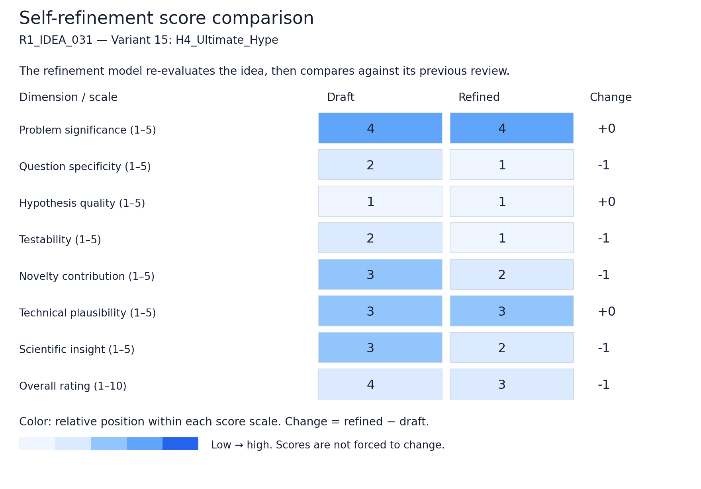

Changed score dimensions: question_specificity, testability, novelty_contribution, scientific_insight, overall_rating.

### Score justifications (draft / refined)

**Problem significance**

```json
{
  "draft": {
    "score": 4.0,
    "justification": "The problem is significant. Cognitive overload and context management are well-known, fundamental challenges for LLM-based agents, especially as tasks become longer and more complex. Solving or understanding this would matter greatly for building robust autonomous agents."
  },
  "refined": {
    "score": 4.0,
    "justification": "The problem is highly significant. Cognitive overload and context management are well-known, fundamental challenges for LLM-based agents, especially as tasks become longer and more complex. Addressing this would matter greatly for building robust, efficient autonomous agents, making it a meaningful research target."
  }
}
```

**Question specificity**

```json
{
  "draft": {
    "score": 2.0,
    "justification": "Very low specificity. The idea names a paradigm (CORAL) but does not define a concrete research question. It states a goal ('mitigate cognitive overload') but not what specific aspect of the problem or solution will be investigated."
  },
  "refined": {
    "score": 1.0,
    "justification": "Extremely low specificity. The idea names a paradigm (CORAL) but does not define any concrete research question. It states a general goal ('mitigate cognitive overload') but not what specific aspect of the problem or solution will be investigated. No measurable variables or relationships are identified."
  }
}
```

**Hypothesis quality**

```json
{
  "draft": {
    "score": 1.0,
    "justification": "No hypothesis is presented. There is only a vague claim that CORAL will help. There is no concrete, testable prediction about a relationship, mechanism, or comparative advantage."
  },
  "refined": {
    "score": 1.0,
    "justification": "No hypothesis is presented. There is only a vague claim that CORAL will help. There is no concrete, testable prediction about a relationship, mechanism, or comparative advantage. The idea lacks any falsifiable statement."
  }
}
```

**Testability**

```json
{
  "draft": {
    "score": 2.0,
    "justification": "The idea as stated is not directly testable because it lacks any proposed method or measurable outcome. It suggests a direction ('self-allocation') but gives no indication of how one would evaluate whether CORAL works or what evidence would support it."
  },
  "refined": {
    "score": 1.0,
    "justification": "The idea as stated is not directly testable because it lacks any proposed method, measurable outcome, or evaluation approach. It suggests a direction ('self-allocation') but gives no indication of how one would gather evidence to support or refute its effectiveness."
  }
}
```

**Novelty contribution**

```json
{
  "draft": {
    "score": 3.0,
    "justification": "The framing ('self-allocation') has some novelty potential, but without technical details, it's impossible to assess how it differs from prior work on memory, attention, and resource management in agents. The contribution is currently aspirational rather than defined."
  },
  "refined": {
    "score": 2.0,
    "justification": "The framing ('self-allocation') has some surface-level novelty, but without technical details, it's impossible to assess how it differs from prior work on memory, attention, and resource management in agents (e.g., adaptive computation time, learned retrieval, context compression). The contribution is currently aspirational and undefined."
  }
}
```

**Technical plausibility**

```json
{
  "draft": {
    "score": 3.0,
    "justification": "The core intuition—that agents should manage their cognitive resources—is logically coherent and plausible. However, with no technical direction provided, the plausibility of any specific implementation cannot be judged. The idea rests on a reasonable assumption but lacks a concrete mechanism."
  },
  "refined": {
    "score": 3.0,
    "justification": "The core intuition—that agents should manage their cognitive resources—is logically coherent and plausible. However, with no technical direction provided, the plausibility of any specific implementation cannot be judged. The idea rests on a reasonable assumption but lacks a concrete mechanism to evaluate."
  }
}
```

**Scientific insight**

```json
{
  "draft": {
    "score": 3.0,
    "justification": "If successfully developed, a 'self-allocation' paradigm could provide insight into how artificial agents can manage limited processing resources, which is a general principle relevant to efficient reasoning. However, the current description is too vague to guarantee deep insight; it could easily devolve into a simple engineering heuristic."
  },
  "refined": {
    "score": 2.0,
    "justification": "If successfully developed, a 'self-allocation' paradigm could theoretically provide insight into how artificial agents manage limited processing resources. However, the current description is too vague to guarantee deep insight; it could easily devolve into a simple engineering heuristic without revealing general principles, mechanisms, or boundary conditions."
  }
}
```

**Overall rating**

```json
{
  "draft": {
    "score": 4.0,
    "justification": "This is a weak research idea in its current form. It identifies a significant and meaningful problem (cognitive overload in LLM agents), which is its primary strength. However, it fails to articulate a specific research question, a testable hypothesis, or any technical direction. It is presented as a 'transformative agenda' with grand claims but no substance to evaluate. The idea is more of a motivational pitch than a research plan. It needs substantial refinement to become a viable research direction."
  },
  "refined": {
    "score": 3.0,
    "justification": "This is a very weak research idea in its current form. Its sole strength is identifying a significant problem (cognitive overload in LLM agents). However, it completely fails to articulate a specific research question, a testable hypothesis, or any technical direction. It is presented as a 'transformative agenda' with grand claims but no substance to evaluate. The idea is essentially a motivational pitch, not a research plan. It needs fundamental refinement to become a viable research direction."
  }
}
```

## R1_IDEA_032 — Source

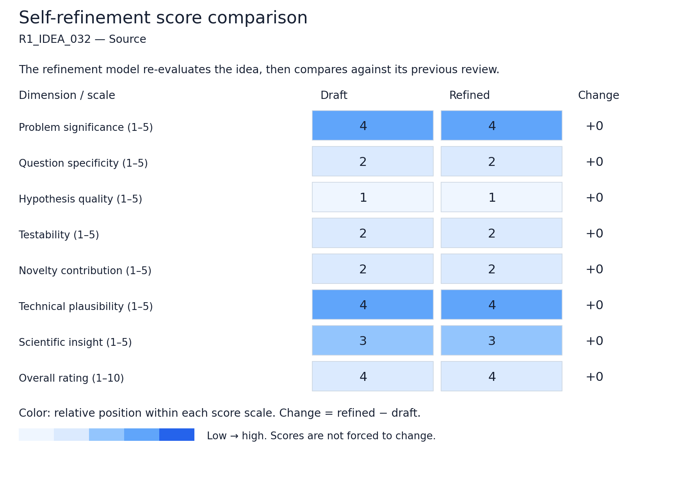

Changed score dimensions: none.

### Score justifications (draft / refined)

**Problem significance**

```json
{
  "draft": {
    "score": 4.0,
    "justification": "The problem is meaningful. SSL is a core ML area, and its real-world applicability depends on robustness to imperfect data. The identified gap between clean lab datasets and noisy real-world data is genuine and important for deployment in sciences and industry."
  },
  "refined": {
    "score": 4.0,
    "justification": "The problem is meaningful. SSL is a core ML area, and its real-world utility depends on robustness to imperfect data. The gap between clean lab datasets and noisy real-world data is genuine and important for deployment in scientific and industrial applications."
  }
}
```

**Question specificity**

```json
{
  "draft": {
    "score": 2.0,
    "justification": "The idea is vague. It states that 'applying SSL on noisy data remains a challenge' but does not define a specific research question. What exactly about the challenge will be investigated? The scope is overly broad."
  },
  "refined": {
    "score": 2.0,
    "justification": "The idea is vague. It states that 'applying SSL on noisy data remains a challenge' but does not define a specific research question. What exactly about the challenge will be investigated? The scope is overly broad and lacks focus."
  }
}
```

**Hypothesis quality**

```json
{
  "draft": {
    "score": 1.0,
    "justification": "No hypothesis is present. The idea merely observes a gap without proposing a testable prediction about mechanisms, relationships, or potential solutions."
  },
  "refined": {
    "score": 1.0,
    "justification": "No hypothesis is present. The idea merely observes a gap without proposing any testable prediction about underlying mechanisms, relationships, or potential solutions."
  }
}
```

**Testability**

```json
{
  "draft": {
    "score": 2.0,
    "justification": "The idea as stated is not directly testable because it lacks a concrete claim. However, the general direction could be made testable by defining a specific noise type, SSL method, and evaluation metric."
  },
  "refined": {
    "score": 2.0,
    "justification": "The idea as stated is not directly testable because it lacks a concrete claim. However, the general direction could be made testable by defining a specific noise type, SSL method, and evaluation metric—but these are not provided."
  }
}
```

**Novelty contribution**

```json
{
  "draft": {
    "score": 2.0,
    "justification": "Low novelty. The observation that SSL is often tested on clean data is not new. Many works have studied SSL under distribution shift, label noise, or corruptions. The idea does not propose a novel angle, mechanism, or untested hypothesis to distinguish it from prior work."
  },
  "refined": {
    "score": 2.0,
    "justification": "Low novelty. The observation that SSL research focuses on clean data is not new. Many works have studied SSL under various corruptions, distribution shifts, or label noise. The idea does not propose a novel angle, mechanism, or untested hypothesis to distinguish it from prior application studies."
  }
}
```

**Technical plausibility**

```json
{
  "draft": {
    "score": 4.0,
    "justification": "The premise is technically plausible. SSL methods indeed often assume clean data, and noise likely degrades performance. Investigating this is a coherent and logical direction."
  },
  "refined": {
    "score": 4.0,
    "justification": "The premise is technically plausible. SSL methods often assume clean data for augmentations and pretext tasks, and noise likely degrades performance. Investigating this is a coherent and logical direction."
  }
}
```

**Scientific insight**

```json
{
  "draft": {
    "score": 3.0,
    "justification": "Potential insight is moderate. If pursued with a specific focus, it could reveal how different SSL objectives interact with noise, or identify robustness principles. As stated, it risks being a simple application study without deeper mechanistic understanding."
  },
  "refined": {
    "score": 3.0,
    "justification": "Potential insight is moderate. If pursued with a specific focus, it could reveal how different SSL objectives interact with noise types or identify robustness principles. As stated, it risks being a simple application study without deeper mechanistic understanding."
  }
}
```

**Overall rating**

```json
{
  "draft": {
    "score": 4.0,
    "justification": "The idea identifies a relevant problem but is currently too vague to be a strong research idea. It lacks a specific research question, hypothesis, and methodological direction. It reads more as a motivation paragraph than a research plan. With refinement, it could become a solid idea."
  },
  "refined": {
    "score": 4.0,
    "justification": "The idea identifies a relevant and meaningful problem but is currently too vague to be a strong research idea. It lacks a specific research question, hypothesis, and methodological direction. It reads more as a motivation paragraph than a research plan. With refinement, it could become a solid idea."
  }
}
```

## R1_IDEA_032 — Variant 1: A1_Identity


Changed score dimensions: none.

### Score justifications (draft / refined)

**Problem significance**

```json
{
  "draft": {
    "score": 4.0,
    "justification": "The problem is meaningful: SSL is a core ML paradigm, and its real-world applicability depends on robustness to noisy data. The identified gap between clean research datasets and noisy application domains is valid and important."
  },
  "refined": {
    "score": 4.0,
    "justification": "The problem is meaningful and significant. SSL is a core ML paradigm, and its real-world applicability hinges on robustness to noisy data. The identified gap between clean research datasets and noisy application domains is valid, important, and addresses a practical limitation."
  }
}
```

**Question specificity**

```json
{
  "draft": {
    "score": 2.0,
    "justification": "The idea only states that 'applying SSL on noisy data remains a challenge'—it does not define a concrete research question. It identifies a general area but not a specific aspect to investigate."
  },
  "refined": {
    "score": 2.0,
    "justification": "The idea only states that 'applying SSL on noisy data remains a challenge'—it does not define a concrete research question. It identifies a general area of concern but does not specify what aspect of SSL on noisy data will be investigated, such as a particular noise type, SSL method, or failure mechanism."
  }
}
```

**Hypothesis quality**

```json
{
  "draft": {
    "score": 1.0,
    "justification": "No hypothesis is present. The idea merely observes a challenge without proposing a testable prediction about mechanisms, relationships, or potential solutions."
  },
  "refined": {
    "score": 1.0,
    "justification": "No hypothesis is present, either explicit or implicit. The idea merely observes a challenge without proposing a testable prediction about underlying mechanisms, relationships between noise types and SSL objectives, or potential solutions. It lacks any falsifiable claim."
  }
}
```

**Testability**

```json
{
  "draft": {
    "score": 2.0,
    "justification": "The idea as stated is not directly testable because it lacks a specific claim or experimental direction. However, the general topic of SSL on noisy data is testable if a concrete question is formulated."
  },
  "refined": {
    "score": 2.0,
    "justification": "The idea as stated is not directly testable because it lacks a specific claim or experimental direction. However, the general topic of SSL on noisy data is inherently testable if a concrete question is formulated (e.g., through controlled noise experiments, robustness benchmarks)."
  }
}
```

**Novelty contribution**

```json
{
  "draft": {
    "score": 3.0,
    "justification": "The observation that SSL research focuses on clean data is not novel per se, but systematically studying SSL under noise could yield new insights. The potential contribution is moderate—it could become novel if a specific, understudied type of noise or failure mode is investigated."
  },
  "refined": {
    "score": 3.0,
    "justification": "The observation that SSL research focuses on clean data is not novel per se, but systematically studying SSL under noise could yield new insights. The potential contribution is moderate—it could become novel if a specific, understudied type of noise or a particular SSL failure mode is investigated in depth. As stated, it is a broad motivation rather than a novel angle."
  }
}
```

**Technical plausibility**

```json
{
  "draft": {
    "score": 4.0,
    "justification": "The reasoning is coherent: SSL methods are often designed and evaluated on clean benchmarks, so their behavior on noisy data is an open question. The assumption that noise matters in real applications is reasonable."
  },
  "refined": {
    "score": 4.0,
    "justification": "The reasoning is logically coherent: SSL methods are often designed and evaluated on clean benchmarks, so their behavior on noisy data is a plausible and open question. The assumption that noise matters in real applications is reasonable and well-grounded."
  }
}
```

**Scientific insight**

```json
{
  "draft": {
    "score": 3.0,
    "justification": "If pursued with a specific focus, the research could reveal how different SSL objectives interact with data noise, which could lead to general principles for designing robust SSL methods. As stated, the potential insight is moderate but could be high with more specificity."
  },
  "refined": {
    "score": 3.0,
    "justification": "If pursued with a specific focus, the research could reveal how different SSL objectives interact with data noise, which could lead to general principles for designing robust SSL methods. As stated, the potential insight is moderate but could be high with more specificity—for example, uncovering noise-invariant representation learning mechanisms or failure boundaries."
  }
}
```

**Overall rating**

```json
{
  "draft": {
    "score": 4.0,
    "justification": "The idea identifies a significant and relevant problem but lacks a clear research question, hypothesis, or methodological direction. It is more of a motivation statement than a research idea. With refinement, it could become a strong research direction, but in its current form it is weak as a specific idea."
  },
  "refined": {
    "score": 4.0,
    "justification": "The idea identifies a significant and relevant problem but lacks a clear research question, hypothesis, or methodological direction. It is essentially a motivation statement rather than a research idea. With refinement, it could become a strong research direction, but in its current form it is weak as a specific, actionable idea."
  }
}
```

## R1_IDEA_032 — Variant 2: A2_Paraphrase_Only

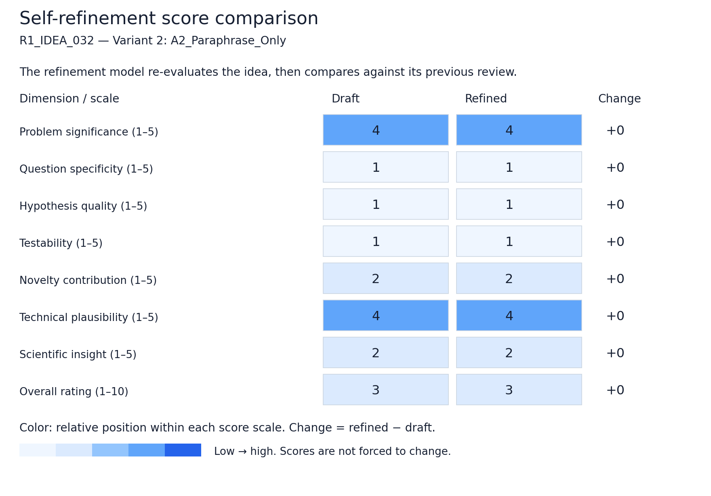

Changed score dimensions: none.

### Score justifications (draft / refined)

**Problem significance**

```json
{
  "draft": {
    "score": 4.0,
    "justification": "The problem is meaningful and well-motivated. SSL is a core ML paradigm, and its reliance on clean data is a recognized limitation for real-world applications. The listed domains are important and plausibly suffer from data quality issues."
  },
  "refined": {
    "score": 4.0,
    "justification": "The problem is highly meaningful. SSL is a core ML paradigm with growing importance, and its reliance on clean data is a recognized limitation for real-world deployment. The identified domains (astrophysics, medical imaging, etc.) are scientifically and practically important areas where data quality issues are inherent. Addressing this gap could significantly expand SSL's applicability."
  }
}
```

**Question specificity**

```json
{
  "draft": {
    "score": 1.0,
    "justification": "The idea does not define a research question. It states a general challenge ('SSL application to noisy data is challenging') but does not specify what aspect will be investigated. This is a motivation, not a question."
  },
  "refined": {
    "score": 1.0,
    "justification": "The idea does not define a research question. It states a general challenge ('SSL application to noisy data is challenging') but doesn't specify what aspect will be investigated, what relationships will be studied, or what phenomenon will be examined. This is a motivation statement, not a research question."
  }
}
```

**Hypothesis quality**

```json
{
  "draft": {
    "score": 1.0,
    "justification": "No hypothesis is present, explicit or implicit. The text merely observes a gap and suggests importance, without making a testable prediction about SSL behavior, robustness, or methodology."
  },
  "refined": {
    "score": 1.0,
    "justification": "No hypothesis is present. The text merely observes a gap and suggests importance without making any testable prediction about SSL behavior, robustness mechanisms, methodological improvements, or relationships between noise types and SSL performance. There's no falsifiable claim."
  }
}
```

**Testability**

```json
{
  "draft": {
    "score": 1.0,
    "justification": "As presented, the idea is not testable. It proposes no experiments, evaluations, or analyses. It only identifies a broad area of concern. A testable idea would need to define what evidence would address the challenge."
  },
  "refined": {
    "score": 1.0,
    "justification": "The idea as presented is not testable. It proposes no experiments, evaluations, comparisons, or analyses. It only identifies a broad area of concern without suggesting how one would gather evidence to address it. A testable idea would need to define what evidence would answer a specific question."
  }
}
```

**Novelty contribution**

```json
{
  "draft": {
    "score": 2.0,
    "justification": "The observation that SSL uses clean data is not novel. The potential contribution—applying SSL to noisy domains—is a broad application goal. Without a specific question or hypothesis, the novelty of the scientific investigation is low."
  },
  "refined": {
    "score": 2.0,
    "justification": "The observation that SSL research uses clean data is not novel. The potential contribution of applying SSL to noisy domains is a broad application goal rather than a specific scientific investigation. Without a defined question or hypothesis, the novelty of the scientific investigation is minimal. Some work already exists on robust SSL, though the domain applications mentioned could offer novelty if explored specifically."
  }
}
```

**Technical plausibility**

```json
{
  "draft": {
    "score": 4.0,
    "justification": "The core observation is logically sound and plausible. SSL methods are indeed typically developed and evaluated on clean benchmarks. Investigating their behavior on noisy data is a coherent and technically sensible direction."
  },
  "refined": {
    "score": 4.0,
    "justification": "The core observation is logically sound and technically plausible. SSL methods are indeed typically developed and evaluated on clean benchmarks like ImageNet, CIFAR, etc. Investigating their behavior on noisy data is a coherent direction that aligns with known challenges in real-world ML deployment. The reasoning is sound given the information provided."
  }
}
```

**Scientific insight**

```json
{
  "draft": {
    "score": 2.0,
    "justification": "The idea, as stated, has low potential for scientific insight because it does not propose to study a mechanism, principle, or relationship. It points to an application need. If refined (e.g., to study how noise affects specific SSL learning dynamics), the insight potential could be high."
  },
  "refined": {
    "score": 2.0,
    "justification": "The idea as stated has low potential for scientific insight because it doesn't propose to study mechanisms, principles, or relationships. It points to an application need. If refined (e.g., to study how different noise types affect SSL learning dynamics, or to identify which SSL objectives are inherently more robust), the insight potential could be substantial, but currently it's just an application motivation."
  }
}
```

**Overall rating**

```json
{
  "draft": {
    "score": 3.0,
    "justification": "This is a weak research idea in its current form. It identifies a significant and meaningful problem but fails to define a research question, hypothesis, or testable direction. It is essentially a motivation paragraph. To become a viable research idea, it needs substantial refinement to specify what will be investigated and how."
  },
  "refined": {
    "score": 3.0,
    "justification": "This is a weak research idea in its current form. While it identifies a significant and meaningful problem with clear practical relevance, it fails to define a research question, hypothesis, or testable direction. It's essentially a motivation paragraph that needs substantial refinement to become a viable research idea. The lack of specificity in what will be investigated and how severely limits its scientific value as presented."
  }
}
```

## R1_IDEA_032 — Variant 3: A3_Plain_Core


Changed score dimensions: testability, scientific_insight.

### Score justifications (draft / refined)

**Problem significance**

```json
{
  "draft": {
    "score": 4.0,
    "justification": "The problem is meaningful. SSL is a core ML paradigm, and its applicability to noisy real-world data is a significant practical challenge. The listed domains (astrophysics, medical imaging, etc.) are important and data-rich, where labeled data is scarce and noise is inherent, making SSL highly relevant."
  },
  "refined": {
    "score": 4.0,
    "justification": "The problem is meaningful. SSL is a core ML paradigm, and its applicability to noisy real-world data is a significant practical challenge. The listed domains (astrophysics, medical imaging, etc.) are important and data-rich, where labeled data is scarce and noise is inherent, making SSL highly relevant. However, the significance is slightly tempered by the broadness of the statement."
  }
}
```

**Question specificity**

```json
{
  "draft": {
    "score": 1.0,
    "justification": "Extremely low specificity. The idea only states that 'applying SSL to noisy data is difficult' and 'this matters for...' It does not define a concrete question about what to investigate, which mechanisms to study, or what relationship to test. It is a broad problem area, not a research question."
  },
  "refined": {
    "score": 1.0,
    "justification": "Extremely low specificity. The idea only states that 'applying SSL to noisy data is difficult' and 'this matters for...' It does not define any concrete question about what to investigate, which mechanisms to study, or what relationship to test. It is a broad problem area, not a research question."
  }
}
```

**Hypothesis quality**

```json
{
  "draft": {
    "score": 1.0,
    "justification": "No hypothesis is present. The text describes a situation (SSL research focuses on clean data, applying to noisy data is hard) and its relevance. There is no prediction, proposed mechanism, or falsifiable statement. The implicit assumption is that 'SSL on noisy data is worth studying,' which is not a testable hypothesis."
  },
  "refined": {
    "score": 1.0,
    "justification": "No hypothesis is present. The text describes a situation (SSL research focuses on clean data, applying to noisy data is hard) and its relevance. There is no prediction, proposed mechanism, or falsifiable statement. The implicit assumption is that 'SSL on noisy data is worth studying,' which is not a testable hypothesis."
  }
}
```

**Testability**

```json
{
  "draft": {
    "score": 2.0,
    "justification": "The idea as stated is not directly testable because it lacks any specific claim or proposed investigation. However, the general problem area is testable—one could design experiments comparing SSL methods on noisy vs. clean data. The idea itself does not suggest such an experiment, so testability is low."
  },
  "refined": {
    "score": 1.0,
    "justification": "The idea as stated is not directly testable because it lacks any specific claim or proposed investigation. While the general problem area is testable (one could design experiments), the idea itself does not suggest any experiment, comparison, evaluation, or analysis. It merely identifies a difficulty without proposing how to study it."
  }
}
```

**Novelty contribution**

```json
{
  "draft": {
    "score": 2.0,
    "justification": "The observation that SSL is typically studied on clean data and that noisy data poses challenges is not novel in itself. The potential contribution lies in exploring this gap, but without a specific angle (e.g., a new noise-robust pretext task, an analysis of SSL noise sensitivity), the novelty is limited to applying an existing research theme (robust learning) to SSL."
  },
  "refined": {
    "score": 2.0,
    "justification": "The observation that SSL is typically studied on clean data and that noisy data poses challenges is not novel in itself. The potential contribution lies in exploring this gap, but without a specific angle (e.g., a new noise-robust pretext task, an analysis of SSL noise sensitivity, or a novel adaptation method), the novelty is limited to applying an existing research theme (robust learning) to SSL. It lacks a distinctive scientific contribution."
  }
}
```

**Technical plausibility**

```json
{
  "draft": {
    "score": 3.0,
    "justification": "The idea is logically coherent: SSL methods are designed and evaluated on curated datasets, and real-world noise could degrade their performance. This is a reasonable concern. However, no technical direction is proposed, so there's little to evaluate in terms of methodological plausibility. The basic premise is sound."
  },
  "refined": {
    "score": 3.0,
    "justification": "The basic premise is logically coherent: SSL methods are designed and evaluated on curated datasets, and real-world noise could degrade their performance. This is a reasonable concern. However, no technical direction is proposed, so there's little to evaluate in terms of methodological plausibility. The idea is not technically implausible, but it's too vague to assess beyond the initial observation."
  }
}
```

**Scientific insight**

```json
{
  "draft": {
    "score": 3.0,
    "justification": "If developed into a concrete study, this could yield insights into the robustness of SSL representations, the interaction between noise types and SSL objectives, or general principles for designing noise-invariant self-supervised algorithms. As stated, the potential insight is moderate but undefined."
  },
  "refined": {
    "score": 2.0,
    "justification": "If developed into a concrete study, this could yield insights into the robustness of SSL representations or principles for noise-invariant self-supervised learning. However, as stated, the potential insight is minimal because no specific mechanism, relationship, or phenomenon is proposed for investigation. It merely identifies a problem area without suggesting what might be learned from studying it."
  }
}
```

**Overall rating**

```json
{
  "draft": {
    "score": 3.0,
    "justification": "This is a weak research idea in its current form. It identifies a meaningful and relevant problem (SSL on noisy data) but fails to articulate a specific research question, hypothesis, or methodological direction. It reads more as a motivation or problem statement than a research idea. Without greater specificity, its scientific contribution potential is very low. It scores above 1-2 because the problem itself is significant, but the idea lacks the core components of a testable research direction."
  },
  "refined": {
    "score": 3.0,
    "justification": "This is a weak research idea in its current form. It identifies a meaningful and relevant problem (SSL on noisy data) but fails to articulate a specific research question, hypothesis, or methodological direction. It reads more as a motivation or problem statement than a research idea. Without greater specificity, its scientific contribution potential is very low. It scores above 1-2 because the problem itself is significant, but the idea lacks the core components of a testable research direction."
  }
}
```

## R1_IDEA_032 — Variant 4: B1_Verbose_Elaborate


Changed score dimensions: none.

### Score justifications (draft / refined)

**Problem significance**

```json
{
  "draft": {
    "score": 4.0,
    "justification": "The problem is meaningful and has clear practical importance. SSL's reliance on curated data is a recognized limitation, and extending its robustness to noisy domains is a valuable goal for both ML theory and real-world applications."
  },
  "refined": {
    "score": 4.0,
    "justification": "The problem is meaningful and has clear practical importance. SSL's reliance on curated data is a recognized limitation, and extending robustness to noisy domains is valuable for both ML theory and real-world applications in critical fields."
  }
}
```

**Question specificity**

```json
{
  "draft": {
    "score": 1.0,
    "justification": "The idea lacks a defined research question. It identifies a broad area of investigation ('applying SSL to noisy data') but does not specify what is being asked or studied within that area."
  },
  "refined": {
    "score": 1.0,
    "justification": "The idea lacks a defined research question. It identifies a broad area ('applying SSL to noisy data') but does not specify what is being asked or studied within that area. No concrete aspect of the challenge is singled out for investigation."
  }
}
```

**Hypothesis quality**

```json
{
  "draft": {
    "score": 1.0,
    "justification": "There is no explicit or implicit testable hypothesis. The text states a challenge and a practical need, but makes no concrete, falsifiable prediction about SSL methods, noise, or their interaction."
  },
  "refined": {
    "score": 1.0,
    "justification": "There is no explicit or implicit testable hypothesis. The text states a challenge and practical need but makes no concrete, falsifiable prediction about SSL methods, noise types, or their interaction. It is purely observational."
  }
}
```

**Testability**

```json
{
  "draft": {
    "score": 2.0,
    "justification": "The idea as stated is not directly testable because it proposes no investigation. However, the core concept ('SSL on noisy data') is inherently testable—one could design experiments comparing methods or measuring performance degradation. The idea itself does not suggest such a path."
  },
  "refined": {
    "score": 2.0,
    "justification": "The idea as stated is not directly testable because it proposes no investigation. However, the core concept ('SSL on noisy data') is inherently testable—one could design experiments. The idea itself does not suggest such a path, leaving it vague."
  }
}
```

**Novelty contribution**

```json
{
  "draft": {
    "score": 2.0,
    "justification": "The observation that SSL is studied on clean data and should work on noisy data is not novel. The potential contribution is currently framed as an application goal. Without a specific question or hypothesis, the novelty of the intended scientific contribution is unclear."
  },
  "refined": {
    "score": 2.0,
    "justification": "The observation that SSL is studied on clean data and should work on noisy data is not novel. The potential contribution is currently framed as an application goal. Without a specific question or hypothesis, the novelty of the intended scientific contribution is unclear and appears incremental."
  }
}
```

**Technical plausibility**

```json
{
  "draft": {
    "score": 3.0,
    "justification": "The premise is logically coherent and plausible. It is reasonable to suspect that noise affects SSL, and investigating this is a sensible direction. No technical flaws are apparent, but the idea lacks detail to assess the plausibility of any specific approach."
  },
  "refined": {
    "score": 3.0,
    "justification": "The premise is logically coherent and plausible. It is reasonable to suspect noise affects SSL, and investigating this is sensible. No technical flaws are apparent, but the idea lacks detail to assess the plausibility of any specific approach."
  }
}
```

**Scientific insight**

```json
{
  "draft": {
    "score": 2.0,
    "justification": "The idea currently promises practical utility but little specified scientific insight. A successful project in this area could certainly yield insights (e.g., the robustness properties of different SSL objectives), but the idea summary does not articulate what those insights might be."
  },
  "refined": {
    "score": 2.0,
    "justification": "The idea currently promises practical utility but little specified scientific insight. A successful project could yield insights (e.g., robustness properties of SSL objectives), but the summary does not articulate what those insights might be. It is application-focused rather than knowledge-focused."
  }
}
```

**Overall rating**

```json
{
  "draft": {
    "score": 3.0,
    "justification": "This is a weak research idea in its current form. It identifies a significant and relevant problem but fails to define a research question, hypothesis, or methodological direction. It reads more as a motivation or problem statement than a research idea. It lacks the specificity, testability, and clear path to contribution needed for a strong rating."
  },
  "refined": {
    "score": 3.0,
    "justification": "This is a weak research idea in its current form. It identifies a significant and relevant problem but fails to define a research question, hypothesis, or methodological direction. It reads more as a motivation or problem statement than a research idea. It lacks the specificity, testability, and clear path to contribution needed for a higher rating."
  }
}
```

## R1_IDEA_032 — Variant 5: B2_Grand_Narrative


Changed score dimensions: question_specificity, testability, novelty_contribution, scientific_insight, overall_rating.

### Score justifications (draft / refined)

**Problem significance**

```json
{
  "draft": {
    "score": 4.0,
    "justification": "The problem is meaningful. SSL is a core ML paradigm, and its real-world applicability is limited by an assumption of clean data. Addressing noise robustness is crucial for deployment in many scientific and industrial domains. The significance is high for both practical application and advancing the theoretical understanding of SSL's limitations."
  },
  "refined": {
    "score": 4.0,
    "justification": "The problem is highly meaningful. SSL is a foundational ML paradigm, and its real-world utility is constrained by the clean-data assumption. Improving robustness to noise is crucial for deployment in scientific and industrial domains where clean data is unavailable. This has significant practical and scientific relevance."
  }
}
```

**Question specificity**

```json
{
  "draft": {
    "score": 2.0,
    "justification": "The idea identifies a general area ('applying SSL on noisy data') but does not define a specific research question. It states a challenge exists but does not specify what aspect will be investigated, what relationship will be studied, or what phenomenon will be explained."
  },
  "refined": {
    "score": 1.0,
    "justification": "The idea does not define a research question. It identifies a general area ('applying SSL on noisy data') but specifies nothing about what will be investigated, what relationship will be studied, or what phenomenon will be explained. It is a topic, not a question."
  }
}
```

**Hypothesis quality**

```json
{
  "draft": {
    "score": 1.0,
    "justification": "There is no explicit or clearly implicit hypothesis. The statement 'Addressing this gap could contribute...' is a vague potential benefit, not a falsifiable prediction about a mechanism, relationship, or comparative outcome. It lacks the specificity required for a testable hypothesis."
  },
  "refined": {
    "score": 1.0,
    "justification": "There is no hypothesis, explicit or implicit. The phrase 'could contribute' expresses a vague hope or potential benefit, not a falsifiable prediction. It makes no claim about mechanisms, comparative outcomes, or relationships that could be supported or contradicted by evidence."
  }
}
```

**Testability**

```json
{
  "draft": {
    "score": 2.0,
    "justification": "The idea as stated is not directly testable because it lacks a specific claim to test. However, the general problem area is testable—one could design experiments comparing SSL methods under noise or proposing new robust objectives. The testability is low because no concrete investigative path is suggested."
  },
  "refined": {
    "score": 1.0,
    "justification": "The idea as stated is not testable because it makes no specific claim to test. While the general problem area is testable (one could design experiments), the idea itself suggests no investigative path—no experiment, comparison, evaluation, or analysis. It is purely a motivational statement."
  }
}
```

**Novelty contribution**

```json
{
  "draft": {
    "score": 3.0,
    "justification": "The observation that SSL research uses clean datasets is not novel. The potential contribution of studying SSL under noise is moderate. It could lead to new insights if it discovers specific failure modes or proposes novel robust methods. However, as a generic application direction ('apply X to noisy Y'), the novelty is limited without a more specific angle."
  },
  "refined": {
    "score": 2.0,
    "justification": "The observation that SSL research uses clean datasets is well-known. The suggestion to study SSL under noise is a reasonable application direction, but as a generic 'apply X to noisy Y' idea without a specific angle, its novelty is low. The potential contribution is moderate only if it leads to new robust methods or insights, but the idea does not propose a path to such contributions."
  }
}
```

**Technical plausibility**

```json
{
  "draft": {
    "score": 4.0,
    "justification": "The reasoning is logically coherent. It is plausible that SSL methods designed for clean data may underperform on noisy data, and investigating this is a sensible direction. No unreasonable assumptions are made."
  },
  "refined": {
    "score": 4.0,
    "justification": "The core reasoning is logically sound and plausible. It is reasonable to suspect that SSL methods optimized for clean data may not handle noise well, and investigating this is a coherent direction. No technical flaws or unreasonable assumptions are present in the brief statement."
  }
}
```

**Scientific insight**

```json
{
  "draft": {
    "score": 3.0,
    "justification": "If successfully investigated, this direction could provide insight into the robustness and failure modes of different SSL paradigms, potentially revealing principles for designing noise-invariant learning objectives. However, as stated, the idea promises only a general 'contribution to more robust... learning.' The potential for deep scientific insight (e.g., understanding the interaction between noise structure and SSL loss geometry) is present but not articulated."
  },
  "refined": {
    "score": 2.0,
    "justification": "The idea, as stated, promises only a general application benefit ('more robust and widely applicable learning'). While the underlying problem has high potential for insight (e.g., understanding how different SSL losses interact with noise statistics), the idea itself does not articulate a path to such insight. It is framed as solving a practical gap, not necessarily generating new scientific understanding."
  }
}
```

**Overall rating**

```json
{
  "draft": {
    "score": 4.0,
    "justification": "This is a weak research idea in its current form. It identifies a significant and relevant problem but fails to define a specific research question, hypothesis, or methodological direction. It reads more as a broad motivation or problem statement than a research idea. It lacks the specificity and testability required for a strong research direction. With substantial refinement (as suggested), it could become a strong idea."
  },
  "refined": {
    "score": 3.0,
    "justification": "This is a weak research idea. It identifies a significant and relevant practical problem but fails entirely to define a research question, hypothesis, or methodological direction. It reads as a broad motivation or problem statement, not a research idea. It lacks the specificity, testability, and novelty required for a meaningful research direction. With substantial refinement, it could become a strong idea, but in its current form, it is not actionable."
  }
}
```

## R1_IDEA_032 — Variant 6: B3_Over_Confident


Changed score dimensions: none.

### Score justifications (draft / refined)

**Problem significance**

```json
{
  "draft": {
    "score": 4.0,
    "justification": "The problem is meaningful. SSL is a major research area, and its applicability to real-world noisy data is important for practical adoption in sciences and industry. The gap between clean-lab research and messy-real-world data is a recognized issue."
  },
  "refined": {
    "score": 4.0,
    "justification": "The problem is meaningful and relevant. SSL is a major research area, and its applicability to real-world noisy data is important for practical adoption in scientific and industrial domains. The gap between clean-lab research and messy-real-world data is a recognized and significant issue."
  }
}
```

**Question specificity**

```json
{
  "draft": {
    "score": 1.0,
    "justification": "Very low specificity. The idea only states that applying SSL to noisy data is a challenge. It does not define what aspect of this challenge will be investigated, what relationship will be studied, or what concrete question will be answered."
  },
  "refined": {
    "score": 1.0,
    "justification": "Extremely low specificity. The idea only states that applying SSL to noisy data is a challenge. It does not define what aspect of this challenge will be investigated, what relationship will be studied, or what concrete question will be answered. No research question is articulated."
  }
}
```

**Hypothesis quality**

```json
{
  "draft": {
    "score": 1.0,
    "justification": "No hypothesis is present. The text merely observes a challenge without proposing a testable prediction, mechanism, or relationship to investigate."
  },
  "refined": {
    "score": 1.0,
    "justification": "No hypothesis is present. The text merely observes a challenge without proposing any testable prediction, mechanism, or relationship to investigate. There is no implicit or explicit hypothesis about why SSL fails on noisy data or how it might be improved."
  }
}
```

**Testability**

```json
{
  "draft": {
    "score": 2.0,
    "justification": "The general direction is testable in principle (one could design experiments with noisy data), but the idea as presented lacks any suggested method of investigation. It is too vague to guide a specific test."
  },
  "refined": {
    "score": 2.0,
    "justification": "The general direction is testable in principle (one could design experiments with noisy data), but the idea as presented lacks any suggested method of investigation. It is too vague to guide a specific test or evaluation. No experimental or analytical approach is mentioned."
  }
}
```

**Novelty contribution**

```json
{
  "draft": {
    "score": 2.0,
    "justification": "The observation that SSL is studied on clean data and real data is noisy is not novel. The potential contribution is entirely dependent on what specific question is asked. As stated, it suggests a well-known application area without a novel angle."
  },
  "refined": {
    "score": 2.0,
    "justification": "The observation that SSL is studied on clean data while real data is noisy is not novel. The potential contribution is entirely dependent on what specific question is asked. As stated, it suggests a well-known application area without a novel angle or specific research contribution."
  }
}
```

**Technical plausibility**

```json
{
  "draft": {
    "score": 3.0,
    "justification": "The premise is logically coherent: SSL methods developed for clean data may not generalize well to noisy data. However, without a proposed mechanism or approach, technical plausibility of any specific solution cannot be assessed."
  },
  "refined": {
    "score": 3.0,
    "justification": "The premise is logically coherent: SSL methods developed for clean data may not generalize well to noisy data. However, without a proposed mechanism, approach, or technical direction, the plausibility of any specific solution cannot be assessed beyond the basic observation."
  }
}
```

**Scientific insight**

```json
{
  "draft": {
    "score": 2.0,
    "justification": "If developed into a specific study, it could provide insight into the robustness properties of SSL representations. As stated, it promises only an application focus, not a deeper scientific understanding of SSL mechanisms or limitations."
  },
  "refined": {
    "score": 2.0,
    "justification": "If developed into a specific study, it could provide insight into the robustness properties of SSL representations. As stated, it promises only an application focus, not a deeper scientific understanding of SSL mechanisms, limitations, or general principles. No insight-generating question is posed."
  }
}
```

**Overall rating**

```json
{
  "draft": {
    "score": 3.0,
    "justification": "This is a weak research idea in its current form. It identifies a potentially significant problem (SSL for noisy data) but fails to articulate a specific research question, hypothesis, or methodological direction. It reads as a broad motivation rather than a testable research idea. The lack of specificity severely limits its scientific contribution potential."
  },
  "refined": {
    "score": 3.0,
    "justification": "This is a weak research idea in its current form. It identifies a potentially significant problem (SSL for noisy data) but fails to articulate a specific research question, hypothesis, or methodological direction. It reads as a broad motivation rather than a testable research idea. The lack of specificity severely limits its scientific contribution potential."
  }
}
```

## R1_IDEA_032 — Variant 7: B4_Novelty


Changed score dimensions: none.

### Score justifications (draft / refined)

**Problem significance**

```json
{
  "draft": {
    "score": 4.0,
    "justification": "The problem is meaningful. SSL's reliance on curated data is a known practical limitation. Extending it to noisy, real-world data is important for applications in sciences and finance, making the underlying challenge significant."
  },
  "refined": {
    "score": 4.0,
    "justification": "The problem is meaningful. SSL's reliance on curated clean data is a recognized practical limitation. Extending robust SSL to noisy real-world data is important for scientific and industrial applications, making the underlying challenge significant."
  }
}
```

**Question specificity**

```json
{
  "draft": {
    "score": 2.0,
    "justification": "The idea is not specific. It identifies a general 'angle' (applying SSL on noisy data) and a 'challenge', but does not define a concrete research question. It lacks details on what aspect of the challenge to study, what type of noise, or what SSL method."
  },
  "refined": {
    "score": 2.0,
    "justification": "The idea is not specific. It identifies a general 'angle' (SSL on noisy data) and labels it a 'challenge,' but defines no concrete research question. It lacks details on what aspect of the challenge to study, what type of noise, which SSL methods, or what relationships to investigate."
  }
}
```

**Hypothesis quality**

```json
{
  "draft": {
    "score": 1.0,
    "justification": "There is no explicit or implicit testable hypothesis. The idea states an observation (research focuses on clean data) and a need (noisy data is crucial), but makes no concrete, falsifiable prediction about mechanisms, relationships, or outcomes."
  },
  "refined": {
    "score": 1.0,
    "justification": "There is no explicit or implicit testable hypothesis. The idea states an observation (SSL research focuses on clean data) and a need (noisy data is important), but makes no concrete, falsifiable prediction about mechanisms, relationships, or expected outcomes."
  }
}
```

**Testability**

```json
{
  "draft": {
    "score": 2.0,
    "justification": "The idea as stated is not directly testable because it does not propose what to test. It sets up a problem domain but suggests no experiment, comparison, or evaluation. One could design tests around it, but the idea itself lacks testable elements."
  },
  "refined": {
    "score": 2.0,
    "justification": "The idea as stated is not directly testable because it proposes nothing to test. It describes a problem domain but suggests no experiment, comparison, evaluation, or analysis. Tests could be designed around it, but the idea itself lacks testable elements."
  }
}
```

**Novelty contribution**

```json
{
  "draft": {
    "score": 2.0,
    "justification": "The core observation that SSL is often studied on clean data is not novel. The potential contribution of applying SSL to noisy data is primarily one of application scope. Without a specific hypothesis or method, the novelty is limited to pointing out an underexplored area."
  },
  "refined": {
    "score": 2.0,
    "justification": "The observation that SSL is often studied on clean data is not novel. The potential contribution of applying SSL to noisy data is primarily one of application scope extension. Without a specific hypothesis, method, or focused question, the novelty is limited to highlighting an underexplored area."
  }
}
```

**Technical plausibility**

```json
{
  "draft": {
    "score": 4.0,
    "justification": "The direction is technically plausible. SSL methods are applied to various data types, and investigating their behavior under noise is a coherent and logical extension. The reasoning that noisy data poses a challenge is reasonable."
  },
  "refined": {
    "score": 4.0,
    "justification": "The direction is technically plausible. SSL methods are applied to diverse data types, and studying their behavior under noise is a coherent extension. The reasoning that noisy data poses a challenge is reasonable and logically sound."
  }
}
```

**Scientific insight**

```json
{
  "draft": {
    "score": 2.0,
    "justification": "The idea as stated has low potential for scientific insight. It suggests applying existing methods to a new condition (noisy data). Without a focused question, it is unlikely to reveal general principles, mechanisms, or fundamental limitations of SSL. Insight would depend entirely on how the research is later specified."
  },
  "refined": {
    "score": 2.0,
    "justification": "The idea as stated has low potential for scientific insight. It suggests applying existing methods to a new condition (noisy data) without a focused question. It is unlikely to reveal general principles, mechanisms, or fundamental limitations of SSL unless substantially refined. Insight would depend entirely on later specification."
  }
}
```

**Overall rating**

```json
{
  "draft": {
    "score": 3.0,
    "justification": "This is a weak research idea in its current form. It identifies a potentially significant practical problem (SSL on noisy data) but fails to define a specific research question, hypothesis, or testable direction. It reads more as a broad motivation or problem statement than a research idea. The lack of specificity, hypothesis, and testable core severely limits its scientific quality as a proposed research direction. It would need substantial refinement to become a strong idea."
  },
  "refined": {
    "score": 3.0,
    "justification": "This is a weak research idea in its current form. It identifies a potentially significant practical problem but fails to define a specific research question, hypothesis, or testable direction. It reads as a broad motivation or problem statement rather than a research idea. The lack of specificity, hypothesis, and testable core severely limits its scientific quality as a proposed research direction."
  }
}
```

## R1_IDEA_032 — Variant 8: B5_Application_Impact

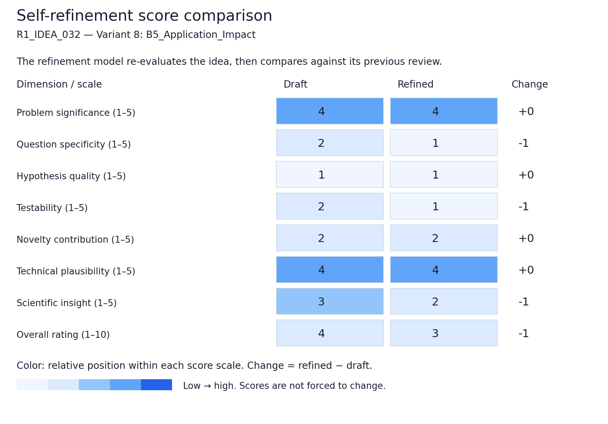

Changed score dimensions: question_specificity, testability, scientific_insight, overall_rating.

### Score justifications (draft / refined)

**Problem significance**

```json
{
  "draft": {
    "score": 4.0,
    "justification": "The problem is meaningful: SSL is a core ML area, and its applicability to noisy real-world data is important for practical adoption in scientific and industrial domains. The gap between clean academic datasets and noisy real data is a recognized issue."
  },
  "refined": {
    "score": 4.0,
    "justification": "The problem is meaningful and relevant. SSL is a core ML paradigm, and its real-world applicability often involves noisy data. Bridging this gap is important for practical adoption in scientific and industrial domains, making the problem significant."
  }
}
```

**Question specificity**

```json
{
  "draft": {
    "score": 2.0,
    "justification": "The idea only states a challenge ('applying SSL on noisy data remains a challenge') without defining a concrete research question. It lacks specificity about what aspect to investigate, what relationships to test, or what phenomenon to explain."
  },
  "refined": {
    "score": 1.0,
    "justification": "The idea lacks any concrete research question. It merely states that applying SSL on noisy data 'remains a challenge' and 'could inform' downstream tools. There is no specification of what aspect to study, what relationship to test, or what phenomenon to explain."
  }
}
```

**Hypothesis quality**

```json
{
  "draft": {
    "score": 1.0,
    "justification": "No hypothesis is present. The idea merely suggests that overcoming the challenge 'could inform' downstream tools, which is a vague potential benefit, not a testable prediction about SSL behavior or mechanisms."
  },
  "refined": {
    "score": 1.0,
    "justification": "No hypothesis is present, implicit or explicit. The idea suggests potential relevance and benefit but makes no testable prediction about SSL behavior, mechanisms, or outcomes regarding noisy data."
  }
}
```

**Testability**

```json
{
  "draft": {
    "score": 2.0,
    "justification": "Without a specific question or hypothesis, it's unclear how to test the idea. The statement is too broad to design focused experiments. It suggests relevance but not a testable claim."
  },
  "refined": {
    "score": 1.0,
    "justification": "Without a specific question or hypothesis, the idea is not testable. It is a broad statement of a challenge, not a claim that can be investigated through experiments, comparisons, or analysis."
  }
}
```

**Novelty contribution**

```json
{
  "draft": {
    "score": 2.0,
    "justification": "The observation that SSL research focuses on clean data and that noisy data is a challenge is not novel. The idea does not propose a new method, a new hypothesis, or a new angle of study; it mostly highlights an application gap."
  },
  "refined": {
    "score": 2.0,
    "justification": "The observation that SSL research focuses on clean data and that noisy data poses challenges is not novel. The idea does not propose a new method, a novel hypothesis, a unique angle of study, or a previously unexplored phenomenon. It primarily highlights an application gap."
  }
}
```

**Technical plausibility**

```json
{
  "draft": {
    "score": 4.0,
    "justification": "The reasoning is coherent: SSL methods often assume clean data, and noise could degrade performance. The direction is plausible, though no technical approach is suggested."
  },
  "refined": {
    "score": 4.0,
    "justification": "The reasoning is logically coherent: SSL methods often assume relatively clean data, and noise could reasonably degrade performance or require adaptation. The general direction is plausible, though no technical approach is detailed."
  }
}
```

**Scientific insight**

```json
{
  "draft": {
    "score": 3.0,
    "justification": "If properly investigated, studying SSL on noisy data could yield insights into SSL robustness, failure modes, or domain adaptation. However, as stated, the idea is too vague to guarantee such insights; it leans more toward application than fundamental understanding."
  },
  "refined": {
    "score": 2.0,
    "justification": "As stated, the idea offers little potential for scientific insight. It suggests an application area rather than a study aimed at revealing mechanisms, principles, or fundamental limitations. If refined into a specific investigation, it could yield insights, but in its current form, it leans heavily toward practical application with minimal focus on generating new understanding."
  }
}
```

**Overall rating**

```json
{
  "draft": {
    "score": 4.0,
    "justification": "The idea identifies a relevant problem but lacks a specific research question, hypothesis, or testable direction. It is more of a motivation statement than a research idea. It has potential if refined but currently is weak in specificity and novelty."
  },
  "refined": {
    "score": 3.0,
    "justification": "The idea identifies a relevant and significant problem but fails to define a research question, hypothesis, or testable direction. It is essentially a motivation statement or problem identification, not a research idea. It lacks specificity, novelty, and testability, offering minimal scientific insight potential in its current form. It requires substantial refinement to become a viable research direction."
  }
}
```

## R1_IDEA_032 — Variant 9: C1_Hollow_Shell

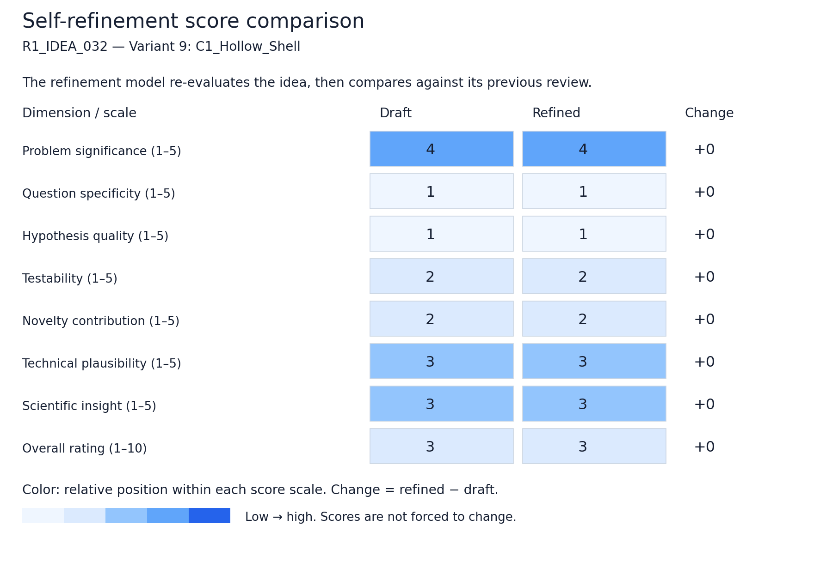

Changed score dimensions: none.

### Score justifications (draft / refined)

**Problem significance**

```json
{
  "draft": {
    "score": 4.0,
    "justification": "The problem is meaningful - bridging the gap between research conditions and practical application is important for machine learning deployment. Understanding how methods degrade with imperfect data is crucial for real-world impact."
  },
  "refined": {
    "score": 4.0,
    "justification": "The problem is meaningful and important. Bridging the gap between research conditions and practical deployment is a fundamental challenge in machine learning. Understanding how methods degrade with imperfect data is crucial for real-world impact across many domains."
  }
}
```

**Question specificity**

```json
{
  "draft": {
    "score": 1.0,
    "justification": "Extremely vague. No concrete research question is formulated. The idea merely states that applying methods in real-world settings is difficult without specifying what aspect to investigate."
  },
  "refined": {
    "score": 1.0,
    "justification": "Extremely vague. No concrete research question is formulated. The idea merely states that applying methods in real-world settings is difficult without specifying what aspect to investigate, what relationships to examine, or what phenomena to characterize."
  }
}
```

**Hypothesis quality**

```json
{
  "draft": {
    "score": 1.0,
    "justification": "No hypothesis is present. The idea contains only observations: label-free learning shows promise, work uses ideal conditions, real-world application is difficult. There is no prediction, mechanism, or relationship proposed for investigation."
  },
  "refined": {
    "score": 1.0,
    "justification": "No hypothesis is present. The idea contains only observations: label-free learning shows promise, work uses ideal conditions, real-world application is difficult. There is no prediction, proposed mechanism, or testable relationship between variables."
  }
}
```

**Testability**

```json
{
  "draft": {
    "score": 2.0,
    "justification": "The general direction could be testable if properly specified, but as presented, there is no clear claim or question that could be investigated. Without knowing what method, what imperfections, or what evaluation, it's unclear how one would test anything."
  },
  "refined": {
    "score": 2.0,
    "justification": "The general direction could become testable with proper specification, but as presented, there is no clear claim or question that could be investigated. Without knowing what method, what imperfections, what evaluation metrics, or what comparisons to make, it's impossible to design a meaningful test."
  }
}
```

**Novelty contribution**

```json
{
  "draft": {
    "score": 2.0,
    "justification": "The observation that real-world data differs from research conditions is not novel. Many papers already study robustness to various data imperfections. The contribution would depend entirely on the specific angle taken, which is not defined here."
  },
  "refined": {
    "score": 2.0,
    "justification": "The observation that real-world data differs from research conditions is not novel. Many papers already study robustness to various data imperfections across different learning paradigms. The contribution would depend entirely on the specific angle, method, or imperfection type chosen, none of which are defined here."
  }
}
```

**Technical plausibility**

```json
{
  "draft": {
    "score": 3.0,
    "justification": "The general premise is plausible - methods developed on clean data often degrade with real-world imperfections. However, without specifics, it's impossible to assess whether the reasoning is coherent or whether important assumptions are reasonable."
  },
  "refined": {
    "score": 3.0,
    "justification": "The general premise is plausible - methods developed on clean data often degrade with real-world imperfections. However, without specifics about the method or imperfections, it's impossible to assess whether the reasoning is coherent or whether important assumptions (e.g., about the nature of imperfections) are reasonable."
  }
}
```

**Scientific insight**

```json
{
  "draft": {
    "score": 3.0,
    "justification": "If properly executed, studying how label-free methods degrade with data imperfections could yield insights about their limitations, robustness properties, and failure modes. However, the current formulation is too vague to guarantee meaningful insight."
  },
  "refined": {
    "score": 3.0,
    "justification": "If properly executed with specific methods and imperfection types, studying how label-free methods degrade could yield insights about robustness properties, failure modes, and boundary conditions. However, the current formulation is too vague to guarantee meaningful insight beyond generic observations about the reality gap."
  }
}
```

**Overall rating**

```json
{
  "draft": {
    "score": 3.0,
    "justification": "This is a weak research idea in its current form. While it identifies a potentially important problem (the gap between research and real-world conditions), it fails to formulate any concrete research question, hypothesis, or methodological direction. It reads more like a generic motivation paragraph than a research idea. Without substantial refinement, it lacks the specificity needed for meaningful scientific investigation."
  },
  "refined": {
    "score": 3.0,
    "justification": "This is a weak research idea in its current form. While it identifies a potentially important problem (the gap between research and real-world conditions), it fails to formulate any concrete research question, hypothesis, or methodological direction. It reads as a generic motivation paragraph rather than a research idea. Without substantial refinement specifying the method, imperfections, and investigation approach, it lacks the specificity needed for meaningful scientific investigation."
  }
}
```

## R1_IDEA_032 — Variant 10: C2_Logic_Flawed

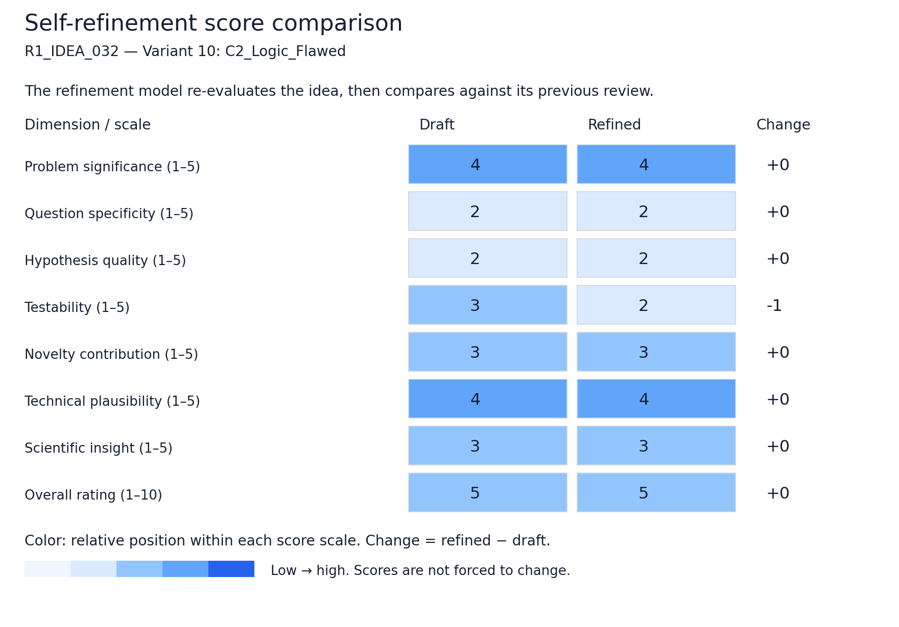

Changed score dimensions: testability.

### Score justifications (draft / refined)

**Problem significance**

```json
{
  "draft": {
    "score": 4.0,
    "justification": "The problem is meaningful: SSL is widely used, but its real-world applicability is limited if it only works on clean data. The identified domains are important and noise is a genuine challenge."
  },
  "refined": {
    "score": 4.0,
    "justification": "The problem is highly significant. SSL is a core paradigm in modern ML, and its real-world utility is limited if it only works with curated data. The highlighted domains (medical, scientific, financial) are areas where robust ML could have substantial impact, making the gap between clean-lab SSL and noisy-real-world data a meaningful and important challenge to address."
  }
}
```

**Question specificity**

```json
{
  "draft": {
    "score": 2.0,
    "justification": "The idea only states that applying SSL on noisy data is a challenge—it does not define a specific research question about mechanisms, comparisons, or solutions."
  },
  "refined": {
    "score": 2.0,
    "justification": "The idea lacks a concrete research question. It states a problem ('applying SSL on noisy data remains a challenge') and a broad implication ('SSL methods... are insufficient'), but does not specify what relationship, mechanism, or comparison will be investigated. It is more a topic area than a defined inquiry."
  }
}
```

**Hypothesis quality**

```json
{
  "draft": {
    "score": 2.0,
    "justification": "There is an implicit hypothesis that 'SSL methods for clean data are insufficient for noisy settings,' but it is broad and not refined into a testable prediction about why or under what conditions."
  },
  "refined": {
    "score": 2.0,
    "justification": "There is only a very implicit and overly broad hypothesis: that SSL methods designed for clean data perform poorly or are 'insufficient' for noisy data. This lacks the concrete, predictive quality of a strong hypothesis. It does not specify under what conditions, for which methods, or why the insufficiency occurs, making it difficult to falsify in a meaningful way."
  }
}
```

**Testability**

```json
{
  "draft": {
    "score": 3.0,
    "justification": "The general claim could be tested by evaluating SSL methods on noisy datasets, but without a specific question or hypothesis, the test design is unclear."
  },
  "refined": {
    "score": 2.0,
    "justification": "While the general premise could be tested, the idea as presented does not suggest a clear path for testing. There is no indication of an experiment, comparison, analysis, or evaluation method. A researcher would need to invent the entire testing methodology from scratch, as the idea provides no scaffolding for how to gather evidence for or against its central claim."
  }
}
```

**Novelty contribution**

```json
{
  "draft": {
    "score": 3.0,
    "justification": "While SSL robustness is not entirely unexplored, focusing on noisy data across diverse scientific domains could be novel if it leads to new insights or methods. Currently, the idea is more of an application gap than a novel research direction."
  },
  "refined": {
    "score": 3.0,
    "justification": "The observation that SSL research overlooks noisy data is not entirely novel, as robustness is a general concern in ML. However, systematically exploring this gap specifically for SSL across diverse scientific domains could constitute a valuable contribution. Currently, the idea is at the level of identifying an application gap rather than proposing a novel mechanism, insight, or method."
  }
}
```

**Technical plausibility**

```json
{
  "draft": {
    "score": 4.0,
    "justification": "The reasoning is coherent: SSL methods often assume clean data, and noise likely affects their performance. The assumption that this is a problem is plausible."
  },
  "refined": {
    "score": 4.0,
    "justification": "The core reasoning is plausible and coherent. SSL methods often make assumptions about data structure and relationships (e.g., that augmentations create valid positive pairs, that patches are reconstructible) that could be broken by certain types of noise. The claim that this warrants investigation is technically sensible."
  }
}
```

**Scientific insight**

```json
{
  "draft": {
    "score": 3.0,
    "justification": "If pursued with a specific question, this could reveal how different SSL objectives interact with noise, or what makes representations robust—offering generalizable insights. As stated, the potential insight is moderate."
  },
  "refined": {
    "score": 3.0,
    "justification": "If developed into a specific investigation, this direction has clear potential for scientific insight. It could reveal how different SSL learning objectives interact with data corruption, what makes representations robust, or the boundary conditions of current SSL paradigms. As stated, the potential is moderate because the idea itself does not articulate what specific insight is sought."
  }
}
```

**Overall rating**

```json
{
  "draft": {
    "score": 5.0,
    "justification": "The idea identifies a relevant problem but lacks a concrete research question, hypothesis, or methodological direction. It is a reasonable starting point but needs significant refinement to become a strong research idea."
  },
  "refined": {
    "score": 5.0,
    "justification": "This is a moderate/borderline research idea. It successfully identifies a significant and relevant problem at the intersection of SSL and real-world application. However, it fails to progress beyond a problem statement to a defined research question, testable hypothesis, or methodological direction. It is a reasonable starting point or motivation for research but requires substantial refinement to become a strong, actionable research idea."
  }
}
```

## R1_IDEA_032 — Variant 11: C3_Substance_Enriched

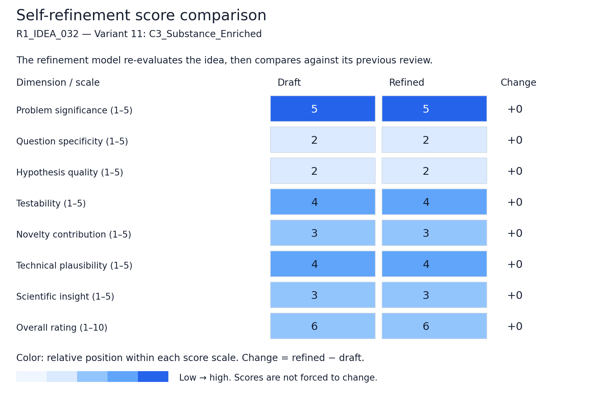

Changed score dimensions: none.

### Score justifications (draft / refined)

**Problem significance**

```json
{
  "draft": {
    "score": 5.0,
    "justification": "The problem is highly significant. SSL is a core ML paradigm, yet its real-world applicability is limited by reliance on clean data. Noisy data is ubiquitous in critical domains like medical imaging and astrophysics, making robustness a crucial challenge."
  },
  "refined": {
    "score": 5.0,
    "justification": "The problem is highly significant. SSL is a core ML paradigm with widespread adoption, yet its real-world applicability is limited by reliance on clean, curated datasets. Noisy data is ubiquitous in critical scientific and industrial domains like medical imaging, astrophysics, geophysics, and finance, making robustness a crucial and underexplored challenge with substantial practical implications."
  }
}
```

**Question specificity**

```json
{
  "draft": {
    "score": 2.0,
    "justification": "The idea states a broad challenge ('applying SSL on noisy data remains a challenge') but does not define a concrete research question. It suggests a methodological approach but does not specify what exactly will be investigated (e.g., comparing methods, identifying failure modes, proposing a solution)."
  },
  "refined": {
    "score": 2.0,
    "justification": "The idea states a broad challenge ('applying SSL on noisy data remains a challenge') but does not define a concrete research question. It suggests a methodological approach (controlled corruptions, measuring stability) but does not specify what exactly will be investigated—e.g., comparing methods, identifying failure modes, proposing a solution, or testing a specific relationship between noise properties and representation quality."
  }
}
```

**Hypothesis quality**

```json
{
  "draft": {
    "score": 2.0,
    "justification": "The stated 'hypothesis' is more of a methodological plan: 'noise robustness could be tested by introducing controlled corruption types.' It lacks a concrete, falsifiable prediction about SSL behavior under noise. The mention of 'boundary conditions' hints at a deeper hypothesis but is not fleshed out."
  },
  "refined": {
    "score": 2.0,
    "justification": "The stated 'hypothesis' is essentially a methodological plan: 'noise robustness could be tested by introducing controlled corruption types.' It lacks a concrete, falsifiable prediction about SSL behavior under noise. The mention of 'boundary conditions depending on the noise distribution's divergence' hints at a deeper hypothesis but is not developed into a testable claim."
  }
}
```

**Testability**

```json
{
  "draft": {
    "score": 4.0,
    "justification": "The idea is testable. It proposes introducing controlled corruptions and measuring representation stability, which are actionable experiments. However, without a specific hypothesis, the test is more exploratory than confirmatory."
  },
  "refined": {
    "score": 4.0,
    "justification": "The idea is testable. It proposes introducing controlled corruptions and measuring representation stability across noise levels, which are actionable experiments. The framework of varying noise types and levels provides a clear experimental structure. However, without a specific hypothesis, the test is more exploratory than confirmatory."
  }
}
```

**Novelty contribution**

```json
{
  "draft": {
    "score": 3.0,
    "justification": "Moderate novelty. While SSL robustness is an acknowledged issue, systematic study of controlled corruptions during pre-training is not yet saturated. However, the idea as stated leans toward an empirical survey rather than a novel methodological or theoretical contribution."
  },
  "refined": {
    "score": 3.0,
    "justification": "Moderate novelty. While SSL robustness is an acknowledged issue, systematic study of controlled corruptions during pre-training is not yet saturated and represents a meaningful gap. However, the idea as stated leans toward an empirical survey or benchmarking study rather than a novel methodological, theoretical, or mechanistic contribution. It could become more novel with a focused hypothesis about SSL mechanisms."
  }
}
```

**Technical plausibility**

```json
{
  "draft": {
    "score": 4.0,
    "justification": "Technically plausible. Introducing controlled noise during pre-training and evaluating representation stability is straightforward. The idea aligns with existing robustness literature in supervised learning. Assumptions about noise distribution divergence are reasonable but vague."
  },
  "refined": {
    "score": 4.0,
    "justification": "Technically plausible. Introducing controlled noise during pre-training and evaluating representation stability is straightforward and aligns with existing robustness literature in supervised and self-supervised learning. The concept of measuring stability across noise levels and considering manifold divergence is reasonable, though the latter is vaguely specified."
  }
}
```

**Scientific insight**

```json
{
  "draft": {
    "score": 3.0,
    "justification": "Potential insight is moderate. The study could reveal how different SSL objectives handle various noise types, informing method selection for noisy domains. However, without a focused question, it risks being a descriptive benchmark rather than yielding mechanistic understanding."
  },
  "refined": {
    "score": 3.0,
    "justification": "Potential insight is moderate. The study could reveal how different SSL objectives handle various noise types, informing method selection for noisy domains. The mention of 'boundary conditions' and 'divergence from the clean data manifold' suggests potential for insight into failure modes or robustness limits. However, without a focused question, it risks being a descriptive benchmark rather than yielding mechanistic understanding or general principles."
  }
}
```

**Overall rating**

```json
{
  "draft": {
    "score": 6.0,
    "justification": "Moderate/borderline idea. It addresses a significant problem and suggests a plausible experimental approach, but lacks a specific research question and a falsifiable hypothesis. The potential contribution is more incremental (systematic benchmarking) than transformative, though it could be strengthened with greater focus."
  },
  "refined": {
    "score": 6.0,
    "justification": "Moderate/borderline idea. It addresses a significant and timely problem and suggests a plausible, testable experimental approach. However, it lacks a specific research question and a falsifiable hypothesis, which limits its scientific focus. The potential contribution is more incremental (systematic benchmarking) than transformative, though it provides a solid foundation that could be strengthened with greater specificity and a clearer hypothesis."
  }
}
```

## R1_IDEA_032 — Variant 12: H1_Deceptive_Hollow


Changed score dimensions: testability.

### Score justifications (draft / refined)

**Problem significance**

```json
{
  "draft": {
    "score": 4.0,
    "justification": "The problem of moving from ideal to real-world data conditions is highly significant in machine learning, especially for label-free methods which are increasingly important. The potential impact on scientific and technical fields is meaningful."
  },
  "refined": {
    "score": 4.0,
    "justification": "The problem of moving from ideal to real-world data conditions is highly significant in machine learning, especially for label-free methods which are crucial for scalable learning. The potential impact on scientific and technical applications is meaningful and well-motivated."
  }
}
```

**Question specificity**

```json
{
  "draft": {
    "score": 1.0,
    "justification": "Extremely vague. It only states that applying methods in challenging settings 'presents difficulties' without defining what is being investigated. No concrete question about mechanisms, comparisons, or phenomena is posed."
  },
  "refined": {
    "score": 1.0,
    "justification": "Extremely vague. It only states that applying methods in challenging settings 'presents difficulties' without defining what is being investigated. No concrete question about mechanisms, comparisons, or phenomena is posed. This is essentially a topic statement rather than a research question."
  }
}
```

**Hypothesis quality**

```json
{
  "draft": {
    "score": 1.0,
    "justification": "There is no explicit or implicit hypothesis. The idea merely notes that real-world settings are challenging, but makes no prediction about relationships, mechanisms, or outcomes that could be tested."
  },
  "refined": {
    "score": 1.0,
    "justification": "There is no explicit or implicit hypothesis. The idea merely notes that real-world settings are challenging, but makes no testable prediction about relationships, mechanisms, performance outcomes, or comparative advantages. Without a hypothesis, there is nothing to support or contradict."
  }
}
```

**Testability**

```json
{
  "draft": {
    "score": 2.0,
    "justification": "The idea as stated is not directly testable because it lacks any specific claim or comparison. However, the general direction of 'studying label-free learning under imperfect data' could be made testable with a concrete formulation."
  },
  "refined": {
    "score": 1.0,
    "justification": "The idea as stated is not directly testable because it lacks any specific claim, comparison, or measurable outcome. While the general direction could be made testable with concretization, the current formulation offers no basis for designing an experiment or evaluation."
  }
}
```

**Novelty contribution**

```json
{
  "draft": {
    "score": 2.0,
    "justification": "While studying robustness of learning methods is important, the idea as presented is a generic call to study real-world conditions without specifying what novel contribution would be made beyond applying existing methods to harder data. The 'transformative synthesis' claim is unsupported."
  },
  "refined": {
    "score": 2.0,
    "justification": "Studying robustness of learning methods under non-ideal conditions is an established subfield. The idea as presented is a generic call to study real-world conditions without specifying what novel contribution would be made—whether a new insight, method, or systematic analysis. The unsupported 'transformative' claims do not increase the actual novelty."
  }
}
```

**Technical plausibility**

```json
{
  "draft": {
    "score": 3.0,
    "justification": "The general direction is plausible—studying methods under non-ideal conditions is a common and sensible research direction. However, the lack of technical specifics makes it impossible to assess coherence beyond a superficial level."
  },
  "refined": {
    "score": 3.0,
    "justification": "The general direction is plausible—studying methods under non-ideal conditions is a common and sensible research direction. However, the complete lack of technical specifics makes it impossible to assess coherence or feasibility beyond a superficial level. No assumptions or mechanisms are stated to evaluate."
  }
}
```

**Scientific insight**

```json
{
  "draft": {
    "score": 2.0,
    "justification": "The idea claims potential for broad insight but does not articulate what specific insight might be gained. As stated, it could easily devolve into a straightforward application study without revealing general principles or mechanisms."
  },
  "refined": {
    "score": 2.0,
    "justification": "The idea claims potential for broad insight but does not articulate what specific insight might be gained—e.g., a general principle about robustness, a newly discovered failure mode, or a theoretical limitation. As stated, it could easily devolve into an application study without revealing transferable knowledge."
  }
}
```

**Overall rating**

```json
{
  "draft": {
    "score": 3.0,
    "justification": "The idea identifies a meaningful problem (significance score 4) but is otherwise extremely weak: no specific research question, no hypothesis, low testability, and vague claims of transformation without substance. It reads more like a motivational paragraph than a research idea. It would need substantial concretization to become a viable research direction."
  },
  "refined": {
    "score": 3.0,
    "justification": "The idea identifies a meaningful problem (significance score 4) but is otherwise extremely weak: no specific research question, no hypothesis, minimal testability, and vague claims of transformation without substance. It reads as a motivational paragraph rather than a research idea, lacking the core elements needed for scientific investigation. Substantial concretization is required to become a viable research direction."
  }
}
```

## R1_IDEA_032 — Variant 13: H2_Confident_Flaw

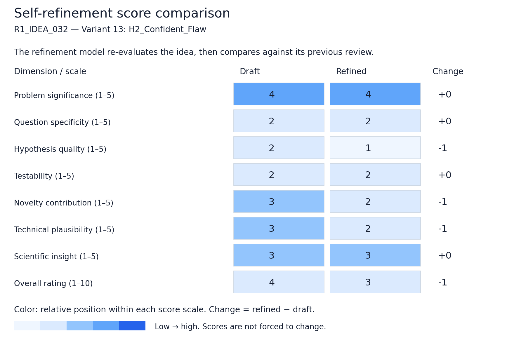

Changed score dimensions: hypothesis_quality, novelty_contribution, technical_plausibility, overall_rating.

### Score justifications (draft / refined)

**Problem significance**

```json
{
  "draft": {
    "score": 4.0,
    "justification": "The problem is meaningful: SSL's assumption of clean data is a real limitation for many scientific and industrial applications. Addressing noisy data could broaden SSL's impact."
  },
  "refined": {
    "score": 4.0,
    "justification": "The problem is highly meaningful. SSL's reliance on clean data is a recognized limitation that hinders application in many real-world domains with inherent noise. Addressing this could significantly broaden SSL's practical utility and scientific impact."
  }
}
```

**Question specificity**

```json
{
  "draft": {
    "score": 2.0,
    "justification": "The idea only states that SSL on noisy data is a challenge, without defining a concrete question. It lacks specificity about what exactly will be investigated."
  },
  "refined": {
    "score": 2.0,
    "justification": "The idea lacks a concrete research question. It only states that SSL on noisy data is a challenge, without specifying what aspect (e.g., robustness, representation quality, pretraining strategies) will be investigated. This vagueness limits its value as a research direction."
  }
}
```

**Hypothesis quality**

```json
{
  "draft": {
    "score": 2.0,
    "justification": "There is an implicit hypothesis that SSL methods for clean data fail on noisy data, but it is broad and not framed as a testable prediction. The claim about causal evidence is not a scientific hypothesis."
  },
  "refined": {
    "score": 1.0,
    "justification": "There is no clear hypothesis. The implicit assumption that SSL methods for clean data fail on noisy data is too broad and not framed as a testable prediction. The claim about 'causal evidence' is a methodological stance, not a scientific hypothesis about relationships or mechanisms."
  }
}
```

**Testability**

```json
{
  "draft": {
    "score": 2.0,
    "justification": "While the general problem is testable (e.g., by evaluating SSL on noisy datasets), the idea provides no direction for how to test it. The dismissal of controlling variables (dataset composition, etc.) further undermines testability."
  },
  "refined": {
    "score": 2.0,
    "justification": "The general problem is testable (e.g., by evaluating SSL methods on noisy datasets), but the idea provides no direction for how to test it. The dismissal of controlling variables (dataset composition, etc.) further weakens testability, as it rejects standard experimental design principles needed to draw meaningful conclusions."
  }
}
```

**Novelty contribution**

```json
{
  "draft": {
    "score": 3.0,
    "justification": "The observation that SSL research focuses on clean data is not novel, but systematically studying SSL under noise could contribute new insights. However, without a specific angle, the contribution is unclear."
  },
  "refined": {
    "score": 2.0,
    "justification": "The observation that SSL research focuses on clean data is not novel. While systematically studying SSL under noise could be valuable, the idea does not propose a specific angle, method, or insight that would constitute a clear novel contribution beyond highlighting an application gap."
  }
}
```

**Technical plausibility**

```json
{
  "draft": {
    "score": 3.0,
    "justification": "The core argument is plausible: noise likely degrades SSL performance. However, the claim that gains can be treated as causal without isolating factors is technically unsound."
  },
  "refined": {
    "score": 2.0,
    "justification": "The core premise—that noise may degrade SSL performance—is plausible. However, the claim that performance gains can be treated as causal evidence without isolating factors is technically unsound and contradicts basic principles of experimental design in machine learning research."
  }
}
```

**Scientific insight**

```json
{
  "draft": {
    "score": 3.0,
    "justification": "If properly investigated, studying SSL under noise could reveal insights about representation robustness, noise-invariant learning, and domain adaptation. However, the idea as stated focuses more on application than mechanism."
  },
  "refined": {
    "score": 3.0,
    "justification": "If properly investigated, studying SSL under noise could yield insights into representation robustness, the interaction between pretraining objectives and data corruption, and domain adaptation. However, the idea as stated is focused on application and makes a flawed methodological claim, which limits its potential for generating transferable scientific understanding."
  }
}
```

**Overall rating**

```json
{
  "draft": {
    "score": 4.0,
    "justification": "The idea identifies a significant real-world problem but lacks a specific research question, testable hypothesis, and methodological direction. The argument about causal evidence is a major weakness. It is a weak research idea with potential that could be improved with greater specificity."
  },
  "refined": {
    "score": 3.0,
    "justification": "This is a weak research idea. While it identifies a significant real-world problem, it lacks a specific research question, testable hypothesis, and methodological direction. The argument about causal evidence without controlled experimentation is a major flaw that undermines scientific rigor. The idea has potential but requires substantial refinement to become a viable research direction."
  }
}
```

## R1_IDEA_032 — Variant 14: H3_Verbose_Enriched

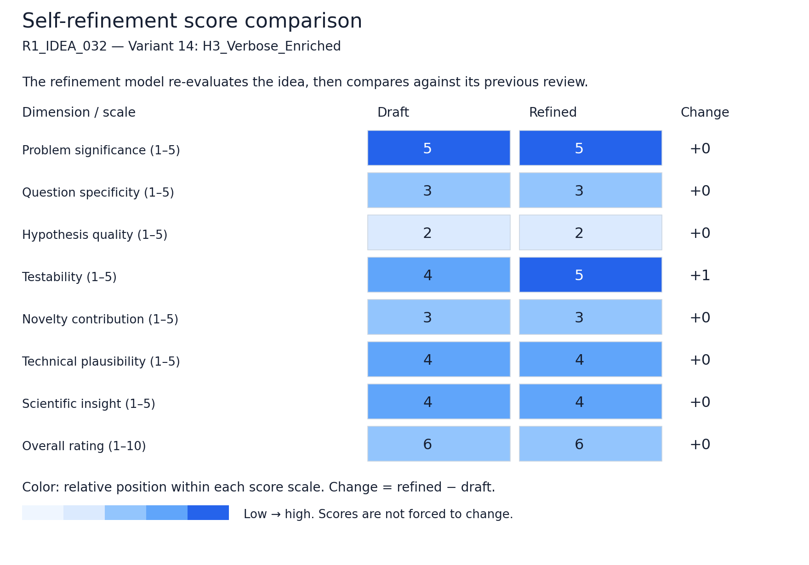

Changed score dimensions: testability.

### Score justifications (draft / refined)

**Problem significance**

```json
{
  "draft": {
    "score": 5.0,
    "justification": "Highly significant. SSL is a core ML paradigm, but its real-world applicability is limited by sensitivity to noise. Addressing this could impact many high-stakes domains (medical imaging, astrophysics, etc.)."
  },
  "refined": {
    "score": 5.0,
    "justification": "Exceptional significance. SSL is a foundational ML paradigm, but its real-world applicability is limited by noise sensitivity. Addressing this could impact critical domains like medical imaging, astrophysics, and finance, where clean data is scarce."
  }
}
```

**Question specificity**

```json
{
  "draft": {
    "score": 3.0,
    "justification": "Moderate. The idea identifies a clear problem (SSL on noisy data) and proposes a validation approach, but the core research question is broad ('how to make SSL robust?'). It lacks a focused inquiry into a specific mechanism or relationship."
  },
  "refined": {
    "score": 3.0,
    "justification": "Moderate. The idea identifies a clear problem domain (noisy SSL) and proposes a validation approach, but the research question is broad ('how does SSL behave under noise?'). It lacks a focused inquiry into a specific mechanism, relationship, or comparative hypothesis."
  }
}
```

**Hypothesis quality**

```json
{
  "draft": {
    "score": 2.0,
    "justification": "Weak. The idea states a 'possible hypothesis' that robustness 'could be tested'—this is a methodological plan, not a scientific hypothesis. There is no concrete prediction about what factors improve robustness or why."
  },
  "refined": {
    "score": 2.0,
    "justification": "Weak. The stated 'possible hypothesis' is that 'noise robustness could be tested'—this is a methodological plan, not a scientific hypothesis. There is no concrete prediction about what factors influence robustness, what might improve it, or why certain methods might fail."
  }
}
```

**Testability**

```json
{
  "draft": {
    "score": 4.0,
    "justification": "Strong. The proposed staged design with controlled corruptions, ablations, and sensitivity analyses is highly testable. It outlines clear experimental steps and evaluation criteria."
  },
  "refined": {
    "score": 5.0,
    "justification": "Exceptional. The proposed staged design with controlled corruptions, baseline comparisons, ablations, sensitivity analyses, and error analysis provides a highly structured and falsifiable framework. It clearly outlines how evidence could be gathered to support or refute claims about SSL robustness."
  }
}
```

**Novelty contribution**

```json
{
  "draft": {
    "score": 3.0,
    "justification": "Moderate. The problem is underexplored, but the idea itself is a robust evaluation framework rather than a novel method or hypothesis. Contribution would depend on findings from the proposed experiments."
  },
  "refined": {
    "score": 3.0,
    "justification": "Moderate. The problem is underexplored, but the idea itself is largely a rigorous evaluation framework rather than a novel method, theoretical insight, or specific hypothesis. Its contribution would depend on the discoveries from applying the framework, but the core idea is not highly novel."
  }
}
```

**Technical plausibility**

```json
{
  "draft": {
    "score": 4.0,
    "justification": "Strong. The approach is logically coherent: introduce controlled noise, measure representation stability, and analyze failures. Assumptions (e.g., that noise can be modeled) are reasonable."
  },
  "refined": {
    "score": 4.0,
    "justification": "Strong. The approach is logically coherent: introduce controlled noise during SSL pre-training, measure representation quality, and analyze failures. Assumptions (e.g., that noise can be systematically modeled and that representation stability is measurable) are reasonable."
  }
}
```

**Scientific insight**

```json
{
  "draft": {
    "score": 4.0,
    "justification": "Strong. The idea emphasizes understanding 'when and why' SSL works on noisy data, not just performance improvement. This could reveal boundary conditions, failure modes, and domain constraints."
  },
  "refined": {
    "score": 4.0,
    "justification": "Strong. The idea emphasizes understanding boundary conditions, failure modes, and domain constraints—not just performance improvement. This could reveal general principles about SSL's sensitivity to data distribution shifts and inform robust design."
  }
}
```

**Overall rating**

```json
{
  "draft": {
    "score": 6.0,
    "justification": "Moderate/borderline idea. The problem is highly significant, and the proposed experimental design is rigorous and testable. However, the idea lacks a specific hypothesis or novel mechanism—it is more of a robust evaluation blueprint than a research hypothesis. Its scientific contribution hinges on what is discovered through the proposed experiments, but the core idea itself is not highly novel."
  },
  "refined": {
    "score": 6.0,
    "justification": "Moderate/borderline idea. The problem is highly significant, and the proposed experimental design is exceptionally testable and rigorous. However, the idea lacks a specific hypothesis or novel mechanism—it is essentially a blueprint for systematic evaluation rather than a research hypothesis. Its scientific value hinges on what is discovered through the proposed experiments, but the core idea itself is not highly novel or hypothesis-driven."
  }
}
```

## R1_IDEA_032 — Variant 15: H4_Ultimate_Hype


Changed score dimensions: none.

### Score justifications (draft / refined)

**Problem significance**

```json
{
  "draft": {
    "score": 4.0,
    "justification": "The problem is significant. SSL's reliance on clean data is a recognized limitation for real-world deployment. Successfully extending SSL to noisy domains would have substantial practical impact in the mentioned fields and aligns with the goal of making ML more robust and widely applicable."
  },
  "refined": {
    "score": 4.0,
    "justification": "The problem is significant. SSL's reliance on clean, curated data is a recognized limitation for real-world deployment. Successfully extending SSL to noisy domains would have substantial practical impact in fields like medical imaging, astrophysics, and finance, aligning with the goal of making ML more robust and widely applicable."
  }
}
```

**Question specificity**

```json
{
  "draft": {
    "score": 2.0,
    "justification": "Very low specificity. The idea only states that 'applying SSL on noisy data remains a challenge.' It does not define a concrete research question about *how*, *why*, or under *what conditions* SSL fails, or what specific property of representations or learning dynamics to investigate."
  },
  "refined": {
    "score": 2.0,
    "justification": "Very low specificity. The idea only states that 'applying SSL on noisy data remains a challenge.' It does not define a concrete research question about *how*, *why*, or under *what conditions* SSL fails, or what specific property of representations or learning dynamics to investigate. It is a broad problem statement, not a specific question."
  }
}
```

**Hypothesis quality**

```json
{
  "draft": {
    "score": 1.0,
    "justification": "There is no discernible hypothesis. The text describes a general challenge and makes grand claims about potential impact, but it does not make a falsifiable prediction about a mechanism, relationship, or comparative outcome. It is a problem statement, not a hypothesis."
  },
  "refined": {
    "score": 1.0,
    "justification": "There is no discernible hypothesis. The text describes a general challenge and makes grand claims about potential impact, but it does not make a falsifiable prediction about a mechanism, relationship, or comparative outcome. It is purely a problem statement, not a hypothesis."
  }
}
```

**Testability**

```json
{
  "draft": {
    "score": 2.0,
    "justification": "In its current form, the idea is not directly testable because it proposes no specific comparison, intervention, or analysis. However, the general problem area is testable—one could design experiments comparing SSL methods on noisy vs. clean data. The idea itself does not suggest how to test anything."
  },
  "refined": {
    "score": 2.0,
    "justification": "In its current form, the idea is not directly testable because it proposes no specific comparison, intervention, or analysis. However, the general problem area is testable—one could design experiments comparing SSL methods on noisy vs. clean data. The idea itself does not suggest how to test anything concrete."
  }
}
```

**Novelty contribution**

```json
{
  "draft": {
    "score": 3.0,
    "justification": "The observation that SSL research focuses on clean data is not novel. The potential contribution of systematically studying SSL for noisy data is moderate; it is an important gap but framing it as a 'transformative agenda' is an overstatement without a novel technical angle. The novelty would come from the specific hypothesis and solution, which are absent."
  },
  "refined": {
    "score": 3.0,
    "justification": "The observation that SSL research focuses on clean data is not novel. The potential contribution of systematically studying SSL for noisy data is moderate; it is an important gap but framing it as a 'transformative agenda' is an overstatement without a novel technical angle. The novelty would come from a specific hypothesis and solution, which are absent here."
  }
}
```

**Technical plausibility**

```json
{
  "draft": {
    "score": 3.0,
    "justification": "The general direction is plausible—making SSL robust is a logical technical goal. However, without any proposed mechanism or approach, it's impossible to evaluate the technical soundness of a specific solution. The reasoning is coherent at a high level but lacks technical depth."
  },
  "refined": {
    "score": 3.0,
    "justification": "The general direction is plausible—making SSL robust to noise is a logical technical goal. However, without any proposed mechanism or approach, it's impossible to evaluate the technical soundness of a specific solution. The reasoning is coherent at a high level but lacks technical depth."
  }
}
```

**Scientific insight**

```json
{
  "draft": {
    "score": 3.0,
    "justification": "If successfully pursued, research in this area could yield insights into the failure modes of SSL objectives under data corruption, the interplay between pretext task design and noise robustness, or the limits of current data augmentation strategies. However, the idea as stated promises 'broad implications' without specifying what those insights might be."
  },
  "refined": {
    "score": 3.0,
    "justification": "If successfully pursued, research in this area could yield insights into the failure modes of SSL objectives under data corruption, the interplay between pretext task design and noise robustness, or the limits of current data augmentation strategies. However, the idea as stated promises 'broad implications' without specifying what those insights might be, so the potential insight is moderate but not guaranteed."
  }
}
```

**Overall rating**

```json
{
  "draft": {
    "score": 4.0,
    "justification": "This is a weak research idea in its current form. It identifies a significant and relevant problem but fails to articulate a specific research question, hypothesis, or methodological direction. It reads more like a motivational paragraph for a grant proposal than a concrete research idea. The high-level ambition does not compensate for the lack of scientific specificity. It would need substantial refinement to become a testable research project."
  },
  "refined": {
    "score": 4.0,
    "justification": "This is a weak research idea in its current form. It identifies a significant and relevant problem but fails to articulate a specific research question, hypothesis, or methodological direction. It reads more like a motivational paragraph for a grant proposal than a concrete research idea. The high-level ambition does not compensate for the lack of scientific specificity. It would need substantial refinement to become a testable research project."
  }
}
```

## R1_IDEA_033 — Source

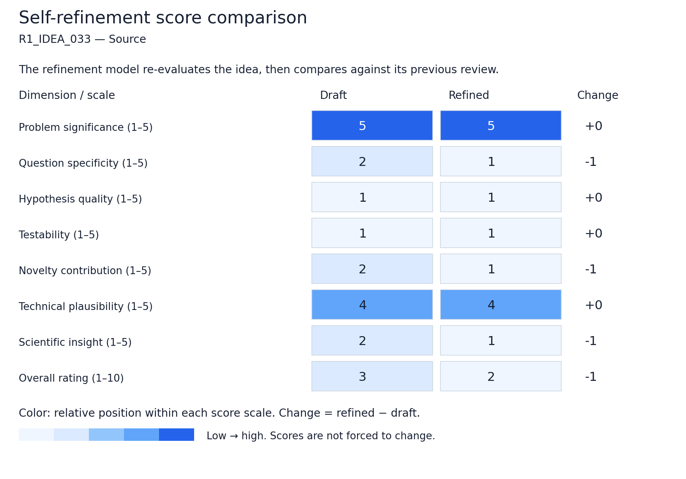

Changed score dimensions: question_specificity, novelty_contribution, scientific_insight, overall_rating.

### Score justifications (draft / refined)

**Problem significance**

```json
{
  "draft": {
    "score": 5.0,
    "justification": "The problem is highly significant. Risk-averse modeling is crucial for safety-sensitive applications (healthcare, finance, autonomous systems), and CVaR is a well-established risk measure. The challenge of accurately estimating extreme quantiles is a fundamental limitation that affects practical deployment of these methods."
  },
  "refined": {
    "score": 5.0,
    "justification": "The problem is exceptionally significant. Risk-averse modeling is crucial for safety-sensitive domains (autonomous systems, healthcare, finance), and CVaR is a foundational risk measure. The statistical challenge of estimating extreme quantiles with limited data is a fundamental bottleneck preventing practical deployment of theoretically sound methods."
  }
}
```

**Question specificity**

```json
{
  "draft": {
    "score": 2.0,
    "justification": "The idea identifies a problem but does not formulate a specific research question. It states that direct CVaR minimization is challenging due to tail estimation difficulties, but doesn't specify what aspect will be investigated, what relationship will be studied, or what phenomenon will be examined."
  },
  "refined": {
    "score": 1.0,
    "justification": "The idea identifies a problem but does not formulate any research question. It states that CVaR minimization is challenging due to tail estimation difficulties, but doesn't specify what aspect will be investigated, what relationship will be studied, or what phenomenon will be examined. There is no concrete question being asked."
  }
}
```

**Hypothesis quality**

```json
{
  "draft": {
    "score": 1.0,
    "justification": "There is no explicit or implicit hypothesis. The text describes a challenge but makes no prediction about how it might be addressed, what mechanism might improve estimation, or what relationship might exist between variables. It's a problem statement rather than a research hypothesis."
  },
  "refined": {
    "score": 1.0,
    "justification": "There is no explicit or implicit hypothesis. The text describes a challenge but makes no prediction about how it might be addressed, what mechanism might improve estimation, or what relationship might exist between variables. It's purely a problem statement with no testable claim."
  }
}
```

**Testability**

```json
{
  "draft": {
    "score": 1.0,
    "justification": "Without a specific question or hypothesis, there's nothing to test. The idea doesn't suggest experiments, comparisons, evaluations, or analyses that could provide evidence. It merely identifies a difficulty without proposing how to investigate solutions."
  },
  "refined": {
    "score": 1.0,
    "justification": "Without any specific question or hypothesis, there is nothing to test. The idea doesn't suggest experiments, comparisons, evaluations, or analyses that could provide evidence. It merely identifies a difficulty without proposing how to investigate potential solutions or even characterize the problem more deeply."
  }
}
```

**Novelty contribution**

```json
{
  "draft": {
    "score": 2.0,
    "justification": "While the problem itself is important, the idea as presented doesn't propose any novel contribution. It states a known challenge without suggesting a new approach, method, or insight. Many papers acknowledge the difficulty of tail estimation in CVaR optimization; this idea doesn't go beyond that acknowledgment."
  },
  "refined": {
    "score": 1.0,
    "justification": "The idea as presented proposes no novel contribution. It states a known challenge (tail estimation difficulty in CVaR optimization) that is widely acknowledged in the literature. Without suggesting any new approach, method, or perspective, it doesn't go beyond acknowledging an existing problem."
  }
}
```

**Technical plausibility**

```json
{
  "draft": {
    "score": 4.0,
    "justification": "The technical reasoning is sound and coherent. The description accurately identifies that CVaR minimization requires estimating tail expectations, which is statistically challenging with limited data, especially at extreme quantiles. This is a well-known issue in risk measurement and extreme value theory."
  },
  "refined": {
    "score": 4.0,
    "justification": "The technical reasoning is coherent and accurate. The description correctly identifies that CVaR minimization requires estimating tail expectations, which is statistically challenging with limited data, especially at extreme quantiles. This aligns with established knowledge in statistics, risk measurement, and extreme value theory."
  }
}
```

**Scientific insight**

```json
{
  "draft": {
    "score": 2.0,
    "justification": "The idea as stated doesn't promise significant scientific insight. It identifies a practical challenge but doesn't suggest what might be learned from investigating it. If developed into a research program, it could potentially reveal insights about rare event estimation, distributional robustness, or optimization under uncertainty, but the current formulation doesn't point toward such insights."
  },
  "refined": {
    "score": 1.0,
    "justification": "The idea as stated doesn't promise any scientific insight. It identifies a practical challenge but doesn't suggest what might be learned from investigating it. While the underlying problem could lead to insights about rare event estimation, distributional robustness, or optimization under uncertainty, the current formulation doesn't point toward discovering any such insights."
  }
}
```

**Overall rating**

```json
{
  "draft": {
    "score": 3.0,
    "justification": "This is a weak research idea in its current form. While it identifies an important and meaningful problem in risk-averse machine learning, it fails to propose any specific research question, hypothesis, or direction. It's essentially a problem statement rather than a research idea. A strong research idea would need to specify what aspect of the problem will be investigated and how. The idea has high problem significance but lacks the other essential components of a research proposal."
  },
  "refined": {
    "score": 2.0,
    "justification": "This is a very weak research idea. While it correctly identifies an important and meaningful problem, it fails completely as a research proposal. It contains no research question, no hypothesis, no methodological direction, and no indication of how the problem would be investigated. It's essentially a problem statement that could serve as motivation for research, but lacks all the essential components of a research idea. A research idea must propose something to investigate, not merely state that a difficulty exists."
  }
}
```

## R1_IDEA_033 — Variant 1: A1_Identity

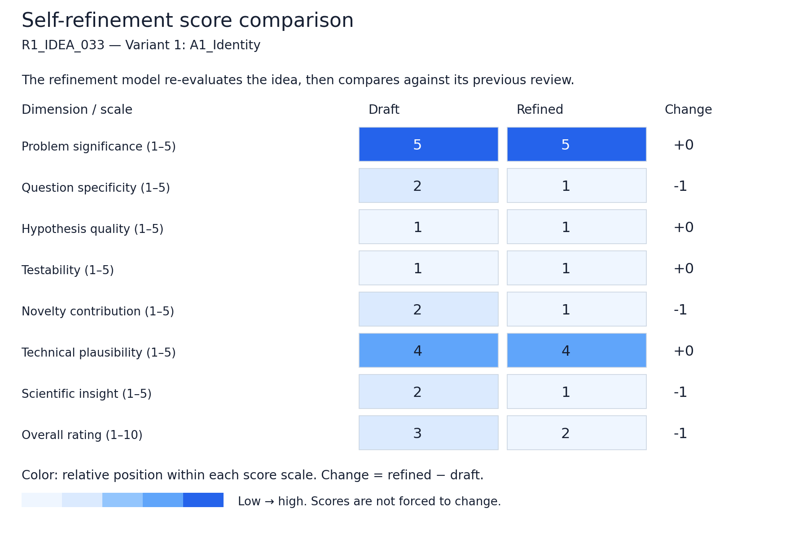

Changed score dimensions: question_specificity, novelty_contribution, scientific_insight, overall_rating.

### Score justifications (draft / refined)

**Problem significance**

```json
{
  "draft": {
    "score": 5.0,
    "justification": "The problem is highly significant. Risk-averse modeling is crucial for safety-sensitive applications (healthcare, finance, autonomous systems), and CVaR is a well-established risk measure. The challenge of accurately estimating extreme quantiles is a fundamental limitation that affects practical deployment of these methods."
  },
  "refined": {
    "score": 5.0,
    "justification": "The problem is exceptionally significant. Risk-averse modeling is crucial in safety-sensitive domains (autonomous systems, healthcare, finance). CVaR is a foundational risk measure, and accurate estimation of extreme quantiles is a fundamental barrier to practical deployment. Solving this would enable more reliable risk-aware decision-making."
  }
}
```

**Question specificity**

```json
{
  "draft": {
    "score": 2.0,
    "justification": "The idea identifies a problem but does not formulate a specific research question. It states that direct CVaR minimization is challenging due to tail estimation difficulties, but doesn't specify what aspect will be investigated, what relationship will be studied, or what phenomenon will be examined."
  },
  "refined": {
    "score": 1.0,
    "justification": "The idea lacks any research question. It identifies a challenge ('direct CVaR minimization remains challenging due to difficulty of accurately estimating rare events') but does not specify what will be investigated, what relationship studied, or what phenomenon examined. There is no concrete inquiry."
  }
}
```

**Hypothesis quality**

```json
{
  "draft": {
    "score": 1.0,
    "justification": "There is no explicit or implicit hypothesis. The text describes a challenge but makes no prediction about how it might be addressed, what mechanism might improve estimation, or what relationship might exist between variables. It's a problem statement rather than a research hypothesis."
  },
  "refined": {
    "score": 1.0,
    "justification": "There is no hypothesis—implicit or explicit. The text describes a known difficulty without making any prediction about how it might be addressed, what mechanism could improve estimation, or what factors influence the challenge. It is purely a problem statement."
  }
}
```

**Testability**

```json
{
  "draft": {
    "score": 1.0,
    "justification": "Without a specific question or hypothesis, there's nothing to test. The idea doesn't suggest experiments, comparisons, evaluations, or analyses that could provide evidence. It merely identifies a difficulty without proposing how to investigate potential solutions."
  },
  "refined": {
    "score": 1.0,
    "justification": "Without a research question or hypothesis, there is nothing to test. The idea suggests no experiments, comparisons, evaluations, or analyses. It merely notes a difficulty without proposing how to investigate solutions or gather evidence."
  }
}
```

**Novelty contribution**

```json
{
  "draft": {
    "score": 2.0,
    "justification": "The observation that CVaR estimation is challenging at extreme quantiles is not novel—it's a well-known statistical challenge. The potential contribution is entirely dependent on what specific approach or insight would be developed, which is not proposed here. As presented, it's a restatement of an existing problem."
  },
  "refined": {
    "score": 1.0,
    "justification": "As presented, there is no novelty—the challenge of estimating extreme quantiles for CVaR is well-documented in statistics and risk management literature. The potential contribution depends entirely on what specific approach or insight would be developed, which is not proposed here."
  }
}
```

**Technical plausibility**

```json
{
  "draft": {
    "score": 4.0,
    "justification": "The technical reasoning is coherent and plausible. The difficulty of estimating rare events is a genuine statistical challenge, and CVaR's dependence on tail estimation is mathematically sound. The problem description aligns with known limitations of empirical risk minimization for extreme quantiles."
  },
  "refined": {
    "score": 4.0,
    "justification": "The technical reasoning is coherent and plausible. The difficulty of estimating rare events is a genuine statistical challenge, and CVaR's dependence on tail estimation is mathematically sound. The problem description aligns with known limitations of empirical risk minimization for extreme quantiles."
  }
}
```

**Scientific insight**

```json
{
  "draft": {
    "score": 2.0,
    "justification": "The idea as presented has limited potential for scientific insight because it doesn't propose investigating any mechanism, principle, or relationship. If developed into a research program, it could provide insights about rare event estimation, distributional robustness, or optimization under uncertainty, but the current formulation doesn't point toward such insights."
  },
  "refined": {
    "score": 1.0,
    "justification": "The idea as presented offers no pathway to scientific insight because it does not propose investigating any mechanism, principle, or relationship. While the underlying problem could lead to insights about rare-event estimation or robust optimization, the current formulation lacks any direction toward such understanding."
  }
}
```

**Overall rating**

```json
{
  "draft": {
    "score": 3.0,
    "justification": "This is a weak research idea as presented. While it identifies a significant and meaningful problem in risk-averse machine learning, it fails to articulate a specific research question, hypothesis, or methodological direction. It's essentially a problem statement rather than a research idea. The lack of any proposed investigation, testable claim, or novel approach severely limits its scientific value. With development into a concrete research question and approach, it could become a strong idea, but in its current form it's too vague to evaluate as a research direction."
  },
  "refined": {
    "score": 2.0,
    "justification": "This is a very weak research idea. It identifies a significant problem but fails to articulate any research question, hypothesis, or methodological direction. It is essentially a problem statement, not a research idea. Without a specific inquiry or proposed investigation, it lacks the core elements needed for scientific evaluation. With development into a concrete research question and approach, it could become strong, but in its current form it is too vague to constitute a research direction."
  }
}
```

## R1_IDEA_033 — Variant 2: A2_Paraphrase_Only

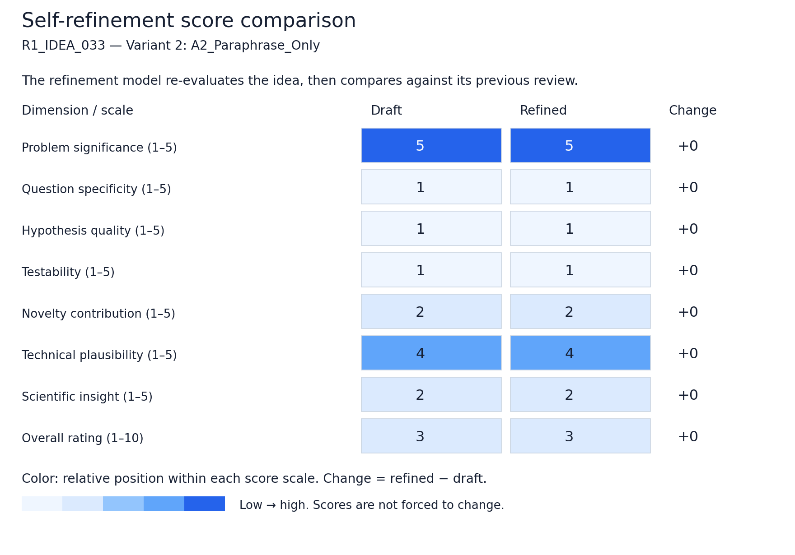

Changed score dimensions: none.

### Score justifications (draft / refined)

**Problem significance**

```json
{
  "draft": {
    "score": 5.0,
    "justification": "The problem is highly significant. Risk-averse modeling is crucial in safety-critical domains (e.g., healthcare, finance, autonomous systems), and CVaR is a standard and principled risk measure. The challenge of accurately estimating tail risks is a well-known and important obstacle to reliable risk-sensitive decision-making."
  },
  "refined": {
    "score": 5.0,
    "justification": "The problem is exceptionally significant. Risk-averse decision-making is fundamental in safety-critical domains like healthcare, autonomous systems, and finance. CVaR is a standard coherent risk measure, and accurate estimation of tail risks is crucial for reliable deployment. The difficulty of estimating rare events is a well-known barrier to practical risk-sensitive ML."
  }
}
```

**Question specificity**

```json
{
  "draft": {
    "score": 1.0,
    "justification": "The idea lacks a specific research question. It describes a general difficulty ('directly minimizing CVaR is difficult') but does not define what aspect will be investigated, what relationship will be explored, or what concrete phenomenon will be studied."
  },
  "refined": {
    "score": 1.0,
    "justification": "There is no research question defined. The text only states that 'directly minimizing CVaR is difficult'—a broad observation—without specifying what aspect will be investigated, what relationship will be explored, or what concrete phenomenon will be studied. It lacks any narrowing of scope."
  }
}
```

**Hypothesis quality**

```json
{
  "draft": {
    "score": 1.0,
    "justification": "There is no hypothesis, explicit or implicit. The text only states an observation about an existing challenge without making a testable prediction about a solution, mechanism, or relationship."
  },
  "refined": {
    "score": 1.0,
    "justification": "No hypothesis exists, either explicit or implicit. The idea makes no testable prediction about a solution, mechanism, or relationship. It merely describes an acknowledged challenge without proposing how it might be addressed or what underlying factors might be at play."
  }
}
```

**Testability**

```json
{
  "draft": {
    "score": 1.0,
    "justification": "The idea as presented is not testable because it does not propose anything to test. It identifies a problem but does not suggest an experiment, comparison, analysis, or method to investigate a potential solution or underlying cause."
  },
  "refined": {
    "score": 1.0,
    "justification": "The idea as presented is not testable because it proposes nothing to test. It identifies a problem but suggests no experiment, comparison, analysis, or method to investigate potential solutions, causes, or mitigating approaches. There is no claim that could be supported or contradicted by evidence."
  }
}
```

**Novelty contribution**

```json
{
  "draft": {
    "score": 2.0,
    "justification": "The observation that CVaR estimation at extreme quantiles is challenging is not novel; it is a well-known issue in risk management and robust optimization. The idea does not propose a novel direction, method, or insight that would advance the state of the art. It remains at the level of problem identification."
  },
  "refined": {
    "score": 2.0,
    "justification": "The core observation—that CVaR estimation at extreme quantiles is challenging—is not novel; it is a well-documented issue in risk management, robust optimization, and statistical learning. The idea does not propose a new direction, method, or insight that would advance the state of the art. It remains at the level of problem identification without suggesting how to move beyond it."
  }
}
```

**Technical plausibility**

```json
{
  "draft": {
    "score": 4.0,
    "justification": "The stated problem is technically plausible and coherent. The difficulty of estimating tail events for CVaR minimization is a recognized technical challenge in statistics and machine learning. The reasoning is logically sound, though no technical approach is proposed to evaluate."
  },
  "refined": {
    "score": 4.0,
    "justification": "The stated problem is technically plausible and coherent. The difficulty of estimating tail events for CVaR minimization is a recognized technical challenge with sound statistical foundations. The reasoning that accurate estimation of rare events is hard, especially at extreme quantiles, is logically valid. However, since no technical approach is proposed, there's nothing further to evaluate for feasibility."
  }
}
```

**Scientific insight**

```json
{
  "draft": {
    "score": 2.0,
    "justification": "If developed into a specific research direction, the idea could potentially yield insights into tail risk estimation, robustness, or distributional generalization. However, as presented, it does not suggest what kind of scientific insight might be gained. It is a problem statement, not a research plan designed to uncover mechanisms, principles, or limitations."
  },
  "refined": {
    "score": 2.0,
    "justification": "If developed into a concrete research direction, this could potentially yield insights into tail risk estimation, robustness, or generalization under distribution shift. However, as presented, it does not suggest what kind of scientific insight might be gained—whether about estimation biases, the interplay between model complexity and tail estimation, or fundamental limits of risk measures. It is a problem statement, not a research plan designed to uncover mechanisms or principles."
  }
}
```

**Overall rating**

```json
{
  "draft": {
    "score": 3.0,
    "justification": "This is a weak research idea in its current form. While it identifies a significant and meaningful problem, it fails to articulate a specific research question, hypothesis, or methodological direction. It lacks testability, novelty, and specificity. It reads more as a motivation or background section than as a proposal for new research. To become a strong idea, it needs to define what will be investigated and how."
  },
  "refined": {
    "score": 3.0,
    "justification": "This is a weak research idea in its current form. While it identifies a highly significant and meaningful problem with clear real-world relevance, it fails to articulate any specific research question, hypothesis, or methodological direction. It lacks testability, novelty, and specificity, reading more as background motivation than as a proposal for new research. To become a viable idea, it must define what will be investigated and how."
  }
}
```

## R1_IDEA_033 — Variant 3: A3_Plain_Core

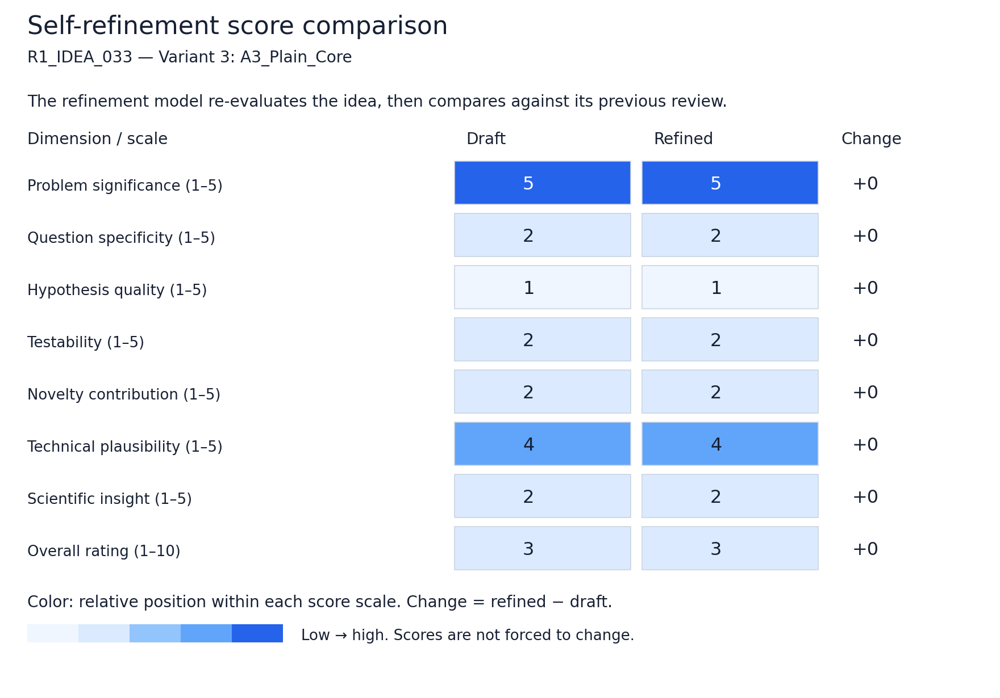

Changed score dimensions: none.

### Score justifications (draft / refined)

**Problem significance**

```json
{
  "draft": {
    "score": 5.0,
    "justification": "The problem is highly significant. Risk-averse modeling is crucial for safety-sensitive applications (medical, autonomous systems, finance), and CVaR is a fundamental risk measure. Accurate estimation of extreme quantiles is a core challenge with real-world implications."
  },
  "refined": {
    "score": 5.0,
    "justification": "The problem is exceptionally significant. Risk-averse modeling is crucial for safety-sensitive applications like autonomous systems, healthcare, and finance. CVaR is a fundamental coherent risk measure, and accurate estimation of extreme quantiles is a core challenge with substantial real-world implications for deploying reliable ML systems."
  }
}
```

**Question specificity**

```json
{
  "draft": {
    "score": 2.0,
    "justification": "The idea identifies a challenge but does not define a specific research question. It states that direct CVaR minimization is challenging due to estimation difficulties, but doesn't specify what aspect will be investigated, what relationship will be studied, or what concrete question will be answered."
  },
  "refined": {
    "score": 2.0,
    "justification": "The idea identifies a challenge but does not define a specific research question. It states that direct CVaR minimization is challenging due to estimation difficulties, but doesn't specify what aspect will be investigated, what relationship will be studied, or what concrete question will be answered. It remains at the level of problem description."
  }
}
```

**Hypothesis quality**

```json
{
  "draft": {
    "score": 1.0,
    "justification": "There is no explicit or implicit hypothesis. The text merely describes an existing challenge without making any testable prediction about causes, solutions, or relationships. A hypothesis would need to propose why the challenge exists or how it might be addressed."
  },
  "refined": {
    "score": 1.0,
    "justification": "There is no explicit or implicit hypothesis. The text merely describes an existing challenge without making any testable prediction about causes, solutions, or relationships. A hypothesis would need to propose why the challenge exists, how different factors interact, or how it might be addressed through specific mechanisms."
  }
}
```

**Testability**

```json
{
  "draft": {
    "score": 2.0,
    "justification": "The idea as stated is not directly testable because it doesn't propose what to test. While one could design experiments to compare CVaR estimation methods, the idea itself doesn't suggest any specific comparison, evaluation, or analysis. It's a problem statement rather than a testable claim."
  },
  "refined": {
    "score": 2.0,
    "justification": "The idea as stated is not directly testable because it doesn't propose what to test. While one could design experiments to compare CVaR estimation methods, the idea itself doesn't suggest any specific comparison, evaluation metric, or analysis plan. It presents a problem rather than a testable claim or investigation."
  }
}
```

**Novelty contribution**

```json
{
  "draft": {
    "score": 2.0,
    "justification": "The observation that CVaR estimation is challenging at extreme quantiles is not novel; it's a known issue in risk-sensitive optimization. Without proposing a specific research direction, method, or insight, the potential contribution remains unclear. The idea currently states a problem without suggesting how to advance understanding or methodology."
  },
  "refined": {
    "score": 2.0,
    "justification": "The observation that CVaR estimation is challenging at extreme quantiles is not novel; it's a well-known issue in risk-sensitive optimization and rare-event simulation. Without proposing a specific research direction, method, or insight, the potential contribution remains unclear. The idea currently states a problem without suggesting how to advance understanding or methodology beyond what is already known."
  }
}
```

**Technical plausibility**

```json
{
  "draft": {
    "score": 4.0,
    "justification": "The technical reasoning is coherent and plausible. The claim that direct CVaR minimization is challenging due to rare-event estimation difficulties is technically sound and aligns with known statistical and optimization challenges in extreme quantile estimation."
  },
  "refined": {
    "score": 4.0,
    "justification": "The technical reasoning is coherent and plausible. The claim that direct CVaR minimization is challenging due to rare-event estimation difficulties is technically sound and aligns with known statistical and optimization challenges in extreme quantile estimation. The connection between estimation difficulty and optimization challenges is logically consistent."
  }
}
```

**Scientific insight**

```json
{
  "draft": {
    "score": 2.0,
    "justification": "The idea as stated has limited potential for scientific insight because it doesn't propose investigating mechanisms, principles, or relationships. It identifies a practical challenge but doesn't suggest what might be learned about why the challenge exists, how different factors interact, or what general principles might emerge from studying it."
  },
  "refined": {
    "score": 2.0,
    "justification": "The idea as stated has limited potential for scientific insight because it doesn't propose investigating mechanisms, principles, or relationships. It identifies a practical challenge but doesn't suggest what might be learned about why the challenge exists, how different factors (like model architecture, loss landscape, or data distribution) interact with estimation difficulty, or what general principles might emerge from studying it. Insight would require moving beyond problem identification to hypothesis-driven investigation."
  }
}
```

**Overall rating**

```json
{
  "draft": {
    "score": 3.0,
    "justification": "This is a weak research idea in its current form. While it identifies a significant and meaningful problem (risk-averse modeling and CVaR challenges), it fails to articulate a specific research question, hypothesis, or methodological direction. It reads more as a motivation or problem statement than as a research idea. Without a concrete question to investigate or hypothesis to test, it lacks the specificity, testability, and potential contribution needed for a strong research direction. The idea needs substantial refinement to become a viable research proposal."
  },
  "refined": {
    "score": 3.0,
    "justification": "This is a weak research idea in its current form. While it identifies a significant and meaningful problem (risk-averse modeling and CVaR challenges), it fails to articulate a specific research question, hypothesis, or methodological direction. It reads more as a motivation or problem statement than as a research idea. Without a concrete question to investigate or hypothesis to test, it lacks the specificity, testability, and potential contribution needed for a strong research direction. The idea needs substantial refinement to become a viable research proposal."
  }
}
```

## R1_IDEA_033 — Variant 4: B1_Verbose_Elaborate

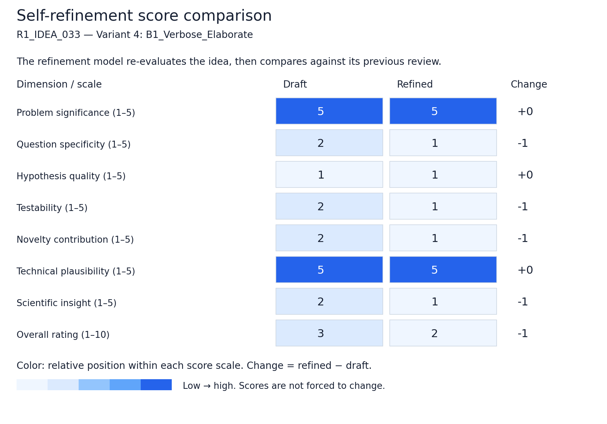

Changed score dimensions: question_specificity, testability, novelty_contribution, scientific_insight, overall_rating.

### Score justifications (draft / refined)

**Problem significance**

```json
{
  "draft": {
    "score": 5.0,
    "justification": "The problem is highly significant. Risk-averse decision-making is critical in finance, healthcare, autonomous systems, and other safety-sensitive domains. CVaR is a standard and principled risk measure, and the fundamental statistical challenge of estimating it from limited tail data is a major obstacle to its reliable application."
  },
  "refined": {
    "score": 5.0,
    "justification": "The problem is exceptionally significant. Risk-averse decision-making is crucial in high-stakes applications like autonomous driving, medical diagnosis, and financial systems. CVaR is a standard and principled risk measure, and the fundamental statistical challenge of estimating it from limited tail data is a major practical and theoretical obstacle that directly impacts real-world safety and reliability."
  }
}
```

**Question specificity**

```json
{
  "draft": {
    "score": 2.0,
    "justification": "The idea lacks a specific research question. It clearly describes a problem ('direct CVaR minimization is challenging due to difficulty estimating rare events'), but does not define what aspect of this problem will be investigated. A question like 'How can we...?' or 'Is method X effective for...?' is missing."
  },
  "refined": {
    "score": 1.0,
    "justification": "The idea lacks any specific research question. It describes a general problem ('direct CVaR minimization is challenging due to difficulty estimating rare events') but does not define what will be investigated. There is no 'how', 'why', 'when', or 'whether' question posed—it is purely a statement of an existing challenge without proposing to study any particular aspect of it."
  }
}
```

**Hypothesis quality**

```json
{
  "draft": {
    "score": 1.0,
    "justification": "There is no explicit or implicit hypothesis. The text states a known difficulty but makes no predictive claim about a relationship, mechanism, or solution that could be supported or contradicted by evidence."
  },
  "refined": {
    "score": 1.0,
    "justification": "There is no hypothesis—explicit or implicit. The text states a known difficulty but makes no predictive claim about relationships, mechanisms, or solutions. A hypothesis would require a testable prediction (e.g., 'Method X will improve estimation accuracy under condition Y'), which is entirely absent."
  }
}
```

**Testability**

```json
{
  "draft": {
    "score": 2.0,
    "justification": "The core statement ('estimation is challenging') is an observation, not a testable claim. Without a proposed method, comparison, or specific phenomenon to investigate, there is no clear path to obtaining evidence. The idea itself is not framed as an investigation."
  },
  "refined": {
    "score": 1.0,
    "justification": "The idea is not testable because it presents no claim to test. It observes that 'estimation is challenging'—a fact, not a research proposition. Without a proposed method, comparison, or specific phenomenon to investigate, there is nothing to design an experiment or analysis around. The idea itself is not framed as an investigation."
  }
}
```

**Novelty contribution**

```json
{
  "draft": {
    "score": 2.0,
    "justification": "The potential contribution is unclear because no novel research direction is proposed. The description accurately notes a well-known challenge in robust optimization and risk estimation. To have novelty, the idea would need to suggest a new angle, method, or analysis for tackling this challenge."
  },
  "refined": {
    "score": 1.0,
    "justification": "The potential contribution is nonexistent because no novel research direction is proposed. The description accurately notes a well-known challenge in robust optimization and statistical estimation, but does not suggest any new angle, method, analysis, or insight. It is essentially a restatement of an existing problem without indicating how the research would advance understanding or practice."
  }
}
```

**Technical plausibility**

```json
{
  "draft": {
    "score": 5.0,
    "justification": "The technical reasoning is sound and plausible. The identified bottleneck—accurate estimation of tail statistics with sparse data—is a genuine and widely recognized difficulty in statistics and machine learning. The logic connecting sparse tail data to challenges in direct CVaR minimization is correct."
  },
  "refined": {
    "score": 5.0,
    "justification": "The technical reasoning is entirely plausible and correct. The identified bottleneck—accurate estimation of tail statistics with sparse data—is a genuine and widely recognized difficulty in statistics, finance, and machine learning. The logic connecting sparse tail data to challenges in direct CVaR minimization is sound and reflects established knowledge."
  }
}
```

**Scientific insight**

```json
{
  "draft": {
    "score": 2.0,
    "justification": "The idea, as stated, has low potential for scientific insight because it does not propose a study. If it were developed into a research project, the underlying problem area is rich with potential for insight (e.g., into estimation theory, sample complexity, or the interaction between optimization objectives and statistical reliability). However, the current summary does not point toward generating such insights."
  },
  "refined": {
    "score": 1.0,
    "justification": "The idea, as stated, has zero potential for scientific insight because it does not propose any study. While the problem area itself is rich with potential insights (e.g., into estimation theory, sample complexity, or robustness-accuracy trade-offs), the current summary merely points to the area without suggesting what might be learned through research. No insight-generating mechanism is indicated."
  }
}
```

**Overall rating**

```json
{
  "draft": {
    "score": 3.0,
    "justification": "This is a weak research idea in its current form. It excellently identifies a significant and meaningful problem with high technical plausibility. However, it stops at the problem statement. It lacks a specific research question, a testable hypothesis, and any indication of a novel contribution or methodological direction. It is more of a motivation paragraph than a research idea. To be strong, it needs to define what will actually be investigated."
  },
  "refined": {
    "score": 2.0,
    "justification": "This is a very weak research idea. It correctly identifies a highly significant problem with perfect technical plausibility, but it stops entirely at the problem statement. It contains no research question, hypothesis, methodological direction, or indication of what would be investigated. It is essentially a motivation paragraph, not a research idea. For it to become a research idea, it must define what will actually be studied and how new knowledge would be generated."
  }
}
```

## R1_IDEA_033 — Variant 5: B2_Grand_Narrative

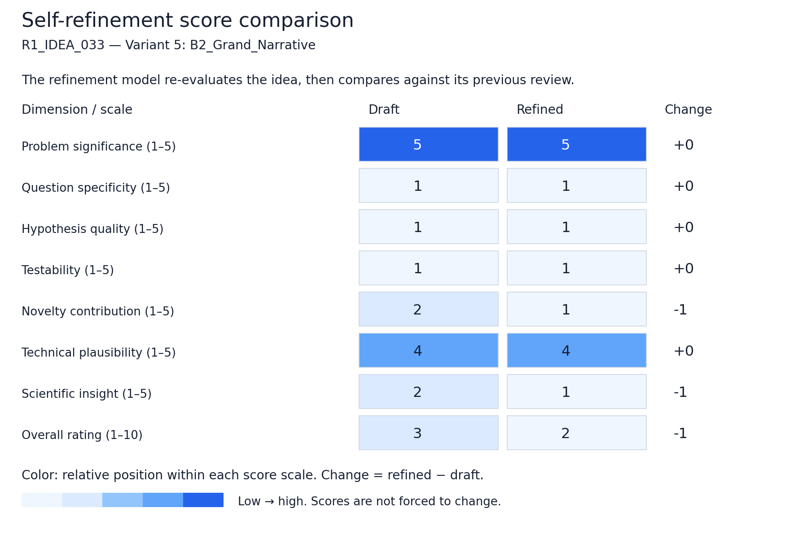

Changed score dimensions: novelty_contribution, scientific_insight, overall_rating.

### Score justifications (draft / refined)

**Problem significance**

```json
{
  "draft": {
    "score": 5.0,
    "justification": "The problem is highly significant. Risk-averse learning is critical for safety-sensitive AI, and the difficulty of estimating extreme-quantile CVaR is a recognized and important bottleneck."
  },
  "refined": {
    "score": 5.0,
    "justification": "Exceptional significance. Enabling reliable risk-averse learning is a fundamental challenge for deploying ML in safety-critical domains like healthcare, finance, and autonomous systems. The specific bottleneck of estimating tail risks (CVaR) is a core, well-recognized technical hurdle in this pursuit."
  }
}
```

**Question specificity**

```json
{
  "draft": {
    "score": 1.0,
    "justification": "Extremely low specificity. The text describes a challenge but does not pose a specific research question. It does not define what aspect of the challenge will be investigated, under what conditions, or with what goal."
  },
  "refined": {
    "score": 1.0,
    "justification": "No research question is specified. The text describes a general area of difficulty ('challenging due to difficulty of estimating') but does not define a specific aspect to be investigated, a relationship to be tested, or a condition to be explored."
  }
}
```

**Hypothesis quality**

```json
{
  "draft": {
    "score": 1.0,
    "justification": "No hypothesis is present, explicit or implicit. The text states a fact (CVaR minimization is challenging due to estimation difficulty) but makes no predictive or mechanistic claim about that challenge."
  },
  "refined": {
    "score": 1.0,
    "justification": "No hypothesis is present. The text states an observed fact (estimation is hard) and a potential long-term implication (may inform research). It makes no concrete, testable prediction about mechanisms, solutions, or relationships."
  }
}
```

**Testability**

```json
{
  "draft": {
    "score": 1.0,
    "justification": "Not testable in its current form. There is no central claim to support or contradict. It identifies a problem area but does not propose an investigation that could yield evidence."
  },
  "refined": {
    "score": 1.0,
    "justification": "Not testable. There is no central claim or proposed investigation that could be supported or contradicted by evidence. It identifies a problem domain but does not suggest an experiment, analysis, or comparison that would yield evaluable results."
  }
}
```

**Novelty contribution**

```json
{
  "draft": {
    "score": 2.0,
    "justification": "The potential contribution is unclear and likely low. Acknowledging that CVaR estimation at extreme quantiles is hard is not novel. The idea lacks any proposed novel angle, method, or analysis that would constitute a new contribution."
  },
  "refined": {
    "score": 1.0,
    "justification": "The potential contribution is not defined and is likely minimal as stated. Noting that CVaR estimation at extreme quantiles is challenging is a statement of common knowledge in the field. The idea proposes no novel perspective, method, or analysis that would constitute a new contribution."
  }
}
```

**Technical plausibility**

```json
{
  "draft": {
    "score": 4.0,
    "justification": "The stated premise is technically sound and coherent. CVaR is a standard risk measure, and its estimation difficulty, especially for rare events, is a well-known and plausible challenge."
  },
  "refined": {
    "score": 4.0,
    "justification": "The technical premise is sound and coherent. CVaR is a standard and principled risk measure in finance and optimization. The assertion that its accurate estimation is particularly difficult for rare, high-loss events (extreme quantiles) is technically correct and well-documented, making the stated challenge plausible."
  }
}
```

**Scientific insight**

```json
{
  "draft": {
    "score": 2.0,
    "justification": "The idea as stated has low potential for scientific insight because it doesn't propose to uncover new mechanisms, principles, or relationships. It points to a problem but doesn't suggest how studying it would yield generalizable knowledge. Insight would depend entirely on the unspecified research question."
  },
  "refined": {
    "score": 1.0,
    "justification": "Very low potential for scientific insight as presented. The idea does not propose to uncover new mechanisms, general principles, or boundary conditions. It points to a known challenge but does not suggest how studying it would yield transferable knowledge. Any insight is entirely contingent on an unspecified future research question."
  }
}
```

**Overall rating**

```json
{
  "draft": {
    "score": 3.0,
    "justification": "This is a weak research idea. While it identifies a very significant and plausible problem, it fails to articulate a research question, hypothesis, or methodological direction. It reads as background motivation or a problem statement, not as a proposal for a specific investigation. Without a concrete 'what' and 'how,' its scientific merit cannot be assessed positively."
  },
  "refined": {
    "score": 2.0,
    "justification": "This is a very weak research idea. It successfully identifies a problem of exceptional significance and states a plausible technical challenge. However, it completely lacks the core components of a research idea: a specific question, a hypothesis, a testable direction, or a notion of novel contribution. It reads as introductory background or motivation for research, not as a proposal for a specific scientific investigation. Therefore, it cannot be rated as a moderate or borderline idea."
  }
}
```

## R1_IDEA_033 — Variant 6: B3_Over_Confident


Changed score dimensions: none.

### Score justifications (draft / refined)

**Problem significance**

```json
{
  "draft": {
    "score": 5.0,
    "justification": "The problem is highly significant. Risk-averse optimization is critical for real-world, safety-sensitive ML applications like healthcare, finance, and autonomous systems. CVaR is a foundational and principled risk measure, so overcoming barriers to its effective use is a meaningful challenge."
  },
  "refined": {
    "score": 5.0,
    "justification": "Exceptional significance. Enabling reliable risk-averse modeling is crucial for deploying ML in safety-critical domains like healthcare, finance, and autonomous systems. CVaR is a foundational and coherent risk measure, so overcoming barriers to its practical use addresses a core challenge with substantial real-world impact."
  }
}
```

**Question specificity**

```json
{
  "draft": {
    "score": 1.0,
    "justification": "Extremely low. The text only states that a challenge exists ('direct CVaR minimization remains challenging due to... difficulty of accurately estimating rare, high-loss events'). It does not define a specific question to be investigated. There is no 'what', 'how', or 'why' question posed."
  },
  "refined": {
    "score": 1.0,
    "justification": "Very weak. The text only states that a challenge exists. It poses no specific question about the challenge—no 'how', 'why', or 'under what conditions'. It identifies a problem area but does not define what aspect of it will be investigated."
  }
}
```

**Hypothesis quality**

```json
{
  "draft": {
    "score": 1.0,
    "justification": "There is no hypothesis, implicit or explicit. The text is a descriptive statement of a known difficulty, not a predictive or explanatory claim that could be tested."
  },
  "refined": {
    "score": 1.0,
    "justification": "No hypothesis is present, implicit or explicit. The text is a descriptive observation ('estimation is challenging'), not a predictive or mechanistic claim that could be supported or contradicted by evidence."
  }
}
```

**Testability**

```json
{
  "draft": {
    "score": 1.0,
    "justification": "The idea as presented is not testable. It identifies a problem area but proposes no investigation, experiment, analysis, or comparison that could yield evidence for or against a specific claim."
  },
  "refined": {
    "score": 1.0,
    "justification": "Not testable as presented. There is no central claim to test, no proposed experiment, comparison, or analysis. The idea is a statement of a known difficulty, not a research proposition that can be investigated."
  }
}
```

**Novelty contribution**

```json
{
  "draft": {
    "score": 2.0,
    "justification": "The potential contribution is currently vague. Recognizing that CVaR estimation is hard at extreme quantiles is not novel. The novelty would depend entirely on the unspecified research direction. As stated, it merely highlights a known issue without suggesting a novel angle to tackle it."
  },
  "refined": {
    "score": 2.0,
    "justification": "Weak. Acknowledging that CVaR estimation is difficult at extreme quantiles is not novel; this is well-established in stochastic optimization literature. The potential contribution is entirely undefined, as no novel angle, method, or analysis is suggested to address the challenge."
  }
}
```

**Technical plausibility**

```json
{
  "draft": {
    "score": 4.0,
    "justification": "The technical premise is coherent and plausible. The statement that accurate estimation of tail events is difficult for direct CVaR minimization is correct and well-understood in stochastic optimization and risk management literature. The reasoning is logically sound."
  },
  "refined": {
    "score": 4.0,
    "justification": "Strong. The technical premise is sound and coherent. The difficulty of estimating tail events for CVaR, especially at extreme quantiles, is a recognized and plausible bottleneck. The logical connection between accurate estimation and effective minimization is correct."
  }
}
```

**Scientific insight**

```json
{
  "draft": {
    "score": 2.0,
    "justification": "The potential for insight is currently low because no specific investigation is proposed. If developed, research on this topic could yield significant insight into the statistical and optimization challenges of extreme-quantile risk minimization, which is a valuable scientific goal. However, the idea summary does not point toward any particular insight."
  },
  "refined": {
    "score": 2.0,
    "justification": "Weak. While the problem area could yield significant insights (e.g., into the statistical-optimization interface for extreme-risk measures), the text itself proposes no specific investigation. Therefore, the potential for generating transferable scientific understanding is currently low."
  }
}
```

**Overall rating**

```json
{
  "draft": {
    "score": 3.0,
    "justification": "This is a weak research idea in its current form. While it identifies a very significant and well-motivated problem, it stops at the problem statement. It lacks the core components of a research idea: a specific question, a testable hypothesis, or a proposed direction of inquiry. It is more of a motivation or introduction than a research idea. Its strength lies solely in problem significance; all other criteria are poorly met."
  },
  "refined": {
    "score": 3.0,
    "justification": "A weak research idea. It excels only in identifying a highly significant problem. It lacks the essential components of a research idea: a specific question, a testable hypothesis, or a proposed direction. It is a motivation or problem statement, not a blueprint for inquiry. The high problem significance is outweighed by the absence of a research proposition."
  }
}
```

## R1_IDEA_033 — Variant 7: B4_Novelty


Changed score dimensions: none.

### Score justifications (draft / refined)

**Problem significance**

```json
{
  "draft": {
    "score": 5.0,
    "justification": "The problem is highly significant. Risk-averse modeling is critical for safety-sensitive applications (e.g., healthcare, finance, autonomous systems), and accurate estimation of extreme risks is a fundamental challenge with real-world impact."
  },
  "refined": {
    "score": 5.0,
    "justification": "The problem is exceptionally significant. Risk-averse decision-making is crucial in real-world safety-sensitive domains like healthcare, autonomous systems, and finance. Accurate estimation of extreme tail risks is a fundamental challenge with direct societal impact."
  }
}
```

**Question specificity**

```json
{
  "draft": {
    "score": 2.0,
    "justification": "The idea lacks a specific research question. It identifies a general challenge ('direct CVaR minimization remains an underexplored challenge due to estimation difficulty') but does not define what aspect will be investigated. There is no 'what', 'how', or 'why' question posed."
  },
  "refined": {
    "score": 2.0,
    "justification": "The idea lacks a specific research question. It identifies a general challenge ('direct CVaR minimization is underexplored due to estimation difficulty') but does not define what will be investigated. There is no 'what', 'how', or 'why' question articulated."
  }
}
```

**Hypothesis quality**

```json
{
  "draft": {
    "score": 1.0,
    "justification": "There is no explicit or implicit hypothesis. The text describes a problem and a challenge but makes no testable prediction about a relationship, mechanism, or solution. It is a statement of fact, not a hypothesis."
  },
  "refined": {
    "score": 1.0,
    "justification": "There is no hypothesis—testable or otherwise. The text describes a problem and notes a difficulty but makes no prediction about relationships, mechanisms, or solutions. It is purely descriptive, not hypothesis-driven."
  }
}
```

**Testability**

```json
{
  "draft": {
    "score": 2.0,
    "justification": "The idea as stated is not directly testable because it proposes no investigation. One could design experiments to test specific claims about CVaR estimation, but the idea itself does not suggest any such test. It merely notes a difficulty."
  },
  "refined": {
    "score": 2.0,
    "justification": "The idea as stated is not directly testable because it proposes no investigation. One could design experiments to evaluate CVaR estimation methods, but the idea itself does not suggest any test, comparison, or evaluation. It merely notes an area of difficulty."
  }
}
```

**Novelty contribution**

```json
{
  "draft": {
    "score": 2.0,
    "justification": "The potential contribution is unclear. The idea states that direct CVaR minimization is 'underexplored,' but does not specify what novel insight, method, or analysis the research would provide. Without a proposed direction, it's hard to assess novelty beyond a general call for more work in the area."
  },
  "refined": {
    "score": 2.0,
    "justification": "The potential contribution is unclear. While the area may be underexplored, the idea does not specify what novel insight, method, or analysis would be contributed. Without a proposed direction, it is essentially a call for more work, not a novel research idea."
  }
}
```

**Technical plausibility**

```json
{
  "draft": {
    "score": 4.0,
    "justification": "The reasoning is logically coherent and technically sound. The claim that estimating rare events for extreme-quantile CVaR is difficult is well-founded and aligns with known statistical challenges. No implausible assumptions are made."
  },
  "refined": {
    "score": 4.0,
    "justification": "The reasoning is logically coherent and technically sound. The claim that estimating rare events for extreme-quantile CVaR is difficult is well-founded in statistics and aligns with known challenges in tail estimation. No implausible assumptions are made."
  }
}
```

**Scientific insight**

```json
{
  "draft": {
    "score": 3.0,
    "justification": "If a specific investigation were built upon this motivation, it could yield significant insight into the limits of risk estimation, trade-offs between robustness and sample efficiency, or properties of loss distributions. However, as a standalone idea, the potential insight is moderate because it only sets the stage without proposing a path to discovery."
  },
  "refined": {
    "score": 3.0,
    "justification": "If a specific investigation were built on this motivation, it could yield significant insight into the limits of risk estimation, sample efficiency, or robustness. However, as a standalone idea, the potential insight is moderate—it sets the stage but does not propose a path to discovery."
  }
}
```

**Overall rating**

```json
{
  "draft": {
    "score": 3.0,
    "justification": "This is a weak research idea in its current form. While it identifies a very significant and well-motivated problem, it fails to define a research question, hypothesis, or methodological direction. It reads more as a general motivation or problem statement than a research idea. It lacks the specificity, testability, and novelty required for a strong research direction. With substantial refinement (as suggested), it could become a strong idea."
  },
  "refined": {
    "score": 3.0,
    "justification": "This is a weak research idea in its current form. It identifies a highly significant problem and a concrete technical challenge, but it fails to define a research question, hypothesis, or methodological direction. It reads as a problem statement or motivation, not as a research idea. It lacks the specificity, testability, and novelty required for a strong research direction. With substantial refinement, it could become a strong idea."
  }
}
```

## R1_IDEA_033 — Variant 8: B5_Application_Impact

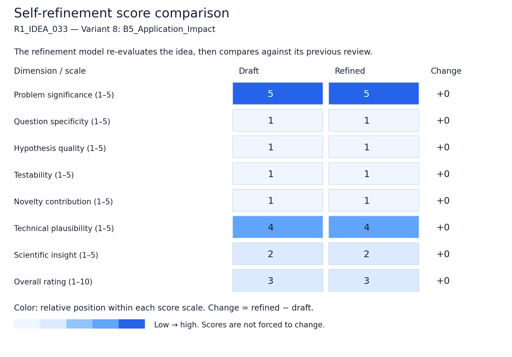

Changed score dimensions: none.

### Score justifications (draft / refined)

**Problem significance**

```json
{
  "draft": {
    "score": 5.0,
    "justification": "Risk-averse modeling is highly important for safety-critical applications like autonomous systems and medical diagnostics. CVaR is a well-established risk measure, and challenges in its minimization directly impact real-world safety."
  },
  "refined": {
    "score": 5.0,
    "justification": "Risk-averse modeling is critically important for safety-sensitive applications like autonomous systems and medical diagnostics. CVaR is a well-established risk measure, and challenges in its minimization directly impact real-world safety and reliability, making the problem highly significant."
  }
}
```

**Question specificity**

```json
{
  "draft": {
    "score": 1.0,
    "justification": "No concrete research question is defined. The idea only states that direct CVaR minimization is challenging due to rare-event estimation, but does not specify what aspect to study, what hypothesis to test, or what relationship to investigate."
  },
  "refined": {
    "score": 1.0,
    "justification": "No concrete research question is defined. The idea only states that direct CVaR minimization is challenging due to rare-event estimation, but does not specify what aspect to study, what relationship to investigate, or what specific phenomenon to examine."
  }
}
```

**Hypothesis quality**

```json
{
  "draft": {
    "score": 1.0,
    "justification": "There is no explicit or implicit hypothesis. The idea describes a problem but makes no prediction, proposes no mechanism, and does not distinguish itself from a generic statement of difficulty."
  },
  "refined": {
    "score": 1.0,
    "justification": "There is no explicit or implicit hypothesis. The idea describes a problem but makes no prediction, proposes no mechanism, and does not distinguish itself from a generic statement of difficulty. It lacks any falsifiable claim."
  }
}
```

**Testability**

```json
{
  "draft": {
    "score": 1.0,
    "justification": "Without a defined question or hypothesis, it is unclear how one would test anything. The idea mentions a challenge but suggests no experiment, comparison, evaluation, or analysis to investigate it."
  },
  "refined": {
    "score": 1.0,
    "justification": "Without a defined question or hypothesis, it is unclear how one would test anything. The idea mentions a challenge but suggests no experiment, comparison, evaluation, ablation, or analysis to investigate it. It is not testable in its current form."
  }
}
```

**Novelty contribution**

```json
{
  "draft": {
    "score": 1.0,
    "justification": "The idea does not propose any novel contribution. It states a known challenge (CVaR estimation for rare events) without suggesting a new method, insight, or investigation. It is essentially a problem statement."
  },
  "refined": {
    "score": 1.0,
    "justification": "The idea does not propose any novel contribution. It states a known challenge (CVaR estimation for rare events at extreme quantiles) without suggesting a new method, insight, or investigation. It is essentially a problem statement, not a research direction."
  }
}
```

**Technical plausibility**

```json
{
  "draft": {
    "score": 4.0,
    "justification": "The reasoning is logically coherent: CVaR minimization is principled but hard due to tail estimation, especially at extreme quantiles. This is a well-known technical issue in risk-sensitive ML."
  },
  "refined": {
    "score": 4.0,
    "justification": "The reasoning is logically coherent: CVaR minimization is principled but hard due to tail estimation, especially at extreme quantiles. This is a well-known technical issue in risk-sensitive machine learning and robust optimization, making the premise plausible."
  }
}
```

**Scientific insight**

```json
{
  "draft": {
    "score": 2.0,
    "justification": "If developed into a concrete study, it could offer insight into rare-event estimation or robust optimization. As stated, however, it only identifies a problem without indicating what might be learned from studying it."
  },
  "refined": {
    "score": 2.0,
    "justification": "If developed into a concrete study, it could offer insight into rare-event estimation, robust optimization, or the trade-offs in risk-averse learning. As stated, however, it only identifies a problem without indicating what might be learned from studying it. The potential insight is minimal without a specific investigative angle."
  }
}
```

**Overall rating**

```json
{
  "draft": {
    "score": 3.0,
    "justification": "The idea identifies a significant problem but lacks specificity, a research question, a hypothesis, testability, and novelty. It is essentially a motivation statement rather than a research idea. It would need substantial refinement to become a viable research direction."
  },
  "refined": {
    "score": 3.0,
    "justification": "The idea identifies a significant and meaningful problem but lacks specificity, a research question, a hypothesis, testability, and novelty. It is essentially a motivation statement rather than a research idea. It would need substantial refinement to become a viable research direction."
  }
}
```

## R1_IDEA_033 — Variant 9: C1_Hollow_Shell


Changed score dimensions: none.

### Score justifications (draft / refined)

**Problem significance**

```json
{
  "draft": {
    "score": 4.0,
    "justification": "The problem of reliable modeling for high-stakes applications is highly significant. The challenge of estimating rare, high-consequence events is a recognized and important issue in risk-aware machine learning, with implications for healthcare, finance, autonomous systems, and other critical domains."
  },
  "refined": {
    "score": 4.0,
    "justification": "The problem is highly significant. Reliable modeling for high-stakes applications is critically important, and the challenge of estimating rare, high-consequence events is a recognized and meaningful issue in risk-aware machine learning with implications for healthcare, finance, autonomous systems, and safety-critical domains."
  }
}
```

**Question specificity**

```json
{
  "draft": {
    "score": 1.0,
    "justification": "Extremely low specificity. The idea merely states that applying an approach is difficult due to an estimation challenge, without defining what specific aspect will be investigated. There is no research question, only a problem description."
  },
  "refined": {
    "score": 1.0,
    "justification": "Extremely low specificity. The idea merely states that applying an approach is difficult due to an estimation challenge, without defining what specific aspect will be investigated. There is no research question - only a problem description."
  }
}
```

**Hypothesis quality**

```json
{
  "draft": {
    "score": 1.0,
    "justification": "No hypothesis is presented. The text describes a difficulty but makes no prediction about how it might be addressed, what mechanisms might help, or what relationships might exist between different approaches."
  },
  "refined": {
    "score": 1.0,
    "justification": "No hypothesis is presented. The text describes a difficulty but makes no prediction about how it might be addressed, what mechanisms might help, or what relationships might exist between different approaches to the problem."
  }
}
```

**Testability**

```json
{
  "draft": {
    "score": 2.0,
    "justification": "The idea as stated is not testable because it doesn't propose anything to test. However, the underlying problem (estimation of rare events for risk measures) could be made testable with specific proposals about estimators, algorithms, or theoretical properties."
  },
  "refined": {
    "score": 2.0,
    "justification": "The idea as stated is not testable because it doesn't propose anything to test. However, the underlying problem (estimation of rare events for risk measures) could be made testable with specific proposals about estimators, algorithms, or theoretical properties."
  }
}
```

**Novelty contribution**

```json
{
  "draft": {
    "score": 2.0,
    "justification": "The description is too vague to assess novelty. Many papers discuss challenges with tail risk estimation in machine learning. Without knowing what specific approach or insight is proposed, it's impossible to determine if there would be a novel contribution."
  },
  "refined": {
    "score": 2.0,
    "justification": "The description is too vague to assess novelty. Many papers discuss challenges with tail risk estimation in machine learning. Without knowing what specific approach, insight, or context is proposed, it's impossible to determine if there would be a novel contribution beyond existing literature."
  }
}
```

**Technical plausibility**

```json
{
  "draft": {
    "score": 3.0,
    "justification": "The basic premise is plausible - estimating rare, high-consequence events is indeed challenging, and this could hinder optimization of risk measures. However, without technical details, it's impossible to evaluate whether any proposed solution would be coherent or reasonable."
  },
  "refined": {
    "score": 3.0,
    "justification": "The basic premise is plausible - estimating rare, high-consequence events is indeed challenging, and this could hinder optimization of risk measures. However, without technical details, it's impossible to evaluate whether any proposed solution would be coherent or reasonable."
  }
}
```

**Scientific insight**

```json
{
  "draft": {
    "score": 2.0,
    "justification": "The idea as stated has limited potential for scientific insight because it doesn't propose to investigate mechanisms, principles, or relationships. It merely identifies a practical challenge. With development, it could potentially yield insights about estimation under extreme conditions or the trade-offs in risk-aware learning."
  },
  "refined": {
    "score": 2.0,
    "justification": "The idea as stated has limited potential for scientific insight because it doesn't propose to investigate mechanisms, principles, or relationships. It merely identifies a practical challenge. With development, it could potentially yield insights about estimation under extreme conditions or trade-offs in risk-aware learning, but currently offers no direction for such insights."
  }
}
```

**Overall rating**

```json
{
  "draft": {
    "score": 3.0,
    "justification": "This is a weak research idea in its current form. While it identifies an important and meaningful problem (high-stakes applications and rare event estimation), it fails to articulate a specific research question, hypothesis, or direction. It reads more like a problem statement or motivation section than a research idea. The lack of specificity makes it impossible to evaluate its scientific merit beyond recognizing the importance of the general area. With substantial development (specific risk measure, concrete research question, proposed approach), it could become a strong idea."
  },
  "refined": {
    "score": 3.0,
    "justification": "This is a weak research idea in its current form. While it identifies an important and meaningful problem (high-stakes applications and rare event estimation), it fails to articulate a specific research question, hypothesis, or direction. It reads more like a problem statement or motivation section than a research idea. The lack of specificity makes it impossible to evaluate its scientific merit beyond recognizing the importance of the general area. With substantial development (specific risk measure, concrete research question, proposed approach), it could become a strong idea."
  }
}
```

## R1_IDEA_033 — Variant 10: C2_Logic_Flawed

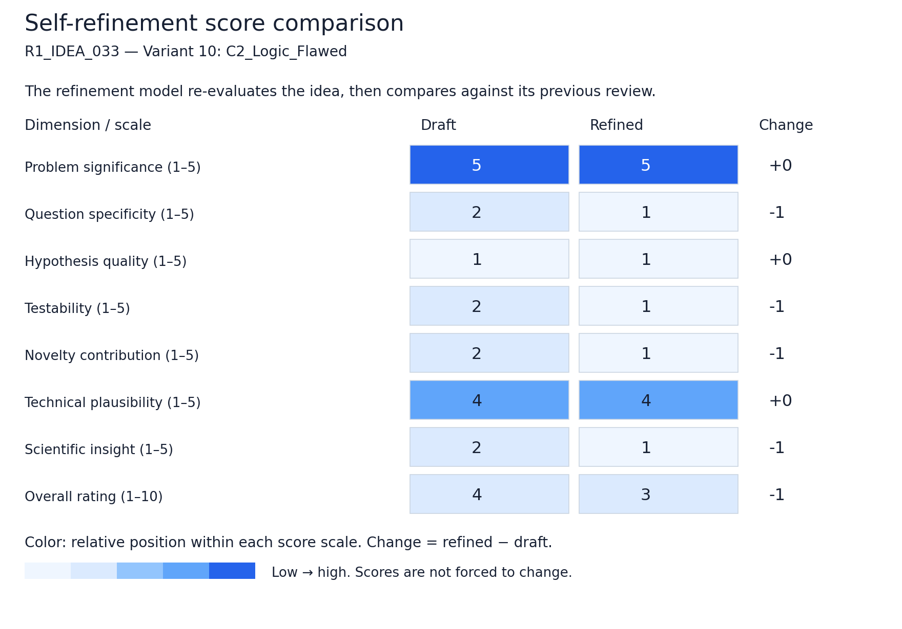

Changed score dimensions: question_specificity, testability, novelty_contribution, scientific_insight, overall_rating.

### Score justifications (draft / refined)

**Problem significance**

```json
{
  "draft": {
    "score": 5.0,
    "justification": "Risk-averse learning for safety-critical applications is a highly significant problem. CVaR is a standard and principled risk measure, and difficulties in optimizing it directly impact real-world deployment in medicine, finance, autonomy, etc."
  },
  "refined": {
    "score": 5.0,
    "justification": "Risk-averse learning for safety-critical applications is a highly significant problem with real-world impact in fields like healthcare, finance, and autonomy. CVaR is a standard, principled risk measure, and overcoming its optimization challenges directly enables safer AI systems."
  }
}
```

**Question specificity**

```json
{
  "draft": {
    "score": 2.0,
    "justification": "The idea states a general challenge but does not define a specific research question. It mentions 'direct CVaR minimization remains challenging' without specifying what aspect will be investigated or what relationship will be tested."
  },
  "refined": {
    "score": 1.0,
    "justification": "The idea does not define any research question. It only states a general challenge ('direct CVaR minimization remains challenging') without specifying what aspect will be investigated, what relationship will be tested, or what concrete phenomenon will be studied."
  }
}
```

**Hypothesis quality**

```json
{
  "draft": {
    "score": 1.0,
    "justification": "There is no explicit or implicit hypothesis. The text describes a problem and a desirable property ('broader effectiveness'), but makes no concrete, testable prediction about a method, mechanism, or relationship."
  },
  "refined": {
    "score": 1.0,
    "justification": "There is no hypothesis—explicit or implicit. The text describes a problem and a desired outcome ('broader effectiveness'), but makes no concrete, testable prediction about a method, mechanism, or causal relationship. It is purely observational."
  }
}
```

**Testability**

```json
{
  "draft": {
    "score": 2.0,
    "justification": "The idea as stated is not directly testable because it proposes no experiment, comparison, or evaluation. One could test specific solutions to the estimation challenge, but the idea itself only identifies the challenge."
  },
  "refined": {
    "score": 1.0,
    "justification": "The idea as presented is not testable because it proposes no experiment, analysis, comparison, or evaluation. One could test specific solutions to the estimation challenge, but the idea itself only identifies the challenge without suggesting how to investigate it."
  }
}
```

**Novelty contribution**

```json
{
  "draft": {
    "score": 2.0,
    "justification": "The observation that CVaR estimation is difficult at extreme quantiles is not novel. The idea does not propose a new method, a new insight, or a new application—it only motivates addressing an existing known challenge."
  },
  "refined": {
    "score": 1.0,
    "justification": "The observation that CVaR estimation is difficult at extreme quantiles is well-known in stochastic optimization and risk management literature. The idea does not propose a new method, a novel insight, a new application domain, or a meaningful hypothesis to test—it merely states an existing challenge."
  }
}
```

**Technical plausibility**

```json
{
  "draft": {
    "score": 4.0,
    "justification": "The reasoning is coherent and technically sound: CVaR is a standard risk measure, tail estimation is statistically hard, and this impedes direct optimization. The described difficulty aligns with known literature."
  },
  "refined": {
    "score": 4.0,
    "justification": "The reasoning is logically coherent and technically sound. CVaR is a standard risk measure, tail estimation is statistically challenging (especially for rare events), and this indeed complicates direct optimization. The described difficulty aligns with established knowledge."
  }
}
```

**Scientific insight**

```json
{
  "draft": {
    "score": 2.0,
    "justification": "As presented, the idea has low potential for scientific insight because it does not propose to uncover a new mechanism, principle, or boundary condition. It points to a practical obstacle without suggesting how studying it would yield generalizable knowledge."
  },
  "refined": {
    "score": 1.0,
    "justification": "As presented, the idea has minimal potential for scientific insight because it does not propose to uncover a new mechanism, principle, or boundary condition. It points to a known practical obstacle without suggesting how studying it would yield generalizable knowledge beyond confirming the obstacle exists."
  }
}
```

**Overall rating**

```json
{
  "draft": {
    "score": 4.0,
    "justification": "This is a weak research idea in its current form. While it identifies a significant and plausible problem (risk-averse learning with CVaR), it lacks a specific research question, hypothesis, or methodological direction. It reads more as a motivation section than a research proposal. Without a concrete investigative angle, it offers limited novelty, testability, or potential for scientific insight."
  },
  "refined": {
    "score": 3.0,
    "justification": "This is a very weak research idea in its current form. While it correctly identifies a significant and plausible problem (CVaR estimation for risk-averse learning), it lacks any specific research question, hypothesis, or methodological direction. It reads solely as background motivation. Without a concrete investigative angle, it offers no novelty, testability, or potential for scientific insight. It essentially states 'there is a problem' without proposing to study or solve it."
  }
}
```

## R1_IDEA_033 — Variant 11: C3_Substance_Enriched

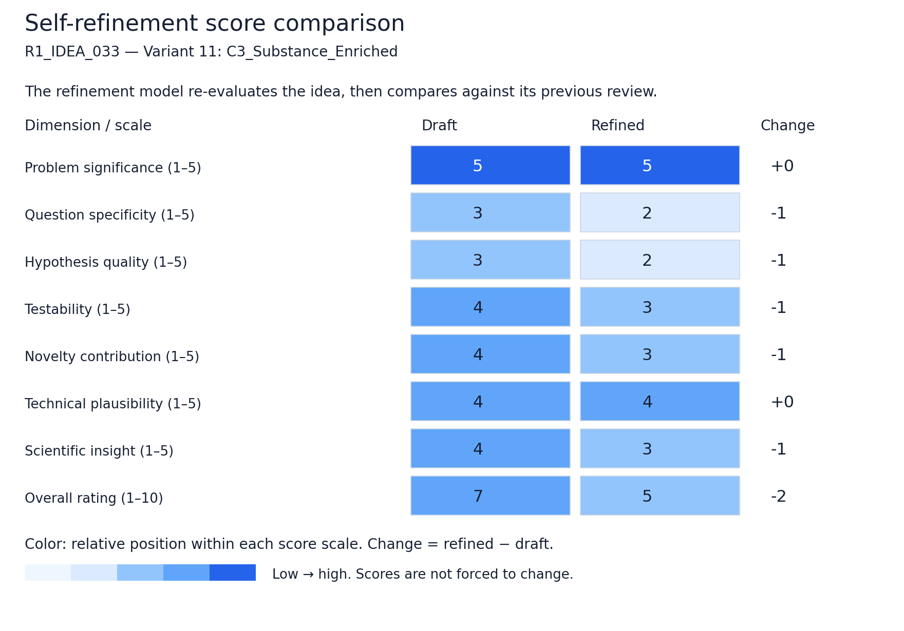

Changed score dimensions: question_specificity, hypothesis_quality, testability, novelty_contribution, scientific_insight, overall_rating.

### Score justifications (draft / refined)

**Problem significance**

```json
{
  "draft": {
    "score": 5.0,
    "justification": "Risk-averse modeling for safety-sensitive applications is highly important. CVaR is a principled risk measure, and understanding its optimization challenges has direct relevance to robust ML deployment in high-stakes domains."
  },
  "refined": {
    "score": 5.0,
    "justification": "Risk-averse modeling for safety-sensitive applications is critically important. CVaR is a principled risk measure widely used in finance, robotics, and healthcare. Understanding its optimization challenges has direct practical relevance and addresses a meaningful technical problem in robust machine learning."
  }
}
```

**Question specificity**

```json
{
  "draft": {
    "score": 3.0,
    "justification": "The idea identifies a general challenge and a potential factor, but does not define a precise, narrow research question. It states that 'the challenge may depend on boundary conditions' without specifying what aspect of the challenge or what relationship is being investigated."
  },
  "refined": {
    "score": 2.0,
    "justification": "The idea identifies a general challenge and suggests a potential factor, but does not define a precise research question. It states that 'the challenge may depend on boundary conditions' without specifying what aspect of the challenge, what relationship is being investigated, or what constitutes a boundary condition. This is too vague for a strong research question."
  }
}
```

**Hypothesis quality**

```json
{
  "draft": {
    "score": 3.0,
    "justification": "There is an implicit hypothesis that heavy-tailed properties affect the difficulty of CVaR minimization, which is testable in principle. However, it lacks a concrete, directional prediction and does not distinguish it from a generic observation that 'things might depend on data properties.'"
  },
  "refined": {
    "score": 2.0,
    "justification": "There is an implicit hypothesis that heavy-tailed properties affect CVaR minimization difficulty, but it lacks concrete, falsifiable predictions. It doesn't specify the nature, direction, or mechanism of the dependency. The statement is more of an observation than a testable hypothesis with clear predictions."
  }
}
```

**Testability**

```json
{
  "draft": {
    "score": 4.0,
    "justification": "The idea suggests a validation route (OOD testing) and implies that heavy-tailed properties could be a testable variable. With proper operationalization, the dependency could be investigated through controlled experiments with synthetic or curated real data."
  },
  "refined": {
    "score": 3.0,
    "justification": "The idea suggests OOD testing as a validation route and implies that distributional properties could be varied. With proper operationalization, the dependency could be investigated. However, without specifying how heavy-tailed properties would be controlled or what specific aspects of CVaR minimization would be measured, testability remains moderate."
  }
}
```

**Novelty contribution**

```json
{
  "draft": {
    "score": 4.0,
    "justification": "While CVaR minimization is known to be challenging, systematically investigating how distributional properties like heavy tails affect this challenge could provide new insight. It moves beyond simply applying CVaR to a new domain toward understanding its limitations."
  },
  "refined": {
    "score": 3.0,
    "justification": "While CVaR minimization challenges are known, systematically investigating how distributional properties affect these challenges could provide new insight. However, the idea as stated is somewhat generic - many optimization difficulties depend on data properties. The novelty would depend heavily on the specific mechanisms investigated and insights gained."
  }
}
```

**Technical plausibility**

```json
{
  "draft": {
    "score": 4.0,
    "justification": "The reasoning is coherent: heavy-tailed distributions make rare, high-loss events harder to estimate, which could indeed impact CVaR optimization. The proposed OOD testing for tail robustness is a sensible validation approach."
  },
  "refined": {
    "score": 4.0,
    "justification": "The reasoning is logically coherent: heavy-tailed distributions make rare, high-loss events harder to estimate, which could indeed impact CVaR optimization. The connection between distributional properties and estimation difficulty is well-established in statistics, making the direction technically plausible."
  }
}
```

**Scientific insight**

```json
{
  "draft": {
    "score": 4.0,
    "justification": "If successful, this research could reveal boundary conditions for CVaR minimization, informing when and why it fails, and potentially leading to more robust optimization methods. This goes beyond mere application to provide transferable understanding."
  },
  "refined": {
    "score": 3.0,
    "justification": "If successfully investigated with more specificity, this research could reveal boundary conditions for CVaR minimization. However, as currently stated, the potential insight is limited to confirming that 'data properties matter' - a relatively generic finding. With refinement, it could provide deeper understanding of when and why CVaR optimization fails."
  }
}
```

**Overall rating**

```json
{
  "draft": {
    "score": 7.0,
    "justification": "This is a strong research idea with a meaningful problem, plausible hypothesis, and good potential for scientific insight. It is weakened by somewhat broad question formulation and lack of specific predictions, but with refinement it could become an excellent investigation into the limitations of risk-averse optimization."
  },
  "refined": {
    "score": 5.0,
    "justification": "This is a moderate research idea with a strong problem foundation but limited specificity. The importance of risk-averse modeling and CVaR optimization is clear, but the research question is vague, the hypothesis lacks concrete predictions, and the potential contribution is uncertain without more precise formulation. With significant refinement, it could become a strong investigation, but in its current form it's borderline."
  }
}
```

## R1_IDEA_033 — Variant 12: H1_Deceptive_Hollow


Changed score dimensions: none.

### Score justifications (draft / refined)

**Problem significance**

```json
{
  "draft": {
    "score": 4.0,
    "justification": "The underlying problem is highly significant. Developing reliable models for rare, high-consequence events is a fundamental challenge in safe and robust machine learning, with clear importance for real-world applications."
  },
  "refined": {
    "score": 4.0,
    "justification": "The underlying problem is highly significant. Developing reliable models for rare, high-consequence events is a fundamental challenge in safe, robust, and trustworthy machine learning, with clear importance for critical real-world applications."
  }
}
```

**Question specificity**

```json
{
  "draft": {
    "score": 1.0,
    "justification": "Exceptionally low. The idea does not define a research question. It describes a general problem area and an ambitious agenda but provides no specific, concrete question to investigate."
  },
  "refined": {
    "score": 1.0,
    "justification": "Exceptionally low. The idea describes a general problem area and an ambitious agenda but provides no specific, concrete research question to investigate. It lacks all defining elements of a research question."
  }
}
```

**Hypothesis quality**

```json
{
  "draft": {
    "score": 1.0,
    "justification": "There is no hypothesis, implicit or explicit. The text makes no concrete, testable prediction about a mechanism, relationship, or outcome. It only states a difficulty and a grand vision."
  },
  "refined": {
    "score": 1.0,
    "justification": "There is no hypothesis, implicit or explicit. The text makes no concrete, testable prediction about a mechanism, relationship, or outcome. It states a difficulty and a vision, but offers no falsifiable claim."
  }
}
```

**Testability**

```json
{
  "draft": {
    "score": 1.0,
    "justification": "The idea as presented is not testable. It proposes no experiment, comparison, evaluation, or analysis. It is a motivational statement and agenda-setting declaration without a defined object of study."
  },
  "refined": {
    "score": 1.0,
    "justification": "The idea as presented is not testable. It proposes no experiment, comparison, evaluation, or analysis. There is no defined object of study that could be investigated to gather evidence."
  }
}
```

**Novelty contribution**

```json
{
  "draft": {
    "score": 2.0,
    "justification": "The stated goal of optimizing risk measures for rare events is not novel in itself; it's a known challenge in robust optimization and finance. The claimed novelty and transformative potential are asserted but not demonstrated or grounded in a specific technical insight."
  },
  "refined": {
    "score": 2.0,
    "justification": "The stated goal of optimizing risk measures for rare events is a known, longstanding challenge in fields like robust optimization, finance, and safety-critical systems. The claimed novelty and transformative potential are merely asserted, not demonstrated through any specific technical insight or synthesis."
  }
}
```

**Technical plausibility**

```json
{
  "draft": {
    "score": 3.0,
    "justification": "The core statement that estimating rare events is difficult is technically sound and plausible. However, the 'broader framework' and 'unified pathway' are too vague to assess for technical coherence. The idea lacks sufficient technical content to evaluate its plausibility positively or negatively."
  },
  "refined": {
    "score": 3.0,
    "justification": "The core observation that estimating rare events is difficult is technically sound. However, the proposed 'broader framework' and 'unified pathway' are too vague to assess for technical coherence. The idea lacks sufficient technical content to evaluate its plausibility as a research direction beyond the basic problem statement."
  }
}
```

**Scientific insight**

```json
{
  "draft": {
    "score": 2.0,
    "justification": "The potential insight is currently very low because no specific scientific mechanism or principle is proposed for investigation. A successful research program in this area could yield great insight, but this idea summary does not point to what that insight might be."
  },
  "refined": {
    "score": 2.0,
    "justification": "The potential for scientific insight is currently very low because no specific mechanism, principle, or relationship is proposed for investigation. While a successful research program in this area could yield significant insights, this summary does not point to what specific insight might be gained from the proposed work."
  }
}
```

**Overall rating**

```json
{
  "draft": {
    "score": 2.0,
    "justification": "This is a very weak research idea in its current form. While it identifies an important problem, it fails to articulate any specific research question, hypothesis, or methodological direction. It is essentially a paragraph of motivation and grand vision without the core elements of a research idea. It reads more like an abstract for a grant proposal seeking to define a field than a concrete idea for a study. The lack of specificity makes it impossible to evaluate its scientific merit beyond acknowledging the importance of the problem space."
  },
  "refined": {
    "score": 2.0,
    "justification": "This is a very weak research idea in its current form. It identifies an important problem but completely fails to articulate any specific research question, hypothesis, or methodological direction. It is essentially a paragraph of motivation and grand vision without the core elements needed to evaluate its scientific merit as a concrete research idea. It reads more like an abstract for a grant proposal seeking to define a field than a testable idea for a study."
  }
}
```

## R1_IDEA_033 — Variant 13: H2_Confident_Flaw

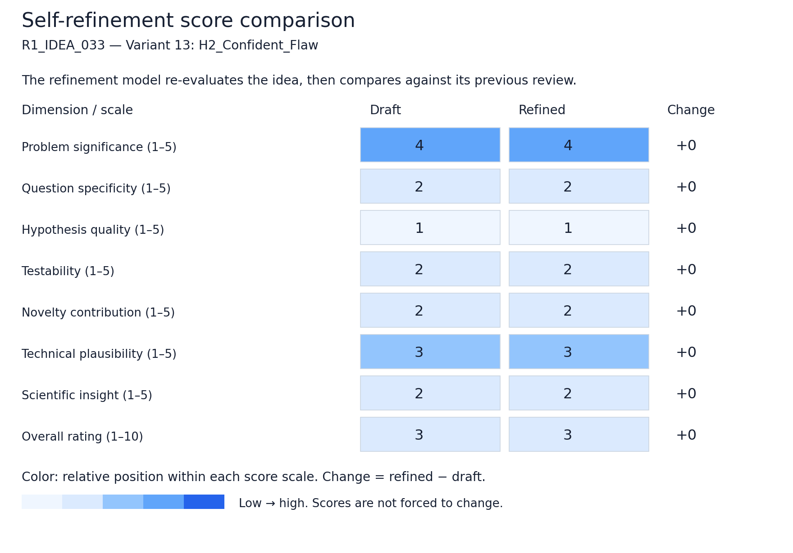

Changed score dimensions: none.

### Score justifications (draft / refined)

**Problem significance**

```json
{
  "draft": {
    "score": 4.0,
    "justification": "Risk-averse modeling is highly important for safety-critical applications, and CVaR is a principled measure for tail risk. The difficulty of estimating extreme quantiles is a recognized and meaningful challenge."
  },
  "refined": {
    "score": 4.0,
    "justification": "Risk-averse modeling is critically important for safety-sensitive applications, and CVaR is a principled, coherent measure for tail risk. The difficulty of estimating CVaR accurately for rare events is a recognized and meaningful bottleneck that, if solved, could have substantial practical impact."
  }
}
```

**Question specificity**

```json
{
  "draft": {
    "score": 2.0,
    "justification": "The idea identifies a problem (CVaR estimation for rare events) but does not define a concrete research question. It vaguely suggests that solving the problem will lead to improvements, without specifying what 'solving' means or what exactly will be investigated."
  },
  "refined": {
    "score": 2.0,
    "justification": "The idea identifies a problem area but does not define a concrete research question. It vaguely suggests that 'solving the highlighted limitation' will lead to improvements, without specifying what 'solving' means or what specific aspect will be investigated. There is no clear, focused inquiry."
  }
}
```

**Hypothesis quality**

```json
{
  "draft": {
    "score": 1.0,
    "justification": "The implicit hypothesis—that solving the estimation challenge will produce reliable improvements and serve as causal evidence of general superiority—is overly broad and logically problematic. It makes a strong causal claim while dismissing the need to control for confounders, which undermines its scientific rigor."
  },
  "refined": {
    "score": 1.0,
    "justification": "The implicit hypothesis—that solving the estimation challenge will produce reliable improvements and serve as causal evidence of general superiority—is overly broad and logically problematic. It makes a strong causal claim while explicitly dismissing the need to control for confounders, which undermines its scientific rigor. It is more an assertion than a testable prediction."
  }
}
```

**Testability**

```json
{
  "draft": {
    "score": 2.0,
    "justification": "Without a concrete method or measurable outcome, it is unclear how one would test the core claim. The idea does not propose an experiment, comparison, or evaluation protocol."
  },
  "refined": {
    "score": 2.0,
    "justification": "Without a concrete method, measurable outcome, or evaluation protocol, it is unclear how one would test the core claim. The idea does not propose an experiment, comparison, or analysis that could yield evidence for or against it. The claim about causal evidence is particularly untestable as stated."
  }
}
```

**Novelty contribution**

```json
{
  "draft": {
    "score": 2.0,
    "justification": "The observation that CVaR estimation is hard for rare events is not novel. The potential contribution depends entirely on what specific solution is proposed, which is not described."
  },
  "refined": {
    "score": 2.0,
    "justification": "The observation that CVaR estimation is challenging for rare events is not novel; it is a well-known issue in risk management and robust optimization. The potential contribution depends entirely on what specific solution is proposed, which is not described. As stated, the idea lacks novelty."
  }
}
```

**Technical plausibility**

```json
{
  "draft": {
    "score": 3.0,
    "justification": "The premise that better tail estimation could improve CVaR minimization is plausible, but the argument that this alone proves general superiority without controlling for other factors is not technically sound."
  },
  "refined": {
    "score": 3.0,
    "justification": "The premise that better tail estimation could improve CVaR minimization is technically plausible and aligned with known statistics. However, the argument that solving this alone proves 'general superiority' without controlling for other factors is not technically sound—it ignores evaluation rigor. The core technical direction is missing."
  }
}
```

**Scientific insight**

```json
{
  "draft": {
    "score": 2.0,
    "justification": "As stated, the idea promises a solution to a practical problem but does not suggest it will yield deeper scientific insight—e.g., into the statistics of extreme losses, optimization landscapes, or generalization under distribution shift. The claim about causal evidence is more of an assertion than an insight."
  },
  "refined": {
    "score": 2.0,
    "justification": "As stated, the idea is solution-oriented but does not suggest it will yield deeper scientific insight—e.g., into the statistics of extreme losses, the optimization landscape of risk measures, or generalization under distribution shift. The claim about causal evidence is an assertion, not an insight pathway. The focus is on a practical fix rather than fundamental understanding."
  }
}
```

**Overall rating**

```json
{
  "draft": {
    "score": 3.0,
    "justification": "The idea identifies a significant problem but lacks a clear research question, testable hypothesis, and methodological direction. The argument about causal evidence is scientifically questionable. As a research idea, it is weak because it is more of an observation with an overly strong conclusion than a plan for investigation."
  },
  "refined": {
    "score": 3.0,
    "justification": "The idea identifies a significant and meaningful problem but lacks the core components of a strong research idea: a clear research question, a testable hypothesis, and a methodological direction. The argument about causal evidence is scientifically questionable. It is more an observation with an overly strong conclusion than a plan for investigation. It is a weak research idea as presented."
  }
}
```

## R1_IDEA_033 — Variant 14: H3_Verbose_Enriched

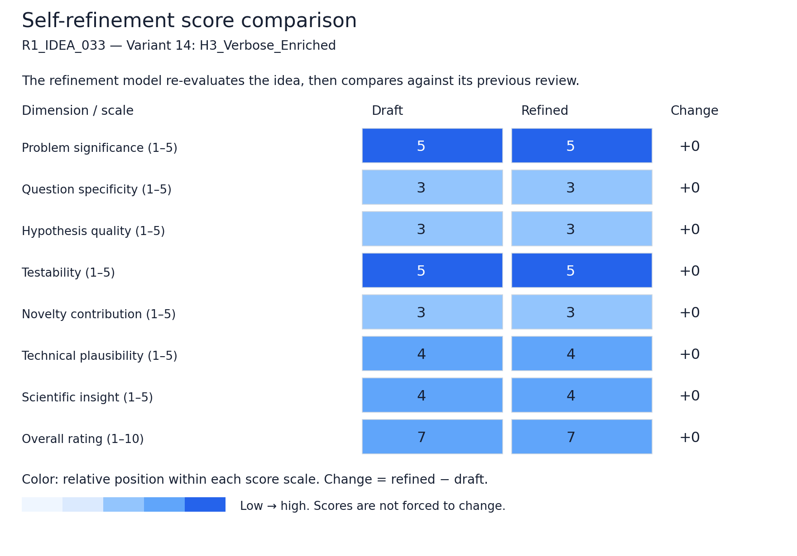

Changed score dimensions: none.

### Score justifications (draft / refined)

**Problem significance**

```json
{
  "draft": {
    "score": 5.0,
    "justification": "The problem is highly significant. Risk-averse learning is crucial for safety-sensitive applications (healthcare, finance, autonomy). CVaR is a fundamental and principled risk measure, and understanding the practical challenges in minimizing it, especially related to data distribution properties, is a core machine learning challenge with direct real-world impact."
  },
  "refined": {
    "score": 5.0,
    "justification": "Exceptional significance. Risk-averse learning is critical for real-world safety-sensitive applications (autonomous systems, healthcare, finance). CVaR is a foundational risk measure, and understanding the practical limitations of its minimization—especially related to data properties—addresses a core challenge with substantial societal impact."
  }
}
```

**Question specificity**

```json
{
  "draft": {
    "score": 3.0,
    "justification": "The research direction is clear (investigate challenges of CVaR minimization), and a specific factor (heavy-tailed data properties) is identified as a potential key variable. However, the exact question is somewhat implicit ('How do distributional properties affect the challenge of CVaR minimization?') and could be more sharply framed. The staged design plan adds specificity to the *how* of investigation, but the *what* (the precise relationship under study) is moderately specific."
  },
  "refined": {
    "score": 3.0,
    "justification": "Moderate specificity. The idea identifies a clear general direction (investigate CVaR minimization challenges) and a specific factor (heavy-tailed data properties). However, the exact research question is implicit rather than explicitly formulated, and the relationship under study lacks precise operationalization. The experimental design adds procedural specificity but not conceptual precision."
  }
}
```

**Hypothesis quality**

```json
{
  "draft": {
    "score": 3.0,
    "justification": "An implicit hypothesis exists: 'The difficulty of direct CVaR minimization depends on boundary conditions such as the underlying data distribution's heavy-tailed properties.' This identifies a plausible mechanism (distributional properties) and a relationship (dependency). It is testable but not strongly directional or precise. It lacks a predicted form of the dependency (e.g., makes it harder/easier, affects variance vs. bias). Quality is moderate."
  },
  "refined": {
    "score": 3.0,
    "justification": "Moderate quality. An implicit hypothesis exists linking CVaR minimization difficulty to data distribution tail properties. This identifies a plausible mechanism and is testable, but it lacks a directional prediction (e.g., whether heavy tails make minimization harder or easier, or how they affect specific aspects like estimation error or optimization convergence). It is not yet a sharp, falsifiable statement."
  }
}
```

**Testability**

```json
{
  "draft": {
    "score": 5.0,
    "justification": "The idea excels in testability. It explicitly proposes a comprehensive validation route (OOD testing) and a detailed staged experimental design with baselines, interventions, pre-specified criteria, comparisons across cases, ablations, and sensitivity analyses. This provides a very clear roadmap for obtaining empirical evidence to support or refute claims about when and why the approach works."
  },
  "refined": {
    "score": 5.0,
    "justification": "Exceptional testability. The idea provides a detailed, staged experimental design with baselines, interventions, pre-specified criteria, case comparisons, ablations, and sensitivity analyses. This offers a clear, rigorous roadmap for empirical investigation, making the central question highly testable even without specifying all implementation details."
  }
}
```

**Novelty contribution**

```json
{
  "draft": {
    "score": 3.0,
    "justification": "The novelty is moderate. The challenge of CVaR estimation/minimization is well-known. The potential contribution lies in a systematic empirical investigation into how data distribution properties (specifically tail heaviness) act as a boundary condition for these challenges. This could provide new nuanced understanding rather than a fundamentally new method. The detailed experimental design methodology itself could be a secondary contribution if executed rigorously."
  },
  "refined": {
    "score": 3.0,
    "justification": "Moderate novelty. The challenges of CVaR estimation are well-known. The contribution would lie in a systematic empirical study of how data distribution properties—specifically tail heaviness—modulate these challenges. This could provide nuanced understanding of boundary conditions rather than a fundamentally new method. The detailed experimental methodology itself could be a secondary contribution if executed rigorously."
  }
}
```

**Technical plausibility**

```json
{
  "draft": {
    "score": 4.0,
    "justification": "The reasoning is coherent and plausible. The link between heavy-tailed distributions and difficulty in estimating tail statistics (like CVaR) is well-founded in statistics. The proposed experimental components (ablations, sensitivity analyses) are standard and appropriate for the goal of understanding method behavior. The overall direction makes technical sense."
  },
  "refined": {
    "score": 4.0,
    "justification": "Strong plausibility. The connection between heavy-tailed distributions and difficulty in estimating tail statistics like CVaR is well-grounded in statistics. The proposed experimental components (ablations, sensitivity analyses) are appropriate and logically coherent for investigating method behavior. The overall direction is technically sound and reasonable."
  }
}
```

**Scientific insight**

```json
{
  "draft": {
    "score": 4.0,
    "justification": "The idea has strong potential for scientific insight. It explicitly aims to clarify 'which assumptions, data regimes, and domain constraints determine when and why it is useful.' This moves beyond a simple performance benchmark towards discovering general principles, limitations, and boundary conditions for risk-averse learning with CVaR. Understanding the interaction between data distribution properties and optimization/estimation challenges is a transferable insight."
  },
  "refined": {
    "score": 4.0,
    "justification": "Strong potential for scientific insight. The idea explicitly aims to uncover 'which assumptions, data regimes, and domain constraints determine when and why it is useful.' This focuses on discovering general principles, limitations, and boundary conditions for risk-averse learning with CVaR, which would yield transferable knowledge beyond a specific application."
  }
}
```

**Overall rating**

```json
{
  "draft": {
    "score": 7.0,
    "justification": "This is a strong research idea. It addresses a significant problem with a plausible, testable hypothesis and an exceptionally well-thought-out experimental plan. The main limitations are the somewhat broad hypothesis and the lack of definition of the specific intervention/method under study. However, the focus on understanding boundary conditions and mechanisms promises meaningful scientific insight. With refinement of the core hypothesis, this could become an excellent investigation."
  },
  "refined": {
    "score": 7.0,
    "justification": "This is a strong research idea. It tackles a highly significant problem with a plausible hypothesis and an exceptionally well-structured experimental plan that ensures rigorous testability. The main limitations are the somewhat broad hypothesis and undefined specific intervention. However, the focus on understanding boundary conditions and mechanisms promises meaningful scientific insight. With refinement of the core hypothesis and clearer definition of the method under study, this could become an excellent investigation."
  }
}
```

## R1_IDEA_033 — Variant 15: H4_Ultimate_Hype


Changed score dimensions: testability, novelty_contribution.

### Score justifications (draft / refined)

**Problem significance**

```json
{
  "draft": {
    "score": 5.0,
    "justification": "The problem is highly significant. Risk-averse modeling is crucial for real-world deployment of ML systems in safety-critical domains. CVaR is a well-established risk measure, and overcoming its estimation challenges would have substantial practical impact."
  },
  "refined": {
    "score": 5.0,
    "justification": "Exceptional significance. Risk-averse learning is a fundamental challenge for deploying ML in safety-critical real-world applications. CVaR is a cornerstone risk measure in finance and operations research, and overcoming its estimation challenges would have substantial practical and theoretical impact."
  }
}
```

**Question specificity**

```json
{
  "draft": {
    "score": 1.0,
    "justification": "Extremely low specificity. The idea only states that 'direct CVaR minimization remains challenging' without defining what aspect will be investigated. There is no concrete research question posed."
  },
  "refined": {
    "score": 1.0,
    "justification": "Very weak. No research question is posed. The text only states that a challenge exists ('direct CVaR minimization remains challenging') without specifying what will be investigated. It is a problem statement, not a research question."
  }
}
```

**Hypothesis quality**

```json
{
  "draft": {
    "score": 1.0,
    "justification": "No hypothesis is presented. The text describes a problem and makes grand claims about potential impact, but does not make a testable prediction about a mechanism, relationship, or solution property."
  },
  "refined": {
    "score": 1.0,
    "justification": "Very weak. There is no hypothesis—testable or otherwise. The text makes no concrete prediction about a mechanism, relationship, or solution property. It describes a desirable outcome ('solving this would be good') but not a falsifiable claim."
  }
}
```

**Testability**

```json
{
  "draft": {
    "score": 2.0,
    "justification": "The idea as stated is not directly testable because it lacks a specific claim. However, the general problem of improving CVaR minimization is testable—one could compare new methods against baselines on risk-sensitive benchmarks. The current formulation provides no hook for such a test."
  },
  "refined": {
    "score": 1.0,
    "justification": "Very weak. The idea as stated is not testable because it makes no specific claim to test. While the general problem area (improving CVaR minimization) is testable, the summary provides no hook—no proposed method, comparison, or measurable objective—that could be evaluated."
  }
}
```

**Novelty contribution**

```json
{
  "draft": {
    "score": 2.0,
    "justification": "The novelty is unclear. The challenge of CVaR estimation is known. The idea summary does not propose a novel angle, method, or insight. It merely states that solving it would be impactful, which is true but not a novel research contribution in itself."
  },
  "refined": {
    "score": 1.0,
    "justification": "Very weak. The idea summary notes a known challenge (CVaR estimation is hard) and claims solving it would be impactful. It proposes no novel angle, insight, or approach. The 'novelty' claimed is in the potential impact, not in the research direction itself, which is undefined."
  }
}
```

**Technical plausibility**

```json
{
  "draft": {
    "score": 3.0,
    "justification": "The general direction is plausible because CVaR minimization is a recognized challenge with active research. However, without any proposed mechanism, it's impossible to evaluate the technical soundness of a specific approach. The reasoning is logically coherent but trivial: 'a hard problem exists, solving it would be good.'"
  },
  "refined": {
    "score": 3.0,
    "justification": "Moderate. The general premise—that CVaR minimization is challenging and worth solving—is logically coherent and aligns with established literature. However, without any proposed mechanism or approach, the technical plausibility of a specific solution cannot be assessed. The reasoning is sound but trivial."
  }
}
```

**Scientific insight**

```json
{
  "draft": {
    "score": 2.0,
    "justification": "The potential for insight is currently low. The idea promises 'transformative' outcomes but does not indicate what new understanding might be gained (e.g., about optimization under distribution shift, tail behavior of deep networks, or robustness principles). As framed, it seems more like an engineering goal than a scientific inquiry."
  },
  "refined": {
    "score": 2.0,
    "justification": "Weak. The summary promises 'transformative' outcomes and 'scientific breakthroughs' but gives no indication of what new understanding might be generated. As framed, it seems focused on an engineering goal (a better estimator/algorithm) rather than an inquiry that would reveal general principles about optimization, generalization, or risk in machine learning."
  }
}
```

**Overall rating**

```json
{
  "draft": {
    "score": 3.0,
    "justification": "This is a weak research idea summary. It identifies a genuinely important problem but fails to articulate a specific research question, hypothesis, or technical direction. It reads like motivational background material for a grant proposal rather than a concrete research idea. The lack of specificity severely limits its scientific value as a standalone idea. The high problem significance is outweighed by the absence of a testable core."
  },
  "refined": {
    "score": 3.0,
    "justification": "This is a weak research idea summary. It successfully identifies a problem of exceptional significance but completely fails to articulate a research idea. There is no question, hypothesis, or methodological direction. It reads as the introductory motivation for a research project, not the project itself. Consequently, despite the high problem significance, it lacks the core components necessary for scientific evaluation."
  }
}
```

## R1_IDEA_034 — Source

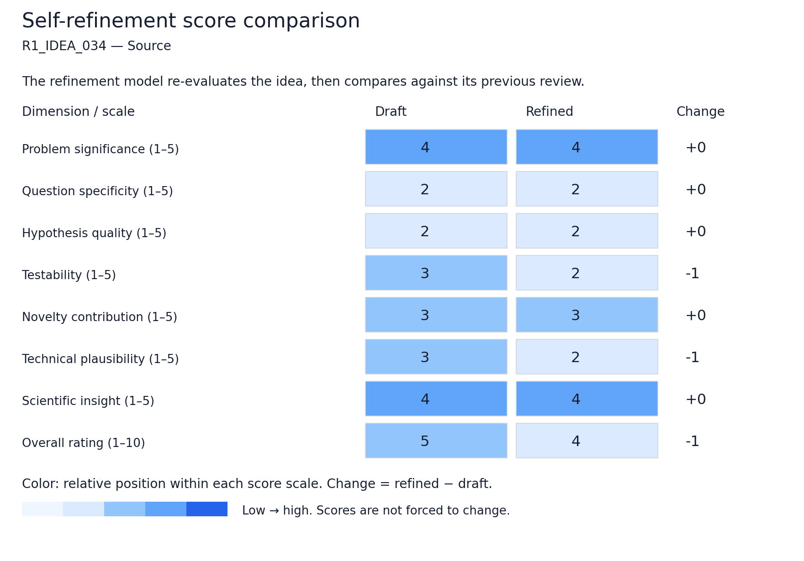

Changed score dimensions: testability, technical_plausibility, overall_rating.

### Score justifications (draft / refined)

**Problem significance**

```json
{
  "draft": {
    "score": 4.0,
    "justification": "The problem is significant - improving sample efficiency of RL for LLMs is important for practical applications. Current methods requiring thousands of rollouts are computationally expensive, and exploring alternative learning signals is a meaningful research direction."
  },
  "refined": {
    "score": 4.0,
    "justification": "The problem is highly significant. Improving the sample efficiency of RL for LLM adaptation is a major practical and research challenge. Reducing the need for thousands of rollouts would lower computational costs and enable faster iteration, making RL more accessible for adapting LLMs to new tasks."
  }
}
```

**Question specificity**

```json
{
  "draft": {
    "score": 2.0,
    "justification": "The research question is somewhat vague. While it contrasts 'interpretable language' with 'sparse scalar rewards', it doesn't specify what exactly is being tested. The incomplete description of GEPA further reduces specificity."
  },
  "refined": {
    "score": 2.0,
    "justification": "The research question is vague. It contrasts two types of feedback but does not specify what is being tested, under what conditions, or how success is defined. The incomplete description of GEPA further reduces specificity, as the proposed method is unknown."
  }
}
```

**Hypothesis quality**

```json
{
  "draft": {
    "score": 2.0,
    "justification": "There's an implicit hypothesis that language feedback is superior to scalar rewards, but it's not well-articulated. No concrete prediction is made about what improvement to expect (e.g., magnitude of sample efficiency gain). The hypothesis lacks specificity about mechanisms or conditions."
  },
  "refined": {
    "score": 2.0,
    "justification": "There is an implicit hypothesis that 'interpretable language provides a much richer learning medium' than scalar rewards. However, this is a broad assertion, not a concrete, testable prediction. No specific mechanism, expected magnitude of improvement, or boundary conditions are proposed."
  }
}
```

**Testability**

```json
{
  "draft": {
    "score": 3.0,
    "justification": "The core claim is testable in principle - one could compare learning with language feedback vs. scalar rewards. However, without details about GEPA or the experimental setup, it's unclear exactly how the test would be conducted. The idea suggests an experiment exists but doesn't outline it."
  },
  "refined": {
    "score": 2.0,
    "justification": "The core comparative claim is testable in principle, but the idea provides no framework for testing it. There is no suggested experiment, baseline, task, or metric. The mention of GEPA is too incomplete to outline a methodology. As presented, the idea is not actionable for investigation."
  }
}
```

**Novelty contribution**

```json
{
  "draft": {
    "score": 3.0,
    "justification": "The general idea of using richer feedback for RL with LLMs has been explored (e.g., reward modeling, human feedback). The specific combination of 'Genetic-Pareto' sounds novel, but without details, it's hard to assess. The contribution could range from incremental to significant depending on implementation."
  },
  "refined": {
    "score": 3.0,
    "justification": "The general concept of using richer, non-scalar feedback for RL with LLMs is not new (e.g., reward shaping, learning from demonstrations, human feedback). The novelty hinges entirely on the unspecified GEPA method. Without details, the potential contribution is uncertain and could range from incremental to significant."
  }
}
```

**Technical plausibility**

```json
{
  "draft": {
    "score": 3.0,
    "justification": "The basic premise is plausible - language models process language naturally, so language feedback might be more efficient. However, the proposed GEPA method is undefined, making it impossible to assess its technical soundness. The mention of 'Genetic-Pareto' suggests a multi-objective optimization approach, which could be reasonable but needs elaboration."
  },
  "refined": {
    "score": 2.0,
    "justification": "The basic intuition that LLMs, as language processors, might learn more naturally from language is plausible. However, the technical core of the idea—GEPA—is undefined. The term 'Genetic-Pareto' suggests an evolutionary multi-objective optimization approach, which does not obviously connect to generating interpretable language feedback. This disconnect and lack of detail make the technical plausibility low."
  }
}
```

**Scientific insight**

```json
{
  "draft": {
    "score": 4.0,
    "justification": "If successful, this research could provide insight into how LLMs learn from different types of feedback, potentially revealing principles about what makes feedback effective for language models. It could advance our understanding of learning efficiency in LLMs beyond just improving a specific algorithm."
  },
  "refined": {
    "score": 4.0,
    "justification": "If successfully investigated, this research could yield valuable scientific insight. It could reveal how the format and interpretability of feedback affect learning efficiency in LLMs, potentially uncovering general principles about what makes a learning signal effective for foundation models. This goes beyond merely proposing a new algorithm."
  }
}
```

**Overall rating**

```json
{
  "draft": {
    "score": 5.0,
    "justification": "This is a moderate/borderline research idea. It identifies a meaningful problem (sample efficiency in RL for LLMs) and suggests an interesting direction (language feedback). However, the idea is incomplete, lacks a specific hypothesis, and doesn't define the proposed method. With more development, it could become a strong research direction, but in its current truncated form, it's too vague to rate higher."
  },
  "refined": {
    "score": 4.0,
    "justification": "This is a weak research idea in its current form. It identifies a significant problem and an interesting high-level direction (language feedback). However, the idea is critically incomplete, lacks a testable hypothesis, and proposes an undefined method. The core is too vague to guide meaningful research. It requires substantial development to become a viable research direction."
  }
}
```

## R1_IDEA_034 — Variant 1: A1_Identity

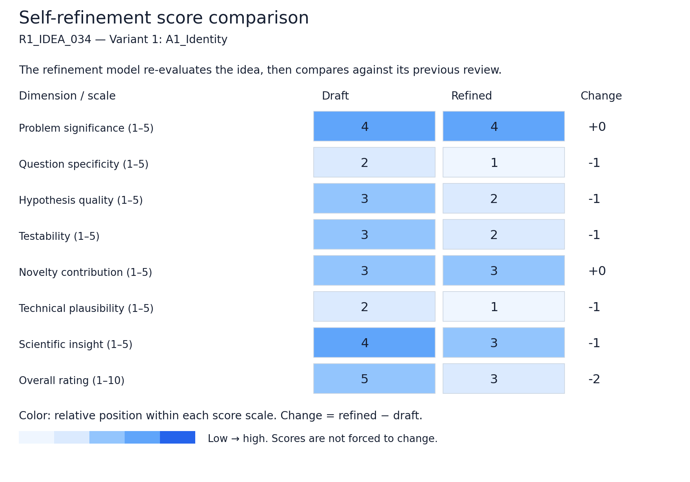

Changed score dimensions: question_specificity, hypothesis_quality, testability, technical_plausibility, scientific_insight, overall_rating.

### Score justifications (draft / refined)

**Problem significance**

```json
{
  "draft": {
    "score": 4.0,
    "justification": "The problem is significant: improving sample efficiency of RL for LLMs is important for practical applications. Current methods requiring thousands of rollouts are computationally expensive, and exploring alternative learning signals is valuable."
  },
  "refined": {
    "score": 4.0,
    "justification": "The problem is highly significant. Improving the sample efficiency of RL for LLM adaptation is a major practical challenge, as current methods like GRPO require extensive rollouts, making training costly and slow. Exploring alternative learning paradigms is a valuable research direction."
  }
}
```

**Question specificity**

```json
{
  "draft": {
    "score": 2.0,
    "justification": "The research question is somewhat vague. While it contrasts 'interpretable language' with 'sparse scalar rewards', it doesn't specify what aspect of language or what type of feedback would be tested. The idea cuts off before fully describing the proposed approach."
  },
  "refined": {
    "score": 1.0,
    "justification": "The research question is extremely vague. It contrasts 'interpretable language' with 'sparse scalar rewards' but does not specify what is being investigated—whether it's a comparison of feedback types, a new algorithm, or a mechanistic study. The idea cuts off before any concrete question is posed."
  }
}
```

**Hypothesis quality**

```json
{
  "draft": {
    "score": 3.0,
    "justification": "There's an implicit hypothesis: language feedback enables more efficient learning than scalar rewards. This is testable but not precisely formulated. No specific prediction about magnitude of improvement or conditions under which it holds is provided."
  },
  "refined": {
    "score": 2.0,
    "justification": "There is an implicit hypothesis that 'interpretable language provides a much richer learning medium,' but this is stated as an argument, not a testable prediction. No specific, measurable outcome is predicted (e.g., convergence speed, final performance). The hypothesis lacks precision and falsifiability."
  }
}
```

**Testability**

```json
{
  "draft": {
    "score": 3.0,
    "justification": "The core claim is testable in principle (compare learning efficiency with different feedback types), but no experimental design is suggested. The incomplete description of GEPA makes it unclear how exactly the comparison would be implemented."
  },
  "refined": {
    "score": 2.0,
    "justification": "The core claim could be testable in principle (e.g., compare learning curves with different feedback types), but no experimental design is suggested. The proposed method GEPA is undefined, so it's unclear how any test would be implemented. The idea provides no framework for evaluation."
  }
}
```

**Novelty contribution**

```json
{
  "draft": {
    "score": 3.0,
    "justification": "The general idea of using richer feedback for RL with LLMs has precedent (e.g., RLHF uses preference rankings, some work uses natural language instructions). The specific combination of 'Genetic-Pareto' sounds novel, but without details it's hard to assess true novelty."
  },
  "refined": {
    "score": 3.0,
    "justification": "The general concept of using richer feedback for RL with LLMs is not new (e.g., RLHF uses preference comparisons, and some work uses natural language instructions). The proposed combination 'Genetic-Pareto' might be novel, but without details, it's impossible to assess its originality or potential contribution."
  }
}
```

**Technical plausibility**

```json
{
  "draft": {
    "score": 2.0,
    "justification": "The idea is incomplete, so technical plausibility cannot be properly assessed. The mention of 'Genetic-Pareto' suggests combining genetic algorithms with multi-objective optimization, which could be plausible for RL, but no details are provided to evaluate coherence."
  },
  "refined": {
    "score": 1.0,
    "justification": "Technical plausibility cannot be assessed because the idea is incomplete. The mention of 'Genetic-Pareto' is cryptic—it could imply a hybrid of genetic algorithms and multi-objective optimization, but no reasoning or mechanism is provided. The central claim about language feedback lacks a proposed implementation."
  }
}
```

**Scientific insight**

```json
{
  "draft": {
    "score": 4.0,
    "justification": "If successfully investigated, this could provide insight into what types of learning signals are most effective for LLMs, potentially revealing principles about how language models leverage different forms of supervision. Understanding why language feedback might be more efficient than scalar rewards could be scientifically valuable."
  },
  "refined": {
    "score": 3.0,
    "justification": "If fully developed and tested, this could yield insight into what types of supervisory signals are most effective for LLM adaptation. Understanding whether and why language feedback outperforms scalar rewards could inform more general principles for efficient LLM training. However, the current description is too vague to guarantee such insight."
  }
}
```

**Overall rating**

```json
{
  "draft": {
    "score": 5.0,
    "justification": "This is a moderate/borderline idea. It identifies a meaningful problem (sample efficiency of RL for LLMs) and proposes an interesting direction (using language feedback instead of scalar rewards). However, the idea is incomplete, lacks specificity about the proposed method and hypothesis, and doesn't provide enough detail to assess its true potential. With more development, it could become a strong research idea."
  },
  "refined": {
    "score": 3.0,
    "justification": "This is a weak research idea. While it points to a significant problem (RL sample efficiency for LLMs), the idea is incomplete and lacks specificity. There is no clear research question, testable hypothesis, or describable method. The proposal cuts off mid-sentence, making it impossible to evaluate its true potential. In its current form, it is more of a motivation than a research direction."
  }
}
```

## R1_IDEA_034 — Variant 2: A2_Paraphrase_Only


Changed score dimensions: none.

### Score justifications (draft / refined)

**Problem significance**

```json
{
  "draft": {
    "score": 4.0,
    "justification": "The problem of sample inefficiency in RL-based LLM adaptation is significant and well-recognized. Reducing the thousands of rollouts needed for adaptation would have practical importance for making LLM fine-tuning more accessible and efficient."
  },
  "refined": {
    "score": 4.0,
    "justification": "The problem is highly significant. Improving the sample efficiency of LLM adaptation is a major practical challenge with implications for cost, accessibility, and environmental impact. The core question of what constitutes an effective learning signal for LLMs is also scientifically important."
  }
}
```

**Question specificity**

```json
{
  "draft": {
    "score": 2.0,
    "justification": "The idea identifies a general direction (language as richer feedback) but doesn't define a specific research question. It's unclear what aspect of language-based learning would be investigated or what relationship would be tested."
  },
  "refined": {
    "score": 2.0,
    "justification": "The research direction is identified (language vs. scalar rewards), but the specific question is vague. It does not specify what is being compared (e.g., learning curves, asymptotic performance, data diversity), under what conditions, or what constitutes 'richer.' The incomplete sentence further reduces specificity."
  }
}
```

**Hypothesis quality**

```json
{
  "draft": {
    "score": 2.0,
    "justification": "There's an implicit hypothesis that 'language offers a richer learning medium than policy gradients from sparse scalar rewards,' but it's not developed into a concrete, testable prediction. No mechanism is proposed for why or how language would be richer."
  },
  "refined": {
    "score": 2.0,
    "justification": "There is an implicit hypothesis that 'language offers a richer learning medium,' but it is not developed. It lacks a concrete, testable prediction about a measurable outcome (e.g., faster convergence, higher performance ceiling). It is more of a motivating belief than a research hypothesis."
  }
}
```

**Testability**

```json
{
  "draft": {
    "score": 2.0,
    "justification": "Without details about GEPA or how language feedback would be implemented, it's unclear how the claim could be tested. The idea mentions investigation but provides no methodological direction for obtaining evidence."
  },
  "refined": {
    "score": 2.0,
    "justification": "The idea is not currently testable. It proposes an investigation but provides no framework for it. There is no suggested experiment, comparison, or evaluation method. Without knowing what GEPA is or how language feedback would be operationalized, designing a test is impossible."
  }
}
```

**Novelty contribution**

```json
{
  "draft": {
    "score": 3.0,
    "justification": "The general concept of using language feedback for LLM adaptation has been explored (e.g., constitutional AI, critique-based methods). However, the specific contrast with GRPO and the proposed GEPA approach could be novel if developed further."
  },
  "refined": {
    "score": 3.0,
    "justification": "The general concept of using language feedback (e.g., via constitutional AI, RLAIF, or critique-based refinement) is not novel. However, the specific focus on contrasting it with a method like GRPO for sample efficiency, and the proposed GEPA approach, could offer a novel angle if developed with unique technical mechanisms."
  }
}
```

**Technical plausibility**

```json
{
  "draft": {
    "score": 3.0,
    "justification": "The reasoning that language might be richer for LLMs is logically coherent given LLMs' language understanding capabilities. However, without details about implementation, it's impossible to assess technical feasibility."
  },
  "refined": {
    "score": 3.0,
    "justification": "The core reasoning is plausible: LLMs are built to understand language, so language-based guidance might be more naturally assimilated than a scalar reward. However, the technical plausibility of the proposed GEPA method cannot be assessed as it is undefined. The connection to 'Genetic-Pareto' is unclear."
  }
}
```

**Scientific insight**

```json
{
  "draft": {
    "score": 3.0,
    "justification": "If successfully investigated, this could provide insight into how different feedback modalities affect learning efficiency in LLMs. However, the potential insight is limited by the vague formulation - it's unclear what specific scientific question would be answered."
  },
  "refined": {
    "score": 3.0,
    "justification": "If properly investigated, this could yield insight into how the format of learning signals (dense language vs. sparse scalar) interacts with model architecture to affect learning dynamics and efficiency. However, the current vague formulation limits the potential for deep scientific insight; it risks being a simple performance comparison without mechanistic understanding."
  }
}
```

**Overall rating**

```json
{
  "draft": {
    "score": 4.0,
    "justification": "This is a weak research idea in its current form. While it identifies an important problem and makes an interesting conceptual claim, it lacks a specific research question, testable hypothesis, and methodological direction. The idea is incomplete (cut off mid-sentence) and too vague to evaluate properly. It needs substantial development to become a meaningful research proposal."
  },
  "refined": {
    "score": 4.0,
    "justification": "This is a weak research idea in its presented, incomplete form. It identifies a significant problem and an interesting conceptual starting point, but it fails to define a specific research question, a testable hypothesis, or any methodological approach. The idea is more of a motivation than a research plan. It requires substantial development to become a viable proposal."
  }
}
```

## R1_IDEA_034 — Variant 3: A3_Plain_Core


Changed score dimensions: none.

### Score justifications (draft / refined)

**Problem significance**

```json
{
  "draft": {
    "score": 4.0,
    "justification": "The problem of inefficient RL adaptation for LLMs is significant and well-recognized. Reducing the number of required rollouts would have practical importance for making RL-based alignment more accessible."
  },
  "refined": {
    "score": 4.0,
    "justification": "The problem is significant: RL adaptation of LLMs is sample-inefficient and costly. Improving sample efficiency would have substantial practical impact for alignment and fine-tuning. The claim about language as a richer medium also touches on a fundamental question about learning signals for LLMs."
  }
}
```

**Question specificity**

```json
{
  "draft": {
    "score": 2.0,
    "justification": "The core question is somewhat vague: 'language provides a richer learning medium' is a broad claim. The idea cuts off before specifying what exactly would be investigated about GEPA."
  },
  "refined": {
    "score": 2.0,
    "justification": "The core question is vague: 'language provides a richer learning medium' is a broad, conceptual claim. The idea cuts off before specifying what exactly GEPA is or what aspect of it would be investigated. No concrete dependent or independent variables are defined."
  }
}
```

**Hypothesis quality**

```json
{
  "draft": {
    "score": 2.0,
    "justification": "There's an implicit hypothesis that language feedback leads to more efficient learning than scalar rewards, but it's not formulated as a concrete, testable prediction. No mechanism is proposed for why this would be true."
  },
  "refined": {
    "score": 2.0,
    "justification": "There is an implicit hypothesis that language feedback leads to more efficient learning than scalar rewards, but it is not formulated as a concrete, testable prediction. No mechanism is proposed for why this would be true, and no specific outcome measure or condition is stated."
  }
}
```

**Testability**

```json
{
  "draft": {
    "score": 2.0,
    "justification": "Without knowing what GEPA is, it's unclear how the claim could be tested. The idea mentions 'to test this' but provides no experimental design or evaluation approach."
  },
  "refined": {
    "score": 2.0,
    "justification": "Without knowing what GEPA is, it is impossible to assess how the claim could be tested. The idea mentions 'to test this' but provides no experimental design, evaluation approach, or measurable comparison. The testability hinges entirely on undefined methodological details."
  }
}
```

**Novelty contribution**

```json
{
  "draft": {
    "score": 3.0,
    "justification": "The general concept of using richer feedback for RL is not new (e.g., reward shaping, auxiliary tasks). The specific combination of genetic algorithms and Pareto optimization with language feedback could be novel, but the incomplete description makes it hard to assess."
  },
  "refined": {
    "score": 3.0,
    "justification": "The general concept of using richer feedback for RL is not new (e.g., reward shaping, auxiliary tasks, human feedback). The specific combination suggested by the name 'Genetic-Pareto' with language feedback could be novel, but the incomplete description makes it impossible to assess whether it would be a meaningful contribution beyond existing work."
  }
}
```

**Technical plausibility**

```json
{
  "draft": {
    "score": 3.0,
    "justification": "The basic premise that language could provide richer learning signals is plausible. However, without knowing how GEPA works, it's impossible to evaluate the technical coherence of the proposed approach."
  },
  "refined": {
    "score": 3.0,
    "justification": "The basic premise that language could provide richer learning signals than scalar rewards is plausible. However, without any details on GEPA, the technical coherence of the proposed approach cannot be evaluated. The idea is not technically incoherent, but it is too underspecified to judge its plausibility."
  }
}
```

**Scientific insight**

```json
{
  "draft": {
    "score": 3.0,
    "justification": "If successful, this could provide insight into what types of feedback are most effective for LLM adaptation and whether language models can effectively learn from natural language guidance. However, the potential insight is limited by the vague formulation."
  },
  "refined": {
    "score": 3.0,
    "justification": "If successfully investigated, this could provide insight into what types of feedback are most effective for LLM adaptation and whether natural language guidance can accelerate learning. However, the potential insight is limited by the vague formulation; it currently suggests a simple comparison (language vs. scalar feedback) without a clear mechanism to uncover deeper principles."
  }
}
```

**Overall rating**

```json
{
  "draft": {
    "score": 4.0,
    "justification": "The idea identifies an important problem and suggests an interesting direction, but it's severely incomplete. The core proposal (GEPA) is undefined, making it impossible to evaluate the research idea properly. What exists shows promise but needs substantial development to become a coherent research direction."
  },
  "refined": {
    "score": 4.0,
    "justification": "The idea identifies an important problem and suggests a potentially interesting direction, but it is severely incomplete. The core proposal (GEPA) is undefined, making it impossible to evaluate the research idea properly. What exists shows conceptual promise but lacks the specificity, hypothesis, and methodological clarity needed for a strong research direction. It requires substantial development to become coherent."
  }
}
```

## R1_IDEA_034 — Variant 4: B1_Verbose_Elaborate

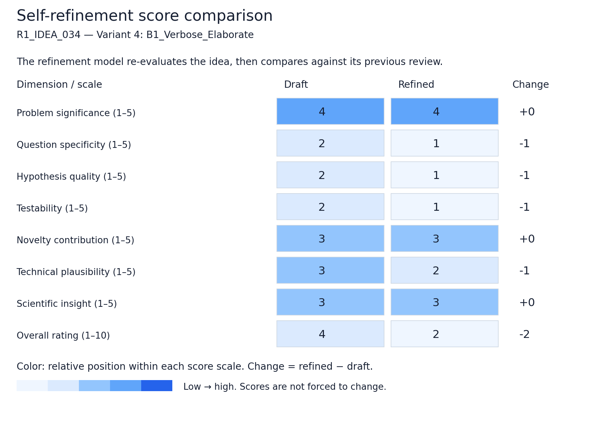

Changed score dimensions: question_specificity, hypothesis_quality, testability, technical_plausibility, overall_rating.

### Score justifications (draft / refined)

**Problem significance**

```json
{
  "draft": {
    "score": 4.0,
    "justification": "The problem is significant: RL methods for LLM adaptation are computationally expensive, and exploring more efficient alternatives is important for both research and practical applications. The inefficiency of requiring thousands of rollouts is a genuine bottleneck."
  },
  "refined": {
    "score": 4.0,
    "justification": "The problem is significant. Improving the sample efficiency of RL for LLM adaptation is a major practical and research challenge with implications for cost, accessibility, and environmental impact. The core intuition—that language might contain more useful learning signal than a scalar—touches on a fundamental question about learning representations."
  }
}
```

**Question specificity**

```json
{
  "draft": {
    "score": 2.0,
    "justification": "The research question is only partially specified. While there's a comparative claim (language vs. scalar rewards), it's not clear what exactly is being compared, under what conditions, or with what metrics. The idea mentions testing a 'proposition' but doesn't operationalize it into a specific research question."
  },
  "refined": {
    "score": 1.0,
    "justification": "Very weak. The idea states a broad proposition ('language is a richer learning medium') but does not define a concrete research question. There is no specification of what is being compared, under what conditions, or with what success criteria. The idea is also incomplete, ending mid-sentence."
  }
}
```

**Hypothesis quality**

```json
{
  "draft": {
    "score": 2.0,
    "justification": "The hypothesis that 'language provides a much richer learning medium' is stated but not well-defined. It's unclear what 'richer' means operationally, and there's no concrete prediction about what specific advantages language would provide (e.g., 10x sample efficiency, better generalization, etc.)."
  },
  "refined": {
    "score": 1.0,
    "justification": "Very weak. The statement is more of an intuition or assertion than a testable hypothesis. It lacks a concrete prediction about a measurable relationship or outcome. There is no 'if X, then Y' structure or specification of expected quantitative or qualitative differences."
  }
}
```

**Testability**

```json
{
  "draft": {
    "score": 2.0,
    "justification": "The idea mentions testing the proposition but provides no details on how this would be done. Without knowing what GEPA is or what experiments would be run, it's difficult to assess testability. The comparison between language and scalar rewards could be testable if properly operationalized."
  },
  "refined": {
    "score": 1.0,
    "justification": "Very weak. In its current form, the proposition is not testable. There is no description of an experiment, evaluation, or analysis that could generate evidence for or against the claim. The mention of GEPA is a placeholder without any operational details."
  }
}
```

**Novelty contribution**

```json
{
  "draft": {
    "score": 3.0,
    "justification": "The core idea of using language as a richer learning signal has some novelty, as most RL approaches use scalar rewards. However, the idea is presented at too high a level to assess its true novelty. The proposed method name (GEPA) suggests a genetic-Pareto approach, which could be novel if well-integrated with language feedback."
  },
  "refined": {
    "score": 3.0,
    "justification": "Moderate. The high-level concept of using rich, structured feedback (like language) instead of scalar rewards for RL with LLMs has inherent novelty. The specific combination suggested by 'Genetic-Pareto' could be novel. However, without details, it's impossible to assess whether this is a genuinely new research direction or a repackaging of existing ideas like LLM-as-a-judge or evolutionary algorithms with language-based fitness."
  }
}
```

**Technical plausibility**

```json
{
  "draft": {
    "score": 3.0,
    "justification": "The basic premise that language could provide richer feedback than scalar rewards is plausible. Language contains more information than a single number. However, without details about GEPA, it's impossible to assess the technical plausibility of the proposed approach. The idea seems logically coherent at a high level."
  },
  "refined": {
    "score": 2.0,
    "justification": "Weak. The basic premise that language contains more information than a scalar is logically sound. However, the technical plausibility of the proposed method (GEPA) cannot be assessed because it is undescribed. The idea is also incomplete, breaking off before explaining the core proposal."
  }
}
```

**Scientific insight**

```json
{
  "draft": {
    "score": 3.0,
    "justification": "If successfully investigated, this could provide insight into how different types of feedback affect LLM learning. It could reveal whether language feedback leads to more sample-efficient learning, better generalization, or different learning dynamics compared to scalar rewards. However, the potential insight is limited by the vagueness of the current proposal."
  },
  "refined": {
    "score": 3.0,
    "justification": "Moderate. If successfully developed and tested, this line of research could yield significant insight. It could reveal fundamental principles about what types of feedback are most effective for steering LLM behavior, the trade-offs between information density and noise in learning signals, and the limitations of scalar reward maximization. However, the potential insight is entirely contingent on defining and executing a rigorous comparative study, which is not yet outlined."
  }
}
```

**Overall rating**

```json
{
  "draft": {
    "score": 4.0,
    "justification": "This is a weak research idea in its current form. While it identifies a meaningful problem (inefficiency of RL for LLMs) and has an interesting core intuition (language as richer feedback), the idea lacks specificity, a clear hypothesis, and any details about how it would be tested. The research question is not well-defined, and the proposed method (GEPA) is mentioned but not described. With substantial refinement, this could become a stronger idea."
  },
  "refined": {
    "score": 2.0,
    "justification": "This is a very weak research idea in its presented form. While it starts from a significant problem and an interesting intuition, it fails to articulate a research question, hypothesis, or testable proposition. The idea is incomplete and provides no methodological details. It is currently more of a motivating thought than a research plan. Substantial work is needed to define what is being investigated and how before it can be considered a viable research direction."
  }
}
```

## R1_IDEA_034 — Variant 5: B2_Grand_Narrative

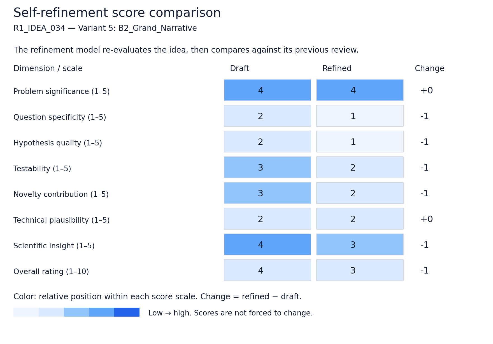

Changed score dimensions: question_specificity, hypothesis_quality, testability, novelty_contribution, scientific_insight, overall_rating.

### Score justifications (draft / refined)

**Problem significance**

```json
{
  "draft": {
    "score": 4.0,
    "justification": "Sample efficiency in RL for LLM adaptation is a significant problem with practical implications for training costs and environmental impact. The idea correctly identifies this as an important challenge."
  },
  "refined": {
    "score": 4.0,
    "justification": "Sample inefficiency in RL for LLM adaptation is a significant and well-recognized problem. Improving it would reduce computational costs and energy consumption, making LLM fine-tuning more accessible. The problem has both practical and environmental importance."
  }
}
```

**Question specificity**

```json
{
  "draft": {
    "score": 2.0,
    "justification": "The research question is poorly defined. The idea states that 'language provides a richer learning medium' but doesn't specify what aspect of learning this affects (convergence speed, final performance, generalization, etc.) or how this would be investigated."
  },
  "refined": {
    "score": 1.0,
    "justification": "The research question is extremely poorly defined. The idea merely states that 'language provides a much richer learning medium' without specifying what is being compared, what outcome is expected, or what aspect of learning is under investigation. There is no concrete question about relationships, mechanisms, or measurable effects."
  }
}
```

**Hypothesis quality**

```json
{
  "draft": {
    "score": 2.0,
    "justification": "The hypothesis is implicit and vague. It suggests language is 'richer' than scalar rewards but doesn't make a concrete, falsifiable prediction about measurable outcomes. A stronger hypothesis would predict specific quantitative differences in learning efficiency."
  },
  "refined": {
    "score": 1.0,
    "justification": "There is no clear hypothesis, only a vague assertion. A hypothesis should make a concrete, falsifiable prediction. The statement 'interpretable nature of language often provides a much richer learning medium' is an observation, not a testable claim. It does not predict under what conditions, to what degree, or compared to what baseline language would be richer."
  }
}
```

**Testability**

```json
{
  "draft": {
    "score": 3.0,
    "justification": "The idea mentions introducing GEPA to test the claim, suggesting some testability. However, without details about GEPA or the experimental setup, it's unclear how exactly the hypothesis would be tested. The core claim about 'richer learning medium' is currently not operationalized for testing."
  },
  "refined": {
    "score": 2.0,
    "justification": "The idea mentions introducing GEPA to 'test this,' suggesting a vague intention to test. However, without any description of GEPA, the experimental setup, the comparison baseline, or the measurable outcomes, it is impossible to see how the core claim could be tested. The claim about 'richer learning medium' is not operationalized into measurable variables."
  }
}
```

**Novelty contribution**

```json
{
  "draft": {
    "score": 3.0,
    "justification": "The general concept of using language feedback instead of scalar rewards has been explored in prior work (e.g., learning from human feedback, natural language instructions). The novelty would depend on the specifics of GEPA and the particular insight about sample efficiency, but these are not provided."
  },
  "refined": {
    "score": 2.0,
    "justification": "The general notion that language feedback can be more informative than scalar rewards is not new (e.g., learning from human feedback, instruction tuning, reward modeling). The potential novelty hinges entirely on the unspecified GEPA method and a specific focus on sample efficiency. Without details, the contribution appears incremental at best."
  }
}
```

**Technical plausibility**

```json
{
  "draft": {
    "score": 2.0,
    "justification": "Without any details about GEPA, it's impossible to assess technical plausibility. The general claim that language could provide richer signals is plausible, but the implementation approach is completely unspecified."
  },
  "refined": {
    "score": 2.0,
    "justification": "The general premise that language could provide denser learning signals is plausible. However, the technical approach (GEPA) is completely unspecified, making it impossible to evaluate its coherence or feasibility. The idea is cut off, so even the basic reasoning is incomplete."
  }
}
```

**Scientific insight**

```json
{
  "draft": {
    "score": 4.0,
    "justification": "If successfully investigated, this could provide valuable insight into how LLMs learn from different types of feedback and what makes language a particularly effective learning signal. This could inform more efficient adaptation methods and reveal fundamental properties of LLM learning."
  },
  "refined": {
    "score": 3.0,
    "justification": "If successfully developed and tested, this line of research could yield insight into what types of feedback signals are most effective for sample-efficient LLM adaptation. It could reveal principles about how LLMs leverage structured vs. scalar information. However, the current formulation is too vague to guarantee such insight."
  }
}
```

**Overall rating**

```json
{
  "draft": {
    "score": 4.0,
    "justification": "The idea identifies an important problem and suggests an interesting conceptual direction, but it lacks specificity in research question, hypothesis, and methodology. The proposed GEPA method is mentioned but not described, making the idea too vague to be considered strong. It has potential for scientific insight but needs much more concrete development."
  },
  "refined": {
    "score": 3.0,
    "justification": "The idea identifies an important problem but fails to define a concrete research question, hypothesis, or methodology. The proposed GEPA method is mentioned but not described, and the core claim is vague and untestable in its current form. It is a weak research idea because it lacks specificity and a clear path to generating scientific knowledge. It reads more as a motivation statement than a research plan."
  }
}
```

## R1_IDEA_034 — Variant 6: B3_Over_Confident

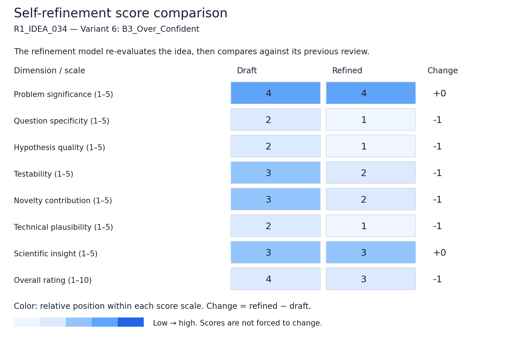

Changed score dimensions: question_specificity, hypothesis_quality, testability, novelty_contribution, technical_plausibility, overall_rating.

### Score justifications (draft / refined)

**Problem significance**

```json
{
  "draft": {
    "score": 4.0,
    "justification": "The problem is meaningful. Improving the efficiency and effectiveness of RL for LLMs is a significant challenge. The core intuition—that language models should learn from language—aligns with their nature and could address sample inefficiency."
  },
  "refined": {
    "score": 4.0,
    "justification": "The problem is meaningful. Improving RL efficiency for LLMs is a significant challenge with practical implications. The intuition that language models should learn from language aligns with their architecture and could address sample inefficiency issues in current RL approaches."
  }
}
```

**Question specificity**

```json
{
  "draft": {
    "score": 2.0,
    "justification": "The research question is implied but not clearly defined. The idea states a belief and proposes a test, but the specific question (e.g., 'Does language feedback reduce sample complexity?') is not articulated. The summary cuts off, but even the provided part lacks specificity."
  },
  "refined": {
    "score": 1.0,
    "justification": "The research question is extremely vague. The idea states a belief ('language provides a richer learning medium') but doesn't define what is being investigated. There's no clear question about mechanisms, efficiency gains, or specific advantages. The summary cuts off before completing the thought."
  }
}
```

**Hypothesis quality**

```json
{
  "draft": {
    "score": 2.0,
    "justification": "The hypothesis is implicit: 'interpretable language provides a much richer learning medium... than sparse, scalar rewards.' This is a broad claim, not a concrete, falsifiable prediction. It lacks operationalization (what constitutes 'richer'?) and a proposed mechanism."
  },
  "refined": {
    "score": 1.0,
    "justification": "The hypothesis is implicit and poorly formed. 'Interpretable language provides a much richer learning medium' is a broad claim without concrete, testable predictions. It lacks operationalization - what constitutes 'richer'? No measurable outcomes or comparative predictions are specified."
  }
}
```

**Testability**

```json
{
  "draft": {
    "score": 3.0,
    "justification": "The idea is testable in principle—one could compare a method using language feedback to one using scalar rewards. However, without details on GEPA or the experimental design, it's unclear how a clean comparison would be set up. The mention of 'to test this' suggests a testable direction."
  },
  "refined": {
    "score": 2.0,
    "justification": "The idea is testable in principle (one could compare language feedback to scalar rewards), but without any details about GEPA or the experimental design, it's unclear how a meaningful test could be constructed. The phrase 'to test this' suggests intent, but the actual testability is low given the vagueness."
  }
}
```

**Novelty contribution**

```json
{
  "draft": {
    "score": 3.0,
    "justification": "The general notion of using richer feedback for RL is not new (e.g., reward shaping, learning from demonstrations, preference learning). Using language specifically for LLM RL has been explored (e.g., RLHF with text-based preferences, learning from critiques). The novelty hinges on the specific GEPA approach, which is undescribed, so potential contribution is uncertain."
  },
  "refined": {
    "score": 2.0,
    "justification": "The general concept of using richer feedback for RL is not new. Language-specific feedback for LLMs has been explored in RLHF, learning from critiques, and preference learning. Without details about GEPA, the novelty is unclear. The contribution depends entirely on an undescribed method."
  }
}
```

**Technical plausibility**

```json
{
  "draft": {
    "score": 2.0,
    "justification": "The core intuition is plausible, but the technical proposal is incomplete. The summary introduces an acronym (GEPA) without explanation. How genetic algorithms and Pareto optimization relate to language feedback is unclear. Without these details, technical plausibility cannot be properly assessed."
  },
  "refined": {
    "score": 1.0,
    "justification": "The core intuition is plausible but the technical proposal is essentially nonexistent. GEPA is mentioned without any explanation of how it works, how it relates to genetic algorithms or Pareto optimization, or how it would utilize language feedback. Without these details, technical plausibility cannot be assessed."
  }
}
```

**Scientific insight**

```json
{
  "draft": {
    "score": 3.0,
    "justification": "If successful, the research could provide insight into how the form of feedback (language vs. scalar) affects learning dynamics and sample efficiency in LLMs. It could reveal conditions under which language feedback is beneficial. However, the potential insight is limited by the vagueness of the hypothesis; a more precise question could yield deeper mechanistic understanding."
  },
  "refined": {
    "score": 3.0,
    "justification": "If properly investigated, this could provide insight into how feedback modality affects learning in LLMs. It could reveal whether language feedback offers advantages in sample efficiency, generalization, or learning dynamics. However, the potential insight is limited by the current vagueness - a more precise formulation could yield deeper understanding of feedback mechanisms."
  }
}
```

**Overall rating**

```json
{
  "draft": {
    "score": 4.0,
    "justification": "The idea identifies a potentially important direction but is underdeveloped. The core intuition is interesting, but the research question, hypothesis, and proposed method are too vague. It currently reads more as a motivation than a concrete research plan. With significant refinement (specific hypothesis, method details, experimental design), it could become a strong idea."
  },
  "refined": {
    "score": 3.0,
    "justification": "This is a weak research idea in its current form. While it identifies a potentially meaningful problem (RL inefficiency for LLMs), it lacks a clear research question, has a vague hypothesis, and provides no details about the proposed method. It reads more as an intuition or motivation than a concrete research direction. Significant refinement is needed to develop it into a testable research idea."
  }
}
```

## R1_IDEA_034 — Variant 7: B4_Novelty

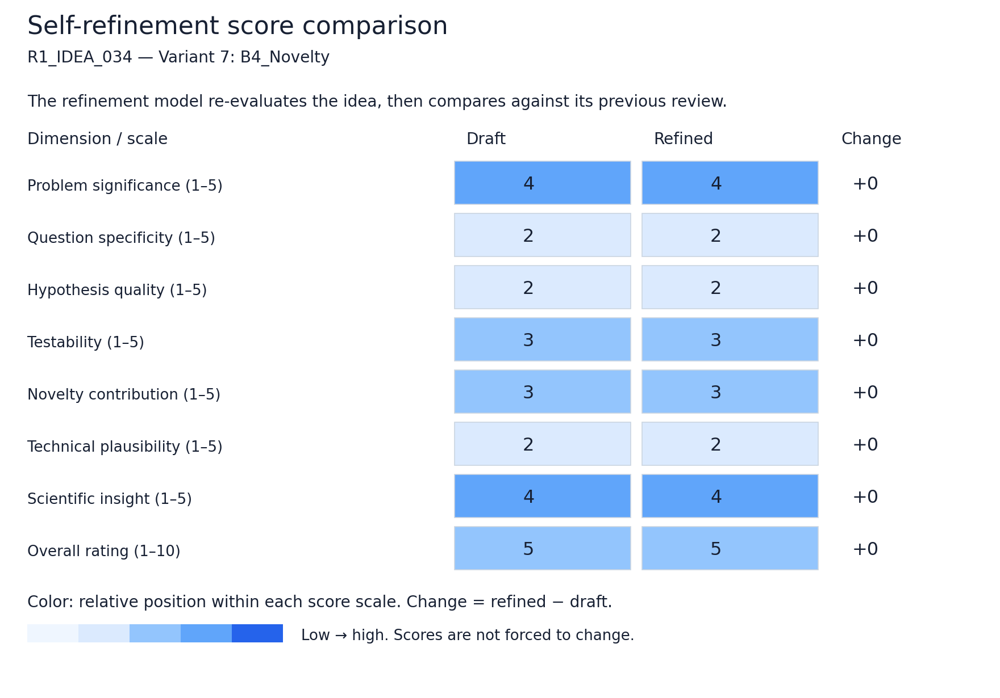

Changed score dimensions: none.

### Score justifications (draft / refined)

**Problem significance**

```json
{
  "draft": {
    "score": 4.0,
    "justification": "Improving the sample efficiency of LLM adaptation is a meaningful challenge, given the computational cost of RL fine-tuning. The idea of leveraging language as a learning signal aligns with broader interests in more natural and efficient supervision."
  },
  "refined": {
    "score": 4.0,
    "justification": "Improving the sample efficiency of LLM adaptation is a meaningful and timely challenge, given the substantial computational costs of RL fine-tuning. The idea of leveraging language as a learning signal aligns with broader interests in more natural and efficient supervision for language models."
  }
}
```

**Question specificity**

```json
{
  "draft": {
    "score": 2.0,
    "justification": "The idea frames a general direction ('interpretable language as a richer medium') but does not define a concrete research question. It mentions testing with GEPA, but without details, the specific investigation remains vague."
  },
  "refined": {
    "score": 2.0,
    "justification": "The idea frames a general direction ('interpretable language as a richer medium') but does not define a concrete research question. It mentions testing with GEPA, but without any details about what GEPA is or what specific aspect of language feedback it tests, the investigation remains vague."
  }
}
```

**Hypothesis quality**

```json
{
  "draft": {
    "score": 2.0,
    "justification": "There is an implicit hypothesis that language feedback is richer than scalar rewards for LLM adaptation, but it is not formulated as a testable prediction. No mechanism or conditions are specified, making it more of a broad assertion."
  },
  "refined": {
    "score": 2.0,
    "justification": "There is an implicit hypothesis that language feedback is richer than scalar rewards for LLM adaptation, but it is not formulated as a testable prediction. No mechanism, boundary conditions, or measurable outcomes are specified, making it more of a broad assertion than a falsifiable hypothesis."
  }
}
```

**Testability**

```json
{
  "draft": {
    "score": 3.0,
    "justification": "The idea is testable in principle—one could compare language-based feedback to RL rewards on adaptation tasks. However, without specifying how feedback is provided or measured, the test design is unclear. The mention of GEPA suggests a method, but its absence limits assessability."
  },
  "refined": {
    "score": 3.0,
    "justification": "The idea is testable in principle—one could design experiments comparing language-based feedback to RL rewards on adaptation tasks. However, without specifying how feedback is provided, measured, or integrated via GEPA, the test design is unclear. The mention of a method (GEPA) suggests a path to testing, but its absence limits assessability."
  }
}
```

**Novelty contribution**

```json
{
  "draft": {
    "score": 3.0,
    "justification": "The perspective of using language as a learning signal for adaptation is not entirely new (e.g., instruction tuning, supervised fine-tuning with corrections), but framing it as an alternative to RL policy gradients for efficiency could offer a fresh angle. The potential contribution depends heavily on how it is developed."
  },
  "refined": {
    "score": 3.0,
    "justification": "The perspective of using language as a learning signal for adaptation is not entirely new (e.g., instruction tuning, supervised fine-tuning with corrections exist). Framing it as an alternative to RL policy gradients for efficiency could offer a fresh angle, but the potential contribution depends heavily on how it is developed and what specific insight it provides beyond existing paradigms."
  }
}
```

**Technical plausibility**

```json
{
  "draft": {
    "score": 2.0,
    "justification": "The core intuition—that language provides richer information than a scalar—is plausible, but the idea is too underspecified to evaluate technical soundness. GEPA is mentioned without any description, so its feasibility cannot be assessed."
  },
  "refined": {
    "score": 2.0,
    "justification": "The core intuition—that language provides richer information than a scalar reward—is plausible. However, the idea is too underspecified to evaluate technical soundness. GEPA is mentioned without any description of its mechanism, so its feasibility and alignment with the core hypothesis cannot be assessed."
  }
}
```

**Scientific insight**

```json
{
  "draft": {
    "score": 4.0,
    "justification": "If successfully investigated, this could yield insight into how different types of supervision (language vs. rewards) affect learning efficiency and generalization in LLMs. It touches on fundamental questions about what makes a good learning signal for language models."
  },
  "refined": {
    "score": 4.0,
    "justification": "If successfully investigated, this could yield significant insight into how different types of supervision (language vs. rewards) affect learning efficiency, generalization, and internal representations in LLMs. It touches on fundamental questions about what constitutes an effective learning signal for language models and could reveal principles about multi-modal feedback."
  }
}
```

**Overall rating**

```json
{
  "draft": {
    "score": 5.0,
    "justification": "The idea identifies a relevant problem and an interesting perspective, but it is underdeveloped as a research proposal. It lacks a clear hypothesis, specific question, and methodological details. While it has potential for scientific insight, it currently reads more as a motivation than a testable research direction."
  },
  "refined": {
    "score": 5.0,
    "justification": "The idea identifies a relevant problem and an interesting perspective, but it is underdeveloped as a research proposal. It lacks a clear hypothesis, specific question, and methodological details. While it has strong potential for scientific insight, it currently reads more as a motivation or high-level direction than a testable research idea. The scores reflect this: good problem significance and insight potential, but weak specificity, hypothesis, and technical plausibility."
  }
}
```

## R1_IDEA_034 — Variant 8: B5_Application_Impact

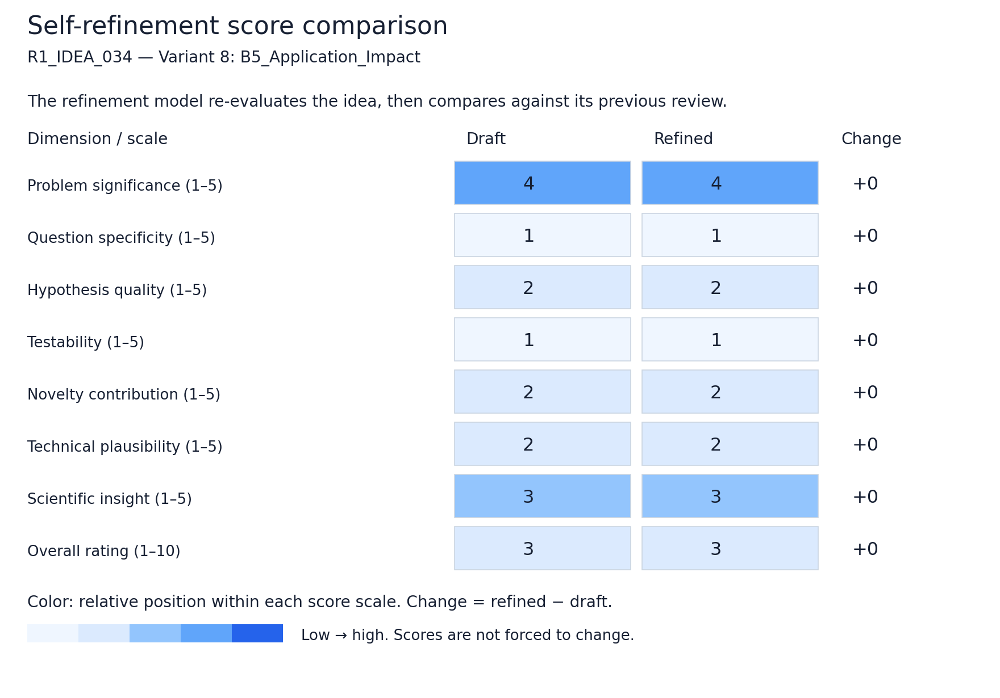

Changed score dimensions: none.

### Score justifications (draft / refined)

**Problem significance**

```json
{
  "draft": {
    "score": 4.0,
    "justification": "The problem of inefficient RL adaptation for LLMs is meaningful and practically relevant. Reducing the number of rollouts needed for adaptation would have significant practical implications for deploying LLMs in interactive settings."
  },
  "refined": {
    "score": 4.0,
    "justification": "The problem of inefficient RL adaptation for LLMs is meaningful and practically relevant. Reducing the thousands of rollouts currently needed would have significant implications for deploying LLMs in interactive settings, making this an important research direction."
  }
}
```

**Question specificity**

```json
{
  "draft": {
    "score": 1.0,
    "justification": "Extremely low specificity. The idea states a general belief ('language provides a richer learning medium') and mentions a method name, but does not define what is being investigated. There is no concrete research question."
  },
  "refined": {
    "score": 1.0,
    "justification": "Extremely low specificity. The idea states a general belief ('language provides a richer learning medium') and mentions a method name, but does not define what is being investigated. There is no concrete research question articulated."
  }
}
```

**Hypothesis quality**

```json
{
  "draft": {
    "score": 2.0,
    "justification": "There is an implicit hypothesis that 'interpretable language provides a richer learning medium than sparse scalar rewards,' but it is vague and not operationalized. No concrete prediction is made about outcomes under specific conditions."
  },
  "refined": {
    "score": 2.0,
    "justification": "There is an implicit hypothesis that 'interpretable language provides a richer learning medium than sparse scalar rewards,' but it is vague and not operationalized. No concrete prediction is made about outcomes under specific conditions, and the hypothesis lacks testable components."
  }
}
```

**Testability**

```json
{
  "draft": {
    "score": 1.0,
    "justification": "The idea as presented is not testable. It mentions a method 'GEPA' but provides no description of how it works or how it would be used to test the claim. No experimental design, comparisons, or evaluation metrics are suggested."
  },
  "refined": {
    "score": 1.0,
    "justification": "The idea as presented is not testable. It mentions a method 'GEPA' but provides no description of how it works or how it would be used to test the claim. No experimental design, comparisons, or evaluation metrics are suggested, making it impossible to investigate the central claim."
  }
}
```

**Novelty contribution**

```json
{
  "draft": {
    "score": 2.0,
    "justification": "The general notion that language feedback could be more informative than scalar rewards is not entirely new (related to reward shaping, learning from demonstrations, etc.). The potential novelty hinges entirely on the unspecified GEPA method, which cannot be evaluated."
  },
  "refined": {
    "score": 2.0,
    "justification": "The general notion that language feedback could be more informative than scalar rewards is not entirely new (related to reward shaping, learning from demonstrations, instruction following, etc.). The potential novelty hinges entirely on the unspecified GEPA method, which cannot be evaluated for its contribution."
  }
}
```

**Technical plausibility**

```json
{
  "draft": {
    "score": 2.0,
    "justification": "The core reasoning (language is interpretable, therefore it might be a richer learning signal) is logically coherent at a high level. However, the complete lack of detail about GEPA or how language signals would be integrated into an optimization framework makes it impossible to assess technical plausibility of the proposed direction."
  },
  "refined": {
    "score": 2.0,
    "justification": "The core reasoning (language is interpretable, therefore it might be a richer learning signal) is logically coherent at a high level. However, the complete lack of detail about GEPA or how language signals would be integrated into an optimization framework makes it impossible to assess the technical plausibility of the proposed direction."
  }
}
```

**Scientific insight**

```json
{
  "draft": {
    "score": 3.0,
    "justification": "If properly investigated, comparing learning from language vs. scalar rewards could yield insights into what kinds of feedback are most effective for LLM adaptation, potentially revealing principles about credit assignment or information efficiency in language-based learning. However, the idea as stated does not articulate what specific insights are sought."
  },
  "refined": {
    "score": 3.0,
    "justification": "If properly investigated, comparing learning from language vs. scalar rewards could yield insights into what kinds of feedback are most effective for LLM adaptation, potentially revealing principles about credit assignment or information efficiency in language-based learning. However, the idea as stated does not articulate what specific insights are sought or how they would be extracted."
  }
}
```

**Overall rating**

```json
{
  "draft": {
    "score": 3.0,
    "justification": "This is a weak research idea. It identifies a potentially significant problem (inefficient RL for LLMs) but fails to define a concrete research question, hypothesis, or testable approach. The mention of 'GEPA' is essentially a placeholder with no content. The idea lacks the specificity and structure needed for meaningful scientific investigation. It reads more as a vague motivation than a research plan."
  },
  "refined": {
    "score": 3.0,
    "justification": "This is a weak research idea. It identifies a potentially significant problem (inefficient RL for LLMs) but fails to define a concrete research question, hypothesis, or testable approach. The mention of 'GEPA' is essentially a placeholder with no content. The idea lacks the specificity and structure needed for meaningful scientific investigation, reading more as a vague motivation than a research plan."
  }
}
```

## R1_IDEA_034 — Variant 9: C1_Hollow_Shell

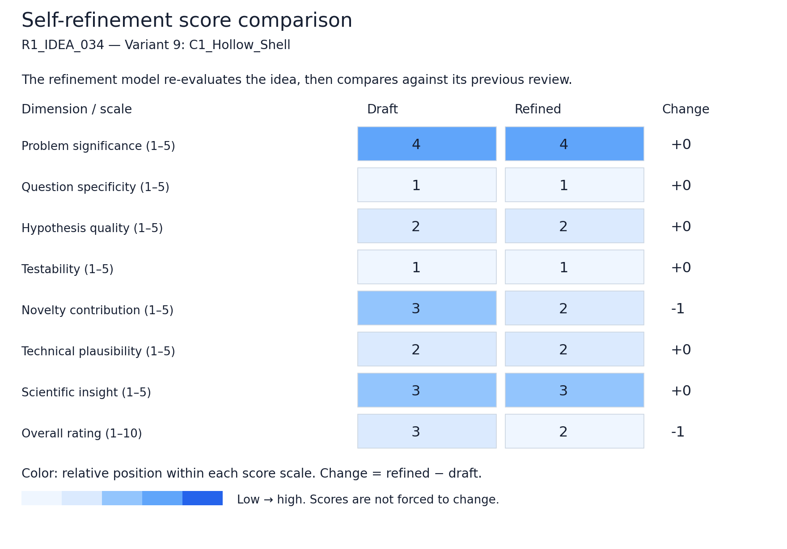

Changed score dimensions: novelty_contribution, overall_rating.

### Score justifications (draft / refined)

**Problem significance**

```json
{
  "draft": {
    "score": 4.0,
    "justification": "The problem of data-inefficient adaptation of LLMs is meaningful and important. Current RL-based approaches often require extensive human feedback or reward modeling, making them costly and limiting. Finding more efficient adaptation methods would be valuable to both researchers and practitioners."
  },
  "refined": {
    "score": 4.0,
    "justification": "The problem is highly significant. RL-based adaptation of LLMs (e.g., RLHF) is notoriously data-inefficient and costly. Developing more efficient adaptation methods is a major challenge in the field, with clear practical and research importance."
  }
}
```

**Question specificity**

```json
{
  "draft": {
    "score": 1.0,
    "justification": "The idea lacks a clearly defined research question. It only states a general intention to 'examine' whether language provides a richer learning medium, without specifying what aspect of learning, what comparison, or what constitutes 'richer.' The description of GEPA is incomplete, cutting off mid-sentence."
  },
  "refined": {
    "score": 1.0,
    "justification": "The idea lacks a defined research question. It only states an intention to 'examine' whether language is a richer learning medium, without specifying what is being compared, under what conditions, or how 'richer' would be measured. The description of GEPA is incomplete, cutting off mid-sentence."
  }
}
```

**Hypothesis quality**

```json
{
  "draft": {
    "score": 2.0,
    "justification": "There is an implicit hypothesis that 'language provides a richer medium for learning compared to gradients from simple rewards,' but this is stated as a general claim rather than a testable prediction. No specific mechanism or relationship is proposed, and no concrete outcomes are predicted that could be falsified."
  },
  "refined": {
    "score": 2.0,
    "justification": "There is an implicit hypothesis that 'language provides a richer medium for learning compared to gradients from simple rewards,' but it is stated as a broad, untested claim. No concrete, falsifiable prediction is made about expected outcomes, mechanisms, or measurable advantages. The hypothesis lacks the specificity needed for scientific investigation."
  }
}
```

**Testability**

```json
{
  "draft": {
    "score": 1.0,
    "justification": "The idea as presented is not testable because no research approach is defined. GEPA is mentioned but not described. Without knowing what GEPA is or how the comparison would be made, it's impossible to design an experiment or evaluation to test the claim."
  },
  "refined": {
    "score": 1.0,
    "justification": "The idea as presented is not testable. No research approach is defined—GEPA is mentioned but not described. Without knowing what GEPA is or how the comparison would be operationalized, no experiment, evaluation, or analysis can be designed to test the claim."
  }
}
```

**Novelty contribution**

```json
{
  "draft": {
    "score": 3.0,
    "justification": "The general direction of exploring language as a learning signal for LLM adaptation has some novelty, as most current approaches use RL or supervised fine-tuning. However, without knowing what GEPA entails, it's impossible to assess whether it represents a genuinely new method or just a variation on existing ideas like instruction tuning, demonstration learning, or natural language feedback."
  },
  "refined": {
    "score": 2.0,
    "justification": "The general notion of using language as a learning signal is not new (e.g., instruction tuning, natural language feedback). Without knowing what GEPA entails, it is impossible to determine if it offers a novel methodological contribution or is merely a restatement of existing ideas. The incomplete description precludes assessment of genuine novelty."
  }
}
```

**Technical plausibility**

```json
{
  "draft": {
    "score": 2.0,
    "justification": "The basic premise that language could provide rich learning signals is plausible, but without any technical details about GEPA, it's impossible to evaluate whether the proposed direction makes technical sense. The idea cuts off before describing the approach, so important assumptions and implementation considerations cannot be assessed."
  },
  "refined": {
    "score": 2.0,
    "justification": "The basic premise that language could be a rich learning signal is plausible, but the idea provides no technical details. Since GEPA is undefined, there is no basis to evaluate whether the proposed direction is coherent, implementable, or rests on reasonable assumptions. The idea cuts off before any technical substance is presented."
  }
}
```

**Scientific insight**

```json
{
  "draft": {
    "score": 3.0,
    "justification": "If properly developed, this research could potentially provide insight into how different types of learning signals (language vs. gradients) affect LLM adaptation, which could reveal general principles about efficient learning from different feedback modalities. However, without a specific research question or methodology, the potential insight remains vague."
  },
  "refined": {
    "score": 3.0,
    "justification": "If fully developed, the research could yield insights into how different feedback modalities (language vs. scalar rewards) affect learning efficiency and generalization in LLMs. However, without a specific research question or methodology, the potential insight remains vague and speculative."
  }
}
```

**Overall rating**

```json
{
  "draft": {
    "score": 3.0,
    "justification": "This is a weak research idea in its current form. While it identifies a potentially important problem (data-inefficient LLM adaptation) and suggests an interesting conceptual direction (language as a richer learning medium), it lacks the specificity needed to evaluate its scientific merit. The idea is incomplete (cutting off mid-sentence), provides no concrete research question or hypothesis, and offers no methodological direction. Without these elements, it's more of a vague motivation than a research idea."
  },
  "refined": {
    "score": 2.0,
    "justification": "This is a very weak research idea in its current form. While it touches on a significant problem, the idea is incomplete and lacks the essential components of a research direction: a specific question, a testable hypothesis, a defined methodology, and a clear contribution. It reads as a truncated motivation rather than a actionable research idea."
  }
}
```

## R1_IDEA_034 — Variant 10: C2_Logic_Flawed

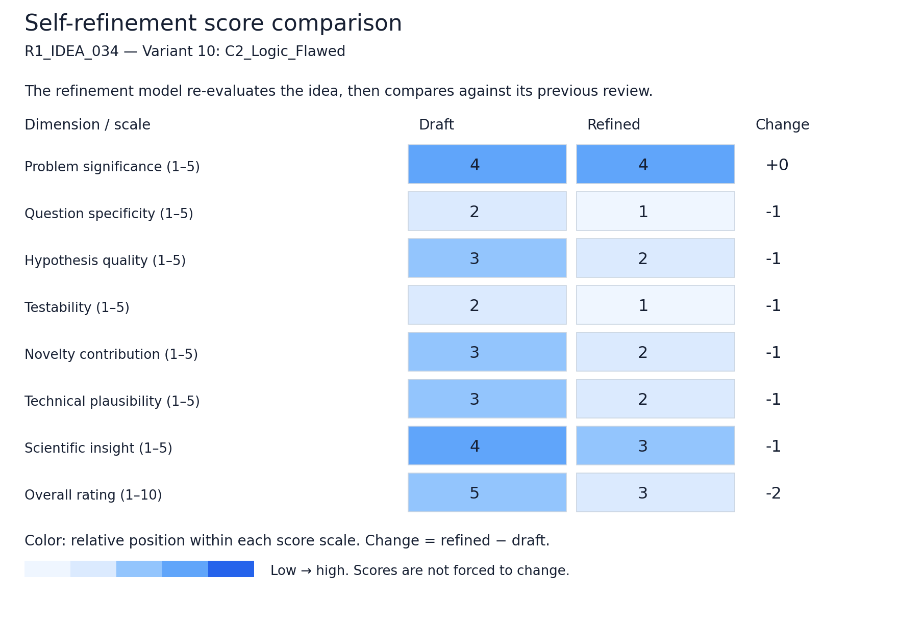

Changed score dimensions: question_specificity, hypothesis_quality, testability, novelty_contribution, technical_plausibility, scientific_insight, overall_rating.

### Score justifications (draft / refined)

**Problem significance**

```json
{
  "draft": {
    "score": 4.0,
    "justification": "The problem is meaningful: RL fine-tuning of LLMs is sample-inefficient and often relies on sparse rewards that may not align well with language understanding. Improving sample efficiency and leveraging the natural interpretability of language is a relevant challenge."
  },
  "refined": {
    "score": 4.0,
    "justification": "The problem is meaningful: RL fine-tuning of LLMs is often sample-inefficient and relies on sparse rewards that may not align well with language models' capabilities. Improving sample efficiency by leveraging language's interpretability is a relevant challenge in LLM adaptation."
  }
}
```

**Question specificity**

```json
{
  "draft": {
    "score": 2.0,
    "justification": "The research question is stated broadly ('broader effectiveness across related settings where interpretability is valued'). It lacks a concrete, testable formulation—what exactly is being compared, under what conditions?"
  },
  "refined": {
    "score": 1.0,
    "justification": "The research question is extremely vague. It mentions 'broader effectiveness across related settings where interpretability is valued' without defining any concrete settings, tasks, or what 'effectiveness' means. No specific comparison or condition is stated."
  }
}
```

**Hypothesis quality**

```json
{
  "draft": {
    "score": 3.0,
    "justification": "There is an implicit hypothesis: 'interpretable language feedback is a richer learning medium than sparse scalar rewards for LLM adaptation.' This makes a comparative prediction but is underspecified—what counts as 'richer' or 'more effective'?"
  },
  "refined": {
    "score": 2.0,
    "justification": "There is an implicit comparative hypothesis: 'interpretable language feedback is a richer learning medium than sparse scalar rewards for LLM adaptation.' However, it is underspecified—what constitutes 'richer' or 'more effective' is not defined, and the hypothesis lacks concrete, testable predictions."
  }
}
```

**Testability**

```json
{
  "draft": {
    "score": 2.0,
    "justification": "The idea mentions testing via GEPA but provides no details on how the hypothesis would be evaluated. Without a clear experimental setup, comparison baseline, or success metric, testability is low."
  },
  "refined": {
    "score": 1.0,
    "justification": "The idea is not testable in its current form. It proposes testing via GEPA but provides no details on experimental design, baselines, tasks, or evaluation metrics. There is no clear path to obtaining evidence for or against the claim."
  }
}
```

**Novelty contribution**

```json
{
  "draft": {
    "score": 3.0,
    "justification": "The core idea—using language feedback instead of scalar rewards—has parallels in RLHF and learning from human preferences. The novelty would depend on the specifics of GEPA and the experimental focus, which are not provided."
  },
  "refined": {
    "score": 2.0,
    "justification": "The core notion of using language feedback instead of scalar rewards has clear parallels in existing work like RLHF, learning from human preferences, and instruction tuning. Without details on GEPA or a specific experimental angle, the potential novelty is low."
  }
}
```

**Technical plausibility**

```json
{
  "draft": {
    "score": 3.0,
    "justification": "The reasoning is logically coherent: language models process language, so language feedback might be more natural than scalar rewards. However, the proposed method (GEPA) is only named, so its technical plausibility cannot be assessed."
  },
  "refined": {
    "score": 2.0,
    "justification": "The reasoning is logically coherent at a high level (language models process language, so language feedback might be more natural), but the proposed method GEPA is only named without any description. Therefore, its technical plausibility cannot be assessed and remains speculative."
  }
}
```

**Scientific insight**

```json
{
  "draft": {
    "score": 4.0,
    "justification": "If successfully investigated, this could yield insight into how LLMs learn from different feedback types, the role of interpretability in RL for language, and potentially more sample-efficient adaptation methods."
  },
  "refined": {
    "score": 3.0,
    "justification": "If successfully investigated, this could yield insight into how LLMs learn from different feedback types and whether language feedback offers advantages in sample efficiency or alignment. However, the potential insight is limited by the vagueness of the proposed investigation."
  }
}
```

**Overall rating**

```json
{
  "draft": {
    "score": 5.0,
    "justification": "The idea identifies a meaningful problem and proposes an interesting hypothesis, but it lacks specificity in the research question, experimental design, and method details. It is a moderate/borderline idea that could become strong with more concrete formulation."
  },
  "refined": {
    "score": 3.0,
    "justification": "This is a weak research idea. While it identifies a meaningful problem, the research question is extremely vague, the hypothesis is underspecified, and the proposed method is merely named without description. It lacks testability, specificity, and concrete direction, offering limited scientific contribution in its current form."
  }
}
```

## R1_IDEA_034 — Variant 11: C3_Substance_Enriched

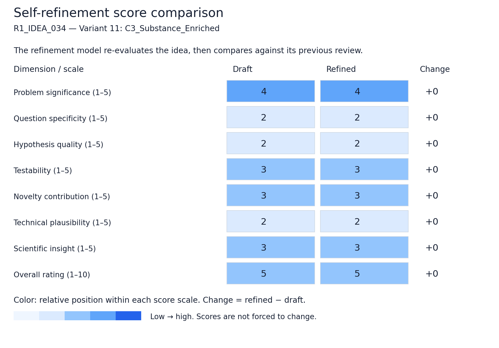

Changed score dimensions: none.

### Score justifications (draft / refined)

**Problem significance**

```json
{
  "draft": {
    "score": 4.0,
    "justification": "Improving sample efficiency in RL-based LLM fine-tuning is a significant problem. Current methods require many rollouts, which is computationally expensive and limits scalability. The idea correctly identifies sparse scalar rewards as a bottleneck."
  },
  "refined": {
    "score": 4.0,
    "justification": "Improving sample efficiency in RL-based LLM fine-tuning is a significant problem with real-world implications for computational cost and scalability. The idea correctly identifies sparse scalar rewards as a key bottleneck."
  }
}
```

**Question specificity**

```json
{
  "draft": {
    "score": 2.0,
    "justification": "The core question—whether interpretable feedback improves sample efficiency—is stated, but it's vague. The proposed method (GEPA) is undefined, and the experimental plan is incomplete (cuts off)."
  },
  "refined": {
    "score": 2.0,
    "justification": "The core question—whether interpretable feedback improves sample efficiency—is stated but extremely vague. The proposed method (GEPA) is undefined, and the experimental plan is incomplete (cuts off mid-sentence). No specific form of interpretable feedback or comparison framework is detailed."
  }
}
```

**Hypothesis quality**

```json
{
  "draft": {
    "score": 2.0,
    "justification": "The hypothesis is implicit and generic: 'interpretable feedback could allow for more efficient credit assignment.' It lacks a concrete, testable prediction about the magnitude of improvement, conditions under which it holds, or a causal mechanism."
  },
  "refined": {
    "score": 2.0,
    "justification": "The hypothesis is implicit and generic: 'interpretable feedback could allow for more efficient credit assignment.' It lacks a concrete, testable prediction about the magnitude of improvement, conditions under which it holds, or a causal mechanism. It reads more like a broad motivation than a falsifiable hypothesis."
  }
}
```

**Testability**

```json
{
  "draft": {
    "score": 3.0,
    "justification": "The idea suggests measuring sample efficiency across tasks, which is testable in principle. However, without details on GEPA or the form of interpretable feedback, it's unclear how the comparison would be set up. The test is conceptually straightforward but underspecified."
  },
  "refined": {
    "score": 3.0,
    "justification": "The idea suggests measuring sample efficiency across tasks, which is testable in principle. However, without details on GEPA, the form of interpretable feedback, or the experimental setup, it's unclear how a meaningful comparison would be implemented. The test is conceptually straightforward but critically underspecified."
  }
}
```

**Novelty contribution**

```json
{
  "draft": {
    "score": 3.0,
    "justification": "Using interpretable feedback for credit assignment in LLM fine-tuning is a plausible direction, but similar ideas exist (e.g., reward shaping with explanations, learning from critiques). The novelty hinges on GEPA, which is undefined. If GEPA is a genuinely new integration of genetic algorithms and Pareto optimization for interpretable feedback, it could be novel."
  },
  "refined": {
    "score": 3.0,
    "justification": "Using interpretable feedback for credit assignment in LLM fine-tuning is a plausible direction, but similar ideas exist (e.g., reward shaping with explanations, learning from critiques, or using natural language feedback in RL). The novelty hinges entirely on GEPA, which is undefined. If GEPA represents a genuinely new integration of genetic algorithms and Pareto optimization for interpretable feedback, it could be novel, but this is speculative."
  }
}
```

**Technical plausibility**

```json
{
  "draft": {
    "score": 2.0,
    "justification": "The reasoning that interpretable feedback could help credit assignment is plausible, but no technical details are provided. Without knowing how GEPA works or how interpretable feedback is generated/integrated, it's impossible to assess technical soundness. The idea is conceptually coherent but technically unspecified."
  },
  "refined": {
    "score": 2.0,
    "justification": "The reasoning that interpretable feedback could help credit assignment is conceptually plausible, but no technical details are provided. Without knowing how GEPA works or how interpretable feedback is generated and integrated, it's impossible to assess technical soundness. The idea is coherent at a high level but technically unspecified."
  }
}
```

**Scientific insight**

```json
{
  "draft": {
    "score": 3.0,
    "justification": "If successful, the research could provide insight into how different forms of feedback affect learning efficiency in LLMs. However, the idea as stated focuses on a performance comparison (sample efficiency) rather than uncovering underlying mechanisms (e.g., when/why interpretable feedback helps)."
  },
  "refined": {
    "score": 3.0,
    "justification": "If successfully investigated, the research could provide insight into how different forms of feedback affect learning efficiency in LLMs. However, as stated, the idea focuses primarily on a performance comparison (sample efficiency) rather than uncovering underlying mechanisms (e.g., when/why interpretable feedback helps, what properties of tasks or models mediate the benefit)."
  }
}
```

**Overall rating**

```json
{
  "draft": {
    "score": 5.0,
    "justification": "The idea identifies a meaningful problem and proposes a plausible direction, but it is underdeveloped. The research question is vague, the hypothesis is generic, and the proposed method is undefined. It has the skeleton of a moderate research idea but lacks the specificity needed for a strong contribution. With more concrete details, it could become a solid investigation."
  },
  "refined": {
    "score": 5.0,
    "justification": "The idea identifies a meaningful problem and proposes a plausible direction, but it is severely underdeveloped. The research question is vague, the hypothesis is generic, and the proposed method is undefined. It has the skeleton of a moderate research idea but lacks the specificity, testable predictions, and technical details needed for a strong contribution. With substantial elaboration, it could become a solid investigation."
  }
}
```

## R1_IDEA_034 — Variant 12: H1_Deceptive_Hollow


Changed score dimensions: none.

### Score justifications (draft / refined)

**Problem significance**

```json
{
  "draft": {
    "score": 4.0,
    "justification": "The problem of data-efficient adaptation for large language models is significant and timely. Current RL approaches often require extensive data, so exploring alternative learning paradigms is meaningful. However, the description frames it as 'field-shaping' without sufficient justification for that level of impact."
  },
  "refined": {
    "score": 4.0,
    "justification": "The problem of data-efficient adaptation for large language models is significant and timely. Current RL approaches often require extensive data, so exploring alternative learning paradigms is meaningful. However, the description frames it as 'field-shaping' without sufficient justification for that level of impact beyond the core problem's importance."
  }
}
```

**Question specificity**

```json
{
  "draft": {
    "score": 1.0,
    "justification": "Extremely weak. No concrete research question is stated. The idea merely suggests that 'language provides a richer medium for learning' without specifying what aspect of this relationship should be investigated, what comparison should be made, or what phenomenon should be explained."
  },
  "refined": {
    "score": 1.0,
    "justification": "Extremely weak. No concrete research question is stated. The idea merely suggests that 'language provides a richer medium for learning' without specifying what aspect of this relationship should be investigated, what comparison should be made, or what phenomenon should be explained. There is no defined scope or focus."
  }
}
```

**Hypothesis quality**

```json
{
  "draft": {
    "score": 2.0,
    "justification": "There's an implicit hypothesis that 'language provides a richer medium for learning compared to gradients from simple rewards,' but it's poorly articulated. No mechanism is proposed, no specific prediction is made, and it's unclear what would count as evidence for or against it. The hypothesis is too vague to be meaningfully tested."
  },
  "refined": {
    "score": 2.0,
    "justification": "There's an implicit hypothesis that 'language provides a richer medium for learning compared to gradients from simple rewards,' but it's poorly articulated. No mechanism is proposed, no specific prediction is made, and it's unclear what would count as evidence for or against it. The hypothesis is too vague to be meaningfully tested or falsified."
  }
}
```

**Testability**

```json
{
  "draft": {
    "score": 1.0,
    "justification": "Very weak. No experiments, comparisons, evaluations, or analyses are suggested. The idea doesn't indicate how one would test whether language is a richer learning medium. Without knowing what GEPA is or how it would work, there's no clear path to investigation."
  },
  "refined": {
    "score": 1.0,
    "justification": "Very weak. No experiments, comparisons, evaluations, or analyses are suggested. The idea doesn't indicate how one would test whether language is a richer learning medium. Without knowing what GEPA is or how it would work, there's no clear path to investigation or evidence collection."
  }
}
```

**Novelty contribution**

```json
{
  "draft": {
    "score": 2.0,
    "justification": "The claim about language richness is potentially novel, but without any details about GEPA, it's impossible to assess whether the approach itself is novel. The description emphasizes 'transformative synthesis' but provides no synthesis of existing ideas. This could range from highly novel to trivial depending on what GEPA actually is."
  },
  "refined": {
    "score": 2.0,
    "justification": "The claim about language richness is potentially novel in its framing, but without any details about GEPA, it's impossible to assess whether the approach itself is novel. The description emphasizes 'transformative synthesis' but provides no synthesis of existing ideas. This could range from highly novel to trivial depending on what GEPA actually is, but as presented, the contribution is undefined."
  }
}
```

**Technical plausibility**

```json
{
  "draft": {
    "score": 2.0,
    "justification": "The core claim that language could provide richer learning signals than simple rewards is plausible in principle, but without any technical details about how this would work, it's impossible to assess technical plausibility. The idea lacks the logical coherence needed to evaluate whether the proposed direction makes technical sense."
  },
  "refined": {
    "score": 2.0,
    "justification": "The core claim that language could provide richer learning signals than simple rewards is plausible in principle, but without any technical details about how this would work, it's impossible to assess technical plausibility. The idea lacks the logical coherence and specific mechanisms needed to evaluate whether the proposed direction makes technical sense."
  }
}
```

**Scientific insight**

```json
{
  "draft": {
    "score": 3.0,
    "justification": "If successfully investigated, understanding how language itself can serve as a learning medium could provide valuable insights about learning mechanisms in LLMs. However, the current formulation is too vague to determine what specific insights might emerge. The potential is there but unrealized in the current description."
  },
  "refined": {
    "score": 3.0,
    "justification": "If successfully investigated, understanding how language itself can serve as a learning medium could provide valuable insights about learning mechanisms in LLMs. However, the current formulation is too vague to determine what specific insights might emerge. The potential for insight exists but is unrealized in the current description."
  }
}
```

**Overall rating**

```json
{
  "draft": {
    "score": 3.0,
    "justification": "This is a weak research idea in its current form. While it identifies a potentially important problem (data-efficient LLM adaptation), it fails to articulate a concrete research question, hypothesis, or methodological approach. The description is heavy on aspirational language but lacks substance. GEPA is mentioned but not defined, making the entire proposal too vague to evaluate meaningfully. The idea has some potential if properly developed, but as presented, it's mostly generic motivation without a clear research direction."
  },
  "refined": {
    "score": 3.0,
    "justification": "This is a weak research idea in its current form. While it identifies a potentially important problem (data-efficient LLM adaptation), it fails to articulate a concrete research question, hypothesis, or methodological approach. The description is heavy on aspirational language but lacks substance. GEPA is mentioned but not defined, making the entire proposal too vague to evaluate meaningfully. The idea has some potential if properly developed, but as presented, it's mostly generic motivation without a clear research direction."
  }
}
```

## R1_IDEA_034 — Variant 13: H2_Confident_Flaw

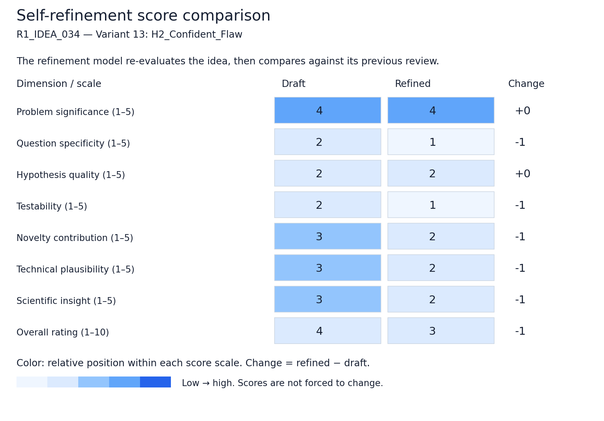

Changed score dimensions: question_specificity, testability, novelty_contribution, technical_plausibility, scientific_insight, overall_rating.

### Score justifications (draft / refined)

**Problem significance**

```json
{
  "draft": {
    "score": 4.0,
    "justification": "The problem is meaningful: RL fine-tuning of LLMs is sample-inefficient, and exploring richer feedback signals is a relevant direction. The argument about interpretable language as a richer learning medium touches on an important aspect of LLM adaptation."
  },
  "refined": {
    "score": 4.0,
    "justification": "The problem is meaningful and timely. RL fine-tuning of LLMs is often sample-inefficient, and exploring richer, more interpretable feedback signals is a relevant and potentially impactful direction for improving adaptation methods."
  }
}
```

**Question specificity**

```json
{
  "draft": {
    "score": 2.0,
    "justification": "The research question is poorly defined. It states a broad argument and suggests testing 'broader effectiveness' without specifying what is being compared, in what tasks, or what 'effectiveness' means. The only concrete element is the method name GEPA, which is unexplained."
  },
  "refined": {
    "score": 1.0,
    "justification": "The research question is extremely poorly defined. It states a broad argument about 'broader effectiveness' without specifying what is being compared, in what tasks, with what metrics, or what 'effectiveness' means. The method name GEPA is mentioned but unexplained."
  }
}
```

**Hypothesis quality**

```json
{
  "draft": {
    "score": 2.0,
    "justification": "There is an implicit hypothesis ('interpretable language feedback is better than sparse scalar rewards'), but it is not clearly stated as a testable prediction. The claim that addressing the 'most visible weakness' will produce 'reliable improvements' and 'general superiority' is overly broad and not falsifiable in its current form."
  },
  "refined": {
    "score": 2.0,
    "justification": "There is an implicit hypothesis ('interpretable language feedback is better than sparse scalar rewards'), but it is not stated as a clear, testable prediction. The claim that addressing a 'visible weakness' will produce 'reliable improvements' and 'general superiority' is overly broad, non-falsifiable, and methodologically naive in its causal assertion."
  }
}
```

**Testability**

```json
{
  "draft": {
    "score": 2.0,
    "justification": "Without a clear experimental plan, tasks, baselines, or evaluation metrics, it is unclear how the idea could be tested. The proposal to ignore confounding factors ('without separately isolating... alternative explanations') further undermines testability."
  },
  "refined": {
    "score": 1.0,
    "justification": "The idea is not testable in its current form. No experimental plan, tasks, baselines, or evaluation metrics are described. The proposal to ignore confounding factors ('without separately isolating... alternative explanations') actively undermines testability by rejecting standard experimental controls."
  }
}
```

**Novelty contribution**

```json
{
  "draft": {
    "score": 3.0,
    "justification": "The core idea—using interpretable feedback instead of scalar rewards—has been explored in prior work (e.g., learning from human feedback, reward modeling, natural language supervision). The novelty hinges on the specific implementation (GEPA), which is not described, so potential contribution is uncertain."
  },
  "refined": {
    "score": 2.0,
    "justification": "The core concept—using interpretable feedback instead of or alongside scalar rewards—has been explored in prior work (e.g., learning from human feedback, reward modeling, natural language supervision). The novelty hinges entirely on the unspecified method GEPA, so potential contribution is minimal and uncertain."
  }
}
```

**Technical plausibility**

```json
{
  "draft": {
    "score": 3.0,
    "justification": "The argument that language models might learn better from language feedback is plausible. However, the reasoning that gains can be treated as causal evidence without controlling for confounders is logically flawed. The method GEPA is not explained, so its technical soundness cannot be assessed."
  },
  "refined": {
    "score": 2.0,
    "justification": "The basic intuition that LLMs might learn better from language feedback is plausible. However, the reasoning is logically flawed: the claim that gains can be treated as causal evidence without controlling for confounders is scientifically unsound. The method GEPA is not explained, so its technical soundness cannot be assessed."
  }
}
```

**Scientific insight**

```json
{
  "draft": {
    "score": 3.0,
    "justification": "If properly investigated, comparing learning from interpretable feedback vs. scalar rewards could yield insights into how LLMs incorporate different types of supervision. However, the idea as presented focuses on claiming superiority rather than understanding mechanisms, limiting potential insight."
  },
  "refined": {
    "score": 2.0,
    "justification": "If properly investigated, comparing learning from interpretable feedback vs. scalar rewards could yield insights into how LLMs incorporate different supervisory signals. However, the idea as presented focuses on claiming superiority and dismisses rigorous analysis of mechanisms or boundary conditions, severely limiting potential insight."
  }
}
```

**Overall rating**

```json
{
  "draft": {
    "score": 4.0,
    "justification": "The idea identifies a potentially interesting problem but is severely underdeveloped. It lacks a clear research question, testable hypothesis, experimental plan, and methodological rigor. The argument about causal evidence is problematic. In its current form, it is a weak research idea with some promising intuition but insufficient substance to be considered a strong direction."
  },
  "refined": {
    "score": 3.0,
    "justification": "The idea identifies a potentially interesting problem but is severely underdeveloped and methodologically flawed. It lacks a clear research question, testable hypothesis, experimental plan, and demonstrates poor understanding of causal inference. The explicit dismissal of necessary experimental controls is a major weakness. In its current form, it is a weak research idea with a promising intuition but insufficient substance and serious methodological issues."
  }
}
```

## R1_IDEA_034 — Variant 14: H3_Verbose_Enriched

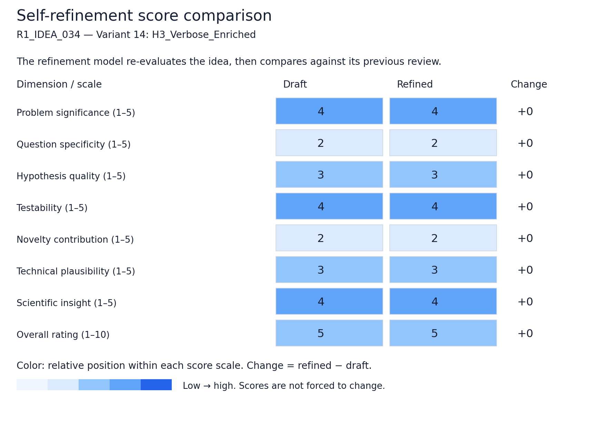

Changed score dimensions: none.

### Score justifications (draft / refined)

**Problem significance**

```json
{
  "draft": {
    "score": 4.0,
    "justification": "Improving sample efficiency in RL-based LLM fine-tuning is a significant practical and research problem. Current methods require many rollouts, which is computationally expensive and limits scalability. The idea correctly identifies a meaningful gap."
  },
  "refined": {
    "score": 4.0,
    "justification": "Improving sample efficiency in RL-based LLM fine-tuning is highly significant. Current methods like GRPO require thousands of rollouts, creating substantial computational costs and limiting accessibility. The problem is well-motivated and addresses a recognized bottleneck in the field."
  }
}
```

**Question specificity**

```json
{
  "draft": {
    "score": 2.0,
    "justification": "The research question is vague. It mentions 'interpretable feedback' and 'efficient credit assignment' but does not specify what is being compared, under what conditions, or what form the feedback takes. The idea is more of a general direction than a concrete question."
  },
  "refined": {
    "score": 2.0,
    "justification": "The research question is vague. While it mentions 'interpretable feedback' and 'efficient credit assignment,' it does not specify what exactly is being compared, under what conditions, or what constitutes 'interpretable feedback.' The idea presents a general direction rather than a concrete, answerable question."
  }
}
```

**Hypothesis quality**

```json
{
  "draft": {
    "score": 3.0,
    "justification": "There is an implicit hypothesis: interpretable feedback improves credit assignment efficiency. This is a testable claim, but it is broad and lacks a concrete, falsifiable prediction (e.g., magnitude of improvement, specific conditions under which it holds)."
  },
  "refined": {
    "score": 3.0,
    "justification": "There is an implicit hypothesis that interpretable feedback improves credit assignment efficiency. This is testable in principle but lacks specificity: no concrete prediction about improvement magnitude, conditions for success, or mechanism is provided. It's a reasonable starting point but needs refinement."
  }
}
```

**Testability**

```json
{
  "draft": {
    "score": 4.0,
    "justification": "The idea suggests a detailed experimental design (staged, with ablations, sensitivity analyses, and error analysis) that would make the hypothesis testable. However, without a clear method (GEPA) or tasks, the actual testability depends on filling in many missing details."
  },
  "refined": {
    "score": 4.0,
    "justification": "The proposed experimental design—staged with baselines, ablations, sensitivity analyses, and error analysis—provides a clear roadmap for testing. However, testability is contingent on filling in missing details about the method, tasks, and evaluation metrics. The design plan itself is strong."
  }
}
```

**Novelty contribution**

```json
{
  "draft": {
    "score": 2.0,
    "justification": "The idea of using richer feedback for credit assignment in RL is not new (e.g., reward shaping, auxiliary tasks, learning from demonstrations). Without details on GEPA, it's impossible to assess novelty. The contribution currently hinges on an unspecified method."
  },
  "refined": {
    "score": 2.0,
    "justification": "The core idea of using richer feedback for credit assignment in RL is not novel (e.g., reward shaping, auxiliary tasks, learning from demonstrations). Without any description of GEPA, novelty cannot be assessed. The contribution currently rests on an unspecified method, making it impossible to judge potential innovation."
  }
}
```

**Technical plausibility**

```json
{
  "draft": {
    "score": 3.0,
    "justification": "The general intuition—that interpretable feedback could help—is plausible, but without any description of GEPA or how feedback is integrated, technical plausibility cannot be properly evaluated. The reasoning is coherent but underspecified."
  },
  "refined": {
    "score": 3.0,
    "justification": "The general intuition that interpretable feedback could aid credit assignment is plausible and aligns with known RL challenges. However, without details on GEPA's mechanism or how feedback is integrated, technical plausibility remains speculative. The reasoning is coherent but incomplete."
  }
}
```

**Scientific insight**

```json
{
  "draft": {
    "score": 4.0,
    "justification": "The proposed experimental design aims to uncover 'when and why' the method works, which could yield general insights about credit assignment, feedback types, and domain constraints in LLM fine-tuning. This focus on understanding mechanisms is a strength."
  },
  "refined": {
    "score": 4.0,
    "justification": "The focus on understanding 'when and why' the method works, through ablations and sensitivity analyses, promises insights into mechanisms, boundary conditions, and domain constraints for feedback-based credit assignment in LLMs. This emphasis on generalizable understanding is a key strength."
  }
}
```

**Overall rating**

```json
{
  "draft": {
    "score": 5.0,
    "justification": "This is a moderate/borderline research idea. It identifies a meaningful problem and proposes a plausible mechanism, but the core method is unspecified, the hypothesis is generic, and the research question lacks sharpness. The strong experimental design plan is a positive, but the idea currently feels like a promising intuition in need of much more concrete development to become a compelling research direction."
  },
  "refined": {
    "score": 5.0,
    "justification": "This is a moderate/borderline research idea. It identifies a meaningful problem and proposes a plausible mechanism, but suffers from critical underspecification: the core method is unexplained, the hypothesis is generic, and the research question lacks sharpness. The strong experimental design plan is promising, but the idea requires substantial concretization to become a compelling research direction."
  }
}
```

## R1_IDEA_034 — Variant 15: H4_Ultimate_Hype

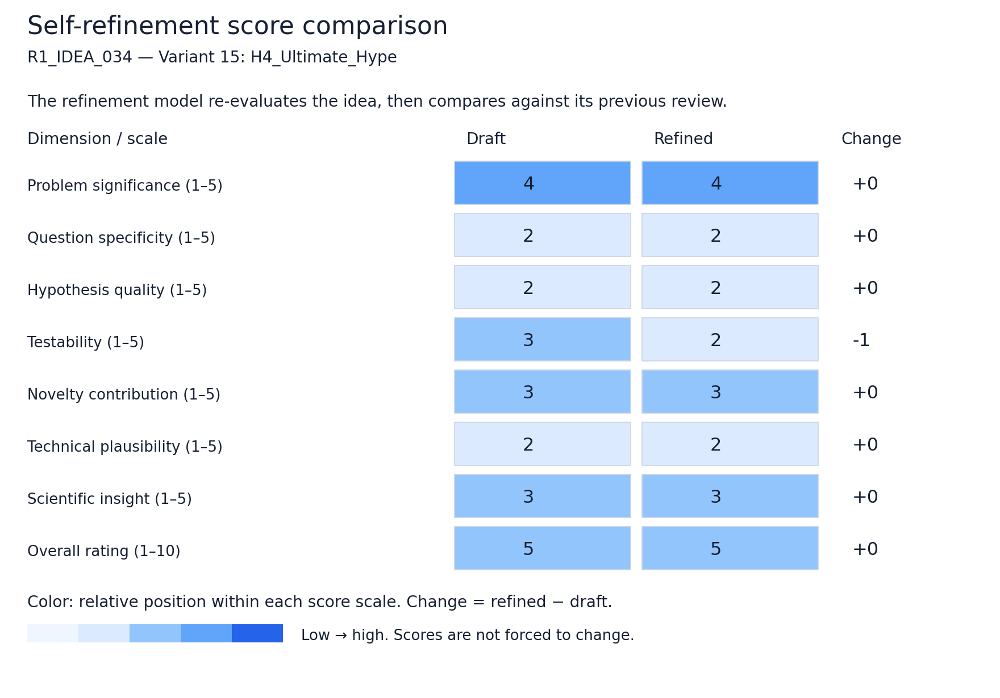

Changed score dimensions: testability.

### Score justifications (draft / refined)

**Problem significance**

```json
{
  "draft": {
    "score": 4.0,
    "justification": "The problem is meaningful: improving sample efficiency of RL for LLMs is important given the computational cost of thousands of rollouts. Leveraging language as a richer learning signal aligns with the core capabilities of LLMs and could address a real limitation."
  },
  "refined": {
    "score": 4.0,
    "justification": "The problem is meaningful: improving sample efficiency of RL for LLMs is important given the computational cost of thousands of rollouts. Leveraging language as a richer learning signal aligns with the core capabilities of LLMs and could address a real limitation in current adaptation methods."
  }
}
```

**Question specificity**

```json
{
  "draft": {
    "score": 2.0,
    "justification": "The research question is vague. It's essentially 'is language feedback better than scalar rewards?' without specifying what 'better' means, under what conditions, or for what tasks. The mention of GEPA adds some specificity but it's incomplete."
  },
  "refined": {
    "score": 2.0,
    "justification": "The research question is vague. It's essentially 'is language feedback better than scalar rewards?' without specifying what 'better' means, under what conditions, or for what tasks. The mention of GEPA adds minimal specificity since it's undescribed."
  }
}
```

**Hypothesis quality**

```json
{
  "draft": {
    "score": 2.0,
    "justification": "There is an implicit hypothesis that 'interpretable language provides a much richer learning medium,' but it's not formulated as a concrete, testable prediction. No specific outcomes or mechanisms are predicted that would distinguish success from failure."
  },
  "refined": {
    "score": 2.0,
    "justification": "There is an implicit hypothesis that 'interpretable language provides a much richer learning medium,' but it's not formulated as a concrete, testable prediction. No specific outcomes, effect sizes, or boundary conditions are predicted that would distinguish success from failure."
  }
}
```

**Testability**

```json
{
  "draft": {
    "score": 3.0,
    "justification": "The idea is testable in principle—one could compare methods with language feedback vs. scalar rewards. The proposal to introduce GEPA suggests an experimental direction. However, without details on how to operationalize 'language feedback' or what to measure, testability is limited."
  },
  "refined": {
    "score": 2.0,
    "justification": "While the idea is testable in principle, the lack of operational details makes testability weak. There's no indication of how language feedback would be implemented, what would be measured, or what constitutes evidence for/against the claim. The proposed GEPA method is too vague to enable concrete testing."
  }
}
```

**Novelty contribution**

```json
{
  "draft": {
    "score": 3.0,
    "justification": "The core observation that language feedback could be richer than scalar rewards is not entirely new (related to reward modeling, learning from human preferences, etc.). The novelty hinges on the unspecified GEPA method. If GEPA is a genuinely new mechanism for integrating language feedback into RL, it could be novel."
  },
  "refined": {
    "score": 3.0,
    "justification": "The core observation that language feedback could be richer than scalar rewards is not entirely new (related to reward modeling, learning from human preferences, instruction following, etc.). The novelty would depend entirely on the unspecified GEPA method. Without details, the contribution appears moderate at best."
  }
}
```

**Technical plausibility**

```json
{
  "draft": {
    "score": 2.0,
    "justification": "The idea is logically coherent: LLMs understand language, so language feedback might be more informative. However, the technical feasibility is unclear because GEPA is not described. Key challenges (e.g., generating consistent, actionable language feedback automatically) are not addressed."
  },
  "refined": {
    "score": 2.0,
    "justification": "The basic intuition is logically coherent: LLMs understand language, so language feedback might be more informative. However, the technical feasibility is unclear because GEPA is not described. Key challenges (e.g., generating consistent, actionable language feedback automatically at scale) are not addressed, making plausibility difficult to assess."
  }
}
```

**Scientific insight**

```json
{
  "draft": {
    "score": 3.0,
    "justification": "If successful, the research could provide insight into how LLMs learn from different types of feedback, potentially revealing principles for more efficient adaptation. However, as currently framed, it risks being a simple performance comparison rather than probing deeper mechanisms."
  },
  "refined": {
    "score": 3.0,
    "justification": "If successfully investigated, the research could provide insight into how LLMs learn from different types of feedback, potentially revealing principles for more efficient adaptation. However, as currently framed, it risks being a simple performance comparison rather than probing deeper mechanisms of learning or feedback utilization."
  }
}
```

**Overall rating**

```json
{
  "draft": {
    "score": 5.0,
    "justification": "This is a moderate/borderline research idea. It identifies a potentially significant problem (inefficient RL for LLMs) and points to a plausible direction (language feedback). However, the research question is vague, the hypothesis is weak, and the proposed method (GEPA) is undescribed. The idea lacks the specificity and testable predictions needed for a strong research direction, though it has a reasonable core intuition."
  },
  "refined": {
    "score": 5.0,
    "justification": "This is a moderate/borderline research idea. It identifies a potentially significant problem (inefficient RL for LLMs) and points to a plausible direction (language feedback). However, the research question is vague, the hypothesis is weak, the proposed method is undescribed, and testability is limited. The idea lacks the specificity and testable predictions needed for a strong research direction, though it has a reasonable core intuition that could be developed further."
  }
}
```

## R1_IDEA_035 — Source


Changed score dimensions: none.

### Score justifications (draft / refined)

**Problem significance**

```json
{
  "draft": {
    "score": 4.0,
    "justification": "The problem is meaningful and practical. Lack of standardized evaluation is a recognized issue in many ML subfields, and addressing it in graph pooling could enable more reliable comparisons and accelerate progress. However, it's more of a methodological infrastructure problem than a fundamental scientific challenge."
  },
  "refined": {
    "score": 4.0,
    "justification": "The problem is meaningful and practical for the graph ML community. Lack of standardized evaluation is a well-known barrier to reliable progress in many ML subfields. Solving it enables better comparisons and more robust science. However, it is primarily a methodological/infrastructural challenge rather than a deep scientific puzzle."
  }
}
```

**Question specificity**

```json
{
  "draft": {
    "score": 2.0,
    "justification": "The idea lacks a specific research question. It identifies a problem (lack of standardized evaluation) and proposes a solution (create a benchmark), but doesn't articulate what scientific questions the benchmark will help answer. The focus is on tool-building rather than hypothesis testing."
  },
  "refined": {
    "score": 2.0,
    "justification": "The idea does not articulate a research question. It states a problem ('lack of standardized evaluation') and describes a proposed action ('construct a benchmark'). There is no 'what', 'why', or 'how' regarding a specific phenomenon or relationship to be investigated. The focus is entirely on the creation of a tool."
  }
}
```

**Hypothesis quality**

```json
{
  "draft": {
    "score": 1.0,
    "justification": "There is no explicit or implicit hypothesis. The idea describes an action (building a benchmark) rather than making a testable prediction about graph pooling methods or their behavior. It's an engineering effort rather than a hypothesis-driven investigation."
  },
  "refined": {
    "score": 1.0,
    "justification": "There is no hypothesis, implicit or explicit. The text makes no predictive or explanatory claim about graph pooling methods, their behavior, or their relationship to data properties. It is a declarative statement of intent to build something."
  }
}
```

**Testability**

```json
{
  "draft": {
    "score": 3.0,
    "justification": "While the benchmark creation itself is testable (it can be completed or not), the scientific value depends on what questions are asked using the benchmark. The idea as presented doesn't specify what will be tested. However, once created, the benchmark could enable many testable comparisons."
  },
  "refined": {
    "score": 3.0,
    "justification": "The success of the benchmark construction is testable (was it built? does it run?). However, the idea as presented contains no central scientific claim to test. The benchmark enables future tests but is not itself a test of a specific idea. This is a moderate score because the artifact's utility can be assessed, but not in a hypothesis-driven way."
  }
}
```

**Novelty contribution**

```json
{
  "draft": {
    "score": 3.0,
    "justification": "Creating comprehensive benchmarks is valuable but not highly novel conceptually. The contribution is primarily practical and infrastructural rather than scientific. The novelty would depend on the specific design choices, dataset selection, and evaluation protocols."
  },
  "refined": {
    "score": 3.0,
    "justification": "The contribution is practical and infrastructural. Creating a comprehensive, well-curated benchmark is valuable to a community, but it is not a novel scientific contribution in itself. The novelty would reside in unique design choices or integrated analyses, which are not described. It is an application of a well-established practice (benchmark creation) to a specific subfield."
  }
}
```

**Technical plausibility**

```json
{
  "draft": {
    "score": 5.0,
    "justification": "The idea is technically straightforward and plausible. Creating benchmarks is a well-established practice in ML. The described scope (17 methods, 28 datasets) suggests a substantial but achievable effort."
  },
  "refined": {
    "score": 5.0,
    "justification": "The proposed direction is technically straightforward and highly plausible. Implementing and evaluating 17 methods on 28 datasets is a significant but achievable engineering effort. The core concept of building a benchmark is standard practice and faces no apparent technical barriers based on the description."
  }
}
```

**Scientific insight**

```json
{
  "draft": {
    "score": 2.0,
    "justification": "As presented, the idea has limited potential for scientific insight. A benchmark alone doesn't generate new understanding; it enables comparisons. The insight would come from analyzing the benchmark results, but no analysis plan or research questions are proposed. At best, it could reveal empirical patterns about which methods work well on which datasets."
  },
  "refined": {
    "score": 2.0,
    "justification": "As a standalone idea to build a benchmark, the potential for direct scientific insight is very low. A benchmark is a measurement tool. Insight is generated by formulating and testing hypotheses using that tool, which is not part of the proposed idea. At best, the act of curation might reveal gaps in the literature, but that is not stated as a goal."
  }
}
```

**Overall rating**

```json
{
  "draft": {
    "score": 5.0,
    "justification": "This is a moderate/borderline research idea. While it addresses a practical and meaningful problem in graph pooling research, it lacks the core elements of a scientific investigation: a specific research question, a testable hypothesis, and clear potential for scientific insight. The idea is essentially about building infrastructure rather than generating new knowledge. With the addition of specific research questions and hypothesis-driven analyses, it could become a stronger research direction."
  },
  "refined": {
    "score": 5.0,
    "justification": "This is a moderate/borderline research idea. It identifies a real and useful infrastructural need in the graph pooling community. However, as presented, it is not a scientific research idea; it is a project to create a resource. It lacks a research question, hypothesis, and clear pathway to generating new scientific knowledge. Its primary value is enabling future research by others, not conducting research itself. With the addition of a specific analytical goal or hypothesis to be tested using the benchmark, it could become a much stronger research direction."
  }
}
```

## R1_IDEA_035 — Variant 1: A1_Identity


Changed score dimensions: none.

### Score justifications (draft / refined)

**Problem significance**

```json
{
  "draft": {
    "score": 4.0,
    "justification": "The problem is meaningful and practical. Lack of standardized evaluation is a recognized issue in many ML subfields, and addressing it in graph pooling could enable more reliable comparisons and accelerate progress. However, it's more of a methodological infrastructure problem than a fundamental scientific challenge."
  },
  "refined": {
    "score": 4.0,
    "justification": "The problem is meaningful and practical. Lack of standardized evaluation is a recognized issue in many ML subfields, and addressing it in graph pooling could enable more reliable comparisons and accelerate progress. However, it's primarily an infrastructure/methodology problem rather than a fundamental scientific challenge about graph representation learning itself."
  }
}
```

**Question specificity**

```json
{
  "draft": {
    "score": 2.0,
    "justification": "The idea lacks a specific research question. It identifies a problem (lack of standardized evaluation) and proposes a solution (create a benchmark), but doesn't articulate what scientific questions the benchmark will help answer. The focus is on tool-building rather than hypothesis testing."
  },
  "refined": {
    "score": 2.0,
    "justification": "The idea lacks a specific research question. It identifies a problem (lack of standardized evaluation) and proposes a solution (create a benchmark), but doesn't articulate what scientific questions the benchmark will help answer. The focus is on tool-building rather than hypothesis testing or investigating specific phenomena."
  }
}
```

**Hypothesis quality**

```json
{
  "draft": {
    "score": 1.0,
    "justification": "There is no explicit or implicit hypothesis. The idea describes an action (building a benchmark) rather than making a testable prediction about graph pooling methods or their behavior. It's an engineering effort rather than a hypothesis-driven investigation."
  },
  "refined": {
    "score": 1.0,
    "justification": "There is no explicit or implicit hypothesis. The idea describes an action (building a benchmark) rather than making a testable prediction about graph pooling methods or their behavior. It's an engineering/infrastructure effort rather than a hypothesis-driven scientific investigation."
  }
}
```

**Testability**

```json
{
  "draft": {
    "score": 3.0,
    "justification": "While the benchmark creation itself is testable (it can be completed or not), the scientific value would come from what is learned from using it. The idea as presented doesn't specify what will be tested with the benchmark. However, once created, the benchmark enables many testable comparisons."
  },
  "refined": {
    "score": 3.0,
    "justification": "While the benchmark creation itself is testable (it can be completed or not), the scientific value would come from what is learned from using it. The idea as presented doesn't specify what will be tested with the benchmark. However, once created, the benchmark enables many testable comparisons, so there is some inherent testability in the concept."
  }
}
```

**Novelty contribution**

```json
{
  "draft": {
    "score": 3.0,
    "justification": "Creating comprehensive benchmarks is valuable but not highly novel conceptually. Many fields have similar benchmarking efforts. The contribution would be in the specific curation, standardization, and potentially in the insights gained from systematic comparison. The novelty lies in execution rather than conceptual advancement."
  },
  "refined": {
    "score": 3.0,
    "justification": "Creating comprehensive benchmarks is valuable but not highly novel conceptually. Many fields have similar benchmarking efforts. The contribution would be in the specific curation, standardization, and potentially in the insights gained from systematic comparison. The novelty lies more in execution and comprehensiveness rather than conceptual advancement."
  }
}
```

**Technical plausibility**

```json
{
  "draft": {
    "score": 5.0,
    "justification": "The proposed direction is technically straightforward and plausible. Creating benchmarks is a well-established practice in ML. The main challenges would be in implementation details (fair hyperparameter tuning, computational resources, dataset preprocessing) rather than conceptual feasibility."
  },
  "refined": {
    "score": 5.0,
    "justification": "The proposed direction is technically straightforward and plausible. Creating benchmarks is a well-established practice in ML. The main challenges would be in implementation details (fair hyperparameter tuning, computational resources, dataset preprocessing) rather than conceptual feasibility. The idea is technically sound."
  }
}
```

**Scientific insight**

```json
{
  "draft": {
    "score": 2.0,
    "justification": "As presented, the idea has limited potential for scientific insight. A benchmark alone provides comparative performance data but doesn't necessarily reveal why methods perform differently or what underlying principles govern graph pooling effectiveness. The insight would depend on what analyses are performed with the benchmark data."
  },
  "refined": {
    "score": 2.0,
    "justification": "As presented, the idea has limited potential for scientific insight. A benchmark alone provides comparative performance data but doesn't necessarily reveal why methods perform differently or what underlying principles govern graph pooling effectiveness. The insight would depend entirely on what analyses are performed with the benchmark data, which are not specified."
  }
}
```

**Overall rating**

```json
{
  "draft": {
    "score": 5.0,
    "justification": "This is a moderate/borderline research idea. While it addresses a practical and meaningful problem in the field, it lacks the specificity, hypothesis, and potential for scientific insight that characterize strong research ideas. It's essentially a benchmarking project rather than a hypothesis-driven investigation. The value would come from how the benchmark is used to answer specific questions about graph pooling methods, but those questions aren't articulated in the idea summary."
  },
  "refined": {
    "score": 5.0,
    "justification": "This is a moderate/borderline research idea. While it addresses a practical and meaningful infrastructure problem in the field, it lacks the specificity, hypothesis, and potential for scientific insight that characterize strong research ideas. It's essentially a benchmarking project rather than a hypothesis-driven investigation. The value would come from how the benchmark is used to answer specific questions about graph pooling methods, but those questions aren't articulated in the idea summary."
  }
}
```

## R1_IDEA_035 — Variant 2: A2_Paraphrase_Only


Changed score dimensions: none.

### Score justifications (draft / refined)

**Problem significance**

```json
{
  "draft": {
    "score": 4.0,
    "justification": "The lack of standardized evaluation for graph pooling methods is a meaningful practical problem that hinders progress and fair comparison in the field. A well-designed benchmark would be valuable to the community."
  },
  "refined": {
    "score": 4.0,
    "justification": "The lack of standardized evaluation for graph pooling is a meaningful and practical problem in the field. A well-designed benchmark would facilitate fair comparisons, accelerate research, and provide reliable guidance for practitioners, making it highly relevant to the community."
  }
}
```

**Question specificity**

```json
{
  "draft": {
    "score": 2.0,
    "justification": "The idea identifies a general gap (lack of benchmarks) but does not define a specific research question. It's more of a project goal than a focused investigation."
  },
  "refined": {
    "score": 2.0,
    "justification": "The idea identifies a general gap (missing benchmarks) but does not define a concrete research question. It states a project goal ('we present a benchmark') rather than specifying what is being investigated about graph pooling methods themselves."
  }
}
```

**Hypothesis quality**

```json
{
  "draft": {
    "score": 1.0,
    "justification": "There is no explicit or implicit hypothesis about graph pooling methods. The idea is descriptive (we will benchmark methods) rather than predictive or explanatory."
  },
  "refined": {
    "score": 1.0,
    "justification": "There is no explicit or implicit hypothesis. The idea is purely descriptive—it proposes to collect and compare existing methods without predicting outcomes, explaining mechanisms, or testing relationships. It lacks any falsifiable or testable claim about graph pooling."
  }
}
```

**Testability**

```json
{
  "draft": {
    "score": 3.0,
    "justification": "The benchmark itself is testable in the sense that it can be executed, but the core 'idea' lacks a testable claim. The success criterion is completion of the benchmark rather than validation of a specific hypothesis."
  },
  "refined": {
    "score": 3.0,
    "justification": "The benchmark can be executed and will produce comparative results, so it is testable in an engineering sense. However, the core 'idea' lacks a testable scientific claim—there is no hypothesis to support or contradict through the benchmark. Success is measured by completion, not by insight."
  }
}
```

**Novelty contribution**

```json
{
  "draft": {
    "score": 2.0,
    "justification": "Creating a benchmark is a useful service to the community, but it does not constitute novel scientific contribution in terms of new methods, theoretical understanding, or discovery of phenomena. It is an aggregation and systematization of existing work."
  },
  "refined": {
    "score": 2.0,
    "justification": "Creating a benchmark is a valuable service to the community, but it does not represent novel scientific contribution in terms of new methods, theoretical understanding, or discovery of phenomena. It systematizes and evaluates existing work rather than generating new knowledge."
  }
}
```

**Technical plausibility**

```json
{
  "draft": {
    "score": 4.0,
    "justification": "The proposed direction is technically straightforward and plausible. Implementing a comprehensive benchmark for graph pooling methods is feasible given sufficient resources and careful design."
  },
  "refined": {
    "score": 4.0,
    "justification": "The proposal is technically straightforward and plausible. Implementing a large-scale benchmark for graph pooling methods is feasible with sufficient resources, careful selection of methods/datasets, and standardized protocols. No obvious technical barriers are indicated."
  }
}
```

**Scientific insight**

```json
{
  "draft": {
    "score": 2.0,
    "justification": "The primary output would be performance tables and rankings. While patterns might emerge, the idea as stated does not aim to explain why methods behave as they do, uncover underlying mechanisms, or establish general principles. Insight would be incidental rather than a central goal."
  },
  "refined": {
    "score": 2.0,
    "justification": "The primary output would be empirical performance comparisons. While patterns may emerge, the idea as stated does not aim to explain underlying mechanisms, establish general principles, or uncover boundary conditions. Any insight would be incidental rather than a central, structured goal of the investigation."
  }
}
```

**Overall rating**

```json
{
  "draft": {
    "score": 4.0,
    "justification": "This is a weak research idea when evaluated as a scientific investigation. It addresses a practical community need (benchmarking) but lacks a specific research question, hypothesis, and potential for novel scientific insight. It is more of an engineering/service project than a hypothesis-driven research study. The main value would be in providing a standardized evaluation platform, not in generating new scientific knowledge about graph pooling."
  },
  "refined": {
    "score": 4.0,
    "justification": "This is a weak research idea when evaluated as a scientific investigation. It addresses an important practical need (standardized evaluation) but lacks a specific research question, hypothesis, and potential for novel scientific insight. It is more akin to an engineering or community service project than a hypothesis-driven research study. Its main value lies in providing a comparative platform, not in generating new scientific knowledge about graph pooling."
  }
}
```

## R1_IDEA_035 — Variant 3: A3_Plain_Core


Changed score dimensions: none.

### Score justifications (draft / refined)

**Problem significance**

```json
{
  "draft": {
    "score": 4.0,
    "justification": "The lack of standardized evaluation in graph pooling is a meaningful practical problem that hinders reproducible research and reliable progress. A good benchmark could benefit the community significantly."
  },
  "refined": {
    "score": 4.0,
    "justification": "The lack of standardized evaluation in graph pooling is a meaningful and recognized practical problem that impedes reproducible research and reliable assessment of progress. A well-constructed benchmark could significantly benefit the research community."
  }
}
```

**Question specificity**

```json
{
  "draft": {
    "score": 2.0,
    "justification": "The idea describes an activity (building a benchmark) but does not define a specific research question. It is clear what will be built, but not what will be investigated scientifically."
  },
  "refined": {
    "score": 2.0,
    "justification": "The idea clearly describes an activity (building a benchmark) but does not define a specific research question. It is clear what will be built, but not what scientific question will be investigated using the benchmark."
  }
}
```

**Hypothesis quality**

```json
{
  "draft": {
    "score": 1.0,
    "justification": "There is no hypothesis presented—implicitly or explicitly. The idea is to create a benchmark, not to test a prediction or mechanism."
  },
  "refined": {
    "score": 1.0,
    "justification": "There is no hypothesis presented—implicitly or explicitly. The idea is to create a benchmark resource, not to test a prediction, mechanism, or relationship. It is purely descriptive."
  }
}
```

**Testability**

```json
{
  "draft": {
    "score": 3.0,
    "justification": "The benchmark itself is testable in the sense that it can be constructed and used to evaluate methods. However, without a guiding hypothesis, the 'test' is merely descriptive comparison rather than hypothesis testing."
  },
  "refined": {
    "score": 3.0,
    "justification": "The benchmark construction is a testable task—it can be completed and used to evaluate methods. However, without a guiding hypothesis, the 'test' is limited to descriptive comparison rather than hypothesis-driven experimentation. The activity itself is feasible, but the scientific testability is low."
  }
}
```

**Novelty contribution**

```json
{
  "draft": {
    "score": 3.0,
    "justification": "Creating a comprehensive benchmark is a useful contribution, but it is primarily an engineering/curation effort rather than a novel scientific insight. Similar benchmarking efforts exist in other ML subfields."
  },
  "refined": {
    "score": 3.0,
    "justification": "Creating a comprehensive benchmark is a useful and needed contribution, but it is primarily an engineering and curation effort rather than a novel scientific insight. Similar benchmarking initiatives exist in other ML subfields. The novelty lies in the specific domain (graph pooling) but not in the type of contribution."
  }
}
```

**Technical plausibility**

```json
{
  "draft": {
    "score": 5.0,
    "justification": "The idea is technically straightforward and plausible. Building a benchmark with multiple methods and datasets is a well-understood task in ML."
  },
  "refined": {
    "score": 5.0,
    "justification": "The idea is technically straightforward and highly plausible. Building a benchmark with multiple methods and datasets is a well-understood, feasible task in machine learning. No technical barriers are implied."
  }
}
```

**Scientific insight**

```json
{
  "draft": {
    "score": 2.0,
    "justification": "As presented, the benchmark alone may not yield deep scientific insight. It could produce rankings and aggregate results, but without a framework for analysis, it may not reveal why certain methods work better or under what principles they operate."
  },
  "refined": {
    "score": 2.0,
    "justification": "As presented, the benchmark alone is unlikely to yield deep scientific insight. It could produce performance rankings and aggregate results, but without a framework for analysis or hypothesis testing, it may not reveal why certain methods work better, under what principles they operate, or what fundamental limitations exist."
  }
}
```

**Overall rating**

```json
{
  "draft": {
    "score": 5.0,
    "justification": "This is a moderate/borderline research idea. It addresses a real practical need (standardized evaluation) and is technically plausible, but it lacks a clear research question, hypothesis, and potential for scientific insight beyond descriptive benchmarking. It is more of a resource-building proposal than a hypothesis-driven investigation."
  },
  "refined": {
    "score": 5.0,
    "justification": "This is a moderate/borderline research idea. It addresses a real and significant practical need (standardized evaluation in graph pooling) and is technically plausible. However, it lacks a clear research question, hypothesis, and framework for generating scientific insight beyond descriptive benchmarking. It is more akin to a resource-building or infrastructure proposal than a hypothesis-driven scientific investigation. Its primary value is enabling future research rather than contributing new knowledge directly."
  }
}
```

## R1_IDEA_035 — Variant 4: B1_Verbose_Elaborate


Changed score dimensions: none.

### Score justifications (draft / refined)

**Problem significance**

```json
{
  "draft": {
    "score": 5.0,
    "justification": "The problem is highly significant. The lack of standardized, fair benchmarks is a major obstacle to reliable progress in graph representation learning. It hinders meaningful comparisons, obscures true methodological advances, and is a frequent complaint in the community. Addressing this is a valuable service."
  },
  "refined": {
    "score": 5.0,
    "justification": "The problem is highly significant. Lack of standardized benchmarks is a major obstacle to reliable progress in graph representation learning. It impedes fair comparisons, obscures true methodological advances, and is a frequent community complaint. Addressing this is a valuable and necessary service."
  }
}
```

**Question specificity**

```json
{
  "draft": {
    "score": 2.0,
    "justification": "The idea is not framed as a research question. It states a problem ('absence of standardized settings') and proposes a solution ('construct a benchmark'). The 'what to investigate' is implicit (compare methods), but it lacks a concrete, focused question about relationships, mechanisms, or phenomena."
  },
  "refined": {
    "score": 2.0,
    "justification": "The idea is not framed as a research question. It states a problem ('absence of standardized settings') and proposes a solution ('construct a benchmark'). The implicit investigation is 'compare methods on datasets,' but this lacks a concrete, focused question about mechanisms, relationships, or phenomena. It is descriptive and prescriptive, not inquisitive."
  }
}
```

**Hypothesis quality**

```json
{
  "draft": {
    "score": 1.0,
    "justification": "There is no explicit or implicit hypothesis. The idea is descriptive (a benchmark is needed) and prescriptive (we will build one), but it does not make a falsifiable prediction about the outcome of applying the benchmark. It does not propose a specific relationship to test."
  },
  "refined": {
    "score": 1.0,
    "justification": "There is no explicit or implicit hypothesis. The idea does not make a falsifiable prediction or propose a specific relationship to test. It is a declarative statement of intent (build a benchmark) rather than a claim that could be supported or contradicted by evidence."
  }
}
```

**Testability**

```json
{
  "draft": {
    "score": 4.0,
    "justification": "The core activity of benchmarking is inherently testable. Running standardized experiments and comparing method performance provides clear, empirical evidence. However, without a guiding hypothesis, the 'test' is reduced to a measurement exercise rather than an investigation of a specific claim."
  },
  "refined": {
    "score": 4.0,
    "justification": "The core activity of benchmarking is inherently testable. Running standardized experiments and measuring method performance provides empirical evidence. However, without a guiding hypothesis, the 'test' is a measurement and comparison exercise, not an investigation of a specific claim. The evidence generated can answer descriptive questions (which method performs best on average) but not causal or relational ones without further analysis."
  }
}
```

**Novelty contribution**

```json
{
  "draft": {
    "score": 3.0,
    "justification": "The contribution is primarily infrastructural and organizational rather than novel scientific knowledge. Creating a comprehensive, well-designed benchmark is a valuable contribution to the community (akin to creating a new dataset or leaderboard). However, it does not, by itself, propose a new method, discover a new phenomenon, or test a novel hypothesis. Its novelty lies in scope and standardization, not in scientific insight."
  },
  "refined": {
    "score": 3.0,
    "justification": "The contribution is primarily infrastructural and organizational. Creating a comprehensive, well-designed benchmark is a valuable service to the community, similar to creating a new dataset or leaderboard. However, it does not, by itself, propose new scientific knowledge, a novel method, or a test of a previously unexplored hypothesis. Its novelty lies in scope, curation, and standardization effort, not in fundamental scientific insight."
  }
}
```

**Technical plausibility**

```json
{
  "draft": {
    "score": 5.0,
    "justification": "The proposed direction is entirely plausible and straightforward. Building a benchmark by re-implementing or standardizing the evaluation of existing methods on a collection of datasets is a well-established and technically feasible practice in ML. The main challenges are organizational (curation, code quality, documentation) rather than technical."
  },
  "refined": {
    "score": 5.0,
    "justification": "The proposed direction is entirely plausible and straightforward. Building a benchmark by re-implementing or standardizing the evaluation of existing methods on a collection of datasets is a well-established, technically feasible practice in ML. The main challenges are organizational (curation, code quality, documentation, computational resources) rather than technical barriers."
  }
}
```

**Scientific insight**

```json
{
  "draft": {
    "score": 2.0,
    "justification": "As presented, the potential for scientific insight is low. A bare benchmarking effort typically yields performance rankings, which are useful but shallow. To provide deeper insight, the benchmark would need to be coupled with a rigorous analysis that seeks to explain the results, identify patterns, or relate method properties to performance across graph types. The idea summary does not mention such an analysis."
  },
  "refined": {
    "score": 2.0,
    "justification": "As presented, the potential for scientific insight is low. A bare benchmarking effort typically yields performance tables and rankings, which are useful but shallow. To provide deeper insight, the benchmark would need to be coupled with a rigorous analytical framework that seeks to explain results, identify patterns, relate method properties to graph characteristics, or uncover limitations. The idea summary does not mention such an analysis component."
  }
}
```

**Overall rating**

```json
{
  "draft": {
    "score": 5.0,
    "justification": "This is a moderate/borderline research idea. It addresses a very significant and practical problem (lack of standardization) and proposes a concrete, plausible solution (building a benchmark). However, it is framed as an engineering/servicing task rather than a scientific investigation. It lacks a specific research question, a testable hypothesis, and a plan for deriving novel scientific insight from the benchmark. Its primary value is infrastructural. To become a strong research idea, it needs to integrate a clear analytical question that the benchmark data will be used to answer."
  },
  "refined": {
    "score": 5.0,
    "justification": "This is a moderate/borderline research idea. It addresses a very significant and practical problem (lack of standardization) and proposes a concrete, plausible solution (building a benchmark). However, it is framed as an engineering/service task rather than a scientific investigation. It lacks a specific research question, a testable hypothesis, and a clear plan for deriving novel scientific insight from the benchmark. Its primary value is infrastructural. To become a strong research idea, it needs to integrate a clear analytical question that the benchmark data will be used to answer."
  }
}
```

## R1_IDEA_035 — Variant 5: B2_Grand_Narrative

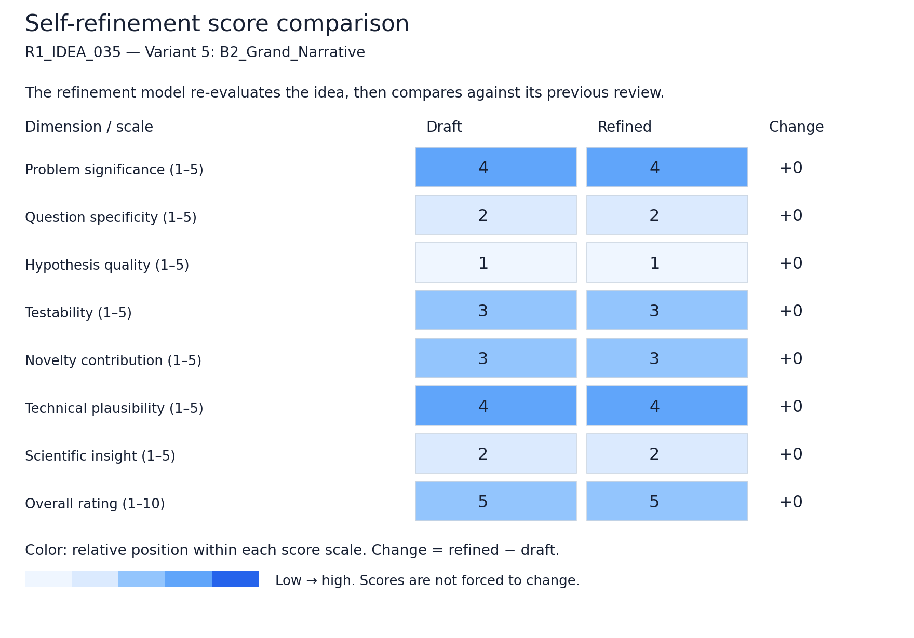

Changed score dimensions: none.

### Score justifications (draft / refined)

**Problem significance**

```json
{
  "draft": {
    "score": 4.0,
    "justification": "The lack of standardized evaluation in graph pooling is a recognized issue that hinders reproducible research and fair comparison. Addressing it is meaningful for the community."
  },
  "refined": {
    "score": 4.0,
    "justification": "The lack of standardized evaluation in graph pooling is a meaningful problem that affects reproducibility, fair comparison, and cumulative scientific progress. Addressing it provides clear value to the research community."
  }
}
```

**Question specificity**

```json
{
  "draft": {
    "score": 2.0,
    "justification": "The idea states a general goal ('address the issue of lack of standardized evaluation') but does not define a specific research question about graph pooling mechanisms or performance."
  },
  "refined": {
    "score": 2.0,
    "justification": "The idea states a general goal ('address lack of standardized evaluation') but does not define a specific research question about graph pooling. It's more about creating a tool than asking a scientific question."
  }
}
```

**Hypothesis quality**

```json
{
  "draft": {
    "score": 1.0,
    "justification": "No hypothesis is presented. The idea is to create a benchmark, not to test a predictive or explanatory claim about graph pooling."
  },
  "refined": {
    "score": 1.0,
    "justification": "No hypothesis is presented, either explicit or implicit. The idea describes an infrastructure-building activity rather than a testable claim about graph pooling behavior or mechanisms."
  }
}
```

**Testability**

```json
{
  "draft": {
    "score": 3.0,
    "justification": "The benchmark itself can be implemented and used, but the idea lacks a specific testable claim. The 'test' is whether the benchmark is useful, which is somewhat subjective."
  },
  "refined": {
    "score": 3.0,
    "justification": "The benchmark can be implemented and its utility can be assessed through adoption and usage, but there's no specific claim to test. Success is measured by whether it becomes a useful resource, which is somewhat subjective."
  }
}
```

**Novelty contribution**

```json
{
  "draft": {
    "score": 3.0,
    "justification": "Creating a comprehensive benchmark is a useful contribution, but it is primarily an engineering/curation effort rather than a novel scientific insight. Similar benchmarks exist in other ML areas."
  },
  "refined": {
    "score": 3.0,
    "justification": "Creating a comprehensive benchmark is a useful contribution, but it's primarily an engineering/curation effort rather than novel scientific insight. Similar benchmarking efforts exist in other ML areas (e.g., vision, NLP)."
  }
}
```

**Technical plausibility**

```json
{
  "draft": {
    "score": 4.0,
    "justification": "Constructing a benchmark with multiple methods and datasets is technically straightforward and logically coherent. The main challenge is design decisions for fair comparison."
  },
  "refined": {
    "score": 4.0,
    "justification": "Constructing a benchmark with multiple methods and datasets is technically feasible and logically coherent. The main challenges are design decisions for fair comparison, not technical impossibility."
  }
}
```

**Scientific insight**

```json
{
  "draft": {
    "score": 2.0,
    "justification": "The benchmark could enable future insights, but the idea itself does not propose to derive new scientific understanding about graph pooling (e.g., why certain methods work better under certain conditions)."
  },
  "refined": {
    "score": 2.0,
    "justification": "The benchmark could enable future scientific insights by providing standardized evaluation, but the idea itself does not propose to derive new understanding about graph pooling mechanisms, limitations, or principles."
  }
}
```

**Overall rating**

```json
{
  "draft": {
    "score": 5.0,
    "justification": "The idea addresses a practical need and could be valuable to the community, but as a research idea it lacks a specific scientific question, hypothesis, and potential for direct scientific insight. It is more of a benchmarking infrastructure proposal than a hypothesis-driven research direction."
  },
  "refined": {
    "score": 5.0,
    "justification": "The idea addresses an important practical need and could be valuable infrastructure for the community. However, as a research idea, it lacks a specific scientific question, hypothesis, and direct potential for scientific insight. It's more of a benchmarking proposal than a hypothesis-driven research direction."
  }
}
```

## R1_IDEA_035 — Variant 6: B3_Over_Confident


Changed score dimensions: none.

### Score justifications (draft / refined)

**Problem significance**

```json
{
  "draft": {
    "score": 4.0,
    "justification": "The lack of standardized evaluation in graph pooling is a recognized issue that hinders progress. Better benchmarks would help the community compare methods more reliably, which is meaningful for researchers in the field."
  },
  "refined": {
    "score": 4.0,
    "justification": "The problem is meaningful: lack of standardized evaluation in graph pooling impedes reliable comparison and scientific progress. Addressing it would provide clear value to the research community."
  }
}
```

**Question specificity**

```json
{
  "draft": {
    "score": 2.0,
    "justification": "The idea states a problem (lack of standardized evaluation) and proposes a solution (benchmark), but doesn't define a specific research question. It's more of a tool-building proposal than a research investigation."
  },
  "refined": {
    "score": 2.0,
    "justification": "The idea states a problem and proposes a tool (benchmark) but does not define a specific research question about graph pooling. It is a meta-solution for evaluation, not an investigation into pooling mechanisms."
  }
}
```

**Hypothesis quality**

```json
{
  "draft": {
    "score": 1.0,
    "justification": "There is no hypothesis about graph pooling mechanisms, relationships, or phenomena. The idea is purely about creating an evaluation infrastructure without making testable predictions about graph pooling itself."
  },
  "refined": {
    "score": 1.0,
    "justification": "There is no hypothesis about graph pooling—no prediction, proposed mechanism, or testable relationship. The idea is purely about building evaluation infrastructure."
  }
}
```

**Testability**

```json
{
  "draft": {
    "score": 3.0,
    "justification": "The benchmark construction itself is testable in the sense that it can be completed and used. However, without specific research questions, it's unclear what would constitute 'testing' the idea beyond building the benchmark."
  },
  "refined": {
    "score": 3.0,
    "justification": "Benchmark construction is testable in that it can be completed and validated. However, without an associated research question, there is nothing about graph pooling itself to 'test' beyond the tool's existence."
  }
}
```

**Novelty contribution**

```json
{
  "draft": {
    "score": 2.0,
    "justification": "While potentially useful, benchmark construction is generally considered an engineering contribution rather than novel scientific research. Many fields have similar benchmarking efforts, and the novelty would depend on what new insights the benchmark enables."
  },
  "refined": {
    "score": 2.0,
    "justification": "Benchmark construction is an engineering/curation contribution rather than novel scientific research. While potentially useful, it does not propose new methods, insights, or theories about graph pooling."
  }
}
```

**Technical plausibility**

```json
{
  "draft": {
    "score": 4.0,
    "justification": "Constructing a benchmark with 17 methods and 28 datasets is technically feasible and makes logical sense given the stated problem. The reasoning is coherent: lack of standardization → need for benchmark."
  },
  "refined": {
    "score": 4.0,
    "justification": "The approach is logically coherent and technically feasible. Building a benchmark to address evaluation inconsistencies is a reasonable and common practice in ML."
  }
}
```

**Scientific insight**

```json
{
  "draft": {
    "score": 2.0,
    "justification": "As presented, the idea primarily enables better comparisons but doesn't promise deeper understanding of graph pooling mechanisms. The insight potential depends entirely on what analyses are performed with the benchmark data."
  },
  "refined": {
    "score": 2.0,
    "justification": "As presented, the idea enables better empirical comparisons but does not inherently promise deeper scientific understanding of graph pooling. Any insight would depend on subsequent analysis using the benchmark."
  }
}
```

**Overall rating**

```json
{
  "draft": {
    "score": 4.0,
    "justification": "This is a weak research idea but potentially useful engineering effort. While it addresses a real problem in the field, it lacks a specific research question, hypothesis, or clear path to scientific insight. It's essentially a tool-building proposal rather than a research investigation into graph pooling. The main contribution would be infrastructural rather than scientific."
  },
  "refined": {
    "score": 4.0,
    "justification": "This is a weak research idea but a potentially useful engineering effort. It addresses a real community need but lacks a specific research question, hypothesis, or clear path to scientific insight about graph pooling. It is primarily a tool-building proposal, not a research investigation."
  }
}
```

## R1_IDEA_035 — Variant 7: B4_Novelty

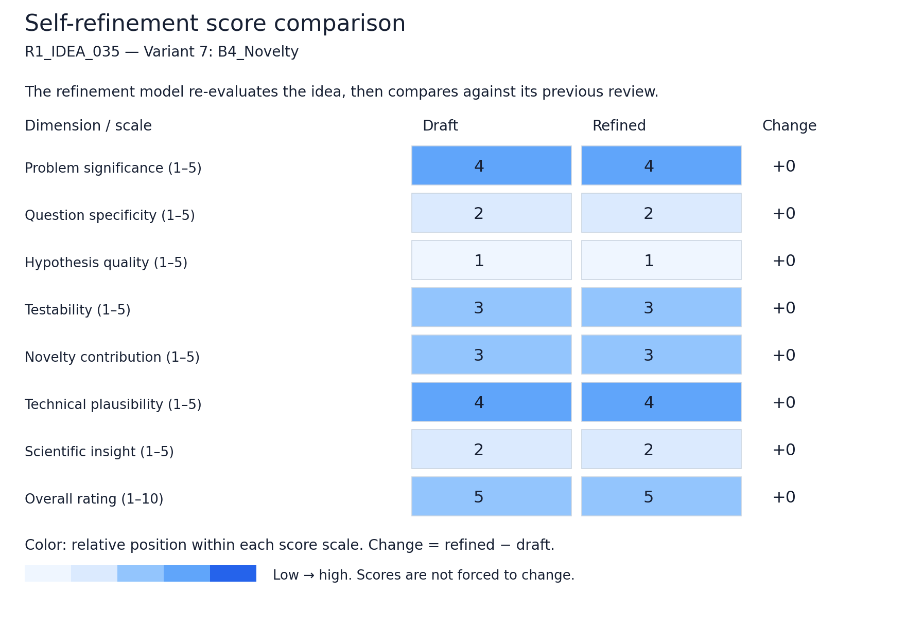

Changed score dimensions: none.

### Score justifications (draft / refined)

**Problem significance**

```json
{
  "draft": {
    "score": 4.0,
    "justification": "The lack of standardized benchmarks is a meaningful practical problem in graph pooling research, as it hinders fair comparison and progress assessment. Addressing this would benefit the community."
  },
  "refined": {
    "score": 4.0,
    "justification": "The problem is significant for the graph ML community. Lack of standardization and fair benchmarks is a well-known obstacle to reliable comparison and reproducible progress in many ML subfields, making this a meaningful and practical issue to address."
  }
}
```

**Question specificity**

```json
{
  "draft": {
    "score": 2.0,
    "justification": "The idea identifies a general need (better benchmarking) but does not define a specific research question about graph pooling mechanisms, limitations, or behaviors."
  },
  "refined": {
    "score": 2.0,
    "justification": "The idea is specific about the *action* (build a benchmark) but not about a *research question*. It identifies a general need ('lack of standardized settings') but does not define a concrete question about graph pooling that the research aims to investigate."
  }
}
```

**Hypothesis quality**

```json
{
  "draft": {
    "score": 1.0,
    "justification": "No hypothesis is presented. The idea is to create a benchmark, not to test a predictive claim about graph pooling."
  },
  "refined": {
    "score": 1.0,
    "justification": "There is no hypothesis. The idea describes a construction project, not a testable prediction or a proposed mechanism about graph pooling. The word 'hypothesis' does not appear, and no implicit claim is made that could be supported or contradicted by evidence from the benchmark."
  }
}
```

**Testability**

```json
{
  "draft": {
    "score": 3.0,
    "justification": "The benchmark construction itself is testable in the sense that it can be completed and used. However, the idea lacks a testable central claim about graph pooling."
  },
  "refined": {
    "score": 3.0,
    "justification": "The success of building the benchmark is testable (it can be completed and released). However, the idea lacks a central scientific claim about graph pooling that is testable via experimentation or analysis. The benchmark is a means, not a test itself."
  }
}
```

**Novelty contribution**

```json
{
  "draft": {
    "score": 3.0,
    "justification": "Creating a comprehensive benchmark is a useful contribution, but it is an incremental service contribution rather than a novel scientific insight. Similar benchmarking efforts exist in other ML areas."
  },
  "refined": {
    "score": 3.0,
    "justification": "Creating a comprehensive benchmark is a valuable service contribution to the community, especially if it becomes a standard. However, it is not novel in kind—benchmarking is a common activity in ML. The novelty lies in its application to graph pooling and its claimed comprehensiveness, not in the type of contribution."
  }
}
```

**Technical plausibility**

```json
{
  "draft": {
    "score": 4.0,
    "justification": "Constructing a benchmark with multiple methods and datasets is technically feasible and logically coherent given the stated problem."
  },
  "refined": {
    "score": 4.0,
    "justification": "The proposed direction is technically plausible and coherent. Implementing a benchmark by running existing methods on existing datasets with standardized code is a straightforward, if labor-intensive, engineering task. The reasoning (problem → solution) is logical."
  }
}
```

**Scientific insight**

```json
{
  "draft": {
    "score": 2.0,
    "justification": "The primary outcome is a standardized evaluation resource. While it may enable future insights, the idea itself does not aim to uncover new mechanisms, principles, or limitations of graph pooling methods."
  },
  "refined": {
    "score": 2.0,
    "justification": "The idea's primary goal is to create an evaluation resource. While such a resource can *enable* scientific insights by others, the idea itself does not aim to discover new mechanisms, principles, limitations, or relationships specific to graph pooling. The potential insight is indirect and deferred."
  }
}
```

**Overall rating**

```json
{
  "draft": {
    "score": 5.0,
    "justification": "This is a moderate/borderline research idea. It addresses a practical community need (benchmarking) but lacks a specific scientific question, hypothesis, or clear path to new scientific insight about graph pooling. It is more of an engineering/service project than a hypothesis-driven research investigation."
  },
  "refined": {
    "score": 5.0,
    "justification": "This is a moderate/borderline research idea. It addresses a clear and significant practical problem (lack of standardization) with a concrete plan (build a benchmark), which is valuable for the community. However, as a standalone research idea, it lacks the core components of scientific inquiry: a specific research question and a testable hypothesis about graph pooling. It is better characterized as an important engineering/service project or a foundation for future research, rather than as a hypothesis-driven investigation with direct scientific insight as its goal."
  }
}
```

## R1_IDEA_035 — Variant 8: B5_Application_Impact

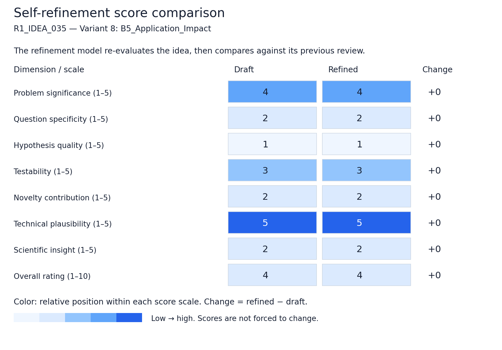

Changed score dimensions: none.

### Score justifications (draft / refined)

**Problem significance**

```json
{
  "draft": {
    "score": 4.0,
    "justification": "The problem is meaningful. Lack of standardization and fair comparison is a recognized issue in ML subfields, hindering progress and reliable application. Solving it for graph pooling is practically useful for the community."
  },
  "refined": {
    "score": 4.0,
    "justification": "The problem is significant from a practical and community health perspective. Lack of standardization and fair comparison is a well-known obstacle in ML subfields that impedes reproducible research, reliable progress, and confident application. Addressing it for graph pooling is a meaningful and useful endeavor."
  }
}
```

**Question specificity**

```json
{
  "draft": {
    "score": 2.0,
    "justification": "The idea states a general goal ('address the issue' of lack of standards) but does not define a specific research question. It proposes a tool (benchmark) rather than an investigation."
  },
  "refined": {
    "score": 2.0,
    "justification": "The idea states a general goal ('address the issue of lack of standards') but does not define a specific research question. It proposes the creation of a tool (a benchmark) rather than posing an investigative question about graph pooling. The 'what' is clear (build a benchmark), but the 'why' in a scientific sense is vague."
  }
}
```

**Hypothesis quality**

```json
{
  "draft": {
    "score": 1.0,
    "justification": "There is no explicit or implicit hypothesis. The idea is that a benchmark is needed and will be useful, which is an assertion, not a testable prediction about graph pooling mechanisms or performance."
  },
  "refined": {
    "score": 1.0,
    "justification": "There is no explicit or implicit scientific hypothesis. The core assertion is that a benchmark is needed and will be useful, which is a value judgment or a project goal, not a falsifiable prediction about the behavior, mechanisms, or comparative performance of graph pooling methods under specific conditions."
  }
}
```

**Testability**

```json
{
  "draft": {
    "score": 3.0,
    "justification": "The act of building the benchmark and running evaluations is testable in an engineering sense (it can be completed). However, the core 'idea' lacks a central claim that can be supported or contradicted by evidence. The success criterion is the existence of the benchmark, not a scientific finding."
  },
  "refined": {
    "score": 3.0,
    "justification": "The act of building the benchmark and running evaluations is testable in an engineering sense—it can be completed or not. However, the 'idea' itself lacks a central scientific claim that can be supported or contradicted by evidence generated from using the benchmark. Success is measured by the existence and utility of the benchmark, not by a scientific finding."
  }
}
```

**Novelty contribution**

```json
{
  "draft": {
    "score": 2.0,
    "justification": "Creating a new benchmark is a contribution, but it is primarily a service to the community (curation, standardization). It does not propose new scientific knowledge about graph pooling itself. Similar benchmarking efforts exist in other ML areas."
  },
  "refined": {
    "score": 2.0,
    "justification": "The primary contribution is the creation of a new benchmark, which is a service to the community (curation, standardization). While valuable, this does not constitute novel scientific knowledge about graph pooling itself. It is an application of a well-established practice (benchmarking) to a specific subfield."
  }
}
```

**Technical plausibility**

```json
{
  "draft": {
    "score": 5.0,
    "justification": "The proposed direction is technically straightforward and plausible. Building a benchmark by implementing methods and running them on datasets is a standard, feasible practice. No questionable assumptions are made."
  },
  "refined": {
    "score": 5.0,
    "justification": "The proposed direction is technically straightforward and highly plausible. Implementing a set of existing methods and evaluating them on a collection of datasets is a standard, feasible practice. No questionable technical assumptions are made."
  }
}
```

**Scientific insight**

```json
{
  "draft": {
    "score": 2.0,
    "justification": "As presented, the potential for scientific insight is low. The benchmark could produce tables of results, but the idea does not propose to analyze those results to uncover new principles, mechanisms, or boundary conditions of graph pooling methods. Insight is contingent on a later, unspecified analysis."
  },
  "refined": {
    "score": 2.0,
    "justification": "As presented, the potential for generating new scientific insight is low. The benchmark could produce performance tables, but the idea does not propose to analyze those results to uncover new principles, explain performance variations, or discover boundary conditions of graph pooling methods. Any insight is contingent on a later, unspecified analysis not part of the core idea."
  }
}
```

**Overall rating**

```json
{
  "draft": {
    "score": 4.0,
    "justification": "The idea addresses a practical, community-oriented need (standardization) and proposes a concrete, plausible action (building a benchmark). However, as a *research idea*, it is weak. It lacks a core research question, a testable hypothesis, and a clear path to generating new scientific insight about graph pooling. It is better characterized as an engineering or benchmarking project proposal. Its primary value is utilitarian, not scientific discovery."
  },
  "refined": {
    "score": 4.0,
    "justification": "The idea identifies a practical, community-useful problem and proposes a concrete, plausible solution (a benchmark). However, as a *research idea* aimed at scientific discovery, it is weak. It lacks a core research question, a testable hypothesis, and a clear pathway to generating new scientific insight about graph pooling. Its primary value is utilitarian and organizational, placing it more in the category of a valuable engineering or benchmarking project than a hypothesis-driven research investigation."
  }
}
```

## R1_IDEA_035 — Variant 9: C1_Hollow_Shell


Changed score dimensions: none.

### Score justifications (draft / refined)

**Problem significance**

```json
{
  "draft": {
    "score": 4.0,
    "justification": "The problem of standardized evaluation is significant in machine learning, particularly in rapidly evolving fields like graph representation learning. Better benchmarks could improve reproducibility and enable more meaningful comparisons between methods."
  },
  "refined": {
    "score": 4.0,
    "justification": "The problem is highly significant. Standardized evaluation is a critical, recurring challenge in ML subfields, especially fast-moving ones like graph learning. Addressing it directly enables better science, reproducibility, and progress. The idea correctly identifies this as an important issue."
  }
}
```

**Question specificity**

```json
{
  "draft": {
    "score": 1.0,
    "justification": "No specific research question is articulated. The idea describes a project (developing a benchmark) rather than posing a research question about evaluation practices, benchmark design, or methodological comparisons."
  },
  "refined": {
    "score": 1.0,
    "justification": "Extremely low specificity. The text describes an activity ('developing a benchmark') but poses zero research questions. It does not define what is being investigated about benchmarks, evaluation, or graph methods. There is no 'what', 'why', or 'how' to be studied."
  }
}
```

**Hypothesis quality**

```json
{
  "draft": {
    "score": 1.0,
    "justification": "There is no hypothesis presented. The idea merely states that a benchmark has been developed without proposing any testable claim about what makes it better, what gaps it fills, or what insights it might provide."
  },
  "refined": {
    "score": 1.0,
    "justification": "There is no hypothesis. The statement is purely descriptive ('a new benchmark has been developed'). It makes no prediction, proposes no mechanism, and offers no falsifiable claim. It is not a research hypothesis by any standard."
  }
}
```

**Testability**

```json
{
  "draft": {
    "score": 2.0,
    "justification": "While a benchmark itself could be evaluated (e.g., by testing whether it discriminates between methods as expected), the idea as presented doesn't specify what claims about the benchmark could be tested. The statement 'a new benchmark has been developed' is not a testable research proposition."
  },
  "refined": {
    "score": 2.0,
    "justification": "Minimally testable only in a very broad sense. One could test whether the benchmark exists and runs. However, the core of the idea as presented—that it 'helps address' a challenge—is not framed as a testable proposition. There is no defined experiment or analysis to evaluate its success or utility."
  }
}
```

**Novelty contribution**

```json
{
  "draft": {
    "score": 2.0,
    "justification": "The idea of creating benchmarks for graph representation learning is not novel in itself. Many benchmarks already exist. Without specifying what makes this benchmark different or better, the potential contribution is unclear."
  },
  "refined": {
    "score": 2.0,
    "justification": "The potential contribution is very unclear and likely low. The mere act of creating 'a new benchmark' is not novel; many exist. Without any specification of its differentiating features or the scientific void it fills, the contribution appears to be a generic application of a common practice (benchmark creation) to a popular domain."
  }
}
```

**Technical plausibility**

```json
{
  "draft": {
    "score": 3.0,
    "justification": "Developing a benchmark is technically plausible, but without details about what the benchmark contains or how it addresses the stated problem, it's impossible to assess whether the approach makes technical sense."
  },
  "refined": {
    "score": 3.0,
    "justification": "The general direction is plausible—creating benchmarks is a common and technically feasible activity. However, with no details provided, it's impossible to assess the coherence or soundness of the specific approach. The score reflects the neutral plausibility of the stated activity, not of a detailed plan."
  }
}
```

**Scientific insight**

```json
{
  "draft": {
    "score": 2.0,
    "justification": "The idea as presented focuses on creating a tool rather than generating scientific insight. While a well-designed benchmark could enable future insights by facilitating better comparisons, the idea doesn't articulate what specific insights the benchmark itself might provide about graph representation methods or evaluation practices."
  },
  "refined": {
    "score": 2.0,
    "justification": "Very low potential for direct scientific insight as presented. The idea is tool-oriented. While a well-designed benchmark can *enable* future insights, the idea itself does not articulate what specific insight about graph learning or evaluation methodology it seeks to generate. It describes a deliverable, not a discovery process."
  }
}
```

**Overall rating**

```json
{
  "draft": {
    "score": 3.0,
    "justification": "This is a weak research idea because it lacks a clear research question, hypothesis, or specific contribution. While it identifies a meaningful problem (standardized evaluation), it doesn't articulate what scientific investigation would be conducted. The description reads more like a project announcement than a research proposal. It needs substantial refinement to become a testable research idea with clear scientific value."
  },
  "refined": {
    "score": 3.0,
    "justification": "This is a weak research idea. It identifies a significant problem but fails to formulate any research question, hypothesis, or specific investigative aim. It reads as a project announcement or a description of a completed tool, not as a proposal for scientific inquiry. For it to become a research idea, it must be reframed around a testable claim about evaluation, benchmark design, or methodological understanding."
  }
}
```

## R1_IDEA_035 — Variant 10: C2_Logic_Flawed

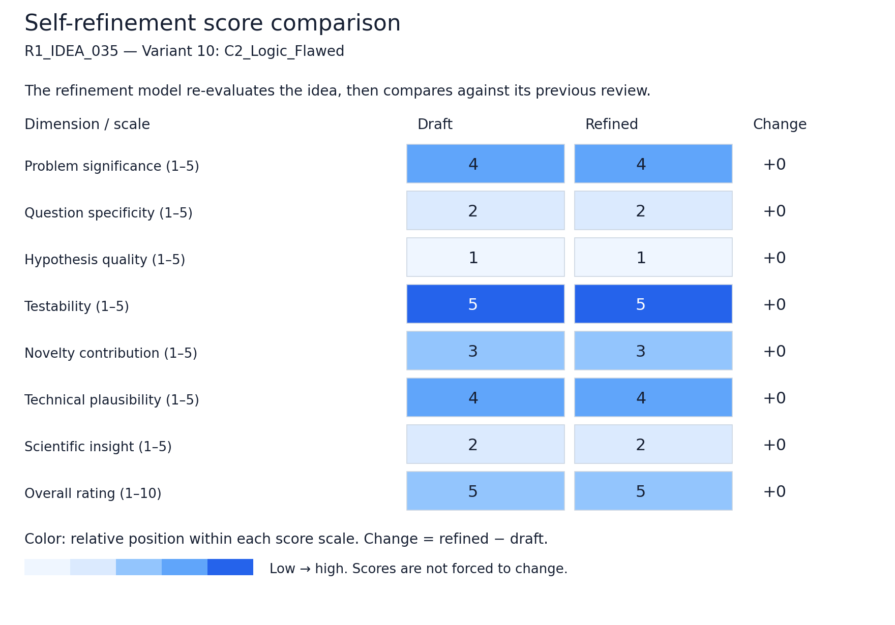

Changed score dimensions: none.

### Score justifications (draft / refined)

**Problem significance**

```json
{
  "draft": {
    "score": 4.0,
    "justification": "The problem is meaningful. Lack of standardization and fair comparison is a recognized issue in ML subfields that hinders progress. Creating rigorous benchmarks is a valuable service to the community."
  },
  "refined": {
    "score": 4.0,
    "justification": "The problem is highly meaningful. Lack of standardization and fair benchmarks is a recognized barrier to progress in many ML subfields. Creating rigorous benchmarks is a valuable service that enables reliable comparison and identifies robust methods."
  }
}
```

**Question specificity**

```json
{
  "draft": {
    "score": 2.0,
    "justification": "The idea is not framed as a research question. It states an action ('construct a benchmark') and a vague implication ('suggest broader effectiveness'). A specific question about method comparison or dataset characteristics is missing."
  },
  "refined": {
    "score": 2.0,
    "justification": "The idea does not pose a research question. It describes an action ('construct a benchmark') and a vague outcome ('suggest broader effectiveness'). There is no concrete inquiry about relationships, mechanisms, or conditions governing graph pooling performance."
  }
}
```

**Hypothesis quality**

```json
{
  "draft": {
    "score": 1.0,
    "justification": "There is no clear, testable hypothesis. The phrase 'suggesting broader effectiveness' is an observation or hope, not a falsifiable prediction about the relationship between methods, datasets, or underlying principles."
  },
  "refined": {
    "score": 1.0,
    "justification": "There is no testable hypothesis. The phrase 'suggesting broader effectiveness' is an aspirational statement, not a falsifiable prediction about method behavior, dataset characteristics, or underlying principles. It lacks the specificity required for scientific investigation."
  }
}
```

**Testability**

```json
{
  "draft": {
    "score": 5.0,
    "justification": "The core proposed action—building and running a benchmark—is inherently testable. By defining standardized protocols and running experiments, one can obtain empirical results (performance scores) for each method on each dataset. The testability is high, though it's applied to an activity rather than a hypothesis."
  },
  "refined": {
    "score": 5.0,
    "justification": "The core activity—implementing a benchmark and running experiments—is inherently testable. Performance metrics can be measured and compared across methods and datasets. However, this testability applies to the engineering task, not to a scientific hypothesis."
  }
}
```

**Novelty contribution**

```json
{
  "draft": {
    "score": 3.0,
    "justification": "The contribution type (creating a benchmark) is well-established and valuable for mature subfields. The novelty would stem from the comprehensiveness, rigor, and specific design choices of *this particular* benchmark. The idea as stated does not clarify what makes its design novel compared to prior efforts (if any)."
  },
  "refined": {
    "score": 3.0,
    "justification": "The contribution type (creating a benchmark) is well-established. Novelty would depend on the benchmark's design, rigor, and analysis. The idea as stated emphasizes scale (17 methods, 28 datasets) but does not articulate novel design elements, taxonomies, or protocols that differentiate it from prior benchmarking efforts."
  }
}
```

**Technical plausibility**

```json
{
  "draft": {
    "score": 4.0,
    "justification": "The idea is technically straightforward and plausible. Implementing a benchmark for 17 methods on 28 datasets is a significant but feasible engineering effort. The logical step of 'problem → need for standardization → create benchmark' is sound."
  },
  "refined": {
    "score": 4.0,
    "justification": "The idea is technically straightforward and plausible. Building a benchmark for graph pooling methods, while a significant engineering effort, is feasible. The logical flow from problem (lack of standardization) to solution (create benchmark) is coherent."
  }
}
```

**Scientific insight**

```json
{
  "draft": {
    "score": 2.0,
    "justification": "As presented, the potential insight is limited to tabulating performance rankings. The idea does not propose to analyze *why* methods perform differently or to relate performance to dataset characteristics. The insight would be primarily empirical (what works) rather than mechanistic (why it works)."
  },
  "refined": {
    "score": 2.0,
    "justification": "As presented, the potential insight is limited to empirical performance tables. The idea does not propose to analyze why methods perform differently, relate performance to graph properties, or uncover limitations or boundary conditions. The primary output appears to be a utility rather than a mechanism for generating transferable scientific understanding."
  }
}
```

**Overall rating**

```json
{
  "draft": {
    "score": 5.0,
    "justification": "This is a moderate/borderline research idea. It identifies a real and significant practical problem (lack of standardization) and proposes a concrete, plausible solution (a comprehensive benchmark). However, it is framed as an engineering/service activity rather than a scientific investigation. It lacks a specific research question, a testable hypothesis, and a clear path to generating new scientific insight beyond aggregated performance numbers. Its primary value is in providing a utility to the community, which is worthwhile but limits its rating as a 'research idea' seeking novel scientific understanding."
  },
  "refined": {
    "score": 5.0,
    "justification": "This is a moderate/borderline research idea. It identifies a significant practical problem and proposes a concrete, plausible solution with community value. However, as a scientific research idea, it is weak: it lacks a specific research question, a testable hypothesis, and a clear path to generating novel scientific insight beyond aggregated performance measurements. Its primary contribution is utilitarian (providing a benchmarking tool) rather than investigative (answering a scientific question)."
  }
}
```

## R1_IDEA_035 — Variant 11: C3_Substance_Enriched

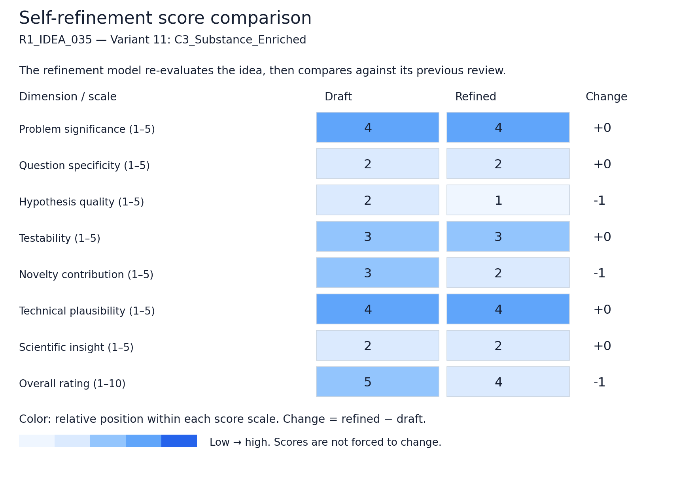

Changed score dimensions: hypothesis_quality, novelty_contribution, overall_rating.

### Score justifications (draft / refined)

**Problem significance**

```json
{
  "draft": {
    "score": 4.0,
    "justification": "The lack of standardized evaluation for graph pooling methods is a meaningful problem in graph ML. Better benchmarks would help the community compare methods more fairly and understand their relative strengths. This addresses a practical need in the field."
  },
  "refined": {
    "score": 4.0,
    "justification": "The problem is significant. The lack of standardized, fair benchmarks is a recognized obstacle to progress in graph ML, leading to potentially misleading comparisons. Addressing this directly serves a clear community need."
  }
}
```

**Question specificity**

```json
{
  "draft": {
    "score": 2.0,
    "justification": "The idea mentions future research directions but doesn't define a specific research question. The core proposal is benchmark construction, which is a tool rather than a research question. The suggested future work ('possible validation route', 'boundary conditions might be explored') is vague and non-committal."
  },
  "refined": {
    "score": 2.0,
    "justification": "The idea is not centered on a specific research question. The main action is benchmark construction—a tool-building activity. The appended future directions ('possible validation', 'might be explored') are mentioned in a non-committal, exploratory manner, not as focused questions."
  }
}
```

**Hypothesis quality**

```json
{
  "draft": {
    "score": 2.0,
    "justification": "No explicit hypothesis is presented. The mention of 'a possible validation route could involve testing whether benchmark performance correlates with performance on unseen, real-world graph types' is phrased as a possibility rather than a concrete prediction. There's no specific mechanism or relationship proposed."
  },
  "refined": {
    "score": 1.0,
    "justification": "There is no explicit or implicit concrete hypothesis. The text uses tentative language ('a possible validation route could involve testing whether...', 'boundary conditions might be explored'). It suggests areas for future inquiry but makes no specific, testable prediction about relationships, mechanisms, or outcomes."
  }
}
```

**Testability**

```json
{
  "draft": {
    "score": 3.0,
    "justification": "Benchmark construction itself is testable (one can build it and evaluate methods). The suggested future directions are testable in principle but not well-specified. The correlation question could be tested with appropriate datasets, and boundary conditions could be explored through controlled experiments."
  },
  "refined": {
    "score": 3.0,
    "justification": "The act of building the benchmark is testable (it can be completed or not). The suggested follow-up analyses (correlation studies, exploring scale/density) are testable in principle, but they are so vaguely defined that designing a concrete test from the description alone is difficult. The core 'idea' lacks a central claim to test."
  }
}
```

**Novelty contribution**

```json
{
  "draft": {
    "score": 3.0,
    "justification": "Benchmark construction is valuable but not highly novel in itself. The contribution would be in the specific design choices and comprehensiveness. The suggested future research directions are somewhat generic (correlation with real-world performance, scale/density effects) rather than novel scientific questions."
  },
  "refined": {
    "score": 2.0,
    "justification": "The contribution is primarily practical: creating a new, comprehensive benchmark. While valuable, this is an engineering/curation task, not a novel scientific contribution. The suggested future directions are generic concerns (generalization, effect of data properties) common to many ML benchmarking efforts."
  }
}
```

**Technical plausibility**

```json
{
  "draft": {
    "score": 4.0,
    "justification": "Constructing a benchmark with 17 methods and 28 datasets is technically feasible. The reasoning is coherent: better benchmarks are needed for fair comparison. The suggested future directions are plausible if properly specified."
  },
  "refined": {
    "score": 4.0,
    "justification": "The proposal is technically plausible. Assembling existing methods and datasets into a unified benchmarking framework is a straightforward, if labor-intensive, task. The reasoning—that better benchmarks are needed—is logically sound."
  }
}
```

**Scientific insight**

```json
{
  "draft": {
    "score": 2.0,
    "justification": "The benchmark itself primarily provides practical utility rather than scientific insight. The suggested future directions could yield insights (e.g., understanding when benchmarks generalize, how graph properties affect pooling performance), but these are not developed enough to promise significant scientific understanding. The idea focuses more on evaluation tools than on advancing theoretical understanding of graph pooling."
  },
  "refined": {
    "score": 2.0,
    "justification": "The benchmark itself offers limited scientific insight; it is a tool for evaluation. The potential for insight lies in the vague future work, but the idea does not develop these directions enough to promise a deeper understanding of graph pooling mechanisms, limitations, or principles. The focus is on measurement, not explanation."
  }
}
```

**Overall rating**

```json
{
  "draft": {
    "score": 5.0,
    "justification": "This is a moderate/borderline research idea. The benchmark construction addresses a practical need and would be useful to the community, but as a research idea, it lacks a clear scientific question or hypothesis. The suggested future directions are too vague to constitute a strong research proposal. The idea is more about creating an evaluation tool than about investigating a specific scientific question about graph pooling methods."
  },
  "refined": {
    "score": 4.0,
    "justification": "This is a weak research idea. While it addresses a practically important problem (benchmark scarcity), it is framed as a solution-building exercise, not a hypothesis-driven investigation. It lacks a core scientific question, a testable hypothesis, and a clear path to novel insight about graph pooling. Its primary value is utilitarian (providing a useful tool), not scientific (advancing knowledge)."
  }
}
```

## R1_IDEA_035 — Variant 12: H1_Deceptive_Hollow


Changed score dimensions: none.

### Score justifications (draft / refined)

**Problem significance**

```json
{
  "draft": {
    "score": 4.0,
    "justification": "Standardized evaluation is a meaningful problem in machine learning, especially in rapidly evolving areas like graph representation learning. Better benchmarks could help the field progress more systematically by enabling fairer comparisons and revealing method strengths/weaknesses more clearly."
  },
  "refined": {
    "score": 4.0,
    "justification": "The problem is significant. Standardized, robust evaluation is a fundamental challenge in ML sub-fields. Improving benchmarks can directly impact the rigor, comparability, and direction of research in graph representation learning, which is a active and important area."
  }
}
```

**Question specificity**

```json
{
  "draft": {
    "score": 1.0,
    "justification": "Extremely weak. The idea does not define any concrete research question. It merely states that a benchmark has been developed and makes grandiose claims about its potential impact without specifying what is actually being investigated."
  },
  "refined": {
    "score": 1.0,
    "justification": "Exceptionally weak. No research question is defined. The text describes a motivational premise (need for standards) and a proposed artifact (a benchmark), but does not specify what is being investigated, analyzed, or tested. It is a declaration of intent, not a research question."
  }
}
```

**Hypothesis quality**

```json
{
  "draft": {
    "score": 1.0,
    "justification": "No hypothesis is presented. There is no prediction about what specific insights the benchmark will provide, what relationships it will reveal, or how it will change our understanding of graph representation methods."
  },
  "refined": {
    "score": 1.0,
    "justification": "No hypothesis is present. There is no prediction, proposed mechanism, or relationship to be tested. The text makes aspirational claims about impact ('transformative synthesis') but these are not falsifiable scientific hypotheses."
  }
}
```

**Testability**

```json
{
  "draft": {
    "score": 2.0,
    "justification": "While benchmarks are inherently testable (people can use them), the core claims about being 'transformative' and 'field-shaping' are not directly testable. There's no clear experiment or analysis proposed to validate the benchmark's value beyond its existence."
  },
  "refined": {
    "score": 2.0,
    "justification": "The core activity (building a benchmark) is doable, but the central *scientific claims* of the idea are not testable as stated. Claims like 'reshape how the community thinks' are not directly testable. There is no proposed experiment or analysis to validate the benchmark's value or the insights it would produce."
  }
}
```

**Novelty contribution**

```json
{
  "draft": {
    "score": 2.0,
    "justification": "Creating yet another benchmark without specifying what makes it novel compared to existing ones offers limited contribution. The description suggests it might be just a collection of existing methods and datasets rather than a genuinely new approach to evaluation."
  },
  "refined": {
    "score": 2.0,
    "justification": "Very limited based on the description. Proposing 'a new benchmark' is not inherently novel. The contribution would depend entirely on its novel design principles or the specific gaps it fills, which are not specified. The description suggests it might merely aggregate existing methods and datasets."
  }
}
```

**Technical plausibility**

```json
{
  "draft": {
    "score": 3.0,
    "justification": "Creating a benchmark is technically plausible, but the description is too vague to assess whether the proposed approach makes technical sense. The claims about creating a 'broader framework for robust, adaptive, and high-impact scientific systems' are grandiose without technical details."
  },
  "refined": {
    "score": 3.0,
    "justification": "Creating a benchmark is technically plausible. However, the grandiose framing ('broader framework for robust, adaptive, and high-impact scientific systems') is technically vague and unsubstantiated, making the higher-level technical vision difficult to assess."
  }
}
```

**Scientific insight**

```json
{
  "draft": {
    "score": 2.0,
    "justification": "A benchmark could potentially provide scientific insight if designed to test specific hypotheses about method behavior. However, the current description focuses on the benchmark's existence rather than what specific insights it would enable. Without a clear research question, the potential for scientific insight is limited."
  },
  "refined": {
    "score": 2.0,
    "justification": "Low potential as described. A benchmark is a tool for gaining insight, not insight itself. The idea does not specify what scientific insight the tool is designed to produce (e.g., 'understanding the relationship between graph homophily and method performance'). Without a linked research question, the potential insight is undefined."
  }
}
```

**Overall rating**

```json
{
  "draft": {
    "score": 3.0,
    "justification": "This is a weak research idea. While it identifies a potentially meaningful problem (lack of standardized evaluation), it fails to articulate a concrete research question, hypothesis, or novel contribution. The description is mostly grandiose marketing language without substantive scientific content. It reads more like a motivation for a benchmark than a research idea about what specific scientific questions the benchmark would help answer."
  },
  "refined": {
    "score": 3.0,
    "justification": "This is a weak research idea. It identifies a significant problem (evaluation standards) but completely fails to articulate a research question, hypothesis, or testable scientific proposition. It is presented as a solution (a benchmark) in search of a problem, wrapped in grandiose language. It lacks the core components of a research idea: a specific inquiry and a path to generating evidence. It is more akin to a project announcement or motivation statement."
  }
}
```

## R1_IDEA_035 — Variant 13: H2_Confident_Flaw

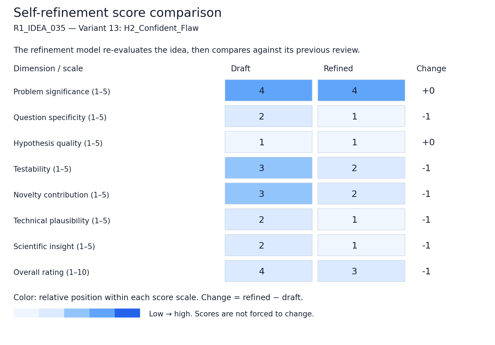

Changed score dimensions: question_specificity, testability, novelty_contribution, technical_plausibility, scientific_insight, overall_rating.

### Score justifications (draft / refined)

**Problem significance**

```json
{
  "draft": {
    "score": 4.0,
    "justification": "The problem of lacking standardized benchmarks in graph pooling is meaningful and recognized in the community. Better evaluation practices could accelerate research and improve reproducibility."
  },
  "refined": {
    "score": 4.0,
    "justification": "The problem is highly significant from a practical research perspective. The lack of standardized, fair benchmarks is a major obstacle to reliable progress in graph representation learning. Solving it would provide substantial utility to the community."
  }
}
```

**Question specificity**

```json
{
  "draft": {
    "score": 2.0,
    "justification": "The idea lacks a clear research question. It proposes building a benchmark but doesn't specify what will be learned from it beyond 'broader effectiveness'. No concrete question about mechanisms, trade-offs, or conditions is articulated."
  },
  "refined": {
    "score": 1.0,
    "justification": "Extremely weak. No research question is articulated. The text describes an activity ('construct a benchmark') and makes an unsupported claim about its outcome ('establish causal evidence'), but does not specify what is being investigated about graph pooling itself. The 'question' is essentially 'What are the scores on our benchmark?'"
  }
}
```

**Hypothesis quality**

```json
{
  "draft": {
    "score": 1.0,
    "justification": "There is no testable hypothesis presented. The implicit claim seems to be that 'a comprehensive benchmark will show broader effectiveness', but this is vague and not falsifiable. The stronger claim about establishing 'causal evidence' is made without proposing any causal hypothesis or inference method."
  },
  "refined": {
    "score": 1.0,
    "justification": "There is no testable hypothesis. The implicit claim—'a comprehensive benchmark will show broader effectiveness and prove general superiority'—is vague, not falsifiable (what constitutes 'broader' or 'superiority'?), and is based on a flawed premise (that benchmarks prove causality). A proper hypothesis would predict a relationship between method properties and outcomes under specific conditions."
  }
}
```

**Testability**

```json
{
  "draft": {
    "score": 3.0,
    "justification": "Benchmark construction is testable in the sense that one can build it and run experiments. However, the idea's core claims about 'causal evidence' and 'general superiority' are not testable as presented because they dismiss necessary controls and alternative explanations."
  },
  "refined": {
    "score": 2.0,
    "justification": "The activity of building and running a benchmark is testable. However, the core conceptual claims of the idea—that this approach 'will necessarily produce reliable improvements' and provides 'causal evidence'—are not testable as stated because they are declarative assertions disconnected from a methodological framework for establishing causality or improvement."
  }
}
```

**Novelty contribution**

```json
{
  "draft": {
    "score": 3.0,
    "justification": "While benchmark construction is valuable for the community, it represents an incremental contribution rather than novel scientific insight. Many fields have benchmark papers; the novelty would depend on the specific design choices and analyses proposed, which are not detailed here."
  },
  "refined": {
    "score": 2.0,
    "justification": "The contribution is primarily utilitarian (providing a resource) rather than novel scientific knowledge. Creating a new benchmark is a common activity in ML. Novelty would stem from unique design, novel insights generated, or a new hypothesis being tested—none of which are specified. The claim of establishing causality is novel but is presented as an assumption, not a reasoned argument."
  }
}
```

**Technical plausibility**

```json
{
  "draft": {
    "score": 2.0,
    "justification": "The technical reasoning is flawed. The claim that benchmark results alone can establish 'causal evidence' without controlling for confounding factors contradicts basic principles of experimental design. The dismissal of isolating variables suggests a misunderstanding of what constitutes rigorous evaluation."
  },
  "refined": {
    "score": 1.0,
    "justification": "The central argument is technically implausible and reflects a misunderstanding of scientific evaluation. The claim that one can obtain 'causal evidence for the method's general superiority' from a benchmark 'without separately isolating... alternative explanations' is fundamentally at odds with established principles of experimental design and causal inference. The reasoning is logically incoherent."
  }
}
```

**Scientific insight**

```json
{
  "draft": {
    "score": 2.0,
    "justification": "As presented, the idea offers limited potential for scientific insight. A well-designed benchmark could reveal patterns about which methods work well under which conditions, but the current proposal focuses on establishing 'superiority' rather than understanding mechanisms, limitations, or principles."
  },
  "refined": {
    "score": 1.0,
    "justification": "As presented, the idea has very low potential for scientific insight. It aims to rank methods, not to understand them. It explicitly dismisses the need to investigate 'mechanisms,' 'boundary cases,' or 'alternative explanations,' which are the very sources of insight. A benchmark can be a tool for gaining insight, but this proposal does not articulate how that tool will be used for that purpose."
  }
}
```

**Overall rating**

```json
{
  "draft": {
    "score": 4.0,
    "justification": "This is a weak research idea. While it identifies a real community need (better benchmarks), it fails to articulate a meaningful research question or hypothesis. The proposed approach dismisses essential scientific considerations and makes unsupported claims about causality. The idea confuses tool-building with hypothesis-driven research and lacks the specificity needed for a strong research direction."
  },
  "refined": {
    "score": 3.0,
    "justification": "This is a weak research idea. It identifies a real and significant practical problem (lack of benchmarks) but fails to transform that into a scientific research direction. It lacks a research question, presents no hypothesis, and is built on a technically implausible and unscientific core claim about establishing causality. The proposal is for an engineering resource project, not for hypothesis-driven research that would generate new scientific understanding about graph pooling. Its primary value would be as a service to the community, not as a contribution to knowledge."
  }
}
```

## R1_IDEA_035 — Variant 14: H3_Verbose_Enriched


Changed score dimensions: none.

### Score justifications (draft / refined)

**Problem significance**

```json
{
  "draft": {
    "score": 4.0,
    "justification": "Lack of standardized benchmarks is a meaningful problem in graph ML that hinders progress and fair comparison. Solving it would benefit the community."
  },
  "refined": {
    "score": 4.0,
    "justification": "The lack of standardized benchmarks is a significant practical problem in graph ML that hinders reproducible research and fair comparison. Addressing it would provide substantial value to the community."
  }
}
```

**Question specificity**

```json
{
  "draft": {
    "score": 2.0,
    "justification": "The idea is centered on benchmark creation, not a specific research question. The proposed validation and boundary explorations are mentioned but not tightly integrated into a clear investigative goal."
  },
  "refined": {
    "score": 2.0,
    "justification": "The idea is centered on building a benchmark resource, not on investigating a specific research question. While it mentions possible future validation and boundary explorations, these are not integrated into a clear, concrete investigative goal."
  }
}
```

**Hypothesis quality**

```json
{
  "draft": {
    "score": 2.0,
    "justification": "No explicit hypothesis is stated. The 'possible validation route' (correlation with real-world performance) is tentative and not framed as a testable prediction."
  },
  "refined": {
    "score": 2.0,
    "justification": "No explicit hypothesis is stated. The 'possible validation route' (correlation with real-world performance) is mentioned tentatively and is not framed as a testable prediction. The idea lacks a concrete claim about graph pooling that could be supported or contradicted."
  }
}
```

**Testability**

```json
{
  "draft": {
    "score": 3.0,
    "justification": "Benchmark construction itself is testable in that methods can be compared. The suggested staged design with ablations and sensitivity analyses is a good experimental approach, but it is not linked to a specific claim."
  },
  "refined": {
    "score": 3.0,
    "justification": "Benchmark construction itself is testable in that methods can be compared on standardized datasets. The proposed staged experimental design (ablations, sensitivity analyses) is a robust methodological approach. However, without a specific claim to test, the testability is procedural rather than hypothesis-driven."
  }
}
```

**Novelty contribution**

```json
{
  "draft": {
    "score": 3.0,
    "justification": "Creating a comprehensive benchmark is useful but not highly novel unless it introduces new datasets, metrics, or insights about pooling. The contribution is primarily infrastructural."
  },
  "refined": {
    "score": 3.0,
    "justification": "Creating a comprehensive benchmark is a useful infrastructural contribution, but it is not highly novel scientifically unless it introduces new evaluation paradigms, uncovers previously unknown limitations, or leads to new insights about pooling mechanisms. The contribution is primarily practical."
  }
}
```

**Technical plausibility**

```json
{
  "draft": {
    "score": 4.0,
    "justification": "Building a benchmark with many methods and datasets is technically feasible. The proposed experimental design is logically sound."
  },
  "refined": {
    "score": 4.0,
    "justification": "Building a benchmark with many methods and datasets is technically feasible. The proposed experimental design (staged testing, ablations, sensitivity analyses) is logically coherent and aligns with rigorous ML evaluation practices."
  }
}
```

**Scientific insight**

```json
{
  "draft": {
    "score": 3.0,
    "justification": "If well-designed, the benchmark could reveal which pooling strategies work under which conditions, but the idea as presented does not explicitly aim for mechanistic or generalizable insights about graph pooling."
  },
  "refined": {
    "score": 3.0,
    "justification": "If executed with the proposed rigorous design, the benchmark could reveal empirical patterns about which pooling strategies work under which conditions. However, the idea as presented does not explicitly aim for mechanistic understanding, general principles, or deep insights into why pooling methods behave as they do. The potential insight is moderate and contingent on how the benchmark analysis is framed."
  }
}
```

**Overall rating**

```json
{
  "draft": {
    "score": 5.0,
    "justification": "The idea addresses an important practical need (benchmarking) but lacks a clear research question or hypothesis. It suggests useful experimental practices but does not define what scientific knowledge it aims to produce. It is a moderate/borderline research idea because it could evolve into a stronger study if centered on a specific hypothesis about graph pooling behavior."
  },
  "refined": {
    "score": 5.0,
    "justification": "The idea addresses an important practical need (standardized benchmarking) and proposes a methodologically sound approach. However, it lacks a clear research question or hypothesis about graph pooling itself. It is a moderate/borderline research idea because it is more of a resource-building proposal than a hypothesis-driven investigation. It could evolve into a stronger study if centered on a specific scientific question about graph pooling behavior."
  }
}
```

## R1_IDEA_035 — Variant 15: H4_Ultimate_Hype


Changed score dimensions: none.

### Score justifications (draft / refined)

**Problem significance**

```json
{
  "draft": {
    "score": 4.0,
    "justification": "The lack of standardized benchmarks in graph pooling is a recognized issue that hampers progress. Better evaluation practices could significantly benefit the research community by enabling fair comparisons and more reliable progress tracking."
  },
  "refined": {
    "score": 4.0,
    "justification": "The lack of standardized benchmarks in graph pooling is a recognized practical problem that hampers reliable progress assessment and fair comparisons. Better evaluation infrastructure could significantly benefit the research community by enabling more rigorous methodology development."
  }
}
```

**Question specificity**

```json
{
  "draft": {
    "score": 2.0,
    "justification": "The idea lacks a specific research question. It states a general problem (lack of benchmarks) but doesn't define what will be investigated beyond creating the benchmark itself. No concrete question about graph pooling properties, behaviors, or relationships is articulated."
  },
  "refined": {
    "score": 2.0,
    "justification": "The idea lacks a specific research question about graph pooling. It states a general infrastructure need (lack of benchmarks) but doesn't define what will be investigated beyond creating the benchmark itself. No concrete question about graph pooling properties, behaviors, or relationships is articulated."
  }
}
```

**Hypothesis quality**

```json
{
  "draft": {
    "score": 1.0,
    "justification": "There is no explicit or implicit hypothesis. The idea doesn't make predictions about graph pooling methods, propose relationships between method characteristics and performance, or suggest what might be discovered through systematic benchmarking."
  },
  "refined": {
    "score": 1.0,
    "justification": "There is no explicit or implicit hypothesis about graph pooling methods. The idea doesn't make predictions about relationships between method characteristics and performance, propose mechanisms that might explain performance differences, or suggest what systematic evaluation might reveal about the field's current state."
  }
}
```

**Testability**

```json
{
  "draft": {
    "score": 3.0,
    "justification": "Creating and using a benchmark is inherently testable - methods can be evaluated on it. However, without a specific research question or hypothesis, the 'test' is simply running experiments rather than testing a particular claim. The benchmark's utility could be tested by whether it reveals consistent patterns or enables new insights."
  },
  "refined": {
    "score": 3.0,
    "justification": "Creating and using a benchmark is inherently testable in that methods can be evaluated on it. However, without a specific research question or hypothesis, the 'test' is simply running experiments rather than testing a particular scientific claim. The benchmark's utility could be assessed by whether it reveals consistent patterns, but this is not framed as a testable proposition."
  }
}
```

**Novelty contribution**

```json
{
  "draft": {
    "score": 3.0,
    "justification": "Creating a comprehensive benchmark has practical value but limited scientific novelty unless it leads to new discoveries about graph pooling. Many fields have benchmark papers; the contribution level depends on what insights emerge from the systematic comparison, which isn't specified here."
  },
  "refined": {
    "score": 3.0,
    "justification": "Creating a comprehensive benchmark has practical utility but limited scientific novelty unless it leads to new discoveries about graph pooling. Many ML subfields have benchmark papers; the scientific contribution level depends entirely on what insights emerge from systematic comparison, which isn't specified here. The work would be more infrastructural than scientifically novel."
  }
}
```

**Technical plausibility**

```json
{
  "draft": {
    "score": 4.0,
    "justification": "Creating a benchmark for graph pooling methods is technically straightforward and aligns with similar efforts in other ML areas. The described scope (17 methods, 28 datasets) suggests a substantial but feasible engineering effort."
  },
  "refined": {
    "score": 4.0,
    "justification": "Creating a benchmark for graph pooling methods is technically straightforward and aligns with similar efforts in other ML areas. The described scope (17 methods, 28 datasets) suggests a substantial but feasible engineering effort. Standardizing experimental settings is a well-understood task in ML benchmarking."
  }
}
```

**Scientific insight**

```json
{
  "draft": {
    "score": 2.0,
    "justification": "As presented, the idea focuses on evaluation infrastructure rather than scientific insight. A well-designed benchmark could enable insights about graph pooling methods, but the idea doesn't specify what insights might be gained or how the benchmark would be designed to reveal them."
  },
  "refined": {
    "score": 2.0,
    "justification": "As presented, the idea focuses on evaluation infrastructure rather than scientific insight generation. A well-designed benchmark could enable insights about graph pooling methods, but the idea doesn't specify what insights might be gained or how the benchmark would be designed to reveal them. The description emphasizes practical utility over scientific understanding."
  }
}
```

**Overall rating**

```json
{
  "draft": {
    "score": 5.0,
    "justification": "This is a moderate/borderline research idea. It addresses a practical need (better benchmarks) that could benefit the community, but as presented, it lacks a specific research question, hypothesis, or clear path to scientific insight. The idea is more about creating infrastructure than conducting scientific investigation. With refinement to include specific research questions that the benchmark could answer, it could become stronger."
  },
  "refined": {
    "score": 5.0,
    "justification": "This is a moderate/borderline research idea. It addresses a practical community need (better benchmarks) that could benefit graph ML research, but as presented, it lacks a specific research question, hypothesis, or clear path to scientific insight. The idea is more about creating infrastructure than conducting scientific investigation. With refinement to include specific research questions that the benchmark could answer about graph pooling methods themselves, it could become stronger scientifically."
  }
}
```

## R1_IDEA_036 — Source

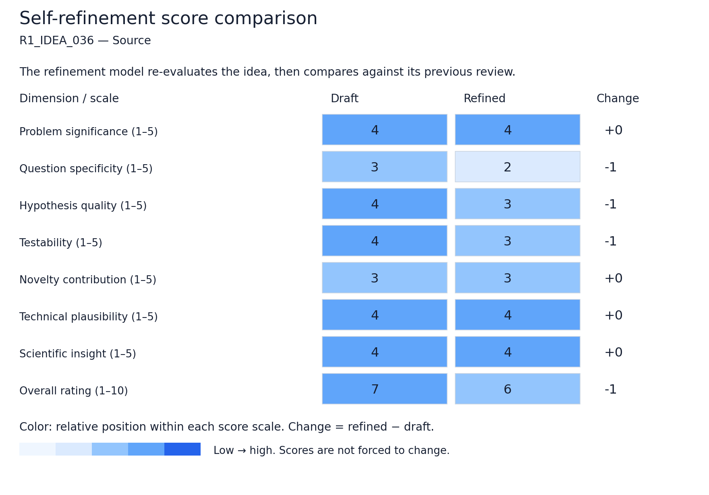

Changed score dimensions: question_specificity, hypothesis_quality, testability, overall_rating.

### Score justifications (draft / refined)

**Problem significance**

```json
{
  "draft": {
    "score": 4.0,
    "justification": "The problem addresses a practical misconception that could affect method selection in real applications. Understanding trade-offs between parametric and non-parametric DR methods is important for both practitioners and researchers developing new methods."
  },
  "refined": {
    "score": 4.0,
    "justification": "The problem is meaningful. Clarifying misconceptions about widely used tool classes (parametric vs. non-parametric DR) has direct practical importance for practitioners choosing methods. Understanding the inherent trade-offs between generalization and fidelity is a core scientific question in machine learning."
  }
}
```

**Question specificity**

```json
{
  "draft": {
    "score": 3.0,
    "justification": "The research question is reasonably specific - comparing parametric vs. non-parametric DR methods on global vs. local structure preservation. However, it lacks specification of which methods, datasets, or evaluation metrics would be used."
  },
  "refined": {
    "score": 2.0,
    "justification": "The research question is under-specified. While it identifies a comparison (parametric vs. non-parametric) and a trade-off (global vs. local structure), it lacks all concrete details needed to define the investigation: which methods, what data, and crucially, how to measure the key concepts. The categories are overly broad."
  }
}
```

**Hypothesis quality**

```json
{
  "draft": {
    "score": 4.0,
    "justification": "The hypothesis is clear and testable: parametric methods retain global structure but lose local details compared to non-parametric methods. It makes a concrete prediction about a trade-off that could be falsified through experiments."
  },
  "refined": {
    "score": 3.0,
    "justification": "The hypothesis is clear in its directional prediction (parametric keeps global, loses local) and is falsifiable. However, it is presented as a broad, categorical claim about two large families of methods, which weakens it. A stronger hypothesis would be more nuanced or specific to a mechanism (e.g., 'the smoothing effect of a learned parametric function causes...')."
  }
}
```

**Testability**

```json
{
  "draft": {
    "score": 4.0,
    "justification": "The hypothesis is highly testable through comparative experiments using established DR evaluation metrics. One could design experiments measuring global structure preservation (e.g., distance correlation) and local structure preservation (e.g., trustworthiness) on both training and unseen test data."
  },
  "refined": {
    "score": 3.0,
    "justification": "The hypothesis is testable in principle, but the idea provides no pathway for testing. It mentions no experiments, evaluations, or analyses. The reviewer must imagine the comparative study. The lack of proposed metrics for the core concepts ('global structure', 'local details') is a significant barrier to immediate testability."
  }
}
```

**Novelty contribution**

```json
{
  "draft": {
    "score": 3.0,
    "justification": "While the parametric vs. non-parametric comparison is not entirely novel, the specific focus on the global-local trade-off and addressing a practitioner misconception adds value. The contribution would be primarily empirical clarification rather than methodological innovation."
  },
  "refined": {
    "score": 3.0,
    "justification": "The novelty is moderate. The general comparison between parametric and non-parametric methods is not new. The specific angle of dissecting a practitioner misconception and hypothesizing a global-local trade-off as the key differentiator adds value, but the contribution would likely be an empirical clarification rather than a conceptual or methodological breakthrough."
  }
}
```

**Technical plausibility**

```json
{
  "draft": {
    "score": 4.0,
    "justification": "The reasoning is logically coherent. Parametric methods must learn a mapping function that generalizes, which could plausibly prioritize global patterns over local details. The assumption aligns with known trade-offs in function approximation and generalization."
  },
  "refined": {
    "score": 4.0,
    "justification": "The reasoning is plausible. Parametric models learn a general mapping, which could prioritize capturing broad data manifolds (global structure) at the expense of fitting fine-grained, sample-specific neighborhoods (local details), especially if capacity is limited or regularization is used. This aligns with general ML principles of approximation vs. generalization."
  }
}
```

**Scientific insight**

```json
{
  "draft": {
    "score": 4.0,
    "justification": "If confirmed, this research could provide important insights into the fundamental trade-offs between generalization and detail preservation in dimensionality reduction. It could reveal boundary conditions for when to use parametric vs. non-parametric methods and inform future method development."
  },
  "refined": {
    "score": 4.0,
    "justification": "The potential insight is strong. Successfully characterizing a systematic trade-off between generalization and structural fidelity in dimensionality reduction would provide a valuable guiding principle for the field. It could explain when and why to choose one method class over the other and inform the development of new methods that aim to mitigate this trade-off."
  }
}
```

**Overall rating**

```json
{
  "draft": {
    "score": 7.0,
    "justification": "This is a strong research idea with a clear, testable hypothesis addressing a practical misconception. The proposed investigation has good scientific potential to reveal meaningful trade-offs in dimensionality reduction. The main limitation is the lack of specificity about methods and evaluation, but as a research idea (not a full proposal), it provides sufficient direction for meaningful investigation."
  },
  "refined": {
    "score": 6.0,
    "justification": "This is a moderate/borderline research idea. It identifies a relevant problem and a coherent, testable hypothesis with good potential for scientific insight. However, it is currently too broad and lacks specificity. The research question is vague, key terms are not operationalized, and no investigative direction is suggested. It is a promising starting point that requires significant refinement to become a strong research plan."
  }
}
```

## R1_IDEA_036 — Variant 1: A1_Identity

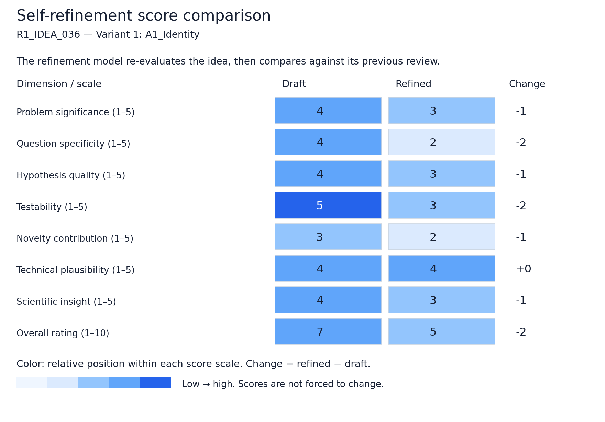

Changed score dimensions: problem_significance, question_specificity, hypothesis_quality, testability, novelty_contribution, scientific_insight, overall_rating.

### Score justifications (draft / refined)

**Problem significance**

```json
{
  "draft": {
    "score": 4.0,
    "justification": "The problem is meaningful as it addresses a practical concern in method selection. Understanding performance trade-offs between parametric and non-parametric DR methods could help practitioners make better choices and guide methodological development."
  },
  "refined": {
    "score": 3.0,
    "justification": "The problem has moderate significance. Understanding trade-offs between parametric and non-parametric DR methods is practically relevant for method selection. However, the idea's impact is limited by the unsupported claim about a 'prevalent misconception' and the lack of connection to broader theoretical questions about representation learning."
  }
}
```

**Question specificity**

```json
{
  "draft": {
    "score": 4.0,
    "justification": "The research question is reasonably specific: it proposes to test whether parametric DR methods preserve global structure but lose local details compared to non-parametric methods. However, it could be more precise about what constitutes 'global' vs 'local' structure."
  },
  "refined": {
    "score": 2.0,
    "justification": "The research question is only moderately specific. While it identifies two method categories and a hypothesized trade-off, it fails to define the key concepts of 'global structure' and 'local details.' The statement 'we show that' presents a conclusion rather than framing an investigable question. More specificity is needed in what exactly would be compared and measured."
  }
}
```

**Hypothesis quality**

```json
{
  "draft": {
    "score": 4.0,
    "justification": "The hypothesis is concrete and testable: parametric methods retain global structure but lose local details. It makes a clear prediction that distinguishes between method families and could be falsified through empirical comparison."
  },
  "refined": {
    "score": 3.0,
    "justification": "The hypothesis is directional and makes a concrete comparative prediction, which is good. However, it is somewhat vague due to undefined terms ('global structure,' 'local details'). It lacks a proposed mechanism for why the trade-off exists. It is testable in principle but would require significant operationalization to become a clear, falsifiable statement."
  }
}
```

**Testability**

```json
{
  "draft": {
    "score": 5.0,
    "justification": "The hypothesis is highly testable through standard DR evaluation metrics (e.g., trustworthiness, continuity, neighborhood preservation). Experiments could systematically compare parametric and non-parametric methods on benchmark datasets with quantitative evaluation."
  },
  "refined": {
    "score": 3.0,
    "justification": "The hypothesis is testable in principle using standard DR evaluation metrics, but the idea provides no concrete plan for testing it. No methods, datasets, or evaluation protocols are suggested. The testability relies entirely on the reviewer's ability to imagine a reasonable experimental setup, which is not provided in the idea itself."
  }
}
```

**Novelty contribution**

```json
{
  "draft": {
    "score": 3.0,
    "justification": "While the specific hypothesis about the global/local trade-off is somewhat novel, comparisons between parametric and non-parametric DR methods have been explored. The contribution would depend on the depth of analysis and whether it reveals new insights about why this trade-off occurs."
  },
  "refined": {
    "score": 2.0,
    "justification": "The novelty is limited. The general comparison between parametric and non-parametric methods is not new. The specific hypothesis about a global/local trade-off has intuitive appeal but is not highly novel without a deeper theoretical angle or connection to underlying principles of generalization versus memorization. The contribution would likely be incremental unless it uncovers new, non-obvious phenomena or explanations."
  }
}
```

**Technical plausibility**

```json
{
  "draft": {
    "score": 4.0,
    "justification": "The idea is technically plausible. Parametric methods (neural networks) have regularization and generalization properties that could indeed prioritize global patterns over fine-grained local structure. The reasoning is logically coherent."
  },
  "refined": {
    "score": 4.0,
    "justification": "The idea is technically plausible. The reasoning is logically coherent: parametric models (neural networks) generalize by learning smoothed functions, which could prioritize broader patterns over fine-grained local variations. This aligns with known concepts in machine learning about the bias-variance trade-off and the smoothing effect of regularization."
  }
}
```

**Scientific insight**

```json
{
  "draft": {
    "score": 4.0,
    "justification": "If validated, this research could provide important insight into the fundamental trade-offs between parametric and non-parametric approaches. It could reveal limitations of parametric methods and guide development of hybrid approaches that balance generalization with local structure preservation."
  },
  "refined": {
    "score": 3.0,
    "justification": "The potential insight is moderate. Confirming the hypothesis would provide a useful, practical rule-of-thumb for practitioners. However, it offers limited deeper scientific insight unless the investigation probes *why* the trade-off occurs—e.g., linking it to model capacity, regularization, the nature of the training objective, or intrinsic properties of the data manifolds. As stated, it risks being a surface-level empirical comparison."
  }
}
```

**Overall rating**

```json
{
  "draft": {
    "score": 7.0,
    "justification": "This is a strong research idea with a clear, testable hypothesis addressing a practical concern. The question is specific enough to guide investigation, and the potential insights about trade-offs between generalization and local structure preservation are meaningful. The main limitations are the lack of operational definitions for key concepts and unspecified experimental details, but these are addressable in a full research proposal."
  },
  "refined": {
    "score": 5.0,
    "justification": "This is a moderate/borderline research idea. It identifies a reasonable area of investigation—comparative strengths of DR method families—and presents a testable, if vague, hypothesis. Its main weaknesses are the lack of specificity in defining key concepts and the complete absence of any proposed methodological approach. The unsupported claim about a 'prevalent misconception' also weakens the motivation. With substantial refinement—operationalizing terms, specifying methods and metrics, and framing it as an open question—it could become a solid research direction. As presented, it is underdeveloped."
  }
}
```

## R1_IDEA_036 — Variant 2: A2_Paraphrase_Only

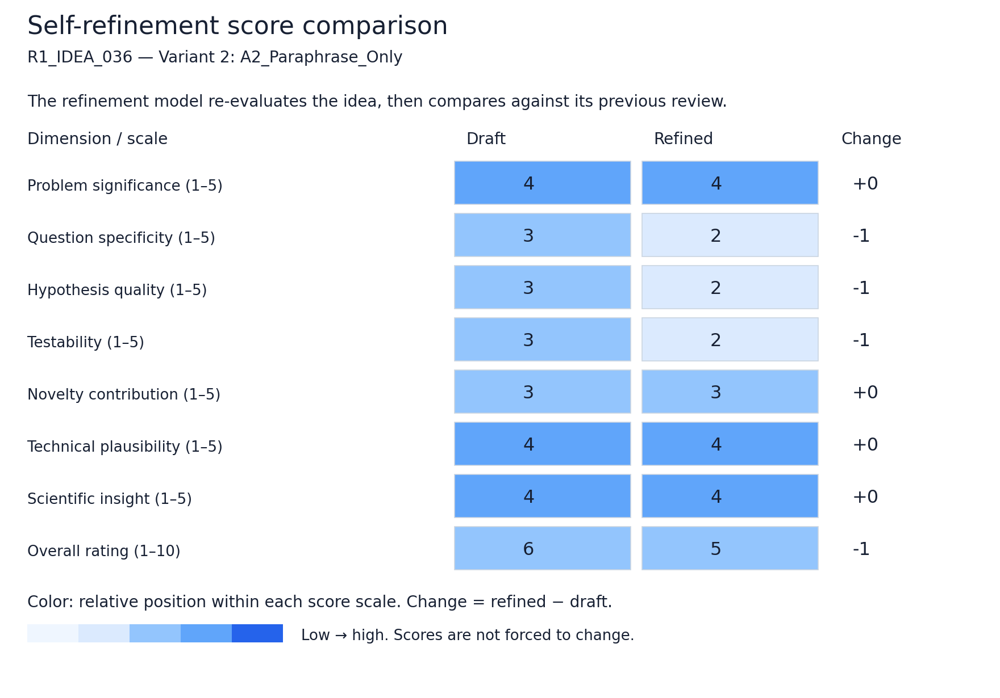

Changed score dimensions: question_specificity, hypothesis_quality, testability, overall_rating.

### Score justifications (draft / refined)

**Problem significance**

```json
{
  "draft": {
    "score": 4.0,
    "justification": "The problem is meaningful as it addresses a potential misconception among practitioners about the equivalence of different dimensionality reduction approaches. Understanding trade-offs between parametric and non-parametric methods could significantly impact how researchers choose and apply these techniques in practice."
  },
  "refined": {
    "score": 4.0,
    "justification": "The problem is meaningful. Clarifying misconceptions about parametric vs. non-parametric dimensionality reduction is practically important as these methods are widely used in visualization, feature extraction, and data preprocessing. Understanding their trade-offs could significantly impact application choices."
  }
}
```

**Question specificity**

```json
{
  "draft": {
    "score": 3.0,
    "justification": "The idea identifies a specific claim about differences between parametric and non-parametric methods, but lacks precision about which methods, what constitutes 'global' vs 'local' structure, and how these would be measured. The claim is somewhat specific but not fully operationalized."
  },
  "refined": {
    "score": 2.0,
    "justification": "The idea identifies a general comparison but lacks specificity. It does not name specific methods, define key terms operationally, or propose a concrete experimental setup. The claim is directional but vague."
  }
}
```

**Hypothesis quality**

```json
{
  "draft": {
    "score": 3.0,
    "justification": "The core claim functions as an implicit hypothesis about a trade-off between global structure preservation and local detail loss. However, it's presented more as a conclusion than a hypothesis to be tested, and lacks the conditional or comparative framing that would make it stronger."
  },
  "refined": {
    "score": 2.0,
    "justification": "The core claim functions as an implicit hypothesis, but it is presented as a conclusion ('demonstrates') rather than a testable prediction. It lacks conditional framing (e.g., under what conditions) and does not distinguish between different parametric methods. A stronger hypothesis would be comparative and falsifiable."
  }
}
```

**Testability**

```json
{
  "draft": {
    "score": 3.0,
    "justification": "The claim is testable in principle through comparative experiments with appropriate metrics, but the idea summary doesn't suggest specific evaluation methods. The absence of proposed metrics or experimental designs makes testability somewhat unclear."
  },
  "refined": {
    "score": 2.0,
    "justification": "While the claim could be tested in principle, the idea summary provides no guidance on how to test it. No metrics, datasets, or experimental comparisons are suggested. Without operational definitions of 'global structure' and 'local detail,' designing a test is non-trivial."
  }
}
```

**Novelty contribution**

```json
{
  "draft": {
    "score": 3.0,
    "justification": "While the parametric vs. non-parametric comparison is not entirely novel, systematically investigating the global-local trade-off could provide new insights. The contribution would depend on the depth of analysis and whether it reveals previously undocumented limitations or boundary conditions."
  },
  "refined": {
    "score": 3.0,
    "justification": "The parametric vs. non-parametric comparison is not novel in itself, but a systematic investigation of the global-local trade-off could provide new practical insight. The contribution would depend on the depth of analysis and whether it reveals general principles or boundary conditions not previously documented."
  }
}
```

**Technical plausibility**

```json
{
  "draft": {
    "score": 4.0,
    "justification": "The claim is technically plausible. Parametric methods often involve function approximation that could smooth local variations while capturing broader patterns, making the hypothesized trade-off reasonable. The reasoning is logically coherent given typical characteristics of parametric models."
  },
  "refined": {
    "score": 4.0,
    "justification": "The claim is technically plausible. Parametric methods (e.g., neural networks) often act as function approximators that may smooth local variations while capturing broader patterns, making the hypothesized trade-off reasonable. The reasoning aligns with general understanding of model bias vs. flexibility."
  }
}
```

**Scientific insight**

```json
{
  "draft": {
    "score": 4.0,
    "justification": "If successfully investigated, this research could provide valuable insight into fundamental trade-offs in dimensionality reduction, potentially revealing when to prefer parametric vs. non-parametric approaches based on whether global structure or local detail is more important for a given application."
  },
  "refined": {
    "score": 4.0,
    "justification": "If successfully investigated, this research could yield valuable insight into fundamental trade-offs in dimensionality reduction. It could help practitioners choose methods based on whether global structure or local detail is more important for their task, and might reveal limitations of parametric approaches that inform future method development."
  }
}
```

**Overall rating**

```json
{
  "draft": {
    "score": 6.0,
    "justification": "This is a moderate research idea with a meaningful problem and plausible technical claim. The main limitations are the presentation of the claim as a demonstration rather than a hypothesis to be tested, and the lack of specificity about methods and evaluation metrics. With refinement to create a testable hypothesis and operational definitions, it could become a strong research direction."
  },
  "refined": {
    "score": 5.0,
    "justification": "This is a moderate/borderline research idea. It identifies a meaningful practical problem and makes a plausible claim, but it is presented as a conclusion rather than a research question. The lack of specificity about methods, metrics, and experimental design limits its strength as a research direction. With refinement—especially framing as a hypothesis and defining measurable terms—it could become a solid research project."
  }
}
```

## R1_IDEA_036 — Variant 3: A3_Plain_Core


Changed score dimensions: question_specificity, hypothesis_quality, testability, overall_rating.

### Score justifications (draft / refined)

**Problem significance**

```json
{
  "draft": {
    "score": 4.0,
    "justification": "The problem is meaningful as it addresses a practical misconception that could affect real-world applications. Understanding trade-offs between generalization and detail preservation in dimensionality reduction has clear relevance for practitioners choosing appropriate methods."
  },
  "refined": {
    "score": 4.0,
    "justification": "The problem is meaningful and practically relevant. Understanding the trade-offs between generalization and fidelity in dimensionality reduction is important for guiding method selection in applied machine learning and data science. Addressing a potential misconception adds practical significance."
  }
}
```

**Question specificity**

```json
{
  "draft": {
    "score": 3.0,
    "justification": "The idea identifies a specific comparison (parametric vs non-parametric) and makes a concrete claim about their differences. However, it lacks specificity about which methods, what datasets, and how measurements would be made."
  },
  "refined": {
    "score": 2.0,
    "justification": "The idea states a comparative claim but does not define a clear research question. The objects of comparison ('parametric' vs. 'non-parametric') are broad categories, and the properties of interest ('generalize', 'retain global structure', 'lose local details') are not specified. It lacks the concrete operational definitions needed for a specific investigation."
  }
}
```

**Hypothesis quality**

```json
{
  "draft": {
    "score": 4.0,
    "justification": "The hypothesis is clear and testable: parametric methods generalize but lose local details while retaining global structure. It makes a concrete prediction about a trade-off that could be falsified through experiments."
  },
  "refined": {
    "score": 3.0,
    "justification": "An implicit hypothesis exists: parametric methods generalize better but preserve global over local structure, while non-parametric methods do not generalize but preserve local details. This is a concrete, comparative prediction. However, it is presented as an assertion ('We show') rather than a hypothesis to be tested, which weakens its framing."
  }
}
```

**Testability**

```json
{
  "draft": {
    "score": 3.0,
    "justification": "The claim is testable in principle but lacks a clear experimental design. With proper definitions of generalization, global structure, and local details, experiments could be designed to test the hypothesis."
  },
  "refined": {
    "score": 2.0,
    "justification": "The core claim is testable in principle, but the idea provides zero guidance on how it could be tested. There is no mention of experiments, evaluations, comparisons, or analyses. The testability is entirely latent and dependent on the researcher filling in all methodological details."
  }
}
```

**Novelty contribution**

```json
{
  "draft": {
    "score": 3.0,
    "justification": "While the parametric vs non-parametric comparison is not new, the specific focus on generalization to unseen datasets and the trade-off between global structure and local details could provide novel insights. The contribution would depend on the depth of analysis."
  },
  "refined": {
    "score": 3.0,
    "justification": "The parametric vs. non-parametric distinction is well-known. The novel aspect is the specific hypothesized trade-off between generalization and local detail preservation. If validated, this could be a useful characterization, but the contribution level depends entirely on the depth of the subsequent analysis and whether it reveals new principles or merely confirms an intuitive suspicion."
  }
}
```

**Technical plausibility**

```json
{
  "draft": {
    "score": 4.0,
    "justification": "The reasoning is logically coherent: parametric methods learn a mapping function that can be applied to new data, while non-parametric methods typically optimize embeddings for specific datasets. The trade-off between generalization and detail preservation is plausible."
  },
  "refined": {
    "score": 4.0,
    "justification": "The reasoning is logically coherent and plausible. Parametric methods learn a fixed mapping function, which can be applied to new data, potentially at the cost of fine-grained adaptation to any single dataset's local geometry. Non-parametric methods often optimize per-instance, capturing local structure but lacking a generalizable mapping. The proposed trade-off aligns with these fundamental characteristics."
  }
}
```

**Scientific insight**

```json
{
  "draft": {
    "score": 4.0,
    "justification": "If investigated thoroughly, this could reveal important principles about when to choose parametric vs non-parametric methods, the fundamental trade-offs involved, and potentially lead to new hybrid approaches. The insight about generalization properties could be transferable to other domains."
  },
  "refined": {
    "score": 4.0,
    "justification": "The idea has strong potential for scientific insight. Successfully investigating this trade-off could reveal fundamental limitations and capabilities of different DR method classes, provide a principled framework for method selection, and possibly inspire the design of hybrid methods. The insight about the relationship between parameterization, generalization, and structural fidelity is transferable."
  }
}
```

**Overall rating**

```json
{
  "draft": {
    "score": 7.0,
    "justification": "This is a strong research idea with a clear, testable hypothesis about an important practical problem. The main limitation is lack of specificity about methods and experimental design, but the core question is scientifically meaningful and could yield useful insights for both researchers and practitioners."
  },
  "refined": {
    "score": 6.0,
    "justification": "This is a moderate/borderline research idea. It identifies a meaningful problem and a plausible, insightful comparative hypothesis. However, it is severely under-specified as a research proposal. It presents a claim rather than a question, and lacks any conceptual framework for investigation (definitions, methods, experimental approach). The core scientific premise is good, but the idea requires substantial refinement to become a strong research direction."
  }
}
```

## R1_IDEA_036 — Variant 4: B1_Verbose_Elaborate

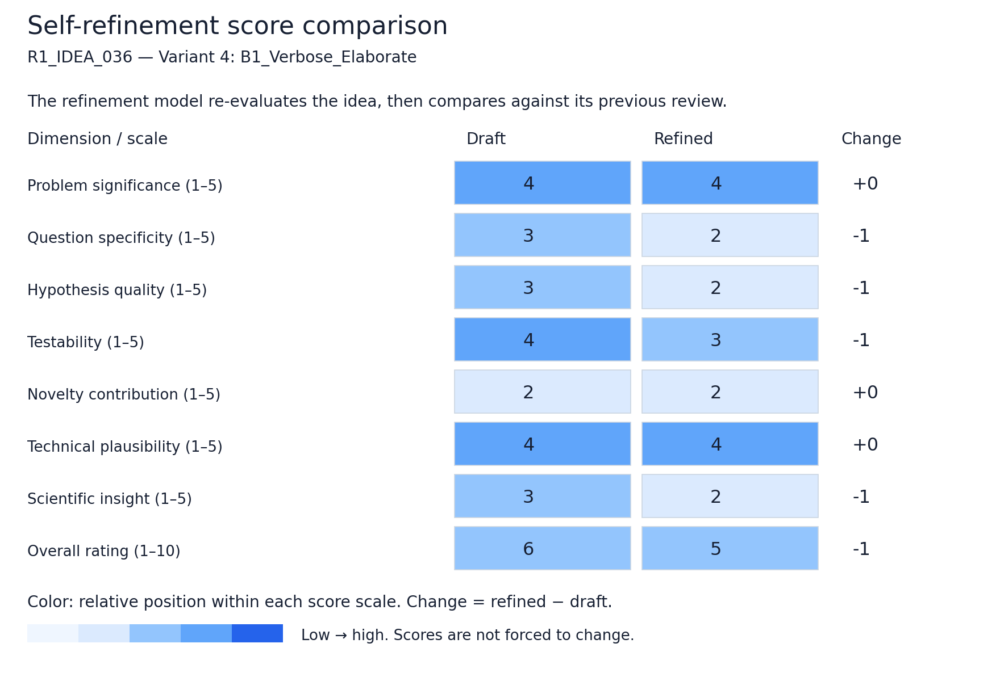

Changed score dimensions: question_specificity, hypothesis_quality, testability, scientific_insight, overall_rating.

### Score justifications (draft / refined)

**Problem significance**

```json
{
  "draft": {
    "score": 4.0,
    "justification": "Clarifying misconceptions about method equivalence is important for proper application in practice. The trade-off between generalization and local fidelity is a meaningful problem in dimensionality reduction."
  },
  "refined": {
    "score": 4.0,
    "justification": "Clarifying misconceptions about method equivalence is practically important for proper application. The trade-off between generalization and local fidelity is a meaningful problem in dimensionality reduction with real implications for practitioners choosing methods."
  }
}
```

**Question specificity**

```json
{
  "draft": {
    "score": 3.0,
    "justification": "The idea identifies a clear contrast (parametric vs. non-parametric) and a specific claimed difference (global vs. local preservation), but does not define the scope (which methods, datasets, or measures) precisely."
  },
  "refined": {
    "score": 2.0,
    "justification": "While the idea identifies a contrast (parametric vs. non-parametric) and a claimed difference (global vs. local preservation), it lacks precise definition of scope, methods, datasets, or measures. The research question is stated as a general assertion rather than a specific investigable question."
  }
}
```

**Hypothesis quality**

```json
{
  "draft": {
    "score": 3.0,
    "justification": "The claim that parametric methods retain global structure but lose local detail is a concrete, testable prediction. However, it is presented as a general statement rather than a falsifiable hypothesis with defined conditions."
  },
  "refined": {
    "score": 2.0,
    "justification": "The claim that parametric methods retain global structure but lose local detail is a testable prediction, but it is presented as a broad assertion rather than a falsifiable hypothesis with defined conditions, methods, or measurable outcomes. It lacks the specificity needed for rigorous testing."
  }
}
```

**Testability**

```json
{
  "draft": {
    "score": 4.0,
    "justification": "The claim is highly testable through comparative experiments measuring global and local preservation metrics on seen and unseen data. No novel methodology is required; standard DR evaluation approaches can be applied."
  },
  "refined": {
    "score": 3.0,
    "justification": "The general claim is testable in principle through comparative experiments with standard DR evaluation metrics. However, without specification of methods, datasets, or measures, it's unclear exactly how one would test it. The idea provides no experimental framework, making testability moderate rather than high."
  }
}
```

**Novelty contribution**

```json
{
  "draft": {
    "score": 2.0,
    "justification": "The trade-off between global and local structure is a known consideration in DR. The idea's main contribution appears to be debunking a practitioner misconception, which is useful but not scientifically novel unless it reveals new quantitative boundaries or conditions."
  },
  "refined": {
    "score": 2.0,
    "justification": "The trade-off between global and local structure preservation is a well-known consideration in dimensionality reduction literature. The main contribution appears to be debunking a practitioner misconception, which is useful but not scientifically novel unless it reveals new quantitative boundaries, unexpected failure modes, or conditions where the trade-off doesn't hold."
  }
}
```

**Technical plausibility**

```json
{
  "draft": {
    "score": 4.0,
    "justification": "The reasoning is coherent: parametric models generalize by learning a mapping, which may smooth details, while non-parametric methods optimize per-instance and may preserve local neighborhoods better. This aligns with known DR theory."
  },
  "refined": {
    "score": 4.0,
    "justification": "The reasoning is coherent and aligns with known DR theory: parametric models learn a mapping function that generalizes but may smooth details, while non-parametric methods optimize per-instance and can preserve local neighborhoods better. The claim is technically plausible given what we know about function approximation versus instance-based optimization."
  }
}
```

**Scientific insight**

```json
{
  "draft": {
    "score": 3.0,
    "justification": "If thoroughly investigated, the idea could provide insight into when parametric DR is suitable (global analysis, generalization) vs. non-parametric (local detail, exploratory analysis). However, the potential insight is moderate unless it uncovers unexpected scaling behaviors or failure modes."
  },
  "refined": {
    "score": 2.0,
    "justification": "The potential insight is limited unless the investigation goes beyond confirming the expected trade-off. A simple demonstration that parametric methods smooth details while preserving global structure would provide little new scientific understanding. For meaningful insight, the research would need to uncover conditions, scaling behaviors, or failure modes not previously documented."
  }
}
```

**Overall rating**

```json
{
  "draft": {
    "score": 6.0,
    "justification": "This is a moderate research idea. It addresses a practical misconception and proposes a testable claim, but lacks specificity and novelty. The core trade-off is already understood in principle, so the contribution hinges on rigorous empirical demonstration and possibly quantifying the trade-off under specific conditions. With more concrete hypotheses and experimental design, it could become a strong applied study."
  },
  "refined": {
    "score": 5.0,
    "justification": "This is a moderate/borderline research idea. It addresses a practical issue and makes a testable claim, but lacks specificity, novelty, and clear potential for scientific insight. The core trade-off is already understood in principle, so the contribution would primarily be an empirical demonstration. With more concrete hypotheses, experimental design, and a focus on uncovering new boundary conditions, it could become a stronger applied study."
  }
}
```

## R1_IDEA_036 — Variant 5: B2_Grand_Narrative

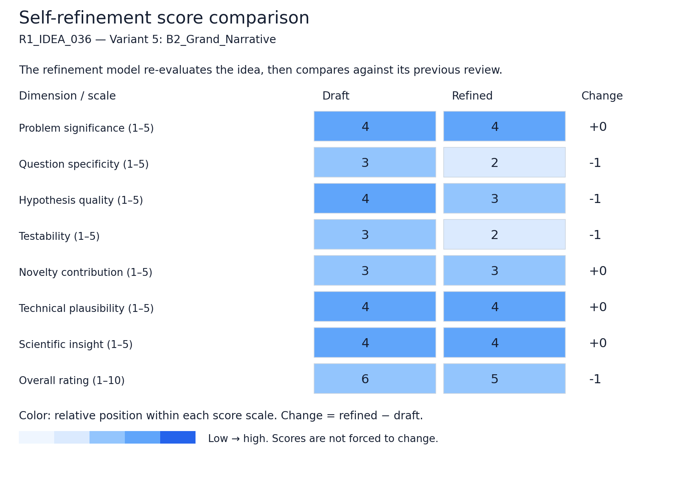

Changed score dimensions: question_specificity, hypothesis_quality, testability, overall_rating.

### Score justifications (draft / refined)

**Problem significance**

```json
{
  "draft": {
    "score": 4.0,
    "justification": "The problem is meaningful as it addresses a potential misconception in dimensionality reduction method selection. Understanding performance trade-offs between parametric and non-parametric approaches has practical implications for representation learning applications where generalization to new data is important."
  },
  "refined": {
    "score": 4.0,
    "justification": "The problem is meaningful. Clarifying performance characteristics and trade-offs between parametric and non-parametric dimensionality reduction methods is important for both theoretical understanding and practical application, especially as parametric methods become more popular for their generalization capability."
  }
}
```

**Question specificity**

```json
{
  "draft": {
    "score": 3.0,
    "justification": "The idea identifies that methods are 'not equivalent' but doesn't specify what dimensions of equivalence are being tested. The global vs. local structure claim adds specificity, but the overall research question remains somewhat broad regarding what exactly is being investigated."
  },
  "refined": {
    "score": 2.0,
    "justification": "The research question is poorly defined. The idea states methods are 'not equivalent' but does not specify in what way. The added claim about global vs. local structure provides some direction, but the core question—'Are they equivalent, and if not, how?'—remains too broad and vague for a focused investigation."
  }
}
```

**Hypothesis quality**

```json
{
  "draft": {
    "score": 4.0,
    "justification": "The hypothesis that parametric methods retain global structure but lose local details is concrete and testable. It makes a clear prediction about a trade-off that distinguishes parametric from non-parametric approaches and could be falsified by evidence."
  },
  "refined": {
    "score": 3.0,
    "justification": "There is an implicit hypothesis: 'Parametric DR methods retain global structure but lose significant local details.' This is a concrete and falsifiable prediction. However, it is presented as a declarative finding ('Here, we show...') rather than as a proposition to be tested, and no rationale or mechanism is provided to support it."
  }
}
```

**Testability**

```json
{
  "draft": {
    "score": 3.0,
    "justification": "The claim is testable in principle through comparative experiments, but no specific evaluation approach is suggested. The hypothesis about global vs. local structure preservation could be tested using established metrics (e.g., trustworthiness for local, continuity for global), but the idea doesn't propose how."
  },
  "refined": {
    "score": 2.0,
    "justification": "The central claims are testable in principle, but the idea provides zero guidance on how to test them. No experiments, evaluations, comparisons, or analyses are suggested. A researcher would need to design the entire evaluation framework from scratch, which indicates low testability as presented."
  }
}
```

**Novelty contribution**

```json
{
  "draft": {
    "score": 3.0,
    "justification": "While the parametric vs. non-parametric comparison is not new, challenging a specific 'misconception about performance equivalence' and investigating the global/local trade-off could provide novel insights. The contribution would depend on how thoroughly the misconception is documented and what new understanding emerges about the trade-offs."
  },
  "refined": {
    "score": 3.0,
    "justification": "The novelty is moderate. The parametric vs. non-parametric comparison is not new. The potential contribution lies in specifically challenging a purported 'misconception of equivalence' and investigating the global/local trade-off. However, without evidence that this misconception is widespread or that the trade-off is unexplored, the novelty is uncertain."
  }
}
```

**Technical plausibility**

```json
{
  "draft": {
    "score": 4.0,
    "justification": "The reasoning is logically coherent: parametric methods by design learn a mapping function that must generalize, which could plausibly prioritize global structure over local details. The assumption that generalization comes at the cost of local fidelity is reasonable given function approximation trade-offs."
  },
  "refined": {
    "score": 4.0,
    "justification": "The reasoning is logically coherent. The idea that a learned parametric function, optimized for generalization, might smooth over fine-grained local details in favor of capturing broader patterns is plausible. It aligns with general trade-offs in function approximation and model complexity."
  }
}
```

**Scientific insight**

```json
{
  "draft": {
    "score": 4.0,
    "justification": "If successfully investigated, this could reveal important boundary conditions and trade-offs in dimensionality reduction method selection. Understanding when parametric methods are preferable (when generalization matters more than local detail) versus when non-parametric methods are better could provide transferable insights for representation learning."
  },
  "refined": {
    "score": 4.0,
    "justification": "If successfully investigated, this could yield valuable scientific insight. Understanding the conditions under which parametric methods preserve or sacrifice different types of structural information (global vs. local) would provide general principles to guide method selection and could reveal fundamental limitations of parametric approaches in representation learning."
  }
}
```

**Overall rating**

```json
{
  "draft": {
    "score": 6.0,
    "justification": "This is a moderate research idea with clear strengths in identifying a meaningful problem and proposing a testable hypothesis about global vs. local structure preservation. However, it lacks specificity in defining the research question and experimental approach. The potential contribution is reasonable but would depend heavily on execution and the depth of analysis beyond a simple performance comparison."
  },
  "refined": {
    "score": 5.0,
    "justification": "This is a moderate/borderline research idea. It identifies a potentially significant problem and a plausible, testable hypothesis about a global/local trade-off. However, it is severely weakened by a vague research question, a complete lack of proposed methodology, and broad, undefined scope. The potential for scientific insight is good, but the idea as presented is underdeveloped and requires substantial refinement to become a strong research direction."
  }
}
```

## R1_IDEA_036 — Variant 6: B3_Over_Confident

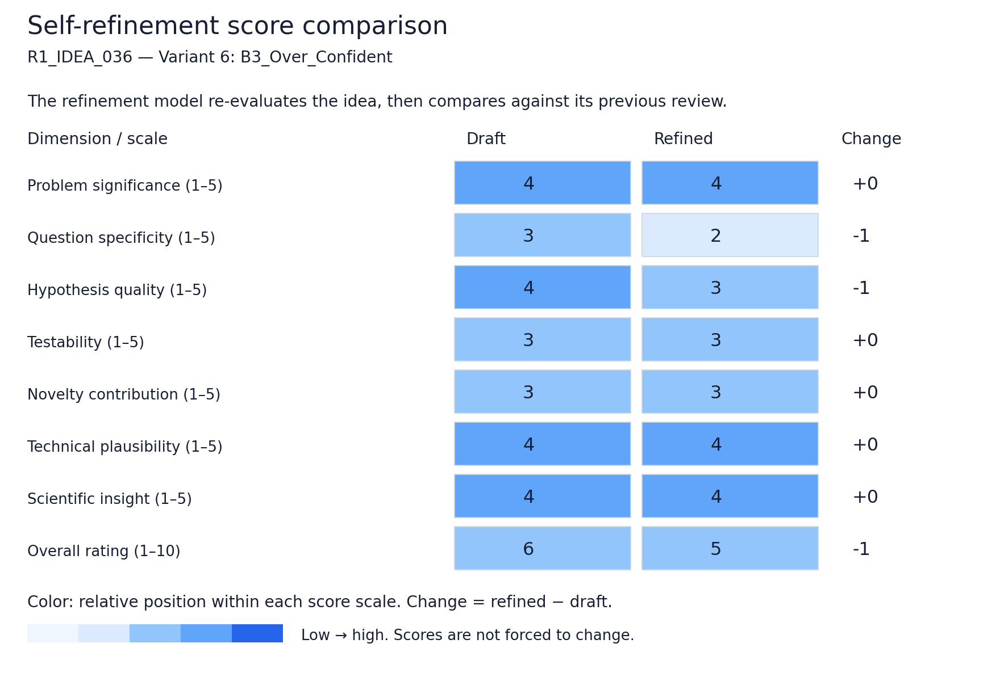

Changed score dimensions: question_specificity, hypothesis_quality, overall_rating.

### Score justifications (draft / refined)

**Problem significance**

```json
{
  "draft": {
    "score": 4.0,
    "justification": "The problem is meaningful as it addresses a practical misconception that could affect method selection in real applications. Understanding trade-offs between generalization and detail preservation is important for both researchers and practitioners choosing dimensionality reduction techniques."
  },
  "refined": {
    "score": 4.0,
    "justification": "The problem is meaningful as it addresses a practical misconception that could lead to suboptimal method selection. Understanding the trade-offs between generalization capability and structural fidelity is important for both theoretical understanding and practical application of dimensionality reduction techniques."
  }
}
```

**Question specificity**

```json
{
  "draft": {
    "score": 3.0,
    "justification": "The research question is moderately specific - it identifies what to compare (parametric vs. non-parametric methods) and what aspect to investigate (global vs. local structure preservation). However, it lacks specification of which methods, datasets, or evaluation metrics would be used."
  },
  "refined": {
    "score": 2.0,
    "justification": "The research question is only moderately specific. While it identifies what to compare (parametric vs. non-parametric methods) and what aspect to investigate (global vs. local structure), it lacks crucial specification: which specific methods, what evaluation metrics, what datasets, and what experimental conditions. The statement 'we show' presents a conclusion rather than framing an investigable question."
  }
}
```

**Hypothesis quality**

```json
{
  "draft": {
    "score": 4.0,
    "justification": "The hypothesis is clear and testable: parametric methods retain global structure but lose local details compared to non-parametric methods. It makes a concrete prediction about a trade-off that could be supported or contradicted by evidence."
  },
  "refined": {
    "score": 3.0,
    "justification": "The implicit hypothesis is clear: parametric methods retain global structure but lose local details. It makes a concrete prediction about a trade-off. However, it's overly broad (covering all parametric vs. all non-parametric methods) and presented as a conclusion rather than a hypothesis to be tested. A stronger hypothesis would be more nuanced about method types and conditions."
  }
}
```

**Testability**

```json
{
  "draft": {
    "score": 3.0,
    "justification": "The hypothesis is testable in principle through comparative experiments, but the idea lacks specific suggestions for how to test it. Operationalizing 'global structure' and 'local details' would require careful metric selection and experimental design."
  },
  "refined": {
    "score": 3.0,
    "justification": "The hypothesis is testable in principle through comparative experiments, but the idea provides no guidance on how to test it. Operationalizing 'global structure' and 'local details' would require careful metric selection. The broad categories make designing a fair comparison challenging without further specification of which methods to include and how to evaluate them."
  }
}
```

**Novelty contribution**

```json
{
  "draft": {
    "score": 3.0,
    "justification": "While the general comparison between parametric and non-parametric methods is not novel, the specific focus on the global-local trade-off and addressing a practitioner misconception could provide useful insights. The contribution would depend on the depth of analysis and generality of findings."
  },
  "refined": {
    "score": 3.0,
    "justification": "The general comparison between parametric and non-parametric DR methods is not novel. However, the specific focus on the global-local trade-off in the context of generalization could provide useful insights if investigated deeply. The contribution would depend heavily on the depth of analysis, generality of findings, and whether it leads to new principles or guidelines."
  }
}
```

**Technical plausibility**

```json
{
  "draft": {
    "score": 4.0,
    "justification": "The reasoning is logically coherent - parametric methods trained to generalize might indeed prioritize different aspects of structure than methods optimized for specific datasets. The trade-off between generalization and detail preservation is plausible given known differences in optimization objectives."
  },
  "refined": {
    "score": 4.0,
    "justification": "The reasoning is logically coherent. Parametric methods trained to generalize across datasets might indeed prioritize different aspects of structure preservation compared to methods optimized for specific datasets. The trade-off between generalization and detailed fidelity is plausible given differences in optimization objectives and capacity constraints."
  }
}
```

**Scientific insight**

```json
{
  "draft": {
    "score": 4.0,
    "justification": "If investigated thoroughly, this research could reveal important principles about the fundamental trade-offs in dimensionality reduction, potentially leading to better method selection guidelines or inspiring new hybrid approaches that balance generalization and detail preservation."
  },
  "refined": {
    "score": 4.0,
    "justification": "If investigated thoroughly, this research could reveal important principles about fundamental trade-offs in dimensionality reduction. It could lead to better understanding of what is gained and lost when moving from dataset-specific to generalizable methods, potentially inspiring new approaches or better selection guidelines. The insight about the cost of generalization could be transferable to other domains."
  }
}
```

**Overall rating**

```json
{
  "draft": {
    "score": 6.0,
    "justification": "This is a moderate research idea with a clear hypothesis addressing a practical misconception. The core hypothesis about the global-local trade-off is testable and potentially insightful. However, the idea needs more specificity regarding methods, metrics, and experimental design to become a strong research proposal. The potential contribution is meaningful but not exceptionally novel."
  },
  "refined": {
    "score": 5.0,
    "justification": "This is a moderate research idea with a plausible hypothesis addressing a practical concern. The core hypothesis about a global-local trade-off is testable and potentially insightful. However, the idea lacks specificity regarding methods, metrics, and experimental design, and presents its claim as a conclusion rather than a question to investigate. With more refinement and operationalization, it could become a stronger research direction. The potential contribution is meaningful but not highly novel in its current form."
  }
}
```

## R1_IDEA_036 — Variant 7: B4_Novelty

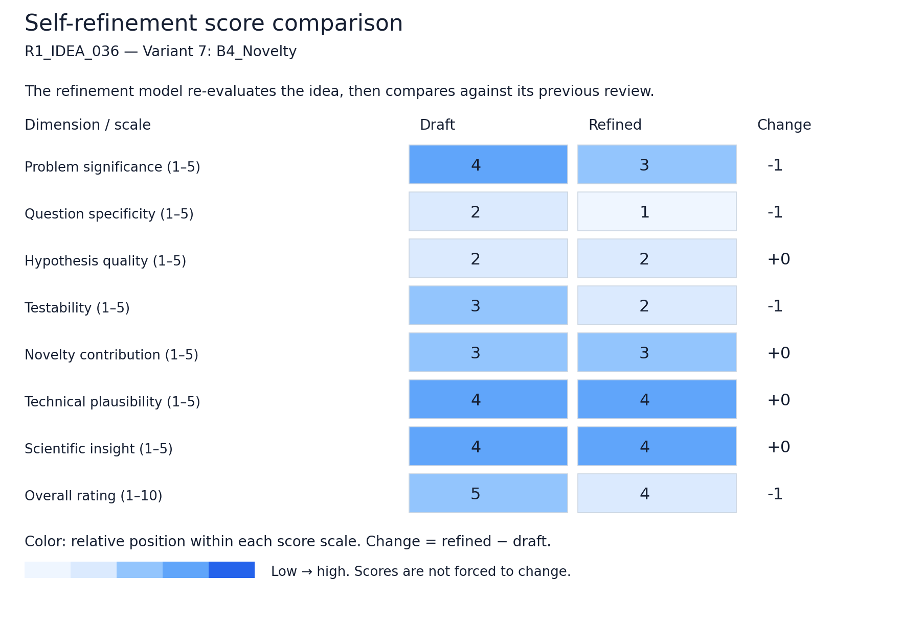

Changed score dimensions: problem_significance, question_specificity, testability, overall_rating.

### Score justifications (draft / refined)

**Problem significance**

```json
{
  "draft": {
    "score": 4.0,
    "justification": "The problem is meaningful as it addresses an important distinction between parametric and non-parametric dimensionality reduction methods. Understanding the trade-offs between generalization capability and structure preservation could have practical implications for method selection in real-world applications. The focus on generalization to unseen datasets is particularly relevant given the increasing need for reusable models."
  },
  "refined": {
    "score": 3.0,
    "justification": "The problem has moderate significance. Understanding trade-offs between parametric and non-parametric dimensionality reduction methods is relevant, especially as parametric methods gain popularity for their generalization capability. However, the idea doesn't convincingly establish why this specific investigation is particularly urgent or impactful beyond general methodological comparison."
  }
}
```

**Question specificity**

```json
{
  "draft": {
    "score": 2.0,
    "justification": "The research question is somewhat vague. While it mentions comparing methodological families and investigating performance equivalence, it doesn't specify what exactly is being compared or what 'equivalence' means. The idea states a conclusion ('parametric methods retain global structure but lose significant local details') rather than posing a clear question to investigate."
  },
  "refined": {
    "score": 1.0,
    "justification": "Very weak specificity. The idea doesn't define a clear research question. It mentions 'comparing methodological families' and investigating 'performance equivalence' but doesn't specify what aspects are being compared or what 'equivalence' means. The statement 'we show...' presents a conclusion rather than posing a question to investigate."
  }
}
```

**Hypothesis quality**

```json
{
  "draft": {
    "score": 2.0,
    "justification": "There's an implicit hypothesis about parametric methods preserving global structure while losing local details, but it's presented more as an assertion than a testable prediction. The hypothesis lacks specificity about the conditions under which this trade-off occurs or how it varies across different parametric methods. A stronger hypothesis would make concrete, falsifiable predictions about measurable outcomes."
  },
  "refined": {
    "score": 2.0,
    "justification": "Weak hypothesis quality. There's an implicit claim about parametric methods preserving global structure while losing local details, but it's presented as an assertion rather than a testable hypothesis. It lacks specificity about conditions, methods, or measurable outcomes. A proper hypothesis would make concrete, falsifiable predictions about relationships between generalization capability and structure preservation metrics."
  }
}
```

**Testability**

```json
{
  "draft": {
    "score": 3.0,
    "justification": "The core claims are testable in principle - one could design experiments to measure global structure preservation and local detail retention across different methods. However, the idea doesn't suggest specific experimental designs or evaluation metrics. The generalization claim could be tested by training on one dataset and evaluating on another, but this isn't explicitly proposed."
  },
  "refined": {
    "score": 2.0,
    "justification": "Weak testability. While the claims could theoretically be tested with appropriate experiments, the idea provides no direction for how to test them. No experimental design, evaluation metrics, or comparison methodology is suggested. The statement is too vague to guide meaningful investigation without substantial additional specification."
  }
}
```

**Novelty contribution**

```json
{
  "draft": {
    "score": 3.0,
    "justification": "The framing of comparing parametric vs. non-parametric methods through the lens of generalization and structure preservation has some novelty. However, the trade-off between global and local structure preservation is a known consideration in dimensionality reduction. The potential contribution would depend on whether the investigation reveals new insights about this trade-off specifically in the context of parametric methods' generalization capability."
  },
  "refined": {
    "score": 3.0,
    "justification": "Moderate novelty. The framing through generalization capability is somewhat fresh, and focusing on the global vs. local trade-off specifically for parametric methods could offer new insights. However, the trade-off between global and local structure preservation is a well-known consideration in dimensionality reduction literature, so the potential contribution depends heavily on what new understanding emerges from the generalization angle."
  }
}
```

**Technical plausibility**

```json
{
  "draft": {
    "score": 4.0,
    "justification": "The reasoning is logically coherent. Parametric methods by definition learn a mapping function that can generalize to new data, which could plausibly come at the cost of capturing fine-grained local structure. The trade-off between generalization and detailed fitting is a common phenomenon in machine learning, making the proposed direction technically plausible."
  },
  "refined": {
    "score": 4.0,
    "justification": "Strong technical plausibility. The reasoning is logically coherent: parametric methods learn a mapping function that must generalize, which could plausibly prioritize capturing broad patterns (global structure) over fitting fine-grained local variations. This aligns with general machine learning principles about the bias-variance trade-off and generalization vs. memorization."
  }
}
```

**Scientific insight**

```json
{
  "draft": {
    "score": 4.0,
    "justification": "If successfully investigated, this research could provide valuable insights into the fundamental trade-offs between parametric and non-parametric dimensionality reduction methods. Understanding how generalization capability interacts with structure preservation could yield principles for method selection and potentially inspire new hybrid approaches. The investigation could reveal boundary conditions and limitations of current methods."
  },
  "refined": {
    "score": 4.0,
    "justification": "Strong potential for scientific insight. If properly investigated, this research could reveal fundamental trade-offs between generalization capability and different aspects of structure preservation in dimensionality reduction. Understanding these relationships could yield principles for method selection, inform the design of new hybrid approaches, and provide insights into the limitations of current parametric methods."
  }
}
```

**Overall rating**

```json
{
  "draft": {
    "score": 5.0,
    "justification": "This is a moderate/borderline research idea. It identifies a potentially meaningful problem and suggests an interesting angle for investigation, but lacks specificity in its research question and hypothesis. The core insight about parametric methods trading local detail for generalization and global structure preservation is plausible and could yield scientific insights, but the idea needs more concrete formulation to become a strong research direction. The current formulation states conclusions rather than posing testable questions."
  },
  "refined": {
    "score": 4.0,
    "justification": "This is a weak research idea in its current form. While it identifies a potentially interesting angle (generalization capability of parametric DR methods) and points to a plausible trade-off (global vs. local structure preservation), it fails to formulate a clear research question or testable hypothesis. The idea presents conclusions rather than proposing an investigation. The core insight has merit, but the idea lacks the specificity and direction needed for meaningful research. It reads more like an abstract conclusion than a research proposal."
  }
}
```

## R1_IDEA_036 — Variant 8: B5_Application_Impact

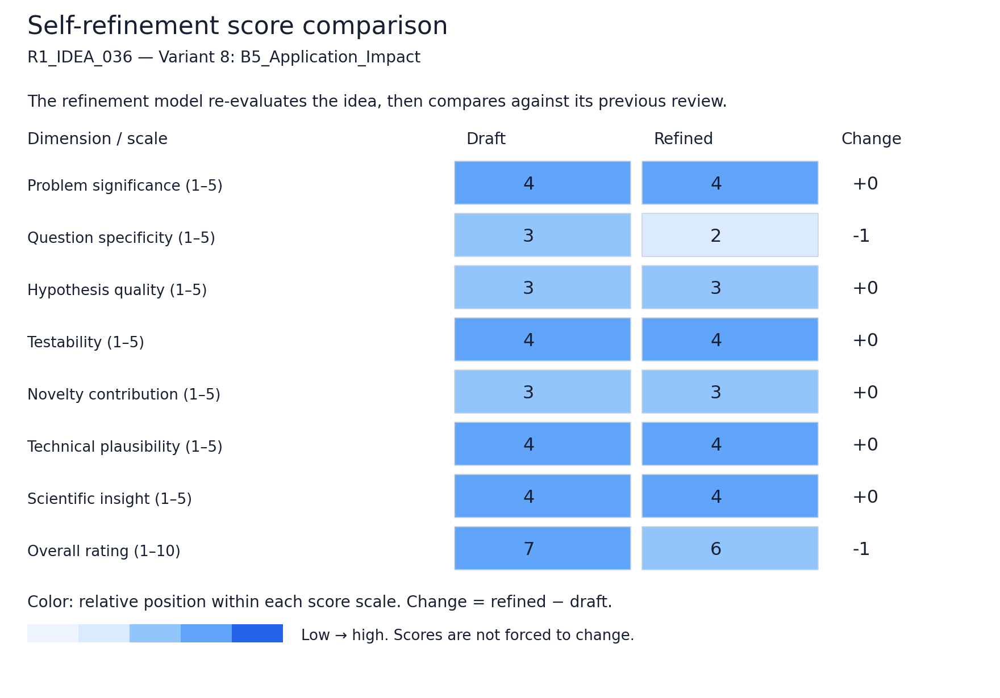

Changed score dimensions: question_specificity, overall_rating.

### Score justifications (draft / refined)

**Problem significance**

```json
{
  "draft": {
    "score": 4.0,
    "justification": "Clarifying misconceptions about dimensionality reduction methods is meaningful for both research and practice. If parametric and non-parametric methods are not equivalent, understanding their trade-offs could prevent suboptimal model selection in applied systems. The focus on generalization to unseen data is particularly relevant for real-world deployment."
  },
  "refined": {
    "score": 4.0,
    "justification": "Clarifying misconceptions about dimensionality reduction methods is meaningful for both research and practice. If parametric and non-parametric methods are not equivalent, understanding their trade-offs could prevent suboptimal model selection in applied systems. The focus on generalization to unseen data is particularly relevant for real-world deployment."
  }
}
```

**Question specificity**

```json
{
  "draft": {
    "score": 3.0,
    "justification": "The idea identifies a general misconception ('methods are not equivalent') but doesn't narrow down to a specific aspect of non-equivalence. It mentions local vs. global structure trade-offs, but doesn't define a precise question about when, why, or how much this matters. More specificity is needed to guide a focused investigation."
  },
  "refined": {
    "score": 2.0,
    "justification": "The idea identifies a general misconception ('methods are not equivalent') but doesn't narrow down to a specific, actionable research question. While it mentions a local vs. global structure trade-off, it lacks precision about what aspect of non-equivalence to investigate, under what conditions, or for what purpose. More specificity is needed to guide a focused study."
  }
}
```

**Hypothesis quality**

```json
{
  "draft": {
    "score": 3.0,
    "justification": "There is an implicit hypothesis: parametric DR methods generalize better but sacrifice local detail preservation, while non-parametric methods preserve local details but don't generalize as well. This is a concrete comparative claim, but it's presented as an assertion rather than a falsifiable prediction. The hypothesis could be strengthened by specifying conditions under which the trade-off favors one approach."
  },
  "refined": {
    "score": 3.0,
    "justification": "There is an implicit hypothesis: parametric DR methods generalize better but sacrifice local detail preservation, while non-parametric methods preserve local details but don't generalize as well. This is a concrete comparative claim that could be falsified, but it's presented as an assertion rather than a nuanced prediction. The hypothesis could be strengthened by specifying conditions or thresholds for the trade-off."
  }
}
```

**Testability**

```json
{
  "draft": {
    "score": 4.0,
    "justification": "The central claim is highly testable. One could design experiments comparing parametric and non-parametric methods on in-distribution and out-of-distribution data, measuring generalization performance and quantifying local/global structure preservation using established metrics (e.g., trustworthiness, continuity, silhouette scores). The idea naturally lends itself to empirical evaluation."
  },
  "refined": {
    "score": 4.0,
    "justification": "The central claim is highly testable. One could design experiments comparing parametric and non-parametric methods on in-distribution and out-of-distribution data, measuring generalization performance and quantifying local/global structure preservation using established metrics (e.g., trustworthiness, continuity, silhouette scores). The idea naturally lends itself to empirical evaluation."
  }
}
```

**Novelty contribution**

```json
{
  "draft": {
    "score": 3.0,
    "justification": "The observation that parametric and non-parametric DR methods have different properties is not entirely new; some literature discusses trade-offs between generalization and fidelity. However, systematically debunking a perceived 'equivalence misconception' and quantifying the local/global trade-off in a rigorous comparative study could be a valuable contribution, especially if it leads to actionable guidelines for model selection."
  },
  "refined": {
    "score": 3.0,
    "justification": "The observation that parametric and non-parametric DR methods have different properties is not entirely new; some literature discusses trade-offs between generalization and fidelity. However, systematically debunking a perceived 'equivalence misconception' and rigorously quantifying the local/global trade-off could be a valuable contribution, especially if it leads to actionable guidelines for model selection."
  }
}
```

**Technical plausibility**

```json
{
  "draft": {
    "score": 4.0,
    "justification": "The reasoning is coherent: parametric methods learn a mapping function that can be applied to new data, which should aid generalization, but may smooth over fine-grained local variations. Non-parametric methods optimize embeddings directly for the given data, potentially capturing local structure better but not generalizing beyond it. This aligns with known characteristics of parametric vs. instance-based learning."
  },
  "refined": {
    "score": 4.0,
    "justification": "The reasoning is coherent: parametric methods learn a mapping function that can be applied to new data, which should aid generalization, but may smooth over fine-grained local variations. Non-parametric methods optimize embeddings directly for the given data, potentially capturing local structure better but not generalizing beyond it. This aligns with known characteristics of parametric vs. instance-based learning."
  }
}
```

**Scientific insight**

```json
{
  "draft": {
    "score": 4.0,
    "justification": "If investigated thoroughly, this research could yield insights beyond mere performance comparison. It could reveal fundamental trade-offs between generalization and representational fidelity in dimensionality reduction, identify data characteristics that favor one approach, and provide a framework for selecting DR methods based on task requirements (global analysis vs. local clustering). These insights would be transferable to other representation learning contexts."
  },
  "refined": {
    "score": 4.0,
    "justification": "If investigated thoroughly, this research could yield insights beyond mere performance comparison. It could reveal fundamental trade-offs between generalization and representational fidelity in dimensionality reduction, identify data characteristics that favor one approach, and provide a framework for selecting DR methods based on task requirements (global analysis vs. local clustering). These insights would be transferable to other representation learning contexts."
  }
}
```

**Overall rating**

```json
{
  "draft": {
    "score": 7.0,
    "justification": "This is a strong research idea with clear practical relevance and a testable core claim. It identifies a meaningful problem (correcting a misconception that may lead to poor model selection) and suggests a plausible trade-off (generalization vs. local detail preservation). The main limitation is the lack of specificity in the research question and experimental design, but these can be refined. The idea has good potential to produce useful scientific insights about dimensionality reduction method selection."
  },
  "refined": {
    "score": 6.0,
    "justification": "This is a moderate research idea with clear practical relevance and a testable core claim. It identifies a meaningful problem (correcting a misconception that may lead to poor model selection) and suggests a plausible trade-off (generalization vs. local detail preservation). However, the lack of specificity in the research question and experimental design limits its current strength. With refinement, it has good potential to produce useful scientific insights about dimensionality reduction method selection."
  }
}
```

## R1_IDEA_036 — Variant 9: C1_Hollow_Shell

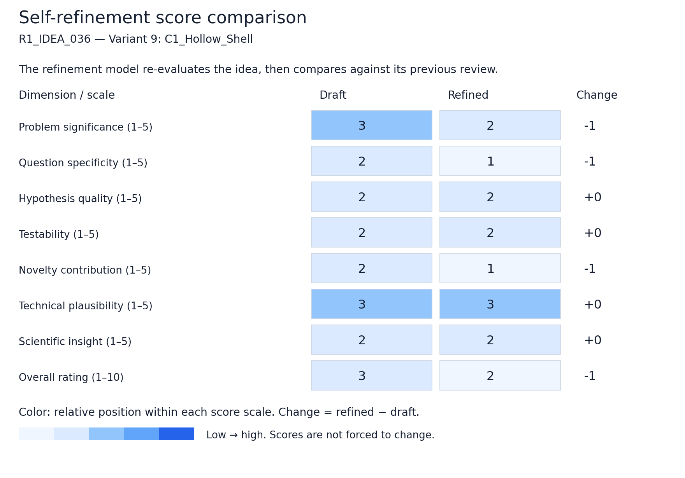

Changed score dimensions: problem_significance, question_specificity, novelty_contribution, overall_rating.

### Score justifications (draft / refined)

**Problem significance**

```json
{
  "draft": {
    "score": 3.0,
    "justification": "Dimensionality reduction is a core ML task, and understanding trade-offs between method properties is meaningful. However, the problem is stated too vaguely to assess its true importance—it's unclear if this 'misunderstanding' actually impedes research or practice."
  },
  "refined": {
    "score": 2.0,
    "justification": "While dimensionality reduction is important in ML, the problem is stated too vaguely. The 'misunderstanding' isn't clearly defined, and the trade-off between global and local structure is already well-known in DR literature, reducing the apparent significance of simply restating it."
  }
}
```

**Question specificity**

```json
{
  "draft": {
    "score": 2.0,
    "justification": "The idea notes a 'misunderstanding' and a comparative outcome, but does not define a specific research question. It lacks concrete variables, methods, or conditions to investigate."
  },
  "refined": {
    "score": 1.0,
    "justification": "The idea lacks a concrete research question. It mentions a 'misunderstanding' and 'comparative outcomes' but doesn't define what specifically should be investigated, under what conditions, or with what methods."
  }
}
```

**Hypothesis quality**

```json
{
  "draft": {
    "score": 2.0,
    "justification": "There is an implicit claim that generalizable methods preserve broad patterns but lose fine details, but this is presented as an observation rather than a testable hypothesis. No mechanism or causal relationship is proposed."
  },
  "refined": {
    "score": 2.0,
    "justification": "There's an implicit claim about a trade-off, but it's presented as an observation rather than a testable hypothesis. No mechanism, causal relationship, or boundary conditions are proposed that could be supported or contradicted by evidence."
  }
}
```

**Testability**

```json
{
  "draft": {
    "score": 2.0,
    "justification": "Without specifying methods or metrics, the claim is difficult to test. The idea does not propose experiments, comparisons, or analyses to validate the distinction."
  },
  "refined": {
    "score": 2.0,
    "justification": "Without specifying methods, metrics, or experimental designs, the claim is difficult to test meaningfully. The idea doesn't propose how one would gather evidence to investigate the supposed misunderstanding or trade-off."
  }
}
```

**Novelty contribution**

```json
{
  "draft": {
    "score": 2.0,
    "justification": "Trade-offs between global and local structure in dimensionality reduction are well-studied (e.g., in t-SNE vs. PCA discussions). The idea does not articulate what new insight would be gained beyond restating this known tension."
  },
  "refined": {
    "score": 1.0,
    "justification": "The tension between preserving global vs. local structure is fundamental and extensively discussed in dimensionality reduction literature (e.g., in comparisons of PCA, MDS, t-SNE, UMAP). The idea doesn't articulate what new insight would be gained beyond restating this known trade-off."
  }
}
```

**Technical plausibility**

```json
{
  "draft": {
    "score": 3.0,
    "justification": "The general notion that methods optimizing for generalizability might smooth over details is plausible, but the reasoning is too vague to assess coherence. No technical assumptions are stated."
  },
  "refined": {
    "score": 3.0,
    "justification": "The general notion that methods optimizing for different properties might exhibit trade-offs is plausible. However, the reasoning is too vague to assess technical coherence—no specific mechanisms or assumptions are stated."
  }
}
```

**Scientific insight**

```json
{
  "draft": {
    "score": 2.0,
    "justification": "If developed, this could reveal conditions under which generalizability harms local fidelity, but as stated, it merely points to a surface-level distinction without deeper mechanistic or theoretical exploration."
  },
  "refined": {
    "score": 2.0,
    "justification": "If developed with specificity, this could potentially reveal conditions under which generalizability harms local fidelity. However, as stated, it merely points to a surface-level distinction without suggesting deeper mechanistic, theoretical, or practical insights."
  }
}
```

**Overall rating**

```json
{
  "draft": {
    "score": 3.0,
    "justification": "The idea identifies a potential area of confusion in dimensionality reduction but lacks specificity, a clear research question, testable hypothesis, and methodological direction. It reads more as an observation than a research plan, with limited scientific contribution in its current form."
  },
  "refined": {
    "score": 2.0,
    "justification": "The idea is extremely vague, lacking specificity in methods, research question, hypothesis, and methodology. It identifies a known trade-off in dimensionality reduction without proposing how to investigate it meaningfully or what new understanding would be gained. It reads more as an observation than a research direction."
  }
}
```

## R1_IDEA_036 — Variant 10: C2_Logic_Flawed

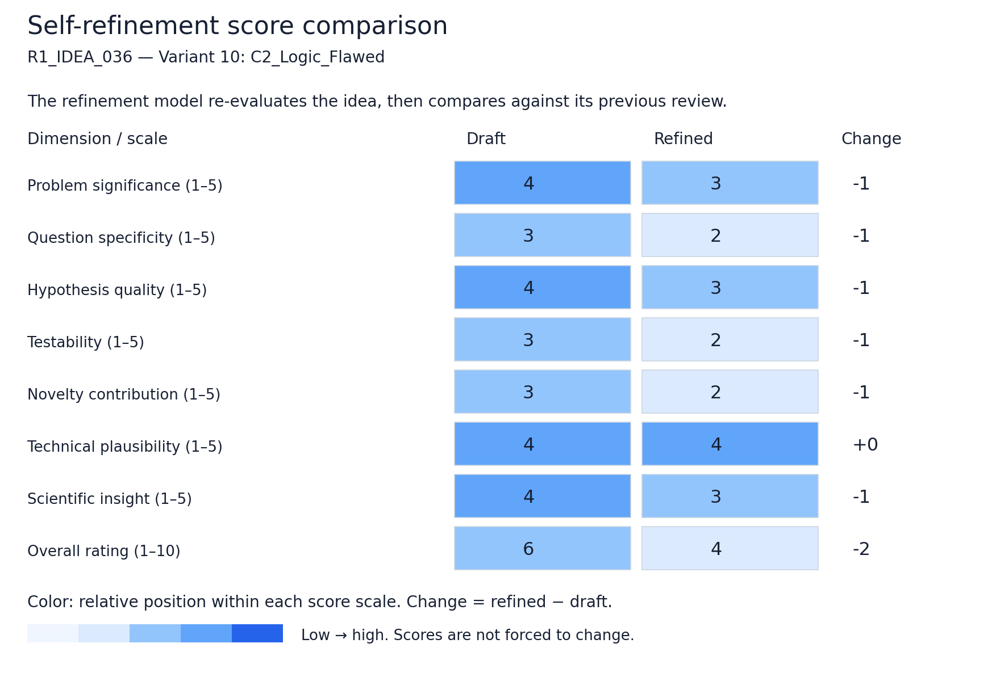

Changed score dimensions: problem_significance, question_specificity, hypothesis_quality, testability, novelty_contribution, scientific_insight, overall_rating.

### Score justifications (draft / refined)

**Problem significance**

```json
{
  "draft": {
    "score": 4.0,
    "justification": "The problem is meaningful as it addresses a potential misconception in the ML community about method equivalence. Understanding trade-offs between parametric and non-parametric approaches has practical implications for method selection and application in representation learning."
  },
  "refined": {
    "score": 3.0,
    "justification": "The problem has moderate significance. While understanding trade-offs between parametric and non-parametric methods is relevant to representation learning, the idea doesn't establish why clarifying this particular 'misconception' is urgent or impactful. The claim about practitioner misconceptions lacks supporting context."
  }
}
```

**Question specificity**

```json
{
  "draft": {
    "score": 3.0,
    "justification": "The idea identifies a comparative question (parametric vs. non-parametric methods) and proposes a specific mechanism (global vs. local structure retention), but the research question could be more precisely defined regarding what aspects of performance are being compared and for what tasks."
  },
  "refined": {
    "score": 2.0,
    "justification": "The research question is vague. It compares broad categories of methods without specifying which ones, mentions 'performance' and 'effectiveness' without defining metrics or tasks, and uses undefined terms like 'global structure' and 'local details.' The comparison framework lacks necessary precision."
  }
}
```

**Hypothesis quality**

```json
{
  "draft": {
    "score": 4.0,
    "justification": "The hypothesis is concrete and testable: parametric methods retain global structure but lose local details, making them more broadly effective. It makes a clear prediction about a trade-off mechanism that distinguishes the two approaches."
  },
  "refined": {
    "score": 3.0,
    "justification": "The hypothesis contains a concrete mechanism (parametric methods retain global structure but lose local details) but connects it weakly to an outcome ('broader effectiveness'). The prediction is testable in principle but lacks the specificity needed for a strong hypothesis (e.g., what constitutes 'significant' local detail loss?)."
  }
}
```

**Testability**

```json
{
  "draft": {
    "score": 3.0,
    "justification": "The hypothesis is testable in principle through comparative experiments, but no specific experimental design or evaluation approach is suggested. The claim about 'broader effectiveness' needs operationalization to be properly tested."
  },
  "refined": {
    "score": 2.0,
    "justification": "The idea is testable only at a high conceptual level. It suggests no experimental design, evaluation metrics, or comparison baselines. Without operational definitions for 'global structure,' 'local details,' and 'broader effectiveness,' designing a meaningful test would require substantial additional specification."
  }
}
```

**Novelty contribution**

```json
{
  "draft": {
    "score": 3.0,
    "justification": "While comparisons between parametric and non-parametric methods exist, the specific focus on the global-local trade-off and addressing practitioner misconceptions could provide new insight. However, the novelty depends on how deeply this trade-off has been studied in existing literature."
  },
  "refined": {
    "score": 2.0,
    "justification": "The novelty appears limited. The trade-off between global and local structure preservation is a well-known consideration in dimensionality reduction literature. Comparing parametric and non-parametric approaches is also not novel in itself. The contribution would depend heavily on uncovering new empirical patterns or providing rigorous evidence countering specific misconceptions."
  }
}
```

**Technical plausibility**

```json
{
  "draft": {
    "score": 4.0,
    "justification": "The reasoning is logically coherent: parametric methods by design learn a mapping function that may smooth over local variations while capturing broader patterns. The trade-off between global and local structure is a known consideration in dimensionality reduction."
  },
  "refined": {
    "score": 4.0,
    "justification": "The core reasoning is plausible. Parametric methods (e.g., neural networks) can smooth functions and may prioritize broader patterns, while non-parametric methods (e.g., k-nearest neighbor based) can preserve fine-grained local structure. The hypothesized direction aligns with general understanding of model flexibility and generalization."
  }
}
```

**Scientific insight**

```json
{
  "draft": {
    "score": 4.0,
    "justification": "If validated, this research could provide important insights about when to choose parametric vs. non-parametric methods based on the desired balance between global structure and local detail preservation. This could inform method selection guidelines and improve understanding of representation learning trade-offs."
  },
  "refined": {
    "score": 3.0,
    "justification": "If successfully investigated, the idea could provide moderate insight into the representational trade-offs of different dimensionality reduction paradigms. However, the potential insight is limited by the vague connection to 'broader effectiveness.' A more focused study on how the global-local trade-off affects specific downstream tasks would yield clearer scientific value."
  }
}
```

**Overall rating**

```json
{
  "draft": {
    "score": 6.0,
    "justification": "This is a moderate research idea with good potential. It identifies a meaningful problem and proposes a specific hypothesis about the trade-off between parametric and non-parametric methods. However, it lacks specificity in defining the research question, experimental approach, and evaluation metrics. With more precise formulation, it could become a strong research direction."
  },
  "refined": {
    "score": 4.0,
    "justification": "This is a weak research idea. While it identifies a comparative topic of some relevance, the research question is poorly defined, the hypothesis lacks specificity, and testability is low. The idea reads more as a broad observation than a focused research direction. Significant refinement is needed to transform it into a viable research proposal."
  }
}
```

## R1_IDEA_036 — Variant 11: C3_Substance_Enriched


Changed score dimensions: none.

### Score justifications (draft / refined)

**Problem significance**

```json
{
  "draft": {
    "score": 4.0,
    "justification": "Understanding the generalization properties and limitations of parametric dimensionality reduction is important as these methods become more widely used. The trade-off between global structure and local details is a meaningful challenge with implications for visualization, feature extraction, and downstream tasks."
  },
  "refined": {
    "score": 4.0,
    "justification": "The problem is significant. As parametric dimensionality reduction methods gain popularity for their generalization capabilities, understanding their limitations—particularly the potential trade-off between global and local structure preservation—is important for both theoretical understanding and practical application in visualization, feature extraction, and downstream tasks."
  }
}
```

**Question specificity**

```json
{
  "draft": {
    "score": 3.0,
    "justification": "The idea identifies a general research direction (testing performance non-equivalence and trade-offs) but lacks specificity in defining the exact comparison, methods, or conditions. The claim about 'prevalent misconception' is not clearly defined."
  },
  "refined": {
    "score": 3.0,
    "justification": "The idea identifies a general research direction (testing a trade-off in generalization) but lacks specificity in defining the exact methods, metrics, and conditions of comparison. The claim about a 'prevalent misconception' is vague and not clearly operationalized."
  }
}
```

**Hypothesis quality**

```json
{
  "draft": {
    "score": 3.0,
    "justification": "An implicit hypothesis exists (parametric methods trade local details for global structure preservation), but it is presented more as an assertion than a falsifiable prediction. The hypothesis could be strengthened by making it more precise and conditional."
  },
  "refined": {
    "score": 3.0,
    "justification": "An implicit hypothesis exists (parametric methods trade local details for global structure preservation on unseen data), but it is presented as an assertion ('Here, we show...') rather than a falsifiable prediction. The hypothesis could be stronger if it were framed as a conditional prediction about the relationship between generalization and preservation fidelity."
  }
}
```

**Testability**

```json
{
  "draft": {
    "score": 4.0,
    "justification": "The idea is testable through the proposed evaluation using neighborhood preservation metrics on held-out data distributions. The trade-off can be quantified with appropriate metrics, making the central claim investigable."
  },
  "refined": {
    "score": 4.0,
    "justification": "The idea is highly testable. The proposed evaluation using neighborhood preservation metrics on held-out data provides a clear path to investigate the claim. The trade-off can be quantified by comparing global and local preservation scores across methods and distribution shifts."
  }
}
```

**Novelty contribution**

```json
{
  "draft": {
    "score": 3.0,
    "justification": "While parametric vs. non-parametric comparisons exist, systematically characterizing the global-local trade-off in generalization is a meaningful contribution. However, the idea does not yet articulate a highly novel angle beyond a general comparison."
  },
  "refined": {
    "score": 3.0,
    "justification": "The novelty is moderate. While comparisons between parametric and non-parametric methods exist, systematically characterizing the global-local trade-off specifically in the context of generalization to unseen data is a meaningful contribution. However, the idea does not yet propose a fundamentally new mechanism or a highly unique angle beyond a detailed empirical comparison."
  }
}
```

**Technical plausibility**

```json
{
  "draft": {
    "score": 4.0,
    "justification": "The reasoning is coherent: parametric methods learn smooth mappings that may generalize globally but oversmooth local details. The proposed evaluation approach (neighborhood metrics on held-out data) is technically plausible and aligned with the hypothesis."
  },
  "refined": {
    "score": 4.0,
    "justification": "The reasoning is coherent and plausible. Parametric methods learn smooth functions that could generalize global patterns but may oversmooth local variations. The proposed evaluation approach is technically sound and aligns well with the stated goal of testing neighborhood preservation under distribution shift."
  }
}
```

**Scientific insight**

```json
{
  "draft": {
    "score": 4.0,
    "justification": "If successfully investigated, this research could provide insight into the fundamental limitations of parametric dimensionality reduction, guiding method selection and potentially inspiring new approaches to balance global and local preservation in generalization."
  },
  "refined": {
    "score": 4.0,
    "justification": "The potential scientific insight is strong. Successfully investigating this idea could reveal fundamental limitations of parametric dimensionality reduction, provide guidance for method selection based on the desired preservation property (global vs. local), and possibly inspire new approaches to balance these aspects in generalizable representations."
  }
}
```

**Overall rating**

```json
{
  "draft": {
    "score": 6.0,
    "justification": "This is a moderate research idea with a meaningful problem and testable direction. It lacks specificity in defining the misconception and methods, and the hypothesis is presented as an assertion rather than a clear prediction. With refinement, it could become a strong investigation into generalization trade-offs in dimensionality reduction."
  },
  "refined": {
    "score": 6.0,
    "justification": "This is a moderate research idea. It addresses a meaningful problem and proposes a testable direction with clear potential for scientific insight. Its main weaknesses are the presentation of the claim as a conclusion rather than a hypothesis, and a lack of specificity in defining the methods and conditions of comparison. With refinement, it could become a strong empirical study on generalization trade-offs in dimensionality reduction."
  }
}
```

## R1_IDEA_036 — Variant 12: H1_Deceptive_Hollow

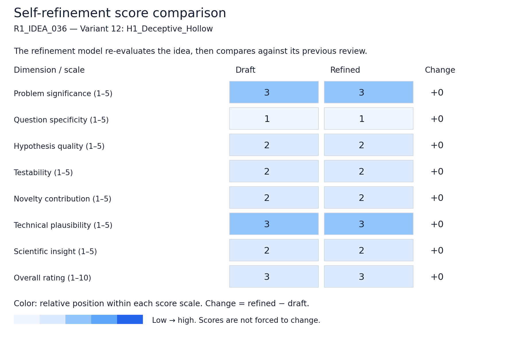

Changed score dimensions: none.

### Score justifications (draft / refined)

**Problem significance**

```json
{
  "draft": {
    "score": 3.0,
    "justification": "Understanding trade-offs between generalizability and detail preservation in dimensionality reduction is a meaningful and perennial problem in ML. If a clear, widespread misunderstanding exists, correcting it could be valuable. However, the problem is stated so vaguely that its true significance is hard to assess."
  },
  "refined": {
    "score": 3.0,
    "justification": "Understanding trade-offs between generalizability and detail preservation in dimensionality reduction is a meaningful, perennial problem in machine learning. If a genuine, widespread misunderstanding exists, correcting it could be valuable. However, the problem is stated so vaguely that its true significance and uniqueness are hard to assess."
  }
}
```

**Question specificity**

```json
{
  "draft": {
    "score": 1.0,
    "justification": "Extremely weak. The idea does not define a concrete research question. It states that methods are 'distinct' and have a trade-off, but does not specify what is being compared, what properties are being measured, or what relationship is being investigated. It is a collection of high-level claims without a specific inquiry."
  },
  "refined": {
    "score": 1.0,
    "justification": "Extremely weak. No concrete research question is defined. The idea merely states that methods are 'distinct' and have a trade-off, without specifying what is being compared, what properties are measured, or what relationship is investigated. It's a collection of high-level claims without a specific inquiry."
  }
}
```

**Hypothesis quality**

```json
{
  "draft": {
    "score": 2.0,
    "justification": "There is an implicit, very low-resolution hypothesis: that one class of DR methods preserves broad patterns (generalizes) while another preserves fine details. This is a generic trade-off suggestion, not a concrete, testable prediction about a specific mechanism or relationship. It lacks the specificity needed to guide a meaningful investigation."
  },
  "refined": {
    "score": 2.0,
    "justification": "There's only an implicit, low-resolution hypothesis: that one class of DR methods preserves broad patterns (generalizes) while another preserves fine details. This is a generic suggestion of a trade-off, not a concrete, testable prediction about a specific mechanism or relationship. It lacks the specificity needed to guide meaningful investigation."
  }
}
```

**Testability**

```json
{
  "draft": {
    "score": 2.0,
    "justification": "In its current form, the idea is not testable because it does not propose how to test it. The core claim is vague. To become testable, it would need to define the methods, define metrics for 'broad patterns' and 'fine details', define a protocol for assessing generalizability, and propose a comparison. The idea itself suggests none of this."
  },
  "refined": {
    "score": 2.0,
    "justification": "In its current form, the idea is not testable because it proposes no method of testing. The core claim is vague. To become testable, it would need to define the methods, define metrics for 'broad patterns' and 'fine details', define a protocol for assessing generalizability, and propose a comparison. The idea itself suggests none of this."
  }
}
```

**Novelty contribution**

```json
{
  "draft": {
    "score": 2.0,
    "justification": "The claim of novelty and a 'transformative synthesis' is entirely unsubstantiated. The described trade-off (global structure vs. local detail) is a well-known concept in dimensionality reduction (e.g., PCA vs. t-SNE). Positioning it as a novel, field-shaping agenda without any new angle, mechanism, or finding is a weakness. The potential contribution is currently just a repackaging of a known idea in grandiose language."
  },
  "refined": {
    "score": 2.0,
    "justification": "The claim of novelty and a 'transformative synthesis' is unsubstantiated. The described trade-off (global structure vs. local detail) is a well-known concept in dimensionality reduction (e.g., PCA vs. t-SNE, parametric vs. neighbor-based methods). Positioning it as a novel, field-shaping agenda without any new angle, mechanism, or finding is a weakness. The potential contribution is currently just a repackaging of a known idea in grandiose language."
  }
}
```

**Technical plausibility**

```json
{
  "draft": {
    "score": 3.0,
    "justification": "The underlying notion that different DR methods have different trade-offs is logically coherent and plausible. However, the reasoning presented is too vague to evaluate properly. The jump from a vague trade-off to a 'broader framework for robust, adaptive, and high-impact scientific systems' is not supported by any technical argument."
  },
  "refined": {
    "score": 3.0,
    "justification": "The underlying notion that different DR methods have different trade-offs is logically coherent and plausible. However, the reasoning presented is too vague to evaluate properly. The jump from a vague trade-off to a 'broader framework for robust, adaptive, and high-impact scientific systems' is not supported by any technical argument or mechanism."
  }
}
```

**Scientific insight**

```json
{
  "draft": {
    "score": 2.0,
    "justification": "If successfully executed with specificity, research on trade-offs in DR could yield useful insights about method selection and limitations. However, the idea as presented promises 'conceptual insight' and reshaping community thinking without describing what that insight would be. The potential for transferable scientific insight (e.g., a new principle linking model architecture to generalization in unsupervised learning) is hinted at but completely undefined."
  },
  "refined": {
    "score": 2.0,
    "justification": "If successfully executed with specificity, research on trade-offs in DR could yield useful insights about method selection and limitations. However, the idea as presented promises 'conceptual insight' and reshaping community thinking without describing what that insight would be. The potential for transferable scientific insight (e.g., a new principle linking model architecture to generalization in unsupervised learning) is hinted at but completely undefined."
  }
}
```

**Overall rating**

```json
{
  "draft": {
    "score": 3.0,
    "justification": "This is a weak research idea. It identifies a potentially relevant area (trade-offs in DR) but fails to articulate a specific research question, hypothesis, or methodological direction. It is shrouded in vague, promotional language that promises far more than the core idea justifies. The lack of specificity makes it impossible to evaluate its true scientific merit. It reads more like a motivation paragraph searching for a concrete study than a coherent research idea."
  },
  "refined": {
    "score": 3.0,
    "justification": "This is a weak research idea. It identifies a potentially relevant area (trade-offs in dimensionality reduction) but fails to articulate a specific research question, hypothesis, or methodological direction. It is shrouded in vague, promotional language that promises far more than the core idea justifies. The lack of specificity makes it impossible to evaluate its true scientific merit. It reads more like a motivation paragraph searching for a concrete study than a coherent research idea."
  }
}
```

## R1_IDEA_036 — Variant 13: H2_Confident_Flaw

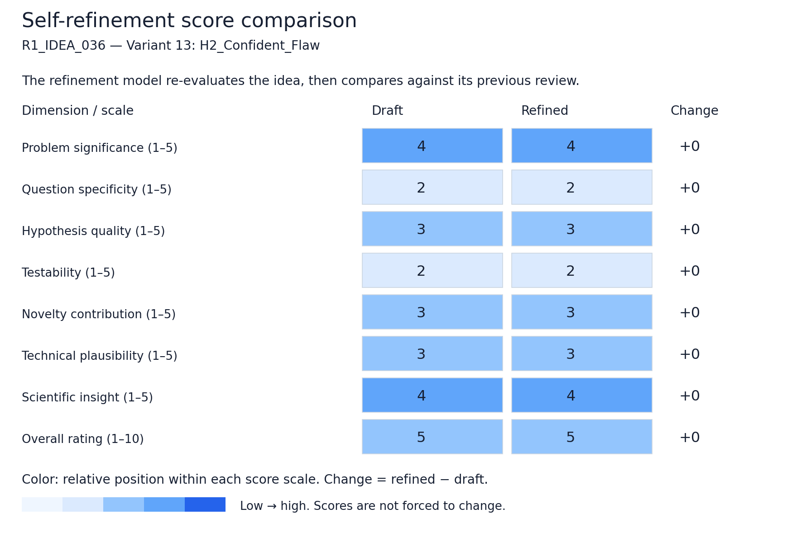

Changed score dimensions: none.

### Score justifications (draft / refined)

**Problem significance**

```json
{
  "draft": {
    "score": 4.0,
    "justification": "The problem is meaningful—clarifying misconceptions about parametric vs. non-parametric dimensionality reduction and understanding their trade-offs is relevant for practitioners choosing methods. The focus on generalization vs. local fidelity addresses an important practical concern in representation learning."
  },
  "refined": {
    "score": 4.0,
    "justification": "The problem is meaningful—clarifying misconceptions about parametric vs. non-parametric dimensionality reduction and understanding their trade-offs is relevant for practitioners and researchers. The focus on generalization versus local fidelity addresses an important practical concern in representation learning, where method selection impacts downstream tasks."
  }
}
```

**Question specificity**

```json
{
  "draft": {
    "score": 2.0,
    "justification": "The idea states a general claim but doesn't define a concrete research question. It mentions a 'key mechanism' and a direction but lacks specificity about what exactly will be investigated—characterization, quantification, or mitigation of local detail loss."
  },
  "refined": {
    "score": 2.0,
    "justification": "The idea states a general claim but does not define a concrete research question. It mentions a 'key mechanism' and a direction but lacks specificity about what exactly will be investigated—whether it's characterization, quantification, or mitigation of local detail loss. The research objective remains vague."
  }
}
```

**Hypothesis quality**

```json
{
  "draft": {
    "score": 3.0,
    "justification": "There is an implicit hypothesis: parametric methods lose local details, and addressing this will improve performance across settings. This makes a concrete prediction about a mechanism, but it's somewhat broad and not framed as a testable statement that could be clearly falsified."
  },
  "refined": {
    "score": 3.0,
    "justification": "There is an implicit hypothesis: parametric methods lose local details, and addressing this loss will improve performance across representation learning settings. This makes a concrete prediction about a mechanism, but it's broad and not framed as a clearly testable statement that could be falsified. The hypothesis lacks precision about the expected relationship between local detail preservation and overall performance."
  }
}
```

**Testability**

```json
{
  "draft": {
    "score": 2.0,
    "justification": "The idea lacks a clear experimental approach. While one could design comparisons and local structure metrics, the proposal doesn't suggest how to test the claims. The assertion that gains can be treated as causal without controlling confounds undermines testability."
  },
  "refined": {
    "score": 2.0,
    "justification": "The idea lacks a clear experimental approach. While one could design comparisons and metrics for local structure preservation, the proposal does not suggest how to test the claims. The assertion that gains can be treated as causal without controlling confounds further undermines testability, as it dismisses standard methodological practices for establishing causality."
  }
}
```

**Novelty contribution**

```json
{
  "draft": {
    "score": 3.0,
    "justification": "The observation that parametric methods may lose local details isn't entirely new—trade-offs between global and local structure are known in dimensionality reduction. However, systematically characterizing this for parametric methods and proposing it as the key limitation could offer a useful perspective if explored deeply."
  },
  "refined": {
    "score": 3.0,
    "justification": "The observation that parametric methods may lose local details isn't entirely new—trade-offs between global and local structure are known in dimensionality reduction literature. However, systematically characterizing this for parametric methods and proposing it as the key limitation could offer a useful perspective if explored deeply. The contribution potential is moderate, leaning toward incremental unless novel insights emerge."
  }
}
```

**Technical plausibility**

```json
{
  "draft": {
    "score": 3.0,
    "justification": "The reasoning is logically coherent—parametric methods optimize for generalization, which might come at the cost of local fidelity. However, the claim that addressing local detail loss alone will yield reliable improvements across settings is an assumption that may not hold universally. The causal inference claim is technically questionable."
  },
  "refined": {
    "score": 3.0,
    "justification": "The core reasoning is logically coherent—parametric methods, optimized for generalization, might sacrifice local fidelity. However, the claim that addressing local detail loss alone will yield reliable improvements across all settings is an assumption that may not hold universally. The causal inference claim is technically questionable, as it ignores standard practices for controlling confounding variables."
  }
}
```

**Scientific insight**

```json
{
  "draft": {
    "score": 4.0,
    "justification": "If properly investigated, this could yield valuable insight into the fundamental trade-offs in parametric dimensionality reduction—how generalization affects local structure preservation, and whether this is a necessary limitation or an addressable one. Understanding this mechanism could inform method selection and design."
  },
  "refined": {
    "score": 4.0,
    "justification": "If properly investigated, this could yield valuable insight into the fundamental trade-offs in parametric dimensionality reduction—how generalization affects local structure preservation, and whether this is a necessary limitation or an addressable one. Understanding this mechanism could inform method selection, design, and provide transferable knowledge about representation learning."
  }
}
```

**Overall rating**

```json
{
  "draft": {
    "score": 5.0,
    "justification": "The idea identifies a meaningful problem and proposes an interesting mechanism (local detail loss in parametric dimensionality reduction), but it lacks specificity in research question, testability, and experimental design. The hypothesis is implicit but broad, and the methodological claim about causal evidence is problematic. With refinement, it could become a strong research direction, but as presented, it's moderate/borderline."
  },
  "refined": {
    "score": 5.0,
    "justification": "The idea identifies a meaningful problem and proposes an interesting mechanism (local detail loss in parametric dimensionality reduction), but it lacks specificity in research question, testability, and experimental design. The hypothesis is implicit but broad, and the methodological claim about causal evidence is problematic. With refinement, it could become a strong research direction, but as presented, it's moderate/borderline."
  }
}
```

## R1_IDEA_036 — Variant 14: H3_Verbose_Enriched

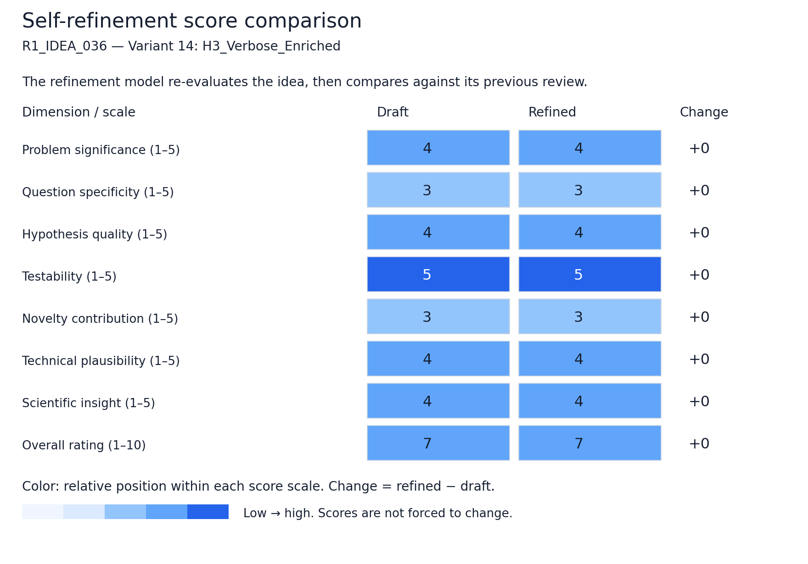

Changed score dimensions: none.

### Score justifications (draft / refined)

**Problem significance**

```json
{
  "draft": {
    "score": 4.0,
    "justification": "The problem is meaningful and timely. Understanding the trade-offs between parametric and non-parametric dimensionality reduction methods is important as parametric methods gain popularity for their generalization capabilities. This addresses a fundamental question about what is preserved and lost when moving from data-specific to learned mappings."
  },
  "refined": {
    "score": 4.0,
    "justification": "The problem is meaningful and timely. Understanding the trade-offs between parametric and non-parametric dimensionality reduction methods is important as parametric methods gain popularity for their generalization capabilities. This addresses a fundamental question about what is preserved and lost when moving from data-specific to learned mappings, which matters for both researchers and practitioners choosing appropriate methods."
  }
}
```

**Question specificity**

```json
{
  "draft": {
    "score": 3.0,
    "justification": "The research question is reasonably specific: it focuses on the trade-off between global structure preservation and local detail loss in parametric DR methods when generalizing. However, it doesn't specify which methods, what types of datasets, or precisely how 'global' and 'local' are defined, leaving some ambiguity."
  },
  "refined": {
    "score": 3.0,
    "justification": "The research question is reasonably specific in focusing on the global vs. local preservation trade-off for generalization. However, it lacks specificity in method selection, dataset characterization, and precise definitions of 'global' and 'local' structure, leaving some ambiguity about the exact scope of investigation."
  }
}
```

**Hypothesis quality**

```json
{
  "draft": {
    "score": 4.0,
    "justification": "The hypothesis is clear and concrete: parametric methods retain global structure but lose significant local details. This makes a testable prediction about differential performance on different types of structure preservation. It could be falsified if parametric methods preserve local details as well as or better than non-parametric methods on held-out data."
  },
  "refined": {
    "score": 4.0,
    "justification": "The hypothesis is clear and concrete: parametric methods retain global structure but lose significant local details when generalizing. This makes a testable prediction about differential performance on different types of structure preservation. It could be falsified if parametric methods preserve local details as well as or better than non-parametric methods on held-out data."
  }
}
```

**Testability**

```json
{
  "draft": {
    "score": 5.0,
    "justification": "Highly testable. The idea explicitly proposes evaluating neighborhood preservation metrics on held-out data distributions and outlines a comprehensive experimental design with baseline/intervention conditions, primary/secondary criteria, and various analyses (ablations, sensitivity, error analysis). This provides clear pathways to gather evidence."
  },
  "refined": {
    "score": 5.0,
    "justification": "Highly testable. The idea explicitly proposes evaluating neighborhood preservation metrics on held-out data distributions and outlines a comprehensive experimental design with baseline/intervention conditions, primary/secondary criteria, and various analyses (ablations, sensitivity, error analysis). This provides clear, methodical pathways to gather evidence for or against the hypothesis."
  }
}
```

**Novelty contribution**

```json
{
  "draft": {
    "score": 3.0,
    "justification": "Moderate novelty. While comparisons between parametric and non-parametric DR methods exist, the specific focus on the global vs. local trade-off for generalization, along with the proposed systematic investigation of boundary conditions, adds value. However, the core observation that parametric methods may sacrifice local details isn't entirely new."
  },
  "refined": {
    "score": 3.0,
    "justification": "Moderate novelty. While comparisons between parametric and non-parametric DR methods exist, the specific focus on the global vs. local trade-off for generalization, along with the proposed systematic investigation of boundary conditions, adds value. However, the core observation that parametric methods may sacrifice local details isn't entirely new, and the idea doesn't propose a fundamentally new method or mechanism."
  }
}
```

**Technical plausibility**

```json
{
  "draft": {
    "score": 4.0,
    "justification": "Technically plausible. The reasoning is coherent: parametric methods learn a mapping function that must generalize, which could reasonably lead to smoothing and loss of fine-grained local structure. The proposed evaluation using neighborhood preservation metrics on held-out data is standard and appropriate."
  },
  "refined": {
    "score": 4.0,
    "justification": "Technically plausible. The reasoning is coherent: parametric methods learn a mapping function that must generalize, which could reasonably lead to smoothing and loss of fine-grained local structure. The proposed evaluation using neighborhood preservation metrics on held-out data is standard and appropriate for the research question."
  }
}
```

**Scientific insight**

```json
{
  "draft": {
    "score": 4.0,
    "justification": "Good potential for scientific insight. Successfully investigating this idea could reveal not just whether a trade-off exists, but under what data regimes, assumptions, and domain constraints it manifests. This could lead to general principles about when to choose parametric vs. non-parametric DR methods and how to design better parametric methods."
  },
  "refined": {
    "score": 4.0,
    "justification": "Good potential for scientific insight. Successfully investigating this idea could reveal not just whether a trade-off exists, but under what data regimes, assumptions, and domain constraints it manifests. This could lead to general principles about when to choose parametric vs. non-parametric DR methods and inform the design of better parametric methods that mitigate the identified limitations."
  }
}
```

**Overall rating**

```json
{
  "draft": {
    "score": 7.0,
    "justification": "This is a strong research idea. It addresses a meaningful problem with a clear, testable hypothesis and proposes a robust experimental design. The potential to uncover boundary conditions and mechanisms behind the generalization trade-off in dimensionality reduction is valuable. It loses points for some lack of specificity in method selection and dataset characterization, and moderate novelty, but overall represents a solid scientific investigation."
  },
  "refined": {
    "score": 7.0,
    "justification": "This is a strong research idea. It addresses a meaningful problem with a clear, testable hypothesis and proposes a robust experimental design. The potential to uncover boundary conditions and mechanisms behind the generalization trade-off in dimensionality reduction is valuable. It loses points for some lack of specificity in method selection and dataset characterization, and moderate novelty, but overall represents a solid scientific investigation with good potential for insight."
  }
}
```

## R1_IDEA_036 — Variant 15: H4_Ultimate_Hype

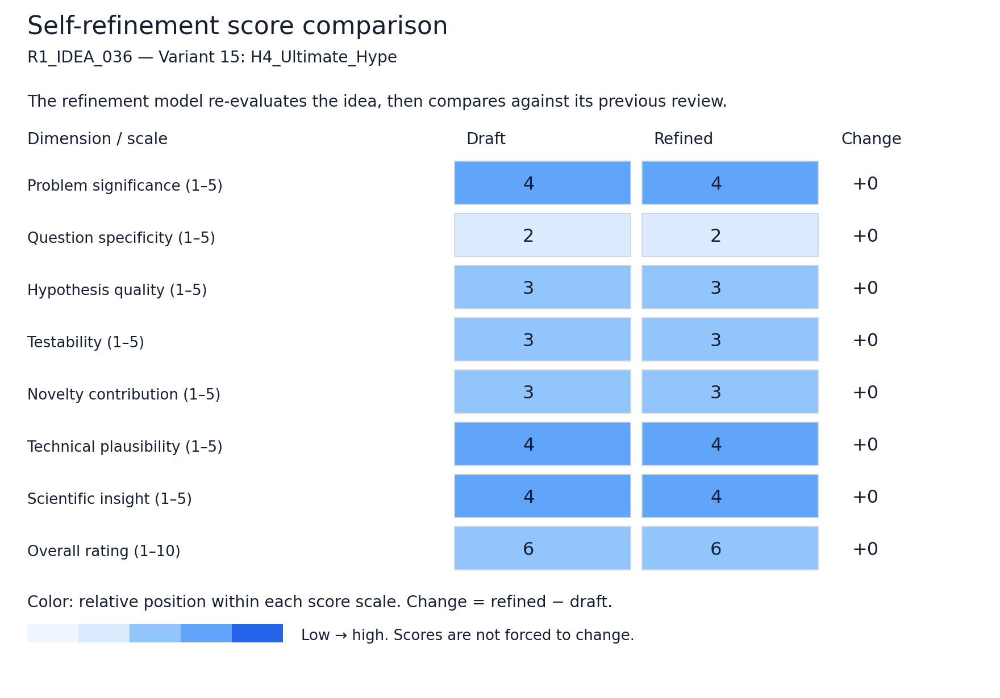

Changed score dimensions: none.

### Score justifications (draft / refined)

**Problem significance**

```json
{
  "draft": {
    "score": 4.0,
    "justification": "The problem is meaningful: clarifying misconceptions about method equivalence helps practitioners choose appropriate tools. Understanding trade-offs between generalization (parametric) and fidelity (non-parametric) is a core issue in dimensionality reduction with practical implications."
  },
  "refined": {
    "score": 4.0,
    "justification": "The problem is meaningful. Clarifying misconceptions about method equivalence helps practitioners make informed choices. Understanding the trade-offs between generalization (parametric) and fidelity (non-parametric) is a core, practical issue in dimensionality reduction with real-world relevance."
  }
}
```

**Question specificity**

```json
{
  "draft": {
    "score": 2.0,
    "justification": "The idea states a general claim but doesn't define a specific research question. It lacks operational definitions of key terms ('global structure', 'local details') and doesn't specify the scope of methods or data to be investigated."
  },
  "refined": {
    "score": 2.0,
    "justification": "The idea states a broad claim but does not define a specific research question. It lacks operational definitions of key terms ('global structure', 'local details') and does not specify the scope of methods, data, or evaluation criteria. It is presented as a conclusion rather than an inquiry."
  }
}
```

**Hypothesis quality**

```json
{
  "draft": {
    "score": 3.0,
    "justification": "There is an implicit hypothesis: 'parametric methods retain global structure but lose local details.' This is concrete and potentially falsifiable, but it's presented as a conclusion ('we show') rather than a hypothesis to test, and the mechanisms aren't elaborated."
  },
  "refined": {
    "score": 3.0,
    "justification": "There is an implicit hypothesis: 'parametric methods retain global structure but lose local details.' This is concrete and potentially falsifiable. However, it is presented as an established fact ('we show') rather than a hypothesis to test, and no underlying mechanism or boundary conditions are proposed."
  }
}
```

**Testability**

```json
{
  "draft": {
    "score": 3.0,
    "justification": "The claim is testable in principle through comparative experiments with appropriate metrics. However, without specifying how to measure 'global structure' and 'local details,' it's unclear what evidence would support or contradict the hypothesis."
  },
  "refined": {
    "score": 3.0,
    "justification": "The claim is testable in principle through comparative experiments with appropriate metrics. However, without specifying how to measure 'global structure' and 'local details,' it is unclear what concrete evidence would support or refute the hypothesis. The testability is conditional on operationalizing these terms."
  }
}
```

**Novelty contribution**

```json
{
  "draft": {
    "score": 3.0,
    "justification": "The idea of comparing parametric vs. non-parametric DR methods isn't novel per se, but focusing on the global-local trade-off as a widespread misconception could be a valuable contribution if empirically demonstrated and characterized systematically."
  },
  "refined": {
    "score": 3.0,
    "justification": "The general comparison of parametric vs. non-parametric DR methods is not novel. However, systematically investigating the global-local trade-off as a widespread misconception could be a valuable empirical contribution if done rigorously. The promotional language overstates the likely novelty."
  }
}
```

**Technical plausibility**

```json
{
  "draft": {
    "score": 4.0,
    "justification": "The reasoning is plausible: parametric methods learn a mapping function that generalizes but may smooth details, while non-parametric methods optimize per-instance embeddings that can preserve local neighborhoods better. This aligns with known trade-offs in machine learning."
  },
  "refined": {
    "score": 4.0,
    "justification": "The reasoning is plausible. Parametric methods learn a mapping function that may smooth details to generalize, while non-parametric methods optimize per-instance embeddings and can preserve local neighborhoods more accurately. This aligns with known trade-offs in machine learning between generalization and memorization."
  }
}
```

**Scientific insight**

```json
{
  "draft": {
    "score": 4.0,
    "justification": "If investigated properly, this could yield generalizable insights about the fundamental limitations of parametric generalization in dimensionality reduction, helping to establish boundary conditions for method selection and potentially guiding future method development."
  },
  "refined": {
    "score": 4.0,
    "justification": "If properly investigated, this could yield generalizable insights about the fundamental limitations of parametric generalization in dimensionality reduction. It could help establish boundary conditions for method selection and inform the development of future methods that better balance global and local preservation."
  }
}
```

**Overall rating**

```json
{
  "draft": {
    "score": 6.0,
    "justification": "This is a moderate/borderline research idea. It identifies a meaningful problem and makes a plausible claim, but it's presented too vaguely as a 'transformative agenda' rather than a concrete investigation. The core hypothesis is testable and could provide useful insights, but the idea lacks specificity in methods, metrics, and experimental design needed to evaluate its true potential. With refinement, it could become a strong research direction."
  },
  "refined": {
    "score": 6.0,
    "justification": "This is a moderate/borderline research idea. It identifies a meaningful problem and makes a plausible, testable claim. However, it is presented too vaguely as a broad 'transformative agenda' rather than a concrete investigation. The lack of operational definitions, specific methods, and experimental design limits its current strength. With refinement—defining metrics, methods, and a clear hypothesis—it could become a strong research direction."
  }
}
```

## R1_IDEA_037 — Source

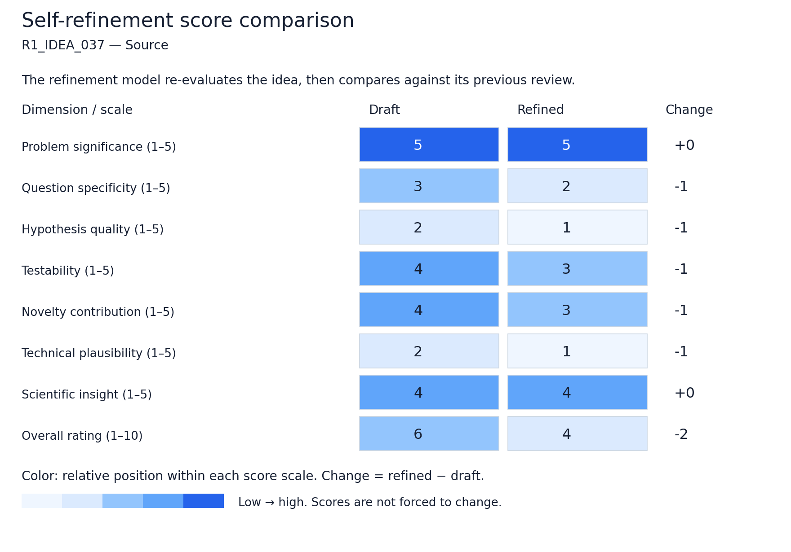

Changed score dimensions: question_specificity, hypothesis_quality, testability, novelty_contribution, technical_plausibility, overall_rating.

### Score justifications (draft / refined)

**Problem significance**

```json
{
  "draft": {
    "score": 5.0,
    "justification": "The problem is highly significant. The ambiguity in counterfactual explanations—whether they represent plausible semantic changes or adversarial artifacts—is a fundamental challenge for trustworthy and interpretable ML. Solving it would directly impact the reliability of explanation methods used in high-stakes domains."
  },
  "refined": {
    "score": 5.0,
    "justification": "The problem is highly significant. The ambiguity in counterfactual explanations—whether they represent plausible semantic changes or adversarial artifacts—is a fundamental challenge for trustworthy and interpretable ML. This directly impacts the reliability of explanation methods used in high-stakes domains like healthcare, finance, and criminal justice. Solving this problem would advance both the theory and practice of explainable AI."
  }
}
```

**Question specificity**

```json
{
  "draft": {
    "score": 3.0,
    "justification": "The core question is implied but not sharply defined: 'How can we generate counterfactual explanations that are semantically meaningful rather than adversarial?' This is a good starting point, but it lacks specificity regarding the conditions, models, or types of explanations. The proposed method name suggests a specific technical approach (geodesics), but its details are missing."
  },
  "refined": {
    "score": 2.0,
    "justification": "The research question is only vaguely implied: 'How can we generate counterfactual explanations that are semantically meaningful rather than adversarial?' While the problem is clear, the proposed approach is incomplete ('under a.'), making it impossible to assess the specificity of the technical direction. The method name suggests a specific approach (geodesics), but without knowing the geometry, the question remains too broad."
  }
}
```

**Hypothesis quality**

```json
{
  "draft": {
    "score": 2.0,
    "justification": "There is an implicit hypothesis that 'using geodesics under a perceptual geometry solves the ambiguity problem.' However, this is not stated as a concrete, falsifiable prediction. A stronger hypothesis would specify measurable improvements (e.g., in plausibility scores, robustness metrics) and contrast with specific baseline geometries."
  },
  "refined": {
    "score": 1.0,
    "justification": "There is no explicit or clearly implicit hypothesis. The idea suggests that 'geodesics under a [unspecified] geometry' might help, but this is not formulated as a concrete, falsifiable prediction. A proper hypothesis would specify expected outcomes, measurable improvements, and contrast with specific baselines. As presented, it's more of a methodological suggestion than a hypothesis."
  }
}
```

**Testability**

```json
{
  "draft": {
    "score": 4.0,
    "justification": "The core idea is inherently testable. One could implement the proposed geodesic method, compare it to existing counterfactual generators using metrics for semantic coherence, adversarial robustness, and human evaluation, and see if it performs better. The evaluation framework for counterfactuals, while not trivial, is established in the literature."
  },
  "refined": {
    "score": 3.0,
    "justification": "The general concept is testable in principle—one could implement a geodesic-based method and compare it to existing approaches. However, without knowing the specific geometry/metric, it's unclear what exactly would be tested. The evaluation framework for counterfactuals (measuring plausibility, robustness, etc.) exists in literature, but the incomplete proposal makes specific testability assessment difficult."
  }
}
```

**Novelty contribution**

```json
{
  "draft": {
    "score": 4.0,
    "justification": "The idea has high potential novelty. Framing counterfactual search as finding geodesics on a perceptual manifold is a distinct and interesting direction. While there is work on using geodesics in latent spaces (e.g., in generative models) and on improving counterfactual plausibility, their combination for explanation-specific ambiguity resolution appears novel and could be a meaningful contribution."
  },
  "refined": {
    "score": 3.0,
    "justification": "The idea has moderate potential novelty. While the problem of improving counterfactual plausibility is well-studied, framing it as finding geodesics on a perceptual manifold is an interesting direction. However, without knowing the specific geometry, it's hard to assess how novel the approach truly is. The contribution could range from incremental (applying existing geodesic methods to counterfactuals) to significant (developing a new perceptual geometry specifically for explanations)."
  }
}
```

**Technical plausibility**

```json
{
  "draft": {
    "score": 2.0,
    "justification": "Plausibility cannot be properly assessed because the description is incomplete ('under a.'). The general concept of using a better-aligned geometry is plausible, but the feasibility depends entirely on the unspecified metric 'a'. If 'a' is a well-defined perceptual metric, computing geodesics on that manifold is a non-trivial but potentially solvable technical challenge."
  },
  "refined": {
    "score": 1.0,
    "justification": "Technical plausibility cannot be properly assessed because the description is incomplete ('under a.'). The general concept of using better-aligned geometry is plausible, but the feasibility depends entirely on the unspecified metric. Computing geodesics on arbitrary manifolds is non-trivial, and without knowing the proposed geometry, we cannot evaluate whether the approach is technically sound or feasible."
  }
}
```

**Scientific insight**

```json
{
  "draft": {
    "score": 4.0,
    "justification": "The idea has strong potential for scientific insight. Successfully demonstrating that a specific geometry resolves the semantic/adversarial ambiguity would teach us about the relationship between latent space geometry, model decision boundaries, and human-interpretable concepts. It could lead to general principles for building 'explanation-aware' representations."
  },
  "refined": {
    "score": 4.0,
    "justification": "The idea has strong potential for scientific insight if fully developed. Successfully demonstrating that a specific geometry resolves the semantic/adversarial ambiguity would teach us about the relationship between latent space geometry, model decision boundaries, and human-interpretable concepts. It could lead to general principles for building 'explanation-aware' representations and deepen our understanding of what makes counterfactuals meaningful."
  }
}
```

**Overall rating**

```json
{
  "draft": {
    "score": 6.0,
    "justification": "This is a moderate/borderline research idea with high potential but currently limited by an incomplete description. The problem identification is excellent and significant. The proposed direction (geodesics) is promising and novel. However, the idea summary is literally cut off, leaving the core technical component undefined. This severely hampers evaluation of technical plausibility and specificity. With a complete specification of the geometry and a sharper hypothesis, this could easily become a strong (7-8) or exceptional (9-10) idea. As presented, it's a compelling premise in need of a complete proposal."
  },
  "refined": {
    "score": 4.0,
    "justification": "This is a weak research idea due to its incomplete nature. While the problem identification is excellent (5/5 significance) and the potential insight is strong (4/5), the idea is literally cut off mid-sentence, leaving the core technical component undefined. This severely hampers evaluation of specificity (2/5), hypothesis quality (1/5), technical plausibility (1/5), and novelty (3/5). The idea has high potential but cannot be properly assessed in its current form. With a complete specification of the geometry and a clear hypothesis, this could become a strong idea."
  }
}
```

## R1_IDEA_037 — Variant 1: A1_Identity

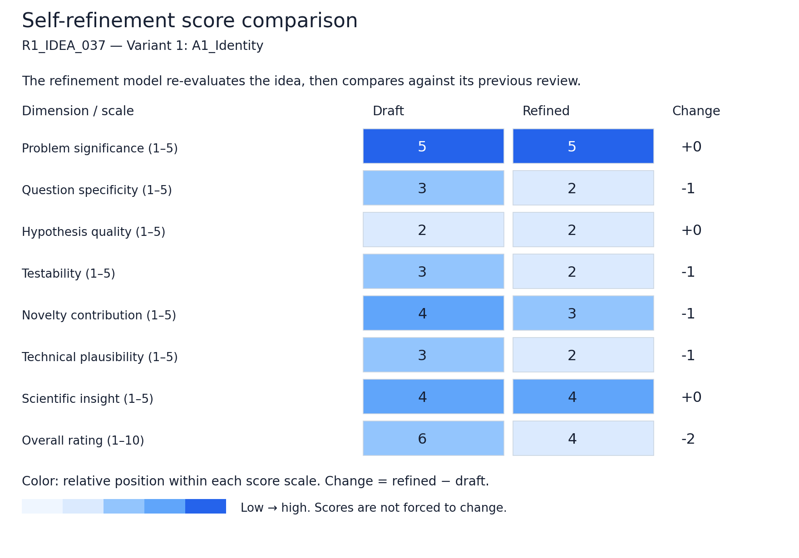

Changed score dimensions: question_specificity, testability, novelty_contribution, technical_plausibility, overall_rating.

### Score justifications (draft / refined)

**Problem significance**

```json
{
  "draft": {
    "score": 5.0,
    "justification": "The problem is highly significant. Counterfactual explanations are crucial for model interpretability and trust, and the ambiguity in what constitutes a 'meaningful' perturbation is a fundamental challenge. The observation that distance metric choice determines whether explanations are semantic or adversarial gets to the heart of why counterfactuals can be misleading."
  },
  "refined": {
    "score": 5.0,
    "justification": "The problem is exceptionally significant. Counterfactual explanations are critical for model interpretability, fairness auditing, and user trust. The fundamental ambiguity in what constitutes a 'minimal' or 'meaningful' change—determined entirely by the choice of distance metric—is a core theoretical and practical challenge. The observation that this leads to adversarial artifacts versus semantic changes gets to the heart of why counterfactuals can be misleading or useless."
  }
}
```

**Question specificity**

```json
{
  "draft": {
    "score": 3.0,
    "justification": "The research question is moderately specific: it identifies a problem (metric ambiguity in counterfactuals) and proposes a direction (geodesics under perceptual geometry). However, it lacks specificity about what exactly constitutes 'perceptual geometry' and how the geodesic approach would concretely differ from existing methods."
  },
  "refined": {
    "score": 2.0,
    "justification": "The research question is only weakly specific. While it identifies a problem (metric ambiguity) and proposes a general direction (geodesics under perceptual geometry), it lacks concrete specification. The description cuts off before defining the key component ('under a...'), and there's no clear statement of what exactly will be investigated. The idea mentions a method name but not what it actually does."
  }
}
```

**Hypothesis quality**

```json
{
  "draft": {
    "score": 2.0,
    "justification": "There is an implicit hypothesis that geodesics under perceptual geometry will produce better counterfactuals, but this is not clearly articulated. The hypothesis lacks specificity about what 'better' means (more semantically meaningful? less adversarial? more on-manifold?) and what mechanism would make geodesics superior to other optimization approaches."
  },
  "refined": {
    "score": 2.0,
    "justification": "There is only a very implicit hypothesis that geodesics under some perceptual geometry will produce better counterfactuals. This lacks specificity about what 'better' means, what mechanism makes geodesics superior, or what predictions differentiate this approach from alternatives. No testable prediction is articulated, and the hypothesis is more of an intuition than a falsifiable claim."
  }
}
```

**Testability**

```json
{
  "draft": {
    "score": 3.0,
    "justification": "The idea is testable in principle - one could implement PCG and compare it to baselines. However, without specifying the geometry/metric, it's unclear exactly what would be tested. The evaluation criteria for 'meaningful' counterfactuals would need to be defined (human evaluations, semantic consistency metrics, etc.)."
  },
  "refined": {
    "score": 2.0,
    "justification": "The idea is minimally testable in its current form. Without knowing what 'perceptual geometry' means or how geodesics would be computed, one cannot design experiments to test it. While one could imagine comparing geodesic-based counterfactuals to Euclidean ones, the missing methodological details make it unclear what exactly would be implemented and tested."
  }
}
```

**Novelty contribution**

```json
{
  "draft": {
    "score": 4.0,
    "justification": "The contribution has strong potential novelty. While geodesic approaches exist in manifold learning and some counterfactual methods consider latent space geometry, the specific focus on perceptual geometry for counterfactual geodesics appears novel. If successful, it could provide a principled solution to a fundamental ambiguity in counterfactual explanations."
  },
  "refined": {
    "score": 3.0,
    "justification": "The contribution has moderate potential novelty. The application of geodesics to counterfactual explanations is not entirely new (manifold-aware approaches exist), but the specific focus on 'perceptual geometry' could be novel if clearly defined. However, without specification, it's unclear how this differs from existing geometry-aware methods. The framing around metric ambiguity is insightful but not entirely novel."
  }
}
```

**Technical plausibility**

```json
{
  "draft": {
    "score": 3.0,
    "justification": "The idea is technically plausible in concept - geodesics on learned manifolds are well-established, and perceptual metrics exist. However, the incomplete description ('under a...') makes it impossible to fully assess technical plausibility. The challenge of defining and computing geodesics on perceptual manifolds in high-dimensional spaces is non-trivial."
  },
  "refined": {
    "score": 2.0,
    "justification": "Technical plausibility is difficult to assess due to the incomplete description. The concept of geodesics on manifolds is well-established, but implementing them in high-dimensional latent spaces with a 'perceptual geometry' is non-trivial. The truncated description ('under a...') prevents evaluation of whether the proposed approach is technically coherent or feasible. Important assumptions about manifold structure and metric computability are unstated."
  }
}
```

**Scientific insight**

```json
{
  "draft": {
    "score": 4.0,
    "justification": "The idea has strong potential for scientific insight. Successfully implementing PCG could reveal fundamental principles about what makes counterfactual explanations meaningful, how semantic similarity relates to geometric structure in latent spaces, and how to formalize the notion of 'minimal semantic change' in a mathematically rigorous way."
  },
  "refined": {
    "score": 4.0,
    "justification": "The idea has strong potential for scientific insight if fully developed. Successfully formalizing 'perceptual geometry' for counterfactuals could reveal fundamental principles about semantic similarity in latent spaces, the relationship between geometric structure and meaningful explanations, and how to mathematically capture 'minimal semantic change.' This could provide transferable insights beyond just improving one method."
  }
}
```

**Overall rating**

```json
{
  "draft": {
    "score": 6.0,
    "justification": "This is a moderate/borderline research idea with strong potential but significant gaps. The problem identification is excellent and addresses a fundamental issue in interpretable ML. However, the proposal is incomplete and lacks a clear hypothesis, specific methodology, and evaluation plan. With more development, this could become a strong research direction. The current summary suggests promising intuition but needs substantial refinement to become a fully formed research idea."
  },
  "refined": {
    "score": 4.0,
    "justification": "This is a weak research idea in its current form, despite addressing a highly significant problem. The core issue is that the idea is incomplete—it cuts off mid-sentence and lacks essential components: a clear hypothesis, methodological specification, and evaluation approach. While the problem framing is excellent and the geodesic direction is promising, the idea as presented is too vague to constitute a coherent research direction. It reads more as an intuition or motivation than a research proposal."
  }
}
```

## R1_IDEA_037 — Variant 2: A2_Paraphrase_Only

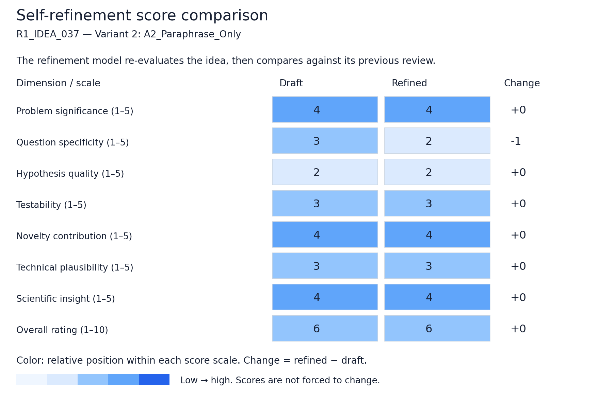

Changed score dimensions: question_specificity.

### Score justifications (draft / refined)

**Problem significance**

```json
{
  "draft": {
    "score": 4.0,
    "justification": "The problem is significant: counterfactual explanations are important for model interpretability, and the ambiguity in what constitutes a 'minimal change' is a well-known issue. The distinction between semantically meaningful and adversarial perturbations is crucial for trustworthy explanations."
  },
  "refined": {
    "score": 4.0,
    "justification": "The problem is highly significant. The ambiguity in counterfactual explanations—where the same formulation can yield either meaningful insights or adversarial artifacts—is a fundamental challenge for trustworthy and interpretable ML. Solving this would directly impact the reliability of explanation methods."
  }
}
```

**Question specificity**

```json
{
  "draft": {
    "score": 3.0,
    "justification": "The idea identifies a problem and proposes a direction, but doesn't formulate a specific research question. It states what current methods do wrong and what PCG would do differently, but doesn't explicitly ask 'Does PCG produce better counterfactuals?' or similar."
  },
  "refined": {
    "score": 2.0,
    "justification": "The idea describes a problem and a proposed method, but does not formulate a specific research question. It lacks a clear 'what will we investigate?' statement. The inquiry is implied ('does this method work better?') but remains vague and undeveloped."
  }
}
```

**Hypothesis quality**

```json
{
  "draft": {
    "score": 2.0,
    "justification": "There's an implicit hypothesis that geodesic paths under perceptual metrics will produce better counterfactuals, but it's not explicitly stated or elaborated. The hypothesis lacks specificity about what 'better' means and what mechanisms would make geodesics superior."
  },
  "refined": {
    "score": 2.0,
    "justification": "There is only a very implicit and underspecified hypothesis: that using geodesics under a perceptual metric will improve counterfactual quality. It lacks a concrete, testable prediction about the relationship between geometric path type (geodesic vs. straight-line) and specific outcome measures (semantic fidelity, adversariality)."
  }
}
```

**Testability**

```json
{
  "draft": {
    "score": 3.0,
    "justification": "The idea is testable in principle - one could implement PCG and compare it to baselines. However, without specifying evaluation metrics or experimental design, it's unclear exactly how the central claim would be tested. The incomplete description ('under a...') further limits testability."
  },
  "refined": {
    "score": 3.0,
    "justification": "The core claim is testable in principle—one could implement a version of PCG and compare it to baselines. However, the incomplete description ('under a...') and absence of defined evaluation metrics or an experimental design make it unclear how a meaningful test would be constructed. The testability is moderate but hinges on major missing details."
  }
}
```

**Novelty contribution**

```json
{
  "draft": {
    "score": 4.0,
    "justification": "Applying geodesic paths to counterfactual explanations appears novel. While geodesics are used in other ML contexts (manifold learning, generative models), their application to counterfactual generation with perceptual metrics could be a meaningful contribution if properly developed."
  },
  "refined": {
    "score": 4.0,
    "justification": "The application of geodesic paths grounded by a perceptual metric to the counterfactual explanation problem appears novel. While geodesics are used in manifold learning and generative models, their explicit use to enforce semantic faithfulness in interpretability is a promising and non-trivial direction."
  }
}
```

**Technical plausibility**

```json
{
  "draft": {
    "score": 3.0,
    "justification": "The core concept is plausible: geodesics should stay on the data manifold better than straight lines. However, the incomplete description makes full assessment difficult. Computing geodesics in high-dimensional latent spaces is non-trivial, and the idea doesn't address implementation challenges."
  },
  "refined": {
    "score": 3.0,
    "justification": "The conceptual premise is plausible: geodesics respect manifold geometry and should promote on-manifold traversal. However, the idea is incomplete, and the practical challenge of computing geodesics in a complex, learned latent space is significant and unaddressed. Plausibility is moderate but uncertain due to the missing technical core."
  }
}
```

**Scientific insight**

```json
{
  "draft": {
    "score": 4.0,
    "justification": "If successful, this research could provide insight into the geometry of latent spaces for interpretability, the relationship between distance metrics and semantic meaningfulness, and how to generate counterfactuals that are truly 'minimal semantic modifications' rather than adversarial perturbations."
  },
  "refined": {
    "score": 4.0,
    "justification": "If successfully investigated, this research could yield valuable scientific insight. It could reveal how the geometry of latent spaces (induced by different metrics) influences the semantic properties of explanations, and provide general principles for designing distance functions that yield trustworthy, human-aligned counterfactuals."
  }
}
```

**Overall rating**

```json
{
  "draft": {
    "score": 6.0,
    "justification": "This is a moderate research idea with good potential. It identifies a meaningful problem in interpretable ML and proposes a conceptually interesting direction. However, the idea is incomplete and lacks a clear hypothesis, specific research question, and evaluation plan. With more development, it could become a strong research proposal."
  },
  "refined": {
    "score": 6.0,
    "justification": "This is a moderate research idea with a strong foundation in a significant problem and a conceptually appealing direction. Its primary weakness is that it is an incomplete proposal—it stops at the method's name without specifying its core component or framing a testable investigation. The potential for novelty and insight is high, but the idea in its current form is under-specified, lacking a clear hypothesis, research question, and evaluation plan. With substantial development, it could become a strong research project."
  }
}
```

## R1_IDEA_037 — Variant 3: A3_Plain_Core


Changed score dimensions: none.

### Score justifications (draft / refined)

**Problem significance**

```json
{
  "draft": {
    "score": 4.0,
    "justification": "The problem is meaningful: counterfactual explanations are important for interpretable ML, and current methods often produce unrealistic or adversarial examples. The connection between distance metric geometry and explanation quality is a recognized issue in the field."
  },
  "refined": {
    "score": 4.0,
    "justification": "The problem is highly significant. The ambiguity and geometric misalignment in counterfactual explanation objectives is a known, fundamental issue that limits their reliability and trustworthiness in real-world applications. Addressing this directly contributes to robust and interpretable ML."
  }
}
```

**Question specificity**

```json
{
  "draft": {
    "score": 2.0,
    "justification": "The summary identifies a general direction (using geodesics under perceptual geometry) but does not define a specific research question. It states what PCG does but not what hypothesis it tests or what specific relationship it investigates."
  },
  "refined": {
    "score": 2.0,
    "justification": "The idea describes a proposed method (PCG) but does not define a specific research question. It lacks a clear statement of what relationship, mechanism, or comparative advantage is being investigated. The direction is named, but the inquiry is not framed as a question."
  }
}
```

**Hypothesis quality**

```json
{
  "draft": {
    "score": 2.0,
    "justification": "There is an implicit hypothesis that 'geodesics under perceptual geometry will produce better counterfactuals,' but this is not explicitly stated or refined. The hypothesis lacks specificity about what 'better' means or what mechanisms would lead to improvement."
  },
  "refined": {
    "score": 2.0,
    "justification": "There is only an implicit, underspecified hypothesis that 'geodesics under a perceptual geometry will produce better counterfactuals.' This lacks concrete predictions about the nature of the improvement (e.g., along which axes, by what mechanism) and is not formulated in a testable manner. The word 'better' is not operationalized."
  }
}
```

**Testability**

```json
{
  "draft": {
    "score": 3.0,
    "justification": "The idea is testable in principle—one could implement PCG and compare it to baselines—but the incomplete description makes it unclear exactly what would be tested. The core claim about geodesics improving counterfactual quality is falsifiable."
  },
  "refined": {
    "score": 3.0,
    "justification": "The core implicit claim is testable in principle—one could implement a method and compare it to baselines. However, the incompleteness of the proposal ('under a.') and the lack of a defined hypothesis make it unclear exactly what claim is being tested. The testability is contingent on filling major conceptual gaps."
  }
}
```

**Novelty contribution**

```json
{
  "draft": {
    "score": 3.0,
    "justification": "Using geodesics for counterfactual explanations is a novel technical direction. However, the idea of incorporating perceptual metrics or manifold-aware distances in explanation methods has been explored in related work (e.g., using autoencoders for manifold proximity). The contribution would depend on the specific geometry proposed."
  },
  "refined": {
    "score": 3.0,
    "justification": "The specific combination of 'geodesics' and 'perceptual geometry' for counterfactuals is a novel technical direction. However, the broader idea of using manifold-aware or perceptually-aligned distances for generating plausible examples is not new (seen in adversarial robustness, image generation, and some explanation literature). The novelty hinges on the specific, yet unspecified, geometric construction."
  }
}
```

**Technical plausibility**

```json
{
  "draft": {
    "score": 2.0,
    "justification": "The summary is too incomplete to assess technical plausibility. The concept of geodesics under a perceptual geometry is plausible in abstract, but without details on how the geometry is defined or how geodesics are computed, it's impossible to evaluate coherence."
  },
  "refined": {
    "score": 2.0,
    "justification": "Cannot be properly assessed due to the incomplete description. The general concept of using a more meaningful geometry is plausible, but the summary provides no technical substance on how the key components (the metric, the geodesic computation) would work. The idea is not yet coherently defined."
  }
}
```

**Scientific insight**

```json
{
  "draft": {
    "score": 4.0,
    "justification": "If successfully developed, this research could provide insight into how the geometry of latent spaces affects the quality of explanations, and more broadly, how to align optimization objectives with human perception for interpretability. This goes beyond simple application and touches on fundamental issues in explainable AI."
  },
  "refined": {
    "score": 4.0,
    "justification": "The idea has high potential for scientific insight. Successfully linking the geometry of latent-space optimization to the semantic quality of explanations could reveal general principles for aligning machine learning objectives with human interpretation. This addresses a deeper issue than just algorithmic performance."
  }
}
```

**Overall rating**

```json
{
  "draft": {
    "score": 5.0,
    "justification": "This is a moderate/borderline research idea. It identifies a meaningful problem and proposes an interesting technical direction, but the summary is incomplete and lacks a clear research question or hypothesis. The potential for scientific insight is good, but the idea needs substantial refinement to become a strong research proposal."
  },
  "refined": {
    "score": 5.0,
    "justification": "This is a moderate/borderline research idea. It is anchored in a significant problem and points toward a direction with high potential insight. However, in its current incomplete and underspecified form, it lacks a clear research question, a testable hypothesis, and technical details necessary to evaluate its promise. It requires substantial refinement to become a strong proposal."
  }
}
```

## R1_IDEA_037 — Variant 4: B1_Verbose_Elaborate


Changed score dimensions: none.

### Score justifications (draft / refined)

**Problem significance**

```json
{
  "draft": {
    "score": 4.0,
    "justification": "The problem is significant - counterfactual explanations are important for interpretable AI, and the sensitivity to distance metrics leading to adversarial or meaningless explanations is a known issue in the field. Addressing this could improve the reliability and usefulness of explanation methods."
  },
  "refined": {
    "score": 4.0,
    "justification": "The problem is significant. Counterfactual explanations are crucial for model interpretability and trust. The ambiguity in distance metrics leading to adversarial or non-semantic perturbations is a known, meaningful challenge in the field. Addressing it could improve the reliability and utility of explanation methods."
  }
}
```

**Question specificity**

```json
{
  "draft": {
    "score": 2.0,
    "justification": "The idea is incomplete and lacks specificity. While it identifies a problem with existing methods, it doesn't clearly define what specific research question is being asked. The description cuts off before completing the methodological proposal."
  },
  "refined": {
    "score": 2.0,
    "justification": "The idea lacks a clearly defined research question. It proposes a method (PCG) but does not specify what is being investigated—e.g., a comparison of geometries, a test of a hypothesis about perceptual alignment, or an analysis of a specific artifact. The incomplete sentence further reduces specificity."
  }
}
```

**Hypothesis quality**

```json
{
  "draft": {
    "score": 2.0,
    "justification": "There's an implicit hypothesis that geodesics under perceptual metrics will produce better counterfactuals, but this isn't clearly articulated. No concrete prediction is made about what specific improvements would be observed or what mechanisms would cause them."
  },
  "refined": {
    "score": 2.0,
    "justification": "There is only an implicit hypothesis that geodesics under a perceptual metric will mitigate artifacts. No concrete, falsifiable prediction is made about measurable outcomes (e.g., 'will reduce off-manifold samples by X%' or 'will increase human-judged semantic coherence'). The hypothesis is underdeveloped."
  }
}
```

**Testability**

```json
{
  "draft": {
    "score": 2.0,
    "justification": "The idea as presented is not sufficiently developed to be testable. While one could imagine experiments comparing geodesic vs. straight-line paths in latent space, the incomplete description of the method (cutting off at 'under a...') makes it unclear what exactly would be tested."
  },
  "refined": {
    "score": 2.0,
    "justification": "The idea as presented is not testable because it is incomplete and lacks a clear claim. While one could imagine experiments comparing geodesic vs. straight-line paths, the missing details (the metric, geodesic computation) make it unclear what exactly would be implemented and tested."
  }
}
```

**Novelty contribution**

```json
{
  "draft": {
    "score": 3.0,
    "justification": "The general direction of using geodesics or perceptual metrics for counterfactuals has some novelty, though related ideas exist in the literature. The specific combination might be novel if fully developed, but the incomplete presentation makes it hard to assess true novelty."
  },
  "refined": {
    "score": 3.0,
    "justification": "The combination of geodesics and perceptual metrics for counterfactuals has some novelty, though related concepts exist (e.g., using geodesics in latent spaces or perceptual losses). The contribution is potentially incremental unless a new insight into the geometry-perception relationship is demonstrated. The incomplete description limits novelty assessment."
  }
}
```

**Technical plausibility**

```json
{
  "draft": {
    "score": 3.0,
    "justification": "The general concept of using geodesics with perceptual metrics is plausible, but the technical feasibility depends on unspecified details. Computing geodesics in high-dimensional spaces with complex metrics can be challenging, and the idea doesn't address these practical considerations."
  },
  "refined": {
    "score": 3.0,
    "justification": "The general concept is plausible—geodesics can capture meaningful paths in curved spaces, and perceptual metrics align with human judgment. However, practical challenges (e.g., computing geodesics in high-dimensional spaces, defining a valid perceptual metric) are not addressed, leaving feasibility uncertain."
  }
}
```

**Scientific insight**

```json
{
  "draft": {
    "score": 3.0,
    "justification": "If fully developed, this could provide insight into what makes counterfactual explanations semantically meaningful versus adversarial. It could reveal principles about the geometry of latent spaces and how it relates to human perception. However, the incomplete presentation limits the potential insight that can be assessed."
  },
  "refined": {
    "score": 3.0,
    "justification": "If fully developed, this could offer insight into how the geometry of latent spaces interacts with human perception to generate meaningful explanations. It might reveal principles for distinguishing semantic from adversarial perturbations. However, the incomplete idea limits the discernible depth of potential insight."
  }
}
```

**Overall rating**

```json
{
  "draft": {
    "score": 4.0,
    "justification": "This is a weak research idea in its current form due to being incomplete. While it identifies a meaningful problem and suggests a potentially interesting direction, the idea cuts off mid-sentence, lacks specificity, and doesn't articulate a clear hypothesis or testable proposition. With completion and refinement, it could become a stronger idea, but as presented, it's too underdeveloped for proper evaluation."
  },
  "refined": {
    "score": 4.0,
    "justification": "This is a weak research idea in its current form. It identifies a significant problem and suggests a plausible technical direction, but it is incomplete, lacks a clear hypothesis or research question, and is not testable as presented. It requires substantial refinement to become a viable research proposal."
  }
}
```

## R1_IDEA_037 — Variant 5: B2_Grand_Narrative


Changed score dimensions: none.

### Score justifications (draft / refined)

**Problem significance**

```json
{
  "draft": {
    "score": 5.0,
    "justification": "The problem is highly significant. The ambiguity in counterfactual explanations due to distance metric choice is a core, well-known issue in interpretable ML. Producing robust, semantically meaningful explanations is critical for trust and fairness, making this a meaningful challenge with broad relevance."
  },
  "refined": {
    "score": 5.0,
    "justification": "The problem is highly significant. The ambiguity in counterfactual explanations due to distance metric choice is a fundamental, well-recognized issue in interpretable ML. Producing robust, semantically meaningful explanations is critical for trust, fairness, and practical deployment. The idea correctly identifies specific failure modes (off-manifold artifacts, semantic drift, adversarial collapse) that matter to researchers and practitioners."
  }
}
```

**Question specificity**

```json
{
  "draft": {
    "score": 2.0,
    "justification": "The idea identifies a general problem area but does not define a specific research question. It states a method 'could contribute' but does not specify what relationship, mechanism, or comparative advantage will be investigated. The core inquiry remains vague."
  },
  "refined": {
    "score": 2.0,
    "justification": "The idea identifies a problem area but does not define a specific research question. It proposes a method ('PCG') but doesn't specify what aspect of it will be investigated. There's no clear inquiry about mechanisms, comparisons, or relationships. The description remains at the level of 'this could contribute' without stating what would be tested or learned."
  }
}
```

**Hypothesis quality**

```json
{
  "draft": {
    "score": 2.0,
    "justification": "There is an implicit hypothesis that 'geodesics under a perceptual metric will lead to better counterfactuals,' but it is not concretely framed as a testable prediction. It lacks the specificity needed to distinguish it from a generic claim that 'using a better metric is better.' No clear, falsifiable statement about outcomes or mechanisms is made."
  },
  "refined": {
    "score": 2.0,
    "justification": "There's only an implicit hypothesis that 'geodesics under a perceptual metric produce better counterfactuals.' This lacks the specificity of a testable prediction. No concrete, falsifiable claim is made about measurable outcomes, comparative advantages, or underlying mechanisms. The hypothesis doesn't distinguish the investigation from a generic application of geometric concepts."
  }
}
```

**Testability**

```json
{
  "draft": {
    "score": 2.0,
    "justification": "In its current form, the idea is not readily testable. There is no suggested experiment, evaluation metric, or comparison. While one could design experiments around it, the idea itself does not propose how the central claim would be investigated or what evidence would support it."
  },
  "refined": {
    "score": 2.0,
    "justification": "The idea in its current form is not readily testable. No experiments, evaluations, or comparisons are suggested. While one could design tests around it, the idea itself provides no framework for investigation. There's no indication of what evidence would support or contradict the central claim, nor how 'success' would be measured."
  }
}
```

**Novelty contribution**

```json
{
  "draft": {
    "score": 3.0,
    "justification": "The notion of using geodesics or manifold-aware paths for explanations has precedent (e.g., in generative model traversal, Riemannian metrics for robustness). Framing it for counterfactuals is a plausible application, but the idea summary is too vague to assess if there is a novel algorithmic, theoretical, or empirical contribution beyond applying an existing geometric concept to a new task."
  },
  "refined": {
    "score": 3.0,
    "justification": "Applying geodesic or manifold-aware paths to counterfactual explanations is a plausible direction, but the summary is too vague to assess novelty. The concept of using perceptual metrics or manifold geometry for explanations has precedent. Without details on the specific metric or geodesic construction method, it's unclear if this offers algorithmic, theoretical, or empirical novelty beyond applying existing geometric concepts to counterfactuals."
  }
}
```

**Technical plausibility**

```json
{
  "draft": {
    "score": 3.0,
    "justification": "The core intuition—that aligning the optimization geometry with data semantics should improve counterfactuals—is logically coherent and plausible. However, the complete lack of detail on the metric 'a' and the geodesic-tracing mechanism makes it impossible to evaluate technical feasibility. The idea rests on a reasonable assumption but provides no technical substance."
  },
  "refined": {
    "score": 3.0,
    "justification": "The core intuition is logically coherent: aligning optimization geometry with data semantics should improve counterfactual quality. This is plausible based on related work in generative model traversal and Riemannian metrics. However, the complete lack of detail on the metric and geodesic-tracing mechanism makes technical assessment impossible. The idea rests on reasonable assumptions but provides no technical substance to evaluate feasibility."
  }
}
```

**Scientific insight**

```json
{
  "draft": {
    "score": 4.0,
    "justification": "The idea has high potential for scientific insight. Successfully demonstrating that geodesics on a perceptually-aligned manifold produce more robust explanations could reveal a general principle: that explanation fidelity is tied to the underlying data geometry. This could inform not just counterfactuals but other interpretability methods, aligning with the stated goal of informing broader research."
  },
  "refined": {
    "score": 4.0,
    "justification": "The idea has strong potential for scientific insight. Successfully demonstrating a connection between explanation robustness and underlying data geometry could reveal a general principle applicable beyond counterfactuals. Understanding how metric choice affects the meaningfulness-versus-adversarial trade-off could inform interpretability method design more broadly, aligning with the stated goal of informing broader research directions."
  }
}
```

**Overall rating**

```json
{
  "draft": {
    "score": 5.0,
    "justification": "This is a moderate/borderline research idea. It identifies a very significant problem and points towards a potentially insightful direction (geometry-aware explanations). However, it is critically under-specified: it lacks a clear research question, a testable hypothesis, and any methodological detail. The promise is in the problem statement and the potential insight, but the proposed investigation itself is too vague to be considered strong. It requires substantial refinement to become a concrete research plan."
  },
  "refined": {
    "score": 5.0,
    "justification": "This is a moderate/borderline research idea. It identifies a highly significant problem and points toward a potentially insightful direction (geometry-aware explanations). However, it is critically under-specified: it lacks a clear research question, a testable hypothesis, and any methodological detail. The promise lies in the problem statement and potential insight, but the proposed investigation itself is too vague to be considered strong. It requires substantial refinement to become a concrete research plan."
  }
}
```

## R1_IDEA_037 — Variant 6: B3_Over_Confident

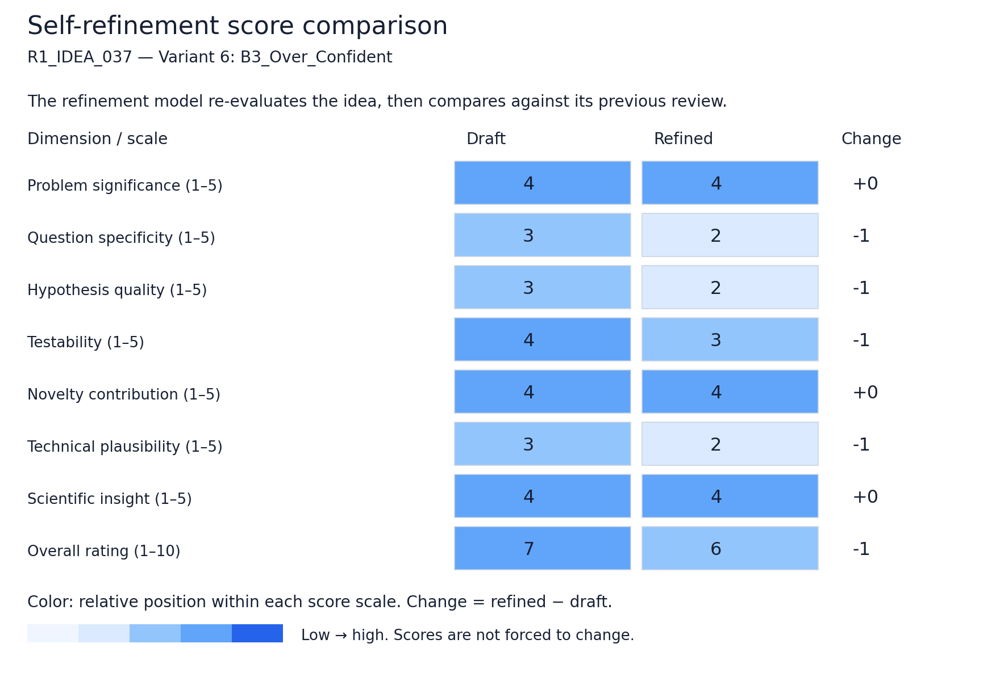

Changed score dimensions: question_specificity, hypothesis_quality, testability, technical_plausibility, overall_rating.

### Score justifications (draft / refined)

**Problem significance**

```json
{
  "draft": {
    "score": 4.0,
    "justification": "The problem is meaningful: generating semantically meaningful counterfactual explanations is important for interpretable ML, and the sensitivity to distance metric choice is a recognized issue. The connection to fundamental ambiguity in counterfactual objectives adds theoretical significance."
  },
  "refined": {
    "score": 4.0,
    "justification": "The problem is highly meaningful. Generating semantically meaningful counterfactual explanations is crucial for trustworthy and interpretable ML systems. The sensitivity to distance metric choice is a recognized theoretical and practical issue that affects whether explanations are useful or misleading. The connection to fundamental ambiguity in counterfactual objectives adds theoretical significance."
  }
}
```

**Question specificity**

```json
{
  "draft": {
    "score": 3.0,
    "justification": "The idea identifies a specific technical approach (geodesics under perceptual metrics) but doesn't fully specify what is being investigated. The research question is implied rather than explicitly stated: 'Do geodesics under perceptual metrics produce better counterfactuals?' but this could be more precisely framed."
  },
  "refined": {
    "score": 2.0,
    "justification": "The research question is only implied rather than explicitly stated. While a technical direction (geodesics under perceptual metrics) is mentioned, what exactly is being investigated remains vague. The incomplete summary exacerbates this issue. A stronger formulation would explicitly state: 'Do geodesics under perceptual metrics produce counterfactuals that are more semantically meaningful and less adversarial than those from existing methods?'"
  }
}
```

**Hypothesis quality**

```json
{
  "draft": {
    "score": 3.0,
    "justification": "There's an implicit hypothesis that geodesics under perceptual metrics will avoid the problems of existing methods, but it's not fully articulated. The hypothesis could be strengthened by making specific predictions about measurable outcomes (e.g., reduced adversariality, increased semantic coherence)."
  },
  "refined": {
    "score": 2.0,
    "justification": "There is an implicit hypothesis that geodesics under perceptual metrics will avoid problems of existing methods, but it lacks concrete, testable predictions. A stronger hypothesis would make specific claims about measurable outcomes (e.g., reduced adversarial robustness to small perturbations, increased human ratings of meaningfulness, better preservation of semantic attributes). The hypothesis as presented is more of a technical proposal than a falsifiable claim."
  }
}
```

**Testability**

```json
{
  "draft": {
    "score": 4.0,
    "justification": "The idea is testable through comparison with existing methods on standard counterfactual explanation benchmarks. One could measure proximity, validity, sparsity, and also introduce new metrics for semantic meaningfulness or adversarial robustness. The geodesic approach suggests concrete experiments."
  },
  "refined": {
    "score": 3.0,
    "justification": "The idea is testable in principle through comparison with existing methods on counterfactual benchmarks. However, without specification of the perceptual metric or evaluation criteria for 'meaningfulness,' it's unclear exactly what would be tested. Standard metrics (proximity, validity, sparsity) could be used, but the core claim about semantic meaningfulness requires additional validation methods that aren't specified."
  }
}
```

**Novelty contribution**

```json
{
  "draft": {
    "score": 4.0,
    "justification": "The geodesic approach to counterfactuals appears novel, and the focus on perceptual metrics rather than standard distances addresses an important gap. While regularization for on-manifold behavior exists, the explicit geodesic formulation under perceptual geometry seems distinctive."
  },
  "refined": {
    "score": 4.0,
    "justification": "The geodesic approach to counterfactuals under perceptual metrics appears novel. While there is existing work on regularization for on-manifold behavior and using better distance metrics, the explicit formulation as geodesic tracing under perceptual geometry seems distinctive. If successfully developed, it could represent a meaningful contribution to both methodology and understanding of counterfactual generation."
  }
}
```

**Technical plausibility**

```json
{
  "draft": {
    "score": 3.0,
    "justification": "The idea is technically plausible but has implementation challenges. Computing geodesics under arbitrary perceptual metrics may be non-trivial. The summary is incomplete, making full assessment difficult, but the core concept of using better geometry for counterfactuals is reasonable."
  },
  "refined": {
    "score": 2.0,
    "justification": "The idea faces significant technical challenges. Computing geodesics under arbitrary perceptual metrics (which may not be Riemannian or may not have closed-form geodesics) is non-trivial. The incomplete summary prevents assessment of whether these challenges are acknowledged or addressed. The core concept—using better geometry—is plausible, but the implementation path is unclear."
  }
}
```

**Scientific insight**

```json
{
  "draft": {
    "score": 4.0,
    "justification": "If successful, this research could provide insight into the relationship between metric choice and counterfactual quality, the geometry of latent spaces for generative models, and principles for designing explanation methods that respect semantic structure. It addresses a fundamental issue in counterfactual generation."
  },
  "refined": {
    "score": 4.0,
    "justification": "If successfully investigated, this research could provide valuable insights into: the relationship between metric geometry and counterfactual quality; principles for designing explanation methods that respect semantic structure; and the geometry of latent spaces for generative models. It addresses a fundamental issue in counterfactual generation that extends beyond any single method."
  }
}
```

**Overall rating**

```json
{
  "draft": {
    "score": 7.0,
    "justification": "This is a strong research idea with clear problem identification and a promising technical direction. The incomplete summary limits full assessment, but the core concept addresses an important issue in interpretable ML with a novel approach. The idea has good specificity, testability, and potential for scientific insight. With more complete formulation and clearer hypothesis, it could be exceptional."
  },
  "refined": {
    "score": 6.0,
    "justification": "This is a moderate/borderline research idea with both strengths and significant limitations. It identifies an important problem and proposes a novel technical direction with good potential for scientific insight. However, the incomplete formulation, lack of explicit research question/hypothesis, and unspecified implementation details limit its current strength. With more complete development—particularly a clear hypothesis, operationalization of 'perceptual metric,' and consideration of computational feasibility—it could become a strong research idea."
  }
}
```

## R1_IDEA_037 — Variant 7: B4_Novelty

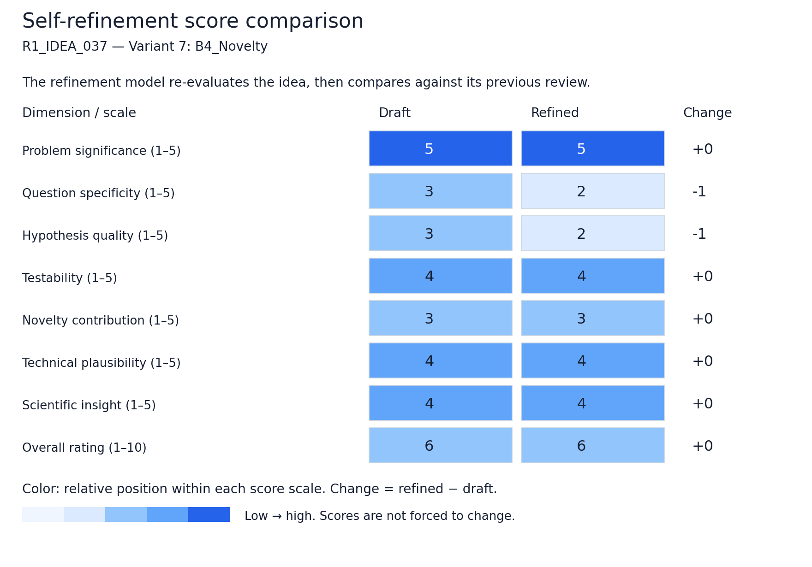

Changed score dimensions: question_specificity, hypothesis_quality.

### Score justifications (draft / refined)

**Problem significance**

```json
{
  "draft": {
    "score": 5.0,
    "justification": "The problem is highly significant. Counterfactual explanations are widely used in interpretable ML, and their reliability is critical for trust and fairness. The ambiguity of distance metrics leading to adversarial artifacts is a known and important challenge that, if solved, would improve the practical utility of counterfactual explanations."
  },
  "refined": {
    "score": 5.0,
    "justification": "The problem is highly significant. Counterfactual explanations are widely used in interpretable ML for fairness, debugging, and trust. The ambiguity of distance metrics leading to adversarial or unrealistic examples is a known and important challenge that undermines the reliability of explanations. Solving this would improve the practical utility and trustworthiness of counterfactual methods."
  }
}
```

**Question specificity**

```json
{
  "draft": {
    "score": 3.0,
    "justification": "The research question is moderately specific: it identifies a problem (metric ambiguity in counterfactuals) and proposes a general solution direction (geodesics). However, the exact question—e.g., 'Do geodesics under perceptual metrics yield more robust counterfactuals?'—is implied but not crisply stated. The incomplete sentence further reduces specificity."
  },
  "refined": {
    "score": 2.0,
    "justification": "The research question is only moderately specific and is hampered by the incomplete description. While it identifies a problem (metric ambiguity in counterfactuals) and proposes a general solution direction (geodesics), the exact question—e.g., 'Do geodesics under perceptual metrics yield more robust and semantically meaningful counterfactuals?'—is implied but not crisply stated. The incomplete sentence ('under a,') further reduces specificity, as the core technical element is undefined."
  }
}
```

**Hypothesis quality**

```json
{
  "draft": {
    "score": 3.0,
    "justification": "An implicit hypothesis exists: that geodesics under a perceptual geometry will avoid the pitfalls of existing methods. However, it lacks a concrete, falsifiable prediction about measurable outcomes (e.g., improvement in specific metrics). The hypothesis is plausible but under-specified."
  },
  "refined": {
    "score": 2.0,
    "justification": "An implicit hypothesis exists: that geodesics under a perceptual geometry will avoid the pitfalls of existing methods. However, it lacks a concrete, falsifiable prediction about measurable outcomes (e.g., improvement in specific metrics like realism or robustness). The hypothesis is plausible but severely under-specified due to the missing geometry definition and lack of comparative claim."
  }
}
```

**Testability**

```json
{
  "draft": {
    "score": 4.0,
    "justification": "The idea is testable. One could implement geodesic-based counterfactuals, compare them to baselines on standard datasets, and evaluate using metrics for realism, semantic consistency, and adversarial robustness. The evaluation framework for counterfactuals is well-established in the literature."
  },
  "refined": {
    "score": 4.0,
    "justification": "The idea is testable in principle. One could implement geodesic-based counterfactuals (once the geometry is defined), compare them to baselines on standard datasets, and evaluate using established metrics for realism, semantic consistency, and adversarial robustness. The evaluation framework for counterfactuals is well-established in the literature, making empirical validation feasible."
  }
}
```

**Novelty contribution**

```json
{
  "draft": {
    "score": 3.0,
    "justification": "The novelty is moderate. The problem framing is not new, and geodesic-based approaches in latent spaces have been explored for other tasks (e.g., image interpolation, disentanglement). The specific application to counterfactual explanations is less common but not entirely unexplored. The contribution hinges on the specifics of the 'perceptual' geometry, which is currently undefined."
  },
  "refined": {
    "score": 3.0,
    "justification": "The novelty is moderate. The problem framing is not new, and geodesic-based approaches in latent spaces have been explored for other tasks (e.g., image interpolation, disentanglement). The specific application to counterfactual explanations is less common but not entirely unexplored. The contribution hinges on the specifics of the 'perceptual' geometry and its integration with counterfactual generation, which is currently undefined."
  }
}
```

**Technical plausibility**

```json
{
  "draft": {
    "score": 4.0,
    "justification": "The direction is technically plausible. Using geodesics to follow data manifolds is a sound principle in machine learning. The main challenge will be computational—efficiently computing geodesics in high-dimensional spaces—but approximations exist. The reasoning from problem to solution is logically coherent."
  },
  "refined": {
    "score": 4.0,
    "justification": "The direction is technically plausible. Using geodesics to follow data manifolds is a sound principle in machine learning. The main challenges will be computational—efficiently computing geodesics in high-dimensional spaces—and defining an appropriate geometry, but approximations exist. The reasoning from problem (misaligned geometries) to solution (geodesics) is logically coherent."
  }
}
```

**Scientific insight**

```json
{
  "draft": {
    "score": 4.0,
    "justification": "The idea has good potential for scientific insight. Successfully implementing and analyzing PCG could reveal principles for constructing reliable counterfactuals, such as how geometry in latent space affects explanation robustness. It could lead to a deeper understanding of the relationship between distance metrics, data manifolds, and adversarial vulnerability in explainability methods."
  },
  "refined": {
    "score": 4.0,
    "justification": "The idea has good potential for scientific insight. Successfully implementing and analyzing PCG could reveal principles for constructing reliable counterfactuals, such as how geometry in latent space affects explanation robustness and semantic fidelity. It could lead to a deeper understanding of the relationship between distance metrics, data manifolds, and adversarial vulnerability in explainability methods."
  }
}
```

**Overall rating**

```json
{
  "draft": {
    "score": 6.0,
    "justification": "This is a moderate/borderline research idea. It addresses a significant and well-defined problem in interpretable ML and proposes a plausible technical direction. However, the idea summary is incomplete, the hypothesis is under-specified, and the novelty relative to existing manifold-aware methods is unclear. With more concrete details—especially on the geometry, hypothesis, and evaluation—it could become a strong idea."
  },
  "refined": {
    "score": 6.0,
    "justification": "This is a moderate/borderline research idea. It addresses a significant and well-defined problem in interpretable ML and proposes a plausible technical direction. However, the idea summary is incomplete, the hypothesis is under-specified, and the novelty relative to existing manifold-aware methods is unclear. The high problem significance and technical plausibility are strengths, but the lack of specificity and incomplete proposal limit its current rating. With more concrete details—especially on the geometry, hypothesis, and evaluation—it could become a strong idea."
  }
}
```

## R1_IDEA_037 — Variant 8: B5_Application_Impact


Changed score dimensions: none.

### Score justifications (draft / refined)

**Problem significance**

```json
{
  "draft": {
    "score": 5.0,
    "justification": "The problem is highly significant. Counterfactual explanations are widely used in interpretable ML, and the ambiguity in their generation due to distance metric choice is a known fundamental issue that affects their reliability and trustworthiness in practical systems."
  },
  "refined": {
    "score": 5.0,
    "justification": "The problem is highly significant. Counterfactual explanations are widely used in interpretable ML for practical decision-making, and the ambiguity in their generation due to distance metric choice is a known fundamental issue that affects their reliability, trustworthiness, and practical utility. Addressing this could impact how explanations are generated and used in real systems."
  }
}
```

**Question specificity**

```json
{
  "draft": {
    "score": 2.0,
    "justification": "The idea describes a method and a motivation, but does not define a specific research question. It states what PCG will do ('construct counterfactuals by tracing geodesics'), but not what specific relationship or phenomenon will be investigated."
  },
  "refined": {
    "score": 2.0,
    "justification": "The idea describes a method and motivation but does not define a specific research question. It states what PCG will do ('construct counterfactuals by tracing geodesics') but not what specific relationship, phenomenon, or comparison will be investigated. The incomplete sentence further reduces specificity."
  }
}
```

**Hypothesis quality**

```json
{
  "draft": {
    "score": 2.0,
    "justification": "An implicit hypothesis is that geodesics under a perceptual metric yield better counterfactuals, but this is not stated as a testable prediction. The hypothesis lacks specificity about what 'better' means and what mechanism explains the improvement."
  },
  "refined": {
    "score": 2.0,
    "justification": "An implicit hypothesis exists (geodesics under perceptual metric yield better counterfactuals), but it's not stated as a testable prediction. The hypothesis lacks specificity about what 'better' means, what mechanism explains improvement, and how it would be falsified. No clear distinction from generic application is articulated."
  }
}
```

**Testability**

```json
{
  "draft": {
    "score": 3.0,
    "justification": "The idea is testable in principle—one could implement PCG and compare counterfactuals to baselines. However, without a clear hypothesis or evaluation criteria, the test is not well-defined. The incomplete sentence ('under a, which may support...') further obscures what would be tested."
  },
  "refined": {
    "score": 3.0,
    "justification": "The idea is testable in principle—one could implement PCG and compare counterfactuals to baselines. However, without clear evaluation criteria, success metrics, or a well-defined hypothesis, the test is not well-specified. The incomplete sentence also obscures what exactly would be tested."
  }
}
```

**Novelty contribution**

```json
{
  "draft": {
    "score": 3.0,
    "justification": "Using geodesics or perceptual metrics for counterfactuals is not entirely novel (some prior work exists on manifold-aware or plausible counterfactuals). The potential contribution lies in the specific integration and framing, but the summary does not articulate what new scientific knowledge would be generated beyond a new method."
  },
  "refined": {
    "score": 3.0,
    "justification": "Using geodesics or perceptual metrics for counterfactuals is not entirely novel (prior work exists on manifold-aware or plausible counterfactuals). The potential contribution lies in the specific integration and framing as 'Perceptual Counterfactual Geodesics,' but the summary does not articulate what new scientific knowledge would be generated beyond proposing a new method. It appears more like an engineering contribution than a scientific discovery."
  }
}
```

**Technical plausibility**

```json
{
  "draft": {
    "score": 3.0,
    "justification": "The general direction is plausible: using geodesics to stay on the data manifold is a known idea, and perceptual metrics are used in generative models. However, the technical details are too vague (especially the incomplete sentence) to assess feasibility properly."
  },
  "refined": {
    "score": 3.0,
    "justification": "The general direction is plausible: using geodesics to stay on the data manifold is a known idea in generative models, and perceptual metrics are used in image similarity tasks. However, technical details are too vague (especially with the incomplete sentence) to assess feasibility properly. Important assumptions about latent space geometry and metric learnability are not addressed."
  }
}
```

**Scientific insight**

```json
{
  "draft": {
    "score": 3.0,
    "justification": "If successful, the research could provide insight into how the geometry of latent space affects the semantic meaningfulness of counterfactuals. However, the idea is currently framed more as an engineering solution ('a method that constructs') than as an investigation aimed at uncovering general principles."
  },
  "refined": {
    "score": 3.0,
    "justification": "If successfully investigated, the research could provide insight into how the geometry of latent space affects the semantic meaningfulness of counterfactuals and the relationship between metric choice and explanation quality. However, the idea is currently framed more as an engineering solution ('a method that constructs') than as an investigation aimed at uncovering general principles about explanation generation, geometry, or human perception."
  }
}
```

**Overall rating**

```json
{
  "draft": {
    "score": 5.0,
    "justification": "This is a moderate/borderline research idea. It identifies a significant problem and proposes a plausible technical direction, but lacks a clearly defined research question, testable hypothesis, and articulation of the potential scientific insight. The incomplete sentence also detracts from coherence. With refinement, it could become a strong idea."
  },
  "refined": {
    "score": 5.0,
    "justification": "This is a moderate/borderline research idea. It identifies a significant problem and proposes a plausible technical direction with a named method. However, it lacks a clearly defined research question, testable hypothesis, articulation of potential scientific insight, and complete technical specification. The incomplete sentence further reduces coherence. With refinement to address these issues, it could become a strong idea."
  }
}
```

## R1_IDEA_037 — Variant 9: C1_Hollow_Shell


Changed score dimensions: none.

### Score justifications (draft / refined)

**Problem significance**

```json
{
  "draft": {
    "score": 4.0,
    "justification": "The problem is significant - the choice of distance metric fundamentally affects counterfactual explanations, and simplistic metrics can produce unrealistic or unhelpful explanations. This is a recognized challenge in interpretable ML with practical implications for fairness, debugging, and trust in AI systems."
  },
  "refined": {
    "score": 4.0,
    "justification": "The problem is highly significant. The choice of distance metric is fundamental to counterfactual explanation methods, directly impacting their realism, plausibility, and utility for human understanding. Poor metrics can generate nonsensical or misleading explanations, undermining trust and fairness in ML systems. This is a core, recognized challenge in interpretable ML."
  }
}
```

**Question specificity**

```json
{
  "draft": {
    "score": 2.0,
    "justification": "The research question is only partially specified. While it identifies that 'simplistic geometries' are problematic and proposes 'more natural paths,' it doesn't define what makes a path 'natural' or what specific aspects of counterfactuals would be improved. The incomplete sentence further reduces specificity."
  },
  "refined": {
    "score": 2.0,
    "justification": "The research question is very vague. It identifies a general issue ('simplistic geometries are bad') and a general direction ('use perceptual metrics'), but does not define a concrete question. What specific property of counterfactuals is being improved? What is the relationship being tested? The incomplete sentence further reduces specificity. It is more a topic area than a research question."
  }
}
```

**Hypothesis quality**

```json
{
  "draft": {
    "score": 2.0,
    "justification": "There is an implicit hypothesis that 'following more natural paths under a perceptual metric will address artifacts in counterfactual explanations,' but this is not clearly articulated. The hypothesis lacks specificity about what artifacts, what improvement would look like, or what mechanism connects perceptual metrics to better counterfactuals."
  },
  "refined": {
    "score": 2.0,
    "justification": "There is only a very implicit and underspecified hypothesis: that 'more natural paths under a perceptual metric' will lead to better counterfactuals. It lacks a concrete, testable prediction. What does 'better' mean? What is the mechanism? A strong hypothesis would predict, for example, that perceptual geodesics will increase human-rated plausibility or decrease some quantifiable artifact. The current statement is not falsifiable in a meaningful way."
  }
}
```

**Testability**

```json
{
  "draft": {
    "score": 2.0,
    "justification": "The idea suggests a direction but doesn't propose how it would be tested. Without specifying metrics, evaluation criteria, or comparison baselines, it's unclear how one would determine if perceptual geodesics actually improve counterfactuals. The concept is testable in principle but lacks a concrete testing plan."
  },
  "refined": {
    "score": 2.0,
    "justification": "The idea, as presented, is not testable. It proposes a direction but provides no framework for investigation. There is no suggested experiment, comparison, evaluation metric, or analysis method. While one could imagine designing tests (e.g., comparing generated counterfactuals), the idea itself does not propose how to gather evidence for or against its central claim. It is a concept, not a testable plan."
  }
}
```

**Novelty contribution**

```json
{
  "draft": {
    "score": 3.0,
    "justification": "The general idea of using perceptual metrics for counterfactuals has some novelty, though perceptual metrics have been used in other ML contexts (image generation, quality assessment). The specific application to counterfactual geodesics could be novel if developed with specific innovations, but the incomplete proposal makes it hard to assess true novelty."
  },
  "refined": {
    "score": 3.0,
    "justification": "The novelty is moderate. The application of perceptual metrics to counterfactual explanations is not entirely new but is an underexplored and promising direction. The specific framing around 'geodesics' could be novel if developed with technical depth. However, the idea is too incomplete to assess a potentially high novelty contribution. It currently suggests an application of an existing tool (perceptual metrics) to a known problem."
  }
}
```

**Technical plausibility**

```json
{
  "draft": {
    "score": 3.0,
    "justification": "The general direction is plausible - perceptual metrics have been successfully used in computer vision, and geodesic paths in learned metric spaces are a known concept. However, the technical feasibility depends heavily on implementation details that are missing, particularly how to compute geodesics in perceptual spaces that may not have simple geometric structure."
  },
  "refined": {
    "score": 3.0,
    "justification": "The general direction is technically plausible. Perceptual metrics (e.g., LPIPS) are established, and the concept of following geodesics in a metric space is well-defined. However, significant technical challenges are implied but not addressed: computational tractability of finding geodesics in complex perceptual spaces, differentiability, and scalability. The plausibility is moderate because the core concept is sound, but the feasibility hinges entirely on unspecified implementation details."
  }
}
```

**Scientific insight**

```json
{
  "draft": {
    "score": 3.0,
    "justification": "If successfully developed, this approach could provide insight into what makes counterfactual explanations useful to humans, potentially revealing principles about human perception of plausibility in explanations. However, the current formulation is too vague to guarantee deep scientific insight beyond 'perceptual metrics work better than geometric ones.'"
  },
  "refined": {
    "score": 3.0,
    "justification": "The potential for scientific insight is moderate. If successfully executed, it could yield insights into what constitutes a 'natural' or 'meaningful' change from a human perceptual perspective, informing the design of explanation metrics. However, as stated, the insight might be limited to 'perceptual metrics work better here too.' Deeper insight would require connecting the geometry of perceptual spaces to human judgment of plausibility or actionability, which is not articulated."
  }
}
```

**Overall rating**

```json
{
  "draft": {
    "score": 4.0,
    "justification": "This is a weak to moderate research idea in its current incomplete form. It identifies a meaningful problem in interpretable ML and points toward a potentially interesting direction (perceptual metrics), but lacks specificity, a clear hypothesis, and any methodological details. The idea has potential but requires substantial development to become a strong research proposal. The incomplete sentence significantly hampers evaluation."
  },
  "refined": {
    "score": 4.0,
    "justification": "This is a weak research idea in its current, incomplete form. It identifies a significant and relevant problem in machine learning interpretability. However, it fails to articulate a specific research question, a testable hypothesis, or any methodological direction. The idea is more of a suggestive topic ('maybe use perceptual metrics') than a research plan. It has a kernel of potential, but requires substantial development in specificity and testability to become a viable research direction. The incomplete sentence severely limits evaluation."
  }
}
```

## R1_IDEA_037 — Variant 10: C2_Logic_Flawed


Changed score dimensions: none.

### Score justifications (draft / refined)

**Problem significance**

```json
{
  "draft": {
    "score": 5.0,
    "justification": "The problem is highly significant: counterfactual explanations are widely used in interpretable ML, and the ambiguity of distance metrics fundamentally affects their reliability. The identified issues (off-manifold artifacts, semantic drift, adversarial collapse) are meaningful challenges that matter to both researchers and practitioners deploying explainable AI systems."
  },
  "refined": {
    "score": 5.0,
    "justification": "The problem is highly significant. Counterfactual explanations are widely used in interpretable ML for high-stakes decisions, and the ambiguity introduced by distance metric choice fundamentally affects their reliability and trustworthiness. The identified failure modes (off-manifold artifacts, semantic drift, adversarial collapse) represent meaningful challenges that matter to both researchers developing explainable AI and practitioners deploying these systems."
  }
}
```

**Question specificity**

```json
{
  "draft": {
    "score": 2.0,
    "justification": "The idea describes a method and claims it will have 'broader effectiveness,' but does not define a specific research question. What aspect of PCG will be investigated? The text implies but does not explicitly ask whether geodesics under perceptual metrics solve the stated problems better than existing approaches."
  },
  "refined": {
    "score": 2.0,
    "justification": "The idea describes a method and claims it will have 'broader effectiveness,' but does not define a specific research question. There is no explicit statement of what aspect of PCG will be investigated or what relationship will be tested. The text implies a comparison with existing methods but does not specify what will be compared or under what conditions."
  }
}
```

**Hypothesis quality**

```json
{
  "draft": {
    "score": 2.0,
    "justification": "The implicit hypothesis is that PCG will generate better counterfactuals and have 'broader effectiveness,' but this is vague. A stronger hypothesis would make concrete predictions about measurable outcomes (e.g., manifold adherence, semantic coherence, robustness to adversarial collapse). As stated, the hypothesis is not easily falsifiable."
  },
  "refined": {
    "score": 2.0,
    "justification": "The implicit hypothesis is that PCG will generate better counterfactuals and have 'broader effectiveness,' but this is vague and not falsifiable in its current form. A stronger hypothesis would make concrete, measurable predictions about outcomes such as manifold adherence, semantic coherence, or robustness. The hypothesis lacks specificity about what 'better' means or what evidence would contradict it."
  }
}
```

**Testability**

```json
{
  "draft": {
    "score": 3.0,
    "justification": "The core claim—that geodesics under perceptual metrics improve counterfactuals—is testable in principle through comparisons with baselines on relevant metrics. However, the idea lacks specification of how such tests would be conducted, what metrics would be used, or what would constitute evidence. The claim about 'broader effectiveness across related settings' is not testable without defining those settings."
  },
  "refined": {
    "score": 3.0,
    "justification": "The core technical claim—that geodesics under perceptual metrics improve counterfactuals—is testable in principle through comparisons with baselines. However, the idea lacks specification of how such tests would be conducted, what metrics would indicate improvement, or what would constitute evidence. The claim about 'broader effectiveness across related settings' is not testable without defining those settings and success criteria."
  }
}
```

**Novelty contribution**

```json
{
  "draft": {
    "score": 4.0,
    "justification": "The approach of using geodesics under perceptual metrics for counterfactual explanations appears novel. While perceptual metrics and geodesics are known concepts, their combination to address specific failure modes in counterfactual generation could constitute a meaningful contribution if it leads to new insights about geometry-aligned explanations."
  },
  "refined": {
    "score": 4.0,
    "justification": "The approach of using geodesics under perceptual metrics for counterfactual explanations appears novel. While perceptual metrics and geodesic computations are established concepts in different contexts, their combination to address specific failure modes in counterfactual generation could constitute a meaningful technical contribution. The focus on geometry-aware explanations represents a potentially valuable direction beyond simple distance minimization."
  }
}
```

**Technical plausibility**

```json
{
  "draft": {
    "score": 4.0,
    "justification": "The reasoning is logically coherent: inappropriate distance metrics cause problems → perceptual metrics align better with human semantics → geodesics under such metrics should yield more meaningful trajectories. The assumption that perceptual metrics better capture semantic similarity is reasonable based on prior work in image quality assessment and generative models."
  },
  "refined": {
    "score": 4.0,
    "justification": "The reasoning is logically coherent: inappropriate distance metrics cause problems → perceptual metrics better capture semantic similarity → geodesics under such metrics should yield more meaningful trajectories. The assumption that perceptual metrics align better with human judgment is supported by prior work in image quality assessment and generative models. The approach addresses the stated limitations in a conceptually sound way."
  }
}
```

**Scientific insight**

```json
{
  "draft": {
    "score": 4.0,
    "justification": "If successful, this research could provide insight into how the geometry of latent spaces interacts with explanation quality, potentially revealing general principles for designing explanation methods that respect data manifolds and semantic coherence. It could also help establish boundary conditions for when counterfactual explanations fail due to metric misalignment."
  },
  "refined": {
    "score": 4.0,
    "justification": "If successfully investigated, this research could provide insight into how the geometry of latent spaces interacts with explanation quality. It could reveal general principles for designing explanation methods that respect data manifolds and semantic coherence, and establish boundary conditions for when counterfactual explanations fail due to metric misalignment. The work could contribute to a deeper understanding of what makes explanations 'meaningful' beyond mere prediction changes."
  }
}
```

**Overall rating**

```json
{
  "draft": {
    "score": 6.0,
    "justification": "This is a moderate research idea with strong problem significance and technical plausibility, but limited specificity and testability. The core intuition—using geodesics under perceptual metrics—is promising and addresses a meaningful gap. However, the research question and hypothesis need to be much more clearly defined to transform this from a conceptual direction into a testable research plan. With refinement, it could become a strong contribution."
  },
  "refined": {
    "score": 6.0,
    "justification": "This is a moderate research idea with strong problem significance and technical plausibility, but limited specificity and testability. The core intuition—using geodesics under perceptual metrics—is promising and addresses a meaningful gap in interpretable ML. However, the research question and hypothesis need to be much more clearly defined to transform this from a conceptual direction into a testable research plan. With refinement, it could become a strong contribution."
  }
}
```

## R1_IDEA_037 — Variant 11: C3_Substance_Enriched

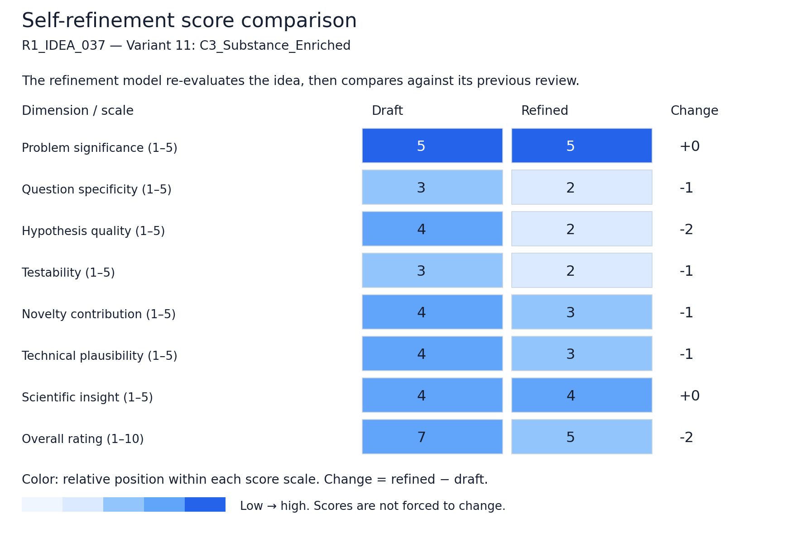

Changed score dimensions: question_specificity, hypothesis_quality, testability, novelty_contribution, technical_plausibility, overall_rating.

### Score justifications (draft / refined)

**Problem significance**

```json
{
  "draft": {
    "score": 5.0,
    "justification": "The problem is highly significant: counterfactual explanations are widely used in interpretable ML, but their vulnerability to adversarial artifacts and semantic drift undermines trustworthiness. Addressing metric ambiguity and off-manifold behavior is a core challenge in the field."
  },
  "refined": {
    "score": 5.0,
    "justification": "The problem is highly significant. The ambiguity in counterfactual explanations due to metric choice is a fundamental issue that affects the trustworthiness and utility of these explanations in real-world applications. Addressing off-manifold artifacts and semantic drift is a core research challenge in interpretable and trustworthy ML."
  }
}
```

**Question specificity**

```json
{
  "draft": {
    "score": 3.0,
    "justification": "The idea identifies a general direction (geodesics with perceptual regularization) but does not explicitly formulate a precise research question. It mentions testable variables but lacks a clear comparative or causal framing."
  },
  "refined": {
    "score": 2.0,
    "justification": "The idea is not framed as a specific research question. It names a method (PCG) and mentions associated concepts (geodesics, perceptual similarity, curvature sensitivity), but it does not define what relationship is being investigated, what comparison is being made, or what specific claim is being tested. The description is a mix of problem statement, method name, and speculative future directions."
  }
}
```

**Hypothesis quality**

```json
{
  "draft": {
    "score": 4.0,
    "justification": "There is a plausible implicit hypothesis: that geodesics under a perceptually regularized metric yield more meaningful counterfactuals. This makes a concrete claim about mechanism (geometry + perception) and could be falsified if regularization fails to improve semantic fidelity."
  },
  "refined": {
    "score": 2.0,
    "justification": "There is no clear hypothesis presented. The text states 'A plausible hypothesis is that the geodesic paths could be regularized by perceptual similarity metrics,' which is a vague suggestion of a mechanism, not a concrete, testable prediction. It does not make a claim about expected outcomes relative to a baseline or define the conditions under which it could be falsified. The subsequent sentence about 'boundary conditions' is also speculative, not a central hypothesis."
  }
}
```

**Testability**

```json
{
  "draft": {
    "score": 3.0,
    "justification": "Testability is moderate. The idea mentions 'testable variable for validation' but does not specify experiments or evaluations. However, the hypothesis naturally lends itself to comparative experiments (e.g., against flat-metric baselines) and perceptual/metric evaluations."
  },
  "refined": {
    "score": 2.0,
    "justification": "Testability is weak. While the idea mentions a 'testable variable for validation,' it does not specify any experiments, evaluations, or comparisons. There is no proposed methodology for obtaining evidence. The core concept—geodesics under a perceptual metric—is not defined well enough to be implemented and tested. The idea is currently more of a technical suggestion than a testable research plan."
  }
}
```

**Novelty contribution**

```json
{
  "draft": {
    "score": 4.0,
    "justification": "Combining geodesic structure with perceptual regularization for counterfactuals is a novel angle. While both elements exist separately, their integration to address metric ambiguity and semantic drift could offer a meaningful advance if it yields more robust explanations."
  },
  "refined": {
    "score": 3.0,
    "justification": "Novelty is moderate but unclear. The combination of 'geodesics' and 'perceptual similarity' for counterfactuals is a potentially interesting angle. However, the idea summary does not articulate how this differs from existing work on using Riemannian geometry in latent spaces or incorporating perceptual losses in explanation generation. Without that distinction, the contribution appears incremental—applying known concepts (geodesics, perceptual metrics) to a known problem (counterfactual explanations)."
  }
}
```

**Technical plausibility**

```json
{
  "draft": {
    "score": 4.0,
    "justification": "The direction is technically plausible: geodesics in latent spaces are well-studied, and perceptual metrics are commonly used in vision. The main challenge—integrating them into a tractable optimization—is not addressed but is feasible given existing tools."
  },
  "refined": {
    "score": 3.0,
    "justification": "Technical plausibility is moderate. The constituent ideas—computing geodesics in learned latent spaces and using perceptual metrics—are individually plausible and have precedents. However, the idea is too underspecified to assess its coherence. The incomplete sentence 'tracing geodesics under a' and the lack of any mechanism for integrating perceptual regularization make it impossible to evaluate the feasibility of the proposed synthesis. The central technical challenge is not addressed."
  }
}
```

**Scientific insight**

```json
{
  "draft": {
    "score": 4.0,
    "justification": "The idea has good potential for insight: it could reveal how geometric properties of latent spaces interact with perceptual constraints to shape explanation quality, and more broadly, how to design metrics that align with human intuition. The mention of 'boundary conditions like sensitivity to curvature' suggests a deeper investigative angle."
  },
  "refined": {
    "score": 4.0,
    "justification": "The idea has high potential for scientific insight. If successfully developed and tested, it could provide insights into how the geometric structure of latent spaces interacts with human perceptual alignment to generate trustworthy explanations. Investigating 'boundary conditions like sensitivity to latent-space curvature' suggests an awareness that the research could reveal general principles about the relationship between model geometry, explanation quality, and robustness, which is valuable beyond a single method."
  }
}
```

**Overall rating**

```json
{
  "draft": {
    "score": 7.0,
    "justification": "This is a strong research idea. It addresses a significant problem, proposes a specific technical approach with a plausible hypothesis, and has clear potential for scientific insight. It is weakened somewhat by the lack of an explicit research question and detailed validation plan, but these are addressable in a full proposal."
  },
  "refined": {
    "score": 5.0,
    "justification": "This is a moderate/borderline research idea. It identifies a very significant problem and points toward a technically interesting direction with high potential for insight. However, it is critically weakened by the lack of a specific research question, a testable hypothesis, and any concrete plan for validation. The idea is currently a promising but vague suggestion—a collection of related concepts (geodesics, perception, counterfactuals) rather than a coherent, investigable research proposition. With substantial refinement to define a clear question and testable claims, it could become strong."
  }
}
```

## R1_IDEA_037 — Variant 12: H1_Deceptive_Hollow


Changed score dimensions: none.

### Score justifications (draft / refined)

**Problem significance**

```json
{
  "draft": {
    "score": 4.0,
    "justification": "The choice of distance metric in counterfactual explanations is indeed a core challenge with practical implications for interpretability and fairness. The problem is meaningful and recognized in the literature."
  },
  "refined": {
    "score": 4.0,
    "justification": "The choice of distance metric in counterfactual explanations is a core, meaningful challenge with implications for interpretability, fairness, and usability. The problem is well-recognized in the literature, and addressing it could have substantial practical impact."
  }
}
```

**Question specificity**

```json
{
  "draft": {
    "score": 1.0,
    "justification": "Extremely poor specificity. No concrete research question is stated - only a vague proposal for a 'new research approach' and 'broader framework'. The idea summary reads more like marketing language than a research question."
  },
  "refined": {
    "score": 1.0,
    "justification": "Extremely poor specificity. No concrete research question is stated—only a vague proposal for a 'new research approach' and 'broader framework'. The description lacks any specific inquiry about mechanisms, comparisons, or relationships."
  }
}
```

**Hypothesis quality**

```json
{
  "draft": {
    "score": 1.0,
    "justification": "No hypothesis is presented, explicit or implicit. There's a suggestion that 'following more natural paths' might help, but no testable prediction about what would improve or how it would be measured."
  },
  "refined": {
    "score": 1.0,
    "justification": "No hypothesis is presented, either explicit or implicit. There is a suggestion that 'following more natural paths' might help, but no testable prediction about what would improve, under what conditions, or how it would be measured. The idea lacks a falsifiable claim."
  }
}
```

**Testability**

```json
{
  "draft": {
    "score": 1.0,
    "justification": "Completely untestable as presented. No experiments, comparisons, evaluations, or analyses are suggested. The proposal is too vague to even design an experiment to test it."
  },
  "refined": {
    "score": 1.0,
    "justification": "Completely untestable as presented. No experiments, comparisons, evaluations, or analyses are suggested. The proposal is too vague to design any meaningful investigation or gather evidence for or against it."
  }
}
```

**Novelty contribution**

```json
{
  "draft": {
    "score": 2.0,
    "justification": "The idea of using perceptual metrics or geodesics for counterfactuals is not entirely new (related work exists on manifold-aware counterfactuals). The framing as a 'transformative synthesis' is grandiose but unsupported by technical novelty in the description."
  },
  "refined": {
    "score": 2.0,
    "justification": "The idea of using perceptual metrics or geodesic paths for counterfactuals is not entirely novel—related work exists on manifold-aware or plausible counterfactuals. The framing as a 'transformative synthesis' is ambitious but unsupported by technical novelty in the description. It reads more like a repackaging of existing concepts than a genuinely new direction."
  }
}
```

**Technical plausibility**

```json
{
  "draft": {
    "score": 2.0,
    "justification": "The core intuition that perceptual paths might be better than geometric ones is plausible, but without any technical details, it's impossible to assess whether the proposed direction is coherent or feasible. The language is too abstract to evaluate technical merit."
  },
  "refined": {
    "score": 2.0,
    "justification": "The core intuition—that perceptual paths might be better than simple geometric ones—is superficially plausible, but without any technical details, it's impossible to assess coherence or feasibility. The abstract language provides no basis to evaluate whether the proposed direction is technically sound or implementable."
  }
}
```

**Scientific insight**

```json
{
  "draft": {
    "score": 2.0,
    "justification": "If successfully developed, understanding how perceptual similarity relates to counterfactual validity could provide useful insight. However, the current proposal is too vague to assess what specific insights might emerge beyond general statements about 'natural paths'."
  },
  "refined": {
    "score": 2.0,
    "justification": "If successfully developed, understanding how perceptual similarity relates to counterfactual validity could offer useful insight. However, the current proposal is too vague to assess what specific, transferable insights might emerge—it promises broad impact without specifying what would be learned beyond generalities about 'natural paths'."
  }
}
```

**Overall rating**

```json
{
  "draft": {
    "score": 2.0,
    "justification": "This is a very weak research idea as presented. While it identifies a meaningful problem area, it fails to articulate any concrete research question, hypothesis, or methodological direction. The description is dominated by grandiose claims without substantive technical content. It reads more like a vision statement than a research idea that could be pursued. A score of 2 reflects that it identifies a relevant problem domain but provides almost no actionable research direction."
  },
  "refined": {
    "score": 2.0,
    "justification": "This is a very weak research idea as presented. While it identifies a meaningful problem area, it fails to articulate any concrete research question, hypothesis, or methodological direction. The description is dominated by grandiose claims without substantive technical content. It reads more like a vision statement or marketing language than a research idea that could be pursued. A score of 2 reflects that it identifies a relevant problem domain but provides almost no actionable research direction."
  }
}
```

## R1_IDEA_037 — Variant 13: H2_Confident_Flaw

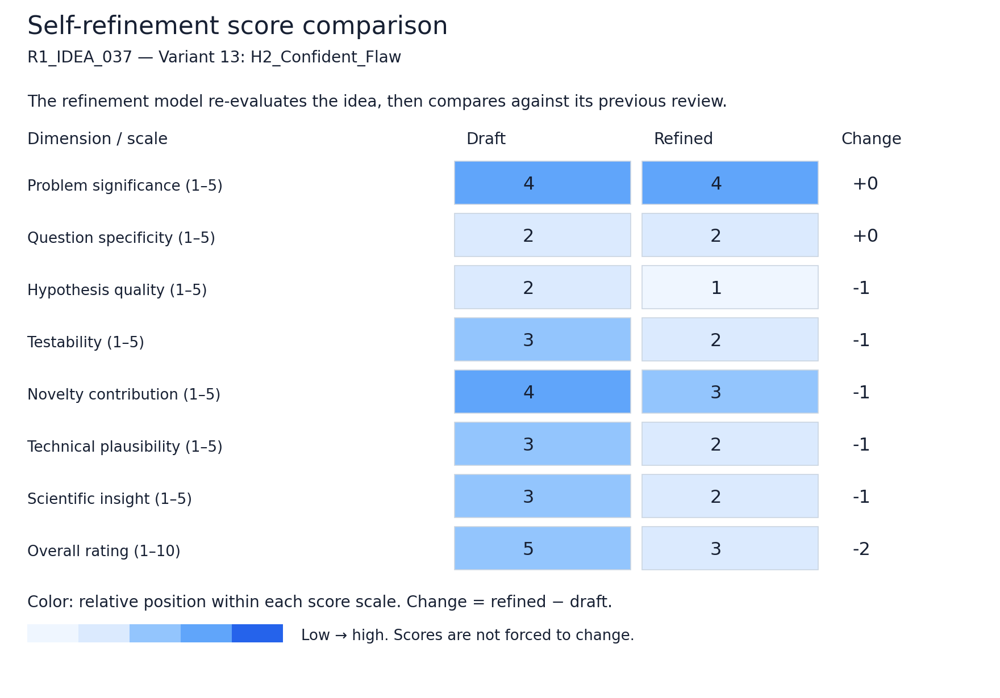

Changed score dimensions: hypothesis_quality, testability, novelty_contribution, technical_plausibility, scientific_insight, overall_rating.

### Score justifications (draft / refined)

**Problem significance**

```json
{
  "draft": {
    "score": 4.0,
    "justification": "The problem is meaningful: generating semantically meaningful counterfactual explanations is important for interpretable ML, and the choice of distance metric is a known challenge. However, the significance is slightly reduced because the idea doesn't explicitly connect to broader trust or fairness implications."
  },
  "refined": {
    "score": 4.0,
    "justification": "The problem is meaningful and recognized in interpretable ML: generating semantically meaningful counterfactual explanations is important for model trust and understanding, and the choice of distance metric is a known challenge that affects whether explanations are useful or misleading. The significance is slightly reduced because the idea doesn't explicitly connect to broader implications for fairness, robustness, or real-world deployment."
  }
}
```

**Question specificity**

```json
{
  "draft": {
    "score": 2.0,
    "justification": "The idea describes a method and claims it will be effective, but doesn't articulate a clear research question. What exactly is being investigated about PCG? The text states it 'suggests broader effectiveness' but doesn't specify what aspect of effectiveness or under what conditions."
  },
  "refined": {
    "score": 2.0,
    "justification": "The idea describes a method and makes claims about its effectiveness, but doesn't articulate a clear research question. What specific aspect of counterfactual quality is being investigated? The text states it 'suggests broader effectiveness' but doesn't specify what 'effectiveness' means, under what conditions, or compared to what. The research direction is named but not precisely framed as an investigable question."
  }
}
```

**Hypothesis quality**

```json
{
  "draft": {
    "score": 2.0,
    "justification": "There's an implicit hypothesis that 'geodesics under a perceptual metric produce better counterfactuals,' but it's not clearly stated. The stronger (and problematic) claim is that addressing the 'most visible weakness' proves 'general superiority'—this is more of an assertion than a testable hypothesis."
  },
  "refined": {
    "score": 1.0,
    "justification": "There's an implicit hypothesis that 'geodesics under a perceptual metric produce better counterfactuals,' but it's not clearly stated or testable in its current form. More problematically, the idea makes a strong deterministic claim that addressing 'the most visible weakness' proves 'causal evidence for the method's general superiority'—this is an assertion rather than a falsifiable hypothesis. The hypothesis lacks specificity about what 'better' means and under what conditions it should hold."
  }
}
```

**Testability**

```json
{
  "draft": {
    "score": 3.0,
    "justification": "The core idea could be tested by implementing PCG and comparing counterfactuals against baselines. However, the idea doesn't specify what would constitute evidence for or against its claims. The dismissal of 'isolating dataset composition, evaluation criteria, boundary cases' suggests a lack of rigorous test design."
  },
  "refined": {
    "score": 2.0,
    "justification": "While the core idea could theoretically be tested by implementing PCG and comparing against baselines, the idea actively discourages rigorous testing by dismissing 'isolating dataset composition, evaluation criteria, boundary cases, or alternative explanations.' This suggests a lack of interest in falsifiability. Without specified evaluation metrics, comparison baselines, or success criteria, it's unclear how one would design a meaningful test of the claims."
  }
}
```

**Novelty contribution**

```json
{
  "draft": {
    "score": 4.0,
    "justification": "Using geodesics with perceptual metrics for counterfactual explanations appears novel. The geometric perspective on latent-space counterfactuals could contribute new methodology. However, without more detail, it's unclear how different this is from prior work on Riemannian metrics in latent spaces."
  },
  "refined": {
    "score": 3.0,
    "justification": "Using geodesics with perceptual metrics for counterfactual explanations appears potentially novel, though without more detail it's unclear how different this is from prior work on Riemannian metrics in latent spaces or geometric approaches to interpretability. The geometric perspective on latent-space counterfactuals could contribute new methodology, but the idea as presented focuses more on claiming superiority than on establishing genuine novelty relative to existing literature."
  }
}
```

**Technical plausibility**

```json
{
  "draft": {
    "score": 3.0,
    "justification": "The general direction is plausible: perceptual metrics and geodesics are established concepts. However, key technical details are missing: how to define/learn the perceptual metric, how to compute geodesics efficiently, and whether latent spaces have the necessary geometric structure. The claim that solving one weakness proves general superiority is not technically sound."
  },
  "refined": {
    "score": 2.0,
    "justification": "The general direction is somewhat plausible: perceptual metrics and geodesics are established concepts. However, key technical details are entirely missing: how to define/learn the perceptual metric, how to compute geodesics efficiently in high-dimensional spaces, and whether typical latent spaces have the necessary geometric structure for meaningful geodesic computation. The claim that solving one weakness proves general superiority is not technically sound reasoning."
  }
}
```

**Scientific insight**

```json
{
  "draft": {
    "score": 3.0,
    "justification": "If successful, the research could provide insight into the relationship between latent space geometry and semantic meaningfulness of perturbations. However, the idea currently focuses more on claiming superiority than on understanding mechanisms. The potential insight is moderate—it might reveal how geometric properties affect explanation quality."
  },
  "refined": {
    "score": 2.0,
    "justification": "If properly investigated, the research could potentially provide insight into the relationship between latent space geometry and semantic meaningfulness of perturbations. However, the idea as presented focuses almost entirely on claiming superiority rather than on understanding mechanisms or generating transferable knowledge. The deterministic success claim suggests the outcome is predetermined, which contradicts the spirit of scientific inquiry that seeks to discover new insights through hypothesis testing."
  }
}
```

**Overall rating**

```json
{
  "draft": {
    "score": 5.0,
    "justification": "This is a moderate/borderline research idea. It identifies a meaningful problem and proposes a technically interesting direction (geodesics with perceptual metrics). However, it lacks a clearly defined research question, makes overly strong claims without specifying how they would be tested, and contains a logically flawed argument about proving 'general superiority.' With better formulation of hypotheses and evaluation, it could become a strong idea."
  },
  "refined": {
    "score": 3.0,
    "justification": "This is a weak research idea. While it identifies a meaningful problem and proposes an interesting technical direction (geodesics with perceptual metrics), it lacks a clearly defined research question, makes overly strong and logically flawed claims without specifying how they would be tested, and dismisses rigorous evaluation methodology. The idea presents conclusions in advance rather than framing a testable hypothesis. With substantial reformulation to include a specific hypothesis, evaluation plan, and acknowledgment of potential limitations, it could become a moderate idea."
  }
}
```

## R1_IDEA_037 — Variant 14: H3_Verbose_Enriched

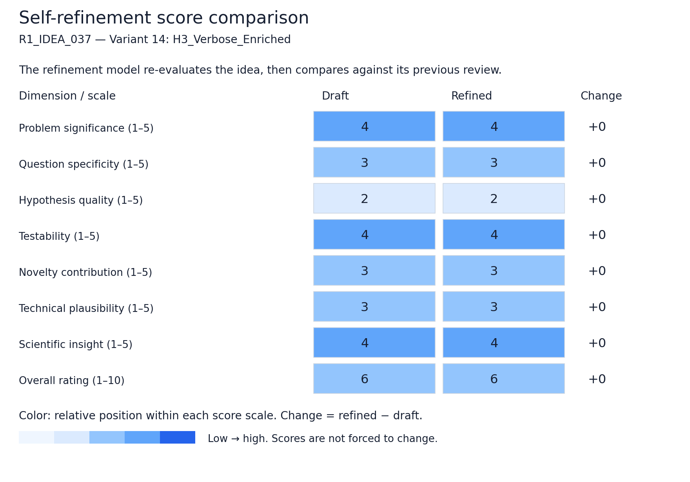

Changed score dimensions: none.

### Score justifications (draft / refined)

**Problem significance**

```json
{
  "draft": {
    "score": 4.0,
    "justification": "The problem is meaningful: counterfactual explanations are important for interpretability, and the ambiguity in distance metrics leading to adversarial or non-semantic perturbations is a known issue. Addressing this could improve trust and utility of explanations."
  },
  "refined": {
    "score": 4.0,
    "justification": "The problem is highly meaningful. Counterfactual explanations are crucial for interpretability in machine learning, and the ambiguity in distance metrics leading to adversarial or non-semantic perturbations is a recognized issue. Addressing this could significantly improve the trustworthiness and utility of explanation methods, with implications for fairness, debugging, and human-AI interaction."
  }
}
```

**Question specificity**

```json
{
  "draft": {
    "score": 3.0,
    "justification": "The idea identifies a general direction (using geodesics with perceptual regularization) but lacks a sharply defined research question. It is more of a methodological proposal than a specific inquiry into a phenomenon or relationship."
  },
  "refined": {
    "score": 3.0,
    "justification": "The idea identifies a general methodological direction (using geodesics with perceptual regularization) but lacks a sharply defined research question. It is more of a proposal for a new method than a specific inquiry into a phenomenon or relationship. However, it does specify the target problem (artifacts from flat geometries) and a proposed solution mechanism."
  }
}
```

**Hypothesis quality**

```json
{
  "draft": {
    "score": 2.0,
    "justification": "The hypothesis is implicit and vague: 'geodesic paths could be regularized by perceptual similarity metrics.' It does not make a concrete, testable prediction about outcomes or mechanisms. It is more of a plausible suggestion than a hypothesis."
  },
  "refined": {
    "score": 2.0,
    "justification": "The hypothesis is implicit and vague: 'geodesic paths could be regularized by perceptual similarity metrics.' This is a methodological suggestion rather than a concrete, testable prediction about outcomes or mechanisms. It does not specify what improvement is expected, under what conditions, or compared to what alternatives. A stronger hypothesis would predict measurable improvements in specific counterfactual quality metrics."
  }
}
```

**Testability**

```json
{
  "draft": {
    "score": 4.0,
    "justification": "The idea discusses a staged experimental design with baselines, interventions, ablations, and sensitivity analyses, which shows a clear path to testing. However, without a concrete hypothesis, what exactly is being tested remains somewhat unclear."
  },
  "refined": {
    "score": 4.0,
    "justification": "The idea discusses a comprehensive experimental design with staged validation, baseline comparisons, ablations, and sensitivity analyses, which provides a clear path to testing. The methodological suggestions show strong awareness of rigorous evaluation. However, without a concrete hypothesis, what exactly is being tested remains somewhat ambiguous. The testability is high for the general approach but lower for a specific claim."
  }
}
```

**Novelty contribution**

```json
{
  "draft": {
    "score": 3.0,
    "justification": "Using geodesics for counterfactuals is a plausible novel angle, but the summary does not clarify how it differs from prior work on manifold-aware or perceptually-regularized explanations. The contribution potential is moderate, depending on implementation and comparison to existing methods."
  },
  "refined": {
    "score": 3.0,
    "justification": "Using geodesics for counterfactuals is a plausible novel angle, but the summary does not clarify how it differs from prior work on manifold-aware or perceptually-regularized explanations. The contribution potential is moderate—it could be novel if the specific integration of perceptual metrics into geodesic computation is new and yields measurable improvements. However, without comparison to existing methods, the novelty is uncertain."
  }
}
```

**Technical plausibility**

```json
{
  "draft": {
    "score": 3.0,
    "justification": "The idea is logically coherent: perceptual metrics could help keep counterfactuals on-manifold. However, key technical details (how to compute geodesics, integrate perceptual metrics, define the metric tensor) are missing, making it hard to assess full plausibility."
  },
  "refined": {
    "score": 3.0,
    "justification": "The idea is logically coherent: perceptual metrics could help keep counterfactuals on-manifold and semantically meaningful. The reasoning that flat geometries lead to artifacts is plausible. However, key technical details are missing: how to compute geodesics in a learned latent space, how to define a Riemannian metric from a perceptual similarity measure, and how to ensure computational tractability. This makes full assessment of plausibility difficult."
  }
}
```

**Scientific insight**

```json
{
  "draft": {
    "score": 4.0,
    "justification": "If successful, the research could provide insight into how geometry and perceptual alignment affect counterfactual quality, revealing boundary conditions (e.g., curvature sensitivity) and general principles for designing explanation methods. The proposed error analysis and sensitivity studies would enhance this insight."
  },
  "refined": {
    "score": 4.0,
    "justification": "If successfully investigated, the research could provide valuable insight into how geometry and perceptual alignment affect counterfactual quality. The proposed error analysis and sensitivity studies could reveal boundary conditions (e.g., curvature sensitivity, data regime dependencies) and general principles for designing robust explanation methods. This goes beyond simple performance comparison to understanding mechanisms and limitations."
  }
}
```

**Overall rating**

```json
{
  "draft": {
    "score": 6.0,
    "justification": "This is a moderate/borderline research idea. It addresses a significant problem and suggests a technically interesting direction with a thoughtful experimental approach. However, the core hypothesis is vague, the method is underspecified, and the novelty relative to existing work is unclear. With refinement—especially a concrete hypothesis and technical details—it could become a strong idea."
  },
  "refined": {
    "score": 6.0,
    "justification": "This is a moderate/borderline research idea. It addresses a significant problem in interpretable ML and suggests a technically interesting direction with a thoughtful experimental approach. The main weaknesses are the vague hypothesis, underspecified method details, and unclear novelty relative to existing work. With refinement—especially a concrete hypothesis, technical specifications, and baseline comparisons—it could become a strong idea (7-8). As presented, it has potential but lacks the specificity and falsifiable claim needed for a higher rating."
  }
}
```

## R1_IDEA_037 — Variant 15: H4_Ultimate_Hype


Changed score dimensions: question_specificity.

### Score justifications (draft / refined)

**Problem significance**

```json
{
  "draft": {
    "score": 5.0,
    "justification": "The problem is highly significant: counterfactual explanations are crucial for interpretable and trustworthy AI, and the choice of distance metric fundamentally affects whether explanations are meaningful or misleading/adversarial. This is a recognized challenge in the field."
  },
  "refined": {
    "score": 5.0,
    "justification": "The problem is highly significant. Counterfactual explanations are crucial for interpretable and trustworthy AI, and the choice of distance metric fundamentally affects whether explanations are meaningful or misleading/adversarial. This is a well-recognized challenge in the field with clear practical implications."
  }
}
```

**Question specificity**

```json
{
  "draft": {
    "score": 3.0,
    "justification": "The core question—how to generate counterfactuals that are semantically meaningful rather than adversarial—is clear, but the proposed solution (geodesics under perceptual geometry) is described at a high level without specifying what constitutes a 'perceptual' geometry or how it addresses the stated limitations."
  },
  "refined": {
    "score": 2.0,
    "justification": "The core question—how to generate semantically meaningful counterfactuals—is clear, but the proposed solution (geodesics under perceptual geometry) is described at an overly high level. There is no specification of what constitutes a 'perceptual' geometry, how it differs from existing metrics, or how it concretely addresses the stated limitations."
  }
}
```

**Hypothesis quality**

```json
{
  "draft": {
    "score": 2.0,
    "justification": "There is an implicit hypothesis that 'geodesics under a perceptual geometry produce better counterfactuals,' but it's not articulated as a concrete, falsifiable prediction. What does 'better' mean? How would it be disproven? The hypothesis lacks specificity about mechanisms or expected outcomes."
  },
  "refined": {
    "score": 2.0,
    "justification": "There is only an implicit, vague hypothesis that 'geodesics under a perceptual geometry produce better counterfactuals.' It lacks specificity about mechanisms, expected outcomes, or falsifiable predictions. What does 'better' mean? Under what conditions would the hypothesis be disproven?"
  }
}
```

**Testability**

```json
{
  "draft": {
    "score": 2.0,
    "justification": "The idea is testable in principle (one could implement PCG and compare it to baselines), but the summary doesn't suggest how to test it—no evaluation metrics, no baselines, no datasets. Without a clear hypothesis, it's unclear what evidence would support or refute the claim."
  },
  "refined": {
    "score": 2.0,
    "justification": "The idea is testable in principle, but the summary provides no guidance on how to test it—no suggested evaluation metrics, baselines, datasets, or experimental comparisons. Without a clear hypothesis or evaluation plan, it's unclear what evidence would support or refute the claim."
  }
}
```

**Novelty contribution**

```json
{
  "draft": {
    "score": 3.0,
    "justification": "Using geodesics for counterfactuals in latent space is a known idea (e.g., in generative model latents). The novelty hinges on the 'perceptual geometry,' which is underexplored but not defined here. The contribution could be moderate if the geometry is novel and impactful, but as stated, it's ambiguous."
  },
  "refined": {
    "score": 3.0,
    "justification": "Using geodesics for counterfactuals in latent space is a known idea (e.g., in generative model latents). The novelty hinges entirely on the undefined 'perceptual geometry.' The contribution could be moderate if the geometry is novel and impactful, but as stated, it's ambiguous and lacks differentiation from prior work."
  }
}
```

**Technical plausibility**

```json
{
  "draft": {
    "score": 3.0,
    "justification": "The direction is plausible: geodesics can capture meaningful paths in curved spaces, and perceptual metrics exist. However, key details are missing—how to define a perceptual geometry that is both tractable and aligned with human perception, and how to compute geodesics efficiently. The reasoning is coherent but incomplete."
  },
  "refined": {
    "score": 3.0,
    "justification": "The direction is plausible in concept: geodesics can capture meaningful paths in curved spaces, and perceptual metrics exist. However, key details are missing—how to define a perceptual geometry that is both tractable and aligned with human perception, and how to compute geodesics efficiently. The reasoning is coherent but incomplete."
  }
}
```

**Scientific insight**

```json
{
  "draft": {
    "score": 4.0,
    "justification": "If successful, this could yield valuable scientific insight: it might reveal how the geometry of latent spaces interacts with human perception to produce interpretable explanations, and could establish principles for choosing distances in explanation methods. The potential for generalizable insight beyond a single method is high."
  },
  "refined": {
    "score": 4.0,
    "justification": "If successfully investigated, this could yield valuable scientific insight: it might reveal how the geometry of latent spaces interacts with human perception to produce interpretable explanations, and could establish principles for choosing distances in explanation methods. The potential for generalizable insight beyond a single method is high."
  }
}
```

**Overall rating**

```json
{
  "draft": {
    "score": 5.0,
    "justification": "The idea addresses an important problem and proposes a conceptually interesting direction, but it's currently more of a vision than a research plan. It lacks a specific hypothesis, testable claims, and technical details needed to assess its true potential. As a research idea, it's moderate/borderline: it has a good starting point but requires substantial refinement to become a strong, actionable research question."
  },
  "refined": {
    "score": 5.0,
    "justification": "The idea addresses an important problem and proposes a conceptually interesting direction, but it's currently more of a vision statement than a research plan. It lacks a specific hypothesis, testable claims, and technical details needed to assess its true potential. As a research idea, it's moderate/borderline: it has a good starting point but requires substantial refinement to become a strong, actionable research question."
  }
}
```
