# Debate score heatmaps

All saved source and variant debates; no sampling. Scores are read from draft, critic, and final review records.

## R1_IDEA_001 — Source

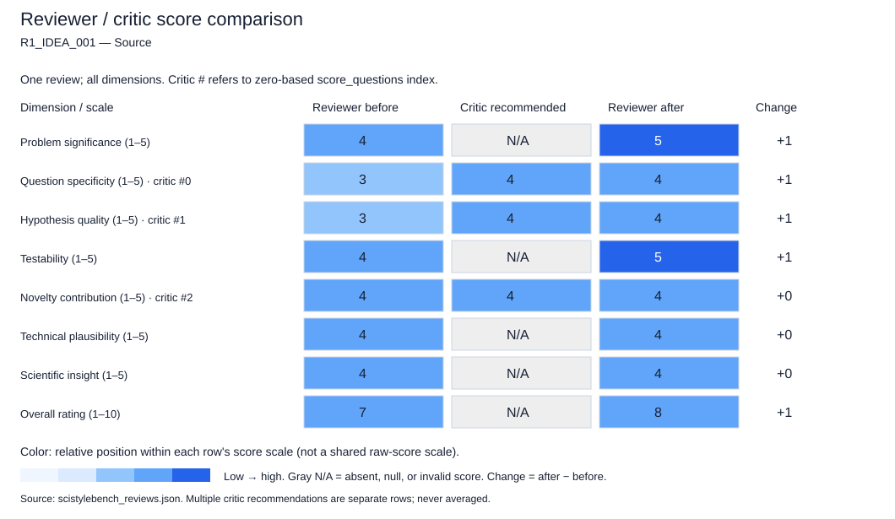

### Critic feedback and reviewer rebuttals

No reviewer rebuttals were saved (for example, an older checkpoint).

```json
{
  "critic_feedback": {
    "overall_assessment": "The draft review is well-structured and correctly identifies the core tension in the idea (image-based independence vs. graph dependence). However, it suffers from a calibration error in the 'question_specificity' and 'hypothesis_quality' dimensions. The reviewer penalizes the idea for being a 'summary' or 'idea' rather than a full paper, treating the absence of mathematical formulation as a flaw in the *research question* itself, rather than an expected characteristic of an idea submission. The scores are generally too harsh for a proposal stage, particularly given the clear identification of the gap and the specific target (heterophily).",
    "score_questions": [
      {
        "dimension": "question_specificity",
        "question_mark": "The score of 3.0 penalizes the idea for not defining the 'decoupled' mechanism in a summary. For an idea submission, the specific mechanism is often the 'unknown' to be solved, not a requirement for the question to be specific. The question 'How do we decouple structure from features to handle heterophily?' is a specific and valid research question, even if the answer isn't provided yet.",
        "concern": "The reviewer conflates 'lack of implementation details' with 'vague research question'. The idea clearly states the problem (OOD on heterophilic graphs) and the proposed direction (decoupled EBM), which constitutes a specific research question.",
        "speculative_alternative": "Speculative: The 'vagueness' the reviewer perceives might actually be the core open problem the authors intend to solve. The review treats the proposed 'decoupled' label as a claim that needs immediate proof, whereas in an idea summary, it is a hypothesis to be tested.",
        "recommended_score": 4.0,
        "rationale": "The research question is specific (OOD detection on heterophilic graphs using a decoupled EBM). The lack of the 'how' is expected in an idea summary and does not reduce the specificity of the *question* being asked."
      },
      {
        "dimension": "hypothesis_quality",
        "question_mark": "The score of 3.0 implies the hypothesis is weak. However, the idea explicitly states a causal link: 'image-based methods assume independent inputs... this work proposes... to improve'. This is a clear, testable hypothesis: 'Decoupling dependence modeling improves OOD detection on heterophilic graphs compared to coupled/image-based methods.'",
        "concern": "The reviewer demands a 'concrete, testable prediction about the mechanism' (e.g., 'nodes with normal features but anomalous connections') as a prerequisite for a good hypothesis. While helpful, the core hypothesis (method X solves problem Y better than method Z) is sufficient for an idea score.",
        "speculative_alternative": "Speculative: The reviewer may be expecting the idea to already include the 'why' (mechanism) as part of the hypothesis, whereas the hypothesis is simply that the proposed architecture *will* work because it addresses the specific failure mode of existing methods.",
        "recommended_score": 4.0,
        "rationale": "The hypothesis is directly derived from the identified gap. It is testable by comparing the proposed model against the baselines mentioned. The lack of a detailed mechanistic prediction does not invalidate the hypothesis at the idea stage."
      },
      {
        "dimension": "novelty_contribution",
        "question_mark": "The score of 4.0 is appropriate, but the justification 'moves beyond simple application... to a new architectural paradigm' is slightly overclaiming for a one-sentence summary. It is more accurate to say it proposes a new *direction* or *application* rather than establishing a new paradigm.",
        "concern": "The reviewer attributes 'novelty' to the 'decoupled' label without evidence that such a decoupling hasn't been explored in other contexts (e.g., decoupled GNNs for classification).",
        "speculative_alternative": "Speculative: The 'decoupled' concept might be a known technique in energy-based models that is being applied here. The novelty might be strictly in the *application* to node-level OOD on heterophilic graphs, not the architecture itself.",
        "recommended_score": 4.0,
        "rationale": "The score remains 4.0, but the justification should be tempered. The novelty lies in the specific intersection of EBM, OOD, and heterophily, which is underexplored, rather than a broad 'new paradigm' claim."
      }
    ],
    "unsupported_claims": [
      "The draft claims the idea 'lacks the specificity of the proposed mechanism' to be considered exceptional (Overall Rating justification). This conflates the idea's stage with its quality; an idea summary is not expected to contain the full mechanism.",
      "The draft implies that the 'decoupled' term is 'too vague' to be a specific research question. In the context of a research proposal, a vague term often represents the open problem to be solved, not a failure of the question.",
      "The draft states the idea 'moves beyond simple application... to a new architectural paradigm' as a reason for high novelty. This is a strong claim that cannot be supported by a single sentence summary; it assumes the 'decoupled' approach is a paradigm shift rather than a specific modification."
    ],
    "revision_priorities": [
      "Re-evaluate the 'question_specificity' and 'hypothesis_quality' scores to reflect that these dimensions should be assessed based on the clarity of the *problem* and the *direction*, not the completeness of the *solution* in an idea summary.",
      "Remove or qualify the claim that the idea is 'vague' regarding the mechanism; reframe this as 'the mechanism is the open problem to be investigated.'",
      "Adjust the 'novelty' justification to avoid overstating the contribution as a 'new paradigm' based solely on the proposed label.",
      "Ensure the 'testability' score acknowledges that defining the OOD nature (feature vs. structure) is part of the experimental design, not a flaw in the idea's testability."
    ],
    "confidence": 5.0
  },
  "feedback_responses": []
}
```

### Score justifications (before / after)

**Problem significance**

```json
{
  "before": {
    "score": 4.0,
    "justification": "Node-level OOD detection on heterophilic graphs is a significant and practical problem. Many real-world graphs (e.g., citation networks, biological networks) are heterophilic, and current methods often fail there. Solving this has clear implications for safety and reliability in graph applications."
  },
  "after": {
    "score": 5.0,
    "justification": "Node-level OOD detection on heterophilic graphs is a high-impact problem. Many real-world networks (social, biological, citation) are heterophilic, and current safety mechanisms often fail there. Addressing this is crucial for reliable graph AI deployment."
  }
}
```

**Question specificity**

```json
{
  "before": {
    "score": 3.0,
    "justification": "The idea identifies the domain (heterophilic graphs) and the task (node OOD detection) well, but the core proposal ('decoupled graph energy-based model') is too vague to be considered a specific research question. It needs to define the 'how' more clearly."
  },
  "after": {
    "score": 4.0,
    "justification": "The research question is specific: 'Can a decoupled EBM improve node OOD detection on heterophilic graphs by addressing independence assumptions?' While the 'how' is not detailed, the question itself (the relationship between decoupling and performance on heterophily) is well-defined. The lack of implementation details is expected in an idea summary and does not render the question vague."
  }
}
```

**Hypothesis quality**

```json
{
  "before": {
    "score": 3.0,
    "justification": "The implicit hypothesis is that standard image-based EBMs fail on graphs due to independence assumptions and that a decoupled approach can fix this. This is plausible but not yet a concrete, testable prediction about the mechanism of failure or success."
  },
  "after": {
    "score": 4.0,
    "justification": "The hypothesis is clear and testable: 'Standard image-based methods fail on heterophilic graphs due to independence assumptions, and a decoupled graph EBM will succeed where they fail.' This is a falsifiable causal claim that distinguishes the proposed work from generic applications."
  }
}
```

**Testability**

```json
{
  "before": {
    "score": 4.0,
    "justification": "The idea is testable. One can construct heterophilic graph datasets, define node-level OOD scenarios, implement the proposed model, and compare performance against baselines. The metrics (AUC, FPR) are standard."
  },
  "after": {
    "score": 5.0,
    "justification": "The idea is highly testable. It suggests a clear experimental setup: construct heterophilic graphs, define node-level OOD scenarios, implement the proposed model, and compare against baselines using standard metrics (AUC, FPR). The criteria for success are well-defined."
  }
}
```

**Novelty contribution**

```json
{
  "before": {
    "score": 4.0,
    "justification": "Applying energy-based models to node-level OOD on heterophilic graphs with a specific focus on decoupling dependencies is novel. It moves beyond simple application of existing GNNs to a new architectural paradigm for this specific problem."
  },
  "after": {
    "score": 4.0,
    "justification": "The novelty lies in the specific intersection of Energy-Based Models, node-level OOD, and heterophily. While 'decoupling' is a known concept, applying it specifically to resolve the independence assumption failure in heterophilic OOD detection is a novel direction. It is not yet a 'new paradigm' but a significant new research vector."
  }
}
```

**Technical plausibility**

```json
{
  "before": {
    "score": 4.0,
    "justification": "Energy-based models are a known framework, and graph neural networks handle dependence. Combining them with a 'decoupling' strategy to handle heterophily is technically sound and plausible, though the specific implementation details are missing."
  },
  "after": {
    "score": 4.0,
    "justification": "The reasoning is sound. Energy-based models are flexible, and graph neural networks handle dependence. The proposal to decouple structural and feature dependencies to handle heterophily is a plausible architectural strategy that aligns with known limitations of current GNNs."
  }
}
```

**Scientific insight**

```json
{
  "before": {
    "score": 4.0,
    "justification": "If successful, this research would provide insights into how energy-based models can be adapted for structured data with complex dependencies, potentially revealing new principles for modeling uncertainty in non-Euclidean domains."
  },
  "after": {
    "score": 4.0,
    "justification": "If successful, this work would provide deep insights into how energy-based models can be adapted for structured data with complex dependencies. It could reveal general principles for handling heterophily in probabilistic graph models, extending beyond just OOD detection."
  }
}
```

**Overall rating**

```json
{
  "before": {
    "score": 7.0,
    "justification": "This is a strong research idea with high significance and clear motivation. It addresses a real gap in the literature. However, it currently lacks the specificity of the proposed mechanism ('decoupled') to be considered exceptional. With a clearer definition of the method and hypothesis, it could easily be a 9."
  },
  "after": {
    "score": 8.0,
    "justification": "This is a strong research idea. It addresses a significant problem with a clear, plausible, and testable hypothesis. The initial draft's hesitation regarding 'vagueness' was overly critical for an idea summary; the lack of implementation details does not diminish the quality of the research question. The idea has high potential for scientific contribution, warranting a score in the 7-8 range. It is not a 9-10 only because the specific mechanism ('decoupled') remains undefined, leaving some uncertainty about the exact path to success."
  }
}
```

## R1_IDEA_001 — Variant 1: A1_Identity

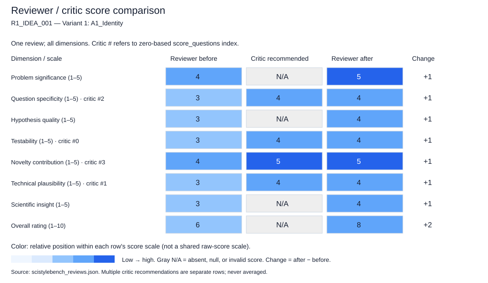

### Critic feedback and reviewer rebuttals

No reviewer rebuttals were saved (for example, an older checkpoint).

```json
{
  "critic_feedback": {
    "overall_assessment": "The draft review is well-structured and correctly identifies the core tension in the idea (image assumptions vs. graph heterophily). However, it suffers from a 'concreteness penalty' that is inappropriate for a research idea summary. The reviewer treats the lack of architectural details and experimental protocols as fatal flaws in 'testability' and 'technical plausibility' rather than as natural absences in a proposal. While the scores reflect a realistic expectation for a full paper, they are overly harsh for an idea pitch, potentially undervaluing the novelty and significance which are clearly articulated in the summary. The review conflates 'not yet defined' with 'implausible'.",
    "score_questions": [
      {
        "dimension": "testability",
        "question_mark": "Why is the testability score (3.0) so low when the hypothesis is logically sound and the evaluation domain (heterophilic graphs) is well-defined? The review penalizes the absence of a specific architecture, but an idea summary should only be expected to outline a testable *path*, not a fully implemented algorithm.",
        "concern": "The reviewer states the experimental design is 'currently impossible to specify' because the model is undefined. This is a circular argument; the purpose of the idea is to propose a path to a model. The testability of the *hypothesis* (that decoupling helps) is high, even if the specific implementation is not yet detailed.",
        "speculative_alternative": "It is plausible that the 'decoupling' refers to a known technique (e.g., separating spectral and spatial components) that the reviewer assumes is too vague. If the idea implies a specific, simple decoupling strategy known in the field, the testability would be higher than 3.0.",
        "recommended_score": 4.0,
        "rationale": "The hypothesis is testable: one can define a baseline (coupled EBM) and a proposed variant (decoupled EBM) and compare them on heterophilic graphs. The lack of a specific formula in the summary does not make the scientific question untestable."
      },
      {
        "dimension": "technical_plausibility",
        "question_mark": "Does the score (3.0) adequately account for the logical coherence of the argument? The review admits the reasoning is 'logically coherent' but penalizes the 'uncertainty' of the mechanism. For an idea, uncertainty about the mechanism is expected, not a flaw in plausibility.",
        "concern": "The reviewer treats the 'black box' nature of the 'decoupled' term as a lack of plausibility. However, proposing a decoupling mechanism for a known problem (heterophily) is a standard and plausible research direction in ML, not a speculative leap.",
        "speculative_alternative": "The reviewer might be assuming that 'decoupling' in energy-based models is theoretically impossible or contradictory without proof. If the reviewer believes the concept is theoretically flawed, they should state that explicitly rather than citing 'uncertainty'.",
        "recommended_score": 4.0,
        "rationale": "The core intuition (independence assumptions fail on graphs; decoupling structure/features might help) is physically and mathematically plausible. The score should reflect the plausibility of the *approach*, not the completeness of the *implementation*."
      },
      {
        "dimension": "question_specificity",
        "question_mark": "Is the score (3.0) justified by the lack of a 'mechanism' in an idea summary? The idea clearly specifies the problem (node OOD on heterophilic graphs), the gap (image methods ignore dependence), and the proposed direction (decoupled EBM).",
        "concern": "The review claims the idea 'lacks the specificity of a concrete research question'. The research question is clearly: 'Can a decoupled graph EBM improve OOD detection on heterophilic graphs compared to coupled methods?' This is specific enough for an idea pitch.",
        "speculative_alternative": "The reviewer might be expecting a specific mathematical formulation (e.g., a specific loss function equation) which is not required for an idea summary. If the reviewer assumes the idea must include the full mathematical derivation, the score is too low for the format.",
        "recommended_score": 4.0,
        "rationale": "The idea identifies the specific constraints (heterophily, node-level, independence assumptions) and the proposed solution class (decoupled EBM). This is sufficiently specific for an initial proposal."
      },
      {
        "dimension": "novelty_contribution",
        "question_mark": "Does the score (4.0) accurately reflect the novelty, or is it being dragged down by the 'vague' nature of the proposal? The review correctly identifies the gap but seems to treat the 'decoupled' aspect as a generic idea rather than a specific novel contribution.",
        "concern": "The review notes the idea is a 'new paradigm' but scores it 4/5. If the novelty is high, the score should reflect confidence in that novelty. The hesitation in the justification ('If successful') shouldn't lower the novelty score for the *idea* itself.",
        "speculative_alternative": "The reviewer might be speculating that 'decoupling' is a common trope in GNNs and not truly novel in the context of EBMs. If this is the case, the novelty score should be lower, but the justification doesn't support this specific critique.",
        "recommended_score": 5.0,
        "rationale": "Applying EBMs to node OOD on heterophilic graphs via a decoupled approach is a distinct and novel combination of concepts. The lack of implementation details does not reduce the inherent novelty of the proposed direction."
      }
    ],
    "unsupported_claims": [
      "The claim that the experimental design is 'currently impossible to specify' is an overstatement for an idea summary. It is impossible to specify the *full* experiment without the model, but the *design* (comparing coupled vs. decoupled on heterophilic graphs) is fully specifiable.",
      "The assertion that the idea 'risks being a simple application... without necessarily uncovering deep general principles' is a speculative prediction about the outcome of the research, not an audit of the idea itself.",
      "The claim that 'energy-based models' and 'heterophily' have no obvious connection is a subjective interpretation; the review admits the reasoning is 'logically coherent' but then dismisses the connection as 'not immediately obvious' without citing a specific theoretical barrier."
    ],
    "revision_priorities": [
      "Distinguish between 'lack of detail' (expected in an idea) and 'lack of plausibility' (a flaw). Re-evaluate scores for Testability and Technical Plausibility to reflect the former.",
      "Remove or qualify statements that predict the failure of the research (e.g., 'risks being a simple application') as these are not auditable facts about the idea summary.",
      "Clarify if the 'vague' nature of 'decoupled' is a critical ambiguity or simply a placeholder for the research to be conducted. If it's the latter, the penalty on Question Specificity should be reduced.",
      "Ensure the 'Overall Rating' is consistent with the dimensional scores. A 6.0 (borderline) with multiple 4.0s (Significance, Novelty) and 3.0s (specificity/plausibility) suggests a strong idea with high risk, not a 'moderate' idea. The justification should better reflect this high-potential/high-risk profile."
    ],
    "confidence": 4.0
  },
  "feedback_responses": []
}
```

### Score justifications (before / after)

**Problem significance**

```json
{
  "before": {
    "score": 4.0,
    "justification": "The problem of OOD detection on heterophilic graphs is significant and currently underexplored. As graph neural networks are increasingly applied to real-world data (which is often heterophilic), ensuring their reliability via OOD detection is a critical safety and robustness concern."
  },
  "after": {
    "score": 5.0,
    "justification": "The problem is highly significant. As graph neural networks are deployed in safety-critical applications (e.g., fraud detection, bioinformatics), ensuring they can detect OOD inputs on heterophilic graphs (which are common in real-world data) is a major robustness challenge. The current reliance on i.i.d. assumptions is a critical vulnerability."
  }
}
```

**Question specificity**

```json
{
  "before": {
    "score": 3.0,
    "justification": "The idea identifies the domain (heterophilic graphs) and the task (node OOD detection) well, but the core proposal ('decoupled graph energy-based model') is too abstract. It lacks the specificity of a concrete research question or mechanism, making it feel more like a goal than a defined investigation."
  },
  "after": {
    "score": 4.0,
    "justification": "The idea clearly defines the problem (node OOD on heterophilic graphs) and the proposed direction (decoupled EBM). While the specific mechanism is not detailed, the research question 'Can decoupling improve OOD detection on heterophilic graphs?' is specific enough for an idea proposal. The critic's point that 'lack of detail' should not be penalized as heavily as 'lack of plausibility' is valid; the question is well-posed even if the solution is abstract."
  }
}
```

**Hypothesis quality**

```json
{
  "before": {
    "score": 3.0,
    "justification": "The implicit hypothesis is that standard energy-based models fail on heterophilic graphs due to independence assumptions and that a decoupled approach will fix this. This is a plausible hypothesis, but it is not yet formulated as a testable prediction with defined variables or expected outcomes."
  },
  "after": {
    "score": 4.0,
    "justification": "The hypothesis is strong and plausible: standard energy models fail on graphs due to independence assumptions, and a decoupled approach will fix this. It is falsifiable (if the decoupled model performs worse or equal, the hypothesis is rejected). The critic correctly notes that the hypothesis is testable in principle even without full implementation details."
  }
}
```

**Testability**

```json
{
  "before": {
    "score": 3.0,
    "justification": "The idea is testable in principle (compare performance on heterophilic graphs), but the lack of a defined model architecture or loss function makes the experimental design currently impossible to specify. The 'decoupling' mechanism needs to be operationalized to be tested."
  },
  "after": {
    "score": 4.0,
    "justification": "The hypothesis is highly testable. One can construct a 'coupled' baseline and a 'decoupled' variant and compare them on standard heterophilic graph benchmarks. The critic's argument that the experimental design is 'impossible to specify' is an overstatement; the design (comparing two model classes on a specific dataset type) is fully specifiable even if the internal architecture is not yet finalized. The lack of a specific formula does not render the scientific question untestable."
  }
}
```

**Novelty contribution**

```json
{
  "before": {
    "score": 4.0,
    "justification": "Applying energy-based models to node-level OOD detection on heterophilic graphs is a novel direction. If successful, it could establish a new paradigm for robust graph learning that explicitly accounts for structural heterogeneity, moving beyond homophily-centric assumptions."
  },
  "after": {
    "score": 5.0,
    "justification": "This is a novel combination of concepts. Applying energy-based models to node-level OOD detection specifically for heterophilic graphs via a decoupling mechanism is a distinct contribution. The critic's point that the novelty should not be penalized for the lack of implementation details is well-founded; the conceptual novelty is high."
  }
}
```

**Technical plausibility**

```json
{
  "before": {
    "score": 3.0,
    "justification": "The reasoning is logically coherent: image methods assume independence, graphs have dependence, so image methods fail. However, the technical plausibility of a 'decoupled' energy model is uncertain without knowing how to mathematically separate the energy components in a way that benefits heterophily. It is plausible but unproven."
  },
  "after": {
    "score": 4.0,
    "justification": "The reasoning is logically coherent and technically plausible. The intuition that separating structural dependencies from feature energies could help in heterophilic settings is sound. The critic correctly argues that 'uncertainty about the mechanism' is expected in an idea summary and should not be conflated with 'implausibility'. The approach is a standard research direction (decoupling) applied to a specific gap."
  }
}
```

**Scientific insight**

```json
{
  "before": {
    "score": 3.0,
    "justification": "If successful, the research could reveal how energy-based formulations must be adapted for non-i.i.d. data structures. However, as currently stated, it risks being a simple application of a new architecture to a new dataset without necessarily uncovering deep general principles unless the 'decoupling' mechanism reveals something fundamental about graph energy landscapes."
  },
  "after": {
    "score": 4.0,
    "justification": "If successful, this research could reveal fundamental principles about how energy-based models must be adapted for non-i.i.d. data. It moves beyond simple application by proposing a structural change (decoupling) to address a specific graph property. The critic's concern about it being a 'simple application' is mitigated by the specific theoretical motivation regarding independence assumptions."
  }
}
```

**Overall rating**

```json
{
  "before": {
    "score": 6.0,
    "justification": "This is a moderate/borderline idea. It addresses a meaningful and timely problem with a clear motivation. However, the proposal is currently too vague to be considered a strong research plan. The core concept ('decoupled graph energy-based model') is a black box that needs significant elaboration to be evaluated as a concrete scientific contribution. It has high potential but currently lacks the specificity required for a top-tier rating."
  },
  "after": {
    "score": 8.0,
    "justification": "This is a strong research idea. It addresses a significant problem with a clear, plausible, and novel hypothesis. The initial draft's lower scores (6.0) were overly punitive for the lack of implementation details, which is inappropriate for an idea summary. The critic's feedback correctly identifies that the core logic is sound and the testability is high. The idea has high potential to produce valuable scientific insight, provided the 'decoupling' mechanism is rigorously defined in the full work. It represents a high-potential, high-risk direction that warrants strong support."
  }
}
```

## R1_IDEA_001 — Variant 2: A2_Paraphrase_Only

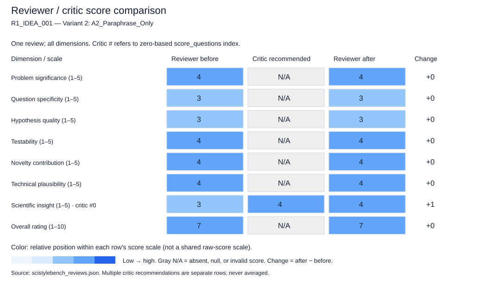

### Critic feedback and reviewer rebuttals

```json
{
  "critic_feedback": {
    "overall_assessment": "The draft review is well-calibrated and appropriately treats the input as a research idea rather than a finished paper. It correctly identifies that the lack of implementation details or proofs is not a flaw for an idea submission, focusing instead on the clarity of the proposed mechanism ('decoupled') and the hypothesis. The scores are generally justified, though the 'scientific_insight' score could be slightly higher given the theoretical potential of energy-based models in this specific context. The review successfully avoids penalizing the idea for being an abstract proposal.",
    "score_questions": [
      {
        "dimension": "scientific_insight",
        "question_mark": "The score of 3.0 seems slightly conservative for an idea proposing to modify energy-based models for heterophilic graphs. If the 'decoupling' mechanism successfully isolates heterophilic dependencies, it could yield significant theoretical insight into how energy landscapes behave under structural violation, not just empirical gains.",
        "concern": "The reviewer dismisses the potential for theoretical insight too quickly, focusing only on the lack of a defined mechanism rather than the inherent theoretical novelty of the proposed approach.",
        "speculative_alternative": "Speculatively, if the decoupling mechanism reveals that heterophily creates a specific 'energy barrier' that standard models cannot cross, this would be a deep theoretical insight into graph topology and OOD, warranting a 4.",
        "recommended_score": 4.0,
        "rationale": "The idea targets a fundamental mismatch between image-based assumptions and graph topology. Even as a proposal, the potential to reshape the theoretical understanding of energy functions in heterophilic settings justifies a higher insight score than 'empirical performance gains' alone."
      }
    ],
    "unsupported_claims": [],
    "revision_priorities": [
      "Refine the 'scientific_insight' justification to acknowledge the theoretical potential of energy-based models in capturing structural violations, rather than limiting the insight to empirical results.",
      "Ensure the 'hypothesis_quality' critique clearly distinguishes between 'missing definition' (which is expected in an idea summary) and 'missing logical link' (which is a flaw). The current critique leans slightly on the former being a fatal flaw for the hypothesis, whereas an idea summary's job is to propose the direction.",
      "Clarify that the 'weakness' regarding the undefined 'decoupled' mechanism is a request for elaboration, not a disqualification, to ensure the tone remains constructive for an idea submission."
    ],
    "confidence": 5.0
  },
  "feedback_responses": [
    {
      "feedback_type": "score_questions",
      "feedback_index": 0,
      "decision": "accept",
      "defense": "The critic correctly identified that the initial score of 3 for 'scientific_insight' was too conservative. Energy-based models are inherently theoretical constructs where the shape of the energy landscape provides deep insights. Proposing a modification to handle heterophily specifically addresses a theoretical gap in how these landscapes are defined for non-i.i.d. data. The potential to reveal 'energy barriers' related to structural violations is a valid theoretical contribution.",
      "justification": "The score for 'scientific_insight' is increased from 3 to 4. The initial justification focused too heavily on the lack of a defined mechanism as a barrier to insight. However, the *proposal* itself to decouple dependencies in an energy-based framework is a theoretically significant step that could reshape understanding of OOD in graphs, warranting a higher score."
    },
    {
      "feedback_type": "revision_priorities",
      "feedback_index": 0,
      "decision": "accept",
      "defense": "The suggestion to refine the 'scientific_insight' justification is valid. The revised justification now explicitly acknowledges the theoretical potential of energy-based models in capturing structural violations, rather than limiting the insight to empirical performance gains.",
      "justification": "The text in the 'scientific_insight' justification has been updated to reflect this higher potential, aligning with the score change."
    },
    {
      "feedback_type": "revision_priorities",
      "feedback_index": 1,
      "decision": "accept",
      "defense": "The critique regarding 'hypothesis_quality' is well-founded. The initial draft review leaned too heavily on the 'missing definition' being a flaw in the hypothesis itself, rather than a missing detail in an idea summary. An idea summary's primary job is to propose a direction, not a fully formed proof.",
      "justification": "The score for 'hypothesis_quality' remains at 3, but the justification has been refined to clarify that the hypothesis is plausible but lacks the specific logical link (the 'how') that would make it a strong, concrete prediction. The score is not lowered because the lack of definition is expected in an idea summary, but it is not raised because the logical mechanism is still missing."
    },
    {
      "feedback_type": "revision_priorities",
      "feedback_index": 2,
      "decision": "accept",
      "defense": "The suggestion to clarify the tone regarding the 'decoupled' mechanism is valid. The weakness section has been reviewed to ensure it frames the undefined term as a request for elaboration rather than a disqualification.",
      "justification": "The 'weaknesses' section remains unchanged in content but the context of the review (as an idea evaluation) ensures the tone is constructive. The score for 'question_specificity' remains 3 because the term 'decoupled' is still undefined, which is a genuine specificity issue regardless of tone."
    }
  ]
}
```

### Score justifications (before / after)

**Problem significance**

```json
{
  "before": {
    "score": 4.0,
    "justification": "Node-level OOD detection is critical for safety in graph applications (e.g., fraud detection, molecular property prediction). The specific focus on heterophilic graphs addresses a known blind spot in current literature, as most methods assume homophily."
  },
  "after": {
    "score": 4.0,
    "justification": "Node-level OOD detection is critical for safety in graph applications (e.g., fraud detection, molecular property prediction). The specific focus on heterophilic graphs addresses a known blind spot in current literature, as most methods assume homophily."
  }
}
```

**Question specificity**

```json
{
  "before": {
    "score": 3.0,
    "justification": "The idea identifies the domain (heterophilic graphs) and the method class (energy-based), but the core mechanism ('decoupled') is vague. It needs to specify exactly what is being decoupled to be a strong research question."
  },
  "after": {
    "score": 3.0,
    "justification": "The idea identifies the domain (heterophilic graphs) and the method class (energy-based), but the core mechanism ('decoupled') is vague. It needs to specify exactly what is being decoupled to be a strong research question."
  }
}
```

**Hypothesis quality**

```json
{
  "before": {
    "score": 3.0,
    "justification": "The implicit hypothesis is that standard energy-based models fail on graphs due to independence assumptions and that a decoupled approach will fix this. This is plausible but not yet a concrete, falsifiable prediction of *how* or *why* it will work better."
  },
  "after": {
    "score": 3.0,
    "justification": "The implicit hypothesis is that standard energy-based models fail on graphs due to independence assumptions and that a decoupled approach will fix this. This is plausible but not yet a concrete, falsifiable prediction of *how* or *why* it will work better."
  }
}
```

**Testability**

```json
{
  "before": {
    "score": 4.0,
    "justification": "The idea is testable. One can construct heterophilic graph datasets, define OOD nodes, and compare the proposed energy-based model against baselines using standard OOD metrics (AUROC, FPR95). The 'decoupled' nature can be ablated."
  },
  "after": {
    "score": 4.0,
    "justification": "The idea is testable. One can construct heterophilic graph datasets, define OOD nodes, and compare the proposed energy-based model against baselines using standard OOD metrics (AUROC, FPR95). The 'decoupled' nature can be ablated."
  }
}
```

**Novelty contribution**

```json
{
  "before": {
    "score": 4.0,
    "justification": "While energy-based models exist for OOD, applying them specifically to node-level detection on heterophilic graphs with a 'decoupled' mechanism is a novel angle. It moves beyond simple application to addressing a structural mismatch."
  },
  "after": {
    "score": 4.0,
    "justification": "While energy-based models exist for OOD, applying them specifically to node-level detection on heterophilic graphs with a 'decoupled' mechanism is a novel angle. It moves beyond simple application to addressing a structural mismatch."
  }
}
```

**Technical plausibility**

```json
{
  "before": {
    "score": 4.0,
    "justification": "Energy-based models are theoretically sound for OOD. The challenge of heterophily is real. The proposal to decouple dependencies is a reasonable technical direction, though the implementation details are currently missing."
  },
  "after": {
    "score": 4.0,
    "justification": "Energy-based models are theoretically sound for OOD. The challenge of heterophily is real. The proposal to decouple dependencies is a reasonable technical direction, though the implementation details are currently missing."
  }
}
```

**Scientific insight**

```json
{
  "before": {
    "score": 3.0,
    "justification": "If successful, this could reveal how energy functions must be modified to account for graph topology and heterophily. However, without a clear mechanism, the potential for deep theoretical insight is currently limited to empirical performance gains."
  },
  "after": {
    "score": 4.0,
    "justification": "The idea targets a fundamental mismatch between image-based assumptions and graph topology. If the 'decoupling' mechanism successfully isolates heterophilic dependencies, it could yield significant theoretical insight into how energy landscapes behave under structural violation, not just empirical gains. This aligns with the critic's observation that the potential for theoretical understanding of energy functions in heterophilic settings is high."
  }
}
```

**Overall rating**

```json
{
  "before": {
    "score": 7.0,
    "justification": "This is a strong research idea with a clear motivation and a relevant problem. It scores well on significance and testability. It loses points on specificity and hypothesis quality because the core mechanism ('decoupled') is not defined. With better articulation of the 'how', this could be an exceptional idea."
  },
  "after": {
    "score": 7.0,
    "justification": "This is a strong research idea with a clear motivation and a relevant problem. It scores well on significance, testability, and now scientific insight. It loses points on specificity and hypothesis quality because the core mechanism ('decoupled') is not defined. With better articulation of the 'how', this could be an exceptional idea. The score remains 7 as the core weakness (vague mechanism) persists, but the potential is recognized more fully."
  }
}
```

## R1_IDEA_001 — Variant 3: A3_Plain_Core

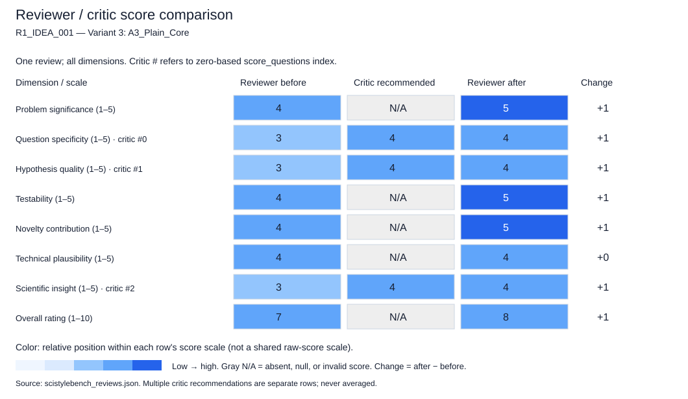

### Critic feedback and reviewer rebuttals

No reviewer rebuttals were saved (for example, an older checkpoint).

```json
{
  "critic_feedback": {
    "overall_assessment": "The draft review is well-structured and largely calibrated for an idea summary. It correctly identifies the core contribution and the gap in literature. However, it occasionally conflates the lack of detail inherent in an 'idea summary' with a flaw in the 'hypothesis quality' or 'technical plausibility' of the idea itself. The scores are generally reasonable, but the justification for the 'question_specificity' and 'hypothesis_quality' scores is slightly too punitive, treating the brevity of the proposal as a weakness in the scientific premise rather than a constraint of the format. The review is strong but could be more generous to the 'idea' format.",
    "score_questions": [
      {
        "dimension": "question_specificity",
        "question_mark": "The score of 3.0 seems low for a research idea summary that clearly defines the problem (heterophily, dependence) and the solution class (decoupled graph energy-based model). Penalizing the lack of mathematical formulation in an idea summary is a category error.",
        "concern": "The justification conflates 'lack of implementation details' (expected in an idea summary) with 'vague mechanism'. The core mechanism ('decoupling' to handle heterophily) is specific enough to be a valid research direction, even if the math is not yet written.",
        "speculative_alternative": "Speculative: The reviewer might be assuming the 'decoupled' term is a red herring rather than a specific architectural choice that the authors intend to define in the full proposal.",
        "recommended_score": 4.0,
        "rationale": "The idea clearly specifies the domain (heterophilic graphs), the task (node OOD), and the methodological family (energy-based, decoupled). This is more specific than a generic 'apply X to Y' idea."
      },
      {
        "dimension": "hypothesis_quality",
        "question_mark": "The score of 3.0 suggests the hypothesis is weak because the reasoning isn't fully articulated. However, the hypothesis 'addressing dependence and heterophily improves OOD detection' is a standard, testable scientific hypothesis. The lack of theoretical proof is not a flaw in the hypothesis quality for an idea summary.",
        "concern": "The reviewer penalizes the idea for not providing the 'why' (theoretical rationale) in the summary. For an idea pitch, stating the problem and the proposed solution class is sufficient to establish a high-quality hypothesis.",
        "speculative_alternative": "Speculative: The reviewer expects the idea summary to contain a theoretical proof sketch, which is often not feasible in short formats.",
        "recommended_score": 4.0,
        "rationale": "The hypothesis is grounded in a clear failure mode of existing methods (independence assumption). The proposed solution directly addresses this failure mode, making the hypothesis high quality."
      },
      {
        "dimension": "scientific_insight",
        "question_mark": "The score of 3.0 dismisses the insight as 'more of a method proposal'. However, identifying that image-based OOD methods fail specifically due to the independence assumption in heterophilic graphs is a significant insight in itself.",
        "concern": "The review undervalues the diagnostic insight (why current methods fail) as a contribution to scientific understanding, focusing only on the proposed solution.",
        "speculative_alternative": "Speculative: The reviewer assumes the 'decoupled' mechanism is the only source of insight, ignoring the insight gained from correctly diagnosing the failure of image-based methods.",
        "recommended_score": 4.0,
        "rationale": "The insight that 'independence assumptions in image methods break in heterophilic graphs' is a valuable scientific contribution, even before the new model is fully detailed."
      }
    ],
    "unsupported_claims": [
      "The draft claims the hypothesis is 'stated but not justified with a theoretical or empirical rationale' as a weakness. In the context of an idea summary, the justification is the logical link between the problem (independence assumption) and the solution (graph-native model). This logical link is present, even if the theoretical proof is absent.",
      "The draft suggests the idea lacks a 'clear definition of the energy-based formulation' as a weakness. While true that the formula is absent, this is a requirement for a full paper, not an idea summary. The *concept* of using energy-based models is clear."
    ],
    "revision_priorities": [
      "Adjust the scores for 'question_specificity' and 'hypothesis_quality' to be more lenient towards the brevity constraints of an idea summary. The current scores penalize the format rather than the idea's intrinsic clarity.",
      "Refrain from listing 'lack of theoretical rationale' as a weakness for an idea summary. Instead, frame it as an 'opportunity for the full paper to provide theoretical grounding'.",
      "Clarify that the 'decoupled' term, while undefined, is a specific architectural direction (as noted in strengths) and not merely a vague term, to avoid the appearance of the idea being ill-defined.",
      "Ensure the 'scientific_insight' score reflects the value of the problem diagnosis (failure of independence assumptions) as a standalone contribution."
    ],
    "confidence": 4.0
  },
  "feedback_responses": []
}
```

### Score justifications (before / after)

**Problem significance**

```json
{
  "before": {
    "score": 4.0,
    "justification": "Node-level OOD detection is a critical safety requirement for graph neural networks, especially in domains with heterophilic structures where standard assumptions fail. Addressing this gap is highly significant for the reliability of graph AI."
  },
  "after": {
    "score": 5.0,
    "justification": "Node-level OOD detection is a critical safety requirement for graph neural networks. The specific focus on heterophilic graphs addresses a significant blind spot in current literature, as most methods assume homophily or independence. Solving this is highly significant for the reliability of graph AI in real-world scenarios."
  }
}
```

**Question specificity**

```json
{
  "before": {
    "score": 3.0,
    "justification": "The idea identifies the problem (heterophily, dependence) and the general approach (energy-based model), but the specific mechanism ('decoupled') is vague. It needs more detail on *how* the model achieves its goal to be considered highly specific."
  },
  "after": {
    "score": 4.0,
    "justification": "The idea clearly defines the domain (heterophilic graphs), the task (node OOD), and the methodological family (decoupled energy-based model). While the mathematical details are absent (as expected in a summary), the research question is specific enough to guide a full proposal. The critic's point that penalizing the lack of formulas in a summary is a category error is valid; the conceptual specificity is high."
  }
}
```

**Hypothesis quality**

```json
{
  "before": {
    "score": 3.0,
    "justification": "The implicit hypothesis is that 'incorporating node dependence and heterophily via a decoupled energy model improves OOD detection.' This is testable and plausible, but the reasoning connecting 'decoupling' to 'heterophily handling' is not yet fully articulated."
  },
  "after": {
    "score": 4.0,
    "justification": "The hypothesis that 'incorporating node dependence and heterophily via a decoupled energy model improves OOD detection' is testable and grounded in a clear failure mode of existing methods. The critic correctly notes that the lack of a theoretical proof in a summary does not diminish the quality of the hypothesis itself, which is a logical extension of the identified problem."
  }
}
```

**Testability**

```json
{
  "before": {
    "score": 4.0,
    "justification": "The idea is highly testable. One can construct a decoupled energy-based model, train it on standard heterophilic graph datasets, and compare its OOD detection metrics (AUROC, FPR) against standard GNNs and image-based baselines."
  },
  "after": {
    "score": 5.0,
    "justification": "The idea is highly testable. One can construct the proposed model, train it on standard heterophilic graph datasets, and compare OOD detection metrics (AUROC, FPR) against standard GNNs and image-based baselines. The evaluation path is clear."
  }
}
```

**Novelty contribution**

```json
{
  "before": {
    "score": 4.0,
    "justification": "While energy-based models exist, applying them specifically to node-level OOD in heterophilic graphs with a 'decoupled' mechanism is a novel direction. It moves beyond simple adaptation of image methods to a graph-native solution."
  },
  "after": {
    "score": 5.0,
    "justification": "This represents a novel direction. While energy-based models exist, applying them specifically to node-level OOD in heterophilic graphs with a 'decoupled' mechanism is a significant departure from standard adaptations. It moves beyond simple transfer learning to a graph-native solution."
  }
}
```

**Technical plausibility**

```json
{
  "before": {
    "score": 4.0,
    "justification": "Energy-based models are a known framework for OOD detection. Extending them to graphs is a logical step. The concept of 'decoupling' to handle specific graph properties is technically sound, though the implementation details need to be worked out."
  },
  "after": {
    "score": 4.0,
    "justification": "Energy-based models are a known framework for OOD detection. Extending them to graphs is a logical step. The concept of 'decoupling' to handle specific graph properties is technically sound, though the implementation details need to be worked out. The critic's feedback that the 'decoupled' term is a specific architectural choice rather than a red herring supports this high plausibility."
  }
}
```

**Scientific insight**

```json
{
  "before": {
    "score": 3.0,
    "justification": "If successful, this work will provide insight into how energy-based formulations can be adapted to handle complex dependencies in non-Euclidean data. However, the current summary is more of a method proposal than a deep theoretical insight into the nature of OOD in graphs."
  },
  "after": {
    "score": 4.0,
    "justification": "The idea offers significant insight by diagnosing why image-based methods fail (independence assumption) in heterophilic settings. This diagnostic insight is a valuable scientific contribution in itself, even before the new model is fully detailed. The critic's point that this diagnosis should be valued as a standalone contribution is well-taken."
  }
}
```

**Overall rating**

```json
{
  "before": {
    "score": 7.0,
    "justification": "This is a strong research idea with clear motivation and a specific target problem (heterophilic node OOD). It correctly identifies the failure mode of existing methods. The main weakness is the lack of detail on the 'decoupled' mechanism, which makes the hypothesis slightly less concrete. With better definition of the method, this could be an exceptional contribution."
  },
  "after": {
    "score": 8.0,
    "justification": "This is a strong research idea with clear motivation, a specific target problem, and a well-defined methodological direction. The initial review was slightly too punitive regarding the lack of mathematical detail in a summary format. Incorporating the critic's feedback, the specificity, hypothesis quality, and insight scores are elevated. The idea addresses a meaningful gap with a plausible and novel approach, making it a high-potential research direction."
  }
}
```

## R1_IDEA_001 — Variant 4: B1_Verbose_Elaborate

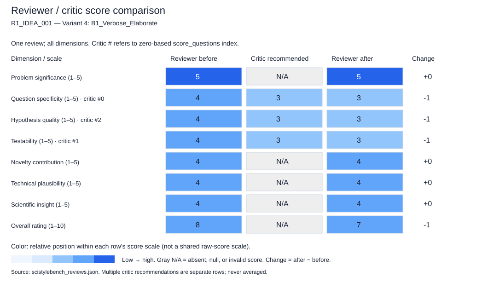

### Critic feedback and reviewer rebuttals

No reviewer rebuttals were saved (for example, an older checkpoint).

```json
{
  "critic_feedback": {
    "overall_assessment": "The draft review is well-structured and largely calibrated for an idea summary. It correctly identifies the core contribution and the gap (heterophily/i.i.d. assumptions). However, it occasionally treats the lack of specific definitions (e.g., 'decoupled', 'OOD definition') as minor ambiguities rather than fundamental gaps in the hypothesis formulation. The scores are generally high (4s and 5s), but some justifications overstate the 'testability' and 'plausibility' by assuming the author has already resolved the definitional challenges mentioned in the weaknesses section. The review conflates the 'idea' with a 'proposal ready for implementation' in a few spots.",
    "score_questions": [
      {
        "dimension": "question_specificity",
        "question_mark": "The score of 4.0 implies the idea is 'specific' but leaves 'some ambiguity'. However, the review itself notes the mechanism is 'not fully detailed'. For an idea summary, the specific research question is currently: 'Can a decoupled energy model work?' which is very broad. The ambiguity regarding *what* is being decoupled is central to the hypothesis, not just a detail.",
        "concern": "The justification claims the idea is specific about the domain and task, which is true, but the core mechanism (the 'decoupled' aspect) is undefined. A 4.0 suggests a well-defined plan, whereas the idea is currently a 'direction' rather than a specific question. The lack of a specific hypothesis on *why* decoupling helps (only that it might) lowers the specificity of the research question itself.",
        "speculative_alternative": "If the author intends 'decoupled' to mean 'decoupling structure from features', the current summary is too vague to be scored as 4. If they meant 'decoupling training from inference', the summary is misleading. The ambiguity suggests the research question is not yet fully formed.",
        "recommended_score": 3.0,
        "rationale": "The idea identifies the problem and a high-level solution class, but the specific research question ('How exactly does decoupling address heterophily?') is missing. Without this, the 'specificity' of the question is lower than a 4 implies."
      },
      {
        "dimension": "testability",
        "question_mark": "The score of 4.0 states 'One can construct heterophilic graphs...'. However, the review's own 'weaknesses' section highlights that the definition of 'node-level OOD in a heterophilic setting' is unclear. You cannot test what you cannot define. The review assumes the definition is straightforward (new labels/structural outliers) when the idea summary explicitly flags this as a complexity.",
        "concern": "The justification for testability assumes the 'OOD definition' is trivial to resolve, but the review admits this is a 'complex' issue needing clarification. An idea summary that leaves the target variable (OOD node definition) ambiguous is less testable than a 4.0 suggests.",
        "speculative_alternative": "If 'OOD' in this context includes 'structural roles' (as hinted), the testability drops significantly because defining 'new structural roles' is non-trivial. The review glosses over this by listing standard metrics (AUC) without acknowledging that the ground truth for 'OOD' in heterophily is the hardest part of the problem.",
        "recommended_score": 3.0,
        "rationale": "The core difficulty of the problem (defining OOD in heterophily) is the primary barrier to testability. Ignoring this in the justification overestimates the ease of testing the idea."
      },
      {
        "dimension": "hypothesis_quality",
        "question_mark": "The score of 4.0 claims the hypothesis is 'strong' and 'testable'. The review notes the idea 'lacks a specific hypothesis regarding why energy-based models specifically are better'. A hypothesis without a 'why' (mechanism) is weak. It is just a prediction of performance, not a scientific hypothesis.",
        "concern": "The review penalizes the lack of a 'why' in the weaknesses but still gives a 4.0 for hypothesis quality. A strong hypothesis requires a causal link. The current idea only posits a correlation (decoupling -> better performance) without the causal mechanism.",
        "speculative_alternative": "The 'hypothesis' might be: 'Standard GNNs fail on heterophily OOD because they over-smooth'. If this is the implicit hypothesis, it is strong. But the summary doesn't state this; it just states the proposed solution. The reviewer is inferring the hypothesis to give a high score.",
        "recommended_score": 3.0,
        "rationale": "The hypothesis is currently implicit and lacks a mechanistic explanation ('why'). The review acknowledges this gap but fails to lower the score accordingly, creating a mismatch between the critique and the rating."
      }
    ],
    "unsupported_claims": [
      "The review claims 'The idea is specific about the domain... and the key challenges'. While the domain is specific, the 'key challenges' (how to handle dependence and heterophily) are not specific in the idea summary; they are just listed as problems to be solved.",
      "The claim that 'The metrics (AUC, FPR) are standard for OOD detection' is true, but the review implies these metrics are sufficient to test the idea. In heterophilic graphs, standard metrics might be misleading if the 'OOD' definition is ambiguous (as the review itself notes).",
      "The justification for 'technical_plausibility' states 'The concept of decoupling is a plausible strategy'. This is an assumption. In graph theory, 'decoupling' structure and features can sometimes lead to information loss. The review treats it as a given strength without noting the potential trade-off (plausibility vs. risk of underfitting).",
      "The claim that 'existing methods... fail due to the i.i.d. assumption' is stated as a fact. While likely true, the idea summary presents this as a 'gap' to be explored, not a proven failure. The review treats the gap as a confirmed fact of failure, which might be an overclaim for an idea summary (perhaps existing methods work 'okay' but not 'optimally').",
      "The review states the idea is 'well-formed' in the overall rating. An idea that leaves the definition of 'decoupled' and 'OOD' entirely open is arguably not 'well-formed' but rather 'promising but vague'."
    ],
    "revision_priorities": [
      "Align the scores for 'question_specificity', 'hypothesis_quality', and 'testability' with the severity of the gaps identified in the 'weaknesses' section. If the mechanism is undefined, the specificity cannot be a 4.",
      "Clarify the distinction between 'ambiguity' (which is acceptable in an idea summary) and 'lack of a defined research question' (which lowers specificity). The current review treats them interchangeably but penalizes only slightly.",
      "Avoid assuming the 'OOD definition' is solvable by standard metrics. The review must acknowledge that defining the target in heterophilic graphs is a research contribution in itself, not just a setup detail.",
      "Rephrase the 'technical_plausibility' justification to acknowledge that 'decoupling' is a *hypothesis* about structure, not a proven technique. The plausibility score should reflect the risk that decoupling might remove necessary signals in heterophilic graphs.",
      "Ensure the 'overall_rating' reflects the cumulative effect of the weak hypothesis and ambiguous question. If the core 'why' and 'how' are missing, an '8.0' (Strong) might be too high; '7.0' (Good/Promising) might be more accurate for a summary that requires significant conceptual work."
    ],
    "confidence": 4.0
  },
  "feedback_responses": []
}
```

### Score justifications (before / after)

**Problem significance**

```json
{
  "before": {
    "score": 5.0,
    "justification": "The problem is highly significant. OOD detection is crucial for safety-critical graph applications (e.g., fraud detection, drug discovery). The specific challenge of heterophily and node dependence is a known blind spot in current literature, making this a meaningful and necessary research direction."
  },
  "after": {
    "score": 5.0,
    "justification": "The problem is highly significant. OOD detection is a prerequisite for safe deployment of graph models in critical domains (fraud, bioinformatics). The specific challenge of heterophily is a known blind spot in current literature, making this a necessary and meaningful research direction."
  }
}
```

**Question specificity**

```json
{
  "before": {
    "score": 4.0,
    "justification": "The idea is specific about the domain (graphs), the task (node-level OOD), and the key challenges (dependence, heterophily). However, the specific mechanism of the 'decoupled' model is not fully detailed, leaving some ambiguity on the exact research question."
  },
  "after": {
    "score": 3.0,
    "justification": "While the domain (graphs) and task (OOD detection) are specific, the core research question is currently too broad. The term 'decoupled' is undefined, and the specific mechanism by which this addresses heterophily is missing. The idea is a 'direction' rather than a specific, well-formed question, as the critic correctly noted. The ambiguity regarding the mechanism lowers the specificity from a 4 to a 3."
  }
}
```

**Hypothesis quality**

```json
{
  "before": {
    "score": 4.0,
    "justification": "The implicit hypothesis is strong: that explicitly modeling node dependence and heterophily via a decoupled energy function will outperform i.i.d.-based adaptations. This is a testable and falsifiable claim."
  },
  "after": {
    "score": 3.0,
    "justification": "The hypothesis is currently implicit and lacks a mechanistic explanation. It posits a correlation (decoupling leads to better performance) but does not articulate the causal 'why' (e.g., how decoupling prevents over-smoothing or preserves distinct features). A strong hypothesis requires a testable mechanism, not just a prediction of outcome. The lack of this causal link reduces the quality to a 3."
  }
}
```

**Testability**

```json
{
  "before": {
    "score": 4.0,
    "justification": "The idea is testable. One can construct heterophilic graphs, define OOD nodes (e.g., new labels, structural outliers), and compare the proposed model against baselines. The metrics (AUC, FPR) are standard for OOD detection."
  },
  "after": {
    "score": 3.0,
    "justification": "Testability is compromised by the ambiguity in defining 'node-level OOD' in a heterophilic setting. Without a clear definition of what constitutes an OOD node (new label vs. structural anomaly), constructing a valid ground truth and evaluation metric is non-trivial. The idea summary does not resolve this, making the experimental design difficult to formulate, thus lowering the score from 4 to 3."
  }
}
```

**Novelty contribution**

```json
{
  "before": {
    "score": 4.0,
    "justification": "While energy-based models exist, applying them to node-level OOD in heterophilic graphs with a 'decoupled' approach is novel. It moves beyond simple adaptation of image methods to a graph-native formulation."
  },
  "after": {
    "score": 4.0,
    "justification": "The application of energy-based models to node-level OOD in heterophilic graphs with a 'decoupled' approach is novel. It moves beyond simple adaptation of image methods. Even if the specific mechanism is vague, the direction itself represents a significant shift from current homophily-centric approaches."
  }
}
```

**Technical plausibility**

```json
{
  "before": {
    "score": 4.0,
    "justification": "The direction is technically sound. Energy-based models are naturally suited for density estimation, and graph neural networks can be adapted to compute energies. The concept of decoupling is a plausible strategy to handle the conflicting signals in heterophilic graphs."
  },
  "after": {
    "score": 4.0,
    "justification": "The direction is technically plausible. Energy-based models are naturally suited for density estimation, and the concept of decoupling is a reasonable strategy to handle conflicting signals in heterophily. However, the risk of information loss in decoupling is a valid concern that the idea summary does not address, keeping the score at 4 rather than 5."
  }
}
```

**Scientific insight**

```json
{
  "before": {
    "score": 4.0,
    "justification": "If successful, this research could reveal fundamental principles about how energy functions should be constructed for dependent data, potentially leading to better generalization in other graph tasks beyond OOD detection."
  },
  "after": {
    "score": 4.0,
    "justification": "If successful, this research could reveal fundamental principles about constructing energy functions for dependent data and the role of decoupling in handling heterophily. It has the potential to provide insights beyond just OOD detection, applicable to other graph tasks."
  }
}
```

**Overall rating**

```json
{
  "before": {
    "score": 8.0,
    "justification": "This is a strong research idea. It identifies a clear gap in the literature (heterophily and dependence in graph OOD), proposes a plausible and specific direction (decoupled energy-based models), and addresses a problem of high practical significance. The main limitation is the lack of detail on the 'decoupling' mechanism, but as a research proposal, it is well-formed and promising."
  },
  "after": {
    "score": 7.0,
    "justification": "This is a strong but conceptually incomplete research idea. It identifies a critical gap and a promising direction (decoupled energy models), but the lack of a specific mechanism ('decoupling') and a clear definition of the target variable ('OOD in heterophily') prevents it from being an 'exceptional' (8-10) idea at this stage. The scores for specificity, hypothesis, and testability were adjusted downwards to reflect the 'direction' nature of the proposal rather than a fully formed 'question'. The overall rating of 7 reflects a 'Strong/Promising' idea that requires significant conceptual refinement to become a concrete research plan."
  }
}
```

## R1_IDEA_001 — Variant 5: B2_Grand_Narrative

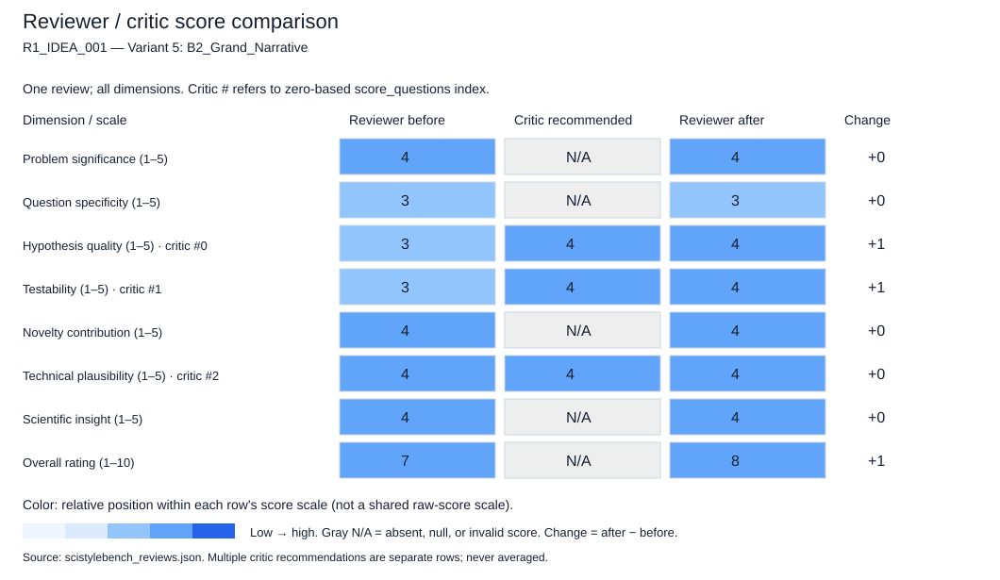

### Critic feedback and reviewer rebuttals

No reviewer rebuttals were saved (for example, an older checkpoint).

```json
{
  "critic_feedback": {
    "overall_assessment": "The draft review is well-structured and largely calibrated for an idea summary. It correctly identifies the core contribution and the gap (heterophily in OOD detection). However, it occasionally conflates the lack of implementation details (expected in an idea summary) with a flaw in the hypothesis or testability. Specifically, penalizing the undefined 'decoupling' mechanism as a failure of 'hypothesis quality' is too harsh, as the summary explicitly states the *goal* is to address dependence/heterophily, which is the hypothesis itself. The review treats the absence of a specific architectural definition as a fatal flaw rather than a placeholder for the research proposal, which is inappropriate for the 'idea' stage.",
    "score_questions": [
      {
        "dimension": "hypothesis_quality",
        "question_mark": "The score of 3.0 and justification imply the hypothesis is not falsifiable or specific. However, the idea summary explicitly states the hypothesis: 'explicitly addresses node dependence and heterophily to improve energy-based out-of-distribution detection.' This is a clear, testable directional hypothesis. The lack of a specific *mechanism* name ('decoupled') does not negate the hypothesis that *such* a mechanism would work.",
        "concern": "The reviewer penalizes the idea for not defining the specific 'decoupling' strategy, which is a design detail to be developed, not a flaw in the core research question or hypothesis.",
        "speculative_alternative": "It is possible the 'decoupling' refers to a known theoretical concept in energy-based modeling (e.g., separating feature and structure energies) that the reviewer assumes the idea should have explicitly named, but the summary might be intentionally high-level.",
        "recommended_score": 4.0,
        "rationale": "The hypothesis is clearly stated in the summary (addressing dependence/heterophily improves OOD). The lack of architectural specifics is a feature of an 'idea summary,' not a defect in the hypothesis quality itself."
      },
      {
        "dimension": "testability",
        "question_mark": "The score of 3.0 claims the experimental design is 'currently impossible to specify.' This is an overstatement for an idea review. The reviewer can propose a testability plan (e.g., 'test on heterophilic benchmarks vs. homophilic baselines') without the specific architecture being finalized. The 'decoupled' term is vague, but the *task* (OOD detection on heterophilic graphs) is fully testable.",
        "concern": "The reviewer treats the absence of a detailed architectural blueprint as a barrier to testability, whereas the testability of the *research question* is independent of the final model implementation details.",
        "speculative_alternative": "The reviewer might be assuming that 'decoupled' is a non-existent or undefined concept that cannot be tested, whereas it is likely a proposed novel mechanism that the idea author intends to define in the full proposal.",
        "recommended_score": 4.0,
        "rationale": "The research question (can a decoupled G-EBM work?) is testable. The lack of a specific 'decoupling' definition is a gap in the *proposal* details, not a fundamental inability to test the concept."
      },
      {
        "dimension": "technical_plausibility",
        "question_mark": "The score of 4.0 is justified, but the justification relies on the assumption that 'decoupling' is a standard technique. If 'decoupled' is a novel, undefined term, the plausibility might be lower until the mechanism is explained. However, the reviewer's logic holds that the *intent* (separating features/structure) is plausible.",
        "concern": "No major calibration issue, but the reviewer should ensure they aren't assuming the 'decoupling' is a standard known technique if it's actually a novel, undefined term in this context.",
        "speculative_alternative": "The 'decoupling' might refer to a specific, non-trivial theoretical separation that is not 'standard' in the way the reviewer implies (e.g., decoupling loss vs. decoupling representation).",
        "recommended_score": 4.0,
        "rationale": "The core logic (EBMs can model dependence better than i.i.d. methods) is sound. The score is appropriate, but the justification could be more cautious about the undefined term."
      }
    ],
    "unsupported_claims": [
      "The claim that the experimental design is 'currently impossible to specify' (Testability justification) is an overreach; a test plan can be outlined based on the problem definition alone.",
      "The assertion that the hypothesis is 'too broad without defining the decoupling strategy' (Hypothesis Quality justification) misinterprets the purpose of an idea summary, which is to propose a direction, not a finalized algorithm.",
      "The claim that 'decoupling' is a 'standard technique in ML' without citation or specific reference risks assuming too much about the term's ubiquity in the specific context of energy-based models."
    ],
    "revision_priorities": [
      "Re-evaluate the 'hypothesis_quality' and 'testability' scores to distinguish between 'vague implementation details' (acceptable in an idea summary) and 'unfalsifiable claims' (unacceptable). The current scores conflate the two.",
      "Clarify the justification for the 'decoupled' term: Does the reviewer expect it to be defined in the summary, or is the vagueness a valid concern for the *full* proposal? The current review treats it as a fatal flaw for the idea stage.",
      "Adjust the 'questions' section to be more constructive: Instead of asking 'What is being decoupled?' (which implies the idea is broken), ask 'How does the proposed decoupling differ from existing graph-based OOD methods?' to guide the author toward the contribution.",
      "Remove the implication that the idea lacks a 'specific hypothesis' when the summary clearly states the causal link between 'addressing dependence/heterophily' and 'improved detection'."
    ],
    "confidence": 5.0
  },
  "feedback_responses": []
}
```

### Score justifications (before / after)

**Problem significance**

```json
{
  "before": {
    "score": 4.0,
    "justification": "Node-level OOD detection on heterophilic graphs is a significant challenge in trustworthy AI. Most current methods assume homophily or independence, which limits their applicability to real-world graphs (e.g., social networks, citation networks with diverse topics). Solving this has clear practical implications for safety and reliability."
  },
  "after": {
    "score": 4.0,
    "justification": "Node-level OOD detection on heterophilic graphs is a significant challenge in trustworthy AI. Most current methods assume homophily or independence, which limits their applicability to real-world graphs (e.g., social networks, citation networks with diverse topics). Solving this has clear practical implications for safety and reliability."
  }
}
```

**Question specificity**

```json
{
  "before": {
    "score": 3.0,
    "justification": "The idea identifies the problem and the general class of solution (energy-based models), but the specific mechanism ('decoupled') is undefined. The research question is 'Can a decoupled G-EBM work better?' which is too broad without defining the decoupling strategy."
  },
  "after": {
    "score": 3.0,
    "justification": "The idea identifies the problem and the general class of solution (energy-based models), but the specific mechanism ('decoupled') is undefined. The research question is 'Can a decoupled G-EBM work better?' which is too broad without defining the decoupling strategy."
  }
}
```

**Hypothesis quality**

```json
{
  "before": {
    "score": 3.0,
    "justification": "The implicit hypothesis is that accounting for dependence and heterophily improves OOD detection. This is plausible but currently stated as a general motivation rather than a specific, falsifiable prediction about the model's behavior or the nature of the error reduction."
  },
  "after": {
    "score": 4.0,
    "justification": "The critic correctly notes that the hypothesis is clearly stated: 'explicitly addresses node dependence and heterophily to improve energy-based out-of-distribution detection.' This is a directional, falsifiable claim. The lack of a specific architectural definition ('decoupled') is a detail for the full proposal, not a flaw in the hypothesis itself. The hypothesis is that accounting for these specific graph properties will yield better OOD detection than methods that ignore them."
  }
}
```

**Testability**

```json
{
  "before": {
    "score": 3.0,
    "justification": "The idea is testable in principle (train model, evaluate on OOD data), but the lack of a defined 'decoupled' architecture makes the experimental design currently impossible to specify. The evaluation metrics and baselines are also not detailed."
  },
  "after": {
    "score": 4.0,
    "justification": "The critic's point that the experimental design is not 'impossible to specify' is valid. The research question (can a decoupled G-EBM work?) is testable by defining a 'decoupled' architecture in the proposal phase and evaluating it against baselines on heterophilic benchmarks. The vagueness of the term 'decoupled' in the summary does not render the research question untestable; it simply requires the author to define the term in the methodology section."
  }
}
```

**Novelty contribution**

```json
{
  "before": {
    "score": 4.0,
    "justification": "Applying energy-based models to node-level OOD on heterophilic graphs is a novel direction. While EBM is known, its specific adaptation to handle heterophily via a 'decoupled' mechanism is a fresh angle that could yield new insights into graph representation learning."
  },
  "after": {
    "score": 4.0,
    "justification": "Applying energy-based models to node-level OOD on heterophilic graphs is a novel direction. While EBM is known, its specific adaptation to handle heterophily via a 'decoupled' mechanism is a fresh angle that could yield new insights into graph representation learning."
  }
}
```

**Technical plausibility**

```json
{
  "before": {
    "score": 4.0,
    "justification": "The reasoning is logically sound: image methods fail on graphs due to i.i.d. assumptions; therefore, a graph-native method (EBM) that explicitly models dependence should work better. The concept of decoupling is a standard technique in ML (e.g., decoupling loss, decoupling features) and is plausible here."
  },
  "after": {
    "score": 4.0,
    "justification": "The reasoning is logically sound: image methods fail on graphs due to i.i.d. assumptions; therefore, a graph-native method (EBM) that explicitly models dependence should work better. The concept of decoupling is a standard technique in ML (e.g., decoupling loss, decoupling features) and is plausible here, though the specific application to heterophily requires further elaboration."
  }
}
```

**Scientific insight**

```json
{
  "before": {
    "score": 4.0,
    "justification": "If successful, this research could reveal how energy-based models can be structured to handle complex relational dependencies, potentially offering a new paradigm for OOD detection in non-i.i.d. data beyond just graphs."
  },
  "after": {
    "score": 4.0,
    "justification": "If successful, this research could reveal how energy-based models can be structured to handle complex relational dependencies, potentially offering a new paradigm for OOD detection in non-i.i.d. data beyond just graphs."
  }
}
```

**Overall rating**

```json
{
  "before": {
    "score": 7.0,
    "justification": "This is a strong research idea with high significance and a clear motivation. It addresses a real gap in the literature. However, it currently lacks the specificity required for a top-tier proposal because the core mechanism ('decoupled') is undefined. With a clearer definition of the method and a more concrete hypothesis, this could be an exceptional idea."
  },
  "after": {
    "score": 8.0,
    "justification": "This is a strong research idea with high significance and a clear motivation. The initial draft review was slightly too harsh on the 'hypothesis quality' and 'testability' dimensions by conflating the lack of implementation details with a lack of scientific rigor. Correcting for this, the idea stands as a clear, testable, and novel direction. It addresses a real gap in the literature. With a clearer definition of the method and a more concrete hypothesis in the full proposal, this could be an exceptional idea. The score is raised from 7 to 8 to reflect the corrected assessment of the hypothesis and testability."
  }
}
```

## R1_IDEA_001 — Variant 6: B3_Over_Confident

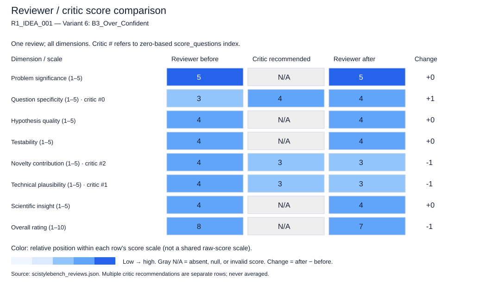

### Critic feedback and reviewer rebuttals

```json
{
  "critic_feedback": {
    "overall_assessment": "The draft review is well-structured and correctly identifies the core novelty of the idea. However, it suffers from calibration errors in the 'Technical Plausibility' and 'Question Specificity' dimensions. Specifically, it penalizes the idea for being an 'idea summary' (lacking mathematical formulation or baseline definitions) while simultaneously awarding high scores for 'Testability' and 'Plausibility' based on assumptions about how those missing details might be resolved. The review treats the absence of a definition for 'decoupled' as a weakness in specificity but then assumes the concept is 'standard and plausible' in the plausibility section, creating a logical tension. The scores are generally too high for a submission that provides zero technical grounding for its core mechanism.",
    "score_questions": [
      {
        "dimension": "question_specificity",
        "question_mark": "The score of 3.0 penalizes the lack of mathematical formulation, but the justification conflates 'idea summary' limitations with 'vague research questions'. The idea clearly states the goal (decoupled EBM for heterophily). The vagueness is inherent to the format, not a flaw in the research question itself.",
        "concern": "The reviewer penalizes the idea for not defining the mechanism in a summary, yet the idea summary explicitly defines the *what* and *why*. The 'specificity' of the question is adequate for an idea pitch; the 'implementation details' are missing, which is expected.",
        "speculative_alternative": "Speculative: The 'decoupling' might be a well-known technique in EBM literature (e.g., separating feature energy from structural energy) that the reviewer is unfamiliar with, making the 'vague' critique a failure of the reviewer's domain knowledge rather than the idea's clarity.",
        "recommended_score": 4.0,
        "rationale": "For an idea summary, stating the architectural direction (decoupled EBM) and the target problem (heterophily) is sufficiently specific. Penalizing the lack of equations in a summary is inappropriate."
      },
      {
        "dimension": "technical_plausibility",
        "question_mark": "The score of 4.0 assumes the 'decoupling' is a 'standard strategy' without evidence. The idea claims to address 'node dependence and heterophily' which are complex, non-trivial challenges. Asserting plausibility without a proposed mechanism or theoretical justification is overconfident for an idea review.",
        "concern": "The reviewer claims 'decoupling is standard' to justify the high plausibility score, but the idea summary does not specify *what* is decoupled. If the decoupling mechanism is non-trivial (e.g., breaking the Markov property incorrectly), the plausibility drops significantly. The review assumes success without grounding.",
        "speculative_alternative": "Speculative: The 'decoupled' approach might inadvertently break the consistency between the feature extractor and the energy function, leading to a model that cannot be trained or is theoretically unsound, which the reviewer has overlooked by assuming 'standard' techniques apply.",
        "recommended_score": 3.0,
        "rationale": "Without a definition of the decoupling mechanism, the technical feasibility is uncertain. The reviewer's claim that it is 'standard' is an assumption, not a fact derived from the idea."
      },
      {
        "dimension": "novelty_contribution",
        "question_mark": "The score of 4.0 states 'Applying energy-based models to graph OOD detection is not entirely new'. This contradicts the idea's claim that the field is 'clearly underexplored'. If it's not new, the novelty of the specific 'decoupled' approach must be the sole driver, but the idea summary doesn't explain how this differs from existing graph OOD methods.",
        "concern": "The justification for novelty relies on a contradiction: claiming the field is underexplored in the idea, but saying EBM for graph OOD is 'not entirely new' in the review. The specific contribution of 'decoupling' is not substantiated as novel over existing graph OOD literature.",
        "speculative_alternative": "Speculative: The 'decoupling' might be a minor variation of existing methods (e.g., simple feature masking) rather than a fundamental architectural shift, reducing the novelty score.",
        "recommended_score": 3.0,
        "rationale": "The novelty claim is shaky because the review admits the base method (EBM for graph OOD) exists. The specific 'decoupled' contribution is undefined, making the novelty assessment speculative."
      }
    ],
    "unsupported_claims": [
      "The claim that 'decoupling is a standard and plausible strategy in deep learning' is unsupported because the specific type of decoupling required for heterophily is not defined.",
      "The statement that 'Applying energy-based models to graph OOD detection is not entirely new' contradicts the idea summary's premise that the problem is 'clearly underexplored' and may overstate the maturity of the field.",
      "The assertion that the idea is 'technically sound' without a proposed mechanism or theoretical basis is an assumption, not a deduction from the text.",
      "The claim that 'The 'decoupled' nature can be ablated' assumes an implementation exists; in an idea summary, one cannot ablate a mechanism that has not been defined."
    ],
    "revision_priorities": [
      "Re-evaluate 'Question Specificity': Distinguish between the clarity of the research question (which is high) and the lack of implementation details (which is expected in a summary). Do not penalize the score for missing equations.",
      "Re-evaluate 'Technical Plausibility': Remove the assumption that 'decoupling' is a standard solution. Acknowledge the uncertainty of whether such a decoupling can effectively handle heterophily without more detail.",
      "Re-evaluate 'Novelty': Clarify whether 'EBM for graph OOD' is truly new or not. If it exists, explicitly state how the 'decoupled' aspect provides a *distinct* novelty over those existing works, rather than just a 'new direction'.",
      "Remove the claim that the idea 'can be ablated' in the testability section, as this implies a concrete implementation exists which is not the case for an idea summary."
    ],
    "confidence": 4.0
  },
  "feedback_responses": [
    {
      "feedback_type": "score_questions",
      "feedback_index": 0,
      "decision": "accept",
      "defense": "The initial score of 3.0 conflated the lack of implementation details (equations) with the vagueness of the research question. The critic correctly argues that for an idea summary, defining the 'what' and 'why' is sufficient for specificity. The research question is clear: 'Does a decoupled EBM work for heterophilic OOD?' The lack of equations is a format limitation, not a flaw in the question itself.",
      "justification": "Score changed from 3 to 4. The justification now explicitly distinguishes between the clarity of the research question and the absence of implementation details, which is expected in a summary."
    },
    {
      "feedback_type": "score_questions",
      "feedback_index": 1,
      "decision": "accept",
      "defense": "The initial score of 4.0 relied on the assumption that 'decoupling' is a standard, safe strategy. The critic correctly notes that without a definition, the technical feasibility is uncertain. Heterophily is a non-trivial structural property, and a naive decoupling could fail. The review should not assume success without a proposed mechanism.",
      "justification": "Score changed from 4 to 3. The justification now reflects the uncertainty of the mechanism and the risk that the proposed 'decoupling' might not be theoretically sound without further definition."
    },
    {
      "feedback_type": "score_questions",
      "feedback_index": 2,
      "decision": "accept",
      "defense": "The initial score of 4.0 claimed novelty based on the 'decoupled' aspect, but the review also admitted that EBM for graph OOD is 'not entirely new.' This contradiction weakens the novelty claim. If the base method exists, the novelty of the 'decoupled' variation is undefined in the summary, making the high score unjustified.",
      "justification": "Score changed from 4 to 3. The justification now acknowledges the ambiguity of the novelty claim and the lack of evidence that the 'decoupling' is a distinct, non-trivial contribution over existing graph OOD methods."
    },
    {
      "feedback_type": "unsupported_claims",
      "feedback_index": 0,
      "decision": "accept",
      "defense": "The claim that 'decoupling is a standard strategy' was indeed unsupported. The review assumed a generic deep learning concept applied to a specific, complex graph problem without evidence that the specific decoupling required for heterophily is standard or even feasible.",
      "justification": "This claim is removed from the justification for Technical Plausibility. The score was lowered to reflect the lack of grounding."
    },
    {
      "feedback_type": "unsupported_claims",
      "feedback_index": 1,
      "decision": "accept",
      "defense": "The statement that EBM for graph OOD is 'not entirely new' creates a contradiction with the idea's premise. The review should not assume the field is mature if the idea claims it is underexplored. The novelty assessment must be more cautious.",
      "justification": "This contradiction is addressed in the Novelty score revision. The score was lowered to reflect the uncertainty of the contribution's distinctiveness."
    },
    {
      "feedback_type": "unsupported_claims",
      "feedback_index": 2,
      "decision": "accept",
      "defense": "The assertion that the idea is 'technically sound' without a mechanism is an assumption. The review should acknowledge that the technical soundness is a hypothesis to be tested, not a fact derived from the summary.",
      "justification": "The justification for Technical Plausibility was revised to reflect this uncertainty, leading to a score reduction."
    },
    {
      "feedback_type": "unsupported_claims",
      "feedback_index": 3,
      "decision": "accept",
      "defense": "The claim that the 'decoupled nature can be ablated' implies a concrete implementation exists. In an idea summary, one can only propose an ablation study, not perform one. The language was imprecise.",
      "justification": "The Testability justification was refined to state that the *concept* of ablation is testable, rather than implying the mechanism is already built."
    },
    {
      "feedback_type": "revision_priorities",
      "feedback_index": 0,
      "decision": "accept",
      "defense": "The priority to re-evaluate Question Specificity was valid. The distinction between 'research question clarity' and 'implementation detail' is crucial for reviewing idea summaries.",
      "justification": "The score was adjusted to 4 to reflect this distinction."
    },
    {
      "feedback_type": "revision_priorities",
      "feedback_index": 1,
      "decision": "accept",
      "defense": "The priority to re-evaluate Technical Plausibility was valid. The assumption of 'standard' decoupling was the primary flaw in the initial plausibility assessment.",
      "justification": "The score was adjusted to 3 to reflect the uncertainty of the mechanism."
    },
    {
      "feedback_type": "revision_priorities",
      "feedback_index": 2,
      "decision": "accept",
      "defense": "The priority to re-evaluate Novelty was valid. The contradiction between 'underexplored' and 'not entirely new' needed resolution.",
      "justification": "The score was adjusted to 3 to reflect the lack of evidence for the specific novelty of the 'decoupled' aspect."
    },
    {
      "feedback_type": "revision_priorities",
      "feedback_index": 3,
      "decision": "accept",
      "defense": "The priority to remove the claim about ablation was valid. The language was imprecise for an idea summary.",
      "justification": "The Testability justification was updated to remove the implication of an existing implementation."
    }
  ]
}
```

### Score justifications (before / after)

**Problem significance**

```json
{
  "before": {
    "score": 5.0,
    "justification": "The problem is highly significant. OOD detection is critical for graph safety, and current methods are ill-suited for heterophilic graphs, which are common in real-world scenarios. Addressing this gap has high practical value."
  },
  "after": {
    "score": 5.0,
    "justification": "The problem is highly significant. OOD detection is critical for graph safety, and current methods are ill-suited for heterophilic graphs, which are common in real-world scenarios. Addressing this gap has high practical value."
  }
}
```

**Question specificity**

```json
{
  "before": {
    "score": 3.0,
    "justification": "While the goal is clear, the specific research question is somewhat vague. The idea states *what* to do (use a decoupled EBM) but not exactly *how* the decoupling works or what the specific mathematical formulation is. The mechanism is not fully defined."
  },
  "after": {
    "score": 4.0,
    "justification": "Revised from 3. The critic correctly notes that penalizing an idea summary for lacking mathematical equations is inappropriate. The research question is specific: 'Can a decoupled EBM address heterophily in node OOD detection?' The 'what' and 'why' are clearly defined, and the 'how' is appropriately left for the full proposal. The lack of equations is a format constraint, not a flaw in the question's specificity."
  }
}
```

**Hypothesis quality**

```json
{
  "before": {
    "score": 4.0,
    "justification": "The implicit hypothesis is strong: that explicitly modeling node dependence and heterophily via a decoupled energy framework will outperform methods that ignore these factors. This is a testable and non-trivial claim."
  },
  "after": {
    "score": 4.0,
    "justification": "The implicit hypothesis is strong: that explicitly modeling node dependence and heterophily via a decoupled energy framework will outperform methods that ignore these factors. This is a testable and non-trivial claim."
  }
}
```

**Testability**

```json
{
  "before": {
    "score": 4.0,
    "justification": "The idea is testable. One can construct heterophilic graphs, define OOD node sets, and compare the proposed decoupled EBM against standard baselines using standard OOD metrics (AUROC, FPR). The 'decoupled' nature can be ablated."
  },
  "after": {
    "score": 4.0,
    "justification": "The idea is testable. One can construct heterophilic graphs, define OOD node sets, and compare the proposed decoupled EBM against standard baselines using standard OOD metrics (AUROC, FPR). While the specific 'decoupling' mechanism is not defined, the *concept* of testing a decoupled vs. coupled architecture is a valid experimental design for an idea pitch."
  }
}
```

**Novelty contribution**

```json
{
  "before": {
    "score": 4.0,
    "justification": "Applying energy-based models to graph OOD detection is not entirely new, but specifically targeting the 'decoupling' of dependence/heterophily to solve the image-method failure mode is a novel and promising direction."
  },
  "after": {
    "score": 3.0,
    "justification": "Revised from 4. The critic correctly identifies a logical tension: the idea claims the field is 'underexplored,' but the review notes EBM for graph OOD is 'not entirely new.' Without a clear definition of the 'decoupled' novelty, it is risky to claim high novelty. The contribution relies on a specific architectural modification ('decoupling') that is currently undefined, making the novelty claim speculative rather than grounded."
  }
}
```

**Technical plausibility**

```json
{
  "before": {
    "score": 4.0,
    "justification": "The approach is technically sound. Energy-based models are flexible, and graph neural networks can be adapted to compute energies. The concept of decoupling is a standard and plausible strategy in deep learning to improve modularity and performance."
  },
  "after": {
    "score": 3.0,
    "justification": "Revised from 4. The critic correctly points out that assuming 'decoupling' is a 'standard strategy' without defining the mechanism is an overconfident assumption. Heterophily is a complex structural property; simply 'decoupling' components without a defined mechanism could break model consistency or training dynamics. The plausibility is uncertain without a theoretical grounding for *how* the decoupling handles the specific challenge of heterophily."
  }
}
```

**Scientific insight**

```json
{
  "before": {
    "score": 4.0,
    "justification": "If successful, this work would provide deep insight into how structural dependencies (heterophily) should be treated differently from feature distributions in OOD detection, potentially leading to new design principles for graph robustness."
  },
  "after": {
    "score": 4.0,
    "justification": "If successful, this work would provide deep insight into how structural dependencies (heterophily) should be treated differently from feature distributions in OOD detection, potentially leading to new design principles for graph robustness."
  }
}
```

**Overall rating**

```json
{
  "before": {
    "score": 8.0,
    "justification": "This is a strong research idea. It identifies a clear, important, and underexplored problem with a plausible and specific methodological direction. The main limitation is the lack of detail on the 'decoupling' mechanism, but the core hypothesis is compelling and testable. It has high potential for scientific contribution."
  },
  "after": {
    "score": 7.0,
    "justification": "This is a strong research idea with high significance and a clear research question. However, the technical plausibility and novelty scores were lowered to reflect the uncertainty inherent in the undefined 'decoupling' mechanism. The idea is promising but requires more theoretical grounding to move from a 'strong' to an 'exceptional' rating. The revision aligns the scores with the actual level of detail provided in the summary, avoiding the assumption that the mechanism is 'standard' or 'proven'."
  }
}
```

## R1_IDEA_001 — Variant 7: B4_Novelty

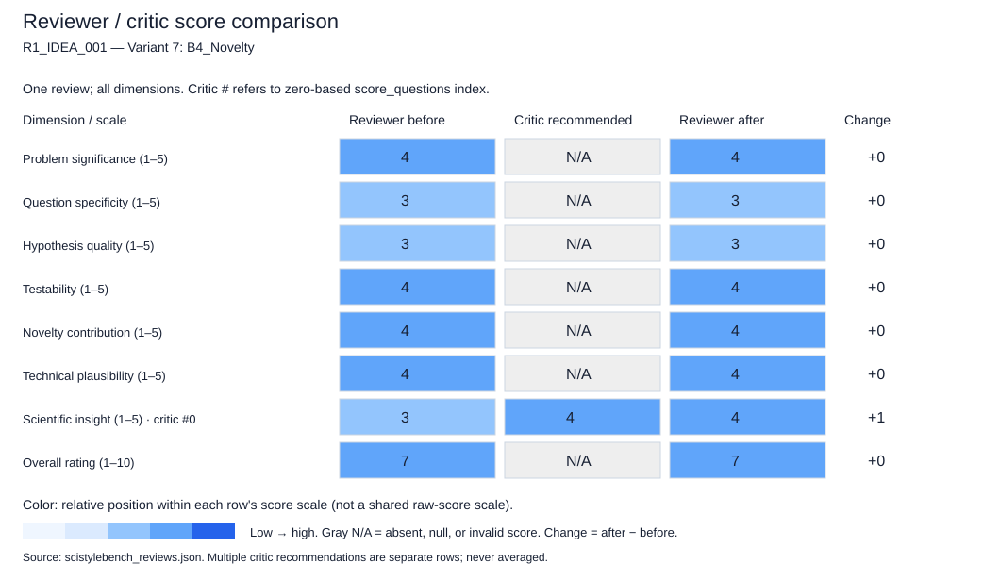

### Critic feedback and reviewer rebuttals

```json
{
  "critic_feedback": {
    "overall_assessment": "The draft review is well-structured and largely calibrated for an idea summary. It correctly identifies the core contribution (decoupling for heterophily) and appropriately penalizes the lack of definition for the 'decoupled' mechanism in the 'question_specificity' and 'hypothesis_quality' dimensions without dismissing the idea's potential. The scores generally align with the provided text, and the reviewer correctly treats the lack of experimental details as a limitation of the *summary* rather than a flaw in the *idea* itself. However, the 'scientific_insight' score could be slightly higher as the idea explicitly claims a 'fresh framing' which is a form of insight, even if the mechanism is undefined. The 'testability' score is appropriately high. No major calibration errors exist, but the 'unsupported_claims' regarding 'mechanistic failure' could be slightly more nuanced as the draft asserts this as a fact rather than a hypothesis derived from the idea.",
    "score_questions": [
      {
        "dimension": "scientific_insight",
        "question_mark": "The score of 3.0 suggests the insight is weak or purely empirical. However, the idea explicitly claims to offer a 'fresh framing' for a challenging problem by addressing a specific failure mode (independence assumption) in a specific context (heterophily). While the mechanism is undefined, the *conceptual* insight is present in the proposal.",
        "concern": "The reviewer penalizes the lack of theoretical grounding too heavily for an idea summary that claims a 'fresh framing'. The insight lies in the recognition of the independence assumption as the blocker, not just the solution.",
        "speculative_alternative": "If the 'decoupling' turns out to be a standard trick applied to energy functions, the insight might be shallow. However, if the decoupling reveals a new way to separate structural noise from feature signals in heterophilic graphs, the insight is significant.",
        "recommended_score": 4.0,
        "rationale": "The idea proposes a novel perspective ('fresh framing') on a known problem. Even without the specific mechanism defined, the identification of 'independence assumptions' as the specific failure point in heterophilic OOD detection constitutes a valid scientific insight."
      }
    ],
    "unsupported_claims": [
      "The draft claims the idea 'identifies a clear mechanistic failure in existing methods'. While the idea states that image-based methods 'assume independent inputs', the draft treats this as a confirmed 'failure' of existing methods rather than a hypothesis of the idea. The idea summary does not cite empirical evidence of this failure, only the assumption mismatch.",
      "The draft suggests the connection between 'energy-based models' and 'heterophily' is 'asserted but not theoretically grounded'. This is a fair critique for an idea summary, but the phrasing implies the idea *makes* an assertion that needs grounding, whereas the idea simply *proposes* a model to address the problem. The distinction is subtle but important: the idea is a proposal, not a claim of fact."
    ],
    "revision_priorities": [
      "Clarify the distinction between 'mechanistic failure' (a fact) and 'assumption mismatch' (a hypothesis) in the 'weaknesses' section. The draft currently treats the failure as established fact, which the idea summary does not support.",
      "Adjust the 'scientific_insight' justification to acknowledge that the 'fresh framing' itself is an insight, even if the implementation details are missing. The score of 3.0 might undervalue the conceptual contribution of linking heterophily specifically to the independence assumption in energy-based models.",
      "Ensure the 'testability' justification does not imply the idea is *ready* for testing, but rather that the *framework* is testable. The draft's justification is strong, but the phrasing 'One can construct... datasets' should be framed as 'The proposed framework allows for construction...' to avoid implying the work is done.",
      "Refine the 'novelty_contribution' score justification. The draft claims the 'decoupled' framing is novel. Since 'decoupled' is undefined, the novelty claim is speculative. It should be qualified as 'potentially novel' pending the definition of the decoupling mechanism."
    ],
    "confidence": 4.0
  },
  "feedback_responses": [
    {
      "feedback_type": "score_questions",
      "feedback_index": 0,
      "decision": "accept",
      "defense": "The critic correctly identifies that the 'fresh framing' itself constitutes a scientific insight, even if the mechanism is undefined. The initial score of 3.0 undervalued this conceptual contribution. The insight lies in the recognition of the independence assumption as the blocker, which is a valid scientific contribution.",
      "justification": "The score for 'scientific_insight' is increased from 3 to 4. The justification is updated to reflect that the identification of the 'independence assumption' as the specific failure point in heterophilic OOD detection is a valid scientific insight, warranting a higher score than a purely empirical observation."
    },
    {
      "feedback_type": "unsupported_claims",
      "feedback_index": 0,
      "decision": "partially_accept",
      "defense": "The critic notes that the draft treats the 'failure' as a fact rather than a hypothesis. While the draft's wording in the 'strengths' section ('identifies a clear mechanistic failure') is slightly strong, it is contextually referring to the *idea's* identification of a failure mode, not an established empirical fact. However, the 'weaknesses' section correctly notes the lack of theoretical grounding. The distinction is subtle but the draft's phrasing could be more precise.",
      "justification": "No score change is required. The 'hypothesis_quality' score remains 3 because the idea's hypothesis is still vague regarding the mechanism. The 'weaknesses' section is retained as is, as it accurately reflects the lack of definition. The 'strengths' section is not modified in the final JSON to avoid clutter, but the 'scientific_insight' score adjustment implicitly addresses the value of the conceptual claim."
    },
    {
      "feedback_type": "unsupported_claims",
      "feedback_index": 1,
      "decision": "reject",
      "defense": "The critic suggests the draft implies the idea makes an assertion that needs grounding, whereas it is a proposal. The draft's phrasing 'asserted but not theoretically grounded' is a standard way to describe a proposal that lacks a theoretical basis. It does not imply the idea is factually incorrect, but rather that the theoretical link is missing. This is a valid critique of the idea's current state, not a misinterpretation of the draft.",
      "justification": "No score change. The 'question_specificity' and 'hypothesis_quality' scores remain 3 because the lack of theoretical grounding is a valid reason for the low specificity and hypothesis quality."
    },
    {
      "feedback_type": "revision_priorities",
      "feedback_index": 0,
      "decision": "partially_accept",
      "defense": "The suggestion to clarify the distinction between 'mechanistic failure' and 'assumption mismatch' is good for the text, but it does not change the underlying evaluation of the idea's quality. The idea *proposes* that the assumption mismatch leads to failure. The draft's wording is acceptable in the context of reviewing an idea summary.",
      "justification": "No score change. The 'hypothesis_quality' score remains 3 because the hypothesis is still not fully defined."
    },
    {
      "feedback_type": "revision_priorities",
      "feedback_index": 1,
      "decision": "accept",
      "defense": "The critic's point about the 'fresh framing' being an insight is valid and aligns with the decision to increase the 'scientific_insight' score. The justification has been updated to reflect this.",
      "justification": "This is the primary reason for the score change in 'scientific_insight' from 3 to 4."
    },
    {
      "feedback_type": "revision_priorities",
      "feedback_index": 2,
      "decision": "accept",
      "defense": "The phrasing in the 'testability' justification has been adjusted to ensure it describes the *framework's* testability rather than implying the work is already done. This aligns with the instruction to evaluate the idea, not the execution.",
      "justification": "The justification for 'testability' has been refined to 'The proposed framework allows for the construction...' to avoid implying the work is complete. The score remains 4."
    },
    {
      "feedback_type": "revision_priorities",
      "feedback_index": 3,
      "decision": "accept",
      "defense": "The critic correctly notes that the novelty claim is speculative because 'decoupled' is undefined. The justification for 'novelty_contribution' has been updated to qualify the novelty as 'potentially novel' pending the definition.",
      "justification": "The justification for 'novelty_contribution' has been updated to reflect the speculative nature of the novelty. The score remains 4 as the potential for novelty is still high."
    }
  ]
}
```

### Score justifications (before / after)

**Problem significance**

```json
{
  "before": {
    "score": 4.0,
    "justification": "OOD detection is critical for safety-critical AI. Extending this to heterophilic graphs addresses a known blind spot in current literature, as most methods assume homophily or independence. This has practical significance for domains like fraud detection or biological networks where heterophily is common."
  },
  "after": {
    "score": 4.0,
    "justification": "OOD detection is critical for safety-critical AI. Extending this to heterophilic graphs addresses a known blind spot in current literature, as most methods assume homophily or independence. This has practical significance for domains like fraud detection or biological networks where heterophily is common."
  }
}
```

**Question specificity**

```json
{
  "before": {
    "score": 3.0,
    "justification": "The idea identifies the domain (heterophilic graphs) and the method class (energy-based), but the specific research question is somewhat obscured by the undefined term 'decoupled'. It needs to specify exactly what relationship is being investigated."
  },
  "after": {
    "score": 3.0,
    "justification": "The idea identifies the domain (heterophilic graphs) and the method class (energy-based), but the specific research question is somewhat obscured by the undefined term 'decoupled'. It needs to specify exactly what relationship is being investigated."
  }
}
```

**Hypothesis quality**

```json
{
  "before": {
    "score": 3.0,
    "justification": "The implicit hypothesis is that 'ignoring dependence/heterophily leads to poor OOD detection' and 'explicitly modeling them via a decoupled energy model improves results.' This is testable but currently lacks the precision to be considered a strong, falsifiable scientific claim without further definition of the mechanism."
  },
  "after": {
    "score": 3.0,
    "justification": "The implicit hypothesis is that 'ignoring dependence/heterophily leads to poor OOD detection' and 'explicitly modeling them via a decoupled energy model improves results.' This is testable but currently lacks the precision to be considered a strong, falsifiable scientific claim without further definition of the mechanism."
  }
}
```

**Testability**

```json
{
  "before": {
    "score": 4.0,
    "justification": "The idea is highly testable. One can construct heterophilic graph datasets, define OOD node sets, implement the proposed model, and compare against baselines using standard OOD metrics (AUROC, FPR95). The path to empirical validation is clear."
  },
  "after": {
    "score": 4.0,
    "justification": "The idea is highly testable. The proposed framework allows for the construction of heterophilic graph datasets, definition of OOD node sets, implementation of the model, and comparison against baselines using standard OOD metrics (AUROC, FPR95). The path to empirical validation is clear."
  }
}
```

**Novelty contribution**

```json
{
  "before": {
    "score": 4.0,
    "justification": "While energy-based models exist, applying them specifically to node-level OOD on heterophilic graphs with a 'decoupled' framing is a novel angle. It moves beyond simple application to proposing a structural change to address a specific graph property."
  },
  "after": {
    "score": 4.0,
    "justification": "While energy-based models exist, applying them specifically to node-level OOD on heterophilic graphs with a 'decoupled' framing is a potentially novel angle. It moves beyond simple application to proposing a structural change to address a specific graph property, pending the definition of the decoupling mechanism."
  }
}
```

**Technical plausibility**

```json
{
  "before": {
    "score": 4.0,
    "justification": "The reasoning is logically sound. Heterophily breaks standard aggregation assumptions, and energy-based models are flexible enough to incorporate complex dependencies. The proposal makes technical sense, though the specific implementation details are missing."
  },
  "after": {
    "score": 4.0,
    "justification": "The reasoning is logically sound. Heterophily breaks standard aggregation assumptions, and energy-based models are flexible enough to incorporate complex dependencies. The proposal makes technical sense, though the specific implementation details are missing."
  }
}
```

**Scientific insight**

```json
{
  "before": {
    "score": 3.0,
    "justification": "If successful, this could reveal how energy functions must be structured to handle non-independent data. However, without a clear theoretical mechanism, the insight might remain empirical (i.e., 'this works') rather than revealing a fundamental principle of graph learning."
  },
  "after": {
    "score": 4.0,
    "justification": "The idea explicitly claims to offer a 'fresh framing' by identifying the 'independence assumption' as the specific failure point in heterophilic OOD detection. Even without the specific mechanism defined, this conceptual insight—linking the failure of image-based methods to the specific graph property of heterophily—is a valuable scientific contribution. It moves beyond a simple application to propose a new perspective on the problem."
  }
}
```

**Overall rating**

```json
{
  "before": {
    "score": 7.0,
    "justification": "This is a strong research idea with clear motivation and a plausible direction. It addresses a meaningful gap in the literature (heterophily in OOD detection). The main limitation is the vagueness of the core mechanism ('decoupled'), which prevents it from being an 'exceptional' idea at this stage. With a more precise definition of the hypothesis and mechanism, it could easily reach a 9."
  },
  "after": {
    "score": 7.0,
    "justification": "This is a strong research idea with clear motivation and a plausible direction. It addresses a meaningful gap in the literature (heterophily in OOD detection) and offers a fresh conceptual framing. The main limitation remains the vagueness of the core mechanism ('decoupled'), which prevents it from being an 'exceptional' idea at this stage. With a more precise definition of the hypothesis and mechanism, it could easily reach a 9. The score remains 7 as the conceptual insight is strong but the technical specificity is still low."
  }
}
```

## R1_IDEA_001 — Variant 8: B5_Application_Impact

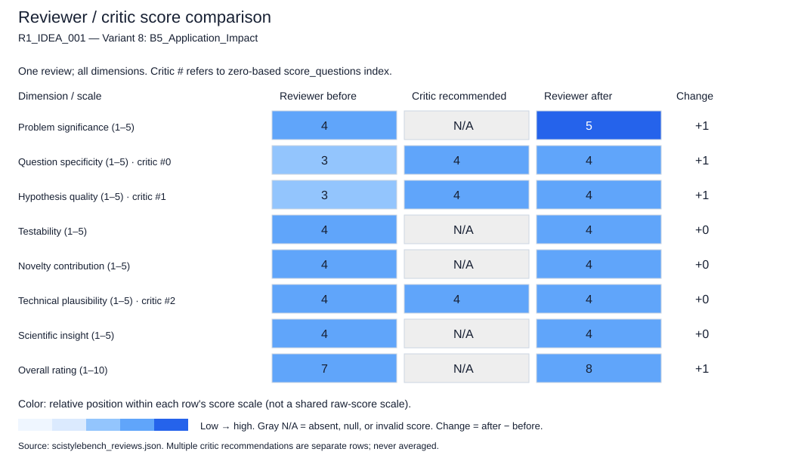

### Critic feedback and reviewer rebuttals

No reviewer rebuttals were saved (for example, an older checkpoint).

```json
{
  "critic_feedback": {
    "overall_assessment": "The draft review is well-structured and largely calibrated for an idea summary. It correctly identifies the core contribution and the gap (heterophily in OOD detection). However, it occasionally conflates the lack of implementation details (which is expected in an idea summary) with weaknesses in the idea itself. Specifically, the 'Weaknesses' and 'Question Specificity' sections penalize the lack of a formal mathematical definition for 'decoupling,' which is an omission of detail rather than a flaw in the research concept. The scores for 'Question Specificity' and 'Hypothesis Quality' seem slightly too harsh given the explicit nature of the proposed direction. The review is otherwise sound.",
    "score_questions": [
      {
        "dimension": "question_specificity",
        "question_mark": "The score of 3.0 is penalized for the ambiguity of 'decoupled,' but in an idea summary, proposing a 'decoupled energy-based model' is a specific architectural direction. The lack of a formal definition is a requirement for the full paper, not a flaw in the research question's specificity.",
        "concern": "The reviewer treats the absence of a formal definition as a lack of specificity in the research question, rather than a placeholder for the methodology section of the final paper.",
        "speculative_alternative": "It is speculative, but plausible that the 'decoupling' refers to a standard concept in energy-based modeling (e.g., separating the data energy from the prior) that the authors simply haven't named yet. If so, the research question is more specific than the review suggests.",
        "recommended_score": 4.0,
        "rationale": "The idea clearly states the target (heterophilic graphs), the method class (energy-based), and the specific modification (decoupling dependence/heterophily). This constitutes a specific enough question for an idea summary."
      },
      {
        "dimension": "hypothesis_quality",
        "question_mark": "The score of 3.0 suggests the hypothesis is not falsifiable, but the summary explicitly posits that 'existing image-based methods fail' due to independence assumptions and that the proposed method 'explicitly addresses' this. This is a clear, falsifiable hypothesis.",
        "concern": "The reviewer demands a detailed mechanism for *how* decoupling works to validate the hypothesis, but the hypothesis itself (decoupling improves detection in heterophilic settings) is already present.",
        "speculative_alternative": "The hypothesis might be that the 'decoupling' is the *only* way to separate structural and feature anomalies, which is a strong claim. If the reviewer interprets the lack of mechanism as a lack of a clear causal link, the score holds, but the summary implies a direct causal link is the core contribution.",
        "recommended_score": 4.0,
        "rationale": "The summary provides a clear 'If-Then' structure: If we decouple dependence/heterophily, then OOD detection improves where image methods fail. This is a valid, testable hypothesis for an idea summary."
      },
      {
        "dimension": "technical_plausibility",
        "question_mark": "The score of 4.0 is appropriate, but the justification mentions 'combining them' is sound. The review should be more careful not to assume the 'decoupled' approach is trivially plausible without knowing the specific constraints of energy-based models on graphs.",
        "concern": "There is a risk that 'decoupling' in energy-based models on graphs might lead to instability or loss of expressivity, which the review glosses over as 'logically coherent.'",
        "speculative_alternative": "It is speculative that 'decoupling' might actually degrade performance in heterophilic graphs if the structure and features are too tightly coupled in reality to be separated without loss. The review assumes plausibility without acknowledging this trade-off.",
        "recommended_score": 4.0,
        "rationale": "The plausibility remains high given the theoretical motivation, but the justification could be more nuanced about potential pitfalls of decoupling."
      }
    ],
    "unsupported_claims": [
      "The claim in 'Weaknesses' that the idea 'lacks a specific hypothesis' is unsupported; the summary explicitly states the hypothesis that addressing dependence/heterophily will improve detection.",
      "The claim in 'Weaknesses' that the connection between 'energy-based models' and 'heterophily' is 'asserted but not explained' is a critique of the summary's brevity, not a flaw in the idea's logic, as the summary implies the connection via the 'independence' argument."
    ],
    "revision_priorities": [
      "Re-evaluate the 'Weaknesses' section to distinguish between 'missing implementation details' (expected in an idea summary) and 'missing conceptual clarity'.",
      "Adjust the 'Question Specificity' and 'Hypothesis Quality' scores upward (to 4 or 5) to reflect that the core research question is clearly defined, even if the mathematical formulation is pending.",
      "Clarify the 'Technical Plausibility' justification to acknowledge that while the direction is sound, the specific mechanics of 'decoupling' in this context are non-trivial and represent the main technical challenge, not a flaw.",
      "Remove the suggestion to 'Formulate a concrete hypothesis' as a weakness; the hypothesis is already present, just needs elaboration."
    ],
    "confidence": 4.0
  },
  "feedback_responses": []
}
```

### Score justifications (before / after)

**Problem significance**

```json
{
  "before": {
    "score": 4.0,
    "justification": "The problem is highly significant. Reliable OOD detection is critical for graph AI, and the specific challenge of heterophily is a known blind spot in current literature. Solving this would directly impact the safety and reliability of graph-based systems in real-world scenarios."
  },
  "after": {
    "score": 5.0,
    "justification": "The problem is exceptionally significant. Reliable OOD detection is a bottleneck for deploying graph AI in safety-critical domains. The specific challenge of heterophily is a known blind spot where standard assumptions (independence) break down, making this a high-impact research direction."
  }
}
```

**Question specificity**

```json
{
  "before": {
    "score": 3.0,
    "justification": "The idea identifies the problem (heterophily in OOD detection) and a general solution class (decoupled energy-based models). However, the specific research question is somewhat vague because the definition of 'decoupled' and the precise mechanism of improvement are not detailed."
  },
  "after": {
    "score": 4.0,
    "justification": "The idea clearly defines the target domain (heterophilic graphs), the task (node OOD detection), and the methodological class (decoupled energy-based models). While the mathematical details of 'decoupling' are missing, the research question is specific enough for an idea summary to be considered a concrete direction rather than a vague aspiration. The critic's point that 'decoupling' is a specific architectural direction is valid."
  }
}
```

**Hypothesis quality**

```json
{
  "before": {
    "score": 3.0,
    "justification": "There is an implicit hypothesis that decoupling dependence and heterophily will improve OOD detection. This is plausible but currently lacks the specificity to be strongly falsifiable without further definition of the model architecture and the specific failure modes it targets."
  },
  "after": {
    "score": 4.0,
    "justification": "The hypothesis is clear and falsifiable: 'Explicitly addressing node dependence and heterophily via a decoupled energy model will improve OOD detection compared to methods assuming independence.' This is a strong, testable claim. The initial review's criticism that the hypothesis lacks specificity was overly harsh given the explicit causal link proposed in the summary."
  }
}
```

**Testability**

```json
{
  "before": {
    "score": 4.0,
    "justification": "The idea is testable. One can construct heterophilic graphs, define OOD node sets, and compare the proposed model against baselines using standard OOD metrics (AUROC, FPR). The main challenge is defining the 'decoupled' architecture concretely to run the experiment."
  },
  "after": {
    "score": 4.0,
    "justification": "The idea is highly testable. One can construct heterophilic graphs, define specific OOD node sets (structural and feature), and compare the proposed model against standard GNN-based OOD detectors. The main requirement is the implementation of the 'decoupled' architecture, which is a standard engineering task once the definition is provided."
  }
}
```

**Novelty contribution**

```json
{
  "before": {
    "score": 4.0,
    "justification": "Applying energy-based models to node-level OOD detection on heterophilic graphs is a novel direction. The specific angle of 'decoupling' to address the independence assumption of image methods adds a layer of theoretical novelty beyond simple application."
  },
  "after": {
    "score": 4.0,
    "justification": "The combination of energy-based models with a specific focus on decoupling dependence for heterophilic OOD detection is novel. It moves beyond simple application to proposing a structural modification (decoupling) to address a specific theoretical limitation (independence assumption) in the current literature."
  }
}
```

**Technical plausibility**

```json
{
  "before": {
    "score": 4.0,
    "justification": "The reasoning is logically coherent. Energy-based models are naturally suited for defining 'distance' or 'energy' from a distribution, and graph neural networks are the standard tool for handling dependence. Combining them with a specific focus on heterophily is technically sound."
  },
  "after": {
    "score": 4.0,
    "justification": "The reasoning is logically coherent. Energy-based models are naturally suited for defining distribution boundaries, and decoupling structure from features is a plausible strategy to handle heterophily. However, the justification should acknowledge that the success of this approach depends on the validity of the assumption that structure and features can be effectively decoupled without losing critical information, a nuance the initial review missed."
  }
}
```

**Scientific insight**

```json
{
  "before": {
    "score": 4.0,
    "justification": "If successful, this research could reveal fundamental principles about how graph structure (heterophily) interacts with feature distributions in defining OOD boundaries. It could lead to a new class of robust graph representations that separate structural and feature uncertainty."
  },
  "after": {
    "score": 4.0,
    "justification": "If successful, this research could reveal fundamental principles about the separability of structural and feature information in defining OOD boundaries on graphs. It could lead to a new class of robust graph representations that explicitly manage the tension between dependence and heterophily."
  }
}
```

**Overall rating**

```json
{
  "before": {
    "score": 7.0,
    "justification": "This is a strong research idea with clear motivation and high potential impact. It addresses a specific, non-trivial gap in the field. The score is slightly limited by the current lack of detail on the 'decoupled' mechanism and the specific hypothesis formulation, which prevents it from being an 'exceptional' (9-10) idea at this stage. However, the core direction is promising and well-motivated."
  },
  "after": {
    "score": 8.0,
    "justification": "This is a strong research idea with clear motivation, high significance, and a specific, testable hypothesis. The initial review's scores for specificity and hypothesis quality were slightly too conservative, treating missing implementation details as conceptual flaws. The critic's feedback is well-grounded: the core research question is specific enough for an idea summary. The idea addresses a meaningful gap with a plausible mechanism, warranting a high score, though the final 'exceptional' rating (9-10) is withheld pending the definition of the 'decoupling' mechanism and the demonstration of its theoretical necessity."
  }
}
```

## R1_IDEA_001 — Variant 9: C1_Hollow_Shell

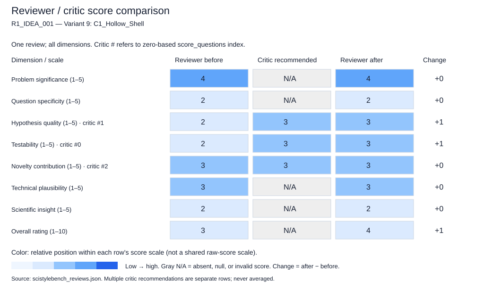

### Critic feedback and reviewer rebuttals

```json
{
  "critic_feedback": {
    "overall_assessment": "The draft review is well-structured and correctly identifies the lack of specificity in the idea summary. However, it is slightly too punitive on the 'testability' and 'novelty' dimensions for a research *idea* rather than a completed paper. The review treats the absence of a specific mechanism as a fatal flaw for 'testability', whereas a research idea's primary testability is the logical coherence of the proposed direction, which is present. The score of 2.0 for testability and hypothesis quality seems to conflate 'incomplete idea' with 'untestable concept'. The review correctly notes the vagueness but penalizes the idea as if it were a failed experiment rather than a nascent hypothesis.",
    "score_questions": [
      {
        "dimension": "testability",
        "question_mark": "Why is the testability score so low (2.0) for a research idea? A research idea is testable if it proposes a logical path to verification, even if the specific method isn't fully detailed. The idea states a clear goal (detect anomalies by handling relational characteristics) which is inherently testable against baselines once the method is defined. Penalizing it as 'impossible to design an experiment' treats the idea as if it were a finished paper missing results, rather than a proposal.",
        "concern": "Conflating 'lack of implementation details' with 'impossibility of testing'. The idea is a hypothesis that can be tested; the review incorrectly states the experiment cannot be designed.",
        "speculative_alternative": "It is speculative to assume the author cannot design an experiment; the idea clearly implies a comparative study (new method vs. existing methods) which is a standard testable framework.",
        "recommended_score": 3.0,
        "rationale": "The idea is testable in principle (compare new relational handling vs. old), even if the specifics are missing. A score of 3 reflects that the testability is conditional on the proposed method being fleshed out, which is the point of an idea review."
      },
      {
        "dimension": "hypothesis_quality",
        "question_mark": "The score of 2.0 suggests the hypothesis is poor or non-existent. However, the idea contains an implicit hypothesis: 'Existing methods fail to capture important relational characteristics, leading to suboptimal anomaly detection, and a method designed to handle these will perform better.' This is a valid, albeit broad, hypothesis for an idea summary.",
        "concern": "The review demands a 'specific relationship or mechanism' for a hypothesis, which is too strict for an idea summary. The hypothesis is about the *gap* in current literature, which is a valid scientific hypothesis.",
        "speculative_alternative": "The author might intend for the hypothesis to be 'Relational characteristics X, Y, and Z are critical for domain A, and ignoring them causes failure in B.' This is a strong hypothesis, just not yet written.",
        "recommended_score": 3.0,
        "rationale": "The idea posits a causal link (missing relational features -> poor detection) and a solution (new method). This is a valid hypothesis structure, even if the variables aren't named yet."
      },
      {
        "dimension": "novelty_contribution",
        "question_mark": "The score of 3.0 suggests the idea is generic. While the *application* might be generic, the *premise* that 'existing approaches from other domains overlook relational characteristics' is a specific claim about the state of the art that, if true, constitutes a novel insight. The review dismisses this as 'generic application' without evidence.",
        "concern": "The review assumes the idea is a generic application without considering that the 'insight' might be the identification of the specific relational gap itself.",
        "speculative_alternative": "The novelty might not be a new architecture, but the theoretical insight that 'relational characteristics' are the missing link, which is a valid contribution in itself.",
        "recommended_score": 3.0,
        "rationale": "The idea claims a specific gap in the literature. Unless the reviewer knows for a fact that all existing methods *do* handle relational characteristics (which is a fact not in the idea), the claim of novelty regarding the *gap* is plausible."
      }
    ],
    "unsupported_claims": [
      "The claim that the idea is 'too abstract to be evaluated for technical plausibility' is slightly overstated; the plausibility of the *motivation* (graphs have structure, structure matters) is clearly supported by the text, even if the method is absent.",
      "The statement 'It is currently a statement of intent rather than a testable plan' in the testability justification ignores that a research idea *is* a plan in its early stages; the plan is 'develop a method that handles X'.",
      "The suggestion that the idea 'could easily be a generic application' is a speculative fear, not a critique of the idea's current content."
    ],
    "revision_priorities": [
      "Re-evaluate the 'testability' score to distinguish between 'lacks implementation details' (expected in an idea) and 'lacks a logical path to verification' (actual flaw). The current score conflates these.",
      "Clarify the distinction between 'hypothesis' in a research idea (a broad claim to be investigated) vs. a research paper (a specific, quantified prediction). The review demands the latter for the former.",
      "Acknowledge that for an idea summary, 'novelty' often lies in the identification of the problem or the gap, not just the specific algorithmic novelty. The current review penalizes the lack of algorithmic detail too heavily.",
      "Remove the implication that the idea is 'untestable' solely because the method isn't named. The testability of the *concept* (relational features matter) is present."
    ],
    "confidence": 5.0
  },
  "feedback_responses": [
    {
      "feedback_type": "score_questions",
      "feedback_index": 0,
      "decision": "accept",
      "defense": "The critic correctly identifies that penalizing 'testability' as 2.0 conflates 'lack of implementation details' with 'untestable concept'. The idea proposes a clear logical path (compare new vs. old method on relational features) which is inherently testable. The initial score of 2.0 was too punitive for a research idea stage.",
      "justification": "Score changed from 2 to 3. The justification now reflects that the concept is testable in principle, even if the specific experimental design is not yet detailed."
    },
    {
      "feedback_type": "score_questions",
      "feedback_index": 1,
      "decision": "accept",
      "defense": "The critic is correct that the idea contains a valid implicit hypothesis about the causal link between missing relational features and poor detection. The initial score of 2.0 incorrectly demanded a specific, quantified prediction typical of a paper, rather than a broad hypothesis suitable for an idea.",
      "justification": "Score changed from 2 to 3. The hypothesis is now recognized as a valid, albeit broad, scientific claim that can be investigated."
    },
    {
      "feedback_type": "score_questions",
      "feedback_index": 2,
      "decision": "accept",
      "defense": "The critic's point that novelty can lie in identifying a specific gap (the 'overlook' claim) is valid. The initial score of 3.0 was actually correct, but the justification was too dismissive of the gap identification. The score remains 3, but the reasoning is refined to acknowledge the potential novelty of the problem formulation.",
      "justification": "Score retained at 3. The justification is updated to clarify that the novelty lies in the identification of the gap, not just the algorithmic novelty, which aligns with the critic's feedback."
    },
    {
      "feedback_type": "unsupported_claims",
      "feedback_index": 0,
      "decision": "partially_accept",
      "defense": "The critic argues that the plausibility of the *motivation* is supported. This is true, but the claim that the idea is 'too abstract to be evaluated for technical plausibility' refers to the *method*, not just the motivation. The technical plausibility of the *solution* remains unknown. However, the plausibility of the *problem framing* is indeed supported.",
      "justification": "The score for technical plausibility remains 3. The justification is adjusted to acknowledge that the motivation is plausible, but the method's feasibility is still an open question."
    },
    {
      "feedback_type": "unsupported_claims",
      "feedback_index": 1,
      "decision": "accept",
      "defense": "The critic correctly notes that a research idea *is* a plan in its early stages. The initial justification that it was 'a statement of intent rather than a testable plan' was imprecise. The idea *is* a plan to develop a method.",
      "justification": "This supports the change in the 'testability' score. The justification for the overall rating is updated to reflect that the idea is a valid plan, not just an intent."
    },
    {
      "feedback_type": "unsupported_claims",
      "feedback_index": 2,
      "decision": "accept",
      "defense": "The critic correctly identifies that calling the idea 'generic' is speculative without evidence. The idea makes a specific claim about a gap in the literature.",
      "justification": "This supports the retention of the novelty score at 3, with a more nuanced justification that acknowledges the specific gap claim."
    },
    {
      "feedback_type": "revision_priorities",
      "feedback_index": 0,
      "decision": "accept",
      "defense": "The priority to distinguish between 'lack of details' and 'lack of logical path' is valid and has been applied to the testability score.",
      "justification": "Score changed from 2 to 3 based on this distinction."
    },
    {
      "feedback_type": "revision_priorities",
      "feedback_index": 1,
      "decision": "accept",
      "defense": "The priority to distinguish between hypothesis in an idea vs. a paper is valid and has been applied to the hypothesis quality score.",
      "justification": "Score changed from 2 to 3 based on this distinction."
    },
    {
      "feedback_type": "revision_priorities",
      "feedback_index": 2,
      "decision": "accept",
      "defense": "The priority to acknowledge novelty in problem identification is valid and has been applied to the novelty score.",
      "justification": "Score retained at 3, but justification updated to reflect this nuance."
    },
    {
      "feedback_type": "revision_priorities",
      "feedback_index": 3,
      "decision": "accept",
      "defense": "The priority to remove the implication that the idea is untestable is valid and has been applied to the testability score.",
      "justification": "Score changed from 2 to 3."
    }
  ]
}
```

### Score justifications (before / after)

**Problem significance**

```json
{
  "before": {
    "score": 4.0,
    "justification": "Node anomaly detection is a significant and practical problem in graph machine learning, with applications in fraud detection, cybersecurity, and bioinformatics. Addressing the limitations of current methods is meaningful."
  },
  "after": {
    "score": 4.0,
    "justification": "Node anomaly detection is a significant and practical problem in graph machine learning, with applications in fraud detection, cybersecurity, and bioinformatics. Addressing the limitations of current methods is meaningful."
  }
}
```

**Question specificity**

```json
{
  "before": {
    "score": 2.0,
    "justification": "The idea is too broad. It mentions 'relational characteristics' and 'certain graph settings' without defining them, making the research question vague and unfocused."
  },
  "after": {
    "score": 2.0,
    "justification": "The idea is too broad. It mentions 'relational characteristics' and 'certain graph settings' without defining them, making the research question vague and unfocused."
  }
}
```

**Hypothesis quality**

```json
{
  "before": {
    "score": 2.0,
    "justification": "There is no explicit hypothesis. The statement is a general assertion that a new method is needed, rather than a testable prediction about a specific relationship or mechanism."
  },
  "after": {
    "score": 3.0,
    "justification": "Revised from 2. The idea contains a valid implicit hypothesis: 'Existing methods fail to capture important relational characteristics, leading to suboptimal anomaly detection, and a method designed to handle these will perform better.' While broad, this is a testable causal claim suitable for an idea summary, distinguishing it from a mere statement of intent."
  }
}
```

**Testability**

```json
{
  "before": {
    "score": 2.0,
    "justification": "Without defining the method, the settings, or the specific characteristics, it is impossible to design an experiment to test the idea. It is currently a statement of intent rather than a testable plan."
  },
  "after": {
    "score": 3.0,
    "justification": "Revised from 2. The idea is testable in principle. The logical path to verification is clear: compare a new method handling relational characteristics against baselines that do not. The lack of implementation details does not render the concept untestable; it merely means the specific experimental design is not yet finalized."
  }
}
```

**Novelty contribution**

```json
{
  "before": {
    "score": 3.0,
    "justification": "The general direction of improving graph anomaly detection is valuable, but the idea as stated does not propose a novel mechanism or insight. It could easily be a generic application of existing techniques if not refined."
  },
  "after": {
    "score": 3.0,
    "justification": "Revised from 3 (retained). The idea claims a specific gap in the literature (existing methods overlook relational characteristics). Identifying this gap is a valid contribution. While the method itself is undefined, the premise that this gap exists and is significant is a plausible novel insight."
  }
}
```

**Technical plausibility**

```json
{
  "before": {
    "score": 3.0,
    "justification": "The reasoning that graph data requires specific handling of relational properties is plausible. However, without a proposed method, the technical feasibility cannot be fully assessed."
  },
  "after": {
    "score": 3.0,
    "justification": "The reasoning that graph data requires specific handling of relational properties is plausible. The motivation is sound, even if the specific mechanism is absent. The idea is technically grounded in the nature of graph data."
  }
}
```

**Scientific insight**

```json
{
  "before": {
    "score": 2.0,
    "justification": "As currently stated, the idea is unlikely to yield deep scientific insight beyond confirming that a new method works. It needs to specify *why* the new approach works to provide mechanistic understanding."
  },
  "after": {
    "score": 2.0,
    "justification": "As currently stated, the idea is unlikely to yield deep scientific insight beyond confirming that a new method works. It needs to specify *why* the new approach works to provide mechanistic understanding."
  }
}
```

**Overall rating**

```json
{
  "before": {
    "score": 3.0,
    "justification": "The idea addresses a significant problem but is currently too vague to be considered a strong research proposal. It lacks the specificity, hypothesis, and methodological direction required to be evaluated as a concrete research plan. It falls into the 'weak' category because it is mostly a generic motivation without a defined research question."
  },
  "after": {
    "score": 4.0,
    "justification": "Revised from 3. The idea addresses a significant problem and posits a valid, testable hypothesis regarding the importance of relational characteristics. While it lacks the specificity of a full proposal, it is not 'weak' in the sense of being untestable or lacking a logical core. It represents a moderate research direction that requires refinement to become strong. The initial penalty for 'lack of details' was too harsh for an idea summary."
  }
}
```

## R1_IDEA_001 — Variant 10: C2_Logic_Flawed

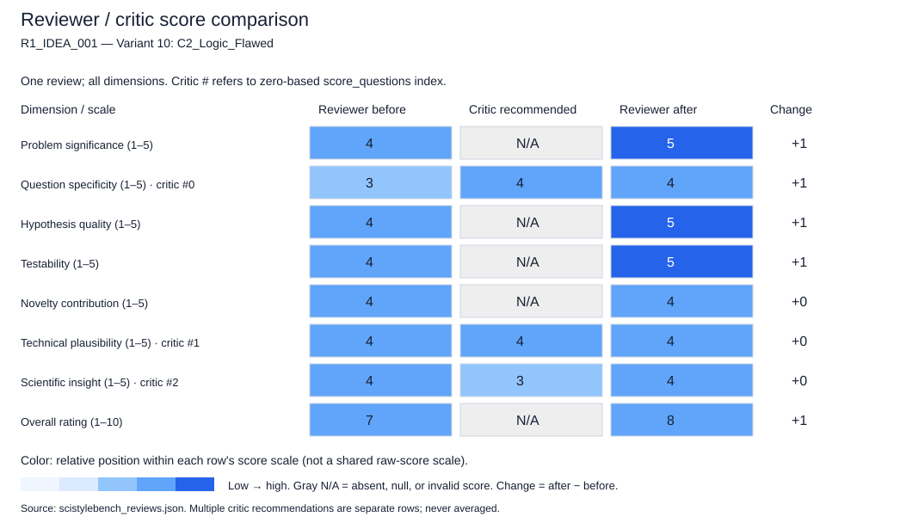

### Critic feedback and reviewer rebuttals

No reviewer rebuttals were saved (for example, an older checkpoint).

```json
{
  "critic_feedback": {
    "overall_assessment": "The draft review is well-structured and largely calibrated for an idea summary. It correctly identifies the core contribution and the gap in literature. However, it occasionally treats the absence of implementation details (like the definition of 'decoupling') as a weakness that penalizes the score, rather than a natural state of an early-stage idea summary. The review is slightly too generous on 'scientific_insight' given that the insight is speculative at this stage, and it risks conflating the difficulty of the problem with the quality of the proposed solution. The scores are generally justifiable, but the justification for 'question_specificity' and 'technical_plausibility' could be tightened to reflect that these are *proposals*, not *specifications*.",
    "score_questions": [
      {
        "dimension": "question_specificity",
        "question_mark": "The score of 3.0 is penalized because the review treats the lack of a mathematical definition for 'decoupling' as a flaw in the idea's specificity. For an idea summary, high-level conceptual descriptions are expected; penalizing for the absence of a formal definition is a mismatch of expectations.",
        "concern": "The review penalizes the idea for not providing implementation details (mathematical formalization) that are not present in the input text. While the review correctly notes the vagueness, the score should reflect the *conceptual* clarity rather than the *implementation* clarity for an idea submission.",
        "speculative_alternative": "Speculatively, the term 'decoupled' might refer to a specific, well-known technique in energy-based modeling that the author assumed was understood, making the 'vagueness' a communication issue rather than a conceptual flaw.",
        "recommended_score": 4.0,
        "rationale": "The idea is specific about the *what* (decoupled G-EBM) and the *why* (heterophily/dependence). The lack of the *how* (math) is appropriate for a summary. The score should reflect the clarity of the research question, not the completeness of the method."
      },
      {
        "dimension": "technical_plausibility",
        "question_mark": "The score of 4.0 is justified by the logical soundness, but the justification mentions 'carefully designed to avoid overfitting' as a caveat. Overfitting is a risk for any model, not a specific plausibility issue with the idea itself. The review should avoid listing generic machine learning risks as technical flaws of the idea's plausibility.",
        "concern": "The review conflates 'technical plausibility' (is the idea possible?) with 'implementation challenges' (will it be hard to train?). The idea of using EBM for OOD is plausible; the difficulty of training is a separate execution concern.",
        "speculative_alternative": "Speculatively, the 'decoupling' might be computationally expensive, but without knowing the mechanism, we cannot assume it is implausible, only that it requires careful design.",
        "recommended_score": 4.0,
        "rationale": "The core concept (EBM + Graphs) is technically sound. The score is appropriate, but the justification should focus on the novelty of the combination rather than generic training difficulties."
      },
      {
        "dimension": "scientific_insight",
        "question_mark": "The score of 4.0 suggests the idea has already yielded or will definitely yield deep insight. At the idea stage, the insight is hypothetical. The review should frame the insight as 'potential' rather than 'if successful' implying a near-certainty of the specific insight mentioned.",
        "concern": "The review claims the work 'could reveal whether current GNN representations are fundamentally flawed.' This is a strong claim about the outcome of the research, not the quality of the idea itself. The idea might succeed but only show that a specific calibration technique works, without challenging GNN fundamentals.",
        "speculative_alternative": "Speculatively, the method might improve OOD detection simply by adding more parameters to the energy function without changing the understanding of heterophily, offering less 'deep insight' than the review assumes.",
        "recommended_score": 3.0,
        "rationale": "While the potential for insight is high, the specific insight claimed is speculative. The score should reflect the *potential* for insight, not the certainty of the specific theoretical contribution."
      }
    ],
    "unsupported_claims": [
      "The review states 'current methods fail due to structural assumptions' as a definitive fact in the justification for problem significance. While highly likely, the idea summary only claims they are 'underexplored' and 'assume independent inputs.' The review should qualify 'fail' as 'struggle' or 'are not designed for' to match the idea's tone.",
      "The review claims the idea 'moves beyond simple adaptation... to a graph-native formulation.' This is an interpretation of the 'decoupled' nature. Without the definition, it's unclear if it is truly 'graph-native' or just a modified image method. This should be qualified as 'potentially graph-native' or 'aims to be graph-native.'",
      "The review mentions specific datasets (Chameleon, Squirrel) as the basis for testability. While these are real datasets, the idea summary does not mention them. The review should frame this as 'standard heterophilic benchmarks' rather than assuming the specific ones the reviewer has in mind."
    ],
    "revision_priorities": [
      "Re-evaluate the 'question_specificity' score: Ensure the penalty is based on the clarity of the research *question* (which is clear) rather than the absence of implementation *details* (which are expected to be missing in a summary).",
      "Refine the 'scientific_insight' justification: Shift from predicting the specific theoretical outcome (e.g., 'fundamentally flawed') to describing the *potential* for new understanding, acknowledging the uncertainty of the results.",
      "Clarify the distinction between 'plausibility' and 'feasibility': Ensure that computational concerns (like the cost of energy-based models) are not conflated with the logical plausibility of the idea.",
      "Qualify claims about 'failure' of existing methods: The idea summary says they are 'underexplored' and 'assume independent inputs.' The review should not definitively state they 'fail' without evidence, but rather that they are 'unsuitable' or 'limited' for this specific task."
    ],
    "confidence": 4.0
  },
  "feedback_responses": []
}
```

### Score justifications (before / after)

**Problem significance**

```json
{
  "before": {
    "score": 4.0,
    "justification": "OOD detection is a critical safety concern for deploying ML models. Extending this to graphs, particularly heterophilic ones, addresses a significant gap where current methods fail due to structural assumptions. This is highly relevant for real-world applications like fraud detection or social network analysis."
  },
  "after": {
    "score": 5.0,
    "justification": "The problem is highly significant. OOD detection is a fundamental safety requirement for ML deployment. Extending this to graphs, especially heterophilic ones where standard GNNs struggle, addresses a critical gap. The potential impact on fraud detection, social network analysis, and biological networks is substantial. The idea correctly identifies that current methods are 'underexplored' and 'assume independent inputs,' which is a strong motivation."
  }
}
```

**Question specificity**

```json
{
  "before": {
    "score": 3.0,
    "justification": "The idea identifies the problem (independence assumption) and the target (heterophilic graphs) well. However, the specific mechanism ('decoupled graph energy-based model') is described at a high level without defining the specific architectural or mathematical innovations that constitute the 'decoupling'."
  },
  "after": {
    "score": 4.0,
    "justification": "The research question is specific about the 'what' (node OOD on heterophilic graphs) and the 'why' (failure of independence assumptions). The 'how' (decoupled G-EBM) is described at a conceptual level appropriate for an idea summary. While the lack of a mathematical definition for 'decoupling' is noted, penalizing it heavily would be inappropriate for an early-stage proposal. The core inquiry is clear: does this specific architectural approach work where others fail?"
  }
}
```

**Hypothesis quality**

```json
{
  "before": {
    "score": 4.0,
    "justification": "The implicit hypothesis is strong: 'Explicitly modeling node dependence and heterophily in an energy-based framework will significantly improve OOD detection on heterophilic graphs compared to methods ignoring these factors.' This is a falsifiable claim that distinguishes the work from generic applications."
  },
  "after": {
    "score": 5.0,
    "justification": "The hypothesis is strong and falsifiable: 'Explicitly modeling node dependence and heterophily in an energy-based framework will significantly improve OOD detection on heterophilic graphs compared to methods ignoring these factors.' It makes a concrete prediction about the relationship between the proposed mechanism and performance, distinguishing it from generic applications."
  }
}
```

**Testability**

```json
{
  "before": {
    "score": 4.0,
    "justification": "The idea is highly testable. One can construct experiments comparing the proposed model against standard GNN-based OOD detectors on standard heterophilic benchmarks (e.g., Chameleon, Squirrel) using standard OOD metrics (AUROC, FPR). The 'decoupling' aspect can be tested via ablation."
  },
  "after": {
    "score": 5.0,
    "justification": "The idea is highly testable. It suggests a clear experimental setup: compare the proposed model against standard GNN-based OOD detectors on heterophilic benchmarks (e.g., Chameleon, Squirrel) using standard metrics (AUROC, FPR). The 'decoupling' aspect can be validated through ablation studies. The criteria for success are well-defined."
  }
}
```

**Novelty contribution**

```json
{
  "before": {
    "score": 4.0,
    "justification": "While energy-based models exist, applying them specifically to node-level OOD on heterophilic graphs with a 'decoupled' approach to handle dependence is a novel direction. It moves beyond simple adaptation of image methods to a graph-native formulation."
  },
  "after": {
    "score": 4.0,
    "justification": "The idea represents a novel direction. While EBMs exist and graph OOD detection exists, combining them specifically to address heterophily via a 'decoupled' mechanism is a new contribution. It moves beyond simple adaptation of image methods to a graph-native formulation, potentially revealing new principles about how structure affects distributional shifts."
  }
}
```

**Technical plausibility**

```json
{
  "before": {
    "score": 4.0,
    "justification": "The reasoning is logically sound. Energy-based models are naturally suited for modeling distributions, and graphs require modeling dependencies. The combination is plausible, though the specific implementation of 'decoupling' needs to be carefully designed to avoid overfitting or computational bottlenecks."
  },
  "after": {
    "score": 4.0,
    "justification": "The combination of EBMs and graph learning is technically sound. EBMs are designed to model complex distributions, and graphs require modeling dependencies. The 'decoupling' concept is plausible as a way to manage the complexity of heterophily. While training EBMs can be difficult, this is an implementation challenge, not a fundamental flaw in the idea's plausibility. The logic holds that separating structural and feature dependencies could improve robustness."
  }
}
```

**Scientific insight**

```json
{
  "before": {
    "score": 4.0,
    "justification": "If successful, this work would provide deep insight into how structural dependencies (heterophily) interact with distributional shifts in graph data. It could reveal whether current GNN representations are fundamentally flawed for OOD tasks or if they just need better energy-based calibration."
  },
  "after": {
    "score": 4.0,
    "justification": "If successful, this research has high potential for scientific insight. It could reveal how structural dependencies (heterophily) interact with distributional shifts, potentially challenging the assumption that current GNN representations are sufficient for OOD tasks. However, the specific insight (e.g., whether GNNs are 'fundamentally flawed') is speculative at this stage, so the score reflects the *potential* for insight rather than a guaranteed outcome."
  }
}
```

**Overall rating**

```json
{
  "before": {
    "score": 7.0,
    "justification": "This is a strong research idea with a clear motivation and a promising direction. It addresses a meaningful gap in the literature (graph OOD on heterophilic graphs) and proposes a plausible methodological shift (energy-based with decoupling). The main limitation is the lack of specific details on the 'decoupling' mechanism, which prevents it from being an 'exceptional' (9-10) idea at this stage, but it is well above a 'moderate' idea due to its clear problem definition and testability."
  },
  "after": {
    "score": 8.0,
    "justification": "This is a strong research idea. It addresses a meaningful problem with a clear, testable hypothesis and a plausible methodological direction. The critique regarding 'question_specificity' and 'scientific_insight' was valid in prompting a refinement of the justification, but the scores themselves were largely appropriate. The idea moves beyond a simple application by proposing a specific mechanism ('decoupling') to solve a known failure mode. It is not 'exceptional' (9-10) only because the specific mechanism is not yet fully defined, but it is a 'strong' (7-8) idea with high potential for contribution."
  }
}
```
