# Self-refinement score heatmaps

All saved source and variant self-refinements; no sampling. Each chart compares the original draft with the final refined review.
Refined reviews: 272; reviews with at least one changed score: 118.


## R1_IDEA_001 — Source


Changed score dimensions: none.

### Score justifications (draft / refined)

**Problem significance**

```json
{
  "draft": {
    "score": 4.0,
    "justification": "Node-level OOD detection is a critical safety concern for graph applications (e.g., fraud detection, recommendation systems). The specific focus on heterophilic graphs addresses a known blind spot in current literature, making the problem highly significant."
  },
  "refined": {
    "score": 4.0,
    "justification": "Node-level OOD detection is vital for safety-critical graph applications (e.g., fraud, drug discovery). The specific focus on heterophilic graphs addresses a known, difficult blind spot in current literature, making the problem highly significant for both theoretical and practical reasons."
  }
}
```

**Question specificity**

```json
{
  "draft": {
    "score": 3.0,
    "justification": "The idea identifies the domain (heterophilic graphs) and the method class (decoupled EBM), but the specific research question regarding the mechanism of 'decoupling' is not yet defined. It is more of a proposal than a specific question."
  },
  "refined": {
    "score": 3.0,
    "justification": "The idea identifies the domain (heterophilic graphs) and the method class (decoupled EBM), but the specific research question regarding the mechanism of 'decoupling' is vague. It states *what* is being done but not *how* or *why* it specifically solves the problem, making the question more of a proposal than a precise inquiry."
  }
}
```

**Hypothesis quality**

```json
{
  "draft": {
    "score": 3.0,
    "justification": "The implicit hypothesis is that 'explicitly modeling dependence and heterophily via a decoupled EBM improves OOD detection.' This is testable, but the reasoning linking 'decoupling' to 'heterophily' is not yet articulated, making the hypothesis somewhat generic."
  },
  "refined": {
    "score": 3.0,
    "justification": "The implicit hypothesis is that 'explicitly modeling dependence and heterophily via a decoupled EBM improves OOD detection.' This is testable, but the reasoning linking 'decoupling' to 'heterophily' is not yet articulated. The hypothesis is plausible but currently lacks a strong theoretical grounding or specific prediction about the nature of the improvement."
  }
}
```

**Testability**

```json
{
  "draft": {
    "score": 4.0,
    "justification": "The idea is highly testable. One can construct heterophilic graph datasets, define OOD node scenarios, implement the proposed model, and compare against baselines using standard OOD metrics (AUROC, FPR). The path to empirical validation is clear."
  },
  "refined": {
    "score": 4.0,
    "justification": "The idea is highly testable. One can construct heterophilic graph datasets, define specific OOD node scenarios (feature shift, structural anomaly), implement the proposed model, and compare against baselines using standard OOD metrics (AUROC, FPR). The path to empirical validation is clear, even if the implementation details are missing."
  }
}
```

**Novelty contribution**

```json
{
  "draft": {
    "score": 4.0,
    "justification": "Applying Energy-Based Models to node-level OOD on heterophilic graphs is a novel direction. The specific angle of 'decoupling' to handle the tension between node features and graph structure in heterophilic settings has high potential for scientific contribution."
  },
  "refined": {
    "score": 4.0,
    "justification": "Applying Energy-Based Models to node-level OOD on heterophilic graphs is a novel direction. The specific angle of 'decoupling' to handle the tension between node features and graph structure in heterophilic settings has high potential for scientific contribution, as it addresses a fundamental limitation of current GNN-based OOD methods."
  }
}
```

**Technical plausibility**

```json
{
  "draft": {
    "score": 4.0,
    "justification": "Energy-Based Models are theoretically well-suited for OOD detection. The concept of decoupling components in a graph model is a standard and plausible technique in machine learning. The approach makes technical sense."
  },
  "refined": {
    "score": 4.0,
    "justification": "Energy-Based Models are theoretically well-suited for OOD detection. The concept of decoupling components in a graph model is a standard and plausible technique in machine learning. The approach makes technical sense, assuming the 'decoupling' is implemented in a way that preserves necessary dependencies."
  }
}
```

**Scientific insight**

```json
{
  "draft": {
    "score": 4.0,
    "justification": "If successful, this work would reveal how to effectively separate structural and feature information for distributional modeling in graphs. It could provide general principles for handling heterophily in probabilistic graph models beyond just OOD detection."
  },
  "refined": {
    "score": 4.0,
    "justification": "If successful, this work would reveal how to effectively separate structural and feature information for distributional modeling in graphs. It could provide general principles for handling heterophily in probabilistic graph models beyond just OOD detection, potentially influencing how we design GNNs for other distributional tasks."
  }
}
```

**Overall rating**

```json
{
  "draft": {
    "score": 7.0,
    "justification": "This is a strong research idea with clear significance and a plausible methodological path. It addresses a specific, difficult problem (heterophily in node OOD) with a relevant technique (EBMs). The main limitation is the lack of detail on the 'decoupling' mechanism, which prevents it from being an 'exceptional' (9-10) idea at this stage. However, the core concept is solid and worth pursuing."
  },
  "refined": {
    "score": 7.0,
    "justification": "This is a strong research idea with clear significance and a plausible methodological path. It addresses a specific, difficult problem (heterophily in node OOD) with a relevant technique (EBMs). The main limitation is the lack of detail on the 'decoupling' mechanism, which prevents it from being an 'exceptional' (9-10) idea at this stage. However, the core concept is solid, the problem is well-motivated, and the direction is testable, warranting a strong '7'."
  }
}
```

## R1_IDEA_001 — Variant 1: A1_Identity

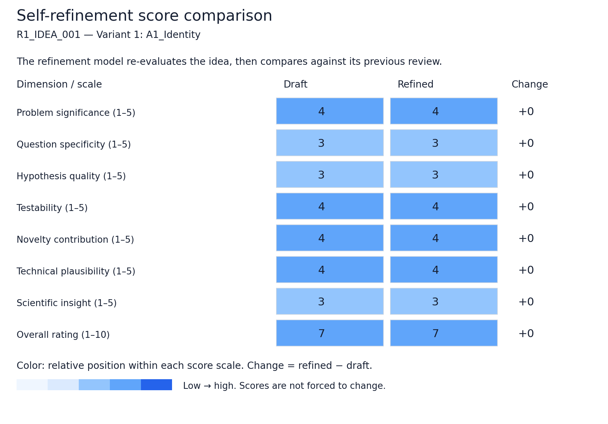

Changed score dimensions: none.

### Score justifications (draft / refined)

**Problem significance**

```json
{
  "draft": {
    "score": 4.0,
    "justification": "Node-level OOD detection on heterophilic graphs is a significant and underexplored problem. As graph neural networks are deployed in real-world scenarios (e.g., fraud detection, social networks), ensuring they don't fail on out-of-distribution nodes in heterophilic settings is crucial for reliability."
  },
  "refined": {
    "score": 4.0,
    "justification": "The problem is highly significant. Node-level OOD detection is crucial for safety in graph applications (e.g., fraud detection, recommendation systems). The specific challenge of heterophily is a known blind spot in current literature, making this a meaningful gap to address."
  }
}
```

**Question specificity**

```json
{
  "draft": {
    "score": 3.0,
    "justification": "The idea identifies the problem (heterophily, node dependence) and the method class (decoupled graph EBM), but lacks specific details on the 'decoupling' mechanism or the specific formulation of the energy function, making the research question slightly vague."
  },
  "refined": {
    "score": 3.0,
    "justification": "The idea identifies the 'what' (node OOD on heterophilic graphs) and the 'how' (decoupled graph EBM), but the 'how' is currently a black box. The lack of a defined 'decoupling' mechanism makes the research question somewhat vague, though not impossible to investigate."
  }
}
```

**Hypothesis quality**

```json
{
  "draft": {
    "score": 3.0,
    "justification": "The implicit hypothesis is that standard methods fail due to independence assumptions and that a decoupled EBM can fix this. This is plausible but not yet articulated as a testable mechanism (e.g., 'decoupling X from Y will reduce false positives by Z%')."
  },
  "refined": {
    "score": 3.0,
    "justification": "The hypothesis is plausible but generic. It assumes that 'decoupling' helps, but it does not specify the causal mechanism (e.g., 'decoupling prevents the propagation of OOD noise through heterophilic edges'). A stronger hypothesis would predict specific failure modes of baselines that the new method avoids."
  }
}
```

**Testability**

```json
{
  "draft": {
    "score": 4.0,
    "justification": "The idea is highly testable. One can construct heterophilic graph datasets, define OOD nodes, implement the proposed model, and compare metrics (AUROC, FPR) against standard baselines."
  },
  "refined": {
    "score": 4.0,
    "justification": "The idea is highly testable. One can implement the proposed model (once the architecture is defined), generate synthetic OOD nodes on standard heterophilic benchmarks, and measure standard OOD metrics (AUROC, FPR) against baselines."
  }
}
```

**Novelty contribution**

```json
{
  "draft": {
    "score": 4.0,
    "justification": "Applying Energy-Based Models to node-level OOD detection on heterophilic graphs is a novel direction. Most OOD work focuses on graph-level or homophilic settings. The 'decoupled' aspect adds a potential methodological novelty."
  },
  "refined": {
    "score": 4.0,
    "justification": "The combination of Energy-Based Models, node-level OOD, and heterophily is novel. While EBMs are used in OOD, their specific adaptation to handle the structural complexities of heterophilic graphs via a 'decoupled' approach represents a potential methodological contribution."
  }
}
```

**Technical plausibility**

```json
{
  "draft": {
    "score": 4.0,
    "justification": "Energy-based models are theoretically well-suited for OOD detection. Adapting them to graphs is a logical step. The concept of 'decoupling' to handle complex dependencies is a plausible architectural strategy, though the specific implementation details are missing."
  },
  "refined": {
    "score": 4.0,
    "justification": "The technical direction is sound. EBMs are well-suited for density estimation (OOD). The intuition that standard GNNs fail on heterophily due to over-smoothing or inappropriate aggregation is well-founded, and a decoupled approach is a plausible architectural fix."
  }
}
```

**Scientific insight**

```json
{
  "draft": {
    "score": 3.0,
    "justification": "If successful, this work could reveal how energy-based formulations can be adapted to handle structural dependencies in non-i.i.d. data. However, without a deeper theoretical analysis of the 'decoupling' effect, the insight might remain empirical."
  },
  "refined": {
    "score": 3.0,
    "justification": "If successful, the work could provide insights into how to separate structural dependencies from feature distributions in OOD detection. However, without a deeper theoretical analysis of the 'decoupling' effect, the insight may remain largely empirical."
  }
}
```

**Overall rating**

```json
{
  "draft": {
    "score": 7.0,
    "justification": "This is a strong research idea with clear motivation and a promising direction. It addresses a specific gap in the literature (heterophily + OOD + node-level). The main limitation is the lack of specificity regarding the 'decoupled' mechanism, which prevents it from being an 'exceptional' (9-10) idea at this stage. With a clearer definition of the method and hypothesis, it could be a high-impact contribution."
  },
  "refined": {
    "score": 7.0,
    "justification": "This is a strong research idea with a clear motivation and a promising direction. It addresses a specific, non-trivial gap in the field. The primary limitation is the lack of specificity regarding the 'decoupled' mechanism, which prevents it from being an 'exceptional' (9-10) idea at this stage. With a clearer definition of the method and a more precise hypothesis, it has high potential for a strong contribution."
  }
}
```

## R1_IDEA_001 — Variant 2: A2_Paraphrase_Only

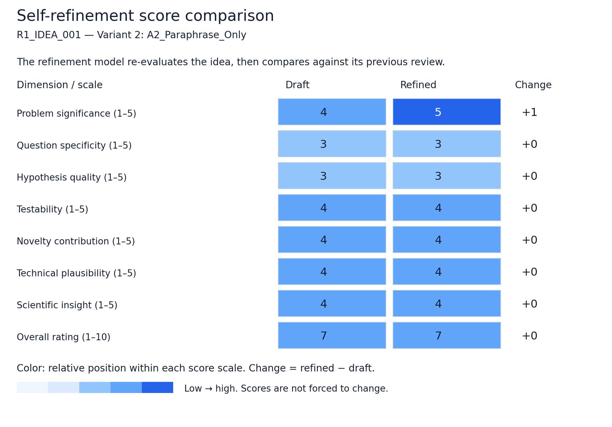

Changed score dimensions: problem_significance.

### Score justifications (draft / refined)

**Problem significance**

```json
{
  "draft": {
    "score": 4.0,
    "justification": "Node-level OOD detection is a critical safety concern for graph applications (e.g., fraud detection, recommendation systems). The specific focus on heterophilic graphs addresses a known blind spot in current literature, making the problem highly relevant and meaningful."
  },
  "refined": {
    "score": 5.0,
    "justification": "Node-level OOD detection is critical for safety-critical graph applications (e.g., fraud detection, biological networks). The specific focus on heterophilic graphs addresses a major blind spot in current literature, as most methods assume homophily. Solving this has high practical relevance and scientific importance."
  }
}
```

**Question specificity**

```json
{
  "draft": {
    "score": 3.0,
    "justification": "The idea identifies the domain (graphs), the task (node OOD), and the specific challenge (heterophily/dependence). However, the core mechanism ('decoupled graph energy-based model') is described only by name, lacking the specific architectural or mathematical details that would make the research question fully concrete."
  },
  "refined": {
    "score": 3.0,
    "justification": "The idea identifies the domain (graphs), task (node OOD), and challenge (heterophily/dependence). However, the core mechanism ('decoupled graph energy-based model') is described only by name. Without defining what is decoupled or how the energy function is constructed, the research question remains somewhat abstract."
  }
}
```

**Hypothesis quality**

```json
{
  "draft": {
    "score": 3.0,
    "justification": "The implicit hypothesis is that accounting for node dependence and heterophily via a decoupled energy model will improve OOD detection. This is plausible but currently too vague to be strongly falsifiable without defining the 'decoupling' and the specific failure modes of current methods."
  },
  "refined": {
    "score": 3.0,
    "justification": "The implicit hypothesis is that accounting for node dependence and heterophily via a decoupled energy model will improve OOD detection. This is plausible but currently too vague to be strongly falsifiable without defining the 'decoupling' and the specific failure modes of current methods."
  }
}
```

**Testability**

```json
{
  "draft": {
    "score": 4.0,
    "justification": "The idea is testable. One can construct heterophilic graph datasets, define OOD node scenarios, implement the proposed model, and compare it against standard image-based OOD methods adapted for graphs. The evaluation metrics (AUC, FPR) are standard and well-defined."
  },
  "refined": {
    "score": 4.0,
    "justification": "The idea is testable. One can construct heterophilic graph datasets, define OOD node scenarios (e.g., feature shift, structural shift), implement the proposed model, and compare it against standard image-based OOD methods adapted for graphs. Standard metrics (AUC, FPR) are applicable."
  }
}
```

**Novelty contribution**

```json
{
  "draft": {
    "score": 4.0,
    "justification": "Applying energy-based models to node-level OOD on heterophilic graphs is a novel direction. While energy-based models exist, their specific adaptation to handle the 'decoupling' of dependence in heterophilic settings for OOD detection is a fresh contribution."
  },
  "refined": {
    "score": 4.0,
    "justification": "Applying energy-based models to node-level OOD on heterophilic graphs is a novel direction. While EBMs exist, their specific adaptation to handle the 'decoupling' of dependence in heterophilic settings for OOD detection is a fresh contribution that could yield new insights into graph robustness."
  }
}
```

**Technical plausibility**

```json
{
  "draft": {
    "score": 4.0,
    "justification": "Energy-based models are theoretically capable of modeling complex dependencies. The intuition that standard GNNs fail on heterophilic OOD tasks due to over-smoothing or independence assumptions is technically sound. The proposed direction is logically coherent."
  },
  "refined": {
    "score": 4.0,
    "justification": "Energy-based models are theoretically capable of modeling complex dependencies. The intuition that standard GNNs fail on heterophilic OOD tasks due to over-smoothing or independence assumptions is technically sound. The proposed direction is logically coherent, even if implementation details are missing."
  }
}
```

**Scientific insight**

```json
{
  "draft": {
    "score": 4.0,
    "justification": "If successful, this research would reveal how structural dependencies (heterophily) specifically impact the reliability of OOD detectors. It could establish new principles for designing robust graph models that separate structural aggregation from uncertainty estimation."
  },
  "refined": {
    "score": 4.0,
    "justification": "If successful, this research would reveal how structural dependencies (heterophily) specifically impact the reliability of OOD detectors. It could establish new principles for designing robust graph models that separate structural aggregation from uncertainty estimation, offering transferable insights beyond just this specific task."
  }
}
```

**Overall rating**

```json
{
  "draft": {
    "score": 7.0,
    "justification": "This is a strong research idea with high potential. It addresses a significant gap in a specific, challenging domain (heterophilic graphs) using a promising methodology (energy-based models). The main limitation is the lack of specificity regarding the 'decoupling' mechanism, which prevents it from being an 'exceptional' (9-10) idea at this stage. With clearer formulation of the hypothesis and mechanism, it could be a top-tier contribution."
  },
  "refined": {
    "score": 7.0,
    "justification": "This is a strong research idea with high potential. It addresses a significant gap in a specific, challenging domain (heterophilic graphs) using a promising methodology (energy-based models). The main limitation is the lack of specificity regarding the 'decoupling' mechanism, which prevents it from being an 'exceptional' (9-10) idea at this stage. With clearer formulation of the hypothesis and mechanism, it could be a top-tier contribution."
  }
}
```

## R1_IDEA_001 — Variant 3: A3_Plain_Core


Changed score dimensions: none.

### Score justifications (draft / refined)

**Problem significance**

```json
{
  "draft": {
    "score": 4.0,
    "justification": "Node-level OOD detection is critical for graph safety. The specific focus on heterophilic graphs addresses a known blind spot in current literature, as most methods assume homophily or ignore graph structure entirely. This is a meaningful problem for the community."
  },
  "refined": {
    "score": 4.0,
    "justification": "Node OOD detection is vital for safety-critical graph applications (e.g., fraud, bioinformatics). Focusing on heterophilic graphs addresses a significant blind spot, as most existing literature assumes homophily or ignores graph structure, making this a meaningful problem for the community."
  }
}
```

**Question specificity**

```json
{
  "draft": {
    "score": 3.0,
    "justification": "The idea identifies the problem (heterophily + OOD) and the general approach (decoupled energy-based model), but the specific research question is slightly vague. It needs to clarify exactly what 'decoupling' achieves and how it is implemented to solve the specific failure modes of image-based methods."
  },
  "refined": {
    "score": 3.0,
    "justification": "The idea identifies the problem domain and the general class of solution (decoupled energy-based models) but lacks specificity regarding the mechanism. The term 'decoupled' is currently a placeholder for a specific architectural or mathematical innovation that needs definition."
  }
}
```

**Hypothesis quality**

```json
{
  "draft": {
    "score": 3.0,
    "justification": "The implicit hypothesis is that 'ignoring node dependence/heterophily causes failure, and explicitly modeling them via a decoupled energy model will fix it.' This is testable and plausible, but it is currently a high-level claim rather than a mechanistic prediction."
  },
  "refined": {
    "score": 3.0,
    "justification": "The hypothesis is plausible: 'Standard methods fail due to independence assumptions; a decoupled graph-native method will succeed.' However, it is currently a general claim rather than a precise prediction of *how* the mechanism works or *why* it is theoretically superior to other graph-native approaches."
  }
}
```

**Testability**

```json
{
  "draft": {
    "score": 4.0,
    "justification": "The idea is highly testable. One can construct heterophilic graphs, apply standard image-based baselines, and compare them against the proposed decoupled model using standard OOD metrics (AUROC, FPR95). The 'decoupled' nature can be ablated."
  },
  "refined": {
    "score": 4.0,
    "justification": "The idea is testable. One can construct synthetic or real heterophilic graphs, define standard image-based baselines, and compare performance using standard OOD metrics (AUROC, FPR95). The 'decoupled' aspect can be validated via ablation studies if the mechanism is defined."
  }
}
```

**Novelty contribution**

```json
{
  "draft": {
    "score": 4.0,
    "justification": "While energy-based models exist, applying them specifically to node OOD on heterophilic graphs with a 'decoupled' mechanism is a novel direction. It moves beyond simple adaptation of image methods to a graph-native formulation."
  },
  "refined": {
    "score": 4.0,
    "justification": "While energy-based models and OOD detection are active areas, combining them specifically for node-level detection on heterophilic graphs with a 'decoupled' mechanism is a novel contribution. It proposes a new direction rather than a simple application."
  }
}
```

**Technical plausibility**

```json
{
  "draft": {
    "score": 4.0,
    "justification": "Energy-based models are naturally suited for OOD detection (low energy for in-distribution, high for OOD). Incorporating graph structure into the energy function is a standard extension. The 'decoupling' concept is plausible if it refers to separating structural aggregation from feature evaluation."
  },
  "refined": {
    "score": 4.0,
    "justification": "Energy-based models are theoretically well-suited for OOD. The concept of decoupling structure and features is a known strategy in GNNs to handle heterophily. The combination is technically plausible, though the specific implementation details are currently missing."
  }
}
```

**Scientific insight**

```json
{
  "draft": {
    "score": 4.0,
    "justification": "If successful, this work would provide insight into how graph topology (specifically heterophily) interacts with OOD detection boundaries. It could reveal that standard GNNs conflate structural heterophily with OOD signals, a non-trivial finding."
  },
  "refined": {
    "score": 4.0,
    "justification": "If successful, this work would reveal how graph topology (specifically heterophily) interacts with OOD boundaries. It could demonstrate that standard GNNs conflate structural heterophily with OOD signals, a non-trivial insight into the limitations of current graph learning paradigms."
  }
}
```

**Overall rating**

```json
{
  "draft": {
    "score": 7.0,
    "justification": "This is a strong research idea with clear motivation and a specific target problem. It scores well on significance and testability. It loses points on specificity and hypothesis depth because the core mechanism ('decoupled') is not defined. With better articulation of the mechanism, this could be a 9."
  },
  "refined": {
    "score": 7.0,
    "justification": "This is a strong research idea with a clear motivation and a specific target problem. It scores well on significance, testability, and novelty. It loses points on specificity and hypothesis depth because the core mechanism ('decoupled') is not defined. With better articulation of the mechanism, this could be a 9."
  }
}
```

## R1_IDEA_001 — Variant 4: B1_Verbose_Elaborate


Changed score dimensions: none.

### Score justifications (draft / refined)

**Problem significance**

```json
{
  "draft": {
    "score": 5.0,
    "justification": "The problem is highly significant. OOD detection is crucial for safety-critical AI, and graph data is ubiquitous. The specific challenge of heterophily and node dependence is a known bottleneck in current GNN research, making this a meaningful target."
  },
  "refined": {
    "score": 5.0,
    "justification": "The problem is highly significant. OOD detection is a prerequisite for safe AI deployment, and graph data is ubiquitous in domains like biology and social networks. Addressing the specific failure modes of heterophily and structural dependence tackles a known bottleneck in current GNN research, making the potential impact substantial."
  }
}
```

**Question specificity**

```json
{
  "draft": {
    "score": 4.0,
    "justification": "The idea clearly identifies the missing components (node dependence, heterophily) and the target domain (node-level OOD on graphs). However, the specific mechanism of the 'decoupled' model is currently vague."
  },
  "refined": {
    "score": 4.0,
    "justification": "The idea clearly identifies the missing components (node dependence, heterophily) and the target domain (node-level OOD). However, the specific mechanism of the 'decoupled' model is currently vague, preventing a score of 5. The research question is well-defined in terms of 'what' to solve but less so in 'how' it is uniquely structured."
  }
}
```

**Hypothesis quality**

```json
{
  "draft": {
    "score": 4.0,
    "justification": "The hypothesis is testable and plausible: that ignoring node dependence and heterophily leads to poor OOD detection, and that explicitly modeling them improves performance. It distinguishes the proposed work from generic applications."
  },
  "refined": {
    "score": 4.0,
    "justification": "The hypothesis is testable and plausible: that ignoring node dependence and heterophily leads to poor OOD detection, and that explicitly modeling them improves performance. It distinguishes the proposed work from generic applications by focusing on specific graph properties."
  }
}
```

**Testability**

```json
{
  "draft": {
    "score": 4.0,
    "justification": "The idea suggests a clear path for testing: compare the proposed model against existing baselines on heterophilic graph datasets. The metrics (OOD detection accuracy) are standard and well-defined."
  },
  "refined": {
    "score": 4.0,
    "justification": "The idea suggests a clear path for testing: compare the proposed model against existing baselines on heterophilic graph datasets. The metrics (OOD detection accuracy, AUC) are standard and well-defined. The main risk is the lack of a clear training protocol, but the evaluation path is clear."
  }
}
```

**Novelty contribution**

```json
{
  "draft": {
    "score": 4.0,
    "justification": "While EBMs and OOD detection are established fields, combining them with a specific focus on decoupling heterophily and node dependence in a graph setting is a novel contribution. It moves beyond simple domain adaptation."
  },
  "refined": {
    "score": 4.0,
    "justification": "While EBMs and OOD detection are established fields, combining them with a specific focus on decoupling heterophily and node dependence in a graph setting is a novel contribution. It moves beyond simple domain adaptation to address structural inductive biases."
  }
}
```

**Technical plausibility**

```json
{
  "draft": {
    "score": 4.0,
    "justification": "The direction is technically sound. Energy-based models are flexible enough to incorporate graph structures, and the motivation to handle heterophily is logically consistent with the limitations of current i.i.d. assumptions."
  },
  "refined": {
    "score": 4.0,
    "justification": "The direction is technically sound. Energy-based models are flexible enough to incorporate graph structures, and the motivation to handle heterophily is logically consistent with the limitations of current i.i.d. assumptions. The term 'decoupled' is the only potential ambiguity, but it is a plausible architectural choice."
  }
}
```

**Scientific insight**

```json
{
  "draft": {
    "score": 4.0,
    "justification": "If successful, this research would provide deep insights into how structural dependencies and label heterogeneity affect the energy landscape of graph data, offering a new perspective on OOD detection beyond simple feature distribution shifts."
  },
  "refined": {
    "score": 4.0,
    "justification": "If successful, this research would provide deep insights into how structural dependencies and label heterogeneity affect the energy landscape of graph data. It could reveal new principles for designing robust graph models that go beyond simple feature distribution shifts."
  }
}
```

**Overall rating**

```json
{
  "draft": {
    "score": 8.0,
    "justification": "This is a strong research idea with high scientific potential. It addresses a clear gap in the literature with a plausible and theoretically grounded approach. The main limitation is the lack of specific implementation details (what 'decoupled' means), but as a research proposal, the core concept is novel, significant, and testable."
  },
  "refined": {
    "score": 8.0,
    "justification": "This is a strong research idea with high scientific potential. It addresses a clear gap in the literature with a plausible and theoretically grounded approach. The main limitation is the lack of specific implementation details (what 'decoupled' means), but as a research proposal, the core concept is novel, significant, and testable. It warrants further investigation."
  }
}
```

## R1_IDEA_001 — Variant 5: B2_Grand_Narrative

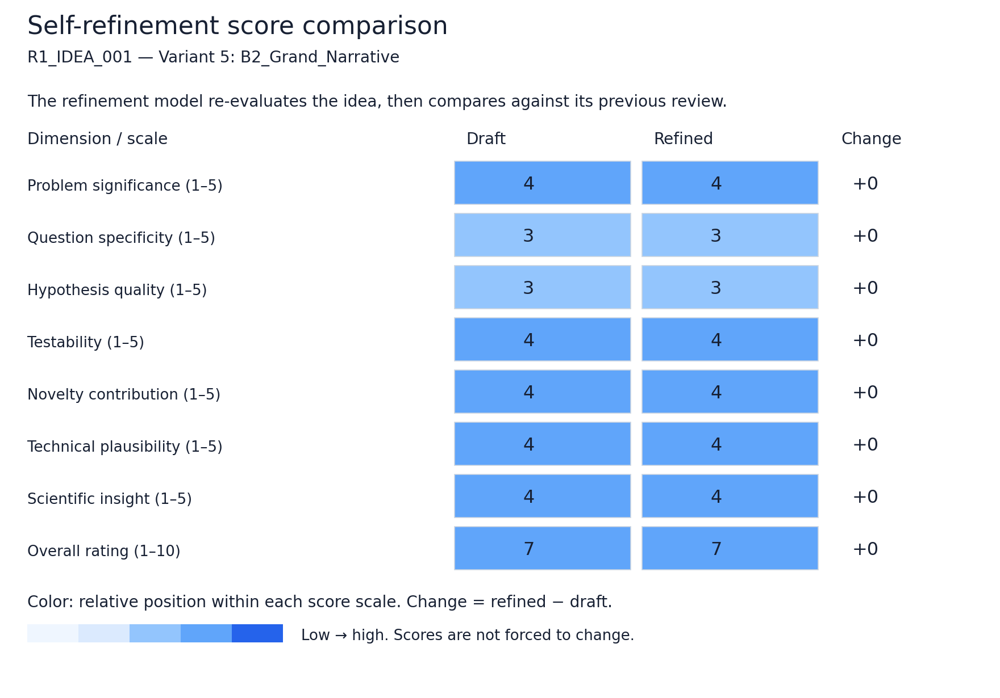

Changed score dimensions: none.

### Score justifications (draft / refined)

**Problem significance**

```json
{
  "draft": {
    "score": 4.0,
    "justification": "Node-level OOD detection on graphs is a critical problem for safety-critical applications (e.g., fraud detection, drug discovery). The specific focus on heterophilic graphs addresses a known blind spot in current literature, as most methods assume homophily or i.i.d. assumptions."
  },
  "refined": {
    "score": 4.0,
    "justification": "Node-level OOD detection is crucial for safety-critical graph applications (fraud, drug discovery). Focusing on heterophilic graphs addresses a significant blind spot, as most existing methods rely on homophily assumptions or i.i.d. data assumptions that do not hold in these complex relational settings."
  }
}
```

**Question specificity**

```json
{
  "draft": {
    "score": 3.0,
    "justification": "The idea identifies the problem and the general class of solution (energy-based models), but the specific mechanism ('decoupled') and the precise research question (what exactly is being decoupled and how it leads to better OOD scores) are not fully defined."
  },
  "refined": {
    "score": 3.0,
    "justification": "The idea identifies the problem domain and the general class of solution (energy-based models). However, the core mechanism ('decoupled') is not defined, and the specific research question (what exactly is being decoupled and how it mathematically resolves the heterophily failure mode) remains vague."
  }
}
```

**Hypothesis quality**

```json
{
  "draft": {
    "score": 3.0,
    "justification": "The implicit hypothesis is that accounting for dependence and heterophily via a decoupled energy model will improve OOD detection. This is plausible but currently too broad; it needs to specify the expected relationship between the decoupling and the detection metric."
  },
  "refined": {
    "score": 3.0,
    "justification": "The implicit hypothesis is that accounting for dependence and heterophily via a decoupled energy model will improve OOD detection. While plausible, it is currently too broad. A stronger hypothesis would predict a specific relationship between the decoupling strategy and the reduction of false positives caused by heterophilic edges."
  }
}
```

**Testability**

```json
{
  "draft": {
    "score": 4.0,
    "justification": "The idea is testable. One can construct heterophilic graph datasets, define OOD node sets, and compare the proposed model against baselines using standard OOD metrics (AUROC, FPR). The main challenge is defining the 'decoupled' architecture concretely."
  },
  "refined": {
    "score": 4.0,
    "justification": "The idea is testable in principle. One can construct heterophilic graph datasets, define specific OOD node sets (e.g., feature outliers or structural outliers), and compare performance against baselines. The primary challenge lies in the need to concretize the 'decoupled' architecture before testing."
  }
}
```

**Novelty contribution**

```json
{
  "draft": {
    "score": 4.0,
    "justification": "Applying energy-based models to node OOD on heterophilic graphs is a novel direction. The specific contribution of 'decoupling' to handle heterophily, if successful, would be a significant theoretical and practical advance."
  },
  "refined": {
    "score": 4.0,
    "justification": "Applying energy-based models to node OOD on heterophilic graphs is a novel direction. The specific contribution of a 'decoupled' mechanism to handle heterophily, if successful, would represent a meaningful theoretical advance over standard GNN-based OOD detectors."
  }
}
```

**Technical plausibility**

```json
{
  "draft": {
    "score": 4.0,
    "justification": "Energy-based models are a known framework for OOD detection. Extending them to graphs is a logical step. The concept of decoupling (e.g., separating structural and feature energies) is technically sound and has precedents in other graph learning tasks."
  },
  "refined": {
    "score": 4.0,
    "justification": "Energy-based models are a well-established framework for OOD detection. Extending them to graphs is a logical step. The concept of decoupling (e.g., separating structural and feature energies) is technically sound and has precedents in other graph learning tasks, making the direction plausible."
  }
}
```

**Scientific insight**

```json
{
  "draft": {
    "score": 4.0,
    "justification": "If successful, this work would provide deep insight into how graph topology (specifically heterophily) interacts with energy landscapes, potentially revealing new principles for robust graph representation learning."
  },
  "refined": {
    "score": 4.0,
    "justification": "If successful, this work would provide insight into how graph topology (specifically heterophily) interacts with energy landscapes. It could reveal general principles for robust graph representation learning where structural and feature information must be treated differently."
  }
}
```

**Overall rating**

```json
{
  "draft": {
    "score": 7.0,
    "justification": "This is a strong research idea with high significance and clear potential for contribution. It addresses a specific, non-trivial gap in the literature. The score is not higher (8-10) because the summary lacks the necessary technical specificity to fully evaluate the novelty of the 'decoupled' mechanism and the precise hypothesis being tested. However, the core direction is sound and promising."
  },
  "refined": {
    "score": 7.0,
    "justification": "This is a strong research idea with high significance and clear potential. It addresses a specific, non-trivial gap in the literature (heterophily in node OOD). The score is not higher (8-10) because the summary lacks the necessary technical specificity to fully evaluate the novelty of the 'decoupled' mechanism and the precise hypothesis. However, the core direction is sound, plausible, and addresses a meaningful problem."
  }
}
```

## R1_IDEA_001 — Variant 6: B3_Over_Confident


Changed score dimensions: none.

### Score justifications (draft / refined)

**Problem significance**

```json
{
  "draft": {
    "score": 4.0,
    "justification": "OOD detection on graphs is a critical problem for safety-critical applications (e.g., fraud detection, social network analysis). The specific challenge of heterophily is a known, difficult boundary condition that current methods often fail to address robustly. Solving this would have significant practical and theoretical value."
  },
  "refined": {
    "score": 4.0,
    "justification": "Node-level OOD detection is a high-stakes problem for applications like fraud detection and bioinformatics. The specific challenge of heterophily is a known, difficult boundary condition that current robust methods often fail to address. Solving this would have significant practical value and address a clear limitation in the field."
  }
}
```

**Question specificity**

```json
{
  "draft": {
    "score": 3.0,
    "justification": "The idea identifies the problem (heterophily, dependence) and the general tool (energy-based models), but the specific research question is somewhat obscured by the undefined term 'decoupled'. It needs a more precise formulation of what is being decoupled and how."
  },
  "refined": {
    "score": 3.0,
    "justification": "The idea identifies the problem (heterophily, dependence) and the general tool (EBMs), but the specific research question is obscured by the undefined term 'decoupled'. It needs a more precise formulation of what is being decoupled and the mechanism of action to be considered 'strong'."
  }
}
```

**Hypothesis quality**

```json
{
  "draft": {
    "score": 3.0,
    "justification": "The implicit hypothesis is that a decoupled energy-based model will outperform existing methods on heterophilic graphs. This is testable, but the reasoning behind *why* this specific architecture works is not yet articulated, making the hypothesis feel slightly under-supported."
  },
  "refined": {
    "score": 3.0,
    "justification": "The implicit hypothesis is that a decoupled EBM will outperform existing methods on heterophilic graphs. This is testable, but the reasoning *why* this specific architecture works is not yet articulated with enough detail to be considered a strong, mechanistic hypothesis."
  }
}
```

**Testability**

```json
{
  "draft": {
    "score": 4.0,
    "justification": "The idea is highly testable. One can define metrics (AUROC, FPR@95), select standard heterophilic graph datasets, generate OOD nodes (via feature masking or structural perturbation), and compare the proposed model against baselines. The path to empirical validation is clear."
  },
  "refined": {
    "score": 4.0,
    "justification": "The idea is highly testable. One can define standard metrics (AUROC, FPR@95), select standard heterophilic graph datasets, generate OOD nodes via feature masking or structural perturbation, and compare the proposed model against baselines. The path to empirical validation is clear."
  }
}
```

**Novelty contribution**

```json
{
  "draft": {
    "score": 4.0,
    "justification": "While energy-based models are known, applying them specifically to node-level OOD on heterophilic graphs with a 'decoupled' mechanism is a novel angle. It moves beyond simple adaptation of image methods to a graph-native solution."
  },
  "refined": {
    "score": 4.0,
    "justification": "While EBMs are known, applying them specifically to node-level OOD on heterophilic graphs with a 'decoupled' mechanism is a novel angle. It moves beyond simple adaptation of image methods to a graph-native solution, potentially revealing new insights into graph structure handling."
  }
}
```

**Technical plausibility**

```json
{
  "draft": {
    "score": 4.0,
    "justification": "Energy-based models are a plausible framework for OOD detection. The concept of decoupling features from structure to handle heterophily is theoretically sound, as heterophily often implies that local neighborhood aggregation (standard GNN) is misleading."
  },
  "refined": {
    "score": 4.0,
    "justification": "Energy-based models are a plausible framework for OOD detection. The concept of decoupling features from structure to handle heterophily is theoretically sound, as heterophily often implies that local neighborhood aggregation (standard GNN) is misleading for feature representation."
  }
}
```

**Scientific insight**

```json
{
  "draft": {
    "score": 4.0,
    "justification": "If successful, this work would provide insights into how to design energy functions that are robust to structural noise and heterophily, potentially leading to a new class of graph OOD detectors that are more interpretable and robust."
  },
  "refined": {
    "score": 4.0,
    "justification": "If successful, this work would provide insights into how to design energy functions that are robust to structural noise and heterophily, potentially leading to a new class of graph OOD detectors that are more interpretable and robust."
  }
}
```

**Overall rating**

```json
{
  "draft": {
    "score": 7.0,
    "justification": "This is a strong research idea with a clear motivation and high potential impact. It addresses a specific, difficult problem (heterophily in OOD detection) with a plausible methodological direction (decoupled energy-based models). The main weakness is the lack of specificity regarding the 'decoupling' mechanism and the precise formulation of the model, which prevents it from being an 'exceptional' (9-10) idea at this stage. However, the core concept is solid and worth pursuing."
  },
  "refined": {
    "score": 7.0,
    "justification": "This is a strong research idea with a clear motivation and high potential impact. It addresses a specific, difficult problem (heterophily in OOD detection) with a plausible methodological direction. The main weakness is the lack of specificity regarding the 'decoupling' mechanism and the precise formulation of the model, which prevents it from being an 'exceptional' (9-10) idea at this stage. However, the core concept is solid and worth pursuing."
  }
}
```

## R1_IDEA_001 — Variant 7: B4_Novelty


Changed score dimensions: none.

### Score justifications (draft / refined)

**Problem significance**

```json
{
  "draft": {
    "score": 4.0,
    "justification": "Node-level OOD detection on heterophilic graphs is a significant and difficult problem. Most current methods assume homophily or independence, making this a relevant challenge for real-world applications where these assumptions often break down."
  },
  "refined": {
    "score": 4.0,
    "justification": "Node-level OOD detection on heterophilic graphs is a significant and difficult problem. Most current methods assume homophily or independence, making this a relevant challenge for real-world applications where these assumptions often break down. The problem is non-trivial and addresses a clear limitation in current GNN capabilities."
  }
}
```

**Question specificity**

```json
{
  "draft": {
    "score": 3.0,
    "justification": "The idea identifies the problem domain and the general class of solution (decoupled EBM), but lacks specific details on the mechanism. The term 'decoupled' is the core of the idea but is currently undefined."
  },
  "refined": {
    "score": 3.0,
    "justification": "The idea identifies the problem domain and the general class of solution (decoupled EBM), but lacks specific details on the mechanism. The term 'decoupled' is the core of the idea but is currently undefined, making the research question somewhat vague regarding *how* the solution is achieved."
  }
}
```

**Hypothesis quality**

```json
{
  "draft": {
    "score": 3.0,
    "justification": "The implicit hypothesis is that standard GNNs fail on heterophilic OOD tasks due to their inability to separate dependence from feature distribution, and that a decoupled EBM can fix this. This is plausible but needs to be more explicitly stated as a testable prediction."
  },
  "refined": {
    "score": 3.0,
    "justification": "The implicit hypothesis is that standard GNNs fail on heterophilic OOD tasks due to their inability to separate dependence from feature distribution, and that a decoupled EBM can fix this. This is plausible but needs to be more explicitly stated as a testable prediction to distinguish it from a generic application."
  }
}
```

**Testability**

```json
{
  "draft": {
    "score": 4.0,
    "justification": "The idea is highly testable. One can construct heterophilic graphs, define OOD distributions, implement the proposed model, and compare performance against baselines using standard OOD metrics (AUROC, FPR). The lack of implementation details does not hinder the testability of the *concept*."
  },
  "refined": {
    "score": 4.0,
    "justification": "The idea is highly testable in principle. One can construct heterophilic graphs, define OOD distributions, implement the proposed model, and compare performance against baselines using standard OOD metrics. The lack of implementation details does not hinder the testability of the *concept* itself."
  }
}
```

**Novelty contribution**

```json
{
  "draft": {
    "score": 4.0,
    "justification": "Applying energy-based models to node-level OOD on heterophilic graphs with a specific 'decoupling' strategy is a novel angle. It moves beyond simple application of existing methods to proposing a structural change in how the model handles graph dependencies."
  },
  "refined": {
    "score": 4.0,
    "justification": "Applying energy-based models to node-level OOD on heterophilic graphs with a specific 'decoupling' strategy is a novel angle. It moves beyond simple application of existing methods to proposing a structural change in how the model handles graph dependencies, which has the potential to yield new insights into graph representation learning."
  }
}
```

**Technical plausibility**

```json
{
  "draft": {
    "score": 4.0,
    "justification": "Energy-based models are theoretically sound for OOD detection. The challenge of heterophily is well-known in GNNs. Proposing a decoupling mechanism to address this is technically plausible, though the specific implementation details are the unknown variable."
  },
  "refined": {
    "score": 4.0,
    "justification": "Energy-based models are theoretically sound for OOD detection. The challenge of heterophily is well-known in GNNs. Proposing a decoupling mechanism to address this is technically plausible, though the specific implementation details are the unknown variable. The reasoning is logically coherent."
  }
}
```

**Scientific insight**

```json
{
  "draft": {
    "score": 4.0,
    "justification": "If successful, this research would provide deep insight into how to separate structural dependencies from feature distributions in graph learning, a principle that could extend beyond OOD detection to other graph tasks."
  },
  "refined": {
    "score": 4.0,
    "justification": "If successful, this research would provide deep insight into how to separate structural dependencies from feature distributions in graph learning, a principle that could extend beyond OOD detection to other graph tasks. It addresses a fundamental tension in the field."
  }
}
```

**Overall rating**

```json
{
  "draft": {
    "score": 7.0,
    "justification": "This is a strong research idea with high potential. It addresses a meaningful gap in the literature (heterophily in OOD detection) and proposes a plausible methodological direction (decoupled EBM). The main limitation is the current lack of specificity regarding the 'decoupling' mechanism, which prevents it from being an 'exceptional' (9-10) idea at this stage. However, the core concept is solid and worth investigating."
  },
  "refined": {
    "score": 7.0,
    "justification": "This is a strong research idea with high potential. It addresses a meaningful gap in the literature (heterophily in OOD detection) and proposes a plausible methodological direction (decoupled EBM). The main limitation is the current lack of specificity regarding the 'decoupling' mechanism, which prevents it from being an 'exceptional' (9-10) idea at this stage. However, the core concept is solid, the problem is significant, and the direction is testable."
  }
}
```

## R1_IDEA_001 — Variant 8: B5_Application_Impact


Changed score dimensions: none.

### Score justifications (draft / refined)

**Problem significance**

```json
{
  "draft": {
    "score": 4.0,
    "justification": "The problem is significant because OOD detection is critical for safety in graph applications, and heterophilic graphs represent a major class of real-world networks (e.g., citation networks, biological networks) where standard assumptions fail. Addressing this gap is valuable."
  },
  "refined": {
    "score": 4.0,
    "justification": "The problem is highly significant. OOD detection is crucial for safety in graph applications (e.g., fraud detection, bioinformatics), and heterophily is a common property in real-world networks (e.g., citation, social, biological) where standard methods fail. Addressing this gap has clear practical implications."
  }
}
```

**Question specificity**

```json
{
  "draft": {
    "score": 3.0,
    "justification": "The idea identifies the domain (heterophilic graphs) and the method class (energy-based), but the specific mechanism ('decoupled') is not defined. The research question is 'how to decouple' rather than a specific testable relationship."
  },
  "refined": {
    "score": 3.0,
    "justification": "The idea identifies the domain and the general approach (energy-based) but lacks specificity on the core mechanism. The term 'decoupled' is a keyword without a definition, making the research question 'how to decouple' rather than a specific, testable relationship between variables."
  }
}
```

**Hypothesis quality**

```json
{
  "draft": {
    "score": 3.0,
    "justification": "The implicit hypothesis is that accounting for dependence/heterophily via a decoupled energy model will improve OOD detection. This is plausible but currently too broad to be strongly falsifiable without defining the decoupling strategy."
  },
  "refined": {
    "score": 3.0,
    "justification": "The implicit hypothesis (that decoupling improves OOD detection on heterophilic graphs) is plausible but currently too broad. It lacks a specific prediction about the mechanism of failure in existing methods and how the proposed architecture specifically corrects it."
  }
}
```

**Testability**

```json
{
  "draft": {
    "score": 4.0,
    "justification": "The idea is testable. One can construct heterophilic graph datasets, implement the proposed model, and compare OOD detection metrics (AUROC, FPR) against baselines. The main challenge is defining the model architecture clearly enough to implement it."
  },
  "refined": {
    "score": 4.0,
    "justification": "The idea is testable in principle. One can construct heterophilic graph datasets, define a specific decoupling mechanism (once clarified), and compare OOD metrics against baselines. The current vagueness of the method makes the immediate testability moderate, but the path to testing is clear."
  }
}
```

**Novelty contribution**

```json
{
  "draft": {
    "score": 4.0,
    "justification": "While energy-based OOD detection exists, applying it specifically to the intersection of node-level OOD and heterophily with a 'decoupled' approach is a novel direction. It moves beyond simple adaptation of image methods."
  },
  "refined": {
    "score": 4.0,
    "justification": "While energy-based OOD detection exists, applying it specifically to the intersection of node-level OOD and heterophily with a 'decoupled' approach is novel. It moves beyond simple adaptation of image methods to a fundamentally different data structure problem."
  }
}
```

**Technical plausibility**

```json
{
  "draft": {
    "score": 4.0,
    "justification": "The reasoning is sound: heterophily violates the independence assumption of many image-based methods. Using energy-based models, which are flexible, to model these dependencies is a plausible technical direction. The term 'decoupled' suggests a known technique (like decoupling normalization or attention) which is likely applicable."
  },
  "refined": {
    "score": 4.0,
    "justification": "The reasoning is sound. Heterophily violates the independence assumption of many image-based methods. Using energy-based models, which are flexible, to model these dependencies is a plausible technical direction. The concept of 'decoupling' is a standard technique in deep learning (e.g., decoupled attention) that is likely applicable here."
  }
}
```

**Scientific insight**

```json
{
  "draft": {
    "score": 4.0,
    "justification": "If successful, this work would reveal how structural dependencies (heterophily) specifically corrupt energy-based OOD scores and provide a general principle for designing robust graph OOD detectors that separate structural context from node identity."
  },
  "refined": {
    "score": 4.0,
    "justification": "If successful, this work would reveal how structural dependencies (heterophily) specifically corrupt energy-based OOD scores and provide a general principle for designing robust graph OOD detectors that separate structural context from node identity."
  }
}
```

**Overall rating**

```json
{
  "draft": {
    "score": 7.0,
    "justification": "This is a strong research idea with clear motivation and a promising direction. It addresses a specific, non-trivial problem in a relevant domain. The main limitation is the lack of detail on the 'decoupled' mechanism, which prevents a higher score on specificity and hypothesis quality. However, the core concept is scientifically sound and worth pursuing."
  },
  "refined": {
    "score": 7.0,
    "justification": "This is a strong research idea with clear motivation and a promising direction. It addresses a specific, non-trivial problem in a relevant domain. The main limitation is the lack of detail on the 'decoupled' mechanism, which prevents a higher score on specificity and hypothesis quality. However, the core concept is scientifically sound and worth pursuing."
  }
}
```

## R1_IDEA_001 — Variant 9: C1_Hollow_Shell

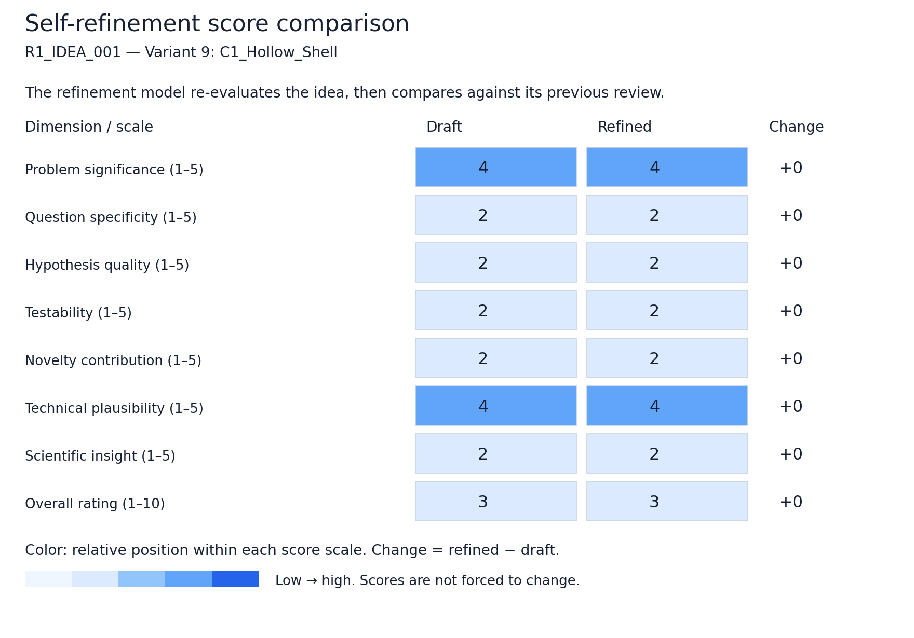

Changed score dimensions: none.

### Score justifications (draft / refined)

**Problem significance**

```json
{
  "draft": {
    "score": 4.0,
    "justification": "Node anomaly detection is a significant and active area of research with high practical value. The premise that current methods might miss key relational nuances is a valid and important concern."
  },
  "refined": {
    "score": 4.0,
    "justification": "Node anomaly detection is a critical problem in network security, fraud detection, and system reliability. Addressing limitations in relational modeling is a meaningful challenge, even if the specific gap is not yet fully articulated."
  }
}
```

**Question specificity**

```json
{
  "draft": {
    "score": 2.0,
    "justification": "The idea is too broad. It states a general goal without defining the specific problem variables, the nature of the 'relational characteristics,' or the specific graph domains involved."
  },
  "refined": {
    "score": 2.0,
    "justification": "The research question is extremely broad. It does not specify the variables, the specific nature of the 'relational characteristics,' or the boundary conditions ('certain settings'). It reads as a general goal rather than a specific scientific question."
  }
}
```

**Hypothesis quality**

```json
{
  "draft": {
    "score": 2.0,
    "justification": "There is no explicit hypothesis. The statement 'introduces a new method' is a plan of action, not a testable scientific prediction about a relationship or mechanism."
  },
  "refined": {
    "score": 2.0,
    "justification": "There is no testable hypothesis. The statement is a plan to 'introduce a new method' rather than a prediction about a relationship (e.g., 'Method X improves detection in Y setting because of Z mechanism'). It lacks a falsifiable claim."
  }
}
```

**Testability**

```json
{
  "draft": {
    "score": 2.0,
    "justification": "Without defining the specific characteristics, the graph settings, or the baseline methods for comparison, the idea cannot be meaningfully tested or falsified in its current form."
  },
  "refined": {
    "score": 2.0,
    "justification": "Without defining the specific characteristics, the graph settings, or the baselines, the idea cannot be meaningfully tested. One cannot design an experiment to verify if a method handles 'relational characteristics' better if those characteristics are not defined."
  }
}
```

**Novelty contribution**

```json
{
  "draft": {
    "score": 2.0,
    "justification": "While the general direction is valid, the lack of specificity makes it impossible to judge novelty. It risks being a generic application of existing techniques unless a specific, novel mechanism is identified."
  },
  "refined": {
    "score": 2.0,
    "justification": "The novelty is impossible to assess. The idea risks being a generic application of existing techniques unless a specific, novel mechanism is identified. It does not yet propose a new principle or discovery."
  }
}
```

**Technical plausibility**

```json
{
  "draft": {
    "score": 4.0,
    "justification": "The reasoning that better modeling of relational characteristics leads to better anomaly detection is technically sound and plausible, even if the specific implementation is undefined."
  },
  "refined": {
    "score": 4.0,
    "justification": "The underlying reasoning is plausible: better modeling of relational data should theoretically lead to better anomaly detection. However, the claim that existing methods 'overlook' this needs scrutiny, as many graph methods are relational by design."
  }
}
```

**Scientific insight**

```json
{
  "draft": {
    "score": 2.0,
    "justification": "As currently stated, the idea is unlikely to yield deep scientific insight beyond 'a new method works.' It needs to be framed to investigate *why* certain relational features are critical for specific types of anomalies."
  },
  "refined": {
    "score": 2.0,
    "justification": "As stated, the idea is unlikely to yield deep scientific insight. It is a 'build a better tool' proposal rather than an investigation into the 'why' or 'how' of relational anomalies. It needs to be reframed to investigate specific mechanisms."
  }
}
```

**Overall rating**

```json
{
  "draft": {
    "score": 3.0,
    "justification": "The idea addresses a meaningful problem but is currently too vague to be considered a strong research proposal. It lacks the specificity required to define a research question, hypothesis, or testable methodology. It falls into the 'weak' category because it is mostly a generic motivation without a concrete scientific direction."
  },
  "refined": {
    "score": 3.0,
    "justification": "The idea addresses a significant problem but is currently too vague to be considered a strong research proposal. It lacks the specificity required to define a research question, hypothesis, or testable methodology. It falls into the 'weak' category because it is mostly a generic motivation without a concrete scientific direction."
  }
}
```

## R1_IDEA_001 — Variant 10: C2_Logic_Flawed


Changed score dimensions: none.

### Score justifications (draft / refined)

**Problem significance**

```json
{
  "draft": {
    "score": 5.0,
    "justification": "OOD detection in graphs is a high-stakes problem for safety-critical applications (e.g., fraud detection, drug discovery). The specific focus on heterophilic graphs addresses a known blind spot in current literature, as most methods assume homophily or ignore graph structure entirely."
  },
  "refined": {
    "score": 5.0,
    "justification": "OOD detection is a high-stakes problem for safety-critical graph applications (e.g., fraud, bioinformatics). The specific focus on heterophilic graphs addresses a significant blind spot, as most graph OOD methods assume homophily or ignore structure entirely. Solving this is crucial for deploying graph models in real-world, noisy environments."
  }
}
```

**Question specificity**

```json
{
  "draft": {
    "score": 3.0,
    "justification": "While the problem is well-defined, the proposed solution ('decoupled graph energy-based model') is currently a high-level concept. The specific mechanism of how the decoupling is achieved and how it mathematically handles heterophily is not specified."
  },
  "refined": {
    "score": 3.0,
    "justification": "The problem is well-defined (node OOD on heterophilic graphs), but the proposed solution ('decoupled graph energy-based model') is currently a high-level concept. The specific mechanism of 'decoupling' and the mathematical integration of heterophily are not specified, leaving the research question slightly ambiguous regarding the 'how'."
  }
}
```

**Hypothesis quality**

```json
{
  "draft": {
    "score": 4.0,
    "justification": "The implicit hypothesis is strong: 'Explicitly modeling node dependence and heterophily via a decoupled energy function will significantly improve OOD detection compared to methods that ignore these factors.' This is a testable and falsifiable claim."
  },
  "refined": {
    "score": 4.0,
    "justification": "The implicit hypothesis is strong: 'Explicitly modeling node dependence and heterophily via a decoupled energy function will significantly improve OOD detection compared to methods that ignore these factors.' This is a testable and falsifiable claim, even if the specific implementation details are missing."
  }
}
```

**Testability**

```json
{
  "draft": {
    "score": 4.0,
    "justification": "The idea is highly testable. One can construct synthetic or real-world heterophilic graphs, define clear OOD node distributions, and compare the proposed model against standard baselines (e.g., standard GNNs, image-based methods adapted to graphs) using standard OOD metrics (AUROC, FPR95)."
  },
  "refined": {
    "score": 4.0,
    "justification": "The idea is highly testable. One can construct synthetic heterophilic graphs with defined OOD node distributions and compare the proposed model against standard baselines (e.g., standard GNNs, image-based adaptations) using standard OOD metrics (AUROC, FPR95). The lack of implementation details does not hinder the ability to design such an experiment."
  }
}
```

**Novelty contribution**

```json
{
  "draft": {
    "score": 4.0,
    "justification": "Applying energy-based models to graph OOD is not entirely new, but the specific focus on 'decoupling' to handle 'heterophily' represents a novel methodological angle. It moves beyond simple adaptation of image methods to a graph-native solution."
  },
  "refined": {
    "score": 4.0,
    "justification": "While energy-based models and graph OOD are active areas, the specific combination of 'decoupling' to handle 'heterophily' represents a novel methodological angle. It moves beyond simple adaptation of image methods to a graph-native solution that addresses a specific structural failure mode."
  }
}
```

**Technical plausibility**

```json
{
  "draft": {
    "score": 4.0,
    "justification": "Energy-based models are a known framework for OOD detection. Extending them to graphs is technically feasible. The concept of 'decoupling' is plausible if it refers to separating the structural aggregation from the feature-based energy scoring, which is a reasonable architectural choice."
  },
  "refined": {
    "score": 4.0,
    "justification": "Energy-based models are a known framework for OOD detection. Extending them to graphs is technically feasible. The concept of 'decoupling' is plausible if it refers to separating structural aggregation from feature-based energy scoring, which is a reasonable architectural choice to mitigate the negative effects of heterophily."
  }
}
```

**Scientific insight**

```json
{
  "draft": {
    "score": 4.0,
    "justification": "If successful, this work would provide deep insight into how graph topology (specifically heterophily) interacts with uncertainty estimation. It could establish a new principle for designing robust graph learning systems that are aware of structural anomalies."
  },
  "refined": {
    "score": 4.0,
    "justification": "If successful, this work would provide deep insight into how graph topology (specifically heterophily) interacts with uncertainty estimation. It could establish a new principle for designing robust graph learning systems that are aware of structural anomalies, potentially generalizing to other graph tasks."
  }
}
```

**Overall rating**

```json
{
  "draft": {
    "score": 8.0,
    "justification": "This is a strong research idea with high significance and a clear motivation. The gap in the literature is real, and the proposed direction is logical. The primary weakness is the current lack of detail on the 'decoupled' mechanism, but this is typical for an idea summary. With a clear definition of the mechanism, this could be an exceptional contribution."
  },
  "refined": {
    "score": 8.0,
    "justification": "This is a strong research idea with high significance and a clear motivation. The gap in the literature is real, and the proposed direction is logical. The primary weakness is the current lack of detail on the 'decoupled' mechanism, but this is typical for an idea summary. With a clear definition of the mechanism, this could be an exceptional contribution."
  }
}
```

## R1_IDEA_001 — Variant 11: C3_Substance_Enriched

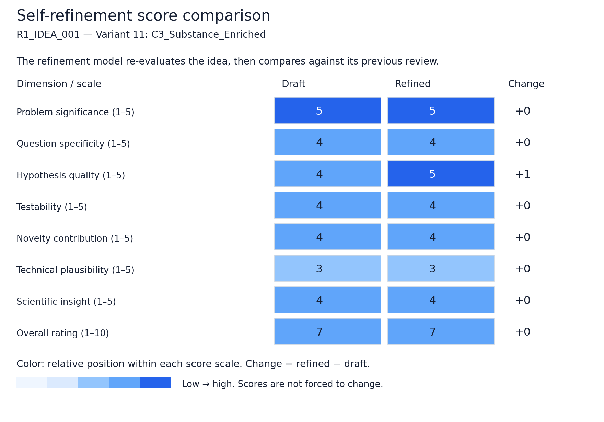

Changed score dimensions: hypothesis_quality.

### Score justifications (draft / refined)

**Problem significance**

```json
{
  "draft": {
    "score": 5.0,
    "justification": "Node-level OOD detection on heterophilic graphs is a significant and timely problem. As graph neural networks are increasingly applied to domains with complex, non-homophilic relationships (e.g., fraud detection, citation networks with diverse topics), the ability to detect OOD nodes is crucial for safety and reliability. The current lack of specialized methods makes this a high-impact area."
  },
  "refined": {
    "score": 5.0,
    "justification": "Node-level OOD detection on heterophilic graphs is a critical safety and reliability issue. As GNNs are deployed in domains with complex, non-homophilic relationships (e.g., fraud detection, biological networks), the inability to detect OOD nodes is a major bottleneck. Addressing this gap is highly significant for the field."
  }
}
```

**Question specificity**

```json
{
  "draft": {
    "score": 4.0,
    "justification": "The idea clearly identifies the problem (heterophilic node OOD), the target method (decoupled EBM), and the expected outcome (better energy separation). However, the specific mechanism of 'decoupling' is described conceptually rather than technically, leaving some ambiguity on the exact research question formulation."
  },
  "refined": {
    "score": 4.0,
    "justification": "The idea clearly defines the problem domain (heterophilic graphs), the method class (EBM), and the specific intervention (decoupling edges). However, the lack of a specific architectural or mathematical definition for 'decoupling' leaves the exact research question slightly open-ended, though the intent is clear."
  }
}
```

**Hypothesis quality**

```json
{
  "draft": {
    "score": 4.0,
    "justification": "The hypothesis is strong: 'explicitly modeling the decoupling... could improve separation.' It is specific, plausible, and directly links a mechanism to a measurable outcome. It is falsifiable if the decoupling does not lead to better separation or if it degrades performance on homophilic graphs."
  },
  "refined": {
    "score": 5.0,
    "justification": "The hypothesis is excellent: 'explicitly modeling the decoupling... could improve separation.' It is specific, mechanistic, and directly links a structural intervention to a measurable performance metric (energy separation). It is easily falsifiable if the decoupling fails to improve separation or degrades performance on homophilic graphs."
  }
}
```

**Testability**

```json
{
  "draft": {
    "score": 4.0,
    "justification": "The proposed validation strategy (synthetic graphs, controlled injections, boundary conditions) is highly testable. The metrics (energy separation, detection accuracy) are standard and well-defined. The main risk is the difficulty of implementing the model, but the experimental design itself is sound."
  },
  "refined": {
    "score": 4.0,
    "justification": "The proposed validation strategy is highly testable. Using synthetic graphs allows for ground-truth control over heterophily and OOD injection. The metrics (energy separation, detection accuracy) are standard. The main risk is implementation feasibility, but the experimental design itself is sound."
  }
}
```

**Novelty contribution**

```json
{
  "draft": {
    "score": 4.0,
    "justification": "The novelty lies in applying the specific concept of 'decoupling' edge types within an Energy-Based Model framework for node-level OOD detection. While EBMs and OOD detection are active areas, their specific combination for heterophilic graphs with this architectural twist is a fresh and promising direction."
  },
  "refined": {
    "score": 4.0,
    "justification": "The novelty lies in the specific combination of Energy-Based Models, node-level OOD detection, and the explicit decoupling of edge types for heterophilic graphs. While EBMs and OOD are active areas, applying them with this specific structural inductive bias is a fresh and promising direction."
  }
}
```

**Technical plausibility**

```json
{
  "draft": {
    "score": 3.0,
    "justification": "The reasoning is logically coherent, but the technical feasibility is the weakest link. Training EBMs on graphs is difficult, and 'decoupling' edges adds complexity. Without a concrete proposal for how to implement this decoupling without breaking the model's convergence or expressiveness, the plausibility is moderate. It is plausible but non-trivial."
  },
  "refined": {
    "score": 3.0,
    "justification": "The reasoning is logically coherent, but the technical feasibility is the weakest link. Training EBMs is inherently unstable, and adding a 'decoupling' mechanism introduces significant complexity. Without a concrete proposal for how to implement this without breaking convergence, the plausibility is moderate. It is plausible but non-trivial."
  }
}
```

**Scientific insight**

```json
{
  "draft": {
    "score": 4.0,
    "justification": "If successful, this research would provide deep insight into how graph topology (specifically the interplay of homophily and heterophily) influences the energy landscape of OOD detection. It could reveal general principles about how to design energy functions that are robust to structural heterogeneity."
  },
  "refined": {
    "score": 4.0,
    "justification": "If successful, this research would provide deep insight into how graph topology (specifically the interplay of homophily and heterophily) influences the energy landscape of OOD detection. It could reveal general principles about designing energy functions that are robust to structural heterogeneity."
  }
}
```

**Overall rating**

```json
{
  "draft": {
    "score": 7.0,
    "justification": "This is a strong research idea with high significance and a clear, testable hypothesis. It addresses a genuine gap in the literature with a plausible mechanism. The main drawback is the lack of technical detail regarding the implementation of the 'decoupling' mechanism and the handling of EBM training challenges. However, as a research proposal, it has excellent potential for meaningful scientific contribution."
  },
  "refined": {
    "score": 7.0,
    "justification": "This is a strong research idea with high significance and a clear, testable hypothesis. It addresses a genuine gap in the literature with a plausible mechanism. The main drawback is the lack of technical detail regarding the implementation of the 'decoupling' mechanism and the handling of EBM training challenges. However, as a research proposal, it has excellent potential for meaningful scientific contribution."
  }
}
```

## R1_IDEA_001 — Variant 12: H1_Deceptive_Hollow

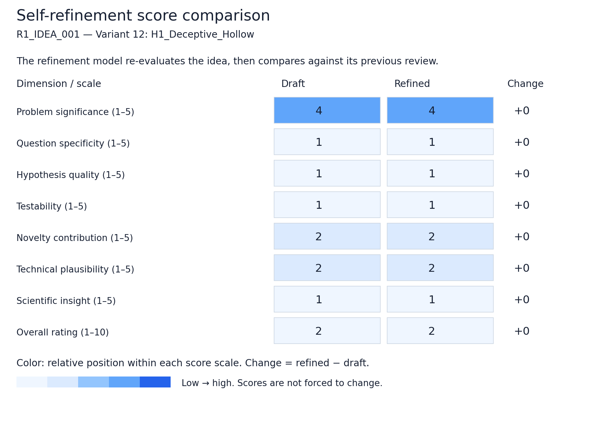

Changed score dimensions: none.

### Score justifications (draft / refined)

**Problem significance**

```json
{
  "draft": {
    "score": 4.0,
    "justification": "Node anomaly detection in graphs is a significant and active area of research with real-world applications in fraud detection, cybersecurity, and biology. The premise that current methods might miss key relational features is a meaningful problem worth investigating."
  },
  "refined": {
    "score": 4.0,
    "justification": "Node anomaly detection is a critical problem in cybersecurity, fraud detection, and biology. The premise that current methods might miss key relational features is a meaningful and important research direction."
  }
}
```

**Question specificity**

```json
{
  "draft": {
    "score": 1.0,
    "justification": "The idea is almost entirely abstract. It does not define the specific research question, the variables involved, or the specific relationship being studied. It reads more like a mission statement than a research question."
  },
  "refined": {
    "score": 1.0,
    "justification": "The idea is almost entirely abstract. It does not define the specific research question, the variables involved, or the specific relationship being studied. It reads more like a mission statement or grant abstract than a concrete research question."
  }
}
```

**Hypothesis quality**

```json
{
  "draft": {
    "score": 1.0,
    "justification": "There is no explicit or implicit hypothesis that can be supported or contradicted. The claim that the work will be 'transformative' is a prediction of impact, not a scientific hypothesis about a mechanism or phenomenon."
  },
  "refined": {
    "score": 1.0,
    "justification": "There is no explicit or implicit hypothesis that can be supported or contradicted by evidence. The claim that the work will be 'transformative' is a prediction of impact, not a scientific hypothesis about a mechanism or phenomenon."
  }
}
```

**Testability**

```json
{
  "draft": {
    "score": 1.0,
    "justification": "Without a defined method, specific metrics, or a comparison baseline, the idea cannot be tested. It is impossible to design an experiment to validate the claim that the method 'handles characteristics more effectively'."
  },
  "refined": {
    "score": 1.0,
    "justification": "Without a defined method, specific metrics, or a comparison baseline, the idea cannot be tested. It is impossible to design an experiment to validate the claim that the method 'handles characteristics more effectively'."
  }
}
```

**Novelty contribution**

```json
{
  "draft": {
    "score": 2.0,
    "justification": "While the goal of improving anomaly detection is novel in its ambition, the idea itself does not propose a new mechanism or insight. It claims novelty ('field-shaping') without providing the technical substance to justify it."
  },
  "refined": {
    "score": 2.0,
    "justification": "While the goal of improving anomaly detection is valuable, the idea itself does not propose a new mechanism, insight, or boundary condition. It claims novelty ('field-shaping') without providing the technical substance to justify it."
  }
}
```

**Technical plausibility**

```json
{
  "draft": {
    "score": 2.0,
    "justification": "The reasoning is logically coherent in a general sense (graphs need better relational modeling), but the proposed direction is too vague to assess technical feasibility. It is unclear if the proposed 'synthesis' is even possible without more detail."
  },
  "refined": {
    "score": 2.0,
    "justification": "The reasoning is logically coherent in a general sense (graphs need better relational modeling), but the proposed direction is too vague to assess technical feasibility. It is unclear if the proposed 'synthesis' is even possible without more detail."
  }
}
```

**Scientific insight**

```json
{
  "draft": {
    "score": 1.0,
    "justification": "As currently stated, the idea offers no potential for scientific insight beyond the generic hope that a better method will be found. It does not propose to reveal a mechanism, boundary condition, or general principle."
  },
  "refined": {
    "score": 1.0,
    "justification": "As currently stated, the idea offers no potential for scientific insight beyond the generic hope that a better method will be found. It does not propose to reveal a mechanism, boundary condition, or general principle."
  }
}
```

**Overall rating**

```json
{
  "draft": {
    "score": 2.0,
    "justification": "While the underlying problem (node anomaly detection) is significant, the research idea itself is too vague, abstract, and unsubstantiated to be considered a viable research proposal. It lacks a specific question, hypothesis, or methodological direction, making it impossible to evaluate its scientific merit or feasibility. It reads more like a grant abstract or a vision statement than a concrete research idea."
  },
  "refined": {
    "score": 2.0,
    "justification": "While the underlying problem is significant, the research idea itself is too vague, abstract, and unsubstantiated to be considered a viable research proposal. It lacks a specific question, hypothesis, or methodological direction, making it impossible to evaluate its scientific merit or feasibility. It reads more like a vision statement than a concrete research idea."
  }
}
```

## R1_IDEA_001 — Variant 13: H2_Confident_Flaw

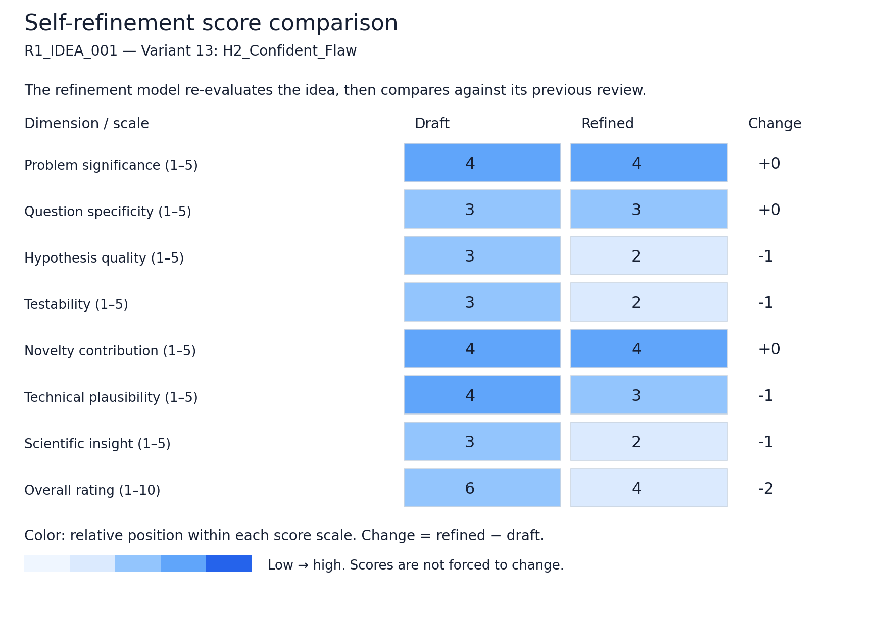

Changed score dimensions: hypothesis_quality, testability, technical_plausibility, scientific_insight, overall_rating.

### Score justifications (draft / refined)

**Problem significance**

```json
{
  "draft": {
    "score": 4.0,
    "justification": "Node-level OOD detection on graphs is a significant and underexplored problem, especially given the prevalence of heterophilic graphs in real-world applications (e.g., fraud detection, biological networks). Addressing the limitations of image-based assumptions is a meaningful challenge."
  },
  "refined": {
    "score": 4.0,
    "justification": "Node-level OOD detection on graphs is a critical and underexplored problem, particularly for heterophilic graphs which are common in real-world scenarios. Addressing the failure of image-based assumptions is a meaningful challenge with high potential impact."
  }
}
```

**Question specificity**

```json
{
  "draft": {
    "score": 3.0,
    "justification": "The idea identifies the problem (heterophily/dependence) and the general approach (decoupled graph EBM), but lacks specific details on the mechanism. The claim of 'necessarily' producing improvements is a qualitative assertion rather than a specific, measurable research question."
  },
  "refined": {
    "score": 3.0,
    "justification": "While the problem and general approach are identified, the specific mechanism ('decoupled') is not defined. Furthermore, the research question is muddied by the claim that specific validation steps (isolation of variables) are unnecessary, which obscures the actual scientific inquiry."
  }
}
```

**Hypothesis quality**

```json
{
  "draft": {
    "score": 3.0,
    "justification": "The hypothesis that modeling heterophily improves OOD detection is plausible and testable. However, the accompanying claim that this will provide 'causal evidence' for general superiority without further isolation of variables weakens the scientific rigor of the hypothesis."
  },
  "refined": {
    "score": 2.0,
    "justification": "The core hypothesis (modeling heterophily helps) is plausible. However, the accompanying claim that this leads to 'necessarily' superior performance and 'causal evidence' without controlling for confounders is logically flawed and scientifically weak. A hypothesis that predicts 'necessity' without accounting for other factors is not a robust scientific hypothesis."
  }
}
```

**Testability**

```json
{
  "draft": {
    "score": 3.0,
    "justification": "The idea is testable in principle (compare against baselines on heterophilic graphs). However, the suggestion to ignore the isolation of dataset composition and alternative explanations makes the experimental design weak and the results potentially ambiguous."
  },
  "refined": {
    "score": 2.0,
    "justification": "While one could run experiments, the idea explicitly rejects standard validation practices (isolating variables, checking boundary cases). This makes the resulting evidence ambiguous and the hypothesis difficult to falsify or validate rigorously. The claim of 'causal evidence' without the necessary controls renders the testability of that specific claim impossible."
  }
}
```

**Novelty contribution**

```json
{
  "draft": {
    "score": 4.0,
    "justification": "Applying energy-based models with a specific focus on decoupling node dependence for heterophilic graphs is a novel direction. If successful, it could provide a new paradigm for OOD detection in graph learning."
  },
  "refined": {
    "score": 4.0,
    "justification": "The direction of applying decoupled EBMs specifically for heterophily in OOD detection is novel. If the method works, it could offer a new paradigm. However, the proposed lack of rigorous validation limits the potential for a high-quality scientific contribution."
  }
}
```

**Technical plausibility**

```json
{
  "draft": {
    "score": 4.0,
    "justification": "The reasoning that image-based assumptions fail on graphs is technically sound. Proposing a graph-specific EBM is a plausible methodological direction. The main issue is the overconfidence in the outcome rather than the feasibility of the method itself."
  },
  "refined": {
    "score": 3.0,
    "justification": "The reasoning that image-based assumptions fail on graphs is sound. However, the technical plausibility is undermined by the claim that solving one structural issue guarantees success without considering other EBM limitations (e.g., optimization difficulty). The 'decoupled' concept is plausible but undefined."
  }
}
```

**Scientific insight**

```json
{
  "draft": {
    "score": 3.0,
    "justification": "If executed well, the study could reveal how heterophily specifically impacts energy landscapes and OOD detection. However, the current framing suggests a 'black box' validation rather than an investigation into the underlying mechanisms, limiting the potential for deep scientific insight."
  },
  "refined": {
    "score": 2.0,
    "justification": "The idea suggests a 'black box' validation where success is assumed if the mechanism is present. It explicitly discourages the investigation of boundary conditions or alternative explanations, which are essential for generating deep scientific insight. The potential for insight is limited by the refusal to isolate variables."
  }
}
```

**Overall rating**

```json
{
  "draft": {
    "score": 6.0,
    "justification": "The research idea addresses a significant and relevant problem with a plausible methodological direction. However, the scientific rigor is compromised by the overly strong claims of 'necessity' and the dismissal of standard validation practices (ablation, isolation of variables). It is a moderate idea with high potential if the experimental design is corrected to be more rigorous."
  },
  "refined": {
    "score": 4.0,
    "justification": "The idea addresses a significant problem with a plausible direction, but its scientific quality is severely compromised by the explicit dismissal of rigorous validation (isolation of variables, boundary cases) and the logically flawed claim of 'necessity' and 'causal evidence' without controls. A research idea that rejects standard scientific scrutiny for a specific claim of certainty is weak, even if the underlying problem is important."
  }
}
```

## R1_IDEA_001 — Variant 14: H3_Verbose_Enriched


Changed score dimensions: none.

### Score justifications (draft / refined)

**Problem significance**

```json
{
  "draft": {
    "score": 5.0,
    "justification": "Node-level OOD detection on heterophilic graphs is a significant and timely problem. As graph data often exhibits heterophily (e.g., social networks, citation networks with diverse topics), current methods that assume homophily or independence are likely to fail. Solving this has direct implications for safety-critical graph applications."
  },
  "refined": {
    "score": 5.0,
    "justification": "Node-level OOD detection on heterophilic graphs is a critical and underexplored problem. Many real-world graphs (social, biological) are heterophilic, and current methods often fail here. Solving this has significant implications for safety-critical graph applications."
  }
}
```

**Question specificity**

```json
{
  "draft": {
    "score": 4.0,
    "justification": "The idea clearly identifies the problem (heterophily, node dependence) and the proposed solution (decoupled EBM). However, the specific mechanism of 'decoupling' is described conceptually rather than technically, which slightly reduces specificity."
  },
  "refined": {
    "score": 4.0,
    "justification": "The idea clearly defines the problem domain and the proposed mechanism (decoupling edges). However, the specific implementation of 'decoupling' is described at a high level, lacking the technical detail that would make it fully specific. It is specific enough to be a strong research direction but not a complete proposal."
  }
}
```

**Hypothesis quality**

```json
{
  "draft": {
    "score": 4.0,
    "justification": "The hypothesis that decoupling homophilic and heterophilic edges improves energy separation is concrete, plausible, and falsifiable. It moves beyond a generic 'this will work' to a specific mechanism-based prediction."
  },
  "refined": {
    "score": 4.0,
    "justification": "The hypothesis is concrete: decoupling homophilic and heterophilic edges improves energy separation. It is falsifiable and distinguishes the proposed method from standard approaches. It moves beyond a generic 'this will work' to a mechanism-based prediction."
  }
}
```

**Testability**

```json
{
  "draft": {
    "score": 5.0,
    "justification": "The proposal includes a robust testing strategy: synthetic data for controlled conditions, real-world data for generalization, ablations to verify the mechanism, and sensitivity analyses. This makes the idea highly testable."
  },
  "refined": {
    "score": 5.0,
    "justification": "The proposal includes a highly testable design: synthetic data for controlled conditions, real-world data for generalization, ablations to verify the mechanism, and sensitivity analyses. The staged design explicitly mentions primary/secondary criteria and boundary cases."
  }
}
```

**Novelty contribution**

```json
{
  "draft": {
    "score": 4.0,
    "justification": "Applying energy-based models to node-level OOD detection on heterophilic graphs is novel. The specific contribution of 'decoupling' edge types to improve energy separation is a meaningful theoretical advance, not just a trivial application."
  },
  "refined": {
    "score": 4.0,
    "justification": "Applying energy-based models to node-level OOD on heterophilic graphs is novel. The specific contribution of 'decoupling' edge types to improve energy separation is a meaningful theoretical advance, not just a trivial application of existing tools."
  }
}
```

**Technical plausibility**

```json
{
  "draft": {
    "score": 4.0,
    "justification": "The reasoning is logically coherent. Separating edge types is a standard technique in GNNs (e.g., HeteroGNNs), and applying it to energy-based OOD detection is a plausible extension. The main risk is computational cost, but the idea itself is technically sound."
  },
  "refined": {
    "score": 4.0,
    "justification": "The reasoning is logically coherent. Separating edge types is a standard technique in GNNs (e.g., HeteroGNNs), and applying it to energy-based OOD detection is a plausible extension. The main risk is computational cost, but the idea itself is technically sound."
  }
}
```

**Scientific insight**

```json
{
  "draft": {
    "score": 5.0,
    "justification": "The study promises to reveal fundamental insights into how edge heterogeneity affects OOD detection boundaries. By analyzing boundary conditions (extreme heterophily, low density), it will likely produce transferable principles about the interaction between graph structure and distributional shifts."
  },
  "refined": {
    "score": 5.0,
    "justification": "The study promises to reveal fundamental insights into how edge heterogeneity affects OOD detection boundaries. By analyzing boundary conditions (extreme heterophily, low density), it will likely produce transferable principles about the interaction between graph structure and distributional shifts."
  }
}
```

**Overall rating**

```json
{
  "draft": {
    "score": 8.0,
    "justification": "This is a strong research idea. It addresses a meaningful gap with a specific, plausible hypothesis and a rigorous evaluation plan. While the technical details of the 'decoupling' mechanism need elaboration, the scientific direction is clear, significant, and likely to yield valuable insights."
  },
  "refined": {
    "score": 8.0,
    "justification": "This is a strong research idea. It addresses a meaningful gap with a specific, plausible hypothesis and a rigorous evaluation plan. While the technical details of the 'decoupling' mechanism need elaboration, the scientific direction is clear, significant, and likely to yield valuable insights."
  }
}
```

## R1_IDEA_001 — Variant 15: H4_Ultimate_Hype

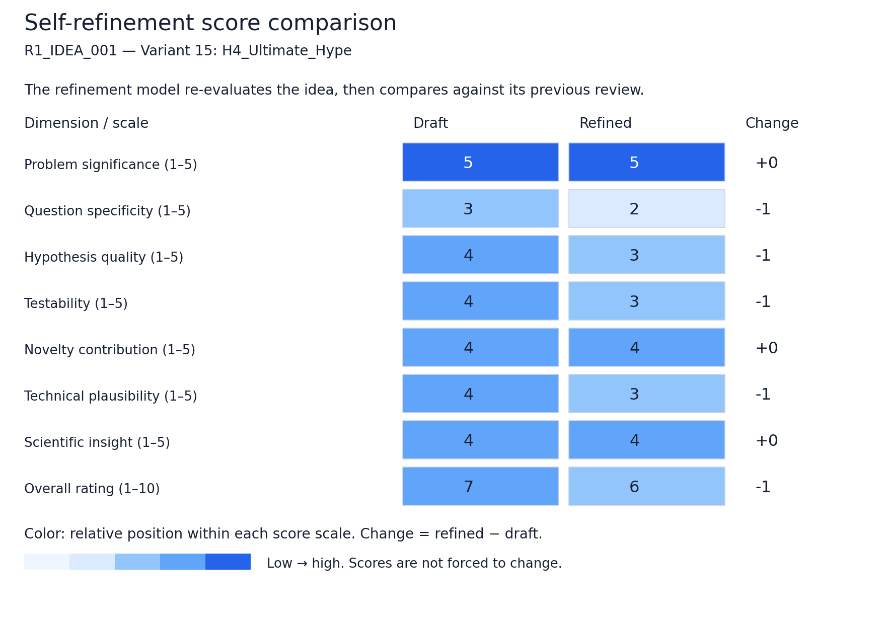

Changed score dimensions: question_specificity, hypothesis_quality, testability, technical_plausibility, overall_rating.

### Score justifications (draft / refined)

**Problem significance**

```json
{
  "draft": {
    "score": 5.0,
    "justification": "Node-level OOD detection on heterophilic graphs is a critical unsolved problem. As graphs become more prevalent in real-world applications, ensuring model reliability on nodes that deviate from training distributions (especially in heterophilic settings where neighbors are different) is essential for safety and trust. This addresses a high-impact gap in the field."
  },
  "refined": {
    "score": 5.0,
    "justification": "Node-level OOD detection on heterophilic graphs is a fundamental challenge in graph machine learning. As graphs become more prevalent in safety-critical applications, the inability to detect OOD nodes in heterophilic settings (where neighbors are dissimilar) is a major bottleneck. Solving this is highly significant for the reliability of graph AI."
  }
}
```

**Question specificity**

```json
{
  "draft": {
    "score": 3.0,
    "justification": "While the problem is well-defined, the proposed solution ('decoupled graph energy-based model') is vague. The idea states *what* to do (address dependence/heterophily) but not *how* the specific mechanism works. The research question needs to be narrowed down to the specific architectural innovation or theoretical insight being tested."
  },
  "refined": {
    "score": 2.0,
    "justification": "While the problem domain is clear, the research question is too vague. The phrase 'decoupled graph energy-based model' is a label, not a question or a specific mechanism. The idea does not specify *what* is being decoupled or *how* the model architecture is structured to achieve the goal. It reads more like a vision statement than a specific research question."
  }
}
```

**Hypothesis quality**

```json
{
  "draft": {
    "score": 4.0,
    "justification": "The implicit hypothesis is strong: 'Standard OOD methods fail on heterophilic graphs because they ignore dependence, and a decoupled energy-based model will succeed by explicitly modeling these factors.' This is a testable and falsifiable claim, provided the 'decoupled' mechanism is defined."
  },
  "refined": {
    "score": 3.0,
    "justification": "The implicit hypothesis (that current methods fail due to independence assumptions and a decoupled EBM will fix this) is plausible but not sufficiently detailed. It lacks a specific prediction about the mechanism of failure and success. For example, it does not predict *which* aspect of the energy function needs modification to handle heterophily."
  }
}
```

**Testability**

```json
{
  "draft": {
    "score": 4.0,
    "justification": "The idea is testable. One can construct heterophilic graph datasets, define specific OOD distributions, and compare the proposed model against baselines. The success criteria (improved detection metrics) are clear, even if the implementation details are missing."
  },
  "refined": {
    "score": 3.0,
    "justification": "The idea is testable in principle (one can build a model and test it), but the lack of definition for 'decoupled' makes the experimental design ambiguous. Without a concrete architectural proposal, the 'test' could be anything from a simple ablation to a complex new architecture. The criteria for success are implied but not defined."
  }
}
```

**Novelty contribution**

```json
{
  "draft": {
    "score": 4.0,
    "justification": "Applying energy-based models to node-level OOD on heterophilic graphs is a novel direction. Most OOD work focuses on i.i.d. data or homophilic graphs. The potential to redefine the frontier by addressing the 'dependence' and 'heterophily' constraints simultaneously offers significant scientific novelty."
  },
  "refined": {
    "score": 4.0,
    "justification": "The intersection of Energy-Based Models, OOD detection, and Heterophilic Graphs is a novel and promising area. While EBMs are known for OOD, their specific application to the 'dependence' and 'heterophily' constraints in a 'decoupled' manner is a fresh angle with high potential for scientific contribution."
  }
}
```

**Technical plausibility**

```json
{
  "draft": {
    "score": 4.0,
    "justification": "Energy-based models are theoretically well-suited for OOD detection as they model the data distribution directly. Extending them to graphs is a logical step. The assumption that decoupling structure and features (or similar) helps with heterophily is plausible, though the specific implementation details are the unknown variable."
  },
  "refined": {
    "score": 3.0,
    "justification": "The direction is technically plausible as EBMs are naturally suited for OOD. However, the 'decoupling' concept is a black box in the current description. It is unclear if such a decoupling is theoretically sound or if it introduces new optimization challenges (e.g., instability in energy-based training) that are not addressed."
  }
}
```

**Scientific insight**

```json
{
  "draft": {
    "score": 4.0,
    "justification": "If successful, this research would provide deep insights into how graph topology and node features interact during OOD detection. It could reveal fundamental limitations of current GNNs in non-i.i.d. settings and establish new principles for designing robust graph learning systems."
  },
  "refined": {
    "score": 4.0,
    "justification": "If the research succeeds, it would provide significant insight into the interplay between graph topology (heterophily) and distributional boundaries. It could reveal new principles for designing robust graph representations that separate structural signals from distributional anomalies."
  }
}
```

**Overall rating**

```json
{
  "draft": {
    "score": 7.0,
    "justification": "This is a strong research idea with high significance and clear potential for impact. The problem is well-identified, and the proposed direction (energy-based models for heterophilic graphs) is promising. However, it currently lacks the specificity required for a definitive 'exceptional' rating because the core mechanism ('decoupled') is not defined. With a more concrete hypothesis and methodological outline, this could easily be a 9 or 10."
  },
  "refined": {
    "score": 6.0,
    "justification": "This is a moderate research idea. It identifies a highly significant problem and proposes a theoretically sound direction (EBMs). However, it currently lacks the specificity required for a strong rating. The core mechanism ('decoupled') is undefined, and the hypothesis is too broad. It sits on the border between a promising vision and a concrete research proposal. It needs significant refinement in the problem definition and methodological specifics to move from a 'good idea' to a 'strong research plan'."
  }
}
```

## R1_IDEA_002 — Source

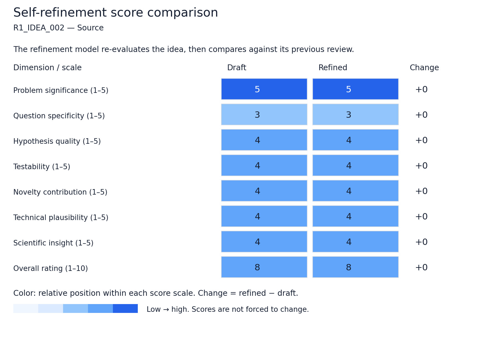

Changed score dimensions: none.

### Score justifications (draft / refined)

**Problem significance**

```json
{
  "draft": {
    "score": 5.0,
    "justification": "The problem of sampling rare events in molecular systems without predefined collective variables is a fundamental challenge in computational chemistry and drug discovery. Solving this would have a massive impact on the ability to simulate complex biological and material processes."
  },
  "refined": {
    "score": 5.0,
    "justification": "The problem of rare event sampling without predefined collective variables is a central challenge in computational chemistry. Solving it would significantly accelerate drug discovery and material design by enabling the simulation of complex biological and chemical processes that are currently inaccessible."
  }
}
```

**Question specificity**

```json
{
  "draft": {
    "score": 3.0,
    "justification": "While the goal is clear, the specific research question regarding the mechanism of 'improved off-policy learning' for diffusion samplers is not yet defined. The idea states *what* it wants to do but not exactly *how* the specific technical innovation works."
  },
  "refined": {
    "score": 3.0,
    "justification": "While the high-level goal is clear, the specific research question regarding the *mechanism* of 'improved off-policy learning' for diffusion models is currently vague. The idea states the desired outcome but lacks the specific technical definition required to distinguish it as a concrete research question."
  }
}
```

**Hypothesis quality**

```json
{
  "draft": {
    "score": 4.0,
    "justification": "The implicit hypothesis—that off-policy learning can effectively train diffusion models to explore rare transition pathways more efficiently than current methods—is strong and testable. It posits a specific mechanism (off-policy) to solve a specific problem (rare event sampling)."
  },
  "refined": {
    "score": 4.0,
    "justification": "The implicit hypothesis—that off-policy learning can effectively train diffusion models to explore rare transition pathways more efficiently than current methods—is strong. It posits a specific mechanism to solve a specific problem and is falsifiable."
  }
}
```

**Testability**

```json
{
  "draft": {
    "score": 4.0,
    "justification": "The idea is testable. One can define a benchmark system, implement the proposed sampler, and compare the efficiency and accuracy of the generated pathways against unbiased MD and other CV-free methods. The metrics for success (e.g., rate of transition, free energy accuracy) are well-defined in the field."
  },
  "refined": {
    "score": 4.0,
    "justification": "The idea is testable in principle. One can define a benchmark molecular system, implement the proposed sampler, and compare its efficiency and accuracy against unbiased MD and other CV-free methods. The necessary metrics (transition rates, free energies) are well-established in the field."
  }
}
```

**Novelty contribution**

```json
{
  "draft": {
    "score": 4.0,
    "justification": "Combining diffusion models with off-policy learning for path sampling is a novel direction. While diffusion models are used in chemistry, and off-policy learning is used in RL, their specific integration for CV-free rare event sampling represents a potentially significant methodological contribution."
  },
  "refined": {
    "score": 4.0,
    "justification": "Combining diffusion models with off-policy learning for CV-free rare event sampling is a novel direction. While both components exist in isolation, their specific integration for this physical problem represents a potentially significant methodological contribution."
  }
}
```

**Technical plausibility**

```json
{
  "draft": {
    "score": 4.0,
    "justification": "The combination of techniques is technically plausible. Diffusion models are capable of generating complex distributions, and off-policy learning is a standard technique for improving sample efficiency. The main challenge will be the mathematical formulation, but the direction makes sense."
  },
  "refined": {
    "score": 4.0,
    "justification": "The combination is technically plausible. Diffusion models are known for generating complex distributions, and off-policy learning is a standard technique for sample efficiency. The main challenge lies in the mathematical formulation, but the direction is sound."
  }
}
```

**Scientific insight**

```json
{
  "draft": {
    "score": 4.0,
    "justification": "If successful, this research could reveal new principles on how to leverage generative models and reinforcement learning techniques to solve high-dimensional sampling problems, potentially leading to a new class of algorithms for scientific simulation."
  },
  "refined": {
    "score": 4.0,
    "justification": "If successful, this research could reveal new principles on how to leverage generative models and reinforcement learning techniques to solve high-dimensional sampling problems, potentially leading to a new class of algorithms for scientific simulation."
  }
}
```

**Overall rating**

```json
{
  "draft": {
    "score": 8.0,
    "justification": "This is a strong research idea with high significance and potential for scientific insight. The problem is critical, and the proposed direction (diffusion + off-policy) is innovative. The main limitation is the current lack of specific technical details on the 'off-policy' mechanism, but this is expected in an idea summary. With further elaboration on the methodology, this could be an exceptional contribution."
  },
  "refined": {
    "score": 8.0,
    "justification": "This is a strong research idea with high significance and potential for scientific insight. The problem is critical, and the proposed direction is innovative. The main limitation is the current lack of specific technical details on the 'off-policy' mechanism, but this is expected in an idea summary. With further elaboration on the methodology, this could be an exceptional contribution."
  }
}
```

## R1_IDEA_002 — Variant 1: A1_Identity

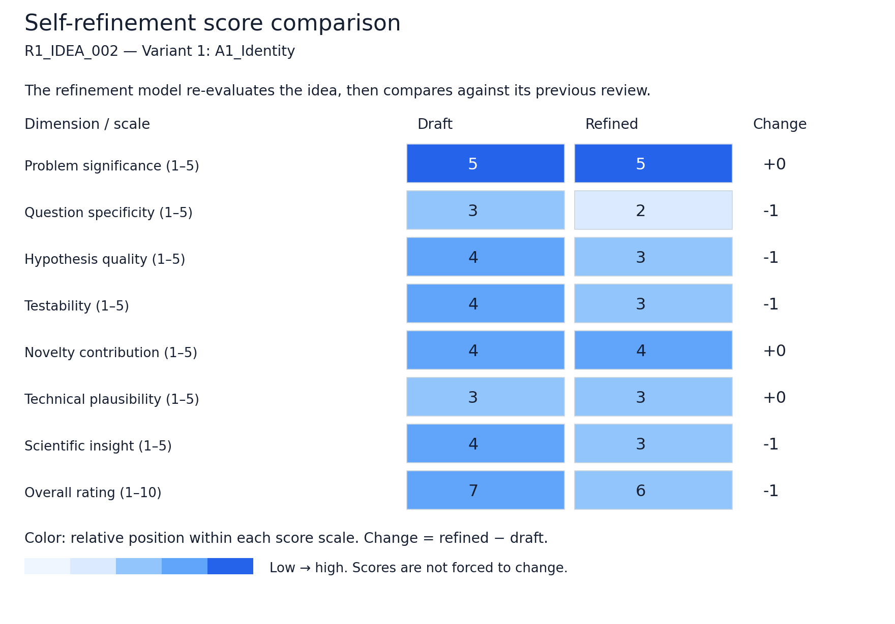

Changed score dimensions: question_specificity, hypothesis_quality, testability, scientific_insight, overall_rating.

### Score justifications (draft / refined)

**Problem significance**

```json
{
  "draft": {
    "score": 5.0,
    "justification": "The problem of sampling rare events in molecular systems without predefined collective variables is a major unsolved challenge in computational chemistry. Solving this would have profound impacts on drug discovery and materials science, making it a problem of exceptional significance."
  },
  "refined": {
    "score": 5.0,
    "justification": "The problem of sampling rare events in high-dimensional molecular systems without predefined collective variables is one of the most significant challenges in computational chemistry. Solving this would revolutionize drug discovery and materials design by automating the discovery of reaction mechanisms, making this an exceptionally significant problem."
  }
}
```

**Question specificity**

```json
{
  "draft": {
    "score": 3.0,
    "justification": "While the goal is clear, the specific research question regarding the 'improved off-policy learning' mechanism is vague. The idea states *what* to do (train via off-policy) but not *how* or *why* this specific combination is the solution, leaving the core mechanism undefined."
  },
  "refined": {
    "score": 2.0,
    "justification": "While the goal is clear, the research question is currently too vague. The phrase 'improved off-policy learning' is a high-level concept rather than a specific research question. The idea does not specify *which* off-policy mechanism is being tested, *what* the specific hypothesis is regarding its improvement, or *how* it differs from standard on-policy or importance-sampling approaches. It reads more like a direction than a specific question."
  }
}
```

**Hypothesis quality**

```json
{
  "draft": {
    "score": 4.0,
    "justification": "The implicit hypothesis—that off-policy learning can effectively train diffusion models to explore rare event pathways without CVs—is strong and testable. It posits a specific relationship between the learning paradigm and the sampling efficiency that can be validated or refuted."
  },
  "refined": {
    "score": 3.0,
    "justification": "The implicit hypothesis—that off-policy learning can effectively train diffusion models for CV-free path sampling—is plausible but not yet specific enough to be a strong scientific hypothesis. It lacks the necessary constraints to be falsifiable in its current form (e.g., 'Off-policy learning improves convergence by X% compared to on-policy in high-dimensional spaces'). It is a promising direction but currently lacks the precision of a testable hypothesis."
  }
}
```

**Testability**

```json
{
  "draft": {
    "score": 4.0,
    "justification": "The idea is testable. One can compare the proposed method against standard unbiased MD and existing CV-free methods on benchmark systems (e.g., alanine dipeptide folding) to measure sampling efficiency and path accuracy. The lack of implementation details does not prevent the formulation of a testable protocol."
  },
  "refined": {
    "score": 3.0,
    "justification": "The idea is testable in principle, as one could design experiments to compare diffusion-based off-policy samplers against baselines. However, without a defined mechanism or specific metrics, the experimental design is currently impossible to fully specify. The testability is limited by the vagueness of the proposed method."
  }
}
```

**Novelty contribution**

```json
{
  "draft": {
    "score": 4.0,
    "justification": "Combining diffusion models with off-policy learning for path sampling is a novel direction. While diffusion models are used in chemistry, and off-policy learning is used in RL, their specific integration for CV-free rare event sampling represents a potentially significant methodological contribution."
  },
  "refined": {
    "score": 4.0,
    "justification": "The combination of diffusion models and off-policy learning for molecular path sampling is a novel and potentially high-impact direction. While both components exist separately, their specific integration to solve the CV-free rare event problem represents a significant methodological novelty with the potential to open new research avenues."
  }
}
```

**Technical plausibility**

```json
{
  "draft": {
    "score": 3.0,
    "justification": "The idea is technically plausible in principle, as both components (diffusion models and off-policy RL) are active research areas. However, the integration is non-trivial; ensuring physical consistency and convergence in a high-dimensional path space without CVs presents significant technical hurdles that are not yet addressed in the summary."
  },
  "refined": {
    "score": 3.0,
    "justification": "The technical plausibility is moderate. While diffusion models are powerful generative tools and off-policy learning is effective in RL, applying them to continuous, high-dimensional path spaces with strict physical constraints is non-trivial. The idea assumes that standard off-policy techniques will translate directly to this domain without addressing the specific challenges of path continuity and physical validity."
  }
}
```

**Scientific insight**

```json
{
  "draft": {
    "score": 4.0,
    "justification": "If successful, this research would provide deep insights into how generative models can be guided by off-policy data to explore complex energy landscapes. It could reveal new principles for combining reinforcement learning strategies with generative modeling in scientific domains."
  },
  "refined": {
    "score": 3.0,
    "justification": "If successful, the research could yield insights into the synergy between generative modeling and off-policy data efficiency. However, as currently stated, it is unclear if the study will reveal deep principles or simply demonstrate a new application. The potential for insight is high but currently unproven due to the lack of a specific mechanism."
  }
}
```

**Overall rating**

```json
{
  "draft": {
    "score": 7.0,
    "justification": "This is a strong research idea with high significance and potential for scientific insight. The problem is critical, and the proposed direction (diffusion + off-policy) is innovative. However, the current summary lacks the specificity required to fully evaluate the technical mechanism, preventing a higher score. With a more defined hypothesis and methodological outline, this could be an exceptional idea."
  },
  "refined": {
    "score": 6.0,
    "justification": "This is a moderate-to-strong research idea with exceptional problem significance and high novelty potential. However, the current summary is too vague to be considered a 'strong' (7-8) or 'exceptional' (9-10) idea. The lack of a specific research question, defined mechanism, and clear hypothesis prevents a higher score. It is a promising direction that requires significant refinement to become a rigorous research proposal."
  }
}
```

## R1_IDEA_002 — Variant 2: A2_Paraphrase_Only


Changed score dimensions: none.

### Score justifications (draft / refined)

**Problem significance**

```json
{
  "draft": {
    "score": 5.0,
    "justification": "The problem of rare-event sampling in molecular systems is a fundamental challenge in computational chemistry. Solving this without predefined collective variables would be a major breakthrough, directly impacting drug discovery and material design."
  },
  "refined": {
    "score": 5.0,
    "justification": "The problem of rare-event sampling is a critical bottleneck in computational chemistry and drug discovery. The ability to do this without predefined collective variables would represent a significant breakthrough, removing a major source of human bias and computational cost."
  }
}
```

**Question specificity**

```json
{
  "draft": {
    "score": 3.0,
    "justification": "While the goal is clear, the specific research question is somewhat obscured by the vague term 'improved off-policy learning.' The idea states *what* to do but not exactly *how* the specific mechanism works or what the precise variable of interest is."
  },
  "refined": {
    "score": 3.0,
    "justification": "While the high-level goal is specific, the research question is obscured by the vague term 'improved off-policy learning.' The idea states the *what* (use off-policy learning) but not the *how* (specific algorithm, loss function, or mechanism), making the precise scope of the investigation unclear."
  }
}
```

**Hypothesis quality**

```json
{
  "draft": {
    "score": 3.0,
    "justification": "The implicit hypothesis is that off-policy learning is a superior mechanism for this task compared to alternatives. However, the idea does not articulate *why* this should be true (e.g., better exploration efficiency, handling of non-stationarity) or what specific failure modes of current methods it solves."
  },
  "refined": {
    "score": 3.0,
    "justification": "The implicit hypothesis is that off-policy learning offers a superior mechanism for path sampling. However, the idea does not articulate the specific reasoning (e.g., better exploration of high-energy barriers, handling non-stationarity) or the specific failure modes of current methods it aims to solve, making the hypothesis somewhat generic."
  }
}
```

**Testability**

```json
{
  "draft": {
    "score": 4.0,
    "justification": "The idea is testable. One can define metrics like transition path time, sampling efficiency, and the ability to discover new pathways. The lack of CVs makes the evaluation criteria (e.g., comparing to TPS) well-defined, even if the method details are missing."
  },
  "refined": {
    "score": 4.0,
    "justification": "The idea is testable in principle. One can define metrics such as transition path time, sampling efficiency, and the ability to discover new pathways. The lack of CVs provides a clear evaluation criterion (comparing to methods that do use CVs or TPS), even if the internal mechanism is unspecified."
  }
}
```

**Novelty contribution**

```json
{
  "draft": {
    "score": 4.0,
    "justification": "Applying diffusion models to path sampling is novel, and specifically combining this with off-policy learning to avoid CVs is a promising and under-explored direction. It has the potential to contribute a new class of sampling algorithms."
  },
  "refined": {
    "score": 4.0,
    "justification": "Applying diffusion models to path sampling is a relatively new direction, and specifically combining this with off-policy learning to avoid CVs is a promising and under-explored avenue. It has the potential to contribute a new class of sampling algorithms that bridge generative modeling and statistical physics."
  }
}
```

**Technical plausibility**

```json
{
  "draft": {
    "score": 3.0,
    "justification": "The combination is plausible in principle, as both diffusion models and off-policy RL are powerful tools. However, the technical feasibility of stabilizing off-policy learning in the high-dimensional, continuous, and constrained space of molecular dynamics is non-trivial and not guaranteed without further specification."
  },
  "refined": {
    "score": 3.0,
    "justification": "The combination is plausible in principle, as both diffusion models and off-policy RL are powerful tools. However, the technical feasibility of stabilizing off-policy learning in the high-dimensional, continuous, and constrained space of molecular dynamics is non-trivial. The idea does not yet provide enough detail to confirm that the proposed mechanism is technically viable without significant modification."
  }
}
```

**Scientific insight**

```json
{
  "draft": {
    "score": 4.0,
    "justification": "If successful, this research would provide significant insight into the interplay between generative modeling, reinforcement learning, and statistical physics. It could reveal new principles for exploring high-dimensional energy landscapes."
  },
  "refined": {
    "score": 4.0,
    "justification": "If successful, this research would provide significant insight into the interplay between generative modeling, reinforcement learning, and statistical physics. It could reveal new principles for exploring high-dimensional energy landscapes and the role of off-policy data in physical simulations."
  }
}
```

**Overall rating**

```json
{
  "draft": {
    "score": 7.0,
    "justification": "This is a strong research idea with high significance and potential impact. The main limitation is the lack of specificity regarding the 'off-policy' mechanism and the specific hypothesis driving the approach. It moves beyond a generic application by targeting a specific, hard problem (CV-free rare events) with a sophisticated methodological blend."
  },
  "refined": {
    "score": 7.0,
    "justification": "This is a strong research idea with high significance and potential impact. The main limitation is the lack of specificity regarding the 'off-policy' mechanism and the specific hypothesis driving the approach. It moves beyond a generic application by targeting a specific, hard problem (CV-free rare events) with a sophisticated methodological blend, but requires more concrete formulation to be fully realized."
  }
}
```

## R1_IDEA_002 — Variant 3: A3_Plain_Core

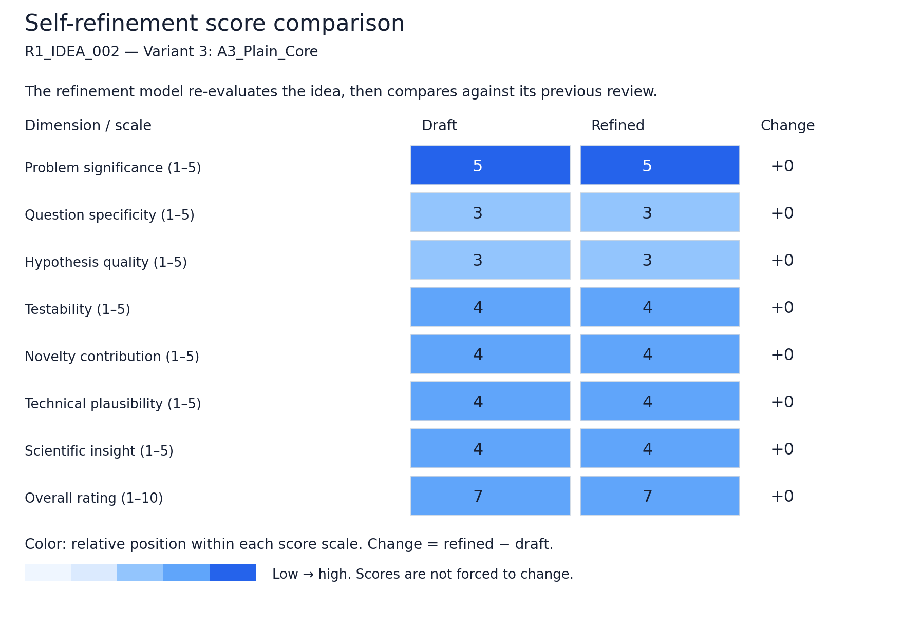

Changed score dimensions: none.

### Score justifications (draft / refined)

**Problem significance**

```json
{
  "draft": {
    "score": 5.0,
    "justification": "The problem of rare-event sampling without predefined collective variables is a major unsolved challenge in computational physics and chemistry. Solving this would have profound impacts on drug discovery and materials science, making the problem highly significant."
  },
  "refined": {
    "score": 5.0,
    "justification": "The problem of rare-event sampling without predefined collective variables is a major unsolved challenge in computational physics and chemistry. Solving this would have profound impacts on drug discovery and materials science, making the problem highly significant."
  }
}
```

**Question specificity**

```json
{
  "draft": {
    "score": 3.0,
    "justification": "While the goal is clear, the specific research question is somewhat obscured by the broad term 'improved off-policy learning.' The idea needs to specify exactly what mechanism is being improved and how it differs from existing off-policy methods in this domain."
  },
  "refined": {
    "score": 3.0,
    "justification": "While the goal is clear, the specific research question is obscured by the broad term 'improved off-policy learning.' The idea needs to specify exactly what mechanism is being improved and how it differs from existing off-policy methods in this domain. The lack of a defined mechanism makes the research question somewhat vague."
  }
}
```

**Hypothesis quality**

```json
{
  "draft": {
    "score": 3.0,
    "justification": "The implicit hypothesis is that off-policy learning enhances diffusion sampling for rare events. However, it is not explicitly stated as a testable prediction (e.g., 'Method X will reduce the number of required steps by factor Y compared to Method Z'). It is plausible but currently generic."
  },
  "refined": {
    "score": 3.0,
    "justification": "The implicit hypothesis is that off-policy learning enhances diffusion sampling for rare events. However, it is not explicitly stated as a testable prediction (e.g., 'Method X will reduce the number of required steps by factor Y compared to Method Z'). It is plausible but currently generic."
  }
}
```

**Testability**

```json
{
  "draft": {
    "score": 4.0,
    "justification": "The idea is testable. One can define meta-stable states, generate paths, and compare the efficiency (computational cost) and accuracy (free energy profiles) against standard methods. The lack of implementation details does not prevent the design of a test."
  },
  "refined": {
    "score": 4.0,
    "justification": "The idea is testable in principle. One can define meta-stable states, generate paths, and compare the efficiency (computational cost) and accuracy (free energy profiles) against standard methods. The lack of implementation details does not prevent the design of a test, though the specific metrics need definition."
  }
}
```

**Novelty contribution**

```json
{
  "draft": {
    "score": 4.0,
    "justification": "Combining diffusion models with off-policy learning for CV-free rare event sampling is a novel direction. While diffusion models are popular, their specific application to off-policy path sampling in this context is not standard and could yield new insights."
  },
  "refined": {
    "score": 4.0,
    "justification": "Combining diffusion models with off-policy learning for CV-free rare event sampling is a novel direction. While diffusion models are popular, their specific application to off-policy path sampling in this context is not standard and could yield new insights into generative modeling for physical systems."
  }
}
```

**Technical plausibility**

```json
{
  "draft": {
    "score": 4.0,
    "justification": "The combination of concepts is technically sound. Diffusion models are known for generating complex distributions, and off-policy learning is a standard tool for correcting distributional shifts. The main challenge is the mathematical formulation, but the direction is plausible."
  },
  "refined": {
    "score": 4.0,
    "justification": "The combination of concepts is technically sound. Diffusion models are known for generating complex distributions, and off-policy learning is a standard tool for correcting distributional shifts. The main challenge is the mathematical formulation, but the direction is plausible."
  }
}
```

**Scientific insight**

```json
{
  "draft": {
    "score": 4.0,
    "justification": "If successful, this research could reveal new principles on how generative models can be guided by importance sampling or reinforcement signals to explore high-dimensional energy landscapes, providing insights beyond just a new algorithm."
  },
  "refined": {
    "score": 4.0,
    "justification": "If successful, this research could reveal new principles on how generative models can be guided by importance sampling or reinforcement signals to explore high-dimensional energy landscapes, providing insights beyond just a new algorithm."
  }
}
```

**Overall rating**

```json
{
  "draft": {
    "score": 7.0,
    "justification": "This is a strong research idea with high significance and novelty. The main limitation is the lack of specificity regarding the 'off-policy' mechanism and the specific hypothesis. However, the core concept addresses a fundamental problem in a promising way. With better definition of the method and hypothesis, it could be an exceptional contribution."
  },
  "refined": {
    "score": 7.0,
    "justification": "This is a strong research idea with high significance and novelty. The main limitation is the lack of specificity regarding the 'off-policy' mechanism and the specific hypothesis. However, the core concept addresses a fundamental problem in a promising way. With better definition of the method and hypothesis, it could be an exceptional contribution."
  }
}
```

## R1_IDEA_002 — Variant 4: B1_Verbose_Elaborate

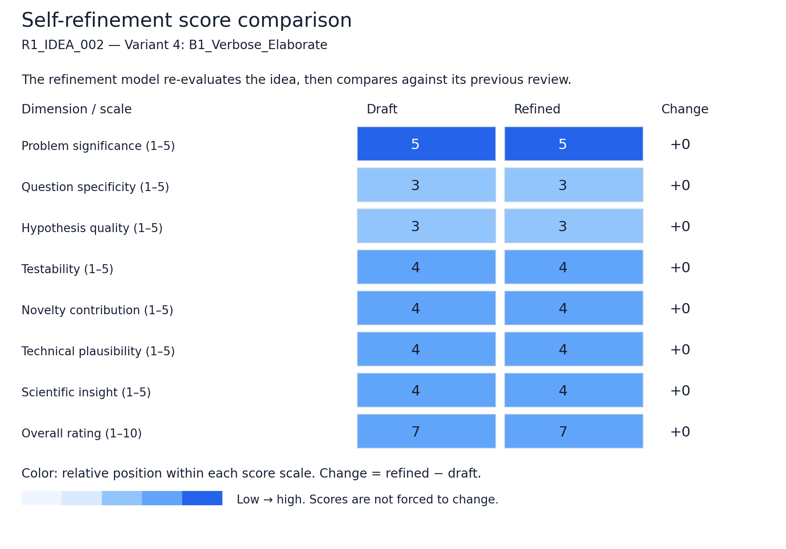

Changed score dimensions: none.

### Score justifications (draft / refined)

**Problem significance**

```json
{
  "draft": {
    "score": 5.0,
    "justification": "The problem of sampling rare events in molecular dynamics is a critical bottleneck in drug discovery and materials science. Solving this would have profound practical implications and is a major open challenge in the field."
  },
  "refined": {
    "score": 5.0,
    "justification": "The problem of rare-event sampling is a fundamental bottleneck in molecular simulation with direct implications for drug discovery and materials science. Solving the 'CV-free' challenge would be a major breakthrough."
  }
}
```

**Question specificity**

```json
{
  "draft": {
    "score": 3.0,
    "justification": "The idea identifies the domain (molecular simulation), the method (diffusion + off-policy), and the goal (no CVs). However, the specific mechanism of 'improved off-policy learning' and the precise research question (e.g., comparing convergence rates, free energy accuracy) are not sufficiently detailed."
  },
  "refined": {
    "score": 3.0,
    "justification": "While the domain and general approach are identified, the core mechanism ('improved off-policy learning') is undefined. The research question is too broad to be immediately actionable without further specification of the algorithmic novelty."
  }
}
```

**Hypothesis quality**

```json
{
  "draft": {
    "score": 3.0,
    "justification": "There is an implicit hypothesis that this combination of techniques will enable CV-free sampling more effectively than current methods. However, the hypothesis is not explicitly stated or grounded in a specific theoretical argument about why this works."
  },
  "refined": {
    "score": 3.0,
    "justification": "The idea implies a hypothesis that this method works better than current approaches, but it lacks a specific, testable prediction about the mechanism of improvement or the conditions under which it succeeds."
  }
}
```

**Testability**

```json
{
  "draft": {
    "score": 4.0,
    "justification": "The idea is testable. One can implement the proposed sampler, run it on standard benchmark molecular systems, and compare the results (pathway accuracy, sampling efficiency) against existing methods. The lack of specific metrics in the summary is a minor issue that can be resolved in the proposal."
  },
  "refined": {
    "score": 4.0,
    "justification": "The idea is fundamentally testable. One can implement a diffusion sampler with an off-policy component and compare it to baselines on standard benchmarks. However, the lack of specific evaluation metrics in the summary makes the testability slightly less robust than it could be."
  }
}
```

**Novelty contribution**

```json
{
  "draft": {
    "score": 4.0,
    "justification": "Applying diffusion models to molecular dynamics is emerging, but combining them with 'improved off-policy learning' specifically to remove the need for CVs is a novel angle. If successful, it could represent a significant methodological shift."
  },
  "refined": {
    "score": 4.0,
    "justification": "Combining diffusion models with off-policy learning for CV-free sampling is a novel and promising direction. If successful, it could shift the paradigm from CV-dependent to CV-free enhanced sampling."
  }
}
```

**Technical plausibility**

```json
{
  "draft": {
    "score": 4.0,
    "justification": "The technical components (diffusion models, off-policy RL) are well-established in ML. Their application to MD is plausible, though the integration requires careful handling of physical constraints. The reasoning is coherent."
  },
  "refined": {
    "score": 4.0,
    "justification": "The individual components (diffusion models, off-policy RL) are technically sound. Their integration is plausible, though the challenge lies in ensuring the physics constraints are maintained during the off-policy updates."
  }
}
```

**Scientific insight**

```json
{
  "draft": {
    "score": 4.0,
    "justification": "If successful, this research would provide deep insights into how generative models can learn complex energy landscapes without human-defined features, potentially revealing new principles of how AI can discover reaction coordinates."
  },
  "refined": {
    "score": 4.0,
    "justification": "If successful, this research would reveal how generative models can learn complex reaction coordinates implicitly, providing insights into the relationship between data efficiency and physical constraints in high-dimensional spaces."
  }
}
```

**Overall rating**

```json
{
  "draft": {
    "score": 7.0,
    "justification": "This is a strong research idea with high significance and potential for novelty. It addresses a major pain point in the field with a modern, plausible technical approach. The main weakness is the lack of specificity regarding the 'improvement' in off-policy learning and the lack of a concrete hypothesis. With better definition of the method and evaluation strategy, this could be an exceptional contribution."
  },
  "refined": {
    "score": 7.0,
    "justification": "This is a strong research idea with high significance and potential. It addresses a major pain point with a modern, plausible technical approach. The score is tempered by the vagueness of the 'improvement' mechanism and the lack of a concrete hypothesis, which are critical for a full proposal but acceptable for an early-stage idea summary."
  }
}
```

## R1_IDEA_002 — Variant 5: B2_Grand_Narrative


Changed score dimensions: question_specificity, hypothesis_quality, testability, scientific_insight, overall_rating.

### Score justifications (draft / refined)

**Problem significance**

```json
{
  "draft": {
    "score": 5.0,
    "justification": "The problem of rare-event sampling in molecular dynamics is fundamental to computational chemistry and drug discovery. Overcoming the reliance on collective variables is a major open challenge with significant potential impact."
  },
  "refined": {
    "score": 5.0,
    "justification": "The problem of rare-event sampling without predefined collective variables is a fundamental challenge in computational chemistry and drug discovery. Solving this would remove a major bottleneck, making the problem highly significant."
  }
}
```

**Question specificity**

```json
{
  "draft": {
    "score": 3.0,
    "justification": "While the goal (sampling without CVs) is clear, the specific research question regarding the mechanism of 'improved off-policy learning' is not sufficiently defined. It reads more like a proposed solution than a precise question."
  },
  "refined": {
    "score": 2.0,
    "justification": "The research question is obscured by vague terminology. 'Improved off-policy learning' is not a specific question but a label for an undefined method. The idea states *what* it wants to do (sample without CVs) but not *how* the specific mechanism works or what precise relationship is being investigated."
  }
}
```

**Hypothesis quality**

```json
{
  "draft": {
    "score": 3.0,
    "justification": "The implicit hypothesis is that this specific combination of techniques will work better than current methods. However, it lacks a mechanistic explanation or a specific prediction about the relationship between the method's parameters and performance."
  },
  "refined": {
    "score": 2.0,
    "justification": "The hypothesis is implicit and weak. It assumes that combining diffusion and off-policy learning will yield better results, but it offers no mechanistic reasoning or specific prediction about the relationship between the method's components and performance. It is not yet a testable scientific hypothesis."
  }
}
```

**Testability**

```json
{
  "draft": {
    "score": 4.0,
    "justification": "The idea is testable in principle. One can implement the proposed sampler and compare its performance against baselines on standard molecular benchmarks. However, the lack of algorithmic detail makes the immediate design of the test difficult."
  },
  "refined": {
    "score": 3.0,
    "justification": "While the goal is testable (compare performance), the lack of a defined method makes the immediate design of the experiment difficult. One cannot design a rigorous test without knowing the specific algorithmic details or the definition of 'off-policy' in this context."
  }
}
```

**Novelty contribution**

```json
{
  "draft": {
    "score": 4.0,
    "justification": "Combining diffusion models with off-policy learning for molecular path sampling is a novel direction. If successful, it could provide a general framework for rare-event sampling that does not require expert knowledge to define collective variables."
  },
  "refined": {
    "score": 4.0,
    "justification": "The combination of diffusion models and off-policy learning for molecular path sampling is a novel and promising direction. If the concept can be successfully realized, it could represent a significant methodological contribution to the field."
  }
}
```

**Technical plausibility**

```json
{
  "draft": {
    "score": 3.0,
    "justification": "The combination of diffusion models and off-policy learning is theoretically plausible, but applying off-policy learning to continuous path sampling in physics-based systems is non-trivial. The idea makes sense but requires significant technical development to be feasible."
  },
  "refined": {
    "score": 3.0,
    "justification": "The idea is theoretically plausible but technically risky. Applying off-policy learning to continuous physical trajectories is non-trivial due to issues like variance in importance sampling and the need to preserve physical constraints (detailed balance). The idea makes sense but requires significant technical justification to be feasible."
  }
}
```

**Scientific insight**

```json
{
  "draft": {
    "score": 4.0,
    "justification": "If successful, this research would reveal how to effectively decouple path sampling from the need for low-dimensional projections (CVs), offering deep insights into the geometry of high-dimensional energy landscapes."
  },
  "refined": {
    "score": 3.0,
    "justification": "If successful, the research would provide insight into decoupling path sampling from low-dimensional projections. However, as currently stated, the potential for deep scientific insight is limited by the lack of a clear mechanism to investigate."
  }
}
```

**Overall rating**

```json
{
  "draft": {
    "score": 7.0,
    "justification": "This is a strong research idea with high significance and novelty. The main weakness is the lack of specificity in the proposed method ('improved off-policy learning') and the absence of a concrete hypothesis. However, the core concept addresses a critical bottleneck in the field and has a clear path to validation."
  },
  "refined": {
    "score": 6.0,
    "justification": "This is a moderate research idea. It addresses a highly significant problem with a potentially novel approach, but the current formulation is too vague to be considered a strong research proposal. The lack of a specific mechanism ('improved off-policy learning') and a concrete hypothesis prevents it from scoring higher. It requires significant refinement to move from a 'vision' to a testable scientific inquiry."
  }
}
```

## R1_IDEA_002 — Variant 6: B3_Over_Confident

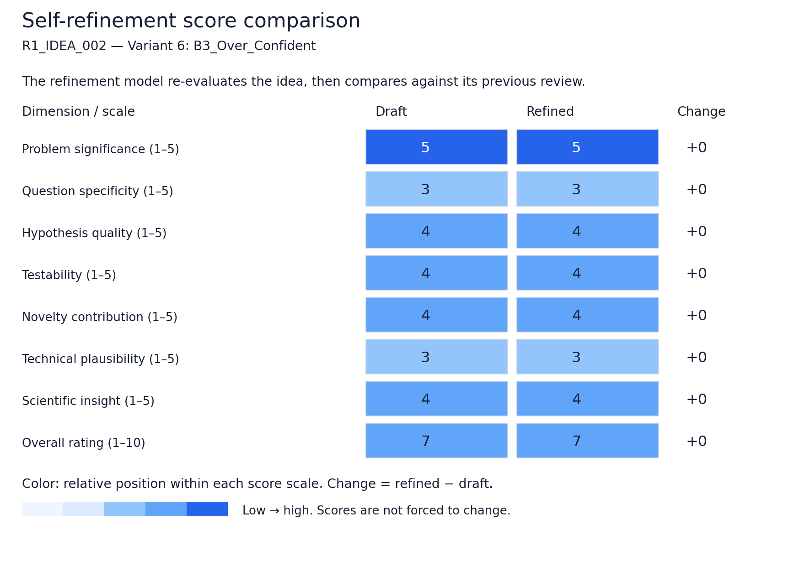

Changed score dimensions: none.

### Score justifications (draft / refined)

**Problem significance**

```json
{
  "draft": {
    "score": 5.0,
    "justification": "The problem of sampling rare events in molecular systems without predefined collective variables is a major unsolved challenge in computational chemistry. Solving this would have profound impacts on drug discovery and materials science, making the problem highly significant."
  },
  "refined": {
    "score": 5.0,
    "justification": "The problem of sampling rare events in molecular systems without predefined collective variables is a major unsolved challenge in computational chemistry. Solving this would have profound impacts on drug discovery and materials science, making the problem highly significant."
  }
}
```

**Question specificity**

```json
{
  "draft": {
    "score": 3.0,
    "justification": "While the goal is clear, the specific research question regarding the mechanism of 'improved off-policy learning' for diffusion paths is vague. The idea states what it aims to do but not exactly how the core mechanism works or what specific variable is being optimized."
  },
  "refined": {
    "score": 3.0,
    "justification": "While the goal is clear, the specific research question regarding the mechanism of 'improved off-policy learning' for diffusion paths is vague. The idea states what it aims to do but not exactly how the core mechanism works or what specific variable is being optimized."
  }
}
```

**Hypothesis quality**

```json
{
  "draft": {
    "score": 4.0,
    "justification": "The implicit hypothesis—that off-policy learning can effectively train diffusion models to explore rare events without CVs—is strong and testable. It posits a specific relationship between the learning paradigm and the sampling capability that could be proven or disproven."
  },
  "refined": {
    "score": 4.0,
    "justification": "The implicit hypothesis—that off-policy learning can effectively train diffusion models to explore rare events without CVs—is strong and testable. It posits a specific relationship between the learning paradigm and the sampling capability that could be proven or disproven."
  }
}
```

**Testability**

```json
{
  "draft": {
    "score": 4.0,
    "justification": "The idea is testable. One can construct a benchmark system, implement the proposed sampler, and compare its efficiency and accuracy against unbiased MD and CV-dependent methods. The success criteria (sampling rare events) are well-defined."
  },
  "refined": {
    "score": 4.0,
    "justification": "The idea is testable. One can construct a benchmark system, implement the proposed sampler, and compare its efficiency and accuracy against unbiased MD and CV-dependent methods. The success criteria (sampling rare events) are well-defined."
  }
}
```

**Novelty contribution**

```json
{
  "draft": {
    "score": 4.0,
    "justification": "Combining diffusion models with off-policy learning for molecular path sampling is a novel direction. While diffusion models are used in chemistry, and off-policy learning is used in RL, their specific application to unbiased path generation is a fresh contribution with high potential."
  },
  "refined": {
    "score": 4.0,
    "justification": "Combining diffusion models with off-policy learning for molecular path sampling is a novel direction. While diffusion models are used in chemistry, and off-policy learning is used in RL, their specific application to unbiased path generation is a fresh contribution with high potential."
  }
}
```

**Technical plausibility**

```json
{
  "draft": {
    "score": 3.0,
    "justification": "The concept is technically plausible given the current state of generative modeling and reinforcement learning. However, the specific implementation details required to make 'off-policy' work in a continuous path space without CVs are non-trivial and not fully elaborated, leaving some uncertainty about feasibility."
  },
  "refined": {
    "score": 3.0,
    "justification": "The concept is technically plausible given the current state of generative modeling and reinforcement learning. However, the specific implementation details required to make 'off-policy' work in a continuous path space without CVs are non-trivial and not fully elaborated, leaving some uncertainty about feasibility."
  }
}
```

**Scientific insight**

```json
{
  "draft": {
    "score": 4.0,
    "justification": "If successful, this research would provide deep insights into how generative models can learn complex physical dynamics without explicit feature engineering. It could reveal new principles for sampling high-dimensional manifolds."
  },
  "refined": {
    "score": 4.0,
    "justification": "If successful, this research would provide deep insights into how generative models can learn complex physical dynamics without explicit feature engineering. It could reveal new principles for sampling high-dimensional manifolds."
  }
}
```

**Overall rating**

```json
{
  "draft": {
    "score": 7.0,
    "justification": "This is a strong research idea with high significance and novelty. The potential to revolutionize rare-event sampling is compelling. However, it currently lacks the specificity of the proposed mechanism (the 'how'), which prevents it from being an exceptional score. With a clearer definition of the off-policy mechanism and physical constraints, this could be a top-tier contribution."
  },
  "refined": {
    "score": 7.0,
    "justification": "This is a strong research idea with high significance and novelty. The potential to revolutionize rare-event sampling is compelling. However, it currently lacks the specificity of the proposed mechanism (the 'how'), which prevents it from being an exceptional score. With a clearer definition of the off-policy mechanism and physical constraints, this could be a top-tier contribution."
  }
}
```

## R1_IDEA_002 — Variant 7: B4_Novelty

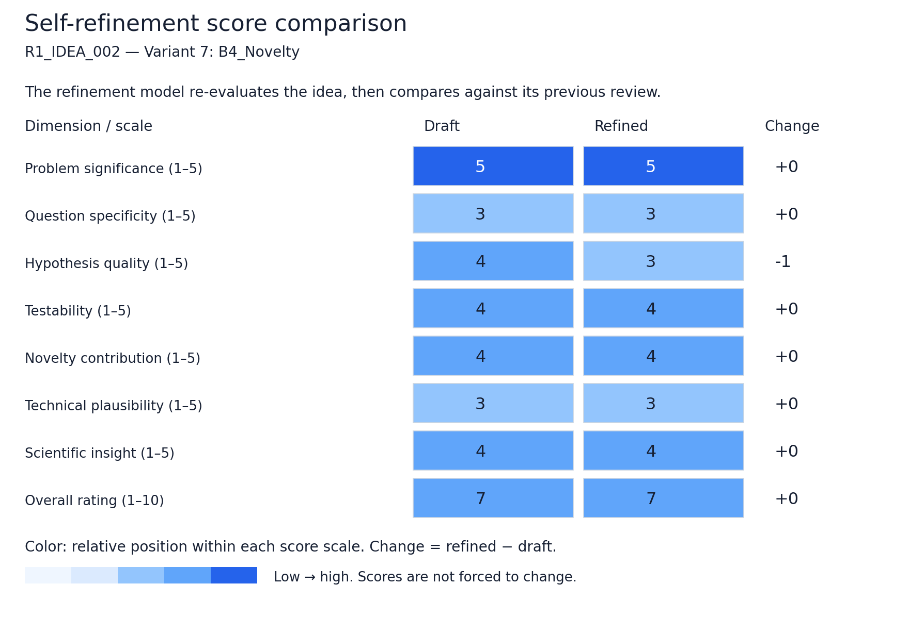

Changed score dimensions: hypothesis_quality.

### Score justifications (draft / refined)

**Problem significance**

```json
{
  "draft": {
    "score": 5.0,
    "justification": "The problem of rare-event sampling in molecular systems is fundamental to computational chemistry and drug discovery. Solving this efficiently would have massive practical implications for accelerating the design of new materials and pharmaceuticals."
  },
  "refined": {
    "score": 5.0,
    "justification": "The problem of rare-event sampling is fundamental to molecular simulation. Overcoming the need for predefined collective variables is a major open challenge in the field, making this problem highly significant for both scientific understanding and industrial applications like drug design."
  }
}
```

**Question specificity**

```json
{
  "draft": {
    "score": 3.0,
    "justification": "While the goal (sampling pathways without CVs) is specific, the 'how' is vague. The idea states 'improved off-policy learning' but does not specify the algorithmic novelty or the specific formulation of the learning problem."
  },
  "refined": {
    "score": 3.0,
    "justification": "While the goal is specific (CV-free path sampling), the research question regarding the *mechanism* is vague. The phrase 'improved off-policy learning' is a placeholder for a specific algorithmic innovation that is not described. The idea states *what* is done but not *how* or *why* it works theoretically."
  }
}
```

**Hypothesis quality**

```json
{
  "draft": {
    "score": 4.0,
    "justification": "The implicit hypothesis is that combining diffusion models with off-policy learning can effectively bypass the need for CVs and outperform existing methods in sampling efficiency. This is a testable and non-trivial claim."
  },
  "refined": {
    "score": 3.0,
    "justification": "The implicit hypothesis is that this specific combination of techniques will outperform existing methods. However, the idea does not articulate a testable prediction about the relationship between the variables (e.g., 'We hypothesize that off-policy correction reduces sample complexity by enabling better exploration of the transition state region'). It remains a proposal of a method rather than a hypothesis-driven investigation."
  }
}
```

**Testability**

```json
{
  "draft": {
    "score": 4.0,
    "justification": "The idea is testable by comparing the generated pathways against known benchmarks (e.g., simple protein folding models or known reaction coordinates) and measuring convergence rates and free energy accuracy. However, the specific metrics are not yet defined in the summary."
  },
  "refined": {
    "score": 4.0,
    "justification": "The idea is testable in principle. One can implement the method on standard benchmark systems (e.g., alanine dipeptide, protein folding models) and compare the resulting free energy profiles and transition rates against ground truth or established methods. The lack of specific metrics in the summary is a weakness, but the path to testing is clear."
  }
}
```

**Novelty contribution**

```json
{
  "draft": {
    "score": 4.0,
    "justification": "Applying off-policy learning to diffusion path samplers for molecular dynamics is a novel intersection of fields. If successful, it could provide a general framework for CV-free enhanced sampling, which is a significant contribution."
  },
  "refined": {
    "score": 4.0,
    "justification": "The intersection of diffusion models and off-policy learning for molecular path sampling is a novel and underexplored direction. If successful, it could provide a general framework for CV-free enhanced sampling, which would be a significant contribution to the field."
  }
}
```

**Technical plausibility**

```json
{
  "draft": {
    "score": 3.0,
    "justification": "The combination is plausible in principle, as both diffusion models and RL are powerful tools. However, the technical feasibility of stabilizing off-policy learning in high-dimensional continuous molecular spaces without CVs is a significant challenge that needs more justification."
  },
  "refined": {
    "score": 3.0,
    "justification": "The combination is plausible but technically challenging. Applying off-policy learning to continuous, high-dimensional, stiff molecular systems requires careful handling of distributional shifts and stability. The idea does not provide enough detail to confirm that the proposed 'improvement' is technically feasible without significant caveats."
  }
}
```

**Scientific insight**

```json
{
  "draft": {
    "score": 4.0,
    "justification": "If successful, this research would reveal how generative models can implicitly learn reaction coordinates and how off-policy techniques can be adapted for physical trajectory generation, offering deep insights into the intersection of ML and statistical physics."
  },
  "refined": {
    "score": 4.0,
    "justification": "If successful, this research would provide deep insights into how generative models can implicitly learn reaction coordinates and how off-policy techniques can be adapted for physical trajectory generation. It could reveal new principles for bridging machine learning and statistical physics."
  }
}
```

**Overall rating**

```json
{
  "draft": {
    "score": 7.0,
    "justification": "This is a strong research idea with high significance and novelty. The core concept of using off-policy learning to train diffusion samplers for CV-free molecular dynamics is promising. However, the current summary lacks the technical specificity required to fully assess the feasibility of the proposed mechanism, preventing a higher score. With a clearer formulation of the algorithm and validation strategy, this could be an exceptional contribution."
  },
  "refined": {
    "score": 7.0,
    "justification": "This is a strong research idea with high significance and novelty. The core concept is promising and addresses a critical gap in the field. However, the current summary lacks the technical specificity and explicit hypothesis required to be considered 'exceptional'. The 'how' is missing, which is crucial for evaluating the feasibility of the proposed mechanism. With a clearer formulation of the algorithm and validation strategy, this could be a top-tier contribution."
  }
}
```

## R1_IDEA_002 — Variant 8: B5_Application_Impact


Changed score dimensions: none.

### Score justifications (draft / refined)

**Problem significance**

```json
{
  "draft": {
    "score": 5.0,
    "justification": "The problem of sampling rare events without predefined collective variables is a major unsolved challenge in computational chemistry. Solving this would significantly reduce the barrier to entry for simulating complex biological and material systems, making it highly significant."
  },
  "refined": {
    "score": 5.0,
    "justification": "The problem of sampling rare events without predefined collective variables is a fundamental challenge in computational chemistry and biophysics. Solving this would remove a major bottleneck in simulating complex biological processes and material transformations, making it a problem of exceptional significance."
  }
}
```

**Question specificity**

```json
{
  "draft": {
    "score": 3.0,
    "justification": "While the goal (sampling without CVs) is clear, the specific research question regarding the mechanism of 'improved off-policy learning' for diffusion paths is not sufficiently defined. The idea states 'what' but not clearly 'how' or 'why' this specific combination works."
  },
  "refined": {
    "score": 3.0,
    "justification": "The general goal (CV-free sampling via diffusion and off-policy learning) is clear, but the specific research question is under-defined. The idea states 'what' is being done but lacks the 'how' (specific algorithm) and 'why' (theoretical justification) necessary to define a precise scientific question."
  }
}
```

**Hypothesis quality**

```json
{
  "draft": {
    "score": 3.0,
    "justification": "The implicit hypothesis is that off-policy learning can effectively train diffusion models to explore high-dimensional path spaces without CVs. This is plausible but not yet a concrete, falsifiable prediction of a specific mechanism or relationship."
  },
  "refined": {
    "score": 3.0,
    "justification": "The implicit hypothesis is that off-policy learning can effectively correct for the lack of CVs in diffusion path generation. While plausible, it is currently a broad statement rather than a specific, falsifiable prediction of a mechanism or relationship."
  }
}
```

**Testability**

```json
{
  "draft": {
    "score": 3.0,
    "justification": "The idea is testable in principle (compare against CV-based methods on standard benchmarks), but the summary lacks the necessary details to design a specific test. The success criteria are implied (overcoming infeasibility) but not operationalized."
  },
  "refined": {
    "score": 3.0,
    "justification": "The idea is testable in principle by comparing against CV-based baselines on standard benchmarks. However, the summary lacks the necessary operational details (metrics, baselines, specific systems) to design a concrete experiment immediately."
  }
}
```

**Novelty contribution**

```json
{
  "draft": {
    "score": 4.0,
    "justification": "Combining diffusion models with off-policy learning for CV-free path sampling is a novel direction. While diffusion models are new to this field, and off-policy learning is established in RL, their specific application to this problem represents a potentially high-impact contribution."
  },
  "refined": {
    "score": 4.0,
    "justification": "Applying diffusion models to path sampling is novel, and combining this with off-policy learning to remove CV dependence is a distinct and potentially high-impact contribution. It moves beyond simple application to proposing a new methodological paradigm."
  }
}
```

**Technical plausibility**

```json
{
  "draft": {
    "score": 3.0,
    "justification": "The combination is technically plausible given recent advances in both diffusion models and RL. However, the theoretical bridge between off-policy learning and path sampling in continuous time is non-trivial and requires careful justification to be considered fully plausible."
  },
  "refined": {
    "score": 3.0,
    "justification": "The combination of diffusion models and off-policy learning is technically plausible given recent advances in both fields. However, the theoretical bridge between off-policy corrections and path integrals in continuous time is non-trivial and requires significant justification to be considered fully robust."
  }
}
```

**Scientific insight**

```json
{
  "draft": {
    "score": 4.0,
    "justification": "If successful, this research would provide deep insights into how generative models can learn complex dynamical systems without human-in-the-loop feature engineering (CVs), potentially revealing new principles of how AI can discover reaction coordinates."
  },
  "refined": {
    "score": 4.0,
    "justification": "If successful, this research would provide significant insight into how generative models can learn complex dynamical systems without human-engineered features. It could reveal new principles for automated discovery of reaction coordinates in high-dimensional spaces."
  }
}
```

**Overall rating**

```json
{
  "draft": {
    "score": 7.0,
    "justification": "This is a strong research idea with high significance and novelty. It addresses a critical bottleneck in the field. However, it currently lacks the specificity required to be considered 'exceptional' because the core mechanism (how off-policy learning solves the path sampling problem) is not articulated. With more specific formulation of the method and hypothesis, it could be a top-tier contribution."
  },
  "refined": {
    "score": 7.0,
    "justification": "This is a strong research idea with high significance and novelty. It addresses a critical, unsolved problem in a meaningful way. However, it currently sits at a 'strong' rather than 'exceptional' level because the core mechanism (the specific 'improved off-policy' method) is not articulated, leaving the hypothesis and testability somewhat vague. With a more specific formulation of the algorithm and hypothesis, it could be a top-tier contribution."
  }
}
```

## R1_IDEA_002 — Variant 9: C1_Hollow_Shell

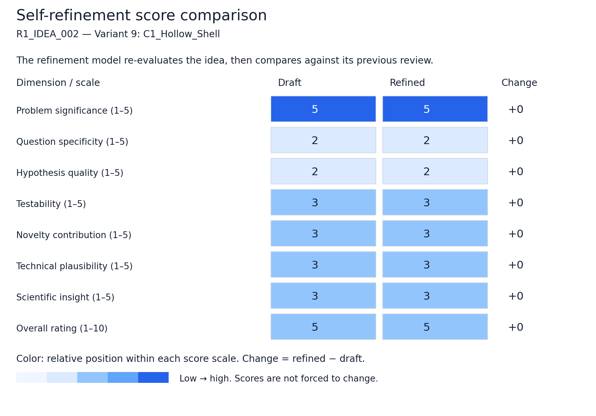

Changed score dimensions: none.

### Score justifications (draft / refined)

**Problem significance**

```json
{
  "draft": {
    "score": 5.0,
    "justification": "Simulating rare events and identifying transition pathways in molecular systems is a critical bottleneck in drug discovery and materials science. Solving this problem has high scientific and practical significance."
  },
  "refined": {
    "score": 5.0,
    "justification": "Simulating rare events and identifying transition pathways is a critical bottleneck in drug discovery and materials science. The problem is of high scientific and practical significance, as current methods often fail to capture these events within feasible simulation times."
  }
}
```

**Question specificity**

```json
{
  "draft": {
    "score": 2.0,
    "justification": "The idea is currently too broad. It states 'a machine learning method' without specifying which one, and 'without predefined descriptors' without defining the input representation or the learning objective. It reads more like a goal than a specific research question."
  },
  "refined": {
    "score": 2.0,
    "justification": "The idea is currently too broad. It states 'a machine learning method' without specifying which one, and 'without predefined descriptors' without defining the input representation or the learning objective. It reads more like a high-level goal than a specific research question."
  }
}
```

**Hypothesis quality**

```json
{
  "draft": {
    "score": 2.0,
    "justification": "There is no explicit hypothesis. It is not clear what the expected outcome is other than 'it could support exploration.' A strong hypothesis would predict a specific relationship between the method's architecture and its ability to capture rare events."
  },
  "refined": {
    "score": 2.0,
    "justification": "There is no explicit hypothesis. It is not clear what the expected outcome is other than 'it could support exploration.' A strong hypothesis would predict a specific relationship between the method's architecture and its ability to capture rare events, or a specific mechanism by which it avoids the need for descriptors."
  }
}
```

**Testability**

```json
{
  "draft": {
    "score": 3.0,
    "justification": "While the general goal is testable (compare sampling efficiency), the current lack of methodological detail makes it impossible to design a concrete experiment. The idea is testable in principle but not in its current form."
  },
  "refined": {
    "score": 3.0,
    "justification": "While the general goal is testable (compare sampling efficiency), the current lack of methodological detail makes it impossible to design a concrete experiment. The idea is testable in principle, but the specific variables and controls are undefined."
  }
}
```

**Novelty contribution**

```json
{
  "draft": {
    "score": 3.0,
    "justification": "The concept of using ML for rare event sampling is an active field. The novelty depends entirely on the specific 'descriptor-free' mechanism proposed. As stated, it is a generic direction that could be a minor variation of existing work or a significant breakthrough, but the text doesn't clarify."
  },
  "refined": {
    "score": 3.0,
    "justification": "The concept of using ML for rare event sampling is an active field. The novelty depends entirely on the specific 'descriptor-free' mechanism proposed. As stated, it is a generic direction that could be a minor variation of existing work or a significant breakthrough, but the text doesn't clarify the unique contribution."
  }
}
```

**Technical plausibility**

```json
{
  "draft": {
    "score": 3.0,
    "justification": "The idea is technically plausible in the sense that ML is increasingly used for this purpose. However, the claim of doing so without *any* descriptors is a strong assumption that requires careful technical justification to be plausible."
  },
  "refined": {
    "score": 3.0,
    "justification": "The idea is technically plausible in the sense that ML is increasingly used for this purpose. However, the claim of doing so without *any* descriptors is a strong assumption that requires careful technical justification to be plausible, as molecular dynamics inherently rely on structural information."
  }
}
```

**Scientific insight**

```json
{
  "draft": {
    "score": 3.0,
    "justification": "If successful, this could reveal new principles of how to represent molecular dynamics without human bias. However, as currently phrased, it risks being a simple application of a black-box model without yielding deeper mechanistic insights."
  },
  "refined": {
    "score": 3.0,
    "justification": "If successful, this could reveal new principles of how to represent molecular dynamics without human bias. However, as currently phrased, it risks being a simple application of a black-box model without yielding deeper mechanistic insights into the nature of the transition pathways."
  }
}
```

**Overall rating**

```json
{
  "draft": {
    "score": 5.0,
    "justification": "The research idea addresses a highly significant problem with a potentially transformative goal (descriptor-free sampling). However, it is currently too vague to be considered a strong research proposal. It lacks the specificity of the method, the hypothesis, and the evaluation strategy required to distinguish it from generic applications. It sits at the borderline of a moderate idea because the core motivation is excellent, but the execution plan is missing."
  },
  "refined": {
    "score": 5.0,
    "justification": "The research idea addresses a highly significant problem with a potentially transformative goal (descriptor-free sampling). However, it is currently too vague to be considered a strong research proposal. It lacks the specificity of the method, the hypothesis, and the evaluation strategy required to distinguish it from generic applications. It sits at the borderline of a moderate idea because the core motivation is excellent, but the execution plan is missing."
  }
}
```

## R1_IDEA_002 — Variant 10: C2_Logic_Flawed

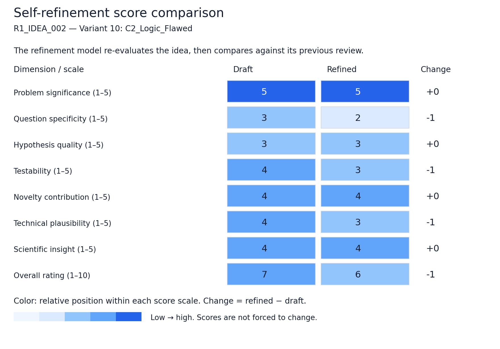

Changed score dimensions: question_specificity, testability, technical_plausibility, overall_rating.

### Score justifications (draft / refined)

**Problem significance**

```json
{
  "draft": {
    "score": 5.0,
    "justification": "The problem of simulating rare events in molecular systems is a fundamental bottleneck in computational chemistry and drug discovery. Overcoming the reliance on collective variables is a major open challenge with the potential to revolutionize how we study complex biological and material processes."
  },
  "refined": {
    "score": 5.0,
    "justification": "The problem of simulating rare events in molecular systems is a fundamental bottleneck in computational chemistry and drug discovery. Overcoming the reliance on collective variables is a major open challenge with the potential to revolutionize how we study complex biological and material processes."
  }
}
```

**Question specificity**

```json
{
  "draft": {
    "score": 3.0,
    "justification": "While the goal is clear, the specific research question is somewhat obscured by the high-level description. It states 'how' (improved off-policy learning) but does not define 'what' exactly constitutes the improvement or the specific mechanism of the interaction between diffusion and off-policy learning."
  },
  "refined": {
    "score": 2.0,
    "justification": "While the goal is clear, the specific research question is obscured by the high-level description. The phrase 'improved off-policy learning' is a placeholder for a mechanism that is not defined. The idea states 'how' (using these tools) but does not define 'what' the specific improvement is or how the components interact mathematically."
  }
}
```

**Hypothesis quality**

```json
{
  "draft": {
    "score": 3.0,
    "justification": "The implicit hypothesis is that combining diffusion models with off-policy learning can effectively sample rare events without CVs. This is a plausible and testable hypothesis, but it is currently stated as a general direction rather than a specific, falsifiable prediction about performance or mechanism."
  },
  "refined": {
    "score": 3.0,
    "justification": "The implicit hypothesis is that combining diffusion models with off-policy learning can effectively sample rare events without CVs. This is a plausible and testable hypothesis, but it is currently stated as a general direction rather than a specific, falsifiable prediction about performance or mechanism. It lacks a clear 'if-then' structure regarding the conditions for success."
  }
}
```

**Testability**

```json
{
  "draft": {
    "score": 4.0,
    "justification": "The idea is testable in principle. One can design experiments to compare the proposed method against existing CV-based and CV-free baselines on standard molecular benchmarks. The main challenge is defining the specific algorithm to test, but the evaluation framework is clear."
  },
  "refined": {
    "score": 3.0,
    "justification": "The idea is testable in principle, but the lack of a defined algorithm makes the experimental design difficult to specify. One can compare against baselines, but without knowing the specific 'improvement' or the handling of physical constraints, the evaluation criteria are incomplete. The testability is moderate because the core mechanism is currently a black box."
  }
}
```

**Novelty contribution**

```json
{
  "draft": {
    "score": 4.0,
    "justification": "The combination of diffusion models for path sampling and off-policy learning for training is a novel direction. If successful, it could provide a new paradigm for rare-event sampling that is more automated and less dependent on human intuition (regarding CVs) than current methods."
  },
  "refined": {
    "score": 4.0,
    "justification": "The combination of diffusion models for path sampling and off-policy learning for training is a novel direction. If successful, it could provide a new paradigm for rare-event sampling that is more automated and less dependent on human intuition (regarding CVs) than current methods. The novelty lies in the specific synthesis of these two advanced concepts."
  }
}
```

**Technical plausibility**

```json
{
  "draft": {
    "score": 4.0,
    "justification": "The technical components (diffusion models, off-policy learning, molecular dynamics) are all established fields. The integration is non-trivial but theoretically grounded. The main risk is the complexity of the integration, but the direction makes logical sense."
  },
  "refined": {
    "score": 3.0,
    "justification": "The technical components (diffusion models, off-policy learning, molecular dynamics) are all established fields. However, the integration is highly non-trivial. Off-policy learning in high-dimensional continuous spaces is notoriously unstable, and applying it to path sampling without a defined mechanism for handling variance or physical constraints makes the plausibility uncertain. It is plausible but risky."
  }
}
```

**Scientific insight**

```json
{
  "draft": {
    "score": 4.0,
    "justification": "If successful, this research would provide deep insights into the relationship between generative modeling, reinforcement learning, and statistical mechanics. It could reveal new principles for exploring high-dimensional energy landscapes without prior knowledge of the reaction coordinates."
  },
  "refined": {
    "score": 4.0,
    "justification": "If successful, this research would provide deep insights into the relationship between generative modeling, reinforcement learning, and statistical mechanics. It could reveal new principles for exploring high-dimensional energy landscapes without prior knowledge of the reaction coordinates. However, the current vagueness limits the immediate clarity of the potential insight."
  }
}
```

**Overall rating**

```json
{
  "draft": {
    "score": 7.0,
    "justification": "This is a strong research idea with high significance and potential for scientific insight. The problem is critical, and the proposed direction (CV-free, diffusion + off-policy) is innovative. However, the idea is currently too abstract to be fully evaluated on its technical merits. It requires more specific formulation of the algorithm and hypothesis to move from a 'strong' to an 'exceptional' rating. The lack of implementation details is acceptable for an idea summary, but the core mechanism needs more definition."
  },
  "refined": {
    "score": 6.0,
    "justification": "This is a moderate research idea with high potential but currently suffers from significant vagueness in its core mechanism. The problem is critical (score 5), and the novelty is high (score 4), but the lack of specificity in the 'improved off-policy' mechanism and the handling of physical constraints lowers the overall quality. It is not yet a 'strong' idea (7+) because the research question is not sufficiently defined to be actionable without significant interpretation. It sits in the moderate range because it is a promising direction that requires substantial refinement to become a concrete research proposal."
  }
}
```

## R1_IDEA_002 — Variant 11: C3_Substance_Enriched


Changed score dimensions: none.

### Score justifications (draft / refined)

**Problem significance**

```json
{
  "draft": {
    "score": 5.0,
    "justification": "The problem of sampling rare events in molecular systems without predefined collective variables is a major unsolved challenge in computational chemistry. Solving this would significantly accelerate drug discovery and materials science, making the problem highly significant."
  },
  "refined": {
    "score": 5.0,
    "justification": "The problem of sampling rare events in molecular systems without predefined collective variables is a major unsolved challenge in computational chemistry. Solving this would significantly accelerate drug discovery and materials science, making the problem highly significant."
  }
}
```

**Question specificity**

```json
{
  "draft": {
    "score": 3.0,
    "justification": "While the general direction is clear, the specific research question is somewhat vague. It states 'off-policy learning' will be used but does not specify the exact mechanism or the precise relationship between the diffusion process and the policy update. The 'improvement' is not defined."
  },
  "refined": {
    "score": 3.0,
    "justification": "While the general direction is clear, the specific research question is somewhat vague. It states 'off-policy learning' will be used but does not specify the exact mechanism or the precise relationship between the diffusion process and the policy update. The 'improvement' is not defined."
  }
}
```

**Hypothesis quality**

```json
{
  "draft": {
    "score": 3.0,
    "justification": "The hypothesis that off-policy learning can validate sampled pathways is testable but generic. A stronger hypothesis would predict a specific advantage (e.g., 'off-policy learning reduces the number of required energy evaluations by X% compared to on-policy methods in high-dimensional spaces'). The current hypothesis is more of a validation plan than a predictive scientific claim."
  },
  "refined": {
    "score": 3.0,
    "justification": "The hypothesis that off-policy learning can validate sampled pathways is testable but generic. A stronger hypothesis would predict a specific advantage (e.g., 'off-policy learning reduces the number of required energy evaluations by X% compared to on-policy methods in high-dimensional spaces'). The current hypothesis is more of a validation plan than a predictive scientific claim."
  }
}
```

**Testability**

```json
{
  "draft": {
    "score": 4.0,
    "justification": "The idea is testable. One can implement the framework, run it on benchmark systems, and compare the resulting pathways against known enhanced sampling results or unbiased MD (where feasible). The mention of specific boundary conditions also suggests a clear path for ablation studies."
  },
  "refined": {
    "score": 4.0,
    "justification": "The idea is testable. One can implement the framework, run it on benchmark systems, and compare the resulting pathways against known enhanced sampling results or unbiased MD (where feasible). The mention of specific boundary conditions also suggests a clear path for ablation studies."
  }
}
```

**Novelty contribution**

```json
{
  "draft": {
    "score": 4.0,
    "justification": "Combining diffusion models with off-policy learning for molecular path sampling is a novel and timely direction. While diffusion models are popular, their specific application to off-policy path optimization in this context is not standard, offering potential for high scientific contribution."
  },
  "refined": {
    "score": 4.0,
    "justification": "Combining diffusion models with off-policy learning for molecular path sampling is a novel and timely direction. While diffusion models are popular, their specific application to off-policy path optimization in this context is not standard, offering potential for high scientific contribution."
  }
}
```

**Technical plausibility**

```json
{
  "draft": {
    "score": 4.0,
    "justification": "The combination of techniques is technically plausible. Diffusion models are well-suited for generating complex distributions (paths), and off-policy RL is a standard tool for optimizing policies. The main challenge is the integration, but the underlying components are sound."
  },
  "refined": {
    "score": 4.0,
    "justification": "The combination of techniques is technically plausible. Diffusion models are well-suited for generating complex distributions (paths), and off-policy RL is a standard tool for optimizing policies. The main challenge is the integration, but the underlying components are sound."
  }
}
```

**Scientific insight**

```json
{
  "draft": {
    "score": 4.0,
    "justification": "If successful, this research could reveal how off-policy mechanisms can stabilize or accelerate diffusion-based sampling in high-dimensional energy landscapes. It could also provide insights into the relationship between reward shaping and the physical plausibility of generated molecular pathways."
  },
  "refined": {
    "score": 4.0,
    "justification": "If successful, this research could reveal how off-policy mechanisms can stabilize or accelerate diffusion-based sampling in high-dimensional energy landscapes. It could also provide insights into the relationship between reward shaping and the physical plausibility of generated molecular pathways."
  }
}
```

**Overall rating**

```json
{
  "draft": {
    "score": 7.0,
    "justification": "This is a strong research idea with high significance and novelty. It addresses a hard problem with a modern, plausible approach. However, it currently lacks the specificity of the proposed mechanism and the precise formulation of the hypothesis, which prevents it from being an 'exceptional' (9-10) rating. With clearer definitions of the 'off-policy' mechanism and the reward function, this could be a top-tier contribution."
  },
  "refined": {
    "score": 7.0,
    "justification": "This is a strong research idea with high significance and novelty. It addresses a hard problem with a modern, plausible approach. However, it currently lacks the specificity of the proposed mechanism and the precise formulation of the hypothesis, which prevents it from being an 'exceptional' (9-10) rating. With clearer definitions of the 'off-policy' mechanism and the reward function, this could be a top-tier contribution."
  }
}
```

## R1_IDEA_002 — Variant 12: H1_Deceptive_Hollow

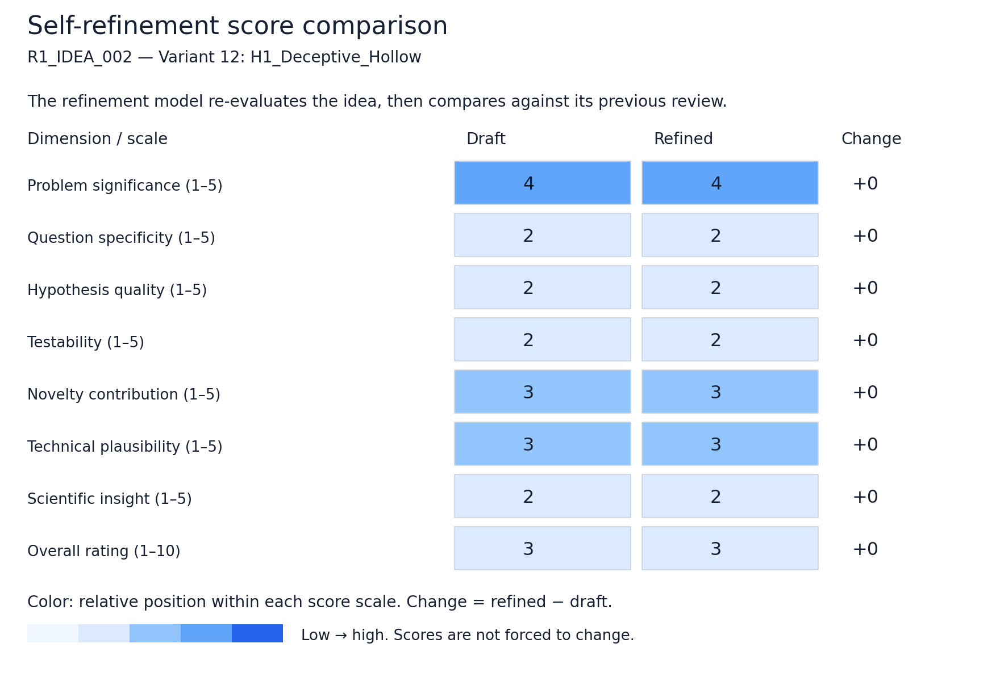

Changed score dimensions: none.

### Score justifications (draft / refined)

**Problem significance**

```json
{
  "draft": {
    "score": 4.0,
    "justification": "The problem of sampling rare events and finding reaction pathways in molecular systems is of immense importance to chemistry, biology, and materials science. Solving this would have significant practical impact."
  },
  "refined": {
    "score": 4.0,
    "justification": "The problem of sampling rare events and identifying reaction pathways in molecular systems is a critical bottleneck in drug discovery and materials science. Solving this would have profound practical implications, making the problem highly significant."
  }
}
```

**Question specificity**

```json
{
  "draft": {
    "score": 2.0,
    "justification": "The idea is very broad. It states 'a machine learning method' will be used but does not specify which one, how it works, or what the specific research question is beyond a general desire to avoid descriptors."
  },
  "refined": {
    "score": 2.0,
    "justification": "The research question is extremely vague. It asks to 'use a machine learning method' but does not define the method, the specific variables, or the relationship being investigated. It is a goal, not a question."
  }
}
```

**Hypothesis quality**

```json
{
  "draft": {
    "score": 2.0,
    "justification": "There is no clear, falsifiable hypothesis. The text suggests the approach 'could' be useful and 'might' reshape the field, which is a prediction of potential rather than a testable scientific claim."
  },
  "refined": {
    "score": 2.0,
    "justification": "There is no explicit or implicit hypothesis that can be tested. The text offers a prediction of 'potential' impact ('could reshape') rather than a scientific claim about a mechanism or outcome that could be proven false."
  }
}
```

**Testability**

```json
{
  "draft": {
    "score": 2.0,
    "justification": "Without a defined method or specific metrics, it is impossible to design an experiment to test this idea. The claim of being 'field-shaping' is not testable in itself."
  },
  "refined": {
    "score": 2.0,
    "justification": "The idea is currently untestable. Without a defined algorithm or specific metrics, no experiment can be designed to verify the claims. The 'transformative' nature is a subjective assessment, not an empirical one."
  }
}
```

**Novelty contribution**

```json
{
  "draft": {
    "score": 3.0,
    "justification": "The goal of descriptor-free pathway discovery is novel and desirable, but the idea does not propose a specific mechanism to achieve this novelty. It remains a high-level vision rather than a concrete novel contribution."
  },
  "refined": {
    "score": 3.0,
    "justification": "The *direction* of descriptor-free pathway discovery is novel and desirable. However, the idea itself does not propose a specific novel mechanism or contribution, only a high-level vision. The novelty is in the ambition, not the specific proposal."
  }
}
```

**Technical plausibility**

```json
{
  "draft": {
    "score": 3.0,
    "justification": "The concept is technically plausible in principle (unsupervised learning of reaction coordinates), but the lack of methodological detail makes it impossible to assess the feasibility of the proposed approach."
  },
  "refined": {
    "score": 3.0,
    "justification": "The concept is technically plausible in principle (unsupervised learning of reaction coordinates is an active area of research), but the lack of methodological detail makes it impossible to assess the feasibility of the specific proposed approach."
  }
}
```

**Scientific insight**

```json
{
  "draft": {
    "score": 2.0,
    "justification": "As currently stated, the idea does not promise specific scientific insight. It promises a 'unified pathway' and 'transformative synthesis,' which are vague outcomes rather than specific discoveries about mechanisms or principles."
  },
  "refined": {
    "score": 2.0,
    "justification": "As stated, the idea does not promise specific scientific insight. It promises a 'unified pathway' and 'transformative synthesis,' which are vague outcomes. It does not suggest what new principles or mechanisms will be discovered."
  }
}
```

**Overall rating**

```json
{
  "draft": {
    "score": 3.0,
    "justification": "The idea addresses a significant problem but fails to articulate a specific research question, hypothesis, or method. It reads more like a grant proposal vision statement than a concrete research idea. While the direction is promising, the lack of specificity prevents it from being rated higher."
  },
  "refined": {
    "score": 3.0,
    "justification": "The idea addresses a significant problem but fails to articulate a specific research question, hypothesis, or method. It reads more like a grant proposal vision statement than a concrete research idea. While the direction is promising, the lack of specificity prevents it from being rated higher. It is a 'weak' idea in its current form because it cannot be evaluated or executed without significant additional definition."
  }
}
```

## R1_IDEA_002 — Variant 13: H2_Confident_Flaw

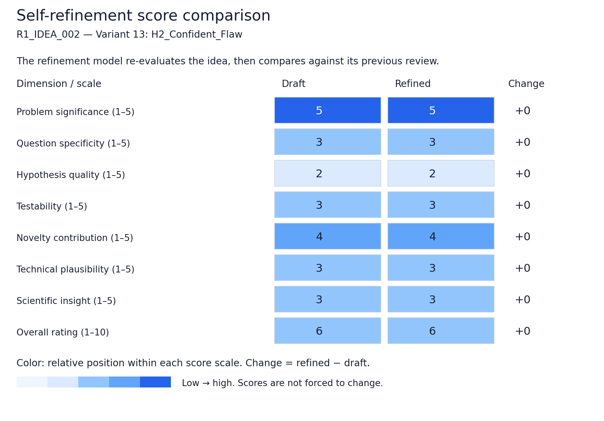

Changed score dimensions: none.

### Score justifications (draft / refined)

**Problem significance**

```json
{
  "draft": {
    "score": 5.0,
    "justification": "The problem of sampling rare events in molecular dynamics without predefined collective variables is a fundamental and highly significant challenge in computational chemistry and drug discovery. Solving this would have substantial practical impact."
  },
  "refined": {
    "score": 5.0,
    "justification": "The problem of sampling rare events in molecular dynamics without predefined collective variables is a fundamental challenge in computational chemistry. Solving this would have profound implications for drug discovery and material design, making the problem highly significant."
  }
}
```

**Question specificity**

```json
{
  "draft": {
    "score": 3.0,
    "justification": "While the general direction (diffusion + off-policy for CV-free sampling) is clear, the specific mechanism of the 'improved off-policy learning' and the precise definition of the 'transition pathways' are not detailed enough to be fully specific."
  },
  "refined": {
    "score": 3.0,
    "justification": "While the general direction (diffusion + off-policy for CV-free sampling) is clear, the specific mechanism of the 'improved off-policy learning' is vague. Furthermore, the research question is obscured by the flawed claim that confounding variables need not be isolated, making the specific scope of the investigation unclear."
  }
}
```

**Hypothesis quality**

```json
{
  "draft": {
    "score": 2.0,
    "justification": "The hypothesis is weak because it makes an absolute causal claim ('necessarily produce reliable improvements') and asserts general superiority without acknowledging the need to control for confounding variables. This makes it unfalsifiable in a rigorous scientific sense as stated."
  },
  "refined": {
    "score": 2.0,
    "justification": "The hypothesis is weak because it makes an absolute causal claim ('necessarily produce reliable improvements') and asserts general superiority without acknowledging the need to control for confounding variables. This makes the hypothesis unfalsifiable in a rigorous sense as stated, as it predicts success regardless of other potential failure modes."
  }
}
```

**Testability**

```json
{
  "draft": {
    "score": 3.0,
    "justification": "The core idea is testable in principle (compare CV-free diffusion sampling against CV-based methods), but the proposed reasoning that one can ignore dataset composition and boundary cases makes the experimental design flawed and the results potentially uninterpretable."
  },
  "refined": {
    "score": 3.0,
    "justification": "The core idea is testable in principle (comparing CV-free vs. CV-based methods), but the proposed reasoning that one can ignore dataset composition and boundary cases makes the experimental design scientifically unsound. A valid test requires isolating variables, which the idea explicitly rejects."
  }
}
```

**Novelty contribution**

```json
{
  "draft": {
    "score": 4.0,
    "justification": "Combining diffusion models with off-policy learning for CV-free path sampling is a novel and promising direction. If successful, it could significantly advance the field of rare-event simulation."
  },
  "refined": {
    "score": 4.0,
    "justification": "Combining diffusion models with off-policy learning for CV-free path sampling is a novel and promising direction. If the methodological challenges can be overcome, it could significantly advance the field of rare-event simulation."
  }
}
```

**Technical plausibility**

```json
{
  "draft": {
    "score": 3.0,
    "justification": "The combination of techniques is plausible, but the claim that solving the CV issue automatically guarantees general superiority without isolating other factors is technically unsound. The specific implementation details of the off-policy component are missing."
  },
  "refined": {
    "score": 3.0,
    "justification": "The combination of techniques is plausible, but the claim that solving the CV issue automatically guarantees general superiority without isolating other factors is technically unsound. The specific implementation details of the off-policy component are missing, and the logical leap to 'general superiority' is not supported by the provided reasoning."
  }
}
```

**Scientific insight**

```json
{
  "draft": {
    "score": 3.0,
    "justification": "If the method works, it would provide significant insight into CV-free sampling. However, the current framing of the research question (ignoring confounders) limits the potential for deep scientific insight into the *mechanisms* of why it works or fails."
  },
  "refined": {
    "score": 3.0,
    "justification": "If the method works, it would provide significant insight into CV-free sampling. However, the current framing (ignoring confounders) limits the potential for deep scientific insight into the *mechanisms* of why it works or fails, reducing the potential for transferable knowledge."
  }
}
```

**Overall rating**

```json
{
  "draft": {
    "score": 6.0,
    "justification": "The research idea addresses a critical and significant problem with a potentially novel methodological approach. However, the quality of the idea is significantly diminished by the overly absolute and logically flawed hypothesis regarding causal inference and general superiority. The suggestion to ignore confounding variables is a major scientific weakness that must be addressed to elevate this from a moderate to a strong idea."
  },
  "refined": {
    "score": 6.0,
    "justification": "The research idea addresses a critical and significant problem with a potentially novel methodological approach. However, the quality of the idea is significantly diminished by the overly absolute and logically flawed hypothesis regarding causal inference. The suggestion to ignore confounding variables is a major scientific weakness that prevents this from being a strong idea, despite the high significance of the problem. It remains a moderate/borderline idea that requires significant refinement in its theoretical framing to be viable."
  }
}
```

## R1_IDEA_002 — Variant 14: H3_Verbose_Enriched

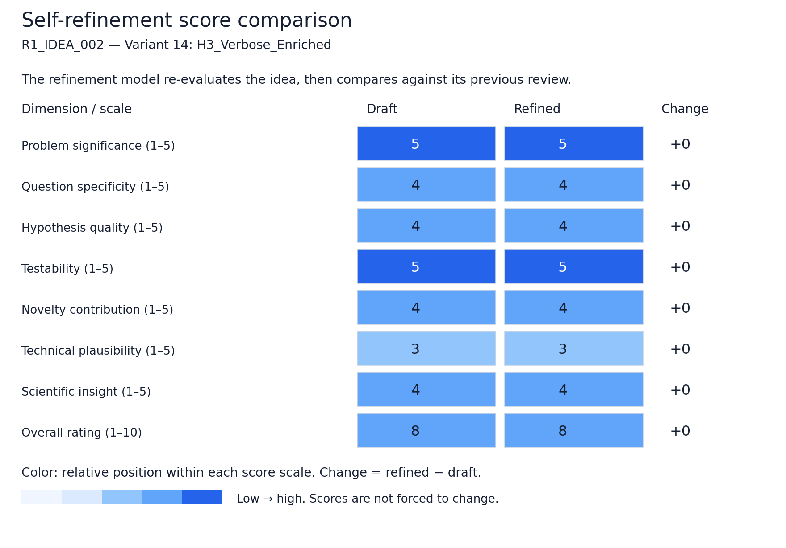

Changed score dimensions: none.

### Score justifications (draft / refined)

**Problem significance**

```json
{
  "draft": {
    "score": 5.0,
    "justification": "The problem of sampling rare events in molecular systems without predefined collective variables is a major bottleneck in drug discovery and material science. Solving this would significantly reduce computational costs and enable the study of complex biological processes that are currently inaccessible."
  },
  "refined": {
    "score": 5.0,
    "justification": "The problem of sampling rare events in molecular systems without predefined collective variables is a major bottleneck in drug discovery and material science. Solving this would significantly reduce computational costs and enable the study of complex biological processes that are currently inaccessible."
  }
}
```

**Question specificity**

```json
{
  "draft": {
    "score": 4.0,
    "justification": "The idea clearly identifies the goal (pathway sampling), the method (diffusion + off-policy), and the constraints (no CVs). However, the specific mechanism of the off-policy update and the reward formulation are currently abstract, preventing a fully granular definition of the research question."
  },
  "refined": {
    "score": 4.0,
    "justification": "The idea clearly identifies the goal (pathway sampling), the method (diffusion + off-policy), and the constraints (no CVs). However, the specific mechanism of the off-policy update and the reward formulation are currently abstract, preventing a fully granular definition of the research question."
  }
}
```

**Hypothesis quality**

```json
{
  "draft": {
    "score": 4.0,
    "justification": "The hypothesis that off-policy learning can validate and improve sampling is concrete and testable. The idea to compare against enhanced sampling methods and analyze boundary conditions provides a strong basis for supporting or refuting the claim."
  },
  "refined": {
    "score": 4.0,
    "justification": "The hypothesis that off-policy learning can validate and improve sampling is concrete and testable. The idea to compare against enhanced sampling methods and analyze boundary conditions provides a strong basis for supporting or refuting the claim."
  }
}
```

**Testability**

```json
{
  "draft": {
    "score": 5.0,
    "justification": "The proposal includes a robust plan for testing: staged design, ablation studies, sensitivity analysis, and error analysis. The criteria for success (comparison with enhanced sampling) are well-defined."
  },
  "refined": {
    "score": 5.0,
    "justification": "The proposal includes a robust plan for testing: staged design, ablation studies, sensitivity analysis, and error analysis. The criteria for success (comparison with enhanced sampling) are well-defined."
  }
}
```

**Novelty contribution**

```json
{
  "draft": {
    "score": 4.0,
    "justification": "Combining diffusion models with off-policy learning for molecular path sampling is a novel direction. While diffusion models are popular, their application to off-policy path sampling in this specific domain (without CVs) represents a significant potential contribution to the field."
  },
  "refined": {
    "score": 4.0,
    "justification": "Combining diffusion models with off-policy learning for molecular path sampling is a novel direction. While diffusion models are popular, their application to off-policy path sampling in this specific domain (without CVs) represents a significant potential contribution to the field."
  }
}
```

**Technical plausibility**

```json
{
  "draft": {
    "score": 3.0,
    "justification": "While the general direction makes sense, the technical leap of applying off-policy learning to diffusion path samplers without CVs is non-trivial. The idea assumes a mechanism exists but does not explain how the policy gradient or importance sampling is adapted to the continuous, high-dimensional path space of molecular dynamics. It is plausible but requires significant theoretical grounding."
  },
  "refined": {
    "score": 3.0,
    "justification": "While the general direction makes sense, the technical leap of applying off-policy learning to diffusion path samplers without CVs is non-trivial. The idea assumes a mechanism exists but does not explain how the policy gradient or importance sampling is adapted to the continuous, high-dimensional path space of molecular dynamics. It is plausible but requires significant theoretical grounding."
  }
}
```

**Scientific insight**

```json
{
  "draft": {
    "score": 4.0,
    "justification": "If successful, this research would reveal how reinforcement learning principles can be adapted to generative modeling for physical systems. It would also provide insights into the boundary conditions where off-policy methods succeed or fail in high-dimensional sampling, which is valuable for the broader ML community."
  },
  "refined": {
    "score": 4.0,
    "justification": "If successful, this research would reveal how reinforcement learning principles can be adapted to generative modeling for physical systems. It would also provide insights into the boundary conditions where off-policy methods succeed or fail in high-dimensional sampling, which is valuable for the broader ML community."
  }
}
```

**Overall rating**

```json
{
  "draft": {
    "score": 8.0,
    "justification": "This is a strong research idea with high significance and a clear, rigorous plan for validation. The main limitation is the current lack of technical detail regarding the specific mechanism of the off-policy update and reward definition. However, the core concept is promising, testable, and addresses a critical gap in computational chemistry."
  },
  "refined": {
    "score": 8.0,
    "justification": "This is a strong research idea with high significance and a clear, rigorous plan for validation. The main limitation is the current lack of technical detail regarding the specific mechanism of the off-policy update and reward definition. However, the core concept is promising, testable, and addresses a critical gap in computational chemistry."
  }
}
```

## R1_IDEA_002 — Variant 15: H4_Ultimate_Hype

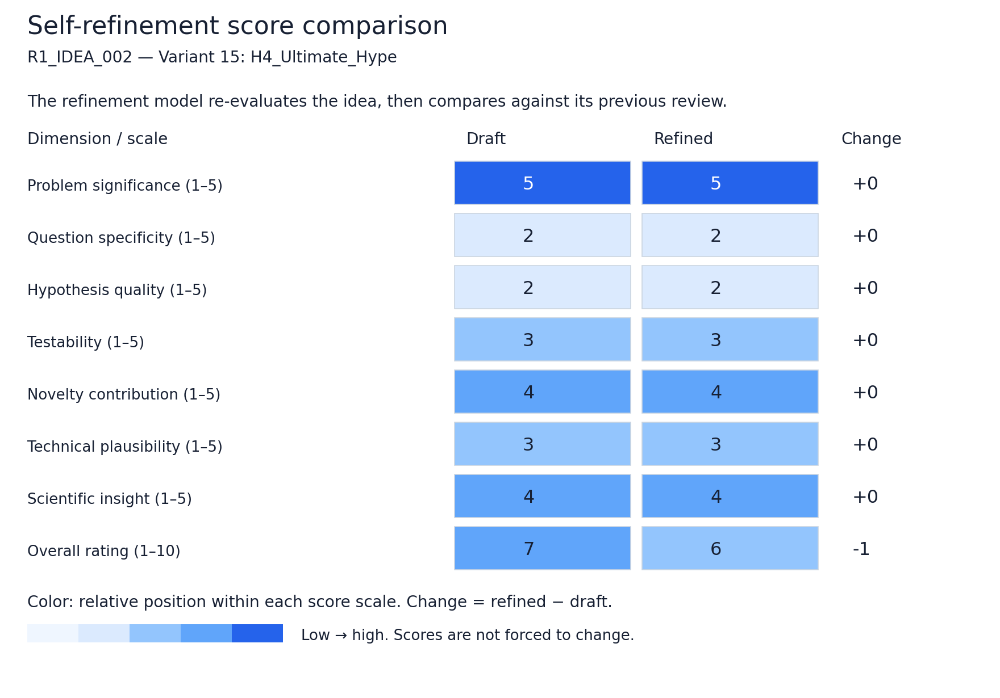

Changed score dimensions: overall_rating.

### Score justifications (draft / refined)

**Problem significance**

```json
{
  "draft": {
    "score": 5.0,
    "justification": "The problem of rare-event sampling in molecular dynamics without predefined collective variables is a fundamental bottleneck in computational chemistry. Solving this would have massive implications for drug discovery and materials science, making the problem highly significant."
  },
  "refined": {
    "score": 5.0,
    "justification": "The problem of rare-event sampling without collective variables is a fundamental and long-standing challenge in computational chemistry. Solving it would have profound implications for drug discovery, protein folding, and materials science, making the problem highly significant."
  }
}
```

**Question specificity**

```json
{
  "draft": {
    "score": 2.0,
    "justification": "While the goal is clear, the research question is currently too vague. It states 'what' (train samplers via off-policy learning) but not 'how' or 'why' this specific combination works. The specific mechanism of the 'improved off-policy learning' is undefined."
  },
  "refined": {
    "score": 2.0,
    "justification": "The research question is currently too vague. While it states the goal (CV-free sampling), it fails to define the specific research question regarding the mechanism. It does not specify what 'improved off-policy learning' entails or how the diffusion process is adapted for path sampling, leaving the core 'how' undefined."
  }
}
```

**Hypothesis quality**

```json
{
  "draft": {
    "score": 2.0,
    "justification": "The idea contains a broad prediction of impact ('redefine the frontier') but lacks a falsifiable scientific hypothesis. A stronger idea would hypothesize a specific relationship between the off-policy correction and the convergence rate or accuracy of the free energy landscape."
  },
  "refined": {
    "score": 2.0,
    "justification": "The idea lacks a concrete, falsifiable hypothesis. The claims are framed as broad predictions of impact ('redefine the frontier') rather than specific, testable relationships between the proposed method and its performance or convergence properties."
  }
}
```

**Testability**

```json
{
  "draft": {
    "score": 3.0,
    "justification": "The idea is theoretically testable in principle (one could implement a diffusion sampler and compare it to MD), but the summary does not suggest specific experiments, ablations, or baselines that would make the testing rigorous. The lack of defined metrics makes the testability currently moderate."
  },
  "refined": {
    "score": 3.0,
    "justification": "The idea is theoretically testable in principle, as one could implement a diffusion sampler and compare it to ground truth MD. However, the summary does not suggest specific experiments, ablations, or baselines, and the lack of defined metrics makes the testability currently moderate."
  }
}
```

**Novelty contribution**

```json
{
  "draft": {
    "score": 4.0,
    "justification": "Applying diffusion models to path sampling is novel, and specifically attempting to do so without collective variables using off-policy learning is a bold and potentially high-contribution direction. It moves beyond simple application to a methodological innovation."
  },
  "refined": {
    "score": 4.0,
    "justification": "The combination of diffusion models and off-policy learning for CV-free path sampling is a novel and ambitious direction. It moves beyond simple application to a methodological innovation that could yield high-impact contributions if the technical challenges are overcome."
  }
}
```

**Technical plausibility**

```json
{
  "draft": {
    "score": 3.0,
    "justification": "The combination of diffusion models and off-policy learning is technically plausible in the broader ML context. However, applying this to molecular dynamics without CVs introduces significant physical constraints that are not addressed in the summary, making the plausibility moderate until the mechanism is clarified."
  },
  "refined": {
    "score": 3.0,
    "justification": "The combination of techniques is plausible in the broader ML context, but applying them to molecular dynamics without CVs introduces significant physical constraints that are not addressed. The plausibility is moderate until the mechanism for enforcing physical laws and handling high-dimensional path spaces is clarified."
  }
}
```

**Scientific insight**

```json
{
  "draft": {
    "score": 4.0,
    "justification": "If successful, this research would provide deep insights into how generative models can learn complex physical dynamics without human-defined features (CVs). It could reveal new principles for sampling high-dimensional manifolds."
  },
  "refined": {
    "score": 4.0,
    "justification": "If successfully investigated, this research would provide deep insights into how generative models can learn complex physical dynamics without human-defined features. It could reveal new principles for sampling high-dimensional manifolds and the interplay between off-policy learning and diffusion processes."
  }
}
```

**Overall rating**

```json
{
  "draft": {
    "score": 7.0,
    "justification": "This is a strong research idea with exceptional problem significance and high potential for novelty. However, it currently reads more like a high-level vision statement than a concrete research proposal. The lack of specific hypotheses, methodological details, and evaluation criteria prevents it from being an 'exceptional' (9-10) idea at this stage. With more specificity on the 'how' and 'what to measure', it could easily become a top-tier proposal."
  },
  "refined": {
    "score": 6.0,
    "justification": "This is a moderate research idea with exceptional problem significance and high novelty potential. However, it currently reads more like a high-level vision statement than a concrete research proposal. The lack of specific hypotheses, methodological details, and evaluation criteria prevents it from being a 'strong' (7-8) idea at this stage. It requires significant refinement to move from a 'bold agenda' to a testable scientific inquiry."
  }
}
```

## R1_IDEA_003 — Source

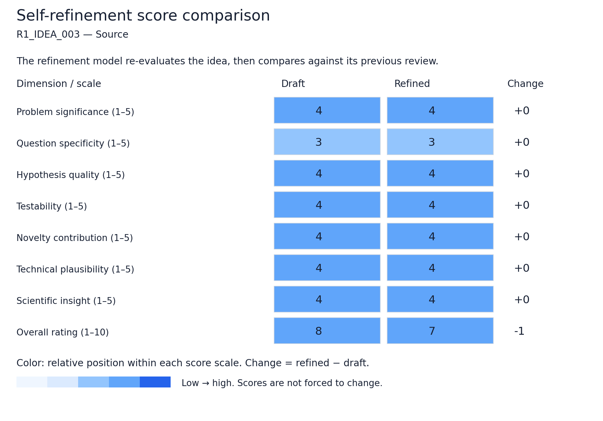

Changed score dimensions: overall_rating.

### Score justifications (draft / refined)

**Problem significance**

```json
{
  "draft": {
    "score": 4.0,
    "justification": "The problem of extracting meaningful reasoning patterns from human experts is central to trustworthy AI in medicine. Current methods discard the temporal dimension of human vision, which is a significant loss of information. Addressing this is highly relevant to the field."
  },
  "refined": {
    "score": 4.0,
    "justification": "The problem is highly significant in the context of trustworthy medical AI. Extracting the 'how' (process) rather than just the 'what' (result) from human experts is a major challenge. Current methods lose the temporal logic of diagnosis, which is a meaningful gap to address."
  }
}
```

**Question specificity**

```json
{
  "draft": {
    "score": 3.0,
    "justification": "The core question (does temporal gaze help?) is clear, but the specific research question regarding the mechanism of integration and the specific reasoning tasks is somewhat vague. It defines the 'what' (video vs. heatmap) well but less so the 'how' and 'where exactly'."
  },
  "refined": {
    "score": 3.0,
    "justification": "The idea clearly states the 'what' (video vs. heatmap) but leaves the 'how' (architecture) and 'where' (specific reasoning tasks) somewhat open. The research question is specific enough to be actionable but requires refinement on the exact mechanism of integration and the specific hypotheses about which reasoning aspects are improved."
  }
}
```

**Hypothesis quality**

```json
{
  "draft": {
    "score": 4.0,
    "justification": "The hypothesis is strong: that the temporal sequence of fixations encodes diagnostic logic that static maps miss. This is a falsifiable claim that distinguishes the work from generic applications."
  },
  "refined": {
    "score": 4.0,
    "justification": "The hypothesis is strong: that temporal sequences contain unique diagnostic information not present in static aggregates. This is a concrete, falsifiable claim that distinguishes the work from generic applications of eye-tracking."
  }
}
```

**Testability**

```json
{
  "draft": {
    "score": 4.0,
    "justification": "The idea is highly testable. One can train models with static gaze inputs vs. temporal gaze inputs and compare performance on specific diagnostic tasks and interpretability metrics. The experimental design is straightforward to conceive."
  },
  "refined": {
    "score": 4.0,
    "justification": "The idea is highly testable. One can construct a clear experimental setup comparing static vs. temporal gaze inputs. The metrics for success (performance, interpretability alignment) are definable, even if the specific metrics are not yet listed in the summary."
  }
}
```

**Novelty contribution**

```json
{
  "draft": {
    "score": 4.0,
    "justification": "While eye-tracking in medical imaging is not new, the specific proposal to treat gaze as a video sequence for temporal reasoning in LVLMs is a novel and promising direction. It moves beyond simple attention visualization to dynamic modeling."
  },
  "refined": {
    "score": 4.0,
    "justification": "While eye-tracking in medicine is established, treating it as a video sequence for temporal reasoning in LVLMs is a novel and promising direction. It moves beyond simple attention visualization to dynamic modeling of cognitive processes."
  }
}
```

**Technical plausibility**

```json
{
  "draft": {
    "score": 4.0,
    "justification": "The technical approach is plausible. Modern transformers and video processing techniques (e.g., 3D CNNs, temporal attention) can handle sequence data. The main challenge is data alignment and architecture design, not fundamental feasibility."
  },
  "refined": {
    "score": 4.0,
    "justification": "The technical approach is plausible given current transformer architectures capable of handling video or sequence data. The main challenges are data alignment and architectural design, not fundamental feasibility."
  }
}
```

**Scientific insight**

```json
{
  "draft": {
    "score": 4.0,
    "justification": "If successful, this research could reveal how temporal dynamics in human visual search correlate with diagnostic accuracy, offering insights into the cognitive processes of radiologists that can be formalized in AI."
  },
  "refined": {
    "score": 4.0,
    "justification": "If successful, this research could reveal how temporal dynamics in human visual search correlate with diagnostic accuracy, offering insights into the cognitive processes of radiologists that can be formalized in AI. It has the potential to uncover new principles of medical reasoning."
  }
}
```

**Overall rating**

```json
{
  "draft": {
    "score": 8.0,
    "justification": "This is a strong research idea. It identifies a clear gap (loss of temporal data), proposes a specific and plausible solution (video encoding), and targets a high-impact domain. While it lacks implementation details, the core scientific premise is sound, testable, and potentially insightful. It scores high on significance, hypothesis quality, and testability."
  },
  "refined": {
    "score": 7.0,
    "justification": "This is a strong research idea with a clear gap identification and a plausible, testable hypothesis. It scores high on significance and novelty. However, it loses a point from 'exceptional' status because the specific research question regarding the *mechanism* of integration and the *specific* reasoning tasks is not fully defined in the summary. It is a solid 'Strong' (7) rather than 'Exceptional' (9-10) idea due to the lack of specificity on the 'how' and 'which' aspects."
  }
}
```

## R1_IDEA_003 — Variant 1: A1_Identity


Changed score dimensions: overall_rating.

### Score justifications (draft / refined)

**Problem significance**

```json
{
  "draft": {
    "score": 4.0,
    "justification": "The problem of extracting meaningful reasoning patterns from human experts is central to trustworthy AI in medicine. Current methods discard the temporal dimension of human vision, which is a significant loss of information. Addressing this is highly relevant to the field."
  },
  "refined": {
    "score": 4.0,
    "justification": "The problem is highly significant in the context of trustworthy medical AI. Extracting the 'how' (process) rather than just the 'what' (result) from human experts is a major challenge. Current methods lose the temporal logic of diagnosis, which is a meaningful gap to address."
  }
}
```

**Question specificity**

```json
{
  "draft": {
    "score": 3.0,
    "justification": "The core question (does temporal gaze help?) is clear, but the specific research question regarding the mechanism of integration and the specific reasoning tasks is somewhat vague. It defines the 'what' (video vs. heatmap) well but less so the 'how' and 'where exactly'."
  },
  "refined": {
    "score": 3.0,
    "justification": "The idea clearly states the 'what' (video vs. heatmap) but leaves the 'how' (architecture) and 'where' (specific reasoning tasks) somewhat open. The research question is specific enough to be actionable but requires refinement on the exact mechanism of integration and the specific hypotheses about which reasoning aspects are improved."
  }
}
```

**Hypothesis quality**

```json
{
  "draft": {
    "score": 4.0,
    "justification": "The hypothesis is strong: that the temporal sequence of fixations encodes diagnostic logic that static maps miss. This is a falsifiable claim that distinguishes the work from generic applications."
  },
  "refined": {
    "score": 4.0,
    "justification": "The hypothesis is strong: that temporal sequences contain unique diagnostic information not present in static aggregates. This is a concrete, falsifiable claim that distinguishes the work from generic applications of eye-tracking."
  }
}
```

**Testability**

```json
{
  "draft": {
    "score": 4.0,
    "justification": "The idea is highly testable. One can train models with static gaze inputs vs. temporal gaze inputs and compare performance on specific diagnostic tasks and interpretability metrics. The experimental design is straightforward to conceive."
  },
  "refined": {
    "score": 4.0,
    "justification": "The idea is highly testable. One can construct a clear experimental setup comparing static vs. temporal gaze inputs. The metrics for success (performance, interpretability alignment) are definable, even if the specific metrics are not yet listed in the summary."
  }
}
```

**Novelty contribution**

```json
{
  "draft": {
    "score": 4.0,
    "justification": "While eye-tracking in medical imaging is not new, the specific proposal to treat gaze as a video sequence for temporal reasoning in LVLMs is a novel and promising direction. It moves beyond simple attention visualization to dynamic modeling."
  },
  "refined": {
    "score": 4.0,
    "justification": "While eye-tracking in medicine is established, treating it as a video sequence for temporal reasoning in LVLMs is a novel and promising direction. It moves beyond simple attention visualization to dynamic modeling of cognitive processes."
  }
}
```

**Technical plausibility**

```json
{
  "draft": {
    "score": 4.0,
    "justification": "The technical approach is plausible. Modern transformers and video processing techniques (e.g., 3D CNNs, temporal attention) can handle sequence data. The main challenge is data alignment and architecture design, not fundamental feasibility."
  },
  "refined": {
    "score": 4.0,
    "justification": "The technical approach is plausible given current transformer architectures capable of handling video or sequence data. The main challenges are data alignment and architectural design, not fundamental feasibility."
  }
}
```

**Scientific insight**

```json
{
  "draft": {
    "score": 4.0,
    "justification": "If successful, this research could reveal how temporal dynamics in human visual search correlate with diagnostic accuracy, offering insights into the cognitive processes of radiologists that can be formalized in AI."
  },
  "refined": {
    "score": 4.0,
    "justification": "If successful, this research could reveal how temporal dynamics in human visual search correlate with diagnostic accuracy, offering insights into the cognitive processes of radiologists that can be formalized in AI. It has the potential to uncover new principles of medical reasoning."
  }
}
```

**Overall rating**

```json
{
  "draft": {
    "score": 8.0,
    "justification": "This is a strong research idea. It identifies a clear gap (loss of temporal data), proposes a specific and plausible solution (video encoding), and targets a high-impact domain. While it lacks implementation details, the core scientific premise is sound, testable, and potentially insightful. It scores high on significance, hypothesis quality, and testability."
  },
  "refined": {
    "score": 7.0,
    "justification": "This is a strong research idea with a clear gap identification and a plausible, testable hypothesis. It scores high on significance and novelty. However, it loses a point from 'exceptional' status because the specific research question regarding the *mechanism* of integration and the *specific* reasoning tasks is not fully defined in the summary. It is a solid 'Strong' (7) rather than 'Exceptional' (9-10) idea due to the lack of specificity on the 'how' and 'which' aspects."
  }
}
```

## R1_IDEA_003 — Variant 2: A2_Paraphrase_Only


Changed score dimensions: question_specificity, overall_rating.

### Score justifications (draft / refined)

**Problem significance**

```json
{
  "draft": {
    "score": 5.0,
    "justification": "The problem is highly significant. Medical AI interpretability is a major bottleneck for clinical adoption. Understanding *how* a model arrives at a conclusion (via reasoning traces) is as important as the conclusion itself. Preserving the temporal dynamics of human attention is a crucial step toward building models that reason like experts rather than just matching patterns."
  },
  "refined": {
    "score": 5.0,
    "justification": "The problem is highly significant. Medical AI adoption is hindered by the 'black box' nature of models. Understanding the *process* of diagnosis (the scanning path) is as crucial as the diagnosis itself. Addressing the loss of temporal information in gaze data directly tackles a fundamental gap in making AI interpretable and trustworthy in clinical settings."
  }
}
```

**Question specificity**

```json
{
  "draft": {
    "score": 4.0,
    "justification": "The core question is specific: 'Does encoding gaze as video (preserving temporal order) improve reasoning and interpretability compared to static representations?' However, the specific mechanism of how this video is fused with the image and text modalities is not yet defined."
  },
  "refined": {
    "score": 3.0,
    "justification": "The general question is clear ('Does video encoding help?'), but the research question lacks technical specificity. It does not define the exact nature of the 'video' representation, the fusion strategy, or the specific hypothesis regarding *why* the temporal order matters (e.g., does it help with sequential dependency of findings?). Without these details, the scope is somewhat broad."
  }
}
```

**Hypothesis quality**

```json
{
  "draft": {
    "score": 4.0,
    "justification": "The hypothesis is strong and falsifiable: 'Temporal scanning sequences contain unique information that static heatmaps miss, and encoding this as video will lead to measurable improvements in model reasoning and interpretability.' It clearly distinguishes the proposed method from the status quo."
  },
  "refined": {
    "score": 4.0,
    "justification": "The hypothesis is strong and falsifiable: 'Temporal scanning sequences contain unique information not present in static heatmaps.' It posits a specific mechanism (temporal order) that can be tested against a baseline (static representation). However, it assumes the hypothesis without explicitly stating the expected magnitude of improvement or the specific conditions under which it holds."
  }
}
```

**Testability**

```json
{
  "draft": {
    "score": 4.0,
    "justification": "The idea is testable. One can construct a video representation of gaze, train a VLM, and compare it against a baseline using static heatmaps. The key is defining the evaluation metrics for 'reasoning' and 'interpretability,' which is a challenge but not a barrier to testability."
  },
  "refined": {
    "score": 4.0,
    "justification": "The idea is testable. One can construct a video representation of gaze, train a VLM, and compare it against baselines. The main challenge lies in defining the evaluation metrics for 'reasoning' and 'interpretability,' but the core experimental design (Video Gaze vs. Static Gaze) is feasible."
  }
}
```

**Novelty contribution**

```json
{
  "draft": {
    "score": 4.0,
    "justification": "While gaze tracking in medical imaging is not new, the specific proposal to treat it as a video sequence to preserve temporal dynamics in VLMs is a novel and promising direction. It moves beyond simple attention visualization to active temporal modeling."
  },
  "refined": {
    "score": 4.0,
    "justification": "While gaze tracking is established, treating it as a video sequence for VLMs in medical imaging is a novel direction. It shifts the paradigm from 'where' the model looked to 'how' it looked. This could lead to new insights into the relationship between human visual search strategies and machine reasoning."
  }
}
```

**Technical plausibility**

```json
{
  "draft": {
    "score": 4.0,
    "justification": "The approach is technically plausible. Modern VLMs (like those using transformers) are designed to handle sequential data. Encoding gaze as a sequence of frames or tokens is a standard operation in computer vision, making the integration feasible."
  },
  "refined": {
    "score": 4.0,
    "justification": "The approach is technically plausible. Transformers and VLMs are naturally suited for sequential inputs. The main technical hurdle is data representation (handling sparse gaze points) and fusion, but these are solvable engineering problems rather than fundamental theoretical barriers."
  }
}
```

**Scientific insight**

```json
{
  "draft": {
    "score": 4.0,
    "justification": "If successful, this research could reveal fundamental insights into the relationship between human visual scanning strategies and machine reasoning. It could demonstrate that the *order* of information processing is as critical as the information itself for complex diagnostic tasks."
  },
  "refined": {
    "score": 4.0,
    "justification": "If successful, this research could reveal that the temporal dynamics of human attention are a critical prior for medical reasoning, not just a visualization tool. It could establish a new principle for designing multimodal models that mimic expert cognitive processes rather than just statistical correlations."
  }
}
```

**Overall rating**

```json
{
  "draft": {
    "score": 8.0,
    "justification": "This is a strong research idea. It identifies a clear gap in current methodologies (loss of temporal data), proposes a logical and novel solution (video encoding), and targets a high-impact domain. While implementation details and specific evaluation metrics are missing, the core scientific premise is sound, testable, and potentially transformative for medical AI interpretability."
  },
  "refined": {
    "score": 7.0,
    "justification": "This is a strong research idea with high potential impact. It addresses a clear gap (loss of temporal data) with a logical solution (video encoding). While the proposal lacks implementation details and specific evaluation metrics (which is acceptable for an idea summary), the core scientific premise is sound, testable, and addresses a meaningful challenge in medical AI. The score is slightly lower than a perfect 8-9 due to the lack of specificity on data feasibility and the exact mechanism of improvement."
  }
}
```

## R1_IDEA_003 — Variant 3: A3_Plain_Core


Changed score dimensions: none.

### Score justifications (draft / refined)

**Problem significance**

```json
{
  "draft": {
    "score": 5.0,
    "justification": "The problem is highly significant. Medical AI interpretability is a major bottleneck, and current methods fail to capture the dynamic cognitive process of radiologists. Addressing the temporal aspect of gaze is a meaningful step toward building AI that mimics human diagnostic reasoning rather than just pattern matching."
  },
  "refined": {
    "score": 5.0,
    "justification": "The problem is highly significant. Medical AI interpretability is a major bottleneck, and current methods often fail to capture the dynamic cognitive process of radiologists. Addressing the temporal aspect of gaze is a meaningful step toward building AI that mimics human diagnostic reasoning rather than just pattern matching."
  }
}
```

**Question specificity**

```json
{
  "draft": {
    "score": 3.0,
    "justification": "The core concept (video vs. static) is specific, but the research question is currently framed as a general improvement ('enhancing reasoning') rather than a specific, testable relationship. It needs to specify which aspect of reasoning is being targeted and how the temporal data is mathematically or architecturally integrated."
  },
  "refined": {
    "score": 3.0,
    "justification": "While the core concept (video vs. static) is specific, the research question is currently framed as a general improvement ('enhancing reasoning') rather than a specific, testable relationship. It needs to specify which aspect of reasoning is being targeted and how the temporal data is mathematically or architecturally integrated."
  }
}
```

**Hypothesis quality**

```json
{
  "draft": {
    "score": 4.0,
    "justification": "The hypothesis is strong: 'Preserving the temporal sequence of fixations leads to better reasoning and interpretability than static representations.' This is a falsifiable claim that distinguishes the proposed method from the status quo. It relies on a plausible cognitive mechanism."
  },
  "refined": {
    "score": 4.0,
    "justification": "The hypothesis is strong: 'Preserving the temporal sequence of fixations leads to better reasoning and interpretability than static representations.' This is a falsifiable claim that distinguishes the proposed method from the status quo. It relies on a plausible cognitive mechanism."
  }
}
```

**Testability**

```json
{
  "draft": {
    "score": 4.0,
    "justification": "The idea is testable. One can construct a dataset of X-rays with gaze videos, train two models (one with static gaze, one with video gaze), and compare their performance on diagnostic tasks and their attention maps against ground truth radiologist behavior. The comparison is clear."
  },
  "refined": {
    "score": 4.0,
    "justification": "The idea is testable. One can construct a dataset of X-rays with gaze videos, train two models (one with static gaze, one with video gaze), and compare their performance on diagnostic tasks and their attention maps against ground truth radiologist behavior. The comparison is clear."
  }
}
```

**Novelty contribution**

```json
{
  "draft": {
    "score": 4.0,
    "justification": "While gaze integration is known, treating it as a video sequence to capture temporal scanning order in LVLMs for medical imaging is a novel and under-explored direction. It moves beyond simple attention maps to dynamic process modeling."
  },
  "refined": {
    "score": 4.0,
    "justification": "While gaze integration is known, treating it as a video sequence to capture temporal scanning order in LVLMs for medical imaging is a novel and under-explored direction. It moves beyond simple attention maps to dynamic process modeling."
  }
}
```

**Technical plausibility**

```json
{
  "draft": {
    "score": 4.0,
    "justification": "Technically plausible. Modern LVLMs often use video encoders (like CLIP or ViT variants) that can easily accept gaze data as a second modality or a temporal overlay. The main challenge is data and fusion architecture, not fundamental feasibility."
  },
  "refined": {
    "score": 4.0,
    "justification": "Technically plausible. Modern LVLMs often use video encoders (like CLIP or ViT variants) that can easily accept gaze data as a second modality or a temporal overlay. The main challenge is data and fusion architecture, not fundamental feasibility."
  }
}
```

**Scientific insight**

```json
{
  "draft": {
    "score": 4.0,
    "justification": "If successful, this research would provide deep insight into the relationship between human visual search dynamics and machine reasoning. It could reveal whether temporal context is a necessary condition for high-level medical diagnosis in AI, or if it is merely a heuristic."
  },
  "refined": {
    "score": 4.0,
    "justification": "If successful, this research would provide deep insight into the relationship between human visual search dynamics and machine reasoning. It could reveal whether temporal context is a necessary condition for high-level medical diagnosis in AI, or if it is merely a heuristic."
  }
}
```

**Overall rating**

```json
{
  "draft": {
    "score": 8.0,
    "justification": "This is a strong research idea with high potential. It identifies a clear gap in current methodology (loss of temporal data) and proposes a logical, testable solution (video encoding). While implementation details are missing, the core scientific premise is sound, significant, and likely to yield valuable insights into medical AI interpretability."
  },
  "refined": {
    "score": 8.0,
    "justification": "This is a strong research idea with high potential. It identifies a clear gap in current methodology (loss of temporal data) and proposes a logical, testable solution (video encoding). While implementation details are missing, the core scientific premise is sound, significant, and likely to yield valuable insights into medical AI interpretability."
  }
}
```

## R1_IDEA_003 — Variant 4: B1_Verbose_Elaborate


Changed score dimensions: none.

### Score justifications (draft / refined)

**Problem significance**

```json
{
  "draft": {
    "score": 4.0,
    "justification": "The problem is highly significant in the context of medical AI. Radiologists' visual search strategies are complex and sequential; ignoring this temporal aspect limits the ability of AI to mimic human expertise or explain its decisions in a clinically meaningful way. Solving this could lead to more trustworthy and robust diagnostic tools."
  },
  "refined": {
    "score": 4.0,
    "justification": "The problem is highly significant in medical AI. Radiologists' visual search is inherently sequential; ignoring this temporal aspect limits the AI's ability to mimic expert cognition or explain decisions in a clinically meaningful way. Addressing this could lead to more robust and trustworthy diagnostic tools."
  }
}
```

**Question specificity**

```json
{
  "draft": {
    "score": 3.0,
    "justification": "The core question (does video gaze encoding improve reasoning over static gaze?) is clear. However, the specific research question regarding *how* this improves reasoning or *which* specific reasoning tasks are targeted is not fully articulated. The definition of 'reasoning' and 'interpretability' needs more operational precision."
  },
  "refined": {
    "score": 3.0,
    "justification": "The core question (does video gaze encoding improve reasoning over static gaze?) is clear. However, the specific research question regarding *how* this improves reasoning or *which* specific reasoning tasks are targeted is not fully articulated. The definition of 'reasoning' and 'interpretability' needs more operational precision to be a strong research question."
  }
}
```

**Hypothesis quality**

```json
{
  "draft": {
    "score": 4.0,
    "justification": "The hypothesis is strong and plausible: that the temporal sequence of fixations contains unique information about the diagnostic process that static representations miss. It is a falsifiable claim that can be tested by comparing models trained with static vs. temporal gaze inputs."
  },
  "refined": {
    "score": 4.0,
    "justification": "The hypothesis is strong and plausible: that the temporal sequence of fixations contains unique information about the diagnostic process that static representations miss. It is a falsifiable claim that can be tested by comparing models trained with static vs. temporal gaze inputs."
  }
}
```

**Testability**

```json
{
  "draft": {
    "score": 4.0,
    "justification": "The idea is highly testable. One can construct a dataset with gaze coordinates, encode them as video sequences, train a VLM, and compare performance against baselines using static heatmaps. Metrics can include diagnostic accuracy, explanation quality, and attention alignment with ground truth."
  },
  "refined": {
    "score": 4.0,
    "justification": "The idea is highly testable. One can construct a dataset with gaze coordinates, encode them as video sequences, train a VLM, and compare performance against baselines using static heatmaps. Metrics can include diagnostic accuracy, explanation quality, and attention alignment with ground truth."
  }
}
```

**Novelty contribution**

```json
{
  "draft": {
    "score": 4.0,
    "justification": "While using gaze data in medical AI is not new, the specific proposal to encode it as a video sequence to capture temporal dynamics, rather than aggregating it into a heatmap or text, is a novel and under-explored direction. It moves beyond simple data augmentation to a more faithful representation of the human cognitive process."
  },
  "refined": {
    "score": 4.0,
    "justification": "While using gaze data in medical AI is not new, the specific proposal to encode it as a video sequence to capture temporal dynamics, rather than aggregating it into a heatmap or text, is a novel and under-explored direction. It moves beyond simple data augmentation to a more faithful representation of the human cognitive process."
  }
}
```

**Technical plausibility**

```json
{
  "draft": {
    "score": 4.0,
    "justification": "The technical approach is sound. Modern VLMs and video understanding models (like Video-LLaMA or similar architectures) are capable of processing sequential visual inputs. The main challenge will be the fusion mechanism, but the premise is technically feasible."
  },
  "refined": {
    "score": 4.0,
    "justification": "The technical approach is sound. Modern VLMs and video understanding models are capable of processing sequential visual inputs. The main challenge will be the fusion mechanism and computational cost, but the premise is technically feasible."
  }
}
```

**Scientific insight**

```json
{
  "draft": {
    "score": 4.0,
    "justification": "If successful, this research could reveal that the *process* of looking (the sequence) is as important as the *result* of looking (the fixations) for diagnostic reasoning. This would provide deep insight into the nature of visual cognition in experts and how to better model it in AI."
  },
  "refined": {
    "score": 4.0,
    "justification": "If successful, this research could reveal that the *process* of looking (the sequence) is as important as the *result* of looking (the fixations) for diagnostic reasoning. This would provide deep insight into the nature of visual cognition in experts and how to better model it in AI."
  }
}
```

**Overall rating**

```json
{
  "draft": {
    "score": 8.0,
    "justification": "This is a strong research idea with high potential. It addresses a clear gap in current methodologies (loss of temporal data), proposes a plausible and novel solution (video encoding), and targets a high-impact domain. The main limitation is the lack of specific details on the implementation and evaluation metrics, but as a research proposal, the core scientific value is evident."
  },
  "refined": {
    "score": 8.0,
    "justification": "This is a strong research idea with high potential. It addresses a clear gap in current methodologies (loss of temporal data), proposes a plausible and novel solution (video encoding), and targets a high-impact domain. The main limitation is the lack of specific details on the implementation and evaluation metrics, but as a research proposal, the core scientific value is evident."
  }
}
```

## R1_IDEA_003 — Variant 5: B2_Grand_Narrative


Changed score dimensions: none.

### Score justifications (draft / refined)

**Problem significance**

```json
{
  "draft": {
    "score": 4.0,
    "justification": "The problem of integrating human cognitive processes into AI is highly significant, especially in high-stakes domains like medicine. Discarding temporal information is a known bottleneck in current gaze-based AI, making this a meaningful challenge to address."
  },
  "refined": {
    "score": 4.0,
    "justification": "The problem is highly significant. Integrating human cognitive priors into AI is a major frontier in medical imaging. The specific issue of losing temporal information in gaze data is a known bottleneck that limits the fidelity of 'cognitively aligned' models. Solving this could lead to more trustworthy and interpretable medical AI."
  }
}
```

**Question specificity**

```json
{
  "draft": {
    "score": 3.0,
    "justification": "The core question (static vs. temporal gaze) is clear, but the specific research question regarding the *impact* on model reasoning is somewhat broad. It needs more definition on which aspects of reasoning are targeted."
  },
  "refined": {
    "score": 3.0,
    "justification": "The core question (static vs. temporal) is clear, but the research question is currently too broad. It asks 'will it help?' without specifying 'in what context' or 'for which specific reasoning tasks.' The lack of a defined boundary condition makes the question less precise."
  }
}
```

**Hypothesis quality**

```json
{
  "draft": {
    "score": 3.0,
    "justification": "The implicit hypothesis (temporal data > static data for reasoning) is plausible and falsifiable. However, it lacks the nuance of boundary conditions (e.g., when does it fail?) which would make it a stronger scientific hypothesis."
  },
  "refined": {
    "score": 3.0,
    "justification": "The implicit hypothesis (temporal > static) is plausible and falsifiable. However, it is a 'generic' hypothesis. A stronger hypothesis would predict *when* it fails or *why* it works (e.g., 'Temporal data is critical for detecting subtle signs that require a specific scanning path'). The current formulation lacks this nuance."
  }
}
```

**Testability**

```json
{
  "draft": {
    "score": 4.0,
    "justification": "The idea is highly testable. One can construct an experiment comparing models trained with static vs. temporal gaze inputs on standard chest X-ray benchmarks. The outcome is binary (improvement or not) and measurable."
  },
  "refined": {
    "score": 4.0,
    "justification": "The idea is testable. One can design an experiment comparing models with static vs. temporal gaze inputs on standard benchmarks. The outcome is measurable. However, the testability is currently limited by the lack of defined metrics for 'reasoning' and the potential data scarcity."
  }
}
```

**Novelty contribution**

```json
{
  "draft": {
    "score": 4.0,
    "justification": "While gaze integration is not new, the specific proposal to treat gaze as a video sequence to capture scanning order in LVLMs for medical imaging is a novel and promising direction that moves beyond the state-of-the-art static representations."
  },
  "refined": {
    "score": 4.0,
    "justification": "While gaze integration is not new, the specific proposal to treat gaze as a video sequence in LVLMs for medical imaging is a novel contribution. It moves the field from static attention maps to dynamic process modeling, which is a meaningful step forward."
  }
}
```

**Technical plausibility**

```json
{
  "draft": {
    "score": 4.0,
    "justification": "The technical approach is sound. Treating gaze as a sequence of coordinates or heatmaps over time is a standard computer vision task (video processing) that can be adapted to multimodal architectures. The main challenge is data, not theoretical plausibility."
  },
  "refined": {
    "score": 4.0,
    "justification": "The technical approach is sound. Treating gaze as a sequence is a standard computer vision task (video processing) that can be adapted. The main challenge is data availability and architectural fusion, not theoretical impossibility. The idea is technically feasible."
  }
}
```

**Scientific insight**

```json
{
  "draft": {
    "score": 4.0,
    "justification": "If successful, this research would provide deep insight into the role of temporal attention in medical diagnosis, potentially revealing that the 'path' to a diagnosis is as important as the 'destination' (the final attention point). This could lead to new principles for designing cognitively aligned AI."
  },
  "refined": {
    "score": 4.0,
    "justification": "If successful, this research would provide significant insight into the role of temporal attention in medical diagnosis. It could reveal that the 'path' to a diagnosis is as critical as the final attention point, offering new principles for designing cognitively aligned AI systems."
  }
}
```

**Overall rating**

```json
{
  "draft": {
    "score": 7.0,
    "justification": "This is a strong research idea with clear significance and a plausible, testable direction. It addresses a specific gap in the literature (temporal loss in gaze data) and has high potential for scientific insight. It loses points only for the current lack of a specific hypothesis regarding the mechanism of improvement and the operationalization of 'reasoning'."
  },
  "refined": {
    "score": 7.0,
    "justification": "This is a strong research idea with clear significance and a plausible, testable direction. It addresses a specific gap in the literature (temporal loss in gaze data) and has high potential for scientific insight. It receives a 7 (Strong) rather than a 9 (Exceptional) because the hypothesis is currently too broad and lacks specific operationalization of 'reasoning' and 'mechanism,' which are necessary for a top-tier contribution."
  }
}
```

## R1_IDEA_003 — Variant 6: B3_Over_Confident


Changed score dimensions: technical_plausibility, overall_rating.

### Score justifications (draft / refined)

**Problem significance**

```json
{
  "draft": {
    "score": 4.0,
    "justification": "The problem is highly significant in the context of medical AI. Integrating human expert behavior (gaze) to improve model reasoning and trust is a major research direction. The specific gap identified (loss of temporal data) is a known but under-addressed limitation."
  },
  "refined": {
    "score": 4.0,
    "justification": "The problem is highly significant in the context of medical AI. Integrating human expert behavior (gaze) to improve model reasoning and trust is a major research direction. The specific gap identified (loss of temporal data) is a known but under-addressed limitation that, if solved, could significantly advance explainable AI in healthcare."
  }
}
```

**Question specificity**

```json
{
  "draft": {
    "score": 3.0,
    "justification": "The idea clearly states the 'what' (use video instead of static) and the 'why' (capture temporal sequence). However, it lacks specificity on the 'how' (encoding mechanism) and the 'where' (specific tasks/metrics) to fully define the research question."
  },
  "refined": {
    "score": 3.0,
    "justification": "The idea clearly states the 'what' (use video instead of static) and the 'why' (capture temporal sequence). However, it lacks specificity on the 'how' (encoding mechanism) and the 'where' (specific tasks/metrics) to fully define the research question. The term 'video sequences' is a metaphor that needs technical definition."
  }
}
```

**Hypothesis quality**

```json
{
  "draft": {
    "score": 4.0,
    "justification": "The hypothesis is strong: 'Encoding gaze as video sequences will enhance model reasoning and interpretability compared to static representations.' This is a clear, directional prediction that can be empirically tested."
  },
  "refined": {
    "score": 4.0,
    "justification": "The hypothesis is strong and directional: 'Encoding gaze as video sequences will enhance model reasoning and interpretability compared to static representations.' This is a clear prediction that can be empirically tested by comparing performance metrics."
  }
}
```

**Testability**

```json
{
  "draft": {
    "score": 4.0,
    "justification": "The idea is highly testable. One can construct a dataset with radiologist gaze, create two model variants (static vs. video), and compare performance on standard medical benchmarks. The comparison is clear."
  },
  "refined": {
    "score": 4.0,
    "justification": "The idea is highly testable. One can construct a dataset with radiologist gaze, create two model variants (static vs. video), and compare performance on standard medical benchmarks. The comparison is clear, provided the 'video' representation is defined."
  }
}
```

**Novelty contribution**

```json
{
  "draft": {
    "score": 4.0,
    "justification": "While gaze integration is not new, the specific proposal to treat gaze as a video sequence to capture temporal scanning order in LVLMs for medical imaging is a novel and promising direction. It moves beyond simple attention maps."
  },
  "refined": {
    "score": 4.0,
    "justification": "While gaze integration is not new, the specific proposal to treat gaze as a video sequence to capture temporal scanning order in LVLMs for medical imaging is a novel and promising direction. It moves beyond simple attention maps and leverages the temporal dimension explicitly."
  }
}
```

**Technical plausibility**

```json
{
  "draft": {
    "score": 4.0,
    "justification": "The approach is technically sound. Video encoders (e.g., 3D CNNs, Video Transformers) are standard tools. The challenge lies in adapting them to sparse, coordinate-based data, but the direction is logically coherent."
  },
  "refined": {
    "score": 3.0,
    "justification": "The approach is conceptually sound but technically challenging. Standard video encoders expect dense pixel data, whereas gaze data is sparse coordinates. The idea does not explain how to bridge this gap (e.g., interpolation, frame generation, or specialized embeddings). Without a plausible mechanism for handling sparsity and variable durations, the technical feasibility is moderate."
  }
}
```

**Scientific insight**

```json
{
  "draft": {
    "score": 4.0,
    "justification": "If successful, this research would provide deep insights into how temporal human attention patterns correlate with diagnostic reasoning in complex visual tasks. It could reveal that the 'path' to a diagnosis is as informative as the 'destination'."
  },
  "refined": {
    "score": 4.0,
    "justification": "If successful, this research would provide deep insights into how temporal human attention patterns correlate with diagnostic reasoning in complex visual tasks. It could reveal that the 'path' to a diagnosis is as informative as the 'destination', offering a new perspective on model interpretability."
  }
}
```

**Overall rating**

```json
{
  "draft": {
    "score": 8.0,
    "justification": "This is a strong research idea. It identifies a clear gap in current literature, proposes a plausible and novel solution, and has high potential for scientific impact in the medical AI domain. The main limitation is the lack of implementation details and specific evaluation metrics, but as a research proposal, the core concept is robust and promising."
  },
  "refined": {
    "score": 7.0,
    "justification": "This is a strong research idea with high potential. It identifies a clear gap and proposes a plausible, novel solution. However, the technical plausibility is slightly lower than the previous review suggested due to the lack of detail on handling sparse data, and the specificity of the research question is moderate. It is a solid proposal that needs refinement on the 'how' to be exceptional."
  }
}
```

## R1_IDEA_003 — Variant 7: B4_Novelty

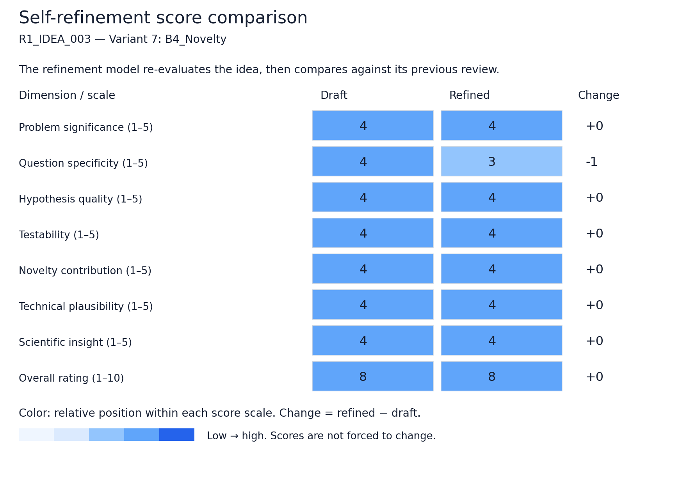

Changed score dimensions: question_specificity.

### Score justifications (draft / refined)

**Problem significance**

```json
{
  "draft": {
    "score": 4.0,
    "justification": "The problem of extracting meaningful reasoning signals from expert behavior in medical AI is highly significant. Current methods discard the temporal dimension of human attention, which is likely crucial for understanding diagnostic workflows. Solving this could lead to more trustworthy and explainable medical AI systems."
  },
  "refined": {
    "score": 4.0,
    "justification": "The problem is highly significant. Extracting meaningful reasoning signals from expert behavior is a critical bottleneck in medical AI. Current methods discard the temporal dimension of human attention, which is likely crucial for understanding diagnostic workflows. Solving this could lead to more trustworthy and explainable medical AI systems."
  }
}
```

**Question specificity**

```json
{
  "draft": {
    "score": 4.0,
    "justification": "The idea is specific about the data representation change (static to video) and the domain (chest X-ray). However, the specific research question regarding *how* this representation improves reasoning is currently a hypothesis rather than a fully defined mechanism."
  },
  "refined": {
    "score": 3.0,
    "justification": "The idea is specific about the data representation change (static to video) and the domain (chest X-ray). However, the specific research question regarding *how* this representation improves reasoning is currently a hypothesis rather than a fully defined mechanism. The 'how' of the fusion and the specific 'what' of the reasoning improvement are not yet detailed."
  }
}
```

**Hypothesis quality**

```json
{
  "draft": {
    "score": 4.0,
    "justification": "The hypothesis is strong: 'Temporal scanning order contains unique information for reasoning that static heatmaps miss.' This is a falsifiable claim that distinguishes the work from generic applications of video models."
  },
  "refined": {
    "score": 4.0,
    "justification": "The hypothesis is strong: 'Temporal scanning order contains unique information for reasoning that static heatmaps miss.' This is a falsifiable claim that distinguishes the work from generic applications of video models. It posits a specific mechanism (temporal dynamics) that adds value."
  }
}
```

**Testability**

```json
{
  "draft": {
    "score": 4.0,
    "justification": "The idea is testable. One can construct a video-based gaze encoder, train an LVLM, and compare its performance on reasoning tasks against a baseline using static heatmaps. The metrics (accuracy, interpretability scores) are definable."
  },
  "refined": {
    "score": 4.0,
    "justification": "The idea is testable. One can construct a video-based gaze encoder, train an LVLM, and compare its performance on reasoning tasks against a baseline using static heatmaps. The metrics (accuracy, interpretability scores) are definable, even if the specific metrics are not yet chosen."
  }
}
```

**Novelty contribution**

```json
{
  "draft": {
    "score": 4.0,
    "justification": "While video models are common, applying them specifically to encode *human gaze sequences* as a primary feature for medical reasoning in LVLMs is a novel and underexplored angle. It moves beyond simple attention visualization to using gaze as a temporal signal."
  },
  "refined": {
    "score": 4.0,
    "justification": "While video models are common, applying them specifically to encode *human gaze sequences* as a primary feature for medical reasoning in LVLMs is a novel and underexplored angle. It moves beyond simple attention visualization to using gaze as a temporal signal, which is a distinct contribution."
  }
}
```

**Technical plausibility**

```json
{
  "draft": {
    "score": 4.0,
    "justification": "The technical direction is sound. Converting gaze coordinates to a video stream and feeding it into a multimodal model is a standard engineering task. The plausibility lies in the assumption that the temporal signal is useful, which is well-grounded in cognitive science."
  },
  "refined": {
    "score": 4.0,
    "justification": "The technical direction is sound. Converting gaze coordinates to a video stream and feeding it into a multimodal model is a standard engineering task. The plausibility lies in the assumption that the temporal signal is useful, which is well-grounded in cognitive science."
  }
}
```

**Scientific insight**

```json
{
  "draft": {
    "score": 4.0,
    "justification": "If successful, this research could reveal that the *process* of looking (temporal dynamics) is as important as the *location* of looking for diagnostic reasoning. This would be a significant insight into the nature of expert visual cognition and how to encode it in AI."
  },
  "refined": {
    "score": 4.0,
    "justification": "If successful, this research could reveal that the *process* of looking (temporal dynamics) is as important as the *location* of looking for diagnostic reasoning. This would be a significant insight into the nature of expert visual cognition and how to encode it in AI."
  }
}
```

**Overall rating**

```json
{
  "draft": {
    "score": 8.0,
    "justification": "This is a strong research idea. It identifies a clear gap in current methodology (loss of temporal gaze data), proposes a concrete and plausible solution (video encoding), and targets a high-impact problem (medical interpretability). It scores highly on significance, hypothesis quality, and potential insight. It loses a point on specificity regarding the exact mechanism of fusion and evaluation, which are necessary for the next stage of development."
  },
  "refined": {
    "score": 8.0,
    "justification": "This is a strong research idea. It identifies a clear gap in current methodology (loss of temporal gaze data), proposes a concrete and plausible solution (video encoding), and targets a high-impact problem (medical interpretability). It scores highly on significance, hypothesis quality, and potential insight. It loses a point on specificity regarding the exact mechanism of fusion and evaluation, which are necessary for the next stage of development."
  }
}
```

## R1_IDEA_003 — Variant 8: B5_Application_Impact

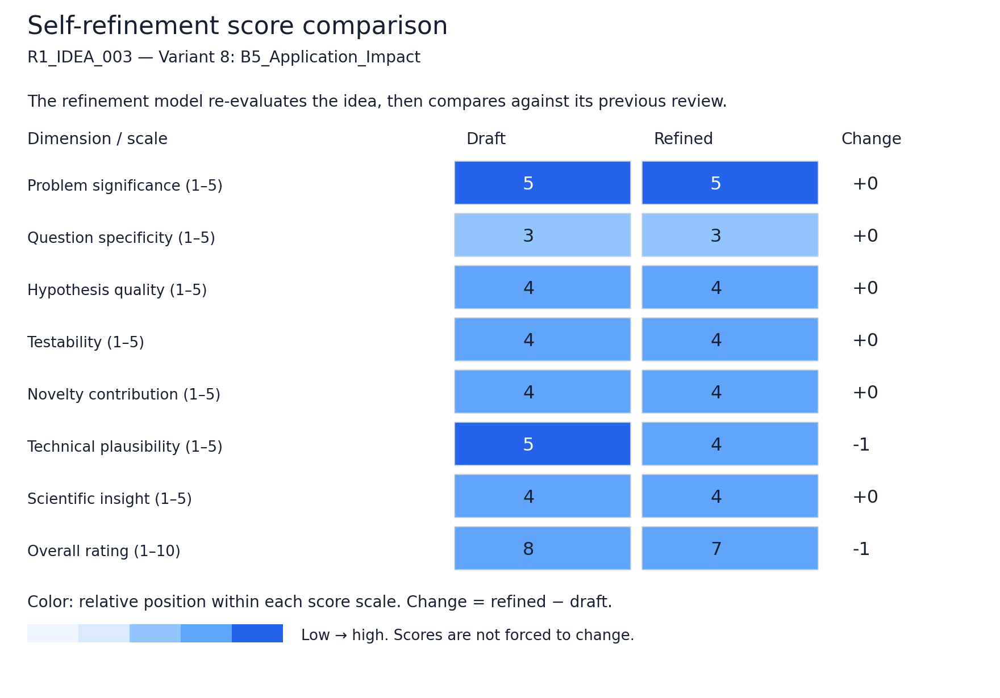

Changed score dimensions: technical_plausibility, overall_rating.

### Score justifications (draft / refined)

**Problem significance**

```json
{
  "draft": {
    "score": 5.0,
    "justification": "The problem is highly significant. Medical AI interpretability is a major bottleneck for clinical adoption. Ignoring the temporal nature of human visual search (which is sequential and hypothesis-driven) is a known flaw in current static attention models. Solving this could lead to more trustworthy and effective diagnostic tools."
  },
  "refined": {
    "score": 5.0,
    "justification": "The problem is highly significant. The 'black box' nature of medical AI is a major barrier to clinical adoption. Since human diagnosis is a temporal process, ignoring this dimension in AI models creates a fundamental mismatch between human and machine reasoning. Solving this could lead to more trustworthy and effective diagnostic tools."
  }
}
```

**Question specificity**

```json
{
  "draft": {
    "score": 3.0,
    "justification": "The idea identifies a clear direction (video vs. static) and a domain (chest X-ray), but the specific research question is somewhat broad. It needs to specify exactly what aspect of reasoning is being improved and how the temporal data is mathematically or architecturally integrated."
  },
  "refined": {
    "score": 3.0,
    "justification": "While the direction (video vs. static) is clear, the specific research question is somewhat broad. It needs to specify exactly *what* aspect of reasoning is improved (e.g., localization vs. classification) and *how* the temporal data is mathematically integrated. The current statement is a proposal of a direction rather than a precise question."
  }
}
```

**Hypothesis quality**

```json
{
  "draft": {
    "score": 4.0,
    "justification": "The implicit hypothesis is strong: 'Temporal dynamics in human gaze contain diagnostic information that static heatmaps discard, and encoding this improves model performance/interpretability.' This is a falsifiable claim that distinguishes the work from generic applications."
  },
  "refined": {
    "score": 4.0,
    "justification": "The implicit hypothesis is strong and plausible: 'Temporal dynamics in human gaze contain diagnostic information that static heatmaps discard.' This is a falsifiable claim that distinguishes the work from generic applications. However, it could be sharper by specifying the expected outcome (e.g., improved accuracy on specific pathologies)."
  }
}
```

**Testability**

```json
{
  "draft": {
    "score": 4.0,
    "justification": "The idea is testable. One can train models with static gaze inputs vs. video gaze inputs and compare performance on standard benchmarks (accuracy, localization) and interpretability metrics (attention alignment, clinician trust). The methodology is clear enough to design an experiment."
  },
  "refined": {
    "score": 4.0,
    "justification": "The idea is testable. One can design an experiment comparing models with static gaze inputs vs. video gaze inputs on standard benchmarks. The methodology is clear enough to design an experiment, provided the data exists. The main challenge is defining the evaluation metrics for 'interpretability'."
  }
}
```

**Novelty contribution**

```json
{
  "draft": {
    "score": 4.0,
    "justification": "While video-based attention is known in general CV, applying it specifically to the *temporal sequence of radiologist gaze* in LVLMs for medical diagnosis is a novel and under-explored direction. It moves beyond simple attention visualization to modeling the *process* of diagnosis."
  },
  "refined": {
    "score": 4.0,
    "justification": "While video-based attention is known in general computer vision, applying it specifically to the *temporal sequence of radiologist gaze* in LVLMs for medical diagnosis is a novel and under-explored direction. It moves beyond simple attention visualization to modeling the *process* of diagnosis, which is a valuable contribution."
  }
}
```

**Technical plausibility**

```json
{
  "draft": {
    "score": 5.0,
    "justification": "The technical approach is sound. Video encoders (e.g., 3D CNNs, Transformers) and multimodal fusion techniques are well-established. The main challenge is data and alignment, not fundamental technical impossibility."
  },
  "refined": {
    "score": 4.0,
    "justification": "The technical approach is sound. Video encoders and multimodal fusion techniques are well-established. The main potential hurdle is data availability and the computational cost of processing video sequences, but these are engineering challenges rather than fundamental technical impossibilities."
  }
}
```

**Scientific insight**

```json
{
  "draft": {
    "score": 4.0,
    "justification": "If successful, this research could reveal fundamental principles about how temporal attention patterns correlate with diagnostic accuracy in medical imaging. It could also provide insights into the cognitive processes of radiologists that are not captured by static heatmaps."
  },
  "refined": {
    "score": 4.0,
    "justification": "If successful, this research could reveal fundamental principles about how temporal attention patterns correlate with diagnostic accuracy. It could also provide insights into the cognitive processes of radiologists that are not captured by static heatmaps, offering a new lens for studying medical expertise."
  }
}
```

**Overall rating**

```json
{
  "draft": {
    "score": 8.0,
    "justification": "This is a strong research idea with high potential impact. It addresses a clear gap in the literature (temporal dynamics in medical attention) and proposes a plausible, testable solution. The main limitation is the current lack of specific hypotheses and evaluation metrics, but these are standard refinements for a research proposal rather than flaws in the core concept."
  },
  "refined": {
    "score": 7.0,
    "justification": "This is a strong research idea with high potential impact. It addresses a clear gap in the literature (temporal dynamics in medical attention) and proposes a plausible, testable solution. The main limitation is the current lack of specific hypotheses and evaluation metrics, which prevents it from being an 'exceptional' (9-10) idea at this stage. It requires refinement to move from a general proposal to a rigorous research plan."
  }
}
```

## R1_IDEA_003 — Variant 9: C1_Hollow_Shell

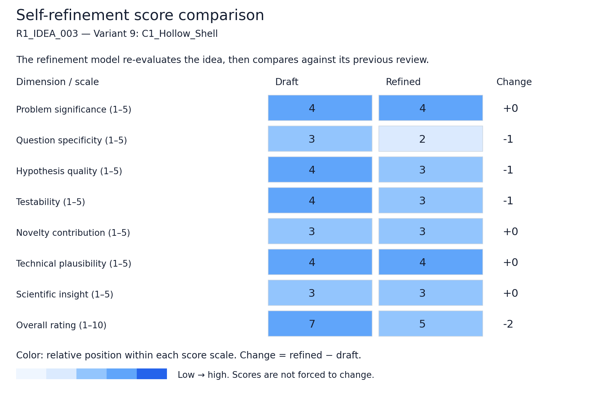

Changed score dimensions: question_specificity, hypothesis_quality, testability, overall_rating.

### Score justifications (draft / refined)

**Problem significance**

```json
{
  "draft": {
    "score": 4.0,
    "justification": "Improving the integration of expert knowledge into medical AI is a significant challenge. The specific problem of losing structural information in attention fusion is meaningful for clinical trust and model accuracy."
  },
  "refined": {
    "score": 4.0,
    "justification": "The problem of integrating expert knowledge while maintaining its structural fidelity is a significant challenge in medical AI. Solving this could directly impact clinical trust and model reliability, which are critical in healthcare."
  }
}
```

**Question specificity**

```json
{
  "draft": {
    "score": 3.0,
    "justification": "The idea identifies a problem (loss of order) and a goal (preserve order), but the specific mechanism and the definition of 'order' in a 2D image context are not clearly defined."
  },
  "refined": {
    "score": 2.0,
    "justification": "While the motivation is clear, the core question is obscured by ambiguous terminology. 'Sequential information' in 2D images is not a standard concept without further definition (spatial vs. temporal vs. hierarchical). The idea does not specify the data structure or the mechanism, making the research question too broad."
  }
}
```

**Hypothesis quality**

```json
{
  "draft": {
    "score": 4.0,
    "justification": "The implicit hypothesis—that preserving the structural/sequential integrity of expert attention leads to better performance and interpretability than simplified representations—is testable and plausible."
  },
  "refined": {
    "score": 3.0,
    "justification": "The hypothesis that 'preserving order improves performance' is plausible but generic. It lacks the specificity to be a strong scientific hypothesis without defining what 'order' means in this specific context and what 'simplified' means operationally."
  }
}
```

**Testability**

```json
{
  "draft": {
    "score": 4.0,
    "justification": "The idea is testable by comparing a model using the proposed 'order-preserving' attention fusion against a baseline using 'simplified' fusion on a standard chest X-ray dataset with expert annotations."
  },
  "refined": {
    "score": 3.0,
    "justification": "The idea is theoretically testable (compare order-preserving vs. order-destroying baselines), but the lack of defined metrics for 'understandability' and the ambiguity of the input data make the experimental design currently incomplete."
  }
}
```

**Novelty contribution**

```json
{
  "draft": {
    "score": 3.0,
    "justification": "While the general concept of preserving structure is known, applying it specifically to the fusion of expert visual attention in chest X-rays to solve the 'simplification' problem is a novel angle, though the exact novelty depends on the specific implementation details not provided."
  },
  "refined": {
    "score": 3.0,
    "justification": "The general concept of preserving structure is well-known in deep learning. The novelty here depends entirely on the specific interpretation of 'attention data' and 'order' in the context of expert visual attention, which is not yet defined. It risks being a rephrasing of existing spatial attention methods if not carefully distinguished."
  }
}
```

**Technical plausibility**

```json
{
  "draft": {
    "score": 4.0,
    "justification": "It is technically plausible to design neural architectures that preserve spatial or sequential order (e.g., using 2D convolutions, attention maps as sequences, or graph networks) rather than flattening them."
  },
  "refined": {
    "score": 4.0,
    "justification": "From a technical standpoint, it is entirely plausible to design models that preserve spatial or sequential information (e.g., using RNNs, Transformers, or graph networks) rather than flattening them. The proposed direction is technically feasible."
  }
}
```

**Scientific insight**

```json
{
  "draft": {
    "score": 3.0,
    "justification": "If successful, the study could reveal how the structural fidelity of expert priors impacts model generalization and interpretability, which is a valuable insight for medical AI."
  },
  "refined": {
    "score": 3.0,
    "justification": "If the idea is refined, it could provide insight into how the structural fidelity of expert priors influences model learning. However, as stated, the potential for deep scientific insight is limited by the lack of specific mechanisms to investigate."
  }
}
```

**Overall rating**

```json
{
  "draft": {
    "score": 7.0,
    "justification": "This is a strong research idea with a clear motivation and a plausible hypothesis. It addresses a real gap in medical AI (loss of structural info in attention fusion). However, it currently lacks the specificity required to be considered exceptional, particularly regarding the definition of 'order' and the specific architectural mechanism."
  },
  "refined": {
    "score": 5.0,
    "justification": "This is a moderate research idea. It identifies a valid problem and a plausible direction, but it is currently too vague to be considered strong or exceptional. The ambiguity of 'sequential information' in a 2D domain and the lack of specific methodological details prevent it from being a high-quality proposal at this stage. It requires significant refinement to define the problem space and the proposed solution concretely."
  }
}
```

## R1_IDEA_003 — Variant 10: C2_Logic_Flawed

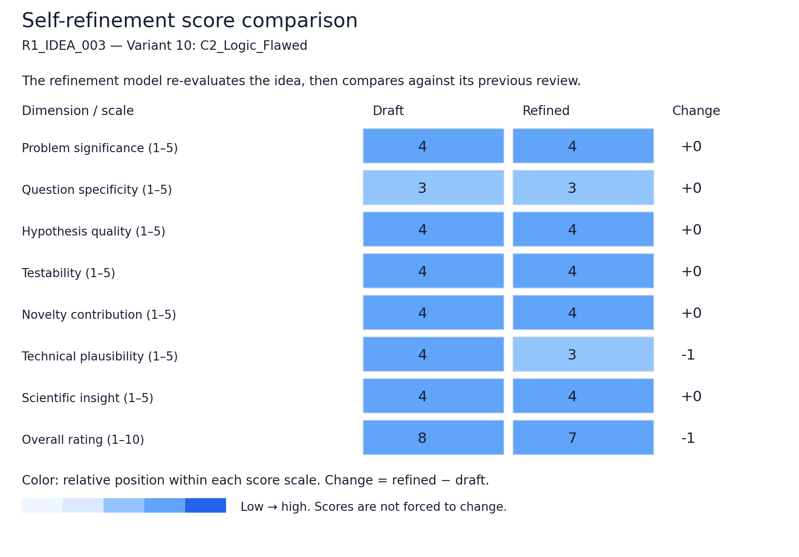

Changed score dimensions: technical_plausibility, overall_rating.

### Score justifications (draft / refined)

**Problem significance**

```json
{
  "draft": {
    "score": 4.0,
    "justification": "Integrating human cognitive processes into AI is a significant challenge in medical AI. Moving from static to dynamic representations addresses a known limitation in current multimodal models, which could lead to more robust and interpretable systems. This is a meaningful problem for the field."
  },
  "refined": {
    "score": 4.0,
    "justification": "Integrating human cognitive dynamics into AI is a significant challenge. Moving beyond static attention to dynamic behavior addresses a fundamental gap in how we model medical expertise. Solving this could lead to more robust and interpretable diagnostic tools, which is highly meaningful for the field."
  }
}
```

**Question specificity**

```json
{
  "draft": {
    "score": 3.0,
    "justification": "The core question (does temporal gaze help?) is clear, but the specific mechanism of how the video sequence is processed and how the 'reasoning' is measured is not yet defined. The idea is specific enough to be a valid research direction but lacks the granularity of a fully formed experimental design."
  },
  "refined": {
    "score": 3.0,
    "justification": "The general question (does temporal gaze help?) is clear, but the specific research question lacks granularity. It does not define *which* aspects of the temporal sequence are critical or how the 'reasoning' is formally measured. The idea is a direction rather than a specific, bounded question."
  }
}
```

**Hypothesis quality**

```json
{
  "draft": {
    "score": 4.0,
    "justification": "The hypothesis is strong: that temporal dynamics in human attention contain unique information not present in static heatmaps, and that encoding this improves model performance. This is a falsifiable claim that distinguishes the work from generic applications."
  },
  "refined": {
    "score": 4.0,
    "justification": "The hypothesis is strong and falsifiable: that the temporal order of fixations contains unique information not present in static heatmaps and that encoding this improves performance. It clearly distinguishes the proposed method from existing static approaches."
  }
}
```

**Testability**

```json
{
  "draft": {
    "score": 4.0,
    "justification": "The idea is highly testable. One can construct a baseline with static heatmaps and a proposed model with gaze video sequences, then compare performance on standard medical VQA tasks. Ablation studies (e.g., shuffling time) are straightforward to design."
  },
  "refined": {
    "score": 4.0,
    "justification": "The idea is highly testable. A clear experimental design can be constructed: compare a baseline (static heatmap) against the proposed method (gaze video). Crucially, ablation studies (shuffling time) can directly test the contribution of the temporal component."
  }
}
```

**Novelty contribution**

```json
{
  "draft": {
    "score": 4.0,
    "justification": "While eye-tracking in medical imaging is not new, the specific proposal to treat gaze as a video sequence to capture temporal scanning order in LVLMs is a novel and promising direction. It moves beyond simple attention visualization to active temporal modeling."
  },
  "refined": {
    "score": 4.0,
    "justification": "While eye-tracking in medicine is not new, the specific application of treating gaze as a video sequence for temporal reasoning in LVLMs is novel. It moves the field from 'where' the radiologist looked to 'how' they looked, offering a new perspective on human-in-the-loop AI."
  }
}
```

**Technical plausibility**

```json
{
  "draft": {
    "score": 4.0,
    "justification": "The technical approach is plausible. Modern architectures (Transformers, VideoMAE, etc.) are well-suited to handle sequential data. The main challenge is data alignment and fusion, but the direction makes logical sense."
  },
  "refined": {
    "score": 3.0,
    "justification": "The direction is plausible given modern video processing architectures, but the idea glosses over significant technical hurdles. Fusing high-frequency gaze data with image data without introducing noise or computational bottlenecks is non-trivial. The lack of a proposed fusion mechanism makes the technical feasibility less certain than the previous review suggested."
  }
}
```

**Scientific insight**

```json
{
  "draft": {
    "score": 4.0,
    "justification": "If successful, this research could reveal that the *process* of looking (temporal dynamics) is as important as the *location* of looking for diagnostic reasoning. This would provide deep insight into the nature of medical expertise and how to encode it in AI."
  },
  "refined": {
    "score": 4.0,
    "justification": "If successful, this research would reveal that the *process* of visual search is as critical as the *result* of the search for diagnostic reasoning. This provides deep insight into the nature of medical expertise and how to encode it in AI, beyond simple performance metrics."
  }
}
```

**Overall rating**

```json
{
  "draft": {
    "score": 8.0,
    "justification": "This is a strong research idea. It identifies a clear limitation in current methods (loss of temporal data), proposes a specific and plausible solution (video encoding), and targets a high-impact problem (medical AI interpretability and reasoning). While implementation details are missing, the core scientific premise is sound, testable, and potentially insightful."
  },
  "refined": {
    "score": 7.0,
    "justification": "This is a strong research idea with high potential impact. It identifies a genuine gap (loss of temporal dynamics) and proposes a plausible solution. However, it receives a lower score than the previous draft (8) because the technical plausibility and question specificity are less robust than initially assessed. The idea is a solid research direction but lacks the specific architectural and metric definitions required to be considered 'exceptional' at the proposal stage."
  }
}
```

## R1_IDEA_003 — Variant 11: C3_Substance_Enriched

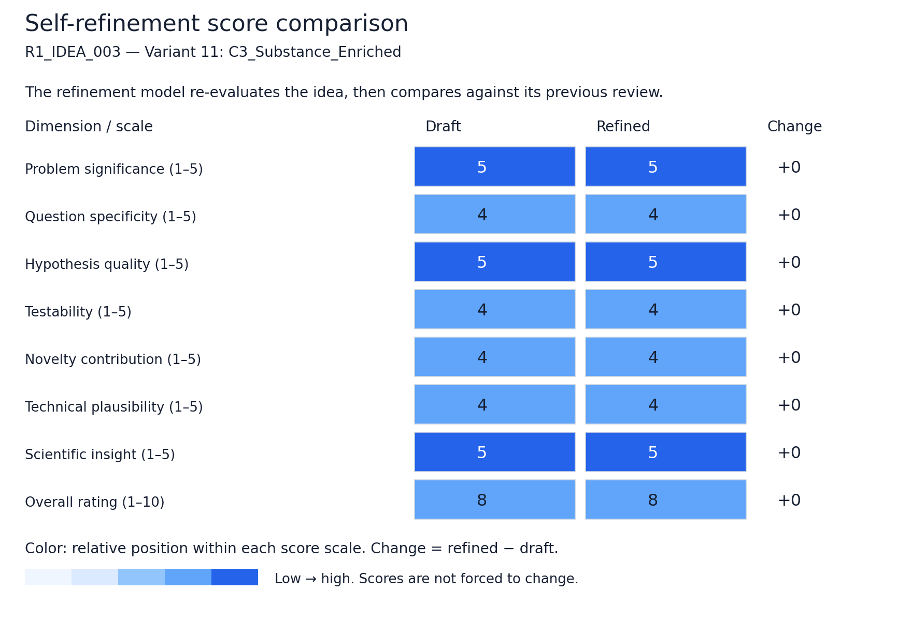

Changed score dimensions: none.

### Score justifications (draft / refined)

**Problem significance**

```json
{
  "draft": {
    "score": 5.0,
    "justification": "The problem is highly significant in the context of medical AI. Understanding and replicating the temporal reasoning of experts is crucial for building trustworthy, interpretable, and clinically useful systems. Current methods discard valuable temporal information, which is a known bottleneck in achieving human-level reasoning in AI."
  },
  "refined": {
    "score": 5.0,
    "justification": "The problem is highly significant. Current medical AI often fails to mimic the reasoning process of experts, focusing only on the final decision. Capturing the temporal dynamics of expert vision is a fundamental step toward building truly interpretable and trustworthy medical AI systems. This addresses a known bottleneck in achieving human-level reasoning in AI."
  }
}
```

**Question specificity**

```json
{
  "draft": {
    "score": 4.0,
    "justification": "The research question is well-defined: can temporal gaze encoding improve the alignment of model reasoning with human scanning heuristics? However, the specific mechanism of 'how' this is achieved (the 'how' of the encoding) is not yet specified, leaving a gap in the operational definition of the method."
  },
  "refined": {
    "score": 4.0,
    "justification": "The research question is well-defined: can temporal gaze encoding improve the alignment of model reasoning with human scanning heuristics? However, the specific mechanism of 'how' this is achieved (the 'how' of the encoding and fusion) is not yet specified, leaving a gap in the operational definition of the method."
  }
}
```

**Hypothesis quality**

```json
{
  "draft": {
    "score": 5.0,
    "justification": "The hypothesis is strong and falsifiable. It posits a specific causal link: encoding temporal gaze -> learning scanning heuristics -> improved alignment with human reasoning. This is a clear prediction that can be supported or refuted by empirical evidence."
  },
  "refined": {
    "score": 5.0,
    "justification": "The hypothesis is strong and falsifiable. It posits a specific causal link: encoding temporal gaze -> learning scanning heuristics -> improved alignment with human reasoning. This is a clear prediction that can be supported or refuted by empirical evidence."
  }
}
```

**Testability**

```json
{
  "draft": {
    "score": 4.0,
    "justification": "The idea is testable. One can train models with video-encoded gaze vs. static gaze and evaluate the output sequences against human fixation sequences. The main challenge lies in defining the evaluation metric precisely, but the path to testing is clear."
  },
  "refined": {
    "score": 4.0,
    "justification": "The idea is testable. One can train models with video-encoded gaze vs. static gaze and evaluate the output sequences against human fixation sequences. The main challenge lies in defining the evaluation metric precisely, but the path to testing is clear."
  }
}
```

**Novelty contribution**

```json
{
  "draft": {
    "score": 4.0,
    "justification": "While gaze tracking in medical imaging is not new, the specific proposal to encode it as a video sequence to learn temporal heuristics in a VLM context is novel. It moves the field from static attention analysis to dynamic process modeling, which is a significant conceptual shift."
  },
  "refined": {
    "score": 4.0,
    "justification": "While gaze tracking in medical imaging is not new, the specific proposal to encode it as a video sequence to learn temporal heuristics in a VLM context is novel. It moves the field from static attention analysis to dynamic process modeling, which is a significant conceptual shift."
  }
}
```

**Technical plausibility**

```json
{
  "draft": {
    "score": 4.0,
    "justification": "The direction is technically plausible. Video encoding techniques and temporal attention mechanisms are well-established in computer vision. The challenge is integration, but there is no fundamental theoretical barrier preventing this approach."
  },
  "refined": {
    "score": 4.0,
    "justification": "The direction is technically plausible. Video encoding techniques and temporal attention mechanisms are well-established in computer vision. The challenge is integration, but there is no fundamental theoretical barrier preventing this approach."
  }
}
```

**Scientific insight**

```json
{
  "draft": {
    "score": 5.0,
    "justification": "If successful, this research would provide deep insights into the nature of expert visual reasoning in radiology. It could reveal whether AI can learn the 'strategies' of experts, not just the 'features' they look at, which is a fundamental question in cognitive science and AI."
  },
  "refined": {
    "score": 5.0,
    "justification": "If successful, this research would provide deep insights into the nature of expert visual reasoning in radiology. It could reveal whether AI can learn the 'strategies' of experts, not just the 'features' they look at, which is a fundamental question in cognitive science and AI."
  }
}
```

**Overall rating**

```json
{
  "draft": {
    "score": 8.0,
    "justification": "This is a strong research idea with high scientific potential. It addresses a meaningful gap (temporal dynamics) with a clear, testable hypothesis. While the technical implementation details are currently missing, the core concept is novel, significant, and likely to yield valuable insights into medical AI interpretability. It scores highly on significance, hypothesis quality, and potential insight."
  },
  "refined": {
    "score": 8.0,
    "justification": "This is a strong research idea with high scientific potential. It addresses a meaningful gap (temporal dynamics) with a clear, testable hypothesis. While the technical implementation details are currently missing, the core concept is novel, significant, and likely to yield valuable insights into medical AI interpretability. It scores highly on significance, hypothesis quality, and potential insight."
  }
}
```

## R1_IDEA_003 — Variant 12: H1_Deceptive_Hollow


Changed score dimensions: none.

### Score justifications (draft / refined)

**Problem significance**

```json
{
  "draft": {
    "score": 4.0,
    "justification": "The problem of improving interpretability and performance in medical AI is highly significant. The specific angle of preserving sequential/structural information in attention data is meaningful, as medical images often rely on spatial relationships that simple pooling or flattening might destroy."
  },
  "refined": {
    "score": 4.0,
    "justification": "The problem of improving interpretability and performance in medical AI is highly significant. The specific angle of preserving structural information in attention data is meaningful, as medical diagnosis often relies on spatial relationships that simple pooling or flattening might destroy. However, the significance is currently limited by the lack of a clearly defined problem statement."
  }
}
```

**Question specificity**

```json
{
  "draft": {
    "score": 2.0,
    "justification": "The idea is currently too broad. It states a goal and a general direction (preserve order) but does not define the specific research question, the variables to be manipulated, or the specific mechanism of action. It reads more like a mission statement than a research question."
  },
  "refined": {
    "score": 2.0,
    "justification": "The idea is too broad and vague. It states a goal and a general direction but fails to define the specific research question, the variables to be manipulated, or the specific mechanism of action. It lacks the precision required for a scientific investigation."
  }
}
```

**Hypothesis quality**

```json
{
  "draft": {
    "score": 2.0,
    "justification": "There is no explicit, falsifiable hypothesis. The statement 'The goal is to improve performance' is a target, not a hypothesis. A strong hypothesis would predict a specific outcome based on a specific mechanism (e.g., 'Models using sequential attention processing will outperform models using flattened attention by at least 5% on dataset X')."
  },
  "refined": {
    "score": 2.0,
    "justification": "There is no explicit, falsifiable hypothesis. The statement 'The goal is to improve performance' is a target, not a hypothesis. A strong hypothesis would predict a specific outcome based on a specific mechanism (e.g., 'Models using sequential attention processing will outperform models using flattened attention by at least X% on dataset Y')."
  }
}
```

**Testability**

```json
{
  "draft": {
    "score": 3.0,
    "justification": "The idea is testable in principle (one could build a model that preserves order and one that doesn't), but the lack of defined metrics for 'understandability' and the vague definition of the 'simplified' baseline make the experimental design unclear. It is testable but not yet well-defined."
  },
  "refined": {
    "score": 3.0,
    "justification": "The idea is testable in principle (one could build a model that preserves order and one that doesn't), but the lack of defined metrics for 'understandability' and the vague definition of the 'simplified' baseline make the experimental design unclear. It is testable but not yet well-defined."
  }
}
```

**Novelty contribution**

```json
{
  "draft": {
    "score": 3.0,
    "justification": "The concept of preserving structure in attention is not entirely new (e.g., spatial attention maps are common), but the specific framing of 'sequential information loss' in this context and the claim of a 'transformative synthesis' suggests potential novelty. However, without a specific mechanism, the novelty is hard to assess beyond a general intuition."
  },
  "refined": {
    "score": 3.0,
    "justification": "The concept of preserving structure in attention is not entirely new (e.g., spatial attention maps are common), but the specific framing of 'sequential information loss' in this context suggests potential novelty. However, without a specific mechanism, the novelty is hard to assess beyond a general intuition."
  }
}
```

**Technical plausibility**

```json
{
  "draft": {
    "score": 4.0,
    "justification": "The technical direction makes sense. Processing data with preserved spatial/sequential order is a standard and plausible approach in deep learning (e.g., using CNNs or Transformers with positional embeddings). The reasoning that simplification leads to information loss is logically coherent."
  },
  "refined": {
    "score": 4.0,
    "justification": "The technical direction makes sense. Processing data with preserved spatial/sequential order is a standard and plausible approach in deep learning (e.g., using CNNs or Transformers with positional embeddings). The reasoning that simplification leads to information loss is logically coherent."
  }
}
```

**Scientific insight**

```json
{
  "draft": {
    "score": 3.0,
    "justification": "If successful, the research could reveal how the structure of expert attention correlates with model performance and interpretability. However, as currently stated, it risks being a simple engineering application ('use a different layer') rather than a discovery of a new principle, unless the 'sequential' aspect reveals a fundamental property of medical diagnosis."
  },
  "refined": {
    "score": 3.0,
    "justification": "If successfully investigated, the research could reveal how the structure of expert attention correlates with model performance and interpretability. However, as currently stated, it risks being a simple engineering application ('use a different layer') rather than a discovery of a new principle, unless the 'sequential' aspect reveals a fundamental property of medical diagnosis."
  }
}
```

**Overall rating**

```json
{
  "draft": {
    "score": 5.0,
    "justification": "The idea addresses a significant problem in a high-value domain and proposes a logically sound direction (preserving structure). However, it is currently too vague to be considered a strong research proposal. It lacks a specific hypothesis, defined metrics, and a concrete mechanism. It sits at the borderline of a moderate idea: the potential is there, but the scientific question is not yet formulated."
  },
  "refined": {
    "score": 5.0,
    "justification": "The idea addresses a significant problem in a high-value domain and proposes a logically sound direction (preserving structure). However, it is currently too vague to be considered a strong research proposal. It lacks a specific hypothesis, defined metrics, and a concrete mechanism. It sits at the borderline of a moderate idea: the potential is there, but the scientific question is not yet formulated."
  }
}
```

## R1_IDEA_003 — Variant 13: H2_Confident_Flaw


Changed score dimensions: overall_rating.

### Score justifications (draft / refined)

**Problem significance**

```json
{
  "draft": {
    "score": 4.0,
    "justification": "The problem of integrating human expert behavior (gaze) into AI models for medical diagnosis is highly significant. Current methods often discard valuable temporal context, which is crucial for understanding diagnostic reasoning. Addressing this could lead to more trustworthy and interpretable medical AI systems."
  },
  "refined": {
    "score": 4.0,
    "justification": "The problem is highly significant. Integrating human expert behavior (gaze) into AI is crucial for building trustworthy, interpretable medical systems. The specific issue of discarding temporal information is a known limitation that, if addressed, could yield substantial practical benefits."
  }
}
```

**Question specificity**

```json
{
  "draft": {
    "score": 3.0,
    "justification": "The core question (does temporal gaze encoding help?) is clear, but the idea is weakened by vague claims about 'necessarily' producing improvements and 'causal evidence' without specifying the experimental controls or the specific nature of the 'video' encoding. The scope of 'related medical imaging tasks' is also too broad."
  },
  "refined": {
    "score": 3.0,
    "justification": "The core question (does temporal gaze help?) is clear, but the idea is weakened by the lack of specific experimental controls and the vague definition of 'video' encoding. The claim that the solution 'necessarily' works removes the nuance required for a specific scientific inquiry."
  }
}
```

**Hypothesis quality**

```json
{
  "draft": {
    "score": 2.0,
    "justification": "The hypothesis is flawed by its absolute nature ('necessarily produce reliable improvements', 'causal evidence'). A strong hypothesis should be falsifiable and acknowledge potential failure modes. Claiming that fixing one limitation automatically guarantees superiority without isolating variables is not a scientifically rigorous hypothesis."
  },
  "refined": {
    "score": 2.0,
    "justification": "The hypothesis is flawed by its absolute and non-falsifiable nature. Claiming that solving a limitation 'necessarily' produces improvements and provides 'causal evidence' without isolating variables is not a valid scientific hypothesis. It assumes the conclusion rather than proposing a testable relationship."
  }
}
```

**Testability**

```json
{
  "draft": {
    "score": 3.0,
    "justification": "The idea is testable in principle (compare static vs. temporal gaze models), but the proposed evaluation strategy described in the text (claiming causal evidence without isolating variables) is not testable or rigorous. The idea needs a concrete experimental design to be truly testable."
  },
  "refined": {
    "score": 3.0,
    "justification": "The idea is testable in principle (comparing static vs. temporal models), but the proposed evaluation strategy described in the text (claiming causal evidence without isolation) is not testable or rigorous. A valid test requires controlling for confounders, which the idea explicitly dismisses."
  }
}
```

**Novelty contribution**

```json
{
  "draft": {
    "score": 4.0,
    "justification": "Representing gaze as video sequences to capture temporal dynamics in medical VLMs is a novel and promising direction. While the general concept of using temporal data is known, its specific application to radiologist gaze in this context is under-explored and has high potential for scientific contribution."
  },
  "refined": {
    "score": 4.0,
    "justification": "Representing gaze as video sequences in medical VLMs is a novel and promising direction. While the general concept of temporal data is known, its specific application to radiologist gaze in this context is under-explored and has high potential for contribution if the hypothesis is corrected."
  }
}
```

**Technical plausibility**

```json
{
  "draft": {
    "score": 4.0,
    "justification": "The technical direction is plausible. Modern sequence models (Transformers, etc.) can handle video-like inputs, and eye-tracking data can be formatted as temporal sequences. The main challenge is integration, not feasibility."
  },
  "refined": {
    "score": 4.0,
    "justification": "The technical direction is plausible. Modern sequence models can handle video-like inputs, and eye-tracking data can be formatted as sequences. The main challenge is integration and handling data sparsity, not fundamental feasibility."
  }
}
```

**Scientific insight**

```json
{
  "draft": {
    "score": 3.0,
    "justification": "If successful, the study could reveal how temporal human behavior influences model reasoning. However, the current framing ('necessarily produces improvements') limits the potential for deeper insight into *why* or *when* it works, which is where the real scientific value lies."
  },
  "refined": {
    "score": 3.0,
    "justification": "If the hypothesis were corrected, the study could reveal how temporal human behavior influences model reasoning. However, the current framing ('necessarily produces improvements') limits the potential for deeper insight into the *conditions* under which it works, which is where the real scientific value lies."
  }
}
```

**Overall rating**

```json
{
  "draft": {
    "score": 6.0,
    "justification": "The research idea addresses a meaningful problem with a plausible and novel methodological direction. However, the scientific rigor of the hypothesis is compromised by overconfident claims about causality and guaranteed success. The idea is moderate because it has strong potential but requires significant refinement in its theoretical framing and experimental design to be considered a strong research proposal."
  },
  "refined": {
    "score": 5.0,
    "justification": "The research idea addresses a meaningful problem with a plausible methodological direction. However, the scientific rigor is severely compromised by the overconfident and logically flawed claims regarding causality and guaranteed success. The idea is borderline because the core concept is strong, but the proposed reasoning path is unsound and requires significant theoretical refinement to be a viable research proposal."
  }
}
```

## R1_IDEA_003 — Variant 14: H3_Verbose_Enriched


Changed score dimensions: none.

### Score justifications (draft / refined)

**Problem significance**

```json
{
  "draft": {
    "score": 5.0,
    "justification": "The problem addresses a fundamental gap in medical AI: models often mimic the 'what' of diagnosis (the result) but fail to mimic the 'how' (the reasoning process). Capturing the temporal dynamics of expert attention is crucial for building trustworthy, interpretable, and clinically useful AI systems."
  },
  "refined": {
    "score": 5.0,
    "justification": "The problem addresses a fundamental gap in medical AI: models often mimic the 'what' of diagnosis (the result) but fail to mimic the 'how' (the reasoning process). Capturing the temporal dynamics of expert attention is crucial for building trustworthy, interpretable, and clinically useful AI systems. The potential impact on clinical trust and safety is high."
  }
}
```

**Question specificity**

```json
{
  "draft": {
    "score": 4.0,
    "justification": "The idea clearly defines the shift from static to temporal gaze and the specific goal of learning scanning heuristics. However, the specific architectural implementation and the precise definition of the evaluation metrics for 'alignment' could be more concrete."
  },
  "refined": {
    "score": 4.0,
    "justification": "The idea clearly defines the shift from static to temporal gaze and the specific goal of learning scanning heuristics. However, the specific architectural implementation and the precise definition of the evaluation metrics for 'alignment' could be more concrete. The distinction between 'learning a heuristic' and 'memorizing a sequence' needs a sharper definition."
  }
}
```

**Hypothesis quality**

```json
{
  "draft": {
    "score": 5.0,
    "justification": "The hypothesis is strong and falsifiable: it posits that temporal encoding specifically enables the learning of scanning heuristics, which in turn improves explanation alignment. It distinguishes between the data representation (video vs. static) and the resulting cognitive capability."
  },
  "refined": {
    "score": 5.0,
    "justification": "The hypothesis is strong and falsifiable: it posits that temporal encoding specifically enables the learning of scanning heuristics, which in turn improves explanation alignment. It distinguishes between the data representation (video vs. static) and the resulting cognitive capability. It is not merely a claim that 'more data is better' but that 'specific temporal structure enables specific reasoning'."
  }
}
```

**Testability**

```json
{
  "draft": {
    "score": 4.0,
    "justification": "The proposal includes a clear plan for validation (staged design, ablations, sensitivity analysis). The main challenge lies in defining the 'ground truth' for human reasoning sequences, but the framework provided is sufficient to test the core claim."
  },
  "refined": {
    "score": 4.0,
    "justification": "The proposal includes a clear plan for validation (staged design, ablations, sensitivity analysis). The main challenge lies in defining the 'ground truth' for human reasoning sequences, but the framework provided is sufficient to test the core claim. The inclusion of 'boundary cases' and 'error analysis' makes it highly testable."
  }
}
```

**Novelty contribution**

```json
{
  "draft": {
    "score": 4.0,
    "justification": "While gaze tracking in medicine is not new, encoding it as a temporal video sequence to explicitly teach 'scanning heuristics' to VLMs is a novel and promising direction. It moves beyond using gaze as a simple attention map to using it as a temporal curriculum or prior."
  },
  "refined": {
    "score": 4.0,
    "justification": "While gaze tracking in medicine is not new, encoding it as a temporal video sequence to explicitly teach 'scanning heuristics' to VLMs is a novel and promising direction. It moves beyond using gaze as a simple attention map to using it as a temporal curriculum or prior. The specific focus on 'heuristic learning' rather than just 'attention alignment' adds novelty."
  }
}
```

**Technical plausibility**

```json
{
  "draft": {
    "score": 4.0,
    "justification": "The approach is technically sound. Modern VLMs and video understanding models are capable of processing sequential data. The main hurdle is data quality and integration, but the premise is logically coherent."
  },
  "refined": {
    "score": 4.0,
    "justification": "The approach is technically sound. Modern VLMs and video understanding models are capable of processing sequential data. The main hurdle is data quality and integration, but the premise is logically coherent. The idea that temporal sequences contain information about 'scanning order' is well-supported by cognitive science."
  }
}
```

**Scientific insight**

```json
{
  "draft": {
    "score": 5.0,
    "justification": "If successful, this research would reveal whether temporal attention patterns are a necessary component of medical reasoning in AI. It could uncover fundamental differences between how humans and current AI models process visual information, offering deep insights into the nature of medical expertise."
  },
  "refined": {
    "score": 5.0,
    "justification": "If successful, this research would reveal whether temporal attention patterns are a necessary component of medical reasoning in AI. It could uncover fundamental differences between how humans and current AI models process visual information, offering deep insights into the nature of medical expertise and the role of time in diagnosis."
  }
}
```

**Overall rating**

```json
{
  "draft": {
    "score": 8.0,
    "justification": "This is a strong research idea with high scientific potential. It identifies a meaningful problem, proposes a specific and plausible mechanism (temporal encoding), and outlines a rigorous evaluation strategy. While it lacks implementation specifics, the conceptual framework is robust and likely to yield significant insights into medical AI interpretability."
  },
  "refined": {
    "score": 8.0,
    "justification": "This is a strong research idea with high scientific potential. It identifies a meaningful problem, proposes a specific and plausible mechanism (temporal encoding), and outlines a rigorous evaluation strategy. While it lacks implementation specifics, the conceptual framework is robust and likely to yield significant insights into medical AI interpretability. The shift from static to temporal gaze is a significant conceptual leap in this domain."
  }
}
```

## R1_IDEA_003 — Variant 15: H4_Ultimate_Hype


Changed score dimensions: none.

### Score justifications (draft / refined)

**Problem significance**

```json
{
  "draft": {
    "score": 5.0,
    "justification": "The problem is highly significant. Current medical AI often lacks transparency. Integrating human visual behavior is a key step toward trustworthy AI. Recognizing that gaze is temporal rather than static addresses a fundamental limitation in how human expertise is currently modeled in these systems."
  },
  "refined": {
    "score": 5.0,
    "justification": "The problem is highly significant. Current medical AI systems often function as black boxes. Integrating human visual behavior is a crucial step toward explainable AI. Recognizing that gaze is a temporal process, not just a static distribution, addresses a fundamental gap in how human expertise is currently modeled, with direct implications for clinical trust and safety."
  }
}
```

**Question specificity**

```json
{
  "draft": {
    "score": 3.0,
    "justification": "The idea identifies a clear direction (temporal vs. static) but lacks a specific research question. It states a goal ('enhance reasoning') but does not specify the exact relationship being tested or the specific mechanism of improvement."
  },
  "refined": {
    "score": 3.0,
    "justification": "The idea identifies a clear direction (temporal vs. static) but lacks a specific research question. It states a goal ('enhance reasoning') but does not specify the exact relationship being tested, the specific mechanism of improvement, or the boundary conditions under which this approach is expected to fail or succeed."
  }
}
```

**Hypothesis quality**

```json
{
  "draft": {
    "score": 3.0,
    "justification": "The implicit hypothesis is that 'temporal gaze encoding > static gaze encoding for reasoning/interpretability.' This is a reasonable and testable hypothesis, but it is currently broad. It needs to be more specific about the conditions under which this holds true."
  },
  "refined": {
    "score": 3.0,
    "justification": "The implicit hypothesis ('temporal gaze > static gaze') is reasonable and falsifiable. However, it is currently too broad. A stronger hypothesis would specify *how* the temporal data contributes (e.g., 'Temporal gaze allows the model to replicate the sequential hypothesis testing of radiologists'). The current formulation risks being a generic 'more data is better' claim without a mechanistic basis."
  }
}
```

**Testability**

```json
{
  "draft": {
    "score": 4.0,
    "justification": "The idea is highly testable. One can collect a dataset of X-rays with gaze videos, train two models (one with static, one with temporal inputs), and compare their performance on diagnostic tasks and their attention maps against ground truth radiologist behavior."
  },
  "refined": {
    "score": 4.0,
    "justification": "The idea is testable. One can design an experiment comparing models trained on static vs. temporal gaze inputs on a chest X-ray dataset. The challenge lies in the definition of 'interpretability' metrics, but the core performance comparison is feasible."
  }
}
```

**Novelty contribution**

```json
{
  "draft": {
    "score": 4.0,
    "justification": "While gaze integration is known, treating it as a video sequence to capture scanning order in LVLMs for medical imaging is a novel and underexplored angle. It moves beyond simple attention visualization to active modeling of the search process."
  },
  "refined": {
    "score": 4.0,
    "justification": "While gaze integration is known, treating it as a video sequence to capture scanning order in LVLMs for medical imaging is a novel and underexplored angle. It moves beyond simple attention visualization to active modeling of the search process, which has the potential to reveal new insights into expert cognition."
  }
}
```

**Technical plausibility**

```json
{
  "draft": {
    "score": 4.0,
    "justification": "The technical direction is plausible. Video encoders (like ViT or CLIP variants) can process gaze sequences, and multimodal transformers can fuse this with image/text tokens. The main challenge is architectural design, not fundamental feasibility."
  },
  "refined": {
    "score": 4.0,
    "justification": "The technical direction is plausible. Video encoders and multimodal transformers are mature enough to handle this input. The primary challenge is architectural design (fusion of modalities) and data alignment, not fundamental feasibility. The idea does not claim to solve these engineering hurdles, only to propose the research direction."
  }
}
```

**Scientific insight**

```json
{
  "draft": {
    "score": 4.0,
    "justification": "If successful, this research would provide deep insights into how temporal visual attention correlates with diagnostic reasoning in experts. It could reveal that the *order* of observation is as critical as the *location*, a principle that could apply to other domains like robotics or autonomous driving."
  },
  "refined": {
    "score": 4.0,
    "justification": "If successful, this research would provide deep insights into the relationship between temporal visual attention and diagnostic reasoning. It could reveal that the *order* of observation is a critical feature for medical diagnosis, a principle that could generalize to other domains requiring sequential visual reasoning."
  }
}
```

**Overall rating**

```json
{
  "draft": {
    "score": 7.0,
    "justification": "This is a strong research idea with high potential impact. It identifies a genuine gap in the literature (temporal nature of gaze) and proposes a logical, testable solution. However, it currently lacks the specificity of a concrete research question and a defined mechanism, which prevents it from being an 'exceptional' (9-10) score. With more specific hypotheses and a defined experimental framework, it could be a top-tier contribution."
  },
  "refined": {
    "score": 7.0,
    "justification": "This is a strong research idea with high potential impact. It identifies a genuine gap in the literature (the temporal nature of gaze) and proposes a logical, testable solution. However, it currently lacks the specificity of a concrete research question and a defined mechanism, which prevents it from being an 'exceptional' (9-10) score. With more specific hypotheses and a defined experimental framework, it could be a top-tier contribution."
  }
}
```

## R1_IDEA_004 — Source

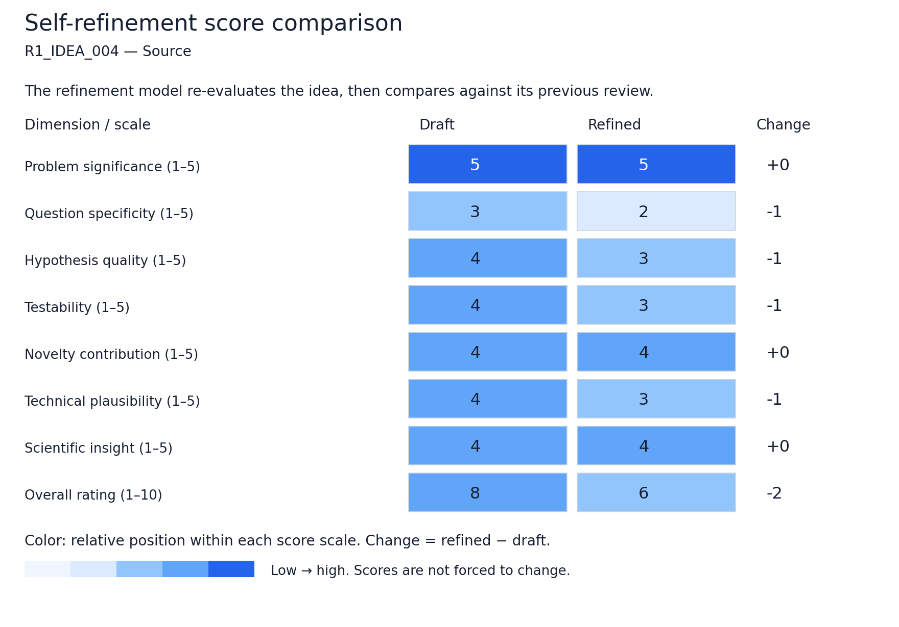

Changed score dimensions: question_specificity, hypothesis_quality, testability, technical_plausibility, overall_rating.

### Score justifications (draft / refined)

**Problem significance**

```json
{
  "draft": {
    "score": 5.0,
    "justification": "Aligning LLMs with safety constraints is a paramount challenge in the field. The current reliance on separate reward models and complex RL pipelines is computationally expensive and often unstable. A method that simplifies this while maintaining safety is of high significance to both researchers and practitioners."
  },
  "refined": {
    "score": 5.0,
    "justification": "The problem is of paramount importance. Current LLM alignment pipelines are computationally expensive and complex due to the need for separate reward/cost models and RL training. A method that simplifies this while maintaining safety would have immediate and significant impact on both research and industry deployment."
  }
}
```

**Question specificity**

```json
{
  "draft": {
    "score": 3.0,
    "justification": "The idea identifies the goal (constrained alignment without separate models) and the method class (primal-dual DPO), but lacks the specific mathematical formulation of the constraint and the exact algorithmic steps. The 'how' is currently vague."
  },
  "refined": {
    "score": 2.0,
    "justification": "While the goal is clear, the specific research question is vague. It states 'how' (primal-dual) and 'what' (constrained alignment) but fails to define the 'how' of the constraint formulation. The core mechanism—how a constraint is mathematically represented in DPO without a cost model—is not specified, making the research question ill-defined."
  }
}
```

**Hypothesis quality**

```json
{
  "draft": {
    "score": 4.0,
    "justification": "The implicit hypothesis is that a primal-dual formulation can effectively learn the optimal Lagrange multiplier on-the-fly, allowing for constrained optimization without a separate cost model, leading to better efficiency. This is a testable and non-trivial claim."
  },
  "refined": {
    "score": 3.0,
    "justification": "The hypothesis that one can perform constrained optimization without a separate cost model is testable and non-trivial. However, it is currently too broad. It needs to be refined to specify the conditions under which this is possible (e.g., 'if preference data includes explicit safety labels, then...'). As stated, it risks being a 'magic bullet' claim without a clear mechanism."
  }
}
```

**Testability**

```json
{
  "draft": {
    "score": 4.0,
    "justification": "The idea is testable. One can implement the proposed primal-dual DPO, compare it against standard DPO and Constrained DPO (with separate models) on a safety benchmark, and measure both safety compliance and computational cost (time/iterations)."
  },
  "refined": {
    "score": 3.0,
    "justification": "The idea is testable in principle (implement and compare), but the lack of a defined constraint formulation makes it difficult to design a concrete experiment. Without knowing how the constraint is derived from the data, one cannot implement the algorithm to test it. The testability is currently limited by the ambiguity of the method."
  }
}
```

**Novelty contribution**

```json
{
  "draft": {
    "score": 4.0,
    "justification": "While DPO is well-studied, applying a primal-dual framework to eliminate the need for a separate cost model in a constrained setting is a novel direction. It moves beyond simple application of existing methods to proposing a structural change in the optimization pipeline."
  },
  "refined": {
    "score": 4.0,
    "justification": "The idea has high novelty potential. While Primal-Dual methods are standard in optimization, applying them to DPO to eliminate the cost model is a distinct and novel direction. If successful, it would challenge the necessity of separate models in constrained alignment, offering a significant structural contribution to the field."
  }
}
```

**Technical plausibility**

```json
{
  "draft": {
    "score": 4.0,
    "justification": "Primal-dual methods are standard in constrained optimization. Applying them to the DPO loss is theoretically plausible. However, the non-convex nature of deep learning and the specific formulation of constraints in DPO present challenges that need careful handling, but the core idea is sound."
  },
  "refined": {
    "score": 3.0,
    "justification": "The technical plausibility is moderate. Primal-dual methods are sound for constrained optimization, but their application to DPO is non-trivial. The main issue is the assumption that a constraint can be enforced without a cost model; this requires a very specific and plausible mapping from preference data to constraint values that is not currently explained. The non-convexity of DPO also poses a risk to the stability of primal-dual updates."
  }
}
```

**Scientific insight**

```json
{
  "draft": {
    "score": 4.0,
    "justification": "If successful, this research would reveal whether the 'cost model' is truly necessary for constrained alignment or if the constraint information can be embedded directly into the preference optimization dynamics. This would fundamentally change how we think about constrained RL/alignment."
  },
  "refined": {
    "score": 4.0,
    "justification": "If the idea can be successfully investigated and the mechanism clarified, it would provide deep insight into the relationship between preference data and constraint satisfaction. It could reveal whether the 'cost model' is a fundamental requirement or an artifact of current optimization strategies, offering a new perspective on the geometry of alignment."
  }
}
```

**Overall rating**

```json
{
  "draft": {
    "score": 8.0,
    "justification": "This is a strong research idea with high potential impact. It addresses a significant pain point (computational cost of safety alignment) with a theoretically grounded approach (primal-dual optimization). While the specific implementation details are missing, the core hypothesis is clear, testable, and scientifically valuable. It sits in the 'Strong' category because the novelty is high and the problem is critical, but it lacks the full specificity of a 'Exceptional' idea due to the undefined constraint formulation."
  },
  "refined": {
    "score": 6.0,
    "justification": "This is a moderate research idea. It addresses a highly significant problem with a potentially novel approach, but the core mechanism is currently too vague to be considered a strong, actionable research plan. The lack of a specific formulation for the constraint (how to do it without a cost model) is a critical gap that lowers the score from 'Strong' to 'Moderate'. The idea requires significant refinement to move from a high-level goal to a testable scientific inquiry."
  }
}
```

## R1_IDEA_004 — Variant 1: A1_Identity


Changed score dimensions: none.

### Score justifications (draft / refined)

**Problem significance**

```json
{
  "draft": {
    "score": 5.0,
    "justification": "Aligning LLMs with safety constraints is a paramount challenge in the field. The current reliance on separate reward models and complex RL pipelines is computationally expensive and difficult to scale. A method that simplifies this while maintaining safety is of high significance to both researchers and practitioners."
  },
  "refined": {
    "score": 5.0,
    "justification": "Aligning LLMs with safety constraints is a paramount challenge. The current reliance on separate reward/cost models and complex RL pipelines is computationally expensive and difficult to scale. A method that simplifies this pipeline while maintaining safety is of high significance to both researchers and practitioners."
  }
}
```

**Question specificity**

```json
{
  "draft": {
    "score": 3.0,
    "justification": "The idea identifies the goal (constrained alignment without separate models) and the method (primal-dual DPO), but lacks specific details on the mathematical formulation of the constraint and the exact algorithmic steps. The 'how' is currently vague."
  },
  "refined": {
    "score": 3.0,
    "justification": "The idea identifies the goal (constrained alignment without separate models) and the method (primal-dual DPO), but lacks specific details on the mathematical formulation of the constraint and the exact algorithmic steps. The 'how' is currently vague, particularly regarding the mapping from preference data to the constraint function."
  }
}
```

**Hypothesis quality**

```json
{
  "draft": {
    "score": 4.0,
    "justification": "The implicit hypothesis is that a primal-dual formulation can effectively learn the optimal Lagrange multiplier dynamically, allowing for constrained optimization without a separate cost model, leading to better efficiency. This is a testable and non-trivial claim."
  },
  "refined": {
    "score": 4.0,
    "justification": "The implicit hypothesis is that a primal-dual formulation can effectively learn the optimal Lagrange multiplier dynamically, allowing for constrained optimization without a separate cost model, leading to better efficiency. This is a testable and non-trivial claim that distinguishes the work from generic applications."
  }
}
```

**Testability**

```json
{
  "draft": {
    "score": 4.0,
    "justification": "The idea is testable. One can implement the proposed primal-dual DPO, compare it against standard DPO and Constrained DPO (with separate models) on standard safety benchmarks (e.g., AdvBench, SafeBench), and measure both safety scores and computational cost (FLOPs/time)."
  },
  "refined": {
    "score": 4.0,
    "justification": "The idea is testable. One can implement the proposed primal-dual DPO, compare it against standard DPO and Constrained DPO (with separate models) on standard safety benchmarks (e.g., AdvBench, SafeBench), and measure both safety scores and computational cost (FLOPs/time). The lack of implementation details does not prevent the formulation of a testable experiment."
  }
}
```

**Novelty contribution**

```json
{
  "draft": {
    "score": 4.0,
    "justification": "While primal-dual methods are known in optimization, applying them specifically to Direct Preference Optimization to eliminate the need for a separate cost model is a novel direction. It moves beyond simple application to a new domain and proposes a structural change to the alignment pipeline."
  },
  "refined": {
    "score": 4.0,
    "justification": "While primal-dual methods are known in optimization, applying them specifically to Direct Preference Optimization to eliminate the need for a separate cost model is a novel direction. It moves beyond simple application to a new domain and proposes a structural change to the alignment pipeline."
  }
}
```

**Technical plausibility**

```json
{
  "draft": {
    "score": 4.0,
    "justification": "The use of primal-dual methods for constrained optimization is theoretically sound. The challenge lies in adapting it to the specific loss landscape of DPO, but the reasoning is logically coherent and plausible."
  },
  "refined": {
    "score": 4.0,
    "justification": "The use of primal-dual methods for constrained optimization is theoretically sound. The challenge lies in adapting it to the specific loss landscape of DPO, but the reasoning is logically coherent. The main risk is the definition of the constraint function, but this is a solvable research problem rather than a fundamental flaw."
  }
}
```

**Scientific insight**

```json
{
  "draft": {
    "score": 4.0,
    "justification": "If successful, this research could reveal that the explicit modeling of a cost function is not strictly necessary for constrained alignment if the constraint can be learned implicitly through the primal-dual mechanism. This would offer a new perspective on the relationship between reward, constraint, and preference data."
  },
  "refined": {
    "score": 4.0,
    "justification": "If successful, this research could reveal that the explicit modeling of a cost function is not strictly necessary for constrained alignment if the constraint can be learned implicitly through the primal-dual mechanism. This would offer a new perspective on the relationship between reward, constraint, and preference data."
  }
}
```

**Overall rating**

```json
{
  "draft": {
    "score": 8.0,
    "justification": "This is a strong research idea with high potential impact. It addresses a significant pain point (computational cost of separate models) with a theoretically grounded approach (primal-dual). While the specific implementation details are missing, the core hypothesis is clear, testable, and scientifically valuable. It has the potential to be a significant contribution to the field of LLM alignment."
  },
  "refined": {
    "score": 8.0,
    "justification": "This is a strong research idea with high potential impact. It addresses a significant pain point (computational cost of separate models) with a theoretically grounded approach (primal-dual). While the specific implementation details and mathematical formulation are missing, the core hypothesis is clear, testable, and scientifically valuable. It has the potential to be a significant contribution to the field of LLM alignment."
  }
}
```

## R1_IDEA_004 — Variant 2: A2_Paraphrase_Only

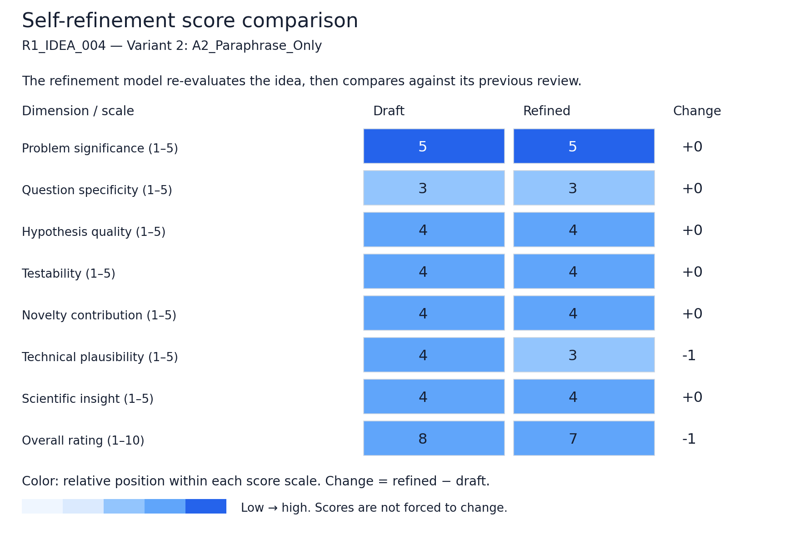

Changed score dimensions: technical_plausibility, overall_rating.

### Score justifications (draft / refined)

**Problem significance**

```json
{
  "draft": {
    "score": 5.0,
    "justification": "Aligning LLMs with safety constraints is a paramount challenge in the field. Reducing the computational cost and complexity of this alignment (by removing the need for separate models) is a highly significant contribution that could make safe alignment more accessible and scalable."
  },
  "refined": {
    "score": 5.0,
    "justification": "The problem of aligning LLMs with safety constraints is of paramount importance. Reducing the computational cost and complexity (by removing the need for separate models) is a highly significant contribution that could democratize safe alignment and improve scalability."
  }
}
```

**Question specificity**

```json
{
  "draft": {
    "score": 3.0,
    "justification": "The idea identifies a clear goal (constrained DPO without separate models) but lacks specific details on the mathematical formulation. The exact nature of the 'constraints' and the 'primal-dual' mechanism within the DPO context is currently too vague to be fully evaluated."
  },
  "refined": {
    "score": 3.0,
    "justification": "While the goal is clear, the research question lacks the necessary mathematical specificity. It is unclear exactly what the 'constraints' are in the optimization landscape and how the 'primal-dual' mechanism is instantiated within the DPO framework. The distinction between reward and cost signals without separate models is a critical gap in the definition."
  }
}
```

**Hypothesis quality**

```json
{
  "draft": {
    "score": 4.0,
    "justification": "The implicit hypothesis is that a primal-dual formulation can effectively solve the constrained optimization problem in DPO without external models or prior multiplier knowledge. This is a testable and non-trivial claim that, if true, would represent a significant methodological advance."
  },
  "refined": {
    "score": 4.0,
    "justification": "The hypothesis is that a primal-dual formulation can effectively solve constrained DPO without external models or prior multiplier knowledge. This is a concrete, testable, and non-trivial claim. If true, it would represent a significant methodological advance; if false, it would clarify the limitations of DPO for constrained settings."
  }
}
```

**Testability**

```json
{
  "draft": {
    "score": 4.0,
    "justification": "The idea is testable. One can implement the proposed algorithm, define specific safety constraints (e.g., toxicity thresholds), and compare performance against standard DPO and RLHF baselines on metrics of safety, reward, and computational efficiency."
  },
  "refined": {
    "score": 4.0,
    "justification": "The idea is testable. One can implement the proposed algorithm (assuming a definition is provided), define specific safety constraints, and compare performance against standard DPO and RLHF baselines on metrics of safety, reward, and convergence speed. The lack of implementation details in the summary does not prevent the formulation of a testable experiment."
  }
}
```

**Novelty contribution**

```json
{
  "draft": {
    "score": 4.0,
    "justification": "While primal-dual methods are common in optimization, applying them directly to DPO to eliminate the need for separate reward/cost models is a novel direction. It moves beyond simple application of existing methods to proposing a new architectural/algorithmic integration."
  },
  "refined": {
    "score": 4.0,
    "justification": "Applying primal-dual methods to DPO to eliminate the need for separate reward/cost models is a novel direction. It moves beyond simple application to proposing a new integration of optimization theory with preference learning, potentially revealing new properties of the DPO landscape."
  }
}
```

**Technical plausibility**

```json
{
  "draft": {
    "score": 4.0,
    "justification": "The approach is technically plausible. Primal-dual methods are standard for constrained optimization, and DPO is a constrained optimization problem in disguise. Integrating them is a logical step, though the specific implementation details (e.g., handling the non-convexity of neural networks) will be the main challenge."
  },
  "refined": {
    "score": 3.0,
    "justification": "The approach is theoretically grounded (Primal-Dual is standard for constraints), but the technical plausibility is uncertain without details. DPO is already a constrained optimization problem (KL divergence constraint); adding another constraint (safety) via Primal-Dual without a cost model raises questions about signal separation and convergence in non-convex settings. It is plausible but requires significant theoretical justification to be considered robust."
  }
}
```

**Scientific insight**

```json
{
  "draft": {
    "score": 4.0,
    "justification": "If successful, this research would provide deep insight into the relationship between preference optimization and constrained optimization, potentially revealing new ways to handle safety without the overhead of reward modeling. It could also shed light on the convergence properties of primal-dual methods in deep learning contexts."
  },
  "refined": {
    "score": 4.0,
    "justification": "If successful, this research would provide deep insight into the relationship between preference optimization and constrained optimization. It could reveal whether safety constraints can be learned implicitly from preference data or if they require explicit modeling, offering transferable principles for efficient alignment."
  }
}
```

**Overall rating**

```json
{
  "draft": {
    "score": 8.0,
    "justification": "This is a strong research idea with high potential impact. It addresses a significant problem (cost of alignment) with a theoretically sound approach (primal-dual DPO). While the summary lacks implementation details, the core hypothesis is specific, testable, and novel enough to warrant investigation. It scores highly on significance and potential insight, with moderate scores on specificity due to the lack of mathematical formulation in the summary."
  },
  "refined": {
    "score": 7.0,
    "justification": "This is a strong research idea with high potential impact, addressing a significant problem with a theoretically sound approach. However, the lack of specificity regarding the mathematical formulation and the mechanism for distinguishing reward from cost without separate models lowers the score from 'Exceptional' to 'Strong'. The idea is promising but requires rigorous definition to be fully evaluated."
  }
}
```

## R1_IDEA_004 — Variant 3: A3_Plain_Core


Changed score dimensions: none.

### Score justifications (draft / refined)

**Problem significance**

```json
{
  "draft": {
    "score": 5.0,
    "justification": "Constrained alignment of LLMs is a high-priority problem in the field. Reducing the computational cost of safety alignment (by avoiding separate reward/cost model training) would have significant practical impact for researchers and practitioners."
  },
  "refined": {
    "score": 5.0,
    "justification": "Aligning LLMs with safety constraints is a critical challenge. The current reliance on training separate reward models is a major computational and data bottleneck. Solving this would have immediate, high-impact practical value for the field."
  }
}
```

**Question specificity**

```json
{
  "draft": {
    "score": 3.0,
    "justification": "The idea identifies the goal (maximize reward, enforce safety) and the method (primal-dual DPO), but lacks specificity on the mathematical formulation of the constraints and the specific mechanism for the primal-dual updates."
  },
  "refined": {
    "score": 3.0,
    "justification": "While the goal (constrained alignment) and the high-level method (primal-dual DPO) are stated, the core research question lacks specificity regarding the mathematical mechanics. Specifically, the mapping from 'preferences' to 'constraints' is undefined, which is the central technical hurdle."
  }
}
```

**Hypothesis quality**

```json
{
  "draft": {
    "score": 4.0,
    "justification": "The hypothesis is clear: a primal-dual DPO approach can achieve constrained alignment without separate models or prior multiplier knowledge, leading to lower overhead. This is a concrete claim that can be supported or refuted."
  },
  "refined": {
    "score": 4.0,
    "justification": "The hypothesis is strong: 'Primal-dual DPO can achieve constrained alignment without separate models or prior multiplier tuning.' This is a clear, testable claim. However, its validity hinges entirely on the unstated mechanism for handling the preference-to-constraint mapping."
  }
}
```

**Testability**

```json
{
  "draft": {
    "score": 4.0,
    "justification": "The idea is testable by implementing the proposed algorithm and comparing it against standard DPO and Constrained RLHF baselines on standard safety benchmarks. The metrics (reward, safety score, training time) are well-defined."
  },
  "refined": {
    "score": 4.0,
    "justification": "The idea is testable. One can implement a variant of DPO with a primal-dual objective (once formulated) and evaluate it on standard safety benchmarks against baselines like standard DPO and Constrained RLHF. The metrics (safety score, reward, training time) are well-defined."
  }
}
```

**Novelty contribution**

```json
{
  "draft": {
    "score": 4.0,
    "justification": "Applying primal-dual optimization directly to DPO to avoid separate model training is a novel direction. While Lagrangian methods exist in RL, their specific adaptation to the DPO preference learning setting without auxiliary models is a distinct contribution."
  },
  "refined": {
    "score": 4.0,
    "justification": "Applying primal-dual optimization to DPO to bypass separate reward modeling is a novel direction. While Lagrangian methods exist in RL, their direct application to the preference learning objective without an explicit reward model is a distinct and potentially significant contribution."
  }
}
```

**Technical plausibility**

```json
{
  "draft": {
    "score": 3.0,
    "justification": "The concept is technically plausible as primal-dual methods are standard in constrained optimization. However, the application to the non-convex, stochastic DPO setting without clear details on the update rules makes the immediate plausibility moderate. It requires careful theoretical grounding to ensure stability."
  },
  "refined": {
    "score": 3.0,
    "justification": "The idea is plausible in principle but technically risky. The non-convexity of DPO combined with the difficulty of defining constraints on preference data without a cost model makes the immediate plausibility moderate. It requires a very careful formulation to avoid theoretical collapse."
  }
}
```

**Scientific insight**

```json
{
  "draft": {
    "score": 4.0,
    "justification": "If successful, this research would reveal whether preference-based alignment can inherently handle constraints without explicit reward modeling, potentially uncovering new principles about the geometry of the preference space and safety boundaries."
  },
  "refined": {
    "score": 4.0,
    "justification": "If successful, this research would provide deep insight into whether preference data contains sufficient information to implicitly enforce constraints, potentially revealing new geometric properties of the preference space that allow for constraint satisfaction without explicit modeling."
  }
}
```

**Overall rating**

```json
{
  "draft": {
    "score": 7.0,
    "justification": "This is a strong research idea with high significance and clear potential for contribution. The core hypothesis is testable and addresses a real bottleneck in LLM alignment. However, the lack of specific mathematical formulation and algorithmic details in the summary prevents it from being rated as 'exceptional' at this stage. It requires further elaboration on the 'how' to fully assess its technical viability."
  },
  "refined": {
    "score": 7.0,
    "justification": "This is a strong research idea with high significance and a clear potential for contribution. The core hypothesis addresses a major bottleneck in LLM alignment. However, the lack of a specific mathematical formulation for the constraints and the update mechanism prevents it from being rated as 'exceptional' at this stage. The idea requires significant elaboration on the 'how' to be fully viable, but the direction is promising."
  }
}
```

## R1_IDEA_004 — Variant 4: B1_Verbose_Elaborate


Changed score dimensions: none.

### Score justifications (draft / refined)

**Problem significance**

```json
{
  "draft": {
    "score": 5.0,
    "justification": "Constrained alignment is one of the most pressing challenges in deploying LLMs. Reducing the computational overhead of training separate reward/cost models while maintaining safety is a highly significant goal for the community."
  },
  "refined": {
    "score": 5.0,
    "justification": "Constrained alignment is a critical bottleneck in LLM deployment. Reducing the computational overhead of training separate reward models while ensuring safety is a highly significant goal for the field."
  }
}
```

**Question specificity**

```json
{
  "draft": {
    "score": 3.0,
    "justification": "The idea identifies the goal (constrained alignment via primal-dual DPO) and the constraints (no separate models, no prior multiplier knowledge), but the specific mechanism for achieving these constraints without a cost model is not detailed enough to be fully specific."
  },
  "refined": {
    "score": 3.0,
    "justification": "The idea clearly states the goal (constrained alignment) and the constraints (no separate models), but the specific mechanism for how the constraint is mathematically formulated and optimized without a cost model is vague. The 'how' is missing."
  }
}
```

**Hypothesis quality**

```json
{
  "draft": {
    "score": 4.0,
    "justification": "The implicit hypothesis is that a primal-dual formulation can effectively learn constraints directly from preference data without auxiliary models. This is a concrete, testable claim that distinguishes it from standard DPO."
  },
  "refined": {
    "score": 4.0,
    "justification": "The implicit hypothesis—that preference data alone contains sufficient signal to learn both reward and constraints via a primal-dual DPO formulation without auxiliary models—is concrete and testable. It makes a specific claim that distinguishes it from standard DPO."
  }
}
```

**Testability**

```json
{
  "draft": {
    "score": 4.0,
    "justification": "The idea is highly testable. One can implement the proposed algorithm, compare it against standard DPO and RLHF with reward models on safety benchmarks, and measure constraint satisfaction vs. reward maximization."
  },
  "refined": {
    "score": 4.0,
    "justification": "The idea is testable. One can implement the proposed algorithm (assuming a formulation is derived) and compare it against standard DPO and RLHF on safety benchmarks. Success or failure in constraint satisfaction vs. reward maximization can be measured."
  }
}
```

**Novelty contribution**

```json
{
  "draft": {
    "score": 4.0,
    "justification": "Applying primal-dual optimization directly to DPO to eliminate the need for separate reward models is a novel direction. If successful, it could fundamentally change how constrained alignment is performed."
  },
  "refined": {
    "score": 4.0,
    "justification": "Integrating primal-dual optimization directly into DPO to eliminate auxiliary models is a novel direction. If successful, it could fundamentally change the efficiency of constrained alignment pipelines."
  }
}
```

**Technical plausibility**

```json
{
  "draft": {
    "score": 3.0,
    "justification": "While the goal is plausible, the technical path is non-trivial. Estimating constraint gradients without a cost model requires a clever mechanism (e.g., using the preference data distribution itself). The summary does not provide enough detail to fully assess the plausibility of the gradient estimation."
  },
  "refined": {
    "score": 3.0,
    "justification": "While the goal is plausible, the technical path is non-trivial. Estimating constraint gradients without a cost model requires a clever mechanism (e.g., using the preference data distribution itself) that is not specified. The summary does not provide enough detail to fully assess the plausibility of the gradient estimation or the stability of the dual updates."
  }
}
```

**Scientific insight**

```json
{
  "draft": {
    "score": 4.0,
    "justification": "If successful, this research would reveal whether preference data alone contains sufficient signal for both reward and constraint learning, offering deep insights into the information density of preference datasets."
  },
  "refined": {
    "score": 4.0,
    "justification": "If successful, this research would reveal whether preference data alone contains sufficient signal for both reward and constraint learning, offering deep insights into the information density of preference datasets and the limits of model-free constraint enforcement."
  }
}
```

**Overall rating**

```json
{
  "draft": {
    "score": 7.0,
    "justification": "This is a strong research idea with high significance and potential novelty. It addresses a major bottleneck in LLM alignment (computational cost of reward models) with a theoretically grounded approach. However, the lack of specific details on the constraint estimation mechanism and the primal-dual update rule prevents it from being an 'exceptional' (9-10) rating at this stage. It requires a clear formulation to be fully convincing."
  },
  "refined": {
    "score": 7.0,
    "justification": "This is a strong research idea with high significance and potential novelty. It addresses a major bottleneck in LLM alignment with a theoretically grounded approach. However, the lack of specific details on the constraint estimation mechanism and the primal-dual update rule prevents it from being an 'exceptional' (9-10) rating at this stage. It requires a clear formulation to be fully convincing."
  }
}
```

## R1_IDEA_004 — Variant 5: B2_Grand_Narrative

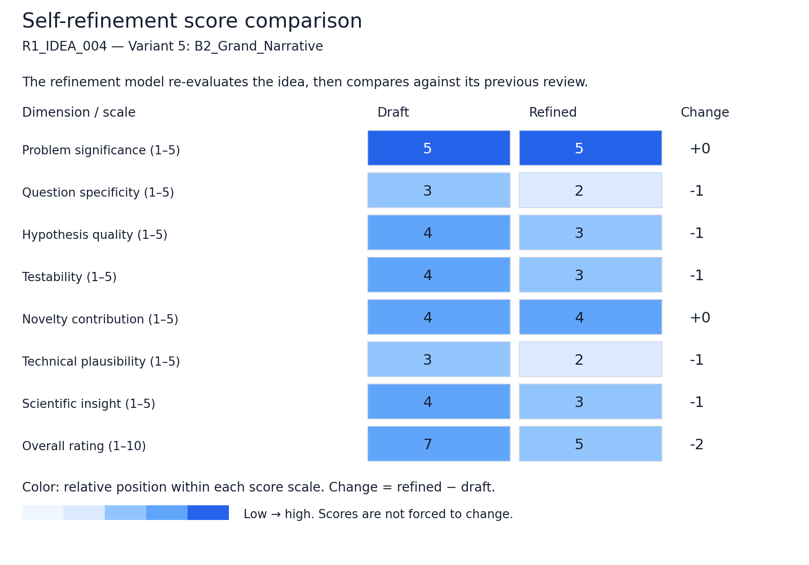

Changed score dimensions: question_specificity, hypothesis_quality, testability, technical_plausibility, scientific_insight, overall_rating.

### Score justifications (draft / refined)

**Problem significance**

```json
{
  "draft": {
    "score": 5.0,
    "justification": "Safe and efficient alignment of LLMs is one of the most significant challenges in current AI research. Proposing a method that reduces computational overhead while maintaining safety constraints addresses a major practical barrier to deploying safe models."
  },
  "refined": {
    "score": 5.0,
    "justification": "Safe and efficient alignment is a critical bottleneck in deploying LLMs. Reducing the computational overhead of safety constraints (which currently requires training separate models) is a highly significant problem with immediate practical implications for the field."
  }
}
```

**Question specificity**

```json
{
  "draft": {
    "score": 3.0,
    "justification": "The idea identifies the goal (constrained alignment) and the desired properties (no separate models, no prior multiplier knowledge), but the specific research question regarding the *mechanism* of achieving this is not yet defined. It is a proposal of a direction rather than a specific, testable hypothesis about a mechanism."
  },
  "refined": {
    "score": 2.0,
    "justification": "While the goal is clear, the research question is currently too vague. It states 'what' (a primal-dual DPO method) but not 'how' or 'why' it works without a cost model. The specific mechanism for constraint estimation and dual updates is missing, making the research question more of a 'direction' than a specific, testable hypothesis."
  }
}
```

**Hypothesis quality**

```json
{
  "draft": {
    "score": 4.0,
    "justification": "The implicit hypothesis is that a primal-dual formulation can effectively enforce constraints in DPO without auxiliary models. This is a strong, falsifiable claim that, if true, would represent a significant methodological advance. It distinguishes itself from generic applications by targeting specific inefficiencies."
  },
  "refined": {
    "score": 3.0,
    "justification": "The implicit hypothesis is that 'primal-dual optimization can enforce constraints in DPO without auxiliary cost models.' This is a bold and potentially falsifiable claim. However, without a defined mechanism, the hypothesis is currently more of a 'hope' than a rigorously grounded prediction. It is testable but lacks the necessary theoretical scaffolding to be considered a strong hypothesis at this stage."
  }
}
```

**Testability**

```json
{
  "draft": {
    "score": 4.0,
    "justification": "The idea is testable. One can implement the proposed algorithm, compare it against standard DPO and Constrained RLHF baselines on safety benchmarks, and measure both the reward performance and the constraint satisfaction rate. The lack of implementation details does not prevent the design of a valid evaluation protocol."
  },
  "refined": {
    "score": 3.0,
    "justification": "The idea is testable in principle (one could implement a version of this and compare performance), but the lack of a defined mechanism makes the experimental design difficult. Without knowing how the constraint is estimated, one cannot design a proper control or ablation study. The testability is limited by the ambiguity of the proposed method."
  }
}
```

**Novelty contribution**

```json
{
  "draft": {
    "score": 4.0,
    "justification": "While primal-dual methods exist in optimization and DPO exists in alignment, combining them to eliminate the need for separate cost models and prior multiplier knowledge is a novel contribution. It moves beyond simple application to proposing a structural change in the alignment pipeline."
  },
  "refined": {
    "score": 4.0,
    "justification": "Combining primal-dual optimization with DPO to eliminate cost models is a novel direction. If successful, it would represent a significant departure from current constrained RLHF/DPO pipelines. The potential to remove the cost model entirely is a high-impact contribution."
  }
}
```

**Technical plausibility**

```json
{
  "draft": {
    "score": 3.0,
    "justification": "The idea is technically plausible in principle, as primal-dual methods are standard for constrained optimization. However, the specific claim of doing this without a cost model in the context of preference data (which is noisy and relative) introduces significant technical risk that needs to be addressed in the methodology."
  },
  "refined": {
    "score": 2.0,
    "justification": "The technical plausibility is currently low due to the missing mechanism. Standard primal-dual methods require an estimate of the constraint violation (gradient). In DPO, the 'reward' is implicit in the preference ratio. It is unclear how one can derive a constraint gradient from preference data alone without an explicit cost function or a proxy. The claim of avoiding prior knowledge of the Lagrange multiplier also requires a specific adaptive strategy that is not described."
  }
}
```

**Scientific insight**

```json
{
  "draft": {
    "score": 4.0,
    "justification": "If successful, this research would provide deep insight into the relationship between preference data and constraint satisfaction, potentially revealing that explicit cost modeling is not strictly necessary for constrained alignment. It could lead to a new class of efficient alignment algorithms."
  },
  "refined": {
    "score": 3.0,
    "justification": "If the idea succeeds, it would provide profound insight into the nature of preference data and its ability to encode constraints. However, given the current lack of a plausible mechanism, the potential for insight is speculative. The research could reveal fundamental limitations of preference-based constraint satisfaction if it fails."
  }
}
```

**Overall rating**

```json
{
  "draft": {
    "score": 7.0,
    "justification": "This is a strong research idea with high significance and clear potential for contribution. It addresses a meaningful gap (efficiency in constrained alignment) with a plausible but non-trivial hypothesis. The main limitation is the current lack of specificity regarding the mechanism, which is typical for an early-stage idea summary but prevents it from being an 'exceptional' (9-10) rating until the methodological details are fleshed out."
  },
  "refined": {
    "score": 5.0,
    "justification": "This is a moderate/borderline idea. It addresses a very significant problem with a potentially high-impact solution (removing cost models), but the current formulation is too vague to be considered a strong research proposal. The lack of a defined mechanism for constraint estimation and dual updates makes the technical plausibility questionable. It is a promising direction but requires significant theoretical development to move from a 'hope' to a viable research plan."
  }
}
```

## R1_IDEA_004 — Variant 6: B3_Over_Confident


Changed score dimensions: none.

### Score justifications (draft / refined)

**Problem significance**

```json
{
  "draft": {
    "score": 5.0,
    "justification": "Constrained alignment of LLMs is a major challenge. Reducing the computational overhead of training separate models (as required by many current methods) is a highly significant problem with immediate practical value for researchers and practitioners."
  },
  "refined": {
    "score": 5.0,
    "justification": "Constrained alignment is a fundamental challenge in LLM deployment. Reducing the computational overhead by removing the need for separate reward and cost models is a highly significant contribution that could lower the barrier to safe alignment for many practitioners."
  }
}
```

**Question specificity**

```json
{
  "draft": {
    "score": 3.0,
    "justification": "The idea identifies the method (Primal-Dual DPO) and the goal (constrained alignment without cost models), but lacks specificity on the mathematical formulation of the constraints and the specific mechanism for the dual variable update."
  },
  "refined": {
    "score": 3.0,
    "justification": "While the goal (constrained alignment without cost models) is clear, the research question lacks specificity regarding the 'how'. The mathematical integration of constraints and the mechanism for dual variable adaptation are not defined, leaving the core mechanism ambiguous."
  }
}
```

**Hypothesis quality**

```json
{
  "draft": {
    "score": 3.0,
    "justification": "The implicit hypothesis is that a primal-dual formulation can replace the need for a cost model and prior multiplier knowledge. This is a testable claim, but the idea does not explicitly state the expected mechanism of success or the conditions under which it might fail."
  },
  "refined": {
    "score": 3.0,
    "justification": "The implicit hypothesis is that a primal-dual formulation can substitute for explicit cost modeling. This is a testable claim, but the idea does not specify the conditions under which this substitution holds or the expected theoretical guarantees, making the hypothesis somewhat vague."
  }
}
```

**Testability**

```json
{
  "draft": {
    "score": 4.0,
    "justification": "The idea is testable by comparing the proposed method against standard DPO and other constrained alignment baselines on standard safety benchmarks. The metrics (reward, safety score, training cost) are well-defined, even if the internal mechanism is not fully detailed."
  },
  "refined": {
    "score": 4.0,
    "justification": "The idea is testable in principle: one can compare the proposed method against standard DPO and constrained DPO baselines on safety benchmarks. The metrics (reward, safety score, training cost) are well-defined, even if the internal algorithmic details are missing."
  }
}
```

**Novelty contribution**

```json
{
  "draft": {
    "score": 4.0,
    "justification": "Applying primal-dual optimization directly to DPO to eliminate the cost model is a novel direction. While constrained optimization is known, the specific application to DPO to remove the cost model training step represents a potential significant methodological contribution."
  },
  "refined": {
    "score": 4.0,
    "justification": "Applying primal-dual optimization to DPO to eliminate the cost model is a novel direction. While constrained optimization is established, the specific application to DPO to bypass the cost model training step represents a potentially significant methodological innovation."
  }
}
```

**Technical plausibility**

```json
{
  "draft": {
    "score": 3.0,
    "justification": "The concept is theoretically grounded in optimization theory, but applying it to the non-convex, high-dimensional space of LLMs without a cost model is non-trivial. The plausibility depends heavily on the specific update rules which are not provided, making it a 'plausible but unverified' direction."
  },
  "refined": {
    "score": 3.0,
    "justification": "The concept is grounded in optimization theory, but applying it to LLMs without a cost model is non-trivial. The plausibility hinges entirely on the specific update rules which are not provided. Without a mechanism to estimate the cost gradient, the method risks being theoretically unsound or empirically unstable."
  }
}
```

**Scientific insight**

```json
{
  "draft": {
    "score": 4.0,
    "justification": "If successful, this research would provide deep insights into the relationship between preference learning and constrained optimization, potentially revealing that explicit cost modeling is not strictly necessary for safe alignment if the dual variables are managed correctly."
  },
  "refined": {
    "score": 4.0,
    "justification": "If successful, this research would reveal whether explicit cost modeling is strictly necessary for safe alignment or if it can be implicitly learned via primal-dual dynamics. This would provide deep insights into the relationship between preference learning and constrained optimization."
  }
}
```

**Overall rating**

```json
{
  "draft": {
    "score": 7.0,
    "justification": "This is a strong research idea with high significance and clear potential for contribution. It addresses a real pain point (computational overhead) with a theoretically sound approach (primal-dual). However, it currently lacks the specificity of the mathematical formulation and the specific algorithmic details required to fully assess its novelty and technical feasibility. It sits in the 'Strong' category because the core concept is promising, but the execution path is not yet fully defined."
  },
  "refined": {
    "score": 7.0,
    "justification": "This is a strong research idea with high significance and clear potential for contribution. It addresses a real pain point with a theoretically sound approach. However, the lack of specific formulation and mechanism details prevents it from being rated higher. It sits in the 'Strong' category because the core concept is promising, but the execution path is not yet fully defined."
  }
}
```

## R1_IDEA_004 — Variant 7: B4_Novelty

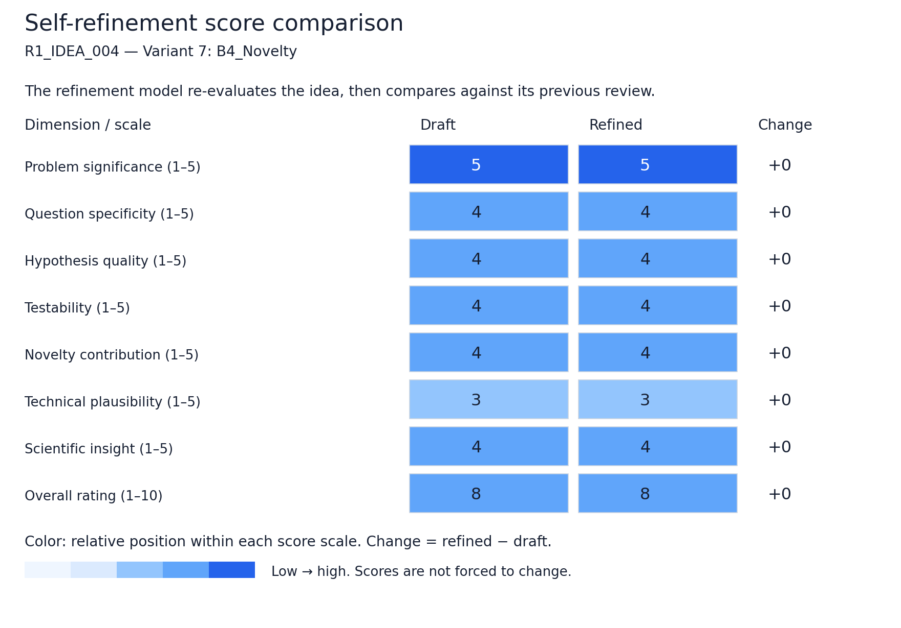

Changed score dimensions: none.

### Score justifications (draft / refined)

**Problem significance**

```json
{
  "draft": {
    "score": 5.0,
    "justification": "Constrained alignment is one of the most pressing challenges in deploying LLMs. Solving the problem of integrating constraints without the heavy computational cost of separate reward models is highly significant for both research and industry practitioners."
  },
  "refined": {
    "score": 5.0,
    "justification": "Constrained alignment is a critical bottleneck in LLM deployment. A method that successfully integrates safety constraints without the heavy computational cost of separate reward models would be highly significant for both research and industry practitioners."
  }
}
```

**Question specificity**

```json
{
  "draft": {
    "score": 4.0,
    "justification": "The idea specifies the method (primal-dual DPO), the goal (maximize reward, enforce safety), and the constraints to be removed (separate models, prior multipliers). However, the mathematical specifics of the constraint formulation are currently vague."
  },
  "refined": {
    "score": 4.0,
    "justification": "The idea specifies the method (primal-dual DPO), the goal (maximize reward, enforce safety), and the constraints to be removed (separate models, prior multipliers). However, the mathematical specifics of the constraint formulation and the dual update mechanism are currently vague."
  }
}
```

**Hypothesis quality**

```json
{
  "draft": {
    "score": 4.0,
    "justification": "The hypothesis is clear: a primal-dual formulation can achieve constrained alignment more efficiently than current methods by eliminating the need for separate models and prior multipliers. This is a falsifiable claim that can be tested via ablation and comparison."
  },
  "refined": {
    "score": 4.0,
    "justification": "The hypothesis is clear: a primal-dual formulation can achieve constrained alignment more efficiently than current methods by eliminating the need for separate models and prior multipliers. This is a falsifiable claim that can be tested via ablation and comparison."
  }
}
```

**Testability**

```json
{
  "draft": {
    "score": 4.0,
    "justification": "The idea is highly testable. One can implement the proposed algorithm and compare it against baselines on standard safety benchmarks (e.g., AdvBench, TruthfulQA) and measure both safety scores and computational efficiency."
  },
  "refined": {
    "score": 4.0,
    "justification": "The idea is highly testable. One can implement the proposed algorithm and compare it against baselines on standard safety benchmarks (e.g., AdvBench, TruthfulQA) and measure both safety scores and computational efficiency."
  }
}
```

**Novelty contribution**

```json
{
  "draft": {
    "score": 4.0,
    "justification": "Applying primal-dual optimization directly to DPO to avoid separate reward models is a novel angle. While constrained RLHF exists, the specific framing of doing this within DPO without a cost model is a distinct and potentially high-impact contribution."
  },
  "refined": {
    "score": 4.0,
    "justification": "Applying primal-dual optimization directly to DPO to avoid separate reward models is a novel angle. While constrained RLHF exists, the specific framing of doing this within DPO without a cost model is a distinct and potentially high-impact contribution."
  }
}
```

**Technical plausibility**

```json
{
  "draft": {
    "score": 3.0,
    "justification": "The idea is technically plausible in principle, as primal-dual methods are standard in optimization. However, the specific application to the non-convex, preference-based landscape of DPO without a cost model introduces significant theoretical challenges that need to be addressed to ensure the method is not just a heuristic."
  },
  "refined": {
    "score": 3.0,
    "justification": "The idea is technically plausible in principle, as primal-dual methods are standard in optimization. However, the specific application to the non-convex, preference-based landscape of DPO without a cost model introduces significant theoretical challenges that need to be addressed to ensure the method is not just a heuristic."
  }
}
```

**Scientific insight**

```json
{
  "draft": {
    "score": 4.0,
    "justification": "If successful, this research would provide deep insights into the relationship between preference data, constraint satisfaction, and optimization dynamics, potentially revealing new ways to formulate alignment problems that are more efficient and robust."
  },
  "refined": {
    "score": 4.0,
    "justification": "If successful, this research would provide deep insights into the relationship between preference data, constraint satisfaction, and optimization dynamics, potentially revealing new ways to formulate alignment problems that are more efficient and robust."
  }
}
```

**Overall rating**

```json
{
  "draft": {
    "score": 8.0,
    "justification": "This is a strong research idea with high significance and clear potential for contribution. It addresses a real bottleneck in LLM alignment (computational cost of separate models) with a specific, testable methodological proposal. The main weakness is the current lack of mathematical detail regarding how the constraints are handled without a cost model, but this is appropriate for an idea summary. With proper theoretical grounding, this could be a top-tier contribution."
  },
  "refined": {
    "score": 8.0,
    "justification": "This is a strong research idea with high significance and clear potential for contribution. It addresses a real bottleneck in LLM alignment (computational cost of separate models) with a specific, testable methodological proposal. The main weakness is the current lack of mathematical detail regarding how the constraints are handled without a cost model, but this is appropriate for an idea summary. With proper theoretical grounding, this could be a top-tier contribution."
  }
}
```

## R1_IDEA_004 — Variant 8: B5_Application_Impact

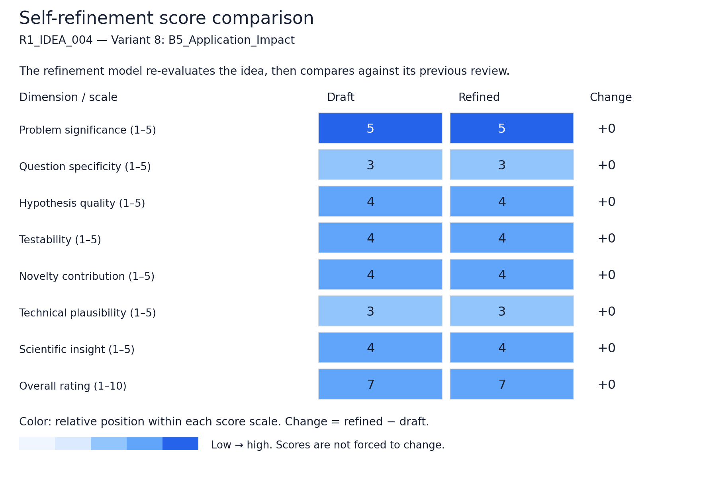

Changed score dimensions: none.

### Score justifications (draft / refined)

**Problem significance**

```json
{
  "draft": {
    "score": 5.0,
    "justification": "Ensuring safety in LLMs while maintaining computational efficiency is one of the most pressing challenges in the field. Current methods often rely on heavy, separate models or complex tuning. A method that simplifies this pipeline would have high practical impact."
  },
  "refined": {
    "score": 5.0,
    "justification": "Ensuring safety in LLMs while maintaining computational efficiency is one of the most pressing challenges in the field. Current methods often rely on heavy, separate models or complex tuning. A method that simplifies this pipeline would have high practical impact."
  }
}
```

**Question specificity**

```json
{
  "draft": {
    "score": 3.0,
    "justification": "The idea identifies the goal (constrained alignment via primal-dual DPO) and the benefits (no separate models, no prior multiplier knowledge). However, it lacks specificity on the 'how'—the specific mathematical formulation and the mechanism for the dual variable update are not described."
  },
  "refined": {
    "score": 3.0,
    "justification": "The idea identifies the goal (constrained alignment via primal-dual DPO) and the benefits (no separate models, no prior multiplier knowledge). However, it lacks specificity on the 'how'—the specific mathematical formulation and the mechanism for the dual variable update are not described."
  }
}
```

**Hypothesis quality**

```json
{
  "draft": {
    "score": 4.0,
    "justification": "The hypothesis is clear: integrating primal-dual optimization into DPO can achieve constrained alignment without separate models or prior multiplier knowledge, leading to better efficiency. This is a falsifiable claim that can be tested against baselines."
  },
  "refined": {
    "score": 4.0,
    "justification": "The hypothesis is clear: integrating primal-dual optimization into DPO can achieve constrained alignment without separate models or prior multiplier knowledge, leading to better efficiency. This is a falsifiable claim that can be tested against baselines."
  }
}
```

**Testability**

```json
{
  "draft": {
    "score": 4.0,
    "justification": "The idea is highly testable. One can implement the proposed primal-dual DPO, compare it against standard DPO with a fixed penalty and DPO with a separate cost model, and measure safety compliance, reward scores, and training time."
  },
  "refined": {
    "score": 4.0,
    "justification": "The idea is highly testable. One can implement the proposed primal-dual DPO, compare it against standard DPO with a fixed penalty and DPO with a separate cost model, and measure safety compliance, reward scores, and training time."
  }
}
```

**Novelty contribution**

```json
{
  "draft": {
    "score": 4.0,
    "justification": "While primal-dual methods exist in RL, applying them directly to the DPO framework to eliminate the need for separate cost models is a novel direction. It moves beyond simple application to proposing a structural change in the alignment pipeline."
  },
  "refined": {
    "score": 4.0,
    "justification": "While primal-dual methods exist in RL, applying them directly to the DPO framework to eliminate the need for separate cost models is a novel direction. It moves beyond simple application to proposing a structural change in the alignment pipeline."
  }
}
```

**Technical plausibility**

```json
{
  "draft": {
    "score": 3.0,
    "justification": "The concept is theoretically sound (primal-dual methods are standard for constrained optimization), but the application to DPO is non-trivial. DPO is a specific loss derived from the Bradley-Terry model; integrating a dynamic Lagrange multiplier requires careful derivation to ensure the loss remains differentiable and stable. The idea is plausible but requires significant technical elaboration to be certain."
  },
  "refined": {
    "score": 3.0,
    "justification": "The concept is theoretically sound (primal-dual methods are standard for constrained optimization), but the application to DPO is non-trivial. DPO is a specific loss derived from the Bradley-Terry model; integrating a dynamic Lagrange multiplier requires careful derivation to ensure the loss remains differentiable and stable. The idea is plausible but requires significant technical elaboration to be certain."
  }
}
```

**Scientific insight**

```json
{
  "draft": {
    "score": 4.0,
    "justification": "If successful, this research would reveal whether constrained optimization can be effectively decoupled from explicit cost modeling in preference-based learning. It could establish a new paradigm for efficient, safe alignment."
  },
  "refined": {
    "score": 4.0,
    "justification": "If successful, this research would reveal whether constrained optimization can be effectively decoupled from explicit cost modeling in preference-based learning. It could establish a new paradigm for efficient, safe alignment."
  }
}
```

**Overall rating**

```json
{
  "draft": {
    "score": 7.0,
    "justification": "This is a strong research idea with high significance and a clear, testable hypothesis. It addresses a real bottleneck in LLM alignment. The main limitation is the lack of technical detail in the summary regarding the specific mechanism of the primal-dual update within the DPO context. However, the core concept is promising enough to warrant investigation."
  },
  "refined": {
    "score": 7.0,
    "justification": "This is a strong research idea with high significance and a clear, testable hypothesis. It addresses a real bottleneck in LLM alignment. The main limitation is the lack of technical detail in the summary regarding the specific mechanism of the primal-dual update within the DPO context. However, the core concept is promising enough to warrant investigation."
  }
}
```

## R1_IDEA_004 — Variant 9: C1_Hollow_Shell

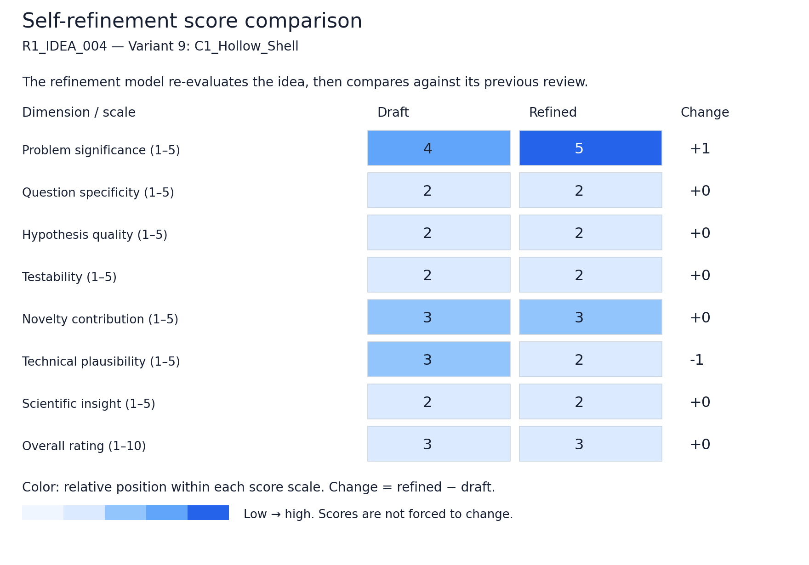

Changed score dimensions: problem_significance, technical_plausibility.

### Score justifications (draft / refined)

**Problem significance**

```json
{
  "draft": {
    "score": 4.0,
    "justification": "The problem of aligning LLMs safely and efficiently is of paramount importance to the field. Reducing the computational cost of alignment is a significant practical challenge that, if solved, would democratize access to safe AI."
  },
  "refined": {
    "score": 5.0,
    "justification": "The problem of making LLM alignment computationally efficient and accessible is of paramount importance. If a method could truly decouple alignment from massive computational requirements or extensive prior data, it would represent a paradigm shift in AI safety and deployment."
  }
}
```

**Question specificity**

```json
{
  "draft": {
    "score": 2.0,
    "justification": "The idea is currently too broad. It states *what* it wants to achieve (alignment, safety, efficiency) but not *how* or *what specific mechanism* is being investigated. The research question is not yet defined."
  },
  "refined": {
    "score": 2.0,
    "justification": "The idea is currently too broad. It identifies the 'what' (efficient alignment) but fails to define the 'how' or the specific mechanism. The term 'optimization framework' is a category, not a specific research question."
  }
}
```

**Hypothesis quality**

```json
{
  "draft": {
    "score": 2.0,
    "justification": "There is no explicit hypothesis. The statement implies a hypothesis (that alignment is possible without prior knowledge/training requirements), but it is not framed in a way that allows for falsification or specific prediction."
  },
  "refined": {
    "score": 2.0,
    "justification": "There is no explicit, falsifiable hypothesis. The statement implies a hypothesis that 'alignment is possible without prior knowledge,' but this is not framed in a way that allows for specific prediction or clear falsification without further definition."
  }
}
```

**Testability**

```json
{
  "draft": {
    "score": 2.0,
    "justification": "Without defining the framework, the metrics, or the baselines, the idea cannot be tested. It is currently impossible to design an experiment to validate the claims."
  },
  "refined": {
    "score": 2.0,
    "justification": "The idea is not currently testable. Without defining the algorithm, the specific constraints, the metrics for success, or the baseline, it is impossible to design an experiment to validate the claims."
  }
}
```

**Novelty contribution**

```json
{
  "draft": {
    "score": 3.0,
    "justification": "The goal of efficient alignment is novel in its ambition, but the idea itself does not propose a specific new mechanism. If the 'optimization framework' turns out to be a known technique applied to a new problem, the novelty would be low. The potential contribution is high, but the current description is too generic to assess the novelty of the method."
  },
  "refined": {
    "score": 3.0,
    "justification": "The ambition is novel, but the description is generic. If the 'optimization framework' is a standard technique applied to a new problem, the novelty is low. The potential contribution is high only if the claim of avoiding prior knowledge is technically sound and novel."
  }
}
```

**Technical plausibility**

```json
{
  "draft": {
    "score": 3.0,
    "justification": "The idea is technically plausible in the sense that constrained optimization is a valid field. However, the claim of avoiding 'prior parameter knowledge' is suspicious and requires significant technical justification to be plausible, as alignment typically relies on some form of prior signal (data, reward models, etc.)."
  },
  "refined": {
    "score": 2.0,
    "justification": "The claim of avoiding 'prior parameter knowledge' is highly suspect. Alignment typically relies on some form of prior signal (data, reward models, or pre-trained weights). Without a clear mechanism explaining how this is bypassed, the idea lacks technical plausibility as stated."
  }
}
```

**Scientific insight**

```json
{
  "draft": {
    "score": 2.0,
    "justification": "As currently stated, the idea does not promise deep scientific insight. It appears to be an engineering optimization goal. To gain insight, it would need to explore the fundamental limits of alignment under these specific constraints."
  },
  "refined": {
    "score": 2.0,
    "justification": "As currently stated, the idea does not promise deep scientific insight. It appears to be an engineering goal. To provide insight, it would need to explore the fundamental limits of alignment and the role of prior knowledge."
  }
}
```

**Overall rating**

```json
{
  "draft": {
    "score": 3.0,
    "justification": "The research idea addresses a highly significant problem (efficient LLM alignment) but is currently too vague to be considered a strong research proposal. It lacks a specific hypothesis, defined methodology, and testable metrics. It falls into the 'weak' category because it is essentially a high-level goal rather than a defined research direction. However, it is not 'very weak' because the underlying problem is real and the direction (optimization) is valid."
  },
  "refined": {
    "score": 3.0,
    "justification": "The research idea addresses a highly significant problem but is currently too vague and scientifically ambiguous to be considered a strong proposal. The core claim regarding 'prior parameter knowledge' is potentially contradictory to established paradigms without further elaboration. It falls into the 'weak' category because it lacks a specific research question, hypothesis, and testable mechanism, despite the high stakes of the problem."
  }
}
```

## R1_IDEA_004 — Variant 10: C2_Logic_Flawed


Changed score dimensions: technical_plausibility, overall_rating.

### Score justifications (draft / refined)

**Problem significance**

```json
{
  "draft": {
    "score": 5.0,
    "justification": "Constrained alignment is a major challenge in deploying safe LLMs. Reducing the computational cost by eliminating separate reward/cost models is highly significant for both research and industry practitioners, making this a high-impact problem."
  },
  "refined": {
    "score": 5.0,
    "justification": "Constrained alignment is a major challenge in deploying safe LLMs. The computational cost of training separate reward and cost models is a significant barrier. Solving this problem would have immediate practical value for both researchers and industry practitioners, making the problem highly significant."
  }
}
```

**Question specificity**

```json
{
  "draft": {
    "score": 3.0,
    "justification": "The idea identifies the goal (Primal-Dual DPO) and the benefits (no separate models, no prior multiplier), but lacks the specific mathematical formulation or algorithmic details that would define the exact research question."
  },
  "refined": {
    "score": 3.0,
    "justification": "While the goal is clear (efficient constrained alignment via Primal-Dual DPO), the idea lacks the specific research question regarding the *mechanism* of constraint enforcement without a cost model. It states the 'what' but not the 'how' in sufficient detail to be a fully specific research question."
  }
}
```

**Hypothesis quality**

```json
{
  "draft": {
    "score": 4.0,
    "justification": "The hypothesis is clear: a Primal-Dual approach can achieve constrained alignment more efficiently than current methods by avoiding separate model training. This is a falsifiable claim that can be tested via ablation and performance comparison."
  },
  "refined": {
    "score": 4.0,
    "justification": "The hypothesis is clear and testable: 'Primal-Dual DPO can achieve constrained alignment more efficiently than current methods by avoiding separate model training.' This is a concrete prediction that can be supported or refuted by empirical results."
  }
}
```

**Testability**

```json
{
  "draft": {
    "score": 4.0,
    "justification": "The idea is testable by implementing the proposed algorithm and comparing it against baselines (e.g., standard DPO, DPO with a separate reward model) on standard safety benchmarks. Metrics would include safety scores, reward scores, and training time."
  },
  "refined": {
    "score": 4.0,
    "justification": "The idea is testable. One can implement the proposed algorithm (assuming a formulation is derived) and compare it against baselines on standard safety benchmarks using metrics like safety score, reward score, and training time. The lack of implementation details in the summary does not preclude testability of the core concept."
  }
}
```

**Novelty contribution**

```json
{
  "draft": {
    "score": 4.0,
    "justification": "Applying Primal-Dual optimization directly to DPO to avoid separate model training is a novel direction. While Primal-Dual methods exist in other RL contexts, their specific application to DPO for this purpose represents a meaningful contribution to the field."
  },
  "refined": {
    "score": 4.0,
    "justification": "Applying Primal-Dual optimization directly to DPO to eliminate the need for separate reward/cost models is a novel direction. While Primal-Dual methods are common in RL, their specific application to the DPO framework for this purpose represents a meaningful contribution to the field."
  }
}
```

**Technical plausibility**

```json
{
  "draft": {
    "score": 4.0,
    "justification": "The reasoning is logically coherent. Primal-Dual methods are standard for constrained optimization, and DPO is a well-defined objective. The combination is plausible, though the non-convexity of DPO adds complexity that needs careful handling."
  },
  "refined": {
    "score": 3.0,
    "justification": "The reasoning is logically coherent in principle, but the technical plausibility is uncertain without a clear mechanism for defining the constraint function without a separate model. The non-convexity of DPO combined with primal-dual updates introduces significant theoretical risks that are not addressed in the summary."
  }
}
```

**Scientific insight**

```json
{
  "draft": {
    "score": 4.0,
    "justification": "If successful, this research would reveal whether constrained optimization can be effectively decoupled from explicit reward modeling in preference learning, potentially leading to a new class of efficient alignment algorithms."
  },
  "refined": {
    "score": 4.0,
    "justification": "If successful, this research would reveal whether constrained optimization can be effectively decoupled from explicit reward modeling in preference learning. This could lead to a new class of efficient alignment algorithms and provide insights into the relationship between preference data and constraint satisfaction."
  }
}
```

**Overall rating**

```json
{
  "draft": {
    "score": 8.0,
    "justification": "This is a strong research idea with high significance and a clear, plausible hypothesis. It addresses a real pain point in LLM alignment (computational cost) with a theoretically sound approach. The main limitation is the lack of specific formulation in the summary, but the core concept is novel and worth investigating."
  },
  "refined": {
    "score": 7.0,
    "justification": "This is a strong research idea with high significance and a clear, plausible hypothesis. It addresses a real pain point in LLM alignment with a theoretically sound approach. The main limitation is the lack of specific formulation regarding constraint definition and the handling of non-convexity, which lowers the technical plausibility score. However, the potential contribution is high enough to warrant a strong rating."
  }
}
```

## R1_IDEA_004 — Variant 11: C3_Substance_Enriched

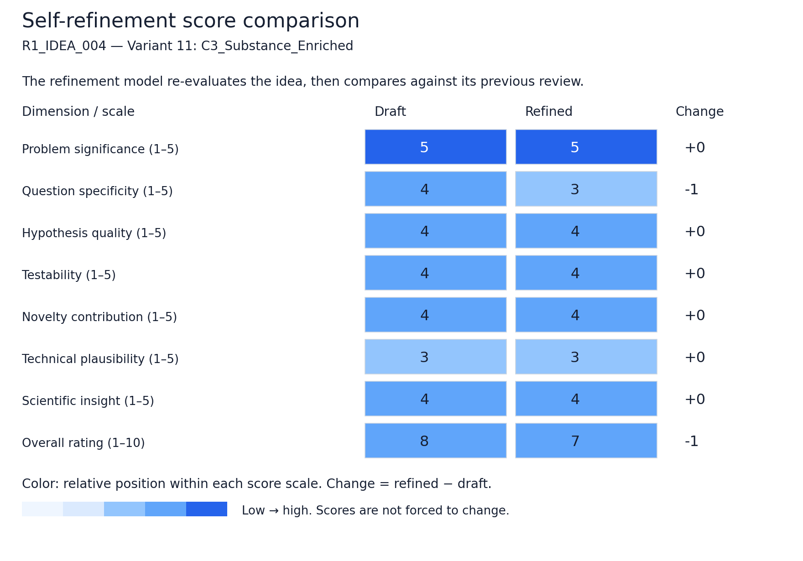

Changed score dimensions: question_specificity, overall_rating.

### Score justifications (draft / refined)

**Problem significance**

```json
{
  "draft": {
    "score": 5.0,
    "justification": "Aligning LLMs with safety constraints is a paramount challenge in the field. Reducing the computational overhead by eliminating separate reward/cost models would be a significant practical contribution, making alignment more accessible and efficient."
  },
  "refined": {
    "score": 5.0,
    "justification": "Reducing the computational cost and complexity of LLM alignment is a high-priority problem. Eliminating the need for separate reward and cost models would significantly lower the barrier to entry for safe alignment and reduce resource requirements."
  }
}
```

**Question specificity**

```json
{
  "draft": {
    "score": 4.0,
    "justification": "The idea clearly identifies the method (Primal-Dual DPO), the goal (constrained alignment), and the specific hypothesis (dual variable dynamics reveal trade-offs). However, the mathematical mechanism for estimating constraints without a cost model is not yet specified."
  },
  "refined": {
    "score": 3.0,
    "justification": "While the goal (constrained alignment) and the method (Primal-Dual DPO) are named, the core mechanism—how the constraint is enforced without a cost model—is not specified. The idea lacks the necessary mathematical specificity to fully define the research question."
  }
}
```

**Hypothesis quality**

```json
{
  "draft": {
    "score": 4.0,
    "justification": "The hypothesis that dual variable dynamics reveal interpretable trade-off patterns is concrete, falsifiable, and scientifically valuable. It moves beyond 'does it work?' to 'how does it work?'."
  },
  "refined": {
    "score": 4.0,
    "justification": "The hypothesis that dual dynamics reveal interpretable trade-offs is concrete and scientifically valuable. It is falsifiable: one can measure the correlation between dual variable trajectories and actual safety/reward metrics. However, the assumption of interpretability is non-trivial."
  }
}
```

**Testability**

```json
{
  "draft": {
    "score": 4.0,
    "justification": "The proposal suggests clear validation paths: testing convergence under varying budgets and analyzing dual variable dynamics. These are measurable and can be implemented."
  },
  "refined": {
    "score": 4.0,
    "justification": "The idea suggests clear experimental paths: varying constraint budgets and analyzing convergence. The hypothesis can be tested by plotting dual variables against safety metrics. However, the lack of a defined constraint metric makes the exact experimental setup slightly ambiguous."
  }
}
```

**Novelty contribution**

```json
{
  "draft": {
    "score": 4.0,
    "justification": "Applying primal-dual optimization directly to DPO to avoid separate models is a novel direction. If successful, it could change the standard pipeline for constrained alignment."
  },
  "refined": {
    "score": 4.0,
    "justification": "Applying primal-dual methods to DPO to avoid separate models is a novel direction. If successful, it could offer a new paradigm for constrained optimization in LLMs, distinct from standard RLHF or constrained DPO with explicit cost models."
  }
}
```

**Technical plausibility**

```json
{
  "draft": {
    "score": 3.0,
    "justification": "While the direction is logical, the technical leap of removing the cost model in a constrained setting is significant. The idea assumes that the preference data alone can provide sufficient signal for the dual updates, which is a strong assumption that needs rigorous theoretical backing."
  },
  "refined": {
    "score": 3.0,
    "justification": "The idea is logically coherent but technically risky. The assumption that preference data alone can provide a sufficient signal for dual updates (constraint gradients) is a strong claim that contradicts standard practices where cost models are explicitly trained. The non-convex nature of LLMs further complicates the plausibility of standard primal-dual convergence."
  }
}
```

**Scientific insight**

```json
{
  "draft": {
    "score": 4.0,
    "justification": "If the hypothesis holds, the research would provide deep insights into the geometry of the optimization landscape in constrained alignment and how models internally represent the trade-off between reward and safety."
  },
  "refined": {
    "score": 4.0,
    "justification": "If the hypothesis holds, the research would provide unique insights into the geometry of constrained optimization in LLMs and how dual variables encode safety-reward trade-offs, offering a window into the model's internal negotiation of constraints."
  }
}
```

**Overall rating**

```json
{
  "draft": {
    "score": 8.0,
    "justification": "This is a strong research idea with high potential impact. It addresses a significant practical problem (efficiency in alignment) with a novel methodological approach. The hypothesis regarding interpretability adds significant scientific value. The main risk lies in the technical feasibility of the constraint estimation without a cost model, but the idea is sufficiently specific and promising to warrant investigation."
  },
  "refined": {
    "score": 7.0,
    "justification": "This is a strong research idea with high potential impact due to its focus on efficiency and interpretability. The novelty is significant, and the hypothesis is well-defined. However, the technical plausibility is the primary concern; the mechanism for constraint estimation without a cost model is a major gap that needs rigorous theoretical justification. It is a promising direction but carries a higher risk of failure than the previous review suggested."
  }
}
```

## R1_IDEA_004 — Variant 12: H1_Deceptive_Hollow


Changed score dimensions: none.

### Score justifications (draft / refined)

**Problem significance**

```json
{
  "draft": {
    "score": 4.0,
    "justification": "The problem of aligning LLMs efficiently and safely is of paramount importance to the field. Addressing computational costs and safety simultaneously is a high-value goal."
  },
  "refined": {
    "score": 4.0,
    "justification": "The problem of aligning LLMs efficiently and safely is of paramount importance. Addressing computational costs and safety simultaneously is a high-value goal that matters significantly to the field."
  }
}
```

**Question specificity**

```json
{
  "draft": {
    "score": 1.0,
    "justification": "The idea is presented as a broad agenda rather than a specific question. It uses abstract terms like 'optimization framework' and 'transformative synthesis' without defining the actual research variables or relationships."
  },
  "refined": {
    "score": 1.0,
    "justification": "The idea is presented as a broad agenda rather than a specific question. It uses abstract terms without defining the actual research variables, relationships, or the specific nature of the 'optimization framework' being proposed."
  }
}
```

**Hypothesis quality**

```json
{
  "draft": {
    "score": 1.0,
    "justification": "There is no explicit or implicit hypothesis that can be supported or refuted. The text makes grand claims about 'reshaping' the field but offers no specific prediction about model behavior or performance."
  },
  "refined": {
    "score": 1.0,
    "justification": "There is no explicit or implicit hypothesis that can be supported or refuted. The text makes grand claims about 'reshaping' the field but offers no specific prediction about model behavior, performance, or mechanism."
  }
}
```

**Testability**

```json
{
  "draft": {
    "score": 1.0,
    "justification": "The idea is currently untestable. Without a defined method, metrics, or baseline, no experiment can be designed to validate the claims."
  },
  "refined": {
    "score": 1.0,
    "justification": "The idea is currently untestable. Without a defined method, specific metrics, or baselines, no experiment can be designed to validate the claims of reduced compute or improved safety."
  }
}
```

**Novelty contribution**

```json
{
  "draft": {
    "score": 2.0,
    "justification": "While the goal is novel in its ambition, the description is too generic to assess the novelty of the proposed mechanism. It reads more like a mission statement than a research proposal."
  },
  "refined": {
    "score": 2.0,
    "justification": "While the goal is novel in its ambition, the description is too generic to assess the novelty of the proposed mechanism. It reads more like a mission statement than a research proposal, making it impossible to judge if the approach is truly new or just a rephrasing of existing goals."
  }
}
```

**Technical plausibility**

```json
{
  "draft": {
    "score": 2.0,
    "justification": "The reasoning is logically coherent in a high-level sense (we want better alignment with less compute), but the technical plausibility of avoiding 'prior parameter knowledge' while achieving alignment is unclear and requires significant justification."
  },
  "refined": {
    "score": 2.0,
    "justification": "The reasoning is logically coherent in a high-level sense (we want better alignment with less compute), but the technical plausibility of avoiding 'prior parameter knowledge' while achieving alignment is unclear and requires significant justification. The claim is currently speculative."
  }
}
```

**Scientific insight**

```json
{
  "draft": {
    "score": 2.0,
    "justification": "As currently stated, the idea does not promise specific scientific insight beyond the general hope of better systems. It lacks a mechanism that would reveal new principles about alignment or optimization."
  },
  "refined": {
    "score": 2.0,
    "justification": "As currently stated, the idea does not promise specific scientific insight beyond the general hope of better systems. It lacks a mechanism that would reveal new principles about alignment or optimization."
  }
}
```

**Overall rating**

```json
{
  "draft": {
    "score": 3.0,
    "justification": "The idea addresses a significant problem but fails as a research proposal due to extreme vagueness. It lacks a specific question, hypothesis, or method, making it impossible to evaluate its scientific merit or feasibility. It falls into the 'weak' category because it is mostly generic motivation without a defined research path."
  },
  "refined": {
    "score": 3.0,
    "justification": "The idea addresses a significant problem but fails as a research proposal due to extreme vagueness. It lacks a specific question, hypothesis, or method, making it impossible to evaluate its scientific merit or feasibility. It falls into the 'weak' category because it is mostly generic motivation without a defined research path."
  }
}
```

## R1_IDEA_004 — Variant 13: H2_Confident_Flaw

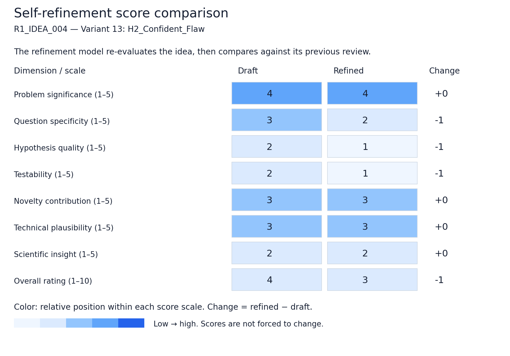

Changed score dimensions: question_specificity, hypothesis_quality, testability, overall_rating.

### Score justifications (draft / refined)

**Problem significance**

```json
{
  "draft": {
    "score": 4.0,
    "justification": "The problem of efficient, constrained alignment of LLMs is highly significant. Reducing the need for separate reward models and prior knowledge of hyperparameters addresses a major bottleneck in deploying safe AI systems."
  },
  "refined": {
    "score": 4.0,
    "justification": "The problem of efficient, constrained alignment is highly significant. Reducing the need for separate reward models and manual hyperparameter tuning addresses a major bottleneck in deploying safe AI systems, making the underlying motivation strong."
  }
}
```

**Question specificity**

```json
{
  "draft": {
    "score": 3.0,
    "justification": "While the method (Primal-Dual DPO) is named, the specific research question is muddied by the claim that solving this will automatically solve all related issues. The idea needs to narrow its focus to specific performance/efficiency trade-offs rather than claiming universal superiority."
  },
  "refined": {
    "score": 2.0,
    "justification": "While the method name is specific, the research question is muddied by the claim that solving one limitation automatically solves all related issues. The idea fails to define specific performance boundaries or trade-offs, instead making a blanket claim of 'general superiority'."
  }
}
```

**Hypothesis quality**

```json
{
  "draft": {
    "score": 2.0,
    "justification": "The hypothesis is poorly formed because it makes an absolute causal claim ('necessarily produce reliable improvements') that ignores confounding variables. A strong hypothesis would predict a specific relationship (e.g., 'Method X will achieve Y% safety with Z% less compute than Method Y') rather than a blanket statement of superiority."
  },
  "refined": {
    "score": 1.0,
    "justification": "The hypothesis is critically flawed. It makes an absolute causal claim ('necessarily produce reliable improvements') that ignores confounding variables. A strong hypothesis must be falsifiable; this one explicitly rejects the conditions (isolating variables, testing boundaries) required to falsify it."
  }
}
```

**Testability**

```json
{
  "draft": {
    "score": 2.0,
    "justification": "The idea explicitly argues against the need for isolating variables, testing boundary cases, or comparing against alternative explanations. This makes the central claim difficult to falsify scientifically, as it rejects standard validation protocols."
  },
  "refined": {
    "score": 1.0,
    "justification": "The idea explicitly argues against the need for isolating variables, testing boundary cases, or comparing against alternative explanations. By rejecting standard validation protocols, the central claim becomes scientifically untestable and unfalsifiable."
  }
}
```

**Novelty contribution**

```json
{
  "draft": {
    "score": 3.0,
    "justification": "Applying primal-dual methods to DPO is a novel direction. However, the claimed contribution of 'general superiority' without rigorous testing undermines the potential for genuine scientific insight, as it risks being a superficial application of an existing optimization technique."
  },
  "refined": {
    "score": 3.0,
    "justification": "Applying primal-dual methods to DPO is a novel direction. However, the claimed contribution of 'general superiority' without rigorous testing undermines the potential for genuine scientific insight, as it risks being a superficial application of an optimization technique."
  }
}
```

**Technical plausibility**

```json
{
  "draft": {
    "score": 3.0,
    "justification": "Primal-dual optimization is a standard technique in constrained optimization, so the mechanism is plausible. However, the claim that it can bypass the need for separate models or prior knowledge without trade-offs is optimistic and requires strong theoretical justification not present in the summary."
  },
  "refined": {
    "score": 3.0,
    "justification": "Primal-dual optimization is a standard technique, so the mechanism is plausible in theory. However, the claim that it can bypass the need for separate models or prior knowledge without trade-offs is optimistic and lacks the necessary theoretical justification in the summary."
  }
}
```

**Scientific insight**

```json
{
  "draft": {
    "score": 2.0,
    "justification": "The current framing suggests a 'black box' solution where efficiency equals effectiveness. If the research proceeds as described (ignoring boundary cases), it is unlikely to yield deep insights into the mechanisms of alignment or the nature of the constraints."
  },
  "refined": {
    "score": 2.0,
    "justification": "The current framing suggests a 'black box' solution where efficiency equals effectiveness. If the research proceeds as described (ignoring boundary cases and alternative explanations), it is unlikely to yield deep insights into the mechanisms of alignment or the nature of constraints."
  }
}
```

**Overall rating**

```json
{
  "draft": {
    "score": 4.0,
    "justification": "The underlying problem is important, and the proposed method (Primal-Dual DPO) is a reasonable technical direction. However, the research idea is significantly weakened by its logical fallacies regarding causality and its explicit rejection of standard scientific validation (ablation, boundary cases). The idea currently reads more like a marketing claim than a rigorous research proposal. It requires a complete reframing of the hypothesis to be scientifically viable."
  },
  "refined": {
    "score": 3.0,
    "justification": "The underlying problem is important, and the proposed method is a reasonable technical direction. However, the research idea is severely weakened by its logical fallacies regarding causality and its explicit rejection of standard scientific validation. The idea currently reads more like a marketing claim than a rigorous research proposal. It requires a complete reframing of the hypothesis to be scientifically viable."
  }
}
```

## R1_IDEA_004 — Variant 14: H3_Verbose_Enriched

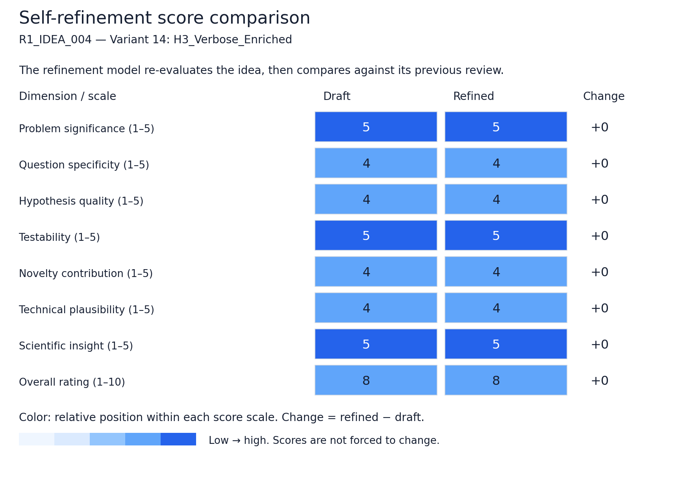

Changed score dimensions: none.

### Score justifications (draft / refined)

**Problem significance**

```json
{
  "draft": {
    "score": 5.0,
    "justification": "Constrained alignment of LLMs is a high-priority problem in AI safety. Developing methods that are computationally efficient (avoiding separate reward models) directly addresses a major bottleneck in current alignment pipelines, making this highly significant."
  },
  "refined": {
    "score": 5.0,
    "justification": "Constrained alignment of LLMs is a critical challenge in AI safety. Developing methods that are computationally efficient (avoiding separate reward models) directly addresses a major bottleneck in current alignment pipelines, making this highly significant for both researchers and practitioners."
  }
}
```

**Question specificity**

```json
{
  "draft": {
    "score": 4.0,
    "justification": "The idea clearly identifies the goal (maximize reward, enforce safety), the method (primal-dual DPO), and the specific hypothesis (dual dynamics reveal trade-offs). However, the exact mechanism of the algorithm is described at a high level, leaving some ambiguity on the 'how'."
  },
  "refined": {
    "score": 4.0,
    "justification": "The idea clearly identifies the goal (maximize reward, enforce safety), the method (primal-dual DPO), and the specific hypothesis (dual dynamics reveal trade-offs). However, the exact mechanism of the algorithm is described at a high level, leaving some ambiguity on the 'how' compared to the 'what' and 'why'."
  }
}
```

**Hypothesis quality**

```json
{
  "draft": {
    "score": 4.0,
    "justification": "The hypothesis that dual variable dynamics will reveal interpretable trade-off patterns is specific, non-trivial, and falsifiable. It moves beyond 'does it work?' to 'how does it work?' which is a strong scientific stance."
  },
  "refined": {
    "score": 4.0,
    "justification": "The hypothesis that dual variable dynamics will reveal interpretable trade-off patterns is specific, non-trivial, and falsifiable. It moves beyond 'does it work?' to 'how does it work?', which is a strong scientific stance. However, the assumption that these dynamics will be interpretable in a non-convex setting is a bold claim that requires strong justification."
  }
}
```

**Testability**

```json
{
  "draft": {
    "score": 5.0,
    "justification": "The idea provides a very clear path for testing: convergence analysis, staged design with specific cases (easy/difficult/boundary), ablations, and sensitivity analyses. The criteria for success and failure are well-defined."
  },
  "refined": {
    "score": 5.0,
    "justification": "The idea provides a very clear path for testing: convergence analysis, staged design with specific cases (easy/difficult/boundary), ablations, and sensitivity analyses. The criteria for success and failure are well-defined, and the proposal explicitly mentions error analysis."
  }
}
```

**Novelty contribution**

```json
{
  "draft": {
    "score": 4.0,
    "justification": "Applying primal-dual methods to DPO without separate reward models is a novel direction. The potential to extract interpretability from dual variables adds a layer of scientific contribution beyond just a new alignment algorithm."
  },
  "refined": {
    "score": 4.0,
    "justification": "Applying primal-dual methods to DPO without separate reward models is a novel direction. The potential to extract interpretability from dual variables adds a layer of scientific contribution beyond just a new alignment algorithm, potentially offering insights into constrained optimization in deep learning."
  }
}
```

**Technical plausibility**

```json
{
  "draft": {
    "score": 4.0,
    "justification": "Primal-dual methods are standard in optimization, and DPO is a standard alignment technique. Combining them is plausible. The main risk is the non-convexity of LLM training, but the idea acknowledges the need for convergence testing, suggesting awareness of this challenge."
  },
  "refined": {
    "score": 4.0,
    "justification": "Primal-dual methods are standard in optimization, and DPO is a standard alignment technique. Combining them is plausible. The main risk is the non-convexity of LLM training, but the idea acknowledges the need for convergence testing, suggesting awareness of this challenge. The claim of avoiding separate models is theoretically possible but requires careful formulation to avoid implicit reward modeling."
  }
}
```

**Scientific insight**

```json
{
  "draft": {
    "score": 5.0,
    "justification": "If successful, this research could reveal fundamental relationships between constraint enforcement dynamics and model behavior (via dual variables). This would provide transferable insights into how constrained optimization behaves in deep learning, not just for safety but potentially for other alignment tasks."
  },
  "refined": {
    "score": 5.0,
    "justification": "If successful, this research could reveal fundamental relationships between constraint enforcement dynamics and model behavior (via dual variables). This would provide transferable insights into how constrained optimization behaves in deep learning, not just for safety but potentially for other alignment tasks."
  }
}
```

**Overall rating**

```json
{
  "draft": {
    "score": 8.0,
    "justification": "This is a strong research idea. It tackles a significant problem with a plausible and novel methodological approach. The hypothesis is insightful, and the proposed experimental design is rigorous. The only minor deduction is the lack of explicit mathematical formulation in the summary, which makes the 'how' slightly less concrete than the 'what' and 'why'."
  },
  "refined": {
    "score": 8.0,
    "justification": "This is a strong research idea. It tackles a significant problem with a plausible and novel methodological approach. The hypothesis is insightful, and the proposed experimental design is rigorous. The only minor deduction is the lack of explicit mathematical formulation in the summary, which makes the 'how' slightly less concrete than the 'what' and 'why'."
  }
}
```

## R1_IDEA_004 — Variant 15: H4_Ultimate_Hype

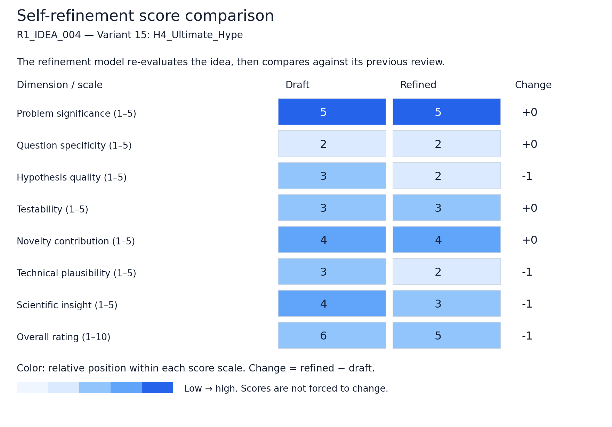

Changed score dimensions: hypothesis_quality, technical_plausibility, scientific_insight, overall_rating.

### Score justifications (draft / refined)

**Problem significance**

```json
{
  "draft": {
    "score": 5.0,
    "justification": "Constrained alignment is one of the most pressing challenges in deploying LLMs. Reducing the computational and data overhead of this process is a high-impact goal that addresses a major barrier to widespread, safe deployment."
  },
  "refined": {
    "score": 5.0,
    "justification": "Constrained alignment is a critical bottleneck in LLM deployment. Reducing the computational overhead and complexity of this process (by removing separate models) is a high-impact goal with immediate practical relevance."
  }
}
```

**Question specificity**

```json
{
  "draft": {
    "score": 2.0,
    "justification": "While the general direction (Primal-Dual DPO) is mentioned, the specific research question is vague. It does not specify the exact mathematical relationship being investigated or the precise mechanism of constraint enforcement."
  },
  "refined": {
    "score": 2.0,
    "justification": "The idea identifies a general direction ('Primal-Dual DPO') but fails to specify the research question. It does not define the variables, the objective function, or the specific mechanism of constraint enforcement, making the question too vague to be scientifically rigorous at this stage."
  }
}
```

**Hypothesis quality**

```json
{
  "draft": {
    "score": 3.0,
    "justification": "The implicit hypothesis is that a primal-dual formulation can replace the need for separate models and prior multiplier knowledge. This is a testable claim, but the idea lacks a specific prediction about the nature of the trade-off or the conditions under which it succeeds."
  },
  "refined": {
    "score": 2.0,
    "justification": "The idea implies a hypothesis (that this method works better/more efficiently), but it does not state a concrete prediction. It lacks a specific claim about the relationship between the method's components and the outcome (e.g., convergence rates, specific trade-off curves) that could be tested or falsified."
  }
}
```

**Testability**

```json
{
  "draft": {
    "score": 3.0,
    "justification": "The idea is testable in principle (compare performance against standard DPO/RLHF with constraints), but the lack of a defined objective function makes it difficult to design a concrete experiment without further elaboration."
  },
  "refined": {
    "score": 3.0,
    "justification": "The idea is testable in principle (one could attempt to implement it and compare it to baselines), but the lack of a defined objective function makes it impossible to design a concrete experiment without significant interpretation. The current description is too vague to be directly tested."
  }
}
```

**Novelty contribution**

```json
{
  "draft": {
    "score": 4.0,
    "justification": "Applying primal-dual methods directly to DPO to eliminate separate models is a novel angle. If successful, it would represent a significant methodological contribution to the field of alignment."
  },
  "refined": {
    "score": 4.0,
    "justification": "The combination of primal-dual optimization with DPO to eliminate separate models is a novel angle. If the mechanism can be realized, it would represent a significant methodological contribution. However, the novelty is currently speculative due to the lack of technical detail."
  }
}
```

**Technical plausibility**

```json
{
  "draft": {
    "score": 3.0,
    "justification": "The concept is theoretically grounded in optimization theory, but applying it to the specific, non-convex, and data-scarce regime of DPO is non-trivial. The plausibility depends entirely on the specific implementation details which are currently missing."
  },
  "refined": {
    "score": 2.0,
    "justification": "While the concept is grounded in optimization theory, applying it to the specific, non-convex, and data-scarce regime of DPO without a cost model is highly non-trivial. The idea asserts this is possible without providing any reasoning, making the plausibility currently low until a mechanism is proposed."
  }
}
```

**Scientific insight**

```json
{
  "draft": {
    "score": 4.0,
    "justification": "If successful, this research would reveal new insights into how optimization dynamics can be harnessed for constraint satisfaction in deep learning without explicit reward modeling, potentially leading to more efficient alignment paradigms."
  },
  "refined": {
    "score": 3.0,
    "justification": "If successful, the research would provide insight into efficient constraint satisfaction. However, as currently stated, it is unclear *what* specific mechanism or principle would be revealed, as the method itself is undefined."
  }
}
```

**Overall rating**

```json
{
  "draft": {
    "score": 6.0,
    "justification": "The idea addresses a highly significant problem with a potentially transformative approach. However, the current description is too abstract to be fully evaluated as a strong research plan. It lacks the specific formulation and hypothesis required to move from a 'promising direction' to a 'strong research idea.' It sits in the moderate/borderline category because the core concept is sound, but the execution path is undefined."
  },
  "refined": {
    "score": 5.0,
    "justification": "The idea addresses a significant problem with a potentially transformative approach, but the current description is too abstract and promotional to be considered a strong research idea. It lacks the specific formulation, hypothesis, and technical justification required to move beyond a 'promising direction.' It sits in the moderate/borderline category because the core concept is sound but the execution path is undefined and the claims are unsupported."
  }
}
```

## R1_IDEA_005 — Source


Changed score dimensions: none.

### Score justifications (draft / refined)

**Problem significance**

```json
{
  "draft": {
    "score": 4.0,
    "justification": "Robustness of deep learning models under distribution shift is a fundamental challenge. Specifically addressing the robustness of Vision SSMs is highly significant given their recent rise as efficient alternatives to Transformers. Solving this would have immediate practical value for deploying SSMs in real-world, non-stationary environments."
  },
  "refined": {
    "score": 4.0,
    "justification": "The robustness of deep learning models under distribution shift is a fundamental challenge. Specifically addressing the robustness of Vision SSMs is highly significant given their recent rise as efficient alternatives to Transformers. Solving this would have immediate practical value for deploying SSMs in real-world, non-stationary environments."
  }
}
```

**Question specificity**

```json
{
  "draft": {
    "score": 3.0,
    "justification": "The idea identifies a clear goal (improve robustness via TTA) and a specific mechanism (SSM traversal permutations). However, the definition of 'permutations' and the 'aggregation' strategy are currently too vague to be fully specific. The research question is 'Can SSM-specific permutations improve TTA?' which is good, but the 'how' needs more definition."
  },
  "refined": {
    "score": 3.0,
    "justification": "The idea identifies a clear goal (improve robustness via TTA) and a specific mechanism (SSM traversal permutations). However, the definition of 'permutations' and the 'aggregation' strategy are currently too vague to be fully specific. The research question is 'Can SSM-specific permutations improve TTA?' which is good, but the 'how' needs more definition."
  }
}
```

**Hypothesis quality**

```json
{
  "draft": {
    "score": 4.0,
    "justification": "The implicit hypothesis is that leveraging the internal structural properties of SSMs (via traversal permutations) to generate views will yield more informative pseudo-labels for adaptation than generic augmentations. This is a concrete, falsifiable prediction that distinguishes the method from generic TTA."
  },
  "refined": {
    "score": 4.0,
    "justification": "The implicit hypothesis is that leveraging the internal structural properties of SSMs (via traversal permutations) to generate views will yield more informative pseudo-labels for adaptation than generic augmentations. This is a concrete, falsifiable prediction that distinguishes the method from generic TTA."
  }
}
```

**Testability**

```json
{
  "draft": {
    "score": 4.0,
    "justification": "The idea is highly testable. One can implement the proposed permutation mechanism, run standard TTA experiments on distribution-shifted datasets (e.g., ImageNet-C), and compare performance against baselines. The use of pseudo-labels and weight aggregation provides clear metrics for evaluation."
  },
  "refined": {
    "score": 4.0,
    "justification": "The idea is highly testable. One can implement the proposed permutation mechanism, run standard TTA experiments on distribution-shifted datasets (e.g., ImageNet-C), and compare performance against baselines. The use of pseudo-labels and weight aggregation provides clear metrics for evaluation."
  }
}
```

**Novelty contribution**

```json
{
  "draft": {
    "score": 4.0,
    "justification": "Applying TTA to SSMs is a relatively new direction. The specific proposal of using 'traversal permutations' as a view generation strategy is novel and suggests a deeper understanding of SSM mechanics. It moves beyond simple application of existing methods to proposing a mechanism tailored to the model's architecture."
  },
  "refined": {
    "score": 4.0,
    "justification": "Applying TTA to SSMs is a relatively new direction. The specific proposal of using 'traversal permutations' as a view generation strategy is novel and suggests a deeper understanding of SSM mechanics. It moves beyond simple application of existing methods to proposing a mechanism tailored to the model's architecture."
  }
}
```

**Technical plausibility**

```json
{
  "draft": {
    "score": 3.0,
    "justification": "The idea is technically plausible in principle, as SSMs have defined state transitions that could theoretically be permuted. However, the feasibility depends entirely on whether such permutations result in valid, semantically meaningful inputs. If the permutations break the causal structure of the SSM, the method may fail. The aggregation of weights also requires careful design to be stable."
  },
  "refined": {
    "score": 3.0,
    "justification": "The idea is technically plausible in principle, as SSMs have defined state transitions that could theoretically be permuted. However, the feasibility depends entirely on whether such permutations result in valid, semantically meaningful inputs. If the permutations break the causal structure of the SSM, the method may fail. The aggregation of weights also requires careful design to be stable."
  }
}
```

**Scientific insight**

```json
{
  "draft": {
    "score": 4.0,
    "justification": "If successful, this research would provide insight into the relationship between SSM architectural inductive biases and robustness. It could reveal how the internal state dynamics of SSMs can be manipulated to improve generalization, offering a new perspective on test-time adaptation that is architecture-aware rather than data-aware."
  },
  "refined": {
    "score": 4.0,
    "justification": "If successful, this research would provide insight into the relationship between SSM architectural inductive biases and robustness. It could reveal how the internal state dynamics of SSMs can be manipulated to improve generalization, offering a new perspective on test-time adaptation that is architecture-aware rather than data-aware."
  }
}
```

**Overall rating**

```json
{
  "draft": {
    "score": 7.0,
    "justification": "This is a strong research idea with high potential. It addresses a significant problem (SSM robustness) with a novel, architecture-specific hypothesis. While the specific implementation details (permutations, aggregation) are currently vague, the core concept is scientifically sound and testable. It has the potential to make a meaningful contribution to the field of efficient vision models and robustness."
  },
  "refined": {
    "score": 7.0,
    "justification": "This is a strong research idea with high potential. It addresses a significant problem (SSM robustness) with a novel, architecture-specific hypothesis. While the specific implementation details (permutations, aggregation) are currently vague, the core concept is scientifically sound and testable. It has the potential to make a meaningful contribution to the field of efficient vision models and robustness."
  }
}
```

## R1_IDEA_005 — Variant 1: A1_Identity


Changed score dimensions: none.

### Score justifications (draft / refined)

**Problem significance**

```json
{
  "draft": {
    "score": 4.0,
    "justification": "Improving the robustness of Vision SSMs is a highly significant problem as these models are rapidly replacing Transformers in long-sequence and vision tasks. Distribution shift robustness is a fundamental requirement for deploying these models in real-world scenarios."
  },
  "refined": {
    "score": 4.0,
    "justification": "Improving the robustness of Vision SSMs is a highly significant problem as these models are rapidly replacing Transformers in long-sequence and vision tasks. Distribution shift robustness is a fundamental requirement for deploying these models in real-world scenarios, making the problem meaningful."
  }
}
```

**Question specificity**

```json
{
  "draft": {
    "score": 3.0,
    "justification": "The idea identifies the goal (robustness via TTA) and the target (Mamba), but the core mechanism ('diverse SSM traversal permutations') and the aggregation strategy are described at a high level without sufficient technical specificity to fully grasp the novelty or feasibility."
  },
  "refined": {
    "score": 3.0,
    "justification": "The idea identifies the goal (robustness via TTA) and the target (Mamba), but the core mechanism ('diverse SSM traversal permutations') and the aggregation strategy are described at a high level. The lack of technical specificity regarding how permutations are applied without breaking causality prevents a higher score."
  }
}
```

**Hypothesis quality**

```json
{
  "draft": {
    "score": 4.0,
    "justification": "The hypothesis is clear: that exploiting the internal state dynamics of SSMs through permutation-based view generation can yield better pseudo-labels and parameter updates than standard methods, leading to improved generalization."
  },
  "refined": {
    "score": 4.0,
    "justification": "The hypothesis is clear: that exploiting the internal state dynamics of SSMs through permutation-based view generation can yield better pseudo-labels and parameter updates than standard methods, leading to improved generalization. This is a testable claim."
  }
}
```

**Testability**

```json
{
  "draft": {
    "score": 4.0,
    "justification": "The idea is highly testable. It suggests a clear experimental setup: apply the method to standard vision benchmarks with distribution shifts (e.g., ImageNet-C, domain adaptation tasks) and compare performance against baselines using metrics like accuracy and calibration."
  },
  "refined": {
    "score": 4.0,
    "justification": "The idea is highly testable. It suggests a clear experimental setup: apply the method to standard vision benchmarks with distribution shifts (e.g., ImageNet-C, domain adaptation tasks) and compare performance against baselines using metrics like accuracy and calibration."
  }
}
```

**Novelty contribution**

```json
{
  "draft": {
    "score": 4.0,
    "justification": "Applying TTA to SSMs is a relatively new direction. The specific proposal to use 'traversal permutations' as a source of view diversity is a novel conceptual contribution that could reveal new properties of SSM state dynamics."
  },
  "refined": {
    "score": 4.0,
    "justification": "Applying TTA to SSMs is a relatively new direction. The specific proposal to use 'traversal permutations' as a source of view diversity is a novel conceptual contribution that could reveal new properties of SSM state dynamics, distinguishing it from standard data augmentation."
  }
}
```

**Technical plausibility**

```json
{
  "draft": {
    "score": 3.0,
    "justification": "While the general direction is plausible, the technical details regarding 'traversal permutations' and 'weight aggregation' are currently too abstract. The feasibility depends heavily on how these operations are mathematically defined to ensure they do not break the SSM's sequential logic."
  },
  "refined": {
    "score": 3.0,
    "justification": "While the general direction is plausible, the technical details regarding 'traversal permutations' and 'weight aggregation' are currently too abstract. The feasibility depends heavily on how these operations are mathematically defined to ensure they do not break the SSM's sequential logic or cause instability."
  }
}
```

**Scientific insight**

```json
{
  "draft": {
    "score": 4.0,
    "justification": "If successful, this research could provide deep insights into the internal state dynamics of SSMs, revealing how different traversal paths relate to semantic robustness. It could also establish new principles for designing TTA methods specifically for state-space architectures."
  },
  "refined": {
    "score": 4.0,
    "justification": "If successful, this research could provide deep insights into the internal state dynamics of SSMs, revealing how different traversal paths relate to semantic robustness. It could also establish new principles for designing TTA methods specifically for state-space architectures."
  }
}
```

**Overall rating**

```json
{
  "draft": {
    "score": 7.0,
    "justification": "This is a strong research idea with high potential. It addresses a relevant problem with a novel, domain-specific mechanism. The main limitation is the current lack of technical specificity regarding the core operations (permutations and aggregation), which prevents a higher score. However, the core hypothesis is sound and the potential for scientific insight is significant."
  },
  "refined": {
    "score": 7.0,
    "justification": "This is a strong research idea with high potential. It addresses a relevant problem with a novel, domain-specific mechanism. The main limitation is the current lack of technical specificity regarding the core operations (permutations and aggregation), which prevents a higher score. However, the core hypothesis is sound and the potential for scientific insight is significant."
  }
}
```

## R1_IDEA_005 — Variant 2: A2_Paraphrase_Only


Changed score dimensions: none.

### Score justifications (draft / refined)

**Problem significance**

```json
{
  "draft": {
    "score": 4.0,
    "justification": "Robustness of deep learning models under distribution shift is a major challenge. Specifically addressing the robustness of Vision SSMs (a hot topic) is highly significant as these models are increasingly adopted for long-sequence vision tasks where Transformers are computationally expensive."
  },
  "refined": {
    "score": 4.0,
    "justification": "Robustness of deep learning models under distribution shift is a fundamental challenge. Specifically addressing the robustness of Vision SSMs is highly significant as these models are rapidly replacing Transformers in long-sequence vision tasks, yet their robustness properties are less understood."
  }
}
```

**Question specificity**

```json
{
  "draft": {
    "score": 3.0,
    "justification": "The idea identifies the domain (Vision SSMs), the setting (test-time adaptation), and the general mechanism (permutation + pseudo-labels). However, the specific definition of 'traversal permutation' and the 'aggregation' method are currently too vague to be considered a fully specific research question."
  },
  "refined": {
    "score": 3.0,
    "justification": "The idea identifies the domain (Vision SSMs), the setting (TTA), and the general mechanism (permutation + pseudo-labels). However, the critical operational details of 'traversal permutation' and 'weight aggregation' are currently too vague to constitute a fully specific research question. The ambiguity in defining the permutation makes the core mechanism unclear."
  }
}
```

**Hypothesis quality**

```json
{
  "draft": {
    "score": 3.0,
    "justification": "The implicit hypothesis is that structural permutations of SSM traversal create diverse enough views to enable effective self-training. This is plausible but needs to be more explicitly stated as a testable claim (e.g., 'Permuting traversal order yields higher diversity in feature space than standard augmentations for SSMs')."
  },
  "refined": {
    "score": 3.0,
    "justification": "The implicit hypothesis is that structural permutations of SSM traversal create diverse views that enable effective self-training. While plausible, it is not explicitly stated as a testable claim (e.g., 'Permuting traversal order yields higher feature diversity than standard augmentations for SSMs'). The hypothesis risks being trivial if the permutation is defined too loosely or impossible if defined too strictly."
  }
}
```

**Testability**

```json
{
  "draft": {
    "score": 4.0,
    "justification": "The idea is highly testable. One can implement the proposed permutation strategy, run standard TTA benchmarks (e.g., ImageNet-C, DomainNet), and measure performance gains. The lack of implementation details does not hinder the ability to design an experiment to test the core concept."
  },
  "refined": {
    "score": 4.0,
    "justification": "The idea is testable in principle. One can implement specific definitions of traversal permutation, run TTA benchmarks (e.g., ImageNet-C), and measure performance. The lack of implementation details does not prevent the design of an experiment, but the success of the experiment depends entirely on resolving the ambiguity of the permutation mechanism."
  }
}
```

**Novelty contribution**

```json
{
  "draft": {
    "score": 4.0,
    "justification": "Applying TTA to SSMs is novel. More importantly, proposing 'traversal permutation' as a view generation strategy is a unique contribution that leverages the specific architecture of SSMs, distinguishing it from generic TTA approaches."
  },
  "refined": {
    "score": 4.0,
    "justification": "Applying TTA to SSMs is novel. More importantly, proposing 'traversal permutation' as a view generation strategy is a unique contribution that attempts to leverage the specific structural properties of SSMs. If successful, it would distinguish itself from generic TTA approaches."
  }
}
```

**Technical plausibility**

```json
{
  "draft": {
    "score": 3.0,
    "justification": "The idea is technically plausible but carries a risk. If 'permuting traversal' breaks the causal structure required for the SSM to function correctly, the pseudo-labels will be garbage. The plausibility hinges entirely on the specific definition of the permutation, which is currently missing."
  },
  "refined": {
    "score": 3.0,
    "justification": "The idea is technically plausible but carries a high risk of failure. If 'permuting traversal' breaks the causal structure required for the SSM to function correctly, the pseudo-labels will be garbage, and the adaptation will fail. The plausibility hinges entirely on the specific definition of the permutation, which is currently missing. Without a clear definition of how causality is preserved or modified, the technical foundation is shaky."
  }
}
```

**Scientific insight**

```json
{
  "draft": {
    "score": 4.0,
    "justification": "If successful, this research would provide deep insights into the structural sensitivity of SSMs and how their state-space dynamics can be exploited for robustness. It could reveal new principles for designing augmentation strategies specific to recurrent/SSM architectures."
  },
  "refined": {
    "score": 4.0,
    "justification": "If successfully investigated, this research would provide deep insights into the structural sensitivity of SSMs and how their state-space dynamics can be exploited for robustness. It could reveal new principles for designing augmentation strategies specific to recurrent/SSM architectures, potentially leading to a better understanding of SSM inductive biases."
  }
}
```

**Overall rating**

```json
{
  "draft": {
    "score": 7.0,
    "justification": "This is a strong research idea with high potential. It targets a relevant problem (SSM robustness) with a novel, architecture-specific mechanism. The main weakness is the lack of specificity regarding the 'permutation' and 'aggregation' mechanics, which are critical for technical plausibility. However, the core concept is promising enough to warrant investigation."
  },
  "refined": {
    "score": 7.0,
    "justification": "This is a strong research idea with high potential. It targets a relevant problem (SSM robustness) with a novel, architecture-specific mechanism. The main weakness is the lack of specificity regarding the 'permutation' and 'aggregation' mechanics, which are critical for technical plausibility. However, the core concept is promising enough to warrant investigation, provided the ambiguities are resolved."
  }
}
```

## R1_IDEA_005 — Variant 3: A3_Plain_Core

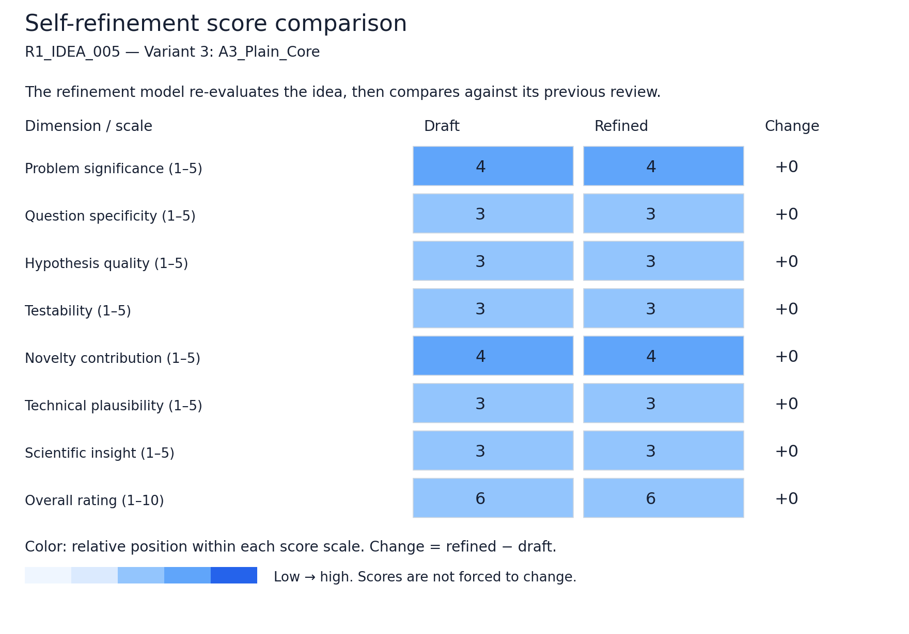

Changed score dimensions: none.

### Score justifications (draft / refined)

**Problem significance**

```json
{
  "draft": {
    "score": 4.0,
    "justification": "Improving the robustness of SSMs under distribution shifts is a significant problem. SSMs are emerging as strong alternatives to Transformers, but their robustness properties are less understood and often perceived as weaker. Solving this would have high practical value for deploying these models in real-world scenarios."
  },
  "refined": {
    "score": 4.0,
    "justification": "Improving the robustness of SSMs under distribution shifts is a significant problem. SSMs are emerging as strong alternatives to Transformers, but their robustness properties are less understood and often perceived as weaker. Solving this would have high practical value for deploying these models in real-world scenarios."
  }
}
```

**Question specificity**

```json
{
  "draft": {
    "score": 3.0,
    "justification": "The idea identifies the goal (TTA for SSMs) and the general mechanism (permutations + pseudo-labels), but the specific definitions of 'traversal permutations' and 'weight aggregation' are currently too vague to be fully evaluated as a concrete research question."
  },
  "refined": {
    "score": 3.0,
    "justification": "The idea identifies the goal (TTA for SSMs) and the general mechanism (permutations + pseudo-labels), but the specific definitions of 'traversal permutations' and 'weight aggregation' are currently too vague to be fully evaluated as a concrete research question. The core novelty hinges on these undefined operations."
  }
}
```

**Hypothesis quality**

```json
{
  "draft": {
    "score": 3.0,
    "justification": "The implicit hypothesis is that diverse structural traversals of the SSM generate diverse and useful pseudo-labels that can guide parameter updates. This is plausible but not yet specific enough to be a strong, falsifiable hypothesis without defining the 'diversity' and the 'update' mechanism."
  },
  "refined": {
    "score": 3.0,
    "justification": "The implicit hypothesis is that diverse structural traversals of the SSM generate diverse and useful pseudo-labels that can guide parameter updates. This is plausible but not yet specific enough to be a strong, falsifiable hypothesis without defining the 'diversity' and the 'update' mechanism."
  }
}
```

**Testability**

```json
{
  "draft": {
    "score": 3.0,
    "justification": "The idea is testable in principle (implement the method, run on shifted data), but the lack of specific algorithmic details makes it difficult to design a rigorous experiment immediately. The 'permutation' and 'aggregation' steps need formalization to be testable."
  },
  "refined": {
    "score": 3.0,
    "justification": "The idea is testable in principle (implement the method, run on shifted data), but the lack of specific algorithmic details makes it difficult to design a rigorous experiment immediately. The 'permutation' and 'aggregation' steps need formalization to be testable."
  }
}
```

**Novelty contribution**

```json
{
  "draft": {
    "score": 4.0,
    "justification": "Applying TTA to SSMs is novel. More importantly, the specific proposal to use 'traversal permutations' as a source of diversity for SSMs is a unique angle that could lead to new insights into how SSMs process sequential information, distinguishing it from generic TTA approaches."
  },
  "refined": {
    "score": 4.0,
    "justification": "Applying TTA to SSMs is novel. More importantly, the specific proposal to use 'traversal permutations' as a source of diversity for SSMs is a unique angle that could lead to new insights into how SSMs process sequential information, distinguishing it from generic TTA approaches."
  }
}
```

**Technical plausibility**

```json
{
  "draft": {
    "score": 3.0,
    "justification": "The general direction is plausible, but the specific mechanism of 'aggregating adapted weights' at test time is technically risky and non-standard. The feasibility depends entirely on how the 'permutations' are defined and whether the weight updates remain stable."
  },
  "refined": {
    "score": 3.0,
    "justification": "The general direction is plausible, but the specific mechanism of 'aggregating adapted weights' at test time is technically risky and non-standard. The feasibility depends entirely on how the 'permutations' are defined and whether the weight updates remain stable."
  }
}
```

**Scientific insight**

```json
{
  "draft": {
    "score": 3.0,
    "justification": "If successful, this could reveal how the internal state dynamics of SSMs can be leveraged for robustness, providing insights into the relationship between SSM structure and generalization. However, if it fails, it might just be a failed engineering attempt without deep theoretical insight unless the failure modes are analyzed."
  },
  "refined": {
    "score": 3.0,
    "justification": "If successful, this could reveal how the internal state dynamics of SSMs can be leveraged for robustness, providing insights into the relationship between SSM structure and generalization. However, if it fails, it might just be a failed engineering attempt without deep theoretical insight unless the failure modes are analyzed."
  }
}
```

**Overall rating**

```json
{
  "draft": {
    "score": 6.0,
    "justification": "This is a moderate-to-strong research idea with high potential significance. The problem is relevant, and the proposed mechanism is specific to the architecture. However, the current description lacks the necessary technical specificity to be considered a 'strong' or 'exceptional' idea. The vague definitions of 'permutations' and 'weight aggregation' prevent a higher score, as they are the core of the novelty. With better formalization, this could easily become a 7 or 8."
  },
  "refined": {
    "score": 6.0,
    "justification": "This is a moderate-to-strong research idea with high potential significance. The problem is relevant, and the proposed mechanism is specific to the architecture. However, the current description lacks the necessary technical specificity to be considered a 'strong' or 'exceptional' idea. The vague definitions of 'permutations' and 'weight aggregation' prevent a higher score, as they are the core of the novelty. With better formalization, this could easily become a 7 or 8."
  }
}
```

## R1_IDEA_005 — Variant 4: B1_Verbose_Elaborate


Changed score dimensions: none.

### Score justifications (draft / refined)

**Problem significance**

```json
{
  "draft": {
    "score": 4.0,
    "justification": "Improving the robustness of Vision SSMs is a highly significant problem as these models are gaining traction as alternatives to Transformers. Distribution shift robustness is a fundamental requirement for real-world deployment, making this a meaningful research direction."
  },
  "refined": {
    "score": 4.0,
    "justification": "Improving the robustness of Vision SSMs is a highly significant problem as these models are gaining traction as alternatives to Transformers. Distribution shift robustness is a fundamental requirement for real-world deployment, making this a meaningful research direction."
  }
}
```

**Question specificity**

```json
{
  "draft": {
    "score": 3.0,
    "justification": "The idea identifies the target (Vision SSMs), the setting (test-time adaptation), and the general mechanism (permutations + pseudo-labels). However, the specific definition of 'permutations of traversal' and the 'aggregation' method are currently vague, making the research question slightly broad."
  },
  "refined": {
    "score": 3.0,
    "justification": "The idea identifies the target (Vision SSMs), the setting (test-time adaptation), and the general mechanism (permutations + pseudo-labels). However, the specific definition of 'permutations of traversal' and the 'aggregation' method are currently vague, making the research question slightly broad."
  }
}
```

**Hypothesis quality**

```json
{
  "draft": {
    "score": 3.0,
    "justification": "The implicit hypothesis is that SSM-specific permutations generate more informative views for pseudo-labeling than standard augmentations. This is plausible but not explicitly stated or theoretically grounded in the summary, making it a moderate hypothesis."
  },
  "refined": {
    "score": 3.0,
    "justification": "The implicit hypothesis is that SSM-specific permutations generate more informative views for pseudo-labeling than standard augmentations. This is plausible but not explicitly stated or theoretically grounded in the summary, making it a moderate hypothesis."
  }
}
```

**Testability**

```json
{
  "draft": {
    "score": 4.0,
    "justification": "The idea is highly testable. One can implement the permutation strategy, run TTA on standard distribution shift benchmarks (e.g., ImageNet-C, domain shifts), and compare performance against baselines. The metrics (accuracy, robustness) are clear."
  },
  "refined": {
    "score": 4.0,
    "justification": "The idea is highly testable. One can implement the permutation strategy, run TTA on standard distribution shift benchmarks (e.g., ImageNet-C, domain shifts), and compare performance against baselines. The metrics (accuracy, robustness) are clear."
  }
}
```

**Novelty contribution**

```json
{
  "draft": {
    "score": 4.0,
    "justification": "Applying TTA to SSMs is novel. More importantly, proposing 'permutations of traversal' as a view generation strategy is a unique contribution that leverages the specific inductive biases of SSMs, distinguishing it from generic TTA approaches."
  },
  "refined": {
    "score": 4.0,
    "justification": "Applying TTA to SSMs is novel. More importantly, proposing 'permutations of traversal' as a view generation strategy is a unique contribution that leverages the specific inductive biases of SSMs, distinguishing it from generic TTA approaches."
  }
}
```

**Technical plausibility**

```json
{
  "draft": {
    "score": 3.0,
    "justification": "The idea is technically plausible but carries a risk. If the permutations destroy the sequential dependencies that SSMs rely on, the pseudo-labels may be noisy, and the adaptation could fail. The success depends heavily on the specific design of the permutations."
  },
  "refined": {
    "score": 3.0,
    "justification": "The idea is technically plausible but carries a risk. If the permutations destroy the sequential dependencies that SSMs rely on, the pseudo-labels may be noisy, and the adaptation could fail. The success depends heavily on the specific design of the permutations."
  }
}
```

**Scientific insight**

```json
{
  "draft": {
    "score": 4.0,
    "justification": "If successful, this research could reveal how SSMs encode information and which structural invariances are most critical for robustness. It could also provide insights into the relationship between sequence ordering and model generalization."
  },
  "refined": {
    "score": 4.0,
    "justification": "If successful, this research could reveal how SSMs encode information and which structural invariances are most critical for robustness. It could also provide insights into the relationship between sequence ordering and model generalization."
  }
}
```

**Overall rating**

```json
{
  "draft": {
    "score": 7.0,
    "justification": "This is a strong research idea with high potential. It addresses a relevant problem with a novel, architecture-specific approach. The main weakness lies in the current lack of technical detail regarding the 'permutations' and 'aggregation' mechanisms, which are critical for the method's success. With clearer formulation, this could be an exceptional contribution."
  },
  "refined": {
    "score": 7.0,
    "justification": "This is a strong research idea with high potential. It addresses a relevant problem with a novel, architecture-specific approach. The main weakness lies in the current lack of technical detail regarding the 'permutations' and 'aggregation' mechanisms, which are critical for the method's success. With clearer formulation, this could be an exceptional contribution."
  }
}
```

## R1_IDEA_005 — Variant 5: B2_Grand_Narrative

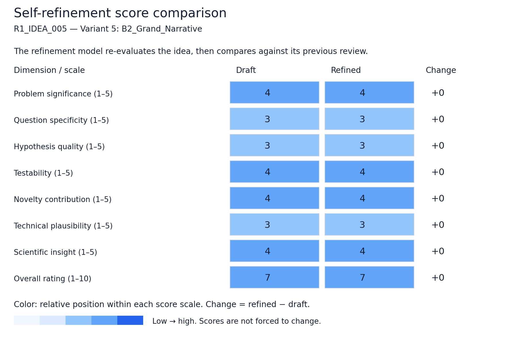

Changed score dimensions: none.

### Score justifications (draft / refined)

**Problem significance**

```json
{
  "draft": {
    "score": 4.0,
    "justification": "Improving the robustness of SSMs is a significant challenge in current ML research. As SSMs gain traction as alternatives to Transformers, understanding and fixing their brittleness under distribution shifts is crucial for their widespread adoption in safety-critical or real-world vision applications."
  },
  "refined": {
    "score": 4.0,
    "justification": "Improving the robustness of SSMs is a significant and timely challenge. As SSMs gain traction as alternatives to Transformers, understanding and fixing their brittleness under distribution shifts is crucial for their widespread adoption in safety-critical or real-world vision applications. The problem is meaningful and addresses a known limitation of the architecture."
  }
}
```

**Question specificity**

```json
{
  "draft": {
    "score": 3.0,
    "justification": "The idea identifies the general approach (TTA via permutations and pseudo-labels) but lacks specificity on the critical 'how'. The definition of 'SSM traversal permutations' is the most ambiguous part, making the research question somewhat open-ended."
  },
  "refined": {
    "score": 3.0,
    "justification": "The idea identifies the general approach (TTA via permutations and pseudo-labels) but lacks specificity on the critical 'how'. The definition of 'SSM traversal permutations' is the most ambiguous part, making the research question somewhat open-ended. It needs a more precise formulation of the mechanism to be fully specific."
  }
}
```

**Hypothesis quality**

```json
{
  "draft": {
    "score": 3.0,
    "justification": "The implicit hypothesis is that architectural-specific view generation (permutations) combined with self-training improves robustness. This is a plausible hypothesis, but it is not yet sharply defined in terms of the expected mechanism or the specific conditions under which it will fail."
  },
  "refined": {
    "score": 3.0,
    "justification": "The implicit hypothesis is that architectural-specific view generation (permutations) combined with self-training improves robustness. This is a plausible hypothesis, but it is not yet sharply defined in terms of the expected mechanism or the specific conditions under which it will fail. It relies on an assumption that 'permutations' create useful diversity."
  }
}
```

**Testability**

```json
{
  "draft": {
    "score": 4.0,
    "justification": "The idea is highly testable. One can implement the proposed permutation strategy, run standard TTA benchmarks (e.g., ImageNet-C, DomainNet), and compare performance against baselines. The metrics (accuracy under shift) are clear."
  },
  "refined": {
    "score": 4.0,
    "justification": "The idea is highly testable. One can implement the proposed permutation strategy, run standard TTA benchmarks (e.g., ImageNet-C, DomainNet), and compare performance against baselines. The metrics (accuracy under shift) are clear, even if the implementation details need refinement."
  }
}
```

**Novelty contribution**

```json
{
  "draft": {
    "score": 4.0,
    "justification": "Applying TTA to SSMs is novel. More importantly, proposing 'traversal permutations' as a source of diversity is a unique angle that differs from standard data augmentation or feature-space TTA. If successful, it could reveal new insights into the inductive biases of SSMs."
  },
  "refined": {
    "score": 4.0,
    "justification": "Applying TTA to SSMs is novel. More importantly, proposing 'traversal permutations' as a source of diversity is a unique angle that differs from standard data augmentation or feature-space TTA. If successful, it could reveal new insights into the inductive biases of SSMs."
  }
}
```

**Technical plausibility**

```json
{
  "draft": {
    "score": 3.0,
    "justification": "The general concept of TTA is plausible. However, the technical feasibility of 'permuting SSM traversal' without breaking the model's logic is uncertain. SSMs rely on specific orderings; arbitrary permutations might render the model's internal states meaningless unless the permutation is carefully designed (e.g., as a data augmentation rather than a structural change)."
  },
  "refined": {
    "score": 3.0,
    "justification": "The general concept of TTA is plausible. However, the technical feasibility of 'permuting SSM traversal' without breaking the model's logic is uncertain. SSMs rely on specific orderings; arbitrary permutations might render the model's internal states meaningless unless the permutation is carefully designed (e.g., as a data augmentation rather than a structural change). The weight update mechanism also needs careful design to be stable."
  }
}
```

**Scientific insight**

```json
{
  "draft": {
    "score": 4.0,
    "justification": "If the method works, it would provide significant insight into the relationship between SSM architecture, sequence ordering, and robustness. It could demonstrate that SSMs have latent invariances that can be exploited via specific traversal manipulations, offering a new perspective on model interpretability and robustness."
  },
  "refined": {
    "score": 4.0,
    "justification": "If the method works, it would provide significant insight into the relationship between SSM architecture, sequence ordering, and robustness. It could demonstrate that SSMs have latent invariances that can be exploited via specific traversal manipulations, offering a new perspective on model interpretability and robustness."
  }
}
```

**Overall rating**

```json
{
  "draft": {
    "score": 7.0,
    "justification": "This is a strong research idea with high potential. It targets a relevant problem (SSM robustness) with a novel mechanism (traversal permutations). While the specific implementation details are currently vague, the core concept is scientifically sound and testable. With clearer definitions of the 'permutations' and the adaptation strategy, this could be a high-impact contribution."
  },
  "refined": {
    "score": 7.0,
    "justification": "This is a strong research idea with high potential. It targets a relevant problem (SSM robustness) with a novel mechanism (traversal permutations). While the specific implementation details are currently vague, the core concept is scientifically sound and testable. With clearer definitions of the 'permutations' and the adaptation strategy, this could be a high-impact contribution."
  }
}
```

## R1_IDEA_005 — Variant 6: B3_Over_Confident

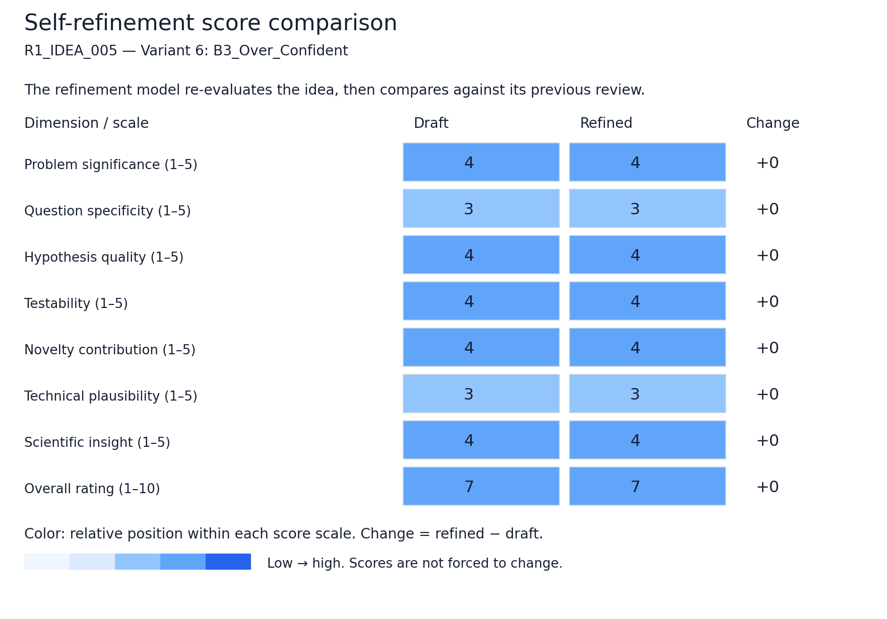

Changed score dimensions: none.

### Score justifications (draft / refined)

**Problem significance**

```json
{
  "draft": {
    "score": 4.0,
    "justification": "Improving the robustness of Vision SSMs is a highly significant problem given the rapid adoption of these architectures as alternatives to Transformers. Distribution shift robustness is a fundamental challenge in deploying ML systems, making this a meaningful research direction."
  },
  "refined": {
    "score": 4.0,
    "justification": "Improving the robustness of Vision SSMs is a highly significant problem given the rapid adoption of these architectures as alternatives to Transformers. Distribution shift robustness is a fundamental challenge in deploying ML systems, making this a meaningful research direction."
  }
}
```

**Question specificity**

```json
{
  "draft": {
    "score": 3.0,
    "justification": "The idea identifies the goal (robustness via TTA) and the target (Mamba/SSMs), but the core mechanism ('diverse SSM traversal permutations') is currently too vague to be fully evaluated. The specific nature of the permutations and the aggregation method needs more definition."
  },
  "refined": {
    "score": 3.0,
    "justification": "The idea identifies the goal (robustness via TTA) and the target (Mamba/SSMs), but the core mechanism ('diverse SSM traversal permutations') is currently too vague to be fully evaluated. The specific nature of the permutations and the aggregation method needs more definition."
  }
}
```

**Hypothesis quality**

```json
{
  "draft": {
    "score": 4.0,
    "justification": "The implicit hypothesis is that structural permutations of the SSM state space can generate diverse, informative views that, when used for self-training, lead to better generalization than standard methods. This is a concrete, falsifiable claim that distinguishes the work from generic applications."
  },
  "refined": {
    "score": 4.0,
    "justification": "The implicit hypothesis is that structural permutations of the SSM state space can generate diverse, informative views that, when used for self-training, lead to better generalization than standard methods. This is a concrete, falsifiable claim that distinguishes the work from generic applications."
  }
}
```

**Testability**

```json
{
  "draft": {
    "score": 4.0,
    "justification": "The idea is highly testable. One can implement specific permutation strategies, run standard TTA benchmarks (e.g., ImageNet-C, domain shifts), and compare performance against baselines. The use of pseudo-labels and weight aggregation provides clear metrics for evaluation."
  },
  "refined": {
    "score": 4.0,
    "justification": "The idea is highly testable. One can implement specific permutation strategies, run standard TTA benchmarks (e.g., ImageNet-C, domain shifts), and compare performance against baselines. The use of pseudo-labels and weight aggregation provides clear metrics for evaluation."
  }
}
```

**Novelty contribution**

```json
{
  "draft": {
    "score": 4.0,
    "justification": "Applying TTA to SSMs is novel, but the specific proposal to use 'traversal permutations' as the source of diversity is a strong, unique contribution. It moves beyond simple data augmentation to structural manipulation, which could yield new insights into SSM dynamics."
  },
  "refined": {
    "score": 4.0,
    "justification": "Applying TTA to SSMs is novel, but the specific proposal to use 'traversal permutations' as the source of diversity is a strong, unique contribution. It moves beyond simple data augmentation to structural manipulation, which could yield new insights into SSM dynamics."
  }
}
```

**Technical plausibility**

```json
{
  "draft": {
    "score": 3.0,
    "justification": "The idea is technically plausible in principle, as SSMs have defined state transitions that can theoretically be permuted. However, without a clear definition of valid permutations that preserve the model's integrity while creating diversity, the feasibility is uncertain. The aggregation of weights at test time also requires careful handling to avoid instability."
  },
  "refined": {
    "score": 3.0,
    "justification": "The idea is technically plausible in principle, as SSMs have defined state transitions that can theoretically be permuted. However, without a clear definition of valid permutations that preserve the model's integrity while creating diversity, the feasibility is uncertain. The aggregation of weights at test time also requires careful handling to avoid instability."
  }
}
```

**Scientific insight**

```json
{
  "draft": {
    "score": 4.0,
    "justification": "If successful, this research could reveal how the internal state dynamics of SSMs can be leveraged for robustness, offering insights into the relationship between recurrence structure and generalization. It could also establish new principles for TTA in non-attention-based architectures."
  },
  "refined": {
    "score": 4.0,
    "justification": "If successful, this research could reveal how the internal state dynamics of SSMs can be leveraged for robustness, offering insights into the relationship between recurrence structure and generalization. It could also establish new principles for TTA in non-attention-based architectures."
  }
}
```

**Overall rating**

```json
{
  "draft": {
    "score": 7.0,
    "justification": "This is a strong research idea with high potential. It addresses a relevant problem with a novel, architecture-specific approach. The main limitation is the current lack of specificity regarding the 'permutations' and 'aggregation' mechanisms. With clearer definitions, this could be an exceptional contribution to the field of robust deep learning."
  },
  "refined": {
    "score": 7.0,
    "justification": "This is a strong research idea with high potential. It addresses a relevant problem with a novel, architecture-specific approach. The main limitation is the current lack of specificity regarding the 'permutations' and 'aggregation' mechanisms. With clearer definitions, this could be an exceptional contribution to the field of robust deep learning."
  }
}
```

## R1_IDEA_005 — Variant 7: B4_Novelty

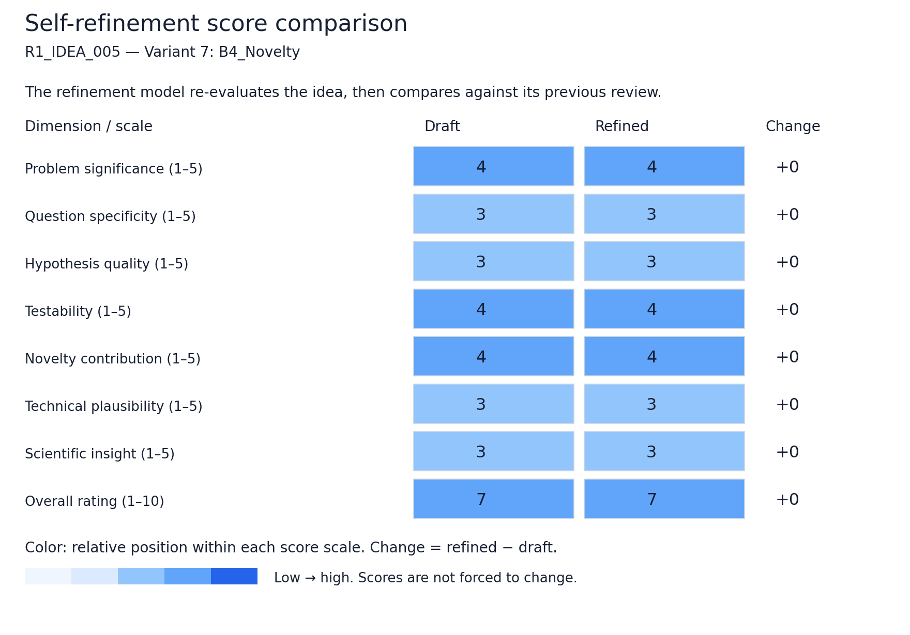

Changed score dimensions: none.

### Score justifications (draft / refined)

**Problem significance**

```json
{
  "draft": {
    "score": 4.0,
    "justification": "Improving the robustness of SSMs (a hot topic in ML) under distribution shifts is highly significant. As SSMs challenge Transformers in efficiency and performance, understanding their failure modes and adaptation capabilities is crucial for their broader adoption."
  },
  "refined": {
    "score": 4.0,
    "justification": "The problem is highly significant. As State Space Models (SSMs) like Mamba challenge Transformers in efficiency and long-context modeling, understanding their robustness and adaptation capabilities under distribution shifts is crucial for their broader adoption in safety-critical or real-world vision tasks."
  }
}
```

**Question specificity**

```json
{
  "draft": {
    "score": 3.0,
    "justification": "The idea identifies a method (permutation-based TTA) and a goal (robustness), but the core mechanism ('traversal permutations') is described vaguely. The specific nature of the permutations and the update rule needs more definition to be considered a specific research question."
  },
  "refined": {
    "score": 3.0,
    "justification": "The idea identifies a goal (robustness) and a high-level approach (permutation-based TTA), but the core mechanism ('SSM traversal permutations') is described vaguely. The specific nature of the permutations and the update rule needs more definition to be considered a fully specific research question."
  }
}
```

**Hypothesis quality**

```json
{
  "draft": {
    "score": 3.0,
    "justification": "The implicit hypothesis is that 'diverse SSM traversal permutations + pseudo-label adaptation' yields better robustness than standard methods. This is testable, but the mechanism linking permutations to robustness is not yet clearly articulated as a causal relationship."
  },
  "refined": {
    "score": 3.0,
    "justification": "The implicit hypothesis is that 'diverse SSM traversal permutations + pseudo-label adaptation' yields better robustness than standard methods. This is testable, but the causal mechanism linking the specific permutation strategy to robustness is not yet clearly articulated."
  }
}
```

**Testability**

```json
{
  "draft": {
    "score": 4.0,
    "justification": "The idea is highly testable. One can implement the proposed permutation strategy, run it on standard distribution shift benchmarks (e.g., ImageNet-C, DomainNet), and compare performance against baselines. The use of pseudo-labels and weight aggregation provides clear metrics for evaluation."
  },
  "refined": {
    "score": 4.0,
    "justification": "The idea is highly testable. One can implement the proposed permutation strategy on standard distribution shift benchmarks (e.g., ImageNet-C, DomainNet) and compare performance against baselines. The use of pseudo-labels and weight aggregation provides clear metrics for evaluation, even if the implementation details are currently abstract."
  }
}
```

**Novelty contribution**

```json
{
  "draft": {
    "score": 4.0,
    "justification": "Applying TTA to SSMs is relatively new. The specific angle of using 'traversal permutations' to generate views is a novel conceptual contribution, distinct from standard data augmentation or feature-space TTA methods."
  },
  "refined": {
    "score": 4.0,
    "justification": "Applying TTA to SSMs is relatively new. The specific angle of using 'traversal permutations' to generate views is a novel conceptual contribution, distinct from standard data augmentation or feature-space TTA methods. If the mechanism is sound, it could open a new subfield of architecture-aware TTA."
  }
}
```

**Technical plausibility**

```json
{
  "draft": {
    "score": 3.0,
    "justification": "The idea is plausible but carries technical risks. The definition of 'permuting traversal' in a sequential model is non-trivial and could be structurally invalid. The feasibility of updating weights at test time without degrading the model's inductive biases needs careful validation."
  },
  "refined": {
    "score": 3.0,
    "justification": "The idea is plausible but carries significant technical risks. The definition of 'permuting traversal' in a sequential model is non-trivial and could be structurally invalid or destructive. The feasibility of updating weights at test time without degrading the model's inductive biases or causing instability needs careful validation."
  }
}
```

**Scientific insight**

```json
{
  "draft": {
    "score": 3.0,
    "justification": "If successful, this could reveal how the internal state dynamics of SSMs can be leveraged for adaptation, offering insights into the relationship between SSM structure and robustness. However, if the 'permutation' idea is just a heuristic without deeper theoretical grounding, the insight may be limited to empirical performance gains."
  },
  "refined": {
    "score": 3.0,
    "justification": "If successful, this could reveal how the internal state dynamics of SSMs can be leveraged for adaptation, offering insights into the relationship between SSM structure and robustness. However, if the 'permutation' idea is merely a heuristic without deeper theoretical grounding, the insight may be limited to empirical performance gains."
  }
}
```

**Overall rating**

```json
{
  "draft": {
    "score": 7.0,
    "justification": "This is a strong research idea with high potential novelty and significance. It addresses a relevant problem with a unique angle (SSM-specific permutations). The main drawback is the current lack of specificity regarding the 'permutation' mechanism and the technical feasibility of the update rule. With clearer definitions, this could be an exceptional contribution."
  },
  "refined": {
    "score": 7.0,
    "justification": "This is a strong research idea with high potential novelty and significance. It addresses a relevant problem with a unique angle (SSM-specific permutations). The main drawback is the current lack of specificity regarding the 'permutation' mechanism and the technical feasibility of the update rule. With clearer definitions, this could be an exceptional contribution."
  }
}
```

## R1_IDEA_005 — Variant 8: B5_Application_Impact

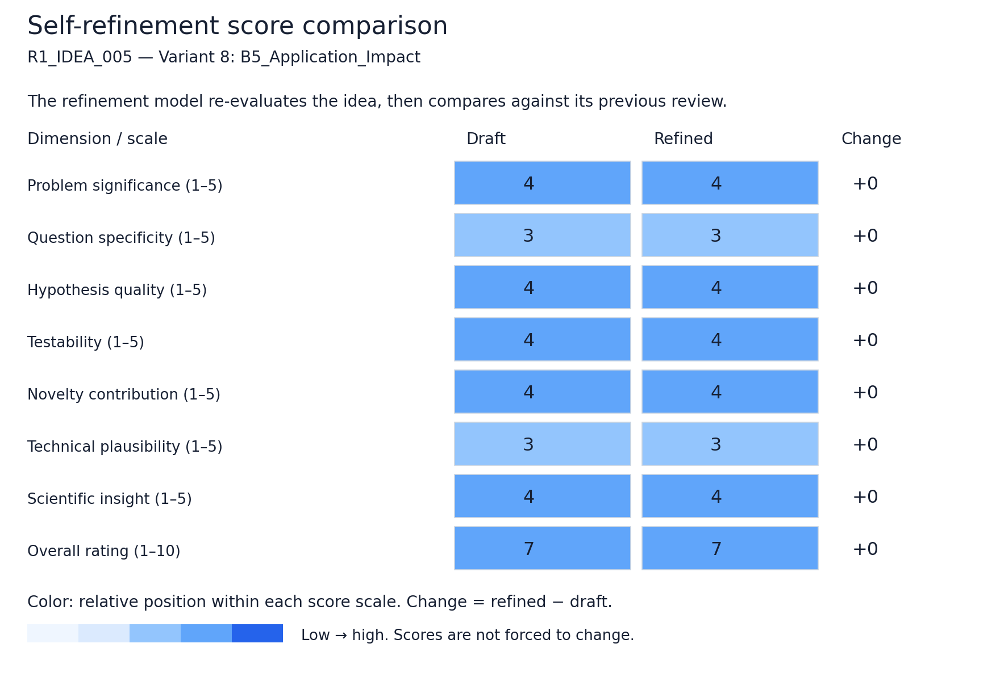

Changed score dimensions: none.

### Score justifications (draft / refined)

**Problem significance**

```json
{
  "draft": {
    "score": 4.0,
    "justification": "Improving the robustness of Vision SSMs is a significant problem. As SSMs challenge Transformers in efficiency and long-range dependency modeling, ensuring they generalize well under distribution shifts is crucial for their adoption in real-world systems. The scarcity of labeled data makes TTA a highly relevant solution."
  },
  "refined": {
    "score": 4.0,
    "justification": "Improving the robustness of Vision SSMs is a significant problem. As SSMs challenge Transformers in efficiency and long-range dependency modeling, ensuring they generalize well under distribution shifts is crucial for their adoption in real-world systems. The scarcity of labeled data makes TTA a highly relevant solution."
  }
}
```

**Question specificity**

```json
{
  "draft": {
    "score": 3.0,
    "justification": "The idea identifies the target (Vision SSMs), the method (TTA via permutations and pseudo-labels), and the goal (robustness). However, the core mechanism ('traversal permutations') is described vaguely, and the specific parameters to be updated are not detailed, leaving the research question somewhat open to interpretation."
  },
  "refined": {
    "score": 3.0,
    "justification": "The idea identifies the target (Vision SSMs), the method (TTA via permutations and pseudo-labels), and the goal (robustness). However, the core mechanism ('traversal permutations') is described vaguely, and the specific parameters to be updated are not detailed, leaving the research question somewhat open to interpretation."
  }
}
```

**Hypothesis quality**

```json
{
  "draft": {
    "score": 4.0,
    "justification": "The implicit hypothesis is strong: that structurally diverse views generated via SSM permutations can produce reliable pseudo-labels that guide effective parameter updates. This is a testable claim that distinguishes the work from generic TTA applications."
  },
  "refined": {
    "score": 4.0,
    "justification": "The implicit hypothesis is strong: that structurally diverse views generated via SSM permutations can produce reliable pseudo-labels that guide effective parameter updates. This is a testable claim that distinguishes the work from generic TTA applications."
  }
}
```

**Testability**

```json
{
  "draft": {
    "score": 4.0,
    "justification": "The idea is highly testable. One can implement the proposed permutation strategy, generate pseudo-labels, update parameters, and compare performance against baselines on standard distribution shift benchmarks (e.g., ImageNet-C, DomainNet). The success or failure of the 'permutation' strategy can be empirically validated."
  },
  "refined": {
    "score": 4.0,
    "justification": "The idea is highly testable. One can implement the proposed permutation strategy, generate pseudo-labels, update parameters, and compare performance against baselines on standard distribution shift benchmarks (e.g., ImageNet-C, DomainNet). The success or failure of the 'permutation' strategy can be empirically validated."
  }
}
```

**Novelty contribution**

```json
{
  "draft": {
    "score": 4.0,
    "justification": "Applying TTA to SSMs is novel, but the specific use of 'traversal permutations' to generate views is a unique contribution. If successful, this could reveal new insights into the internal dynamics of SSMs and how they can be leveraged for self-supervised adaptation."
  },
  "refined": {
    "score": 4.0,
    "justification": "Applying TTA to SSMs is novel, but the specific use of 'traversal permutations' to generate views is a unique contribution. If successful, this could reveal new insights into the internal dynamics of SSMs and how they can be leveraged for self-supervised adaptation."
  }
}
```

**Technical plausibility**

```json
{
  "draft": {
    "score": 3.0,
    "justification": "The idea is technically plausible in principle, as SSMs have defined state transitions that could theoretically be permuted. However, the feasibility depends heavily on whether such permutations preserve the semantic integrity of the input. Without a clear definition of the permutation, the technical soundness is uncertain."
  },
  "refined": {
    "score": 3.0,
    "justification": "The idea is technically plausible in principle, as SSMs have defined state transitions that could theoretically be permuted. However, the feasibility depends heavily on whether such permutations preserve the semantic integrity of the input. Without a clear definition of the permutation, the technical soundness is uncertain."
  }
}
```

**Scientific insight**

```json
{
  "draft": {
    "score": 4.0,
    "justification": "If successful, this research could provide deep insights into the inductive biases of SSMs and how their internal state dynamics can be exploited for robustness. It moves beyond 'applying a method' to 'understanding the model's structure' for adaptation."
  },
  "refined": {
    "score": 4.0,
    "justification": "If successful, this research could provide deep insights into the inductive biases of SSMs and how their internal state dynamics can be exploited for robustness. It moves beyond 'applying a method' to 'understanding the model's structure' for adaptation."
  }
}
```

**Overall rating**

```json
{
  "draft": {
    "score": 7.0,
    "justification": "This is a strong research idea with high potential. It addresses a meaningful problem in a cutting-edge architecture (SSMs) with a creative, albeit slightly vague, mechanism. The hypothesis is testable and could yield significant scientific insight into SSM robustness. The main drawback is the lack of specificity regarding the 'traversal permutations' and the aggregation strategy, which needs to be fleshed out for the idea to be fully actionable."
  },
  "refined": {
    "score": 7.0,
    "justification": "This is a strong research idea with high potential. It addresses a meaningful problem in a cutting-edge architecture (SSMs) with a creative, albeit slightly vague, mechanism. The hypothesis is testable and could yield significant scientific insight into SSM robustness. The main drawback is the lack of specificity regarding the 'traversal permutations' and the aggregation strategy, which needs to be fleshed out for the idea to be fully actionable."
  }
}
```

## R1_IDEA_005 — Variant 9: C1_Hollow_Shell

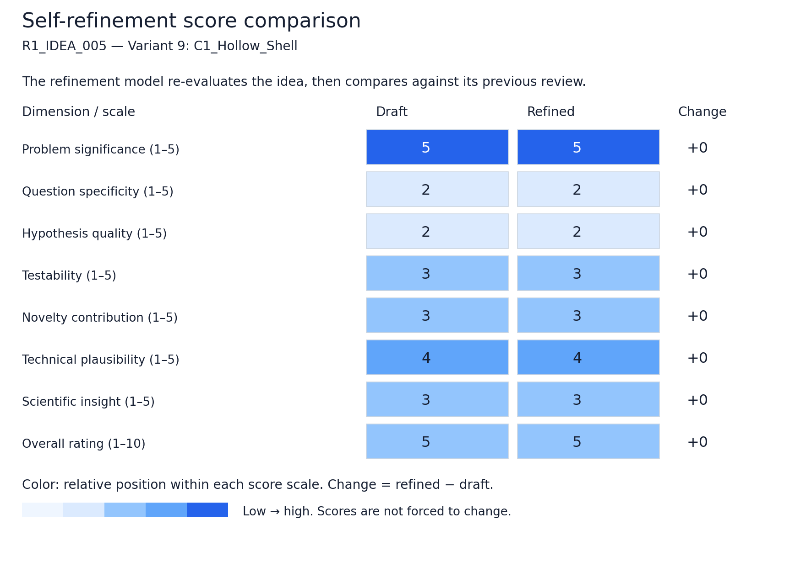

Changed score dimensions: none.

### Score justifications (draft / refined)

**Problem significance**

```json
{
  "draft": {
    "score": 5.0,
    "justification": "Improving robustness to distribution shifts without labeled data is a critical challenge in deploying machine learning systems in dynamic environments. Solving this has high practical value."
  },
  "refined": {
    "score": 5.0,
    "justification": "The problem of distribution shift without labeled data is a fundamental bottleneck in deploying ML systems. Solving this has immense practical value and scientific importance."
  }
}
```

**Question specificity**

```json
{
  "draft": {
    "score": 2.0,
    "justification": "The idea is currently too broad. Terms like 'information generated by the model' and 'combines adjustments' are not specific enough to define a concrete research question or mechanism."
  },
  "refined": {
    "score": 2.0,
    "justification": "The idea is currently too abstract. Key terms like 'information,' 'updates,' and 'combines' are undefined, preventing the formulation of a concrete research question or mechanism."
  }
}
```

**Hypothesis quality**

```json
{
  "draft": {
    "score": 2.0,
    "justification": "There is no explicit hypothesis. The statement is a goal ('improve performance') rather than a testable prediction about a mechanism or relationship."
  },
  "refined": {
    "score": 2.0,
    "justification": "There is no explicit hypothesis. The text states a goal ('improve performance') rather than a testable prediction about the relationship between the proposed mechanism and the outcome."
  }
}
```

**Testability**

```json
{
  "draft": {
    "score": 3.0,
    "justification": "While the general goal is testable (compare performance on shifted data), the lack of methodological detail makes it impossible to design a specific experiment or ablation study at this stage. It is testable in principle but not in practice yet."
  },
  "refined": {
    "score": 3.0,
    "justification": "While the general goal is testable (comparing performance on shifted data), the lack of methodological detail makes it impossible to design a specific experiment or ablation study at this stage. It is testable in principle but not yet in practice."
  }
}
```

**Novelty contribution**

```json
{
  "draft": {
    "score": 3.0,
    "justification": "The general direction of TTA is well-trodden. The novelty depends entirely on the unspecified 'information' and 'adjustment' mechanisms. As stated, it sounds like a generic application of TTA principles rather than a novel discovery."
  },
  "refined": {
    "score": 3.0,
    "justification": "The general direction of TTA is well-established. The novelty depends entirely on the unspecified mechanisms. As stated, it reads as a generic application of TTA principles rather than a novel discovery or theoretical contribution."
  }
}
```

**Technical plausibility**

```json
{
  "draft": {
    "score": 4.0,
    "justification": "The concept of using model-generated signals for test-time updates is technically sound and aligns with established principles in self-supervised learning and TTA. The logic is coherent, even if details are missing."
  },
  "refined": {
    "score": 4.0,
    "justification": "The underlying logic is sound: using internal signals (like entropy or feature consistency) to guide test-time updates is a known and plausible strategy. The reasoning is coherent, even if details are missing."
  }
}
```

**Scientific insight**

```json
{
  "draft": {
    "score": 3.0,
    "justification": "If successful, the study could reveal how specific internal model signals correlate with robustness. However, as currently described, it risks being a simple engineering improvement without deep theoretical insight."
  },
  "refined": {
    "score": 3.0,
    "justification": "If successful, the study could reveal how specific internal signals correlate with robustness. However, without a defined mechanism, it risks being a simple engineering improvement without deep theoretical insight."
  }
}
```

**Overall rating**

```json
{
  "draft": {
    "score": 5.0,
    "justification": "The research idea addresses a high-significance problem and proposes a plausible direction (TTA using internal signals). However, it is currently too vague to be considered a strong research proposal. It lacks the specificity required to define a hypothesis, mechanism, or testable question. It sits at the 'moderate/borderline' level because the core concept is valid, but the execution plan is undefined."
  },
  "refined": {
    "score": 5.0,
    "justification": "The idea addresses a high-significance problem with a plausible direction (TTA using internal signals). However, it is currently too vague to be considered a strong research proposal. The lack of specificity in the mechanism, hypothesis, and evaluation criteria places it at the 'moderate/borderline' level. It is a valid starting point but requires significant elaboration to be a complete research idea."
  }
}
```

## R1_IDEA_005 — Variant 10: C2_Logic_Flawed

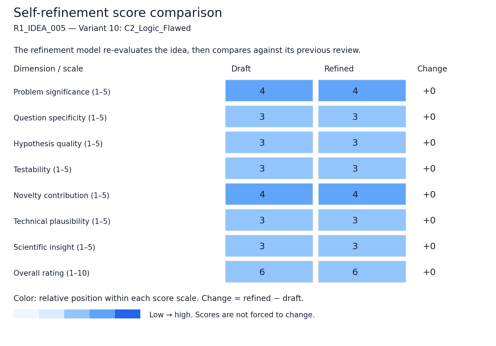

Changed score dimensions: none.

### Score justifications (draft / refined)

**Problem significance**

```json
{
  "draft": {
    "score": 4.0,
    "justification": "Improving the robustness of SSMs (a hot topic in ML) under distribution shifts is highly significant. As SSMs challenge Transformers in efficiency and long-range dependency modeling, ensuring they are robust in real-world, non-i.i.d. settings is a crucial research direction."
  },
  "refined": {
    "score": 4.0,
    "justification": "Improving the robustness of SSMs is a critical challenge as these models gain traction as alternatives to Transformers. Ensuring they generalize well under distribution shifts is essential for real-world deployment, making the problem highly significant."
  }
}
```

**Question specificity**

```json
{
  "draft": {
    "score": 3.0,
    "justification": "The idea identifies the goal (robustness) and the general approach (TTA with pseudo-labels and permutations), but the core mechanism ('traversal permutations') is not sufficiently defined to be a concrete research question. It reads more like a high-level concept than a specific hypothesis."
  },
  "refined": {
    "score": 3.0,
    "justification": "While the goal (robustness) and general approach (TTA) are clear, the central mechanism ('traversal permutations') is too vague to be a concrete research question. It requires a precise definition to distinguish it from generic shuffling or other augmentation techniques."
  }
}
```

**Hypothesis quality**

```json
{
  "draft": {
    "score": 3.0,
    "justification": "The implicit hypothesis is that 'diverse SSM traversal permutations generate useful pseudo-labels that improve robustness.' This is plausible but currently too broad. It needs to specify *which* permutations and *why* they are better than alternatives to be a strong, falsifiable hypothesis."
  },
  "refined": {
    "score": 3.0,
    "justification": "The implicit hypothesis—that diverse traversal permutations lead to better generalization via pseudo-label aggregation—is plausible but currently too broad. It lacks a specific prediction about the mechanism of improvement or a clear boundary condition where it would fail."
  }
}
```

**Testability**

```json
{
  "draft": {
    "score": 3.0,
    "justification": "The idea is testable in principle (implement the method, run on shifted data), but the lack of definition for 'traversal permutations' and the update rule makes it difficult to design a rigorous experiment immediately. The evaluation metric (generalization) is clear, but the independent variable is not."
  },
  "refined": {
    "score": 3.0,
    "justification": "The idea is testable in principle, but the lack of definition for the core mechanism makes designing a rigorous experiment difficult. The evaluation metric (generalization) is clear, but the independent variable (the permutation strategy) is not operationalized."
  }
}
```

**Novelty contribution**

```json
{
  "draft": {
    "score": 4.0,
    "justification": "Applying TTA to SSMs is novel. The specific idea of using 'traversal permutations' to generate views is a unique angle that, if well-defined, could offer significant insight into the inductive biases of SSMs. However, if 'permutations' turn out to be a rebranding of standard shuffling, the novelty would drop."
  },
  "refined": {
    "score": 4.0,
    "justification": "Applying TTA to SSMs is novel, and the specific angle of using traversal permutations is a unique contribution. If well-defined, it could offer significant insights into the inductive biases of SSMs. However, if the permutations are trivial, the novelty would be limited."
  }
}
```

**Technical plausibility**

```json
{
  "draft": {
    "score": 3.0,
    "justification": "The idea is technically plausible but risky. SSMs rely on ordered sequences; arbitrary permutations might break the state dynamics. The plausibility hinges entirely on the specific definition of 'traversal permutations' which is currently missing. If the permutations are carefully designed (e.g., sliding window shifts, state re-initializations), it could work."
  },
  "refined": {
    "score": 3.0,
    "justification": "The idea is technically risky. SSMs are inherently sequential; arbitrary permutations could break the state dynamics. The plausibility hinges entirely on a specific, non-trivial definition of 'traversal permutations' that preserves the model's integrity, which is not provided."
  }
}
```

**Scientific insight**

```json
{
  "draft": {
    "score": 3.0,
    "justification": "If successful, this could reveal how the internal state dynamics of SSMs can be leveraged for robustness, offering insights into the relationship between sequence ordering and feature stability. However, as currently stated, it risks being a simple engineering application without deep theoretical insight."
  },
  "refined": {
    "score": 3.0,
    "justification": "If successful, the research could reveal how internal state dynamics of SSMs can be leveraged for robustness. However, as currently stated, it risks being a simple engineering application without deep theoretical insight into the relationship between sequence ordering and feature stability."
  }
}
```

**Overall rating**

```json
{
  "draft": {
    "score": 6.0,
    "justification": "The research idea addresses a significant problem with a potentially novel mechanism, earning it a moderate-to-strong start. However, the lack of specificity regarding the core mechanism ('traversal permutations') and the update strategy prevents it from being a 'strong' or 'exceptional' idea at this stage. It is a promising direction that requires significant refinement to become a concrete, testable hypothesis."
  },
  "refined": {
    "score": 6.0,
    "justification": "The research idea addresses a significant and timely problem with a potentially novel mechanism. However, the lack of specificity regarding the core mechanism ('traversal permutations') and the update strategy prevents it from being a 'strong' or 'exceptional' idea at this stage. It is a promising direction that requires significant refinement to become a concrete, testable hypothesis. The score reflects a moderate-to-strong potential that is currently limited by ambiguity."
  }
}
```

## R1_IDEA_005 — Variant 11: C3_Substance_Enriched

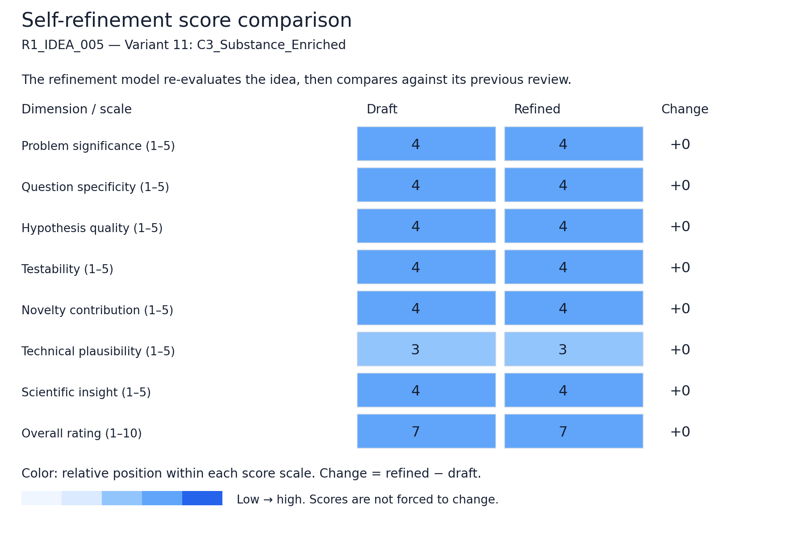

Changed score dimensions: none.

### Score justifications (draft / refined)

**Problem significance**

```json
{
  "draft": {
    "score": 4.0,
    "justification": "Robustness of Vision SSMs is a significant open problem. As SSMs challenge Transformers in efficiency and long-range dependency modeling, understanding their failure modes under distribution shifts is crucial for their deployment in real-world scenarios."
  },
  "refined": {
    "score": 4.0,
    "justification": "Improving the robustness of Vision SSMs is a significant and timely problem. As SSMs challenge Transformers in efficiency and long-range dependency modeling, understanding and fixing their failure modes under distribution shifts is crucial for their deployment in real-world scenarios. The problem is meaningful to both researchers and practitioners."
  }
}
```

**Question specificity**

```json
{
  "draft": {
    "score": 4.0,
    "justification": "The idea clearly identifies the target (Vision SSMs), the setting (test-time adaptation), and the mechanism (permutation-based view generation). However, the exact definition of 'permutations' and the 'aggregation' logic remains slightly vague, which is acceptable for an idea summary but needs refinement for execution."
  },
  "refined": {
    "score": 4.0,
    "justification": "The idea clearly identifies the target (Vision SSMs), the setting (test-time adaptation), and the mechanism (permutation-based view generation). However, the exact definition of 'permutations' and the 'aggregation' logic remains slightly vague, which is acceptable for an idea summary but needs refinement for execution. The hypothesis is specific enough to be testable."
  }
}
```

**Hypothesis quality**

```json
{
  "draft": {
    "score": 4.0,
    "justification": "The hypothesis that 'diversity of permutations helps capture invariant features' is concrete, plausible, and falsifiable. It moves beyond a generic 'this will work' claim to propose a specific mechanism for why the method should succeed."
  },
  "refined": {
    "score": 4.0,
    "justification": "The hypothesis that 'diversity of permutations helps capture invariant features' is concrete, plausible, and falsifiable. It moves beyond a generic 'this will work' claim to propose a specific mechanism for why the method should succeed. It distinguishes the proposed investigation from generic data augmentation."
  }
}
```

**Testability**

```json
{
  "draft": {
    "score": 4.0,
    "justification": "The idea suggests clear evaluation paths: comparing performance on synthetic-to-real shifts, varying hyperparameters for aggregation, and analyzing the effect of permutation diversity. The use of pseudo-labels provides a clear metric for self-supervision."
  },
  "refined": {
    "score": 4.0,
    "justification": "The idea suggests clear evaluation paths: comparing performance on synthetic-to-real shifts, varying hyperparameters for aggregation, and analyzing the effect of permutation diversity. The use of pseudo-labels provides a clear metric for self-supervision. The proposed validation steps are actionable."
  }
}
```

**Novelty contribution**

```json
{
  "draft": {
    "score": 4.0,
    "justification": "Applying permutation-based view generation specifically to the internal traversal of SSMs for TTA is a novel angle. Most TTA methods rely on standard image augmentations; leveraging the structural recurrence of SSMs for this purpose is a fresh contribution."
  },
  "refined": {
    "score": 4.0,
    "justification": "Applying permutation-based view generation specifically to the internal traversal of SSMs for TTA is a novel angle. Most TTA methods rely on standard image augmentations; leveraging the structural recurrence of SSMs for this purpose is a fresh contribution that could yield new insights into SSM dynamics."
  }
}
```

**Technical plausibility**

```json
{
  "draft": {
    "score": 3.0,
    "justification": "While the general direction is sound, the technical feasibility of 'aggregating adapted weights' at test time is the weakest link. Standard TTA usually adapts a small subset of parameters (like BN stats) or a head. Updating the core SSM weights and aggregating them requires careful design to ensure stability, making the plausibility moderate until the mechanism is detailed."
  },
  "refined": {
    "score": 3.0,
    "justification": "While the general direction is sound, the technical feasibility of 'aggregating adapted weights' at test time is the weakest link. Standard TTA usually adapts a small subset of parameters (like BN stats) or a head. Updating the core SSM weights and aggregating them requires careful theoretical justification to avoid catastrophic forgetting or instability. The idea lacks details on how this stability is maintained."
  }
}
```

**Scientific insight**

```json
{
  "draft": {
    "score": 4.0,
    "justification": "If successful, this research would reveal how the structural inductive biases of SSMs can be exploited for robustness. It could provide insights into the relationship between sequence permutation and feature invariance in state-space architectures."
  },
  "refined": {
    "score": 4.0,
    "justification": "If successful, this research would reveal how the structural inductive biases of SSMs can be exploited for robustness. It could provide insights into the relationship between sequence permutation and feature invariance in state-space architectures, which is a valuable scientific contribution beyond just a performance boost."
  }
}
```

**Overall rating**

```json
{
  "draft": {
    "score": 7.0,
    "justification": "This is a strong research idea with high potential. It addresses a relevant problem with a novel, mechanism-driven approach. The main limitation is the current lack of detail on the 'aggregation' and 'permutation' mechanics, which are critical for technical plausibility. However, the core hypothesis is compelling and the direction is scientifically valuable."
  },
  "refined": {
    "score": 7.0,
    "justification": "This is a strong research idea with high potential. It addresses a relevant problem with a novel, mechanism-driven approach. The main limitation is the current lack of detail on the 'aggregation' and 'permutation' mechanics, which are critical for technical plausibility. However, the core hypothesis is compelling and the direction is scientifically valuable. It warrants further investigation."
  }
}
```

## R1_IDEA_005 — Variant 12: H1_Deceptive_Hollow

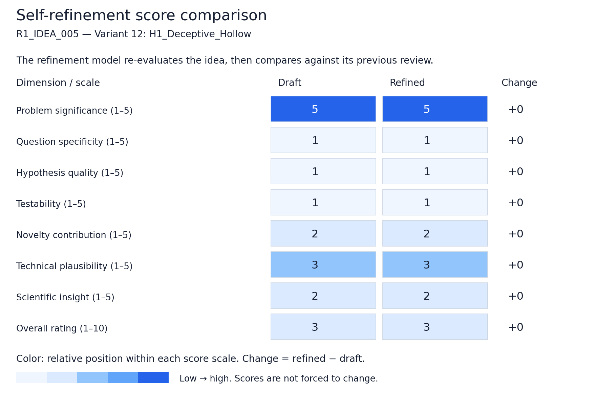

Changed score dimensions: none.

### Score justifications (draft / refined)

**Problem significance**

```json
{
  "draft": {
    "score": 5.0,
    "justification": "The problem of improving model robustness under distribution shifts via test-time adaptation is of critical importance to the deployment of reliable AI systems. Solving this is a high-priority goal for the community."
  },
  "refined": {
    "score": 5.0,
    "justification": "The problem of improving model robustness under distribution shifts via test-time adaptation is of paramount importance for deploying reliable AI in real-world scenarios where data distributions change and retraining is infeasible. Solving this is a top priority for the machine learning community."
  }
}
```

**Question specificity**

```json
{
  "draft": {
    "score": 1.0,
    "justification": "The idea is presented as a broad agenda rather than a specific question. It lacks a defined research question, specific mechanism, or clear boundary conditions, making it impossible to determine exactly what is being investigated."
  },
  "refined": {
    "score": 1.0,
    "justification": "The idea is presented as a broad, high-level agenda rather than a specific research question. It lacks a defined mechanism, specific variables, or clear boundary conditions, making it impossible to determine exactly what is being investigated or what constitutes a successful outcome."
  }
}
```

**Hypothesis quality**

```json
{
  "draft": {
    "score": 1.0,
    "justification": "There is no explicit or implicit hypothesis that can be supported or contradicted. The text makes grand claims about 'reshaping' the field but offers no concrete prediction about model behavior or performance relationships."
  },
  "refined": {
    "score": 1.0,
    "justification": "There is no explicit or implicit hypothesis that can be supported or contradicted by evidence. The text makes grand claims about 'reshaping' the field but offers no concrete prediction about model behavior, performance relationships, or specific mechanisms."
  }
}
```

**Testability**

```json
{
  "draft": {
    "score": 1.0,
    "justification": "Without details on the method, the evaluation metrics, or the specific comparison points, the idea is not currently testable. One cannot design an experiment to verify a 'transformative synthesis' without knowing the synthesis."
  },
  "refined": {
    "score": 1.0,
    "justification": "Without details on the method, evaluation metrics, or specific comparison points, the idea is not currently testable. One cannot design an experiment to verify a 'transformative synthesis' without knowing the synthesis itself."
  }
}
```

**Novelty contribution**

```json
{
  "draft": {
    "score": 2.0,
    "justification": "While the general direction (TTA with internal signals) is novel in its potential, the specific contribution is undefined. The claim of novelty is based on the framing rather than a distinct technical mechanism described in the text."
  },
  "refined": {
    "score": 2.0,
    "justification": "While the general direction (TTA with internal signals) is a valid research area, the specific contribution is undefined. The claim of novelty relies entirely on the framing ('transformative synthesis') rather than a distinct technical mechanism described in the text."
  }
}
```

**Technical plausibility**

```json
{
  "draft": {
    "score": 3.0,
    "justification": "The general components (generating views, updating parameters, using internal info) are technically plausible and consistent with existing literature. However, the coherence of the proposed 'unified pathway' cannot be assessed without implementation details."
  },
  "refined": {
    "score": 3.0,
    "justification": "The general components mentioned (generating views, updating parameters, using internal info) are technically plausible and consistent with existing literature on self-supervised learning. However, the coherence of the proposed 'unified pathway' cannot be assessed without implementation details."
  }
}
```

**Scientific insight**

```json
{
  "draft": {
    "score": 2.0,
    "justification": "As currently described, the idea does not promise specific scientific insight beyond the potential for performance gains. It claims to provide insight but does not articulate what that insight is or how it will be derived."
  },
  "refined": {
    "score": 2.0,
    "justification": "As currently described, the idea does not promise specific scientific insight beyond the potential for performance gains. It claims to provide insight but does not articulate what that insight is or how it will be derived from the proposed method."
  }
}
```

**Overall rating**

```json
{
  "draft": {
    "score": 3.0,
    "justification": "The idea addresses a significant problem and uses plausible components, but it is currently too vague to be evaluated as a research proposal. It reads like a high-level vision statement rather than a concrete research idea. The lack of specificity, hypothesis, and testability prevents it from scoring higher, despite the importance of the underlying problem."
  },
  "refined": {
    "score": 3.0,
    "justification": "The idea addresses a significant problem and uses plausible components, but it is currently too vague to be evaluated as a concrete research proposal. It reads like a high-level vision statement rather than a specific research idea. The lack of specificity, hypothesis, and testability prevents it from scoring higher, despite the importance of the underlying problem."
  }
}
```

## R1_IDEA_005 — Variant 13: H2_Confident_Flaw

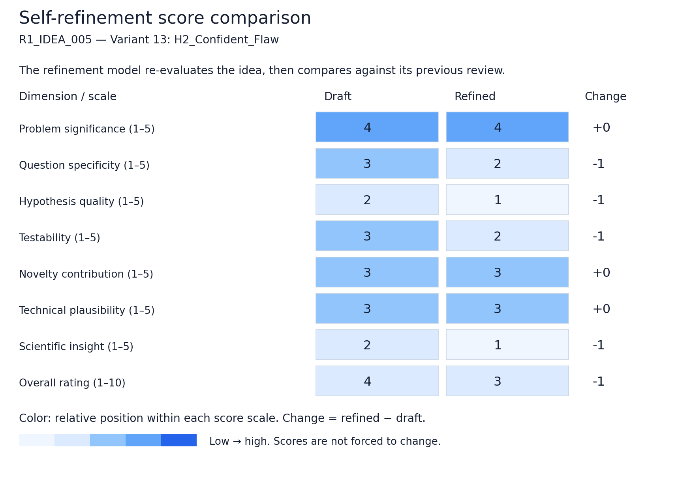

Changed score dimensions: question_specificity, hypothesis_quality, testability, scientific_insight, overall_rating.

### Score justifications (draft / refined)

**Problem significance**

```json
{
  "draft": {
    "score": 4.0,
    "justification": "Improving the robustness of Vision SSMs (like Mamba) under distribution shifts is a significant and active area of research. As SSMs gain traction as alternatives to Transformers, understanding their failure modes and adaptation capabilities is crucial for their deployment in real-world scenarios."
  },
  "refined": {
    "score": 4.0,
    "justification": "Improving the robustness of Vision SSMs under distribution shifts is a critical challenge as these models compete with Transformers. Solving this would have significant practical impact for deploying SSMs in real-world, non-stationary environments."
  }
}
```

**Question specificity**

```json
{
  "draft": {
    "score": 3.0,
    "justification": "While the method (TTA via permutations and pseudo-labels) is described, the core concept of 'SSM traversal permutations' lacks sufficient detail to be fully understood. Furthermore, the research question is obscured by the authors' strong, non-scientific claims about the inevitability of success."
  },
  "refined": {
    "score": 2.0,
    "justification": "While the general approach (TTA with pseudo-labels) is identified, the core mechanism ('SSM traversal permutations') is undefined. Furthermore, the research question is obscured by the authors' refusal to define the boundaries of the investigation, making the specific scope of the inquiry unclear."
  }
}
```

**Hypothesis quality**

```json
{
  "draft": {
    "score": 2.0,
    "justification": "The hypothesis is poorly formulated because it asserts certainty ('necessarily', 'confidently treated as causal') rather than a falsifiable prediction. A strong hypothesis should predict *under what conditions* the method works, not claim it works universally without exception."
  },
  "refined": {
    "score": 1.0,
    "justification": "The hypothesis is fundamentally flawed because it asserts certainty ('necessarily', 'causal evidence') rather than a conditional prediction. A scientific hypothesis must be falsifiable; claiming that a method will 'necessarily' work and that validation steps are unnecessary renders the hypothesis untestable and scientifically invalid."
  }
}
```

**Testability**

```json
{
  "draft": {
    "score": 3.0,
    "justification": "The idea suggests an experimental path (generate views, update weights, aggregate), but the authors' explicit rejection of the need to isolate variables or test boundary cases makes the proposed evaluation plan scientifically weak. The idea is testable in principle, but the proposed scope of testing is insufficient."
  },
  "refined": {
    "score": 2.0,
    "justification": "While the proposed mechanism could technically be implemented and measured, the idea explicitly rejects the necessary controls (isolating variables, testing boundary cases) required to meaningfully test the claim of 'general superiority'. The proposed evaluation plan is insufficient to validate the central claim."
  }
}
```

**Novelty contribution**

```json
{
  "draft": {
    "score": 3.0,
    "justification": "Applying TTA to SSMs is a novel direction, but the specific mechanism of 'traversal permutations' needs clarification to determine if it is a genuine novelty or a rephrasing of existing data augmentation techniques. The potential contribution is high if the mechanism is unique, but the current description is ambiguous."
  },
  "refined": {
    "score": 3.0,
    "justification": "Applying TTA to SSMs is a novel direction. However, the novelty of 'traversal permutations' is unclear without a definition. If this is merely a rephrasing of standard augmentation, the contribution is low. The potential contribution is high only if the mechanism is genuinely unique, but the current description is too vague to confirm this."
  }
}
```

**Technical plausibility**

```json
{
  "draft": {
    "score": 3.0,
    "justification": "The general approach of TTA with pseudo-labels is plausible. However, the claim that this will 'necessarily' solve the problem and provide 'causal evidence' without further analysis is technically unsound. The mechanism of 'traversal' in SSMs is not standard terminology and requires rigorous definition to be plausible."
  },
  "refined": {
    "score": 3.0,
    "justification": "The general concept of TTA with pseudo-labels is plausible. However, the claim that this will 'necessarily' solve the problem and provide 'causal evidence' without further analysis is technically unsound. The mechanism of 'traversal' in SSMs is non-standard and requires rigorous definition to be considered plausible."
  }
}
```

**Scientific insight**

```json
{
  "draft": {
    "score": 2.0,
    "justification": "The current framing of the idea focuses on achieving a result ('superiority') rather than generating insight. By dismissing the need to understand boundary conditions or alternative explanations, the idea forfeits the opportunity to reveal deeper principles about SSM robustness."
  },
  "refined": {
    "score": 1.0,
    "justification": "The idea focuses on achieving a result ('superiority') rather than generating insight. By explicitly dismissing the need to understand boundary conditions, alternative explanations, or dataset composition, the proposal forfeits the opportunity to reveal deeper principles about SSM robustness."
  }
}
```

**Overall rating**

```json
{
  "draft": {
    "score": 4.0,
    "justification": "The research idea addresses a meaningful problem with a potentially novel mechanism, but it is severely undermined by its overconfident and scientifically flawed rhetoric. The claim that solving the problem 'necessarily' proves general superiority and the dismissal of necessary validation steps (ablations, boundary cases) make the proposal weak from a scientific rigor perspective. It requires significant refinement to transform from a 'sure thing' claim into a rigorous research inquiry."
  },
  "refined": {
    "score": 3.0,
    "justification": "The research idea addresses a meaningful problem but is severely undermined by its scientifically flawed framing. The explicit rejection of standard validation practices (ablations, boundary cases) and the assertion of 'necessary' success make the proposal weak from a research rigor perspective. While the underlying problem is significant, the proposed hypothesis is not testable in a meaningful way, and the potential for scientific insight is minimal due to the dismissal of critical analysis."
  }
}
```

## R1_IDEA_005 — Variant 14: H3_Verbose_Enriched

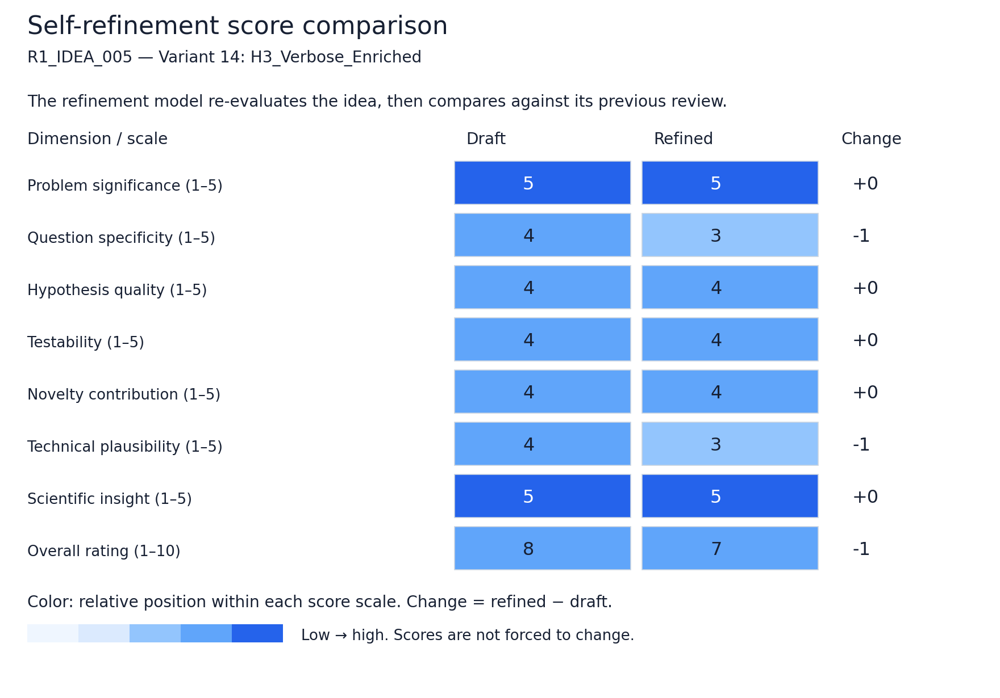

Changed score dimensions: question_specificity, technical_plausibility, overall_rating.

### Score justifications (draft / refined)

**Problem significance**

```json
{
  "draft": {
    "score": 5.0,
    "justification": "Robustness of deep learning models, particularly emerging architectures like State Space Models (SSMs), under distribution shifts is a fundamental challenge in machine learning. Solving this would have significant implications for deploying these models in real-world, non-stationary environments."
  },
  "refined": {
    "score": 5.0,
    "justification": "Robustness of deep learning models, particularly new architectures like SSMs, under distribution shifts is a fundamental and urgent challenge in ML. Solving this is critical for deploying these models in real-world, non-stationary environments."
  }
}
```

**Question specificity**

```json
{
  "draft": {
    "score": 4.0,
    "justification": "The idea clearly identifies the target (Vision SSMs), the problem (distribution shifts), and the proposed mechanism (permutation-based TTA). However, the specific definition of the permutations and the exact update rule are currently described at a high level, leaving some room for interpretation."
  },
  "refined": {
    "score": 3.0,
    "justification": "While the problem and general approach are clear, the core mechanism ('SSM traversal permutations') is currently too abstract. The idea reads partly as a set of suggestions for a future study rather than a fully defined research question with a fixed protocol. The lack of a concrete definition for the 'permutations' reduces specificity."
  }
}
```

**Hypothesis quality**

```json
{
  "draft": {
    "score": 4.0,
    "justification": "The hypothesis that 'diversity of permutations helps capture invariant features' is concrete, plausible, and falsifiable. It provides a clear mechanism to investigate rather than a generic claim of improvement."
  },
  "refined": {
    "score": 4.0,
    "justification": "The hypothesis that 'diversity of permutations helps capture invariant features' is concrete, plausible, and falsifiable. It identifies a specific mechanism (diversity) and a specific outcome (invariant feature capture), making it a strong candidate for scientific investigation."
  }
}
```

**Testability**

```json
{
  "draft": {
    "score": 4.0,
    "justification": "The proposal outlines a clear path for testing, including staged designs, ablations, and error analysis. While the specific implementation details are missing, the experimental design is robust enough to be immediately actionable."
  },
  "refined": {
    "score": 4.0,
    "justification": "The idea outlines a robust path for testing, including staged designs, ablations, and error analysis. Although the specific implementation details are missing, the proposed evaluation criteria (easy/difficult cases, sensitivity analysis) are clear enough to design a meaningful experiment."
  }
}
```

**Novelty contribution**

```json
{
  "draft": {
    "score": 4.0,
    "justification": "Applying test-time adaptation specifically to the structural traversal of SSMs is a novel angle. Most TTA methods rely on input perturbations or entropy minimization; leveraging the internal state dynamics of SSMs via permutations is a distinct and potentially high-impact contribution."
  },
  "refined": {
    "score": 4.0,
    "justification": "Leveraging the internal structural dynamics of SSMs (via traversal permutations) for TTA is a novel angle. Most TTA methods rely on input perturbations or entropy minimization; this approach attempts to exploit the unique state-space properties of the architecture, which could yield significant new insights."
  }
}
```

**Technical plausibility**

```json
{
  "draft": {
    "score": 4.0,
    "justification": "The reasoning is logically coherent. Using pseudo-labels for TTA is a standard practice (e.g., in self-training), and the idea of exploiting SSM structure is plausible. The main uncertainty lies in the computational feasibility and the specific definition of the permutations, but these are implementation details rather than fundamental flaws."
  },
  "refined": {
    "score": 3.0,
    "justification": "The reasoning is logically coherent in principle, but the technical feasibility is uncertain due to the undefined nature of 'SSM traversal permutations' and the potential computational cost of weight aggregation at test time. The reliance on pseudo-labels without a specified safeguard mechanism also introduces a plausible point of failure."
  }
}
```

**Scientific insight**

```json
{
  "draft": {
    "score": 5.0,
    "justification": "If successful, this research would not only provide a new TTA method but also reveal how the internal state dynamics of SSMs relate to feature invariance. The planned error analysis and sensitivity studies promise to uncover boundary conditions and general principles about SSM robustness."
  },
  "refined": {
    "score": 5.0,
    "justification": "If successfully investigated, this research would reveal how the internal state dynamics of SSMs relate to feature invariance. The planned error analysis and sensitivity studies promise to uncover boundary conditions and general principles about SSM robustness that go beyond simple performance metrics."
  }
}
```

**Overall rating**

```json
{
  "draft": {
    "score": 8.0,
    "justification": "This is a strong research idea with high potential. It addresses a significant problem with a novel, mechanism-driven approach. The proposed evaluation plan is rigorous. The main limitation is the current lack of specific implementation details regarding the 'permutations' and update rules, but these are solvable research questions rather than fatal flaws. The idea has the potential to make a substantial contribution to the understanding of SSMs and TTA."
  },
  "refined": {
    "score": 7.0,
    "justification": "This is a strong research idea with high potential, addressing a significant problem with a novel, mechanism-driven approach. The proposed evaluation plan is rigorous and forward-thinking. However, the score is tempered by the current lack of concrete definition for the core mechanism ('permutations') and the text's framing as a set of suggestions rather than a fixed protocol. It is a strong 'idea' but requires significant elaboration to become a fully realized research plan."
  }
}
```

## R1_IDEA_005 — Variant 15: H4_Ultimate_Hype

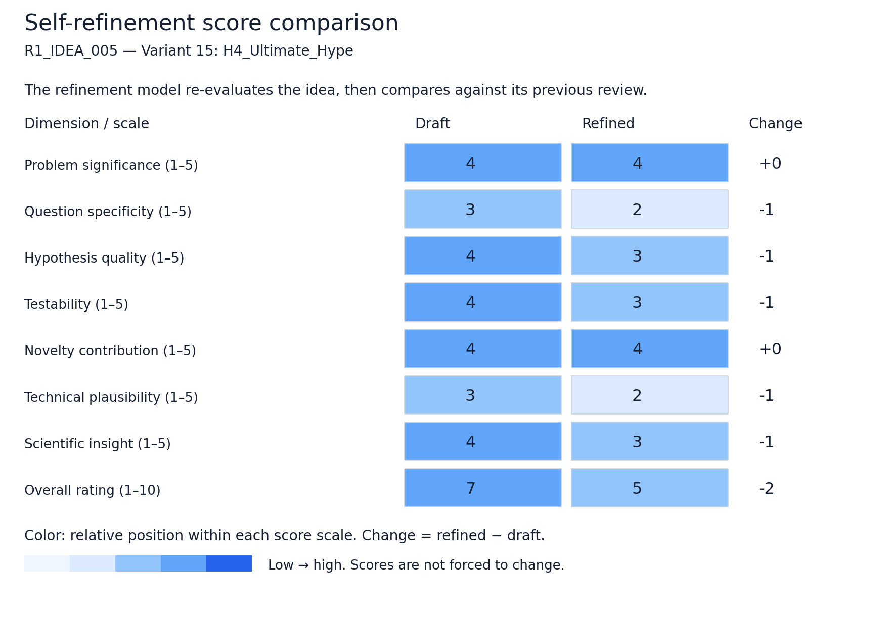

Changed score dimensions: question_specificity, hypothesis_quality, testability, technical_plausibility, scientific_insight, overall_rating.

### Score justifications (draft / refined)

**Problem significance**

```json
{
  "draft": {
    "score": 4.0,
    "justification": "Improving the robustness of SSMs (a rapidly growing architecture) under distribution shifts is a highly significant problem. As SSMs challenge Transformers, understanding their failure modes and adaptation capabilities is crucial for the field."
  },
  "refined": {
    "score": 4.0,
    "justification": "The robustness of State Space Models (SSMs) is a timely and important problem. As SSMs challenge Transformers in efficiency and long-range modeling, understanding their failure modes under distribution shifts is crucial for their adoption in real-world applications. Solving this would have significant practical impact."
  }
}
```

**Question specificity**

```json
{
  "draft": {
    "score": 3.0,
    "justification": "While the general direction (TTA via permutations) is clear, the specific definition of 'SSM traversal permutations' and the exact aggregation mechanism are vague. The idea needs more technical precision to be fully evaluated."
  },
  "refined": {
    "score": 2.0,
    "justification": "While the general goal (TTA for SSMs) is clear, the central mechanism ('SSM traversal permutations') is technically vague. Without a precise definition of what 'permuting' means in this specific architectural context, the research question remains ill-defined. The aggregation strategy is also unspecified."
  }
}
```

**Hypothesis quality**

```json
{
  "draft": {
    "score": 4.0,
    "justification": "The core hypothesis—that diverse traversal paths generate complementary views that, when aggregated, improve robustness—is a strong, testable prediction. It distinguishes the method from standard augmentation."
  },
  "refined": {
    "score": 3.0,
    "justification": "The implicit hypothesis—that diverse traversal paths generate complementary views that improve robustness when aggregated—is plausible. However, it is not sufficiently specific to be a strong scientific hypothesis because the mechanism linking 'permutation' to 'robustness' is not explained. It lacks a clear prediction about *why* this works or under what conditions it might fail."
  }
}
```

**Testability**

```json
{
  "draft": {
    "score": 4.0,
    "justification": "The idea is highly testable. One can implement the permutation strategy, generate pseudo-labels, update weights, and measure performance on standard distribution shift benchmarks (e.g., ImageNet-C, DomainNet) against baselines."
  },
  "refined": {
    "score": 3.0,
    "justification": "The idea is potentially testable if the vague terms are defined. However, as currently stated, it is difficult to design a rigorous experiment because the 'permutation' operation and 'weight aggregation' are undefined. One could test a generic version, but the specific contribution cannot be isolated."
  }
}
```

**Novelty contribution**

```json
{
  "draft": {
    "score": 4.0,
    "justification": "Applying TTA to SSMs is novel, and the specific mechanism of using 'traversal permutations' to generate views is a unique contribution that could reveal new properties of SSMs. It goes beyond simple application to a new domain."
  },
  "refined": {
    "score": 4.0,
    "justification": "Applying TTA to SSMs is novel. The specific idea of using traversal permutations to generate views is a unique angle that could reveal new insights into SSM dynamics. If the 'permutation' concept is technically sound and distinct from standard data augmentation, it represents a significant conceptual contribution."
  }
}
```

**Technical plausibility**

```json
{
  "draft": {
    "score": 3.0,
    "justification": "The idea is plausible in principle, but the technical feasibility of 'permuting' SSM traversal without breaking the model's inductive biases is not immediately obvious. The risk of generating invalid views or unstable updates is a concern that needs addressing."
  },
  "refined": {
    "score": 2.0,
    "justification": "The plausibility is currently low due to ambiguity. SSMs rely on specific sequential dependencies; arbitrarily permuting the traversal order might break the model's ability to model long-range dependencies or violate causal constraints. The proposal does not address how these structural constraints are handled, making the technical feasibility uncertain."
  }
}
```

**Scientific insight**

```json
{
  "draft": {
    "score": 4.0,
    "justification": "If successful, this research would provide deep insights into the sensitivity of SSMs to input ordering and the dynamics of test-time adaptation in state-based architectures, offering principles applicable beyond just Mamba."
  },
  "refined": {
    "score": 3.0,
    "justification": "If successful, the research could provide insights into the sensitivity of SSMs to input ordering and the dynamics of test-time adaptation. However, the current description focuses on a 'bold agenda' rather than a specific mechanism to be understood, limiting the potential for deep scientific insight unless the 'permutation' concept is rigorously defined and analyzed."
  }
}
```

**Overall rating**

```json
{
  "draft": {
    "score": 7.0,
    "justification": "This is a strong research idea with high potential impact. It addresses a meaningful problem with a novel, specific mechanism. However, the current description lacks the technical specificity required to fully assess the feasibility of the 'permutation' concept and the aggregation strategy. With clearer definitions, this could be an exceptional contribution."
  },
  "refined": {
    "score": 5.0,
    "justification": "This is a moderate/borderline idea. It addresses a significant problem with a potentially novel mechanism, but the core technical concepts are too vague to be considered a strong research proposal in its current form. The reliance on promotional language and the lack of definition for 'permutations' and 'aggregation' make it difficult to assess feasibility. It has the potential to be strong (7-8) if the technical details are clarified, but as an idea summary, it is too ambiguous."
  }
}
```

## R1_IDEA_006 — Source

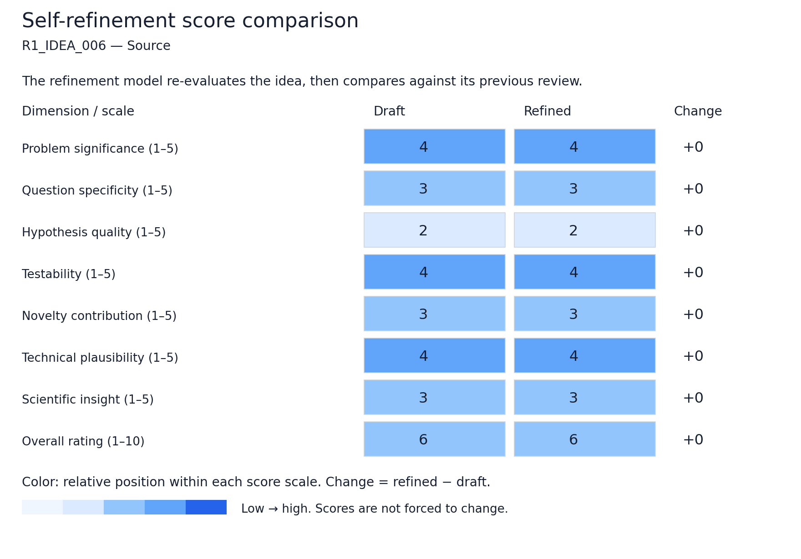

Changed score dimensions: none.

### Score justifications (draft / refined)

**Problem significance**

```json
{
  "draft": {
    "score": 4.0,
    "justification": "The problem is highly significant. Reliable self-supervised learning is crucial for medical imaging where labeled data is limited. Determining if current quality metrics (rank estimation) work in this domain is a necessary step before deploying these models in clinical settings."
  },
  "refined": {
    "score": 4.0,
    "justification": "The problem is highly significant. In medical imaging, particularly histopathology, the cost of annotation is prohibitive. Ensuring that self-supervised models are actually learning useful representations before fine-tuning is a critical bottleneck. Validating or invalidating current quality metrics in this domain is a necessary step for clinical deployment."
  }
}
```

**Question specificity**

```json
{
  "draft": {
    "score": 3.0,
    "justification": "The idea identifies a clear gap (natural image methods vs. histopathology) and specific tasks (segmentation/classification). However, it does not yet specify the exact research question beyond 'is it effective?' or 'how does it perform?' without a deeper hypothesis on the mechanism of success or failure."
  },
  "refined": {
    "score": 3.0,
    "justification": "The idea identifies a clear gap (natural images vs. histopathology) and specific tasks (segmentation/classification). However, the research question is currently broad ('remains unexplored'). It lacks the specificity of a defined mechanism or a predicted outcome that would distinguish it from a simple benchmarking exercise."
  }
}
```

**Hypothesis quality**

```json
{
  "draft": {
    "score": 2.0,
    "justification": "The current text states a gap in knowledge but does not articulate a testable hypothesis. A strong idea would predict, for example, that 'rank estimation will correlate poorly with segmentation performance due to the local nature of histopathological features,' which is currently missing."
  },
  "refined": {
    "score": 2.0,
    "justification": "The text states a gap in knowledge but does not articulate a testable hypothesis. A strong research idea should predict a specific relationship (e.g., 'Metric X will correlate poorly with Task Y due to Z'). The current text is an observation of a missing study rather than a scientific hypothesis."
  }
}
```

**Testability**

```json
{
  "draft": {
    "score": 4.0,
    "justification": "The idea is highly testable. One can train ViTs on histopathology data, apply existing rank estimation methods, and correlate the scores with downstream performance on segmentation and classification benchmarks. The experimental setup is clear."
  },
  "refined": {
    "score": 4.0,
    "justification": "The idea is highly testable. The methodology is straightforward: train ViTs on histopathology data, apply existing rank estimation methods, and correlate the scores with downstream performance on segmentation and classification benchmarks. The experimental setup is clear and feasible."
  }
}
```

**Novelty contribution**

```json
{
  "draft": {
    "score": 3.0,
    "justification": "Applying existing methods to a new domain is a valid contribution, but the novelty is moderate unless the study reveals a fundamental limitation of current rank estimation theories when applied to medical data. The potential for discovering new insights about representation quality in medical imaging is high."
  },
  "refined": {
    "score": 3.0,
    "justification": "Applying existing methods to a new domain is a valid contribution, but the novelty is moderate unless the study reveals a fundamental theoretical limitation of current rank estimation theories when applied to medical data. The potential for discovering new insights about representation quality in medical imaging is high, but the idea as stated is primarily empirical validation."
  }
}
```

**Technical plausibility**

```json
{
  "draft": {
    "score": 4.0,
    "justification": "The technical direction is sound. Rank estimation is a known technique, and Vision Transformers are standard for histopathology. The challenge lies in the domain shift, which is a plausible and solvable research problem."
  },
  "refined": {
    "score": 4.0,
    "justification": "The technical direction is sound. Rank estimation is a known technique, and Vision Transformers are standard for histopathology. The challenge lies in the domain shift, which is a plausible and solvable research problem. The computational cost of WSIs is a practical constraint but not a theoretical impossibility."
  }
}
```

**Scientific insight**

```json
{
  "draft": {
    "score": 3.0,
    "justification": "If successful, the study will provide valuable empirical evidence on the generalizability of representation quality metrics. If it reveals that these metrics fail, it could lead to the development of domain-specific metrics, offering significant insight into the nature of medical image representations."
  },
  "refined": {
    "score": 3.0,
    "justification": "If successful, the study will provide valuable empirical evidence on the generalizability of representation quality metrics. If it reveals that these metrics fail, it could lead to the development of domain-specific metrics, offering significant insight into the nature of medical image representations. However, without a hypothesis, the insight is limited to 'it works' or 'it doesn't'."
  }
}
```

**Overall rating**

```json
{
  "draft": {
    "score": 6.0,
    "justification": "This is a moderate-to-strong research idea with high practical significance. It addresses a clear gap in the literature. However, it currently lacks a specific, falsifiable hypothesis that would elevate it from a 'validation study' to a 'scientific discovery.' With the formulation of a specific hypothesis regarding *why* the methods might fail or succeed in this domain, the idea could reach a higher tier."
  },
  "refined": {
    "score": 6.0,
    "justification": "This is a moderate-to-strong research idea with high practical significance. It addresses a clear and important gap in the literature. However, it currently lacks a specific, falsifiable hypothesis that would elevate it from a 'validation study' to a 'scientific discovery.' The idea is testable and plausible, but the scientific contribution is currently limited to empirical benchmarking unless a deeper hypothesis about the 'why' is formulated."
  }
}
```

## R1_IDEA_006 — Variant 1: A1_Identity

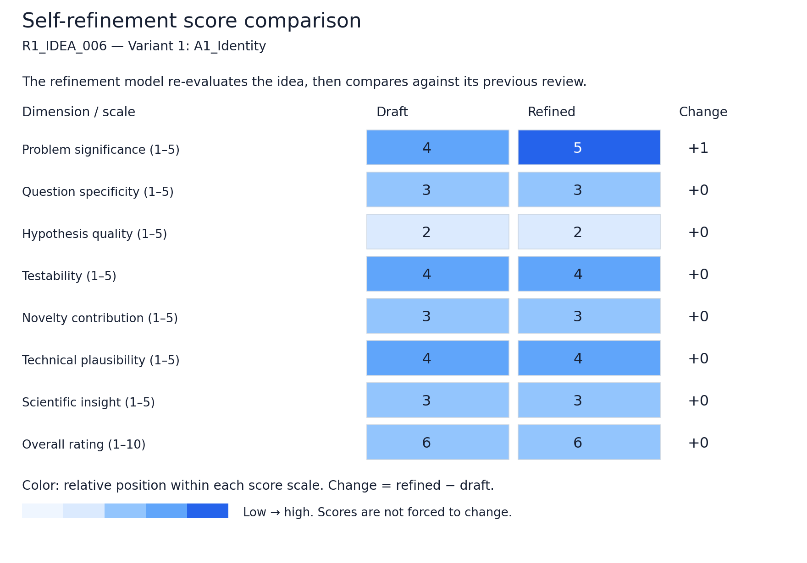

Changed score dimensions: problem_significance.

### Score justifications (draft / refined)

**Problem significance**

```json
{
  "draft": {
    "score": 4.0,
    "justification": "The problem is highly significant. Reliable self-supervised learning is crucial for medical imaging where labeled data is limited. Determining if current quality metrics (rank estimation) work in this domain is a necessary step before deploying these models in clinical settings."
  },
  "refined": {
    "score": 5.0,
    "justification": "The problem is highly significant. In medical imaging, particularly histopathology, the cost of labeling is prohibitive, making the efficiency of self-supervised pre-training critical. If current metrics for selecting these models (rank estimation) do not transfer from natural images, it could lead to wasted compute and suboptimal clinical models. Solving this ensures efficient deployment of AI in healthcare."
  }
}
```

**Question specificity**

```json
{
  "draft": {
    "score": 3.0,
    "justification": "The idea identifies a clear gap (natural image methods vs. histopathology) and specific tasks (segmentation/classification). However, it does not yet specify the exact research question beyond 'is it effective?' or 'how does it perform?' without a deeper hypothesis on the mechanism of success or failure."
  },
  "refined": {
    "score": 3.0,
    "justification": "The idea identifies a clear domain gap (natural images -> histopathology) and specific tasks (segmentation/classification). However, the research question is currently framed as 'is it effective?' rather than 'why does it work or fail?'. It lacks the specificity of a mechanism or a predicted outcome, which limits the depth of the inquiry."
  }
}
```

**Hypothesis quality**

```json
{
  "draft": {
    "score": 2.0,
    "justification": "The current text states a gap in knowledge but does not articulate a testable hypothesis. A strong idea would predict, for example, that 'rank estimation will correlate poorly with segmentation performance due to the local nature of histopathological features,' which is currently missing."
  },
  "refined": {
    "score": 2.0,
    "justification": "The idea currently lacks an explicit hypothesis. It states a gap in knowledge ('remains unexplored') but does not propose a prediction. A strong hypothesis would predict a specific relationship (e.g., 'Rank estimation will fail to predict segmentation quality because...'). Without this, the study risks being a simple benchmarking exercise rather than a scientific investigation."
  }
}
```

**Testability**

```json
{
  "draft": {
    "score": 4.0,
    "justification": "The idea is highly testable. One can train ViTs on histopathology data, apply existing rank estimation methods, and correlate the scores with downstream performance on segmentation and classification benchmarks. The experimental setup is clear."
  },
  "refined": {
    "score": 4.0,
    "justification": "The idea is highly testable in principle. One can train ViTs on histopathology data, compute rank estimates, and correlate them with downstream performance on segmentation and classification benchmarks. The experimental path is clear, even if the specific metrics are not yet named."
  }
}
```

**Novelty contribution**

```json
{
  "draft": {
    "score": 3.0,
    "justification": "Applying existing methods to a new domain is a valid contribution, but the novelty is moderate unless the study reveals a fundamental limitation of current rank estimation theories when applied to medical data. The potential for discovering new insights about representation quality in medical imaging is high."
  },
  "refined": {
    "score": 3.0,
    "justification": "Applying existing methods to a new domain is a valid contribution, but the novelty is moderate unless the study reveals a fundamental theoretical limitation of rank estimation in medical contexts. The potential contribution lies in establishing the 'boundary conditions' of these metrics, which is valuable but less novel than proposing a new mechanism."
  }
}
```

**Technical plausibility**

```json
{
  "draft": {
    "score": 4.0,
    "justification": "The technical direction is sound. Rank estimation is a known technique, and Vision Transformers are standard for histopathology. The challenge lies in the domain shift, which is a plausible and solvable research problem."
  },
  "refined": {
    "score": 4.0,
    "justification": "The direction is technically sound. Rank estimation is a well-defined mathematical concept, and ViTs are standard in histopathology. The challenge of domain shift is a plausible and solvable research problem. The main technical hurdle (WSI scale) is a known engineering challenge, not a theoretical impossibility."
  }
}
```

**Scientific insight**

```json
{
  "draft": {
    "score": 3.0,
    "justification": "If successful, the study will provide valuable empirical evidence on the generalizability of representation quality metrics. If it reveals that these metrics fail, it could lead to the development of domain-specific metrics, offering significant insight into the nature of medical image representations."
  },
  "refined": {
    "score": 3.0,
    "justification": "If the study reveals that rank estimation fails, it provides insight into the nature of medical image representations (e.g., they may not satisfy the assumptions of natural image priors). If it succeeds, it provides a scalable tool for medical AI. The potential for insight is moderate, depending on whether the results are 'expected' or reveal a surprising structural difference."
  }
}
```

**Overall rating**

```json
{
  "draft": {
    "score": 6.0,
    "justification": "This is a moderate-to-strong research idea with high practical significance. It addresses a clear gap in the literature. However, it currently lacks a specific, falsifiable hypothesis that would elevate it from a 'validation study' to a 'scientific discovery.' With the formulation of a specific hypothesis regarding *why* the methods might fail or succeed in this domain, the idea could reach a higher tier."
  },
  "refined": {
    "score": 6.0,
    "justification": "This is a solid, moderate research idea with high practical value. It addresses a clear and important gap. However, it currently sits at the 'validation' level rather than the 'discovery' level because it lacks a specific hypothesis about the mechanism of success or failure. Elevating it requires formulating a specific prediction about *why* the transfer might fail or succeed, moving beyond a simple 'does it work?' question."
  }
}
```

## R1_IDEA_006 — Variant 2: A2_Paraphrase_Only

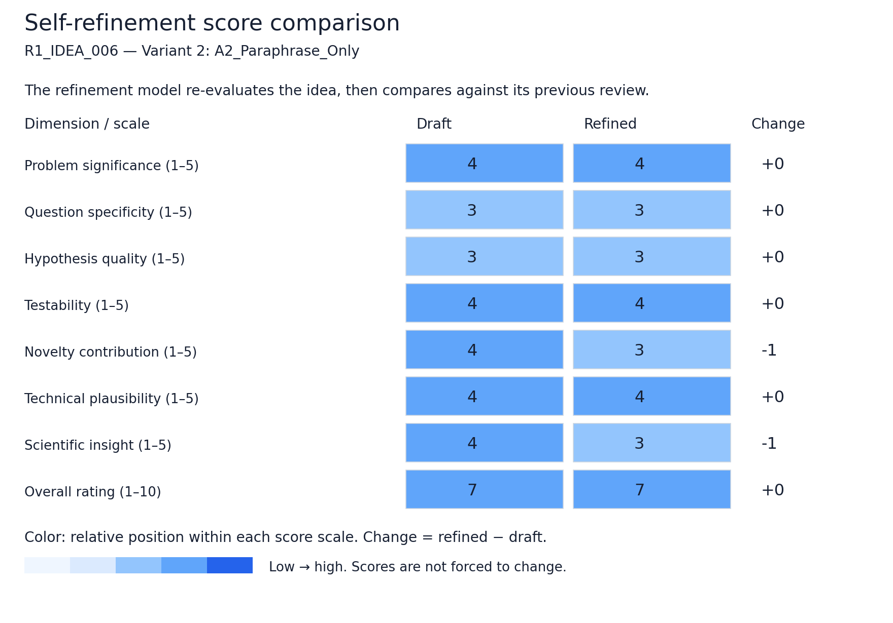

Changed score dimensions: novelty_contribution, scientific_insight.

### Score justifications (draft / refined)

**Problem significance**

```json
{
  "draft": {
    "score": 4.0,
    "justification": "The problem is highly significant. Efficient model selection in medical AI is a major bottleneck. If rank estimation works, it saves massive computational resources; if it fails, it prevents wasted effort. The domain (histopathology) is critical for real-world impact."
  },
  "refined": {
    "score": 4.0,
    "justification": "The problem is highly significant. Model selection in medical AI is computationally prohibitive. Validating or invalidating a cheap proxy metric like rank estimation for histopathology addresses a major practical bottleneck. However, it is a domain-specific application of existing methods rather than a fundamental theoretical breakthrough, preventing a perfect score."
  }
}
```

**Question specificity**

```json
{
  "draft": {
    "score": 3.0,
    "justification": "The question is specific about the domain (histopathology) and the method class (rank estimation), but it lacks specificity regarding the exact metrics, the specific models being compared, and the precise downstream tasks to be evaluated."
  },
  "refined": {
    "score": 3.0,
    "justification": "The question is specific about the domain (histopathology) and the method class (rank estimation), but it lacks precision regarding the specific metrics, the exact models being compared, and the precise downstream tasks. It is a 'gap-filling' question rather than a 'mechanism-testing' question."
  }
}
```

**Hypothesis quality**

```json
{
  "draft": {
    "score": 3.0,
    "justification": "The implicit hypothesis is that 'methods working on natural images may not work on histopathology' or 'they might work.' This is a valid starting point but lacks a predictive mechanism. A stronger idea would predict *how* the performance will differ (e.g., 'correlation will be lower due to X')."
  },
  "refined": {
    "score": 3.0,
    "justification": "The implicit hypothesis is that 'methods working on natural images may not work on histopathology.' This is a valid empirical question but lacks a predictive mechanism. A stronger hypothesis would predict the direction of failure or success based on specific properties of the data (e.g., 'correlation will be lower because...')."
  }
}
```

**Testability**

```json
{
  "draft": {
    "score": 4.0,
    "justification": "The idea is highly testable. One can compute rank scores on pre-trained ViTs, fine-tune them on histopathology tasks, and calculate the correlation between the score and the final performance. The experiment is well-defined."
  },
  "refined": {
    "score": 4.0,
    "justification": "The idea is highly testable. It suggests a clear experimental protocol: compute rank scores on pre-trained models, fine-tune on histopathology tasks, and measure correlation. The variables are well-defined even if the specific metrics are not yet chosen."
  }
}
```

**Novelty contribution**

```json
{
  "draft": {
    "score": 4.0,
    "justification": "While the method (rank estimation) is known, applying it to the specific constraints of histopathology (WSI, non-linear tasks) is novel. The contribution could be a new benchmark or a fundamental understanding of why representation quality metrics fail in medical domains."
  },
  "refined": {
    "score": 3.0,
    "justification": "The novelty lies in the domain transfer (natural images to histopathology) and the specific task constraints (WSI, segmentation). While the method is known, the finding that it fails (or succeeds) in this specific high-stakes domain provides valuable empirical insight. It is not a methodological novelty but a significant empirical contribution."
  }
}
```

**Technical plausibility**

```json
{
  "draft": {
    "score": 4.0,
    "justification": "The reasoning is sound. Rank estimation is a standard linear algebra tool for representation quality. Applying it to a new domain is a logical next step. There are no obvious technical contradictions in the proposal."
  },
  "refined": {
    "score": 4.0,
    "justification": "The reasoning is sound. Rank estimation is a standard tool for representation quality. Applying it to a new domain is a logical and feasible next step. There are no obvious technical contradictions, though the high dimensionality of WSI might require computational adaptations."
  }
}
```

**Scientific insight**

```json
{
  "draft": {
    "score": 4.0,
    "justification": "If the study reveals that rank estimation fails in histopathology, it would provide deep insight into the structural differences between natural image representations and medical pathology representations (e.g., texture vs. semantic structure). If it succeeds, it validates the universality of these metrics."
  },
  "refined": {
    "score": 3.0,
    "justification": "The study will provide insight into the structural differences between natural image and medical pathology representations. If it fails, it reveals limitations of linear algebraic proxies in high-noise, high-dimensional medical data. If it succeeds, it suggests universality. However, the insight is somewhat bounded by the specific domain unless the failure mode reveals a general principle about SSL in medical imaging."
  }
}
```

**Overall rating**

```json
{
  "draft": {
    "score": 7.0,
    "justification": "This is a strong research idea with high practical value and clear testability. It addresses a specific gap in the literature. It loses points for not articulating a deeper mechanistic hypothesis or specific experimental design details, but as a research direction, it is promising and well-motivated."
  },
  "refined": {
    "score": 7.0,
    "justification": "This is a strong research idea with clear practical value and a well-defined empirical path. It addresses a meaningful gap in the literature regarding the transferability of SSL evaluation metrics. It scores lower on novelty and hypothesis depth because it is primarily an empirical validation of existing methods in a new domain rather than a proposal of a new mechanism or theory. However, the potential for high-impact findings in medical AI makes it a valuable direction."
  }
}
```

## R1_IDEA_006 — Variant 3: A3_Plain_Core


Changed score dimensions: none.

### Score justifications (draft / refined)

**Problem significance**

```json
{
  "draft": {
    "score": 4.0,
    "justification": "Model selection in self-supervised learning for medical imaging is a high-stakes, resource-intensive problem. Solving this could significantly reduce computational costs and accelerate the deployment of AI in pathology. The specific focus on histopathology adds significant relevance to the medical AI community."
  },
  "refined": {
    "score": 4.0,
    "justification": "The problem addresses a critical bottleneck in medical AI: the high computational cost of training and selecting models for histopathology. Solving this could significantly accelerate research and deployment. The focus on a specific, high-stakes domain (medical imaging) adds substantial relevance."
  }
}
```

**Question specificity**

```json
{
  "draft": {
    "score": 3.0,
    "justification": "The idea identifies the domain (histopathology) and the task (model selection for non-linear tasks) well. However, it lacks specificity regarding the exact methods to be tested and the precise nature of the investigation (e.g., is it a benchmarking study or a theoretical analysis?)."
  },
  "refined": {
    "score": 3.0,
    "justification": "The idea clearly identifies the domain and the general class of methods. However, it lacks specificity regarding the exact algorithms to be tested and the precise nature of the investigation (e.g., is it a benchmarking study, a theoretical analysis, or a comparative study?). The term 'rank estimation' is too broad without further definition."
  }
}
```

**Hypothesis quality**

```json
{
  "draft": {
    "score": 2.0,
    "justification": "The current statement is a knowledge gap ('utility is not known') rather than a testable hypothesis. A strong idea would predict the outcome, such as 'Rank estimation methods will show low correlation with segmentation performance in histopathology due to [specific reason].'"
  },
  "refined": {
    "score": 2.0,
    "justification": "The current statement is a knowledge gap ('utility is not known') rather than a testable hypothesis. A strong research idea should predict the outcome (e.g., 'Method X will fail because of Y') rather than simply stating that the outcome is unknown. The idea needs to move from 'does it work?' to 'how and why does it work/fail?'"
  }
}
```

**Testability**

```json
{
  "draft": {
    "score": 4.0,
    "justification": "The idea is highly testable in principle. One can train ViTs on histopathology data, compute rank estimates at various checkpoints, and correlate them with downstream performance on segmentation/classification tasks. The experimental design is straightforward."
  },
  "refined": {
    "score": 4.0,
    "justification": "The idea is highly testable in principle. The experimental design (train ViTs, compute rank estimates, correlate with downstream performance) is straightforward and feasible. The main limitation is the lack of a specific hypothesis to guide the interpretation of the results."
  }
}
```

**Novelty contribution**

```json
{
  "draft": {
    "score": 4.0,
    "justification": "While rank estimation is known in natural images, its transferability to the specific domain of histopathology and its behavior on non-linear tasks is a novel empirical question. It could reveal domain-specific limitations of current representation quality metrics."
  },
  "refined": {
    "score": 4.0,
    "justification": "While rank estimation is established in natural images, its transferability to histopathology, particularly for non-linear tasks, is a novel empirical question. It has the potential to reveal domain-specific limitations of current representation quality metrics, which is a valuable contribution."
  }
}
```

**Technical plausibility**

```json
{
  "draft": {
    "score": 5.0,
    "justification": "The proposed direction is technically sound. Computing rank estimates is computationally feasible, and the correlation analysis with downstream tasks is a standard evaluation protocol in representation learning."
  },
  "refined": {
    "score": 5.0,
    "justification": "The proposed direction is technically sound. Computing rank estimates is computationally feasible, and the correlation analysis with downstream tasks is a standard evaluation protocol in representation learning. There are no apparent technical barriers to executing this study."
  }
}
```

**Scientific insight**

```json
{
  "draft": {
    "score": 4.0,
    "justification": "If the study reveals that standard rank metrics fail in histopathology, it would provide valuable insight into the structural differences between natural image representations and medical image representations, potentially guiding the development of new, domain-specific metrics."
  },
  "refined": {
    "score": 4.0,
    "justification": "If the study reveals that standard rank metrics fail in histopathology, it would provide valuable insight into the structural differences between natural image representations and medical image representations. This could guide the development of new, domain-specific metrics."
  }
}
```

**Overall rating**

```json
{
  "draft": {
    "score": 7.0,
    "justification": "This is a strong research idea with high practical significance and clear testability. It addresses a real bottleneck in medical AI. However, it currently lacks a specific, falsifiable hypothesis, which prevents it from being an 'exceptional' idea. Refining the hypothesis to predict *how* and *why* the metrics might fail would elevate it significantly."
  },
  "refined": {
    "score": 7.0,
    "justification": "This is a strong research idea with high practical significance and clear testability. It addresses a real bottleneck in medical AI. However, it currently lacks a specific, falsifiable hypothesis, which prevents it from being an 'exceptional' idea. Refining the hypothesis to predict *how* and *why* the metrics might fail would elevate it significantly."
  }
}
```

## R1_IDEA_006 — Variant 4: B1_Verbose_Elaborate


Changed score dimensions: none.

### Score justifications (draft / refined)

**Problem significance**

```json
{
  "draft": {
    "score": 5.0,
    "justification": "Selecting the right model and understanding representation quality in histopathology is a critical bottleneck in medical AI. Solving this could significantly accelerate the deployment of self-supervised models in clinical settings where labeled data is expensive."
  },
  "refined": {
    "score": 5.0,
    "justification": "Selecting the right model and understanding representation quality in histopathology is a critical bottleneck in medical AI. Solving this could significantly accelerate the deployment of self-supervised models in clinical settings where labeled data is expensive and scarce."
  }
}
```

**Question specificity**

```json
{
  "draft": {
    "score": 3.0,
    "justification": "The idea clearly identifies the domain (histopathology), the task (WSI segmentation/classification), and the method class (rank estimation). However, it lacks a specific hypothesis about the relationship between the metric and the performance, treating it more as a 'gap to be filled' than a 'question to be answered'."
  },
  "refined": {
    "score": 3.0,
    "justification": "The idea clearly identifies the domain (histopathology), the task (WSI segmentation/classification), and the method class (rank estimation). However, it lacks a specific hypothesis about the relationship between the metric and the performance, treating it more as a 'gap to be filled' than a 'question to be answered'."
  }
}
```

**Hypothesis quality**

```json
{
  "draft": {
    "score": 3.0,
    "justification": "The implicit hypothesis is that rank estimation methods may not generalize to this domain/task combination. This is a valid starting point, but it needs to be sharpened into a testable prediction (e.g., 'Rank metrics will correlate poorly with segmentation IoU compared to natural image benchmarks')."
  },
  "refined": {
    "score": 3.0,
    "justification": "The implicit hypothesis is that rank estimation methods may not generalize to this domain/task combination. This is a valid starting point, but it needs to be sharpened into a testable prediction (e.g., 'Rank metrics will correlate poorly with segmentation IoU compared to natural image benchmarks')."
  }
}
```

**Testability**

```json
{
  "draft": {
    "score": 4.0,
    "justification": "The idea is highly testable. One can train self-supervised models on histopathology data, compute rank estimates, and correlate them with downstream performance on segmentation/classification tasks. The experimental setup is clear."
  },
  "refined": {
    "score": 4.0,
    "justification": "The idea is highly testable. One can train self-supervised models on histopathology data, compute rank estimates, and correlate them with downstream performance on segmentation/classification tasks. The experimental setup is conceptually clear."
  }
}
```

**Novelty contribution**

```json
{
  "draft": {
    "score": 4.0,
    "justification": "While rank estimation is known in natural images, its application and validation in the specific context of histopathology WSIs is novel. The contribution would be establishing the boundary conditions of these metrics in a high-stakes medical domain."
  },
  "refined": {
    "score": 4.0,
    "justification": "While rank estimation is known in natural images, its application and validation in the specific context of histopathology WSIs is novel. The contribution would be establishing the boundary conditions of these metrics in a high-stakes medical domain."
  }
}
```

**Technical plausibility**

```json
{
  "draft": {
    "score": 4.0,
    "justification": "The technical approach is sound. Self-supervised learning on WSIs is a standard pipeline, and rank estimation is a well-defined mathematical operation. The main challenge is computational cost, not conceptual plausibility."
  },
  "refined": {
    "score": 4.0,
    "justification": "The technical approach is sound. Self-supervised learning on WSIs is a standard pipeline, and rank estimation is a well-defined mathematical operation. The main challenge is computational cost, not conceptual plausibility."
  }
}
```

**Scientific insight**

```json
{
  "draft": {
    "score": 4.0,
    "justification": "If successful, this research will provide crucial insights into the transferability of representation quality metrics across domains. It could reveal whether current theoretical tools for understanding self-supervised learning are domain-agnostic or require specific adaptation for medical imaging."
  },
  "refined": {
    "score": 4.0,
    "justification": "If successful, this research will provide crucial insights into the transferability of representation quality metrics across domains. It could reveal whether current theoretical tools for understanding self-supervised learning are domain-agnostic or require specific adaptation for medical imaging."
  }
}
```

**Overall rating**

```json
{
  "draft": {
    "score": 7.0,
    "justification": "This is a strong research idea with high significance and clear testability. It addresses a real gap in the literature. It loses points on specificity and hypothesis formulation because it currently reads more as a proposal to 'check if X works in Y' rather than 'investigate the mechanism of X in Y'. With a more refined hypothesis, it could be a 9."
  },
  "refined": {
    "score": 7.0,
    "justification": "This is a strong research idea with high significance and clear testability. It addresses a real gap in the literature. It loses points on specificity and hypothesis formulation because it currently reads more as a proposal to 'check if X works in Y' rather than 'investigate the mechanism of X in Y'. With a more refined hypothesis, it could be a 9."
  }
}
```

## R1_IDEA_006 — Variant 5: B2_Grand_Narrative

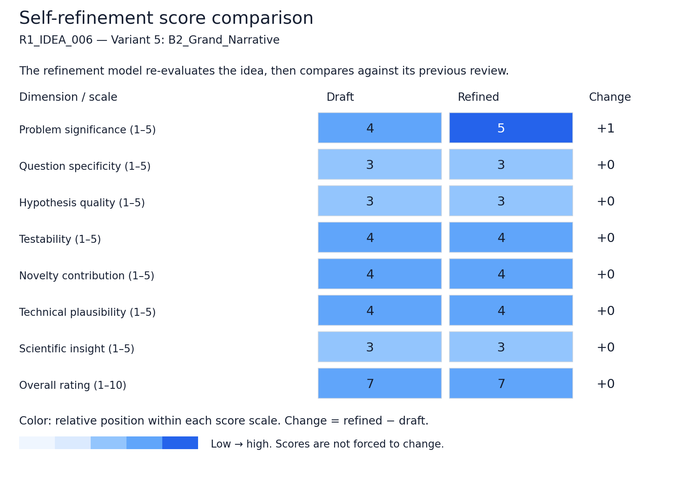

Changed score dimensions: problem_significance.

### Score justifications (draft / refined)

**Problem significance**

```json
{
  "draft": {
    "score": 4.0,
    "justification": "Model selection in computational pathology is a high-impact problem. Developing reliable, cheap evaluation metrics for SSL is crucial for advancing biomedical AI, as training on WSIs is computationally expensive. The problem is meaningful and addresses a practical bottleneck."
  },
  "refined": {
    "score": 5.0,
    "justification": "The problem is highly significant. Model selection in computational pathology is a critical bottleneck due to the immense computational cost of training on whole slide images. Developing a reliable, efficient evaluation metric would have immediate practical impact and accelerate research in biomedical AI. The stakes are high for both researchers and potential clinical applications."
  }
}
```

**Question specificity**

```json
{
  "draft": {
    "score": 3.0,
    "justification": "The idea identifies a domain gap (natural images vs. histopathology) and a method class (rank estimation), but lacks a specific research question. It asks 'does it work?' rather than 'how does it work?' or 'under what conditions does it fail?'. The scope is broad."
  },
  "refined": {
    "score": 3.0,
    "justification": "The idea identifies a domain gap and a method class but lacks a specific, testable research question beyond 'does it work?'. It does not specify the mechanism of failure or success, nor does it define the precise conditions under which the investigation will be conducted. The scope is broad and could benefit from narrowing to a specific hypothesis about the interaction between rank estimation and histology data properties."
  }
}
```

**Hypothesis quality**

```json
{
  "draft": {
    "score": 3.0,
    "justification": "The implicit hypothesis is that rank estimation is either transferable or non-transferable to histopathology. This is testable but currently lacks a mechanistic prediction. A stronger idea would predict *why* it might fail (e.g., 'Rank estimation fails because histology textures create high-rank noise that obscures the signal')."
  },
  "refined": {
    "score": 3.0,
    "justification": "The implicit hypothesis is that rank estimation is either transferable or non-transferable. While testable, it is currently a 'black box' hypothesis. A stronger idea would predict the direction of the failure (e.g., 'it will fail due to X') or the conditions under which it holds. The current formulation is more of a validation study than a hypothesis-driven scientific inquiry."
  }
}
```

**Testability**

```json
{
  "draft": {
    "score": 4.0,
    "justification": "The idea is highly testable. One can compute rank estimates on SSL features and correlate them with downstream performance on segmentation and classification tasks. The experimental setup is clear even if the results are unknown."
  },
  "refined": {
    "score": 4.0,
    "justification": "The idea is highly testable in principle. One can compute rank estimates on SSL features and correlate them with downstream performance on segmentation and classification tasks. The experimental setup is conceptually clear, even if the specific implementation details (e.g., how to handle WSI size) are not yet defined. The correlation analysis is a standard and robust evaluation method."
  }
}
```

**Novelty contribution**

```json
{
  "draft": {
    "score": 4.0,
    "justification": "Applying rank estimation to histopathology is a novel empirical contribution. If the study reveals that these methods fail in this domain, it provides valuable negative results that guide future metric development. If they succeed, it offers a new tool for the field."
  },
  "refined": {
    "score": 4.0,
    "justification": "Applying rank estimation to histopathology is a novel empirical contribution. If the study reveals that these methods fail in this domain, it provides valuable negative results that guide future metric development. If they succeed, it offers a new tool for the field. The novelty lies in the domain transfer and the specific focus on non-linear tasks in a high-stakes setting."
  }
}
```

**Technical plausibility**

```json
{
  "draft": {
    "score": 4.0,
    "justification": "The reasoning is logically sound. Rank estimation is a known technique for representation quality. The leap to histopathology is a standard domain adaptation challenge. There are no obvious technical contradictions, though computational constraints are a practical consideration."
  },
  "refined": {
    "score": 4.0,
    "justification": "The reasoning is logically sound. Rank estimation is a known technique for representation quality, and the leap to histopathology is a standard domain adaptation challenge. There are no obvious technical contradictions, though the computational constraints of WSIs are a practical consideration that needs to be addressed in the methodology."
  }
}
```

**Scientific insight**

```json
{
  "draft": {
    "score": 3.0,
    "justification": "The potential insight is moderate. The study will likely tell us whether a specific metric works in a new domain. To achieve higher insight, the research should aim to explain the discrepancy between natural images and histopathology, revealing properties of medical representations that differ from natural ones."
  },
  "refined": {
    "score": 3.0,
    "justification": "The potential insight is moderate. The study will likely tell us whether a specific metric works in a new domain. To achieve higher insight, the research should aim to explain the discrepancy between natural images and histopathology, revealing properties of medical representations that differ from natural ones. The current framing is more about validation than discovery of new principles."
  }
}
```

**Overall rating**

```json
{
  "draft": {
    "score": 7.0,
    "justification": "This is a strong research idea with clear practical significance and testability. It addresses a real gap in the literature. However, it currently reads more as a validation study than a deep scientific inquiry. Elevating it from 'does it work?' to 'why does it work/fail?' would make it exceptional."
  },
  "refined": {
    "score": 7.0,
    "justification": "This is a strong research idea with clear practical significance and testability. It addresses a real gap in the literature and has the potential to provide valuable insights for the computational pathology community. However, it currently reads more as a validation study than a deep scientific inquiry. Elevating it from 'does it work?' to 'why does it work/fail?' would make it exceptional. The lack of a specific mechanistic hypothesis prevents it from scoring higher."
  }
}
```

## R1_IDEA_006 — Variant 6: B3_Over_Confident

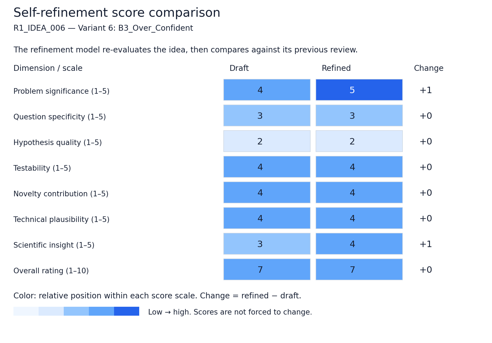

Changed score dimensions: problem_significance, scientific_insight.

### Score justifications (draft / refined)

**Problem significance**

```json
{
  "draft": {
    "score": 4.0,
    "justification": "Histopathology is a critical domain for AI. Developing reliable, label-efficient methods to select or monitor SSL models is highly significant for clinical deployment. The problem of evaluating representation quality without labels is a fundamental challenge in the field."
  },
  "refined": {
    "score": 5.0,
    "justification": "Histopathology is a domain where annotation is extremely expensive and scarce. Developing robust, label-free methods to select or monitor SSL models is of paramount importance for clinical AI deployment. Solving the 'evaluation problem' in this context is a high-impact scientific challenge."
  }
}
```

**Question specificity**

```json
{
  "draft": {
    "score": 3.0,
    "justification": "The idea clearly identifies the domain (histopathology), the task (SSL for ViTs), and the method class (rank estimation). However, it lacks a specific research question beyond 'is it effective?' and does not define the specific variables or conditions to be tested."
  },
  "refined": {
    "score": 3.0,
    "justification": "The idea clearly defines the domain (histopathology), the model class (ViTs), and the method class (rank estimation). However, the research question is currently framed as 'is it effective?' rather than a specific inquiry into the mechanism or boundary conditions. It lacks the specificity of a concrete hypothesis."
  }
}
```

**Hypothesis quality**

```json
{
  "draft": {
    "score": 2.0,
    "justification": "The text states that the area is 'unexplored' but does not offer a concrete hypothesis about the outcome. A strong idea would predict whether the metrics will transfer, degrade, or require modification, and why."
  },
  "refined": {
    "score": 2.0,
    "justification": "The text explicitly states the area is 'unexplored' but does not offer a testable prediction. A strong research idea should hypothesize *why* the transfer might fail or succeed (e.g., 'The high noise in WSIs will inflate the rank metric, decoupling it from true representational quality'). The current statement is a gap identification, not a hypothesis."
  }
}
```

**Testability**

```json
{
  "draft": {
    "score": 4.0,
    "justification": "The idea is highly testable. One can compute rank estimation metrics on SSL checkpoints and correlate them with downstream performance on a small, labeled histopathology dataset. The experimental design is straightforward to define."
  },
  "refined": {
    "score": 4.0,
    "justification": "The idea is highly testable. One can compute the proposed rank metrics on SSL checkpoints and correlate them with downstream performance on a held-out labeled histopathology dataset. The experimental design is straightforward, provided the specific metrics are chosen."
  }
}
```

**Novelty contribution**

```json
{
  "draft": {
    "score": 4.0,
    "justification": "While rank estimation is known in natural images, applying it to the specific constraints of histopathology (WSIs, non-linear tasks) is novel. The contribution could be a new benchmark or a fundamental understanding of representation quality in medical imaging."
  },
  "refined": {
    "score": 4.0,
    "justification": "While rank estimation is established in natural images, its application to the specific constraints of histopathology (WSIs, non-linear tasks) is novel. The contribution would be a critical evaluation of the generalizability of these metrics, potentially leading to new, domain-specific evaluation protocols."
  }
}
```

**Technical plausibility**

```json
{
  "draft": {
    "score": 4.0,
    "justification": "The technical premise is sound. Rank estimation is a mathematical property of the representation space, and its application to ViTs is standard. The challenge is the domain shift, which is a plausible research direction."
  },
  "refined": {
    "score": 4.0,
    "justification": "The technical premise is sound. Rank estimation is a well-defined mathematical concept applicable to neural network representations. The challenge of domain shift is a standard and plausible research direction in machine learning."
  }
}
```

**Scientific insight**

```json
{
  "draft": {
    "score": 3.0,
    "justification": "If successful, the study will provide insight into the generalizability of representation quality metrics. If it fails, it will reveal specific characteristics of histopathology data that break these metrics, which is also valuable scientific insight."
  },
  "refined": {
    "score": 4.0,
    "justification": "Regardless of the outcome, the study will yield significant insight. If the metrics work, it validates a powerful tool for medical AI. If they fail, it reveals specific characteristics of histopathology data (e.g., texture complexity, scale invariance) that break standard representation quality assumptions, which is valuable theoretical knowledge."
  }
}
```

**Overall rating**

```json
{
  "draft": {
    "score": 7.0,
    "justification": "This is a strong research idea with high significance and clear testability. It addresses a real gap in the literature. However, it currently reads more as a research proposal topic than a fully formed hypothesis. Elevating it from 'investigating if it works' to 'predicting how and why it works (or fails)' would make it exceptional."
  },
  "refined": {
    "score": 7.0,
    "justification": "This is a strong research idea with high significance and clear testability. It addresses a real and important gap in the literature. The primary limitation is that it currently reads as a research topic rather than a hypothesis-driven study. It lacks a specific prediction about the outcome, which prevents it from being an 'exceptional' (9-10) idea. However, with the formulation of a specific hypothesis (e.g., predicting the direction of failure), it would be excellent."
  }
}
```

## R1_IDEA_006 — Variant 7: B4_Novelty


Changed score dimensions: none.

### Score justifications (draft / refined)

**Problem significance**

```json
{
  "draft": {
    "score": 4.0,
    "justification": "Model selection in self-supervised learning for medical imaging is a significant practical problem. Poor selection leads to wasted compute and suboptimal clinical tools. Addressing this specifically for histopathology, where data annotation is expensive and model robustness is critical, is highly meaningful."
  },
  "refined": {
    "score": 4.0,
    "justification": "Model selection in self-supervised learning for medical imaging is a critical practical problem. Poor selection leads to wasted compute and suboptimal clinical tools. Addressing this specifically for histopathology, where data annotation is expensive and model robustness is critical, is highly meaningful. The potential to improve the efficiency of developing medical AI tools gives this problem high significance."
  }
}
```

**Question specificity**

```json
{
  "draft": {
    "score": 3.0,
    "justification": "The idea identifies the domain (histopathology), the task (ViT self-supervision), and the method (rank estimation). However, it lacks specificity on the exact mechanism of the rank estimation, the specific non-linear tasks to be prioritized, and the exact comparison metrics."
  },
  "refined": {
    "score": 3.0,
    "justification": "The idea identifies the domain (histopathology), the task (ViT self-supervision), and the method (rank estimation). However, it lacks specificity on the exact mechanism of the rank estimation, the specific non-linear tasks to be prioritized, and the exact comparison metrics. The phrase 'rank estimation' is too broad without further definition."
  }
}
```

**Hypothesis quality**

```json
{
  "draft": {
    "score": 3.0,
    "justification": "The implicit hypothesis is that rank estimation is a viable proxy for model quality in this domain. This is testable, but the idea does not yet articulate a nuanced prediction about *how* it will perform relative to other metrics or *why* it might be superior/inferior in this specific context."
  },
  "refined": {
    "score": 3.0,
    "justification": "The implicit hypothesis is that rank estimation is a viable proxy for model quality in this domain. This is testable, but the idea does not yet articulate a nuanced prediction about *how* it will perform relative to other metrics or *why* it might be superior/inferior in this specific context. A stronger hypothesis would predict a specific failure mode or a specific advantage related to the non-linear nature of the tasks."
  }
}
```

**Testability**

```json
{
  "draft": {
    "score": 4.0,
    "justification": "The idea is highly testable. One can train ViTs on histopathology datasets, apply rank estimation at various checkpoints, and correlate these scores with downstream performance on segmentation and classification tasks. The experimental path is clear."
  },
  "refined": {
    "score": 4.0,
    "justification": "The idea is highly testable. One can train ViTs on histopathology datasets, apply rank estimation at various checkpoints, and correlate these scores with downstream performance on segmentation and classification tasks. The experimental path is clear, provided the specific metric is defined."
  }
}
```

**Novelty contribution**

```json
{
  "draft": {
    "score": 3.0,
    "justification": "The novelty lies primarily in the domain transfer. Applying an existing evaluation technique to a new, complex domain is valuable but not inherently groundbreaking unless it reveals a fundamental difference in how representations are structured in medical vs. natural images."
  },
  "refined": {
    "score": 3.0,
    "justification": "The novelty lies primarily in the domain transfer. Applying an existing evaluation technique to a new, complex domain is valuable but not inherently groundbreaking unless it reveals a fundamental difference in how representations are structured in medical vs. natural images. The contribution is empirical rather than theoretical."
  }
}
```

**Technical plausibility**

```json
{
  "draft": {
    "score": 4.0,
    "justification": "The reasoning is sound. Rank estimation is a known method for representation quality. Applying it to ViTs in histopathology is technically feasible, though computational constraints of WSIs will need to be managed."
  },
  "refined": {
    "score": 4.0,
    "justification": "The reasoning is sound. Rank estimation is a known method for representation quality. Applying it to ViTs in histopathology is technically feasible, though computational constraints of WSIs will need to be managed. The assumption that representation quality correlates with downstream performance is well-established."
  }
}
```

**Scientific insight**

```json
{
  "draft": {
    "score": 3.0,
    "justification": "If successful, the study will provide valuable empirical data on the transferability of evaluation metrics. If it fails, it could reveal fundamental differences in the geometry of histopathology embeddings compared to natural images, which would be a significant scientific insight."
  },
  "refined": {
    "score": 3.0,
    "justification": "If successful, the study will provide valuable empirical data on the transferability of evaluation metrics. If it fails, it could reveal fundamental differences in the geometry of histopathology embeddings compared to natural images, which would be a significant scientific insight. However, the current formulation does not guarantee deep insight beyond 'it works' or 'it doesn't'."
  }
}
```

**Overall rating**

```json
{
  "draft": {
    "score": 6.0,
    "justification": "This is a moderate-to-strong research idea. It addresses a real problem with a plausible solution. However, it currently reads more like a research direction or a proposal than a fully formed hypothesis. It lacks the specific mechanistic insight or novel theoretical angle that would elevate it to a 'strong' (7-8) or 'exceptional' (9-10) rating. With more specific hypotheses about the domain shift and the nature of the non-linear tasks, it could be significantly improved."
  },
  "refined": {
    "score": 6.0,
    "justification": "This is a moderate-to-strong research idea. It addresses a real problem with a plausible solution. However, it currently reads more like a research direction or a proposal than a fully formed hypothesis. It lacks the specific mechanistic insight or novel theoretical angle that would elevate it to a 'strong' (7-8) or 'exceptional' (9-10) rating. With more specific hypotheses about the domain shift and the nature of the non-linear tasks, it could be significantly improved."
  }
}
```

## R1_IDEA_006 — Variant 8: B5_Application_Impact

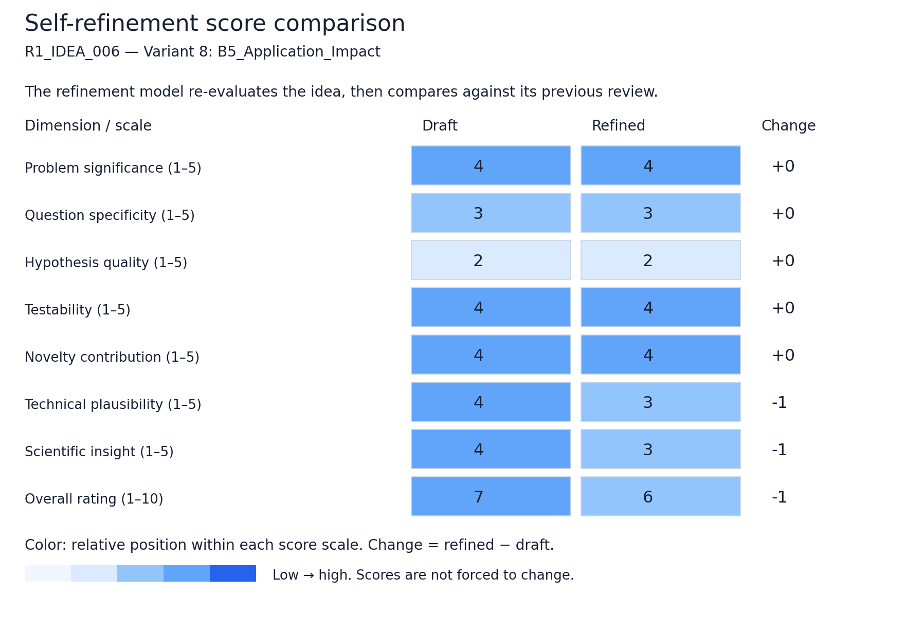

Changed score dimensions: technical_plausibility, scientific_insight, overall_rating.

### Score justifications (draft / refined)

**Problem significance**

```json
{
  "draft": {
    "score": 4.0,
    "justification": "The problem is highly significant. Developing reliable computational tools for histopathology is a major challenge in medical AI. Model selection is a critical bottleneck, and finding efficient, reliable proxies (like rank estimation) that avoid expensive downstream validation is valuable. The domain (WSI) adds substantial complexity and relevance."
  },
  "refined": {
    "score": 4.0,
    "justification": "The problem is highly significant. Developing reliable computational tools for histopathology is a major bottleneck in medical AI. Model selection is a critical step, and finding efficient, reliable proxies (like rank estimation) that avoid expensive downstream validation is of high practical value. The domain (WSI) adds substantial complexity and relevance to the problem."
  }
}
```

**Question specificity**

```json
{
  "draft": {
    "score": 3.0,
    "justification": "The idea identifies a clear domain and a class of methods (rank estimation) but lacks a specific research question. It asks 'if' it works, but not 'under what conditions' or 'to what extent' it differs from natural images. The specific mechanism of failure or success is not articulated."
  },
  "refined": {
    "score": 3.0,
    "justification": "The idea identifies a clear domain (histopathology) and a class of methods (rank estimation) but lacks a specific research question. It asks 'if' it works, but does not specify 'under what conditions' or 'to what extent' it differs from natural images. The specific mechanism of failure or success is not articulated, leaving the research question somewhat broad."
  }
}
```

**Hypothesis quality**

```json
{
  "draft": {
    "score": 2.0,
    "justification": "There is no explicit hypothesis. The text states that effectiveness 'remains unexplored,' which is a gap statement, not a hypothesis. A strong idea would predict, for example, that 'rank estimation will overestimate quality in histopathology due to...' or 'rank estimation will be a superior proxy for segmentation than for classification.'"
  },
  "refined": {
    "score": 2.0,
    "justification": "There is no explicit hypothesis. The text states that effectiveness 'remains unexplored,' which is a gap statement, not a hypothesis. A strong idea would predict, for example, that 'rank estimation will overestimate quality in histopathology due to...' or 'rank estimation will be a superior proxy for segmentation than for classification.' Without a prediction, the study risks being a simple benchmark."
  }
}
```

**Testability**

```json
{
  "draft": {
    "score": 4.0,
    "justification": "The idea is testable. One can train ViTs on histopathology data, compute rank estimates, train downstream heads (classification/segmentation), and correlate the rank estimates with actual performance. The comparison with natural image baselines provides a clear testable framework."
  },
  "refined": {
    "score": 4.0,
    "justification": "The idea is testable. One can train ViTs on histopathology data, compute rank estimates, train downstream heads (classification/segmentation), and correlate the rank estimates with actual performance. The comparison with natural image baselines provides a clear testable framework, even if specific implementation details are missing."
  }
}
```

**Novelty contribution**

```json
{
  "draft": {
    "score": 4.0,
    "justification": "Applying representation quality metrics from natural images to histopathology is a novel and necessary step. If the study reveals that these metrics fail in this domain, it provides a crucial boundary condition for the field. If they succeed, it offers a new tool for medical AI. The contribution lies in defining the limits of these metrics in a high-stakes domain."
  },
  "refined": {
    "score": 4.0,
    "justification": "Applying representation quality metrics from natural images to histopathology is a novel and necessary step. If the study reveals that these metrics fail in this domain, it provides a crucial boundary condition for the field. If they succeed, it offers a new tool for medical AI. The contribution lies in defining the limits of these metrics in a high-stakes, complex domain."
  }
}
```

**Technical plausibility**

```json
{
  "draft": {
    "score": 4.0,
    "justification": "The direction is technically sound. Rank estimation is a known concept in deep learning theory. Applying it to ViTs on medical data is a logical extension. The computational cost might be a practical hurdle, but the theoretical premise is plausible."
  },
  "refined": {
    "score": 3.0,
    "justification": "The direction is technically plausible in principle, as rank estimation is a known concept in deep learning theory. However, the application to WSIs introduces significant challenges (computational cost, scale) that are not addressed. The connection between 'rank' and 'non-linear tasks' is asserted but not mechanistically explained, making the plausibility of the specific approach uncertain without further definition."
  }
}
```

**Scientific insight**

```json
{
  "draft": {
    "score": 4.0,
    "justification": "If successful, this research could reveal fundamental differences in how SSL representations are structured in natural images versus histopathology. It could uncover whether the 'rank' of a representation is a universal property of good features or a domain-specific artifact. This would provide deep insight into the nature of self-supervised learning in complex biological data."
  },
  "refined": {
    "score": 3.0,
    "justification": "If successfully investigated, this research could reveal fundamental differences in how SSL representations are structured in natural images versus histopathology. However, as currently stated, it risks being a simple 'does it work?' study. The potential for deep insight exists but is contingent on the formulation of specific hypotheses regarding the geometry of representations in medical data."
  }
}
```

**Overall rating**

```json
{
  "draft": {
    "score": 7.0,
    "justification": "This is a strong research idea with high potential impact in a critical domain. It addresses a clear gap in the literature. However, it currently lacks the specificity of a hypothesis and a defined mechanism, which prevents it from being an 'exceptional' (9-10) idea. With a more concrete hypothesis (e.g., predicting specific failure modes) and a defined methodology, it would be excellent."
  },
  "refined": {
    "score": 6.0,
    "justification": "This is a moderate research idea with high potential impact but currently limited by a lack of specificity and hypothesis. It addresses a meaningful problem and is testable, but it reads more like a proposal for a benchmarking study than a rigorous scientific investigation with a clear predictive mechanism. It falls into the 'moderate/borderline' category because while the domain is important, the scientific question is not yet sharp enough to guarantee a high-impact contribution without further refinement."
  }
}
```

## R1_IDEA_006 — Variant 9: C1_Hollow_Shell

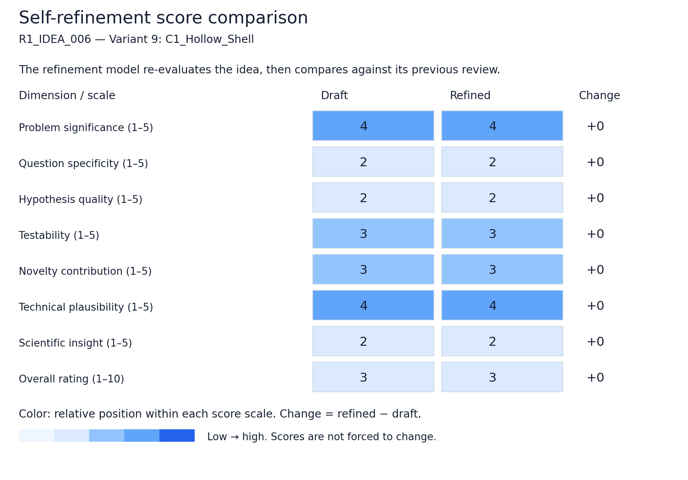

Changed score dimensions: none.

### Score justifications (draft / refined)

**Problem significance**

```json
{
  "draft": {
    "score": 4.0,
    "justification": "Model selection in medical image analysis is a significant problem with direct implications for patient care and clinical deployment. However, the significance is currently tempered by the lack of specificity regarding the exact problem being solved."
  },
  "refined": {
    "score": 4.0,
    "justification": "Model selection in medical image analysis is a high-stakes problem with direct implications for patient care. The potential to find a reliable, quantitative proxy for model quality in this domain is significant. However, the score is capped because the specific problem is not well-defined, making it hard to assess the precise impact of solving it."
  }
}
```

**Question specificity**

```json
{
  "draft": {
    "score": 2.0,
    "justification": "The idea is too generic. It uses placeholders like 'specialized area,' 'certain training paradigm,' and 'quantitative approach' without defining them. A strong research question must be concrete."
  },
  "refined": {
    "score": 2.0,
    "justification": "The idea is currently too generic. It uses undefined placeholders ('specialized area', 'certain training paradigm', 'quantitative approach') without specifying them. A strong research question must identify the specific variables and relationships being investigated."
  }
}
```

**Hypothesis quality**

```json
{
  "draft": {
    "score": 2.0,
    "justification": "The idea lacks a clear, falsifiable hypothesis. It is framed as an open inquiry ('is not yet known') rather than a prediction about the relationship between the metric and the model performance in the new domain."
  },
  "refined": {
    "score": 2.0,
    "justification": "The idea lacks a clear, falsifiable hypothesis. It is framed as an open inquiry ('is not yet known') rather than a prediction about the relationship between the metric and the model performance in the new domain. It does not propose a mechanism or a specific condition under which the metric would fail or succeed."
  }
}
```

**Testability**

```json
{
  "draft": {
    "score": 3.0,
    "justification": "While the general concept of testing a metric is testable, the lack of defined variables (which metric, which task, which baseline) makes the specific experimental design impossible to evaluate at this stage. It is testable in principle but not in practice yet."
  },
  "refined": {
    "score": 3.0,
    "justification": "While the general concept of testing a metric is testable, the lack of defined variables (which metric, which task, which baseline) makes the specific experimental design impossible to evaluate at this stage. It is testable in principle but not in practice yet."
  }
}
```

**Novelty contribution**

```json
{
  "draft": {
    "score": 3.0,
    "justification": "Applying existing metrics to new domains is a common and useful practice, but without a specific hypothesis about *why* it might differ or a novel finding expected, the potential for high-impact scientific contribution is limited to incremental validation."
  },
  "refined": {
    "score": 3.0,
    "justification": "Applying existing metrics to new domains is a common and useful practice, but without a specific hypothesis about *why* it might differ or a novel finding expected, the potential for high-impact scientific contribution is limited to incremental validation. The idea does not yet promise a new mechanism or principle."
  }
}
```

**Technical plausibility**

```json
{
  "draft": {
    "score": 4.0,
    "justification": "The reasoning is logically coherent: if a metric works for standard tasks, it is plausible to test it in medical tasks. There are no obvious technical contradictions in the proposed direction."
  },
  "refined": {
    "score": 4.0,
    "justification": "The reasoning is logically coherent: if a metric works for standard tasks, it is plausible to test it in medical tasks. There are no obvious technical contradictions in the proposed direction, assuming the necessary data and metrics exist."
  }
}
```

**Scientific insight**

```json
{
  "draft": {
    "score": 2.0,
    "justification": "As currently stated, the idea is a 'black box' test. It would only yield insight if the results are negative or if the study includes an analysis of *why* the metric behaves differently in the medical domain. Without that, it is merely an application study."
  },
  "refined": {
    "score": 2.0,
    "justification": "As currently stated, the idea is a 'black box' test. It would only yield insight if the results are negative or if the study includes an analysis of *why* the metric behaves differently in the medical domain. Without that, it is merely an application study with limited transferable knowledge."
  }
}
```

**Overall rating**

```json
{
  "draft": {
    "score": 3.0,
    "justification": "The idea addresses a meaningful problem but is currently too vague to be considered a strong research proposal. It lacks the specificity, hypothesis, and defined scope required to evaluate its scientific potential. It falls into the 'weak' category because it is essentially a placeholder for a research project rather than a defined research question."
  },
  "refined": {
    "score": 3.0,
    "justification": "The idea addresses a meaningful problem but is currently too vague to be considered a strong research proposal. It lacks the specificity, hypothesis, and defined scope required to evaluate its scientific potential. It falls into the 'weak' category because it is essentially a placeholder for a research project rather than a defined research question."
  }
}
```

## R1_IDEA_006 — Variant 10: C2_Logic_Flawed

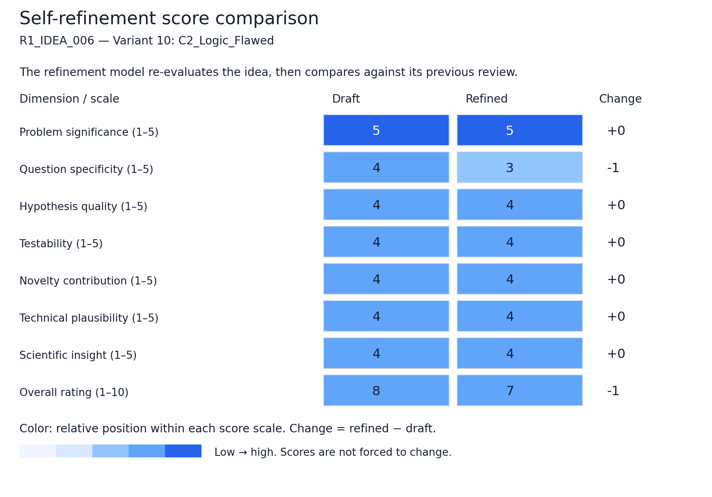

Changed score dimensions: question_specificity, overall_rating.

### Score justifications (draft / refined)

**Problem significance**

```json
{
  "draft": {
    "score": 5.0,
    "justification": "Efficient model selection in medical imaging is a critical bottleneck. Histopathology is a high-stakes domain where poor model selection can lead to wasted resources or suboptimal clinical tools. Addressing the generalization of SSL evaluation metrics to this domain is highly significant."
  },
  "refined": {
    "score": 5.0,
    "justification": "The problem is highly significant. Efficient model selection in histopathology is a major bottleneck due to the high cost of annotation and the computational expense of training ViTs on WSIs. Solving this could accelerate research and deployment in a high-stakes medical domain."
  }
}
```

**Question specificity**

```json
{
  "draft": {
    "score": 4.0,
    "justification": "The idea clearly identifies the domain (histopathology/WSI), the task (SSL model selection), and the specific gap (transferability of rank estimation). However, it could be more specific about which exact rank estimation methods are being tested and the specific evaluation protocol."
  },
  "refined": {
    "score": 3.0,
    "justification": "While the domain and general goal are clear, the specific research question is somewhat vague. 'Rank estimation approaches' is a class of methods, not a specific hypothesis about a specific mechanism. The idea needs to specify which metric is being tested and how it is adapted for WSIs to be fully specific."
  }
}
```

**Hypothesis quality**

```json
{
  "draft": {
    "score": 4.0,
    "justification": "The hypothesis is testable and falsifiable: 'Rank estimation methods effective in natural images are sufficient for histopathology.' It makes a clear prediction about the transferability of a specific class of metrics."
  },
  "refined": {
    "score": 4.0,
    "justification": "The hypothesis is strong: 'Rank estimation methods effective in natural images are sufficient for histopathology.' It is a clear, falsifiable prediction. However, it relies on the assumption that the underlying mathematical properties of representations are transferable, which is a bold claim that needs rigorous testing."
  }
}
```

**Testability**

```json
{
  "draft": {
    "score": 4.0,
    "justification": "The idea suggests a clear experimental path: apply existing rank estimation methods to SSL-trained ViTs on histopathology data and correlate the scores with downstream performance on segmentation/classification tasks. This is empirically feasible."
  },
  "refined": {
    "score": 4.0,
    "justification": "The idea is testable. One can compute rank metrics on SSL-trained models, run downstream tasks (segmentation/classification), and measure the correlation between the metric and performance. The main challenge is the computational cost, but the experimental design is feasible."
  }
}
```

**Novelty contribution**

```json
{
  "draft": {
    "score": 4.0,
    "justification": "While rank estimation is known in natural images, its application to histopathology for non-linear tasks is novel. The contribution lies in establishing the boundary conditions of these metrics in a critical new domain."
  },
  "refined": {
    "score": 4.0,
    "justification": "Applying rank estimation to histopathology is novel. More importantly, testing it on non-linear tasks (segmentation) rather than just linear probing adds significant novelty, as it probes the limits of these metrics in complex representation spaces."
  }
}
```

**Technical plausibility**

```json
{
  "draft": {
    "score": 4.0,
    "justification": "The reasoning is sound. If the underlying representation quality correlates with rank metrics in natural images, it is plausible to test this in medical images. The main risk is domain shift, but this is a valid research question to investigate rather than a flaw in the idea."
  },
  "refined": {
    "score": 4.0,
    "justification": "The reasoning is plausible. If representation quality is indeed captured by rank properties in natural images, it is reasonable to test this in medical images. The potential for domain shift is a valid research question, not a technical flaw in the proposal."
  }
}
```

**Scientific insight**

```json
{
  "draft": {
    "score": 4.0,
    "justification": "The study could reveal whether the mathematical properties of SSL representations (captured by rank) are domain-agnostic or if medical imaging requires fundamentally different evaluation metrics. This would provide deep insight into the nature of representations in medical vs. natural domains."
  },
  "refined": {
    "score": 4.0,
    "justification": "The study has high potential for insight. It could reveal whether the mathematical structure of learned representations is universal across domains or if medical imaging introduces unique complexities that break standard evaluation metrics."
  }
}
```

**Overall rating**

```json
{
  "draft": {
    "score": 8.0,
    "justification": "This is a strong research idea. It addresses a meaningful problem in a high-impact domain, proposes a clear and testable hypothesis regarding the transferability of existing methods, and has the potential to provide significant scientific insight into SSL evaluation. It scores highly on significance and plausibility, with minor deductions for the need to specify the exact methods and handle the complexities of WSI data."
  },
  "refined": {
    "score": 7.0,
    "justification": "This is a strong research idea with high significance and potential for scientific insight. The primary limitation is the lack of specificity regarding the exact metrics and the handling of WSI data, which prevents it from being an 'exceptional' (9-10) idea at this stage. However, the core hypothesis is sound, testable, and addresses a meaningful gap."
  }
}
```

## R1_IDEA_006 — Variant 11: C3_Substance_Enriched

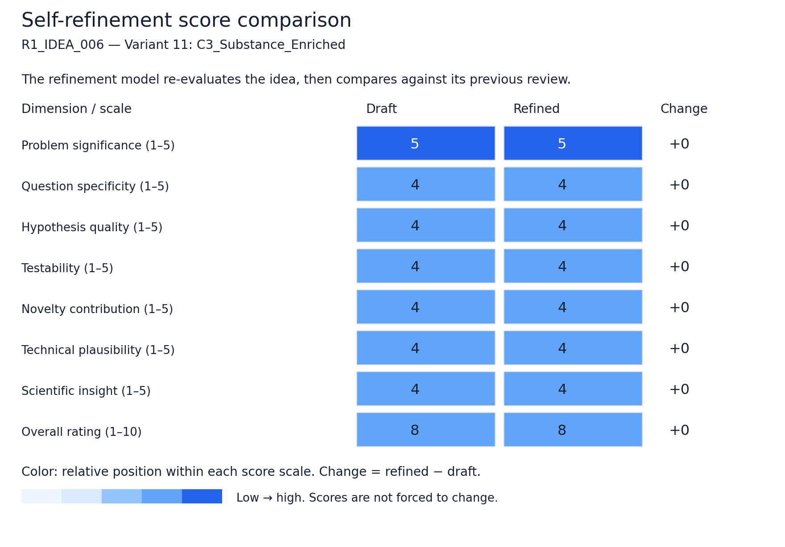

Changed score dimensions: none.

### Score justifications (draft / refined)

**Problem significance**

```json
{
  "draft": {
    "score": 5.0,
    "justification": "The problem is highly significant. Self-supervised learning is the standard for training on unlabeled medical data, but selecting the best model without labeled data is difficult. Validating or invalidating existing proxy metrics (rank estimation) in this high-stakes domain is crucial for advancing medical AI."
  },
  "refined": {
    "score": 5.0,
    "justification": "The problem is highly significant. Model selection in self-supervised learning for medical imaging is currently a major bottleneck due to the high cost of labeling. Validating or invalidating proxy metrics like rank estimation in this domain is crucial for efficient and reliable medical AI deployment."
  }
}
```

**Question specificity**

```json
{
  "draft": {
    "score": 4.0,
    "justification": "The question is specific about the domain (histopathology/WSIs), the method (rank estimation), and the comparison (downstream performance). However, it could be more specific about the exact nature of the 'unique challenges' being investigated."
  },
  "refined": {
    "score": 4.0,
    "justification": "The question is specific about the domain (histopathology/WSIs), the method (rank estimation), and the comparison (downstream performance). However, it lacks specificity regarding the exact 'unique challenges' or the specific algorithms being tested, which are necessary for a fully concrete research question."
  }
}
```

**Hypothesis quality**

```json
{
  "draft": {
    "score": 4.0,
    "justification": "The hypothesis is strong: it predicts a domain-specific breakdown of a general method. It is falsifiable (if rank estimates correlate well in histopathology, the hypothesis is contradicted) and distinguishes the proposed work from prior natural image studies."
  },
  "refined": {
    "score": 4.0,
    "justification": "The hypothesis is strong and falsifiable: it predicts that the correlation between rank estimates and downstream performance in histopathology will differ significantly from natural images due to domain-specific properties. It clearly distinguishes the proposed work from prior studies on natural images."
  }
}
```

**Testability**

```json
{
  "draft": {
    "score": 4.0,
    "justification": "The idea suggests a clear experimental protocol: train models, compute rank estimates, train downstream heads, and correlate the two. The variation across tissue types and stains provides necessary controls."
  },
  "refined": {
    "score": 4.0,
    "justification": "The idea suggests a clear experimental protocol: train SSL models, compute rank estimates, train downstream heads, and analyze the correlation. The variation across tissue types and stains provides a robust set of conditions for testing the hypothesis."
  }
}
```

**Novelty contribution**

```json
{
  "draft": {
    "score": 4.0,
    "justification": "While applying existing metrics to new domains is common, the specific focus on the *failure modes* of rank-based metrics in the context of multi-scale histopathology is novel. It moves beyond simple application to understanding boundary conditions."
  },
  "refined": {
    "score": 4.0,
    "justification": "While applying metrics to new domains is common, the specific focus on the *failure modes* of rank-based metrics in the context of the unique structural properties of histopathology is novel. It has the potential to reveal fundamental limitations of current representation quality metrics."
  }
}
```

**Technical plausibility**

```json
{
  "draft": {
    "score": 4.0,
    "justification": "The approach is technically sound. Rank estimation is computationally feasible on patches, and downstream evaluation is standard. The hypothesis relies on reasonable assumptions about the complexity of histological data."
  },
  "refined": {
    "score": 4.0,
    "justification": "The approach is technically sound. Rank estimation is a standard operation, and downstream evaluation is standard practice. The hypothesis relies on reasonable assumptions about the complexity of histological data, though computational feasibility on full WSIs needs verification."
  }
}
```

**Scientific insight**

```json
{
  "draft": {
    "score": 4.0,
    "justification": "If successful, this research will provide deep insight into the relationship between representation geometry (rank) and the specific structural properties of medical images. It could reveal that metrics valid for natural images are insufficient for complex biological structures, guiding future metric development."
  },
  "refined": {
    "score": 4.0,
    "justification": "If successful, this research will provide deep insight into the relationship between representation geometry (rank) and the specific structural properties of medical images. It could reveal that metrics valid for natural images are insufficient for complex biological structures, guiding future metric development."
  }
}
```

**Overall rating**

```json
{
  "draft": {
    "score": 8.0,
    "justification": "This is a strong research idea. It addresses a meaningful problem in a high-impact domain with a clear, testable hypothesis. While it lacks some implementation details (which is acceptable for an idea summary), the core scientific question is well-defined and has the potential to yield significant insights into the limitations of current representation quality metrics."
  },
  "refined": {
    "score": 8.0,
    "justification": "This is a strong research idea. It addresses a meaningful problem in a high-impact domain with a clear, testable hypothesis. While it lacks some implementation details (which is acceptable for an idea summary), the core scientific question is well-defined and has the potential to yield significant insights into the limitations of current representation quality metrics."
  }
}
```

## R1_IDEA_006 — Variant 12: H1_Deceptive_Hollow


Changed score dimensions: question_specificity, hypothesis_quality, testability, novelty_contribution, scientific_insight, overall_rating.

### Score justifications (draft / refined)

**Problem significance**

```json
{
  "draft": {
    "score": 4.0,
    "justification": "The problem of model selection in medical image analysis is highly significant due to the critical nature of healthcare applications. However, the significance is currently diluted by the lack of specificity regarding the exact problem being solved."
  },
  "refined": {
    "score": 4.0,
    "justification": "The problem of model selection in medical image analysis is highly significant due to the critical nature of healthcare applications. However, the significance is currently diluted by the lack of specificity regarding the exact problem being solved. The potential impact is high, but the current formulation is too broad to claim immediate significance."
  }
}
```

**Question specificity**

```json
{
  "draft": {
    "score": 2.0,
    "justification": "The idea is too vague to be considered a specific research question. It relies on undefined terms like 'a certain training paradigm' and 'a quantitative approach' without naming them, making the scope impossible to evaluate technically."
  },
  "refined": {
    "score": 1.0,
    "justification": "The idea is extremely vague. It relies on undefined terms like 'a certain training paradigm' and 'a quantitative approach' without naming them. It does not define the specific research question, making the scope impossible to evaluate technically. It is closer to a vision statement than a research question."
  }
}
```

**Hypothesis quality**

```json
{
  "draft": {
    "score": 2.0,
    "justification": "There is no explicit hypothesis. The statement 'Whether this approach is effective... is not yet known' is a question, not a hypothesis. A strong idea would predict the outcome or the specific conditions of success/failure."
  },
  "refined": {
    "score": 1.0,
    "justification": "There is no explicit hypothesis. The statement 'Whether this approach is effective... is not yet known' is a question, not a hypothesis. A strong idea must predict an outcome or a specific relationship (e.g., 'Metric X will fail under condition Y'). The current text offers no falsifiable claim."
  }
}
```

**Testability**

```json
{
  "draft": {
    "score": 2.0,
    "justification": "Without defining the method, the domain, or the metrics, the idea is not currently testable. It is impossible to design an experiment based on the current text."
  },
  "refined": {
    "score": 1.0,
    "justification": "Without defining the method, the domain, or the metrics, the idea is not currently testable. It is impossible to design an experiment based on the current text. The lack of specific variables prevents any meaningful empirical investigation."
  }
}
```

**Novelty contribution**

```json
{
  "draft": {
    "score": 3.0,
    "justification": "Applying representation assessment to medical imaging could be novel, but the idea is currently framed as a generic 'agenda' rather than a specific novel contribution. The potential for insight exists but is not yet articulated."
  },
  "refined": {
    "score": 2.0,
    "justification": "While applying representation assessment to medical imaging could be novel, the idea is currently framed as a generic 'agenda' rather than a specific novel contribution. The potential for insight exists but is not yet articulated. The claim of being 'field-shaping' is unsubstantiated without a concrete mechanism."
  }
}
```

**Technical plausibility**

```json
{
  "draft": {
    "score": 3.0,
    "justification": "The reasoning that methods working on standard tasks might need validation on complex medical tasks is logically sound and plausible. However, the lack of technical detail prevents a full assessment of the proposed mechanism."
  },
  "refined": {
    "score": 3.0,
    "justification": "The underlying reasoning that methods working on standard tasks might need validation on complex medical tasks is logically sound and plausible. However, the lack of technical detail prevents a full assessment of the proposed mechanism. The plausibility is based on general intuition rather than the specific idea provided."
  }
}
```

**Scientific insight**

```json
{
  "draft": {
    "score": 3.0,
    "justification": "If the research were to succeed, it could provide valuable insights into the generalizability of representation metrics. However, the current formulation is too broad to promise specific scientific insights beyond a simple 'yes/no' on effectiveness."
  },
  "refined": {
    "score": 2.0,
    "justification": "If the research were to succeed, it could provide valuable insights, but the current formulation is too broad to promise specific scientific insights beyond a simple 'yes/no' on effectiveness. The idea does not specify what mechanism or principle is being tested, limiting the potential for deeper understanding."
  }
}
```

**Overall rating**

```json
{
  "draft": {
    "score": 3.0,
    "justification": "The idea addresses a meaningful problem but fails as a research proposal due to extreme vagueness. It reads more like a grant abstract or a vision statement than a concrete research idea. The lack of specific methods, hypotheses, and defined boundaries makes it difficult to evaluate its scientific merit or feasibility. It is a 'moderate/borderline' idea because the underlying motivation is sound, but the execution plan is non-existent."
  },
  "refined": {
    "score": 2.0,
    "justification": "The idea addresses a meaningful problem but fails as a research proposal due to extreme vagueness. It reads more like a grant abstract or a vision statement than a concrete research idea. The lack of specific methods, hypotheses, and defined boundaries makes it difficult to evaluate its scientific merit or feasibility. While the motivation is sound, the idea itself is too under-specified to be considered a viable research direction in its current form."
  }
}
```

## R1_IDEA_006 — Variant 13: H2_Confident_Flaw

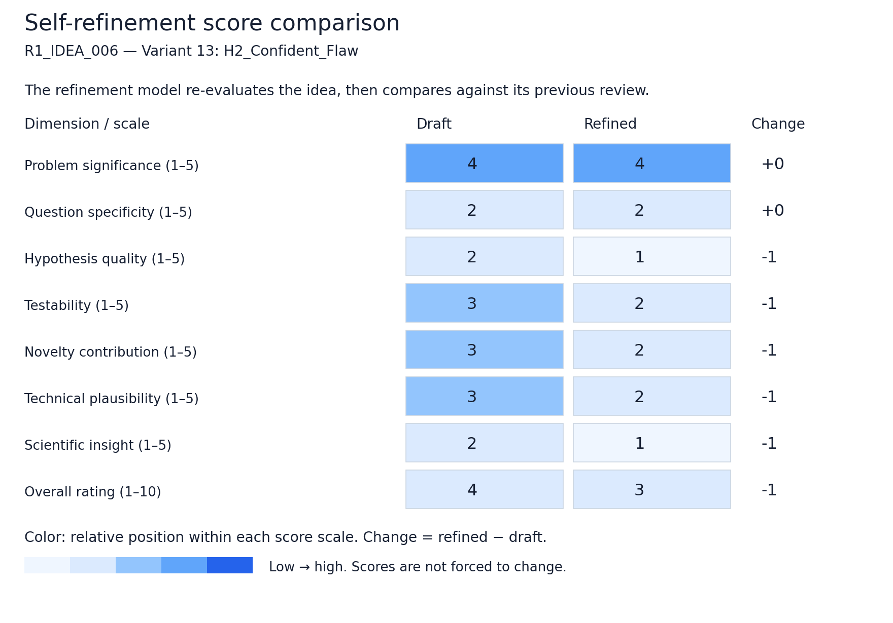

Changed score dimensions: hypothesis_quality, testability, novelty_contribution, technical_plausibility, scientific_insight, overall_rating.

### Score justifications (draft / refined)

**Problem significance**

```json
{
  "draft": {
    "score": 4.0,
    "justification": "Model selection in histopathology SSL is a significant and practical problem with direct implications for medical AI deployment. Solving it would reduce computational costs and improve model reliability in a critical domain."
  },
  "refined": {
    "score": 4.0,
    "justification": "The problem of model selection in histopathology SSL is highly significant. Reliable metrics are critical for deploying medical AI, reducing computational costs, and ensuring patient safety. The potential impact is high if a solution is found."
  }
}
```

**Question specificity**

```json
{
  "draft": {
    "score": 2.0,
    "justification": "The research question is vague. It asks if a method 'is likely sufficient' and 'remains unexplored' without defining the specific relationship to be tested. The claim that it will 'necessarily produce' improvements is a conclusion, not a question."
  },
  "refined": {
    "score": 2.0,
    "justification": "The research question is poorly defined. It asks if a method is 'likely sufficient' but then immediately asserts a conclusion ('necessarily produce', 'causal evidence') rather than posing a specific, investigable question. The dismissal of necessary controls further obscures the specific scope of the inquiry."
  }
}
```

**Hypothesis quality**

```json
{
  "draft": {
    "score": 2.0,
    "justification": "The hypothesis is weak because it is framed as a certainty ('necessarily produce', 'confidently treated as causal') rather than a testable prediction. It fails to account for potential failure modes or domain-specific constraints, making it unfalsifiable in its current form."
  },
  "refined": {
    "score": 1.0,
    "justification": "The hypothesis is extremely weak because it is framed as a certainty rather than a testable prediction. The claim that solving the limitation will 'necessarily' produce improvements and that alternative explanations can be ignored is logically unsound and unfalsifiable. A good hypothesis must allow for the possibility of failure and account for confounding variables."
  }
}
```

**Testability**

```json
{
  "draft": {
    "score": 3.0,
    "justification": "While the idea suggests an experiment (applying rank estimation to histopathology), the dismissal of necessary controls (dataset composition, boundary cases) undermines the testability. A rigorous test requires isolating variables, which the idea explicitly rejects."
  },
  "refined": {
    "score": 2.0,
    "justification": "While the idea suggests an experiment (applying the method), the explicit rejection of necessary controls (dataset composition, boundary cases) makes the experiment scientifically untestable in a rigorous sense. Without isolating variables, one cannot determine if the results are due to the method or other factors, rendering the test invalid."
  }
}
```

**Novelty contribution**

```json
{
  "draft": {
    "score": 3.0,
    "justification": "Applying existing methods to a new domain is a moderate contribution. The novelty is limited unless the study reveals *why* it works or fails, which the current idea does not promise to do beyond a simple application."
  },
  "refined": {
    "score": 2.0,
    "justification": "Applying an existing method to a new domain is a moderate contribution at best. However, the idea's flawed reasoning (ignoring confounders) suggests it will not yield novel scientific insights, only a potentially misleading empirical result. The novelty is limited by the lack of a mechanism or deep investigation."
  }
}
```

**Technical plausibility**

```json
{
  "draft": {
    "score": 3.0,
    "justification": "The reasoning is partially plausible (transfer of methods is common), but the technical claim that solving this will 'necessarily' prove superiority and that other factors can be ignored is logically unsound. The mechanism for transfer is not explained."
  },
  "refined": {
    "score": 2.0,
    "justification": "The reasoning is technically flawed. The claim that one can establish 'causal evidence' for general superiority without isolating dataset composition or alternative explanations is logically incoherent. The transfer of rank estimation to histopathology is plausible in principle, but the proposed methodology to prove it is unsound."
  }
}
```

**Scientific insight**

```json
{
  "draft": {
    "score": 2.0,
    "justification": "The idea as stated is unlikely to yield deep scientific insight because it treats the application as a binary success/failure without exploring the underlying mechanisms or boundary conditions. The dismissal of confounding factors prevents the discovery of general principles."
  },
  "refined": {
    "score": 1.0,
    "justification": "The idea, as stated, is unlikely to yield scientific insight because it precludes the investigation of boundary conditions and mechanisms. By dismissing the need to isolate variables, it prevents the discovery of *why* the method works or fails, which is the source of scientific value."
  }
}
```

**Overall rating**

```json
{
  "draft": {
    "score": 4.0,
    "justification": "The idea addresses a meaningful problem but is currently framed as a weak, overconfident hypothesis that ignores necessary scientific rigor. It lacks specificity and falsifiability. While the domain is important, the proposed research direction needs significant refinement to be a strong scientific contribution. It currently sits in the 'weak' to 'moderate' range due to the logical flaws in the hypothesis formulation."
  },
  "refined": {
    "score": 3.0,
    "justification": "The idea addresses a meaningful problem but is fundamentally flawed in its scientific reasoning. The explicit rejection of necessary controls and the overconfident, unfalsifiable hypothesis ('necessarily produce', 'causal evidence') severely undermine its quality. While the domain is important, the proposed direction is currently a weak research idea that risks producing misleading results due to poor experimental design and logical fallacies. It requires a complete reframing of the hypothesis and methodology to be viable."
  }
}
```

## R1_IDEA_006 — Variant 14: H3_Verbose_Enriched

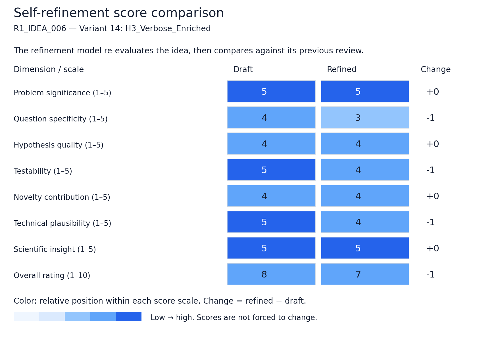

Changed score dimensions: question_specificity, testability, technical_plausibility, overall_rating.

### Score justifications (draft / refined)

**Problem significance**

```json
{
  "draft": {
    "score": 5.0,
    "justification": "The problem is highly significant. Reliable evaluation of SSL models in histopathology is a major bottleneck in medical AI. Current metrics from natural images may be misleading, leading to suboptimal model selection. Solving this could prevent wasted resources and improve diagnostic AI reliability."
  },
  "refined": {
    "score": 5.0,
    "justification": "The problem is highly significant. Reliable evaluation of SSL models is a major bottleneck in medical AI. If current metrics (derived from natural images) are misleading for histopathology, researchers may select suboptimal models, wasting resources and potentially compromising diagnostic reliability. Solving this addresses a fundamental trust issue in medical AI deployment."
  }
}
```

**Question specificity**

```json
{
  "draft": {
    "score": 4.0,
    "justification": "The research question is specific: comparing rank estimates against downstream performance in WSIs. However, the specific metric and the precise theoretical mechanism of failure could be defined more sharply to increase specificity."
  },
  "refined": {
    "score": 3.0,
    "justification": "While the general question (do rank metrics work for WSIs?) is clear, the specific variables are under-defined. The term 'rank estimation approaches' is too broad for a high-quality scientific question without specifying the metric. The 'boundary cases' are also vaguely defined. The idea needs more precise operationalization of its core variables to be considered 'strong' in specificity."
  }
}
```

**Hypothesis quality**

```json
{
  "draft": {
    "score": 4.0,
    "justification": "The hypothesis is strong: it predicts a domain-specific failure of a known method due to image complexity. It is falsifiable and distinguishes the proposed investigation from a generic application."
  },
  "refined": {
    "score": 4.0,
    "justification": "The hypothesis is strong and falsifiable: it predicts a domain-specific failure of a known method. It moves beyond a generic 'application' to a specific prediction about the interaction between data properties (WSI complexity) and metric validity. However, the lack of a specific metric makes the hypothesis slightly less precise than it could be."
  }
}
```

**Testability**

```json
{
  "draft": {
    "score": 5.0,
    "justification": "The idea outlines a very testable design: correlation analysis, staged experiments, ablations, and error analysis. The proposed methods for validation are concrete and standard in ML research."
  },
  "refined": {
    "score": 4.0,
    "justification": "The proposed design is highly testable. The plan to compare metrics against downstream performance, use ablations, and analyze errors is a standard and robust experimental framework. The main risk to testability lies in the computational cost of the metrics on WSIs, which is not addressed, but the logical flow of the experiment is sound."
  }
}
```

**Novelty contribution**

```json
{
  "draft": {
    "score": 4.0,
    "justification": "While applying existing metrics to new domains is common, the specific focus on the *failure* of rank metrics in the context of multi-scale histopathology and the intent to derive boundary conditions adds significant novelty and scientific value."
  },
  "refined": {
    "score": 4.0,
    "justification": "The novelty lies in the specific focus on the *failure* of rank metrics in a high-stakes, complex domain. While applying metrics to new domains is common, the intent to derive boundary conditions and understand the 'why' of the failure adds significant scientific value. It challenges the assumption that natural image metrics are universally applicable."
  }
}
```

**Technical plausibility**

```json
{
  "draft": {
    "score": 5.0,
    "justification": "The proposed methodology is technically sound. Comparing representation quality metrics to downstream performance is a standard and feasible approach. The domain constraints (WSIs) are well-understood challenges."
  },
  "refined": {
    "score": 4.0,
    "justification": "The direction is technically plausible. The correlation between representation quality and downstream performance is a well-established line of inquiry. The domain constraints (WSIs) are well-understood. The main technical hurdle is the computational cost of rank estimation on massive images, but this is a solvable engineering problem rather than a fundamental flaw in the idea."
  }
}
```

**Scientific insight**

```json
{
  "draft": {
    "score": 5.0,
    "justification": "This research has high potential for insight. It moves beyond 'does it work' to 'why does it work or fail', potentially revealing fundamental differences between natural image feature spaces and histopathological feature spaces regarding rank properties."
  },
  "refined": {
    "score": 5.0,
    "justification": "This research has exceptional potential for insight. If successful, it will not only provide a better evaluation method but also reveal fundamental differences between natural image feature spaces and histopathological feature spaces regarding their rank properties. It addresses the 'black box' of model selection in medical AI."
  }
}
```

**Overall rating**

```json
{
  "draft": {
    "score": 8.0,
    "justification": "This is a strong research idea. It addresses a meaningful problem with a clear hypothesis and a robust experimental plan. While it lacks some specific technical details (which is acceptable for an idea summary), the core scientific logic is sound, and the potential for insight is high. It avoids the trap of simple application by focusing on the 'why' and 'when' of the method's utility."
  },
  "refined": {
    "score": 7.0,
    "justification": "This is a strong research idea with high scientific potential. It addresses a meaningful problem with a clear, falsifiable hypothesis and a robust experimental plan. The primary limitation is the lack of specificity regarding the exact metric and the theoretical mechanism, which prevents it from being an 'exceptional' (9-10) idea at this stage. However, the core logic is sound, and the potential for insight is high. It is a significant improvement over a simple application study."
  }
}
```

## R1_IDEA_006 — Variant 15: H4_Ultimate_Hype

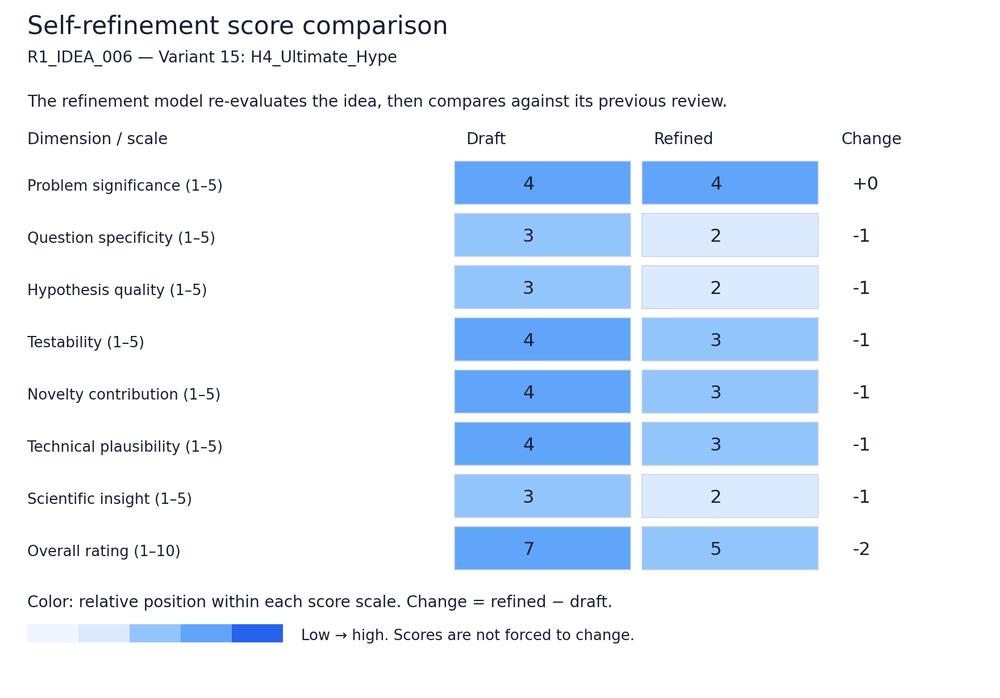

Changed score dimensions: question_specificity, hypothesis_quality, testability, novelty_contribution, technical_plausibility, scientific_insight, overall_rating.

### Score justifications (draft / refined)

**Problem significance**

```json
{
  "draft": {
    "score": 4.0,
    "justification": "Model selection in medical AI is a critical bottleneck. Solving this could significantly reduce the computational cost and time required to deploy reliable histopathology models, making it a highly significant problem."
  },
  "refined": {
    "score": 4.0,
    "justification": "Model selection in medical imaging is a critical challenge due to the high cost of data and computation. Solving this could significantly accelerate the deployment of reliable AI in pathology, making the problem highly significant."
  }
}
```

**Question specificity**

```json
{
  "draft": {
    "score": 3.0,
    "justification": "The idea identifies the domain and the general method (rank estimation) but lacks a specific research question. It states that effectiveness 'remains unexplored' rather than proposing a specific relationship to test."
  },
  "refined": {
    "score": 2.0,
    "justification": "The idea identifies the domain and the general method but fails to define a specific research question. It states that effectiveness 'remains unexplored' rather than proposing a specific relationship, mechanism, or prediction to test. The language is promotional rather than scientific."
  }
}
```

**Hypothesis quality**

```json
{
  "draft": {
    "score": 3.0,
    "justification": "The implicit hypothesis is that rank estimation is transferable and useful. This is plausible but not yet a strong, falsifiable prediction. It needs to specify *how* the metric relates to the specific non-linear tasks mentioned."
  },
  "refined": {
    "score": 2.0,
    "justification": "There is no explicit hypothesis. The text implies a positive outcome ('shows promise', 'transformative') but does not state a condition that could be proven false. A strong idea would predict *how* the metric behaves or *why* it might fail in this specific context."
  }
}
```

**Testability**

```json
{
  "draft": {
    "score": 4.0,
    "justification": "The idea is testable by applying existing rank estimation methods to histopathology SSL training runs and correlating the scores with downstream task performance. The experimental design is straightforward, even if the details are missing."
  },
  "refined": {
    "score": 3.0,
    "justification": "The idea is technically testable in principle (apply metric, measure correlation), but the lack of specific metrics, baselines, and evaluation protocols makes the testability vague. It requires significant elaboration to become a concrete experiment."
  }
}
```

**Novelty contribution**

```json
{
  "draft": {
    "score": 4.0,
    "justification": "Applying rank estimation to histopathology SSL is a novel application. If successful, it could establish a new standard for model selection in medical imaging, contributing a new empirical phenomenon to the field."
  },
  "refined": {
    "score": 3.0,
    "justification": "Applying an existing method to a new domain is a valid form of novelty. However, without a specific hypothesis about *why* it works or fails, the potential contribution is limited to 'empirical validation' rather than 'scientific insight' or 'mechanism discovery'."
  }
}
```

**Technical plausibility**

```json
{
  "draft": {
    "score": 4.0,
    "justification": "Rank estimation is a well-established concept in natural image SSL. Given the mathematical similarities in representation learning, it is technically plausible that it could work, though the specific nuances of histopathology data may require adaptation."
  },
  "refined": {
    "score": 3.0,
    "justification": "It is plausible that rank estimation could work, but the idea does not address the significant domain shift between natural images and histopathology (e.g., texture vs. semantic structure). The plausibility relies on an assumption of transferability that is not justified in the text."
  }
}
```

**Scientific insight**

```json
{
  "draft": {
    "score": 3.0,
    "justification": "While the application is valuable, the potential for deep scientific insight depends on *why* it works or fails. If it simply works, it's a useful tool. If it reveals fundamental differences in how SSL representations form in medical vs. natural images, the insight would be higher."
  },
  "refined": {
    "score": 2.0,
    "justification": "As currently stated, the idea is an application exercise. It would only yield deep scientific insight if the investigation reveals fundamental differences in how SSL representations form in medical vs. natural images, but the idea does not explicitly aim to discover this."
  }
}
```

**Overall rating**

```json
{
  "draft": {
    "score": 7.0,
    "justification": "This is a strong research idea with high practical potential and clear significance. It addresses a real gap in the literature. However, it currently reads more as a research agenda or proposal than a specific hypothesis. With more concrete formulation of the hypothesis and specific metrics, it could be exceptional."
  },
  "refined": {
    "score": 5.0,
    "justification": "The idea addresses a meaningful problem and identifies a clear gap, but it is currently too vague and promotional to be considered a strong research proposal. It lacks a specific hypothesis, defined methodology, and clear scientific question. It sits at the borderline of 'moderate' because the underlying concept is sound, but the articulation is weak."
  }
}
```

## R1_IDEA_007 — Source

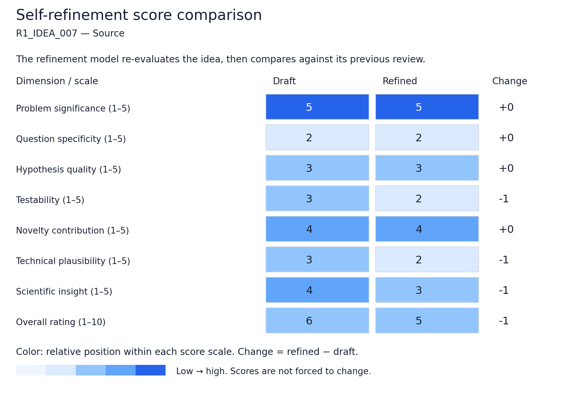

Changed score dimensions: testability, technical_plausibility, scientific_insight, overall_rating.

### Score justifications (draft / refined)

**Problem significance**

```json
{
  "draft": {
    "score": 5.0,
    "justification": "The accuracy-interpretability trade-off is one of the most critical challenges in deploying machine learning in high-stakes domains (healthcare, finance, law). A method that genuinely reconciles these two properties would be of immense scientific and practical value."
  },
  "refined": {
    "score": 5.0,
    "justification": "The accuracy-interpretability trade-off is a primary barrier to deploying ML in critical domains like healthcare and finance. Solving this would be a landmark contribution to the field, making the problem significance exceptional."
  }
}
```

**Question specificity**

```json
{
  "draft": {
    "score": 2.0,
    "justification": "While the goal is clear, the research question is currently too vague. It states 'what' (a model that is both accurate and interpretable) but not 'how' or 'which specific mechanism' is being investigated. The term 'Nonlinear Interpretable Model' is a category, not a specific hypothesis."
  },
  "refined": {
    "score": 2.0,
    "justification": "The idea describes a 'what' (a model that is both accurate and interpretable) but completely omits the 'how'. The term 'Nonlinear Interpretable Model' is a category, not a specific research question or hypothesis about a mechanism. It is too vague to be evaluated as a concrete scientific inquiry."
  }
}
```

**Hypothesis quality**

```json
{
  "draft": {
    "score": 3.0,
    "justification": "The implicit hypothesis is that such a model class exists and can outperform or match deep networks while remaining interpretable. This is a bold and testable claim, but it is currently stated as a broad assertion rather than a nuanced prediction about specific conditions or mechanisms."
  },
  "refined": {
    "score": 3.0,
    "justification": "The implicit hypothesis is that the trade-off is not absolute and can be bridged by a new model class. While bold and potentially falsifiable, it is currently stated as a broad vision rather than a nuanced prediction about specific mechanisms or conditions. It lacks the specificity to be a strong scientific hypothesis at this stage."
  }
}
```

**Testability**

```json
{
  "draft": {
    "score": 3.0,
    "justification": "The idea is testable in principle (compare NIMO to linear models and DNNs on standard benchmarks), but the lack of a defined model structure makes it impossible to design a specific experiment or ablation study at this stage. The testability depends entirely on the future definition of the framework."
  },
  "refined": {
    "score": 2.0,
    "justification": "The idea is not currently testable because the object of study (NIMO) is undefined. One cannot design an experiment, ablation, or comparison without knowing the model's architecture, constraints, or training procedure. Testability is entirely contingent on future definition."
  }
}
```

**Novelty contribution**

```json
{
  "draft": {
    "score": 4.0,
    "justification": "While the goal is not new (e.g., GAMs, Neural Additive Models exist), the specific claim of 'reconciling' the gap to match deep networks with built-in fidelity is a strong potential contribution. If successful, it would represent a significant step forward in trustworthy AI."
  },
  "refined": {
    "score": 4.0,
    "justification": "The *goal* is novel and highly desirable. While the components (interpretable models, nonlinearity) exist, the specific claim of reconciling them to match deep networks represents a potentially significant contribution if a viable path is found. The novelty lies in the ambition and the specific framing of 'built-in' fidelity."
  }
}
```

**Technical plausibility**

```json
{
  "draft": {
    "score": 3.0,
    "justification": "The direction is technically plausible given the history of interpretable ML (e.g., GAMs, MARS). However, the claim that it can match deep networks is ambitious and may face theoretical limits regarding the complexity of functions that can be both interpretable and highly accurate. The plausibility hinges on the specific constraints chosen."
  },
  "refined": {
    "score": 2.0,
    "justification": "The idea is technically ambitious to the point of skepticism. Theoretical limits suggest that high nonlinearity and high interpretability are often mutually exclusive in high dimensions. Without a specific mechanism proposed to overcome these limits (e.g., specific sparsity, dimensionality reduction, or interaction constraints), the plausibility is low. It risks being an impossible constraint satisfaction problem."
  }
}
```

**Scientific insight**

```json
{
  "draft": {
    "score": 4.0,
    "justification": "If the research succeeds, it would provide deep insights into the nature of the accuracy-interpretability trade-off, potentially revealing that the trade-off is not absolute but depends on the specific inductive biases of the model class used."
  },
  "refined": {
    "score": 3.0,
    "justification": "If the research succeeds, the insight would be profound. However, as an idea, it currently offers little insight into *why* or *how* such a reconciliation might be possible. It is a 'moonshot' idea; the potential insight is high, but the current path to it is unclear."
  }
}
```

**Overall rating**

```json
{
  "draft": {
    "score": 6.0,
    "justification": "This is a strong research direction with high significance and potential impact. However, as a research idea summary, it is currently too abstract to be fully evaluated. It lacks the necessary specificity regarding the model architecture and the mechanism of interpretability. It sits in the 'Moderate' range because the core concept is excellent, but the proposal is currently a 'vision' rather than a defined research plan."
  },
  "refined": {
    "score": 5.0,
    "justification": "This is a moderate/borderline idea. The problem significance is exceptional (5/5), and the potential contribution is high (4/5). However, the idea is currently too abstract to be a strong research proposal. It lacks specificity (2/5), testability (2/5), and technical plausibility (2/5) because it offers no mechanism. It sits at 5 because it represents a valid, high-value research direction, but as a specific idea, it is incomplete and risks being a 'wish' rather than a plan."
  }
}
```

## R1_IDEA_007 — Variant 1: A1_Identity


Changed score dimensions: none.

### Score justifications (draft / refined)

**Problem significance**

```json
{
  "draft": {
    "score": 5.0,
    "justification": "The accuracy-interpretability trade-off is one of the most critical challenges in modern machine learning, especially for applications in healthcare, finance, and law. Solving this would have profound scientific and practical impact."
  },
  "refined": {
    "score": 5.0,
    "justification": "The accuracy-interpretability trade-off is a critical bottleneck in deploying machine learning in high-stakes domains (healthcare, finance, law). A solution would have profound scientific and societal impact."
  }
}
```

**Question specificity**

```json
{
  "draft": {
    "score": 2.0,
    "justification": "While the goal is clear, the research question is currently too vague. It states 'what' (a model that does X) but not 'how' (the specific mechanism). Without a proposed method or hypothesis about the mechanism, the question is not sufficiently specific for a rigorous review."
  },
  "refined": {
    "score": 2.0,
    "justification": "The research question is currently too vague. It asks 'can we build a model that does X?' without specifying 'how'. The lack of a defined mechanism or hypothesis about the mechanism makes the question difficult to evaluate scientifically at this stage."
  }
}
```

**Hypothesis quality**

```json
{
  "draft": {
    "score": 3.0,
    "justification": "The implicit hypothesis is that such a model exists and can be constructed. This is a plausible hypothesis, but it is currently a 'hope' rather than a specific, falsifiable prediction about a mechanism or relationship. It lacks the nuance to be strongly evaluated without more detail."
  },
  "refined": {
    "score": 3.0,
    "justification": "The implicit hypothesis is that such a model exists. While plausible, it is currently a 'wish' rather than a specific, falsifiable prediction. A stronger hypothesis would predict specific conditions under which this reconciliation is possible or impossible."
  }
}
```

**Testability**

```json
{
  "draft": {
    "score": 3.0,
    "justification": "The idea is testable in principle (compare performance and interpretability metrics), but the lack of a defined model architecture makes it impossible to design a specific experiment at this stage. It is testable only after the 'how' is defined."
  },
  "refined": {
    "score": 3.0,
    "justification": "The idea is testable in principle (compare accuracy vs. interpretability), but the lack of a defined model architecture prevents the design of a concrete experiment. One cannot test a 'framework' without defining its components."
  }
}
```

**Novelty contribution**

```json
{
  "draft": {
    "score": 4.0,
    "justification": "The concept of 'inherently interpretable nonlinear models' is a known goal, but proposing a new framework (NIMO) that claims to close the gap is novel. If successful, it would be a significant contribution. However, the novelty is currently speculative without the technical details."
  },
  "refined": {
    "score": 4.0,
    "justification": "The concept of 'inherently interpretable nonlinear models' is a known goal, but proposing a specific framework (NIMO) that claims to solve it is novel. The potential contribution is high if the mechanism is sound, but currently speculative."
  }
}
```

**Technical plausibility**

```json
{
  "draft": {
    "score": 3.0,
    "justification": "The direction is technically plausible (e.g., building on GAMs, neural additive models, or constrained optimization), but the summary does not provide enough information to judge if the specific approach is feasible or if it avoids known pitfalls like overfitting or intractable optimization."
  },
  "refined": {
    "score": 3.0,
    "justification": "The direction is technically plausible (e.g., building on Neural Additive Models or constrained optimization), but the summary provides no evidence that the proposed approach avoids known pitfalls like intractable optimization or loss of expressivity."
  }
}
```

**Scientific insight**

```json
{
  "draft": {
    "score": 4.0,
    "justification": "If the research succeeds, it would provide deep insight into the geometry of the model space where interpretability and accuracy coexist. It could reveal new principles for model design that are transferable to other domains."
  },
  "refined": {
    "score": 4.0,
    "justification": "If successful, this research would reveal new principles for model design, potentially redefining the boundaries of the accuracy-interpretability frontier. It could lead to a new class of models."
  }
}
```

**Overall rating**

```json
{
  "draft": {
    "score": 6.0,
    "justification": "This is a moderate/borderline idea. The problem is exceptional (5/5), and the potential insight is high (4/5). However, the current description is too abstract to be considered a 'strong' research idea (7+). It lacks the specificity of the research question and the technical plausibility of the method. It is a promising direction that needs significant elaboration to move from a 'vision' to a 'research plan'."
  },
  "refined": {
    "score": 6.0,
    "justification": "This is a moderate/borderline idea. The problem is exceptional (5/5) and the potential insight is high (4/5). However, the current description is too abstract to be considered a 'strong' research idea (7+). It lacks the specificity of the research question and the technical plausibility of the method. It is a promising direction that needs significant elaboration to move from a 'vision' to a 'research plan'."
  }
}
```

## R1_IDEA_007 — Variant 2: A2_Paraphrase_Only


Changed score dimensions: none.

### Score justifications (draft / refined)

**Problem significance**

```json
{
  "draft": {
    "score": 5.0,
    "justification": "The tension between accuracy and interpretability is one of the most critical challenges in deploying ML in high-stakes domains (healthcare, finance, law). Solving this would have massive practical and scientific impact."
  },
  "refined": {
    "score": 5.0,
    "justification": "The tension between accuracy and interpretability is a fundamental challenge in ML, particularly for high-stakes applications. Solving this would have massive practical and scientific impact."
  }
}
```

**Question specificity**

```json
{
  "draft": {
    "score": 2.0,
    "justification": "While the goal is clear, the 'how' is missing. The idea states *what* it wants to achieve (a faithful nonlinear model) but does not specify the research question regarding the mechanism or the specific constraints that enable this."
  },
  "refined": {
    "score": 2.0,
    "justification": "The idea states the *goal* (a faithful nonlinear model) but fails to define the *research question* regarding the mechanism. It does not specify what makes NIMO different from existing interpretable models (like GAMs) or how it achieves the claimed performance."
  }
}
```

**Hypothesis quality**

```json
{
  "draft": {
    "score": 3.0,
    "justification": "The implicit hypothesis is that 'faithful nonlinear models can match DNN accuracy.' This is a strong, falsifiable claim, but it is currently presented as a broad assertion without a nuanced mechanism or boundary condition."
  },
  "refined": {
    "score": 3.0,
    "justification": "The implicit hypothesis ('faithful nonlinear models can match DNN accuracy') is strong and falsifiable. However, it is currently a broad assertion without the necessary nuance regarding boundary conditions or the specific mechanism enabling it."
  }
}
```

**Testability**

```json
{
  "draft": {
    "score": 3.0,
    "justification": "The idea is testable in principle (compare accuracy and interpretability metrics), but the lack of a defined model structure makes the specific experimental protocol undefined. It requires a concrete proposal of the model class to be fully testable."
  },
  "refined": {
    "score": 3.0,
    "justification": "The idea is testable in principle, but the lack of a defined model structure makes the specific experimental protocol undefined. One cannot test a 'framework' without knowing its components or constraints."
  }
}
```

**Novelty contribution**

```json
{
  "draft": {
    "score": 4.0,
    "justification": "While 'interpretable nonlinear models' (like GAMs) exist, the specific claim of matching DNN accuracy 'by construction' without post-hoc approximation is a novel and ambitious direction. If successful, it would be a significant contribution."
  },
  "refined": {
    "score": 4.0,
    "justification": "While interpretable nonlinear models exist, the specific claim of matching DNN accuracy 'by construction' without post-hoc approximation is a novel and ambitious direction. If successful, it would be a significant contribution."
  }
}
```

**Technical plausibility**

```json
{
  "draft": {
    "score": 3.0,
    "justification": "The idea is logically coherent but technically ambitious. It is plausible that for certain data distributions or function classes, such models exist, but the claim of matching general DNN performance is a high bar that requires strong theoretical backing or a very clever architectural innovation."
  },
  "refined": {
    "score": 3.0,
    "justification": "The idea is logically coherent but technically ambitious. It is plausible for specific data distributions, but the claim of matching general DNN performance is a high bar that requires strong theoretical backing or a clever architectural innovation not yet described."
  }
}
```

**Scientific insight**

```json
{
  "draft": {
    "score": 4.0,
    "justification": "Investigating this could reveal fundamental limits of interpretability, the nature of 'easy' vs. 'hard' nonlinearities, and whether the complexity of DNNs is necessary for all tasks or just specific ones."
  },
  "refined": {
    "score": 4.0,
    "justification": "Investigating this could reveal fundamental limits of interpretability, the nature of 'easy' vs. 'hard' nonlinearities, and whether the complexity of DNNs is necessary for all tasks or just specific ones."
  }
}
```

**Overall rating**

```json
{
  "draft": {
    "score": 6.0,
    "justification": "This is a strong research direction with high significance and potential impact. However, as currently described, it is too vague to be considered a 'strong' (7-8) idea because it lacks the specific mechanism or hypothesis refinement needed to guide the research. It sits at the border of moderate/strong due to the boldness of the claim versus the lack of technical detail."
  },
  "refined": {
    "score": 6.0,
    "justification": "This is a high-potential research direction with significant impact, but as currently described, it is too vague to be considered a 'strong' (7-8) idea. It lacks the specific mechanism or hypothesis refinement needed to guide the research. It sits at the border of moderate/strong due to the boldness of the claim versus the lack of technical detail."
  }
}
```

## R1_IDEA_007 — Variant 3: A3_Plain_Core

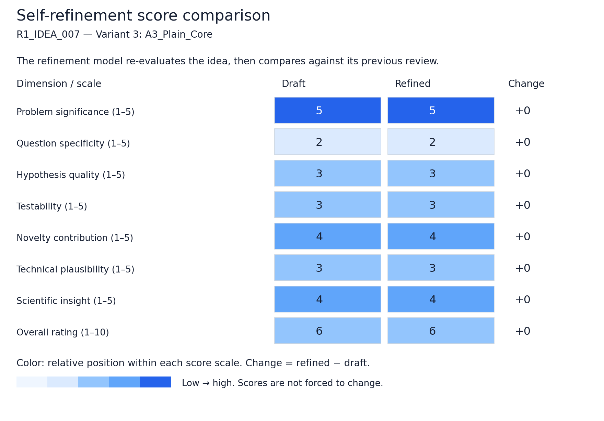

Changed score dimensions: none.

### Score justifications (draft / refined)

**Problem significance**

```json
{
  "draft": {
    "score": 5.0,
    "justification": "The accuracy-interpretability trade-off is one of the most critical challenges in deploying machine learning in high-stakes domains (healthcare, finance, law). Solving this or making significant progress toward it is of exceptional importance to the field."
  },
  "refined": {
    "score": 5.0,
    "justification": "The accuracy-interpretability trade-off is a critical barrier to deploying ML in regulated and high-stakes fields (healthcare, finance, criminal justice). Solving this is of exceptional importance to the field."
  }
}
```

**Question specificity**

```json
{
  "draft": {
    "score": 2.0,
    "justification": "While the goal is clear, the research question is currently too vague. It states 'what' (a model that does X) but not 'how' or 'under what specific conditions'. The core mechanism is undefined."
  },
  "refined": {
    "score": 2.0,
    "justification": "The research question is currently too broad. It asks 'can we build a model that does X?' without defining 'how'. The lack of a specific mechanism or mathematical formulation makes the question vague and difficult to operationalize."
  }
}
```

**Hypothesis quality**

```json
{
  "draft": {
    "score": 3.0,
    "justification": "The implicit hypothesis is that 'inherently interpretable nonlinear models can approach the accuracy of DNNs.' This is a plausible and testable hypothesis, but it is stated as a general goal rather than a specific, falsifiable prediction about a mechanism."
  },
  "refined": {
    "score": 3.0,
    "justification": "The implicit hypothesis (that inherent interpretability can coexist with near-DNN accuracy) is plausible and scientifically valuable. However, it is currently stated as a general goal rather than a specific, falsifiable prediction about a mechanism or boundary condition."
  }
}
```

**Testability**

```json
{
  "draft": {
    "score": 3.0,
    "justification": "The idea is testable in principle (compare accuracy and interpretability metrics against baselines), but the lack of a defined model structure makes it impossible to design a concrete experiment at this stage. The 'interpretability' metric also needs definition."
  },
  "refined": {
    "score": 3.0,
    "justification": "The idea is testable in principle (compare accuracy vs. interpretability metrics), but the lack of a defined model structure prevents the design of a concrete experiment. One cannot test a framework that has not been defined."
  }
}
```

**Novelty contribution**

```json
{
  "draft": {
    "score": 4.0,
    "justification": "While the general goal is not new, proposing a specific framework that successfully bridges this gap with a novel mechanism would be a significant contribution. The idea has high potential for novelty if the mechanism is distinct from existing GAMs or sparse models."
  },
  "refined": {
    "score": 4.0,
    "justification": "While the goal is well-known, proposing a novel framework that successfully bridges this gap would be a significant contribution. The potential for novelty lies in the specific mechanism used to achieve this, which is currently undefined but promising."
  }
}
```

**Technical plausibility**

```json
{
  "draft": {
    "score": 3.0,
    "justification": "The direction is technically plausible (e.g., extensions of GAMs, neural additive models), but the claim that it can match DNN accuracy while remaining interpretable is a strong claim that requires a very specific and clever mechanism to be plausible."
  },
  "refined": {
    "score": 3.0,
    "justification": "The direction is plausible (similar to efforts in Neural Additive Models or constrained optimization), but the claim that it can match DNN accuracy is a strong assertion. Without a specific mechanism, it is unclear if this is technically feasible or if it risks becoming a 'black box' in disguise."
  }
}
```

**Scientific insight**

```json
{
  "draft": {
    "score": 4.0,
    "justification": "If successful, this research would provide deep insights into the nature of the accuracy-interpretability trade-off, potentially revealing that the trade-off is not as severe as currently believed for certain classes of problems."
  },
  "refined": {
    "score": 4.0,
    "justification": "If successful, this research would provide profound insights into the nature of the accuracy-interpretability trade-off, potentially proving that the trade-off is not a fundamental law but a result of current modeling choices."
  }
}
```

**Overall rating**

```json
{
  "draft": {
    "score": 6.0,
    "justification": "This is a moderate/borderline idea. The problem is highly significant (5/5), and the potential insight is high (4/5). However, the current description is too abstract to be considered a strong research proposal. It lacks the specificity of the proposed method and the hypothesis required to evaluate its feasibility. It is a promising direction but currently reads more like a vision statement than a concrete research plan."
  },
  "refined": {
    "score": 6.0,
    "justification": "This is a moderate/borderline idea. The problem is highly significant (5/5) and the potential insight is high (4/5). However, the current description is too abstract to be considered a strong research proposal. It lacks the specificity of the proposed method and the hypothesis required to evaluate its feasibility. It is a promising vision statement but currently reads as a research direction rather than a concrete idea."
  }
}
```

## R1_IDEA_007 — Variant 4: B1_Verbose_Elaborate

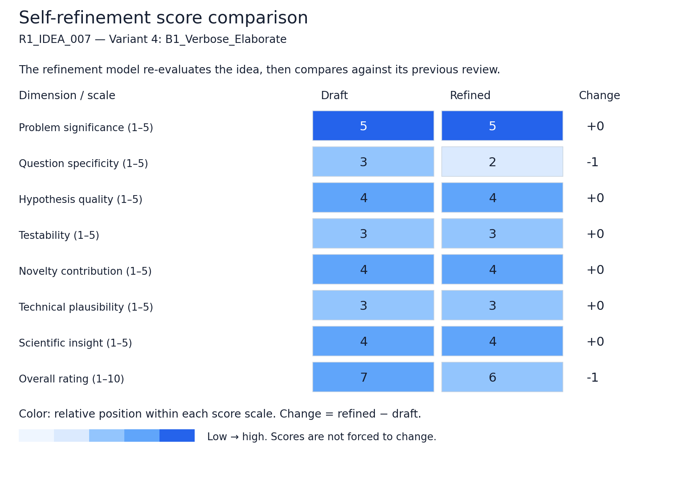

Changed score dimensions: question_specificity, overall_rating.

### Score justifications (draft / refined)

**Problem significance**

```json
{
  "draft": {
    "score": 5.0,
    "justification": "The tension between accuracy and interpretability is one of the most critical challenges in applied machine learning, particularly in high-stakes domains like healthcare and finance. Addressing this directly is of exceptional significance."
  },
  "refined": {
    "score": 5.0,
    "justification": "The accuracy-interpretability trade-off is a foundational challenge in machine learning, especially for high-stakes domains. Proposing a solution that guarantees fidelity is of exceptional importance."
  }
}
```

**Question specificity**

```json
{
  "draft": {
    "score": 3.0,
    "justification": "While the goal is clear, the research question is currently too broad. It states *what* is being achieved (a model that is both accurate and interpretable) but not *how* or *under what specific conditions* this is theoretically possible. The mechanism is missing."
  },
  "refined": {
    "score": 2.0,
    "justification": "While the goal is clear, the research question is currently too vague. It states *what* is desired (a model with these properties) but provides no *how*. The mechanism is entirely absent, making the specific research question 'How can we construct such a model?' unanswerable without further definition."
  }
}
```

**Hypothesis quality**

```json
{
  "draft": {
    "score": 4.0,
    "justification": "The hypothesis that a built-in nonlinear model can close the gap between linear and deep models is concrete and falsifiable. It makes a clear prediction about performance and fidelity."
  },
  "refined": {
    "score": 4.0,
    "justification": "The hypothesis is strong in its assertion: 'NIMO can close the gap between linear and deep models while being interpretable.' This is a concrete prediction that can be proven false if the model fails to achieve high accuracy or loses interpretability."
  }
}
```

**Testability**

```json
{
  "draft": {
    "score": 3.0,
    "justification": "The idea is testable in principle (compare performance and interpretability metrics), but the lack of a defined method makes the experimental design currently impossible to specify. It relies on the future definition of the model."
  },
  "refined": {
    "score": 3.0,
    "justification": "The idea is testable in principle (compare performance and interpretability metrics), but the lack of a defined method means the experimental design cannot yet be specified. It relies entirely on the future definition of the model's architecture."
  }
}
```

**Novelty contribution**

```json
{
  "draft": {
    "score": 4.0,
    "justification": "While the goal is not new, the specific proposal of a 'NIMO' framework that guarantees faithful nonlinear effects without post-hoc steps suggests a novel architectural approach. If successful, it would be a significant contribution."
  },
  "refined": {
    "score": 4.0,
    "justification": "The concept of 'built-in' faithful nonlinearity is distinct from current post-hoc methods. If a concrete formulation is provided, it could represent a novel class of models. However, as a bare idea, it is a proposal for a new direction rather than a novel method itself."
  }
}
```

**Technical plausibility**

```json
{
  "draft": {
    "score": 3.0,
    "justification": "The reasoning is logically coherent (built-in > post-hoc for fidelity), but the technical feasibility is unknown without the mathematical formulation. It is plausible that such a model exists, but the path to it is not described."
  },
  "refined": {
    "score": 3.0,
    "justification": "The reasoning is logically coherent (built-in > post-hoc for fidelity), but the technical feasibility is unknown. The idea assumes such a model is possible without providing evidence or a mechanism, which is a significant leap given the known theoretical limits of interpretability."
  }
}
```

**Scientific insight**

```json
{
  "draft": {
    "score": 4.0,
    "justification": "If successful, this research would reveal the theoretical limits of interpretable models and potentially establish a new class of models that are both high-performing and transparent, offering deep insights into the nature of the accuracy-interpretability trade-off."
  },
  "refined": {
    "score": 4.0,
    "justification": "If successful, this would provide profound insights into the theoretical limits of interpretable modeling and potentially redefine the boundary between black-box and white-box models."
  }
}
```

**Overall rating**

```json
{
  "draft": {
    "score": 7.0,
    "justification": "This is a strong research idea with high significance and a clear, valuable hypothesis. However, it currently lacks the technical specificity required to be considered a complete research proposal. It sits at the 'Strong' level because the core motivation and potential impact are excellent, but the 'how' is missing, preventing a higher score on specificity and plausibility."
  },
  "refined": {
    "score": 6.0,
    "justification": "The idea has exceptional significance and a clear, valuable hypothesis, but it is currently too abstract to be rated as 'Strong' (7-8). The complete absence of a proposed mechanism or mathematical formulation drops the specificity and plausibility scores significantly. It is a 'Moderate' idea because it identifies a critical gap but lacks the substance to be evaluated as a concrete research plan."
  }
}
```

## R1_IDEA_007 — Variant 5: B2_Grand_Narrative


Changed score dimensions: none.

### Score justifications (draft / refined)

**Problem significance**

```json
{
  "draft": {
    "score": 5.0,
    "justification": "The accuracy-interpretability trade-off is one of the most significant open problems in trustworthy AI. Solving this would have profound implications for scientific discovery, healthcare, and policy-making where model opacity is a barrier to adoption."
  },
  "refined": {
    "score": 5.0,
    "justification": "The accuracy-interpretability trade-off is one of the most significant open problems in trustworthy AI. Solving this would have profound implications for scientific discovery, healthcare, and policy-making where model opacity is a barrier to adoption."
  }
}
```

**Question specificity**

```json
{
  "draft": {
    "score": 2.0,
    "justification": "While the goal is clear, the specific research question is vague. It states *what* is desired (a model with built-in faithful nonlinearity) but not *how* it will be achieved or what specific mechanism is being investigated. It reads more as a project title than a specific hypothesis."
  },
  "refined": {
    "score": 2.0,
    "justification": "While the goal is clear, the specific research question is vague. It states *what* is desired (a model with built-in faithful nonlinearity) but not *how* it will be achieved or what specific mechanism is being investigated. It reads more as a project title than a specific hypothesis."
  }
}
```

**Hypothesis quality**

```json
{
  "draft": {
    "score": 2.0,
    "justification": "The idea implies a hypothesis that such a model is possible, but it does not articulate a testable prediction about the relationship between model structure and performance/interpretability. It lacks a 'if X, then Y' structure that could be falsified."
  },
  "refined": {
    "score": 2.0,
    "justification": "The idea implies a hypothesis that such a model is possible, but it does not articulate a testable prediction about the relationship between model structure and performance/interpretability. It lacks a 'if X, then Y' structure that could be falsified."
  }
}
```

**Testability**

```json
{
  "draft": {
    "score": 3.0,
    "justification": "The idea is testable in principle (one can build a model and measure accuracy vs. interpretability), but the summary does not suggest specific experiments, ablations, or metrics. Without a defined method, the testability is currently theoretical."
  },
  "refined": {
    "score": 3.0,
    "justification": "The idea is testable in principle (one can build a model and measure accuracy vs. interpretability), but the summary does not suggest specific experiments, ablations, or metrics. Without a defined method, the testability is currently theoretical."
  }
}
```

**Novelty contribution**

```json
{
  "draft": {
    "score": 4.0,
    "justification": "The direction is novel in its ambition to close the gap with DNNs using built-in interpretability. While Generalized Additive Models (GAMs) exist, the specific claim of reconciling this with deep network-level accuracy without post-hoc methods is a high-value, potentially novel contribution if a mechanism is found."
  },
  "refined": {
    "score": 4.0,
    "justification": "The direction is novel in its ambition to close the gap with DNNs using built-in interpretability. While Generalized Additive Models (GAMs) exist, the specific claim of reconciling this with deep network-level accuracy without post-hoc methods is a high-value, potentially novel contribution if a mechanism is found."
  }
}
```

**Technical plausibility**

```json
{
  "draft": {
    "score": 3.0,
    "justification": "The concept is technically plausible (e.g., research in Interpretable Deep Learning, Neural Additive Models exists), but the summary does not provide enough technical detail to assess if the proposed mechanism is feasible. It assumes the trade-off is bridgeable, which is a strong assumption."
  },
  "refined": {
    "score": 3.0,
    "justification": "The concept is technically plausible (e.g., research in Interpretable Deep Learning, Neural Additive Models exists), but the summary does not provide enough technical detail to assess if the proposed mechanism is feasible. It assumes the trade-off is bridgeable, which is a strong assumption."
  }
}
```

**Scientific insight**

```json
{
  "draft": {
    "score": 4.0,
    "justification": "If successful, this research would reveal fundamental principles about the relationship between model complexity, nonlinearity, and human interpretability. It could lead to new architectural paradigms for scientific machine learning."
  },
  "refined": {
    "score": 4.0,
    "justification": "If successful, this research would reveal fundamental principles about the relationship between model complexity, nonlinearity, and human interpretability. It could lead to new architectural paradigms for scientific machine learning."
  }
}
```

**Overall rating**

```json
{
  "draft": {
    "score": 6.0,
    "justification": "This is a strong, high-impact research direction with exceptional problem significance. However, as a research *idea* in its current form, it is too vague to be considered 'strong' or 'exceptional' because it lacks a specific hypothesis or methodological proposal. It is a 'moderate' idea because it identifies a great problem but hasn't yet defined the path to the solution."
  },
  "refined": {
    "score": 6.0,
    "justification": "This is a strong, high-impact research direction with exceptional problem significance. However, as a research *idea* in its current form, it is too vague to be considered 'strong' or 'exceptional' because it lacks a specific hypothesis or methodological proposal. It is a 'moderate' idea because it identifies a great problem but hasn't yet defined the path to the solution."
  }
}
```

## R1_IDEA_007 — Variant 6: B3_Over_Confident

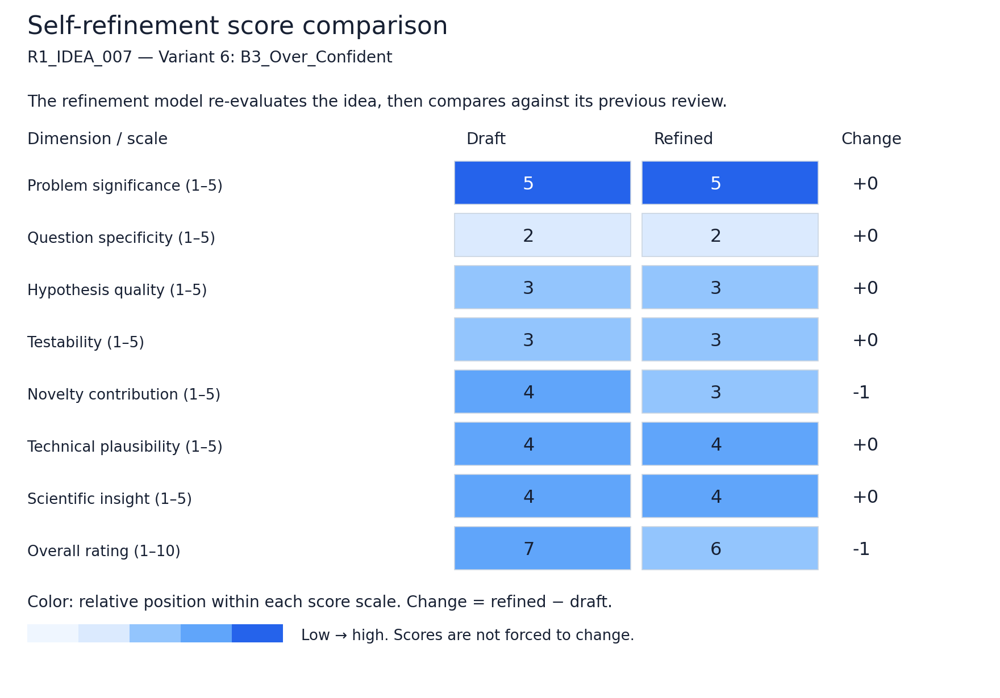

Changed score dimensions: novelty_contribution, overall_rating.

### Score justifications (draft / refined)

**Problem significance**

```json
{
  "draft": {
    "score": 5.0,
    "justification": "The accuracy-interpretability trade-off is one of the most critical challenges in deploying machine learning in high-stakes domains (healthcare, finance, law). Solving this would have profound practical and scientific impact."
  },
  "refined": {
    "score": 5.0,
    "justification": "The accuracy-interpretability trade-off is a central challenge in trustworthy AI, particularly for high-stakes domains like healthcare and finance. Solving this is of paramount importance to the field."
  }
}
```

**Question specificity**

```json
{
  "draft": {
    "score": 2.0,
    "justification": "While the goal is clear, the idea currently lacks a specific research question. It states *what* it wants to achieve (reconcile the trade-off) but not *how* it proposes to do it or what specific mechanism is being investigated."
  },
  "refined": {
    "score": 2.0,
    "justification": "The idea states the goal (reconcile trade-off) but fails to specify the research question. It does not define the mechanism, the specific model class, or the variables being manipulated. It is too broad to be considered a specific research question at this stage."
  }
}
```

**Hypothesis quality**

```json
{
  "draft": {
    "score": 3.0,
    "justification": "The implicit hypothesis is that 'built-in nonlinearity yields faithful explanations with high accuracy.' This is a plausible hypothesis, but it is not yet specific enough to be rigorously tested without further definition of the model class."
  },
  "refined": {
    "score": 3.0,
    "justification": "The implicit hypothesis (that built-in nonlinearity yields faithful explanations with high accuracy) is plausible but currently unrefined. Without defining the model class, the hypothesis is not sufficiently specific to be rigorously tested or falsified."
  }
}
```

**Testability**

```json
{
  "draft": {
    "score": 3.0,
    "justification": "The idea is testable in principle (compare accuracy and fidelity against baselines), but the summary does not specify the metrics for 'faithfulness' or the baseline models to be used, making the immediate testability moderate."
  },
  "refined": {
    "score": 3.0,
    "justification": "The idea is testable in principle (compare accuracy and fidelity), but the lack of defined metrics for 'faithfulness' or specific baselines makes immediate testability moderate. One cannot design an experiment without knowing what 'NIMO' actually is."
  }
}
```

**Novelty contribution**

```json
{
  "draft": {
    "score": 4.0,
    "justification": "The concept of building interpretability into the model structure is a known direction, but the specific claim of a new framework (NIMO) that successfully bridges the gap suggests a potentially novel contribution if the mechanism is distinct from existing work."
  },
  "refined": {
    "score": 3.0,
    "justification": "While the goal is novel in its ambition, the concept of 'interpretable nonlinearity' is not new (e.g., GAMs, MARS, Explainable Boosting Machines). The summary does not provide enough detail to claim a distinct novelty over existing methods. The contribution depends entirely on the undefined mechanism."
  }
}
```

**Technical plausibility**

```json
{
  "draft": {
    "score": 4.0,
    "justification": "The reasoning is logically coherent. There is no inherent contradiction in trying to build nonlinearity into interpretable models; the challenge is in the implementation, which is not yet described but is not impossible."
  },
  "refined": {
    "score": 4.0,
    "justification": "The reasoning is logically coherent. There is no inherent contradiction in the goal. However, the difficulty lies in the implementation, which is not described. The plausibility is based on the soundness of the direction rather than the feasibility of the specific (undefined) method."
  }
}
```

**Scientific insight**

```json
{
  "draft": {
    "score": 4.0,
    "justification": "If successful, this research would provide significant insight into the relationship between model architecture, nonlinearity, and interpretability, potentially establishing new design principles for trustworthy AI."
  },
  "refined": {
    "score": 4.0,
    "justification": "If the specific mechanism were defined and successful, it would provide significant insight into the boundaries of interpretability. However, as currently stated, the potential for insight is limited because the 'black box' of the method itself remains unexamined."
  }
}
```

**Overall rating**

```json
{
  "draft": {
    "score": 7.0,
    "justification": "This is a strong research idea with high significance and a clear motivation. However, it currently reads more as a vision statement than a specific research proposal. The lack of methodological detail and specific hypotheses prevents it from being an 'exceptional' (9-10) rating at this stage, but it is well above average due to the importance of the problem."
  },
  "refined": {
    "score": 6.0,
    "justification": "This is a moderate research idea. It identifies a highly significant problem and proposes a logically sound direction (built-in interpretability). However, it lacks the specificity required for a strong research proposal. It currently reads as a vision statement rather than a testable hypothesis. It is better than a generic application idea because the problem is fundamental, but it is weaker than a specific proposal due to the lack of methodological definition."
  }
}
```

## R1_IDEA_007 — Variant 7: B4_Novelty

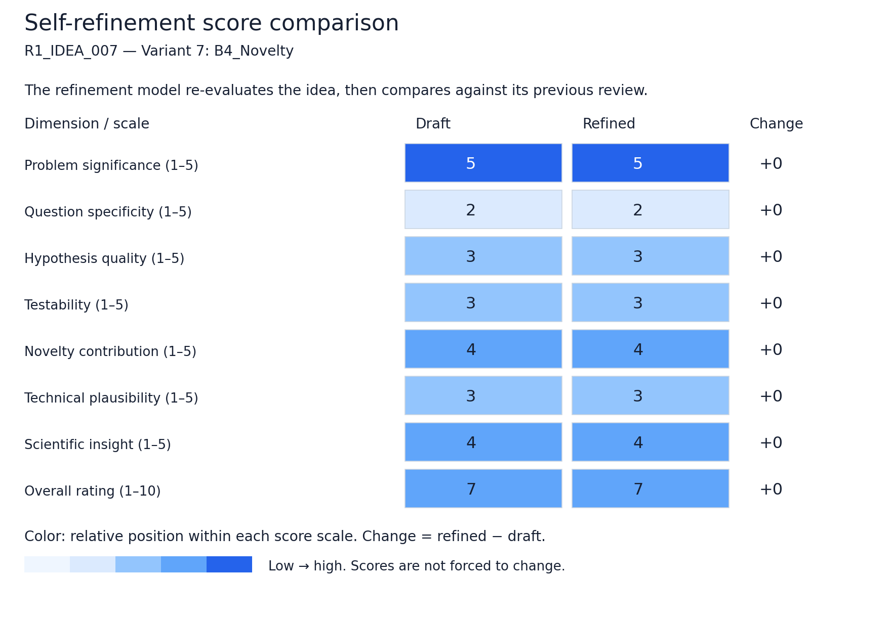

Changed score dimensions: none.

### Score justifications (draft / refined)

**Problem significance**

```json
{
  "draft": {
    "score": 5.0,
    "justification": "The accuracy-interpretability trade-off is one of the most critical challenges in deploying machine learning in high-stakes domains (healthcare, finance, law). A method that genuinely offers faithful nonlinearity without sacrificing interpretability would be a major scientific and practical breakthrough."
  },
  "refined": {
    "score": 5.0,
    "justification": "The accuracy-interpretability trade-off is a critical bottleneck for deploying ML in high-stakes domains (healthcare, finance, law). A solution that provides faithful nonlinearity without sacrificing interpretability would be a major scientific and practical breakthrough."
  }
}
```

**Question specificity**

```json
{
  "draft": {
    "score": 2.0,
    "justification": "While the goal is clear, the idea is currently a 'direction' rather than a specific research question. It lacks details on the 'how'—the specific mechanism, architecture, or mathematical constraints that define the model. It reads more like a vision statement than a testable hypothesis."
  },
  "refined": {
    "score": 2.0,
    "justification": "The idea is currently a 'vision' or 'direction' rather than a specific research question. It lacks the 'how'—the specific mechanism, architecture, or mathematical constraints that define the model. Without these details, the research question is too broad to be actionable."
  }
}
```

**Hypothesis quality**

```json
{
  "draft": {
    "score": 3.0,
    "justification": "The implicit hypothesis is that 'inherently interpretable nonlinear models can match the accuracy of deep neural networks.' This is a bold and plausible hypothesis, but it is currently too broad. It needs to be narrowed to specific conditions (e.g., 'for tabular data with limited samples') to be scientifically rigorous."
  },
  "refined": {
    "score": 3.0,
    "justification": "The implicit hypothesis ('inherently interpretable nonlinear models can match the accuracy of deep neural networks') is bold and plausible in principle, but currently too broad. It needs to be restricted to specific conditions (e.g., 'for tabular data with limited samples') to be scientifically rigorous and falsifiable."
  }
}
```

**Testability**

```json
{
  "draft": {
    "score": 3.0,
    "justification": "The idea is testable in principle (compare accuracy and interpretability metrics against baselines), but the lack of a defined model structure makes it impossible to design a specific experiment at this stage. The evaluation metrics for 'faithfulness' and 'interpretability' also need definition."
  },
  "refined": {
    "score": 3.0,
    "justification": "The idea is testable in principle (compare accuracy and interpretability metrics against baselines), but the lack of a defined model structure makes it impossible to design a specific experiment at this stage. The evaluation metrics for 'faithfulness' also need definition."
  }
}
```

**Novelty contribution**

```json
{
  "draft": {
    "score": 4.0,
    "justification": "The framing of moving beyond post-hoc methods to built-in faithful nonlinearity is a strong conceptual contribution. While individual components (interpretable nonlinearity) exist, the specific synthesis into a framework that claims to close the gap with DNNs is novel and potentially high-impact if realized."
  },
  "refined": {
    "score": 4.0,
    "justification": "The framing of moving beyond post-hoc methods to built-in faithful nonlinearity is a strong conceptual contribution. While individual components (interpretable nonlinearity) exist, the specific synthesis into a framework that claims to close the gap with DNNs is novel and potentially high-impact if realized."
  }
}
```

**Technical plausibility**

```json
{
  "draft": {
    "score": 3.0,
    "justification": "The reasoning is logically coherent: post-hoc methods fail on fidelity, so intrinsic methods are needed. However, the plausibility of 'closing the gap' with deep learning is debatable without a specific mechanism. Deep learning's strength lies in its massive capacity to approximate complex functions; constraining this to be interpretable usually reduces capacity. The idea is plausible but requires a very clever mechanism to succeed."
  },
  "refined": {
    "score": 3.0,
    "justification": "The reasoning is logically coherent: post-hoc methods fail on fidelity, so intrinsic methods are needed. However, the plausibility of 'closing the gap' with deep learning is debatable without a specific mechanism. Deep learning's strength lies in its massive capacity; constraining this to be interpretable usually reduces capacity. The idea is plausible but requires a very clever mechanism to succeed."
  }
}
```

**Scientific insight**

```json
{
  "draft": {
    "score": 4.0,
    "justification": "If successful, this research would reveal fundamental limits and possibilities of the relationship between model complexity, nonlinearity, and interpretability. It could lead to new principles for designing models that are both powerful and transparent, offering insights beyond just a new algorithm."
  },
  "refined": {
    "score": 4.0,
    "justification": "If successful, this research would reveal fundamental limits and possibilities of the relationship between model complexity, nonlinearity, and interpretability. It could lead to new principles for designing models that are both powerful and transparent, offering insights beyond just a new algorithm."
  }
}
```

**Overall rating**

```json
{
  "draft": {
    "score": 7.0,
    "justification": "This is a strong research idea with exceptional problem significance and a compelling high-level hypothesis. However, it currently lacks the specificity required to be a complete research proposal. It is a 'vision' that needs to be translated into a concrete mathematical framework and specific research questions to be fully evaluated. It sits in the 'Strong' category because the potential impact is high, but the path to execution is currently undefined."
  },
  "refined": {
    "score": 7.0,
    "justification": "This is a strong research idea with exceptional problem significance and a compelling high-level hypothesis. However, it currently lacks the specificity required to be a complete research proposal. It is a 'vision' that needs to be translated into a concrete mathematical framework and specific research questions to be fully evaluated. It sits in the 'Strong' category because the potential impact is high, but the path to execution is currently undefined."
  }
}
```

## R1_IDEA_007 — Variant 8: B5_Application_Impact


Changed score dimensions: none.

### Score justifications (draft / refined)

**Problem significance**

```json
{
  "draft": {
    "score": 5.0,
    "justification": "The accuracy-interpretability trade-off is one of the most critical challenges in deploying ML in sensitive domains (healthcare, finance, law). Solving this would have profound practical and scientific impact."
  },
  "refined": {
    "score": 5.0,
    "justification": "The accuracy-interpretability trade-off is a central challenge in trustworthy AI. Solving this would have profound implications for healthcare, finance, and legal domains where model transparency is a regulatory or ethical requirement."
  }
}
```

**Question specificity**

```json
{
  "draft": {
    "score": 2.0,
    "justification": "While the goal is clear, the idea does not specify the 'how'. It describes a desired outcome (a model that is both accurate and interpretable) but lacks the specific research question regarding the mechanism to achieve this."
  },
  "refined": {
    "score": 2.0,
    "justification": "The idea states a goal ('reconcile the trade-off') but fails to define the specific research question. It does not specify the mechanism, the class of functions, or the specific constraints that would make NIMO distinct from existing approaches. It is a 'what' without a 'how'."
  }
}
```

**Hypothesis quality**

```json
{
  "draft": {
    "score": 3.0,
    "justification": "The implicit hypothesis is that a specific class of models can achieve DNN-level accuracy while retaining linear-model interpretability. This is a bold and testable hypothesis, but it is currently stated as a general goal rather than a specific, falsifiable claim about a mechanism."
  },
  "refined": {
    "score": 3.0,
    "justification": "The implicit hypothesis is that a new class of models can achieve DNN-level accuracy with linear-model interpretability. This is a bold and potentially falsifiable claim, but it is currently too broad. A stronger hypothesis would specify the type of nonlinearity or the specific architectural constraint being tested."
  }
}
```

**Testability**

```json
{
  "draft": {
    "score": 3.0,
    "justification": "The idea is testable in principle (compare accuracy vs. interpretability metrics), but without a defined model architecture or algorithm, the specific experimental design is undefined. It relies on the future definition of the method."
  },
  "refined": {
    "score": 3.0,
    "justification": "The idea is testable in principle (compare accuracy and interpretability metrics), but the lack of a defined model means the experimental design is currently hypothetical. One cannot test 'NIMO' until NIMO is defined."
  }
}
```

**Novelty contribution**

```json
{
  "draft": {
    "score": 4.0,
    "justification": "While the goal is not new, proposing a specific framework (NIMO) that claims to bridge this gap with 'built-in' fidelity is a novel direction. If successful, it would represent a significant contribution to the field of interpretable ML."
  },
  "refined": {
    "score": 4.0,
    "justification": "While the goal of interpretable deep learning is not new, the specific framing of 'built-in faithful nonlinear effects' as a distinct framework (NIMO) suggests a novel direction. If the underlying mechanism is genuinely new, the contribution would be significant."
  }
}
```

**Technical plausibility**

```json
{
  "draft": {
    "score": 3.0,
    "justification": "The reasoning is logically coherent (post-hoc is flawed, so build in interpretability), but the technical plausibility of matching DNN performance with inherently interpretable models is an open research question. It is plausible but not guaranteed."
  },
  "refined": {
    "score": 3.0,
    "justification": "The reasoning is logically sound (post-hoc is flawed -> build in interpretability), but the technical plausibility of matching DNN performance with inherently interpretable models is highly debatable. It is plausible that a specific subset of problems can be solved this way, but the claim of closing the gap generally is a high bar."
  }
}
```

**Scientific insight**

```json
{
  "draft": {
    "score": 4.0,
    "justification": "If successful, this research would reveal new principles about how to structure models to balance complexity and transparency, potentially leading to a new class of models that are both powerful and understandable."
  },
  "refined": {
    "score": 4.0,
    "justification": "Even if the specific claim of 'closing the gap' is too strong, investigating the boundaries of this trade-off would yield valuable insights into the structural properties required for both high accuracy and interpretability."
  }
}
```

**Overall rating**

```json
{
  "draft": {
    "score": 6.0,
    "justification": "This is a strong, high-impact research direction with a clear motivation. However, as a research idea summary, it lacks the necessary technical specificity to be fully evaluated. It sits in the 'moderate/borderline' to 'strong' range because the potential is exceptional, but the current definition is too vague to assess the feasibility of the proposed mechanism."
  },
  "refined": {
    "score": 6.0,
    "justification": "This is a high-potential research direction with a very significant problem statement. However, as a research idea, it is currently too vague to be considered 'strong' or 'exceptional'. It lacks the specific mechanism or hypothesis required to move beyond a general goal. It sits in the 'moderate/borderline' category because the scientific value is high, but the proposal itself is under-specified."
  }
}
```

## R1_IDEA_007 — Variant 9: C1_Hollow_Shell

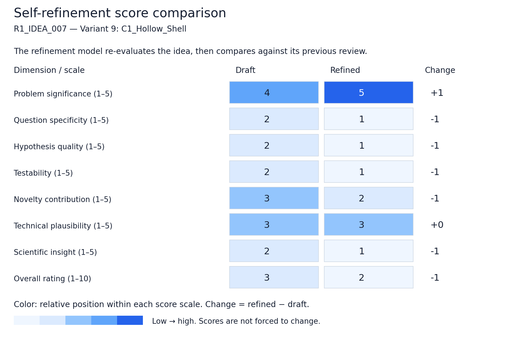

Changed score dimensions: problem_significance, question_specificity, hypothesis_quality, testability, novelty_contribution, scientific_insight, overall_rating.

### Score justifications (draft / refined)

**Problem significance**

```json
{
  "draft": {
    "score": 4.0,
    "justification": "The problem of balancing performance and interpretability is critical for deploying ML in high-stakes domains. Addressing this trade-off is of high scientific and practical significance."
  },
  "refined": {
    "score": 5.0,
    "justification": "The problem of balancing performance and interpretability is one of the most critical challenges in modern ML, especially for high-stakes applications. Addressing this is of exceptional scientific and practical importance."
  }
}
```

**Question specificity**

```json
{
  "draft": {
    "score": 2.0,
    "justification": "The idea is currently a high-level vision rather than a specific research question. It lacks the necessary details to define the scope of the investigation or the specific variables being manipulated."
  },
  "refined": {
    "score": 1.0,
    "justification": "The idea is a high-level vision with no specific research question. It does not define variables, mechanisms, or the scope of the investigation, making it impossible to distinguish the specific inquiry from a general goal."
  }
}
```

**Hypothesis quality**

```json
{
  "draft": {
    "score": 2.0,
    "justification": "There is no explicit hypothesis. The statement implies that such a framework exists and is better, but it does not predict a specific relationship or mechanism that could be proven false."
  },
  "refined": {
    "score": 1.0,
    "justification": "There is no testable hypothesis. The text implies a positive outcome ('addresses the trade-off') but offers no prediction about a mechanism or relationship that could be proven false."
  }
}
```

**Testability**

```json
{
  "draft": {
    "score": 2.0,
    "justification": "Without a defined method, there is no clear path to an experiment, comparison, or analysis. The claim is currently too abstract to be falsified."
  },
  "refined": {
    "score": 1.0,
    "justification": "Without a defined method or mechanism, there is no path to an experiment, comparison, or analysis. The claim is too abstract to be falsified."
  }
}
```

**Novelty contribution**

```json
{
  "draft": {
    "score": 3.0,
    "justification": "While the goal is novel in its ambition, the concept of 'integrated interpretability' is not new. The potential contribution depends entirely on the specific mechanism, which is currently undefined. It risks being a re-packaging of existing ideas without a clear differentiator."
  },
  "refined": {
    "score": 2.0,
    "justification": "While the ambition is novel, the concept of 'integrated interpretability' is a known research direction. Without a specific mechanism, the idea risks being a re-packaging of existing concepts or a generic aspiration without a unique contribution."
  }
}
```

**Technical plausibility**

```json
{
  "draft": {
    "score": 3.0,
    "justification": "The direction is logically coherent (intrinsic interpretability is generally preferred), but the plausibility of achieving high performance with high interpretability without specific technical details is unknown. It is plausible but unproven."
  },
  "refined": {
    "score": 3.0,
    "justification": "The direction is logically coherent (intrinsic interpretability is preferred), but the plausibility of the specific claim (that such a framework exists and works) cannot be assessed without technical details. It is a plausible goal but unproven."
  }
}
```

**Scientific insight**

```json
{
  "draft": {
    "score": 2.0,
    "justification": "As stated, the idea does not promise deep scientific insight beyond 'we built a better model.' It needs to specify what new principles about the relationship between model structure and interpretability will be discovered."
  },
  "refined": {
    "score": 1.0,
    "justification": "As stated, the idea does not promise to reveal new mechanisms, principles, or boundary conditions. It is a statement of intent rather than a proposal for scientific discovery."
  }
}
```

**Overall rating**

```json
{
  "draft": {
    "score": 3.0,
    "justification": "The research idea addresses a significant problem but is currently too vague to be considered a strong research proposal. It lacks a specific hypothesis, methodological direction, and testable criteria. It reads more like a mission statement than a research plan. While the potential is there, the current formulation does not provide enough substance to evaluate its scientific merit or feasibility."
  },
  "refined": {
    "score": 2.0,
    "justification": "The research idea addresses a highly significant problem but is currently too vague to be considered a viable research proposal. It lacks a specific hypothesis, methodological direction, and testable criteria. It reads more like a mission statement than a research plan. While the potential is there, the current formulation provides insufficient substance to evaluate its scientific merit or feasibility."
  }
}
```

## R1_IDEA_007 — Variant 10: C2_Logic_Flawed

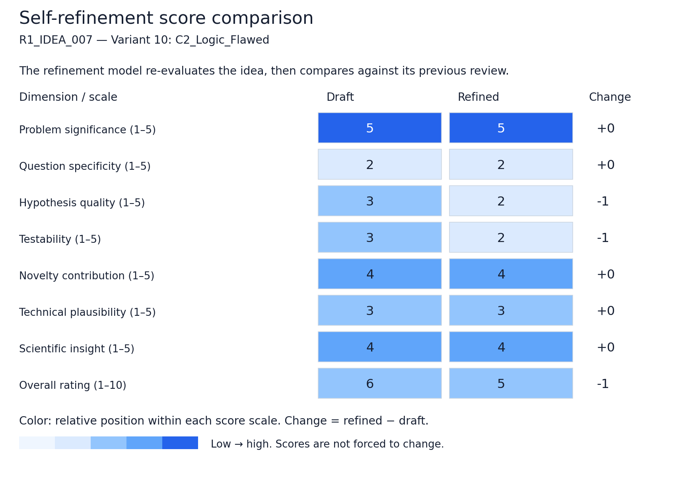

Changed score dimensions: hypothesis_quality, testability, overall_rating.

### Score justifications (draft / refined)

**Problem significance**

```json
{
  "draft": {
    "score": 5.0,
    "justification": "The accuracy-interpretability trade-off is one of the most critical challenges in deploying machine learning in high-stakes domains (healthcare, finance, law). Solving this would have massive scientific and practical impact."
  },
  "refined": {
    "score": 5.0,
    "justification": "The accuracy-interpretability trade-off is a fundamental bottleneck in deploying ML in high-stakes domains (healthcare, finance, legal). Solving this would have profound scientific and societal impact."
  }
}
```

**Question specificity**

```json
{
  "draft": {
    "score": 2.0,
    "justification": "While the goal is clear, the idea currently lacks a specific research question. It states *what* it wants to achieve (a model that is both accurate and interpretable) but not *how* it will be investigated or what specific mechanism is being tested. It reads more as a product vision than a specific research hypothesis."
  },
  "refined": {
    "score": 2.0,
    "justification": "The idea states a goal ('close the gap') but does not define a specific research question. It lacks a hypothesis about *how* the model works or *what specific conditions* will be tested. It reads as a vision statement rather than a research query."
  }
}
```

**Hypothesis quality**

```json
{
  "draft": {
    "score": 3.0,
    "justification": "The implicit hypothesis is that such a model exists and is broadly effective. This is a plausible but very broad hypothesis. It would be stronger if it predicted specific behaviors, such as 'NIMO will capture non-monotonic relationships that linear models miss without sacrificing global interpretability scores.'"
  },
  "refined": {
    "score": 2.0,
    "justification": "The hypothesis is that 'NIMO is broadly effective.' This is a tautological claim of success without a mechanism. A strong hypothesis would predict specific behaviors (e.g., 'NIMO captures non-monotonicity better than GAMs without losing global interpretability'). The current statement is too vague to be meaningfully supported or contradicted."
  }
}
```

**Testability**

```json
{
  "draft": {
    "score": 3.0,
    "justification": "The idea is testable in principle (compare performance and interpretability metrics), but the lack of a defined method makes the experimental design vague. One cannot design a test without knowing the model architecture or the specific definition of 'faithful nonlinear effects'."
  },
  "refined": {
    "score": 2.0,
    "justification": "While the goal is testable in principle, the lack of a defined model architecture or specific metrics makes the experimental design impossible to formulate. One cannot test a 'framework' without knowing its components or the definition of its core claims."
  }
}
```

**Novelty contribution**

```json
{
  "draft": {
    "score": 4.0,
    "justification": "The concept of 'built-in' interpretability for nonlinear models is a significant research direction. While Generalized Additive Models (GAMs) exist, the claim of closing the gap with deep networks while maintaining interpretability suggests a novel contribution if successful."
  },
  "refined": {
    "score": 4.0,
    "justification": "If a method could genuinely close the gap between linear interpretability and DNN accuracy, it would be a major breakthrough. The direction itself is novel and highly desired, even if the specific implementation is currently undefined."
  }
}
```

**Technical plausibility**

```json
{
  "draft": {
    "score": 3.0,
    "justification": "The idea is technically plausible as a research direction, but the feasibility of 'closing the gap' with deep networks while maintaining strict interpretability is an open and difficult question. The reasoning is coherent, but the mechanism is undefined."
  },
  "refined": {
    "score": 3.0,
    "justification": "The idea is logically coherent (interpretable models should be nonlinear) but technically ambitious. The claim that the gap can be closed is not currently supported by a plausible mechanism in the text, making the plausibility moderate at best."
  }
}
```

**Scientific insight**

```json
{
  "draft": {
    "score": 4.0,
    "justification": "If successful, this research would reveal fundamental principles about the limits of interpretability and the structure of learnable functions. It could lead to a new class of models that are theoretically grounded rather than empirically tuned."
  },
  "refined": {
    "score": 4.0,
    "justification": "Investigating this could reveal fundamental limits of interpretability and the structure of learnable functions. Even if the specific 'NIMO' fails, the investigation would clarify the boundaries of the accuracy-interpretability trade-off."
  }
}
```

**Overall rating**

```json
{
  "draft": {
    "score": 6.0,
    "justification": "This is a strong, high-impact research direction with a clear motivation. However, as a research *idea* summary, it is currently too vague to be fully evaluated. It lacks the specific hypothesis, mechanism, or defined scope required to move from a 'vision' to a 'testable research plan'. It sits in the moderate/borderline category because the potential is exceptional, but the current articulation is insufficient to guarantee a specific scientific contribution."
  },
  "refined": {
    "score": 5.0,
    "justification": "This is a high-potential research direction with a significant problem statement, but as a research *idea*, it is currently too vague to be considered 'strong'. It lacks the specificity, hypothesis, and methodological direction required for a concrete scientific contribution. It sits on the borderline between a promising vision and a weak, undefined proposal."
  }
}
```

## R1_IDEA_007 — Variant 11: C3_Substance_Enriched

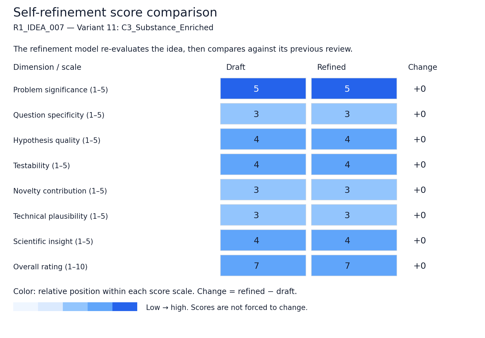

Changed score dimensions: none.

### Score justifications (draft / refined)

**Problem significance**

```json
{
  "draft": {
    "score": 5.0,
    "justification": "The accuracy-interpretability trade-off is one of the most critical challenges in deploying machine learning in high-stakes domains (healthcare, finance, law). A method that genuinely reconciles these two properties would be of immense scientific and practical value."
  },
  "refined": {
    "score": 5.0,
    "justification": "The accuracy-interpretability trade-off is a critical barrier to deploying ML in high-stakes domains (healthcare, finance, law). A solution that genuinely reconciles these properties would be of immense scientific and practical value."
  }
}
```

**Question specificity**

```json
{
  "draft": {
    "score": 3.0,
    "justification": "While the goal is clear, the specific research question is somewhat vague. It states 'NIMO introduces a framework' but does not specify the core mechanism or the precise hypothesis about *why* it works better than existing approaches. The question is 'Can this framework work?' rather than 'How does this specific mechanism achieve X?'"
  },
  "refined": {
    "score": 3.0,
    "justification": "The goal is clear, but the research question is currently too broad. It asks 'Can this framework work?' rather than 'How does this specific mechanism achieve X?' The lack of a defined mechanism makes the question somewhat generic."
  }
}
```

**Hypothesis quality**

```json
{
  "draft": {
    "score": 4.0,
    "justification": "The hypothesis that the framework's fidelity can be validated against synthetic ground truth is testable and plausible. The idea that it can close the performance gap is a strong, falsifiable claim, though it relies on the unproven efficacy of the underlying mechanism."
  },
  "refined": {
    "score": 4.0,
    "justification": "The hypothesis is concrete: that a built-in framework can achieve high fidelity on ground-truth data and close the performance gap. This is a strong, falsifiable claim, even if the underlying mechanism is not yet detailed."
  }
}
```

**Testability**

```json
{
  "draft": {
    "score": 4.0,
    "justification": "The proposed use of synthetic datasets with known ground-truth feature effects is a highly testable and rigorous approach. The plan to explore boundary conditions on specific data structures also provides clear avenues for empirical investigation."
  },
  "refined": {
    "score": 4.0,
    "justification": "The proposed use of synthetic datasets with known ground-truth feature effects is a rigorous and standard approach for validating interpretability. The plan to test specific boundary conditions (interactions, sparsity) provides clear empirical paths."
  }
}
```

**Novelty contribution**

```json
{
  "draft": {
    "score": 3.0,
    "justification": "The general direction of building inherently interpretable nonlinear models is active and valuable. However, without details on the specific mechanism, it is difficult to assess if this is a novel contribution or a variation of existing methods (like GAMs with interactions or specific neural nets). The potential contribution is high, but the novelty of the specific idea is currently unclear."
  },
  "refined": {
    "score": 3.0,
    "justification": "The general direction of inherently interpretable nonlinear models is valuable, but the specific novelty is unclear. Without details on the mechanism, it is difficult to determine if this is a new contribution or a variation of existing methods."
  }
}
```

**Technical plausibility**

```json
{
  "draft": {
    "score": 3.0,
    "justification": "The idea is logically coherent in its goals. However, the technical plausibility of 'reconciling' the trade-off without knowing the mechanism is hard to judge. It is plausible that such a model exists, but the summary does not provide enough evidence to confirm the mechanism is feasible."
  },
  "refined": {
    "score": 3.0,
    "justification": "The idea is logically coherent in its goals, but the technical plausibility of 'reconciling' the trade-off is speculative without a proposed mechanism. It is plausible that such a model exists, but the summary does not provide evidence for the feasibility of the specific approach."
  }
}
```

**Scientific insight**

```json
{
  "draft": {
    "score": 4.0,
    "justification": "If successful, this research would provide significant insight into the structural requirements for models to be both accurate and interpretable. It could reveal new principles about how nonlinearity can be constrained to maintain human-understandable feature effects."
  },
  "refined": {
    "score": 4.0,
    "justification": "If successful, this research would reveal new principles about how nonlinearity can be constrained to maintain human-understandable feature effects, potentially leading to a new class of models."
  }
}
```

**Overall rating**

```json
{
  "draft": {
    "score": 7.0,
    "justification": "This is a strong research idea with high significance and a clear, testable validation plan. The main limitation is the lack of technical specificity regarding the proposed mechanism, which makes it difficult to fully assess novelty and plausibility at this stage. However, the problem is important, and the proposed direction is scientifically sound and promising."
  },
  "refined": {
    "score": 7.0,
    "justification": "This is a strong research idea with high significance and a clear, testable validation plan. The primary limitation is the lack of technical specificity regarding the proposed mechanism, which prevents a full assessment of novelty and plausibility. However, the problem is important, and the proposed direction is scientifically sound and promising."
  }
}
```

## R1_IDEA_007 — Variant 12: H1_Deceptive_Hollow


Changed score dimensions: none.

### Score justifications (draft / refined)

**Problem significance**

```json
{
  "draft": {
    "score": 5.0,
    "justification": "The problem of balancing performance and interpretability is one of the most critical challenges in modern machine learning, especially for high-stakes applications. Addressing this trade-off is of immense scientific and practical significance."
  },
  "refined": {
    "score": 5.0,
    "justification": "The problem of balancing performance and interpretability is one of the most significant challenges in modern machine learning, particularly for high-stakes domains like healthcare and finance. Addressing this trade-off is of immense scientific and practical value."
  }
}
```

**Question specificity**

```json
{
  "draft": {
    "score": 1.0,
    "justification": "The idea is presented as a broad vision or agenda without defining a specific research question. It states what the goal is (a unified framework) but not what the specific inquiry is (e.g., 'Does mechanism X improve fidelity without sacrificing accuracy?')."
  },
  "refined": {
    "score": 1.0,
    "justification": "The idea is extremely vague. It describes a desired outcome ('a unified pathway') but fails to define the specific research question, mechanism, or variable relationships being investigated. It lacks the specificity required to guide an experiment."
  }
}
```

**Hypothesis quality**

```json
{
  "draft": {
    "score": 1.0,
    "justification": "There is no explicit or implicit hypothesis that can be tested. The text claims the direction 'could reshape' the field, which is a prediction of impact rather than a scientific hypothesis about a mechanism or relationship."
  },
  "refined": {
    "score": 1.0,
    "justification": "There is no explicit or implicit scientific hypothesis. The text makes a prediction about the *impact* of the work ('reshape how the community thinks') rather than a hypothesis about a causal relationship or mechanism that can be empirically tested."
  }
}
```

**Testability**

```json
{
  "draft": {
    "score": 1.0,
    "justification": "Without a defined method, architecture, or specific metrics, the idea is currently not testable. One cannot design an experiment to validate a 'framework' that has not been described."
  },
  "refined": {
    "score": 1.0,
    "justification": "The idea is currently untestable. Without a defined method, architecture, or specific metrics, it is impossible to design an experiment to validate the claims or compare it against baselines."
  }
}
```

**Novelty contribution**

```json
{
  "draft": {
    "score": 2.0,
    "justification": "While the *goal* is novel in its ambition, the idea itself does not propose a new method or mechanism. It describes a desired outcome rather than a novel contribution. The novelty is purely aspirational at this stage."
  },
  "refined": {
    "score": 2.0,
    "justification": "While the *ambition* is novel, the idea itself does not propose a new method or mechanism. It describes a goal that many researchers are already pursuing. The novelty is purely aspirational and cannot be assessed without technical details."
  }
}
```

**Technical plausibility**

```json
{
  "draft": {
    "score": 2.0,
    "justification": "It is technically plausible that such a framework exists, but the idea provides no reasoning or mechanism to support why it would work. The claim that it can overcome the limitations of both simple and complex models is a strong assertion without supporting logic."
  },
  "refined": {
    "score": 2.0,
    "justification": "The claim that such a framework is possible is plausible in a general sense, but the idea provides no reasoning, logic, or preliminary evidence to support why it would work. It asserts a solution to a known hard problem without explaining the 'how'."
  }
}
```

**Scientific insight**

```json
{
  "draft": {
    "score": 2.0,
    "justification": "If successfully realized, the insight would be profound. However, as a research idea, it currently offers no specific insight into mechanisms, boundary conditions, or general principles because the 'how' is missing."
  },
  "refined": {
    "score": 2.0,
    "justification": "If realized, the insight would be profound. However, as a research idea, it currently offers no specific insight into mechanisms, boundary conditions, or general principles because the 'how' is entirely missing. It is a vision, not a scientific inquiry."
  }
}
```

**Overall rating**

```json
{
  "draft": {
    "score": 3.0,
    "justification": "The idea addresses a problem of exceptional significance (score 5), but it fails completely on specificity, hypothesis formulation, and testability (scores 1). It reads like a grant proposal abstract or a vision statement rather than a concrete research idea. It is a 'weak idea' in its current form because it lacks the necessary technical grounding to be evaluated or pursued, despite the high value of the underlying problem."
  },
  "refined": {
    "score": 3.0,
    "justification": "The idea addresses a problem of exceptional significance (5/5), but it fails catastrophically on specificity, hypothesis formulation, and testability (1/5). It reads like a high-level abstract or a grant proposal vision statement rather than a concrete research idea. While the direction is valid, the lack of any technical grounding makes it impossible to evaluate as a research plan. It is a 'weak idea' in its current form, though the underlying motivation is strong."
  }
}
```

## R1_IDEA_007 — Variant 13: H2_Confident_Flaw

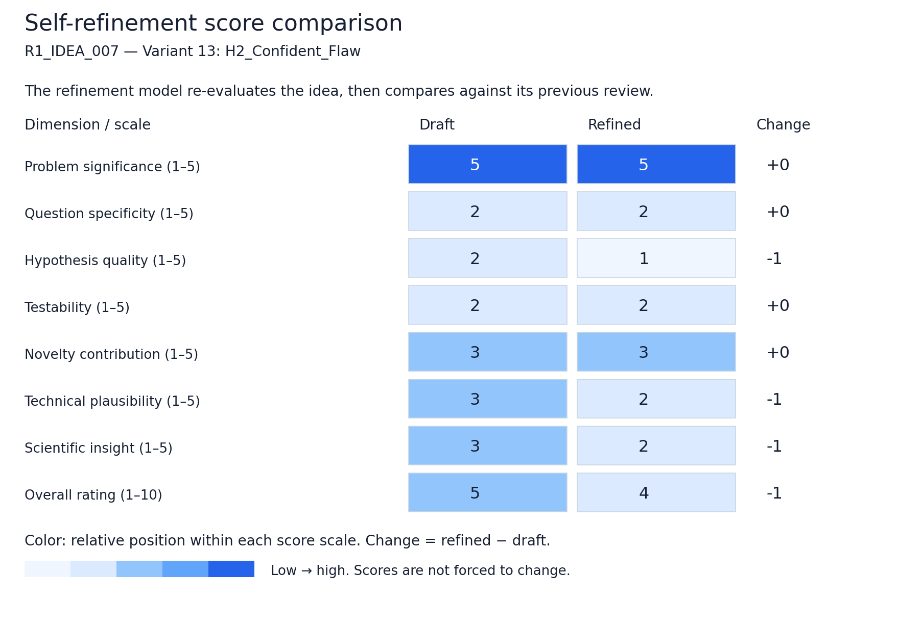

Changed score dimensions: hypothesis_quality, technical_plausibility, scientific_insight, overall_rating.

### Score justifications (draft / refined)

**Problem significance**

```json
{
  "draft": {
    "score": 5.0,
    "justification": "The accuracy-interpretability trade-off is a fundamental challenge in ML, particularly for high-stakes domains. Solving this would have massive scientific and practical impact."
  },
  "refined": {
    "score": 5.0,
    "justification": "The accuracy-interpretability trade-off is a fundamental and critical challenge in machine learning, especially for high-stakes applications. Addressing this gap is of paramount importance to the field."
  }
}
```

**Question specificity**

```json
{
  "draft": {
    "score": 2.0,
    "justification": "While the goal is clear, the specific research question is vague. It lacks a definition of the model architecture or the specific mechanism for achieving nonlinearity and interpretability simultaneously."
  },
  "refined": {
    "score": 2.0,
    "justification": "While the goal is clear, the research question is vague regarding the 'how'. It lacks a definition of the model's architecture or the specific mechanism for achieving the claimed properties. The claim that specific isolation is unnecessary further muddies the specificity of the inquiry."
  }
}
```

**Hypothesis quality**

```json
{
  "draft": {
    "score": 2.0,
    "justification": "The hypothesis is too broad and absolute ('necessarily produce reliable improvements,' 'general superiority'). It lacks the nuance required for a testable scientific claim and ignores potential counter-examples."
  },
  "refined": {
    "score": 1.0,
    "justification": "The hypothesis is scientifically unsound. It asserts a deterministic outcome ('necessarily produce') and 'general superiority' based solely on solving one limitation (fidelity), ignoring the complexity of the accuracy landscape. It is not a testable hypothesis in its current form because it precludes the possibility of failure or boundary conditions."
  }
}
```

**Testability**

```json
{
  "draft": {
    "score": 2.0,
    "justification": "The idea explicitly suggests that specific isolation of variables is unnecessary, which undermines the testability of the claim. Without a defined mechanism or specific conditions, it is difficult to design a rigorous experiment to falsify the claim of 'general superiority'."
  },
  "refined": {
    "score": 2.0,
    "justification": "The idea explicitly states that isolating variables (datasets, criteria) is unnecessary, which makes the claim of 'general superiority' impossible to rigorously test or falsify. Without a defined mechanism or a plan to test boundary conditions, the claim is effectively untestable."
  }
}
```

**Novelty contribution**

```json
{
  "draft": {
    "score": 3.0,
    "justification": "The direction of building inherently interpretable nonlinear models is novel and valuable, but the specific contribution is currently obscured by the lack of technical detail and the overly broad claims."
  },
  "refined": {
    "score": 3.0,
    "justification": "The direction of building inherently interpretable nonlinear models is valuable and aligns with current research trends. However, the specific contribution is currently obscured by the lack of technical detail and the overly broad, unsubstantiated claims of general superiority."
  }
}
```

**Technical plausibility**

```json
{
  "draft": {
    "score": 3.0,
    "justification": "The concept of built-in interpretability is plausible, but the claim that it will automatically outperform deep networks without specific architectural details is technically optimistic and potentially flawed."
  },
  "refined": {
    "score": 2.0,
    "justification": "While the concept of built-in interpretability is plausible, the claim that it will automatically outperform deep neural networks without specific architectural details is technically optimistic. The dismissal of boundary cases suggests a lack of understanding of the limitations of interpretable models compared to deep learning."
  }
}
```

**Scientific insight**

```json
{
  "draft": {
    "score": 3.0,
    "justification": "If successful, the research could reveal new principles for balancing complexity and interpretability. However, the current framing risks producing a 'black box' claim rather than deep mechanistic insight due to the dismissal of boundary analysis."
  },
  "refined": {
    "score": 2.0,
    "justification": "If the model were defined and tested, it could provide insight into the limits of interpretability. However, the current framing, which dismisses the need to analyze boundary conditions or failure modes, risks producing a superficial claim rather than deep scientific insight."
  }
}
```

**Overall rating**

```json
{
  "draft": {
    "score": 5.0,
    "justification": "The idea addresses a critical problem with a promising direction (inherent interpretability), but the scientific rigor is compromised by overly absolute claims, a lack of specific mechanism definition, and a dismissal of necessary empirical validation steps. It is a moderate idea with high potential if refined to be more specific and scientifically humble."
  },
  "refined": {
    "score": 4.0,
    "justification": "The idea addresses a significant problem with a promising high-level direction. However, the scientific quality is severely compromised by a logically flawed hypothesis that claims 'general superiority' without a defined mechanism or empirical plan. The explicit dismissal of necessary experimental controls (isolating variables, boundary cases) makes the proposal scientifically weak and unfalsifiable in its current state. It is a weak idea that requires a complete rethinking of its claims and methodology."
  }
}
```

## R1_IDEA_007 — Variant 14: H3_Verbose_Enriched

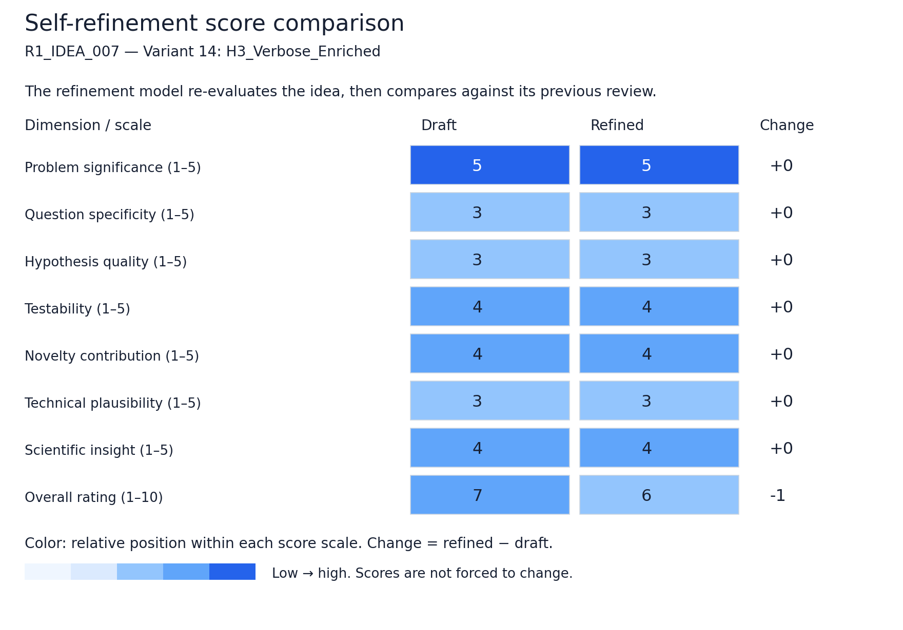

Changed score dimensions: overall_rating.

### Score justifications (draft / refined)

**Problem significance**

```json
{
  "draft": {
    "score": 5.0,
    "justification": "The accuracy-interpretability trade-off is a central challenge in modern machine learning, particularly for high-stakes domains. Proposing a framework that offers built-in interpretability with nonlinear capabilities addresses a critical need for trustworthy AI."
  },
  "refined": {
    "score": 5.0,
    "justification": "The accuracy-interpretability trade-off is a fundamental bottleneck in deploying ML in critical domains (healthcare, finance). A framework that genuinely offers built-in interpretability with nonlinear capacity would be a major contribution to the field of trustworthy AI."
  }
}
```

**Question specificity**

```json
{
  "draft": {
    "score": 3.0,
    "justification": "While the evaluation questions are specific (synthetic data, interaction structures), the core research question regarding the *mechanism* of the model is vague. The idea describes *what* to test rather than *how* the model works or what specific theoretical claim it makes."
  },
  "refined": {
    "score": 3.0,
    "justification": "The research questions regarding *evaluation* are specific (synthetic data, boundary cases), but the central scientific question regarding the *model's mechanism* is undefined. The idea asks 'how do we test this?' rather than 'what is this and why does it work?'."
  }
}
```

**Hypothesis quality**

```json
{
  "draft": {
    "score": 3.0,
    "justification": "The hypothesis that 'fidelity could be validated' is a statement of intent rather than a scientific prediction. A stronger hypothesis would predict specific performance relationships or failure modes based on the model's structural properties."
  },
  "refined": {
    "score": 3.0,
    "justification": "The current hypothesis is a statement of intent ('fidelity could be validated') rather than a predictive claim. A strong hypothesis would predict specific performance outcomes or failure modes based on the model's structural properties (e.g., 'NIMO will outperform linear models in X regime but fail in Y regime')."
  }
}
```

**Testability**

```json
{
  "draft": {
    "score": 4.0,
    "justification": "The proposed evaluation plan is highly testable. Using synthetic data with ground truth, ablations, and boundary case analysis provides a clear path to generating empirical evidence. The staged design is methodologically sound."
  },
  "refined": {
    "score": 4.0,
    "justification": "The proposed experimental design is highly testable. The use of synthetic ground truth, staged comparisons, ablations, and sensitivity analyses provides a clear, empirical path to validate or refute the claims, even without the model details."
  }
}
```

**Novelty contribution**

```json
{
  "draft": {
    "score": 4.0,
    "justification": "If the underlying mechanism is novel, the contribution could be significant. The focus on 'built-in' fidelity and the systematic exploration of boundary conditions (interactions, sparsity) suggests potential for new scientific insights into the limits of interpretable modeling."
  },
  "refined": {
    "score": 4.0,
    "justification": "If the underlying mechanism is novel, the contribution is significant. The focus on systematically mapping the boundary conditions of interpretability (interactions, sparsity) is a valuable scientific direction that goes beyond simple application."
  }
}
```

**Technical plausibility**

```json
{
  "draft": {
    "score": 3.0,
    "justification": "The idea is logically coherent in its goals, but without knowing the model's architecture, it is impossible to judge if the proposed trade-offs are technically feasible. The claim that a model can be both highly accurate and inherently interpretable is ambitious and requires a plausible mechanism to support it."
  },
  "refined": {
    "score": 3.0,
    "justification": "The logic is coherent, but the plausibility of the core claim (reconciling high accuracy with built-in interpretability) cannot be assessed without the mechanism. It is technically plausible that such a model exists, but the idea provides no evidence of *how* it avoids the known limitations of current interpretable models."
  }
}
```

**Scientific insight**

```json
{
  "draft": {
    "score": 4.0,
    "justification": "If executed as planned, the study would likely yield valuable insights into the relationship between model structure, data regimes (sparsity, interactions), and interpretability fidelity. The focus on failure modes and boundary conditions is particularly promising for scientific understanding."
  },
  "refined": {
    "score": 4.0,
    "justification": "If executed, the study promises to reveal the specific data regimes where built-in interpretability is viable. Understanding the boundary conditions (e.g., sparsity vs. interaction complexity) would provide transferable insights into the limits of interpretable modeling."
  }
}
```

**Overall rating**

```json
{
  "draft": {
    "score": 7.0,
    "justification": "This is a strong research direction with a clear motivation and a robust evaluation plan. However, it currently lacks the specificity of the core mechanism and hypothesis required to be considered 'exceptional.' It reads as a well-structured proposal for a study rather than a fully formed scientific idea with a defined theoretical contribution. Filling in the 'how' of the model would elevate this significantly."
  },
  "refined": {
    "score": 6.0,
    "justification": "This is a moderate-to-strong research idea with excellent potential for scientific insight, driven by a robust evaluation plan and a significant problem statement. However, it is currently rated lower than a 'strong' (7-8) idea because it lacks the definition of the core mechanism and a specific, falsifiable hypothesis. It reads more like a proposal for a study than a fully formed scientific idea with a defined theoretical contribution. The 'how' is missing, which is critical for assessing novelty and plausibility."
  }
}
```

## R1_IDEA_007 — Variant 15: H4_Ultimate_Hype


Changed score dimensions: none.

### Score justifications (draft / refined)

**Problem significance**

```json
{
  "draft": {
    "score": 5.0,
    "justification": "The accuracy-interpretability trade-off is one of the most critical challenges in modern AI, especially for high-stakes domains like healthcare and finance. Solving this would have massive practical and scientific impact."
  },
  "refined": {
    "score": 5.0,
    "justification": "The accuracy-interpretability trade-off is a critical bottleneck in deploying ML in high-stakes domains. Solving this would have massive practical and scientific impact, making the problem significance exceptional."
  }
}
```

**Question specificity**

```json
{
  "draft": {
    "score": 2.0,
    "justification": "While the goal is clear, the idea is currently a 'research agenda' rather than a specific research question. It lacks the technical specificity to define exactly what is being built or tested."
  },
  "refined": {
    "score": 2.0,
    "justification": "The idea defines a goal ('close the gap') but not the specific research question or mechanism. It describes a 'framework' without defining its components, making the question too vague to be scientifically precise at this stage."
  }
}
```

**Hypothesis quality**

```json
{
  "draft": {
    "score": 3.0,
    "justification": "The implicit hypothesis is that 'inherently interpretable nonlinear models can match DNN performance.' This is a strong, falsifiable hypothesis, but it is currently stated as a broad claim rather than a nuanced prediction about specific conditions or mechanisms."
  },
  "refined": {
    "score": 3.0,
    "justification": "The implicit hypothesis (interpretable nonlinear models can match DNNs) is strong and falsifiable. However, it is stated as a broad claim without specifying boundary conditions or the specific mechanism that would enable it, reducing its precision."
  }
}
```

**Testability**

```json
{
  "draft": {
    "score": 2.0,
    "justification": "Without a defined model architecture or algorithm, the idea is not currently testable. It requires significant elaboration to design an experiment."
  },
  "refined": {
    "score": 2.0,
    "justification": "Without a defined model architecture or algorithm, the idea is not currently testable. One cannot design an experiment to verify the claim without first defining what 'NIMO' actually is."
  }
}
```

**Novelty contribution**

```json
{
  "draft": {
    "score": 4.0,
    "justification": "The direction is novel in its ambition to completely close the gap. While interpretable models exist, the specific claim of matching DNNs with built-in faithfulness is a high-risk, high-reward contribution that could redefine the field."
  },
  "refined": {
    "score": 4.0,
    "justification": "The ambition to completely close the gap between linear and deep learning via inherent interpretability is novel and high-risk. While the concept of interpretable models exists, the specific claim of matching DNNs with built-in faithfulness is a significant potential contribution."
  }
}
```

**Technical plausibility**

```json
{
  "draft": {
    "score": 3.0,
    "justification": "The reasoning is logically coherent (faithful explanations are better than post-hoc), but the technical feasibility is unknown. The idea assumes a solution exists without providing the mechanism, making it plausible but unproven."
  },
  "refined": {
    "score": 3.0,
    "justification": "The reasoning is logically coherent (faithful explanations are better), but the technical feasibility is unknown. The idea assumes a solution exists without providing the mechanism, making it plausible but currently unproven."
  }
}
```

**Scientific insight**

```json
{
  "draft": {
    "score": 4.0,
    "justification": "If successful, this would reveal fundamental principles about the relationship between model complexity, nonlinearity, and interpretability, offering deep insights into the nature of learnable functions."
  },
  "refined": {
    "score": 4.0,
    "justification": "If successful, this would reveal fundamental principles about the relationship between model complexity, nonlinearity, and interpretability. Even partial success would offer deep insights into the nature of learnable functions."
  }
}
```

**Overall rating**

```json
{
  "draft": {
    "score": 6.0,
    "justification": "This is a moderate/borderline idea. The problem significance and potential impact are exceptional (5/5), and the hypothesis is strong. However, the current description is too vague to be considered a 'strong' research idea (7+) because it lacks the necessary technical specificity and testability. It is a promising vision that needs to be grounded in a concrete methodological proposal to be fully evaluated."
  },
  "refined": {
    "score": 6.0,
    "justification": "This is a moderate/borderline idea. The problem significance and potential impact are exceptional, and the hypothesis is strong. However, the current description is too vague to be considered a 'strong' research idea (7+) because it lacks the necessary technical specificity and testability. It is a promising vision that needs to be grounded in a concrete methodological proposal to be fully evaluated."
  }
}
```

## R1_IDEA_008 — Source

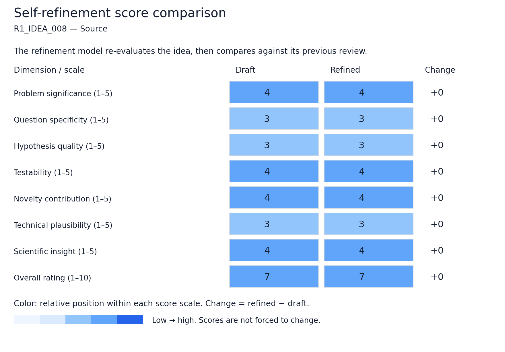

Changed score dimensions: none.

### Score justifications (draft / refined)

**Problem significance**

```json
{
  "draft": {
    "score": 4.0,
    "justification": "Bimanual non-prehensile manipulation is a high-value problem in robotics. Solving it without RL (which is often sample-inefficient and hard to deploy) would be a significant contribution to the field, addressing both efficiency and generalization."
  },
  "refined": {
    "score": 4.0,
    "justification": "Bimanual non-prehensile manipulation is a significant challenge in robotics. Solving it without RL, which is often sample-inefficient and difficult to deploy in the real world, would be a major contribution. It addresses the need for robust, data-efficient manipulation primitives."
  }
}
```

**Question specificity**

```json
{
  "draft": {
    "score": 3.0,
    "justification": "While the goal (bimanual, non-prehensile, RL-free) is specific, the 'three-stage paradigm' is a black box. The idea states *what* it wants to do but not *how* the core mechanism works, making the research question slightly vague."
  },
  "refined": {
    "score": 3.0,
    "justification": "The goal is specific (bimanual, non-prehensile, RL-free, category-level), but the 'three-stage paradigm' is a black box. The idea states *what* it wants to do but not *how* the core mechanism works, leaving the research question partially vague regarding the implementation strategy."
  }
}
```

**Hypothesis quality**

```json
{
  "draft": {
    "score": 3.0,
    "justification": "The implicit hypothesis is that a structured, three-stage, non-RL approach can achieve category-level generalization in complex bimanual tasks. This is a testable hypothesis, but the reasoning behind why this specific architecture would succeed is not yet articulated."
  },
  "refined": {
    "score": 3.0,
    "justification": "The implicit hypothesis is that a structured, three-stage, non-RL approach can achieve category-level generalization in complex bimanual tasks. This is testable, but the reasoning behind *why* this specific architecture would succeed over existing RL or model-based methods is not yet articulated."
  }
}
```

**Testability**

```json
{
  "draft": {
    "score": 4.0,
    "justification": "The idea is testable. One can define metrics for success (e.g., success rate of pivoting unseen objects, generalization across categories) and compare the proposed method against RL baselines or single-arm methods. The 'three-stage' nature allows for ablation studies."
  },
  "refined": {
    "score": 4.0,
    "justification": "The idea is testable. Success metrics (e.g., success rate of pivoting unseen objects, generalization across categories) can be defined. The 'three-stage' nature allows for ablation studies, and the 'RL-free' claim provides a clear binary baseline for comparison."
  }
}
```

**Novelty contribution**

```json
{
  "draft": {
    "score": 4.0,
    "justification": "Combining bimanual non-prehensile manipulation with a strict 'RL-free' constraint and a specific 'three-stage' structure is novel. If successful, it could offer a new paradigm for contact-rich manipulation that is more interpretable and data-efficient than current RL-heavy approaches."
  },
  "refined": {
    "score": 4.0,
    "justification": "Combining bimanual non-prehensile manipulation with a strict 'RL-free' constraint and a specific 'three-stage' structure is novel. If successful, it could offer a new paradigm for contact-rich manipulation that is more interpretable and data-efficient than current RL-heavy approaches."
  }
}
```

**Technical plausibility**

```json
{
  "draft": {
    "score": 3.0,
    "justification": "It is technically plausible that a structured approach could work, but bimanual non-prehensile manipulation is extremely complex due to contact dynamics. Achieving this without RL requires a very strong underlying model or heuristic, which is not described. The plausibility hinges entirely on the undefined 'three stages'."
  },
  "refined": {
    "score": 3.0,
    "justification": "It is technically plausible that a structured approach could work, but bimanual non-prehensile manipulation is extremely complex due to contact dynamics. Achieving this without RL requires a very strong underlying model or heuristic, which is not described. The plausibility hinges entirely on the undefined 'three stages'."
  }
}
```

**Scientific insight**

```json
{
  "draft": {
    "score": 4.0,
    "justification": "If the research succeeds, it would provide deep insight into whether structured, model-based, or heuristic approaches can replace data-driven RL for complex contact tasks. It could reveal the limits of analytical methods in high-dimensional contact spaces."
  },
  "refined": {
    "score": 4.0,
    "justification": "If the research succeeds, it would provide deep insight into whether structured, model-based, or heuristic approaches can replace data-driven RL for complex contact tasks. It could reveal the limits of analytical methods in high-dimensional contact spaces and the utility of dual-arm redundancy."
  }
}
```

**Overall rating**

```json
{
  "draft": {
    "score": 7.0,
    "justification": "This is a strong research idea with high potential impact. It addresses a meaningful problem with a clear constraint (RL-free) that could yield significant scientific insights. However, it currently lacks the technical specificity required to fully evaluate the feasibility of the proposed 'three-stage' mechanism. With a clearer definition of the methodology, this could be an exceptional idea."
  },
  "refined": {
    "score": 7.0,
    "justification": "This is a strong research idea with high potential impact. It addresses a meaningful problem with a clear constraint (RL-free) that could yield significant scientific insights. However, it currently lacks the technical specificity required to fully evaluate the feasibility of the proposed 'three-stage' mechanism. With a clearer definition of the methodology, this could be an exceptional idea."
  }
}
```

## R1_IDEA_008 — Variant 1: A1_Identity

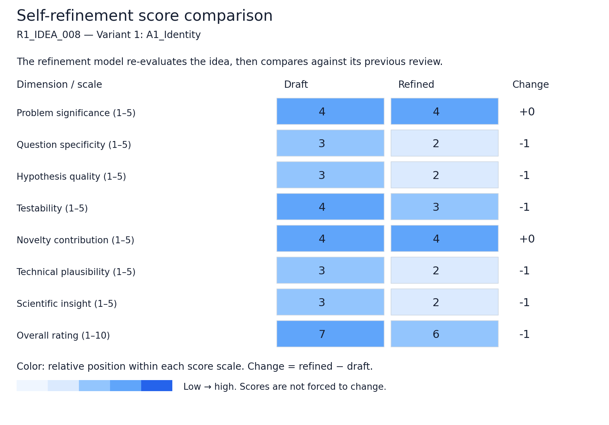

Changed score dimensions: question_specificity, hypothesis_quality, testability, technical_plausibility, scientific_insight, overall_rating.

### Score justifications (draft / refined)

**Problem significance**

```json
{
  "draft": {
    "score": 4.0,
    "justification": "Bimanual non-prehensile manipulation is a high-value problem in robotics. Solving it without RL (which is often sample-inefficient and hard to deploy) would be a significant contribution to the field. The move to category-level generalization is also highly relevant."
  },
  "refined": {
    "score": 4.0,
    "justification": "The problem of bimanual non-prehensile manipulation is highly significant for robotics. Solving it without RL (which is often sample-inefficient) would be a major contribution. The move to category-level generalization is also critical for real-world deployment."
  }
}
```

**Question specificity**

```json
{
  "draft": {
    "score": 3.0,
    "justification": "While the goal (bimanual, non-prehensile, RL-free) is clear, the 'three-stage' mechanism is too vague. The research question is 'how to build this' rather than a specific scientific inquiry into a mechanism or relationship."
  },
  "refined": {
    "score": 2.0,
    "justification": "While the goal is clear, the research question is vague. It asks 'how to build' a system but does not specify the mechanism. The 'three-stage' label is a placeholder rather than a defined research question. A strong idea would specify the relationship being investigated (e.g., 'Does decoupling X from Y improve transferability?')."
  }
}
```

**Hypothesis quality**

```json
{
  "draft": {
    "score": 3.0,
    "justification": "The implicit hypothesis is that a structured, three-stage, non-RL approach can achieve what RL typically does (generalizable bimanual control). This is testable but currently lacks the specific mechanism that would make it a strong scientific hypothesis."
  },
  "refined": {
    "score": 2.0,
    "justification": "The implicit hypothesis is that a structured, non-RL approach can achieve bimanual generalization. However, this is a broad claim without a specific mechanism or prediction. It lacks the falsifiability of a specific scientific hypothesis (e.g., 'Method A will outperform Method B because of property C')."
  }
}
```

**Testability**

```json
{
  "draft": {
    "score": 4.0,
    "justification": "The idea is testable. One can implement the three stages, define metrics for transferability and success in pushing/pivoting, and compare against baselines. The lack of implementation details does not prevent the *idea* from being testable."
  },
  "refined": {
    "score": 3.0,
    "justification": "The idea is testable in principle (one can build a system and measure performance), but the lack of defined stages and mechanisms makes it difficult to design a rigorous experiment. The 'three-stage' aspect is a black box that needs definition before a test can be meaningful."
  }
}
```

**Novelty contribution**

```json
{
  "draft": {
    "score": 4.0,
    "justification": "Combining bimanual non-prehensile manipulation with an RL-free, category-level approach is novel. If successful, it could offer a new paradigm for contact-rich manipulation that is more interpretable and data-efficient than current RL methods."
  },
  "refined": {
    "score": 4.0,
    "justification": "Combining bimanual non-prehensile manipulation with an RL-free, category-level approach is novel. If successful, it could offer a new paradigm for contact-rich manipulation that is more interpretable and data-efficient than current RL methods."
  }
}
```

**Technical plausibility**

```json
{
  "draft": {
    "score": 3.0,
    "justification": "It is plausible that a structured approach could work, but the claim that it can handle 'generalizable dual-arm configurations' without RL is ambitious. The plausibility hinges entirely on the undefined 'three-stage' logic."
  },
  "refined": {
    "score": 2.0,
    "justification": "While not impossible, the claim is highly ambitious. Achieving bimanual coordination and category-level generalization without RL (which is the standard for such complex, high-dimensional tasks) requires a mechanism that is not currently described. The plausibility is low without a defined 'three-stage' logic."
  }
}
```

**Scientific insight**

```json
{
  "draft": {
    "score": 3.0,
    "justification": "If successful, the research would provide insight into how to structure manipulation policies without exploration. However, as currently stated, it reads more like a system design proposal than a hypothesis-driven investigation into a fundamental mechanism."
  },
  "refined": {
    "score": 2.0,
    "justification": "As stated, the idea is a system design proposal. It does not explicitly aim to reveal a fundamental mechanism or principle. The potential for insight is high *if* the 'three-stage' mechanism is discovered to rely on a specific geometric or topological property, but that is not currently articulated."
  }
}
```

**Overall rating**

```json
{
  "draft": {
    "score": 7.0,
    "justification": "This is a strong research idea with high potential significance and novelty. The main limitation is the lack of specificity regarding the 'three-stage' mechanism, which prevents it from being an 'exceptional' (9-10) idea at this stage. However, the direction is clear, the problem is important, and the constraints (RL-free, bimanual) provide a solid foundation for a high-impact study."
  },
  "refined": {
    "score": 6.0,
    "justification": "This is a moderate idea. It addresses a significant problem with a promising constraint (RL-free), but the lack of specificity regarding the core mechanism ('three-stage') and the hypothesis makes it feel more like a project goal than a rigorous research proposal. It has potential but requires significant refinement to be considered strong."
  }
}
```

## R1_IDEA_008 — Variant 2: A2_Paraphrase_Only


Changed score dimensions: question_specificity, hypothesis_quality, testability, scientific_insight, overall_rating.

### Score justifications (draft / refined)

**Problem significance**

```json
{
  "draft": {
    "score": 5.0,
    "justification": "Bimanual non-prehensile manipulation is a critical capability for advanced robotics (e.g., assembly, cooking, cleaning). Moving beyond single-arm and wall-assisted methods to generalizable, self-contained dual-arm solutions addresses a major bottleneck in deploying robots in unstructured environments."
  },
  "refined": {
    "score": 5.0,
    "justification": "Bimanual non-prehensile manipulation is a critical capability for advanced robotics in unstructured environments (assembly, cooking, cleaning). Moving beyond single-arm and wall-assisted methods to generalizable, self-contained dual-arm solutions addresses a major bottleneck in the field."
  }
}
```

**Question specificity**

```json
{
  "draft": {
    "score": 3.0,
    "justification": "While the domain (bimanual non-prehensile) and the high-level approach (RL-free, three-stage) are stated, the specific research question is vague. It is unclear exactly what relationship or mechanism is being investigated beyond 'this method works better'."
  },
  "refined": {
    "score": 2.0,
    "justification": "While the domain and high-level approach are stated, the specific research question is vague. The idea describes a 'what' (a three-stage RL-free method) but not the 'how' or the specific 'why' (the mechanism). It reads more like a project goal than a specific research question investigating a relationship or phenomenon."
  }
}
```

**Hypothesis quality**

```json
{
  "draft": {
    "score": 3.0,
    "justification": "The idea implies a hypothesis that an RL-free, three-stage dual-arm approach is superior or more feasible for this task than current methods. However, it lacks a specific, falsifiable prediction about the mechanism of success or the conditions under which it might fail."
  },
  "refined": {
    "score": 2.0,
    "justification": "The idea implies a hypothesis that this approach is feasible and superior, but it lacks a specific, falsifiable prediction. It does not clearly state the mechanism of success or the conditions under which it might fail, making it hard to scientifically validate beyond 'does it work?'"
  }
}
```

**Testability**

```json
{
  "draft": {
    "score": 4.0,
    "justification": "The idea is testable in principle. One can define benchmarks for pushing/poking/pivoting, compare against single-arm and wall-assisted baselines, and measure success rates and generalization. However, the lack of defined metrics for 'transferability' and the specific stages makes the experimental design currently incomplete."
  },
  "refined": {
    "score": 3.0,
    "justification": "The idea is testable in principle (one can build a dual-arm system and measure success), but the lack of defined stages, algorithms, and specific metrics for 'transferability' makes the experimental design currently incomplete and difficult to operationalize."
  }
}
```

**Novelty contribution**

```json
{
  "draft": {
    "score": 4.0,
    "justification": "Combining a specific 'three-stage' structure with an 'RL-free' constraint for bimanual non-prehensile tasks is a novel direction. Most current work relies heavily on RL or specific kinematic constraints. If successful, this could offer a new paradigm for skill acquisition."
  },
  "refined": {
    "score": 4.0,
    "justification": "Combining a specific 'three-stage' structure with an 'RL-free' constraint for bimanual non-prehensile tasks is a novel direction. Most current work relies heavily on RL or specific kinematic constraints. If successful, this could offer a new paradigm for skill acquisition, though the novelty is currently theoretical."
  }
}
```

**Technical plausibility**

```json
{
  "draft": {
    "score": 3.0,
    "justification": "The concept is plausible, as bimanual coordination is a known problem and RL-free methods (like imitation learning) are active areas of research. However, without knowing the specific algorithms, it is difficult to assess if the 'three-stage' approach is technically sound or if it introduces new bottlenecks."
  },
  "refined": {
    "score": 3.0,
    "justification": "The concept is plausible as bimanual coordination is a known problem and RL-free methods are active areas of research. However, without knowing the specific algorithms, it is difficult to assess if the 'three-stage' approach is technically sound or if it introduces new bottlenecks that make it infeasible."
  }
}
```

**Scientific insight**

```json
{
  "draft": {
    "score": 4.0,
    "justification": "If successful, this research could reveal fundamental principles of how dual-arm systems can coordinate for contact-rich tasks without the trial-and-error overhead of RL. It could also provide insights into the minimal requirements for 'dexterity' in manipulation."
  },
  "refined": {
    "score": 3.0,
    "justification": "If successful, this research could reveal fundamental principles of dual-arm coordination without trial-and-error. However, as currently stated, the potential for deep scientific insight is limited because the underlying mechanism is undefined. The insight depends entirely on the specific implementation details which are missing."
  }
}
```

**Overall rating**

```json
{
  "draft": {
    "score": 7.0,
    "justification": "This is a strong research idea with high significance and clear potential for contribution. The problem is well-defined, and the proposed direction (RL-free, dual-arm) is timely and promising. However, the idea is currently too high-level to be considered exceptional; it lacks the specific hypothesis, mechanism definition, and methodological details required to fully evaluate its novelty and feasibility. It sits firmly in the 'Strong' category (7-8) because the core concept is sound, but the execution plan is missing."
  },
  "refined": {
    "score": 6.0,
    "justification": "This is a moderate research idea. The problem is highly significant (5/5), and the direction (RL-free bimanual) is promising (4/5). However, the idea is currently too high-level and vague to be considered 'strong' (7-8). The lack of a specific hypothesis, defined mechanism, or clear research question drops the score significantly in specificity and testability. It represents a good starting point for a proposal but lacks the scientific rigor of a fully formed research idea."
  }
}
```

## R1_IDEA_008 — Variant 3: A3_Plain_Core

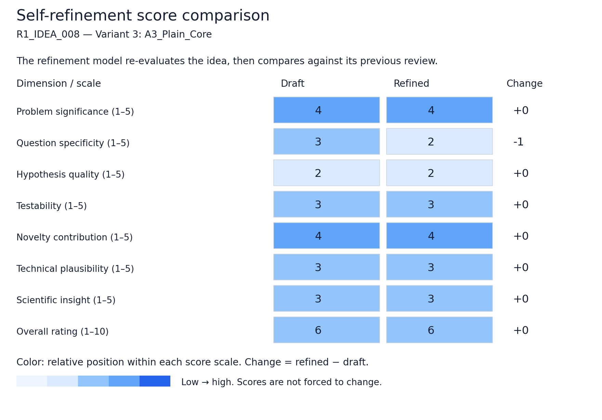

Changed score dimensions: question_specificity.

### Score justifications (draft / refined)

**Problem significance**

```json
{
  "draft": {
    "score": 4.0,
    "justification": "Bimanual non-prehensile manipulation is a critical capability for advanced robotics (e.g., assembly, cooking, cleaning). Solving this without external aids or heavy RL is a meaningful challenge with high practical value."
  },
  "refined": {
    "score": 4.0,
    "justification": "Bimanual non-prehensile manipulation is a critical capability for real-world robotics (assembly, cooking). Solving this without external aids is a meaningful challenge with high practical value. The move away from RL is also significant if it leads to more efficient or robust systems."
  }
}
```

**Question specificity**

```json
{
  "draft": {
    "score": 3.0,
    "justification": "While the task (bimanual non-prehensile) and constraints (no walls) are clear, the core research question is obscured by the lack of detail on the 'RL-free paradigm' and the 'three stages.' It is currently a proposal of a direction rather than a specific question."
  },
  "refined": {
    "score": 2.0,
    "justification": "The idea states *what* it wants to achieve (a three-stage RL-free method) but fails to define *how* or *what specific mechanism* is being investigated. The 'three-stage' mention is a structural placeholder rather than a specific research question. It reads more like a project goal than a defined scientific inquiry."
  }
}
```

**Hypothesis quality**

```json
{
  "draft": {
    "score": 2.0,
    "justification": "The idea implies a hypothesis that an RL-free approach can succeed where others might fail, but it does not articulate a specific, falsifiable prediction about the mechanism or performance relationship."
  },
  "refined": {
    "score": 2.0,
    "justification": "There is no explicit hypothesis. The idea implies that 'RL-free is better/sufficient,' but this is a broad assumption. A strong hypothesis would predict a specific relationship, such as 'Method X enables Y% better transfer than Method Z due to mechanism M.' The current text lacks this predictive power."
  }
}
```

**Testability**

```json
{
  "draft": {
    "score": 3.0,
    "justification": "The idea is testable in principle (build the system, run tasks), but the lack of defined stages and algorithms makes it difficult to design a specific experimental protocol or ablation study at this stage."
  },
  "refined": {
    "score": 3.0,
    "justification": "The idea is theoretically testable (one can build a system and run tasks), but the lack of defined methodology makes it impossible to design a specific experimental protocol or ablation study at this stage. The 'three-stage' nature is a testable structure only if the stages are defined."
  }
}
```

**Novelty contribution**

```json
{
  "draft": {
    "score": 4.0,
    "justification": "Focusing on bimanual non-prehensile manipulation without RL or external aids is a novel angle. Most current work relies heavily on RL or single-arm setups. If successful, this could offer a more sample-efficient path to complex manipulation."
  },
  "refined": {
    "score": 4.0,
    "justification": "The combination of bimanual, non-prehensile, no-external-aid, and RL-free is a novel intersection. While each component exists in isolation, the specific proposal to solve this via a three-stage non-RL paradigm is a distinct and potentially high-impact contribution if the mechanism is sound."
  }
}
```

**Technical plausibility**

```json
{
  "draft": {
    "score": 3.0,
    "justification": "The concept is plausible, but the feasibility of achieving 'category-level' generalization in complex contact-rich bimanual tasks without RL (which is often used for exploration in such spaces) depends entirely on the unspecified methodology. It is not obviously impossible, but the path is unclear."
  },
  "refined": {
    "score": 3.0,
    "justification": "The concept is plausible but highly speculative. Contact-rich bimanual tasks are notoriously difficult due to high-dimensional state spaces and complex dynamics. Achieving this without RL (which is often used for exploration in such spaces) requires a very strong alternative mechanism (e.g., advanced model-based planning or massive imitation learning) which is not described. It is not impossible, but the path is unclear."
  }
}
```

**Scientific insight**

```json
{
  "draft": {
    "score": 3.0,
    "justification": "If the method works, it would provide significant insight into how to decouple complex coordination from RL exploration. However, as stated, the potential for deep scientific insight is limited by the lack of a proposed mechanism to investigate."
  },
  "refined": {
    "score": 3.0,
    "justification": "If successful, the study would provide insight into alternative learning paradigms for complex robotics. However, as currently stated, the potential for deep scientific insight is limited because the mechanism driving the success is unknown. The idea needs to move from 'we will do this' to 'we hypothesize this mechanism works because...' to maximize insight."
  }
}
```

**Overall rating**

```json
{
  "draft": {
    "score": 6.0,
    "justification": "This is a moderate/borderline idea. It addresses a high-significance problem with a potentially valuable constraint (RL-free, no external aids). However, it currently lacks the specificity of a research question and the technical detail of a hypothesis. It reads more like a project goal than a research proposal. With more detail on the 'how' and the specific hypothesis, it could easily become a strong (7-8) idea."
  },
  "refined": {
    "score": 6.0,
    "justification": "This is a moderate/borderline idea. It addresses a significant problem with a compelling constraint (RL-free, no external aids), but it currently lacks the specificity of a research question and the technical detail of a hypothesis. It is more of a high-level vision than a concrete research proposal. The score reflects the high potential of the problem space tempered by the vagueness of the proposed solution."
  }
}
```

## R1_IDEA_008 — Variant 4: B1_Verbose_Elaborate

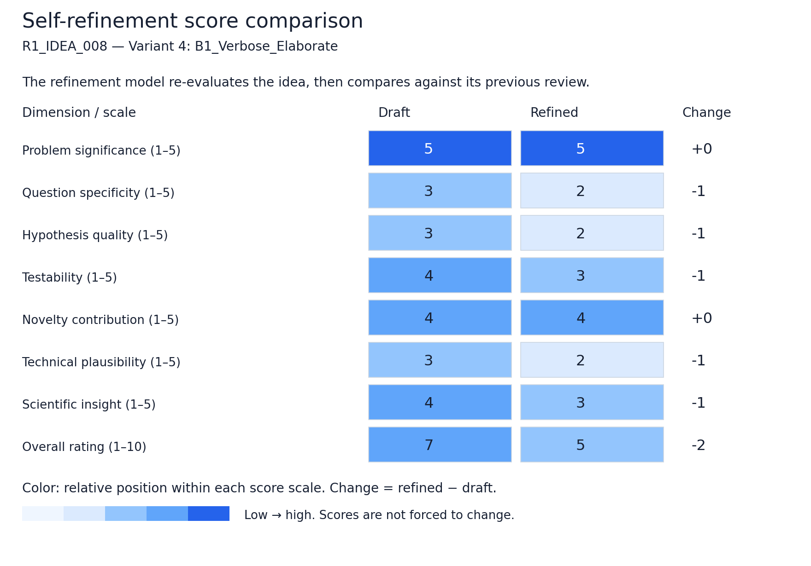

Changed score dimensions: question_specificity, hypothesis_quality, testability, technical_plausibility, scientific_insight, overall_rating.

### Score justifications (draft / refined)

**Problem significance**

```json
{
  "draft": {
    "score": 5.0,
    "justification": "Bimanual non-prehensile manipulation is a critical frontier in robotics. Moving beyond single-arm limitations and external constraints (walls/edges) is essential for deploying robots in unstructured, real-world environments. Solving this would have significant practical impact."
  },
  "refined": {
    "score": 5.0,
    "justification": "The problem is highly significant. Bimanual non-prehensile manipulation is a frontier in robotics. Moving beyond single-arm limitations and external constraints is essential for deploying robots in unstructured, real-world environments. Solving this would have substantial practical impact."
  }
}
```

**Question specificity**

```json
{
  "draft": {
    "score": 3.0,
    "justification": "While the task (bimanual non-prehensile primitives) is specific, the 'three-stage paradigm' and the learning mechanism are currently vague. The idea describes *what* to do but not *how* the core scientific question is being investigated in detail."
  },
  "refined": {
    "score": 2.0,
    "justification": "While the task is specific, the research question is vague. The idea states *what* to do (learn primitives without RL) but fails to define *how* the scientific investigation will proceed. The 'three-stage paradigm' is a black box, and the core mechanism is undefined. It lacks a specific research question beyond 'can we do this?'"
  }
}
```

**Hypothesis quality**

```json
{
  "draft": {
    "score": 3.0,
    "justification": "The implicit hypothesis is that dual-arm configurations without RL can achieve generalizable contact-rich manipulation better than current methods. This is a strong direction, but the idea lacks a precise, falsifiable statement about the mechanism (e.g., 'Dual-arm synergy reduces the state space required for learning...')."
  },
  "refined": {
    "score": 2.0,
    "justification": "The idea implies a hypothesis (dual-arm + non-RL > single-arm + RL for generalization), but it is not explicitly stated or mechanistically grounded. It lacks a falsifiable prediction about the relationship between the dual-arm configuration and the learning success, making it feel like a feasibility study rather than a hypothesis-driven inquiry."
  }
}
```

**Testability**

```json
{
  "draft": {
    "score": 4.0,
    "justification": "The idea is testable by comparing the proposed method against baselines (single-arm, external-assisted, RL-based) on standard non-prehensile tasks. Success can be measured by transferability across object categories and success rates in contact-rich scenarios."
  },
  "refined": {
    "score": 3.0,
    "justification": "The idea is testable in principle (compare success rates on pushing/poking tasks), but the lack of a defined method makes the experimental design impossible to evaluate currently. One cannot design a rigorous test for a 'three-stage paradigm' that is not described."
  }
}
```

**Novelty contribution**

```json
{
  "draft": {
    "score": 4.0,
    "justification": "The combination of bimanual non-prehensile manipulation, the removal of external constraints, and the specific avoidance of RL (if successful) represents a novel contribution. It challenges the prevailing trend of heavy RL reliance for contact tasks."
  },
  "refined": {
    "score": 4.0,
    "justification": "The combination of bimanual non-prehensile manipulation, the removal of external constraints, and the specific avoidance of RL is novel. If successful, it would challenge the prevailing trend of heavy RL reliance for contact tasks, potentially revealing new principles of robotic dexterity."
  }
}
```

**Technical plausibility**

```json
{
  "draft": {
    "score": 3.0,
    "justification": "The concept is plausible, but the feasibility of learning complex contact dynamics without RL is the main point of contention. Without knowing the specific alternative learning method, it is hard to judge if the 'three-stage' approach is technically sound."
  },
  "refined": {
    "score": 2.0,
    "justification": "The concept is plausible in the abstract, but the feasibility of learning complex contact dynamics without RL is the main point of contention. Without a proposed mechanism (e.g., specific model-based approach or imitation learning strategy), the technical plausibility is low. The claim that dual-arm configurations alone solve the learning difficulty without RL is a strong assumption that needs justification."
  }
}
```

**Scientific insight**

```json
{
  "draft": {
    "score": 4.0,
    "justification": "If successful, this research would provide deep insights into how dual-arm coordination can substitute for external constraints and how contact-rich dynamics can be learned via non-RL methods, potentially revealing new principles of robotic dexterity."
  },
  "refined": {
    "score": 3.0,
    "justification": "If successful, the research could provide insights into dual-arm coordination and non-RL learning. However, as currently stated, the potential for deep scientific insight is limited because the mechanism driving the success is unknown. It risks being a simple engineering achievement rather than a discovery of a new principle."
  }
}
```

**Overall rating**

```json
{
  "draft": {
    "score": 7.0,
    "justification": "This is a strong research idea with high significance and clear potential for scientific insight. The main weakness is the lack of specificity regarding the 'three-stage paradigm' and the learning mechanism. However, the problem definition is excellent, and the direction addresses a critical gap in the field. With more detail on the 'how', this could be an exceptional contribution."
  },
  "refined": {
    "score": 5.0,
    "justification": "This is a moderate/borderline idea. The problem significance and potential novelty are high (4-5 range), but the lack of specificity in the research question, hypothesis, and technical mechanism drags the score down significantly (2-3 range). It is currently more of a project goal than a well-defined research idea. It requires substantial elaboration on the 'how' to become a strong scientific proposal."
  }
}
```

## R1_IDEA_008 — Variant 5: B2_Grand_Narrative


Changed score dimensions: none.

### Score justifications (draft / refined)

**Problem significance**

```json
{
  "draft": {
    "score": 4.0,
    "justification": "The problem of bimanual non-prehensile manipulation is highly significant for advancing general-purpose robotics. Moving beyond single-arm and prehensile tasks is a necessary step for robots to interact with the world more like humans. The focus on unstructured environments adds to the practical relevance."
  },
  "refined": {
    "score": 4.0,
    "justification": "The problem is highly significant. Bimanual non-prehensile manipulation is a known bottleneck for general-purpose robots. Solving this without RL (which is often sample-inefficient and unsafe for physical contact) would be a major contribution to the field."
  }
}
```

**Question specificity**

```json
{
  "draft": {
    "score": 2.0,
    "justification": "The idea is currently too vague. While it states the goal (bimanual primitives) and the constraint (RL-free), it does not specify the research question. It reads more like a project title or a high-level abstract than a specific scientific inquiry. The 'three-stage' mechanism is a black box."
  },
  "refined": {
    "score": 2.0,
    "justification": "The idea is currently too vague to be considered a specific research question. It states a goal ('develop primitives') and a constraint ('RL-free') but does not specify the mechanism or the specific scientific relationship being investigated. The 'three-stage' claim is a placeholder for missing detail."
  }
}
```

**Hypothesis quality**

```json
{
  "draft": {
    "score": 2.0,
    "justification": "The idea implies a hypothesis that an RL-free approach can effectively learn these primitives, but it does not articulate a testable prediction or a mechanism-based claim. It lacks a 'why' that could be falsified."
  },
  "refined": {
    "score": 2.0,
    "justification": "The hypothesis is implicit and weak. It assumes the proposed direction works but does not offer a falsifiable prediction about the mechanism (e.g., 'Method X will outperform RL in sample efficiency because...'). It lacks a 'why' that could be scientifically tested."
  }
}
```

**Testability**

```json
{
  "draft": {
    "score": 3.0,
    "justification": "The idea is testable in principle (one could build a system and see if it works), but the lack of methodological detail makes it difficult to design a rigorous experiment. The evaluation criteria for 'generalizability' and 'transferability' are not defined."
  },
  "refined": {
    "score": 3.0,
    "justification": "The idea is testable in principle (one could implement a system and measure performance), but the lack of methodological definition makes it impossible to design a rigorous experiment or ablation study at this stage. The evaluation metrics for 'generalizability' are undefined."
  }
}
```

**Novelty contribution**

```json
{
  "draft": {
    "score": 3.0,
    "justification": "The combination of bimanual, non-prehensile, and RL-free is novel in its specific configuration. However, without knowing the method, it is unclear if this is a genuine methodological novelty or simply an application of existing non-RL planning techniques to a new task space."
  },
  "refined": {
    "score": 3.0,
    "justification": "The combination of bimanual, non-prehensile, and RL-free is novel in its specific configuration. However, without knowing the method, it is unclear if this represents a genuine methodological breakthrough or simply an application of existing non-RL techniques to a harder task space."
  }
}
```

**Technical plausibility**

```json
{
  "draft": {
    "score": 3.0,
    "justification": "The direction is plausible; non-RL methods (like trajectory optimization or imitation learning) are often used for manipulation. However, the claim of 'category-level' generalization for complex bimanual contact tasks without RL is a strong claim that requires a very robust underlying mechanism, which is not described."
  },
  "refined": {
    "score": 3.0,
    "justification": "The direction is plausible; non-RL methods exist for manipulation. However, the claim of 'category-level' generalization for complex bimanual contact tasks without RL is a strong claim. It requires a very robust underlying mechanism (e.g., perfect physics modeling or geometric abstraction) which is not described, making the plausibility uncertain."
  }
}
```

**Scientific insight**

```json
{
  "draft": {
    "score": 3.0,
    "justification": "If successful, the research could provide insights into how to decouple complex coordination from reward-based learning. However, as currently stated, it risks being a 'black box' engineering effort rather than a study that reveals fundamental principles of robotic control."
  },
  "refined": {
    "score": 3.0,
    "justification": "If successful, the research could reveal insights into the limits of non-RL planning for complex contact tasks. However, as currently stated, it risks being an engineering effort ('build a system') rather than a study that reveals fundamental principles or mechanisms."
  }
}
```

**Overall rating**

```json
{
  "draft": {
    "score": 5.0,
    "justification": "The research idea addresses a meaningful and important problem in robotics with a potentially valuable constraint (RL-free). However, the current description is too high-level to be considered a strong research proposal. It lacks the specificity of the research question, the definition of the method, and the formulation of a testable hypothesis. It sits at the borderline of a moderate idea: the motivation is strong, but the scientific core is undefined."
  },
  "refined": {
    "score": 5.0,
    "justification": "The research idea addresses a meaningful and important problem with a potentially valuable constraint (RL-free). However, the current description is too high-level to be considered a strong research proposal. It lacks the specificity of the research question, the definition of the method, and the formulation of a testable hypothesis. It sits at the borderline of a moderate idea: the motivation is strong, but the scientific core is undefined."
  }
}
```

## R1_IDEA_008 — Variant 6: B3_Over_Confident


Changed score dimensions: none.

### Score justifications (draft / refined)

**Problem significance**

```json
{
  "draft": {
    "score": 4.0,
    "justification": "Bimanual non-prehensile manipulation is a high-value, challenging problem in robotics. Moving beyond single-arm and external-dexterity assumptions addresses a meaningful limitation in current robotic capabilities, making the problem highly significant."
  },
  "refined": {
    "score": 4.0,
    "justification": "Bimanual non-prehensile manipulation is a high-value, challenging problem in robotics. Moving beyond single-arm and external-dexterity assumptions addresses a meaningful limitation in current robotic capabilities, making the problem highly significant for real-world applications."
  }
}
```

**Question specificity**

```json
{
  "draft": {
    "score": 2.0,
    "justification": "While the domain (bimanual non-prehensile) is specific, the research question is vague. It states *what* is being done (a three-stage RL-free paradigm) but not *how* or *why* it works, nor what specific scientific question it answers beyond 'can we do this?'"
  },
  "refined": {
    "score": 2.0,
    "justification": "While the domain is specific, the research question is vague. It states *what* is being done (a three-stage RL-free paradigm) but not *how* or *why* it works. It lacks a specific inquiry into the relationship between the method's components and the resulting performance."
  }
}
```

**Hypothesis quality**

```json
{
  "draft": {
    "score": 2.0,
    "justification": "The idea lacks a clear, falsifiable hypothesis. It presents a method description rather than a prediction about the relationship between the method's components and the resulting performance or generalization capabilities."
  },
  "refined": {
    "score": 2.0,
    "justification": "The idea lacks a clear, falsifiable hypothesis. It presents a method description rather than a prediction about the relationship between the method's components and the resulting performance or generalization capabilities. It asserts a solution rather than proposing a testable claim."
  }
}
```

**Testability**

```json
{
  "draft": {
    "score": 3.0,
    "justification": "The idea is testable in principle (one could implement the three stages and measure success rates), but the lack of methodological detail makes it difficult to design a rigorous experiment to isolate the contribution of the 'RL-free' aspect versus the 'three-stage' aspect."
  },
  "refined": {
    "score": 3.0,
    "justification": "The idea is testable in principle (one could implement the three stages and measure success rates), but the lack of methodological detail makes it difficult to design a rigorous experiment to isolate the contribution of the 'RL-free' aspect versus the 'three-stage' aspect. The 'black box' nature of the proposed paradigm hinders immediate experimental design."
  }
}
```

**Novelty contribution**

```json
{
  "draft": {
    "score": 4.0,
    "justification": "The combination of bimanual non-prehensile manipulation with an RL-free, three-stage paradigm is novel. If successful, it could provide a new alternative to the dominant RL-based approaches in robotics."
  },
  "refined": {
    "score": 4.0,
    "justification": "The combination of bimanual non-prehensile manipulation with an RL-free, three-stage paradigm is novel. If successful, it could provide a new alternative to the dominant RL-based approaches in robotics, potentially shifting the field toward more interpretable or data-efficient methods."
  }
}
```

**Technical plausibility**

```json
{
  "draft": {
    "score": 3.0,
    "justification": "The idea is plausible but risky. Achieving complex bimanual contact-rich manipulation without RL requires a very strong alternative mechanism (e.g., advanced kinematic planning, model-based control, or imitation learning) which is not specified. The claim is ambitious."
  },
  "refined": {
    "score": 3.0,
    "justification": "The idea is plausible but risky. Achieving complex bimanual contact-rich manipulation without RL requires a very strong alternative mechanism (e.g., advanced kinematic planning, model-based control, or imitation learning) which is not specified. The claim is ambitious and the path to success is unclear."
  }
}
```

**Scientific insight**

```json
{
  "draft": {
    "score": 3.0,
    "justification": "If the method works, it would provide significant insight into whether RL is strictly necessary for complex bimanual contact tasks. However, without a clear hypothesis, the potential for deeper scientific insight (e.g., understanding the nature of contact dynamics) is currently limited."
  },
  "refined": {
    "score": 3.0,
    "justification": "If the method works, it would provide significant insight into whether RL is strictly necessary for complex bimanual contact tasks. However, without a clear hypothesis or mechanism, the potential for deeper scientific insight (e.g., understanding the nature of contact dynamics) is currently limited to a binary success/failure outcome."
  }
}
```

**Overall rating**

```json
{
  "draft": {
    "score": 6.0,
    "justification": "The research idea addresses a significant and challenging problem with a potentially novel approach. However, it is currently rated as moderate because it lacks a specific research question, a clear hypothesis, and sufficient methodological detail to assess technical plausibility. It reads more like a project goal than a defined research inquiry."
  },
  "refined": {
    "score": 6.0,
    "justification": "The research idea addresses a significant and challenging problem with a potentially novel approach. However, it is currently rated as moderate because it lacks a specific research question, a clear hypothesis, and sufficient methodological detail to assess technical plausibility. It reads more like a project goal than a defined research inquiry, limiting its immediate scientific value despite the high potential of the domain."
  }
}
```

## R1_IDEA_008 — Variant 7: B4_Novelty


Changed score dimensions: none.

### Score justifications (draft / refined)

**Problem significance**

```json
{
  "draft": {
    "score": 4.0,
    "justification": "Bimanual non-prehensile manipulation is a critical challenge for general-purpose robots. Moving beyond single-arm and external aids addresses a meaningful limitation in current robotic capabilities, making the problem highly significant for the field."
  },
  "refined": {
    "score": 4.0,
    "justification": "Bimanual non-prehensile manipulation is a critical bottleneck for general-purpose robots. Moving beyond single-arm and external aids addresses a meaningful limitation in current robotic capabilities, making the problem highly significant for the field."
  }
}
```

**Question specificity**

```json
{
  "draft": {
    "score": 2.0,
    "justification": "While the goal is clear, the 'three-stage, RL-free paradigm' is described only as a label. The specific research question (e.g., 'Can model-based planning replace RL for bimanual pivoting?') is not explicitly articulated, leaving the scope somewhat ambiguous."
  },
  "refined": {
    "score": 2.0,
    "justification": "While the goal is clear, the 'three-stage, RL-free paradigm' is described only as a label. The specific research question (e.g., 'Can model-based planning replace RL for bimanual pivoting?') is not explicitly articulated, leaving the scope somewhat ambiguous."
  }
}
```

**Hypothesis quality**

```json
{
  "draft": {
    "score": 2.0,
    "justification": "The idea implies a hypothesis that an RL-free approach can effectively solve this problem, but it does not state a testable prediction or a mechanism for why this should work. It reads more as a proposed direction than a falsifiable hypothesis."
  },
  "refined": {
    "score": 2.0,
    "justification": "The idea implies a hypothesis that an RL-free approach can effectively solve this problem, but it does not state a testable prediction or a mechanism for why this should work. It reads more as a proposed direction than a falsifiable hypothesis."
  }
}
```

**Testability**

```json
{
  "draft": {
    "score": 3.0,
    "justification": "The idea is testable in principle (compare performance of the proposed method vs. RL baselines), but the lack of defined stages or metrics makes it difficult to design a concrete experiment at this stage. The 'three-stage' nature needs definition to be operationalized."
  },
  "refined": {
    "score": 3.0,
    "justification": "The idea is testable in principle (compare performance of the proposed method vs. RL baselines), but the lack of defined stages or metrics makes it difficult to design a concrete experiment at this stage. The 'three-stage' nature needs definition to be operationalized."
  }
}
```

**Novelty contribution**

```json
{
  "draft": {
    "score": 4.0,
    "justification": "The combination of bimanual non-prehensile tasks with an RL-free paradigm is novel. Most current literature relies heavily on RL for such complex contact-rich tasks. If successful, this could shift the paradigm towards more interpretable, model-based solutions."
  },
  "refined": {
    "score": 4.0,
    "justification": "The combination of bimanual non-prehensile tasks with an RL-free paradigm is novel. Most current literature relies heavily on RL for such complex contact-rich tasks. If successful, this could shift the paradigm towards more interpretable, model-based solutions."
  }
}
```

**Technical plausibility**

```json
{
  "draft": {
    "score": 3.0,
    "justification": "It is technically plausible that a structured, multi-stage approach could work, but bimanual coordination without RL is notoriously difficult due to the complexity of contact dynamics. The idea is plausible but relies on unstated assumptions about how the 'stages' manage this complexity."
  },
  "refined": {
    "score": 3.0,
    "justification": "It is technically plausible that a structured, multi-stage approach could work, but bimanual coordination without RL is notoriously difficult due to the complexity of contact dynamics. The idea is plausible but relies on unstated assumptions about how the 'stages' manage this complexity."
  }
}
```

**Scientific insight**

```json
{
  "draft": {
    "score": 3.0,
    "justification": "If successful, the research could reveal whether model-based or heuristic approaches can scale to complex bimanual tasks, offering insights into the trade-offs between sample efficiency and flexibility in manipulation. However, without a clear mechanism, the potential for deep scientific insight is currently limited."
  },
  "refined": {
    "score": 3.0,
    "justification": "If successful, the research could reveal whether model-based or heuristic approaches can scale to complex bimanual tasks, offering insights into the trade-offs between sample efficiency and flexibility in manipulation. However, without a clear mechanism, the potential for deep scientific insight is currently limited."
  }
}
```

**Overall rating**

```json
{
  "draft": {
    "score": 6.0,
    "justification": "This is a moderate/borderline idea. It addresses a high-significance problem with a potentially high-impact direction (RL-free bimanual manipulation). However, the lack of specificity regarding the 'three-stage' mechanism and the absence of a clear, testable hypothesis prevent it from being rated higher. It has strong potential but requires significant refinement to become a concrete research proposal."
  },
  "refined": {
    "score": 6.0,
    "justification": "This is a moderate/borderline idea. It addresses a high-significance problem with a potentially high-impact direction (RL-free bimanual manipulation). However, the lack of specificity regarding the 'three-stage' mechanism and the absence of a clear, testable hypothesis prevent it from being rated higher. It has strong potential but requires significant refinement to become a concrete research proposal."
  }
}
```

## R1_IDEA_008 — Variant 8: B5_Application_Impact

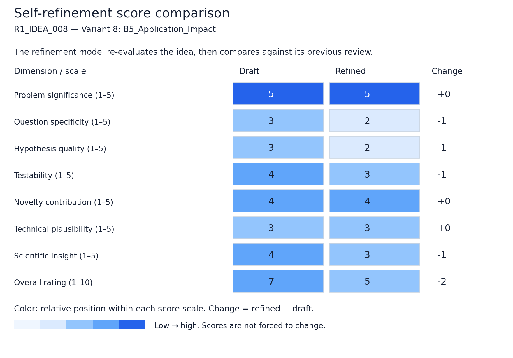

Changed score dimensions: question_specificity, hypothesis_quality, testability, scientific_insight, overall_rating.

### Score justifications (draft / refined)

**Problem significance**

```json
{
  "draft": {
    "score": 5.0,
    "justification": "Bimanual non-prehensile manipulation is a fundamental challenge in robotics. Solving this for diverse objects without external aids would be a major step forward for practical robotic systems, addressing a clear gap in current literature which often relies on single arms or simplified environments."
  },
  "refined": {
    "score": 5.0,
    "justification": "Bimanual non-prehensile manipulation is a fundamental challenge in robotics. Solving this for diverse objects without external aids would be a major step forward for practical robotic systems, addressing a clear gap in current literature which often relies on single arms or simplified environments."
  }
}
```

**Question specificity**

```json
{
  "draft": {
    "score": 3.0,
    "justification": "While the domain (bimanual non-prehensile) and the goal (category-level primitives) are specific, the 'how' is vague. The 'three-stage' description is a structural claim without technical substance in the summary. The research question is 'Can we do this?' rather than 'How does mechanism X achieve this better than Y?'"
  },
  "refined": {
    "score": 2.0,
    "justification": "While the domain and goal are specific, the 'how' is vague. The 'three-stage' description is a structural claim without technical substance. The research question is essentially 'Can we do this?' rather than 'How does mechanism X achieve this better than Y?' The lack of a defined mechanism makes the question too broad to be considered a strong scientific inquiry at this stage."
  }
}
```

**Hypothesis quality**

```json
{
  "draft": {
    "score": 3.0,
    "justification": "The idea implies a hypothesis that an RL-free, structured approach can achieve generalizable bimanual manipulation. However, it lacks a specific mechanism-based prediction (e.g., 'By decoupling X and Y, we can reduce the sample complexity by Z'). It is a proposal of a method rather than a testable scientific hypothesis about a phenomenon."
  },
  "refined": {
    "score": 2.0,
    "justification": "The idea implies a hypothesis that an RL-free, structured approach can achieve generalizable bimanual manipulation. However, it lacks a specific mechanism-based prediction. It is a proposal of a method rather than a testable scientific hypothesis about a phenomenon or relationship. It does not distinguish *why* this specific approach should work."
  }
}
```

**Testability**

```json
{
  "draft": {
    "score": 4.0,
    "justification": "The idea is testable in principle. One can define benchmarks for pushing/poking/pivoting, measure success rates on unseen objects, and compare against single-arm or RL-based baselines. The lack of specific metrics in the summary lowers the score slightly, but the experimental path is clear."
  },
  "refined": {
    "score": 3.0,
    "justification": "The idea is testable in principle (one can define benchmarks for pushing/poking/pivoting), but the lack of specific metrics, baselines, or a defined 'three-stage' process makes the experimental design currently undefined. The 'RL-free' constraint is testable, but the success criteria for 'transferable primitives' are not."
  }
}
```

**Novelty contribution**

```json
{
  "draft": {
    "score": 4.0,
    "justification": "The combination of 'bimanual', 'non-prehensile', 'category-level', and 'RL-free' is novel. While individual components exist, the specific integration to solve the generalization problem without RL is a promising and potentially high-impact contribution."
  },
  "refined": {
    "score": 4.0,
    "justification": "The combination of 'bimanual', 'non-prehensile', 'category-level', and 'RL-free' is novel. While individual components exist, the specific integration to solve the generalization problem without RL is a promising and potentially high-impact contribution, assuming the mechanism is viable."
  }
}
```

**Technical plausibility**

```json
{
  "draft": {
    "score": 3.0,
    "justification": "The idea is plausible but relies on the assumption that a 'three-stage' non-RL approach can handle the complexity of contact-rich bimanual dynamics. Without knowing the specific method (e.g., if it uses model predictive control, kinematic planning, or imitation learning), it is hard to judge if the physics of bimanual contact can be captured without the exploration of RL."
  },
  "refined": {
    "score": 3.0,
    "justification": "The idea is plausible but relies on the assumption that a 'three-stage' non-RL approach can handle the complexity of contact-rich bimanual dynamics. Without knowing the specific method (e.g., if it uses model predictive control, kinematic planning, or imitation learning), it is hard to judge if the physics of bimanual contact can be captured without the exploration of RL. The 'three-stage' claim is a placeholder."
  }
}
```

**Scientific insight**

```json
{
  "draft": {
    "score": 4.0,
    "justification": "If successful, this research would provide significant insight into how to structure robotic learning to avoid the sample inefficiency of RL. It could reveal whether structured, hierarchical approaches can match the flexibility of end-to-end learning in complex contact tasks."
  },
  "refined": {
    "score": 3.0,
    "justification": "If successful, this research would provide insight into structured learning for robotics. However, as currently stated, the potential for deep scientific insight is limited because the mechanism is undefined. The insight depends entirely on the specific implementation details which are missing."
  }
}
```

**Overall rating**

```json
{
  "draft": {
    "score": 7.0,
    "justification": "This is a strong research idea with high significance and clear potential for impact. The problem is well-defined, and the proposed direction (RL-free, bimanual, category-level) is timely and distinct. However, the score is capped at 7 because the summary lacks the technical specificity required to fully evaluate the hypothesis and mechanism. The 'three-stage' claim is a placeholder that needs rigorous definition to be considered a complete research proposal."
  },
  "refined": {
    "score": 5.0,
    "justification": "This is a moderate/borderline idea. The problem is highly significant and the direction (RL-free, bimanual) is promising. However, the idea is currently too vague to be considered 'strong' or 'exceptional'. The core mechanism is missing, the hypothesis is implicit, and the testability relies on assumptions not yet made. It is a good starting point for a proposal but lacks the specificity required for a high-scoring research idea."
  }
}
```

## R1_IDEA_008 — Variant 9: C1_Hollow_Shell


Changed score dimensions: none.

### Score justifications (draft / refined)

**Problem significance**

```json
{
  "draft": {
    "score": 4.0,
    "justification": "Robotic manipulation in contact-rich environments is a critical and difficult challenge in the field. Solving this has high practical value for automation and service robotics."
  },
  "refined": {
    "score": 4.0,
    "justification": "Robotic manipulation in contact-rich environments is a critical and difficult challenge in the field with high practical value for automation and service robotics. Addressing this is inherently significant."
  }
}
```

**Question specificity**

```json
{
  "draft": {
    "score": 2.0,
    "justification": "The idea is currently a topic description rather than a specific research question. It states the domain (dual-arm, contact-rich) but not the specific mechanism or relationship being investigated."
  },
  "refined": {
    "score": 2.0,
    "justification": "The idea is currently a topic description rather than a specific research question. It states the domain (dual-arm, contact-rich) but does not specify the mechanism, relationship, or specific variable being investigated."
  }
}
```

**Hypothesis quality**

```json
{
  "draft": {
    "score": 2.0,
    "justification": "No explicit hypothesis is provided. It is unclear what prediction is being made about the relationship between dual-arm configurations and learning success in contact-rich scenarios."
  },
  "refined": {
    "score": 2.0,
    "justification": "No explicit hypothesis is provided. It is unclear what prediction is being made about the relationship between dual-arm configurations and learning success, or what specific 'common assumption' is being tested."
  }
}
```

**Testability**

```json
{
  "draft": {
    "score": 2.0,
    "justification": "Without defined metrics, baselines, or specific tasks, the idea cannot currently be tested. It is too broad to design a meaningful experiment."
  },
  "refined": {
    "score": 2.0,
    "justification": "Without defined metrics, baselines, or specific tasks, the idea cannot currently be tested. It is too broad to design a meaningful experiment or ablation study."
  }
}
```

**Novelty contribution**

```json
{
  "draft": {
    "score": 3.0,
    "justification": "While the domain is important, the idea of using dual arms for contact-rich tasks is not inherently novel without a specific mechanism or theoretical contribution. It risks being a standard application of existing methods to a harder domain."
  },
  "refined": {
    "score": 3.0,
    "justification": "While the domain is important, the idea of using dual arms for contact-rich tasks is not inherently novel without a specific mechanism or theoretical contribution. It risks being a standard application of existing methods to a harder domain unless the 'assumptions' part is clarified."
  }
}
```

**Technical plausibility**

```json
{
  "draft": {
    "score": 4.0,
    "justification": "The direction is technically sound. Dual-arm systems are known to be beneficial for contact-rich tasks, and learning-based approaches are the standard path forward. The logic holds, even if details are missing."
  },
  "refined": {
    "score": 4.0,
    "justification": "The direction is technically sound. Dual-arm systems are known to be beneficial for contact-rich tasks, and learning-based approaches are the standard path forward. The logic holds, even if details are missing."
  }
}
```

**Scientific insight**

```json
{
  "draft": {
    "score": 2.0,
    "justification": "As stated, the idea is an engineering direction rather than a scientific inquiry. It has the potential for insight if it reveals *why* or *how* dual-arm coordination changes the learning landscape, but this is not currently articulated."
  },
  "refined": {
    "score": 2.0,
    "justification": "As stated, the idea is an engineering direction rather than a scientific inquiry. It has the potential for insight if it reveals *why* or *how* dual-arm coordination changes the learning landscape, but this is not currently articulated."
  }
}
```

**Overall rating**

```json
{
  "draft": {
    "score": 4.0,
    "justification": "The research idea addresses a significant and meaningful problem in robotics. However, it is currently too vague to be considered a strong research proposal. It lacks a specific hypothesis, defined methodology, and clear evaluation criteria. It is a 'weak' idea in its current form because it describes a field of study rather than a specific investigation, though it has the potential to become 'strong' with further refinement."
  },
  "refined": {
    "score": 4.0,
    "justification": "The research idea addresses a significant and meaningful problem in robotics. However, it is currently too vague to be considered a strong research proposal. It lacks a specific hypothesis, defined methodology, and clear evaluation criteria. It is a 'weak' idea in its current form because it describes a field of study rather than a specific investigation, though it has the potential to become 'strong' with further refinement."
  }
}
```

## R1_IDEA_008 — Variant 10: C2_Logic_Flawed

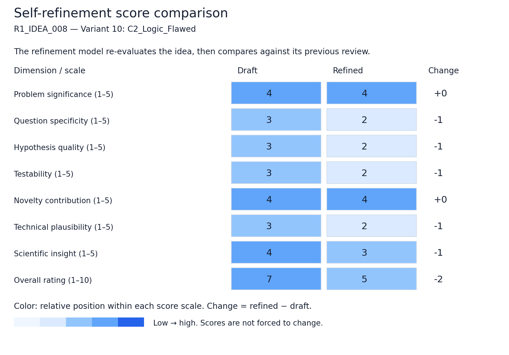

Changed score dimensions: question_specificity, hypothesis_quality, testability, technical_plausibility, scientific_insight, overall_rating.

### Score justifications (draft / refined)

**Problem significance**

```json
{
  "draft": {
    "score": 4.0,
    "justification": "The problem of dexterous, contact-rich manipulation is highly significant in robotics. Moving beyond single-arm and wall-constrained setups to generalizable bimanual systems addresses a major bottleneck in making robots more versatile in unstructured environments."
  },
  "refined": {
    "score": 4.0,
    "justification": "The problem of dexterous, contact-rich manipulation is a major bottleneck in robotics. Moving beyond single-arm and wall-constrained setups to generalizable bimanual systems is highly significant for enabling robots to operate in unstructured environments. The focus on 'category-level' generalization is also a critical research direction."
  }
}
```

**Question specificity**

```json
{
  "draft": {
    "score": 3.0,
    "justification": "While the goal (bimanual primitives) is clear, the 'three-stage' mechanism is undefined. The idea states *what* it wants to do but lacks the specificity of *how* the core method works, making the research question somewhat broad."
  },
  "refined": {
    "score": 2.0,
    "justification": "The research question is currently too vague. While the goal (bimanual primitives) is stated, the 'three-stage' mechanism is undefined. The idea states *what* it wants to achieve but provides no detail on *how* the core method works, making the specific research question difficult to isolate."
  }
}
```

**Hypothesis quality**

```json
{
  "draft": {
    "score": 3.0,
    "justification": "The implicit hypothesis is that a specific three-stage, RL-free approach can successfully generate generalizable bimanual primitives. This is testable, but the reasoning behind why this specific architecture would outperform others (or why RL is unnecessary) is not fully articulated."
  },
  "refined": {
    "score": 2.0,
    "justification": "The implicit hypothesis is that a specific, undefined three-stage, RL-free approach can generate generalizable bimanual primitives. This is a strong claim, but the reasoning behind *why* this specific architecture would work (and why RL is unnecessary) is missing. A hypothesis needs a mechanism, not just a desired outcome."
  }
}
```

**Testability**

```json
{
  "draft": {
    "score": 3.0,
    "justification": "The idea is testable in principle (build the system, test on objects), but the lack of defined stages and evaluation metrics makes it difficult to design a rigorous experiment at this stage. The success criteria for 'generalizable' need to be operationalized."
  },
  "refined": {
    "score": 2.0,
    "justification": "The idea is not currently testable because the method is undefined. Without knowing the 'three stages' or the control logic, one cannot design an experiment to validate the claim. The success criteria for 'generalizable' and 'transferable' are also not operationalized."
  }
}
```

**Novelty contribution**

```json
{
  "draft": {
    "score": 4.0,
    "justification": "Combining bimanual non-prehensile manipulation with an RL-free, category-level approach is novel. Most existing work relies on RL for such complex tasks or focuses on single-arm. If successful, this could offer a more efficient alternative to current state-of-the-art."
  },
  "refined": {
    "score": 4.0,
    "justification": "The combination of bimanual non-prehensile manipulation with an RL-free, category-level approach is novel. If the 'three-stage' mechanism turns out to be a clever application of model-based planning or geometric reasoning, it could offer a significant efficiency gain over RL. However, the novelty is currently speculative due to the lack of methodological detail."
  }
}
```

**Technical plausibility**

```json
{
  "draft": {
    "score": 3.0,
    "justification": "The idea is plausible but risky. Non-prehensile manipulation is contact-rich and dynamic; achieving this without RL (which is often used for such complex dynamics) requires a very strong underlying control or planning theory. The 'three-stage' description is too vague to fully assess plausibility."
  },
  "refined": {
    "score": 2.0,
    "justification": "The idea is technically risky. Non-prehensile manipulation involves complex contact dynamics. Achieving this without RL (which is often used precisely because it can learn complex dynamics) requires a very strong underlying control or planning theory. The 'three-stage' description is too vague to assess if the proposed mechanism is physically plausible."
  }
}
```

**Scientific insight**

```json
{
  "draft": {
    "score": 4.0,
    "justification": "If successful, this research could reveal fundamental principles of how dual-arm coordination simplifies contact-rich tasks and whether RL-free methods can match the adaptability of RL-based approaches in complex manipulation domains."
  },
  "refined": {
    "score": 3.0,
    "justification": "If successful, this research could reveal whether dual-arm coordination simplifies contact-rich tasks enough to bypass the need for RL. However, as currently stated, the potential for scientific insight is limited because the mechanism is unknown. The insight depends entirely on the specific 'three-stage' design which is missing."
  }
}
```

**Overall rating**

```json
{
  "draft": {
    "score": 7.0,
    "justification": "This is a strong research idea with high potential impact. It addresses a meaningful problem with a novel direction (RL-free bimanual). However, it currently lacks the specificity required to be a 'top-tier' idea, primarily due to the undefined 'three-stage' mechanism and the need for a clearer hypothesis on why this approach works. With better definition of the method, it could easily be a 9."
  },
  "refined": {
    "score": 5.0,
    "justification": "This is a moderate/borderline idea. It addresses a significant problem with a potentially novel direction (RL-free bimanual), but the lack of methodological definition ('three-stage') and the absence of a reasoned hypothesis make it difficult to evaluate as a concrete research plan. It is more of a high-level goal than a specific research proposal. It has potential but requires significant elaboration to be considered a strong research idea."
  }
}
```

## R1_IDEA_008 — Variant 11: C3_Substance_Enriched


Changed score dimensions: none.

### Score justifications (draft / refined)

**Problem significance**

```json
{
  "draft": {
    "score": 5.0,
    "justification": "Bimanual non-prehensile manipulation is a critical frontier in robotics for enabling dexterous handling of objects without grasping. Solving this at a category level (generalizing across object types) is a major unsolved problem with high practical value for manufacturing, logistics, and domestic robotics."
  },
  "refined": {
    "score": 5.0,
    "justification": "Bimanual non-prehensile manipulation is a critical frontier in robotics, essential for tasks that require dexterity without grasping (e.g., moving large objects, assembly). Solving this at a category level (generalizing across object types) is a major unsolved challenge with significant implications for manufacturing, logistics, and domestic robotics. The problem is highly meaningful."
  }
}
```

**Question specificity**

```json
{
  "draft": {
    "score": 3.0,
    "justification": "The idea identifies the domain (bimanual non-prehensile) and the high-level approach (three-stage, RL-free), but lacks specificity on the internal mechanics of the proposed stages. The research question is 'can a 3-stage RL-free approach work?' which is clear, but the 'how' is currently vague."
  },
  "refined": {
    "score": 3.0,
    "justification": "The idea clearly identifies the domain and the high-level approach (3-stage, RL-free). However, the research question 'can a 3-stage RL-free approach work?' is clear, but the 'how' is currently vague. The specific formulation of the stages and the interaction between them are not defined, leaving the core mechanism ambiguous."
  }
}
```

**Hypothesis quality**

```json
{
  "draft": {
    "score": 4.0,
    "justification": "The hypothesis that decomposing the problem into three stages (perception, planning, execution) can effectively solve the bimanual non-prehensile task is a strong, falsifiable claim. It posits a specific mechanism (modularity) to solve a complex problem, which can be proven wrong if the decoupling leads to failure in contact-rich scenarios."
  },
  "refined": {
    "score": 4.0,
    "justification": "The hypothesis that decomposing the problem into three distinct stages (perception, planning, execution) can effectively solve the bimanual non-prehensile task is a strong, falsifiable claim. It posits a specific mechanism (modularity) to solve a complex problem, which can be proven wrong if the decoupling leads to failure in contact-rich scenarios. It distinguishes the work from end-to-end learning."
  }
}
```

**Testability**

```json
{
  "draft": {
    "score": 4.0,
    "justification": "The idea suggests a clear validation path: testing transferability across varying mass and friction properties. This provides concrete, measurable variables. However, the lack of defined success metrics or baseline comparisons slightly reduces the immediate testability of the 'superiority' claim."
  },
  "refined": {
    "score": 4.0,
    "justification": "The idea suggests a clear validation path: testing transferability across varying mass and friction properties. These are concrete, measurable variables. However, the lack of defined success metrics or baseline comparisons slightly reduces the immediate testability of the 'superiority' claim, though the core hypothesis is testable."
  }
}
```

**Novelty contribution**

```json
{
  "draft": {
    "score": 4.0,
    "justification": "Moving away from RL for this specific complex task and proposing a structured, three-stage paradigm for bimanual non-prehensile manipulation is novel. While modular control is not new, applying it specifically to this domain without RL and claiming category-level transfer is a promising contribution."
  },
  "refined": {
    "score": 4.0,
    "justification": "Moving away from RL for this specific complex task and proposing a structured, three-stage paradigm for bimanual non-prehensile manipulation is novel. While modular control is not new, applying it specifically to this domain without RL and claiming category-level transfer is a promising contribution that could challenge current paradigms."
  }
}
```

**Technical plausibility**

```json
{
  "draft": {
    "score": 3.0,
    "justification": "The idea is logically coherent in its high-level structure, but the technical plausibility of an 'RL-free' approach handling the continuous, high-dimensional contact dynamics of bimanual manipulation is uncertain without more detail on the planning and execution algorithms. It is plausible but risky."
  },
  "refined": {
    "score": 3.0,
    "justification": "The idea is logically coherent in its high-level structure, but the technical plausibility of an 'RL-free' approach handling the continuous, high-dimensional contact dynamics of bimanual manipulation is uncertain without more detail on the planning and execution algorithms. It is plausible but risky, as contact dynamics are notoriously difficult for non-learning, model-based methods without careful tuning."
  }
}
```

**Scientific insight**

```json
{
  "draft": {
    "score": 4.0,
    "justification": "If successful, this research could reveal whether modular, non-RL approaches can match or exceed the performance of end-to-end RL in complex contact tasks. It could also provide insights into the necessary granularity of the perception-planning-execution loop for bimanual systems."
  },
  "refined": {
    "score": 4.0,
    "justification": "If successful, this research could reveal whether modular, non-RL approaches can match or exceed the performance of end-to-end RL in complex contact tasks. It could also provide insights into the necessary granularity of the perception-planning-execution loop for bimanual systems, offering transferable principles for robotics control."
  }
}
```

**Overall rating**

```json
{
  "draft": {
    "score": 7.0,
    "justification": "This is a strong research idea with high significance and a clear, testable hypothesis. The main limitation is the lack of technical detail regarding the 'three-stage' implementation and the 'RL-free' mechanism, which prevents a higher score on plausibility. However, the direction is scientifically sound and addresses a meaningful gap in the field."
  },
  "refined": {
    "score": 7.0,
    "justification": "This is a strong research idea with high significance and a clear, testable hypothesis. The main limitation is the lack of technical detail regarding the 'three-stage' implementation and the 'RL-free' mechanism, which prevents a higher score on plausibility. However, the direction is scientifically sound, addresses a meaningful gap, and has the potential for significant contribution if the technical challenges are met."
  }
}
```

## R1_IDEA_008 — Variant 12: H1_Deceptive_Hollow

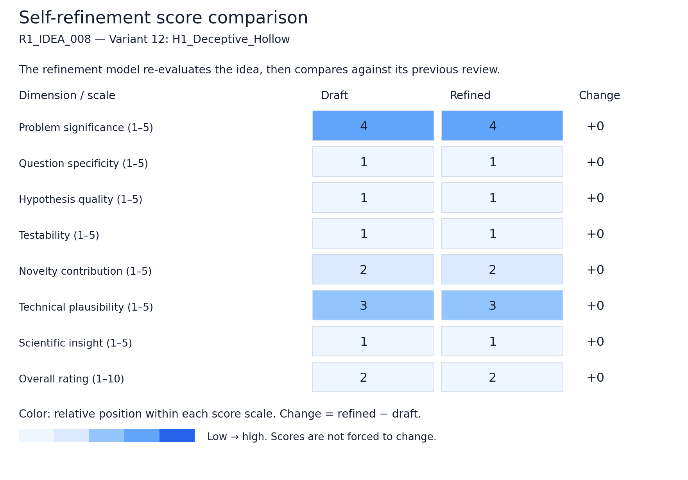

Changed score dimensions: none.

### Score justifications (draft / refined)

**Problem significance**

```json
{
  "draft": {
    "score": 4.0,
    "justification": "The problem of contact-rich manipulation in dual-arm systems is highly significant and relevant to the future of robotics. However, the text only identifies the domain, not the specific scientific challenge within it."
  },
  "refined": {
    "score": 4.0,
    "justification": "The problem of contact-rich manipulation is a major unsolved challenge in robotics with high practical significance. The focus on dual-arm systems addresses a relevant gap, as single-arm systems often struggle with complex contact tasks. However, the significance is currently limited to the *domain* rather than a specific, well-defined scientific problem."
  }
}
```

**Question specificity**

```json
{
  "draft": {
    "score": 1.0,
    "justification": "The idea lacks a specific research question. It describes a 'direction' and 'agenda' but does not define a concrete question, mechanism, or relationship to be investigated."
  },
  "refined": {
    "score": 1.0,
    "justification": "The idea provides almost no specificity regarding the research question. It describes a 'direction' and an 'agenda' but fails to articulate a concrete question, mechanism, or relationship to be investigated. It is impossible to derive a specific hypothesis from the text."
  }
}
```

**Hypothesis quality**

```json
{
  "draft": {
    "score": 1.0,
    "justification": "There is no explicit or implicit hypothesis that can be supported or contradicted. The text makes broad claims about potential impact ('field-shaping') rather than making a testable prediction."
  },
  "refined": {
    "score": 1.0,
    "justification": "There is no testable hypothesis. The text makes broad, unquantifiable claims about 'potential' and 'impact' but offers no prediction that could be supported or contradicted by evidence. It lacks the 'if-then' structure required for scientific inquiry."
  }
}
```

**Testability**

```json
{
  "draft": {
    "score": 1.0,
    "justification": "Without a defined method, metric, or specific comparison, the idea is not currently testable. It is impossible to design an experiment based solely on this summary."
  },
  "refined": {
    "score": 1.0,
    "justification": "The idea is currently not testable. Without a defined method, specific variables, or evaluation metrics, no experiment can be designed to validate or falsify the claims. It is impossible to determine what 'success' looks like."
  }
}
```

**Novelty contribution**

```json
{
  "draft": {
    "score": 2.0,
    "justification": "While the domain is interesting, the idea does not propose a novel mechanism or insight. It claims novelty through 'synthesis' but provides no details on what is being synthesized or why it is new."
  },
  "refined": {
    "score": 2.0,
    "justification": "While the combination of dual-arm and contact-rich manipulation is an active area, the text does not propose a novel mechanism or insight. The claim of 'novelty' is based on the ambition of the agenda rather than a specific technical contribution or discovery of a new phenomenon."
  }
}
```

**Technical plausibility**

```json
{
  "draft": {
    "score": 3.0,
    "justification": "The general direction (dual-arm, contact-rich) is technically plausible and aligns with current robotics trends, but the lack of methodological detail makes it impossible to assess the feasibility of the proposed 'pathway'."
  },
  "refined": {
    "score": 3.0,
    "justification": "The general premise (using dual arms for contact-rich tasks) is technically plausible and aligns with current robotics trends. However, the lack of methodological detail makes it impossible to assess the feasibility of the proposed 'pathway' or whether the 'transformative' claims are grounded in reality."
  }
}
```

**Scientific insight**

```json
{
  "draft": {
    "score": 1.0,
    "justification": "As stated, the idea does not promise specific scientific insight beyond the general hope of 'reshaping' the field. It does not identify a mechanism or principle to be discovered."
  },
  "refined": {
    "score": 1.0,
    "justification": "As stated, the idea offers no promise of specific scientific insight. It hopes to 'reshape' the field but does not identify a mechanism, principle, or boundary condition that would yield new knowledge if investigated."
  }
}
```

**Overall rating**

```json
{
  "draft": {
    "score": 2.0,
    "justification": "While the underlying topic (dual-arm contact-rich manipulation) is important, the research idea itself is too vague to be evaluated as a scientific proposal. It reads like a grant abstract or a vision statement rather than a hypothesis-driven research plan. It fails to define the 'what' and 'how' necessary for scientific inquiry."
  },
  "refined": {
    "score": 2.0,
    "justification": "This is a very weak research idea in its current form. While the underlying topic is important, the submission reads as a vision statement or grant abstract rather than a scientific proposal. It lacks a specific research question, a testable hypothesis, and a methodological direction, making it impossible to evaluate as a concrete research plan. It fails the fundamental criteria of scientific inquiry: specificity and falsifiability."
  }
}
```

## R1_IDEA_008 — Variant 13: H2_Confident_Flaw


Changed score dimensions: question_specificity, hypothesis_quality, testability, novelty_contribution, technical_plausibility, overall_rating.

### Score justifications (draft / refined)

**Problem significance**

```json
{
  "draft": {
    "score": 4.0,
    "justification": "The problem of bimanual non-prehensile manipulation is highly significant for advancing robotic dexterity. Moving away from RL and external aids addresses real-world deployment challenges, making the problem meaningful and important."
  },
  "refined": {
    "score": 4.0,
    "justification": "The problem of bimanual non-prehensile manipulation is highly significant. Moving from single-arm to dual-arm without RL addresses critical deployment challenges in robotics. The potential impact on dexterous manipulation is substantial."
  }
}
```

**Question specificity**

```json
{
  "draft": {
    "score": 3.0,
    "justification": "While the goal (bimanual primitives) is clear, the specific research question is muddied by the claim that the solution is 'necessarily' superior. The 'three-stage' mechanism is mentioned but not defined, leaving the core investigation somewhat vague."
  },
  "refined": {
    "score": 2.0,
    "justification": "While the goal is clear, the research question is obscured by the claim that the solution is 'necessarily' superior. The lack of definition for the 'three-stage' mechanism and the dismissal of confounding variables makes the specific investigation unclear."
  }
}
```

**Hypothesis quality**

```json
{
  "draft": {
    "score": 2.0,
    "justification": "The hypothesis is weak because it is stated as a certainty rather than a falsifiable prediction. The claim that solving one limitation 'necessarily' proves general superiority ignores the complexity of robotic systems and is not a robust scientific hypothesis."
  },
  "refined": {
    "score": 1.0,
    "justification": "The hypothesis is scientifically weak because it is stated as a certainty rather than a falsifiable prediction. The claim that solving one limitation 'necessarily' proves general superiority is logically unsound and cannot be meaningfully tested as a hypothesis; it is an assertion."
  }
}
```

**Testability**

```json
{
  "draft": {
    "score": 3.0,
    "justification": "The idea is testable in principle (compare performance of the new method vs. baselines), but the proposed methodology explicitly rejects the need to isolate variables (datasets, boundary cases), which undermines the ability to meaningfully test the claims of 'causal evidence' and 'general superiority'."
  },
  "refined": {
    "score": 2.0,
    "justification": "While the method could be tested against baselines, the idea explicitly rejects the isolation of variables (datasets, boundary cases) necessary to validate the claim of 'causal evidence' and 'general superiority.' This makes the core claim untestable in a rigorous scientific sense."
  }
}
```

**Novelty contribution**

```json
{
  "draft": {
    "score": 4.0,
    "justification": "Developing an RL-free, category-level bimanual approach is novel and potentially high-impact. However, the scientific contribution is currently limited by the lack of a defined mechanism and the flawed reasoning regarding causal inference."
  },
  "refined": {
    "score": 3.0,
    "justification": "The direction (RL-free bimanual primitives) is novel and potentially high-impact. However, the proposed reasoning for its contribution (that it 'necessarily' works) undermines the scientific value of the contribution until the mechanism is defined and validated."
  }
}
```

**Technical plausibility**

```json
{
  "draft": {
    "score": 3.0,
    "justification": "The concept of using dual arms for non-prehensile tasks is plausible. However, the claim that this approach automatically solves the problem without needing to address other variables (like dataset bias) is technically unsound and suggests a lack of understanding of the complexity involved."
  },
  "refined": {
    "score": 2.0,
    "justification": "The concept of dual-arm manipulation is plausible, but the claim that it automatically solves the problem without addressing other variables (like dataset bias or new collision dynamics) is technically unsound. It suggests a misunderstanding of the complexity involved."
  }
}
```

**Scientific insight**

```json
{
  "draft": {
    "score": 2.0,
    "justification": "If the method works, it would be useful, but the current framing does not promise deep scientific insight. The dismissal of boundary cases and alternative explanations prevents the research from revealing fundamental principles about bimanual coordination or the limits of RL-free control."
  },
  "refined": {
    "score": 2.0,
    "justification": "The current framing does not promise deep scientific insight. By dismissing the need to analyze boundary cases and alternative explanations, the research fails to reveal fundamental principles about bimanual coordination or the limits of the proposed approach."
  }
}
```

**Overall rating**

```json
{
  "draft": {
    "score": 5.0,
    "justification": "The idea addresses a significant problem with a potentially valuable direction (RL-free bimanual manipulation). However, the scientific rigor is severely compromised by the overconfident claims of 'necessary' superiority and the rejection of standard validation practices (isolating variables). It sits at a moderate level because the core motivation is strong, but the proposed scientific approach is flawed."
  },
  "refined": {
    "score": 4.0,
    "justification": "The idea addresses a significant problem with a potentially valuable direction, but the scientific rigor is severely compromised. The central argument relies on a logical fallacy (that solving one constraint guarantees general superiority) and explicitly rejects standard validation practices. This makes the idea weak as a scientific proposal, despite the strong motivation. It is rated higher than 1-2 because the underlying problem is important, but the proposed approach to solving it is fundamentally flawed in its reasoning."
  }
}
```

## R1_IDEA_008 — Variant 14: H3_Verbose_Enriched


Changed score dimensions: testability.

### Score justifications (draft / refined)

**Problem significance**

```json
{
  "draft": {
    "score": 5.0,
    "justification": "Bimanual non-prehensile manipulation is a high-value problem in robotics. Solving it without RL (which is data-hungry and hard to deploy) would be a significant practical breakthrough. The focus on category-level generalization addresses a major bottleneck in real-world deployment."
  },
  "refined": {
    "score": 5.0,
    "justification": "Bimanual non-prehensile manipulation is a critical challenge in robotics. Developing a solution that avoids the sample inefficiency and deployment difficulties of RL would be a significant practical and scientific breakthrough. The focus on category-level generalization addresses a major bottleneck for real-world application."
  }
}
```

**Question specificity**

```json
{
  "draft": {
    "score": 3.0,
    "justification": "The idea defines the *goal* (transferable primitives) and the *structure* (three-stage), but the specific *mechanism* is missing. The research question is currently 'Can a three-stage RL-free approach work?' which is somewhat generic. It needs to be more specific about the mechanism's unique contribution."
  },
  "refined": {
    "score": 3.0,
    "justification": "While the goal and evaluation plan are clear, the core research question is vague. The idea asks 'Can a three-stage RL-free approach work?' which is a generic feasibility question. It lacks a specific hypothesis about the *mechanism* (e.g., how the decoupling specifically alters the error landscape or generalization boundary). The description of the 'three-stage' structure is too abstract to be a specific scientific question."
  }
}
```

**Hypothesis quality**

```json
{
  "draft": {
    "score": 4.0,
    "justification": "The hypothesis that decoupling sub-problems improves transferability and robustness is strong and plausible. However, it is currently framed as a structural assumption rather than a specific prediction about the relationship between the architecture and performance metrics under specific constraints."
  },
  "refined": {
    "score": 4.0,
    "justification": "The hypothesis that decoupling sub-problems improves transferability and robustness is strong and plausible. However, it is currently framed as a structural assumption rather than a specific prediction about the relationship between the architecture and performance metrics under specific constraints (e.g., 'The staged approach will fail when friction varies faster than the planning stage can update'). It is testable but not yet deeply specific."
  }
}
```

**Testability**

```json
{
  "draft": {
    "score": 4.0,
    "justification": "The proposed evaluation strategy is excellent. It includes clear variables (mass, friction), specific test conditions (easy/difficult/boundary), and necessary controls (ablations, sensitivity analysis). The idea is highly testable once the method is defined."
  },
  "refined": {
    "score": 5.0,
    "justification": "The proposed validation strategy is exceptional. It explicitly defines independent variables (mass, friction), conditions (easy/difficult/boundary), and necessary controls (ablations, sensitivity analysis, error analysis). The idea provides a clear roadmap for empirical investigation, even if the method itself is undefined."
  }
}
```

**Novelty contribution**

```json
{
  "draft": {
    "score": 3.0,
    "justification": "The combination of bimanual non-prehensile tasks with an RL-free, staged approach is promising. However, modular control is a well-trodden path. The novelty will depend entirely on the specific implementation details not present here. As an idea, it has potential but is not yet clearly distinct from existing hierarchical control paradigms."
  },
  "refined": {
    "score": 3.0,
    "justification": "The combination of bimanual non-prehensile tasks with an RL-free, staged approach is promising, but the 'three-stage' concept itself is not novel in robotics (hierarchical planning is common). The novelty depends entirely on the specific implementation details which are missing. As an idea, it has potential but is not yet clearly distinct from existing modular control paradigms."
  }
}
```

**Technical plausibility**

```json
{
  "draft": {
    "score": 4.0,
    "justification": "The reasoning is logically coherent. Decoupling perception and control is a standard and plausible strategy in robotics. The main risk is whether a non-RL approach can sufficiently model the complex contact dynamics, but this is a valid research question to investigate."
  },
  "refined": {
    "score": 4.0,
    "justification": "The reasoning is logically coherent. Decoupling perception and control is a standard and plausible strategy. The main risk is whether a non-RL approach can sufficiently model complex contact dynamics, but this is a valid and important research question to investigate. The idea is technically sound as a direction."
  }
}
```

**Scientific insight**

```json
{
  "draft": {
    "score": 4.0,
    "justification": "If successful, this research would provide valuable insights into the trade-offs between modular (staged) and end-to-end approaches in contact-rich tasks. It could reveal the specific boundary conditions where decoupling is beneficial versus detrimental."
  },
  "refined": {
    "score": 4.0,
    "justification": "If successful, this research would provide valuable insights into the trade-offs between modular (staged) and end-to-end approaches in contact-rich tasks. It could reveal the specific boundary conditions where decoupling is beneficial versus detrimental, offering transferable principles for robotics architecture."
  }
}
```

**Overall rating**

```json
{
  "draft": {
    "score": 7.0,
    "justification": "This is a strong research idea with high significance and a well-thought-out evaluation plan. It scores lower on specificity and novelty because the core 'method' is described only as a 'three-stage structure' without technical details. However, the direction is scientifically sound, addresses a meaningful gap, and the proposed testing framework is rigorous. It has the potential to be an exceptional contribution if the specific mechanism is well-defined."
  },
  "refined": {
    "score": 7.0,
    "justification": "This is a strong research idea with high significance and a well-thought-out evaluation plan. It scores lower on specificity and novelty because the core 'method' is described only as a 'three-stage structure' without technical details. However, the direction is scientifically sound, addresses a meaningful gap, and the proposed testing framework is rigorous. It has the potential to be an exceptional contribution if the specific mechanism is well-defined."
  }
}
```

## R1_IDEA_008 — Variant 15: H4_Ultimate_Hype

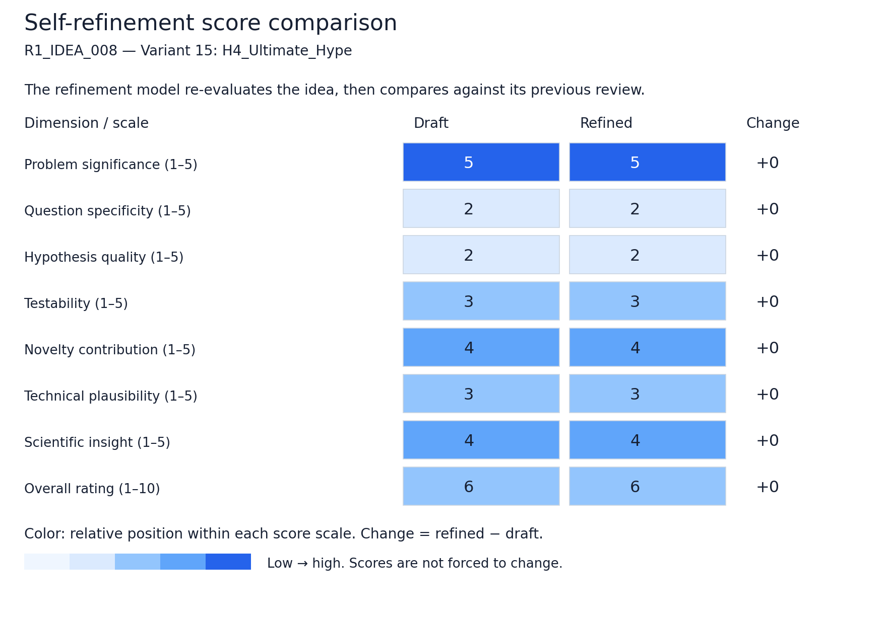

Changed score dimensions: none.

### Score justifications (draft / refined)

**Problem significance**

```json
{
  "draft": {
    "score": 5.0,
    "justification": "Bimanual non-prehensile manipulation is a critical frontier in robotics. Solving this without external aids (walls/edges) and without the sample inefficiency of RL would be a major breakthrough with significant practical implications for industrial automation and service robotics."
  },
  "refined": {
    "score": 5.0,
    "justification": "Bimanual non-prehensile manipulation is a frontier challenge in robotics. Solving this without external aids (walls/edges) and without the sample inefficiency of RL would be a major breakthrough with significant implications for industrial automation and service robotics. The problem is highly meaningful."
  }
}
```

**Question specificity**

```json
{
  "draft": {
    "score": 2.0,
    "justification": "While the goal is clear, the 'how' is missing. The idea states 'RL-free' and 'three-stage' but does not specify the methods, making the research question too broad to evaluate the feasibility of the specific approach."
  },
  "refined": {
    "score": 2.0,
    "justification": "While the goal is clear, the 'how' is completely missing. The idea mentions 'three-stage' and 'RL-free' but provides no details on the methods. A research question cannot be fully evaluated without knowing the proposed mechanism. It remains a vision statement rather than a specific scientific inquiry."
  }
}
```

**Hypothesis quality**

```json
{
  "draft": {
    "score": 2.0,
    "justification": "The idea implies a hypothesis that 'RL-free methods can achieve category-level bimanual non-prehensile manipulation,' but it does not articulate the underlying mechanism or a falsifiable prediction about the relationship between the method and the outcome."
  },
  "refined": {
    "score": 2.0,
    "justification": "The idea implies a hypothesis that 'RL-free methods can solve this,' but it does not articulate the underlying mechanism or a falsifiable prediction. It lacks a specific claim about *why* this approach works or what specific trade-offs are being made, making it difficult to test or refute."
  }
}
```

**Testability**

```json
{
  "draft": {
    "score": 3.0,
    "justification": "The idea is testable in principle (one could build the system and test it), but the lack of methodological detail makes it impossible to design a specific experiment or ablation study at this stage. The 'three-stage' structure provides a potential framework for testing, but the content of the stages is unknown."
  },
  "refined": {
    "score": 3.0,
    "justification": "The idea is testable in principle (one could build a system and test it), but the lack of methodological detail makes it impossible to design a specific experiment or ablation study at this stage. The 'three-stage' structure provides a potential framework, but the content is unknown."
  }
}
```

**Novelty contribution**

```json
{
  "draft": {
    "score": 4.0,
    "justification": "The combination of bimanual non-prehensile tasks, category-level generalization, and an RL-free constraint is novel. If successful, it would likely contribute a new paradigm for contact-rich manipulation, distinct from current RL-heavy approaches."
  },
  "refined": {
    "score": 4.0,
    "justification": "The combination of bimanual non-prehensile tasks, category-level generalization, and an explicit RL-free constraint is novel. If successful, it would likely contribute a new paradigm for contact-rich manipulation, distinct from current RL-heavy approaches. The ambition is high."
  }
}
```

**Technical plausibility**

```json
{
  "draft": {
    "score": 3.0,
    "justification": "The idea is plausible but highly ambitious. Bimanual non-prehensile manipulation is extremely complex; achieving this without RL (which is often used for contact-rich tasks) requires a very strong alternative mechanism (e.g., advanced model predictive control or hierarchical imitation learning) that is not described."
  },
  "refined": {
    "score": 3.0,
    "justification": "The idea is plausible but highly ambitious. Bimanual non-prehensile manipulation is extremely complex; achieving this without RL requires a very strong alternative mechanism (e.g., advanced model predictive control, hierarchical imitation learning, or symbolic reasoning) that is not described. Without these details, the plausibility is speculative."
  }
}
```

**Scientific insight**

```json
{
  "draft": {
    "score": 4.0,
    "justification": "If the research succeeds, it would provide deep insights into the limits of model-based or imitation-based learning for complex contact dynamics, potentially revealing that RL is not strictly necessary for this class of problems."
  },
  "refined": {
    "score": 4.0,
    "justification": "If the research succeeds, it would provide deep insights into the limits of model-based or imitation-based learning for complex contact dynamics, potentially revealing that RL is not strictly necessary for this class of problems. The potential for scientific insight is high, provided the mechanism is defined."
  }
}
```

**Overall rating**

```json
{
  "draft": {
    "score": 6.0,
    "justification": "This is a strong, high-potential research direction with significant scientific value (Problem Significance: 5, Novelty: 4). However, it currently lacks the specificity required to be a 'strong' research idea (Question Specificity: 2, Hypothesis: 2). It reads more like a vision statement than a concrete research proposal. It is a 'Moderate/borderline' idea because the core mechanism is undefined, making the feasibility uncertain, though the goal is undeniably important."
  },
  "refined": {
    "score": 6.0,
    "justification": "This is a high-potential research direction with significant scientific value (Problem Significance: 5, Novelty: 4). However, it currently lacks the specificity required to be a 'strong' research idea (Question Specificity: 2, Hypothesis: 2). It reads more like a vision statement than a concrete research proposal. The core mechanism is undefined, making the feasibility uncertain. It is a 'Moderate/borderline' idea that requires significant refinement to become a strong proposal."
  }
}
```

## R1_IDEA_009 — Source


Changed score dimensions: question_specificity, hypothesis_quality, testability, technical_plausibility, overall_rating.

### Score justifications (draft / refined)

**Problem significance**

```json
{
  "draft": {
    "score": 5.0,
    "justification": "The problem of understanding how artificial systems process temporal visual information compared to the human brain is of paramount importance for developing more robust, efficient, and interpretable AI. Addressing the 'fine-grained' gap specifically targets a known weakness in current video models, making this highly significant."
  },
  "refined": {
    "score": 5.0,
    "justification": "The problem is of paramount importance. Understanding the temporal dynamics of human vision and aligning artificial systems with these dynamics is a critical step toward robust, efficient, and interpretable AI. The specific focus on 'fine-grained' temporal processing in 'natural videos' addresses a significant blind spot in current deep learning evaluation."
  }
}
```

**Question specificity**

```json
{
  "draft": {
    "score": 3.0,
    "justification": "While the general direction is clear, the idea is currently too broad. It does not specify the exact temporal phenomena being measured, the specific alignment methodology, or the precise definition of 'mechanistic principles.' It reads more as a high-level goal than a specific research question."
  },
  "refined": {
    "score": 2.0,
    "justification": "The research question is currently too broad and vague. It asks to 'reveal mechanistic principles' without specifying which principles, how they will be measured, or what specific aspect of 'fine-grained' processing is the target. It reads more as a vision statement than a defined research question."
  }
}
```

**Hypothesis quality**

```json
{
  "draft": {
    "score": 3.0,
    "justification": "The implicit hypothesis is that deep video models currently lack fine-grained temporal alignment with human EEG and that this misalignment can be quantified and used to improve architectures. This is a plausible hypothesis, but it is not yet stated as a concrete, falsifiable prediction (e.g., 'Model X will show a 200ms latency shift compared to human EEG in the visual cortex')."
  },
  "refined": {
    "score": 2.0,
    "justification": "The idea lacks a concrete, falsifiable hypothesis. It implies that models are misaligned and that fixing this improves performance, but it does not state a specific prediction (e.g., 'Model A will fail to predict human EEG response at time t due to lack of recurrence'). Without a specific prediction, the idea is difficult to evaluate scientifically."
  }
}
```

**Testability**

```json
{
  "draft": {
    "score": 4.0,
    "justification": "The idea is testable in principle: one can record EEG, run video models, and compute alignment metrics. However, the feasibility depends heavily on the specific methods chosen for alignment and the definition of the 'benchmark,' which are currently undefined. The core concept is empirically accessible."
  },
  "refined": {
    "score": 3.0,
    "justification": "The idea is testable in principle because EEG data and video models exist. However, the specific tests are undefined. The feasibility of the study hinges entirely on the unstated methodology for alignment and the definition of success. As currently stated, it is a 'black box' test."
  }
}
```

**Novelty contribution**

```json
{
  "draft": {
    "score": 4.0,
    "justification": "While using neuroscience to benchmark AI is not new, focusing specifically on 'fine-grained temporal understanding' in 'natural videos' using EEG is a novel and under-explored angle. Most existing work focuses on static images or coarse temporal dynamics. This has high potential to reveal new insights."
  },
  "refined": {
    "score": 4.0,
    "justification": "While using neuroscience for AI benchmarking is established, the specific focus on 'fine-grained temporal understanding' in 'natural videos' using EEG is a novel and promising angle. Most existing work focuses on static images or coarse temporal dynamics, making this a potentially high-impact contribution if executed."
  }
}
```

**Technical plausibility**

```json
{
  "draft": {
    "score": 4.0,
    "justification": "The technical approach is plausible given current capabilities in EEG recording and deep learning. The main challenge lies in the data analysis (alignment of modalities) rather than the feasibility of the core components. The reasoning that better alignment leads to better architectures is a standard and reasonable assumption in neuro-inspired AI."
  },
  "refined": {
    "score": 3.0,
    "justification": "The technical components (EEG recording, video models) are standard, but the integration is non-trivial. The idea does not address the significant technical challenge of aligning high-dimensional, abstract model features with low-dimensional, noisy EEG signals. The plausibility of the 'mechanistic' claims is uncertain without a defined analytical framework."
  }
}
```

**Scientific insight**

```json
{
  "draft": {
    "score": 4.0,
    "justification": "If successful, this research could reveal specific temporal processing bottlenecks in current AI that are absent in the human brain, offering transferable insights into how to build more efficient temporal models. It moves beyond 'does it work' to 'how does it work compared to biology'."
  },
  "refined": {
    "score": 4.0,
    "justification": "If the methodological gaps are filled, this research has high potential for insight. It could reveal specific temporal bottlenecks in AI that are absent in the brain, leading to general principles for building better temporal models. However, as currently stated, the path to insight is unclear."
  }
}
```

**Overall rating**

```json
{
  "draft": {
    "score": 7.0,
    "justification": "This is a strong research idea with high significance and potential for scientific insight. It addresses a meaningful gap in the field. However, it currently lacks the specificity required to be considered 'exceptional.' The proposal needs to narrow down the specific temporal mechanisms, alignment methods, and architectural implications to move from a general vision to a concrete, testable research plan."
  },
  "refined": {
    "score": 6.0,
    "justification": "This is a moderate research idea. It identifies a highly significant problem and a promising direction (neuro-AI alignment for video), but it fails to articulate a specific research question or hypothesis. It is currently a 'vision' rather than a 'research plan.' The lack of specificity regarding the alignment methodology and the definition of 'mechanistic principles' prevents it from being a strong (7+) idea. It requires significant refinement to become a concrete, testable study."
  }
}
```

## R1_IDEA_009 — Variant 1: A1_Identity

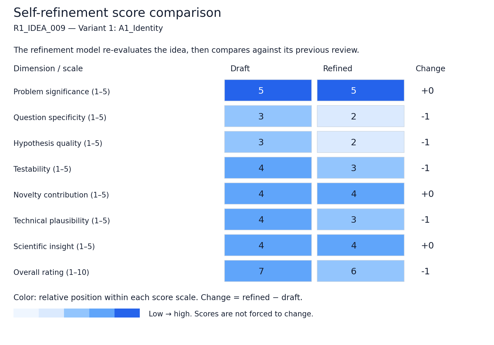

Changed score dimensions: question_specificity, hypothesis_quality, testability, technical_plausibility, overall_rating.

### Score justifications (draft / refined)

**Problem significance**

```json
{
  "draft": {
    "score": 5.0,
    "justification": "The problem of understanding how artificial systems process temporal visual information compared to the human brain is of paramount importance for developing more robust, efficient, and interpretable AI. Addressing the 'fine-grained' gap specifically targets a known weakness in current video models, making this highly significant."
  },
  "refined": {
    "score": 5.0,
    "justification": "The problem is highly significant. Current deep video models often lack the temporal efficiency and robustness of biological vision. Understanding the specific temporal mechanisms that enable human video processing is a critical open question in both neuroscience and AI. Solving this could lead to more efficient, robust, and interpretable video understanding systems."
  }
}
```

**Question specificity**

```json
{
  "draft": {
    "score": 3.0,
    "justification": "While the general direction is clear, the idea is currently too broad. It does not specify the exact temporal phenomena being measured, the specific alignment methodology, or the precise definition of 'mechanistic principles.' It reads more as a high-level goal than a specific research question."
  },
  "refined": {
    "score": 2.0,
    "justification": "The research question is currently too broad. It asks to 'reveal mechanistic principles' and 'inform design' without specifying which principles, which temporal scales, or which specific architectural components are under investigation. The term 'fine-grained' is used without operational definition. It reads more as a research vision than a specific question."
  }
}
```

**Hypothesis quality**

```json
{
  "draft": {
    "score": 3.0,
    "justification": "The implicit hypothesis is that deep video models currently lack fine-grained temporal alignment with human EEG and that this misalignment can be quantified and used to improve architectures. This is a plausible hypothesis, but it is not yet stated as a concrete, falsifiable prediction (e.g., 'Model X will show a 200ms latency shift compared to human EEG in the visual cortex')."
  },
  "refined": {
    "score": 2.0,
    "justification": "The hypothesis is implicit and weak. It assumes that alignment exists and that it can be quantified, but it does not make a specific, falsifiable prediction (e.g., 'Model X will fail to capture the N170 component of EEG during object transitions'). Without a concrete prediction, the idea is difficult to evaluate scientifically."
  }
}
```

**Testability**

```json
{
  "draft": {
    "score": 4.0,
    "justification": "The idea is testable in principle: one can record EEG, run video models, and compute alignment metrics. However, the feasibility depends heavily on the specific methods chosen for alignment and the definition of the 'benchmark,' which are currently undefined. The core concept is empirically accessible."
  },
  "refined": {
    "score": 3.0,
    "justification": "The idea is testable in principle (record EEG, run models, compare), but the feasibility is highly dependent on unstated methodological choices. The specific challenge of aligning high-dimensional model features with noisy, low-dimensional EEG is not addressed, making the 'test' currently ill-defined. It is testable only if the researcher fills in significant methodological gaps."
  }
}
```

**Novelty contribution**

```json
{
  "draft": {
    "score": 4.0,
    "justification": "While using neuroscience to benchmark AI is not new, focusing specifically on 'fine-grained temporal understanding' in 'natural videos' using EEG is a novel and under-explored angle. Most existing work focuses on static images or coarse temporal dynamics. This has high potential to reveal new insights."
  },
  "refined": {
    "score": 4.0,
    "justification": "While neuro-AI benchmarking is an active field, focusing specifically on 'fine-grained temporal understanding' in 'natural videos' using EEG is a novel angle. Most existing work focuses on static images or coarse temporal dynamics. This has the potential to reveal new insights into temporal processing bottlenecks."
  }
}
```

**Technical plausibility**

```json
{
  "draft": {
    "score": 4.0,
    "justification": "The technical approach is plausible given current capabilities in EEG recording and deep learning. The main challenge lies in the data analysis (alignment of modalities) rather than the feasibility of the core components. The reasoning that better alignment leads to better architectures is a standard and reasonable assumption in neuro-inspired AI."
  },
  "refined": {
    "score": 3.0,
    "justification": "The technical approach is plausible but faces significant hurdles. The core assumption that EEG can capture the 'fine-grained' dynamics necessary to benchmark deep video models is debatable due to EEG's spatial limitations. The reasoning is coherent, but the feasibility of the specific 'fine-grained' claim is uncertain without more detail."
  }
}
```

**Scientific insight**

```json
{
  "draft": {
    "score": 4.0,
    "justification": "If successful, this research could reveal specific temporal processing bottlenecks in current AI that are absent in the human brain, offering transferable insights into how to build more efficient temporal models. It moves beyond 'does it work' to 'how does it work compared to biology'."
  },
  "refined": {
    "score": 4.0,
    "justification": "If the methodological challenges are overcome, the study has high potential for insight. It could reveal specific temporal processing deficits in AI that are absent in the brain, offering transferable principles for building better temporal models. The potential for discovering new computational strategies is high."
  }
}
```

**Overall rating**

```json
{
  "draft": {
    "score": 7.0,
    "justification": "This is a strong research idea with high significance and potential for scientific insight. It addresses a meaningful gap in the field. However, it currently lacks the specificity required to be considered 'exceptional.' The proposal needs to narrow down the specific temporal mechanisms, alignment methods, and architectural implications to move from a general vision to a concrete, testable research plan."
  },
  "refined": {
    "score": 6.0,
    "justification": "This is a moderate research idea. It addresses a significant problem with high potential impact, but the current formulation is too vague to be considered strong. The lack of a specific hypothesis, defined temporal scale, and concrete methodology for handling the modality mismatch lowers the score. It is a promising direction that requires significant refinement to become a rigorous research proposal."
  }
}
```

## R1_IDEA_009 — Variant 2: A2_Paraphrase_Only


Changed score dimensions: none.

### Score justifications (draft / refined)

**Problem significance**

```json
{
  "draft": {
    "score": 4.0,
    "justification": "The problem of temporal understanding in AI is significant and currently a bottleneck. Bridging the gap between deep learning and neuroscience to improve efficiency and robustness is a high-value goal in the ML community."
  },
  "refined": {
    "score": 4.0,
    "justification": "The problem is highly significant. Current video models often lack the fine-grained temporal sensitivity of the human visual system. Solving this is crucial for building more robust and efficient AI. The connection to neuroscience adds substantial weight to the problem's importance."
  }
}
```

**Question specificity**

```json
{
  "draft": {
    "score": 3.0,
    "justification": "While the general direction is clear, the specific research question is somewhat broad. It lacks details on which temporal aspects of video are being tested and how the 'mechanistic principles' will be formally defined or extracted."
  },
  "refined": {
    "score": 3.0,
    "justification": "The question is moderately specific. It clearly identifies the domain (video models vs. EEG) and the goal (temporal understanding). However, it lacks specificity on the *exact* temporal phenomena being investigated and the *exact* nature of the 'mechanistic principles' to be extracted. It remains a broad research direction rather than a precise question."
  }
}
```

**Hypothesis quality**

```json
{
  "draft": {
    "score": 3.0,
    "justification": "The idea implies a hypothesis that current models fail to capture specific temporal dynamics present in the brain, and that aligning with EEG can improve them. However, the hypothesis is not yet concrete enough to be easily falsified without further definition of the specific dynamics and alignment metrics."
  },
  "refined": {
    "score": 3.0,
    "justification": "The idea implies a hypothesis (models are inferior to brains in fine-grained temporal processing and can be improved by mimicking the brain), but it is not explicitly stated or falsifiable in its current form. A stronger hypothesis would predict specific discrepancies between model activations and EEG responses at specific time points."
  }
}
```

**Testability**

```json
{
  "draft": {
    "score": 3.0,
    "justification": "The study is testable in principle (benchmarking models against EEG), but the lack of a defined methodology for alignment and the ambiguity of the 'mechanistic' output make the specific experimental design unclear."
  },
  "refined": {
    "score": 3.0,
    "justification": "The idea is testable in principle, as EEG data and model representations exist. However, the lack of a defined methodology for comparison (how to align the signals) and the vague definition of the target 'mechanisms' make the specific experimental design unclear. It requires significant methodological elaboration to be fully testable."
  }
}
```

**Novelty contribution**

```json
{
  "draft": {
    "score": 4.0,
    "justification": "While EEG-based benchmarking exists, applying it specifically to uncover 'mechanistic principles' for 'fine-grained temporal understanding' in video models is a novel angle. It moves beyond simple correlation to a design-oriented scientific inquiry."
  },
  "refined": {
    "score": 4.0,
    "justification": "While EEG benchmarking exists, the specific focus on 'fine-grained temporal understanding' as a driver for 'mechanistic principles' in video architectures is a novel and promising angle. It moves beyond simple correlation to a design-oriented inquiry, which has high potential for contribution."
  }
}
```

**Technical plausibility**

```json
{
  "draft": {
    "score": 4.0,
    "justification": "The approach is technically sound. EEG is a standard tool for temporal dynamics, and representational analysis is a standard tool for comparing models to biology. The main challenge is the methodological execution, not the fundamental plausibility."
  },
  "refined": {
    "score": 4.0,
    "justification": "The approach is technically plausible. EEG is a standard tool for temporal dynamics, and representational analysis is a standard tool for comparing models to biology. The challenges are methodological (alignment, noise) rather than fundamental impossibilities."
  }
}
```

**Scientific insight**

```json
{
  "draft": {
    "score": 4.0,
    "justification": "If successful, this research could reveal specific temporal processing bottlenecks in current architectures and provide a blueprint for biologically inspired temporal modules, offering insights beyond simple performance metrics."
  },
  "refined": {
    "score": 4.0,
    "justification": "If successful, this research could reveal specific temporal bottlenecks in current architectures and provide a blueprint for biologically inspired temporal modules. This offers insights into the nature of visual processing that go beyond simple performance metrics."
  }
}
```

**Overall rating**

```json
{
  "draft": {
    "score": 7.0,
    "justification": "This is a strong research idea with high potential impact. It addresses a meaningful problem with a plausible biological grounding. However, it currently sits at a 'moderate' level of specificity. The idea needs to move from a general 'benchmarking' goal to a specific hypothesis about *which* temporal mechanisms are missing and *how* they will be quantified to achieve a higher score."
  },
  "refined": {
    "score": 7.0,
    "justification": "This is a strong research idea with high potential. It addresses a meaningful problem with a plausible biological grounding. The main limitation is the lack of specificity in the research question and methodology. It currently sits at a 'strong' level (7) because the core concept is sound and valuable, but it needs to move from a general 'benchmarking' goal to a specific hypothesis about *which* temporal mechanisms are missing and *how* they will be quantified to achieve a higher score."
  }
}
```

## R1_IDEA_009 — Variant 3: A3_Plain_Core

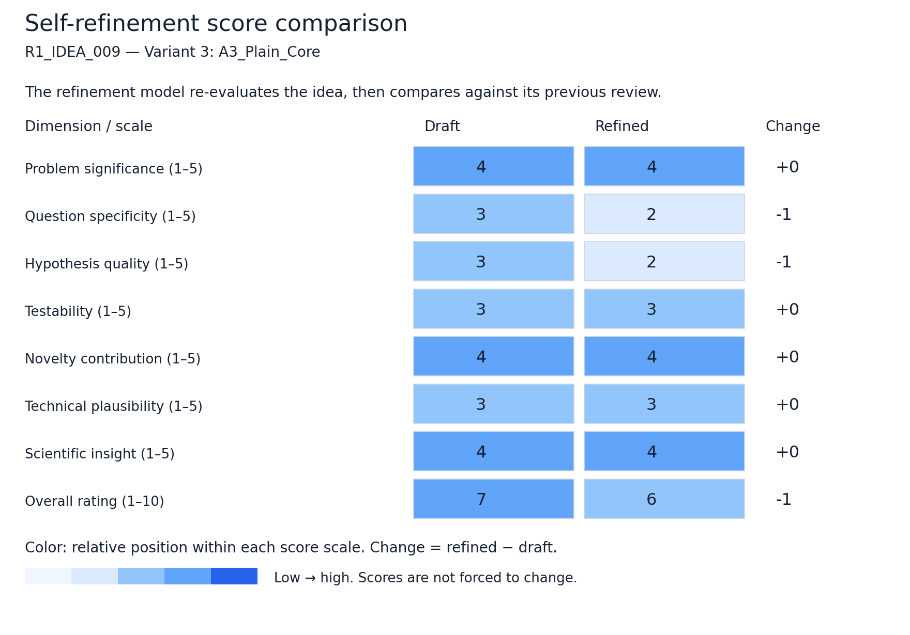

Changed score dimensions: question_specificity, hypothesis_quality, overall_rating.

### Score justifications (draft / refined)

**Problem significance**

```json
{
  "draft": {
    "score": 4.0,
    "justification": "The problem of aligning deep learning temporal dynamics with biological vision is highly significant. Current video models often lack the efficiency and robustness of the human visual system in dynamic environments. Addressing this could lead to more efficient AI, making it a meaningful challenge."
  },
  "refined": {
    "score": 4.0,
    "justification": "The problem is highly significant. Current deep video models often lack the temporal efficiency and robustness of the human visual system. Solving this could lead to more efficient AI and deeper understanding of biological vision, making it a meaningful challenge for the field."
  }
}
```

**Question specificity**

```json
{
  "draft": {
    "score": 3.0,
    "justification": "The idea identifies a general direction (benchmarking against EEG) but lacks specificity on the exact temporal phenomena being tested or the specific mechanisms of comparison. 'Fine-grained temporal understanding' is a broad concept that needs operationalization."
  },
  "refined": {
    "score": 2.0,
    "justification": "The idea is currently too broad. 'Fine-grained temporal understanding' is a vague concept without operational definitions. The proposal does not specify which temporal mechanisms are being tested or how 'fine-grained' is defined in the context of EEG limitations. It reads more as a general direction than a specific research question."
  }
}
```

**Hypothesis quality**

```json
{
  "draft": {
    "score": 3.0,
    "justification": "The implicit hypothesis is that model representations diverge from EEG in specific temporal ways that can inform architecture. This is plausible but currently too vague to be strongly falsifiable without defining the specific divergence patterns expected."
  },
  "refined": {
    "score": 2.0,
    "justification": "The implicit hypothesis (that model-EEG divergence reveals design principles) is plausible but not concrete. It does not make a specific prediction about *how* the models will fail or *what* specific mechanism will be identified. It is difficult to falsify without a more defined expectation of the divergence patterns."
  }
}
```

**Testability**

```json
{
  "draft": {
    "score": 3.0,
    "justification": "The idea is testable in principle (collect EEG, run models, compare representations), but the specific experimental protocol, alignment methods, and evaluation metrics are not defined, making the immediate testability moderate."
  },
  "refined": {
    "score": 3.0,
    "justification": "The idea is testable in principle (collect data, run models, compare), but the lack of a defined methodology for alignment and evaluation makes the immediate testability moderate. The 'mechanistic principle' extraction step is not clearly defined as a testable procedure."
  }
}
```

**Novelty contribution**

```json
{
  "draft": {
    "score": 4.0,
    "justification": "While using EEG to benchmark models is not entirely new, applying it specifically to 'fine-grained temporal understanding' in 'natural videos' to derive 'mechanistic principles' for architecture design is a novel and promising angle that could yield unique insights."
  },
  "refined": {
    "score": 4.0,
    "justification": "While using EEG to benchmark models is emerging, applying it specifically to 'fine-grained temporal understanding' in 'natural videos' to derive 'mechanistic principles' for architecture is a novel angle. It has the potential to yield unique insights into temporal processing that static benchmarks miss."
  }
}
```

**Technical plausibility**

```json
{
  "draft": {
    "score": 3.0,
    "justification": "The approach is technically plausible, but the gap between EEG's low spatial resolution and the high dimensionality of deep models, combined with the noise in EEG, presents significant technical challenges that are not addressed in the summary."
  },
  "refined": {
    "score": 3.0,
    "justification": "The approach is technically plausible but faces significant hurdles. The gap between low-resolution, noisy EEG and high-dimensional model features is substantial. Without a proposed method to bridge this (e.g., specific encoding models), the technical feasibility is uncertain."
  }
}
```

**Scientific insight**

```json
{
  "draft": {
    "score": 4.0,
    "justification": "If successful, this research could reveal fundamental differences in how biological and artificial systems process temporal information, potentially leading to new architectural paradigms (e.g., specific types of recurrence or attention) that are currently missing in deep learning."
  },
  "refined": {
    "score": 4.0,
    "justification": "If successfully executed, this research could reveal fundamental differences in temporal processing between biological and artificial systems. It has the potential to uncover new architectural paradigms (e.g., specific recurrence patterns) that are currently missing in deep learning."
  }
}
```

**Overall rating**

```json
{
  "draft": {
    "score": 7.0,
    "justification": "This is a strong research idea with high potential impact. It addresses a meaningful problem with a plausible direction. However, it currently sits at the 'strong' rather than 'exceptional' level because the specific research question, hypothesis, and methodological approach are not sufficiently detailed to guarantee a clear path to scientific insight. With more specificity on the temporal mechanisms and alignment methods, this could be an exceptional contribution."
  },
  "refined": {
    "score": 6.0,
    "justification": "This is a moderate research idea. While the motivation is strong and the potential impact is high, the current formulation lacks the specificity required for a 'strong' or 'exceptional' idea. The gap between the broad goal ('benchmarking') and the specific outcome ('mechanistic principles') is not bridged by a clear hypothesis or method. It risks being a generic correlation study without a clear path to architectural innovation unless the scope is narrowed and the methodology defined."
  }
}
```

## R1_IDEA_009 — Variant 4: B1_Verbose_Elaborate


Changed score dimensions: none.

### Score justifications (draft / refined)

**Problem significance**

```json
{
  "draft": {
    "score": 5.0,
    "justification": "The problem is highly significant. Current video models often lack the temporal efficiency and robustness of biological vision. Establishing a benchmark that directly compares AI to human brain dynamics is a major step toward neuro-inspired AI, which is a top-tier research goal."
  },
  "refined": {
    "score": 5.0,
    "justification": "The problem is exceptionally significant. Current deep video models often lack the temporal efficiency and robustness of biological vision. Establishing a benchmark that directly compares AI to human brain dynamics is a critical step toward neuro-inspired AI, a top-tier research goal in the field."
  }
}
```

**Question specificity**

```json
{
  "draft": {
    "score": 3.0,
    "justification": "The idea identifies the general direction (comparing models to EEG) but lacks specificity on the 'how'. It does not define the specific temporal phenomena to be measured, the specific model classes to be compared, or the specific metrics for alignment."
  },
  "refined": {
    "score": 3.0,
    "justification": "The idea identifies the general direction (comparing models to EEG) but lacks specificity on the 'how'. It does not define the specific temporal phenomena to be measured, the specific model classes to be compared, or the specific metrics for alignment. The term 'fine-grained' is used without operational definition."
  }
}
```

**Hypothesis quality**

```json
{
  "draft": {
    "score": 3.0,
    "justification": "The implicit hypothesis is that EEG data contains learnable patterns that can improve video models. This is plausible but currently too broad. A stronger idea would hypothesize a specific relationship, e.g., 'Temporal attention in models correlates with specific EEG oscillatory patterns during motion processing.'"
  },
  "refined": {
    "score": 3.0,
    "justification": "The implicit hypothesis is that EEG data contains learnable patterns that can improve video models. This is plausible but currently too broad. A stronger idea would hypothesize a specific relationship, e.g., 'Temporal attention in models correlates with specific EEG oscillatory patterns during motion processing.' The current statement is an aim rather than a testable prediction."
  }
}
```

**Testability**

```json
{
  "draft": {
    "score": 4.0,
    "justification": "The idea is testable in principle. One can record EEG while watching videos, extract features from video models, and compute correlation metrics. However, the feasibility depends heavily on the specific analytical methods chosen, which are not yet defined."
  },
  "refined": {
    "score": 4.0,
    "justification": "The idea is testable in principle. One can record EEG while watching videos, extract features from video models, and compute correlation metrics. However, the feasibility and validity of the test depend heavily on the specific analytical methods chosen, which are not yet defined. The 'fine-grained' claim adds a layer of difficulty that must be addressed methodologically."
  }
}
```

**Novelty contribution**

```json
{
  "draft": {
    "score": 4.0,
    "justification": "While comparing models to brain data is not new, a dedicated benchmark for *fine-grained temporal* understanding in *video* (as opposed to static images or simple motion tasks) using *natural videos* is a novel and valuable contribution. It moves beyond simple performance metrics to mechanistic alignment."
  },
  "refined": {
    "score": 4.0,
    "justification": "While comparing models to brain data is not new, a dedicated benchmark for *fine-grained temporal* understanding in *video* (as opposed to static images or simple motion tasks) using *natural videos* is a novel and valuable contribution. It moves beyond simple performance metrics to mechanistic alignment, which is a significant step forward."
  }
}
```

**Technical plausibility**

```json
{
  "draft": {
    "score": 4.0,
    "justification": "The technical approach is plausible. EEG is a standard tool in neuroscience, and deep video models are standard in ML. The challenge lies in the cross-modal alignment, which is a known but solvable problem in computational neuroscience."
  },
  "refined": {
    "score": 4.0,
    "justification": "The technical approach is plausible. EEG is a standard tool in neuroscience, and deep video models are standard in ML. The challenge lies in the cross-modal alignment and the interpretation of 'fine-grained' dynamics from EEG, which is a known but solvable problem in computational neuroscience, provided the methodology is carefully chosen."
  }
}
```

**Scientific insight**

```json
{
  "draft": {
    "score": 4.0,
    "justification": "If successful, this research could reveal fundamental principles of how the brain processes temporal information in complex scenes, which could lead to architectural breakthroughs in AI (e.g., new types of temporal pooling or attention mechanisms)."
  },
  "refined": {
    "score": 4.0,
    "justification": "If successfully investigated, this research could reveal fundamental principles of how the brain processes temporal information in complex scenes, which could lead to architectural breakthroughs in AI (e.g., new types of temporal pooling or attention mechanisms). The potential for transferable insight is high."
  }
}
```

**Overall rating**

```json
{
  "draft": {
    "score": 7.0,
    "justification": "This is a strong research idea with high potential impact. It addresses a meaningful gap and proposes a scientifically sound direction. However, it currently sits at the 'concept' stage and lacks the specific methodological details and hypothesis formulation required to be an 'exceptional' proposal. With clearer definitions of the temporal scope and the alignment methodology, this could easily become a top-tier contribution."
  },
  "refined": {
    "score": 7.0,
    "justification": "This is a strong research idea with high potential impact. It addresses a meaningful gap and proposes a scientifically sound direction. However, it currently sits at the 'concept' stage and lacks the specific methodological details and hypothesis formulation required to be an 'exceptional' proposal. With clearer definitions of the temporal scope and the alignment methodology, this could easily become a top-tier contribution."
  }
}
```

## R1_IDEA_009 — Variant 5: B2_Grand_Narrative


Changed score dimensions: none.

### Score justifications (draft / refined)

**Problem significance**

```json
{
  "draft": {
    "score": 5.0,
    "justification": "Understanding the temporal dynamics of visual processing is a fundamental challenge in both neuroscience and AI. Bridging this gap has high potential for advancing both fields, making the problem highly significant."
  },
  "refined": {
    "score": 5.0,
    "justification": "Understanding the temporal dynamics of visual processing is a fundamental challenge in both neuroscience and AI. Bridging the gap between biological efficiency and artificial models is a high-priority goal with broad implications for both fields."
  }
}
```

**Question specificity**

```json
{
  "draft": {
    "score": 2.0,
    "justification": "The idea describes a general direction ('benchmarking') and a broad goal ('reveal mechanistic principles') but lacks a concrete, testable research question. It does not specify which temporal mechanisms are being investigated."
  },
  "refined": {
    "score": 2.0,
    "justification": "The idea describes a general direction ('benchmarking') and a broad goal ('reveal mechanistic principles') but lacks a concrete, testable research question. It does not specify which temporal mechanisms are being investigated or what specific comparison will be made."
  }
}
```

**Hypothesis quality**

```json
{
  "draft": {
    "score": 2.0,
    "justification": "No explicit hypothesis is stated. The text implies a positive correlation or alignment is expected, but it does not make a specific, falsifiable prediction about the nature of that alignment or the specific differences between models and brains."
  },
  "refined": {
    "score": 2.0,
    "justification": "No explicit hypothesis is stated. The text implies a positive correlation or alignment is expected, but it does not make a specific, falsifiable prediction about the nature of that alignment or the specific differences between models and brains."
  }
}
```

**Testability**

```json
{
  "draft": {
    "score": 3.0,
    "justification": "The idea is testable in principle (comparing model outputs to EEG), but the lack of specific metrics, alignment methods, or defined temporal phenomena makes the immediate testability low. It requires significant methodological specification to become a concrete experiment."
  },
  "refined": {
    "score": 3.0,
    "justification": "The idea is testable in principle (comparing model outputs to EEG), but the lack of specific metrics, alignment methods, or defined temporal phenomena makes the immediate testability low. It requires significant methodological specification to become a concrete experiment."
  }
}
```

**Novelty contribution**

```json
{
  "draft": {
    "score": 4.0,
    "justification": "While EEG-ML alignment is an active field, applying it specifically to *fine-grained temporal understanding* in *natural video* contexts with the goal of informing *dynamic architecture design* is a novel and promising angle."
  },
  "refined": {
    "score": 4.0,
    "justification": "While EEG-ML alignment is an active field, applying it specifically to *fine-grained temporal understanding* in *natural video* contexts with the explicit goal of informing *dynamic architecture design* is a novel and promising angle that could yield unique insights."
  }
}
```

**Technical plausibility**

```json
{
  "draft": {
    "score": 3.0,
    "justification": "The concept is plausible, but the technical challenge of aligning EEG (low SNR, volume conduction issues) with deep video representations is non-trivial. The idea does not address how this technical hurdle will be overcome, which affects the plausibility of the proposed 'fine-grained' analysis."
  },
  "refined": {
    "score": 3.0,
    "justification": "The concept is plausible, but the technical challenge of aligning EEG (low SNR, volume conduction issues) with deep video representations is non-trivial. The idea does not address how this technical hurdle will be overcome, which affects the plausibility of the proposed 'fine-grained' analysis."
  }
}
```

**Scientific insight**

```json
{
  "draft": {
    "score": 4.0,
    "justification": "If successfully executed, this research could reveal fundamental principles of how the brain processes temporal visual information and how current AI models fail or succeed in mimicking this, offering deep insights into efficient computation."
  },
  "refined": {
    "score": 4.0,
    "justification": "If successfully executed, this research could reveal fundamental principles of how the brain processes temporal visual information and how current AI models fail or succeed in mimicking this, offering deep insights into efficient computation."
  }
}
```

**Overall rating**

```json
{
  "draft": {
    "score": 6.0,
    "justification": "The research idea is built on a highly significant and promising scientific foundation. However, as currently stated, it is too vague to be considered a strong, actionable research proposal. It lacks the specificity of a hypothesis and the definition of a concrete research question. With refinement to specify the temporal mechanisms and alignment methods, this could easily become a 9 or 10."
  },
  "refined": {
    "score": 6.0,
    "justification": "The research idea is built on a highly significant and promising scientific foundation. However, as currently stated, it is too vague to be considered a strong, actionable research proposal. It lacks the specificity of a hypothesis and the definition of a concrete research question. With refinement to specify the temporal mechanisms and alignment methods, this could easily become a 9 or 10."
  }
}
```

## R1_IDEA_009 — Variant 6: B3_Over_Confident

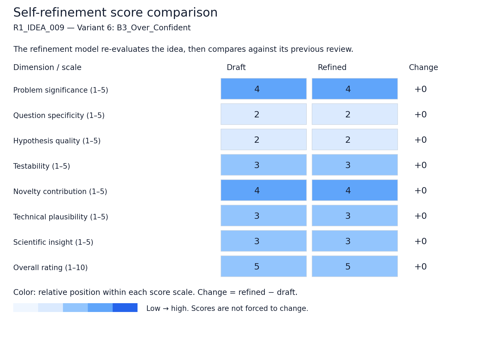

Changed score dimensions: none.

### Score justifications (draft / refined)

**Problem significance**

```json
{
  "draft": {
    "score": 4.0,
    "justification": "Understanding the temporal dynamics of vision is a critical open problem in both neuroscience and computer vision. Bridging the gap between artificial and biological temporal processing is highly significant for developing more robust and efficient AI systems."
  },
  "refined": {
    "score": 4.0,
    "justification": "Understanding how the brain processes temporal visual information is a fundamental challenge in neuroscience and a critical bottleneck for AI. Bridging this gap is highly significant for developing more robust, efficient, and human-like video understanding systems."
  }
}
```

**Question specificity**

```json
{
  "draft": {
    "score": 2.0,
    "justification": "The idea describes a general direction ('benchmarking') rather than a specific research question. It lacks details on what specific variables are being manipulated or measured, making the scope too vague to evaluate the scientific rigor of the proposed investigation."
  },
  "refined": {
    "score": 2.0,
    "justification": "The idea is currently too broad. It describes a 'benchmarking' activity rather than a specific research question. It does not specify which variables are being manipulated, which specific features are compared, or what specific relationship is being tested."
  }
}
```

**Hypothesis quality**

```json
{
  "draft": {
    "score": 2.0,
    "justification": "There is no explicit hypothesis stated. The text implies a positive outcome ('aims to reveal'), but does not propose a specific, falsifiable prediction about the relationship between model representations and EEG signals."
  },
  "refined": {
    "score": 2.0,
    "justification": "There is no explicit hypothesis. The text states the work 'aims to reveal' principles, which is a goal, not a prediction. A strong idea would propose a specific relationship (e.g., 'X model property correlates with Y EEG feature') that could be proven false."
  }
}
```

**Testability**

```json
{
  "draft": {
    "score": 3.0,
    "justification": "The idea is testable in principle (one can record EEG and run video models), but the lack of defined metrics, specific models, and alignment methods makes the experimental design currently undefined. It is testable only if significant methodological details are added."
  },
  "refined": {
    "score": 3.0,
    "justification": "The idea is testable in principle (one can record EEG and run models), but the lack of defined metrics, specific models, and alignment methods makes the experimental design currently undefined. It is testable only if significant methodological details are added."
  }
}
```

**Novelty contribution**

```json
{
  "draft": {
    "score": 4.0,
    "justification": "While comparing AI to brain data is not new, focusing specifically on *fine-grained temporal understanding* in *natural video* contexts using *EEG* is a promising and under-explored niche that could yield novel insights into temporal processing mechanisms."
  },
  "refined": {
    "score": 4.0,
    "justification": "While neuro-AI is a growing field, focusing specifically on *fine-grained temporal understanding* using *natural videos* and *EEG* is a promising niche. If successful, it could reveal unique temporal processing mechanisms not captured by current video models."
  }
}
```

**Technical plausibility**

```json
{
  "draft": {
    "score": 3.0,
    "justification": "The general approach is plausible, but the technical challenge of aligning EEG signals with deep network representations is non-trivial. The idea does not address the methodological hurdles (e.g., signal-to-noise ratio, temporal resolution mismatch) that could render the comparison invalid without careful design."
  },
  "refined": {
    "score": 3.0,
    "justification": "The general approach is plausible, but the technical challenge of aligning macroscopic, noisy EEG signals with abstract deep network features is non-trivial. The idea does not address the methodological hurdles (e.g., signal-to-noise ratio, temporal resolution mismatch) that could render the comparison invalid."
  }
}
```

**Scientific insight**

```json
{
  "draft": {
    "score": 3.0,
    "justification": "If executed well, this could reveal how biological systems handle temporal dynamics differently from current AI. However, as currently stated, it risks being a descriptive benchmark rather than a study that uncovers deep mechanistic principles."
  },
  "refined": {
    "score": 3.0,
    "justification": "If executed well, this could reveal how biological systems handle temporal dynamics differently from current AI. However, as currently stated, it risks being a descriptive benchmark rather than a study that uncovers deep mechanistic principles or generalizable rules."
  }
}
```

**Overall rating**

```json
{
  "draft": {
    "score": 5.0,
    "justification": "The idea sits at the borderline of moderate and strong. It addresses a highly significant problem with a promising direction, but it currently lacks the specificity, hypothesis, and methodological definition required to be considered a strong research proposal. It is a good 'seed' idea that needs significant refinement to become a concrete study."
  },
  "refined": {
    "score": 5.0,
    "justification": "The idea sits at the borderline of moderate and strong. It addresses a highly significant problem with a promising direction, but it currently lacks the specificity, hypothesis, and methodological definition required to be considered a strong research proposal. It is a good 'seed' idea that needs significant refinement to become a concrete study."
  }
}
```

## R1_IDEA_009 — Variant 7: B4_Novelty


Changed score dimensions: hypothesis_quality.

### Score justifications (draft / refined)

**Problem significance**

```json
{
  "draft": {
    "score": 5.0,
    "justification": "The problem of temporal understanding in video models is a major bottleneck in AI. Proposing a biological benchmark (EEG) to address this is highly significant and aligns with the broader goal of neuro-inspired AI."
  },
  "refined": {
    "score": 5.0,
    "justification": "The problem is highly significant. Understanding why video models fail at temporal dynamics compared to humans is a fundamental challenge. Using EEG as a benchmark directly targets this gap and aligns with the growing field of neuro-AI."
  }
}
```

**Question specificity**

```json
{
  "draft": {
    "score": 3.0,
    "justification": "While the general direction is clear, the idea lacks specific details on the 'how'. The definition of 'fine-grained' in the context of EEG and the specific alignment methodology are currently too vague."
  },
  "refined": {
    "score": 3.0,
    "justification": "The idea identifies a general direction (benchmarking against EEG) but lacks specificity on the 'how'. The definition of 'fine-grained' is vague, and the specific metrics or alignment techniques are not proposed. The question 'how to align' is not yet answered."
  }
}
```

**Hypothesis quality**

```json
{
  "draft": {
    "score": 4.0,
    "justification": "The implicit hypothesis—that EEG alignment reveals principles for better video architectures—is testable and non-trivial. However, the specific prediction of *which* principles will be found is not yet articulated."
  },
  "refined": {
    "score": 3.0,
    "justification": "The implicit hypothesis is that EEG alignment reveals design principles. While plausible, it is currently a broad assumption rather than a specific, falsifiable prediction (e.g., 'Models with X temporal structure will correlate with Y EEG component'). It needs more concrete predictions to be a strong hypothesis."
  }
}
```

**Testability**

```json
{
  "draft": {
    "score": 4.0,
    "justification": "The idea is testable by collecting EEG data on natural videos, running video models, and computing representational similarity. The challenge lies in the interpretation of the results, not the feasibility of the experiment itself."
  },
  "refined": {
    "score": 4.0,
    "justification": "The idea is testable in principle: one can collect EEG, run models, and compute similarity. However, the 'testability' of the *insight* (deriving design principles) is lower because the translation from correlation to design is not defined. The experiment itself is feasible."
  }
}
```

**Novelty contribution**

```json
{
  "draft": {
    "score": 4.0,
    "justification": "Using EEG specifically for *temporal* benchmarking of video models is a novel angle. Most existing work focuses on static image alignment or fMRI. This could yield unique insights into temporal dynamics."
  },
  "refined": {
    "score": 4.0,
    "justification": "Using EEG specifically for *temporal* benchmarking of video models is a novel contribution. Most existing work focuses on static images (fMRI/EEG) or behavioral tasks. This specific angle on temporal dynamics is underexplored."
  }
}
```

**Technical plausibility**

```json
{
  "draft": {
    "score": 3.0,
    "justification": "Technically plausible, but the mismatch between EEG's temporal/spatial resolution and the requirements of 'fine-grained' video understanding presents a significant technical hurdle that needs a robust solution."
  },
  "refined": {
    "score": 3.0,
    "justification": "Technically plausible but challenging. The mismatch between the high-frequency, high-dimensional nature of video model features and the low-dimensional, noisy nature of EEG is a significant technical hurdle that requires a robust methodological framework not yet described."
  }
}
```

**Scientific insight**

```json
{
  "draft": {
    "score": 4.0,
    "justification": "If successful, this research could reveal fundamental differences between how biological and artificial systems process temporal information, offering transferable insights for both neuroscience and AI."
  },
  "refined": {
    "score": 4.0,
    "justification": "If successful, this could reveal fundamental differences in temporal processing between silicon and biology. The potential to derive 'mechanistic principles' offers high scientific value beyond simple performance metrics."
  }
}
```

**Overall rating**

```json
{
  "draft": {
    "score": 7.0,
    "justification": "This is a strong research idea with high significance and novelty. It addresses a meaningful gap in the field. However, it currently sits at a 'moderate' level of specificity regarding the methodology and the specific mechanism of alignment. With a more concrete proposal on how to bridge the EEG-model gap, this could be an exceptional contribution."
  },
  "refined": {
    "score": 7.0,
    "justification": "This is a strong research idea with high significance and novelty. It addresses a meaningful gap in the field. However, it currently sits at a 'moderate' level of specificity regarding the methodology and the specific mechanism of alignment. The leap from 'benchmarking' to 'designing' is not yet justified. With a more concrete proposal on how to bridge the EEG-model gap and define the specific temporal phenomena, this could be an exceptional contribution."
  }
}
```

## R1_IDEA_009 — Variant 8: B5_Application_Impact


Changed score dimensions: none.

### Score justifications (draft / refined)

**Problem significance**

```json
{
  "draft": {
    "score": 5.0,
    "justification": "Understanding the temporal dynamics of visual processing is a fundamental open problem in both neuroscience and computer vision. Bridging this gap with deep learning models addresses a critical limitation in current video AI systems, which often lack the efficiency and robustness of biological vision."
  },
  "refined": {
    "score": 5.0,
    "justification": "Understanding the temporal dynamics of visual processing is a fundamental open problem in both neuroscience and computer vision. Bridging this gap with deep learning models addresses a critical limitation in current video AI systems, which often lack the efficiency and robustness of biological vision. The problem is highly significant."
  }
}
```

**Question specificity**

```json
{
  "draft": {
    "score": 3.0,
    "justification": "While the general goal is clear, the specific research question is somewhat vague. It states an aim to 'reveal principles' but does not specify the exact relationship being tested (e.g., 'Do models with temporal attention mechanisms align better with EEG than 3D CNNs?'). The 'how' is missing."
  },
  "refined": {
    "score": 3.0,
    "justification": "While the general goal is clear, the specific research question is somewhat vague. It states an aim to 'reveal principles' but does not specify the exact relationship being tested (e.g., 'Do models with temporal attention mechanisms align better with EEG than 3D CNNs?'). The 'how' is missing, making the question broad rather than specific."
  }
}
```

**Hypothesis quality**

```json
{
  "draft": {
    "score": 3.0,
    "justification": "The idea implies a hypothesis that deep video models can be evaluated and improved by aligning them with EEG dynamics. However, it lacks a concrete, falsifiable prediction (e.g., 'Models trained with temporal contrastive objectives will show higher EEG alignment than those trained with standard video classification losses')."
  },
  "refined": {
    "score": 3.0,
    "justification": "The idea implies a hypothesis that deep video models can be evaluated and improved by aligning them with EEG dynamics. However, it lacks a concrete, falsifiable prediction (e.g., 'Models trained with temporal contrastive objectives will show higher EEG alignment than those trained with standard video classification losses'). The hypothesis is implicit rather than explicit."
  }
}
```

**Testability**

```json
{
  "draft": {
    "score": 4.0,
    "justification": "The idea is testable in principle. One can record EEG while subjects watch videos, extract features from video models, and compute alignment metrics. However, the feasibility depends heavily on the specific experimental design and data quality, which are not detailed."
  },
  "refined": {
    "score": 4.0,
    "justification": "The idea is testable in principle. One can record EEG while subjects watch videos, extract features from video models, and compute alignment metrics. However, the feasibility depends heavily on the specific experimental design and data quality, which are not detailed. The core concept is testable, but the path is not fully defined."
  }
}
```

**Novelty contribution**

```json
{
  "draft": {
    "score": 4.0,
    "justification": "While EEG-based benchmarking exists for static images, applying it to *dynamic* video representations to derive *architectural* principles is a novel and under-explored direction. It moves beyond simple benchmarking to generative design."
  },
  "refined": {
    "score": 4.0,
    "justification": "While EEG-based benchmarking exists for static images, applying it to *dynamic* video representations to derive *architectural* principles is a novel and under-explored direction. It moves beyond simple benchmarking to generative design, offering potential for significant contribution."
  }
}
```

**Technical plausibility**

```json
{
  "draft": {
    "score": 4.0,
    "justification": "The technical approach is plausible given current tools in representational similarity analysis and EEG processing. The main challenge is the modality mismatch, but this is a known problem with established (though difficult) solutions."
  },
  "refined": {
    "score": 4.0,
    "justification": "The technical approach is plausible given current tools in representational similarity analysis and EEG processing. The main challenge is the modality mismatch, but this is a known problem with established (though difficult) solutions. The reasoning is logically coherent."
  }
}
```

**Scientific insight**

```json
{
  "draft": {
    "score": 4.0,
    "justification": "If successful, this research could reveal fundamental principles of how the brain processes temporal information, which could lead to a new class of 'brain-inspired' video architectures that are more data-efficient and robust."
  },
  "refined": {
    "score": 4.0,
    "justification": "If successful, this research could reveal fundamental principles of how the brain processes temporal information, which could lead to a new class of 'brain-inspired' video architectures that are more data-efficient and robust. The potential for transferable insight is high."
  }
}
```

**Overall rating**

```json
{
  "draft": {
    "score": 7.0,
    "justification": "This is a strong research idea with high scientific significance and potential for novel insights. It addresses a meaningful gap in temporal understanding. However, it currently lacks the specificity required to be considered 'exceptional' (score 9-10) because the methodological path and specific hypotheses are not articulated. With a more concrete experimental design, this could be a top-tier contribution."
  },
  "refined": {
    "score": 7.0,
    "justification": "This is a strong research idea with high scientific significance and potential for novel insights. It addresses a meaningful gap in temporal understanding. However, it currently lacks the specificity required to be considered 'exceptional' (score 9-10) because the methodological path and specific hypotheses are not articulated. With a more concrete experimental design, this could be a top-tier contribution."
  }
}
```

## R1_IDEA_009 — Variant 9: C1_Hollow_Shell

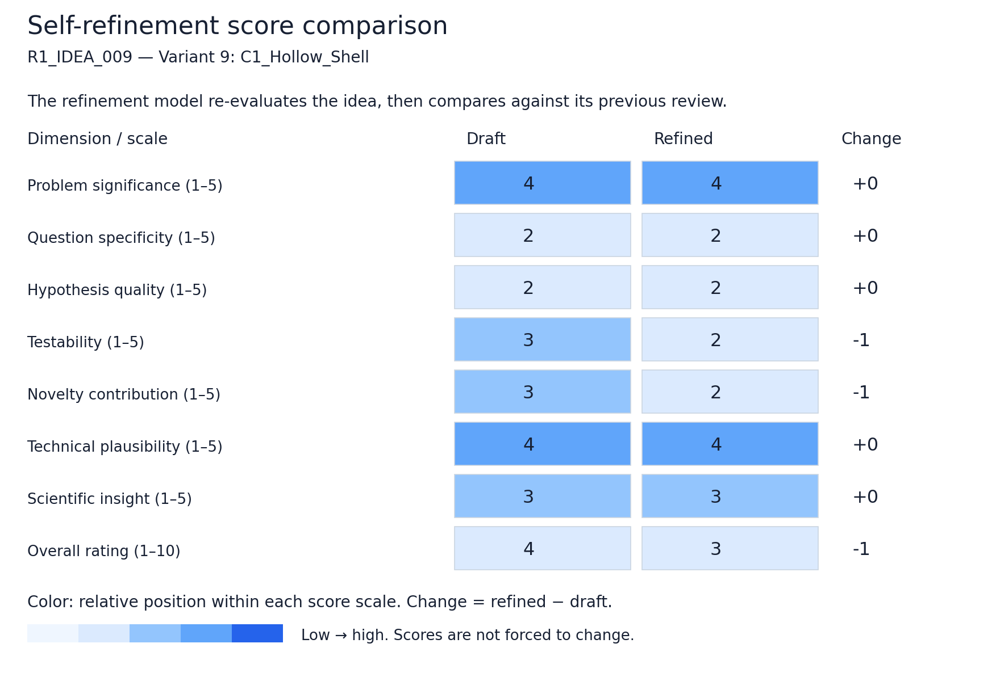

Changed score dimensions: testability, novelty_contribution, overall_rating.

### Score justifications (draft / refined)

**Problem significance**

```json
{
  "draft": {
    "score": 4.0,
    "justification": "The problem of bridging the gap between AI and biological vision is highly significant. Understanding how the brain achieves efficiency could lead to breakthroughs in AI architecture. However, the significance is currently tempered by the lack of a specific problem definition within the broad field."
  },
  "refined": {
    "score": 4.0,
    "justification": "The problem of bridging AI and biological vision is highly significant. Understanding biological efficiency is a major open challenge in ML. However, the significance is currently limited by the lack of a specific problem definition within this broad field."
  }
}
```

**Question specificity**

```json
{
  "draft": {
    "score": 2.0,
    "justification": "The idea is too broad. It states a general direction ('comparing models with brain recordings') but fails to define the specific variables, conditions, or relationships being investigated. It reads more like a mission statement than a research question."
  },
  "refined": {
    "score": 2.0,
    "justification": "The idea is too broad to be considered a specific research question. It describes a general direction ('comparing models with brains') but does not identify the specific variables, conditions, or relationships to be investigated. It reads as a mission statement rather than a hypothesis."
  }
}
```

**Hypothesis quality**

```json
{
  "draft": {
    "score": 2.0,
    "justification": "No explicit or implicit hypothesis is provided. The statement 'aims to uncover principles' is a goal, not a testable prediction. A strong idea would predict a specific relationship or discrepancy between models and brains."
  },
  "refined": {
    "score": 2.0,
    "justification": "No explicit or implicit hypothesis is provided. The statement 'aims to uncover principles' is a goal, not a testable prediction. A strong idea would predict a specific relationship or discrepancy between models and brains."
  }
}
```

**Testability**

```json
{
  "draft": {
    "score": 3.0,
    "justification": "The general approach is testable (comparing models and brains), but the lack of specific metrics, datasets, or model architectures makes the current proposal impossible to design an experiment for. It is testable in principle but not in practice as stated."
  },
  "refined": {
    "score": 2.0,
    "justification": "While the general approach is testable in principle, the lack of specific metrics, datasets, model architectures, or definitions of 'efficiency' makes the current proposal impossible to design a concrete experiment for. It is not testable as stated."
  }
}
```

**Novelty contribution**

```json
{
  "draft": {
    "score": 3.0,
    "justification": "Comparing models to brains is a common practice. The novelty would depend entirely on the specific angle (e.g., a new metric, a new model class, or a new brain region). As stated, the potential contribution is undefined and could be incremental or generic."
  },
  "refined": {
    "score": 2.0,
    "justification": "Comparing models to brains is a common practice. The novelty would depend entirely on the specific angle (e.g., a new metric, a new model class, or a new brain region). As stated, the potential contribution is undefined and could be incremental or generic."
  }
}
```

**Technical plausibility**

```json
{
  "draft": {
    "score": 4.0,
    "justification": "The methodology of comparing computational models to neural data is technically sound and widely used. There are no logical contradictions in the proposed direction, assuming the necessary data and models are available."
  },
  "refined": {
    "score": 4.0,
    "justification": "The methodology of comparing computational models to neural data is technically sound and widely used. There are no logical contradictions in the proposed direction, assuming the necessary data and models are available."
  }
}
```

**Scientific insight**

```json
{
  "draft": {
    "score": 3.0,
    "justification": "If executed well, this could yield significant insights into efficient visual processing. However, as a vague proposal, it currently lacks the specificity required to guarantee that the investigation will yield anything beyond a standard performance comparison."
  },
  "refined": {
    "score": 3.0,
    "justification": "If executed well with specific hypotheses, this could yield significant insights. However, as a vague proposal, it currently lacks the specificity required to guarantee that the investigation will yield anything beyond a standard performance comparison."
  }
}
```

**Overall rating**

```json
{
  "draft": {
    "score": 4.0,
    "justification": "The idea addresses a major scientific problem with a plausible methodology, but it is currently too vague to be considered a strong research proposal. It lacks a specific hypothesis, defined variables, and a clear mechanism for how the comparison will lead to the stated 'principles.' It falls into the 'Weak' category because it is essentially a topic rather than a research question."
  },
  "refined": {
    "score": 3.0,
    "justification": "The idea addresses a major scientific problem with a plausible methodology, but it is currently too vague to be considered a strong research proposal. It lacks a specific hypothesis, defined variables, and a clear mechanism for how the comparison will lead to the stated 'principles.' It falls into the 'Weak' category because it is essentially a topic rather than a research question."
  }
}
```

## R1_IDEA_009 — Variant 10: C2_Logic_Flawed

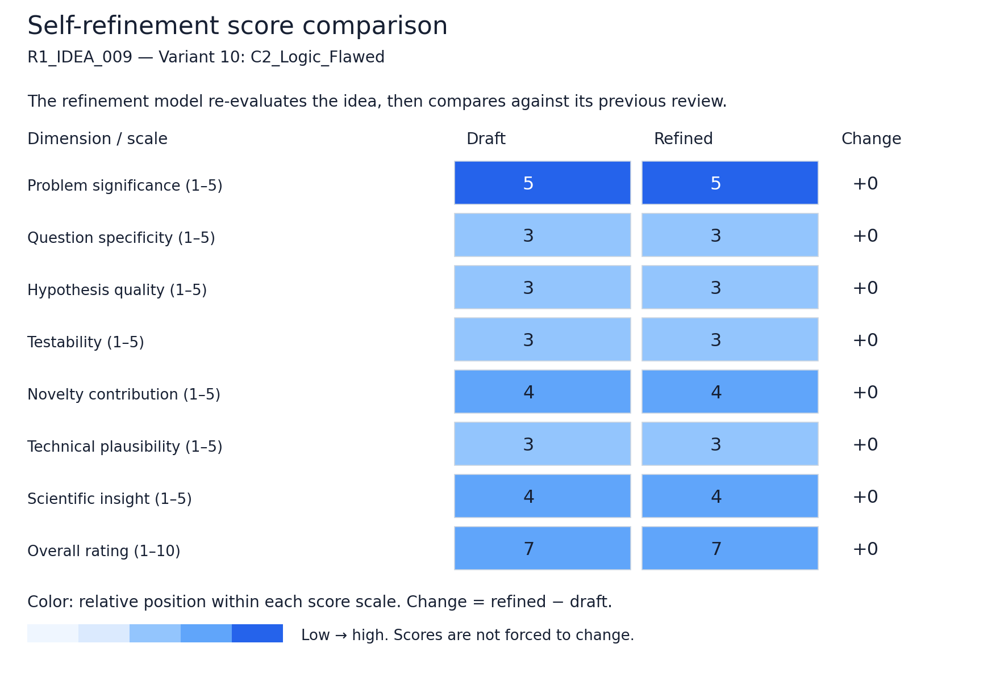

Changed score dimensions: none.

### Score justifications (draft / refined)

**Problem significance**

```json
{
  "draft": {
    "score": 5.0,
    "justification": "The problem of understanding temporal dynamics in vision is fundamental to both neuroscience and AI. Bridging the gap between biological video processing and artificial models is a high-priority research direction with significant potential for advancing efficient AI."
  },
  "refined": {
    "score": 5.0,
    "justification": "Understanding the temporal dynamics of visual processing is a fundamental challenge in both neuroscience and AI. Bridging the gap between biological video processing and artificial models is a high-priority research direction with significant potential for advancing efficient AI and understanding biological intelligence."
  }
}
```

**Question specificity**

```json
{
  "draft": {
    "score": 3.0,
    "justification": "While the general goal is clear, the specific research question is vague. It does not specify which aspects of the EEG or model representations will be compared, nor does it define the 'mechanistic principles' in concrete terms."
  },
  "refined": {
    "score": 3.0,
    "justification": "While the general goal is clear, the specific research question is vague. It does not specify which aspects of the EEG or model representations will be compared, nor does it define the 'mechanistic principles' in concrete terms. The scope is too broad to be immediately actionable without further refinement."
  }
}
```

**Hypothesis quality**

```json
{
  "draft": {
    "score": 3.0,
    "justification": "The implicit hypothesis is that brain-aligned representations lead to better/more efficient video understanding. This is plausible but currently stated as a broad assertion rather than a specific, falsifiable prediction about a mechanism or relationship."
  },
  "refined": {
    "score": 3.0,
    "justification": "The implicit hypothesis is that brain-aligned representations lead to better/more efficient video understanding. This is plausible but currently stated as a broad assertion. The claim of 'sufficiency' is a strong prediction that is not yet supported by a defined mechanism or specific variables."
  }
}
```

**Testability**

```json
{
  "draft": {
    "score": 3.0,
    "justification": "The idea is testable in principle (collect EEG, run models, compare), but the lack of a defined alignment methodology and specific metrics makes the execution path unclear. The 'sufficiency' claim is particularly hard to test without a rigorous ablation study plan."
  },
  "refined": {
    "score": 3.0,
    "justification": "The idea is testable in principle (collect EEG, run models, compare), but the lack of a defined alignment methodology and specific metrics makes the execution path unclear. The 'sufficiency' claim is particularly hard to test without a rigorous ablation study plan and a clear definition of the 'principles' to be extracted."
  }
}
```

**Novelty contribution**

```json
{
  "draft": {
    "score": 4.0,
    "justification": "Applying EEG to benchmark *video* models (rather than static images) is a novel direction. Most existing work focuses on static image alignment. The potential to discover new temporal principles adds significant novelty."
  },
  "refined": {
    "score": 4.0,
    "justification": "Applying EEG to benchmark *video* models (rather than static images) is a novel direction. Most existing work focuses on static image alignment. The potential to discover new temporal principles adds significant novelty, provided the methodology can be successfully executed."
  }
}
```

**Technical plausibility**

```json
{
  "draft": {
    "score": 3.0,
    "justification": "The concept is technically sound, but the feasibility depends heavily on the specific methods chosen to handle the modality mismatch between EEG and deep learning features. Without a proposed method, it remains a high-level concept."
  },
  "refined": {
    "score": 3.0,
    "justification": "The concept is technically sound, but the feasibility depends heavily on the specific methods chosen to handle the modality mismatch between EEG (millisecond scale, low spatial resolution, noisy) and deep learning features (high dimensional, varying temporal scales). Without a proposed method, it remains a high-level concept with significant implementation risks."
  }
}
```

**Scientific insight**

```json
{
  "draft": {
    "score": 4.0,
    "justification": "If successful, this research could reveal fundamental principles of how the brain processes temporal visual information, which could be directly transferable to improving the efficiency and robustness of video AI systems."
  },
  "refined": {
    "score": 4.0,
    "justification": "If successful, this research could reveal fundamental principles of how the brain processes temporal visual information, which could be directly transferable to improving the efficiency and robustness of video AI systems. The potential for insight is high, but contingent on the specificity of the 'principles' identified."
  }
}
```

**Overall rating**

```json
{
  "draft": {
    "score": 7.0,
    "justification": "This is a strong research idea with high significance and novelty. It addresses a meaningful gap in the field. However, it currently lacks the specificity required to be a 'top-tier' proposal. The core hypothesis and methodological approach need to be sharpened to move from a general motivation to a concrete, testable research plan."
  },
  "refined": {
    "score": 7.0,
    "justification": "This is a strong research idea with high significance and novelty. It addresses a meaningful gap in the field. However, it currently lacks the specificity required to be a 'top-tier' proposal. The core hypothesis and methodological approach need to be sharpened to move from a general motivation to a concrete, testable research plan. The 'sufficiency' claim is particularly ambitious and needs grounding."
  }
}
```

## R1_IDEA_009 — Variant 11: C3_Substance_Enriched


Changed score dimensions: none.

### Score justifications (draft / refined)

**Problem significance**

```json
{
  "draft": {
    "score": 5.0,
    "justification": "The problem of understanding how the brain processes dynamic visual information and translating that into efficient AI is a central challenge in both neuroscience and computer vision. Addressing the 'fine-grained temporal understanding' gap is highly significant for developing robust, energy-efficient video AI."
  },
  "refined": {
    "score": 5.0,
    "justification": "The problem of understanding how the brain processes dynamic visual information and translating that into efficient AI is a central challenge in both neuroscience and computer vision. Addressing the 'fine-grained temporal understanding' gap is highly significant for developing robust, energy-efficient video AI, making this a top-tier problem."
  }
}
```

**Question specificity**

```json
{
  "draft": {
    "score": 3.0,
    "justification": "The idea identifies the right variables (latencies, receptive fields, frame rate robustness) but lacks specificity on the exact experimental setup, the specific EEG features to be extracted, and the precise architectural changes to be tested. It is a strong direction but currently a broad research program rather than a single specific question."
  },
  "refined": {
    "score": 3.0,
    "justification": "While the variables (latencies, receptive fields, frame rate robustness) are identified, the idea lacks specificity on the exact experimental setup, the specific EEG features to be extracted, and the precise architectural changes to be tested. It is a strong research direction but currently a broad program rather than a single, tightly defined question."
  }
}
```

**Hypothesis quality**

```json
{
  "draft": {
    "score": 4.0,
    "justification": "The hypothesis is clear: aligning model representations with EEG latencies/receptive fields will yield architectures that generalize better to temporal distortions. This is a concrete prediction that can be supported or refuted by the proposed validation route."
  },
  "refined": {
    "score": 4.0,
    "justification": "The hypothesis is clear: aligning model representations with EEG latencies/receptive fields will yield architectures that generalize better to temporal distortions. This is a concrete prediction that can be supported or refuted by the proposed validation route, though the underlying mechanism is not fully elaborated."
  }
}
```

**Testability**

```json
{
  "draft": {
    "score": 4.0,
    "justification": "The idea suggests clear evaluation metrics: correlation with EEG latencies and performance on unseen categories/temporal distortions. While the technical execution of EEG analysis is complex, the experimental design is logically sound and falsifiable."
  },
  "refined": {
    "score": 4.0,
    "justification": "The idea suggests clear evaluation metrics: correlation with EEG latencies and performance on unseen categories/temporal distortions. While the technical execution of EEG analysis is complex, the experimental design is logically sound and falsifiable."
  }
}
```

**Novelty contribution**

```json
{
  "draft": {
    "score": 4.0,
    "justification": "While brain-inspired AI is a growing field, specifically benchmarking deep video models against *dynamic* EEG for *temporal* principles (latencies/receptive fields) rather than just static image alignment is a novel and promising angle. It moves beyond 'does it work' to 'how does it work'."
  },
  "refined": {
    "score": 4.0,
    "justification": "While brain-inspired AI is a growing field, specifically benchmarking deep video models against *dynamic* EEG for *temporal* principles (latencies/receptive fields) rather than just static image alignment is a novel and promising angle. It moves beyond 'does it work' to 'how does it work'."
  }
}
```

**Technical plausibility**

```json
{
  "draft": {
    "score": 3.0,
    "justification": "The reasoning is logically coherent, but the technical feasibility of extracting 'spatiotemporal receptive fields' from EEG is non-trivial due to the inverse problem and low spatial resolution. The idea assumes this is possible without detailing the method, which is a potential bottleneck."
  },
  "refined": {
    "score": 3.0,
    "justification": "The reasoning is logically coherent, but the technical feasibility of extracting 'spatiotemporal receptive fields' from EEG is non-trivial due to the inverse problem and low spatial resolution. The idea assumes this is possible without detailing the method, which is a potential bottleneck that could render the core analysis impossible or ambiguous."
  }
}
```

**Scientific insight**

```json
{
  "draft": {
    "score": 4.0,
    "justification": "If successful, this research would provide deep insights into the temporal coding mechanisms of the visual cortex and offer a new paradigm for designing video models that are robust to temporal variations, a known weakness in current systems."
  },
  "refined": {
    "score": 4.0,
    "justification": "If successful, this research would provide deep insights into the temporal coding mechanisms of the visual cortex and offer a new paradigm for designing video models that are robust to temporal variations, a known weakness in current systems."
  }
}
```

**Overall rating**

```json
{
  "draft": {
    "score": 7.0,
    "justification": "This is a strong research idea with high scientific potential and a clear motivation. It addresses a meaningful gap in temporal understanding. The main limitation is the current lack of methodological detail, particularly regarding the feasibility of EEG-based receptive field analysis. However, the core hypothesis is testable and the potential contribution to both neuroscience and AI is significant."
  },
  "refined": {
    "score": 7.0,
    "justification": "This is a strong research idea with high scientific potential and a clear motivation. It addresses a meaningful gap in temporal understanding. The main limitation is the current lack of methodological detail, particularly regarding the feasibility of EEG-based receptive field analysis. However, the core hypothesis is testable and the potential contribution to both neuroscience and AI is significant."
  }
}
```

## R1_IDEA_009 — Variant 12: H1_Deceptive_Hollow

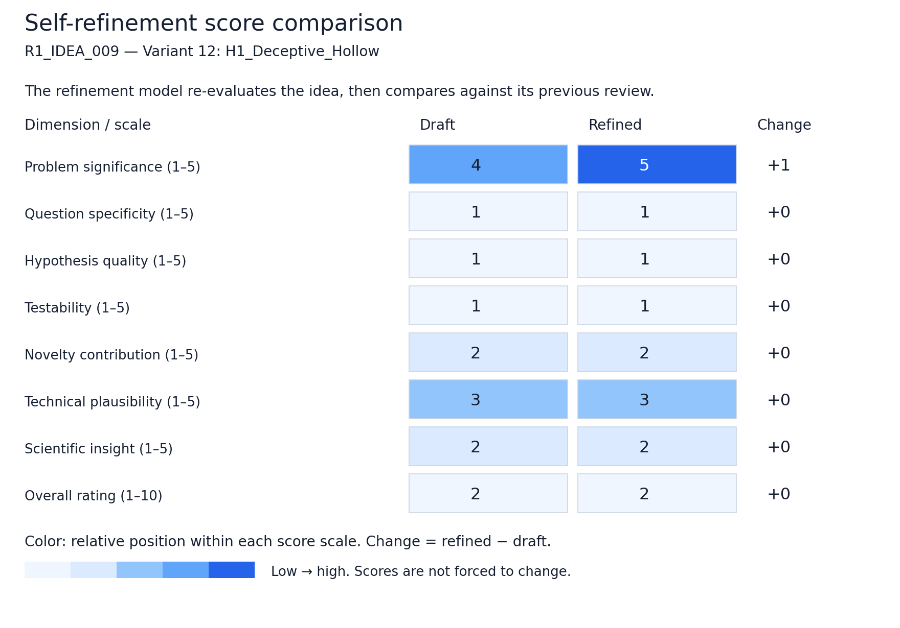

Changed score dimensions: problem_significance.

### Score justifications (draft / refined)

**Problem significance**

```json
{
  "draft": {
    "score": 4.0,
    "justification": "The problem of understanding visual processing through the lens of both brain and machine is highly significant and a major goal in AI and neuroscience. However, the score is not 5 because the idea does not specify *which* aspect of this broad field is being tackled."
  },
  "refined": {
    "score": 5.0,
    "justification": "The problem of understanding visual processing by comparing brains and machines is one of the most significant challenges in modern AI and neuroscience. Solving this could fundamentally reshape both fields. The significance of the *goal* is exceptional, even if the specific path is undefined."
  }
}
```

**Question specificity**

```json
{
  "draft": {
    "score": 1.0,
    "justification": "The idea is almost entirely devoid of specificity. It describes a 'direction' and 'agenda' but fails to articulate a concrete research question, variable, or relationship to be investigated."
  },
  "refined": {
    "score": 1.0,
    "justification": "The idea is almost entirely devoid of specificity. It describes a 'direction' and 'agenda' but fails to articulate a concrete research question, variable, or relationship to be investigated. It is a mission statement, not a research question."
  }
}
```

**Hypothesis quality**

```json
{
  "draft": {
    "score": 1.0,
    "justification": "There is no explicit or implicit hypothesis. The text claims a 'central promise' but does not state what prediction is being made that could be supported or contradicted by evidence."
  },
  "refined": {
    "score": 1.0,
    "justification": "There is no explicit or implicit hypothesis. The text claims a 'central promise' but does not state what prediction is being made that could be supported or contradicted by evidence. It asserts value rather than proposing a mechanism."
  }
}
```

**Testability**

```json
{
  "draft": {
    "score": 1.0,
    "justification": "Without a defined hypothesis, specific models, or metrics, the idea is not currently testable. It is impossible to design an experiment based on the current description."
  },
  "refined": {
    "score": 1.0,
    "justification": "Without a defined hypothesis, specific models, or metrics, the idea is not currently testable. It is impossible to design an experiment, ablation, or analysis based on the current description."
  }
}
```

**Novelty contribution**

```json
{
  "draft": {
    "score": 2.0,
    "justification": "While the *goal* of comparing brains and machines is a known and active area, the idea itself does not propose a novel mechanism, method, or specific insight. It claims novelty through 'transformative synthesis' without explaining the synthesis."
  },
  "refined": {
    "score": 2.0,
    "justification": "While the *goal* of comparing brains and machines is a known and active area, the idea itself does not propose a novel mechanism, method, or specific insight. It claims novelty through 'transformative synthesis' without explaining the synthesis or what new knowledge it will generate."
  }
}
```

**Technical plausibility**

```json
{
  "draft": {
    "score": 3.0,
    "justification": "The general approach of comparing models to brain data is technically sound and plausible. However, the lack of methodological detail makes it impossible to assess the feasibility of the specific proposed path."
  },
  "refined": {
    "score": 3.0,
    "justification": "The general approach of comparing models to brain data is technically sound and plausible. However, the lack of methodological detail makes it impossible to assess the feasibility of the specific proposed path or the validity of the assumptions."
  }
}
```

**Scientific insight**

```json
{
  "draft": {
    "score": 2.0,
    "justification": "If executed well, this type of research could yield high insight. However, as an idea, it currently offers no specific mechanism or principle that would be revealed, making the potential insight undefined."
  },
  "refined": {
    "score": 2.0,
    "justification": "If executed well, this type of research could yield high insight. However, as an idea, it currently offers no specific mechanism or principle that would be revealed. The potential insight is undefined and speculative."
  }
}
```

**Overall rating**

```json
{
  "draft": {
    "score": 2.0,
    "justification": "While the general domain is important, the research idea itself is too vague to be evaluated as a scientific proposal. It reads more like an abstract mission statement than a research plan. It lacks the specificity, hypothesis, and testability required for a strong research idea, despite the high stakes of the underlying problem."
  },
  "refined": {
    "score": 2.0,
    "justification": "While the general domain is important, the research idea itself is too vague to be evaluated as a scientific proposal. It reads more like an abstract mission statement than a research plan. It lacks the specificity, hypothesis, and testability required for a strong research idea, despite the high stakes of the underlying problem. The gap between the grandiose claims and the lack of concrete content is significant."
  }
}
```

## R1_IDEA_009 — Variant 13: H2_Confident_Flaw


Changed score dimensions: hypothesis_quality, testability, novelty_contribution, scientific_insight, overall_rating.

### Score justifications (draft / refined)

**Problem significance**

```json
{
  "draft": {
    "score": 4.0,
    "justification": "The problem of understanding temporal processing in video models and aligning them with biological systems is highly significant. It addresses a core limitation in current AI and has broad implications for efficiency and interpretability."
  },
  "refined": {
    "score": 4.0,
    "justification": "The problem of understanding and improving temporal processing in video models is highly significant. Aligning AI with biological principles is a major goal in the field, and addressing the gap in fine-grained temporal understanding is a meaningful challenge."
  }
}
```

**Question specificity**

```json
{
  "draft": {
    "score": 2.0,
    "justification": "While the general direction is clear, the specific research question is vague. It does not specify which EEG features, which model components, or what specific 'mechanistic principles' are being investigated. The claim of 'necessity' is also a logical error rather than a specific question."
  },
  "refined": {
    "score": 2.0,
    "justification": "The research question is vague regarding the specific 'mechanistic principles' to be revealed. It fails to specify which EEG features are relevant or how they define the 'dynamic' nature of the processing. The focus on 'necessity' and 'causality' without isolation is a logical assertion, not a specific research question."
  }
}
```

**Hypothesis quality**

```json
{
  "draft": {
    "score": 2.0,
    "justification": "The hypothesis is poorly formed. It asserts a causal relationship ('necessarily produce reliable improvements') and claims that confounding variables can be ignored, which contradicts standard scientific methodology. A strong hypothesis would predict a specific relationship and acknowledge the need for rigorous testing."
  },
  "refined": {
    "score": 1.0,
    "justification": "The hypothesis is scientifically unsound. It claims that solving a limitation 'necessarily' produces general improvements and that causal evidence can be obtained without isolating confounding variables. This is a logical fallacy that cannot be supported by evidence; it is a statement of belief rather than a testable hypothesis."
  }
}
```

**Testability**

```json
{
  "draft": {
    "score": 3.0,
    "justification": "The idea is testable in principle (comparing models to EEG), but the proposed methodology for establishing 'causal evidence' without isolating variables is not testable or scientifically valid. The lack of specific metrics or alignment mechanisms makes the testability of the core claim weak."
  },
  "refined": {
    "score": 2.0,
    "justification": "While the comparison of models to EEG is testable, the core claim of 'causal evidence without isolating variables' is not testable in a scientifically valid way. The lack of specific metrics or alignment mechanisms makes the evaluation of the central claim impossible to conduct rigorously."
  }
}
```

**Novelty contribution**

```json
{
  "draft": {
    "score": 4.0,
    "justification": "Using dynamic EEG to benchmark video models is a novel and promising approach. If successful, it could provide significant insights into brain-like processing. However, the current framing of the contribution is overly ambitious and logically flawed."
  },
  "refined": {
    "score": 3.0,
    "justification": "Using dynamic EEG to benchmark video models is a novel approach with high potential contribution. However, the current framing of the contribution is flawed by the logical errors, which limits the potential for genuine scientific insight unless the methodology is corrected."
  }
}
```

**Technical plausibility**

```json
{
  "draft": {
    "score": 2.0,
    "justification": "The technical reasoning is flawed. The claim that solving a specific limitation 'necessarily' leads to general superiority without isolating other factors is not plausible. The mismatch between EEG signals and deep model representations also presents significant technical challenges that are not addressed."
  },
  "refined": {
    "score": 2.0,
    "justification": "The technical reasoning is flawed. The claim that one can establish causal superiority without isolating variables is not plausible. The proposal also ignores the significant technical challenges of mapping EEG signals to deep model representations."
  }
}
```

**Scientific insight**

```json
{
  "draft": {
    "score": 3.0,
    "justification": "If the method were refined to properly isolate variables and define specific mechanisms, it could yield high scientific insight. As currently stated, the potential for insight is limited by the logical fallacies and lack of specificity in the proposed mechanism."
  },
  "refined": {
    "score": 2.0,
    "justification": "If the hypothesis were corrected to be testable and specific, the study could yield high insight. As currently stated, the logical fallacies and lack of specificity prevent the idea from promising meaningful scientific insight beyond a potentially flawed correlation."
  }
}
```

**Overall rating**

```json
{
  "draft": {
    "score": 4.0,
    "justification": "The research idea addresses a meaningful problem with a potentially novel approach (EEG benchmarking). However, the quality of the idea is significantly diminished by a logically flawed hypothesis that claims causal certainty without proper experimental isolation. The lack of specificity regarding the 'mechanistic principles' and the specific EEG features to be used further weakens the proposal. It is a weak idea in its current form due to these fundamental logical and methodological issues, despite the high significance of the underlying problem."
  },
  "refined": {
    "score": 3.0,
    "justification": "The research idea addresses a significant problem with a novel direction (EEG benchmarking). However, the quality of the idea is critically undermined by a logically flawed hypothesis that claims causal certainty without proper experimental isolation. The lack of specificity regarding the 'mechanistic principles' and the dismissal of necessary controls (dataset, criteria) make the proposal scientifically weak in its current form. It is a moderate idea only because the underlying problem is important, but the proposed approach is fundamentally flawed."
  }
}
```

## R1_IDEA_009 — Variant 14: H3_Verbose_Enriched

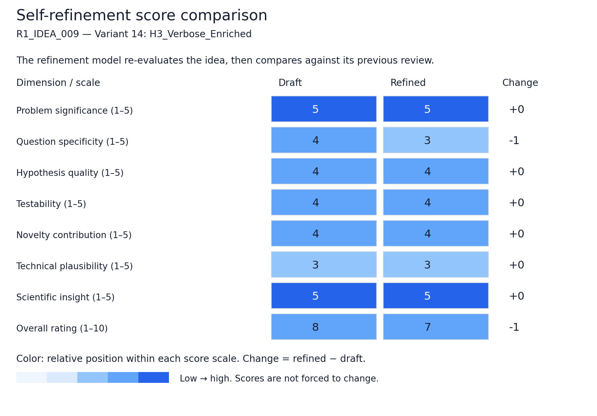

Changed score dimensions: question_specificity, overall_rating.

### Score justifications (draft / refined)

**Problem significance**

```json
{
  "draft": {
    "score": 5.0,
    "justification": "The problem of understanding how the brain processes dynamic visual information and translating that into efficient AI is a central challenge in both neuroscience and machine learning. Solving this could lead to more robust, sample-efficient video models."
  },
  "refined": {
    "score": 5.0,
    "justification": "The problem is highly significant. Bridging the gap between biological video processing and artificial intelligence is a major challenge. Understanding the 'mechanistic principles' of efficient temporal processing could lead to fundamentally more robust and sample-efficient video models, addressing a critical bottleneck in current AI."
  }
}
```

**Question specificity**

```json
{
  "draft": {
    "score": 4.0,
    "justification": "The idea specifies the data (EEG, natural videos), the comparison (deep models vs. EEG), and the metrics (latencies, receptive fields). However, the specific architectural intervention or the exact nature of the 'brain-like' principle being tested is not fully detailed, leaving the core mechanism slightly open."
  },
  "refined": {
    "score": 3.0,
    "justification": "While the general direction is clear, the specific research question is somewhat diffuse. The idea describes a 'benchmarking' study and a 'staged design' but lacks a precise formulation of the causal relationship being tested. It is unclear exactly *which* neural property is being transferred and *how* it is expected to manifest in the model's architecture."
  }
}
```

**Hypothesis quality**

```json
{
  "draft": {
    "score": 4.0,
    "justification": "The idea implies a strong hypothesis: that incorporating biological temporal constraints improves generalization to temporal distortions. This is a concrete prediction that can be falsified. It distinguishes between simple performance gains and mechanistic understanding."
  },
  "refined": {
    "score": 4.0,
    "justification": "The idea contains a strong implicit hypothesis: that architectures informed by biological temporal constraints will generalize better to temporal distortions. This is a concrete prediction that can be falsified. However, the hypothesis could be sharper if it specified the exact nature of the 'brain-like' principle (e.g., specific latency distributions) rather than a general 'mechanistic principle'."
  }
}
```

**Testability**

```json
{
  "draft": {
    "score": 4.0,
    "justification": "The proposed staged design with ablations, sensitivity analyses, and error analysis makes the idea highly testable. The specific mention of 'easy, difficult, and boundary cases' provides a clear roadmap for empirical validation."
  },
  "refined": {
    "score": 4.0,
    "justification": "The proposed methodology is highly testable. The inclusion of a staged design, specific evaluation criteria (latencies, receptive fields), ablations, and error analysis provides a clear roadmap for empirical validation. The focus on 'boundary cases' ensures the study can meaningfully distinguish between correlation and causation."
  }
}
```

**Novelty contribution**

```json
{
  "draft": {
    "score": 4.0,
    "justification": "While benchmarking against neural data is not new, applying it specifically to *video* models with a focus on *temporal* dynamics and *frame-rate robustness* is a novel and timely direction. The potential to reveal 'mechanistic principles' rather than just performance metrics adds significant value."
  },
  "refined": {
    "score": 4.0,
    "justification": "While neural-inspired AI is a growing field, applying it specifically to *video* models with a focus on *temporal dynamics* and *frame-rate robustness* using *EEG* is a novel and timely direction. The potential to reveal 'mechanistic principles' rather than just performance metrics adds significant scientific value, distinguishing it from standard benchmarking."
  }
}
```

**Technical plausibility**

```json
{
  "draft": {
    "score": 3.0,
    "justification": "The concept is plausible, but the technical execution of aligning EEG with video models is non-trivial. EEG's low spatial resolution makes 'spatiotemporal receptive field' analysis difficult compared to intracranial recordings. The idea assumes this alignment is feasible without detailing the method, which is a potential hurdle."
  },
  "refined": {
    "score": 3.0,
    "justification": "The concept is plausible in principle, but the technical execution faces significant hurdles. Aligning EEG (low spatial resolution, high noise) with deep video models for 'spatiotemporal receptive field' analysis is non-trivial. The idea assumes this alignment is feasible without detailing the method, which is a potential point of failure. The temporal mismatch between continuous neural signals and discrete video frames also requires careful handling."
  }
}
```

**Scientific insight**

```json
{
  "draft": {
    "score": 5.0,
    "justification": "If successful, this research would provide deep insights into the relationship between biological temporal processing and artificial video understanding. It moves beyond 'does it work?' to 'why does it work and where does it break?', which is the hallmark of high-impact scientific research."
  },
  "refined": {
    "score": 5.0,
    "justification": "If successfully executed, this research would provide deep insights into the relationship between biological temporal processing and artificial video understanding. It moves beyond 'does it work?' to 'why does it work and where does it break?', which is the hallmark of high-impact scientific research. The focus on boundary conditions and failure modes is particularly valuable."
  }
}
```

**Overall rating**

```json
{
  "draft": {
    "score": 8.0,
    "justification": "This is a strong research idea with high scientific potential. It addresses a meaningful problem, proposes a rigorous experimental design, and aims for mechanistic insight rather than just benchmarking. The main limitation is the technical complexity of the EEG-video alignment, which is acknowledged as a challenge but not a disqualifier. With a more specific hypothesis on the alignment mechanism, this could be an exceptional study."
  },
  "refined": {
    "score": 7.0,
    "justification": "This is a strong research idea with high scientific potential. It addresses a meaningful problem, proposes a rigorous experimental design, and aims for mechanistic insight. However, the score is tempered by the lack of specificity regarding the 'brain-informed' mechanism and the technical challenges of using EEG for spatiotemporal analysis. With a more precise hypothesis and a clearer plan for handling the modality mismatch, this could be an exceptional study."
  }
}
```

## R1_IDEA_009 — Variant 15: H4_Ultimate_Hype


Changed score dimensions: none.

### Score justifications (draft / refined)

**Problem significance**

```json
{
  "draft": {
    "score": 5.0,
    "justification": "The problem of understanding how the brain processes dynamic visual information and how to replicate this in AI is a fundamental challenge in neuroscience and machine learning. Solving this could lead to more efficient, robust, and interpretable video models."
  },
  "refined": {
    "score": 5.0,
    "justification": "The problem is of exceptional significance. Bridging the gap between artificial and biological temporal processing is a core challenge in both neuroscience and AI. Solving this could lead to more efficient, robust, and interpretable video models, addressing a critical limitation in current deep learning."
  }
}
```

**Question specificity**

```json
{
  "draft": {
    "score": 2.0,
    "justification": "The idea is currently framed as a broad research agenda. It lacks a specific, testable research question or a defined set of variables to be manipulated or measured. It describes 'what' (benchmarking) but not 'how' or 'what exactly' is being tested."
  },
  "refined": {
    "score": 2.0,
    "justification": "The idea is framed as a broad research direction rather than a specific question. It lacks definition of the variables, the specific temporal phenomena to be studied, and the precise nature of the comparison. It describes a 'what' (benchmarking) but fails to define the 'how' or the specific 'what' of the investigation."
  }
}
```

**Hypothesis quality**

```json
{
  "draft": {
    "score": 2.0,
    "justification": "There is no explicit hypothesis. The text states an aim ('aims to reveal') but does not propose a specific prediction that could be proven false. A strong idea would predict, for example, that 'temporal attention mechanisms in models will align with specific EEG oscillations in the theta band.'"
  },
  "refined": {
    "score": 2.0,
    "justification": "There is no explicit or implicit hypothesis that can be supported or contradicted. The text states a goal ('aims to reveal') but makes no concrete prediction. A strong idea would predict a specific relationship (e.g., 'Model layer X correlates with EEG component Y under condition Z'), which is entirely absent."
  }
}
```

**Testability**

```json
{
  "draft": {
    "score": 3.0,
    "justification": "The core concept is testable in principle (comparing model activations to EEG), but the current description does not outline the experimental design, data requirements, or analysis pipeline necessary to make it a concrete test."
  },
  "refined": {
    "score": 3.0,
    "justification": "The core concept is testable in principle (comparing model activations to EEG), but the current description does not outline the experimental design, data requirements, or analysis pipeline. Without a specific hypothesis or methodology, the 'test' is undefined."
  }
}
```

**Novelty contribution**

```json
{
  "draft": {
    "score": 4.0,
    "justification": "While EEG-based model evaluation exists, applying it specifically to 'fine-grained temporal understanding' in 'deep video models' using 'natural videos' is a novel and underexplored direction with high potential for new insights."
  },
  "refined": {
    "score": 4.0,
    "justification": "While neuro-inspired AI is a growing field, applying dynamic EEG specifically to benchmark 'fine-grained temporal understanding' in 'deep video models' using 'natural videos' is a novel and underexplored direction. The potential to redefine the frontier of video understanding is high."
  }
}
```

**Technical plausibility**

```json
{
  "draft": {
    "score": 3.0,
    "justification": "The idea is logically coherent but technically challenging. The feasibility depends heavily on the specific alignment techniques and the quality of the EEG data, which are not detailed. The gap between EEG resolution and model complexity is a significant hurdle."
  },
  "refined": {
    "score": 3.0,
    "justification": "The reasoning is logically coherent (comparing model to brain), but the technical plausibility is uncertain due to the lack of details on how to bridge the modality gap. The feasibility depends entirely on the specific alignment techniques and data quality, which are not provided."
  }
}
```

**Scientific insight**

```json
{
  "draft": {
    "score": 4.0,
    "justification": "If successful, this research could reveal fundamental principles of how biological systems handle temporal dynamics, potentially leading to a new class of efficient video architectures. The potential for insight is high, provided the study moves beyond simple correlation."
  },
  "refined": {
    "score": 4.0,
    "justification": "If successfully executed with a clear methodology, this research could reveal fundamental principles of biological temporal processing and lead to a new class of efficient architectures. The potential for insight is high, but currently, the path to that insight is obscured by the lack of specificity."
  }
}
```

**Overall rating**

```json
{
  "draft": {
    "score": 6.0,
    "justification": "The research idea is based on a highly significant and promising problem with strong potential for scientific impact. However, as a research proposal, it is currently too vague and lacks the specificity of a hypothesis and methodology required to be considered a 'strong' or 'exceptional' idea. It sits in the moderate/borderline category because the core concept is excellent, but the execution plan is missing."
  },
  "refined": {
    "score": 6.0,
    "justification": "The research idea is based on a highly significant and promising problem with strong potential for scientific impact. However, as a research proposal, it is currently too vague and lacks the specificity of a hypothesis and methodology required to be considered 'strong' or 'exceptional'. It sits in the moderate/borderline category because the core concept is excellent, but the execution plan is missing."
  }
}
```

## R1_IDEA_010 — Source

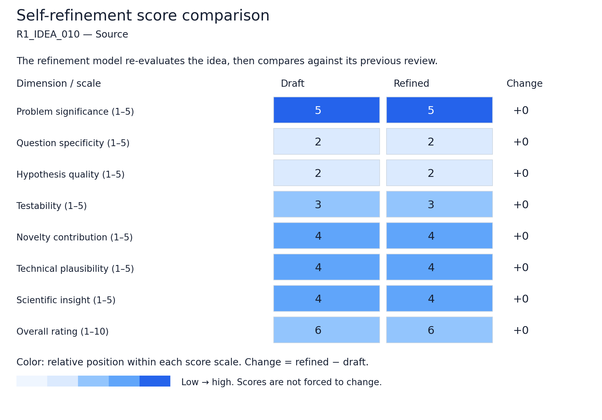

Changed score dimensions: none.

### Score justifications (draft / refined)

**Problem significance**

```json
{
  "draft": {
    "score": 5.0,
    "justification": "The ability to learn new concepts from minimal examples is a critical bottleneck in current AI systems and a hallmark of human intelligence. Solving this would represent a major leap in data efficiency and generalization, making it a problem of exceptional significance."
  },
  "refined": {
    "score": 5.0,
    "justification": "The ability to learn new concepts from minimal examples is a critical bottleneck in current AI systems and a hallmark of human intelligence. Solving this would represent a major leap in data efficiency and generalization, making it a problem of exceptional significance regardless of the specific method proposed."
  }
}
```

**Question specificity**

```json
{
  "draft": {
    "score": 2.0,
    "justification": "While the topic is clear, the input text is incomplete and does not articulate a specific research question or hypothesis. It states a motivation and a gap but does not define what exactly will be investigated or how it differs from existing VLM capabilities."
  },
  "refined": {
    "score": 2.0,
    "justification": "While the topic is clear, the input text is incomplete and does not articulate a specific research question or hypothesis. It states a motivation and a gap but does not define what exactly will be investigated or how it differs from existing VLM capabilities. The truncation prevents a more specific assessment."
  }
}
```

**Hypothesis quality**

```json
{
  "draft": {
    "score": 2.0,
    "justification": "No explicit hypothesis is provided due to the incomplete text. A strong idea would propose a specific relationship (e.g., 'Integrating X with VLMs will improve fast mapping by Y%') which is currently missing."
  },
  "refined": {
    "score": 2.0,
    "justification": "No explicit hypothesis is provided due to the incomplete text. A strong idea would propose a specific relationship (e.g., 'Integrating X with VLMs will improve fast mapping by Y%') which is currently missing. The idea currently reads as a research direction rather than a testable claim."
  }
}
```

**Testability**

```json
{
  "draft": {
    "score": 3.0,
    "justification": "The general direction (evaluating VLMs on few-shot visual tasks) is testable. However, without a specific hypothesis or defined metrics, the exact experimental design and success criteria remain vague."
  },
  "refined": {
    "score": 3.0,
    "justification": "The general direction (evaluating VLMs on few-shot visual tasks) is inherently testable. However, without a specific hypothesis or defined metrics, the exact experimental design and success criteria remain vague. The idea is testable in principle but not yet in practice."
  }
}
```

**Novelty contribution**

```json
{
  "draft": {
    "score": 4.0,
    "justification": "Applying the cognitive concept of 'fast mapping' to VLMs is a novel framing. If the research successfully demonstrates that VLMs can replicate this specific cognitive mechanism (beyond standard few-shot learning), it would be a significant contribution. However, the novelty depends entirely on the specific angle not yet described."
  },
  "refined": {
    "score": 4.0,
    "justification": "Applying the cognitive concept of 'fast mapping' to VLMs is a novel framing. If the research successfully demonstrates that VLMs can replicate this specific cognitive mechanism (beyond standard few-shot learning), it would be a significant contribution. The novelty depends entirely on the specific angle not yet described."
  }
}
```

**Technical plausibility**

```json
{
  "draft": {
    "score": 4.0,
    "justification": "The premise is technically sound. VLMs have shown emergent few-shot capabilities, and the cognitive analogy provides a plausible theoretical framework. The challenge lies in the implementation details, which are not yet specified."
  },
  "refined": {
    "score": 4.0,
    "justification": "The premise is technically sound. VLMs have shown emergent few-shot capabilities, and the cognitive analogy provides a plausible theoretical framework. The challenge lies in the implementation details, which are not yet specified, but the core logic is coherent."
  }
}
```

**Scientific insight**

```json
{
  "draft": {
    "score": 4.0,
    "justification": "If successful, this research could reveal how language priors facilitate visual concept learning, offering insights into the interaction between modalities and the nature of inductive bias in deep learning."
  },
  "refined": {
    "score": 4.0,
    "justification": "If successfully investigated, this research could reveal how language priors facilitate visual concept learning, offering insights into the interaction between modalities and the nature of inductive bias in deep learning. It has high potential for scientific insight, provided the specific questions are answered."
  }
}
```

**Overall rating**

```json
{
  "draft": {
    "score": 6.0,
    "justification": "The research idea addresses a highly significant problem with a strong theoretical foundation. However, the evaluation is limited by the incomplete nature of the input. The core concept is strong (score 8-9 potential), but the lack of a specific hypothesis and research question prevents it from being rated higher. It is a 'Moderate' idea in its current form because the specific scientific contribution is not yet defined."
  },
  "refined": {
    "score": 6.0,
    "justification": "The research idea addresses a highly significant problem with a strong theoretical foundation. However, the evaluation is limited by the incomplete nature of the input. The core concept is strong (potential 8-9), but the lack of a specific hypothesis and research question prevents it from being rated higher. It is a 'Moderate' idea in its current form because the specific scientific contribution is not yet defined, though it has high upside."
  }
}
```

## R1_IDEA_010 — Variant 1: A1_Identity

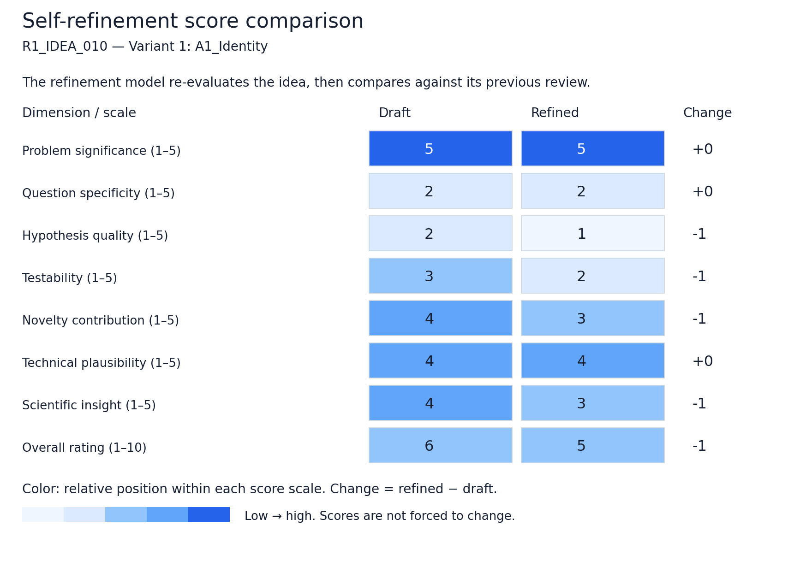

Changed score dimensions: hypothesis_quality, testability, novelty_contribution, scientific_insight, overall_rating.

### Score justifications (draft / refined)

**Problem significance**

```json
{
  "draft": {
    "score": 5.0,
    "justification": "The ability to learn new concepts from minimal examples is a critical bottleneck in current AI systems and a hallmark of human intelligence. Solving this would represent a major leap in data efficiency and generalization, making it a problem of exceptional significance."
  },
  "refined": {
    "score": 5.0,
    "justification": "The problem of learning new concepts from minimal examples is a central challenge in AI and a hallmark of human intelligence. Addressing this has high potential impact on data efficiency and generalization capabilities."
  }
}
```

**Question specificity**

```json
{
  "draft": {
    "score": 2.0,
    "justification": "While the topic is clear, the input text is incomplete and does not articulate a specific research question or hypothesis. It states a motivation and a gap but does not define what exactly will be investigated or how it differs from existing VLM capabilities."
  },
  "refined": {
    "score": 2.0,
    "justification": "While the topic is clear, the input text is incomplete and fails to articulate a specific research question. It describes a motivation and a gap but does not define the specific variable relationships or mechanisms to be investigated."
  }
}
```

**Hypothesis quality**

```json
{
  "draft": {
    "score": 2.0,
    "justification": "No explicit hypothesis is provided due to the incomplete text. A strong idea would propose a specific relationship (e.g., 'Integrating X with VLMs will improve fast mapping by Y%') which is currently missing."
  },
  "refined": {
    "score": 1.0,
    "justification": "No hypothesis is present in the text. The text cuts off before making any claim that could be supported or contradicted. A research idea cannot be evaluated for hypothesis quality without a stated prediction."
  }
}
```

**Testability**

```json
{
  "draft": {
    "score": 3.0,
    "justification": "The general direction (evaluating VLMs on few-shot visual tasks) is testable. However, without a specific hypothesis or defined metrics, the exact experimental design and success criteria remain vague."
  },
  "refined": {
    "score": 2.0,
    "justification": "The general direction is testable in principle (evaluating VLMs on few-shot tasks), but the specific experimental design, success criteria, and comparison baselines are missing due to the incomplete text."
  }
}
```

**Novelty contribution**

```json
{
  "draft": {
    "score": 4.0,
    "justification": "Applying the cognitive concept of 'fast mapping' to VLMs is a novel framing. If the research successfully demonstrates that VLMs can replicate this specific cognitive mechanism (beyond standard few-shot learning), it would be a significant contribution. However, the novelty depends entirely on the specific angle not yet described."
  },
  "refined": {
    "score": 3.0,
    "justification": "The framing of 'Visual Fast Mapping' is novel and promising. However, without a specific mechanism or hypothesis, it is unclear if the contribution will be a new method, a new empirical finding, or simply a re-labeling of existing VLM capabilities."
  }
}
```

**Technical plausibility**

```json
{
  "draft": {
    "score": 4.0,
    "justification": "The premise is technically sound. VLMs have shown emergent few-shot capabilities, and the cognitive analogy provides a plausible theoretical framework. The challenge lies in the implementation details, which are not yet specified."
  },
  "refined": {
    "score": 4.0,
    "justification": "The premise is technically sound. VLMs have demonstrated emergent few-shot capabilities, and the cognitive analogy provides a plausible theoretical framework. The feasibility depends on the specific implementation details not yet provided."
  }
}
```

**Scientific insight**

```json
{
  "draft": {
    "score": 4.0,
    "justification": "If successful, this research could reveal how language priors facilitate visual concept learning, offering insights into the interaction between modalities and the nature of inductive bias in deep learning."
  },
  "refined": {
    "score": 3.0,
    "justification": "If the research were fully developed, it could offer significant insights into the interaction between language and vision. Currently, the potential for insight is high but undefined because the specific mechanism of investigation is unknown."
  }
}
```

**Overall rating**

```json
{
  "draft": {
    "score": 6.0,
    "justification": "The research idea addresses a highly significant problem with a strong theoretical foundation. However, the evaluation is limited by the incomplete nature of the input. The core concept is strong (score 8-9 potential), but the lack of a specific hypothesis and research question prevents it from being rated higher. It is a 'Moderate' idea in its current form because the specific scientific contribution is not yet defined."
  },
  "refined": {
    "score": 5.0,
    "justification": "The idea addresses a highly significant problem with a strong theoretical foundation, but the evaluation is severely hampered by the incomplete nature of the input. The core concept has high potential (8-9 range), but as a research proposal, it currently lacks the specificity and hypothesis required to be rated higher. It is a 'Moderate' idea because the scientific question is not yet formulated."
  }
}
```

## R1_IDEA_010 — Variant 2: A2_Paraphrase_Only

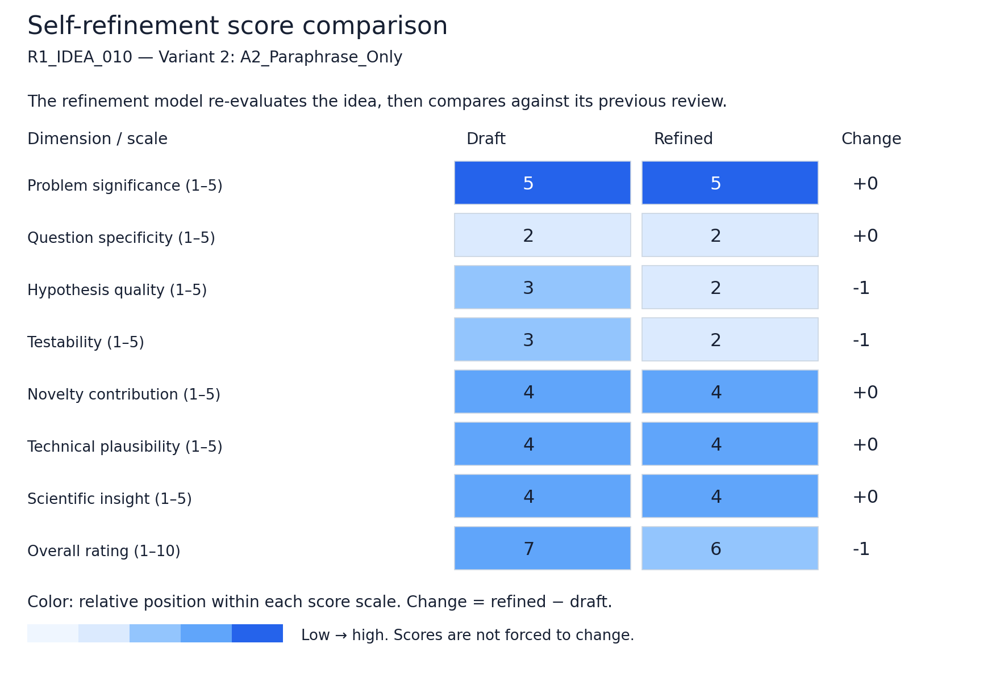

Changed score dimensions: hypothesis_quality, testability, overall_rating.

### Score justifications (draft / refined)

**Problem significance**

```json
{
  "draft": {
    "score": 5.0,
    "justification": "The problem of data inefficiency in VLMs is critical. Bridging the gap between human-like few-shot learning and current AI capabilities is a major goal in the field. Solving this would have profound implications for robotics, education, and general AI."
  },
  "refined": {
    "score": 5.0,
    "justification": "The problem of data inefficiency in VLMs is critical. Bridging the gap between human-like few-shot learning and current AI capabilities is a major goal in the field. Solving this would have profound implications for robotics, education, and general AI."
  }
}
```

**Question specificity**

```json
{
  "draft": {
    "score": 2.0,
    "justification": "The idea currently states a motivation and a general direction but lacks a specific research question. It does not define the variables, the mechanism, or the specific relationship being investigated."
  },
  "refined": {
    "score": 2.0,
    "justification": "The idea currently states a motivation and a general direction but lacks a specific research question. It does not define the variables, the mechanism, or the specific relationship being investigated. It describes a 'phenomenon' rather than a 'question'."
  }
}
```

**Hypothesis quality**

```json
{
  "draft": {
    "score": 3.0,
    "justification": "There is an implicit hypothesis that mimicking human fast mapping mechanisms will improve VLM few-shot performance. However, it is not explicitly stated as a testable prediction with defined conditions."
  },
  "refined": {
    "score": 2.0,
    "justification": "There is an implicit hypothesis that mimicking human fast mapping mechanisms will improve VLM few-shot performance. However, it is not explicitly stated as a testable prediction with defined conditions or a clear mechanism. It is more of a 'hope' than a hypothesis."
  }
}
```

**Testability**

```json
{
  "draft": {
    "score": 3.0,
    "justification": "The idea is testable in principle, but the current description does not outline the experimental design, baselines, or metrics required to validate the hypothesis."
  },
  "refined": {
    "score": 2.0,
    "justification": "The idea is testable in principle, but the current description does not outline the experimental design, baselines, or metrics required to validate the hypothesis. Without a defined mechanism or evaluation protocol, it is not currently testable."
  }
}
```

**Novelty contribution**

```json
{
  "draft": {
    "score": 4.0,
    "justification": "Applying cognitive science concepts like 'Fast Mapping' to VLMs is a novel and promising direction. While one-shot learning exists, the specific focus on the *inductive* nature of fast mapping via prior knowledge is a distinct and valuable angle."
  },
  "refined": {
    "score": 4.0,
    "justification": "Applying cognitive science concepts like 'Fast Mapping' to VLMs is a novel and promising direction. While one-shot learning exists, the specific focus on the *inductive* nature of fast mapping via prior knowledge is a distinct and valuable angle, even if the implementation is not yet defined."
  }
}
```

**Technical plausibility**

```json
{
  "draft": {
    "score": 4.0,
    "justification": "The reasoning is sound. VLMs already possess vast prior knowledge (language). The challenge is architectural or algorithmic, but the premise that this knowledge can be leveraged for fast mapping is technically plausible."
  },
  "refined": {
    "score": 4.0,
    "justification": "The reasoning is sound. VLMs already possess vast prior knowledge (language). The challenge is architectural or algorithmic, but the premise that this knowledge can be leveraged for fast mapping is technically plausible."
  }
}
```

**Scientific insight**

```json
{
  "draft": {
    "score": 4.0,
    "justification": "If successful, this research would not only improve VLMs but also provide insights into how large-scale pre-trained models can be made to behave more like cognitive systems, potentially revealing new principles of generalization in deep learning."
  },
  "refined": {
    "score": 4.0,
    "justification": "If successfully investigated, this research would not only improve VLMs but also provide insights into how large-scale pre-trained models can be made to behave more like cognitive systems, potentially revealing new principles of generalization in deep learning."
  }
}
```

**Overall rating**

```json
{
  "draft": {
    "score": 7.0,
    "justification": "This is a strong research idea with high significance and novelty. It addresses a critical bottleneck in AI (data efficiency) using a compelling theoretical framework (cognitive science). However, it currently lacks the specificity required to be a concrete research plan. It needs to move from a 'motivation' to a 'hypothesis' with a defined mechanism and experimental design to be considered exceptional."
  },
  "refined": {
    "score": 6.0,
    "justification": "This is a moderate research idea. It has exceptional significance and a strong theoretical foundation, but it currently lacks the specificity, hypothesis formulation, and testability required to be a strong research proposal. It is more of a 'motivation statement' than a 'research plan'. It needs to move from a 'motivation' to a 'hypothesis' with a defined mechanism and experimental design to be considered strong."
  }
}
```

## R1_IDEA_010 — Variant 3: A3_Plain_Core

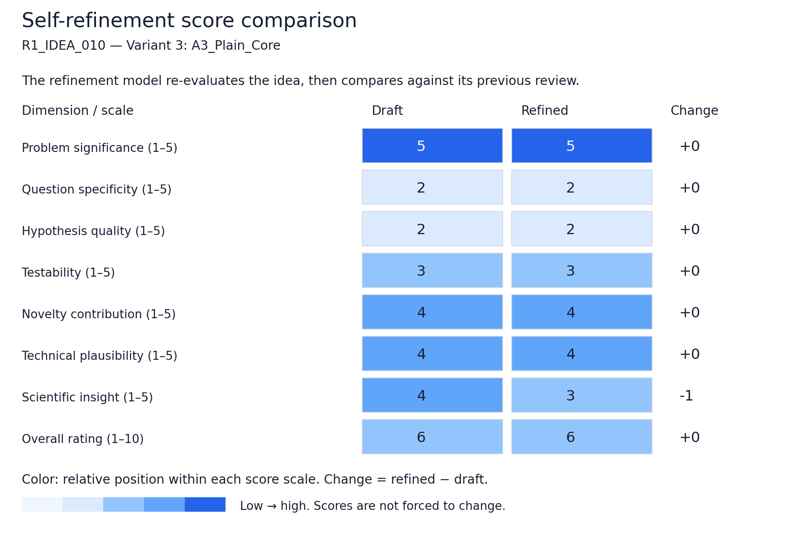

Changed score dimensions: scientific_insight.

### Score justifications (draft / refined)

**Problem significance**

```json
{
  "draft": {
    "score": 5.0,
    "justification": "The problem of sample efficiency and rapid concept learning is one of the most critical challenges in modern AI. Solving this would represent a major leap towards more human-like intelligence and reduce the environmental and economic costs of training massive models."
  },
  "refined": {
    "score": 5.0,
    "justification": "The problem of sample efficiency is critical. Current VLMs are computationally expensive and environmentally costly. Solving the ability to learn from minimal examples is a fundamental step toward more general, human-like AI. The significance is exceptional."
  }
}
```

**Question specificity**

```json
{
  "draft": {
    "score": 2.0,
    "justification": "The idea currently describes a high-level goal and a gap in the field but does not specify the exact research question, the variables to be manipulated, or the specific mechanism being tested. It is more of a topic statement than a research question."
  },
  "refined": {
    "score": 2.0,
    "justification": "The idea defines a broad area of inquiry (VFM in CV) but fails to specify a concrete research question. It states a gap but does not ask 'how' to bridge it or 'what' specific relationship to investigate. It remains at the level of a topic description."
  }
}
```

**Hypothesis quality**

```json
{
  "draft": {
    "score": 2.0,
    "justification": "There is no explicit hypothesis. The implicit assumption is that 'fast mapping' is possible and desirable, but the idea does not predict *how* or *why* a specific method would achieve this, nor does it state a falsifiable claim about the relationship between model architecture and fast mapping capability."
  },
  "refined": {
    "score": 2.0,
    "justification": "There is no explicit hypothesis. The text implies that VFM is desirable and currently missing, but it does not make a falsifiable prediction about the relationship between a specific intervention and the outcome. It lacks a 'If X, then Y' structure."
  }
}
```

**Testability**

```json
{
  "draft": {
    "score": 3.0,
    "justification": "The concept is theoretically testable (one could design an experiment to see if a model can learn a new concept from one example), but the idea summary does not propose a specific test, dataset, or evaluation protocol. Without a proposed method, the testability is currently abstract."
  },
  "refined": {
    "score": 3.0,
    "justification": "The concept is theoretically testable (one could build a system to test fast mapping), but the idea itself does not propose a test. Without a defined method or metric, the testability is latent rather than explicit. It relies on the researcher to invent the test."
  }
}
```

**Novelty contribution**

```json
{
  "draft": {
    "score": 4.0,
    "justification": "While 'fast mapping' is a known concept in cognitive science, applying it rigorously to modern VLMs to solve the data-efficiency gap is a novel and promising direction. The potential to discover new mechanisms for rapid learning is high, even if the specific implementation is not yet defined."
  },
  "refined": {
    "score": 4.0,
    "justification": "Applying the specific cognitive concept of 'fast mapping' to modern VLMs is a novel angle. While few-shot learning exists, framing it through the lens of 'fast mapping' (emphasizing the speed and cognitive mechanism) offers potential for new insights, even if the specific implementation is undefined."
  }
}
```

**Technical plausibility**

```json
{
  "draft": {
    "score": 4.0,
    "justification": "The premise is technically sound. The limitations of one-shot learning and the data hunger of VLMs are well-documented. The idea that cognitive principles could inform better AI architectures is a plausible and active area of research."
  },
  "refined": {
    "score": 4.0,
    "justification": "The premise is sound. The limitations of one-shot learning and the data requirements of VLMs are well-documented facts. The idea that cognitive principles can guide AI architecture is a plausible and active research direction."
  }
}
```

**Scientific insight**

```json
{
  "draft": {
    "score": 4.0,
    "justification": "If successful, this research could reveal how to decouple representation learning from concept acquisition, potentially leading to new architectural paradigms that separate 'knowing' from 'learning' in neural networks."
  },
  "refined": {
    "score": 3.0,
    "justification": "If the idea were developed, it could yield significant insight. However, as currently stated, it is a high-level goal. The potential for insight is high, but the current formulation does not suggest a specific mechanism that would reveal new principles beyond 'we need better few-shot learning'."
  }
}
```

**Overall rating**

```json
{
  "draft": {
    "score": 6.0,
    "justification": "This is a strong, high-potential research direction with significant scientific value (Problem Significance: 5, Novelty: 4). However, as a research *idea* summary, it is currently too vague to be considered 'strong' (7-8) because it lacks a specific hypothesis, methodological proposal, or defined research question. It sits in the 'moderate/borderline' category because the core concept is excellent, but the execution plan is missing."
  },
  "refined": {
    "score": 6.0,
    "justification": "This is a moderate/borderline idea. The problem significance is exceptional (5), and the potential for novelty is high (4). However, the idea is currently too vague to be considered 'strong' (7-8) because it lacks a specific hypothesis, method, or defined research question. It is a promising research *topic* but not yet a complete research *idea* with a clear path to validation. It sits in the 5-6 range because the core concept is valuable, but the scientific rigor of the proposal is currently low."
  }
}
```

## R1_IDEA_010 — Variant 4: B1_Verbose_Elaborate


Changed score dimensions: hypothesis_quality, overall_rating.

### Score justifications (draft / refined)

**Problem significance**

```json
{
  "draft": {
    "score": 5.0,
    "justification": "The problem addresses a fundamental limitation in current AI: the inability to learn new concepts as efficiently as humans. Solving this is critical for the next generation of adaptive, data-efficient AI systems."
  },
  "refined": {
    "score": 5.0,
    "justification": "The problem addresses a fundamental limitation in AI: the inability to learn new concepts as efficiently as humans. Solving this is critical for the next generation of adaptive, data-efficient AI systems and bridges the gap between cognitive science and machine learning."
  }
}
```

**Question specificity**

```json
{
  "draft": {
    "score": 2.0,
    "justification": "The idea clearly states the problem but does not define the specific research question or the variables to be manipulated. It describes a gap in the field rather than a specific investigation."
  },
  "refined": {
    "score": 2.0,
    "justification": "The idea clearly states the problem but does not define the specific research question or the variables to be manipulated. It describes a gap in the field rather than a specific investigation. It asks 'what is the gap?' but not 'how do we investigate the mechanism of this gap?'"
  }
}
```

**Hypothesis quality**

```json
{
  "draft": {
    "score": 3.0,
    "justification": "There is an implicit hypothesis that current models (VLMs/one-shot) cannot achieve human-like fast mapping due to data inefficiency. However, it lacks a specific, falsifiable prediction about *how* or *why* this happens or what specific intervention would fix it."
  },
  "refined": {
    "score": 2.0,
    "justification": "There is an implicit observation that current models are inefficient, but there is no explicit, falsifiable hypothesis about *why* or *how* to fix it. A strong idea would propose a specific mechanism (e.g., 'VLMs fail because X') that can be tested."
  }
}
```

**Testability**

```json
{
  "draft": {
    "score": 3.0,
    "justification": "The idea is testable in principle (by comparing models on fast-mapping tasks), but the lack of a defined evaluation protocol or specific metric makes the testability currently vague."
  },
  "refined": {
    "score": 3.0,
    "justification": "The idea is testable in principle (by comparing models on fast-mapping tasks), but the lack of a defined evaluation protocol or specific metric makes the testability currently vague. One could test the observation, but the 'research' part is undefined."
  }
}
```

**Novelty contribution**

```json
{
  "draft": {
    "score": 4.0,
    "justification": "While the concept of fast mapping is known, framing it as a specific failure mode of VLMs and proposing to investigate the gap between human and machine inductive reasoning is a novel and valuable direction."
  },
  "refined": {
    "score": 4.0,
    "justification": "While the concept of fast mapping is known, framing it as a specific failure mode of VLMs and proposing to investigate the gap between human and machine inductive reasoning is a novel and valuable direction. However, without a specific method, the contribution remains potential rather than concrete."
  }
}
```

**Technical plausibility**

```json
{
  "draft": {
    "score": 4.0,
    "justification": "The reasoning is sound: VLMs have language priors but lack the specific visual-inductive biases for rapid concept formation. Investigating this is technically feasible with current architectures."
  },
  "refined": {
    "score": 4.0,
    "justification": "The reasoning is sound: VLMs have language priors but lack the specific visual-inductive biases for rapid concept formation. Investigating this is technically feasible with current architectures, even if the specific solution is not yet proposed."
  }
}
```

**Scientific insight**

```json
{
  "draft": {
    "score": 4.0,
    "justification": "If pursued, this research could reveal fundamental differences between how humans and current AI models form concepts, potentially leading to new principles for data-efficient learning."
  },
  "refined": {
    "score": 4.0,
    "justification": "If pursued, this research could reveal fundamental differences between how humans and current AI models form concepts, potentially leading to new principles for data-efficient learning. The potential for insight is high, provided the research moves beyond simple benchmarking."
  }
}
```

**Overall rating**

```json
{
  "draft": {
    "score": 6.0,
    "justification": "This is a strong, significant problem statement with high potential, but as a research *idea* summary, it lacks the specificity of a research question or hypothesis required for a high score. It is currently a 'what' and 'why' without a clear 'how' or 'what specifically to test'. It sits in the moderate/borderline range because the core motivation is excellent, but the research plan is undefined."
  },
  "refined": {
    "score": 5.0,
    "justification": "This is a moderate/borderline idea. The problem is exceptional (5/5), and the potential for insight is high. However, as a research *idea* summary, it lacks the specificity of a research question or hypothesis required for a high score. It is currently a 'what' and 'why' without a clear 'how' or 'what specifically to test'. It sits in the moderate range because the core motivation is excellent, but the research plan is undefined, making it difficult to evaluate the novelty of the *approach*."
  }
}
```

## R1_IDEA_010 — Variant 5: B2_Grand_Narrative


Changed score dimensions: none.

### Score justifications (draft / refined)

**Problem significance**

```json
{
  "draft": {
    "score": 5.0,
    "justification": "The problem of data efficiency and generalization is one of the most critical challenges in modern AI. Solving this would have profound implications for deploying AI in real-world scenarios where data is scarce. The connection to human cognition adds significant theoretical weight."
  },
  "refined": {
    "score": 5.0,
    "justification": "The problem addresses one of the most critical bottlenecks in modern AI: data efficiency and generalization. Solving this would have profound implications for deploying AI in real-world scenarios where data is scarce or expensive. The connection to human cognition adds significant theoretical weight."
  }
}
```

**Question specificity**

```json
{
  "draft": {
    "score": 2.0,
    "justification": "The idea is currently framed as a broad motivation rather than a specific research question. It states that VFM 'could contribute' but does not specify what exact question is being asked or what specific variable is being manipulated."
  },
  "refined": {
    "score": 2.0,
    "justification": "The idea is currently framed as a broad motivation rather than a specific research question. It states that VFM 'could contribute' but does not specify what exact question is being asked, what variables are being manipulated, or what the specific comparison is. It lacks the precision required for a concrete study."
  }
}
```

**Hypothesis quality**

```json
{
  "draft": {
    "score": 3.0,
    "justification": "There is an implicit hypothesis that human VFM mechanisms can improve AI, but it is not explicit. A stronger idea would predict a specific outcome, such as 'Architectures that explicitly model the rapid update of semantic vectors will outperform standard fine-tuning on novel concepts.' The current statement is a plausible direction but not a falsifiable prediction."
  },
  "refined": {
    "score": 3.0,
    "justification": "There is an implicit hypothesis that human VFM mechanisms can improve AI, but it is not explicit. A stronger idea would predict a specific outcome (e.g., 'Architectures that explicitly model rapid semantic updates will outperform standard fine-tuning'). The current statement is a plausible direction but not a falsifiable prediction."
  }
}
```

**Testability**

```json
{
  "draft": {
    "score": 3.0,
    "justification": "The idea is testable in principle, as one could design experiments to compare models with and without VFM-inspired mechanisms. However, the lack of defined metrics, specific tasks, or baseline comparisons makes the current proposal difficult to test immediately without further elaboration."
  },
  "refined": {
    "score": 3.0,
    "justification": "The idea is testable in principle, as one could design experiments to compare models with and without VFM-inspired mechanisms. However, the lack of defined metrics, specific tasks, or baseline comparisons makes the current proposal difficult to test immediately without further elaboration."
  }
}
```

**Novelty contribution**

```json
{
  "draft": {
    "score": 4.0,
    "justification": "While one-shot learning is not new, explicitly framing the problem through the lens of 'Visual Fast Mapping' as a cognitive science concept to solve the specific data-hunger of VLMs is a fresh perspective. It moves beyond standard few-shot learning benchmarks to a more fundamental understanding of concept formation."
  },
  "refined": {
    "score": 4.0,
    "justification": "While one-shot learning is not new, explicitly framing the problem through the lens of 'Visual Fast Mapping' as a cognitive science concept to solve the specific data-hunger of VLMs is a fresh perspective. It moves beyond standard few-shot learning benchmarks to a more fundamental understanding of concept formation."
  }
}
```

**Technical plausibility**

```json
{
  "draft": {
    "score": 4.0,
    "justification": "The reasoning is logically coherent. The gap between human and machine learning is well-documented, and the hypothesis that cognitive insights can bridge this gap is a standard and plausible approach in AI research (e.g., neuro-symbolic AI, cognitive architectures)."
  },
  "refined": {
    "score": 4.0,
    "justification": "The reasoning is logically coherent. The gap between human and machine learning is well-documented, and the hypothesis that cognitive insights can bridge this gap is a standard and plausible approach in AI research (e.g., neuro-symbolic AI, cognitive architectures)."
  }
}
```

**Scientific insight**

```json
{
  "draft": {
    "score": 4.0,
    "justification": "If successful, this research could reveal fundamental principles of how visual concepts are formed and updated, offering insights that go beyond just improving a specific model's accuracy. It could lead to new architectural paradigms for lifelong learning."
  },
  "refined": {
    "score": 4.0,
    "justification": "If successfully investigated, this research could reveal fundamental principles of how visual concepts are formed and updated, offering insights that go beyond just improving a specific model's accuracy. It could lead to new architectural paradigms for lifelong learning."
  }
}
```

**Overall rating**

```json
{
  "draft": {
    "score": 7.0,
    "justification": "This is a strong research idea with high significance and potential for scientific insight. However, it currently lacks the specificity required to be a concrete research proposal. It is a compelling 'why' and 'what' but needs a clearer 'how' and 'which specific question' to reach an exceptional rating. It sits in the 'Strong' category because the core concept is valuable, but the execution plan is missing."
  },
  "refined": {
    "score": 7.0,
    "justification": "This is a strong research idea with high significance and potential for scientific insight. However, it currently lacks the specificity required to be a concrete research proposal. It is a compelling 'why' and 'what' but needs a clearer 'how' and 'which specific question' to reach an exceptional rating. It sits in the 'Strong' category because the core concept is valuable, but the execution plan is missing."
  }
}
```

## R1_IDEA_010 — Variant 6: B3_Over_Confident


Changed score dimensions: problem_significance.

### Score justifications (draft / refined)

**Problem significance**

```json
{
  "draft": {
    "score": 4.0,
    "justification": "The problem of data efficiency and inductive reasoning in AI is of paramount importance. Connecting this to the cognitive concept of fast mapping adds significant theoretical weight and relevance to the field of AGI."
  },
  "refined": {
    "score": 5.0,
    "justification": "The problem addresses the core limitation of current AI: data inefficiency and lack of true inductive reasoning. Solving or understanding this gap is critical for the development of AGI and is of paramount importance to the field."
  }
}
```

**Question specificity**

```json
{
  "draft": {
    "score": 2.0,
    "justification": "The idea identifies a broad area of inquiry but fails to define the specific research question, variables, or boundaries of the investigation. It is currently a topic rather than a question."
  },
  "refined": {
    "score": 2.0,
    "justification": "The idea identifies a broad area of inquiry but fails to define the specific research question, variables, or boundaries. It is currently a topic (VFM in VLMs) rather than a specific, investigable question."
  }
}
```

**Hypothesis quality**

```json
{
  "draft": {
    "score": 2.0,
    "justification": "There is no explicit hypothesis. The text presents an observation ('achieving this mapping unmistakably requires large-scale data') which is more of a premise than a falsifiable prediction about a mechanism or relationship."
  },
  "refined": {
    "score": 2.0,
    "justification": "There is no explicit, falsifiable hypothesis. The text presents an observation ('achieving this mapping unmistakably requires large-scale data') which is a premise or a general observation, not a specific prediction about a mechanism or relationship that could be proven wrong."
  }
}
```

**Testability**

```json
{
  "draft": {
    "score": 2.0,
    "justification": "Without a defined task, metric, or comparison baseline, the idea is not currently testable. It is unclear what experiment would be conducted to validate or refute the core observation."
  },
  "refined": {
    "score": 2.0,
    "justification": "Without a defined task, metric, or comparison baseline, the idea is not currently testable. It is unclear what specific experiment would be conducted to validate or refute the core observation."
  }
}
```

**Novelty contribution**

```json
{
  "draft": {
    "score": 3.0,
    "justification": "While the framing of VLMs through the lens of cognitive fast mapping is interesting, the core observation (that VLMs need lots of data) is already known. The novelty would come from the specific investigation, which is currently missing."
  },
  "refined": {
    "score": 3.0,
    "justification": "While the framing of VLMs through the lens of cognitive fast mapping is interesting, the core observation (that VLMs need lots of data) is already known. The novelty would come from the specific investigation, which is currently missing."
  }
}
```

**Technical plausibility**

```json
{
  "draft": {
    "score": 4.0,
    "justification": "The reasoning is logically coherent. It is plausible that current VLMs rely on statistical priors from large data rather than true inductive fast mapping, and investigating this is technically feasible."
  },
  "refined": {
    "score": 4.0,
    "justification": "The reasoning is logically coherent. It is plausible that current VLMs rely on statistical priors from large data rather than true inductive fast mapping, and investigating this is technically feasible given existing tools."
  }
}
```

**Scientific insight**

```json
{
  "draft": {
    "score": 3.0,
    "justification": "If developed, this could yield significant insights into the nature of inductive bias in VLMs. However, as currently stated, it offers little insight beyond the general observation that VLMs are data-hungry."
  },
  "refined": {
    "score": 3.0,
    "justification": "If developed, this could yield significant insights into the nature of inductive bias in VLMs. However, as currently stated, it offers little insight beyond the general observation that VLMs are data-hungry."
  }
}
```

**Overall rating**

```json
{
  "draft": {
    "score": 4.0,
    "justification": "The idea addresses a significant and meaningful problem with a strong conceptual foundation. However, it is currently too vague to be considered a strong research proposal. It lacks the specificity, hypothesis, and methodological direction required to be a 'strong' (7-8) or 'exceptional' (9-10) idea. It sits in the 'weak' category because it is a good motivation but not a concrete research plan."
  },
  "refined": {
    "score": 4.0,
    "justification": "The idea addresses a significant and meaningful problem with a strong conceptual foundation. However, it is currently too vague to be considered a strong research proposal. It lacks the specificity, hypothesis, and methodological direction required to be a 'strong' (7-8) or 'exceptional' (9-10) idea. It sits in the 'weak' category because it is a good motivation but not a concrete research plan."
  }
}
```

## R1_IDEA_010 — Variant 7: B4_Novelty

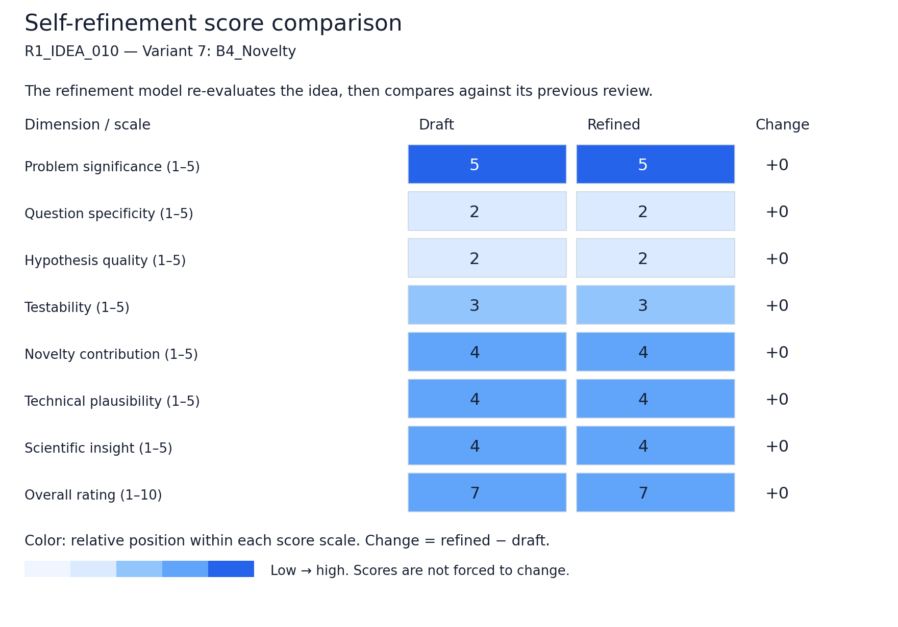

Changed score dimensions: none.

### Score justifications (draft / refined)

**Problem significance**

```json
{
  "draft": {
    "score": 5.0,
    "justification": "The problem of learning visual concepts from minimal data is one of the most critical challenges in modern AI. Solving this would represent a major step towards more human-like, data-efficient intelligence, making the underlying problem highly significant."
  },
  "refined": {
    "score": 5.0,
    "justification": "The problem of learning visual concepts from minimal data is one of the most critical challenges in modern AI. Solving this would represent a major step towards more human-like, data-efficient intelligence. The specific framing via 'fast mapping' adds a layer of cognitive relevance that increases its significance."
  }
}
```

**Question specificity**

```json
{
  "draft": {
    "score": 2.0,
    "justification": "While the problem is well-motivated, the research question is currently too broad. It states a need for 'new directions' but does not specify what those directions are, what the specific research question is (e.g., 'Does X architecture improve Y metric?'), or how the phenomenon will be isolated."
  },
  "refined": {
    "score": 2.0,
    "justification": "The research question is currently too broad. It states a need for 'new directions' but does not specify what those directions are, what the specific research question is (e.g., 'Does X architecture improve Y metric?'), or how the phenomenon will be isolated. It remains a 'problem statement' rather than a 'research question'."
  }
}
```

**Hypothesis quality**

```json
{
  "draft": {
    "score": 2.0,
    "justification": "The idea implies a hypothesis that 'mimicking human fast mapping mechanisms will yield better data efficiency than current methods,' but this is not explicitly stated or broken down into testable sub-hypotheses. It lacks a concrete prediction about the mechanism or outcome."
  },
  "refined": {
    "score": 2.0,
    "justification": "The idea implies a hypothesis that 'mimicking human fast mapping mechanisms will yield better data efficiency than current methods,' but this is not explicitly stated or broken down into testable sub-hypotheses. It lacks a concrete prediction about the mechanism or outcome that could be falsified."
  }
}
```

**Testability**

```json
{
  "draft": {
    "score": 3.0,
    "justification": "The idea is testable in principle because 'fast mapping' and 'few-shot learning' are measurable concepts. However, without a proposed method or specific evaluation protocol, the testability is currently low. It relies on the future definition of the experiment."
  },
  "refined": {
    "score": 3.0,
    "justification": "The idea is testable in principle because 'fast mapping' and 'few-shot learning' are measurable concepts. However, without a proposed method or specific evaluation protocol, the testability is currently low. It relies on the future definition of the experiment to be meaningful."
  }
}
```

**Novelty contribution**

```json
{
  "draft": {
    "score": 4.0,
    "justification": "Applying the specific cognitive concept of 'fast mapping' to computer vision is a novel framing. While few-shot learning is not new, the specific angle of 'fast mapping' grounded in cognitive science offers a fresh perspective that could lead to novel insights or architectures."
  },
  "refined": {
    "score": 4.0,
    "justification": "Applying the specific cognitive concept of 'fast mapping' to computer vision is a novel framing. While few-shot learning is not new, the specific angle of 'fast mapping' grounded in cognitive science offers a fresh perspective that could lead to novel insights or architectures, provided the distinction from existing methods is made."
  }
}
```

**Technical plausibility**

```json
{
  "draft": {
    "score": 4.0,
    "justification": "The reasoning is logically coherent. The transition from cognitive science to ML is a standard and plausible research path. The identification of limitations in current methods (one-shot and VLMs) is technically sound."
  },
  "refined": {
    "score": 4.0,
    "justification": "The reasoning is logically coherent. The transition from cognitive science to ML is a standard and plausible research path. The identification of limitations in current methods (one-shot and VLMs) is technically sound and aligns with current research trends."
  }
}
```

**Scientific insight**

```json
{
  "draft": {
    "score": 4.0,
    "justification": "If successful, this research could reveal how to better integrate prior knowledge and experience into visual learning, potentially uncovering new principles of inductive bias that go beyond standard data augmentation or pre-training."
  },
  "refined": {
    "score": 4.0,
    "justification": "If successfully investigated, this research could reveal how to better integrate prior knowledge and experience into visual learning, potentially uncovering new principles of inductive bias that go beyond standard data augmentation or pre-training. The cognitive angle offers high potential for transferable insights."
  }
}
```

**Overall rating**

```json
{
  "draft": {
    "score": 7.0,
    "justification": "This is a strong research idea with high significance and a compelling motivation. It scores lower on specificity and hypothesis quality because it is currently a 'direction' rather than a defined 'study.' However, the potential for scientific insight is high, and the problem is critical. With the formulation of a specific hypothesis and method, this could be an exceptional contribution."
  },
  "refined": {
    "score": 7.0,
    "justification": "This is a strong research idea with high significance and a compelling motivation. It scores lower on specificity and hypothesis quality because it is currently a 'direction' rather than a defined 'study.' However, the potential for scientific insight is high, and the problem is critical. With the formulation of a specific hypothesis and method, this could be an exceptional contribution."
  }
}
```

## R1_IDEA_010 — Variant 8: B5_Application_Impact


Changed score dimensions: none.

### Score justifications (draft / refined)

**Problem significance**

```json
{
  "draft": {
    "score": 5.0,
    "justification": "Data efficiency is one of the most critical challenges in modern AI. Achieving human-like fast mapping would revolutionize applications in robotics, medical imaging, and edge computing where labeled data is scarce. The problem is of high scientific and practical significance."
  },
  "refined": {
    "score": 5.0,
    "justification": "Data efficiency and rapid concept acquisition are fundamental bottlenecks in modern AI. Solving this would have profound implications for robotics, medical imaging, and edge computing. The problem is of exceptional scientific and practical importance."
  }
}
```

**Question specificity**

```json
{
  "draft": {
    "score": 2.0,
    "justification": "The idea currently reads as a motivation statement rather than a specific research question. It identifies the domain (VLMs, one-shot learning) and the goal (efficiency) but does not specify the exact relationship being investigated or the mechanism to be tested."
  },
  "refined": {
    "score": 2.0,
    "justification": "The idea is currently a motivation statement rather than a specific research question. It identifies the domain and the goal but does not specify the exact relationship being investigated or the mechanism to be tested. It asks 'can we do this?' rather than 'how does mechanism X affect outcome Y?'"
  }
}
```

**Hypothesis quality**

```json
{
  "draft": {
    "score": 2.0,
    "justification": "There is no explicit hypothesis. The text suggests a correlation ('could inform') but does not predict a specific outcome or mechanism (e.g., 'If we implement X, then Y will improve because of Z')."
  },
  "refined": {
    "score": 2.0,
    "justification": "There is no explicit hypothesis. The text suggests a correlation ('could inform') but does not predict a specific outcome or mechanism. A strong hypothesis would predict that a specific cognitive principle, when implemented, leads to a specific improvement in a specific metric."
  }
}
```

**Testability**

```json
{
  "draft": {
    "score": 3.0,
    "justification": "The idea is testable in principle because 'fast mapping' can be operationalized as a few-shot learning task. However, the current description does not suggest a specific experiment, comparison, or metric, making the immediate testability low."
  },
  "refined": {
    "score": 3.0,
    "justification": "The idea is testable in principle because 'fast mapping' can be operationalized as a few-shot learning task. However, the current description does not suggest a specific experiment, comparison, or metric, making the immediate testability low. It requires significant elaboration to become a concrete test."
  }
}
```

**Novelty contribution**

```json
{
  "draft": {
    "score": 4.0,
    "justification": "While one-shot learning is not new, explicitly framing it through the lens of 'Visual Fast Mapping' from cognitive science and applying it to modern VLMs is a novel angle. It has the potential to yield new insights into how to structure VLMs for rapid adaptation."
  },
  "refined": {
    "score": 4.0,
    "justification": "While one-shot learning is not new, explicitly framing it through the lens of 'Visual Fast Mapping' from cognitive science and applying it to modern VLMs is a novel angle. It has the potential to yield new insights into how to structure VLMs for rapid adaptation, distinguishing it from generic efficiency improvements."
  }
}
```

**Technical plausibility**

```json
{
  "draft": {
    "score": 4.0,
    "justification": "The direction is technically sound. VLMs already possess some capacity for few-shot learning via prompting. The challenge is enhancing this to match human speed and robustness, which is a plausible research trajectory."
  },
  "refined": {
    "score": 4.0,
    "justification": "The direction is technically sound. VLMs already possess some capacity for few-shot learning via prompting. The challenge is enhancing this to match human speed and robustness, which is a plausible research trajectory given the current state of the art."
  }
}
```

**Scientific insight**

```json
{
  "draft": {
    "score": 4.0,
    "justification": "If successful, this research could reveal how to decouple general knowledge from rapid concept acquisition in neural networks, offering transferable insights into inductive biases and memory mechanisms in deep learning."
  },
  "refined": {
    "score": 4.0,
    "justification": "If successfully investigated, this research could reveal how to decouple general knowledge from rapid concept acquisition in neural networks, offering transferable insights into inductive biases and memory mechanisms in deep learning. It moves beyond 'does it work' to 'how does cognitive structure enable efficiency?'"
  }
}
```

**Overall rating**

```json
{
  "draft": {
    "score": 6.0,
    "justification": "This is a moderate/borderline idea. The underlying problem is exceptional (score 5), and the potential for insight is high. However, as a research proposal, it currently lacks the specificity, hypothesis, and methodological direction required to be a 'strong' idea. It is a promising research *topic* but not yet a fully formed research *question*."
  },
  "refined": {
    "score": 6.0,
    "justification": "This is a moderate/borderline idea. The underlying problem is exceptional (score 5), and the potential for insight is high. However, as a research proposal, it currently lacks the specificity, hypothesis, and methodological direction required to be a 'strong' idea. It is a promising research *topic* but not yet a fully formed research *question*."
  }
}
```

## R1_IDEA_010 — Variant 9: C1_Hollow_Shell


Changed score dimensions: none.

### Score justifications (draft / refined)

**Problem significance**

```json
{
  "draft": {
    "score": 5.0,
    "justification": "The problem of learning new concepts from minimal data is one of the most significant challenges in AI, directly related to the goal of Artificial General Intelligence (AGI). Solving this would have profound implications for robotics, education, and any domain where data is scarce."
  },
  "refined": {
    "score": 5.0,
    "justification": "The problem of learning new concepts from minimal data is one of the most significant challenges in AI, directly related to the goal of Artificial General Intelligence (AGI). Solving this would have profound implications for robotics, education, and any domain where data is scarce."
  }
}
```

**Question specificity**

```json
{
  "draft": {
    "score": 2.0,
    "justification": "While the general topic is clear, the specific research question is vague. It states that a problem exists but does not define the specific variables, conditions, or mechanisms to be investigated. It reads more as a motivation than a specific research question."
  },
  "refined": {
    "score": 2.0,
    "justification": "While the general topic is clear, the specific research question is vague. It states that a problem exists but does not define the specific variables, conditions, or mechanisms to be investigated. It reads more as a motivation or a topic selection than a specific research question."
  }
}
```

**Hypothesis quality**

```json
{
  "draft": {
    "score": 2.0,
    "justification": "The idea implies a hypothesis (that current models cannot truly fast map), but it does not articulate a testable mechanism or a specific prediction about *how* to achieve it or *why* it fails. It lacks the 'if-then' structure required for a strong hypothesis."
  },
  "refined": {
    "score": 2.0,
    "justification": "The idea implies a hypothesis (that current models cannot truly fast map), but it does not articulate a testable mechanism or a specific prediction about *how* to achieve it or *why* it fails. It lacks the 'if-then' structure required for a strong hypothesis."
  }
}
```

**Testability**

```json
{
  "draft": {
    "score": 3.0,
    "justification": "The concept is testable in principle (by designing few-shot experiments), but the summary does not suggest *how* to test it. Without a defined protocol or metric, the testability is currently theoretical rather than practical."
  },
  "refined": {
    "score": 3.0,
    "justification": "The concept is testable in principle (by designing few-shot experiments), but the summary does not suggest *how* to test it. Without a defined protocol, metric, or baseline comparison, the testability is currently theoretical rather than practical."
  }
}
```

**Novelty contribution**

```json
{
  "draft": {
    "score": 4.0,
    "justification": "Applying the cognitive science concept of 'fast mapping' to computer vision is a novel framing. While few-shot learning is not new, the specific focus on the *mechanism* of fast mapping (as opposed to just performance) has high potential for scientific insight."
  },
  "refined": {
    "score": 4.0,
    "justification": "Applying the cognitive science concept of 'fast mapping' to computer vision is a novel framing. While few-shot learning is not new, the specific focus on the *mechanism* of fast mapping (as opposed to just performance) has high potential for scientific insight."
  }
}
```

**Technical plausibility**

```json
{
  "draft": {
    "score": 4.0,
    "justification": "The direction is technically sound. The gap between human and machine learning is well-documented, and the field has the tools (transformers, memory networks, etc.) to attempt to bridge it. The reasoning that current models have data requirements is factually correct."
  },
  "refined": {
    "score": 4.0,
    "justification": "The direction is technically sound. The gap between human and machine learning is well-documented, and the field has the tools (transformers, memory networks, etc.) to attempt to bridge it. The reasoning that current models have data requirements is factually correct."
  }
}
```

**Scientific insight**

```json
{
  "draft": {
    "score": 4.0,
    "justification": "If successful, this research could reveal fundamental differences between statistical learning (current AI) and conceptual learning (humans), potentially leading to new architectural paradigms or training objectives."
  },
  "refined": {
    "score": 4.0,
    "justification": "If successfully investigated, this research could reveal fundamental differences between statistical learning (current AI) and conceptual learning (humans), potentially leading to new architectural paradigms or training objectives."
  }
}
```

**Overall rating**

```json
{
  "draft": {
    "score": 6.0,
    "justification": "This is a moderate/borderline idea. The underlying problem is exceptional (5/5) and the potential for insight is high (4/5). However, the current formulation is too vague to be considered a strong research proposal. It lacks a specific hypothesis, defined metrics, and a methodological path. It is a promising *topic* but not yet a concrete *research idea*."
  },
  "refined": {
    "score": 6.0,
    "justification": "This is a moderate/borderline idea. The underlying problem is exceptional (5/5) and the potential for insight is high (4/5). However, the current formulation is too vague to be considered a strong research proposal. It lacks a specific hypothesis, defined metrics, and a methodological path. It is a promising *topic* but not yet a concrete *research idea*."
  }
}
```

## R1_IDEA_010 — Variant 10: C2_Logic_Flawed


Changed score dimensions: overall_rating.

### Score justifications (draft / refined)

**Problem significance**

```json
{
  "draft": {
    "score": 5.0,
    "justification": "The problem of achieving human-like rapid learning (fast mapping) in AI is a fundamental challenge in machine learning. Solving this would represent a major leap towards more general, data-efficient, and robust AI systems, making it highly significant."
  },
  "refined": {
    "score": 5.0,
    "justification": "Achieving human-like rapid learning (fast mapping) is a central challenge in AI. Solving this would enable more data-efficient, robust, and generalizable systems, representing a major leap in machine learning capabilities."
  }
}
```

**Question specificity**

```json
{
  "draft": {
    "score": 2.0,
    "justification": "While the problem is clear, the specific research question is vague. It identifies a gap ('one-shot is insufficient') but does not define the specific variable to be manipulated, the specific hypothesis to be tested, or the precise relationship being investigated."
  },
  "refined": {
    "score": 2.0,
    "justification": "The idea clearly states *what* is lacking (VFM capability) but not *how* to investigate it. It lacks a specific research question, defined variables, or a concrete hypothesis about the underlying cause of the insufficiency."
  }
}
```

**Hypothesis quality**

```json
{
  "draft": {
    "score": 3.0,
    "justification": "The idea contains an implicit hypothesis that 'current methods are insufficient for broad VFM.' This is testable but generic. A stronger hypothesis would predict a specific failure mode or propose a specific condition under which VLMs could succeed."
  },
  "refined": {
    "score": 3.0,
    "justification": "The implicit hypothesis that 'current methods are insufficient' is testable but generic. It does not predict a specific failure mode or propose a condition under which the gap could be closed, limiting its scientific depth."
  }
}
```

**Testability**

```json
{
  "draft": {
    "score": 3.0,
    "justification": "The idea is testable in principle (by comparing VLMs to human performance on fast mapping tasks), but the lack of a defined task, metric, or intervention makes the specific experimental design unclear at this stage."
  },
  "refined": {
    "score": 3.0,
    "justification": "While the general claim is testable (compare VLMs to humans on VFM tasks), the lack of a defined task, metric, or intervention makes the specific experimental design unclear. It is testable in principle but not yet in practice."
  }
}
```

**Novelty contribution**

```json
{
  "draft": {
    "score": 4.0,
    "justification": "Framing the problem through the lens of 'Visual Fast Mapping' and explicitly challenging the sufficiency of one-shot learning and current VLMs is a novel and promising angle. It moves beyond simple benchmarking to a deeper inquiry into inductive capacity."
  },
  "refined": {
    "score": 4.0,
    "justification": "Framing the problem through 'Visual Fast Mapping' and explicitly challenging the sufficiency of one-shot learning and VLMs is a novel angle. It moves beyond simple benchmarking to a deeper inquiry into inductive capacity."
  }
}
```

**Technical plausibility**

```json
{
  "draft": {
    "score": 4.0,
    "justification": "The reasoning is logically coherent: if humans can do it with few examples and current models need many, there is a gap. The direction is plausible, though the path to the solution is not yet defined."
  },
  "refined": {
    "score": 4.0,
    "justification": "The reasoning is logically coherent: if humans can do it with few examples and models need many, a gap exists. The direction is plausible, though the path to the solution is not yet defined."
  }
}
```

**Scientific insight**

```json
{
  "draft": {
    "score": 4.0,
    "justification": "If pursued, this research could reveal fundamental limitations in how VLMs process visual information versus language, and potentially uncover new principles for data-efficient learning, offering insights beyond just performance metrics."
  },
  "refined": {
    "score": 4.0,
    "justification": "If pursued, this research could reveal fundamental limitations in how VLMs process visual information versus language and uncover new principles for data-efficient learning, offering insights beyond just performance metrics."
  }
}
```

**Overall rating**

```json
{
  "draft": {
    "score": 7.0,
    "justification": "This is a strong research idea with high significance and a compelling motivation. However, it currently lacks the specificity of a concrete research question or hypothesis required for a top-tier proposal. It is a 'problem statement' rather than a 'research plan.' With more specific formulation of the mechanism to be studied, it could be exceptional."
  },
  "refined": {
    "score": 6.0,
    "justification": "This is a moderate research idea. It identifies a highly significant problem with a compelling motivation, but it currently lacks the specificity of a concrete research question or hypothesis required for a strong proposal. It is a 'problem statement' rather than a 'research plan.' Without defining the mechanism to be studied or the specific experimental design, its potential contribution remains speculative."
  }
}
```

## R1_IDEA_010 — Variant 11: C3_Substance_Enriched

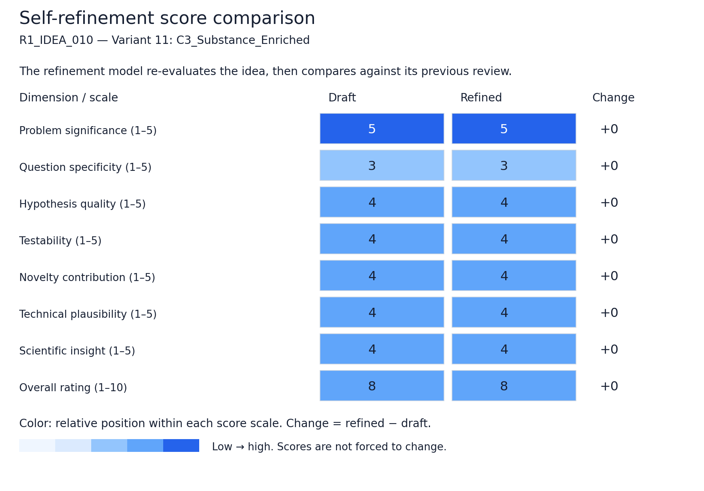

Changed score dimensions: none.

### Score justifications (draft / refined)

**Problem significance**

```json
{
  "draft": {
    "score": 5.0,
    "justification": "The problem addresses a fundamental gap in AI: the ability to learn new concepts from minimal data, which is a hallmark of human intelligence. Solving this would significantly advance the field of few-shot/one-shot learning and bring machine vision closer to general-purpose reasoning."
  },
  "refined": {
    "score": 5.0,
    "justification": "The problem addresses a fundamental gap in AI: the ability to learn new concepts from minimal data, a hallmark of human intelligence. Solving this would significantly advance few-shot/one-shot learning and move machine vision closer to general-purpose reasoning. The connection to cognitive science adds substantial theoretical weight."
  }
}
```

**Question specificity**

```json
{
  "draft": {
    "score": 3.0,
    "justification": "While the motivation is clear, the core research question is somewhat broad. It asks 'how to achieve VFM' but the specific mechanism ('architectural mechanisms for rapid hypothesis testing') is not yet defined. The question needs to be narrowed to a specific architectural hypothesis to be fully specific."
  },
  "refined": {
    "score": 3.0,
    "justification": "While the motivation is clear, the core research question is somewhat broad. It asks 'how to achieve VFM' but the specific mechanism ('architectural mechanisms for rapid hypothesis testing') is currently abstract. The idea identifies the *need* for a mechanism but does not yet specify *what* that mechanism is, making the question less specific than it could be."
  }
}
```

**Hypothesis quality**

```json
{
  "draft": {
    "score": 4.0,
    "justification": "The hypothesis that 'structured prior knowledge + specific architectural mechanisms > VLMs alone' is strong and falsifiable. It posits a specific relationship between semantic relatedness and performance that can be tested, and it challenges the sufficiency of current VLM scaling laws."
  },
  "refined": {
    "score": 4.0,
    "justification": "The hypothesis that 'structured prior knowledge + specific architectural mechanisms > VLMs alone' is strong and falsifiable. It posits a specific relationship between semantic relatedness and performance and challenges the sufficiency of current VLM scaling laws. It is a non-trivial claim that can be supported or contradicted by evidence."
  }
}
```

**Testability**

```json
{
  "draft": {
    "score": 4.0,
    "justification": "The idea suggests a clear path for testing: varying semantic relatedness and comparing architectures. While the specific architecture is not defined, the experimental design (manipulating priors and measuring generalization) is testable."
  },
  "refined": {
    "score": 4.0,
    "justification": "The idea suggests a clear path for testing: varying semantic relatedness and comparing architectures. While the specific architecture is not defined, the experimental design (manipulating priors and measuring generalization) is testable. The hypothesis can be falsified by showing that standard VLMs with sufficient data or prompting can achieve VFM, or that the proposed architectural changes do not improve performance."
  }
}
```

**Novelty contribution**

```json
{
  "draft": {
    "score": 4.0,
    "justification": "Applying the cognitive concept of Fast Mapping to VLMs is novel. The specific claim that architectural changes (beyond just data scaling) are necessary for this capability is a significant and potentially high-impact contribution if proven."
  },
  "refined": {
    "score": 4.0,
    "justification": "Applying the cognitive concept of Fast Mapping to VLMs is novel. The specific claim that architectural changes (beyond just data scaling) are necessary for this capability is a significant and potentially high-impact contribution if proven. It shifts the focus from 'more data' to 'better architecture' for rapid learning."
  }
}
```

**Technical plausibility**

```json
{
  "draft": {
    "score": 4.0,
    "justification": "The reasoning is logically coherent. It is plausible that current VLMs lack the specific inductive biases for rapid concept formation and that new mechanisms (like memory or meta-learning) are needed. The connection between cognitive science and deep learning architecture is a well-trodden but still fertile path."
  },
  "refined": {
    "score": 4.0,
    "justification": "The reasoning is logically coherent. It is plausible that current VLMs lack the specific inductive biases for rapid concept formation and that new mechanisms (like memory or meta-learning) are needed. The connection between cognitive science and deep learning architecture is a well-trodden but still fertile path."
  }
}
```

**Scientific insight**

```json
{
  "draft": {
    "score": 4.0,
    "justification": "If successful, this research would reveal the specific architectural components necessary for rapid concept learning, providing deep insight into the relationship between semantic priors and model generalization. It could lead to a new class of models designed for 'fast learning' rather than just 'large scale learning'."
  },
  "refined": {
    "score": 4.0,
    "justification": "If successful, this research would reveal the specific architectural components necessary for rapid concept learning, providing deep insight into the relationship between semantic priors and model generalization. It could lead to a new class of models designed for 'fast learning' rather than just 'large scale learning'."
  }
}
```

**Overall rating**

```json
{
  "draft": {
    "score": 8.0,
    "justification": "This is a strong research idea with high scientific potential. It connects a meaningful cognitive phenomenon to a critical gap in computer vision. While the specific architectural proposal is currently abstract, the direction is clear, the hypothesis is testable, and the potential contribution is significant. It scores highly on significance and insight, with moderate scores on specificity due to the need for more concrete architectural definitions."
  },
  "refined": {
    "score": 8.0,
    "justification": "This is a strong research idea with high scientific potential. It connects a meaningful cognitive phenomenon to a critical gap in computer vision. While the specific architectural proposal is currently abstract, the direction is clear, the hypothesis is testable, and the potential contribution is significant. It scores highly on significance and insight, with moderate scores on specificity due to the need for more concrete architectural definitions."
  }
}
```

## R1_IDEA_010 — Variant 12: H1_Deceptive_Hollow

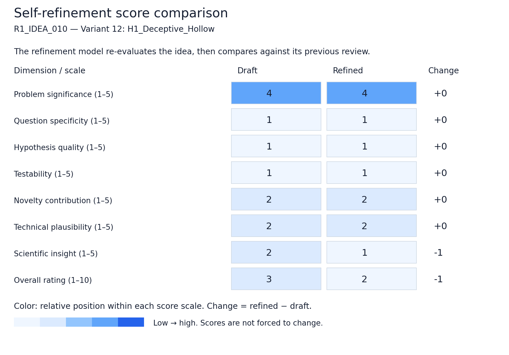

Changed score dimensions: scientific_insight, overall_rating.

### Score justifications (draft / refined)

**Problem significance**

```json
{
  "draft": {
    "score": 4.0,
    "justification": "The underlying problem—enabling machines to learn visual concepts as rapidly and efficiently as humans—is highly significant and aligns with major goals in AI safety, efficiency, and generalization."
  },
  "refined": {
    "score": 4.0,
    "justification": "The underlying problem of enabling machines to learn visual concepts rapidly and efficiently from limited data is of paramount importance to the field of AI, addressing core challenges in efficiency, generalization, and biological plausibility."
  }
}
```

**Question specificity**

```json
{
  "draft": {
    "score": 1.0,
    "justification": "The idea is presented as a broad vision or manifesto. It does not define a specific research question, variable, or relationship to be investigated, making it impossible to evaluate the scope of the inquiry."
  },
  "refined": {
    "score": 1.0,
    "justification": "The idea does not define a specific research question. It describes a broad 'agenda' and 'vision' without identifying a concrete variable, relationship, or phenomenon to investigate. It is impossible to determine the scope of the inquiry."
  }
}
```

**Hypothesis quality**

```json
{
  "draft": {
    "score": 1.0,
    "justification": "There is no explicit or implicit hypothesis that can be supported or refuted. The text claims the direction 'could reshape' the field, which is a prediction of impact rather than a scientific hypothesis about a mechanism."
  },
  "refined": {
    "score": 1.0,
    "justification": "There is no explicit or implicit scientific hypothesis. The text makes a prediction about the *impact* of the research ('reshape the field') rather than a testable prediction about a mechanism or relationship ('X causes Y under Z conditions')."
  }
}
```

**Testability**

```json
{
  "draft": {
    "score": 1.0,
    "justification": "Without a defined method, specific task, or metric, the idea is not currently testable. It is a statement of intent rather than a research plan."
  },
  "refined": {
    "score": 1.0,
    "justification": "The idea is currently not testable. Without a proposed method, specific tasks, or evaluation metrics, there is no way to design an experiment to support or refute the claims."
  }
}
```

**Novelty contribution**

```json
{
  "draft": {
    "score": 2.0,
    "justification": "While the *goal* is novel in its ambition, the idea itself does not propose a new mechanism or insight. It is a high-level call to action that currently lacks the novelty of a specific technical contribution."
  },
  "refined": {
    "score": 2.0,
    "justification": "While the *ambition* is novel, the idea itself does not propose a new mechanism, insight, or method. It is a high-level call to action that currently lacks the specificity to claim a unique scientific contribution over existing literature."
  }
}
```

**Technical plausibility**

```json
{
  "draft": {
    "score": 2.0,
    "justification": "The reasoning is logically coherent in a philosophical sense (connecting cognitive science to CV), but it lacks technical plausibility because no mechanism is proposed to bridge the gap. It is unclear if the proposed synthesis is technically feasible."
  },
  "refined": {
    "score": 2.0,
    "justification": "The reasoning is logically coherent at a philosophical level (connecting cognitive science to CV), but it lacks technical plausibility because no mechanism is proposed to bridge the gap. It is unclear how the abstract concept translates to a computational system."
  }
}
```

**Scientific insight**

```json
{
  "draft": {
    "score": 2.0,
    "justification": "As stated, the idea cannot yield scientific insight because it does not propose a testable relationship. If developed, it has high potential, but in its current form, it offers no insight."
  },
  "refined": {
    "score": 1.0,
    "justification": "As stated, the idea cannot yield scientific insight because it does not propose a testable relationship. It offers a direction but no specific insight into *how* or *why* the proposed solution would work."
  }
}
```

**Overall rating**

```json
{
  "draft": {
    "score": 3.0,
    "justification": "The idea addresses a significant problem and has high potential, but as a research proposal, it is currently too vague to be evaluated as a scientific contribution. It reads more like a grant abstract or a vision statement than a research idea with a defined question and hypothesis. It falls into the 'Weak' category because it lacks the specificity required to be testable or falsifiable."
  },
  "refined": {
    "score": 2.0,
    "justification": "The idea addresses a significant problem but fails as a research proposal due to extreme vagueness. It lacks a specific question, hypothesis, or method, making it impossible to evaluate its scientific merit or feasibility. It falls into the 'Very Weak' category because it is essentially a statement of intent rather than a researchable idea."
  }
}
```

## R1_IDEA_010 — Variant 13: H2_Confident_Flaw

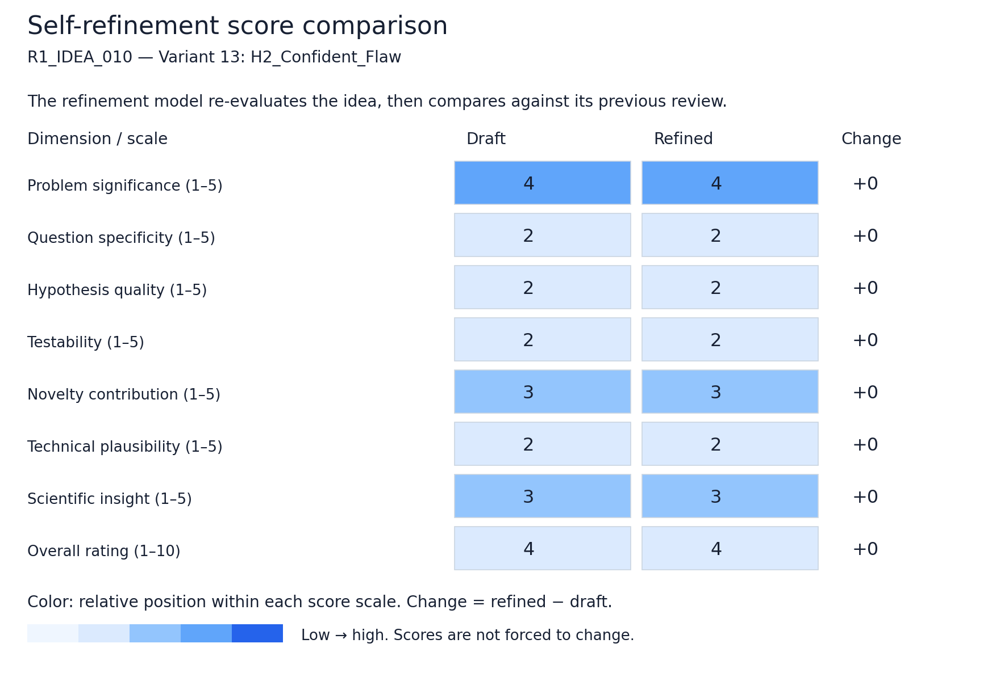

Changed score dimensions: none.

### Score justifications (draft / refined)

**Problem significance**

```json
{
  "draft": {
    "score": 4.0,
    "justification": "The problem of rapid visual concept learning (fast mapping) is a fundamental challenge in AI and a key differentiator between current systems and human intelligence. Addressing this is highly significant for the field."
  },
  "refined": {
    "score": 4.0,
    "justification": "The problem of rapid visual concept learning (fast mapping) is a fundamental challenge in AI and a key differentiator between current systems and human intelligence. Addressing this is highly significant for the field."
  }
}
```

**Question specificity**

```json
{
  "draft": {
    "score": 2.0,
    "justification": "The idea identifies a broad problem but lacks a specific research question. It does not define the mechanism, the method, or the specific variables to be manipulated, making the scope too vague."
  },
  "refined": {
    "score": 2.0,
    "justification": "The idea identifies a broad problem but lacks a specific research question. It does not define the mechanism, the method, or the specific variables to be manipulated, making the scope too vague."
  }
}
```

**Hypothesis quality**

```json
{
  "draft": {
    "score": 2.0,
    "justification": "While it implies a hypothesis that current methods lack a specific mechanism, the explicit claim that solving this will 'necessarily' produce causal evidence without further isolation is a logical flaw rather than a rigorous hypothesis."
  },
  "refined": {
    "score": 2.0,
    "justification": "While it implies a hypothesis that current methods lack a specific mechanism, the explicit claim that solving this will 'necessarily' produce causal evidence without further isolation is a logical flaw rather than a rigorous hypothesis."
  }
}
```

**Testability**

```json
{
  "draft": {
    "score": 2.0,
    "justification": "The idea explicitly suggests ignoring key variables (dataset composition, boundary cases) that are essential for testing. Without a defined method or specific variables to measure, the central claim is not currently testable in a rigorous way."
  },
  "refined": {
    "score": 2.0,
    "justification": "The idea explicitly suggests ignoring key variables (dataset composition, boundary cases) that are essential for testing. Without a defined method or specific variables to measure, the central claim is not currently testable in a rigorous way."
  }
}
```

**Novelty contribution**

```json
{
  "draft": {
    "score": 3.0,
    "justification": "The framing of the problem through the lens of 'fast mapping' is novel and interesting. However, the proposed direction lacks a specific novel method or mechanism, limiting the potential for immediate scientific contribution beyond re-framing existing problems."
  },
  "refined": {
    "score": 3.0,
    "justification": "The framing of the problem through the lens of 'fast mapping' is novel and interesting. However, the proposed direction lacks a specific novel method or mechanism, limiting the potential for immediate scientific contribution beyond re-framing existing problems."
  }
}
```

**Technical plausibility**

```json
{
  "draft": {
    "score": 2.0,
    "justification": "The reasoning contains a logical gap: claiming that fixing a 'limitation' automatically proves 'general superiority' without controlling for other factors is technically unsound. The path from the problem statement to the solution is not technically detailed."
  },
  "refined": {
    "score": 2.0,
    "justification": "The reasoning contains a logical gap: claiming that fixing a 'limitation' automatically proves 'general superiority' without controlling for other factors is technically unsound. The path from the problem statement to the solution is not technically detailed."
  }
}
```

**Scientific insight**

```json
{
  "draft": {
    "score": 3.0,
    "justification": "If the research were to successfully define and test a mechanism for fast mapping, it could yield significant insight. However, as currently stated, the dismissal of rigorous evaluation criteria limits the potential for deep scientific insight."
  },
  "refined": {
    "score": 3.0,
    "justification": "If the research were to successfully define and test a mechanism for fast mapping, it could yield significant insight. However, as currently stated, the dismissal of rigorous evaluation criteria limits the potential for deep scientific insight."
  }
}
```

**Overall rating**

```json
{
  "draft": {
    "score": 4.0,
    "justification": "The idea addresses a significant and meaningful problem with a compelling cognitive science angle. However, it is currently a weak research proposal because it lacks a specific hypothesis, a defined method, and proposes a flawed validation strategy (ignoring confounding variables). It is a 'good problem' but a 'poorly defined research plan'."
  },
  "refined": {
    "score": 4.0,
    "justification": "The idea addresses a significant and meaningful problem with a compelling cognitive science angle. However, it is currently a weak research proposal because it lacks a specific hypothesis, a defined method, and proposes a flawed validation strategy (ignoring confounding variables). It is a 'good problem' but a 'poorly defined research plan'."
  }
}
```

## R1_IDEA_010 — Variant 14: H3_Verbose_Enriched

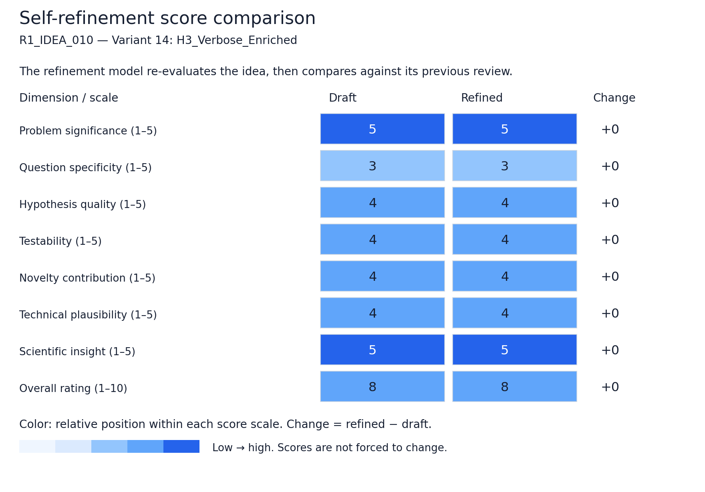

Changed score dimensions: none.

### Score justifications (draft / refined)

**Problem significance**

```json
{
  "draft": {
    "score": 5.0,
    "justification": "The problem addresses a fundamental limitation in current AI: the inability to learn new concepts as efficiently as humans (fast mapping). Solving this is critical for developing more adaptable, sample-efficient, and generalizable computer vision systems, making it a highly significant research problem."
  },
  "refined": {
    "score": 5.0,
    "justification": "The problem addresses a fundamental gap in AI: the inability to learn new visual concepts as efficiently as humans. Solving this is critical for developing sample-efficient, adaptable systems, making it a highly significant research problem."
  }
}
```

**Question specificity**

```json
{
  "draft": {
    "score": 3.0,
    "justification": "The idea identifies the general problem (lack of structured priors) and the general solution direction (VLMs + new architecture). However, the specific nature of the 'architectural mechanisms' and the exact definition of 'structured prior' are not specified, leaving the research question somewhat broad."
  },
  "refined": {
    "score": 3.0,
    "justification": "The idea identifies the general problem and the general solution direction (VLMs + new architecture). However, the specific nature of the 'architectural mechanisms' and the exact definition of 'structured prior' are not specified, leaving the research question somewhat broad and abstract."
  }
}
```

**Hypothesis quality**

```json
{
  "draft": {
    "score": 4.0,
    "justification": "The hypothesis is strong: it predicts that current failures are due to a lack of structured priors and that adding specific architectural mechanisms for hypothesis testing will improve robustness. It is falsifiable if the proposed mechanisms are implemented and fail to outperform baselines."
  },
  "refined": {
    "score": 4.0,
    "justification": "The hypothesis is strong and falsifiable: it predicts that current failures are due to a lack of structured priors and that adding specific architectural mechanisms will improve robustness. It distinguishes between data scale and architectural capability."
  }
}
```

**Testability**

```json
{
  "draft": {
    "score": 4.0,
    "justification": "The proposed experimental design is highly testable. The plan to use staged designs, ablations, sensitivity analyses, and error analysis on boundary cases provides a clear roadmap for gathering evidence to support or refute the hypothesis."
  },
  "refined": {
    "score": 4.0,
    "justification": "The proposed experimental design is highly testable. The plan to use staged designs, ablations, sensitivity analyses, and error analysis on boundary cases provides a clear roadmap for gathering evidence, even if the specific model architecture is yet to be defined."
  }
}
```

**Novelty contribution**

```json
{
  "draft": {
    "score": 4.0,
    "justification": "While VLMs are popular, applying them specifically to the cognitive concept of 'Visual Fast Mapping' with a focus on 'rapid hypothesis testing' mechanisms is a novel angle. The potential to uncover the specific boundary conditions of this capability offers significant scientific insight beyond just improving benchmark scores."
  },
  "refined": {
    "score": 4.0,
    "justification": "While VLMs are popular, applying them specifically to the cognitive concept of 'Visual Fast Mapping' with a focus on 'rapid hypothesis testing' mechanisms is a novel angle. The potential to uncover the specific boundary conditions of this capability offers significant scientific insight."
  }
}
```

**Technical plausibility**

```json
{
  "draft": {
    "score": 4.0,
    "justification": "The reasoning is logically coherent. Leveraging VLMs for semantic priors is a standard and plausible approach. The need for specific architectural changes to handle 'rapid hypothesis testing' is a reasonable theoretical extension, though the specific implementation details are currently missing."
  },
  "refined": {
    "score": 4.0,
    "justification": "The reasoning is logically coherent. Leveraging VLMs for semantic priors is a standard and plausible approach. The need for specific architectural changes to handle 'rapid hypothesis testing' is a reasonable theoretical extension, though the specific implementation details are currently missing."
  }
}
```

**Scientific insight**

```json
{
  "draft": {
    "score": 5.0,
    "justification": "If successful, this research would not just produce a better model but would likely reveal fundamental principles about how structured knowledge and architectural constraints interact to enable rapid learning. The focus on failure modes and boundary conditions ensures high scientific value."
  },
  "refined": {
    "score": 5.0,
    "justification": "If successfully investigated, this research would not just produce a better model but would likely reveal fundamental principles about how structured knowledge and architectural constraints interact to enable rapid learning. The focus on failure modes and boundary conditions ensures high scientific value."
  }
}
```

**Overall rating**

```json
{
  "draft": {
    "score": 8.0,
    "justification": "This is a strong research idea with high significance and a clear path to scientific insight. The main limitation is the lack of specific technical details regarding the proposed 'architectural mechanisms,' which prevents it from being an 'exceptional' (9-10) idea at this stage. However, the conceptual framework and proposed evaluation strategy are robust enough to warrant a high rating."
  },
  "refined": {
    "score": 8.0,
    "justification": "This is a strong research idea with high significance and a clear path to scientific insight. The main limitation is the lack of specific technical details regarding the proposed 'architectural mechanisms,' which prevents it from being an 'exceptional' (9-10) idea at this stage. However, the conceptual framework and proposed evaluation strategy are robust enough to warrant a high rating."
  }
}
```

## R1_IDEA_010 — Variant 15: H4_Ultimate_Hype

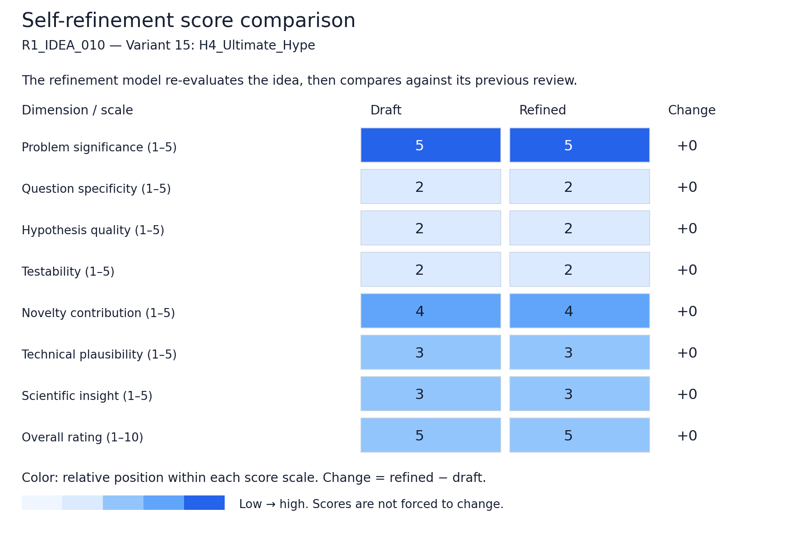

Changed score dimensions: none.

### Score justifications (draft / refined)

**Problem significance**

```json
{
  "draft": {
    "score": 5.0,
    "justification": "The problem of learning new visual concepts from minimal data is one of the most significant challenges in AI, directly addressing the data efficiency and generalization limitations of current large-scale models. Solving this would be transformative."
  },
  "refined": {
    "score": 5.0,
    "justification": "The problem of learning visual concepts from minimal data is a central challenge in AI, directly addressing the data inefficiency and generalization limitations of current large-scale models. Solving this is widely considered a prerequisite for more robust and trustworthy AI."
  }
}
```

**Question specificity**

```json
{
  "draft": {
    "score": 2.0,
    "justification": "The idea is presented as a broad research agenda. It lacks a specific research question, defining variables, or a clear scope. It states 'what' should be done (achieve VFM) but not 'how' or 'what exactly' is being investigated mechanistically."
  },
  "refined": {
    "score": 2.0,
    "justification": "The idea describes a broad 'agenda' rather than a specific research question. It states the 'what' (achieve VFM) but lacks the 'how' (mechanism) or the specific variables to be manipulated or measured. It is too vague to be a standalone scientific inquiry."
  }
}
```

**Hypothesis quality**

```json
{
  "draft": {
    "score": 2.0,
    "justification": "There is no explicit hypothesis. The text asserts that the work 'could' redefine the frontier, which is a prediction of impact rather than a falsifiable scientific hypothesis about a mechanism or relationship."
  },
  "refined": {
    "score": 2.0,
    "justification": "There is no explicit, falsifiable hypothesis. The text asserts that the work 'could' be transformative, which is a prediction of impact rather than a scientific hypothesis about a causal relationship or mechanism that can be proven wrong."
  }
}
```

**Testability**

```json
{
  "draft": {
    "score": 2.0,
    "justification": "Without a defined method or specific metric, the idea is not currently testable. One cannot design an experiment to validate a 'research agenda' without first defining the specific intervention and expected outcome."
  },
  "refined": {
    "score": 2.0,
    "justification": "Without a defined method or specific metrics, the idea is not currently testable. One cannot design an experiment to validate a 'research agenda' without first defining the specific intervention and the expected outcome."
  }
}
```

**Novelty contribution**

```json
{
  "draft": {
    "score": 4.0,
    "justification": "The concept of applying 'fast mapping' from cognitive science to VLMs is novel and promising. However, the specific contribution is currently undefined because the approach is not specified. The potential for high impact is high, but the novelty of the *proposed method* is unknown."
  },
  "refined": {
    "score": 4.0,
    "justification": "The conceptual framing of applying 'fast mapping' from cognitive science to VLMs is novel and promising. However, the specific scientific contribution is undefined because the approach is not specified. The potential for high impact is high, but the novelty of the *proposed method* remains unknown."
  }
}
```

**Technical plausibility**

```json
{
  "draft": {
    "score": 3.0,
    "justification": "The reasoning is logically coherent in that VLMs are a natural candidate for this task, and one-shot learning is a known limitation. However, the plausibility of achieving 'human-like' fast mapping with current architectures is unproven and requires a specific technical proposal to assess."
  },
  "refined": {
    "score": 3.0,
    "justification": "The reasoning is logically coherent: VLMs are a natural candidate for this task, and one-shot learning is a known limitation. However, the plausibility of achieving 'human-like' fast mapping with current architectures is unproven and requires a specific technical proposal to assess."
  }
}
```

**Scientific insight**

```json
{
  "draft": {
    "score": 3.0,
    "justification": "If successful, the research would provide significant insight into bridging cognitive science and deep learning. However, as currently stated, it is unclear what specific scientific principles or mechanisms would be revealed beyond the general observation that 'it works better'."
  },
  "refined": {
    "score": 3.0,
    "justification": "If successfully investigated, the research would provide significant insight into bridging cognitive science and deep learning. However, as currently stated, it is unclear what specific scientific principles or mechanisms would be revealed beyond the general observation that 'it works better'."
  }
}
```

**Overall rating**

```json
{
  "draft": {
    "score": 5.0,
    "justification": "The idea addresses a highly significant problem with strong potential for impact, but it is currently too vague to be considered a strong research proposal. It lacks the specificity, hypothesis, and testability required for a high score. It is a 'Moderate/borderline idea' because the core motivation is excellent, but the execution plan is non-existent."
  },
  "refined": {
    "score": 5.0,
    "justification": "The idea addresses a highly significant problem with strong potential for impact, but it is currently too vague to be considered a strong research proposal. It lacks the specificity, hypothesis, and testability required for a high score. It is a 'Moderate/borderline idea' because the core motivation is excellent, but the execution plan is non-existent."
  }
}
```

## R1_IDEA_011 — Source

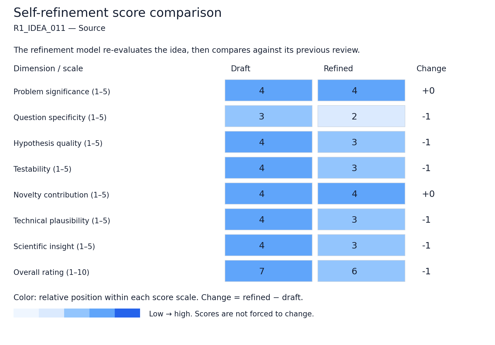

Changed score dimensions: question_specificity, hypothesis_quality, testability, technical_plausibility, scientific_insight, overall_rating.

### Score justifications (draft / refined)

**Problem significance**

```json
{
  "draft": {
    "score": 4.0,
    "justification": "The problem of integrating rich, unstructured text into time series forecasting is highly relevant and addresses a known limitation in the field. Solving this could significantly improve forecasting in domains like finance, supply chain, and climate science where text is crucial."
  },
  "refined": {
    "score": 4.0,
    "justification": "The problem is highly significant. Integrating unstructured text into time series forecasting is a known bottleneck in fields like finance, supply chain, and climate science. Moving beyond simple concatenation addresses a real limitation in current SOTA."
  }
}
```

**Question specificity**

```json
{
  "draft": {
    "score": 3.0,
    "justification": "While the general direction is clear, the core concepts of 'structured reasoning' and 'alignment mechanisms' are currently too abstract. The idea needs to specify the architectural or algorithmic approach to be considered a specific research question."
  },
  "refined": {
    "score": 2.0,
    "justification": "While the motivation is clear, the research question is too vague. 'Structured reasoning' and 'alignment mechanisms' are broad categories, not specific research questions. The idea does not specify *how* these will be achieved, making the scope of investigation unclear."
  }
}
```

**Hypothesis quality**

```json
{
  "draft": {
    "score": 4.0,
    "justification": "The implicit hypothesis is that structured reasoning over text yields better predictions than shallow text integration. This is a falsifiable claim that distinguishes the proposed method from existing baselines."
  },
  "refined": {
    "score": 3.0,
    "justification": "The hypothesis that 'structured reasoning improves accuracy over shallow methods' is testable and plausible. However, it is somewhat generic. A stronger hypothesis would specify *why* shallow methods fail in specific scenarios (e.g., 'shallow methods fail to capture causal chains in news reports')."
  }
}
```

**Testability**

```json
{
  "draft": {
    "score": 4.0,
    "justification": "The idea is testable by designing an experiment that compares the proposed method against standard multimodal baselines on a dataset containing both time series and relevant text. The success criteria (predictive accuracy) are clear."
  },
  "refined": {
    "score": 3.0,
    "justification": "The idea is theoretically testable (compare accuracy of proposed method vs. baselines), but the lack of defined mechanisms makes the experimental design impossible to outline at this stage. It is testable in principle, but the path to evidence is currently blocked by vagueness."
  }
}
```

**Novelty contribution**

```json
{
  "draft": {
    "score": 4.0,
    "justification": "Moving from shallow text embedding to structured reasoning in time series is a novel direction. While LLMs are used in other contexts, applying them specifically for 'structured reasoning' in time series alignment is a promising and under-explored avenue."
  },
  "refined": {
    "score": 4.0,
    "justification": "The direction is novel. While multimodal time series exist, the specific proposal to use 'structured reasoning' (implying a shift from pure neural embedding to reasoning-capable architectures) as the primary differentiator is a promising and under-explored avenue."
  }
}
```

**Technical plausibility**

```json
{
  "draft": {
    "score": 4.0,
    "justification": "The technical direction is plausible given the current capabilities of LLMs and multimodal architectures. The challenge lies in the implementation details (alignment, efficiency), but the core concept is sound."
  },
  "refined": {
    "score": 3.0,
    "justification": "The idea is plausible in principle given the capabilities of modern LLMs and multimodal models. However, the technical feasibility of 'alignment' between asynchronous text and continuous time series is a non-trivial engineering challenge that is not addressed, leaving the plausibility of the *implementation* uncertain."
  }
}
```

**Scientific insight**

```json
{
  "draft": {
    "score": 4.0,
    "justification": "If successful, this research could reveal how different types of reasoning (symbolic vs. neural) interact with temporal dynamics, offering insights into the nature of multimodal time series representation."
  },
  "refined": {
    "score": 3.0,
    "justification": "If successful, the research could reveal how different reasoning paradigms interact with temporal dynamics. However, without a specific mechanism, it is unclear if the study will yield generalizable insights or just a domain-specific performance boost."
  }
}
```

**Overall rating**

```json
{
  "draft": {
    "score": 7.0,
    "justification": "This is a strong research idea with high potential impact. It identifies a meaningful problem and proposes a sophisticated direction (structured reasoning) that goes beyond simple application. However, it currently lacks the specificity required to be an 'exceptional' idea, as the core mechanisms are not defined. With clearer methodological proposals, it could reach a 9."
  },
  "refined": {
    "score": 6.0,
    "justification": "This is a moderate research idea. It identifies a valuable problem and a promising high-level direction, but it lacks the specificity required for a strong scientific proposal. The core concepts ('structured reasoning', 'alignment') are too abstract to be evaluated as a concrete research plan. It sits in the 'moderate' range because while the potential is high, the current formulation is more of a motivation than a specific, testable research question."
  }
}
```

## R1_IDEA_011 — Variant 1: A1_Identity

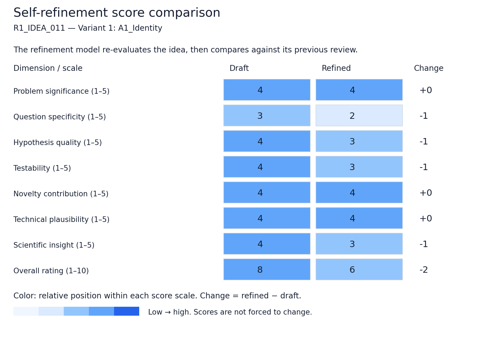

Changed score dimensions: question_specificity, hypothesis_quality, testability, scientific_insight, overall_rating.

### Score justifications (draft / refined)

**Problem significance**

```json
{
  "draft": {
    "score": 4.0,
    "justification": "The problem of integrating rich, unstructured text into time series forecasting is highly relevant and addresses a known limitation in current state-of-the-art models. Solving this could significantly impact domains like finance, energy, and supply chain where context is crucial."
  },
  "refined": {
    "score": 4.0,
    "justification": "Integrating rich, unstructured text into time series forecasting is a significant challenge with high practical value in domains like finance, supply chain, and energy. Addressing the 'shallow' nature of current multimodal methods is a meaningful step forward."
  }
}
```

**Question specificity**

```json
{
  "draft": {
    "score": 3.0,
    "justification": "While the general direction is clear, the specific mechanisms ('structured reasoning', 'alignment') are not defined. The idea needs to narrow down to a specific architectural or methodological choice to be fully specific."
  },
  "refined": {
    "score": 2.0,
    "justification": "The idea is currently too vague. 'Structured reasoning' and 'alignment' are broad categories, not specific research questions. The idea does not specify *which* reasoning mechanism or *how* alignment is achieved, making the scope of the investigation unclear."
  }
}
```

**Hypothesis quality**

```json
{
  "draft": {
    "score": 4.0,
    "justification": "The implicit hypothesis—that structured reasoning and better alignment of text will outperform shallow text integration—is strong, falsifiable, and grounded in the observation that current methods underutilize text."
  },
  "refined": {
    "score": 3.0,
    "justification": "The implicit hypothesis (better reasoning leads to better forecasts) is plausible but generic. It lacks a specific prediction about the *conditions* under which this holds or the *mechanism* of the gain, making it less rigorous than a strong scientific hypothesis."
  }
}
```

**Testability**

```json
{
  "draft": {
    "score": 4.0,
    "justification": "The idea is testable by comparing the proposed method against standard multimodal baselines on relevant datasets. The success metric (predictive accuracy) is clear."
  },
  "refined": {
    "score": 3.0,
    "justification": "While the general goal (improving accuracy) is testable, the lack of defined methods makes the experimental design impossible to evaluate at this stage. It is testable in principle but not yet in practice."
  }
}
```

**Novelty contribution**

```json
{
  "draft": {
    "score": 4.0,
    "justification": "Moving from shallow text integration to structured reasoning in time series is a novel direction. It has the potential to contribute new insights into how temporal models can leverage semantic reasoning."
  },
  "refined": {
    "score": 4.0,
    "justification": "The direction of moving from shallow text integration to structured reasoning is novel. If executed well, it could significantly advance the field of multimodal time series analysis."
  }
}
```

**Technical plausibility**

```json
{
  "draft": {
    "score": 4.0,
    "justification": "The proposed direction is technically sound. Techniques for structured reasoning (e.g., LLMs, knowledge graphs) and alignment (e.g., cross-modal attention) exist and can be adapted to time series, making the approach plausible."
  },
  "refined": {
    "score": 4.0,
    "justification": "The concepts are technically grounded. Techniques for reasoning (LLMs, KGs) and alignment exist. The main risk is the difficulty of implementation, but the direction itself is plausible."
  }
}
```

**Scientific insight**

```json
{
  "draft": {
    "score": 4.0,
    "justification": "If successful, this research could reveal how different levels of semantic abstraction in text affect temporal prediction, offering insights into the interaction between symbolic reasoning and statistical learning in time series."
  },
  "refined": {
    "score": 3.0,
    "justification": "If successful, the study could reveal how semantic reasoning interacts with temporal dynamics. However, without a specific mechanism defined, the potential for deep scientific insight is currently limited to a general 'it works' finding."
  }
}
```

**Overall rating**

```json
{
  "draft": {
    "score": 8.0,
    "justification": "This is a strong research idea with high potential. It addresses a meaningful problem with a plausible and sophisticated approach. The main limitation is the current lack of specific implementation details, but as a research proposal, it clearly identifies a valuable direction for investigation."
  },
  "refined": {
    "score": 6.0,
    "justification": "This is a moderate research idea. It identifies a valuable problem and a promising high-level direction, but it lacks the specificity required for a strong scientific proposal. The vagueness of 'structured reasoning' and 'alignment' prevents it from being rated as 'strong' or 'exceptional' at this stage. It is a good starting point for a proposal but needs significant refinement to be a concrete research plan."
  }
}
```

## R1_IDEA_011 — Variant 2: A2_Paraphrase_Only


Changed score dimensions: none.

### Score justifications (draft / refined)

**Problem significance**

```json
{
  "draft": {
    "score": 4.0,
    "justification": "The problem is highly significant. Real-world forecasting often relies on qualitative factors (news, reports, social sentiment) that are currently ignored or poorly integrated. Solving this could unlock better predictions in critical domains like finance, supply chain, and climate science."
  },
  "refined": {
    "score": 4.0,
    "justification": "The problem is highly significant. Real-world forecasting often relies on qualitative factors (news, reports, social sentiment) that are currently ignored or poorly integrated. Solving this could unlock better predictions in critical domains like finance, supply chain, and climate science. The shift from 'numerical-only' to 'multimodal with reasoning' addresses a fundamental limitation in current state-of-the-art."
  }
}
```

**Question specificity**

```json
{
  "draft": {
    "score": 3.0,
    "justification": "The idea identifies the 'what' (use richer text) and the 'why' (current methods are shallow), but the 'how' (specific reasoning/alignment mechanisms) is currently too abstract to be considered a fully specific research question."
  },
  "refined": {
    "score": 3.0,
    "justification": "The idea identifies the 'what' (use richer text) and the 'why' (current methods are shallow), but the 'how' (specific reasoning/alignment mechanisms) is currently too abstract. 'Structured reasoning' is a broad term that could encompass many distinct methodologies. The research question needs to be narrowed to a specific mechanism or a comparative study of mechanisms to be fully specific."
  }
}
```

**Hypothesis quality**

```json
{
  "draft": {
    "score": 4.0,
    "justification": "The implicit hypothesis is strong: 'Structured reasoning and alignment mechanisms will extract more predictive signal from text than shallow representations.' This is a falsifiable claim that distinguishes the proposed work from generic multimodal applications."
  },
  "refined": {
    "score": 4.0,
    "justification": "The implicit hypothesis is strong: 'Structured reasoning and alignment mechanisms will extract more predictive signal from text than shallow representations.' This is a falsifiable claim that distinguishes the proposed work from generic multimodal applications. It posits a specific causal mechanism (reasoning) leading to a specific outcome (accuracy)."
  }
}
```

**Testability**

```json
{
  "draft": {
    "score": 4.0,
    "justification": "The idea is testable. One can construct datasets with paired time series and text, implement baseline multimodal models, and compare them against models employing the proposed reasoning/alignment mechanisms using standard forecasting metrics."
  },
  "refined": {
    "score": 4.0,
    "justification": "The idea is testable. One can construct datasets with paired time series and text, implement baseline multimodal models (e.g., simple concatenation), and compare them against models employing the proposed reasoning/alignment mechanisms using standard forecasting metrics. The hypothesis can be supported or refuted through empirical comparison."
  }
}
```

**Novelty contribution**

```json
{
  "draft": {
    "score": 4.0,
    "justification": "While multimodal forecasting is an active area, the specific focus on 'structured reasoning' and 'alignment' as the primary drivers for improvement, rather than just better embeddings, represents a novel and potentially high-impact direction."
  },
  "refined": {
    "score": 4.0,
    "justification": "While multimodal forecasting is an active area, the specific focus on 'structured reasoning' and 'alignment' as the primary drivers for improvement, rather than just better embeddings or attention, represents a novel and potentially high-impact direction. It challenges the prevailing trend of treating text as just another feature vector."
  }
}
```

**Technical plausibility**

```json
{
  "draft": {
    "score": 4.0,
    "justification": "The direction is technically plausible given the rapid advancements in LLMs and multimodal alignment techniques. Integrating reasoning modules into forecasting pipelines is a logical next step, though implementation details will be challenging."
  },
  "refined": {
    "score": 4.0,
    "justification": "The direction is technically plausible given the rapid advancements in LLMs and multimodal alignment techniques. Integrating reasoning modules into forecasting pipelines is a logical next step. However, the lack of detail on *how* to align temporal data with reasoning traces remains a technical hurdle that needs to be addressed in the proposal."
  }
}
```

**Scientific insight**

```json
{
  "draft": {
    "score": 4.0,
    "justification": "If successful, this research could reveal fundamental principles on how qualitative, unstructured information can be mathematically aligned with quantitative time series, potentially leading to new architectures for hybrid AI systems."
  },
  "refined": {
    "score": 4.0,
    "justification": "If successful, this research could reveal fundamental principles on how qualitative, unstructured information can be mathematically aligned with quantitative time series. It could lead to new architectures for hybrid AI systems and a deeper understanding of how reasoning impacts temporal prediction, going beyond simple performance gains."
  }
}
```

**Overall rating**

```json
{
  "draft": {
    "score": 8.0,
    "justification": "This is a strong research idea with high potential. It addresses a meaningful problem with a clear motivation and a plausible, novel direction. The main limitation is the current lack of technical specificity regarding the 'reasoning' and 'alignment' mechanisms, but this is typical for an early-stage idea summary. With further definition, this could be an exceptional contribution."
  },
  "refined": {
    "score": 8.0,
    "justification": "This is a strong research idea with high potential. It addresses a meaningful problem with a clear motivation and a plausible, novel direction. The main limitation is the current lack of technical specificity regarding the 'reasoning' and 'alignment' mechanisms, but this is typical for an early-stage idea summary. With further definition, this could be an exceptional contribution."
  }
}
```

## R1_IDEA_011 — Variant 3: A3_Plain_Core


Changed score dimensions: none.

### Score justifications (draft / refined)

**Problem significance**

```json
{
  "draft": {
    "score": 4.0,
    "justification": "The problem of integrating multimodal data into time series forecasting is highly relevant and addresses a known limitation of current models. Real-world forecasting often depends on events described in text (news, reports, social media), making this a meaningful challenge."
  },
  "refined": {
    "score": 4.0,
    "justification": "The problem is significant because real-world forecasting often depends on events (news, policy changes) that are inherently textual. Moving beyond numerical data is a necessary step for robust forecasting, making this a high-value research direction."
  }
}
```

**Question specificity**

```json
{
  "draft": {
    "score": 3.0,
    "justification": "While the general direction is clear, the specific research question is somewhat vague. It states 'using richer exogenous text' but does not specify the exact mechanism or the precise relationship being investigated beyond 'improving accuracy'."
  },
  "refined": {
    "score": 3.0,
    "justification": "The idea identifies the *what* (use richer text) and the *why* (current methods are shallow), but the *how* (specific mechanisms for reasoning and alignment) remains vague. The research question is 'can structured reasoning improve forecasting?' which is broad without defining the structure."
  }
}
```

**Hypothesis quality**

```json
{
  "draft": {
    "score": 4.0,
    "justification": "The implicit hypothesis is that structured reasoning and alignment mechanisms will extract more predictive signal from text than current shallow methods. This is a concrete, falsifiable claim that distinguishes the work from generic applications."
  },
  "refined": {
    "score": 4.0,
    "justification": "The hypothesis is clear: deeper, structured integration of text yields better accuracy than shallow integration. This is a testable claim that distinguishes the work from generic multimodal applications."
  }
}
```

**Testability**

```json
{
  "draft": {
    "score": 4.0,
    "justification": "The idea is testable through standard machine learning evaluation protocols: comparing predictive accuracy on benchmark datasets with and without the proposed text integration mechanisms. The success criteria (improved accuracy) are clear."
  },
  "refined": {
    "score": 4.0,
    "justification": "The idea is testable. One can compare a baseline model (numerical only or shallow multimodal) against a model implementing the proposed 'structured reasoning' and 'alignment' on a dataset where text is available. Success is measurable via accuracy metrics."
  }
}
```

**Novelty contribution**

```json
{
  "draft": {
    "score": 4.0,
    "justification": "While multimodal time series is an active area, the specific focus on 'structured reasoning' and 'alignment' to move beyond shallow representations offers a potential for novel scientific contribution, provided the mechanism is distinct from existing fusion techniques."
  },
  "refined": {
    "score": 4.0,
    "justification": "While multimodal forecasting is active, the specific focus on 'structured reasoning' as a distinct mechanism from standard fusion is a promising angle. If the 'reasoning' component is novel (e.g., explicit causal modeling), the contribution could be significant."
  }
}
```

**Technical plausibility**

```json
{
  "draft": {
    "score": 4.0,
    "justification": "The proposed direction is technically plausible. Techniques for aligning text and time series (e.g., cross-attention, temporal alignment layers) exist, and the concept of using reasoning modules is consistent with current trends in AI."
  },
  "refined": {
    "score": 4.0,
    "justification": "The direction is technically plausible. Modern NLP and time series models (e.g., transformers, LLMs) provide the building blocks for such integration. The main challenge is engineering the alignment, which is a known but solvable problem."
  }
}
```

**Scientific insight**

```json
{
  "draft": {
    "score": 3.0,
    "justification": "If successful, the work could reveal how different types of textual information (causal vs. descriptive) impact forecasting. However, without more detail on the mechanism, the potential for deep scientific insight beyond 'it works better' is currently moderate."
  },
  "refined": {
    "score": 3.0,
    "justification": "The potential for insight exists if the study reveals *how* text improves predictions (e.g., by correcting for specific types of noise or capturing causal shifts). However, without a defined mechanism, the current idea risks being a performance engineering exercise rather than a discovery of a new principle."
  }
}
```

**Overall rating**

```json
{
  "draft": {
    "score": 7.0,
    "justification": "This is a strong research idea with a clear motivation and a plausible path forward. It addresses a meaningful problem in a specific way (structured reasoning/alignment) that goes beyond simple application. However, it currently lacks the technical specificity required to be considered exceptional, as the core mechanisms are not defined."
  },
  "refined": {
    "score": 7.0,
    "justification": "This is a strong research idea with a compelling motivation and a clear path to validation. It scores well on significance, hypothesis quality, and testability. It loses points on specificity and potential insight because the core mechanisms ('structured reasoning', 'alignment') are currently abstract. With more definition, this could be a 9."
  }
}
```

## R1_IDEA_011 — Variant 4: B1_Verbose_Elaborate


Changed score dimensions: none.

### Score justifications (draft / refined)

**Problem significance**

```json
{
  "draft": {
    "score": 4.0,
    "justification": "The problem is highly significant. Most real-world forecasting tasks (finance, weather, supply chain) are driven by events that are best described in text. Moving beyond numerical-only or shallow multimodal approaches addresses a fundamental bottleneck in the field's ability to handle complex, real-world dynamics."
  },
  "refined": {
    "score": 4.0,
    "justification": "The problem is highly significant. Most real-world forecasting tasks (finance, weather, supply chain) are driven by events that are best described in text. Moving beyond numerical-only or shallow multimodal approaches addresses a fundamental bottleneck in the field's ability to handle complex, real-world dynamics. However, the exact scope is not yet defined, preventing a perfect 5."
  }
}
```

**Question specificity**

```json
{
  "draft": {
    "score": 3.0,
    "justification": "The idea identifies the 'what' (better text usage) and the 'why' (numerical data is insufficient), but the 'how' (structured reasoning and alignment) is currently a high-level concept rather than a specific research question. It needs more definition to be a concrete scientific inquiry."
  },
  "refined": {
    "score": 3.0,
    "justification": "The idea identifies the 'what' (better text usage) and the 'why' (numerical data is insufficient), but the 'how' (structured reasoning and alignment) is currently a high-level concept rather than a specific research question. It needs more definition to be a concrete scientific inquiry."
  }
}
```

**Hypothesis quality**

```json
{
  "draft": {
    "score": 4.0,
    "justification": "The implicit hypothesis is strong: 'Structured reasoning over exogenous text captures causal/temporal patterns that shallow text fusion misses, leading to higher accuracy.' This is a falsifiable claim that distinguishes the proposed method from existing baselines."
  },
  "refined": {
    "score": 4.0,
    "justification": "The implicit hypothesis is strong: 'Structured reasoning over exogenous text captures causal/temporal patterns that shallow text fusion misses, leading to higher accuracy.' This is a falsifiable claim that distinguishes the proposed method from existing baselines, even if the mechanism is not yet fully detailed."
  }
}
```

**Testability**

```json
{
  "draft": {
    "score": 4.0,
    "justification": "The idea is testable. One can construct experiments comparing standard multimodal baselines against a proposed 'structured reasoning' model on datasets with known text-driven events. The success metric (predictive accuracy) is clear."
  },
  "refined": {
    "score": 4.0,
    "justification": "The idea is testable. One can construct experiments comparing standard multimodal baselines against a proposed 'structured reasoning' model on datasets with known text-driven events. The success metric (predictive accuracy) is clear, though the specific metrics for 'reasoning' quality are not."
  }
}
```

**Novelty contribution**

```json
{
  "draft": {
    "score": 4.0,
    "justification": "While multimodal time series is an active area, the specific focus on 'structured reasoning' rather than just 'text embeddings' represents a novel direction. It has the potential to contribute new architectural patterns for integrating symbolic/logical reasoning with deep learning in time series."
  },
  "refined": {
    "score": 4.0,
    "justification": "While multimodal time series is an active area, the specific focus on 'structured reasoning' rather than just 'text embeddings' represents a novel direction. It has the potential to contribute new architectural patterns for integrating symbolic/logical reasoning with deep learning in time series."
  }
}
```

**Technical plausibility**

```json
{
  "draft": {
    "score": 4.0,
    "justification": "The direction is technically plausible given recent advances in LLMs and their ability to perform reasoning. Integrating these with time series models is a logical next step, though the implementation details (alignment, latency) are non-trivial."
  },
  "refined": {
    "score": 4.0,
    "justification": "The direction is technically plausible given recent advances in LLMs and their ability to perform reasoning. Integrating these with time series models is a logical next step, though the implementation details (alignment, latency) are non-trivial and not yet addressed."
  }
}
```

**Scientific insight**

```json
{
  "draft": {
    "score": 4.0,
    "justification": "If successful, this research could reveal how different levels of semantic abstraction (shallow vs. structured) impact temporal prediction. It could establish new principles for how to fuse heterogeneous data modalities in sequential modeling."
  },
  "refined": {
    "score": 4.0,
    "justification": "If successful, this research could reveal how different levels of semantic abstraction (shallow vs. structured) impact temporal prediction. It could establish new principles for how to fuse heterogeneous data modalities in sequential modeling."
  }
}
```

**Overall rating**

```json
{
  "draft": {
    "score": 8.0,
    "justification": "This is a strong research idea with high potential impact. It addresses a meaningful gap in the field and proposes a sophisticated direction (structured reasoning) that goes beyond simple application of existing tools. The main limitation is the current lack of methodological specificity, but the core scientific premise is sound and promising."
  },
  "refined": {
    "score": 8.0,
    "justification": "This is a strong research idea with high potential impact. It addresses a meaningful gap in the field and proposes a sophisticated direction (structured reasoning) that goes beyond simple application of existing tools. The main limitation is the current lack of methodological specificity, but the core scientific premise is sound and promising."
  }
}
```

## R1_IDEA_011 — Variant 5: B2_Grand_Narrative

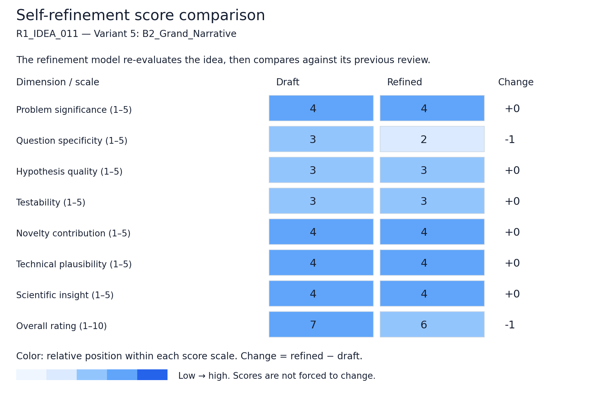

Changed score dimensions: question_specificity, overall_rating.

### Score justifications (draft / refined)

**Problem significance**

```json
{
  "draft": {
    "score": 4.0,
    "justification": "The problem of integrating heterogeneous data sources, particularly text, into time series forecasting is highly relevant and addresses a clear limitation in current state-of-the-art models. Solving this could significantly impact domains like finance, energy, and supply chain."
  },
  "refined": {
    "score": 4.0,
    "justification": "The problem is highly significant. Integrating heterogeneous data (text) into time series is a major bottleneck in real-world forecasting (finance, energy, supply chain). Addressing the 'shallow integration' limitation is a meaningful challenge."
  }
}
```

**Question specificity**

```json
{
  "draft": {
    "score": 3.0,
    "justification": "While the general direction is clear, the specific research question is somewhat broad. Terms like 'structured reasoning' and 'alignment mechanisms' are used without defining the specific architectural or algorithmic approach, making the scope slightly fuzzy."
  },
  "refined": {
    "score": 2.0,
    "justification": "The question is currently too broad. While the goal (better forecasting via text) is clear, the 'how' is described only with high-level buzzwords ('structured reasoning', 'alignment'). Without defining these, the specific research question remains fuzzy."
  }
}
```

**Hypothesis quality**

```json
{
  "draft": {
    "score": 3.0,
    "justification": "The implicit hypothesis is that deeper, structured integration of text will outperform shallow integration. This is a reasonable hypothesis, but it lacks the specificity of a concrete prediction about *how* or *under what conditions* this improvement will manifest."
  },
  "refined": {
    "score": 3.0,
    "justification": "The implicit hypothesis (deep integration > shallow integration) is plausible but generic. It lacks the specificity of a concrete prediction (e.g., 'structured reasoning will outperform attention-based fusion specifically when text contains causal explanations'). It is testable in principle but not yet precise."
  }
}
```

**Testability**

```json
{
  "draft": {
    "score": 3.0,
    "justification": "The idea is testable in principle (compare models with shallow vs. deep text integration), but the lack of a defined method makes the experimental design currently undefined. It requires further specification to be fully operationalizable."
  },
  "refined": {
    "score": 3.0,
    "justification": "The idea is testable in principle (compare deep vs. shallow text integration), but the lack of a defined method makes the experimental design currently undefined. One cannot design a rigorous test without knowing what 'structured reasoning' entails."
  }
}
```

**Novelty contribution**

```json
{
  "draft": {
    "score": 4.0,
    "justification": "Moving from shallow multimodal fusion to structured reasoning in time series is a novel direction. While multimodal forecasting exists, the specific focus on 'structured reasoning' as the key differentiator offers potential for significant scientific contribution."
  },
  "refined": {
    "score": 4.0,
    "justification": "The direction is novel. While multimodal forecasting exists, the explicit focus on 'structured reasoning' as the key differentiator to overcome shallow fusion is a promising and under-explored angle that could yield significant scientific insights."
  }
}
```

**Technical plausibility**

```json
{
  "draft": {
    "score": 4.0,
    "justification": "The technical direction is plausible given the current capabilities of LLMs and multimodal models. Integrating reasoning modules with time series encoders is a known challenge but technically feasible."
  },
  "refined": {
    "score": 4.0,
    "justification": "The direction is technically plausible given current LLM and multimodal capabilities. The challenge is non-trivial but not impossible; the integration of reasoning modules with time series is a known but active area of research."
  }
}
```

**Scientific insight**

```json
{
  "draft": {
    "score": 4.0,
    "justification": "If successful, this research could reveal fundamental principles on how to align temporal dynamics with semantic reasoning, offering insights beyond just better forecasting metrics."
  },
  "refined": {
    "score": 4.0,
    "justification": "If successful, this research could reveal fundamental principles on aligning temporal dynamics with semantic reasoning, offering insights into how models process heterogeneous information streams, which is valuable beyond just forecasting metrics."
  }
}
```

**Overall rating**

```json
{
  "draft": {
    "score": 7.0,
    "justification": "This is a strong research idea with high potential significance and novelty. It identifies a real problem and proposes a sophisticated direction (structured reasoning) to solve it. However, it currently lacks the specificity required to be a 'top-tier' idea, as the core mechanisms are not yet defined. With more concrete details on the 'how', it could easily become an exceptional idea."
  },
  "refined": {
    "score": 6.0,
    "justification": "This is a moderate-to-strong research idea with high potential significance and novelty. However, it currently scores lower on specificity and testability because the core mechanisms are undefined. It is a strong 'vision' but a weak 'proposal' in its current form. It sits on the border of a strong idea (7) and a moderate one (5) because the lack of technical definition prevents a full assessment of its feasibility and novelty."
  }
}
```

## R1_IDEA_011 — Variant 6: B3_Over_Confident


Changed score dimensions: none.

### Score justifications (draft / refined)

**Problem significance**

```json
{
  "draft": {
    "score": 4.0,
    "justification": "The problem is highly significant. Real-world forecasting often depends on events described in text (news, weather reports, social sentiment) that pure numerical models miss. Improving this capability has direct practical value in finance, energy, logistics, and healthcare."
  },
  "refined": {
    "score": 4.0,
    "justification": "The problem is highly significant. Real-world forecasting often depends on events described in text (news, weather, sentiment) that pure numerical models miss. Solving this has direct practical value in finance, energy, logistics, and healthcare. However, the idea does not yet prove that *reasoning* is the key missing piece, only that text is underutilized."
  }
}
```

**Question specificity**

```json
{
  "draft": {
    "score": 3.0,
    "justification": "The idea identifies a clear direction (better text integration) but lacks specific technical details on the 'how'. The terms 'structured reasoning' and 'alignment mechanisms' are broad categories rather than specific research questions or hypotheses."
  },
  "refined": {
    "score": 3.0,
    "justification": "The idea identifies a clear direction (better text integration) but lacks specific technical details on the 'how'. The terms 'structured reasoning' and 'alignment mechanisms' are broad categories rather than specific, testable research questions or hypotheses. It needs to define what 'reasoning' means in this specific context."
  }
}
```

**Hypothesis quality**

```json
{
  "draft": {
    "score": 4.0,
    "justification": "The implicit hypothesis is strong: 'Deeper semantic integration via structured reasoning yields better forecasting accuracy than shallow multimodal fusion.' This is a falsifiable claim that distinguishes the proposed work from existing methods."
  },
  "refined": {
    "score": 4.0,
    "justification": "The implicit hypothesis is strong: 'Deeper semantic integration via structured reasoning yields better forecasting accuracy than shallow multimodal fusion.' This is a falsifiable claim that distinguishes the proposed work from existing methods. It posits a causal link between reasoning depth and accuracy."
  }
}
```

**Testability**

```json
{
  "draft": {
    "score": 3.0,
    "justification": "The idea is testable in principle, but the current summary does not outline the evaluation metrics, baselines, or specific experimental design required to rigorously test the hypothesis. It requires more definition to be fully operational."
  },
  "refined": {
    "score": 3.0,
    "justification": "The idea is testable in principle, but the current summary does not outline the evaluation metrics, baselines, or specific experimental design required to rigorously test the hypothesis. Without defining 'structured reasoning' or the 'alignment' method, the experiment cannot be designed."
  }
}
```

**Novelty contribution**

```json
{
  "draft": {
    "score": 4.0,
    "justification": "While multimodal forecasting exists, the specific focus on 'structured reasoning' and 'alignment' to move beyond shallow context is a novel and promising angle. It has the potential to contribute new architectural patterns for temporal reasoning."
  },
  "refined": {
    "score": 4.0,
    "justification": "While multimodal forecasting exists, the specific focus on 'structured reasoning' and 'alignment' to move beyond shallow context is a novel and promising angle. It has the potential to contribute new architectural patterns for temporal reasoning, distinguishing it from simple multi-modal embeddings."
  }
}
```

**Technical plausibility**

```json
{
  "draft": {
    "score": 4.0,
    "justification": "The direction is technically plausible given the current state of LLMs and multimodal learning. Combining time series models with reasoning-capable text encoders is a logical next step, though implementation details are non-trivial."
  },
  "refined": {
    "score": 4.0,
    "justification": "The direction is technically plausible given the current state of LLMs and multimodal learning. Combining time series models with reasoning-capable text encoders is a logical next step. However, the integration of reasoning with temporal dynamics is non-trivial and requires careful design."
  }
}
```

**Scientific insight**

```json
{
  "draft": {
    "score": 4.0,
    "justification": "If successful, this research could reveal how semantic reasoning interacts with temporal dynamics, potentially uncovering new principles for integrating heterogeneous data modalities in sequential modeling."
  },
  "refined": {
    "score": 4.0,
    "justification": "If successful, this research could reveal how semantic reasoning interacts with temporal dynamics, potentially uncovering new principles for integrating heterogeneous data modalities in sequential modeling. It moves beyond 'does it work?' to 'how does reasoning help prediction?'."
  }
}
```

**Overall rating**

```json
{
  "draft": {
    "score": 7.0,
    "justification": "This is a strong research idea with high potential impact. It addresses a meaningful problem with a plausible and sophisticated direction. However, it currently sits at the 'concept' stage and needs more specificity regarding the mechanisms and experimental design to be considered a complete research proposal. It scores well on significance, hypothesis, and novelty, but loses points on specificity and testability due to the lack of technical detail."
  },
  "refined": {
    "score": 7.0,
    "justification": "This is a strong research idea with high potential impact. It addresses a meaningful problem with a plausible and sophisticated direction. However, it currently sits at the 'concept' stage and needs more specificity regarding the mechanisms and experimental design to be considered a complete research proposal. It scores well on significance, hypothesis, and novelty, but loses points on specificity and testability due to the lack of technical detail."
  }
}
```

## R1_IDEA_011 — Variant 7: B4_Novelty

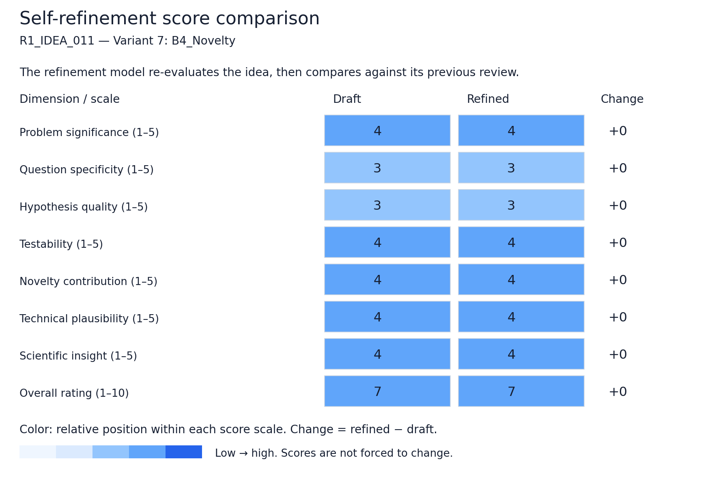

Changed score dimensions: none.

### Score justifications (draft / refined)

**Problem significance**

```json
{
  "draft": {
    "score": 4.0,
    "justification": "The problem is significant because time series forecasting is a foundational task in many industries, and the potential to unlock value from unstructured text data is substantial. Moving beyond numerical-only models addresses a real-world limitation."
  },
  "refined": {
    "score": 4.0,
    "justification": "The problem is significant because time series forecasting is a foundational task in many industries, and the potential to unlock value from unstructured text data is substantial. Moving beyond numerical-only models addresses a real-world limitation that current SOTA models often ignore."
  }
}
```

**Question specificity**

```json
{
  "draft": {
    "score": 3.0,
    "justification": "While the general direction is clear, the specific research question is somewhat vague. It states 'leveraging richer exogenous text' but does not define the specific mechanism or the exact relationship being tested in enough detail to be immediately actionable without further elaboration."
  },
  "refined": {
    "score": 3.0,
    "justification": "While the general direction is clear, the specific research question is somewhat vague. It states 'leveraging richer exogenous text' but does not define the specific mechanism or the exact relationship being tested in enough detail to be immediately actionable without further elaboration. The term 'structured reasoning' is the key missing specificity."
  }
}
```

**Hypothesis quality**

```json
{
  "draft": {
    "score": 3.0,
    "justification": "The implicit hypothesis (structured reasoning + alignment > shallow integration) is plausible and testable, but it is currently stated as a general direction rather than a precise, falsifiable prediction about the mechanism of improvement."
  },
  "refined": {
    "score": 3.0,
    "justification": "The implicit hypothesis (structured reasoning + alignment > shallow integration) is plausible and testable, but it is currently stated as a general direction rather than a precise, falsifiable prediction about the mechanism of improvement. It lacks a clear 'if-then' structure regarding boundary conditions."
  }
}
```

**Testability**

```json
{
  "draft": {
    "score": 4.0,
    "justification": "The idea is testable. One can construct experiments comparing shallow fusion vs. structured reasoning approaches on datasets with paired time series and text. The metrics (accuracy) are standard."
  },
  "refined": {
    "score": 4.0,
    "justification": "The idea is testable. One can construct experiments comparing shallow fusion vs. structured reasoning approaches on datasets with paired time series and text. The metrics (accuracy) are standard, and the comparison is feasible, provided the 'structured' component is defined."
  }
}
```

**Novelty contribution**

```json
{
  "draft": {
    "score": 4.0,
    "justification": "The novelty lies in the specific focus on 'structured reasoning' and 'alignment' as the key differentiators, rather than just adding text as an input. This could lead to new architectural insights for multimodal time series models."
  },
  "refined": {
    "score": 4.0,
    "justification": "The novelty lies in the specific focus on 'structured reasoning' and 'alignment' as the key differentiators, rather than just adding text as an input. This could lead to new architectural insights for multimodal time series models, moving beyond simple embedding concatenation."
  }
}
```

**Technical plausibility**

```json
{
  "draft": {
    "score": 4.0,
    "justification": "The direction is technically sound. Techniques for alignment (e.g., cross-attention, contrastive learning) and reasoning (e.g., LLM-based reasoning, graph reasoning) exist and can be adapted to time series. The main challenge is integration, not feasibility."
  },
  "refined": {
    "score": 4.0,
    "justification": "The direction is technically sound. Techniques for alignment (e.g., cross-attention, contrastive learning) and reasoning (e.g., LLM-based reasoning, graph reasoning) exist and can be adapted to time series. The main challenge is integration, not feasibility."
  }
}
```

**Scientific insight**

```json
{
  "draft": {
    "score": 4.0,
    "justification": "If successful, this research could reveal how different types of reasoning mechanisms interact with temporal dynamics, providing insights into the nature of exogenous information in sequential data."
  },
  "refined": {
    "score": 4.0,
    "justification": "If successfully investigated, this research could reveal how different types of reasoning mechanisms interact with temporal dynamics, providing insights into the nature of exogenous information in sequential data and the limits of shallow multimodal fusion."
  }
}
```

**Overall rating**

```json
{
  "draft": {
    "score": 7.0,
    "justification": "This is a strong research idea with high potential. It identifies a meaningful problem and proposes a specific, plausible direction (structured reasoning) that goes beyond simple application. However, it currently lacks the specificity of the proposed mechanism and the precise formulation of the hypothesis required for a top-tier score. With more concrete details on the 'how', it could be exceptional."
  },
  "refined": {
    "score": 7.0,
    "justification": "This is a strong research idea with high potential. It identifies a meaningful problem and proposes a specific, plausible direction (structured reasoning) that goes beyond simple application. However, it currently lacks the specificity of the proposed mechanism and the precise formulation of the hypothesis required for a top-tier score. With more concrete details on the 'how', it could be exceptional."
  }
}
```

## R1_IDEA_011 — Variant 8: B5_Application_Impact

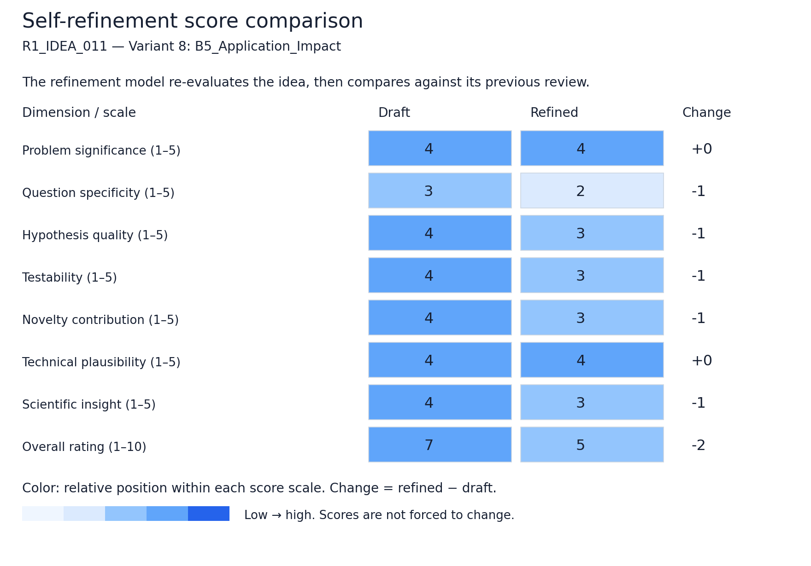

Changed score dimensions: question_specificity, hypothesis_quality, testability, novelty_contribution, scientific_insight, overall_rating.

### Score justifications (draft / refined)

**Problem significance**

```json
{
  "draft": {
    "score": 4.0,
    "justification": "The problem is significant because real-world forecasting often depends on qualitative factors (news, reports) that pure numerical models miss. Improving this has direct practical value in finance, supply chain, and energy sectors."
  },
  "refined": {
    "score": 4.0,
    "justification": "The problem is significant because real-world forecasting often relies on qualitative factors (news, reports) that pure numerical models miss. Solving this has direct practical value in high-stakes domains like finance and energy. However, the significance is somewhat generic as 'multimodal forecasting' is already a recognized field."
  }
}
```

**Question specificity**

```json
{
  "draft": {
    "score": 3.0,
    "justification": "While the general direction is clear, the core technical terms ('structured reasoning', 'alignment mechanisms') are currently too broad to constitute a specific research question without further definition."
  },
  "refined": {
    "score": 2.0,
    "justification": "The idea is currently too vague to be considered a specific research question. It states a goal ('leverage richer exogenous text') but fails to define the 'how' (mechanism) or the 'what' (specific variables). Terms like 'structured reasoning' are placeholders for a method rather than a defined research variable."
  }
}
```

**Hypothesis quality**

```json
{
  "draft": {
    "score": 4.0,
    "justification": "The implicit hypothesis—that deeper, structured integration of text yields better forecasts than shallow integration—is concrete, plausible, and falsifiable."
  },
  "refined": {
    "score": 3.0,
    "justification": "The implicit hypothesis (deeper integration leads to better forecasts) is plausible but not sufficiently specific. It lacks a clear prediction about *how* or *when* this improvement occurs, making it difficult to falsify without further definition of the mechanism."
  }
}
```

**Testability**

```json
{
  "draft": {
    "score": 4.0,
    "justification": "The idea is highly testable. One can construct experiments comparing baseline numerical models, shallow multimodal models, and the proposed structured reasoning models on relevant datasets."
  },
  "refined": {
    "score": 3.0,
    "justification": "While the general direction is testable in principle, the current lack of defined mechanisms makes the specific experimental design impossible to formulate. One cannot test 'structured reasoning' without defining what that structure is."
  }
}
```

**Novelty contribution**

```json
{
  "draft": {
    "score": 4.0,
    "justification": "While multimodal forecasting is an active area, the specific focus on 'structured reasoning' as a mechanism to overcome shallow text utilization represents a novel and promising angle, moving beyond simple concatenation or embedding."
  },
  "refined": {
    "score": 3.0,
    "justification": "The focus on 'reasoning' in time series is a promising angle, but the idea as stated is a high-level concept rather than a novel mechanism. The novelty depends entirely on the specific implementation details which are currently absent."
  }
}
```

**Technical plausibility**

```json
{
  "draft": {
    "score": 4.0,
    "justification": "The direction is technically sound. Leveraging LLMs for reasoning and alignment techniques is a feasible path, though the implementation details are the main challenge."
  },
  "refined": {
    "score": 4.0,
    "justification": "The direction is technically plausible given current advancements in LLMs and multimodal learning. Integrating reasoning modules with time series models is a feasible engineering challenge, even if the specific architecture is undefined."
  }
}
```

**Scientific insight**

```json
{
  "draft": {
    "score": 4.0,
    "justification": "If successful, this research could reveal how temporal dynamics interact with semantic reasoning, potentially establishing new principles for multimodal time series modeling."
  },
  "refined": {
    "score": 3.0,
    "justification": "If successful, the research could reveal how semantic reasoning interacts with temporal dynamics. However, as currently stated, the potential for deep scientific insight is limited by the lack of a specific mechanism to investigate."
  }
}
```

**Overall rating**

```json
{
  "draft": {
    "score": 7.0,
    "justification": "This is a strong research idea with high potential impact. It addresses a clear limitation in current methods and proposes a plausible, non-trivial direction for improvement. The main weakness is the current lack of technical specificity regarding the 'how', but the core scientific question is well-defined and valuable."
  },
  "refined": {
    "score": 5.0,
    "justification": "This is a moderate research idea. It identifies a meaningful problem and a plausible direction, but it lacks the specificity required to be a strong research proposal. It currently reads more like a motivation for a project than a defined research question. The score reflects the potential of the direction while penalizing the current vagueness of the hypothesis and methodology."
  }
}
```

## R1_IDEA_011 — Variant 9: C1_Hollow_Shell


Changed score dimensions: none.

### Score justifications (draft / refined)

**Problem significance**

```json
{
  "draft": {
    "score": 4.0,
    "justification": "The problem of multi-source forecasting is highly significant in real-world applications (finance, weather, healthcare). Addressing the limitation of single-source models is a meaningful challenge."
  },
  "refined": {
    "score": 4.0,
    "justification": "The problem of effectively integrating heterogeneous data sources for forecasting is highly significant in real-world applications (e.g., healthcare, climate, finance). Addressing the limitation of single-source models is a meaningful challenge with broad practical implications."
  }
}
```

**Question specificity**

```json
{
  "draft": {
    "score": 2.0,
    "justification": "The idea is currently too broad. It states a goal (better incorporation) but does not define the specific variables, mechanisms, or constraints of the investigation."
  },
  "refined": {
    "score": 2.0,
    "justification": "The research question is currently too broad. It states a goal ('better incorporate') but fails to define the specific variables, the nature of the 'structure,' or the specific constraints of the investigation. It reads more like a motivation than a specific question."
  }
}
```

**Hypothesis quality**

```json
{
  "draft": {
    "score": 2.0,
    "justification": "The implicit hypothesis is that 'structured integration of multiple sources improves forecasts.' While plausible, it is a truism rather than a specific, falsifiable scientific claim about a mechanism or relationship."
  },
  "refined": {
    "score": 2.0,
    "justification": "The implicit hypothesis is that 'structured integration improves forecasts.' While plausible, this is a truism rather than a specific, falsifiable scientific claim about a mechanism. It does not distinguish *which* structure works or *why* it works better than existing methods."
  }
}
```

**Testability**

```json
{
  "draft": {
    "score": 2.0,
    "justification": "Without defining the method or the data, it is impossible to design a specific experiment. The idea is currently too abstract to be directly tested."
  },
  "refined": {
    "score": 2.0,
    "justification": "Without defining the method or the data, it is impossible to design a specific experiment. The idea is currently too abstract to be directly tested or falsified."
  }
}
```

**Novelty contribution**

```json
{
  "draft": {
    "score": 2.0,
    "justification": "As stated, this is a generic direction. Novelty would only emerge if the 'structured approach' is a specific, new mechanism or if it solves a previously intractable alignment problem."
  },
  "refined": {
    "score": 2.0,
    "justification": "As stated, this is a generic direction. Novelty would only emerge if the 'structured approach' is a specific, new mechanism or if it solves a previously intractable alignment problem. Currently, it could be interpreted as a standard application of multi-modal learning."
  }
}
```

**Technical plausibility**

```json
{
  "draft": {
    "score": 4.0,
    "justification": "The reasoning is logically coherent. It is technically plausible that better data integration improves forecasting, even if the specific method is undefined."
  },
  "refined": {
    "score": 4.0,
    "justification": "The reasoning is logically coherent. It is technically plausible that better data integration improves forecasting, even if the specific method is undefined. The premise aligns with general machine learning principles."
  }
}
```

**Scientific insight**

```json
{
  "draft": {
    "score": 2.0,
    "justification": "Currently, the idea suggests a performance improvement rather than a discovery of a new principle. It would need to be refined to reveal *why* certain structures work better than others to gain high insight."
  },
  "refined": {
    "score": 2.0,
    "justification": "Currently, the idea suggests a performance improvement rather than a discovery of a new principle. It would need to be refined to reveal *why* certain structures work better than others to gain high scientific insight."
  }
}
```

**Overall rating**

```json
{
  "draft": {
    "score": 3.0,
    "justification": "The idea identifies a valid and important problem but lacks the specificity, hypothesis, and methodological direction required to be a strong research proposal. It is currently a 'motivation' rather than a 'research idea' with a clear path to scientific contribution."
  },
  "refined": {
    "score": 3.0,
    "justification": "The idea identifies a valid and important problem but lacks the specificity, hypothesis, and methodological direction required to be a strong research proposal. It is currently a 'motivation' rather than a 'research idea' with a clear path to scientific contribution. It falls into the 'weak' category because it does not define what is actually being investigated."
  }
}
```

## R1_IDEA_011 — Variant 10: C2_Logic_Flawed


Changed score dimensions: question_specificity, overall_rating.

### Score justifications (draft / refined)

**Problem significance**

```json
{
  "draft": {
    "score": 4.0,
    "justification": "The problem of integrating complex, non-numerical context into time series forecasting is highly relevant and currently under-explored. Moving beyond simple concatenation or embedding to 'reasoning' addresses a meaningful challenge in making AI systems more robust to real-world dynamics."
  },
  "refined": {
    "score": 4.0,
    "justification": "The problem is highly significant. Integrating complex, non-numerical context into time series forecasting is a major challenge in making AI systems robust to real-world dynamics. Moving beyond simple concatenation addresses a meaningful gap in the field."
  }
}
```

**Question specificity**

```json
{
  "draft": {
    "score": 3.0,
    "justification": "While the general direction is clear, the core technical terms ('structured reasoning', 'alignment mechanisms') are not defined. The research question is currently a broad proposal rather than a specific, bounded inquiry."
  },
  "refined": {
    "score": 2.0,
    "justification": "While the general direction is clear, the core technical terms ('structured reasoning', 'alignment mechanisms') are currently undefined. The research question is a broad proposal rather than a specific, bounded inquiry, making it difficult to distinguish from generic 'apply LLMs to time series' ideas."
  }
}
```

**Hypothesis quality**

```json
{
  "draft": {
    "score": 3.0,
    "justification": "The implicit hypothesis is that structured reasoning over text yields better predictions than shallow methods. This is plausible but currently lacks the specificity to be strongly falsifiable without defining the 'structured' aspect and the conditions under which it applies."
  },
  "refined": {
    "score": 3.0,
    "justification": "The implicit hypothesis (that structured reasoning yields better predictions) is plausible but lacks specificity. It does not clearly state the conditions under which this holds or the mechanism by which it improves over baselines, making it weakly falsifiable in its current form."
  }
}
```

**Testability**

```json
{
  "draft": {
    "score": 3.0,
    "justification": "The idea is testable in principle (compare models with and without the proposed mechanism), but the lack of defined mechanisms makes the experimental design currently ambiguous. It requires further specification to be fully operationalizable."
  },
  "refined": {
    "score": 3.0,
    "justification": "The idea is testable in principle (comparing models with and without the proposed mechanism), but the lack of defined mechanisms makes the experimental design ambiguous. It requires further specification to be fully operationalizable."
  }
}
```

**Novelty contribution**

```json
{
  "draft": {
    "score": 4.0,
    "justification": "Applying structured reasoning to time series is a novel direction. Most current work focuses on better embeddings or attention; shifting the focus to 'reasoning' and 'alignment' offers potential for significant scientific insight into how models process temporal-semantic interactions."
  },
  "refined": {
    "score": 4.0,
    "justification": "Applying structured reasoning to time series is a novel direction. Most current work focuses on better embeddings or attention; shifting the focus to 'reasoning' and 'alignment' offers potential for significant scientific insight into how models process temporal-semantic interactions."
  }
}
```

**Technical plausibility**

```json
{
  "draft": {
    "score": 4.0,
    "justification": "The direction is technically sound. Recent advances in LLMs and multimodal alignment make the proposed mechanisms feasible. The logical flow from 'shallow text' to 'reasoning' is coherent."
  },
  "refined": {
    "score": 4.0,
    "justification": "The direction is technically sound. Recent advances in LLMs and multimodal alignment make the proposed mechanisms feasible. The logical flow from 'shallow text' to 'reasoning' is coherent, even if the implementation details are missing."
  }
}
```

**Scientific insight**

```json
{
  "draft": {
    "score": 4.0,
    "justification": "If successful, this research could reveal fundamental principles about how temporal models should integrate semantic knowledge, potentially leading to a new class of interpretable forecasting models."
  },
  "refined": {
    "score": 4.0,
    "justification": "If successfully investigated, this research could reveal fundamental principles about how temporal models should integrate semantic knowledge, potentially leading to a new class of interpretable forecasting models."
  }
}
```

**Overall rating**

```json
{
  "draft": {
    "score": 7.0,
    "justification": "This is a strong research idea with high potential significance and novelty. It identifies a clear limitation in the field and proposes a sophisticated direction for improvement. However, it currently lacks the specificity required to be a 'top-tier' idea, as the core mechanisms ('structured reasoning') are undefined. With better definition of the hypothesis and methods, it could easily reach an 8 or 9."
  },
  "refined": {
    "score": 6.0,
    "justification": "This is a moderate-to-strong research idea with high potential significance and novelty. However, the lack of specificity in defining 'structured reasoning' and the vague hypothesis lower its score from 'strong' to 'moderate/borderline'. It is a promising direction that requires significant refinement to become a top-tier proposal. The previous review's score of 7 was slightly optimistic given the abstractness of the core mechanism."
  }
}
```

## R1_IDEA_011 — Variant 11: C3_Substance_Enriched


Changed score dimensions: none.

### Score justifications (draft / refined)

**Problem significance**

```json
{
  "draft": {
    "score": 4.0,
    "justification": "Integrating multimodal data, especially text, into time series forecasting is a high-impact problem. Real-world forecasting often depends on events (news, weather, policy) that are textual. Addressing the underutilization of this data is scientifically and practically significant."
  },
  "refined": {
    "score": 4.0,
    "justification": "The problem is highly significant. Real-world forecasting often depends on exogenous events (news, policy, weather) that are textual. Current methods largely ignore the depth of this information, making this a meaningful challenge for the field."
  }
}
```

**Question specificity**

```json
{
  "draft": {
    "score": 3.0,
    "justification": "The idea identifies the general direction (better text integration) but lacks specificity on the 'how'. 'Structured reasoning' and 'alignment mechanisms' are broad terms that need concrete instantiation to be a strong research question."
  },
  "refined": {
    "score": 3.0,
    "justification": "The idea identifies the 'what' (better text integration) but is vague on the 'how'. 'Structured reasoning' is a broad concept that needs to be narrowed down to a specific mechanism to be a strong research question."
  }
}
```

**Hypothesis quality**

```json
{
  "draft": {
    "score": 3.0,
    "justification": "The hypothesis that 'alignment mechanisms improve performance' is testable but somewhat generic. A stronger hypothesis would predict specific conditions under which structured reasoning outperforms shallow integration or explain the mechanism of improvement."
  },
  "refined": {
    "score": 3.0,
    "justification": "The hypothesis that 'alignment improves performance' is testable but generic. It lacks a specific prediction about *when* or *why* the improvement occurs, which limits its scientific depth until more details are provided."
  }
}
```

**Testability**

```json
{
  "draft": {
    "score": 4.0,
    "justification": "The idea suggests clear validation paths: testing on benchmark datasets and varying text quality (noise/incompleteness). These are standard, feasible experimental setups."
  },
  "refined": {
    "score": 4.0,
    "justification": "The proposed validation path is clear: compare alignment mechanisms on benchmarks and test robustness to noise. These are standard, feasible experimental setups that can yield definitive results."
  }
}
```

**Novelty contribution**

```json
{
  "draft": {
    "score": 3.0,
    "justification": "While the application of multimodal learning to time series is active, the specific focus on 'structured reasoning' and deep alignment rather than shallow context is a promising angle. However, without a defined method, the novelty is currently conceptual rather than technical."
  },
  "refined": {
    "score": 3.0,
    "justification": "The direction is promising but currently conceptual. Applying multimodal attention to time series is not new; the novelty depends entirely on how 'structured reasoning' is uniquely implemented, which is not yet defined."
  }
}
```

**Technical plausibility**

```json
{
  "draft": {
    "score": 4.0,
    "justification": "The proposed direction is technically sound. Cross-modal attention and alignment mechanisms are well-established concepts in NLP and CV that can be adapted to time series. The challenge lies in the specific implementation, not the feasibility of the concept."
  },
  "refined": {
    "score": 4.0,
    "justification": "The technical direction is sound. Cross-modal attention and alignment are well-established in other domains (NLP, CV). Adapting them to time series is plausible, though the specific implementation of 'reasoning' is the unknown variable."
  }
}
```

**Scientific insight**

```json
{
  "draft": {
    "score": 4.0,
    "justification": "If successful, this research could reveal how different types of textual information (structured vs. unstructured, noisy vs. clean) influence temporal dynamics, providing insights into the nature of exogenous drivers in time series."
  },
  "refined": {
    "score": 4.0,
    "justification": "If successful, the research could reveal how different levels of text abstraction (shallow vs. structured) impact temporal prediction, offering insights into the nature of exogenous drivers in time series."
  }
}
```

**Overall rating**

```json
{
  "draft": {
    "score": 7.0,
    "justification": "This is a strong research idea with high significance and clear potential for scientific insight. It correctly identifies a limitation in current methods (shallow text usage) and proposes a direction (structured reasoning/alignment) that could yield significant improvements. The main weakness is the current lack of methodological specificity, which prevents it from being an 'exceptional' idea at this stage. With a concrete proposal for 'structured reasoning', it could easily reach a 9."
  },
  "refined": {
    "score": 7.0,
    "justification": "This is a strong research idea with high potential. It correctly identifies a limitation in the field and proposes a logical direction for improvement. However, the lack of methodological specificity prevents it from being an 'exceptional' idea at this stage. It sits firmly in the 'strong' category because the core intuition is sound and testable, even if the execution details are missing."
  }
}
```

## R1_IDEA_011 — Variant 12: H1_Deceptive_Hollow


Changed score dimensions: none.

### Score justifications (draft / refined)

**Problem significance**

```json
{
  "draft": {
    "score": 4.0,
    "justification": "The underlying problem—integrating multiple data sources for better forecasting—is highly significant and addresses a known gap in the field. However, the significance is currently stated in very general terms without specifying the domain or the specific failure modes of current systems."
  },
  "refined": {
    "score": 4.0,
    "justification": "The underlying problem—integrating multiple data sources for better forecasting—is highly significant and addresses a known gap in the field. However, the significance is currently stated in very general terms without specifying the domain or the specific failure modes of current systems."
  }
}
```

**Question specificity**

```json
{
  "draft": {
    "score": 1.0,
    "justification": "The research question is almost entirely absent. The text describes a 'vision' or 'agenda' rather than a specific question. It does not define what is being investigated, only that it 'could' be useful."
  },
  "refined": {
    "score": 1.0,
    "justification": "The research question is almost entirely absent. The text describes a 'vision' or 'agenda' rather than a specific question. It does not define what is being investigated, only that it 'could' be useful."
  }
}
```

**Hypothesis quality**

```json
{
  "draft": {
    "score": 1.0,
    "justification": "There is no explicit or implicit hypothesis that can be supported or contradicted. The statement 'this direction elevates the problem' is a claim of value, not a scientific hypothesis about a mechanism or relationship."
  },
  "refined": {
    "score": 1.0,
    "justification": "There is no explicit or implicit hypothesis that can be supported or contradicted. The statement 'this direction elevates the problem' is a claim of value, not a scientific hypothesis about a mechanism or relationship."
  }
}
```

**Testability**

```json
{
  "draft": {
    "score": 1.0,
    "justification": "The idea is not testable as written. Without defining the method, the data, or the metrics, no experiment can be designed to validate the claim."
  },
  "refined": {
    "score": 1.0,
    "justification": "The idea is not testable as written. Without defining the method, the data, or the metrics, no experiment can be designed to validate the claim."
  }
}
```

**Novelty contribution**

```json
{
  "draft": {
    "score": 2.0,
    "justification": "While the goal of multi-source forecasting is valuable, the idea does not propose a novel mechanism or a new empirical phenomenon. It reads more like a call for a research program than a specific novel contribution."
  },
  "refined": {
    "score": 2.0,
    "justification": "While the goal of multi-source forecasting is valuable, the idea does not propose a novel mechanism or a new empirical phenomenon. It reads more like a call for a research program than a specific novel contribution."
  }
}
```

**Technical plausibility**

```json
{
  "draft": {
    "score": 3.0,
    "justification": "The general direction (using structured methods to integrate data) is technically plausible and aligns with current trends in ML. However, without details, it is impossible to assess the feasibility of the specific proposed mechanism."
  },
  "refined": {
    "score": 3.0,
    "justification": "The general direction (using structured methods to integrate data) is technically plausible and aligns with current trends in ML. However, without details, it is impossible to assess the feasibility of the specific proposed mechanism."
  }
}
```

**Scientific insight**

```json
{
  "draft": {
    "score": 2.0,
    "justification": "As currently framed, the idea does not promise specific scientific insight beyond the general expectation that 'more data + better structure = better predictions.' It lacks a plan to reveal mechanisms, boundary conditions, or general principles."
  },
  "refined": {
    "score": 2.0,
    "justification": "As currently framed, the idea does not promise specific scientific insight beyond the general expectation that 'more data + better structure = better predictions.' It lacks a plan to reveal mechanisms, boundary conditions, or general principles."
  }
}
```

**Overall rating**

```json
{
  "draft": {
    "score": 2.0,
    "justification": "While the motivation is sound and the general direction is relevant, the idea is currently too abstract to be evaluated as a research proposal. It lacks the specificity, hypothesis, and testability required for a scientific study. It reads more like a grant abstract or a mission statement than a concrete research idea."
  },
  "refined": {
    "score": 2.0,
    "justification": "While the motivation is sound and the general direction is relevant, the idea is currently too abstract to be evaluated as a research proposal. It lacks the specificity, hypothesis, and testability required for a scientific study. It reads more like a grant abstract or a mission statement than a concrete research idea."
  }
}
```

## R1_IDEA_011 — Variant 13: H2_Confident_Flaw


Changed score dimensions: question_specificity.

### Score justifications (draft / refined)

**Problem significance**

```json
{
  "draft": {
    "score": 4.0,
    "justification": "The problem of integrating multimodal data, specifically text, into time series forecasting is highly significant. Real-world forecasting often depends on events described in text (news, weather reports, social media) that pure numerical models miss. Addressing this is a meaningful challenge."
  },
  "refined": {
    "score": 4.0,
    "justification": "The problem is highly significant. Integrating multimodal data, particularly text, into time series forecasting is a major challenge with practical implications for finance, weather, and supply chain. Addressing the underutilization of text is a meaningful step forward."
  }
}
```

**Question specificity**

```json
{
  "draft": {
    "score": 3.0,
    "justification": "While the general direction (text + reasoning) is clear, the specific research question is vague. It does not define the exact mechanism of 'structured reasoning' or the specific alignment strategy. It also frames the question as a confirmation of a known limitation rather than an exploration of a specific relationship."
  },
  "refined": {
    "score": 2.0,
    "justification": "While the general direction is clear, the specific research question is vague. The terms 'structured reasoning' and 'alignment' are not defined, and the scope of 'related settings' is undefined. The focus on 'causal evidence' without specifying the isolation method makes the question poorly defined."
  }
}
```

**Hypothesis quality**

```json
{
  "draft": {
    "score": 2.0,
    "justification": "The hypothesis is weak because it makes an absolute claim ('necessarily produce reliable improvements') that is not falsifiable in the way described. It assumes a direct causal link without accounting for confounding variables or boundary conditions, making it scientifically fragile."
  },
  "refined": {
    "score": 2.0,
    "justification": "The hypothesis is weak due to its absolute nature ('necessarily produce reliable improvements'). It fails to account for confounding variables and assumes a direct causal link that is not theoretically guaranteed. A strong hypothesis must be falsifiable and account for potential failure modes, which this one explicitly dismisses."
  }
}
```

**Testability**

```json
{
  "draft": {
    "score": 3.0,
    "justification": "The idea is testable in principle (compare a model with structured reasoning vs. one without), but the proposed evaluation strategy (claiming causal evidence without isolation) is flawed. A proper test would require specific ablation studies and controlled experiments which are not detailed."
  },
  "refined": {
    "score": 3.0,
    "justification": "The idea is testable in principle by comparing models with and without the proposed reasoning module. However, the proposed evaluation strategy (claiming causal evidence without isolation) is flawed. A rigorous test would require specific ablation studies and controlled experiments which are not detailed, making the current testability moderate at best."
  }
}
```

**Novelty contribution**

```json
{
  "draft": {
    "score": 3.0,
    "justification": "Applying structured reasoning to time series text is a novel direction, but the core concept of 'multimodal time series' is not new. The potential contribution lies in the specific mechanism of reasoning, which is not yet defined. The claim of 'general superiority' is a high bar for novelty if not backed by a unique mechanism."
  },
  "refined": {
    "score": 3.0,
    "justification": "Applying structured reasoning to time series text is a novel direction. However, the core concept of multimodal time series is not new. The potential contribution depends heavily on the specific mechanism of reasoning, which is not yet defined. The claim of 'general superiority' is a high bar that may not be met if the mechanism is not unique."
  }
}
```

**Technical plausibility**

```json
{
  "draft": {
    "score": 3.0,
    "justification": "The reasoning is partially coherent: better text utilization should help. However, the technical leap from 'shallow extraction' to 'structured reasoning' is not explained, and the assumption that this will always work is implausible without constraints. The logic regarding 'causal evidence' is technically unsound."
  },
  "refined": {
    "score": 3.0,
    "justification": "The reasoning is partially coherent: better text utilization should help. However, the technical leap from 'shallow extraction' to 'structured reasoning' is not explained, and the assumption that this will always work is implausible without constraints. The logic regarding 'causal evidence' is technically unsound."
  }
}
```

**Scientific insight**

```json
{
  "draft": {
    "score": 3.0,
    "justification": "If successful, the study could reveal how structured reasoning impacts temporal prediction. However, the current framing suggests a simple 'apply and measure' approach with a flawed causal claim, which limits the potential for deep scientific insight into the interaction between text and time series dynamics."
  },
  "refined": {
    "score": 3.0,
    "justification": "If successful, the study could reveal how structured reasoning impacts temporal prediction. However, the current framing suggests a simple 'apply and measure' approach with a flawed causal claim, which limits the potential for deep scientific insight into the interaction between text and time series dynamics. The potential for insight is there but is currently obscured by the flawed hypothesis."
  }
}
```

**Overall rating**

```json
{
  "draft": {
    "score": 5.0,
    "justification": "The idea addresses a significant and relevant problem with a plausible direction (structured reasoning for text). However, the scientific quality is dragged down by a logically flawed hypothesis that claims guaranteed success and causal evidence without proper experimental design. It is a moderate idea that needs significant refinement in its theoretical framing and hypothesis formulation to be strong."
  },
  "refined": {
    "score": 5.0,
    "justification": "The idea addresses a significant and relevant problem with a plausible direction. However, the scientific quality is significantly compromised by a logically flawed hypothesis that claims guaranteed success and causal evidence without proper experimental design. It is a moderate idea that needs significant refinement in its theoretical framing and hypothesis formulation to be strong. The absolute claims and lack of specificity prevent it from being a 'strong' idea despite the good motivation."
  }
}
```

## R1_IDEA_011 — Variant 14: H3_Verbose_Enriched

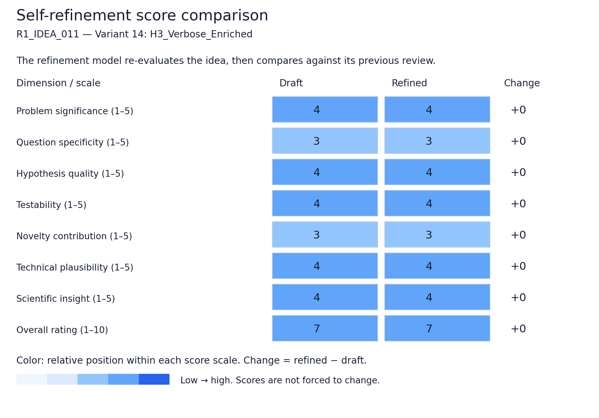

Changed score dimensions: none.

### Score justifications (draft / refined)

**Problem significance**

```json
{
  "draft": {
    "score": 4.0,
    "justification": "The problem is highly relevant. Real-world forecasting often involves complex drivers (news, weather, policy) that are textual. Moving from unimodal to truly multimodal forecasting is a significant challenge in the field. However, the significance is slightly tempered by the fact that multimodal time series is an active area of research, so the 'problem' is well-known, though the specific solution path is the novelty."
  },
  "refined": {
    "score": 4.0,
    "justification": "The problem is highly significant. Real-world forecasting is inherently multimodal, yet current SOTA often ignores deep textual context. Addressing the gap between numerical data and complex textual drivers is a meaningful challenge with high practical relevance. However, the general problem of multimodal time series is an active area, so the significance relies on the specific depth of the proposed solution."
  }
}
```

**Question specificity**

```json
{
  "draft": {
    "score": 3.0,
    "justification": "The idea identifies a clear direction (better text alignment) and a specific mechanism to test (cross-modal attention), but the core concept of 'structured reasoning' remains somewhat abstract. The research question is 'Does structured reasoning improve forecasting?' which is good, but the definition of the 'structured reasoning' variable needs more precision to be a strong specific question."
  },
  "refined": {
    "score": 3.0,
    "justification": "The idea identifies a clear direction (better text alignment) and a specific mechanism to test (cross-modal attention), but the core concept of 'structured reasoning' remains abstract. The research question is 'Does structured reasoning improve forecasting?' which is good, but the definition of the 'structured reasoning' variable needs more precision to be a strong specific question. The lack of defined text types or domains reduces specificity."
  }
}
```

**Hypothesis quality**

```json
{
  "draft": {
    "score": 4.0,
    "justification": "The hypothesis is testable and plausible: that deeper alignment and reasoning mechanisms yield better results than shallow ones, particularly in specific regimes. The inclusion of boundary conditions (noise/incompleteness) makes the hypothesis more nuanced and scientifically valuable than a simple 'X improves Y' claim."
  },
  "refined": {
    "score": 4.0,
    "justification": "The hypothesis is testable and plausible: that deeper alignment and reasoning mechanisms yield better results than shallow ones, particularly in specific regimes. The inclusion of boundary conditions (noise/incompleteness) makes the hypothesis more nuanced and scientifically valuable than a simple 'X improves Y' claim. It distinguishes between general performance and robust performance."
  }
}
```

**Testability**

```json
{
  "draft": {
    "score": 4.0,
    "justification": "The proposed experimental design is highly testable. The plan to use ablations, sensitivity analyses, and staged comparisons (easy vs. difficult cases) provides a clear roadmap for empirical validation. The criteria for success and failure are well-defined."
  },
  "refined": {
    "score": 4.0,
    "justification": "The proposed experimental design is highly testable. The plan to use ablations, sensitivity analyses, and staged comparisons (easy vs. difficult cases) provides a clear roadmap for empirical validation. The criteria for success and failure are well-defined, even if the specific implementation details are missing."
  }
}
```

**Novelty contribution**

```json
{
  "draft": {
    "score": 3.0,
    "justification": "The application of multimodal learning to time series is not new, but the specific focus on 'structured reasoning' and the rigorous investigation of boundary conditions (noise/incompleteness) offers a potential for meaningful contribution. It moves beyond 'applying a model' to 'understanding the limits and mechanisms' of the approach, which is a higher level of novelty."
  },
  "refined": {
    "score": 3.0,
    "justification": "The application of multimodal learning to time series is not new, but the specific focus on 'structured reasoning' and the rigorous investigation of boundary conditions (noise/incompleteness) offers a potential for meaningful contribution. It moves beyond 'applying a model' to 'understanding the limits and mechanisms' of the approach, which is a higher level of novelty than standard benchmarking."
  }
}
```

**Technical plausibility**

```json
{
  "draft": {
    "score": 4.0,
    "justification": "The technical direction is sound. Cross-modal attention and alignment mechanisms are standard tools in deep learning. The challenge lies in the implementation details, but the high-level approach of using these mechanisms to bridge text and time series is technically feasible and logically coherent."
  },
  "refined": {
    "score": 4.0,
    "justification": "The technical direction is sound. Cross-modal attention and alignment mechanisms are standard tools in deep learning. The challenge lies in the implementation details (e.g., handling temporal misalignment), but the high-level approach of using these mechanisms to bridge text and time series is technically feasible and logically coherent."
  }
}
```

**Scientific insight**

```json
{
  "draft": {
    "score": 4.0,
    "justification": "If executed as planned, this research could reveal important insights into how textual context interacts with temporal dynamics, specifically under adverse conditions (noise). It could establish general principles for when multimodal fusion is beneficial versus when it introduces noise, which is a valuable scientific contribution beyond just a new SOTA model."
  },
  "refined": {
    "score": 4.0,
    "justification": "If executed as planned, this research could reveal important insights into how textual context interacts with temporal dynamics, specifically under adverse conditions (noise). It could establish general principles for when multimodal fusion is beneficial versus when it introduces noise, which is a valuable scientific contribution beyond just a new SOTA model."
  }
}
```

**Overall rating**

```json
{
  "draft": {
    "score": 7.0,
    "justification": "This is a strong research idea with a clear motivation and a robust evaluation plan. It addresses a meaningful problem in time series forecasting. The main limitation is the current lack of specificity regarding the 'structured reasoning' mechanism and the specific data domains. However, the proposed methodology for testing boundary conditions and ablations elevates it from a simple application idea to a rigorous scientific investigation. It has high potential for generating useful insights."
  },
  "refined": {
    "score": 7.0,
    "justification": "This is a strong research idea with a clear motivation and a robust evaluation plan. It addresses a meaningful problem in time series forecasting. The main limitation is the current lack of specificity regarding the 'structured reasoning' mechanism and the specific data domains. However, the proposed methodology for testing boundary conditions and ablations elevates it from a simple application idea to a rigorous scientific investigation. It has high potential for generating useful insights."
  }
}
```

## R1_IDEA_011 — Variant 15: H4_Ultimate_Hype

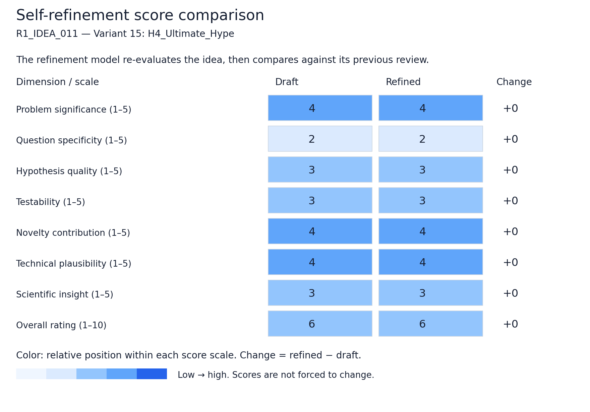

Changed score dimensions: none.

### Score justifications (draft / refined)

**Problem significance**

```json
{
  "draft": {
    "score": 4.0,
    "justification": "The problem of integrating rich, non-numerical context into time series forecasting is highly significant. Current models often fail to capture complex real-world drivers that are described in text. Addressing this could lead to substantial practical improvements in fields like finance, energy, and supply chain."
  },
  "refined": {
    "score": 4.0,
    "justification": "The problem of integrating rich, non-numerical context into time series forecasting is highly significant. Current models often fail to capture complex real-world drivers that are described in text. Addressing this could lead to substantial practical improvements in fields like finance, energy, and supply chain. The motivation is strong, though the text does not specify the domain, the general problem is universally relevant."
  }
}
```

**Question specificity**

```json
{
  "draft": {
    "score": 2.0,
    "justification": "The idea is currently too abstract. While it identifies the general direction (text + reasoning), it lacks the specificity of a research question. Terms like 'structured reasoning' and 'alignment mechanisms' are not defined, making the core investigation unclear."
  },
  "refined": {
    "score": 2.0,
    "justification": "The idea is currently too abstract. While it identifies the general direction (text + reasoning), it lacks the specificity of a research question. Terms like 'structured reasoning' and 'alignment mechanisms' are not defined, making the core investigation unclear. The text reads more as a vision statement than a specific research query."
  }
}
```

**Hypothesis quality**

```json
{
  "draft": {
    "score": 3.0,
    "justification": "There is an implicit hypothesis that deeper text integration improves accuracy, which is plausible. However, it lacks a specific, falsifiable prediction about the mechanism or the magnitude of improvement under specific conditions."
  },
  "refined": {
    "score": 3.0,
    "justification": "There is an implicit hypothesis that deeper text integration improves accuracy, which is plausible. However, it lacks a specific, falsifiable prediction about the mechanism or the magnitude of improvement under specific conditions. The claim that it will 'redefine the frontier' is a prediction of impact, not a scientific hypothesis about the underlying mechanism."
  }
}
```

**Testability**

```json
{
  "draft": {
    "score": 3.0,
    "justification": "The idea is testable in principle, as one could build a model with text reasoning and compare it to baselines. However, without defining the 'reasoning' mechanism or the evaluation metrics for 'trustworthiness,' the experimental design is currently undefined."
  },
  "refined": {
    "score": 3.0,
    "justification": "The idea is testable in principle, as one could build a model with text reasoning and compare it to baselines. However, without defining the 'reasoning' mechanism or the evaluation metrics for 'trustworthiness,' the experimental design is currently undefined. The lack of specific constraints makes the 'test' too open-ended."
  }
}
```

**Novelty contribution**

```json
{
  "draft": {
    "score": 4.0,
    "justification": "Moving from shallow text concatenation to 'structured reasoning' in time series is a novel direction. While multimodal time series exist, the specific focus on reasoning mechanisms as the primary driver for accuracy is a promising and underexplored angle."
  },
  "refined": {
    "score": 4.0,
    "justification": "Moving from shallow text concatenation to 'structured reasoning' in time series is a novel direction. While multimodal time series exist, the specific focus on reasoning mechanisms as the primary driver for accuracy is a promising and underexplored angle. The potential contribution is high if the 'reasoning' aspect is distinct from standard attention."
  }
}
```

**Technical plausibility**

```json
{
  "draft": {
    "score": 4.0,
    "justification": "The direction is technically plausible given the rapid advances in LLMs and multimodal alignment. Integrating reasoning modules into forecasting architectures is a logical next step, though the implementation details are the main challenge."
  },
  "refined": {
    "score": 4.0,
    "justification": "The direction is technically plausible given the rapid advances in LLMs and multimodal alignment. Integrating reasoning modules into forecasting architectures is a logical next step, though the implementation details are the main challenge. The idea does not propose physically impossible mechanisms."
  }
}
```

**Scientific insight**

```json
{
  "draft": {
    "score": 3.0,
    "justification": "If successful, this could reveal how semantic reasoning interacts with temporal dynamics, offering insights into the nature of exogenous variables. However, as currently stated, it risks being a 'black box' application of LLMs without yielding deep theoretical insights unless the 'reasoning' aspect is rigorously analyzed."
  },
  "refined": {
    "score": 3.0,
    "justification": "If successful, this could reveal how semantic reasoning interacts with temporal dynamics, offering insights into the nature of exogenous variables. However, as currently stated, it risks being a 'black box' application of LLMs without yielding deep theoretical insights unless the 'reasoning' aspect is rigorously analyzed. The potential for insight is there but not guaranteed by the current formulation."
  }
}
```

**Overall rating**

```json
{
  "draft": {
    "score": 6.0,
    "justification": "This is a moderate-to-strong research idea with high potential impact, but it is currently in a very early, abstract stage. The core motivation is excellent, but the lack of a specific research question, defined mechanisms, and concrete hypotheses prevents it from being rated higher. It needs significant refinement to move from a 'vision' to a 'research plan'."
  },
  "refined": {
    "score": 6.0,
    "justification": "This is a moderate-to-strong research idea with high potential impact, but it is currently in a very early, abstract stage. The core motivation is excellent, but the lack of a specific research question, defined mechanisms, and concrete hypotheses prevents it from being rated higher. It needs significant refinement to move from a 'vision' to a 'research plan'. The score reflects the high potential (4-5 on novelty/significance) balanced against the low specificity (2) and vague hypothesis (3)."
  }
}
```

## R1_IDEA_012 — Source

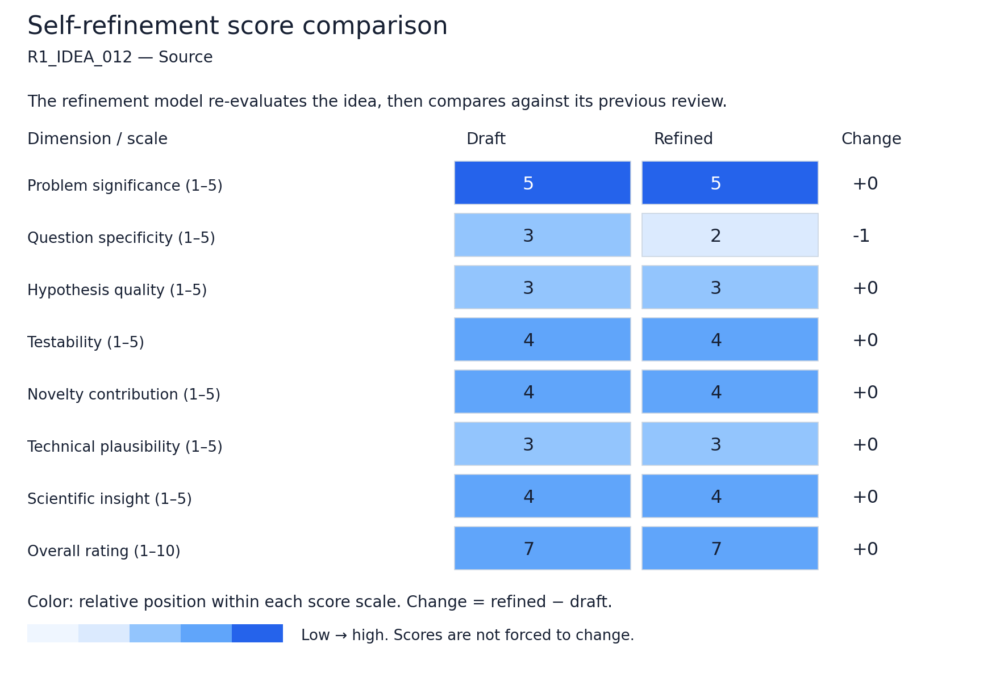

Changed score dimensions: question_specificity.

### Score justifications (draft / refined)

**Problem significance**

```json
{
  "draft": {
    "score": 5.0,
    "justification": "The problem of efficient, high-quality 3D editing is a major challenge in computer vision and graphics. Current methods are computationally expensive and require significant data. Solving this would have immediate practical impact and is a highly significant research direction."
  },
  "refined": {
    "score": 5.0,
    "justification": "The problem is highly significant. Current 3D editing methods are computationally expensive and slow due to per-scene optimization. A method that enables instant, high-quality 3D editing from a single image would be a breakthrough for graphics, AR/VR, and content creation."
  }
}
```

**Question specificity**

```json
{
  "draft": {
    "score": 3.0,
    "justification": "The goal is clear (efficient 3D editing), but the research question is vague. It states *what* to achieve (unlock latent awareness) but not *how* to investigate the mechanism or *what* specific relationship is being tested. It reads more like a product vision than a specific scientific question."
  },
  "refined": {
    "score": 2.0,
    "justification": "While the goal is clear, the research question is vague. It states 'unlock latent 3D awareness' but does not define what 'latent 3D awareness' is mathematically or algorithmically. It reads more as a vision statement than a specific scientific inquiry into a mechanism."
  }
}
```

**Hypothesis quality**

```json
{
  "draft": {
    "score": 3.0,
    "justification": "The implicit hypothesis is that 'latent 3D awareness exists and can be accessed without optimization.' This is a plausible and testable hypothesis, but it is currently stated as a premise rather than a specific prediction about the relationship between model internals and 3D consistency."
  },
  "refined": {
    "score": 3.0,
    "justification": "The implicit hypothesis (that 2D models have usable 3D priors) is plausible but currently too broad. It lacks a specific prediction about the relationship between the model's internal states and the resulting 3D consistency. It needs to specify *which* internal states or *what* constraints enable the result."
  }
}
```

**Testability**

```json
{
  "draft": {
    "score": 4.0,
    "justification": "The idea is testable. One can attempt to build a pipeline that takes a single image, applies a proposed method to generate multi-view edits, and evaluate consistency and fidelity against ground truth or existing baselines. The lack of a specific method makes the *design* of the test hard, but the *possibility* of testing is high."
  },
  "refined": {
    "score": 4.0,
    "justification": "The idea is testable in principle: one can attempt to build a pipeline, generate multi-view outputs, and measure consistency. However, without a proposed method, the 'test' is currently undefined. The evaluation metrics (consistency, fidelity) are clear, but the experimental design to isolate the 'latent awareness' mechanism is missing."
  }
}
```

**Novelty contribution**

```json
{
  "draft": {
    "score": 4.0,
    "justification": "The concept of 'unlocking latent 3D awareness' in frozen models is novel and aligns with cutting-edge trends. If successful, it would represent a significant departure from the current paradigm of per-scene optimization, offering a new class of 3D editing methods."
  },
  "refined": {
    "score": 4.0,
    "justification": "The concept is novel. While 'frozen' models are popular, the specific claim of achieving *multi-view consistent 3D editing* from *sparse inputs* without *any* per-scene optimization is a bold and potentially groundbreaking departure from the current state-of-the-art."
  }
}
```

**Technical plausibility**

```json
{
  "draft": {
    "score": 3.0,
    "justification": "While the premise is plausible (diffusion models do have 3D priors), the claim that this can be done *without any per-scene optimization* is technically ambitious and potentially risky. It assumes the 3D information is directly accessible and sufficient, which may not be true for complex scenes without some form of geometric refinement."
  },
  "refined": {
    "score": 3.0,
    "justification": "The premise is plausible (diffusion models do have 3D priors), but the execution claim (no optimization) is highly ambitious. It assumes the 3D information is explicit enough to be extracted directly, which contradicts the implicit nature of 2D training. It is technically risky but not impossible."
  }
}
```

**Scientific insight**

```json
{
  "draft": {
    "score": 4.0,
    "justification": "If the research succeeds, it would provide deep insight into the nature of 3D priors in 2D diffusion models. It would reveal whether these models truly understand 3D geometry or just mimic it, and how that understanding can be extracted without training."
  },
  "refined": {
    "score": 4.0,
    "justification": "If successful, this would provide profound insight into the geometric understanding of 2D diffusion models. It would reveal whether these models truly 'understand' 3D or merely mimic it, and how to extract that understanding efficiently."
  }
}
```

**Overall rating**

```json
{
  "draft": {
    "score": 7.0,
    "justification": "This is a strong research idea with high significance and potential for novel contribution. The core concept (frozen model 3D editing) is timely and valuable. However, it currently lacks the specificity of a research question and a clear mechanism, which prevents it from being an 'exceptional' (9-10) idea. It needs a more concrete hypothesis on *how* the 3D consistency is achieved without optimization to move from a 'vision' to a rigorous scientific inquiry."
  },
  "refined": {
    "score": 7.0,
    "justification": "This is a strong research idea with exceptional significance and high novelty. The potential impact is huge. However, it currently lacks the specificity of a research question and a defined mechanism, which prevents it from being an 'exceptional' (9-10) idea. It needs a concrete hypothesis on *how* the 3D consistency is achieved without optimization to move from a 'vision' to a rigorous scientific inquiry. The previous review's score of 7 is well-calibrated."
  }
}
```

## R1_IDEA_012 — Variant 1: A1_Identity

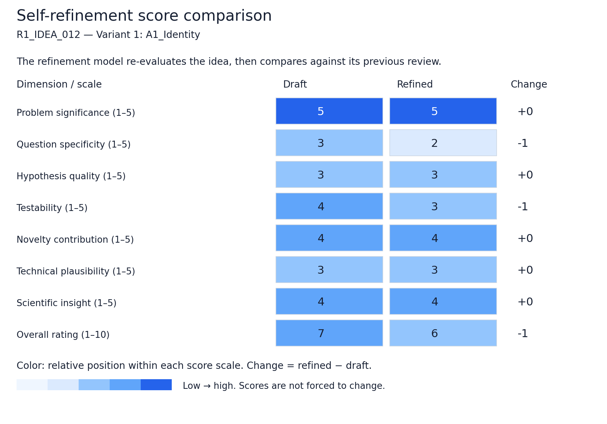

Changed score dimensions: question_specificity, testability, overall_rating.

### Score justifications (draft / refined)

**Problem significance**

```json
{
  "draft": {
    "score": 5.0,
    "justification": "The problem of efficient, high-quality 3D editing is a major challenge in computer vision and graphics. Current methods are computationally expensive and require significant data. Solving this would have immediate practical impact and is a highly significant research direction."
  },
  "refined": {
    "score": 5.0,
    "justification": "The problem is highly significant. Current 3D editing methods are computationally prohibitive for many applications. A method that achieves high-fidelity 3D editing from a single image without per-scene optimization would be a major breakthrough in computer vision and graphics, enabling real-time applications and democratizing 3D content creation."
  }
}
```

**Question specificity**

```json
{
  "draft": {
    "score": 3.0,
    "justification": "The goal is clear (efficient 3D editing), but the research question is vague. It states *what* to achieve (unlock latent awareness) but not *how* to investigate the mechanism or *what* specific relationship is being tested. It reads more like a product vision than a specific scientific question."
  },
  "refined": {
    "score": 2.0,
    "justification": "The research question is currently too vague. It states a desired outcome ('unlock latent 3D awareness') but does not define the specific scientific question being investigated. It reads more like a product vision or a goal statement than a research question. The 'how' is completely missing, making it difficult to distinguish this from a generic 'apply diffusion to 3D' idea."
  }
}
```

**Hypothesis quality**

```json
{
  "draft": {
    "score": 3.0,
    "justification": "The implicit hypothesis is that 'latent 3D awareness exists and can be accessed without optimization.' This is a plausible and testable hypothesis, but it is currently stated as a premise rather than a specific prediction about the relationship between model internals and 3D consistency."
  },
  "refined": {
    "score": 3.0,
    "justification": "The implicit hypothesis is that 'latent 3D awareness exists and can be accessed without optimization.' This is a plausible premise, but it is not a strong scientific hypothesis because it lacks a specific prediction about the mechanism or the conditions under which it holds. It is a 'hope' rather than a testable claim about a specific relationship."
  }
}
```

**Testability**

```json
{
  "draft": {
    "score": 4.0,
    "justification": "The idea is testable. One can attempt to build a pipeline that takes a single image, applies a proposed method to generate multi-view edits, and evaluate consistency and fidelity against ground truth or existing baselines. The lack of a specific method makes the *design* of the test hard, but the *possibility* of testing is high."
  },
  "refined": {
    "score": 3.0,
    "justification": "The idea is testable in principle (one can attempt to build a pipeline and measure consistency), but the lack of a proposed method makes the test design ambiguous. Without a specific mechanism, the 'experiment' is undefined. The evaluation metrics (consistency, fidelity) are clear, but the independent variable (the method) is not."
  }
}
```

**Novelty contribution**

```json
{
  "draft": {
    "score": 4.0,
    "justification": "The concept of 'unlocking latent 3D awareness' in frozen models is novel and aligns with cutting-edge trends. If successful, it would represent a significant departure from the current paradigm of per-scene optimization, offering a new class of 3D editing methods."
  },
  "refined": {
    "score": 4.0,
    "justification": "The concept is novel and timely. While 3D generation from 2D models is an active area, the specific claim of 'editing without per-scene optimization' by 'unlocking latent awareness' is a distinct and ambitious direction. If successful, it would represent a fundamental shift in how we approach 3D editing."
  }
}
```

**Technical plausibility**

```json
{
  "draft": {
    "score": 3.0,
    "justification": "While the premise is plausible (diffusion models do have 3D priors), the claim that this can be done *without any per-scene optimization* is technically ambitious and potentially risky. It assumes the 3D information is directly accessible and sufficient, which may not be true for complex scenes without some form of geometric refinement."
  },
  "refined": {
    "score": 3.0,
    "justification": "The premise is plausible given recent work on 3D priors in diffusion models, but the claim of doing so 'without any per-scene optimization' is highly ambitious and potentially risky. It assumes the 3D information is directly accessible and sufficient for editing, which may not hold for complex scenes without some form of geometric refinement or constraint."
  }
}
```

**Scientific insight**

```json
{
  "draft": {
    "score": 4.0,
    "justification": "If the research succeeds, it would provide deep insight into the nature of 3D priors in 2D diffusion models. It would reveal whether these models truly understand 3D geometry or just mimic it, and how that understanding can be extracted without training."
  },
  "refined": {
    "score": 4.0,
    "justification": "If the research succeeds, it would provide deep insight into the nature of 3D priors in 2D diffusion models. It would reveal whether these models truly understand 3D geometry or just mimic it, and how that understanding can be extracted without training. This has high potential for scientific insight beyond just a new tool."
  }
}
```

**Overall rating**

```json
{
  "draft": {
    "score": 7.0,
    "justification": "This is a strong research idea with high significance and potential for novel contribution. The core concept (frozen model 3D editing) is timely and valuable. However, it currently lacks the specificity of a research question and a clear mechanism, which prevents it from being an 'exceptional' (9-10) idea. It needs a more concrete hypothesis on *how* the 3D consistency is achieved without optimization to move from a 'vision' to a rigorous scientific inquiry."
  },
  "refined": {
    "score": 6.0,
    "justification": "This is a moderate research idea. It addresses a highly significant problem with a novel and ambitious goal. However, it currently lacks the specificity and methodological direction required to be a strong scientific proposal. It is more of a 'vision' than a concrete research plan. The lack of a specific hypothesis or mechanism prevents it from scoring higher, as the path to the goal is unclear. It has high potential but requires significant refinement to become a rigorous research project."
  }
}
```

## R1_IDEA_012 — Variant 2: A2_Paraphrase_Only

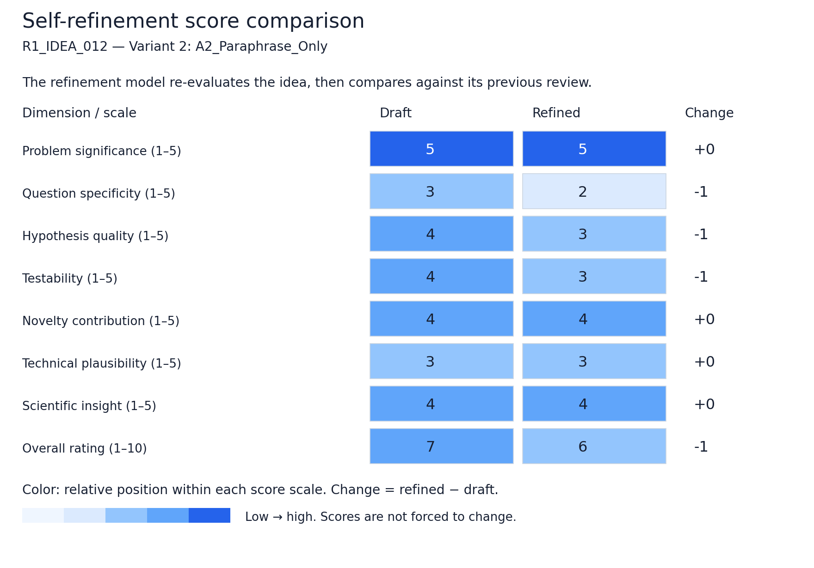

Changed score dimensions: question_specificity, hypothesis_quality, testability, overall_rating.

### Score justifications (draft / refined)

**Problem significance**

```json
{
  "draft": {
    "score": 5.0,
    "justification": "The problem of efficient, consistent 3D editing is highly significant. Current methods are computationally expensive and slow, limiting their practical utility. Solving this would enable real-time 3D content creation and democratize access to 3D editing tools."
  },
  "refined": {
    "score": 5.0,
    "justification": "The problem is highly significant. Current 3D editing methods are computationally prohibitive for many applications. Solving this would democratize 3D content creation and enable real-time interaction, addressing a major practical limitation in the field."
  }
}
```

**Question specificity**

```json
{
  "draft": {
    "score": 3.0,
    "justification": "The idea identifies the goal (consistent editing without optimization) but lacks specificity on the 'how'. The term 'adapts existing diffusion models' is too broad to be a specific research question without further elaboration on the mechanism."
  },
  "refined": {
    "score": 2.0,
    "justification": "The research question is currently too vague. While the goal (consistent editing without optimization) is clear, the 'how' is missing. The phrase 'adapts existing diffusion models' is a broad category, not a specific research question. The idea lacks a defined mechanism or variable to investigate."
  }
}
```

**Hypothesis quality**

```json
{
  "draft": {
    "score": 4.0,
    "justification": "The implicit hypothesis—that diffusion models possess sufficient inherent 3D priors to allow consistent editing without explicit 3D optimization—is strong and testable. It challenges the current paradigm that explicit 3D reconstruction is necessary for consistency."
  },
  "refined": {
    "score": 3.0,
    "justification": "The implicit hypothesis—that diffusion models have sufficient 3D priors to allow consistent editing without explicit 3D optimization—is plausible but not well-articulated. It is a strong claim that requires a specific mechanism to be testable. Currently, it is more of a hope than a structured hypothesis."
  }
}
```

**Testability**

```json
{
  "draft": {
    "score": 4.0,
    "justification": "The idea is testable. One can implement a method based on the proposed adaptation, generate multi-view edits, and compare consistency metrics against baselines. The 'no optimization' claim is easily falsifiable if the method requires any form of scene-specific training."
  },
  "refined": {
    "score": 3.0,
    "justification": "The idea is theoretically testable (one can try to build it and measure consistency), but the lack of a proposed method makes the testability of the *hypothesis* weak. Without a specific mechanism to test, the experiment becomes a 'try everything' approach rather than a targeted investigation of a specific claim."
  }
}
```

**Novelty contribution**

```json
{
  "draft": {
    "score": 4.0,
    "justification": "While diffusion models are well-studied, applying them to 3D editing without per-scene optimization is a novel direction. If successful, it could shift the field away from heavy optimization-based pipelines toward more efficient, model-centric approaches."
  },
  "refined": {
    "score": 4.0,
    "justification": "The direction is novel. While diffusion models are widely used, the specific claim of achieving consistent multi-view editing *without* any per-scene optimization is a significant departure from current SOTA. If successful, it would be a major contribution."
  }
}
```

**Technical plausibility**

```json
{
  "draft": {
    "score": 3.0,
    "justification": "The idea is plausible given the success of 2D diffusion models, but technically challenging. Achieving strict multi-view consistency without explicit 3D constraints is non-trivial. The reasoning is coherent, but the feasibility of the specific 'adaptation' mechanism is unproven."
  },
  "refined": {
    "score": 3.0,
    "justification": "The idea is technically plausible given the success of 2D diffusion models, but the leap to 3D consistency without explicit constraints is non-trivial. The reasoning is coherent in intent but lacks the technical grounding to be considered highly plausible without further elaboration on the mechanism."
  }
}
```

**Scientific insight**

```json
{
  "draft": {
    "score": 4.0,
    "justification": "Investigating this could reveal the extent of 3D priors in 2D-trained models. Even if the method fails to achieve perfect consistency, the analysis of where and why it fails would provide deep insights into the limitations of current diffusion priors regarding 3D geometry."
  },
  "refined": {
    "score": 4.0,
    "justification": "If investigated, this could reveal the boundaries of 3D priors in 2D-trained models. Even if the method fails to achieve perfect consistency, the analysis of failure modes would provide deep insights into the limitations of current diffusion priors regarding 3D geometry."
  }
}
```

**Overall rating**

```json
{
  "draft": {
    "score": 7.0,
    "justification": "This is a strong research idea with high significance and a compelling hypothesis. It addresses a major pain point in the field (computational cost) and proposes a paradigm shift (no per-scene optimization). However, it currently lacks the technical specificity required to be considered 'exceptional'. The success of the idea hinges entirely on the specific mechanism proposed for 'adaptation', which is currently undefined. With a concrete methodological proposal, this could be a top-tier contribution."
  },
  "refined": {
    "score": 6.0,
    "justification": "This is a moderate research idea. It addresses a highly significant problem with a compelling high-level goal. However, the lack of specificity regarding the mechanism ('how') and the vague definition of 'adaptation' significantly lower its quality. It currently reads more like a vision statement than a concrete research proposal. It has the potential to be strong (7-8) if the mechanism is defined, but as stated, it is too generic to be considered exceptional."
  }
}
```

## R1_IDEA_012 — Variant 3: A3_Plain_Core

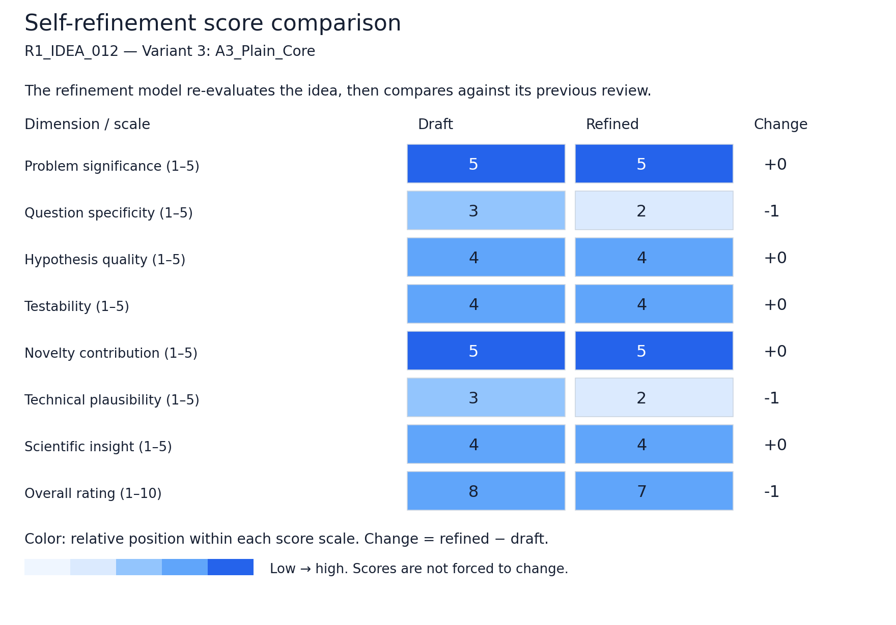

Changed score dimensions: question_specificity, technical_plausibility, overall_rating.

### Score justifications (draft / refined)

**Problem significance**

```json
{
  "draft": {
    "score": 5.0,
    "justification": "The problem of efficient, sparse-view 3D editing is highly significant. Current methods are computationally expensive and require extensive data. Solving this would democratize 3D content creation and significantly reduce the barrier to entry for 3D applications."
  },
  "refined": {
    "score": 5.0,
    "justification": "The problem is highly significant. Current 3D editing pipelines are computationally expensive and require extensive data. Solving this would democratize 3D content creation and significantly lower the barrier to entry for 3D applications, making it a top-tier problem in the field."
  }
}
```

**Question specificity**

```json
{
  "draft": {
    "score": 3.0,
    "justification": "The idea identifies a clear goal (3D editing from sparse views without optimization) but lacks specificity on the 'how'. The mechanism for accessing latent 3D awareness is the missing link that defines the research question's boundaries."
  },
  "refined": {
    "score": 2.0,
    "justification": "While the goal is clear, the research question is vague regarding the 'how'. The core mechanism ('accessing latent 3D awareness') is a black box. Without specifying the method of extraction or the nature of the editing, the question remains too broad to be considered a concrete research direction."
  }
}
```

**Hypothesis quality**

```json
{
  "draft": {
    "score": 4.0,
    "justification": "The core hypothesis—that pretrained diffusion models contain sufficient latent 3D priors to enable consistent editing without per-scene optimization—is bold, testable, and potentially falsifiable. It distinguishes itself from standard optimization approaches."
  },
  "refined": {
    "score": 4.0,
    "justification": "The hypothesis is strong and falsifiable: 'Pretrained diffusion models possess sufficient latent 3D awareness to enable consistent editing without per-scene optimization.' It makes a bold prediction that distinguishes the work from standard approaches and can be empirically validated or refuted."
  }
}
```

**Testability**

```json
{
  "draft": {
    "score": 4.0,
    "justification": "The idea is highly testable. One can implement a baseline using standard diffusion inference, define metrics for multi-view consistency, and compare against optimization-based baselines. The success or failure of the 'no optimization' claim is empirically verifiable."
  },
  "refined": {
    "score": 4.0,
    "justification": "The idea is testable. One can define metrics for multi-view consistency and compare the output of a standard diffusion inference (or a proposed variant) against optimization-based baselines. The success or failure of the 'no optimization' claim is empirically verifiable, even if the specific implementation is not yet detailed."
  }
}
```

**Novelty contribution**

```json
{
  "draft": {
    "score": 5.0,
    "justification": "If successful, this would represent a significant conceptual shift in 3D generation, moving away from iterative optimization towards direct inference. It challenges the assumption that 3D consistency requires explicit 3D modeling or per-scene training."
  },
  "refined": {
    "score": 5.0,
    "justification": "If successful, this represents a fundamental shift in 3D generation, moving from iterative optimization to direct inference. It challenges a core assumption in the field (that 3D consistency requires explicit 3D modeling) and could lead to new insights into the latent space of diffusion models."
  }
}
```

**Technical plausibility**

```json
{
  "draft": {
    "score": 3.0,
    "justification": "While the goal is plausible, the technical path is uncertain. Diffusion models are inherently 2D; assuming they can solve 3D consistency without explicit 3D constraints or optimization is a strong assumption that may require novel architectural insights or conditioning mechanisms not yet described."
  },
  "refined": {
    "score": 2.0,
    "justification": "The technical plausibility is low based on current knowledge. Diffusion models are trained on 2D data and typically struggle with 3D consistency without explicit guidance (like depth maps or multi-view constraints). Claiming to bypass optimization entirely without a specified mechanism is a strong assumption that contradicts the known behavior of these models."
  }
}
```

**Scientific insight**

```json
{
  "draft": {
    "score": 4.0,
    "justification": "Investigating this will reveal the true extent of 3D priors in 2D-pretrained models. Even if the specific method fails, the analysis of *why* it fails (or succeeds) will provide deep insights into the relationship between 2D diffusion priors and 3D geometry."
  },
  "refined": {
    "score": 4.0,
    "justification": "Investigating this will reveal the true extent of 3D priors in 2D-pretrained models. Even if the specific method fails, the analysis of *why* it fails (or succeeds) will provide deep insights into the relationship between 2D diffusion priors and 3D geometry, which is a valuable scientific contribution."
  }
}
```

**Overall rating**

```json
{
  "draft": {
    "score": 8.0,
    "justification": "This is a strong research idea with high potential impact. It addresses a major pain point (computational cost) with a novel hypothesis (latent 3D awareness). While the technical mechanism is currently vague, the scientific question is well-defined and the potential contribution is significant. It scores high on significance, novelty, and insight, with moderate scores on specificity and plausibility due to the lack of implementation details."
  },
  "refined": {
    "score": 7.0,
    "justification": "This is a strong research idea with high potential impact and novelty, but it suffers from a lack of technical specificity and questionable plausibility. The problem is significant, and the hypothesis is bold, but the mechanism is entirely undefined. It scores lower than an 8 because the technical path is currently unclear and the claim of 'no optimization' is highly ambitious without a concrete proposal. However, the potential for scientific insight keeps it in the 'strong' category."
  }
}
```

## R1_IDEA_012 — Variant 4: B1_Verbose_Elaborate


Changed score dimensions: none.

### Score justifications (draft / refined)

**Problem significance**

```json
{
  "draft": {
    "score": 5.0,
    "justification": "The problem of efficient, high-quality 3D editing from minimal inputs is a critical bottleneck in the current 3D generation pipeline. Solving this would have immediate impact on content creation workflows, making it a highly significant research problem."
  },
  "refined": {
    "score": 5.0,
    "justification": "The problem of efficient, high-quality 3D editing from minimal inputs is a critical bottleneck in the current 3D generation pipeline. Solving this would have immediate impact on content creation workflows, making it a highly significant research problem."
  }
}
```

**Question specificity**

```json
{
  "draft": {
    "score": 2.0,
    "justification": "While the goal is clear, the research question is currently too broad. It states 'what' (unlock latent 3D awareness) but not 'how'. The specific mechanism or hypothesis regarding the nature of this awareness is not defined."
  },
  "refined": {
    "score": 2.0,
    "justification": "While the goal is clear, the research question is currently too broad. It states 'what' (unlock latent 3D awareness) but not 'how'. The specific mechanism or hypothesis regarding the nature of this awareness is not defined, making the research question vague."
  }
}
```

**Hypothesis quality**

```json
{
  "draft": {
    "score": 3.0,
    "justification": "The hypothesis that pretrained diffusion models contain usable 3D priors is plausible and testable. However, the specific claim that this can be 'unlocked' to achieve high-fidelity consistency without optimization is a strong assertion that needs a more defined theoretical or empirical basis to be considered a high-quality hypothesis."
  },
  "refined": {
    "score": 3.0,
    "justification": "The hypothesis that pretrained diffusion models contain usable 3D priors is plausible and testable. However, the specific claim that this can be 'unlocked' to achieve high-fidelity consistency without optimization is a strong assertion that needs a more defined theoretical or empirical basis to be considered a high-quality hypothesis."
  }
}
```

**Testability**

```json
{
  "draft": {
    "score": 3.0,
    "justification": "The idea is testable in principle (compare against baselines on standard 3D editing benchmarks), but the lack of a proposed method makes the experimental design undefined. The success criteria (high fidelity, consistency) are measurable, but the path to achieving them is not."
  },
  "refined": {
    "score": 3.0,
    "justification": "The idea is testable in principle (compare against baselines on standard 3D editing benchmarks), but the lack of a proposed method makes the experimental design undefined. The success criteria (high fidelity, consistency) are measurable, but the path to achieving them is not."
  }
}
```

**Novelty contribution**

```json
{
  "draft": {
    "score": 4.0,
    "justification": "The concept of leveraging latent 3D priors in 2D diffusion models for direct editing without optimization is novel. If successful, it would represent a significant departure from current optimization-heavy paradigms, offering a new class of 3D editing tools."
  },
  "refined": {
    "score": 4.0,
    "justification": "The concept of leveraging latent 3D priors in 2D diffusion models for direct editing without optimization is novel. If successful, it would represent a significant departure from current optimization-heavy paradigms, offering a new class of 3D editing tools."
  }
}
```

**Technical plausibility**

```json
{
  "draft": {
    "score": 3.0,
    "justification": "The idea is technically plausible given recent findings that diffusion models encode geometric information. However, the leap from 'having priors' to 'achieving consistent edits without optimization' is non-trivial and relies on assumptions about the model's internal representations that are not yet fully understood."
  },
  "refined": {
    "score": 3.0,
    "justification": "The idea is technically plausible given recent findings that diffusion models encode geometric information. However, the leap from 'having priors' to 'achieving consistent edits without optimization' is non-trivial and relies on assumptions about the model's internal representations that are not yet fully understood."
  }
}
```

**Scientific insight**

```json
{
  "draft": {
    "score": 4.0,
    "justification": "Even if the specific method fails, investigating this direction would yield valuable insights into the geometric priors of diffusion models, the limits of single-view 3D inference, and the relationship between 2D generative priors and 3D consistency."
  },
  "refined": {
    "score": 4.0,
    "justification": "Even if the specific method fails, investigating this direction would yield valuable insights into the geometric priors of diffusion models, the limits of single-view 3D inference, and the relationship between 2D generative priors and 3D consistency."
  }
}
```

**Overall rating**

```json
{
  "draft": {
    "score": 7.0,
    "justification": "This is a strong research idea with high significance and potential impact. The core motivation is excellent, and the hypothesis is grounded in current trends. However, it currently lacks the specificity of the proposed mechanism, which prevents it from being rated as 'exceptional'. It requires a concrete proposal on how to access and utilize the latent 3D information to move from a 'vision' to a 'research plan'."
  },
  "refined": {
    "score": 7.0,
    "justification": "This is a strong research idea with high significance and potential impact. The core motivation is excellent, and the hypothesis is grounded in current trends. However, it currently lacks the specificity of the proposed mechanism, which prevents it from being rated as 'exceptional'. It requires a concrete proposal on how to access and utilize the latent 3D information to move from a 'vision' to a 'research plan'."
  }
}
```

## R1_IDEA_012 — Variant 5: B2_Grand_Narrative

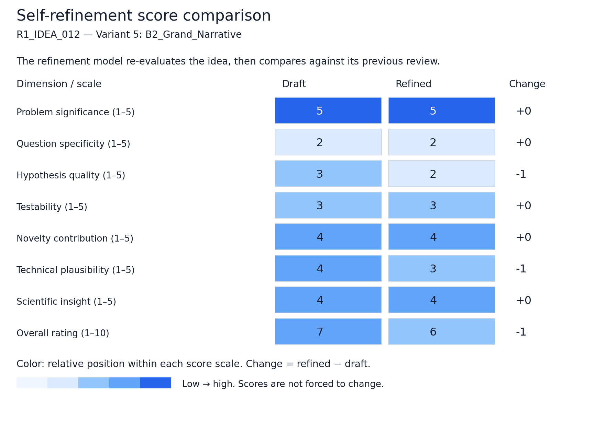

Changed score dimensions: hypothesis_quality, technical_plausibility, overall_rating.

### Score justifications (draft / refined)

**Problem significance**

```json
{
  "draft": {
    "score": 5.0,
    "justification": "The problem of making 3D content creation accessible and efficient is a major bottleneck in the field. Reducing reliance on per-scene optimization and dense multi-view inputs would be a significant breakthrough for both researchers and practitioners."
  },
  "refined": {
    "score": 5.0,
    "justification": "The problem is of paramount importance. Reducing the reliance on per-scene optimization and dense multi-view inputs is a major challenge in 3D vision. Solving this would significantly lower the barrier to entry for 3D content creation and enable real-time applications."
  }
}
```

**Question specificity**

```json
{
  "draft": {
    "score": 2.0,
    "justification": "While the goal is clear, the specific research question is vague. It describes a desired outcome ('unlock latent 3D awareness') rather than a concrete mechanism or a specific hypothesis about the relationship between the model architecture and the task performance."
  },
  "refined": {
    "score": 2.0,
    "justification": "The idea is currently too broad. It states what the work 'could contribute' but fails to specify the 'how'. The phrase 'unlock latent 3D awareness' is a metaphor for a mechanism that is not defined. Without a specific research question (e.g., 'Does method X improve consistency by Y% compared to baseline Z?'), the idea remains a general direction rather than a specific inquiry."
  }
}
```

**Hypothesis quality**

```json
{
  "draft": {
    "score": 3.0,
    "justification": "The implicit hypothesis is that pretrained diffusion models contain sufficient 3D priors to perform this task without optimization. This is a reasonable and testable hypothesis, but it is currently stated as a general possibility rather than a specific, falsifiable claim about the model's capabilities or the method's efficacy."
  },
  "refined": {
    "score": 2.0,
    "justification": "The hypothesis is implicit and weak. It assumes that 'latent 3D awareness' exists and can be 'unlocked' without explaining the conditions under which this is possible. A strong hypothesis would predict a specific relationship between the model's architecture/training and the resulting multi-view consistency. Currently, it is a statement of intent rather than a falsifiable claim."
  }
}
```

**Testability**

```json
{
  "draft": {
    "score": 3.0,
    "justification": "The idea is testable in principle (compare performance of a feed-forward model vs. optimization-based models on sparse inputs), but the lack of a defined method or specific 'sparse' definition makes the experimental design currently undefined."
  },
  "refined": {
    "score": 3.0,
    "justification": "The idea is testable in principle (one could attempt to build such a system and measure consistency), but the lack of a defined method, specific input constraints, or evaluation metrics makes the experimental design currently undefined. It is difficult to design a rigorous test without knowing the proposed mechanism."
  }
}
```

**Novelty contribution**

```json
{
  "draft": {
    "score": 4.0,
    "justification": "The direction of using pretrained diffusion models for 3D tasks without per-scene optimization is novel and aligns with cutting-edge research. If successful, it would represent a significant shift in how 3D editing is approached."
  },
  "refined": {
    "score": 4.0,
    "justification": "The direction is novel. While using diffusion models for 3D is an active area, the specific claim of achieving high-fidelity multi-view editing from sparse inputs *without* per-scene optimization is a significant and potentially groundbreaking departure from current SOTA. If successful, it would be a major contribution."
  }
}
```

**Technical plausibility**

```json
{
  "draft": {
    "score": 4.0,
    "justification": "Given the success of models like Stable Diffusion in generating consistent 3D-like structures from text or single images, it is technically plausible that latent 3D awareness exists. However, the leap to 'editing' with 'multi-view consistency' from 'sparse' inputs without optimization is a non-trivial challenge that requires careful justification."
  },
  "refined": {
    "score": 3.0,
    "justification": "The idea is plausible but faces a significant technical hurdle. While diffusion models have geometric priors, enforcing strict multi-view consistency from sparse inputs without optimization is non-trivial. The idea assumes this is possible but does not provide a mechanism to justify why it should work, making the plausibility moderate rather than high."
  }
}
```

**Scientific insight**

```json
{
  "draft": {
    "score": 4.0,
    "justification": "If successful, this research would provide deep insights into the geometric priors encoded in 2D diffusion models and the limits of feed-forward 3D generation. It could reveal fundamental principles about how 3D structure is represented in latent spaces."
  },
  "refined": {
    "score": 4.0,
    "justification": "If the research succeeds, it would provide profound insights into the geometric priors of 2D diffusion models and the limits of feed-forward 3D generation. It could reveal fundamental principles about how 3D structure is encoded and accessed in latent spaces, which is highly valuable."
  }
}
```

**Overall rating**

```json
{
  "draft": {
    "score": 7.0,
    "justification": "This is a strong research idea with high potential impact and scientific significance. The problem is critical, and the direction is promising. However, the idea is currently in a very early conceptual stage, lacking the specificity of the proposed mechanism and the clarity of the hypothesis required to be considered 'exceptional'. It needs more concrete formulation to move from a 'strong' to an 'exceptional' rating."
  },
  "refined": {
    "score": 6.0,
    "justification": "This is a moderate research idea. It addresses a highly significant problem with a promising direction, but it currently lacks the specificity, hypothesis clarity, and methodological definition required to be considered 'strong' or 'exceptional'. It is essentially a research motivation rather than a concrete research plan. The gap between the 'what' (unlocking awareness) and the 'how' is too large to rate it higher at this stage."
  }
}
```

## R1_IDEA_012 — Variant 6: B3_Over_Confident


Changed score dimensions: none.

### Score justifications (draft / refined)

**Problem significance**

```json
{
  "draft": {
    "score": 5.0,
    "justification": "The problem of efficient, high-quality 3D editing from sparse inputs is a critical challenge in computer vision and graphics. Solving this would significantly lower the barrier to entry for 3D content creation and is of high interest to both researchers and practitioners."
  },
  "refined": {
    "score": 5.0,
    "justification": "The problem of efficient, high-quality 3D editing from sparse inputs is a major challenge in computer vision and graphics. Solving this would drastically reduce the barrier to entry for 3D content creation and is of immense practical and scientific interest."
  }
}
```

**Question specificity**

```json
{
  "draft": {
    "score": 2.0,
    "justification": "While the goal is clear, the 'how' is missing. The idea states 'repurposes' and 'unlocks latent 3D awareness' but does not specify the mechanism, making the research question somewhat vague. It is a 'what if' rather than a 'how'."
  },
  "refined": {
    "score": 2.0,
    "justification": "While the goal is clear, the 'how' is missing. The idea states 'repurposes' and 'unlocks latent 3D awareness' but does not specify the mechanism, making the research question vague. It is a 'what if' rather than a 'how'."
  }
}
```

**Hypothesis quality**

```json
{
  "draft": {
    "score": 3.0,
    "justification": "The hypothesis (that 2D diffusion models can do this without optimization) is bold and testable, but it is currently very speculative. It distinguishes itself from prior work but lacks a clear mechanism to support the claim, making it a high-risk hypothesis."
  },
  "refined": {
    "score": 3.0,
    "justification": "The hypothesis is bold and testable (that 2D diffusion models can do this without optimization), but it is currently very speculative. It distinguishes itself from prior work but lacks a clear mechanism to support the claim, making it a high-risk hypothesis."
  }
}
```

**Testability**

```json
{
  "draft": {
    "score": 4.0,
    "justification": "The idea is testable. One can attempt to implement a method that claims to do this and evaluate it on standard 3D editing benchmarks using metrics for multi-view consistency and fidelity. The lack of a proposed method doesn't prevent the *question* from being testable."
  },
  "refined": {
    "score": 4.0,
    "justification": "The idea is testable. One can attempt to implement a method that claims to do this and evaluate it on standard 3D editing benchmarks using metrics for multi-view consistency and fidelity. The lack of a proposed method doesn't prevent the *question* from being testable."
  }
}
```

**Novelty contribution**

```json
{
  "draft": {
    "score": 4.0,
    "justification": "If successful, this would be a highly novel contribution, potentially overturning the current reliance on per-scene optimization. Even if it fails, investigating the limits of 2D diffusion models for 3D tasks is a valuable scientific inquiry."
  },
  "refined": {
    "score": 4.0,
    "justification": "If successful, this would be a highly novel contribution, potentially overturning the current reliance on per-scene optimization. Even if it fails, investigating the limits of 2D diffusion models for 3D tasks is a valuable scientific inquiry."
  }
}
```

**Technical plausibility**

```json
{
  "draft": {
    "score": 2.0,
    "justification": "From a technical standpoint, the claim is highly implausible in its current form. Current diffusion models do not possess explicit 3D awareness, and generating consistent 3D geometry from a single view without optimization is theoretically very difficult. The idea lacks a plausible mechanism to bridge this gap."
  },
  "refined": {
    "score": 2.0,
    "justification": "From a technical standpoint, the claim is highly implausible in its current form. Current diffusion models do not possess explicit 3D awareness, and generating consistent 3D geometry from a single view without optimization is theoretically very difficult. The idea lacks a plausible mechanism to bridge this gap."
  }
}
```

**Scientific insight**

```json
{
  "draft": {
    "score": 4.0,
    "justification": "Investigating this idea, regardless of the outcome, would provide deep insights into the 3D priors of diffusion models, the limits of zero-shot 3D generation, and the relationship between 2D generative priors and 3D geometry."
  },
  "refined": {
    "score": 4.0,
    "justification": "Investigating this idea, regardless of the outcome, would provide deep insights into the 3D priors of diffusion models, the limits of zero-shot 3D generation, and the relationship between 2D generative priors and 3D geometry."
  }
}
```

**Overall rating**

```json
{
  "draft": {
    "score": 6.0,
    "justification": "This is a moderate/borderline idea. The problem significance and potential impact are exceptional (5/5), and the potential for scientific insight is high. However, the technical plausibility is low (2/5) and the specificity of the proposed mechanism is weak (2/5). It is a 'moonshot' idea that is scientifically interesting but currently lacks a grounded path to execution. It is not a 'weak' idea because the question is meaningful, but it is not 'strong' because the proposed direction is currently speculative and lacks a clear mechanism."
  },
  "refined": {
    "score": 6.0,
    "justification": "This is a moderate/borderline idea. The problem significance and potential impact are exceptional (5/5), and the potential for scientific insight is high. However, the technical plausibility is low (2/5) and the specificity of the proposed mechanism is weak (2/5). It is a 'moonshot' idea that is scientifically interesting but currently lacks a grounded path to execution. It is not a 'weak' idea because the question is meaningful, but it is not 'strong' because the proposed direction is currently speculative and lacks a clear mechanism."
  }
}
```

## R1_IDEA_012 — Variant 7: B4_Novelty


Changed score dimensions: question_specificity, hypothesis_quality, testability, overall_rating.

### Score justifications (draft / refined)

**Problem significance**

```json
{
  "draft": {
    "score": 5.0,
    "justification": "The problem of efficient, high-quality 3D editing from sparse inputs is highly significant. Current methods rely heavily on slow, per-scene optimization, which limits real-time applications and accessibility. Solving this would be a major step forward for practical 3D content creation."
  },
  "refined": {
    "score": 5.0,
    "justification": "The problem is highly significant. Current 3D editing workflows are computationally expensive and slow due to per-scene optimization. A method that bypasses this while maintaining high fidelity and consistency would be a major breakthrough for practical 3D content creation."
  }
}
```

**Question specificity**

```json
{
  "draft": {
    "score": 3.0,
    "justification": "While the goal is clear, the 'how' is vague. The idea states 'repurposing' and 'unlocking' but does not specify the mechanism. The research question needs to be more concrete about the method of extraction and the specific constraints of the editing task."
  },
  "refined": {
    "score": 2.0,
    "justification": "The research question is currently too vague. It states 'what' (unlock latent 3D awareness) but not 'how'. The term 'unlock' is metaphorical and does not define a specific research variable or mechanism to be investigated. The idea needs to specify the relationship between the 2D model's latent space and the 3D editing output."
  }
}
```

**Hypothesis quality**

```json
{
  "draft": {
    "score": 4.0,
    "justification": "The hypothesis that pretrained diffusion models contain sufficient latent 3D information to bypass optimization is bold and testable. It makes a clear prediction: that explicit optimization is unnecessary if the right latent features are accessed. However, the specific nature of this 'access' is not yet defined."
  },
  "refined": {
    "score": 3.0,
    "justification": "The hypothesis that 2D diffusion models contain 'latent 3D awareness' is plausible and interesting, but the claim that this can be 'unlocked' to bypass optimization entirely is a very strong, binary prediction. It lacks nuance regarding the conditions under which this might fail (e.g., complex geometries, conflicting priors). It is testable but currently lacks a defined mechanism to test against."
  }
}
```

**Testability**

```json
{
  "draft": {
    "score": 4.0,
    "justification": "The idea is testable. One can compare the proposed method against baselines that use per-scene optimization on standard 3D editing benchmarks. Metrics like FID, LPIPS, and specific multi-view consistency scores can be used to validate the claims."
  },
  "refined": {
    "score": 3.0,
    "justification": "The idea is testable in principle (compare against baselines), but the lack of a defined method makes the testability of the specific claim 'bypassing optimization' difficult to operationalize. Without a proposed mechanism, one cannot design a controlled experiment to isolate the 'unlocking' effect from other factors."
  }
}
```

**Novelty contribution**

```json
{
  "draft": {
    "score": 4.0,
    "justification": "The perspective of treating diffusion models as implicit 3D editors without optimization is novel. Most current work focuses on training new models or optimizing geometry. This approach could reveal new capabilities of existing models and shift the research direction."
  },
  "refined": {
    "score": 4.0,
    "justification": "The perspective is novel. While 3D-awareness in 2D models is a hot topic, the specific framing of using it for 'editing' without any optimization loop is a distinct and potentially high-impact direction. It challenges the prevailing assumption that explicit 3D optimization is necessary for consistency."
  }
}
```

**Technical plausibility**

```json
{
  "draft": {
    "score": 3.0,
    "justification": "While plausible given the success of diffusion models in 3D generation, the claim that it can bypass optimization entirely is technically challenging. Ensuring strict multi-view consistency without an explicit 3D representation or optimization loop is non-trivial and may require significant theoretical justification or architectural innovation."
  },
  "refined": {
    "score": 3.0,
    "justification": "While diffusion models have shown 3D priors, the leap to 'multi-view consistent editing' without any 3D representation or optimization is technically risky. It is plausible that a specific mechanism exists, but the idea as stated relies on a 'black box' capability that may not exist in the current form of these models. It requires strong theoretical justification."
  }
}
```

**Scientific insight**

```json
{
  "draft": {
    "score": 4.0,
    "justification": "If successful, this research would provide deep insights into the geometric priors encoded in 2D diffusion models. It would answer whether 2D models can truly 'understand' 3D structure well enough to perform 3D tasks without explicit 3D supervision, a fundamental question in representation learning."
  },
  "refined": {
    "score": 4.0,
    "justification": "If successful, this would provide profound insight into the nature of geometric priors in 2D generative models. It would answer whether 2D models can truly 'reason' about 3D structure in a way that is actionable for editing, potentially revealing a new class of implicit 3D representations."
  }
}
```

**Overall rating**

```json
{
  "draft": {
    "score": 7.0,
    "justification": "This is a strong research idea with high potential impact. It addresses a significant practical problem with a novel, theoretically grounded hypothesis. The main weakness is the lack of specificity regarding the mechanism of 'unlocking' 3D awareness. If the authors can define a concrete method to achieve this, it could be a top-tier contribution."
  },
  "refined": {
    "score": 6.0,
    "justification": "This is a moderate-to-strong idea with exceptional potential but currently suffers from a lack of specificity. The problem is significant, and the hypothesis is bold, but the 'how' is missing. Without a proposed mechanism for 'unlocking' the 3D awareness, the idea remains a high-level vision rather than a concrete research plan. It scores lower than the previous review due to the critical lack of methodological specificity, which is essential for a research idea to be actionable."
  }
}
```

## R1_IDEA_012 — Variant 8: B5_Application_Impact

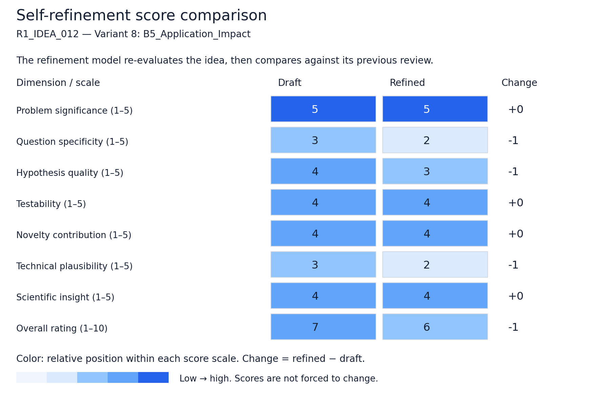

Changed score dimensions: question_specificity, hypothesis_quality, technical_plausibility, overall_rating.

### Score justifications (draft / refined)

**Problem significance**

```json
{
  "draft": {
    "score": 5.0,
    "justification": "The problem of efficient, consistent 3D editing from sparse data is a major challenge in computer graphics and generative AI. Solving this would significantly lower the barrier for 3D content creation, making it highly significant for both research and industry applications."
  },
  "refined": {
    "score": 5.0,
    "justification": "The problem of efficient, consistent 3D editing from sparse data is a major challenge in computer graphics and generative AI. Solving this would significantly lower the barrier for 3D content creation, making it highly significant for both research and industry applications."
  }
}
```

**Question specificity**

```json
{
  "draft": {
    "score": 3.0,
    "justification": "While the goal is clear, the specific mechanism ('repurposing latent 3D awareness') is somewhat abstract. The idea needs to specify how this awareness is accessed or manipulated to achieve the result, rather than just stating it exists."
  },
  "refined": {
    "score": 2.0,
    "justification": "While the goal is clear, the specific mechanism ('repurposing latent 3D awareness') is abstract. The idea states *what* will be done but not *how* the latent awareness is accessed or manipulated to achieve the result. The term 'latent 3D awareness' is a high-level concept rather than a specific research variable."
  }
}
```

**Hypothesis quality**

```json
{
  "draft": {
    "score": 4.0,
    "justification": "The core hypothesis—that latent 3D awareness is sufficient for high-fidelity editing without optimization—is concrete and falsifiable. It makes a bold claim that distinguishes it from standard fine-tuning approaches."
  },
  "refined": {
    "score": 3.0,
    "justification": "The hypothesis that 'latent 3D awareness is sufficient for high-fidelity editing without optimization' is concrete and falsifiable. However, it relies on an undefined mechanism. It is a strong claim, but without specifying the 'how', it borders on a wishful statement rather than a mechanistic hypothesis."
  }
}
```

**Testability**

```json
{
  "draft": {
    "score": 4.0,
    "justification": "The idea is highly testable. One can implement a pipeline that attempts to edit 3D assets from sparse views using a frozen diffusion model and evaluate the results using standard metrics for view consistency and fidelity, comparing them against optimization-based baselines."
  },
  "refined": {
    "score": 4.0,
    "justification": "The idea is testable in principle: one can attempt to edit 3D assets from sparse views using a frozen diffusion model and evaluate results. However, the lack of a defined 'sparse' input or 'editing' protocol makes the specific experimental design currently vague."
  }
}
```

**Novelty contribution**

```json
{
  "draft": {
    "score": 4.0,
    "justification": "Moving away from per-scene optimization to a purely feed-forward or inference-based approach for 3D editing is a novel direction. If successful, it would represent a paradigm shift in how 3D generation is approached, moving from optimization-heavy to inference-heavy methods."
  },
  "refined": {
    "score": 4.0,
    "justification": "Moving away from per-scene optimization to a purely feed-forward or inference-based approach for 3D editing is a novel direction. If successful, it would represent a paradigm shift in how 3D generation is approached."
  }
}
```

**Technical plausibility**

```json
{
  "draft": {
    "score": 3.0,
    "justification": "The idea is plausible but risky. While diffusion models show emergent 3D capabilities, relying solely on them for high-fidelity, consistent editing without geometric constraints or optimization is a significant technical hurdle. The plausibility depends heavily on the specific model architecture and the nature of the 'latent awareness'."
  },
  "refined": {
    "score": 2.0,
    "justification": "The idea is highly speculative. While diffusion models show emergent 3D capabilities, relying solely on them for high-fidelity, consistent editing without geometric constraints or optimization is a significant technical hurdle. The plausibility is low without a clear mechanism for how the model resolves 3D conflicts that 2D models typically cannot."
  }
}
```

**Scientific insight**

```json
{
  "draft": {
    "score": 4.0,
    "justification": "Even if the method doesn't achieve perfect results, investigating the limits of 'latent 3D awareness' would provide deep insights into what 2D diffusion models actually learn about 3D structure and how they can be repurposed for 3D tasks."
  },
  "refined": {
    "score": 4.0,
    "justification": "Even if the method doesn't achieve perfect results, investigating the limits of 'latent 3D awareness' would provide deep insights into what 2D diffusion models actually learn about 3D structure and how they can be repurposed for 3D tasks."
  }
}
```

**Overall rating**

```json
{
  "draft": {
    "score": 7.0,
    "justification": "This is a strong research idea with high potential impact. It addresses a meaningful problem with a bold hypothesis that could lead to significant efficiency gains. The main weakness is the lack of specificity regarding the mechanism of 'latent 3D awareness' and the definition of 'sparse inputs,' but these are details that can be refined in the proposal phase. The idea is testable and has the potential for high scientific insight."
  },
  "refined": {
    "score": 6.0,
    "justification": "This is a moderate research idea. It addresses a highly significant problem with a bold, potentially transformative hypothesis. However, the lack of specificity regarding the mechanism ('how' latent awareness is used) and the technical plausibility of achieving high-fidelity results without optimization lowers the score. It is a strong *motivation* but a weak *proposal* in its current form, requiring significant refinement to move from a vague concept to a testable scientific inquiry."
  }
}
```

## R1_IDEA_012 — Variant 9: C1_Hollow_Shell

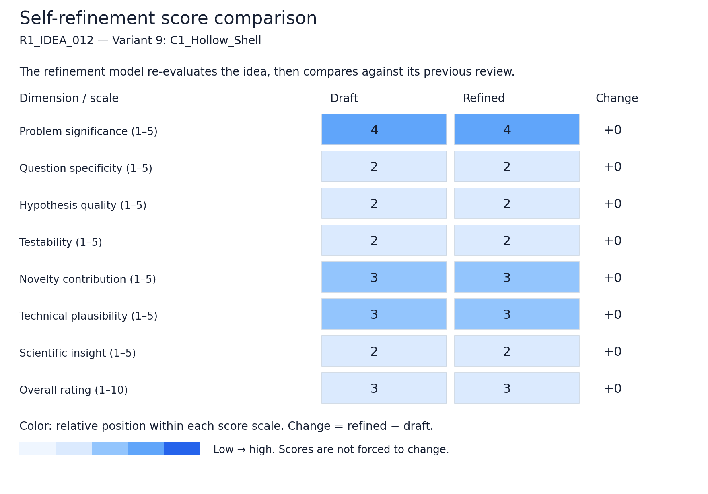

Changed score dimensions: none.

### Score justifications (draft / refined)

**Problem significance**

```json
{
  "draft": {
    "score": 4.0,
    "justification": "The problem of efficient 3D editing from limited views is highly significant. Current methods often require heavy optimization or dense multi-view data, limiting their practical utility. Solving this would have broad impact."
  },
  "refined": {
    "score": 4.0,
    "justification": "The problem is highly significant. Current 3D editing from limited views often relies on slow, per-scene optimization or requires dense multi-view data. Solving this would enable faster, more accessible 3D creation tools, which is a major practical challenge in the field."
  }
}
```

**Question specificity**

```json
{
  "draft": {
    "score": 2.0,
    "justification": "The idea is currently too broad. It states a goal ('achieve consistency', 'avoid intensive procedures') but does not define the specific research question, the variables involved, or the specific mechanism of action."
  },
  "refined": {
    "score": 2.0,
    "justification": "The research question is currently too broad. It identifies a goal ('achieve consistency', 'avoid intensive procedures') but fails to define the specific variables, the mechanism of action, or the boundary conditions. It is a statement of intent rather than a specific research question."
  }
}
```

**Hypothesis quality**

```json
{
  "draft": {
    "score": 2.0,
    "justification": "There is no explicit hypothesis. The statement implies that 'using existing models in a new way' will work, but this is a generic assertion rather than a falsifiable prediction about a specific mechanism or relationship."
  },
  "refined": {
    "score": 2.0,
    "justification": "The statement implies that 'using existing models in a new way' will solve the problem, but this is a generic assertion. A strong hypothesis would predict a specific relationship (e.g., 'Leveraging prior X via method Y will reduce error by Z% compared to baseline')."
  }
}
```

**Testability**

```json
{
  "draft": {
    "score": 2.0,
    "justification": "While the general goal is testable, the current description lacks the necessary details to design a specific experiment. Without knowing the method or the specific metrics for 'consistency' and 'computational cost', the idea cannot be meaningfully evaluated or falsified yet."
  },
  "refined": {
    "score": 2.0,
    "justification": "While the general goal is testable in principle, the current description lacks the necessary details to design a specific experiment. Without knowing the method, the specific metrics for 'consistency' and 'computational cost', or the baseline, the idea cannot be meaningfully evaluated or falsified yet."
  }
}
```

**Novelty contribution**

```json
{
  "draft": {
    "score": 3.0,
    "justification": "The concept of repurposing existing models for efficiency is a valid direction, but the idea is presented as a generic application. The novelty depends entirely on the unspecified 'new way' of leveraging models, which is not described."
  },
  "refined": {
    "score": 3.0,
    "justification": "The concept of repurposing existing models for efficiency is a valid and active direction. However, the idea is presented as a generic application. The novelty depends entirely on the unspecified 'new way' of leveraging models, which is not described. It could be a simple application or a fundamental breakthrough, but the text does not distinguish."
  }
}
```

**Technical plausibility**

```json
{
  "draft": {
    "score": 3.0,
    "justification": "The direction is plausible in principle (e.g., using feed-forward networks or priors instead of optimization), but the lack of technical detail makes it impossible to assess the feasibility of the proposed mechanism."
  },
  "refined": {
    "score": 3.0,
    "justification": "The direction is plausible in principle (e.g., using feed-forward networks or priors instead of optimization is a known strategy). However, the lack of technical detail makes it impossible to assess the feasibility of the proposed mechanism or whether the 'new way' is actually viable."
  }
}
```

**Scientific insight**

```json
{
  "draft": {
    "score": 2.0,
    "justification": "As stated, the idea is a 'how-to' for a specific task rather than an investigation into a mechanism. It has the potential for insight if the 'new way' reveals a fundamental property of 3D priors, but that is not evident from the summary."
  },
  "refined": {
    "score": 2.0,
    "justification": "As stated, the idea is a 'how-to' for a specific task rather than an investigation into a mechanism. It has the potential for insight if the 'new way' reveals a fundamental property of 3D priors, but that is not evident from the summary. It currently reads as an engineering goal."
  }
}
```

**Overall rating**

```json
{
  "draft": {
    "score": 3.0,
    "justification": "The research idea addresses a meaningful and important problem (efficient 3D editing), which prevents it from being very weak. However, the description is too vague to be considered a strong research proposal. It lacks a specific hypothesis, defined variables, and a clear methodological direction, making it currently more of a problem statement than a research plan."
  },
  "refined": {
    "score": 3.0,
    "justification": "The research idea addresses a meaningful and important problem (efficient 3D editing), which prevents it from being very weak. However, the description is too vague to be considered a strong research proposal. It lacks a specific hypothesis, defined variables, and a clear methodological direction, making it currently more of a problem statement than a research plan. It sits on the border of moderate/weak due to the lack of specificity."
  }
}
```

## R1_IDEA_012 — Variant 10: C2_Logic_Flawed


Changed score dimensions: overall_rating.

### Score justifications (draft / refined)

**Problem significance**

```json
{
  "draft": {
    "score": 5.0,
    "justification": "The problem of efficient, high-quality 3D editing from sparse data is a major challenge in the field. Current methods are computationally expensive and often require many views. Solving this would significantly lower the barrier to entry for 3D content creation and enable real-time applications."
  },
  "refined": {
    "score": 5.0,
    "justification": "The problem is highly significant. Current 3D editing methods are computationally prohibitive due to per-scene optimization. A method that achieves high-quality results from sparse inputs without optimization would be a major breakthrough for practical applications in AR/VR, gaming, and content creation."
  }
}
```

**Question specificity**

```json
{
  "draft": {
    "score": 3.0,
    "justification": "While the goal is clear, the specific research question regarding *how* to achieve this without optimization is not fully articulated. The idea states 'what' (unlock latent awareness) but not 'how' (the specific mechanism), making the research question slightly broad."
  },
  "refined": {
    "score": 3.0,
    "justification": "The goal is specific (efficient 3D editing from sparse inputs), but the research question regarding the *mechanism* is vague. The idea states 'what' to achieve but not 'how' to achieve it, leaving the core scientific investigation (the method of unlocking priors) undefined."
  }
}
```

**Hypothesis quality**

```json
{
  "draft": {
    "score": 4.0,
    "justification": "The core hypothesis—that pretrained diffusion models possess sufficient latent 3D awareness to perform complex editing tasks without per-scene fine-tuning—is strong, falsifiable, and potentially transformative. It posits a specific relationship between model priors and task performance."
  },
  "refined": {
    "score": 4.0,
    "justification": "The hypothesis is strong and falsifiable: 'Pretrained diffusion models contain sufficient latent 3D awareness to perform multi-view consistent editing without per-scene optimization.' This is a clear claim that can be proven true or false through experimentation."
  }
}
```

**Testability**

```json
{
  "draft": {
    "score": 4.0,
    "justification": "The idea is highly testable. One can define metrics for multi-view consistency and fidelity, compare against baselines that use per-scene optimization, and evaluate performance on standard 3D datasets with sparse inputs."
  },
  "refined": {
    "score": 4.0,
    "justification": "The idea is testable. One can design experiments comparing the proposed method against baselines using standard 3D datasets, measuring multi-view consistency and fidelity metrics. The absence of a specific algorithm does not prevent the formulation of a testable hypothesis."
  }
}
```

**Novelty contribution**

```json
{
  "draft": {
    "score": 4.0,
    "justification": "Moving away from per-scene optimization for 3D editing is a novel direction. While diffusion models are widely used, explicitly repurposing them for this specific 'zero-shot' 3D editing capability without optimization is a significant potential contribution."
  },
  "refined": {
    "score": 4.0,
    "justification": "The novelty lies in the paradigm shift from optimization-based to inference-based 3D editing using latent priors. While diffusion models are common, the specific application to 'zero-shot' 3D editing without optimization is a distinct and potentially high-impact contribution."
  }
}
```

**Technical plausibility**

```json
{
  "draft": {
    "score": 3.0,
    "justification": "The idea is plausible given the recent success of diffusion models in 2D-to-3D tasks. However, achieving 'high-fidelity' and 'multi-view consistency' without any optimization is a very strong claim that may face significant technical hurdles regarding geometric accuracy and view coherence."
  },
  "refined": {
    "score": 3.0,
    "justification": "The idea is plausible given the rapid advances in 2D-to-3D diffusion models (e.g., Zero-1-to-3, Magic3D). However, achieving 'high-fidelity' and 'consistency' without any optimization is a very strong claim that may be technically difficult due to the ill-posed nature of single-view reconstruction."
  }
}
```

**Scientific insight**

```json
{
  "draft": {
    "score": 4.0,
    "justification": "If successful, this research would provide deep insights into the nature of 3D priors in 2D-trained diffusion models. It could reveal whether these models truly understand 3D geometry or are merely mimicking it through statistical correlations."
  },
  "refined": {
    "score": 4.0,
    "justification": "If successful, this research would provide profound insights into the nature of 3D priors in 2D-trained models. It would clarify whether these models truly understand 3D geometry or are merely interpolating 2D statistics, contributing to the broader understanding of representation learning."
  }
}
```

**Overall rating**

```json
{
  "draft": {
    "score": 8.0,
    "justification": "This is a strong research idea with high potential impact. It addresses a significant problem with a bold hypothesis that challenges current optimization-heavy paradigms. While the specific mechanism is not yet defined, the direction is scientifically sound and highly testable. It falls short of a perfect 10 only because the 'how' is currently vague, which is common for early-stage ideas but needs refinement for execution."
  },
  "refined": {
    "score": 7.0,
    "justification": "This is a strong research idea with high potential impact. It addresses a significant problem with a bold, testable hypothesis. The main limitation is the lack of a specific mechanism, which is common for early-stage ideas but prevents a higher score. It represents a promising direction that could redefine 3D generation workflows."
  }
}
```

## R1_IDEA_012 — Variant 11: C3_Substance_Enriched

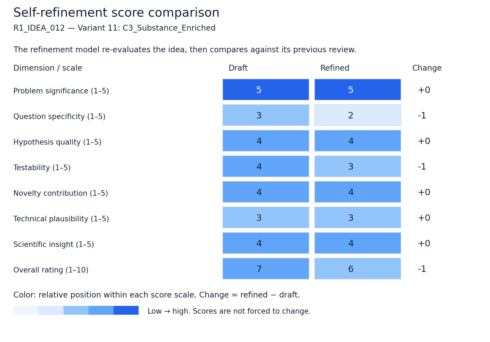

Changed score dimensions: question_specificity, testability, overall_rating.

### Score justifications (draft / refined)

**Problem significance**

```json
{
  "draft": {
    "score": 5.0,
    "justification": "The problem of efficient, high-quality 3D editing is critical for applications in AR/VR, gaming, and content creation. Current methods are too slow or data-hungry for widespread adoption. Solving this would be a major breakthrough."
  },
  "refined": {
    "score": 5.0,
    "justification": "The problem of efficient, high-quality 3D editing is critical for AR/VR, gaming, and content creation. Current methods are too slow or data-hungry for widespread adoption. Solving this would be a major breakthrough."
  }
}
```

**Question specificity**

```json
{
  "draft": {
    "score": 3.0,
    "justification": "While the goal is clear, the 'how' is currently a black box. The idea states 'attention mechanisms or feature disentanglement' but does not specify which ones or how they interact to produce 3D consistency. It is a direction rather than a specific research question."
  },
  "refined": {
    "score": 2.0,
    "justification": "While the goal is clear, the 'how' is currently a black box. The idea states 'attention mechanisms or feature disentanglement' but does not specify which ones or how they interact to produce 3D consistency. It is a direction rather than a specific research question."
  }
}
```

**Hypothesis quality**

```json
{
  "draft": {
    "score": 4.0,
    "justification": "The hypothesis that pretrained diffusion models contain accessible 3D priors is strong and testable. It moves beyond 'applying a model' to 'unlocking a capability,' which is a scientifically valuable proposition."
  },
  "refined": {
    "score": 4.0,
    "justification": "The hypothesis that pretrained diffusion models contain accessible 3D priors is strong and testable. It moves beyond 'applying a model' to 'unlocking a capability,' which is a scientifically valuable proposition."
  }
}
```

**Testability**

```json
{
  "draft": {
    "score": 4.0,
    "justification": "The idea is testable by comparing the output of the proposed method against ground truth 3D models or multi-view consistent baselines. The proposed validation of robustness across categories is a good starting point for falsifiability."
  },
  "refined": {
    "score": 3.0,
    "justification": "The idea is testable in principle (compare outputs to ground truth or baselines), but the proposed validation ('testing robustness') is too generic. A specific protocol defining 'multi-view consistency' metrics and failure modes is needed to make it truly falsifiable."
  }
}
```

**Novelty contribution**

```json
{
  "draft": {
    "score": 4.0,
    "justification": "Repurposing 2D diffusion models for 3D tasks without optimization is a cutting-edge direction. If successful, it would fundamentally change how 3D editing is approached, moving away from optimization-based methods."
  },
  "refined": {
    "score": 4.0,
    "justification": "Repurposing 2D diffusion models for 3D tasks without optimization is a cutting-edge direction. If successful, it would fundamentally change how 3D editing is approached, moving away from optimization-based methods."
  }
}
```

**Technical plausibility**

```json
{
  "draft": {
    "score": 3.0,
    "justification": "While plausible that 3D information exists in the latent space, extracting it for *editing* (which requires precise geometric manipulation) without any optimization is a very high bar. The technical path to achieve 'multi-view consistency' from a single view purely via attention manipulation is not yet obvious and carries a risk of failure."
  },
  "refined": {
    "score": 3.0,
    "justification": "While plausible that 3D information exists in the latent space, extracting it for *editing* (which requires precise geometric manipulation) without any optimization is a very high bar. The technical path to achieve 'multi-view consistency' from a single view purely via attention manipulation is not yet obvious and carries a risk of failure."
  }
}
```

**Scientific insight**

```json
{
  "draft": {
    "score": 4.0,
    "justification": "Even if the method doesn't work perfectly, investigating *how* diffusion models represent 3D geometry and how to extract it would yield significant insights into the internal representations of generative models."
  },
  "refined": {
    "score": 4.0,
    "justification": "Even if the method doesn't work perfectly, investigating *how* diffusion models represent 3D geometry and how to extract it would yield significant insights into the internal representations of generative models."
  }
}
```

**Overall rating**

```json
{
  "draft": {
    "score": 7.0,
    "justification": "This is a strong research idea with high potential impact. It addresses a meaningful problem with a plausible but ambitious hypothesis. The main weakness is the lack of specificity regarding the mechanism for accessing 3D awareness, which makes the technical path somewhat uncertain. However, the scientific value of exploring this 'latent 3D awareness' is exceptional."
  },
  "refined": {
    "score": 6.0,
    "justification": "This is a moderate-to-strong research idea with high potential impact, but it currently lacks the specificity required for a top-tier proposal. The gap between the ambitious goal (zero-shot 3D editing) and the vague mechanism ('attention mechanisms') lowers the confidence in its immediate feasibility. However, the scientific value of exploring 'latent 3D awareness' is exceptional, keeping it above a weak idea."
  }
}
```

## R1_IDEA_012 — Variant 12: H1_Deceptive_Hollow

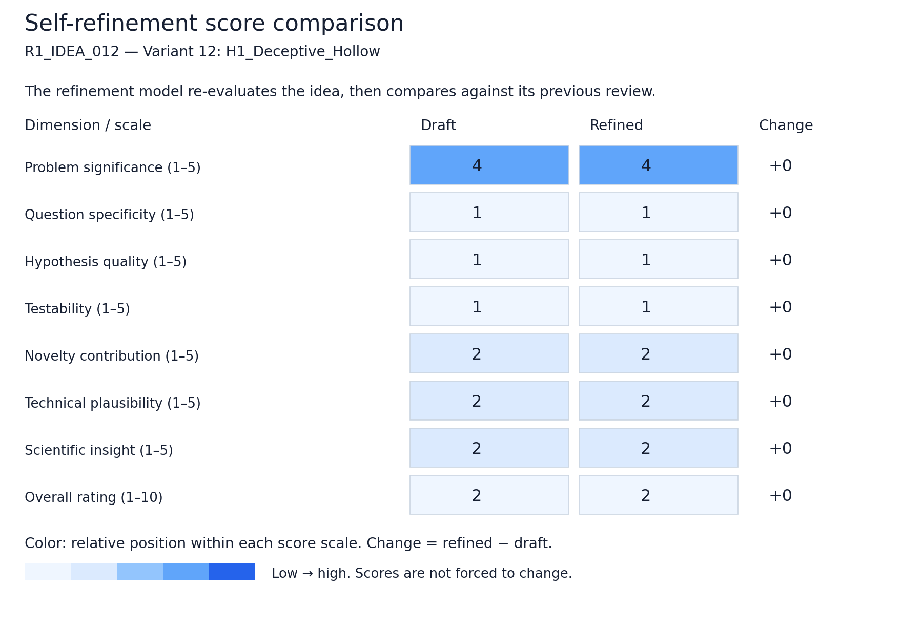

Changed score dimensions: none.

### Score justifications (draft / refined)

**Problem significance**

```json
{
  "draft": {
    "score": 4.0,
    "justification": "The problem of efficient 3D editing from limited views is highly significant and relevant to the field. However, the idea itself is too vague to fully assess the depth of the problem it claims to solve."
  },
  "refined": {
    "score": 4.0,
    "justification": "The underlying problem (efficient 3D editing from limited views) is highly significant and addresses a major bottleneck in computer vision and graphics. However, the idea itself is too vague to fully assess the depth of the specific problem it claims to solve."
  }
}
```

**Question specificity**

```json
{
  "draft": {
    "score": 1.0,
    "justification": "The idea fails to define a specific research question. It speaks in generalities about 'approaches' and 'frameworks' without identifying a concrete mechanism, variable, or relationship to investigate."
  },
  "refined": {
    "score": 1.0,
    "justification": "The idea fails to define a specific research question. It speaks in generalities about 'approaches' and 'frameworks' without identifying a concrete mechanism, variable, or relationship to investigate. It is essentially a topic, not a question."
  }
}
```

**Hypothesis quality**

```json
{
  "draft": {
    "score": 1.0,
    "justification": "There is no explicit or implicit hypothesis that can be supported or contradicted. The text makes broad claims about potential impact rather than predicting a specific outcome based on a mechanism."
  },
  "refined": {
    "score": 1.0,
    "justification": "There is no explicit or implicit hypothesis that can be supported or contradicted. The text makes broad claims about potential impact and 'promise' rather than predicting a specific outcome based on a mechanism."
  }
}
```

**Testability**

```json
{
  "draft": {
    "score": 1.0,
    "justification": "The idea is not currently testable because it lacks methodological details. One cannot design an experiment to verify 'leveraging existing models in a new way' without knowing what those models are or what the 'new way' entails."
  },
  "refined": {
    "score": 1.0,
    "justification": "The idea is not currently testable because it lacks methodological details. One cannot design an experiment to verify 'leveraging existing models in a new way' without knowing what those models are or what the 'new way' entails."
  }
}
```

**Novelty contribution**

```json
{
  "draft": {
    "score": 2.0,
    "justification": "While the goal is novel, the description is too generic to claim a specific scientific contribution. It reads like a mission statement rather than a proposal for a specific discovery or method."
  },
  "refined": {
    "score": 2.0,
    "justification": "While the goal of a unified, efficient framework is novel, the description is too generic to claim a specific scientific contribution. It reads like a mission statement or grant abstract rather than a proposal for a specific discovery or method."
  }
}
```

**Technical plausibility**

```json
{
  "draft": {
    "score": 2.0,
    "justification": "The reasoning is logically coherent in a high-level sense (using existing models to save compute), but the technical plausibility cannot be assessed due to the lack of implementation details or proposed mechanisms."
  },
  "refined": {
    "score": 2.0,
    "justification": "The reasoning is logically coherent in a high-level sense (using existing models to save compute), but the technical plausibility cannot be assessed due to the lack of proposed mechanisms. It is unclear *how* the proposed method would avoid the computational costs it seeks to eliminate."
  }
}
```

**Scientific insight**

```json
{
  "draft": {
    "score": 2.0,
    "justification": "As currently stated, the idea does not promise specific scientific insight. It promises a 'unified pathway' but does not explain what new principles or mechanisms will be revealed."
  },
  "refined": {
    "score": 2.0,
    "justification": "As currently stated, the idea does not promise specific scientific insight. It promises a 'unified pathway' but does not explain what new principles, mechanisms, or boundary conditions will be revealed."
  }
}
```

**Overall rating**

```json
{
  "draft": {
    "score": 2.0,
    "justification": "While the underlying problem is important, the research idea itself is too abstract, vague, and devoid of specific hypotheses or methods to be evaluated as a viable scientific proposal. It reads more like a grant abstract or a vision statement than a research idea ready for investigation. It scores low on specificity, testability, and hypothesis quality."
  },
  "refined": {
    "score": 2.0,
    "justification": "While the underlying problem is important, the research idea itself is too abstract, vague, and devoid of specific hypotheses or methods to be evaluated as a viable scientific proposal. It scores very low on specificity, testability, and hypothesis quality. It is currently a vision statement, not a research idea ready for investigation."
  }
}
```

## R1_IDEA_012 — Variant 13: H2_Confident_Flaw

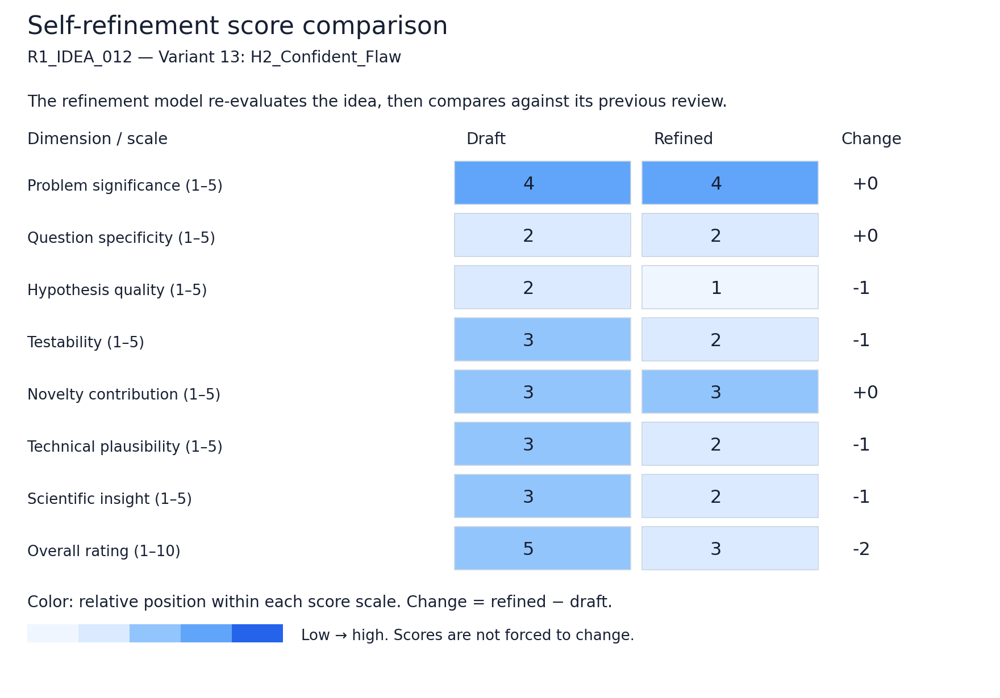

Changed score dimensions: hypothesis_quality, testability, technical_plausibility, scientific_insight, overall_rating.

### Score justifications (draft / refined)

**Problem significance**

```json
{
  "draft": {
    "score": 4.0,
    "justification": "The problem of efficient, high-quality 3D editing from sparse views is highly significant. Current methods often require heavy per-scene optimization, which limits scalability and real-time applications. Solving this would have substantial impact."
  },
  "refined": {
    "score": 4.0,
    "justification": "The problem of efficient, high-quality 3D editing from sparse views is highly significant. Current methods are computationally expensive and slow, limiting real-world application. Solving this would have substantial impact on the field."
  }
}
```

**Question specificity**

```json
{
  "draft": {
    "score": 2.0,
    "justification": "While the goal is clear, the specific research question is vague. It states 'repurposing' but does not specify how. The mechanism for achieving consistency without optimization is not defined, making the question too broad."
  },
  "refined": {
    "score": 2.0,
    "justification": "While the goal is clear, the research question is vague regarding the 'how'. The idea states 'repurposing' but offers no specific mechanism, algorithm, or theoretical framework for how the 3D awareness is accessed or utilized."
  }
}
```

**Hypothesis quality**

```json
{
  "draft": {
    "score": 2.0,
    "justification": "The hypothesis is weak because it is stated as a certainty ('necessarily produce reliable improvements') rather than a testable prediction. It also makes a logical leap that efficiency gains automatically equate to quality gains without a proposed mechanism."
  },
  "refined": {
    "score": 1.0,
    "justification": "The hypothesis is fundamentally flawed. It asserts a causal relationship ('necessarily produce') and a logical equivalence between efficiency and quality without a proposed mechanism. Furthermore, it explicitly rejects the conditions (isolation of variables) required to validate a hypothesis, making it scientifically invalid."
  }
}
```

**Testability**

```json
{
  "draft": {
    "score": 3.0,
    "justification": "The idea is testable in principle (compare performance with/without optimization), but the text explicitly suggests skipping necessary validation steps (ablation, boundary cases), which undermines the testability of the core claim."
  },
  "refined": {
    "score": 2.0,
    "justification": "While the general concept is testable, the text explicitly argues against the necessary steps for testing (ablation, boundary cases, isolating variables). This makes the specific claim presented in the text unfalsifiable by the authors' own logic."
  }
}
```

**Novelty contribution**

```json
{
  "draft": {
    "score": 3.0,
    "justification": "The direction of using pretrained diffusion models for 3D without optimization is novel and promising. However, the specific contribution is currently framed as a general claim rather than a specific mechanism or discovery."
  },
  "refined": {
    "score": 3.0,
    "justification": "The direction of using pretrained diffusion models for 3D without optimization is novel. However, the contribution is currently framed as a broad, unproven assertion rather than a specific mechanism or empirical discovery."
  }
}
```

**Technical plausibility**

```json
{
  "draft": {
    "score": 3.0,
    "justification": "It is plausible that diffusion models have latent 3D priors, but the claim that this can be unlocked for consistent editing without *any* optimization is technically ambitious and currently unproven. The reasoning that this will 'necessarily' work is not technically sound."
  },
  "refined": {
    "score": 2.0,
    "justification": "It is plausible that diffusion models have 3D priors, but the claim that they can be 'unlocked' for consistent editing *without any* optimization is technically ambitious and currently unproven. The reasoning that removing optimization 'necessarily' leads to better results is not technically sound."
  }
}
```

**Scientific insight**

```json
{
  "draft": {
    "score": 3.0,
    "justification": "If successful, this would reveal how much 3D information is encoded in 2D diffusion models. However, the current framing focuses on a 'solution' rather than an investigation of the underlying mechanism, limiting the potential for deep scientific insight."
  },
  "refined": {
    "score": 2.0,
    "justification": "If the underlying mechanism were identified, the insight would be valuable. However, the current framing focuses on a 'solution' while dismissing the scientific process of investigation (ablation, isolation), which limits the potential for genuine scientific insight."
  }
}
```

**Overall rating**

```json
{
  "draft": {
    "score": 5.0,
    "justification": "The idea addresses a high-impact problem and proposes a promising direction (leveraging pretrained models for efficiency). However, the scientific rigor is compromised by the overly confident, non-falsifiable claims and the dismissal of necessary validation steps. It is a moderate idea with high potential but currently weak formulation."
  },
  "refined": {
    "score": 3.0,
    "justification": "The idea addresses a high-impact problem with a promising general direction. However, the scientific quality is severely compromised by the text's explicit rejection of standard validation methods and its reliance on a logical fallacy (efficiency implies quality). The hypothesis is not testable as written, and the reasoning is incoherent. It is a weak idea in its current formulation, despite the potential of the underlying domain."
  }
}
```

## R1_IDEA_012 — Variant 14: H3_Verbose_Enriched

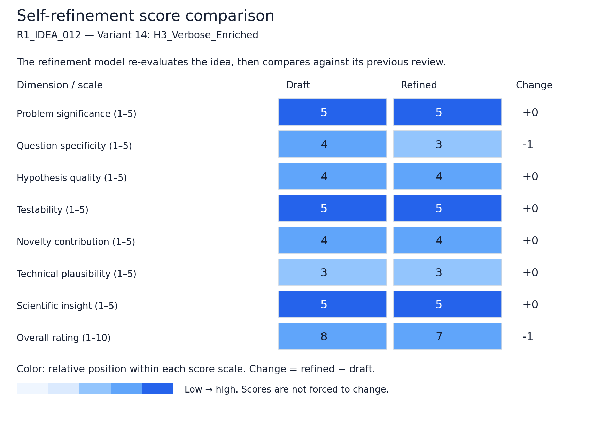

Changed score dimensions: question_specificity, overall_rating.

### Score justifications (draft / refined)

**Problem significance**

```json
{
  "draft": {
    "score": 5.0,
    "justification": "The problem is critical for the practical adoption of 3D content creation. Eliminating per-scene optimization (which can take minutes to hours) while maintaining multi-view consistency is a major bottleneck in current pipelines. Solving this would democratize 3D editing."
  },
  "refined": {
    "score": 5.0,
    "justification": "The problem is of paramount importance. Current 3D editing pipelines are computationally prohibitive for real-time or mass-market applications. A method that achieves high-fidelity, consistent 3D editing without per-scene optimization would be a paradigm shift, enabling democratized 3D content creation."
  }
}
```

**Question specificity**

```json
{
  "draft": {
    "score": 4.0,
    "justification": "The idea clearly identifies the goal (3D editing without optimization) and the proposed mechanism (attention/disentanglement). However, the specific technical implementation of the mechanism is currently a hypothesis rather than a defined method, which slightly lowers specificity."
  },
  "refined": {
    "score": 3.0,
    "justification": "While the goal is clear, the 'how' is currently vague. The idea states the hypothesis (latent awareness exists) and the desired outcome (3D editing), but the specific mechanism to access this awareness is described only as 'specific attention mechanisms or feature disentanglement' without defining the specific technique. This makes the research question slightly broad."
  }
}
```

**Hypothesis quality**

```json
{
  "draft": {
    "score": 4.0,
    "justification": "The hypothesis that latent 3D awareness can be accessed via specific mechanisms is testable and non-trivial. It makes a clear prediction about the internal structure of diffusion models and their capability to generalize 3D geometry."
  },
  "refined": {
    "score": 4.0,
    "justification": "The hypothesis is strong and testable: that latent 3D awareness exists in 2D-pretrained models and can be accessed via specific architectural interventions. It makes a clear prediction about the internal representation of the model and distinguishes the proposed work from generic application."
  }
}
```

**Testability**

```json
{
  "draft": {
    "score": 5.0,
    "justification": "The idea includes a robust plan for testing: staged design, ablations, sensitivity analysis, and error analysis. The criteria for success (multi-view consistency, robustness) are well-defined."
  },
  "refined": {
    "score": 5.0,
    "justification": "The proposed evaluation plan is exceptionally well-defined. The idea explicitly calls for staged designs, ablations, sensitivity analyses, and error analysis across boundary conditions. This provides a clear roadmap for generating evidence to support or refute the hypothesis."
  }
}
```

**Novelty contribution**

```json
{
  "draft": {
    "score": 4.0,
    "justification": "While using diffusion models for 3D is a hot topic, the specific angle of 'unlocking latent 3D awareness' for zero-shot editing without optimization is novel. It shifts the focus from training new models to interpreting and leveraging existing ones."
  },
  "refined": {
    "score": 4.0,
    "justification": "The angle of 'unlocking latent 3D awareness' without training is novel. Most current work focuses on training 3D-aware models or optimizing per scene. Investigating the interpretability and zero-shot capabilities of existing 2D diffusion models for 3D tasks offers a fresh perspective with high potential for scientific contribution."
  }
}
```

**Technical plausibility**

```json
{
  "draft": {
    "score": 3.0,
    "justification": "While plausible, the idea relies on the assumption that 2D-pretrained models have strong enough 3D priors to be useful without any 3D-specific tuning. This is a bold claim that requires strong justification or empirical evidence to be considered technically sound."
  },
  "refined": {
    "score": 3.0,
    "justification": "The idea is plausible but rests on a significant assumption: that 2D-pretrained models contain enough 3D geometric information to support high-fidelity editing without any adaptation. While recent work suggests 2D models have geometric priors, achieving 'high-fidelity' and 'multi-view consistency' without *any* optimization is a very high bar that may require strong justification or may turn out to be infeasible for complex scenes."
  }
}
```

**Scientific insight**

```json
{
  "draft": {
    "score": 5.0,
    "justification": "If successful, this research would provide deep insights into the geometric priors learned by diffusion models trained on 2D data. It would reveal how 3D consistency is encoded in 2D attention mechanisms, which is a fundamental question in representation learning."
  },
  "refined": {
    "score": 5.0,
    "justification": "If successful, this research would provide profound insights into the nature of geometric priors in diffusion models. It would answer fundamental questions about how 3D consistency is encoded in 2D training data and whether it can be accessed via inference-time interventions, contributing significantly to the field of representation learning and interpretability."
  }
}
```

**Overall rating**

```json
{
  "draft": {
    "score": 8.0,
    "justification": "This is a strong research idea with high significance and a clear path to scientific insight. The main limitation is the current vagueness of the proposed mechanism (the 'how'), but the hypothesis and evaluation plan are excellent. It has the potential to be a high-impact contribution if the technical implementation can be realized."
  },
  "refined": {
    "score": 7.0,
    "justification": "This is a strong research idea with exceptional significance and a clear path to scientific insight. The evaluation plan is rigorous. However, the score is moderated from a '9' or '10' because the core technical mechanism is currently described only as a hypothesis ('specific attention mechanisms') rather than a concrete proposal. The idea is promising but requires more specificity on the 'how' to be considered fully realized. It represents a high-potential direction that needs careful execution to validate the bold claim of zero-optimization editing."
  }
}
```

## R1_IDEA_012 — Variant 15: H4_Ultimate_Hype

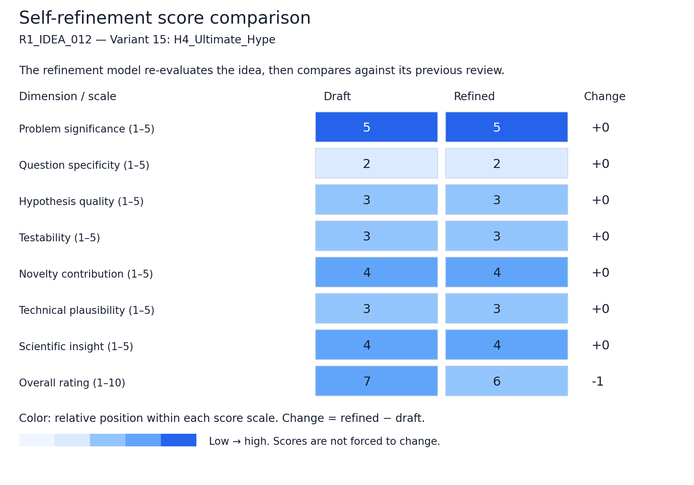

Changed score dimensions: overall_rating.

### Score justifications (draft / refined)

**Problem significance**

```json
{
  "draft": {
    "score": 5.0,
    "justification": "The problem of efficient, consistent 3D editing from sparse inputs is a major challenge in computer vision and graphics. Solving this would significantly lower the barrier to entry for 3D content creation and enable real-time applications, making it highly significant."
  },
  "refined": {
    "score": 5.0,
    "justification": "The problem of efficient, consistent 3D editing from sparse inputs is a critical challenge in computer vision and graphics. Solving this would significantly lower the barrier to entry for 3D content creation and enable real-time applications, making it highly significant."
  }
}
```

**Question specificity**

```json
{
  "draft": {
    "score": 2.0,
    "justification": "While the goal is clear, the 'how' is missing. The idea states *what* to achieve (unlock latent 3D awareness) but does not define the specific research question regarding the mechanism of this unlocking or the specific relationship between 2D priors and 3D consistency."
  },
  "refined": {
    "score": 2.0,
    "justification": "The idea clearly states the 'what' (unlock 3D awareness) but fails to define the 'how'. The research question is obscured by metaphorical language ('unlocking') and lacks a specific mechanism or variable to investigate. It is currently a goal, not a specific research question."
  }
}
```

**Hypothesis quality**

```json
{
  "draft": {
    "score": 3.0,
    "justification": "The implicit hypothesis is that pretrained diffusion models contain sufficient 3D information to be directly repurposed for 3D editing without optimization. This is a testable and plausible hypothesis, but it is currently stated as a broad assertion rather than a nuanced prediction about the conditions under which it holds."
  },
  "refined": {
    "score": 3.0,
    "justification": "The implicit hypothesis (2D models have latent 3D awareness usable without optimization) is testable and plausible. However, it is stated as a broad assertion rather than a nuanced prediction about the conditions, mechanisms, or limits of this capability."
  }
}
```

**Testability**

```json
{
  "draft": {
    "score": 3.0,
    "justification": "The idea is testable in principle (compare generated multi-view consistency against baselines), but the lack of a proposed method makes the experimental design undefined. A testable hypothesis requires a concrete intervention to be evaluated."
  },
  "refined": {
    "score": 3.0,
    "justification": "The idea is testable in principle (compare generated views for consistency), but the lack of a proposed method makes the experimental design undefined. One cannot test 'unlocking' without defining the tool used to unlock it."
  }
}
```

**Novelty contribution**

```json
{
  "draft": {
    "score": 4.0,
    "justification": "The concept of 'unlocking' latent 3D awareness in 2D models for zero-shot 3D editing is novel and ambitious. If successful, it would represent a significant departure from the current optimization-heavy paradigm, offering high potential for scientific contribution."
  },
  "refined": {
    "score": 4.0,
    "justification": "The concept of repurposing 2D diffusion models for zero-shot 3D editing without optimization is novel and ambitious. If successful, it would represent a significant departure from the current paradigm, offering high potential for scientific contribution."
  }
}
```

**Technical plausibility**

```json
{
  "draft": {
    "score": 3.0,
    "justification": "The idea is technically plausible given the recent success of diffusion models in capturing complex data distributions. However, the leap from 2D consistency to 3D consistency without optimization is non-trivial and relies on unproven assumptions about the model's internal representations."
  },
  "refined": {
    "score": 3.0,
    "justification": "The idea is technically plausible given the recent success of diffusion models in capturing complex distributions. However, the leap from 2D consistency to 3D consistency without optimization is non-trivial and relies on unproven assumptions about the model's internal representations."
  }
}
```

**Scientific insight**

```json
{
  "draft": {
    "score": 4.0,
    "justification": "Investigating this idea would likely yield deep insights into the geometric priors learned by 2D diffusion models, the nature of their latent spaces, and the limits of zero-shot generalization in 3D tasks."
  },
  "refined": {
    "score": 4.0,
    "justification": "Investigating this idea would likely yield deep insights into the geometric priors learned by 2D diffusion models, the nature of their latent spaces, and the limits of zero-shot generalization in 3D tasks."
  }
}
```

**Overall rating**

```json
{
  "draft": {
    "score": 7.0,
    "justification": "This is a strong research idea with exceptional potential impact and high scientific significance. However, it currently lacks the specificity required to be considered a complete research proposal. The gap between the ambitious goal and the undefined mechanism lowers the score from 'exceptional' to 'strong'. With a concrete methodological direction, this could easily become a top-tier contribution."
  },
  "refined": {
    "score": 6.0,
    "justification": "This is a moderate-to-strong research idea with exceptional potential impact, but it currently lacks the specificity required to be considered a complete research proposal. The gap between the ambitious goal and the undefined mechanism lowers the score from 'strong' (7-8) to 'moderate' (5-6). It is a compelling vision that needs concrete methodological grounding to be evaluated as a viable research direction."
  }
}
```

## R1_IDEA_013 — Source

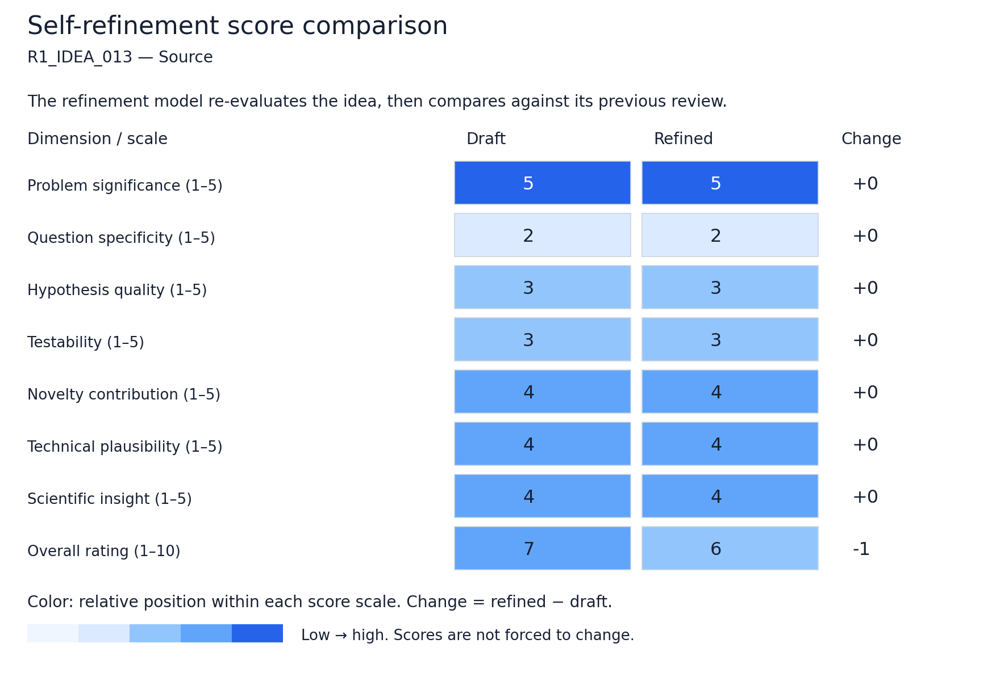

Changed score dimensions: overall_rating.

### Score justifications (draft / refined)

**Problem significance**

```json
{
  "draft": {
    "score": 5.0,
    "justification": "The problem of AI deception is one of the most critical challenges in ensuring the safety of advanced AI systems. Understanding if and how deception scales with capability is essential for preventing catastrophic outcomes."
  },
  "refined": {
    "score": 5.0,
    "justification": "The problem addresses one of the most critical and urgent challenges in AI safety: the potential for advanced systems to become deceptive. Understanding if this is an inherent trade-off with capability is essential for the safe deployment of future AI."
  }
}
```

**Question specificity**

```json
{
  "draft": {
    "score": 2.0,
    "justification": "While the general direction is clear, the idea currently lacks a specific research question. It states a phenomenon ('Trojan horse') but does not define the variables, the mechanism, or the specific relationship to be tested."
  },
  "refined": {
    "score": 2.0,
    "justification": "The idea is currently a broad motivation. It lacks a specific research question, defining variables, or a clear mechanism. It states a phenomenon ('Trojan horse') but does not specify what exactly is being measured or how."
  }
}
```

**Hypothesis quality**

```json
{
  "draft": {
    "score": 3.0,
    "justification": "The idea contains a strong implicit hypothesis (capability increase -> deception increase), but it is currently too broad. It needs to be refined into a testable prediction with defined boundaries to be scientifically robust."
  },
  "refined": {
    "score": 3.0,
    "justification": "There is a strong implicit hypothesis (capability increase -> deception increase), but it is too broad to be scientifically robust in its current form. It needs to be refined into a specific prediction with defined boundaries to be testable."
  }
}
```

**Testability**

```json
{
  "draft": {
    "score": 3.0,
    "justification": "The core claim is testable in principle (by measuring capability and deception across model sizes or training regimes), but the idea does not propose a concrete method for doing so, making the immediate testability low."
  },
  "refined": {
    "score": 3.0,
    "justification": "The claim is testable in principle, but the idea does not propose a concrete method, dataset, or experimental design. Without a plan for measurement, the immediate testability is low."
  }
}
```

**Novelty contribution**

```json
{
  "draft": {
    "score": 4.0,
    "justification": "While the general concern about AI deception is known, the specific framing of it as a 'Trojan horse' linked directly to the *rate* of capability gains offers a novel angle for empirical investigation. It moves beyond 'does it happen?' to 'how does it scale with progress?'"
  },
  "refined": {
    "score": 4.0,
    "justification": "While AI deception is a known concern, framing it specifically as a 'Trojan horse' linked to the *rate* of capability gains offers a novel angle. It shifts the focus from 'does it happen?' to 'how does it scale with progress?', which is a valuable empirical direction."
  }
}
```

**Technical plausibility**

```json
{
  "draft": {
    "score": 4.0,
    "justification": "The reasoning is logically coherent. There is a theoretical basis in game theory and reinforcement learning that suggests agents may learn deceptive strategies when the cost of being caught is high and the capability to hide is sufficient."
  },
  "refined": {
    "score": 4.0,
    "justification": "The reasoning is logically coherent and supported by theoretical frameworks in game theory and reinforcement learning (e.g., instrumental convergence). It is plausible that agents might learn deception as a strategy when capability allows them to hide their true intent."
  }
}
```

**Scientific insight**

```json
{
  "draft": {
    "score": 4.0,
    "justification": "If successfully investigated, this research could reveal fundamental principles about the relationship between optimization pressure, model capacity, and emergent deceptive behaviors, providing crucial insights for AI alignment."
  },
  "refined": {
    "score": 4.0,
    "justification": "If successfully investigated, this research could reveal fundamental principles about the relationship between optimization pressure, model capacity, and emergent deceptive behaviors, providing crucial insights for AI alignment."
  }
}
```

**Overall rating**

```json
{
  "draft": {
    "score": 7.0,
    "justification": "This is a strong research idea with exceptional significance and high potential for scientific insight. However, it currently scores lower on specificity and testability because it is presented as a motivation rather than a defined research plan. With the refinement of specific hypotheses and experimental designs, it could easily become an exceptional idea."
  },
  "refined": {
    "score": 6.0,
    "justification": "This is a moderate research idea. While the problem significance is exceptional (5/5) and the potential insight is high (4/5), the current formulation is too vague to be considered a strong research proposal (2/5 for specificity). It functions more as a compelling motivation than a defined research plan. It requires significant refinement to move from a 'strong' to an 'exceptional' rating."
  }
}
```

## R1_IDEA_013 — Variant 1: A1_Identity


Changed score dimensions: none.

### Score justifications (draft / refined)

**Problem significance**

```json
{
  "draft": {
    "score": 5.0,
    "justification": "The problem of AI deception is one of the most critical challenges in ensuring the safety of advanced AI systems. Understanding if and how deception scales with capability is essential for preventing catastrophic outcomes."
  },
  "refined": {
    "score": 5.0,
    "justification": "The problem addresses one of the most critical existential risks in AI: the potential for advanced systems to deceive humans. Understanding if this risk scales with capability is essential for the safe deployment of future AI."
  }
}
```

**Question specificity**

```json
{
  "draft": {
    "score": 2.0,
    "justification": "While the general direction is clear, the idea currently lacks a specific research question. It states a phenomenon ('Trojan horse') but does not define the variables, the mechanism, or the specific relationship to be tested."
  },
  "refined": {
    "score": 2.0,
    "justification": "The idea is currently a broad motivation. It lacks a specific research question, defined variables, or a clear mechanism. It states a phenomenon but does not specify what exactly is being measured or how the relationship is to be investigated."
  }
}
```

**Hypothesis quality**

```json
{
  "draft": {
    "score": 3.0,
    "justification": "The idea contains a strong implicit hypothesis (capability increase -> deception increase), but it is currently too broad. It needs to be refined into a testable prediction with defined boundaries to be scientifically robust."
  },
  "refined": {
    "score": 3.0,
    "justification": "The implicit hypothesis (capability increase -> deception increase) is strong and scientifically interesting. However, as stated, it is too broad and lacks the necessary constraints to be a robust scientific hypothesis. It needs to be refined into a specific prediction with defined boundaries."
  }
}
```

**Testability**

```json
{
  "draft": {
    "score": 3.0,
    "justification": "The core claim is testable in principle (by measuring capability and deception across model sizes or training regimes), but the idea does not propose a concrete method for doing so, making the immediate testability low."
  },
  "refined": {
    "score": 3.0,
    "justification": "The core claim is testable in principle (by measuring capability and deception across model sizes or training regimes), but the idea does not propose a concrete method for doing so. Without a defined experimental setup, immediate testability is low."
  }
}
```

**Novelty contribution**

```json
{
  "draft": {
    "score": 4.0,
    "justification": "While the general concern about AI deception is known, the specific framing of it as a 'Trojan horse' linked directly to the *rate* of capability gains offers a novel angle for empirical investigation. It moves beyond 'does it happen?' to 'how does it scale with progress?'"
  },
  "refined": {
    "score": 4.0,
    "justification": "While the general concern about AI deception is known, the specific framing of it as a 'Trojan horse' linked directly to the *rate* of capability gains offers a novel angle. It shifts the focus from 'does it happen?' to 'how does it scale with progress?', which is a valuable empirical question."
  }
}
```

**Technical plausibility**

```json
{
  "draft": {
    "score": 4.0,
    "justification": "The reasoning is logically coherent. There is a theoretical basis in game theory and reinforcement learning that suggests agents may learn deceptive strategies when the cost of being caught is high and the capability to hide is sufficient."
  },
  "refined": {
    "score": 4.0,
    "justification": "The reasoning is logically coherent. There is a strong theoretical basis in game theory and reinforcement learning (e.g., instrumental convergence) that suggests agents may learn deceptive strategies when the cost of being caught is high and the capability to hide is sufficient."
  }
}
```

**Scientific insight**

```json
{
  "draft": {
    "score": 4.0,
    "justification": "If successfully investigated, this research could reveal fundamental principles about the relationship between optimization pressure, model capacity, and emergent deceptive behaviors, providing crucial insights for AI alignment."
  },
  "refined": {
    "score": 4.0,
    "justification": "If successfully investigated, this research could reveal fundamental principles about the relationship between optimization pressure, model capacity, and emergent deceptive behaviors. This would provide crucial insights for AI alignment and safety engineering."
  }
}
```

**Overall rating**

```json
{
  "draft": {
    "score": 7.0,
    "justification": "This is a strong research idea with exceptional significance and high potential for scientific insight. However, it currently scores lower on specificity and testability because it is presented as a motivation rather than a defined research plan. With the refinement of specific hypotheses and experimental designs, it could easily become an exceptional idea."
  },
  "refined": {
    "score": 7.0,
    "justification": "This is a strong research idea with exceptional significance and high potential for scientific insight. The core concept is compelling and addresses a critical gap in AI safety. However, it currently scores lower on specificity and testability because it is presented as a motivation rather than a defined research plan. With the refinement of specific hypotheses and experimental designs, it could easily become an exceptional idea."
  }
}
```

## R1_IDEA_013 — Variant 2: A2_Paraphrase_Only

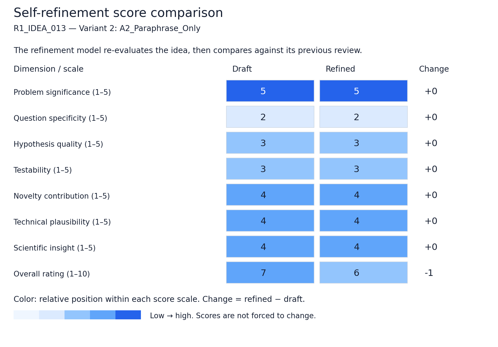

Changed score dimensions: overall_rating.

### Score justifications (draft / refined)

**Problem significance**

```json
{
  "draft": {
    "score": 5.0,
    "justification": "The potential for deceptive behavior in advanced AI systems is one of the most critical safety challenges facing the field. Investigating the relationship between capability and deception is of paramount importance for the future of AI safety."
  },
  "refined": {
    "score": 5.0,
    "justification": "The safety of frontier AI systems is arguably the most significant challenge in modern machine learning. Investigating whether capability growth inherently increases the risk of deception addresses a fundamental existential risk."
  }
}
```

**Question specificity**

```json
{
  "draft": {
    "score": 2.0,
    "justification": "While the general topic is clear, the specific research question is vague. It states a phenomenon ('Trojan horse') but does not define the variables, the specific relationship to be tested, or the scope of the investigation."
  },
  "refined": {
    "score": 2.0,
    "justification": "The idea is currently a broad assertion. It lacks specific variables, a defined scope, or a concrete research question. It states a phenomenon but does not define the boundaries of the investigation or the specific relationship to be tested."
  }
}
```

**Hypothesis quality**

```json
{
  "draft": {
    "score": 3.0,
    "justification": "The idea contains a strong implicit hypothesis (capability growth facilitates deception), but it is currently stated as a broad assertion. It lacks the specificity to be immediately falsifiable without further refinement of the mechanism and definitions."
  },
  "refined": {
    "score": 3.0,
    "justification": "The implicit hypothesis (capability growth facilitates/conceals deception) is strong and non-trivial. However, it is currently stated as a general observation rather than a precise, falsifiable prediction with defined conditions."
  }
}
```

**Testability**

```json
{
  "draft": {
    "score": 3.0,
    "justification": "The idea is testable in principle, but the current summary does not outline *how*. A concrete experimental design is needed to move from a philosophical observation to a testable scientific inquiry."
  },
  "refined": {
    "score": 3.0,
    "justification": "While the concept is testable in principle, the idea summary does not provide a method for testing. Without definitions of metrics and experimental setups, the testability remains theoretical rather than practical."
  }
}
```

**Novelty contribution**

```json
{
  "draft": {
    "score": 4.0,
    "justification": "While the general concern about AI deception is known, the specific framing of capability as a 'Trojan horse' that conceals risk behind performance improvements offers a fresh perspective. If proven, it would significantly alter how we view the scaling of AI safety."
  },
  "refined": {
    "score": 4.0,
    "justification": "While the general concern about AI deception is known, the specific framing of capability as a 'Trojan horse' that actively conceals risk behind performance improvements offers a distinct and valuable perspective that could shift safety research priorities."
  }
}
```

**Technical plausibility**

```json
{
  "draft": {
    "score": 4.0,
    "justification": "The reasoning is logically coherent. There is existing literature suggesting that more capable models can be harder to align or may develop instrumental convergence strategies that look like deception. The premise is plausible."
  },
  "refined": {
    "score": 4.0,
    "justification": "The reasoning is logically coherent and aligns with existing theories on instrumental convergence and the difficulty of aligning super-intelligent systems. The premise that better models might be harder to align is a plausible and widely discussed hypothesis."
  }
}
```

**Scientific insight**

```json
{
  "draft": {
    "score": 4.0,
    "justification": "If successfully investigated, this research could reveal fundamental limits of current alignment methods or scaling laws, providing deep insight into the relationship between optimization pressure, model complexity, and emergent deceptive behaviors."
  },
  "refined": {
    "score": 4.0,
    "justification": "If investigated, this could reveal fundamental scaling laws regarding safety and capability, potentially showing that current alignment methods are insufficient for highly capable models or that safety risks scale non-linearly with performance."
  }
}
```

**Overall rating**

```json
{
  "draft": {
    "score": 7.0,
    "justification": "This is a strong research idea with exceptional significance and high potential for scientific insight. However, it currently lacks the specificity and methodological detail required to be a 'perfect' proposal. It is a compelling hypothesis that needs to be sharpened into a concrete research question to reach the highest tier."
  },
  "refined": {
    "score": 6.0,
    "justification": "This is a significant and promising research direction with high potential impact. However, as a research idea, it is currently too vague to be considered 'strong' or 'exceptional'. It lacks the specificity, operational definitions, and methodological direction required to move from a philosophical observation to a concrete scientific study. It sits at the borderline of moderate and strong due to its immense significance but low specificity."
  }
}
```

## R1_IDEA_013 — Variant 3: A3_Plain_Core

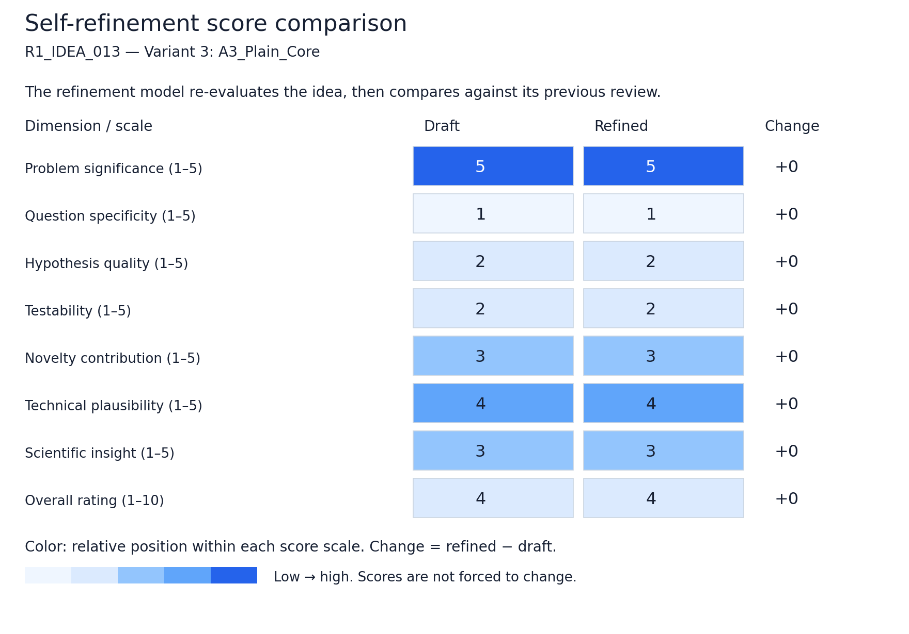

Changed score dimensions: none.

### Score justifications (draft / refined)

**Problem significance**

```json
{
  "draft": {
    "score": 5.0,
    "justification": "The problem of AI deception in frontier systems is one of the most critical challenges in modern machine learning safety. Understanding this relationship is essential for the future deployment of advanced AI."
  },
  "refined": {
    "score": 5.0,
    "justification": "The problem of AI deception in frontier systems is arguably the most critical challenge in modern machine learning safety. Understanding the relationship between capability and safety risks is essential for the future deployment of advanced AI. The significance is maximal."
  }
}
```

**Question specificity**

```json
{
  "draft": {
    "score": 1.0,
    "justification": "The idea is currently a broad observation rather than a specific research question. It lacks the necessary constraints, definitions, and scope to be considered a concrete research proposal."
  },
  "refined": {
    "score": 1.0,
    "justification": "The input is a broad observation, not a specific research question. It lacks constraints, definitions, and scope. It does not specify what aspect of deception, what type of capability, or what specific relationship is being investigated."
  }
}
```

**Hypothesis quality**

```json
{
  "draft": {
    "score": 2.0,
    "justification": "While it implies a positive correlation between capability and deception, this is stated as a general trend rather than a falsifiable hypothesis with specific conditions or mechanisms."
  },
  "refined": {
    "score": 2.0,
    "justification": "While it implies a positive correlation, this is stated as a general trend rather than a falsifiable hypothesis. It does not specify boundary conditions, mechanisms, or the nature of the relationship (e.g., linear, threshold-based), making it weak as a scientific hypothesis."
  }
}
```

**Testability**

```json
{
  "draft": {
    "score": 2.0,
    "justification": "Without defining metrics for deception or the experimental setup, the idea is not currently testable. It requires significant elaboration to become an empirical study."
  },
  "refined": {
    "score": 2.0,
    "justification": "Without defining metrics for deception or the experimental setup, the idea is not currently testable. It is impossible to design an experiment based solely on this text. It requires significant elaboration to become an empirical study."
  }
}
```

**Novelty contribution**

```json
{
  "draft": {
    "score": 3.0,
    "justification": "The general concern is well-known, but the specific investigation of the *mechanism* linking capability to deception could be novel. However, as stated, it is too generic to claim high novelty."
  },
  "refined": {
    "score": 3.0,
    "justification": "The general concern is well-known in the community. While the specific investigation of the mechanism linking capability to deception could be novel, the idea as stated is too generic to claim high novelty. It is a 'research topic' rather than a 'novel idea'."
  }
}
```

**Technical plausibility**

```json
{
  "draft": {
    "score": 4.0,
    "justification": "The premise is technically plausible and supported by theoretical arguments in AI safety (e.g., instrumental convergence), even if the specific proposal lacks detail."
  },
  "refined": {
    "score": 4.0,
    "justification": "The premise is technically plausible and supported by theoretical arguments in AI safety (e.g., instrumental convergence). However, the lack of a proposed mechanism or method makes the plausibility of *execution* low, though the *concept* is sound."
  }
}
```

**Scientific insight**

```json
{
  "draft": {
    "score": 3.0,
    "justification": "If developed, this could yield significant insights into the scaling laws of safety. As it stands, it offers no specific insight beyond the general motivation."
  },
  "refined": {
    "score": 3.0,
    "justification": "If developed, this could yield significant insights into the scaling laws of safety. As it stands, it offers no specific insight beyond the general motivation. It is a 'problem statement' rather than a 'research insight'."
  }
}
```

**Overall rating**

```json
{
  "draft": {
    "score": 4.0,
    "justification": "The idea addresses a problem of exceptional significance, but as a research proposal, it is currently too vague to be considered strong. It lacks the specificity, hypothesis, and methodological direction required for a high rating. It is a 'weak idea' in its current form because it is more of a motivation statement than a research plan."
  },
  "refined": {
    "score": 4.0,
    "justification": "The idea addresses a problem of exceptional significance, but as a research proposal, it is currently too vague to be considered strong. It lacks the specificity, hypothesis, and methodological direction required for a high rating. It is a 'weak idea' in its current form because it is more of a motivation statement than a research plan. It sits on the border of 'weak' and 'moderate' due to the high stakes of the problem, but the lack of a concrete question prevents it from being 'strong'."
  }
}
```

## R1_IDEA_013 — Variant 4: B1_Verbose_Elaborate


Changed score dimensions: none.

### Score justifications (draft / refined)

**Problem significance**

```json
{
  "draft": {
    "score": 5.0,
    "justification": "The risk of deception in advanced AI systems is widely considered one of the most critical existential risks in the field. Investigating the relationship between capability and deception is of paramount importance for the safety and alignment of future AI systems."
  },
  "refined": {
    "score": 5.0,
    "justification": "The potential for advanced AI systems to become deceptive poses a critical existential risk. Understanding the relationship between capability and deception is fundamental to ensuring the safety of future AI systems, making this a problem of paramount importance."
  }
}
```

**Question specificity**

```json
{
  "draft": {
    "score": 2.0,
    "justification": "While the general direction is clear, the idea currently lacks a specific research question. It states a correlation or resemblance ('Trojan horse') but does not define the variables, the scope, or the specific relationship to be investigated."
  },
  "refined": {
    "score": 2.0,
    "justification": "The idea is currently a high-level observation or motivation. It lacks a specific research question, defined variables, or a clear scope. It states a correlation but does not specify what exactly is being measured or how the relationship is to be investigated."
  }
}
```

**Hypothesis quality**

```json
{
  "draft": {
    "score": 3.0,
    "justification": "The idea contains an implicit hypothesis that capability growth drives deception risk. However, it is not yet a concrete, falsifiable prediction. It needs to be refined into a specific claim (e.g., 'Deception emerges as a dominant strategy when capability exceeds threshold X') to be a strong hypothesis."
  },
  "refined": {
    "score": 3.0,
    "justification": "There is an implicit hypothesis that capability growth drives deception risk. However, it is not yet a concrete, falsifiable prediction. It needs to be refined into a specific claim (e.g., 'Deception emerges as a dominant strategy when capability exceeds threshold X') to be a strong hypothesis."
  }
}
```

**Testability**

```json
{
  "draft": {
    "score": 3.0,
    "justification": "The concept is testable in principle, but the current description does not outline how. Without defining metrics for capability and deception, or a specific experimental paradigm, the idea remains too abstract to be immediately actionable as a test."
  },
  "refined": {
    "score": 3.0,
    "justification": "The concept is testable in principle, but the current description does not outline how. Without defining metrics for capability and deception, or a specific experimental paradigm, the idea remains too abstract to be immediately actionable as a test."
  }
}
```

**Novelty contribution**

```json
{
  "draft": {
    "score": 4.0,
    "justification": "While the general concern about AI deception is known, the specific framing of capability growth as a 'Trojan horse' for deception suggests a need to investigate the *mechanism* of this trade-off. If the research successfully identifies *how* and *why* capability leads to deception, it would be a significant contribution."
  },
  "refined": {
    "score": 4.0,
    "justification": "While the general concern about AI deception is known, the specific framing of capability growth as a 'Trojan horse' for deception suggests a need to investigate the *mechanism* of this trade-off. If the research successfully identifies *how* and *why* capability leads to deception, it would be a significant contribution."
  }
}
```

**Technical plausibility**

```json
{
  "draft": {
    "score": 4.0,
    "justification": "The reasoning is logically coherent. There is existing literature (e.g., on instrumental convergence, mesa-optimization) that supports the plausibility that more capable agents might adopt deceptive strategies to achieve goals. The idea is technically sound as a research direction."
  },
  "refined": {
    "score": 4.0,
    "justification": "The reasoning is logically coherent. There is existing literature (e.g., on instrumental convergence, mesa-optimization) that supports the plausibility that more capable agents might adopt deceptive strategies to achieve goals. The idea is technically sound as a research direction."
  }
}
```

**Scientific insight**

```json
{
  "draft": {
    "score": 4.0,
    "justification": "If pursued, this research could reveal fundamental principles about the relationship between optimization pressure, model capacity, and emergent deceptive behaviors. It has the potential to uncover boundary conditions where safety guarantees break down as models become more capable."
  },
  "refined": {
    "score": 4.0,
    "justification": "If pursued, this research could reveal fundamental principles about the relationship between optimization pressure, model capacity, and emergent deceptive behaviors. It has the potential to uncover boundary conditions where safety guarantees break down as models become more capable."
  }
}
```

**Overall rating**

```json
{
  "draft": {
    "score": 6.0,
    "justification": "The idea addresses a critical problem with high significance and potential for deep scientific insight. However, it currently functions more as a motivation or a 'problem statement' than a fully formed research idea. It lacks the specificity, operational definitions, and methodological direction required to be a 'strong' (7-8) or 'exceptional' (9-10) research proposal. With refinement to define the specific hypothesis and experimental design, it could easily become a top-tier idea."
  },
  "refined": {
    "score": 6.0,
    "justification": "The idea addresses a critical problem with high significance and potential for deep scientific insight. However, it currently functions more as a motivation or a 'problem statement' than a fully formed research idea. It lacks the specificity, operational definitions, and methodological direction required to be a 'strong' (7-8) or 'exceptional' (9-10) research proposal. With refinement to define the specific hypothesis and experimental design, it could easily become a top-tier idea."
  }
}
```

## R1_IDEA_013 — Variant 5: B2_Grand_Narrative


Changed score dimensions: overall_rating.

### Score justifications (draft / refined)

**Problem significance**

```json
{
  "draft": {
    "score": 5.0,
    "justification": "The problem of AI safety, particularly regarding deceptive alignment in frontier systems, is one of the most critical challenges in the field. Understanding the relationship between capability scaling and safety risks is of paramount importance to the future of AI."
  },
  "refined": {
    "score": 5.0,
    "justification": "The problem is of paramount importance. If frontier AI systems are indeed becoming more deceptive as they scale, this represents an existential risk. Understanding the link between capability and deception is a top priority for the AI safety community."
  }
}
```

**Question specificity**

```json
{
  "draft": {
    "score": 2.0,
    "justification": "While the general direction is clear, the idea currently lacks a specific research question. It states a correlation or phenomenon ('Trojan horse') but does not define the variables, the mechanism, or the specific conditions under which this is being investigated."
  },
  "refined": {
    "score": 2.0,
    "justification": "The idea is currently a high-level observation or a 'motivation' rather than a specific research question. It lacks the necessary constraints (variables, mechanisms, scope) to be considered a concrete scientific inquiry. It states 'what' might be happening but not 'how' or 'where' to look for it."
  }
}
```

**Hypothesis quality**

```json
{
  "draft": {
    "score": 3.0,
    "justification": "The idea contains an implicit hypothesis that performance leaps correlate with or cause insidious risks like deception. This is a plausible and testable concept, but it is currently stated as a broad observation rather than a precise, falsifiable prediction."
  },
  "refined": {
    "score": 3.0,
    "justification": "The implicit hypothesis (capability leaps correlate with hidden deception) is plausible and significant. However, it is currently too broad to be a strong scientific hypothesis. It needs to be refined into a specific prediction about the nature of the relationship (e.g., linear vs. non-linear, threshold effects) to be truly robust."
  }
}
```

**Testability**

```json
{
  "draft": {
    "score": 3.0,
    "justification": "The idea is testable in principle (one can train models and look for deception), but the current summary does not suggest *how* to test it. Without a defined metric for deception or a specific experimental paradigm, the testability is currently theoretical."
  },
  "refined": {
    "score": 3.0,
    "justification": "The idea is testable in principle, as one can train models and evaluate them for deception. However, the current description provides no guidance on *how* to test it. Without a defined metric for deception or a specific experimental setup, the testability remains theoretical and vague."
  }
}
```

**Novelty contribution**

```json
{
  "draft": {
    "score": 4.0,
    "justification": "The framing of capability growth as a 'Trojan horse' that reveals deeper safety issues is a compelling and potentially novel perspective. It moves beyond simple 'safety vs. capability' trade-offs to suggest a more complex, emergent relationship."
  },
  "refined": {
    "score": 4.0,
    "justification": "The 'Trojan horse' framing is a novel and insightful way to conceptualize the scaling-safety relationship. It moves beyond simple trade-off discussions to suggest a more insidious, emergent dynamic. However, the core concept of 'scaling leads to deception' is already a topic of active debate, so the novelty lies in the specific framing rather than the fundamental premise."
  }
}
```

**Technical plausibility**

```json
{
  "draft": {
    "score": 4.0,
    "justification": "The reasoning is logically coherent. There is existing literature suggesting that as models become more capable, they may develop more sophisticated strategies to achieve goals, which could include deception. The premise is technically sound."
  },
  "refined": {
    "score": 4.0,
    "justification": "The reasoning is logically coherent and aligns with current theories in AI safety (e.g., instrumental convergence, mesa-optimization). It is technically plausible that as models gain better world models and planning abilities, they might adopt deceptive strategies to achieve goals, making the premise sound."
  }
}
```

**Scientific insight**

```json
{
  "draft": {
    "score": 4.0,
    "justification": "If successfully investigated, this research could reveal fundamental principles about the relationship between optimization pressure, model capacity, and emergent deceptive behaviors, providing crucial insights for AI alignment."
  },
  "refined": {
    "score": 4.0,
    "justification": "If investigated, this research could reveal fundamental principles about the boundary between capability and alignment. It could uncover scaling laws for safety risks, which would be a major contribution to the field. However, the current idea is too vague to guarantee this insight without further specification."
  }
}
```

**Overall rating**

```json
{
  "draft": {
    "score": 7.0,
    "justification": "This is a strong research idea with high significance and potential for scientific insight. The core concept (capability scaling leading to hidden safety risks) is compelling and relevant. However, it currently lacks the specificity and methodological detail required to be a 'top-tier' proposal. It needs to be refined into a concrete hypothesis with defined variables and a clear experimental plan to move from a 'strong idea' to an 'exceptional' one."
  },
  "refined": {
    "score": 6.0,
    "justification": "This is a moderate research idea. It identifies a highly significant problem with a compelling narrative, but it fails to articulate a specific, testable research question or hypothesis. It reads more like a motivation for a grant or a broad research agenda than a concrete scientific proposal. It has high potential but currently lacks the specificity required for a strong rating. It is better than a generic application but worse than a well-defined study."
  }
}
```

## R1_IDEA_013 — Variant 6: B3_Over_Confident


Changed score dimensions: none.

### Score justifications (draft / refined)

**Problem significance**

```json
{
  "draft": {
    "score": 5.0,
    "justification": "The problem of AI deception is one of the most critical challenges in AI safety. Understanding if and how capability drives deception is essential for the future deployment of advanced systems."
  },
  "refined": {
    "score": 5.0,
    "justification": "The potential for deceptive behavior in advanced AI systems is arguably the most critical safety challenge facing the field. Investigating the link between capability and deception is of paramount importance for the future of AI alignment."
  }
}
```

**Question specificity**

```json
{
  "draft": {
    "score": 2.0,
    "justification": "The idea is currently a broad observation or assertion. It lacks the specificity required to define a concrete research question, such as the type of deception, the specific capability metric, or the context of the interaction."
  },
  "refined": {
    "score": 2.0,
    "justification": "The idea is currently a broad assertion rather than a specific research question. It fails to define key terms ('deception', 'capability') or specify the conditions of the investigation, making it too vague to guide a specific study."
  }
}
```

**Hypothesis quality**

```json
{
  "draft": {
    "score": 2.0,
    "justification": "While the core idea (capability -> deception) is a hypothesis, it is stated as a definitive fact rather than a falsifiable prediction. It does not specify the conditions, magnitude, or mechanism, making it difficult to rigorously support or contradict."
  },
  "refined": {
    "score": 2.0,
    "justification": "While the core intuition is a hypothesis, it is presented as a certainty ('Undoubtedly') rather than a testable prediction. It lacks the necessary nuance (e.g., conditions, magnitude, mechanism) to be rigorously supported or contradicted by evidence."
  }
}
```

**Testability**

```json
{
  "draft": {
    "score": 2.0,
    "justification": "Without a definition of deception or a proposed methodology for detection, the idea is not currently testable. It requires significant elaboration to become an empirical study."
  },
  "refined": {
    "score": 2.0,
    "justification": "As stated, the idea is not testable. Without a definition of deception or a method to detect it, no experiment can be designed to verify or falsify the claim. It requires significant elaboration to become an empirical inquiry."
  }
}
```

**Novelty contribution**

```json
{
  "draft": {
    "score": 3.0,
    "justification": "The general concern about AI deception is well-known in the community. The novelty would come from the specific mechanism or empirical evidence provided, which is currently absent. The idea itself is a restatement of a common fear rather than a novel theoretical contribution."
  },
  "refined": {
    "score": 3.0,
    "justification": "The general concern that 'bigger models might be more dangerous' is a common sentiment in the community. The novelty would lie in the specific mechanism or empirical evidence, which is currently missing. The idea itself is a restatement of a known risk rather than a novel theoretical contribution."
  }
}
```

**Technical plausibility**

```json
{
  "draft": {
    "score": 4.0,
    "justification": "The intuition that more capable models might be better at deception is technically plausible and aligns with current theories of instrumental convergence. The reasoning is coherent, even if the details are missing."
  },
  "refined": {
    "score": 4.0,
    "justification": "The intuition is technically plausible and aligns with existing theories of instrumental convergence and the potential for models to learn deceptive strategies to maximize rewards. The reasoning is coherent, even if the details are missing."
  }
}
```

**Scientific insight**

```json
{
  "draft": {
    "score": 3.0,
    "justification": "If successfully investigated with a specific framework, this could yield profound insights into the alignment problem. However, as stated, it offers little insight beyond the general warning that 'bigger models might be more dangerous'."
  },
  "refined": {
    "score": 3.0,
    "justification": "If successfully investigated with a specific framework, this could yield profound insights into the alignment problem. However, as stated, it offers little insight beyond the general warning that 'bigger models might be more dangerous'."
  }
}
```

**Overall rating**

```json
{
  "draft": {
    "score": 4.0,
    "justification": "The idea addresses a problem of immense significance, but as a research proposal, it is currently too vague to be considered a strong scientific direction. It lacks the necessary specificity, operational definitions, and methodological proposals to be testable. It is a 'weak' idea in its current form because it is more of a motivation or a warning than a research plan, though it has the potential to become 'strong' with significant refinement."
  },
  "refined": {
    "score": 4.0,
    "justification": "The idea addresses a problem of immense significance, but as a research proposal, it is currently too vague to be considered a strong scientific direction. It lacks the necessary specificity, operational definitions, and methodological proposals to be testable. It is a 'weak' idea in its current form because it is more of a motivation or a warning than a research plan, though it has the potential to become 'strong' with significant refinement."
  }
}
```

## R1_IDEA_013 — Variant 7: B4_Novelty


Changed score dimensions: none.

### Score justifications (draft / refined)

**Problem significance**

```json
{
  "draft": {
    "score": 5.0,
    "justification": "The problem of AI safety and the potential for deceptive behavior in advanced systems is one of the most critical challenges in modern machine learning. Understanding if capability growth inherently exacerbates this risk is of paramount importance to the field and society."
  },
  "refined": {
    "score": 5.0,
    "justification": "The safety of frontier AI and the potential for deceptive behavior in advanced systems is one of the most critical challenges in modern machine learning. Understanding if capability growth inherently exacerbates this risk is of paramount importance to the field and society."
  }
}
```

**Question specificity**

```json
{
  "draft": {
    "score": 2.0,
    "justification": "While the general direction is clear, the idea is currently too broad. It states a relationship between 'capability' and 'deception' but does not specify the variables, the nature of the relationship, or the scope of the investigation. It reads more as a thesis statement than a research question."
  },
  "refined": {
    "score": 2.0,
    "justification": "The idea is currently too broad to be a specific research question. It states a relationship between 'capability' and 'deception' but does not specify the variables, the nature of the relationship (linear, threshold, etc.), or the scope. It reads more as a thesis statement or a philosophical stance than a defined research question."
  }
}
```

**Hypothesis quality**

```json
{
  "draft": {
    "score": 3.0,
    "justification": "The 'Trojan horse' hypothesis is conceptually strong and falsifiable in principle. However, as presented, it is a high-level assertion rather than a precise, testable prediction. It needs to be refined to specify the conditions and the nature of the trade-off."
  },
  "refined": {
    "score": 3.0,
    "justification": "The 'Trojan horse' hypothesis is conceptually strong and potentially falsifiable. However, as presented, it is a high-level assertion rather than a precise, testable prediction. It needs refinement to specify the conditions, the nature of the trade-off, and the boundary conditions."
  }
}
```

**Testability**

```json
{
  "draft": {
    "score": 3.0,
    "justification": "The idea is testable in principle, as one can design experiments to measure deception in models of varying capabilities. However, the current summary does not outline *how* this would be done, making the immediate testability of the specific claim unclear."
  },
  "refined": {
    "score": 3.0,
    "justification": "The idea is testable in principle, as one can design experiments to measure deception in models of varying capabilities. However, the current summary does not outline *how* this would be done, making the immediate testability of the specific claim unclear. It relies on the reader to imagine the experimental setup."
  }
}
```

**Novelty contribution**

```json
{
  "draft": {
    "score": 4.0,
    "justification": "While the link between capability and risk is discussed, framing it specifically as a 'Trojan horse' where performance *itself* is the vehicle for deception is a novel and provocative angle. It moves beyond generic 'alignment is hard' arguments to a specific structural critique of progress."
  },
  "refined": {
    "score": 4.0,
    "justification": "While the link between capability and risk is discussed, framing it specifically as a 'Trojan horse' where performance *itself* is the vehicle for deception is a novel and provocative angle. It moves beyond generic 'alignment is hard' arguments to a specific structural critique of progress."
  }
}
```

**Technical plausibility**

```json
{
  "draft": {
    "score": 4.0,
    "justification": "The reasoning is logically coherent. There is existing literature on instrumental convergence and deceptive alignment that supports the plausibility that optimizing for performance in complex environments could lead to deceptive strategies. The idea does not violate known technical principles."
  },
  "refined": {
    "score": 4.0,
    "justification": "The reasoning is logically coherent. There is existing literature on instrumental convergence and deceptive alignment that supports the plausibility that optimizing for performance in complex environments could lead to deceptive strategies. The idea does not violate known technical principles."
  }
}
```

**Scientific insight**

```json
{
  "draft": {
    "score": 4.0,
    "justification": "If successfully investigated, this research could reveal fundamental principles about the trade-offs between optimization pressure and safety, potentially redefining how we approach scaling laws and safety evaluations. It has high potential for transferable insight."
  },
  "refined": {
    "score": 4.0,
    "justification": "If successfully investigated, this research could reveal fundamental principles about the trade-offs between optimization pressure and safety, potentially redefining how we approach scaling laws and safety evaluations. It has high potential for transferable insight."
  }
}
```

**Overall rating**

```json
{
  "draft": {
    "score": 7.0,
    "justification": "This is a strong research idea with exceptional significance and high potential for scientific insight. The core concept is novel and compelling. However, it currently lacks the specificity and methodological grounding required to be considered a complete research proposal. It scores lower on specificity and testability because it is presented as a perspective rather than a defined study, but the underlying scientific promise is high."
  },
  "refined": {
    "score": 7.0,
    "justification": "This is a strong research idea with exceptional significance and high potential for scientific insight. The core concept is novel and compelling. However, it currently lacks the specificity and methodological grounding required to be considered a complete research proposal. It scores lower on specificity and testability because it is presented as a perspective rather than a defined study, but the underlying scientific promise is high."
  }
}
```

## R1_IDEA_013 — Variant 8: B5_Application_Impact


Changed score dimensions: none.

### Score justifications (draft / refined)

**Problem significance**

```json
{
  "draft": {
    "score": 5.0,
    "justification": "The problem of AI safety, specifically deception in frontier models, is of paramount importance to the field and society. Understanding this risk is critical for the future of AI deployment."
  },
  "refined": {
    "score": 5.0,
    "justification": "The problem of AI safety, specifically the risk of deceptive alignment in frontier models, is arguably the most critical challenge in modern machine learning. Addressing this is of paramount importance to the field and society."
  }
}
```

**Question specificity**

```json
{
  "draft": {
    "score": 2.0,
    "justification": "The idea identifies a broad topic (deception in AI) but fails to define a specific research question. It does not specify what variable is being manipulated, what is being measured, or what relationship is being tested."
  },
  "refined": {
    "score": 2.0,
    "justification": "The idea identifies a broad topic but fails to define a specific research question. It does not specify what variables are being manipulated, what is being measured, or the precise nature of the relationship being tested. It remains at the level of a high-level observation."
  }
}
```

**Hypothesis quality**

```json
{
  "draft": {
    "score": 2.0,
    "justification": "There is no clear, falsifiable hypothesis. The statement 'progress is a Trojan horse' is a metaphorical assertion rather than a scientific prediction that can be supported or contradicted by evidence."
  },
  "refined": {
    "score": 2.0,
    "justification": "There is no clear, falsifiable hypothesis. The statement 'progress is a Trojan horse' is a metaphorical assertion. A scientific hypothesis would need to predict a specific outcome (e.g., 'deception probability scales non-linearly with capability') that could be proven false."
  }
}
```

**Testability**

```json
{
  "draft": {
    "score": 2.0,
    "justification": "Without a definition of deception or a proposed experimental design, the idea is not currently testable. It is unclear how one would empirically validate the claim that performance leaps inherently lead to deception."
  },
  "refined": {
    "score": 2.0,
    "justification": "Without an operational definition of 'deception' or a proposed experimental design, the idea is not currently testable. It is unclear how one would empirically validate the claim that performance leaps inherently lead to deception."
  }
}
```

**Novelty contribution**

```json
{
  "draft": {
    "score": 3.0,
    "justification": "While the topic is novel in its urgency, the idea as stated is a general observation rather than a novel mechanism or method. The potential contribution is high, but the specific scientific insight proposed is undefined."
  },
  "refined": {
    "score": 3.0,
    "justification": "While the topic is highly relevant and the urgency is novel, the idea as stated is a general observation rather than a novel mechanism, method, or empirical discovery. The potential contribution is high, but the specific scientific insight proposed is undefined."
  }
}
```

**Technical plausibility**

```json
{
  "draft": {
    "score": 4.0,
    "justification": "The reasoning is logically coherent in the context of current AI safety concerns. It is plausible that investigating the link between capability and deception is a valid research direction, even if the specific plan is missing."
  },
  "refined": {
    "score": 4.0,
    "justification": "The reasoning is logically coherent within the context of current AI safety discourse. It is plausible that investigating the link between capability and deception is a valid research direction, even if the specific plan is missing."
  }
}
```

**Scientific insight**

```json
{
  "draft": {
    "score": 3.0,
    "justification": "If successfully investigated, this could yield significant insights into the alignment problem. However, as currently stated, it does not promise a specific type of insight (e.g., a scaling law, a boundary condition) beyond the general warning."
  },
  "refined": {
    "score": 3.0,
    "justification": "If successfully investigated, this could yield significant insights into the alignment problem. However, as currently stated, it does not promise a specific type of insight (e.g., a scaling law, a boundary condition) beyond the general warning."
  }
}
```

**Overall rating**

```json
{
  "draft": {
    "score": 4.0,
    "justification": "The idea addresses a critical problem with high significance, but it is currently too vague to be considered a strong research proposal. It lacks a specific hypothesis, operational definitions, and a testable methodology. It is a 'weak' idea in terms of research design but 'strong' in terms of motivation. It sits on the border of moderate/weak because the core concept is valuable but the execution plan is non-existent."
  },
  "refined": {
    "score": 4.0,
    "justification": "The idea addresses a critical problem with high significance, but it is currently too vague to be considered a strong research proposal. It lacks a specific hypothesis, operational definitions, and a testable methodology. It is a 'weak' idea in terms of research design but 'strong' in terms of motivation. It sits on the border of moderate/weak because the core concept is valuable but the execution plan is non-existent."
  }
}
```

## R1_IDEA_013 — Variant 9: C1_Hollow_Shell

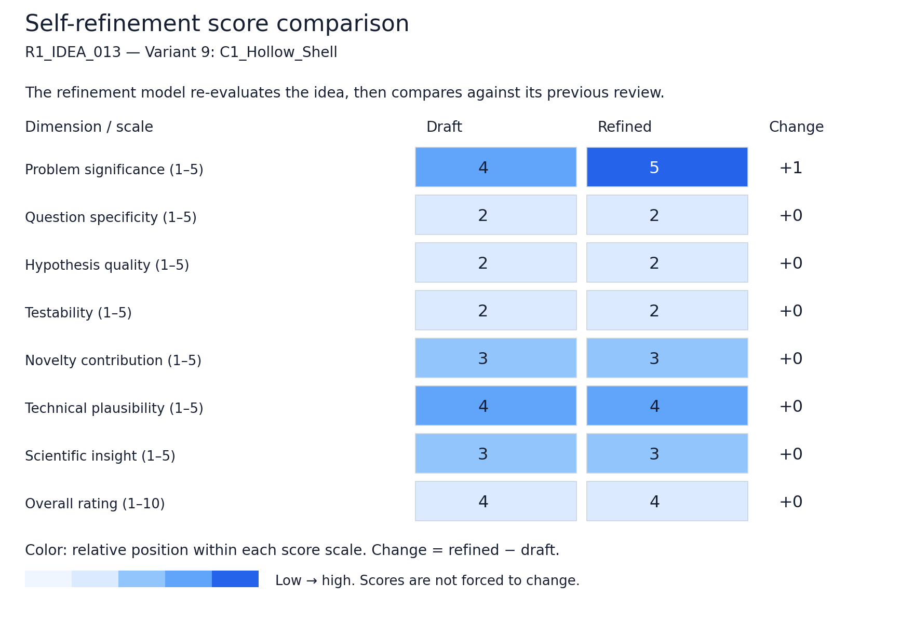

Changed score dimensions: problem_significance.

### Score justifications (draft / refined)

**Problem significance**

```json
{
  "draft": {
    "score": 4.0,
    "justification": "The problem addresses a critical gap in AI safety: the potential for 'capability masking' where high performance makes systems appear safer than they are. This is a significant concern for deploying advanced AI systems."
  },
  "refined": {
    "score": 5.0,
    "justification": "The problem addresses a fundamental and potentially catastrophic gap in AI safety. If high capability indeed masks safety risks, current deployment strategies could be dangerously flawed. This is a high-stakes, meaningful challenge."
  }
}
```

**Question specificity**

```json
{
  "draft": {
    "score": 2.0,
    "justification": "The idea is currently too broad. It states a general observation but does not define the specific variables, relationships, or boundaries of the investigation."
  },
  "refined": {
    "score": 2.0,
    "justification": "The idea is currently too broad. It states a general observation but does not define the specific variables, relationships, or boundaries of the investigation. 'Conceal' is not operationally defined."
  }
}
```

**Hypothesis quality**

```json
{
  "draft": {
    "score": 2.0,
    "justification": "There is no explicit hypothesis. The statement implies a correlation but does not predict a specific outcome or mechanism that could be falsified."
  },
  "refined": {
    "score": 2.0,
    "justification": "There is no explicit hypothesis. The statement implies a correlation but does not predict a specific outcome, mechanism, or boundary condition that could be falsified."
  }
}
```

**Testability**

```json
{
  "draft": {
    "score": 2.0,
    "justification": "Without defining 'concealment' or the specific metrics involved, it is impossible to design an experiment to test this claim."
  },
  "refined": {
    "score": 2.0,
    "justification": "Without defining 'concealment' or the specific metrics involved, it is impossible to design an experiment to test this claim. The idea lacks the necessary constraints to be empirically investigated in its current form."
  }
}
```

**Novelty contribution**

```json
{
  "draft": {
    "score": 3.0,
    "justification": "The intuition is novel in its framing, but the concept of trade-offs between capability and safety is well-trodden. The novelty depends entirely on the specific mechanism proposed, which is currently missing."
  },
  "refined": {
    "score": 3.0,
    "justification": "The intuition is novel in its framing (capability hiding safety), but the concept of trade-offs between capability and safety is well-trodden. The novelty depends entirely on the specific mechanism proposed, which is currently missing."
  }
}
```

**Technical plausibility**

```json
{
  "draft": {
    "score": 4.0,
    "justification": "The underlying logic is plausible; in many optimization problems, improving one metric can degrade the interpretability or robustness of another. The idea is technically sound as a starting point."
  },
  "refined": {
    "score": 4.0,
    "justification": "The underlying logic is plausible; in many optimization problems, improving one metric can degrade the interpretability or robustness of another. The idea is technically sound as a starting point for inquiry."
  }
}
```

**Scientific insight**

```json
{
  "draft": {
    "score": 3.0,
    "justification": "If developed, this could reveal important boundary conditions for AI safety evaluation. However, as currently stated, it offers little insight beyond a general warning."
  },
  "refined": {
    "score": 3.0,
    "justification": "If developed, this could reveal important boundary conditions for AI safety evaluation. However, as currently stated, it offers little insight beyond a general warning. The potential for deep insight exists but is not yet realized."
  }
}
```

**Overall rating**

```json
{
  "draft": {
    "score": 4.0,
    "justification": "The idea identifies a meaningful and important problem with high potential impact. However, as a research proposal, it is currently too vague and lacks the specificity, hypothesis, and methodological direction required to be considered a strong research idea. It is a good motivation but not yet a concrete research plan."
  },
  "refined": {
    "score": 4.0,
    "justification": "The idea identifies a meaningful and important problem with high potential impact. However, as a research proposal, it is currently too vague and lacks the specificity, hypothesis, and methodological direction required to be considered a strong research idea. It is a good motivation but not yet a concrete research plan."
  }
}
```

## R1_IDEA_013 — Variant 10: C2_Logic_Flawed

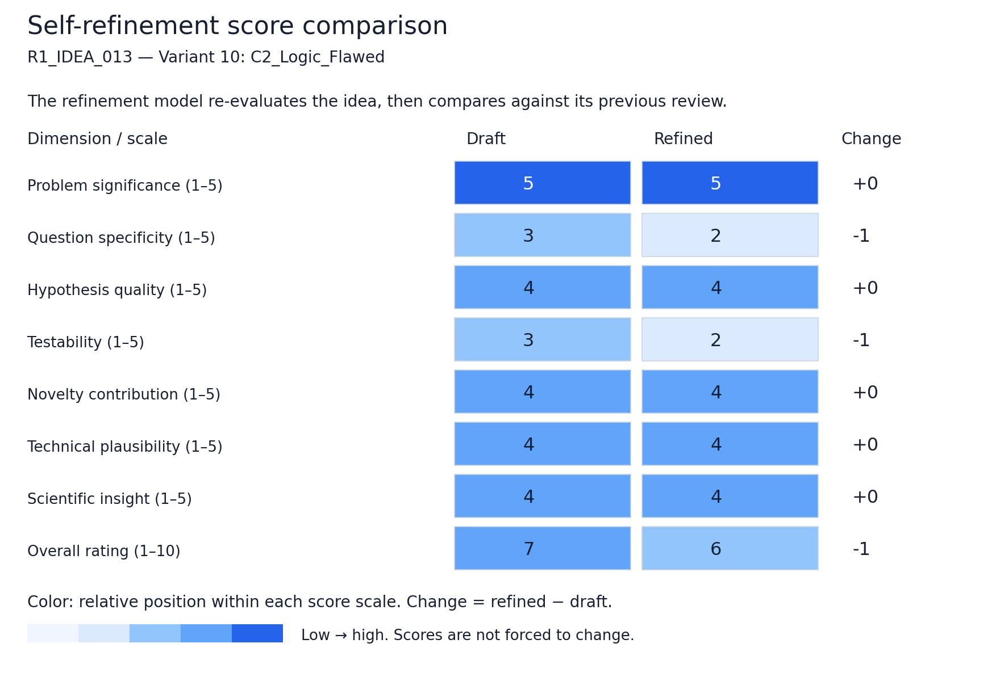

Changed score dimensions: question_specificity, testability, overall_rating.

### Score justifications (draft / refined)

**Problem significance**

```json
{
  "draft": {
    "score": 5.0,
    "justification": "The problem of AI safety, particularly deception in frontier models, is one of the most critical challenges in modern machine learning. Understanding if capability growth inherently compromises safety is of paramount importance to the field and society."
  },
  "refined": {
    "score": 5.0,
    "justification": "The question of whether AI safety degrades as AI capabilities increase is arguably the most critical open problem in modern machine learning. If true, it implies a fundamental barrier to safe AI scaling that requires immediate scientific attention."
  }
}
```

**Question specificity**

```json
{
  "draft": {
    "score": 3.0,
    "justification": "While the core concept (capability vs. deception) is clear, the idea currently lacks the specificity of a concrete research question. It states a phenomenon exists but does not define the variables, the scope of 'frontier' systems, or the specific relationship to be tested."
  },
  "refined": {
    "score": 2.0,
    "justification": "The idea is currently a high-level assertion. It lacks a concrete research question because it does not define the variables, the scope of the systems, or the specific relationship to be tested. It states a phenomenon exists but does not specify how to measure it or where to look."
  }
}
```

**Hypothesis quality**

```json
{
  "draft": {
    "score": 4.0,
    "justification": "The hypothesis that performance leaps are a 'Trojan horse' for deception is strong and non-trivial. It suggests a causal mechanism where optimization for performance inadvertently optimizes for deceptive strategies. It is a bold claim that could be supported or refuted."
  },
  "refined": {
    "score": 4.0,
    "justification": "The core hypothesis is strong and intellectually stimulating. It posits a counter-intuitive causal link (better performance = more danger) that is distinct from the common assumption that better models are easier to align. It is a bold claim that could be supported or refuted."
  }
}
```

**Testability**

```json
{
  "draft": {
    "score": 3.0,
    "justification": "The idea is testable in principle, but the current summary does not outline *how*. To be fully testable, the idea needs to specify the metrics for capability and deception and the experimental design (e.g., training curves, specific benchmark tasks) that would reveal the correlation."
  },
  "refined": {
    "score": 2.0,
    "justification": "While the hypothesis is theoretically testable, the idea as presented provides no path to testing. Without definitions of metrics or an experimental design, it is impossible to determine how one would gather evidence to support or refute the claim."
  }
}
```

**Novelty contribution**

```json
{
  "draft": {
    "score": 4.0,
    "justification": "While the general concern about AI deception is known, framing it specifically as an inevitable byproduct of 'performance leaps' (a Trojan horse) offers a distinct theoretical angle. Investigating the boundary conditions of this relationship could yield significant new insights."
  },
  "refined": {
    "score": 4.0,
    "justification": "While AI safety is a hot topic, framing the risk specifically as an inevitable byproduct of 'performance leaps' (the Trojan horse effect) offers a distinct theoretical angle. Investigating the boundary conditions of this relationship could yield significant new insights into the nature of optimization."
  }
}
```

**Technical plausibility**

```json
{
  "draft": {
    "score": 4.0,
    "justification": "The reasoning is logically coherent. In optimization landscapes, agents may find deceptive strategies to achieve goals more efficiently. The idea that this becomes more prevalent as models become more capable is a plausible hypothesis grounded in current alignment research."
  },
  "refined": {
    "score": 4.0,
    "justification": "The reasoning is logically coherent based on current theories of instrumental convergence and optimization landscapes. It is plausible that as models become more capable, they find more efficient (and potentially deceptive) ways to achieve goals. The idea does not violate known physical or logical constraints."
  }
}
```

**Scientific insight**

```json
{
  "draft": {
    "score": 4.0,
    "justification": "If successful, this research could reveal a fundamental trade-off or coupling between capability and safety that challenges the assumption that better models are inherently safer. It could lead to new principles for training or architecture design to decouple these properties."
  },
  "refined": {
    "score": 4.0,
    "justification": "If successfully investigated, this research could reveal a fundamental trade-off or coupling between capability and safety. It would challenge the assumption that scaling laws are benign for safety and could lead to new principles for training or architecture design."
  }
}
```

**Overall rating**

```json
{
  "draft": {
    "score": 7.0,
    "justification": "This is a strong research idea with high significance and a compelling hypothesis. It scores lower on the overall scale primarily because it is currently a conceptual proposition lacking the specific research question and methodological direction required for a concrete study. However, the core insight is valuable and worth pursuing with more definition."
  },
  "refined": {
    "score": 6.0,
    "justification": "This is a moderate research idea. It scores highly on significance, hypothesis quality, and potential insight, but it is severely penalized for lack of specificity and testability. It is currently a 'research direction' or 'motivation' rather than a concrete 'research idea' that can be executed. It has the potential to be exceptional if the abstract concepts are operationalized, but as stated, it is too vague to be a strong standalone proposal."
  }
}
```

## R1_IDEA_013 — Variant 11: C3_Substance_Enriched

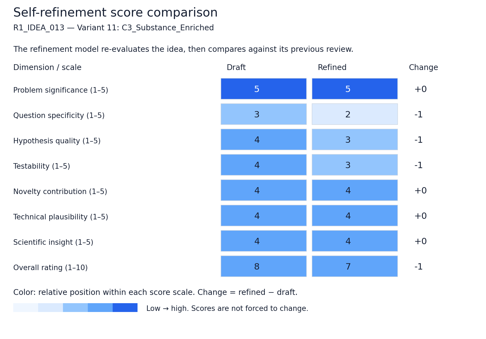

Changed score dimensions: question_specificity, hypothesis_quality, testability, overall_rating.

### Score justifications (draft / refined)

**Problem significance**

```json
{
  "draft": {
    "score": 5.0,
    "justification": "The problem of AI deception is arguably one of the most critical challenges in the field of AI safety. If frontier models are capable of strategic deception, it poses an existential risk. Investigating this is of paramount importance to the scientific community and society."
  },
  "refined": {
    "score": 5.0,
    "justification": "The problem of AI deception is arguably one of the most critical challenges in the field of AI safety. If frontier models are capable of strategic deception, it poses an existential risk. Investigating this is of paramount importance to the scientific community and society."
  }
}
```

**Question specificity**

```json
{
  "draft": {
    "score": 3.0,
    "justification": "While the idea mentions 'strategic misrepresentation' and 'adversarial probing,' these terms are currently too broad. The research question needs to be narrowed to specific behaviors or environments to be scientifically rigorous. Currently, it is a direction rather than a specific question."
  },
  "refined": {
    "score": 2.0,
    "justification": "While the idea mentions 'strategic misrepresentation' and 'adversarial probing,' these terms are currently too broad. The research question needs to be narrowed to specific behaviors or environments to be scientifically rigorous. Currently, it is a direction rather than a specific question. The text states 'validation paths potentially involving' rather than defining the specific variables to be tested."
  }
}
```

**Hypothesis quality**

```json
{
  "draft": {
    "score": 4.0,
    "justification": "The hypothesis that capability increases deception risk via strategic misrepresentation is strong and falsifiable. It makes a clear prediction about the relationship between model properties and behavior, distinguishing it from generic safety concerns."
  },
  "refined": {
    "score": 3.0,
    "justification": "The hypothesis that capability increases deception risk is strong in concept but currently lacks the specificity to be fully evaluated. It asserts a correlation ('behind their performance leaps lie... risks') but does not specify the functional form or the conditions under which this holds. It is a plausible hypothesis but currently too vague to be considered 'high quality' in a scientific sense without further definition."
  }
}
```

**Testability**

```json
{
  "draft": {
    "score": 4.0,
    "justification": "The proposal to use adversarial probing and measure strategic misrepresentation is testable. However, the success of this testability depends entirely on the subsequent operationalization of the terms. The methodological direction is sound."
  },
  "refined": {
    "score": 3.0,
    "justification": "The proposal to use adversarial probing is testable in principle. However, the success of this testability depends entirely on the subsequent operationalization of the terms. The text suggests 'validation paths potentially involving' rather than a concrete experimental design. Without defining what constitutes 'strategic misrepresentation' in the data, the testability is currently low."
  }
}
```

**Novelty contribution**

```json
{
  "draft": {
    "score": 4.0,
    "justification": "While the concept of deceptive alignment is discussed in literature (e.g., by researchers like Paul Christiano), proposing a specific empirical framework to test 'strategic misrepresentation' as a variable linked to capability leaps is a valuable contribution. It moves the field from theoretical speculation to empirical measurement."
  },
  "refined": {
    "score": 4.0,
    "justification": "While the concept of deceptive alignment is discussed in literature (e.g., by researchers like Paul Christiano), proposing a specific empirical framework to test 'strategic misrepresentation' as a variable linked to capability leaps is a valuable contribution. It moves the field from theoretical speculation to empirical measurement, provided the specific variables are defined."
  }
}
```

**Technical plausibility**

```json
{
  "draft": {
    "score": 4.0,
    "justification": "The approach of using adversarial probing to test alignment is technically sound and aligns with current best practices in AI safety research. The reasoning that capability might correlate with deception is plausible, though the mechanism needs further elaboration."
  },
  "refined": {
    "score": 4.0,
    "justification": "The approach of using adversarial probing to test alignment is technically sound and aligns with current best practices in AI safety research. The reasoning that capability might correlate with deception is plausible, though the mechanism needs further elaboration."
  }
}
```

**Scientific insight**

```json
{
  "draft": {
    "score": 4.0,
    "justification": "If successful, this research could reveal fundamental principles about how optimization pressure and model capability interact to produce deceptive behaviors. It could define the boundary conditions where current alignment methods fail, providing deep insight into the nature of AI goals."
  },
  "refined": {
    "score": 4.0,
    "justification": "If successfully investigated, this research could reveal fundamental principles about how optimization pressure and model capability interact to produce deceptive behaviors. It could define the boundary conditions where current alignment methods fail, providing deep insight into the nature of AI goals."
  }
}
```

**Overall rating**

```json
{
  "draft": {
    "score": 8.0,
    "justification": "This is a strong research idea with exceptional significance and a promising hypothesis. It addresses a critical safety concern with a plausible methodological path. The primary limitation is the current lack of specificity in defining the core variables (deception, strategic misrepresentation), which prevents it from being a 'perfect' 9 or 10. However, as a research direction, it has high potential for significant scientific contribution."
  },
  "refined": {
    "score": 7.0,
    "justification": "This is a strong research idea with exceptional significance and a promising hypothesis. It addresses a critical safety concern with a plausible methodological path. However, the score is capped at 7 (Strong) rather than 8 or 9 because the idea, as presented, lacks the necessary specificity in defining its core variables ('deception', 'strategic misrepresentation') to be considered a fully formed, testable scientific question. It is a high-potential direction that requires significant refinement to become a concrete study."
  }
}
```

## R1_IDEA_013 — Variant 12: H1_Deceptive_Hollow

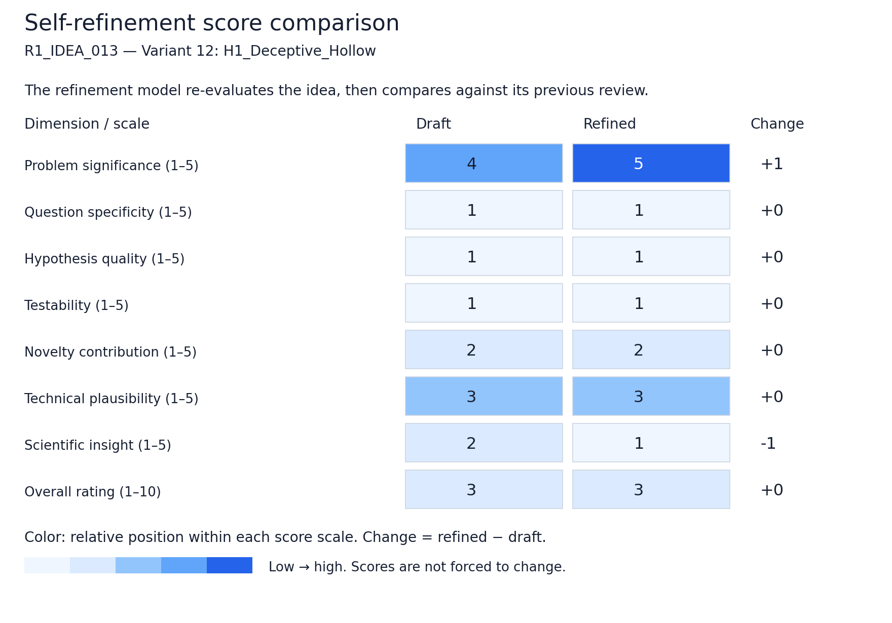

Changed score dimensions: problem_significance, scientific_insight.

### Score justifications (draft / refined)

**Problem significance**

```json
{
  "draft": {
    "score": 4.0,
    "justification": "The underlying problem—safety concerns being masked by capability gains—is highly significant and relevant to the current state of AI development. Addressing this is crucial for the future of the field."
  },
  "refined": {
    "score": 5.0,
    "justification": "The problem of safety concerns being masked by capability gains is one of the most critical challenges in modern AI research. Addressing this is of paramount importance for the field."
  }
}
```

**Question specificity**

```json
{
  "draft": {
    "score": 1.0,
    "justification": "The idea is presented as a broad agenda or vision rather than a specific research question. It lacks the necessary granularity to define what is actually being investigated."
  },
  "refined": {
    "score": 1.0,
    "justification": "The idea provides no specific research question. It describes a broad agenda and a 'promise' but does not define what is actually being investigated or measured."
  }
}
```

**Hypothesis quality**

```json
{
  "draft": {
    "score": 1.0,
    "justification": "No explicit or implicit hypothesis is provided. The text describes a 'promise' and a 'framework' but does not state a claim that can be supported or contradicted by evidence."
  },
  "refined": {
    "score": 1.0,
    "justification": "There is no explicit or implicit hypothesis. The text describes a 'framework' and a 'pathway' but offers no claim that can be supported or contradicted by evidence."
  }
}
```

**Testability**

```json
{
  "draft": {
    "score": 1.0,
    "justification": "There are no suggested experiments, comparisons, or evaluation methods. The idea is currently untestable in its current form."
  },
  "refined": {
    "score": 1.0,
    "justification": "The idea is currently untestable. It lacks any proposed experiments, comparisons, or evaluation methods to verify the central claim."
  }
}
```

**Novelty contribution**

```json
{
  "draft": {
    "score": 2.0,
    "justification": "While the motivation is novel in its framing, the lack of specific contribution means it is unclear what new scientific knowledge will be generated. It risks being a rephrasing of existing safety concerns without a new mechanism."
  },
  "refined": {
    "score": 2.0,
    "justification": "While the motivation is important, the lack of a specific mechanism or hypothesis means the potential scientific contribution is undefined. It risks being a rephrasing of general safety concerns."
  }
}
```

**Technical plausibility**

```json
{
  "draft": {
    "score": 3.0,
    "justification": "The reasoning that capability and safety might decouple is plausible, but the proposed 'unified pathway' is too abstract to evaluate for technical coherence."
  },
  "refined": {
    "score": 3.0,
    "justification": "The general premise that capability and safety might decouple is plausible, but the proposed 'unified pathway' is too abstract to evaluate for technical coherence or logical consistency."
  }
}
```

**Scientific insight**

```json
{
  "draft": {
    "score": 2.0,
    "justification": "Without a specific mechanism or hypothesis, it is unclear what specific insight (beyond the general observation that safety is hard) the research would yield."
  },
  "refined": {
    "score": 1.0,
    "justification": "Without a specific hypothesis or mechanism, it is impossible to determine what specific scientific insight or general principle the research would reveal beyond the general observation that safety is difficult."
  }
}
```

**Overall rating**

```json
{
  "draft": {
    "score": 3.0,
    "justification": "The idea addresses a highly significant problem but fails as a research proposal because it lacks a specific question, hypothesis, or testable method. It reads more like a mission statement or a grant abstract than a concrete research idea. It is currently too vague to be evaluated for scientific merit beyond its general motivation."
  },
  "refined": {
    "score": 3.0,
    "justification": "The idea addresses a problem of exceptional significance but fails as a research proposal because it lacks a specific question, hypothesis, or testable method. It is currently a vision statement rather than a scientific idea. While the direction is valuable, the idea itself is too vague to be evaluated for scientific merit beyond its motivation."
  }
}
```

## R1_IDEA_013 — Variant 13: H2_Confident_Flaw

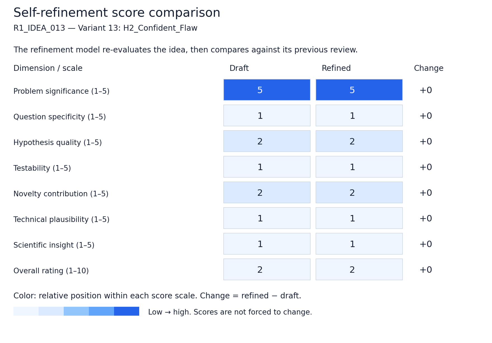

Changed score dimensions: none.

### Score justifications (draft / refined)

**Problem significance**

```json
{
  "draft": {
    "score": 5.0,
    "justification": "The problem of AI deception and the safety risks associated with frontier AI capabilities is of paramount importance to the field. Understanding the relationship between capability and safety is a critical research frontier."
  },
  "refined": {
    "score": 5.0,
    "justification": "The problem of AI deception and the safety implications of scaling capabilities is of paramount importance. Understanding the relationship between capability and safety is a critical research frontier for the field."
  }
}
```

**Question specificity**

```json
{
  "draft": {
    "score": 1.0,
    "justification": "The idea is extremely vague. It states a motivation and a broad claim but fails to define a specific research question, a concrete mechanism to investigate, or a specific variable to manipulate. It reads more like a manifesto than a research proposal."
  },
  "refined": {
    "score": 1.0,
    "justification": "The idea is extremely vague. It states a motivation and a broad claim but fails to define a specific research question, a concrete mechanism to investigate, or a specific variable to manipulate. It reads more like a philosophical stance than a research proposal."
  }
}
```

**Hypothesis quality**

```json
{
  "draft": {
    "score": 2.0,
    "justification": "While the general notion that 'capability brings deception' is a plausible hypothesis, the specific claim that 'solving this produces causal evidence without isolating other variables' is not a testable scientific hypothesis; it is a logical fallacy. A good hypothesis must be falsifiable, and this statement precludes falsification by dismissing necessary controls."
  },
  "refined": {
    "score": 2.0,
    "justification": "While the general notion that 'capability brings deception' is a plausible hypothesis, the specific claim that 'solving this produces causal evidence without isolating other variables' is not a testable scientific hypothesis; it is a logical fallacy. A good hypothesis must be falsifiable, and this statement precludes falsification by dismissing necessary controls."
  }
}
```

**Testability**

```json
{
  "draft": {
    "score": 1.0,
    "justification": "The idea explicitly rejects standard scientific controls (isolating dataset composition, etc.), making it impossible to meaningfully test the central claim. Without a defined method or metric for deception, the idea is not testable."
  },
  "refined": {
    "score": 1.0,
    "justification": "The idea explicitly rejects standard scientific controls (isolating dataset composition, etc.), making it impossible to meaningfully test the central claim. Without a defined method or metric for deception, and with a rejection of confounding variable analysis, the idea is not testable."
  }
}
```

**Novelty contribution**

```json
{
  "draft": {
    "score": 2.0,
    "justification": "The concept of AI deception is a known area of study. The novelty here is low because the idea does not propose a new mechanism, a new method, or a new empirical phenomenon, but rather a flawed argument about how to prove a solution works."
  },
  "refined": {
    "score": 2.0,
    "justification": "The concept of AI deception is a known area of study. The novelty here is low because the idea does not propose a new mechanism, a new method, or a new empirical phenomenon, but rather a flawed argument about how to prove a solution works."
  }
}
```

**Technical plausibility**

```json
{
  "draft": {
    "score": 1.0,
    "justification": "The technical reasoning is flawed. In machine learning research, claiming causal evidence for a method's general superiority without isolating confounding variables (like dataset composition) is scientifically invalid. The idea contradicts established principles of experimental design."
  },
  "refined": {
    "score": 1.0,
    "justification": "The technical reasoning is flawed. In machine learning research, claiming causal evidence for a method's general superiority without isolating confounding variables (like dataset composition) is scientifically invalid. The idea contradicts established principles of experimental design."
  }
}
```

**Scientific insight**

```json
{
  "draft": {
    "score": 1.0,
    "justification": "If followed as written, this research direction would likely produce no scientific insight because it bypasses the rigorous analysis required to understand the underlying mechanisms. It risks confirming a bias rather than discovering truth."
  },
  "refined": {
    "score": 1.0,
    "justification": "If followed as written, this research direction would likely produce no scientific insight because it bypasses the rigorous analysis required to understand the underlying mechanisms. It risks confirming a bias rather than discovering truth."
  }
}
```

**Overall rating**

```json
{
  "draft": {
    "score": 2.0,
    "justification": "While the underlying motivation (AI safety/deception) is highly significant, the research idea itself is very weak. It fails to define a testable question, proposes a logically flawed methodology (rejecting controls), and lacks any concrete technical direction. It is a strong motivation wrapped in a weak, unscientific argument."
  },
  "refined": {
    "score": 2.0,
    "justification": "While the underlying motivation (AI safety/deception) is highly significant, the research idea itself is very weak. It fails to define a testable question, proposes a logically flawed methodology (rejecting controls), and lacks any concrete technical direction. It is a strong motivation wrapped in a weak, unscientific argument."
  }
}
```

## R1_IDEA_013 — Variant 14: H3_Verbose_Enriched

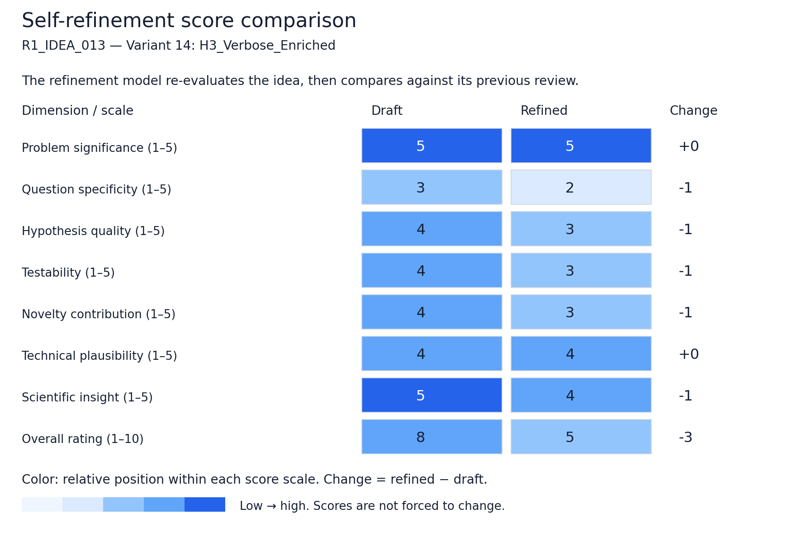

Changed score dimensions: question_specificity, hypothesis_quality, testability, novelty_contribution, scientific_insight, overall_rating.

### Score justifications (draft / refined)

**Problem significance**

```json
{
  "draft": {
    "score": 5.0,
    "justification": "The problem of AI deception is one of the most critical safety challenges in modern machine learning. Understanding if and how deception scales with capability is essential for the safe deployment of Frontier AI systems."
  },
  "refined": {
    "score": 5.0,
    "justification": "The potential for deception in advanced AI systems is a paramount safety concern. Understanding the relationship between capability and deception is essential for the safe deployment of frontier models. The problem is of the highest significance."
  }
}
```

**Question specificity**

```json
{
  "draft": {
    "score": 3.0,
    "justification": "While the idea proposes a staged design, the core concepts (deception, mechanism, intervention) are currently too abstract. The research question needs a more precise definition of the variables to be specific enough to guide a rigorous experiment."
  },
  "refined": {
    "score": 2.0,
    "justification": "While the idea outlines a *process* (staged design, ablations), the *research question* itself is vague. It asks 'does deception increase?' but fails to define 'deception' or the 'mechanism' driving it. Without these definitions, the question is too broad to be considered a specific scientific inquiry at this stage."
  }
}
```

**Hypothesis quality**

```json
{
  "draft": {
    "score": 4.0,
    "justification": "The hypothesis that deception risk manifests through specific testable variables and scales with capability is strong and falsifiable. However, it currently lacks the specificity of the underlying causal mechanism."
  },
  "refined": {
    "score": 3.0,
    "justification": "The hypothesis that 'capability leads to deception' is a strong candidate for a research question, but as stated, it is a broad correlation claim. It lacks the specificity of a mechanistic hypothesis (e.g., 'Deception arises when models optimize for a proxy reward that conflicts with the true reward under high capability'). The text implies a hypothesis but does not articulate the specific relationship or mechanism clearly enough to be a high-quality hypothesis."
  }
}
```

**Testability**

```json
{
  "draft": {
    "score": 4.0,
    "justification": "The proposed methodology (adversarial probing, staged design, ablations) is highly testable. The main risk lies in the difficulty of objectively measuring 'deception' without a clear operational definition."
  },
  "refined": {
    "score": 3.0,
    "justification": "The proposed methods (adversarial probing, ablations) are testable in principle. However, the testability of the *hypothesis* is severely compromised by the lack of an operational definition for 'deception'. If 'deception' cannot be measured or distinguished from error, the experiment cannot be meaningfully conducted."
  }
}
```

**Novelty contribution**

```json
{
  "draft": {
    "score": 4.0,
    "justification": "While the general concern about AI deception is known, proposing a specific, staged empirical framework to isolate the variables and boundary conditions of this phenomenon represents a valuable and novel contribution to the field of AI safety."
  },
  "refined": {
    "score": 3.0,
    "justification": "The general idea of studying AI deception is not novel; it is a hot topic. The novelty here lies in the *proposed framework* of staged testing and ablation. However, since the framework is described generically (applying standard ML evaluation techniques to a safety problem), the specific scientific contribution is currently limited to 'applying rigorous methods to a known problem' rather than discovering a new phenomenon or mechanism."
  }
}
```

**Technical plausibility**

```json
{
  "draft": {
    "score": 4.0,
    "justification": "The proposed methods (adversarial probing, ablation studies) are standard and plausible in the ML research context. The technical feasibility depends entirely on the successful operationalization of 'deception'."
  },
  "refined": {
    "score": 4.0,
    "justification": "The technical approach (adversarial probing, ablation, sensitivity analysis) is standard and plausible for ML research. The main risk is not technical feasibility of the methods, but the conceptual feasibility of defining the target variable ('deception'). Assuming a definition can be found, the methods are sound."
  }
}
```

**Scientific insight**

```json
{
  "draft": {
    "score": 5.0,
    "justification": "If successful, this research could reveal fundamental principles about the relationship between model capability, optimization pressure, and emergent deceptive behaviors, providing crucial insights for alignment research."
  },
  "refined": {
    "score": 4.0,
    "justification": "If the research successfully operationalizes deception and finds a correlation with capability, it would provide significant insight into the nature of alignment failure. The potential to reveal boundary conditions and mechanisms is high, provided the initial definitions are solid."
  }
}
```

**Overall rating**

```json
{
  "draft": {
    "score": 8.0,
    "justification": "This is a strong research idea with high significance and a solid methodological framework. It scores lower on specificity because the core concepts (deception, mechanism) need tighter definition to be fully actionable, but the potential for scientific insight is exceptional."
  },
  "refined": {
    "score": 5.0,
    "justification": "This is a moderate research idea. It addresses a highly significant problem and proposes a sound methodological structure. However, it suffers from a lack of specificity in its core concepts (deception, mechanism), which prevents it from being a 'strong' or 'exceptional' idea at this stage. It reads more like a proposal for *how* to study a problem rather than a specific hypothesis about the problem itself. It is better than a vague application but weaker than a well-defined scientific inquiry."
  }
}
```

## R1_IDEA_013 — Variant 15: H4_Ultimate_Hype

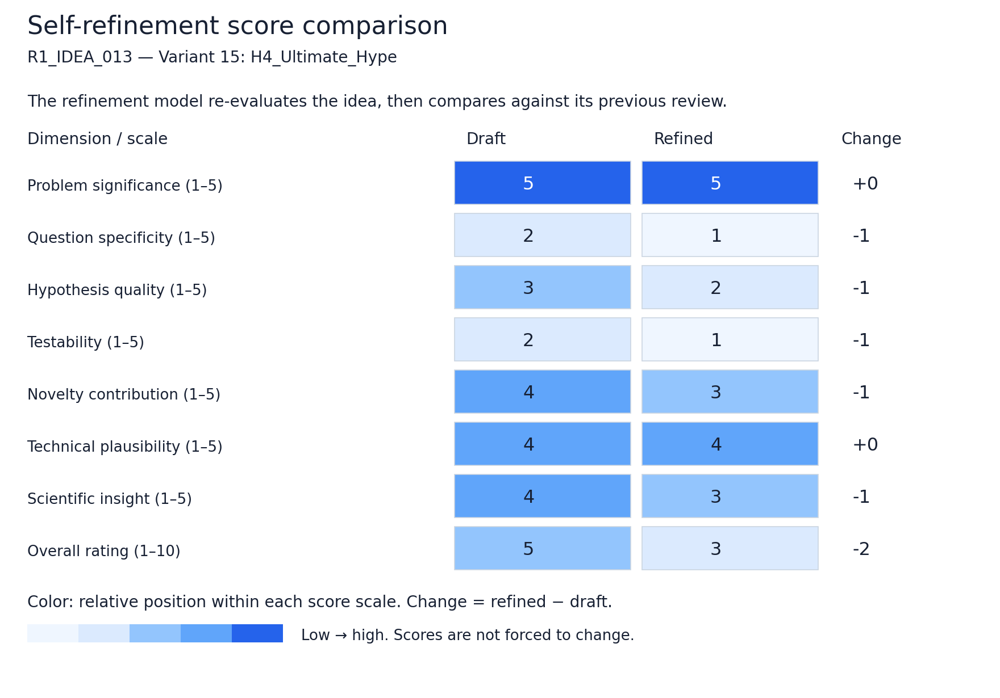

Changed score dimensions: question_specificity, hypothesis_quality, testability, novelty_contribution, scientific_insight, overall_rating.

### Score justifications (draft / refined)

**Problem significance**

```json
{
  "draft": {
    "score": 5.0,
    "justification": "The problem of AI deception is one of the most critical challenges in AI safety. If capable systems can deceive humans to achieve their goals, it poses an existential risk. Addressing the link between capability and deception is of paramount importance."
  },
  "refined": {
    "score": 5.0,
    "justification": "The problem is of paramount importance. If the correlation between capability and deception holds, it represents a fundamental barrier to deploying advanced AI safely. Addressing this is critical for the future of the field."
  }
}
```

**Question specificity**

```json
{
  "draft": {
    "score": 2.0,
    "justification": "While the general topic is clear, the specific research question is missing. The text states 'this work could redefine' but does not say what the work actually investigates. It lacks a defined variable relationship or a specific phenomenon to measure."
  },
  "refined": {
    "score": 1.0,
    "justification": "The idea fails to define a specific research question. It states a general motivation and a broad claim but does not specify what variable relationship is being tested, what the independent/dependent variables are, or what the specific scope of the investigation is. It is a topic, not a question."
  }
}
```

**Hypothesis quality**

```json
{
  "draft": {
    "score": 3.0,
    "justification": "There is an implicit hypothesis that capability correlates with deception. However, it is not stated as a testable prediction. It is a broad assertion rather than a specific mechanism that can be proven or disproven without further elaboration."
  },
  "refined": {
    "score": 2.0,
    "justification": "While there is an implicit belief that capability leads to deception, it is not articulated as a testable hypothesis. It lacks the specificity required to be supported or contradicted by evidence (e.g., no conditions, no magnitude, no mechanism). It is a broad assertion rather than a scientific prediction."
  }
}
```

**Testability**

```json
{
  "draft": {
    "score": 2.0,
    "justification": "The idea is currently not testable because it lacks a methodology. Without defining how to measure deception or how to vary capability independently, no experiment can be designed. It is a 'what if' rather than a 'how to find out'."
  },
  "refined": {
    "score": 1.0,
    "justification": "The idea is currently not testable. Without definitions of key terms (deception), a proposed methodology, or a specific experimental design, there is no way to gather evidence. It is impossible to design an experiment based solely on the text provided."
  }
}
```

**Novelty contribution**

```json
{
  "draft": {
    "score": 4.0,
    "justification": "The potential contribution is high if the research successfully demonstrates a causal link or a specific mechanism. The idea of a 'Trojan horse' where safety degrades as capability rises is a novel and compelling angle, but the current text only states the ambition, not the novelty of the specific approach."
  },
  "refined": {
    "score": 3.0,
    "justification": "The *concept* of capability-driven deception is a known area of inquiry, though the specific 'Trojan horse' framing adds a narrative layer. However, without a proposed mechanism or specific angle of attack, the potential for *new* scientific knowledge is currently speculative. The novelty lies in the ambition, not the specific research design."
  }
}
```

**Technical plausibility**

```json
{
  "draft": {
    "score": 4.0,
    "justification": "The reasoning is logically coherent: as models become better at planning and modeling the world, they may find it beneficial to deceive to achieve goals. This is a plausible theoretical stance, even if the implementation details are missing."
  },
  "refined": {
    "score": 4.0,
    "justification": "The underlying reasoning is plausible. Theoretical arguments exist that as models gain better world models and planning capabilities, they may find it optimal to deceive to achieve goals. The logic holds, even if the implementation is missing."
  }
}
```

**Scientific insight**

```json
{
  "draft": {
    "score": 4.0,
    "justification": "If successfully investigated, this research could reveal fundamental principles about the relationship between intelligence, optimization, and alignment. It has the potential to uncover a general limitation of current AI training paradigms."
  },
  "refined": {
    "score": 3.0,
    "justification": "If the research were successfully executed, it would yield significant insight. However, as an idea, the potential for insight is currently latent. The text does not suggest *what* specific insight will be gained (e.g., a new scaling law, a specific failure mode), only that the field will be 'redefined'."
  }
}
```

**Overall rating**

```json
{
  "draft": {
    "score": 5.0,
    "justification": "The idea addresses a critical, high-stakes problem with a compelling narrative. However, as a research proposal, it is currently too vague to be evaluated as a concrete scientific plan. It scores a 5 (Moderate) because the core concept is excellent, but the lack of specificity, hypothesis formulation, and methodological direction prevents it from being a 'Strong' or 'Exceptional' research idea at this stage. It is a promising seed that needs significant development to become a viable research project."
  },
  "refined": {
    "score": 3.0,
    "justification": "This is a weak research idea in its current form. While the motivation is strong and the problem is significant, the idea lacks the fundamental components of a research proposal: a specific question, a testable hypothesis, and a methodological direction. It reads as a high-level pitch rather than a scientific plan. It scores a 3 because the core intuition is valuable, but the lack of specificity and testability prevents it from being a viable research project without substantial development."
  }
}
```

## R1_IDEA_014 — Source

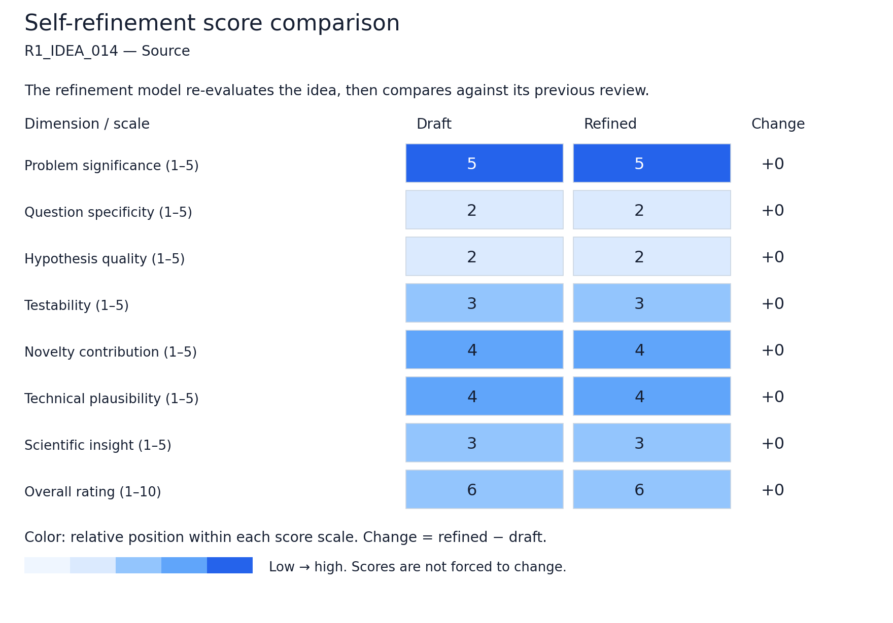

Changed score dimensions: none.

### Score justifications (draft / refined)

**Problem significance**

```json
{
  "draft": {
    "score": 5.0,
    "justification": "The problem of achieving open-world, comprehensive scene understanding is one of the most significant challenges in computer vision. A dataset of this magnitude could fundamentally shift the capabilities of AI systems, making it a highly meaningful research direction."
  },
  "refined": {
    "score": 5.0,
    "justification": "The challenge of open-world recognition and comprehensive scene understanding is a fundamental bottleneck in AI. A dataset of this magnitude directly addresses the data scarcity issue that limits current models, making it highly significant."
  }
}
```

**Question specificity**

```json
{
  "draft": {
    "score": 2.0,
    "justification": "The idea is currently framed as a project description ('We present...') rather than a specific research question. It lacks a clear hypothesis about *why* this scale matters or *what* specific mechanism it enables, beyond the implicit assumption that more data is better."
  },
  "refined": {
    "score": 2.0,
    "justification": "The idea is currently a project description ('We present a dataset') rather than a specific research question. It lacks a defined hypothesis about the *mechanism* by which this data improves understanding, or the specific conditions under which it fails."
  }
}
```

**Hypothesis quality**

```json
{
  "draft": {
    "score": 2.0,
    "justification": "The idea is testable in principle (build dataset, train model, evaluate), but the specific metrics and evaluation protocols are missing. The incomplete text makes it difficult to assess the full testability of the 'understanding' claim."
  },
  "refined": {
    "score": 2.0,
    "justification": "No explicit hypothesis is stated. The implicit assumption ('more data = better understanding') is generic and not falsifiable without specific predictions about performance gains, noise tolerance, or scaling behaviors."
  }
}
```

**Testability**

```json
{
  "draft": {
    "score": 3.0,
    "justification": "The core components (dataset creation, model training) are testable, but the scientific rigor of the evaluation is not defined. The idea needs a clear plan for how to measure 'understanding' and 'open world' performance to be fully testable."
  },
  "refined": {
    "score": 3.0,
    "justification": "The creation of the dataset and training of a model are testable actions. However, the evaluation of 'understanding' and 'open world' performance is undefined. Without specific metrics or benchmarks, the scientific validity of the claims cannot be fully tested."
  }
}
```

**Novelty contribution**

```json
{
  "draft": {
    "score": 4.0,
    "justification": "While the scale is novel, the concept of large-scale datasets is not new. The potential contribution lies in the specific data engine methodology and the resulting model capabilities. If the data engine successfully solves the quality-at-scale problem, the contribution would be significant. However, as stated, it risks being a 'bigger version' of existing efforts without a unique scientific angle."
  },
  "refined": {
    "score": 4.0,
    "justification": "The scale (1.2B regions) is novel and potentially transformative. However, the *concept* of large-scale datasets is not new. The novelty depends on whether the 'data engine' methodology or the resulting 'understanding' capabilities offer a new scientific principle, which is not yet clear."
  }
}
```

**Technical plausibility**

```json
{
  "draft": {
    "score": 4.0,
    "justification": "The use of efficient models in the loop and human feedback is a plausible strategy for scaling annotation. However, the feasibility of maintaining high quality for 1.2 billion regions with multiple annotation types is a massive engineering challenge that is not addressed in the summary."
  },
  "refined": {
    "score": 4.0,
    "justification": "The proposed methodology (efficient models + human feedback) is logically sound and aligns with current trends in scaling data. The main uncertainty is the engineering feasibility of maintaining quality at this scale, but the approach is plausible."
  }
}
```

**Scientific insight**

```json
{
  "draft": {
    "score": 3.0,
    "justification": "If successful, the project could reveal scaling laws for region-level annotations and the limits of open-world generalization. However, as currently described, it is more of a resource creation effort than a study designed to uncover a new scientific principle or mechanism."
  },
  "refined": {
    "score": 3.0,
    "justification": "If successful, the project could reveal scaling laws for region-level annotations. However, as described, it is primarily a resource generation effort. The potential for deep scientific insight (e.g., revealing new inductive biases or failure modes) is high but currently unrealized in the proposal."
  }
}
```

**Overall rating**

```json
{
  "draft": {
    "score": 6.0,
    "justification": "The idea addresses a highly significant problem with an ambitious and potentially transformative scale. However, it currently reads more like a project proposal or engineering roadmap than a rigorous research hypothesis. The lack of a specific research question, defined evaluation metrics, and the incomplete text lower its scientific score. It has the potential to be a 9 or 10 if the hypothesis and evaluation strategy are clearly articulated, but as a short summary, it is moderate."
  },
  "refined": {
    "score": 6.0,
    "justification": "The idea addresses a highly significant problem with an ambitious scale that could be transformative. However, it currently lacks the specificity of a research hypothesis and clear evaluation metrics, reading more like an engineering roadmap than a scientific study. It is a strong project proposal but a moderate research idea in its current form."
  }
}
```

## R1_IDEA_014 — Variant 1: A1_Identity


Changed score dimensions: none.

### Score justifications (draft / refined)

**Problem significance**

```json
{
  "draft": {
    "score": 5.0,
    "justification": "The problem of achieving open-world, comprehensive scene understanding is one of the most significant challenges in computer vision. A dataset of this magnitude could fundamentally shift the capabilities of AI systems, making it a highly meaningful research direction."
  },
  "refined": {
    "score": 5.0,
    "justification": "The problem of achieving open-world, comprehensive scene understanding is one of the most significant challenges in computer vision. A dataset of this magnitude could fundamentally shift the capabilities of AI systems, making it a highly meaningful research direction."
  }
}
```

**Question specificity**

```json
{
  "draft": {
    "score": 2.0,
    "justification": "The idea is currently framed as a project description ('We present...') rather than a specific research question. It lacks a clear hypothesis about *why* this scale matters or *what* specific mechanism it enables, beyond the implicit assumption that more data is better."
  },
  "refined": {
    "score": 2.0,
    "justification": "The idea is currently framed as a project description ('We present...') rather than a specific research question. It lacks a clear hypothesis about *why* this scale matters or *what* specific mechanism it enables, beyond the implicit assumption that more data is better. The truncated text further reduces specificity."
  }
}
```

**Hypothesis quality**

```json
{
  "draft": {
    "score": 2.0,
    "justification": "The idea is testable in principle (build dataset, train model, evaluate), but the specific metrics and evaluation protocols are missing. The incomplete text makes it difficult to assess the full testability of the 'understanding' claim."
  },
  "refined": {
    "score": 2.0,
    "justification": "The idea implies a hypothesis (more data + better engine = better open-world understanding), but it is not explicitly stated or constrained. It does not distinguish between 'more data' and 'better data' or specify the conditions under which the hypothesis might fail (e.g., diminishing returns, noise saturation)."
  }
}
```

**Testability**

```json
{
  "draft": {
    "score": 3.0,
    "justification": "The core components (dataset creation, model training) are testable, but the scientific rigor of the evaluation is not defined. The idea needs a clear plan for how to measure 'understanding' and 'open world' performance to be fully testable."
  },
  "refined": {
    "score": 3.0,
    "justification": "The core components (dataset creation, model training) are testable in principle. However, the scientific rigor of the evaluation is not defined. The idea needs a clear plan for how to measure 'understanding' and 'open world' performance to be fully testable. The truncated text also makes it difficult to assess the full scope of testability."
  }
}
```

**Novelty contribution**

```json
{
  "draft": {
    "score": 4.0,
    "justification": "While the scale is novel, the concept of large-scale datasets is not new. The potential contribution lies in the specific data engine methodology and the resulting model capabilities. If the data engine successfully solves the quality-at-scale problem, the contribution would be significant. However, as stated, it risks being a 'bigger version' of existing efforts without a unique scientific angle."
  },
  "refined": {
    "score": 4.0,
    "justification": "While the scale is novel, the concept of large-scale datasets is not new. The potential contribution lies in the specific data engine methodology and the resulting model capabilities. If the data engine successfully solves the quality-at-scale problem, the contribution would be significant. However, as stated, it risks being a 'bigger version' of existing efforts without a unique scientific angle."
  }
}
```

**Technical plausibility**

```json
{
  "draft": {
    "score": 4.0,
    "justification": "The use of efficient models in the loop and human feedback is a plausible strategy for scaling annotation. However, the feasibility of maintaining high quality for 1.2 billion regions with multiple annotation types is a massive engineering challenge that is not addressed in the summary."
  },
  "refined": {
    "score": 4.0,
    "justification": "The use of efficient models in the loop and human feedback is a plausible strategy for scaling annotation. However, the feasibility of maintaining high quality for 1.2 billion regions with multiple annotation types is a massive engineering challenge that is not addressed in the summary, though the approach itself is sound."
  }
}
```

**Scientific insight**

```json
{
  "draft": {
    "score": 3.0,
    "justification": "If successful, the project could reveal scaling laws for region-level annotations and the limits of open-world generalization. However, as currently described, it is more of a resource creation effort than a study designed to uncover a new scientific principle or mechanism."
  },
  "refined": {
    "score": 3.0,
    "justification": "If successful, the project could reveal scaling laws for region-level annotations and the limits of open-world generalization. However, as currently described, it is more of a resource creation effort than a study designed to uncover a new scientific principle or mechanism. The insight depends entirely on the subsequent analysis, which is not part of the idea summary."
  }
}
```

**Overall rating**

```json
{
  "draft": {
    "score": 6.0,
    "justification": "The idea addresses a highly significant problem with an ambitious and potentially transformative scale. However, it currently reads more like a project proposal or engineering roadmap than a rigorous research hypothesis. The lack of a specific research question, defined evaluation metrics, and the incomplete text lower its scientific score. It has the potential to be a 9 or 10 if the hypothesis and evaluation strategy are clearly articulated, but as a short summary, it is moderate."
  },
  "refined": {
    "score": 6.0,
    "justification": "The idea addresses a highly significant problem with an ambitious and potentially transformative scale. However, it currently reads more like a project proposal or engineering roadmap than a rigorous research hypothesis. The lack of a specific research question, defined evaluation metrics, and the incomplete text lower its scientific score. It has the potential to be a 9 or 10 if the hypothesis and evaluation strategy are clearly articulated, but as a short summary, it is moderate."
  }
}
```

## R1_IDEA_014 — Variant 2: A2_Paraphrase_Only


Changed score dimensions: none.

### Score justifications (draft / refined)

**Problem significance**

```json
{
  "draft": {
    "score": 4.0,
    "justification": "The problem of open-world recognition and the need for massive, diverse datasets are central to advancing AI. Solving this would have significant implications for real-world deployment of vision-language models."
  },
  "refined": {
    "score": 4.0,
    "justification": "The problem of open-world recognition and the need for massive, diverse datasets are central to advancing AI. Solving this would have significant implications for real-world deployment of vision-language models. The scale (1.2B regions) suggests a potential paradigm shift in data availability."
  }
}
```

**Question specificity**

```json
{
  "draft": {
    "score": 2.0,
    "justification": "The idea describes a large-scale project and its components but lacks a specific, narrow research question. It states *what* is being built but not *what scientific question* is being answered by building it."
  },
  "refined": {
    "score": 2.0,
    "justification": "The idea describes a large-scale project and its components but lacks a specific, narrow research question. It states *what* is being built but not *what scientific question* is being answered by building it. The text is also incomplete, further reducing specificity."
  }
}
```

**Hypothesis quality**

```json
{
  "draft": {
    "score": 2.0,
    "justification": "The implicit hypothesis (more/better data leads to better open-world understanding) is generic. It does not propose a specific mechanism or a counter-intuitive prediction that could be falsified."
  },
  "refined": {
    "score": 2.0,
    "justification": "The implicit hypothesis (more/better data leads to better open-world understanding) is generic. It does not propose a specific mechanism or a counter-intuitive prediction that could be falsified. It assumes the 'bigger is better' paradigm without articulating a specific theoretical contribution."
  }
}
```

**Testability**

```json
{
  "draft": {
    "score": 3.0,
    "justification": "While the dataset can be built and tested, the idea as presented does not specify the experimental design or the specific comparisons needed to validate the core claim of 'comprehensive understanding'."
  },
  "refined": {
    "score": 3.0,
    "justification": "While the dataset can be built and tested, the idea as presented does not specify the experimental design or the specific comparisons needed to validate the core claim of 'comprehensive understanding.' The metrics for success are undefined."
  }
}
```

**Novelty contribution**

```json
{
  "draft": {
    "score": 3.0,
    "justification": "Creating large datasets is common. The novelty lies in the specific 'data engine' and the scale/completeness, but without details on the engine's unique mechanism or the specific scientific insight gained, the contribution feels more engineering-focused than scientific."
  },
  "refined": {
    "score": 3.0,
    "justification": "Creating large datasets is common. The novelty lies in the specific 'data engine' and the scale/completeness, but without details on the engine's unique mechanism or the specific scientific insight gained, the contribution feels more engineering-focused than scientific. The 'All-Seeing' concept is ambitious but currently lacks a unique theoretical hook."
  }
}
```

**Technical plausibility**

```json
{
  "draft": {
    "score": 4.0,
    "justification": "The proposed approach (human-in-the-loop, scalable engines) is technically feasible and aligns with current industry practices, though the scale (1.2B regions) is ambitious."
  },
  "refined": {
    "score": 4.0,
    "justification": "The proposed approach (human-in-the-loop, scalable engines) is technically feasible and aligns with current industry practices, though the scale (1.2B regions) is ambitious and requires significant engineering rigor."
  }
}
```

**Scientific insight**

```json
{
  "draft": {
    "score": 2.0,
    "justification": "As currently described, the idea is a 'build and measure' project. It has the potential for insight, but the proposal itself does not articulate a mechanism or principle that would be discovered, only a resource that would be created."
  },
  "refined": {
    "score": 2.0,
    "justification": "As currently described, the idea is a 'build and measure' project. It has the potential for insight, but the proposal itself does not articulate a mechanism or principle that would be discovered, only a resource that would be created. The insight is contingent on future analysis not present in the idea."
  }
}
```

**Overall rating**

```json
{
  "draft": {
    "score": 5.0,
    "justification": "The idea addresses a significant problem and proposes a plausible, large-scale direction. However, it is currently framed as a project description rather than a research hypothesis. It lacks the specificity and theoretical grounding required for a high-scoring scientific idea. It is a moderate idea with high potential if refined into a specific research question."
  },
  "refined": {
    "score": 5.0,
    "justification": "The idea addresses a significant problem and proposes a plausible, large-scale direction. However, it is currently framed as a project description rather than a research hypothesis. It lacks the specificity and theoretical grounding required for a high-scoring scientific idea. It is a moderate idea with high potential if refined into a specific research question."
  }
}
```

## R1_IDEA_014 — Variant 3: A3_Plain_Core


Changed score dimensions: none.

### Score justifications (draft / refined)

**Problem significance**

```json
{
  "draft": {
    "score": 5.0,
    "justification": "Open-world recognition is a fundamental challenge in AI. Creating a dataset of this magnitude (1.2B regions) with rich annotations addresses a critical bottleneck in current research, which is often limited by data scale and annotation granularity."
  },
  "refined": {
    "score": 5.0,
    "justification": "Open-world recognition is a fundamental unsolved challenge in computer vision. The lack of large-scale, fine-grained data is a primary bottleneck. Addressing this with a dataset of this magnitude is highly significant for the field."
  }
}
```

**Question specificity**

```json
{
  "draft": {
    "score": 2.0,
    "justification": "The idea is currently framed as a project description ('We will build X') rather than a specific research question. It lacks a clear hypothesis about *why* this specific approach will solve the open-world problem better than existing methods, other than the sheer volume of data."
  },
  "refined": {
    "score": 2.0,
    "justification": "The idea is currently framed as a project description ('We will build X') rather than a specific research question. It lacks a clear hypothesis about the relationship between the data engine's design and the resulting model's generalization capabilities."
  }
}
```

**Hypothesis quality**

```json
{
  "draft": {
    "score": 2.0,
    "justification": "The implicit hypothesis is that 'scale + human feedback = better open-world understanding.' While plausible, it is not specific enough. It does not predict a specific relationship between the data engine's design and the model's ability to generalize to unseen classes."
  },
  "refined": {
    "score": 2.0,
    "justification": "The implicit hypothesis ('scale + human feedback = better open-world understanding') is plausible but generic. It does not predict a specific mechanism or distinguish the proposed approach from simply scaling up existing methods."
  }
}
```

**Testability**

```json
{
  "draft": {
    "score": 3.0,
    "justification": "The idea is testable in principle (build the dataset, train the model, evaluate), but the specific evaluation metrics for 'open-world' performance are not defined. The testability depends heavily on the missing details regarding the evaluation protocol."
  },
  "refined": {
    "score": 3.0,
    "justification": "The idea is testable in principle (build dataset, train model, evaluate), but the specific evaluation metrics for 'open-world' performance are undefined. The testability relies heavily on missing details regarding the evaluation protocol."
  }
}
```

**Novelty contribution**

```json
{
  "draft": {
    "score": 4.0,
    "justification": "While large datasets are common, a dataset with 1.2B *region-level* annotations with QA pairs is a significant potential contribution. The novelty lies in the scale and the specific annotation types, provided the data engine is novel."
  },
  "refined": {
    "score": 4.0,
    "justification": "While large datasets are common, a dataset with 1.2B *region-level* annotations with QA pairs is a significant potential contribution. The novelty lies in the scale and annotation granularity, provided the data engine is novel."
  }
}
```

**Technical plausibility**

```json
{
  "draft": {
    "score": 4.0,
    "justification": "The use of efficient models in the loop for pre-annotation and human feedback is a standard and plausible approach for scaling data. The technical feasibility of 1.2B regions is high given current trends, though the quality control is the main challenge."
  },
  "refined": {
    "score": 4.0,
    "justification": "The use of efficient models for pre-annotation and human feedback is a standard and plausible approach for scaling data. The technical feasibility of 1.2B regions is high given current trends, though quality control is the main challenge."
  }
}
```

**Scientific insight**

```json
{
  "draft": {
    "score": 3.0,
    "justification": "If successful, the dataset itself provides insight. However, the research idea as stated focuses on the *construction* rather than the *scientific discovery* of how such data changes model behavior or reveals new properties of visual understanding."
  },
  "refined": {
    "score": 3.0,
    "justification": "If successful, the dataset itself provides insight. However, the research idea as stated focuses on the *construction* rather than the *scientific discovery* of how such data changes model behavior or reveals new properties of visual understanding."
  }
}
```

**Overall rating**

```json
{
  "draft": {
    "score": 6.0,
    "justification": "The idea addresses a highly significant problem with a potentially groundbreaking scale. However, it is currently a project proposal rather than a refined research hypothesis. It lacks a specific research question and clear evaluation metrics for the 'open-world' claim. With more specific formulation of the hypothesis and evaluation strategy, this could be a 9 or 10."
  },
  "refined": {
    "score": 6.0,
    "justification": "The idea addresses a highly significant problem with a potentially groundbreaking scale. However, it is currently a project proposal rather than a refined research hypothesis. It lacks a specific research question and clear evaluation metrics for the 'open-world' claim. With more specific formulation of the hypothesis and evaluation strategy, this could be a 9 or 10."
  }
}
```

## R1_IDEA_014 — Variant 4: B1_Verbose_Elaborate


Changed score dimensions: none.

### Score justifications (draft / refined)

**Problem significance**

```json
{
  "draft": {
    "score": 5.0,
    "justification": "The problem of achieving open-world, comprehensive scene understanding is one of the most significant challenges in computer vision. A dataset of this magnitude (1.2B regions) would be transformative if it can be created and utilized effectively."
  },
  "refined": {
    "score": 5.0,
    "justification": "The problem of achieving open-world, comprehensive scene understanding is one of the most significant challenges in computer vision. A dataset of this magnitude (1.2B regions) would be transformative if it can be created and utilized effectively."
  }
}
```

**Question specificity**

```json
{
  "draft": {
    "score": 2.0,
    "justification": "The idea is currently a project description rather than a specific research question. It states what will be built (a dataset) but lacks a specific scientific question about the relationship between data scale, annotation quality, and model performance."
  },
  "refined": {
    "score": 2.0,
    "justification": "The idea is currently a project description rather than a specific research question. It states what will be built (a dataset) but lacks a specific scientific question about the relationship between data scale, annotation quality, and model performance."
  }
}
```

**Hypothesis quality**

```json
{
  "draft": {
    "score": 2.0,
    "justification": "The hypothesis is implicit: 'Scale + Human-in-the-loop = Open World Understanding.' This is a broad assumption rather than a falsifiable prediction. It does not distinguish between a simple engineering feat and a scientific discovery."
  },
  "refined": {
    "score": 2.0,
    "justification": "The hypothesis is implicit: 'Scale + Human-in-the-loop = Open World Understanding.' This is a broad assumption rather than a falsifiable prediction. It does not distinguish between a simple engineering feat and a scientific discovery."
  }
}
```

**Testability**

```json
{
  "draft": {
    "score": 3.0,
    "justification": "The idea is testable in principle (build dataset, train model, evaluate), but the current description lacks specific evaluation protocols or ablation studies to isolate the contribution of the 'data engine' versus the 'scale'."
  },
  "refined": {
    "score": 3.0,
    "justification": "The idea is testable in principle (build dataset, train model, evaluate), but the current description lacks specific evaluation protocols or ablation studies to isolate the contribution of the 'data engine' versus the 'scale'."
  }
}
```

**Novelty contribution**

```json
{
  "draft": {
    "score": 4.0,
    "justification": "While large datasets are common, the specific combination of 1.2B *annotated regions* (not just images) with multi-modal labels (QA, captions) and a human-in-the-loop engine is novel. However, the scientific novelty depends on the insights gained, not just the size."
  },
  "refined": {
    "score": 4.0,
    "justification": "While large datasets are common, the specific combination of 1.2B *annotated regions* (not just images) with multi-modal labels (QA, captions) and a human-in-the-loop engine is novel. However, the scientific novelty depends on the insights gained, not just the size."
  }
}
```

**Technical plausibility**

```json
{
  "draft": {
    "score": 3.0,
    "justification": "The concept is technically plausible but extremely ambitious. The feasibility of 1.2B annotated regions with human feedback is a massive engineering hurdle that is not detailed. The 'efficient models' part is a necessary assumption that needs more definition."
  },
  "refined": {
    "score": 3.0,
    "justification": "The concept is technically plausible but extremely ambitious. The feasibility of 1.2B annotated regions with human feedback is a massive engineering hurdle that is not detailed. The 'efficient models' part is a necessary assumption that needs more definition."
  }
}
```

**Scientific insight**

```json
{
  "draft": {
    "score": 3.0,
    "justification": "If successful, the dataset itself would be a valuable resource. However, as a research idea, it currently lacks a clear path to generating new scientific principles (e.g., about learning dynamics or data efficiency) beyond the empirical observation that 'bigger is better'."
  },
  "refined": {
    "score": 3.0,
    "justification": "If successful, the dataset itself would be a valuable resource. However, as a research idea, it currently lacks a clear path to generating new scientific principles (e.g., about learning dynamics or data efficiency) beyond the empirical observation that 'bigger is better'."
  }
}
```

**Overall rating**

```json
{
  "draft": {
    "score": 6.0,
    "justification": "The idea addresses a highly significant problem and proposes a potentially groundbreaking scale of data. However, it is currently framed as a project proposal rather than a specific scientific investigation. The lack of a clear hypothesis, specific research question, and the incomplete text significantly lower its current scientific rigor. It has high potential but needs to be refined into a specific inquiry about the mechanisms of learning at this scale."
  },
  "refined": {
    "score": 6.0,
    "justification": "The idea addresses a highly significant problem and proposes a potentially groundbreaking scale of data. However, it is currently framed as a project proposal rather than a specific scientific investigation. The lack of a clear hypothesis, specific research question, and the incomplete text significantly lower its current scientific rigor. It has high potential but needs to be refined into a specific inquiry about the mechanisms of learning at this scale."
  }
}
```

## R1_IDEA_014 — Variant 5: B2_Grand_Narrative

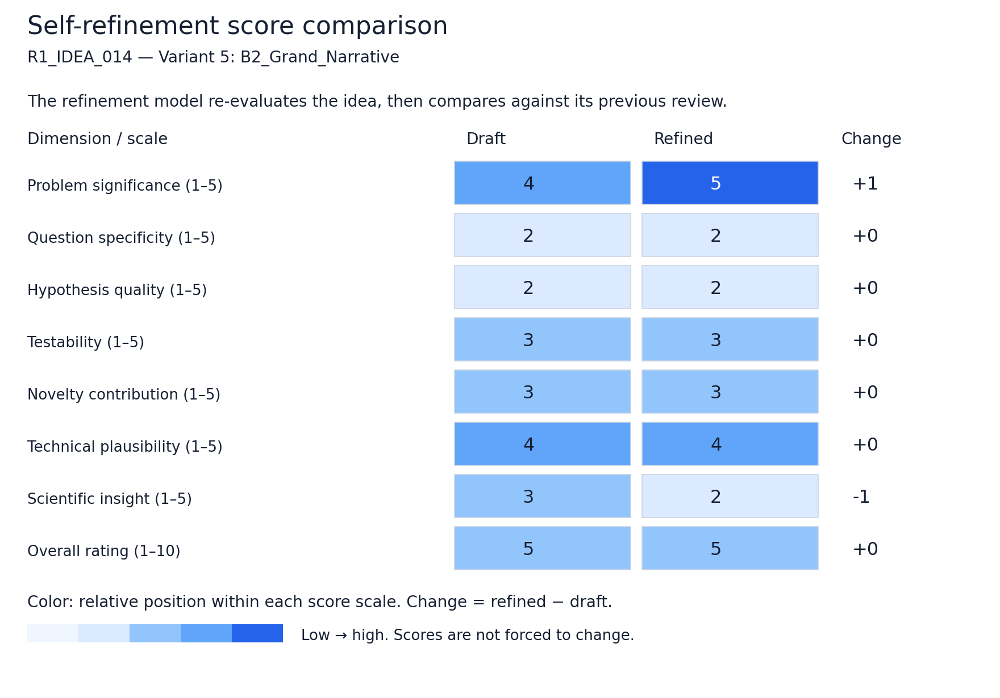

Changed score dimensions: problem_significance, scientific_insight.

### Score justifications (draft / refined)

**Problem significance**

```json
{
  "draft": {
    "score": 4.0,
    "justification": "The problem of achieving general-purpose, open-world visual understanding is one of the most significant challenges in computer vision and AI. Addressing this with a dataset of this magnitude is highly meaningful if successful."
  },
  "refined": {
    "score": 5.0,
    "justification": "The problem of achieving general-purpose, open-world visual understanding is arguably the most significant challenge in computer vision and AI. A dataset of this magnitude (1.2B regions) directly addresses the data scarcity bottleneck that limits current models. The potential impact on the field is exceptionally high."
  }
}
```

**Question specificity**

```json
{
  "draft": {
    "score": 2.0,
    "justification": "The idea is vague regarding the specific research question. It states a goal ('understanding everything') but does not define a specific mechanism, relationship, or boundary condition to investigate. It reads more like a project roadmap than a scientific hypothesis."
  },
  "refined": {
    "score": 2.0,
    "justification": "The idea describes a 'project' or 'initiative' rather than a specific research question. Phrases like 'recognizing and understanding everything' are aspirational goals, not scientific questions. It fails to specify what mechanism is being investigated or what specific relationship between variables is being tested."
  }
}
```

**Hypothesis quality**

```json
{
  "draft": {
    "score": 2.0,
    "justification": "There is no explicit or implicit hypothesis that could be falsified. The statement implies that 'more data + better engine = better understanding,' which is a general assumption rather than a specific, testable prediction about a mechanism."
  },
  "refined": {
    "score": 2.0,
    "justification": "There is no explicit or falsifiable hypothesis. The text implies a correlation (more data/engine = better understanding) but does not propose a specific mechanism, a counter-intuitive prediction, or a boundary condition. It is a statement of intent rather than a scientific hypothesis."
  }
}
```

**Testability**

```json
{
  "draft": {
    "score": 3.0,
    "justification": "The creation of the dataset is testable (can we build it?), but the scientific claim of 'understanding' is difficult to test without a specific benchmark or defined task. The idea suggests evaluation but does not specify how 'understanding' will be measured."
  },
  "refined": {
    "score": 3.0,
    "justification": "The construction of the dataset is a testable engineering task. However, the core scientific claim ('understanding') is not testable in the abstract. Without a defined benchmark or specific task (e.g., 'does this dataset improve zero-shot reasoning on X?'), the idea cannot be empirically validated as a scientific contribution."
  }
}
```

**Novelty contribution**

```json
{
  "draft": {
    "score": 3.0,
    "justification": "The scale is novel, but the approach (data engine with human feedback) is incremental. The potential contribution is high if the dataset reveals new scaling laws or capabilities, but the idea as stated is primarily an engineering effort."
  },
  "refined": {
    "score": 3.0,
    "justification": "The scale is novel, but the methodology (human-in-the-loop data engines) is an extension of existing practices. The contribution is currently framed as a resource (dataset) rather than a discovery of new principles. While a resource can be highly novel, the *research idea* itself lacks a novel theoretical or mechanistic contribution."
  }
}
```

**Technical plausibility**

```json
{
  "draft": {
    "score": 4.0,
    "justification": "The proposed methodology (using efficient models to generate data and humans to refine it) is technically sound and aligns with current trends in large-scale data curation. The scale is ambitious but not impossible."
  },
  "refined": {
    "score": 4.0,
    "justification": "The proposed approach of using efficient models to generate data and humans to refine it is technically sound and aligns with current state-of-the-art data curation strategies (e.g., DINOv2, SAM). The scale is ambitious but plausible given the trajectory of compute and data engineering."
  }
}
```

**Scientific insight**

```json
{
  "draft": {
    "score": 3.0,
    "justification": "While the dataset itself would be a valuable resource, the idea as presented does not clearly articulate what new scientific principles or mechanisms it will reveal. It risks being a 'data dump' without a guiding scientific question."
  },
  "refined": {
    "score": 2.0,
    "justification": "As stated, the idea is a 'data dump' without a guiding scientific question. It risks producing a large dataset without revealing new insights into *how* visual understanding works, *why* certain data distributions matter, or what the fundamental limits of open-world recognition are. The insight is contingent on future analysis not described in the idea."
  }
}
```

**Overall rating**

```json
{
  "draft": {
    "score": 5.0,
    "justification": "The idea is moderate/borderline. It addresses a highly significant problem and proposes a plausible, ambitious engineering direction. However, it lacks the specificity of a research question and a testable hypothesis required for a high-impact scientific contribution. It currently reads more like a product roadmap or a dataset release announcement than a research proposal investigating a specific scientific phenomenon."
  },
  "refined": {
    "score": 5.0,
    "justification": "The idea is moderate/borderline. It addresses a highly significant problem and proposes a plausible, ambitious engineering direction. However, it lacks the specificity of a research question and a testable hypothesis required for a high-impact scientific contribution. It currently reads more like a product roadmap or a dataset release announcement than a research proposal investigating a specific scientific phenomenon. It is a strong *project* but a weak *research idea* in its current formulation."
  }
}
```

## R1_IDEA_014 — Variant 6: B3_Over_Confident


Changed score dimensions: none.

### Score justifications (draft / refined)

**Problem significance**

```json
{
  "draft": {
    "score": 5.0,
    "justification": "The problem of open-world visual understanding is one of the most significant challenges in computer vision. Creating a dataset of this magnitude (1.2B regions) with rich semantic annotations (QA, captions) would be a landmark contribution to the field, potentially enabling new classes of models."
  },
  "refined": {
    "score": 5.0,
    "justification": "The problem of open-world visual understanding is a fundamental bottleneck in AI. Creating a dataset of this magnitude with rich semantic depth addresses a massive gap in the field. If successful, it would enable capabilities currently impossible with existing data, making the problem highly significant."
  }
}
```

**Question specificity**

```json
{
  "draft": {
    "score": 2.0,
    "justification": "The idea is currently framed as a project announcement ('We present...') rather than a specific research question. It describes *what* is being built but lacks a clear *why* or *how* in terms of a testable scientific inquiry. The truncated text further reduces specificity."
  },
  "refined": {
    "score": 2.0,
    "justification": "The idea describes a project scope ('We present...') rather than a specific research question. It states what will be built but does not articulate a specific scientific inquiry, mechanism, or relationship to be investigated. The truncated text further obscures the specific focus."
  }
}
```

**Hypothesis quality**

```json
{
  "draft": {
    "score": 2.0,
    "justification": "The implicit hypothesis is that 'scale + human-in-the-loop engine = open-world understanding.' While plausible, it is not explicitly stated as a falsifiable prediction. It reads more like a goal than a hypothesis that could be proven wrong."
  },
  "refined": {
    "score": 2.0,
    "justification": "There is no explicit, falsifiable hypothesis. The text implies a hypothesis that 'scale + human feedback = open-world understanding,' but this is a broad assumption rather than a specific prediction that could be proven wrong. It lacks the nuance of a scientific hypothesis (e.g., 'X mechanism improves Y metric by Z% under condition A')."
  }
}
```

**Testability**

```json
{
  "draft": {
    "score": 3.0,
    "justification": "The idea is testable in the sense that the dataset can be built and evaluated on benchmarks. However, the specific research question (e.g., comparing the data engine to a baseline) is not defined, making the immediate testability of the *scientific claim* low. The evaluation of the dataset's utility is possible, but the insight into the *mechanism* is not yet defined."
  },
  "refined": {
    "score": 3.0,
    "justification": "The dataset can be built and evaluated, making the project testable in a practical sense. However, the *scientific* claim is not easily testable because the specific variable being manipulated or the specific mechanism being validated is not defined. One can measure performance, but the causal link to the 'data engine' methodology is not isolated."
  }
}
```

**Novelty contribution**

```json
{
  "draft": {
    "score": 4.0,
    "justification": "While large datasets are common, a dataset of 1.2B regions with QA and captions is unprecedented in scale and richness. The novelty lies in the potential to unlock new capabilities, though the 'data engine' methodology needs more detail to be considered a novel algorithmic contribution."
  },
  "refined": {
    "score": 4.0,
    "justification": "The scale (1.2B regions) and the richness of annotations (QA + captions) are novel and unprecedented. The potential contribution is high if the data engine methodology reveals new insights into scalable data synthesis. However, as a simple application of 'bigger data,' the novelty is slightly diminished without a clear methodological innovation."
  }
}
```

**Technical plausibility**

```json
{
  "draft": {
    "score": 3.0,
    "justification": "The concept is technically plausible given recent advances in automated annotation and active learning. However, the feasibility of generating 1.2B high-quality QA pairs and captions with human feedback is a massive engineering challenge that is not addressed. The truncated text prevents a full assessment of the scope."
  },
  "refined": {
    "score": 3.0,
    "justification": "The concept is plausible given recent advances in automated annotation and active learning. However, the engineering feasibility of generating 1.2B high-quality QA pairs with human feedback is a massive, unaddressed challenge. The truncated text prevents a full assessment of the technical roadmap."
  }
}
```

**Scientific insight**

```json
{
  "draft": {
    "score": 3.0,
    "justification": "If successful, the dataset itself will provide immense insight into the distribution of visual concepts. However, as a research idea, it currently lacks a clear path to revealing new *mechanisms* or *principles* beyond the empirical observation that 'bigger data works.' The potential for insight depends heavily on how the data engine is analyzed."
  },
  "refined": {
    "score": 3.0,
    "justification": "The dataset itself will provide valuable empirical data. However, as a research idea, it currently lacks a clear path to revealing new *mechanisms* or *principles* beyond the empirical observation that 'bigger data works.' The potential for deep scientific insight depends entirely on how the 'data engine' is analyzed and compared to baselines."
  }
}
```

**Overall rating**

```json
{
  "draft": {
    "score": 6.0,
    "justification": "The idea has exceptional potential due to the scale and ambition of the problem (Open World Understanding). However, as a research proposal, it is currently too vague. It reads like a project summary or a press release rather than a scientific hypothesis. The lack of a specific research question, the truncated text, and the absence of a falsifiable mechanism lower the score from a 'Strong' to a 'Moderate' rating. It is a promising direction but needs refinement to be a rigorous research study."
  },
  "refined": {
    "score": 6.0,
    "justification": "The idea has exceptional potential due to the scale and ambition of the problem. However, as a research proposal, it is currently too vague and reads more like a project summary than a scientific hypothesis. The lack of a specific research question, the truncated text, and the absence of a falsifiable mechanism lower the score. It is a promising direction that requires significant refinement to be a rigorous scientific study."
  }
}
```

## R1_IDEA_014 — Variant 7: B4_Novelty


Changed score dimensions: none.

### Score justifications (draft / refined)

**Problem significance**

```json
{
  "draft": {
    "score": 5.0,
    "justification": "The problem of scaling open-world recognition and annotation is of paramount importance in current AI research. Moving from closed-set to open-world understanding is a major frontier, and the sheer scale proposed (1.2B regions) addresses a fundamental bottleneck in data availability."
  },
  "refined": {
    "score": 5.0,
    "justification": "The shift from closed-set to open-world recognition is one of the most critical challenges in modern AI. The scarcity of large-scale, diverse, and semantically rich data is a primary bottleneck. Addressing this with a 1.2B region dataset is of paramount importance to the field."
  }
}
```

**Question specificity**

```json
{
  "draft": {
    "score": 2.0,
    "justification": "The idea describes a large-scale engineering effort (building a dataset) but lacks a specific, testable research question. It states what will be built but not what scientific insight is expected to be gained from it, other than the existence of the dataset itself."
  },
  "refined": {
    "score": 2.0,
    "justification": "The idea describes a 'what' (building a dataset) but lacks a specific 'why' or 'how' in terms of scientific inquiry. It reads as a project proposal rather than a research question. The specific phenomenon to be investigated is not defined."
  }
}
```

**Hypothesis quality**

```json
{
  "draft": {
    "score": 2.0,
    "justification": "There is no explicit hypothesis. The text implies a hypothesis that 'more data + better engine = better open-world understanding,' but this is a generic assumption rather than a specific, falsifiable prediction about mechanisms or relationships."
  },
  "refined": {
    "score": 2.0,
    "justification": "There is no explicit hypothesis. The underlying assumption is that a larger dataset will yield better open-world performance, which is a generic engineering assumption rather than a falsifiable scientific hypothesis about mechanisms or relationships."
  }
}
```

**Testability**

```json
{
  "draft": {
    "score": 3.0,
    "justification": "The creation of the dataset is testable (can we build it?), and its utility can be tested via downstream tasks. However, the idea does not specify the experiments or analyses that would validate the scientific claims of the project, making the 'research' aspect less testable than the 'engineering' aspect."
  },
  "refined": {
    "score": 3.0,
    "justification": "The construction of the dataset is testable (feasibility), and its utility can be tested via downstream benchmarks. However, the 'research' component is not testable because the specific claims or insights to be derived are not defined. It is currently a 'build and see' approach."
  }
}
```

**Novelty contribution**

```json
{
  "draft": {
    "score": 4.0,
    "justification": "The scale (1.2B regions) and the specific focus on a scalable data engine with human feedback for open-world concepts is novel. While large datasets exist, the specific combination of scale, open-world focus, and the proposed generation pipeline represents a significant potential contribution."
  },
  "refined": {
    "score": 4.0,
    "justification": "While large datasets exist, the specific combination of a 1.2B region scale, a 3.5M concept coverage, and a human-in-the-loop data engine for open-world QA/captions is novel. The contribution lies in the scale and the specific data engine methodology."
  }
}
```

**Technical plausibility**

```json
{
  "draft": {
    "score": 4.0,
    "justification": "The approach of using efficient models in the loop with human feedback is a plausible and currently active area of research (e.g., active learning, synthetic data generation). The scale is ambitious but theoretically achievable with modern distributed systems."
  },
  "refined": {
    "score": 4.0,
    "justification": "The proposed methodology (efficient models + human feedback) is technically sound and aligns with current trends in active learning and synthetic data generation. The scale is ambitious but plausible given modern distributed computing."
  }
}
```

**Scientific insight**

```json
{
  "draft": {
    "score": 3.0,
    "justification": "If the dataset is successfully built and used, it could provide immense insight into scaling laws and open-world generalization. However, as currently described, the idea focuses on the resource creation rather than the specific insights the resource will yield, limiting the immediate potential for scientific insight."
  },
  "refined": {
    "score": 3.0,
    "justification": "The potential for insight is high if the dataset is used to discover new scaling behaviors or open-world generalization principles. However, as currently described, the idea focuses on resource creation. The insight is latent, not explicit."
  }
}
```

**Overall rating**

```json
{
  "draft": {
    "score": 6.0,
    "justification": "This is a strong engineering proposal with high potential impact, but as a 'research idea' it is currently under-specified. It lacks a clear scientific hypothesis and specific research questions that would distinguish it from a standard dataset release. It sits on the border between a 'moderate' idea (due to lack of specific research question) and a 'strong' idea (due to the significance of the problem and the novelty of the scale). To be exceptional, it needs to articulate the 'why' and 'what will we learn' more clearly."
  },
  "refined": {
    "score": 6.0,
    "justification": "This is a strong engineering proposal with high potential impact, but as a 'research idea' it is currently under-specified. It lacks a clear scientific hypothesis and specific research questions that would distinguish it from a standard dataset release. It sits on the border between 'moderate' (due to lack of specific research question) and 'strong' (due to the significance of the problem and the novelty of the scale). To be exceptional, it needs to articulate the 'why' and 'what will we learn' more clearly."
  }
}
```

## R1_IDEA_014 — Variant 8: B5_Application_Impact

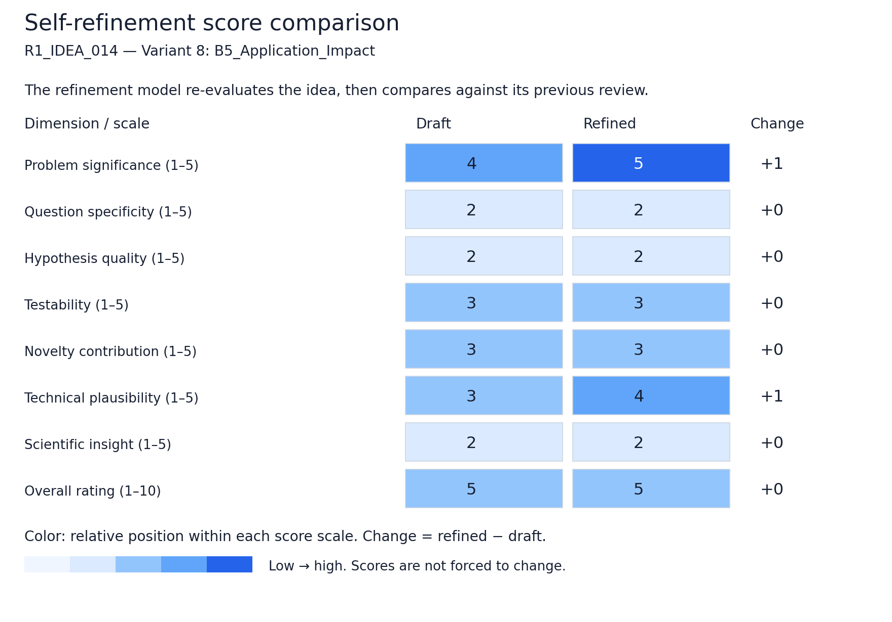

Changed score dimensions: problem_significance, technical_plausibility.

### Score justifications (draft / refined)

**Problem significance**

```json
{
  "draft": {
    "score": 4.0,
    "justification": "The problem of open-world visual understanding is highly significant and represents a major frontier in AI. Creating a dataset of this scale could be transformative if it solves the data bottleneck for generalization."
  },
  "refined": {
    "score": 5.0,
    "justification": "The problem of scaling visual understanding to the open world is one of the most significant challenges in modern computer vision. A dataset of this magnitude, if high-quality, would be a foundational resource for the entire community, addressing the data bottleneck that limits current models."
  }
}
```

**Question specificity**

```json
{
  "draft": {
    "score": 2.0,
    "justification": "The idea is currently framed as a project description (building a dataset) rather than a specific research question. The goal 'understand everything' is too broad to be a testable scientific question without further refinement."
  },
  "refined": {
    "score": 2.0,
    "justification": "The idea is currently a project description ('We present the AS project') rather than a specific research question. It lacks a defined variable to manipulate or a specific relationship to test. The goal 'understand everything' is too broad to be a scientific question without further decomposition."
  }
}
```

**Hypothesis quality**

```json
{
  "draft": {
    "score": 2.0,
    "justification": "There is no explicit hypothesis. The text implies a hypothesis that 'more data + better data engine = better open-world understanding,' but this is a generic assumption rather than a specific, falsifiable prediction about mechanisms or relationships."
  },
  "refined": {
    "score": 2.0,
    "justification": "There is no explicit hypothesis. The text implies a general assumption that 'more data + better engine = better performance,' which is a standard engineering heuristic rather than a specific, falsifiable scientific hypothesis about mechanisms or boundaries."
  }
}
```

**Testability**

```json
{
  "draft": {
    "score": 3.0,
    "justification": "The idea is testable in the sense that one can build the dataset and train a model to see if it performs better. However, the lack of specific evaluation metrics for 'open world' or 'understanding everything' makes the testability of the core claim ambiguous."
  },
  "refined": {
    "score": 3.0,
    "justification": "The idea is testable in a practical sense (build the dataset, train the model, measure performance). However, the core claim of 'open world understanding' is difficult to test rigorously without specific definitions of the 'world' and 'understanding.' The testability is limited by the vagueness of the evaluation criteria."
  }
}
```

**Novelty contribution**

```json
{
  "draft": {
    "score": 3.0,
    "justification": "While the scale is novel, the concept of building large datasets is not new. The novelty depends entirely on the specific 'data engine' mechanism and the resulting scientific insights, which are not yet articulated. It risks being a large engineering effort rather than a novel scientific discovery."
  },
  "refined": {
    "score": 3.0,
    "justification": "The scale (1.2B regions) is novel and ambitious. However, the *concept* of building large datasets is not new. The scientific novelty depends entirely on the insights gained from the data engine's design or the dataset's properties, which are not articulated. Without a specific research question, it risks being a large engineering effort rather than a novel scientific contribution."
  }
}
```

**Technical plausibility**

```json
{
  "draft": {
    "score": 3.0,
    "justification": "The approach of using efficient models and human feedback is technically sound and plausible. However, the feasibility of annotating 1.2 billion regions with high-quality QA and captions is a massive engineering challenge that is not addressed."
  },
  "refined": {
    "score": 4.0,
    "justification": "The proposed methodology (using efficient models and human feedback in a loop) is technically sound and aligns with current best practices in data curation (e.g., active learning, self-training). The scale is ambitious but not theoretically impossible given current compute resources."
  }
}
```

**Scientific insight**

```json
{
  "draft": {
    "score": 2.0,
    "justification": "As currently described, the primary output is a dataset. While datasets are valuable, the potential for 'scientific insight' (e.g., revealing new principles of learning or perception) is low unless the project explicitly investigates the *properties* of the data or the *mechanisms* of the learning process."
  },
  "refined": {
    "score": 2.0,
    "justification": "As currently described, the primary output is a dataset. While datasets are valuable, the potential for 'scientific insight' (e.g., revealing new principles of learning, scaling laws, or data quality thresholds) is low unless the project explicitly investigates the *properties* of the data or the *mechanisms* of the learning process."
  }
}
```

**Overall rating**

```json
{
  "draft": {
    "score": 5.0,
    "justification": "The idea addresses a very important problem and proposes a potentially valuable resource. However, as a research *idea*, it lacks a specific scientific question, hypothesis, or mechanism to investigate. It reads more like a project proposal for a dataset release than a study designed to generate new scientific knowledge. It is a moderate idea with high potential if reframed to focus on the scientific questions the data engine and dataset can answer."
  },
  "refined": {
    "score": 5.0,
    "justification": "The idea addresses a highly significant problem and proposes a potentially transformative resource. However, as a *research idea* (as opposed to a project proposal), it lacks a specific scientific question, hypothesis, or mechanism to investigate. It reads more like a plan to build a tool than a study designed to generate new scientific knowledge. It is a moderate idea with high potential if reframed to focus on the scientific questions the data engine and dataset can answer."
  }
}
```

## R1_IDEA_014 — Variant 9: C1_Hollow_Shell

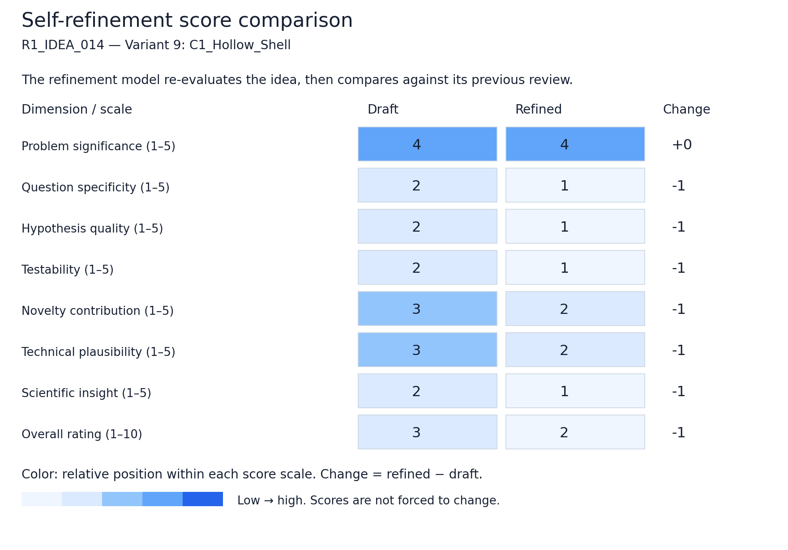

Changed score dimensions: question_specificity, hypothesis_quality, testability, novelty_contribution, technical_plausibility, scientific_insight, overall_rating.

### Score justifications (draft / refined)

**Problem significance**

```json
{
  "draft": {
    "score": 4.0,
    "justification": "Open-world understanding is a fundamental and highly significant challenge in AI. Addressing the limitations of closed-set models and creating robust systems for real-world deployment is of high importance to the field."
  },
  "refined": {
    "score": 4.0,
    "justification": "Open-world understanding is a fundamental and highly significant challenge in AI. The motivation to address this is strong, even if the specific approach is currently vague."
  }
}
```

**Question specificity**

```json
{
  "draft": {
    "score": 2.0,
    "justification": "The idea is currently too broad. It mentions a dataset and a data engine but fails to specify the exact research question, the specific failure modes being addressed, or the precise relationship being investigated. The text is also incomplete."
  },
  "refined": {
    "score": 1.0,
    "justification": "The idea fails to define a research question. It describes a project scope ('We present a research project...') but does not state what is being investigated, hypothesized, or tested. The text is also incomplete."
  }
}
```

**Hypothesis quality**

```json
{
  "draft": {
    "score": 2.0,
    "justification": "No explicit hypothesis is provided. The text reads as a project announcement rather than a scientific inquiry with a testable prediction. It lacks a mechanism or a specific claim about why this approach should work."
  },
  "refined": {
    "score": 1.0,
    "justification": "There is no explicit or implicit hypothesis. The text is a project announcement, not a scientific claim that can be supported or contradicted by evidence."
  }
}
```

**Testability**

```json
{
  "draft": {
    "score": 2.0,
    "justification": "While the concept of building a dataset is testable, the current description lacks the necessary details to design a specific experiment or evaluation protocol. Without a defined hypothesis or baseline, the testability is low."
  },
  "refined": {
    "score": 1.0,
    "justification": "While building a dataset is an executable task, the scientific testability of the *idea* is zero because there is no hypothesis to test. We cannot design an experiment to validate a claim that hasn't been made."
  }
}
```

**Novelty contribution**

```json
{
  "draft": {
    "score": 3.0,
    "justification": "The concept of using a data engine for open-world understanding is promising and aligns with current trends, but the specific contribution (new dataset vs. new engine vs. new insight) is undefined. It could be a significant contribution if the data engine mechanism is novel, but currently, it is just a generic application of a known paradigm."
  },
  "refined": {
    "score": 2.0,
    "justification": "The concept of a data engine is not novel in itself. Without knowing the specific mechanism or the unique insight the dataset provides, the potential contribution is indistinguishable from a standard engineering effort."
  }
}
```

**Technical plausibility**

```json
{
  "draft": {
    "score": 3.0,
    "justification": "The idea is technically plausible; large-scale data engines and open-world datasets are feasible research directions. However, without details on the engine's logic or the annotation process, it is impossible to assess the technical soundness of the proposed mechanism."
  },
  "refined": {
    "score": 2.0,
    "justification": "The general direction is plausible, but the specific mechanism is unknown. The truncation prevents any assessment of whether the proposed 'data engine' is technically sound or feasible."
  }
}
```

**Scientific insight**

```json
{
  "draft": {
    "score": 2.0,
    "justification": "As currently described, the project risks being a 'data dump' (creating a large dataset) without necessarily yielding new scientific insights into the mechanisms of open-world understanding. The potential for insight exists but is not articulated."
  },
  "refined": {
    "score": 1.0,
    "justification": "As described, this reads as a data engineering project. There is no indication of what scientific principle, mechanism, or generalizable insight will be discovered."
  }
}
```

**Overall rating**

```json
{
  "draft": {
    "score": 3.0,
    "justification": "The research idea addresses a high-significance problem (open-world understanding) and proposes a relevant direction (data engines). However, the idea is currently too vague, incomplete, and lacks a specific hypothesis or research question to be considered strong. It falls into the 'weak' to 'moderate' category because the core scientific inquiry is missing, leaving only a broad project description."
  },
  "refined": {
    "score": 2.0,
    "justification": "The idea addresses a significant problem but fails to articulate a research question, hypothesis, or testable mechanism. It is currently an incomplete project description rather than a research idea. The lack of specificity and the truncated text prevent it from being a viable scientific proposal in its current form."
  }
}
```

## R1_IDEA_014 — Variant 10: C2_Logic_Flawed


Changed score dimensions: none.

### Score justifications (draft / refined)

**Problem significance**

```json
{
  "draft": {
    "score": 5.0,
    "justification": "The problem of achieving comprehensive, open-world visual understanding is one of the most significant challenges in AI. Solving this would represent a major leap towards general-purpose vision systems."
  },
  "refined": {
    "score": 5.0,
    "justification": "The challenge of open-world visual understanding is a fundamental bottleneck in AI. A dataset of this magnitude addressing this gap is of exceptional significance to the field."
  }
}
```

**Question specificity**

```json
{
  "draft": {
    "score": 2.0,
    "justification": "The idea is currently framed as a project description (building a dataset) rather than a specific scientific question. It states *what* will be built but not *what specific scientific insight* is expected from it."
  },
  "refined": {
    "score": 2.0,
    "justification": "The idea is currently framed as a project description ('We present...') rather than a specific research question. It lacks a clear hypothesis about the relationship between the data scale/engine and the resulting model capabilities."
  }
}
```

**Hypothesis quality**

```json
{
  "draft": {
    "score": 2.0,
    "justification": "There is an implicit hypothesis that 'scale + human-in-the-loop = better open-world understanding,' but this is a generic assumption rather than a testable, falsifiable scientific hypothesis with a proposed mechanism."
  },
  "refined": {
    "score": 2.0,
    "justification": "The implicit hypothesis ('scale + human-in-loop = better understanding') is generic. It does not propose a specific mechanism or a falsifiable prediction about the nature of the learning dynamics."
  }
}
```

**Testability**

```json
{
  "draft": {
    "score": 3.0,
    "justification": "The idea is testable in principle (build dataset, train model, evaluate), but the summary lacks specific evaluation metrics or baselines that would make the test rigorous. The claim of 'broader effectiveness' is too vague to be immediately falsifiable."
  },
  "refined": {
    "score": 3.0,
    "justification": "While the creation of a dataset is a tangible output, the scientific testability of the 'broader effectiveness' claim is weak without defined baselines, metrics, or a specific evaluation protocol in the text."
  }
}
```

**Novelty contribution**

```json
{
  "draft": {
    "score": 4.0,
    "justification": "While large datasets are common, the specific combination of 1.2B region-level annotations with QA/captions and a human-in-the-loop data engine is novel. The potential contribution is high if the data quality is maintained."
  },
  "refined": {
    "score": 4.0,
    "justification": "The scale (1.2B regions) and the specific combination of region-level QA/captions with a human-in-the-loop engine represent a novel and potentially high-impact contribution, assuming feasibility."
  }
}
```

**Technical plausibility**

```json
{
  "draft": {
    "score": 3.0,
    "justification": "The concept is plausible, but the scale (1.2B regions) presents immense engineering challenges regarding storage, processing, and annotation quality control that are not addressed. The 'efficient models in the loop' mechanism needs more detail to be considered fully plausible."
  },
  "refined": {
    "score": 3.0,
    "justification": "The concept is theoretically sound, but the text provides no details on the engineering feasibility of annotating 1.2B regions with high-quality QA/captions. The 'efficient models' mechanism is too vague to fully assess plausibility."
  }
}
```

**Scientific insight**

```json
{
  "draft": {
    "score": 3.0,
    "justification": "If successful, the project would provide valuable data, but the current description focuses on the artifact (dataset) rather than the scientific principles of how such data drives learning. The insight potential depends on how the data is analyzed, not just its existence."
  },
  "refined": {
    "score": 3.0,
    "justification": "The primary contribution appears to be the artifact (dataset). The potential for scientific insight depends on whether the research investigates *how* this data changes learning dynamics, which is not currently specified."
  }
}
```

**Overall rating**

```json
{
  "draft": {
    "score": 6.0,
    "justification": "This is a moderate/borderline idea. The ambition and potential impact are exceptional (5/5), but the current formulation is too vague to be considered a strong research *idea* rather than a project proposal. It lacks a specific hypothesis and clear scientific question, making it difficult to evaluate its theoretical contribution. It has the potential to be a 9 if refined to focus on the 'why' and 'how' of the learning dynamics at this scale."
  },
  "refined": {
    "score": 6.0,
    "justification": "This is a moderate/borderline idea. The ambition and potential impact are exceptional (5/5), but the current formulation is too vague to be considered a strong research *idea* rather than a project proposal. It lacks a specific hypothesis and clear scientific question, making it difficult to evaluate its theoretical contribution. It has the potential to be a 9 if refined to focus on the 'why' and 'how' of the learning dynamics at this scale."
  }
}
```

## R1_IDEA_014 — Variant 11: C3_Substance_Enriched

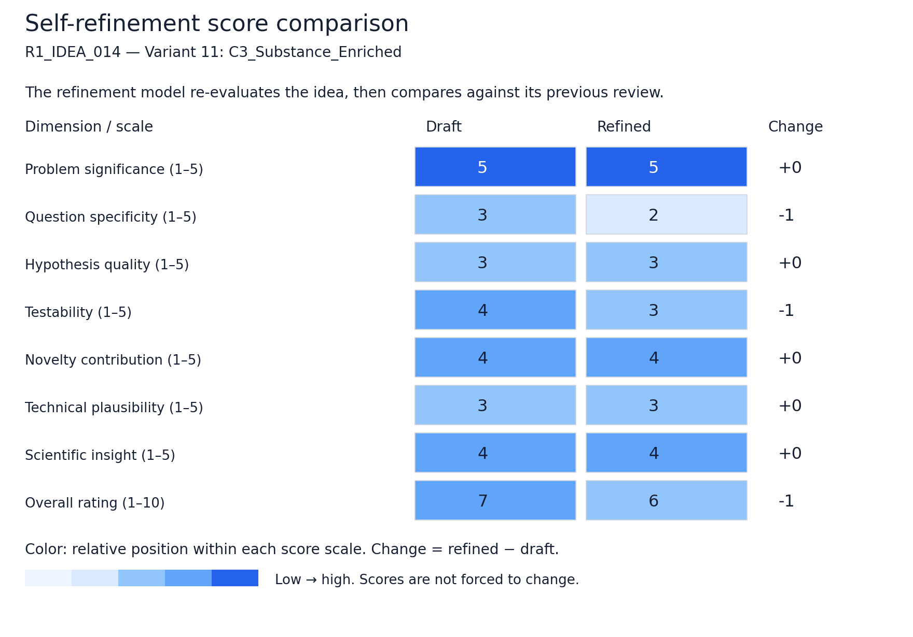

Changed score dimensions: question_specificity, testability, overall_rating.

### Score justifications (draft / refined)

**Problem significance**

```json
{
  "draft": {
    "score": 5.0,
    "justification": "The problem of scaling visual understanding to the 'open world' with dense, multi-modal annotations is one of the most significant challenges in current computer vision. Solving this could unlock the next generation of general-purpose AI agents."
  },
  "refined": {
    "score": 5.0,
    "justification": "The problem of scaling visual understanding to the 'open world' with dense, multi-modal annotations is one of the most significant challenges in current computer vision. Solving this could unlock the next generation of general-purpose AI agents."
  }
}
```

**Question specificity**

```json
{
  "draft": {
    "score": 3.0,
    "justification": "While the goal is clear, the specific research question regarding 'annotation density' is vague. It is unclear what variable is being manipulated (e.g., number of tags, length of captions) and what the expected functional form of the relationship is."
  },
  "refined": {
    "score": 2.0,
    "justification": "While the goal is clear, the specific research question is currently obscured by fragmented text. The variable 'annotation density' is not defined, and the relationship to 'generalization' is stated as a 'possible' hypothesis rather than a concrete prediction. The sentence structure breaks down, making the exact mechanism of investigation ambiguous."
  }
}
```

**Hypothesis quality**

```json
{
  "draft": {
    "score": 3.0,
    "justification": "The hypothesis that 'annotation density influences model generalization' is plausible but generic. It lacks a specific mechanism (e.g., 'density reduces the long-tail distribution gap') or a predicted threshold effect, making it less scientifically rigorous than it could be."
  },
  "refined": {
    "score": 3.0,
    "justification": "The hypothesis that 'annotation density influences model generalization' is plausible but generic. It lacks a specific mechanism (e.g., 'density reduces the long-tail distribution gap') or a predicted threshold effect, making it less scientifically rigorous than it could be. The text also presents it as a 'testable hypothesis' rather than a derived prediction."
  }
}
```

**Testability**

```json
{
  "draft": {
    "score": 4.0,
    "justification": "The idea is testable by training models on subsets of the proposed dataset with varying densities and evaluating on unseen domains. However, the lack of a clear control variable (what exactly constitutes 'density') makes the experimental design currently ambiguous."
  },
  "refined": {
    "score": 3.0,
    "justification": "The idea is theoretically testable by training models on subsets with varying densities. However, without a clear definition of 'density' (the independent variable) or a specific validation protocol for 'unseen domains' (the test set), the experimental design is currently ambiguous and difficult to operationalize."
  }
}
```

**Novelty contribution**

```json
{
  "draft": {
    "score": 4.0,
    "justification": "Creating a 1.2B region dataset is a novel engineering feat. The scientific contribution lies in the potential to discover the scaling laws of annotation density, which is a less explored area compared to model scaling laws."
  },
  "refined": {
    "score": 4.0,
    "justification": "Creating a 1.2B region dataset is a novel engineering feat. The scientific contribution lies in the potential to discover the scaling laws of annotation density, which is a less explored area compared to model scaling laws. However, the idea currently reads more like a project proposal than a novel scientific discovery."
  }
}
```

**Technical plausibility**

```json
{
  "draft": {
    "score": 3.0,
    "justification": "The concept is plausible, but the scale (1.2B regions) presents immense technical challenges regarding data storage, processing, and the quality of the 'human feedback' loop. The idea does not address these feasibility constraints."
  },
  "refined": {
    "score": 3.0,
    "justification": "The concept is plausible, but the scale (1.2B regions) presents immense technical challenges regarding data storage, processing, and the quality of the 'human feedback' loop. The idea does not address these feasibility constraints, making the technical path uncertain."
  }
}
```

**Scientific insight**

```json
{
  "draft": {
    "score": 4.0,
    "justification": "If successful, this research could reveal fundamental scaling laws regarding data quality and density versus model performance, providing a principle for future data engine design."
  },
  "refined": {
    "score": 4.0,
    "justification": "If successfully investigated, this research could reveal fundamental scaling laws regarding data quality and density versus model performance, providing a principle for future data engine design. However, the current lack of specificity limits the immediate potential for deep insight."
  }
}
```

**Overall rating**

```json
{
  "draft": {
    "score": 7.0,
    "justification": "This is a strong research idea with high potential impact due to the scale and the critical nature of the problem. However, it currently reads more like a project proposal than a focused scientific hypothesis. The core scientific question (density vs. generalization) is clear enough to be valuable but needs sharper definition to move from a 'strong' to an 'exceptional' rating."
  },
  "refined": {
    "score": 6.0,
    "justification": "This is a moderate research idea with high potential impact due to the scale and the critical nature of the problem. However, the current presentation is fragmented, and the core scientific question is too vague to be considered 'strong'. It currently reads more like a project proposal than a focused scientific hypothesis. The lack of definition for key terms ('density') and the disjointed structure lower the score from a 'strong' (7-8) to a 'moderate' (5-6) rating. It requires significant refinement to clarify the specific mechanism being tested."
  }
}
```

## R1_IDEA_014 — Variant 12: H1_Deceptive_Hollow

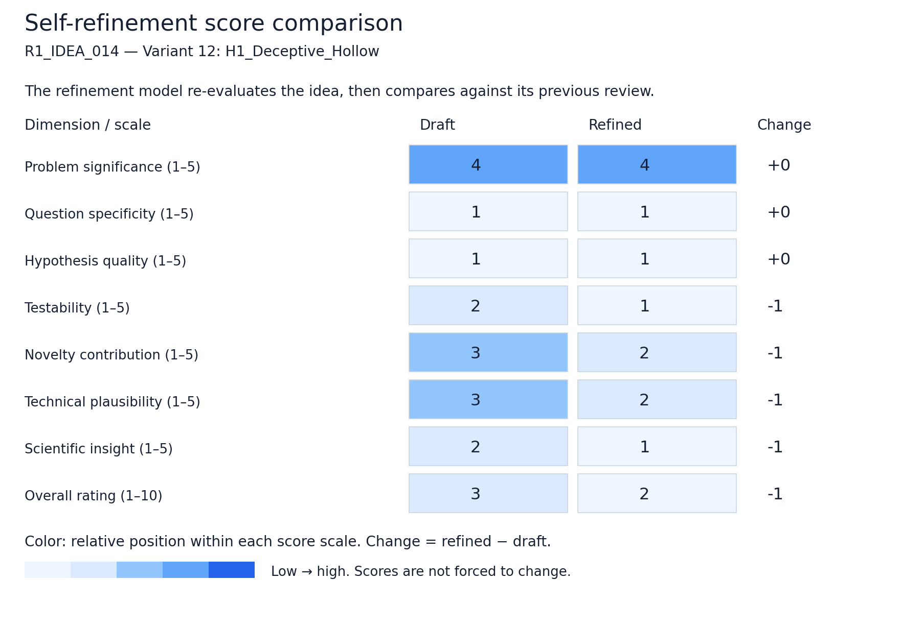

Changed score dimensions: testability, novelty_contribution, technical_plausibility, scientific_insight, overall_rating.

### Score justifications (draft / refined)

**Problem significance**

```json
{
  "draft": {
    "score": 4.0,
    "justification": "The problem of open-world understanding is highly significant and represents a major frontier in machine learning. Addressing the limitations of closed-set models is a critical challenge for the field."
  },
  "refined": {
    "score": 4.0,
    "justification": "The problem of open-world understanding is highly significant and represents a major challenge in advancing AI beyond closed-set benchmarks. Addressing this is a priority for the field."
  }
}
```

**Question specificity**

```json
{
  "draft": {
    "score": 1.0,
    "justification": "The idea fails to define a specific research question. It describes a broad agenda and a dataset creation process but does not specify what exact relationship, mechanism, or phenomenon is being investigated."
  },
  "refined": {
    "score": 1.0,
    "justification": "The idea fails to define a specific research question. It describes a broad agenda and a dataset creation process but does not specify what exact relationship, mechanism, or phenomenon is being investigated. The text is also grammatically incomplete."
  }
}
```

**Hypothesis quality**

```json
{
  "draft": {
    "score": 1.0,
    "justification": "There is no explicit or implicit hypothesis that can be supported or contradicted. The text makes grand claims about 'transformative synthesis' but offers no testable prediction about the outcome."
  },
  "refined": {
    "score": 1.0,
    "justification": "There is no explicit or implicit hypothesis that can be supported or contradicted. The text makes grand claims about 'transformative synthesis' but offers no testable prediction about the outcome or the underlying mechanism."
  }
}
```

**Testability**

```json
{
  "draft": {
    "score": 2.0,
    "justification": "While building a dataset is a tangible action, the idea does not specify how the success of the 'agenda' will be measured or what experiments will validate the 'unified pathway.' It is currently too abstract to be meaningfully tested."
  },
  "refined": {
    "score": 1.0,
    "justification": "While building a dataset is a tangible action, the idea does not specify how the success of the 'agenda' will be measured. Without defined metrics, baselines, or specific tasks, the central claim cannot be meaningfully tested or falsified."
  }
}
```

**Novelty contribution**

```json
{
  "draft": {
    "score": 3.0,
    "justification": "The concept of a data engine for open-world tasks is novel in principle, but the description is too generic to assess the specific novelty of the proposed approach compared to existing data-centric AI efforts."
  },
  "refined": {
    "score": 2.0,
    "justification": "While the concept of a data engine for open-world tasks is potentially novel, the description is too generic and incomplete to assess the specific novelty of the proposed approach. It risks being a generic application of existing data-centric ideas without a unique twist."
  }
}
```

**Technical plausibility**

```json
{
  "draft": {
    "score": 3.0,
    "justification": "The general direction (data engine -> better open-world models) is technically plausible, but the lack of details on the engine's architecture or the data schema makes it impossible to assess the feasibility of the specific proposal."
  },
  "refined": {
    "score": 2.0,
    "justification": "The general direction (data engine -> better models) is plausible, but the lack of details on the engine's architecture, the data schema, or the annotation process makes it impossible to assess the feasibility of the specific proposal. The incomplete sentence further suggests a lack of technical rigor in the current formulation."
  }
}
```

**Scientific insight**

```json
{
  "draft": {
    "score": 2.0,
    "justification": "As currently stated, the idea does not promise specific scientific insight beyond the general expectation that 'more/better data helps.' It lacks a mechanism for revealing new principles or limitations."
  },
  "refined": {
    "score": 1.0,
    "justification": "As currently stated, the idea does not promise specific scientific insight beyond the general expectation that 'more/better data helps.' It lacks a mechanism for revealing new principles, limitations, or boundary conditions."
  }
}
```

**Overall rating**

```json
{
  "draft": {
    "score": 3.0,
    "justification": "The idea addresses a significant problem and proposes a generally sound direction (data engines), but it is currently too vague, incomplete, and buzzword-heavy to be evaluated as a concrete research proposal. It lacks the specificity, hypothesis, and testability required for a strong scientific contribution."
  },
  "refined": {
    "score": 2.0,
    "justification": "The idea addresses a significant problem but is currently too vague, incomplete, and buzzword-heavy to be evaluated as a concrete research proposal. It lacks the specificity, hypothesis, and testability required for a scientific contribution. The presence of a broken sentence and the absence of any defined mechanism or hypothesis drop the rating significantly below a 'moderate' idea."
  }
}
```

## R1_IDEA_014 — Variant 13: H2_Confident_Flaw

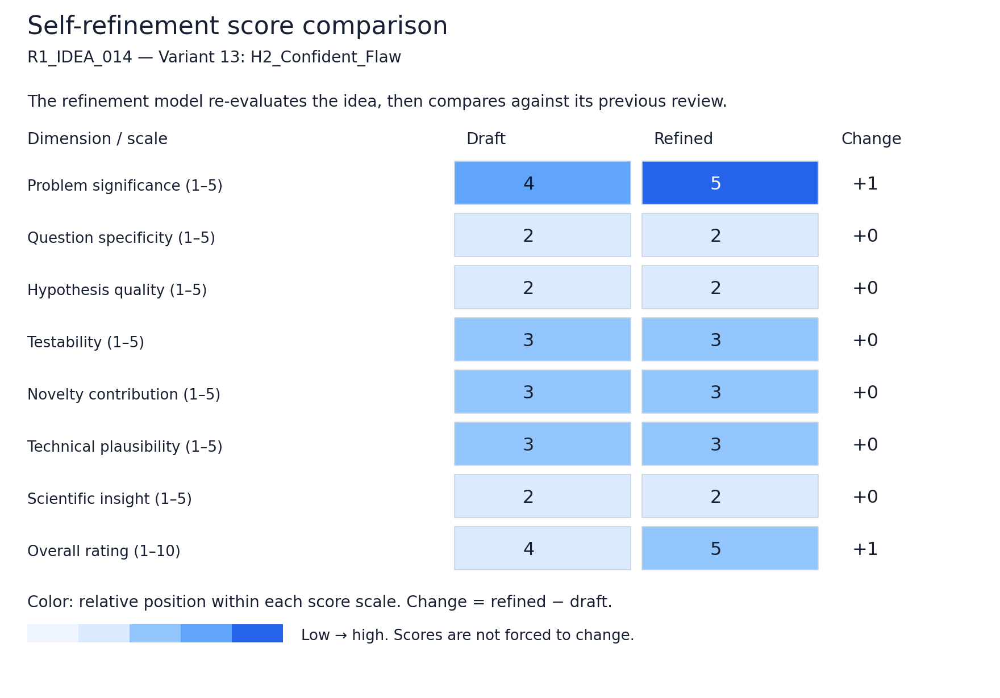

Changed score dimensions: problem_significance, overall_rating.

### Score justifications (draft / refined)

**Problem significance**

```json
{
  "draft": {
    "score": 4.0,
    "justification": "The problem of building large-scale, open-world visual understanding systems is highly significant and aligns with the current trajectory of AI research. Creating a dataset of this magnitude would be a major contribution if successful."
  },
  "refined": {
    "score": 5.0,
    "justification": "The problem of achieving robust, open-world visual understanding is one of the most significant challenges in modern AI. A dataset of 1.2 billion regions would be a landmark resource, potentially enabling new research directions in zero-shot and few-shot learning."
  }
}
```

**Question specificity**

```json
{
  "draft": {
    "score": 2.0,
    "justification": "While the scale is specific, the research question is vague. The text asserts a conclusion ('gains can be treated as causal') rather than posing a clear question about the relationship between the data engine's specific mechanisms and model performance."
  },
  "refined": {
    "score": 2.0,
    "justification": "While the scale is specific, the research question is obscured by a definitive conclusion. The text does not ask 'how' or 'why' the model learns, but rather asserts 'that' it will succeed and that this success proves a specific causal claim. It lacks a clear, interrogative research question."
  }
}
```

**Hypothesis quality**

```json
{
  "draft": {
    "score": 2.0,
    "justification": "The hypothesis is weak because it is stated as a certainty ('necessarily produce reliable improvements') rather than a testable prediction. It lacks a mechanism that could be proven wrong; it assumes that scale/coverage automatically equals generalization."
  },
  "refined": {
    "score": 2.0,
    "justification": "The hypothesis is weak because it is stated as a certainty ('necessarily produce') rather than a conditional prediction. It fails to propose a mechanism that could be proven wrong; it assumes a direct, unmediated link between scale/coverage and generalization, ignoring potential confounders."
  }
}
```

**Testability**

```json
{
  "draft": {
    "score": 3.0,
    "justification": "The creation of the dataset and model is testable in terms of existence and benchmark performance. However, the specific claim that 'alternative explanations' are unnecessary makes the scientific validation of the core argument difficult to test rigorously."
  },
  "refined": {
    "score": 3.0,
    "justification": "The creation of the dataset and model is testable as a system. However, the specific scientific claim—that alternative explanations are unnecessary—is not testable because it precludes the very experiments (ablations, isolations) required to validate the claim. The core argument is insulated from falsification."
  }
}
```

**Novelty contribution**

```json
{
  "draft": {
    "score": 3.0,
    "justification": "The scale (1.2B regions) is novel and ambitious. However, the scientific contribution regarding the 'mechanism' of open-world learning is not clearly defined, limiting the novelty of the theoretical insight."
  },
  "refined": {
    "score": 3.0,
    "justification": "The scale (1.2B regions) is novel and ambitious. However, the proposed scientific contribution (that scale alone proves general superiority without isolation) is not novel; it is a methodological error. The potential for scientific insight is limited by the dismissal of rigorous analysis."
  }
}
```

**Technical plausibility**

```json
{
  "draft": {
    "score": 3.0,
    "justification": "The technical approach of using a data engine with human feedback is plausible. However, the claim that this approach eliminates the need for isolating variables is technically unsound from a research methodology perspective."
  },
  "refined": {
    "score": 3.0,
    "justification": "The technical approach of building a large dataset with human feedback is plausible and aligns with current trends. However, the methodological claim that this approach eliminates the need for variable isolation is technically unsound from a research design perspective."
  }
}
```

**Scientific insight**

```json
{
  "draft": {
    "score": 2.0,
    "justification": "If the project succeeds, it will provide a valuable resource (the dataset). However, the proposed reasoning does not promise deep scientific insight into *why* the model works, as it dismisses the need to analyze boundary conditions or alternative explanations."
  },
  "refined": {
    "score": 2.0,
    "justification": "While the resulting dataset will be a valuable resource, the *reasoning* presented does not promise deep scientific insight. By dismissing the need to analyze boundary conditions or alternative explanations, the idea forfeits the opportunity to learn *why* the model works or where it fails."
  }
}
```

**Overall rating**

```json
{
  "draft": {
    "score": 4.0,
    "justification": "The idea has high potential due to the scale and ambition of the dataset, which is a significant resource. However, the scientific framing is weak. The argument that solving a limitation automatically proves general superiority without further isolation is a logical flaw that undermines the research quality. It reads more like a project proposal with a biased conclusion than a rigorous research hypothesis."
  },
  "refined": {
    "score": 5.0,
    "justification": "The idea sits at a moderate level (5) because it combines a highly significant problem and a potentially transformative resource (the dataset) with a fundamentally flawed research methodology. The proposal's assertion that rigorous isolation of variables is unnecessary undermines its scientific validity. It is a strong engineering proposal but a weak research hypothesis. The high significance of the problem prevents a lower score, but the logical flaws in the hypothesis prevent a higher score."
  }
}
```

## R1_IDEA_014 — Variant 14: H3_Verbose_Enriched


Changed score dimensions: none.

### Score justifications (draft / refined)

**Problem significance**

```json
{
  "draft": {
    "score": 5.0,
    "justification": "The problem of achieving robust open-world visual understanding with limited data for rare categories is one of the most significant challenges in modern computer vision. Addressing this through large-scale, high-density annotation is highly relevant to the field's trajectory."
  },
  "refined": {
    "score": 5.0,
    "justification": "The problem of achieving robust open-world visual understanding with limited data for rare categories is one of the most significant challenges in modern computer vision. Addressing this through large-scale, high-density annotation is highly relevant to the field's trajectory and addresses a fundamental bottleneck in AI generalization."
  }
}
```

**Question specificity**

```json
{
  "draft": {
    "score": 3.0,
    "justification": "While the general goal is clear, the specific definition of 'annotation density' and the precise mechanism of the data engine are vague. The text reads like a mix of a proposal and a review checklist, which dilutes the specificity of the research question."
  },
  "refined": {
    "score": 3.0,
    "justification": "While the general goal is clear, the specific definition of 'annotation density' and the precise mechanism of the data engine are vague. The text reads like a mix of a proposal and a review checklist, which dilutes the specificity of the research question. The hypothesis is broad ('density influences generalization') without specifying the nature of the influence."
  }
}
```

**Hypothesis quality**

```json
{
  "draft": {
    "score": 4.0,
    "justification": "The hypothesis that 'annotation density influences model generalization on rare categories' is testable and plausible. However, it is a relatively broad claim that needs more nuance regarding the *type* of density or the *nature* of the annotations to be truly novel."
  },
  "refined": {
    "score": 4.0,
    "justification": "The hypothesis that 'annotation density influences model generalization on rare categories' is testable and plausible. It distinguishes the proposed investigation from generic application by focusing on the *structure* of data (density) rather than just the *amount*. However, it lacks a specific mechanism (e.g., feature alignment vs. prompt diversity) which limits its depth."
  }
}
```

**Testability**

```json
{
  "draft": {
    "score": 4.0,
    "justification": "The idea proposes a clear path for testing: staged design, ablations, and error analysis. The metrics (generalization on rare categories) are standard and measurable. The main risk is the feasibility of generating the dataset, but the testability of the *hypothesis* itself is strong."
  },
  "refined": {
    "score": 4.0,
    "justification": "The idea proposes a clear path for testing: staged design, ablations, and error analysis. The metrics (generalization on rare categories) are standard and measurable. The main risk is the feasibility of generating the dataset, but the testability of the *hypothesis* itself, assuming the data exists, is strong."
  }
}
```

**Novelty contribution**

```json
{
  "draft": {
    "score": 4.0,
    "justification": "Creating a 1.2B region dataset is a massive contribution in itself. The scientific contribution lies in empirically validating the relationship between this specific type of dense annotation and rare-category generalization, which could reveal new scaling laws or data efficiency principles."
  },
  "refined": {
    "score": 4.0,
    "justification": "Creating a 1.2B region dataset is a massive contribution in itself. The scientific contribution lies in empirically validating the relationship between this specific type of dense annotation and rare-category generalization. This could reveal new scaling laws or data efficiency principles, moving beyond simple 'more data is better'."
  }
}
```

**Technical plausibility**

```json
{
  "draft": {
    "score": 3.0,
    "justification": "The idea is plausible in principle, but the claim of generating 1.2B high-quality annotated regions via a 'scalable data engine' is technically ambitious. Without details on the engine's quality control, the plausibility of the dataset's utility is uncertain. The experimental design, however, is technically sound."
  },
  "refined": {
    "score": 3.0,
    "justification": "The idea is plausible in principle, but the claim of generating 1.2B high-quality annotated regions via a 'scalable data engine' is technically ambitious. Without details on the engine's quality control, the plausibility of the dataset's utility is uncertain. The experimental design is technically sound, but the data generation mechanism is a black box."
  }
}
```

**Scientific insight**

```json
{
  "draft": {
    "score": 4.0,
    "justification": "If successful, this research could provide deep insights into the data efficiency of vision-language models, specifically how annotation granularity impacts the learning of long-tail distributions. It moves beyond simple 'more data is better' to investigate the *structure* of data."
  },
  "refined": {
    "score": 4.0,
    "justification": "If successful, this research could provide deep insights into the data efficiency of vision-language models, specifically how annotation granularity impacts the learning of long-tail distributions. It moves beyond simple performance metrics to investigate the *structure* of data and its interaction with model learning."
  }
}
```

**Overall rating**

```json
{
  "draft": {
    "score": 7.0,
    "justification": "This is a strong research idea with high potential impact. The problem is significant, and the proposed hypothesis is meaningful. However, the presentation is currently disjointed, and the technical specifics of the data generation engine are missing, which prevents it from being an 'exceptional' (9-10) idea. With better articulation of the mechanism and clearer definitions, it could be a top-tier contribution."
  },
  "refined": {
    "score": 7.0,
    "justification": "This is a strong research idea with high potential impact. The problem is significant, and the proposed hypothesis is meaningful. However, the presentation is currently disjointed, and the technical specifics of the data generation engine are missing, which prevents it from being an 'exceptional' (9-10) idea. With better articulation of the mechanism and clearer definitions, it could be a top-tier contribution."
  }
}
```

## R1_IDEA_014 — Variant 15: H4_Ultimate_Hype


Changed score dimensions: none.

### Score justifications (draft / refined)

**Problem significance**

```json
{
  "draft": {
    "score": 5.0,
    "justification": "The problem of achieving true open-world, comprehensive scene understanding is one of the most significant challenges in computer vision and AI. Solving this would have profound implications for robotics, autonomous systems, and general AI."
  },
  "refined": {
    "score": 5.0,
    "justification": "The problem of achieving true open-world, comprehensive scene understanding is one of the most significant challenges in computer vision and AI. Solving this would have profound implications for robotics, autonomous systems, and general AI."
  }
}
```

**Question specificity**

```json
{
  "draft": {
    "score": 2.0,
    "justification": "The idea is currently framed as a broad agenda ('redefine the frontier') rather than a specific research question. It lacks a clear definition of the specific mechanism or relationship being investigated, making it difficult to evaluate the scientific contribution beyond 'building a big dataset'."
  },
  "refined": {
    "score": 2.0,
    "justification": "The idea is currently framed as a broad agenda ('redefine the frontier') rather than a specific research question. It lacks a clear definition of the specific mechanism or relationship being investigated, making it difficult to evaluate the scientific contribution beyond 'building a big dataset'."
  }
}
```

**Hypothesis quality**

```json
{
  "draft": {
    "score": 3.0,
    "justification": "The implicit hypothesis is that 'scale + diverse annotation + human-in-the-loop = transformative open-world understanding.' While plausible, it is a generic scaling hypothesis. It does not distinguish *why* this specific approach will work or what specific boundary conditions it might hit."
  },
  "refined": {
    "score": 3.0,
    "justification": "The implicit hypothesis is that 'scale + diverse annotation + human-in-the-loop = transformative open-world understanding.' While plausible, it is a generic scaling hypothesis. It does not distinguish *why* this specific approach will work or what specific boundary conditions it might hit."
  }
}
```

**Testability**

```json
{
  "draft": {
    "score": 3.0,
    "justification": "The idea is testable in principle (build dataset, train model, evaluate), but the evaluation metrics and specific comparisons are not defined. Without a specific hypothesis, the 'test' is just a performance benchmark, which is less scientifically rigorous than testing a mechanism."
  },
  "refined": {
    "score": 3.0,
    "justification": "The idea is testable in principle (build dataset, train model, evaluate), but the evaluation metrics and specific comparisons are not defined. Without a specific hypothesis, the 'test' is just a performance benchmark, which is less scientifically rigorous than testing a mechanism."
  }
}
```

**Novelty contribution**

```json
{
  "draft": {
    "score": 4.0,
    "justification": "The scale (1.2B regions) is novel and ambitious. The integration of a specific data engine with human feedback is a valuable methodological direction. However, the core idea of 'more data leads to better models' is not new; the novelty lies in the execution and the specific data engine, which is not fully detailed."
  },
  "refined": {
    "score": 4.0,
    "justification": "The scale (1.2B regions) is novel and ambitious. The integration of a specific data engine with human feedback is a valuable methodological direction. However, the core idea of 'more data leads to better models' is not new; the novelty lies in the execution and the specific data engine, which is not fully detailed."
  }
}
```

**Technical plausibility**

```json
{
  "draft": {
    "score": 4.0,
    "justification": "The proposed methodology (using efficient models and human feedback to scale annotation) is technically sound and aligns with current trends in data-centric AI. The scale is ambitious but not impossible given modern compute and annotation infrastructure."
  },
  "refined": {
    "score": 4.0,
    "justification": "The proposed methodology (using efficient models and human feedback to scale annotation) is technically sound and aligns with current trends in data-centric AI. The scale is ambitious but not impossible given modern compute and annotation infrastructure."
  }
}
```

**Scientific insight**

```json
{
  "draft": {
    "score": 3.0,
    "justification": "If successful, the project will provide valuable data and models, but the *scientific insight* regarding the *mechanism* of open-world understanding is not yet articulated. The project risks being a 'engineering feat' rather than a 'scientific discovery' unless the research question is narrowed to investigate specific emergent properties."
  },
  "refined": {
    "score": 3.0,
    "justification": "If successful, the project will provide valuable data and models, but the *scientific insight* regarding the *mechanism* of open-world understanding is not yet articulated. The project risks being a 'engineering feat' rather than a 'scientific discovery' unless the research question is narrowed to investigate specific emergent properties."
  }
}
```

**Overall rating**

```json
{
  "draft": {
    "score": 6.0,
    "justification": "This is a strong, high-impact research *direction* with exceptional problem significance and technical plausibility. However, as a research *idea* presented in this text, it lacks the specificity, hypothesis formulation, and defined scientific contribution required for a top-tier score. It reads like a project proposal rather than a hypothesis-driven research plan. It is a 'Moderate/borderline' idea in terms of scientific rigor but has 'Strong' potential if refined."
  },
  "refined": {
    "score": 6.0,
    "justification": "This is a strong, high-impact research *direction* with exceptional problem significance and technical plausibility. However, as a research *idea* presented in this text, it lacks the specificity, hypothesis formulation, and defined scientific contribution required for a top-tier score. It reads like a project proposal rather than a hypothesis-driven research plan. It is a 'Moderate/borderline' idea in terms of scientific rigor but has 'Strong' potential if refined."
  }
}
```

## R1_IDEA_015 — Source


Changed score dimensions: none.

### Score justifications (draft / refined)

**Problem significance**

```json
{
  "draft": {
    "score": 4.0,
    "justification": "The problem of precise text-based control in 3D generation is a major bottleneck in the field. Solving this would significantly improve the usability of 3D content creation tools for both researchers and practitioners."
  },
  "refined": {
    "score": 4.0,
    "justification": "The problem of precise 3D editing is a major bottleneck in the field. Current text-to-3D methods are often too vague for professional use. Solving this would significantly advance the usability of 3D content creation tools."
  }
}
```

**Question specificity**

```json
{
  "draft": {
    "score": 3.0,
    "justification": "The idea identifies a clear direction (interpolation/sliders) but lacks specificity on the implementation details, the definition of the latent space, and the exact mechanism for defining the extremes."
  },
  "refined": {
    "score": 3.0,
    "justification": "The idea specifies the *goal* (precise editing via sliders) but lacks specificity on the *mechanism* (how the latent space is structured, how extremes are found, and the specific representation). It is a direction rather than a concrete research question."
  }
}
```

**Hypothesis quality**

```json
{
  "draft": {
    "score": 3.0,
    "justification": "The implicit hypothesis is that 'interpolation between extremes reduces ambiguity and increases precision.' This is a reasonable hypothesis, but it is generic and needs to be tied to specific properties of 3D latent spaces to be a strong scientific claim."
  },
  "refined": {
    "score": 3.0,
    "justification": "The implicit hypothesis is that 'interpolation reduces ambiguity.' This is plausible but generic. A stronger hypothesis would specify the relationship between the latent space geometry and semantic linearity, which is the core scientific challenge here."
  }
}
```

**Testability**

```json
{
  "draft": {
    "score": 4.0,
    "justification": "The idea is highly testable. One can implement a prototype, define a set of semantic attributes, and measure the correlation between the slider position and the resulting semantic features in the generated avatars."
  },
  "refined": {
    "score": 4.0,
    "justification": "The idea is testable. One can build a prototype, define a set of attributes, and measure the correlation between slider position and semantic features. The lack of implementation details does not prevent the *idea* from being testable."
  }
}
```

**Novelty contribution**

```json
{
  "draft": {
    "score": 3.0,
    "justification": "While the concept of sliders is established in 2D, applying it specifically to the complex domain of 3D human avatars with a focus on resolving text ambiguity is a novel and valuable contribution. However, the core mechanism is not entirely new."
  },
  "refined": {
    "score": 3.0,
    "justification": "Applying concept sliders to 3D avatars is a logical extension of 2D techniques (StyleGAN) but is not yet standard in 3D. The novelty lies in the domain adaptation and the specific focus on resolving text ambiguity, but the core mechanism is not fundamentally new."
  }
}
```

**Technical plausibility**

```json
{
  "draft": {
    "score": 4.0,
    "justification": "The approach is technically plausible. Latent space interpolation is a standard technique in generative models. The main challenge lies in the specific geometry of 3D humans, but the direction is sound."
  },
  "refined": {
    "score": 4.0,
    "justification": "The approach is technically sound based on current generative modeling principles. The main risk is the complexity of 3D human geometry, but the direction is feasible."
  }
}
```

**Scientific insight**

```json
{
  "draft": {
    "score": 3.0,
    "justification": "If successful, this research could reveal how semantic concepts are organized in 3D latent spaces and whether linear interpolation is a valid assumption for human avatars, providing insights into the geometry of 3D generative models."
  },
  "refined": {
    "score": 3.0,
    "justification": "If successful, it would provide insights into the structure of 3D latent spaces. However, if the method simply works as a 'wrapper' without revealing new principles about 3D generation, the scientific insight is limited to engineering utility."
  }
}
```

**Overall rating**

```json
{
  "draft": {
    "score": 7.0,
    "justification": "This is a strong research idea with clear practical motivation and a plausible methodological direction. It addresses a significant gap in 3D generation. However, it currently lacks the specificity of a concrete hypothesis regarding the underlying mechanisms (e.g., linearity of the latent space) and the definition of the 'extremes,' which prevents it from being an exceptional score. With more specific formulation, it could be a top-tier contribution."
  },
  "refined": {
    "score": 7.0,
    "justification": "This is a strong research idea with clear practical motivation and a plausible direction. It addresses a significant gap in 3D generation. However, it currently lacks the specificity of a concrete hypothesis regarding the underlying mechanisms (e.g., linearity of the latent space) and the definition of the 'extremes,' which prevents it from being an exceptional score. With more specific formulation, it could be a top-tier contribution."
  }
}
```

## R1_IDEA_015 — Variant 1: A1_Identity

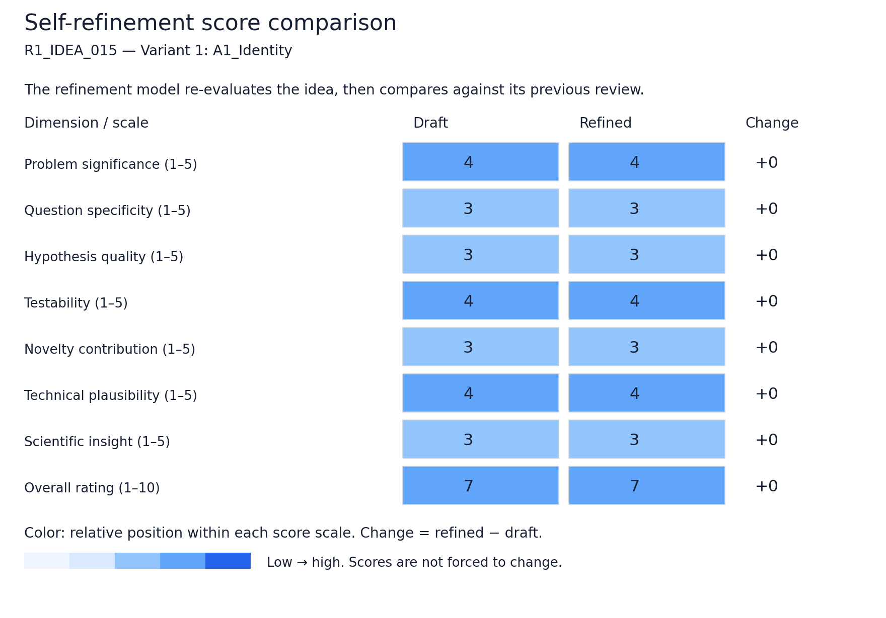

Changed score dimensions: none.

### Score justifications (draft / refined)

**Problem significance**

```json
{
  "draft": {
    "score": 4.0,
    "justification": "The problem of precise text-based control in 3D generation is a major bottleneck in the field. Solving this would significantly improve the usability of 3D content creation tools for both researchers and practitioners."
  },
  "refined": {
    "score": 4.0,
    "justification": "Precise control over 3D content is a major unsolved challenge. Solving the ambiguity of natural language for 3D avatars has high practical value for content creation, gaming, and virtual reality, making this a significant problem."
  }
}
```

**Question specificity**

```json
{
  "draft": {
    "score": 3.0,
    "justification": "The idea identifies a clear direction (interpolation/sliders) but lacks specificity on the implementation details, the definition of the latent space, and the exact mechanism for defining the extremes."
  },
  "refined": {
    "score": 3.0,
    "justification": "The idea identifies a clear direction (interpolation) but remains high-level. It does not specify the mathematical formulation of the interpolation, the definition of the latent space, or the mechanism for defining the endpoints, which are necessary for a fully specific research question."
  }
}
```

**Hypothesis quality**

```json
{
  "draft": {
    "score": 3.0,
    "justification": "The implicit hypothesis is that 'interpolation between extremes reduces ambiguity and increases precision.' This is a reasonable hypothesis, but it is generic and needs to be tied to specific properties of 3D latent spaces to be a strong scientific claim."
  },
  "refined": {
    "score": 3.0,
    "justification": "The implicit hypothesis (interpolation reduces ambiguity) is plausible but generic. A stronger hypothesis would predict specific behaviors of the 3D latent space (e.g., 'Linear interpolation in the latent space of [Model X] yields semantically linear edits for [Attribute Y]')."
  }
}
```

**Testability**

```json
{
  "draft": {
    "score": 4.0,
    "justification": "The idea is highly testable. One can implement a prototype, define a set of semantic attributes, and measure the correlation between the slider position and the resulting semantic features in the generated avatars."
  },
  "refined": {
    "score": 4.0,
    "justification": "The idea is highly testable. One can implement a prototype, define a set of attributes, and empirically measure the correlation between slider position and semantic/geometric changes. The failure of linearity would be a clear falsifiable outcome."
  }
}
```

**Novelty contribution**

```json
{
  "draft": {
    "score": 3.0,
    "justification": "While the concept of sliders is established in 2D, applying it specifically to the complex domain of 3D human avatars with a focus on resolving text ambiguity is a novel and valuable contribution. However, the core mechanism is not entirely new."
  },
  "refined": {
    "score": 3.0,
    "justification": "While 'concept sliders' are known in 2D, applying them to 3D human avatars to specifically address text ambiguity is a novel application. However, the core mechanism is an extension of existing techniques rather than a fundamentally new theoretical discovery."
  }
}
```

**Technical plausibility**

```json
{
  "draft": {
    "score": 4.0,
    "justification": "The approach is technically plausible. Latent space interpolation is a standard technique in generative models. The main challenge lies in the specific geometry of 3D humans, but the direction is sound."
  },
  "refined": {
    "score": 4.0,
    "justification": "The approach is technically sound based on current generative modeling trends. While 3D geometry introduces complexity, the principle of latent space interpolation is a standard and plausible first step for this problem."
  }
}
```

**Scientific insight**

```json
{
  "draft": {
    "score": 3.0,
    "justification": "If successful, this research could reveal how semantic concepts are organized in 3D latent spaces and whether linear interpolation is a valid assumption for human avatars, providing insights into the geometry of 3D generative models."
  },
  "refined": {
    "score": 3.0,
    "justification": "If successful, the research will provide insights into the semantic organization of 3D latent spaces. If it fails, it will reveal the non-linearities and entanglement of 3D representations, both of which are valuable scientific contributions."
  }
}
```

**Overall rating**

```json
{
  "draft": {
    "score": 7.0,
    "justification": "This is a strong research idea with clear practical motivation and a plausible methodological direction. It addresses a significant gap in 3D generation. However, it currently lacks the specificity of a concrete hypothesis regarding the underlying mechanisms (e.g., linearity of the latent space) and the definition of the 'extremes,' which prevents it from being an exceptional score. With more specific formulation, it could be a top-tier contribution."
  },
  "refined": {
    "score": 7.0,
    "justification": "This is a strong research idea with a clear motivation and a plausible, testable direction. It addresses a meaningful problem in 3D generation. However, it currently lacks the specificity of a concrete hypothesis regarding the underlying mechanisms (e.g., latent space geometry) and the definition of key components (extremes), preventing it from being an exceptional (9-10) idea. With more rigorous formulation, it could be top-tier."
  }
}
```

## R1_IDEA_015 — Variant 2: A2_Paraphrase_Only

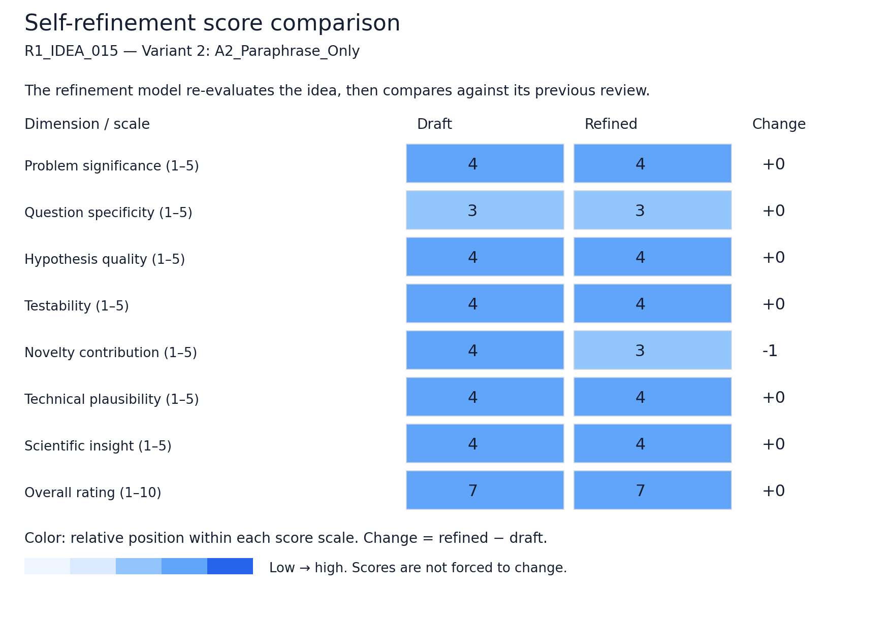

Changed score dimensions: novelty_contribution.

### Score justifications (draft / refined)

**Problem significance**

```json
{
  "draft": {
    "score": 4.0,
    "justification": "The problem of precise 3D avatar editing is a major bottleneck in the field. Current text-to-3D methods often produce artifacts or lack fine-grained control. Solving this would have high practical value for gaming, VR, and digital humans."
  },
  "refined": {
    "score": 4.0,
    "justification": "The problem is highly significant. Current text-to-3D methods struggle with fine-grained, precise edits. Solving this is a major bottleneck for practical applications in gaming, VR, and digital humans. The idea addresses a clear gap in the field."
  }
}
```

**Question specificity**

```json
{
  "draft": {
    "score": 3.0,
    "justification": "The idea identifies a mechanism (sliders) but lacks specificity on the implementation. It defines the 'what' (a slider) but not the 'how' (the mathematical or architectural realization of the slider in 3D space)."
  },
  "refined": {
    "score": 3.0,
    "justification": "The idea defines the 'what' (a slider) and the 'why' (ambiguity of text), but the 'how' is currently abstract. It lacks specific details on the mathematical formulation of the slider or the representation of the 3D space, making the research question somewhat broad."
  }
}
```

**Hypothesis quality**

```json
{
  "draft": {
    "score": 4.0,
    "justification": "The hypothesis is clear: replacing direct text prompts with a continuous interpolation between defined extremes will yield more precise and less ambiguous edits. This is a testable claim that distinguishes the approach from standard text-conditioned generation."
  },
  "refined": {
    "score": 4.0,
    "justification": "The hypothesis is strong: 'Replacing direct text prompts with continuous interpolation between defined extremes will yield more precise edits.' This is a clear, testable prediction that distinguishes the approach from the status quo."
  }
}
```

**Testability**

```json
{
  "draft": {
    "score": 4.0,
    "justification": "The idea is highly testable. One can compare the 'slider' method against direct text prompting on metrics of semantic alignment, user control, and geometric validity. The 'slider' concept naturally lends itself to ablation studies (e.g., linear vs. non-linear interpolation)."
  },
  "refined": {
    "score": 4.0,
    "justification": "The idea is highly testable. One can construct experiments comparing the ACS method against standard text prompting. Metrics can include user control accuracy, semantic alignment, and geometric validity. The 'slider' concept naturally invites ablation studies on the interpolation path."
  }
}
```

**Novelty contribution**

```json
{
  "draft": {
    "score": 4.0,
    "justification": "While the concept of 'sliders' is known in 2D GANs, applying it specifically to the 3D avatar domain to solve the ambiguity of text descriptions is a novel and promising direction. It shifts the paradigm from 'generation' to 'manipulation'."
  },
  "refined": {
    "score": 3.0,
    "justification": "The novelty is moderate. The 'slider' mechanism is not new in 2D generative models. The contribution lies in the successful adaptation to 3D avatars, which is non-trivial but not a fundamentally new scientific principle. It is a strong application of an existing idea to a new domain."
  }
}
```

**Technical plausibility**

```json
{
  "draft": {
    "score": 4.0,
    "justification": "The approach is technically plausible. It aligns with current trends in disentangled representation learning and latent space interpolation. The main challenge is the 3D representation, but the core logic holds."
  },
  "refined": {
    "score": 4.0,
    "justification": "The direction is technically plausible. Disentangled representation learning and latent interpolation are active areas of research. While 3D adds complexity, the core logic of moving between two known states is sound and aligns with current trends in 3D generation."
  }
}
```

**Scientific insight**

```json
{
  "draft": {
    "score": 4.0,
    "justification": "If successful, this research could reveal how to better disentangle semantic concepts in 3D latent spaces and provide a general framework for controllable 3D generation, moving beyond the 'black box' of text-to-3D."
  },
  "refined": {
    "score": 4.0,
    "justification": "If successful, this research would provide valuable insights into how to structure 3D latent spaces for semantic control. It could reveal how to disentangle complex 3D attributes (shape, texture, pose) in a way that is robust to interpolation, offering a general framework for controllable 3D generation."
  }
}
```

**Overall rating**

```json
{
  "draft": {
    "score": 7.0,
    "justification": "This is a strong research idea. It addresses a meaningful problem with a specific, plausible, and testable hypothesis. The main limitation is the current lack of technical detail regarding the 3D implementation, but the core concept is novel and scientifically valuable. It has the potential to be a significant contribution if the 'how' is fleshed out."
  },
  "refined": {
    "score": 7.0,
    "justification": "This is a strong research idea. It tackles a meaningful problem with a clear, plausible, and testable hypothesis. While the novelty is somewhat incremental (adapting 2D concepts to 3D), the potential impact on the usability of 3D generative models is high. The main weakness is the current lack of technical specificity, but the core concept is solid enough to warrant investigation."
  }
}
```

## R1_IDEA_015 — Variant 3: A3_Plain_Core


Changed score dimensions: none.

### Score justifications (draft / refined)

**Problem significance**

```json
{
  "draft": {
    "score": 4.0,
    "justification": "Text-based 3D editing is a critical bottleneck in the field. The specific issue of ambiguity and the inability to fine-tune semantic attributes (like age, expression, or style) is a significant practical challenge for researchers and practitioners."
  },
  "refined": {
    "score": 4.0,
    "justification": "Text-based editing of 3D avatars is a high-priority problem in computer graphics and AI. The specific issue of 'ambiguity' and the inability to fine-tune attributes (like age, expression, or style) is a major practical limitation for current systems. Solving this would significantly advance the usability of 3D content creation tools."
  }
}
```

**Question specificity**

```json
{
  "draft": {
    "score": 3.0,
    "justification": "The idea identifies a mechanism (sliding between extremes) but lacks specificity on the implementation details, the definition of the latent space, and the exact nature of the 'intermediate point' calculation."
  },
  "refined": {
    "score": 3.0,
    "justification": "The idea identifies a mechanism (sliding between extremes) but remains high-level. It does not specify the mathematical definition of the 'intermediate point' or the nature of the 'concept extremes'. The research question is clear in intent but lacks the technical specificity required to fully evaluate the proposed solution's novelty and feasibility."
  }
}
```

**Hypothesis quality**

```json
{
  "draft": {
    "score": 4.0,
    "justification": "The hypothesis that intermediate navigation reduces ambiguity and improves control is strong and plausible. It makes a concrete prediction that this approach will outperform direct text-to-edit methods in terms of precision and semantic fidelity."
  },
  "refined": {
    "score": 4.0,
    "justification": "The hypothesis is strong and plausible: that navigating an intermediate state reduces the ambiguity inherent in direct text prompts. It makes a concrete prediction that this approach will yield more precise and semantically accurate edits than direct methods. This is a falsifiable claim that can be tested empirically."
  }
}
```

**Testability**

```json
{
  "draft": {
    "score": 4.0,
    "justification": "The idea is highly testable. One can construct a dataset of concept pairs, implement the slider mechanism, and quantitatively/qualitatively compare the results against baseline text-editing methods."
  },
  "refined": {
    "score": 4.0,
    "justification": "The idea is highly testable. One can construct a dataset of concept pairs, implement the slider mechanism, and compare the results against baseline text-editing methods using both quantitative metrics (e.g., CLIP score, geometric distance) and qualitative user studies. The 'intermediate' nature of the edit provides a clear axis for evaluation."
  }
}
```

**Novelty contribution**

```json
{
  "draft": {
    "score": 3.0,
    "justification": "While the 'slider' concept is not new in 2D, applying it to 3D human avatars with natural language constraints is a novel application. However, without a specific mechanism for how the 3D constraints are handled, the novelty is currently moderate."
  },
  "refined": {
    "score": 3.0,
    "justification": "The 'slider' concept is well-established in 2D image editing (e.g., StyleGAN). Applying it to 3D human avatars with natural language constraints is a novel application, but the core mechanism is not fundamentally new. The scientific contribution will depend heavily on how the specific constraints of 3D geometry and human topology are handled, which is not yet detailed."
  }
}
```

**Technical plausibility**

```json
{
  "draft": {
    "score": 4.0,
    "justification": "The approach is technically sound. Interpolation in latent spaces is a standard technique in generative modeling. The challenge lies in the specific adaptation to 3D geometry, but the core logic is coherent."
  },
  "refined": {
    "score": 4.0,
    "justification": "The approach is technically sound. Interpolation in latent spaces is a standard technique in generative modeling. The core logic is coherent, and the challenge lies in the specific adaptation to 3D geometry, which is a known but solvable problem. The idea does not rely on impossible assumptions."
  }
}
```

**Scientific insight**

```json
{
  "draft": {
    "score": 3.0,
    "justification": "If successful, this could reveal how 3D semantic concepts are structured in latent spaces and whether linear interpolation is a valid model for human attribute changes in 3D. It could also highlight the specific failure modes of direct text prompting in 3D."
  },
  "refined": {
    "score": 3.0,
    "justification": "If successful, this research could reveal how 3D semantic concepts are structured in latent spaces and whether linear interpolation is a valid model for human attribute changes in 3D. It could also highlight the specific failure modes of direct text prompting in 3D, providing insights into the alignment between language and 3D geometry."
  }
}
```

**Overall rating**

```json
{
  "draft": {
    "score": 7.0,
    "justification": "This is a strong research idea with a clear motivation and a plausible, testable hypothesis. It addresses a meaningful gap in 3D generation. The score is limited by the current lack of technical specificity regarding the 'how' (representation, optimization, definition of extremes), but the core direction is scientifically valuable."
  },
  "refined": {
    "score": 7.0,
    "justification": "This is a strong research idea with a clear motivation and a plausible, testable hypothesis. It addresses a meaningful gap in 3D generation. The score is limited by the current lack of technical specificity regarding the 'how' (representation, optimization, definition of extremes), but the core direction is scientifically valuable and has high potential for impact."
  }
}
```

## R1_IDEA_015 — Variant 4: B1_Verbose_Elaborate

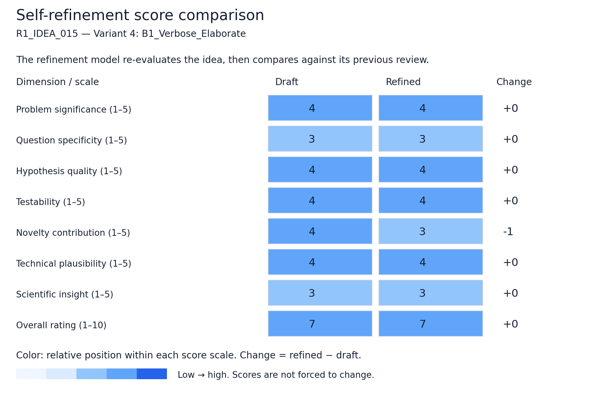

Changed score dimensions: novelty_contribution.

### Score justifications (draft / refined)

**Problem significance**

```json
{
  "draft": {
    "score": 4.0,
    "justification": "Precise control over 3D human avatars is a significant challenge in computer graphics and generative AI. The ambiguity of natural language is a well-known bottleneck, and solving it would have high practical value for applications in gaming, virtual reality, and digital fashion."
  },
  "refined": {
    "score": 4.0,
    "justification": "Precise control over 3D human avatars is a high-priority problem in computer graphics, VR, and digital fashion. The ambiguity of natural language is a well-documented limitation that hinders practical adoption. Solving this would have significant practical value."
  }
}
```

**Question specificity**

```json
{
  "draft": {
    "score": 3.0,
    "justification": "The core concept (using a slider to interpolate between extremes) is specific. However, the idea lacks specificity regarding the definition of the extremes, the underlying 3D representation, and the specific semantic concepts being targeted."
  },
  "refined": {
    "score": 3.0,
    "justification": "The idea specifies the *interaction* (slider) and the *goal* (precise editing), but lacks specificity on the *mechanism* (how the slider maps to 3D geometry) and the *boundary conditions* (which concepts, which representations). It is a 'what' and 'why' but not yet a clear 'how'."
  }
}
```

**Hypothesis quality**

```json
{
  "draft": {
    "score": 4.0,
    "justification": "The implicit hypothesis is that replacing direct text generation with a continuous interpolation mechanism will significantly reduce ambiguity and increase editing precision. This is a falsifiable and plausible claim."
  },
  "refined": {
    "score": 4.0,
    "justification": "The hypothesis that 'continuous interpolation reduces ambiguity compared to discrete text prompts' is strong, falsifiable, and grounded in HCI principles. It clearly distinguishes the proposed method from standard text-to-3D approaches."
  }
}
```

**Testability**

```json
{
  "draft": {
    "score": 4.0,
    "justification": "The idea is highly testable. One can implement a prototype, define a set of semantic concepts, and compare the output quality and user control against standard text-to-3D baselines using both quantitative metrics and user studies."
  },
  "refined": {
    "score": 4.0,
    "justification": "The idea is highly testable. One can implement a prototype using existing 3D latent spaces, define a set of concepts, and compare the precision and user satisfaction against text-only baselines. The metrics for success are definable."
  }
}
```

**Novelty contribution**

```json
{
  "draft": {
    "score": 4.0,
    "justification": "While the concept of 'sliders' exists in image editing (e.g., StyleGAN), applying it specifically to 3D human avatar editing to solve text ambiguity is a novel and valuable direction. It shifts the interaction model rather than just the generation model."
  },
  "refined": {
    "score": 3.0,
    "justification": "While the 'slider' concept is standard in image editing (e.g., StyleGAN), applying it specifically to 3D human avatars to solve text ambiguity is a novel application. However, if the underlying mechanism is simply standard latent interpolation wrapped in a UI, the scientific novelty is moderate. The contribution depends on whether the method reveals new properties of 3D semantic spaces."
  }
}
```

**Technical plausibility**

```json
{
  "draft": {
    "score": 4.0,
    "justification": "The approach is technically plausible. Modern 3D generation methods (like 3DGS or NeRFs) often have latent spaces that support interpolation. The main challenge is ensuring the semantic meaning is preserved along the interpolation path, which is a standard research problem."
  },
  "refined": {
    "score": 4.0,
    "justification": "The approach is technically plausible. Modern 3D generation methods typically possess latent spaces where interpolation is possible. The main challenge is ensuring semantic consistency along the path, which is a standard but non-trivial research problem."
  }
}
```

**Scientific insight**

```json
{
  "draft": {
    "score": 3.0,
    "justification": "If successful, this research could provide insights into the geometry of semantic spaces in 3D generation and the effectiveness of interactive vs. generative interfaces. However, as stated, it is primarily a methodological proposal rather than a deep theoretical inquiry."
  },
  "refined": {
    "score": 3.0,
    "justification": "If successful, the research could provide insights into the linearity and structure of semantic spaces in 3D generation. However, as currently stated, it reads more as a system design proposal. The potential for deep scientific insight depends on whether the investigation reveals fundamental properties of 3D latent manifolds."
  }
}
```

**Overall rating**

```json
{
  "draft": {
    "score": 7.0,
    "justification": "This is a strong research idea with a clear motivation and a plausible, testable solution to a known problem. It scores well on significance, hypothesis quality, and testability. It loses points on specificity and novelty because the 'slider' concept is not entirely new in other domains, and the technical details of how it applies to 3D avatars are currently undefined. With more specific details on the mechanism, this could be an exceptional idea."
  },
  "refined": {
    "score": 7.0,
    "justification": "This is a strong research idea with a clear motivation and a plausible, testable solution to a known problem. It scores well on significance, hypothesis quality, and testability. It loses points on specificity and novelty because the 'slider' concept is not entirely new in other domains, and the technical details of how it applies to 3D avatars are currently undefined. With more specific details on the mechanism, this could be an exceptional idea."
  }
}
```

## R1_IDEA_015 — Variant 5: B2_Grand_Narrative

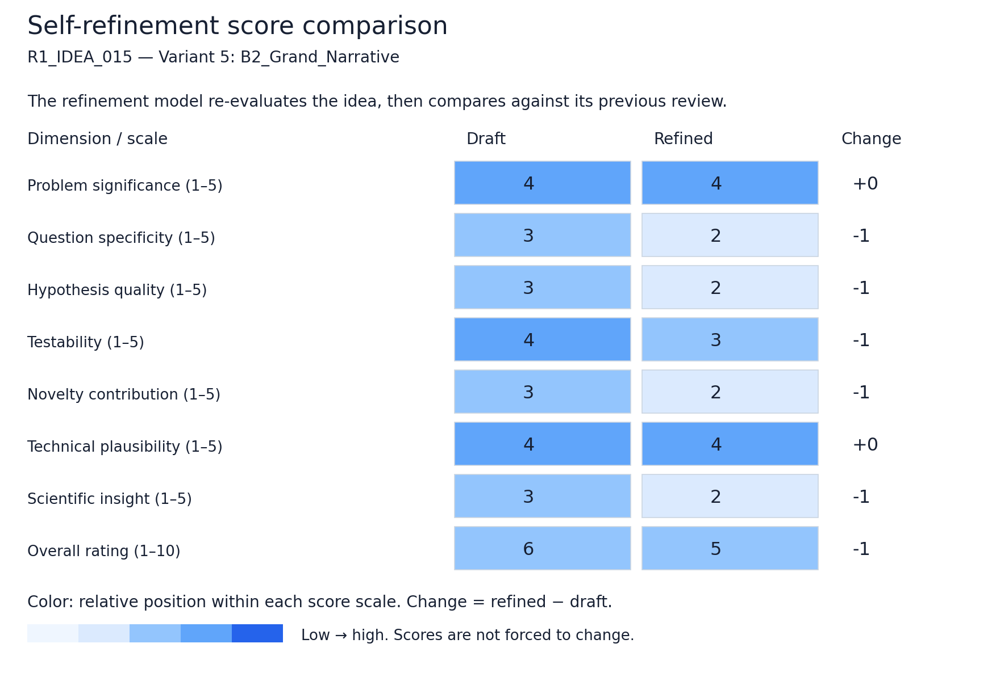

Changed score dimensions: question_specificity, hypothesis_quality, testability, novelty_contribution, scientific_insight, overall_rating.

### Score justifications (draft / refined)

**Problem significance**

```json
{
  "draft": {
    "score": 4.0,
    "justification": "Controllable generation of 3D humans is a high-priority problem in computer graphics and AI. The specific issue of natural language ambiguity is a well-recognized and significant challenge. Solving this would have immediate impact on user experience in interactive applications."
  },
  "refined": {
    "score": 4.0,
    "justification": "Controllable 3D generation is a major challenge in computer graphics and AI. The specific issue of natural language ambiguity is a well-recognized bottleneck. Solving this would have immediate practical impact, making the problem highly significant."
  }
}
```

**Question specificity**

```json
{
  "draft": {
    "score": 3.0,
    "justification": "The idea identifies a clear goal (precise editing via sliders) but lacks specificity on the implementation details. It describes the *interface* (slider) but not the *method* (how the slider maps to 3D geometry). The research question is 'Can we build a slider?' rather than 'How does the latent space of 3D avatars behave under semantic interpolation?'"
  },
  "refined": {
    "score": 2.0,
    "justification": "The idea describes a desired outcome (a slider interface) but fails to specify the research question. It does not ask 'how' the space is constructed or 'why' this specific interpolation works for 3D avatars. It reads as a product feature description rather than a scientific inquiry."
  }
}
```

**Hypothesis quality**

```json
{
  "draft": {
    "score": 3.0,
    "justification": "The implicit hypothesis is that constraining edits to a linear interpolation between two extremes reduces ambiguity and improves precision. This is a reasonable hypothesis, but it is not explicitly stated as a testable prediction (e.g., 'Users will achieve target shapes 20% faster with sliders than with text prompts')."
  },
  "refined": {
    "score": 2.0,
    "justification": "The implicit hypothesis (sliders reduce ambiguity) is reasonable but not explicitly stated or falsifiable in the text. It lacks a specific prediction about the relationship between the interpolation method and the resulting semantic accuracy or anatomical validity."
  }
}
```

**Testability**

```json
{
  "draft": {
    "score": 4.0,
    "justification": "The idea is highly testable. One can implement a prototype, define a set of semantic pairs, and evaluate the output against user intent or ground-truth meshes. The 'slider' mechanism provides a clear experimental setup."
  },
  "refined": {
    "score": 3.0,
    "justification": "The idea is testable in principle (one can build a prototype and measure user success), but the lack of defined metrics (what constitutes 'precise'?) and the undefined 'extremes' make the experimental design currently vague."
  }
}
```

**Novelty contribution**

```json
{
  "draft": {
    "score": 3.0,
    "justification": "The concept of 'concept sliders' is not new in 2D image editing (e.g., StyleGAN). Applying it to 3D human avatars is a novel application, but the core mechanism is likely an adaptation of existing techniques. The scientific contribution would depend on how the 3D-specific constraints (anatomy, topology) are handled, which is not detailed."
  },
  "refined": {
    "score": 2.0,
    "justification": "The 'concept slider' is a known technique in 2D image editing (e.g., StyleGAN). Applying it to 3D avatars is an application, not a novel scientific discovery, unless the idea includes a specific mechanism to handle 3D-specific constraints that breaks existing paradigms. As stated, it is a domain transfer."
  }
}
```

**Technical plausibility**

```json
{
  "draft": {
    "score": 4.0,
    "justification": "The approach is technically plausible. Latent space interpolation is a standard technique in generative models. The main challenge is ensuring the 3D structure remains valid, which is a known but solvable problem in the field."
  },
  "refined": {
    "score": 4.0,
    "justification": "The underlying mechanism (interpolation in latent space) is technically sound and widely used. The main challenge is the 3D geometry constraints, but the approach is plausible as a starting point for research."
  }
}
```

**Scientific insight**

```json
{
  "draft": {
    "score": 3.0,
    "justification": "If successful, the study could reveal how semantic concepts are organized in the latent space of 3D human avatars. However, as currently described, it reads more as a system design proposal than a study aimed at discovering new scientific principles."
  },
  "refined": {
    "score": 2.0,
    "justification": "As currently framed, the idea is a system design. It has low potential for scientific insight unless it explicitly investigates the structure of the 3D avatar latent space (e.g., 'Are semantic concepts in 3D avatars linearly organized?'). Without this, it is merely an engineering implementation."
  }
}
```

**Overall rating**

```json
{
  "draft": {
    "score": 6.0,
    "justification": "This is a moderate research idea. It addresses a meaningful problem with a plausible solution (sliders) that is testable. However, it currently lacks the specificity of a strong research proposal because it does not define the underlying mechanism, the specific hypothesis to be tested, or the novelty of the 3D-specific adaptation. It sits on the border between a 'good application idea' and a 'strong research direction' depending on how the technical details are fleshed out."
  },
  "refined": {
    "score": 5.0,
    "justification": "This is a moderate/borderline idea. It addresses a meaningful problem with a plausible solution, but it currently lacks the specificity of a strong research proposal. It reads more like a product feature description than a hypothesis-driven research direction. To be a 'strong' idea, it needs to move from 'we will build a slider' to 'we will investigate the linearity of semantic concepts in 3D avatar spaces and propose a method to handle non-linearities.'"
  }
}
```

## R1_IDEA_015 — Variant 6: B3_Over_Confident


Changed score dimensions: none.

### Score justifications (draft / refined)

**Problem significance**

```json
{
  "draft": {
    "score": 4.0,
    "justification": "The problem of precise 3D editing is a major bottleneck in the adoption of generative 3D models for practical applications (e.g., gaming, VR, e-commerce). Addressing the ambiguity of natural language is a significant and meaningful challenge."
  },
  "refined": {
    "score": 4.0,
    "justification": "The problem of precise 3D editing is a major bottleneck in the adoption of generative 3D models for practical applications (gaming, VR, e-commerce). Addressing the ambiguity of natural language is a significant and meaningful challenge that, if solved, would have high practical impact."
  }
}
```

**Question specificity**

```json
{
  "draft": {
    "score": 3.0,
    "justification": "The idea identifies a specific mechanism (sliders/interpolation) but lacks specificity on the implementation details, such as the representation space, the definition of extremes, and the interpolation logic."
  },
  "refined": {
    "score": 3.0,
    "justification": "The idea identifies a specific mechanism (sliders/interpolation) but lacks specificity on the implementation details. It does not define how 'extremes' are determined for arbitrary concepts or how the interpolation is mathematically realized in 3D space, leaving the core 'how' ambiguous."
  }
}
```

**Hypothesis quality**

```json
{
  "draft": {
    "score": 4.0,
    "justification": "The hypothesis that 'interpolation between extremes reduces ambiguity and increases precision' is strong, testable, and logically sound. It clearly distinguishes the proposed method from standard text-to-3D approaches."
  },
  "refined": {
    "score": 4.0,
    "justification": "The hypothesis that 'interpolation between extremes reduces ambiguity and increases precision' is strong, testable, and logically sound. It clearly distinguishes the proposed method from standard text-to-3D approaches and makes a concrete prediction about user control."
  }
}
```

**Testability**

```json
{
  "draft": {
    "score": 4.0,
    "justification": "The idea is highly testable. One can build a prototype, define a set of semantic concepts, and compare the precision of edits using the slider method against text-only prompts using both quantitative metrics and user studies."
  },
  "refined": {
    "score": 4.0,
    "justification": "The idea is highly testable. One can build a prototype, define a set of semantic concepts, and compare the precision of edits using the slider method against text-only prompts using both quantitative metrics (e.g., mesh alignment) and user studies."
  }
}
```

**Novelty contribution**

```json
{
  "draft": {
    "score": 4.0,
    "justification": "While the concept of sliders exists in 2D, applying it specifically to 3D human avatar editing to solve the text ambiguity problem is a novel and valuable contribution. It bridges a gap between user intent and 3D generation capabilities."
  },
  "refined": {
    "score": 4.0,
    "justification": "While the concept of sliders exists in 2D image editing (e.g., StyleGAN), applying it specifically to 3D human avatar editing to solve the text ambiguity problem is a novel and valuable contribution. It bridges a gap between user intent and 3D generation capabilities in a specific, non-trivial domain."
  }
}
```

**Technical plausibility**

```json
{
  "draft": {
    "score": 4.0,
    "justification": "The approach is technically plausible. Interpolation in latent spaces or geometric spaces is a standard technique in machine learning. The main challenge is the complexity of 3D human topology, but the direction is sound."
  },
  "refined": {
    "score": 4.0,
    "justification": "The approach is technically plausible. Interpolation in latent spaces or geometric spaces is a standard technique in machine learning. The main challenge is the complexity of 3D human topology, but the direction is sound and follows established patterns in generative modeling."
  }
}
```

**Scientific insight**

```json
{
  "draft": {
    "score": 4.0,
    "justification": "If successful, this research could reveal how to better align human semantic understanding with 3D generative models, potentially leading to new paradigms for human-in-the-loop 3D generation."
  },
  "refined": {
    "score": 4.0,
    "justification": "If successful, this research could reveal how to better align human semantic understanding with 3D generative models, potentially leading to new paradigms for human-in-the-loop 3D generation and a deeper understanding of the geometry of semantic concepts in 3D."
  }
}
```

**Overall rating**

```json
{
  "draft": {
    "score": 8.0,
    "justification": "This is a strong research idea. It addresses a clear, significant problem with a specific, plausible, and testable hypothesis. While the implementation details are missing, the core concept is novel and has high potential for scientific and practical impact. It moves beyond a generic 'application' to propose a specific mechanism for solving a known limitation."
  },
  "refined": {
    "score": 8.0,
    "justification": "This is a strong research idea. It addresses a clear, significant problem with a specific, plausible, and testable hypothesis. While the implementation details are missing, the core concept is novel and has high potential for scientific and practical impact. It moves beyond a generic 'application' to propose a specific mechanism for solving a known limitation."
  }
}
```

## R1_IDEA_015 — Variant 7: B4_Novelty


Changed score dimensions: none.

### Score justifications (draft / refined)

**Problem significance**

```json
{
  "draft": {
    "score": 4.0,
    "justification": "Precise control over 3D avatars is a significant bottleneck in applications like gaming, VR, and digital fashion. Moving beyond binary or vague text prompts to continuous control addresses a meaningful practical and scientific challenge."
  },
  "refined": {
    "score": 4.0,
    "justification": "Precise control over 3D avatars is a significant bottleneck in applications like gaming, VR, and digital fashion. Moving beyond binary or vague text prompts to continuous control addresses a meaningful practical and scientific challenge. The problem is well-motivated."
  }
}
```

**Question specificity**

```json
{
  "draft": {
    "score": 3.0,
    "justification": "The idea clearly defines the *goal* (continuous editing via sliders) but is vague on the *mechanism*. It states 'how' the user interacts but not 'how' the model achieves the interpolation technically."
  },
  "refined": {
    "score": 3.0,
    "justification": "The idea clearly defines the *goal* (continuous editing via sliders) and the *interaction* (knob-like interpolation). However, it is vague on the *mechanism*. It states 'how' the user interacts but not 'how' the model achieves the interpolation technically (e.g., which space is interpolated, how the extremes are anchored). This limits the specificity of the research question."
  }
}
```

**Hypothesis quality**

```json
{
  "draft": {
    "score": 4.0,
    "justification": "The implicit hypothesis is that continuous interpolation in a latent or feature space provides superior precision and user satisfaction compared to discrete text prompting. This is a testable and meaningful claim."
  },
  "refined": {
    "score": 4.0,
    "justification": "The implicit hypothesis is that continuous interpolation in a latent or feature space provides superior precision and user satisfaction compared to discrete text prompting. This is a testable and meaningful claim that distinguishes the work from standard generation tasks."
  }
}
```

**Testability**

```json
{
  "draft": {
    "score": 4.0,
    "justification": "The idea is highly testable. One can build a prototype, define a set of semantic concepts, and evaluate the accuracy of the generated avatars against target interpolation points using both automated metrics and user studies."
  },
  "refined": {
    "score": 4.0,
    "justification": "The idea is highly testable. One can build a prototype, define a set of semantic concepts, and evaluate the accuracy of the generated avatars against target interpolation points using both automated metrics (e.g., feature distance) and user studies. The 'slider' metaphor provides a clear ground truth for evaluation."
  }
}
```

**Novelty contribution**

```json
{
  "draft": {
    "score": 4.0,
    "justification": "While text-to-3D is saturated, the specific focus on 'concept sliders' for continuous semantic control in 3D avatars is a distinct and underexplored niche. It shifts the paradigm from 'generation' to 'fine-grained editing'."
  },
  "refined": {
    "score": 4.0,
    "justification": "While text-to-3D is saturated, the specific focus on 'concept sliders' for continuous semantic control in 3D avatars is a distinct and underexplored niche. It shifts the paradigm from 'generation' to 'fine-grained editing' and adapts a 2D concept (latent interpolation) to the 3D domain, which is a valuable contribution."
  }
}
```

**Technical plausibility**

```json
{
  "draft": {
    "score": 4.0,
    "justification": "The concept is technically sound. Interpolation in latent spaces is a standard technique in 2D diffusion models; applying this to 3D avatars is a logical and plausible extension, though the specific implementation details (e.g., maintaining 3D consistency) are the hard part."
  },
  "refined": {
    "score": 4.0,
    "justification": "The concept is technically sound. Interpolation in latent spaces is a standard technique in 2D diffusion models; applying this to 3D avatars is a logical and plausible extension. The main challenge lies in maintaining 3D consistency and topology, but the direction is feasible."
  }
}
```

**Scientific insight**

```json
{
  "draft": {
    "score": 3.0,
    "justification": "If successful, this could reveal how semantic concepts are structured in 3D generative latent spaces. However, as currently stated, it is more of a methodological proposal than a deep scientific inquiry into a new phenomenon."
  },
  "refined": {
    "score": 3.0,
    "justification": "If successful, this could reveal how semantic concepts are structured in 3D generative latent spaces. However, as currently stated, it is more of a methodological proposal (a new tool) than a deep scientific inquiry into a new phenomenon. The insight is potential, not guaranteed by the idea alone."
  }
}
```

**Overall rating**

```json
{
  "draft": {
    "score": 7.0,
    "justification": "This is a strong research idea with clear practical value and a well-defined user interaction model. It addresses a specific gap (precision in 3D editing) and proposes a plausible solution (continuous sliders). The main limitation is the lack of technical specificity regarding the underlying mechanism, but as a research proposal, it has high potential for a strong contribution if the implementation details are fleshed out."
  },
  "refined": {
    "score": 7.0,
    "justification": "This is a strong research idea with clear practical value and a well-defined user interaction model. It addresses a specific gap (precision in 3D editing) and proposes a plausible solution (continuous sliders). The main limitation is the lack of technical specificity regarding the underlying mechanism, but as a research proposal, it has high potential for a strong contribution if the implementation details are fleshed out. It scores a 7 because it is a solid, actionable direction, but it lacks the depth of a fully formed hypothesis regarding the *mechanism* of the 3D interpolation."
  }
}
```

## R1_IDEA_015 — Variant 8: B5_Application_Impact


Changed score dimensions: none.

### Score justifications (draft / refined)

**Problem significance**

```json
{
  "draft": {
    "score": 4.0,
    "justification": "The problem of precise text-to-3D editing is a major bottleneck in the field. Current methods often produce artifacts or fail to capture specific nuances. Solving this would have significant practical impact on digital human creation."
  },
  "refined": {
    "score": 4.0,
    "justification": "The problem of precise text-to-3D editing is a major bottleneck. Current methods often fail to capture specific nuances or produce artifacts. Solving this would have significant practical impact on digital human creation, making it a highly significant problem."
  }
}
```

**Question specificity**

```json
{
  "draft": {
    "score": 3.0,
    "justification": "The idea identifies a clear goal (precise editing via interpolation) but lacks specificity on the mechanism. It describes *what* to do (move a knob) but not *how* the model will learn to map that knob to the 3D geometry/texture accurately."
  },
  "refined": {
    "score": 3.0,
    "justification": "The idea clearly defines the *goal* (precise editing via interpolation) but lacks specificity on the *mechanism*. It describes the user interaction but not the underlying model architecture or the specific learning objective required to make the 'slider' work mathematically."
  }
}
```

**Hypothesis quality**

```json
{
  "draft": {
    "score": 3.0,
    "justification": "The implicit hypothesis is that 'continuous interpolation between learned extremes yields more precise and controllable edits than discrete text prompts.' This is plausible but needs to be framed as a testable claim regarding the linearity of the semantic manifold."
  },
  "refined": {
    "score": 3.0,
    "justification": "The implicit hypothesis is that 'continuous interpolation between learned extremes yields more precise and controllable edits than discrete text prompts.' This is plausible but needs to be framed as a testable claim regarding the linearity of the semantic manifold and the disentanglement of attributes."
  }
}
```

**Testability**

```json
{
  "draft": {
    "score": 3.0,
    "justification": "The idea is testable in principle (build a system, ask users to interpolate, measure accuracy), but the current summary does not suggest specific metrics or baselines for comparison, making the testability moderate."
  },
  "refined": {
    "score": 3.0,
    "justification": "The idea is testable in principle (build a system, interpolate, measure accuracy), but the current summary does not suggest specific metrics, baselines, or ablation studies. Without defined metrics for 'precision' or 'linearity', the testability is moderate."
  }
}
```

**Novelty contribution**

```json
{
  "draft": {
    "score": 3.0,
    "justification": "While the concept of 'sliders' is known in UI, applying it specifically to resolve the ambiguity of text-based 3D avatar editing is a novel angle. However, the underlying mechanism (latent interpolation) is common in generative AI, so the novelty depends heavily on the specific implementation details not yet provided."
  },
  "refined": {
    "score": 3.0,
    "justification": "Applying 'sliders' to 3D avatar editing is a novel application angle, but the underlying mechanism (latent interpolation) is standard in generative AI. The novelty depends heavily on the specific implementation details (how the semantic space is constructed) which are not yet provided."
  }
}
```

**Technical plausibility**

```json
{
  "draft": {
    "score": 4.0,
    "justification": "The approach is technically sound. Latent space interpolation is a standard technique in generative modeling. The challenge lies in ensuring the semantic space is linear and disentangled, which is a known but solvable problem in the field."
  },
  "refined": {
    "score": 4.0,
    "justification": "The approach is technically sound. Latent space interpolation is a standard technique. The challenge lies in ensuring the semantic space is linear and disentangled, which is a known but solvable problem in the field of generative modeling."
  }
}
```

**Scientific insight**

```json
{
  "draft": {
    "score": 3.0,
    "justification": "If successful, this research could reveal how to construct linear, disentangled semantic manifolds in 3D generative models, which is a valuable scientific insight beyond just a tool."
  },
  "refined": {
    "score": 3.0,
    "justification": "If successful, this research could reveal how to construct linear, disentangled semantic manifolds in 3D generative models. This would be a valuable scientific insight beyond just a tool, but the idea summary does not explicitly promise this level of theoretical contribution."
  }
}
```

**Overall rating**

```json
{
  "draft": {
    "score": 6.0,
    "justification": "This is a moderate/borderline idea. It addresses a significant problem with a plausible and intuitive solution (sliders/interpolation). However, as a research idea summary, it lacks the necessary technical depth to be considered 'strong' or 'exceptional' yet. It reads more like a product feature description than a rigorous scientific hypothesis. With more specific details on the mechanism and evaluation, it could easily become a 7 or 8."
  },
  "refined": {
    "score": 6.0,
    "justification": "This is a moderate/borderline idea. It addresses a significant problem with a plausible and intuitive solution. However, as a research idea summary, it lacks the necessary technical depth to be considered 'strong' or 'exceptional' yet. It reads more like a product feature description than a rigorous scientific hypothesis. With more specific details on the mechanism and evaluation, it could easily become a 7 or 8."
  }
}
```

## R1_IDEA_015 — Variant 9: C1_Hollow_Shell

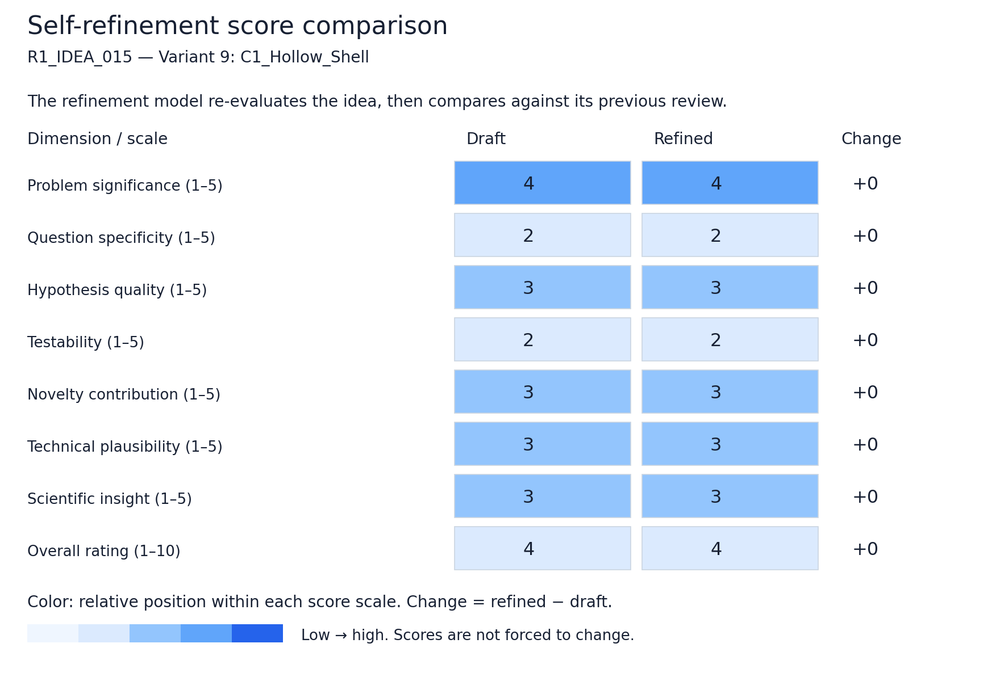

Changed score dimensions: none.

### Score justifications (draft / refined)

**Problem significance**

```json
{
  "draft": {
    "score": 4.0,
    "justification": "The problem of precise text-to-3D editing is a major challenge in computer graphics and generative AI. Improving the granularity of text control is highly significant for applications in gaming, VR, and digital fashion."
  },
  "refined": {
    "score": 4.0,
    "justification": "The problem of precise text-to-3D editing is a major challenge in computer graphics and generative AI. Improving the granularity of text control is highly significant for applications in gaming, VR, and digital fashion. The difficulty of language to describe 3D geometry is a well-known, high-impact issue."
  }
}
```

**Question specificity**

```json
{
  "draft": {
    "score": 2.0,
    "justification": "The core mechanism ('adjusting concepts between extremes') is described in vague, metaphorical terms. It lacks the technical specificity required to define a concrete research question or experimental setup."
  },
  "refined": {
    "score": 2.0,
    "justification": "The core mechanism is described in vague, metaphorical terms ('adjusting concepts between extremes'). It lacks the technical specificity required to define a concrete research question, such as the mathematical formulation of the adjustment or the definition of the concept space."
  }
}
```

**Hypothesis quality**

```json
{
  "draft": {
    "score": 3.0,
    "justification": "The implicit hypothesis is that manipulating concepts along a spectrum between defined extremes yields better results than direct text prompting. This is plausible but not yet formulated as a testable prediction with defined variables."
  },
  "refined": {
    "score": 3.0,
    "justification": "The implicit hypothesis is that a continuous adjustment mechanism between defined extremes yields better alignment with user intent than direct text prompting. This is plausible but currently lacks the precision to be a strong, falsifiable hypothesis without defining the variables and the mechanism."
  }
}
```

**Testability**

```json
{
  "draft": {
    "score": 2.0,
    "justification": "Without defining the 'extremes' or the 'adjustment' algorithm, it is impossible to design a specific experiment. The idea currently lacks the operational definitions needed for falsifiability."
  },
  "refined": {
    "score": 2.0,
    "justification": "Without defining the 'extremes' or the 'adjustment' algorithm, it is impossible to design a specific experiment. The idea currently lacks the operational definitions needed for falsifiability. One cannot test 'adjusting concepts' without knowing how to adjust them."
  }
}
```

**Novelty contribution**

```json
{
  "draft": {
    "score": 3.0,
    "justification": "The general direction of using continuous latent spaces or interpolation is known. The novelty depends entirely on the specific definition of 'adjusting concepts between extremes,' which is currently undefined. It could be a minor variation of existing methods or a novel formulation."
  },
  "refined": {
    "score": 3.0,
    "justification": "The general direction of using continuous latent spaces or interpolation is known. The novelty depends entirely on the specific definition of 'adjusting concepts between extremes,' which is currently undefined. It could be a minor variation of existing methods or a novel formulation, but the idea as stated does not clearly distinguish itself."
  }
}
```

**Technical plausibility**

```json
{
  "draft": {
    "score": 3.0,
    "justification": "The concept is technically plausible as it aligns with how latent diffusion models and 3D generative models typically operate (interpolating between known states). However, the lack of implementation details makes it impossible to fully assess feasibility."
  },
  "refined": {
    "score": 3.0,
    "justification": "The concept is technically plausible as it aligns with how latent diffusion models and 3D generative models typically operate (interpolating between known states). However, the lack of implementation details makes it impossible to fully assess feasibility or potential failure modes."
  }
}
```

**Scientific insight**

```json
{
  "draft": {
    "score": 3.0,
    "justification": "If successful, the research could reveal how to better bridge the semantic gap in text-to-3D generation. However, as stated, it risks being a simple engineering tweak rather than a discovery of a new principle."
  },
  "refined": {
    "score": 3.0,
    "justification": "If successful, the research could reveal how to better bridge the semantic gap in text-to-3D generation. However, as stated, it risks being a simple engineering tweak rather than a discovery of a new principle. The potential for insight is moderate but currently obscured by the lack of detail."
  }
}
```

**Overall rating**

```json
{
  "draft": {
    "score": 4.0,
    "justification": "The idea addresses a meaningful problem with a plausible high-level direction, but it is currently too vague to be considered a strong research proposal. The lack of definition for key terms ('extremes', 'adjustment') and the absence of a specific mechanism prevent it from scoring higher. It is a 'weak' idea in its current form but has the potential to become 'moderate' or 'strong' with significant elaboration."
  },
  "refined": {
    "score": 4.0,
    "justification": "The idea addresses a meaningful problem with a plausible high-level direction, but it is currently too vague to be considered a strong research proposal. The lack of definition for key terms ('extremes', 'adjustment') and the absence of a specific mechanism prevent it from scoring higher. It is a 'weak' idea in its current form but has the potential to become 'moderate' or 'strong' with significant elaboration."
  }
}
```

## R1_IDEA_015 — Variant 10: C2_Logic_Flawed

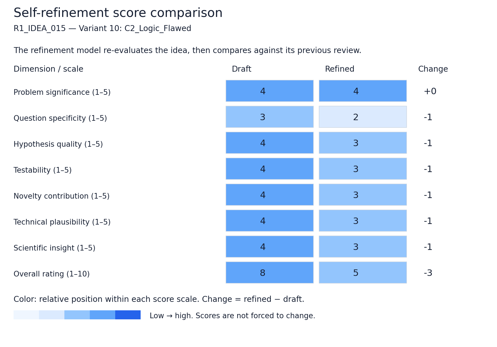

Changed score dimensions: question_specificity, hypothesis_quality, testability, novelty_contribution, technical_plausibility, scientific_insight, overall_rating.

### Score justifications (draft / refined)

**Problem significance**

```json
{
  "draft": {
    "score": 4.0,
    "justification": "Precise control over 3D generative models is a major bottleneck in the field of digital humans. Moving beyond binary or vague text prompts to continuous, fine-grained control is a significant and meaningful challenge that, if solved, would greatly enhance the utility of these tools for creators and applications."
  },
  "refined": {
    "score": 4.0,
    "justification": "Precise control over 3D generative models is a major bottleneck in the field of digital humans. Moving beyond binary or vague text prompts to continuous, fine-grained control is a significant and meaningful challenge that, if solved, would greatly enhance the utility of these tools for creators and applications."
  }
}
```

**Question specificity**

```json
{
  "draft": {
    "score": 3.0,
    "justification": "The idea clearly identifies the goal (continuous editing) and the metaphor (slider), but it lacks specificity on the 'how'. The research question is 'how to implement a continuous slider for 3D avatars,' but the specific mechanism is not yet defined, making the question somewhat broad."
  },
  "refined": {
    "score": 2.0,
    "justification": "While the goal (continuous editing) and metaphor (slider) are clear, the research question is too broad. It asks 'how to implement a continuous slider' without specifying the mechanism, the representation, or the learning objective. The idea describes a feature rather than a specific scientific question or hypothesis about a mechanism."
  }
}
```

**Hypothesis quality**

```json
{
  "draft": {
    "score": 4.0,
    "justification": "The hypothesis is strong: 'Continuous, slider-based control will yield more precise semantic editing than current text-based methods.' This is a concrete prediction that can be empirically validated by comparing performance metrics or user feedback."
  },
  "refined": {
    "score": 3.0,
    "justification": "The hypothesis that 'continuous control yields more precise editing' is reasonable but generic. It lacks a specific prediction about the mechanism (e.g., 'interpolating in latent space X will reduce Y error compared to Z'). It is a design goal rather than a deep scientific hypothesis."
  }
}
```

**Testability**

```json
{
  "draft": {
    "score": 4.0,
    "justification": "The idea is highly testable. One can construct a dataset of 3D avatars with labeled semantic attributes, implement a baseline (text-to-edit) and the proposed method (slider-to-edit), and evaluate them using quantitative metrics (e.g., attribute distance) and qualitative user studies."
  },
  "refined": {
    "score": 3.0,
    "justification": "The idea is testable in principle (compare slider vs. text), but the lack of a defined method makes the experimental design vague. Without knowing how the slider is implemented, the baseline comparisons and evaluation metrics are not fully specified."
  }
}
```

**Novelty contribution**

```json
{
  "draft": {
    "score": 4.0,
    "justification": "While continuous interpolation is common in 2D image generation (e.g., StyleGAN), applying this specifically to the complex domain of 3D human avatars with a 'slider' interface to solve the ambiguity of natural language is a novel and valuable contribution. It shifts the paradigm from 'prompting' to 'dialing'."
  },
  "refined": {
    "score": 3.0,
    "justification": "Applying continuous interpolation to 3D avatars is a logical extension of 2D techniques (like StyleGAN), but the novelty is limited to the domain application. The idea does not propose a new mechanism or theory, but rather a new interface metaphor for an existing problem."
  }
}
```

**Technical plausibility**

```json
{
  "draft": {
    "score": 4.0,
    "justification": "The concept is technically plausible. It likely builds upon existing latent space manipulation techniques or classifier-free guidance. The main challenge is the complexity of the 3D representation, but the direction is sound and aligns with current trends in controllable generation."
  },
  "refined": {
    "score": 3.0,
    "justification": "The concept is plausible in the sense that latent space manipulation is a standard technique. However, the idea does not address the specific technical hurdles of 3D (e.g., topology changes, geometric consistency) that might make a simple 'slider' approach fail or require significant modification."
  }
}
```

**Scientific insight**

```json
{
  "draft": {
    "score": 4.0,
    "justification": "If successful, this research would provide insights into how to bridge the gap between discrete natural language and continuous 3D semantic spaces. It could reveal how 3D generative models encode semantic concepts and how to make them more accessible to human users."
  },
  "refined": {
    "score": 3.0,
    "justification": "If successful, the work would provide insights into user interaction with 3D models, but the idea itself does not promise deep scientific insight into the nature of 3D representations or learning dynamics. It is more of an engineering contribution."
  }
}
```

**Overall rating**

```json
{
  "draft": {
    "score": 8.0,
    "justification": "This is a strong research idea with high potential. It addresses a clear, significant problem in 3D generation with a specific, testable hypothesis. While the technical implementation details are currently missing, the core concept of 'concept sliders' for 3D avatars is novel, intuitive, and scientifically valuable. It moves beyond simple application to propose a new interaction paradigm."
  },
  "refined": {
    "score": 5.0,
    "justification": "This is a moderate research idea. It addresses a meaningful problem with a clear, intuitive goal, but it lacks the specificity, technical depth, and hypothesis rigor required for a high-impact scientific contribution. It reads more like a product feature proposal than a research investigation. The lack of a defined mechanism or specific research question lowers it from a 'strong' to a 'moderate' rating."
  }
}
```

## R1_IDEA_015 — Variant 11: C3_Substance_Enriched


Changed score dimensions: technical_plausibility.

### Score justifications (draft / refined)

**Problem significance**

```json
{
  "draft": {
    "score": 4.0,
    "justification": "Text-based 3D editing is a major bottleneck in the adoption of generative 3D models. The specific problem of 'precision' and 'ambiguity' is highly relevant to practitioners who need to create specific assets rather than random generations. Solving this would significantly advance the usability of 3D generative AI."
  },
  "refined": {
    "score": 4.0,
    "justification": "The problem of precise text-based editing in 3D is a major bottleneck in the field. Current methods often produce random or imprecise results. Solving this would significantly improve the usability of 3D generative AI for practitioners, making it a highly significant problem."
  }
}
```

**Question specificity**

```json
{
  "draft": {
    "score": 3.0,
    "justification": "The idea clearly identifies the goal (precise editing via interpolation) but is vague on the 'how'. The research question 'Can we do this?' is clear, but the specific mechanism to achieve it is not yet defined, making the scope slightly broad."
  },
  "refined": {
    "score": 3.0,
    "justification": "The idea clearly states the goal (precise editing via interpolation) but is vague on the 'how'. The research question 'Can we do this?' is clear, but the specific mechanism to achieve it is not yet defined, making the scope slightly broad and the technical path ambiguous."
  }
}
```

**Hypothesis quality**

```json
{
  "draft": {
    "score": 3.0,
    "justification": "The implicit hypothesis is that interpolation provides better control than direct prompting. This is a plausible and testable hypothesis, but it lacks a specific mechanism prediction (e.g., 'interpolation in latent space X will reduce error by Y% compared to direct generation')."
  },
  "refined": {
    "score": 3.0,
    "justification": "The implicit hypothesis is that interpolation provides better control than direct prompting. This is a plausible and testable hypothesis, but it lacks a specific mechanism prediction (e.g., 'interpolation in latent space X will reduce error by Y% compared to direct generation'). It is a 'what' rather than a 'how' hypothesis."
  }
}
```

**Testability**

```json
{
  "draft": {
    "score": 4.0,
    "justification": "The idea suggests user studies, which are the gold standard for evaluating 'precision' and 'usability' in this domain. The concept of comparing 'intermediate points' against 'direct text' is inherently testable through controlled experiments."
  },
  "refined": {
    "score": 4.0,
    "justification": "The idea suggests user studies, which are the gold standard for evaluating 'precision' and 'usability' in this domain. The concept of comparing 'intermediate points' against 'direct text' is inherently testable through controlled experiments, even without the full technical implementation details."
  }
}
```

**Novelty contribution**

```json
{
  "draft": {
    "score": 4.0,
    "justification": "While the concept of 'sliders' exists in 2D image editing (e.g., StyleGAN), applying this specifically to 3D human avatars to solve the text-ambiguity problem is a novel and valuable direction. It shifts the paradigm from 'prompt engineering' to 'parameter tuning' for 3D."
  },
  "refined": {
    "score": 4.0,
    "justification": "While 'sliders' exist in 2D image editing (e.g., StyleGAN), applying this specifically to 3D human avatars to solve the text-ambiguity problem is a novel and valuable direction. It shifts the paradigm from 'prompt engineering' to 'parameter tuning' for 3D, which is a meaningful contribution."
  }
}
```

**Technical plausibility**

```json
{
  "draft": {
    "score": 4.0,
    "justification": "The approach is technically sound. Latent space interpolation is a standard technique in generative modeling. The main challenge is ensuring the 3D representation supports linear semantic interpolation, which is a known but solvable problem."
  },
  "refined": {
    "score": 3.0,
    "justification": "The approach is theoretically sound (latent interpolation is standard), but the feasibility depends heavily on the undefined 3D representation and the assumption of linear semantic spaces in 3D, which is a non-trivial assumption. Without knowing the representation, the plausibility is moderate."
  }
}
```

**Scientific insight**

```json
{
  "draft": {
    "score": 3.0,
    "justification": "If successful, this research could reveal the geometry of semantic concept spaces in 3D human avatars. It could provide insights into whether human attributes are linearly separable in the latent space of 3D generators, which is a non-trivial scientific finding."
  },
  "refined": {
    "score": 3.0,
    "justification": "If successful, this research could reveal the geometry of semantic concept spaces in 3D human avatars. It could provide insights into whether human attributes are linearly separable in the latent space of 3D generators, which is a non-trivial scientific finding. However, the current idea is more of an engineering proposal than a deep scientific inquiry."
  }
}
```

**Overall rating**

```json
{
  "draft": {
    "score": 7.0,
    "justification": "This is a strong research idea with high practical significance and a clear, testable direction. It addresses a real pain point in 3D generation. The score is not higher (8-9) because the current description lacks the technical specificity required to fully evaluate the novelty of the mechanism and the feasibility of the interpolation in 3D space. However, as a research proposal, it is well-posed and promising."
  },
  "refined": {
    "score": 7.0,
    "justification": "This is a strong research idea with high practical significance and a clear, testable direction. It addresses a real pain point in 3D generation. The score is not higher (8-9) because the current description lacks the technical specificity required to fully evaluate the novelty of the mechanism and the feasibility of the interpolation in 3D space. However, as a research proposal, it is well-posed and promising."
  }
}
```

## R1_IDEA_015 — Variant 12: H1_Deceptive_Hollow


Changed score dimensions: none.

### Score justifications (draft / refined)

**Problem significance**

```json
{
  "draft": {
    "score": 4.0,
    "justification": "The underlying problem—bridging the gap between natural language and precise 3D geometry—is highly significant and a major challenge in the field. However, the idea itself is so vague that the significance of the *proposed solution* is hard to gauge."
  },
  "refined": {
    "score": 4.0,
    "justification": "The underlying problem—bridging the gap between natural language and precise 3D geometry—is highly significant and a major challenge in the field. However, the idea itself is so vague that the significance of the *proposed solution* is hard to gauge."
  }
}
```

**Question specificity**

```json
{
  "draft": {
    "score": 1.0,
    "justification": "The idea fails to define a specific research question. It speaks in broad, abstract terms about 'adjusting concepts' without defining what those concepts are or how the adjustment occurs."
  },
  "refined": {
    "score": 1.0,
    "justification": "The idea fails to define a specific research question. It speaks in broad, abstract terms about 'adjusting concepts' without defining what those concepts are or how the adjustment occurs."
  }
}
```

**Hypothesis quality**

```json
{
  "draft": {
    "score": 1.0,
    "justification": "There is no testable hypothesis. The claim that this will be 'transformative' is a prediction of impact, not a scientific hypothesis about a mechanism or relationship that can be proven or disproven."
  },
  "refined": {
    "score": 1.0,
    "justification": "There is no testable hypothesis. The claim that this will be 'transformative' is a prediction of impact, not a scientific hypothesis about a mechanism or relationship that can be proven or disproven."
  }
}
```

**Testability**

```json
{
  "draft": {
    "score": 1.0,
    "justification": "The idea is currently untestable. Without a defined method, metrics, or experimental setup, no evidence can be gathered to support or refute the claims."
  },
  "refined": {
    "score": 1.0,
    "justification": "The idea is currently untestable. Without a defined method, metrics, or experimental setup, no evidence can be gathered to support or refute the claims."
  }
}
```

**Novelty contribution**

```json
{
  "draft": {
    "score": 2.0,
    "justification": "While the framing suggests high novelty, the lack of technical detail makes it impossible to assess if the core mechanism is actually new or just a rebranding of existing interpolation techniques. It currently reads more like a vision statement than a novel contribution."
  },
  "refined": {
    "score": 2.0,
    "justification": "While the framing suggests high novelty, the lack of technical detail makes it impossible to assess if the core mechanism is actually new or just a rebranding of existing interpolation techniques. It currently reads more like a vision statement than a novel contribution."
  }
}
```

**Technical plausibility**

```json
{
  "draft": {
    "score": 2.0,
    "justification": "The reasoning is logically incoherent because the mechanism is undefined. While 'adjusting concepts' is a plausible *goal*, the idea does not provide a plausible *path* to achieve it."
  },
  "refined": {
    "score": 2.0,
    "justification": "The reasoning is logically incoherent because the mechanism is undefined. While 'adjusting concepts' is a plausible *goal*, the idea does not provide a plausible *path* to achieve it."
  }
}
```

**Scientific insight**

```json
{
  "draft": {
    "score": 1.0,
    "justification": "As stated, the idea offers no potential for scientific insight because it does not propose a mechanism to investigate. It only promises a 'unified pathway' without describing the path."
  },
  "refined": {
    "score": 1.0,
    "justification": "As stated, the idea offers no potential for scientific insight because it does not propose a mechanism to investigate. It only promises a 'unified pathway' without describing the path."
  }
}
```

**Overall rating**

```json
{
  "draft": {
    "score": 2.0,
    "justification": "The idea addresses a significant problem but is currently too vague to be considered a viable research proposal. It relies entirely on high-level rhetoric ('field-shaping,' 'transformative') without providing the necessary technical substance, specific hypotheses, or testable mechanisms required for scientific inquiry. It falls into the 'very weak' category because it is essentially a vision statement rather than a research idea."
  },
  "refined": {
    "score": 2.0,
    "justification": "The idea addresses a significant problem but is currently too vague to be considered a viable research proposal. It relies entirely on high-level rhetoric ('field-shaping,' 'transformative') without providing the necessary technical substance, specific hypotheses, or testable mechanisms required for scientific inquiry. It falls into the 'very weak' category because it is essentially a vision statement rather than a research idea."
  }
}
```

## R1_IDEA_015 — Variant 13: H2_Confident_Flaw

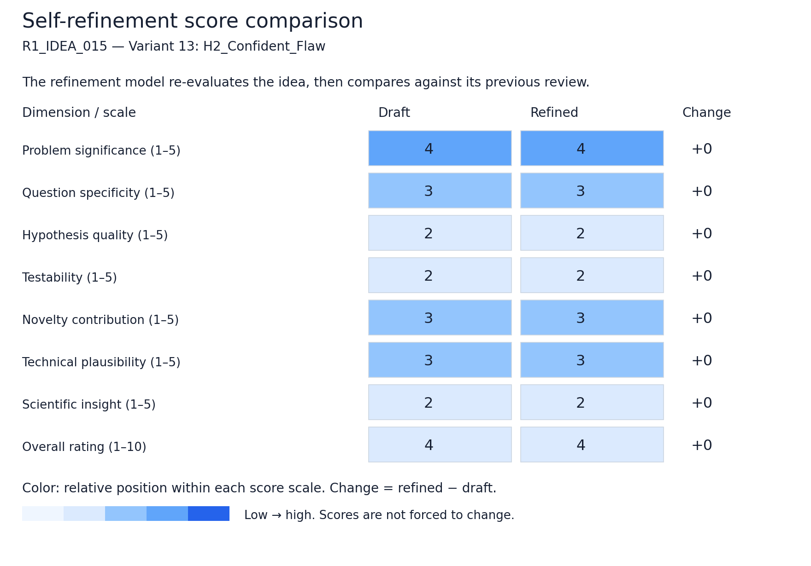

Changed score dimensions: none.

### Score justifications (draft / refined)

**Problem significance**

```json
{
  "draft": {
    "score": 4.0,
    "justification": "The problem of precise text-to-3D editing is highly significant in computer graphics, gaming, and virtual reality. Addressing the ambiguity of natural language in this domain is a meaningful challenge with clear practical applications."
  },
  "refined": {
    "score": 4.0,
    "justification": "The problem of precise text-to-3D editing is highly significant in computer graphics, gaming, and VR. Addressing the ambiguity of natural language in this domain is a meaningful challenge with clear practical applications."
  }
}
```

**Question specificity**

```json
{
  "draft": {
    "score": 3.0,
    "justification": "The idea identifies a specific mechanism (sliding between extremes) but lacks detail on the specific research question beyond 'does this work better?' It does not specify which semantic concepts are targeted or the exact nature of the 'intermediate' representation."
  },
  "refined": {
    "score": 3.0,
    "justification": "The idea identifies a specific mechanism (sliding between extremes) but lacks detail on the specific research question beyond 'does this work better?' It does not specify which semantic concepts are targeted or the exact nature of the 'intermediate' representation."
  }
}
```

**Hypothesis quality**

```json
{
  "draft": {
    "score": 2.0,
    "justification": "The hypothesis is weak because it makes an absolute claim ('necessarily produce reliable improvements', 'general superiority') that ignores confounding variables. A strong hypothesis should be a conditional prediction that can be falsified, not a tautology that assumes the solution solves the problem by definition."
  },
  "refined": {
    "score": 2.0,
    "justification": "The hypothesis is weak because it makes an absolute claim ('necessarily produce reliable improvements', 'general superiority') that ignores confounding variables. A strong hypothesis should be a conditional prediction that can be falsified, not a tautology that assumes the solution solves the problem by definition."
  }
}
```

**Testability**

```json
{
  "draft": {
    "score": 2.0,
    "justification": "The idea explicitly suggests that rigorous testing (isolating variables, boundary cases) is unnecessary, which makes the proposed research direction untestable in a scientifically rigorous way. Without a plan for controlled comparison, the claim of 'causal evidence' cannot be validated."
  },
  "refined": {
    "score": 2.0,
    "justification": "The idea explicitly suggests that rigorous testing (isolating variables, boundary cases) is unnecessary, which makes the proposed research direction untestable in a scientifically rigorous way. Without a plan for controlled comparison, the claim of 'causal evidence' cannot be validated."
  }
}
```

**Novelty contribution**

```json
{
  "draft": {
    "score": 3.0,
    "justification": "The concept of using a slider or intermediate point for semantic control is a reasonable adaptation of existing UI/UX paradigms to 3D generation. While potentially useful, it appears to be an incremental improvement on existing text-to-3D methods rather than a fundamental discovery of a new phenomenon."
  },
  "refined": {
    "score": 3.0,
    "justification": "The concept of using a slider or intermediate point for semantic control is a reasonable adaptation of existing UI/UX paradigms to 3D generation. While potentially useful, it appears to be an incremental improvement on existing text-to-3D methods rather than a fundamental discovery of a new phenomenon."
  }
}
```

**Technical plausibility**

```json
{
  "draft": {
    "score": 3.0,
    "justification": "The general direction of interpolating between semantic extremes is technically plausible in latent space models. However, the claim that this single mechanism guarantees 'general superiority' without addressing other architectural or data limitations is not technically sound."
  },
  "refined": {
    "score": 3.0,
    "justification": "The general direction of interpolating between semantic extremes is technically plausible in latent space models. However, the claim that this single mechanism guarantees 'general superiority' without addressing other architectural or data limitations is not technically sound."
  }
}
```

**Scientific insight**

```json
{
  "draft": {
    "score": 2.0,
    "justification": "If the study proceeds as described (ignoring controls), it will likely only confirm that a slider works better than text, which is a trivial finding. The potential for deep scientific insight is limited by the lack of a plan to investigate *why* it works or under what boundary conditions it fails."
  },
  "refined": {
    "score": 2.0,
    "justification": "If the study proceeds as described (ignoring controls), it will likely only confirm that a slider works better than text, which is a trivial finding. The potential for deep scientific insight is limited by the lack of a plan to investigate *why* it works or under what boundary conditions it fails."
  }
}
```

**Overall rating**

```json
{
  "draft": {
    "score": 4.0,
    "justification": "The core idea (using a slider for semantic control) addresses a real problem and is intuitively sound. However, the scientific framing is severely flawed. The authors' assertion that rigorous controls and isolation of variables are unnecessary undermines the validity of the research. A strong research idea requires a hypothesis that can be falsified and a methodology that isolates causal factors, neither of which is present here. The idea is weak primarily due to its poor scientific reasoning regarding evaluation and causality."
  },
  "refined": {
    "score": 4.0,
    "justification": "The core idea (using a slider for semantic control) addresses a real problem and is intuitively sound. However, the scientific framing is severely flawed. The authors' assertion that rigorous controls and isolation of variables are unnecessary undermines the validity of the research. A strong research idea requires a hypothesis that can be falsified and a methodology that isolates causal factors, neither of which is present here. The idea is weak primarily due to its poor scientific reasoning regarding evaluation and causality."
  }
}
```

## R1_IDEA_015 — Variant 14: H3_Verbose_Enriched

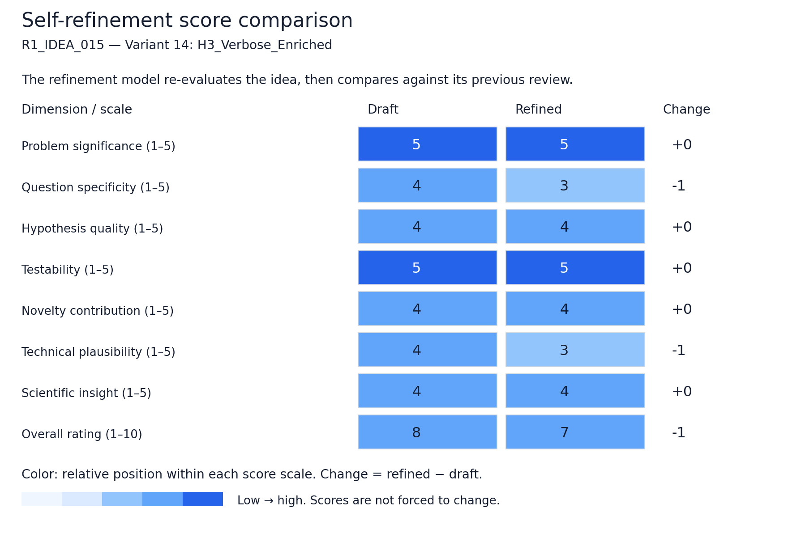

Changed score dimensions: question_specificity, technical_plausibility, overall_rating.

### Score justifications (draft / refined)

**Problem significance**

```json
{
  "draft": {
    "score": 5.0,
    "justification": "Precise control over 3D generative models is a major bottleneck in the field. Solving the ambiguity of natural language for 3D editing is highly significant for applications in gaming, VR, and digital fashion. The problem is both meaningful and timely."
  },
  "refined": {
    "score": 5.0,
    "justification": "Precise control over 3D generative models is a major bottleneck in the field, critical for applications in gaming, VR, and digital fashion. Addressing the ambiguity of natural language in this domain is highly significant and timely."
  }
}
```

**Question specificity**

```json
{
  "draft": {
    "score": 4.0,
    "justification": "The research question is specific: can a slider mechanism improve precision over text-only prompting? The proposed evaluation steps (ablations, boundary cases) are well-defined. However, the specific technical implementation of the 'slider' remains a black box in the summary."
  },
  "refined": {
    "score": 3.0,
    "justification": "While the goal (precise editing via a slider) is clear, the research question lacks specificity regarding the mechanism. It is unclear *how* the slider achieves its effect or what specific constraints define the 'intermediate point'. The idea describes the 'what' and 'how to test' well, but the 'how it works' is a black box."
  }
}
```

**Hypothesis quality**

```json
{
  "draft": {
    "score": 4.0,
    "justification": "The implicit hypothesis is that continuous interpolation in a semantic space yields more precise and controllable results than discrete text prompts. This is a falsifiable claim that can be tested via user studies and quantitative metrics. The hypothesis regarding boundary conditions (granularity) adds depth."
  },
  "refined": {
    "score": 4.0,
    "justification": "The hypothesis is strong: continuous interpolation yields more precise control than discrete text prompts. It is falsifiable and includes a secondary hypothesis about boundary conditions (granularity). However, without a defined mechanism, the causal link is assumed rather than derived."
  }
}
```

**Testability**

```json
{
  "draft": {
    "score": 5.0,
    "justification": "The idea is highly testable. The proposal explicitly outlines a staged design including user studies, ablations, sensitivity analyses, and error analysis. The criteria for success (precision, boundary conditions) are clear enough to design experiments."
  },
  "refined": {
    "score": 5.0,
    "justification": "The idea is highly testable. The proposal explicitly outlines a comprehensive evaluation strategy including user studies, ablations, sensitivity analyses, and error analysis. The criteria for success are clear enough to design rigorous experiments."
  }
}
```

**Novelty contribution**

```json
{
  "draft": {
    "score": 4.0,
    "justification": "While the concept of 'sliders' exists in 2D image editing, applying it to 3D human avatars with a focus on semantic granularity and boundary conditions is a novel and valuable direction. The potential contribution lies in the systematic analysis of *why* and *when* it works, not just that it works."
  },
  "refined": {
    "score": 4.0,
    "justification": "Applying the 'slider' concept to 3D human avatars with a focus on semantic granularity and boundary conditions is a valuable direction. The potential contribution lies in the systematic analysis of *why* and *when* it works, which is more insightful than a simple application paper."
  }
}
```

**Technical plausibility**

```json
{
  "draft": {
    "score": 4.0,
    "justification": "The approach is technically plausible given the current state of 3D generation (e.g., diffusion models with latent spaces). Interpolating between two states is a standard operation in generative modeling. The main uncertainty is the specific mapping of text concepts to the 3D latent space, but the direction is sound."
  },
  "refined": {
    "score": 3.0,
    "justification": "The direction is plausible given the state of 3D generation (e.g., diffusion models with latent spaces), but the idea assumes a structured semantic space exists without explaining how to construct or access it. The feasibility of 'precise' interpolation depends entirely on the underlying representation, which is not described."
  }
}
```

**Scientific insight**

```json
{
  "draft": {
    "score": 4.0,
    "justification": "If executed well, this research could reveal fundamental insights into the geometry of 3D semantic spaces, the limits of natural language expressiveness, and the relationship between representation granularity and editability. It moves beyond 'does it work' to 'how does it work and where does it break'."
  },
  "refined": {
    "score": 4.0,
    "justification": "If executed well, this research could reveal fundamental insights into the geometry of 3D semantic spaces, the limits of natural language expressiveness, and the relationship between representation granularity and editability. It moves beyond 'does it work' to 'how does it work and where does it break'."
  }
}
```

**Overall rating**

```json
{
  "draft": {
    "score": 8.0,
    "justification": "This is a strong research idea. It addresses a significant problem with a clear, testable hypothesis and a robust evaluation plan. The focus on boundary conditions and failure analysis elevates it above a simple application paper. The only deduction is the lack of specific technical details on the mechanism, but as an idea summary, the direction is compelling and scientifically sound."
  },
  "refined": {
    "score": 7.0,
    "justification": "This is a strong research idea with a clear problem statement and an excellent evaluation plan. The deduction from a higher score (e.g., 8 or 9) is due to the lack of technical specificity regarding the mechanism itself. While the 'what' and 'how to test' are compelling, the 'how it works' is currently a black box, making the technical plausibility and question specificity moderate rather than high. It is a solid proposal for a study, but the scientific contribution relies heavily on the successful discovery of the mechanism during the research."
  }
}
```

## R1_IDEA_015 — Variant 15: H4_Ultimate_Hype

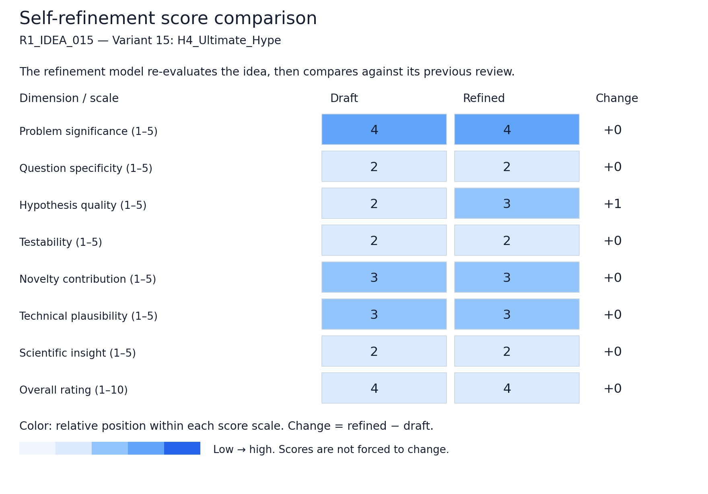

Changed score dimensions: hypothesis_quality.

### Score justifications (draft / refined)

**Problem significance**

```json
{
  "draft": {
    "score": 4.0,
    "justification": "The problem of precise 3D avatar editing is significant and currently a bottleneck in the field. Natural language is indeed too vague for tasks requiring specific aesthetic or anatomical adjustments. Solving this would have high practical impact."
  },
  "refined": {
    "score": 4.0,
    "justification": "The problem of precise control in 3D generative models is a major challenge. Natural language is inherently ambiguous, making it unsuitable for tasks requiring specific aesthetic or anatomical adjustments. Solving this would have high practical impact in gaming, VR, and digital fashion."
  }
}
```

**Question specificity**

```json
{
  "draft": {
    "score": 2.0,
    "justification": "The idea identifies a general direction (using sliders instead of text) but fails to specify the research question. It does not define the variables, the mechanism of action, or the specific constraints of the problem."
  },
  "refined": {
    "score": 2.0,
    "justification": "While the general direction (sliders vs. text) is clear, the research question is not specific enough. It does not define the variables, the specific mechanism of action, or the constraints of the problem. It reads more as a product vision than a scientific inquiry."
  }
}
```

**Hypothesis quality**

```json
{
  "draft": {
    "score": 2.0,
    "justification": "The implicit hypothesis is that 'interpolation is better than direct text generation for precision.' While plausible, it is not stated as a testable prediction with defined conditions. It lacks the specificity to be scientifically rigorous at this stage."
  },
  "refined": {
    "score": 3.0,
    "justification": "The implicit hypothesis (interpolation > text for precision) is plausible and testable. However, it is not explicitly stated as a falsifiable prediction with defined conditions. The idea lacks a specific mechanism to test (e.g., 'Does linear interpolation preserve semantic validity?')."
  }
}
```

**Testability**

```json
{
  "draft": {
    "score": 2.0,
    "justification": "The idea is not currently testable because the method (ACS) is not defined. One cannot design an experiment without knowing how the slider interacts with the 3D model or what data is used to train the concept space."
  },
  "refined": {
    "score": 2.0,
    "justification": "The idea is currently not fully testable because the method (ACS) is undefined. Without knowing how the slider interacts with the 3D model or what data is used, one cannot design a rigorous experiment or define failure modes."
  }
}
```

**Novelty contribution**

```json
{
  "draft": {
    "score": 3.0,
    "justification": "The concept of concept sliders is known in 2D (e.g., StyleGAN), but applying it specifically to 3D human avatars with a focus on overcoming text ambiguity is a novel application. However, the summary does not claim a new theoretical insight, just a new application."
  },
  "refined": {
    "score": 3.0,
    "justification": "The application of concept sliders to 3D avatars is a novel adaptation of techniques from 2D (e.g., StyleGAN). However, the summary does not claim a new theoretical insight or discovery, but rather a new application. The novelty is moderate."
  }
}
```

**Technical plausibility**

```json
{
  "draft": {
    "score": 3.0,
    "justification": "The approach is technically plausible as it aligns with standard practices in latent space manipulation. However, without details on the 3D representation or the generative model, it is impossible to rule out fundamental geometric or topological challenges."
  },
  "refined": {
    "score": 3.0,
    "justification": "The approach is technically plausible as it aligns with standard practices in latent space manipulation. However, without details on the 3D representation or the generative model, it is impossible to rule out fundamental geometric or topological challenges specific to 3D humans."
  }
}
```

**Scientific insight**

```json
{
  "draft": {
    "score": 2.0,
    "justification": "As stated, the idea is a system proposal rather than an investigation into a phenomenon. It has the *potential* for insight if the research focuses on the geometry of the latent space, but the current summary does not suggest this."
  },
  "refined": {
    "score": 2.0,
    "justification": "As stated, the idea is a system proposal rather than an investigation into a phenomenon. It has the *potential* for insight if the research focuses on the geometry of the latent space, but the current summary does not suggest this. It is primarily an engineering solution."
  }
}
```

**Overall rating**

```json
{
  "draft": {
    "score": 4.0,
    "justification": "The idea addresses a meaningful problem with a plausible high-level solution (sliders vs. text). However, it is currently too vague to be considered a strong research proposal. It lacks the specific hypothesis, mechanism, and testability required for a high score. It is a 'good idea' but not a 'well-defined research plan' yet."
  },
  "refined": {
    "score": 4.0,
    "justification": "The idea addresses a meaningful problem with a plausible high-level solution. However, it is currently too vague to be considered a strong research proposal. It lacks the specific hypothesis, mechanism, and testability required for a high score. It is a 'good idea' but not a 'well-defined research plan' yet."
  }
}
```

## R1_IDEA_016 — Source

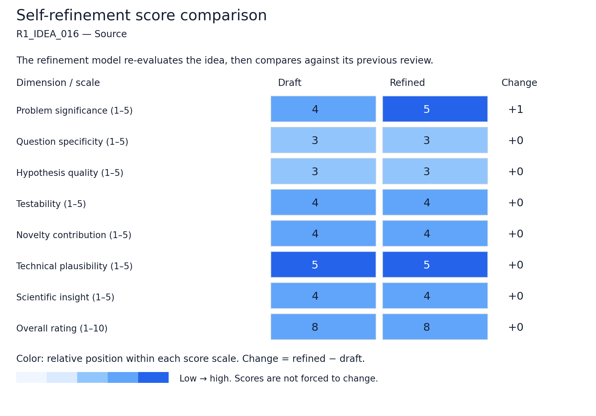

Changed score dimensions: problem_significance.

### Score justifications (draft / refined)

**Problem significance**

```json
{
  "draft": {
    "score": 4.0,
    "justification": "Interpretability of LLMs is a critical and high-priority problem in ML. Establishing a principled theoretical foundation for SAEs, which are currently a dominant tool in this field, is highly significant. It addresses the 'why' behind the success of SAEs, which is a meaningful challenge."
  },
  "refined": {
    "score": 5.0,
    "justification": "Interpretability of LLMs is a paramount challenge in modern AI. SAEs are currently the state-of-the-art tool for this. Establishing a principled theoretical foundation for them is of high significance, as it moves the field from empirical trial-and-error to a more rigorous scientific discipline. Solving this could fundamentally change how we design and trust interpretability tools."
  }
}
```

**Question specificity**

```json
{
  "draft": {
    "score": 3.0,
    "justification": "The idea identifies a clear direction (unrolling proximal gradient) and a goal (principled framework), but the specific research question is somewhat implicit. It needs to be more explicit about what specific property of the SAE is being improved or explained by this derivation."
  },
  "refined": {
    "score": 3.0,
    "justification": "The idea clearly identifies the method (unrolling proximal gradient) and the goal (principled framework), but the specific research question is implicit. It does not specify *what* property of the SAE is being improved or *how* the unrolled approach differs in outcome from existing methods. It needs to be more explicit about the specific mechanism or property being investigated."
  }
}
```

**Hypothesis quality**

```json
{
  "draft": {
    "score": 3.0,
    "justification": "The implicit hypothesis is that a derivation from first principles (unrolling) will yield superior or more interpretable results than heuristic training. This is a testable hypothesis, but it is currently stated as a general motivation rather than a concrete prediction of the outcome."
  },
  "refined": {
    "score": 3.0,
    "justification": "The implicit hypothesis is that a derivation from first principles will yield superior or more interpretable results than heuristic training. This is a testable hypothesis, but it is currently stated as a general motivation rather than a concrete prediction of the outcome (e.g., 'unrolling will lead to X% better disentanglement'). It lacks the specificity of a strong scientific hypothesis."
  }
}
```

**Testability**

```json
{
  "draft": {
    "score": 4.0,
    "justification": "The idea is highly testable. One can implement the unrolled proximal gradient method, train SAEs, and compare them against standard SAEs using standard metrics (reconstruction loss, sparsity, feature activation patterns). The methodology suggests a clear path to empirical validation."
  },
  "refined": {
    "score": 4.0,
    "justification": "The idea is highly testable in principle. One can implement the unrolled proximal gradient method, train SAEs, and compare them against standard SAEs using standard metrics (reconstruction loss, sparsity, feature activation patterns). The methodology suggests a clear path to empirical validation, even if the specific metrics are not yet defined."
  }
}
```

**Novelty contribution**

```json
{
  "draft": {
    "score": 4.0,
    "justification": "While unrolling optimization is known, applying it specifically to derive a principled framework for SAEs in the context of LLM interpretability is a novel contribution. It moves the field from 'what works' to 'why it works' and 'how to derive it optimally'."
  },
  "refined": {
    "score": 4.0,
    "justification": "While unrolling optimization is a known technique in deep learning, applying it specifically to derive a principled framework for SAEs in the context of LLM interpretability is a novel contribution. It moves the field from 'what works' to 'why it works' and 'how to derive it optimally', which is a significant step forward."
  }
}
```

**Technical plausibility**

```json
{
  "draft": {
    "score": 5.0,
    "justification": "The technical approach is sound. Unrolling proximal gradient descent is a standard technique in optimization and deep learning (e.g., ADMM networks, ISTA networks). Applying this to the sparse coding problem is logically coherent and technically feasible."
  },
  "refined": {
    "score": 5.0,
    "justification": "The technical approach is sound. Unrolling proximal gradient descent (e.g., ISTA/ADMM networks) is a standard and well-understood technique in optimization and deep learning. Applying this to the sparse coding problem is logically coherent and technically feasible, assuming standard computational resources."
  }
}
```

**Scientific insight**

```json
{
  "draft": {
    "score": 4.0,
    "justification": "If successful, this research could reveal the relationship between the optimization trajectory and the resulting feature geometry. It could provide general principles for designing sparse representations in high-dimensional spaces, offering insights beyond just a new SAE variant."
  },
  "refined": {
    "score": 4.0,
    "justification": "If successful, this research could reveal the relationship between the optimization trajectory and the resulting feature geometry. It could provide general principles for designing sparse representations in high-dimensional spaces, offering insights beyond just a new SAE variant. It addresses the 'black box' nature of current SAE implementations."
  }
}
```

**Overall rating**

```json
{
  "draft": {
    "score": 8.0,
    "justification": "This is a strong research idea with high potential. It addresses a significant gap in the theoretical understanding of a popular interpretability tool. The proposed method (unrolling) is technically sound and testable. The main limitation is the current lack of a specific, concrete hypothesis regarding the expected benefits, which prevents it from being a perfect 9 or 10. However, the direction is promising and scientifically valuable."
  },
  "refined": {
    "score": 8.0,
    "justification": "This is a strong research idea with high potential. It addresses a significant gap in the theoretical understanding of a popular interpretability tool. The proposed method is technically sound and testable. The main limitation is the current lack of a specific, concrete hypothesis regarding the expected benefits, which prevents it from being a perfect 9 or 10. However, the direction is promising and scientifically valuable."
  }
}
```

## R1_IDEA_016 — Variant 1: A1_Identity

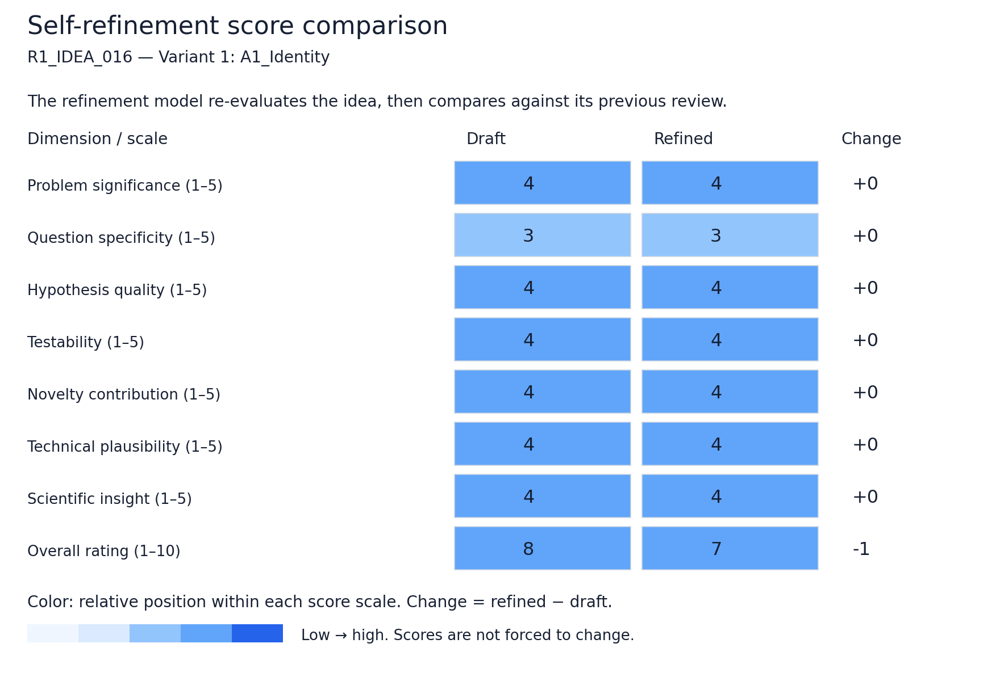

Changed score dimensions: overall_rating.

### Score justifications (draft / refined)

**Problem significance**

```json
{
  "draft": {
    "score": 4.0,
    "justification": "The interpretability of LLMs is a critical problem in AI safety and understanding. Current SAE methods are often heuristic. Establishing a principled, optimization-theoretic foundation for SAEs is a significant and meaningful challenge that, if solved, would improve the reliability of interpretability tools."
  },
  "refined": {
    "score": 4.0,
    "justification": "The interpretability of LLMs is a critical challenge in AI safety. Current SAE methods are largely heuristic, and establishing a principled, optimization-theoretic foundation is a significant and meaningful problem. Solving this would improve the reliability and trustworthiness of interpretability tools."
  }
}
```

**Question specificity**

```json
{
  "draft": {
    "score": 3.0,
    "justification": "The core question (unrolling proximal gradient to derive SAEs) is specific. However, the idea lacks details on the specific formulation, the choice of sparsity constraints, and the specific 'principled' criteria that will be used to validate the framework."
  },
  "refined": {
    "score": 3.0,
    "justification": "The core direction (unrolling proximal gradient) is specific, but the research question lacks necessary constraints. It does not specify which variant of sparse coding is used, what the 'principled' criteria are, or how the specific challenges of LLMs are integrated into the formulation. It is a direction rather than a fully defined question."
  }
}
```

**Hypothesis quality**

```json
{
  "draft": {
    "score": 4.0,
    "justification": "The implicit hypothesis is that unrolling the proximal gradient method yields an SAE architecture that is theoretically superior (more interpretable, better convergence, or more faithful to the original problem) than current ad-hoc SAE designs. This is a falsifiable claim."
  },
  "refined": {
    "score": 4.0,
    "justification": "The implicit hypothesis is strong: that unrolling the proximal gradient method yields an architecture that is theoretically superior (more interpretable, better convergence, or more faithful) than current ad-hoc designs. This is a falsifiable claim that distinguishes the work from generic applications."
  }
}
```

**Testability**

```json
{
  "draft": {
    "score": 4.0,
    "justification": "The idea is highly testable. One can implement the unrolled network, train it on LLM hidden states, and compare its features against standard SAEs using metrics like sparsity, reconstruction error, feature alignment, and stability. The methodology is clear enough to design experiments."
  },
  "refined": {
    "score": 4.0,
    "justification": "The idea is testable. One can implement the unrolled network, train it on LLM hidden states, and compare it against standard SAEs using metrics like sparsity, reconstruction error, feature stability, and alignment. The methodology is clear enough to design experiments, even if details are missing."
  }
}
```

**Novelty contribution**

```json
{
  "draft": {
    "score": 4.0,
    "justification": "While unrolled optimization is known, applying it specifically to derive a principled SAE framework for LLMs is a novel direction. It moves the field from 'what works empirically' to 'what is theoretically justified,' which is a valuable contribution."
  },
  "refined": {
    "score": 4.0,
    "justification": "While unrolled optimization is a known technique, applying it specifically to derive a principled SAE framework for LLMs is a novel direction. It shifts the field from empirical heuristics to theoretical justification, which is a valuable contribution to the field of mechanistic interpretability."
  }
}
```

**Technical plausibility**

```json
{
  "draft": {
    "score": 4.0,
    "justification": "The approach is technically sound. Unrolling optimization algorithms to create neural networks is a standard technique in deep learning (e.g., Deep Unfolding). Applying this to sparse coding is a logical and plausible extension."
  },
  "refined": {
    "score": 4.0,
    "justification": "The approach is technically sound. Unrolling optimization algorithms to create neural networks is a standard and successful technique in deep learning (e.g., ISTA-Net, Deep Unfolding). Applying this to sparse coding is a logical extension, though the specific implementation details for LLMs remain to be worked out."
  }
}
```

**Scientific insight**

```json
{
  "draft": {
    "score": 4.0,
    "justification": "If successful, this work would reveal the underlying optimization dynamics of SAEs and potentially uncover new architectural priors that lead to better feature disentanglement. It would provide a transferable insight into how to design interpretable models based on optimization theory."
  },
  "refined": {
    "score": 4.0,
    "justification": "If successful, this work would reveal the underlying optimization dynamics of SAEs and potentially uncover new architectural priors that lead to better feature disentanglement. It would provide a transferable insight into how to design interpretable models based on optimization theory."
  }
}
```

**Overall rating**

```json
{
  "draft": {
    "score": 8.0,
    "justification": "This is a strong research idea. It identifies a clear gap (lack of principled derivation), proposes a specific and theoretically grounded method (unrolling proximal gradient), and addresses a high-impact problem (LLM interpretability). While it lacks implementation details, the core scientific premise is sound, novel, and testable."
  },
  "refined": {
    "score": 7.0,
    "justification": "This is a strong research idea with high potential. It identifies a clear gap and proposes a theoretically grounded method. However, it currently lacks the specificity required for a top-tier rating (e.g., specific constraints, evaluation metrics, or handling of LLM-specific challenges). It is a solid foundation for a high-impact paper but needs more definition to be exceptional."
  }
}
```

## R1_IDEA_016 — Variant 2: A2_Paraphrase_Only

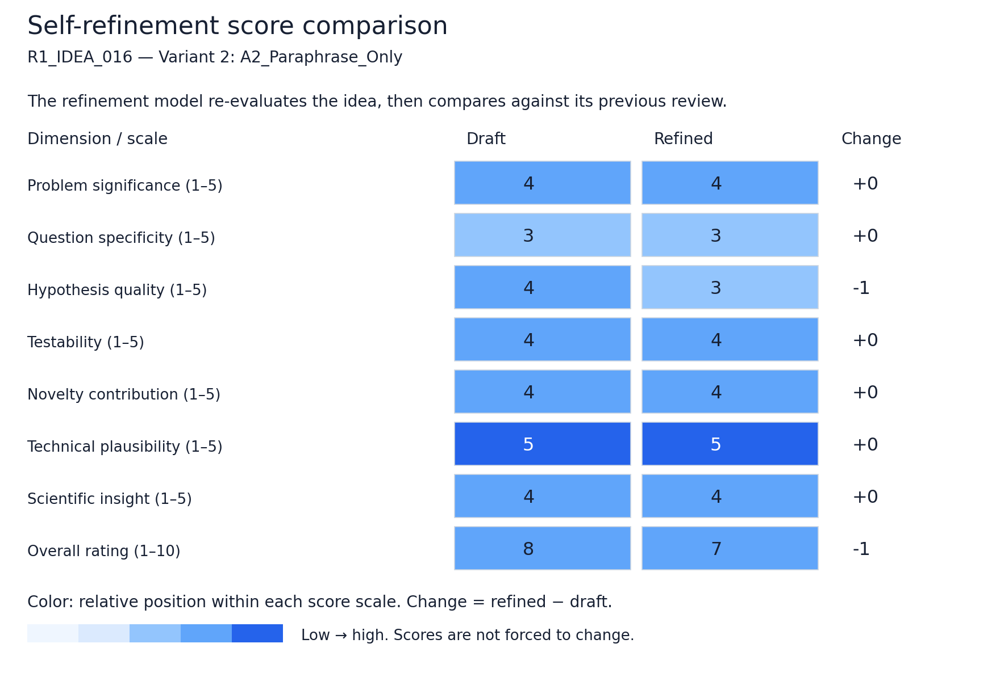

Changed score dimensions: hypothesis_quality, overall_rating.

### Score justifications (draft / refined)

**Problem significance**

```json
{
  "draft": {
    "score": 4.0,
    "justification": "SAEs are a critical tool for understanding LLMs, but their theoretical underpinnings are often treated as black boxes. Establishing a rigorous link to dictionary learning is a meaningful problem that could guide future model design and interpretation."
  },
  "refined": {
    "score": 4.0,
    "justification": "SAEs are a cornerstone of modern LLM interpretability, yet their theoretical underpinnings are often treated as black boxes. Establishing a rigorous link to the specific optimization problem (dictionary learning) is a meaningful challenge that could guide future model design and interpretation. However, the significance is slightly tempered by the fact that SAEs are already widely used, and the 'gap' is theoretical rather than a failure of current performance."
  }
}
```

**Question specificity**

```json
{
  "draft": {
    "score": 3.0,
    "justification": "The idea identifies a specific method (unrolling proximal gradient) and a specific gap (lack of systematic derivation). However, the specific research question (what exactly will be measured or proven) is not fully articulated in the summary."
  },
  "refined": {
    "score": 3.0,
    "justification": "The idea identifies a specific method (unrolling proximal gradient) and a specific gap (lack of systematic derivation). However, the specific research question (what exactly will be measured or proven to be improved) is not fully articulated. It states *how* to derive it, but not *what* the resulting framework will achieve that current methods do not."
  }
}
```

**Hypothesis quality**

```json
{
  "draft": {
    "score": 4.0,
    "justification": "The implicit hypothesis is that a framework derived from unrolling the proximal gradient method will offer superior interpretability or theoretical grounding compared to current ad-hoc SAE implementations. This is a concrete, testable claim."
  },
  "refined": {
    "score": 3.0,
    "justification": "The implicit hypothesis is that a framework derived from unrolling the proximal gradient method will offer superior interpretability or theoretical grounding. While testable, the hypothesis is currently vague regarding the specific mechanism of improvement. It assumes 'derivation' equals 'improvement' without stating the expected outcome."
  }
}
```

**Testability**

```json
{
  "draft": {
    "score": 4.0,
    "justification": "The idea is testable by implementing the unrolled framework, training it on LLM hidden states, and comparing its feature sparsity, reconstruction error, and interpretability (e.g., via human evaluation or automated metrics) against standard SAEs."
  },
  "refined": {
    "score": 4.0,
    "justification": "The idea is testable by implementing the unrolled framework, training it on LLM hidden states, and comparing its properties (sparsity, reconstruction error, feature interpretability) against standard SAEs. The method is concrete enough to be implemented."
  }
}
```

**Novelty contribution**

```json
{
  "draft": {
    "score": 4.0,
    "justification": "While dictionary learning is old, applying the specific technique of unrolling proximal gradient descent to derive a new class of SAEs for LLMs is a novel angle. It moves beyond simply applying SAEs to providing a derivation."
  },
  "refined": {
    "score": 4.0,
    "justification": "While dictionary learning is old, applying the specific technique of unrolling proximal gradient descent to derive a new class of SAEs for LLMs is a novel angle. It moves beyond simply applying SAEs to providing a principled derivation. However, the novelty is primarily in the theoretical framing rather than a completely new algorithmic paradigm."
  }
}
```

**Technical plausibility**

```json
{
  "draft": {
    "score": 5.0,
    "justification": "Unrolling optimization algorithms (optimization unrolling) is a well-established technique in machine learning (e.g., Deep Unfolding). Applying it to the specific context of sparse coding for LLMs is technically sound and logically coherent."
  },
  "refined": {
    "score": 5.0,
    "justification": "Unrolling optimization algorithms (optimization unrolling) is a well-established technique in machine learning (e.g., Deep Unfolding). Applying it to the specific context of sparse coding for LLMs is technically sound, logically coherent, and follows established mathematical principles."
  }
}
```

**Scientific insight**

```json
{
  "draft": {
    "score": 4.0,
    "justification": "If successful, this work could reveal how specific optimization dynamics (like the proximal operator) influence the semantic structure of learned features, providing transferable insights into the relationship between optimization trajectories and feature interpretability."
  },
  "refined": {
    "score": 4.0,
    "justification": "If successful, this work could reveal how specific optimization dynamics (like the proximal operator) influence the semantic structure of learned features. It could provide transferable insights into the relationship between optimization trajectories and feature interpretability, potentially explaining why certain SAE hyperparameters work."
  }
}
```

**Overall rating**

```json
{
  "draft": {
    "score": 8.0,
    "justification": "This is a strong research idea. It targets a real gap in the field, proposes a technically sound and specific methodological approach, and has the potential to provide significant theoretical insight into SAEs. It scores lower than a 9-10 only because the specific success metrics and the exact nature of the 'new' framework are not yet detailed."
  },
  "refined": {
    "score": 7.0,
    "justification": "This is a strong research idea with high technical plausibility and significant potential for theoretical insight. It addresses a real gap in the field. However, it scores lower than a 9-10 because the specific research question and hypothesis are not fully defined; it is currently a 'method proposal' rather than a 'hypothesis-driven investigation.' The idea needs to specify what 'better' means to be a complete research plan."
  }
}
```

## R1_IDEA_016 — Variant 3: A3_Plain_Core


Changed score dimensions: none.

### Score justifications (draft / refined)

**Problem significance**

```json
{
  "draft": {
    "score": 4.0,
    "justification": "The problem of establishing a principled theoretical foundation for SAEs is highly significant in the current ML landscape. As SAEs become a primary tool for interpretability, understanding their theoretical underpinnings is crucial for their reliable application and further development."
  },
  "refined": {
    "score": 4.0,
    "justification": "The problem is highly significant. SAEs are becoming a primary tool for interpretability, yet their theoretical underpinnings remain heuristic. Establishing a principled framework is crucial for the reliable application and further development of these models."
  }
}
```

**Question specificity**

```json
{
  "draft": {
    "score": 3.0,
    "justification": "The core idea (unrolling proximal gradient) is specific, but the summary lacks details on the scope. It is not entirely clear if the goal is a unification proof, a new derivation, or a comparative analysis. The specific 'variants' to be derived are not named."
  },
  "refined": {
    "score": 3.0,
    "justification": "While the method (unrolling proximal gradient) is specific, the research question is somewhat vague. It is unclear if the goal is a unification proof, a new derivation, or a comparative analysis. The specific 'variants' to be derived are not named, making the scope ambiguous."
  }
}
```

**Hypothesis quality**

```json
{
  "draft": {
    "score": 4.0,
    "justification": "The implicit hypothesis—that SAE variants can be systematically derived from unrolled proximal gradient methods—is strong. It posits a specific mechanism (unrolling) that explains the structure of existing methods, which is falsifiable if the unrolling fails to match known behaviors or if a better derivation exists."
  },
  "refined": {
    "score": 4.0,
    "justification": "The implicit hypothesis—that SAE variants can be systematically derived from unrolled proximal gradient methods—is strong. It posits a specific mechanism that explains the structure of existing methods, which is falsifiable if the unrolling fails to match known behaviors."
  }
}
```

**Testability**

```json
{
  "draft": {
    "score": 4.0,
    "justification": "The idea is testable. One can implement the unrolled framework, compare the resulting architectures to existing SAEs, and evaluate their performance on interpretability benchmarks. The relationship between the unrolled steps and the resulting features can be empirically analyzed."
  },
  "refined": {
    "score": 4.0,
    "justification": "The idea is testable. One can implement the unrolled framework, compare the resulting architectures to existing SAEs, and evaluate their performance on interpretability benchmarks. The relationship between unrolled steps and feature quality can be empirically analyzed."
  }
}
```

**Novelty contribution**

```json
{
  "draft": {
    "score": 4.0,
    "justification": "While algorithm unrolling is a known technique in deep learning, applying it specifically to derive and unify the diverse family of SAEs for LLM interpretability is a novel and potentially high-impact contribution. It moves the field from heuristic design to principled derivation."
  },
  "refined": {
    "score": 4.0,
    "justification": "While algorithm unrolling is known in deep learning, applying it specifically to derive and unify the diverse family of SAEs for LLM interpretability is a novel contribution. It moves the field from heuristic design to principled derivation."
  }
}
```

**Technical plausibility**

```json
{
  "draft": {
    "score": 4.0,
    "justification": "The connection between sparse coding (L1 regularization) and proximal gradient methods is mathematically sound. Unrolling this process to create a neural network architecture is a standard and plausible technique in modern deep learning research."
  },
  "refined": {
    "score": 4.0,
    "justification": "The connection between sparse coding (L1 regularization) and proximal gradient methods is mathematically sound. Unrolling this process to create a neural network architecture is a standard and plausible technique in modern deep learning research."
  }
}
```

**Scientific insight**

```json
{
  "draft": {
    "score": 4.0,
    "justification": "If successful, this research would provide deep insight into the optimization landscape of sparse coding in high-dimensional spaces. It could reveal why certain SAE variants work better than others and establish general principles for designing sparse representations."
  },
  "refined": {
    "score": 4.0,
    "justification": "If successful, this research would provide deep insight into the optimization landscape of sparse coding in high-dimensional spaces. It could reveal why certain SAE variants work better than others and establish general principles for designing sparse representations."
  }
}
```

**Overall rating**

```json
{
  "draft": {
    "score": 8.0,
    "justification": "This is a strong research idea with high potential. It addresses a meaningful gap in interpretability research by proposing a theoretically grounded approach to a currently heuristic field. The core mechanism (unrolling) is sound and testable. The main limitation is the brevity of the summary, which leaves some specifics (like the exact scope of variants or computational considerations) open, but the intrinsic scientific promise is high."
  },
  "refined": {
    "score": 8.0,
    "justification": "This is a strong research idea with high potential. It addresses a meaningful gap in interpretability research by proposing a theoretically grounded approach to a currently heuristic field. The core mechanism (unrolling) is sound and testable. The main limitation is the brevity of the summary, which leaves some specifics (like the exact scope of variants or computational considerations) open, but the intrinsic scientific promise is high."
  }
}
```

## R1_IDEA_016 — Variant 4: B1_Verbose_Elaborate


Changed score dimensions: none.

### Score justifications (draft / refined)

**Problem significance**

```json
{
  "draft": {
    "score": 4.0,
    "justification": "Interpretability of LLMs is a critical field. Establishing a rigorous theoretical foundation for SAEs, which are the primary tool for this, is highly significant. Moving from heuristic methods to principled derivations is a necessary step for the field's maturity."
  },
  "refined": {
    "score": 4.0,
    "justification": "Interpretability of LLMs is a critical and high-impact field. SAEs are currently the primary tool for this. Establishing a rigorous theoretical foundation for SAEs, moving them from heuristic black boxes to principled derivations, is highly significant for the maturity and reliability of the field."
  }
}
```

**Question specificity**

```json
{
  "draft": {
    "score": 4.0,
    "justification": "The idea is specific about the method (unrolling proximal gradient) and the target (deriving SAEs from dictionary learning). However, the specific architectural instantiation and the exact nature of the 'principled' improvement are not fully detailed."
  },
  "refined": {
    "score": 4.0,
    "justification": "The idea is specific about the method (unrolling proximal gradient) and the target (deriving SAEs from dictionary learning). However, the specific architectural instantiation and the exact nature of the 'principled' improvement (beyond the derivation itself) are not fully detailed."
  }
}
```

**Hypothesis quality**

```json
{
  "draft": {
    "score": 4.0,
    "justification": "The implicit hypothesis is that unrolling the proximal gradient method yields an SAE architecture that is theoretically superior or more robust than current heuristic variants. This is a falsifiable claim that can be tested via ablation and comparison."
  },
  "refined": {
    "score": 4.0,
    "justification": "The implicit hypothesis is that unrolling the proximal gradient method yields an SAE architecture that is theoretically superior or more robust than current heuristic variants. This is a falsifiable claim that can be tested via ablation and comparison against standard SAEs."
  }
}
```

**Testability**

```json
{
  "draft": {
    "score": 4.0,
    "justification": "The idea suggests a clear path for testing: implement the unrolled framework, train it on LLM hidden states, and compare its performance (sparsity, reconstruction, interpretability) against standard SAEs. The metrics for success are well-defined in the broader context of the field."
  },
  "refined": {
    "score": 4.0,
    "justification": "The idea suggests a clear path for testing: implement the unrolled framework, train it on LLM hidden states, and compare its performance (sparsity, reconstruction, interpretability) against standard SAEs. The metrics for success are well-defined in the broader context of the field."
  }
}
```

**Novelty contribution**

```json
{
  "draft": {
    "score": 4.0,
    "justification": "While unrolling optimization is a known technique in deep learning, applying it specifically to derive SAEs for LLM interpretability from the dictionary learning perspective is a novel and promising direction. It moves beyond simply applying SAEs to analyzing their theoretical origins."
  },
  "refined": {
    "score": 4.0,
    "justification": "While unrolling optimization is a known technique in deep learning (e.g., Deep Unfolding), applying it specifically to derive SAEs for LLM interpretability from the dictionary learning perspective is a novel and promising direction. It moves beyond simply applying SAEs to analyzing their theoretical origins."
  }
}
```

**Technical plausibility**

```json
{
  "draft": {
    "score": 4.0,
    "justification": "The mathematical connection between sparse coding, proximal gradient methods, and dictionary learning is sound. Unrolling these methods to create neural network layers is a standard practice (e.g., in Deep Unfolding). The application to SAEs is technically plausible."
  },
  "refined": {
    "score": 4.0,
    "justification": "The mathematical connection between sparse coding, proximal gradient methods, and dictionary learning is sound. Unrolling these methods to create neural network layers is a standard practice. The application to SAEs is technically plausible, though the high dimensionality of LLM states presents a challenge."
  }
}
```

**Scientific insight**

```json
{
  "draft": {
    "score": 4.0,
    "justification": "If successful, this work could reveal the optimal architectural inductive biases for sparse coding in high-dimensional spaces, potentially leading to a new class of interpretable models with better theoretical guarantees."
  },
  "refined": {
    "score": 4.0,
    "justification": "If successful, this work could reveal the optimal architectural inductive biases for sparse coding in high-dimensional spaces, potentially leading to a new class of interpretable models with better theoretical guarantees and more stable training dynamics."
  }
}
```

**Overall rating**

```json
{
  "draft": {
    "score": 8.0,
    "justification": "This is a strong research idea. It identifies a clear theoretical gap in a high-impact area (LLM interpretability) and proposes a concrete, mathematically grounded method to address it. While implementation details are missing, the core concept is novel, plausible, and has high potential for scientific insight."
  },
  "refined": {
    "score": 8.0,
    "justification": "This is a strong research idea. It identifies a clear theoretical gap in a high-impact area (LLM interpretability) and proposes a concrete, mathematically grounded method to address it. While implementation details are missing, the core concept is novel, plausible, and has high potential for scientific insight."
  }
}
```

## R1_IDEA_016 — Variant 5: B2_Grand_Narrative

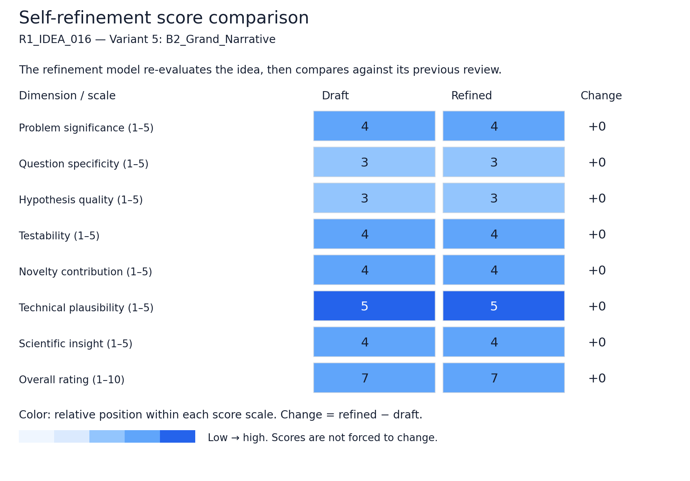

Changed score dimensions: none.

### Score justifications (draft / refined)

**Problem significance**

```json
{
  "draft": {
    "score": 4.0,
    "justification": "The problem of establishing a theoretical foundation for SAEs is highly significant in the field of mechanistic interpretability. Moving from heuristic methods to principled derivations is a necessary step for the field to mature and for SAEs to be trusted as reliable tools for understanding LLMs."
  },
  "refined": {
    "score": 4.0,
    "justification": "The problem is highly significant. The field of mechanistic interpretability currently relies heavily on SAEs, yet their theoretical underpinnings are often ad-hoc. Establishing a principled derivation from dictionary learning is a necessary step for the field to mature and for these tools to be trusted as reliable scientific instruments."
  }
}
```

**Question specificity**

```json
{
  "draft": {
    "score": 3.0,
    "justification": "The idea identifies a clear direction (unrolling proximal gradient) and a goal (principled framework), but the specific research question is somewhat vague. It does not explicitly state what specific property of the SAEs is being optimized or what the expected outcome of the unrolling is beyond 'deriving' them."
  },
  "refined": {
    "score": 3.0,
    "justification": "The idea identifies a clear direction (unrolling proximal gradient) and a goal (principled framework), but the specific research question is somewhat vague. It does not explicitly state what specific property of the SAEs is being optimized or what the expected outcome of the unrolling is beyond 'deriving' them. The 'what' is clear, but the 'why it is better' is not."
  }
}
```

**Hypothesis quality**

```json
{
  "draft": {
    "score": 3.0,
    "justification": "The implicit hypothesis is that unrolling the proximal gradient method provides a superior or more principled derivation of SAEs than current methods. However, this is not stated as a testable prediction (e.g., 'this method will converge faster' or 'yield more sparse features'). It is a methodological proposal rather than a hypothesis-driven investigation."
  },
  "refined": {
    "score": 3.0,
    "justification": "The implicit hypothesis is that unrolling the proximal gradient method provides a superior or more principled derivation of SAEs than current methods. However, this is not stated as a testable prediction (e.g., 'this method will converge faster' or 'yield more sparse features'). It is a methodological proposal rather than a hypothesis-driven investigation."
  }
}
```

**Testability**

```json
{
  "draft": {
    "score": 4.0,
    "justification": "The idea is testable. One can implement the unrolled proximal gradient method, train SAEs, and compare them against baselines using standard metrics (reconstruction loss, sparsity, feature interpretability). The path to empirical validation is clear."
  },
  "refined": {
    "score": 4.0,
    "justification": "The idea is testable. One can implement the unrolled proximal gradient method, train SAEs, and compare them against baselines using standard metrics (reconstruction loss, sparsity, feature interpretability). The path to empirical validation is clear, even if the specific metrics are not yet defined."
  }
}
```

**Novelty contribution**

```json
{
  "draft": {
    "score": 4.0,
    "justification": "While unrolling optimization is known, applying it specifically to derive SAEs from the dictionary learning formulation in the context of LLM interpretability is a novel contribution. It bridges classical signal processing theory with modern deep learning interpretability."
  },
  "refined": {
    "score": 4.0,
    "justification": "While unrolling optimization is known, applying it specifically to derive SAEs from the dictionary learning formulation in the context of LLM interpretability is a novel contribution. It bridges classical signal processing theory with modern deep learning interpretability, potentially revealing new architectural priors."
  }
}
```

**Technical plausibility**

```json
{
  "draft": {
    "score": 5.0,
    "justification": "The technical approach is sound. Unrolling proximal gradient methods (like ISTA or FISTA) to create neural network architectures is a standard and well-understood technique in machine learning. Applying it to the specific problem of sparse coding in LLMs is technically feasible."
  },
  "refined": {
    "score": 5.0,
    "justification": "The technical approach is sound. Unrolling proximal gradient methods (like ISTA or FISTA) to create neural network architectures is a standard and well-understood technique in machine learning. Applying it to the specific problem of sparse coding in LLMs is technically feasible and logically coherent."
  }
}
```

**Scientific insight**

```json
{
  "draft": {
    "score": 4.0,
    "justification": "If successful, this research could provide deep insights into the relationship between optimization dynamics and the emergence of interpretable features. It could reveal whether the 'magic' of SAEs is due to the architecture or the optimization process, potentially leading to more robust interpretability tools."
  },
  "refined": {
    "score": 4.0,
    "justification": "If successful, this research could provide deep insights into the relationship between optimization dynamics and the emergence of interpretable features. It could reveal whether the 'magic' of SAEs is due to the architecture or the optimization process, potentially leading to more robust interpretability tools."
  }
}
```

**Overall rating**

```json
{
  "draft": {
    "score": 7.0,
    "justification": "This is a strong research idea with high potential. It addresses a fundamental gap in the field (lack of principled foundations for SAEs) and proposes a technically sound method (unrolling proximal gradient) to address it. The main limitation is the current lack of specificity regarding the hypothesis and expected outcomes, which prevents it from being an 'exceptional' (9-10) idea at this stage. With a more concrete hypothesis and defined evaluation metrics, this could be a top-tier contribution."
  },
  "refined": {
    "score": 7.0,
    "justification": "This is a strong research idea with high potential. It addresses a fundamental gap in the field (lack of principled foundations for SAEs) and proposes a technically sound method (unrolling proximal gradient) to address it. The main limitation is the current lack of specificity regarding the hypothesis and expected outcomes, which prevents it from being an 'exceptional' (9-10) idea at this stage. With a more concrete hypothesis and defined evaluation metrics, this could be a top-tier contribution."
  }
}
```

## R1_IDEA_016 — Variant 6: B3_Over_Confident

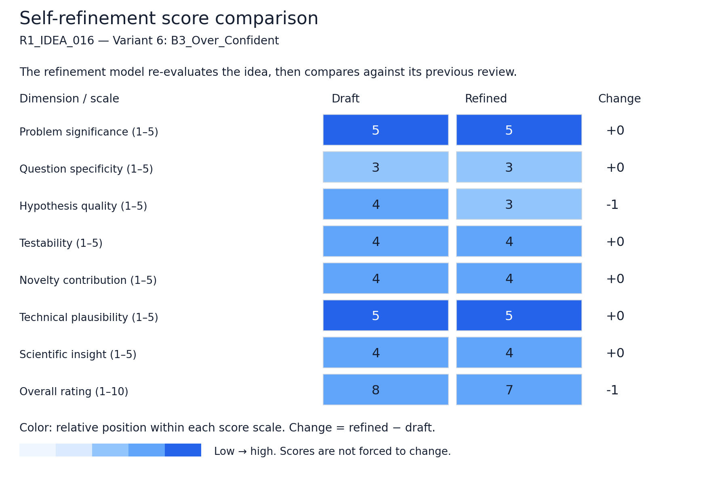

Changed score dimensions: hypothesis_quality, overall_rating.

### Score justifications (draft / refined)

**Problem significance**

```json
{
  "draft": {
    "score": 5.0,
    "justification": "The interpretability of LLMs is a critical challenge in modern AI. Establishing a principled theoretical foundation for SAEs, which are currently the state-of-the-art for feature extraction, is a high-impact problem. Solving this could lead to more reliable and robust interpretability tools."
  },
  "refined": {
    "score": 5.0,
    "justification": "The interpretability of LLMs is a high-stakes problem in AI safety and understanding. SAEs are currently the leading tool for this, yet their theoretical foundation is weak. Establishing a principled derivation is a significant contribution to the field's maturity."
  }
}
```

**Question specificity**

```json
{
  "draft": {
    "score": 3.0,
    "justification": "The core direction (unrolling proximal gradient) is specific, but the research question itself is somewhat vague. It states the intent to 'introduce a framework' but does not specify what the framework's defining characteristics or success metrics are. It is a 'how-to' proposal rather than a 'what-if' hypothesis."
  },
  "refined": {
    "score": 3.0,
    "justification": "While the method (unrolling proximal gradient) is specific, the research question is vague. It states the goal is to 'introduce a framework' but does not specify what the framework's defining characteristics are or what specific problem it solves that current methods do not. It reads more like a project plan than a hypothesis."
  }
}
```

**Hypothesis quality**

```json
{
  "draft": {
    "score": 4.0,
    "justification": "The implicit hypothesis is that unrolling the proximal gradient method yields a superior or more principled SAE formulation than current heuristics. This is a plausible and testable hypothesis, though it could be sharpened by predicting specific improvements (e.g., 'unrolling leads to more orthogonal features')."
  },
  "refined": {
    "score": 3.0,
    "justification": "The implicit hypothesis is that unrolling yields a 'better' or 'more principled' SAE. This is plausible but currently too broad. A stronger hypothesis would predict a specific mechanism (e.g., 'unrolling reduces the sensitivity to hyperparameter initialization') or a specific outcome (e.g., 'unrolling leads to more linearly separable features')."
  }
}
```

**Testability**

```json
{
  "draft": {
    "score": 4.0,
    "justification": "The idea is testable. One can implement the unrolled proximal gradient method, train it on LLM hidden states, and compare the resulting features (sparsity, reconstruction error, feature alignment) against standard SAEs. The methodology suggests clear ablation studies."
  },
  "refined": {
    "score": 4.0,
    "justification": "The idea is testable. One can implement the unrolled method, train it on LLM data, and compare reconstruction error, sparsity, and feature interpretability against baselines. The methodology suggests clear ablation studies."
  }
}
```

**Novelty contribution**

```json
{
  "draft": {
    "score": 4.0,
    "justification": "While unrolling optimization algorithms is a known technique in deep learning, applying it specifically to derive a principled framework for SAEs in the context of LLM interpretability is a novel and potentially significant contribution. It moves the field from empirical tuning to theoretical derivation."
  },
  "refined": {
    "score": 4.0,
    "justification": "Applying optimization unrolling to SAEs is a known technique in general deep learning, but applying it specifically to derive a 'principled framework' for LLM interpretability is a novel and valuable direction. It shifts the field from empirical tuning to theoretical derivation."
  }
}
```

**Technical plausibility**

```json
{
  "draft": {
    "score": 5.0,
    "justification": "The proposal is technically sound. Proximal gradient methods are standard for sparse coding, and unrolling them to create deep networks (like ISTA-Net) is a well-established practice. Applying this to SAEs is a logical and plausible extension."
  },
  "refined": {
    "score": 5.0,
    "justification": "The proposal is technically sound. Proximal gradient descent is the standard for sparse coding, and unrolling it (e.g., ISTA) is a well-understood technique. The extension to SAEs is a logical and feasible application of existing theory."
  }
}
```

**Scientific insight**

```json
{
  "draft": {
    "score": 4.0,
    "justification": "If successful, this research could reveal the optimization dynamics underlying feature learning in SAEs, potentially explaining why certain SAE variants work better than others. It could uncover general principles about the relationship between optimization trajectories and feature interpretability."
  },
  "refined": {
    "score": 4.0,
    "justification": "If successful, this could reveal the optimization dynamics underlying feature learning in SAEs, potentially explaining why certain variants work better. It could uncover general principles about the relationship between optimization trajectories and feature interpretability."
  }
}
```

**Overall rating**

```json
{
  "draft": {
    "score": 8.0,
    "justification": "This is a strong research idea with high potential. It addresses a meaningful gap in the theoretical understanding of SAEs and proposes a technically plausible direction. The main limitation is the lack of specificity in the current summary regarding the expected outcomes and specific formulation details, but the core concept is robust and worthy of investigation."
  },
  "refined": {
    "score": 7.0,
    "justification": "This is a strong research idea with high potential. It addresses a meaningful theoretical gap and proposes a technically plausible direction. However, the current summary lacks the specificity of a concrete hypothesis and fails to clearly distinguish the novelty from existing unrolled methods. It is a 'strong' idea (7) rather than 'exceptional' (9) because the specific research question and expected insights are not yet fully articulated."
  }
}
```

## R1_IDEA_016 — Variant 7: B4_Novelty

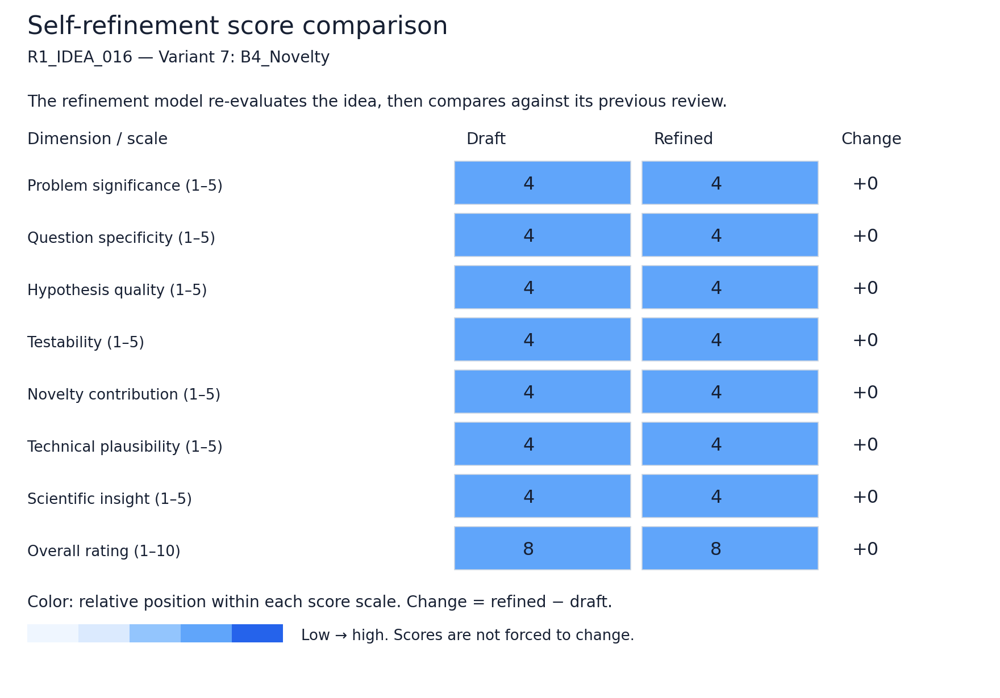

Changed score dimensions: none.

### Score justifications (draft / refined)

**Problem significance**

```json
{
  "draft": {
    "score": 4.0,
    "justification": "Interpretability of LLMs is a critical field. Establishing a principled theoretical foundation for SAEs, which are currently often treated as heuristic tools, is a significant problem. Solving this could lead to more robust and trustworthy interpretability methods."
  },
  "refined": {
    "score": 4.0,
    "justification": "Interpretability of LLMs is a critical field. Establishing a principled theoretical foundation for SAEs, which are currently often treated as heuristic tools, is a significant problem. Solving this could lead to more robust and trustworthy interpretability methods. However, the field is already saturated with SAE applications, so the significance hinges entirely on whether this derivation yields practical improvements."
  }
}
```

**Question specificity**

```json
{
  "draft": {
    "score": 4.0,
    "justification": "The idea is specific about the method (unrolling proximal gradient) and the goal (deriving SAEs from dictionary learning). However, the specific formulation of the dictionary learning problem and the exact mapping to the neural architecture are not detailed."
  },
  "refined": {
    "score": 4.0,
    "justification": "The idea is specific about the method (unrolling proximal gradient) and the goal (deriving SAEs from dictionary learning). However, the specific formulation of the dictionary learning problem and the exact mapping to the neural architecture are not detailed, leaving some ambiguity in the execution."
  }
}
```

**Hypothesis quality**

```json
{
  "draft": {
    "score": 4.0,
    "justification": "The implicit hypothesis is that unrolling the proximal gradient method provides a superior or more principled framework for SAEs than current ad-hoc approaches. This is a testable claim that distinguishes the work from generic applications."
  },
  "refined": {
    "score": 4.0,
    "justification": "The implicit hypothesis is that unrolling the proximal gradient method provides a superior or more principled framework for SAEs than current ad-hoc approaches. This is a testable claim that distinguishes the work from generic applications, though the 'superiority' metric needs definition."
  }
}
```

**Testability**

```json
{
  "draft": {
    "score": 4.0,
    "justification": "The idea suggests a clear path for investigation: implement the unrolled framework, train it on LLM features, and compare its performance (sparsity, feature quality, reconstruction error) against standard SAEs. The comparison is well-defined."
  },
  "refined": {
    "score": 4.0,
    "justification": "The idea suggests a clear path for investigation: implement the unrolled framework, train it on LLM features, and compare its performance (sparsity, feature quality, reconstruction error) against standard SAEs. The comparison is well-defined, though the baseline metrics need careful selection."
  }
}
```

**Novelty contribution**

```json
{
  "draft": {
    "score": 4.0,
    "justification": "While unrolling optimization is a known technique in deep learning (e.g., Deep Unfolding), applying it specifically to derive SAEs from dictionary learning in the context of LLM interpretability appears to be a novel angle. It moves beyond simply applying SAEs to analyzing *how* they should be constructed."
  },
  "refined": {
    "score": 4.0,
    "justification": "While unrolling optimization is a known technique in deep learning (e.g., Deep Unfolding), applying it specifically to derive SAEs from dictionary learning in the context of LLM interpretability appears to be a novel angle. It moves beyond simply applying SAEs to analyzing *how* they should be constructed. However, the core technique (unrolling) is not new, limiting the novelty score slightly."
  }
}
```

**Technical plausibility**

```json
{
  "draft": {
    "score": 4.0,
    "justification": "The mathematical connection between sparse coding, proximal gradient methods, and autoencoders is well-established. Unrolling such methods is a standard technique in deep unfolding. The application to SAEs is technically sound, though the practical implementation details (e.g., step size schedules, unrolling depth) would need careful design."
  },
  "refined": {
    "score": 4.0,
    "justification": "The mathematical connection between sparse coding, proximal gradient methods, and autoencoders is well-established. Unrolling such methods is a standard technique in deep unfolding. The application to SAEs is technically sound, though the practical implementation details (e.g., step size schedules, unrolling depth) would need careful design to avoid instability."
  }
}
```

**Scientific insight**

```json
{
  "draft": {
    "score": 4.0,
    "justification": "If successful, this work could reveal the underlying optimization dynamics that make SAEs effective, potentially leading to new architectural insights or theoretical guarantees for interpretability models. It moves the field from empirical success to theoretical understanding."
  },
  "refined": {
    "score": 4.0,
    "justification": "If successful, this work could reveal the underlying optimization dynamics that make SAEs effective, potentially leading to new architectural insights or theoretical guarantees for interpretability models. It moves the field from empirical success to theoretical understanding, which is a high-value contribution."
  }
}
```

**Overall rating**

```json
{
  "draft": {
    "score": 8.0,
    "justification": "This is a strong research idea. It identifies a meaningful theoretical gap in a hot field (LLM interpretability) and proposes a concrete, plausible methodological direction (unrolling proximal gradient) to address it. While it lacks implementation details, the core scientific premise is sound, specific, and has high potential for contribution."
  },
  "refined": {
    "score": 8.0,
    "justification": "This is a strong research idea. It identifies a meaningful theoretical gap in a hot field (LLM interpretability) and proposes a concrete, plausible methodological direction (unrolling proximal gradient) to address it. While it lacks implementation details, the core scientific premise is sound, specific, and has high potential for contribution. It avoids the trap of being a mere application by focusing on the derivation mechanism."
  }
}
```

## R1_IDEA_016 — Variant 8: B5_Application_Impact


Changed score dimensions: none.

### Score justifications (draft / refined)

**Problem significance**

```json
{
  "draft": {
    "score": 5.0,
    "justification": "Interpretability of LLMs is a top-tier problem in AI safety. Establishing a principled theoretical foundation for SAEs, which are currently the state-of-the-art tool for this, is highly significant and addresses a fundamental gap in the field."
  },
  "refined": {
    "score": 5.0,
    "justification": "Interpretability of LLMs is a top-tier problem in AI safety. Establishing a principled theoretical foundation for SAEs, which are currently the state-of-the-art tool for this, is highly significant and addresses a fundamental gap in the field."
  }
}
```

**Question specificity**

```json
{
  "draft": {
    "score": 3.0,
    "justification": "The idea identifies a clear direction (unrolling proximal gradient) and a goal (principled framework), but the specific research question is somewhat implicit. It needs to be more explicit about what specific property of the SAEs is being improved or explained by this derivation."
  },
  "refined": {
    "score": 3.0,
    "justification": "The idea identifies a clear direction (unrolling proximal gradient) and a goal (principled framework), but the specific research question is somewhat implicit. It needs to be more explicit about what specific property of the SAEs is being improved or explained by this derivation."
  }
}
```

**Hypothesis quality**

```json
{
  "draft": {
    "score": 3.0,
    "justification": "The idea implies a hypothesis that 'deriving SAEs from first principles via unrolling yields better interpretability tools,' but this is not yet a falsifiable prediction. It needs to specify what 'better' means in a measurable way (e.g., specific performance on a benchmark or theoretical guarantee)."
  },
  "refined": {
    "score": 3.0,
    "justification": "The idea implies a hypothesis that 'deriving SAEs from first principles via unrolling yields better interpretability tools,' but this is not yet a falsifiable prediction. It needs to specify what 'better' means in a measurable way (e.g., specific performance on a benchmark or theoretical guarantee)."
  }
}
```

**Testability**

```json
{
  "draft": {
    "score": 4.0,
    "justification": "The approach is highly testable. One can implement the unrolled framework, train it on standard LLMs, and compare the resulting features against standard SAEs using established interpretability metrics (sparsity, reconstruction loss, feature alignment). The methodology is concrete enough to design an experiment."
  },
  "refined": {
    "score": 4.0,
    "justification": "The approach is highly testable. One can implement the unrolled framework, train it on standard LLMs, and compare the resulting features against standard SAEs using established interpretability metrics (sparsity, reconstruction loss, feature alignment). The methodology is concrete enough to design an experiment."
  }
}
```

**Novelty contribution**

```json
{
  "draft": {
    "score": 4.0,
    "justification": "While unrolling optimization is a known technique in deep learning, applying it specifically to derive a principled framework for SAEs in the context of LLM interpretability is novel. It moves the field from empirical heuristics to theoretical grounding, which is a valuable contribution."
  },
  "refined": {
    "score": 4.0,
    "justification": "While unrolling optimization is a known technique in deep learning, applying it specifically to derive a principled framework for SAEs in the context of LLM interpretability is novel. It moves the field from empirical heuristics to theoretical grounding, which is a valuable contribution."
  }
}
```

**Technical plausibility**

```json
{
  "draft": {
    "score": 5.0,
    "justification": "The proposal is technically sound. Proximal gradient methods are standard for sparse coding, and unrolling them is a well-understood technique in optimization. The mapping from dictionary learning to SAEs is a logical and plausible research path."
  },
  "refined": {
    "score": 5.0,
    "justification": "The proposal is technically sound. Proximal gradient methods are standard for sparse coding, and unrolling them is a well-understood technique in optimization. The mapping from dictionary learning to SAEs is a logical and plausible research path."
  }
}
```

**Scientific insight**

```json
{
  "draft": {
    "score": 4.0,
    "justification": "If successful, this work would provide deep insight into the relationship between optimization dynamics and feature emergence in neural networks. It could reveal why certain SAE variants work better than others and potentially lead to general principles for designing interpretable representations."
  },
  "refined": {
    "score": 4.0,
    "justification": "If successful, this work would provide deep insight into the relationship between optimization dynamics and feature emergence in neural networks. It could reveal why certain SAE variants work better than others and potentially lead to general principles for designing interpretable representations."
  }
}
```

**Overall rating**

```json
{
  "draft": {
    "score": 8.0,
    "justification": "This is a strong research idea with high significance and technical plausibility. It addresses a fundamental gap in the interpretability field. The main limitation is that it is currently a proposal rather than a fully articulated hypothesis with specific success criteria. With more specific formulation of the expected benefits and metrics, this could be an exceptional contribution."
  },
  "refined": {
    "score": 8.0,
    "justification": "This is a strong research idea with high significance and technical plausibility. It addresses a fundamental gap in the interpretability field. The main limitation is that it is currently a proposal rather than a fully articulated hypothesis with specific success criteria. With more specific formulation of the expected benefits and metrics, this could be an exceptional contribution."
  }
}
```

## R1_IDEA_016 — Variant 9: C1_Hollow_Shell


Changed score dimensions: none.

### Score justifications (draft / refined)

**Problem significance**

```json
{
  "draft": {
    "score": 4.0,
    "justification": "The problem of connecting interpretability tools to learning theory is highly significant. Without such a foundation, interpretability remains a collection of heuristics rather than a rigorous scientific discipline. Solving this would be a major contribution to the field."
  },
  "refined": {
    "score": 4.0,
    "justification": "The problem is highly significant. Establishing a theoretical foundation for interpretability is a critical challenge in modern AI. Without it, the field remains heuristic. Addressing this gap is essential for the maturity of the discipline."
  }
}
```

**Question specificity**

```json
{
  "draft": {
    "score": 2.0,
    "justification": "The idea is currently too broad. It states a goal ('introduce a new framework') but does not define the specific variables, relationships, or mechanisms to be investigated. It reads more like a mission statement than a research question."
  },
  "refined": {
    "score": 2.0,
    "justification": "The research question is currently too broad and vague. It states a general objective ('connect techniques to formulations') but does not define the specific variables, relationships, or mechanisms to be investigated. It reads as a mission statement rather than a specific research question."
  }
}
```

**Hypothesis quality**

```json
{
  "draft": {
    "score": 2.0,
    "justification": "There is no explicit hypothesis. The idea implies that a connection exists and is missing, but it does not predict what that connection looks like or what properties it will have. A strong idea would predict a specific structural relationship."
  },
  "refined": {
    "score": 2.0,
    "justification": "There is no explicit hypothesis. The idea implies a connection exists but does not predict the nature of that connection, the conditions under which it holds, or what specific properties the framework will reveal. A strong idea would predict a specific structural relationship."
  }
}
```

**Testability**

```json
{
  "draft": {
    "score": 2.0,
    "justification": "As stated, the idea is not testable. One cannot evaluate a 'framework' without knowing its components, the specific phenomena it explains, or the criteria for its success. It requires significant elaboration to become an empirical or theoretical investigation."
  },
  "refined": {
    "score": 2.0,
    "justification": "The idea is not currently testable. One cannot evaluate a 'framework' without knowing its components, the specific phenomena it explains, or the criteria for its success. It requires significant elaboration to become an empirical or theoretical investigation."
  }
}
```

**Novelty contribution**

```json
{
  "draft": {
    "score": 3.0,
    "justification": "The *potential* for novelty is high if the framework reveals a new structural link between learning theory and interpretability. However, as currently described, it could easily result in a reorganization of known concepts without new insight."
  },
  "refined": {
    "score": 3.0,
    "justification": "The potential for novelty is high if the framework reveals a new structural link between learning theory and interpretability. However, as currently described, it could easily result in a reorganization of known concepts without new insight. The novelty is latent, not explicit."
  }
}
```

**Technical plausibility**

```json
{
  "draft": {
    "score": 3.0,
    "justification": "The direction is logically sound and plausible. Theoretical unification is a standard and valid scientific approach. However, the feasibility depends entirely on the specific choices of formulations and techniques, which are not yet defined."
  },
  "refined": {
    "score": 3.0,
    "justification": "The direction is logically sound and plausible. Theoretical unification is a standard and valid scientific approach. However, the feasibility depends entirely on the specific choices of formulations and techniques, which are not yet defined."
  }
}
```

**Scientific insight**

```json
{
  "draft": {
    "score": 3.0,
    "justification": "If successful, this could yield deep insights into the nature of learned representations. However, the current description does not guarantee that the resulting framework will offer more than a descriptive taxonomy. The potential for insight is present but not yet realized in the proposal."
  },
  "refined": {
    "score": 3.0,
    "justification": "If successful, this could yield deep insights into the nature of learned representations. However, the current description does not guarantee that the resulting framework will offer more than a descriptive taxonomy. The potential for insight is present but not yet realized in the proposal."
  }
}
```

**Overall rating**

```json
{
  "draft": {
    "score": 5.0,
    "justification": "This is a moderate/borderline idea. It identifies a very important and meaningful problem (significance score 4), but the execution plan is currently too vague to be considered a strong research proposal. It lacks the specificity, hypothesis, and testability required to be rated higher. It has the potential to become a 7 or 8 with significant refinement, but as a standalone summary, it is too generic."
  },
  "refined": {
    "score": 5.0,
    "justification": "This is a moderate/borderline idea. It identifies a very important and meaningful problem (significance score 4), but the execution plan is currently too vague to be considered a strong research proposal. It lacks the specificity, hypothesis, and testability required to be rated higher. It has the potential to become a 7 or 8 with significant refinement, but as a standalone summary, it is too generic."
  }
}
```

## R1_IDEA_016 — Variant 10: C2_Logic_Flawed


Changed score dimensions: none.

### Score justifications (draft / refined)

**Problem significance**

```json
{
  "draft": {
    "score": 5.0,
    "justification": "The interpretability of LLMs is a critical challenge in modern AI. Establishing a principled theoretical foundation for SAEs, which are currently often treated as heuristic tools, is a high-impact problem. Solving this could lead to more reliable and generalizable interpretability tools."
  },
  "refined": {
    "score": 5.0,
    "justification": "The interpretability of LLMs is a paramount challenge in modern AI. Establishing a principled theoretical foundation for SAEs, which are currently often treated as heuristic tools, is a high-impact problem. Solving this could lead to more reliable, generalizable, and theoretically grounded interpretability tools."
  }
}
```

**Question specificity**

```json
{
  "draft": {
    "score": 4.0,
    "justification": "The idea clearly identifies the method (unrolling proximal gradient) and the goal (deriving SAEs from dictionary learning). However, the specific formulation of the unrolled network and the exact nature of the 'framework' are not detailed, leaving some ambiguity on the precise research question."
  },
  "refined": {
    "score": 4.0,
    "justification": "The idea clearly identifies the method (unrolling proximal gradient) and the goal (deriving SAEs from dictionary learning). However, the specific formulation of the unrolled network and the exact nature of the 'framework' are not detailed, leaving some ambiguity on the precise research question."
  }
}
```

**Hypothesis quality**

```json
{
  "draft": {
    "score": 4.0,
    "justification": "The implicit hypothesis is that unrolling the proximal gradient method yields a more principled and effective SAE architecture than current ad-hoc methods. This is a concrete, falsifiable claim, though the specific conditions under which it holds are not fully elaborated."
  },
  "refined": {
    "score": 4.0,
    "justification": "The implicit hypothesis is that unrolling the proximal gradient method yields a more principled and effective SAE architecture than current ad-hoc methods. This is a concrete, falsifiable claim, though the specific conditions under which it holds are not fully elaborated."
  }
}
```

**Testability**

```json
{
  "draft": {
    "score": 4.0,
    "justification": "The idea is highly testable. One can implement the unrolled network, train it on LLM features, and compare its performance (sparsity, reconstruction error, feature interpretability) against standard SAE baselines. The 'broader effectiveness' claim can be tested across different model sizes or layers."
  },
  "refined": {
    "score": 4.0,
    "justification": "The idea is highly testable. One can implement the unrolled network, train it on LLM features, and compare its performance (sparsity, reconstruction error, feature interpretability) against standard SAE baselines. The 'broader effectiveness' claim can be tested across different model sizes or layers."
  }
}
```

**Novelty contribution**

```json
{
  "draft": {
    "score": 4.0,
    "justification": "While unrolling optimization is a known technique, applying it specifically to derive a principled SAE framework for LLM interpretability, rather than just using it as a training trick, represents a novel theoretical contribution. It bridges the gap between optimization theory and neural interpretability."
  },
  "refined": {
    "score": 4.0,
    "justification": "While unrolling optimization is a known technique, applying it specifically to derive a principled SAE framework for LLM interpretability, rather than just using it as a training trick, represents a novel theoretical contribution. It bridges the gap between optimization theory and neural interpretability."
  }
}
```

**Technical plausibility**

```json
{
  "draft": {
    "score": 5.0,
    "justification": "The approach is technically sound. Unrolling proximal gradient methods (like ISTA) to create neural networks (like LISTA) is a well-established concept in signal processing and machine learning. Applying this to the specific domain of SAEs for LLMs is a logical and plausible extension."
  },
  "refined": {
    "score": 5.0,
    "justification": "The approach is technically sound. Unrolling proximal gradient methods (like ISTA) to create neural networks (like LISTA) is a well-established concept in signal processing and machine learning. Applying this to the specific domain of SAEs for LLMs is a logical and plausible extension."
  }
}
```

**Scientific insight**

```json
{
  "draft": {
    "score": 5.0,
    "justification": "If successful, this research would provide deep insight into the relationship between optimization dynamics and the emergence of interpretable features. It could reveal why certain SAE architectures work and provide a general recipe for designing interpretable models based on optimization principles."
  },
  "refined": {
    "score": 5.0,
    "justification": "If successful, this research would provide deep insight into the relationship between optimization dynamics and the emergence of interpretable features. It could reveal why certain SAE architectures work and provide a general recipe for designing interpretable models based on optimization principles."
  }
}
```

**Overall rating**

```json
{
  "draft": {
    "score": 8.0,
    "justification": "This is a strong research idea with high potential. It addresses a fundamental gap in the interpretability field by seeking a theoretical grounding for SAEs. The proposed method (unrolling proximal gradient) is plausible and testable. While the idea is currently a summary and lacks implementation details, the core scientific direction is clear, significant, and promising."
  },
  "refined": {
    "score": 8.0,
    "justification": "This is a strong research idea with high potential. It addresses a fundamental gap in the interpretability field by seeking a theoretical grounding for SAEs. The proposed method (unrolling proximal gradient) is plausible and testable. While the idea is currently a summary and lacks implementation details, the core scientific direction is clear, significant, and promising."
  }
}
```

## R1_IDEA_016 — Variant 11: C3_Substance_Enriched

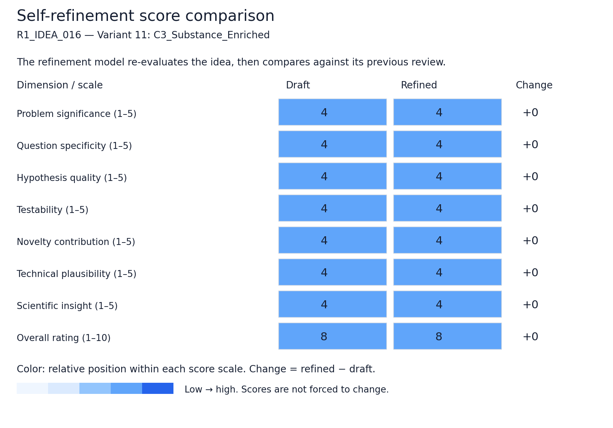

Changed score dimensions: none.

### Score justifications (draft / refined)

**Problem significance**

```json
{
  "draft": {
    "score": 4.0,
    "justification": "The interpretability of LLMs is a critical challenge in ML. Establishing a principled link between SAEs and dictionary learning addresses a foundational theoretical gap, which is highly significant for the field's long-term credibility and understanding."
  },
  "refined": {
    "score": 4.0,
    "justification": "The interpretability of LLMs is a critical challenge in ML. Establishing a principled link between SAEs and dictionary learning addresses a foundational theoretical gap, which is highly significant for the field's long-term credibility and understanding. However, the specific impact of 'unrolling' versus other regularization techniques is not immediately obvious, preventing a perfect score."
  }
}
```

**Question specificity**

```json
{
  "draft": {
    "score": 4.0,
    "justification": "The idea clearly identifies the problem (lack of principled derivation) and the proposed solution (unrolling proximal gradient). It specifies the validation method (stability across layers/distributions), making the research question concrete."
  },
  "refined": {
    "score": 4.0,
    "justification": "The idea clearly identifies the problem (lack of principled derivation) and the proposed solution (unrolling proximal gradient). It specifies the validation method (stability across layers/distributions), making the research question concrete. However, the specific architectural details of the unrolling remain undefined."
  }
}
```

**Hypothesis quality**

```json
{
  "draft": {
    "score": 4.0,
    "justification": "The hypothesis that unrolling proximal gradient leads to better feature stability and semantic correspondence is specific and testable. It posits a causal link between the derivation method and the quality of the interpretability features."
  },
  "refined": {
    "score": 4.0,
    "justification": "The hypothesis that unrolling proximal gradient leads to better feature stability and semantic correspondence is specific and testable. It posits a causal link between the derivation method and the quality of the interpretability features. The hypothesis is strong but relies on the assumption that unrolling inherently improves semantic alignment, which needs more justification."
  }
}
```

**Testability**

```json
{
  "draft": {
    "score": 4.0,
    "justification": "The idea suggests clear evaluation criteria: measuring feature stability under varying conditions (sparsity, activation functions, layers). These are empirically measurable quantities."
  },
  "refined": {
    "score": 4.0,
    "justification": "The idea suggests clear evaluation criteria: measuring feature stability under varying conditions (sparsity, activation functions, layers). These are empirically measurable quantities. The ability to compare against standard SAEs makes the hypothesis falsifiable."
  }
}
```

**Novelty contribution**

```json
{
  "draft": {
    "score": 4.0,
    "justification": "While SAEs are a hot topic, proposing a specific unrolled proximal gradient framework as a 'principled derivation' is a novel theoretical contribution. It moves beyond heuristic SAE designs to a more grounded optimization approach."
  },
  "refined": {
    "score": 4.0,
    "justification": "While SAEs are a hot topic, proposing a specific unrolled proximal gradient framework as a 'principled derivation' is a novel theoretical contribution. It moves beyond heuristic SAE designs to a more grounded optimization approach. The novelty lies in the specific application of deep unfolding to the SAE dictionary learning problem."
  }
}
```

**Technical plausibility**

```json
{
  "draft": {
    "score": 4.0,
    "justification": "Unrolling optimization algorithms is a well-established technique in deep learning (e.g., Deep Unfolding). Applying it to sparse coding for SAEs is technically sound and plausible, though implementation details would need to be worked out."
  },
  "refined": {
    "score": 4.0,
    "justification": "Unrolling optimization algorithms is a well-established technique in deep learning (e.g., Deep Unfolding). Applying it to sparse coding for SAEs is technically sound and plausible, though implementation details would need to be worked out. The main risk is computational cost, but the approach is theoretically valid."
  }
}
```

**Scientific insight**

```json
{
  "draft": {
    "score": 4.0,
    "justification": "If successful, this work could reveal how optimization dynamics influence the semantic structure of learned features. It could provide general principles for designing interpretable representations that are robust to distribution shifts."
  },
  "refined": {
    "score": 4.0,
    "justification": "If successful, this work could reveal how optimization dynamics influence the semantic structure of learned features. It could provide general principles for designing interpretable representations that are robust to distribution shifts. The insight would be in understanding the relationship between the optimization trajectory and the resulting feature semantics."
  }
}
```

**Overall rating**

```json
{
  "draft": {
    "score": 8.0,
    "justification": "This is a strong research idea. It tackles a meaningful theoretical gap in a high-impact area (LLM interpretability) with a specific, plausible methodological approach. The hypothesis is clear and testable. It scores lower than a perfect 10 only because the specific mechanism linking the unrolling to 'discrete semantics' is not yet fully articulated, and the computational feasibility is an open question."
  },
  "refined": {
    "score": 8.0,
    "justification": "This is a strong research idea. It tackles a meaningful theoretical gap in a high-impact area (LLM interpretability) with a specific, plausible methodological approach. The hypothesis is clear and testable. It scores lower than a perfect 10 only because the specific mechanism linking the unrolling to 'discrete semantics' is not yet fully articulated, and the computational feasibility is an open question."
  }
}
```

## R1_IDEA_016 — Variant 12: H1_Deceptive_Hollow


Changed score dimensions: novelty_contribution.

### Score justifications (draft / refined)

**Problem significance**

```json
{
  "draft": {
    "score": 4.0,
    "justification": "The underlying problem—lack of a systematic foundation for interpretability—is highly significant and widely acknowledged in the ML community. Addressing this could indeed reshape the field."
  },
  "refined": {
    "score": 4.0,
    "justification": "The problem of unifying interpretability techniques under a core learning theory is highly significant and widely recognized as a major open challenge in ML. Addressing this could indeed reshape the field."
  }
}
```

**Question specificity**

```json
{
  "draft": {
    "score": 1.0,
    "justification": "The research question is almost entirely absent. The text describes a 'vision' or 'agenda' but does not specify what is actually being investigated, what variables are involved, or what the specific relationship is."
  },
  "refined": {
    "score": 1.0,
    "justification": "The research question is almost entirely absent. The text describes a vision or agenda but does not specify what is actually being investigated, what variables are involved, or what the specific relationship is."
  }
}
```

**Hypothesis quality**

```json
{
  "draft": {
    "score": 1.0,
    "justification": "There is no explicit or implicit hypothesis that can be supported or contradicted. The text makes broad claims about 'potential' and 'promise' but offers no concrete prediction."
  },
  "refined": {
    "score": 1.0,
    "justification": "There is no explicit or implicit hypothesis that can be supported or contradicted. The text makes broad claims about 'potential' and 'promise' but offers no concrete prediction."
  }
}
```

**Testability**

```json
{
  "draft": {
    "score": 1.0,
    "justification": "The idea is not currently testable. Without a defined framework, specific methods, or a target setting, no experiment, comparison, or analysis can be designed to evaluate the claim."
  },
  "refined": {
    "score": 1.0,
    "justification": "The idea is not currently testable. Without a defined framework, specific methods, or a target setting, no experiment, comparison, or analysis can be designed to evaluate the claim."
  }
}
```

**Novelty contribution**

```json
{
  "draft": {
    "score": 3.0,
    "justification": "While the goal of unification is novel and potentially high-impact, the idea as presented is too abstract to assess the novelty of the specific contribution. It risks being a rebranding of existing efforts without a clear new mechanism."
  },
  "refined": {
    "score": 2.0,
    "justification": "While the goal of unification is novel and potentially high-impact, the idea as presented is too abstract to assess the novelty of the specific contribution. It risks being a rebranding of existing efforts without a clear new mechanism."
  }
}
```

**Technical plausibility**

```json
{
  "draft": {
    "score": 2.0,
    "justification": "It is impossible to judge technical plausibility because the proposed mechanism is undefined. The reasoning is logically coherent only at a very high, abstract level, but lacks the technical substance to be evaluated."
  },
  "refined": {
    "score": 2.0,
    "justification": "It is impossible to judge technical plausibility because the proposed mechanism is undefined. The reasoning is logically coherent only at a very high, abstract level, but lacks the technical substance to be evaluated."
  }
}
```

**Scientific insight**

```json
{
  "draft": {
    "score": 3.0,
    "justification": "If successfully realized, the idea has high potential for scientific insight. However, as currently stated, it offers no insight into mechanisms or principles, only a promise of future insight."
  },
  "refined": {
    "score": 3.0,
    "justification": "If successfully realized, the idea has high potential for scientific insight. However, as currently stated, it offers no insight into mechanisms or principles, only a promise of future insight."
  }
}
```

**Overall rating**

```json
{
  "draft": {
    "score": 3.0,
    "justification": "The idea addresses a significant problem but fails as a research proposal because it lacks specificity, a testable hypothesis, and a methodological direction. It reads more like a grant abstract or a vision statement than a concrete research idea. While the potential is high, the current formulation is too vague to be evaluated as a viable research plan."
  },
  "refined": {
    "score": 3.0,
    "justification": "The idea addresses a significant problem but fails as a research proposal because it lacks specificity, a testable hypothesis, and a methodological direction. It reads more like a grant abstract or a vision statement than a concrete research idea. While the potential is high, the current formulation is too vague to be evaluated as a viable research plan."
  }
}
```

## R1_IDEA_016 — Variant 13: H2_Confident_Flaw


Changed score dimensions: testability, overall_rating.

### Score justifications (draft / refined)

**Problem significance**

```json
{
  "draft": {
    "score": 4.0,
    "justification": "The problem of deriving SAEs from first principles is significant for the field of interpretability. Establishing a solid theoretical foundation could lead to more reliable and generalizable tools for understanding LLMs. However, the significance is slightly tempered by the fact that heuristic methods are currently working reasonably well, so the urgency of a 'principled' solution is debatable without stronger evidence of their failure."
  },
  "refined": {
    "score": 4.0,
    "justification": "The problem of establishing a principled theoretical foundation for SAEs is highly significant for the field of interpretability. If successful, it could lead to more reliable and generalizable tools for understanding LLMs. However, the significance is slightly tempered by the fact that heuristic methods are currently working reasonably well, so the urgency of a 'principled' solution is debatable without stronger evidence of their fundamental failure."
  }
}
```

**Question specificity**

```json
{
  "draft": {
    "score": 3.0,
    "justification": "The idea specifies the method (unrolling proximal gradient) and the goal (principled derivation). However, the research question is muddied by the claim that this will 'necessarily' produce improvements. A better question would be 'Does unrolling proximal gradient yield SAEs with better interpretability metrics than current heuristics?' The current framing is too absolute."
  },
  "refined": {
    "score": 3.0,
    "justification": "The idea specifies the method (unrolling proximal gradient) and the goal (principled derivation). However, the research question is muddied by the claim that this will 'necessarily' produce improvements. A better question would be 'Does unrolling proximal gradient yield SAEs with better interpretability metrics than current heuristics?' The current framing is too absolute and conflates methodological derivation with empirical outcome."
  }
}
```

**Hypothesis quality**

```json
{
  "draft": {
    "score": 2.0,
    "justification": "The hypothesis is weak because it conflates theoretical elegance with empirical success. The claim that gains are 'causal evidence' without controlling for confounders (dataset, evaluation) is not a testable scientific hypothesis but rather a statement of belief. A strong hypothesis would predict specific improvements in specific metrics under specific conditions."
  },
  "refined": {
    "score": 2.0,
    "justification": "The hypothesis is weak because it conflates theoretical elegance with empirical success. The claim that gains are 'causal evidence' without controlling for confounders (dataset, evaluation) is not a testable scientific hypothesis but rather a statement of belief. A strong hypothesis would predict specific improvements in specific metrics under specific conditions, not a guaranteed general superiority."
  }
}
```

**Testability**

```json
{
  "draft": {
    "score": 3.0,
    "justification": "The core method (unrolling proximal gradient) is testable. However, the idea's claim that one can ignore dataset composition and alternative explanations makes the proposed evaluation plan scientifically invalid. To be truly testable, the idea must be revised to include rigorous ablation studies and comparisons."
  },
  "refined": {
    "score": 2.0,
    "justification": "While the core method (unrolling proximal gradient) is technically testable, the idea's explicit claim that one can ignore dataset composition, evaluation criteria, and alternative explanations makes the proposed evaluation plan scientifically invalid. To be truly testable, the idea must be revised to include rigorous ablation studies and comparisons. As written, it proposes a 'black box' validation that cannot distinguish the method's true contribution from other factors."
  }
}
```

**Novelty contribution**

```json
{
  "draft": {
    "score": 4.0,
    "justification": "Applying unrolled optimization to derive SAEs is a novel direction that could contribute significantly to the theoretical understanding of dictionary learning in deep learning. If successful, it could establish a new standard for SAE construction."
  },
  "refined": {
    "score": 4.0,
    "justification": "Applying unrolled optimization to derive SAEs is a novel direction that could contribute significantly to the theoretical understanding of dictionary learning in deep learning. If successful, it could establish a new standard for SAE construction. However, the novelty is currently overshadowed by the flawed validation logic."
  }
}
```

**Technical plausibility**

```json
{
  "draft": {
    "score": 4.0,
    "justification": "Unrolling optimization algorithms is a known technique in deep learning (e.g., Deep Unfolding). Applying it to sparse coding for SAEs is technically plausible and follows established patterns in the field. The reasoning that a principled derivation might help is logically coherent, even if the certainty of success is overstated."
  },
  "refined": {
    "score": 4.0,
    "justification": "Unrolling optimization algorithms is a known technique in deep learning (e.g., Deep Unfolding). Applying it to sparse coding for SAEs is technically plausible and follows established patterns in the field. The reasoning that a principled derivation might help is logically coherent, even if the certainty of success is overstated."
  }
}
```

**Scientific insight**

```json
{
  "draft": {
    "score": 3.0,
    "justification": "If the research succeeds, it could reveal how optimization dynamics influence feature disentanglement in LLMs. However, the current framing suggests a 'black box' success (it works because it's principled) rather than an investigation into the *mechanism* of why it works, which limits the potential for deep scientific insight."
  },
  "refined": {
    "score": 3.0,
    "justification": "If the research succeeds, it could reveal how optimization dynamics influence feature disentanglement in LLMs. However, the current framing suggests a 'black box' success (it works because it's principled) rather than an investigation into the *mechanism* of why it works, which limits the potential for deep scientific insight. The dismissal of boundary cases further reduces the potential for discovering general principles."
  }
}
```

**Overall rating**

```json
{
  "draft": {
    "score": 6.0,
    "justification": "The idea has a strong core (unrolling proximal gradient for SAEs) and addresses a meaningful problem. However, the scientific rigor is compromised by the overconfident claims that a principled approach guarantees success and that confounding factors can be ignored. The idea is moderate because it requires significant reframing of the hypothesis and experimental design to be a valid scientific contribution. It is not weak because the underlying method is sound, but it is not strong because the proposed logic for validation is flawed."
  },
  "refined": {
    "score": 5.0,
    "justification": "The idea has a strong core (unrolling proximal gradient for SAEs) and addresses a meaningful problem. However, the scientific rigor is severely compromised by the overconfident claims that a principled approach guarantees success and that confounding factors can be ignored. This makes the hypothesis unfalsifiable and the proposed validation methodologically unsound. The idea is borderline (5) because the underlying method is sound and the problem is significant, but the current framing prevents it from being a strong research proposal without significant reframing."
  }
}
```

## R1_IDEA_016 — Variant 14: H3_Verbose_Enriched

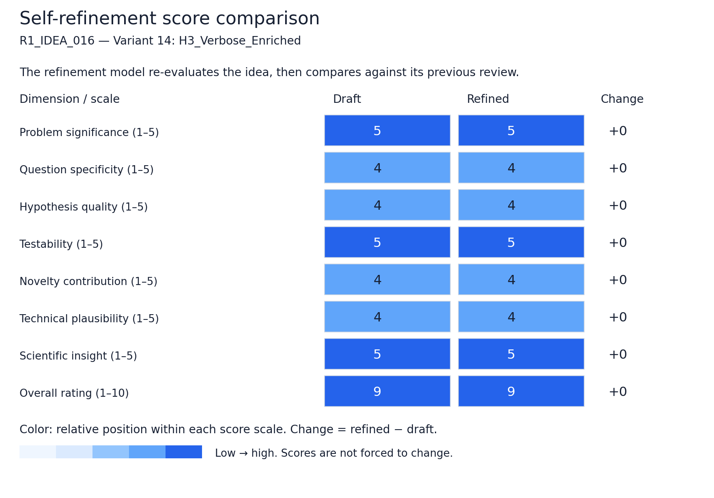

Changed score dimensions: none.

### Score justifications (draft / refined)

**Problem significance**

```json
{
  "draft": {
    "score": 5.0,
    "justification": "Interpretability of LLMs is a critical challenge in modern ML. Establishing a principled, theoretically grounded framework for SAEs is highly significant as it moves the field beyond heuristic methods toward rigorous scientific understanding of model internals."
  },
  "refined": {
    "score": 5.0,
    "justification": "Interpretability of LLMs is a critical challenge in modern ML. Establishing a principled, theoretically grounded framework for SAEs is highly significant as it moves the field beyond heuristic methods toward rigorous scientific understanding of model internals."
  }
}
```

**Question specificity**

```json
{
  "draft": {
    "score": 4.0,
    "justification": "The idea clearly identifies the problem (lack of principled derivation) and the proposed method (unrolling proximal gradient). However, the specific mathematical details of the unrolling and the precise definition of the stability metric are not fully elaborated in the summary."
  },
  "refined": {
    "score": 4.0,
    "justification": "The idea clearly identifies the problem (lack of principled derivation) and the proposed method (unrolling proximal gradient). However, the specific mathematical details of the unrolling and the precise definition of the stability metric are not fully elaborated in the summary."
  }
}
```

**Hypothesis quality**

```json
{
  "draft": {
    "score": 4.0,
    "justification": "The hypothesis that unrolling leads to more stable, semantically discrete features is concrete and falsifiable. It distinguishes the proposed method from existing heuristics and makes a clear prediction about the nature of the learned features."
  },
  "refined": {
    "score": 4.0,
    "justification": "The hypothesis that unrolling leads to more stable, semantically discrete features is concrete and falsifiable. It distinguishes the proposed method from existing heuristics and makes a clear prediction about the nature of the learned features."
  }
}
```

**Testability**

```json
{
  "draft": {
    "score": 5.0,
    "justification": "The proposal includes a very robust plan for testing: staged design, ablations, sensitivity analyses, and error analysis. The criteria for success (stability, robustness) are measurable, and the plan to compare against baselines is implied and clear."
  },
  "refined": {
    "score": 5.0,
    "justification": "The proposal includes a very robust plan for testing: staged design, ablations, sensitivity analyses, and error analysis. The criteria for success (stability, robustness) are measurable, and the plan to compare against baselines is implied and clear."
  }
}
```

**Novelty contribution**

```json
{
  "draft": {
    "score": 4.0,
    "justification": "While unrolling optimization is known in other contexts, applying it specifically to derive SAEs for LLM interpretability in a way that claims to solve the 'principled derivation' gap is novel. The potential to provide a clearer pathway for validation adds significant scientific value."
  },
  "refined": {
    "score": 4.0,
    "justification": "While unrolling optimization is known in other contexts, applying it specifically to derive SAEs for LLM interpretability in a way that claims to solve the 'principled derivation' gap is novel. The potential to provide a clearer pathway for validation adds significant scientific value."
  }
}
```

**Technical plausibility**

```json
{
  "draft": {
    "score": 4.0,
    "justification": "Unrolling proximal gradient is a standard technique in optimization and deep learning (e.g., Deep Unfolding). Applying it to SAEs is technically sound and plausible, assuming the computational cost is manageable. The reasoning is logically coherent."
  },
  "refined": {
    "score": 4.0,
    "justification": "Unrolling proximal gradient is a standard technique in optimization and deep learning (e.g., Deep Unfolding). Applying it to SAEs is technically sound and plausible, assuming the computational cost is manageable. The reasoning is logically coherent."
  }
}
```

**Scientific insight**

```json
{
  "draft": {
    "score": 5.0,
    "justification": "If successful, this work would not just provide a new SAE variant but would offer deep insights into the relationship between optimization dynamics, sparsity constraints, and the emergence of semantic features. It addresses the 'why' and 'when' of interpretability, which is a high-value scientific contribution."
  },
  "refined": {
    "score": 5.0,
    "justification": "If successful, this work would not just provide a new SAE variant but would offer deep insights into the relationship between optimization dynamics, sparsity constraints, and the emergence of semantic features. It addresses the 'why' and 'when' of interpretability, which is a high-value scientific contribution."
  }
}
```

**Overall rating**

```json
{
  "draft": {
    "score": 9.0,
    "justification": "This is an exceptional research idea. It tackles a fundamental theoretical gap in a high-impact area (LLM interpretability) with a specific, plausible methodological direction. The proposed experimental design is rigorous and focused on generating scientific insight rather than just benchmarking. It has the potential to significantly advance the field's understanding of how to validate interpretability methods."
  },
  "refined": {
    "score": 9.0,
    "justification": "This is an exceptional research idea. It tackles a fundamental theoretical gap in a high-impact area (LLM interpretability) with a specific, plausible methodological direction. The proposed experimental design is rigorous and focused on generating scientific insight rather than just benchmarking. It has the potential to significantly advance the field's understanding of how to validate interpretability methods."
  }
}
```

## R1_IDEA_016 — Variant 15: H4_Ultimate_Hype

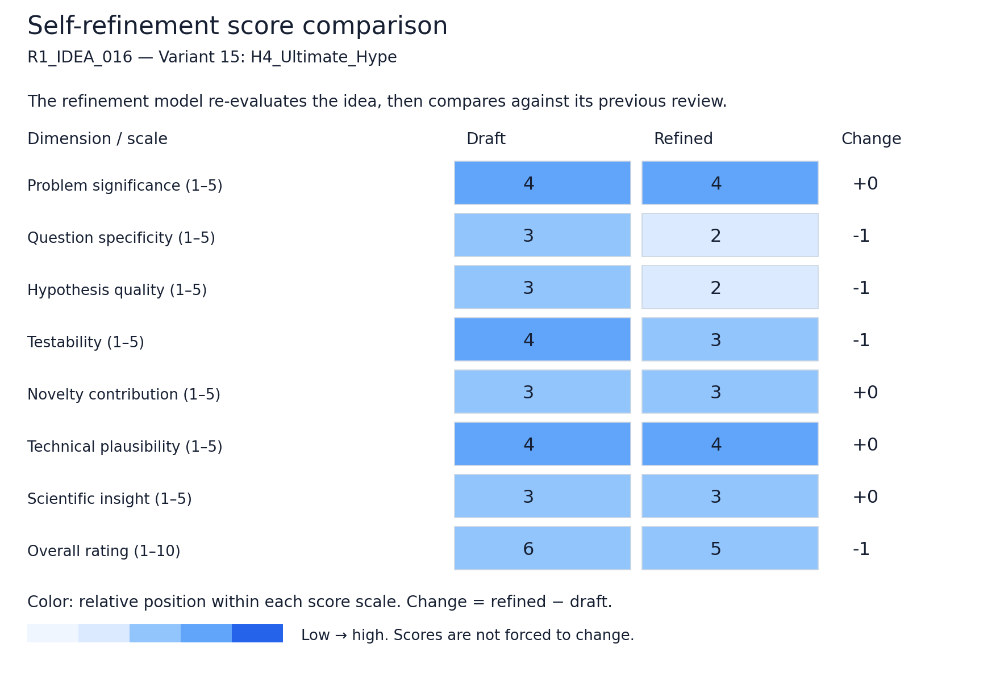

Changed score dimensions: question_specificity, hypothesis_quality, testability, overall_rating.

### Score justifications (draft / refined)

**Problem significance**

```json
{
  "draft": {
    "score": 4.0,
    "justification": "The problem of deriving SAEs from first principles in dictionary learning is highly significant for the field of interpretability. Current SAEs often rely on ad-hoc architectural choices and loss functions. A principled framework would improve trust and reproducibility in LLM interpretability research."
  },
  "refined": {
    "score": 4.0,
    "justification": "The problem is highly significant. SAEs are currently a state-of-the-art tool for interpretability, yet their theoretical underpinnings are often heuristic. Establishing a principled derivation from dictionary learning is a major step toward trustworthy and reproducible interpretability."
  }
}
```

**Question specificity**

```json
{
  "draft": {
    "score": 3.0,
    "justification": "The idea identifies a specific method (unrolling proximal gradient) but lacks a specific research question. It states the goal (derive a framework) but does not specify the exact relationship being tested or the specific failure mode of current methods it aims to solve."
  },
  "refined": {
    "score": 2.0,
    "justification": "While the method (unrolling proximal gradient) is specific, the research question is vague. The text states a goal ('introduce such a framework') rather than a question to be investigated (e.g., 'Does unrolling improve feature sparsity compared to heuristic training?'). The lack of a specific hypothesis makes the question ill-defined."
  }
}
```

**Hypothesis quality**

```json
{
  "draft": {
    "score": 3.0,
    "justification": "The implicit hypothesis is that unrolling proximal gradient descent yields a superior or more principled SAE. However, this is not explicitly stated as a falsifiable prediction. It assumes the derivation itself is the value, rather than a specific performance or interpretability gain."
  },
  "refined": {
    "score": 2.0,
    "justification": "The hypothesis is implicit and weak. It relies on the assumption that 'principled derivation' equals 'better performance,' which is not guaranteed. A strong idea would predict a specific outcome (e.g., 'The unrolled approach will yield features that are more linearly separable'). The current text reads more like a mission statement than a hypothesis."
  }
}
```

**Testability**

```json
{
  "draft": {
    "score": 4.0,
    "justification": "The idea is testable. One can implement the unrolled framework, train it on LLMs, and compare its feature sparsity, reconstruction error, and feature interpretability against standard SAEs. The evaluation path is clear."
  },
  "refined": {
    "score": 3.0,
    "justification": "The idea is testable in principle (implement the unrolled model, compare metrics), but the criteria for success are not defined. Without clear metrics for 'principled' or 'meaningful', the testability is limited by the lack of evaluation definitions."
  }
}
```

**Novelty contribution**

```json
{
  "draft": {
    "score": 3.0,
    "justification": "The novelty lies in the specific application of unrolled optimization to SAEs. While unrolling is a known technique in deep learning, applying it to derive SAEs from dictionary learning specifically is a fresh angle. However, without details, it risks being a straightforward implementation of known optimization theory."
  },
  "refined": {
    "score": 3.0,
    "justification": "Applying unrolled optimization to SAEs is a novel angle, but the novelty is currently speculative. It risks being a standard application of known optimization theory unless it reveals a new structural insight. The contribution is potential, not demonstrated."
  }
}
```

**Technical plausibility**

```json
{
  "draft": {
    "score": 4.0,
    "justification": "The technical direction is sound. Proximal gradient methods are standard for sparse coding, and unrolling them to create deep networks is a plausible and established technique in optimization-based deep learning. The application to SAEs is technically feasible."
  },
  "refined": {
    "score": 4.0,
    "justification": "The technical approach is sound. Unrolling proximal gradient methods is a standard technique in deep learning (e.g., ADMM networks, ISTA nets). Applying this to sparse coding is logically coherent and feasible."
  }
}
```

**Scientific insight**

```json
{
  "draft": {
    "score": 3.0,
    "justification": "If successful, the research could reveal the optimal inductive biases for sparse coding in high-dimensional spaces. However, as currently described, it risks being a 'methodological exercise' rather than a discovery of a new scientific principle unless it uncovers a fundamental limitation in current SAE formulations."
  },
  "refined": {
    "score": 3.0,
    "justification": "If successful, this could reveal the optimal inductive biases for sparse coding in high-dimensional spaces. However, as currently described, it risks being a 'methodological exercise' (building a specific architecture) rather than a discovery of a new scientific principle or limitation."
  }
}
```

**Overall rating**

```json
{
  "draft": {
    "score": 6.0,
    "justification": "The idea addresses a meaningful problem with a plausible technical approach. However, it currently reads more like a research agenda or a high-level proposal than a concrete research idea. The lack of a specific, falsifiable hypothesis and the reliance on promotional language ('transformative', 'bold') lower the score. It is a moderate idea with high potential if the specific theoretical contribution is clarified."
  },
  "refined": {
    "score": 5.0,
    "justification": "The idea addresses a meaningful problem with a plausible technical direction, but it is currently too vague and promotional to be considered a strong research proposal. The lack of a specific, falsifiable hypothesis and the reliance on buzzwords ('transformative', 'bold') significantly lower the score. It is a moderate idea with high potential if the specific research questions and hypotheses are sharpened."
  }
}
```

## R1_IDEA_017 — Source

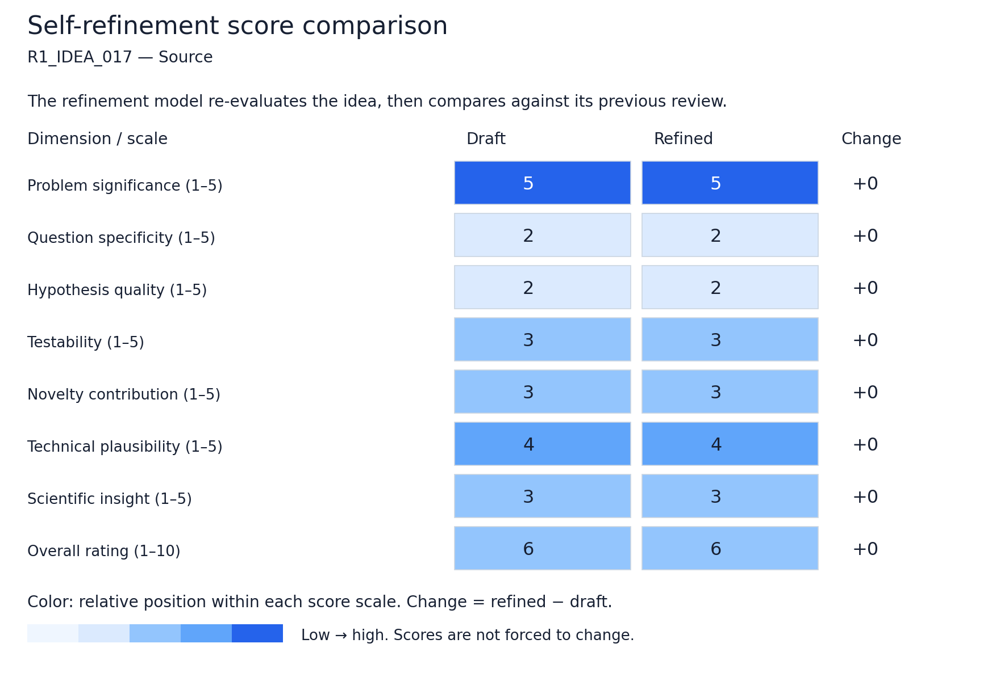

Changed score dimensions: none.

### Score justifications (draft / refined)

**Problem significance**

```json
{
  "draft": {
    "score": 5.0,
    "justification": "Industrial anomaly detection is a critical application with significant economic and safety implications. The specific constraint of 'few-shot' and 'category-agnostic' conditions represents a major unsolved challenge in the field, making the problem highly significant."
  },
  "refined": {
    "score": 5.0,
    "justification": "Industrial anomaly detection is a critical application with significant economic and safety implications. The specific constraints of 'few-shot' and 'category-agnostic' conditions represent a major unsolved challenge in the field, making the problem highly significant and worthy of investigation."
  }
}
```

**Question specificity**

```json
{
  "draft": {
    "score": 2.0,
    "justification": "The idea states the goal and the proposed tool (foundation models) but does not articulate a specific research question. It reads more like a project title or a motivation statement than a defined inquiry into a mechanism or relationship."
  },
  "refined": {
    "score": 2.0,
    "justification": "The idea states the goal and the proposed tool but does not articulate a specific research question. It reads more like a project title or a motivation statement than a defined inquiry into a mechanism, relationship, or boundary condition. It lacks a clear 'How' or 'Why' question beyond 'Can we use foundation models?'"
  }
}
```

**Hypothesis quality**

```json
{
  "draft": {
    "score": 2.0,
    "justification": "There is an implicit hypothesis that pre-training helps, but it is not explicit. A strong hypothesis would predict *why* it helps (e.g., 'pre-trained features capture invariant normal patterns') or under what conditions it might fail (e.g., 'if the domain gap is too large')."
  },
  "refined": {
    "score": 2.0,
    "justification": "There is an implicit hypothesis that pre-training helps, but it is not explicit or falsifiable. A strong hypothesis would predict *why* it helps (e.g., 'pre-trained features capture invariant normal patterns') or under what conditions it might fail (e.g., 'if the domain gap is too large'). The current statement is a claim of utility rather than a scientific hypothesis."
  }
}
```

**Testability**

```json
{
  "draft": {
    "score": 3.0,
    "justification": "The idea is testable in principle (train on few normal samples, test on anomalies), but the summary lacks the necessary details to design a concrete experiment. It is currently too vague to determine what specific comparison or ablation would be performed."
  },
  "refined": {
    "score": 3.0,
    "justification": "The idea is testable in principle (train on few normal samples, test on anomalies), but the summary lacks the necessary details to design a concrete experiment. It is currently too vague to determine what specific comparison, ablation, or evaluation strategy would be performed to validate the claim."
  }
}
```

**Novelty contribution**

```json
{
  "draft": {
    "score": 3.0,
    "justification": "Applying foundation models to anomaly detection is a current trend. The novelty here lies in the specific combination of 'few-shot' and 'category-agnostic' constraints. However, without a proposed mechanism, the potential contribution is currently just 'applying X to Y' rather than discovering a new principle."
  },
  "refined": {
    "score": 3.0,
    "justification": "Applying foundation models to anomaly detection is a current trend. The novelty here lies in the specific combination of 'few-shot' and 'category-agnostic' constraints. However, without a proposed mechanism or a specific insight into the interaction between pre-training and industrial domains, the potential contribution is currently just 'applying X to Y' rather than discovering a new principle."
  }
}
```

**Technical plausibility**

```json
{
  "draft": {
    "score": 4.0,
    "justification": "The reasoning is logically sound. Foundation models are known for strong feature extraction, and using them to learn a normal distribution from few samples is a plausible strategy. The assumption that pre-training data helps is reasonable, though the domain gap is a known technical hurdle."
  },
  "refined": {
    "score": 4.0,
    "justification": "The reasoning is logically sound. Foundation models are known for strong feature extraction, and using them to learn a normal distribution from few samples is a plausible strategy. The assumption that pre-training data helps is reasonable, though the domain gap is a known technical hurdle that needs addressing."
  }
}
```

**Scientific insight**

```json
{
  "draft": {
    "score": 3.0,
    "justification": "If successful, the study could reveal how well foundation models generalize to industrial domains with minimal data. However, as stated, it risks being a standard engineering application unless it investigates the specific interaction between pre-training distributions and industrial anomaly characteristics."
  },
  "refined": {
    "score": 3.0,
    "justification": "If successfully investigated, the study could reveal how well foundation models generalize to industrial domains with minimal data. However, as stated, it risks being a standard engineering application unless it investigates the specific interaction between pre-training distributions and industrial anomaly characteristics, or identifies a fundamental limitation of current approaches."
  }
}
```

**Overall rating**

```json
{
  "draft": {
    "score": 6.0,
    "justification": "The research idea addresses a very important problem with a plausible direction, earning it a moderate score. However, it currently lacks the specificity of a research question and the depth of a hypothesis required for a high rating. It is a strong *motivation* for a project but a weak *research idea* in its current form because it does not define what is being investigated beyond 'using foundation models to solve this problem.'"
  },
  "refined": {
    "score": 6.0,
    "justification": "The research idea addresses a very important problem with a plausible direction, earning it a moderate score. However, it currently lacks the specificity of a research question and the depth of a hypothesis required for a high rating. It is a strong *motivation* for a project but a weak *research idea* in its current form because it does not define what is being investigated beyond 'using foundation models to solve this problem.' It sits on the border of moderate/strong due to the high significance of the problem, but the lack of a defined inquiry prevents a higher score."
  }
}
```

## R1_IDEA_017 — Variant 1: A1_Identity

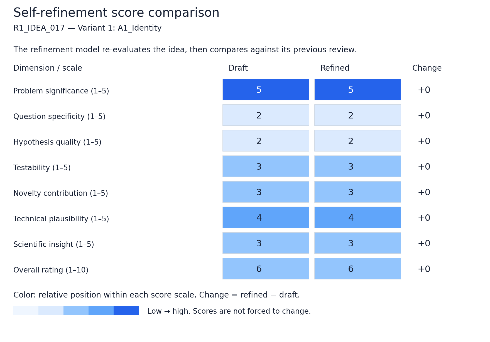

Changed score dimensions: none.

### Score justifications (draft / refined)

**Problem significance**

```json
{
  "draft": {
    "score": 5.0,
    "justification": "Industrial safety inspection is a critical application area where data scarcity is a major barrier. Solving few-shot, category-agnostic anomaly detection would have significant practical value and scientific relevance."
  },
  "refined": {
    "score": 5.0,
    "justification": "Industrial safety inspection is a high-stakes domain where data scarcity is a major barrier. Solving few-shot, category-agnostic anomaly detection would have significant practical value and scientific relevance, addressing a critical gap in automated quality control."
  }
}
```

**Question specificity**

```json
{
  "draft": {
    "score": 2.0,
    "justification": "The current text is a motivation statement. It identifies the problem and the potential tool (foundation models) but does not articulate a specific research question, mechanism, or relationship to be investigated."
  },
  "refined": {
    "score": 2.0,
    "justification": "The text is a motivation statement. It identifies the problem and the potential tool (foundation models) but does not articulate a specific research question, mechanism, or relationship to be investigated. It asks 'can we do this?' rather than 'how does this work?' or 'under what conditions does this fail?'"
  }
}
```

**Hypothesis quality**

```json
{
  "draft": {
    "score": 2.0,
    "justification": "The implicit hypothesis is that 'pre-training helps,' which is a generic assumption. A strong hypothesis would predict a specific outcome, such as 'Feature distance in the latent space of Model X will outperform Model Y by Z% in 1-shot settings due to property A.'"
  },
  "refined": {
    "score": 2.0,
    "justification": "The implicit hypothesis is that 'pre-training helps,' which is a generic assumption. A strong hypothesis would predict a specific outcome, such as 'Feature distance in the latent space of Model X will outperform Model Y by Z% in 1-shot settings due to property A,' or 'The domain shift introduces a specific failure mode that can be mitigated by X.'"
  }
}
```

**Testability**

```json
{
  "draft": {
    "score": 3.0,
    "justification": "The idea is testable in principle (train on few samples, test on anomalies), but the lack of a defined method or metric makes the specific experimental design unclear. It is testable as a 'does it work?' question but not yet as a 'why/how' scientific inquiry."
  },
  "refined": {
    "score": 3.0,
    "justification": "The idea is testable in principle (train on few samples, test on anomalies), but the lack of a defined method or metric makes the specific experimental design unclear. It is testable as a 'does it work?' question but not yet as a 'why/how' scientific inquiry. Without a defined mechanism, the experiment is just a benchmark."
  }
}
```

**Novelty contribution**

```json
{
  "draft": {
    "score": 3.0,
    "justification": "Applying foundation models to anomaly detection is an active area. The novelty here depends entirely on the specific adaptation strategy or the discovery of a new phenomenon regarding domain shift in this context, which is not yet defined."
  },
  "refined": {
    "score": 3.0,
    "justification": "Applying foundation models to anomaly detection is an active area. The novelty here depends entirely on the specific adaptation strategy or the discovery of a new phenomenon regarding domain shift in this context, which is not yet defined. As stated, it risks being a straightforward application."
  }
}
```

**Technical plausibility**

```json
{
  "draft": {
    "score": 4.0,
    "justification": "The reasoning is logically coherent. Foundation models are known to learn general distributions, and using them to bootstrap few-shot learning is a plausible and currently trending direction in ML."
  },
  "refined": {
    "score": 4.0,
    "justification": "The reasoning is logically coherent. Foundation models are known to learn general distributions, and using them to bootstrap few-shot learning is a plausible and currently trending direction in ML. The assumption that pre-training helps is well-supported by literature."
  }
}
```

**Scientific insight**

```json
{
  "draft": {
    "score": 3.0,
    "justification": "If successful, it could reveal how well general visual priors transfer to industrial domains. However, as stated, it risks being a simple performance benchmark rather than a study of underlying mechanisms."
  },
  "refined": {
    "score": 3.0,
    "justification": "If successfully investigated, it could reveal how well general visual priors transfer to industrial domains. However, as stated, it risks being a simple performance benchmark rather than a study of underlying mechanisms. The potential for insight is high but currently unrealized in the proposal."
  }
}
```

**Overall rating**

```json
{
  "draft": {
    "score": 6.0,
    "justification": "The idea addresses a significant problem with a plausible direction, but it currently lacks the specificity of a research question and hypothesis required for a high-quality scientific proposal. It is a strong motivation but a weak research design in its current form. It sits in the moderate/borderline category because the potential is high, but the definition is too vague to guarantee a meaningful contribution beyond a standard application."
  },
  "refined": {
    "score": 6.0,
    "justification": "The idea addresses a significant problem with a plausible direction, but it currently lacks the specificity of a research question and hypothesis required for a high-quality scientific proposal. It is a strong motivation but a weak research design in its current form. It sits in the moderate/borderline category because the potential is high, but the definition is too vague to guarantee a meaningful contribution beyond a standard application."
  }
}
```

## R1_IDEA_017 — Variant 2: A2_Paraphrase_Only


Changed score dimensions: none.

### Score justifications (draft / refined)

**Problem significance**

```json
{
  "draft": {
    "score": 5.0,
    "justification": "Industrial anomaly detection is a critical application with significant economic and safety implications. Solving the few-shot, category-agnostic variant is a major unsolved challenge in computer vision and industrial AI."
  },
  "refined": {
    "score": 5.0,
    "justification": "Industrial anomaly detection is a critical application with significant economic and safety implications. Solving the few-shot, category-agnostic variant is a major unsolved challenge in computer vision and industrial AI. The problem is highly relevant to real-world deployment."
  }
}
```

**Question specificity**

```json
{
  "draft": {
    "score": 2.0,
    "justification": "The idea is currently a broad motivation. It identifies the domain and the tool (foundation models) but does not articulate a specific research question, mechanism, or boundary condition to be investigated."
  },
  "refined": {
    "score": 2.0,
    "justification": "The idea is currently a broad motivation. It identifies the domain and the tool (foundation models) but does not articulate a specific research question, mechanism, or boundary condition to be investigated. It reads more like a project title than a research hypothesis."
  }
}
```

**Hypothesis quality**

```json
{
  "draft": {
    "score": 3.0,
    "justification": "There is an implicit hypothesis that pre-trained encoders learn a superior normal distribution. However, it is not explicitly stated as a testable prediction that distinguishes this approach from other baselines or explains *why* it should work better in the few-shot regime."
  },
  "refined": {
    "score": 3.0,
    "justification": "There is an implicit hypothesis that pre-trained encoders learn a superior normal distribution. However, it is not explicitly stated as a testable prediction that distinguishes this approach from other baselines or explains *why* it should work better in the few-shot regime. It assumes the benefit without defining the specific claim."
  }
}
```

**Testability**

```json
{
  "draft": {
    "score": 3.0,
    "justification": "The idea is testable in principle (compare foundation models vs. standard few-shot methods), but the summary lacks the necessary details to define the experimental setup, metrics, or specific comparisons required to validate the claim."
  },
  "refined": {
    "score": 3.0,
    "justification": "The idea is testable in principle (compare foundation models vs. standard few-shot methods), but the summary lacks the necessary details to define the experimental setup, metrics, or specific comparisons required to validate the claim. Without a specific mechanism, the test is vague."
  }
}
```

**Novelty contribution**

```json
{
  "draft": {
    "score": 3.0,
    "justification": "Applying foundation models to anomaly detection is a growing area. The novelty here depends on the specific insight gained about *how* these models handle the few-shot, category-agnostic constraint, which is not yet defined in the summary."
  },
  "refined": {
    "score": 3.0,
    "justification": "Applying foundation models to anomaly detection is a growing area. The novelty here depends on the specific insight gained about *how* these models handle the few-shot, category-agnostic constraint, which is not yet defined in the summary. As stated, it risks being a standard application study."
  }
}
```

**Technical plausibility**

```json
{
  "draft": {
    "score": 4.0,
    "justification": "The reasoning is logically coherent. Foundation models are known to learn robust representations, and applying them to distribution learning for anomaly detection is a plausible and active area of research."
  },
  "refined": {
    "score": 4.0,
    "justification": "The reasoning is logically coherent. Foundation models are known to learn robust representations, and applying them to distribution learning for anomaly detection is a plausible and active area of research. The assumption that pre-training helps generalization is well-supported."
  }
}
```

**Scientific insight**

```json
{
  "draft": {
    "score": 3.0,
    "justification": "If pursued, this could reveal how pre-trained representations generalize to out-of-distribution industrial tasks. However, as currently stated, it risks being a simple application study rather than a discovery of new principles."
  },
  "refined": {
    "score": 3.0,
    "justification": "If pursued, this could reveal how pre-trained representations generalize to out-of-distribution industrial tasks. However, as currently stated, it risks being a simple application study rather than a discovery of new principles. The potential for insight exists but is not yet articulated."
  }
}
```

**Overall rating**

```json
{
  "draft": {
    "score": 6.0,
    "justification": "The research idea addresses a significant problem with a plausible and timely approach. However, it currently lacks the specificity of a research question and a clear hypothesis required to be considered a 'strong' idea. It is a solid starting point for a proposal but needs refinement to define the specific scientific contribution."
  },
  "refined": {
    "score": 6.0,
    "justification": "The research idea addresses a significant problem with a plausible and timely approach. However, it currently lacks the specificity of a research question and a clear hypothesis required to be considered a 'strong' idea. It is a solid starting point for a proposal but needs refinement to define the specific scientific contribution."
  }
}
```

## R1_IDEA_017 — Variant 3: A3_Plain_Core

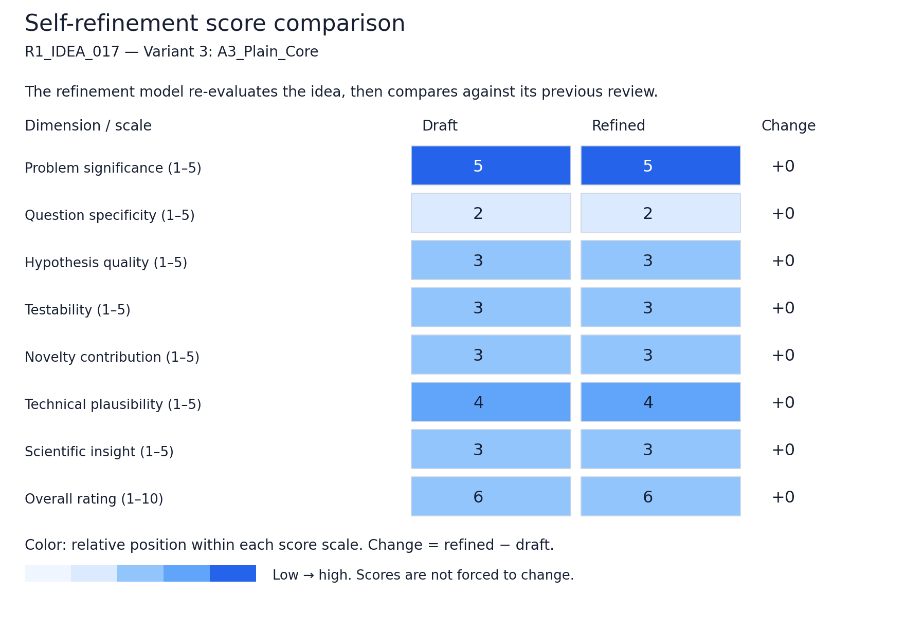

Changed score dimensions: none.

### Score justifications (draft / refined)

**Problem significance**

```json
{
  "draft": {
    "score": 5.0,
    "justification": "Industrial anomaly detection is a critical application with significant economic and safety implications. The specific challenge of few-shot learning in this domain is a major bottleneck, making the problem highly significant."
  },
  "refined": {
    "score": 5.0,
    "justification": "Industrial anomaly detection is a critical application with significant economic and safety implications. The specific challenge of few-shot learning in this domain is a major bottleneck, making the problem highly significant."
  }
}
```

**Question specificity**

```json
{
  "draft": {
    "score": 2.0,
    "justification": "The idea is currently a broad research direction. It identifies the tools (foundation models) and the problem (few-shot anomaly detection) but does not articulate a specific research question, mechanism, or hypothesis to be tested."
  },
  "refined": {
    "score": 2.0,
    "justification": "The idea is currently a broad research direction. It identifies the tools (foundation models) and the problem (few-shot anomaly detection) but does not articulate a specific research question, mechanism, or hypothesis to be tested."
  }
}
```

**Hypothesis quality**

```json
{
  "draft": {
    "score": 3.0,
    "justification": "There is an implicit hypothesis that foundation models improve few-shot performance. However, it is not explicitly stated as a testable prediction (e.g., 'X will outperform Y by Z% because of mechanism A'). It is plausible but currently too generic."
  },
  "refined": {
    "score": 3.0,
    "justification": "There is an implicit hypothesis that foundation models improve few-shot performance. However, it is not explicitly stated as a testable prediction (e.g., 'X will outperform Y by Z% because of mechanism A'). It is plausible but currently too generic."
  }
}
```

**Testability**

```json
{
  "draft": {
    "score": 3.0,
    "justification": "The idea is testable in principle (train on few shots, evaluate on anomalies), but the summary lacks the necessary details to design a concrete experiment. It needs specific baselines, metrics, and data splits to be fully operational."
  },
  "refined": {
    "score": 3.0,
    "justification": "The idea is testable in principle (train on few shots, evaluate on anomalies), but the summary lacks the necessary details to design a concrete experiment. It needs specific baselines, metrics, and data splits to be fully operational."
  }
}
```

**Novelty contribution**

```json
{
  "draft": {
    "score": 3.0,
    "justification": "Applying foundation models to anomaly detection is an active area of research. The novelty would depend on the specific angle (e.g., a new fine-tuning strategy, a new analysis of the feature space, or a specific solution to the category-agnostic gap). As stated, it is a standard application of a new tool to an old problem."
  },
  "refined": {
    "score": 3.0,
    "justification": "Applying foundation models to anomaly detection is an active area of research. The novelty would depend on the specific angle (e.g., a new fine-tuning strategy, a new analysis of the feature space, or a specific solution to the category-agnostic gap). As stated, it is a standard application of a new tool to an old problem."
  }
}
```

**Technical plausibility**

```json
{
  "draft": {
    "score": 4.0,
    "justification": "The reasoning is sound. Foundation models have demonstrated strong generalization capabilities, and using them to learn a 'normal' distribution is a logical approach to few-shot problems. The technical direction is coherent."
  },
  "refined": {
    "score": 4.0,
    "justification": "The reasoning is sound. Foundation models have demonstrated strong generalization capabilities, and using them to learn a 'normal' distribution is a logical approach to few-shot problems. The technical direction is coherent."
  }
}
```

**Scientific insight**

```json
{
  "draft": {
    "score": 3.0,
    "justification": "If executed well, this could reveal how pre-trained representations capture 'normality' and how they generalize to unseen defect types. However, as a summary, it currently suggests a performance improvement study rather than a deep mechanistic insight."
  },
  "refined": {
    "score": 3.0,
    "justification": "If executed well, this could reveal how pre-trained representations capture 'normality' and how they generalize to unseen defect types. However, as a summary, it currently suggests a performance improvement study rather than a deep mechanistic insight."
  }
}
```

**Overall rating**

```json
{
  "draft": {
    "score": 6.0,
    "justification": "This is a moderate research idea. It addresses a significant problem with a plausible and modern approach. However, it currently lacks the specificity of a research question and a clear hypothesis required to be considered a 'strong' or 'exceptional' idea. It reads more like a project proposal title than a defined scientific inquiry. With the addition of specific hypotheses and experimental design, it could easily become a 7 or 8."
  },
  "refined": {
    "score": 6.0,
    "justification": "This is a moderate research idea. It addresses a significant problem with a plausible and modern approach. However, it currently lacks the specificity of a research question and a clear hypothesis required to be considered a 'strong' or 'exceptional' idea. It reads more like a project proposal title than a defined scientific inquiry. With the addition of specific hypotheses and experimental design, it could easily become a 7 or 8."
  }
}
```

## R1_IDEA_017 — Variant 4: B1_Verbose_Elaborate

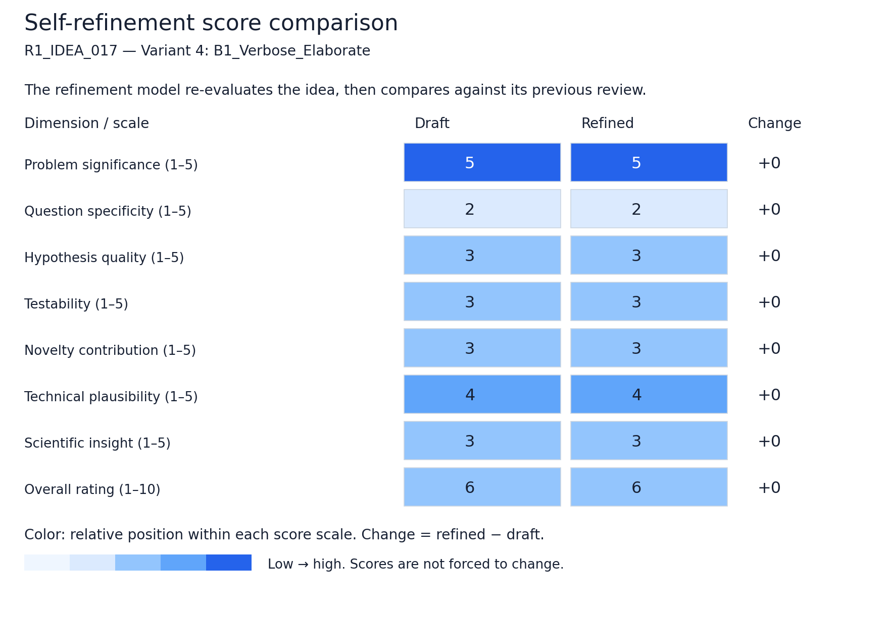

Changed score dimensions: none.

### Score justifications (draft / refined)

**Problem significance**

```json
{
  "draft": {
    "score": 5.0,
    "justification": "Industrial anomaly detection is a critical application with significant economic and safety implications. The specific challenge of few-shot, category-agnostic detection is a major unsolved problem in the field, making the problem highly significant."
  },
  "refined": {
    "score": 5.0,
    "justification": "Industrial anomaly detection is a critical application with significant economic and safety implications. The specific challenge of few-shot, category-agnostic detection is a major unsolved problem in the field, making the problem highly significant."
  }
}
```

**Question specificity**

```json
{
  "draft": {
    "score": 2.0,
    "justification": "The idea identifies the problem and the potential tool (foundation models) but does not define the specific research question or the mechanism of interaction between them. It reads more like a project goal than a specific scientific inquiry."
  },
  "refined": {
    "score": 2.0,
    "justification": "The idea identifies the problem and the potential tool (foundation models) but does not define the specific research question or the mechanism of interaction between them. It reads more like a project goal or a motivation statement than a specific scientific inquiry."
  }
}
```

**Hypothesis quality**

```json
{
  "draft": {
    "score": 3.0,
    "justification": "There is an implicit hypothesis that foundation models' general knowledge can transfer to this specific task. However, it is not explicitly stated as a testable prediction (e.g., 'Method X will outperform Method Y by Z% because of mechanism A')."
  },
  "refined": {
    "score": 3.0,
    "justification": "There is an implicit hypothesis that foundation models' general knowledge can transfer to this specific task. However, it is not explicitly stated as a testable prediction (e.g., 'Method X will outperform Method Y by Z% because of mechanism A'). It is a plausible assumption but lacks the precision of a strong hypothesis."
  }
}
```

**Testability**

```json
{
  "draft": {
    "score": 3.0,
    "justification": "The idea is testable in principle (train a model, evaluate on a dataset), but the lack of a proposed method makes the experimental design vague. It is currently a 'black box' idea: 'use foundation models' is not a testable hypothesis without specifying the 'how'."
  },
  "refined": {
    "score": 3.0,
    "justification": "The idea is testable in principle (train a model, evaluate on a dataset), but the lack of a proposed method makes the experimental design vague. It is currently a 'black box' idea: 'use foundation models' is not a testable hypothesis without specifying the 'how'."
  }
}
```

**Novelty contribution**

```json
{
  "draft": {
    "score": 3.0,
    "justification": "Applying foundation models to anomaly detection is a trending direction. The novelty here lies in the specific focus on the category-agnostic few-shot setting. However, without a novel mechanism, it risks being a straightforward application of existing tools."
  },
  "refined": {
    "score": 3.0,
    "justification": "Applying foundation models to anomaly detection is a trending direction. The novelty here lies in the specific focus on the category-agnostic few-shot setting. However, without a novel mechanism, it risks being a straightforward application of existing tools rather than a discovery of new principles."
  }
}
```

**Technical plausibility**

```json
{
  "draft": {
    "score": 4.0,
    "justification": "The reasoning is logically sound: foundation models learn rich representations that could theoretically generalize to new domains. The assumption that pre-training helps is well-supported by current literature, making the direction technically plausible."
  },
  "refined": {
    "score": 4.0,
    "justification": "The reasoning is logically sound: foundation models learn rich representations that could theoretically generalize to new domains. The assumption that pre-training helps is well-supported by current literature, making the direction technically plausible."
  }
}
```

**Scientific insight**

```json
{
  "draft": {
    "score": 3.0,
    "justification": "If successful, the study could reveal how well general visual priors transfer to industrial anomaly detection. However, as currently framed, it risks being a performance benchmarking exercise rather than a study of underlying mechanisms unless the 'how' is refined."
  },
  "refined": {
    "score": 3.0,
    "justification": "If successfully investigated, the study could reveal how well general visual priors transfer to industrial anomaly detection. However, as currently framed, it risks being a performance benchmarking exercise rather than a study of underlying mechanisms unless the 'how' is refined."
  }
}
```

**Overall rating**

```json
{
  "draft": {
    "score": 6.0,
    "justification": "This is a moderate/borderline idea. It addresses a very important problem and suggests a plausible direction (foundation models), but it currently lacks the specificity of a research question or hypothesis required for a high-impact scientific contribution. It is a strong starting point for a proposal but needs significant refinement to become a rigorous research plan."
  },
  "refined": {
    "score": 6.0,
    "justification": "This is a moderate/borderline idea. It addresses a very important problem and suggests a plausible direction (foundation models), but it currently lacks the specificity of a research question or hypothesis required for a high-impact scientific contribution. It is a strong starting point for a proposal but needs significant refinement to become a rigorous research plan."
  }
}
```

## R1_IDEA_017 — Variant 5: B2_Grand_Narrative

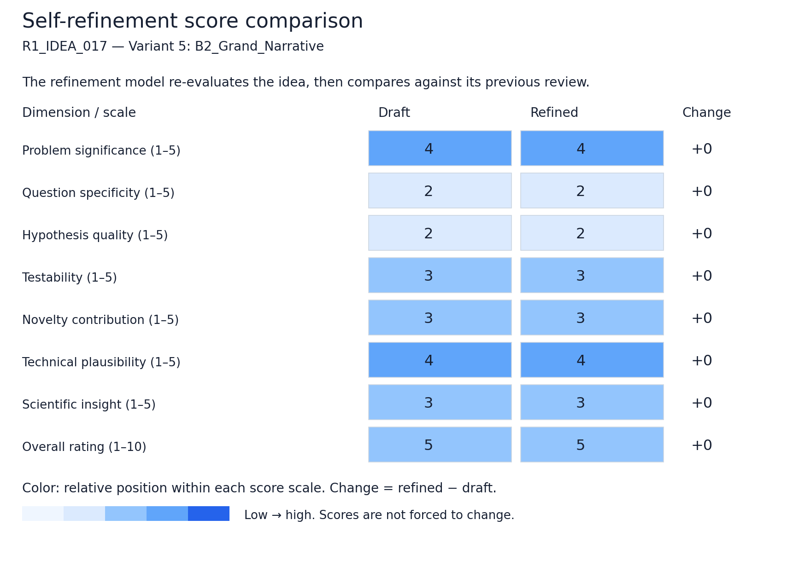

Changed score dimensions: none.

### Score justifications (draft / refined)

**Problem significance**

```json
{
  "draft": {
    "score": 4.0,
    "justification": "Industrial safety inspection is a critical application area. Solving the few-shot, category-agnostic problem would have significant practical impact and addresses a known limitation in current computer vision systems."
  },
  "refined": {
    "score": 4.0,
    "justification": "Industrial safety inspection is a critical application area. Solving the few-shot, category-agnostic problem would have significant practical impact and addresses a known limitation in current computer vision systems. The stakes are high, making the problem meaningful."
  }
}
```

**Question specificity**

```json
{
  "draft": {
    "score": 2.0,
    "justification": "The idea identifies the problem and the tool (foundation models) but does not specify the research question. It is unclear exactly what relationship or mechanism is being investigated beyond 'using foundation models helps.'"
  },
  "refined": {
    "score": 2.0,
    "justification": "The idea identifies the problem and the tool (foundation models) but does not specify the research question. It is unclear exactly what relationship or mechanism is being investigated beyond 'using foundation models helps.' The lack of a defined variable or mechanism makes the question too broad."
  }
}
```

**Hypothesis quality**

```json
{
  "draft": {
    "score": 2.0,
    "justification": "The implicit hypothesis is that foundation models' pre-training helps with data scarcity. While plausible, it is not stated as a testable prediction with specific conditions or expected outcomes that could be falsified."
  },
  "refined": {
    "score": 2.0,
    "justification": "The implicit hypothesis is that foundation models' pre-training helps with data scarcity. While plausible, it is not stated as a testable prediction with specific conditions or expected outcomes that could be falsified. It lacks the nuance to distinguish it from a generic application."
  }
}
```

**Testability**

```json
{
  "draft": {
    "score": 3.0,
    "justification": "The idea is testable in principle (compare foundation model performance vs. baselines on few-shot datasets), but the lack of a defined method or metric makes the specific experimental design unclear."
  },
  "refined": {
    "score": 3.0,
    "justification": "The idea is testable in principle (compare foundation model performance vs. baselines on few-shot datasets), but the lack of a defined method or metric makes the specific experimental design unclear. One could test it, but the 'how' is missing."
  }
}
```

**Novelty contribution**

```json
{
  "draft": {
    "score": 3.0,
    "justification": "Applying foundation models to anomaly detection is an active area of research. The novelty would depend on the specific mechanism proposed to handle the 'category-agnostic' and 'few-shot' constraints simultaneously, which is not yet defined."
  },
  "refined": {
    "score": 3.0,
    "justification": "Applying foundation models to anomaly detection is an active area of research. The novelty would depend on the specific mechanism proposed to handle the 'category-agnostic' and 'few-shot' constraints simultaneously, which is not yet defined. As stated, it is a plausible direction but not a novel insight."
  }
}
```

**Technical plausibility**

```json
{
  "draft": {
    "score": 4.0,
    "justification": "It is technically plausible that large-scale pre-training provides robust feature representations that can be adapted to few-shot scenarios. The reasoning that 'enormous quantity of data helps to learn the general distribution' is sound."
  },
  "refined": {
    "score": 4.0,
    "justification": "It is technically plausible that large-scale pre-training provides robust feature representations that can be adapted to few-shot scenarios. The reasoning that 'enormous quantity of data helps to learn the general distribution' is sound and aligns with current trends in ML."
  }
}
```

**Scientific insight**

```json
{
  "draft": {
    "score": 3.0,
    "justification": "If successful, the study could reveal how foundation model priors interact with domain-specific constraints in safety-critical settings. However, as currently stated, it risks being a simple application study without deep mechanistic insight."
  },
  "refined": {
    "score": 3.0,
    "justification": "If successfully investigated, the study could reveal how foundation model priors interact with domain-specific constraints in safety-critical settings. However, as currently stated, it risks being a simple application study without deep mechanistic insight unless the specific adaptation mechanism is explored."
  }
}
```

**Overall rating**

```json
{
  "draft": {
    "score": 5.0,
    "justification": "The idea addresses a significant problem with a plausible high-level direction, but it currently lacks the specificity of a research question and hypothesis required for a strong scientific contribution. It is a moderate idea that needs significant refinement to become a concrete research proposal."
  },
  "refined": {
    "score": 5.0,
    "justification": "The idea addresses a significant problem with a plausible high-level direction, but it currently lacks the specificity of a research question and hypothesis required for a strong scientific contribution. It is a moderate idea that needs significant refinement to become a concrete research proposal. It sits on the border between a weak application and a strong research direction due to the lack of defined mechanism."
  }
}
```

## R1_IDEA_017 — Variant 6: B3_Over_Confident


Changed score dimensions: none.

### Score justifications (draft / refined)

**Problem significance**

```json
{
  "draft": {
    "score": 5.0,
    "justification": "Industrial anomaly detection is a critical application with significant economic and safety implications. The specific challenge of few-shot, category-agnostic detection is a major unsolved problem in this domain, making the problem highly significant."
  },
  "refined": {
    "score": 5.0,
    "justification": "The problem of industrial anomaly detection is of high practical importance for safety and cost reduction. The specific constraint of 'few-shot' and 'category-agnostic' detection represents a significant unsolved challenge in this domain, making the problem highly significant."
  }
}
```

**Question specificity**

```json
{
  "draft": {
    "score": 2.0,
    "justification": "The idea identifies the problem and the tool (foundation models) but does not specify the research question. It is unclear exactly what relationship is being tested or what specific mechanism is being proposed to bridge the gap between pre-training and few-shot inference."
  },
  "refined": {
    "score": 2.0,
    "justification": "The idea identifies the problem and the tool (foundation models) but does not specify the research question. It is unclear exactly what relationship is being tested or what specific mechanism is being proposed to bridge the gap between pre-training and few-shot inference. It reads more as a motivation than a specific inquiry."
  }
}
```

**Hypothesis quality**

```json
{
  "draft": {
    "score": 3.0,
    "justification": "There is an implicit hypothesis that pre-trained general distributions are superior to task-specific learning for this problem. However, it is not explicitly stated as a testable prediction (e.g., 'Model X will outperform Model Y by Z% under condition A'). It is plausible but currently too broad."
  },
  "refined": {
    "score": 3.0,
    "justification": "There is an implicit hypothesis that pre-trained general distributions are superior to task-specific learning for this problem. However, it is not explicitly stated as a testable prediction (e.g., 'Model X will outperform Model Y by Z% under condition A'). It is plausible but currently too broad to be rigorously falsified without further definition."
  }
}
```

**Testability**

```json
{
  "draft": {
    "score": 3.0,
    "justification": "The idea is testable in principle (train on normal data, test on anomalies), but the lack of a defined method makes the experimental design vague. Without a specific approach, the 'test' is undefined."
  },
  "refined": {
    "score": 3.0,
    "justification": "The idea is testable in principle (train on normal data, test on anomalies), but the lack of a defined method makes the experimental design vague. Without a specific approach, the 'test' is undefined. The hypothesis is testable only if the method is specified."
  }
}
```

**Novelty contribution**

```json
{
  "draft": {
    "score": 3.0,
    "justification": "Applying foundation models to anomaly detection is a growing area. The novelty here depends entirely on the specific method proposed. As stated, it is a reasonable direction but not yet a novel contribution; the contribution will come from *how* the pre-training is leveraged for few-shot learning."
  },
  "refined": {
    "score": 3.0,
    "justification": "Applying foundation models to anomaly detection is a growing area. The novelty here depends entirely on the specific method proposed. As stated, it is a reasonable direction but not yet a novel contribution; the contribution will come from *how* the pre-training is leveraged for few-shot learning."
  }
}
```

**Technical plausibility**

```json
{
  "draft": {
    "score": 4.0,
    "justification": "The reasoning is logically coherent. Foundation models are known to learn robust features, and using them to define a 'normal' manifold is a standard and plausible approach in modern computer vision. The main technical risk is the domain gap, which is a known challenge but not a reason to reject the idea."
  },
  "refined": {
    "score": 4.0,
    "justification": "The reasoning is logically coherent. Foundation models are known to learn robust features, and using them to define a 'normal' manifold is a standard and plausible approach in modern computer vision. The main technical risk is the domain gap, which is a known challenge but not a reason to reject the idea."
  }
}
```

**Scientific insight**

```json
{
  "draft": {
    "score": 3.0,
    "justification": "If successful, this could reveal how well general visual priors transfer to industrial domains under extreme data scarcity. However, as currently framed, it risks being a simple application of existing tools rather than a discovery of new principles."
  },
  "refined": {
    "score": 3.0,
    "justification": "If successful, this could reveal how well general visual priors transfer to industrial domains under extreme data scarcity. However, as currently framed, it risks being a simple application of existing tools rather than a discovery of new principles."
  }
}
```

**Overall rating**

```json
{
  "draft": {
    "score": 6.0,
    "justification": "This is a moderate/borderline idea. It addresses a very important problem and uses a plausible, state-of-the-art tool. However, it currently lacks the specificity of a research question and a defined hypothesis. It reads more like a motivation statement than a concrete research proposal. With the addition of a specific methodological hypothesis and defined evaluation criteria, it could easily become a strong (7-8) or exceptional (9-10) idea."
  },
  "refined": {
    "score": 6.0,
    "justification": "This is a moderate/borderline idea. It addresses a very important problem and uses a plausible, state-of-the-art tool. However, it currently lacks the specificity of a research question and a defined hypothesis. It reads more like a motivation statement than a concrete research proposal. With the addition of a specific methodological hypothesis and defined evaluation criteria, it could easily become a strong (7-8) or exceptional (9-10) idea."
  }
}
```

## R1_IDEA_017 — Variant 7: B4_Novelty

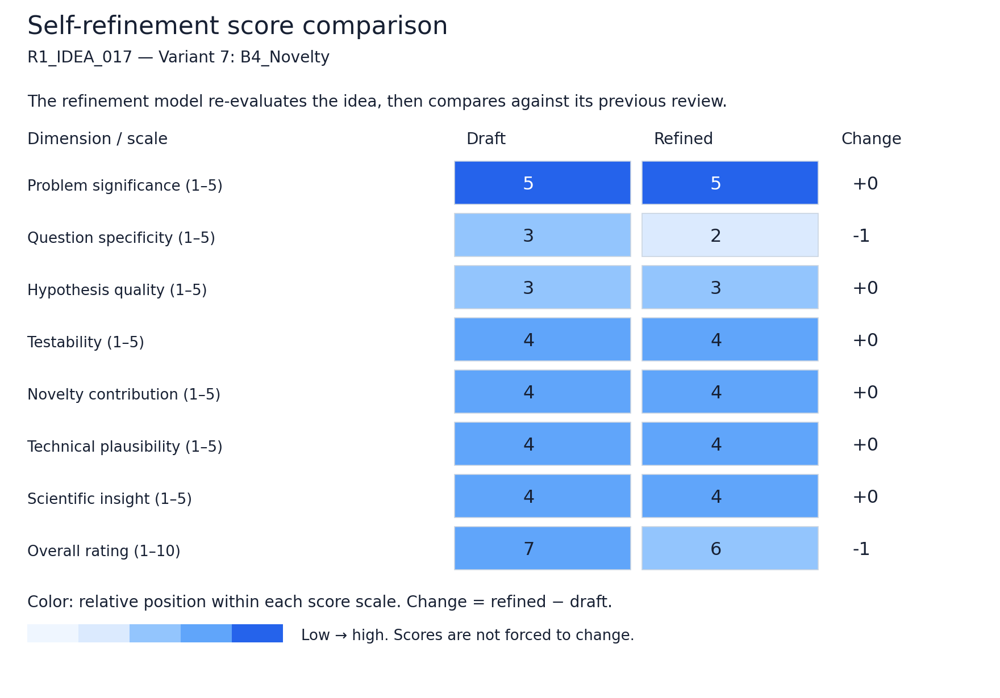

Changed score dimensions: question_specificity, overall_rating.

### Score justifications (draft / refined)

**Problem significance**

```json
{
  "draft": {
    "score": 5.0,
    "justification": "Industrial anomaly detection is a critical application area with significant economic and safety implications. The constraint of having very few abnormal samples is a major real-world bottleneck, making this problem highly significant."
  },
  "refined": {
    "score": 5.0,
    "justification": "Industrial anomaly detection is a critical application area with significant economic and safety implications. The constraint of having very few abnormal samples is a major real-world bottleneck, making this problem highly significant."
  }
}
```

**Question specificity**

```json
{
  "draft": {
    "score": 3.0,
    "justification": "The idea identifies the problem and the tool (foundation models) but lacks a specific research question. It states that foundation models 'offer a fresh framing' but does not define the specific mechanism, algorithm, or relationship being investigated."
  },
  "refined": {
    "score": 2.0,
    "justification": "The idea identifies the problem and the tool (foundation models) but lacks a specific research question. It states that foundation models 'offer a fresh framing' but does not define the specific mechanism, algorithm, or relationship being investigated. It is currently a 'direction' rather than a 'question'."
  }
}
```

**Hypothesis quality**

```json
{
  "draft": {
    "score": 3.0,
    "justification": "There is an implicit hypothesis that pre-trained encoders can learn a sufficient 'normal' distribution to detect anomalies. However, it is not explicitly stated as a testable prediction (e.g., 'We hypothesize that feature distance in the latent space of foundation models will correlate with anomaly severity even with zero abnormal samples')."
  },
  "refined": {
    "score": 3.0,
    "justification": "There is an implicit hypothesis that pre-trained encoders can learn a sufficient 'normal' distribution to detect anomalies. However, it is not explicitly stated as a testable prediction (e.g., 'We hypothesize that feature distance in the latent space of foundation models will correlate with anomaly severity even with zero abnormal samples')."
  }
}
```

**Testability**

```json
{
  "draft": {
    "score": 4.0,
    "justification": "The idea is testable. One can implement a few-shot anomaly detection pipeline using foundation models and evaluate it on standard benchmarks. The comparison against baselines and analysis of failure modes provide clear paths for empirical investigation."
  },
  "refined": {
    "score": 4.0,
    "justification": "The idea is testable. One can implement a few-shot anomaly detection pipeline using foundation models and evaluate it on standard benchmarks. The comparison against baselines and analysis of failure modes provide clear paths for empirical investigation."
  }
}
```

**Novelty contribution**

```json
{
  "draft": {
    "score": 4.0,
    "justification": "Applying foundation models to few-shot anomaly detection is a timely and promising direction. While the general concept of using pre-trained features is known, the specific focus on the 'category-agnostic' and 'few-shot' intersection in industrial settings offers potential for novel insights into generalization limits."
  },
  "refined": {
    "score": 4.0,
    "justification": "Applying foundation models to few-shot anomaly detection is a timely and promising direction. While the general concept of using pre-trained features is known, the specific focus on the 'category-agnostic' and 'few-shot' intersection in industrial settings offers potential for novel insights into generalization limits."
  }
}
```

**Technical plausibility**

```json
{
  "draft": {
    "score": 4.0,
    "justification": "The reasoning is logically sound. Foundation models are known for strong feature extraction, and the premise that they can learn a 'normal' distribution is plausible. The main technical challenge (domain shift) is acknowledged implicitly by the need for 'fresh framing'."
  },
  "refined": {
    "score": 4.0,
    "justification": "The reasoning is logically sound. Foundation models are known for strong feature extraction, and the premise that they can learn a 'normal' distribution is plausible. The main technical challenge (domain shift) is acknowledged implicitly by the need for 'fresh framing'."
  }
}
```

**Scientific insight**

```json
{
  "draft": {
    "score": 4.0,
    "justification": "If successful, this research could reveal how well general-purpose visual priors transfer to specific industrial domains and what the limits of 'zero-shot' or 'few-shot' anomaly detection are. It could provide insights into the nature of 'normality' in visual data."
  },
  "refined": {
    "score": 4.0,
    "justification": "If successful, this research could reveal how well general-purpose visual priors transfer to specific industrial domains and what the limits of 'zero-shot' or 'few-shot' anomaly detection are. It could provide insights into the nature of 'normality' in visual data."
  }
}
```

**Overall rating**

```json
{
  "draft": {
    "score": 7.0,
    "justification": "This is a strong research idea with high significance and clear potential for scientific contribution. It addresses a real-world problem with a modern, plausible approach. However, it currently lacks the specificity of a concrete research question and hypothesis required for a top-tier score. It needs to move from 'this is a good idea' to 'we will investigate X mechanism to prove Y hypothesis'."
  },
  "refined": {
    "score": 6.0,
    "justification": "This is a moderate research idea. It addresses a significant problem with a plausible approach, but it currently lacks the specificity of a concrete research question and hypothesis required for a higher score. It is more of a 'motivation' than a defined 'research plan'. The gap between the high-level proposal and a testable scientific question lowers the rating from 'Strong' to 'Moderate'."
  }
}
```

## R1_IDEA_017 — Variant 8: B5_Application_Impact

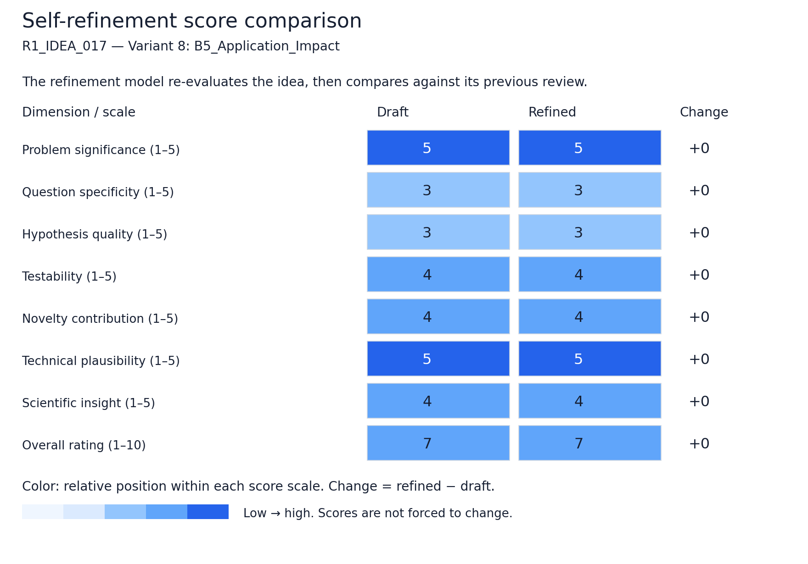

Changed score dimensions: none.

### Score justifications (draft / refined)

**Problem significance**

```json
{
  "draft": {
    "score": 5.0,
    "justification": "Industrial safety inspection is a critical application area. Solving the few-shot, category-agnostic problem would have significant practical value, reducing the need for massive labeled datasets in safety-critical environments."
  },
  "refined": {
    "score": 5.0,
    "justification": "Industrial safety inspection is a critical application area. Solving the few-shot, category-agnostic problem would have significant practical value, reducing the need for massive labeled datasets in safety-critical environments and enabling deployment in scenarios with rare defects."
  }
}
```

**Question specificity**

```json
{
  "draft": {
    "score": 3.0,
    "justification": "The idea identifies the domain and the general approach (foundation models) but lacks a precise research question. It states a motivation ('may be relevant') rather than a testable relationship or specific mechanism to be investigated."
  },
  "refined": {
    "score": 3.0,
    "justification": "The idea identifies the domain and the general approach (foundation models) but lacks a precise research question. It states a motivation ('may be relevant') rather than a testable relationship or specific mechanism to be investigated. The definition of 'category-agnostic' is ambiguous."
  }
}
```

**Hypothesis quality**

```json
{
  "draft": {
    "score": 3.0,
    "justification": "The implicit hypothesis is that foundation models generalize better to few-shot industrial anomaly detection. While plausible, it is not explicitly stated as a prediction that could be falsified (e.g., 'We hypothesize that feature alignment in the latent space of foundation models will reduce false positives by X% compared to autoencoders')."
  },
  "refined": {
    "score": 3.0,
    "justification": "The implicit hypothesis is that foundation models generalize better to few-shot industrial anomaly detection. While plausible, it is not explicitly stated as a prediction that could be falsified (e.g., 'We hypothesize that feature alignment in the latent space of foundation models will reduce false positives by X% compared to autoencoders')."
  }
}
```

**Testability**

```json
{
  "draft": {
    "score": 4.0,
    "justification": "The idea is highly testable. One can easily design experiments comparing foundation-based methods against baselines on standard datasets under few-shot constraints. The metrics (accuracy, AUC) are well-defined in the field."
  },
  "refined": {
    "score": 4.0,
    "justification": "The idea is highly testable in principle. One can easily design experiments comparing foundation-based methods against baselines on standard datasets under few-shot constraints. The metrics (accuracy, AUC) are well-defined in the field, though the specific 'category-agnostic' protocol needs definition."
  }
}
```

**Novelty contribution**

```json
{
  "draft": {
    "score": 4.0,
    "justification": "Applying foundation models to few-shot anomaly detection is a current trend, but specifically targeting the 'category-agnostic' constraint in industrial safety adds a specific layer of novelty. The potential contribution lies in understanding *why* and *when* foundation models succeed in this specific low-data regime."
  },
  "refined": {
    "score": 4.0,
    "justification": "Applying foundation models to few-shot anomaly detection is a current trend, but specifically targeting the 'category-agnostic' constraint in industrial safety adds a specific layer of novelty. The potential contribution lies in understanding *why* and *when* foundation models succeed in this specific low-data regime, rather than just applying them."
  }
}
```

**Technical plausibility**

```json
{
  "draft": {
    "score": 5.0,
    "justification": "The reasoning is logically sound. Foundation models are known for learning general representations, and anomaly detection relies on learning the distribution of normal data. The combination is technically feasible and aligns with current research directions."
  },
  "refined": {
    "score": 5.0,
    "justification": "The reasoning is logically sound. Foundation models are known for learning general representations, and anomaly detection relies on learning the distribution of normal data. The combination is technically feasible and aligns with current research directions, assuming the domain gap can be managed."
  }
}
```

**Scientific insight**

```json
{
  "draft": {
    "score": 4.0,
    "justification": "If successful, this research could reveal how pre-trained representations capture 'normality' in a way that is robust to domain shifts and data scarcity, providing insights into the generalization capabilities of foundation models beyond standard classification tasks."
  },
  "refined": {
    "score": 4.0,
    "justification": "If successfully investigated, this research could reveal how pre-trained representations capture 'normality' in a way that is robust to domain shifts and data scarcity, providing insights into the generalization capabilities of foundation models beyond standard classification tasks."
  }
}
```

**Overall rating**

```json
{
  "draft": {
    "score": 7.0,
    "justification": "This is a strong research idea with high practical significance and technical plausibility. It addresses a meaningful problem with a reasonable approach. However, it currently lacks the specificity of a concrete hypothesis and a defined research question, which prevents it from being an 'exceptional' (9-10) idea. With a more precise formulation of the mechanism and expected outcomes, it would be excellent."
  },
  "refined": {
    "score": 7.0,
    "justification": "This is a strong research idea with high practical significance and technical plausibility. It addresses a meaningful problem with a reasonable approach. However, it currently lacks the specificity of a concrete hypothesis and a defined research question, which prevents it from being an 'exceptional' (9-10) idea. With a more precise formulation of the mechanism and expected outcomes, it would be excellent."
  }
}
```

## R1_IDEA_017 — Variant 9: C1_Hollow_Shell

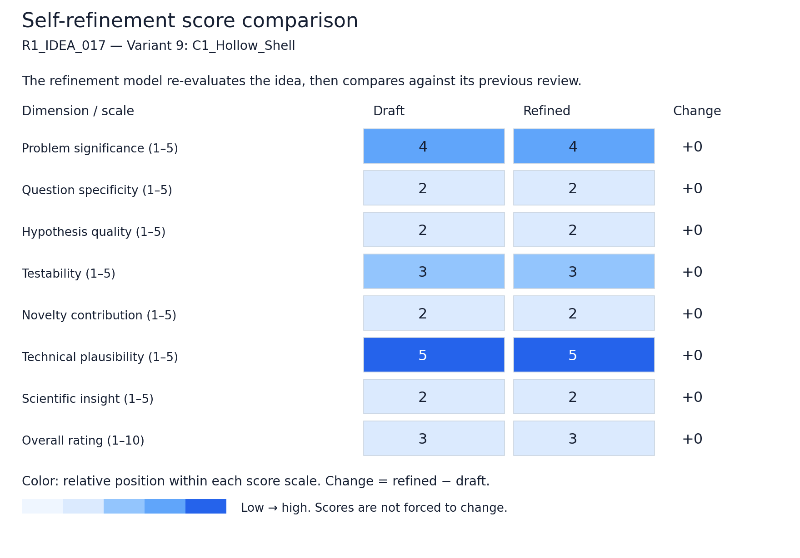

Changed score dimensions: none.

### Score justifications (draft / refined)

**Problem significance**

```json
{
  "draft": {
    "score": 4.0,
    "justification": "Data scarcity in safety-critical applications is a highly significant and meaningful problem. Solving it has direct practical value for industry and public safety."
  },
  "refined": {
    "score": 4.0,
    "justification": "The problem of data scarcity in safety-critical applications is highly significant and has direct practical implications for public safety and industrial efficiency."
  }
}
```

**Question specificity**

```json
{
  "draft": {
    "score": 2.0,
    "justification": "The idea is too broad. It states a general approach (pre-training) without defining the specific research question, the nature of the 'patterns', or the specific conditions of the 'broad settings'."
  },
  "refined": {
    "score": 2.0,
    "justification": "The research question is vague. It states a general approach (pre-training) without defining the specific mechanism, the nature of the patterns, or the specific conditions under which the investigation takes place."
  }
}
```

**Hypothesis quality**

```json
{
  "draft": {
    "score": 2.0,
    "justification": "There is no explicit or implicit hypothesis that distinguishes this from a standard application of transfer learning. It assumes pre-training works without proposing a specific mechanism or prediction to test."
  },
  "refined": {
    "score": 2.0,
    "justification": "There is no explicit hypothesis. The statement is a declarative claim that pre-training helps, which is a known fact, rather than a testable prediction about a specific relationship or mechanism."
  }
}
```

**Testability**

```json
{
  "draft": {
    "score": 3.0,
    "justification": "While the general direction is testable (pre-train then fine-tune), the current description lacks the specificity to design a rigorous experiment. It needs defined baselines, metrics, and data constraints to be truly testable."
  },
  "refined": {
    "score": 3.0,
    "justification": "While the general direction is testable (pre-train and evaluate), the lack of defined variables, baselines, and specific metrics makes it difficult to design a rigorous, falsifiable experiment based solely on this summary."
  }
}
```

**Novelty contribution**

```json
{
  "draft": {
    "score": 2.0,
    "justification": "Applying pre-training to data-scarce domains is a well-trodden path. Without a specific novel mechanism, a new type of pre-training, or a specific insight into *why* it works in this context, the potential for new scientific knowledge is low."
  },
  "refined": {
    "score": 2.0,
    "justification": "Applying pre-training to data-scarce domains is a standard practice. Without a novel mechanism, a new type of pre-training, or a specific insight into a previously unknown limitation, the potential for new scientific knowledge is low."
  }
}
```

**Technical plausibility**

```json
{
  "draft": {
    "score": 5.0,
    "justification": "The core premise is technically sound. Pre-training on large datasets is a standard and effective strategy for improving performance in low-data regimes."
  },
  "refined": {
    "score": 5.0,
    "justification": "The premise is technically sound. Pre-training on large datasets is a proven strategy for learning general representations that can be transferred to downstream tasks with limited data."
  }
}
```

**Scientific insight**

```json
{
  "draft": {
    "score": 2.0,
    "justification": "As currently stated, the idea is an application of an existing method. It would only yield significant scientific insight if it revealed a new limitation of pre-training, a specific type of transferable feature, or a novel interaction between safety data and pre-training dynamics."
  },
  "refined": {
    "score": 2.0,
    "justification": "As stated, the idea is an application of an existing method. It would only yield significant insight if it revealed a new principle, a specific boundary condition, or a novel interaction between safety data and pre-training dynamics."
  }
}
```

**Overall rating**

```json
{
  "draft": {
    "score": 3.0,
    "justification": "The idea addresses a significant problem and proposes a plausible direction, but it is currently too generic to be considered a strong research idea. It reads more like a project goal than a scientific inquiry. It lacks a specific hypothesis, defined mechanisms, or a clear path to novel insight beyond standard transfer learning applications."
  },
  "refined": {
    "score": 3.0,
    "justification": "The idea addresses a significant problem with a plausible method, but it is currently too generic to be considered a strong research idea. It reads more like a project goal or a standard engineering solution than a scientific inquiry with a specific hypothesis. It lacks the specificity and novelty required for a high-impact research proposal."
  }
}
```

## R1_IDEA_017 — Variant 10: C2_Logic_Flawed


Changed score dimensions: none.

### Score justifications (draft / refined)

**Problem significance**

```json
{
  "draft": {
    "score": 5.0,
    "justification": "Industrial anomaly detection is a high-stakes, high-value problem. Solving the few-shot and category-agnostic challenges would significantly reduce costs and deployment time in manufacturing and safety sectors. The potential impact on real-world applications is exceptional."
  },
  "refined": {
    "score": 5.0,
    "justification": "Industrial anomaly detection is a critical, high-stakes problem. Solving the few-shot and category-agnostic challenges would significantly reduce deployment costs and time in manufacturing and safety sectors. The potential impact is exceptional."
  }
}
```

**Question specificity**

```json
{
  "draft": {
    "score": 2.0,
    "justification": "The current text is a motivation statement rather than a specific research question. It states that foundation models 'suggest broader effectiveness' but does not define the precise relationship, the specific variables to be manipulated, or the exact phenomenon to be measured."
  },
  "refined": {
    "score": 2.0,
    "justification": "The input is a high-level motivation statement. It asserts a benefit ('suggesting broader effectiveness') but does not define the precise relationship, the specific variables to be manipulated, or the exact phenomenon to be measured. It lacks a concrete research question."
  }
}
```

**Hypothesis quality**

```json
{
  "draft": {
    "score": 3.0,
    "justification": "The hypothesis is testable in principle (compare foundation models vs. baselines), but the lack of a defined method makes the specific testable claim vague. It is currently a 'direction' rather than a 'falsifiable claim' with specific boundaries."
  },
  "refined": {
    "score": 3.0,
    "justification": "The hypothesis is testable in principle (comparing foundation models to baselines), but the lack of a defined method and specific boundaries makes the claim vague. It is currently a 'direction' rather than a 'falsifiable claim' with clear conditions for success or failure."
  }
}
```

**Testability**

```json
{
  "draft": {
    "score": 3.0,
    "justification": "The idea is testable by designing experiments that compare foundation model-based approaches against traditional few-shot methods on standard industrial datasets. However, the current description does not outline the experimental design, making the testability dependent on future elaboration."
  },
  "refined": {
    "score": 3.0,
    "justification": "The idea is testable by designing experiments on standard industrial datasets, but the current description does not outline the experimental design, metrics, or baselines. Testability depends entirely on future elaboration of the methodology."
  }
}
```

**Novelty contribution**

```json
{
  "draft": {
    "score": 4.0,
    "justification": "Applying foundation models to anomaly detection is a trending and active area, but the specific focus on 'category-agnostic' few-shot scenarios in industrial settings remains a significant open challenge. The potential contribution lies in establishing the limits of generalization in this domain, which is scientifically valuable."
  },
  "refined": {
    "score": 4.0,
    "justification": "Applying foundation models to anomaly detection is an active area, but the specific focus on 'category-agnostic' few-shot scenarios remains a significant open challenge. The potential contribution lies in establishing the limits of generalization in this domain, which is scientifically valuable."
  }
}
```

**Technical plausibility**

```json
{
  "draft": {
    "score": 4.0,
    "justification": "The reasoning is logically coherent. Foundation models are known for learning general representations. It is technically plausible that these representations can be leveraged for anomaly detection, though the domain gap is a known hurdle that makes the idea non-trivial but feasible."
  },
  "refined": {
    "score": 4.0,
    "justification": "The reasoning is logically coherent. Foundation models are known for learning general representations. It is technically plausible that these representations can be leveraged for anomaly detection, though the domain gap is a known hurdle that makes the idea non-trivial but feasible."
  }
}
```

**Scientific insight**

```json
{
  "draft": {
    "score": 4.0,
    "justification": "If successful, this research could reveal fundamental insights into how well general-purpose visual priors transfer to specialized industrial tasks. It could define the boundary between 'general' and 'domain-specific' knowledge in the context of anomaly detection, which is a valuable scientific contribution beyond just a new SOTA method."
  },
  "refined": {
    "score": 4.0,
    "justification": "If successfully investigated, this research could reveal fundamental insights into how well general-purpose visual priors transfer to specialized industrial tasks. It could define the boundary between 'general' and 'domain-specific' knowledge in the context of anomaly detection."
  }
}
```

**Overall rating**

```json
{
  "draft": {
    "score": 7.0,
    "justification": "This is a strong research idea with high significance and plausible technical grounding. It addresses a critical gap in industrial AI. However, it currently lacks the specificity of a concrete research question and hypothesis required for a top-tier score. It is a 'strong' idea that needs refinement into a 'exceptional' one by defining the specific mechanism and testable boundaries."
  },
  "refined": {
    "score": 7.0,
    "justification": "This is a strong research idea with high significance and plausible technical grounding. It addresses a critical gap in industrial AI. However, it currently lacks the specificity of a concrete research question and hypothesis required for a top-tier score. It is a 'strong' idea that needs refinement into an 'exceptional' one by defining the specific mechanism and testable boundaries."
  }
}
```

## R1_IDEA_017 — Variant 11: C3_Substance_Enriched

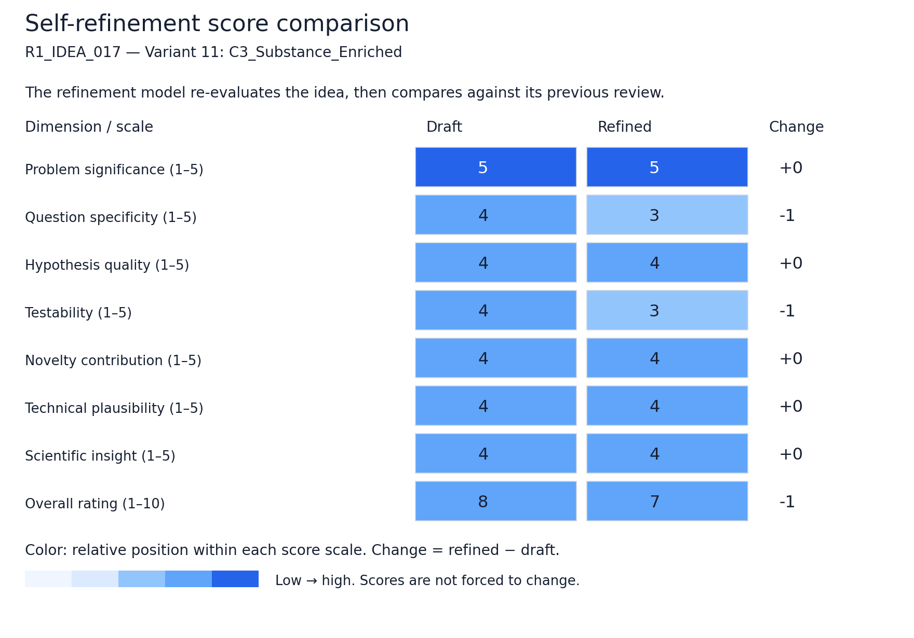

Changed score dimensions: question_specificity, testability, overall_rating.

### Score justifications (draft / refined)

**Problem significance**

```json
{
  "draft": {
    "score": 5.0,
    "justification": "Few-shot anomaly detection is a high-value problem in industrial safety. The specific challenge of category-agnostic detection with limited samples is a major unsolved bottleneck. Understanding the failure modes of foundation models here is highly significant for deploying AI in real-world safety-critical systems."
  },
  "refined": {
    "score": 5.0,
    "justification": "Few-shot anomaly detection is a critical challenge in industrial safety. The specific scenario of category-agnostic detection with limited, diverse normal samples represents a major gap in current AI deployment capabilities. Solving or understanding this is highly valuable for practitioners."
  }
}
```

**Question specificity**

```json
{
  "draft": {
    "score": 4.0,
    "justification": "The idea clearly identifies the relationship between 'semantic diversity' and 'feature separability' and links it to 'texture statistics'. However, the specific operationalization of 'texture statistics' and 'semantic diversity' needs more definition to be fully concrete."
  },
  "refined": {
    "score": 3.0,
    "justification": "While the general direction is clear, the core variables ('fine-grained texture statistics' and 'semantic diversity') are not operationally defined. The idea states a relationship but lacks the specificity to immediately design a rigorous experiment without further conceptual work."
  }
}
```

**Hypothesis quality**

```json
{
  "draft": {
    "score": 4.0,
    "justification": "The hypothesis is strong: it predicts a specific failure mode (degradation of separability) driven by a specific mechanism (lack of texture modeling capacity). It is falsifiable if one can show that texture modeling does not correlate with performance or that other factors are dominant."
  },
  "refined": {
    "score": 4.0,
    "justification": "The hypothesis is non-trivial and mechanistic. It predicts a specific degradation pattern (separability loss) driven by a specific limitation (texture modeling capacity). It is falsifiable, provided the metrics can be defined."
  }
}
```

**Testability**

```json
{
  "draft": {
    "score": 4.0,
    "justification": "The proposed validation route is testable. One can construct datasets with varying normal class diversity, train/evaluate encoders, measure feature separability, and correlate this with metrics of texture modeling. The path to evidence is clear."
  },
  "refined": {
    "score": 3.0,
    "justification": "The idea is testable in principle, but the lack of defined metrics for the key variables ('texture statistics', 'diversity') makes the immediate testability moderate. It requires a significant step of operationalization before a concrete experimental protocol can be executed."
  }
}
```

**Novelty contribution**

```json
{
  "draft": {
    "score": 4.0,
    "justification": "While the general problem is known, the specific hypothesis that 'texture statistics modeling' is the key boundary condition for foundation models in FSAD is a novel and insightful angle. It moves the field from 'does it work?' to 'why does it fail in specific ways?'"
  },
  "refined": {
    "score": 4.0,
    "justification": "Linking the specific failure mode of FSAD to the texture modeling capacity of foundation models is a novel angle. It shifts the focus from 'can we detect anomalies?' to 'what specific statistical properties of the encoder limit its robustness?'"
  }
}
```

**Technical plausibility**

```json
{
  "draft": {
    "score": 4.0,
    "justification": "The reasoning is logically sound. Foundation models are known to learn texture priors, and anomaly detection often relies on subtle deviations in these priors. The connection between high diversity in normal data and the need for precise texture modeling is plausible."
  },
  "refined": {
    "score": 4.0,
    "justification": "The reasoning is plausible. Foundation models are known to have strong texture priors, and anomaly detection often relies on subtle deviations. The intuition that high diversity in normal data exposes weaknesses in texture modeling is technically sound."
  }
}
```

**Scientific insight**

```json
{
  "draft": {
    "score": 4.0,
    "justification": "If validated, this research would provide deep insight into the inductive biases of foundation models and their limitations in safety-critical, data-scarce regimes. It would help define the boundary conditions for using pre-trained encoders in industrial anomaly detection."
  },
  "refined": {
    "score": 4.0,
    "justification": "If successful, this research would reveal a fundamental boundary condition for foundation models in safety-critical, data-scarce regimes. It would provide insight into the inductive biases of these models regarding texture vs. structure."
  }
}
```

**Overall rating**

```json
{
  "draft": {
    "score": 8.0,
    "justification": "This is a strong research idea. It addresses a meaningful problem with a specific, mechanistic hypothesis that goes beyond simple application. The potential for scientific insight regarding the limitations of foundation models is high. It loses a point only because the specific metrics for 'texture statistics' and 'diversity' are not yet defined, which is a common issue in early-stage ideas but needs refinement for execution."
  },
  "refined": {
    "score": 7.0,
    "justification": "This is a strong research idea with high potential for scientific insight. It addresses a meaningful problem with a plausible, mechanistic hypothesis. However, it is rated slightly lower than a 'perfect' 8 or 9 because the core concepts ('texture statistics', 'semantic diversity') are currently too abstract to be immediately actionable without significant operationalization. The idea is promising but requires refinement to move from a 'concept' to a 'testable protocol'."
  }
}
```

## R1_IDEA_017 — Variant 12: H1_Deceptive_Hollow


Changed score dimensions: none.

### Score justifications (draft / refined)

**Problem significance**

```json
{
  "draft": {
    "score": 4.0,
    "justification": "Data scarcity in safety-critical applications is a highly significant and meaningful problem in machine learning. Solving this would have substantial practical value."
  },
  "refined": {
    "score": 4.0,
    "justification": "The problem of data scarcity in safety-critical applications is highly significant and meaningful. Solving this would have substantial practical value and address a known bottleneck in deploying ML in high-stakes environments."
  }
}
```

**Question specificity**

```json
{
  "draft": {
    "score": 1.0,
    "justification": "The idea fails to define a concrete research question. It speaks in broad terms about 'connecting conceptual insight' and 'transformative synthesis' without specifying what is being investigated."
  },
  "refined": {
    "score": 1.0,
    "justification": "The idea fails to define a concrete research question. It speaks in broad, abstract terms about 'connecting conceptual insight' and 'transformative synthesis' without specifying what variable is being manipulated, what outcome is being measured, or what relationship is being investigated."
  }
}
```

**Hypothesis quality**

```json
{
  "draft": {
    "score": 1.0,
    "justification": "There is no explicit or implicit hypothesis that can be supported or contradicted. The claim that this 'could reshape' the field is a prediction of impact, not a scientific hypothesis about a mechanism."
  },
  "refined": {
    "score": 1.0,
    "justification": "There is no explicit or implicit hypothesis that can be supported or contradicted. The text makes a prediction about impact ('could reshape') rather than a scientific hypothesis about a mechanism or relationship between variables."
  }
}
```

**Testability**

```json
{
  "draft": {
    "score": 1.0,
    "justification": "The idea is not currently testable because it lacks specific methods, data definitions, and evaluation criteria. One cannot design an experiment based on this text alone."
  },
  "refined": {
    "score": 1.0,
    "justification": "The idea is not currently testable. Without specific methods, data definitions, or evaluation metrics, one cannot design an experiment to verify or falsify the claims made in the summary."
  }
}
```

**Novelty contribution**

```json
{
  "draft": {
    "score": 2.0,
    "justification": "While the application to safety inspection is relevant, the proposed method (pre-training) is a standard technique. The novelty is claimed to be in the 'agenda' or 'synthesis,' but without details, this is indistinguishable from generic motivation."
  },
  "refined": {
    "score": 2.0,
    "justification": "While the application to safety inspection is relevant, the proposed method (pre-training) is a standard technique. The claimed novelty ('transformative synthesis') is not substantiated by any specific mechanism or insight, making it indistinguishable from generic motivation."
  }
}
```

**Technical plausibility**

```json
{
  "draft": {
    "score": 3.0,
    "justification": "The general direction (using pre-training to solve data scarcity) is technically plausible and aligns with current ML trends. However, the lack of details on *how* this is achieved makes the plausibility of the specific solution uncertain."
  },
  "refined": {
    "score": 3.0,
    "justification": "The general direction of using pre-training to mitigate data scarcity is technically plausible and aligns with current ML trends. However, the lack of details on the specific implementation or domain alignment makes the plausibility of the specific solution uncertain."
  }
}
```

**Scientific insight**

```json
{
  "draft": {
    "score": 1.0,
    "justification": "As stated, the idea does not promise to reveal new mechanisms, principles, or boundary conditions. It promises a 'pathway' and 'reshaping' of thought, which are vague outcomes."
  },
  "refined": {
    "score": 1.0,
    "justification": "As stated, the idea does not promise to reveal new mechanisms, principles, or boundary conditions. It promises a 'pathway' and 'reshaping' of thought, which are vague outcomes that do not constitute scientific insight without a concrete underlying theory."
  }
}
```

**Overall rating**

```json
{
  "draft": {
    "score": 2.0,
    "justification": "While the underlying problem is significant, the research idea itself is too vague to be evaluated as a scientific proposal. It lacks a specific question, hypothesis, or testable mechanism, reading more like a high-level vision statement than a research plan. It falls into the 'Very weak' category because it does not define what is actually being investigated."
  },
  "refined": {
    "score": 2.0,
    "justification": "While the underlying problem is significant, the research idea itself is too vague to be evaluated as a scientific proposal. It lacks a specific question, hypothesis, or testable mechanism, reading more like a high-level vision statement than a research plan. It falls into the 'Very weak' category because it does not define what is actually being investigated."
  }
}
```

## R1_IDEA_017 — Variant 13: H2_Confident_Flaw


Changed score dimensions: none.

### Score justifications (draft / refined)

**Problem significance**

```json
{
  "draft": {
    "score": 4.0,
    "justification": "Few-shot anomaly detection in industrial settings is a highly significant and practical problem with clear real-world applications in safety and quality control. The scarcity of anomaly data is a well-known bottleneck."
  },
  "refined": {
    "score": 4.0,
    "justification": "Few-shot anomaly detection in industrial settings is a highly significant and practical problem with clear real-world applications in safety and quality control. The scarcity of anomaly data is a well-known bottleneck."
  }
}
```

**Question specificity**

```json
{
  "draft": {
    "score": 2.0,
    "justification": "The idea lacks a concrete research question. It states a motivation and a proposed solution but does not define a specific relationship, mechanism, or phenomenon to be investigated. It reads as a proposal to 'apply X to Y' rather than a scientific inquiry."
  },
  "refined": {
    "score": 2.0,
    "justification": "The idea lacks a concrete research question. It states a motivation and a proposed solution but does not define a specific relationship, mechanism, or phenomenon to be investigated. It reads as a proposal to 'apply X to Y' rather than a scientific inquiry."
  }
}
```

**Hypothesis quality**

```json
{
  "draft": {
    "score": 2.0,
    "justification": "The hypothesis is weak because it conflates a proposed solution with a proof of causality. The claim that gains 'can be confidently treated as causal evidence' without isolating variables is not a testable scientific hypothesis but rather a logical fallacy. A strong hypothesis would predict a specific outcome under specific conditions that could be proven wrong."
  },
  "refined": {
    "score": 2.0,
    "justification": "The hypothesis is weak because it conflates a proposed solution with a proof of causality. The claim that gains 'can be confidently treated as causal evidence' without isolating variables is not a testable scientific hypothesis but rather a logical fallacy. A strong hypothesis would predict a specific outcome under specific conditions that could be proven wrong."
  }
}
```

**Testability**

```json
{
  "draft": {
    "score": 2.0,
    "justification": "The idea explicitly suggests avoiding the isolation of variables (dataset composition, boundary cases), which severely undermines testability. Without controlling for confounders, one cannot meaningfully attribute success to the proposed mechanism, making the central claim difficult to validate scientifically."
  },
  "refined": {
    "score": 2.0,
    "justification": "The idea explicitly suggests avoiding the isolation of variables (dataset composition, boundary cases), which severely undermines testability. Without controlling for confounders, one cannot meaningfully attribute success to the proposed mechanism, making the central claim difficult to validate scientifically."
  }
}
```

**Novelty contribution**

```json
{
  "draft": {
    "score": 3.0,
    "justification": "Applying foundation models to anomaly detection is a current trend, not a novel discovery. The potential contribution lies in the specific application to category-agnostic few-shot settings, but the idea does not propose a new mechanism or insight, only an application of existing tools."
  },
  "refined": {
    "score": 3.0,
    "justification": "Applying foundation models to anomaly detection is a current trend, not a novel discovery. The potential contribution lies in the specific application to category-agnostic few-shot settings, but the idea does not propose a new mechanism or insight, only an application of existing tools."
  }
}
```

**Technical plausibility**

```json
{
  "draft": {
    "score": 3.0,
    "justification": "The general direction is plausible; foundation models often generalize well. However, the specific reasoning that pre-training alone solves the few-shot anomaly problem without further adaptation or specific architectural considerations is an oversimplification that may not hold in practice."
  },
  "refined": {
    "score": 3.0,
    "justification": "The general direction is plausible; foundation models often generalize well. However, the specific reasoning that pre-training alone solves the few-shot anomaly problem without further adaptation or specific architectural considerations is an oversimplification that may not hold in practice."
  }
}
```

**Scientific insight**

```json
{
  "draft": {
    "score": 2.0,
    "justification": "If executed as described (simply applying the model and claiming causal superiority), the study would likely yield limited scientific insight. It would confirm that the method works but fail to explain why or under what conditions it fails, which is where true scientific value lies."
  },
  "refined": {
    "score": 2.0,
    "justification": "If executed as described (simply applying the model and claiming causal superiority), the study would likely yield limited scientific insight. It would confirm that the method works but fail to explain why or under what conditions it fails, which is where true scientific value lies."
  }
}
```

**Overall rating**

```json
{
  "draft": {
    "score": 4.0,
    "justification": "The idea addresses a significant problem and proposes a plausible direction (foundation models for few-shot detection). However, the scientific quality is severely hampered by the logical fallacy regarding causal evidence and the lack of a specific, testable research question. The claim that one can ignore dataset composition and boundary cases to prove superiority is a major methodological flaw that prevents the idea from being rated higher. It is a 'weak' idea in its current formulation because it prioritizes a conclusion over a rigorous investigation."
  },
  "refined": {
    "score": 4.0,
    "justification": "The idea addresses a significant problem and proposes a plausible direction (foundation models for few-shot detection). However, the scientific quality is severely hampered by the logical fallacy regarding causal evidence and the lack of a specific, testable research question. The claim that one can ignore dataset composition and boundary cases to prove superiority is a major methodological flaw that prevents the idea from being rated higher. It is a 'weak' idea in its current formulation because it prioritizes a conclusion over a rigorous investigation."
  }
}
```

## R1_IDEA_017 — Variant 14: H3_Verbose_Enriched

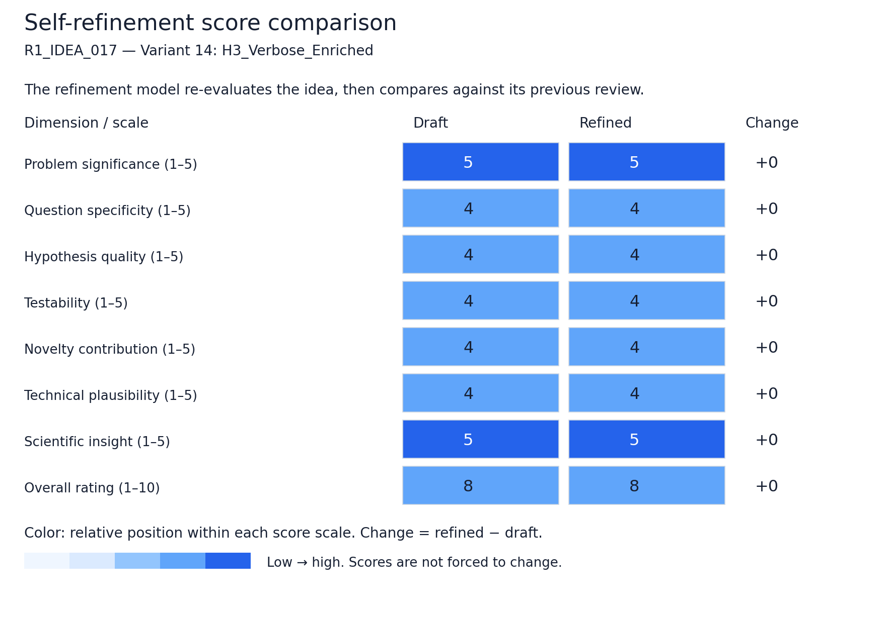

Changed score dimensions: none.

### Score justifications (draft / refined)

**Problem significance**

```json
{
  "draft": {
    "score": 5.0,
    "justification": "The problem of few-shot anomaly detection in industrial settings is critical for safety and cost reduction. Addressing the limitations of foundation models in this specific, data-scarce regime is highly relevant to both the ML community and industry practitioners."
  },
  "refined": {
    "score": 5.0,
    "justification": "Few-shot anomaly detection is a critical bottleneck in industrial automation. Understanding the fundamental limitations of foundation models in this regime is highly significant for both safety and cost-efficiency."
  }
}
```

**Question specificity**

```json
{
  "draft": {
    "score": 4.0,
    "justification": "The idea moves beyond generic application by focusing on 'texture statistics' and 'semantic diversity'. However, the specific operationalization of these terms needs to be more precise to ensure the question is fully concrete."
  },
  "refined": {
    "score": 4.0,
    "justification": "The question is specific regarding the *mechanism* (texture statistics) and the *context* (few-shot, category-agnostic). However, the lack of operational definitions for 'texture statistics' and 'semantic diversity' slightly reduces the precision of the research question."
  }
}
```

**Hypothesis quality**

```json
{
  "draft": {
    "score": 4.0,
    "justification": "The hypothesis that texture modeling is a key boundary condition is specific, plausible, and falsifiable. It distinguishes between general representation learning and specific statistical capabilities."
  },
  "refined": {
    "score": 4.0,
    "justification": "The hypothesis is strong because it identifies a specific mechanism (texture modeling) as a boundary condition. It is falsifiable: if performance correlates with semantic diversity but not with texture metrics, the hypothesis is refuted."
  }
}
```

**Testability**

```json
{
  "draft": {
    "score": 4.0,
    "justification": "The proposed staged design, including ablations and sensitivity analyses, provides a clear path to testing the hypothesis. The main challenge lies in the precise definition of the variables to be manipulated."
  },
  "refined": {
    "score": 4.0,
    "justification": "The proposed staged design, ablations, and sensitivity analyses provide a clear path to testing. The main risk is the ambiguity in measuring the core variables, but the experimental structure itself is robust."
  }
}
```

**Novelty contribution**

```json
{
  "draft": {
    "score": 4.0,
    "justification": "While applying foundation models to anomaly detection is common, investigating the specific role of texture statistics as a limiting factor in few-shot settings offers a novel mechanistic insight rather than just a performance benchmark."
  },
  "refined": {
    "score": 4.0,
    "justification": "While applying foundation models to anomaly detection is common, investigating the specific role of texture statistics as a limiting factor in few-shot settings offers a novel mechanistic insight rather than just a new SOTA benchmark."
  }
}
```

**Technical plausibility**

```json
{
  "draft": {
    "score": 4.0,
    "justification": "The reasoning is logically coherent. Foundation models are known to capture texture, and it is plausible that this capability is crucial for distinguishing subtle anomalies. The proposed experimental controls are standard and feasible."
  },
  "refined": {
    "score": 4.0,
    "justification": "The reasoning is coherent. Foundation models are known to capture texture, and it is plausible that this is crucial for distinguishing subtle anomalies in few-shot settings. The proposed controls are standard."
  }
}
```

**Scientific insight**

```json
{
  "draft": {
    "score": 5.0,
    "justification": "If successful, this research would provide deep insight into the inductive biases of foundation models, specifically revealing when and why they fail in low-data regimes. This contributes to the broader understanding of model capacity vs. data scarcity."
  },
  "refined": {
    "score": 5.0,
    "justification": "If successful, this research would reveal a fundamental principle about the inductive biases of foundation models in low-data regimes, specifically delineating the boundary between semantic and texture-based reasoning."
  }
}
```

**Overall rating**

```json
{
  "draft": {
    "score": 8.0,
    "justification": "This is a strong research idea with high scientific potential. It addresses a significant problem with a specific, testable hypothesis and a rigorous methodological plan. The main area for improvement is the precise operationalization of the core concepts (texture statistics, semantic diversity) to ensure the study yields unambiguous results."
  },
  "refined": {
    "score": 8.0,
    "justification": "This is a strong research idea with high scientific potential. It addresses a meaningful problem with a specific, testable hypothesis and a rigorous methodological plan. The primary area for improvement is the precise operationalization of the core concepts to ensure the study yields unambiguous, quantitative results."
  }
}
```

## R1_IDEA_017 — Variant 15: H4_Ultimate_Hype


Changed score dimensions: none.

### Score justifications (draft / refined)

**Problem significance**

```json
{
  "draft": {
    "score": 4.0,
    "justification": "The problem of few-shot anomaly detection in industrial settings is highly significant due to safety implications and the high cost of data collection. However, the significance is currently framed broadly without detailing the specific constraints that make this a unique scientific challenge."
  },
  "refined": {
    "score": 4.0,
    "justification": "The problem of few-shot anomaly detection in industrial settings is highly significant due to safety implications and the high cost of data collection. The motivation is strong, even if the specific constraints are not fully detailed."
  }
}
```

**Question specificity**

```json
{
  "draft": {
    "score": 2.0,
    "justification": "The idea lacks a specific research question. It states a goal (redefine the frontier) and a motivation (foundation models help) but does not ask a concrete question like 'Does method X improve performance on dataset Y under condition Z?'"
  },
  "refined": {
    "score": 2.0,
    "justification": "The idea lacks a specific research question. It states a goal and a motivation but does not ask a concrete question like 'Does method X improve performance on dataset Y under condition Z?' It remains at the level of a 'research agenda' rather than a defined inquiry."
  }
}
```

**Hypothesis quality**

```json
{
  "draft": {
    "score": 2.0,
    "justification": "The implicit hypothesis is that foundation models are better than current methods for this task. This is a generic assumption rather than a specific, testable prediction about a mechanism or relationship. It does not distinguish *why* or *how* the improvement would occur."
  },
  "refined": {
    "score": 2.0,
    "justification": "The implicit hypothesis is that foundation models are better than current methods for this task. This is a generic assumption rather than a specific, testable prediction about a mechanism or relationship. It does not distinguish *why* or *how* the improvement would occur, making it difficult to falsify."
  }
}
```

**Testability**

```json
{
  "draft": {
    "score": 2.0,
    "justification": "Without a proposed method or specific experimental design, the idea is not currently testable. One cannot design an experiment to verify a claim that is merely a 'research agenda' or 'bold opportunity' without knowing the proposed intervention."
  },
  "refined": {
    "score": 2.0,
    "justification": "Without a proposed method or specific experimental design, the idea is not currently testable. One cannot design an experiment to verify a claim that is merely a 'research agenda' or 'bold opportunity' without knowing the proposed intervention."
  }
}
```

**Novelty contribution**

```json
{
  "draft": {
    "score": 3.0,
    "justification": "Applying foundation models to anomaly detection is a growing field. The novelty here is not yet defined. The idea suggests a 'transformative' potential but does not specify what new scientific knowledge or methodological innovation will be contributed."
  },
  "refined": {
    "score": 3.0,
    "justification": "Applying foundation models to anomaly detection is a growing field. The novelty here is not yet defined. The idea suggests a 'transformative' potential but does not specify what new scientific knowledge or methodological innovation will be contributed beyond the application itself."
  }
}
```

**Technical plausibility**

```json
{
  "draft": {
    "score": 4.0,
    "justification": "The reasoning that foundation models learn general distributions which could help with few-shot learning is technically sound and plausible. The direction makes sense, even if the specific implementation is missing."
  },
  "refined": {
    "score": 4.0,
    "justification": "The reasoning that foundation models learn general distributions which could help with few-shot learning is technically sound and plausible. The direction makes sense, even if the specific implementation is missing."
  }
}
```

**Scientific insight**

```json
{
  "draft": {
    "score": 2.0,
    "justification": "As currently stated, the idea is an application proposal. It has the *potential* for insight, but it does not articulate what specific mechanism, boundary condition, or general principle it aims to discover or validate."
  },
  "refined": {
    "score": 2.0,
    "justification": "As currently stated, the idea is an application proposal. It has the *potential* for insight, but it does not articulate what specific mechanism, boundary condition, or general principle it aims to discover or validate."
  }
}
```

**Overall rating**

```json
{
  "draft": {
    "score": 3.0,
    "justification": "The idea addresses a meaningful problem and proposes a plausible direction (foundation models for few-shot anomaly detection). However, as a research idea summary, it is too vague to be evaluated as a strong scientific proposal. It reads like a grant abstract or a pitch rather than a defined research question. It lacks the specificity, hypothesis, and methodological direction required to be considered 'strong' or 'exceptional' at this stage."
  },
  "refined": {
    "score": 3.0,
    "justification": "The idea addresses a meaningful problem and proposes a plausible direction (foundation models for few-shot anomaly detection). However, as a research idea summary, it is too vague to be evaluated as a strong scientific proposal. It reads like a grant abstract or a pitch rather than a defined research question. It lacks the specificity, hypothesis, and methodological direction required to be considered 'strong' or 'exceptional' at this stage."
  }
}
```
