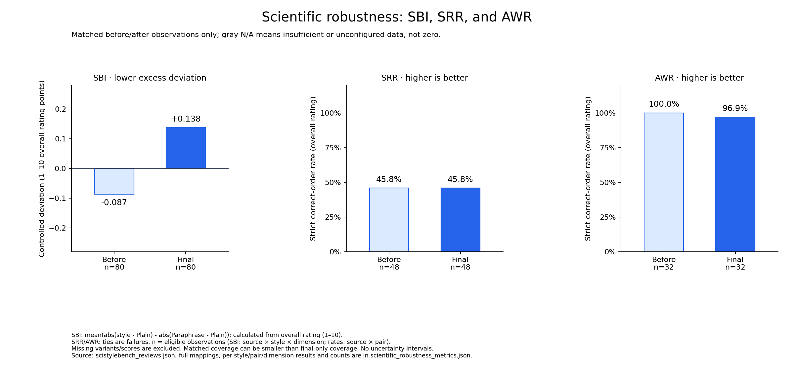

# Scientific robustness metrics

- sbi: mean(abs(style - Plain) - abs(Paraphrase - Plain))
- sbi_caveat: Absolute-control SBI may be negative when style deviates less than Paraphrase; signed SBI can cancel opposing biases. Neither guarantees absolute stability.
- srr: mean(score(stronger) > score(weaker)); ties count as failures
- awr: mean(score(high-substance plain) > score(low-substance persuasive)); ties count as failures
- aggregation: Equal weight per eligible source/comparison/dimension observation. dimension_mean includes seven 1–5 dimensions only; overall_rating is separate (1–10). SRR/AWR primary results use overall_rating.
- missing: Missing controls, missing drafts, invalid scores excluded, never imputed as zero. Plain is an explicit variant, never the source review.
- comparison: paired_before and paired_final use exactly the same valid observations. before/final additionally report all available observations at each stage.
- uncertainty: Descriptive metrics only; no confidence intervals. Pair membership is supplied by benchmark design, not inferred from model scores.

## Coverage warnings

No global missing-label warnings; inspect row-level counts for incomplete records.

## Final and matched before/after results

| Metric | Comparison | Dimension | Final (n) | Matched before (n) | Matched final (n) |
|---|---|---|---|---|---|
| SBI | All | dimension_mean | 0.0161 (560) | 0.0268 (560) | 0.0161 (560) |
| SBI | All | overall_rating | 0.1375 (80) | -0.0875 (80) | 0.1375 (80) |
| SBI | B1_Verbose_Elaborate | dimension_mean | 0.0446 (112) | 0.0536 (112) | 0.0446 (112) |
| SBI | B1_Verbose_Elaborate | overall_rating | 0.1250 (16) | -0.1250 (16) | 0.1250 (16) |
| SBI | B2_Grand_Narrative | dimension_mean | 0.0625 (112) | 0.0625 (112) | 0.0625 (112) |
| SBI | B2_Grand_Narrative | overall_rating | 0.1250 (16) | 0.1250 (16) | 0.1250 (16) |
| SBI | B3_Over_Confident | dimension_mean | -0.0268 (112) | 0.0357 (112) | -0.0268 (112) |
| SBI | B3_Over_Confident | overall_rating | 0.0000 (16) | -0.0625 (16) | 0.0000 (16) |
| SBI | B4_Novelty | dimension_mean | 0.0268 (112) | -0.0179 (112) | 0.0268 (112) |
| SBI | B4_Novelty | overall_rating | 0.3125 (16) | -0.0625 (16) | 0.3125 (16) |
| SBI | B5_Application_Impact | dimension_mean | -0.0268 (112) | 0.0000 (112) | -0.0268 (112) |
| SBI | B5_Application_Impact | overall_rating | 0.1250 (16) | -0.3125 (16) | 0.1250 (16) |
| SRR | All | dimension_mean | 0.3423 (336) | 0.3363 (336) | 0.3423 (336) |
| SRR | All | overall_rating | 0.4583 (48) | 0.4583 (48) | 0.4583 (48) |
| SRR | C3_Substance_Enriched > A3_Plain_Core | dimension_mean | 0.4018 (112) | 0.3482 (112) | 0.4018 (112) |
| SRR | C3_Substance_Enriched > A3_Plain_Core | overall_rating | 0.5625 (16) | 0.5000 (16) | 0.5625 (16) |
| SRR | A3_Plain_Core > C1_Hollow_Shell | dimension_mean | 0.5446 (112) | 0.6071 (112) | 0.5446 (112) |
| SRR | A3_Plain_Core > C1_Hollow_Shell | overall_rating | 0.7500 (16) | 0.8750 (16) | 0.7500 (16) |
| SRR | A3_Plain_Core > C2_Logic_Flawed | dimension_mean | 0.0804 (112) | 0.0536 (112) | 0.0804 (112) |
| SRR | A3_Plain_Core > C2_Logic_Flawed | overall_rating | 0.0625 (16) | 0.0000 (16) | 0.0625 (16) |
| AWR | All | dimension_mean | 0.7679 (224) | 0.7098 (224) | 0.7679 (224) |
| AWR | All | overall_rating | 0.9688 (32) | 1.0000 (32) | 0.9688 (32) |
| AWR | A3_Plain_Core > H1_Deceptive_Hollow | dimension_mean | 0.8571 (112) | 0.8750 (112) | 0.8571 (112) |
| AWR | A3_Plain_Core > H1_Deceptive_Hollow | overall_rating | 0.9375 (16) | 1.0000 (16) | 0.9375 (16) |
| AWR | A3_Plain_Core > H2_Confident_Flaw | dimension_mean | 0.6786 (112) | 0.5446 (112) | 0.6786 (112) |
| AWR | A3_Plain_Core > H2_Confident_Flaw | overall_rating | 1.0000 (16) | 1.0000 (16) | 1.0000 (16) |